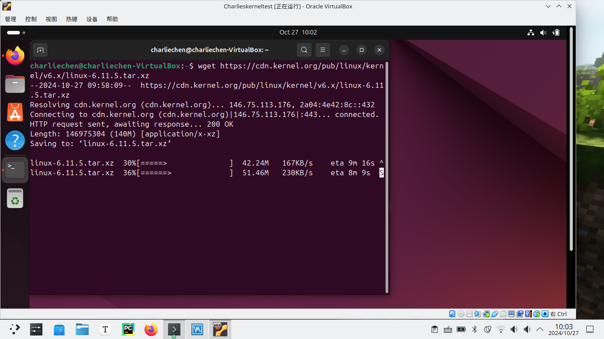
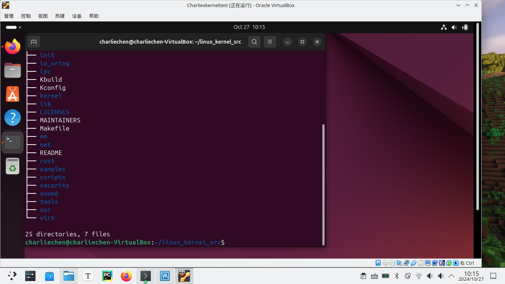
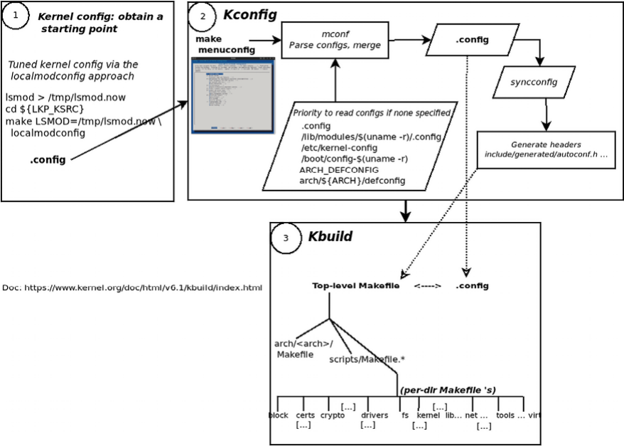
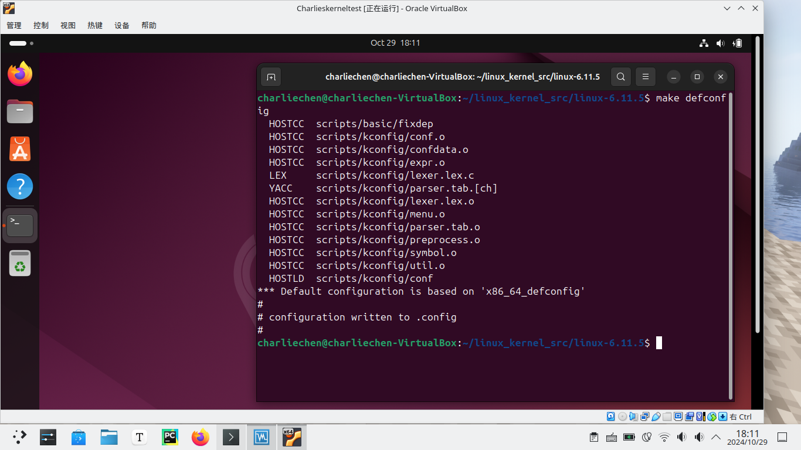
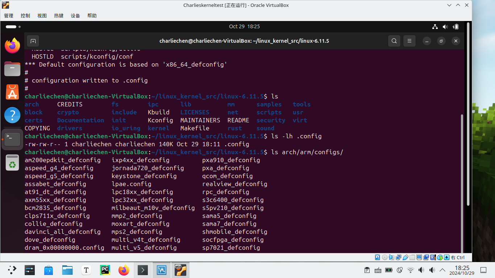
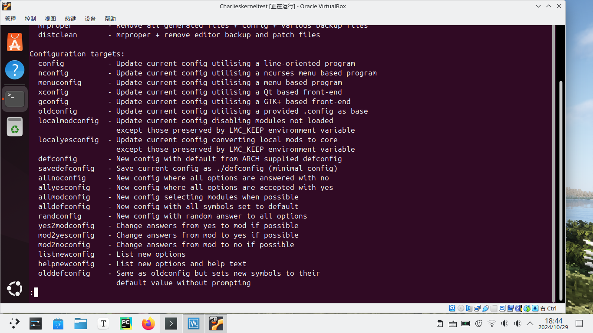
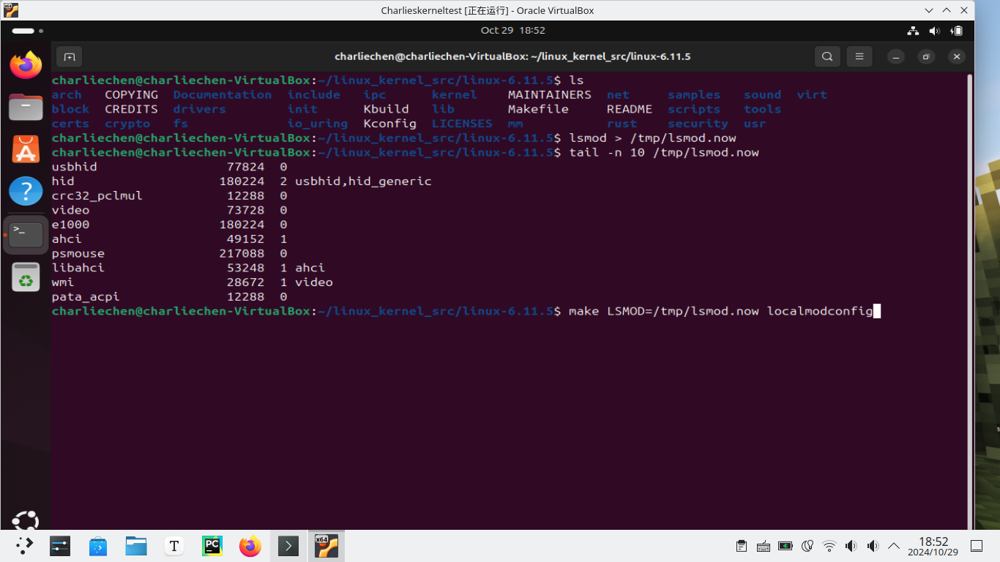
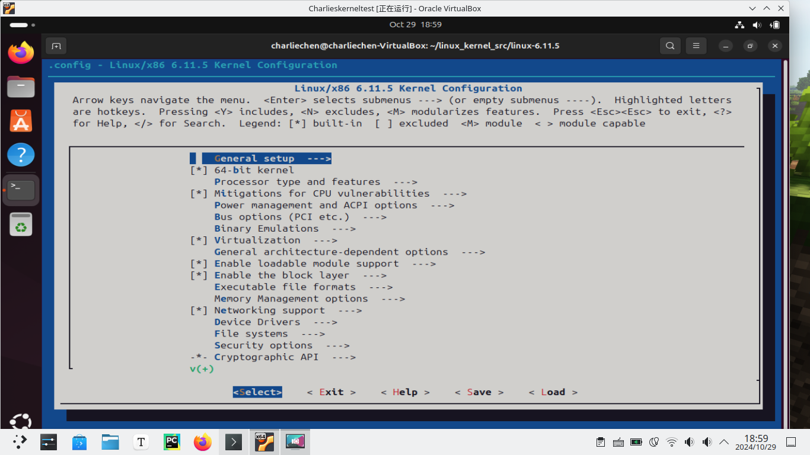
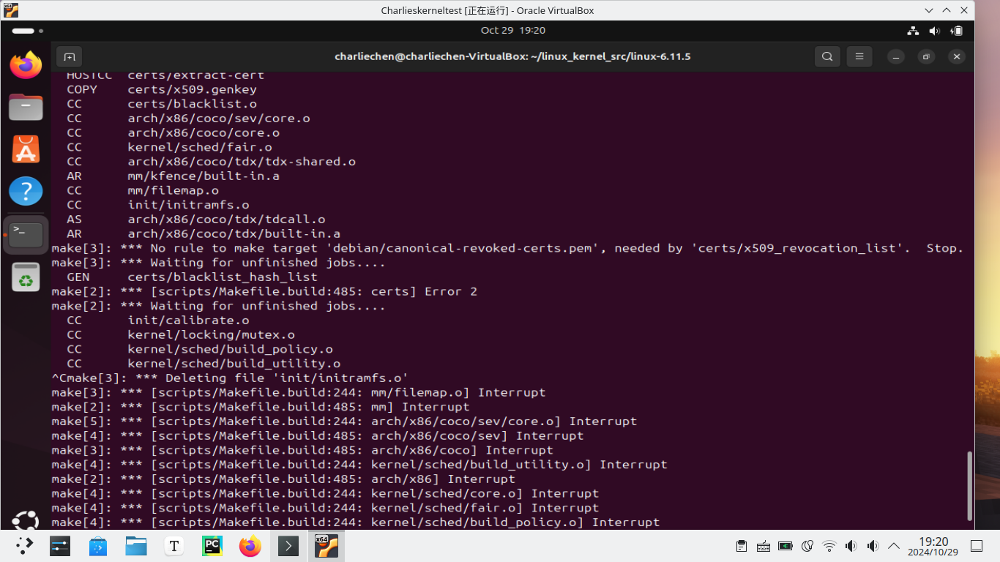

# Linux Kernel Programming

## Before everything begins

​	在我们开始之前，我们首先需要配置一下虚拟环境（笔者不太敢拿自己的笔记本直接冒险，因此，打算配置一个虚拟机梭哈）

- 需要下载VirtualBox作为一个虚拟机的托管平台
- 需要下载Ubuntu镜像（当然这个随你啦）

## 笔者的环境

​	老样子，笔者必须给出自己的环境如何：

> 一个普通的，操作系统为Linux发行版Arch Linux的笔记本：
>
> ```
> ➜  uname -a
> Linux ArchLinux 6.11.5-arch1-1 #1 SMP PREEMPT_DYNAMIC Tue, 22 Oct 2024 18:31:38 +0000 x86_64 GNU/Linux
> ```

## 关于如何在Arch Linux下载Virtual Box

​	如何下载请看AUR（不是），你可以搜索任何你正在使用的包管理，如何下载，比如说笔者的：

```
yay -Ss virtualbox
```

​	当然yay告诉我一大堆，或者拿不准是哪个，看看这个也是可以的：

>https://cn.linux-console.net/?p=22258

## 下载一个镜像，然后开启一个简单的虚拟机

​	这个不想赘述，我认为水平到玩内核的同志们不会搞不定这个！笔者玩的是Ubuntu的内核（因为实在是方便）

## 在Ubuntu虚拟机下东西

​	笔者这里想要强调的是：在之后如果没有特殊说明，一律认为是在虚拟机下操作 :)

​	你所需要做的事情也很简单：

```
sudo apt install bison build-essential flex libncurses5-dev ncurses-dev libelf-dev libssl-dev tar util-linux xz-utils
```

​	这些是你必须要有的，如果想要开发内核的话:)

​	下面需要我们做的就是去内核网站上下载发布的内核，现在我们的内核版本是6.11.5

> [The Linux Kernel Archives](https://www.kernel.org/)

​	复制连接，然后我们使用wget目标内核的tar

```
wget https://cdn.kernel.org/pub/linux/kernel/v6.x/linux-6.11.5.tar.xz
```

​	过一会就可以了，笔者的正在下载。



​	稍等片刻，我想你应该需要起来喝杯茶了（笑

​	下好了，可以把这个压缩包移动到一个你希望用来编译内核的地方，anyway！



​	你可以做

```
tree ./linux-6.11.5 -L 1
```

​	来看看Linux内核到底有那些模块

| 目录        | 含义和作用                                       |
| ----------- | ------------------------------------------------ |
| `arch/`     | 包含特定架构的代码，如 x86、ARM 等。             |
| `block/`    | 块设备相关代码，包括块设备驱动和调度。           |
| `drivers/`  | 驱动程序代码，包含各类设备驱动，如网络、USB 等。 |
| `fs/`       | 文件系统相关代码，包括各种文件系统实现和管理。   |
| `include/`  | 头文件，包含全局共享的结构体、函数原型等定义。   |
| `init/`     | 启动代码和初始化相关函数。                       |
| `kernel/`   | 核心功能，包括进程管理、信号处理、定时器等。     |
| `lib/`      | 内部使用的库函数。                               |
| `mm/`       | 内存管理相关代码，包括内存分配、页面管理等。     |
| `net/`      | 网络协议栈实现，包括网络设备、协议等。           |
| `scripts/`  | 构建和配置相关的脚本。                           |
| `security/` | 安全模块和相关机制的实现。                       |
| `sound/`    | 声音设备和音频驱动相关代码。                     |
| `tools/`    | 各种工具和实用程序。                             |
| `usr/`      | 用户空间代码相关，通常包含初始化代码和设备管理。 |

​	还有一些特殊的文件：

| 文件             | 含义                                                     |
| ---------------- | -------------------------------------------------------- |
| `Makefile`       | 用于构建内核的主 Makefile，定义了编译和链接的规则。      |
| `README`         | 项目的说明文件，通常包含项目概述和编译说明。             |
| `Kconfig`        | 配置文件，用于配置内核编译选项。                         |
| `Kbuild`         | 用于管理内核模块的构建规则，通常与 `Makefile` 配合使用。 |
| `COPYING`        | 内核的许可证信息，通常是 GPL（通用公共许可证）。         |
| `ChangeLog`      | 版本更新日志，记录了内核版本间的变更。                   |
| `Documentation/` | 内核文档目录，包含各种内核相关的文档和说明。             |

​	具体里面每一个模块的含义，我们后面在讨论。下一步就是开始我们的内核配置了。

## 配置我们的内核

​	下一步就是configuration，配置我们的内核了。我们常用的项目构建系统可能是CMake等，但是实际上我们的内核使用的是KConfig配置选项，KBuild生成构建子系统。具体的我们下面介绍：

### 啥是KConfig和KBuild?

​	**KConfig** 是用于配置 Linux 内核编译选项的系统。它通过交互式界面（如 `menuconfig` 或 `xconfig`）允许用户选择功能和模块，并生成相应的配置文件（`.config`），指明哪些选项被启用或禁用。

​	**KBuild** 是内核的构建系统，负责管理和组织源代码的编译过程。它通过 `Kbuild` 文件指定各个模块的构建规则，支持自动处理依赖关系，确保模块和库正确编译并链接。两者协同工作，使得内核配置和编译更加高效和灵活。

​	也就是说我们用户通过GUI的或者是命令行的方式，透过KConfig表达我们的设置意愿，然后使用KBuild来读取这些Config生成最后实际上用来构建的Makefile。就是这个意思。

| Kconfig/KBuild组件                  | 简单的目的说明                                               |
| ----------------------------------- | ------------------------------------------------------------ |
| Kconfig：配置 <br>符号： CONFIG_FOO | 每个内核可配置 FOO 都由一个 CONFIG_FOO 宏表示。根据用户的选择， 宏将解析为 y、m 或 n 之一：<br> **y=yes：这意味着将配置或功能 FOO 构建到内核映像本身中** <br>**m=module：这意味着将其构建为单独的对象，也就是内核模块（.ko 文件）挂到我们的Kernel上** <br>**n=no：这意味着不构建该功能**<br>请注意，CONFIG_FOO 是一个字母数字字符串。我们很快就会看到一种通过 make menuconfig UI 查找精确配置选项名称的方法。 |
| Kconfig:Kconfig.*文件               | 这是定义 CONFIG_FOO 符号的地方。Kconfig 语法指定其类型和依赖关系树。此外，对于基于菜单的配置 UI（通过 make[menu |
| Kbuild:Makefiles                    | Kbuild 系统使用递归 make Makefile 方法。内核源代码树根目录中的 Makefile 称为顶级 Makefile，通常每个子文件夹中都有一个 Makefile 来在那里构建源代码。 查阅可以知道我们的先驱版本6.1 内核源代码总共有 2,700 多个 Makefile！ |
| The .config file                    | 最终，内核配置归结为这个文件；.config 是最终的内核配置文件。它以简单的 ASCII 文本文件的形式生成并存储在内核源代码树根文件夹中。请妥善保管，因为它是您产品的关键部分。请注意，可以通过环境变量 KCONFIG_CONFIG 覆盖配置文件名。 |

​	那具体又是如何映射到makefile上的呢：

​	首先，使用 Kconfig 提供的某种菜单系统配置内核。 通过此菜单系统 UI 选择的内核配置指令被写入几个自动生成的标头和最终的 .config 文件中，使用 CONFIG_FOO={y|m} 语法，或者，CONFIG_FOO 被简单地注释掉（暗示“根本不构建 FOO”）。 

​	接下来，Kbuild 每个组件的 Makefile（通过内核顶层 Makefile 调用）通常指定一个指令 FOO，如下所示： obj-$(CONFIG_FOO) += FOO.o FOO 组件可以是任何东西 - 核心内核功能、设备驱动程序、 文件系统、调试指令等等。回想一下，CONFIG_FOO 的值 可能是 y、m 或不存在；因此，构建要么将组件 FOO 构建到内核中（当其值为 y 时），要么将其构建为模块（当其值为 m 时）！如果注释掉，则根本不会构建，很简单。实际上，上述 Makefile 指令在构建时会扩展为给定内核组件 FOO 的以下三个之一： 

```
obj-y += FOO.o # 将功能 FOO 构建到内核映像中 
obj-m += FOO.o # 将功能 FOO 构建为离散内核 m 
<if CONFIG_FOO is null> # 不构建功能 FOO 
```

### 构建内核配置选择

​	一般而言，配置内核可以有以下几种选择

- 直接使用最默认的类型
- 使用当前系统的配置
- 自己调一个config出来

​	一般而言，config文件的优先级读取顺序是：

- .config
- /lib/modules/$(uname -r)/.config
- /etc/kernel-config
- /boot/config-$(uname -r)
- ARCH_DEFCONFIG (if defined)
- arch/${ARCH}/defconfig



​	这张图可以帮助你理解到底怎么回事。

## 启动！一个好的内核配置的开始

​	这给我们带来了一个非常重要的点：虽然玩弄内核配置作为学习练习是可以的，但对于生产系统来说，至关重要的是，您必须将自定义配置基于经过验证的（已知、测试和工作的）内核配置。

在这里，为了帮助您理解选择内核配置有效起点的细微差别，我们将看到三种获取典型内核配置起点的方法：

- 首先，一种简单（但次优）的方法，您只需模拟现有发行版的内核配置。

- 接下来，一种更优化的方法，您可以根据现有系统的内存内核模块来配置内核。这是 localmodconfig 方法。

- 最后，介绍一下典型嵌入式 Linux 项目应遵循的方法。


### 使用分发配置作为起点的内核配置

​	使用此方法的典型目标系统是 x86_64 桌面或服务器Linux 系统。让我们将内核配置为所有默认值：

```
make mrproper
```

​	当然我们啥也没动，这个表达的是将一切修改的配置都还原回去。我们下一步就是使用提到的defconfig，试试看！

```
make defconfig
```



​	生成的文件就会写入.config文件。

### 通过 localmodconfig 方法调整内核配置

​	**使用此方法的典型目标系统是（通常为 x86_64）桌面或服务器 Linux 系统。**

​	第二种方法比前一种方法更优化 - 当目标是从基于现有运行系统的内核配置开始时，这种方法很适合使用，因此（通常）与桌面或服务器 Linux 系统上的典型默认配置相比相对紧凑。

​	在这里，我们通过简单地将 lsmod 的输出重定向到临时文件，然后将该文件提供给构建，为 Kconfig 系统提供当前在系统上运行的内核模块的快照。这可以通过以下方式实现：

```
lsmod > /tmp/lsmod.now
make LSMOD=/tmp/lsmod.now localmodconfig 
```

​	lsmod会把我们当前使用的模块列表重定向到lsmod.now文件，这个时候make会将列表文件作为我们需要配置的模块进行编译生成config文件。

> 哈？迫不及待想自己写一个模块，bro，等后面的！

### 典型嵌入式 Linux 系统的内核配置 

​	使用此方法的典型目标系统通常是一个小型嵌入式 Linux 系统。这里的目标是从经过验证的（已知、经过测试且有效的）内核配置开始，用于我们的嵌入式 Linux 项目。那么，我们究竟如何实现这一点呢？ 

​	在进一步讨论之前，让我先提一下：这里最初的讨论将展示的是配置（AArch32 或 ARM-32 arch）嵌入式 Linux 的较旧方法；然后我们将看到现代平台的“正确”和现代方法。 有趣的是，至少对于 AArch32，内核代码库本身包含各种知名硬件平台的已知、经过测试且有效的内核配置文件。 假设我们的目标是基于 ARM-32，我们只需选择与我们的嵌入式目标板匹配（或最接近匹配）的内核配置文件。这些内核配置文件存在于 `arch/<arch>/configs/` 目录中的内核源代码树中。配置文件的格式为 `<platform-name>_defconfig`。

​	当然可以列一下：上面的场景为例子，我们可以看看arch/arm/configs下面，这里有一些配置！



​	我看的一本书的建议是：对于这些嵌入式平台，正确的做法是找相近的板子类型，然后做微调。

​	对于现代（32 位和 64 位）ARM 和 PPC 架构，答案是使用现代设备树 (DT) 方法。从根本上讲，DT 包含所有平台硬件拓扑细节。它实际上是电路板或平台布局；它不是代码，而是类似于 VHDL 的硬件平台描述。仍然需要编写 BSP 特定的代码和驱动程序，但现在有一种巧妙的方法可以在启动时由内核“发现”或枚举，当它解析由引导加载程序传递的 DTB（设备树 Blob）时。DTB 是作为构建过程的一部分生成的，通过调用平台的 DT 源文件上的 DTC（设备树编译器）。因此，如今，您会发现大多数嵌入式项目（至少对于 ARM 和 PPC）将有效地使用 DT。

​	它还可以帮助 OEM 和 ODM/供应商使用本质上相同的内核，并在 DT 中内置针对平台/型号的调整。想想来自流行 OEM 的数十种 Android 手机型号，它们大部分都一样，但只有一些硬件差异；一个内核通常就足够了！这大大减轻了维护负担。对于好奇的 DT 源，.dts 文件可以在这里找到：arch/<arch>/boot/dts。对于 AArch64 (ARM-64)，似乎已经很好地吸取了尽可能将特定于板的内容保留在内核代码库之外的教训。将其干净、组织良好且整洁的配置和 DTS 文件夹（arch/arm64/configs/：它只有一个文件，一个 defconfig）与 AArch32 进行比较。与 AArch32 相比，即使是 DTS 文件（查看 arch/arm64/boot/dts/）也组织得很好：

​	如今，项目通常是通过 Yocto 或 Buildroot 等复杂的构建器软件构建和集成的，供应商会提供 BSP 层，然后由构建团队将其集成到产品中。

### 还有更多的config方式吗？

​	有，还真有，咋看呢？make help!



​	你可以看看，大概就是如此

### 准备开始：使用lodmodconfig办法开始配置内核

​	现在（终于！）让我们开始动手，使用 localmodconfig 创建一个合理大小的基本内核配置。 如前所述，当目标是通过将其调整到当前主机来获得基于 x86 的系统上的内核配置的起点时，这种仅使用现有内核模块的方法是一种很好的方法。 不要忘记：现在执行的内核配置适用于您的典型 x86_64 桌面/服务器系统，作为一种学习方法。这种方法仅仅提供了一个起点，甚至可能还不够好。对于实际项目，您必须仔细检查和调整内核配置的每个方面；审核您要支持的精确硬件和软件是关键。

​	同样，对于嵌入式目标，方法是不同的（正如我们在典型嵌入式 Linux 系统的内核配置部分中讨论的那样）。 在继续之前，最好先清理一下源代码树，特别是如果你运行了我们之前进行的实验。请注意：此命令将清除所有内容，包括 .config： make mrproper 如前所述，让我们首先获取当前加载的内核模块的快照，然后通过指定 localmodconfig 目标让构建系统对其进行操作，如下所示： 

```
lsmod > /tmp/lsmod.now cd ${LKP_KSRC} 
make LSMOD=/tmp/lsmod.now localmodconfig
```



​	当然下面就会询问你一大堆配置，笔者的建议是听从，大部分给出的配置没有问题，但是还是注意的看一下，有没有涉及到自己需要单独配置的地方。默认的case是敲Enter直接下一个。

### 通过 make menuconfig UI 调整内核配置

​	好的，太好了，我们现在有一个通过 localmodconfig Makefile 目标为我们生成的初始内核配置文件 (.config)，如上一节中详细所示，这是一个很好的起点。通常，我们现在进一步微调我们的内核配置。执行此操作的一种方法是 - 事实上，推荐的方法 - 通过 menuconfig Makefile 目标。

​	为确保完全干净，请在内核源代码树的根目录中运行 make mrproper 或 make distclean，这在您想要从头开始重新启动内核构建过程时很有用；请放心，总有一天会发生这种情况！请注意，这样做也会删除内核配置文件。如果需要，请在开始之前保留备份。

​	此目标让 Kbuild 系统生成一个非常复杂的基于 C 的程序可执行文件 (scripts/kconfig/mconf)，它向最终用户呈现一个简洁的基于菜单的 UI。在下面的输出块中，当（在我们的内核源代码树的根目录中）我们第一次调用该命令时，Kbuild 系统会构建 mconf 可执行文件并调用它：

```
make menuconfig
```

​	我们之前下好了依赖，就意味着不会出现什么比较大的问题。经过生成，我们会有一个UI菜单




​	下面说说这些UI

- [.]：内核功能，布尔选项。它要么是开启，要么是关闭；显示的‘.’ 将被替换为 * 或空格： 
  - [*]：开启，功能已编译并内置到内核映像中 (y) 
  - [ ]：关闭，根本不构建 (n) 
- <.>：功能可能处于三种状态之一。这称为三态； 显示的 . 将被替换为 \*、M 或空格)：
  -  <\*>：开启，功能已编译并内置到内核映像中 (y)
  -  \<M>：模块，功能已编译并作为内核模块 (LKM) 构建 (m)
  -  < >：关闭，根本不构建 (n) 
- {.}：此配置选项存在依赖项；因此，需要将其构建或编译为模块 (m) 或内核映像 (y)
- 。 -*-：依赖项要求将此项目编译进去 (y)。
-  (...)：提示：需要输入字母数字。在此选项上按下 Enter 键，将出现一个提示框。
-  <菜单名称> --->：随后出现子菜单。在此项上按下 Enter 键可导航至子菜单。

### 验证我们的配置

​	在配置文件中验证内核配置 但是新的内核配置保存在哪里？这很重要，因此需要重复：内核配置写入内核源代码树根目录中的简单 ASCII 文本文件，名为 .config。每个内核配置选项都与 `CONFIG_<FOO>` 形式的配置变量相关联，其中 `<FOO>` 当然被替换为适当的名称。在内部，这些成为构建系统和内核源代码使用的宏。 因此，为了验证我们刚刚修改的内核配置是否会生效，让我们适当地 grep 内核配置文件：

```
$ grep -E "CONFIG_IKCONFIG|CONFIG_LOCALVERSION|CONFIG_HZ_300" .config
CONFIG_LOCALVERSION="-lkp-kernel" 
# CONFIG_LOCALVERSION_AUTO is not set 
CONFIG_IKCONFIG=y 
CONFIG_IKCONFIG_PROC=y 
CONFIG_HZ_300=y 
$ 
```

## 开始构建！

​	从最终用户的角度来看，执行构建非常简单。最简单的形式是，只需确保您位于已配置的内核源代码树的根目录并键入 make。就是这样 - 内核映像和任何内核模块（以及嵌入式系统上的设备树 Blob (DTB) 二进制文件）都将被构建。

​	喝杯咖啡！第一次可能需要一段时间。

​	当然，我们可以将各种 Makefile 目标传递给 make。在命令行上发出的快速 make help 命令会显示很多信息。请记住，我们之前使用过它来查看所有可能的配置目标！当然你可以查make help看看生成什么。这里说一下：执行 make all 将使我们构建前面的三个目标（以 * 符号为前缀的目标）；它们是什么意思？让我们看看：

- vmlinux 与未压缩的内核映像文件的名称匹配。
- 模块目标意味着所有标记为 m（代表模块）的内核配置选项都将在内核源树中构建为内核模块（.ko 文件）（有关内核模块究竟是什么以及如何编写内核模块的详细信息是以下两章的主题）。
- bzImage 是特定于体系结构的内核映像文件。在 x86[_64] 系统上，这是压缩内核映像的名称 - 引导加载程序实际上会将其加载到 RAM 中，在内存中解压缩并启动；实际上，它是（压缩的）内核映像文件。

​	因此，常见问题解答：如果 bzImage 是我们用于启动和初始化系统的实际内核映像文件，那么 vmlinux 是做什么用的？请注意，vmlinux 是未压缩的内核映像文件。它可能很大（甚至非常大，因为存在调试构建期间生成的内核符号）。**虽然我们从不通过 vmlinux 启动，但它仍然很重要 - 事实上是无价的。请保留它以用于内核调试目的**

​	现在，使用 kbuild 系统（内核使用），只需运行 make 就等于 make all。

​	现代 Linux 内核代码库非常庞大。目前估计，最近的内核有大约 2500 万到 3000 万行源代码（SLOC）！因此，构建内核确实是一项非常耗费内存和 CPU 的工作。事实上，有些人将内核构建用作压力测试！（您还应该意识到，在特定的构建运行期间，并非所有代码行都会被编译）。现代 make 实用程序功能强大且支持多进程。我们可以要求它生成多个进程来并行处理构建的不同（不相关）部分，从而提高吞吐量并缩短构建时间。相关选项是 -jn！比如说我的机器上使用的是-j8就行，表达使用8个线程。

由于内核构建期间 CPU 和 RAM 使用率极高，我有时会发现在图形模式下在 VM 中运行构建时，可能会出现错误；系统可能会内存不足，从而引发奇怪的故障，甚至有时会注销！为了缓解这种情况，我建议您在运行级别 3 启动 VM - 或者 systemd 通常称为 multi-user.target - 具有网络但没有图形的多用户模式。为此，您可以从 GRUB 菜单编辑内核命令行并将 3 附加到它或者，如果已经处于图形模式（systemd 称为 graphic.target），您可以使用命令 sudo systemctlisolate multi-user.target 切换到 multi-user.target。

2. 再说一次，由于 RAM 成本低（并且可能下降），只需获得更多 RAM 就是一种很好且快速的性能黑客攻击！

### 解决签名文件问题

​	我们很快就会遇到一个编译问题：



​	那么，问题是什么？在这里，它原来是一个名为 CONFIG_SYSTEM_REVOCATION_KEYS 的内核配置，已添加到最近的 5.x 内核中；

```
grep CONFIG_SYSTEM_REVOCATION_KEYS .config 
CONFIG_SYSTEM_REVOCATION_KEYS="debian/canonical-revoked-certs.pem" 
```

​	至少在 Ubuntu 系统上，这个特定的配置设置似乎会导致构建失败；快速而简单的解决方法是将其关闭。您可以使用以下命令执行此操作： 

```
scripts/config --disable SYSTEM_REVOCATION_KEYS 
```

​	使用 grep 重新检查后就会看到我们成功取消设置了！之后我们的编译竟会行云流水。

### 题外话：一般来说，如果构建失败，要检查什么？

​	检查，然后重新检查，确保你做的所有事情都是正确的；责怪自己，而不是内核（社区/代码）！

- 是否安装了所有必需的和最新的软件包？例如，
- 如果内核配置有 CONFIG_DEBUG_INFO_BTF=y（我的有），则需要安装 pahole 1.16 或更高版本。
- 内核配置正常吗？
- 是硬件问题吗？内部编译器错误：分段错误等错误通常表明这一点；是否分配了足够的 RAM 和交换空间？
- 尝试在另一个 VM 上构建，或者最好在本机 Linux 系统上构建。
- 从头开始（或重新启动）；在内核源代码树的根目录中，执行 make
- mrproper（小心：它将清除所有内容，甚至删除任何 .config 文件），
- 并小心执行所有步骤。
- 当其他一切都失败时，谷歌错误消息！（啥？没法科学上网？孩子stackoverflow吧）

​	构建应该可以顺利运行，不会出现任何错误或警告。有时，编译器会发出警告，但我们会毫不犹豫地忽略它们。如果您在此步骤中遇到编译器错误，从而导致构建失败，该怎么办？我们该如何礼貌地表达？哦，好吧，我们不能——这很可能是您的错，而不是内核社区的错。正如刚才提到的，请检查并重新检查每个步骤，如果其他所有方法都失败，请使用 make mrproper 命令从头开始重做！很多时候，构建内核失败意味着内核配置错误（随机选择的配置可能会发生冲突）、工具链版本过时或修补不正确等。（仅供参考，我们在内核构建的其他技巧部分中介绍了更多非常具体的技巧）。好的，我们假设内核构建步骤有效。压缩的内核映像（此处，对于 x86[_64]，它称为 bzImage）和未压缩的内核映像（vmlinux 文件）已通过将生成的各种目标文件拼接在一起而成功构建，如前面的输出所示 - 前面块中的最后一行证实了这一事实（#3 意味着，对我来说，这是第三次构建内核）。作为构建过程的一部分，kbuild 系统还继续完成所有内核模块的构建。

> 1. 快速提示：如果您想要计算命令执行所需的时间，请在命令前加上 time 命令（因此，此处：time make -j8 2>&1 | tee out.txt）。它可以工作，但 time(1) 实用程序仅提供其后命令所用时间的（非常）粗略的概念。
> 2. 如果您想要准确的 CPU 分析和时间统计，请学习如何使用强大的 perf 实用程序。在这里，您可以使用 perf stat make -j8 ... 命令进行尝试。我建议您在发行版内核上尝试，否则，perf 本身必须为您的自定义内核手动构建。

此外，在前面的输出中，由于我们正在进行并行构建（通过 make -j8，意味着最多八个进程并行执行构建），所有构建进程都写入相同的 stdout 位置 - 控制台或终端窗口。因此，输出可能无序或混乱。假设它进展顺利，确实应该如此，到此步骤终止时，kbuild 系统已生成三个关键文件（众多文件中的三个）。在内核源代码树的根目录中，我们现在将拥有以下文件：

- 未压缩的内核映像文件 vmlinux（用于调试目的）
- 符号地址映射文件 System.map
- 压缩的可启动内核映像文件 bzImage

前两个可以在我们的源码路径下找到，那下一个呢？
