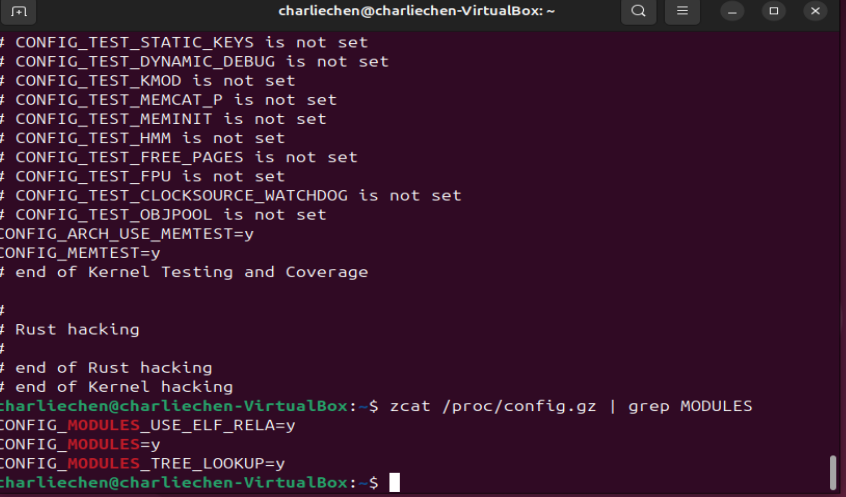
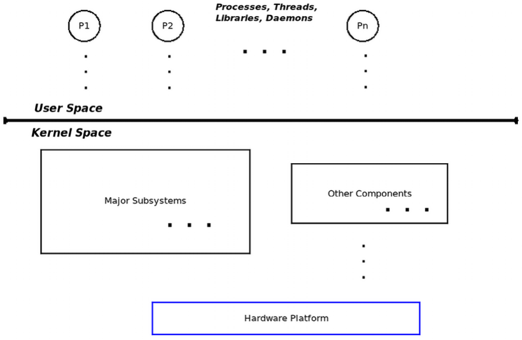
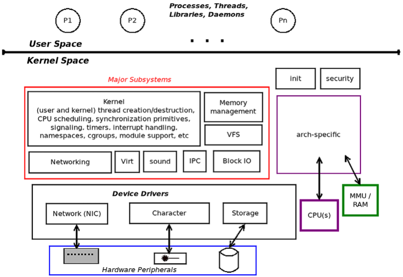
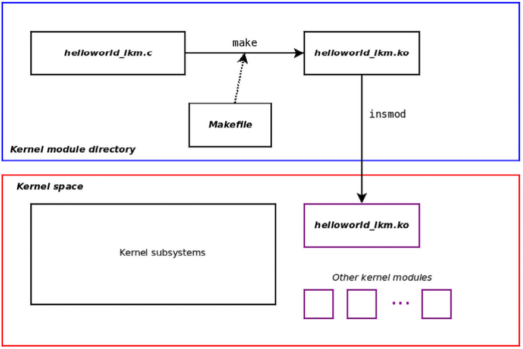

# Linux Kernel Programming 2

## 书写内核框架

​	首先，我们需要确认的是我们的内核是适合写Module的，办法老简单了。

```
zcat /proc/config.gz | grep MODULES
```



> 当然这个事情有点递归了，支持存在config,gz查看的适合还需要你的内核支持 `CONFIG_IKCONFIG` 和 `CONFIG_IKCONFIG_PROC`，不过好在绝大部分的发行版和内核的构建都是支持的

当然，想要开发module，对于本机上的模块，我们需要保证：

- 本机有目标平台上的GCC模块
- 本机上有Linux目标内核的头文件

​	就这样，完事。

## 起手我们需要理解的是：用户态和内核态

​	现代微处理器至少支持两种特权级别的代码执行。举一个现实世界的例子，Intel/AMD x86[-64] 系列支持四种特权级别（它们称之为环级别），**AArch32（ARM-32）微处理器系列支持多达七种模式（ARM 称之为执行模式；其中六种是特权模式，一种是非特权模式）**，

​	AArch64（ARM-64/ARMv8）微处理器系列支持四种异常级别（EL0 至 EL3，其中 EL0 特权级别最低，EL3 特权级别最高）。这里的关键点是，为了平台的安全性和稳定性，在这些处理器上运行的所有现代操作系统都将使用（至少）两个特权级别（或模式）的执行，从而将虚拟地址空间 (VAS) 分成两个明确区分的（虚拟）地址空间： 用户空间：用于在非特权用户模式下运行的应用程序。所有应用程序（进程和线程）都将在此空间中以此特权执行。

​	现在，您可能正在使用浏览器、编辑器、PDF 阅读器、终端、电子邮件客户端等。它们都是应用程序 - 最终是进程和线程；在 Linux 上，它们都在用户空间中以用户模式执行，这是非特权的。 我们很快就会明白特权和非特权的确切含义。 内核空间：用于在特权模式（内核模式）下运行的内核（及其所有组件）。这是操作系统及其内部内容的领域（如驱动程序、网络、I/O 等，包括内核模块）。它们都以操作系统特权运行；

​	实际上，它们可以做任何它们想做的事情！请注意，此特权级别是硬件功能，与是否以 root 身份运行不同（这是纯软件产物）；在许多情况下，以内核特权运行可以被视为以 root 身份有效运行。下图显示了此基本架构：



​	

### 库和系统调用 API

​	用户空间应用程序通常依赖应用程序编程接口 (API) 来执行其工作。库本质上是 API 的集合或存档，允许您使用标准化、编写良好且经过充分测试的接口（并利用常见的好处：不必重新发明轮子、可移植性、标准化等）。

​	其中，所有用户模式 Linux 应用程序（可执行文件）都“自动链接”到一个重要的、始终使用的库中：glibc - GNU 标准 C 库，您将会了解到。但是，库仅在用户模式下可用；内核不使用这些用户模式库（有关此内容的更多信息，请参阅下一章）。库 API 的示例包括众所周知的 printf(3)、scanf(3)、strcmp(3)、malloc(3) 和 free(3)。 （回想一下在线章节“内核工作区设置”中的“使用 Linux 手册页”部分。）

​	现在，一个关键点：如果用户和内核是独立的地址空间并且具有不同的特权级别，那么用户进程（正如我们刚刚了解到的，仅限于用户空间）如何访问内核？简短的回答是：通过系统调用。系统调用是一种特殊的 API，因为它是用户空间进程（或线程）访问内核的唯一合法（同步）方式。换句话说，系统调用是进入内核空间的唯一合法入口点。

​	它们（系统调用）具有从非特权用户模式切换到特权内核模式的内置能力系统调用的示例包括 fork(2)、execve(2)、open(2)、read(2)、write(2)、socket(2)、accept(2)、chmod(2) 等等。

### 内核空间组件

当今的 Linux 内核是一个相当庞大和复杂的庞然大物。在内部，它由几个主要的子系统和多个组件组成。对内核子系统和组件进行广泛列举可得出以下列表：

1. 核心内核：此代码处理任何现代操作系统的典型核心工作，包括（用户和内核）进程和线程创建/销毁、CPU 调度、同步原语、信号、计时器、中断处理、命名空间、cgroup、模块支持、加密等。

2. 内存管理 (MM)：处理所有与内存相关的工作，包括内核和进程虚拟地址空间 (VAS) 的设置和维护。
   VFS（用于文件系统支持）：虚拟文件系统交换机 (VFS) 是 Linux 内核中实现的实际文件系统的抽象层（例如，ext[2|4]、vfat、ntfs、msdos、iso9660、f2fS、ufS 等等）。

3. 块 I/O：实现实际文件 I/O 的代码路径，从文件系统一直到块设备驱动程序以及其间的所有内容（真的，相当多！）都包含在这里。
   网络协议栈：Linux 以其精确、符合 RFC 要求的高质量实现而闻名，这些协议在模型的所有层上都众所周知（和不太知名的）网络协议，其中 TCP/IP 可能是最著名的。
   进程间通信 (IPC) 支持：IPC 机制的实现在这里完成； Linux 支持消息队列、共享内存、信号量（包括较旧的 SysV 和较新的 POSIX）和其他 IPC 机制。

4. 声音支持：实现音频的所有代码都在这里，从固件到驱动程序和编解码器。

5. 虚拟化支持：Linux 已在大型和小型云提供商中变得非常受欢迎，一个重要原因是其高质量、低占用空间的虚拟化引擎，即基于内核的虚拟机 (KVM)。



​	上面的架构说的很明白了：Linux是一个宏内核，在这个巨大的内核内部是多个子系统之间协调的工作。

​	您应该知道的另一个事实是，**这些地址空间当然是虚拟地址空间，而不是物理地址空间。内核将在页面粒度级别将虚拟页面映射到物理页面框架，利用硬件块（例如内存管理单元 (MMU) 和处理器以及转换后备缓冲区 (TLB) 缓存）来提高效率**。它通过使用主内核分页表将内核虚拟页面映射到物理框架 (RAM) 来实现这一点，并且对于每个处于活动状态的用户空间进程，它通过每个进程的单独分页表将进程的（用户）虚拟页面映射到物理页面框架

## 探索 LKM（Linux Kernel Module体系）

​	内核模块是一种提供内核级功能的方法，无需在内核源代码树和静态内核映像中工作。

​	想象一下您必须向 Linux 内核添加支持功能的场景——可能是一个新的设备驱动程序，以便使用某个硬件外围芯片、新的文件系统或新的 I/O 调度程序。实现此目的的一种方法是显而易见的：使用新代码更新内核源代码树，然后对其进行配置、构建、测试和部署。

​	虽然这看起来很简单，但工作量很大——我们编写的代码的每一个更改，无论多么小，都需要我们重建内核映像，然后重新启动系统以进行测试。一定有一个更干净、更简单的方法；事实上，确实有——LKM 框架！

### LKM 框架

​	LKM 框架是一种**编译内核代码的方法，通常在内核源代码树之外，通常称为“树外”代码**，在有限的意义上使其独立于内核，然后将生成的“模块对象”插入或插入内核内存、内核 VAS，让它运行并执行其工作，然后从内核内存中删除（或拔出）。（请注意，LKM 框架也可用于生成树内内核模块，就像我们在构建内核时所做的那样。这里，我们重点介绍树外模块）。

​	内核模块的源代码通常由一个或多个 C 源文件、头文件和一个 Makefile 组成，并（当然是通过 make）构建到内核模块中。内核模块本身只是一个二进制对象文件，而不是二进制可执行文件。在 Linux 2.4 及更早版本中，内核模块的文件名带有 .o 后缀；在现代 2.6 Linux 及更高版本上，它反而具有 .ko（内核对象）后缀。构建后，您可以在运行时将此 .ko 文件（内核模块）插入到实时内核中，从而有效地使其成为内核的一部分。

​	请注意，并非所有内核功能都可以通过 LKM 框架提供。**几个核心功能（例如核心 CPU（任务）调度程序代码、内存管理、信号、计时器、中断管理代码路径、用于驱动引脚控制器、时钟等的平台特定驱动程序）只能在内核本身内开发。**同样，内核模块仅允许访问完整内核 API 和数据变量的子集；稍后将对此进行详细介绍。

​	我们如何插入内核模块呢？答案是通过 insmod 实用程序：



​	蓝色框中，我们调用了内核的Makefile辅助我们生成模块文件，现在，我们调用insmod程序将内核安排到了可以被索引的内存控件当中，现在我们的内核就可以找到这个模块然后启动这个模块内部的代码了

​	内核模块被加载到内核内存中并驻留在其中 - 即内核为其分配的空间区域中的内核 VAS。毫无疑问，它是内核代码并以内核权限运行。这样，我们不必每次都重新配置、重建和重新启动系统。您所要做的就是编辑内核模块的代码，重建它，从内存中删除旧副本（如果存在），然后插入新版本。它节省时间并提高生产力。话虽如此，在现实世界中，即使是内核模块也可能导致系统级崩溃（并且确实会导致），从而需要重新启动系统（在隔离的 VM 中运行有利的另一个原因）。内核模块有利的另一个原因是它们适合动态产品配置。例如，内核模块可以设计为以不同的价格点提供不同的功能；为嵌入式产品生成最终映像的脚本可以根据客户愿意支付的价格安装一组给定的内核模块。这是该技术在调试或故障排除场景中如何利用的另一个示例：内核模块可用于动态生成现有产品的诊断和调试日志。诸如 Kprobes 之类的技术允许这样做

​	实际上，LKM 框架为我们提供了一种动态扩展内核功能的方法，允许我们将实时代码插入（然后从）内核内存中删除。这种随心所欲地插入和拔出内核功能的能力让我们意识到 Linux 内核并不是纯粹的整体式的，它也是模块化的。

### 内核源代码树中的内核模块

事实上，内核模块对象对我们来说并不完全陌生。在我们构建源码内核的时候就已经干过类似的事情了。内核模块作为内核构建过程的一部分并安装了它们。回想一下，这些内核模块是内核源代码的一部分，并且已通过在 tristate 内核菜单配置提示中选择 M 将其配置为模块。它们安装在 /lib/modules/$(uname -r)/ 下的目录中。因此，要了解我们当前运行的 x86_64 Ubuntu 22.04 LTS 客户内核下安装的内核模块，我们可以执行以下操作：

```
lsb_release -a 2>/dev/null |grep Description 
```

​	可以看到存在一大堆的模块！想想看，这是有道理的：分销商无法提前确切知道用户最终会使用什么硬件外围设备（尤其是在 x86 PC 等通用计算机上）。内核模块是一种方便的手段，可以支持大量硬件，而不会使内核映像文件（例如 bzImage 或 Image 文件）变得非常臃肿。我们的 Ubuntu Linux 系统安装的内核模块位于 /lib/modules/$(uname -r)/kernel 目录中

```
ls /lib/modules/5.19.0-45-generic/kernel/
```

​	在这里，查看发行版内核（运行 5.19.0-45-generic 内核的 Ubuntu 22.04 LTS）的 kernel/ 目录的顶层，我们发现其中有许多子文件夹，并且实际上打包了数千个内核模块。我们自己构建的版本当然实际上是选取了小而快的构建。所以少一些！

### modinfo

​	modinfo 实用程序允许我们查看内核模块的二进制映像并提取有关它的一些详细信息您可能会发现内核模块文件已压缩（例如，e1000.ko.xz）；这是一个功能，而不是错误（稍后会详细介绍）。获取有关系统的有用信息（包括有关当前已加载的内核模块的信息）的另一种方法是通过 systool 实用程序。对于已安装的内核模块（有关安装内核模块的详细信息，请参阅下一章中的“系统启动时自动加载模块”部分），执行 `systool -m <module-name> -v `将显示有关它的信息。查找 systool(1) 手册页以了解使用详情。

​	最重要的是，内核模块已成为构建和分发某些类型的内核组件的实用方法，其中设备驱动程序可能是它们最常见的用例。其他用途包括但不限于文件系统、网络防火墙、数据包嗅探器和自定义内核代码。

## 动手！写年轻人的第一个内核模块程序
