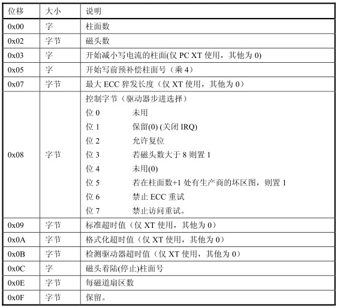

# Linux 内核开发

我们首先来看看内核源码的基本阅读顺序。
先从我们摁下开机键开始！

## I：操作系统硬件加载

&emsp;&emsp;我们首先启动了BIOS，他做完硬件自举检查后，将硬盘的第一个扇区（哪里保存着加载的代码）复制到0x7c00地址处，并且跳转到那个位置上。BIOS怎么知道硬盘的启动区的呢，看结尾的0x55aa这个地方，这个是启动盘的结尾标置。并且将ds数据段寄存器置0x07c0(这是因为是模式下的段基值要左移一位成为真正的段基值)
&emsp;&emsp;下面，赋值ax寄存器为0x9000，存放到es上去，设置循环计数寄存器cx为256，每一次移动一个字（2bytes）。所以这就是说把0x7c00的后512字节的东西扔到0x90000后面去。
&emsp;&emsp;下面，我们就要跳转那里，设置好足够远的栈寄存器的值，这时，ss被设置0x9000，sp是0xFF00，意味着实际上栈顶的为0x9FF00.
&emsp;&emsp;我们规划好了内存空间，下面就是搬运操作系统剩下的代码了。通过触发int 13读取磁盘端口，我们从第六个扇区（前1个分别为bootsect和中间四个setup扇区房贷了0x90000后面）往后面读取240个扇区作为操作系统的代码放到了0x10000的位置。

&emsp;&emsp;下一步，就是将已经加载进来的操作系统摆正位置。在这之前，我们首先检查内存大小，获取显卡数据，获取硬盘的情况之后，放到0x90000的位置上去，将操作系统的代码（如上图所示的0x10000的位置）移动到0x00000零地址处。
&emsp;&emsp;之后，就可以开启保护模式了，保护模式下，我们需要加载GDT和页表等，这是因为在实模式下线性地址就是物理地址，很不方便多进程的管理。所以现在我们要做的就是加载中断描述表和全局描述表，在保护模式下的段基址寄存器不再是段基址而是段选择字（去GDT拿段）。在GDT中现在除了段基质以外还多了一属性的描述。之后就便是设置GDT的一些基本的段选择子
&emsp;&emsp;下一步就是打开A20地址线，防止地址发生回卷导致无法在32位下正常寻址。设置中断描述，将一些常见的中断描述注册进表中。结束。
&emsp;&emsp;现在我们刷新了两个描述表，就需要我们再加载一次。然后就需要我们开始进行分页。将GDT的选择字指向页表的PDE去。为什么要分页呢？这时为了说明我们的线性地址应当如何被MMU解析成物理地址了，前者也就被相对的称之为虚拟地址。随后开启cr0寄存器的分页功能（PE位）。现在我们就是将内存分成一页一页的内存块了。我们将页表PDE和PTE放到操作系统的0地址处开始到之后，并设置cr3寄存器指向页目录表的位置，idtr和gdtr这两个寄存器也就分别指向的是中断描述表和全局描述表的位置上去。
&emsp;&emsp;结束设置，跳转到main函数上，我们的第一行C代码。main里主要是一些初始化。首先设置的是main函数的内存起始区

```C
    memory_end = (1 << 20) + (EXT_MEM << 10);
    memory_end &= 0xfffff000;
    if(memory_end > 16*1024*1024)
        memory_end = 16*1024*1024;
    if(memory_end > 12*1024*1024)
        buffer_memory_end = 4*1024*1024;
    else if(memory_end > 6*1024*1024)
        buffer_memory_end = 2*1024*1024;
    else
        buffer_memory_end = 1*1024*1024;
    main_memory_start = buffer_memory_end;
        
```

意思就是，定义了一些边界的变量，就是这么简单。
&emsp;&emsp;mem_init实际上就是初始化内存，范围就是(main_memory_start, memory_end)，对那些被使用的内存写上一个USED（100），没有的就写上0.实际上就是赋值一张内存的表，使用的时候就分配一张页出去并且标记上USED
&emsp;&emsp;中断初始化就是调用set_trap_gate和set_system_gate（DPL不同，本质上都是set_gate的）
&emsp;&emsp;块设备的初始化是blk_dev_init函数很简单，就是对request结构体数组赋值，我们先看看request结构体是什么先：

```C
struct request{
    int dev; // 设备号， 0标识空闲
    int cmd; // 本次操作是读还是写
    int errors; // 错误次数
    unsigned long sector; // 起始扇区
    unsigned long nr_sector; // 多少个扇区
    char* buffer; // 数据缓冲区，读到的数据放在那里
    struct task_struct* waiting; // 哪个进程发起请求
    struct buffer_head* bh; // 缓冲区头指针
    struct request* next; // 下一个请求
}
```

链表结构还是！我们就是循环的读或者写的处理设备和主机之间的数据
&emsp;&emsp;tty_init完成了控制台的初始化，实际上就是打开串口（串口通信），然后初始化显示模式，实际上就是初始化如何print字符等。
&emsp;&emsp;time_init完成了处暑话时间的操作，实质上就是去读区CMOS芯片返回的东西进行设置的初始化。当然读取到的是BCD码，我们的转化成二进制。
&emsp;&emsp;完成时间，中断等等之前的初始化，就可以考虑进程调度了(sched_init)，我们为了让进程切换可以恢复上下文，需要一个tss_struct结构体保存现场，放在每一个进程的LDT（本地描述符下），一个task_struct维护的是一个进程的所有信息，初始化一个进程数组即可。然后就是打开0x20中断和0x80中断，时钟中断和系统中断。
&emsp;&emsp;缓冲区初始化就是把剩下的缓冲区内存给他初始化掉，实际上就是创建了哈希表和双向链表，从而良好的划分了缓冲区区块。
&emsp;&emsp;开启了hd_init的硬盘读写中断，操作系统现在可以处理硬盘操作了
&emsp;&emsp;下一步就是实现内核态切换到用户态的活，实际上就是调整当前环境的特权级别。
&emsp;&emsp;定时器实现了进程的时间片流失计算，每一次滴答都会处理时间片。当时间片没了就会实现进程的调度。
&emsp;&emsp;我们从fork函数可以知道，我们的系统调用本质上就是去拿着调用号寻找sys_call_table对应的函数指针，然后执行对应的需求，就是这么简单。fork就是开出一段内存然后简单的把父进程的东西赋值给了子进程，copy_mem这部分就是将内存赋值，设置好LDT表，当发生子进程书写的时候就去进行写时复制，父子页表当中的每一个页表都被设置为只读，方便后续触发写时复制的时候进行调整。
&emsp;&emsp;接下来就是加载shell程序，实际上我们需要先加载硬盘，再加载根文件系统。本质上就是将硬盘内的空间用文件的形式进行访问，将文件系统的基本信息放到内存当中去。
&emsp;&emsp;打开终端设备需要使用系统调用open函数，实际上就是在文件描述符数组找到空闲的，然后找到系统文件表里空闲的，将描述符和文件表项对应后找inode填充文件，加载shell就需要调用execve系统调用，解析可执行文件格式，设置寄存器的值方便执行后，就可以开始执行程序了。操作系统至此完成启动，这就是全过程。
&emsp;&emsp;读取键盘输入，走键盘中断，然后处理用户输入的指令（管道传输）就是这样，shell处理指令

# 系统阅读内核

## 三个汇编文件

​		我们的Linux0.11首先开机的时候走的是bootsect.s这个汇编文件，bootsect是boot sectors的简写，也就是说我们这个文件就是操纵启动盘分区的汇编文件。实际上，我们就是在这些汇编文件中加载一些必要的计算机启动信息和操作系统，为我们计算机的工作做好准备。

### bootsect.s

```ASM
;
; SYS_SIZE is the number of clicks (16 bytes) to be loaded.
; 0x3000 is 0x30000 bytes = 196kB, more than enough for current
; 左移1位是因为实模式下的段基址问题
; versions of linux
;
SYSSIZE = 0x3000 ;这里指的是编译链接后给操作系统的内存大小，显然足够
;
;	bootsect.s		(C) 1991 Linus Torvalds
;
; bootsect.s is loaded at 0x7c00 by the bios-startup routines, and moves
; iself out of the way to address 0x90000, and jumps there.
; 说的很清楚了，就是把bios加载代码放到0x7c00的位置上，然后搬运到0x90000
; It then loads 'setup' directly after itself (0x90200), and the system
; at 0x10000, using BIOS interrupts. 
;
; NOTE; currently system is at most 8*65536 bytes long. This should be no
; problem, even in the future. I want to keep it simple. This 512 kB
; kernel size should be enough, especially as this doesn't contain the
; buffer cache as in minix
;
; The loader has been made as simple as possible, and continuos
; read errors will result in a unbreakable loop. Reboot by hand. It
; loads pretty fast by getting whole sectors at a time whenever possible.

.globl begtext, begdata, begbss, endtext, enddata, endbss
.text ;文本段
begtext:
.data ;数据段
begdata:
.bss ; bss段，这里放的是那些未初始化的所以默认放置0的部分数据
begbss:
.text ;还是文本段

SETUPLEN = 4				; nr of setup-sectors setup程序要的4个扇区
BOOTSEG  = 0x07c0			; original address of boot-sector boot扇区加载到的段基址是0x7c0
INITSEG  = 0x9000			; we move boot here - out of the way ; 放到的目标初始化，之后我们的代码要移动到那里并且跳转到那里
SETUPSEG = 0x9020			; setup starts here setup程序从那里开始
SYSSEG   = 0x1000			; system loaded at 0x10000 (65536). ;操作系统放到0x10000的位置
ENDSEG   = SYSSEG + SYSSIZE		; where to stop loading ;加载的最终内存地址大小

; ROOT_DEV:	0x000 - same type of floppy as boot.
;		0x301 - first partition on first drive etc
ROOT_DEV = 0x306

; 读取第一个扇区
entry start ;从这里，x86 汇编指示我们放上entry的代号就是表明我们从这里送进去汇编机器指令
start:
	mov	ax,#BOOTSEG
	mov	ds,ax; ds寄存器存上 0x07c0
	mov	ax,#INITSEG 
	mov	es,ax; es寄存器存上 0x9000的位置
	mov	cx,#256
	sub	si,si
	sub	di,di
	rep ; x86汇编指出，想要调用循环，务必把(e)cx寄存器赋值循环次数
		;这里，我们循环256次，而每一次，我们都要去movw，在Intel体系下，word = 2 bytes,
		;很明了了，移动256 x 2 = 512字节
	movw
	jmpi	go,INITSEG 跳转到Initseg 上，执行go标签
go:	mov	ax,cs ;cs此时存储的就是当前的段基址，depatch给ds, es两个数据段寄存器
	mov	ds,ax
	mov	es,ax
; put stack at 0x9ff00.
	mov	ss,ax			; 我们把内核栈拉到足够远，相信他在之后的init里坚决不会被覆盖之
	mov	sp,#0xFF00		; arbitrary value >>512

; load the setup-sectors directly after the bootblock.
; Note that 'es' is already set up.

； 下面就是加载setup代码，实际上就是读取第二部分的代码
load_setup:
	mov	dx,#0x0000		; drive 0, head 0
	mov	cx,#0x0002		; sector 2, track 0
	mov	bx,#0x0200		; address = 512, in INITSEG InitSeg段0x9000的512偏址
	mov	ax,#0x0200+SETUPLEN	; service 2, nr of sectors 服务号是2，然后读取4个扇区
	int	0x13			; read it 发起0x13中断，这是读取硬盘的中断号
	jnc	ok_load_setup		; ok - continue flag指示成功，走去下一步
	mov	dx,#0x0000
	mov	ax,#0x0000		; reset the diskette
	int	0x13
	j	load_setup ;没成功？再试！

ok_load_setup:

; Get disk drive parameters, specifically nr of sectors/track
; 下面则是返回调用的硬盘信息，首先，设置好AH = 8(Ax寄存器高4位为1000)
; 返回的是ah = 0, al = 0 bl = 驱动器类型（AT还是PS2）cH是最大磁道号的低8位,cl是最大扇区数和最大磁道号高两位
; dh 是最大磁头数, dl是驱动器数量
	mov	dl,#0x00
	mov	ax,#0x0800		; AH=8 is get drive parameters
	int	0x13
	mov	ch,#0x00
	seg cs ; 下一条语句在cs寄存器所指示的段
	mov	sectors,cx ;下面有一个段就是专门存放sector的数据的
	mov	ax,#INITSEG
	mov	es,ax

; Print some inane message
; 操作显卡了
	mov	ah,#0x03		; read cursor pos 设置读取光标位置的系统调用号
	xor	bh,bh
	int	0x10
	
	mov	cx,#24
	mov	bx,#0x0007		; page 0, attribute 7 (normal)
	mov	bp,#msg1		; msg1 ->.byte 13,10
					   ; .ascii "Loading system ..."
					   ; .byte 13,10,13,10
	mov	ax,#0x1301		; write string, move cursor
	int	0x10

; ok, we've written the message, now
; we want to load the system (at 0x10000)

	mov	ax,#SYSSEG
	mov	es,ax		; segment of 0x010000
	call	read_it		;发起阅读system模块的读入, es为参数
	call	kill_motor ; 关闭电动机

; After that we check which root-device to use. If the device is
; defined (!= 0), nothing is done and the given device is used.
; Otherwise, either /dev/PS0 (2,28) or /dev/at0 (2,8), depending
; on the number of sectors that the BIOS reports currently.

	seg cs
	mov	ax,root_dev  ;读取跟设备号码
	cmp	ax,#0
	jne	root_defined
	seg cs
	mov	bx,sectors
	mov	ax,#0x0208		; /dev/ps0 - 1.2Mb
	cmp	bx,#15
	je	root_defined
	mov	ax,#0x021c		; /dev/PS0 - 1.44Mb
	cmp	bx,#18
	je	root_defined
undef_root: ; 都不一样就死机
	jmp undef_root
root_defined:
	seg cs
	mov	root_dev,ax    ; 保存设备号

; after that (everyting loaded), we jump to
; the setup-routine loaded directly after
; the bootblock:

	jmpi	0,SETUPSEG ;跳转到0x90020的地方去， 实际上就是setup的内容了！

; This routine loads the system at address 0x10000, making sure
; no 64kB boundaries are crossed. We try to load it as fast as
; possible, loading whole tracks whenever we can.
;
; in:	es - starting address segment (normally 0x1000)
;
sread:	.word 1+SETUPLEN	; sectors read of current track
head:	.word 0			; current head
track:	.word 0			; current track

read_it:
	mov ax,es
	test ax,#0x0fff
die:	jne die			; es must be at 64kB boundary
	xor bx,bx		; bx is starting address within segment
rp_read:
	mov ax,es
	cmp ax,#ENDSEG		; have we loaded all yet?
	jb ok1_read
	ret
ok1_read:
	seg cs
	mov ax,sectors ;取出扇道数
	sub ax,sread ;减去以读的部分
	mov cx,ax ; 这是未读的部分
	shl cx,#9 ; 乘上512
	add cx,bx
	jnc ok2_read ;没超过64KB就去ok2_read
	je ok2_read
	xor ax,ax
	sub ax,bx
	shr ax,#9
ok2_read:
	call read_track
	mov cx,ax
	add ax,sread
	seg cs
	cmp ax,sectors
	jne ok3_read
	mov ax,#1
	sub ax,head
	jne ok4_read
	inc track
ok4_read:
	mov head,ax
	xor ax,ax
ok3_read:
	mov sread,ax
	shl cx,#9
	add bx,cx
	jnc rp_read
	mov ax,es
	add ax,#0x1000
	mov es,ax
	xor bx,bx
	jmp rp_read

read_track:
	push ax
	push bx
	push cx
	push dx
	mov dx,track
	mov cx,sread
	inc cx
	mov ch,dl
	mov dx,head
	mov dh,dl
	mov dl,#0
	and dx,#0x0100
	mov ah,#2
	int 0x13
	jc bad_rt ; 出错走复位
	pop dx
	pop cx
	pop bx
	pop ax
	ret
bad_rt:	mov ax,#0
	mov dx,#0
	int 0x13
	pop dx
	pop cx
	pop bx
	pop ax
	jmp read_track ;再次尝试

/*
 * This procedure turns off the floppy drive motor, so
 * that we enter the kernel in a known state, and
 * don't have to worry about it later.
 */
kill_motor:
	push dx
	mov dx,#0x3f2
	mov al,#0
	outb
	pop dx
	ret

sectors:
	.word 0

msg1:
	.byte 13,10
	.ascii "Loading system ..."
	.byte 13,10,13,10

.org 508
root_dev:
	.word ROOT_DEV
boot_flag:
	.word 0xAA55

.text
endtext:
.data
enddata:
.bss
endbss:
```

### setup.s

```asm
;
;	setup.s		(C) 1991 Linus Torvalds
; 负责从BIOS那里获取数据然后放到内存当中适当的地方上去
; setup.s is responsible for getting the system data from the BIOS,
; and putting them into the appropriate places in system memory.
; both setup.s and system has been loaded by the bootblock.
; 回一下，我们虽然是跳转到0x90000但是实际上代码从0x90200开始，这中间的部分就是存放这些数据的
; This code asks the bios for memory/disk/other parameters, and
; puts them in a "safe" place: 0x90000-0x901FF, ie where the
; boot-block used to be. It is then up to the protected mode
; system to read them from there before the area is overwritten
; for buffer-blocks.
;

; NOTE; These had better be the same as in bootsect.s;
; 最好一致，毕竟是承接关系！
INITSEG  = 0x9000	; we move boot here - out of the way
SYSSEG   = 0x1000	; system loaded at 0x10000 (65536).
SETUPSEG = 0x9020	; this is the current segment

.globl begtext, begdata, begbss, endtext, enddata, endbss
.text
begtext:
.data
begdata:
.bss
begbss:
.text

; 还是从这里走
entry start
start:

; ok, the read went well so we get current cursor position and save it for
; posterity.
; 保存光标位置
	mov	ax,#INITSEG	; this is done in bootsect already, but...
	mov	ds,ax
	mov	ah,#0x03	; read cursor pos
	xor	bh,bh
	int	0x10		; save it in known place, con_init fetches 控制台初始化还会用到！
	mov	[0],dx		; it from 0x90000. ;放到数据段的num1

; Get memory size (extended mem, kB)
; 获取扩展内存的大小
	mov	ah,#0x88
	int	0x15
	mov	[2],ax ; 放到0x90002的位置

; Get video-card data:
; 获取显式模式
	mov	ah,#0x0f
	int	0x10
	mov	[4],bx		; bh = display page
	mov	[6],ax		; al = video mode, ah = window width

; check for EGA/VGA and some config parameters
; 检查参数并且获取之
	mov	ah,#0x12
	mov	bl,#0x10
	int	0x10
	mov	[8],ax
	mov	[10],bx
	mov	[12],cx

; Get hd0 data
; 拿到第0个硬盘的数据，实际上是中断向量的位置
	mov	ax,#0x0000
	mov	ds,ax
	lds	si,[4*0x41]
	mov	ax,#INITSEG
	mov	es,ax
	mov	di,#0x0080
	mov	cx,#0x10
	rep
	movsb

; Get hd1 data
; 拿到第1个硬盘的数据
	mov	ax,#0x0000
	mov	ds,ax
	lds	si,[4*0x46]
	mov	ax,#INITSEG
	mov	es,ax
	mov	di,#0x0090
	mov	cx,#0x10
	rep
	movsb

; Check that there IS a hd1 :-)

	mov	ax,#0x01500
	mov	dl,#0x81
	int	0x13
	jc	no_disk1
	cmp	ah,#3
	je	is_disk1
no_disk1:
	mov	ax,#INITSEG
	mov	es,ax
	mov	di,#0x0090 ; es:di 0x090090
	mov	cx,#0x10 ;传递10个字节
	mov	ax,#0x00
	rep
	stosb
is_disk1:

; now we want to move to protected mode ...

	cli			; no interrupts allowed ;关中断

; first we move the system to it's rightful place

	mov	ax,#0x0000 ;将操作系统移动到0x00000的位置上，此时前面的部分已经移动到0x90000的位置上了，它的前面是system模块，0x10000- 0x90000的位置，现在我们给他移动到0x00000- 0x90000上对齐，实现内存的复用
	cld			; 'direction'=0, movs moves forward
do_move:
	mov	es,ax		; destination segment
	add	ax,#0x1000
	cmp	ax,#0x9000   ;移动结束了嘛？
	jz	end_move
	mov	ds,ax		; source segment
	sub	di,di
	sub	si,si
	mov 	cx,#0x8000
	rep
	movsw
	jmp	do_move

; then we load the segment descriptors

end_move:
	mov	ax,#SETUPSEG	; right, forgot this at first. didn't work :-)
	mov	ds,ax
	lidt	idt_48		; load idt with 0,0
	lgdt	gdt_48		; load gdt with whatever appropriate

; that was painless, now we enable A20

	call	empty_8042
	mov	al,#0xD1		; command write
	out	#0x64,al
	call	empty_8042
	mov	al,#0xDF		; A20 on
	out	#0x60,al
	call	empty_8042

; well, that went ok, I hope. Now we have to reprogram the interrupts :-(
; we put them right after the intel-reserved hardware interrupts, at
; int 0x20-0x2F. There they won't mess up anything. Sadly IBM really
; messed this up with the original PC, and they haven't been able to
; rectify it afterwards. Thus the bios puts interrupts at 0x08-0x0f,
; which is used for the internal hardware interrupts as well. We just
; have to reprogram the 8259's, and it isn't fun.
; 不得不重新编程！
	mov	al,#0x11		; initialization sequence
	out	#0x20,al		; send it to 8259A-1
	.word	0x00eb,0x00eb		; jmp $+2, jmp $+2
	out	#0xA0,al		; and to 8259A-2
	.word	0x00eb,0x00eb
	mov	al,#0x20		; start of hardware int's (0x20)
	out	#0x21,al
	.word	0x00eb,0x00eb
	mov	al,#0x28		; start of hardware int's 2 (0x28)
	out	#0xA1,al
	.word	0x00eb,0x00eb
	mov	al,#0x04		; 8259-1 is master
	out	#0x21,al
	.word	0x00eb,0x00eb
	mov	al,#0x02		; 8259-2 is slave
	out	#0xA1,al
	.word	0x00eb,0x00eb
	mov	al,#0x01		; 8086 mode for both
	out	#0x21,al
	.word	0x00eb,0x00eb
	out	#0xA1,al
	.word	0x00eb,0x00eb
	mov	al,#0xFF		; mask off all interrupts for now
	out	#0x21,al
	.word	0x00eb,0x00eb
	out	#0xA1,al

; well, that certainly wasn't fun :-(. Hopefully it works, and we don't
; need no steenking BIOS anyway (except for the initial loading :-).
; The BIOS-routine wants lots of unnecessary data, and it's less
; "interesting" anyway. This is how REAL programmers do it.
;
; Well, now's the time to actually move into protected mode. To make
; things as simple as possible, we do no register set-up or anything,
; we let the gnu-compiled 32-bit programs do that. We just jump to
; absolute address 0x00000, in 32-bit protected mode.

	mov	ax,#0x0001	; protected mode (PE) bit
	lmsw	ax		; This is it;
	jmpi	0,8		; jmp offset 0 of segment 8 (cs)

; This routine checks that the keyboard command queue is empty
; No timeout is used - if this hangs there is something wrong with
; the machine, and we probably couldn't proceed anyway.
empty_8042:
	.word	0x00eb,0x00eb
	in	al,#0x64	; 8042 status port
	test	al,#2		; is input buffer full?
	jnz	empty_8042	; yes - loop
	ret

gdt: 
	.word	0,0,0,0		; dummy 哑向量，这是约定！

	.word	0x07FF		; 8Mb - limit=2047 (2048*4096=8Mb)
	.word	0x0000		; base address=0
	.word	0x9A00		; code read/exec
	.word	0x00C0		; granularity=4096, 386

	.word	0x07FF		; 8Mb - limit=2047 (2048*4096=8Mb)
	.word	0x0000		; base address=0
	.word	0x9200		; data read/write
	.word	0x00C0		; granularity=4096, 386

idt_48:
	.word	0			; idt limit=0
	.word	0,0			; idt base=0L

gdt_48:
	.word	0x800		; gdt limit=2048, 256 GDT entries
	.word	512+gdt,0x9	; gdt base = 0X9xxxx
	
.text
endtext:
.data
enddata:
.bss
endbss:
```

​		看下来就是设置了保存了必要的数据和设置gdt表等。

### head.s

​		我们杀回马枪，看到如何加载操作系统的代码：

```asm
/*
 *  linux/boot/head.s
 *
 *  (C) 1991  Linus Torvalds
 */

/*
 *  head.s contains the 32-bit startup code.
 *
 * NOTE!!! Startup happens at absolute address 0x00000000, which is also where
 * the page directory will exist. The startup code will be overwritten by
 * the page directory.
 */
 /*现在我们将会在这里加载页表等*/
.text
.globl _idt,_gdt,_pg_dir,_tmp_floppy_area
_pg_dir:
startup_32:
	; 这里是在加载寄存器
	movl $0x10,%eax
	mov %ax,%ds
	mov %ax,%es
	mov %ax,%fs
	mov %ax,%gs
	lss _stack_start,%esp ;设置系统堆栈
	call setup_idt
	call setup_gdt
	movl $0x10,%eax		; reload all the segment registers
	mov %ax,%ds		; after changing gdt. CS was already
	mov %ax,%es		; reloaded in 'setup_gdt'
	mov %ax,%fs		 ;这是因为进入了保护模式，所有的段基址寄存器都会变化，重新加载
	mov %ax,%gs
	lss _stack_start,%esp
	xorl %eax,%eax
1:	incl %eax		; check that A20 really IS enabled
	movl %eax,0x000000	; loop forever if it isn't
	cmpl %eax,0x100000
	je 1b
/*
 * NOTE! 486 should set bit 16, to check for write-protect in supervisor
 * mode. Then it would be unnecessary with the "verify_area()"-calls.
 * 486 users probably want to set the NE (#5) bit also, so as to use
 * int 16 for math errors.
 */
	movl %cr0,%eax		# check math chip
	andl $0x80000011,%eax	# Save PG,PE,ET
/* "orl $0x10020,%eax" here for 486 might be good */
	orl $2,%eax		# set MP
	movl %eax,%cr0
	call check_x87
	jmp after_page_tables

/*
 * We depend on ET to be correct. This checks for 287/387.
 */
check_x87:
	fninit
	fstsw %ax
	cmpb $0,%al
	je 1f			/* no coprocessor: have to set bits */
	movl %cr0,%eax
	xorl $6,%eax		/* reset MP, set EM */
	movl %eax,%cr0
	ret
.align 2
1:	.byte 0xDB,0xE4		/* fsetpm for 287, ignored by 387 */
	ret

/*
 *  setup_idt
 *
 *  sets up a idt with 256 entries pointing to
 *  ignore_int, interrupt gates. It then loads
 *  idt. Everything that wants to install itself
 *  in the idt-table may do so themselves. Interrupts
 *  are enabled elsewhere, when we can be relatively
 *  sure everything is ok. This routine will be over-
 *  written by the page tables.
 */
setup_idt: ;设置IDT
	lea ignore_int,%edx
	movl $0x00080000,%eax
	movw %dx,%ax		/* selector = 0x0008 = cs */
	movw $0x8E00,%dx	/* interrupt gate - dpl=0, present */

	lea _idt,%edi
	mov $256,%ecx
rp_sidt:
	movl %eax,(%edi)
	movl %edx,4(%edi)
	addl $8,%edi
	dec %ecx
	jne rp_sidt
	lidt idt_descr
	ret

/*
 *  setup_gdt
 *
 *  This routines sets up a new gdt and loads it.
 *  Only two entries are currently built, the same
 *  ones that were built in init.s. The routine
 *  is VERY complicated at two whole lines, so this
 *  rather long comment is certainly needed :-).
 *  This routine will beoverwritten by the page tables.
 */
setup_gdt:
	lgdt gdt_descr
	ret

/*
 * I put the kernel page tables right after the page directory,
 * using 4 of them to span 16 Mb of physical memory. People with
 * more than 16MB will have to expand this.
 */
.org 0x1000
pg0:

.org 0x2000
pg1:

.org 0x3000
pg2:

.org 0x4000
pg3:

.org 0x5000
/*
 * tmp_floppy_area is used by the floppy-driver when DMA cannot
 * reach to a buffer-block. It needs to be aligned, so that it isn't
 * on a 64kB border.
 */
_tmp_floppy_area:
	.fill 1024,1,0

after_page_tables:
	pushl $0		# These are the parameters to main :-)
	pushl $0
	pushl $0
	pushl $L6		# return address for main, if it decides to.
	pushl $_main
	jmp setup_paging
L6:
	jmp L6			# main should never return here, but
				# just in case, we know what happens.

/* This is the default interrupt "handler" :-) */
int_msg:
	.asciz "Unknown interrupt\n\r"
.align 2
ignore_int:
	pushl %eax
	pushl %ecx
	pushl %edx
	push %ds
	push %es
	push %fs
	movl $0x10,%eax
	mov %ax,%ds
	mov %ax,%es
	mov %ax,%fs
	pushl $int_msg
	call _printk
	popl %eax
	pop %fs
	pop %es
	pop %ds
	popl %edx
	popl %ecx
	popl %eax
	iret


/*
 * Setup_paging
 *
 * This routine sets up paging by setting the page bit
 * in cr0. The page tables are set up, identity-mapping
 * the first 16MB. The pager assumes that no illegal
 * addresses are produced (ie >4Mb on a 4Mb machine).
 *
 * NOTE! Although all physical memory should be identity
 * mapped by this routine, only the kernel page functions
 * use the >1Mb addresses directly. All "normal" functions
 * use just the lower 1Mb, or the local data space, which
 * will be mapped to some other place - mm keeps track of
 * that.
 *
 * For those with more memory than 16 Mb - tough luck. I've
 * not got it, why should you :-) The source is here. Change
 * it. (Seriously - it shouldn't be too difficult. Mostly
 * change some constants etc. I left it at 16Mb, as my machine
 * even cannot be extended past that (ok, but it was cheap :-)
 * I've tried to show which constants to change by having
 * some kind of marker at them (search for "16Mb"), but I
 * won't guarantee that's all :-( )
 */
.align 2
;把分页开了
setup_paging:
	movl $1024*5,%ecx		/* 5 pages - pg_dir+4 page tables */
	xorl %eax,%eax
	xorl %edi,%edi			/* pg_dir is at 0x000 */
	cld;rep;stosl
	movl $pg0+7,_pg_dir		/* set present bit/user r/w */
	movl $pg1+7,_pg_dir+4		/*  --------- " " --------- */
	movl $pg2+7,_pg_dir+8		/*  --------- " " --------- */
	movl $pg3+7,_pg_dir+12		/*  --------- " " --------- */
	movl $pg3+4092,%edi
	movl $0xfff007,%eax		/*  16Mb - 4096 + 7 (r/w user,p) */
	std
1:	stosl			/* fill pages backwards - more efficient :-) */
	subl $0x1000,%eax
	jge 1b
	xorl %eax,%eax		/* pg_dir is at 0x0000 */
	movl %eax,%cr3		/* cr3 - page directory start */
	movl %cr0,%eax
	orl $0x80000000,%eax
	movl %eax,%cr0		/* set paging (PG) bit */
	ret			/* this also flushes prefetch-queue */

.align 2
.word 0
idt_descr:
	.word 256*8-1		# idt contains 256 entries
	.long _idt
.align 2
.word 0
gdt_descr:
	.word 256*8-1		# so does gdt (not that that's any
	.long _gdt		# magic number, but it works for me :^)

	.align 3
; 预留的中断表
_idt:	.fill 256,8,0		# idt is uninitialized

; 全局表
_gdt:	.quad 0x0000000000000000	/* NULL descriptor */
		.quad 0x00c09a0000000fff	/* 16Mb */  ;代码段
		.quad 0x00c0920000000fff	/* 16Mb */	;数据段
		.quad 0x0000000000000000	/* TEMPORARY - don't use */
		.fill 252,8,0			/* space for LDT's and TSS's etc */
```

# 系统阅读内核2

## main进程

​		我们下面来看看main进程的东西：

​		我们定位到main.c这个文件，这里就是我们的操作系统程序的main函数：

```C
/*
 *  linux/init/main.c
 *
 *  (C) 1991  Linus Torvalds
 */

#define __LIBRARY__
// 定义该宏以使用unistd(Unix standard)的一些定义和内嵌宏
#include <unistd.h>
#include <time.h>

/*
 * we need this inline - forking from kernel space will result
 * in NO COPY ON WRITE (!!!), until an execve is executed. This
 * is no problem, but for the stack. This is handled by not letting
 * main() use the stack at all after fork(). Thus, no function
 * calls - which means inline code for fork too, as otherwise we
 * would use the stack upon exit from 'fork()'.
 *
 * Actually only pause and fork are needed inline, so that there
 * won't be any messing with the stack from main(), but we define
 * some others too.
 */
// 上面说的很明白了——一方面是保证不要弄乱堆栈，另一方面则是在内核空间尚不支持写时复制
static inline _syscall0(int,fork)		// fork调用
static inline _syscall0(int,pause)		// pause调用
static inline _syscall1(int,setup,void *,BIOS)	// setup调用
static inline _syscall0(int,sync)		// 更新文件系统调用
```

​		我们看看下面的宏定义了啥：

```assembly
#define _syscall0(type,name) \
type name(void) \
{ \
long __res; \
__asm__ volatile ("int $0x80" \
	: "=a" (__res) \
	: "0" (__NR_##name)); \
if (__res >= 0) \
	return (type) __res; \
errno = -__res; \
return -1; \
}

#define _syscall1(type,name,atype,a) \
type name(atype a) \
{ \
long __res; \
__asm__ volatile ("int $0x80" \
	: "=a" (__res) \
	: "0" (__NR_##name),"b" ((long)(a))); \
if (__res >= 0) \
	return (type) __res; \
errno = -__res; \
return -1; \
}

#define _syscall2(type,name,atype,a,btype,b) \
type name(atype a,btype b) \
{ \
long __res; \
__asm__ volatile ("int $0x80" \
	: "=a" (__res) \
	: "0" (__NR_##name),"b" ((long)(a)),"c" ((long)(b))); \
if (__res >= 0) \
	return (type) __res; \
errno = -__res; \
return -1; \
}

#define _syscall3(type,name,atype,a,btype,b,ctype,c) \
type name(atype a,btype b,ctype c) \
{ \
long __res; \
__asm__ volatile ("int $0x80" \
	: "=a" (__res) \
	: "0" (__NR_##name),"b" ((long)(a)),"c" ((long)(b)),"d" ((long)(c))); \
if (__res>=0) \
	return (type) __res; \
errno=-__res; \
return -1; \
}
```

​		上面的内容就跟函数定义一样。

```C 
#include <linux/tty.h>		// tty_io相关
#include <linux/sched.h>	// 调度程序
#include <linux/head.h>		// head头文件和几个常见的简单结构
#include <asm/system.h>		// 系统头文件，定义了几个常见的设置
#include <asm/io.h>			// IO嵌入宏

#include <stddef.h>
#include <stdarg.h>
#include <unistd.h>
#include <fcntl.h>
#include <sys/types.h>

#include <linux/fs.h>

static char printbuf[1024];		// 内核显示字符串的缓存区

extern int vsprintf();
extern void init(void);
extern void blk_dev_init(void);
extern void chr_dev_init(void);
extern void hd_init(void);
extern void floppy_init(void);
extern void mem_init(long start, long end);
extern long rd_init(long mem_start, int length);
extern long kernel_mktime(struct tm * tm);
extern long startup_time;

/*
 * This is set up by the setup-routine at boot-time
 */
// 下面的三个宏定义了我们先前setup移动到的地址位置，我们将会在这里取出数据
#define EXT_MEM_K (*(unsigned short *)0x90002)
#define DRIVE_INFO (*(struct drive_info *)0x90080)
#define ORIG_ROOT_DEV (*(unsigned short *)0x901FC)

/*
 * Yeah, yeah, it's ugly, but I cannot find how to do this correctly
 * and this seems to work. I anybody has more info on the real-time
 * clock I'd be interested. Most of this was trial and error, and some
 * bios-listing reading. Urghh.
 */
// CMOS读取，事实上，这里并不需要0x80与之，后面的1.0以上的代码也把这里做了修改
#define CMOS_READ(addr) ({ \
outb_p(0x80|addr,0x70); \
inb_p(0x71); \
})
// BCD码 -> BIN二进制转换
#define BCD_TO_BIN(val) ((val)=((val)&15) + ((val)>>4)*10)

static void time_init(void)
{
	struct tm time;
	// 控制误差在1s以内的做法
	do {
		time.tm_sec = CMOS_READ(0);
		time.tm_min = CMOS_READ(2);
		time.tm_hour = CMOS_READ(4);
		time.tm_mday = CMOS_READ(7);
		time.tm_mon = CMOS_READ(8);
		time.tm_year = CMOS_READ(9);
	} while (time.tm_sec != CMOS_READ(0));
	BCD_TO_BIN(time.tm_sec);
	BCD_TO_BIN(time.tm_min);
	BCD_TO_BIN(time.tm_hour);
	BCD_TO_BIN(time.tm_mday);
	BCD_TO_BIN(time.tm_mon);
	BCD_TO_BIN(time.tm_year);
	time.tm_mon--;
	startup_time = kernel_mktime(&time);
}

static long memory_end = 0;
static long buffer_memory_end = 0;
static long main_memory_start = 0;
// 存放硬盘的数据
struct drive_info { char dummy[32]; } drive_info;

void main(void)		/* This really IS void, no error here. */
{			/* The startup routine assumes (well, ...) this */
/*
 * Interrupts are still disabled. Do necessary setups, then
 * enable them
 */
    // 保存需要的数据，这些是我们从setup上设置的
 	ROOT_DEV = ORIG_ROOT_DEV;
 	drive_info = DRIVE_INFO;
	memory_end = (1<<20) + (EXT_MEM_K<<10);
	memory_end &= 0xfffff000;
	if (memory_end > 16*1024*1024)
		memory_end = 16*1024*1024;
	if (memory_end > 12*1024*1024) 
		buffer_memory_end = 4*1024*1024;
	else if (memory_end > 6*1024*1024)
		buffer_memory_end = 2*1024*1024;
	else
		buffer_memory_end = 1*1024*1024;
	main_memory_start = buffer_memory_end;
#ifdef RAMDISK // 虚拟盘
	main_memory_start += rd_init(main_memory_start, RAMDISK*1024);
#endif
	mem_init(main_memory_start,memory_end);
	trap_init();		// 陷阱门初始化
	blk_dev_init();		// 块设备初始化
	chr_dev_init();		// 字符设备初始化
	tty_init();			// tty初始化
	time_init();		// 时间初始化，函数就在上面
	sched_init();		// 调度初始化
	buffer_init(buffer_memory_end);	// 缓存管理初始化
	hd_init();			// 硬盘初始化
	floppy_init();		// 软盘初始化
	sti();				// 开中断
	move_to_user_mode(); // 切换到用户模式
	if (!fork()) {		/* we count on this going ok */
		init();			// 子进程走继续的初始化
	}
/*
 *   NOTE!!   For any other task 'pause()' would mean we have to get a signal to awaken, but task0 is the sole exception (see 'schedule()')
 * as task 0 gets activated at every idle moment (when no other tasks can run). For task0 'pause()' just means we go check if some other task can run, and if not we return here.
 */
	for(;;) pause();	// 主进程Pause
}
```

​		pause则是暗示发起sys_pause调用，实际上就是对应的schedule轮询查看有没有子进程。

```C
// 定义printf
static int printf(const char *fmt, ...)
{
	va_list args;
	int i;

	va_start(args, fmt);
	write(1,printbuf,i=vsprintf(printbuf, fmt, args));
	va_end(args);
	return i;
}

static char * argv_rc[] = { "/bin/sh", NULL };
static char * envp_rc[] = { "HOME=/", NULL };

static char * argv[] = { "-/bin/sh",NULL };
static char * envp[] = { "HOME=/usr/root", NULL };

void init(void)
{
	int pid,i;
	// 初始化驱动，这里的setup实际上是sys_setup
	setup((void *) &drive_info);
    // 把tty0打开
	(void) open("/dev/tty0",O_RDWR,0);
    // 复制产生stdout stderr
	(void) dup(0);
	(void) dup(0);
	printf("%d buffers = %d bytes buffer space\n\r",NR_BUFFERS,
		NR_BUFFERS*BLOCK_SIZE);
	printf("Free mem: %d bytes\n\r",memory_end-main_memory_start);
	// fork初始化shell
    if (!(pid=fork())) {
		close(0);
		if (open("/etc/rc",O_RDONLY,0))
			_exit(1);
		execve("/bin/sh",argv_rc,envp_rc);
		_exit(2);
	}
    // 父进程走这里
	if (pid>0)
		while (pid != wait(&i))
			/* nothing */;
    // 子进程走这里
    // 这里构成了有趣的大循环，事实上，这里就是反复的装入shell程序，也就是说当子进程结束的时候就会回到shell程序
	while (1) {
		if ((pid=fork())<0) {
			printf("Fork failed in init\r\n");
			continue;
		}
		if (!pid) {
			close(0);close(1);close(2);
			setsid();
			(void) open("/dev/tty0",O_RDWR,0);
			(void) dup(0);
			(void) dup(0);
			_exit(execve("/bin/sh",argv,envp));
		}
		while (1)
			if (pid == wait(&i))
				break;
		printf("\n\rchild %d died with code %04x\n\r",pid,i);
		sync();
	}
	_exit(0);	/* NOTE! _exit, not exit() */
}
```

## CMOS

- 0x00-0x0B: 当前时间,分别是 秒 分 时 年 月 日 星期 年的最后两位
- 0x0C-0x0D: RTC状态控制
- 0x0E-0x0F: 诊断状态码
- 0x10-0x2D: 各种状态标志位
- 0x2E-0x2F: 校验和
- 0x14: 扩展内存大小
- 0x15: 基本内存大小
- 0x16: 其它内存大小
- 0x2D: 基本内存扩展
- 0x30: 复位代码
- 0x31: 系统复位跳转地址高8位
- 0x32: 系统复位跳转地址低8位
- 0x33: Checksum 校验和
- 0x34-0x3F: 扩展CMOS配置数据

## 系统进程与系统调用

​		我们下面看看系统进程与系统调用。linux/kernel/目录下的文件可以分为三类：

1. 硬件（异常）中断处理
2. 调用服务处理
3. 进程调度等通用功能

### 中断处理

​		就是两个代码文件：asm.s和trap.c，asm.s是核心，而trap.c提供的对外的C接口。

​		复习一下：中断信号可以分为软件中断和硬件中断，对于`0x00-0x31`是Intel保留的，`0x32-0x255`则是用户可以自定义的。Linux将8259A的中断设置在了0x20-0x2f上。系统调用设置在了0x80(128)

​		当我们的中断发生时，CPU会向栈里压入原先进程的ss, esp, eflags, cs, eip，如果中断存在出错码，还会优先压入出错码。

### 系统调用相关

​		主要包括在`system_call.s, fork.c signal.c sys.c exit.c`,我们先不着急具体阐述里面的内容，我们先来看看asm.s。

### asm.s


​		我们下面需要考虑的就是完成上述活动的处理工作，这就是asm.s的任务

```asm
/*
 *  linux/kernel/asm.s
 *
 *  (C) 1991  Linus Torvalds
 */

/*
 * asm.s contains the low-level code for most hardware faults.
 * page_exception is handled by the mm, so that isn't here. This
 * file also handles (hopefully) fpu-exceptions due to TS-bit, as
 * the fpu must be properly saved/resored. This hasn't been tested.
 */
# 全局函数的说明
.globl _divide_error,_debug,_nmi,_int3,_overflow,_bounds,_invalid_op
.globl _double_fault,_coprocessor_segment_overrun
.globl _invalid_TSS,_segment_not_present,_stack_segment
.globl _general_protection,_coprocessor_error,_irq13,_reserved

_divide_error:
	pushl $_do_divide_error  # 首先压入要调用的函数地址
no_error_code:				# 没有出错码的调用
	xchgl %eax,(%esp)		# 交换eax和esp
	pushl %ebx			   
	pushl %ecx
	pushl %edx
	pushl %edi
	pushl %esi
	pushl %ebp
	push %ds
	push %es
	push %fs
	pushl $0		# "error code"
	lea 44(%esp),%edx # lea，官方解释Load Effective Address，即装入有效地址的意思
	pushl %edx
	movl $0x10,%edx
	mov %dx,%ds
	mov %dx,%es
	mov %dx,%fs
	call *%eax		# 发起调用
	addl $8,%esp 
	pop %fs
	pop %es
	pop %ds
	popl %ebp
	popl %esi
	popl %edi
	popl %edx
	popl %ecx
	popl %ebx
	popl %eax
	iret

_debug:
	pushl $_do_int3		# _do_debug 调试中断入口点
	jmp no_error_code

_nmi:
	pushl $_do_nmi		# 非屏蔽中断入口点
	jmp no_error_code

_int3:
	pushl $_do_int3		# 断点指令的入口点
	jmp no_error_code

_overflow:
	pushl $_do_overflow	# 溢出错误处理中断
	jmp no_error_code

_bounds:
	pushl $_do_bounds	# 边界指令入口点
	jmp no_error_code

_invalid_op:			# 无效操作码
	pushl $_do_invalid_op
	jmp no_error_code

_coprocessor_segment_overrun:
	pushl $_do_coprocessor_segment_overrun
	jmp no_error_code

_reserved:
	pushl $_do_reserved
	jmp no_error_code

_irq13:
	pushl %eax
	xorb %al,%al
	outb %al,$0xF0
	movb $0x20,%al
	outb %al,$0x20		 	# 向主中断芯片发起EOI
	jmp 1f				   # 延时作用
1:	jmp 1f
1:	outb %al,$0xA0			# 中断结束EOI
	popl %eax
	jmp _coprocessor_error

_double_fault:
	pushl $_do_double_fault
error_code: # 对于存在出错码的调用
	xchgl %eax,4(%esp)		# error code <-> %eax
	xchgl %ebx,(%esp)		# &function <-> %ebx
	pushl %ecx
	pushl %edx
	pushl %edi
	pushl %esi
	pushl %ebp
	push %ds
	push %es
	push %fs
	pushl %eax			# error code
	lea 44(%esp),%eax		# offset
	pushl %eax
	movl $0x10,%eax
	mov %ax,%ds
	mov %ax,%es
	mov %ax,%fs
	call *%ebx
	addl $8,%esp
	pop %fs
	pop %es
	pop %ds
	popl %ebp
	popl %esi
	popl %edi
	popl %edx
	popl %ecx
	popl %ebx
	popl %eax
	iret

_invalid_TSS:
	pushl $_do_invalid_TSS
	jmp error_code

_segment_not_present:
	pushl $_do_segment_not_present
	jmp error_code

_stack_segment:
	pushl $_do_stack_segment
	jmp error_code

_general_protection:
	pushl $_do_general_protection
	jmp error_code
```


​		上图是保留中断的一些含义，可以参看。

### trap.c

```C 
/*
 *  linux/kernel/traps.c
 *
 *  (C) 1991  Linus Torvalds
 */

/*
 * 'Traps.c' handles hardware traps and faults after we have saved some
 * state in 'asm.s'. Currently mostly a debugging-aid, will be extended
 * to mainly kill the offending process (probably by giving it a signal,
 * but possibly by killing it outright if necessary).
 */
#include <string.h>

#include <linux/head.h>
#include <linux/sched.h>
#include <linux/kernel.h>
#include <asm/system.h>
#include <asm/segment.h>
#include <asm/io.h>
// 取段的一个位于addr的字节
#define get_seg_byte(seg,addr) ({ \
register char __res; \
__asm__("push %%fs;mov %%ax,%%fs;movb %%fs:%2,%%al;pop %%fs" \
	:"=a" (__res):"0" (seg),"m" (*(addr))); \
__res;})

#define get_seg_long(seg,addr) ({ \
register unsigned long __res; \
__asm__("push %%fs;mov %%ax,%%fs;movl %%fs:%2,%%eax;pop %%fs" \
	:"=a" (__res):"0" (seg),"m" (*(addr))); \
__res;})

#define _fs() ({ \
register unsigned short __res; \
__asm__("mov %%fs,%%ax":"=a" (__res):); \
__res;})
// pre-announced
int do_exit(long code);
void page_exception(void);
void divide_error(void);
void debug(void);
void nmi(void);
void int3(void);
void overflow(void);
void bounds(void);
void invalid_op(void);
void device_not_available(void);
void double_fault(void);
void coprocessor_segment_overrun(void);
void invalid_TSS(void);
void segment_not_present(void);
void stack_segment(void);
void general_protection(void);
void page_fault(void);
void coprocessor_error(void);
void reserved(void);
void parallel_interrupt(void);
void irq13(void);

// 打印堆栈内容
static void die(char * str,long esp_ptr,long nr)
{
	long * esp = (long *) esp_ptr;
	int i;

	printk("%s: %04x\n\r",str,nr&0xffff);
	printk("EIP:\t%04x:%p\nEFLAGS:\t%p\nESP:\t%04x:%p\n",
		esp[1],esp[0],esp[2],esp[4],esp[3]);
	printk("fs: %04x\n",_fs());
	printk("base: %p, limit: %p\n",get_base(current->ldt[1]),get_limit(0x17));
	if (esp[4] == 0x17) {
		printk("Stack: ");
		for (i=0;i<4;i++)
			printk("%p ",get_seg_long(0x17,i+(long *)esp[3]));
		printk("\n");
	}
	str(i);
	printk("Pid: %d, process nr: %d\n\r",current->pid,0xffff & i);
	for(i=0;i<10;i++)
		printk("%02x ",0xff & get_seg_byte(esp[1],(i+(char *)esp[0])));
	printk("\n\r");
	do_exit(11);		/* play segment exception */
}

void do_double_fault(long esp, long error_code)
{
	die("double fault",esp,error_code);
}

void do_general_protection(long esp, long error_code)
{
	die("general protection",esp,error_code);
}

void do_divide_error(long esp, long error_code)
{
	die("divide error",esp,error_code);
}

void do_int3(long * esp, long error_code,
		long fs,long es,long ds,
		long ebp,long esi,long edi,
		long edx,long ecx,long ebx,long eax)
{
	int tr;

	__asm__("str %%ax":"=a" (tr):"0" (0));
	printk("eax\t\tebx\t\tecx\t\tedx\n\r%8x\t%8x\t%8x\t%8x\n\r",
		eax,ebx,ecx,edx);
	printk("esi\t\tedi\t\tebp\t\tesp\n\r%8x\t%8x\t%8x\t%8x\n\r",
		esi,edi,ebp,(long) esp);
	printk("\n\rds\tes\tfs\ttr\n\r%4x\t%4x\t%4x\t%4x\n\r",
		ds,es,fs,tr);
	printk("EIP: %8x   CS: %4x  EFLAGS: %8x\n\r",esp[0],esp[1],esp[2]);
}

void do_nmi(long esp, long error_code)
{
	die("nmi",esp,error_code);
}

void do_debug(long esp, long error_code)
{
	die("debug",esp,error_code);
}

void do_overflow(long esp, long error_code)
{
	die("overflow",esp,error_code);
}

void do_bounds(long esp, long error_code)
{
	die("bounds",esp,error_code);
}

void do_invalid_op(long esp, long error_code)
{
	die("invalid operand",esp,error_code);
}

void do_device_not_available(long esp, long error_code)
{
	die("device not available",esp,error_code);
}

void do_coprocessor_segment_overrun(long esp, long error_code)
{
	die("coprocessor segment overrun",esp,error_code);
}

void do_invalid_TSS(long esp,long error_code)
{
	die("invalid TSS",esp,error_code);
}

void do_segment_not_present(long esp,long error_code)
{
	die("segment not present",esp,error_code);
}

void do_stack_segment(long esp,long error_code)
{
	die("stack segment",esp,error_code);
}

void do_coprocessor_error(long esp, long error_code)
{
	if (last_task_used_math != current)
		return;
	die("coprocessor error",esp,error_code);
}

void do_reserved(long esp, long error_code)
{
	die("reserved (15,17-47) error",esp,error_code);
}

// 设置陷阱门
void trap_init(void)
{
	int i;

	set_trap_gate(0,&divide_error);
	set_trap_gate(1,&debug);
	set_trap_gate(2,&nmi);
	set_system_gate(3,&int3);	/* int3-5 can be called from all */
	set_system_gate(4,&overflow);
	set_system_gate(5,&bounds);
	set_trap_gate(6,&invalid_op);
	set_trap_gate(7,&device_not_available);
	set_trap_gate(8,&double_fault);
	set_trap_gate(9,&coprocessor_segment_overrun);
	set_trap_gate(10,&invalid_TSS);
	set_trap_gate(11,&segment_not_present);
	set_trap_gate(12,&stack_segment);
	set_trap_gate(13,&general_protection);
	set_trap_gate(14,&page_fault);
	set_trap_gate(15,&reserved);
	set_trap_gate(16,&coprocessor_error);
	for (i=17;i<48;i++)
		set_trap_gate(i,&reserved);
	set_trap_gate(45,&irq13);
	outb_p(inb_p(0x21)&0xfb,0x21);
	outb(inb_p(0xA1)&0xdf,0xA1);
	set_trap_gate(39,&parallel_interrupt);
}
```

### 内嵌汇编

​		在程序需要在嵌入式平台上运行时，如果需要代码占用内存更小、程序运行的效率更高或需要准确地操作寄存器时，**嵌入汇编**会是不错的选择。

#### 内嵌汇编的语法格式

```c
asm volatile( /* volatile : 可选，禁止编译器对汇编代码进行优化 */
  "汇编指令"   /* 汇编指令间使用'\n'分隔 */
  :"=限制符"(输出参数)
  :"限制符"(输入参数)
  :保留列表
)
```

#### 常用的限制符


### system_call.s

​		人狠话不多，直接来看图：


```asm
/*
 *  linux/kernel/system_call.s
 *
 *  (C) 1991  Linus Torvalds
 */

/*
 *  system_call.s  contains the system-call low-level handling routines.
 * This also contains the timer-interrupt handler, as some of the code is
 * the same. The hd- and flopppy-interrupts are also here.
 *
 * NOTE: This code handles signal-recognition, which happens every time
 * after a timer-interrupt and after each system call. Ordinary interrupts
 * don't handle signal-recognition, as that would clutter them up totally
 * unnecessarily.
 *
 * Stack layout in 'ret_from_system_call':
 *
 *	 0(%esp) - %eax
 *	 4(%esp) - %ebx
 *	 8(%esp) - %ecx
 *	 C(%esp) - %edx
 *	10(%esp) - %fs
 *	14(%esp) - %es
 *	18(%esp) - %ds
 *	1C(%esp) - %eip
 *	20(%esp) - %cs
 *	24(%esp) - %eflags
 *	28(%esp) - %oldesp
 *	2C(%esp) - %oldss
 */
# 很贴心的告诉你堆栈长啥样
SIG_CHLD	= 17 # 子进程停止

EAX			= 0x00
EBX			= 0x04
ECX			= 0x08
EDX			= 0x0C
FS			= 0x10
ES			= 0x14
DS			= 0x18
EIP			= 0x1C
CS			= 0x20
EFLAGS		= 0x24
OLDESP		= 0x28
OLDSS		= 0x2C

state		= 0		# these are offsets into the task-struct.
counter		= 4		# 任务运行时长计数
priority 	= 8
signal		= 12
sigaction 	= 16		# MUST be 16 (=len of sigaction)
blocked 	= (33*16)

# offsets within sigaction
sa_handler = 0
sa_mask = 4
sa_flags = 8
sa_restorer = 12

nr_system_calls = 72	# 系统调用数

/*
 * Ok, I get parallel printer interrupts while using the floppy for some
 * strange reason. Urgel. Now I just ignore them.
 */
.globl _system_call,_sys_fork,_timer_interrupt,_sys_execve
.globl _hd_interrupt,_floppy_interrupt,_parallel_interrupt
.globl _device_not_available, _coprocessor_error

.align 2			# 内存以4字节对齐
bad_sys_call:		# 出错的系统调用号
	movl $-1,%eax
	iret
.align 2
reschedule:			# 重新执行的调度入口
	pushl $ret_from_sys_call
	jmp _schedule
.align 2
_system_call:		# 系统调用
	cmpl $nr_system_calls-1,%eax
	ja bad_sys_call
	push %ds
	push %es
	push %fs
	pushl %edx
	pushl %ecx		# push %ebx,%ecx,%edx as parameters
	pushl %ebx		# to the system call
	movl $0x10,%edx		# set up ds,es to kernel space
	mov %dx,%ds
	mov %dx,%es
	movl $0x17,%edx		# fs points to local data space
	mov %dx,%fs
	call _sys_call_table(,%eax,4) # 系统调用数组，这里给出offset 从而确定是哪个系统调用（数组偏移）
	pushl %eax
	movl _current,%eax
	cmpl $0,state(%eax)		# state
	jne reschedule
	cmpl $0,counter(%eax)		# counter
	je reschedule
ret_from_sys_call:
	movl _current,%eax		# task[0] cannot have signals
	cmpl _task,%eax
	je 3f
	cmpw $0x0f,CS(%esp)		# was old code segment supervisor ?
	jne 3f
	cmpw $0x17,OLDSS(%esp)		# was stack segment = 0x17 ?
	jne 3f
	movl signal(%eax),%ebx
	movl blocked(%eax),%ecx
	notl %ecx
	andl %ebx,%ecx
	bsfl %ecx,%ecx
	je 3f
	btrl %ecx,%ebx
	movl %ebx,signal(%eax)
	incl %ecx
	pushl %ecx
	call _do_signal
	popl %eax
3:	popl %eax
	popl %ebx
	popl %ecx
	popl %edx
	pop %fs
	pop %es
	pop %ds
	iret

.align 2
_coprocessor_error:
	push %ds
	push %es
	push %fs
	pushl %edx
	pushl %ecx
	pushl %ebx
	pushl %eax
	movl $0x10,%eax
	mov %ax,%ds
	mov %ax,%es
	movl $0x17,%eax
	mov %ax,%fs
	pushl $ret_from_sys_call
	jmp _math_error

.align 2
_device_not_available:
	push %ds
	push %es
	push %fs
	pushl %edx
	pushl %ecx
	pushl %ebx
	pushl %eax
	movl $0x10,%eax
	mov %ax,%ds
	mov %ax,%es
	movl $0x17,%eax
	mov %ax,%fs
	pushl $ret_from_sys_call
	clts				# clear TS so that we can use math
	movl %cr0,%eax
	testl $0x4,%eax			# EM (math emulation bit)
	je _math_state_restore
	pushl %ebp
	pushl %esi
	pushl %edi
	call _math_emulate
	popl %edi
	popl %esi
	popl %ebp
	ret

.align 2
_timer_interrupt:
	push %ds		# save ds,es and put kernel data space
	push %es		# into them. %fs is used by _system_call
	push %fs
	pushl %edx		# we save %eax,%ecx,%edx as gcc doesn't
	pushl %ecx		# save those across function calls. %ebx
	pushl %ebx		# is saved as we use that in ret_sys_call
	pushl %eax
	movl $0x10,%eax
	mov %ax,%ds
	mov %ax,%es
	movl $0x17,%eax
	mov %ax,%fs
	incl _jiffies
	movb $0x20,%al		# EOI to interrupt controller #1
	outb %al,$0x20
	movl CS(%esp),%eax
	andl $3,%eax		# %eax is CPL (0 or 3, 0=supervisor)
	pushl %eax
	call _do_timer		# 'do_timer(long CPL)' does everything from
	addl $4,%esp		# task switching to accounting ...
	jmp ret_from_sys_call

.align 2
_sys_execve:
	lea EIP(%esp),%eax
	pushl %eax
	call _do_execve
	addl $4,%esp
	ret

.align 2
_sys_fork:
	call _find_empty_process
	testl %eax,%eax
	js 1f
	push %gs
	pushl %esi
	pushl %edi
	pushl %ebp
	pushl %eax
	call _copy_process	 # 调用call_process
	addl $20,%esp		 # 丢弃所有栈内容
1:	ret

_hd_interrupt:
	pushl %eax
	pushl %ecx
	pushl %edx
	push %ds
	push %es
	push %fs
	movl $0x10,%eax
	mov %ax,%ds
	mov %ax,%es
	movl $0x17,%eax
	mov %ax,%fs
	movb $0x20,%al
	outb %al,$0xA0		# EOI to interrupt controller #1
	jmp 1f			# give port chance to breathe
1:	jmp 1f
1:	xorl %edx,%edx
	xchgl _do_hd,%edx
	testl %edx,%edx
	jne 1f
	movl $_unexpected_hd_interrupt,%edx
1:	outb %al,$0x20
	call *%edx		# "interesting" way of handling intr.
	pop %fs
	pop %es
	pop %ds
	popl %edx
	popl %ecx
	popl %eax
	iret

_floppy_interrupt:
	pushl %eax
	pushl %ecx
	pushl %edx
	push %ds
	push %es
	push %fs
	movl $0x10,%eax
	mov %ax,%ds
	mov %ax,%es
	movl $0x17,%eax
	mov %ax,%fs
	movb $0x20,%al
	outb %al,$0x20		# EOI to interrupt controller #1
	xorl %eax,%eax
	xchgl _do_floppy,%eax
	testl %eax,%eax
	jne 1f
	movl $_unexpected_floppy_interrupt,%eax
1:	call *%eax		# "interesting" way of handling intr.
	pop %fs			# 转去调用do_floppy函数
	pop %es
	pop %ds
	popl %edx
	popl %ecx
	popl %eax
	iret

_parallel_interrupt:		# 本版本为实现，只是发送一个EOI
	pushl %eax
	movb $0x20,%al
	outb %al,$0x20
	popl %eax
	iret
```

### mktime

​		没啥好说的，就是计算开机时间到1970年1月1日的时间

```
/*
 *  linux/kernel/mktime.c
 *
 *  (C) 1991  Linus Torvalds
 */

#include <time.h>

/*
 * This isn't the library routine, it is only used in the kernel.
 * as such, we don't care about years<1970 etc, but assume everything
 * is ok. Similarly, TZ etc is happily ignored. We just do everything
 * as easily as possible. Let's find something public for the library
 * routines (although I think minix times is public).
 */
/*
 * PS. I hate whoever though up the year 1970 - couldn't they have gotten
 * a leap-year instead? I also hate Gregorius, pope or no. I'm grumpy.
 */
#define MINUTE 60
#define HOUR (60*MINUTE)
#define DAY (24*HOUR)
#define YEAR (365*DAY)

/* interestingly, we assume leap-years */
static int month[12] = {
	0,
	DAY*(31),
	DAY*(31+29),
	DAY*(31+29+31),
	DAY*(31+29+31+30),
	DAY*(31+29+31+30+31),
	DAY*(31+29+31+30+31+30),
	DAY*(31+29+31+30+31+30+31),
	DAY*(31+29+31+30+31+30+31+31),
	DAY*(31+29+31+30+31+30+31+31+30),
	DAY*(31+29+31+30+31+30+31+31+30+31),
	DAY*(31+29+31+30+31+30+31+31+30+31+30)
};

long kernel_mktime(struct tm * tm)
{
	long res;
	int year;

	year = tm->tm_year - 70;
/* magic offsets (y+1) needed to get leapyears right.*/
	res = YEAR*year + DAY*((year+1)/4);
	res += month[tm->tm_mon];
/* and (y+2) here. If it wasn't a leap-year, we have to adjust */
	if (tm->tm_mon>1 && ((year+2)%4))
		res -= DAY;
	res += DAY*(tm->tm_mday-1);
	res += HOUR*tm->tm_hour;
	res += MINUTE*tm->tm_min;
	res += tm->tm_sec;
	return res;
}
```

### sched.c

​		我们下面就要谈到本章的核心：进程调度了。

```C
/*
 *  linux/kernel/sched.c
 *
 *  (C) 1991  Linus Torvalds
 */

/*
 * 'sched.c' is the main kernel file. It contains scheduling primitives
 * (sleep_on, wakeup, schedule etc) as well as a number of simple system
 * call functions (type getpid(), which just extracts a field from
 * current-task
 */
// 引入必要的头文件
#include <linux/sched.h>
#include <linux/kernel.h>
#include <linux/sys.h>
#include <linux/fdreg.h>
#include <asm/system.h>
#include <asm/io.h>
#include <asm/segment.h>

#include <signal.h>
// 提取信号位图，比如说5就是在0x00010000上
#define _S(nr) (1<<((nr)-1))
// 可以被阻塞的。。。
#define _BLOCKABLE (~(_S(SIGKILL) | _S(SIGSTOP)))
// 内核打印方面的——实际上是查看进程信息
void show_task(int nr,struct task_struct * p)
{
	int i,j = 4096-sizeof(struct task_struct);

	printk("%d: pid=%d, state=%d, ",nr,p->pid,p->state);
	i=0;
	while (i<j && !((char *)(p+1))[i])
		i++;
	printk("%d (of %d) chars free in kernel stack\n\r",i,j);
}

void show_stat(void)
{
	int i;

	for (i=0;i<NR_TASKS;i++)
		if (task[i])
			show_task(i,task[i]);
}

#define LATCH (1193180/HZ)

extern void mem_use(void);

extern int timer_interrupt(void);
extern int system_call(void);

union task_union {
	struct task_struct task;
	char stack[PAGE_SIZE];
};

static union task_union init_task = {INIT_TASK,};

long volatile jiffies=0;
long startup_time=0;
// 当前执行任务
struct task_struct *current = &(init_task.task);
// 最近的使用过协处理的任务
struct task_struct *last_task_used_math = NULL;
// 任务函数数组
struct task_struct * task[NR_TASKS] = {&(init_task.task), };

long user_stack [ PAGE_SIZE>>2 ] ;

struct {
	long * a;
	short b;
} stack_start = { & user_stack [PAGE_SIZE>>2] , 0x10 };
/*
 *  'math_state_restore()' saves the current math information in the
 * old math state array, and gets the new ones from the current task
 */
void math_state_restore()
{
	if (last_task_used_math == current) // 没变就走
		return;
	__asm__("fwait");
	if (last_task_used_math) {
		__asm__("fnsave %0"::"m" (last_task_used_math->tss.i387));
	}
	last_task_used_math=current;
	if (current->used_math) {
		__asm__("frstor %0"::"m" (current->tss.i387));
	} else {
		__asm__("fninit"::);
		current->used_math=1;
	}
}

/*
 *  'schedule()' is the scheduler function. This is GOOD CODE! There
 * probably won't be any reason to change this, as it should work well
 * in all circumstances (ie gives IO-bound processes good response etc).
 * The one thing you might take a look at is the signal-handler code here.
 *
 *   NOTE!!  Task 0 is the 'idle' task, which gets called when no other
 * tasks can run. It can not be killed, and it cannot sleep. The 'state'
 * information in task[0] is never used.
 */
void schedule(void)
{
	int i,next,c;
	struct task_struct ** p;

/* check alarm, wake up any interruptible tasks that have got a signal */
	// 指向任务数组
	for(p = &LAST_TASK ; p > &FIRST_TASK ; --p)
        // 如果存在任务
		if (*p) {
            // 查看设置的alarm时间以及是不是小于设定了的
			if ((*p)->alarm && (*p)->alarm < jiffies) {
                	// 是！那就赋予一个SIGALARM
					(*p)->signal |= (1<<(SIGALRM-1));
                	// 清空
					(*p)->alarm = 0;
				}
			if (((*p)->signal & ~(_BLOCKABLE & (*p)->blocked)) &&
			(*p)->state==TASK_INTERRUPTIBLE)
                // 可执行状态
				(*p)->state=TASK_RUNNING;
		}

/* this is the scheduler proper: */

	while (1) {
		c = -1;
		next = 0;
		i = NR_TASKS;
		p = &task[NR_TASKS];
		while (--i) {
			if (!*--p) // 不含任务，跳过去
				continue;
			if ((*p)->state == TASK_RUNNING && (*p)->counter > c)
				c = (*p)->counter, next = i; // 如果正在运行且运行时间最短者，运行
		}
		if (c) break;
        // 修正counter
		for(p = &LAST_TASK ; p > &FIRST_TASK ; --p)
			if (*p)
				(*p)->counter = ((*p)->counter >> 1) +
						(*p)->priority;
	}
    // 切换任务
	switch_to(next);
}

int sys_pause(void)
{
	current->state = TASK_INTERRUPTIBLE;
	schedule();
	return 0;
}
// 让任务变为不可以中断的等待状态，让睡眠队列头指向当前任务
void sleep_on(struct task_struct **p)
{
	struct task_struct *tmp;

	if (!p)
		return;
	if (current == &(init_task.task))
		panic("task[0] trying to sleep");
	tmp = *p;		// 指向等待队列
	*p = current;
	current->state = TASK_UNINTERRUPTIBLE;
	schedule();
	if (tmp)		// 设置为就绪状态
		tmp->state=0;
}

// 可中断的等待且放置
void interruptible_sleep_on(struct task_struct **p)
{
	struct task_struct *tmp;

	if (!p)
		return;
	if (current == &(init_task.task))
		panic("task[0] trying to sleep");
	tmp=*p;
	*p=current;
repeat:	current->state = TASK_INTERRUPTIBLE;
	schedule();
	if (*p && *p != current) {
		(**p).state=0;
		goto repeat;
	}
	*p=tmp; // 这里有笔误，原来是*p = NULL，但这样意味着等待队列的销毁
	if (tmp)
		tmp->state=0;
}

void wake_up(struct task_struct **p)
{
	if (p && *p) {
		(**p).state=0;
		*p=NULL;
	}
}

/*
 * OK, here are some floppy things that shouldn't be in the kernel
 * proper. They are here because the floppy needs a timer, and this
 * was the easiest way of doing it.
 */
static struct task_struct * wait_motor[4] = {NULL,NULL,NULL,NULL};
static int  mon_timer[4]={0,0,0,0};
static int moff_timer[4]={0,0,0,0};
unsigned char current_DOR = 0x0C;

int ticks_to_floppy_on(unsigned int nr)
{
	extern unsigned char selected;
	unsigned char mask = 0x10 << nr;

	if (nr>3)
		panic("floppy_on: nr>3");
	moff_timer[nr]=10000;		/* 100 s = very big :-) */
	cli();				/* use floppy_off to turn it off */
	mask |= current_DOR;
	if (!selected) {
		mask &= 0xFC;
		mask |= nr;
	}
	if (mask != current_DOR) {
		outb(mask,FD_DOR);
		if ((mask ^ current_DOR) & 0xf0)
			mon_timer[nr] = HZ/2;
		else if (mon_timer[nr] < 2)
			mon_timer[nr] = 2;
		current_DOR = mask;
	}
	sti();
	return mon_timer[nr];
}

void floppy_on(unsigned int nr)
{
	cli();
	while (ticks_to_floppy_on(nr))
		sleep_on(nr+wait_motor);
	sti();
}

void floppy_off(unsigned int nr)
{
	moff_timer[nr]=3*HZ;
}

void do_floppy_timer(void)
{
	int i;
	unsigned char mask = 0x10;

	for (i=0 ; i<4 ; i++,mask <<= 1) {
		if (!(mask & current_DOR))
			continue;
		if (mon_timer[i]) {
			if (!--mon_timer[i])
				wake_up(i+wait_motor);
		} else if (!moff_timer[i]) {
			current_DOR &= ~mask;
			outb(current_DOR,FD_DOR);
		} else
			moff_timer[i]--;
	}
}

#define TIME_REQUESTS 64
// 定时器链表数组
static struct timer_list {
	long jiffies;
	void (*fn)();
	struct timer_list * next;
} timer_list[TIME_REQUESTS], * next_timer = NULL;

void add_timer(long jiffies, void (*fn)(void))
{
	struct timer_list * p;

	if (!fn)
		return;
	cli();
	if (jiffies <= 0)
		(fn)(); // 触发执行
	else {
		for (p = timer_list ; p < timer_list + TIME_REQUESTS ; p++)
			if (!p->fn)
				break;
		if (p >= timer_list + TIME_REQUESTS)
			panic("No more time requests free");
		p->fn = fn;
		p->jiffies = jiffies;
		p->next = next_timer;
		next_timer = p;
        // 按照从小到大的顺序排布
		while (p->next && p->next->jiffies < p->jiffies) {
			p->jiffies -= p->next->jiffies;
			fn = p->fn;
			p->fn = p->next->fn;
			p->next->fn = fn;
			jiffies = p->jiffies;
			p->jiffies = p->next->jiffies;
			p->next->jiffies = jiffies;
			p = p->next;
		}
	}
	sti();
}

void do_timer(long cpl)
{
	extern int beepcount;
	extern void sysbeepstop(void);

	if (beepcount)
		if (!--beepcount)
			sysbeepstop();

	if (cpl)
		current->utime++;
	else
		current->stime++;

	if (next_timer) {
		next_timer->jiffies--;
		while (next_timer && next_timer->jiffies <= 0) {
			void (*fn)(void);
			
			fn = next_timer->fn;
			next_timer->fn = NULL;
			next_timer = next_timer->next;
			(fn)();
		}
	}
	if (current_DOR & 0xf0)
		do_floppy_timer();
	if ((--current->counter)>0) return;
	current->counter=0;
	if (!cpl) return;
	schedule();
}

int sys_alarm(long seconds)
{
	int old = current->alarm;

	if (old)
		old = (old - jiffies) / HZ;
	current->alarm = (seconds>0)?(jiffies+HZ*seconds):0;
	return (old);
}

int sys_getpid(void)
{
	return current->pid;
}

int sys_getppid(void)
{
	return current->father;
}

int sys_getuid(void)
{
	return current->uid;
}

int sys_geteuid(void)
{
	return current->euid;
}

int sys_getgid(void)
{
	return current->gid;
}

int sys_getegid(void)
{
	return current->egid;
}

int sys_nice(long increment)
{
	if (current->priority-increment>0)
		current->priority -= increment;
	return 0;
}

void sched_init(void)
{
	int i;
	struct desc_struct * p;

	if (sizeof(struct sigaction) != 16)
		panic("Struct sigaction MUST be 16 bytes");
	set_tss_desc(gdt+FIRST_TSS_ENTRY,&(init_task.task.tss));
	set_ldt_desc(gdt+FIRST_LDT_ENTRY,&(init_task.task.ldt));
	p = gdt+2+FIRST_TSS_ENTRY;
	for(i=1;i<NR_TASKS;i++) {
		task[i] = NULL;
		p->a=p->b=0;
		p++;
		p->a=p->b=0;
		p++;
	}
/* Clear NT, so that we won't have troubles with that later on */
	__asm__("pushfl ; andl $0xffffbfff,(%esp) ; popfl");
	ltr(0);
	lldt(0);
	outb_p(0x36,0x43);		/* binary, mode 3, LSB/MSB, ch 0 */
	outb_p(LATCH & 0xff , 0x40);	/* LSB */
	outb(LATCH >> 8 , 0x40);	/* MSB */
	set_intr_gate(0x20,&timer_interrupt);
	outb(inb_p(0x21)&~0x01,0x21);
	set_system_gate(0x80,&system_call);
}
```

### signal.c

```C 
/*
 *  linux/kernel/signal.c
 *
 *  (C) 1991  Linus Torvalds
 */

#include <linux/sched.h>
#include <linux/kernel.h>
#include <asm/segment.h>

#include <signal.h>

volatile void do_exit(int error_code);

int sys_sgetmask()
{
	return current->blocked;
}
// 设置屏蔽位图， SIGKILL 无法被屏蔽！
int sys_ssetmask(int newmask)
{
	int old=current->blocked;

	current->blocked = newmask & ~(1<<(SIGKILL-1));
	return old;
}
// 复制sigaction数组从from -> to
static inline void save_old(char * from,char * to)
{
	int i;

	verify_area(to, sizeof(struct sigaction));
	for (i=0 ; i< sizeof(struct sigaction) ; i++) {
		put_fs_byte(*from,to);
		from++;
		to++;
	}
}

static inline void get_new(char * from,char * to)
{
	int i;

	for (i=0 ; i< sizeof(struct sigaction) ; i++)
		*(to++) = get_fs_byte(from++);
}

int sys_signal(int signum, long handler, long restorer)
{
	struct sigaction tmp;

	if (signum<1 || signum>32 || signum==SIGKILL)
		return -1;
	tmp.sa_handler = (void (*)(int)) handler;
	tmp.sa_mask = 0;
	tmp.sa_flags = SA_ONESHOT | SA_NOMASK;
	tmp.sa_restorer = (void (*)(void)) restorer;
	handler = (long) current->sigaction[signum-1].sa_handler;
	current->sigaction[signum-1] = tmp;
	return handler;
}

int sys_sigaction(int signum, const struct sigaction * action,
	struct sigaction * oldaction)
{
	struct sigaction tmp;

	if (signum<1 || signum>32 || signum==SIGKILL)
		return -1;
	tmp = current->sigaction[signum-1];
	get_new((char *) action,
		(char *) (signum-1+current->sigaction));
	if (oldaction) // 缓存旧的信号
		save_old((char *) &tmp,(char *) oldaction);
	if (current->sigaction[signum-1].sa_flags & SA_NOMASK)
		current->sigaction[signum-1].sa_mask = 0;
	else
		current->sigaction[signum-1].sa_mask |= (1<<(signum-1));
	return 0;
}

void do_signal(long signr,long eax, long ebx, long ecx, long edx,
	long fs, long es, long ds,
	long eip, long cs, long eflags,
	unsigned long * esp, long ss)
{
	unsigned long sa_handler;
	long old_eip=eip;
	struct sigaction * sa = current->sigaction + signr - 1;
	int longs;
	unsigned long * tmp_esp;

	sa_handler = (unsigned long) sa->sa_handler;
	if (sa_handler==1)
		return; // SIG_ING表示忽略信号
	if (!sa_handler) {
		if (signr==SIGCHLD) // SIG
			return;
		else
			do_exit(1<<(signr-1));
	}
    // 信号只使用一次旧直接清空handler
	if (sa->sa_flags & SA_ONESHOT)
		sa->sa_handler = NULL;
    // 用户处不处理？
	*(&eip) = sa_handler;
    // 扩展给信号处理函数
	longs = (sa->sa_flags & SA_NOMASK)?7:8;
	*(&esp) -= longs;
	verify_area(esp,longs*4);
	tmp_esp=esp;
	put_fs_long((long) sa->sa_restorer,tmp_esp++);
	put_fs_long(signr,tmp_esp++);
	if (!(sa->sa_flags & SA_NOMASK))
		put_fs_long(current->blocked,tmp_esp++);
	put_fs_long(eax,tmp_esp++);
	put_fs_long(ecx,tmp_esp++);
	put_fs_long(edx,tmp_esp++);
	put_fs_long(eflags,tmp_esp++);
	put_fs_long(old_eip,tmp_esp++);
	current->blocked |= sa->sa_mask;
}
```


| **信号**  | **取值** | **默认动作** | **含义（发出信号的原因）**             |
| --------- | -------- | ------------ | -------------------------------------- |
| SIGHUP    | 1        | Term         | 终端的挂断或进程死亡                   |
| SIGINT    | 2        | Term         | 来自键盘的中断信号                     |
| SIGQUIT   | 3        | Core         | 来自键盘的离开信号                     |
| SIGILL    | 4        | Core         | 非法指令                               |
| SIGABRT   | 6        | Core         | 来自abort的异常信号                    |
| SIGFPE    | 8        | Core         | 浮点例外                               |
| SIGKILL   | 9        | Term         | 杀死                                   |
| SIGSEGV   | 11       | Core         | 段非法错误(内存引用无效)               |
| SIGPIPE   | 13       | Term         | 管道损坏：向一个没有读进程的管道写数据 |
| SIGALRM   | 14       | Term         | 来自alarm的计时器到时信号              |
| SIGTERM   | 15       | Term         | 终止                                   |
| SIGUSR1   | 30,10,16 | Term         | 用户自定义信号1                        |
| SIGUSR2   | 31,12,17 | Term         | 用户自定义信号2                        |
| SIGCHLD   | 20,17,18 | Ign          | 子进程停止或终止                       |
| SIGCONT   | 19,18,25 | Cont         | 如果停止，继续执行                     |
| SIGSTOP   | 17,19,23 | Stop         | 非来自终端的停止信号                   |
| SIGTSTP   | 18,20,24 | Stop         | 来自终端的停止信号                     |
| SIGTTIN   | 21,21,26 | Stop         | 后台进程读终端                         |
| SIGTTOU   | 22,22,27 | Stop         | 后台进程写终端                         |
| SIGBUS    | 10,7,10  | Core         | 总线错误（内存访问错误）               |
| SIGPOLL   |          | Term         | Pollable事件发生(Sys V)，与SIGIO同义   |
| SIGPROF   | 27,27,29 | Term         | 统计分布图用计时器到时                 |
| SIGSYS    | 12,-,12  | Core         | 非法系统调用(SVr4)                     |
| SIGTRAP   | 5        | Core         | 跟踪/断点自陷                          |
| SIGURG    | 16,23,21 | Ign          | socket紧急信号(4.2BSD)                 |
| SIGVTALRM | 26,26,28 | Term         | 虚拟计时器到时(4.2BSD)                 |
| SIGXCPU   | 24,24,30 | Core         | 超过CPU时限(4.2BSD)                    |
| SIGXFSZ   | 25,25,31 | Core         | 超过文件长度限制(4.2BSD)               |
| SIGIOT    | 6        | Core         | IOT自陷，与SIGABRT同义                 |
| SIGEMT    | 7,-,7    |              | Term                                   |
| SIGSTKFLT | -,16,-   | Term         | 协处理器堆栈错误(不使用)               |
| SIGIO     | 23,29,22 | Term         | 描述符上可以进行I/O操作                |
| SIGCLD    | -,-,18   | Ign          | 与SIGCHLD同义                          |
| SIGPWR    | 29,30,19 | Term         | 电力故障(System V)                     |
| SIGINFO   | 29,-,-   |              | 与SIGPWR同义                           |
| SIGLOST   | -,-,-    | Term         | 文件锁丢失                             |
| SIGWINCH  | 28,28,20 | Ign          | 窗口大小改变(4.3BSD, Sun)              |
| SIGUNUSED | -,31,-   | Term         | 未使用信号(will be SIGSYS)             |

### exit.c

```C 
/*
 *  linux/kernel/exit.c
 *
 *  (C) 1991  Linus Torvalds
 */

#include <errno.h>
#include <signal.h>
#include <sys/wait.h>

#include <linux/sched.h>
#include <linux/kernel.h>
#include <linux/tty.h>
#include <asm/segment.h>

int sys_pause(void);
int sys_close(int fd);

// 释放指定进程
void release(struct task_struct * p)
{
	int i;

	if (!p)
		return;
	for (i=1 ; i<NR_TASKS ; i++)
		if (task[i]==p) {
			task[i]=NULL;
			free_page((long)p);
			schedule();
			return;
		}
	panic("trying to release non-existent task");
}

static inline int send_sig(long sig,struct task_struct * p,int priv)
{
	if (!p || sig<1 || sig>32)
		return -EINVAL;
	if (priv || (current->euid==p->euid) || suser())
		p->signal |= (1<<(sig-1));
	else
		return -EPERM;
	return 0;
}

static void kill_session(void)
{
	struct task_struct **p = NR_TASKS + task;
	
	while (--p > &FIRST_TASK) {
		if (*p && (*p)->session == current->session)
			(*p)->signal |= 1<<(SIGHUP-1);
	}
}

/*
 * XXX need to check permissions needed to send signals to process
 * groups, etc. etc.  kill() permissions semantics are tricky!
 */
// 向任何进程发送信号
int sys_kill(int pid,int sig)
{
	struct task_struct **p = NR_TASKS + task;
	int err, retval = 0;

	if (!pid) while (--p > &FIRST_TASK) {
		if (*p && (*p)->pgrp == current->pid) 
			if (err=send_sig(sig,*p,1))
				retval = err;
	} else if (pid>0) while (--p > &FIRST_TASK) {
		if (*p && (*p)->pid == pid) 
			if (err=send_sig(sig,*p,0))
				retval = err;
	} else if (pid == -1) while (--p > &FIRST_TASK)
		if (err = send_sig(sig,*p,0))
			retval = err;
	else while (--p > &FIRST_TASK)
		if (*p && (*p)->pgrp == -pid)
			if (err = send_sig(sig,*p,0))
				retval = err;
	return retval;
}

// 通知父进程，没父进程就自己处理自己
static void tell_father(int pid)
{
	int i;

	if (pid)
		for (i=0;i<NR_TASKS;i++) {
			if (!task[i])
				continue;
			if (task[i]->pid != pid)
				continue;
			task[i]->signal |= (1<<(SIGCHLD-1));
			return;
		}
/* if we don't find any fathers, we just release ourselves */
/* This is not really OK. Must change it to make father 1 */
	printk("BAD BAD - no father found\n\r");
	release(current);
}

int do_exit(long code)
{
	int i;

	free_page_tables(get_base(current->ldt[1]),get_limit(0x0f));
	free_page_tables(get_base(current->ldt[2]),get_limit(0x17));
	for (i=0 ; i<NR_TASKS ; i++)
		if (task[i] && task[i]->father == current->pid) {
			task[i]->father = 1;	// 挂在第一个init进程上去
			if (task[i]->state == TASK_ZOMBIE)
				/* assumption task[1] is always init */
				(void) send_sig(SIGCHLD, task[1], 1); // 让init进程收养子进程
		}
	for (i=0 ; i<NR_OPEN ; i++)
		if (current->filp[i])
			sys_close(i);
	iput(current->pwd);
	current->pwd=NULL;
	iput(current->root);
	current->root=NULL;
	iput(current->executable);
	current->executable=NULL;
	if (current->leader && current->tty >= 0)
		tty_table[current->tty].pgrp = 0;
	if (last_task_used_math == current)
		last_task_used_math = NULL;
	if (current->leader)
		kill_session();
	current->state = TASK_ZOMBIE;
	current->exit_code = code;
	tell_father(current->father);
	schedule();
	return (-1);	/* just to suppress warnings */
}

int sys_exit(int error_code)
{
	return do_exit((error_code&0xff)<<8);
}

int sys_waitpid(pid_t pid,unsigned long * stat_addr, int options)
{
	int flag, code;
	struct task_struct ** p;

	verify_area(stat_addr,4);
repeat:
	flag=0;
	for(p = &LAST_TASK ; p > &FIRST_TASK ; --p) {
		if (!*p || *p == current)
			continue; // 跳过空的和自己
		if ((*p)->father != current->pid) // 跳过非子进程
			continue;
		if (pid>0) {
			if ((*p)->pid != pid)
				continue;
		} else if (!pid) {
			if ((*p)->pgrp != current->pgrp)
				continue;
		} else if (pid != -1) {	
			if ((*p)->pgrp != -pid)// 不是组进程里的对应进程， 跳过（绝对值不一致）
				continue;
		}
		switch ((*p)->state) {
			case TASK_STOPPED:
				if (!(options & WUNTRACED))
					continue;
				put_fs_long(0x7f,stat_addr);
				return (*p)->pid;
			case TASK_ZOMBIE: // 立刻释放所有的资源
				current->cutime += (*p)->utime;
				current->cstime += (*p)->stime;
				flag = (*p)->pid;
				code = (*p)->exit_code;
				release(*p);
				put_fs_long(code,stat_addr);
				return flag;
			default:
				flag=1;
				continue;
		}
	}
	if (flag) {
		if (options & WNOHANG)
			return 0;
		current->state=TASK_INTERRUPTIBLE;
		schedule(); // 调度
		if (!(current->signal &= ~(1<<(SIGCHLD-1))))
			goto repeat; // 还没收到子进程结束的时候那我们就继续当作无事发生
		else
			return -EINTR;
	}
	return -ECHILD;
}
```

### fork.c

```C 
/*
 *  linux/kernel/fork.c
 *
 *  (C) 1991  Linus Torvalds
 */

/*
 *  'fork.c' contains the help-routines for the 'fork' system call
 * (see also system_call.s), and some misc functions ('verify_area').
 * Fork is rather simple, once you get the hang of it, but the memory
 * management can be a bitch. See 'mm/mm.c': 'copy_page_tables()'
 */
#include <errno.h>

#include <linux/sched.h>
#include <linux/kernel.h>
#include <asm/segment.h>
#include <asm/system.h>

extern void write_verify(unsigned long address);

long last_pid=0;

void verify_area(void * addr,int size)
{
	unsigned long start;

	start = (unsigned long) addr;
	size += start & 0xfff;
	start &= 0xfffff000;
	start += get_base(current->ldt[2]);
	while (size>0) {
		size -= 4096;
		write_verify(start);
		start += 4096;
	}
}

// 设置新的LDT，代码段，数据段等，以及复制页表
int copy_mem(int nr,struct task_struct * p)
{
	unsigned long old_data_base,new_data_base,data_limit;
	unsigned long old_code_base,new_code_base,code_limit;

	code_limit=get_limit(0x0f);
	data_limit=get_limit(0x17);
	old_code_base = get_base(current->ldt[1]);
	old_data_base = get_base(current->ldt[2]);
	if (old_data_base != old_code_base)
		panic("We don't support separate I&D");
	if (data_limit < code_limit)
		panic("Bad data_limit");
	new_data_base = new_code_base = nr * 0x4000000;
	p->start_code = new_code_base;
	set_base(p->ldt[1],new_code_base);
	set_base(p->ldt[2],new_data_base);
	if (copy_page_tables(old_data_base,new_data_base,data_limit)) {
		free_page_tables(new_data_base,data_limit);
		return -ENOMEM;
	}
	return 0;
}

/*
 *  Ok, this is the main fork-routine. It copies the system process
 * information (task[nr]) and sets up the necessary registers. It
 * also copies the data segment in it's entirety.
 */
int copy_process(int nr,long ebp,long edi,long esi,long gs,long none,
		long ebx,long ecx,long edx,
		long fs,long es,long ds,
		long eip,long cs,long eflags,long esp,long ss)
{
	struct task_struct *p;
	int i;
	struct file *f;

	p = (struct task_struct *) get_free_page();
	if (!p)
		return -EAGAIN;
	task[nr] = p;
	*p = *current;	/* NOTE! this doesn't copy the supervisor stack */
	p->state = TASK_UNINTERRUPTIBLE;
	p->pid = last_pid;
	p->father = current->pid;
	p->counter = p->priority;
	p->signal = 0;
	p->alarm = 0;
	p->leader = 0;		/* process leadership doesn't inherit */
	p->utime = p->stime = 0;
	p->cutime = p->cstime = 0;
	p->start_time = jiffies;
	p->tss.back_link = 0;
	p->tss.esp0 = PAGE_SIZE + (long) p;
	p->tss.ss0 = 0x10;
	p->tss.eip = eip;
	p->tss.eflags = eflags;
	p->tss.eax = 0;
	p->tss.ecx = ecx;
	p->tss.edx = edx;
	p->tss.ebx = ebx;
	p->tss.esp = esp;
	p->tss.ebp = ebp;
	p->tss.esi = esi;
	p->tss.edi = edi;
	p->tss.es = es & 0xffff;
	p->tss.cs = cs & 0xffff;
	p->tss.ss = ss & 0xffff;
	p->tss.ds = ds & 0xffff;
	p->tss.fs = fs & 0xffff;
	p->tss.gs = gs & 0xffff;
	p->tss.ldt = _LDT(nr);
	p->tss.trace_bitmap = 0x80000000;
	if (last_task_used_math == current)
		__asm__("clts ; fnsave %0"::"m" (p->tss.i387));
	if (copy_mem(nr,p)) {
		task[nr] = NULL;
		free_page((long) p);
		return -EAGAIN;
	}
	for (i=0; i<NR_OPEN;i++)
		if (f=p->filp[i])
			f->f_count++;
	if (current->pwd)
		current->pwd->i_count++;
	if (current->root)
		current->root->i_count++;
	if (current->executable)
		current->executable->i_count++;
	set_tss_desc(gdt+(nr<<1)+FIRST_TSS_ENTRY,&(p->tss));
	set_ldt_desc(gdt+(nr<<1)+FIRST_LDT_ENTRY,&(p->ldt));
	p->state = TASK_RUNNING;	/* do this last, just in case */
	return last_pid;
}

// 查找空的进程
int find_empty_process(void)
{
	int i;

	repeat:
		if ((++last_pid)<0) last_pid=1;
		for(i=0 ; i<NR_TASKS ; i++)
			if (task[i] && task[i]->pid == last_pid) goto repeat;
	for(i=1 ; i<NR_TASKS ; i++)
		if (!task[i])
			return i;
	return -EAGAIN;
}
```

### sys.c

```C
/*
 *  linux/kernel/sys.c
 *
 *  (C) 1991  Linus Torvalds
 */
// 所有的ENOSYS都是尚未实现的
#include <errno.h>

#include <linux/sched.h>
#include <linux/tty.h>
#include <linux/kernel.h>
#include <asm/segment.h>
#include <sys/times.h>
#include <sys/utsname.h>

int sys_ftime()
{
	return -ENOSYS;
}

int sys_break()
{
	return -ENOSYS;
}

int sys_ptrace()
{
	return -ENOSYS;
}

int sys_stty()
{
	return -ENOSYS;
}

int sys_gtty()
{
	return -ENOSYS;
}

int sys_rename()
{
	return -ENOSYS;
}

int sys_prof()
{
	return -ENOSYS;
}
// 设置有效ID
int sys_setregid(int rgid, int egid)
{
	if (rgid>0) {
		if ((current->gid == rgid) || 
		    suser())
			current->gid = rgid;
		else
			return(-EPERM);
	}
	if (egid>0) {
		if ((current->gid == egid) ||
		    (current->egid == egid) ||
		    (current->sgid == egid) ||
		    suser())
			current->egid = egid;
		else
			return(-EPERM);
	}
	return 0;
}

int sys_setgid(int gid)
{
	return(sys_setregid(gid, gid));
}

int sys_acct()
{
	return -ENOSYS;
}

int sys_phys()
{
	return -ENOSYS;
}

int sys_lock()
{
	return -ENOSYS;
}

int sys_mpx()
{
	return -ENOSYS;
}

int sys_ulimit()
{
	return -ENOSYS;
}

int sys_time(long * tloc)
{
	int i;

	i = CURRENT_TIME;
	if (tloc) {
		verify_area(tloc,4);
		put_fs_long(i,(unsigned long *)tloc);
	}
	return i;
}

/*
 * Unprivileged users may change the real user id to the effective uid
 * or vice versa.
 */
int sys_setreuid(int ruid, int euid)
{
	int old_ruid = current->uid;
	
	if (ruid>0) {
		if ((current->euid==ruid) ||
                    (old_ruid == ruid) ||
		    suser())
			current->uid = ruid;
		else
			return(-EPERM);
	}
	if (euid>0) {
		if ((old_ruid == euid) ||
                    (current->euid == euid) ||
		    suser())
			current->euid = euid;
		else {
			current->uid = old_ruid;
			return(-EPERM);
		}
	}
	return 0;
}

int sys_setuid(int uid)
{
	return(sys_setreuid(uid, uid));
}

int sys_stime(long * tptr)
{
	if (!suser())
		return -EPERM;
	startup_time = get_fs_long((unsigned long *)tptr) - jiffies/HZ;
	return 0;
}

int sys_times(struct tms * tbuf)
{
	if (tbuf) {
		verify_area(tbuf,sizeof *tbuf);
		put_fs_long(current->utime,(unsigned long *)&tbuf->tms_utime);
		put_fs_long(current->stime,(unsigned long *)&tbuf->tms_stime);
		put_fs_long(current->cutime,(unsigned long *)&tbuf->tms_cutime);
		put_fs_long(current->cstime,(unsigned long *)&tbuf->tms_cstime);
	}
	return jiffies;
}

int sys_brk(unsigned long end_data_seg)
{
	if (end_data_seg >= current->end_code &&
	    end_data_seg < current->start_stack - 16384)
		current->brk = end_data_seg;
	return current->brk;
}

/*
 * This needs some heave checking ...
 * I just haven't get the stomach for it. I also don't fully
 * understand sessions/pgrp etc. Let somebody who does explain it.
 */
int sys_setpgid(int pid, int pgid)
{
	int i;

	if (!pid)
		pid = current->pid;
	if (!pgid)
		pgid = current->pid;
	for (i=0 ; i<NR_TASKS ; i++)
		if (task[i] && task[i]->pid==pid) {
			if (task[i]->leader)
				return -EPERM;
			if (task[i]->session != current->session)
				return -EPERM;
			task[i]->pgrp = pgid;
			return 0;
		}
	return -ESRCH;
}

int sys_getpgrp(void)
{
	return current->pgrp;
}

int sys_setsid(void)
{
	if (current->leader && !suser())
		return -EPERM;
	current->leader = 1;
	current->session = current->pgrp = current->pid;
	current->tty = -1;
	return current->pgrp;
}

int sys_uname(struct utsname * name)
{
	static struct utsname thisname = {
		"linux .0","nodename","release ","version ","machine "
	};
	int i;

	if (!name) return -ERROR;
	verify_area(name,sizeof *name);
	for(i=0;i<sizeof *name;i++)
		put_fs_byte(((char *) &thisname)[i],i+(char *) name);
	return 0;
}

int sys_umask(int mask)
{
	int old = current->umask;

	current->umask = mask & 0777;
	return (old);
}

```

### vprintf.c

​		实际上后期的Linux就直接使用了库里的printf函数了,这里是使用了自己手搓的printf,我们这里不会关注,只是展示之

```C
/*
 *  linux/kernel/vsprintf.c
 *
 *  (C) 1991  Linus Torvalds
 */

/* vsprintf.c -- Lars Wirzenius & Linus Torvalds. */
/*
 * Wirzenius wrote this portably, Torvalds fucked it up :-)
 */

#include <stdarg.h>
#include <string.h>

/* we use this so that we can do without the ctype library */
#define is_digit(c)	((c) >= '0' && (c) <= '9')

static int skip_atoi(const char **s)
{
	int i=0;

	while (is_digit(**s))
		i = i*10 + *((*s)++) - '0';
	return i;
}

#define ZEROPAD	1		/* pad with zero */
#define SIGN	2		/* unsigned/signed long */
#define PLUS	4		/* show plus */
#define SPACE	8		/* space if plus */
#define LEFT	16		/* left justified */
#define SPECIAL	32		/* 0x */
#define SMALL	64		/* use 'abcdef' instead of 'ABCDEF' */

#define do_div(n,base) ({ \
int __res; \
__asm__("divl %4":"=a" (n),"=d" (__res):"0" (n),"1" (0),"r" (base)); \
__res; })

static char * number(char * str, int num, int base, int size, int precision
	,int type)
{
	char c,sign,tmp[36];
	const char *digits="0123456789ABCDEFGHIJKLMNOPQRSTUVWXYZ";
	int i;

	if (type&SMALL) digits="0123456789abcdefghijklmnopqrstuvwxyz";
	if (type&LEFT) type &= ~ZEROPAD;
	if (base<2 || base>36)
		return 0;
	c = (type & ZEROPAD) ? '0' : ' ' ;
	if (type&SIGN && num<0) {
		sign='-';
		num = -num;
	} else
		sign=(type&PLUS) ? '+' : ((type&SPACE) ? ' ' : 0);
	if (sign) size--;
	if (type&SPECIAL)
		if (base==16) size -= 2;
		else if (base==8) size--;
	i=0;
	if (num==0)
		tmp[i++]='0';
	else while (num!=0)
		tmp[i++]=digits[do_div(num,base)];
	if (i>precision) precision=i;
	size -= precision;
	if (!(type&(ZEROPAD+LEFT)))
		while(size-->0)
			*str++ = ' ';
	if (sign)
		*str++ = sign;
	if (type&SPECIAL)
		if (base==8)
			*str++ = '0';
		else if (base==16) {
			*str++ = '0';
			*str++ = digits[33];
		}
	if (!(type&LEFT))
		while(size-->0)
			*str++ = c;
	while(i<precision--)
		*str++ = '0';
	while(i-->0)
		*str++ = tmp[i];
	while(size-->0)
		*str++ = ' ';
	return str;
}

int vsprintf(char *buf, const char *fmt, va_list args)
{
	int len;
	int i;
	char * str;
	char *s;
	int *ip;

	int flags;		/* flags to number() */

	int field_width;	/* width of output field */
	int precision;		/* min. # of digits for integers; max
				   number of chars for from string */
	int qualifier;		/* 'h', 'l', or 'L' for integer fields */

	for (str=buf ; *fmt ; ++fmt) {
		if (*fmt != '%') {
			*str++ = *fmt;
			continue;
		}
			
		/* process flags */
		flags = 0;
		repeat:
			++fmt;		/* this also skips first '%' */
			switch (*fmt) {
				case '-': flags |= LEFT; goto repeat;
				case '+': flags |= PLUS; goto repeat;
				case ' ': flags |= SPACE; goto repeat;
				case '#': flags |= SPECIAL; goto repeat;
				case '0': flags |= ZEROPAD; goto repeat;
				}
		
		/* get field width */
		field_width = -1;
		if (is_digit(*fmt))
			field_width = skip_atoi(&fmt);
		else if (*fmt == '*') {
			/* it's the next argument */
			field_width = va_arg(args, int);
			if (field_width < 0) {
				field_width = -field_width;
				flags |= LEFT;
			}
		}

		/* get the precision */
		precision = -1;
		if (*fmt == '.') {
			++fmt;	
			if (is_digit(*fmt))
				precision = skip_atoi(&fmt);
			else if (*fmt == '*') {
				/* it's the next argument */
				precision = va_arg(args, int);
			}
			if (precision < 0)
				precision = 0;
		}

		/* get the conversion qualifier */
		qualifier = -1;
		if (*fmt == 'h' || *fmt == 'l' || *fmt == 'L') {
			qualifier = *fmt;
			++fmt;
		}

		switch (*fmt) {
		case 'c':
			if (!(flags & LEFT))
				while (--field_width > 0)
					*str++ = ' ';
			*str++ = (unsigned char) va_arg(args, int);
			while (--field_width > 0)
				*str++ = ' ';
			break;

		case 's':
			s = va_arg(args, char *);
			len = strlen(s);
			if (precision < 0)
				precision = len;
			else if (len > precision)
				len = precision;

			if (!(flags & LEFT))
				while (len < field_width--)
					*str++ = ' ';
			for (i = 0; i < len; ++i)
				*str++ = *s++;
			while (len < field_width--)
				*str++ = ' ';
			break;

		case 'o':
			str = number(str, va_arg(args, unsigned long), 8,
				field_width, precision, flags);
			break;

		case 'p':
			if (field_width == -1) {
				field_width = 8;
				flags |= ZEROPAD;
			}
			str = number(str,
				(unsigned long) va_arg(args, void *), 16,
				field_width, precision, flags);
			break;

		case 'x':
			flags |= SMALL;
		case 'X':
			str = number(str, va_arg(args, unsigned long), 16,
				field_width, precision, flags);
			break;

		case 'd':
		case 'i':
			flags |= SIGN;
		case 'u':
			str = number(str, va_arg(args, unsigned long), 10,
				field_width, precision, flags);
			break;

		case 'n':
			ip = va_arg(args, int *);
			*ip = (str - buf);
			break;

		default:
			if (*fmt != '%')
				*str++ = '%';
			if (*fmt)
				*str++ = *fmt;
			else
				--fmt;
			break;
		}
	}
	*str = '\0';
	return str-buf;
}

```

### printk.c

​				这是print kernel的意思,在内核里打印

```C
/*
 *  linux/kernel/printk.c
 *
 *  (C) 1991  Linus Torvalds
 */

/*
 * When in kernel-mode, we cannot use printf, as fs is liable to
 * point to 'interesting' things. Make a printf with fs-saving, and
 * all is well.
 */
#include <stdarg.h>
#include <stddef.h>

#include <linux/kernel.h>

static char buf[1024];

extern int vsprintf(char * buf, const char * fmt, va_list args);

int printk(const char *fmt, ...)
{
	va_list args;
	int i;

	va_start(args, fmt);
	i=vsprintf(buf,fmt,args); // 处理成可打印的字符串
	va_end(args);
	__asm__("push %%fs\n\t" // 送到寄存器里
		"push %%ds\n\t"
		"pop %%fs\n\t"
		"pushl %0\n\t"
		"pushl $_buf\n\t"
		"pushl $0\n\t"
		"call _tty_write\n\t"
		"addl $8,%%esp\n\t"
		"popl %0\n\t"
		"pop %%fs"
		::"r" (i):"ax","cx","dx");
	return i;
}

```

​		没啥好说的

### panic.c

```C 
/*
 *  linux/kernel/panic.c
 *
 *  (C) 1991  Linus Torvalds
 */

/*
 * This function is used through-out the kernel (includeinh mm and fs)
 * to indicate a major problem.
 */
#include <linux/kernel.h>
#include <linux/sched.h>

void sys_sync(void);	/* it's really int */

volatile void panic(const char * s)
{
	printk("Kernel panic: %s\n\r",s);
	if (current == task[0])
		printk("In swapper task - not syncing\n\r");
	else
		sys_sync();
	for(;;);
}
```

# 系统阅读内核3

## 输入输出设备 - 块驱动

### **1、概述**

   	在 Linux 0.11 内核中主要支持硬盘和软盘驱动器两种块设备。块设备主要与文件系统和高速缓冲有关.
   	
   	块驱动代码的功能可分为两类，一类是对应各块设备的驱动程序，这类程序有 :

- 硬盘驱动程序 hd.c ；
- 软盘驱动程序 floppy.c ；
- 内存虚拟盘驱动程序 ramdisk.c ；

​		另一类只有一个程序，是内核中其它程序访问块设备的接口程序 ll_rw_blk.c 。块设备专用头文件 blk.h为这三种块设备与 ll_rw_blk.c 程序交互提供了一个统一的设置方式和相同的设备请求开始程序。

2、总体功能

​    	对硬盘和软盘块设备上数据的读写操作是通过中断处理程序进行的。每次读写的数据量以一个逻辑块（ 1024 字节）为单位，而块设备控制器则是以扇区（ 512 字节）为单位。在处理过程中，使用了读写请求项等待队列来顺序缓冲一次读写多个逻辑块的操作。

​    当程序需要读取硬盘上的一个逻辑块时，就会向缓冲区管理程序提出申请，而程序的进程则进入睡眠等待状态。缓冲区管理程序首先在缓冲区中寻找以前是否已经读取过这块数据。如果缓冲区中已经有了，就直接将对应的缓冲区块头指针返回给程序并唤醒该程序进程。若缓冲区中不存在所要求的数据块，则缓冲管理程序就会调用本章中的低级块读写函数 ll_rw_block() ，向相应的块设备驱动程序发出一个读数据块的操作请求。该函数就会为此创建一个请求结构项，并插入请求队列中。为了提供读写磁盘的效率，减小磁头移动的距离，在插入请求项时使用了电梯移动算法。

​    当对应的块设备的请求项队列空时，表明此刻该块设备不忙。于是内核就会立刻向该块设备的控制器发出读数据命令。当块设备的控制器将数据读入到指定的缓冲块中后，就会发出中断请求信号，并调用相应的读命令后处理函数，处理继续读扇区操作或者结束本次请求项的过程。例如对相应块设备进行关闭操作和设置该缓冲块数据已经更新标志，最后唤醒等待该块数据的进程。

2.1 块设备请求项和请求队列

​    根据上面描述，我们知道低级读写函数 ll_rw_block() 是通过请求项来与各种块设备建立联系并发出读写请求。对于各种块设备，内核使用了一张块设备表 blk_dev[] 来进行管理。每种块设备都在块设备表中占有一项。块设备表中每个块设备项的结构为（摘自后面 blk.h ）：


```c
struct blk_dev_struct {
void (*request_fn)(void); // 请求项操作的函数指针。
struct request * current_request; // 当前请求项指针。
};
extern struct blk_dev_struct blk_dev[NR_BLK_DEV]; // 块设备表（数组）（NR_BLK_DEV = 7）。
```

​    	其中，第一个字段是一个函数指针，用于操作相应块设备的请求项。例如，对于硬盘驱动程序，它是do_hd_request() ，而对于软盘设备，它就是 do_floppy_request() 。第二个字段是当前请求项结构指针，用于指明本块设备目前正在处理的请求项，初始化时都被置成 NULL 。
​    	块设备表将在内核初始化时，在 init/main.c 程序调用各设备的初始化函数时被设置。为了便于扩展，Linus 把块设备表建成了一个以主设备号为索引的数组。在 Linux 0.11 中，主设备号有 7 种，见下表所示。其中，主设备号 1 、 2 和 3 分别对应块设备：虚拟盘、软盘和硬盘。在块设备数组中其它各项都被默认地置成 NULL。


​    	当内核发出一个块设备读写或其它操作请求时， ll_rw_block() 函数即会根据其参数中指明的操作命令和数据缓冲块头中的设备号，利用对应的请求项操作函数 do_XX_request() 建立一个块设备请求项，并利用电梯算法插入到请求项队列中。请求项队列由请求项数组中的项构成，共有 32 项，每个请求项的数据结构如下所示

```c
struct request {
		int dev; 			// 使用的设备号（若为-1，表示该项空闲）。
		int cmd; 			// 命令(READ 或 WRITE)。
		int errors; 			// 操作时产生的错误次数。
		unsigned long sector; 		// 起始扇区。(1 块=2 扇区)
		unsigned long nr_sectors; 	// 读/写扇区数。
		char * buffer; 			// 数据缓冲区。
		struct task_struct * waiting; 	// 任务等待操作执行完成的地方。
		struct buffer_head * bh; 	// 缓冲区头指针(include/linux/fs.h,68)。
		struct request * next; 		// 指向下一请求项。
};
extern struct request request[NR_REQUEST]; 	// 请求队列数组（NR_REQUEST = 32）。
```

​    	每个块设备的当前请求指针与请求项数组中该设备的请求项链表共同构成了该设备的请求队列。项与项之间利用字段 next 指针形成链表。因此块设备项和相关的请求队列形成如下所示结构。请求项采用数组加链表结构的主要原因是为了满足两个目的：一是利用请求项的数组结构在搜索空闲请求块时可以进行循环操作，因此程序可以编制得很简洁；二是为满足电梯算法插入请求项操作，因此也需要采用链表结构。下图中示出了硬盘设备当前具有 4 个请求项，软盘设备具有 1 个请求项，而虚拟盘设备目前
暂时没有读写请求项。
​    	对于一个当前空闲的块设备，当 ll_rw_block() 函数为其建立第一个请求项时，会让该设备的当前请求项指针 current_request 直接指向刚建立的请求项，并且立刻调用对应设备的请求项操作函数开始执行块设备读写操作。当一个块设备已经有几个请求项组成的链表存在， ll_rw_block() 就会利用电梯算法，根据磁头移动距离最小原则，把新建的请求项插入到链表适当的位置处。
​    	另外，为满足读操作的优先权，在为建立新的请求项而搜索请求项数组时，把建立写操作时的空闲项搜索范围限制在整个请求项数组的前 2/3 范围内，而剩下的 1/3 请求项专门给读操作建立请求项使用。


### 块设备操作方式

​    	在系统（内核）与硬盘进行 IO 操作时，需要考虑三个对象之间的交互作用。它们是系统、控制器和驱动器（例如硬盘或软盘驱动器），见下图所示。系统可以直接向控制器发送命令或等待控制器发出中断请求；控制器在接收到命令后就会控制驱动器的操作，读 / 写数据或者进行其它操作。因此我们可以把这里控制器发出的中断信号看作是这三者之间的同步操作信号，所经历的操作步骤为：
​    	首先系统指明控制器在执行命令结束而引发的中断过程中应该调用的 C 函数，然后向块设备控制器发送读、写、复位或其它操作命令；
   	 当控制器完成了指定的命令，会发出中断请求信号，引发系统执行块设备的中断处理过程，并在其中调用指定的 C 函数对读 / 写或其它命令进行命令结束后的处理工作。


​    	对于写盘操作，系统需要在发出了写命令后（使用 hd_out() ）等待控制器给予允许向控制器写数据的响应，也即需要查询等待控制器状态寄存器的数据请求服务标志 DRQ 置位。一旦 DRQ 置位，系统就可以向控制器缓冲区发送一个扇区的数据，同样也使用 hd_out() 函数。
​    	当控制器把数据全部写入驱动器（后发生错误）以后，还会产生中断请求信号，从而在中断处理过程中执行前面预设置的 C 函数（ write_intr() ）。这个函数会查询是否还有数据要写。如果有，系统就再把一个扇区的数据传到控制器缓冲区中，然后再次等待控制器把数据写入驱动器后引发的中断，一直这样重复执行。如果此时所有数据都已经写入驱动器，则该 C 函数就执行本次写盘结束后的处理工作：唤醒等待该请求项有关数据的相关进程、唤醒等待请求项的进程、释放当前请求项并从链表中删除该请求项以及释放锁定的相关缓冲区。最后再调用请求项操作函数去执行下一个读 / 写盘请求项（若还有的话）。
​    	对于读盘操作，系统在向控制器发送出包括需要读的扇区开始位置、扇区数量等信息的命令后，就等待控制器产生中断信号。当控制器按照读命令的要求，把指定的一扇区数据从驱动器传到了自己的缓冲区之后就会发出中断请求。从而会执行到前面为读盘操作预设置的 C 函数（ read_intr() ）。该函数首先把控制器缓冲区中一个扇区的数据放到系统的缓冲区中，调整系统缓冲区中当前写入位置，然后递减需读的扇区数量。若还有数据要读（递减结果值不为 0 ），则继续等待控制器发出下一个中断信号。若此时所有要求的扇区都已经读到系统缓冲区中，就执行与上面写盘操作一样的结束处理工作。
​    	对于虚拟盘设备，由于它的读写操作不牵涉到与外部设备之间的同步操作，因此没有上述的中断处理过程。当前请求项对虚拟设备的读写操作完全在 do_rd_request() 中实现。

### blk.h

```c
#ifndef _BLK_H
#define _BLK_H
	
#define NR_BLK_DEV	7		// 块设备个数,可以参见第一张表就明白了
/*
 * NR_REQUEST is the number of entries in the request-queue.
 * NOTE that writes may use only the low 2/3 of these: reads
 * take precedence.
 *
 * 32 seems to be a reasonable number: enough to get some benefit
 * from the elevator-mechanism, but not so much as to lock a lot of
 * buffers when they are in the queue. 64 seems to be too many (easily
 * long pauses in reading when heavy writing/syncing is going on)
 */
#define NR_REQUEST	32 // (比较合理,电梯算法给出的)

/*
 * Ok, this is an expanded form so that we can use the same
 * request for paging requests when that is implemented. In
 * paging, 'bh' is NULL, and 'waiting' is used to wait for
 * read/write completion.
 */
struct request {
	int dev;		/* -1 if no request */
	int cmd;		/* READ or WRITE */
	int errors;
	unsigned long sector;
	unsigned long nr_sectors;
	char * buffer;
	struct task_struct * waiting;
	struct buffer_head * bh;
	struct request * next;
};

/*
 * This is used in the elevator algorithm: Note that
 * reads always go before writes. This is natural: reads
 * are much more time-critical than writes.
 */
#define IN_ORDER(s1,s2) \
((s1)->cmd<(s2)->cmd || (s1)->cmd==(s2)->cmd && \
((s1)->dev < (s2)->dev || ((s1)->dev == (s2)->dev && \
(s1)->sector < (s2)->sector)))

struct blk_dev_struct {
	void (*request_fn)(void);
	struct request * current_request;
};

extern struct blk_dev_struct blk_dev[NR_BLK_DEV];
extern struct request request[NR_REQUEST];
extern struct task_struct * wait_for_request;

#ifdef MAJOR_NR

/*
 * Add entries as needed. Currently the only block devices
 * supported are hard-disks and floppies.
 */

#if (MAJOR_NR == 1)
/* ram disk */
#define DEVICE_NAME "ramdisk"
#define DEVICE_REQUEST do_rd_request
#define DEVICE_NR(device) ((device) & 7)
#define DEVICE_ON(device) 
#define DEVICE_OFF(device)

#elif (MAJOR_NR == 2)
/* floppy */
#define DEVICE_NAME "floppy"
#define DEVICE_INTR do_floppy
#define DEVICE_REQUEST do_fd_request
#define DEVICE_NR(device) ((device) & 3)
#define DEVICE_ON(device) floppy_on(DEVICE_NR(device))
#define DEVICE_OFF(device) floppy_off(DEVICE_NR(device))

#elif (MAJOR_NR == 3)
/* harddisk */
#define DEVICE_NAME "harddisk"
#define DEVICE_INTR do_hd
#define DEVICE_REQUEST do_hd_request
#define DEVICE_NR(device) (MINOR(device)/5)
#define DEVICE_ON(device)
#define DEVICE_OFF(device)

#elif
/* unknown blk device */
#error "unknown blk device"

#endif

#define CURRENT (blk_dev[MAJOR_NR].current_request)
#define CURRENT_DEV DEVICE_NR(CURRENT->dev)

#ifdef DEVICE_INTR
void (*DEVICE_INTR)(void) = NULL;
#endif
static void (DEVICE_REQUEST)(void);

extern inline void unlock_buffer(struct buffer_head * bh)
{
	if (!bh->b_lock)
		printk(DEVICE_NAME ": free buffer being unlocked\n");
	bh->b_lock=0;
	wake_up(&bh->b_wait);
}

extern inline void end_request(int uptodate)
{
	DEVICE_OFF(CURRENT->dev);
	if (CURRENT->bh) {
		CURRENT->bh->b_uptodate = uptodate;
		unlock_buffer(CURRENT->bh);
	}
	if (!uptodate) {
		printk(DEVICE_NAME " I/O error\n\r");
		printk("dev %04x, block %d\n\r",CURRENT->dev,
			CURRENT->bh->b_blocknr);
	}
	wake_up(&CURRENT->waiting);
	wake_up(&wait_for_request);
	CURRENT->dev = -1;
	CURRENT = CURRENT->next;
}

#define INIT_REQUEST \
repeat: \
	if (!CURRENT) \
		return; \
	if (MAJOR(CURRENT->dev) != MAJOR_NR) \
		panic(DEVICE_NAME ": request list destroyed"); \
	if (CURRENT->bh) { \
		if (!CURRENT->bh->b_lock) \
			panic(DEVICE_NAME ": block not locked"); \
	}

#endif

#endif
```

### hd.c

​    	hd.c 程序是硬盘控制器驱动程序，提供对硬盘控制器块设备的读写驱动和硬盘初始化处理。程序中所有函数按照功能不同可分为 5 类：

- 初始化硬盘和设置硬盘所用数据结构信息的函数，如 sys_setup() 和 hd_init() ；
- 向硬盘控制器发送命令的函数 hd_out() ；
- 处理硬盘当前请求项的函数 do_hd_request() ；
- 硬盘中断处理过程中调用的 C 函数，如 read_intr() 、 write_intr() 、 bad_rw_intr() 和 recal_intr() 。do_hd_request() 函数也将在 read_intr() 和 write_intr() 中被调用；
- 硬盘控制器操作辅助函数，如 controler_ready() 、 drive_busy() 、 win_result() 、 hd_out() 和 reset_controler() 等。

​		为了能更清晰的看清楚硬盘读写操作的处理过程，我们可以把这些函数、中断处理过程以及硬盘控制器三者之间的执行时序关系用下图表示出来。


​    由以上分析可以看出，本程序中最重要的 4 个函数是 hd_out() 、 do_hd_request() 、 read_intr() 和write_intr() 。理解了这 4 个函数的作用也就理解了硬盘驱动程序的操作过程 。

​     	sys_setup() 函数利用 boot/setup.s 程序提供的信息对系统中所含硬盘驱动器的参数进行了设置。然后读取硬盘分区表，并尝试把启动引导盘上的虚拟盘根文件系统映像文件复制到内存虚拟盘中，若成功则加载虚拟盘中的根文件系统，否则就继续执行普通根文件系统加载操作。

​    	hd_init() 函数用于在内核初始化时设置硬盘控制器中断描述符，并复位硬盘控制器中断屏蔽码，以允许硬盘控制器发送中断请求信号。

​    	hd_out() 是硬盘控制器操作命令发送函数。该函数带有一个中断过程中调用的 C 函数指针参数，在向控制器发送命令之前，它首先使用这个参数预置好中断过程中会调用的函数指针（ do_hd ），然后它按照规定的方式依次向硬盘控制器 0x1f0 至 0x1f7 发送命令参数块。除控制器诊断（ WIN_DIAGNOSE ）和建立驱动器参数（ WIN_SPECIFY ）两个命令以外，硬盘控制器在接收到任何其他命令并执行了命令以后，都会向 CPU 发出中断请求信号，从而引发系统去执行硬盘中断处理过程（在 system_call.s ， 221 行）。

​    	do_hd_request() 是硬盘请求项的操作函数。其操作流程如下：

1. 首先判断当前请求项是否存在，若当前请求项指针为空，则说明目前硬盘块设备已经没有待处理的请求项，因此立刻退出程序。这是在宏 INIT_REQUEST 中执行的语句。否则就继续处理当前请求项。
2. 对当前请求项中指明的设备号和请求的盘起始扇区号的合理性进行验证；
3. 根据当前请求项提供的信息计算请求数据的磁盘磁道号、磁头号和柱面号；
4. 如果复位标志（ reset ）已被设置，则也设置硬盘重新校正标志（ recalibrate ），并对硬盘执行复位操作，向控制器重新发送“建立驱动器参数”命令（ WIN_SPECIFY ）。该命令不会引发硬盘中断；
5. 如果重新校正标志被置位的话，就向控制器发送硬盘重新校正命令（ WIN_RESTORE ），并在发送之前预先设置好该命令引发的中断中需要执行的 C 函数（ recal_intr() ），并退出。 recal_intr() 函数的主要作用是：当控制器执行该命令结束并引发中断时，能重新（继续）执行本函数。
6. 如果当前请求项指定是写操作，则首先设置硬盘控制器调用的 C 函数为 write_intr() ，向控制器发送写操作的命令参数块，并循环查询控制器的状态寄存器，以判断请求服务标志（ DRQ ）是否置位。若该标志置位，则表示控制器已“同意”接收数据，于是接着就把请求项所指缓冲区中的数据写入控制器的数据缓冲区中。若循环查询超时后该标志仍然没有置位，则说明此次操作失败。于是调用 bad_rw_intr() 函数，根据处理当前请求项发生的出错次数来确定是放弃继续当前请求项还是需要设置复位标志，以继续重新处理当前请求项.
7. 如果当前请求项是读操作，则设置硬盘控制器调用的 C 函数为 read_intr() ，并向控制器发送读盘操作命令。
   	write_intr() 是在当前请求项是写操作时被设置成中断过程调用的 C 函数。控制器完成写盘命令后会立刻向 CPU 发送中断请求信号，于是在控制器写操作完成后就会立刻调用该函数。
   	该函数首先调用 win_result() 函数，读取控制器的状态寄存器，以判断是否有错误发生。若在写盘操作时发生了错误，则调用 bad_rw_intr() ，根据处理当前请求项发生的出错次数来确定是放弃继续当前请求项还是需要设置复位标志，以继续重新处理当前请求项。若没有发生错误，则根据当前请求项中指明的需写扇区总数，判断是否已经把此请求项要求的所有数据写盘了。若还有数据需要写盘，则再把一个扇区的数据复制到控制器缓冲区中。若数据已经全部写盘，则处理当前请求项的结束事宜：唤醒等待本请求项完成的进程、唤醒等待空闲请求项的进程（若有的话）、设置当前请求项所指缓冲区数据已更新标志、释放当前请求项（从块设备链表中删除该项）。最后继续调用 do_hd_request() 函数，以继续处理硬盘设备的其他请求项。
         	 read_intr() 则是在当前请求项是读操作时被设置成中断过程中调用的 C 函数。控制器在把指定的扇区数据从硬盘驱动器读入自己的缓冲区后，就会立刻发送中断请求信号。而该函数的主要作用就是把控制器中的数据复制到当前请求项指定的缓冲区中。
          	与 write_intr() 开始的处理方式相同，该函数首先也调用 win_result() 函数，读取控制器的状态寄存器，以判断是否有错误发生。若在读盘时发生了错误，则执行与 write_intr() 同样的处理过程。若没有发生任何错误，则从控制器缓冲区把一个扇区的数据复制到请求项指定的缓冲区中。然后根据当前请求项中指明的欲读扇区总数，判断是否已经读取了所有的数据。若还有数据要读，则退出，以等待下一个中断的到来。若数据已经全部获得，则处理当前请求项的结束事宜：唤醒等待当前请求项完成的进程、唤醒等待空闲请求项的进程（若有的话）、设置当前请求项所指缓冲区数据已更新标志、释放当前请求项（从块设备链表中删除该项）。最后继续调用 do_hd_request() 函数，以继续处理硬盘设备的其他请求项。


**代码注释**


```cpp
/*
* linux/kernel/hd.c
*
* (C) 1991 Linus Torvalds
*/
 
/*
* This is the low-level hd interrupt support. It traverses the
* request-list, using interrupts to jump between functions. As
* all the functions are called within interrupts, we may not
* sleep. Special care is recommended.
* 
* modified by Drew Eckhardt to check nr of hd's from the CMOS.
*/
/*
* 本程序是底层硬盘中断辅助程序。主要用于扫描请求列表，使用中断在函数之间跳转。
* 由于所有的函数都是在中断里调用的，所以这些函数不可以睡眠。请特别注意。
*  由 Drew Eckhardt 修改，利用 CMOS 信息检测硬盘数。
*/
 
#include <linux/config.h> 	// 内核配置头文件。定义键盘语言和硬盘类型（HD_TYPE）可选项。
#include <linux/sched.h> 	// 调度程序头文件，定义了任务结构 task_struct、初始任务 0 的数据
#include <linux/fs.h> 		// 文件系统头文件。定义文件表结构（file,buffer_head,m_inode 等）。
#include <linux/kernel.h> 	// 内核头文件。含有一些内核常用函数的原形定义。
#include <linux/hdreg.h> 	// 硬盘参数头文件。定义访问硬盘寄存器端口，状态码，分区表等信息。
#include <asm/system.h> 	// 系统头文件。定义了设置或修改描述符/中断门等的嵌入式汇编宏。
#include <asm/io.h> 		// io 头文件。定义硬件端口输入/输出宏汇编语句。
#include <asm/segment.h> 	// 段操作头文件。定义了有关段寄存器操作的嵌入式汇编函数。
 
// 必须在 blk.h 文件之前定义下面的主设备号常数，因为 blk.h 文件中要用到该常数。
#define MAJOR_NR 3 			// 硬盘主设备号是 3。
#include "blk.h" 			// 块设备头文件。定义请求数据结构、块设备数据结构和宏函数等信息。
 
#define CMOS_READ(addr) ({ \ // 读 CMOS 参数宏函数。
outb_p(0x80|addr,0x70); \	 // 0x70是写端口号，0x80|addr是要读的CMOS内存地址
inb_p(0x71); \				 // 0x71是读端口号
})
 
/* Max read/write errors/sector */
/* 每个扇区读写操作允许的最多出错次数 */ 
#define MAX_ERRORS 7 // 读/写一个扇区时允许的最多出错次数。
#define MAX_HD 2 	 // 系统支持的最多硬盘数。
 
// 重新校正处理函数
// 硬盘中断程序在复位操作时会调用的重新校正函数(287行)。
static void recal_intr(void); 
 
static int recalibrate = 1; // 重新校正标志。将磁头移动到 0 柱面。
static int reset = 1; 		// 复位标志。当发生读写错误时会设置该标志，以复位硬盘和控制器。
 
/*
* This struct defines the HD's and their types.
*/
/* 下面结构定义了硬盘参数及类型 */
// 各字段分别是磁头数、每磁道扇区数、柱面数、写前预补偿柱面号、磁头着陆区柱面号、控制字节。
// 它们的含义请参见程序列表后的说明。
struct hd_i_struct {
		int head, sect, cyl, wpcom, lzone, ctl;
};
// 如果已经在 include/linux/config.h 头文件中定义了 HD_TYPE，就取其中定义好的参数作为
// hd_info[]的数据。否则，先默认都设为 0 值，在 setup()函数中会进行设置。
#ifdef HD_TYPE
struct hd_i_struct hd_info[] = { HD_TYPE };
#define NR_HD ((sizeof (hd_info))/(sizeof (struct hd_i_struct))) // 计算硬盘个数。
#else
struct hd_i_struct hd_info[] = { {0,0,0,0,0,0},{0,0,0,0,0,0} };
static int NR_HD = 0;
#endif
 
// 定义硬盘分区结构。给出每个分区的物理起始扇区号、分区扇区总数。
// 其中 5 的倍数处的项（例如 hd[0]和 hd[5]等）代表整个硬盘中的参数。
static struct hd_struct {
		long start_sect;
		long nr_sects;
} hd[5*MAX_HD]={{0,0},};
 
// 读端口 port，共读 nr 字，保存在 buf 中。
#define port_read(port,buf,nr) \
__asm__( "cld;rep;insw" :: "d" (port), "D" (buf), "c" (nr): "cx" , "di" )
 
// 写端口 port，共写 nr 字，从 buf 中取数据。
#define port_write(port,buf,nr) \
__asm__( "cld;rep;outsw" :: "d" (port), "S" (buf), "c" (nr): "cx" , "si" )
 
extern void hd_interrupt(void); // 硬盘中断过程（system_call.s，221 行）。
extern void rd_load(void); // 虚拟盘创建加载函数（ramdisk.c，71 行）。
 
 /* This may be used only once, enforced by 'static int callable' */
/* 下面该函数只在初始化时被调用一次。用静态变量 callable 作为可调用标志。*/
// 该函数的参数由初始化程序 init/main.c 的 init 子程序设置为指向 0x90080 处，此处存放着 setup.s
// 程序从 BIOS 取得的 2 个硬盘的基本参数表(32 字节)。硬盘参数表信息参见下面列表后的说明。
// 本函数主要功能是读取 CMOS 和硬盘参数表信息，用于设置硬盘分区结构 hd，并加载 RAM 虚拟盘和
// 根文件系统。
int sys_setup(void * BIOS)
{
		static int callable = 1;
		int i,drive;
		unsigned char cmos_disks;
		struct partition *p;
		struct buffer_head * bh;
 
		// 初始化时 callable=1，当运行该函数时将其设置为 0，使本函数只能执行一次。
		if (!callable)
			return -1;
		callable = 0;
		// 如果没有在 config.h 中定义硬盘参数，就从 0x90080 处读入。
		#ifndef HD_TYPE
				for (drive=0 ; drive<2 ; drive++) {
						hd_info[drive].cyl = *(unsigned short *) BIOS; // 柱面数。
						hd_info[drive].head = *(unsigned char *) (2+BIOS); // 磁头数。
						hd_info[drive].wpcom = *(unsigned short *) (5+BIOS); // 写前预补偿柱面号。
						hd_info[drive].ctl = *(unsigned char *) (8+BIOS); // 控制字节。
						hd_info[drive].lzone = *(unsigned short *) (12+BIOS); // 磁头着陆区柱面号。
						hd_info[drive].sect = *(unsigned char *) (14+BIOS); // 每磁道扇区数。
						BIOS += 16; // 每个硬盘的参数表长 16 字节，这里 BIOS 指向下一个表。
				}
				// setup.s 程序在取 BIOS 中的硬盘参数表信息时，如果只有 1 个硬盘，就会将对应第 2 个硬盘的
				// 16 字节全部清零。因此这里只要判断第 2 个硬盘柱面数是否为 0 就可以知道有没有第 2 个硬盘了。
				if (hd_info[1].cyl)
						NR_HD=2; // 硬盘数置为 2。
				else
						NR_HD=1;
		#endif
		// 设置每个硬盘的起始扇区号和扇区总数。其中编号 i*5 含义参见本程序后的有关说明。
		for (i=0 ; i<NR_HD ; i++) {
				hd[i*5].start_sect = 0; // 硬盘起始扇区号。
				hd[i*5].nr_sects = hd_info[i].head*
				hd_info[i].sect*hd_info[i].cyl; // 硬盘总扇区数。
		}
 
		 /*
		  We querry CMOS about hard disks : it could be that 
		  we have a SCSI/ESDI/etc controller that is BIOS
		  compatable with ST-506, and thus showing up in our
		  BIOS table, but not register compatable, and therefore
		  not present in CMOS.
		  Furthurmore, we will assume that our ST-506 drives
		  <if any> are the primary drives in the system, and 
		  the ones reflected as drive 1 or 2.
		  The first drive is stored in the high nibble of CMOS
		  byte 0x12, the second in the low nibble. This will be
		  either a 4 bit drive type or 0xf indicating use byte 0x19 
		  for an 8 bit type, drive 1, 0x1a for drive 2 in CMOS.
		  Needless to say, a non-zero value means we have 
		  an AT controller hard disk for that drive.
		 
		  */
		/*
		* 我们对 CMOS 有关硬盘的信息有些怀疑：可能会出现这样的情况，我们有一块 SCSI/ESDI/等的
		* 控制器，它是以 ST-506 方式与 BIOS 兼容的，因而会出现在我们的 BIOS 参数表中，但却又不
		* 是寄存器兼容的，因此这些参数在 CMOS 中又不存在。
		* 另外，我们假设 ST-506 驱动器（如果有的话）是系统中的基本驱动器，也即以驱动器 1 或 2
		* 出现的驱动器。
		* 第 1 个驱动器参数存放在 CMOS 字节 0x12 的高半字节中，第 2 个存放在低半字节中。该 4 位字节
		* 信息可以是驱动器类型，也可能仅是 0xf。0xf 表示使用 CMOS 中 0x19 字节作为驱动器 1 的 8 位
		* 类型字节，使用 CMOS 中 0x1A 字节作为驱动器 2 的类型字节。
		* 总之，一个非零值意味着我们有一个 AT 控制器硬盘兼容的驱动器。
		*/
 
		// 这里根据上述原理来检测硬盘到底是否是 AT 控制器兼容的。有关 CMOS 信息请参见 4.2.3.1 节。
		 if ((cmos_disks = CMOS_READ(0x12)) & 0xf0)
				 if (cmos_disks & 0x0f)
						NR_HD = 2;
				 else
						NR_HD = 1;
		 else
				NR_HD = 0;
		// 若 NR_HD=0，则两个硬盘都不是 AT 控制器兼容的，硬盘数据结构清零。
		// 若 NR_HD=1，则将第 2 个硬盘的参数清零。
		 for (i = NR_HD ; i < 2 ; i++) {
				hd[i*5].start_sect = 0;
				hd[i*5].nr_sects = 0;
		 }
		// 读取每一个硬盘上第 1 块数据（第 1 个扇区有用），获取其中的分区表信息。
		// 首先利用函数 bread()读硬盘第 1 块数据(fs/buffer.c,267)，参数中的 0x300 是硬盘的主设备号
		// (参见列表后的说明)。然后根据硬盘头 1 个扇区位置 0x1fe 处的两个字节是否为'55AA'来判断
		// 该扇区中位于 0x1BE 开始的分区表是否有效。最后将分区表信息放入硬盘分区数据结构 hd 中。
		 for (drive=0 ; drive<NR_HD ; drive++) {
				 if (!(bh = bread(0x300 + drive*5,0))) { // 0x300, 0x305 逻辑设备号。
						 printk( "Unable to read partition table of drive %d\n\r" ,
						 drive);
						 panic( "" );
				 }
				 if (bh->b_data[510] != 0x55 || (unsigned char)
					bh->b_data[511] != 0xAA) { // 判断硬盘信息有效标志'55AA'。
						 printk( "Bad partition table on drive %d\n\r" ,drive);
						 panic( "" );
				 }
				 p = 0x1BE + (void *)bh->b_data; // 分区表位于硬盘第 1 扇区的 0x1BE 处。
				 for (i=1;i<5;i++,p++) {
						 hd[i+5*drive].start_sect = p->start_sect;
						 hd[i+5*drive].nr_sects = p->nr_sects;
				 }
				 brelse(bh); // 释放为存放硬盘块而申请的内存缓冲区页。
		 }
		 if (NR_HD) // 如果有硬盘存在并且已读入分区表，则打印分区表正常信息。
				printk( "Partition table%s ok.\n\r" ,(NR_HD>1)? "s" : "" );
		 rd_load(); // 加载（创建）RAMDISK(kernel/blk_drv/ramdisk.c,71)。
		 mount_root(); // 安装根文件系统(fs/super.c,242)。
		 return (0);
 }
 
 判断并循环等待驱动器就绪。
// 读硬盘控制器状态寄存器端口 HD_STATUS(0x1f7)，并循环检测驱动器就绪比特位和控制器忙位。
// 如果返回值为 0，则表示等待超时出错，否则 OK。
 static int controller_ready(void)
 {
		 int retries=10000;
 
		 while (--retries && (inb_p(HD_STATUS)&0xc0)!=0x40);
		 return (retries); // 返回等待循环的次数。
 }
 
 检测硬盘执行命令后的状态。(win_表示温切斯特硬盘的缩写)
// 读取状态寄存器中的命令执行结果状态。返回 0 表示正常，1 出错。如果执行命令错，
// 则再读错误寄存器 HD_ERROR(0x1f1)。
 static int win_result(void)
 {
		 int i=inb_p(HD_STATUS); // 取状态信息。
 
		 if ((i & (BUSY_STAT | READY_STAT | WRERR_STAT | SEEK_STAT | ERR_STAT))
			== (READY_STAT | SEEK_STAT))
				return(0);  /* ok */
		 if (i&1) i=inb(HD_ERROR); // 若 ERR_STAT 置位，则读取错误寄存器。
		 return (1);
 }
 
 向硬盘控制器发送命令块（参见列表后的说明）。
// 调用参数：drive - 硬盘号(0-1)； nsect - 读写扇区数；
// sect - 起始扇区； head - 磁头号；
// cyl - 柱面号； cmd - 命令码（参见控制器命令列表，表 6.3）；
// *intr_addr() - 硬盘中断发生时处理程序中将调用的 C 处理函数。
 static void hd_out(unsigned int drive,unsigned int nsect,unsigned int sect,
 unsigned int head,unsigned int cyl,unsigned int cmd,
 void (*intr_addr)(void))
 {
		 register int port asm( "dx" ); // port 变量对应寄存器 dx。
 
		 if (drive>1 || head>15) // 如果驱动器号(0,1)>1 或磁头号>15，则程序不支持。
				panic( "Trying to write bad sector" );
		 if (!controller_ready()) // 如果等待一段时间后仍未就绪则出错，死机。
				panic( "HD controller not ready" );
		 do_hd = intr_addr; // do_hd 函数指针将在硬盘中断程序中被调用。
		 outb_p(hd_info[drive].ctl,HD_CMD); // 向控制寄存器(0x3f6)输出控制字节。
		 port=HD_DATA; // 置 dx 为数据寄存器端口(0x1f0)。
		 outb_p(hd_info[drive].wpcom>>2,++port); // 参数：写预补偿柱面号(需除 4)。
		 outb_p(nsect,++port); // 参数：读/写扇区总数。
		 outb_p(sect,++port); // 参数：起始扇区。
		 outb_p(cyl,++port); // 参数：柱面号低 8 位。
		 outb_p(cyl>>8,++port); // 参数：柱面号高 8 位。
		 outb_p(0xA0|(drive<<4)|head,++port); // 参数：驱动器号+磁头号。
		 outb(cmd,++port); // 命令：硬盘控制命令。
 }
 
 等待硬盘就绪。也即循环等待主状态控制器忙标志位复位。若仅有就绪或寻道结束标志
// 置位，则成功，返回 0。若经过一段时间仍为忙，则返回 1。
 static int drive_busy(void)
 {
		 unsigned int i;
 
		 for (i = 0; i < 10000; i++) // 循环等待就绪标志位置位。
				if (READY_STAT == (inb_p(HD_STATUS) & (BUSY_STAT|READY_STAT)))
						break;
		 i = inb(HD_STATUS); // 再取主控制器状态字节。
		 i &= BUSY_STAT | READY_STAT | SEEK_STAT; // 检测忙位、就绪位和寻道结束位。
		 if (i == READY_STAT | SEEK_STAT) // 若仅有就绪或寻道结束标志，则返回 0。
				return(0);
		 printk( "HD controller times out\n\r" ); // 否则等待超时，显示信息。并返回 1。
		 return(1);
 }
 
 诊断复位（重新校正）硬盘控制器。
 static void reset_controller(void)
 {
		 int i;
 
		 outb(4,HD_CMD); // 向控制寄存器端口发送控制字节(4-复位)。
		 for(i = 0; i < 100; i++) nop(); // 等待一段时间（循环空操作）。
				outb(hd_info[0].ctl & 0x0f ,HD_CMD); // 再发送正常的控制字节(不禁止重试、重读)。
		 if (drive_busy()) // 若等待硬盘就绪超时，则显示出错信息。
				printk( "HD-controller still busy\n\r" );
		 if ((i = inb(HD_ERROR)) != 1) // 取错误寄存器，若不等于 1（无错误）则出错。
				printk( "HD-controller reset failed: %02x\n\r" ,i);
 }
 
 复位硬盘 nr。首先复位（重新校正）硬盘控制器。然后发送硬盘控制器命令“建立驱动器参数”，
// 其中 recal_intr()是在硬盘中断处理程序中调用的重新校正处理函数。
 static void reset_hd(int nr)
 {
		 reset_controller();
		 hd_out(nr,hd_info[nr].sect,hd_info[nr].sect,hd_info[nr].head-1,
			hd_info[nr].cyl,WIN_SPECIFY,&recal_intr);
 }
 
 意外硬盘中断调用函数。
// 发生意外硬盘中断时，硬盘中断处理程序中调用的默认 C 处理函数。在被调用函数指针为空时
// 调用该函数。参见(kernel/system_call.s,241 行)。
 void unexpected_hd_interrupt(void)
 {
		printk( "Unexpected HD interrupt\n\r" );
 }
 
 读写硬盘失败处理调用函数。
 static void bad_rw_intr(void)
 {
		 if (++CURRENT->errors >= MAX_ERRORS) // 如果读扇区时的出错次数大于或等于 7 次时，
				end_request(0); // 则结束请求并唤醒等待该请求的进程，而且
		// 对应缓冲区更新标志复位（没有更新）。
		 if (CURRENT->errors > MAX_ERRORS/2) // 如果读一扇区时的出错次数已经大于 3 次，
				reset = 1; // 则要求执行复位硬盘控制器操作。
 }
 
 读操作中断调用函数。将在硬盘读命令结束时引发的中断过程中被调用。
// 该函数首先判断此次读命令操作是否出错。若命令结束后控制器还处于忙状态，或者命令执行错误，
// 则处理硬盘操作失败问题，接着请求硬盘作复位处理并执行其它请求项。
// 如果读命令没有出错，则从数据寄存器端口把一个扇区的数据读到请求项的缓冲区中，并递减请求项
// 所需读取的扇区数值。若递减后不等于 0，表示本项请求还有数据没取完，于是直接返回，等待硬盘
// 在读出另一个扇区数据后的中断。否则表明本请求项所需的所有扇区都已读完，于是处理本次请求项
// 结束事宜。最后再次调用 do_hd_request()，去处理其它硬盘请求项。
// 注意：257 行语句中的 256 是指内存字，也即 512 字节。
 static void read_intr(void)
 {
		 if (win_result()) { // 若控制器忙、读写错或命令执行错，
				 bad_rw_intr(); // 则进行读写硬盘失败处理
				 do_hd_request(); // 然后再次请求硬盘作相应(复位)处理。
				 return;
		 }
		 port_read(HD_DATA,CURRENT->buffer,256); // 将数据从数据寄存器口读到请求结构缓冲区。
		 CURRENT->errors = 0; // 清出错次数。
		 CURRENT->buffer += 512; // 调整缓冲区指针，指向新的空区。
		 CURRENT->sector++; // 起始扇区号加 1，
		 if (--CURRENT->nr_sectors) { // 如果所需读出的扇区数还没有读完，则
				do_hd = &read_intr; // 再次置硬盘调用 C 函数指针为 read_intr()
				return; // 因为硬盘中断处理程序每次调用 do_hd 时
		 } // 都会将该函数指针置空。参见 system_call.s
		 end_request(1); // 若全部扇区数据已经读完，则处理请求结束事宜，
		 do_hd_request(); // 执行其它硬盘请求操作。
 }
 
 写扇区中断调用函数。在硬盘中断处理程序中被调用。
// 在写命令执行后，会产生硬盘中断信号，执行硬盘中断处理程序，此时在硬盘中断处理程序中调用的
// C 函数指针 do_hd()已经指向 write_intr()，因此会在写操作完成（或出错）后，执行该函数。
 static void write_intr(void)
 {
	 if (win_result()) { // 如果硬盘控制器返回错误信息，
			 bad_rw_intr(); // 则首先进行硬盘读写失败处理，
			 do_hd_request(); // 然后再次请求硬盘作相应(复位)处理，
			 return; // 然后返回（也退出了此次硬盘中断）。
	 }
	 if (--CURRENT->nr_sectors) { // 否则将欲写扇区数减 1，若还有扇区要写，则
			 CURRENT->sector++; // 当前请求起始扇区号+1，
			 CURRENT->buffer += 512; // 调整请求缓冲区指针，
			 do_hd = &write_intr; // 置硬盘中断程序调用函数指针为 write_intr()，
			 port_write(HD_DATA,CURRENT->buffer,256); // 再向数据寄存器端口写 256 字。
			 return; // 返回等待硬盘再次完成写操作后的中断处理。
	 }
	 end_request(1); // 若全部扇区数据已经写完，则处理请求结束事宜，
	 do_hd_request(); // 执行其它硬盘请求操作。
 }
 
// 硬盘重新校正（复位）中断调用函数。在硬盘中断处理程序中被调用。
// 如果硬盘控制器返回错误信息，则首先进行硬盘读写失败处理，然后请求硬盘作相应(复位)处理。
 static void recal_intr(void)
 {
		 if (win_result())
				bad_rw_intr();
		 do_hd_request();
 }
 
// 执行硬盘读写请求操作。
// 若请求项是块设备的第 1 个，则块设备当前请求项指针（参见 ll_rw_blk.c，28 行）会直接指向该
// 请求项，并会立刻调用本函数执行读写操作。否则在一个读写操作完成而引发的硬盘中断过程中，
// 若还有请求项需要处理，则也会在中断过程中调用本函数。参见 kernel/system_call.s，221 行。
 void do_hd_request(void)
 {
		int i,r;
		unsigned int block,dev;
		unsigned int sec,head,cyl;
		unsigned int nsect;
 
		// 检测请求项的合法性，若已没有请求项则退出(参见 blk.h,127)。
		INIT_REQUEST;
		// 取设备号中的子设备号(见列表后对硬盘设备号的说明)。子设备号即是硬盘上的分区号。
		dev = MINOR(CURRENT->dev); // CURRENT 定义为 blk_dev[MAJOR_NR].current_request。
		block = CURRENT->sector; // 请求的起始扇区。
		// 如果子设备号不存在或者起始扇区大于该分区扇区数-2，则结束该请求，并跳转到标号 repeat 处
		// （定义在 INIT_REQUEST 开始处）。因为一次要求读写 2 个扇区（512*2 字节），所以请求的扇区号
		// 不能大于分区中最后倒数第二个扇区号。
		if (dev >= 5*NR_HD || block+2 > hd[dev].nr_sects) {
			end_request(0);
			goto repeat; // 该标号在 blk.h 最后面。
		}
		// 通过加上本分区的起始扇区号，把将所需读写的块对应到整个硬盘的绝对扇区号上。
		block += hd[dev].start_sect;
		dev /= 5; // 此时 dev 代表硬盘号（是第 1 个硬盘(0)还是第 2 个(1)）。
		// 下面嵌入汇编代码用来从硬盘信息结构中根据起始扇区号和每磁道扇区数计算在磁道中的
		// 扇区号(sec)、所在柱面号(cyl)和磁头号(head)。
		__asm__( "divl %4" : "=a" (block), "=d" (sec): "" (block), "1" (0),
			"r" (hd_info[dev].sect));
		__asm__( "divl %4" : "=a" (cyl), "=d" (head): "" (block), "1" (0),
			"r" (hd_info[dev].head));
		sec++;
		nsect = CURRENT->nr_sectors; // 欲读/写的扇区数。
		// 如果 reset 标志是置位的，则执行复位操作。复位硬盘和控制器，并置需要重新校正标志，返回。
		if (reset) {
			 reset = 0;
			 recalibrate = 1;
			 reset_hd(CURRENT_DEV);
			 return;
		}
		// 如果重新校正标志(recalibrate)置位，则首先复位该标志，然后向硬盘控制器发送重新校正命令。
		// 该命令会执行寻道操作，让处于任何地方的磁头移动到 0 柱面。
		if (recalibrate) {
				recalibrate = 0;
				hd_out(dev,hd_info[CURRENT_DEV].sect,0,0,0,
					WIN_RESTORE,&recal_intr);
				return;
		}
		// 如果当前请求是写扇区操作，则发送写命令，循环读取状态寄存器信息并判断请求服务标志
		// DRQ_STAT 是否置位。DRQ_STAT 是硬盘状态寄存器的请求服务位，表示驱动器已经准备好在主机和
		// 数据端口之间传输一个字或一个字节的数据。
		if (CURRENT->cmd == WRITE) {
				hd_out(dev,nsect,sec,head,cyl,WIN_WRITE,&write_intr);
				for(i=0 ; i<3000 && !(r=inb_p(HD_STATUS)&DRQ_STAT) ; i++)
		/* nothing */ ;
		// 如果请求服务 DRQ 置位则退出循环。若等到循环结束也没有置位，则表示此次写硬盘操作失败，去
		// 处理下一个硬盘请求。否则向硬盘控制器数据寄存器端口 HD_DATA 写入 1 个扇区的数据。
						if (!r) {
								bad_rw_intr();
								goto repeat; // 该标号在 blk.h 文件最后面，也即跳到 301 行。
						}
				port_write(HD_DATA,CURRENT->buffer,256);
		// 如果当前请求是读硬盘扇区，则向硬盘控制器发送读扇区命令。
		} else if (CURRENT->cmd == READ) {
				hd_out(dev,nsect,sec,head,cyl,WIN_READ,&read_intr);
		} else
				panic( "unknown hd-command" );
 }
 
// 硬盘系统初始化。
 void hd_init(void)
 {
		 blk_dev[MAJOR_NR].request_fn = DEVICE_REQUEST; // do_hd_request()。
		 set_intr_gate(0x2E,&hd_interrupt); // 设置硬盘中断门向量 int 0x2E(46)。
		// hd_interrupt 在(kernel/system_call.s,221)。
		 outb_p(inb_p(0x21)&0xfb,0x21); // 复位接联的主 8259A int2 的屏蔽位，允许从片
		// 发出中断请求信号。
		 outb(inb_p(0xA1)&0xbf,0xA1); // 复位硬盘的中断请求屏蔽位（在从片上），允许
		// 硬盘控制器发送中断请求信号。
 }

```


**3.其他信息**


  **3.1 AT 硬盘接口寄存器**

​    AT 硬盘控制器的编程寄存器端口说明见下表所示。另外请参见 include/linux/hdreg.h 头文件。


​    下面对各端口寄存器进行详细说明：

​    ***\**\*◆\*\**\*** 数据寄存器（ HD_DATA ， 0x1f0 ）

​        这是一对 16 位高速 PIO 数据传输器，用于扇区读、写和磁道格式化操作。 CPU 通过该数据寄存器向硬盘写入或从硬盘读出 1 个扇区的数据，也即要使用命令 'rep outsw' 或 'rep insw' 重复读 / 写 cx=256 字。

​    ◆ 错误寄存器（读） / 写前预补偿寄存器（写）（HD_ERROR ， 0x1f1）

​        在读时，该寄存器存放有 8 位的错误状态。但只有当主状态寄存器 (HD_STATUS ， 0x1f7) 的位 0=1时该寄存器中的数据才有效。执行控制器诊断命令时的含义与其他命令时的不同。见下表所示。


​        在写操作时，该寄存器即作为写前预补偿寄存器。它记录写预补偿起始柱面号。对应于与硬盘基本参数表位移 0x05 处的一个字，需除 4 后输出。

​    ***\*◆\****扇区数寄存器（ HD_NSECTOR ， 0x1f2 ）
​        该寄存器存放读、写、检验和格式化命令指定的扇区数。当用于多扇区操作时，每完成 1 扇区的操作该寄存器就自动减 1，直到为 0 。若初值为 0 ，则表示传输最大扇区数 256 。

​    ◆ 扇区号寄存器（ HD_SECTOR ， 0x1f3 ）
​        该寄存器存放读、写、检验操作命令指定的扇区号。在多扇区操作时，保存的是起始扇区号，而每完成 1 扇区的操作就自动增 1 。
​    ◆ 柱面号寄存器（ HD_LCYL ， HD_HCYL ， 0x1f4 ， 0x1f5 ）
​        该两个柱面号寄存器分别存放有柱面号的低 8 位和高 2 位。
​    ◆驱动器 / 磁头寄存器 (HD_CURRENT ， 0x1f6)
​        该寄存器存放有读、写、检验、寻道和格式化命令指定的驱动器和磁头号。其位格式为 101dhhhh 。其中 101 表示采用ECC 校验码和每扇区为 512 字节； d 表示选择的驱动器（ 0 或 1 ）； hhhh 表示选择的磁头。见下表 所示。


​    ◆主状态寄存器（读） / 命令寄存器（写）（ HD_STATUS/HD_COMMAND ， 0x1f7)
​        在读时，对应一个 8 位主状态寄存器。反映硬盘控制器在执行命令前后的操作状态。各位的含义见下表所示。


​        当执行写操作时，该端口对应命令寄存器，接受 CPU 发出的硬盘控制命令，共有 8 种命令，见下表所示。其中最后一列用于说明相应命令结束后控制器所采取的动作（引发中断或者什么也不做）。


​        表中命令码字节的低 4 位是附加参数，其含义为：
​        R 是步进速率。 R=0 ，则步进速率为 35us ； R=1 为 0.5ms ，以此量递增。程序中默认 R=0 。
​        L 是数据模式。 L=0 表示读 / 写扇区为 512 字节； L=1 表示读 / 写扇区为 512 加 4 字节的 ECC 码。

​          程序中默认值是 L=0 。
​        T 是重试模式。 T=0 表示允许重试； T=1 则禁止重试。程序中取 T=0 。


        下面分别对这几个命令进行详细说明。
        (1) 0x1X -- （ WIN_RESTORE ），驱动器重新校正（ Recalibrate ）命令

​            该命令把读 / 写磁头从磁盘上任何位置移动到 0 柱面。当接收到该命令时，驱动器会设置BUSY_STAT 标志并且发出一个0 柱面寻道指令。然后驱动器等待寻道操 作结束，更新状态、复位BUSY_STAT 标志并且产生一个中断。
​        (2) 0x20 -- （ WIN_READ ）可重试读扇区； 0x21 -- 无重试读扇区。

​            读扇区命令可以从指定扇区开始读取 1 到 256 个扇区。若所指定的命令块中扇区计数为 0 的话，则表示读取 256 个扇区。当驱动器接受了该命令，将会设立BUSY_STAT 标志并且开始执行该命令。对于单个扇区的读取操作，若磁头的磁道位置不对，则驱动器会隐含地执行一次寻道操作。一旦磁头在正确的磁道上，驱动器磁头就会定位到磁道地址场中相应 的标志域（ ID 域）上。
​            对于无重试读扇区命令，若两个索引脉冲发生之前不能正确读取无错的指定 ID 域，则驱动器就会在错误寄存器中给出 ID 没有找到的错误信息。对于可重试读扇区命令，驱动器则会在读 ID 域碰到问题时重试多次。重试的次数由驱动器 厂商设定。
​            如果驱动器正确地读到了 ID 域，那么它就需要在指定的字节数中识别数据地址标志（ DataAddress Mark ），否则就报告数据地址标志没有找到的错误。一旦磁头找到数据地址标志，驱动器就会把数据域中的数据读入扇区缓冲区中。如果发生错误，驱动器就会设置出错比特位、设置DRQ_STAT 并且产生一个中断。不管是否发生错误，驱动器总是会在读扇区后设置 DRQ_STAT 。在命令完成后，命令块寄存器中将含有最后一个所读扇区的柱面号、磁头号和扇区号。
​            对于多扇区读操作，每当驱动器准备好向主机发送一个扇区的数据时就会设置 DRQ_STAT 、清BUSY_STAT 标志并且产生一个中断。当扇区数据传输结束，驱动器就会复位 DRQ_STAT 和BUSY_STAT 标志，但在最后一个扇区传输完成后会设置 BUSY_STAT 标志。在命令结束后命令块寄存器中将含有最后一个所读扇区的柱面号、磁头号和扇区号。
​            如果在多扇区读操作中发生了一个不可纠正的错误，读操作将在发生错误的扇区处终止。同样，此时命令块寄存器中将含有该出错扇区的柱面号、磁头号和扇区号。不管错误是否可以被纠正，驱动器都会把数据放入扇区缓冲区中。
​        (3) 0x30 -- （ WIN_WRITE ）可重试写扇区； 0x31 -- 无重试写扇区。
​            写扇区命令可以从指定扇区开始写 1 到 256 个扇区。若所指定的命令块（见表 6–9 ）中扇区计数为 0 的话，则表示要写 256 个扇区。当驱动器接受了该命令，它将设置 DRQ_STAT 并等待扇区缓冲区被添满数据。在开始第一次向扇区缓冲区添入数据时不会产生中断，一旦数据填满驱动器就会复位 DRQ 、设置 BUSY_STAT 标志并且开始执行命令。
​            对于写一个扇区数据的操作，驱动器会在收到命令时设置 DRQ_STAT 并且等待主机填满扇区缓冲区。一旦数据已被传输，驱动器就会设置 BUSY_STAT 并且复位 DRQ_STAT 。与读扇区操作一样，若磁头的磁道位置不对，则驱动器会隐含地执行一次寻道操作。一旦磁头在正确的磁道上，驱动器磁头就会定位到磁道地址场中相应的标志域（ ID 域）上。
​            如果 ID 域被正确地读出，则扇区缓冲区中的数据包括 ECC 字节就被写到磁盘上。当驱动器处理过扇区后就会清            BUSY_STAT 标志并且产生一个中断。此时主机就可以读取状态寄存器。在命令结束后，命令块寄存器中将含有最后一 个所写扇区的柱面号、磁头号和扇区号。
​            在多扇区写操作期间，除了对第一个扇区的操作，当驱动器准备好从主机接收一个扇区的数据时就会设置                  DRQ_STAT 、清 BUSY_STAT 标志并且产生一个中断。一旦一个扇区传输完毕，驱动器就会复位 DRQ 并设置 BUSY 标志。当最后一个扇区被写到磁盘上后，驱动器就会清掉 BUSY_STAT标志并产生一个中断（此时 DRQ_STAT 已经复位）。在写命令结束后，命令块寄存器中将含有最后一个所写扇区的柱面号、磁头号和扇区号。
​            如果在多扇区写操作中发生了一个错误，写操作将在发生错误的扇区处终止。同样，此时命令块寄存器中将含有该出错扇区的柱面号、磁头号和扇区号。
​        (4) 0x40 -- （ WIN_VERIFY ）可重试读扇区验证； 0x41 -- 无重试读扇区验证。
​            该命令的执行过程与读扇区操作相同，但是本命令不会导致驱动器去设置 DRQ_STAT ，并且不会向主机传输数据。当收到读验证命令时，驱动器就会设置 BUSY_STAT 标志。当指定的扇区被验证过后，驱动器就会复位 BUSY_STAT 标志并且产生一个中断。在命令结束后，命令块寄存器中将含有最后一个所验证扇区的柱面号、磁头号和扇区号。
​            如果在多扇区验证操作中发生了一个错误，验证操作将在发生错误的扇区处终止。同样，此时命令块寄存器中将含有该出错扇区的柱面号、磁头号和扇区号。
​        (5) 0x50 -- （ WIN_FORMAT ）格式化磁道命令。
​            扇区计数寄存器中指定了磁道地址。当驱动器接受该命令时，它会设置 DRQ_STAT 比特位，然后等待主机填满扇区缓冲区。当缓冲区满后，驱动器就会清 DRQ_STAT 、设置 BUSY_STAT 标志并且开始命令的执行。
​        (6) 0x60 -- （ WIN_INIT ）控制器初始化。
​        (7) 0x7X -- （ WIN_SEEK ）寻道操作。
​            寻道操作命令将命令块寄存器中所选择的磁头移动到指定的磁道上。当主机发出一个寻道命令时，驱动器会设置BUSY 标志并且产生一个中断。在寻道操作结束之前，驱动器在寻道操作完成之前不会设置 SEEK_STAT （ DSC - 寻道完成）。在驱动器产生一个中断之前寻道操作可能还没有完成。如果在寻道操作进行当中主机又向驱动器发出了一个新命令，那么 BUSY_STAT 将依然处于置位状态，直到寻道结束。然后驱动器才开始执行新的命令。
​        (8) 0x90 -- （ WIN_DIAGNOSE ）驱动器诊断命令。
​            该命令执行驱动器内部实现的诊断测试过程。驱动器 0 会在收到该命令的 400ns 内设置BUSY_STAT 比特位。

​            如果系统中含有第 2 个驱动器，即驱动器 1 ，那么两个驱动器都会执行诊断操作。驱动器 0 会等待驱动器 1 执行诊断操作 5 秒钟。如果驱动器 1 诊断操作失败，则驱动器 0 就会在自己的诊断状态中附加 0x80 。如果主机在读取驱动器 0的状态时检测到驱动器 1 的诊断操作失败，它就会设置驱动器 / 磁头寄存器 (0x1f6) 的驱动器选择比特位（位 4 ），然后读取驱动器 1 的状态。如果驱动器 1 通过诊断检测或者驱动器 1 不存在，则驱动器 0 就直接把自己的诊断状态加载到出错寄存器中。

​            如果驱动器 1 不存在，那么驱动器 0 仅报告自己的诊断结果，并且在复位 BUSY_STAT 比特位后产生一个中断。
​        (9) 0x91 -- （ WIN_SPECIFY ）建立驱动器参数命令。
​            该命令用于让主机设置多扇区操作时磁头交换和扇区计数循环值。在收到该命令时驱动器会设置 BUSY_STAT 比特位并产生一个中断。该命令仅使用两个寄存器的值。一个是扇区计数寄存器，用于指定扇区数；另一个是驱动器 / 磁头寄存器，用于指定磁头数 -1 ，而驱动器选择比特位（位 4 ）则根据具体选择的驱动器来设置。
​            该命令不会验证所选择的扇区计数值和磁头数。如果这些值无效，驱动器不会报告错误。直到另一个命令使用这些值而导致无效一个访问错误。

​    ◆ 硬盘控制寄存器（写）（ HD_CMD ， 0x3f6 ）

​        该寄存器是只写的。用于存放硬盘控制字节并控制复位操作。其定义与硬盘基本参数表的位移 0x08处的字节说明相同，见下表所示。


  **3.2 AT 硬盘控制器编程**

​    在对硬盘控制器进行操作控制时，需要同时发送参数和命令。其命令格式见下表 所示。首先发送6 字节的参数，最后发出 1 字节的命令码。不管什么命令均需要完整输出这 7 字节的命令块，依次写入端口 0x1f1 -- 0x1f7 。一旦命令块寄存器加载，命令就开始执行。


​    首先 CPU 向控制寄存器端口 (HD_CMD)0x3f6 输出控制字节，建立相应的硬盘控制方式。方式建立后即可按上面顺序发送参数和命令。步骤为：
​    \1. 检测控制器空闲状态： CPU 通过读主状态寄存器，若位 7 （ BUSY_STAT ）为 0 ，表示控制器空闲。若在规定时间内控制器一直处于忙状态，则判为超时出错。参见 hd.c 中第 161 行的controller_ready() 函数。
​    \2. 检测驱动器是否就绪： CPU 判断主状态寄存器位 6 （ READY_STAT ）是否为 1 来看驱动器是否就绪。为 1 则可输出参数和命令。参见 hd.c 中第 202 行的 drive_busy() 函数。
​    \3. 输出命令块：按顺序输出分别向对应端口输出参数和命令。参见 hd.c 中第 180 行开始的 hd_out()函数。
​    \4. CPU 等待中断产生：命令执行后，由硬盘控制器产生中断请求信号（ IRQ14 -- 对应中断 int46 ）或置控制器状态为空闲， 表明操作结束或表示请求扇区传输（多扇区读 / 写）。程序 hd.c 中在中断处理过程中调用的函数参见代码 237--293 行。有5 个函数分别对应 5 种情况。
​    \5. 检测操作结果： CPU 再次读主状态寄存器，若位 0 等于 0 则表示命令执行成功，否则失败。若失败则可进一步查询错误寄存器 (HD_ERROR) 取错误码。参见 hd.c 中第 202 行的 win_result() 函数。


  **3.3 硬盘基本参数表**

​    中断向量表中， int 0x41 的中断向量位置（ 4 * 0x41 =0x0000:0x0104 ）存放的并不是中断程序的地址而是第一个硬盘的基本参数表，见表 6–10 所示。对于 100% 兼容的 BIOS 来说，这里存放着硬盘参数表阵列的首地址 F000h:E401h 。第二个硬盘的基本参数表入口地址存于 int 0x46 中断向量中。



  **3.4 硬盘设备号命名方式**

​    硬盘的主设备号是 3 。其他设备的主设备号分别为：
​        1- 内存 ,2- 磁盘 ,3- 硬盘 ,4-ttyx,5-tty,6- 并行口 ,7- 非命名管道
​    由于 1 个硬盘中可以存在 1--4 个分区，因此硬盘还依据分区的不同用次设备号进行指定分区。因此硬盘的逻辑设备号由以下方式构成：
​        设备号 = 主设备号 *256 + 次设备号
​        也即 dev_no = (major<<8) + minor
​        两个硬盘的所有逻辑设备号见下表所示。


​     其中 0x300 和 0x305 并不与哪个分区对应，而是代表整个硬盘。


​    从 linux 内核 0.95 版后已经不使用这种烦琐的命名方式，而是使用与现在相同的命名方法了。

  **3.5 硬盘分区表**

​    为了实现多个操作系统共享硬盘资源，硬盘可以在逻辑上分为 1--4 个分区。每个分区之间的扇区号是邻接的。分区表由 4 个表项组成，每个表项由 16 字节组成，对应一个分区的信息，存放有分区的大小和起止的柱面号、磁道号和扇区号，见表 6–12 所示。分区表存放在硬盘的 0 柱面 0 头第 1 个扇区的0x1BE--0x1FD 处。


​     硬盘的第 1 个扇区称为主引导扇区（ Master Boot Record --MBR ），它除了多包含一个分区表以外，其他与软盘上第一个扇区（ boot 扇区）的作用一样，只是它的代码会把自己从 0x7c00 下移到 0x6000 处，腾出 0x7c00处的空间，然后根据分区表中的信息，找出活动分区是哪一个，接着把活动分区的第 1 个扇区加载到 0x7c00 处去执行。一个分区从硬盘的哪个柱面、磁头和扇区开始，都记录在分区表中。因此从分区表中可以知道一个活动分区的第 1 个扇区（即该分区的引导扇区）在硬盘的什么地方。

### AT IO

一些IO端口进行写数据，首先我们先了解一下这些端口。

| 端口  | 名称       | 读操作                    | 写操作         |
| ----- | ---------- | ------------------------- | -------------- |
| 0x1f0 | HD_DATA    | 数据寄存器                |                |
| 0x1f1 | HD_ERROR   | 错误寄存器                |                |
| 0x1f2 | HD_NSECTOR | 扇区数寄存器 总扇区数     |                |
| 0x1f3 | HD_SECTOR  | 扇区号寄存器 起始扇区     |                |
| 0x1f4 | HD_LCYL    | 柱面号寄存器 柱面号低字节 |                |
| 0x1f5 | HD_HCYL    | 柱面号寄存器 柱面号高字节 |                |
| 0x1f6 | HD_CURRENT | 磁头寄存器 磁头号         |                |
| 0x1f7 | HD_STATUS  | 主状态寄存器              | 命令寄存器     |
| 0x3f6 | HD_CMD     |                           | 硬盘控制寄存器 |
| 0x3f7 |            | 数字输入寄存器            |                |

### ll_rw_blk.c

**1、功能描述**

​    该程序主要用于执行低层块设备读 / 写操作，是本章所有块设备与系统其它部分的接口程序。其它程序通过调用该程序的低级块读写函数 ll_rw_block() 来读写块设备中的数据。该函数的主要功能是为块设备创建块设备读写请求项，并插入到指定块设备请求队列中。实际的读写操作则是由设备的请求项处理函数 request_fn() 完成。对于硬盘操作，该函数是 do_hd_request() ；对于软盘操作，函数是 do_fd_request() ；对于虚拟盘则是 do_rd_request() 。若 ll_rw_block() 为一个块设备建立起一个请求项，并通过测试块设备的当前请求项指针为空而确定设备空闲时，就会设置该新建的请求项为当前请求项，并直接调用 request_fn()对该请求项进行操作。否则就会使用电梯算法将新建的请求项插入到该设备的请求项链表中等待处理。而当 request_fn() 结束对一个请求项的处理，就会把该请求项从链表中删除。
​    	由于 request_fn() 在每个请求项处理结束时，都会通过中断回调 C 函数（主要是 read_intr() 和write_intr() ）再次调用 request_fn() 自身去处理链表中其余的请求项，因此，只要设备的请求项链表（或者称为队列）中有未处理的请求项存在，都会陆续地被处理，直到设备的请求项链表是空为止。当请求项链表空时， request_fn() 将不再向驱动器控制器发送命令，而是立刻退出。因此，对 request_fn() 函数的循环调用就此结束。参见下图所示。

​      

  	  对于虚拟盘设备，由于它的读写操作不牵涉到上述与外界硬件设备同步操作，因此没有上述的中断处理过程。当前请求项对虚拟设备的读写操作完全在 do_rd_request() 中实现。

```c
/*
* linux/kernel/blk_dev/ll_rw.c
*
* (C) 1991 Linus Torvalds
*/
 
/*
* This handles all read/write requests to block devices
*/
/*
* 该程序处理块设备的所有读/写操作。
*/
#include <errno.h> // 错误号头文件。包含系统中各种出错号。(Linus 从 minix 中引进的)
#include <linux/sched.h> // 调度程序头文件，定义了任务结构 task_struct、初始任务 0 的数据，
// 还有一些有关描述符参数设置和获取的嵌入式汇编函数宏语句。
#include <linux/kernel.h> // 内核头文件。含有一些内核常用函数的原形定义。
#include <asm/system.h> // 系统头文件。定义了设置或修改描述符/中断门等的嵌入式汇编宏。
 
#include "blk.h" // 块设备头文件。定义请求数据结构、块设备数据结构和宏函数等信息。
 
/*
* The request-struct contains all necessary data
* to load a nr of sectors into memory
*/
/*
* 请求结构中含有加载 nr 扇区数据到内存中的所有必须的信息。
*/
struct request request[NR_REQUEST];
 
/*
* used to wait on when there are no free requests
*/
/* 是用于在请求数组没有空闲项时进程的临时等待处 */
struct task_struct * wait_for_request = NULL;
 
/* blk_dev_struct is:
* do_request-address
* next-request
*/
/* blk_dev_struct 块设备结构是：(kernel/blk_drv/blk.h,23)
* do_request-address // 对应主设备号的请求处理程序指针。
* current-request // 该设备的下一个请求。
*/
// 该数组使用主设备号作为索引。实际内容将在各种块设备驱动程序初始化时填入。例如，硬盘
// 驱动程序进行初始化时（hd.c，343 行），第一条语句即用于设置 blk_dev[3]的内容。
struct blk_dev_struct blk_dev[NR_BLK_DEV] = {
	{ NULL, NULL }, 	/* no_dev */ 	// 0 - 无设备。
	{ NULL, NULL }, 	/* dev mem */ 	// 1 - 内存。
	{ NULL, NULL }, 	/* dev fd */ 	// 2 - 软驱设备。
	{ NULL, NULL }, 	/* dev hd */ 	// 3 - 硬盘设备。
	{ NULL, NULL }, 	/* dev ttyx */ 	// 4 - ttyx 设备。
	{ NULL, NULL }, 	/* dev tty */ 	// 5 - tty 设备。
	{ NULL, NULL } 	/* dev lp */ 	// 6 - lp 打印机设备。
};
 
// 锁定指定的缓冲区 bh。如果指定的缓冲区已经被其它任务锁定，则使自己睡眠（不可中断地等待），
// 直到被执行解锁缓冲区的任务明确地唤醒。
static inline void lock_buffer(struct buffer_head * bh)
{
	cli(); // 清中断许可。
	while (bh->b_lock) // 如果缓冲区已被锁定，则睡眠，直到缓冲区解锁。
		sleep_on(&bh->b_wait);
	bh->b_lock=1; // 立刻锁定该缓冲区。
	sti(); // 开中断。
}
 
// 释放（解锁）锁定的缓冲区。
static inline void unlock_buffer(struct buffer_head * bh)
{
	if (!bh->b_lock) // 如果该缓冲区并没有被锁定，则打印出错信息。
		printk( "ll_rw_block.c: buffer not locked\n\r" );
	bh->b_lock = 0; // 清锁定标志。
	wake_up(&bh->b_wait); // 唤醒等待该缓冲区的任务。
}
 
/*
* add-request adds a request to the linked list.
* It disables interrupts so that it can muck with the
* request-lists in peace.
*/
/*
* add-request()向链表中加入一项请求。它会关闭中断，
* 这样就能安全地处理请求链表了 
*/
 向链表中加入请求项。参数 dev 指定块设备，req 是请求项结构信息指针。
static void add_request(struct blk_dev_struct * dev, struct request * req)
{
	struct request * tmp;
 
	req->next = NULL;
	cli(); // 关中断。
	if (req->bh)
		req->bh->b_dirt = 0; // 清缓冲区“脏”标志。
	// 如果 dev 的当前请求(current_request)子段为空，则表示目前该设备没有请求项，本次是第 1 个
	// 请求项，因此可将块设备当前请求指针直接指向该请求项，并立刻执行相应设备的请求函数。
	if (!(tmp = dev->current_request)) {
		dev->current_request = req;
		sti(); // 开中断。
		(dev->request_fn)(); // 执行设备请求函数，对于硬盘是 do_hd_request()。
		return;
	}
	// 如果目前该设备已经有请求项在等待，则首先利用电梯算法搜索最佳插入位置，然后将当前请求插入
	// 到请求链表中。电梯算法的作用是让磁盘磁头的移动距离最小，从而改善硬盘访问时间。
	for ( ; tmp->next ; tmp=tmp->next)
		if ((IN_ORDER(tmp,req) ||
			!IN_ORDER(tmp,tmp->next)) &&
			IN_ORDER(req,tmp->next))
			break;
	req->next=tmp->next;
	tmp->next=req;
	sti();
}
 
 创建请求项并插入请求队列。参数是：主设备号 major，命令 rw，存放数据的缓冲区头指针 bh。
static void make_request(int major,int rw, struct buffer_head * bh)
{
	struct request * req;
	int rw_ahead;
 
	/* WRITEA/READA is special case - it is not really needed, so if the */
	/* buffer is locked, we just forget about it, else it's a normal read */
	/* WRITEA/READA 是一种特殊情况 - 它们并并非必要，所以如果缓冲区已经上锁，*/
	/* 我们就不管它而退出，否则的话就执行一般的读/写操作。 */
	// 这里'READ'和'WRITE'后面的'A'字符代表英文单词 Ahead，表示提前预读/写数据块的意思。
	// 对于命令是 READA/WRITEA 的情况，当指定的缓冲区正在使用，已被上锁时，就放弃预读/写请求。
	// 否则就作为普通的 READ/WRITE 命令进行操作。
	if (rw_ahead = (rw == READA || rw == WRITEA)) {
		if (bh->b_lock)
			return;
		if (rw == READA)
			rw = READ;
		else
			rw = WRITE;
	}
	// 如果命令不是 READ 或 WRITE 则表示内核程序有错，显示出错信息并死机。
	if (rw!=READ && rw!=WRITE)
		panic( "Bad block dev command, must be R/W/RA/WA" );
	// 锁定缓冲区，如果缓冲区已经上锁，则当前任务（进程）就会睡眠，直到被明确地唤醒。
	lock_buffer(bh);
	// 如果命令是写并且缓冲区数据不脏（没有被修改过），或者命令是读并且缓冲区数据是更新过的，
	// 则不用添加这个请求。将缓冲区解锁并退出。
	if ((rw == WRITE && !bh->b_dirt) || (rw == READ && bh->b_uptodate)) {
		unlock_buffer(bh);
		return;
	}
	
	repeat:
	/* we don't allow the write-requests to fill up the queue completely:
	* we want some room for reads: they take precedence. The last third
	* of the requests are only for reads.
	*/
	if (rw == READ)
		req = request+NR_REQUEST; // 对于读请求，将队列指针指向队列尾部。
	else
		req = request+((NR_REQUEST*2)/3); // 对于写请求，队列指针指向队列 2/3 处。
	/* find an empty request */
	/* 搜索一个空请求项 */
	// 从后向前搜索，当请求结构 request 的 dev 字段值=-1 时，表示该项未被占用。
	while (--req >= request)
		if (req->dev<0)
			break;
	/* if none found, sleep on new requests: check for rw_ahead */
	/* 如果没有找到空闲项，则让该次新请求睡眠：需检查是否提前读/写 */
	// 如果没有一项是空闲的（此时 request 数组指针已经搜索越过头部），则查看此次请求是否是
	// 提前读/写（READA 或 WRITEA），如果是则放弃此次请求。否则让本次请求睡眠（等待请求队列
	// 腾出空项），过一会再来搜索请求队列。
	if (req < request) { // 如果请求队列中没有空项，则
		if (rw_ahead) { // 如果是提前读/写请求，则解锁缓冲区，退出。
			unlock_buffer(bh);
			return;
		}
		sleep_on(&wait_for_request); // 否则让本次请求睡眠，过会再查看请求队列。
		goto repeat;
	}
	/* fill up the request-info, and add it to the queue */
	/* 向空闲请求项中填写请求信息，并将其加入队列中 */
	// 程序执行到这里表示已找到一个空闲请求项。请求结构参见（kernel/blk_drv/blk.h,23）。
	req->dev = bh->b_dev; 			// 设备号。
	req->cmd = rw; 					// 命令(READ/WRITE)。
	req->errors=0; 					// 操作时产生的错误次数。
	req->sector = bh->b_blocknr<<1;// 起始扇区。块号转换成扇区号(1 块=2 扇区)。
	req->nr_sectors = 2; 			// 读写扇区数。
	req->buffer = bh->b_data; 		// 数据缓冲区。
	req->waiting = NULL; 			// 任务等待操作执行完成的地方。
	req->bh = bh; 					// 缓冲块头指针。
	req->next = NULL; 				// 指向下一请求项。
	add_request(major+blk_dev,req);	// 将请求项加入队列中 (blk_dev[major],req)。
}
 
// 低层读写数据块函数，是块设备与系统其它部分的接口函数。
// 该函数在fs/buffer.c中被调用。主要功能是创建块设备读写请求项并插入到指定块设备请求队列中。
// 实际的读写操作则是由设备的 request_fn()函数完成。对于硬盘操作，该函数是 do_hd_request()；
// 对于软盘操作，该函数是 do_fd_request()；对于虚拟盘则是 do_rd_request()。
// 另外，需要读/写块设备的信息已保存在缓冲块头结构中，如设备号、块号。
// 参数：rw – READ、READA、WRITE 或 WRITEA 命令；bh – 数据缓冲块头指针。
void ll_rw_block(int rw, struct buffer_head * bh)
{
	unsigned int major; // 主设备号（对于硬盘是 3）。
 
	// 如果设备的主设备号不存在或者该设备的读写操作函数不存在，则显示出错信息，并返回。
	if ((major=MAJOR(bh->b_dev)) >= NR_BLK_DEV ||
		!(blk_dev[major].request_fn)) {
			printk( "Trying to read nonexistent block-device\n\r" );
			return;
	}
	make_request(major,rw,bh); // 创建请求项并插入请求队列。
}
 
 块设备初始化函数，由初始化程序 main.c 调用（init/main.c,128）。
// 初始化请求数组，将所有请求项置为空闲项(dev = -1)。有 32 项(NR_REQUEST = 32)。
void blk_dev_init(void)
{
	int i;
 
	for (i=0 ; i<NR_REQUEST ; i++) {
		request[i].dev = -1;
		request[i].next = NULL;
	}
}
```

### ramdisk.c

​		本文件是内存虚拟盘（ Ram Disk ）驱动程序，由 Theodore Ts'o 编制。虚拟盘设备是一种利用物理内存来模拟实际磁盘存储数据的方式。其目的主要是为了提高对“磁盘”数据的读写操作速度。除了需要占用一些宝贵的内存资源外，其主要缺点是一旦系统崩溃或关闭，虚拟盘中的所有数据将全部消失。因此虚拟盘中通常存放一些系统命令等常用工具程序或临时数据，而非重要的输入文档。
​        当在 linux/Makefile 文件中定义了常量 RAMDISK ，内核初始化程序就会在内存中划出一块该常量值指定大小的内存区域用于存放虚拟盘数据。虚拟盘在物理内存中所处的具体位置是在内核初始化阶段确定的（ init/main.c ， 123 行），它位于内核高速缓冲区和主内存区之间。若运行的机器含有 16MB 的物理内存，那么虚拟盘区域会被设置在内存 4MB 开始处，虚拟盘容量即等于 RAMDISK 的值（ KB ）。若RAMDISK=512 ，则此时内存情况见下图所示。


​    	对虚拟盘设备的读写访问操作原则上完全按照对普通磁盘的操作进行，也需要按照块设备的访问方式对其进行读写操作。由于在实现上不牵涉与外部控制器或设备进行同步操作，因此其实现方式比较简单。对于数据在系统与设备之间的“传送”只需执行内存数据块复制操作即可。
​        rd_init() 会在系统初始化时被 init/main.c 程序调用，用于确定虚拟盘在物理内存中的具体位置和大小； do_rd_request() 是虚拟盘设备的请求项操作函数，对当前请求项实现虚拟盘数据的访问操作； rd_load() 是虚拟盘根文件加载函数。在系统初始化阶段，该函数被用于尝试从启动引导盘上指定的磁盘块位置开始处把一个根文件系统加载到虚拟盘中。在函数中，这个起始磁盘块位置被定为
256 。当然你也可以根据自己的具体要求修改这个值，只要保证这个值所规定的磁盘容量能容纳内核映象文件即可。这样一个由内核引导映象文件（ Bootimage ）加上根文件系统映象文件（ Rootiamge ）组合而
成的“二合一”磁盘，就可以象启动 DOS 系统盘那样来启动 Linux 系统。
​        在进行正常的根文件系统加载之前，系统会首先执行 rd_load() 函数，试图从磁盘的第 257 块中读取根文件系统超级块。若成功，就把该根文件映象文件读到内存虚拟盘中，并把根文件系统设备标志ROOT_DEV 设置为虚拟盘设备（ 0x0101 ），否则退出 rd_load() ，系统继续从别的设备上执行根文件加载操作。

```C 
/*
* linux/kernel/blk_drv/ramdisk.c
*
* Written by Theodore Ts'o, 12/2/91
*/
/* 由 Theodore Ts'o 编制，12/2/91
*/
 
// Theodore Ts'o (Ted Ts'o)是 linux 社区中的著名人物。Linux 在世界范围内的流行也有他很大的
// 功劳，早在 Linux 操作系统刚问世时，他就怀着极大的热情为 linux 的发展提供了 maillist，并
// 在北美洲地区最早设立了 linux 的 ftp 站点（tsx-11.mit.edu），而且至今仍然为广大 linux 用户
// 提供服务。他对 linux 作出的最大贡献之一是提出并实现了 ext2 文件系统。该文件系统已成为
// linux 世界中事实上的文件系统标准。最近他又推出了 ext3 文件系统，大大提高了文件系统的
// 稳定性和访问效率。作为对他的推崇，第 97 期（2002 年 5 月）的 linuxjournal 期刊将他作为
// 了封面人物，并对他进行了采访。目前，他为 IBM linux 技术中心工作，并从事着有关 LSB
// (Linux Standard Base)等方面的工作。(他的主页：http://thunk.org/tytso/)
 
#include <string.h> // 字符串头文件。主要定义了一些有关字符串操作的嵌入函数。
 
#include <linux/config.h> // 内核配置头文件。定义键盘语言和硬盘类型（HD_TYPE）可选项。
#include <linux/sched.h> // 调度程序头文件，定义了任务结构 task_struct、初始任务 0 的数据，
// 还有一些有关描述符参数设置和获取的嵌入式汇编函数宏语句。
#include <linux/fs.h> // 文件系统头文件。定义文件表结构（file,buffer_head,m_inode 等）。
#include <linux/kernel.h> // 内核头文件。含有一些内核常用函数的原形定义。
#include <asm/system.h> // 系统头文件。定义了设置或修改描述符/中断门等的嵌入式汇编宏。
#include <asm/segment.h> // 段操作头文件。定义了有关段寄存器操作的嵌入式汇编函数。
#include <asm/memory.h> // 内存拷贝头文件。含有 memcpy()嵌入式汇编宏函数。
 
#define MAJOR_NR 1 // RAM 盘主设备号是 1。主设备号必须在 blk.h 之前被定义。
#include "blk.h"
 
char *rd_start; // 虚拟盘在内存中的起始位置。在 52 行初始化函数 rd_init()中
// 确定。参见(init/main.c,124)（缩写 rd_代表 ramdisk_）。
int rd_length = 0; // 虚拟盘所占内存大小（字节）。
 
// 虚拟盘当前请求项操作函数。程序结构与 do_hd_request()类似(hd.c,294)。
// 在低级块设备接口函数 ll_rw_block()建立了虚拟盘（rd）的请求项并添加到 rd 的链表中之后，
// 就会调用该函数对 rd 当前请求项进行处理。该函数首先计算当前请求项中指定的起始扇区对应
// 虚拟盘所处内存的起始位置 addr 和要求的扇区数对应的字节长度值 len，然后根据请求项中的
// 命令进行操作。若是写命令 WRITE，就把请求项所指缓冲区中的数据直接复制到内存位置 addr
// 处。若是读操作则反之。数据复制完成后即可直接调用 end_request()对本次请求项作结束处理。
// 然后跳转到函数开始处再去处理下一个请求项。
void do_rd_request(void)
{
	int len;
	char *addr;
 
	// 检测请求项的合法性，若已没有请求项则退出(参见 blk.h,127)。
	INIT_REQUEST;
	// 下面语句取得 ramdisk 的起始扇区对应的内存起始位置和内存长度。
	// 其中 sector << 9 表示 sector * 512，CURRENT 定义为(blk_dev[MAJOR_NR].current_request)。
	addr = rd_start + (CURRENT->sector << 9);
	len = CURRENT->nr_sectors << 9;
	// 如果子设备号不为 1 或者对应内存起始位置>虚拟盘末尾，则结束该请求，并跳转到 repeat 处。
	// 标号 repeat 定义在宏 INIT_REQUEST 内，位于宏的开始处，参见 blk.h，127 行。
	if ((MINOR(CURRENT->dev) != 1) || (addr+len > rd_start+rd_length)) {
		end_request(0);
		goto repeat;
	}
	// 如果是写命令(WRITE)，则将请求项中缓冲区的内容复制到 addr 处，长度为 len 字节。
	if (CURRENT-> cmd == WRITE) {
		(void ) memcpy(addr,
		CURRENT->buffer,
		len);
	// 如果是读命令(READ)，则将 addr 开始的内容复制到请求项中缓冲区中，长度为 len 字节。
	} else if (CURRENT->cmd == READ) {
		(void) memcpy(CURRENT->buffer,
		addr,
		len);
	// 否则显示命令不存在，死机。
	} else
		panic( "unknown ramdisk-command" );
	// 请求项成功后处理，置更新标志。并继续处理本设备的下一请求项。
	end_request(1);
	goto repeat;
}
 
/*
* Returns amount of memory which needs to be reserved.
*/
/* 返回内存虚拟盘 ramdisk 所需的内存量 */
// 虚拟盘初始化函数。确定虚拟盘在内存中的起始地址，长度。并对整个虚拟盘区清零。
long rd_init(long mem_start, int length)
{
	int i;
	char *cp;
 
	blk_dev[MAJOR_NR].request_fn = DEVICE_REQUEST; // do_rd_request()。
	rd_start = (char *) mem_start; // 对于 16MB 系统，该值为 4MB。
	rd_length = length;
	cp = rd_start;
	for (i=0; i < length; i++)
		*cp++ =  '\0' ;
	return(length);
}
 
/*
* If the root device is the ram disk, try to load it.
* In order to do this, the root device is originally set to the
* floppy, and we later change it to be ram disk.
*/
/*
* 如果根文件系统设备(root device)是 ramdisk 的话，则尝试加载它。root device 原先是指向
* 软盘的，我们将它改成指向 ramdisk。
*/
 尝试把根文件系统加载到虚拟盘中。
// 该函数将在内核设置函数 setup()（hd.c，156 行）中被调用。另外，1 磁盘块 = 1024 字节。
void rd_load(void)
{
	struct buffer_head *bh; // 高速缓冲块头指针。
	struct super_block s; // 文件超级块结构。
	int block = 256; /* Start at block 256 */
	int i = 1; /* 表示根文件系统映象文件在 boot 盘第 256 磁盘块开始处*/
	int nblocks;
	char *cp; /* Move pointer */
 
	if (!rd_length) // 如果 ramdisk 的长度为零，则退出。
		return;
	printk( "Ram disk: %d bytes, starting at 0x%x\n" , rd_length,(int) rd_start); 
	// 显示 ramdisk 的大小以及内存起始位置。
	if (MAJOR(ROOT_DEV) != 2) // 如果此时根文件设备不是软盘，则退出。
		return;
	// 读软盘块 256+1,256,256+2。breada()用于读取指定的数据块，并标出还需要读的块，然后返回
	// 含有数据块的缓冲区指针。如果返回 NULL，则表示数据块不可读(fs/buffer.c,322)。
	// 这里 block+1 是指磁盘上的超级块。
	bh = breada(ROOT_DEV,block+1,block,block+2,-1);
	if (!bh) {
		printk( "Disk error while looking for ramdisk!\n" );
		return;
	}
	// 将 s 指向缓冲区中的磁盘超级块。(d_super_block 磁盘中超级块结构)。
	*((struct d_super_block *) &s) = *((struct d_super_block *) bh->b_data);
	brelse(bh);
	if (s.s_magic != SUPER_MAGIC) // 如果超级块中魔数不对，则说明不是 minix 文件系统。
	/* No ram disk image present, assume normal floppy boot */
	/* 磁盘中没有 ramdisk 映像文件，退出去执行通常的软盘引导 */
		return;
	// 块数 = 逻辑块数(区段数) * 2^(每区段块数的次方)。
	// 如果数据块数大于内存中虚拟盘所能容纳的块数，则也不能加载，显示出错信息并返回。否则显示
	// 加载数据块信息。
	nblocks = s.s_nzones << s.s_log_zone_size;
	if (nblocks > (rd_length >> BLOCK_SIZE_BITS)) {
		printk( "Ram disk image too big! (%d blocks, %d avail)\n" ,
		nblocks, rd_length >> BLOCK_SIZE_BITS);
		return;
	}
	printk( "Loading %d bytes into ram disk... 0000k" ,
	nblocks << BLOCK_SIZE_BITS);
	// cp 指向虚拟盘起始处，然后将磁盘上的根文件系统映象文件复制到虚拟盘上。
	cp = rd_start;
	while (nblocks) {
		if (nblocks > 2) // 如果需读取的块数多于 3 快则采用超前预读方式读数据块。
			bh = breada(ROOT_DEV, block, block+1, block+2, -1);
		else // 否则就单块读取。
			bh = bread(ROOT_DEV, block);
		if (!bh) {
			printk( "I/O error on block %d, aborting load\n" ,
			block);
			return;
		}
		(void) memcpy(cp, bh->b_data, BLOCK_SIZE); // 将缓冲区中的数据复制到 cp 处。
		brelse(bh); // 释放缓冲区。
		printk( "\010\010\010\010\010%4dk" ,i); // 打印加载块计数值。
		cp += BLOCK_SIZE; // 虚拟盘指针前移。
		block++;
		nblocks--;
		i++;
	}
	printk( "\010\010\010\010\010done \n" );
	ROOT_DEV=0x0101; // 修改 ROOT_DEV 使其指向虚拟盘 ramdisk。
}
```

​		我们不会考虑软盘了,已经过时

## 输入输出系统 - 字符设备

### 终端驱动

​		我们下面来看看终端驱动,他在终端和进程之间交换数据

```C
struct tty_struct
{
    struct termios termios;
    int pgrp;
    int stopped;
    void (*write)(structtty_struct * tty);
    struct tty_queue read_q;
    struct tty_queue write_q;
    struct tty_queue secondary;
};
```

​		这是它的结构

```C
#define NCCS 17
struct termios
{
    unsigned long c_iflag; 		/*input mode flags */
    unsigned long c_oflag; 		/*output mode flags */
    unsigned long c_cflag; 		/*control mode flags */
    unsigned long c_lflag; 		/*local mode flags */
    unsigned char c_line; 		/*line discipline */
    unsigned char c_cc[NCCS]; 	/*control characters */
};
```

​		我们使用的是环状缓冲区,从而实现对字符设备的处理:

```c
struct tty_queue {
	unsigned long data;
	unsigned long head;
	unsigned long tail;
	struct task_struct * proc_list; // 等待本缓冲区的进程数
	char buf[TTY_BUF_SIZE];
};
```


​		如你所见,我们就是这样在终端显示字符的:

### keyboard.S

```asm
/*
 \*  linux/kernel/keyboard.S
 *
 \*  (C) 1991  Linus Torvalds
 */
/*
 \* Thanks to Alfred Leung for US keyboard patches
 \* Wolfgang Thiel for German keyboard patches
 \* Marc Corsini for the French keyboard
 */
\#include <linux/config.h> // 内核配置头文件
.text
.globl _keyboard_interrupt
/*
 \* these are for the keyboard read functions
 */
 /* 键盘缓冲区长度 */
size = 1024 /* must be a power of two ! And MUST be the same
 as in tty_io.c !!!! */
/* 缓冲队列结构中的偏移量  */
head = 4 // 缓冲区头指针偏移量
tail = 8 // 缓冲区尾指针偏移量
proc_list = 12 // 等待该缓冲区进程偏移量
buf = 16 // 缓冲区偏移量
/*
 \* 定义变量mode，表示特殊键按下的状态
 \* cap，alt，ctrl，shift
 */
mode: .byte 0 /* caps, alt, ctrl and shift mode */
/*
 \* 数字锁定键，大小写转换键，滚动锁定键scroll-lock
 \* 定义变量leds
 */
leds: .byte 2 /* num-lock, caps, scroll-lock mode (nom-lock on) */
/*
 \* 0xe0或者是0xe1指示气候跟随的是一个或者是两个字符扫描码
 */
e0: .byte 0
/*
 \*  con_int is the real interrupt routine that reads the
 \*  keyboard scan-code and converts it into the appropriate
 \*  ascii character(s).
 */
_keyboard_interrupt: // 键盘中断处理程序入口点
/* 保存寄存器 */
pushl %eax
pushl %ebx
pushl %ecx
pushl %edx
push %ds
push %es
//////////////////////////////////////////////
// ds，es设置为内核数据段
movl $0x10,%eax
mov %ax,%ds
mov %ax,%es
//////////////////////////////////////////////
xorl %al,%al /* %eax is scan code, al = 0 */
inb $0x60,%al // 现在al寄存器就是中断之后读取的键盘扫描码
/////////////////////////////////////////////
cmpb $0xe0,%al // 如果扫描码是0xe0
je set_e0 // 跳转到set_e0
/////////////////////////////////////////////
cmpb $0xe1,%al // 如果是0xe1
je set_e1
/////////////////////////////////////////////
call key_table(,%eax,4) // 调用键处理程序key_table + %eax * 4
movb $0,e0 // 复位e0标志
////////////////////////////////////////////
// 下面的代码是使硬件复位处理。首先是禁止键盘的工作，然后开启
// 键盘工作
e0_e1: inb $0x61,%al
jmp 1f // 时间延迟
1: jmp 1f
1: orb $0x80,%al
jmp 1f
1: jmp 1f
1: outb %al,$0x61
jmp 1f
1: jmp 1f
1: andb $0x7F,%al
outb %al,$0x61
///////////////////////////////////////////
movb $0x20,%al // 发送中断结束信号
outb %al,$0x20
pushl $0 // 将控制台号tty = 0压入栈
call _do_tty_interrupt // 调用_do_tty_interrupt
addl $4,%esp // 丢弃入栈参数，并返回
///////////////////////////////////////////
// 恢复上下文
pop %es
pop %ds
popl %edx
popl %ecx
popl %ebx
popl %eax
///////////////////////////////////////////
iret // 中断返回
set_e0: movb $1,e0
jmp e0_e1
set_e1: movb $2,e0
jmp e0_e1
/*
 \* This routine fills the buffer with max 8 bytes, taken from
 \* %ebx:%eax. (%edx is high). The bytes are written in the
 \* order %al,%ah,%eal,%eah,%bl,%bh ... until %eax is zero.
 */
/* 下面的子程序将ebx：eax中最多8个字符添加入缓冲队列，知道eax = 0 */
/* --------------------------------------------- */
/* ebx (4 char) | eax (4 char) */
/* --------------------------------------------- */
put_queue:
pushl %ecx
pushl %edx
movl _table_list,%edx # read-queue for console，得到_table_list地址
movl head(%edx),%ecx // ecx = 缓冲队列头指针
1: movb %al,buf(%edx,%ecx) // 将al中的字符放置在缓冲队列头指针位置
incl %ecx
andl $size-1,%ecx // ecx指向缓冲队列最后
cmpl tail(%edx),%ecx # buffer full - discard everything？
// 头指针 == 尾指针
je 3f // 到3处继续执行，将后面未放入的字符全部抛弃
shrdl $8,%ebx,%eax
je 2f // 还有剩余的字符吗？没有，跳转2f
shrl $8,%ebx // ebx右移
jmp 1b // 还有剩余字符，跳转到1标号
///////////////////////////////////////
// 所有字符放入了队列 //
2: movl %ecx,head(%edx) // 保存头指针
movl proc_list(%edx),%ecx // 是否存在等待进程？
testl %ecx,%ecx
je 3f // 没有等待任务，跳转
/* task_struct结构第一个字段就是state */
movl $0,(%ecx) // 有，则置进程为可运行就绪状态
//////////////////////////////////////
//////////////////////////////////////
// 中断返回 //
3: popl %edx
popl %ecx
ret
/////////////////////////////////////
/* 根据ctrl或者是alt的扫描码，设置全局变量mode */
ctrl: movb $0x04,%al
jmp 1f
alt: movb $0x10,%al
1: cmpb $0,e0
je 2f
addb %al,%al
2: orb %al,mode
ret
/* 下面的代码设置ctrl或者alt键松开时扫描码，设置mode */
unctrl: movb $0x04,%al
jmp 1f
unalt: movb $0x10,%al
1: cmpb $0,e0
je 2f
addb %al,%al
2: notb %al
andb %al,mode
ret
/* 下面的代码根据扫描码，设置mode */
lshift: // 左shift按下
orb $0x01,mode
ret
unlshift: // 左shift松开
andb $0xfe,mode
ret
rshift: // 右shift按下
orb $0x02,mode
ret
unrshift: // 右shift松开
andb $0xfd,mode
ret
/* caps键标志 */
caps: testb $0x80,mode // 测试mode中的caps键是否按下？
jne 1f // 如果已经按下，中断返回
xorb $4,leds // 设置leds变量
xorb $0x40,mode // 设置mode中的位
orb $0x80,mode
/* 下面的代码是根据leds的表示，开启或者是关闭LED灯 */
set_leds:
call kb_wait // 等待键盘控制器输入缓冲空
movb $0xed,%al /* set leds command */
outb %al,$0x60
call kb_wait // 等待键盘控制器输入缓冲空
movb leds,%al // 取leds 标志，作为参数
outb %al,$0x60 // 发送
ret
/* caps键释放，设置mode值 */
uncaps: andb $0x7f,mode
ret
/* scroll键按下，设置leds值，并调用set_leds，重新显示led */
scroll:
xorb $1,leds
jmp set_leds
/* num-lock键 */
num: xorb $2,leds
jmp set_leds
/*
 \*  curosr-key/numeric keypad cursor keys are handled here.
 \*  checking for numeric keypad etc.
 */
 /* 处理方向键/数字小键盘方向键 */
cursor:
subb $0x47,%al // 扫描码是小数字键盘上的键(其扫描码>=0x47)发出的？
jb 1f // 如果小于则不处理，返回
cmpb $12,%al // 如果扫描码 > 0x53
ja 1f // 不处理，返回
jne cur2 /* check for ctrl-alt-del */
testb $0x0c,mode // 有ctrl 键按下吗？
je cur2 // 无，则跳转
testb $0x30,mode // 有alt按下吗？
jne reboot // 无，则跳转reboot
cur2: cmpb $0x01,e0 /* e0 forces cursor movement */
/* e0 置位表示光标移动 */
je cur // 如果置位了，跳转到cur
testb $0x02,leds /* not num-lock forces cursor */
// 测试leds 中标志num-lock 键标志是否置位
je cur // 如果没有置位(num 的LED 不亮)，则也进行光标移动处理
testb $0x03,mode /* shift forces cursor */
// 测试模式标志mode 中shift 按下标志
jne cur // 如果有shift 键按下，则也进行光标移动处理
// 取对应键的数字ASCII 码 -> al
xorl %ebx,%ebx
movb num_table(%eax),%al
jmp put_queue // 将该字符放入缓冲队列中
1: ret
/* 处理光标的移动 */
cur: movb cur_table(%eax),%al // 取光标字符表中相应键的代表字符 -> al
cmpb $'9,%al // 若该字符<='9'，说明是上一页、下一页、插入或删除键
ja ok_cur // 功能字符序列中要添入字符'~'
movb $'~,%ah
ok_cur: shll $16,%eax // 将ax 中内容移到eax 高字中
movw $0x5b1b,%ax // 在ax中放入$0x5b1b，与eax 高字中字符组成移动序列
xorl %ebx,%ebx
jmp put_queue // 将该字符放入缓冲队列中
\#if defined(KBD_FR)
num_table:
.ascii "789 456 1230." // 数字小键盘上键对应的数字ASCII 码表
\#else
num_table:
.ascii "789 456 1230,"
\#endif
cur_table:
.ascii "HA5 DGC YB623" // 数字小键盘上方向键或插入删除键对应的移动表示字符表
/*
 \* this routine handles function keys
 */
 /* 功能键 */
func:
//////////////////////////////////////
pushl %eax
pushl %ecx
pushl %edx
/////////////////////////////////////
call _show_stat // kernl/sched.c
popl %edx
popl %ecx
popl %eax
/////////////////////////////////////
subb $0x3B,%al // 功能键'F1'的扫描码是0x3B
jb end_func // 如果扫描码小于0x3b，则不处理
cmpb $9,%al // 功能键是F1-F10？
jbe ok_func // 是，则跳转
subb $18,%al // 是功能键F11，F12 吗？
cmpb $10,%al // 是功能键F11？
jb end_func // 不是，则不处理
cmpb $11,%al // 是功能键F12？
ja end_func // 不是，则不处理
ok_func:
cmpl $4,%ecx /* check that there is enough room */
jl end_func // 需要放入4 个字符序列，如果放不下，则返回
movl func_table(,%eax,4),%eax // 取功能键对应字符序列
xorl %ebx,%ebx
jmp put_queue // 放入缓冲队列中
end_func:
ret
/*
 \* function keys send F1:'esc [ [ A' F2:'esc [ [ B' etc.
 */
/*
 \* 功能键发送的扫描码，F1 键为：'esc [ [ A'， F2 键为：'esc [ [ B'等
 */
func_table:
.long 0x415b5b1b,0x425b5b1b,0x435b5b1b,0x445b5b1b
.long 0x455b5b1b,0x465b5b1b,0x475b5b1b,0x485b5b1b
.long 0x495b5b1b,0x4a5b5b1b,0x4b5b5b1b,0x4c5b5b1b
/* 扫描码-ASCII 字符映射表 */
\#if defined(KBD_FINNISH) // 芬兰语键盘
key_map:
.byte 0,27
.ascii "1234567890+'"
.byte 127,9
.ascii "qwertyuiop}"
.byte 0,13,0
.ascii "asdfghjkl|{"
.byte 0,0
.ascii "'zxcvbnm,.-"
.byte 0,'*,0,32 /* 36-39 */
.fill 16,1,0 /* 3A-49 */
.byte '-,0,0,0,'+ /* 4A-4E */
.byte 0,0,0,0,0,0,0 /* 4F-55 */
.byte '<
.fill 10,1,0
// shift 键同时按下时的映射表
shift_map:
.byte 0,27
.ascii "!\"#$%&/()=?`"
.byte 127,9
.ascii "QWERTYUIOP]^"
.byte 13,0
.ascii "ASDFGHJKL\\["
.byte 0,0
.ascii "*ZXCVBNM;:_"
.byte 0,'*,0,32 /* 36-39 */
.fill 16,1,0 /* 3A-49 */
.byte '-,0,0,0,'+ /* 4A-4E */
.byte 0,0,0,0,0,0,0 /* 4F-55 */
.byte '>
.fill 10,1,0
// alt 键同时按下时的映射表
alt_map:
.byte 0,0
.ascii "\0@\0$\0\0{[]}\\\0"
.byte 0,0
.byte 0,0,0,0,0,0,0,0,0,0,0
.byte '~,13,0
.byte 0,0,0,0,0,0,0,0,0,0,0
.byte 0,0
.byte 0,0,0,0,0,0,0,0,0,0,0
.byte 0,0,0,0 /* 36-39 */
.fill 16,1,0 /* 3A-49 */
.byte 0,0,0,0,0 /* 4A-4E */
.byte 0,0,0,0,0,0,0 /* 4F-55 */
.byte '|
.fill 10,1,0
\#elif defined(KBD_US) // 美式键盘
key_map:
.byte 0,27
.ascii "1234567890-="
.byte 127,9
.ascii "qwertyuiop[]"
.byte 13,0
.ascii "asdfghjkl;'"
.byte '`,0
.ascii "\\zxcvbnm,./"
.byte 0,'*,0,32 /* 36-39 */
.fill 16,1,0 /* 3A-49 */
.byte '-,0,0,0,'+ /* 4A-4E */
.byte 0,0,0,0,0,0,0 /* 4F-55 */
.byte '<
.fill 10,1,0
shift_map:
.byte 0,27
.ascii "!@#$%^&*()_+"
.byte 127,9
.ascii "QWERTYUIOP{}"
.byte 13,0
.ascii "ASDFGHJKL:\""
.byte '~,0
.ascii "|ZXCVBNM<>?"
.byte 0,'*,0,32 /* 36-39 */
.fill 16,1,0 /* 3A-49 */
.byte '-,0,0,0,'+ /* 4A-4E */
.byte 0,0,0,0,0,0,0 /* 4F-55 */
.byte '>
.fill 10,1,0
alt_map:
.byte 0,0
.ascii "\0@\0$\0\0{[]}\\\0"
.byte 0,0
.byte 0,0,0,0,0,0,0,0,0,0,0
.byte '~,13,0
.byte 0,0,0,0,0,0,0,0,0,0,0
.byte 0,0
.byte 0,0,0,0,0,0,0,0,0,0,0
.byte 0,0,0,0 /* 36-39 */
.fill 16,1,0 /* 3A-49 */
.byte 0,0,0,0,0 /* 4A-4E */
.byte 0,0,0,0,0,0,0 /* 4F-55 */
.byte '|
.fill 10,1,0
\#elif defined(KBD_GR) // 德语键盘
key_map:
.byte 0,27
.ascii "1234567890\\'"
.byte 127,9
.ascii "qwertzuiop@+"
.byte 13,0
.ascii "asdfghjkl[]^"
.byte 0,'#
.ascii "yxcvbnm,.-"
.byte 0,'*,0,32 /* 36-39 */
.fill 16,1,0 /* 3A-49 */
.byte '-,0,0,0,'+ /* 4A-4E */
.byte 0,0,0,0,0,0,0 /* 4F-55 */
.byte '<
.fill 10,1,0
shift_map:
.byte 0,27
.ascii "!\"#$%&/()=?`"
.byte 127,9
.ascii "QWERTZUIOP\\*"
.byte 13,0
.ascii "ASDFGHJKL{}~"
.byte 0,''
.ascii "YXCVBNM;:_"
.byte 0,'*,0,32 /* 36-39 */
.fill 16,1,0 /* 3A-49 */
.byte '-,0,0,0,'+ /* 4A-4E */
.byte 0,0,0,0,0,0,0 /* 4F-55 */
.byte '>
.fill 10,1,0
alt_map:
.byte 0,0
.ascii "\0@\0$\0\0{[]}\\\0"
.byte 0,0
.byte '@,0,0,0,0,0,0,0,0,0,0
.byte '~,13,0
.byte 0,0,0,0,0,0,0,0,0,0,0
.byte 0,0
.byte 0,0,0,0,0,0,0,0,0,0,0
.byte 0,0,0,0 /* 36-39 */
.fill 16,1,0 /* 3A-49 */
.byte 0,0,0,0,0 /* 4A-4E */
.byte 0,0,0,0,0,0,0 /* 4F-55 */
.byte '|
.fill 10,1,0
\#elif defined(KBD_FR) // 法语键盘
key_map:
.byte 0,27
.ascii "&{\"'(-}_/@)="
.byte 127,9
.ascii "azertyuiop^$"
.byte 13,0
.ascii "qsdfghjklm|"
.byte '`,0,42 /* coin sup gauche, don't know, [*|mu] */
.ascii "wxcvbn,;:!"
.byte 0,'*,0,32 /* 36-39 */
.fill 16,1,0 /* 3A-49 */
.byte '-,0,0,0,'+ /* 4A-4E */
.byte 0,0,0,0,0,0,0 /* 4F-55 */
.byte '<
.fill 10,1,0
shift_map:
.byte 0,27
.ascii "1234567890]+"
.byte 127,9
.ascii "AZERTYUIOP<>"
.byte 13,0
.ascii "QSDFGHJKLM%"
.byte '~,0,'#
.ascii "WXCVBN?./\\"
.byte 0,'*,0,32 /* 36-39 */
.fill 16,1,0 /* 3A-49 */
.byte '-,0,0,0,'+ /* 4A-4E */
.byte 0,0,0,0,0,0,0 /* 4F-55 */
.byte '>
.fill 10,1,0
alt_map:
.byte 0,0
.ascii "\0~#{[|`\\^@]}"
.byte 0,0
.byte '@,0,0,0,0,0,0,0,0,0,0
.byte '~,13,0
.byte 0,0,0,0,0,0,0,0,0,0,0
.byte 0,0
.byte 0,0,0,0,0,0,0,0,0,0,0
.byte 0,0,0,0 /* 36-39 */
.fill 16,1,0 /* 3A-49 */
.byte 0,0,0,0,0 /* 4A-4E */
.byte 0,0,0,0,0,0,0 /* 4F-55 */
.byte '|
.fill 10,1,0
\#else
\#error "KBD-type not defined"
\#endif
/*
 \* do_self handles "normal" keys, ie keys that don't change meaning
 \* and which have just one character returns.
 */
/*
 \* do_self handles "normal" keys
 */
do_self:
//////////////////////////////////////////////////////////////////
// 根据模式标志mode 选择alt_map、shift_map 或key_map 映射表之一 //
lea alt_map,%ebx // alt 键同时按下时的映射表基址alt_map􀃎-> ebx
testb $0x20,mode /* 右alt 键同时按下了? alt-gr */
jne 1f // 同时按下了，则向前跳转到标号1 处
lea shift_map,%ebx // shift 键同时按下时的映射表基址shift_map􀃎-> ebx
testb $0x03,mode // 有shift 键同时按下了吗？
jne 1f // 有，则向前跳转到标号1 处
lea key_map,%ebx // 否则使用普通映射表key_map
//////////////////////////////////////////////////////////////////
/* 取映射表中对应扫描码的ASCII 字符，若没有对应字符，则返回(转none) */
1: movb (%ebx,%eax),%al // 将扫描码作为索引值，取对应的ASCII 码 -> al
orb %al,%al // 检测看是否有对应的ASCII 码?
je none // 若没有(对应的ASCII 码=0)，则返回
///////////////////////////////////////////////////////////////////
/* 若ctrl 键已按下或caps 键锁定，并且字符在'a'-'}'(0x61-0x7D)范围内，则将其转成大写字符 */
testb $0x4c,mode /* ctrl or caps */
je 2f
cmpb $'a,%al
jb 2f
cmpb $'},%al
ja 2f
subb $32,%al
///////////////////////////////////////////////////////////////////
/* 若ctrl 键已按下，并且字符在'`'--'_'(0x40-0x5F)之间(是大写字符)，则将其转换为控制字符 */
2: testb $0x0c,mode /* ctrl */
je 3f
cmpb $64,%al
jb 3f
cmpb $64+32,%al
jae 3f
subb $64,%al
/* 若左alt 键同时按下，则将字符的位7 置位 */
3: testb $0x10,mode /* left alt */
je 4f
orb $0x80,%al
/* 将al 中的字符放入读缓冲队列 */
4: andl $0xff,%eax
xorl %ebx,%ebx
call put_queue
none: ret
/*
 \* minus has a routine of it's own, as a 'E0h' before
 \* the scan code for minus means that the numeric keypad
 \* slash was pushed.
 */
minus: cmpb $1,e0
jne do_self
movl $'/,%eax
xorl %ebx,%ebx
jmp put_queue
/*
 \* This table decides which routine to call when a scan-code has been
 \* gotten. Most routines just call do_self, or none, depending if
 \* they are make or break.
 */
key_table:
.long none,do_self,do_self,do_self /* 00-03 s0 esc 1 2 */
.long do_self,do_self,do_self,do_self /* 04-07 3 4 5 6 */
.long do_self,do_self,do_self,do_self /* 08-0B 7 8 9 0 */
.long do_self,do_self,do_self,do_self /* 0C-0F + ' bs tab */
.long do_self,do_self,do_self,do_self /* 10-13 q w e r */
.long do_self,do_self,do_self,do_self /* 14-17 t y u i */
.long do_self,do_self,do_self,do_self /* 18-1B o p } ^ */
.long do_self,ctrl,do_self,do_self /* 1C-1F enter ctrl a s */
.long do_self,do_self,do_self,do_self /* 20-23 d f g h */
.long do_self,do_self,do_self,do_self /* 24-27 j k l | */
.long do_self,do_self,lshift,do_self /* 28-2B { para lshift , */
.long do_self,do_self,do_self,do_self /* 2C-2F z x c v */
.long do_self,do_self,do_self,do_self /* 30-33 b n m , */
.long do_self,minus,rshift,do_self /* 34-37 . - rshift * */
.long alt,do_self,caps,func /* 38-3B alt sp caps f1 */
.long func,func,func,func /* 3C-3F f2 f3 f4 f5 */
.long func,func,func,func /* 40-43 f6 f7 f8 f9 */
.long func,num,scroll,cursor /* 44-47 f10 num scr home */
.long cursor,cursor,do_self,cursor /* 48-4B up pgup - left */
.long cursor,cursor,do_self,cursor /* 4C-4F n5 right + end */
.long cursor,cursor,cursor,cursor /* 50-53 dn pgdn ins del */
.long none,none,do_self,func /* 54-57 sysreq ? < f11 */
.long func,none,none,none /* 58-5B f12 ? ? ? */
.long none,none,none,none /* 5C-5F ? ? ? ? */
.long none,none,none,none /* 60-63 ? ? ? ? */
.long none,none,none,none /* 64-67 ? ? ? ? */
.long none,none,none,none /* 68-6B ? ? ? ? */
.long none,none,none,none /* 6C-6F ? ? ? ? */
.long none,none,none,none /* 70-73 ? ? ? ? */
.long none,none,none,none /* 74-77 ? ? ? ? */
.long none,none,none,none /* 78-7B ? ? ? ? */
.long none,none,none,none /* 7C-7F ? ? ? ? */
.long none,none,none,none /* 80-83 ? br br br */
.long none,none,none,none /* 84-87 br br br br */
.long none,none,none,none /* 88-8B br br br br */
.long none,none,none,none /* 8C-8F br br br br */
.long none,none,none,none /* 90-93 br br br br */
.long none,none,none,none /* 94-97 br br br br */
.long none,none,none,none /* 98-9B br br br br */
.long none,unctrl,none,none /* 9C-9F br unctrl br br */
.long none,none,none,none /* A0-A3 br br br br */
.long none,none,none,none /* A4-A7 br br br br */
.long none,none,unlshift,none /* A8-AB br br unlshift br */
.long none,none,none,none /* AC-AF br br br br */
.long none,none,none,none /* B0-B3 br br br br */
.long none,none,unrshift,none /* B4-B7 br br unrshift br */
.long unalt,none,uncaps,none /* B8-BB unalt br uncaps br */
.long none,none,none,none /* BC-BF br br br br */
.long none,none,none,none /* C0-C3 br br br br */
.long none,none,none,none /* C4-C7 br br br br */
.long none,none,none,none /* C8-CB br br br br */
.long none,none,none,none /* CC-CF br br br br */
.long none,none,none,none /* D0-D3 br br br br */
.long none,none,none,none /* D4-D7 br br br br */
.long none,none,none,none /* D8-DB br ? ? ? */
.long none,none,none,none /* DC-DF ? ? ? ? */
.long none,none,none,none /* E0-E3 e0 e1 ? ? */
.long none,none,none,none /* E4-E7 ? ? ? ? */
.long none,none,none,none /* E8-EB ? ? ? ? */
.long none,none,none,none /* EC-EF ? ? ? ? */
.long none,none,none,none /* F0-F3 ? ? ? ? */
.long none,none,none,none /* F4-F7 ? ? ? ? */
.long none,none,none,none /* F8-FB ? ? ? ? */
.long none,none,none,none /* FC-FF ? ? ? ? */
/*
 \* kb_wait waits for the keyboard controller buffer to empty.
 \* there is no timeout - if the buffer doesn't empty, we hang.
 */
/*
 \* 子程序kb_wait 用于等待键盘控制器缓冲空
 */
kb_wait:
pushl %eax
1: inb $0x64,%al // 读键盘控制器状态
testb $0x02,%al // 测试输入缓冲器是否为空(等于0)?
jne 1b // 若不空，则跳转循环等待
// 若空？
popl %eax
ret
/*
 \* This routine reboots the machine by asking the keyboard
 \* controller to pulse the reset-line low.
 */
reboot:
call kb_wait // 首先等待键盘控制器输入缓冲器空
movw $0x1234,0x472 /* don't do memory check */
movb $0xfc,%al /* pulse reset and A20 low */
outb %al,$0x64 // 向系统复位和A20 线输出负脉冲
die: jmp die // 死机
/*
 \* 整个文件实现了键盘中断处理函数_keyboard_interrupt，通过查询
 \* key_table来查找特定键的处理函数
 */
```

### console.c

​		这定义了我们的控制台是如何工作的:

```C
/*
 * 控制台显示操作
 */
/*
 *  linux/kernel/console.c
 *
 *  (C) 1991  Linus Torvalds
 */
/*
 * console.c
 *
 * This module implements the console io functions
 * 'void con_init(void)'
 * 'void con_write(struct tty_queue * queue)'
 * Hopefully this will be a rather complete VT102 implementation.
 *
 * Beeping thanks to John T Kohl.
 */
/**********************
 * con_init con_write *
 **********************/
/*
 *  NOTE!!! We sometimes disable and enable interrupts for a short while
 * (to put a word in video IO), but this will work even for keyboard
 * interrupts. We know interrupts aren't enabled when getting a keyboard
 * interrupt, as we use trap-gates. Hopefully all is well.
 */
/*
 * Code to check for different video-cards mostly by Galen Hunt,
 * <g-hunt@ee.utah.edu>
 */
#include <linux/sched.h>
#include <linux/tty.h> // 定义tty_struct结构，串行通信方面的参数和常量
#include <asm/io.h> // 硬件对应的汇编io指令
#include <asm/system.h>
/*
 * These are set up by the setup-routine at boot-time:
 */
#define ORIG_X (*(unsigned char *)0x90000) // 光标列号
#define ORIG_Y (*(unsigned char *)0x90001) // 光标行号
#define ORIG_VIDEO_PAGE (*(unsigned short *)0x90004) // 显示页面
#define ORIG_VIDEO_MODE ((*(unsigned short *)0x90006) & 0xff) // 显示模式
#define ORIG_VIDEO_COLS (((*(unsigned short *)0x90006) & 0xff00) >> 8) // 字符列数
#define ORIG_VIDEO_LINES (25) // 字符行数
#define ORIG_VIDEO_EGA_AX (*(unsigned short *)0x90008) // ？？
#define ORIG_VIDEO_EGA_BX (*(unsigned short *)0x9000a) // 显示内存大小和色彩模式
#define ORIG_VIDEO_EGA_CX (*(unsigned short *)0x9000c) // 显示卡特性参数
#define VIDEO_TYPE_MDA 0x10 /* Monochrome Text Display,单色文本 */
#define VIDEO_TYPE_CGA 0x11 /* CGA Display,CGA 显示器 */
#define VIDEO_TYPE_EGAM 0x20 /* EGA/VGA in Monochrome Mode,EGA/VGA 单色 */
#define VIDEO_TYPE_EGAC 0x21 /* EGA/VGA in Color Mode,EGA/VGA 彩色 */
#define NPAR 16
extern void keyboard_interrupt(void); // 键盘中断处理程序
/* 全局变量，指示显示器的相关信息 */
static unsigned char video_type; /* Type of display being used */
static unsigned long video_num_columns; /* Number of text columns */
static unsigned long video_size_row; /* Bytes per row，每行使用的字节数 */
static unsigned long video_num_lines; /* Number of test lines，屏幕文本行数 */
static unsigned char video_page; /* Initial video page，初始显示页面 */
static unsigned long video_mem_start; /* Start of video RAM */
static unsigned long video_mem_end; /* End of video RAM (sort of) */
static unsigned short video_port_reg; /* Video register select port */
/* 显示控制索引寄存器端口 */
static unsigned short video_port_val; /* Video register value port */
static unsigned short video_erase_char; /* Char+Attrib to erase with，擦除字符属性与字符 */
/* 下面的全局变量是屏幕卷屏操作所使用 */
static unsigned long origin; /* Used for EGA/VGA fast scroll */ // 滚屏起始内存地址
static unsigned long scr_end; /* Used for EGA/VGA fast scroll */ // 滚屏末端内存地址
static unsigned long pos; // 当前光标位置相对于显存的位置
static unsigned long x,y; // 当前光标
static unsigned long top,bottom; // 滚动时顶行行号和底行行号
/**************************************************************/
static unsigned long state=0; // 处理ESC 转义序列时的当前进行到哪
static unsigned long npar,par[NPAR]; // 放ESC 序列的中间处理参数
/************************************************************/
static unsigned long ques=0;
static unsigned char attr=0x07; // char
static void sysbeep(void);
/*
 * this is what the terminal answers to a ESC-Z or csi0c
 * query (= vt100 response).
 */
#define RESPONSE "\033[?1;2c"
/* NOTE! gotoxy thinks x==video_num_columns is ok */
/* 更新当前光标位置 */
/*
 * |----------------------------------------------------------> x
 * |             video_size_row
 * |--------------------------------------| -|------> top顶行行号
 * |--------------------------------------|  |
 * |                                      |  |
 * |        *     *         *             |  | --> video_num_row
 *            P(x, y)                        |
 * |--------------------------------------| -|------> button底行行号
 * |--------------------------------------|
 * |                  |
 * |             video_num_columns
 * |
 * | y
 *
 * all video memory = video_size_row * video_num_row
 * the screen point P(x, y) is mapping the main memory
 * video_mem_start + y * video_size_row + (x << 1)
 */
static inline void gotoxy(unsigned int new_x,unsigned int new_y)
{
    if (new_x > video_num_columns || new_y >= video_num_lines)
        return; // 错误检查
    x=new_x; // 更新x，y
    y=new_y;
    pos=origin + y*video_size_row + (x<<1); // 重新计算全局变量pos值
}
/* 设置滚屏起始显示内存地址 */
static inline void set_origin(void)
{
    cli();
    outb_p(12, video_port_reg); // 向择显示控制数据寄存器r12写入卷屏起始地址高字节
    outb_p(0xff&((origin-video_mem_start)>>9), video_port_val);
    outb_p(13, video_port_reg); // 向显示控制数据寄存器r13写入卷屏起始地址底字节
    outb_p(0xff&((origin-video_mem_start)>>1), video_port_val);
    sti();
}
/* 向上卷动一行 */
static void scrup(void)
{
/*
 * 我们可以认为的是显存就是一片内存区域，显示器在决定显示部分时，根据的是
 * 显示控制器的的内存起始位置值。但是在实际的操作系统中，显存是固定在一个
 * 区域内的。
 *
 * 将屏幕看作是显示内存上对应屏幕内容的一个窗口
 */
/* EGA/VGA */
    if (video_type == VIDEO_TYPE_EGAC || video_type == VIDEO_TYPE_EGAM)
    {
        // 如果移动起始行top=0，移动最底行bottom=video_num_lines=25，则
        // 表示整屏窗口向下移动
        if (!top && bottom == video_num_lines)
        {
            // 更新数据
            origin += video_size_row;
            pos += video_size_row;
            scr_end += video_size_row;
            // 如果屏幕末端最后一个显示字符所对应的显示内存指针scr_end
            // 超出了实际显示内存的末端。保证所有当前屏幕数据都落在显示
            // 内存范围内
            if (scr_end > video_mem_end)
            {
                // 屏幕内容内存数据移动到显示内存的起始位置video_mem_start
                // 处，并在出现的新行上填入空格字符
                __asm__("cld\n\t"
                        "rep\n\t"
                        "movsl\n\t" // 移动到显示内存起始处
                        "movl _video_num_columns,%1\n\t"
                        "rep\n\t" // 在新行上填入空格字符
                        "stosw"
                        ::"a" (video_erase_char),
                "c" ((video_num_lines-1)*video_num_columns>>1),
                "D" (video_mem_start),
                "S" (origin)
                        :"cx","di","si");
                // 更新数据
                scr_end -= origin-video_mem_start;
                pos -= origin-video_mem_start;
                origin = video_mem_start;
            }
            else // scr_end 没有超出显示内存的末端video_mem_end
            {
                // 新行上填入擦除字符(空格字符)
                __asm__("cld\n\t"
                        "rep\n\t"
                        "stosw"
                        ::"a" (video_erase_char),
                "c" (video_num_columns),
                "D" (scr_end-video_size_row)
                        :"cx","di");
            }
            set_origin(); // 向显示控制器中写入新的屏幕内容对应的内存起始位置值
        }
        else // 表示不是整屏移动
        {
            __asm__("cld\n\t"
                    "rep\n\t"
                    "movsl\n\t"
                    "movl _video_num_columns,%%ecx\n\t"
                    "rep\n\t"
                    "stosw"
                    ::"a" (video_erase_char),
            "c" ((bottom-top-1)*video_num_columns>>1),
            "D" (origin+video_size_row*top),
            "S" (origin+video_size_row*(top+1))
                    :"cx","di","si");
        }
    }
    else /* Not EGA/VGA */
    {
        // 因为MDA 显示控制卡会自动调整超出显示范围的情况，也即会自动
        // 翻卷指针，所以这里不对屏幕内容对应内存超出显示内存的情况单独处理
        __asm__("cld\n\t"
                "rep\n\t"
                "movsl\n\t"
                "movl _video_num_columns,%%ecx\n\t"
                "rep\n\t"
                "stosw"
                ::"a" (video_erase_char),
        "c" ((bottom-top-1)*video_num_columns>>1),
        "D" (origin+video_size_row*top),
        "S" (origin+video_size_row*(top+1))
                :"cx","di","si");
    }
}
/* 向下卷动一行，该函数只是根据top和button来实现的卷屏 */
static void scrdown(void)
{
    if (video_type == VIDEO_TYPE_EGAC || video_type == VIDEO_TYPE_EGAM)
    {
        __asm__("std\n\t" // 置方向位
                "rep\n\t" // 重复操作，向下移动从top 行到bottom-1 行
                "movsl\n\t" // 对应的内存数据
                "addl $2,%%edi\n\t" /* %edi has been decremented by 4 */
                "movl _video_num_columns,%%ecx\n\t" // 置ecx=1 行字符数
                "rep\n\t" // 将擦除字符填入上方新行中
                "stosw"
                ::"a" (video_erase_char),
        "c" ((bottom-top-1)*video_num_columns>>1),
        "D" (origin+video_size_row*bottom-4),
        "S" (origin+video_size_row*(bottom-1)-4)
                :"ax","cx","di","si");
    }
    else /* Not EGA/VGA */
    {
        __asm__("std\n\t"
                "rep\n\t"
                "movsl\n\t"
                "addl $2,%%edi\n\t" /* %edi has been decremented by 4 */
                "movl _video_num_columns,%%ecx\n\t"
                "rep\n\t"
                "stosw"
                ::"a" (video_erase_char),
        "c" ((bottom-top-1)*video_num_columns>>1),
        "D" (origin+video_size_row*bottom-4),
        "S" (origin+video_size_row*(bottom-1)-4)
                :"ax","cx","di","si");
    }
}
/* 光标位置下移一行 */
static void lf(void)
{
    if (y+1<bottom)
    {
        y++;
        pos += video_size_row;
        return;
    }
    scrup(); // 函数还没有退出，将屏幕内容上移一行
}
/* 光标上移一行，同上lf */
static void ri(void)
{
    if (y>top) {
        y--;
        pos -= video_size_row;
        return;
    }
    scrdown();
}
/* 光标回到第1 列(0 列)左端 */
static void cr(void)
{
    pos -= x<<1; // x / 2
    x=0;
}
/* 擦除光标前一字符 */
static void del(void)
{
    if (x) //如果光标没有处在0 列
    {
        pos -= 2; // 光标对应内存位置指针pos 后退2 字节
        x--; // 当前光标变量列值减1
        *(unsigned short *)pos = video_erase_char; // 光标所在位置字符擦除
    }
}
/* 删除屏幕上的相关区域 */
static void csi_J(int par)
{
    long count __asm__("cx"); // // 设为寄存器变量
    long start __asm__("di");
    switch (par)
    {
        case 0: /* erase from cursor to end of display */
/* 擦除光标到屏幕底端 */
            count = (scr_end-pos)>>1;
            start = pos;
            break;
        case 1: /* erase from start to cursor */
/* 删除从屏幕开始到光标处的字符 */
            count = (pos-origin)>>1;
            start = origin;
            break;
        case 2: /* erase whole display */
/* 删除整个屏幕上的字符 */
            count = video_num_columns * video_num_lines;
            start = origin;
            break;
        default:
            return;
    }
// 使用擦除字符填写删除字符的地方
// %0 - ecx(要删除的字符数count)；%1 - edi(删除操作开始地址)；
// %2 - eax（填入的擦除字符）
    __asm__("cld\n\t"
            "rep\n\t"
            "stosw\n\t"
            ::"c" (count),
    "D" (start),"a" (video_erase_char)
            :"cx","di");
}
/* 根据par的不同，删除与行相关的字符，并填充其他字符 */
static void csi_K(int par)
{
    long count __asm__("cx"); // 设置寄存器变量
    long start __asm__("di");
/* 计算count和start的值，以便在下面实现字符的擦除 */
    switch (par)
    {
        case 0: /* erase from cursor to end of line */
/* 删除光标到行尾字符 */
            if (x>=video_num_columns)
                return;
            count = video_num_columns-x;
            start = pos;
            break;
        case 1: /* erase from start of line to cursor */
/* 删除从行开始到光标处 */
            start = pos - (x<<1);
            count = (x<video_num_columns)?x:video_num_columns;
            break;
        case 2: /* erase whole line */
            start = pos - (x<<1);
            count = video_num_columns;
            break;
        default:
            return;
    }
// 使用擦除字符填写删除字符的地方
    __asm__("cld\n\t"
            "rep\n\t"
            "stosw\n\t"
            ::"c" (count),
    "D" (start),"a" (video_erase_char)
            :"cx","di");
}
/* 重新设置字符显示方式 */
void csi_m(void)
{
    int i;
    for (i=0;i<=npar;i++)
        switch (par[i])
        {
            case 0:attr=0x07;break; // n = 0 正常显示
            case 1:attr=0x0f;break; // 1 加粗
            case 4:attr=0x0f;break; // 4 加下划线
            case 7:attr=0x70;break; // 7 反显
            case 27:attr=0x07;break; // 27 正常显示
        }
}
/* 根据显示内存光标对应位置pos，设置显示控制器光标的显示位置 */
static inline void set_cursor(void)
{
    cli();
// 使用索引寄存器端口选择显示控制数据寄存器r14(光标当前显示位置高字节)
    outb_p(14, video_port_reg);
// 当前位置高字节
    outb_p(0xff&((pos-video_mem_start)>>9), video_port_val);
// 再使用索引寄存器选择r15
    outb_p(15, video_port_reg);
// 光标当前位置低字节写入其中
    outb_p(0xff&((pos-video_mem_start)>>1), video_port_val);
    sti();
}
/* ,终端相应外部命令，将响应序列放入读缓冲队列中 */
/*
 * console (tty同时对应screen)
 *
 *                         |---struct tty_queue read_q
 * console --> tty_struct -|
 *                         |---struct tty_queue write_q
 *
 */
static void respond(struct tty_struct * tty)
{
    char * p = RESPONSE; // "\033[?1;2c"
    cli();
    while (*p)
    {
        PUTCH(*p,tty->read_q);
        p++;
    }
    sti();
    copy_to_cooked(tty); // 转换成规范模式(放入辅助队列中)
}
/* 在光标处插入一空格字符 */
static void insert_char(void)
{
    int i=x;
    unsigned short tmp, old = video_erase_char;
    unsigned short * p = (unsigned short *) pos;
/*
* |----------|-|----------------------------|
*             |-----swap---->|
* 光标开始的所有字符右移一格，并将擦除字符插入在光标所在处
*/
    while (i++<video_num_columns)
    {
        tmp=*p;
        *p=old;
        old=tmp;
        p++;
    }
}
/* 在光标处插入一行，并且光标将处在新的空行上 */
static void insert_line(void)
{
    int oldtop,oldbottom;
    oldtop=top;
    oldbottom=bottom;
    top=y; // 设置屏幕卷动开始行
    bottom = video_num_lines; // 设置屏幕卷动最后行
    scrdown();
    top=oldtop;
    bottom=oldbottom;
}
/* 删除光标处的一个字符 */
static void delete_char(void)
{
    int i;
    unsigned short * p = (unsigned short *) pos;
    if (x>=video_num_columns) // 如果光标超出屏幕最右列
        return;
    i = x;
    while (++i < video_num_columns) // 从光标右一个字符开始到行末所有字符左移一格
    {
        *p = *(p+1);
        p++;
    }
    *p = video_erase_char; // 最后一个字符处填入擦除字符(空格字符)
}
/* 删除光标所在行，同insert_line */
static void delete_line(void)
{
    int oldtop,oldbottom;
    oldtop=top;
    oldbottom=bottom;
    top=y;
    bottom = video_num_lines;
    scrup();
    top=oldtop;
    bottom=oldbottom;
}
/* 在光标处插入nr 个字符 */
static void csi_at(unsigned int nr)
{
    if (nr > video_num_columns) // 如果插入的字符数大于一行字符数
        nr = video_num_columns; // 截为一行字符数
    else if (!nr) // nr == 0 ？
        nr = 1; // nr = 1，插入1 个字符
    while (nr--) // 循环插入指定的字符数
        insert_char();
}
/* 在光标位置处插入nr 行 */
static void csi_L(unsigned int nr)
{
    if (nr > video_num_lines)
        nr = video_num_lines;
    else if (!nr)
        nr = 1;
    while (nr--)
        insert_line();
}
/* 删除光标处的nr 个字符，调用函数delete_char */
static void csi_P(unsigned int nr)
{
    if (nr > video_num_columns)
        nr = video_num_columns;
    else if (!nr)
        nr = 1;
    while (nr--)
        delete_char();
}
/* 删除光标处的nr 行 */
static void csi_M(unsigned int nr)
{
    if (nr > video_num_lines)
        nr = video_num_lines;
    else if (!nr)
        nr=1;
    while (nr--)
        delete_line();
}
static int saved_x=0; // 保存光标列号
static int saved_y=0; // 保存光标行号
static void save_cur(void)
{
    saved_x=x;
    saved_y=y;
}
static void restore_cur(void)
{
    gotoxy(saved_x, saved_y);
}
/* 从终端对应的tty 写缓冲队列中取字符，并显示在屏幕上 */
void con_write(struct tty_struct * tty)
{
    int nr;
    char c;
    nr = CHARS(tty->write_q); // 首先取得写缓冲队列中现有字符数nr
    while (nr--) // 针对每个字符进行处理
    {
// 从写队列中取一字符c，根据前面所处理字符的状态state 分别处理
        GETCH(tty->write_q,c);
        switch(state)
        {
            case 0:
                if (c>31 && c<127)
                {
// 符不是控制字符(c>31)，并且也不是扩展字符(c<127)
                    if (x>=video_num_columns)
                    {
// 若当前光标处在行末端或末端以外，则将光标移到下行头列。
// 并调整光标位置对应的内存指针pos
                        x -= video_num_columns;
                        pos -= video_size_row;
                        lf();
                    }
// 将字符c 写到显示内存中pos 处，并将光标右移1 列，
// 同时也将pos 对应地移动2 个字节。
                    __asm__("movb _attr,%%ah\n\t"
                            "movw %%ax,%1\n\t"
                            ::"a" (c),"m" (*(short *)pos)
                            :"ax");
                    pos += 2;
                    x++;
                }
// // 如果字符c 是转义字符ESC，则转换状态state 到1
                else if (c==27)
                    state=1;
// 如果字符c 是换行符(10)，或是垂直制表符VT(11)，或者是
// 换页符FF(12)，则移动光标到下一行
                else if (c==10 || c==11 || c==12)
                    lf();
// 如果字符c 是回车符CR(13)，则将光标移动到头列(0 列)
                else if (c==13)
                    cr();
// 如果字符c 是DEL(127)，则将光标右边一字符擦除(用空格
// 字符替代)，并将光标移到被擦除位置
                else if (c==ERASE_CHAR(tty))
                    del();
// 如果字符c 是BS(backspace,8)，则将光标右移1 格，并相应
// 调整光标对应内存位置指针pos
                else if (c==8)
                {
                    if (x)
                    {
                        x--;
                        pos -= 2;
                    }
                }
// 如果字符c 是水平制表符TAB(9)，则将光标移到8 的倍数列上
                else if (c==9)
                {
                    c=8-(x&7);
                    x += c;
                    pos += c<<1;
                    if (x>video_num_columns)
                    {
// 若此时光标列数超出屏幕最大列数，
// 则将光标移到下一行上
                        x -= video_num_columns;
                        pos -= video_size_row;
                        lf();
                    }
                    c=9;
                }
// 如果字符c 是响铃符BEL(7)，则调用蜂鸣函数，是扬声器发声
                else if (c==7)
                    sysbeep();
                break;
// 如果原状态是0，并且字符是转义字符ESC(0x1b = 033 = 27)，则转到状态1 处理
            case 1:
                state=0;
                if (c=='[') // 如果字符c 是'['，则将状态state 转到2
                    state=2;
                else if (c=='E') // 如果字符c 是'E'，则光标移到下一行开始处(0 列)
                    gotoxy(0,y+1);
                else if (c=='M') // 如果字符c 是'M'，则光标上移一行
                    ri();
                else if (c=='D') // 如果字符c 是'D'，则光标下移一行
                    lf();
                else if (c=='Z') // 如果字符c 是'Z'，则发送终端应答字符序列
                    respond(tty);
                else if (x=='7') // 如果字符c 是'7'，则保存当前光标位置
                    save_cur();
                else if (x=='8') // 如果字符c 是'8'，则恢复到原保存的光标位置
                    restore_cur();
                break;
// 如果原状态是1，并且上一字符是'['，则转到状态2 来处理
            case 2:
// 首先对ESC 转义字符序列参数使用的处理数组par[]清零
                for(npar=0;npar<NPAR;npar++)
                    par[npar]=0;
                npar=0; // 索引变量npar 指向首项
                state=3; // 设置状态3
                if (ques=(c=='?')) // 若此时字符不是'?'，则直接转到状态3 去处理
                    break;
// 如果原来是状态2；或者原来就是状态3，但原字符是';'或数字，则在下面处理
            case 3:
                if (c==';' && npar<NPAR-1)
                { // 如果字符c 是分号';'，并且数组par 未满，则索引值加1
                    npar++;
                    break;
                }
                else if (c>='0' && c<='9')
                {
// 如果字符c 是数字字符'0'-'9'，则将该字符转换成数值并与npar
// 所索引的项组成10 进制数
                    par[npar]=10*par[npar]+c-'0';
                    break;
                }
                else // 否则转到状态4
                    state=4;
// 如果原状态是状态3，并且字符不是';'或数字，则转到状态4 处理
            case 4:
                state=0; // 首先复位状态state=0
                switch(c)
                {
// 如果字符c 是'G'或'`'，则par[]中第一个参数代表列号。若列
// 号不为零，则将光标右移一格
                    case 'G': case '`':
                        if (par[0]) par[0]--;
                        gotoxy(par[0],y);
                        break;
// 如果字符c 是'A'，则第一个参数代表光标上移的行数。若参数
// 为0 则上移一行
                    case 'A':
                        if (!par[0]) par[0]++;
                        gotoxy(x,y-par[0]);
                        break;
// 如果字符c 是'B'或'e'，则第一个参数代表光标下移的行数。若
// 参数为0 则下移一行
                    case 'B': case 'e':
                        if (!par[0]) par[0]++;
                        gotoxy(x,y+par[0]);
                        break;
// 如果字符c 是'C'或'a'，则第一个参数代表光标右移的格数。若
// 参数为0 则右移一格
                    case 'C': case 'a':
                        if (!par[0]) par[0]++;
                        gotoxy(x+par[0],y);
                        break;
// 如果字符c 是'D'，则第一个参数代表光标左移的格数。若参数为
// 0 则左移一格
                    case 'D':
                        if (!par[0]) par[0]++;
                        gotoxy(x-par[0],y);
                        break;
// 如果字符c 是'E'，则第一个参数代表光标向下移动的行数，并回
// 到0 列。若参数为0 则下移一行
                    case 'E':
                        if (!par[0]) par[0]++;
                        gotoxy(0,y+par[0]);
                        break;
// 如果字符c 是'F'，则第一个参数代表光标向上移动的行数，并回
// 到0 列。若参数为0 则上移一行
                    case 'F':
                        if (!par[0]) par[0]++;
                        gotoxy(0,y-par[0]);
                        break;
// 如果字符c 是'd'，则第一个参数代表光标所需在的行号(从0 计数)
                    case 'd':
                        if (par[0]) par[0]--;
                        gotoxy(x,par[0]);
                        break;
// 如果字符c 是'H'或'f'，则第一个参数代表光标移到的行号，第二
// 个参数代表光标移到的列号
                    case 'H': case 'f':
                        if (par[0]) par[0]--;
                        if (par[1]) par[1]--;
                        gotoxy(par[1],par[0]);
                        break;
// 如果字符c 是'J'，则第一个参数代表以光标所处位置清屏的方式
                    case 'J':
                        csi_J(par[0]);
                        break;
// 如果字符c 是'K'，则第一个参数代表以光标所在位置对行中字符进行
// 删除处理的方式
                    case 'K':
                        csi_K(par[0]);
                        break;
// 如果字符c 是'L'，表示在光标位置处插入n 行
                    case 'L':
                        csi_L(par[0]);
                        break;
// 如果字符c 是'M'，表示在光标位置处删除n 行
                    case 'M':
                        csi_M(par[0]);
                        break;
// 如果字符c 是'P'，表示在光标位置处删除n 个字符
                    case 'P':
                        csi_P(par[0]);
                        break;
// 如果字符c 是'@'，表示在光标位置处插入n 个字符
                    case '@':
                        csi_at(par[0]);
                        break;
// 如果字符c 是'm'，表示改变光标处字符的显示属性
                    case 'm':
                        csi_m();
                        break;
// 如果字符c 是'r'，则表示用两个参数设置滚屏的起始行号和终止行号
                    case 'r':
                        if (par[0]) par[0]--;
                        if (!par[1]) par[1] = video_num_lines;
                        if (par[0] < par[1] &&
                            par[1] <= video_num_lines)
                        {
                            top=par[0];
                            bottom=par[1];
                        }
                        break;
// 如果字符c 是's'，则表示保存当前光标所在位置
                    case 's':
                        save_cur();
                        break;
// 如果字符c 是'u'，则表示恢复光标到原保存的位置处
                    case 'u':
                        restore_cur();
                        break;
                }
        }
    }
// 最后根据上面设置的光标位置，向显示控制器发送光标显示位置
    set_cursor();
}
/*
 *  void con_init(void);
 *
 * This routine initalizes console interrupts, and does nothing
 * else. If you want the screen to clear, call tty_write with
 * the appropriate escape-sequece.
 *
 * Reads the information preserved by setup.s to determine the current display
 * type and sets everything accordingly.
 */
/*
 * 读取setup.s 程序保存的信息，用以确定当前显示器类型，并且设置所有相关参数
 */
void con_init(void)
{
    register unsigned char a;
    char *display_desc = "????";
    char *display_ptr;
    video_num_columns = ORIG_VIDEO_COLS; // 显示器显示字符列数
    video_size_row = video_num_columns * 2; // 每行需使用字节数
    video_num_lines = ORIG_VIDEO_LINES; // 显示器显示字符行数
    video_page = ORIG_VIDEO_PAGE; // 当前显示页面
    video_erase_char = 0x0720; // 擦除字符(0x20 显示字符， 0x07 是属性)
// 是单色显示器？
    if (ORIG_VIDEO_MODE == 7) /* Is this a monochrome display? */
    {
        video_mem_start = 0xb0000; // 设置单显映象内存起始地址
        video_port_reg = 0x3b4; // 设置单显索引寄存器端口
        video_port_val = 0x3b5; // 设置单显数据寄存器端口
/*
* 根据BIOS 中断int 0x10 功能0x12 获得的显示模式信息,判断
* 显示卡单色显示卡还是彩色显示卡
*/
        if ((ORIG_VIDEO_EGA_BX & 0xff) != 0x10)
        {
            video_type = VIDEO_TYPE_EGAM; // 设置显示类型(EGA 单色)
            video_mem_end = 0xb8000; // 设置显示内存末端地址
            display_desc = "EGAm"; // 设置显示描述字符串
        }
        else
        {
            video_type = VIDEO_TYPE_MDA; // 设置显示类型(MDA 单色)
            video_mem_end = 0xb2000; // 设置显示内存末端地址
            display_desc = "*MDA"; // 设置显示描述字符串
        }
    }
    else /* If not, it is color. */
    {
        video_mem_start = 0xb8000; // 显示内存起始地址
        video_port_reg = 0x3d4; // 设置彩色显示索引寄存器端口
        video_port_val = 0x3d5; // 设置彩色显示数据寄存器端口
// 再判断显示卡类别
        if ((ORIG_VIDEO_EGA_BX & 0xff) != 0x10)
        {
            video_type = VIDEO_TYPE_EGAC;
            video_mem_end = 0xbc000;
            display_desc = "EGAc";
        }
        else
        {
            video_type = VIDEO_TYPE_CGA;
            video_mem_end = 0xba000;
            display_desc = "*CGA";
        }
    }
/* Let the user known what kind of display driver we are using */
/* 在屏幕的右上角显示显示描述字符串。采用的方法是直接将字符串写到显示内存的相应位置处 */
    display_ptr = ((char *)video_mem_start) + video_size_row - 8;
    while (*display_desc)
    {
        *display_ptr++ = *display_desc++; // 复制字符
        display_ptr++; // 空开属性字节位置
    }
/* Initialize the variables used for scrolling (mostly EGA/VGA) */
    origin = video_mem_start; // 滚屏起始显示内存地址
    scr_end = video_mem_start + video_num_lines * video_size_row; // // 滚屏结束内存地址
    top = 0; // 最顶行号
    bottom = video_num_lines; // 最底行号
    gotoxy(ORIG_X,ORIG_Y); // 初始化光标位置x,y 和对应的内存位置pos
    set_trap_gate(0x21,&keyboard_interrupt); // 设置键盘中断陷阱门
    outb_p(inb_p(0x21)&0xfd,0x21); // // 取消8259A 中对键盘中断的屏蔽
    a=inb_p(0x61); // // 延迟读取键盘端口0x61
    outb_p(a|0x80,0x61); // 设置禁止键盘工作
    outb(a,0x61); // 再允许键盘工作，用以复位键盘操作
}
/* from bsd-net-2: */
/* 停止蜂鸣 */
void sysbeepstop(void)
{
/* disable counter 2 */
    outb(inb_p(0x61)&0xFC, 0x61);
}
int beepcount = 0;
/* 开通蜂鸣 */
static void sysbeep(void)
{
/* enable counter 2 */
/* 开启定时器2 */
    outb_p(inb_p(0x61)|3, 0x61);
/* set command for counter 2, 2 byte write */
/* 送设置定时器2 命令 */
    outb_p(0xB6, 0x43);
/* send 0x637 for 750 HZ */
/* 设置频率为750HZ，因此送定时值0x637 */
    outb_p(0x37, 0x42);
    outb(0x06, 0x42);
/* 1/8 second */
    beepcount = HZ/8;
}
```

### serial.c

​		没必要深究。因为这已经是过时的驱动。
​		本程序实现系统串行端口初始化，为使用串行终端设备作好准备工作。在rs_init()初始化函数中，设置了默认的串行通信参数，并设置串行端口的中断陷阱门(中断向量)。rs_write()函数用于把串行终端设备写缓冲队列中的字符通过串行线路发送给远端的终端设备。

​		rw_write()将在文件系统中用于操作字符设备文件时被调用。当一个程序往串行设备/dev/tty64文件执行写操作时，就会执行系统调用sys_write()(在fs/read_write.c中)，而这个系统调用在判别出所读文件是一个字符设备文件时，即会调用rw_char()函数(在fs/char_dev.c中)，该函数则会根据所读设备的子设备号等信息，由字符设备读写函数(设备开个表)调用rw_tty(),最终调用到这里的串行终端写操作函数rs_write()。

​		rs_write()函数实际上只是开启串行发送保持寄存器已空中断标志，在UART将数据发送出去后允许发中断信号。具体发送操作是在rs_io.s程序中完成的。

```c
/*
 *  linux/kernel/serial.c
 *
 *  (C) 1991  Linus Torvalds
 */

/*
 *     serial.c
 * 该程序用于实现rs232的输入输出函数
 *     void rs_write(struct tty_struct *queue);
 *     void rs_init(void);
 * 以及与串行IO有关系的所有中断处理程序。
 */

#include <linux/tty.h>			// tty头文件，定义了有关tty_io，串行通信方面的参数、常数。
#include <linux/sched.h>		// 调度程序头文件，定义了任务结构task_struct、任务0数据等。
#include <asm/system.h>			// 系统头文件。定义设置或修改描述符/中断门等的嵌入式汇编宏。
#include <asm/io.h>				// io头文件。定义硬件端口输入/输出宏汇编语句。

#define WAKEUP_CHARS (TTY_BUF_SIZE/4)	// 当写队列中含有WAKEUP_CHARS个字符时就开始发送。

extern void rs1_interrupt(void);	// 串行口1的中断处理程序（rs_io.s, 34行）。
extern void rs2_interrupt(void);	// 串行口2的中断处理程序（rs_io.s, 38行）。

 初始化串行端口
// 设置指定串行端口的传输波特率（2400bps）并允许除了写保持寄存器空以外的所有中断源。
// 另外，在输出2字节的波特率因子时，须首先设置线路控制寄存器的DLAB位（位7）。
// 参数：port是串行端口基地址，串口1 - 0x3F8；串口2 - 0x2F8。
static void init(int port)
{
	outb_p(0x80,port+3);	/* set DLAB of line control reg */
	outb_p(0x30,port);	/* LS of divisor (48 -> 2400 bps */
	outb_p(0x00,port+1);	/* MS of divisor */
	outb_p(0x03,port+3);	/* reset DLAB */
	outb_p(0x0b,port+4);	/* set DTR,RTS, OUT_2 */
	outb_p(0x0d,port+1);	/* enable all intrs but writes */
	(void)inb(port);	/* read data port to reset things (?) */
}
 初始化串行中断程序和串行接口。
// 中断描述符表IDT中的门描述符设置宏set_intr_gate()在include/asm/system.h中实现。
void rs_init(void)
{
    // 下面两句用于设置两个串行口的中断门描述符。rs1_interrupt是串口1的中断处理过程指针。
    // 串口1使用的中断是int 0x24，串口2的是int 0x23。参见表2-2和system.h文件。
	set_intr_gate(0x24,rs1_interrupt);		// 设置串行口1的中断门向量(IRQ4信号)。
	set_intr_gate(0x23,rs2_interrupt);		// 设置串行口2的中断门向量(IRQ3信号)。
	init(tty_table[64].read_q->data);		// 初始化串行口1(.data是端口基地址)。
	init(tty_table[65].read_q->data);		// 初始化串行口2。
	outb(inb_p(0x21)&0xE7,0x21);			// 允许主8259A响应IRQ3、IRQ4中断请求。
}

/*
 * 在tty_write()已将数据放入输出(写)队列时会调用下面的子程序。在该
 * 子程序中必须首先检查写队列是否为空，然后设置相应中断寄存器。
 */
 串行数据发送输出。
// 该函数实际上只是开启发送保持寄存器已空中断标志。此后当发送保持寄存器空时，UART就会
// 产生中断请求。而在该串行中断处理过程中，程序会取出写队列尾指针处的字符，并输出到发
// 送保持寄存器中。一旦UART把该字符发送了出去，发送保持寄存器又会变空而引发中断请求。
// 于是只要写队列中还有字符，系统就会重复这个处理过程，把字符一个一个地发送出去。当写
// 队列中所有字符都发送了出去，写队列变空了，中断处理程序就会把中断允许寄存器中的发送
// 保持寄存器中断允许标志复位掉，从而再次禁止发送保持寄存器空引发中断请求。此次“循环”
// 发送操作也随之结束。
void rs_write(struct tty_struct * tty)
{
    // 如果写队列不空，则首先从0x3f9（或0x2f9）读取中断允许寄存器内容，添上发送保持寄存器
    // 中断允许标志（位1）后，再写回该寄存器。这样，当发送保持寄存器空时UART就能够因期望
    // 获得欲发送的字符而引发中断。write_q.data中是串行端口基地址。
	cli();
	if (!EMPTY(tty->write_q))
		outb(inb_p(tty->write_q->data+1)|0x02,tty->write_q->data+1);
	sti();
}
```

### rs_io.s

```asm
/*
 *  该文件实现rs232 串行通信中断处理
 */
/*
 *  linux/kernel/rs_io.s
 *
 *  (C) 1991  Linus Torvalds
 */
/*
 * rs_io.s
 *
 * This module implements the rs232 io interrupts.
 */
.text
.globl _rs1_interrupt,_rs2_interrupt
/* 读写队列缓冲区的长度 */
size = 1024 /* must be power of two !
  and must match the value
  in tty_io.c!!! */
/* these are the offsets into the read/write buffer structures */
/* 读写缓冲结构中的偏移量tty_queue */
rs_addr = 0
head = 4
tail = 8
proc_list = 12
buf = 16
/* 当写队列里还剩256 个字符空间(WAKEUP_CHARS)时，我们就可以写 */
startup = 256 /* chars left in write queue when we restart it */
/*
 * These are the actual interrupt routines. They look where
 * the interrupt is coming from, and take appropriate action.
 */
.align 2
/* 串行端口1 中断处理程序入口点 */
_rs1_interrupt:
// tty 表中对应串口1 的读写缓冲指针的地址入栈
pushl $_table_list+8 // table_list定义在文件tty_io.c文件中
jmp rs_int
/* 串行端口2 中断处理程序入口点 */
.align 2
_rs2_interrupt:
pushl $_table_list+16 // 同上
rs_int:
pushl %edx
pushl %ecx
pushl %ebx
pushl %eax
push %es
push %ds /* as this is an interrupt, we cannot */
/* 让ds、es 指向内核数据段 */
pushl $0x10 /* know that bs is ok. Load it */
pop %ds
pushl $0x10
pop %es
movl 24(%esp),%edx // 将缓冲队列指针地址存入edx 寄存器
movl (%edx),%edx // 取读队列指针(地址)􀃎-> edx
movl rs_addr(%edx),%edx // 取串口1 的端口号􀃎-> edx
/* edx 指向中断标识寄存器 */
addl $2,%edx /* interrupt ident. reg */
rep_int:
xorl %eax,%eax // eax = 0
inb %dx,%al // 取中断标识字节，用以判断中断来源
testb $1,%al // 有无待处理的中断?
jne end // 没有，则跳转至退出处理处end
cmpb $6,%al /* this shouldn't happen, but ... */
ja end // al 值>6? 是则跳转至end
movl 24(%esp),%ecx // 再取缓冲队列指针地址􀃎-> ecx
pushl %edx // 将端口号0x3fa(0x2fa)入栈
subl $2,%edx // 0x3f8(0x2f8)
/* jmp_table在下面定义 */
call jmp_table(,%eax,2) /* NOTE! not *4, bit0 is 0 already */
popl %edx // 弹出中断标识寄存器端口号0x3fa（或0x2fa）
jmp rep_int // 继续处理
/* 向中断控制器发送结束中断指令EOI */
end: movb $0x20,%al
outb %al,$0x20 /* EOI */
pop %ds
pop %es
popl %eax
popl %ebx
popl %ecx
popl %edx
/* 丢弃缓冲队列指针地址 */
addl $4,%esp # jump over _table_list entry
iret
/* 各中断类型处理程序地址跳转表 */
/* modem 状态变化中断，写字符中断，读字符中断，线路状态有问题中断 */
jmp_table:
.long modem_status,write_char,read_char,line_status
.align 2
/* 通过读modem 状态寄存器进行复位(0x3fe) */
modem_status:
addl $6,%edx /* clear intr by reading modem status reg */
inb %dx,%al
ret
.align 2
/* 通过读线路状态寄存器进行复位(0x3fd) */
line_status:
addl $5,%edx /* clear intr by reading line status reg. */
inb %dx,%al
ret
.align 2
/*
 * read_char实现的是从CPU读取，将结果存储到缓冲队列中
 */
read_char:
inb %dx,%al // 读取字符􀃎-> al
movl %ecx,%edx // 当前串口缓冲队列指针地址􀃎-> edx
subl $_table_list,%edx // 当前串口队列指针地址􀃎-> edx
shrl $3,%edx
movl (%ecx),%ecx # read-queue
// 取读队列中缓冲头指针􀃎-> ebx
movl head(%ecx),%ebx
// 将字符放在缓冲区中头指针所指的位置
movb %al,buf(%ecx,%ebx)
incl %ebx // 将头指针前移一字节
andl $size-1,%ebx // 缓冲区头指针进行模操作
cmpl tail(%ecx),%ebx // 缓冲区头指针与尾指针比较
je 1f // 若相等，表示缓冲区满，跳转到标号1 处
movl %ebx,head(%ecx) // 保存修改过的头指针
1: pushl %edx // 将串口号压入堆栈
call _do_tty_interrupt // 调用tty 中断处理C 函数
addl $4,%esp // 丢弃入栈参数，并返回
ret
.align 2
/*
 * write_char函数是将收到的数据传送给CPU
 */
write_char:
// 取写缓冲队列结构地址􀃎-> ecx
movl 4(%ecx),%ecx # write-queue
movl head(%ecx),%ebx // 取写队列头指针􀃎-> ebx
subl tail(%ecx),%ebx // 头指针 - 尾指针 = 队列中字符数
andl $size-1,%ebx # nr chars in queue
je write_buffer_empty // 如果头指针 = 尾指针，说明写队列无字符，跳转处理
cmpl $startup,%ebx // 队列中字符数超过256 个？
ja 1f // 超过，则跳转处理
// 取等待该队列的进程的指针，并判断是否为空
movl proc_list(%ecx),%ebx # wake up sleeping process
testl %ebx,%ebx # is there any?
je 1f // 是空的，则向前跳转到标号1 处
movl $0,(%ebx) // 否则将进程置为可运行状态(唤醒进程)
/*
 * 缓冲区的长度是1024，但是在缓冲区中含有256个字符时，就开始
 * 进行写操作。下面的饿代码首先将超过256的字节的后一个字节
 * 写入端口中，然后该段代码从尾部读取一个字符，然后继续rep_int
 * ，程序继续判断是那种的处理情况
 *
 * tail(low address) ---------------------> head(high address)
 */
1: movl tail(%ecx),%ebx // 取尾指针
movb buf(%ecx,%ebx),%al // 从缓冲中尾指针处取一字符􀃎-> al
outb %al,%dx // 将端口0x3f8(0x2f8)送出保存到寄存器中
incl %ebx // 尾指针前移
andl $size-1,%ebx // 尾指针若到缓冲区末端，则折回
movl %ebx,tail(%ecx) // // 保存已修改过的尾指针
cmpl head(%ecx),%ebx // 尾指针与头指针比较
// 注意队列数据结构
je write_buffer_empty // // 若相等，表示队列已空，则跳转
ret
.align 2
/*
 * 唤醒进程，改写端口寄存器值
 */
write_buffer_empty:
// 唤醒等待的进程
movl proc_list(%ecx),%ebx # wake up sleeping process
// 有等待的进程吗？
testl %ebx,%ebx # is there any?
je 1f // 无，则向前跳转到标号1 处
movl $0,(%ebx) // 唤醒进程
1: incl %edx // 指向端口0x3f9(0x2f9)
inb %dx,%al // 读取中断允许寄存器
jmp 1f // 延迟
1: jmp 1f
/* disable transmit interrupt */
1: andb $0xd,%al
outb %al,%dx
ret
```

### tty_io.c

​		每个tty设备有3个缓冲队列，分别是读缓冲队列(read_q)、写缓冲队列(write_q)和辅助缓冲队列(secondary)，定义在tty_struct结构中(include/linux/tty.h)。
​		对于每个缓冲队列，读操作是从缓冲队列的左端取字符，并且把缓冲队列尾巴(tail)指针向右移动。而写操作则是往缓冲队列的右端添加字符，并且也把头(head)指针向右移动。这两个指针中，任何一个若移动到超出了缓冲队列的末端，则折回到左端重新开始。
如图10-14所示。


​		本程序包括字符设备的上层接口函数。主要含有终端读/写函数tty_read()和tty_write()。读操作的行规则函数copy_to_cooked()也在这里实现。

​		tty_read()和tty_write()将在文件系统中用于操作字符设备文件时被调用。例如当一个程序读/dev/tty文件时，就会执行系统调用sys_read(0(在fs/read_write.c中)，而这个系统调用在判别处所读文件是一个字符设备文件时，即会调用rw_char()函数(在fs/char_dev.c中)，该函数则会根据所读设备的子设备号等信息，由字符设备读写函数表(设备开关表)调用rw_tty(),最终调用到这里的终端读操作函数tty_read()。

​		copy_to_cooked()函数由键盘中断过程调用(通过do_tty_interrupt())，用于根据终端termios结构中设置值的字符输入/输出标志(例如INLCR、OUCLC)对read_q队列中的字符进行处理，把字符转换以字符行为单位的规范模式字符序列，并保存在辅助字符缓冲队列(规范模式缓冲队列)(secondary)中，供上述tty_read()读取。在转换处理期间，若终端的回显标志L_ECHO置位，则还会把字符放入写队列write_q中，并调用终端写函数把该字符显示在屏幕上。如果是串行终端，那么写函数将时rs_write()(在serial.c,53行)。rs_write()会把串行终端写队列中的字符通过串行线路发送给串行终端，并显示在串行终端的屏幕上。copy_to_cooked()函数最后还将唤醒等待着辅助缓冲队列的进程。函数实现的步骤如下所示：
1、 如果读队列空或者辅助队列已经满，则跳转到最后一步(第10步)，否则执行以下操作。
2、 从读队列read_q的尾指针处取一字符，并且尾指针前移一字符位置。
3、 若是回车(CR)或换行(NL)字符，则根据终端termios结构中输入标志(ICRNL、INLCR、INOCR)的状态，
对该字符作相应转换。例如，如果读取的是一个回车字符并且ICRNL标志是置位的，则把它替换成换行字符。
4、 若大写小写标志IUCLC是置位的，则把字符替换成对应的小写字符。
5、 若规范模式标志ICANON是置位的，则对该字符进行规范模式处理。
a.若是删行字符(^U)，则删除secondary中的一行字符(队列头指针后退，直到遇到回车或换行或队列已空为止)；
b.若是擦除字符(^H),则删除secondary中头指针处的一个字符，头指针后退一个字符位置；
c.若是停止字符(^S),则设置终端的停止标志stopped=1;
d.若是开始字符(^Q),则复位终端的停止标志。
6、 如果接收键盘信号标志ISIG是置位的，则为进程生成对应键入控制字符的信号。
7、 如果是行结束字符(例如NL或^D),则辅助队列secondary的行数统计值data增1.
8、 如果本地回显标志是置位的，则把字符也放入写队列write_q中，并调用终端写函数在屏幕上显示该字符。
9、 把该字符放入辅助队列secondary中，返回第1步继续循环处理读队列中其他字符。
10、 最后唤醒睡眠在辅助队列上的进程。

在阅读下面的程序前不妨首先查看一下include/linux/tty.h头文件。在该头文件定义了tty字符缓冲队列的数据结构以及一些宏操作定义。另外还定义了控制字符的ASCII码值。

```c
/*
 *  linux/kernel/tty_io.c
 *
 *  (C) 1991  Linus Torvalds
 */

/*
* 'tty_io.c'给tty终端一种非相关的感觉，不管它们是控制台还是串行终端。
* 该程序同样实现了回显、规范(熟)模式等。
*
* Kill-line问题，要谢谢John T Kohl。他同时还纠正了当 VMIN = VTIME = 0 时的问题。
*/

#include <ctype.h>		// 字符类型头文件。定义了一些有关字符类型判断和转换的宏。
#include <errno.h>		// 错误号头文件。包含系统中各种出错号。
#include <signal.h>		// 信号头文件。定义信号符号常量，信号结构及其操作函数原型。
#include <unistd.h>		// unistd.h是标准符号常数与类型文件，并声明了各种函数。

// 给出定时警告（alarm）信号在信号位图中对应的比特屏蔽位。
#define ALRMMASK (1<<(SIGALRM-1))

#include <linux/sched.h>	// 调度程序头文件，定义了任务结构task_struct、任务0数据等。
#include <linux/tty.h>		// tty头文件，定义了有关tty_io，串行通信方面的参数、常数。
#include <asm/segment.h>	// 段操作头文件。定义了有关段寄存器操作的嵌入式汇编函数。
#include <asm/system.h>		// 系统头文件。定义设置或修改描述符/中断门等嵌入式汇编宏。

// 终止进程组（向进程组发送信号）。参数pgrp指定进程组号；sig指定信号；priv权限。
// 即向指定进程组pgrp中的每个进程发送指定信号sig。只要向一个进程发送成功最后就会
// 返回0，否则如果没有找到指定进程组号pgrp的任何一个进程，则返回出错号-ESRCH，若
// 找到进程组号是pgrp的进程，但是发送信号失败，则返回发送失败的错误码。
int kill_pg(int pgrp, int sig, int priv);	// kernel/exit.c，171行。
// 判断一个进程组是否是孤儿进程。如果不是则返回0；如果是则返回1。
int is_orphaned_pgrp(int pgrp);		// kernel/exit.c，232行。

// 获取termios结构中三个模式标志集之一，或者用于判断一个标志集是否有置位标志。
#define _L_FLAG(tty,f)	((tty)->termios.c_lflag & f)
#define _I_FLAG(tty,f)	((tty)->termios.c_iflag & f)
#define _O_FLAG(tty,f)	((tty)->termios.c_oflag & f)

// 取termios结构终端特殊（本地）模式标志集中的一个标志。
#define L_CANON(tty)	_L_FLAG((tty),ICANON)		// 取规范模式标志。
#define L_ISIG(tty)	_L_FLAG((tty),ISIG)				// 取信号标志。
#define L_ECHO(tty)	_L_FLAG((tty),ECHO)				// 取回显字符标志。
#define L_ECHOE(tty)	_L_FLAG((tty),ECHOE)		// 规范模式时取回显擦出标志。
#define L_ECHOK(tty)	_L_FLAG((tty),ECHOK)		// 规范模式时取KILL擦除当前行标志。
#define L_ECHOCTL(tty)	_L_FLAG((tty),ECHOCTL)		// 取回显控制字符标志。
#define L_ECHOKE(tty)	_L_FLAG((tty),ECHOKE)		// 规范模式时取KILL擦除行并回显标志。
#define L_TOSTOP(tty)	_L_FLAG((tty),TOSTOP)		// 对于后台输出发送SIGTTOU信号。

// 取termios结构输入模式标志集中的一个标志。
#define I_UCLC(tty)	_I_FLAG((tty),IUCLC)	// 取大写到小写转换标志。
#define I_NLCR(tty)	_I_FLAG((tty),INLCR)	// 取换行符NL转回车符CR标志。
#define I_CRNL(tty)	_I_FLAG((tty),ICRNL)	// 取回车符CR转换行符NL标志。
#define I_NOCR(tty)	_I_FLAG((tty),IGNCR)	// 取忽略回车符CR标志。
#define I_IXON(tty)	_I_FLAG((tty),IXON)		// 取输入控制流标志XON。

// 取termios结构输出模式标志集中的一个标志。
#define O_POST(tty)	_O_FLAG((tty),OPOST)		// 取执行输出处理标志。
#define O_NLCR(tty)	_O_FLAG((tty),ONLCR)		// 取换行符NL转回车换行符CR-NL标志。
#define O_CRNL(tty)	_O_FLAG((tty),OCRNL)		// 取回车符CR转换行符NL标志。
#define O_NLRET(tty)	_O_FLAG((tty),ONLRET)	// 取换行符NL执行回车功能的标志。
#define O_LCUC(tty)	_O_FLAG((tty),OLCUC)		// 取小写转大写字符标志。

// 取termios结构控制标志集中波特率。CBAUD是波特率屏蔽码（0000017）。
#define C_SPEED(tty)	((tty)->termios.c_cflag & CBAUD)
// 判断tty终端是否已挂线（hang up），即其传输波特率是否为B0（0）。
#define C_HUP(tty)	(C_SPEED((tty)) == B0)

// 取最小值宏。
#ifndef MIN
#define MIN(a,b) ((a) < (b) ? (a) : (b))
#endif

// 下面定义tty终端使用的缓冲队列结构数组tty_queues 和 tty终端表结构数组tty_table。
// QUEUES是tty终端使用的缓冲队列最大数量。伪终端分主从两种（master和slave）。每个
// tty终端使用3个tty 缓冲队列，它们分别是用于缓冲键盘或串行输入的读队列 read_queue、
// 用于缓冲屏幕或串行输出的写队列 write_queue，以及用于保存规范模式字符的辅助缓冲队列
// secondary。
#define QUEUES	(3*(MAX_CONSOLES+NR_SERIALS+2*NR_PTYS))		// 共54项。
static struct tty_queue tty_queues[QUEUES];					// tty缓冲队列数组。
struct tty_struct tty_table[256];							// tty表结构数组。


// 下面设定各种类型的tty终端所使用缓冲队列结构在tty_queues[]数组中的起始项位置。
// 8个虚拟控制台终端占用tty_queues[]数组开头24项（3 X MAX_CONSOLES）（0 -- 23）；
// 两个串行终端占用随后的6项（3 X NR_SERIALS）（24 -- 29）。
// 4个主伪终端占用随后的12项（3 X NR_PTYS）（30 -- 41）。
// 4个从伪终端占用随后的12项（3 X NR_PTYS）（42 -- 53）。
#define con_queues tty_queues
#define rs_queues ((3*MAX_CONSOLES) + tty_queues)
#define mpty_queues ((3*(MAX_CONSOLES+NR_SERIALS)) + tty_queues)
#define spty_queues ((3*(MAX_CONSOLES+NR_SERIALS+NR_PTYS)) + tty_queues)

// 下面设定各种类型tty终端所使用的tty结构在tty_table[]数组中的起始项位置。
// 8个虚拟控制台终端可用tty_table[]数组开头64项（0 -- 63）；
// 两个串行终端使用随后的2项（64 -- 65）。
// 4个主伪终端使用从128开始的项，最多64项（128 -- 191）。
// 4个从伪终端使用从192开始的项，最多64项（192 -- 255）。
#define con_table tty_table			// 定义控制台终端tty表符号常数。
#define rs_table (64+tty_table)		// 串行终端tty表。
#define mpty_table (128+tty_table)	// 主伪终端tty表。
#define spty_table (192+tty_table)	// 从伪终端tty表。

int fg_console = 0;

/*
 * 下面是汇编程序中使用的缓冲队列结构地址表。通过修改这个表，
 * 你可以实现虚拟控制台。
 */
// tty读写缓冲队列结构地址表。供rs_io.s程序使用，用于取得读写缓冲队列结构的地址。
struct tty_queue * table_list[]={
	con_queues + 0, con_queues + 1,		// 前台控制台读、写队列结构地址。
	rs_queues + 0, rs_queues + 1,		// 串行终端1读、写队列结构地址。
	rs_queues + 3, rs_queues + 4		// 串行终端2读、写队列结构地址。
	};

 改变前台控制台。
// 将前台控制台设定为指定的虚拟控制台。
// 参数：new_console - 指定的新控制台号。
void change_console(unsigned int new_console)
{
    // 如果参数指定的控制台已经在前台或者参数无效，则退出。否则设置当前前台控制台号，同
    // 时更新table_list[]中的前台控制台读、写队列结构地址。最后更新当前前台控制台屏幕。
	if (new_console == fg_console || new_console >= NR_CONSOLES)
		return;
	fg_console = new_console;
	table_list[0] = con_queues + 0 + fg_console*3;
	table_list[1] = con_queues + 1 + fg_console*3;
	update_screen();		// kernel/chr_drv/console.c，936行。
}

 如果队列缓冲区空则让进程进入可中断睡眠状态。
// 参数：queue - 指定队列的指针。
// 进程在取队列缓冲区中字符之前需要调用此函数加以验证。如果当前进程没有信号要处理，
// 并且指定的队列缓冲区空，则让进程进入可中断睡眠状态，并让队列的进程等待指针指向
// 该进程。
static void sleep_if_empty(struct tty_queue * queue)
{
	cli();
	while (!(current->signal & ~current->blocked) && EMPTY(queue))
		interruptible_sleep_on(&queue->proc_list);
	sti();
}

 若队列缓冲区满则让进程进入可中断的睡眠状态。
// 参数：queue - 指定队列的指针。
// 进程在往队列缓冲区中写入字符之前需要调用此函数判断队列情况。
static void sleep_if_full(struct tty_queue * queue)
{
    // 如果队列缓冲区不满则返回退出。否则若进程没有信号需要处理，并且队列缓冲区中空闲剩
    // 余区长度 < 128，则让进程进入可中断睡眠状态，并让该队列的进程等待指针指向该进程。
	if (!FULL(queue))
		return;
	cli();
	while (!(current->signal & ~current->blocked) && LEFT(queue)<128)
		interruptible_sleep_on(&queue->proc_list);
	sti();
}
 等待按键。
// 如果前台控制台读队列缓冲区空，则让进程进入可中断睡眠状态。
void wait_for_keypress(void)
{
	sleep_if_empty(tty_table[fg_console].secondary);
}
 复制成规范模式字符序列。
// 根据终端termios结构中设置的各种标志，将指定tty终端读队列缓冲区中的字符复制转换
// 成规范模式（熟模式）字符并存放在辅助队列（规范模式队列）中。
// 参数：tty - 指定终端的tty结构指针。
void copy_to_cooked(struct tty_struct * tty)
{
	signed char c;
    // 首先检查当前终端tty结构中缓冲队列指针是否有效。如果三个队列指针都是NULL，则说明
    // 内核tty初始化函数有问题。
	if (!(tty->read_q || tty->write_q || tty->secondary)) {
		printk("copy_to_cooked: missing queues\n\r");
		return;
	}
	// 否则我们根据终端termios结构中的输入和本地标志，对从tty读队列缓冲区中取出的每个
    // 字符进行适当的处理，然后放入辅助队列secondary中。在下面循环体中，如果此时读队列
    // 缓冲区已经取空或者辅助队列缓冲区已经放满字符，就退出循环体。否则程序就从读队列缓
    // 冲区尾指针处取一字符，并把尾指针前移一个字符位置。然后根据该字符代码值进行处理。
    // 另外，如果定义了_POSIX_VDISABLE（\0），那么在对字符处理过程中，若字符代码值等于
    // _POSIX_VDISABLE的值时，表示禁止使用相应特殊控制字符的功能。
	while (1) {
		if (EMPTY(tty->read_q))
			break;
		if (FULL(tty->secondary))
			break;
		GETCH(tty->read_q,c);// 取一字符到c，并前移尾指针。
		
		// 如果该字符是回车符CR（13），那么若回车转换行标志CRNL置位，则将字符转换为换行符
		// NL（10）。否则如果忽略回车标志NOCR置位，则忽略该字符，继续处理其他字符。如果字
		// 符是换行符NL（10），并且换行转回车标志NLCR置位，则将其转换为回车符CR（13）。
		if (c==13) {
			if (I_CRNL(tty))
				c=10;
			else if (I_NOCR(tty))
				continue;
		} else if (c==10 && I_NLCR(tty))
			c=13;
			
		// 如果大写转小写输入标志UCLC置位，则将该字符转换为小写字符。	
		if (I_UCLC(tty))
			c=tolower(c);
			
		// 如果本地模式标志集中规范模式标志CANON 已置位，则对读取的字符进行以下处理。 首先，
		// 如果该字符是键盘终止控制字符KILL(^U)，则对已输入的当前行执行删除处理。删除一行字
		// 符的循环过程如是：如果 tty辅助队列不空，并且取出的辅助队列中最后一个字符不是换行
		// 符NL（10），并且该字符不是文件结束字符（^D），则循环执行下列代码：
		// 如果本地回显标志ECHO 置位，那么：若字符是控制字符（值 < 32），则往tty写队列中放
		// 入擦除控制字符ERASE（^H）。然后再放入一个擦除字符ERASE，并且调用该tty写函数，把
		// 写队列中的所有字符输出到终端屏幕上。 另外，因为控制字符在放入写队列时需要用2个字
		// 节表示（例如^V），因此要求特别对控制字符多放入一个ERASE。最后将tty辅助队列头指针
		// 后退1字节。另外，如果定义了_POSIX_VDISABLE（\0），那么在对字符处理过程中，若字符
		// 代码值等于 _POSIX_VDISABLE的值时，表示禁止使用相应特殊控制字符的功能。	
		if (L_CANON(tty)) {
			if ((KILL_CHAR(tty) != _POSIX_VDISABLE) &&
			    (c==KILL_CHAR(tty))) {
				/* deal with killing the input line */
				while(!(EMPTY(tty->secondary) ||
				        (c=LAST(tty->secondary))==10 ||
				        ((EOF_CHAR(tty) != _POSIX_VDISABLE) &&
					 (c==EOF_CHAR(tty))))) {
					if (L_ECHO(tty)) {// 若本地回显标志置位。
						if (c<32)// 控制字符要删2字节。
							PUTCH(127,tty->write_q);
						PUTCH(127,tty->write_q);
						tty->write(tty);
					}
					DEC(tty->secondary->head);
				}
				continue;// 继续读取读队列中字符进行处理。
			}
			
			// 如果该字符是删除控制字符ERASE（^H），那么：如果tty的辅助队列为空，或者其最后一个
			// 字符是换行符NL(10)，或者是文件结束符，则继续处理其他字符。如果本地回显标志ECHO置
			// 位，那么：若字符是控制字符（值< 32），则往tty的写队列中放入擦除字符ERASE。再放入
			// 一个擦除字符ERASE，并且调用该tty的写函数。最后将tty辅助队列头指针后退1字节，继
			// 续处理其他字符。同样地，如果定义了_POSIX_VDISABLE（\0），那么在对字符处理过程忠，
			// 若字符代码值等于 _POSIX_VDISABLE 的值时，表示禁止使用相应特殊控制字符的功能。
			if ((ERASE_CHAR(tty) != _POSIX_VDISABLE) &&
			    (c==ERASE_CHAR(tty))) {
				if (EMPTY(tty->secondary) ||
				   (c=LAST(tty->secondary))==10 ||
				   ((EOF_CHAR(tty) != _POSIX_VDISABLE) &&
				    (c==EOF_CHAR(tty))))
					continue;
				if (L_ECHO(tty)) {// 若本地回显标志置位。
					if (c<32)
						PUTCH(127,tty->write_q);
					PUTCH(127,tty->write_q);
					tty->write(tty);
				}
				DEC(tty->secondary->head);
				continue;
			}
		}
		
		// 如果设置了IXON标志，则使终端停止/开始输出控制字符起作用。如果没有设置此标志，那
		// 么停止和开始字符将被作为一般字符供进程读取。在这段代码中，如果读取的字符是停止字
		// 符STOP（^S），则置tty 停止标志，让tty 暂停输出。同时丢弃该特殊控制字符（不放入
		// 辅助队列中），并继续处理其他字符。如果字符是开始字符START（^Q），则复位tty停止
		// 标志，恢复tty输出。同时丢弃该控制字符，并继续处理其他字符。
		// 对于控制台来说，这里的tty->write()是console.c中的con_write()函数。因此控制台将
		// 由于发现stopped=1而会立刻暂停在屏幕上显示新字符（chr_drv/console.c，第586行）。
		// 对于伪终端也是由于设置了终端stopped标志而会暂停写操作（chr_drv/pty.c，第24行）。
		// 对于串行终端，也应该在发送终端过程中根据终端stopped标志暂停发送，但本版未实现。
		if (I_IXON(tty)) {
			if ((STOP_CHAR(tty) != _POSIX_VDISABLE) &&
			    (c==STOP_CHAR(tty))) {
				tty->stopped=1;
				tty->write(tty);
				continue;
			}
			if ((START_CHAR(tty) != _POSIX_VDISABLE) &&
			    (c==START_CHAR(tty))) {
				tty->stopped=0;
				tty->write(tty);
				continue;
			}
		}
		
		// 若输入模式标志集中ISIG标志置位，表示终端键盘可以产生信号，则在收到控制字符INTR、
		// QUIT、SUSP 或 DSUSP 时，需要为进程产生相应的信号。 如果该字符是键盘中断符（^C），
		// 则向当前进程之进程组中所有进程发送键盘中断信号SIGINT，并继续处理下一字符。 如果该
		// 字符是退出符（^\），则向当前进程之进程组中所有进程发送键盘退出信号SIGQUIT，并继续
		// 处理下一字符。如果字符是暂停符（^Z），则向当前进程发送暂停信号SIGTSTP。同样，若定
		// 义了_POSIX_VDISABLE（\0），那么在对字符处理过程忠，若字符代码值等于_POSIX_VDISABLE
		// 的值时，表示禁止使用相应特殊控制字符的功能。以下不再啰嗦了 :-)
		if (L_ISIG(tty)) {
			if ((INTR_CHAR(tty) != _POSIX_VDISABLE) &&
			    (c==INTR_CHAR(tty))) {
				kill_pg(tty->pgrp, SIGINT, 1);
				continue;
			}
			if ((QUIT_CHAR(tty) != _POSIX_VDISABLE) &&
			    (c==QUIT_CHAR(tty))) {
				kill_pg(tty->pgrp, SIGQUIT, 1);
				continue;
			}
			if ((SUSPEND_CHAR(tty) != _POSIX_VDISABLE) &&
			    (c==SUSPEND_CHAR(tty))) {
				if (!is_orphaned_pgrp(tty->pgrp))
					kill_pg(tty->pgrp, SIGTSTP, 1);
				continue;
			}
		}
		
		// 如果该字符是换行符NL（10），或者是文件结束符EOF（4，^D），表示一行字符已处理完，
		// 则把辅助缓冲队列中当前含有字符行数值secondary.data增1。如果在函数tty_read()中取
		// 走一行字符，该值即会被减1，参见315行。
		if (c==10 || (EOF_CHAR(tty) != _POSIX_VDISABLE &&
			      c==EOF_CHAR(tty)))
			tty->secondary->data++;
			
		// 如果本地模式标志集中回显标志ECHO在置位状态，那么，如果字符是换行符NL（10），则将
		// 换行符NL（10）和回车符CR（13）放入tty写队列缓冲区中；如果字符是控制字符（值<32）
		// 并且回显控制字符标志ECHOCTL置位，则将字符'^'和字符 c+64 放入tty写队列中（也即会
		// 显示^C、^H等)；否则将该字符直接放入tty写缓冲队列中。最后调用该tty写操作函数。
		if (L_ECHO(tty)) {
			if (c==10) {
				PUTCH(10,tty->write_q);
				PUTCH(13,tty->write_q);
			} else if (c<32) {
				if (L_ECHOCTL(tty)) {
					PUTCH('^',tty->write_q);
					PUTCH(c+64,tty->write_q);
				}
			} else
				PUTCH(c,tty->write_q);
			tty->write(tty);
		}
		// 每一次循环末将处理过的字符放入辅助队列中。
		PUTCH(c,tty->secondary);
	}
	// 最后在退出循环体后唤醒等待该辅助缓冲队列的进程（如果有的话）。
	wake_up(&tty->secondary->proc_list);
}

/* 当需要发送信号SIGTTIN 或 SIGTTOU 到我们进程组中所有进程时就会调用该函数。
 *
 * 在进程使用默认信号处理句柄情况下，我们仅要求一个系统调用被重新启动，如果
 * 有系统调用因本信号而被中断。这样做的原因是，如果一个作业正在捕获SIGTTIN
 * 或 SIGTTOU信号，那么相应信号句柄并不会希望系统调用被盲目地重新启动。如果
 * 没有其他方法把终端的pgrp复位到当前pgrp（例如可能由于在logout时控制终端
 * 已被释放），那么我们并不希望在重新启动系统调用时掉入一个无限循环中，并且
 * 总是产生 SIGTTIN 或 SIGTTOU 信号。默认的信号句柄会使得进程停止，因而可以
 * 避免无限循环问题。这里假设可识别作业控制的父进程会在继续执行其子进程之前
 * 把问题搞定。
 */
 向使用终端的进程组中所有进程发送信号。
// 在后台进程组中的一个进程访问控制终端时，该函数用于向后台进程组中的所有进程发送
// SIGTTIN或SIGTTOU信号。无论后台进程组中的进程是否已经阻塞或忽略掉了这两个信号，
// 当前进程都将立刻退出读写操作而返回。
int tty_signal(int sig, struct tty_struct *tty)
{
    // 我们不希望停止一个孤儿进程组中的进程（参见文件kernel/exit.c中第232行上的说明）。
    // 因此如果当前进程组是孤儿进程组，就出错返回。否则就向当前进程组所有进程发送指定信
    // 号sig。
	if (is_orphaned_pgrp(current->pgrp))
		return -EIO;		/* don't stop an orphaned pgrp */
	(void) kill_pg(current->pgrp,sig,1);	/ 发送信号sig。
	// 如果这个信号被当前进程阻塞（屏蔽），或者被当前进程忽略掉，则出错返回。否则，如果
    // 当前进程对信号sig设置了新的处理句柄，那么就返回我们可被中断的信息。否则就返回在
    // 系统调用重新启动后可以继续执行的信息
	if ((current->blocked & (1<<(sig-1))) ||
	    ((int) current->sigaction[sig-1].sa_handler == 1)) 
		return -EIO;		/* Our signal will be ignored */
	else if (current->sigaction[sig-1].sa_handler)
		return -EINTR;		/* We _will_ be interrupted :-) */
	else
		return -ERESTARTSYS;	/* We _will_ be interrupted :-) */
					/* (but restart after we continue) */
}

 tty读函数。
// 从终端辅助缓冲队列中读取指定数量的字符，放到用户指定的缓冲区中。
// 参数：channel - 子设备号；buf – 用户缓冲区指针；nr - 欲读字节数。
// 返回已读字节数。
int tty_read(unsigned channel, char * buf, int nr)
{
	struct tty_struct * tty;
	struct tty_struct * other_tty = NULL;
	char c, * b=buf;
	int minimum,time;
    // 首先判断参数有效性并取终端的tty结构指针。如果tty终端的三个缓冲队列指针都是NULL，
    // 则返回EIO出错信息。如果tty终端是一个伪终端，则再取得另一个对应伪终端的tty结构
    // other_tty。
	if (channel > 255)
		return -EIO;
	tty = TTY_TABLE(channel);
	if (!(tty->write_q || tty->read_q || tty->secondary))
		return -EIO;
		
    // 如果当前进程使用的是这里正在处理的tty终端，但该终端的进程组号却与当前进程组号不
    // 同，表示当前进程是后台进程组中的一个进程，即进程不在前台。于是我们要停止当前进程
    // 组的所有进程。因此这里就需要向当前进程组发送SIGTTIN信号，并返回等待成为前台进程
    // 组后再执行读操作。		
	if ((current->tty == channel) && (tty->pgrp != current->pgrp)) 
		return(tty_signal(SIGTTIN, tty));
		
	// 如果当前终端是伪终端，那么对应的另一个伪终端就是other_tty。若这里tty是主伪终端，
    // 那么other_tty就是对应的从伪终端，反之也然。	
	if (channel & 0x80)
		other_tty = tty_table + (channel ^ 0x40);
		
	// 然后根据 VTIME 和VMIN 对应的控制字符数组值设置读字符操作超时定时值time和最少需
    // 要读取的字符个数minimum。在非规范模式下，这两个是超时定时值。VMIN表示为了满足读
    // 操作而需要读取的最少字符个数。VTIME是一个1/10秒计数计时值。	
	time = 10L*tty->termios.c_cc[VTIME];	// 设置读操作超时定时值。
	minimum = tty->termios.c_cc[VMIN];		// 最少需要读取的字符个数。
	
	// 如果tty终端处于规范模式，则设置最小要读取字符数minimum 等于进程欲读字符数nr。同
    // 时把进程读取nr字符的超时时间值设置为极大值（不会超时）。否则说明终端处于非规范模
    // 式下，若此时设置了最少读取字符数minimum，则先临时设置进城读超时定时值为无限大，以
    // 让进程先读取辅助队列中已有字符。如果读到的字符数不足 minimum 的话，后面代码会根据
    // 指定的超时值time 来设置进程的读超时值 timeout，并会等待读取其余字符。参见328行。
    // 若此时没有设置最少读取字符数minimum（为0），则将其设置为进程欲读字符数nr，并且如
    // 果设置了超时定时值time的话，就把进程读字符超时定时值timeout设置为系统当前时间值
    //  + 指定的超时值time，同时复位time。 另外，如果以上设置的最少读取字符数minimum大
    // 于进程欲读取的字符数nr，则让minimum=nr。即对于规范模式下的读取操作，它不受VTIME
    // 和VMIN对应控制字符值的约束和控制，它们仅在非规范模式（生模式）操作中起作用。
	if (L_CANON(tty)) {
		minimum = nr;
		current->timeout = 0xffffffff;
		time = 0;
	} else if (minimum)
		current->timeout = 0xffffffff;
	else {
		minimum = nr;
		if (time)
			current->timeout = time + jiffies;
		time = 0;
	}
	if (minimum>nr)
		minimum = nr;// 最多读取要求的字符数。
		
	// 现在我们开始从辅助队列中循环取出字符并放到用户缓冲区buf 中。当欲读的字节数大于0，
    // 则执行以下循环操作。在循环过程中，如果当前终端是伪终端，那么我们就执行其对应的另
    // 一个伪终端的写操作函数，让另一个伪终端把字符写入当前伪终端辅助队列缓冲区中。即让
    // 另一终端把写队列缓冲区中字符复制到当前伪终端读队列缓冲区中，并经行规程函数转换后
    // 放入当前伪终端辅助队列中。	
	while (nr>0) {
		if (other_tty)
			other_tty->write(other_tty);
			
		// 如果tty辅助缓冲队列为空，或者设置了规范模式标志并且tty读队列缓冲区未满，并且辅
		// 助队列中字符行数为0，那么，如果没有设置过进程读字符超时值（为0），或者当前进程
		// 目前收到信号，就先退出循环体。否则如果本终端是一个从伪终端，并且其对应的主伪终端
		// 已经挂断，那么我们也退出循环体。如果不是以上这两种情况，我们就让当前进程进入可中
		// 断睡眠状态，返回后继续处理。由于规范模式时内核以行为单位为用户提供数据，因此在该
		// 模式下辅助队列中必须起码有一行字符可供取用，即secondary.data起码是1才行。	
		cli();
		if (EMPTY(tty->secondary) || (L_CANON(tty) &&
		    !FULL(tty->read_q) && !tty->secondary->data)) {
			if (!current->timeout ||
			  (current->signal & ~current->blocked)) {
			  	sti();
				break;
			}
			if (IS_A_PTY_SLAVE(channel) && C_HUP(other_tty))
				break;
			interruptible_sleep_on(&tty->secondary->proc_list);
			sti();
			continue;
		}
		sti();
		
		// 下面开始正式执行取字符操作。需读字符数nr依次递减，直到nr=0或者辅助缓冲队列为空。
		// 在这个循环过程中，首先取辅助缓冲队列字符c，并且把缓冲队列尾指针tail向右移动一个
		// 字符位置。如果所取字符是文件结束符（^D）或者是换行符NL（10），则把辅助缓冲队列中
		// 含有字符行数值减1。 如果该字符是文件结束符（^D）并且规范模式标志成置位状态，则中
		// 断本循环，否则说明现在还没有遇到文件结束符或者正处于原始（非规范）模式。在这种模
		// 式中用户以字符流作为读取对象，也不识别其中的控制字符（如文件结束符）。于是将字符
		// 直接放入用户数据缓冲区 buf中，并把欲读字符数减1。此时如果欲读字符数已为0则中断
		// 循环。另外，如果终端处于规范模式并且读取的字符是换行符NL（10），则也退出循环。
		// 除此之外，只要还没有取完欲读字符数nr并且辅助队列不空，就继续取队列中的字符。
		do {
			GETCH(tty->secondary,c);
			if ((EOF_CHAR(tty) != _POSIX_VDISABLE &&
			     c==EOF_CHAR(tty)) || c==10)
				tty->secondary->data--;
			if ((EOF_CHAR(tty) != _POSIX_VDISABLE &&
			     c==EOF_CHAR(tty)) && L_CANON(tty))
				break;
			else {
				put_fs_byte(c,b++);
				if (!--nr)
					break;
			}
			if (c==10 && L_CANON(tty))
				break;
		} while (nr>0 && !EMPTY(tty->secondary));
		
		// 执行到此，那么如果 tty 终端处于规范模式下，说明我们可能读到了换行符或者遇到了文件
		// 结束符。如果是处于非规范模式下，那么说明我们已经读取了nr个字符，或者辅助队列已经
		// 被取空了。于是我们首先唤醒等待读队列的进程，然后看看是否设置过超时定时值time。如
		// 果超时定时值time不为0，我们就要求等待一定的时间让其他进程可以把字符写入读队列中。
		// 于是设置进程读超时定时值为系统当前时间jiffies + 读超时值time。当然，如果终端处于
		// 规范模式，或者已经读取了nr个字符，我们就可以直接退出这个大循环了。
		wake_up(&tty->read_q->proc_list);
		if (time)
			current->timeout = time+jiffies;
		if (L_CANON(tty) || b-buf >= minimum)
			break;
	}
	// 此时读取tty字符循环操作结束，因此复位进程的读取超时定时值timeout。如果此时当前进
    // 程已收到信号并且还没有读取到任何字符，则以重新启动系统调用号返回。否则就返回已读取
    // 的字符数(b-buf)。
	current->timeout = 0;
	if ((current->signal & ~current->blocked) && !(b-buf))
		return -ERESTARTSYS;
	return (b-buf);
}
 tty写函数。
// 把用户缓冲区中的字符放入tty写队列缓冲区中。
// 参数：channel - 子设备号；buf - 缓冲区指针；nr - 写字节数。
// 返回已写字节数。
int tty_write(unsigned channel, char * buf, int nr)
{
	static cr_flag=0;
	struct tty_struct * tty;
	char c, *b=buf;
    // 首先判断参数有效性并取终端的tty结构指针。如果tty终端的三个缓冲队列指针都是NULL，
    // 则返回EIO出错信息。
	if (channel > 255)
		return -EIO;
	tty = TTY_TABLE(channel);
	if (!(tty->write_q || tty->read_q || tty->secondary))
		return -EIO;
		
	// 如果若终端本地模式标志集中设置了TOSTOP，表示后台进程输出时需要发送信号SIGTTOU。
    // 如果当前进程使用的是这里正在处理的tty终端，但该终端的进程组号却与当前进程组号不
    // 同，即表示当前进程是后台进程组中的一个进程，即进程不在前台。于是我们要停止当前进
    // 程组的所有进程。因此这里就需要向当前进程组发送SIGTTOU信号，并返回等待成为前台进
    // 程组后再执行写操作。	
	if (L_TOSTOP(tty) && 
	    (current->tty == channel) && (tty->pgrp != current->pgrp)) 
		return(tty_signal(SIGTTOU, tty));
		
	// 现在我们开始从用户缓冲区buf中循环取出字符并放到写队列缓冲区中。当欲写字节数大于0，
    // 则执行以下循环操作。在循环过程中，如果此时tty写队列已满，则当前进程进入可中断的睡
    // 眠状态。如果当前进程有信号要处理，则退出循环体。	
	while (nr>0) {
		sleep_if_full(tty->write_q);
		if (current->signal & ~current->blocked)
			break;
			
		// 当要写的字符数nr还大于0并且tty写队列缓冲区不满，则循环执行以下操作。首先从用户
		// 缓冲区中取1字节。如果终端输出模式标志集中的执行输出处理标志 OPOST 置位，则执行对
		// 字符的后处理操作。	
		while (nr>0 && !FULL(tty->write_q)) {
			c=get_fs_byte(b);
			if (O_POST(tty)) {
			// 如果该字符是回车符'\r'（CR，13）并且回车符转换行符标志OCRNL置位，则将该字符换成
			// 换行符'\n'（NL，10）；否则如果该字符是换行符'\n'（NL，10）并且换行转回车功能标志
			// ONLRET置位的话，则将该字符换成回车符'\r'（CR，13）。
				if (c=='\r' && O_CRNL(tty))
					c='\n';
				else if (c=='\n' && O_NLRET(tty))
					c='\r';
			// 如果该字符是换行符'\n' 并且回车标志cr_flag没有置位，但换行转回车-换行标志ONLCR
			// 置位的话，则将cr_flag标志置位，并将一回车符放入写队列中。然后继续处理下一个字符。
			// 如果小写转大写标志OLCUC置位的话，就将该字符转成大写字符。		
				if (c=='\n' && !cr_flag && O_NLCR(tty)) {
					cr_flag = 1;
					PUTCH(13,tty->write_q);
					continue;
				}
				if (O_LCUC(tty))// 小写转成大写字符。
					c=toupper(c);
			}
			// 接着把用户数据缓冲指针b前移1字节；欲写字节数减1字节；复位cr_flag标志，并将该
			// 字节放入tty写队列中。
			b++; nr--;
			cr_flag = 0;
			PUTCH(c,tty->write_q);
		}
		// 若要求的字符全部写完，或者写队列已满，则程序退出循环。此时会调用对应tty写函数，
		// 把写队列缓冲区中的字符显示在控制台屏幕上，或者通过串行端口发送出去。如果当前处
		// 理的tty是控制台终端，那么tty->write()调用的是con_write()；如果tty是串行终端，
		// 则tty->write()调用的是rs_write()函数。若还有字节要写，则等待写队列中字符取走。
		// 所以这里调用调度程序，先去执行其他任务。
		tty->write(tty);
		if (nr>0)
			schedule();
	}
	return (b-buf);
}

/*
 * 呵，有时我真得很喜欢386。该子程序被从一个中断处理程序中
 * 调用，并且即使在中断处理程序中睡眠也应该绝对没有问题（我
 * 希望如此）。当然，如果有人证明我是错的，那么我将憎恨intel
 * 一辈子J。但是我们必须小心，在调用该子程序之前需要恢复中断。
 *
 * 我不认为在通常环境下会处在这里睡眠，这样很好，因为任务睡眠
 * 是完全任意的。
 */
 tty中断处理调用函数 - 字符规范模式处理。
// 参数：tty - 指定的tty终端号。
// 将指定tty终端队列缓冲区中的字符复制或转换成规范(熟)模式字符并存放在辅助队列中。
// 该函数会在串口读字符中断（rs_io.s，109）和键盘中断（kerboard.S，69）中被调用。
void do_tty_interrupt(int tty)
{
	copy_to_cooked(TTY_TABLE(tty));
}
 字符设备初始化函数。空，为以后扩展做准备。
void chr_dev_init(void)
{
}
 tty终端初始化函数。
// 初始化所有终端缓冲队列，初始化串口终端和控制台终端。
void tty_init(void)
{
	int i;
    // 首先初始化所有终端的缓冲队列结构，设置初值。对于串行终端的读/写缓冲队列，将它们的
    // data字段设置为串行端口基地址值。串口1是0x3f8，串口2是0x2f8。然后先初步设置所有
    // 终端的tty结构。其中特殊字符数组c_cc[]设置的初值定义在include/linux/tty.h文件中。
	for (i=0 ; i < QUEUES ; i++)
		tty_queues[i] = (struct tty_queue) {0,0,0,0,""};
		
		
	rs_queues[0] = (struct tty_queue) {0x3f8,0,0,0,""};
	rs_queues[1] = (struct tty_queue) {0x3f8,0,0,0,""};
	rs_queues[3] = (struct tty_queue) {0x2f8,0,0,0,""};
	rs_queues[4] = (struct tty_queue) {0x2f8,0,0,0,""};
	for (i=0 ; i<256 ; i++) {
		tty_table[i] =  (struct tty_struct) {
		 	{0, 0, 0, 0, 0, INIT_C_CC},
			0, 0, 0, NULL, NULL, NULL, NULL
		};
	}
	
	// 接着初始化控制台终端（console.c，834行）。把 con_init()放在这里，是因为我们需要根
    // 据显示卡类型和显示内存容量来确定系统中虚拟控制台的数量NR_CONSOLES。该值被用于随后
    // 的控制台tty 结构初始化循环中。对于控制台的tty 结构，425--430行是tty结构中包含的
    // termios结构字段。其中输入模式标志集被初始化为ICRNL标志；输出模式标志被初始化为含
    // 有后处理标志OPOST和把NL转换成CRNL的标志ONLCR；本地模式标志集被初始化含有IXON、
    // ICANON、ECHO、ECHOCTL和ECHOKE标志；控制字符数组c_cc[]被设置含有初始值INIT_C_CC。
    // 435行上初始化控制台终端tty结构中的读缓冲、写缓冲和辅助缓冲队列结构，它们分别指向
    // tty 缓冲队列结构数组tty_table[]中的相应结构项。参见61--73行上的相关说明。
	con_init();
	for (i = 0 ; i<NR_CONSOLES ; i++) {
		con_table[i] = (struct tty_struct) {
		 	{ICRNL,					/* CR转NL */
			OPOST|ONLCR,			/*NL转CRNL*/
			0,						// 控制模式标志集。
			IXON | ISIG | ICANON | ECHO | ECHOCTL | ECHOKE,	// 本地标志集。
			0,		/* console termio */		// 线路规程，0 -- TTY。
			INIT_C_CC},							// 控制字符数组c_cc[]。
			0,			/* initial pgrp */		// 所属初始进程组pgrp。
			0,			/* initial session */	// 初始会话组session。
			0,			/* initial stopped */	// 初始停止标志stopped。
			con_write,							// 控制台写函数。
			con_queues+0+i*3,con_queues+1+i*3,con_queues+2+i*3
		};
	}
	// 然后初始化串行终端的tty结构各字段。450行初始化串行终端tty 结构中的读/写和辅助缓
    // 冲队列结构，它们分别指向tty 缓冲队列结构数组tty_table[]中的相应结构项。参见61--
    // 73行上的相关说明。
	for (i = 0 ; i<NR_SERIALS ; i++) {
		rs_table[i] = (struct tty_struct) {
			{0, /* no translation */		// 输入模式标志集。0，无须转换。
			0,  /* no translation */		// 输出模式标志集。0，无须转换。
			B2400 | CS8,					// 控制模式标志集。2400bps，8位数据位。
			0,					// 本地模式标志集。
			0,					// 线路规程，0 -- TTY。
			INIT_C_CC},			// 控制字符数组。
			0,					// 所属初始进程组。
			0,					// 初始会话组。
			0,					// 初始停止标志。
			rs_write,			// 串口终端写函数。
			rs_queues+0+i*3,rs_queues+1+i*3,rs_queues+2+i*3 // 三个队列。
		};
	}
	
	// 然后再初始化伪终端使用的tty结构。伪终端是配对使用的，即一个主（master）伪终端配
    // 有一个从（slave）伪终端。因此对它们都要进行初始化设置。在循环中，我们首先初始化
    // 每个主伪终端的tty结构，然后再初始化其对应的从伪终端的tty结构。
	for (i = 0 ; i<NR_PTYS ; i++) {
		mpty_table[i] = (struct tty_struct) {
			{0, /* no translation */		// 输入模式标志集。0，无须转换。
			0,  /* no translation */		// 输出模式标志集。0，无须转换。
			B9600 | CS8,					// 控制模式标志集。9600bps，8位数据位。
			0,			// 本地模式标志集。
			0,			// 线路规程，0 -- TTY。
			INIT_C_CC},	// 控制字符数组。
			0,			// 所属初始进程组。
			0,			// 所属初始会话组。
			0,			// 初始停止标志。
			mpty_write,	// 主伪终端写函数。
			mpty_queues+0+i*3,mpty_queues+1+i*3,mpty_queues+2+i*3
		};
		spty_table[i] = (struct tty_struct) {
			{0, /* no translation */		// 输入模式标志集。0，无须转换。
			0,  /* no translation */		// 输出模式标志集。0，无须转换。
			B9600 | CS8,					// 控制模式标志集。9600bps，8位数据位。
			IXON | ISIG | ICANON,		// 本地模式标志集。
			0,				// 线路规程，0 -- TTY。
			INIT_C_CC},		// 控制字符数组。
			0,				// 所属初始进程组。
			0,				// 所属初始会话组。
			0,				// 初始停止标志。
			spty_write,		// 从伪终端写函数。
			spty_queues+0+i*3,spty_queues+1+i*3,spty_queues+2+i*3
		};
	}
	// 最后初始化串行中断处理程序和串行接口1和2（serial.c，37行），并显示系统含有的虚拟
    // 控制台数NR_CONSOLES 和伪终端数NR_PTYS。
	rs_init();
	printk("%d virtual consoles\n\r",NR_CONSOLES);
	printk("%d pty's\n\r",NR_PTYS);
}
```

### 10-6-3 控制字符VTIME、VMIN

在非规范模式下，这两个值是超时定时值和最小读取字符个数。MIN表示为了满足读操作，
需要读取的最少字符数。TIME是一个十分之一秒计数的超时计时值。
**当这两个都设置的话**，读操作将等待，直到至少读到一个字符，如果在超时之前收到MIN个字符，则读操作即被满足。如果在MIN个字符被收到之前就已超时，就将到此时已收到的字符返回给用户。
**如果仅设置了MIN**，那么在读取MIN个字符之前读操作将不返回。
**如果仅设置了TIME**，那么在读到至少一个字符或者定时超时后读操作将立刻返回。
**如果两个都没有设置**，则读操作将立刻返回，仅给出目前已读的字节数。

### tty_ioctl

```C 
/*
 *  linux/kernel/chr_drv/tty_ioctl.c
 *
 *  (C) 1991  Linus Torvalds
 */

#include <errno.h>			// 错误号头文件。包含系统中各种出错号。
#include <termios.h>		// 终端输入输出函数头文件。主要定义控制异步通信口的终端接口。

#include <linux/sched.h>	// 调度程序头文件，定义任务结构task_struct、任务0的数据等。
#include <linux/kernel.h>	// 内核头文件。含有一些内核常用函数的原形定义。
#include <linux/tty.h>		// tty头文件，定义有关tty_io、串行通信方面参数、常数。

#include <asm/io.h>			// io头文件。定义硬件端口输入/输出宏汇编语句。
#include <asm/segment.h>	// 段操作头文件。定义了有关段寄存器操作的嵌入式汇编函数。
#include <asm/system.h>		// 系统头文件。定义设置或修改描述符/中断门等的嵌入式汇编宏。

// 根据进程组号pgrp取得进程组所属的会话号。定义在kernel/exit.c，161行。
extern int session_of_pgrp(int pgrp);
// 向使用指定tty终端的进程组中所有进程发送信号。定义在chr_drv/tty_io.c，246行。
extern int tty_signal(int sig, struct tty_struct *tty);


// 这是波特率因子数组（或称为除数数组）。波特率与波特率因子的对应关系参见列表后说明。
// 例如波特率是2400bps时，对应的因子是48（0x30）；9600bps的因子是12（0x1c）
static unsigned short quotient[] = {
	0, 2304, 1536, 1047, 857,
	768, 576, 384, 192, 96,
	64, 48, 24, 12, 6, 3
};

 修改传输波特率。
// 参数：tty - 终端对应的tty数据结构。
// 在除数锁存标志DLAB置位情况下，通过端口0x3f8和0x3f9向UART分别写入波特率因子低
// 字节和高字节。写完后再复位DLAB位。对于串口2，这两个端口分别是0x2f8和0x2f9。
static void change_speed(struct tty_struct * tty)
{
	unsigned short port,quot;
    // 函数首先检查参数tty 指定的终端是否是串行终端，若不是则退出。对于串口终端的tty结
    // 构，其读缓冲队列data 字段存放着串行端口基址（0x3f8或0x2f8），而一般控制台终端的
    // tty结构的read_q.data字段值为0。然后从终端termios结构的控制模式标志集中取得已设
    // 置的波特率索引号，并据此从波特率因子数组quotient[]中取得对应的波特率因子值quot。
    // CBAUD是控制模式标志集中波特率位屏蔽码。
	if (!(port = tty->read_q->data))
		return;
	quot = quotient[tty->termios.c_cflag & CBAUD];
	
	// 接着把波特率因子quot写入串行端口对应UART芯片的波特率因子锁存器中。在写之前我们
    // 先要把线路控制寄存器 LCR 的除数锁存访问比特位DLAB（位7）置1。然后把 16位的波特
    // 率因子低高字节分别写入端口 0x3f8、0x3f9 （分别对应波特率因子低、高字节锁存器）。
    // 最后再复位LCR的DLAB标志位。
	cli();
	outb_p(0x80,port+3);		/* set DLAB */			// 首先设置除数锁定标志DLAB。
	outb_p(quot & 0xff,port);	/* LS of divisor */		// 输出因子低字节。
	outb_p(quot >> 8,port+1);	/* MS of divisor */		// 输出因子高字节。
	outb(0x03,port+3);		/* reset DLAB */			// 复位DLAB。
	sti();
}

 刷新tty缓冲队列。
// 参数：queue - 指定的缓冲队列指针。
// 令缓冲队列的头指针等于尾指针，从而达到清空缓冲区的目的。
static void flush(struct tty_queue * queue)
{
	cli();
	queue->head = queue->tail;
	sti();
}
  等待字符发送出去。
static void wait_until_sent(struct tty_struct * tty)
{
	/* 什么都没做 - 还未实现 */
}
 发送BREAK控制符。
static void send_break(struct tty_struct * tty)
{
	/* 什么都没做 - 还未实现 */
}
 取终端termios结构信息。
// 参数：tty - 指定终端的tty结构指针；termios - 存放termios结构的用户缓冲区。
static int get_termios(struct tty_struct * tty, struct termios * termios)
{
	int i;
    // 首先验证用户缓冲区指针所指内存区容量是否足够，如不够则分配内存。然后复制指定终端
    // 的termios结构信息到用户缓冲区中。最后返回0。
	verify_area(termios, sizeof (*termios));	// kernel/fork.c，24行。
	for (i=0 ; i< (sizeof (*termios)) ; i++)
		put_fs_byte( ((char *)&tty->termios)[i] , i+(char *)termios );
	return 0;
}
 设置终端termios结构信息。
// 参数：tty - 指定终端的tty结构指针；termios - 用户数据区termios结构指针。
static int set_termios(struct tty_struct * tty, struct termios * termios,
			int channel)
{
	int i, retsig;

	/* 如果试图设置终端的状态但此时终端不在前台，那么我们就需要发送
	一个SIGTTOU信号。如果该信号被进程屏蔽或者忽略了，就直接执行
	本次操作。  POSIX 7.2  */

	// 如果当前进程使用的tty终端的进程组号与进程的进程组号不同，即当前进程终端不在前台，
	// 表示当前进程试图修改不受控制的终端的termios结构。因此根据POSIX标准的要求这里需
	// 要发送SIGTTOU信号让使用这个终端的进程先暂时停止执行，以让我们先修改termios结构。
	// 如果发送信号函数tty_signal()返回值是ERESTARTSYS或EINTR，则等一会再执行本次操作。
	if ((current->tty == channel) && (tty->pgrp != current->pgrp)) {
		retsig = tty_signal(SIGTTOU, tty);
		if (retsig == -ERESTARTSYS || retsig == -EINTR)
			return retsig;
	}
	
	// 接着把用户数据区中termios结构信息复制到指定终端tty结构的termios结构中。因为用
    // 户有可能已修改了终端串行口传输波特率，所以这里再根据termios结构中的控制模式标志
    // c_cflag中的波特率信息修改串行UART芯片内的传输波特率。最后返回0。
	for (i=0 ; i< (sizeof (*termios)) ; i++)
		((char *)&tty->termios)[i]=get_fs_byte(i+(char *)termios);
	change_speed(tty);
	return 0;
}
 读取termio结构中的信息。
// 参数：tty - 指定终端的tty结构指针；termio - 保存termio结构信息的用户缓冲区。
static int get_termio(struct tty_struct * tty, struct termio * termio)
{
	int i;
	struct termio tmp_termio;
    // 首先验证用户的缓冲区指针所指内存区容量是否足够，如不够则分配内存。然后将termios
    // 结构的信息复制到临时 termio 结构中。这两个结构基本相同，但输入、输出、控制和本地
    // 标志集数据类型不同。前者的是long，而后者的是short。因此先复制到临时termio结构
    // 中目的是为了进行数据类型转换。
	verify_area(termio, sizeof (*termio));
	tmp_termio.c_iflag = tty->termios.c_iflag;
	tmp_termio.c_oflag = tty->termios.c_oflag;
	tmp_termio.c_cflag = tty->termios.c_cflag;
	tmp_termio.c_lflag = tty->termios.c_lflag;
	tmp_termio.c_line = tty->termios.c_line;
	for(i=0 ; i < NCC ; i++)
		tmp_termio.c_cc[i] = tty->termios.c_cc[i];
	 // 最后逐字节地把临时termio结构中的信息复制到用户termio结构缓冲区中。并返回0。	
	for (i=0 ; i< (sizeof (*termio)) ; i++)
		put_fs_byte( ((char *)&tmp_termio)[i] , i+(char *)termio );
	return 0;
}

/*
 * 下面termio设置函数仅适用于低字节在前的386 CPU。
 */
 设置终端termio结构信息。
// 参数：tty - 指定终端的tty结构指针；termio - 用户数据区中termio结构。
// 将用户缓冲区termio的信息复制到终端的termios结构中。返回0 。
static int set_termio(struct tty_struct * tty, struct termio * termio,
			int channel)
{
	int i, retsig;
	struct termio tmp_termio;
    // 与set_termios()一样，如果进程使用的终端的进程组号与进程的进程组号不同，即当前进
    // 程终端不在前台，表示当前进程试图修改不受控制的终端的termios结构。因此根据POSIX
    // 标准的要求这里需要发送SIGTTOU信号让使用这个终端的进程先暂时停止执行，以让我们先
    // 修改termios结构。如果发送信号函数tty_signal()返回值是ERESTARTSYS或EINTR，则等
    // 一会再执行本次操作。
	if ((current->tty == channel) && (tty->pgrp != current->pgrp)) {
		retsig = tty_signal(SIGTTOU, tty);
		if (retsig == -ERESTARTSYS || retsig == -EINTR)
			return retsig;
	}
	
	// 接着复制用户数据区中termio结构信息到临时termio结构中。然后再将termio结构的信息
    // 复制到tty的 termios 结构中。这样做的目的是为了对其中模式标志集的类型进行转换，即
    // 从 termio的短整数类型转换成termios的长整数类型。但两种结构的c_line和c_cc[]字段
    // 是完全相同的。
	for (i=0 ; i< (sizeof (*termio)) ; i++)
		((char *)&tmp_termio)[i]=get_fs_byte(i+(char *)termio);
	*(unsigned short *)&tty->termios.c_iflag = tmp_termio.c_iflag;
	*(unsigned short *)&tty->termios.c_oflag = tmp_termio.c_oflag;
	*(unsigned short *)&tty->termios.c_cflag = tmp_termio.c_cflag;
	*(unsigned short *)&tty->termios.c_lflag = tmp_termio.c_lflag;
	tty->termios.c_line = tmp_termio.c_line;
	for(i=0 ; i < NCC ; i++)
		tty->termios.c_cc[i] = tmp_termio.c_cc[i];
	// 最后因为用户有可能已修改了终端串行口传输波特率，所以这里再根据termios结构中的控制
    // 模式标志c_cflag中的波特率信息修改串行UART芯片内的传输波特率，并返回0。	
	change_speed(tty);
	return 0;
}
 tty终端设备输入输出控制函数。
// 参数：dev - 设备号；cmd - ioctl命令；arg - 操作参数指针。
// 该函数首先根据参数给出的设备号找出对应终端的tty结构，然后根据控制命令cmd分别进行
// 处理。
int tty_ioctl(int dev, int cmd, int arg)
{
	struct tty_struct * tty;
	int	pgrp;
    // 首先根据设备号取得tty子设备号，从而取得终端的tty结构。若主设备号是5（控制终端），
    // 则进程的tty字段即是tty子设备号。此时如果进程的tty子设备号是负数，表明该进程没有
    // 控制终端，即不能发出该ioctl调用，于是显示出错信息并停机。如果主设备号不是5而是4，
    // 我们就可以从设备号中取出子设备号。子设备号可以是0（控制台终端）、1（串口1终端）、
    // 2（串口2终端）。
	if (MAJOR(dev) == 5) {
		dev=current->tty;
		if (dev<0)
			panic("tty_ioctl: dev<0");
	} else
		dev=MINOR(dev);
		
    // 然后根据子设备号和tty表，我们可取得对应终端的tty结构。于是让tty指向对应子设备
    // 号的tty结构。然后再根据参数提供的ioctl命令cmd进行分别处理。144行后半部分用于
    // 根据子设备号dev在tty_table[]表中选择对应的tty结构。如果dev = 0，表示正在使用
    // 前台终端，因此直接使用终端号fg_console 作为 tty_table[] 项索引取 tty结构。如果
    // dev大于0，那么就要分两种情况考虑：① dev 是虚拟终端号；② dev 是串行终端号或者
    // 伪终端号。对于虚拟终端其tty结构在 tty_table[]中索引项是 dev-1（0 -- 63）。对于
    // 其它类型终端，则它们的 tty结构索引项就是 dev。例如，如果dev = 64，表示是一个串
    // 行终端1，则其tty 结构就是 ttb_table[dev]。 如果dev = 1，则对应终端的tty结构是
    // tty_table[0]。参见tty_io.c程序第70 -- 73行。		
	tty = tty_table + (dev ? ((dev < 64)? dev-1:dev) : fg_console);
	switch (cmd) {
		// 取相应终端termios结构信息。此时参数arg是用户缓冲区指针。
		case TCGETS:
			return get_termios(tty,(struct termios *) arg);
		// 在设置termios结构信息之前，需要先等待输出队列中所有数据处理完毕，并且刷新（清空）
		// 输入队列。再接着执行下面设置终端termios结构的操作。	
		case TCSETSF:
			flush(tty->read_q); /* fallthrough */ /* 接着继续执行 */
		// 在设置终端termios的信息之前，需要先等待输出队列中所有数据处理完（耗尽）。对于修改
		// 参数会影响输出的情况，就需要使用这种形式。	
		case TCSETSW:
			wait_until_sent(tty); /* fallthrough */
		// 设置相应终端termios结构信息。此时参数arg是保存termios结构的用户缓冲区指针。	
		case TCSETS:
			return set_termios(tty,(struct termios *) arg, dev);
		// 取相应终端termio结构中的信息。此时参数arg是用户缓冲区指针。	
		case TCGETA:
			return get_termio(tty,(struct termio *) arg);
		// 在设置termio 结构信息之前，需要先等待输出队列中所有数据处理完毕，并且刷新（清空）
		// 输入队列。再接着执行下面设置终端termio 结构的操作。	
		case TCSETAF:
			flush(tty->read_q); /* fallthrough */
		// 在设置终端termios的信息之前，需要先等待输出队列中所有数据处理完（耗尽）。对于修改
		// 参数会影响输出的情况，就需要使用这种形式。	
		case TCSETAW:
			wait_until_sent(tty); /* fallthrough */
		// 设置相应终端termio结构信息。此时参数arg是保存termio结构的用户缓冲区指针。	
		case TCSETA:
			return set_termio(tty,(struct termio *) arg, dev);
		// 如果参数arg值是0，则等待输出队列处理完毕（空），并发送一个break。	
		case TCSBRK:
			if (!arg) {
				wait_until_sent(tty);
				send_break(tty);
			}
			return 0;
		// 开始/停止流控制。如果参数arg是TCOOFF（Terminal Control Output OFF），则挂起输出；
		// 如果是 TCOON，则恢复挂起的输出。在挂起或恢复输出同时需要把写队列中的字符输出，以
		// 加快用户交互响应速度。如果arg是TCIOFF（Terminal Control Input ON），则挂起输入；
		// 如果是TCION，则重新开启挂起的输入。	
		case TCXONC:
			switch (arg) {
			case TCOOFF:
				tty->stopped = 1;	// 停止终端输出。
				tty->write(tty);	// 写缓冲队列输出。
				return 0;
			case TCOON:
				tty->stopped = 0;	// 恢复终端输出。
				tty->write(tty);
				return 0;
			// 如果参数arg是TCIOFF，表示要求终端停止输入，于是我们往终端写队列中放入STOP字符。
			// 当终端收到该字符时就会暂停输入。如果参数是TCION，表示要发送一个START字符，让终
			// 端恢复传输。
			// STOP_CHAR(tty)定义为 ((tty)->termios.c_cc[VSTOP])，即取终端termios结构控制字符数
			// 组对应项值。若内核定义了_POSIX_VDISABLE（\0），那么当某一项值等于_POSIX_VDISABLE
			// 的值时，表示禁止使用相应的特殊字符。因此这里直接判断该值是否为0 来确定要不要把停
			// 止控制字符放入终端写队列中。以下同。	
			case TCIOFF:
				if (STOP_CHAR(tty))
					PUTCH(STOP_CHAR(tty),tty->write_q);
				return 0;
			case TCION:
				if (START_CHAR(tty))
					PUTCH(START_CHAR(tty),tty->write_q);
				return 0;
			}
			return -EINVAL; /* not implemented */
		
		// 刷新已写输出但还没有发送、或已收但还没有读的数据。如果参数arg是0，则刷新（清空）
		// 输入队列；如果是1，则刷新输出队列；如果是2，则刷新输入和输出队列。
		case TCFLSH:
			if (arg==0)
				flush(tty->read_q);
			else if (arg==1)
				flush(tty->write_q);
			else if (arg==2) {
				flush(tty->read_q);
				flush(tty->write_q);
			} else
				return -EINVAL;
			return 0;
		case TIOCEXCL: // 设置终端串行线路专用模式。
			return -EINVAL; /* not implemented */ /* 未实现 */
		case TIOCNXCL: // 复位终端串行线路专用模式。
			return -EINVAL; /* not implemented */
		case TIOCSCTTY:// 设置tty为控制终端。（TIOCNOTTY - 不要控制终端）。
			return -EINVAL; /* set controlling term NI */
		// 读取终端进程组号（即读取前台进程组号）。 首先验证用户缓冲区长度，然后复制终端tty
		// 的pgrp字段到用户缓冲区。此时参数arg是用户缓冲区指针。	
		case TIOCGPGRP:
			verify_area((void *) arg,4);
			put_fs_long(tty->pgrp,(unsigned long *) arg);
			return 0;
		// 设置终端进程组号pgrp（即设置前台进程组号）。 此时参数arg 是用户缓冲区中进程组号
		// pgrp 的指针。执行该命令的前提条件是进程必须有控制终端。 如果当前进程没有控制终端，
		// 或者dev 不是其控制终端，或者控制终端现在的确是正在处理的终端dev，但进程的会话号
		// 与该终端dev的会话号不同，则返回无终端错误信息。	
		case TIOCSPGRP:// 实现库函数tcsetpgrp()。
			if ((current->tty < 0) ||
			    (current->tty != dev) ||
			    (tty->session != current->session))
				return -ENOTTY;
			// 然后我们就从用户缓冲区中取得欲设置的进程组号，并对该组号的有效性进行验证。如果组
			// 号pgrp小于0，则返回无效组号错误信息；如果 pgrp的会话号与当前进程的不同，则返回
			// 许可错误信息。否则我们可以设中终端的进程组号为prgp。此时prgp成为前台进程组。	
			pgrp=get_fs_long((unsigned long *) arg);
			if (pgrp < 0)
				return -EINVAL;
			if (session_of_pgrp(pgrp) != current->session)
				return -EPERM;
			tty->pgrp = pgrp;			
			return 0;
		// 返回输出队列中还未送出的字符数。首先验证用户缓冲区长度，然后复制队列中字符数给用户。
		// 此时参数arg是用户缓冲区指针。	
		case TIOCOUTQ:
			verify_area((void *) arg,4);
			put_fs_long(CHARS(tty->write_q),(unsigned long *) arg);
			return 0;
		// 返回输入队列中还未读取的字符数。首先验证用户缓冲区长度，然后复制队列中字符数给用户。
		// 此时参数arg是用户缓冲区指针。
		case TIOCINQ:
			verify_area((void *) arg,4);
			put_fs_long(CHARS(tty->secondary),
				(unsigned long *) arg);
			return 0;
		// 模拟终端输入操作。该命令以一个指向字符的指针作为参数，并假设该字符是在终端上键入的。
		// 用户必须在该控制终端上具有超级用户权限或具有读许可权限。	
		case TIOCSTI:
			return -EINVAL; /* not implemented */
		case TIOCGWINSZ:// 读取终端设备窗口大小信息（参见termios.h中的winsize结构）。
			return -EINVAL; /* not implemented */
		case TIOCSWINSZ:// 设置终端设备窗口大小信息（参见winsize结构）。
			return -EINVAL; /* not implemented */
		case TIOCMGET:// 返回MODEM状态控制引线的当前状态比特位标志集（参见termios.h中185 -- 196行）。
			return -EINVAL; /* not implemented */
		case TIOCMBIS:// 设置单个modem状态控制引线的状态（true或false）。
			return -EINVAL; /* not implemented */
		case TIOCMBIC:// 复位单个MODEM状态控制引线的状态。
			return -EINVAL; /* not implemented */
		case TIOCMSET:// 设置MODEM状态引线的状态。如果某一比特位置位，则modem对应的状态引线将置为有效。
			return -EINVAL; /* not implemented */
		case TIOCGSOFTCAR:// 读取软件载波检测标志（1 - 开启；0 - 关闭）。
			return -EINVAL; /* not implemented */
		case TIOCSSOFTCAR:// 设置软件载波检测标志（1 - 开启；0 - 关闭）。
			return -EINVAL; /* not implemented */
		default:
			return -EINVAL;
	}
}
```

# 系统阅读内核4 

## 文件系统

### 文件系统的基本

### 组成

​		文件系统是操作系统中负责管理持久数据的子系统，说简单点，就是负责把用户的文件存到磁盘硬件中，因为即使计算机断电了，磁盘里的数据并不会丢失，所以可以持久化的保存文件。

​		文件系统的基本数据单位是文件，它的目的是对磁盘上的文件进行组织管理，那组织的方式不同，就会形成不同的文件系统。

​		Linux 最经典的一句话是：「**一切皆文件**」，不仅普通的文件和目录，就连块设备、管道、socket 等，也都是统一交给文件系统管理的。Linux 文件系统会为每个文件分配两个数据结构：**索引节点（\*index node\*）和目录项（\*directory entry\*）**，它们主要用来记录文件的元信息和目录层次结构。

- 索引节点，也就是 *inode*，用来记录文件的元信息，比如 inode 编号、文件大小、访问权限、创建时间、修改时间、**数据在磁盘的位置**等等。索引节点是文件的**唯一**标识，它们之间一一对应，也同样都会被存储在硬盘中，所以**索引节点同样占用磁盘空间**。
- 目录项，也就是 *dentry*，用来记录文件的名字、**索引节点指针**以及与其他目录项的层级关联关系。多个目录项关联起来，就会形成目录结构，但它与索引节点不同的是，**目录项是由内核维护的一个数据结构，不存放于磁盘，而是缓存在内存**。

​		由于索引节点唯一标识一个文件，而目录项记录着文件的名字，所以目录项和索引节点的关系是多对一，也就是说，一个文件可以有多个别名。比如，硬链接的实现就是多个目录项中的索引节点指向同一个文件。

​		注意，目录也是文件，也是用索引节点唯一标识，和普通文件不同的是，普通文件在磁盘里面保存的是文件数据，而目录文件在磁盘里面保存子目录或文件。

> 目录项和目录是一个东西吗？

​		虽然名字很相近，但是它们不是一个东西，目录是个文件，持久化存储在磁盘，而目录项是内核一个数据结构，缓存在内存。

​		如果查询目录频繁从磁盘读，效率会很低，所以内核会把已经读过的目录用目录项这个数据结构缓存在内存，下次再次读到相同的目录时，只需从内存读就可以，大大提高了文件系统的效率。

​		注意，目录项这个数据结构不只是表示目录，也是可以表示文件的。

> 那文件数据是如何存储在磁盘的呢？

​		磁盘读写的最小单位是**扇区**，扇区的大小只有 `512B` 大小，很明显，如果每次读写都以这么小为单位，那这读写的效率会非常低。

​		所以，文件系统把多个扇区组成了一个**逻辑块**，每次读写的最小单位就是逻辑块（数据块），Linux 中的逻辑块大小为 `4KB`，也就是一次性读写 8 个扇区，这将大大提高了磁盘的读写的效率。

​		以上就是索引节点、目录项以及文件数据的关系，下面这个图就很好的展示了它们之间的关系：


​		索引节点是存储在硬盘上的数据，那么为了加速文件的访问，通常会把索引节点加载到内存中。

​		另外，磁盘进行格式化的时候，会被分成三个存储区域，分别是超级块、索引节点区和数据块区。

- *超级块*，用来存储文件系统的详细信息，比如块个数、块大小、空闲块等等。
- *索引节点区*，用来存储索引节点；
- *数据块区*，用来存储文件或目录数据；

​		我们不可能把超级块和索引节点区全部加载到内存，这样内存肯定撑不住，所以只有当需要使用的时候，才将其加载进内存，它们加载进内存的时机是不同的：

- 超级块：当文件系统挂载时进入内存；
- 索引节点区：当文件被访问时进入内存；

------

### 虚拟文件系统

文件系统的种类众多，而操作系统希望**对用户提供一个统一的接口**，于是在用户层与文件系统层引入了中间层，这个中间层就称为**虚拟文件系统（\*Virtual File System，VFS\*）。**

VFS 定义了一组所有文件系统都支持的数据结构和标准接口，这样程序员不需要了解文件系统的工作原理，只需要了解 VFS 提供的统一接口即可。

在 Linux 文件系统中，用户空间、系统调用、虚拟文件系统、缓存、文件系统以及存储之间的关系如下图：


Linux 支持的文件系统也不少，根据存储位置的不同，可以把文件系统分为三类：

- *磁盘的文件系统*，它是直接把数据存储在磁盘中，比如 Ext 2/3/4、XFS 等都是这类文件系统。
- *内存的文件系统*，这类文件系统的数据不是存储在硬盘的，而是占用内存空间，我们经常用到的 `/proc` 和 `/sys` 文件系统都属于这一类，读写这类文件，实际上是读写内核中相关的数据。
- *网络的文件系统*，用来访问其他计算机主机数据的文件系统，比如 NFS、SMB 等等。

文件系统首先要先挂载到某个目录才可以正常使用，比如 Linux 系统在启动时，会把文件系统挂载到根目录。

------

### 文件的使用

我们从用户角度来看文件的话，就是我们要怎么使用文件？首先，我们得通过系统调用来打开一个文件。


```c
fd = open(name, flag); # 打开文件
...
write(fd,...);         # 写数据
...
close(fd);             # 关闭文件
```

上面简单的代码是读取一个文件的过程：

- 首先用 `open` 系统调用打开文件，`open` 的参数中包含文件的路径名和文件名。
- 使用 `write` 写数据，其中 `write` 使用 `open` 所返回的**文件描述符**，并不使用文件名作为参数。
- 使用完文件后，要用 `close` 系统调用关闭文件，避免资源的泄露。

我们打开了一个文件后，操作系统会跟踪进程打开的所有文件，所谓的跟踪呢，就是操作系统为每个进程维护一个打开文件表，文件表里的每一项代表「**文件描述符**」，所以说文件描述符是打开文件的标识。


操作系统在打开文件表中维护着打开文件的状态和信息：

- 文件指针：系统跟踪上次读写位置作为当前文件位置指针，这种指针对打开文件的某个进程来说是唯一的；
- 文件打开计数器：文件关闭时，操作系统必须重用其打开文件表条目，否则表内空间不够用。因为多个进程可能打开同一个文件，所以系统在删除打开文件条目之前，必须等待最后一个进程关闭文件，该计数器跟踪打开和关闭的数量，当该计数为 0 时，系统关闭文件，删除该条目；
- 文件磁盘位置：绝大多数文件操作都要求系统修改文件数据，该信息保存在内存中，以免每个操作都从磁盘中读取；
- 访问权限：每个进程打开文件都需要有一个访问模式（创建、只读、读写、添加等），该信息保存在进程的打开文件表中，以便操作系统能允许或拒绝之后的 I/O 请求；

在用户视角里，文件就是一个持久化的数据结构，但操作系统并不会关心你想存在磁盘上的任何的数据结构，操作系统的视角是如何把文件数据和磁盘块对应起来。

所以，用户和操作系统对文件的读写操作是有差异的，用户习惯以字节的方式读写文件，而操作系统则是以数据块来读写文件，那屏蔽掉这种差异的工作就是文件系统了。

我们来分别看一下，读文件和写文件的过程：

- 当用户进程从文件读取 1 个字节大小的数据时，文件系统则需要获取字节所在的数据块，再返回数据块对应的用户进程所需的数据部分。
- 当用户进程把 1 个字节大小的数据写进文件时，文件系统则找到需要写入数据的数据块的位置，然后修改数据块中对应的部分，最后再把数据块写回磁盘。

所以说，**文件系统的基本操作单位是数据块**。

------

### 文件的存储

文件的数据是要存储在硬盘上面的，数据在磁盘上的存放方式，就像程序在内存中存放的方式那样，有以下两种：

- 连续空间存放方式
- 非连续空间存放方式

其中，非连续空间存放方式又可以分为「链表方式」和「索引方式」。

不同的存储方式，有各自的特点，重点是要分析它们的存储效率和读写性能，接下来分别对每种存储方式说一下。

#### 连续空间存放方式

连续空间存放方式顾名思义，**文件存放在磁盘「连续的」物理空间中**。这种模式下，文件的数据都是紧密相连，**读写效率很高**，因为一次磁盘寻道就可以读出整个文件。

使用连续存放的方式有一个前提，必须先知道一个文件的大小，这样文件系统才会根据文件的大小在磁盘上找到一块连续的空间分配给文件。

所以，**文件头里需要指定「起始块的位置」和「长度」**，有了这两个信息就可以很好的表示文件存放方式是一块连续的磁盘空间。

注意，此处说的文件头，就类似于 Linux 的 inode。


连续空间存放的方式虽然读写效率高，**但是有「磁盘空间碎片」和「文件长度不易扩展」的缺陷。**

如下图，如果文件 B 被删除，磁盘上就留下一块空缺，这时，如果新来的文件小于其中的一个空缺，我们就可以将其放在相应空缺里。但如果该文件的大小大于所有的空缺，但却小于空缺大小之和，则虽然磁盘上有足够的空缺，但该文件还是不能存放。当然了，我们可以通过将现有文件进行挪动来腾出空间以容纳新的文件，但是这个在磁盘挪动文件是非常耗时，所以这种方式不太现实。


另外一个缺陷是文件长度扩展不方便，例如上图中的文件 A 要想扩大一下，需要更多的磁盘空间，唯一的办法就只能是挪动的方式，前面也说了，这种方式效率是非常低的。

那么有没有更好的方式来解决上面的问题呢？答案当然有，既然连续空间存放的方式不太行，那么我们就改变存放的方式，使用非连续空间存放方式来解决这些缺陷。

#### 非连续空间存放方式

非连续空间存放方式分为「链表方式」和「索引方式」。

> 我们先来看看链表的方式。

链表的方式存放是**离散的，不用连续的**，于是就可以**消除磁盘碎片**，可大大提高磁盘空间的利用率，同时**文件的长度可以动态扩展**。根据实现的方式的不同，链表可分为「**隐式链表**」和「**显式链接**」两种形式。

文件要以「**隐式链表**」的方式存放的话，**实现的方式是文件头要包含「第一块」和「最后一块」的位置，并且每个数据块里面留出一个指针空间，用来存放下一个数据块的位置**，这样一个数据块连着一个数据块，从链头开始就可以顺着指针找到所有的数据块，所以存放的方式可以是不连续的。


隐式链表的存放方式的**缺点在于无法直接访问数据块，只能通过指针顺序访问文件，以及数据块指针消耗了一定的存储空间**。隐式链接分配的**稳定性较差**，系统在运行过程中由于软件或者硬件错误**导致链表中的指针丢失或损坏，会导致文件数据的丢失。**

如果取出每个磁盘块的指针，把它放在内存的一个表中，就可以解决上述隐式链表的两个不足。那么，这种实现方式是「**显式链接**」，它指**把用于链接文件各数据块的指针，显式地存放在内存的一张链接表中**，该表在整个磁盘仅设置一张，**每个表项中存放链接指针，指向下一个数据块号**。

对于显式链接的工作方式，我们举个例子，文件 A 依次使用了磁盘块 4、7、2、10 和 12 ，文件 B 依次使用了磁盘块 6、3、11 和 14 。利用下图中的表，可以从第 4 块开始，顺着链走到最后，找到文件 A 的全部磁盘块。同样，从第 6 块开始，顺着链走到最后，也能够找出文件 B 的全部磁盘块。最后，这两个链都以一个不属于有效磁盘编号的特殊标记（如 -1 ）结束。内存中的这样一个表格称为**文件分配表（\*File Allocation Table，FAT\*）**。


由于查找记录的过程是在内存中进行的，因而不仅显著地**提高了检索速度**，而且**大大减少了访问磁盘的次数**。但也正是整个表都存放在内存中的关系，它的主要的缺点是**不适用于大磁盘**。

比如，对于 200GB 的磁盘和 1KB 大小的块，这张表需要有 2 亿项，每一项对应于这 2 亿个磁盘块中的一个块，每项如果需要 4 个字节，那这张表要占用 800MB 内存，很显然 FAT 方案对于大磁盘而言不太合适。

> 接下来，我们来看看索引的方式。

链表的方式解决了连续分配的磁盘碎片和文件动态扩展的问题，但是不能有效支持直接访问（FAT除外），索引的方式可以解决这个问题。

索引的实现是为每个文件创建一个「**索引数据块**」，里面存放的是**指向文件数据块的指针列表**，说白了就像书的目录一样，要找哪个章节的内容，看目录查就可以。

另外，**文件头需要包含指向「索引数据块」的指针**，这样就可以通过文件头知道索引数据块的位置，再通过索引数据块里的索引信息找到对应的数据块。

创建文件时，索引块的所有指针都设为空。当首次写入第 i 块时，先从空闲空间中取得一个块，再将其地址写到索引块的第 i 个条目。


索引的方式优点在于：

- 文件的创建、增大、缩小很方便；
- 不会有碎片的问题；
- 支持顺序读写和随机读写；

由于索引数据也是存放在磁盘块的，如果文件很小，明明只需一块就可以存放的下，但还是需要额外分配一块来存放索引数据，所以缺陷之一就是存储索引带来的开销。

如果文件很大，大到一个索引数据块放不下索引信息，这时又要如何处理大文件的存放呢？我们可以通过组合的方式，来处理大文件的存。

先来看看链表 + 索引的组合，这种组合称为「**链式索引块**」，它的实现方式是**在索引数据块留出一个存放下一个索引数据块的指针**，于是当一个索引数据块的索引信息用完了，就可以通过指针的方式，找到下一个索引数据块的信息。那这种方式也会出现前面提到的链表方式的问题，万一某个指针损坏了，后面的数据也就会无法读取了。


还有另外一种组合方式是索引 + 索引的方式，这种组合称为「**多级索引块**」，实现方式是**通过一个索引块来存放多个索引数据块**，一层套一层索引，像极了俄罗斯套娃是吧。


我们先把前面提到的文件实现方式，做个比较：


那早期 Unix 文件系统是组合了前面的文件存放方式的优点，如下图：


它是根据文件的大小，存放的方式会有所变化：

- 如果存放文件所需的数据块小于 10 块，则采用直接查找的方式；
- 如果存放文件所需的数据块超过 10 块，则采用一级间接索引方式；
- 如果前面两种方式都不够存放大文件，则采用二级间接索引方式；
- 如果二级间接索引也不够存放大文件，这采用三级间接索引方式；

那么，文件头（*Inode*）就需要包含 13 个指针：

- 10 个指向数据块的指针；
- 第 11 个指向索引块的指针；
- 第 12 个指向二级索引块的指针；
- 第 13 个指向三级索引块的指针；

所以，这种方式能很灵活地支持小文件和大文件的存放：

- 对于小文件使用直接查找的方式可减少索引数据块的开销；
- 对于大文件则以多级索引的方式来支持，所以大文件在访问数据块时需要大量查询；

这个方案就用在了 Linux Ext 2/3 文件系统里，虽然解决大文件的存储，但是对于大文件的访问，需要大量的查询，效率比较低。

为了解决这个问题，Ext 4 做了一定的改变，具体怎么解决的，本文就不展开了。

------

### 空闲空间管理

前面说到的文件的存储是针对已经被占用的数据块组织和管理，接下来的问题是，如果我要保存一个数据块，我应该放在硬盘上的哪个位置呢？难道需要将所有的块扫描一遍，找个空的地方随便放吗？

那这种方式效率就太低了，所以针对磁盘的空闲空间也是要引入管理的机制，接下来介绍几种常见的方法：

- 空闲表法
- 空闲链表法
- 位图法

#### 空闲表法

空闲表法就是为所有空闲空间建立一张表，表内容包括空闲区的第一个块号和该空闲区的块个数，注意，这个方式是连续分配的。如下图：


当请求分配磁盘空间时，系统依次扫描空闲表里的内容，直到找到一个合适的空闲区域为止。当用户撤销一个文件时，系统回收文件空间。这时，也需顺序扫描空闲表，寻找一个空闲表条目并将释放空间的第一个物理块号及它占用的块数填到这个条目中。

这种方法仅当有少量的空闲区时才有较好的效果。因为，如果存储空间中有着大量的小的空闲区，则空闲表变得很大，这样查询效率会很低。另外，这种分配技术适用于建立连续文件。

### 空闲链表法

我们也可以使用「链表」的方式来管理空闲空间，每一个空闲块里有一个指针指向下一个空闲块，这样也能很方便的找到空闲块并管理起来。如下图：


当创建文件需要一块或几块时，就从链头上依次取下一块或几块。反之，当回收空间时，把这些空闲块依次接到链头上。

这种技术只要在主存中保存一个指针，令它指向第一个空闲块。其特点是简单，但不能随机访问，工作效率低，因为每当在链上增加或移动空闲块时需要做很多 I/O 操作，同时数据块的指针消耗了一定的存储空间。

空闲表法和空闲链表法都不适合用于大型文件系统，因为这会使空闲表或空闲链表太大。

### 位图法

位图是利用二进制的一位来表示磁盘中一个盘块的使用情况，磁盘上所有的盘块都有一个二进制位与之对应。

当值为 0 时，表示对应的盘块空闲，值为 1 时，表示对应的盘块已分配。它形式如下：

```text
1111110011111110001110110111111100111 ...
```

在 Linux 文件系统就采用了位图的方式来管理空闲空间，不仅用于数据空闲块的管理，还用于 inode 空闲块的管理，因为 inode 也是存储在磁盘的，自然也要有对其管理。

------

### 文件系统的结构

前面提到 Linux 是用位图的方式管理空闲空间，用户在创建一个新文件时，Linux 内核会通过 inode 的位图找到空闲可用的 inode，并进行分配。要存储数据时，会通过块的位图找到空闲的块，并分配，但仔细计算一下还是有问题的。

数据块的位图是放在磁盘块里的，假设是放在一个块里，一个块 4K，每位表示一个数据块，共可以表示 `4 * 1024 * 8 = 2^15` 个空闲块，由于 1 个数据块是 4K 大小，那么最大可以表示的空间为 `2^15 * 4 * 1024 = 2^27` 个 byte，也就是 128M。

也就是说按照上面的结构，如果采用「一个块的位图 + 一系列的块」，外加「一个块的 inode 的位图 + 一系列的 inode 的结构」能表示的最大空间也就 128M，这太少了，现在很多文件都比这个大。

在 Linux 文件系统，把这个结构称为一个**块组**，那么有 N 多的块组，就能够表示 N 大的文件。

下图给出了 Linux Ext2 整个文件系统的结构和块组的内容，文件系统都由大量块组组成，在硬盘上相继排布：


最前面的第一个块是引导块，在系统启动时用于启用引导，接着后面就是一个一个连续的块组了，块组的内容如下：

- *超级块*，包含的是文件系统的重要信息，比如 inode 总个数、块总个数、每个块组的 inode 个数、每个块组的块个数等等。
- *块组描述符*，包含文件系统中各个块组的状态，比如块组中空闲块和 inode 的数目等，每个块组都包含了文件系统中「所有块组的组描述符信息」。
- *数据位图和 inode 位图*， 用于表示对应的数据块或 inode 是空闲的，还是被使用中。
- *inode 列表*，包含了块组中所有的 inode，inode 用于保存文件系统中与各个文件和目录相关的所有元数据。
- *数据块*，包含文件的有用数据。

你可以会发现每个块组里有很多重复的信息，比如**超级块和块组描述符表，这两个都是全局信息，而且非常的重要**，这么做是有两个原因：

- 如果系统崩溃破坏了超级块或块组描述符，有关文件系统结构和内容的所有信息都会丢失。如果有冗余的副本，该信息是可能恢复的。
- 通过使文件和管理数据尽可能接近，减少了磁头寻道和旋转，这可以提高文件系统的性能。

不过，Ext2 的后续版本采用了稀疏技术。该做法是，超级块和块组描述符表不再存储到文件系统的每个块组中，而是只写入到块组 0、块组 1 和其他 ID 可以表示为 3、 5、7 的幂的块组中。

------

### 目录的存储

在前面，我们知道了一个普通文件是如何存储的，但还有一个特殊的文件，经常用到的目录，它是如何保存的呢？

基于 Linux 一切皆文件的设计思想，目录其实也是个文件，你甚至可以通过 `vim` 打开它，它也有 inode，inode 里面也是指向一些块。

和普通文件不同的是，**普通文件的块里面保存的是文件数据，而目录文件的块里面保存的是目录里面一项一项的文件信息。**

在目录文件的块中，最简单的保存格式就是**列表**，就是一项一项地将目录下的文件信息（如文件名、文件 inode、文件类型等）列在表里。

列表中每一项就代表该目录下的文件的文件名和对应的 inode，通过这个 inode，就可以找到真正的文件。


通常，第一项是「`.`」，表示当前目录，第二项是「`..`」，表示上一级目录，接下来就是一项一项的文件名和 inode。

如果一个目录有超级多的文件，我们要想在这个目录下找文件，按照列表一项一项的找，效率就不高了。

于是，保存目录的格式改成**哈希表**，对文件名进行哈希计算，把哈希值保存起来，如果我们要查找一个目录下面的文件名，可以通过名称取哈希。如果哈希能够匹配上，就说明这个文件的信息在相应的块里面。

Linux 系统的 ext 文件系统就是采用了哈希表，来保存目录的内容，这种方法的优点是查找非常迅速，插入和删除也较简单，不过需要一些预备措施来避免哈希冲突。

目录查询是通过在磁盘上反复搜索完成，需要不断地进行 I/O 操作，开销较大。所以，为了减少 I/O 操作，把当前使用的文件目录缓存在内存，以后要使用该文件时只要在内存中操作，从而降低了磁盘操作次数，提高了文件系统的访问速度。

------

#### 软链接和硬链接

有时候我们希望给某个文件取个别名，那么在 Linux 中可以通过**硬链接（\*Hard Link\*）** 和**软链接（\*Symbolic Link\*）** 的方式来实现，它们都是比较特殊的文件，但是实现方式也是不相同的。

硬链接是**多个目录项中的「索引节点」指向一个文件**，也就是指向同一个 inode，但是 inode 是不可能跨越文件系统的，每个文件系统都有各自的 inode 数据结构和列表，所以**硬链接是不可用于跨文件系统的**。由于多个目录项都是指向一个 inode，那么**只有删除文件的所有硬链接以及源文件时，系统才会彻底删除该文件。**


软链接相当于重新创建一个文件，这个文件有**独立的 inode**，但是这个**文件的内容是另外一个文件的路径**，所以访问软链接的时候，实际上相当于访问到了另外一个文件，所以**软链接是可以跨文件系统的**，甚至**目标文件被删除了，链接文件还是在的，只不过指向的文件找不到了而已。**


------

### 文件 I/O

文件的读写方式各有千秋，对于文件的 I/O 分类也非常多，常见的有

- 缓冲与非缓冲 I/O
- 直接与非直接 I/O
- 阻塞与非阻塞 I/O VS 同步与异步 I/O

接下来，分别对这些分类讨论讨论。

#### 缓冲与非缓冲 I/O

文件操作的标准库是可以实现数据的缓存，那么**根据「是否利用标准库缓冲」，可以把文件 I/O 分为缓冲 I/O 和非缓冲 I/O**：

- 缓冲 I/O，利用的是标准库的缓存实现文件的加速访问，而标准库再通过系统调用访问文件。
- 非缓冲 I/O，直接通过系统调用访问文件，不经过标准库缓存。

这里所说的「缓冲」特指标准库内部实现的缓冲。

比方说，很多程序遇到换行时才真正输出，而换行前的内容，其实就是被标准库暂时缓存了起来，这样做的目的是，减少系统调用的次数，毕竟系统调用是有 CPU 上下文切换的开销的。

#### 直接与非直接 I/O

我们都知道磁盘 I/O 是非常慢的，所以 Linux 内核为了减少磁盘 I/O 次数，在系统调用后，会把用户数据拷贝到内核中缓存起来，这个内核缓存空间也就是「页缓存」，只有当缓存满足某些条件的时候，才发起磁盘 I/O 的请求。

那么，**根据是「否利用操作系统的缓存」，可以把文件 I/O 分为直接 I/O 与非直接 I/O**：

- 直接 I/O，不会发生内核缓存和用户程序之间数据复制，而是直接经过文件系统访问磁盘。
- 非直接 I/O，读操作时，数据从内核缓存中拷贝给用户程序，写操作时，数据从用户程序拷贝给内核缓存，再由内核决定什么时候写入数据到磁盘。

如果你在使用文件操作类的系统调用函数时，指定了 `O_DIRECT` 标志，则表示使用直接 I/O。如果没有设置过，默认使用的是非直接 I/O。

> 如果用了非直接 I/O 进行写数据操作，内核什么情况下才会把缓存数据写入到磁盘？

以下几种场景会触发内核缓存的数据写入磁盘：

- 在调用 `write` 的最后，当发现内核缓存的数据太多的时候，内核会把数据写到磁盘上；
- 用户主动调用 `sync`，内核缓存会刷到磁盘上；
- 当内存十分紧张，无法再分配页面时，也会把内核缓存的数据刷到磁盘上；
- 内核缓存的数据的缓存时间超过某个时间时，也会把数据刷到磁盘上；

#### 阻塞与非阻塞 I/O VS 同步与异步 I/O

为什么把阻塞 / 非阻塞与同步与异步放一起说的呢？因为它们确实非常相似，也非常容易混淆，不过它们之间的关系还是有点微妙的。

先来看看**阻塞 I/O**，当用户程序执行 `read` ，线程会被阻塞，一直等到内核数据准备好，并把数据从内核缓冲区拷贝到应用程序的缓冲区中，当拷贝过程完成，`read` 才会返回。

注意，**阻塞等待的是「内核数据准备好」和「数据从内核态拷贝到用户态」这两个过程**。过程如下图：


知道了阻塞 I/O ，来看看**非阻塞 I/O**，非阻塞的 read 请求在数据未准备好的情况下立即返回，可以继续往下执行，此时应用程序不断轮询内核，直到数据准备好，内核将数据拷贝到应用程序缓冲区，`read` 调用才可以获取到结果。过程如下图：


注意，**这里最后一次 read 调用，获取数据的过程，是一个同步的过程，是需要等待的过程。这里的同步指的是内核态的数据拷贝到用户程序的缓存区这个过程。**

举个例子，访问管道或 socket 时，如果设置了 `O_NONBLOCK` 标志，那么就表示使用的是非阻塞 I/O 的方式访问，而不做任何设置的话，默认是阻塞 I/O。

应用程序每次轮询内核的 I/O 是否准备好，感觉有点傻乎乎，因为轮询的过程中，应用程序啥也做不了，只是在循环。

为了解决这种傻乎乎轮询方式，于是 **I/O 多路复用**技术就出来了，如 select、poll，它是通过 I/O 事件分发，当内核数据准备好时，再以事件通知应用程序进行操作。

这个做法大大改善了 CPU 的利用率，因为当调用了 I/O 多路复用接口，如果没有事件发生，那么当前线程就会发生阻塞，这时 CPU 会切换其他线程执行任务，等内核发现有事件到来的时候，会唤醒阻塞在 I/O 多路复用接口的线程，然后用户可以进行后续的事件处理。

整个流程要比阻塞 IO 要复杂，似乎也更浪费性能。但 **I/O 多路复用接口最大的优势在于，用户可以在一个线程内同时处理多个 socket 的 IO 请求**。用户可以注册多个 socket，然后不断地调用 I/O 多路复用接口读取被激活的 socket，即可达到在同一个线程内同时处理多个 IO 请求的目的。而在同步阻塞模型中，必须通过多线程的方式才能达到这个目的。

下图是使用 select I/O 多路复用过程。注意，`read` 获取数据的过程（数据从内核态拷贝到用户态的过程），也是一个**同步的过程**，需要等待：


实际上，无论是阻塞 I/O、非阻塞 I/O，还是基于非阻塞 I/O 的多路复用**都是同步调用。因为它们在 read 调用时，内核将数据从内核空间拷贝到应用程序空间，过程都是需要等待的，也就是说这个过程是同步的，如果内核实现的拷贝效率不高，read 调用就会在这个同步过程中等待比较长的时间。**

而真正的**异步 I/O** 是「内核数据准备好」和「数据从内核态拷贝到用户态」这两个过程都不用等待。

当我们发起 `aio_read` 之后，就立即返回，内核自动将数据从内核空间拷贝到应用程序空间，这个拷贝过程同样是异步的，内核自动完成的，和前面的同步操作不一样，应用程序并不需要主动发起拷贝动作。过程如下图：


下面这张图，总结了以上几种 I/O 模型：


在前面我们知道了，I/O 是分为两个过程的：

1. 数据准备的过程
2. 数据从内核空间拷贝到用户进程缓冲区的过程

阻塞 I/O 会阻塞在「过程 1 」和「过程 2」，而非阻塞 I/O 和基于非阻塞 I/O 的多路复用只会阻塞在「过程 2」，所以这三个都可以认为是同步 I/O。

异步 I/O 则不同，「过程 1 」和「过程 2 」都不会阻塞。

> 用故事去理解这几种 I/O 模型

举个你去饭堂吃饭的例子，你好比用户程序，饭堂好比操作系统。

阻塞 I/O 好比，你去饭堂吃饭，但是饭堂的菜还没做好，然后你就一直在那里等啊等，等了好长一段时间终于等到饭堂阿姨把菜端了出来（数据准备的过程），但是你还得继续等阿姨把菜（内核空间）打到你的饭盒里（用户空间），经历完这两个过程，你才可以离开。

非阻塞 I/O 好比，你去了饭堂，问阿姨菜做好了没有，阿姨告诉你没，你就离开了，过几十分钟，你又来饭堂问阿姨，阿姨说做好了，于是阿姨帮你把菜打到你的饭盒里，这个过程你是得等待的。

基于非阻塞的 I/O 多路复用好比，你去饭堂吃饭，发现有一排窗口，饭堂阿姨告诉你这些窗口都还没做好菜，等做好了再通知你，于是等啊等（`select` 调用中），过了一会阿姨通知你菜做好了，但是不知道哪个窗口的菜做好了，你自己看吧。于是你只能一个一个窗口去确认，后面发现 5 号窗口菜做好了，于是你让 5 号窗口的阿姨帮你打菜到饭盒里，这个打菜的过程你是要等待的，虽然时间不长。打完菜后，你自然就可以离开了。

异步 I/O 好比，你让饭堂阿姨将菜做好并把菜打到饭盒里后，把饭盒送到你面前，整个过程你都不需要任何等待。

### buffer.c

```c
/*
 *  linux/fs/buffer.c
 *
 *  (C) 1991  Linus Torvalds
 */

/*
 *  'buffer.c' implements the buffer-cache functions. Race-conditions have
 * been avoided by NEVER letting a interrupt change a buffer (except for the
 * data, of course), but instead letting the caller do it. NOTE! As interrupts
 * can wake up a caller, some cli-sti sequences are needed to check for
 * sleep-on-calls. These should be extremely quick, though (I hope).
 */

// 该文件中的函数主要用于对设备高速缓冲的操作和处理
/* 
 * 'buffer.c'用于实现缓冲区高速缓存功能。通过不让中断过程改变缓冲区，而是让调用者 
 * 来执行，避免了竞争条件（当然除改变数据以外）。注意！由于中断可以唤醒一个调用者， 
 * 因此就需要开关中断指令（cli-sti）序列来检测等待调用返回。但需要非常地快(希望是这样)。 
 */

/*
 * NOTE! There is one discordant note here: checking floppies for
 * disk change. This is where it fits best, I think, as it should
 * invalidate changed floppy-disk-caches.
 */

#include <stdarg.h>
 
#include <linux/config.h>
#include <linux/sched.h>
#include <linux/kernel.h>
#include <asm/system.h>
#include <asm/io.h>

// buffer_memory  end~2M
extern int end;                   //外部传入，动态生成  整个内核代码的末尾地址
struct buffer_head * start_buffer = (struct buffer_head *) &end;
struct buffer_head * hash_table[NR_HASH];
static struct buffer_head * free_list;
static struct task_struct * buffer_wait = NULL;
int NR_BUFFERS = 0;

//// 等待指定缓冲区解锁
static inline void wait_on_buffer(struct buffer_head * bh)
{
	cli();
	while (bh->b_lock)
		sleep_on(&bh->b_wait);
	sti();
}

//系统调用，刷缓存， 同步设备和内存高速缓冲中数据； 将缓存中的数据写入设备？
int sys_sync(void)
{
	int i;
	struct buffer_head * bh;

	sync_inodes();		/* write out inodes into buffers */
	bh = start_buffer;
	// 扫描所有高速缓冲区，对于已被修改的缓冲块产生写盘请求，将缓冲中数据与设备中同步
	for (i=0 ; i<NR_BUFFERS ; i++,bh++) {
		wait_on_buffer(bh);
		if (bh->b_dirt)
			ll_rw_block(WRITE,bh);	// 产生写设备块请求
	}
	return 0;
}

//// 对指定设备进行高速缓冲数据与设备上数据的同步操作
int sync_dev(int dev)
{
	int i;
	struct buffer_head * bh;

	bh = start_buffer;
	for (i=0 ; i<NR_BUFFERS ; i++,bh++) {
		if (bh->b_dev != dev)
			continue;
		wait_on_buffer(bh);
		if (bh->b_dev == dev && bh->b_dirt)
			ll_rw_block(WRITE,bh);
	}
	sync_inodes();
	bh = start_buffer;
	for (i=0 ; i<NR_BUFFERS ; i++,bh++) {
		if (bh->b_dev != dev)
			continue;
		wait_on_buffer(bh);
		if (bh->b_dev == dev && bh->b_dirt)
			ll_rw_block(WRITE,bh);
	}
	return 0;
}

//// 使指定设备在高速缓冲区中的数据无效（释放）
void inline invalidate_buffers(int dev)
{
	int i;
	struct buffer_head * bh;

	bh = start_buffer;
	for (i=0 ; i<NR_BUFFERS ; i++,bh++) {
		if (bh->b_dev != dev)
			continue;
		wait_on_buffer(bh);
		if (bh->b_dev == dev)
			bh->b_uptodate = bh->b_dirt = 0;		// ====== key ======
	}
}

/*
 * This routine checks whether a floppy has been changed, and
 * invalidates all buffer-cache-entries in that case. This
 * is a relatively slow routine, so we have to try to minimize using
 * it. Thus it is called only upon a 'mount' or 'open'. This
 * is the best way of combining speed and utility, I think.
 * People changing diskettes in the middle of an operation deserve
 * to loose :-)
 *
 * NOTE! Although currently this is only for floppies, the idea is
 * that any additional removable block-device will use this routine,
 * and that mount/open needn't know that floppies/whatever are
 * special.
 */
void check_disk_change(int dev)
{
	int i;

	if (MAJOR(dev) != 2)
		return;
	if (!floppy_change(dev & 0x03))
		return;
	for (i=0 ; i<NR_SUPER ; i++)
		if (super_block[i].s_dev == dev)
			put_super(super_block[i].s_dev);
	invalidate_inodes(dev);
	invalidate_buffers(dev);
}

// 初次调用   (0x300^0)%307 = 154
#define _hashfn(dev,block) (((unsigned)(dev^block))%NR_HASH)
#define hash(dev,block) hash_table[_hashfn(dev,block)]

//// 从 hash 队列和空闲缓冲队列中移走指定的缓冲块
static inline void remove_from_queues(struct buffer_head * bh)
{
/* remove from hash-queue */
	if (bh->b_next)
		bh->b_next->b_prev = bh->b_prev;
	if (bh->b_prev)
		bh->b_prev->b_next = bh->b_next;
	if (hash(bh->b_dev,bh->b_blocknr) == bh)
		hash(bh->b_dev,bh->b_blocknr) = bh->b_next;
/* remove from free list */
	if (!(bh->b_prev_free) || !(bh->b_next_free))
		panic("Free block list corrupted");
	bh->b_prev_free->b_next_free = bh->b_next_free;
	bh->b_next_free->b_prev_free = bh->b_prev_free;
	if (free_list == bh)
		free_list = bh->b_next_free;
}

//// 将指定缓冲区插入空闲链表尾并放入 hash 队列中
static inline void insert_into_queues(struct buffer_head * bh)
{
/* put at end of free list */
	bh->b_next_free = free_list;
	bh->b_prev_free = free_list->b_prev_free;
	free_list->b_prev_free->b_next_free = bh;
	free_list->b_prev_free = bh;
/* put the buffer in new hash-queue if it has a device */
	bh->b_prev = NULL;
	bh->b_next = NULL;
	if (!bh->b_dev)
		return;
	bh->b_next = hash(bh->b_dev,bh->b_blocknr);
	hash(bh->b_dev,bh->b_blocknr) = bh;
	bh->b_next->b_prev = bh;
}

// 在缓冲区查找指定的缓冲块， 初次调用dev = 0x300, block = 0
static struct buffer_head * find_buffer(int dev, int block)
{		
	struct buffer_head * tmp;

	for (tmp = hash(dev,block) ; tmp != NULL ; tmp = tmp->b_next)
		if (tmp->b_dev==dev && tmp->b_blocknr==block)
			return tmp;
	return NULL;
}

/*
 * Why like this, I hear you say... The reason is race-conditions.
 * As we don't lock buffers (unless we are readint them, that is),
 * something might happen to it while we sleep (ie a read-error
 * will force it bad). This shouldn't really happen currently, but
 * the code is ready.
 */
/**
 * @brief 为指定的设备和块号查找缓冲头， get bh from hash table
 * 
 * @param dev 设备
 * @param block 块号
 * @return struct buffer_head* 缓冲头指针
 */
struct buffer_head * get_hash_table(int dev, int block)
{
	struct buffer_head * bh;

	for (;;) {
		if (!(bh=find_buffer(dev,block)))
			return NULL;
		bh->b_count++;
		wait_on_buffer(bh);
		if (bh->b_dev == dev && bh->b_blocknr == block)
			return bh;
		bh->b_count--;
	}
}

/*
 * Ok, this is getblk, and it isn't very clear, again to hinder
 * race-conditions. Most of the code is seldom used, (ie repeating),
 * so it should be much more efficient than it looks.
 *
 * The algoritm is changed: hopefully better, and an elusive bug removed.
 */
// 下面宏定义用于同时判断缓冲区的修改标志和锁定标志，并且定义修改标志的权重要比锁定标志大
#define BADNESS(bh) (((bh)->b_dirt<<1)+(bh)->b_lock)

// 在缓冲区获得空闲缓冲块，首次调用时， dev = 0x300, block = 0
struct buffer_head * getblk(int dev,int block)
{
	struct buffer_head * tmp, * bh;

repeat:
    // 搜索 hash 表，如果指定块已经在高速缓冲中，则返回对应缓冲区头指针，退出
	if (bh = get_hash_table(dev,block))
		return bh;
	// 扫描空闲数据块链表，寻找空闲缓冲区	 
	tmp = free_list;
	do {
		if (tmp->b_count)        // 如果该缓冲区正被使用（引用计数不等于 0），则继续扫描下一项
			continue;

		// 如果缓冲区头指针 bh 为空，或者 tmp 所指缓冲区头的标志(修改、锁定)少于(小于)bh 头的标志， 
 		// 则让 bh 指向该 tmp 缓冲区头。如果该 tmp 缓冲区头表明缓冲区既没有修改也没有锁定标志置位， 
 		// 则说明已为指定设备上的块取得对应的高速缓冲区，则退出循环	
		if (!bh || BADNESS(tmp)<BADNESS(bh)) {
			bh = tmp;
			if (!BADNESS(tmp))
				break;
		}
/* and repeat until we find something good */
	} while ((tmp = tmp->b_next_free) != free_list);
	if (!bh) {
		// 如果所有缓冲区都正被使用（所有缓冲区的头部引用计数都>0），则睡眠，等待有空闲的缓冲区可用
		sleep_on(&buffer_wait);
		goto repeat;
	}
	// 等待该缓冲区解锁（如果已被上锁的话）
	wait_on_buffer(bh);
	if (bh->b_count)
		goto repeat;
	while (bh->b_dirt) {        // 如果该缓冲区已被修改，则将数据写盘，并再次等待缓冲区解锁
		sync_dev(bh->b_dev);
		wait_on_buffer(bh);
		if (bh->b_count)
			goto repeat;
	}
/* NOTE!! While we slept waiting for this block, somebody else might */
/* already have added "this" block to the cache. check it */
/* 注意！！当进程为了等待该缓冲块而睡眠时，其它进程可能已经将该缓冲块 */ 
/*  加入进高速缓冲中，所以要对此进行检查。*/ 
 // 在高速缓冲 hash 表中检查指定设备和块的缓冲区是否已经被加入进去。如果是的话，就再次重复 
 // 上述过程。
	if (find_buffer(dev,block))
		goto repeat;
/* OK, FINALLY we know that this buffer is the only one of it's kind, */
/* and that it's unused (b_count=0), unlocked (b_lock=0), and clean */
/* OK，最终我们知道该缓冲区是指定参数的唯一一块，*/ 
 /* 而且还没有被使用(b_count=0)，未被上锁(b_lock=0)，并且是干净的（未被修改的）*/ 
 // 于是让我们占用此缓冲区。置引用计数为 1，复位修改标志和有效(更新)标志。
	bh->b_count=1;
	bh->b_dirt=0;
	bh->b_uptodate=0;
	// 从 hash 队列和空闲块链表中移出该缓冲区头，让该缓冲区用于指定设备和其上的指定块。
	remove_from_queues(bh);
	bh->b_dev=dev;
	bh->b_blocknr=block;
	// 然后根据此新的设备号和块号重新插入空闲链表和 hash 队列新位置处。并最终返回缓冲头指针
	insert_into_queues(bh);
	return bh;
}

//// 释放指定的缓冲区。 
 // 等待该缓冲区解锁。引用计数递减 1。唤醒等待空闲缓冲区的进程
void brelse(struct buffer_head * buf)     // 缓冲区占用释放，但是内部数据还在
{
	if (!buf)
		return;
	wait_on_buffer(buf);
	if (!(buf->b_count--))
		panic("Trying to free free buffer");
	wake_up(&buffer_wait);
}

/*
 * bread() reads a specified block and returns the buffer that contains
 * it. It returns NULL if the block was unreadable.
 */
//// 从指定设备上读取指定的数据块, 返回缓冲头指针
struct buffer_head * bread(int dev,int block)
{
	struct buffer_head * bh;

	if (!(bh=getblk(dev,block)))                  // 在高速缓冲中申请一块缓冲区
		panic("bread: getblk returned NULL\n");
	if (bh->b_uptodate)                           // 如果该缓冲区中的数据是有效的（已更新的）可以直接使用
		return bh;
	ll_rw_block(READ,bh);             // 否则调用 ll_rw_block()函数，产生读设备块请求。并等待缓冲区解锁 === key ===
	wait_on_buffer(bh);
	if (bh->b_uptodate)               // 如果该缓冲区已更新，则返回缓冲区头指针，退出
		return bh;
	brelse(bh);                       // 否则表明读设备操作失败，释放该缓冲区，返回 NULL 指针，退出
	return NULL;
}

#define COPYBLK(from,to) \
__asm__("cld\n\t" \
	"rep\n\t" \
	"movsl\n\t" \
	::"c" (BLOCK_SIZE/4),"S" (from),"D" (to) \
	:"cx","di","si")

/*
 * bread_page reads four buffers into memory at the desired address. It's
 * a function of its own, as there is some speed to be got by reading them
 * all at the same time, not waiting for one to be read, and then another
 * etc.
 */
/* 
 * bread_page 一次读四个缓冲块内容读到内存指定的地址。它是一个完整的函数， 
 * 因为同时读取四块可以获得速度上的好处，不用等着读一块，再读一块了。 
 */ 
 //// 读设备上一个页面（4 个缓冲区）的内容到内存指定的地址。  块 = 1k， page = 4k
void bread_page(unsigned long address,int dev,int b[4])
{
	struct buffer_head * bh[4];
	int i;

	for (i=0 ; i<4 ; i++)
		if (b[i]) {
			if (bh[i] = getblk(dev,b[i]))
				if (!bh[i]->b_uptodate)
					ll_rw_block(READ,bh[i]);
		} else
			bh[i] = NULL;
	for (i=0 ; i<4 ; i++,address += BLOCK_SIZE)
		if (bh[i]) {
			wait_on_buffer(bh[i]);
			if (bh[i]->b_uptodate)
				COPYBLK((unsigned long) bh[i]->b_data,address);
			brelse(bh[i]);
		}
}

/*
 * Ok, breada can be used as bread, but additionally to mark other
 * blocks for reading as well. End the argument list with a negative
 * number.
 */

/**
 * @brief  从指定设备读取指定的一些块
 * 
 * @param dev  设备号
 * @param first 第一块
 * @param ...  后续的若干块
 * @return struct buffer_head*  第一块的缓冲区头指针 
 */
struct buffer_head * breada(int dev,int first, ...)
{
	va_list args;
	struct buffer_head * bh, *tmp;

	va_start(args,first);
	if (!(bh=getblk(dev,first)))		// 取高速缓冲中指定设备和块号的缓冲区
		panic("bread: getblk returned NULL\n");
	if (!bh->b_uptodate)
		ll_rw_block(READ,bh);
	while ((first=va_arg(args,int))>=0) {		// 然后顺序取可变参数表中其它预读块号，并作与上面同样处理，但不引用
		tmp=getblk(dev,first);
		if (tmp) {
			if (!tmp->b_uptodate)
				ll_rw_block(READA,bh);
			tmp->b_count--;
		}
	}
	va_end(args);
	wait_on_buffer(bh);
	if (bh->b_uptodate)		// 如果缓冲区中数据有效，则返回缓冲区头指针
		return bh;
	brelse(bh);
	return (NULL);
}

// 缓冲区初始化
// 参数 buffer_end 是指定的缓冲区内存的末端。对于系统有 16MB 内存，则缓冲区末端设置为 4MB。 
// 对于系统有 8MB 内存，缓冲区末端设置为 2MB。
void buffer_init(long buffer_end)
{
	struct buffer_head * h = start_buffer;
	void * b;
	int i;

// 如果缓冲区高端等于 1Mb，则由于从 640KB-1MB 被显示内存和 BIOS 占用，因此实际可用缓冲区内存 
// 高端应该是 640KB。否则内存高端一定大于 1MB
	if (buffer_end == 1<<20)      //1M
		b = (void *) (640*1024);   // = A0000,  640k
	else
		b = (void *) buffer_end;    // 这里采用2M为例
	while ( (b -= BLOCK_SIZE) >= ((void *) (h+1)) ) {    //BLOCK_SIZE = 1024
		h->b_dev = 0;
		h->b_dirt = 0;
		h->b_count = 0;
		h->b_lock = 0;
		h->b_uptodate = 0;
		h->b_wait = NULL;
		h->b_next = NULL;
		h->b_prev = NULL;
		h->b_data = (char *) b;         // 指向对应缓冲区数据块（1024 字节）
		h->b_prev_free = h-1;
		h->b_next_free = h+1;
		h++;
		NR_BUFFERS++;                   // 缓冲区块数累加， 初始为0
		if (b == (void *) 0x100000)     // 如果地址 b 递减到等于 1MB，则跳过 384KB， 让 b 指向地址 0xA0000(640KB)处，因为640k-1M碱有现存和BIOS信息
			b = (void *) 0xA0000;
	}
	h--;                                // 让 h 指向最后一个有效缓冲头
	free_list = start_buffer;           // 让空闲链表头指向头一个缓冲区头 
	free_list->b_prev_free = h;
	h->b_next_free = free_list;         // 形成一个环链
	for (i=0;i<NR_HASH;i++)             // 初始化 hash 表（哈希表、散列表），置表中所有的指针为 NULL
		hash_table[i]=NULL;
}	
```

### bitmap.c

```c
/*
 *  linux/fs/bitmap.c
 *
 *  (C) 1991  Linus Torvalds
 */

/* bitmap.c contains the code that handles the inode and block bitmaps */
// 该程序主要用于处理 i 节点和逻辑块（磁盘块或区段）的位图

#include <string.h>

#include <linux/sched.h>
#include <linux/kernel.h>

//// 将指定地址(addr)处的一块内存清零。嵌入汇编程序宏。 256B
// 输入：eax = 0，ecx = 数据块大小 BLOCK_SIZE/4，edi = addr。
#define clear_block(addr) \
__asm__("cld\n\t" \
	"rep\n\t" \
	"stosl" \
	::"a" (0),"c" (BLOCK_SIZE/4),"D" ((long) (addr)):"cx","di")

//// 置位指定地址开始的第 nr 个位偏移处的比特位(nr 可以大于 32！)。返回原比特位（0 或 1）。 
// 输入：%0 - eax（返回值)，%1 - eax(0)；%2 - nr，位偏移值；%3 - (addr)，addr 的内容。
#define set_bit(nr,addr) ({\
register int res __asm__("ax"); \
__asm__ __volatile__("btsl %2,%3\n\tsetb %%al": \
"=a" (res):"0" (0),"r" (nr),"m" (*(addr))); \
res;})

//// 复位指定地址开始的第 nr 位偏移处的比特位。返回原比特位的反码（1 或 0）。 
// 输入：%0 - eax（返回值)，%1 - eax(0)；%2 - nr，位偏移值；%3 - (addr)，addr 的内容。
#define clear_bit(nr,addr) ({\
register int res __asm__("ax"); \
__asm__ __volatile__("btrl %2,%3\n\tsetnb %%al": \
"=a" (res):"0" (0),"r" (nr),"m" (*(addr))); \
res;})

//// 从 addr 开始寻找第 1 个 0 值比特位。
#define find_first_zero(addr) ({ \
int __res; \
__asm__("cld\n" \
	"1:\tlodsl\n\t" \
	"notl %%eax\n\t" \
	"bsfl %%eax,%%edx\n\t" \
	"je 2f\n\t" \
	"addl %%edx,%%ecx\n\t" \
	"jmp 3f\n" \
	"2:\taddl $32,%%ecx\n\t" \
	"cmpl $8192,%%ecx\n\t" \
	"jl 1b\n" \
	"3:" \
	:"=c" (__res):"c" (0),"S" (addr):"ax","dx","si"); \
__res;})


 //// 释放设备 dev 上数据区中的逻辑块 block。 
 // 复位指定逻辑块 block 的逻辑块位图比特位
void free_block(int dev, int block)
{
	struct super_block * sb;
	struct buffer_head * bh;

	if (!(sb = get_super(dev)))       //get super block
		panic("trying to free block on nonexistent device");
	if (block < sb->s_firstdatazone || block >= sb->s_nzones)  // 若逻辑块号小于首个逻辑块号或者大于设备上总逻辑块数
		panic("trying to free block not in datazone");
	bh = get_hash_table(dev,block);		// 在hash表中找到该数据块
	if (bh) {
		if (bh->b_count != 1) {
			printk("trying to free block (%04x:%d), count=%d\n",
				dev,block,bh->b_count);
			return;
		}
		bh->b_dirt=0;			// 复位脏（已修改）标志位
		bh->b_uptodate=0;		// 复位更新标志
		brelse(bh);				// 释放缓冲块
	}
	block -= sb->s_firstdatazone - 1 ;
	// 计算 block 在数据区开始算起的逻辑块号（从 1 开始计数）。然后对逻辑块(区段)位图进行操作，复位对应的比特位
	if (clear_bit(block&8191,sb->s_zmap[block/8192]->b_data)) {
		printk("block (%04x:%d) ",dev,block+sb->s_firstdatazone-1);
		panic("free_block: bit already cleared");
	}
	// 置相应逻辑块位图所在缓冲区已修改标志。
	sb->s_zmap[block/8192]->b_dirt = 1;
}

 ////向设备 dev 申请一个逻辑块（磁盘块，区段）。返回逻辑块号。 
 // 置位指定逻辑块 block 的逻辑块位图比特位。
int new_block(int dev)
{
	struct buffer_head * bh;
	struct super_block * sb;
	int i,j;

	if (!(sb = get_super(dev)))
		panic("trying to get new block from nonexistant device");
	j = 8192;
	for (i=0 ; i<8 ; i++)
		if (bh=sb->s_zmap[i])
			if ((j=find_first_zero(bh->b_data))<8192)
				break;
	if (i>=8 || !bh || j>=8192)
		return 0;
	if (set_bit(j,bh->b_data))
		panic("new_block: bit already set");
	bh->b_dirt = 1;
	j += i*8192 + sb->s_firstdatazone-1;
	if (j >= sb->s_nzones)
		return 0;
	if (!(bh=getblk(dev,j)))         //==============key============
		panic("new_block: cannot get block");
	if (bh->b_count != 1)
		panic("new block: count is != 1");
	clear_block(bh->b_data);
	bh->b_uptodate = 1;
	bh->b_dirt = 1;
	brelse(bh);
	return j;
}

 //// 释放指定的 i 节点。 
 // 复位对应 i 节点位图比特位
void free_inode(struct m_inode * inode)
{
	struct super_block * sb;
	struct buffer_head * bh;

	if (!inode)
		return;
	if (!inode->i_dev) {
		memset(inode,0,sizeof(*inode));
		return;
	}
	if (inode->i_count>1) {
		printk("trying to free inode with count=%d\n",inode->i_count);
		panic("free_inode");
	}
	if (inode->i_nlinks)
		panic("trying to free inode with links");
	if (!(sb = get_super(inode->i_dev)))
		panic("trying to free inode on nonexistent device");
	if (inode->i_num < 1 || inode->i_num > sb->s_ninodes)
		panic("trying to free inode 0 or nonexistant inode");
	if (!(bh=sb->s_imap[inode->i_num>>13]))
		panic("nonexistent imap in superblock");
	if (clear_bit(inode->i_num&8191,bh->b_data))
		printk("free_inode: bit already cleared.\n\r");
	bh->b_dirt = 1;
	memset(inode,0,sizeof(*inode));
}

 //// 为设备 dev 建立一个新 i 节点。返回该新 i 节点的指针。 
 // 在内存 i 节点表中获取一个空闲 i 节点表项，并从 i 节点位图中找一个空闲 i 节点。
struct m_inode * new_inode(int dev)
{
	struct m_inode * inode;
	struct super_block * sb;
	struct buffer_head * bh;
	int i,j;

	if (!(inode=get_empty_inode()))         //=======key=========
		return NULL;
	if (!(sb = get_super(dev)))
		panic("new_inode with unknown device");
	j = 8192;
	for (i=0 ; i<8 ; i++)
		if (bh=sb->s_imap[i])
			if ((j=find_first_zero(bh->b_data))<8192)
				break;
	if (!bh || j >= 8192 || j+i*8192 > sb->s_ninodes) {
		iput(inode);
		return NULL;
	}
	if (set_bit(j,bh->b_data))
		panic("new_inode: bit already set");
	bh->b_dirt = 1;
	inode->i_count=1;
	inode->i_nlinks=1;
	inode->i_dev=dev;
	inode->i_uid=current->euid;
	inode->i_gid=current->egid;
	inode->i_dirt=1;
	inode->i_num = j + i*8192;
	inode->i_mtime = inode->i_atime = inode->i_ctime = CURRENT_TIME;
	return inode;
}
```

### inode.c

```c
/*
 *  linux/fs/inode.c
 *
 *  (C) 1991  Linus Torvalds
 */
// 该程序含有处理 i 节点的函数

#include <string.h>
#include <sys/stat.h>

#include <linux/sched.h>
#include <linux/kernel.h>
#include <linux/mm.h>
#include <asm/system.h>

struct m_inode inode_table[NR_INODE]={{0,},};       // 32个i节点

static void read_inode(struct m_inode * inode);
static void write_inode(struct m_inode * inode);

// 等待指定的i节点可用
static inline void wait_on_inode(struct m_inode * inode)
{
	cli();
	while (inode->i_lock)
		sleep_on(&inode->i_wait);
	sti();
}

// 锁定指定的i节点
static inline void lock_inode(struct m_inode * inode)
{
	cli();
	while (inode->i_lock)
		sleep_on(&inode->i_wait);
	inode->i_lock=1;
	sti();
}

// 解锁指定的i节点
static inline void unlock_inode(struct m_inode * inode)
{
	inode->i_lock=0;
	wake_up(&inode->i_wait);
}

// 释放dev设备中的所有i节点
void invalidate_inodes(int dev)
{
	int i;
	struct m_inode * inode;

	inode = 0+inode_table;
	for(i=0 ; i<NR_INODE ; i++,inode++) {
		wait_on_inode(inode);
		if (inode->i_dev == dev) {
			if (inode->i_count)
				printk("inode in use on removed disk\n\r");
			inode->i_dev = inode->i_dirt = 0;		// 释放
		}
	}
}

// 同步内存与设备上的所有 i 节点信息
void sync_inodes(void)
{
	int i;
	struct m_inode * inode;

	inode = 0+inode_table;
	for(i=0 ; i<NR_INODE ; i++,inode++) {
		wait_on_inode(inode);
		if (inode->i_dirt && !inode->i_pipe)
			write_inode(inode);		// 写盘
	}
}

/**
 * @brief 块映射处理,为指定i节点的指定块号分配逻辑块
 * 
 * @param inode i节点
 * @param block 数据块号
 * @param create 创建标志，如果置位，则在对应逻辑块不存在时就申请新的磁盘块
 * @return int 数据块对应在设备上的逻辑块号
 */
static int _bmap(struct m_inode * inode,int block,int create)
{
	struct buffer_head * bh;
	int i;

	if (block<0)
		panic("_bmap: block<0");
	if (block >= 7+512+512*512)		// 如果块号大于直接块数 + 间接块数 + 二次间接块数，超出文件系统表示范围，则死机
		panic("_bmap: block>big");
	if (block<7) {
		if (create && !inode->i_zone[block])
			if (inode->i_zone[block]=new_block(inode->i_dev)) {		// ======= key =======
				inode->i_ctime=CURRENT_TIME;
				inode->i_dirt=1;
			}
		return inode->i_zone[block];
	}
	block -= 7;
	if (block<512) {
		if (create && !inode->i_zone[7])
			if (inode->i_zone[7]=new_block(inode->i_dev)) {
				inode->i_dirt=1;
				inode->i_ctime=CURRENT_TIME;
			}
		if (!inode->i_zone[7])
			return 0;
		if (!(bh = bread(inode->i_dev,inode->i_zone[7])))
			return 0;
		i = ((unsigned short *) (bh->b_data))[block];
		if (create && !i)
			if (i=new_block(inode->i_dev)) {
				((unsigned short *) (bh->b_data))[block]=i;
				bh->b_dirt=1;
			}
		brelse(bh);
		return i;
	}
	block -= 512;
	if (create && !inode->i_zone[8])
		if (inode->i_zone[8]=new_block(inode->i_dev)) {
			inode->i_dirt=1;
			inode->i_ctime=CURRENT_TIME;
		}
	if (!inode->i_zone[8])
		return 0;
	if (!(bh=bread(inode->i_dev,inode->i_zone[8])))
		return 0;
	i = ((unsigned short *)bh->b_data)[block>>9];
	if (create && !i)
		if (i=new_block(inode->i_dev)) {
			((unsigned short *) (bh->b_data))[block>>9]=i;
			bh->b_dirt=1;
		}
	brelse(bh);
	if (!i)
		return 0;
	if (!(bh=bread(inode->i_dev,i)))
		return 0;
	i = ((unsigned short *)bh->b_data)[block&511];
	if (create && !i)
		if (i=new_block(inode->i_dev)) {
			((unsigned short *) (bh->b_data))[block&511]=i;
			bh->b_dirt=1;
		}
	brelse(bh);
	return i;
}

//// 根据 i 节点信息取数据块 block 在设备上对应的逻辑块号, 不创建
int bmap(struct m_inode * inode,int block)
{
	return _bmap(inode,block,0);
}

//// 根据 i 节点信息取数据块 block 在设备上对应的逻辑块号, 创建
int create_block(struct m_inode * inode, int block)
{
	return _bmap(inode,block,1);
}

//// 释放一个 i 节点(回写入设备)		
void iput(struct m_inode * inode)
{
	if (!inode)
		return;
	wait_on_inode(inode);         // 等待 inode 节点解锁(如果已上锁的话)
	if (!inode->i_count)
		panic("iput: trying to free free inode");
	// 如果是管道 i 节点，则唤醒等待该管道的进程，引用次数减 1，如果还有引用则返回。否则释放 
	// 管道占用的内存页面，并复位该节点的引用计数值、已修改标志和管道标志，并返回
	if (inode->i_pipe) {
		wake_up(&inode->i_wait);
		if (--inode->i_count)
			return;
		free_page(inode->i_size);
		inode->i_count=0;
		inode->i_dirt=0;
		inode->i_pipe=0;
		return;
	}
	if (!inode->i_dev) {
		inode->i_count--;
		return;
	}
	if (S_ISBLK(inode->i_mode)) {
		sync_dev(inode->i_zone[0]);
		wait_on_inode(inode);
	}
repeat:
	if (inode->i_count>1) {      // 引用计数递减
		inode->i_count--;
		return;
	}
	if (!inode->i_nlinks) {      // 链接释放
		truncate(inode);
		free_inode(inode);
		return;
	}
	if (inode->i_dirt) {         // 如果该 i 节点已作过修改，则更新该 i 节点，并等待该 i 节点解锁
		write_inode(inode);	/* we can sleep - so do again */
		wait_on_inode(inode);
		goto repeat;
	}
	inode->i_count--;
	return;
}

// 从 i 节点表(inode_table)中获取一个空闲 i 节点项
struct m_inode * get_empty_inode(void)
{
	struct m_inode * inode;
	static struct m_inode * last_inode = inode_table;
	int i;

	do {
		inode = NULL;
		for (i = NR_INODE; i ; i--) {
			if (++last_inode >= inode_table + NR_INODE)
				last_inode = inode_table;
			if (!last_inode->i_count) {
				inode = last_inode;				// ====== key ======
				if (!inode->i_dirt && !inode->i_lock)	
					break;
			}
		}
		if (!inode) {
			for (i=0 ; i<NR_INODE ; i++)
				printk("%04x: %6d\t",inode_table[i].i_dev,
					inode_table[i].i_num);
			panic("No free inodes in mem");
		}
		wait_on_inode(inode);
		while (inode->i_dirt) {
			write_inode(inode);
			wait_on_inode(inode);
		}
	} while (inode->i_count);
	memset(inode,0,sizeof(*inode));
	inode->i_count = 1;
	return inode;
}

// 获取管道节点。返回为 i 节点指针
struct m_inode * get_pipe_inode(void)
{
	struct m_inode * inode;

	if (!(inode = get_empty_inode()))
		return NULL;
	if (!(inode->i_size=get_free_page())) {
		inode->i_count = 0;
		return NULL;
	}
	inode->i_count = 2;	/* sum of readers/writers */
	PIPE_HEAD(*inode) = PIPE_TAIL(*inode) = 0;
	inode->i_pipe = 1;
	return inode;
}


 /**
  * @brief 从设备上读取指定节点号的 i 节点
  * 
  * @param dev 设备号
  * @param nr i节点号
  * @return struct m_inode*   i节点指针
  */
struct m_inode * iget(int dev,int nr)
{
	struct m_inode * inode, * empty;

	if (!dev)
		panic("iget with dev==0");
	empty = get_empty_inode();
	inode = inode_table;
	while (inode < NR_INODE+inode_table) {
		if (inode->i_dev != dev || inode->i_num != nr) {
			inode++;
			continue;
		}
		wait_on_inode(inode);
		if (inode->i_dev != dev || inode->i_num != nr) {
			inode = inode_table;
			continue;
		}
		inode->i_count++;
		if (inode->i_mount) {
			int i;

			for (i = 0 ; i<NR_SUPER ; i++)
				if (super_block[i].s_imount==inode)
					break;
			if (i >= NR_SUPER) {
				printk("Mounted inode hasn't got sb\n");
				if (empty)
					iput(empty);
				return inode;
			}
			iput(inode);
			dev = super_block[i].s_dev;
			nr = ROOT_INO;
			inode = inode_table;
			continue;
		}
		if (empty)
			iput(empty);
		return inode;
	}
	if (!empty)
		return (NULL);
	inode=empty;
	inode->i_dev = dev;
	inode->i_num = nr;
	read_inode(inode);
	return inode;
}

//// 从设备上读取指定 i 节点的信息到内存中
static void read_inode(struct m_inode * inode)
{
	struct super_block * sb;
	struct buffer_head * bh;
	int block;

	lock_inode(inode);
	if (!(sb=get_super(inode->i_dev)))
		panic("trying to read inode without dev");
	block = 2 + sb->s_imap_blocks + sb->s_zmap_blocks +
		(inode->i_num-1)/INODES_PER_BLOCK;
	if (!(bh=bread(inode->i_dev,block)))
		panic("unable to read i-node block");
	*(struct d_inode *)inode =
		((struct d_inode *)bh->b_data)
			[(inode->i_num-1)%INODES_PER_BLOCK];
	brelse(bh);
	unlock_inode(inode);
}

//// 将指定 i 节点信息写入设备（写入对应的缓冲区中，待缓冲区刷新时会写入盘中）
static void write_inode(struct m_inode * inode)
{
	struct super_block * sb;
	struct buffer_head * bh;
	int block;

	lock_inode(inode);
	if (!inode->i_dirt || !inode->i_dev) {
		unlock_inode(inode);
		return;
	}
	if (!(sb=get_super(inode->i_dev)))
		panic("trying to write inode without device");
	block = 2 + sb->s_imap_blocks + sb->s_zmap_blocks +
		(inode->i_num-1)/INODES_PER_BLOCK;
	if (!(bh=bread(inode->i_dev,block)))
		panic("unable to read i-node block");
	((struct d_inode *)bh->b_data)
		[(inode->i_num-1)%INODES_PER_BLOCK] =
			*(struct d_inode *)inode;
	bh->b_dirt=1;
	inode->i_dirt=0;
	brelse(bh);
	unlock_inode(inode);
}
```

### super.c

```c
/*
 *  linux/fs/super.c
 *
 *  (C) 1991  Linus Torvalds
 */

/*
 * super.c contains code to handle the super-block tables.
 */
// 处理超级块

#include <linux/config.h>
#include <linux/sched.h>
#include <linux/kernel.h>
#include <asm/system.h>

#include <errno.h>
#include <sys/stat.h>

int sync_dev(int dev);				// 对指定设备执行高速缓冲与设备上数据的同步操作
void wait_for_keypress(void);		// 等待击键

/* set_bit uses setb, as gas doesn't recognize setc */
#define set_bit(bitnr,addr) ({ \
register int __res __asm__("ax"); \
__asm__("bt %2,%3;setb %%al":"=a" (__res):"a" (0),"r" (bitnr),"m" (*(addr))); \
__res; })

struct super_block super_block[NR_SUPER];   // 根设备都挂载于此处
/* this is initialized in init/main.c    setup */
int ROOT_DEV = 0;

//// 锁定指定的超级块
static void lock_super(struct super_block * sb)
{
	cli();
	while (sb->s_lock)
		sleep_on(&(sb->s_wait));
	sb->s_lock = 1;
	sti();
}

//// 对指定超级块解锁
static void free_super(struct super_block * sb)
{
	cli();
	sb->s_lock = 0;
	wake_up(&(sb->s_wait));
	sti();
}

//// 睡眠等待超级块解锁
static void wait_on_super(struct super_block * sb)
{
	cli();
	while (sb->s_lock)
		sleep_on(&(sb->s_wait));
	sti();
}

//// 取指定设备的超级块。返回该超级块结构指针
struct super_block * get_super(int dev)
{
	struct super_block * s;

	if (!dev)
		return NULL;
	s = 0+super_block;          // s 指向超级块数组开始处。搜索整个超级块数组，寻找指定设备的超级块
	while (s < NR_SUPER+super_block)
	// 如果当前搜索项是指定设备的超级块，则首先等待该超级块解锁（若已经被其它进程上锁的话）。 
	// 在等待期间，该超级块有可能被其它设备使用，因此此时需再判断一次是否是指定设备的超级块， 
 	// 如果是则返回该超级块的指针。否则就重新对超级块数组再搜索一遍，因此 s 重又指向超级块数组 
 	// 开始处
		if (s->s_dev == dev) {
			wait_on_super(s);
			if (s->s_dev == dev)
				return s;
			s = 0+super_block;
		} else
			s++;
	return NULL;
}

//// 释放指定设备的超级块
void put_super(int dev)
{
	struct super_block * sb;
	struct m_inode * inode;
	int i;

	if (dev == ROOT_DEV) {
		printk("root diskette changed: prepare for armageddon\n\r");
		return;
	}
	if (!(sb = get_super(dev)))
		return;
	if (sb->s_imount) {
		printk("Mounted disk changed - tssk, tssk\n\r");
		return;
	}
	lock_super(sb);
	sb->s_dev = 0;
	for(i=0;i<I_MAP_SLOTS;i++)
		brelse(sb->s_imap[i]);
	for(i=0;i<Z_MAP_SLOTS;i++)
		brelse(sb->s_zmap[i]);
	free_super(sb);
	return;
}

//// 从设备上读取超级块到内存中。 
 // 如果该设备的超级块已经在高速缓冲中并且有效，则直接返回该超级块的指针
static struct super_block * read_super(int dev)
{
	struct super_block * s;
	struct buffer_head * bh;    // 高速缓冲块，保存信息的中间人
	int i,block;

	if (!dev)
		return NULL;
	check_disk_change(dev);
	if (s = get_super(dev))         // 如果该设备的超级块已经在高速缓冲中，则直接返回
		return s;
	for (s = 0+super_block ;; s++) {   // 否则，首先在超级块数组中找出一个空项(也即其 s_dev=0 的项)。如果数组已经占满则返回空指针
		if (s >= NR_SUPER+super_block)
			return NULL;
		if (!s->s_dev)   // 当前dev为空
			break;
	}
	// 找到超级块空项后，就将该超级块用于指定设备，对该超级块进行部分初始化
	s->s_dev = dev;
	s->s_isup = NULL;
	s->s_imount = NULL;
	s->s_time = 0;
	s->s_rd_only = 0;
	s->s_dirt = 0;
	lock_super(s);
	if (!(bh = bread(dev,1))) {          // 从设备上读取超级块信息到 bh 指向的缓冲区中
		s->s_dev=0;
		free_super(s);
		return NULL;
	}
	// 将设备上读取的超级块信息复制到内存超级块结构中。并释放存放读取信息的高速缓冲块
	*((struct d_super_block *) s) =
		*((struct d_super_block *) bh->b_data);
	brelse(bh);
	if (s->s_magic != SUPER_MAGIC) {    // 说明设备上不是正确的文件系统
		s->s_dev = 0;
		free_super(s);
		return NULL;
	}
	// 下面开始读取设备上 i 节点位图和逻辑块位图数据
	for (i=0;i<I_MAP_SLOTS;i++)               // 初始化
		s->s_imap[i] = NULL;
	for (i=0;i<Z_MAP_SLOTS;i++)
		s->s_zmap[i] = NULL;
	block=2;
	for (i=0 ; i < s->s_imap_blocks ; i++)     // 读取
		if (s->s_imap[i]=bread(dev,block))     // 表示inode
			block++;
		else
			break;
	for (i=0 ; i < s->s_zmap_blocks ; i++)
		if (s->s_zmap[i]=bread(dev,block))      // 表示逻辑块
			block++;
		else
			break;
	if (block != 2+s->s_imap_blocks+s->s_zmap_blocks) {
		for(i=0;i<I_MAP_SLOTS;i++)
			brelse(s->s_imap[i]);
		for(i=0;i<Z_MAP_SLOTS;i++)
			brelse(s->s_zmap[i]);
		s->s_dev=0;
		free_super(s);
		return NULL;
	}
	// 一切成功。对于申请空闲 i 节点的函数来讲，如果设备上所有的 i 节点已经全被使用，则查找 
    // 函数会返回 0 值。因此 0 号 i 节点是不能用的，所以这里将位图中的最低位设置为 1，以防止文件 
    // 系统分配 0 号 i 节点。同样的道理，也将逻辑块位图的最低位设置为 1
	s->s_imap[0]->b_data[0] |= 1;
	s->s_zmap[0]->b_data[0] |= 1;
	// 解锁该超级块，并返回超级块指针
	free_super(s);
	return s;
}

/**
 * @brief 卸载文件系统调用函数
 * 
 * @param dev_name 设备文件名
 * @return int 0-成功，other-错误号
 */
int sys_umount(char * dev_name)
{
	struct m_inode * inode;
	struct super_block * sb;
	int dev;

	if (!(inode=namei(dev_name)))
		return -ENOENT;
	dev = inode->i_zone[0];
	if (!S_ISBLK(inode->i_mode)) {
		iput(inode);
		return -ENOTBLK;
	}
	iput(inode);
	if (dev==ROOT_DEV)
		return -EBUSY;
	if (!(sb=get_super(dev)) || !(sb->s_imount))
		return -ENOENT;
	if (!sb->s_imount->i_mount)
		printk("Mounted inode has i_mount=0\n");
	for (inode=inode_table+0 ; inode<inode_table+NR_INODE ; inode++)
		if (inode->i_dev==dev && inode->i_count)
				return -EBUSY;
	sb->s_imount->i_mount=0;
	iput(sb->s_imount);
	sb->s_imount = NULL;
	iput(sb->s_isup);
	sb->s_isup = NULL;
	put_super(dev);
	sync_dev(dev);
	return 0;
}


 /**
  * @brief 安装文件系统
  * 
  * @param dev_name 设备文件名
  * @param dir_name 安装到的目录名
  * @param rw_flag 被安装文件的读写标志
  * @return int 0-成功，other-错误号
  */
int sys_mount(char * dev_name, char * dir_name, int rw_flag)
{
	struct m_inode * dev_i, * dir_i;
	struct super_block * sb;
	int dev;

	if (!(dev_i=namei(dev_name)))             // 首先根据设备文件名找到对应的 i 节点，并取其中的设备号
		return -ENOENT;
	dev = dev_i->i_zone[0];                   // 通过i节点，获取设备号
	if (!S_ISBLK(dev_i->i_mode)) {
		iput(dev_i);
		return -EPERM;
	}
	iput(dev_i);                              // 释放刚申请的 i 节点 dev_i
	if (!(dir_i=namei(dir_name)))
		return -ENOENT;
	if (dir_i->i_count != 1 || dir_i->i_num == ROOT_INO) {
		iput(dir_i);
		return -EBUSY;
	}
	if (!S_ISDIR(dir_i->i_mode)) {
		iput(dir_i);
		return -EPERM;
	}
	if (!(sb=read_super(dev))) {               // 通过设备号，读取设备的超级块
		iput(dir_i);
		return -EBUSY;
	}
	if (sb->s_imount) {
		iput(dir_i);
		return -EBUSY;
	}
	if (dir_i->i_mount) {
		iput(dir_i);
		return -EPERM;
	}
	sb->s_imount=dir_i;             // 被安装设备挂载到目录设备节点
	dir_i->i_mount=1;               // 已挂载，已修改
	dir_i->i_dirt=1;		/* NOTE! we don't iput(dir_i) */
	return 0;			/* we do that in umount 在umount 中释放 */
}

// 加载根文件系统  统开机初始化设置时(sys_setup())调用的
void mount_root(void)
{
	int i,free;
	struct super_block * p;
	struct m_inode * mi;

	if (32 != sizeof (struct d_inode))
		panic("bad i-node size");
	for(i=0;i<NR_FILE;i++)               // 初始化文件表数组（共 64 项，也即系统同时只能打开 64 个文件），将所有文件结构中的引用计数设置为0
		file_table[i].f_count=0;
	if (MAJOR(ROOT_DEV) == 2) {          // 如果根文件系统所在设备是软盘的话，就提示“插入根文件系统盘，并按回车键”，并等待按键
		printk("Insert root floppy and press ENTER");
		wait_for_keypress();
	}
	for(p = &super_block[0] ; p < &super_block[NR_SUPER] ; p++) {    // 初始化超级块数组（共 8 项）
		p->s_dev = 0;
		p->s_lock = 0;
		p->s_wait = NULL;
	}
	if (!(p=read_super(ROOT_DEV)))                      // 读根设备上超级块
		panic("Unable to mount root");
	if (!(mi=iget(ROOT_DEV,ROOT_INO)))                  //从设备上读取文件系统的根 i 节点
		panic("Unable to read root i-node");
	mi->i_count += 3 ;	/* NOTE! it is logically used 4 times, not 1 */
	p->s_isup = p->s_imount = mi;                       // 设置i节点挂载
	current->pwd = mi;                                  // 设置当前工作目录和根目录i节点
	current->root = mi;
	// 统计该设备上空闲块数。
	// 首先令 i 等于超级块中的设备逻辑块总数
	// 然后根据位图统计出空闲总块
	// 接着统计设备上空闲i节点数
	free=0;
	i=p->s_nzones;                    
	while (-- i >= 0)
		if (!set_bit(i&8191,p->s_zmap[i>>13]->b_data))
			free++;
	printk("%d/%d free blocks\n\r",free,p->s_nzones);
	free=0;
	i=p->s_ninodes+1;
	while (-- i >= 0)
		if (!set_bit(i&8191,p->s_imap[i>>13]->b_data))
			free++;
	printk("%d/%d free inodes\n\r",free,p->s_ninodes);
}
```

### namei.c

```c
/*
 *  linux/fs/namei.c
 *
 *  (C) 1991  Linus Torvalds
 */

/*
 * Some corrections by tytso.
 */
// 处理文件名（name）与i节点之间的关系

#include <linux/sched.h>
#include <linux/kernel.h>
#include <asm/segment.h>

#include <string.h>
#include <fcntl.h>
#include <errno.h>
#include <const.h>
#include <sys/stat.h>

#define ACC_MODE(x) ("\004\002\006\377"[(x)&O_ACCMODE])

/*
 * comment out this line if you want names > NAME_LEN chars to be
 * truncated. Else they will be disallowed.
 */
/* #define NO_TRUNCATE */

#define MAY_EXEC 1		// 可执行(可进入)
#define MAY_WRITE 2		// 可写
#define MAY_READ 4		// 可读

/*
 *	permission()
 *
 * is used to check for read/write/execute permissions on a file.
 * I don't know if we should look at just the euid or both euid and
 * uid, but that should be easily changed.
 */
/**
 * @brief 检测文件读写访问许可权限
 * 
 * @param inode i节点
 * @param mask 访问属性屏蔽码
 * @return int 1-访问许可，0-不允许访问
 */
static int permission(struct m_inode * inode,int mask)
{
	int mode = inode->i_mode;

/* special case: not even root can read/write a deleted file */
	if (inode->i_dev && !inode->i_nlinks)
		return 0;
	else if (current->euid==inode->i_uid)
		mode >>= 6;
	else if (current->egid==inode->i_gid)
		mode >>= 3;
	if (((mode & mask & 0007) == mask) || suser())
		return 1;
	return 0;
}

/*
 * ok, we cannot use strncmp, as the name is not in our data space.
 * Thus we'll have to use match. No big problem. Match also makes
 * some sanity tests.
 *
 * NOTE! unlike strncmp, match returns 1 for success, 0 for failure.
 */
/* 
 * ok，我们不能使用 strncmp 字符串比较函数，因为名称不在我们的数据空间(不在内核空间)。 
 * 因而我们只能使用 match()。问题不大。match()同样也处理一些完整的测试。 
 * 
 * 注意！与 strncmp 不同的是 match()成功时返回 1，失败时返回 0。 
 */
 /**
  * @brief 指定长度字符串比较函数，name与目录项中的name比较
  * 
  * @param len 比较的字符串长度
  * @param name 文件名
  * @param de  目录项结构
  * @return int 1-相同，0-不同
  */
static int match(int len,const char * name,struct dir_entry * de)
{
	register int same __asm__("ax");

	if (!de || !de->inode || len > NAME_LEN)
		return 0;
	if (len < NAME_LEN && de->name[len])
		return 0;
	__asm__("cld\n\t"
		"fs ; repe ; cmpsb\n\t"
		"setz %%al"
		:"=a" (same)
		:"0" (0),"S" ((long) name),"D" ((long) de->name),"c" (len)
		:"cx","di","si");
	return same;
}

/*
 *	find_entry()
 *
 * finds an entry in the specified directory with the wanted name. It
 * returns the cache buffer in which the entry was found, and the entry
 * itself (as a parameter - res_dir). It does NOT read the inode of the
 * entry - you'll have to do that yourself if you want to.
 *
 * This also takes care of the few special cases due to '..'-traversal
 * over a pseudo-root and a mount point.
 */
 /**
  * @brief 在指定的目录中查找一个与名字匹配的目录项
  * 
  * @param dir 指定目录的i节点
  * @param name 文件夹名
  * @param namelen 文件名长度
  * @param res_dir 返回的目录项结构指针
  * @return struct buffer_head*  缓冲头指针
  */
static struct buffer_head * find_entry(struct m_inode ** dir,
	const char * name, int namelen, struct dir_entry ** res_dir)          // 寻找当前文件夹下的某个子文件夹
{
	int entries;
	int block,i;
	struct buffer_head * bh;
	struct dir_entry * de;
	struct super_block * sb;

#ifdef NO_TRUNCATE
	if (namelen > NAME_LEN)
		return NULL;
#else
	if (namelen > NAME_LEN)
		namelen = NAME_LEN;
#endif
	entries = (*dir)->i_size / (sizeof (struct dir_entry));   // 计算本目录中目录项项数 entries（当前文件夹下文件个数）
	*res_dir = NULL;
	if (!namelen)
		return NULL;
/* check for '..', as we might have to do some "magic" for it */
	if (namelen==2 && get_fs_byte(name)=='.' && get_fs_byte(name+1)=='.') {    /* 检查目录项'..'，因为可能需要对其特别处理 */
/* '..' in a pseudo-root results in a faked '.' (just change namelen) */
		if ((*dir) == current->root)
			namelen=1;
		else if ((*dir)->i_num == ROOT_INO) {
/* '..' over a mount-point results in 'dir' being exchanged for the mounted
   directory-inode. NOTE! We set mounted, so that we can iput the new dir */
			sb=get_super((*dir)->i_dev);
			if (sb->s_imount) {
				iput(*dir);
				(*dir)=sb->s_imount;
				(*dir)->i_count++;
			}
		}
	}
	if (!(block = (*dir)->i_zone[0]))
		return NULL;
	if (!(bh = bread((*dir)->i_dev,block)))         // 从节点所在设备读取指定的目录项数据块
		return NULL;
	// 在目录项数据块中搜索匹配指定文件名的目录项，首先让 de 指向数据块，并在不超过目录中目录项数 
    // 的条件下，循环执行搜索。
	i = 0;
	de = (struct dir_entry *) bh->b_data;
	while (i < entries) {
		if ((char *)de >= BLOCK_SIZE+bh->b_data) {
			brelse(bh);
			bh = NULL;
			if (!(block = bmap(*dir,i/DIR_ENTRIES_PER_BLOCK)) ||
			    !(bh = bread((*dir)->i_dev,block))) {
				i += DIR_ENTRIES_PER_BLOCK;
				continue;
			}
			de = (struct dir_entry *) bh->b_data;
		}
		if (match(namelen,name,de)) {            // 如果找到匹配的目录项的话，则返回该目录项结构指针和该目录项数据块指针
			*res_dir = de;
			return bh;
		}
		de++;
		i++;
	}
	brelse(bh);
	return NULL;
}

/*
 *	add_entry()
 *
 * adds a file entry to the specified directory, using the same
 * semantics as find_entry(). It returns NULL if it failed.
 *
 * NOTE!! The inode part of 'de' is left at 0 - which means you
 * may not sleep between calling this and putting something into
 * the entry, as someone else might have used it while you slept.
 */
/**
 * @brief 往指定目录中添加一文件目录项
 * 
 * @param dir 指定目录
 * @param name 待添加的文件夹名
 * @param namelen 文件名长度
 * @param res_dir 返回的目录项结构指针
 * @return struct buffer_head*  缓冲头指针
 */
static struct buffer_head * add_entry(struct m_inode * dir,
	const char * name, int namelen, struct dir_entry ** res_dir)
{
	int block,i;
	struct buffer_head * bh;
	struct dir_entry * de;

	*res_dir = NULL;
#ifdef NO_TRUNCATE
	if (namelen > NAME_LEN)
		return NULL;
#else
	if (namelen > NAME_LEN)
		namelen = NAME_LEN;
#endif
	if (!namelen)
		return NULL;
	if (!(block = dir->i_zone[0]))
		return NULL;
	if (!(bh = bread(dir->i_dev,block)))
		return NULL;
	i = 0;
	de = (struct dir_entry *) bh->b_data;
	while (1) {
		if ((char *)de >= BLOCK_SIZE+bh->b_data) {
			brelse(bh);
			bh = NULL;
			block = create_block(dir,i/DIR_ENTRIES_PER_BLOCK);
			if (!block)
				return NULL;
			if (!(bh = bread(dir->i_dev,block))) {
				i += DIR_ENTRIES_PER_BLOCK;
				continue;
			}
			de = (struct dir_entry *) bh->b_data;
		}
		if (i*sizeof(struct dir_entry) >= dir->i_size) {
			de->inode=0;
			dir->i_size = (i+1)*sizeof(struct dir_entry);
			dir->i_dirt = 1;
			dir->i_ctime = CURRENT_TIME;
		}
		if (!de->inode) {
			dir->i_mtime = CURRENT_TIME;
			for (i=0; i < NAME_LEN ; i++)
				de->name[i]=(i<namelen)?get_fs_byte(name+i):0;
			bh->b_dirt = 1;
			*res_dir = de;
			return bh;
		}
		de++;
		i++;
	}
	brelse(bh);
	return NULL;
}

/*
 *	get_dir()
 *
 * Getdir traverses the pathname until it hits the topmost directory.
 * It returns NULL on failure.
 */
/**
 * @brief 搜寻指定路径名的目录
 * 
 * @param pathname 路径名
 * @return struct m_inode*   目录的 i 节点指针。失败时返回 NULL
 */
static struct m_inode * get_dir(const char * pathname)
{
	char c;
	const char * thisname;
	struct m_inode * inode;
	struct buffer_head * bh;
	int namelen,inr,idev;
	struct dir_entry * de;

	if (!current->root || !current->root->i_count)
		panic("No root inode");
	if (!current->pwd || !current->pwd->i_count)
		panic("No cwd inode");
	if ((c=get_fs_byte(pathname))=='/') {       // 取得第一个字符，如果是'/'，则说明路径为绝对路径
		inode = current->root;    // 根节点开始
		pathname++;
	} else if (c)
		inode = current->pwd;     // 当前目录开始
	else
		return NULL;	/* empty name is bad */
	inode->i_count++;    // 将取得的 i 节点引用计数增 1
	while (1) {
		thisname = pathname;
		if (!S_ISDIR(inode->i_mode) || !permission(inode,MAY_EXEC)) {
			iput(inode);
			return NULL;
		}
		// 从路径名开始起搜索检测字符，直到字符已是结尾符(NULL)或者是'/'，此时 namelen 正好是当前处理 
		// 目录名的长度。如果最后也是一个目录名，但其后没有加'/'，则不会返回该最后目录的 i 节点！ 
 		// 比如：/var/log/httpd，将只返回 log/目录的 i 节点。
		for(namelen=0;(c=get_fs_byte(pathname++))&&(c!='/');namelen++)
			/* nothing */ ;
		if (!c)            // 若字符是结尾符 NULL，则表明已经到达指定目录，则返回该 i 节点指针，-----退出/返回----
			return inode;
		if (!(bh = find_entry(&inode,thisname,namelen,&de))) {   // 寻找子文件夹/子目录项， 放入de
			iput(inode);
			return NULL;
		}
		// 取该子目录项的 i 节点号 inr 和设备号 idev，释放包含该目录项的高速缓冲块和该 i 节点
		inr = de->inode;
		idev = inode->i_dev;
		brelse(bh);
		iput(inode);
		if (!(inode = iget(idev,inr)))    // 更新inode，进入子目录;  将dev目录文件的i节点保存在inode_table[32]的指定表项内
			return NULL;
	}
}

/*
 *	dir_namei()
 *
 * dir_namei() returns the inode of the directory of the
 * specified name, and the name within that directory.
 */
/**
 * @brief 返回指定目录名的 i 节点指针，以及在最顶层目录的名称
 * 
 * @param pathname 指定目录路径名
 * @param namelen 返回的路径名长度
 * @param name 返回的最顶层目录的名称
 * @return struct m_inode*  返回的最顶层目录的i节点指针
 */
static struct m_inode * dir_namei(const char * pathname,
	int * namelen, const char ** name)
{
	char c;
	const char * basename;
	struct m_inode * dir;

	if (!(dir = get_dir(pathname)))
		return NULL;
	basename = pathname;
	while (c=get_fs_byte(pathname++))
		if (c=='/')
			basename=pathname;
	*namelen = pathname-basename-1;
	*name = basename;
	return dir;
}

/*
 *	namei()
 *
 * is used by most simple commands to get the inode of a specified name.
 * Open, link etc use their own routines, but this is enough for things
 * like 'chmod' etc.
 */
 /**
  * @brief 取指定路径名的 i 节点
  * 
  * @param pathname 路径名
  * @return struct m_inode*  对应的 i 节点
  */
struct m_inode * namei(const char * pathname)
{
	const char * basename;
	int inr,dev,namelen;
	struct m_inode * dir;
	struct buffer_head * bh;
	struct dir_entry * de;

	if (!(dir = dir_namei(pathname,&namelen,&basename)))     // 首先查找指定路径的最顶层目录的目录名及其 i 节点
		return NULL;
	if (!namelen)			/* special case: '/usr/' etc */
		return dir;
	bh = find_entry(&dir,basename,namelen,&de);
	if (!bh) {
		iput(dir);
		return NULL;
	}
	inr = de->inode;
	dev = dir->i_dev;
	brelse(bh);
	iput(dir);
	dir=iget(dev,inr);
	if (dir) {
		dir->i_atime=CURRENT_TIME;
		dir->i_dirt=1;
	}
	return dir;
}

/*
 *	open_namei()
 *
 * namei for open - this is in fact almost the whole open-routine.
 */
/**
 * @brief 打开 namei
 * 
 * @param pathname 文件路径名
 * @param flag 文件打开标志
 * @param mode 文件访问许可属性
 * @param res_inode 返回的i节点指针
 * @return int 0-成功，others-错误码
 */
int open_namei(const char * pathname, int flag, int mode,
	struct m_inode ** res_inode)
{
	const char * basename;
	int inr,dev,namelen;
	struct m_inode * dir, *inode;
	struct buffer_head * bh;
	struct dir_entry * de;

	if ((flag & O_TRUNC) && !(flag & O_ACCMODE))
		flag |= O_WRONLY;
	mode &= 0777 & ~current->umask;
	mode |= I_REGULAR;
	if (!(dir = dir_namei(pathname,&namelen,&basename)))   // 根据路径名寻找到对应的 i 节点，以及最顶端文件名及其长度
		return -ENOENT;
	if (!namelen) {			/* special case: '/usr/' etc */
		if (!(flag & (O_ACCMODE|O_CREAT|O_TRUNC))) {
			*res_inode=dir;
			return 0;
		}
		iput(dir);
		return -EISDIR;
	}
	bh = find_entry(&dir,basename,namelen,&de);  // 在 dir 节点对应的目录中取文件名对应的目录项结构 de 和该目录项所在的高速缓冲区。
	if (!bh) {
		if (!(flag & O_CREAT)) {
			iput(dir);
			return -ENOENT;
		}
		if (!permission(dir,MAY_WRITE)) {
			iput(dir);
			return -EACCES;
		}
		inode = new_inode(dir->i_dev);
		if (!inode) {
			iput(dir);
			return -ENOSPC;
		}
		inode->i_uid = current->euid;
		inode->i_mode = mode;
		inode->i_dirt = 1;
		bh = add_entry(dir,basename,namelen,&de);
		if (!bh) {
			inode->i_nlinks--;
			iput(inode);
			iput(dir);
			return -ENOSPC;
		}
		de->inode = inode->i_num;
		bh->b_dirt = 1;
		brelse(bh);
		iput(dir);
		*res_inode = inode;
		return 0;
	}
	inr = de->inode;
	dev = dir->i_dev;
	brelse(bh);
	iput(dir);
	if (flag & O_EXCL)
		return -EEXIST;
	if (!(inode=iget(dev,inr)))
		return -EACCES;
	if ((S_ISDIR(inode->i_mode) && (flag & O_ACCMODE)) ||
	    !permission(inode,ACC_MODE(flag))) {
		iput(inode);
		return -EPERM;
	}
	inode->i_atime = CURRENT_TIME;
	if (flag & O_TRUNC)
		truncate(inode);
	*res_inode = inode;
	return 0;
}

/**
 * @brief 创建一个特殊文件或普通文件节点。由mod和dev指定文件系统节点
 * 
 * @param filename 路径名
 * @param mode 指定使用许可+所创建节点类型
 * @param dev 设备号
 * @return int 0-成功，others-错误号
 */
int sys_mknod(const char * filename, int mode, int dev)
{
	const char * basename;
	int namelen;
	struct m_inode * dir, * inode;
	struct buffer_head * bh;
	struct dir_entry * de;
	
	if (!suser())
		return -EPERM;
	if (!(dir = dir_namei(filename,&namelen,&basename)))
		return -ENOENT;
	if (!namelen) {
		iput(dir);
		return -ENOENT;
	}
	if (!permission(dir,MAY_WRITE)) {
		iput(dir);
		return -EPERM;
	}
	bh = find_entry(&dir,basename,namelen,&de);
	if (bh) {
		brelse(bh);
		iput(dir);
		return -EEXIST;
	}
	inode = new_inode(dir->i_dev);
	if (!inode) {
		iput(dir);
		return -ENOSPC;
	}
	inode->i_mode = mode;
	if (S_ISBLK(mode) || S_ISCHR(mode))
		inode->i_zone[0] = dev;
	inode->i_mtime = inode->i_atime = CURRENT_TIME;
	inode->i_dirt = 1;
	bh = add_entry(dir,basename,namelen,&de);
	if (!bh) {
		iput(dir);
		inode->i_nlinks=0;
		iput(inode);
		return -ENOSPC;
	}
	de->inode = inode->i_num;
	bh->b_dirt = 1;
	iput(dir);
	iput(inode);
	brelse(bh);
	return 0;
}

/**
 * @brief 创建目录
 * 
 * @param pathname 路径名 
 * @param mode 目录使用的权限属性
 * @return int 0-成功，Others-错误码
 */
int sys_mkdir(const char * pathname, int mode)
{
	const char * basename;
	int namelen;
	struct m_inode * dir, * inode;
	struct buffer_head * bh, *dir_block;
	struct dir_entry * de;

	if (!suser())
		return -EPERM;
	if (!(dir = dir_namei(pathname,&namelen,&basename)))
		return -ENOENT;
	if (!namelen) {
		iput(dir);
		return -ENOENT;
	}
	if (!permission(dir,MAY_WRITE)) {
		iput(dir);
		return -EPERM;
	}
	bh = find_entry(&dir,basename,namelen,&de);
	if (bh) {
		brelse(bh);
		iput(dir);
		return -EEXIST;
	}
	inode = new_inode(dir->i_dev);
	if (!inode) {
		iput(dir);
		return -ENOSPC;
	}
	inode->i_size = 32;
	inode->i_dirt = 1;
	inode->i_mtime = inode->i_atime = CURRENT_TIME;
	if (!(inode->i_zone[0]=new_block(inode->i_dev))) {
		iput(dir);
		inode->i_nlinks--;
		iput(inode);
		return -ENOSPC;
	}
	inode->i_dirt = 1;
	if (!(dir_block=bread(inode->i_dev,inode->i_zone[0]))) {
		iput(dir);
		free_block(inode->i_dev,inode->i_zone[0]);
		inode->i_nlinks--;
		iput(inode);
		return -ERROR;
	}
	de = (struct dir_entry *) dir_block->b_data;
	de->inode=inode->i_num;
	strcpy(de->name,".");
	de++;
	de->inode = dir->i_num;
	strcpy(de->name,"..");
	inode->i_nlinks = 2;
	dir_block->b_dirt = 1;
	brelse(dir_block);
	inode->i_mode = I_DIRECTORY | (mode & 0777 & ~current->umask);
	inode->i_dirt = 1;
	bh = add_entry(dir,basename,namelen,&de);
	if (!bh) {
		iput(dir);
		free_block(inode->i_dev,inode->i_zone[0]);
		inode->i_nlinks=0;
		iput(inode);
		return -ENOSPC;
	}
	de->inode = inode->i_num;
	bh->b_dirt = 1;
	dir->i_nlinks++;
	dir->i_dirt = 1;
	iput(dir);
	iput(inode);
	brelse(bh);
	return 0;
}

/*
 * routine to check that the specified directory is empty (for rmdir)
 */
/**
 * @brief 检查指定目录是否是空的
 * 
 * @param inode 指定目录的i节点指针
 * @return int 0-空，1-不空
 */
static int empty_dir(struct m_inode * inode)
{
	int nr,block;
	int len;
	struct buffer_head * bh;
	struct dir_entry * de;

	len = inode->i_size / sizeof (struct dir_entry);
	if (len<2 || !inode->i_zone[0] ||
	    !(bh=bread(inode->i_dev,inode->i_zone[0]))) {
	    	printk("warning - bad directory on dev %04x\n",inode->i_dev);
		return 0;
	}
	de = (struct dir_entry *) bh->b_data;
	if (de[0].inode != inode->i_num || !de[1].inode || 
	    strcmp(".",de[0].name) || strcmp("..",de[1].name)) {
	    	printk("warning - bad directory on dev %04x\n",inode->i_dev);
		return 0;
	}
	nr = 2;
	de += 2;
	while (nr<len) {
		if ((void *) de >= (void *) (bh->b_data+BLOCK_SIZE)) {
			brelse(bh);
			block=bmap(inode,nr/DIR_ENTRIES_PER_BLOCK);
			if (!block) {
				nr += DIR_ENTRIES_PER_BLOCK;
				continue;
			}
			if (!(bh=bread(inode->i_dev,block)))
				return 0;
			de = (struct dir_entry *) bh->b_data;
		}
		if (de->inode) {
			brelse(bh);
			return 0;
		}
		de++;
		nr++;
	}
	brelse(bh);
	return 1;
}

// 删除指定名称的目录
int sys_rmdir(const char * name)
{
	const char * basename;
	int namelen;
	struct m_inode * dir, * inode;
	struct buffer_head * bh;
	struct dir_entry * de;

	if (!suser())
		return -EPERM;
	if (!(dir = dir_namei(name,&namelen,&basename)))
		return -ENOENT;
	if (!namelen) {
		iput(dir);
		return -ENOENT;
	}
	if (!permission(dir,MAY_WRITE)) {
		iput(dir);
		return -EPERM;
	}
	bh = find_entry(&dir,basename,namelen,&de);
	if (!bh) {
		iput(dir);
		return -ENOENT;
	}
	if (!(inode = iget(dir->i_dev, de->inode))) {
		iput(dir);
		brelse(bh);
		return -EPERM;
	}
	if ((dir->i_mode & S_ISVTX) && current->euid &&
	    inode->i_uid != current->euid) {
		iput(dir);
		iput(inode);
		brelse(bh);
		return -EPERM;
	}
	if (inode->i_dev != dir->i_dev || inode->i_count>1) {
		iput(dir);
		iput(inode);
		brelse(bh);
		return -EPERM;
	}
	if (inode == dir) {	/* we may not delete ".", but "../dir" is ok */
		iput(inode);
		iput(dir);
		brelse(bh);
		return -EPERM;
	}
	if (!S_ISDIR(inode->i_mode)) {
		iput(inode);
		iput(dir);
		brelse(bh);
		return -ENOTDIR;
	}
	if (!empty_dir(inode)) {
		iput(inode);
		iput(dir);
		brelse(bh);
		return -ENOTEMPTY;
	}
	if (inode->i_nlinks != 2)
		printk("empty directory has nlink!=2 (%d)",inode->i_nlinks);
	de->inode = 0;
	bh->b_dirt = 1;
	brelse(bh);
	inode->i_nlinks=0;
	inode->i_dirt=1;
	dir->i_nlinks--;
	dir->i_ctime = dir->i_mtime = CURRENT_TIME;
	dir->i_dirt=1;
	iput(dir);
	iput(inode);
	return 0;
}

// 删除文件名以及可能也删除其相关的文件
// 从文件系统删除一个名字。如果是一个文件的最后一个连接，并且没有进程正打开该文件，
// 则该文件也将被删除，并释放所占用的设备空间
int sys_unlink(const char * name)
{
	const char * basename;
	int namelen;
	struct m_inode * dir, * inode;
	struct buffer_head * bh;
	struct dir_entry * de;

	if (!(dir = dir_namei(name,&namelen,&basename)))
		return -ENOENT;
	if (!namelen) {
		iput(dir);
		return -ENOENT;
	}
	if (!permission(dir,MAY_WRITE)) {
		iput(dir);
		return -EPERM;
	}
	bh = find_entry(&dir,basename,namelen,&de);
	if (!bh) {
		iput(dir);
		return -ENOENT;
	}
	if (!(inode = iget(dir->i_dev, de->inode))) {
		iput(dir);
		brelse(bh);
		return -ENOENT;
	}
	if ((dir->i_mode & S_ISVTX) && !suser() &&
	    current->euid != inode->i_uid &&
	    current->euid != dir->i_uid) {
		iput(dir);
		iput(inode);
		brelse(bh);
		return -EPERM;
	}
	if (S_ISDIR(inode->i_mode)) {
		iput(inode);
		iput(dir);
		brelse(bh);
		return -EPERM;
	}
	if (!inode->i_nlinks) {
		printk("Deleting nonexistent file (%04x:%d), %d\n",
			inode->i_dev,inode->i_num,inode->i_nlinks);
		inode->i_nlinks=1;
	}
	de->inode = 0;
	bh->b_dirt = 1;
	brelse(bh);
	inode->i_nlinks--;
	inode->i_dirt = 1;
	inode->i_ctime = CURRENT_TIME;
	iput(inode);
	iput(dir);
	return 0;
}

/**
 * @brief 为一个已经存在的文件创建一个新链接（hard link）
 * 
 * @param oldname 原路径名
 * @param newname 新的路径名
 * @return int 0-成功，others-错误码
 */
int sys_link(const char * oldname, const char * newname)
{
	struct dir_entry * de;
	struct m_inode * oldinode, * dir;
	struct buffer_head * bh;
	const char * basename;
	int namelen;

	oldinode=namei(oldname);
	if (!oldinode)
		return -ENOENT;
	if (S_ISDIR(oldinode->i_mode)) {
		iput(oldinode);
		return -EPERM;
	}
	dir = dir_namei(newname,&namelen,&basename);
	if (!dir) {
		iput(oldinode);
		return -EACCES;
	}
	if (!namelen) {
		iput(oldinode);
		iput(dir);
		return -EPERM;
	}
	if (dir->i_dev != oldinode->i_dev) {
		iput(dir);
		iput(oldinode);
		return -EXDEV;
	}
	if (!permission(dir,MAY_WRITE)) {
		iput(dir);
		iput(oldinode);
		return -EACCES;
	}
	bh = find_entry(&dir,basename,namelen,&de);
	if (bh) {
		brelse(bh);
		iput(dir);
		iput(oldinode);
		return -EEXIST;
	}
	bh = add_entry(dir,basename,namelen,&de);
	if (!bh) {
		iput(dir);
		iput(oldinode);
		return -ENOSPC;
	}
	de->inode = oldinode->i_num;
	bh->b_dirt = 1;
	brelse(bh);
	iput(dir);
	oldinode->i_nlinks++;
	oldinode->i_ctime = CURRENT_TIME;
	oldinode->i_dirt = 1;
	iput(oldinode);
	return 0;
}
```

### blockdev.c

```C
/*
 *  linux/fs/block_dev.c
 *
 *  (C) 1991  Linus Torvalds
 */
// 该文件包括 block_read()和 block_write()两个函数。这两个函数是供系统调用函数 read()和 write()
// 调用的，其它地方没有引用。
// 块设备读写操作所使用的函数之间的层次关系为： 
// • read()，write() 
// • block_read()，block_write()，file_read()，file_write()，read_pipe()，write() 
// • bread()或 breada() 
// • getblk() 
// • ll_rw_block()

#include <errno.h>

#include <linux/sched.h>
#include <linux/kernel.h>
#include <asm/segment.h>
#include <asm/system.h>

/**
 * @brief 数据块写函数 - 向指定设备从给定偏移处写入指定字节数据
 * 对于内核来说，写操作是向高速缓冲区中写入数据，什么时候数据最终写入设备是由高速缓冲管理
 * 程序决定并处理的。另外，因为设备是以块为单位进行读写的，因此对于写开始位置不处于块起始
 * 处时，需要先将开始字节所在的整个块读出，然后将需要写的数据从写开始处填写满该块，再将完
 * 整的一块数据写盘（即交由高速缓冲程序去处理）
 * 
 * @param dev 设备号
 * @param pos 偏移量
 * @param buf 待写入字节数组
 * @param count 写入字节数量
 * @return int 成功写入字节数量
 */
int block_write(int dev, long * pos, char * buf, int count)
{
	int block = *pos >> BLOCK_SIZE_BITS;   // 由 pos 地址换算成开始读写块的块序号 block。并求出需读第 1 字节在该块中的偏移位置 offset
	int offset = *pos & (BLOCK_SIZE-1);
	int chars;
	int written = 0;
	struct buffer_head * bh;
	register char * p;

	while (count>0) {
		chars = BLOCK_SIZE - offset;    // 计算在该块中可写入的字节数。如果需要写入的字节数填不满一块，则只需写 count 字节
		if (chars > count)
			chars=count;
		if (chars == BLOCK_SIZE)	// 如果正好要写 1 块数据，则直接申请 1 块高速缓冲块，否则需要读入将被修改的数据块，并预读下两块数据
			bh = getblk(dev,block);
		else
			bh = breada(dev,block,block+1,block+2,-1);
		block++;
		if (!bh)
			return written?written:-EIO;
		p = offset + bh->b_data;		// p为写指针
		offset = 0;
		*pos += chars;
		written += chars;
		count -= chars;
		while (chars-->0)
			*(p++) = get_fs_byte(buf++);
		bh->b_dirt = 1;
		brelse(bh);
	}
	return written;
}

/**
 * @brief 从指定设备的指定位置读入指定字节数的数据到buf
 * 
 * @param dev 设备号
 * @param pos 位置
 * @param buf 数据目的缓冲区
 * @param count 字节数
 * @return int 成功读取字节数
 */
int block_read(int dev, unsigned long * pos, char * buf, int count)
{
	int block = *pos >> BLOCK_SIZE_BITS;
	int offset = *pos & (BLOCK_SIZE-1);
	int chars;
	int read = 0;
	struct buffer_head * bh;
	register char * p;

	while (count>0) {
		chars = BLOCK_SIZE-offset;
		if (chars > count)
			chars = count;
		if (!(bh = breada(dev,block,block+1,block+2,-1)))
			return read?read:-EIO;
		block++;
		p = offset + bh->b_data;
		offset = 0;
		*pos += chars;
		read += chars;
		count -= chars;
		while (chars-->0)
			put_fs_byte(*(p++),buf++);
		brelse(bh);
	}
	return read;
}

```

### filedev.c

```
/*
 *  linux/fs/file_dev.c
 *
 *  (C) 1991  Linus Torvalds
 */
// 该文件的函数用于读写文件，供系统调用函数 read()和 write()调用，没有其他地方引用
#include <errno.h>
#include <fcntl.h>

#include <linux/sched.h>
#include <linux/kernel.h>
#include <asm/segment.h>

#define MIN(a,b) (((a)<(b))?(a):(b))
#define MAX(a,b) (((a)>(b))?(a):(b))

/**
 * @brief 通过i节点和filp结构读取指定大小的字节到buf
 * 
 * @param inode i节点
 * @param filp 文件结构指针
 * @param buf 目的缓冲区
 * @param count 字节数
 * @return int 实际读取的字节数，或出错号
 */
int file_read(struct m_inode * inode, struct file * filp, char * buf, int count)
{
	int left,chars,nr;
	struct buffer_head * bh;

	if ((left=count)<=0)
		return 0;
	while (left) {
		if (nr = bmap(inode,(filp->f_pos)/BLOCK_SIZE)) {		// 获得逻辑块号 nr
			if (!(bh=bread(inode->i_dev,nr)))		// 读取到内核缓冲区
				break;
		} else
			bh = NULL;
		nr = filp->f_pos % BLOCK_SIZE;
		chars = MIN( BLOCK_SIZE-nr , left );
		filp->f_pos += chars;
		left -= chars;
		if (bh) {
			char * p = nr + bh->b_data;
			while (chars-->0)
				put_fs_byte(*(p++),buf++);		// 读取到目的用户缓冲区
			brelse(bh);
		} else {
			while (chars-->0)
				put_fs_byte(0,buf++);
		}
	}
	inode->i_atime = CURRENT_TIME;
	return (count-left)?(count-left):-ERROR;
}

/**
 * @brief 将用户数据写入指定设备（实际上是写入内核缓冲区，到时机成熟在同步到设备磁盘）
 * 
 * @param inode i节点
 * @param filp 文件结构指针
 * @param buf 用户数据缓冲区（源）
 * @param count 待写入字节
 * @return int 实际写入的字节，或出错号
 */
int file_write(struct m_inode * inode, struct file * filp, char * buf, int count)
{
	off_t pos;
	int block,c;
	struct buffer_head * bh;
	char * p;
	int i=0;

/*
 * ok, append may not work when many processes are writing at the same time
 * but so what. That way leads to madness anyway.
 */
	if (filp->f_flags & O_APPEND)
		pos = inode->i_size;
	else
		pos = filp->f_pos;
	while (i<count) {
		if (!(block = create_block(inode,pos/BLOCK_SIZE)))
			break;
		if (!(bh=bread(inode->i_dev,block)))
			break;
		c = pos % BLOCK_SIZE;
		p = c + bh->b_data;		// 指针绑定
		bh->b_dirt = 1;
		c = BLOCK_SIZE-c;
		if (c > count-i) c = count-i;
		pos += c;
		if (pos > inode->i_size) {
			inode->i_size = pos;
			inode->i_dirt = 1;
		}
		i += c;
		while (c-->0)
			*(p++) = get_fs_byte(buf++);	// 将用户数据写入bh结构
		brelse(bh);
	}
	inode->i_mtime = CURRENT_TIME;
	if (!(filp->f_flags & O_APPEND)) {
		filp->f_pos = pos;
		inode->i_ctime = CURRENT_TIME;
	}
	return (i?i:-1);
}

```

### pipe.c

```c
/*
 *  linux/fs/pipe.c
 *
 *  (C) 1991  Linus Torvalds
 */
// 本程序执行管道文件的读写操作

#include <signal.h>

#include <linux/sched.h>
#include <linux/mm.h>	/* for get_free_page */
#include <asm/segment.h>

/**
 * @brief 读管道
 * 
 * @param inode 管道对应的i节点
 * @param buf 目的用户缓冲区
 * @param count 待读取的字节数
 * @return int 实际读取的字节数
 */
int read_pipe(struct m_inode * inode, char * buf, int count)
{
	int chars, size, read = 0;

	while (count>0) {
		while (!(size=PIPE_SIZE(*inode))) {
			wake_up(&inode->i_wait);
			if (inode->i_count != 2) /* are there any writers? */
				return read;
			sleep_on(&inode->i_wait);
		}
		chars = PAGE_SIZE-PIPE_TAIL(*inode);
		if (chars > count)
			chars = count;
		if (chars > size)
			chars = size;
		count -= chars;
		read += chars;
		size = PIPE_TAIL(*inode);
		PIPE_TAIL(*inode) += chars;
		PIPE_TAIL(*inode) &= (PAGE_SIZE-1);
		while (chars-->0)
			put_fs_byte(((char *)inode->i_size)[size++],buf++);		// === key ===
	}
	wake_up(&inode->i_wait);
	return read;
}
	
/**
 * @brief 写管道
 * 
 * @param inode 管道对应的i节点
 * @param buf 源用户缓冲区
 * @param count 待写入的字节数
 * @return  int 实际写入的字节数
 */
int write_pipe(struct m_inode * inode, char * buf, int count)
{
	int chars, size, written = 0;

	while (count>0) {
		while (!(size=(PAGE_SIZE-1)-PIPE_SIZE(*inode))) {
			wake_up(&inode->i_wait);
			if (inode->i_count != 2) { /* no readers */
				current->signal |= (1<<(SIGPIPE-1));
				return written?written:-1;
			}
			sleep_on(&inode->i_wait);
		}
		chars = PAGE_SIZE-PIPE_HEAD(*inode);
		if (chars > count)
			chars = count;
		if (chars > size)
			chars = size;
		count -= chars;
		written += chars;
		size = PIPE_HEAD(*inode);
		PIPE_HEAD(*inode) += chars;
		PIPE_HEAD(*inode) &= (PAGE_SIZE-1);
		while (chars-->0)
			((char *)inode->i_size)[size++]=get_fs_byte(buf++);
	}
	wake_up(&inode->i_wait);
	return written;
}


//// 创建管道系统调用函数。 
 // 在 fildes 所指的数组中创建一对文件句柄(描述符)。这对文件句柄指向一管道 i 节点。fildes[0] 
 // 用于读管道中数据，fildes[1]用于向管道中写入数据。 
 // 成功时返回 0，出错时返回-1。
int sys_pipe(unsigned long * fildes)
{
	struct m_inode * inode;
	struct file * f[2];
	int fd[2];
	int i,j;

	j=0;
	for(i=0;j<2 && i<NR_FILE;i++)
		if (!file_table[i].f_count)
			(f[j++]=i+file_table)->f_count++;
	if (j==1)
		f[0]->f_count=0;
	if (j<2)
		return -1;
	j=0;
	for(i=0;j<2 && i<NR_OPEN;i++)
		if (!current->filp[i]) {
			current->filp[ fd[j]=i ] = f[j];
			j++;
		}
	if (j==1)
		current->filp[fd[0]]=NULL;
	if (j<2) {
		f[0]->f_count=f[1]->f_count=0;
		return -1;
	}
	if (!(inode=get_pipe_inode())) {
		current->filp[fd[0]] =
			current->filp[fd[1]] = NULL;
		f[0]->f_count = f[1]->f_count = 0;
		return -1;
	}
	f[0]->f_inode = f[1]->f_inode = inode;
	f[0]->f_pos = f[1]->f_pos = 0;
	f[0]->f_mode = 1;		/* read */
	f[1]->f_mode = 2;		/* write */
	put_fs_long(fd[0],0+fildes);
	put_fs_long(fd[1],1+fildes);
	return 0;
}
```

### char_dev.c

```
/*
 *  linux/fs/char_dev.c
 *
 *  (C) 1991  Linus Torvalds
 */
// 字符设备读写相关

#include <errno.h>
#include <sys/types.h>

#include <linux/sched.h>
#include <linux/kernel.h>

#include <asm/segment.h>
#include <asm/io.h>

extern int tty_read(unsigned minor,char * buf,int count);
extern int tty_write(unsigned minor,char * buf,int count);

typedef (*crw_ptr)(int rw,unsigned minor,char * buf,int count,off_t * pos);		// 定义字符设备读写函数指针类型

/**
 * @brief 终端读写操作函数
 * 
 * @param rw 读写命令
 * @param minor 终端子设备号
 * @param buf 缓冲区
 * @param count 读写字节数
 * @param pos 读写操作当前指针
 * @return int 实际读写的字节数
 */
static int rw_ttyx(int rw,unsigned minor,char * buf,int count,off_t * pos)
{
	return ((rw==READ)?tty_read(minor,buf,count):
		tty_write(minor,buf,count));
}

//// 终端读写操作函数。 
// 同上 rw_ttyx()，只是增加了对进程是否有控制终端的检测
static int rw_tty(int rw,unsigned minor,char * buf,int count, off_t * pos)
{
	if (current->tty<0)
		return -EPERM;
	return rw_ttyx(rw,current->tty,buf,count,pos);
}

static int rw_ram(int rw,char * buf, int count, off_t *pos)
{
	return -EIO;
}

static int rw_mem(int rw,char * buf, int count, off_t * pos)
{
	return -EIO;
}

static int rw_kmem(int rw,char * buf, int count, off_t * pos)
{
	return -EIO;
}

/**
 * @brief 端口读写操作函数
 * 
 * @param rw 读写命令
 * @param buf 缓冲区
 * @param count 读写字节数
 * @param pos 端口地址
 * @return int 实际读写的字节数
 */
static int rw_port(int rw,char * buf, int count, off_t * pos)
{
	int i=*pos;

	while (count-->0 && i<65536) {
		if (rw==READ)
			put_fs_byte(inb(i),buf++);
		else
			outb(get_fs_byte(buf++),i);
		i++;
	}
	i -= *pos;
	*pos += i;
	return i;
}

/**
 * @brief 内存读写操作函数
 * 
 * @param rw 读写命令
 * @param minor 子设备号
 * @param buf 缓冲区
 * @param count 读写字节数
 * @param pos 读写操作当前指针
 * @return int 实际的读写字节数
 */
static int rw_memory(int rw, unsigned minor, char * buf, int count, off_t * pos)
{
	switch(minor) {
		case 0:
			return rw_ram(rw,buf,count,pos);
		case 1:
			return rw_mem(rw,buf,count,pos);
		case 2:
			return rw_kmem(rw,buf,count,pos);
		case 3:
			return (rw==READ)?0:count;	/* rw_null */
		case 4:
			return rw_port(rw,buf,count,pos);
		default:
			return -EIO;
	}
}

// 定义系统中设备种数。
#define NRDEVS ((sizeof (crw_table))/(sizeof (crw_ptr)))

static crw_ptr crw_table[]={
	NULL,		/* nodev */				/* 无设备(空设备) */
	rw_memory,	/* /dev/mem etc */		/* 内存 */
	NULL,		/* /dev/fd */			/* /dev/fd 软驱 */
	NULL,		/* /dev/hd */			/* /dev/hd 硬盘 */
	rw_ttyx,	/* /dev/ttyx */			/* /dev/ttyx 串口终端1 */
	rw_tty,		/* /dev/tty */			/* /dev/tty 串口终端2 */
	NULL,		/* /dev/lp */			/* /dev/lp 打印机 */
	NULL};		/* unnamed pipes */		/* 未命名管道 */

/**
 * @brief 字符设备读写操作函数
 * 
 * @param rw 读写命令
 * @param dev 设备号
 * @param buf 缓冲区
 * @param count 读写字节数
 * @param pos 读写指针
 * @return int 实际读写字节数
 */
int rw_char(int rw,int dev, char * buf, int count, off_t * pos)
{
	crw_ptr call_addr;

	if (MAJOR(dev)>=NRDEVS)
		return -ENODEV;
	if (!(call_addr=crw_table[MAJOR(dev)]))
		return -ENODEV;
	return call_addr(rw,MINOR(dev),buf,count,pos);
}

```

### read_write.c

```C 
/*
 *  linux/fs/read_write.c
 *
 *  (C) 1991  Linus Torvalds
 */
// 系统调用读写函数

#include <sys/stat.h>
#include <errno.h>
#include <sys/types.h>

#include <linux/kernel.h>
#include <linux/sched.h>
#include <asm/segment.h>

extern int rw_char(int rw,int dev, char * buf, int count, off_t * pos);		// 字符设备读写函数。
extern int read_pipe(struct m_inode * inode, char * buf, int count);		// 读管道操作函数
extern int write_pipe(struct m_inode * inode, char * buf, int count);		// 写管道操作函数
extern int block_read(int dev, off_t * pos, char * buf, int count);			// 块设备读操作函数
extern int block_write(int dev, off_t * pos, char * buf, int count);		// 块设备写操作函数
extern int file_read(struct m_inode * inode, struct file * filp,			// 读文件操作函数
		char * buf, int count);
extern int file_write(struct m_inode * inode, struct file * filp,			// 写文件操作函数
		char * buf, int count);

/**
 * @brief 重定位文件读写指针
 * 
 * @param fd 文件句柄
 * @param offset 新的文件读写指针偏移值
 * @param origin 偏移的起始位置， SEEK_SET(0), SEEK_CUR(1), SEEK_EDN(2)
 * @return int 新的偏移位置或错误码
 */
int sys_lseek(unsigned int fd,off_t offset, int origin)
{
	struct file * file;
	int tmp;

	if (fd >= NR_OPEN || !(file=current->filp[fd]) || !(file->f_inode)
	   || !IS_SEEKABLE(MAJOR(file->f_inode->i_dev)))
		return -EBADF;
	if (file->f_inode->i_pipe)		// 管道头尾指针不可随意移动！
		return -ESPIPE;
	switch (origin) {
		case 0:
			if (offset<0) return -EINVAL;
			file->f_pos=offset;
			break;
		case 1:
			if (file->f_pos+offset<0) return -EINVAL;
			file->f_pos += offset;
			break;
		case 2:
			if ((tmp=file->f_inode->i_size+offset) < 0)
				return -EINVAL;
			file->f_pos = tmp;
			break;
		default:
			return -EINVAL;
	}
	return file->f_pos;
}

// 系统调用读文件函数
int sys_read(unsigned int fd,char * buf,int count)
{
	struct file * file;
	struct m_inode * inode;

	if (fd>=NR_OPEN || count<0 || !(file=current->filp[fd]))
		return -EINVAL;
	if (!count)
		return 0;
	verify_area(buf,count);
	inode = file->f_inode;
	if (inode->i_pipe)
		return (file->f_mode&1)?read_pipe(inode,buf,count):-EIO;
	if (S_ISCHR(inode->i_mode))
		return rw_char(READ,inode->i_zone[0],buf,count,&file->f_pos);
	if (S_ISBLK(inode->i_mode))
		return block_read(inode->i_zone[0],&file->f_pos,buf,count);
	if (S_ISDIR(inode->i_mode) || S_ISREG(inode->i_mode)) {
		if (count+file->f_pos > inode->i_size)
			count = inode->i_size - file->f_pos;
		if (count<=0)
			return 0;
		return file_read(inode,file,buf,count);		// === key ===
	}
	printk("(Read)inode->i_mode=%06o\n\r",inode->i_mode);
	return -EINVAL;
}

// 系统调用写函数
int sys_write(unsigned int fd,char * buf,int count)
{
	struct file * file;
	struct m_inode * inode;
	
	if (fd>=NR_OPEN || count <0 || !(file=current->filp[fd]))
		return -EINVAL;
	if (!count)
		return 0;
	inode=file->f_inode;
	if (inode->i_pipe)
		return (file->f_mode&2)?write_pipe(inode,buf,count):-EIO;
	if (S_ISCHR(inode->i_mode))
		return rw_char(WRITE,inode->i_zone[0],buf,count,&file->f_pos);
	if (S_ISBLK(inode->i_mode))
		return block_write(inode->i_zone[0],&file->f_pos,buf,count);
	if (S_ISREG(inode->i_mode))
		return file_write(inode,file,buf,count);		// === key ===
	printk("(Write)inode->i_mode=%06o\n\r",inode->i_mode);
	return -EINVAL;
}
```

### truncate.c

```c
/*
 *  linux/fs/truncate.c
 *
 *  (C) 1991  Linus Torvalds
 */
// 本程序用于释放指定 i 节点在设备上占用的所有逻辑块，包括直接块、一次间接块和二次间接块。

#include <linux/sched.h>

#include <sys/stat.h>

// 释放一次间接块
static void free_ind(int dev,int block)
{
	struct buffer_head * bh;
	unsigned short * p;
	int i;

	if (!block)
		return;
	if (bh=bread(dev,block)) {
		p = (unsigned short *) bh->b_data;
		for (i=0;i<512;i++,p++)
			if (*p)
				free_block(dev,*p);		// === key ===
		brelse(bh);
	}
	free_block(dev,block);
}

// 释放二次间接块
static void free_dind(int dev,int block)
{
	struct buffer_head * bh;
	unsigned short * p;
	int i;

	if (!block)
		return;
	if (bh=bread(dev,block)) {
		p = (unsigned short *) bh->b_data;
		for (i=0;i<512;i++,p++)
			if (*p)
				free_ind(dev,*p);		// === key ===
		brelse(bh);
	}
	free_block(dev,block);
}

//// 将节点对应的文件长度截为 0，并释放占用的设备空间。
void truncate(struct m_inode * inode)
{
	int i;

	if (!(S_ISREG(inode->i_mode) || S_ISDIR(inode->i_mode)))
		return;
	for (i=0;i<7;i++)		// 释放 i 节点的 7 个直接逻辑块，并将这 7 个逻辑块项全置零
		if (inode->i_zone[i]) {
			free_block(inode->i_dev,inode->i_zone[i]);
			inode->i_zone[i]=0;
		}
	free_ind(inode->i_dev,inode->i_zone[7]);		// 释放一次间接块
	free_dind(inode->i_dev,inode->i_zone[8]);		// 释放二次间接块
	inode->i_zone[7] = inode->i_zone[8] = 0;
	inode->i_size = 0;
	inode->i_dirt = 1;
	inode->i_mtime = inode->i_ctime = CURRENT_TIME;
}
```

### open.c

```c
/*
 *  linux/fs/open.c
 *
 *  (C) 1991  Linus Torvalds
 */
// 操作文件相关函数。 打开，关闭，创建目录，改变模式等

#include <string.h>
#include <errno.h>
#include <fcntl.h>
#include <sys/types.h>
#include <utime.h>
#include <sys/stat.h>

#include <linux/sched.h>
#include <linux/tty.h>
#include <linux/kernel.h>
#include <asm/segment.h>

// 取文件系统信息系统调用函数
int sys_ustat(int dev, struct ustat * ubuf)
{
	return -ENOSYS;
}

/**
 * @brief 设置文件访问和修改时间。
 * 如果 times 指针不为 NULL，则取 utimbuf 结构中的时间信息来设置文件的访问和修改时间；
 * 如果 times 指针是 NULL，则取系统当前时间来设置指定文件的访问和修改时间域。
 * 
 * @param filename 文件名
 * @param times 是访问和修改时间结构指针
 * @return int 
 */
int sys_utime(char * filename, struct utimbuf * times)
{
	struct m_inode * inode;
	long actime,modtime;

	if (!(inode=namei(filename)))
		return -ENOENT;
	if (times) {
		actime = get_fs_long((unsigned long *) &times->actime);
		modtime = get_fs_long((unsigned long *) &times->modtime);
	} else
		actime = modtime = CURRENT_TIME;
	inode->i_atime = actime;
	inode->i_mtime = modtime;
	inode->i_dirt = 1;
	iput(inode);
	return 0;
}

/*
 * XXX should we use the real or effective uid?  BSD uses the real uid,
 * so as to make this call useful to setuid programs.
 */
/**
 * @brief 检查对文件的访问权限
 * 
 * @param filename 文件名
 * @param mode 屏蔽码，由 R_OK(4)、W_OK(2)、X_OK(1)和 F_OK(0)组成
 * @return int 0-允许访问，others-错误码
 */
int sys_access(const char * filename,int mode)
{
	struct m_inode * inode;
	int res, i_mode;

	mode &= 0007;
	if (!(inode=namei(filename)))
		return -EACCES;
	i_mode = res = inode->i_mode & 0777;
	iput(inode);
	if (current->uid == inode->i_uid)
		res >>= 6;
	else if (current->gid == inode->i_gid)
		res >>= 6;
	if ((res & 0007 & mode) == mode)
		return 0;
	/*
	 * XXX we are doing this test last because we really should be
	 * swapping the effective with the real user id (temporarily),
	 * and then calling suser() routine.  If we do call the
	 * suser() routine, it needs to be called last. 
	 */
	if ((!current->uid) &&
	    (!(mode & 1) || (i_mode & 0111)))
		return 0;
	return -EACCES;
}

// 改变当前工作目录
int sys_chdir(const char * filename)
{
	struct m_inode * inode;

	if (!(inode = namei(filename)))
		return -ENOENT;
	if (!S_ISDIR(inode->i_mode)) {
		iput(inode);
		return -ENOTDIR;
	}
	iput(current->pwd);
	current->pwd = inode;
	return (0);
}

// 改变根目录，将指定的路径名改为根目录'/'
int sys_chroot(const char * filename)
{
	struct m_inode * inode;

	if (!(inode=namei(filename)))
		return -ENOENT;
	if (!S_ISDIR(inode->i_mode)) {
		iput(inode);
		return -ENOTDIR;
	}
	iput(current->root);
	current->root = inode;
	return (0);
}

//// 修改文件属性
int sys_chmod(const char * filename,int mode)
{
	struct m_inode * inode;

	if (!(inode=namei(filename)))
		return -ENOENT;
	if ((current->euid != inode->i_uid) && !suser()) {
		iput(inode);
		return -EACCES;
	}
	inode->i_mode = (mode & 07777) | (inode->i_mode & ~07777);
	inode->i_dirt = 1;
	iput(inode);
	return 0;
}

/**
 * @brief 修改文件宿主
 * 
 * @param filename 文件名
 * @param uid 用户id
 * @param gid 组id
 * @return int 0-成功，others-错误码
 */
int sys_chown(const char * filename,int uid,int gid)
{
	struct m_inode * inode;

	if (!(inode=namei(filename)))
		return -ENOENT;
	if (!suser()) {
		iput(inode);
		return -EACCES;
	}
	inode->i_uid=uid;
	inode->i_gid=gid;
	inode->i_dirt=1;
	iput(inode);
	return 0;
}


/**
 * @brief 打开（或创建）文件
 * 
 * @param filename 文件名
 * @param flag 打开文件标志：  O_RDONLY 只写；O_WRONLY 只读； O_RDWR 读写，O_CREAT 创建；
 * 							  O_EXCL 如果使用O_CREAT时文件存在，就返回错误信息，它可以测试文件是否存在；O_APPEND 追加
 * @param mode 文件的许可属性： S_IRWXU 文件宿主具有读、写和执行权限； S_IRUSR 用户具有读文件权限； S_IRWXG 组成员具有读、写和执行权限 
 * @return int 成功-返回文件句柄，失败-错误码
 */
int sys_open(const char * filename,int flag,int mode)
{
	struct m_inode * inode;
	struct file * f;
	int i,fd;

	// 将用户设置的模式与进程的模式屏蔽码相与，产生许可的文件模式
	mode &= 0777 & ~current->umask;
	for(fd=0 ; fd<NR_OPEN ; fd++) 
		if (!current->filp[fd])    // 查找一个filp中的空闲项
			break;
	if (fd>=NR_OPEN)
		return -EINVAL;
	current->close_on_exec &= ~(1<<fd);
	f=0+file_table;
	for (i=0 ; i<NR_FILE ; i++,f++)   
		if (!f->f_count) break;    // 搜索file_table中的空闲文件结构项
	if (i>=NR_FILE)
		return -EINVAL;
	(current->filp[fd]=f)->f_count++;    // 让进程的对应文件句柄的文件结构指针指向搜索到的文件结构，并令句柄引用计数递增 1
	if ((i=open_namei(filename,flag,mode,&inode))<0) {    // 获取文件i节点
		current->filp[fd]=NULL;
		f->f_count=0;
		return i;
	}
/* ttys are somewhat special (ttyxx major==4, tty major==5) */
	if (S_ISCHR(inode->i_mode))
		if (MAJOR(inode->i_zone[0])==4) {
			if (current->leader && current->tty<0) {
				current->tty = MINOR(inode->i_zone[0]);
				tty_table[current->tty].pgrp = current->pgrp;
			}
		} else if (MAJOR(inode->i_zone[0])==5)
			if (current->tty<0) {
				iput(inode);
				current->filp[fd]=NULL;
				f->f_count=0;
				return -EPERM;
			}
/* Likewise with block-devices: check for floppy_change */
	if (S_ISBLK(inode->i_mode))
		check_disk_change(inode->i_zone[0]);
	f->f_mode = inode->i_mode;
	f->f_flags = flag;
	f->f_count = 1;
	f->f_inode = inode;
	f->f_pos = 0;
	return (fd);
}

// 创建文件
int sys_creat(const char * pathname, int mode)
{
	return sys_open(pathname, O_CREAT | O_TRUNC, mode);
}

// 关闭文件
int sys_close(unsigned int fd)
{	
	struct file * filp;

	if (fd >= NR_OPEN)
		return -EINVAL;
	current->close_on_exec &= ~(1<<fd);
	if (!(filp = current->filp[fd]))
		return -EINVAL;
	current->filp[fd] = NULL;
	if (filp->f_count == 0)
		panic("Close: file count is 0");
	if (--filp->f_count)
		return (0);
	iput(filp->f_inode);
	return (0);
}
```

### exec.c

```c
/*
 *  linux/fs/exec.c
 *
 *  (C) 1991  Linus Torvalds
 */

/*
 * #!-checking implemented by tytso.
 */

/*
 * Demand-loading implemented 01.12.91 - no need to read anything but
 * the header into memory. The inode of the executable is put into
 * "current->executable", and page faults do the actual loading. Clean.
 *
 * Once more I can proudly say that linux stood up to being changed: it
 * was less than 2 hours work to get demand-loading completely implemented.
 */

#include <errno.h>
#include <string.h>
#include <sys/stat.h>
#include <a.out.h>

#include <linux/fs.h>
#include <linux/sched.h>
#include <linux/kernel.h>
#include <linux/mm.h>
#include <asm/segment.h>

extern int sys_exit(int exit_code);		// 程序退出
extern int sys_close(int fd);			// 文件关闭

/*
 * MAX_ARG_PAGES defines the number of pages allocated for arguments
 * and envelope for the new program. 32 should suffice, this gives
 * a maximum env+arg of 128kB !
 */
#define MAX_ARG_PAGES 32

/*
 * create_tables() parses the env- and arg-strings in new user
 * memory and creates the pointer tables from them, and puts their
 * addresses on the "stack", returning the new stack pointer value.
 */
/**
 * @brief 在新用户堆栈中创建环境和参数变量指针表
 * 
 * @param p  以数据段为起点的参数和环境信息偏移指针
 * @param argc 参数个数
 * @param envc 环境变量数
 * @return unsigned long* 堆栈指针
 */
static unsigned long * create_tables(char * p,int argc,int envc)
{
	unsigned long *argv,*envp;
	unsigned long * sp;

	sp = (unsigned long *) (0xfffffffc & (unsigned long) p);
	sp -= envc+1;
	envp = sp;
	sp -= argc+1;
	argv = sp;
	put_fs_long((unsigned long)envp,--sp);
	put_fs_long((unsigned long)argv,--sp);
	put_fs_long((unsigned long)argc,--sp);
	while (argc-->0) {
		put_fs_long((unsigned long) p,argv++);
		while (get_fs_byte(p++)) /* nothing */ ;
	}
	put_fs_long(0,argv);
	while (envc-->0) {
		put_fs_long((unsigned long) p,envp++);
		while (get_fs_byte(p++)) /* nothing */ ;
	}
	put_fs_long(0,envp);
	return sp;
}

/*
 * count() counts the number of arguments/envelopes
 * 计算参数个数
 */
static int count(char ** argv)
{
	int i=0;
	char ** tmp;

	if (tmp = argv)
		while (get_fs_long((unsigned long *) (tmp++)))
			i++;

	return i;
}

/*
 * 'copy_string()' copies argument/envelope strings from user
 * memory to free pages in kernel mem. These are in a format ready
 * to be put directly into the top of new user memory.
 *
 * Modified by TYT, 11/24/91 to add the from_kmem argument, which specifies
 * whether the string and the string array are from user or kernel segments:
 * 
 * from_kmem     argv *        argv **
 *    0          user space    user space
 *    1          kernel space  user space
 *    2          kernel space  kernel space
 * 
 * We do this by playing games with the fs segment register.  Since it
 * it is expensive to load a segment register, we try to avoid calling
 * set_fs() unless we absolutely have to.
 */
static unsigned long copy_strings(int argc,char ** argv,unsigned long *page,
		unsigned long p, int from_kmem)
{
	char *tmp, *pag;
	int len, offset = 0;
	unsigned long old_fs, new_fs;

	if (!p)
		return 0;	/* bullet-proofing */
	new_fs = get_ds();
	old_fs = get_fs();
	if (from_kmem==2)
		set_fs(new_fs);
	while (argc-- > 0) {
		if (from_kmem == 1)
			set_fs(new_fs);
		if (!(tmp = (char *)get_fs_long(((unsigned long *)argv)+argc)))
			panic("argc is wrong");
		if (from_kmem == 1)
			set_fs(old_fs);
		len=0;		/* remember zero-padding */
		do {
			len++;
		} while (get_fs_byte(tmp++));
		if (p-len < 0) {	/* this shouldn't happen - 128kB */
			set_fs(old_fs);
			return 0;
		}
		while (len) {
			--p; --tmp; --len;
			if (--offset < 0) {
				offset = p % PAGE_SIZE;
				if (from_kmem==2)
					set_fs(old_fs);
				if (!(pag = (char *) page[p/PAGE_SIZE]) &&
				    !(pag = (char *) page[p/PAGE_SIZE] =
				      (unsigned long *) get_free_page())) 
					return 0;
				if (from_kmem==2)
					set_fs(new_fs);

			}
			*(pag + offset) = get_fs_byte(tmp);
		}
	}
	if (from_kmem==2)
		set_fs(old_fs);
	return p;
}

/**
 * @brief 修改局部描述符表中的描述符基址和段限长，并将参数和环境空间页面放置在数据段末端
 * 
 * @param text_size 执行文件投不中 a_text字段给出的代码段长度值
 * @param page 参数和环境空间页面指针数组
 * @return unsigned long   数据段限长值(64MB)
 */
static unsigned long change_ldt(unsigned long text_size,unsigned long * page)
{
	unsigned long code_limit,data_limit,code_base,data_base;
	int i;

	code_limit = text_size+PAGE_SIZE -1;
	code_limit &= 0xFFFFF000;
	data_limit = 0x4000000;
	code_base = get_base(current->ldt[1]);
	data_base = code_base;
	set_base(current->ldt[1],code_base);
	set_limit(current->ldt[1],code_limit);
	set_base(current->ldt[2],data_base);
	set_limit(current->ldt[2],data_limit);
/* make sure fs points to the NEW data segment */
	__asm__("pushl $0x17\n\tpop %%fs"::);
	data_base += data_limit;
	for (i=MAX_ARG_PAGES-1 ; i>=0 ; i--) {
		data_base -= PAGE_SIZE;
		if (page[i])
			put_page(page[i],data_base);
	}
	return data_limit;
}

/*
 * 'do_execve()' executes a new program.
 * 
 * 1 检查文件类型和权限等
 * 2 读取文件的第一块数据到缓冲区
 * 3 脚本文件与可执行文件的判断
 * 4 校验可执行文件是否能执行
 * 5 进程管理结构的调整
 * 6 释放进程占有的页面
 * 7 调整线性地址空间、参数列表、堆栈地址等
 * 8 设置 eip 和 esp，完成摇身一变
 *
 */
int do_execve(unsigned long * eip,long tmp,char * filename,
	char ** argv, char ** envp)
{
	struct m_inode * inode;
	struct buffer_head * bh;
	struct exec ex;
	unsigned long page[MAX_ARG_PAGES];
	int i,argc,envc;
	int e_uid, e_gid;
	int retval;
	int sh_bang = 0;
	unsigned long p=PAGE_SIZE*MAX_ARG_PAGES-4;

	if ((0xffff & eip[1]) != 0x000f)
		panic("execve called from supervisor mode");
	for (i=0 ; i<MAX_ARG_PAGES ; i++)	/* clear page-table */
		page[i]=0;
	if (!(inode=namei(filename)))		/* get executables inode */
		return -ENOENT;
	argc = count(argv);
	envc = count(envp);
	
restart_interp:
	if (!S_ISREG(inode->i_mode)) {	/* must be regular file */
		retval = -EACCES;
		goto exec_error2;
	}
	i = inode->i_mode;
	e_uid = (i & S_ISUID) ? inode->i_uid : current->euid;
	e_gid = (i & S_ISGID) ? inode->i_gid : current->egid;
	if (current->euid == inode->i_uid)
		i >>= 6;
	else if (current->egid == inode->i_gid)
		i >>= 3;
	if (!(i & 1) &&
	    !((inode->i_mode & 0111) && suser())) {
		retval = -ENOEXEC;
		goto exec_error2;
	}
	if (!(bh = bread(inode->i_dev,inode->i_zone[0]))) {      // 根据 inode 读取文件第一块数据（1024KB）
		retval = -EACCES;
		goto exec_error2;
	}
	ex = *((struct exec *) bh->b_data);	/* read exec-header */
	if ((bh->b_data[0] == '#') && (bh->b_data[1] == '!') && (!sh_bang)) {
		/*
		 * This section does the #! interpretation.
		 * Sorta complicated, but hopefully it will work.  -TYT
		 */

		char buf[1023], *cp, *interp, *i_name, *i_arg;
		unsigned long old_fs;

		strncpy(buf, bh->b_data+2, 1022);
		brelse(bh);
		iput(inode);
		buf[1022] = '\0';
		if (cp = strchr(buf, '\n')) {
			*cp = '\0';
			for (cp = buf; (*cp == ' ') || (*cp == '\t'); cp++);
		}
		if (!cp || *cp == '\0') {
			retval = -ENOEXEC; /* No interpreter name found */
			goto exec_error1;
		}
		interp = i_name = cp;
		i_arg = 0;
		for ( ; *cp && (*cp != ' ') && (*cp != '\t'); cp++) {
 			if (*cp == '/')
				i_name = cp+1;
		}
		if (*cp) {
			*cp++ = '\0';
			i_arg = cp;
		}
		/*
		 * OK, we've parsed out the interpreter name and
		 * (optional) argument.
		 */
		if (sh_bang++ == 0) {
			p = copy_strings(envc, envp, page, p, 0);
			p = copy_strings(--argc, argv+1, page, p, 0);
		}
		/*
		 * Splice in (1) the interpreter's name for argv[0]
		 *           (2) (optional) argument to interpreter
		 *           (3) filename of shell script
		 *
		 * This is done in reverse order, because of how the
		 * user environment and arguments are stored.
		 */
		p = copy_strings(1, &filename, page, p, 1);
		argc++;
		if (i_arg) {
			p = copy_strings(1, &i_arg, page, p, 2);
			argc++;
		}
		p = copy_strings(1, &i_name, page, p, 2);
		argc++;
		if (!p) {
			retval = -ENOMEM;
			goto exec_error1;
		}
		/*
		 * OK, now restart the process with the interpreter's inode.
		 */
		old_fs = get_fs();
		set_fs(get_ds());
		if (!(inode=namei(interp))) { /* get executables inode */
			set_fs(old_fs);
			retval = -ENOENT;
			goto exec_error1;
		}
		set_fs(old_fs);
		goto restart_interp;
	}
	brelse(bh);
	if (N_MAGIC(ex) != ZMAGIC || ex.a_trsize || ex.a_drsize ||
		ex.a_text+ex.a_data+ex.a_bss>0x3000000 ||
		inode->i_size < ex.a_text+ex.a_data+ex.a_syms+N_TXTOFF(ex)) {
		retval = -ENOEXEC;
		goto exec_error2;
	}
	if (N_TXTOFF(ex) != BLOCK_SIZE) {
		printk("%s: N_TXTOFF != BLOCK_SIZE. See a.out.h.", filename);
		retval = -ENOEXEC;
		goto exec_error2;
	}
	if (!sh_bang) {
		p = copy_strings(envc,envp,page,p,0);
		p = copy_strings(argc,argv,page,p,0);
		if (!p) {
			retval = -ENOMEM;
			goto exec_error2;
		}
	}
/* OK, This is the point of no return */
	if (current->executable)
		iput(current->executable);
	current->executable = inode;
	for (i=0 ; i<32 ; i++)
		current->sigaction[i].sa_handler = NULL;
	for (i=0 ; i<NR_OPEN ; i++)
		if ((current->close_on_exec>>i)&1)
			sys_close(i);
	current->close_on_exec = 0;
	free_page_tables(get_base(current->ldt[1]),get_limit(0x0f));
	free_page_tables(get_base(current->ldt[2]),get_limit(0x17));
	if (last_task_used_math == current)
		last_task_used_math = NULL;
	current->used_math = 0;
	p += change_ldt(ex.a_text,page)-MAX_ARG_PAGES*PAGE_SIZE;
	p = (unsigned long) create_tables((char *)p,argc,envc);
	current->brk = ex.a_bss +
		(current->end_data = ex.a_data +
		(current->end_code = ex.a_text));
	current->start_stack = p & 0xfffff000;
	current->euid = e_uid;
	current->egid = e_gid;
	i = ex.a_text+ex.a_data;
	while (i&0xfff)
		put_fs_byte(0,(char *) (i++));
	eip[0] = ex.a_entry;		/* eip, magic happens :-) */
	eip[3] = p;			/* stack pointer */
	return 0;
exec_error2:
	iput(inode);
exec_error1:
	for (i=0 ; i<MAX_ARG_PAGES ; i++)
		free_page(page[i]);
	return(retval);
}
```

### stat.c

```c
/*
 *  linux/fs/stat.c
 *
 *  (C) 1991  Linus Torvalds
 */
// 该程序实现取文件状态信息系统调用函数 stat()和 fstat()，并将信息存放在用户的文件状态结构缓
// 冲区中。stat()是利用文件名取信息，而 fstat()是使用文件句柄(描述符)来取信息。

#include <errno.h>
#include <sys/stat.h>

#include <linux/fs.h>
#include <linux/sched.h>
#include <linux/kernel.h>
#include <asm/segment.h>

/**
 * @brief 复制文件状态信息，放入statbuf
 * 
 * @param inode 文件对应的i节点
 * @param statbuf stat文件状态结构指针，用于存放取得的状态信息
 */
static void cp_stat(struct m_inode * inode, struct stat * statbuf)
{
	struct stat tmp;
	int i;

	verify_area(statbuf,sizeof (* statbuf));
	tmp.st_dev = inode->i_dev;
	tmp.st_ino = inode->i_num;
	tmp.st_mode = inode->i_mode;
	tmp.st_nlink = inode->i_nlinks;
	tmp.st_uid = inode->i_uid;
	tmp.st_gid = inode->i_gid;
	tmp.st_rdev = inode->i_zone[0];
	tmp.st_size = inode->i_size;
	tmp.st_atime = inode->i_atime;
	tmp.st_mtime = inode->i_mtime;
	tmp.st_ctime = inode->i_ctime;
	for (i=0 ; i<sizeof (tmp) ; i++)
		put_fs_byte(((char *) &tmp)[i],&((char *) statbuf)[i]);
}

// 根据文件名获取文件状态信息
int sys_stat(char * filename, struct stat * statbuf)
{
	struct m_inode * inode;

	if (!(inode=namei(filename)))		// 首先根据文件名找出对应的 i 节点
		return -ENOENT;
	cp_stat(inode,statbuf);
	iput(inode);
	return 0;
}

//  根据文件句柄获取文件状态信息； 文件句柄可以直接定位到inode
int sys_fstat(unsigned int fd, struct stat * statbuf)
{
	struct file * f;
	struct m_inode * inode;

	if (fd >= NR_OPEN || !(f=current->filp[fd]) || !(inode=f->f_inode))
		return -EBADF;
	cp_stat(inode,statbuf);
	return 0;
}
```

### fcntl.c

```c
/*
 *  linux/fs/fcntl.c
 *
 *  (C) 1991  Linus Torvalds
 */
// 文件控控制

#include <string.h>
#include <errno.h>
#include <linux/sched.h>
#include <linux/kernel.h>
#include <asm/segment.h>

#include <fcntl.h>
#include <sys/stat.h>

extern int sys_close(int fd);

/**
 * @brief 复制文件句柄
 * 
 * @param fd 源句柄
 * @param arg 新文件句柄的最小数值
 * @return int 新文件句柄或出错码
 */
static int dupfd(unsigned int fd, unsigned int arg)
{
	if (fd >= NR_OPEN || !current->filp[fd])
		return -EBADF;
	if (arg >= NR_OPEN)
		return -EINVAL;
	while (arg < NR_OPEN)
		if (current->filp[arg])
			arg++;
		else
			break;
	if (arg >= NR_OPEN)
		return -EMFILE;
	current->close_on_exec &= ~(1<<arg);
	(current->filp[arg] = current->filp[fd])->f_count++;	// === key === 引用计数增加
	return arg;
}

// 复制指定文件句柄 oldfd 为句柄值等于 newfd 的句柄。如果 newfd 已经打开，则首先关闭之
int sys_dup2(unsigned int oldfd, unsigned int newfd)
{
	sys_close(newfd);
	return dupfd(oldfd,newfd);
}

// 复制指定文件句柄 oldfd 为句柄值最小的未用句柄
int sys_dup(unsigned int fildes)
{
	return dupfd(fildes,0);
}

/**
 * @brief 文件句柄操作函数
 * 
 * @param fd 文件句柄
 * @param cmd 操作命令
 * @param arg 指定的新文件句柄，或文件状态和访问模式
 * @return int 有多种含义，如文件句柄号，句柄的flag， 0-成功， -1-错误
 */
int sys_fcntl(unsigned int fd, unsigned int cmd, unsigned long arg)
{	
	struct file * filp;

	if (fd >= NR_OPEN || !(filp = current->filp[fd]))
		return -EBADF;
	switch (cmd) {
		case F_DUPFD:		// 复制fd
			return dupfd(fd,arg);
		case F_GETFD:		// 取文件句柄的执行时关闭标志
			return (current->close_on_exec>>fd)&1;
		case F_SETFD:		// 设置句柄执行时关闭标志
			if (arg&1)
				current->close_on_exec |= (1<<fd);
			else
				current->close_on_exec &= ~(1<<fd);
			return 0;
		case F_GETFL:		// 取文件状态标志和访问模式
			return filp->f_flags;
		case F_SETFL:		// 设置文件状态和访问模式(根据 arg 设置添加、非阻塞标志)
			filp->f_flags &= ~(O_APPEND | O_NONBLOCK);
			filp->f_flags |= arg & (O_APPEND | O_NONBLOCK);
			return 0;
		case F_GETLK:	case F_SETLK:	case F_SETLKW:		// 未实现
			return -1;
		default:
			return -1;
	}
}
```

## 内存管理

8086中，内存是分页分段的，我们需要对之提供足够的抽象，这样，我们才可以更好的为引用程序提供一个好的接口

```c
/*
 *  linux/mm/memory.c
 *
 *  (C) 1991  Linus Torvalds
 */

/*
 * demand-loading started 01.12.91 - seems it is high on the list of
 * things wanted, and it should be easy to implement. - Linus
 */

/*
 * Ok, demand-loading was easy, shared pages a little bit tricker. Shared
 * pages started 02.12.91, seems to work. - Linus.
 *
 * Tested sharing by executing about 30 /bin/sh: under the old kernel it
 * would have taken more than the 6M I have free, but it worked well as
 * far as I could see.
 *
 * Also corrected some "invalidate()"s - I wasn't doing enough of them.
 */

#include <signal.h>

#include <asm/system.h>

#include <linux/sched.h>
#include <linux/head.h>
#include <linux/kernel.h>

volatile void do_exit(long code);

// out of memory 内存已经用完
static inline volatile void oom(void)		
{
	printk("out of memory\n\r");
	do_exit(SIGSEGV);
}

 // 刷新页变换高速缓冲。 
 // 为了提高地址转换的效率，CPU 将最近使用的页表数据存放在芯片中高速缓冲中。在修改过页表 
 // 信息之后，就需要刷新该缓冲区。这里使用重新加载页目录基址寄存器 cr3 的方法来进行刷新。
#define invalidate() \
__asm__("movl %%eax,%%cr3"::"a" (0))

/* these are not to be changed without changing head.s etc */
#define LOW_MEM 0x100000							// 内存低端（1M）
#define PAGING_MEMORY (15*1024*1024)				// 分页内存 15M
#define PAGING_PAGES (PAGING_MEMORY>>12)            // 0xf00 = 3840  分页后的页数
#define MAP_NR(addr) (((addr)-LOW_MEM)>>12)			// 计算指定地址的页面号
#define USED 100

#define CODE_SPACE(addr) ((((addr)+4095)&~4095) < \
current->start_code + current->end_code)

static long HIGH_MEMORY = 0;

// 复制页面
#define copy_page(from,to) \
__asm__("cld ; rep ; movsl"::"S" (from),"D" (to),"c" (1024):"cx","di","si")

static unsigned char mem_map [ PAGING_PAGES ] = {0,};		// 内存映射字节位图(1 字节代表 1 页)

/*
 * Get physical address of first (actually last :-) free page, and mark it
 * used. If no free pages left, return 0.
 */
//// 取空闲页面。如果已经没有内存了，则返回 0。 
 // 输入：%1(ax=0) - 0；%2(LOW_MEM)；%3(cx=PAGING PAGES)；%4(di=mem_map+PAGING_PAGES-1)。 
 // 输出：返回%0(ax=页面号)。 
 // 从内存映像末端开始向前扫描所有页面标志（页面总数为 PAGING_PAGES），如果有页面空闲（对应 
 // 内存映像位为 0）则返回页面地址。
unsigned long get_free_page(void)
{
	// 在mem_map 中反向扫描得到空闲页面，故从16M高地址开始分配页面
register unsigned long __res asm("ax");

__asm__("std ; repne ; scasb\n\t"
	"jne 1f\n\t"
	"movb $1,1(%%edi)\n\t"
	"sall $12,%%ecx\n\t"
	"addl %2,%%ecx\n\t"
	"movl %%ecx,%%edx\n\t"
	"movl $1024,%%ecx\n\t"
	"leal 4092(%%edx),%%edi\n\t"
	"rep ; stosl\n\t"
	"movl %%edx,%%eax\n"
	"1:"
	:"=a" (__res)
	:"0" (0),"i" (LOW_MEM),"c" (PAGING_PAGES),
	"D" (mem_map+PAGING_PAGES-1)
	:"di","cx","dx");
return __res;
}

/*
 * Free a page of memory at physical address 'addr'. Used by
 * 'free_page_tables()'
 */
void free_page(unsigned long addr)
{
	if (addr < LOW_MEM) return;
	if (addr >= HIGH_MEMORY)
		panic("trying to free nonexistent page");
	addr -= LOW_MEM;			// 物理地址-低端内存位置，再除以 4KB，得页面号
	addr >>= 12;
	if (mem_map[addr]--) return;		// 如果对应内存页面映射字节不等于 0，则减 1 返回
	mem_map[addr]=0;
	panic("trying to free free page");
}

/*
 * This function frees a continuos block of page tables, as needed
 * by 'exit()'. As does copy_page_tables(), this handles only 4Mb blocks.
 */
/**
 * @brief 释放页表连续的内存块
 * 
 * @param from 起始基地址
 * @param size 释放的长度
 * @return int 0-成功
 */
int free_page_tables(unsigned long from,unsigned long size)
{
	unsigned long *pg_table;
	unsigned long * dir, nr;

	if (from & 0x3fffff)
		panic("free_page_tables called with wrong alignment");
	if (!from)
		panic("Trying to free up swapper memory space");
	size = (size + 0x3fffff) >> 22;
	dir = (unsigned long *) ((from>>20) & 0xffc); /* _pg_dir = 0 */
	for ( ; size-->0 ; dir++) {
		if (!(1 & *dir))
			continue;
		pg_table = (unsigned long *) (0xfffff000 & *dir);
		for (nr=0 ; nr<1024 ; nr++) {
			if (1 & *pg_table)
				free_page(0xfffff000 & *pg_table);
			*pg_table = 0;
			pg_table++;
		}
		free_page(0xfffff000 & *dir);
		*dir = 0;
	}
	invalidate();		// 刷新页变换高速缓冲
	return 0;
}

/*
 *  Well, here is one of the most complicated functions in mm. It
 * copies a range of linerar addresses by copying only the pages.
 * Let's hope this is bug-free, 'cause this one I don't want to debug :-)
 *
 * Note! We don't copy just any chunks of memory - addresses have to
 * be divisible by 4Mb (one page-directory entry), as this makes the
 * function easier. It's used only by fork anyway.
 *
 * NOTE 2!! When from==0 we are copying kernel space for the first
 * fork(). Then we DONT want to copy a full page-directory entry, as
 * that would lead to some serious memory waste - we just copy the
 * first 160 pages - 640kB. Even that is more than we need, but it
 * doesn't take any more memory - we don't copy-on-write in the low
 * 1 Mb-range, so the pages can be shared with the kernel. Thus the
 * special case for nr=xxxx.
 */
/**
 * @brief 复制进程的页目录页表
 * 
 * @param from 源地址的内存偏移
 * @param to 目的地址的内存偏移
 * @param size 需要复制的内存大小
 * @return int 
 */
int copy_page_tables(unsigned long from,unsigned long to,long size)   
{
	// 进程1创建时 from = 0, to = 64M，  size = 640k或160个页面
	unsigned long * from_page_table;
	unsigned long * to_page_table;
	unsigned long this_page;
	unsigned long * from_dir, * to_dir;
	unsigned long nr;

	if ((from&0x3fffff) || (to&0x3fffff))    // 源地址和目的地址都需要是 4Mb 的倍数。否则出错，死机
		panic("copy_page_tables called with wrong alignment");
	// 取得源地址和目的地址的目录项(from_dir 和 to_dir)	 分别是0和64
	from_dir = (unsigned long *) ((from>>20) & 0xffc); /* _pg_dir = 0 */
	to_dir = (unsigned long *) ((to>>20) & 0xffc);
	size = ((unsigned) (size+0x3fffff)) >> 22;     // 计算要复制的内存块占用的页表数  4M（1个页目录项管理的页面大小 = 1024*4K）的数量
	for( ; size-->0 ; from_dir++,to_dir++) {
		if (1 & *to_dir)                 // 如果目的目录项指定的页表已经存在，死机
			panic("copy_page_tables: already exist");
		if (!(1 & *from_dir))            // 如果源目录项未被使用，不用复制，跳过
			continue;
		from_page_table = (unsigned long *) (0xfffff000 & *from_dir);
		if (!(to_page_table = (unsigned long *) get_free_page()))     // // 为目的页表取一页空闲内存. 关键！！是目的页表存储的地址
			return -1;	/* Out of memory, see freeing */
		*to_dir = ((unsigned long) to_page_table) | 7;    // 设置目的目录项信息。7 是标志信息，表示(Usr, R/W, Present)
		nr = (from==0)?0xA0:1024;              // 如果是进程0复制给进程1，则复制160个页面；否则将1024个页面全部复制
		for ( ; nr-- > 0 ; from_page_table++,to_page_table++) {    
			this_page = *from_page_table;     // 复制！
			if (!(1 & this_page))
				continue;
			this_page &= ~2;         // 010， 代表用户，只读，存在
			*to_page_table = this_page;       // 复制！
			if (this_page > LOW_MEM) {    // 如果该页表项所指页面的地址在 1M 以上，则需要设置内存页面映射数组 mem_map[]
				*from_page_table = this_page;
				this_page -= LOW_MEM;
				this_page >>= 12;
				mem_map[this_page]++;
			}
		}
	}
	invalidate();     // 刷新页变换高速缓冲
	return 0;
}

/*
 * This function puts a page in memory at the wanted address.
 * It returns the physical address of the page gotten, 0 if
 * out of memory (either when trying to access page-table or
 * page.)
 */
/**
 * @brief 在指定的物理地址处申请一个页面， 主要工作是在页目录和页表中设置指定页面的信息
 * 
 * @param page 物理地址中的内存偏移
 * @param address 逻辑地址（线性地址）
 * @return unsigned long 成功申请到的页面地址
 */
unsigned long put_page(unsigned long page,unsigned long address)
{
	unsigned long tmp, *page_table;

/* NOTE !!! This uses the fact that _pg_dir=0 */

	if (page < LOW_MEM || page >= HIGH_MEMORY)
		printk("Trying to put page %p at %p\n",page,address);
	if (mem_map[(page-LOW_MEM)>>12] != 1)
		printk("mem_map disagrees with %p at %p\n",page,address);
	page_table = (unsigned long *) ((address>>20) & 0xffc);
	if ((*page_table)&1)			// 如果该目录项有效(P=1)(也即指定的页表在内存中)
		page_table = (unsigned long *) (0xfffff000 & *page_table);
	else {
		if (!(tmp=get_free_page()))
			return 0;
		*page_table = tmp|7;		// 否则，申请空闲页面给页表使用，并在对应目录项中置相应标志 7（User, U/S, R/W）。然后将 该页表的地址->page_table
		page_table = (unsigned long *) tmp;
	}
	page_table[(address>>12) & 0x3ff] = page | 7;		// 在页表中设置指定地址页面的页表项内容。每个页表共可有 1024 项(0x3ff)
/* no need for invalidate */
	return page;
}

/**
 * @brief 取消写保护页面（undo write protect page)，即写时复制
 * 
 * @param table_entry 页表项指针
 */
void un_wp_page(unsigned long * table_entry)
{
	unsigned long old_page,new_page;

	old_page = 0xfffff000 & *table_entry;		// 取原页面地址
	// 如果原页面地址大于内存低端 LOW_MEM(1Mb)并且其在页面映射字节数组中值为 1（表示仅被 
 	// 引用 1 次，页面没有被共享），则在该页面的页表项中置 R/W 标志（可写），并刷新页变换 
	// 高速缓冲，然后返回。
	if (old_page >= LOW_MEM && mem_map[MAP_NR(old_page)]==1) {
		*table_entry |= 2;
		invalidate();
		return;
	}
	// 否则，申请一页空闲页面
	if (!(new_page=get_free_page()))
		oom();
	// 如果原页面大于内存低端（则意味着 mem_map[]>1，页面是共享的），则将原页面的页面映射 
 	// 数组值递减 1。然后将指定页表项内容更新为新页面的地址，并置可读写等标志(U/S, R/W, P)。 
 	// 刷新页变换高速缓冲。最后将原页面内容复制到新页面。	
	if (old_page >= LOW_MEM)
		mem_map[MAP_NR(old_page)]--;
	*table_entry = new_page | 7;
	invalidate();
	copy_page(old_page,new_page);
}	

/*
 * This routine handles present pages, when users try to write
 * to a shared page. It is done by copying the page to a new address
 * and decrementing the shared-page counter for the old page.
 *
 * If it's in code space we exit with a segment error.
 */
/**
 * @brief 页面异常中断处理调用函数，即写共享页面，需要取消写保护，并进行写时复制
 *        它是通过将页面复制到一个新地址上并递减原页面的共享页面计数值实现的
 * 
 * @param error_code  CPU 自动产生的错误码
 * @param address 页面线性地址
 */
void do_wp_page(unsigned long error_code,unsigned long address)
{
#if 0
/* we cannot do this yet: the estdio library writes to code space */
/* stupid, stupid. I really want the libc.a from GNU */
	if (CODE_SPACE(address))
		do_exit(SIGSEGV);
#endif

	// 处理取消页面保护。参数指定页面在页表中的页表项指针，其计算方法是： 
 	// ((address>>10) & 0xffc)：计算指定地址的页面在页表中的偏移地址； 
 	// (0xfffff000 &((address>>20) &0xffc))：取目录项中页表的地址值， 
 	// 其中((address>>20) &0xffc)计算页面所在页表的目录项指针； 
 	// 两者相加即得指定地址对应页面的页表项指针
	un_wp_page((unsigned long *)
		(((address>>10) & 0xffc) + (0xfffff000 &
		*((unsigned long *) ((address>>20) &0xffc)))));

}

//// 写页面验证。若可写则直接写，否则写时复制
void write_verify(unsigned long address)
{
	unsigned long page;

	if (!( (page = *((unsigned long *) ((address>>20) & 0xffc)) )&1))
		return;
	page &= 0xfffff000;
	page += ((address>>10) & 0xffc);
	// 如果该页面不可写(标志 R/W 没有置位)，则执行共享检验和复制页面操作（写时复制）
	if ((3 & *(unsigned long *) page) == 1)  /* non-writeable, present */
		un_wp_page((unsigned long *) page);
	return;
}

//// 取指定地址的空页面。 
// 与 get_free_page()不同。get_free_page()仅置内存页面映射数组 mem_map[]中的引用标志。 
// 而这里 get_empty_page()不仅是取指定地址处的页面，还进一步调用 put_page()，将页面信息 
// 添加到页目录和页表中。
void get_empty_page(unsigned long address)
{
	unsigned long tmp;

	if (!(tmp=get_free_page()) || !put_page(tmp,address)) {
		free_page(tmp);		/* 0 is ok - ignored */
		oom();
	}
}

/*
 * try_to_share() checks the page at address "address" in the task "p",
 * to see if it exists, and if it is clean. If so, share it with the current
 * task.
 *
 * NOTE! This assumes we have checked that p != current, and that they
 * share the same executable.
 */
/**
 * @brief 在任务p中检查位于地址address处的页面，看页面是否存在，是否干净。
 *        如果是干净的话，就与当前任务共享 
 * 
 * @param address 指定的内存地址
 * @param p 指定的任务
 * @return int 1-成功，0-失败
 */
static int try_to_share(unsigned long address, struct task_struct * p)
{
	unsigned long from;
	unsigned long to;
	unsigned long from_page;
	unsigned long to_page;
	unsigned long phys_addr;

	from_page = to_page = ((address>>20) & 0xffc);		// 求指定内存地址的页目录项
	from_page += ((p->start_code>>20) & 0xffc);			// 计算地址在指定进程 p 中对应的页目录项
	to_page += ((current->start_code>>20) & 0xffc);		// 计算地址在当前进程中对应的页目录项
/* is there a page-directory at from? */
	from = *(unsigned long *) from_page;
	if (!(from & 1))		// 如果该目录项无效(P=0)
		return 0;
	from &= 0xfffff000;		// 则取该目录项对应页表地址
	from_page = from + ((address>>10) & 0xffc);		// 计算地址对应的页表项指针值
	phys_addr = *(unsigned long *) from_page;
/* is the page clean and present? */
	if ((phys_addr & 0x41) != 0x01)
		return 0;
	phys_addr &= 0xfffff000;
	if (phys_addr >= HIGH_MEMORY || phys_addr < LOW_MEM)
		return 0;
	to = *(unsigned long *) to_page;
	if (!(to & 1))
		if (to = get_free_page())
			*(unsigned long *) to_page = to | 7;
		else
			oom();
	to &= 0xfffff000;
	to_page = to + ((address>>10) & 0xffc);
	if (1 & *(unsigned long *) to_page)
		panic("try_to_share: to_page already exists");
/* share them: write-protect */
	*(unsigned long *) from_page &= ~2;		// 对 p 进程中页面置写保护标志(置 R/W=0)。并且当前进程中的对应页表项指向它
	*(unsigned long *) to_page = *(unsigned long *) from_page;
	invalidate();
	// 计算所操作页面的页面号，并将对应页面映射数组项中的引用递增 1
	phys_addr -= LOW_MEM;
	phys_addr >>= 12;
	mem_map[phys_addr]++;
	return 1;
}

/*
 * share_page() tries to find a process that could share a page with
 * the current one. Address is the address of the wanted page relative
 * to the current data space.
 *
 * We first check if it is at all feasible by checking executable->i_count.
 * It should be >1 if there are other tasks sharing this inode.
 */
/**
 * @brief 识图找到一个进程，它可以与当前进程共享页面
 * 
 * @param address 期望共享的某页面地址
 * @return int 1-成功，0-失败
 */
static int share_page(unsigned long address)
{
	struct task_struct ** p;

	if (!current->executable)
		return 0;
	if (current->executable->i_count < 2)
		return 0;
	for (p = &LAST_TASK ; p > &FIRST_TASK ; --p) {
		if (!*p)
			continue;
		if (current == *p)
			continue;
		if ((*p)->executable != current->executable)
			continue;
		if (try_to_share(address,*p))
			return 1;
	}
	return 0;
}

/**
 * @brief 缺页异常处理函数
 * 
 * @param error_code CPU自动产生的错误码
 * @param address 页面线性地址
 */
void do_no_page(unsigned long error_code,unsigned long address)
{
	int nr[4];
	unsigned long tmp;
	unsigned long page;
	int block,i;

	address &= 0xfffff000;		// 页面地址
	tmp = address - current->start_code;
	if (!current->executable || tmp >= current->end_data) {
		get_empty_page(address);
		return;
	}
	if (share_page(tmp))
		return;
	if (!(page = get_free_page()))
		oom();
/* remember that 1 block is used for header */
	block = 1 + tmp/BLOCK_SIZE;
	for (i=0 ; i<4 ; block++,i++)
		nr[i] = bmap(current->executable,block);
	bread_page(page,current->executable->i_dev,nr);
	i = tmp + 4096 - current->end_data;
	tmp = page + 4096;
	while (i-- > 0) {
		tmp--;
		*(char *)tmp = 0;
	}
	if (put_page(page,address))
		return;
	free_page(page);
	oom();
}

// 假定内存为16M
// start_mem = 4 * 1024 * 1024
// end_mem = 16 * 1024 * 1024
// PAGING_PAGES = 15*1024*1024 >> 12   mem_map 大小为3k，每一项映射一个4k的页面，数组较大，用以适配不同的内存大小
// 注意mem_map支队1MB以上的内存分页进行管理
// 将0~2M的内存标记为USED， 剩下的清零
void mem_init(long start_mem, long end_mem)
{
	int i;

	HIGH_MEMORY = end_mem;
	for (i=0 ; i<PAGING_PAGES ; i++)
		mem_map[i] = USED;
	i = MAP_NR(start_mem);
	end_mem -= start_mem;
	end_mem >>= 12;
	while (end_mem-->0)
		mem_map[i++]=0;
}

// 计算内存空闲页面数并显示
void calc_mem(void)
{
	int i,j,k,free=0;
	long * pg_tbl;

	for(i=0 ; i<PAGING_PAGES ; i++)
		if (!mem_map[i]) free++;
	printk("%d pages free (of %d)\n\r",free,PAGING_PAGES);
	for(i=2 ; i<1024 ; i++) {
		if (1&pg_dir[i]) {
			pg_tbl=(long *) (0xfffff000 & pg_dir[i]);
			for(j=k=0 ; j<1024 ; j++)
				if (pg_tbl[j]&1)
					k++;
			printk("Pg-dir[%d] uses %d pages\n",i,k);
		}
	}
}
```

### page.s

```asm
/*
 *  linux/mm/page.s
 *
 *  (C) 1991  Linus Torvalds
 */

/*
 * page.s contains the low-level page-exception code.
 * the real work is done in mm.c
 */

.globl _page_fault

_page_fault:
	xchgl %eax,(%esp)
	pushl %ecx
	pushl %edx
	push %ds
	push %es
	push %fs
	movl $0x10,%edx
	mov %dx,%ds
	mov %dx,%es
	mov %dx,%fs
	movl %cr2,%edx
	pushl %edx
	pushl %eax
	testl $1,%eax
	jne 1f
	call _do_no_page
	jmp 2f
1:	call _do_wp_page
2:	addl $8,%esp
	pop %fs
	pop %es
	pop %ds
	popl %edx
	popl %ecx
	popl %eax
	iret
```

