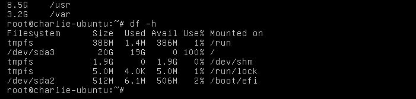
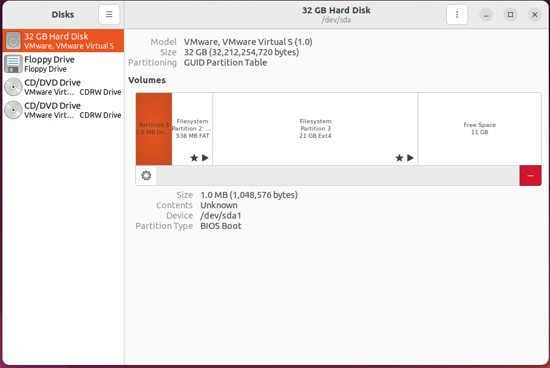
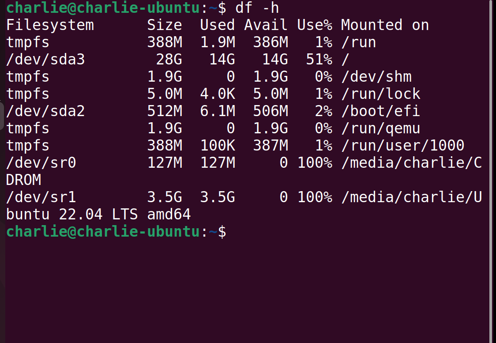

# Ubuntu虚拟机卡死

​	界面挂在/dev/sda3上开不了机了，情况可能的很多，由于我这里是虚拟机，给内存才分配了20G，我一猜就是硬存炸了，果不其然。。。

## 进入recovery mode

​		我们进入recovery mode先，在VM虚拟机开机时摁住shift进入Grub引导界面后，进入Advancd高级选项进入当前内核的recovery mode，进入之后会刷屏内核开机日志，我们选择加载出来的选项的root选项：实际上就是给我们一个内核console操作系统，我们这里可以先看看是哪个分区挂了：



​	如你所见，我们的/dev/sda3已经溢出来了，我们先删除一些无关竟要的大文件之后，就可以重新启动了

### 删除大文件

​	很简单：

```
find /target/directory -size +1G # 这里看心情调整是1G还是500M，我是直接知道哪些文件是大的直接直奔罪魁祸首删了
```

### 扩大分区

​	我们在VM虚拟机配置上扩大了分区之后，可以再次开机虚拟机，发现我们现在可以正常进入了，下一步就是进入软件界面后搜disk跳出这个界面，选择FileSystem之后点击设置摁扭选择Resize，调整分区大小就行，文件系统的大小在GUI封装下也会自动帮助你调整



​	验收一下：扩展了10G，是这样的

