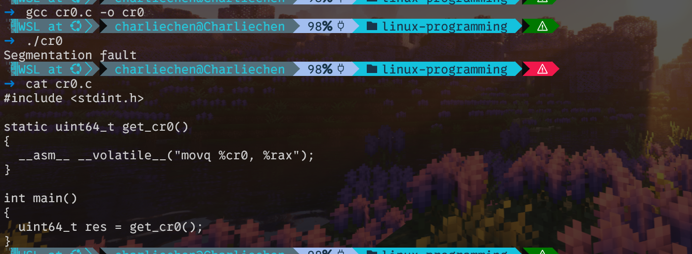

# 应用导言

## Unix设计哲学浅论

​	摩尔定律指出，**集成电路中晶体管的数量将每两年（大约）翻一番（附加说明是成本将以几乎相同的速度减半）**。这条定律多年来一直非常准确，它清楚地强调了人们对电子和信息技术 (IT) 行业的认识，甚至庆祝这一点；这里的技术创新和范式转变的速度是无与伦比的。

​	与之成为鲜明对比的，是再上一层的系统架构设计，这个东西在硬件快速发展的今天，上层却并没有发生什么太大的变化。直到现在，我们使用的主流操作系统，都是派生自50年前的Unix设计范畴。尽管我们讨论的是Linux操作系统，但是熟悉Unix操作系统的设计哲学对我们理解Linux操作系统将会有很大的帮助

### 任何事物都是一个进程，不是进程也是文件。

我们都知道——几乎可以说是听厌了：进程是正在运行的程序实体，是现代操作系统的最小资源分配单元。文件则被认为是文件系统的一个对象，被集成进入文件系统进行管理。Unix为此尝试将一切都抽象成文件或者是进程。比如说我们的IO就跟文件操作密切相关。
我们的stdin stdout stderr就是三个IO接口，但是在这里则是被抽象成了文件！尽管他们并不存在于文件系统，但是真的不妨碍我们使用文件系统的API对他们进行访问，我们照样可以用read从stdin读取字节流，write向stdout输出我们的内容。当然，这里的抽象则是体现在了file descriptors上去了，我们的

- stdin: fd = 0
- stdout: fd = 1
- stderr fd = 2
我们的这三个fd总是有效。
Unix存在这样的一个设计：那就是过滤器filters
一个filter就是一个函数单元，他接受输入，然后可能对之进行修改，最后产生输出传递出去！
Unix存在几个经典的filters程序：cat,wc, sort, grep, perl, head, tail
sort就是对输入序列进行排序。
```shell
cat something.txt
```
你可以随意的敲入一些东西进入something.txt，然后这个指令将会以换行符作为分割单元对几个单元进行排序。
事实上，我们的something.txt就是我们的输入源，sort对我们的输入进行修改，然后输出——我们上面一行的内容没有进行制定，那么就会默认输出到标准输出上去，一般而言，就是你的登陆tty！
我们不指定输入文件呢？很简单，那就采用你的标准输入作为输入源。你可以一直输入东西直到我们最终向进程发出一个中止符号（一般我们是摁住CTRL + D）
当然，我们可以指定输入输出符号，其实很简单。
```shell
sort < waited_sorted.txt > sorted.txt 2 > /dev/null
```
我们做了什么呢？其实很简单，我们将waited_sorted.txt作为sort程序的输入，又把sorted.txt作为我们的输出地址，至于2则是stderr的文件描述符，被重定向到了/dev/null表示忽略错误。

### 一个工具只做一件事情

对于构成整个Unix系统的各个部件，我们发现，他们的设计其实很简单：那就是一个工具只做一件事情。换而言之，每一个部件专心而又简单，那么他们的和就应该优雅而简洁。
df则合格指令很简单：他只查看挂载的文件系统和分区
sort就只排序
sed则是一个CLI文本编辑器，实际上即是使用命令来编辑输入。

我们现在可以写下：
```shell
df —-local > /tmp/tmp.txt
sed —in-place ‘1d’ tmp
sort -k4nr tmp
```
很好，不过，我们下一步就会看到，我们还可以使用管道来进行有效的组合：
```
prg_A | prg_B
```
我的意思是——我们的A程序的输出将会直接作为prg_B的输入，因此，我们可以帮之改之上面那三行的程序——为一行就够了
```
df —local | sed ‘1d’ | sort -k4nr
```
我们前一个指令的输出就会作为下一输入进行进一步处理（有点函数式的味道了！）

### 简单的平凡文本优先！

很简单，UNIX最好处理那些简单的简单文本作为优先！

### CLI而不是GUI

CLI也就是Command Line Interface则是表达UNIX更加适合于工作在CLI上！

### 模块化，从而实现复用
这是Unix对于最小化实现的哲学的实践准则。我们想实现最小化实现就需要采取模块化的行动。

### 提供方法而不是策略
这个的意思是将各个模块具体的抽象出来，按照步骤和逻辑抽象成若干方法的组合而不是杂糅在一起。


### Linux 系统架构
#### 准备工作

如果有人问“CPU 是做什么用的？”，答案很明显：CPU 是机器的核心——它读取、解码和执行机器指令，处理内存和外设。它通过合并各个阶段来实现这一点。非常简单地说，在指令提取阶段，它从内存 (RAM) 或 CPU 缓存中读取机器指令（我们以各种人类可读的方式表示——十六进制、汇编和高级语言）。然后，在指令解码阶段，它继续解密指令。在此过程中，它利用控制单元、其寄存器组、ALU 和内存/外设接口。ABIL让我们想象一下，我们编写了一个 C 程序，并在机器上运行它。好吧，等一下。C 代码不可能直接被 CPU 解密；它必须转换成机器语言。因此，我们明白，在现代系统上，我们将安装一个工具链——其中包括编译器、链接器、库对象和各种其他工具。我们编译和链接 C 源代码。处理器指令集架构 (ISA) – 记录机器的指令格式、它支持的寻址方案及其寄存器模型。事实上，CPU 原始设备制造商 (OEM) 发布了一份描述机器如何工作的文档；该文档通常称为 ABI。ABI 描述的不仅仅是 ISA；它还描述了机器指令格式、寄存器集细节、调用约定、链接语义和可执行文件格式，例如 ELF。

#### CPU的运行优先级
如本章前面所述，CPU 的基本工作是从内存中读取机器指令，解密并执行它们。在计算机发展的早期，这几乎就是处理器所做的全部工作。但后来，工程师们对此进行了更深入的思考，意识到这存在一个关键问题：如果程序员可以将任意的机器指令流输入处理器，而处理器则盲目而顺从地执行这些指令，那么就有可能造成破坏，从而入侵机器！如何做到？回想一下上一节中英特尔处理器的 CR0 控制寄存器：包含控制处理器操作模式和状态的系统控制标志。如果一个人对 CR0 寄存器具有无限制（读/写）访问权限，则可以切换可以执行以下操作的位：
- 打开或关闭硬件分页
- 禁用 CPU 缓存
- 更改缓存和对齐属性
- 禁用 OS 标记为只读的内存（技术上是页面）上的 WP（写保护）

好吧，黑客确实可以造成严重破坏。至少，只有操作系统才应该被允许进行这种访问。正是出于操作系统及其控制的硬件资源的安全性、稳健性和正确性等原因，所有现代 CPU 都包含特权级别的概念。现代 CPU 将支持至少两种特权级别或模式：用户和内核。

​	我们当然可以试一试使用越界访问！



对于x86上，有四个Ring级别，但是广泛使用的只有Ring3和Ring0，我们用户态程序运行在ring0上，内核态程序运行在ring3
最初，环级别 1 和 2 是为设备驱动程序设计的，但现代操作系统通常在环 0 本身上运行驱动程序代码。一些虚拟机管理程序（VirtualBox 就是其中之一）过去使用环 1 来运行客户内核代码；以前没有硬件虚拟化支持（Intel VT-x、AMD SV）时就是这种情况。ARM（32 位）处理器有七种执行模式；其中六种是特权模式，只有一种是非特权模式。在 ARM 上，一般来说，相当于英特尔环 0 的是管理员（SVC）模式，相当于英特尔环 3 的是用户模式。


### Linux的架构

从上到下为应用层，库，GLIBC/SCI（系统调用接口）/OS内核/硬件抽象层。层级很有帮助，因为每一层只需要关注其上层和下层。这带来了许多好处：设计简洁，降低了复杂性标准化、互操作性能够在堆栈内外交换层能够根据需要轻松引入新层最后一点，存在 FTSE。直接引用维基百科：“软件工程基本定理 (FTSE)”是 Andrew Koenig 发明的一个术语，用来描述 ButlerLampson 的一句话，该说法归功于已故的 David J. Wheeler我们可以通过引入额外的间接层来解决任何问题。
系统调用系统调用实际上是内核功能，可以通过 glibc 存根例程从用户空间调用。它们起着至关重要的作用；它们将用户空间连接到内核空间。如果用户程序想要请求内核的某些内容（从文件中读取、写入网络、更改文件的权限），它会通过发出系统调用来实现。因此，系统调用是内核的唯一合法入口点。用户空间进程没有其他方式来调用内核。

另一种思考方式：Linux 内核内部有数千个 API（或函数）。其中，只有一小部分可见或可用，即暴露给用户空间；这些暴露的内核 API 是系统调用！再次，作为近似值，现代 Linux glibc 有大约 300 个系统调用。在运行 4.13.16-302.fc27.x86_64 内核的 x86_64 Fedora 27 机器上，有近 53,000 个内核 API！这是需要理解的关键：系统调用与所有其他（通常是库）API 非常不同。由于它们最终调用内核（OS）代码，因此它们能够跨越用户-内核边界；实际上，它们能够从正常的非特权用户模式切换到完全特权的主管或内核模式！如何做到的？无需深入研究细节，系统调用本质上是通过调用特殊的机器指令来工作的，这些指令具有将处理器模式从用户模式切换到主管模式的内置能力。所有现代 CPU ABI 都将提供至少一个这样的机器指令；在 x86 处理器上，实现系统调用的传统方式是使用特殊的 int 0x80 机器指令。是的，它确实是一个软件中断（或陷阱）。从 Pentium Pro 和 Linux 2.6 开始，使用 sysenter/syscall 机器指令。请参阅 GitHub 存储库中的“进一步阅读”部分。从应用程序开发人员的角度来看，关于系统调用的一个关键点是系统调用似乎是开发人员可以调用的常规函数（API）；这种设计是经过深思熟虑的。现实情况是：人们调用的系统调用 API（例如 open()、read()、chmod()、dup() 和 write()）仅仅是存根。它们是一种巧妙的机制，可以获取内核中的实际代码（获取该代码涉及使用系统调用号填充 x86 上的累加器寄存器，并通过其他通用寄存器传递参数）以执行该内核代码路径，并在完成后返回用户模式。


进程上下文现在我们明白了，可以通过发出系统调用来调用内核服务。发生这种情况时，调用进程在内核模式下运行系统调用的内核代码。这称为进程上下文 - 内核代码现在在调用系统调用的进程的上下文中运行。进程上下文代码具有以下属性：始终由发出系统调用的进程（或线程）触发自上而下的方法由进程同步执行内核代码中断上下文乍一看，内核代码似乎没有其他执行方式。好吧，想想这个场景：网络接收路径。发往以太网 MAC 地址的网络数据包到达硬件适配器，硬件检测到它是发往它的，收集它并缓冲它。现在它必须让操作系统知道；更技术性地说，它必须让网络接口卡 (NIC) 设备驱动程序知道，以便它可以在数据包到达时获取和处理它们。它通过断言硬件中断来启动 NIC 驱动程序。回想一下，设备驱动程序驻留在内核空间中，因此它们的代码在管理员模式或内核模式下运行。（内核特权）驱动程序代码中断服务例程 (ISR) 现在执行，获取数据包，并将其发送到 OS 网络协议堆栈进行处理。NIC 驱动程序的 ISR 代码是内核代码，它已经在什么上下文中运行？它显然不在任何特定进程的上下文中。事实上，硬件中断可能中断了某个进程。因此，我们只称之为中断上下文。中断上下文代码具有以下属性：始终由硬件中断触发（不是软件中断、故障或异常；这仍然是进程上下文）自下而上的方法通过中断异步执行内核代码如果您在某个时候报告了内核错误，那么指出执行上下文会有所帮助。从技术上讲，在中断上下文中，我们有进一步的区别，例如硬中断和软中断、底半部和小任务。但是，这个讨论超出了本书的范围。