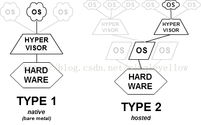

# Linux操作系统——概念扫盲I

## 虚拟机概念刨析

​	我们下面来简单聊聊虚拟机这个概念。对于大部分OS的教程，很多教授会让各位新手（其中包括笔者）在虚拟机中运行目标OS。比如说对于大部分新入门Linux的各位想当大多数的白月光是Ubuntu。笔者的第一次Ubuntu体验正是在虚拟机中得到的。那么，什么是虚拟机，以及的相关概念又是如何，笔者有相当长时间没有进行整理。现在笔者在这里理清一下概念。

### 在那之前，询问什么是虚拟化？

​	虚拟机是——虚拟化的一个应用派生物，也就是说，想要理解虚拟机务必理解虚拟化先！虚拟化说白了，就是提供一个兼容层的方式，来作为上层和下层的Adapter：

- Any problem in computer science can be solved by another layer of indirection.（计算机科学领域的任何问题都可以通过增加一个间接的中间层来解决。）

​	举个例子，A操作系统本来运行在A Type的CPU上，如果想要原封不动的移植到B Type的CPU上，就需要提供一层兼容来屏蔽底层的差异。比如说Mac OS想要从IBM Power的CPU跑到Intel x86上，就使用了一个中间兼容层“Rosetta”这个软件，实际上就相当于虚拟机了，这样Mac OS编译的软件可以不需要重新编译而直接跑在Intel x86架构的机器上。

​	在Redhat官网上，可以看到虚拟化的定义和包含的范围如下：

> ​	**虚拟化**是一种将能力与硬件分离的技术，可以充分利用以往局限于特定硬件的资源。借助该技术，您可以将物理计算机的工作能力分配给多个用户或环境，从而更大程度发挥计算机的能力。虚拟化类型包括：
>
> 1. 数据虚拟化：使企业能够将数据源整合为单一的动态供应。
> 2. 桌面虚拟化：允许通过一个中央管理员来部署和控制多个模拟的桌面环境。
> 3. 服务器虚拟化：允许管理员按用于提供特定功能的配置分配服务器。
> 4. 操作系统虚拟化：支持在一台计算机上运行多个操作系统。
> 5. 网络功能虚拟化：可以隔离网络的功能（例如目录服务、文件共享和 IP 配置），并将它们分到各个环境中。

​	说的道理！我们这里需要解除的是操作系统层次的虚拟化。

### 现在来看看什么是虚拟机

​	现在我们想，我们手头有一些需求：比如说一些软件，一些服务只能跑在Linux的某一个发行版上，而不能跑在Windows上，怎么办？我们想要保证我们的原有环境不被受到干扰，那就让OS作为一个Application，其中让他泡在一个Adapter类的程序，任何操作系统向下发出的请求都被Adapter接受转化，要么直接向硬件（这就是I类虚拟机了）发送需求，要么向我们的本地OS（举个例子：跑的是Linux的一个发行OS，他就要将Linux的Syscall送到Adapter上，Adapter将转化好的需求发送到Windows上继续传递给硬件）（这也就是II类虚拟机了）

​	我们大部分使用的VMware Workstation 和 Oracle VirtualBox 就是典型的 II 类虚拟机监控程序。 

​	这里借一张图,笔者首次见到的出处是: [虚拟机工作原理_虚拟机的工作原理-CSDN博客](https://blog.csdn.net/singleyellow/article/details/69569389#:~:text=从大二课余接触数据恢)

### 虚拟机有啥好的

​	借助虚拟化，多个操作系统可以在共用的虚拟化硬件资源上同时运行。如果没有虚拟化，则一个硬件只能运行一个操作系统。服务器整合是使用虚拟机的首要原因。部署到裸机时，**大多数操作系统和应用部署都只会使用少量的物理资源。通过将服务器虚拟化，您可以在每个物理服务器上创建大量虚拟服务器，从而提高硬件利用率。这样您就无需购买额外的物理资源（例如硬盘驱动器或硬盘），也不用压缩数据中心对电能、空间和冷却能力的需求**。凭借支持故障转移和冗余，虚拟机提供了**额外的灾难恢复选项**，而这以前只能通过增加硬件才能实现。

​	**虚拟机可以提供一个与系统其余部分隔离开的环境。这样一来，无论虚拟机内部运行什么，都不会干扰主机硬件上运行的其他内容（说白了就是随便造，出事情了随时可以恢复）**。由于虚拟机处于隔离状态，因此堪称是测试新应用或设置生产环境的理想之选。此外，针对特定的进程，您还可以运行单用途虚拟机。

### 小差：那JVM也叫Java Virtual Machine，有啥区别呢？

​	欸！我们知道Java为了解决C++跨平台问题选择使用一个Java Virtual Machine来屏蔽底层的事情。将Java的字节码跟底层的机器代码解耦合。所以需要一层Java虚拟机来解决这个问题。这个Java虚拟机只是屏蔽了底层的汇编层次的差异，具体的JVM就是依照底层的架构进行翻译，从而驱动运行Java程序。我们刚刚讨论的虚拟机是一个完整的硬件虚拟化解决方案，可以在物理机器上运行多个操作系统。这样看来：

1. JVM的Virtual Machine比较Limited，只可抽象Java程序，后者的VMware虚拟机那可以Run Everything，你虚拟的目标OS能干什么就几乎能干什么（如果没有极特殊情况）
2. JVM是纯粹的软件虚拟机，负责解释和执行Java字节码；VMware虚拟机则创建虚拟硬件环境，允许不同操作系统共享物理硬件。后者更为强大
3. JVM的资源管理主要集中在内存和线程上；VMware虚拟机则涉及CPU、内存、存储和网络等多个方面。
4. JVM由于功能相对简单，所以一般而言Has Ability Running Everywhere，但是对于II类虚拟机，那可就要看对虚拟机的支持程度了！

（这里吐槽一些解答博客说的不清不楚）

## Reference

1. 《操作系统概念》（虚拟化部分）
2. [一文带你看懂什么是虚拟机 （VM）？有什么用，怎么使用？ (redhat.com)](https://www.redhat.com/zh/topics/virtualization/what-is-a-virtual-machine)
3. [虚拟机工作原理_虚拟机的工作原理-CSDN博客](https://blog.csdn.net/singleyellow/article/details/69569389#:~:text=从大二课余接触数据恢)

