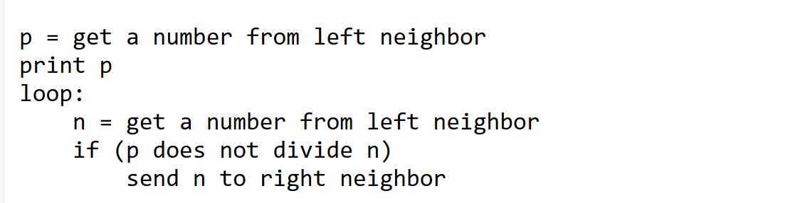

# MIT实验笔记冲刺1

​	笔者最近打算小小的开始重新温习一下MIT实验，打牢自己操作系统的知识基础。

## 安装与下载

```
https://pdos.csail.mit.edu/6.S081/2024/tools.html
```

​	这里是麻省理工官方的下载指南，附文里附上了笔者的翻译。可以参考。笔者建议是使用Arch Linux WSL来完成这个实验。

​	关于ArchWSL，参考项目：https://github.com/yuk7/ArchWSL?tab=readme-ov-file

​	关于配置一份Arch开发环境，可以借鉴笔者之前写的博客：https://blog.csdn.net/charlie114514191/article/details/136873390

## 实验1

```
$ git clone git://g.csail.mit.edu/xv6-labs-2024
Cloning into 'xv6-labs-2024'...
...
$ cd xv6-labs-2024
```

​	配置实验是很简单的。只需要从github上下载我们的实验代码，配好了必备的依赖就可以开始猛猛开冲了。

​	运行我们的虚拟机也很简单：

```
make qemu
```

```
qemu-system-riscv64 -machine virt -bios none -kernel kernel/kernel -m 128M -smp 3 -nographic -global virtio-mmio.force-legacy=false -drive file=fs.img,if=none,format=raw,id=x0 -device virtio-blk-device,drive=x0,bus=virtio-mmio-bus.0

xv6 kernel is booting

hart 2 starting
hart 1 starting
init: starting sh
```

​	注意，想要退出虚拟机只需要摁住Crtl A + X就可以退出去了。

```
xv6 kernel is booting

hart 1 starting
hart 2 starting
init: starting sh
$ ls
.              1 1 1024
..             1 1 1024
README         2 2 2403
xargstest.sh   2 3 93
cat            2 4 34176
echo           2 5 33072
forktest       2 6 16216
grep           2 7 37440
init           2 8 33552
kill           2 9 33008
ln             2 10 32824
ls             2 11 40280
mkdir          2 12 33072
rm             2 13 33048
sh             2 14 54648
stressfs       2 15 33944
usertests      2 16 179480
grind          2 17 49080
wc             2 18 35048
zombie         2 19 32424
console        3 20 0
$ QEMU: Terminated
```

## 开始我们的实验

​	在实验开始之前，我仍然建议各位看官复习温习一下xv6 book这本书，他入门的介绍了整个实验所用到的操作系统的知识。

​	笔者这里假设各位已经对xv6的情况有了基本的了解。

### sleep（简单）

​	**为 xv6 实现一个用户级 sleep 程序，类似于 UNIX sleep 命令。**您的 sleep 应该暂停用户指定的滴答数。滴答是 xv6 内核定义的时间概念，即定时器芯片两次中断之间的时间。您的解决方案应该在文件 user/sleep.c 中。

一些提示：

在开始编码之前，请阅读 xv6 书的第 1 章。

- 将您的代码放入 user/sleep.c。查看 user/ 中的其他一些程序（例如，user/echo.c、user/grep.c 和 user/rm.c）以了解如何将命令行参数传递给程序。
- 将您的 sleep 程序添加到 Makefile 中的 UPROGS；完成此操作后，make qemu 将编译您的程序，您将能够从 xv6 shell 运行它。
- 如果用户忘记传递参数，sleep 应该会打印一条错误消息。
- 命令行参数以字符串形式传递；您可以使用 atoi 将其转换为整数（请参阅 user/ulib.c）。
- 使用系统调用 sleep。
- 请参阅 kernel/sysproc.c 了解实现 sleep 系统调用的 xv6 内核代码（查找 sys_sleep），请参阅 user/user.h 了解可从用户程序调用的 sleep 的 C 定义，并参阅 user/usys.S 了解从用户代码跳转到内核进行 sleep 的汇编代码。
- sleep 的 main 应在完成后调用 exit(0)。

​	我们首先就要看看我们的sleep函数，大多数使用过Linux的朋友都知道：sleep就是促使当前进程悬挂指定的秒数，也就是放弃CPU指定长的时间。

​	我们随意的看看其他的程序，做一个简单的分析，比如说我们的cat程序：

```
#include "kernel/types.h"
#include "kernel/fcntl.h"
#include "user/user.h"

char buf[512];

void
cat(int fd)
{
  int n;

  while((n = read(fd, buf, sizeof(buf))) > 0) {
    if (write(1, buf, n) != n) {
      fprintf(2, "cat: write error\n");
      exit(1);
    }
  }
  if(n < 0){
    fprintf(2, "cat: read error\n");
    exit(1);
  }
}

int
main(int argc, char *argv[])
{
  int fd, i;

  if(argc <= 1){
    cat(0);
    exit(0);
  }

  for(i = 1; i < argc; i++){
    if((fd = open(argv[i], O_RDONLY)) < 0){
      fprintf(2, "cat: cannot open %s\n", argv[i]);
      exit(1);
    }
    cat(fd);
    close(fd);
  }
  exit(0);
}

```

​	这个程序是一个典型的遵循经典C规范的程序。笔者实际上不太喜欢这一风格。但是毫无疑问的，我们需要实现主函数一个，以及sleep的impl函数。

​	好在sleep这个函数本身并不复杂。实际上，我们只需要写一个套壳程序就好。但是为了理解，笔者打算严肃的遵从上面的指示一一分析。

​	我们知道，sleep是一个经典的syscall，在xv6中被实现到了：

```
uint64
sys_sleep(void)
{
  int n;
  uint ticks0;

  argint(0, &n);
  if(n < 0)
    n = 0;
  acquire(&tickslock);
  ticks0 = ticks;
  while(ticks - ticks0 < n){
    if(killed(myproc())){
      release(&tickslock);
      return -1;
    }
    sleep(&ticks, &tickslock);
  }
  release(&tickslock);
  return 0;
}
```

​	当然，我们可以先不用管细节，只需要知道我们的sleep就是向系统发起系统调用即可。或者，当你调试的时候会发现他跳转到了汇编，实际上调用的是函数sys_sleep，也就是上面的implement。

​	套壳函数写的很简单，笔者是这样写的：

```
#include "kernel/types.h"
#include "kernel/fcntl.h"
#include "user/user.h"


int inline sleep_impl(const int sleep_sc){
    return sleep(sleep_sc);
}

void inline help_usage(const char* app_name)
{
    printf("usage: %s <sleep_second>\n", app_name);
}

void inline invalid_args(){
    printf("you should submit a valid sleep second!\n");
}

int main(int argc, char* argv[])
{
    if(argc != 2){
        help_usage(argv[0]);
        exit(0);
    }

    int second = atoi(argv[1]);

    if(second <= 0){
        invalid_args();
        exit(0);
    }

    sleep_impl(second);

    exit(0);
}
```

​	记得在Makefile的UPROGS后面加上`$_U/_sleep`

```
	...
	$U/_wc\
	$U/_zombie\
	$U/_sleep
```

​	测试通过，这个函数还是很简单的。

```
➜  ./grade-lab-util sleep
make: 'kernel/kernel' is up to date.
== Test sleep, no arguments == sleep, no arguments: OK (1.5s) 
== Test sleep, returns == sleep, returns: OK (1.1s) 
== Test sleep, makes syscall == sleep, makes syscall: OK (1.1s) 
```

## pingpong（简单）

​	编写一个用户级程序，使用 xv6 系统调用通过一对管道在两个进程之间“ping-pong”一个字节，每个方向一个。父进程应该向子进程发送一个字节；子进程应该打印`“<pid>: received ping”`，其中 `<pid>` 是其进程 ID，将字节写入管道上的父进程，然后退出；父进程应该从子进程读取字节，打印`“<pid>: received pong”`，然后退出。您的解决方案应该在文件 user/pingpong.c 中。

一些提示：

- 将程序添加到 Makefile 中的 UPROGS。
- 您需要使用管道、fork、write、read 和 getpid 系统调用。
- xv6 上的用户程序可用的库函数有限。您可以在 user/user.h 中看到列表；源代码（系统调用除外）位于 user/ulib.c、user/printf.c 和 user/umalloc.c 中。

从 xv6 shell 运行该程序，它应该会产生以下输出：

```
$ make qemu
...
init: Starting sh
$ pingpong
4: received ping
3: received pong
$
```

​	您的程序应该在两个进程之间交换一个字节并产生如上所示的输出。运行 make grade 进行检查。

​	这里设计到了管道的问题，还有线程的问题。笔者这里想要吐槽的是：不少人的代码没有考虑到竞争的问题，即printf会乱码输出，所以，我们理清一下就会发现这个实际上是一个同步任务，因此需要在子进程完成向文件写之后再允许父进程读取信息。

​	这样，实际上就是如下的代码：

```
#include "kernel/types.h"
#include "kernel/fcntl.h"
#include "user/user.h"

#define READ_INDEX      (0)
#define WRITE_INDEX     (1)

/*
    pipe1 here is the local pipe, pipe2 is remote
*/
void on_child_pipe(int pipe1[2], int pipe2[2])
{
    char buffer;
    close(pipe2[WRITE_INDEX]);
    read(pipe2[READ_INDEX], &buffer, sizeof(buffer));
    printf("%d: received ping\n", getpid());
    close(pipe1[READ_INDEX]);   
    write(pipe1[WRITE_INDEX], &buffer, sizeof(buffer));
    close(pipe2[READ_INDEX]);
    close(pipe1[WRITE_INDEX]);
}

/*
    pipe1 here is the local pipe, pipe2 is remote
*/
void on_parent_pipe(int pipe1[2], int pipe2[2])
{
    // parents should do write at first
    char buffer = 'C';
    close(pipe2[READ_INDEX]);
    write(pipe2[WRITE_INDEX], &buffer, sizeof(buffer));
    close(pipe1[WRITE_INDEX]);
    wait((void*)0);
    read(pipe1[READ_INDEX], &buffer, sizeof(buffer));

    printf("%d: received pong\n", getpid());
    close(pipe2[WRITE_INDEX]);
    close(pipe1[READ_INDEX]);
}

int main()
{
    int pipe_array_parent[2];
    int pipe_array_son[2];

    pipe(pipe_array_parent);
    pipe(pipe_array_son);

    int pid = fork();
    if(pid == 0){
        on_child_pipe(pipe_array_son, pipe_array_parent);
    }else{
        on_parent_pipe(pipe_array_parent, pipe_array_son);
    }
    exit(0);
}
```

​	现在可以测试这个代码，尝试一下。

```
➜  ./grade-lab-util pingpong
make: 'kernel/kernel' is up to date.
== Test pingpong == pingpong: OK (2.0s) 
    (Old xv6.out.pingpong failure log removed)
```

## primes (中等)/(困难)


​	使用管道和本页中间图片及周围文本中所示的设计，为 xv6 编写一个并发素数筛选程序。这个想法来自 Unix 管道的发明者 Doug McIlroy。您的解决方案应位于文件 user/primes.c 中。

​	您的目标是使用管道和 fork 来设置管道。第一个进程将 2 到 280 的数字输入到管道中。对于每个素数，您将安排创建一个进程，该进程通过管道从其左侧邻居读取，并通过另一个管道写入其右侧邻居。由于 xv6 的文件描述符和进程数量有限，因此第一个进程可以在 280 处停止。

一些提示：

- 请小心关闭进程不需要的文件描述符，否则您的程序将在第一个进程达到 280 之前耗尽 xv6 的资源。
  一旦第一个进程达到 280，它应该等到整个管道终止，包括所有子进程、孙进程等。因此，主 primes 进程应该仅在打印完所有输出并且所有其他 primes 进程退出后退出。
- 提示：当管道的写入端关闭时，read 返回零。
- 最简单的方法是直接将 32 位（4 字节）整数写入管道，而不是使用格式化的 ASCII I/O。
- 您应该只在需要时在管道中创建进程。
- 将程序添加到 Makefile 中的 UPROGS。
- 如果编译器对函数 primes 给出无限递归错误，则可能必须声明 void primes(int) __attribute__((noreturn)); 以表明 primes 不会返回。

​	实际上

​	这个难度最大，笔者自己调试了半天，看了别人的代码（有写的复杂的，有写的简单的，甚至还有写错的直接搬上来（笔者认为有些误人子弟了）的，都不太适合），笔者自己写了一份，各位可以进行测试。值得注意的是笔者测试到的是280的范围，提示各位一些网传代码因为资源清理差导致系统资源耗尽返回非法值。所以各位需要做好资源清理，不用马上关掉！

​	下图就是关键。一句话说清楚思想：就是打印上一级传递过来的素数，将之作为除数，筛好其他的素数传递到下一级，直到自己的工作完成退出。



```
#include "kernel/types.h"
#include "kernel/fcntl.h"
#include "user/user.h"
#define LIMIT           (280)
#define READ_INDEX      (0)
#define WRITE_INDEX     (1)

/* This marks promissed the function that shell never recursive call */
/* maybe :) */
/* using in solving ERROR: infinite recursion detected  */
__attribute__((noreturn))
void do_find_prime(int left_pipe[2])
{
    // read from the left pipe
    // so close the write one
    close(left_pipe[WRITE_INDEX]);

    // now read the number transfer from the left
    int prime;

    // clean up the sources neatedly :)
    if(read(left_pipe[READ_INDEX], &prime, sizeof(int)) != sizeof(int)){
        close(left_pipe[READ_INDEX]);
        exit(0);
    }

    printf("prime %d\n", prime);
    // do fork
    // create the write pipe
    int right_pipe[2];
    pipe(right_pipe);
    int pid = fork();
    if(pid != 0){
        // do for the next
        // in this way we are supposed to clean the old pipe resourses
        close(left_pipe[READ_INDEX]);
        do_find_prime(right_pipe);
    }else{
        // here we shell provide the sources that is prime
        // disable the read issue in here
        close(right_pipe[READ_INDEX]);
        // now find the number
        int num;
        // if we can get the next number, we jugde the issue
        while(read(left_pipe[READ_INDEX], &num, sizeof(int))){
            if(num % prime != 0){
                // yes, it is the prime
                // write to pass the next one
                write(right_pipe[WRITE_INDEX], &num, sizeof(int));
            }
        }
        // close and clear the resourses
        close(right_pipe[WRITE_INDEX]);
        // close(left_pipe[READ_INDEX]);
        // wait the sub process
        wait((void*)0);
    }
    exit(0);
}

int main()
{
    int begin_pipe[2];
    pipe(begin_pipe);
    int pid = fork();
    if(pid == 0){
        do_find_prime(begin_pipe);
    }else{
        close(begin_pipe[READ_INDEX]);
        // we only write issues
        for(int begin = 2; begin <= LIMIT; begin++)
            write(begin_pipe[WRITE_INDEX], &begin, sizeof(int));
        close(begin_pipe[WRITE_INDEX]);
        wait((void*)0);
    }
    exit(0);
}
```

​	如何书写代码上面的流程我已经说清楚了。

## find（中等）

​	为 xv6 编写一个 UNIX find 程序的简单版本：查找目录树中具有特定名称的所有文件。您的解决方案应该在文件 user/find.c 中。

一些提示：

- 查看 user/ls.c 以了解如何读取目录。

- 使用递归允许 find 进入子目录。
- 不要递归到“.”和“..”。
- 对文件系统的更改在 qemu 运行期间保持不变；要获得干净的文件系统，请运行 make clean，然后运行 make qemu。
- 您需要使用 C 字符串。查看 K&R（C 书），例如第 5.5 节。
- 请注意，== 不会像 Python 中那样比较字符串。改用 strcmp()。
- 将程序添加到 Makefile 中的 UPROGS。
- 您的解决方案应产生以下输出（当文件系统包含文件 b、a/b 和 a/aa/b 时）：

```
$ make qemu
...
init: Starting sh
$ echo > b
$ mkdir a
$ echo > a/b
$ mkdir a/aa
$ echo > a/aa/b
$ find . b
./b
./a/b
./a/aa/b
$
```

​	这里的难点在于理解我们的程序，笔者建议的是理解一下ls.c先：

```
#include "kernel/types.h"   
#include "kernel/stat.h"    
#include "user/user.h"     
#include "kernel/fs.h"      
#include "kernel/fcntl.h"  

// fmtname 函数：根据给定的路径，返回文件或目录的名称。
// 它会从路径中提取出最后一部分（即文件名或目录名），并确保返回的名称长度为 DIRSIZ。
char* fmtname(char *path)
{
  static char buf[DIRSIZ+1];  // 用于存放文件名，最大长度为 DIRSIZ
  char *p;

  // 从路径的末尾开始，寻找最后一个斜杠 '/'，以此来获取文件名部分
  for(p=path+strlen(path); p >= path && *p != '/'; p--)
    ;
  p++;  // 跳过斜杠，指向文件名的第一个字符

  // 如果文件名的长度大于等于 DIRSIZ，直接返回文件名
  if(strlen(p) >= DIRSIZ)
    return p;

  // 否则，返回一个被空格填充的文件名，确保长度为 DIRSIZ
  memmove(buf, p, strlen(p));  // 将文件名拷贝到 buf 中
  memset(buf+strlen(p), ' ', DIRSIZ-strlen(p));  // 填充空格，保证 buf 长度为 DIRSIZ
  return buf;
}

// ls 函数：实现了简单的“列出目录”功能，类似 Unix 中的 `ls` 命令。
// 它根据路径类型（文件、目录或设备）列出文件或目录的相关信息。
void ls(char *path)
{
  char buf[512], *p;  // buf 用来存放路径信息
  int fd;              // 文件描述符
  struct dirent de;    // 目录项结构体，存放目录中的文件信息
  struct stat st;      // 文件状态结构体，存放文件或目录的属性信息

  // 尝试打开路径对应的文件或目录，如果打开失败，输出错误信息并返回
  if((fd = open(path, O_RDONLY)) < 0){
    fprintf(2, "ls: cannot open %s\n", path);  // 打开失败
    return;
  }

  // 获取文件或目录的状态信息
  if(fstat(fd, &st) < 0){
    fprintf(2, "ls: cannot stat %s\n", path);  // 获取失败
    close(fd);  // 关闭文件描述符
    return;
  }

  // 根据文件类型做不同处理
  switch(st.type){
  case T_DEVICE:  // 设备文件
  case T_FILE:    // 普通文件
    // 打印文件名、类型、inode号和文件大小
    printf("%s %d %d %d\n", fmtname(path), st.type, st.ino, (int) st.size);
    break;

  case T_DIR:  // 目录
    // 如果路径太长，无法容纳完整的文件名，则输出错误信息
    if(strlen(path) + 1 + DIRSIZ + 1 > sizeof buf){
      printf("ls: path too long\n");
      break;
    }
    strcpy(buf, path);  // 将路径复制到 buf 中
    p = buf + strlen(buf);  // p 指向路径末尾
    *p++ = '/';  // 添加斜杠，指向目录下的文件

    // 读取目录中的每一项
    while(read(fd, &de, sizeof(de)) == sizeof(de)){
      // 跳过无效的目录项（inum == 0）
      if(de.inum == 0)
        continue;

      // 构造完整的路径
      memmove(p, de.name, DIRSIZ);  // 将目录项的名称拷贝到路径后面
      p[DIRSIZ] = 0;  // 确保路径以 '\0' 结尾

      // 获取该文件或目录的状态信息
      if(stat(buf, &st) < 0){
        printf("ls: cannot stat %s\n", buf);  // 获取失败
        continue;
      }
      // 打印文件名、类型、inode号和文件大小
      printf("%s %d %d %d\n", fmtname(buf), st.type, st.ino, (int) st.size);
    }
    break;
  }
  close(fd);  // 关闭文件描述符
}
```

​	我们这里发现，实际上就是在是目录的时候发生递归就行，只需要提供我们的新路径就OK。这里笔者做一个尝试：

```
#include "kernel/types.h"
#include "kernel/stat.h"
#include "user/user.h"
#include "kernel/fs.h"
#include "kernel/fcntl.h"

#define BUF_LEN (512)

// functions make up the new path waiting to be anaylsis
void create_new_drient_path(char* op_src, const char* base, const char* new_dirent_name)
{
    if(strlen(base) + 1 + DIRSIZ + 1 > BUF_LEN){
      printf("ls: path too long, will not enum this dirent case...\n");
      return;
    }
    memset(op_src, 0, sizeof(char) * BUF_LEN);
    strcpy(op_src, base);
    char* index = op_src + strlen(op_src);
    *index++ = '/';
    memmove(index, new_dirent_name, strlen(new_dirent_name));
    index[DIRSIZ] = '\0';
}

void find_impl(const char* path, const char* target)
{
    // check the name, at this case we ensure this is the target
    char    buffer[512];

    struct stat     file_stat;
    struct dirent   dirent_handler;

    int fd = open(path, O_RDONLY);
    if(fd < 0){
        fprintf(2, "find: cannot open %s\n", path);
        return;
    }

    while(read(fd, &dirent_handler, sizeof(dirent_handler)) == sizeof(dirent_handler))
    {
        if( dirent_handler.inum == 0                ||  // no dirent here
            strcmp(".", dirent_handler.name) == 0    ||  // is self
            strcmp("..", dirent_handler.name) == 0)      // is parent
        {
            continue;
        }

        create_new_drient_path(buffer, path, dirent_handler.name);
        if(stat(buffer, &file_stat) < 0){
            fprintf(2, "ls: cannot stat %s\n", buffer);
            close(fd);
            continue;
        }

        switch(file_stat.type)
        {
            case T_FILE: // file is required direct compare
                if(strcmp(dirent_handler.name, target) == 0)
                {
                    printf("%s\n", buffer);
                }
                break;
        case T_DIR:
            find_impl(buffer, target);break;
        case T_DEVICE:  
            break; // device make no need to enum
        }
    } 
}

void inline inform_usage()
{
    printf( "usage: \n"
            "find <path> <target>\n");
}

int main(int argc, char* argv[])
{
    if(argc != 3){inform_usage();exit(0);}

    struct stat file_stat;
    int file_handle = open(argv[1], O_RDONLY);
    if(fstat(file_handle, &file_stat) < 0){
        printf("Can not stat file: %s\n", argv[1]);
        exit(-1);
    }

    if(file_stat.type != T_DIR){
        fprintf(2, "The target is not a dirent!\n");
        close(file_handle);
        exit(-1);
    }

    const char* path = argv[1];
    const char* target = argv[2];

    // find(path, target);
    find_impl(path, target);
    exit(0);
}
```


```
#include "kernel/types.h"
#include "kernel/stat.h"
#include "user/user.h"
#include "kernel/param.h"

#define BUF_LEN (512)
#define NULL    ((void*)0)


int main(int argc, char* argv[])
{
    char from_stdin[BUF_LEN];
    int index_ptr = 1;
    char* new_args[MAXARG];

    if(argc < 2){
        fprintf(2, "usage: xargs <command>\n");
        exit(1);
    }

    if(argc + 1 >= MAXARG){
        printf("Too many args, not support yet!");
        exit(0);
    }

    while(argv[index_ptr])  // if it is not the terminations, we do copy
    {
        new_args[index_ptr - 1] = argv[index_ptr];
        index_ptr++;
    }

    new_args[argc] = NULL;

    while(1)    
    {
        int old_args_counter = 0;
        while(1)    // phase the arg from stdin
        {
            int len = read(0, &from_stdin[old_args_counter], sizeof(char));
            if(len == 0 || from_stdin[old_args_counter] == '\n') break;
            old_args_counter++;
        }

        if(old_args_counter == 0) // we have not read anything worth :)
            break; // break the outliar

        from_stdin[old_args_counter] = '\0'; // view as the terminations
        new_args[argc - 1] = from_stdin;

        // now do the fork actually
        int pid = fork();
        if(pid == 0) // as the children do the sub process
        {
            exec(new_args[0], new_args);
            exit(0);
        }else{
            wait(NULL);
        }
    }
    exit(0);
}
```

## xargs（中等）

​	手搓一个XArgs，这个比较抽象，但本质上是对参数进行逐字节的解析。为 xv6 编写一个 UNIX xargs 程序的简单版本：它的参数描述要运行的命令，它从标准输入读取行，并运行每行的命令，将该行附加到命令的参数中。您的解决方案应位于文件 user/xargs.c 中。

以下示例说明了 xargs 的行为：

```
$ echo hello too | xargs echo bye
bye hello too
$
```

请注意，此处的命令是“echo bye”，附加参数是“hello too”，使命令“echo bye hello too”输出“bye hello too”。
请注意，UNIX 上的 xargs 进行了优化，它将一次向命令提供多个参数。我们不希望您进行此优化。要使 UNIX 上的 xargs 按照我们希望的方式运行，请在运行它时将 -n 选项设置为 1。例如

```
$ (echo 1 ; echo 2) | xargs -n 1 echo
1
2
$
```

一些提示：

- 使用 fork 和 exec 在输入的每一行上调用命令。在父进程中使用 wait 等待子进程完成命令。

- 要读取输入的每一行，请一次读取一个字符，直到出现换行符 ('\n')。
- kernel/param.h 声明 MAXARG，如果您需要声明 argv 数组，这可能会很有用。
- 将程序添加到 Makefile 中的 UPROGS。
- 对文件系统的更改在 qemu 运行期间保持不变；要获得干净的文件系统，请运行 make clean，然后运行 make qemu。
- xargs、find 和 grep 结合得很好：

```
$ find . b | xargs grep hello
```

将在“.”下面的目录中对名为 b 的每个文件运行“grep hello”。要测试 xargs 的解决方案，请运行 shell 脚本 xargstest.sh。您的解决方案应产生以下输出：

```
$ make qemu
...
init: Starting sh
$ sh < xargstest.sh
$ $ $ $ $ $ hello
hello
$ $
```

您可能需要返回并修复 find 程序中的错误。输出中有许多 \$，因为 xv6 shell 没有意识到它正在处理来自文件而不是控制台的命令，并为文件中的每个命令打印一个 $。

​	下面是笔者参考了: [MIT 6.S081 2020 LAB1记录 - 知乎 (zhihu.com)](https://zhuanlan.zhihu.com/p/346495822)的一份解析。比较简陋

```
#include "kernel/types.h"
#include "kernel/stat.h"
#include "user/user.h"
#include "kernel/param.h"

#define BUF_LEN (512)
#define NULL    ((void*)0)


int main(int argc, char* argv[])
{
    char from_stdin[BUF_LEN];
    int index_ptr = 1;
    char* new_args[MAXARG];

    if(argc < 2){
        fprintf(2, "usage: xargs <command>\n");
        exit(1);
    }

    if(argc + 1 >= MAXARG){
        printf("Too many args, not support yet!");
        exit(0);
    }

    while(argv[index_ptr])  // if it is not the terminations, we do copy
    {
        new_args[index_ptr - 1] = argv[index_ptr];
        index_ptr++;
    }

    new_args[argc] = NULL;

    while(1)    
    {
        int old_args_counter = 0;
        while(1)    // phase the arg from stdin
        {
            int len = read(0, &from_stdin[old_args_counter], sizeof(char));
            if(len == 0 || from_stdin[old_args_counter] == '\n') break;
            old_args_counter++;
        }

        if(old_args_counter == 0) // we have not read anything worth :)
            break; // break the outliar

        from_stdin[old_args_counter] = '\0'; // view as the terminations
        new_args[argc - 1] = from_stdin;

        // now do the fork actually
        int pid = fork();
        if(pid == 0) // as the children do the sub process
        {
            exec(new_args[0], new_args);
            exit(0);
        }else{
            wait(NULL);
        }
    }
    exit(0);
}
```

## finally

```
== Test sleep, no arguments == 
$ make qemu-gdb
sleep, no arguments: OK (4.9s) 
== Test sleep, returns == 
$ make qemu-gdb
sleep, returns: OK (1.1s) 
== Test sleep, makes syscall == 
$ make qemu-gdb
sleep, makes syscall: OK (1.1s) 
== Test pingpong == 
$ make qemu-gdb
pingpong: OK (1.1s) 
== Test primes == 
$ make qemu-gdb
primes: OK (1.6s) 
== Test find, in current directory == 
$ make qemu-gdb
find, in current directory: OK (1.2s) 
== Test find, in sub-directory == 
$ make qemu-gdb
find, in sub-directory: OK (1.2s) 
== Test find, recursive == 
$ make qemu-gdb
find, recursive: OK (1.6s) 
== Test xargs == 
$ make qemu-gdb
xargs: OK (1.8s) 
== Test xargs, multi-line echo == 
$ make qemu-gdb
xargs, multi-line echo: OK (1.1s) 
```

​	舒舒服服大满贯！完结撒小花！

# Reference

### I. Tools

​	对于本课程，您需要 QEMU 7.2+、GDB 8.3+、GCC 和 Binutils 的 RISC-V 版本。如果您在设置时遇到问题，请在办公时间前来或在 Piazza 上发帖。我们很乐意为您提供帮助！

#### Debian 或 Ubuntu

```
sudo apt-get install git build-essential gdb-multiarch qemu-system-misc gcc-riscv64-linux-gnu binutils-riscv64-linux-gnu
```

您可能需要运行 Ubuntu 24（或更高版本），以便 apt-get 安装足够新的 qemu。

#### Arch Linux

```
sudo pacman -S riscv64-linux-gnu-binutils riscv64-linux-gnu-gcc riscv64-linux-gnu-gdb qemu-emulators-full
```

#### 在 Windows 上安装

​	鼓励运行 Windows 的学生在本地计算机上安装 Linux 或使用 WSL 2（适用于 Linux 2 的 Windows 子系统）。我们还鼓励学生安装 Windows 终端工具，而不是使用 Powershell/命令提示符。

​	要使用 WSL 2，首先请确保已安装适用于 Linux 的 Windows 子系统。然后从 Microsoft Store 添加 Ubuntu 24.04。之后，您应该能够启动 Ubuntu 并与机器交互。

​	重要提示：确保您正在运行 WSL 的第 2 版。WSL 1 不适用于 6.1810 实验室。要进行检查，请在 Windows 终端中运行 wsl -l -v 以确认已安装 WSL 2 和正确的 Ubuntu 版本。

​	要安装本课程所需的所有软件，请运行：

```
$ sudo apt-get update && sudo apt-get upgrade
$ sudo apt-get install git build-essential gdb-multiarch qemu-system-misc gcc-riscv64-linux-gnu binutils-riscv64-linux-gnu
```

从 Windows，您可以访问

```
“\\wsl$\”目录下的所有 WSL 文件。例如，Ubuntu 20.04 安装的主目录应位于“\\wsl$\Ubuntu-20.04\home\<username>\”
```

#### 运行 Linux VM

如果您运行的操作系统不方便安装 RISC-V 工具，您可能会发现运行 Linux 虚拟机 (VM) 并在 VM 中安装工具很有用。安装 Linux 虚拟机分为两个步骤。首先，获取虚拟化平台；我们建议：

VirtualBox（适用于 Mac、Linux、Windows）— 下载页面
安装虚拟化平台后，获取所选 Linux 发行版的启动磁盘映像。

Ubuntu Desktop 是一种选择。
这将下载一个名为 ubuntu-20.04.3-desktop-amd64.iso 的文件。启动虚拟化平台并创建一个新的（64 位）虚拟机。使用 Ubuntu 映像作为启动磁盘；不同虚拟机的启动过程不同，但应该不会太难。

#### 在 macOS 上安装

首先，安装开发者工具：

```
$ xcode-select --install
```

接下来，安装适用于 macOS 的软件包管理器 Homebrew：

```
$ /bin/bash -c "$(curl -fsSL https://raw.githubusercontent.com/Homebrew/install/HEAD/install.sh)"
```

接下来，安装 RISC-V 编译器工具链：

```
$ brew tap riscv/riscv
$ brew install riscv-tools
```

brew 公式可能未链接到 /usr/local。您需要更新 shell 的 rc 文件（例如 ~/.bashrc）以将相应目录添加到 $PATH。

```
PATH=$PATH:/usr/local/opt/riscv-gnu-toolchain/bin
```

最后，安装 QEMU：

```
brew install qemu
```

#### Athena

​	我们强烈反对使用 Athena，因为过去在 Athena 上运行实验室时出现了很多问题。如果您必须使用 Athena，可以通过 athena.dialup.mit.edu 使用运行 Linux 的 MIT Athena 机器在实验室中工作。实验室所需的所有工具都位于 6.828 储物柜中。

ssh 进入其中一台 Athena 拨号机器并添加工具：

```
$ ssh {您的 kerberos}@athena.dialup.mit.edu
$ add -f 6.828
```

​	如果您使用 Athena，则必须使用 x86 机器；也就是说，uname -a 应该提到 i686 GNU/Linux 或 x86_64 GNU/Linux。

## 测试您的安装

要测试您的安装，您应该能够编译并运行 xv6。您可以按照第一个实验中的说明进行尝试。您还可以通过运行以下命令来仔细检查您的安装是否正确：

```
$ qemu-system-riscv64 --version
```

QEMU 模拟器版本 7.2.0以及至少一个 RISC-V 版本的 GCC：

```
$ riscv64-linux-gnu-gcc --version
riscv64-linux-gnu-gcc (Debian 10.3.0-8) 10.3.0
...
$ riscv64-unknown-elf-gcc --version
riscv64-unknown-elf-gcc (GCC) 10.1.0
...
$ riscv64-unknown-linux-gnu-gcc --version
riscv64-unknown-linux-gnu-gcc (GCC) 10.1.0
...
```

## 其他参考

[MIT6.S081-Lab1 Utilities [2021Fall\] - duile - 博客园 (cnblogs.com)](https://www.cnblogs.com/duile/p/15981486.html)
