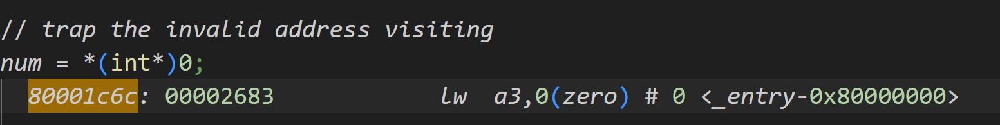

# MIT实验笔记冲刺2 理论部分

​	我们下面来看看这个实验的理论部分。这里，我们将会探究操作系统是如何处理系统调用的。

​	关于文章的全文，笔者经过简单的翻译放到了文章的末尾。

## 操作系统组织与系统调用

​	我们知道，操作系统实际上将整个机器划分为用户空间（做我们的业务任务）和内核空间（为我们的任务分配管理系统资源的地方）。两者的沟通就是通过发起系统调用完成的。当我们发起系统调用的时候，操作系统将当前的执行的状态压入栈中，装入内核态需要的资源进入内核态，同更加底层的机器进行交互完成需要特权操作的任务。最后返回，将参数弹栈或者装回到原本的寄存器当中，完成我们的操作。

## 使用GDB来调试我们的操作系统

​	实际上，xv6已经为我们封装好了调试的办法，我们只需要启动gdb服务器（办法是make qemu-gdb）,在另一侧启动gdb-multi-arch或者是riscv-linux-gnu-gdb就OK。笔者为了在VSCode做调试有做过修改。下面简单介绍一下如何修改：

​	修改文件：

```
xv6-labs-2024/.gdbinit.tmpl-riscv
```

​	删除我们的target remote localhost:26000这一行，然后在vscode中写launch.json

```
 {
    "version": "0.2.0",
    "configurations": [
        {
            "name": "xv6debug",
            "type": "cppdbg",
            "request": "launch",
            "program": "${workspaceFolder}/kernel/kernel",
            "stopAtEntry": true,
            "cwd": "${workspaceFolder}",
            "miDebuggerServerAddress": "127.0.0.1:26000", //见.gdbinit 中 target remote xxxx:xx
            "miDebuggerPath": "/usr/bin/gdb-multiarch", // which gdb-multiarch
            "MIMode": "gdb"
        }
    ]
}
```

​	完事，他就会停在这里：


## 使用 gdb（简单）

​	在许多情况下，打印语句足以调试内核，但有时单步执行代码或获取堆栈回溯很有用。GDB 调试器可以提供帮助。为了帮助您熟悉 gdb，请运行 make qemu-gdb，然后在另一个窗口中启动 gdb（请参阅指导页面上的 gdb 材料）。打开两个窗口后，在 gdb 窗口中输入：

```
(gdb) b syscall
断点 1 在 0x80002142：文件 kernel/syscall.c，第 243 行。

(gdb) c
继续。
[切换到线程 1.2]
线程 2 命中断点 1，syscall () 在 kernel/syscall.c:243
243 {
(gdb) layout src
(gdb) backtrace
```


​	layout 命令将窗口一分为二，显示 gdb 在源代码中的位置。 backtrace 打印堆栈回溯。在 answers-syscall.txt 中回答以下问题。

1. 查看 backtrace 输出，哪个函数调用了 syscall？

   > 在vscode中可以看的非常的清楚：
   >
   > 
   >
   > 可以看到这里是我们的usertrap函数直接调用了我们的syscall

2. 输入几次 n 以跳过 struct proc *p = myproc(); 跳过此语句后，输入 p /x *p，它将以十六进制打印当前进程的 proc 结构（参见 kernel/proc.h>）。p->trapframe->a7 的值是什么，该值代表什么？（提示：查看 user/initcode.S，这是 xv6 启动的第一个用户程序。）处理器在管理模式下运行，我们可以打印特权寄存器，例如 sstatus（有关说明，请参阅 RISC-V 特权指令）：

```
(gdb) p /x $sstatus
```

> 
> 这非常好理解，我们看到7是SYS_exec，也就是执行程序的调用号，这里，我们跑到initCode.S中：
>
> 
> xv6 内核代码包含一致性检查，其失败会导致内核崩溃；您可能会发现内核修改会导致崩溃。例如，在 syscall 的开头将语句 num = p->trapframe->a7; 替换为 num = * (int *) 0;，运行 make qemu，您将看到类似以下内容：

```
xv6 kernel is booting

hart 2 Starting
hart 1 Starting
scause=0xd sepc=0x80001bfe stval=0x0
panic: kerneltrap
```

退出 qemu。要追踪内核页面错误恐慌的来源，请在文件 kernel/kernel.asm 中搜索刚刚看到的恐慌的 sepc 值，该文件包含编译内核的汇编代码。

​	记下内核恐慌的汇编指令。哪个寄存器对应于变量 num？

​	要检查出错指令处处理器和内核的状态，请启动 gdb，并在出错的 epc 处设置断点，如下所示：

```
(gdb) b *0x80001bfe
断点 1 位于 0x80001bfe：文件 kernel/syscall.c，第 138 行。
(gdb) layout asm
(gdb) c
继续。
[切换到线程 1.3]
线程 3 命中断点 1，syscall () 位于 kernel/syscall.c:138
```

​	确认出错的汇编指令与您在上面找到的指令相同。



​	内核为什么崩溃？提示：查看文本中的图 3-3；地址 0 是否映射到内核地址空间中？上面的 scause 中的值是否证实了这一点？ （请参阅 RISC-V 特权指令中对 scause 的描述）
请注意，scause 是由上面的内核崩溃打印出来的，但通常您需要查看其他信息来追踪导致崩溃的问题。例如，要找出内核崩溃时正在运行的用户进程，您可以打印进程的名称：

```
(gdb) p p->name
```

内核崩溃时正在运行的进程的名称是什么？它的进程 ID (pid) 是什么？

​	显然是initcode和1


# Reference And Translations

## 2.1 抽象物理资源

​	遇到操作系统时，人们首先会问的问题是为什么要有它？也就是说，可以将图 1.2 中的系统调用实现为一个库，应用程序可以与该库链接。在这个计划中，每个应用程序甚至可以拥有自己的库，以满足其需求。应用程序可以直接与硬件资源交互，并以最适合应用程序的方式使用这些资源（例如，实现高或可预测的性能）。一些用于嵌入式设备或实时系统的操作系统就是以这种方式组织的。

​	这种库方法的缺点是，如果有多个应用程序正在运行，则这些应用程序必须表现良好。例如，每个应用程序必须定期放弃 CPU，以便其他应用程序可以运行。如果所有应用程序都相互信任并且没有错误，这种合作分时方案可能没问题。应用程序不信任彼此并且有错误的情况更为常见，因此人们通常希望获得比合作方案提供的更强的隔离性。

​	为了实现强隔离，禁止应用程序直接访问敏感的硬件资源，而是将资源抽象为服务，这是很有帮助的。例如，Unix 应用程序仅通过文件系统的打开、读取、写入和关闭系统调用与存储交互，而不是直接读取和写入磁盘。这为应用程序提供了路径名的便利，并允许操作系统（作为接口的实现者）管理磁盘。即使隔离不是问题，有意交互（或只是希望彼此不干扰）的程序也可能发现文件系统比直接使用磁盘更方便。

​	类似地，Unix 透明地在进程之间切换硬件 CPU，根据需要保存和恢复寄存器状态，这样应用程序就不必知道时间共享。这种透明度允许操作系统共享 CPU，即使某些应用程序处于无限循环中。另一个例子是，Unix 进程使用 exec 来构建其内存映像，而不是直接与物理内存交互。这允许操作系统决定将进程放在内存中的什么位置；如果内存紧张，操作系统甚至可能将进程的一些数据存储在磁盘上。Exec 还为用户提供了文件系统存储可执行程序映像的便利。

​	**Unix 进程之间的许多交互形式都是通过文件描述符进行的。文件描述符不仅抽象出许多细节（例如，管道或文件中的数据存储位置），而且还以简化交互的方式定义。**例如，如果管道中的一个应用程序失败，内核将为管道中的下一个进程生成文件结束信号。

## 2.2 用户模式、管理模式和系统调用

​	强隔离需要应用程序和操作系统之间有硬边界。如果应用程序犯了错误，我们不希望操作系统出现故障或其他应用程序失败。相反，操作系统应该能够清理失败的应用程序并继续运行其他应用程序。为了实现强隔离，操作系统必须安排应用程序不能修改（甚至读取）操作系统的数据结构和指令，并且应用程序不能访问其他进程的内存。CPU 为强隔离提供硬件支持。例如，RISC-V 有三种 CPU 可以执行指令的模式：

- 机器模式
- 管理员模式
- 用户模式

​	在机器模式下执行的指令具有完全权限；CPU 以机器模式启动。机器模式主要用于配置计算机。xv6 在机器模式下执行几行，然后切换到管理员模式。在管理模式下，CPU 可以执行特权指令：例如，启用和禁用中断、读取和写入保存页表地址的寄存器等。如果用户模式下的应用程序尝试执行特权指令，则 CPU 不会执行该指令，而是切换到管理模式，以便管理模式代码可以终止该应用程序，因为它做了一些不应该做的事情。

​	应用程序只能执行用户模式指令（例如，添加数字等），并且据说在用户空间中运行，而管理模式下的软件也可以执行特权指令，并且据说在内核空间中运行。在内核空间（或管理模式下）运行的软件称为内核。想要调用内核函数（例如，xv6 中的 readsystem 调用）的应用程序必须转换到内核；应用程序不能直接调用内核函数。 CPU 提供一条特殊指令，可将 CPU 从用户模式切换到管理模式，并从内核指定的入口点进入内核。（RISC-V 为此提供了 ecall 指令。）一旦 CPU 切换到管理模式，内核就可以验证系统调用的参数（例如，检查传递给系统调用的地址是否是应用程序内存的一部分），决定是否允许应用程序执行请求的操作（例如，检查是否允许应用程序写入指定的文件），然后拒绝或执行它。内核控制转换到管理模式的入口点很重要；如果应用程序可以决定内核入口点，恶意应用程序就可以在跳过参数验证的位置进入内核。

## 2.3 内核组织

​	一个关键的设计问题是操作系统的哪一部分应该在管理模式下运行。一种可能性是整个操作系统驻留在内核中，因此所有系统调用的实现都在管理模式下运行。这种组织称为单片内核。

​	在这种组织中，整个操作系统以完全硬件特权运行。这种组织很方便，因为操作系统设计人员不必决定操作系统的哪个部分不需要完全硬件特权。此外，操作系统的不同部分更容易合作。例如，操作系统可能有一个缓冲区缓存，可以由文件系统和虚拟内存系统共享。单片组织的缺点是操作系统不同部分之间的接口通常很复杂（正如我们将在本文的其余部分中看到的那样），因此操作系统开发人员很容易犯错误。在单片内核中，错误是致命的，因为管理模式下的错误通常会导致内核失败。如果内核失败，计算机将停止工作，因此所有应用程序也会失败。计算机必须重新启动才能再次启动。
为了降低内核出错的风险，操作系统设计人员可以尽量减少在管理模式下运行的操作系统代码量，并在用户模式下执行操作系统的大部分代码。这种内核组织称为微内核。

​	以文件系统为例子，作为用户级进程运行。作为进程运行的操作系统服务称为服务器。为了允许应用程序与文件服务器交互，内核提供了一种进程间通信机制，用于将消息从一个用户模式进程发送到另一个用户模式进程。例如，如果像 shell 这样的应用程序想要读取或写入文件，它会向文件服务器发送一条消息并等待响应。在微内核中，内核接口由一些用于启动应用程序、发送消息、访问设备硬件等的低级函数组成。这种组织方式使内核相对简单，因为操作系统的大多数部分都驻留在用户级服务器中。

​	在现实世界中，单片内核和微内核都很流行。许多 Unix 内核都是单片的。例如，Linux 有一个单片内核，尽管一些操作系统功能作为用户级服务器运行（例如窗口系统）。Linux 为操作系统密集型应用程序提供了高性能，部分原因是内核的子系统可以紧密集成。诸如 Minix、L4 和 QNX 之类的操作系统被组织为带有服务器的微内核，并且在嵌入式设置中得到了广泛部署。L4 的一个变体 seL4 足够小，

​	它已经过内存安全和其他安全属性的验证 [7]。操作系统开发人员对哪种组织更好存在很多争论，而且没有确凿的证据来证明哪种更好。此外，这在很大程度上取决于“更好”的含义：更快的性能、更小的代码大小、内核的可靠性、整个操作系统（包括用户级服务）的可靠性等。

​	还有一些实际考虑因素可能比哪种组织的问题更重要。有些操作系统有一个微内核，但出于性能原因，在内核空间中运行一些用户级服务。有些操作系统有单片内核，因为这是它们的起源，而且几乎没有动力转向纯微内核组织，
因为新功能可能比重写现有操作系统以适应微内核设计更重要。从本书的角度来看，微内核和单片操作系统有许多共同的关键思想。它们实现系统调用，使用页表，处理中断，支持进程，使用锁进行并发控制，实现文件系统等。

​	xv6 实现为单片内核，与大多数 Unix 操作系统一样。因此，xv6 内核接口对应于操作系统接口，内核实现完整的操作系统。由于 xv6 不提供许多服务，因此其内核比某些微内核小，但从概念上讲 xv6 是单片的。

## 2.4 代码：xv6 组织

xv6 内核源代码位于 kernel/子目录中。源代码分为文件，遵循模块化的粗略概念；图 2.2 列出了文件。模块间接口在 defs.h(kernel/defs.h) 中定义。

| 文件名        | 描述                               |
| ------------- | ---------------------------------- |
| bio.c         | 文件系统的磁盘块缓存               |
| console.c     | 连接用户键盘和屏幕                 |
| entry.S       | 最初的启动指令                     |
| exec.c        | `exec()` 系统调用                  |
| file.c        | 文件描述符支持                     |
| fs.c          | 文件系统                           |
| kalloc.c      | 物理页面分配器                     |
| kernelvec.S   | 处理内核中的陷阱和定时器中断       |
| log.c         | 文件系统日志和崩溃恢复             |
| main.c        | 启动过程中控制其他模块的初始化     |
| pipe.c        | 管道                               |
| plic.c        | RISC-V 中断控制器                  |
| printf.c      | 格式化输出到控制台                 |
| proc.c        | 进程管理和调度                     |
| sleeplock.c   | 会让出 CPU 的锁                    |
| spinlock.c    | 不会让出 CPU 的锁                  |
| start.c       | 初始机器模式引导代码               |
| string.c      | C 字符串和字节数组库               |
| swtch.S       | 线程切换                           |
| syscall.c     | 分发系统调用到处理函数             |
| sysfile.c     | 与文件相关的系统调用               |
| sysproc.c     | 与进程相关的系统调用               |
| trampoline.S  | 在用户态和内核态之间切换的汇编代码 |
| trap.c        | 处理和返回陷阱及中断的 C 代码      |
| uart.c        | 串口控制台设备驱动                 |
| virtio_disk.c | 磁盘设备驱动                       |
| vm.c          | 管理页面表和地址空间               |

## 2.5 进程概述

xv6 中的隔离单元（与其他 Unix 操作系统一样）是进程。进程抽象可防止一个进程破坏或监视另一个进程的内存、CPU、文件描述符等。它还可以防止进程破坏内核本身，这样进程就无法破坏内核的隔离机制。内核必须小心地实现进程抽象，因为有缺陷或恶意的应用程序可能会诱骗内核或硬件做一些坏事（例如，绕过隔离）。内核用于实现进程的机制包括用户/管理员模式标志、地址空间和线程的时间分片。
为了帮助实施隔离，进程抽象为程序提供了一种幻觉，即它拥有自己的私有机器。进程为程序提供了看似私有的内存系统或地址空间，其他进程无法读取或写入。进程还为程序提供了看似自己的 CPU 来执行程序的指令。 xv6 使用页表（由硬件实现）为每个进程提供自己的地址空间。RISC-V 页表将虚拟地址（RISC-V 指令操作的地址）转换（或“映射”）为物理地址（CPU 芯片发送到主内存的地址）。

​	x**v6 为每个进程维护一个单独的页表，用于定义该进程的地址空间。地址空间包括从虚拟地址零开始的进程的用户内存。首先是指令，然后是全局变量，然后是堆栈，最后是“堆”区域（用于 malloc），进程可以根据需要扩展该区域**。有许多因素限制了进程地址空间的最大大小：RISC-V 上的指针为 64 位宽；硬件在页表中查找虚拟地址时仅使用低 39 位；而 xv6 仅使用这 39 位中的 38 位。因此，最大地址为 238 − 1 = 0x3fffffffff，即MAXVA(kernel/riscv.h:363)。在地址空间的顶部，xv6 保留一个页面用于 trampoline，以及一个页面用于映射进程的 trapframe。xv6 使用这两个页面来转换到内核和返回；trampoline 页面包含转换进出内核的代码，映射 trapframe 是保存/恢复用户进程状态所必需的，我们将在第 4 章中解释这一点。

​	xv6 内核为每个进程维护许多状态，并将其收集到 struct proc(kernel/proc.h:86) 中。进程最重要的内核状态是其页表、内核堆栈和运行状态。我们将使用符号 p->xxx 来引用 proc 结构的元素；例如，p->pagetable 是指向进程页表的指针。

​	每个进程都有一个执行线程（或简称为线程），用于执行进程的指令。线程可以暂停，稍后恢复。为了在进程之间透明地切换，内核会暂停当前正在运行的线程并恢复另一个进程的线程。线程的大部分状态（局部变量、函数调用返回地址）都存储在线程的堆栈中。每个进程都有两个堆栈：用户堆栈和内核堆栈（p->kstack）。当进程执行用户指令时，只有其用户堆栈正在使用，其内核堆栈为空。当进程进入内核（进行系统调用或中断）时，内核代码在进程的内核堆栈上执行；当进程在内核中时，其用户堆栈仍包含已保存的数据，但未被主动使用。进程的线程在主动使用其用户堆栈和内核堆栈之间交替。内核堆栈是独立的（并且与用户代码隔离），因此即使某个进程破坏了其用户堆栈，内核也可以执行。
进程可以通过执行 RISC-V ecall 指令进行系统调用。此指令提升硬件特权级别并将程序计数器更改为内核定义的入口点。
入口点处的代码切换到内核堆栈并执行实现系统调用的内核指令。当系统调用完成时，内核切换回用户堆栈并通过调用 sretin 指令返回到用户空间，此时ich 降低硬件特权级别并在系统调用指令之后立即恢复执行用户指令。进程的线程可以在内核中“阻塞”以等待 I/O，并在 I/O 完成时从中断处恢复。

- p->state 表示进程是否已分配、准备运行、正在运行、等待 I/O 或退出。
- p->pagetable 以 RISC-V 硬件期望的格式保存进程的页表。xv6 使分页硬件在用户空间中执行该进程时使用进程的 p->pagetable。进程的页表还用作分配用于存储进程内存的物理页面地址的记录。

​	总之，进程捆绑了两种设计理念：一个地址空间，让进程感觉自己有内存；一个线程，让进程感觉自己有 CPU。在 xv6 中，一个进程由一个地址空间和一个线程组成。在实际操作系统中，一个进程可能有多个线程来利用多个 CPU。

## 2.6 代码：启动 xv6、第一个进程和系统调用

为了使 xv6 更加具体，我们将概述内核如何启动和运行第一个进程。

后续章节将更详细地描述本概述中出现的机制。

​	当 RISC-V 计算机启动时，它会初始化自身并运行存储在只读内存中的引导加载程序。引导加载程序将 xv6 内核加载到内存中。然后，在机器模式下，CPU 从 _entry(kernel/entry.S:7) 开始执行 xv6。RISC-V 在分页硬件禁用的情况下启动：虚拟地址直接映射到物理地址。

​	加载程序将 xv6 内核加载到物理地址 0x80000000 的内存中。之所以将内核放在 0x80000000 而不是 0x0，是因为地址范围 0x0:0x80000000 包含 I/O 设备。\_entry 处的指令设置了一个堆栈，以便 xv6 可以运行 C 代码。xv6 在文件 start.c (kernel/start.c:11) 中声明了初始堆栈 stack0 的空间。\_entry 处的代码将堆栈指针寄存器 sp 加载到地址 stack0+4096（堆栈顶部），因为 RISC-V 上的堆栈会向下增长。现在内核有了堆栈，_entry 在 start (kernel/start.c:21) 处调用 C 代码。函数 start 执行一些仅在机器模式下允许的配置，然后切换到管理模式。要进入管理模式，RISC-V 提供了指令 mret。此指令最常用于从上一次调用从管理模式返回到机器模式。start 不会从这样的调用返回，而是像曾经有过调用一样进行设置：它在寄存器 mstatus 中将之前的特权模式设置为管理模式，通过将 main 的地址写入寄存器 mepc 将返回地址设置为 main，通过将 0 写入页表寄存器 satp 禁用管理模式下的虚拟地址转换，并将所有中断和异常委托给管理模式。

​	在进入管理模式之前，start 执行另一项任务：它对时钟芯片进行编程以生成定时器中断。完成这些内部工作后，start 通过调用 mret“返回”到管理模式。这会导致程序计数器更改为 main(kernel/main.c:11)。

​	在 main(kernel/main.c:11) 初始化几个设备和子系统后，它通过调用 userinit(kernel/proc.c:226) 创建第一个进程。第一个进程执行一个用 RISC-V 汇编编写的小程序，make 在 xv6 中进行第一个系统调用。initcode.S (user/initcode.S:3) 将 exec 系统调用的编号 SYS_EXEC(kernel/syscall.h:8) 加载到寄存器 a7 中，然后调用 ecall 重新进入内核。内核在 syscall (kernel/syscall.c:133) 中使用寄存器 a7 中的编号来调用所需的系统调用。系统调用表 (kernel/syscall.c:108) 将 SYS_EXEC 映射到内核调用的 sys_exec。正如我们在第 1 章中看到的那样，exec 用新程序（在本例中为 /init）替换当前进程的内存和寄存器。一旦内核完成 exec，它就会返回到 /init 进程中的用户空间。 Init(user/init.c:15) 会在需要时创建一个新的控制台设备文件，然后将其作为文件描述符 0、1 和 2 打开。然后它在控制台上启动一个 shell。系统启动了。

## 2.7 安全模型

​	您可能想知道操作系统如何处理有缺陷或恶意的代码。因为处理恶意代码比处理意外错误要困难得多，所以将这个主题视为与安全相关是合理的。以下是操作系统设计中典型的安全假设和目标的高级视图。

​	操作系统必须假设进程的用户级代码将尽最大努力破坏内核或其他进程。用户代码可能会尝试取消引用其允许地址空间之外的指针；它可能会尝试执行任何 RISC-V 指令，即使这些指令不是为用户代码设计的；它可能会尝试读取和写入任何 RISC-V 控制寄存器；它可能会尝试直接访问设备硬件；它可能会将巧妙的值传递给系统调用试图诱使内核崩溃或做一些愚蠢的事情。内核的目标是限制每个用户进程，以便它所能做的就是读取/写入/执行自己的用户内存，使用 32 个通用 RISC-V 寄存器，并以系统调用允许的方式影响内核和其他进程。内核必须阻止任何其他操作。这通常是内核设计中的绝对要求。对内核自身代码的期望完全不同。内核代码被认为是由善意和细心的程序员编写的。内核代码应该是无错误的，并且肯定不包含任何恶意代码。这个假设影响我们分析内核代码的方式。例如，有许多内部内核函数（例如自旋锁）如果内核代码使用不当会导致严重问题。在检查任何特定的内核代码时，我们都会想让自己相信它的行为是正确的。但是，我们假设内核代码通常都是正确编写的，并且遵循有关使用内核自身函数和数据结构的所有规则。在硬件级别，RISC-V CPU、RAM、磁盘等被认为按照文档中宣传的方式运行，没有硬件错误。

​	当然，在现实生活中，事情并非如此简单。很难防止巧妙的用户代码通过消耗内核保护的资源（磁盘空间、CPU 时间、进程表槽等）使系统无法使用（或导致系统崩溃）。通常不可能编写无错误的代码或设计无错误的硬件；如果恶意用户代码的编写者知道内核或硬件错误，他们就会利用它们。有必要在内核中设计一些保护措施来防止可能出现的错误：断言、类型检查、堆栈保护页等。最后，用户代码和内核代码之间的区别有时很模糊：一些特权用户级进程可能提供基本服务并有效地成为操作系统的一部分，而在某些操作系统中，特权用户代码可以将新代码插入内核（如 Linux 的可加载内核模块）。

## 4.3 代码：调用系统调用

​	第 2 章以 initcode.S 调用 exec 系统调用 (user/initcode.S:11) 结束。让我们看看用户调用如何进入内核中的 exec 系统调用实现。initcode.S 将 execin 的参数放置在寄存器 a0 和 a1 中，并将系统调用号放入 a7 中。系统调用号与 syscallsarray（函数指针表）中的条目相匹配 (kernel/syscall.c:108)。ecall 指令陷入内核并导致 uservec、usertrap 和 syscall 执行，如上所示。

​	syscall(kernel/syscall.c:133) 从 trapframe 中保存的 a7 中检索系统调用号，并使用它来索引系统调用。对于第一个系统调用，a7 包含 SYS_exec (kernel/syscall.h:8)，从而调用系统调用实现函数 sys_exec。

​	**当 sys_exec 返回时，syscall 将其返回值记录在 p->trapframe->a0 中。这将导致对 exec() 的原始用户空间调用返回该值，因为 RISC-V 上的 C 调用约定将返回值放在 a0 中。**系统调用通常返回负数以表示错误，返回零或正数以表示成功。如果系统调用号无效，syscall 会打印错误并返回 -1。

## 4.4 代码：系统调用参数

​	内核中的系统调用实现需要找到用户代码传递的参数。因为用户代码调用系统调用包装器函数，所以参数最初位于 RISC-V C 调用约定放置它们的位置：寄存器中。内核陷阱代码将用户寄存器保存到当前进程的陷阱框架中，内核代码可以在其中找到它们。内核函数 argint、argaddr 和 argfd 从陷阱框架中检索第 n 个系统调用参数作为整数、指针或文件描述符。它们都调用 argraw 来检索已保存的相应用户寄存器 (kernel/syscall.c:35)。一些系统调用将指针作为参数传递，内核必须使用这些指针来读取或写入用户内存。例如，execsystem 调用向内核传递一个指向用户空间中的字符串参数的指针数组。这些指针带来两个挑战。首先，用户程序可能有错误或恶意，可能会向内核传递无效指针或旨在诱使内核访问内核内存而不是用户内存的指针。其次，xv6 内核页表映射与用户页表映射不同，因此内核无法使用普通指令从用户提供的地址加载或存储。

​	内核实现了安全地将数据传送到用户提供的地址或从用户提供的地址传送数据的函数。

​	fetchstr 是一个例子 (kernel/syscall.c:25)。文件系统调用（例如 execuse fetchstr）从用户空间检索字符串文件名参数。fetchstr 调用 copyinstr 来完成艰苦的工作。copyinstr (kernel/vm.c:398) 将最多 max 个字节从用户页表 pagetable 中的虚拟地址 srcva 复制到 dst。由于 pagetable 不是当前页表，copyinstr使用 walkaddr（调用 walk）查找 pagetable 中的 srcva，得到物理地址pa0。内核将每个物理 RAM 地址映射到相应的内核虚拟地址，因此 copyinstr 可以直接将字符串字节从 pa0 复制到 dst。walkaddr (kernel/vm.c:104) 检查用户提供的虚拟地址是否属于进程的用户地址空间，因此程序无法欺骗内核读取其他内存。类似的函数 copyout 将数据从内核复制到用户提供的地址。
