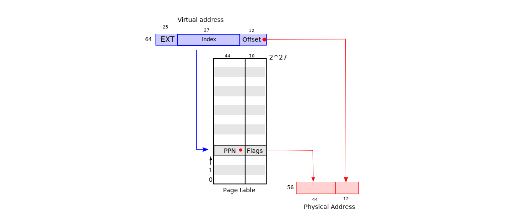
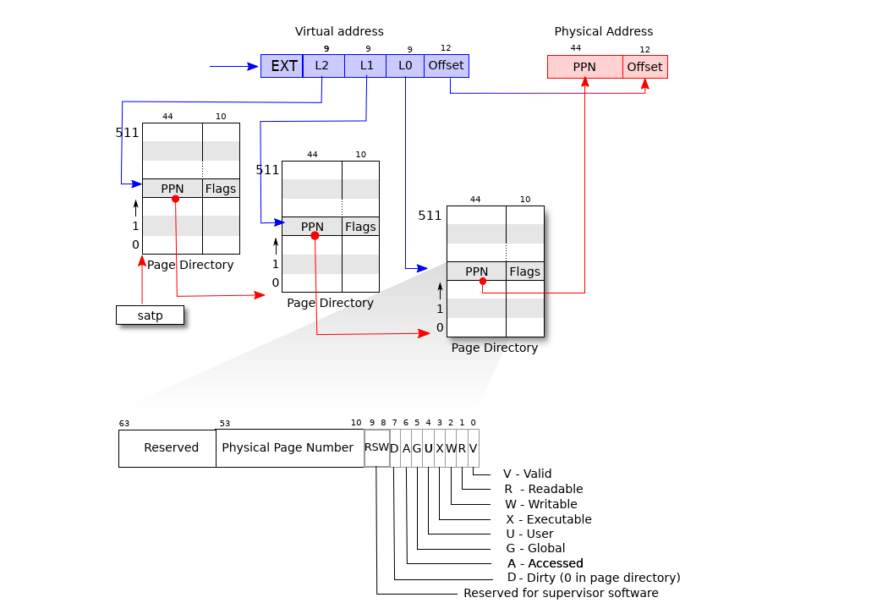
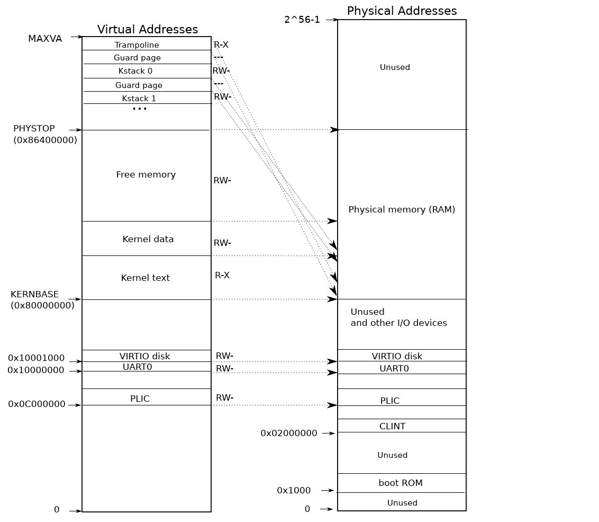
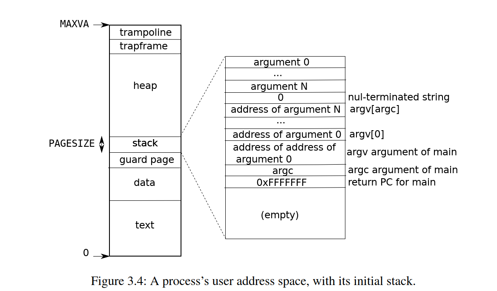

# MIT 实验3：页表操作（理论部分）

​	这个实验将重点放到了我们的页表上，实际上，页表在我们上一个实验的最后一个小实验那里就已经遇到了，17的计算跟页表的结构息息相关。

​	下面我们来看看页表这个东西。它属于操作系统保护和隔离机制的一个重要的角色。通过该机制，操作系统为每个进程提供自己的私有地址空间和内存。页表确定内存地址的含义以及可以访问物理内存的哪些部分。它们允许 xv6 隔离不同进程的地址空间并将它们多路复用到单个物理内存上。

​	页表是一种流行的设计，因为它们提供了一个间接级别，允许操作系统执行许多技巧。xv6 执行了一些技巧：在多个地址空间中映射相同的内存（蹦床页），并使用未映射的页面保护内核和用户堆栈。

## 分页硬件

​	RISC-V 指令（用户和内核）操纵虚拟地址。机器的 RAM 或物理内存使用物理地址进行索引。 RISC-V 页表硬件通过将每个虚拟地址映射到物理地址来连接这两种地址。xv6 在 Sv39 RISC-V 上运行，这意味着仅使用 64 位虚拟地址的底部 39 位；顶部 25 位未使用。在此 Sv39 配置中，RISC-V 页表在逻辑上是 227（134,217,728）个页表条目 (PTE) 的数组。每个 PTE 包含一个 44 位物理页码 (PPN) 和一些标志。分页硬件通过使用 39 位中的前 27 位来索引页表以查找 PTE，并生成一个 56 位物理地址来转换虚拟地址，其前 44 位来自 PTE 中的 PPN，其底部 12 位从原始虚拟地址复制而来。

​	页表使操作系统能够以 4096（212）字节对齐块的粒度控制虚拟到物理地址的转换。这样的块称为页面。在 Sv39 RISC-V 中，虚拟地址的前 25 位不用于转换。物理地址也有增长空间：PTE 格式中有空间让物理页码再增长 10 位。RISC-V 的设计人员根据技术预测选择了这些数字。239 字节是 512 GB，对于运行的应用程序来说，这应该是足够的地址空间在 RISC-V 计算机上。256 足以满足近期的 I/O 设备和 DRAM 芯片的物理内存空间。如果需要更多，RISC-V 设计人员已定义具有 48 位虚拟地址的 Sv48 [1]。

​	RISC-V CPU 分三步将虚拟地址转换为物理地址。页表以三级树的形式存储在物理内存中。**树的根是一个 4096 字节的页表页，其中包含 512 个 PTE**，其中包含树的下一级页表页的物理地址。这些页面中的每一个都包含树中最后一级的 512 个 PTE。

​	分页硬件使用 27 位中的前 9 位来选择根页表页中的 PTE，使用中间 9 位来选择树的下一级页表页中的 PTE，并使用后 9 位来选择最终 PTE。（在 Sv48 RISC-V 中，页表有四个级别，虚拟地址的 39 到 47 位索引到顶层。）

​	如果转换地址所需的三个 PTE 中的任何一个不存在，分页硬件就会引发页面错误异常，让内核来处理该异常三级结构允许以内存高效的方式记录 PTE。在虚拟地址的大范围没有映射的常见情况下，三级结构可以省略整个页面目录。例如，如果应用程序仅使用从地址零开始的几个页面，则顶级页面目录的条目 1 到 511 无效，并且内核不必为 511 个中间页面目录分配页面。此外，内核也不必为这 511 个中间页面目录分配底层页面目录的页面。因此，在此示例中，三级设计为中间页面目录保存了 511 个页面，为底层页面目录保存了 511 × 512 个页面。
尽管 CPU 在执行加载或存储指令时在硬件中遍历三级结构，但三级的潜在缺点是 CPU 必须从内存加载三个 PTE 才能将加载/存储指令中的虚拟地址转换为物理地址。为了避免从物理内存加载 PTE 的成本，RISC-V CPU 将页表条目缓存在转换后备缓冲区 (TLB) 中。

​	每个 PTE 都包含标志位，用于告诉分页硬件允许如何使用相关的虚拟地址。PTE_V 表示 PTE 是否存在：如果未设置，则对页面的引用会导致异常（即不允许）。PTE_R 控制是否允许指令读取页面。PTE_W 控制是否允许指令写入页面。PTE_X 控制 CPU 是否可以将页面内容解释为指令并执行它们。PTE_U 控制是否允许用户模式下的指令访问页面；如果未设置 PTE_U，则只能在管理模式下使用 PTE。图 3.2 显示了它的工作原理。标志和所有其他与页面硬件相关的结构都在 (kernel/riscv.h) 中定义。要告诉硬件使用页表，内核必须将根页表页面的物理地址写入 satp 寄存器。每个 CPU 都有自己的 satp。 CPU 将使用其自己的 satp 指向的页表转换后续指令生成的所有地址。

​	每个 CPU 都有自己的 satp，因此不同的 CPU 可以运行不同的进程，每个进程都有一个由其自己的页表描述的私有地址空间。通常，内核将所有物理内存映射到其页表中，以便它可以使用加载/存储指令读取和写入物理内存中的任何位置。由于页面目录位于物理内存中，因此内核可以通过使用标准存储指令写入 PTE 的虚拟地址来编程页面目录中 PTE 的内容。

​	关于术语的一些说明。物理内存是指 DRAM 中的存储单元。一个字节的物理内存有一个地址，称为物理地址。指令仅使用虚拟地址，分页硬件将其转换为物理地址，然后发送到 DRAM 硬件以读取或写入存储。与物理内存和虚拟地址不同，虚拟内存不是物理对象，而是指内核提供的用于管理物理内存和虚拟地址的抽象和机制的集合。

## 内核地址空间

​	**xv6 为每个进程维护一个页表，描述每个进程的用户地址空间，以及一个描述内核地址空间的单个页表。**内核配置其地址空间的布局，使其能够访问可预测虚拟地址处的物理内存和各种硬件资源。图 3.3 显示了此布局如何将内核虚拟地址映射到物理地址。文件 (kernel/memlayout.h) 声明了 xv6 内核内存布局的常量。QEMU 模拟一台计算机，该计算机包含从物理地址 0x80000000 开始并至少持续到 0x86400000 的 RAM（物理内存），xv6 将其称为 PHYSTOP。

​	QEMU 模拟还包括磁盘接口等 I/O 设备。 QEMU 将设备接口作为位于物理地址空间 0x80000000 以下的内存映射控制寄存器暴露给软件。内核可以通过读取/写入这些特殊的物理地址与设备交互；此类读取和写入与设备硬件而不是 RAM 进行通信。第 4 章介绍了 xv6 如何与设备交互。

​	内核使用“直接映射”获取 RAM 和内存映射的设备寄存器；也就是说，将资源映射到与物理地址相等的虚拟地址。例如，内核本身位于虚拟地址空间和物理内存中的 KERNBASE=0x80000000。直接映射简化了读取或写入物理内存的内核代码。例如，当 fork 为子进程分配用户内存时，分配器返回该内存的物理地址；当它将父进程的用户内存复制到子进程时，直接将该地址作为虚拟地址使用。

有几个内核虚拟地址不是直接映射的：

- trampoline页。它被映射到虚拟地址空间的顶部；用户页表具有相同的映射。我们在这里看到一个有趣的页表用例；物理页（保存蹦床代码）在内核的虚拟地址空间中被映射两次：一次在虚拟地址空间的顶部，一次直接映射。

- 内核堆栈页。每个进程都有自己的内核堆栈，它被映射到高处，因此 xv6 可以在其下方留下一个未映射的保护页。保护页的 PTE 无效（即未设置 PTE_Vis），因此如果内核溢出内核堆栈，则可能会导致异常，并且内核将崩溃。**如果没有保护页，溢出的堆栈将覆盖其他内核内存，从而导致操作不正确。最好是崩溃。**

​	虽然内核通过高内存映射使用其堆栈，但内核也可以通过直接映射地址访问它们。另一种设计可能只有直接映射，并使用直接映射地址处的堆栈。然而，在这种安排下，提供保护页将涉及取消映射虚拟地址，否则这些虚拟地址将引用物理内存，这将很难使用。
内核使用权限 PTE_R和 PTE_X 映射 trampoline 和内核文本的页面。内核从这些页面读取和执行指令。内核使用权限 PTE_R 和 PTE_W 映射其他页面，以便它可以读取和写入这些页面中的内存。保护页的映射无效。

## 代码：创建地址空间

​	用于操作地址空间和页表的大部分 xv6 代码位于 vm.c (kernel/vm.c:1) 中。中心数据结构是 pagetable_t，它实际上是指向 RISC-V根页表页的指针；pagetable_t 可以是内核页表，也可以是每个进程的页表之一。**中心函数是 walk，它为虚拟地址找到 PTE，以及 mappages，它为新映射安装 PTE。以 kvm 开头的函数操纵内核页表**；以 uvm 开头的函数操纵用户页表；其他函数用于两者。copyout 和 copyin 将数据复制到用户虚拟地址和从用户虚拟地址复制数据，这些地址作为系统调用参数提供；它们位于 vm.c 中，因为它们需要明确转换这些地址，以便找到相应的物理内存。

​	在启动序列的早期，main 调用 kvminit(kernel/vm.c:54) 以使用 kvmmake(kernel/vm.c:20) 创建内核的页表。此调用发生在 xv6 在 RISC-V 上启用分页之前，因此地址直接引用物理内存。kvmmake 首先分配一页物理内存来保存根页表页。然后它调用 kvmmap 来安装内核所需的转换。转换包括内核的指令和数据、直到 PHYSTOP 的物理内存以及实际上是设备的内存范围。Proc_mapstacks (kernel/proc.c:33) 为每个进程分配一个内核堆栈。它调用 kvmmap 将每个堆栈映射到 KSTACK 生成的虚拟地址，这为无效的堆栈保护留出了空间页面。kvmmap (kernel/vm.c:127) 调用 mappages (kernel/vm.c:138)，后者将一系列虚拟地址的映射安装到页表中，以将其映射到相应的物理地址范围。它以页面为间隔，对范围内的每个虚拟地址分别执行此操作。对于要映射的每个虚拟地址，mappages 调用 walk 来查找该地址的 PTE 地址。然后，它初始化 PTE 以保存相关的物理页码、所需的权限（PTE_W、PTE_X 和/或 PTE_R）和 PTE_V 以将 PTE 标记为有效（kernel/vm.c:153）。

​	walk(kernel/vm.c:81) 模仿 RISC-V 分页硬件，因为它在 PTE 中查找虚拟地址（参见图 3.2）。walk 当时将 3 级页表下降 9 位。它使用每个级别的 9 位虚拟地址来查找下一级页表或最终页面 (kernel/vm.c:87) 的 PTE。如果 PTE 无效，则所需页面尚未分配；如果设置了 alloc 参数，walk 会分配一个新的页表页面并将其物理地址放入 PTE 中。它返回树中最低层的 PTE 地址 (kernel/vm.c:97)。

上述代码依赖于直接映射到内核虚拟地址空间的物理内存。例如，当 walk 下降页表的级别时，它会从 PTE (kernel/vm.c:89) 中提取下一级页表的 (物理) 地址，然后使用该地址作为虚拟地址来获取下一级的 PTE (kernel/vm.c:87)。

​	main 调用 kvminithart (kernel/vm.c:62) 来安装内核页表。它将根页表页面的物理地址写入寄存器 satp。此后，CPU 将使用内核页表转换地址。由于内核使用身份映射，因此下一条指令的当前虚拟地址将映射到正确的物理内存地址。每个 RISC-V CPU 都会将页表条目缓存在转换后备缓冲区 (TLB) 中，并且当 xv6 更改页表时，它必须告诉 CPU 使相应的缓存 TLB 条目无效。如果没有，那么稍后 TLB 可能会使用旧的缓存映射，指向同时已分配给另一个进程的物理页面，因此，进程可能能够写入其他进程的内存。RISC-V 有一个指令 sfence.vma，用于刷新当前 CPU 的 TLB。 xv6 在 kvminithart 中重新加载 satp 寄存器后执行 sfence.vma，并在切换到用户页表的 trampoline 代码中执行，然后返回用户空间 (kernel/trampoline.S:79)。

为了避免刷新整个 TLB，RISC-V CPU 可能支持地址空间标识符 (ASID) [1]。然后，内核可以只刷新特定地址空间的 TLB 条目。

## 物理内存分配

​	内核必须在运行时为页表、用户内存、内核堆栈和管道缓冲区分配和释放物理内存。xv6 使用内核末尾和 PHYSTOP 之间的物理内存进行运行时分配。它一次分配和释放整个 4096 字节页面。它通过将链接列表线程化到页面本身来跟踪哪些页面是空闲的。分配包括从链接列表中删除页面；释放包括将释放的页面添加到列表中。

## 代码：物理内存分配器

​	分配器位于 kalloc.c (kernel/kalloc.c:1) 中。分配器的数据结构是可供分配的物理内存页面的空闲列表。每个空闲页面的列表元素都是一个 struct run(kernel/kalloc.c:17)。分配器从哪里获取内存来保存该数据结构？它将每个空闲页面的运行结构存储在空闲页面本身中，因为那里没有存储任何其他内容。空闲列表受自旋锁 (kernel/kalloc.c:21-24) 保护。列表和锁被包装在一个结构中，以明确锁保护结构中的字段。现在，忽略锁和对 acquire 和 release 的调用；第 6 章将详细研究锁定。

​	函数 main 调用 kinit 来初始化分配器 (kernel/kalloc.c:27)。kinit 初始化空闲列表以保存内核末尾和 PHYSTOP 之间的每个页面。xv6 应该通过解析硬件提供的配置信息来确定有多少物理内存可用。相反，xv6 假设机器有 128 兆字节的 RAM。kinit 调用 freerange 通过对每个页面的 kfree 调用将内存添加到空闲列表中。PTE 只能引用在 4096 字节边界上对齐的物理地址（是 4096 的倍数），因此 freerange 使用 PGROUNDUP 来确保它只释放对齐的物理地址。分配器开始时没有内存；这些对 kfree 的调用给它一些内存来管理。分配器有时将地址视为整数，以便对其进行算术运算（例如，遍历空闲范围内的所有页面），有时将地址用作指针来读取和

​	写入内存（例如，操作存储在每个页面中的运行结构）；地址的这种双重用途是分配器代码中充斥着 C 类型强制转换的主要原因。另一个原因是释放和分配本质上会改变内存的类型。

​	函数 kfree(kernel/kalloc.c:47) 首先将要释放的内存中的每个字节设置为值 1。这将导致在释放内存后使用内存的代码（使用“悬垂引用”）读取垃圾而不是旧的有效内容；希望这会导致此类代码更快地中断。然后 kfree 将页面添加到空闲列表中：它将 pato 转换为指向 structrun 的指针，在 r->next 中记录空闲列表的旧开头，并将空闲列表设置为等于 r。kallocremoves 并返回空闲列表中的第一个元素。

## 进程地址空间

​	每个进程都有一个单独的页表，当 xv6 在进程之间切换时，它也会更改页表。如图 2.3 所示，进程的用户内存从虚拟地址零开始，可以增长到 MAXVA（kernel/riscv.h:360），允许进程原则上寻址 256 GB 的内存。

​	当进程向 xv6 请求更多用户内存时，xv6 首先使用 kalloc 分配物理页面。然后，它将指向新物理页面的 PTE 添加到进程的页表中**。xv6 在这些 PTE 中设置 PTE_W、PTE_X、PTE_R、PTE_U 和 PTE_V 标志。大多数进程不使用整个用户地址空间；xv6 将 PTE_Vclear 留在未使用的 PTE 中。**
​	我们在这里看到一些使用页表的很好的例子。首先，不同进程的页表将用户地址转换为物理内存的不同页面，以便每个进程都有私有的用户内存。其次，每个进程都将其内存视为具有从零开始的连续虚拟地址，而进程的物理内存可以是不连续的。第三，内核将带有 trampoline 代码的页面映射到用户地址空间的顶部，因此单个物理内存页面显示在所有地址空间中。堆栈是单个页面，并显示由 exec 创建的初始内容。包含命令行参数的字符串以及指向它们的指针数组位于堆栈的最顶部。就在它下面是允许程序从 main 开始的值，就好像刚刚调用了函数 main(argc, argv)。为了检测用户堆栈溢出分配的堆栈内存，xv6 通过清除 PTE_Uflag 在堆栈正下方放置一个不可访问的保护页。如果用户堆栈溢出，并且进程试图使用堆栈下方的地址，硬件将生成页面错误异常，因为保护页对于在用户模式下运行的程序来说是不可访问的。现实世界的操作系统可能会在溢出时自动为用户堆栈分配更多内存。

## 代码：sbrk

​	Sbrk 是进程缩小或增加其内存的系统调用。该系统调用由函数 growproc (kernel/proc.c:253) 实现。growproc 调用 uvmalloc 或 uvmdealloc，具体取决于 n 是正数还是负数。uvmalloc(kernel/vm.c:221) 使用 kalloc 分配物理内存，并使用 mappages 将 PTE 添加到用户页表。 uvmdealloc 调用uvmunmap (kernel/vm.c:166)，后者使用 walk 查找 PTE，并使用 kfree 释放它们引用的物理内存。**xv6 使用进程的页表不仅告诉硬件如何映射用户虚拟地址，而且将其作为分配给该进程的物理内存页的唯一记录。**这就是为什么释放用户内存（在 uvmunmap 中）需要检查用户页表的原因。

## 代码：exec

​	Exec 是创建地址空间用户部分的系统调用。它从存储在文件系统中的文件初始化地址空间的用户部分。Exec (kernel/exec.c:13) 使用 namei(kernel/exec.c:26) 打开命名的二进制路径，这将在第 8 章中解释。然后，它读取 ELF 头。 xv6 应用程序以广泛使用的 ELF 格式描述，定义在 (kernel/elf.h) 中。ELF 二进制文件由一个 ELF 标头 struct elfhdr(kernel/elf.h:6) 和一系列程序节标头 struct proghdr (kernel/elf.h:25) 组成。每个 proghdr 描述必须加载到内存中的应用程序部分；xv6 程序只有一个程序节标头，但其他系统可能有单独的指令和数据部分。
第一步是快速检查文件是否可能包含 ELF 二进制文件。ELF 二进制文件以四字节“魔数”0x7F、‘E’、‘L’、‘F’ 或 ELF_MAGIC (kernel/elf.h:3) 开头。如果 ELF 标头具有正确的魔数，则 exe 假定二进制文件格式正确。

​	使用 proc_pagetable(kernel/exec.c:38) 执行分配一个没有用户映射的新页表，使用 uvmalloc(kernel/exec.c:52) 为每个 ELF 段分配内存，并使用 loadseg (kernel/exec.c:10) 将每个段加载到内存中。loadseg 使用 walkaddr 查找分配内存的物理地址，在该地址写入 ELF 段的每个页面，然后从文件中读取。/init 的程序节头，这是使用 exec 创建的第一个用户程序。程序节头的 filesz 可能小于 memsz，这表明它们之间的间隙应该用零填充（用于 C 全局变量），而不是从文件中读取。对于 /init，fileszis 为 2112字节和 memsz 为 2136 字节，因此 uvmallocal 分配足够的物理内存来容纳 2136 字节，但只从文件 /init 读取 2112 字节。

​	现在 exec 分配并初始化用户堆栈。它只分配一个堆栈页面。Exec 将参数字符串一次复制到堆栈顶部，将指向它们的指针记录在 ustack 中。

​	它将一个空指针放在将传递给 main 的 argvlist 的末尾。ustack 中的前三个条目是伪返回程序计数器、argc 和 argvpointer。

​	Exec 在堆栈页面下方放置一个不可访问的页面，以便尝试使用多个页面的程序将出错。这个不可访问的页面还允许 exec 处理过大的参数；在这种情况下，执行将参数复制到堆栈的 copyout(kernel/vm.c:347) 函数将注意到目标页面不可访问，并将返回 -1。

​	在准备新的内存映像期间，如果 exec 检测到错误（如无效的程序段），它会跳转到标签 bad，释放新映像并返回 -1。Exec 必须等待释放旧映像，直到它确定系统调用会成功：如果旧映像消失，系统调用不能返回 -1。exec 中唯一的错误情况发生在创建映像期间。映像完成后，exec 可以提交到新页表（kernel/exec.c:113）并释放旧页表（kernel/exec.c:117）。
Exec 将 ELF 文件中的字节加载到 ELF 文件指定的地址处的内存中。用户或进程可以将他们想要的任何地址放入 ELF 文件中。因此，exec 是有风险的，因为 ELF 文件中的地址可能指向内核，无论是有意还是无意。粗心的内核可能造成从崩溃到恶意破坏内核隔离机制（即安全漏洞）的后果。xv6 执行许多检查以避免这些风险。例如，if(ph.vaddr + ph.memsz < ph.vaddr) 检查总和是否溢出 64 位整数。危险在于，用户可以构造一个 ELF 二进制文件，其中 ph.vaddr 指向用户选择的地址，ph.memsz 足够大，以至于总和溢出到 0x1000，这看起来像是一个有效值。在 xv6 的旧版本中，用户地址空间也包含内核（但在用户模式下不可读写），用户可以选择与内核内存相对应的地址，从而将数据从 ELF 二进制文件复制到内核中。在 xv6 的 RISC-V 版本中，这种情况不会发生，因为内核有自己单独的页表；loadsegloads 会加载到进程的页表中，而不是内核的页表中。内核开发人员很容易忽略关键检查，而现实世界中的内核长期以来都缺少检查，用户程序可以利用这些检查来获取内核特权。xv6 很可能没有完全验证提供给内核的用户级数据，恶意用户程序可能会利用这些数据来绕过 xv6 的隔离。 40

## 实际的操作系统

​	与大多数操作系统一样，xv6 使用分页硬件进行内存保护和映射。xv6 的简化之处在于内核使用虚拟地址和物理地址之间的直接映射，并假设在地址 0x8000000 处有物理 RAM，内核预计会加载到该地址。这适用于 QEMU，但在实际硬件上，这是一个坏主意；实际硬件将 RAM 和设备放置在不可预测的物理地址上，因此（例如）在 0x8000000 处可能没有 RAM，而 xv6 预计可以在此存储内核。更严肃的内核设计利用页表将任意硬件物理内存布局转换为可预测的内核虚拟地址布局。

​	RISC-V 支持物理地址级别的保护，但 xv6 不使用该功能。在具有大量内存的机器上，使用 RISC-V 对“超级页面”的支持可能很有意义。当物理内存较小时，小页面很有意义，可以以细粒度分配和页面调出到磁盘。例如，如果程序仅使用 8 千字节内存，则为其提供整个 4 兆字节的物理内存超级页面是浪费。较大的页面在具有大量 RAM 的机器上很有意义，并且可以减少页表操作的开销。

​	xv6 内核缺少可以为小对象提供内存的类似 malloc 的分配器，这阻止了内核使用需要动态分配的复杂数据结构。内存分配是一个长期热门的话题，基本问题是有效使用有限的内存并为未知的未来请求做好准备 [8]。今天人们更关心速度而不是空间效率。此外，更复杂的内核可能会分配许多不同大小的小块，而不是（如在 xv6 中）只有 4096 字节的块；真正的内核分配器需要处理小分配以及大分配。