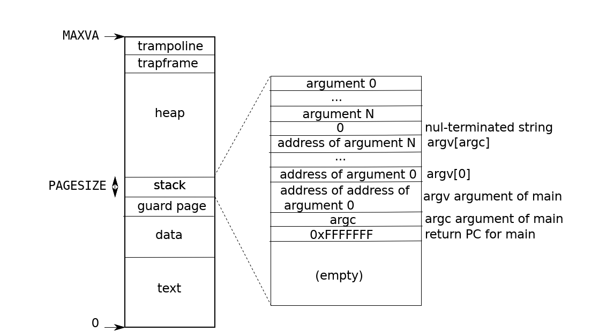

# MIT实验3 页表

## 检查用户进程页表（简单）

​	为了帮助您理解 RISC-V 页表，您的首要任务是解释用户进程的页表。运行 make qemu 并运行用户程序 pgtbltest。print_pgtbl 函数使用我们为本实验添加到 xv6 的 pgpte 系统调用打印出 pgtbltest 进程前 10 页和后 10 页的页表条目。输出如下所示：

```
va 0 pte 0x21FCF45B pa 0x87F3D000 perm 0x5B
va 1000 pte 0x21FCE85B pa 0x87F3A000 perm 0x5B
...
va 0xFFFFD000 pte 0x0 pa 0x0 perm 0x0
va 0xFFFFE000 pte 0x21FD80C7 pa 0x87F60000 perm 0xC7
va 0xFFFFF000 pte 0x20001C4B pa 0x80007000 perm 0x4B
```

​	对于 print_pgtbl 输出中的每个页表条目，解释其逻辑上包含的内容及其权限位。 xv6 书中的图 3.4 可能会有所帮助，但请注意，该图的页面集可能与此处检查的进程略有不同。请注意，xv6 不会将虚拟页面连续地放置在物理内存中。

​	我们运行测试，可以得到：

```
va 0x0 pte 0x21FC885B pa 0x87F22000 perm 0x5B
va 0x1000 pte 0x21FC7C1B pa 0x87F1F000 perm 0x1B
va 0x2000 pte 0x21FC7817 pa 0x87F1E000 perm 0x17
va 0x3000 pte 0x21FC7407 pa 0x87F1D000 perm 0x7
va 0x4000 pte 0x21FC70D7 pa 0x87F1C000 perm 0xD7
va 0x5000 pte 0x0 pa 0x0 perm 0x0
va 0x6000 pte 0x0 pa 0x0 perm 0x0
va 0x7000 pte 0x0 pa 0x0 perm 0x0
va 0x8000 pte 0x0 pa 0x0 perm 0x0
va 0x9000 pte 0x0 pa 0x0 perm 0x0
va 0xFFFF6000 pte 0x0 pa 0x0 perm 0x0
va 0xFFFF7000 pte 0x0 pa 0x0 perm 0x0
va 0xFFFF8000 pte 0x0 pa 0x0 perm 0x0
va 0xFFFF9000 pte 0x0 pa 0x0 perm 0x0
va 0xFFFFA000 pte 0x0 pa 0x0 perm 0x0
va 0xFFFFB000 pte 0x0 pa 0x0 perm 0x0
va 0xFFFFC000 pte 0x0 pa 0x0 perm 0x0
va 0xFFFFD000 pte 0x0 pa 0x0 perm 0x0
va 0xFFFFE000 pte 0x21FD08C7 pa 0x87F42000 perm 0xC7
va 0xFFFFF000 pte 0x2000184B pa 0x80006000 perm 0x4B
```

​	分析这个输出，其实就是告诉我们虚拟地址，PTE（Page Table Entry）条目，对应的物理地址和权限。我们回顾一下这个实验的理论部分：[MIT实验笔记冲刺3：页表操作（理论部分）-CSDN博客](https://blog.csdn.net/charlie114514191/article/details/144781587?spm=1001.2014.3001.5502)。

​	结合用户地址空间，我们贴一下图：



​	可以看到前十个条目说的是前十个页的情况（0x1000 = 4096B = 4KB，是XV6一个页的大小），后面的高地址则是在顶层的MAXVA之下。让我们瞧瞧

```
-------------------------------------------------------------------------
|				....								D A	G U X W R V |
-------------------------------------------------------------------------
```

​	首先看条目1，这个页的权限是

| 虚拟地址            | PTE        | 物理地址   | 权限     | 置位了                                            |
| ------------------- | ---------- | ---------- | -------- | ------------------------------------------------- |
| 0x0                 | 0x21FC885B | 0x87F22000 | 10011011 | DUXRV（脏的，用户态，可执行，可读，合法地址）     |
| 0x1000              | 0x21FC7C1B | 0x87F1F000 | 00011011 | UXRV（用户态，可执行，可读，合法地址）            |
| 0x2000              | 0x21FC7817 | 0x87F1E000 | 00010111 | UWRV（用户态，可读可写，合法地址）                |
| 0x3000              | 0x21FC7407 | 0x87F1D000 | 00000111 | WRV（可读可写，合法地址）                         |
| 0x4000              | 0x21FC70D7 | 0x87F1C000 | 11010111 | DAUWRV(脏的 Accessed，用户态，可读可写，合法地址) |
| 0x5000 ~ 0xFFFFD000 | 0x0        | 0x0        | 0        | 这些是没有被分配的，所以一用就会出错              |
| 0xFFFFE000          | 0x21FD08C7 | 0x87F42000 | 11000111 | DAWRV（trapframe）                                |
| 0xFFFFF000          | 0x2000184B | 0x80006000 | 01001011 | AXRV (trompoline)                                 |

## 加速系统调用（简单）

​	某些操作系统（例如 Linux）通过在**用户空间和内核之间共享只读区域中的数据来加速某些系统调用**。这消除了执行这些系统调用时内核交叉的需要。为了帮助您了解如何将映射插入页表，您的首要任务是为 xv6 中的 getpid() 系统调用实现此优化。

​	创建每个进程时，在 USYSCALL（memlayout.h 中定义的虚拟地址）映射一个只读页面。在此页面的开头，存储一个 struct usyscall（也在 memlayout.h 中定义），并将其初始化为存储当前进程的 PID。对于此实验，ugetpid() 已在用户空间端提供，并将自动使用 USYSCALL 映射。如果在运行 pgtbltest 时 ugetpid 测试用例通过，您将获得此部分实验的全部学分。
一些提示：

​	选择允许用户空间仅读取页面的权限位。在新页面的生命周期中，需要完成一些事情。为了获得灵感，请了解 kernel/proc.c 中的 trapframe 处理。使用此共享页面可以加快哪些其他 xv6 系统调用的速度？解释如何。

​	这个实验标的简单，但实际上要求我们梳理一个进程调用时候的页表是如何被分配，运作以及释放的。实际上难度不小。

​	我们来到kernel/proc.c文件。我们思考的思路是，想要完成这个实验，就需要从创建进程的fork进程入手。

```
  if((np = allocproc()) == 0){
    return -1;
  }
```

​	fork在这里分配内存，所以我们的第一处修改就是修改我们的allocproc函数

```
static struct proc*
allocproc(void)
{
  struct proc *p;
	// 查找进程标，看看有没有荒废的进程？（即没有加载可执行文件的进程）
  for(p = proc; p < &proc[NPROC]; p++) {
    acquire(&p->lock);
    if(p->state == UNUSED) {
      goto found;	// 找到了
    } else {
      release(&p->lock);
    }
  }
  return 0;

found:
	// 分配此次任务的PID
  p->pid = allocpid();
  p->state = USED;

  // 在这里，我们分配内存页，也就是说，我们需要在这里进行一个新结构体的分配 （1）
  // Allocate a trapframe page.
  if((p->trapframe = (struct trapframe *)kalloc()) == 0){
    freeproc(p);
    release(&p->lock);
    return 0;
  }
  
  // 这里也有关键，是将进程结构体的内容跟页表的内容对应起来（2）
  // An empty user page table.
  p->pagetable = proc_pagetable(p);
  if(p->pagetable == 0){
    freeproc(p);
    release(&p->lock);
    return 0;
  }

  // Set up new context to start executing at forkret,
  // which returns to user space.
  memset(&p->context, 0, sizeof(p->context));
  p->context.ra = (uint64)forkret;
  p->context.sp = p->kstack + PGSIZE;
  return p;
}
```

​	对于第一点（1），只需要仿照完成上面页的分配即可。

```
  // Allocate a usyscall page
    if((p->user_syscall = (struct usyscall *)kalloc()) == 0){
    freeproc(p);
    release(&p->lock);
    return 0;
  }
```

​	下一步就是建立映射

```
// Create a user page table for a given process, with no user memory,
// but with trampoline and trapframe pages.
pagetable_t
proc_pagetable(struct proc *p)
{
  pagetable_t pagetable;

  // An empty page table.
  pagetable = uvmcreate();
  if(pagetable == 0)
    return 0;

  // map the trampoline code (for system call return)
  // at the highest user virtual address.
  // only the supervisor uses it, on the way
  // to/from user space, so not PTE_U.
  if(mappages(pagetable, TRAMPOLINE, PGSIZE,
              (uint64)trampoline, PTE_R | PTE_X) < 0){
    uvmfree(pagetable, 0);
    return 0;
  }

  // map the trapframe page just below the trampoline page, for
  // trampoline.S.
  if(mappages(pagetable, TRAPFRAME, PGSIZE,
              (uint64)(p->trapframe), PTE_R | PTE_W) < 0){
    uvmunmap(pagetable, TRAMPOLINE, 1, 0);
    uvmfree(pagetable, 0);
    return 0;
  }

  return pagetable;
}
```

​	可以看到，实际上就是遵循上面的流程进行mappings，所以，只需要添加即可

```
  /* pages should be map as user accessible and readable only */
  if(mappages(pagetable, USYSCALL, PGSIZE,
              (uint64)(p->user_syscall), PTE_R | PTE_U) < 0){
    uvmunmap(pagetable, TRAMPOLINE, 1, 0);
    uvmunmap(pagetable, TRAPFRAME, 1, 0);
    uvmfree(pagetable, 0);
    return 0;
  }
```

​	最后在创建进程的时候需要注意添加：

```
...
p->user_syscall->pid = p->pid;
```

​	下面就是释放的问题。来到allocproc暗示的freeproc函数上：

```
static void
freeproc(struct proc *p)
{
  if(p->trapframe)
    kfree((void*)p->trapframe);
  p->trapframe = 0;
  if(p->pagetable)
    proc_freepagetable(p->pagetable, p->sz);
  p->pagetable = 0;
  p->sz = 0;
  p->pid = 0;
  p->parent = 0;
  p->name[0] = 0;
  p->chan = 0;
  p->killed = 0;
  p->xstate = 0;
  p->state = UNUSED;
}
```

​	首先就是把分配的内容给释放掉，添加：

```
  if(p->user_syscall)
    kfree((void*)p->user_syscall);
```

​	然后，我们还需要在：

```
// Free a process's page table, and free the
// physical memory it refers to.
void
proc_freepagetable(pagetable_t pagetable, uint64 sz)
{
  uvmunmap(pagetable, TRAMPOLINE, 1, 0);
  uvmunmap(pagetable, TRAPFRAME, 1, 0);
  uvmfree(pagetable, sz);
}

```

​	中解除映射

```
 uvmunmap(pagetable, USYSCALL, 1, 0);
```

​	现在就OK了。

​	看起来最终代码就是

```
// Look in the process table for an UNUSED proc.
// If found, initialize state required to run in the kernel,
// and return with p->lock held.
// If there are no free procs, or a memory allocation fails, return 0.
static struct proc*
allocproc(void)
{
  struct proc *p;

  for(p = proc; p < &proc[NPROC]; p++) {
    acquire(&p->lock);
    if(p->state == UNUSED) {
      goto found;
    } else {
      release(&p->lock);
    }
  }
  return 0;

found:
  p->pid = allocpid();
  p->state = USED;

  // Allocate a trapframe page.
  if((p->trapframe = (struct trapframe *)kalloc()) == 0){
    freeproc(p);
    release(&p->lock);
    return 0;
  }

  // Allocate a usyscall page
    if((p->user_syscall = (struct usyscall *)kalloc()) == 0){
    freeproc(p);
    release(&p->lock);
    return 0;
  }

  // An empty user page table.
  p->pagetable = proc_pagetable(p);
  if(p->pagetable == 0){
    freeproc(p);
    release(&p->lock);
    return 0;
  }

  // Set up new context to start executing at forkret,
  // which returns to user space.
  memset(&p->context, 0, sizeof(p->context));
  p->context.ra = (uint64)forkret;
  p->context.sp = p->kstack + PGSIZE;
  p->user_syscall->pid = p->pid;
  return p;
}

// free a proc structure and the data hanging from it,
// including user pages.
// p->lock must be held.
static void
freeproc(struct proc *p)
{
  if(p->trapframe)
    kfree((void*)p->trapframe);
  p->trapframe = 0;
  if(p->user_syscall)
    kfree((void*)p->user_syscall);
  if(p->pagetable)
    proc_freepagetable(p->pagetable, p->sz);
  p->pagetable = 0;
  p->sz = 0;
  p->pid = 0;
  p->parent = 0;
  p->name[0] = 0;
  p->chan = 0;
  p->killed = 0;
  p->xstate = 0;
  p->state = UNUSED;
}

// Create a user page table for a given process, with no user memory,
// but with trampoline and trapframe pages.
pagetable_t
proc_pagetable(struct proc *p)
{
  pagetable_t pagetable;

  // An empty page table.
  pagetable = uvmcreate();
  if(pagetable == 0)
    return 0;

  // map the trampoline code (for system call return)
  // at the highest user virtual address.
  // only the supervisor uses it, on the way
  // to/from user space, so not PTE_U.
  if(mappages(pagetable, TRAMPOLINE, PGSIZE,
              (uint64)trampoline, PTE_R | PTE_X) < 0){
    uvmfree(pagetable, 0);
    return 0;
  }

  // map the trapframe page just below the trampoline page, for
  // trampoline.S.
  if(mappages(pagetable, TRAPFRAME, PGSIZE,
              (uint64)(p->trapframe), PTE_R | PTE_W) < 0){
    uvmunmap(pagetable, TRAMPOLINE, 1, 0);
    uvmfree(pagetable, 0);
    return 0;
  }

  /* pages should be map as user accessible and readable only */
  if(mappages(pagetable, USYSCALL, PGSIZE,
              (uint64)(p->user_syscall), PTE_R | PTE_U) < 0){
    uvmunmap(pagetable, TRAMPOLINE, 1, 0);
    uvmunmap(pagetable, TRAPFRAME, 1, 0);
    uvmfree(pagetable, 0);
    return 0;
  }

  return pagetable;
}

// Free a process's page table, and free the
// physical memory it refers to.
void
proc_freepagetable(pagetable_t pagetable, uint64 sz)
{
  uvmunmap(pagetable, TRAMPOLINE, 1, 0);
  uvmunmap(pagetable, TRAPFRAME, 1, 0);
  uvmunmap(pagetable, USYSCALL, 1, 0);
  uvmfree(pagetable, sz);
}
```

​	运行测试：

```
ugetpid_test starting
ugetpid_test: OK
```

## 打印页表（简单）

​	为了帮助您直观地了解 RISC-V 页表，并可能有助于将来的调试，您的下一个任务是编写一个打印页表内容的函数。我们添加了一个系统调用 kpgtbl()，它调用 vm.c 中的 vmprint()。它需要一个 pagetable_t 参数，您的任务是按照下面描述的格式打印该页表。
​	运行 print_kpgtbl() 测试时，您的实现应打印以下输出：

```
page table 0x0000000087f22000
..0x0000000000000000：pte 0x0000000021fc7801 pa 0x0000000087f1e000
.. ..0x000000000000000：pte 0x0000000021fc7401 pa 0x0000000087f1d000
.. .. ..0x000000000000000：pte 0x0000000021fc7c5b pa 0x0000000087f1f000
.. .. ..0x000000000001000: pte 0x0000000021fc70d7 pa 0x0000000087f1c000
.. .. ..0x00000000002000: pte 0x0000000021fc6c07 pa 0x0000000087f1b000
.. .. ..0x000000000003000: pte 0x0000000021fc68d7 pa 0x0000000087f1a000
..0xffffffffc0000000: pte 0x0000000021fc8401 pa 0x0000000087f21000
.. ..0xffffffffffe00000: pte 0x0000000021fc8001 pa 0x0000000087f20000
.. .. ..0xffffffffffffd000: pte 0x0000000021fd4c13 pa 0x0000000087f53000
.. .. ..0xffffffffffffe000: pte 0x0000000021fd00c7 pa 0x0000000087f40000
.. .. ..0xffffffffffffff000: pte 0x000000002000184b pa 0x0000000080006000
```

​	第一行显示 vmprint 的参数。之后，每个 PTE 都有一行，包括引用树中较深的页表页面的 PTE。每个 PTE 行都缩进多个“..”，表示其在树中的深度。每个 PTE 行都显示其虚拟地址、pte 位以及从 PTE 中提取的物理地址。不要打印无效的 PTE。在上面的示例中，顶级页表页面具有条目 0 和 255 的映射。条目 0 的下一级仅映射了索引 0，而该索引 0 的底层映射了几个条目。您的代码可能会发出与上面显示不同的物理地址。条目数和虚拟地址应该相同。

一些提示：

1. 使用文件 kernel/riscv.h 末尾的宏。
2. 函数 freewalk 可能会给你启发。
3. 在 printf 调用中使用 %p 来打印出完整的 64 位十六进制 PTE 和地址，如示例所示。
4. 对于 vmprint 输出中的每个叶页，解释它在逻辑上包含什么以及它的权限位是什么，以及它与上面之前的 print_pgtbl() 练习的输出有何关系。xv6 书中的图 3.4 可能会有所帮助，但请注意，该图的页面集可能与此处检查的进程略有不同。

​	这个题的难点在于Virtual Address如何获取的问题，实际上，页表的项目在这里是连续的，意味着最简单的办法是直接取到偏移量OFFSET来直接得到virtual address的偏移地址。

​	剩下的内容就是典型的递归问题，参考freewalk就OK了

```
#define PTE_ENTRY_N   (512)
#define PTE_ENTRY_2N  (9) // 2 ^ 9 = 512

// is current owns the lower level child?
static char __owns_lower_level_pte(pte_t pte){
  return (pte & PTE_V) // not direct usable
        &&  // and not read write or executable
        (pte & (PTE_R|PTE_W|PTE_X)) == 0;
}

// is current pte valid?
static char __is_valid_pte(pte_t pte){
  return (pte & PTE_V) == 1;
}

// help print functions
static inline void __help_print_level(int level)
{
  for(short i = 0; i < 3 - level; i++) printf(" ..");
}

/*
  Functions take the level of pgtbl level currently walk
  and the virtual address passed by the offset given by the previous level
*/
static void __vmprint_impl(pagetable_t pagetable, short pte_level, uint64 virtual_address)
{
  
  uint64 base = PGSIZE;
  for(short i = 0; i < pte_level; i++){
    base <<= (PTE_ENTRY_2N);
  }

  for(int i = 0; i < PTE_ENTRY_N; i++, virtual_address += base)
  {
    // fetch each pagetable entry
    pte_t pte = pagetable[i];
    if(!__is_valid_pte(pte)){
      // not a valid pte, ignore the case
      continue;
    }
    __help_print_level(pte_level);
    printf("%p: pte: %p pa %p\n", (void*)virtual_address, (void*)pte, (void*)PTE2PA(pte));
    if(__owns_lower_level_pte(pte))
    {
        uint64 child = PTE2PA(pte);
        __vmprint_impl((pagetable_t)child, pte_level - 1, virtual_address);
    }
  }
}

// involk our call here :)
void
vmprint(pagetable_t pagetable) {
  printf("page table %p\n", pagetable);
  return __vmprint_impl(pagetable, 2, 0);
}
```

## 使用超级页面（中等）/（困难）

​	RISC-V 分页硬件支持 2 兆字节页面以及普通的 4096 字节页面。较大页面的一般概念称为超级页面，并且（由于 RISC-V 支持多种大小）2M 页面称为兆页面。操作系统通过设置 1 级 PTE 中的 PTE_V 和 PTE_R 位，并将物理页码设置为指向 2 兆字节物理内存区域的开头来创建超级页面。此物理地址必须是 2 兆字节对齐的（即 2 兆字节的倍数）。您可以通过搜索兆页面和超级页面在 RISC-V 特权手册中阅读有关此内容的信息；特别是第 112 页的顶部。使用超级页面会减少页表使用的物理内存量，并可以减少 TLB 缓存中的未命中。对于某些程序，这会导致性能大幅提升。

您的任务是修改 xv6 内核以使用超级页面。具体来说，如果用户程序调用大小为 2 兆字节或更大的 sbrk()，并且新创建的地址范围包括一个或多个 2 兆字节对齐且大小至少为 2 兆字节的区域，则内核应使用单个超级页面（而不是数百个普通页面）。如果在运行 pgtbltest 时 superpg_test 测试用例通过，您将获得此部分实验的全部学分。
一些提示：

1. 阅读 user/pgtbltest.c 中的 superpg_test。
2. 一个好的起点是 kernel/sysproc.c 中的 sys_sbrk，它由 sbrk 系统调用调用。按照代码路径找到为 sbrk 分配内存的函数。
3. 您的内核需要能够分配和释放 2 兆字节区域。修改 kalloc.c 以留出几个 2 兆字节的物理内存区域，并创建 superalloc() 和 superfree() 函数。您只需要少量的两兆字节内存块。
4. 当具有超级页面的进程分叉时，必须分配超级页面，并在退出时释放超级页面；您需要修改 uvmcopy() 和 uvmunmap()。

​	这个真的很难，笔者没有做出来，借鉴的是这位大佬的答案：

>[MIT 6.1810\]Lab3 page tables - ErlsrnBy04](https://erlsrnby04.github.io/2024/10/05/MIT-6-1810-Lab3-page-tables/)

​	我们的起点是这里，实际上，我们首先需要修改的就是sbrk，这是可以看到的：

```
void
superpg_test()
{
  int pid;
  
  printf("superpg_test starting\n");
  testname = "superpg_test";
  
  char *end = sbrk(N);
  if (end == 0 || end == (char*)0xffffffffffffffff)
    err("sbrk failed");
  
  uint64 s = SUPERPGROUNDUP((uint64) end);
  supercheck(s);
  if((pid = fork()) < 0) {
    err("fork");
  } else if(pid == 0) {
    supercheck(s);
    exit(0);
  } else {
    int status;
    wait(&status);
    if (status != 0) {
      exit(0);
    }
  }
  printf("superpg_test: OK\n");  
}
```

​	跑到我们的sys_brk底下溜两眼，好吧，还在踢皮球

```
uint64
sys_sbrk(void)
{
  uint64 addr;
  int n;

  argint(0, &n);
  addr = myproc()->sz;
  if(growproc(n) < 0)
    return -1;
  return addr;
}
```

​	很好！到这里，我们终于看到一点有意思的事情了

```
// Grow or shrink user memory by n bytes.
// Return 0 on success, -1 on failure.
int
growproc(int n)
{
  uint64 sz;
  struct proc *p = myproc();

  sz = p->sz;
  if(n > 0){
    if((sz = uvmalloc(p->pagetable, sz, sz + n, PTE_W)) == 0) {
      return -1;
    }
  } else if(n < 0){
    sz = uvmdealloc(p->pagetable, sz, sz + n);
  }
  p->sz = sz;
  return 0;
}
```

​	也就是说，我们最终决定如何分配和回收页的函数就在uvmalloc和uvdemalloc上，这个工程实在巨大，这是可以想象的！因为我们现在需要给这两个函数中涉及到的每一个函数都要添加上对super page的处理。

​	下面我们来看看需要处理哪些函数！

> 显然，我们需要改造我们的uvmalloc和uvdemalloc，这两个函数直接跟我们的内存对话，所以需要改进
>
> 顺藤摸瓜，实际上uvdemalloc是uvunmap函数的impl函数，故将uvdemalloc转向uvunmap。
>
> 两个函数对我们的pages做的操作有kalloc，kfree, walk（这个从mappages函数继续往下看，对于一般的页封装了walk函数），也就是说，我们实际上就是围绕这几个函数，这些函数是对4K大小的页进行操作的，我们需要自己写对2MB大页的操作。也就是写自己的super_alloc，superfree和super_walk函数。
>
> 再看到这些函数内部，很快就发现是对空闲页表的操作，因此，实际上我们需要自己派生出来一个空闲页表管理。到这里，我们的思路就变得清晰了
>
> 1. 实现对一个新的空闲页表管理（仿照对4KB页的管理）
> 2. 向上对uvmalloc, uvunmap, mappages函数进行修正
> 3. 由于存在fork调用，我们仍然要对拷贝也进行特化，由此还需要修改uvmcopy函数

​	首先，需要我们预留出来一定的空间，这个超级页的起头，在上面提到了是112页：

```
// memlayout.h
// given the above 112 pages
#define SUPER_PAGE_BASE (KERNBASE + 112*1024*1024)
```

​	按照要求，我们需要预留这些所需要的空间，然后进行初始化

```
// 在这里做链表声明和前置函数声明
struct {
  struct spinlock lock;
  struct run *freelist;
} kmem, super_mem;

// some preannouncements
void 
freesuperrage(void *pa_start, void *pa_end);
void 
superfree(void* pa);


void
kinit()
{
  // init the kernel mem
  initlock(&kmem.lock, "kmem");
  freerange(end, (void*)SUPER_PAGE_BASE);
  
  // 下面是添加的代码
  // init the super page memory
  initlock(&super_mem.lock, "super_mem");
  freesuperrage((void*)SUPER_PAGE_BASE, (void*)PHYSTOP);
}

// 这个函数是模仿我们的freerange函数的，对应call的就是superfree，是我们稍后要实现的
void 
freesuperrage(void *pa_start, void *pa_end)
{
  char* p = (char*) SUPERPGROUNDUP((uint64)pa_start);
  for(; p + SUPERPGSIZE <=(char*)pa_end; p+= SUPERPGSIZE)
    superfree(p);
}
```

​	下一步就是实现迫切需要的superfree, super_alloc函数。在def.h中声明

```
// kalloc.c
...
void*           super_alloc(void);
void            superfree(void*);
```

​	下一步就是实现这两个函数

```
// Allocate one 2MB page of physical memory.
// Returns a pointer that the kernel can use.
// Returns 0 if the memory cannot be allocated.
void *
super_alloc(void)
{
  struct run *r;

  acquire(&super_mem.lock);
  r = super_mem.freelist;
  if(r)
    super_mem.freelist = r->next;
  release(&super_mem.lock);

  if(r)
    memset((char*)r, 5, SUPERPGSIZE); // fill with junk
  return (void*)r;
}

// Free the super page of physical memory pointed at by pa,
// which normally should have been returned by a
// call to super_alloc().  (The exception is when
// initializing the allocator; see kinit above.)
void superfree(void* pa)
{
   struct run *r;

  // memory should be settle in the range
  if(((uint64)pa % SUPERPGSIZE) != 0 || (char*)pa < (char*)SUPER_PAGE_BASE || (uint64)pa >= PHYSTOP)
    panic("superfree");

  // Fill with junk to catch dangling refs.
  memset(pa, 1, SUPERPGSIZE);

  r = (struct run*)pa;

  acquire(&super_mem.lock);
  r->next = super_mem.freelist;
  super_mem.freelist = r;
  release(&super_mem.lock);
}
```

​	我们完全不需要做什么太大的改动，只需要将操作对象和判断逻辑更改为对Super Page空间内，粒度为SUPERPGSIZE大小的对super_mem链表进行操作就OK了！

​	下面的是我刚才提到的参考的博客的思路

> 用户在调用 `sbrk` 系统调用的时候，实际会去调用 `uvmalloc` 函数，因此，我们需要修改 `uvmalloc` 函数，根据参数进行不同的分配策略。具体的，我们先分配普通的page，直到虚拟地址对齐到了2MB的位置上，然后我们尽可能多的分配superpage，最后有可能还会剩下一些需要分配的内存，但是不足一个superpage，或者我们已经没有superpage可供分配了，我们继续分配普通的page，直到满足用户需求。

​	这里对这一想法进行编程

```
// Allocate PTEs and physical memory to grow process from oldsz to
// newsz, which need not be page aligned.  Returns new size or 0 on error.
uint64
uvmalloc(pagetable_t pagetable, uint64 oldsz, uint64 newsz, int xperm)
{
  char *mem;
  uint64 a;
  int sz;

  if(newsz < oldsz)
    return oldsz;

  oldsz = PGROUNDUP(oldsz);
  // allocate util we aligned 2MB
  for(a = oldsz; a < SUPERPGROUNDUP(oldsz) && a < newsz; a += sz){
    sz = PGSIZE;
    mem = kalloc();
    if(mem == 0){
      uvmdealloc(pagetable, a, oldsz);
      return 0;
    }
#ifndef LAB_SYSCALL
    memset(mem, 0, sz);
#endif
    if(mappages(pagetable, a, sz, (uint64)mem, PTE_R|PTE_U|xperm) != 0){
      kfree(mem);
      uvmdealloc(pagetable, a, oldsz);
      return 0;
    }
  }

  // pages are aligned at 2MB, allocate huge page as much as possible
  for (; a + SUPERPGSIZE < newsz; a += sz)
  {
    sz = SUPERPGSIZE;
    mem = super_alloc();
    if (mem == 0){
      break;
    }
    memset(mem, 0, sz);
    if (mappages(pagetable, a, sz, (uint64)mem, PTE_R|PTE_U|xperm) != 0){
      superfree(mem);
      uvmdealloc(pagetable, a, oldsz);
      return 0;
    }
  }

  // allocte the rest with normal page
  for(;a < newsz; a += sz)
  {
    sz = PGSIZE;
    mem = kalloc();
    if(mem == 0){
      uvmdealloc(pagetable, a, oldsz);
      return 0;
    }
#ifndef LAB_SYSCALL
    memset(mem, 0, sz);
#endif
    if(mappages(pagetable, a, sz, (uint64)mem, PTE_R|PTE_U|xperm) != 0){
      kfree(mem);
      uvmdealloc(pagetable, a, oldsz);
      return 0;
    }
  }

  return newsz;
}
```

​	然后，我们还需要去修改映射的问题，在这里是：

```
/* same as the walk */
pte_t*
super_walk(pagetable_t pagetable, uint64 va, int alloc)
{
   if(va >= MAXVA)
    panic("super_walk");

  /* only one level so we don't need to add loop */
  pte_t *pte = &pagetable[PX(2, va)];
  if(*pte & PTE_V) {
      pagetable = (pagetable_t)PTE2PA(*pte);
    } else {
      if(!alloc || (pagetable = (pde_t*)super_alloc()) == 0)
        return 0;
      memset(pagetable, 0, PGSIZE);
      *pte = PA2PTE(pagetable) | PTE_V;
    }
    // only one level, return directly
    return &pagetable[PX(1, va)];
}

static inline uint64 fetch_fit_pgsize_acrd_pa(uint64 pa){
  return pa >= SUPER_PAGE_BASE ? SUPERPGSIZE : PGSIZE;
}


// Create PTEs for virtual addresses starting at va that refer to
// physical addresses starting at pa.
// va and size MUST be page-aligned.
// Returns 0 on success, -1 if walk() couldn't
// allocate a needed page-table page.
int
mappages(pagetable_t pagetable, uint64 va, uint64 size, uint64 pa, int perm)
{
  uint64 a, last;
  pte_t *pte;

  // gain the operating size according to the physical address mapping
  uint64 pgsize = fetch_fit_pgsize_acrd_pa(pa);

  // common checks
  if((va % pgsize) != 0)
    panic("mappages: va not aligned");

  if((size % pgsize) != 0)
    panic("mappages: size not aligned");

  if(size == 0)
    panic("mappages: size");
  
  a = va;
  last = va + size - pgsize;
  for(;;){
    if( pgsize == PGSIZE && (pte = walk(pagetable, a, 1)) == 0)
      return -1;
    // add logic here
    if( pgsize == SUPERPGSIZE && (pte = super_walk(pagetable, a, 1)) == 0)
      return -1;
    if(*pte & PTE_V)
      panic("mappages: remap");
    *pte = PA2PTE(pa) | perm | PTE_V;
    if(a == last)
      break;
    a += pgsize;
    pa += pgsize;
  }
  return 0;
}
```

​	下面就是修改我们的uvunmap了

```
// Remove npages of mappings starting from va. va must be
// page-aligned. The mappings must exist.
// Optionally free the physical memory.
void
uvmunmap(pagetable_t pagetable, uint64 va, uint64 npages, int do_free)
{
  uint64 a;
  pte_t *pte;
  int sz;

  if((va % PGSIZE) != 0)
    panic("uvmunmap: not aligned");

  for(a = va; a < va + npages*PGSIZE; a += sz){
    sz = PGSIZE;
    if((pte = walk(pagetable, a, 0)) == 0)
      panic("uvmunmap: walk");
    if((*pte & PTE_V) == 0) {
      printf("va=%ld pte=%ld\n", a, *pte);
      panic("uvmunmap: not mapped");
    }
    if(PTE_FLAGS(*pte) == PTE_V)
      panic("uvmunmap: not a leaf");

	// the page is a super page
    uint64 pa = PTE2PA(*pte);
    if (pa >= SUPER_PAGE_BASE){
      a += SUPERPGSIZE;
      a -= sz;
    }

    if(do_free){
      uint64 pa = PTE2PA(*pte);
      // call accroding the pa
      if (pa >= SUPER_PAGE_BASE) superfree((void*)pa);
      else kfree((void*)pa);
    }
    *pte = 0;
  }
}
```

以及还需要考虑我们的fork，也就是我们的uvmcopy函数

```
// Given a parent process's page table, copy
// its memory into a child's page table.
// Copies both the page table and the
// physical memory.
// returns 0 on success, -1 on failure.
// frees any allocated pages on failure.
int
uvmcopy(pagetable_t old, pagetable_t new, uint64 sz)
{
  pte_t *pte;
  uint64 pa, i;
  uint flags;
  char *mem;
  int szinc;

  for(i = 0; i < sz; i += szinc){
    szinc = PGSIZE;
    if((pte = walk(old, i, 0)) == 0)
      panic("uvmcopy: pte should exist");
    if((*pte & PTE_V) == 0)
      panic("uvmcopy: page not present");
    pa = PTE2PA(*pte);
    flags = PTE_FLAGS(*pte);

    if(pa >= SUPER_PAGE_BASE){
      szinc = SUPERPGSIZE;
      if((mem = super_alloc()) == 0)
        goto err;
    }else if((mem = kalloc()) == 0)
      goto err;
    memmove(mem, (char*)pa, szinc);
    if(mappages(new, i, szinc, (uint64)mem, flags) != 0){
      if(szinc == PGSIZE) kfree(mem);
      else superfree(mem);
      goto err;
    }
  }
  return 0;

 err:
  uvmunmap(new, 0, i / PGSIZE, 1);
  return -1;
}
```

​	也就是任何需要分配内存和释放内存的地方都需要顾虑，需要我们进行分类讨论。

## 收个尾

```
== Test pgtbltest == 
$ make qemu-gdb
(4.9s) 
== Test   pgtbltest: ugetpid == 
  pgtbltest: ugetpid: OK 
== Test   pgtbltest: print_kpgtbl == 
  pgtbltest: print_kpgtbl: OK 
== Test   pgtbltest: superpg == 
  pgtbltest: superpg: OK 
== Test usertests == 
$ make qemu-gdb
(100.2s) 
== Test   usertests: all tests == 
  usertests: all tests: OK 
Score: 45/51
```

