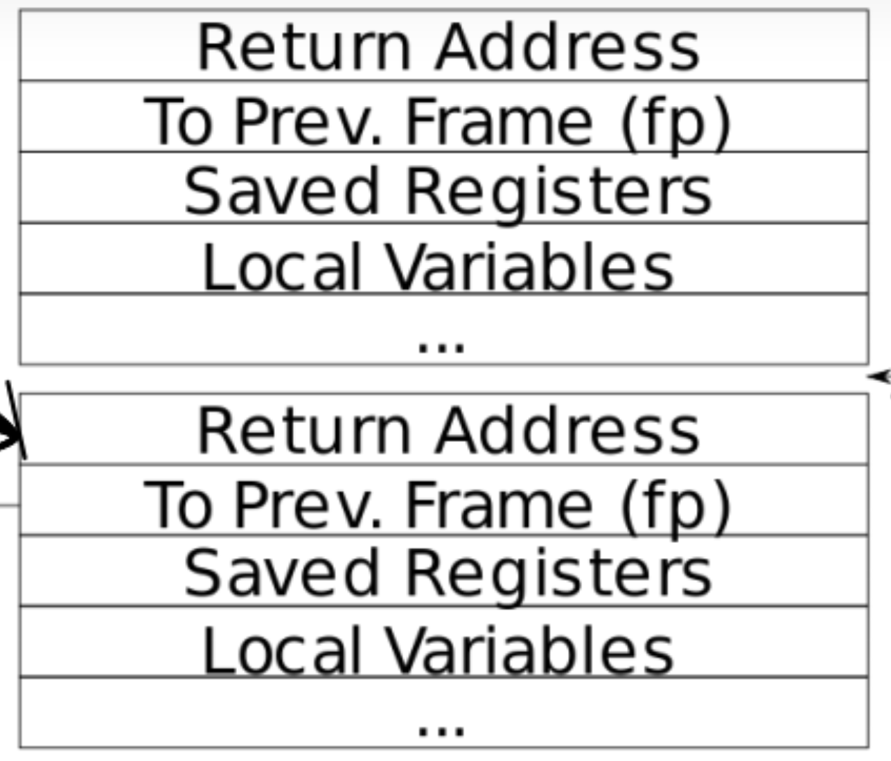

## RISC-V 汇编（简单） 

​	了解 RISC-V 汇编非常重要，您在 6.1910（6.004）中接触过这些内容。您的 xv6 存储库中有一个文件 user/call.c。make fs.img 会对其进行编译，并在 user/call.asm 中生成该程序的可读汇编版本。 阅读 call.asm 中函数 g、f 和 main 的代码。RISC-V 的使用手册位于参考页面上。在 answers-traps.txt 中回答以下问题：

- 哪些寄存器包含函数的参数？例如，在 main 调用 printf 时，哪个寄存器保存 13？

- 在 main 的汇编代码中，对函数 f 的调用在哪里？对 g 的调用在哪里？（提示：编译器可能会内联函数。）
- 函数 printf 位于什么地址？
- 在 main 中，jalr 到 printf 之后的寄存器 ra 中的值是什么？

运行以下代码。

```
unsigned int i = 0x00646c72;
printf("H%x Wo%s", 57616, (char *) &i);
```

- 输出是什么？这是一个将字节映射到字符的 ASCII 表。

- 输出取决于 RISC-V 是小端字节序的事实。如果 RISC-V 是大端字节序，您会将 i 设置为多少才能产生相同的输出？您是否需要将 57616 更改为其他值？

这里有一个关于小端和大端的描述和一个更奇特的描述。

- 在下面的代码中，'y=' 后面会打印什么？（注意：答案不是一个具体的值。）为什么会发生这种情况？

- ```
  printf("x=%d y=%d", 3);
  ```

  评价是直接看汇编。

  ```
  int g(int x) {
     0:	1141                	addi	sp,sp,-16
     2:	e406                	sd	ra,8(sp)
     4:	e022                	sd	s0,0(sp)
     6:	0800                	addi	s0,sp,16
    return x+3;
  }
     8:	250d                	addiw	a0,a0,3
     a:	60a2                	ld	ra,8(sp)
     c:	6402                	ld	s0,0(sp)
     e:	0141                	addi	sp,sp,16
    10:	8082                	ret
  
  0000000000000012 <f>:
  
  int f(int x) {
    12:	1141                	addi	sp,sp,-16
    14:	e406                	sd	ra,8(sp)
    16:	e022                	sd	s0,0(sp)
    18:	0800                	addi	s0,sp,16
    return g(x);
  }
    1a:	250d                	addiw	a0,a0,3
    1c:	60a2                	ld	ra,8(sp)
    1e:	6402                	ld	s0,0(sp)
    20:	0141                	addi	sp,sp,16
    22:	8082                	ret
  
  void main(void) {
    24:	1141                	addi	sp,sp,-16
    26:	e406                	sd	ra,8(sp)
    28:	e022                	sd	s0,0(sp)
    2a:	0800                	addi	s0,sp,16
    printf("%d %d\n", f(8)+1, 13);
    2c:	4635                	li	a2,13
    2e:	45b1                	li	a1,12
    30:	00001517          	auipc	a0,0x1
    34:	86050513          	addi	a0,a0,-1952 # 890 <malloc+0xf6>
    38:	6aa000ef          	jal	6e2 <printf>
    exit(0);
    3c:	4501                	li	a0,0
    3e:	2a2000ef          	jal	2e0 <exit>
  ```

  

  1. 哪些寄存器包含函数的参数？例如，在 main 调用 printf 时，哪个寄存器保存 13？

  首先，在a0 - a7会保留这些参数，也就是寄存器传递参数而不需要耗费时间压栈弹栈。

```
  printf("%d %d\n", f(8)+1, 13);
  2c:	4635                	li	a2,13
  2e:	45b1                	li	a1,12
```

​	看到这里，在这里是a2来保存我们参数13.

2. 在 main 的汇编代码中，对函数 f 的调用在哪里？对 g 的调用在哪里？（提示：编译器可能会内联函数。）

​	你看汇编，会发现他是直接压入参数的！这个事情就很有趣，因为函数f和g都足够简单，编译器直接trace了调用快速的在编译器就计算得到了结果，直接生成了立即数压入了调用。

3. 函数 printf 位于什么地址？

```
  38:	6aa000ef          	jal	6e2 <printf>
```

6aa000ef，完事

4. 在 main 中，jalr 到 printf 之后的寄存器 ra 中的值是什么？

​	当然的pc值加上4，这个事情只需要在gdb中i registers ra就OK了

```
ra             0x3c     0x3c <main+24>
```

- 输出是什么？这是一个将字节映射到字符的 ASCII 表。
- 输出取决于 RISC-V 是小端字节序的事实。如果 RISC-V 是大端字节序，您会将 i 设置为多少才能产生相同的输出？您是否需要将 57616 更改为其他值？

％x 表示以[十六进制数](https://zhida.zhihu.com/search?content_id=186008243&content_type=Article&match_order=1&q=十六进制数&zhida_source=entity)形式输出整数，57616 的16进制表示就是 e110，与大小端序无关。 %s 是输出字符串，以整数 i 所在的开始地址，按照字符的格式读取字符，直到读取到 '\0' 为止。当是[小端序](https://zhida.zhihu.com/search?content_id=186008243&content_type=Article&match_order=2&q=小端序&zhida_source=entity)表示的时候，内存中存放的数是：72 6c 64 00，刚好对应rld。当是大端序的时候，则反过来了，因此需要将 i 以16进制数的方式逆转一下。

- 在下面的代码中，'y=' 后面会打印什么？（注意：答案不是一个具体的值。）为什么会发生这种情况？

- ```
  printf("x=%d y=%d", 3);
  ```

  按照上面的结论就是：a2有啥传递啥，所以是随机值。

  

## 回溯（中等）

​	对于调试来说，回溯通常很有用：在发生错误的位置上方堆栈上的函数调用列表。为了帮助进行回溯，编译器会生成机器代码，该代码在堆栈上维护与当前调用链中每个函数相对应的堆栈框架。每个堆栈框架由返回地址和指向调用者堆栈框架的“框架指针”组成。寄存器 s0 包含指向当前堆栈框架的指针（它实际上指向堆栈上保存的返回地址的地址加 8）。您的回溯应该使用框架指针遍历堆栈并在每个堆栈框架中打印保存的返回地址。

在 kernel/printf.c 中实现 backtrace() 函数。在 sys_sleep 中插入对此函数的调用，然后运行调用 sys_sleep 的 bttest。您的输出应为具有以下形式的返回地址列表（但数字可能会有所不同）：

```
backtrace:
0x0000000080002cda
0x0000000080002bb6
0x0000000080002898
```

bttest 退出 qemu 后。在终端窗口中：运行 addr2line -e kernel/kernel（或 riscv64-unknown-elf-addr2line -e kernel/kernel）并从回溯中剪切并粘贴地址，如下所示：
$ addr2line -e kernel/kernel

```
0x0000000080002de2
0x0000000080002f4a
0x0000000080002bfc
Ctrl-D
```

您应该会看到类似以下内容：

```
kernel/sysproc.c:74
kernel/syscall.c:224
kernel/trap.c:85
```

一些提示：

将 backtrace() 的原型添加到 kernel/defs.h，以便您可以在 sys_sleep 中调用 backtrace。
GCC 编译器将当前正在执行的函数的帧指针存储在寄存器 s0 中。在 `#ifndef __ASSEMBLER__ ... #endif `标记的部分中，将以下函数添加到 kernel/riscv.h：

```
static inline uint64
r_fp()
{
	uint64 x;
	asm volatile("mv %0, s0" : "=r" (x) );
	return x;
}
```

- 并在 backtrace 中调用此函数以读取当前帧指针。r_fp() 使用内联汇编读取 s0。
- 这些讲义中有一张堆栈帧布局的图片。请注意，返回地址位于距堆栈帧的帧指针的固定偏移量 (-8) 处，而保存的帧指针位于距帧指针的固定偏移量 (-16) 处。
- 您的 backtrace() 将需要一种方法来识别它已经看到了最后一个堆栈帧，并且应该停止。一个有用的事实是，分配给每个内核堆栈的内存由单个页面对齐的页面组成，因此给定堆栈的所有堆栈帧都位于同一页面上。您可以使用 PGROUNDDOWN(fp)（请参阅 kernel/riscv.h）来识别帧指针指向的页面。
- 一旦您的回溯工作正常，请从 kernel/printf.c 中的 panic 中调用它，以便在内核崩溃时看到内核的回溯。
- 



​	啥也不说，仔细看看这个图。也就是说，我们想要打印的就是backtrace图

​	我们知道，调用栈最后必然是在一个页面内的。所以：我们就得到了打印的地址的上下界

```
// backtrace the functions
void backtrace(void)
{
  uint64 fp = r_fp();
  uint64 higher_page_case = PGROUNDUP(fp);
  uint64 lower_page_case  = PGROUNDDOWN(fp);
  printf("backtrace:\n");
  while(fp < higher_page_case && fp > lower_page_case){
    printf("%p\n", (void*)(*(uint64*)(fp - 8))); // fp - 8 is the address
    fp = *(uint64*)(fp - 16);
  }
}
```

​	其他的实在没啥新鲜的，我们只需要addr2line一下就可以得到结果

```
/home/Charliechen/xv6-labs-2024/kernel/sysproc.c:71
/home/Charliechen/xv6-labs-2024/kernel/syscall.c:141 (discriminator 1)
/home/Charliechen/xv6-labs-2024/kernel/trap.c:76
```

​	非常好！

> **PGROUNDUP(sz)**：该宏将给定的 `sz` 向上对齐到页面边界。`PGSIZE` 是页面的大小，通常是 4KB 或 4096 字节。此宏将 `sz` 向上舍入到最接近的页面大小。
>
> - 解释：
>   - `(sz) + PGSIZE - 1`：首先将 `sz` 加上页面大小减去 1，这样可以确保即使 `sz` 已经是页面大小的倍数，结果仍然是向上舍入。
>   - `& ~(PGSIZE-1)`：然后使用按位与运算和 `~(PGSIZE-1)` 掩码将结果对齐到页面大小的边界。
>
> **PGROUNDDOWN(a)**：该宏将给定的 `a` 向下对齐到页面边界。它通过对 `a` 进行按位与运算，将其清除掉页面大小以内的偏移量，从而将地址对齐到页面的起始位置。
>
> - 解释：
>   - `& ~(PGSIZE-1)`：将 `a` 与页面大小的掩码进行按位与运算，清除掉 `a` 中页面内的偏移量，确保结果是页面对齐的。

