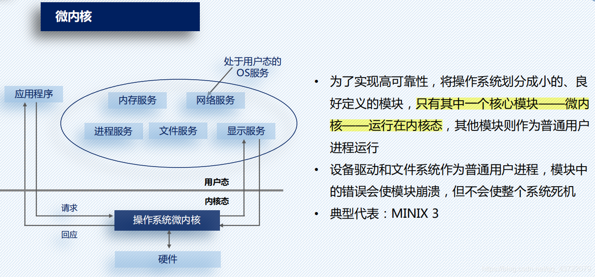
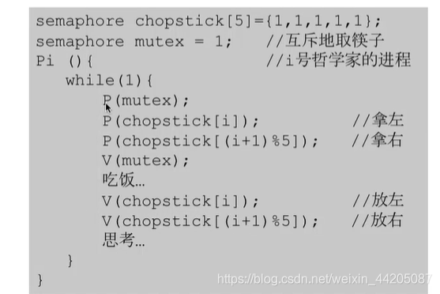
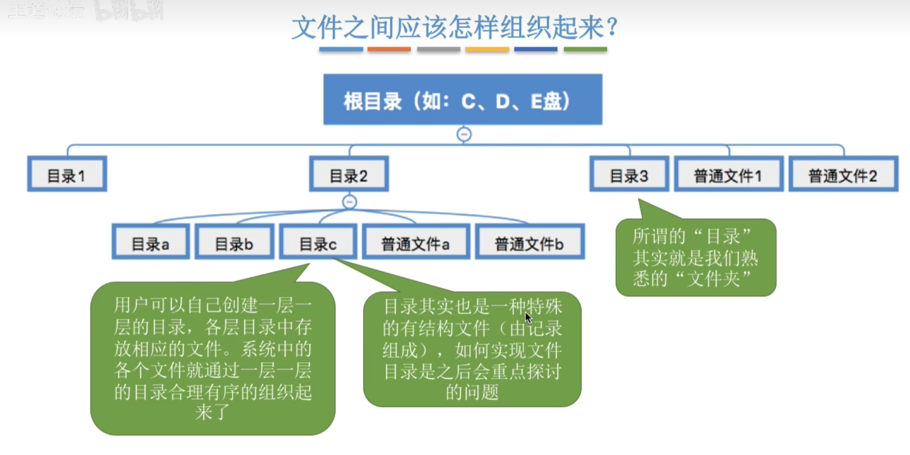
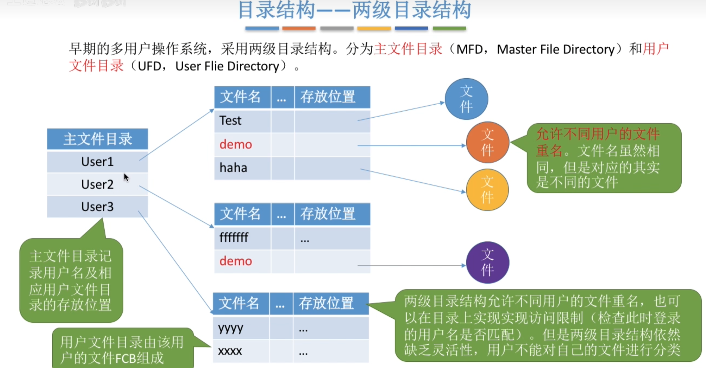
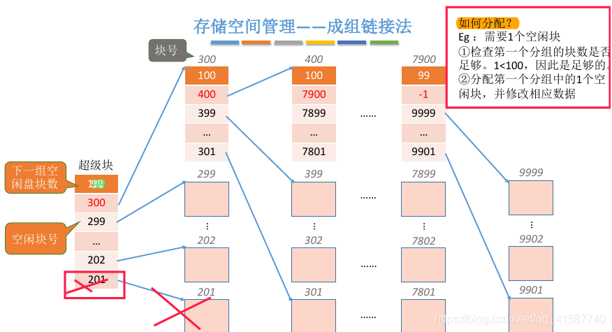
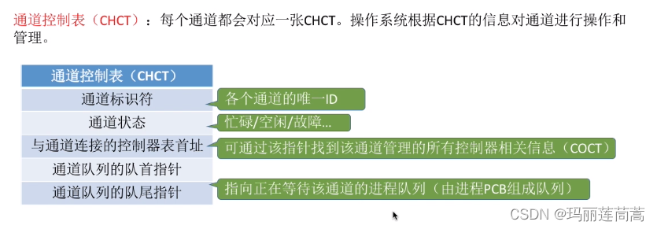
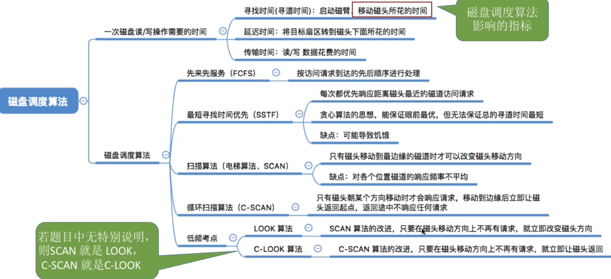
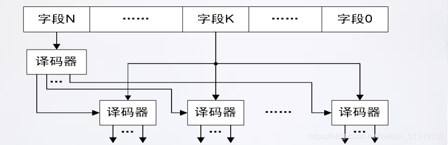
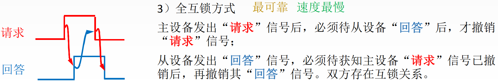
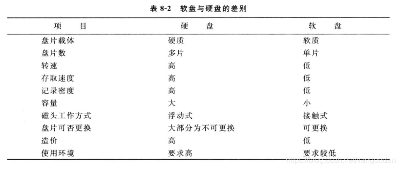

# 操作系统前置知识

1：x86-64体系下的寄存器介绍

​		自1946年冯·诺伊曼领导下诞生的世界上第一台通用电子计算机**ENIAC**至今，计算机技术已经发展了七十多载。

​		从当初专用于数学计算的庞然大物，到后来大型机服务器时代，从个人微机技术蓬勃发展，到互联网浪潮席卷全球，再到移动互联网、云计算日新月异的当下，计算机变的形态各异，无处不在。

​		这七十多年中，出现了数不清的编程语言，通过这些编程语言，又开发了无数的应用程序。

​		可无论什么样的应用程序，什么样的编程语言，最终的程序逻辑都是要交付给CPU去执行实现的（当然这里有些不严谨，除了CPU，还有协处理器、GPU等等）。所以了解和学习CPU的原理都是对计算机基础知识的夯实大有裨益。

​		在七十多年的漫长历程中，也涌现了不少架构的CPU。

- MIPS
- PowerPC
- x86/x64
- IA64
- ARM
- ······

这篇文章就以市场应用最为广泛的x86-x64架构为目标，通过学习了解它内部的45个寄存器功能作用，来串联阐述CPU底层工作原理。

**通过这篇文章，你将了解到：**

- CPU指令执行原理
- 内存寻址技术
- 软件调试技术原理
- 中断与异常处理
- 系统调用
- CPU多任务技术

## 什么是寄存器？

​		**寄存器是CPU内部用来存放数据的一些小型存储区域，用来暂时存放参与运算的数据和运算结果以及一些CPU运行需要的信息。**

x86架构CPU走的是**复杂指令集（CISC）** 路线，提供了丰富的指令来实现强大的功能，与此同时也提供了大量寄存器来辅助功能实现。这篇文章将覆盖下面这些寄存器：

- 通用寄存器
- 标志寄存器
- 指令寄存器
- 段寄存器
- 控制寄存器
- 调试寄存器
- 描述符寄存器
- 任务寄存器
- MSR寄存器


## 通用寄存器

首当其冲的是通用寄存器，这些的寄存器是程序执行代码最最常用，也最最基础的寄存器，程序执行过程中，绝大部分时间都是在操作这些寄存器来实现指令功能。

所谓通用，即这些寄存器CPU没有特殊的用途，交给应用程序“随意”使用。注意，这个随意，我打了引号，对于有些寄存器，CPU有一些潜规则，用的时候要注意。

- **eax**: **通常用来执行加法**，函数调用的返回值一般也放在这里面
- **ebx**: 数据存取
- **ecx**: 通常用来作为**计数器，比如for循环**
- **edx**: 读写I/O端口时，**edx用来存放端口号**
- **esp**: 栈顶指针，指向栈的顶部
- **ebp**: 栈底指针，指向栈的底部，通常用`ebp+偏移量`的形式来定位函数存放在栈中的局部变量
- **esi**: 字符串操作时，用于存放数据源的地址
- **edi**: 字符串操作时，**用于存放目的地址的，和esi两个经常搭配一起使用，执行字符串的复制等操作**

（值得注意的是：上面的几个寄存器是32位体系下的，16位下是ax, bx, ... di,是不是想起来Windows的Extend的了？是的，这里的e就是指的是对16位寄存器的扩展！）

​		在x64架构中，上面的通用寄存器都扩展成为64位版本，名字也进行了升级。当然，为了兼容32位模式程序，使用上面的名字仍然是可以访问的，相当于访问64位寄存器的低32位。

> rax rbx rcx rdx rsp rbp rsi rdi

​		除了扩展原来存在的通用寄存器，x64架构还引入了8个新的通用寄存器：

> **r8-r15**

​		在原来32位时代，函数调用时，那个时候通用寄存器少，参数绝大多数时候是通过线程的栈来进行传递（当然也有使用寄存器传递的，比如著名的C++ **this指针**使用ecx寄存器传递，不过能用的寄存器毕竟不多）。

​		进入x64时代，寄存器资源富裕了，参数传递绝大多数都是用寄存器来传了。**寄存器传参的好处是速度快，减少了对内存的读写次数。**

​		当然，具体使用栈还是用寄存器传参数，这个不是编程语言决定的，而是编译器在编译生成CPU指令时决定的，如果编译器非要在x64架构CPU上使用线程栈来传参那也不是不行，这个对高级语言是无感知的。

## 标志寄存器

标志寄存器，里面有众多标记位，记录了CPU执行指令过程中的一系列状态，这些标志大都由CPU自动设置和修改：

- CF 进位标志
- PF 奇偶标志
- ZF 零标志
- SF 符号标志
- OF 补码溢出标志
- TF 跟踪标志
- IF 中断标志
- ······


在x64架构下，原来的eflags寄存器升级为64位的rflags，不过其高32位并没有新增什么功能，保留为将来使用。

## 指令寄存器

> **eip**: 指令寄存器可以说是CPU中最最重要的寄存器了，它指向了下一条要执行的指令所存放的地址，CPU的工作其实就是不断取出它指向的指令，然后执行这条指令，同时指令寄存器继续指向下面一条指令，如此不断重复，这就是CPU工作的基本日常。

而在漏洞攻击中，黑客想尽办法费尽心机都想要修改指令寄存器的地址，从而能够执行恶意代码。

同样的，在x64架构下，32位的eip升级为64位的**rip**寄存器。

## 段寄存器

段寄存器与CPU的内存寻址技术紧密相关。

早在16位的8086CPU时代，内存资源宝贵，CPU使用分段式内存寻址技术：


（仔细看看这个图，着6个寄存器都是8位，其中4个是数据寄存器，寻址能力是`4,294,967,296bit`，也就是`4GB`）

16位的寄存器能寻址的范围是64KB，通过引入段的概念，将内存空间划分为不同的区域：分段，通过段基址+段内偏移段方式来寻址。

这样一来，段的基地址保存在哪里呢？8086CPU专门设置了几个段寄存器用来保存段的基地址，这就是段寄存器段的由来。

段寄存器也是16位的。

段寄存器有下面6个，前面4个是早期16位模式就引入了，到了32位时代，又新增了fs和gs两个段寄存器。

- **cs**: 代码段
- **ds**: 数据段
- **ss**: 栈段
- **es**: 扩展段
- **fs**: 数据段
- **gs**: 数据段


段寄存器里面存储的内容与CPU当前工作的内存寻址模式紧密相关。

当CPU处于16位实地址模式下时，段寄存器存储段的基地址，寻址时，将段寄存器内容左移4位（乘以16）得到段基地址+段内偏移得到最终的地址。

当CPU工作于保护模式下，段寄存器存储的内容不再是段基址了，此时的段寄存器中存放的是**段选择子**，用来指示当前这个段寄存器“指向”的是哪个分段。

注意我这里的指向打了引号，段寄存器中存储的并不是内存段的直接地址，而是段选择子，它的结构如下：


16个bit长度的段寄存器内容划分了三个字段：

- **PRL**: 特权请求级，就是我们常说的ring0-ring3四个特权级。
- **TI**: 0表示用的是全局描述符表GDT，1表示使用的是局部描述符表LDT。
- **Index**: 这是一个表格中表项的索引值，这个表格叫**内存描述符表**，它的每一个表项都描述了一个内存分段。

​		这里提到了两个表，全局描述符表GDT和局部描述符表LDT，关于这两个表的介绍，下面介绍描述符寄存器时再详述，这里只需要知道，这是CPU支持分段式内存管理需要的表格，放在内存中，表格中的每一项都是一个描述符，记录了一个内存分段的信息。

​		保护模式下的段寄存器和段描述符到最后的内存分段，通过下图的方式联系在一起：


通用寄存器、段寄存器、标志寄存器、指令寄存器，这四组寄存器共同构成了一个基本的指令执行环境，一个线程的上下文也基本上就是这些寄存器，在执行线程切换的时候，就是修改它们的内容。


## 控制寄存器

​		控制寄存器是CPU中一组相当重要的寄存器，我们知道eflags寄存器记录了当前运行线程的一系列关键信息。

​		那CPU运行过程中自身的一些关键信息保存在哪里呢？答案是控制寄存器！


​		32位CPU总共有cr0-cr4共5个控制寄存器，64位增加了cr8。他们各自有不同的功能，但都存储了CPU工作时的重要信息：

- **cr0**: 存储了CPU控制标记和工作状态
- **cr1**: 保留未使用
- **cr2**: 页错误出现时保存导致出错的地址
- **cr3**: 存储了当前进程的虚拟地址空间的重要信息——**页目录**地址
- **cr4**: 也存储了CPU工作相关以及当前人任务的一些信息
- **cr8**: 64位新增扩展使用

其中，CR0尤其重要，它包含了太多重要的CPU信息，值得单独关注一下：


一些重要的标记位含义如下：

`PG`: 是否启用内存分页

`AM`: 是否启用内存对齐自动检查

`WP`: 是否开启内存写保护，若开启，对只读页面尝试写入时将触发异常，这一机制常常被用来实现**写时复制**功能

`PE`: 是否开启保护模式

除了CR0，另一个值得关注的寄存器是CR3，它保存了当前进程所使用的虚拟地址空间的页目录地址，可以说是整个虚拟地址翻译中的顶级指挥棒，在进程空间切换的时候，CR3也将同步切换。

## 调试寄存器

在x86/x64CPU内部，还有一组用于支持软件调试的寄存器。

调试，对于我们程序员是家常便饭，必备技能。但你想过你的程序能够被调试背后的原理吗？

程序能够被调试，关键在于能够被中断执行和恢复执行，被中断的地方就是我们设置的断点。那程序是如何能在遇到断点的时候停下来呢？


对于一些解释执行（PHP、Python、JavaScript）或虚拟机执行（Java）的高级语言，这很容易办到，因为它们的执行都在解释器/虚拟机的掌控之中。

而对于像C、C++这样的“底层”编程语言，程序代码是直接编译成CPU的机器指令来执行的，这就需要CPU来提供对于调试的支持了。

对于通常的断点，也就是程序执行到某个位置下就停下来，这种断点实现的方式，在x86/x64上，是利用了一条**软中断**指令：**int 3**来进行实现的。

**注意，这里的int不是指高级语言里面的整数，而是表示interrupt中断的意思，是一条汇编指令，int 3则表示中断向量号为3的中断。**

在我们使用调试器下断点时，调试器将会把对应位置的原来的指令替换为一个int 3指令，机器码为0xCC。这个动作对我们是透明的，我们在调试器中看到的依然是原来的指令，但实际上内存中已经不是原来的指令了。

顺便提一句，两个0xCC是汉字【烫】的编码，**在一些编译器里，会给线程的栈中填充大量的0xCC，如果程序出错的时候，我们经常会看到很多烫烫烫出现，就是这个原因。**(MSVC)


​		言归正传，CPU在执行这条int 3指令时，将自动触发中断处理流程（虽然这实际上不是一个真正的中断），CPU将取出IDTR寄存器指向的中断描述符表IDT的第3项，执行里面的中断处理函数。

​		而这个中断描述符表，早在操作系统启动之初，就已经提前安排好了，所以执行这条指令后，操作系统的中断处理函数将介入，来处理这一事件。

​		后面的过程就多了，简单来说，操作系统会把触发这一事件的进程冻结起来，随后将这一事件发送到调试器，调试器拿到之后就知道目标进程触发断点了。这个时候，咱们程序员就能通过调试器的UI交互界面或者命令行调试接口来调试目标进程，查看堆栈、查看内存、变量都随你。

​		如果我们要继续运行，调试器将会把之前修改的int 3指令给恢复回去，然后告知操作系统：我处理完了，把目标进程解冻吧！

​		上面简单描述了一下普通断点的实现原理。现在思考一个场景：我们发现一个bug，某个全局整数型变量的值老是莫名其妙被修改，但你发现有很多线程，很多函数都有可能会去修改这个变量，你想找出到底谁干的，怎么办？

​		这个时候上面的普通断点就没办法了，你需要一种新的断点：**硬件断点**。

​		这时候就该本小节的主人公调试寄存器登场表演了。


在x86架构CPU内部，提供了8个调试寄存器DR0~DR7。

**DR0~DR3**：这是四个用于存储地址的寄存器

**DR4~DR5**：这两个有点特殊，受前面提到的CR4寄存器中的标志位DE位控制，如果CR4的DE位是1，则DR4、DR5是不可访问的，访问将触发异常。如果CR4的DE位是0，则DR4和DR5将会变成DR6和DR7的别名，相当于做了一个软链接。这样做是为了将DR4、DR5保留，以便将来扩展调试功能时使用。

**DR6**：这个寄存器中存储了硬件断点触发后的一些状态信息

**DR7**：调试控制寄存器，这里面记录了对DR0-DR3这四个寄存器中存储地址的中断方式（是对地址的读，还是写，还是执行）、数据长度（1/2/4个字节）以及作用范围等信息

通过调试器的接口设置硬件断点后，CPU在执行代码的过程中，如果满足条件，将自动中断下来。

回答前面提出的问题，想要找出是谁偷偷修改了全局整形变量，只需要通过调试器设置一个硬件写入断点即可。

## 描述符寄存器

所谓**描述符**，其实就是一个数据结构，用来记录一些信息，‘描述’一个东西。把很多个描述符排列在一起，组成一个表，就成了描述符表。再使用一个寄存器来指向这个表，这个寄存器就是**描述符寄存器**。

在x86/x64系列CPU中，有三个非常重要的描述符寄存器，它们分别存储了三个地址，指向了三个非常重要的描述符表。

`gdtr`: 全局描述符表寄存器，前面提到，CPU现在使用的是段+分页结合的内存管理方式，那系统总共有那些分段呢？这就存储在一个叫全局描述符表（**GDT**）的表格中，并用gdtr寄存器指向这个表。这个表中的每一项都描述了一个内存段的信息。

`ldtr`: 局部描述符表寄存器，这个寄存器和上面的gdtr一样，同样指向的是一个段描述符表（**LDT**）。不同的是，GDT是全局唯一，LDT是局部使用的，可以创建多个，随着任务段切换而切换（下文介绍任务寄存器会提到）。


GDT和LDT中的表项，就是段描述符，描述了一个内存分段的信息，其结构如下：


一个表项占据8个字节（32位CPU），里面存储了一个内存分段的诸多信息：基地址、大小、权限、类型等信息。

除了这两个段描述符寄存器，还有一个非常重要的描述符寄存器：

`idtr`: 中断描述符表寄存器，指向了**中断描述符表IDT**，这个表的每一项都是一个中断处理描述符，当CPU执行过程中发生了硬中断、异常、软中断时，将自动从这个表中定位对应的表项，里面记录了发生中断、异常时该去哪里执行处理函数。


IDT中的表项称为**Gate**，中文意思为**门**，因为这是**应用程序进入内核的主要入口**。虽然表的名字叫中断描述符表，但表中存储的不全是中断描述符，IDT中的表项存在三种类型，对应三种类型的门：

- **任务门**
- **陷阱门**
- **中断门**


三种描述符中都存储了处理这个中断/异常/任务时该去哪里处理的地址。三种门用途不一，其中中断门是真正意义上的中断，而像前面提到的调试指令int 3以及老式的系统调用指令int 2e/int 80都属于陷阱门。任务门则用的较少，要了解任务门，先了解下任务寄存器。

## 任务寄存器

现代操作系统，都是支持多任务并发运行的，x86架构CPU为了顺应时代潮流，在硬件层面上提供了专门的机制用来支持多任务的切换，这体现在两个方面：

- CPU内部设置了一个专用的寄存器——**任务寄存器TR**，它指向当前运行的任务。


- 定义了描述任务的数据结构**TSS**，里面存储了一个任务的上下文（一系列寄存器的值），下图是一个32位CPU的TSS结构图：


x86CPU的构想是每一个任务对应一个TSS，然后由TR寄存器指向当前的任务，执行任务切换时，修改TR寄存器的指向即可，这是硬件层面的多任务切换机制。

这个构想其实还是很不错的，然而现实却打了脸，包括Linux和Windows在内的主流操作系统都没有使用这个机制来进行线程切换，而是自己使用软件来实现多线程切换。

所以，绝大多数情况下，TR寄存器都是指向固定的，即便线程切换了，TR寄存器仍然不会变化。

注意，我这里说的的是绝大多数情况，而没有说死。虽然操作系统不依靠TSS来实现多任务切换，但这并不意味着CPU提供的TSS操作系统一点也没有使用。还是存在一些特殊情况，如一些异常处理会使用到TSS来执行处理。

下面这张图，展示了控制寄存器、描述符寄存器、任务寄存器构成的全貌：


## 模型特定寄存器

从80486之后的x86架构CPU，内部增加了一组新的寄存器，统称为**MSR寄存器**，中文直译是模型特定寄存器，意思是这些寄存器不像上面列出的寄存器是固定的，这些寄存器可能随着不同的版本有所变化。这些寄存器主要用来支持一些新的功能。

随着x86CPU不断更新换代，MSR寄存器变的越来越多，但与此同时，有一部分MSR寄存器随着版本迭代，慢慢固化下来，成为了变化中那部分不变的，这部分MSR寄存器，Intel将其称为Architected MSR，这部分MSR寄存器，在命名上，统一加上了**IA32**的前缀。

这里选取三个代表性的MSR简单介绍一下：

- IA32_SYSENTER_CS
- IA32_SYSENTER_ESP
- IA32_SYSENTER_EIP

这三个MSR寄存器是用来实现**快速系统调用**。

在早期的x86架构CPU上，系统调用依赖于软中断实现，类似于前面调试用到的int 3指令，在Windows上，系统调用用到的是**int 2e**，在Linux上，用的是**int 80**。

软中断毕竟还是比较慢的，因为执行软中断就需要内存查表，通过IDTR定位到IDT，再取出函数进行执行。

系统调用是一个频繁触发的动作，如此这般势必对性能有所影响。在进入奔腾时代后，就加上了上面的三个MSR寄存器，分别存储了执行系统调用后，内核系统调用入口函数所需要的段寄存器、堆栈栈顶、函数地址，不再需要内存查表。快速系统调用还提供了专门的CPU指令**sysenter/sysexit**用来发起系统调用和退出系统调用。

在64位上，这一对指令升级为**syscall/sysret**。

## （一）GCC编译工具集

#### 1.GCC的组成

- GCC（GNU C Compiler） gcc是编译工具。它可以将 C/C++语言编写的程序转换成为处理器能够执行的二进制代码。GCC 现在还支持 Ada 语言、C++ 语言、Java 语言、Objective C 语言、Pascal 语言、COBOL 语言，以及支持函数式编程和逻辑编程的 Mercury 语言等。而 GCC 也变成了 GNU Compiler Collection 即GNU 编译器家族的意思。
- Binutils： 一组二进制程序处理工具，包括：addr2line、ar、objcopy、objdump、as、ld、 ldd、readelf、 size 等。这 一组工具是开发和调试不可缺少的工具 。

| 工具      | 作用                                                         |
| --------- | ------------------------------------------------------------ |
| addr2line | 用来将程序地址转换成其所对应的程序源文件及所对应的代码行，也可以得到所对应的函数。该工具将帮助调试器在调试的过程中定位对应的源代码位置 |
| as        | 主要用于汇编                                                 |
| ld        | 主要用于链接                                                 |
| ar        | 主要用于创建静态库                                           |
| ldd       | 可以用于查看一个可执行程序依赖的共享库                       |
| objcopy   | 将一种对象文件翻译成另一种格式，譬如将.bin 转换成.elf、或者将.elf 转换成.bin 等。 |
| objdump   | 主要的作用是反汇编                                           |
| readelf   | 显示有关ELF文件的信息                                        |
| size      | 列出可执行文件每个部分的尺寸和总尺寸，代码段、数据段、总大小等 |

- C运行库 C 语言标准主要由两部分组成：一部分描述C的语法，另一部分描述C标准库。 C标准库定义了一组标准头文件，每个头文件中包含一些相关的函数、变量、类型声明和宏定义，譬如常见的printf函数便是一个 C标准库函数，其原型定义在stdio头文件中。 C语言标准仅仅定义了C标准库函数原型，并没有提供实现。因此，C语言编译器通常需要一个C运行时库（C Run Time Libray，CRT）的支持。C 运行时库又常简称为 C运行库。与 C语言类似，C++也定义了自己的标准，同时提供相关支持库，称为C++运行时库。

#### 2.GCC编译过程

| 编译阶段 | 编译命令                | 作用                               |
| -------- | ----------------------- | ---------------------------------- |
| 预处理   | gcc -E test.c -o test.i | 编译器将源代码中包含头文件编译进来 |
| 编译     | gcc -S test.i -o test.s | 检查代码规范性并翻译成汇编语言     |
| 汇编     | gcc -c test.s -o test.o | 将.s文件转换为目标文件             |
| 链接     | gcc test.o -o test      | 将目标文件转换为可执行文件         |

- 预处理 执行命令`gcc -E test.c -o test.i`，生成test.i文件  test.i部分代码： 

- 编译 执行命令`gcc -S test.i -o test.s`，生成test.s文件  test.s部分代码：

  

- 汇编 执行命令`gcc -c test.s -o test.o`，生成test.o文件 

- 链接 执行命令`gcc test.o -o test`，生成test可执行文件 

## （二）EFF文件格式

#### 1.ELF文件

- ELF文件由4部分组成，分别是ELF头（ELF header）、程序头表（Program header table）、节（Section）和节头表（Section header table）。实际上，一个文件中不一定包含全部内容，而且它们的位置也未必如同所示这样安排，只有ELF头的位置是固定的，其余各部分的位置、大小等信息由ELF头中的各项值来决定。[1](https://blog.csdn.net/qq_45237293/article/details/109124376#fn1)
- ELF文件格式如下图，位于ELF Header和Section Header Table 之间的都是段（Section）。一个典型的ELF文件包含下面几个段：
  - .text：已编译程序的指令代码段。
  - .rodata：ro 代表 read only，即只读数据（譬如常数 const）。
  - .data：已初始化的 C 程序全局变量和静态局部变量。
  - .bss：未初始化的 C 程序全局变量和静态局部变量。
  - .debug：调试符号表，调试器用此段的信息帮助调试。 
- 使用`readelf -S test`查看test可执行文件各个section的信息

```c
There are 29 section headers, starting at offset 0x1928:

节头：
  [号] 名称              类型             地址              偏移量
       大小              全体大小          旗标   链接   信息   对齐
  [ 0]                   NULL             0000000000000000  00000000
       0000000000000000  0000000000000000           0     0     0
  [ 1] .interp           PROGBITS         0000000000000238  00000238
       000000000000001c  0000000000000000   A       0     0     1
  ··································································
  [26] .symtab           SYMTAB           0000000000000000  00001040
       00000000000005e8  0000000000000018          27    43     8
  [27] .strtab           STRTAB           0000000000000000  00001628
       0000000000000202  0000000000000000           0     0     1
  [28] .shstrtab         STRTAB           0000000000000000  0000182a
       00000000000000fe  0000000000000000           0     0     1
Key to Flags:
  W (write), A (alloc), X (execute), M (merge), S (strings), I (info),
  L (link order), O (extra OS processing required), G (group), T (TLS),
  C (compressed), x (unknown), o (OS specific), E (exclude),
  l (large), p (processor specific)
```

#### 2.反汇编ELF

- ELF文件无法被当做普通文本文件打开，如果希望直接查看一个 ELF文件包含的指令和数据，需要使用反汇编的方法,命令为`objdump -D test`

```asm
test：     文件格式 elf64-x86-64


Disassembly of section .interp:

0000000000000238 <.interp>:
 238:	2f                   	(bad)  
 239:	6c                   	insb   (%dx),%es:(%rdi)
 23a:	69 62 36 34 2f 6c 64 	imul   $0x646c2f34,0x36(%rdx),%esp
 241:	2d 6c 69 6e 75       	sub    $0x756e696c,%eax
 246:	78 2d                	js     275 <_init-0x273>
 248:	78 38                	js     282 <_init-0x266>
 24a:	36 2d 36 34 2e 73    	ss sub $0x732e3436,%eax
 250:	6f                   	outsl  %ds:(%rsi),(%dx)
 251:	2e 32 00             	xor    %cs:(%rax),%al
··································································
000000000000063a <main>:
 63a:	55                   	push   %rbp
 63b:	48 89 e5             	mov    %rsp,%rbp
 63e:	48 8d 3d 9f 00 00 00 	lea    0x9f(%rip),%rdi        # 6e4 <_IO_stdin_used+0x4>
 645:	e8 c6 fe ff ff       	callq  510 <puts@plt>
 64a:	b8 00 00 00 00       	mov    $0x0,%eax
 64f:	5d                   	pop    %rbp
 650:	c3                   	retq   
 651:	66 2e 0f 1f 84 00 00 	nopw   %cs:0x0(%rax,%rax,1)
 658:	00 00 00 
 65b:	0f 1f 44 00 00       	nopl   0x0(%rax,%rax,1)
·····································································
```

- 使用`objdump -S`将其反汇编并且将其C语言源代码混合显示出来： 执行命令`gcc -o hello -g hello.c`再执行`objdump -S test` （注意：需要加上参数-g，否则不能显示出c语言的源代码）

```c
······························································
000000000000063a <main>:
#include<stdio.h>

int main(void)
{
 63a:	55                   	push   %rbp
 63b:	48 89 e5             	mov    %rsp,%rbp
	printf("Hello World!\n");
 63e:	48 8d 3d 9f 00 00 00 	lea    0x9f(%rip),%rdi        # 6e4 <_IO_stdin_used+0x4>
 645:	e8 c6 fe ff ff       	callq  510 <puts@plt>
	return 0;
 64a:	b8 00 00 00 00       	mov    $0x0,%eax
}
 64f:	5d                   	pop    %rbp
 650:	c3                   	retq   
 651:	66 2e 0f 1f 84 00 00 	nopw   %cs:0x0(%rax,%rax,1)
 658:	00 00 00 
 65b:	0f 1f 44 00 00       	nopl   0x0(%rax,%rax,1)
·······························································
```

## （三）汇编语言格式

#### 1.汇编语言定义

汇编语言（Assembly Language）是任何一种用于电子计算机、微处理器、微控制器或其他可编程器件的低级语言，亦称为符号语言。在汇编语言中，用助记符代替机器指令的操作码，用地址符号或标号代替指令或操作数的地址。在不同的设备中，汇编语言对应着不同的机器语言指令集，通过汇编过程转换成机器指令。特定的汇编语言和特定的机器语言指令集是一一对应的，不同平台之间不可直接移植。[2](https://blog.csdn.net/qq_45237293/article/details/109124376#fn2)

#### 2.汇编语言组成

- 传送指令 包括通用数据传送指令MOV、条件传送指令CMOVcc、堆栈操作指令PUSH/PUSHA/PUSHAD/POP/POPA/POPAD、交换指令XCHG/XLAT/BSWAP、地址或段描述符选择子传送指令LEA/LDS/LES/LFS/LGS/LSS等。
- 逻辑运算 这部分指令用于执行算术和逻辑运算，包括加法指令ADD/ADC、减法指令SUB/SBB、加一指令INC、减一指令DEC、比较操作指令CMP、乘法指令MUL/IMUL、除法指令DIV/IDIV、符号扩展指令CBW/CWDE/CDQE、十进制调整指令DAA/DAS/AAA/AAS、逻辑运算指令NOT/AND/OR/XOR/TEST等。
- 移位指令 这部分指令用于将寄存器或内存操作数移动指定的次数。包括逻辑左移指令SHL、逻辑右移指令SHR、算术左移指令SAL、算术右移指令SAR、循环左移指令ROL、循环右移指令ROR等。
- 位操作 这部分指令包括位测试指令BT、位测试并置位指令BTS、位测试并复位指令BTR、位测试并取反指令BTC、位向前扫描指令BSF、位向后扫描指令BSR等。
- 控制转移 这部分包括无条件转移指令JMP、条件转移指令JCC/JCXZ、循环指令LOOP/LOOPE/LOOPNE、过程调用指令CALL、子过程返回指令RET、中断指令INTn、INT3、INTO、IRET等。
- 串操作 这部分指令用于对数据串进行操作，包括串传送指令MOVS、串比较指令CMPS、串扫描指令SCANS、串加载指令LODS、串保存指令STOS，这些指令可以有选择地使用REP/REPE/REPZ/REPNE和REPNZ的前缀以连续操作。
- 输入输出 这部分指令用于同外围设备交换数据，包括端口输入指令IN/INS、端口输出指令OUT/OUTS。

## （四）nasm汇编编译器编译生成可执行程序

#### 1.[Ubuntu](https://so.csdn.net/so/search?q=Ubuntu&spm=1001.2101.3001.7020)安装nasm汇编编译器

- 先判断是否安装nams 使用命令`whereis nasm`，如果显示nasm: /usr/bin/nasm ，则已经安装；如果只显示nasm： ，则未安装。
- 安装nasm 使用命令`sudo apt install nasm`安装nasm编译器 如无法安装可以参考[linux下的汇编环境搭建（nasm）](https://www.cnblogs.com/san-fu-su/archive/2014/11/11/4089041.html)

#### 2.编译代码hello.asm

- hello.asm源代码

```asm
; hello.asm 
section .data            ; 数据段声明
        msg db "Hello, world!", 0xA     ; 要输出的字符串
        len equ $ - msg                 ; 字串长度
section .text            ; 代码段声明
global _start            ; 指定入口函数
_start:                  ; 在屏幕上显示一个字符串
        mov edx, len     ; 参数三：字符串长度
        mov ecx, msg     ; 参数二：要显示的字符串
        mov ebx, 1       ; 参数一：文件描述符(stdout) 
        mov eax, 4       ; 系统调用号(sys_write) 
        int 0x80         ; 调用内核功能
                         ; 退出程序
        mov ebx, 0       ; 参数一：退出代码
        mov eax, 1       ; 系统调用号(sys_exit) 
        int 0x80         ; 调用内核功能
```

- 编译生成hello可执行文件

  使用命令

  ```
  nasm -f elf64 hello.asm
  ```

  将hello.asm文件生成hello.o文件

  使用命令

  ```
  ld -s -o hello hello.o
  ```

  将hello.o文件生成hello 可执行文件

  执行结果如下：

  

  - 遇到的问题

    使用命令

    ```
    nasm -f elf64 hello.asm
    ```

    生成hello.o文件后再使用命令

    ```
    gcc hello.o -o hello
    ```

    报错如下：

    ```
    hello.o：在函数‘_start’中：
    hello.asm:(.text+0x0): `_start'被多次定义
    /usr/lib/gcc/x86_64-linux-gnu/7/../../../x86_64-linux-gnu/Scrt1.o:(.text+0x0)：第一次在此定义
    /usr/bin/ld: hello.o: relocation R_X86_64_32 against `.data' can not be used when making a PIE object; recompile with -fPIC
    /usr/lib/gcc/x86_64-linux-gnu/7/../../../x86_64-linux-gnu/Scrt1.o：在函数‘_start’中：(.text+0x20)：对‘main’未定义的引用
    /usr/bin/ld: 最后的链结失败: 无效的操作
    collect2: error: ld returned 1 exit status
    1234567
    ```

    - 原因： gcc编译需要链接c语言标准库，而用nasm生成的.o文件没有用到c语言的标准库，因而使用gcc编译时会报错
    - 解决方法 将_start改为main即可

- 与gcc编译生成的可执行文件对比（功能都是输出）

  ```
  Hello,world!
  ```

  - nasm汇编语言生成的可执行代码大小为512字节 
  - gcc编译生成的可执行代码大小为8296字节  可见使用nasm汇编生成的main可执行文件要比gcc编译生成的可执行文件要更小。

## （五）总结

通过对gcc工具集的使用，我了解了在一个程序编译过程中是如何一步一步的编译成可执行文件的。除此之外，还了解了ELF文件和汇编文件的格式以及如何用nasm汇编编辑器编译hello.asm文件生成可执行文件hello。以上这些实验，使我对于Linux操作系统上的程序编译的理解更加深入。

## MISP

### 数据类型

1.MIPS使用定长指令，所有指令都是32位长的 2.1字节=8位，半字长=2个字节（32位），1字长=4个字节 3.一个字符空间=1个字节 4.一个整形=一个字长=4个字节 5.单个字符用单引号 6.字符串用双引号

### 寄存器

- MIPS下一共有32个通用寄存器
- 在汇编中，寄存器标志以$开头
- 寄存器表示可以有两种方式： 1.直接使用该寄存器对应的编号，例如：从$0到$31 2.使用对应的寄存器名称，例如t1,sp， 对于乘法和除法分别有对应的两个寄存器lo,hi
- 对于以上两者，不存在直接寻址，必须通过mfhi(“move from hi”)和mflo(“move from lo”)分别来进行访问对应的内容。
- 栈的走向是从高地址向低地址

#### MIPS下各个寄存器编号及描述

| 寄存器编号 | 寄存器名                                                 | 寄存器用途                                                  |
| ---------- | -------------------------------------------------------- | ----------------------------------------------------------- |
| 0          | zero                                                     | 永远返回0                                                   |
| 1          | $at                                                      | 汇编保留寄存器（不可用作其他用途）                          |
| 2-3        | $v0-$v1                                                  | (value的简写)存储表达式或者函数的返回值                     |
| 4-7        | $a0-$a3                                                  | (Argument简写)存储子程序的前4个参数，在子程序调用过程中释放 |
| 8-15       | $t0-$t7                                                  | (temp简写)临时变量，同上调用时不保存                        |
| 16-23      | $s0-$s7                                                  | (Save or Static简写？)静态变量？调用时保存                  |
| 24-25      | $t8-$t9                                                  | (Temp简写)算是前面$0-$7的继续，属性同$t0-$t7                |
| 26-27      | $k0-$k1                                                  | (break off简写?)中断函数返回值，不可做其他用途              |
| 28         | gp\|(GlobalPointer简写)指向64k大小的静态数据块的中间地址 |                                                             |
| 29         | $sp                                                      | (Stack Pointer简写)栈指针，指向栈顶                         |
| 30         | $s8/$fp                                                  | (Save / Frame Pointer)帧指针                                |
| 31         | $ra                                                      | 返回地址，目测不可用作其他用途                              |

### 程序结构

本质就是数据声明+普通文本+程序编码（文件后缀为.s或.asm） 数据声明在代码段之后（在之前也没什么问题）

#### 数据声明

- 数据段以.data为开始标志
- 声明变量后，即在主存中分配空间

#### 代码

- 代码段以.text为开始标志
- 其实就是各项指令操作
- 程序入门为**main:**标志
- 程序结束标志（见下文）

#### 注释

同C系语言 基本模板

```
# Comment giving name of program and description of function
# 说明下程序的目的和作用（其实和高级语言都差不多了）
# Template.s
#Bare-bones outline of MIPS assembly language program


           .data       # variable declarations follow this line
　　　　                # 数据变量声明
                       # ...

           .text       # instructions follow this line  
               # 代码段部分                                                          
main:                  # indicates start of code (first instruction to execute)
                       # 主程序
                       # ...

# End of program, leave a blank line afterwards to make SPIM happy
```

#### 数据声明

声明的格式：

```
变量名：（冒号不可缺少） 数据类型 变量值1
```

通常给变量赋一个初始值，对于**.space**，需要指明需要多少大小空间(bytes)

### 加载/保存 指令集

- 如果要访问内存，只能够使用**load/store**指令
- 其他的只能是寄存器操作

#### load

##### lw

`lw register_destination, RAM_source` 从内存中复制RAM_source的内容到对应的寄存器中（w意味word，即该数据大小为4个字节）

##### lb

`lb register_destination, RAM_source` 同上，lb为load byte

#### store

##### sw

`sw register_source, RAM_destination` 指将指定寄存器中的数据写入到特定的内存中

##### sb

`sb register_source, RAM_destination` 同lb

#### load immediate

##### li

`li register_destination, value` 顾名思义，加载立即数

### 立即与间接寻址

#### la (load address 直接给地址)

例如`la $to,var1`表示的是将var1中的内存地址塞入$to中

#### 间接寻址

地址是寄存器的内容（也可以理解为指针） `lw $t2,($t0)` load word at RAM address contained in $t0 into $t2 `sw $t2,($t0)` store word in register $t2 into RAM at address contained in $t0

#### 加偏移量

`lw $t2,4($t0)` load word at RAM address ($t0+4) into register $t2,”4” gives offset from address in register $t0 `sw $t2,-12($t0)` store word in register $t2 into RAM at address ($t0 - 12),negative offsets are fine

### 算术指令集

- 最多三个操作数
- 操作数只能是寄存器，不允许出现地址
- 所有指令统一是32位

```
  add $t0,$t1,$t2 # $t0 = $t1 + $t2; add as signed (2's complement) integers

        sub $t2,$t3,$t4	#  $t2 = $t3 Ð $t4
        addi    $t2,$t3, 5  #  $t2 = $t3 + 5;   "add immediate" (no sub immediate)
        addu    $t1,$t6,$t7	#  $t1 = $t6 + $t7;   add as unsigned integers
        subu    $t1,$t6,$t7	#  $t1 = $t6 + $t7;   subtract as unsigned integers

        mult    $t3,$t4        #  multiply 32-bit quantities in $t3 and $t4, and store 64-bit
                    #  result in special registers Lo and Hi:  (Hi,Lo) = $t3 * $t4
　　　　　　　　　　　　　　　　　　　　　　　　　运算结果存储在hi,lo（hi高位数据， lo低位数据）
        div $t5,$t6        #  Lo = $t5 / $t6   (integer quotient)
                    #  Hi = $t5 mod $t6   (remainder)
　　　　　　　　　　　　　　　　　　　　　　　　　商数存放在 lo, 余数存放在 hi
        mfhi    $t0		#  move quantity in special register Hi to $t0:   $t0 = Hi
　　　　　　　　　　　　　　　　　　　　　　　　  不能直接获取 hi 或 lo中的值， 需要mfhi, mflo指令传值给寄存器
        mflo    $t1		#  move quantity in special register Lo to $t1:   $t1 = Lo
                    #  used to get at result of product or quotient

        move    $t2,$t3    #  $t2 = $t312345678910111213141516171819
```

### 控制流

#### 分支（if else系列）

```
        b   target      #  unconditional branch to program label target
        beq $t0,$t1,target #  branch to target if  $t0 = $t1
        blt $t0,$t1,target #  branch to target if  $t0 < $t1
        ble $t0,$t1,target #  branch to target if  $t0 <= $t1
        bgt $t0,$t1,target #  branch to target if  $t0 > $t1
        bge $t0,$t1,target #  branch to target if  $t0 >= $t1
        bne $t0,$t1,target #  branch to target if  $t0 <> $t11234567
```

#### 跳转（while,for,goto系列）

```
        j   target  　　　　 #  unconditional jump to program label target
　　　　　　　　　　　　　　　　　　　　　　　    看到就跳， 不用考虑任何条件
        jr  $t3		#  jump to address contained in $t3 ("jump register")
　　　　　　　　　　　　　　　　　　　　　　　　　 类似相对寻址，跳到该寄存器给出的地址处1234
```

#### 子程序调用

```
    jal sub_label   #  "jump and link"1
```

将当前的程序计数器保存在$ra中，通过上面保存在$ra中的计数器返回到调用前 如果说调用的子程序中有调用了其他子程序，如此往复，则返回地址的标记就用栈来存储。

#### 系统调用与输入/输出 （主要针对SPIM模拟器）

- 使用syscall，以下指令应该是通用的。
- 参数所使用的寄存器：$v0,$a0,$a1
- 返回值使用： $v0

| Service                                      | Code in $v0 对应功能的调用码 | Arguemnts 所需参数                                     | Results 返回值                |
| -------------------------------------------- | ---------------------------- | ------------------------------------------------------ | ----------------------------- |
| 打印一个整型                                 | $v0=1                        | 将要打印的整型赋值给$a0                                |                               |
| 打印一个浮点数                               | $v0=2                        | 将要打印的浮点数赋值给$f12                             |                               |
| 打印双精度浮点数                             | \|v0=3                       | 将要打印的双精度浮点数赋值给$f12                       |                               |
| 打印字符串                                   | $v0=4                        | 将要打印的字符串的地址赋值给$a0                        |                               |
| 读取一个整型                                 | $v0=5                        |                                                        | 将读取的整型赋值给$v0         |
| 读取浮点数                                   | $v0=6                        |                                                        | 将读取的浮点数赋值给$v0       |
| 读取双精度浮点数                             | $v0=7                        |                                                        | 将读取的双精度浮点数赋值给$v0 |
| 读取字符串                                   | $v0=8                        | 将读取字符串地址赋值给$a0，将读取字符串的长度赋值给$a1 |                               |
| sbrk(应该同C中的sbrk()函数一样) 动态分配内存 | $v0=9                        | $a0=amount 需要分配的空间大小，单位目测是字节          | 将分配好的空间首地址给$a0     |
| 退出                                         | \v0=10                       | 退出                                                   |                               |

\* 打印的字符串应该有一个终止符（’\0’），声明字符串为**.asciiz**类型即可。 * 对于读取整型，浮点数，双精度浮点数等数据操作，系统会读取一整行（以’\n’为结束） * 读取字符串时，输入过长就截短，短了不补，最后会加上终止符 * The sbrk service returns the address to a block of memory containing n additional bytes. This would be used for dynamic memory allocation.

> ```
> e.g. Print out integer value contained in register $t2栗子：  打印一个存储在寄存器 $2 里的整型
> li	$v0, 1			# load appropriate system call code into register $v0;　　　　　　　　　　　　　　　　　　　　　　　　　　　　　
> 							# code for printing integer is 1
> move	$a0, $t2		# move integer to be printed into $a0:  $a0 = $t2　　　　　　　　　　　　　　　　　　　　　　　　　　　　　
> syscall				# call operating system to perform operation
> ```

> ```
> e.g.   Read integer value, store in RAM location with label int_value 
> (presumably declared in data section)
> li	$v0, 5			# load appropriate system call code into register $v0;
> 					# code for reading integer is 5　　　　　　　　　　　　　　　　　　　　　　　　　　　　　
> syscall				# call operating system to perform operation、　　　　　　　　　　　　　　　　　　　　　　　　　　　　　
> sw	$v0, int_value		# value read from keyboard returned in register $v0;
> 						# store this in desired location　　　　　　　　　　　　　　　　　　　　　　　　　　　　　　　　　　　　
> e.g.   Print out string (useful for prompts)栗子：  打印一个字符串(这是完整的，其实上面栗子都可以直接替换main: 部分，都能直接运行)
> 
> .data
> string1		.asciiz	"Print this.\n"		# declaration for string variable, 
> 							# .asciiz directive makes string null terminated
> 
> .text
> main:		
> li	$v0, 4			# load appropriate system call code into register $v0;
> 					# code for printing string is 4　　　　　　　　　　　　　　　　　　　　　　　　　　　　 
> la	$a0, string1	# load address of string to be printed into $a0　　　　　　　　　　　　　　　　　　　　　　　　　　　　　
> syscall				# call operating system to perform print operation
> e.g. To indicate end of program, use exit system call; thus last lines of program should be:执行到这里， 程序结束， 立马走人， 管他后边洪水滔天~~
> 
> li	$v0, 10		　　# system call code for exit = 10
> syscall				# call operating sys
> ```

# 操作系统速通小论

## 第一张

1. 操作系统（OS）是指控制和管理整个计算机系统的硬件和软件资源，并且合理的调度计算机工作和资源分配的系；且会给用户和其他软件方便的接口和环境，是计算机当中最基本的系统软件
2. 操作系统的四个基本特性：并发（宏观并发，围观交替），共享（资源可以供给内存多个并发执行的进程共同使用）

​		共享分为互斥共享和同时共享：互斥共享意味着经典的一人一马桶。同时共享则意味着交替的访问共享资源。

虚拟：说白了就是给每一个任务都抽象出来一台虚拟机——好像这个电脑总是在运作一个程序。但事实上不是。

异步：进程的前行是异步的，走走停停，没有

1. 特权指令和非特权指令：可以说在CPU执行的指令当中是由轻重的。一些指令可以完成简单的加法减法即可，另一些则是会对整个系统造成一定影响的——诸如内存清零的指令等等。所以，那些只能是内核执行的指令是特权指令，另一些则是非特权指令。
2. 内核态和用户态：CPU有两种状态——当处于用户态时说明正在运行用户权限，处于内核态则是说明运行内核程序。对此，CPU内存在一个`Program State Word Register(PSW)`

（用户态`->`内核态：中断陷入；内核态`->`用户态：修改PSW）

1. 中断时让操作系统拥有CPU使用权的唯一途径，中断分为内中断和外中断（内和外相对于CPU而言），下面这些情况可以触发一个内中断

- 试图在用户态下执行特权指令
- 执行除法的时候发现除数是0

1. 应用程序想要请求系统内核的服务，会执行一条特殊的陷入指令。（非特权）
2. 外中断：如时钟中断——时钟部件发来的中断信号

我们的CPU接受到中断回去IVT（Interrupt Vector Table去查询中断的具体措施）

1. 系统调用是对硬件复杂调用的抽象，我们的高级编程语言又对一些常见的系统调用边抽象


​		应用程序就是通过系统调用请求操作系统的服务，而系统中的各项共享资源管理都是由操作系统内核统一掌管，所以凡是与共享资源有关的操作（存储分配，IO操作，文件管理等），都必须通过系统调用的方式向操作系统提出内核请求，让操作系统代为完成。这样就可以保证系统的稳定性和安全性。

9.操作系统的层次结构种类


##### 2. 层次结构


##### 3. 微内核结构



**（1）四个要点**

**① 内核要足够小** 微内核并非是一个完整的OS，而只是将操作系统中最基本的部分放入内核。 通常包含有：1）与硬件紧密相关的部分 2）一些较为基本的功能 3）客户和服务器之间的通信

**② 基于客户 / 服务器模式** （其实一看到这个词，我想到的就是一排排很大的那个服务器的机器，然后就很疑惑，操作系统怎么还跟服务器扯上关系了呢。但是仔细看了下，并不是那个实体的服务器机器，这里指的是一组与服务器功能相似的进程，能够提供服务、传递信息，所以还是在系统内部的）

操作系统最基本的部分放在内核，其它绝大部分功能都放在微内核外的一组服务器（进程）中实现。它们运行在用户态。

服务器进程举例：管理线程的、管理虚拟存储器的、管理 I/O 设备的 ……

客户与服务器之间通过微内核来进行信息交互，如图：


**③ 应用“机制与策略分离”原理**

说白了就是 食材 与 炒菜方法……机制是食材，策略是炒菜方法，可以把食材炒成各种不同的菜肴。

**机制：** 实现某一功能的具体执行机构。通常在微内核中，正因如此，微内核才可以做的如此小。 **策略：** 借助算法或参数，利用机制去实现想要的功能。

**④ 采用面向对象技术**

**（2）微内核的基本功能** ① 进程（线程）管理 ② 低级存储器管理 ③ 中断和陷入处理


### 四、虚拟机的概念


## 第二章

1. 进程：进程可以简单的理解为正在执行的程序。当进程被创造的时候，他会被赋予一个PID（Process Identification）
2. 进程可以用一个块PCB(Process Control Block)描述，它记录着进程的PID，分配的资源和运行的情况。**他是进程存在的唯一标志**


1. 进程由PCB + 程序段 + 数据段组成
2. 进程是动态的，并发的，独立的，异步的，结构的
3. 进程的状态：

- 就绪状态ready：进程已经分配除CPU以外的所有必要资源，只要在获得CPU就可立刻执行。
- 执行状态running：进程已获得CPU，其程序正在执行的状态。
- 阻塞状态block：正在执行的进程由于发生某事件（如IO请求、申请缓冲区失败等）暂时无法继续执行的状态。


> （1）创建状态：①进程申请一个空白PCB；②向PCB中填写用于控制和管理进程的信息；③为该进程分配运行所需要的的资源；④将该进程转入就绪状态并插入就绪队列中
>
> （2）终止状态：①等待操作系统进行善后处理（操作系统保留该进程的信息供其他的进程提取）；②将该进程的PCB清零，CPU将PCB控件返还系统

挂起和阻塞的区别

1. 对系统资源占用不同：虽然都释放了CPU，但阻塞的进程仍处于内存中，而挂起的进程通过“对换”技术被换出到外存（磁盘）中。
2. 发生时机不同：阻塞一般在进程等待资源（IO资源、信号量等）时发生；而挂起是由于用户和系统的需要，例如，终端用户需要暂停程序研究其执行情况或对其进行修改、OS为了提高内存利用率需要将暂时不能运行的进程（处于就绪或阻塞队列的进程）调出到磁盘
3. 恢复时机不同：阻塞要在等待的资源得到满足（例如获得了锁）后，才会进入就绪状态，等待被调度而执行；被挂起的进程由将其挂起的对象（如用户、系统）在时机符合时（调试结束、被调度进程选中需要重新执行）将其主动激活

挂起操作的目的

- 终端用户的需要: 修改、检查进程
- 父进程的需要：修改、协调子进程
- 对换的需要：缓和内存
- 负荷调节的需要：保证实时任务的执行

4.3状态转换图


进程控制：操作系统通过原语实现对进程的控制。原语的执行具有原子性，即不可以被中断，一气呵成。对于那些不可以打断的进程，我们需要为之加“锁”。

​		原子的实现依靠的是“关中断”和“开中断”两个特权指令。关中断就是“关闭中断”，让程序继续执行的意思。开中断就是“打开中断”

​		进程控制相关的原语：

​		创建原语包括申请空白PCB，分配资源，初始化以及插入就绪队列等。能过引发这一原语的是用户登录，作业调度，提供服务以及应用请求四个事件

​		撤销原语包括从PCB中找到终止进程的PCB。若正在执行则立即剥夺CPU，CPU被其他进程瓜分，终止所有的子进归还系统资源后删除PCB。

​		阻塞原语：找到阻塞的进程对应的PCB，保护进程运行现场，设置之为“阻塞态”，再将PCB插入相应事件的等待队列。可能是需要资源或者是需要其他进程相互配合。

​		唤醒原语：从幻醒的进程中找到PCB，设置为就绪态。

​		切换原语：将运行的环境信息存入PCB，移入相应的队列后选择另一个进程并且更新PCB，根据PCB回复新进程所需的运行环境


IPC：是指两个进程之间的数据交互通信。我们知道进程是分配系统资源的单位（包括内存地址空间），因此个内存拥有的内存地址空间相互独立。为了安全，我们一般不允许一个内存随意的访问其他进程的空间

​		我们可以设立一个共享数据存储区，这样，我们就可以有效的可以控制的交换进程的数据。Linux下：

```
int shm_open(...); //申请内存
void* mmap(...); //映射到进程自己的地址空间
```

​		为了避免出错，各个进程对共享空间的访问必须是互斥的。各个进程会使用操作系统内核提供的同步互斥工具完成（P，V操作）

​		基于存储区的共享：操作系统在内存中画出一块存储共享区，数据的形式，存放的位置都由通信进程控制，速度快，还高级。

​		基于数据结构的共享：速度慢

​		消息传递：进程的数据交换是用格式化的消息为单位。进程通过操作系统提供的“发送信息/接收信息”的两个原语进行数据交换。


​		消息传毒分为直接通信（点对点通信）和间接通信（通过信箱）


管道通信：


1. 管道只采用半双工通信，在一段时间里只可以进行单向的传输。如果要实现双向通信：需要在设计一个管道。
2. 个进程需要互斥的访问管道
3. 当管道写满的时候，写进程将会被阻塞直到有读进程取走数据
4. 当管道读空的时候，读进程将会被阻塞直到有写进程写入数据
5. 管道中的数据一旦被读走就会消失。所以只允许：
   - 多个写进程一个读进程
   - 多个读进程轮流读，一个写进程。

线程：线程是组成进程的基本单位，我们将进程细分去。现在，线程就是程序执行流的最小单位。现在，线程是一个基础的CPU执行单位。线程之间可以并发。现在，进程只作为除CPU以外的系统资源分配单元了。


​		用户级线程使用线程库实现的，操作系统意识不到线程的存在。线程的状态切换在用户态即可完成。


​		用户级线程（KLT）


​		管理工作由操作系统内核完成。线程调度和切换都是由内核负责，这就意味着内核级线程的切换必须在核心态下完成。操作系统会提供（TCB）


调度：确定处理事物优先级的规则。

作业：摸一个具体的任务. 用户向操作系统提交了一个作业`<->`用户让操作系统启动一个程序

高级调度：按照一个原则从作业后备队中挑选一个作业调入内存，对之建立PCB。

低级调度：按照一个策略从就绪队列挑选一个进程及那个处理机分配给他。

中级调度：将不紧急的进程调出内存，随后等待摸一个时候调入内存。


|                      | 要做什么                                                     | 调度发生在   | 发生频率 | 对进程状态的影响   |
| -------------------- | ------------------------------------------------------------ | ------------ | -------- | ------------------ |
| 高级调度（作业调度） | 按照某种规则，将后备队列选择某一个合适的作业调入内存为之创造进程 | 外存转向内存 | 最低     | 无->创建态->就绪态 |
| 中级调度（内存调度） | 按照某种规则，从挂起队列中选择一个合适的进程将其数据调回内存 | 外存转向内存 | 中等     | 挂起态->就绪态     |
| 低级调度（进程调度） | 按照某种规则，从就绪队列中选择一个进程为之分配处理机         | 内存转向CPU  | 最高     | 就绪态->运行态     |

进程调度时机：

1. 当前运行的进程主动放弃（正常终止，发生异常，等待IO）
2. 当前运行的进程被动放弃（分配的时间片，更紧急的事件发生，更优先的进程进入就绪队列）

不可以进行进程调度的时机：

1. 处理中断的过程
2. 进程在操作系统内核程序的临界区
3. 在原子操作的过程中

临界资源：指的是那些被锁上的资源。

临界区：访问临界资源的代码段

通常有以下两种进程调度方式：

1. 非剥夺（非抢占）调度方式：当一个进程正在处理机上执行时，即使有某个更为重要或者紧迫的进程进入就绪队列，仍然让正在执行的进程继续执行，知道该进程完成或发生某种事件而进入阻塞态时，才把处理机分配给更为重要或紧迫（优先级更高）的进程。其优点是实现简单，系统开销小，适用于大多数批处理系统，但它不能用于分时系统和大多数实时系统。
2. 剥夺（抢占）调度方式：当一个进程正在处理机上执行时，若有某个更为重要或紧迫的进程（优先级更高）的进程需要使用处理机，则立即暂停正在执行的进程，将处理机分配给这个更重要的进程。这种方式对提高系统吞吐率和响应效率都有明显的好处。但抢占也要遵循一定原则。

狭义的进程调度指的是从就绪队列当中选择一个进程

广义的则包含选择进程和进程切换两个步骤。

进程的切换主要完成了：

1. 队员俩进程各种数据的保存
2. 对新的进程各种数据的恢复（一般在PCB）

进程切换存在代价：过度频繁的切换进程必然会使得CPU完成切换进程的事件占比增大。


不同的调度算法具有不同的特性，在选择调度算法时，必须考虑算法的特性。为了比较[处理机调度](https://so.csdn.net/so/search?q=处理机调度&spm=1001.2101.3001.7020)算法的性能，人们提出了很多评价准则，主要有一下几种：

1. CPU利用率：CPU是计算机系统中最重要和最昂贵的资源之一，所以应该尽可能使得CPU保持忙的状态，资源利用率尽可能高。
2. 系统吞吐量：单位时间内CPU完成的作业数量。长作业需要消耗较长的处理机时间，会降低系统的吞吐量。对于短作业，他们所需消耗的处理机时间较短，因此能提高系统吞吐量。调度算法和方式不同，也会对系统的吞吐量产生较大影响。
3. 周转时间：周转时间是指从作业提交到作业完成所经历的时间，是作业等待、在就绪队列中排队，在处理机上运行及输入输出操作所花费的时间的总和。
4. 等待时间：进程处于等处理机状态的时间之和。等待时间越长，用户满意度越低。实际上，处理机调度算法实际上并不影响作业执行或输入输出操作的时间，只影响作业在就绪队列中等待所花的时间。因此，衡量一个调度算法的优劣，常常只需简单地考察等待时间。
5. 响应时间：用户提交请求到系统首次产生响应所用的时间。在交互式系统中，周转时间不可能是最好的评价准则，一般采用响应时间作业衡量调度算法的重要准则之一。从用户角度来看，调度策略应该尽量降低响应时间，使得响应时间处在用户能接受的范围之内。

总之，想得到一个满足所有用户和系统要求的算法几乎是不可能的。设计调度程序，一方面要满足特定系统用户的要求（比如，实时和交互进程的快速响应要求），另一方面要考虑系统整体的效率（比如，减少整个系统的进程平均周转时间），同时还要考虑调度算法的开销等。

四、几种典型的调度算法

- **先来先服务（FCFS）调度算法** FCFS是一种最简单的调度算法，**它既可以用于作业的调度，又可以用于进程调度。在作业调度中，算法每次从后备作业队列中选择最先进入该队列的一个或几个作业，将他们调入内存，分配必要的资源，创建进程并放入就绪队列。** 在进程调度中，FCFS调度算法每次从就绪队列中选择最先进入该队列的进程，将处理机分噢诶给它，使之投入运行，直到完成或尹某种原因而阻塞时才释放处理机。 FCFS属于不可剥夺（抢占）算法。从表面上看，它对所有作业都是公平的，但是如果有一个长作业先到达系统，就会使后面许多短作业等待很长时间，因此这种方法肯定不能作为分时系统和实时系统的调度方法，但是它常被结合在其他调度策略使用。比如在使用优先级作为调度策略的系统中，往往对多个具有相同优先级的进程按FCFS原则处理。 · 特点分析：算法简单，但是效率低下；对长作业较为有利，对短作业不利；利于CPU繁忙型作业，不利于I/O繁忙型作业。
- **短作业优先（SJF）调度算法** 短作业（进程）优先调度算法是指对短作业（进程）优先调度算法。短作业优先调度算法从后备队列中选择一个或若干估计运行时间最短的作业，将它们调入内存运行；短进程优先（SPF）调度算法是从就绪队列中选择一个估计运行时间最短的进程，将处理机分配给它，使之立即指向，直到完成或发生某时间而阻塞时，才释放处理机。 但是这种算法有着不容忽视的缺点： ①该算法对长作业不利，SJF中长作业的周转时间会增加。更糟的是，若一旦有长作业进入系统的后备队列，由于调度程序总是优先调度那些短作业（即使是后来的短作业也会被优先安排给处理机），导致长作业长期不被调度，饿死在后备队列中。 ②完全没有考虑作业的紧迫程度，因而不能保证紧迫的作业会被及时处理。 ③由于作业的长短只是根据用户所提供的预估的执行时间而定的，而用户又可能会有意无意地缩短其作业的估计运行时间，使得算法不一定能真正做到短作业优先调度。 但这算法的优点也显而易见：平均等待时间、平均周转时间最少。
- **优先级调度算法** 又称优先权调度算法，它既可以用于作业调度，又可用于进程调度。该算法的优先级用于描述作业运行的紧迫程度。 在作业调度中，优先级调度算法每次从后备作业队列中选择优先级最该的一个或几个作业，将他们调入内存，分配必要的资源，创建进程并放入就绪队列。在进程调度中，优先级调度算法每次从就绪队列中选择优先级最高的进程，并分配处理机，运行。 根据新的更高的优先级进程能否抢占正在执行的进程，可将该调度算法分为如下两种： ①非剥夺（抢占）式优先级调度算法：当一个进程正在处理机上运行时，即使有某个更在重要或者紧迫的进程进入就绪队列，仍然让正在运行的进程继续运行，直到由于自身的原因而主动让出处理机时（任务完成或等待），才把处理机分配给更重要或紧迫的进程。 ②剥夺式优先级调度算法：当一个进程正在处理机上运行，若有某个更为重要或紧迫的进程进入就绪队列，则立即暂停正在运行的进程，将处理机分配给更重要或紧迫的进程。 而根据进程创建后其优先级是否可以改变，可以将进程优先级分为一下两种： ①静态优先级：优先级是在创建进程时确定的，并且进程的整个运行期间保持不变。确定静态优先级的主要依据有进程类型、进程对资源的要求、用户要求。 ②动态优先级：在进程运行过程中，根据进程情况的变化动态调整优先级。动态调整优先级的主要依据有进程占有CPU的时间的长短、就绪进程等待CPU时间的长短。 一般来说，进程优先级可以参考一下原则： ①系统进程>用户进程。 ②交互型进程>非交互型进程（前台进程>后台进程） ③I/O型进程>计算型进程。
- **高响应比优先调度算法** 主要用于作业调度，是对FCFS调度算法和SJF调度算法的一种综合平衡，同时考虑了每个作业的等待时间和估计的运行时间。在每次进行作业调度时，先计算后备队列中每个作业的响应比，从中选出响应比最高的作业投入运行。 响应比的变化规律可描述为： 响应比Rp = (等待时间+要求服务时间)/要求服务时间 根据公式可知： ①作业的等待时间相同时，要求服务时间约旦，响应比越高，有利于短作业。 ②要求服务时间相同时，作业的响应比由其等待时间决定，等待时间越长，其响应比越高，因而它实现的是先来先服务。 ③对于长作业，作业的响应比可以随等待时间的增加而提高，等待时间足够长时，其响应比便可升到很高，从而可以获得处理机，不会饿死。
- **时间片轮转调度算法** 时间片轮转调度算法主要适用于分时系统。在这种算法中，系统将所有就绪进程按到达时间的先后次序排成一个队列，进程调度程序总是选择就绪队列中的第一个进程执行，即先来先服务的原则，但是仅能运行一个时间片。在使用完一个时间片后，即使进程并未完成其运行，它也必须释放出（被抢占）处理机给下一个就绪的进程，而被抢占的进程返回到就绪队列的末尾重新排队，等候再次运行。 在时间片轮转的调度算法中，时间片的大小对系统性能有很大影响。如果时间片足够大，以至于所以进程都能在一个事件内执行完毕，则时间片轮转调度算法就退化成FCFS算法。如果时间片很小，则处理机将在进程间过于频繁地切换，使得处理机开销增大，而真正用于运行用户进程的时间将减少。因此，时间片的选择要适当，可以根据系统响应时间、就绪队列中的进程数目和系统的处理能力等决定。
- 多级反馈队列调度算法 多级反馈队列调度算法是时间片轮转算法和优先级调度算法的综合与发展。通过动态调整进程优先级和时间片的大小，多级反馈队列调度算法可以兼顾多方面的系统目标。例如，为了提高系统吞吐量和缩短平均周转时间而照顾短进程；为了获得较好的I/O设备利用率和缩短响应时间而照顾I/O型进程；同时，也不必实现估计进程的执行时间。 
- 多级反馈队列调度算法的实现思想如下： （1）设置多个就绪队列，并为各个队列赋予不同的优先级，第一级队列的优先级最高，第二级队列次之，其余队列的优先级逐次降低。 （2）赋予各个队列中进程执行时间片的大小各不相同。在优先级越高的队列中，每个进程的运行时间片越小。例如，第二级队列的时间片要比第一级队列的时间片长一倍…第i+1级队列的时间片要比第i级队列的时间片长一倍。 （3）当一个新的进程进入内存后，首先将它放入第一级队列的末尾，按FCFS原则排队等待调度。当轮到该进程执行时候，如果它能在时间片内完成，便可准备撤离系统；若它在一个时间片结束时尚未完成，调度程序便将该进程转入第二级末尾，再同样按FCFS原则等待调度执行；若它在第二级队列中运行一个时间片后仍未完成，再以同样的方法进入第三级队列…如此下去，当一个长进程从第一级队列一次降到第n级队列后，在第n级队列中便采用时间片轮转方式进行。 （4）仅当第一级队列为空时，调度程序才调度第二级队列中的进程进行；仅当第1到（i-1）级队列均为空，才会调度第i级队列中的进程运行。若处理机正在执行第i级队列中的某个进程，此时又有新的进程进入优先级较高的队列[第1到（i-1）级的任意一级]，则此时行进程将抢占正在运行的处理机，即由调度程序把正在运行的进程放回第i级队列末尾，把处理机分配给新到的更高优先级进程。
- 这种调度方法优势如下： （1）终端型作业用户：短作业优先。 （2）短批处理作业用户：周转时间较短。 （3）长批处理作业用户：经过前面几个队列得到部分执行，不会饿死。

同步亦称直接制约关系：他是思维日历完成某一个任务而建立的两个或者是对各进程。这些进程需要在一个时间协调好他们的工作次序而产生的制约关系。

进程互斥：


互斥访问要求：

1. 空闲让进：当临界区空闲时应当直接进入
2. 忙则等待：当临界区内有进程时必须等待（下CPU）
3. 有限等待：等待时间应当有限
4. 让权等待：那些不能进入临界区时立即释放处理及

### 软件实现方法


单标志法 算法思想：两个进程在访问完临界区后会把使用临界区的权限转交给另一个进程。也就是说每个进程进入临界区的权限只能被另一个进程赋予  turn的初值为0，即刚开始只允许0号进程进入临界区。 若P1先上处理及运行，则会一直卡在进入区。直到P1的时间片用完，发生调度，切换P0上处理机运行。P0在进入区不会卡住，P0可以正常访问临界区，在P0访问临界区期间就可以切换为P1，P1依然会卡在进入区。只有在P0在退出区时将turn改为1后,P1才能进入临界区 因此，该算法可以实现“同一时刻最多允许一个进程访问临界区”``算法缺点:只能按 P0 -> P1 -> P0 -> P1 ->……这样轮流访问。 这种必须“轮流访问”带来的问题是，如果此时允许进入临界区的进程是P0，而P0一直不访问临界区，那么虽然此时临界区空闲，但不允许P1访问，因此，`单标志法违背了“等闲让进”原则

`双标志先检查法` 算法思想：设置一个布尔型数组flag[],数组中各个元素用来`标记各进程想进入临界区的意愿`，比如“flag[0]=true”意味着0号进程P0现在想要进入临界区，每个进程在进入临界区之前先检查当前有没有别的进程想要进入临界区，如果没有，则把自身对应的标志flag[i]设置为true,之后开始访问临界区  `算法缺点：`若按照 ①⑤②⑥③⑦….的顺序执行，P0 和 P1 将会同时访问临界区。 因此，双标志先检查法`违背了“忙则等待”原则。` 原因在于，`进入区`的“检查”和“上锁”`两个处理不是一气呵成的`。“检查”后，“上锁”前可能发生进程的切换

`双标后检查法` 算法思想：双标志先检查法的改版，前一个算法的问题在于先“检查”后“上锁”，但这两个操作又无法一气呵成，因此导致了两个进程同时进入临界区的问题。因此，人们又想到先“上锁”再“检查”的方法，来避免上述问题  `算法缺点：`若按照 ①⑤②⑥….的顺序执行，P0 和 P1 将都无法进入临界区 因此，双标志后检查法虽然`解决了“忙则等待”`的问题，但又`违背了“空闲让进”和“有限等待”原则`，会因各进程都长期无法访问临界区而`产生“饥饿”`现象 两个进程都争先着想进入临界区，但是谁又不让谁，最后谁都无法进入临界区

`Peterson算法` 算法思想：结合双标志法，单标志法的思想，如果双方都争着想进入临界区，那可以让进程尝试“孔融让梨”（谦让）。做一个有礼貌的进程  `算法缺点：`peterson算法用软件方法解决了进程互斥问题，`遵循了空闲让进、忙则等待、有限等待三个原则`，但是依然`为遵循让权等待`的原则，相对于前面三种软件算法是最好的了，但依然不够好

说完实现进程互斥的软件方法，接下来我们一起来学习一下硬件实现方法吧

### 硬件实现方法


`中断屏蔽方法` 利用“开/关中断指令”实现（与原语的实现思想相同，即某进程开始访问临界区到结束访问为止都不允许中断，也就不能发生进程切换，因此也不可能发生两个同时访问临界区的情况）  `优点：`简单、高效 `缺点：`不适用于多处理机；只适用于操作系统内核进程，不适用于用户进程（因为开/关中断指令只能运行在内核态，这组指令如果能让用户随意使用会很危险）

`TestAndSet指令` 简称TS指令，也有的地方称为TestAndSetLock指令，或TSL指令 TSL指令`是用硬件实现的`，执行过程中不允许被中断，只能一气呵成，以下是用C语言描述的逻辑  若刚开始lock是false，则TSL返回的old值是false跳出循环，进入临界区，同时也会将lock的值设置为true，这是再有进程想要进入临界区时，TSL返回的old值是true,就会一直循环，直到前一个临界区访问完，将lock设置为false，才能继续访问临界区。 相比于软件实现方式，TSL指令把“上锁”和“检查”操作用硬件的方式变成一气呵成的原子操作。 `优点：`实现简单，无需像软件实现方法那样严格检查是否会有逻辑漏洞；适用于多处理机环境 `缺点：`不满足“让权等待”原则，暂时无法进入临界区进程会占有CPU并循环执行TSL指令，从而导致“忙等”。

`Swap指令` 有的地方也叫做Exchange指令，或者简称XCHG指令 Swap指令`是用硬件实现的`，执行的过程中不允许被打断，只能一气呵成，以下是用C语言描述的逻辑  逻辑上来说Swap和TSL并无太大区别，都是先记录下此时临界区是否已经被上锁（记录在old变量上），再将上锁标记lock设置为true，最后检查old，如果old为false则说明之前没有别的进程对临界区上锁，则可跳出循环，进入临界区 `优点：`实现简单，无需像软件实现方法那样严格检查是否有逻辑纰漏；适用于多处理机环境 `缺点：`不满足“让权等待”原则，暂时无法进入临界区的进程会占用CPU并循环执行Swap指令，从而导致“忙等”。 `总结：`  

信号量机制：

1.在双标志先检查法中，进入区的**“检查”、“ 上锁”操作无法一气呵成**，从而导致了两个进程有可能同时进入临界区的问题; 2.所有的解决方案都**无法实现“让权等待”**

**信号量**其实就是一个变量(**可以是一个整数， 也可以是更复杂的记录型变量**)，可以用一个信号量来**表示系统中某种资源的数量**，比如:系统中只有一台打印机，就可以设置一一个初值为1的信号量。

用户进程可以通过使用操作系统提供的**一对原语**来对信号量进行操作，从而很方便的实现了进程互斥、进程同步。

> 原语是一种特殊的程序段，其执行只能-气呵成，不可被中断。原语是由关中断/开中断指令实现的。软件解决方案的主要问题是由“进入区的各种操作无法一气呵成”，因此如果能把进入区、退 出区的操作都用“原语”实现，使这些操作能“一气呵成”就能避免问题。

**一对原语:** wait(S) 原语和signal(S)原语，可以把原语理解为我们自己写的函数，函数名分别为wait和signal（译为：信号）,括号里的信号量S其实就是函数调用时传入的一个参数。

wait、signal 原语常**简称为P、V操作**(来自荷兰语proberen和verhogen)。因此，做题的时候常把wait(S)、signal(S) 两个操作分别写为P(S)、V(S)

方法：

用一个整数型的变量作为信号量，用来**表示系统中某种资源的数量**。Eg:某计算机系统中有一台打印机… **与普通整数变量的区别:**对信号量的操作只有三种，即初始化、P操作、V操作


整型信号量的缺陷是存在“忙等”问题，因此人们又提出了“记录型信号量”，即用记录型数据结构表示的信号量。

  


- 分析并发进程的关键活动，划定临界区(如:对临界资源打印机的访问就应放在临界区)
- 设置互斥信号量mutex，初值为1.
- 在临界区之前执行P(mutex)
- 在临界区之后执行V(mutex)

> 注意:对不同的临界资源需要设置不同的互斥信号量。 P、V操作必须成对出现。 缺少P(mutex)就不能保证临界资源的互斥访问。缺少V(mutex)会导致资源永不被释放，等待进程永不被唤醒。


**进程同步:要让各并发进程按要求有序地推进**。

- 分析什么地方需要实现“同步关系”，即必须保证“一前一后”执行的两个操作( 或两句代码)
- 设置同步信号量S,初始为0
- 在“前操作”之后执行V(S)
- 在“后操作”之前执行P(S)

 若先执行到V(S)操作，则S++后S=1。之后当执行到P(S)操作时，由于S=1，表示有可用资源，会执行S–， S的值变回0, P2进程不会执行block原语，而是继续往下执行代码4。若先执行到P(S)操作，由于S=0，S-- 后S=-1，表示此时没有 可用资源，因此P操作中会执行block原语，主动请求阻塞。之后当执行完代码2，继而执行V(S)操作，S++， 使S变回0, 由于此时有进程在该信号量对应的阻塞队列中，因此会在V操作中执行wakeup原语，唤醒P2进程。这样P2就可以继续 执行代码4了


进程P1中有句代码S1，P2中有句代码S2…P6中有句代码S6。这些代码要求按如下前驱图所 示的顺序来执行: 其实每一对前驱关系都是一个进程同步问题(需要保证一前一后的操作) 因此，

- 要为每一对前驱关系各设置一个同步变量
- 在“前操作”之后对相应的同步变量执行V操作
- 在“后操作”之前对相应的同步变量执行P操作 

（换而言之给自己的前驱做等待，等待之前的操作完成，给自己身后的操作上锁，让他们上锁执行）

一些经典问题：

系统中有一-组生产者进程和一-组消费者进程，生产者进程每次生产-一个产品放入缓冲区，消费者 进程每次从缓冲区中取出一一个产品并使用。(注: 这里的“产品”理解为某种数据) 生产者、消费者共享一个初始为空、大小为n的缓冲区。 只有缓冲区没满时，生产者才能把产品放入缓冲区，否则必须等待。只有缓冲区不空时，消费者才能从中取出产品，否则必须等待。缓冲区是临界资源，各进程必须互斥地访问。 


3.3 思考


桌子.上有一只盘子，每次只能向其中放入-一个水果。爸爸专向盘子中放苹果，妈妈专向盘子中放 橘子，儿子专等着吃盘子中的橘子，女儿专等着吃盘子中的苹果。只有盘子空时，爸爸或妈妈才 可向盘子中放-一个水果。仅当盘子中有自己需要的水果时，儿子或女儿可以从盘子中取出水果。 用PV操作实现.上述过程。 


 **如果盘子的缓冲区为2** 

假设一个系统有三个抽烟者进程和一一个供应者进程。每个抽烟者不停地卷烟并抽掉它，但是要卷 起并抽掉一支烟， 抽烟者需要有三种材料:烟草、纸和胶水。三个抽烟者中，第- 一个拥有烟草、 第二个拥有纸、第三个拥有胶水。供应者进程无限地提供三种材料，供应者每次将两种材料放桌 子上，拥有剩”下那种材料的抽烟者卷一根烟并抽掉它， 并给供应者进程一一个信号告诉完成了，供 应者就会放另外两种材料再桌上，这个过程一直重复(让三个抽烟者轮流地抽烟) 


有读者和写者两组并发进程，共享-一个文件，当两个或两个以上的读进程同时访问共享数据时不 会产生副作用，但若某个写进程和其他进程(读进程或写进程)同时访问共享数据时则可能导致 数据不一致的错误。 因此要求: ①允许多个读者可以同时对文件执行读操作; ②只允许一个写者往文件中写信息; ③任一写者在完成写操作之前不允许其他读者或写者工作; ④写者执行写操作前，应让已有的读者和写者全部退出。


1.关系分析。找出题目中描述的各个进程，分析它们之间的同步、互斥关系。 2.整理思路。 根据各进程的操作流程确定P、 V操作的大致顺序 \3. 设置信号量。设置需要的信号量，并根据题目条件确定信号量初值。 (互斥信号量初值- -般为1, 同步信号量的初始值要看对应资源的初始值是多少) 两类进程:写进程、读进程 互斥关系:写进程-写进程、写进程一读进程。读进程与读进程不存在互斥问题。 写者进程和任何进程都互斥，设置一个互斥信号量rw，在写者访问共享文件前后分别执行P、V操作。 读者进程和写者进程也要互斥，因此读者访问共享文件前后也要对rw执行P、V操作。 如果所有读者进程在访问共享文件之前都执行P(rw)操作，那么会导致各个读进程之间也无法同时 访问文件。Key:读者写者问题的核心思想一-怎么处理该问题呢?


一张圆桌上坐着5名哲学家，每两个哲学家之间的桌上摆一根筷子， 桌子的中间是一碗米饭。哲学 家们倾注毕生的精力用于思考和进餐，哲学家在思考时，并不影响他人。只有当哲学家饥饿时, 才试图拿起左、右两根筷子(一根一-根地拿起)。如果筷子已在他人手，上，则需等待。饥饿的哲 学家只有同时拿起两根筷子才可以开始进餐，当进餐完毕后，放下筷子继续思考。


 


**引入管程的目的无非就是要更方便地实现进程互斥和同步。** 1.需要在管程中定义共享数据(如生产者消费者问题的缓冲区) 2.需要在管程中定义用于访问这些共享数据的“入口”- --其实就是一些函数(如生产者消费者 问题中，可以定义一个函数用于将产品放入缓冲区，再定义一个函数用于从缓冲区取出产品) 3.只有通过这些特定的“入口”才能访问共享数据 4.管程中有很多“入口”，但是每次只能开放其中一个“入口”，并且只能让一个进程或线程进 入(如生产者消费者问题中，各进程需要互斥地访问共享缓冲区。管程的这种特性即可保证一 个时间段内最多只会有一一个进程在访问缓冲区。注意:这种互斥特性是由编译器负责实现的， 程序员不用关心) 5.可在管程中设置条件变量及等待/唤醒操作以解决同步问题。可以让- 一个进程或线程在条件变量 .上等待(此时，该进程应先释放管程的使用权，也就是让出“入口”) ;可以通过唤醒操作将 等待在条件变量.上的进程或线程唤醒。 程序员可以用某种特殊的语法定义-一个管程(比如: monitor ProducerConsumer … end monitor;)， 之后其他程序员就可以使用这个管程提供的特定“入口”很方便地使用实现进程同步/互斥了。


管程是一种特殊的软件模块，有这些部分**组成:**

1. 局部于管程的共享数据结构说明;
2. 对该数据结构进行操作的一组过程（函数）;
3. 对局部于管程的共享数据设置初始值的语句;
4. 管程有一个名字。

**管程的基本特征:** 1.局部于管程的数据只能被局部于管程的过程所访问; 2.一个进程只有通过调用管程内的过程才能进入管程访问共享数据; **3.每次仅允许一个进程在管程内执行某个内部过程。**


所谓死锁，是指多个进程在运行过程中因争夺资源而造成的一种僵局，当进程处于这种僵持状态时，若无外力作用，它们都将无法再向前推进。 因此我们举个例子来描述，如果此时有一个线程A，按照先锁a再获得锁b的的顺序获得锁，而在此同时又有另外一个线程B，按照先锁b再锁a的顺序获得锁。如下图所示：


可归结为如下两点：

a. 竞争资源

- 系统中的资源可以分为两类：

1. 可剥夺资源，是指某进程在获得这类资源后，该资源可以再被其他进程或系统剥夺，CPU和主存均属于可剥夺性资源；
2. 另一类资源是不可剥夺资源，当系统把这类资源分配给某进程后，再不能强行收回，只能在进程用完后自行释放，如磁带机、打印机等。

- 产生死锁中的竞争资源之一指的是竞争不可剥夺资源（例如：系统中只有一台打印机，可供进程P1使用，假定P1已占用了打印机，若P2继续要求打印机打印将阻塞）
- 产生死锁中的竞争资源另外一种资源指的是竞争临时资源（临时资源包括硬件中断、信号、消息、缓冲区内的消息等），通常消息通信顺序进行不当，则会产生死锁

b. 进程间推进顺序非法

- 若P1保持了资源R1,P2保持了资源R2，系统处于不安全状态，因为这两个进程再向前推进，便可能发生死锁
- 例如，当P1运行到P1：Request（R2）时，将因R2已被P2占用而阻塞；当P2运行到P2：Request（R1）时，也将因R1已被P1占用而阻塞，于是发生进程死锁

产生死锁的必要条件：

1. 互斥条件：进程要求对所分配的资源进行排它性控制，即在一段时间内某资源仅为一进程所占用。
2. 请求和保持条件：当进程因请求资源而阻塞时，对已获得的资源保持不放。
3. 不剥夺条件：进程已获得的资源在未使用完之前，不能剥夺，只能在使用完时由自己释放。
4. 环路等待条件：在发生死锁时，必然存在一个进程--资源的环形链。

- 资源一次性分配：一次性分配所有资源，这样就不会再有请求了：（破坏请求条件）
- 只要有一个资源得不到分配，也不给这个进程分配其他的资源：（破坏请保持条件）
- 可剥夺资源：即当某进程获得了部分资源，但得不到其它资源，则释放已占有的资源（破坏不可剥夺条件）
- 资源有序分配法：系统给每类资源赋予一个编号，每一个进程按编号递增的顺序请求资源，释放则相反（破坏环路等待条件）

1、以确定的顺序获得锁

如果必须获取多个锁，那么在设计的时候需要充分考虑不同线程之前获得锁的顺序。按照上面的例子，两个线程获得锁的时序图如下：


 如果此时把获得锁的时序改成：


 那么死锁就永远不会发生。 针对两个特定的锁，开发者可以尝试按照锁对象的hashCode值大小的顺序，分别获得两个锁，这样锁总是会以特定的顺序获得锁，那么死锁也不会发生。问题变得更加复杂一些，如果此时有多个线程，都在竞争不同的锁，简单按照锁对象的hashCode进行排序（单纯按照hashCode顺序排序会出现“环路等待”），可能就无法满足要求了，这个时候开发者可以使用银行家算法，所有的锁都按照特定的顺序获取，同样可以防止死锁的发生，该算法在这里就不再赘述了，有兴趣的可以自行了解一下。

2、超时放弃

当使用synchronized关键词提供的内置锁时，只要线程没有获得锁，那么就会永远等待下去，然而Lock接口提供了boolean tryLock(long time, TimeUnit unit) throws InterruptedException方法，该方法可以按照固定时长等待锁，因此线程可以在获取锁超时以后，主动释放之前已经获得的所有的锁。通过这种方式，也可以很有效地避免死锁。 还是按照之前的例子，时序图如下：


- 预防死锁的几种策略，会严重地损害系统性能。因此在避免死锁时，要施加较弱的限制，从而获得 较满意的系统性能。由于在避免死锁的策略中，允许进程动态地申请资源。因而，系统在进行资源分配之前预先计算资源分配的安全性。若此次分配不会导致系统进入不安全的状态，则将资源分配给进程；否则，进程等待。其中最具有代表性的避免死锁算法是银行家算法。
- 银行家算法：首先需要定义状态和安全状态的概念。系统的状态是当前给进程分配的资源情况。因此，状态包含两个向量Resource（系统中每种资源的总量）和Available（未分配给进程的每种资源的总量）及两个矩阵Claim（表示进程对资源的需求）和Allocation（表示当前分配给进程的资源）。安全状态是指至少有一个资源分配序列不会导致死锁。当进程请求一组资源时，假设同意该请求，从而改变了系统的状态，然后确定其结果是否还处于安全状态。如果是，同意这个请求；如果不是，阻塞该进程知道同意该请求后系统状态仍然是安全的。

1. 首先为每个进程和每个资源指定一个唯一的号码；
2. 然后建立资源分配表和进程等待表。

当发现有进程死锁后，便应立即把它从死锁状态中解脱出来，常采用的方法有：

- 剥夺资源：从其它进程剥夺足够数量的资源给死锁进程，以解除死锁状态；
- 撤消进程：可以直接撤消死锁进程或撤消代价最小的进程，直至有足够的资源可用，死锁状态.消除为止；所谓代价是指优先级、运行代价、进程的重要性和价值等。

## 第三章

​		内存： 可存放数据，我们的数据必须存放在内存中方才可以被CPU处理，这样做是为了缓和CPU和硬盘的矛盾

​		我们会给内存编号：每个小房间就是一个“存储单元”。我们说“

> 如果计算机”按字节编址“说明每个存储单元是一个字节，8个二进制位。
>
> 如果计算机”按字节编址“说明每个存储单元是一个字，这个需要看字在这台计算机的长度是如何的。

​		常见的内存描述单位：

> $2^{10} = 1 K$
>
> $2^{20} = 1 M$
>
> $2^{30} = 1 G$

​		指令的工作原理：如x = x + 1


​		可以被翻译成这样的指令，他们告诉CPU去哪里读数据写数据，做出如何的处理。


​		对于那些段基址不是0的，则会做出一些映射。

​		绝对装入：编译程序产生绝对地址的目标代码，装入物理地址。（灵活性很差，且只适用于单道程序环境）

​		静态重定位： 可称可重定位装入。编译链接后的装入模块的地址都是从零开始的，指令中使用的地址数据存放的地址都是相对于起始地址而言的逻辑地址。**可根据内存的当前情况将装入模块装入到内存的适当位置，装入时才会对地址进行重定位才会将逻辑地址变化为物理地址。**地址变换是在装入时一次完成的（操作系统完成）。**特点就是必须分配足够空间，没有足够空间就不装入。**

​		动态重定位：又称动态运行时装入。**编译链接后的模块都是从0开始的。与静态重定位不同的是：动态重定位并不会着急的把逻辑地址立即转化为物理地址，而是等到程序真正准备运行的时候才会将逻辑地址重定位。这种方式需要一个重定位寄存器的支持**，这就意味着它可以发生地址改变，申请更大的空间就直接移位到更广阔的地方。

​		链接：各模块被编译成可执行文件后，其逻辑地址都是从0开始，需要安排整合到一个可执行文件上。这就需要链接时重定位

​		链接的三种方式：

1. 静态连接在程序运行之前先将各目标模块及它们所需的库函数连接成一个完整的可执行文件装入模块之后不再拆开
2. 装入时动态连接将各目标模块装入内存时边装入边连接的链接方式
3. 运行时动态连接在程序执行中需要该目标模块时才对它进行链接其优点是便于修改和更新便于实现对目标模块的共享 

​		内存保护：应用程序不能随意的访问操作系统的部分，或者是随意的访问其他进程的内存空间。方法有两种：

1. 在CPU中设置一对上下限寄存器存放进程的上下限地址。进程的指令要访问某个地址时，CPU检查时是否越界 
2. 采用重定位寄存器（又称基址寄存器）和界地址寄存器（又称限长寄存器）进行越界检查，重定位寄存器中存放的是进程的起始物理地址，界地址寄存器中存放的是进程的最大逻辑地址。

​		覆盖技术的思想：将程序分为多个段——需要哪个运行哪个，不需要的放入内存。

​		内存中分为一个固定区和若干个覆盖区：需要常驻内存的段放在固定区，调入后不再调出，除非运行结束；不常用的段放在覆盖区需要时调入，用不到时调出内存

 

​		根本思想：开辟那些最大可能出现的段大小（现在不常用）

​		交换技术：将系统当中某一些进程暂时换到外存（被切换到挂起状态，又被分为就绪挂起和阻塞挂起），将一些进程换入内存。

1. 具有兑换功能的操作系统中通常把磁盘空间分为文件区和对换区两部分。文件区主要用于存放文件，主要追求存储空间的利用率。因此对文件区空间的管理采用离散分配方式；对换区空间只占磁盘空间的小部分，被换出的进程数据就存放在兑换区。由于兑换的速度直接影响到系统的整体速度，因此对换区空间的管理主要追求换入换出速度。因此通常兑换区采用连续分配方式。总之兑换区的io速度比文件区的更快
2. 交换通常在许多进程运行且内存吃紧时进行，而系统负荷降低就暂停。例如在发现许多进程运行时经常发生缺页，说明内存紧张，此时可以换出一些进程；如果缺页率明显下降就可以暂停换出。
3. 优先换出阻塞进程，可换出优先级低的进程，为了防止优先级低的进程在被调入内存后很快又被换出，有的系统还会考虑进程在内存的驻留时间等。
4. PCB会常驻内存不会被换出。

连续分配的管理方式：

1. 单一连续分配：分为系统区和用户区。系统区存放在内存的低地址部分，用于存放操作系统相关的数据；用户去用来存放用户进程相关数据。内存中只能有一道用户程序。
2. 优点：实现简单无外部碎片；可以用覆盖技术扩充内存，不一定采取内存保护机制。
3. 缺点：只能用于单用户单任务的OS；会有内部碎片，存储器利用率极低。


1. 固定分区分配：二十世纪六十年代出现了支持多道程序的系统，为了能在内存中装入多道程序且这些程序之间又不会互相干扰，于是将整个用户空间划分为若干个固定大小的分区，在每个分区中只装入一道作业，这样就形成了最早的最简单的一种可运行多道程序的内存管理方式。
2. 分区大小相等，缺乏灵活性，但是很适合用于一台计算机控制多个相同对象的场合
3. 分区大小不等，增加了灵活性，可以满足不同大小的进程需求可以根据长在系统中运行的作业大小情况进行划分 
4. 为此，操作系统建立了一个数据结构——分区说明表，用来实现各个分区的分配和回收。每个表项包括分区的大小，起始地址，状态。
5. 当某用户程序要装入内存时，由操作系统内核程序根据用户程序大小检索该表，从中找到一个能满足大小的未分配的分区，将之分区分配给该程序，然后修改状态为已分配
6. 优点：实现简单，无外部碎片缺点。
7. 缺点：
   1. 当用户程序太大时，可能所有的分区都不能满足需求此时不得不采用覆盖技术解决，但这又会降低性能
   2. 会产生内部碎片内存利用率低

动态分区分配又称为可变分区分配。这种方式会根据进程的带线啊哦动态的建立分区，十分去正好适合进程的需求。


​		动态分区分配没有内部碎片，但是有外部碎片

- 内部碎片：分配给进程的内存区域但是没有用上的部分
- 外部碎片，内存中的某些空闲分区由于太小而难以被利用。

可以通过紧凑的技术解决外部碎片。

动态分区算法：

​		首次适应算法：每次都遍历空闲分区链表（表）找到大小可以满足要求的第一个空闲分区返回


​		最佳适应算法：由于动态分区分配时连续分配的，为各进程分配的空间必须是连续的，为了保证大进程可以有连续的大片的空间，可以尽可能的留下大片的空闲区，也就是优先使用更小的空闲区

​		所以我们对空闲分区进行排列，每一次分配内存的时候都会按照顺序查找空闲分区链表。这样总是返回第一个最小的满足要求的空闲分区。

​		这种方式还不i产生大量的很小的很多的外部碎片。

​		最坏适应算法就是将上面的翻过来，优先分配大空间。但是导致大进程没法被分配。

​		邻近适应算法：即在上次分配内存的链表元素附近进行分配。也就是可以采用双向循环链表进行分配。


分页存储：将内存分为大小相等的分区，每一个分区就是一个页框（页帧，内存块，物理块，物理页面等），每个页框都有一个页面。讲操作系统的逻辑地址空间分为与页框大小相等的一个个部分，每一个就是一个页。


操作系统以页框作为单位为各个进程分配内存空间。进程的每一个页面分别放到一个页框当中，页框和页面一一对应。另外，页面不必连续，可以存放在不相邻的叶框当中


​		逻辑地址转化为物理地址：只需要讲目标逻辑地址（offset） + 重定位寄存器存储的段基址就可以得到物理地址


​		结论：因为我们仿照数的进位划分为页面，所以只要知道页面大小：$2^k$时，末尾k位就是页面内偏移量，其余部分就是页号。

​		基本地址变换机构：基本地址变换机构可以借助进程的页表讲逻辑地址转换为物理地址

​		我们通常会在系统设置一个页表寄存器，存放页表在内存中的起始地址F和页表长度M。进程没有执行的时候，页表的起始地址和页表长度存放在PCB中，当进程被调度的时候放在页表寄存器中。


​		注意页面大小页面大小是二的整数次幂

设计页面大小为L，则逻辑地址A到物理地址E的变换过程如下

1. 计算页号P和页内偏移量W，如果用十进制数手算则$P=\frac{A}{L}$, $W=A \% L$, 但是在计算机实际运行时逻辑地址结构是固定不变的. 因此计算机硬件可以更快的得到二进制表示的页号页内偏移量
2. 比较页号P和页表长度M, 如果P$\geq$M, 则产生越界中断, 否则继续执行. 注意页号是从零开始的, 而页表长度至少是一. 因此P等于M时也会越界
3. 页表中页号P对应的页表项地址 = 页表起始地址 + 页号P * 页表项长度, 取出该页表项内容B, 即为内存块号
4. 注意区分页表项长度，页表长度，页面大小的区别。页表长度指的是这个页表中总共有几个页表项，也就是总共有几个页；页表项长度指的是每个页表项中占有多大的存储空间，页表大小指的是一个页面占多大的存储空间
5. E = b*L + W等到的物理地址地址去访存。

快表：TLB（联想寄存器），是一种访问速度比内存快很多的高速缓存，用来u从南方最近访问的页表项的副本，可以加速地址变换的速度。内存中的页表被称为慢表

现在，地址变换变成了：

1. CPU给出逻辑地址，由某个硬件算得页号页内偏移量将页号与快表中的所有页号进行比较
2. 如果找到匹配的页号说明要访问的页表项在快表中有副本，则直接从中取出该页对应的内存块号，再将内存块号与页内偏移量形成物理地址，最后访问该物理地址对应的内存单元。因此若快表命中则访问某个逻辑地址仅需一次访存即可
3. 如果没有找到匹配的页号，则需要访问内存中的页表找到对应页表项得到页面存放的内存块号，再将内存块号与页内偏移量拼接形成物理地址，最后访问该物理地址对应的内存单元。因此若快表未命中则访问某个逻辑地址需要两次访存。注意在找到列表项后应同时将其存入快表，以便后面可能的再次访问。但若快表已满，则必须按照一定的算法对旧的页表项进行替换。由于查询块表的速度比查询页表的速度快得多，因此只要块表命中就可以节省很多时间。


两级页表：

​		单机页表的问题：所有的页表项都需要来连续存放的基础，这样内存的利用率低。由此没有必要让整个页表的存放在内存当中。


分段：讲自身代码分为若干段，每一段都有名称，从0编址，最后重定位到程序


- 页是信息的物理单位分页的，主要目的是为了实现离散分配，提高内存的利用率，分页仅仅是系统管理上的需要，完全是系统行为，对用户是不可见的
- 段是信息的逻辑单位分页的，主要目的是为了更好地满足用户需求，一个段通常包含着一组属于一个逻辑模块的信息。分段对用户是可见的，用户编程时需要显式地指定段名
- 页的大小固定且由系统决定，段长度却不固定。取决于用户编写的程序
- 分页的用户进程地址是一维的，程序员只需给出一个记忆符即可表示一个地址
- 分段的用户进程地址空间是二维的，程序员在标识一个地址的时候，既要给出段名，也要给出段内地址
- 分段比分页更容易实现信息的共享和保护，不能被修改的代码称为纯代码或可重入代码，不属于临界资源。这样的代码是可以共享的，可修改的代码是不能共享的。
- 访问一个逻辑地址需要几次访存呢：
- 分页而言第一次访存查内存中的页表。第二次访存访问目标内存单元。所以总共两次访存。这是对于单级页表而言的。
- 分段第一次访存，查询内存中的段表，第二次访存访问目标内存单元。总共两次访存
- 与分页系统类似分段系统也可以引入快表机构，将近期访问过的段表项放入块表中。这样可以少一次访问加快地址变换速度


****


文件：

1. 文件名（同一目录下不允许同样名称的重名文件）
2. 标识符：操作系统内部区分文件的唯一标识符
3. 类型：指明文件的类型
4. 位置：文件存放路径
5. 大小
6. 创建时间，上次修改时间
7. 文件所有者信息
8. 保护信息




无结构文件：文件内部就是一系列二进制和字符流组成，又称为流式文件。比如说txt文件

有结构文件：成为记录式文件，每个记录都有相关的数据项组成

顺序文件：文件中的记录成为一个顺序排列，可以是定长或者是变长的


FCB的有序集合被成为文件目录，一个FCB就是一个文件目录项，包含了文件的基本信息（文件名等）




​		文件的逻辑地址被分为一个一个块，所以逻辑地址也可以被标示为（逻辑块号，块内地址）的方式

**连续分配**方式要求**每个文件在磁盘上占有一道连续的块**。

**优点**：支持顺序访问和直接访问（即随机访问）；连续分配的文件在顺序访问时速度最快。 **缺点**：不方便文件拓展；存储空间利用率低，会产生磁盘碎片。

**链接分配**采取[离散](https://so.csdn.net/so/search?q=离散&spm=1001.2101.3001.7020)分配的方式，可以为文件分配离散的磁盘块。分为**隐式链接**和**显式链接**两种。 考试题目中遇到未指明隐式/显式的链接分配，默认指的是隐式链接的链接分配。

**隐式链接**——除文件的最后一个盘块外，每个盘块中都存有指向下一个盘块的指针。文件目录包括文件第一块的指针和最后一块的指针。 **优点**：很方便文件拓展，不会有碎片问题，外存利用率高。 **缺点**：只支持顺序访问，不支持随机访问，查找效率低，指向下一个盘块的指针也需要耗费少量的存储空间。

**显式链接**——把用于链接文件各物理块的指针显式地存放在一张表中，即**文件分配表**（**FAT**, File Allocation Table）。一个磁盘只会建立一张文件分配表，开机时文件分配表放入内存，并**常驻内存**。 **优点**：很方便文件拓展，不会有碎片问题，外存利用率高，并且支持随机访问。相比于隐式链接来说，**地址转换时不需要访问磁盘，因此文件的访问效率更高**。 **缺点**：文件分配表需要占用一定的存储空间。

**索引分配**允许文件离散地分配在个磁盘块中，系统会**为每个文件建立一张索引表**，索引表中**记录了文件的各个逻辑块对应的物理块**（索引表的功能类似于内存管理中的页表——建立逻辑页面到物理页之间的映射关系）。索引表存放的磁盘块称为**索引块**，文件数据存放的磁盘块称为**数据块**。 若文件太大，索引表项太多，可以采取以下三种方法解决：

1、**链接方案**：如果索引表太大，一个索引块装不下，那么可以将多个索引块链接起来存放。**缺点**：若文件很大，索引表很长，就需要将很多个索引块链接起来。想要找到第i号索引块，必须先依次读入0~i-1号索引块，这就导致磁盘I/O次数过多，查找效率低下。

2、**多层索引**：建立多层索引（**原理类似于多级页表**）。使第一层索引块指向第二层的索引块，还可根据文件大小的要求再建立第三层、第四层索引块。采用k层索引结构，且**顶级索引表未调入内存**，则访问一个数据块只需要k＋1次读磁盘操作。**缺点**：即使是小文件，访问一个数据块依然需要k＋1次读磁盘。

3、**混合索引**：多种索引分配方式的结合。例如，一个文件的顶级索引表中，既包含**直接地址索引**（直接指向数据块），又包含**一级间接索引**（指向单层索引表），还包含**两级间接索引**（指向两层索引表）。**优点**：对于小文件来说，访问一个数据块所需的读磁盘次数更少。

1）要学会根据多层索引、混合索引的结构，计算出文件的最大长度（**key**：各级索引表最大不能超过一个块）；2）要能自己分析访问某个数据块所需要的读磁盘次数（**key**：FCB中会存有指向顶级索引块的指针，因此可以根据FCB读入顶级索引块。每次读入下一级的索引块都需要一次读磁盘操作。另外，要**注意题目条件——顶级索引块是否已调入内存**）。


## 文件的初始化和划分


> 物理磁盘分为多个文件卷 文件卷分为目录区和文件区 文件区：存放文件数据 目录区：存放文件目录信息（FCB）、用于磁盘存储空间管理的信息

## 文件存储空间管理方法

### 1、存储空间管理——空闲表法


> 用一张表来记录磁盘中的空闲块，空间的回收和分配都只需要对该表进行操作即可

### 2、存储空间管理——空闲链表法


> 空闲盘块链：  空闲盘区链： 

### 3、存储空间管理——[位示图](https://so.csdn.net/so/search?q=位示图&spm=1001.2101.3001.7020)法

 

> 用一张位图来记录每一个物理块的空闲状态，分配和回收都对位图进行操作

### 4、存储空间管理——成组链接法

**超级块** 

> 成组链接法必须要有一个超级块，作为硬盘所有物理块的头指针，指向下一组空闲磁盘块。


> 分配：  

> 回收：  


块设备：传输的基本单位是块

字符设备：传输的基本单位是字符

IO控制器是CPU和IO设备的中介，功能是

- 接受和识别CPU发出的命令
- 向CPU报告设备的状态
- 数据交换
- 地址识别

 

设备管理的主要任务之一是控制设备和[内存](https://so.csdn.net/so/search?q=内存&spm=1001.2101.3001.7020)或处理机之间的数据传送，外围设备和内存之间的输入/输出控制方式有四种，下面分别介绍。

1 程序直接控制方式

在早期的计算机中，由于***无中断机构\***，处理机对I/O设备的控制采用程序直接控制方式，或称为忙-等待方式。

如图(a)所示，计算机从外部设备读取数据到存储器，每次读一个字的数据。对读入的每个字，CPU需要对外设状态进行循环检查，直到确定该字已经在I/O控制器的数据寄存器中。由于CPU的高速性和I/O设备的低速性，致使CPU的绝大部分时间都处于等待I/O设备完成数据I/O的循环测试中，造成了 CPU资源的极大浪费。

程序直接控制方式虽然简单易于实现，但是其缺点也是显而易见的，由于CPU和I/O设备只能串行工作，导致CPU的利用率相当低。

2 [中断](https://so.csdn.net/so/search?q=中断&spm=1001.2101.3001.7020)驱动方式

中断驱动方式的思想是，***允许I/O设备主动打断CPU的运行并请求服务\***，从而“解放”CPU，使得其向I/O控制器发送读命令后可以继续做其他有用的工作，CPU与I/O可以并行操作。

如图(b)所示： 从I/O控制器的角度来看，I/O控制器从CPU接收一个读命令，然后从外围设备读数据。一旦数据读入到该I/O控制器的数据寄存器，便通过控制线给CPU发出一个中断信号，表示数据已准备好，然后等待CPU请求该数据。I/O控制器收到CPU发出的取数据请求后，将数据放到数据总线上，传到CPU的寄存器中。至此，本次I/O操作完成，I/O控制器又可幵始下一次I/O操作。

从CPU的角度来看，CPU发出读命令，然后保存当前运行程序的上下文（现场，包括程序计数器及处理机寄存器），转去执行其他程序。***在每个指令周期的末尾，CPU检查中断\***。当有来自I/O控制器的中断时，CPU保存当前正在运行程序的上下文，转去执行中断处理程序处理该中断。这时，CPU从I/O控制器读一个字的数据传送到寄存器，并存入主存。接着， CPU恢复发出I/O命令的程序（或其他程序）的上下文，然后继续运行。

中断驱动方式比程序直接控制方式有效，但由于数据中的每个字在存储器与I/O控制器之间的传输都必须经过CPU，这就导致了中断驱动方式仍然会消耗较多的CPU时间。


3 DMA方式

在中断驱动方式中，I/O设备与内存之间的数据交换必须要经过CPU中的寄存器，所以速度还是受限，而DMA（直接存储器存取）方式的基本思想是在***I/O设备和内存之间开辟直接的数据交换通路\***，彻底“解放” CPU。DMA方式的特点是：

- 基本单位是数据块。
- 所传送的数据，是从设备直接送入内存的，或者相反。
- 仅在传送一个或多个数据块的开始和结束时，才需CPU干预，整块数据的传送是在 DMA控制器的控制下完成的。

下图列出了 DMA控制器的组成。


为了实现在主机与控制器之间成块数据的直接交换，必须在DMA控制器中设置如下四类寄存器：

- **命令/状态寄存器(CR)** 用于接收从CPU发来的I/O命令或有关控制信息，或设备的状态。
- **内存地址寄存器(MAR)** 在输入时，它存放把数据从设备传送到内存的起始目标地址；在输出时，它存放由内存到设备的内存源地址。
- **数据寄存器(DR)** 用于暂存从设备到内存，或从内存到设备的数据。
- **数据计数器(DC)** 存放本次CPU要读或写的字（节）数。

如图(c)所示，DMA方式的工作过程是：CPU读写数据时，它给I/O控制器发出一条命令，启动DMA控制器，然后继续其他工作。之后CPU就把控制操作委托给DMA控制器，由该控制器负责处理。DMA控制器直接与存储器交互，传送整个数据块，每次传送一个字，这个过程不需要CPU参与。当传送完成后，DMA控制器发送一个中断信号给处理器。因此只有在传送开始和结束时才需要CPU的参与。

DMA控制方式与中断驱动方式的主要区别是中断驱动方式在每个数据需要传输时中断CPU，而DMA控制方式则是在所要求传送的一批数据全部传送结束时才中断CPU；此外，中断驱动方式数据传送是在中断处理时由CPU控制完成的，而DMA控制方式则是在DMA 控制器的控制下完成的。

4 通道控制方式

I/O通道是指专门负责输入/输出的处理机。I/O通道方式是DMA方式的发展，它可以进一步减少CPU的干预，即***把对一个数据块的读（或写）为单位的干预，减少为对一组数据块的读（或写）及有关的控制和管理为单位的干预\***。同时，又可以实现CPU、通道和I/O设备三者的并行操作，从而更有效地提高整个系统的资源利用率。

例如，当CPU要完成一组相关的读（或写）操作及有关控制时，只需向I/O通道发送一条I/O指令，以给出其所要执行的通道程序的首地址和要访问的I/O设备，通道接到该指令后，通过执行通道程序便可完成CPU指定的I/O任务，数据传送结束时向CPU发中断请求。I/O通道与一般处理机的区别是：***通道指令的类型单一，没有自己的内存，通道所执行的通道程序是放在主机的内存中的，也就是说通道与CPU共享内存\***。

I/O通道与DMA方式的区别是：

- DMA方式需要CPU来控制传输的数据块大小、传输的内存位置，而通道方式中这些信息是由通道控制的。*
- 每个DMA控制器对应一台设备与内存传递数据，而一个通道可以控制多台设备与内存的数据交换。


\1. 设备分类

- 独占设备：只能被一个进程使用。打印机
- 共享设备：可以被多个进程同时（微观上交替）使用。磁盘
- 虚拟设备：SPOOLing技术从独占设备虚拟出来的设备。（所以本质上还是属于独占设备）

二、静态分配与动态分配

静态分配：进程运行前，一次性给进程分配所需的全部资源，资源不满足的话就不让这个进程运行。这也是避免[死锁](https://so.csdn.net/so/search?q=死锁&spm=1001.2101.3001.7020)的四个方法之一。

动态分配：进程运行中动态请求资源。

三、设备分配管理中的数据结构


 每个设备一定从属于一个控制器，每个控制器也一定从属于一个通道（有多个通道）

1.数据结构（一）——设备控制表 


2.数据结构（二）——控制器控制表 


3.数据结构（三）——通道控制表 



4.数据结构（四）—— 系统设备表 

四个字段都很关键

- 设备类型：逻辑设备名
- 设备标识符：物理设备名
- DCT表指针
- 设备驱动程序入口


四、设备分配的步骤

\1. 根据进程提供的**物理设备名**（设备标识符）在**系统设备表**中找到这个设备，找到这个设备的**设备控制表**。（物理设备名由程序员编程时提供，如/dev/video0）

\2. 查看设备控制表的**设备状态**字段，如果设备空闲，就将设备分配给这个进程。如果设备忙碌，那么就将这个进程挂载到**设备的等待队列**当中。


然后根据指向控制器的指针字段，找到这个设备所属的控制器的控制器控制表。 

3.对控制器控制表也进行忙碌与否的检查，空闲就分配，忙碌就将进程挂载到这个控制器的等待队列中。然后找到通道控制表

4.对通道控制表进行2、3一样的操作

 ****只有当设备、控制器、通道都空闲时，这次设备分配才算成功\****，便可启动I/O设备传送数据。

以上设备分配步骤的缺点：程序员编程时需要提供物理设备名，比如说程序里写死了是“222”，然而**我的设备换了一个物理名字**比如叫“333”，这个程序就不能执行了，尽管有空闲的设备可以用。


 五、改进

 新增一个表：**逻辑设备表LUT**

相当于程序员只告诉了操作系统我需要的这个设备属于什么大类，然后**由操作系统负责**去**系统设备表**中查看这个大类中是否有空闲的设备，有的话分配给进程。

当然，这种逻辑设备名和物理设备名的映射关系也是**由操作系统负责**创建的。





# 计算机组成原理小论

## 第一章

- 计算机系统由软件和硬件组成

- 硬件可以视作计算机的物理实体：如主机，外设等

- 软件可以看做让计算机执行特定功能的程序集合
- 软件上，我们分为系统软件和应用软件
- 存储程序的概念是指将指令以二进制的形式存储在计算机的主存设备，他会指引着计算机从程序的第一行执行到最后一行
- 早期的冯诺依曼架构计算机是由输入输出（IO设备），ALU，控制器和存储器构成的；且指令和数据是同等形式存在的放在主存设备；指令自身是由操作数和操作码组成；他是以ALU为中心的价格
- 现代计算机则是将ALU和控制器集成到CPU中，将之与主存设备连接起来，外置IO设备
- 主存设备由存储体，MAR和MDR构成
- 今抽象成：

1. 存储单元，是一个容器，可以存放二进制代码
2. 存储字：可以认为是存储单元的内容，是二进制的组合
3. 存储字长：存储单元的长度

- 运算器由ACC（累加器），MQ（乘商寄存器），X（通用操作数寄存器），ALU（算数逻辑基本单元）
- 控制器由CU(控制单元)，PC（程序计数器） IR（指令寄存器）三个基本单元构成
- 计算机层次结构分为微程序机器（M0），传统机器（M1），虚拟机器（M2-M4），分别对应了系统调用的广义指令，汇编层次和高级语言编译层次

## 第二章

二进制运算规则简单，便于电路实现，它是数字系统中广泛采用的一种数制。但因用二进制表示一个数时，所用的位数比用十进制数表示的位数多，人们读写很不方便，容易出错，因此常采用八进制或十六进制。C语言程序设计中就经常会用到这两种进制。

八进制数的基数是8，采用的数码是0，1，2，3，4，5，6，7。计数规则是”逢八进一“，它的各位的权是以 $8^i$ 表示的。通常，对八进制数的表示，可以在数字的右下角标注8或字母O，但在C语言中是在数的前面加数字**0**来表示。例如， （）（1234）8 就表示一个八进制数1234，而不是十进制数1234，在C语言中它表示为**0**1234。

十六进制数的基数是16，采用的数码是0，1，2，3，4，5，6，7，8，9，A，B，C，D，E，F。其中，A~F分别表示十进制数字10～15。十六进制的计数规则是“逢十六进一”，它的各位的权是以 $16^i$  表示的。通常，对十六进制数的表示，可以在数字的右下角标注16或H，但在C语言中是在数的前面加数字0和字母X即**0X**来表示。例如，$(12AF)_{16}$就表示一个十六进制数12AF，在C语言中它表示为**0X**2AF。

由此可得出二进制、八进制、十进制与十六进制的特征

| 进制     | 数码                         | 计数规则   |
| -------- | ---------------------------- | ---------- |
| 十进制   | 0，1，2，3，4，5，6，7，8，9 | 逢十进一   |
| 二进制   | 0，1                         | 逢二进一   |
| 八进制   | 0，1，2，3，4，5，6，7       | 逢八进一   |
| 十六进制 | 0～9，A，B，C，D，E，F       | 逢十六进一 |

二进制数转换成十进制数是很方便的，只要将二进制数写成按权展开式，并将式中各乘积项的积计算出来，然后各项相加，即可得到与该二进制数相对应的十进制数。例如： （）（）（11010.101）2=1×24+1×23+0×22+1×21+0×20+1×2−1+0×2−2+1×2−3=16+8+2+0.5+0.125=（26.625）10

十进制数转换成二进制数分成整数部分转换和小数部分转换。

BCD码:可能我们在学校经常使用二进制和十六进制的数字表达形式。然而大多数情况下我们都是需要和十进制数进行转化来进行数字的表达，因为我们社会普遍习惯使用十进制。相对于一般的浮点式记数法，采用BCD码，既可保存数值的精确度，又可免去使计算机作浮点运算时所耗费的时间。

（一） 那么是什么BCD码呢？

BCD码（Binary-Coded Decimal‎），用4位二进制数来表示1位十进制中的0~9这10个数码，是一种二进制的数字编码形式，用二进制编码的十进制代码。

（二）如何用bcd码表示十进制数？

首先，如果我们想表达0~9这几个数字，那么我们只需要使用一个四位的BCD码就足够了。


细心的朋友会发现当数字大于九时，一个四位的BCD码不能够表达十进制的两位数，因此当数字大于九时，我们需要用八位BCD码来表示。高位只需要逢九进一即可。

（三）BCD码如果进行加法运算？

当两个BCD码相加，如果和等于或小于 1001(即十进制数9)，不需要修正；如果相加之和在 1010 到1111(即十六进制数 0AH～0FH)之间，则需加 6 进行修正。

相加范围在九以内都不需要进行修正相加超过九时：


在这个小节中，我们会进一步的学习**无符号的整数在计算机内部应该如何表示和运算**。

无符号数：

​		所谓的`无符号整数`，指的就是数学里边的自然数，也就是01234。在 c 语言当中，我们也会经常用到无符号的整数，只要使用 `unsigned` 关键字，就可以定义一个无符号整数。比如 unsigned short，它是两个字节，短整形的无符号整数。 unsigned int，它是 4 个字节，是整形的无符号整数。前边 **unsigned** ，规定了有没有正负性，而后边 short 和 Int 是规定了无符号整数的长度总共是多大，占多少个字节。 这是 c 语言里边的无负号整数。首先我们来看无符号整数在计算机内部的表示。之前我们说过，如果一个计算机，它的机器字长是8位，这就意味着这个计算机它同时只能处理8位的运算。比如 a 和 b 两个数分别是 8 个比特，所以**机器字长它限定了每次可以进行多少个比特位的运算**。除此之外，**机器字长也限制了计算机内部它的通用寄存器总共有多少位，它的长度是多少**。所以计算机硬件能支持的无符号整数，它的位数是有上限的，是由机器字长来限制的。

​		现在的计算机，机器字长通常是 64 位，或者至少也应该是 32 位。不管机器字长是多少位，它的原理都是相同的。

①真值0

​		对于真值0，二进制的表示也是0，但是把它放到计算机内部的时候，需要把它扩展为和机器字长相同的一个长度，也就是要扩展为 8 个比特。因此更高的位需要全部补0。

②真值99

接下来无符号整数99，先把它转换成二进制数，总共有 7 个比特，放到 8 比特的寄存器里边，**需要在高位补一个0**。

③真值255

接下来255，总共 8 个比特，刚好可以放到8比特的寄存器里边。

④真值256

最后这个 256 无负号整数。如果用二进制表示，应该是一个 1 加上 8 个0。 如果把这个数强行塞到8比特的寄存器里边，只能保存更低的 8 个比特，最高的这一个有效信息就溢出丢失了。

​		所以这就意味着计算机硬件可以表示和处理的无负号整数，它一定是有一个范围，有一个上限的。如果你硬要把一个很大的数强行塞到寄存器里边，那么计算机的处理方式就是，**只保留更低 n 个比特**。所以**强行硬塞会导致数据信息的丢失**。**在计算机内部表示一个无符号数的时候，每一个比特位，它都对应了一个位权的信息**。比如最高的比特位，它的位权就是 2 的 7 次方；次高的比特位，它的位权就是 2 的 6 次方；而最低的比特位，它的位权就是 2 的 0 次方。

所有的这 8 个比特，表示的都是数值信息，并没有所谓的符号位，因为它本身就没有正负这一说。

​		刚才我们也说到 n 比特的无负号整数，它有一个合法的表示范围是 `0~2^n-1`。如果超出这个范围，就发生了溢出，这就意味着这台计算机它无法一次处理这么多的数据。

n 比特无符号整数，它可以表示的范围是 0到2 的 n 次方减1。这个是怎么来的？很简单，首先它可以表示的最小的数肯定是全0，全0表示的就是真值0；而它可以表示的最大的数是全1，所有的比特都是1，它对应的真值应该是多少？应该是 2 的 0 次方加 2 的一次方，一直加到最高位 2 的 n 次方减 1 。

所以这就是一个简单的等比数列求和问题，求和的值就是 2 的 n 次方减1。

首先来看`加法运算`实现的方法，**从最低位开始按位相加，并且往更高位产生进位的信息**。 

做减法：

减数要进行特殊的处理，全部位按位取反然后末位加1。把减法变成加法，最后再用之前介绍的加法规则，从最低位开始按位相加，并且往更高位进行进位。 

为什么要用这样的骚操作**把减法变成加法**？原因是加法电路它的造价便宜，而减法电路的造价更昂贵。所以如果我们能把减法的操作，转换成等价的加法操作，就可以省钱，计算机硬件的制造成本就能更低。

现在我们不去探讨为什么这么做，可以把减法转变为等价的加法。 要解释清楚这个问题，需要结合数论的知识才可以聊清楚。所以在这门课程当中，不建议大家去纠结为什么要这么做，大家只需要记住计算机就是这么做的就可以了。

接下来我们来看一下第一步具体是怎么实现的。要实现 A 减 B 的功能，首先需要把减数全部按位取反，并且末位加1。什么叫按位取反？就是把 B 这个减数，它的 1 变 0、0 变1，所有的比特位都这么处理。如下：

全部位按位取反之后，末位还需要加一个1，加 1 之后的结果就是这个样子。

具体的算法和之前介绍的加法是一样的，从低位到高位一个一个相加就可以了。这就是减数B 的变形。

现在我们把减数B变形了之后，就可以把 A 减 B的 减法操作转换成等价的加法操作，变成A加上 B 的变形。

刚才我们把 B 这个减数通过全部取反，末尾加 1 进行了转换，变成了减数 B 的一个变形。

接下来**减数变加法**，用被减数A的值加上刚才我们变形得来的值就可以了。

<3> 接下来进行加法的处理。

从最低位开始，按位相加， 1 + 1 = 0，往更高位进一个1。3 个 1 相加，等于 3， 逢 2 进1，往更高位进一个1。本位留下一个 1（3- 2 = 1），所以本位需要留下一个1。

再往前一位， 0 + 1再加1，本位留一个0，往更高位进1。

接下来这一位， 0 + 0再加 1 等于 1；再往前 0 + 1 等于 1；再往前 1 + 1 等于 0，往更高位进1；再往前 1 + 1再加1，本位留一个1，往更高位进一个1；再往前 1 + 1 = 0，往更高位进一个1。

刚才的加法最后的运算结果有 9 个比特，但是我们只能保留最低的 8 个比特，最高位的比特会被我们丢弃，它不影响我们的计算结果。

你看一下01011010这个数是不是刚好是90。 


原、反、补三种编码方式。

首先来看一下什么是**带符号整数**。

很简单，在数学里边的整数的概念就是，计算机里边的带符号整数，也就是数学里边的`Z`。z，什么- 2、- 1、0、1、2、3、4 这些都是带符号的整数。 

在 c 语言当中，我们最常用的应该就是带符号整数。比如short， Int 这些都是带符号的整数，只不过 short 和 Int 它们的长度各不相同而已。

它们的比特位数不同，可以表示的数值范围自然也会有一些区别。这个小结当中我们要探讨的就是这种带符号的整数在计算机硬件内部应该如何去表示，以及我们要对带符号整数进行加法、减法运算，用计算机硬件实现的基本原理是什么？


​		我们要在计算机内部表示一个带符号整数的值。同一个含义，我们可以用不同的编码方式，也就是可以用原码来表示，也可以用补码来表示，也可以用反码来表示。它们的呈现的形式会各不相同，但是背后的含义都是一样的。你可以用不同的编码方式去表达，不同的编码方式会有各自的优点和缺点。


因此，由于硬件的限制，也意味着一台计算机它可以表示的带符号整数，它的比特位位数是有上限的，不能超过它的机器字长。

所以这个小节我们会**以机器字长为8比特的计算机为例**，介绍带符号整数的表示和运算。

接下来我们先介绍最简单的`原码`表示法。

我们把更低的这些比特位看作是数值的信息，把这些比特位称为**数值位**。

用最高的比特位表示正负号， 0 表示正， 1 表示负。如下： 

所以一个有符号的整数就可以表示为1个符号位，加上 **n - 1** 位的数值位。

因此`正的 19` 这个值我们转换成二进制，应该是这样表示。

把正号（＋）这个符号转变为符号位的 **0** ，数值部分填到对应的位置就可以了。如下： 

`负 19 `和正 19 相比，只是差了一个符号位。所以数值位的这些信息和正 19 是相同的，只有符号位是1，表示它是一个负数。如下： 

这就是带符号整数的原码表示法。

假设我们是用 n + 1 个比特来表示一个有符号数的原码，总共 n + 1 个比特。

我们需要留出最高的比特来表示符号，数值位就只剩下 n 个比特，n 个比特可以表示的数值范围应该是多少？我们上一小节提到过，应该是`0~(2^n)-1`。 

所以数值位可以表示这样的一个范围，再加上符号位的正号和负号。

因此整个 n + 1 比特的原码可以表示的合法范围应该是，最小可以表示负的 2的 n次方减1，最大可以表示 2 的 n 次方减 1 。 

值得注意的是，真值 0 用以原码有两种表示形式，一个是正0，一个是负0。

正 0 和负 0 的区别就是符号位是0还是1，但是它们俩代表的真值是相同的。

对于原码，大家需要注意这样的两个特性，一个是它的表示范围，另一个是真值 0 的表示形式有两种。

符号位的后面用一个小逗号隔开，后面再跟上数值位的信息，就是这样`1，0010011`。（机器字长8bit)当然，如果**题目没有告诉你说机器字长到底是多少个比特**，你可以这么写。一个符号位和后面的几个数值位，前边无效的这两个0，这两个数值可以把它去掉，就是这样`1，10011`。

`加法运算`怎么实现？

​		假设我们有A、 B 二个数，分别是正 19 和负19，它们对应的8比特原码我已经在这个地方写出了。如果采用上一小节介绍的那种加法实现的方式，从最低位开始，逐位相加，最后的结果应该是这样的，大家可以自己手算一下。 

​		显然，这是一个错误的结果。 A 和 B 相加，正确的结果应该是0。 

​		就是**最高的这一个比特，它表示的并不是数值的信息，而是符号的信息**。所以如果我们逐位相加，从低位加到高位，这个符号位我们同样按加法的这种规则来处理，就会导致最后的结果出现错误。**符号位是不能参与加减运算的**。如果要实现原码的加减运算，我们需要设计一个非常复杂的硬件电路才可以处理。电路越复杂就意味着越费钱、越贵，我们的计算机造价就会越高，谁会跟钱过不去呢，对吧？所以，为了节约计算机硬件电路的设计成本，聪明的科学家们发明了`补码`表示法。**如果用补码来表示有符号整数的话，那么符号位也可以用同样的方式来参与运算**。既然用原码来实现加减运算不方便，**我们就可以想办法把原码转换成与之等价的补码表示**。

在原码转换成补码的过程中，还需要经历一个中间步骤，就是**需要先转变成反码，然后再用反码转变成补码**。用原码表示有符号整数，更便于我们理解。最高位是符号位，其余的都是数值信息。对于计算机来说，如果把原码转变成补码，会更方便硬件电路去实现加减运算。首先，如果是一个`正数`，它的原码、反码和补码表示都是一样的，保持不变就可以好。所以对于正19，它的原码是这样子，反码、补码也一模一样。 

而对于正的50，由于它是一个正数，所以原码、反码和补码的表示也都一样。 

所以正数很好处理，三种码都是一样的。

<2> 接下来看`负数`的**原码**，首先它要**转换成反码**。

转换的方法是**符号位保持不变，而数值位按位取反**。

对于**-19** 数来说，符号位保持不变，数值位按位取反，应该是11101100，这就是- 19 的反码表示。 

得到了**反码**之后，我们**再在反码的末位加 1 就可以得到补码**。

末位加 1 应该等于11101101，这就是- 19 的补码表示。 

同样的，对于三种码的转换过程，大家不需要去纠结为什么要这么做，你只需要记住计算机它是怎么做的就可以了。

OK，所以我们看到这两个负数补码相加之后的结果，我们**同样按补码去进行解读**，这个运算是正确的。现在补码的加法运算我们了解的差不多了，核心就是补码的符号位也会参与加法运算，符号位不需要单独地处理。这就是为什么补码的加法比原码的加法更方便计算机去实现的原因。

再来看`补码的减法运算`怎么实现。假设有A、 B 这样的两个数，分别都是用补码表示，它们之间的减法运算应该怎么来实现？ 这个地方又要考虑到加法电路和减法电路的设计成本问题。加法电路制造起来很便宜，减法电路制造起来很贵。所以我们最好是想办法把减法转变为等价的加法运算，可以**省钱**。很简单， **A 减 B 是不是可以等价于 A 加上负B**？所以如果用补码来表示 A 和 B 的值，我们要计算 A 减 B 是不是就可以等价地转换为 A 的补码，加上负B 的补码，这样我们就可以把减法转换成等价的加法。  

这样我们用同一套电路来处理所有的加法减法，省钱，电路的制造成本就更低。


这一小节，我们介绍了计算机内部带符号整数怎么用原码、反码和补码表示，大家需要非常熟悉这几种码之间的相互转换。 同时我们也介绍了带符号数，以及在计算机硬件看来，加法减法是怎么实现的。值得一提的是，计算机内部所有的这些带符号数，它要进行加法减法之前，都需要先转换成补码的形式。在你写 c 语言程序的时候，像 Int 型的带符号整数，它本身就是用补码来表示的。现在你应该知道了为什么要用补码来表示你的带符号整数，因为对它进行加减运算的时候会更方便。这一个小节，我们要学习定点小数的表示和运算。之前我们学习了整数的表示和运算，分为有符号整数和无符号整数两种。那么`定点小数`，这个**定点**是什么意思？**定点的意思就是小数点的位置固定**。 

我们之前学习的带符号整数，也可以把它称为定点整数。之前在讲`带符号整数`的时候，我们其实默认了这样的一个规则。就是在二进制数当中，我们默认了小数点固定在最后位置。小数点前边这一位，它的位权是 2 的 0 次方，再往前是 2 的1次方， 2 的2次方等等。 

所以**我们的位权是多大，它是根据这一位和小数点的相对位置来决定的**。所以之前我们学习的带符号整数，又可以把它称为定点整数，我们**默认了小数点固定在最后位置**。结合之前学习的内容，我们知道定点整数可以用原码、反码、补码，还有移码这样的 4 种编码来表示。而**对于定点小数来说，我们只能用原码、反码和补码来表示**。计算机内部的`定点小数`，我们会**默认这个小数点隐含在符号位的后面这个位置**。 

所以这就意味着，当我们确定每个比特位的位权的时候，就得根据这些位和小数点的相对位置关系来确定，小数点后面位置它的位权应该是 2 的- 1 ，接下来是 2 的- 2 次方，以此类推。 

所以定点小数和定点整数的区别就在于，我们默认的小数点的隐含位置是不一样的。 

- 原码

接下来我们来看一下定点小数的`原码`表示。 

小数点隐含在符号位后面，那么符号位后边的这些数值部分，它的位权依次是 2 的-1次方、 2 的-2次方，以此类推，这是每1个比特位的位权。 

既然是原码，那我们首先根据符号位确定正负性。 0 为正， 1 为负。所以上面定点小数它的真值应该是 2 的负一次方加上 2 的负二次方，后边都是0，不用管，所以上面定点小数的真值应该是 0. 75。 

下面这个定点小数的真值也是一样的。在书本里边，如果是**定点整数**，这个符号位的后面通常是用一个小逗号来隔开；**定点小数**符号位的后面通常是用一个点，就是小数点来隔开。这是定点小数的原码表示，其实和定点整数的原码都是一样的，只不过我们默认的小数点的位置不一样而已，因此就会导致各个比特位的位权有一些区别。 

- 反码和补码

接下来再来看定点小数的`反码和补码`。怎么从定点小数的原码转换为反码和补码呢，和定点整数一模一样，

接下来我们来说一说定点小数的`加减运算`怎么实现。如果要对两个定点小数 A 和 B 进行加法或者减法，运算的时候和定点整数一样，我们需要先把它转为补码，然后对补码进行加减运算。

除了默认的小数点位置不一样，以及各个比特位的位权不一样之外，他们的合法的表示范围最大的数，最小的数和真值 0 的表示如下表： 

<1> 原码

先看定点小数的`原码`，它可以表示的合法范围应该是多少。定点小数的原码，它的数值部分可以表示的最大的值应该是全为 1 ，数值部分全部为1它所对应的真值应该是 2 的- 1 次方加 2 的- 2 次方一直加到 2 的- 7 次方。 

如果用表格里边的条件（n+1比特)来说，应该是 2 的- 1 次方，一直加到 2 的- n 次方。这是一个等比数列求和问题，这个等比数列求和应该是 1减去2 的-n 次方。这就意味着在定点小数的原码当中， n 个比特的数值位可以表示的值应该是 `0~1-2 的-n 次方`。再结合前边的符号位，可以为正，也可以为负。因此，定点小数它的表示范围最大就应该是 1- 2 的负 n 次方，最小就应该是负的 1- 2 的负 n 次方。最大的数和最小的数怎么表示这儿就不再赘述。定点小数对于真值 0 的表示，同样有正 0 和负 0 这样的两种。

<2>反码

接下来定点小数的`反码`。反码和原码是一模一样的，所以它的合法的表示范围以及正 0 负 0 有两种真值 0 的表现方式，这些都是一样的。只不过反码的负数需要在原码的基础上把数值位按取反，这是反码和原码唯一的区别。

<3>补码

最后再来看定点小数的`补码`。和定点整数的补码一样，如果用 n 加 1 个比特的补码来表示定点小数，它可以表示的负数的范围要比原码可以表示的负数范围更大。最小的负数可以表示-1。当符号位为1，后面那些位全部为 0 的时候，补码的真值最小，对应的就是-1。定点小数的补码，它的真值 0 也只有一种表现形式。

所以学了之前的定点整数，我们再来学定点小数。这些知识其实都是相通的。在表里边这些小逗号，你可以把它改成点，不过不改也没关系，无伤大雅，大家知道什么意思就行，不用去钻牛角尖。**在对位数进行扩展的时候，扩展的位置不一样**。 

对于`定点小数`，如果把 4 比特的定点小数扩展为 8 比特的定点小数，由于我们这个小数点是固定在符号位的后面这个位置，所以我们要扩展的这 8 个比特，应该是扩展在后面（尾部）的位置。如下： 

而`整数`就不一样了， 4比特的定点整数，如果要把它扩展成 8 比特的长度，由于小数点我们是默认隐含在最后一个数值位的后方，因此我们扩展的这些新的比特位应该是在符号位和原来的这几个数值位中间。如下： 

所以这是定点小数和定点整数需要注意的不太一样的地方。最后我们再来看几个加法减法的例子。这个例子是我们之前的小结当中讲过的整数补码的加法运算。 A 是正19， B 是负19， A 加 B 等于0。用补码进行加法运算，符号位和数值位一起参与加法运算。如下： 

接下我们让寄存器里的值保持不变，然后按照定点小数补码的方式来解读这一串二进制。来看一下**定点小数**它的真值是多少。首先它是补码的形式，定点小数补码的形式，我们要确定它的真值就得先从补码转换成原码。A这个数它的符号位是0，表示它是一个正数，正数的补码和原码是一样的，所以上面数它的原码应该是 0. 0010011。 

我们默认小数点是隐含在这个位置。 

所以你会看到，前边整数补码加法的例子和小数补码加法的例子，这些寄存器里的值一模一样。只不过前边这个例子当中，我们把这些二进制解读为定点整数的补码，而后边这个例子当中，我们把这些二进制解读为定点小数的补码。在计算机的底层硬件看来，不管你是小数还是整数，反正你做加法，我都是用同一套逻辑来进行处理。 

第二个例子我们在之前也讲过的。同样把这些二进制保持不变，按照小数定点小数补码来解读，大家可以自己试一下，反正最后的运算结果它也是正确的，大家可以尝试着把补码转变成它的真值。 

接下来第三个例子。之前我们讲过整数的减法运算怎么实现的，核心就是要把减法变成等价的加法。处理的方式就是把减数全部按位取反，末位加1，减法变加法。 

这是之前整数补码部分讲的一个例子，现在我们按照定点小数来进行解读，你会发现所有的这些处理，就是硬件层面的这些处理逻辑一模一样。最后得到的结果，我们把它解释为定点小数的补码，这个结果仍然是正确的。

所以这 3 个例子，我们按照定点小数补码来解释，进行加法减法，处理的逻辑和我们之前学习的那些逻辑一模一样，因此这儿就不再赘述。这就是定点小数的表示和运算。 

所以**如何用硬件实现加法**，这个是我们会重点探讨的一个问题。首先我们来简要的回顾一下算术逻辑单元ALU它的作用。 

运算器的内部除了包含一些必要的寄存器之外，用于实现运算的核心部件其实就是**ALU算术逻辑单元**。之前我们说过， ALU大致上有这样的一些功能，首先是实现一些算数运算，比如加减乘除，还有逻辑运算、与或非、异或等等。另外还需要提供其他的一些辅助功能，比如移位，还有求补之类的运算。 

我们在很多书里会把ALU化成这样的一个形状，左边A，右边B，这两个指的是`输入信号`。比如我们想实现两个8比特二进制数的加法，其中一个数是从 A 这一端输入的，另一个数是从 B 这一端输入的。我们输入的本质上就是一些电信号，也就是我们刚开始提到过的**高低电平**。 

这是两个需要进行运算的数。下边我们会看到一个**F**，指的是`输出信号`，也就是运算结果是从这一端输出。两个8比特的数相加，得到一个新的8比特的数，会从这一端进行输出。右侧这一端指的是`控制信号`，控制信号是由控制单元**CU**来发出的。上图是一个比较抽象的ALU 的图示，我们再来看一个比较具象的。 

74181 是这块芯片的型号，这块芯片就是一个很经典的四位ALU。右边这些S1到S3，还有M这些是来自CU控制单元的**控制信号**。之前我们说过，控制单元会负责解析指令的含义。比如一条指令，它是一个加法还是减法还是乘法除法，或者是某种逻辑运算的指令。 那么CU解析完指令之后，会根据这个指令的含义发出一些控制信号，就是一些 0101 的电信号。如果是和74181这块芯片配合工作的话， CU需要发出这样的五个信号S1到S3，还有M，每个信号就是一个高低电平。这儿的电信号M是用来指明当前ALU要执行的是一个逻辑运算还是一个算数运算。 M于 1 的时候，表示这是一个逻辑运算; M 等于 0 的时候，表示这是一个算数运算。

另外， S0 到 S3 这几个信号可以用来指明此次要进行的是哪一种算数运算，哪一种逻辑运算。可以看到，由于我们这儿总共有 4 个比特的信息，也可以对应 16 种状态，因此这块芯片它可以支持 16 种算术运算和 16 种逻辑运算。总之，最右边的这些信号是`控制信号`。

另外，这儿还有A、B、F这几个部分，和刚才抽象的图示能够对应上。A 和 B 就是两个 4 比特的数据，输入两个 4 比特的数据然后ALU经过加减乘除之类的运算之后，会有一个 4 比特的输出。我们在这门课刚开始的时候提到过`机器字长`的概念。机器字长指的是计算机能够同时处理多少个比特的整数运算。其实机器字长的真面目就是 ALU 算数逻辑单元里面，它可以支持同时输入多少个比特的信息，这就是机器字长的本质。一般来说 ALU它可以处理多少比特的数据，我们通常就会把这些寄存器（比如X）的位数和ALU保持一致。因为ALU输入了两个 4 比特的信息，又输出一个 4 比特的运算结果，这些 4 比特的运算结果肯定也得被放回到某一个寄存器里边（比如X）。 

所以**为了让寄存器和 ALU 能够完美的适配，所以 ALU它是多少位，寄存器也会对应着设计为多少位**。这也是为什么我们在第一章的时候说过，一般来说寄存器的位数就是机器字长。除了刚才这些部分之外，大家会看到左边这还有一些输出，下边还有一个什么 C(-1) 。 

这些输入和输出信号其实是为了和其他的芯片进行串联而设计的。具体有什么作用，我们在这先不深究。在这我们只需要体会到 **ALU需要有输入信号，输出信号，还有一些控制信号**，这是最基本的要求。

**无论是再复杂的算数还是逻辑运算，本质上都是通过这些基本逻辑运算来实现的**。

我们这儿所谓的逻辑运算指的是一个位，就是一个比特的这种运算。之前给大家介绍过与或非这些基本逻辑运算的原理，大家可以和 c 语言里的且或否这几个运算符进行类比。`与`的逻辑只有两个比特都是 1 的时候，最终运算的结果才是1。`或`的逻辑只有两个都是 0 的时候，最终运算的结果才是0。`非`的逻辑就是给一个输入取反输出。可以看到与和或它是一个双目运算符，会有两个进行运算的数。而非运算是一个单目运算符，只会有一个数参与运算。

我们可以用`门电路`来实现这些逻辑。

A 和 B 是两个输入的信号， Y 是输出的信号。

<1> **与门**

对于`与门`来说，如果 A 输入的是一个1， B 输入的是一个0。也就是上边这条线我们给它输入了一个 5 伏的高电平信号，下边这条线我们给它输入了一个 1 伏的低电平信号。高电平对应1，低电平对应0。如下： 

右边输出端它会输出一个 1V的信号，也就是表示二进制的 0。如下： 

1 和 0 相与，得到0。如果 B 这一端输入的是二进制的1，也就是输入一个 5 伏的高电平信号。当A和B两个输入端都是高电平信号的时候，输出端输出的才会是一个高电平信号，两个 1 相与，才会得到1。

右边图和左边这个图是相对应的，左边的两个端表示的是输入端，右边的端表示的是输出端。如下： 

利用**与门**这种物理元器件，我们就可以实现**与运算**对应的逻辑。关于数据的输入和输出，我们都是用电信号来表示的，也就是高低电平。

<2>**或门**

`或门`也是一样的。 

左边这个图示，大家会看到这有个**大于等于1**，其实意思就是，如果输入的两个数 A和B，它们加起来加和是大于等于 1 的，此时输出端也会输出1，也就是 A 和 B 当中只要有一个1，我们最终输出的结果也是1。所以这也是为什么它这写大于等于的原因。或门也可以用右边这样的方式来画，与门更圆润一点、或门会更尖一点。

<3>**非门**

最后来看`非门`。 

非门很简单，如果我们输入的是高电平 5 伏，右边输出的就是 1 伏的低电平。而如果我们输入的是一个低电平 1 伏，右边就会输出一个 5 伏的高电平。需要注意非门的图示当中，右边会有一个**小圈圈**，这样的一个小圆，这个地方专门的用红色给它标注出来，比较醒目。 所以这就是所谓的门电路。其实门电路就是用来实现最基本的这些移位的逻辑运算的。门电路的输入信号和输出信号，本质上就是一些高低电平。 

<1> **优先级**

在一个比较复杂的逻辑表达式当中，如果同时出现与运算和或运算，我们应该怎么处理？这个问题其实有点类似于算数表达式里边乘法运算的`优先级`高于加法运算。在这个地方，**与运算也比或运算的优先级更高**。 

比如这地方给你一个复合的逻辑表达式。由于与运算的优先级更高，所以我们需要先把 A 和 B 这两个逻辑值相与 C 和D进行一个相与，这两边相与得到的结果再来一个相或。就有点类似于先乘除后加减那个意思。

<2> **分配律**和**结合律**

除了优先级和乘法加法类似之外，与和或的运算也具备类似于乘法和加法的`分配律`，还有`结合律`这些东西。 

大家类比乘法和加法就可以了，只不过这地方我们表示的是**与和或**而不是**乘和加**。

如果我们要实现这样一个复合的逻辑运算，按照之前的分析可以知道，我们需要**先完成与运算，然后再把两个与的结果进行一个相或**。

所以我们可以来设计一个电路。

①思路一

这地方我们使用了两个与门，这两个与门实现的就是 A 和 C 的相与、 A 和 D 的相与。相与得到的电信号又会通过两个输出端进行输出。

输出之后，这儿用一个或门，再把它们给相或。最后我们输出的结果就是 A 与C， A 与D，最后再相或的一个电信号。

②思路二

另一种思路。

如果现在我们已经知道与和或它们之间具备分配律，那我们就可以把它转变成与之等价的这种表述形式。 

先让 C 和 D 相或再和 A 相与，这样我们就只需要用两个门电路来实现。

C 和 D 先输入一个或门，它们相或的结果，再和 A 进行一个相与，最终输出。

与门、或门这些逻辑元器件其实是需要成本的，是需要钱的。所以，如果能够知道逻辑表达式的一些数学规律，把逻辑表达式简化，本质上就是把这种电路给简化了。电路简化了，逻辑元器件的使用会减少，这样我们在省钱。

本质上逻辑表达式时对电路的数学化描述，简化逻辑表达式就是在简化电路，省钱。

所以当我们在优化逻辑表达式的时候，其实在优化我们的电路设计。与或非是最基本的逻辑运算，接下来我们再来看几个复合的逻辑。与非、或非，还有异或。

<1> **与非**

`与非`就是先与后非，与非门和与门相比，前面这儿多了一个小圆点。我们之前说过，这样的小圆点表示的是一个**非**的逻辑，也就是取一个**反**类似的操作。

<2> **或非**

`或非`就是先进行或运算，再来一个非运算。所以或非门比起或门来说也是输出端这儿多了一个小圆点，这小圆点表示的是在或运算之后需要进行一个取反。

如果学过数字电路，大家应该听说过反演率，**或非运算**可以把它等价于两个逻辑值，各自先非再相与。而**与非运算**可以把它拆分为两个逻辑值，各自先非再相或。如下： 

<3> **异或**

`异或`，当我们输入的两个信号相异，也就是不一样的时候，我们输出的是1；如果输入的两个信号相同，我们输出的就是0。

<4> **同或**

最后再补充一个复合逻辑叫`同或`，其实就是 **异或的一个取反**。S

在 异或门的基础上，这儿又画了一个小圆，表示这儿会取反。 

大家可以对比一下，同或和 异或刚好运算结果是相反的。在数字电路里面，同或运算，我们通常会用一个圆，中间一个小点这样的方式来表示。

来看一下如何使用之前提到的**与或非**这三种最基本的逻辑运算来实现**异或**这种逻辑运算。

当 A 和 B 不同的时候，AB异或可以输出1，所以如果**A等于 0 且B等于 1** 或者**A等于 1 且S B等于 0** ，满足这两个条件当中的任意一种条件，我们就可以让输出的电信号为1。

所以我们可以把逻辑表达式写成这样，如果 A 等于0， B 等于1，那么先给 A 取一个非， A的值0 会变成 1，这个1 和 B的值1相与，可以得到1。

左边这个式子的 1 和右边无论是多少进行相或，最终得到的结果一定是1。

另一种可能性就是， A 等于1， B 等于 0 的时候，先给 B 取一个非也就是1，所以 A（1） 和 B 非（1）进行相与得到的结果应该是1。这个1再和左边，无论是什么进行一个相或，最终得到结果也肯定是1。

所以当我们得到了这样的逻辑表达式之后，我们就可以画出与之相对应的一个电路图。 如下：

<1>**情况一**

来随便分析一种情况。

当A 等于0， B 等于 1 的时候，大家注意看这个线是怎么连的。 

上边 1 经过非之后输出的是一个0，而下边 0 经过非之后输出的是一个1。

所以下边与门两个输入信号就是 1 和1输出一个1。而上面与门两个输入信号是 0 和0，所以上边会输出一个0。如图： 

0 和 1 再进行一个相或，最终就可以输出1。 

这就是 **异或门**的逻辑，当 A等于0， B 等于 1 的时候，我们最终输出的是一个1。

异或门可以用我们之前提到的**与或非**这三种最基本的逻辑进行一个复合得到。

<2> **情况二**

再看一种情况， A 和 B 都等于0， 注意观察线。 

0进行非之后输出的是1。如下： 

所以上边与门和下边与门两个输入信号都是01。输出的肯定都是 0 。 

0 和 0 最后再经过或门的处理，输出的就是 0 这个信号。 

所以当 A 和 B 同时都为 0 的时候，它们异或的结果是0。

希望通过这个例子，大家能够体会到为什么这些运算叫做复合逻辑。因为我们可以通过之前提到的与或非进行一个复合运算来得到。

只要我们得到了逻辑表达式，我们就可以得到与之相对应的电路。

到目前为止，我们介绍了各种各样的门电路，这些门电路就是用于实现某一种逻辑运算的。通过这些门电路的组合，就可以实现更复杂的逻辑。比如我们可以实现加法运算。还有**奇偶校验**。

来看一下怎么实现奇偶校验码的。

先来回忆一下之前`奇偶校验码`相关的内容，大家可以自己看一下。

**偶校验**我们要保证，当我们在加入了校验位之后，整体来看， 1 的数量总共有偶数个。

之前我们说过，**偶校验的这种逻辑和异或的逻辑有一个天然的对应**。

因为我们对偶数个 1 进行异或最终得到结果是0，刚好可以对应偶校验想求得的校验位。 

而如果我们对奇数个 1 进行异或，最终异或的结果是1，同样也可以对应到偶校验它所需要的校验位。 

之前我们是站在这种数学的角度来探讨，接下来看一下如何用**电路**来实现。

①方案一

比如这儿有 7 个信息位，我们要求出这 7 个信息位相对应的偶校验位，也就是要对这些信息位进行一个异或的运算。 

我们可以这么来算，让前面的两个1和0先进行一个异或，之后的两个0和1也进行一个异或；他们异或的结果，再来统一的进行一次异或。右边也一样，先把这两个 1 和0异或，再和剩下的 1 进行异或，最终我们再来一次统一的异或。如下： 

与之相对应的电路应该是这个样子。 

输入 7 个比特的信息，前面这 1 和 0 （红色）先用一个异或门把它们进行一次异或得到1，右边 0 和 1 （紫色）同样得用一个异或门异或一次得到1，然后再把这两个异或的结果输入到一个异或门里边，再进行一次异或得到0，如下： 

右边也是一样。

我们上边标出了每一个异或门运算之后输出的信号，最终会输出一个0，也就是所有的这些信息位相异或的结果是0。这个 0 就是我们想要求得的偶校验位，我们再把偶校验位拼到信息位的首部就可以了。所以这就是用异或门来求偶校验位的电路实现。

②方案二

再来看另一种实现方式。可以把这些异或运算生效的次序改一下。先让最开始的两个信号进行异或，它们异或之后和第三个信号进行异或，以此类推。 

通过这一例子，大家再体会我们之前说的那句话，**逻辑表达式只是对电路的一种数学化描述而已**。只要我们写出了逻辑表达式，本质上已经设计好了电路，因为所有的这些逻辑运算符和门电路都是一一对应的。这是用门电路来求偶校验位的一个例子。这儿再次强调**异或运算**的特性。如果我们输入的有偶数个1，所有的这些信息位进行异或之后输出的肯定是0。而如果我们输入的只有奇数个1，那最终异或之后输出的肯定是一个1。这是用 异或门实现奇偶校验的原理。

接下我们再来看异或门如何实现`加法运算`。首先，从我们熟悉的这种**手算加法**出发，这下边给了一排小字，这些小字指的是每一位对高位的进位。 

刚开始 1 + 0 = 0，再加上可能从其他地方来的一个进位 0 得1，向高位进0。接下来 1 + 1再加刚才进上来的0等于0，需要往高位进1。现在三个 1 相加，应该是等于3，本位应该保留一个1，再向高位进一个1。以此类推。再到最后这一步的时候， 1 + 1 = 0，向高位会进一个1。为了方便描述，我们给这些相对应的比特位取一个名字。如下： 

A 和 B 是两个相加的二进制数，Ai和Bi指的是这两个数当中的第i位。这是第1位，这是第 2 位，这是第 3 位，第四位。以此类推（从右边开始）。 

当前我们正在运算的这一位，会称为`本位`。这儿的 C(i-1)指的是**来自低位的进位**，比如这地方的 1 就是来自于更低位运算的进位。 

最下面这一行Si，我们把它称为**本位的和**。就是两个本位的数，还有来自低位的进位进行相加之后，会得到一个本位的和，并且还会对高位有一个进位。通过这个例子，大家会感受到我们在进行加法的时候，是一位一位地加的，先进行低位的加法，两个本位和一个来自低位的进位，可以确定我们这一位的和，也就是本位的和是多少，并且也可以确定应该向高位进一个什么数值。所以当我们在设计加法电路的时候，需要输入本位的两个比特信息，还有来自低位的进位的数值，通过这些信息得到输出。第一个输出是要确定本位和Si，也就是下边这一位到底是多少。输入的信号会有 3 个，如果这三个数当中有奇数个1，那么本位的和应该是1。如果这三个数当中有偶数个1，那么本位和应该是 0 。之前我们说过，判断有奇数个 1 还是偶数个1，可以用**异或门**来实现，所以本位的和我们只需要**让这三个输入信息进行一个异或就可以了**。

当这三个信息当中有奇数个 1 的时候，相异或的结果应该是1。 

这是第一个我们需要确定的`输出信号`。

另外一个需要确定的就是，我们应该向高位进什么位？进 0 还是进1？有两种情况可能产生进位。

①第一种就是 A 和B，它们所对应的这一位都是1，在这种情况下，无论来自低位的进位，它到底是 0 是1，我们一定是需要向高位进个 1 的。就像这个例子一样，无论来自低位的进位是多少，肯定会向高位进1，因为 1 + 1 肯定已经大于 2 了。 

②另一种可能发生进位的情况就是 A 和 B 当中本来就有一个1，并且来自低位的进位也是一个1，在这种情况下，我们也需要向高位进一位。就像这个例子一样， A 和 B 当中只有一个1，但是由于来自低位的进位也是一个1，所以我们也需要向高位进一个1。 

我们根据这两个逻辑表达式， 

就可以得到与之相对应的`电路`。 

来简单分析一下。

<1> 先来看 **Si**， Si等于 3 个输入信号的异或。先来看Ai通过一条线输入到异或门，Bi通过一条线输入到异或门，他们异或之后得到的结果作为另一个异或门的输入。 

C(i-1)信号也通过一条线也会输入到异或门当中，所以这样就完成了 Ai 和 Bi 线异或再和C(i-1)异或得到Si。

<2> 再来看另一个输出**Ci**。

先来看Ai通过一条线，Bi也通过一条线进行相与，结果输出之后会作为或门的输入。如下： 

再看另一个部分，A i 和 B i 需要先进行异或，也就是刚才我们提到的这个异或门的输出，这个输出既会作为另一个异或门的输入，也会通过这条线作为上边与门的输入。如下： 

A和B异或之后需要和Ci进行相与，所以Ci通过这条线也是接到了与门。如下： 

这让与门与了之后的结果会作为最后或门的输入。

右边相与的结果和左边相与的结果进行一个或可以得到Ci。 

这个东西就是所谓的一味全加器。

根据两个**本位**还有来自低位的**进位**作为输入，可以确定本位的和Si是多少，同时确定我们应该向高位进一个什么样的数值Ci是多少。

我们可以把这个图简化一下，屏蔽它内部的这些电路细节，把它画成这样的形式。如下： 

**一味全加器**英文缩写叫 FA，我们在这注明这是一个 FA就可以了，并且注明需要输入和输出的信号分别是什么。通过硬件电路我们就可以实现**一位**的加法。其实硬件相关的知识大家也可以类比到熟悉的软件。 

比如**左边**的图，我们可以把它理解为是一个函数的具体实现，里边这些电路类似于我们实现函数具体功能的代码。而**右边**这种图示就有点类似于我们在使用其他人的函数，它只是向我们暴露出来了某一些输入和输出的接口，并且我们能够知道其他人的函数它完成的是一个什么样的工作，有一个什么样的功能，我们直接调用就好了，不需要关注它的内部细节，把它封装起来。

所以右边图示和左边这种图示，大家也可以和我们程序里边的一些思想进行一个类比，这些东西都是相通的。第一种实现方式叫做`串行加法器`。顾名思义，所谓串行就是一位一位地加。我们会增加一个所谓的**进位触发器**，用来保存进位位到底是 0 还是1。用这样的方式一位一位地加。 

如果结合左边的手算，可以这么来理解。我们刚开始要进行的是最低位的加，所以输入的Ai、Bi、C(i-1)就是 1、0、0 这样的几个值。这几个值经过一位全加器相加之后，就可以确定本位和 Si它是1，输出的是1，另外我们还可以确定应该向高位进一个0，这个 0 会保存在进位触发器当中。 

这样我们就完成了最低位的运算。接下来我们就可以再输入更高一位的信息。Ai、Bi就是 1 和1， C(i-1)是来自低位的进位，从进位触发器这儿来。作为一个输入信号，我们就可以用这些信息确定本位的和还有往高位的进位是多少。 

这就是为什么叫**串行加法器**，因为我们是一位一位这样往前加的串行加法器，它只有一个全加器，数据会逐位地串行送入加法器当中进行运算。**进位触发器**用来保存进位信号，以便参与下一次运算。显然，如果我们操作数总共有 n 位，加法就需要进行 n 次，每次只能产生 1 位和。所以这种串行加法器的效率是比较低的。与串行相对应的应该是并行概念。一个最简单的`并行加法器`是这样的，可以把多个全加器给串联起来，这样就可以同时输入两个 n 位的数。 

A和B这两个操作数都有 n 位，每一组对应的位都会用全加器进行相加，并且**低位的加和产生的进位会作为下一个全加器的输入信号**。显然，虽然刚开始我们就可以同时输入 A 和 B 这两个数各个数值位的信息，但是虽然电路实际的运算速度很快，然而这些电信号的传递依然是需要时间的。也就是只有更低位的运算执行结束之后，才可以确定应该往高位进一个什么样的信号。而如果往高位进的信号发生了改变，高位的和还有这一位往更高位的进位信号也会发生改变所以这种**并行加法器**，我们把它称为**串行进位的并行加法器**，就是这个原因。这些进位信息我们都是串行着一位一位往前进的。就有点类似于多米诺骨牌一样，第一块倒了，第二块才能倒，用这样的方式逐层往前传递。串行进位还有一种比较形象的表述方式，叫做**行波进位**，就有点像是一个声波或者水波不断地往前传一样，所以叫行波进位。从我们之前写出的逻辑表达式也可以看到，每一位的**本位和**还有向高位的**进位**都会依赖于低位的进位信息。 

所以这种加法器，它的进位信号是逐级形成的。只有来自低位的进位信号确定了，我们才可以确定本位的和还有往更高位的进位信号。因此这种加法器，它的运算速度很大程度上取决于每一位进位的产生速度。这个问题如何优化，我们会用下一小节来探讨。这个小结当中我们介绍了算术逻辑单元 ALU它需要实现的一些具体功能。 SS

**ALU一定需要有输入信号，输出信号还有控制信号**，其中控制信号来自于CU也就是控制单元。

为了照顾到跨考的同学，我们这儿也介绍了一些基本的电路知识。

有这样的一些常见的逻辑运算，**与或非**是最基础的。其他这些逻辑运算，我们可以把它理解为是与或非的一个复合逻辑。

数学上的这些逻辑运算，我们都可以使用**门电路**来实现。每种逻辑运算都会对应一种门电路，这些门电路就是最基础的逻辑元件。

另外，我们通过一些例子让大家感受到了，所谓的逻辑表达式，其实就是电路的数学化表示。

因此，当我们在谈电路如何设计的时候，本质上其实就是在研究数学。我们用一些数学手段对逻辑表达式进行优化，其实本质上也在优化电路，在省钱。

这一小节的后半部分，我们介绍了**加法器**如何实现。要实现多位的加法，我们首先需要搞清楚一位的加法如何实现，一位的加法可以用**一位全加器**来实现。

大家需要知道本位和还有本位向高位的进位如何确定。这些不需要记。

如果我们用移位全加器组合上一个进位触发器，我们就可以实现一个**串行加法器**。 这种加法器只能一位一位地加，所以速度很慢。如果我们把多个一位全加器进行简单的串联，就可以形成一个**串行进位的并行加法器**，可以多位同时加。只不过这种加法器的计算速度取决于进位产生和传递的速度。这一点结合上面两个逻辑表达式，并不难理解。最后大家也需要回忆一下**各种门电路**应该是怎么画的，各自长什么样子。还有**一位全加器**应该怎么表示，输入输出信号分别是哪些？这些大家也需要有一个印象。

这一小节中，我们主要会来探讨这些加法器应该怎么进行改进，使它执行加法的速度更快。这小节的内容会比较绕，不过这一小节，并不是考试的重点，大家能有个大致的了解就可以了。首先来看一下上一小节留下的`串行进位的并行加法器`，它存在什么**特点**。 

由于我们只是把这些**一位全加器**进行了简单的**串联**，而每一个全加器对本位和的计算，还有高位的进位的计算，都会依赖于来自低位的进位，因此这种加法器只能实现串行的进位。就像多米诺骨牌一样，只有低位的进位算出来了，高位的进位信息，还有高位的本位和才能得到正确的结果。所以这种加法器它的加法执行的速度，很大程度上是受到这些进位信息产生的速度的影响。

接下来我们要思考的问题就是，如何让各个进位的信息产生得更快。 

来看每一个进位产生的**逻辑表达式**。

**Ci**这个进位，依赖于加数（Ai）和被加数（Bi）的两个等位的数值，另外还需要基于低位（Ci-1）过来的进位才可以算出来。 

只不过这个表达式它具备一种**递归**的特性，Ci-1可以继续把它展开，变成这个样子： 

**Ci-1**的产生会依赖于第i-1位的加数（Ai-1）和被加数（Bi-1），另外也会依赖于更低位进过来的进位（Ci-2）。

我们继续再把Ci-2进行展开，又可以得到这样的式子： 

所以，如果我们一直往下展开，终有一天我们可以把它展开到C0。而 C0 这个信息是最开始就拥有的信息。

从这个式子里面可以看出来，我们只需要知道 `Ai~A1`这些位的信息以及`Bi~B1 `这些位的信息，最后再结合一个 C0 的信息，我们就可以直接算出 Ci的值。

所以，每一位向更高位的进位，我们计算值所需要的那些数据，在刚开始其实就已经准备好了。因为被加数和加数每一位是多少，在刚开始就可以确定；而 C0 也是刚开始就有的信息。

所以如果我们能够利用刚开始就拥有的这些信息来直接求 Ci 这个进位的信息，我们就不需要像之前那样，等着这些进位一个一个运算结束，才可以算Ci的值。

这就是我们接下来的**优化思路**。

为了让表达式看起来更简洁一些，我们把Ai和Bi相与的部分记作Gi，把Ai和 Bi异或的部分记作 Pi。这样我们的式子可以得到化简。  所以，Ci的表达式我们可以写成如下的形式： 

当然了，这儿其实不是数学里边的加，这里其实是一个**或**运算。

只不过这个地方我们用加还有乘这样的方式来描述，大家会更容易理解一些。上一小节我们说过与和或它们之间的这种关系，非常像算数运算里的乘和加。当然也具有结合率，分配率那些规律。

所以接下来的讲解中，我们会把**或**念作“加”，把**与**念作“乘”。

基于这个式子，我们可以知道 **C1** ，也就是第一位的进位，应该是等于G1加上 P1 乘以C0。 

**C2** 这一位的信息会根据低位过来的 C1 还有 A2 和 B2 进行一个运算。同样基于这个式子，可以得到 C2 应该是等于G2加上 P2 乘以C1，我们把 C1 用刚才得到的式子进行展开，就可以得到这样的一个结果。 

接下来 C3、C4 也是一样的，只不过就是层层的套娃，把它给套进去就行了。 

需要再次强调，得到 Gi和 Pi的这些信息，我们刚开始就有，因为 Ai表示的是被加数，Bi表示的是加数。被加数和加数的完整信息，它们的每一位的值到底是多少，我们刚开始就可以知道。

所以我们刚开始就可以同时输入的这些信息，应该是被加数 A1 一直到最后一位An，还有加数 B1 一直到最后一位 Bn的信息。另外还有以前的运算保留下来的 C0也就是最原始的进位信息，也是我们刚开始就可以知道的。

现在根据 A1 和 B1 我们就可以得到 G1 和P1。

观察下面这些式子，我们会发现 G1 和 P1 在 C2 、C3、 C4 的运算当中，都是需要用到的。

当然在 C1 的运算当中我们也需要用到。

**所以 G1 和 P1 这两个比特的信息，可以刚开始就把它送到后边这些全加器里边**。 

这是根据 A1 和 B1 得到的两个比特的信息。

接下来 A2 和 B2 经过运算之后，也可以迅速的得到 G2 和P2。经过观察会发现，只要是角标大于等于 2 的这两位信息，都需要用到 P2 和G2，你看 C3 、 C4 也是需要用到P2， G2 ，所以 G2 和 P2 这两位的信息需要送到后面那几个位的加法当中。

后续的推理都是一样的。通过加数和被加数对应的两个比特位，可以算出与之对应的 Gi和Pi。Gi和Pi的信息，可以通过线路把它送往更高位的运算当中，因为更高位的这些运算的进位的确定需要依赖于 Gi和Pi。 

这就意味着即便我们要计算的是 C4 进位的信息，在刚开始我们就已经把所有的计算所需要的这些数据，这些原材料给它准备好了。

我们只需要根据表达式设计相应的电路，就可以在第四个全加器直接算出 C4 的值。

也就是采用这种策略，每一位的进位都几乎是同时产生的，我们不需要再像之前那种设计方案那样，需要等待着后面的进位一位一位往上传。

所以这种加法器的速度会快很多。 

我们把这种加法器称为`并行进位的并行加法器`。因为每一个进位信息都是并行的产生的，几乎可以在刚开始就同时产生。

所以这种进位方式又可以称为**先行进位和同时进位**。

接下来我们再来看这种设计方案的一个不足。我们从C1、C2、C3、 C4 一路往下套娃，套的越深，你会发现逻辑表达式变得越长。

如果继续往下算，C5、 C6 会变得越来越复杂。

上一小节我们说过，**逻辑表达式本质上其实就是我们电路的一种数学化的描述**。逻辑表达式越长越复杂，就意味着我们的电路设计也会越来越复杂。 

所以我们套娃的过程应该适可而止。

比较经典的一种做法是，我们会套到**C4** 这一位，也我们可以同时支持四位加四位的运算。

在加法器内部，每一个进位都是同时并行产生的。就像刚才我们分析的那样，我们只需要由 4 个FA，也就是 4 个全加器，再加上一些新的线路，加上一些运算逻辑，运算逻辑就是根据刚才的表达式来设计的。

加上这些东西，我们就可以构成一个4位的 CLA 加法器。 

这一小节，我们来看新考点**补码加减运算器**。也就是从硬件的层面来看，补码的加减运算是如何实现的。如下图，这是一个基本的加法器，可以实现 A 加 B 等于 F 这样的运算。

其中 `A` 和`B` 分别是 n 个比特的二进制数， `F` 是 n 个比特的输出结果。另外右边还有 `Cin`输入信号，一个比特，这是来自于更低位的进位信息。左边的 `Cout`是 A 和 B 相加之后，向更高位产生的进位，同样也是 1 比特。比如这儿的 n 指的是4，也就是加法器实现的是 4 比特二进制数的相加操作。


先看第一个例子， A 的值是1000， B 的值是0111， Cin这个比特等于 0 。加法器做的事情就是 A 加 B 再加上最低位 Cin 值的信息。如果列加法的竖式来计算，如下： 

因此最后输出的结果 F 就等于**1111**。还有一个输出的信号 Cout，最高位 1 + 0 = 1，没有产生进位，所以 Cout这个信号应该是输出 0。 

所以第一个例子输出的结果**F** 就等于 1111， **Cout** 就等于0。注意体会 Cin和 Cout 它们的含义。 **Cin** 是加到 A 和 B 的最低位的值，而 **Cout** 是 A 和 B 的最高位相加之后向更高位产生的进位信息。 


接下来第二个例子， A 和 B 的值分别是1000 和0111； Cin 变为了1，第一个例子是0，现在是1。A 和 B 相加，在最低位还要加上 Cin。所以加法的竖式应该是这样的： 

解释一下竖式子如何计算。对应的位相加， 从最右边开始。0 + 1 + 1 本位和应该等于 0 同时向高位进1；0 + 1 再加 1 本位等于 0 向高位进 1；0 + 1 + 1 本位和等于0向高位进 1；1 + 0 + 1 本位和等于 0 向高位进1。所以最后得到的 4 个比特的输出结果是**0000**。**Cout**向更高位产生的进位应该是1。这是我们根据 A 和 B 的最高位相加产生的进位信息得到的结果。 

所以第二个例子当中， **F** 就是 0000，**Cout** 就是1。注意体会 Cin和 Cout。**Cin**是要加到 A 和 B 的最低位，而**Cout** 是 A 和 B 的最高位相加之后，向更高位产生的进位信息。这个进位信息最终会被丢弃，因为相加结果 F 只会保留 n 个比特的信息。 

这就是`加法器`的基本原理，可以实现两个 n 比特数的相加，同时也可以考虑到来自于更低位的进位信息，以及可以向更高位产生一个进位信息。像刚才这个例子当中，如果把两个加法器给它串起来，就是，刚才我们的加法器它产生了Cout，如果我们在 Cout 的这一边**再连一个加法器**，这样的话，右边的加法器向更高位产生的进位信息就可以被左边的加法器所接收。如果我们想要实现8比特加8比特的加法运算，就可以用两个加法器把它们串起来，这样就可以进行加法的`位扩展`，这样整体来看就可以支持更多个比特的加法运算。 

这就是基本的加法器。了解了加法器原理之后，接下来我们要把加法器进行改造，让它能够支持补码的加和减两个运算。首先我们来回顾一下我们用**手算**的方式是如何实现补码的加减运算的。


<1> n 比特的补码 `x+y`，直接按位相加就可以，符号位也同样参与运算，同样要进行相加的操作。

<2> 如果要计算的是 `x-y`，我们的处理方法是把减数 y 全部按位取反， 0 变 1、1 变0，然后末位加1，由此就可以得到负 y 的补码。 x 减 y 就可以把它转换成x加上-y的补码。也就是把减法变成加法。 

这个思路就是用加法器的电路来实现补码减法运算的基础。假设我们用 4 比特表示补码 X 的值是-8、Y 的值是7。那么X 的补码表示应该是 1000， Y 的补码表示应该是0111。 

<1> X加Y，就是把对应的比特位依次相加，就可以得到1111。

<2> X减Y，我们做的事情就是把这个减数 Y 全部按位取反。 Y 的值本来是0111，全部按位取反变成了1000，末位再加一个 1，这样我们就得到了-Y的补码。于是我们就可以把 X 减 Y 转变成X加上-Y。

相加之后得到的结果就是0001。 

最前边这儿会产生一个进位1，但是这个进位会被我们丢弃，因为我们只用 4 个比特来保存运算结果。事实上，在这个减法运算当中，此时发生了溢出。因为 4 比特的补码，可以表示的范围应该是`-8~ 7` 这个范围。我们尝试着 X减Y，其实要计算的是`-8-7`，这个运算结果的真值应该是-15。

但显然， 4 个比特是无法表示-15 这个值的。因此，最高位产生的 1 被我们丢弃了，只保留了末尾的 4 个比特，此时发生了`溢出`。那关于溢出如何判断？我们一会还会继续展开细聊。 这只是为了帮大家回顾一下补码的加减运算用手算的方式是怎么实现的。

下面这个例子。 

4 比特的补码 x 等于3， y 等于4， x 的补码应该是 0011 、Y 的补码0100。

<1> x 加y，直接 4 个比特和 4 个比特按位相加就可以。

<2> x 减y，我们做的就是把 y 全部按位取反， 1 变 0、0 变1，末位再加1，由此得到负 y 的补码，把减法转变为加法，最终得到的结果就是 4 个1。 

这是补码加减运算的手算方式，最重要的一步处理，就是在运算减法的时候，需要把减数全部按位取反，末位加1，减法变加法。这就是补码减法运算的实现逻辑。 

接下来我们把刚才的加法器电路进行拓展，用于实线补码的加减运算。 

这根蓝色的线上半部分就是刚才我们学习的加法器，下面这个部分就是用于实现补码加减运算的电路逻辑。

来看一下什么`原理`。

<1> 我们刚才说补码 x **加** y 这个操作，只需要按位全部相加就可以了。

<2> 如果要实现补码的**减法**，我们需要把减数全部按位取反、末位加1，减法变加法。 

来看一下是怎么实现的。

①首先，无论是加法还是减法， x 的 n 个比特都是不用改变的，所以 x 的 n 个比特直接连到加法器的左边这一端。

②接下来 y 这个数。当进行加法的时候， y 不需要改变，直接输入到加法器的右边就可以。而如果要进行减法，我们需要把 y 全部按位取反、末位加1。

可以看到这儿有一个`多路选择器`，如果多路选择器的**控制信号为 0** 的时候，右边这条线会被打通，这条线的内容就可以从输出端输出。（下图绿色线） 

而如果多路选择器的**控制信号是1**，左边的这条线，这些信号就会被输出。（下图蓝色线） 

可以看到这个地方我们有一个控制信号，叫`Sub`，当我们要实现加法的时候，控制信号是0；如果要实现的是减法，控制信号就是1。

<1> 如果实现的是`加法`，控制信号为0，此时右边这条线被打通。而你会发现右边这条线，它是直接把 y 的 n 个比特直接就给连过来了。（下图绿色线）所以如果要进行加法，就相当于右边这条线被选通，也就是 y 没有做任何处理，直接就输入到加法器的这一端。

Sub 控制信号，你会发现这个地方还有一条线，它连着 Cin。当我们要实现加法的时候， Cin 信号是0（下图橘色线），所以就相当于 x 和 y 的这 n 个比特分别相加，最低位不加任何东西，这是加法的实现。

<2> 接下来`减法`的实现。

如果要实现减法， Sub的控制信号就是1，意味着左边这条蓝色的线会被选通。可以看到蓝色的线有一个**非门**，非门的作用就是把这 n 个比特的信息全部按未取反。之后，左边的这条线路被输出，作为加法器的输入。（下图蓝色线） 

这就相当于我们完成了把 y 全部按位取反的操作。另外，由于此时实现的是减法，所以 Sub 的这根线也会输入1，也就意味着 Cin这个信号就是1，这个 1 是要被加到最低位。这不就相当于我们往y的末位加了一个 1 嘛。 

这就是用加法器实现补码的减法运算的原理。接下来我们结合刚才的例子实际走一遍。 

x 是1000， y 是0111，都是4比特的补码。真值分别对应- 8 和7。

<1> 首先看`加法`如何实现。 

当我们要实现加法的时候， Sub 控制信号应该是 0 ，就意味着右边这条线会被选通，0111这些信号会直接通过多路选择器直接输入到加法器的右边，所以加法器右边输入的是0111。加法器的左边直接就是连着 x 的1000。Sub 这根线，它会作为 Cin 的输入，这个输入信号是0。这就相当于我们做了1000，加上 0111 ，末位再加了一个0，相加的结果就是1111。所以最后得到的结果 **F** 就是1111。如果按照有符号数 4 比特补码，把它解释为十进制数，应该对应的是十进制的-1，这个运算的结果是正确的，- 8 + 7 等于-1。这是加法的实现。

<2> 接下来再来看`减法`的实现。 

要实现减法，**Sub**这个信号应该是1，所以多路选择器的控制信号也是1。这就意味着左边这条路会被打通，左边这条路连着y，经过了非门之后，全部按位取反变成了1000。1000 这个信号会通过多路选择器输入到加法器的右边，也就是加法器的右边输入的是1000，另一个方面， Sub 信号等于1，这就意味着 Cin 输入信号也会输入1。加法器对这三个部分进行相加的操作，就相当于 1000 加1000，末位还要再加一个1。这个部分就实现了 y 全部按位取反，末位加 1 这个事情。对应的比特位分别相加，得到的结果应该是 0001还要向更高位进1。只不过更高位的 1 会被我们丢弃，因为最终的结果我们只保留 4 个比特。 

所以最后的运算结果应该是0001，最高位的 1 被我们丢弃。如果解释为十进制，就应该对应十进制的1。显然这个运算的结果是**错误**的，此时发生了`溢出`。通过这个例子，相信大家能够理解补码的加减运算在电路上是怎么实现的，核心还是一个加法器，但我们如何把减法变为加法，就是要增加下面的电路，同时也要增加一个控制信号Sub，加法的时候信号为0，减法的时候信号为1。

讲到这儿，我们已经学完了补码的加减运算器，重要的是要理解补码的减法如何利用加法器来实现。刚才的电路，可以实现补码的加减运算电路，这个电路同时也可以实现**无符号数的加减运算**。因为无符号整数的加减法背后的处理逻辑和补码是一模一样的。 

<1> n 比特的无符号数 x 加y，同样按位相加就可以。

<2> 而n比特的无符号数 x 减y，处理方式同样是把减数 y 全部按位取反、末位加1，然后减法变加法。

所以你可以看到无符号数的减法运算，它在背后底层的处理逻辑和补码的减法运算是一模一样的。因此这个电路同样可以被用于无符号数的加法和减法运算。还是用例子来感受一下。


用 4 个比特表示无符号整数， x 取1000（真值为8）， y 取0111（真值为7）。当`x 加 y`的时候， Sub 这个信号等于0，当 `x 减 y` 的时候， Sub 这个信号等于1。所以从底层二进制的视角来看，和我们刚才讲的补码运算的例子一模一样。刚才我们说**补码**运算的时候， x 的二进制同样是 1000， y同样是0111，同样的加法 Sub 等于0，减法 Sub 等于 1 。 

因此通过加法器进行运算了之后，相加和相减的结果从二进制的视角来看都一样。相加的结果是1111；相减的结果是0001，最高位产生的 1 被我们丢弃。这是刚才说的补码运算的例子。我们再回到**无符号数**的运算，相加的结果是 1111，相减的结果是0001，最高位的 1 被我们丢弃。这个地方你会发现一个有趣的现象。

<1> 如果我们把这些二进制的数看作是**无符号整数**的话，那么 x 加 y 的无符号整数，1111转换成十进制应该是 **15** ，而 x 减 y 得到的0001转换成十进制应该是**1**。对于无符号数的减法运算，我们得到的结果是正确的，没有发生溢出。因为无符号整数 x 减 y 相当于 8- 7， 8 减 7 就是1，这个结果是正确的，**没有发生溢出**。

如下： 

<2> 回到我们刚才的**补码**，虽然二进制的运算结果都一样，但是 x 加 y 的结果，我们把它解释为**有符号数**的补码，应该是对应十进制的**-1**。而x 减 y 的结果，按照有符号数补码对它进行解释，翻译成十进制应该是十进制的**1**。这个运算结果是发生了**溢出**的，是一个错误的结果。如下： 

因此这个地方想强调的是，**补码加减运算以及无符号数加减运算都可以用同一个电路来实现**。**但是二者判断溢出的方式有所不同**。具体要如何判断溢出，这就涉及到我们的第二个考点`标志位`的生成。我们一会再来填这个坑。现在我们再把注意力放在`第二个例子`当中，不知道大家刚才有没有自己手动模拟一遍。

<1> 无符号数

第二个例子当中， x 是0011， y 是0100，如果要进行 x 加 y，那么 Sub这个信号就是0， x 减 y Sub这个信号就是1。

加法运算的结果就是0111，解释为十进制，对应 7，3 + 4 = 7，这是正确的；

减法运算的结果，得到的二进制是1111，按照`无符号整数`解释，二进制数对应的是十进制的15，显然这是错误的，3- 4 等于15，这是错误的。

3- 4 是一个负数，但是显然无符号整数没办法表示负数，所以最后得到的结果 15 肯定是错误的。 

这是我们按照无符号整数来处理得到的结论。

<2>有符号数

刚才我们`补码`的加减运算的第二个例子，其实二进制层面也是一模一样的。

你会看到刚才给出的第二个例子 x 同样是0011， y 同样的是0100。只不过我们会按照`有符号数`的补码来解释这两个数。

两个数相加得到的结果是 7，3 + 4 = 7，这是正确的。两个数相减得到的结果1111 ，把它转换成十进制，应该是对应-1。

所以你又会发现，在补码的运算当中， x 减 y 得到的结果是正确的，**没有发生溢出**。如下： 

这两个例子希望大家认真体会。

计算机底层的硬件在处理加法或者减法的时候，他不会管你给他的数到底是有符号数还是无符号数，底层的硬件都是按同一套电路来处理的。

但是最后在我们判断是否发生了溢出的时候，有符号数的判断逻辑和无符号数的判断逻辑是存在显著的区别的。

有符号数的加减法和无符号数的加减法分别又是怎么判断溢出的呢？这个问题我们留到下一个考点标志位的生成来解释。

这一小节，我们接着上一小节，来看标志位的生成，对上节课的加法器进行一个补充。

两个 n 比特的数相加，除了得到 n 比特的相加结果之外，加法器还可以输出 4 个标志的信息OF、SF、ZF、CF这四个标志位。 

首先来看`OF`这个标志位的含义，以及如何确定OF的值。

OF它的英文全称叫 Overflow Flag， Overflow就是**溢出**的意思。所以这个标志就是用于表示**运算是否发生了溢出**。

如果溢出，OF 就是1；如果没有发生溢出，OF就是0。

需要注意的是，OF这个标志位仅在**有符号数的加减运算**当中有意义。

我们上节课说过，无论是有符号数的加减运算，还是无符号数的加减运算，在底层都是用同一套电路来实现的，所以无论是有符号数的加减，还是无符号数的加减，最终都会产生OF、SF、ZF、CF这 4 个标志位。

但是OF这个标志位只在有符号数的加减运算当中是有含义的。也就是说，如果现在进行的是**无符号数**的加减运算，即便OF这个出标志等于1，那也并不能说明无符号数发生了溢出。

所以，无符号数的加减运算是否产生了溢出，我们不看OF标志位，这个OF标志位的信息，只在有符号数加减运算的时候才有含义。

搞清楚它的含义之后，接下来我们看`OF`标志位在硬件层面是如何确定的。

OF的确定规则是，**通过最高位产生的进位与次高位产生的进位进行异或来确定**。

在减法运算当中， OF等于最高位产生的进位（1）和次高位产生的进位（0)进行异或， 1 和0异或等于1，这就说明产生了**溢出**。 也就是运算结果是错误的，说明的是这样的信息。

通过这个例子，相信大家已经能够掌握 OF这一位的运算方式。什么叫最高位产生的进位，什么叫次高位产生的进位，要知道分别指的是什么东西。

最后再次强调， OF这个标志位对于无符号数的加减法是没有意义的，并不能说明无符号数的加减法发生了溢出，只有在有符号数的加减运算当中，它可以说明是否发生了溢出。

通过上一节课我们强调的这两个例子，大家是能够感受出来的。 

同样是刚才的 1000 加上0111。如果我们按照无符号数来对运算进行解释，在 x 加 y 的运算当中，同样的OF等于0，底层的计算逻辑是一样的。用最高位产生的进位和次高位产生的进位进行异或来确定OF的值。

x 加y，OF等于0；x 减y，OF等于1 ，底层的处理逻辑一样。

由于此时是**无符号数**的加减运算，因此在 x 减 y 的时候，OF等于 1 并不能说明它产生了溢出，这个结果依然是正确的。

所以结合上节课的两个例子，大家应该能够感受到 OF这一位应该怎么计算，以及需要注意哪些东西。

这是第一个标志位 OF的生成。

接下来第二个标志位`SF`，符号标志 Sign Flag。

如果运算结果是负的，那么置为1。如果运算结果是正的，那么置为0。

SF 的确定很简单，只需要取**最高位的本位和**就可以。

回到刚才我们说的这个例子，刚才我们在计算 x 减 y 的时候，会把这些对应的比特位依次相加，最高的这一位是 1 加 1再加0。

那么在这一位的本位和就是0，也就是最后输出的这 n 个比特的最高位是多少， SF 就是多少。 

所以你像刚才 x 减 y 的这个例子当中， SF 的值就是0，也就意味着 x 减 y 得到的结果是一个**正数**。

而 x 加 y 得到的值最高的这一位是1，所以SF这个标志位应该是等于1，表示这个运算得到的结果是一个负值。

所以 SF 标志位的确定很简单，只需要取运算结果的最高位就可以了。

需要注意的是， SF 同样只对**有符号数**的加减运算有意义，对于无符号数的加减运算是没有意义的。

因为无符号数没有正负这一说，所以这个标志位它表示的正负性对于无符号数而言就没有意义。

接下来第三个标志位`ZF`。

ZF的确定也很简单，如果运算的结果，这 n 个比特全部都是0，那么ZF就是1。

**它的含义就是运算结果是否为0**。

**ZF这个标志位，无论对有符号数还是对无符号数，都是有意义的**。

最后一个标志`CF`。

这个标志叫做**进位借位**。

**发生进位借位的时候， CF 等于1，否则置为0**。

 这个标志位怎么确定？

CF可以用最高位产生的进位和Sub，也就是加法/减法这个控制信号进行一个异或，当我们进行加法的时候， Sub 等于0；进行减法的时候， SUB 等于1。

需要强调的是，**CF它只对无符号数的加减法有意义**，对于有符号数的加减法是没有意义的。

回到无符号数加减法的例子。

如何确定 CF 标志位?**CF是用最高位产生的进位，和 Sub 进行一个异或得到的**。

最高位产生的进位，其实就是我们上节课说到的Cout。然后 和Sub 信号进行异或，其实就是和 Cin进行一个异或。

当然你想把它写成 Sub 也可以，因为 Sub 和 Cin 本来就是一个东西。

来看一下第二个例子（图中例2）。 

<1>**加法**

x 加 y 背后要做的事情就是 0011 加上0100。由于此时进行的是加法，所以最低位要加0。运算的结果应该是0111，最高位产生的进位应该等于0。 

而此时进行的是**加法**，所以Sub这个信号等于0， 0 和0异或等于0。

这就说明**在这个无符号数加法当中，没有产生往更高位的进位，也就意味着没有发生溢出**。

所以这个结果是正确的。 

<2>**减法**

再来看**减法**运算背后做的事情。

0011 加上1011，末尾还要加1，因为Sub 等于 1 。 

在这个减法运算当中， CF 应该等于最高位产生的进位0 ，然后和 Sub 信号进行异或。

此时是减法，所以 Sub 等于1，异或的结果就等于1。

这就说明在这个减法运算当中产生了借位，也就是被减数不够减，还需要往更高位借一位，这也意味着被减数要比减数更小，这才导致了减法运算发生了借位。

这也就意味着最终运算的结果肯定是错误的，**发生了溢出**。

这就是最后一个标志位。用最高位产生的进位和Sub，也就是加减的控制信号进行异或来确定 CF 到底是多少。

当 CF 等于 1 的时候，说明无符号数的加减运算发生了进位或者借位，也就是发生了溢出。


> 无符号数的加减运算如何判断是否产生了溢出，你得看 CF 这一位。 而有符号数的加减运算是否发生了溢出，你得看OF这一位。

这也就解释了我们上一节课提到的这两个例子留下来的疑问，为什么同样的两个二进制进行相加，把它看作有符号数，就发生了溢出，但是把它看作无符号数，又没有发生溢出，大家可以自己验证一下。

在第一个例子的减法运算当中， OF这一位等于1，但是CF那一位等于0。所以如果是有符号数的减法运算，就会产生溢出；但如果我们把它看作无符号数的减法运算，CF等于0，就说明没有发生溢出。

这就是在加减运算当中确定 4 个标志位的方法，以及 4 个标志位的含义。

这一小节中，我们来学习定点数的移位运算怎么实现。

运算又可以进一步的划分为算数移位、逻辑移位还有循环移位，我们会按从上至下的顺序依次讲解。 

首先来认识一下什么叫做`算数移位`。

这里从大家熟悉的**十进制**数出发，假设这儿有这样的一个十进制数 985. 211。

我们从小经常做的一个事情是让小数点后移1位，或者后移 2 位。

小数点每**后移**1位，相当于我们对整个数值乘以了一个 10 的1次方，也就是奇数的1次方；而小数点后移两位相当于乘以 10 的2次方。

小数点往**前移**也是类似的一个效果，只不过往前移相当于是除以 10 的1次方和除以 10 的2次方。

这是大家在小学的时候就学会的东西，如果结合我们之前对 r 进制数它的实际数值的定义来看，其实我们移动了小数点之后，相当于改变了每一个数码位的位权。

**因为每一个位的位权为多少，其实是以小数点的位置作为参考的**。

所以所谓的**算数移位**的意思就是我们通过改变各个数码位和小数点的相对位置，从而改变各个数码位的位权。

我们可以用这种算数移位的方式来等价地实现乘法和除法。

先来看`算术右移`。

对于定点数来说，我们没办法改变小数点的位置，但是山不转可以让水转，所以我们如果能够移动**数值**部分，只要能改变每一个数值位和小数点的相对位置关系，我们同样可以实现算数移位的运算。

比如这儿我们已经有了-20 的原码表示。  进行了算数右移1位之后，得到的值应该是 2 的 1 次方，再加上 2 的 3 次方等于10。再考虑上符号位就应该是-10。 

所以和我们之前十进制推出的结论是类似的。

当我们对二进制的这种定点数右移1位之后，相当于我们实现了除以奇数的1次方这样的操作。

结合这个图并不难理解，本来以前这两个1（图中画圈的位置），它们的权重分别是 2 的 4 次方和 2 的2次方。右移一位之后，它们的权重都分别除以了2，一个变成了 2 的 3 次方，一个变成了 2 的1次方，整体都是缩小了一半。 

所以这就是**算数右移的效果，相当于除以2**。

我们**再右移一位**。

刚才最低位就会移动到小数点的后面位置。由于我们的机器字长有限，所以移出去的这一位我们就只能舍弃不用。 

同样的，新的高位我们会用 0 来补充。

这次右移的结果，同样也是相当于再除以一个2。

继续在这个基础上**再右移一位**。这个时候我们会把末位的 1 给移出这 8 个比特的范围，同样高位补0。 

不过这个时候得到的值它应该是-2。

这样的一个值已经不是- 5/ 2 的精确表示了，因为- 5/ 2 应该是负的 2. 5，这样才是精确的除以 2 的值。

这是因为我们移出去的这一位，它的值不是0，而是1，所以其实相当于我们舍弃了 2 的-1 次方这样的精度。 

因此我们得到这样的结论，当我们进行**算数右移**的时候，首先高位会用 0 来补充，低位直接舍弃。如果我们舍弃的这一位是0，就相当于严谨的除以 2 的结果。而如果我们舍弃的这一位不等于0，在这种情况下，我们会丢失一定的精度。

这是算数右移。

接下来看`算数左移`。

左移的方式也是一样的，我们只让数值部分进行移动，符号位是保持不变的。

进行左移之后，原本数值位的最高位会被我们舍弃，而最低位出现的空位，我们会用 0 来代替。

进行这样的一次右移之后，得到的结果应该是负的40，相当于在原有的基础上乘以2。 

如果**再左移一位**，也是类似的效果。

丢弃最高位的0，相当于在原有的基础上再乘以一个2。 

我们**再左移一位**。由于这次我们丢掉的最高位是1，所以最终我们得到的结果这儿等于负的32。 

这次左移操作就不是乘以 2 这么简单了。

这一点其实也很好理解，因为我们原本左移2位的时候，数值就已经到了-80 这样的一个值。

负的80，如果让它再乘以2，应该是负的160。而这儿我们原码的尾数只有 7 位， 7 个比特位只能表示 `0~127` 这样一个绝对值范围，所以 160 肯定是已经超出 7 个比特位能够表示的范围。 

这种情况下，我们丢弃最高位的1，权值最高的 1 被我们丢弃了，当然就会出现这种严重的误差。 

这是对原码的算数左移需要注意的地方。

目前为止我们探讨的算数左移和算数右移是基于用原码表示的`定点整数`来探讨的。

如果不是定点整数，而是`定点小数`，其实也是一样的道理，一样的效果。

当我们进行`算数左移`的时候，同样相当于乘以 2 的效果。`算数右移`相当于除以 2 的效果。 

因为所有的这些1，它们的位权在左移和右移的时候，分别会乘以 2 和除以2。（如下图） 

所以定点小数我们就不再单独的探讨。

接下来我们再来看基于**反码的算数移位**。

<1> 先来看`正数`。由于正数的反码表示和原码表示是一模一样的，所以对于正数的算数移位，不管是左移还是右移，处理的方法都是和原码一样。

这是**反码表示的正数，需要采取的一个策略，和原码是一样的**。 

<2> 再来看`负数`，也就是符号位为 1 的数，这种数的反码尾数部分和原码是完全相反的， 1 变成 0、0 会变成1。反码的 1 相当于原码的0，反码的 0 相当于原码的1。

所以对负数的算数移位，进行补位的时候，需要注意，**我们补的都是1**，这是对于反码的算数移位。 

正数和负数我们需要补充的这个位是不一样的。

接下来我们再来看**补码的算数移位**。

<1>先来看`正数`。由于正数的补码表示和原码也是一样的，所以对于正数补码的移位运算，我们同样和原码保持一样的策略就可以，都是需要用 0 来补充移动之后出现了空位。 

<2> 再来看`负数`。负数补码的移位会相对来说复杂一些，补码是从反码的基础上末位加 1 得到的。反码的末位加 1 ，会导致反码当中更靠后的这些 1 都会变成0，并且都会发生进位，直到进到第一个 0 为止。 

所以反码转补码有这样的一个规律，从**反码**的最右边这一位开始，从右往左依次取反，把 1 都变成0，直到碰到第一个 0 为止。

把反码的第一个 0 变成 1 之后，再往前的这些部分就不用再改变了。如下图，红线左侧不用再改变了。 

所以负数的补码呈现出了这样的一个规律，在这个补码最右边的一个1，还有 1 再往右的这些部分，这些部分是和原码保持一致的。如下图： 

而最右边的1左边的这些部分又是和反码保持一致的。如下图： 

所以当我们对补码的这些尾数进行`算数右移`的时候，往右移会导致高位出现一个空位，补空位的方法是和反码补空位规则保持一致的，也就是**补1**。

而当我们对补码进行`算数左移`的时候，最低位会出现一个需要补的空位。由于补码的后半部分和原码是相同的，所以我们在补空位的时候应该**补0**。

因此我们得到结论，**对于负数补码的算数移位，当右移的时候，我们应该补1，低位舍弃。当进行算数左移的时候，应该低位补0，高位舍弃**。 

用这样的方式，我们就可以保证对补码的算数右移同样是相当于除以 2 的效果；算数左移相当于乘以 2 的效果。 

如果现在我们要算的是-20 乘以7，要让计算机完成这样的乘法运算。 7 这个数，我们可以把它拆分为 2 的 0 次方加 2 的1次方加 2 的2次方。 

所以- 20 乘以7，我们可以把它拆解为这样的三个乘法。 硬件在执行乘以 7 这个过程的时候，其实就相当于把- 20 原有的数的基础上不移位，还有左移1位，左移2位这样的三个数进行一个相加操作，就可以等效地完成- 20 乘以 7 的操作。

所以计算机硬件实现乘法其实是基于算数移位还有加法来进行的。

而实现算数移位的硬件电路设计起来并不复杂。

具体乘法怎么实现，我们还会用之后的小结进行更进一步地探讨。

接下来我们再来看第二种移位，叫做`逻辑移位`。

逻辑移位的规则很简单，当我们**右移**的时候，高位补0，低位移出的这一位直接舍弃就可以。

**左移**的时候，我们在低位补0，移出的这一位我们直接舍弃就可以。 

逻辑移位的这种规则，我们可以把它看作是对无符号数的算数移位。

我们来看一下逻辑移位有什么**作用**。

比如我们在计算机里面表示一种颜色的时候，经常会使用到这样的一种表示方式，叫做RGB。 r 指的是red，也就是红色；g 表示的是green，也就是绿色；而 b 表示的是blue，也就是蓝色。

因为我们知道自然界里边所有的颜色都是由红、绿、蓝这三种三原色来按照一定配比来组成的。

比如对于最后颜色（如下图），它的RGB值分别是 102、139 和139。有的时候我们存储一个像素点它的RGB值的时候，需要把RGB这三个值把连成 3 个字节的一个整体。 

第一个字节存放r，第二个字节存放g，第三个字节存放 b 的值。

而现在我们只是分开指明了这三个部分的值分别是多少。

来看一下**怎么把它们拼成三个字节的一个整体**。

首先我们申请用三个字节来存储无符号数102，也就是 r 的值。现在我们对无符号数进行逻辑左移 16 位，这就会导致低8位移动到高8位的位置。左移产生的这些空位我们都是用 0 来补充，这是逻辑左移的规定。

接下来我们再定义一个三个字节的无符号数，这个数的值是139。我们在对这个无符号数进行逻辑左移8位的操作，就会导致原本的第8位被放到了中间的 8 个位的位置。

然后我们再用三个字节来存储无符号数，也就是 b 的值139。

最后我们再把刚才得到的 123 这三个部分进行一个加法操作，就可以得到三个字节表示的RGB值。

最高的一个字节表示的是 r 值，中间表示的是g，也就是绿色的值。最后表示的是b，blue 的值。 

这是**逻辑移位**的一个应用小例子。 

接下我们再来看。最后一种移位运算叫做`循环移位`。

顾名思义，所谓循环，就是指当我们进行比如循环左移的时候，移出来的这一位会被放到我们需要填补的空位。

在移位的时候，整个二进制串是进行循环补位的。

应该很好理解，当我们进行循环右移的时候，也是类似的，从右边移出来的这一位又会跑到应该补充的位置去。 

还有一种比较特殊的循环移位，就是**带进位位**的这种情况。

先来解释一下什么叫进位位，也就我们标注的CF这一位。

进位的概念大家都知道了，比如我们对两个8位的二进制数进行加法操作，当我们运算到最高位的时候， 1 加 1 等于 0 往高位进1，由于机器字长有限，寄存器里只能保存 8 个二进制位，而最高位又确实产生了 1 这样的进位，因此为了实现超过 8 比特的这种数据的加法，**计算机硬件里边会包含这样的所谓的进位的位，来记录下之前这些低位的运算有没有产生进位**。 

把进位保留下来之后，我们在进行之后的更高字节的运算的时候，就可以得到正确的结果 0 加 1再加上刚才保留的进位1，用这样的方式我们就可以不断地往高位进行计算。

所以这就是所谓的**进位位的作用**。

**总之它里面要么存了一个1，要么存了一个0**。 


现在当我们考虑上进位之后，再进行循环左移，产生的效果就是这样的。

会把原本数值位的最高位把它放到进位位这个地方，而原本的进位位会来补充出现了空位这个样子。 

这就是**带进位位的循环左移**。

**带进位位的循环右移**也是类似的。无非就是把末尾的低位放到进位的位置，而原本的进位把它放到最高位出现空缺的位置。

这就是所谓的循环移位。 

**循环移位的操作很适合用于把一个数据的高字节和低字节进行调换**。

比如之前我们讲过一个例子，比如“啊”这个汉字，它需要占两个字节的位置，但是我们可以有大端存储和小端存储这样的两种方式。

大端存储就是先存放高字节，再存放低字节，而小端存储是先存放低字节，再存放高字节。

如果要在大端存储和小端存储之间进行转换，使用循环移位是不是很方便？我们可以循环右移8位，或者循环左移8位，就可以实现高低字节的调换。

这是**循环移位的作用**。


这个小结中，我们学习了定点数的移位运算，其中最常考的是**算数移位**。

当我们进行算数左移移位的时候，相当于乘了一个基数；当我们算数右移位的时候，相当于除以基数的效果。

原码、反码、补码进行移位之后，补位的策略是不太一样的。

特别是**补码**，大家比较容易忘，需要基于理解来记忆。

**逻辑移位**的实现很简单，无论是左移还是右移都补 0 就可以。

最后我们又学习了**循环移位**，就是用移出去的位来补上空缺的位。

而对于带进位位的循环移位，就是移出的位，我们会把它放到进位位的位置，而原来的进位位会补上空缺的位置。

再次强调，由于原码、补码、反码，它们的位数有限，也可以表示的数值范围是有限的。所以在某些情况下，移位操作并不能精确地等效乘法和除法的效果，可能会散失精度，甚至是产生比较大的误差。

这就是移位操作相关的所有内容。

经过之前小节的学习，我们已经知道了定点数的加法、减法，还有移位运算如何实现。

这小节中我们要学习定点数的**原码乘法**如何实现。

这一小节中，我们会首先探讨乘法运算的实现思想，介绍原码的移位乘法如何实现。最后还会介绍补码的一位乘法如何实现。

首先来看一下大家比较熟悉的`十进制的乘法`。

回忆一下小学时候如何做一个乘法运算的。比如 0. 985 乘以 0. 211，如果算上小数点之前的0，这两个数都是4位，都有 4 个数码位。

首先是 1 乘以985，把它写在下面。 

接下来还有一个 1 乘以985，但是这一次的 985 要和上一个 985 进行一个错位，相对于上一个 985 来说，要往前移一位。

最后2乘以 985 应该是等于1970，同样的， 1970 的最后一位又要比上一个 985 再往前挪了一位。 

每一个数码位进行乘法运算得到的结果，我们是把它们错位地排列在一起的。最后我们会把它进行一个相加，得到这样的结果。 

最后小学老师会告诉我们如何处理小数点。小时候老师教我们的做法是从最后位置往前数 6 位就到了 2 的前边，所以小数点最终确定在 2 的前面。如下： 

这就是 0. 985 乘以 0. 211 的一个手算方式。

这是我们小学时候学过的东西，现在的问题是这样的，不知道大家有没有思考过，为什么我们在写这些每一位乘得的结果的时候，都要错位得把它们写在一起。

其实这个原因可以结合我们之前介绍过的 **r 进制的数值的定义**来进行理解。

0.211 这个数我们可以把它看作是 2 乘以 10 的-1 次方，加上 1 乘以 10 的-2次方，再加上 1 乘以 10 的-3次方。 0. 985 我们不妨把它看作是 985 乘以 10 的-3 次方。如下： 

所以这两个数相乘，我们可以把它拆分成这样的形式： 

985 乘以 10 的-3 次方，再乘以 1 乘 10 的 -3 次方，也就是 985 乘以 1 乘 10 的-6 次方。

这一项再加上 985 乘 1 再乘以 10 的-5 次方。也就是和这儿的第二项的一个结合，最后这项也是一样的。

所以其实这个式子如果我们把中间加和的这些部分给它扩展一下，其实它是长这个样子。 

985 乘以1，再乘以 10 的- 6 次方，就相当于 985 从这个位置小数点往前移 6 位。 

985 乘以1，再乘以 10 的- 5 次方，就相当于从 985 数这儿把小数点往前挪 5 位。最后这个数也是一样的， 985 乘以 2 等于 1970。本来小数点在 0 的后面，乘了一个 10 的-4，就相当于往前挪4位。

所以我们最终要给这几个小数进行一个加和。

是不是得保证这个**小数点是相互对齐的**，而小数点相互对齐，就会导致我们后边这些数有这样的一个错位。 

所以这就是为什么我们小时候学的乘法，需要把每一位的位积进行一个错位的原因，这才是它的本质。 

这是我们熟悉的十进制乘法，接下来我们把这种乘法的思想迁移到`二进制的乘法`。

同样先来看手算的方式。

假如有这样的两个二进制数的相乘，比如两个定点的正小数进行相乘，并且每个定点数占 5 位，类似于十进制 0. 985 乘以 0. 211 的乘法。

首先我们应该用乘数的最低位（1）乘上被乘数，得到的结果应该是1101。 

再用乘数的下一位（次第位）乘以被乘数，得到的结果同样是1101，不过我们要把它往前挪一位，进行一个错位。 

接下来 0 乘以被乘数，得到结果应该是 0000。

最后是 1 乘以这个被乘数，得到结果是1101。把它们错位并且依次相加之后，可以得到这样的一个结果。 如下： 

接下来确定**小数点**的位置应该是从最后位置往前移8位，也刚好到了 1 的前面。 

原因和十进制是一样的。

十进制最终得到的结果。我们在确定小数点的时候，采用的最原始的方法是看一下被乘数（0.985）它小数点往前移了3位，乘数（0.211）是往前移3位。所以这两个数加起来总共需要从最后位置往前移 6 位。

用这样的方式来确定小数点的位置，二进制的确定方式也是一样的。

现在我们使用和之前类似的思路，把这个式子进行一个完善。

其实每一位和被乘数的积进行错位相加的原因是这样的。我们把乘数按位权进行展开，把被乘数与乘数各个项分别进行相乘相加，进行展开，就会得到这样的一个式子。如下： 

第一项对应于 1101 乘以 2 的- 8 次方，也就是最低位的位积。第二个部分是对应了次低位的位积。第三部分乘了一个0，但是我们还是把它统一的写成 0. 000000 这样的形式，保持队形一致。最后这一项也是类似。 

所以我们模仿十进制得到的上图**左边**这种乘法规则，其实是正确无误的。

我们把它展开就可以看到背后的逻辑。

所以二进制的原码乘法实现起来要比十进制还要方便。因为二进制的乘数每一位只有可能出现 0 或者 1 这样的两种情况。

如果出现**1**，那么这一次得到的位积刚好和被乘数是一样的；如果出现的是**0**，这一次得到的位积，我们直接取全 0 就可以。只有可能出现这两种情况。 

另外，在这个式子里面（如下图），我们乘以的 2 的-8、2 的-7、2 的-5，这样的运算用计算机很方便实现。1101 乘以 2 的-5，其实就相当于把 1101 右移了 5 位。 

`左移等价于乘，右移等价于除`。

乘以 2 的- 5 次方，就是除以 2 的 5 次方，也就是向右移 5 位。

因此，**每一位和被乘数相乘所得到的位积，我们可以很方便地用移位运算来实现**。


现在我们已经模拟了手算的思想，接下来我们尝试着用`机器`来实现这些乘法。

刚才我们还有一些没有考虑到的问题。 

第一个问题，我们这个例子当中是用两个正的小数进行相乘，但是实际的数字肯定有正负之分，所以符号位我们应该如何处理？

第二个问题，5 位的两个定点小数相乘之后的结果有可能到达 9 位。这么多几乎是翻了一倍。如果计算机的机器字长本来就只有 5 位，也就是每一个寄存器只能存放 5 位的数据，我们最终得到的乘积已经超出一个寄存器可以保存的容量。这个问题又要怎么处理？

第三个问题，刚才我们这个例子当中乘数的每一位和被乘数相乘所得到的位积都要保存下来，最后再来统一地相加。也就把这四个数（如下图）分别的保存在 4 个寄存器里，最后再来进行统一地相加。 

显然这种方式是不靠谱的，因为我们这进行举例的两个数，它的长度还不是很长。

如果是两个 64 位的二进制数进行相乘，那就意味着会有 64 个位积。这就意味着我们需要有专门的 64 个寄存器来分别保存这 64 个位积。

这显然是比较浪费的一种行为。所以这个问题又要如何处理？

接下来我们带着这 3 个问题来寻找答案。

我们来看这样的一个例子。

假设计算机的机器字长为 n +1 位，也就是 5 位，有一个符号位，数值位是 n 位。

现在有 x 和 y 这样的两个数，这儿分别给出了原码。 x 是一个负数， y 是一个正数。

要用原码的一位乘法来求得 x 乘以 y 的值。 

之前我们已经探讨了两个原码**正数相乘**应该怎么计算，可以沿用之前的思路。

`符号位`我们可以单独的处理，处理的方式很简单，就是把两个数的符号位进行一个异或运算，就可以确定它们的乘积到底正是负，用被乘数和乘数的**绝对值**来进行乘法运算。 

这样就转换成了我们之前提到的正数乘以正数的乘法运算思想。

我们把 x 和 y 的绝对值的原码给它写出来（如上图所示)。

还记得`异或`的规则吗？异或的规则是，如果参与异或运算的两个二进制位相异，不一样，一个是0，一个是1，那么最终异或的结果就是1。而如果两个二进制数相同，比如 0 和0异或者 1 和 1 异或，最终得到的结果都是0。 

由于正数的符号位是0，负数的符号位是1。正和负相乘得到一个负数，正和正相乘或者负和负相乘，都会得到一个正数。

因此，用异或的逻辑来确定乘积的符号位是没有问题的。所以符号位的确定很简单。

接下来我们来看这**两个绝对值的相乘**如何用**机器**来实现。

我们运算器里边有ACC、MQ和X，也就是通用寄存器有这样的三个必不可少的寄存器，当我们进行乘法运算的时候， ACC寄存器里边存放的是乘积的高位，而MQ里边存放的是乘数，还有乘积的低位。 X通用寄存器里边存放的是被乘数。

现在我们来深挖一下背后的运算过程。

<1> 首先， **X** 通用寄存器里边要存被乘数，被乘数就是 X 的绝对值的一个原码，符号为为0，后边 是1101。 

<2> **MQ** 里边存放的是乘数，这是最开始的一个状态，乘数是 y 的绝对值的原码，也就是01011。 最后， **ACC**里边存放的是乘积的高位，什么叫乘积的高位、低位，大家一会儿会有切实的体会。

在这儿大家只需要知道，**在乘法运算进行之前，我们需要把ACC寄存器给清0**。

<3>现在对比手算乘法，我们刚开始是计算乘数的最低位和被乘数的一个位积，而现在乘数存在 MQ 里边，我们在这儿把最低位的颜色涂成了更深的灰色，所以此时更深的灰色这一位就是当前要参与运算的位。如下： 

规则是这样的，**如果当前参与运算的位等于1，我们需要让ACC的值加上被乘数**。

而**如果当前的位为0，ACC要加上0，也就是什么也不加**。 

目前来看，现在要参与运算的位是1，所以我们让ACC里边的值和被乘数进行一个相加。这个过程是由ALU，也就是算数逻辑单元里边的**加法电路**来完成的。

这两个数相加之后的结果是01101，相加的结果会被放到ACC寄存器里边。如下： 

这相当于我们把第一个位积给算出来了。

<4> 接下来我们要计算第二个位积，由于第二个位积和第一个位积进行相加的时候**需要有一个错位**，所以计算机的处理方式是让ACC和 MQ里边的这些数据**统一逻辑右移1位**，所有的这些位都向右移， ACC的最低位会移到MQ的最高位这个位置。 

就是变成这个样子： 

由于是逻辑右移，所以我们在高位补的是0。 如下： 

**这就相当于我们在接下来进行加法操作的时候，是让下一个位积和之前得到的位积进行了一个错位的相加**。 

另外，这个地方大家会发现 MQ 里边之前的最低位已经被我们移出了寄存器，其实就是直接丢弃了，因为乘数的最低位之前已经用过了，之后肯定用不到，所以我们可以直接把它丢弃。 

<5> 接下来要计算的是次低位（1）和被乘数（0.1011）的位积。 

由于之前的右移，乘数的次低位此时来到了 MQ 的最低位置，因此接下来同样的我们是用 MQ 的最后这一位进行位积的运算。 

由于这个位也是1，因此接下来我们会让 ACC 的内容加上被乘数，也就是刚才我们画框的加法。

这个加法得到的结果应该是10011，大家可以自己具体算一下。这一次的加法，导致 ACC 的结果更新为这样的数。 

<6> 下一个位积的处理方式也是类似的。

为了让下一个位积和之前得到的部分进行一个错位的相加，所以我们会让 ACC 和 MQ 统一的右移1位。再次强调是逻辑右移，所以我们高位要补0。如下： 

这补充一个概念，就是我们红色的部分，我们可以把它称为`部分积`。如下： 

由于当前参与运算的位，它的值是0，所以这一次我们让ACC的值当前位加 0 就可以。

ACC 加 0 之后它的值是不会变的。 

每一次加法之后，我们都会进行一次逻辑右移，所以接下来右移的结果是这样的。 

<7> 接下来要参与运算的位，它的值是1，所以我们让ACC加上被乘数X，也就加上最后的这一项（01101），所以 ACC的结果更新为这个值。如下： 

做完加法之后，再进行**逻辑右移**，得到这样的一个结果。 

<8> 此时MQ的最后一位是0，但是这个 0 我们不需要让它参与位积的运算，因为这个 0 它其实是原本的乘数的符号位。 

所以**在数值位有 n 位的情况下，我们只需要重复 n 次加法和 移位，就可以得到最终正确的结果**。

定点小数，它的小数点是隐含在符号位后面的这个位置的。 

x 和 y 的绝对值相乘的结果就是 0. 10001111。 

和我们手算得到的结果是一致的，结合之前手算的过程，相信大家能够理解为什么每次要进行一个加法，每一次要进行一个移位。 这个原理希望大家能够好好体会。只要能够理解这个原理，你肯定也能记住做题的方法。

经过之前这一堆骚操作，我们得到的其实是**x 和 y 的绝对值的乘积**。

别忘了我们还需要处理**符号位**。

所以最后我们还需要根据 x 和 y 的符号位异或的结果来代替修改符号位。由于 1 和0异或等于1，所以我们把符号位修改为1，这样我们就得到了 x 和 y 用原码的一位乘法得到的值，这个值同样是原码的表示。 


现在大家再来体会为什么说**ACC 里边存储的是乘积的高位，而MQ 里边最终会存储乘积的低位**。

现在应该能够理解这两个名词背后的含义了。

另外，为什么要叫原码的`一位乘法`？因为我们每一次参与运算的都只有一个位，所以叫原码的一位乘法。

其实还有更快的一种乘法实现的方法，就是原码的二位乘法。每一次有两个位来参与运算，这个地方就不拓展了。大家重点要理解的是原码一位乘法。

刚才我们是用**机器**的方式来一步一步模拟。接下来我们来看一下，如果我们手动做题，**手算**，应该如何来描述这些乘法执行的规则。

要计算 x 和 y 的乘积，数值部分我们是通过绝对值相乘来进行运算的。 

不过这个地方大家会发现，我们课本里边被乘数和乘数，它是用这种双符号位的形式来进行描述的。 

但是事实上，我们使用单符号位也不会出错。

在唐朔飞版的教材里边，它就是采用单符号位的描述方式。反正大家做题的时候用双符号位，单符号位都可以。不过由于补码的乘法一定要使用双符号位，所以为了方便大家记忆，大家在做原码乘法的时候，也可以把被乘数写成这种**双符号位**的形式，保持和补码的一个统一。

通过之前的讲解，我们知道乘数**只有数值位会参与运算，符号位是不参与运算的**，所以在我们手算的时候，其实我们只需要写出乘数的这数值部分就可以了。 

另外我们知道被乘数的值是存到了通用寄存器 X 当中，乘数刚开始是存到了 MQ 乘商寄存器里边。高位的部分机我们是用 ACC 来记录， 刚开始需要初始化为0。

这个地方我们画了小横线的这一位，就是当前要参与运算的这一位，也就是这所谓的C4。 

当 C4 等于 1 的时候，需要让ACC里的值加上x，也就是被乘数的绝对值。

当 C4 等于 0 的时候，就要加上0。

每次加法运算得到一个结果之后，一定需要进行一次逻辑右移。由于是逻辑右移，所以高位一定都是补0。

另外这个右移会导致 MQ， 也就乘商寄存器里边之前的最低位被丢弃。 

在数值位有 n 位的情况下，只要经过 n 轮的加法和移位，就可以得到绝对值相乘的结果。

最后我们再通过符号位的一个异或运算，可以确定符号位应该为多少。

这地方课本上是写了 x 乘以 y 的一个用二进制表示的真值。如果大家自己答题，最好还是在写出真值它所对应的原码机器数。 

总之，对原码进行移位乘法，无非就是进行 n 轮的加法和移位。

每一次加法之后，一定都需要向右，并且是逻辑右移一位，只要重复 n 轮就可以得到最终的结果。

而至于每一步的加法需要加什么，需要看当前MQ的最低位，它如果为1，就是ACC加上 x 的绝对值的一个原码。如果 MQ 当前最低位为0，就是 ACC加上0，也就什么也不加，直接右移就OK。

以上就是原码乘法的实现方式。

这个小节当中，我们是使用**小数**的原码乘法作为例子。其实两个**整数**的乘法实现也是类似的，大家只需要把小数点改成逗号就可以。

两个小数相乘，最终得到的结果小数点是固定在符号位后边这个位置。如下： 

而如果大家算的是两个整数的乘法，那么最终小数点应该是固定在这个位置才对。如下： 

所以整数的运算和小数的运算很类似，这就不再赘述。

刚才我们学了**原码的乘法运算**，现在我们来看**补码的乘法运算**怎么实现。

我们需要掌握的是`补码的一位乘法`。

由于补码的计算方法和原码的计算方法非常类似，所以我们会和刚才的内容进行对比，学习和记忆。

<1> 第一点。在**原码的一位乘法**当中，我们说过需要进行 n 轮的加法，还有移位操作可以得到最终的结果。**补码的一位乘法**，我们同样需要进行 n 轮的加法和移位，但是最后会比原码的移位乘法再多来一次加法。 

<2> 第二点。**原码**每一轮的加法，我们有可能会加这样的两种值，要么就是加权0，要么就是加 x 的绝对值的一个原码。 具体加什么，我们是根据 MQ 乘商寄存器的最低位来确定的。当最低位为 1 的时候，加上 x 的绝对值的原码，当最低位为 0 的时候，加上0。 

再看**补码**的乘法。补码每一次有可能加的值有这样的三种情况，要么加0，要么加上 x 的补码，要么加上负 x 的补码。

具体要加什么，我们需要根据 MQ 当中的最低位。，还有一个所谓的辅助位来确定。 辅助位是什么，我们一会儿再来解释。

规则是这样的，不管是辅助位还是MQ的最低位，肯定要么就是0，要么就是1。所以`辅助位-MQ最低位`有可能得到的值。只会有这样的三种情况，为 1 为 0 或者为-1。 

当辅助位减MQ最低位等于 1 的时候，我们需要用ACC 加上 x 的补码。如果相减为0，我们需要让 ACC加上0，而如果相减得-1，我们需要让 ACC加上负 x 的补码。

其实还是很直观很好记的，都有这种一一对应的关系，这是第二个区别。

<3> 第三点。对于**原码**的乘法来说，我们每一次做完加法之后，都需要进行**逻辑右移**。逻辑右移就意味着高位一定是添0。

而对于**补码**来说，每一次做完加法之后，我们进行的移位操作是补码的**算数右移**。

还记不记得补码的算数右移怎么做？就是符号位保持不变，而高位到底添什么，你需要具体看符号位到底为多少，我们一会再带大家来复习。

总之，原码和补码乘法的右移规则是不太一样的。

<4> 最后，**原码**的符号位又叫乘数的符号位，是不参与运算的。

而**补码**的乘数，它的符号位必须参与运算。

两个原码的乘法，最终结果到底正是负，我们是单独的用一个异或运算来确定；而补码的乘法是正是负，我们是直接通过加法和移位的运算，最终会自然而然地确定。

接下来看一下补码的乘法运算它的**硬件构成**和原码有什么不一样。

首先，我们这儿提到过一个很重要的东西，就是所谓的`辅助位`。其实这个所谓的辅助位是把 MQ 寄存器它的容量多扩展了一位，是用新扩展的这一位来存储的。 

辅助位初始是0，而之后我们每一轮会进行一个右移。

右移操作会导致原有的辅助位（0）被丢弃，而之前 MQ 最低的参与乘运算的这一位（1）会变成辅助位。 

所谓的 MQ 寄存器里的最低位，指的是当前参与乘法运算的这一位。我们用这种描述方式，只是为了和原码乘法的描述方式进行一个统一，大家也比较方便记忆。

但事实上， **MQ 真正的最低位其实是辅助位才对**，所以大家不要混淆。

由于 MQ 里边新增加了一个位，所以它总共应该是有 `n+2 `这么多个位。

另外一点值得注意的是，CPU里边的这些寄存器，**所有寄存器的长度一般都是统一的**，所以由于MQ它多增加了一位，因此 ACC还有 X 这些寄存器也会多增加一位。多增加的这一位可以用来表示**双符号位**的这种补码。 

另外需要注意的是，在原码的乘法当中，我们刚开始是往 X 还有MQ里边存入了被乘数和乘数的绝对值，而这个地方我们是直接把它的符号位也就是完整的补码给存进来了。

**被乘数采用双符号位的补码，而乘数采用单符号位的补码**。因为MQ的最后一位会用来存放这儿所谓的辅助位，所以乘数就只能是单符号位的补码。 

由于之后每一轮的**加法**有可能是加上 x 的补码，也就是直接加上通用寄存器里存的值，也有可能是要加上负 x 的补码。

为了实现 x 的补码到负 x 补码的一个快速转换，一般来说会有一个**专门的辅助电路**来完成这个事情。

**通过辅助电路的处理之后，送到ALU 里边的数就会直接变成负 x 的补码的形式**。

来看一下如何用`手算`的方式来模拟**补码的一位乘法**。

同样的图也是从王道书上来的，每一步的加法当中，我们都会把两个二进制比特位画上一个小小的下划线。 

**右边**这一位就是我们刚才所谓的`辅助位`，而**左边**这一位就是我们所谓 `MQ 的最低位`。如下： 

<1> 第一轮

刚开始由于`辅助位-MQ 的最低位`等于 0-1，也就是-1，所以第一次我们需要加的应该是负 x 的一个补码。

如何由补码求负 x 的补码，这个问题我们在之前探讨过，这儿就不再赘述。

经过第一次的加法之后，我们得到了一个加和的值，这个加和的值其实是存在ACC，也就是累加寄存器里边的。 

加法运算完成之后， ACC和 MQ里的内容会统一的进行一次右移，并且这个右移是**算数右移**，也就是符号位保持不动数值位新出现的空位，我们用和符号位相同的数来进行填补。

像下边这一步负数的右移我们就需要补一，我们在之前也探讨过，如果已经忘了的同学可以回去再复习一下。 

在这个地方： 

到这一步为止，我们完成了第一轮的加法，还有算术右移。

<2> 第二轮

接下来**第二轮**的加法。

由于此时辅助位减掉最低位是 1-1，所以第二轮的加法应该加上的就是 0 。加0之后得到了一个结果，再进行一次算数右移。这样我们就完成了第二轮的加法和右移。 

<3> 第三轮

接下来由于辅助位减掉MQ 的最低位是等于1，所以往后应该是加上 x 的补码。

这次加法得到的是一个负数，符号位为1，所以此时需要进行负数的算数右移，在高位补1。这样我们就完成了第三轮的加法和右移。 

<4> 第四轮

第四轮的加法和右移也是一样的，总共有 4 个数值位，所以需要进行四轮的加法，还有算数右移。不过我们之前说过，补码在最后还需要再多进行一次加法，只有加法没有移位。

此时由于辅助位减掉MQ 的最低位是等于1，所以最后的这一次加法应该是加上 x 的补码。

需要注意的是，最后这一次到底加多少？这点其实和我们原来乘数的符号位是有关的，这儿的 0 就是原本**乘数的符号位**。 

所以我们才说**在补码的乘法当中，乘数的符号位也是会参与运算的**。

这次的加法得到的数，在拼接上 MQ 的前 n 个位，就可以得到最终的一个乘积结果，并且我们天然的得到了乘积的正负性。 

这两个数 x 和 y 相乘，得到了一个负的值。

这样我们就完成了 x 乘以 y 的补码运算。

课本上的 Y5 指的是辅助位， Y4 指的是我们刚才说的MQ的最低位。以下分别是Y1、Y2、Y3、Y4、Y5。最高的这符号位，课本上把它记作了 Ys。 


通过之前的例子，再来回顾一下我们刚开始对原码和补码的一个对比，相信大家能有更深的认识。 

比起原码的乘法来说，补码乘法除了在进行 n 轮的加法和移位之外，最后还要多来一次加法。最后的这一次加法会让乘数的符号位也参与到运算当中。

另外，在补码乘法中，每一次的加法到底加什么，这点需要通过辅助位和 MQ 的最低位相减来进行判断到底要加什么。这为什么 MQ 的最低位给他打了一个双引号（如下图），大家应该知道是什么原因。

因为事实上 **MQ 真正的最低位就是我们所谓的辅助位**，我们只是为了和原码乘法的 MQ 最低位进行一个类比，这样更方便记忆。所

以我们采用这样的方式来描述。 

另外再次强调，**原码**的乘法当中，每次移位操作是逻辑移位，符号位也会参与移动，并且高位永远是补0；而**补码**的移位都是算数右移，符号位是固定不变的，空出来的位到底补多少，具体得看补码的正负性，正数要补0，负数要补1。

以上就是定点数的乘法的一个实现思想。

之前的小结中我们探讨了**定点数的原码和补码的乘法**如何实现。

这个小结，我们要来探讨**定点数的除法运算**如何实现。

首先我们会介绍除法运算的思想，接下来会介绍原码的两种除法实现方法，一种叫恢复余数法，一种叫不恢复余数法，又叫加减交替法。然后，我们又会介绍补码的除法，同样也是采用加减交替法的思想。 

首先来看一下大家熟悉的`十进制`除法， 0. 211/ 0. 985。

小时候我们做这样的除法，首先是会把这两个数的**小数点**进行一个处理，统一向右移三位，小数点右移三位就会变成 211 除以985。如下： 

除法大家都很熟悉了。

<1> 第一个商我们只能上0，因为我们上的这一位商（0）和除数（985）进行相乘之后，得到的结果（000）不能大于当前的被除数（211）。 

这样我们可以得到一个余数211，并且在余数的后面添一个0。 

<2> 接下来第二步，我们可以商 2，因为2 乘以985，刚好是不大于2110，但是又最接近 2110 的一个数值1970。 

所以得到1970，再和之前的余数（2110）进行相减，得到三位的余数（140）。接下来再在末位添一个0。 

后续的都一样。总之，**每一步我们上的这一位商和除数的相乘的乘积要尽可能的接近当前的余数，但是又不超过当前这个余数**。

如果我们最终追求的商只精确到小数点，后面三位，最终会留下一个余数210。如下： 

现在问题是这样的，大家有没有想过，**为什么我们小时候学的这种除法的竖式**，要这么计算，其实这背后的原理和上一小节的乘法是类似的。

我们可以从 r 进制数的数值定义来出发，可以把原本的 0. 211 除以 0. 985，写成这样的一个形式。 

所谓的除法，用被除数x除以除数y，得到一个商a，最终剩余的余数是b。

这背后的含义是被除数 x 可以等于a，也就是商乘以除数y，再加上余数b。 

所以我们上边除法运算的结果，我们可以把它解释为 0. 211 也就是被除数，等于除数 0. 985 乘以商 0. 214，再加上最后的余数 0. 000210。大家可以验证一下这个等式是成立的。 

我们把最终得到的商按照位权展开，写成 **r 进制的定义**的形式。

2 乘以 10 的负1次方就是 0. 2；1乘以 10 的负2次方就是 0. 01；4 乘以 10 的负3次方就是 0. 004。所以 0. 214 这个数可以把它看作 0. 2 + 0. 01 + 0. 004。 

<1> **第一步**

现在我们把除数和商进行相乘。也就是 985 和刚才展开的每一项进行一个组合，第一项的组合就相当于 0. 985 乘以 0. 2，这个乘法得到的结果是 0. 1970。 

而我们之前这一步得到的余数（0.2110），也就是剩余的我们还需要拼凑的数（0.2110）再减掉这一步拼凑上的 0. 1970 等于 0. 01400，也就新的余数，是我们接下来还剩余的还需要继续拼凑的部分。 

<2> **第二步**

接下来我们再拼凑上去的部分就是 0. 985 乘以 0. 01，也就是和这一位的商（0.214）的1进行相乘，得到的结果是 0. 00985。 

这一次拼凑（0.00985）和之前剩余的部分（0.01400）进行相减，又可以得到一个新的余数0.004150。于是下一位的商 0. 004 乘以 0. 985，就是想要尽可能的拼凑出此时还剩余的部分（0.004150）。如下： 

所以所谓的`余数`就是目前还剩余的，还需要拼凑的部分。

而每一次我们上一个`商`，其实就是想要尽可能的接近当前剩余的余数，但是又不超过这个余数。

这就是小学学习的除法竖式为什么要这样错位相减的原因。

接下来我们尝试着把十进制除法的这种运算思想，把它迁移到`二进制`。

来看一个比较简单的例子，现在有 x 和 y 这样的两个二进制数，并且这两个二进制数都是正数。 

我们可以把除数和被除数分别乘以 2 的 4 次方，也就相当于分别把小数点都往后移，4位也就变成了两个整数的相除。如下： 

现在我们模仿十进制除法的上商规则。

<1> **第一步**

刚开始被除数（01011）有 5 位，除数（01101）有5位。

由于此时的被除数小于除数，而我们上的商只能是 0 或者1，并且这一次上的这一位商和除数相乘的乘积不能大于此时剩余的我们需要拼凑的部分（01011）。 

所以由于刚开始被除数是要小于除数的，因此我们只能上**0**。0乘以除数（01101）等于 00000。

然后我们就可以得到一个四位的余数（1011），因为高位是0，所以我们可以把它忽略。如下： 

得到四位的余数之后，在末位补一个0。如上图。

<2> **第二步**

接下来10110这个余数要大于除数（01101），所以下一位的商我们可以上**1**，1乘以除数（01101），得到的结果就是除数本身（01101）。

之前的余数（10110）减掉除数（01101），可以得到一个4位的余数（1001）。 

接下来我们再在4位余数后面再添一个0，就变成了10010。

<3> **第三步**

接下来是类似的，此时剩余的余数（10010）要比我们的除数（01101）更大，所以这一次我们同样可以上商**1**。

接下来，用余数（10010）减掉除数（01101），可以得到一个四位的余数（0101），同样的在末位添0就变成了01010。 如下： 

<4> **第四步**

现在我们剩余的余数 01010 要比除数（01101）更小，而我们接下来上的这一位商和除数（01101）相乘之后，不能超过余数（01010）的值，所以我们接下来只能上商0。

因此这儿得到的是 00000。 

01010和00000相减，得到4位余数1010，再添一个0，得到10100。

<5> **第五步**

最后我们上商1，最终相减，得到一个4位的余数。 

这是我们模仿十进制小数的除法得到的一个结果。

和之前类似，如果我们把每一位商的位权给考虑进去，那么我们得到的二进制竖式其实也可以写成这个样子。如下： 

比如第二位的商（1）相当于二进制的 0. 01乘以除数 0. 1101。二进制的 0. 01 等于 1 乘以 2 的负2次方，所以除数（0.1101）乘以这一位的商（0.01）应该是在除数的基础上，小数点再往前移两位，也就是 0. 001101。如下： 

所以这一位的商和除数相乘之后，我们得到的一个乘积结果就是 0. 001101。如下： 

其他位的商也是类似的原理。

大家可以自己验证一下。用商（0.1101）乘以除数（0.1101），再加上余数（0.00000111），是否可以拼凑出被除数。 

我们来简单总结一下**手算二进制除法**的规律。

首先，由于定点数它的小数点都是固定的，所以当我们在进行两个正的定点小数的除法运算的时候，其实可以忽略小数点，就像左边这个样子。如下： 

我们每一次会确定一位商，并且在二进制除法当中，每一位商只有可能为 0 或者为1。

每一位的商到底取 0 还是取1，我们是通过新算的方式得到的。我们会观察当前剩余的还需要拼凑的部分和除数的大小到底谁更大。

①如果除数要更大，那么这一次我们就商0。  ②而如果此时剩余的余数要比除数更大，那这一次我们就会商1。 如下： 

当我们在确定了一位商之后，就可以得到一个新的余数，并且基于我们上商的原则，我们新得到的余数最高位一定是0，所以我们可以把最高位的 0 给忽略掉，只关注余数后面的4位。 

接下来我们再在余数的末尾再添一个0，于是就可以再开始确定下一位的商。 

由于机器字长是 5 位，所以当我们确定了第五位的商之后，最后得到一个余数，我们就不需要再往后继续了。 

接下来我们要思考的问题是如何把这种**手算**的思想尝试着用`机器`来实现。

当我们在讲到**运算器基本组成**的时候，我们提到过，如果此时进行的是除法运算，那么**ACC**寄存器会用于存储被除数，还有余数。**MQ**会用于存储商，而**X**通用寄存器会用于存储除数。 

接下来我们来看一下运算器如何实现**原码的除法**。


接下来介绍这种方法叫`恢复余数法`。


之前我们探讨的手算除法是计算两个正数的除法。对于原码的除法来说，被除数和除数既有可能是正的，也有可能是负的。

类似于原码的乘法，最终乘积的正负性我们会单独的用一个异或运算来确定。

**只需要把被除数和除数的符号位进行一个异或就可以确定最终的商应该正是负，而商的实际数值我们会用被除数和除数的绝对值进行除法计算，这样我们就可以转换成之前探讨的两个正数相除的形式**。 

现在我们先忽略符号位的处理。

x 除以y，我们先写出 x 和 y 的绝对值的原码表示。需要写出除数的绝对值的补码，还有除数的绝对值再取负的一个补码。写出它相反数的补码有什么用，大家一会知道。 

刚才我们说ACC里面会存储被除数，也就是 x 的值01011；通用寄存器里边会存储除数的值，也就是 y的值 01101 ；MQ 寄存器里边会存储最终的商，刚开始我们需要把它全部置为0。如下： 

大家会发现 MQ 最后的这一位，我们把它涂成了比较特殊的深灰色。这一位其实就是当前要确定的一位**商**。这一位的作用大家一会体会到，现在先不管。

现在回头来看一下之前**手动求除法**的一个过程。

之前在我们手算的时候，我们每一位的商到底取 0 还是取1，是通过当前剩余的部分，就是余数和除数的大小关系来确定的。 

我们用心算的方式来确定到底应该商 0 还是商1。

对于**运算器**来说，其实就是要判断此时 ACC 里边保存的数和通用寄存器里边保存的除数到底谁更大。

如果 ACC 里边保存的更大，就应该商1，如果 ACC 里边保存的数更小，就应该商0。

这是一个比较理想的处理方式。但事实上我们的计算机比较傻，它并不会比较这两个数谁更大谁更小，没有这样的功能。

计算机确定它该上商 1 还是上商 0 的方式是这样的，**它会先默认这一次要上商1**，如果这一次上商上的是1，就意味着我们需要把ACC 当中此时存储的数和通用寄存器当中存储的除数进行一个相减的操作，再把相减的结果放到 ACC 里边。

因为每一次我们上商 1 其实就是用余数减掉除数。要实现余数减掉除数，就相当于要让余数加上除数的负值的补码，因为计算机里边并没有减法电路，所有的减法都是用补码的加法来等价的实现的，所以这就是为什么我们之前要写出除数的负值的补码的原因。 

<1> **第一步**

来看一下，此时我们要确定的是低位商，我们用手算的方式知道，本来是应该上 0 的，但是计算机不一样，它会默认此时应该上**1**。

基于之前的推论，如果这一次商要上1，就需要用 ACC 里边保留的被除数，或者也可以把它看作是当前的余数减掉除数的值，也要加上除数的负值的补码。

然后再把减法操作的结果放回 ACC 累加寄存器当中。 

这一次余数减除数得到的结果是**1110**。

加法是通过ALU完成的， ACC里面的值送到ALU，通用寄存器里的值也送到ALU。ALU 里边的加法器做完加法之后，会把这些加的结果再次送回ACC，把 ACC里边的内容给覆盖，所以经过这一步的操作， ACC里的值会更新为 **1110**。如下图： 

现在问题来了，之前我们求余数的这一步减法操作，得到的相减的结果是一个**负数**。就说明之前的余数是要比除数更小，所以之前上商上 1 其实是不应该的。 

于是当运算器检测到符号位为 1 的时候，他就知道之前上商 1 上错了。

于是怎么办，知错就改，**应该把商从 1 改为0**。

既然现在应该商0，而不是商1，所以我们之前用余数减掉除数所得到的这个值是不是错误的？本来不应该减掉除数，而应该是减掉全0，也就是什么都不减。 

所以我们必须**把 ACC里边的数值恢复原样**，恢复成原有的余数。

之前我们是减了一个除数，我们要把它恢复原样，那就**再加上除数**，把它加回去就行了。 

所以基于之前相减的结果，在这个结果的基础上，运算器会再加上除数，把这两个数相加的结果再次的送回ACC，把 ACC 的内容给覆盖，这样 ACC 里边就可以恢复成原本该有的余数，也就是商0得到的余数。如下： 

所以这就是为什么这种方法叫`恢复余数法`。

计算机刚开始会默认商1，而商 1 的时候得到的余数有可能是错误的。如果发现商错了，改成商0的话，需要把余数恢复原样才可以进行接下来的运算。

<2> **第二步**

现在我们恢复了余数之后，相当于已经完成了商0并且相减的工作。

这一次相减得到的结果应该是 01011 这样的五位余数。 

接下来当我们在确定下一位的商的时候，这一位的商乘以除数，所得到的结果要和之前余数进行一个错位的相减。

我们需要把首部的 0 给去掉，在末位补上一个0。 

用**硬件**怎么实现？很简单，**只需要把 ACC 和 MQ 里的内容全部统一的逻辑左移1位就行了**。

也就是把 MQ 的最高位左移到 ACC 的末位， ACC 里边每一位都往前移，原本的最高位的 0 会被丢弃。如下：  由于是逻辑左移，所以 MQ 里边空出的低位我们会用 0 来补上。 如下： 

<3> **第三步**

现在我们已经模拟出了手算得到第二个余数的这样的步骤，接下来我们就可以确定下一位的商应该商多少。 

和之前一样，计算机很傻，它会默认先商1，那商 1 就意味着此时的余数应该要减掉除数，逻辑和之前一样，减掉除数就相当于加上除数的负值的补码。 

这一次相减操作得到的结果是01001，我们把相减的结果更新到 ACC 里边。 

接下来运算器检查此时 ACC里边得到的这个余数，它的值是**正的**。

这就意味着之前这个余数确实是要比除数更大的，所以此时这一步我们商 1 并没有错。 

这种情况下，我们得到的余数就是一个正确的余数（01001），我们不需要再把它恢复原样。

接下来的处理和之前类似，手算的时候，我们会在余数的末位补一个0。如下： 

用硬件实现，就是让ACC和 MQ里的这些数位全部的统一**逻辑左移1位**。 

ACC的高位 0 会被丢弃，末位会补上一个0。 

<4> **第四步**

现在余数我们已经搞定了，接下来我们就可以确定下一步的商应该是多少。

同样的会首先默认商1，让 ACC 的值减掉除数的值，也就是加上除数的负数的补码。 

得到的结果是00101。 

我们把这个结果更新到 ACC 里边，经过检查发现这一次得到的余数同样是一个正数，那就说明之前商 1 是没有错的。 

因此进入下一步，让 ACC和 MQ全部**逻辑左移**，MQ的低位补0。 

<5> **第五步**

现在我们已经确定了余数的值是多少，接下来就可以确定下一位的商应该商多少。 

同样的，计算机很傻，它会默认先商1，让ACC里的值直接减掉除数，也就是加上除数绝对值的负值的补码，得到的结果是11101。 

这一次我们得到的余数是一个负值，说明之前这一步的余数要比除数更小，所以才导致了减法之后得到一个负值。 

既然余数比除数更小，所以之前这一步我们不应该商1，而应该商0。

所以接下来运算器会把当前这一位的商从 1 改为0，并且还需要恢复余数。

恢复余数的办法就是用当前 ACC 里的这个值再加上除数，因此余数会被恢复到 01010 这样的状态。 

<6> **第六步**

接下来应该进入下一步，让余数还有商统一的左移，逻辑左移一位，低位补0，就得到了下一步我们需要处理的余数10100。 

此时我们需要确定最后一位的商是多少。同样的计算机会默认商1，让ACC的值减掉除数的值，也加上这除数的负值的补码，得到的结果是00111。 

对应手算我们最后这一步得到的余数的结果。如下： 

由于我们这是假定机器字长只有 5 位，因此我们只能求 5 位的商。

需要提醒大家的是，最后这一步我们上商 1 得到了一个正的余数，所以到这一步我们除法就结束了。但是**如果我们最后这一步上商1，最后发现余数为一个负数，那我们还是需要恢复余数**，也还需要在当前这一步的基础上，让 ACC 的值加上除数，并且当前这一位的商，我们需要把它从 1 改成0，这样才能结束。 

最后这一步的余数正是负，会直接影响到我们的除法应该在哪一步停止。

由于我们这儿假定的是一个**定点小数的除法运算**，所以小数点隐含在符号位的后面。

商的值是 0. 1101，和我们手算的结果一致。而最终得到的这个余数需要在 0. 0111 的基础上再乘以 2 的负 n 次方， n 的值是4，所以真实的余数需要在这个基础上再乘以 2 的- 4 次方。 

最后我们还需要关注`符号位`应该是多少。这个例子当中，由于 x 和 y 都是正的， 0 和0异或等于0，所以这个符号位为0，商保持正值不变。计算机会默认上商1，而如果发现余数得到了一个负值，我们就需要把商从 1 恢复成0，同时把余数恢复原样。这儿给大家画出硬件细节，是为了让大家理解得更深。如果用手算的方式模拟恢复余数法，用这样的方式写出来就可以了。如下： 

来看一下，题目会说明机器字长是多少位，并且给出被除数和除数的值。我们需要给出被除数和除数的绝对值的原码表示，并且写出除数的绝对值还有绝对值取负的补码的形式。 

<1> **第一步**

刚开始我们会尝试着用最初始的被除数减掉除数，也加上除数的绝对值的负值的补码。用这样的方式得到一个余数，此时这个余数是一个负值，符号位为1。 

所以我们可以确定当前这一位的商我们应该商0，并且在负的余数的基础上再加上除数来恢复余数，恢复成它原本该有的样子。 

然后把这个余数逻辑左移，就意味着低位一定补0。 

<2> **第二步**

所以恢复了余数并且逻辑左移之后，我们就可以开始确定下一位的商应该商多少。同样的，我们会先减掉除数，用这一次减法操作得到的余数的正负性来确定当前这一位的商，我们应该取 0 还是取1。如果余数为正，那就确定这一位商应该取1；如果余数为负，那么就确定这一位的商应该取0。 

由于我们此时得到的余数为正，不需要再恢复余数，可以直接把当前这余数给逻辑左移，末位添0。 

这样我们又可以进入下一位的商的确定。

<3> **第三步**

同样的，要减掉除数，根据余数的正负性来确定商到底取 1 还是取0。  

对于原码的`恢复余数法`，我们首先要用老的余数减掉除数的绝对值，得到一个新的余数。

在最开始的时候，我们可以把被除数看作是余数。

第一步一定是减掉这个除数，我们会根据新余数的正负性来判断我们这一位的商应该商 0 还是商1。

①如果新余数为**正数**，符号位为0，那么我们就可以确定这一步我们应该商1，并且直接把之前得到的余数逻辑左移，接下来就可以进入下一轮的处理。

②而如果之前得到的所谓的新余数，它是一个**负值**，符号位为1，我们可以确定当前这一位的商应该商0，并且通过加上除数的绝对值的方法来恢复余数。再把老余数给逻辑左移1位，就可以再进入下一轮的处理。需要注意的是，如果数值位为n，逻辑左移只需要进行 n 次，但是上商我们需要上 n 加 1 次，最后这一次得到的余数我们是不需要进行逻辑左移的，所以左移的次数会比上商的次数少一次。这就是原码的除法恢复余数法。现在的问题是这样的，每一次我们都先默认商1，当我们发现余数为负的时候，再进行加除数恢复余数这样的一个操作。这种操作显然是比较麻烦的，所以接下来**我们要思考的问题是能否不恢复余数，把中间的一些步骤给进行简化**。我们来分析一下恢复余数的过程。来看这个例子。刚开始这一步减掉除数，得到了一个负的余数，我们把这余数记为a， a 是一个负值。接下来由于 a 是负的，所以我们需要让 a 加上除数的绝对值，我们把除数的值记为b。再往下 0. 1011，这一步其实是 a 加 b 的一个结果。 

接下来我们会把 a 加 b 逻辑左移1位。这个逻辑左移相当于乘以 2 。我们把它展开就是 2a 加 2b 这样的结果。 

现在基于 2a 加 2b 这样的一个结果，我们会再减掉除数，也就是减掉 b 来得到下一步的余数。2a 加2b，再减掉一个b，就是 2a 加b。 

所以之前这一步我们得到了一个负的余数，把负的余数一步一步恢复左移，再减掉除数，得到了确定下一位商所需要的余数。这中间的过程，我们中间做的这一系列操作，其实可以把它合并为 2a 加b，也就是余数乘以2再加上除数这样一个综合的效果。之前余数乘以2，不就相当于把余数左移1位吗？在左移1位之后，再加上除数的绝对值，就可以直接得到下一步的余数。这样我们**恢复余数的步骤就可以直接被跳过**，可以让流程简化，效率更高。 

所以这就是优化恢复余数法的策略。如果我们发现余数得到了一个负值，我们可以直接确定这一位的商应该是商0。接下来我们不需要恢复余数，而是**让余数左移1位再加上除数的值**，就可以直接跳到下一步。基于这种优化思路的原码除法，我们可以把它称为`加减交替法`，又可以称为不恢复余数法。来看一下，刚开始被除数是这样的一个值存放在 ACC 里边， MQ 刚开始全部为0。如下： 

第一步我们一定是除数减掉除数，之后得到的余数是一个**负**值。我们可以确定此时的商应该商0。 

基于之前的推论，我们不需要恢复余数，可以直接让余数逻辑左移。逻辑左移之后再加上一个除数，就可以直接得到下一步的余数。 

由于下一步的余数它是**正**的，所以我们可以确定这一位的商我们应该商1。由于此时余数是正的，接下来的处理方式和恢复余数法是一样的。正的余数我们直接让它逻辑左移，用左移得到的余数减掉除数。如下： 

用这样的方式再确定下一步的余数，再下一步的余数同样是一个正的，所以我们可以确定这一位的商应该是1。 

总之，我们会根据每一步得到的余数是正还是负来确定商应该是 0 还是1。除了确定商的值之外，我们还会**根据余数的正负性来确定下一步我们应该左移加除数还是左移减除数**。 

这就是原码的加减交替法。加减交替法就是把恢复余数法当余数为负的时候，中间的这些步骤把它统一为一步更简单的操作，是对恢复余数法的一个优化。

原码的加减交替法`符号位`的确定也是一样的，需要单独的来确定，用被除数和除数的符号位进行一个异或来确定商的正负性。

另外一点需要强调的是，**我们最终得到的余数，它的正负性和商是相同的。如果商为负，这个余数也应该是负的值**。最后还需要注意，如果我们最后这一步得到的余数是一个负值，我们同样也需要把余数恢复原样，也就是加上除数的绝对值，用这样的方式来得到正确的余数。所以，虽然加减交替法又称为不恢复余数法，但是在最后这一步，如果发现余数为负的时候，最后这一步同样也需要恢复余数。当然，这只是有可能出现的情况，像刚才我们给的例子当中，最后这一步就不需要恢复余数。最后同样对加减交替法进行一个小小的总结。 

刚开始第一步一定是用被除数减掉除数的绝对值得到一个新的余数。

接下来根据这个新的余数为正还是为负，来确定当前这一位的商应该商 0 还是商1。

①如果余数为**负**，就是商0，并且让余数逻辑左移，再加上除数，用这样的方式得到下一步的新余数。

②而如果余数为**正**，那么我们可以确定商1，让当前这一步得到的余数左移，并且减掉除数，用这样的方式得到下一步的新余数。 整个过程，我们加法和减法的执行次数总共会有 n 加 1 次，每进行一次加减就会更新一次余数，而每更新一次余数，就可以根据余数的正负性来确定一位商到底是 0 还是1。需要注意的是，当我们在确定了最后一位商之后，我们就不需要再进行逻辑左移了。所以左移操作的次数要比加减运算的次数要少一次。另外一点，如果最后这一步得到余数是一个负值，我们需要商0，并且再多进行一次加上除数的加法运算，用这样的方式来得到正确的余数。所以理论上来说，加减交替法当中，加法和减法的总次数有可能是 n 加 1 次，也有可能是 n 加 2 次，但逻辑左移只需要进行 n 次。这是原码的加减交替法，大家可以吸收一下。最后还需要跟大家聊一个问题。在这个地方，我们探讨的是定点小数的除法运算。由于是定点小数，所以我们最终得到的商肯定也只能是一个定点小数，而不能是一个整数。因此，在定点数的除法运算当中，我们会**规定被除数一定要小于除数**，因为如果被除数大于除数，最终商的结果肯定就要大于1。 

而定点小数无法表示大于 1 这样的范围。

硬件又是怎么检查被除数和除数的大小关系的？

其实就是**通过第一步的商来确定的**。

正常情况下，我们第一步减除数所得到的余数一定要是一个负值，如果第一步得到的就是一个正值，也就是要商1，这就说明被除数要比除数更大，此时硬件电路就会检测出这个问题，并且直接停止这些除法的运算。

这种除法是没办法用定点小数来表示的。大家可以再消化一下恢复余数法和不恢复余数法它们的区别和联系。


刚才我们探讨了**定点数原码的除法运算**如何实现。

现在我们要学习**补码的除法运算**如何实现。

补码的除法运算和原码除法的**加减交替法**有很多类似的地方，所以我们会和原码的加减交替法进行一个对比的学习。 

在`原码的加减交替法`当中，第一步我们一定是用被除数减掉除数的绝对值得到新的余数。

接下来每一步我们会根据当前余数的正负性来确定我们应该商 0 还是商1，同时也会根据余数的正负性来确定接下来这一步我们应该进行加法还是减法，是根据余数的正负性来判断的。

另外一点，原码的除法当中符号位我们是单独来确定的，符号位不会直接参与除法运算。

最后我们会用一个异或的逻辑来判断商到底是正的还是负的。

这是**原码的加减交替法**。

补码的除法运算也是使用这种加减交替法的方式来进行的。

和原码的加减交替法相比，补码的加减交替法会让符号位也参与到运算当中，并且被除数、余数还有除数这些我们通常会采用**双符号位**的形式来表示。

这儿给出了被除数和除数的真值，我们把它转换成与之对应的**补码**。 

注意这个地方，我们的除数是一个负数，我们写的并不是除数的绝对值的补码。如下： 

这点和原码的加减交替法是不一样的，因为我们会让符号位也直接参与到运算里边。

来看一下具体的执行步骤。

<1> **第一步**

在**原码**的加减交替法当中，第一步我们一定是用被除数减掉除数的绝对值的补码。

但是在**补码**的加减加替法当中，第一步我们需要**根据被除数和除数它们是否同号来进行判断**我们应该进行加还是减。**如果是同号，我们应该进行减法；如果是异号，应该进行加法**。

在这个题目当中，由于**被除数和除数是异号的**，所以我们需要加上除数的补码。 

这一步的加法得到了一个新的**余数**。 

接下来，每当我们得到一个余数之后，我们会根据余数和除数是否同号来确定当前这一位的商应该商 1 还是商0。

①如果余数和除数`同号`，就应该商1，并且还可以确定，接下来我们应该让余数左移，做一个减法，减掉除数。

②而如果余数和除数`异号`，应该商0，并且接下来应该是左移，然后进行一个加法，加上除数。 在刚才这一步当中得到的余数是一个负的，而除数也是负的。如下： 

它们俩同号，所以在**同号**的情况下，我们可以确定当前这一位的商我们是**商1**。 

接下来余数左移一位，并且要减掉除数。减掉除数就相当于加上除数的负值的补码。

<2> **第二步**

这样我们又得到了一个新的余数，此时得到的余数是一个正值，它和除数是异号的。如下： 

所以当前这一步我们可以确定这一位的商我们应该商 0。 （异号的时候应该商0） 

<3> **第三步**

下一步应该是左移，并且加上除数。所以接下来左移之后，我们要加上除数的补码，用这样的方式又得到了下一步的余数。 

接下来逻辑是一样的，余数和除数是同号，所以同号我们可以确定当前这一位应该商1。 

<4> **第四步**

余数左移之后减掉除数，而减法之后又得到了新的余数和除数是异号的。 

异号的情况下，我们可以确定要商0。

余数左移，并且加上除数，这样我们又得到了一个余数。 

最后这个余数和除数是异号的。所以理论上最后这一位的商我们应该商0。

但是在补码的加减交替法当中，最后这一位的商会进行一个比较特殊的处理，我们会把它**恒置为1**。

**就是并不会管最后这一步得到的余数和除数到底是同号还是异号，我们都会把最后这一位商置为1**，

这么做的好处是省事，并且我们末位恒置为1，这样的操作带来的误差也不会超过 2 的负 n 次方。

具体为什么，大家可以结合每一位的位权来进行一个思考。

总之补码的加减交替法，最后这一位的商，我们都会统一的恒置为1。 

在**原码**的加减交替法当中，如果最后余数它的正负性有问题，我们可能还需要恢复余数。

但是在**补码**的除法当中，最后这一步我们恒置为1，除法运算就可以到此结束，我们也不需要再管最后的余数到底需不需要恢复这样的问题。

所以补码的除法末位恒置为 1 还是能省一些事的，可以让硬件电路设计起来更简单一些。

通过这一堆的操作，我们可以得到 x 除以 y 的商的补码表示，应该是 1. 0101，余数是 0. 0111 乘以 2 的-4，也就是 2 的负 n 次方。

我们最终得到的余数，它的符号位也会直接反映出这个余数我们应该取正还是取负。

大家可以在自己捋一捋原码的加减交替法和补码的加减交替法的一些类似的地方，还有不一样的地方。 

最重要的区别就是上商还有确定下一步应该加还是应该减的一个原则。对于**原码**的加减交替法来说，我们只会通过当前的余数的正负性来确定下一步应该商 0 还是商1。同样也是根据余数的正负性来确定下一步应该加还是应该减。而对于**补码**加减交替法来说，我们会根据余数和除数它们是否同号，来确定应该商 0 还是商1，同时也确定下一步应该加还是应该减。另外一点，原码的加减交替法当中，我们最后那一步如果发现余数为负，还需要加上除数的绝对值来恢复余数。而补码加减交替法当中，商的末位恒置为1，也不存在恢复余数这样的步骤。所以这就导致了**原码**加减交替法当中，我们加减的次数有可能是 n 加 1 次，也有可能是 n 加 2 次。但是**补码**加减交替法当中，加减的次数一定只有 n 加 1 次。首先来看一个之前提到过的问题，叫做`大小端模式`。我们在内存里经常会存储某一些多字节的数据，比如 c 语言里的 Int 型变量，在很多时候占 4 个字节。

我们用 16 进制的方式把 4 个字节的内容给描述出来。 

最左边01这个部分我们可以把它称为**最高有效字节**，最右边67我们可以把它称为**最低有效字节**。英文缩写也要注意，分别是 MSB 和LSB。如果把这个 4 字节的 Int 型变量翻译为 10 进制，应该对应的是19088743这样的一个正整数。 

而如果把这个 16 进制数翻译成 2 进制的形式，应该是下面这样的。总共有 32 个比特， 4 个字节。 

之前我们说过，对于这种多字节的数据，它在内存里边一定是占据连续的几个字节的。**根据这些字节在内存里的排列方式不同**，我们可以有两种存储这种多字节数据的方式，一种叫`大端`，一种叫`小端`。

①**大端方式**

大端方式的存储会更符合我们人类阅读的习惯。 这儿我们上面给的 0800 H、 0801 H 这些指的是内存地址，左边是内存的低地址部分，右边是内存的高地址部分。 

因此所谓的大端模式，就是把最高的有效字节存到更低地址的部分，最低有效字节存在了最高的地址部分。整个 Int 型变量占据连续的 4 个字节，这是大端存储的方式。

②**小端方式**

小端方式就是把它逆过来。在低地址的部分存储最低有效字节，在高地址的部分存储最高有效字节。是逆过来存储的。 

小端方式显然不太符合我们阅读的习惯，我们要阅读 4 字节数据的时候，得把它逆过来拼凑。虽然小端方式不方便让我们阅读，但是它更方便让机器进行处理。因为机器在处理这种多字节数据的时候，通常也是按照这种内存地址递增的次序来读取多字节数据里边的这些每一个字节或者每一个字的。也就是**机器在读取这 4 个字节的 Int 型变量的时候，如果它每次只能读取一个字节，那么它先读入的一定是低地址部分的这一个字节**。 

如果用**大端方式**，就相当于先把最高有效字节给读入，一直往后到最后才读入最低有效字节。而如果是**小端模式**，就意味着它会先读入最低有效字节，慢慢的读入最高有效字节。这么做是有好处的。比如如果我们的CPU，它每一次只能处理8位二进制的加法运算，当 CPU 对两个 Int 型变量进行加法操作的时候，显然应该先从它的最低有效字节先进行加法，再加次低位的字节。所以，如果使用小端方式来存储，计算机首先从内存里读入的就是最初最应该先被处理的字节。所以小端存储的方式会更便于机器的处理。这是大端方式和小端方式的区别。

接下来再探讨一个问题，叫做`边界对齐`的存储方式。现代的计算机通常是按照字节编址。所谓按字节编址，就是指每一个字节会对应一个地址。如果结合下面这个图，第一个字节我们可以把它编址内存地址对应的是0，第二个字节对应的内存地址是1，第三个对应的是2，第四个对应的是3。 

在这个图里边，除了字节之外，大家还会发现半字和字这样的一种描述方式。假设计算机，它的存储字长为 32 位，一个字就是 32 个比特位，一个半字就是 16 个比特。

**现代计算机虽然是按照字节编址，但是通常来说也可以支持按字或者按半字来进行寻址的操作**。

①**按字节寻址**

比如一条指令，它可以指明我要访问的是内存里地址编号为 4 的字节。由于我要寻找的是一个字节，所以最终找到的应该是这儿我们画出的字节，这个字节的编号刚好为 4。这是`按字节寻址`。 

②**按半字寻址**

什么叫按半字寻址？

比如我同样可以指定我这次要访问的是编号为 3 的半字。

由于一个半字是 16 个比特，所以最开始的两个字节组成了 0 号半字，接下来的这两个字节组成了 1 号半字，再往后的这两个字节组成了 2 号半字，接下来的两个字节又组成了编号为 3 的半字。 

所以，如果我要按半字寻址，我指明了我要访问的是 3 号半字，就意味着接下来我要读入的就是我要访问的就是这两个字节的内容。这是按半字寻址。 

③**按字寻址**

按字寻址也是类似的原理。

由于每个字占 32 个比特，也就是 4 个字节，所以这儿我们画的一整行 4 个字节组成了一个字。因此我可以指明我这次要访问的是 2 号字，下图标明了分别是 0 号字， 1 号字， 2 号字。 

所以要访问 2 号字，就意味着我要把这四个字节的内容给读入。 

这就是所谓按字按半字和按字节寻址的意思。大家会发现，我们**一个半字**对应两个字节（2B），**一个字**对应四个字节（4B）。所以**当我们给出我们要访问的字地址的时候，要怎么把它转换成与之对应的字节地址呢**？很简单，我们只需要**把字地址逻辑左移两位**就可以。因为逻辑左移 1 位意味着乘以2，逻辑左移 2 位，意味着乘以4。所以像刚才这个例子当中，第一个字节我们把它编号为0，接下来第二行的第一个字节编号应该是4，再往后的字节编号应该是8，接下来这个字节编号应该是12，这是每一行的第一个字节的字节地址。 

现在我要访问编号为 2 的字，也就是要访问第三行的这一整个字。我们要**把字地址转换成用字节描述的地址**。很简单，2号字它用二进制表示，应该是 10 。我们把它逻辑左移两位，就相当于在末尾又添了两个0。二进制翻译过来应该是8所以 2 号字的起始地址就是 8 号字节位置。从 8 号字节开始，读出连续的四个字节，这就是 2 号字的内容。**半字**的原理也是一样，我们给出半字地址之后，想把它转换成字节地址，只需要逻辑左移1位，也就是在末尾添一个 0 就可以。这是按字按半字，还有按字节寻址的意思。现代计算机都是按字节编址的。也就是无论我们要访问的是字、半字还是字节，最终肯定需要转换成相对应的字节地址。转换方法就是**逻辑左移**。这我们还需要强调一个事情，我们每次访存只能读写一个字的内容，并且这儿所谓的一个字就是我们这儿的一整行，不能跨行读取。 

所以基于这种特性，有的计算机会采取**数据边界对齐**的方式，也就是我们上边图的这种方式。也有的计算机会采用**边界不对齐**的方式，也就是下面这种方式。 

举个例子。

在 c 语言里边，char型变量刚好占 1 个字节， short 型的变量刚好占 2 个字节， Int 型的变量占 4 个字节。如果我定义了一个结构体，这个结构体里边包含了 3 个char型的变量， 3 个 short 型的变量，还有一个 Int 型的变量。如果按**边界对齐**的方式，我们在存储了刚开始的三个char型变量之后，最开始的这一个字还会剩下一个字节的空间。但是接下来我们要存储的 short 型变量，它必须占一个半字，也就是两个字节。 

如果采用的是**边界不对齐**的方式，我们可以把 short 型的变量第一个字节就放在这一个字的末尾这个地方，把 short 型变量的第二个字节放到第二个字最开始的地方。 

基于之前我们提到的读写，仿存相关的特性，我们可以知道，如果按照这种边界不对齐的方式来存储，就意味着当我们要读出 short 型变量的时候，下边这种方案我们必须进行**两次访存**。因为第一次访存，我们读入的是最上面这一整个字的内容，而第二次访存，我们才能读入第二个字的内容。只有把这两个字的内容都读入，再把最末尾的字节和最开头的字节进行一个拼接，我们才可以得到 short 型变量的一个完整的表示。 

而如果采用上边这种**边界对齐**的方式来存储，最后只剩一个字节，存不下半字的数据，我们就会干脆把这一个字节给浪费掉。虽然空间上能会有一些浪费，但是当我们要读入 short 型变量的时候，只需要进行**一次访存**就可以，因为这个变量的所有数据都是存放在这一整个字里边的。如下： 

所以这就是边界对齐方式和边界不对齐方式的一个对比。显然，边界对齐方式它是一种空间换时间的一种策略，虽然我们会浪费某一些空间，但是浪费这些存储空间可以换来更快的仿存效率，所以边界对齐的这种存储策略也是值得的。通过之前几个小节的学习，我们已经知道了定点数怎么在计算机里表示，包括定点整数和定点小数。从这个小节开始，我们要学习浮点数在计算机里的表示和运算。这个小结中，我们先介绍浮点数如何表示。 

我们会介绍浮点数它有什么作用，还有一个基本的原理。另外，考试中常考的一个问题是浮点数的规格化。最后，我们还会简单地介绍浮点数的表示范围相关的问题。这方面的内容其实已经从考研大纲里边删除了。所以关于浮点数的表示范围，我们只做一个简要的了解。我们终归想要用计算机来表示这些很大的数字。而我们的定点数、定点整数和定点小数，在字节数固定的情况下，其实数字的表示范围是很有限的，但我们又不能无限制地来增加定点数的长度。就像刚才这个例子一样， 2 字节到 4 字节再到 8 字节还要继续往上涨，就没完没了。所以这就是定点数的局限性。浮点数就是为了解决这样的问题，当我们表示数据的二进制位数不变的情况下，我们如何来增加数据的表示范围？这就是浮点数要解决的事情。计算机里的浮点数和我们小时候学习的科学计数法，它们的思想其实是相通的。所以我们会尝试着从大家熟悉的科学计数法来一步一步的往浮点数那边靠。还是看之前这个数字，如果采用科学计数法来记录这些数字，可以把它记成正的 3. 026 乘以 10 的 11 次方。当然这个地方我们省略了一些尾数，不过这些尾数的省略对于整体的数值来说其实影响不大，也就是 5000 多万而已，我们把它抛掉就可以。 

我们使用科学计数法来表示一个数的时候，其实底数 10 是不会变的。既然底数一定是 10 固定不变，所以我们采用科学计数法记录这个数字的时候，不记录 10 也是 OK 的。比如我们可以采用这样的形式，用前边的三个位置（蓝色部分）表示10 的多少次方，用后边的五个位置（一个符号四个数字）来表示尾数到底是多少。如下： 

用这样的方式，我们就不用再写底数到底是多少了。

我们不妨给这两个部分取两个名字。 

①左边蓝色的部分称为**阶码**，表示这是 10 的多少次方。阶码由阶符还有数值部分组成。阶符为正，就意味着我们需要把小数点往后移。如果阶符为负，就意味着我们需要把小数点往前移。而阶码的数值部分又指明了小数点要移动多少位。 

②右边绿色这个部分，我们给它取一个名字，叫做**尾数**。

尾数同样有一个正负的符号，这个符号表示了整个数值的正负性。后边这些数字我们把称为尾数的数值部分。显然，尾数的数值部分越短，科学计数法它能表示的数字精度越低。像刚才被我们舍弃了末尾的这些数，散失了一些精度。如果我们能够增加尾数的数值部分，再增加两个位57，这样我们表示的数字精度就上升了。 

所以采用科学计数法，如果我们把这堆钱换成津巴布韦币，很简单，我们只需要让阶码再加 10 就可以。 

在阶码和尾数的长度保持不变的情况下，我们采用这种方法来表示数字，它的表示范围增加了很多。**阶码部分反映了数值的大小，尾数部分反映了数值的精度**。这是大家熟悉的十进制科学计数法。现在我们来看一下在计算机里**二进制的浮点数**它是什么原理，以前我们学了二进制的定点数，`定点数`的小数点位置是固定不变的。 

比如用**定点数**表示的小数，一般来说，会默认小数点固定在符号位的后面这个位置。**定点整数**，我们会默认小数点固定在数值位的最后面这个位置。如下： 

因为小数点的位置固定不变，所以我们才把它称为定点数。而`浮点数`就是指小数点的位置是会浮动的，具体浮动多少，其实看阶码到底是多少。用二进制表示的浮点数阶码通常会使用补码或者移码的方式来表示，并且阶码是一个**定点整数**；而尾数部分通常是用原码或者补码表示的**定点小数**。 

二进制浮点数的**真值**应该怎么确定？用这样的一个式子就可以确定。 

同样的，我们还是类比大家熟悉的十进制科学计数法，会更容易理解。我们把这阶码的真值记为E，把尾数的真值记为M。那么二进制浮点数它的真值我们就可以用 r 的 E 次方乘以M这样的方式来确定。 

这个地方的 r 就是阶码的底数，我们通常会取2。就有点类似于十进制里边我们把阶码的底数取为10，因为我们给定了一个十进制小数之后，这个小数乘以 10 的 E 这么多次方。这就意味着要基于我们给出的小数来移动小数点，移动 E 这么多位。具体是后移还是前移，其实就要看阶码的符号为正还是为负。 

而对于二进制浮点数来说，我们把阶码的底看作是2，假设此时的阶码是1，再乘以给出的定点小数M，比如 M 是零点某某这样的一个数。定点小数乘以 2 的 1 次方，就意味着我们需要把尾数**让它的小数点后移一位**，或者换一种说法，让尾数算术左移一位。 

所以这部分的内容我们来类比十进制科学计数法，就会很好理解。另外一点可以补充一下，我们通常是默认阶码的底为2，但是除了 2 之外，其实也可以取 2 的 i 次方，这样比如可以取4，可以取8。 

如果要类比十进制，类似于十进制科学计数法当中，通常我们会默认底是 10 。但是我们也可以取 10 的二次方也就是取 100 ，或者 10 的三次方也就是取1000。 

如果阶码的底变成了 10 的二次方，也就是变成了100，就意味着 1 的阶码会对应小数点后移两次；如果阶码为2，而阶码的底为100，就意味着小数点需要后移4位。

所以大家看课本的时候会发现，课本里边告诉我们阶码的底也可以取 4 取8。 这个原理大家可以和刚才提到的十进制科学计数法进行一个类比。 

当然了，通常来说阶码都是2，很少会遇到其他的情况。

接下来如果没有特别强调，我们就**默认阶码的底就是2**。


①第一句话

**阶码 E 的值反映了浮点数的表示范围，还有小数点的实际位置**。

反映了小数点的实际位置很好理解，怎么理解它反映了浮点数的表示范围呢，我们同样还是用十进制科学计数法来类比。

假设我们规定这儿给出的**十进制**的阶码只能有两位，两个数字再加一个符号位，这就意味着可以表示的十进制阶码的范围只能是 0 到99，

所以当尾数确定的时候，我们所能表示的数，它最大的范围能到乘以 10 的 99 次方，最多只能表示这么多。因为阶码规定不能超过 2 位。 

回到**二进制**浮点数也是类似的。阶码它的位数是固定的，它的值也只能表示某一个范围的数。而阶码的表示范围就反映了浮点数的表示范围。

②第二句话

第一句话应该理解了。

第二句话**尾数 M 的数值部分，它的位数 n 反映了浮点数的精度**。这点也和十进制一样。

如果我们规定尾数的长度就只能有这么多个数字，它所能表示的精度就是有限的。对于二进制浮点数来说也一样，尾数越长，我们可以表示的精度肯定会越高，尾数越短，精度就会越小。

总之，对于二进制的浮点数来说，尾数是用原码或者用补码表示的一个定点小数，它给出了一个小数阶码的真值，又反映了在定点小数的基础上，小数点应该前移或者后移多少位。 

接下来看一个题来练习一下。

假设阶马和尾数在这地方都是用补码的形式给出的，求 a 和 b 这两个浮点数的真值。 

这儿我们用分号把阶码和尾数进行了一个分隔。

**阶码**这个地方我们是用了一个小逗号来区分符号位，因为阶码一定是一个整数，所以我们使用逗号来分隔。

而**尾数**部分由于是一个小数，所以我们这用了一个小数点，小数点前边是符号位，小数点后边是数值位。

①首先来看 a 浮点数。

它的阶码是`0,01`，这是一个补码，我们把它翻译成对应的真值是+1。

再看它的尾数部分，这个尾数是用补码表示的定点小数。补码转原码，符号位保持不变，数值位全部取反，并且再在末位加1，这就是尾数所对应的原码。 

如果我们用二进制表示，它的增值应该是负的 0. 0111，然后再给每一位按照它的权值进行一个相加的操作。

所以基于浮点数的真值的确认方式。，我们知道 a 的真值应该是等于 2 的一次方，也就是 2 的阶码次方，再乘以它的尾数所表示的真值。

在尾数真值的基础上乘以2，就相当于每一位的位权都乘了 2 。 

每一位的位权乘以2，这就相当于让小数点往后移了一位。或者换一种角度来说，相当于我们把尾数部分表示的定点小数给算数左移了一位。 

所以这就是 a 的真值。当然我们这是用二进制表示，有兴趣的同学也可以把它翻译成十进制，我们这就不做了。

如果我们使用一个字节，也就是使用 8 个比特的空间来存储 a 浮点数，阶码占 3 位，尾数占后边的 5 位，刚好 8 个比特是可以存的下 a 浮点数的。 

②接下来看 b 浮点数。

b 的阶码`0,10`，这是一个补码，把它翻译成对应的真值应该是+2。

再看尾数，尾数同样是补码，只不过它是一个正值，所以我们可以直接得到它所对应的二进制表示的真值是+0.01001这样的形式。

所以 b 浮点数的真值应该是 2 的阶码次方乘以它的尾数所表示的真值。 

乘以 2 的二次方，就相当于算数左移了 2 位，或者也可以理解为是小数点后移了 2 位，所以与之对应的真值应该是+1.001 。

如果我们采用一个字节，也就是 8 比特的存储空间来存储 b 浮点数，它的阶码占 3 位，但是它的尾数部分占了 6 位。所以最后这一位 1 我们存不下，只能把它抛弃。

然而如果我们把最后 1 抛弃了，就意味着 b 浮点数它的精度就降低了。 

所以能不能把浮点数的表示进行优化，在存储空间不变的情况下，尽可能的多保留它的精度。这个问题就是所谓的`浮点数尾数的规格化`问题。


我们同样从**十进制**的科学计数法出发。 如果规定在科学计数法当中，只能用 4 个数字来表示尾数部分。 

上面这个数我们可以把表示为正的 3. 026 乘以 10 的 11 次方，也可以把它表示为下面这种形式， 0. 003 乘以 10 的正 14 次方。

这两个数的区别就是我们损失了后边这几个位的精度，但是实际的数值相差的也不是特别大。

其实我们在小学初中的时候就已经知道了，当我们采用科学计数法的时候，其实科学计数法会规定**尾数的最高位必须是一个有效值，也就是最高位不能是0**。

如果像下面这个例子，前面这些位都是0，这些 0 其实是毫无意义的。所以在尾数的长度规定只能有那么长的情况下，我们一定会尽可能的追求尾数的最高位，它是一个有效值，不能是0。 

这就是十进制科学计数法的规格化。

现在我们把这种思想迁移到**二进制的浮点数**。

对于 b这个数来说，它的尾数部分 0. 0 1001。 

第一个 0 是符号位，我们必须保留，而小数点后面这一位它是0，相当于这是一个无效值，我们完全没有必要记录它。

所以怎么处理？我们可以**让尾数部分算数左移一位**，或者也可以是让小数点向右移一位，变成这样的值。 

尾数做了这样的处理之后，我们只需要**让阶码的值减1**，从原来的 2 变为1。

用这样的方式处理， b 的真值是保持不变的。

然而由于我们逻辑左移了一位，抛弃了最高的无效数值位，所以最低位的空位，我们就可以用来记录 1 这个数。 

这样我们就可以保证在浮点数的整体存储空间不变的情况下，尽可能地让它保留更多的精度。

刚才我们这种处理方法，把尾数算数左移了一位，然后阶码减1。 

处理完了之后，尾数的最高数值位现在是一个有效值。

由于是算数左移，所以我们把这种处理方式称为`左规`。通过算数左移来把浮点数进行规格化，所以称为左规。

先来看**十进制**科学计数法。

当我们对科学计数法的数进行加减、乘除之类的运算之后，有可能会导致我们的尾数变成这样的形式，变成比如 302. 6 乘以 10 的 9 次方。 

科学计数法会要求**小数点一定是在第一个非 0 的数值位的后面**，一定要写在这样的位置。 

所以如果我们通过计算出的数是这样的一种表示形式，我们需要把尾数部分右移 2 位。或者换一种说法，也可以理解为是小数点左移 2 位。

为了和计算机的处理保持一致，所以我们把它理解为**小数点固定不变，这些尾数右移 2 位**，尾数右移两位之后，我们还需要让阶码加2，也就是从 9 变成11。

所以把尾数右移，阶码的值往上加。这种规格化的方式，我们把它称为`右规`。

对应到二进制的浮点数也是类似的。左规的问题我们之前已经聊清楚了，右规的问题对应二进制的浮点数也是一样的。 

如果我们在浮点数运算，加减乘除之类的，运算的结果在尾数部分出现了一个假溢出。如果尾数采用**双符号位**这样的方式来表示，我们可以通过**让尾数算数右移一位，阶码加 1** 的方式来实现。

类似于刚才右规的操作。

还是来看一个右归的例子。

现在有 a 和 b 这样的两个浮点数，它们的阶码和尾数都是用补码的形式来表示的。 

由于 a 和 b 它们的阶码都是2，所以它们俩的真值应该是 2 的二次方乘上各自的尾数。 

现在要算 a 加b，我们可以**让它们尾数进行相加，加得的结果再统一的乘以 2 的二次方**。

所以两个尾数相加，我们可以得到这样的一个数。 

因为两个尾数的最高数值位都是1，所以 1 + 1 = 0 会往高位进一个1，这就导致双符号位里边更低的位变为了1，这种情况下说明发生了溢出。 

此时双符号位里面更高的这一位表示的是正确的应该得到的正负性。 如下： 

所以当我们遇到这种问题的时候，就可以通过右归的方式来把浮点数进行规格化，**让尾数整体右移一位**。

而新空出来的位置和之前保留的正确的符号位（0）保持一致，也就是补0。 

在尾数右移之后，我们还需要**把阶码加1**，因为阶码反映的是在尾数的基础上，小数点要后移几位，所以从这个角度去理解就能知道为什么阶码要加 1 了。

经过右归的操作之后，我们得到的尾数就是一个规格化的尾数，它的最高数值位是一个有效的值（1），此时的阶码为3，所以我们可以用 8 个比特的信息来存储 a 加 b 的值。 

蓝色是阶码部分，绿色是尾数部分 0. 1010。

通过这个例子，大家应该也能够体会到为什么我们之前讲溢出那个小节的时候，会强调**双符号位**是最常被考察的，采用双符号位的这种方式来判断溢出。像刚才这种发生溢出的时候，我们其实是可以挽救的。

最高的符号位反映了我们本应该得到的正确的符号，所以通过更高的符号位，我们就可以把数值进行恢复。 

这种溢出是可以挽救的。因此，也正是因为双符号位可以挽救某一些溢出的情况，因此采用双符号位来判断溢出的方式，也是现实当中最多被应用的。 

这是浮点数的规格化问题，**除了要保证尾数的最高数值位必须是一个有效值之外，在尾数经过左移或者右移之后，一定要注意阶码的值也要配套的进行减 1 或者加 1 的操作**。 

之前我们说过，浮点数的尾数，我们通常会使用原码或者补码来进行表示。所以当我们采用原码或者采用补码来表示尾数的时候，尾数数值的最高位到底取多少，它才能算是一个有效值？这个问题其实是有一些区别的。我们先来看最简单的`原码`表示的尾数。用原码表示的尾数，我们只需要**保证最高的数值位它是 1 就可以了**。 

这和十进制的科学计数法，我们要保证最高数值位一定不等于 0 是一个道理。

由于尾数它是定点小数，我们用原码表示，所以尾数部分所能表示的最大值就是0.11...1，最小值就是规格化尾数最小值应该是 0.10...0。因此尾数所能表示的范围就是这样的一个范围。 

接下来看`负数`。其实也是一样的，我们只不过是把符号位从 0 变成了 1 而已。因为采用的是原码，所以数值部分的解释方式和正数没有什么区别，因此原码表示的负数进行规格化。同样的，我们只需要保证数值位的最高位是 1 就可以。 

如果我们采用补码表示尾数。首先，对于`正数`来说，正数的补码和原码是一样的。我们要保证最高的数值位是一个有效位，只需要和原码一样，保证最高的数值位为 1 就可以。所以用补码表示的尾数，正数的最大值和最小值和原码也都是一致的，所能表示的范围也一致。 

接下来不一样的来了，如果采用补码表示尾数，并且这个尾数是一个`负数`的时候，也就是符号位为 1 的时候。为了让计算机处理起来方便，我们会规定数值位的最高位必须是0。只有满足这样的规定，用补码表示的尾数才是规格化为正规的尾数。如下： 

所以用补码表示的尾数，如果进行了**规格化**之后，我们必须**保证符号位还有最高的数值位是不一样的**。 

当符号位为 0 的时候，最高的数值位必须为1；当符号位为 1 的时候，最高的数值位必须为0。这就是一个规定，大家不需要过度的纠结为什么，因为这样的规定可以很方便地用计算机硬件来判断它是否已经规格化。对于补码的负数来说，如果最高数值位必须为0，它所能表示的最大值就是 1. 01...1，它所能表示的最小值应该是 1. 00...0。 

当我们要确定这些真值的时候，一定需要先把补码转变成原码，再来进行转换。总之，想强调的是，**尾数采用原码表示还是采用补码表示这个问题会影响到我们规格化的规则**。 

假设有一个浮点数，它的阶码和尾数分别是4位和8位，这已经直接给出了。 

这个例子当中阶码和尾数都是用补码表示的，我们应该如何对它进行规格化？

①首先**阶码**部分，把它翻译一下，它对应 +6 这样的一个真值。

②再来看**尾数**部分。尾数部分它用补码表示的，并且是一个负数。 

刚刚我们说过，负数的补码，我们必须保证它的数值位最高位一定要是0，这样我们才能保证尾数可以尽可能多地表示一些精度。怎么进行规格化呢？很简单，只需要把尾数部分进行一个算数左移，补码负数的算数左移，直接在低位补 0 就可以。这也顺道回忆一下补码负数的算数右移，应该是高位补1。 

这个地方我们要进行规格化，只需要算数左移就可以。只需要算数左移三位，也就是让这个 0 到达小数点后面的位置，最终尾数会变成 1. 0100。低位空出来的都是补0。这样我们就完成了对尾数的规格化。 

由于我们是进行了左移的规格化，每左移一次阶码应该是减 1 。所以左移了 3 位，我们就需要让阶码减3，因此阶码需要从正 6 变成正3，所以规格化之后阶码应该是0011。刚才我们说过，尾数它的表示范围其实是有限的，阶码的表示范围也是有限的。显然我们的浮点数，虽然它的表示范围会比同长度的定点数要大得多，但是它同样会有一个极限。 

如果超出了浮点数正数所能表示的最大范围，我们把这种现象称为**正上溢**；如果超出了负数所能表示的最大范围，我们把它称为**负上溢**。而规格化之后的浮点数，它所能表示的小数，其实也会有一个下限。结合上面推论，规格化之后的尾数，它所能表示的正数的最小值只能到 1/ 2，如果用二进制表示，就是 0. 1，最小只能表示这样的一个数。现在如果阶码只能占三位，并且阶码用补码表示的话，那么三位的补码整数所能表示的最小的数应该是- 4 。如果阶码只有 3 位，规格化之后的浮点数，它所能表示的最小的正数应该是在 0. 1 的基础上，小数点往前移4位也就变成 0. 00001，这就是阶码只有 3 位的时候，所能表示的最小的正数。所以如果我们想要表示的正数比这个值还要更小，是不是就表示不了了？这种现象我们把它称为**正下溢**。 与正下溢相对的还有一个叫做**负下溢**，指我们要表示的负数绝对值已经超出了我们所能表示的最小的范围，这就是负下溢。当我们遇到正下溢或者负下溢的情况，我们通常会把这种情况当作机器数的 0 来进行处理，因为它已经很小很小了。而如果出现之前所说的正上溢或者负上溢的情况，我们通常会抛出一个系统的异常，或者也可以说是中断，表明运算已经溢出了。所以这就是浮点数的表示范围相关的问题，这部分的内容其实已经从 408 考试大纲里面删除了，所以我们暂且只做这些简要的了解。

这一小节当中，我们学习了浮点数在计算机里边如何表示，分为**阶码和尾数**这样两个部分。

阶码相当于我们在科学计数法当中乘以 10 的多少次方，而尾数相当于我们科学计数法当中前边的具体数值，尾数给出了具体数值，而阶码指明了我们的小数点需要前移或者后移多少位。由于计算机当中小数点是固定不变的，所以我们没办法让小数点来移动，我们只能让整体的数值进行左移或者右移。数值的左移右移和小数点的左移右移刚好是相反的，这些东西大家都可以串起来理解。阶码通常是采用补码或者移码表示，而尾数通常采用补码或者原码表示。

需要特别注意的是，当我们用原码或者补码来表示尾数的时候，对于所谓规格化的尾数的定义是不一样的。原码表示的尾数，我们只需要保证最高位最高数值位是 1 就可以。而补码表示的尾数，我们需要保证尾数的最高数值位必须和尾数的符号位相反。

## 第三章 存储系统


### 3.1 存储器概述

#### 3.1.1 存储器的分类

> 相联存储器的基本原理是把存储单元所存内容的某一部分作为检索项（即关键字项）去检索该存储器，并将存储器中与该检索项符合的存储单元内容进行读出或写入。所以它是 按内容或地址进行寻址的，价格较为昂贵。 一般用来制作TLB、相联 Cache等。

按在计算机中的作用对存储器分类：

- 1> 主存储器,简称主存。CPU可以直接随机地对其进行访问，也可以和高速缓存器及辅助存储器交换数据。
- 2> 辅助存储器,简称辅存，不能与CPU直接相连，用来存放当前暂时不用的程序和数据
- 3> 高速缓冲存储器,位于主存和CPU之间，用来存放正在执行的程序段和数据

按存储介质分类：

- 磁表面存储器（磁盘，磁带），磁心存储器半导体存储器（MOS型存储器，双极存储器）和光存储器（光盘）。

按存取方式分类：

- 1> 随机存储器（RAM）。存储器的任何一个存储单元的内容都可以随机存取，而且存取时间与存取单元的物理位置无关，主要用作主存或高速缓冲存储器。
- 2> 只读存储器（ROM）。存储器的内容只能随机读出而不能写入。。即使断电，内容也不会丢失。
- 3> 串行访问存储器。对存储单元进行读/写操作时，需按其物理位置的先后顺序寻址，包括顺序存取存储器（如**磁带**）与直接存取存储器（如**磁盘**）。

按信息的可保存性分类：

- 断电后，存储信息即消失的存储器，称为易失性存储器，如RAM。断电后信息仍然保持的存储器，称为非易失性存储器，如ROM，磁表面存储器和光存储器。若某个存储单元所存储的信息被读出时，原存储信息被破坏，则称为破坏性读出；若读出时，被读单元原存储信息不被破坏，则称为非破坏性读出。具有破坏性读出性能的存储器，每次读出操作后，必须紧接一个再生的操作，以便恢复被破坏的信息。

  

#### 3.1.2 存储器的性能指标

存储器的性能指标，有3个主要的性能指标，存储容量，单位成本和存储速度

- 1> 存储容量：存储字数*字长
- 2> 单位成本：每位价格=总成本/总容量
- 3> 存储速度：数据传输率=数据的宽度/存储周期

存取时间：存取时间时指从启动一次存储器操作到完成该操作所经历的时间，分为读出时间和写入时间。

存取周期：它是指存储器进行一次完整的读写操作所需的全部时间，即连续两次独立访问存储器操作（读或写操作）之间所需的最小时间间隔。

主存带宽：主存带宽又称数据传输率，表示每秒从主存进出信息的最大数量，单位为字/秒，字节/秒 存取时间不等于存储周期，通常存储周期大于存取时间。因为任何一种存储器，在读写操作之后，总要有一段恢复内部状态的复原时间。

### 3.2 存储器的层次结构


### 3.3 半导体随机存储器

电信号的形式存储0/1，断电就丢失信息，易失性存储器

|                  | SRAM（Static Random Access Memory）           | DRAM（Dynamic Random Access Memory）               |
| ---------------- | --------------------------------------------- | -------------------------------------------------- |
| 存储信息（0、1） | 触发器（双稳态）                              | 电容（充放电，读出后需要重新充电）                 |
| 破环性读出       | 非（读：“查看”触发器状态 写：改变触发器状态） | 是（读：连接电容，检测电流变化 写：给电容充/放电） |
| 需要刷新         | 不要（能保持两种稳定的状态）                  | 需要（电容上的电荷只能维持2ms）                    |
| 送行列地址       | 同时送                                        | 分两次送（地址线复用，线数减少一般）               |
| 运行速度         | 快                                            | 慢                                                 |
| 集成度           | 低（6个逻辑元件构成）                         | 高（1个或3个逻辑元件构成）                         |
| 发热量           | 大                                            | 小                                                 |
| 存储成本         | 高                                            | 低                                                 |
| 应用             | 常用作Cache                                   | 常用作主存，SDRAM：同步动态随机存储器              |


### 3.4 主存储器与CPU的连接

#### 3.4.2 主存容量的扩展

- 主存，主存储器，又称内存储器
- 存储器芯片的容量是有限的，为了满足实际存储器的容量要求，需要对存储器进行扩展。
- 主存扩展：将存储芯片连在一起组成足够的容量
- 存储器容量扩展的主要方法有： 位扩展：**只加大字长**，而存储器的字数与存储器芯片字数一致，对所有片子使用共同片选信号； 字扩展：仅在字向扩充，而位数不变。需由片选信号来区分各片地址。 字位扩展：一个存储器的容量假定为M×N位，若使用l×k 位的芯片(l＜M，k＜N)，需要在字向和位向同时进行扩展。此时共需要(M/l)×(N/k)个存储器芯 片。

### 3.5 双端口RAM和多模块存储器

#### 3.5.1 双端口RAM


#### 3.5.2 多模块存储器

   

> 交叉存储器实际上是一种模块式的存储器，它能并行执行多个独立的读/写操作。


### 3.6 高速缓冲存储器


#### 3.6.1 程序访问的局部性原理

  

### 1. cache工作原理

根据时间局部性和空间局部性，当处理器访问一块数据时，它很可能再次访问这块数据或者访问此存储位置附近的数据，因此cache可以在从内存中提取一个字时，也可以提取多个相邻的字，从而提高程序的访问效率。这样的一组字被称为高速缓存块或高速缓存行。

- 分块

主存中分成大小相同的块——主存块，cache中也分成大小相同的块——cache块；当CPU需从内存中读写数据时，发送主存地址cache中查看有没有相应块，若没有则需要从内存中查找并替换cache中某块，再读取，此时便会造成缺失。

cache中存放一个主存块的对应单位为行（line）或槽（slot）或项或块，每个块包括有效位，块地址标记标记（Tag），索引值，Data。

块的大小决定了块偏移，主存中块的数量（组内）决定了Tag，对于直接映射和组向量映射来说，组号决定了索引值的位数。


如图所示为某cache的存储阵列，{Tag，索引值，块偏移}共同组成了主存地址，CPU发出内存地址后会根据地址中的tag和cache中的tag是否相等、Valid是否为1首先确定是否命中，若命中则根据索引和偏移找出所需要的数据。

cache块号 = 主存块号 mod 关联度

- 有效位

系统上电后，cache内无有效信息，当信息从主存复制到cache中时，cache中信息有效，此时需要给每个TAG域增加一个有效位。

该有效位置位的原则是：

1. 命中的cache，有效位置1
2. 开机或复位时，置0
3. 第一次被替换时，置1
4. 操作系统加载程序前，若触发Flush信号，置0

### 2. 多级cache

1. 多级cache中，L1 cache通常在片内，L2、 L3 cache可以在片内，也可以在片外。
2. 分立cache（即指令cache和数据cache分开）有利于流水线处理器的实现
3. 通常L1 cache是分立的，因为L1 cache的命中时间比命中率更重要，减少命中时间以获得较少的时钟周期

cache地址=cacheline号/组号+块内地址

#### 1 直接映射

把主存中的每一块映射到一个固定的cache行中。即每个主存地址对应于高速缓存中的唯一地址也称模映射。

在该映射方式中，新块的位置是预先设定好的，因此在缓存块出现竞争时无须替换策略。

主存物理地址=标记+cacheline号+块内地址

内存中的块会存到取模后的cache中的对应块，即 cache line号= （主存block号） mod （cache line总数）


特点：该方式易实现、命中时间短，但不灵活，cache存储空间不能充分利用，命中率低容易造成cache抖动

#### 2 全相联映射

主存块可装到cache任一行/槽中，因此如果要找一个指定的块，需要检索cache中所有的项。该过程是由一个与cache中每个项相关的比较器并行完成。

主存物理地址=标记+块内地址

特点：冲突小，但需要设计较多的比较器，硬件消耗较大，适合块数较小的cache

#### 3 组映射

组内直接映射，组间全映射，即一个cache可以由多个组构成，每个组中有n个块。根据索引域，存储器中每个块对应到cache中唯一的组，并且可以放在这个组中的任一位置。检索时只需检索某组中所有块即可。

主存物理地址=标记+组号+块内地址

每组两行（2路组相联）较为常用，在较大容量的L2 cache和L3 cache中使用4路以上。


- 特点

1. 该方式结合直接映射和全相联映射的特点，当cache组数为1时则为全相联映射，当每组只有一行时则为直接映射。
2. 增加关联度可降低cache的失效率，但是会增加命中时间。

- 相关计算：

1. 块数量 = cache有效容量/块大小
2. Tag：块数量的位数
3. 索引：（快数量/相联度）的位数
4. 块偏移：块大小的位数

#### 1 cache不一致的原因

1. CPU对cache中的内容更新时而没有对主存中的内容更新
2. 当多个设备访问主存时，某些设备不会经过cache而直接对主存进行读写，造成cache和主存数据不一致
3. 当多个CPU有各自cache而共享主存时，可能存在某CPU修改了自己的cache，但主存中和其他cache同一地址的内容没有修改

#### 2 解决的方案

考虑的情况分为写命中的情况和写不命中的情况。

- 写命中：

1. write through (写直达) 当一个写操作进行时，新值同时写到cache和主存中 为了减少写主存的开销，通常会在cache和主存之间增加write buffer，以便在一个数据等待被写入主存时，先将其存入写缓冲，CPU无需在此等待，只需存储控制器（LSU）在写操作空闲时将buffer中的数据释放。
2. write back （写回策略） 当写操作发生时，新值只被写入cache中，而不写入主存中，此时cache和主存内容不一致，需要在每个cache行中增加一个dirty位，如果该位对应的cache行被修改，则该值被置为1，否则为0；当dirty为1时，才需要将该块从cache中替换出去，写回主存中 该方式减少了写主存的方式，降低了对主存带宽的需求，但是

- 写不命中

1. allocate-on-miss（写分配） 先将主存块存入cache，再更新cache行中的相应单元。利用了空间局部性
2. no-allocate-on-miss（写不分配） 直接写主存，而不把更新后的主存块写入cache中

- 写直达可以写分配或写不分配，写回只能用写分配

#### 1. cache失效分析

- cache的失效类型

cahe失效有三种类型，而容量失效和冲突失效则可能会触发cache抖动。

1. 强制失效 首次访问某数据块时，必然引起的cache失效 与相联度无关，增加block大小，有利于减少此类不命中
2. 容量失效 cache不能存放程序运行所需的所有块，替换后再次被使用的引发的失效 与相联度无关，增加block大小，有利于减少此类不命中
3. 冲突失效 映射到同一组内的数据超过组内可容纳的块时，竞争所引起的失效 相联度越小，越容易触发，全相联则不存在此类失效

- cache性能评估——平均访问速度

cache设计中提高性能，即提高平均访问速度的方式为提高命中率和降低时效损失。

平均访问时间=命中时间+失靶率*失靶损失

1. 命中率
2. 失靶率 1）强制失效：增大block大小 2）容量失效：增大cache大小 3）冲突失效：全相联映射不存在该失效
3. 失靶损失（失效开销）：cache中没有命中，从主存中加载替换到cache所需的时间，即一个block从主存中传输到cache中的时间

#### 2. cache替换策略

**1）过程：**

- 不同相联度的cache替换办法

1. 直接映射 映射唯一，无条件用新信息替换旧信息
2. N路组相联映射 每个主存数据有N个cache行可选择，需考虑替换哪一行
3. 全相联映射每个主存数据可放在cache的任意行，需考虑替换哪一行。

**2）常用算法**

1. FIFO 先进先出，总是把最先进入的块替换掉 实现简单，但命中率较低
2. LRU 利用时间局限性，总是把最近最少使用的那块替换到。 实现办法：通过给每个cache行设定一个计数器，根据计数值来记录这些主存块的使用情况。每次每一次被访问，则该行清零，其他行加1，每次替换都替换计数值最大的那一行。  如上图所示，蓝色为计数值，红色为块号。 行越多，命中率越高，该算法较常用
3. LFU 较少使用
4. 随机替换算法 随机选取一行替换，较少使用

- 设计方案

1. 命中时采用写回（write Back）
2. 未命中时采用写分配（write allocate）

- 状态机转换

1. cache默认处于idle状态，当发生有效CPU读写请求时，则进入compare Tag状态
2. 如果Tag比较命中，且valid为1，则返回命中信号，并标记cache准备好
3. 如果比较未命中，情况一：cache缺失且旧块干净，则进入Allocate写分配状态，该状态下会从内存中读新的块，若内存准备好则发出ready信号且回到Compare Tag状态，若未准备好则等待内存
4. 如果比较未命中，情况二：cache缺失且旧块脏，则进入Write-Back状态，该状态下需要将dirty块写到内存块对应位置，若内存未准备好，将持续尝试写，若内存准备好将完成这次写操作并进入Allocate状态，若内存ready将再次回到compare Tag状态


1. 随机算法(RAND):随机地确定替换的 Cache块。它的实现比较简单，但没有依据程序访问的局部性原理，故可能命中率较低
2. 先进先出算法(FIFO):选择最早调入的行进行替换。它比较容易实现，但也没有依据程序访问的局部性原理，可能会把一些需要经常使用的程序块（如循环程序）也作为最早进入 Cache的块替换掉。
3. 近期最少使用算法（LRU):依据程序访问的局部性原理选择近期内长久未访问过的存储行作为替换的行，平均命中率要比FFO要高，是堆栈类算法。 LRU算法对每行设置一个计数器， Cache每命中一次，命中行计数器清0,而其他各行计数器均加1,需要替换时比较各特定行的计数值，将计数值最大的行换出。
4. 最不经常使用算法(LFU):将一段时间内被访问次数最少的存储行换出。每行也设置一个计数器，新行建立后从0开始计数，每访问一次，被访问的行计数器加1,需要替换时比较各特定行的计数值，将计数值最小的行换出。


### 3.7 虚拟存储器

#### 3.7.1 虚拟存储器的基本概念

  

#### 3.7.5 段页式虚拟存储器

把程序按逻辑结构分段，每段再划分为固定大小的页， 主存空间也划分为大小相等的页， 程序对主存的调入、调出仍以页为基本传送单位。 每个程序对应一个段表，每段对应一个页表 虚拟地址：段号+段内页号+页内地址

#### 3.7.3 快表（TLB）

页表、段表存放在主存中，收到虚拟地址后要先访问主存，査询页表、段表，进行虚实地址转换。 放在主存中的页表称为慢表(Page) 提高变换速度→用高速绥沖存储器存放常用的页表项 → 快表(TLB)  

### 3.9 常见问题

#### 1.存取时间Ta就是存储周期Tm吗？

- 1.存取时间Ta就是存储周期Tm吗？

  不是。存取时间Ta是执行一次读操作或写操作的时间，分为读出时间和写入时间。读出时间是从主存接收到有效地址开始到数据稳定为止的时间；写入时间是从主存接收到有效地址开始到数据写入被写单元为止的时间。 存储周期Tm是指存储器进行连续两次独立地读或写操作所需的最小时间间隔。所以存取时间Ta不等于存储周期Tm。通常存储周期Tm大于存取时间Ta。

#### 2. Cache行的大小和命中率之间有什么关系？

- 2.Cache行的大小和命中率之间有什么关系？

  行的长度较大，可以充分利用程序访问的空间局部性，使一个较大的局部空间被一起调到Cache中，因而可以增加命中机会。但是，行长也不能太大，主要原因有两个： 1)行长大使失效损失变大。也就是说，若未命中，则需花更多时间从主存读块。 2)行长太大， Cache项数变少，因而命中的可能性变小

#### 3.发生取指令 Cache缺失的处理过程是什么？

- 3.发生取指令 Cache缺失的处理过程是什么？

  1)程序计数器恢复当前指令的值。 2)对主存进行读的操作。 3)将读入的指令写入 Cache中，更改有效位和标记位。 4)重新执行当前指令。

#### 4.关于 Cache的一些小知识

- 4.关于 Cache的一些小知识。

  1)**多级 Cache**。现代计算机系统中，一般采用多级的 Cache系统。CPU执行指令时，先到速度最快的一级 Cache( LI Cache)中寻找指令或数据，找不到时，再到速度次快的二级Cache(L2 Cache)中找…最后到主存中找。 2)**指令 Cache和数据 Cache**。指令和数据可以分别存储在不同的 Cache中（ LI Cache一般会这么做），这种结构也称哈佛 Cache,其特点是允许CPU在同一个 Cache存储周期内同时提取指令和数据，由于指令执行过程取指和取数据都有可能访问 Cache,因此这一特性可以保证不同的指令同时访存。

## 第四章 指令系统


### 【复习提示】

指令系统是表征一台计算机性能的重要因素。读者应注意扩展操作码技术，各种寻址方式的特点及有效地址的计算，相对寻址有关的计算，CISC与RISC的特点与区别。本章知识点出选择题的概率较大，但也有可能结合其他章节出有关指令的综合题。2014年、2015年已连续两次出现指令系统和指令流水线的大题。指令系统格式和指令寻址方式与CPU指令执行过程部分紧密结合，希望读者引起重视。

在学习本章时，请读者思考以下问题

- 1)什么是指令？什么是指令系统？为什么要引入指令系统？
- 2)一般来说，指令分为哪些部分？每部分有什么用处？
- 3)对于一个指令系统来说，寻址方式多和少有什么影响？

请读者在本章的学习过程中寻找答案，本章末尾会给出参考答案。

### 4.1 指令格式


#### 4.1.1 指令的基本格式

## 一、指令的定义

指令（又称机器指令）：是指示计算机执行某种操作的命令，是**计算机运行的`最小功能单位`**。

一台计算机的所有指令的集合构成该机的[指令系统](https://so.csdn.net/so/search?q=指令系统&spm=1001.2101.3001.7020)，也称为指令集。

注：一台计算机只能执行自己指令系统中的指令，不能执行其他系统的指令。 Eg：x86 架构、ARM架构。

### 几种字长的总结

- **指令字长**：一条指令的总长度（可能会变）。
- **机器字长**：CPU进行一次整数运算所能处理的二进制数据的位数（通常和ALU直接相关）。
- **存储字长**：一个存储单元中的二进制代码位数（通常和MDR位数相同）。

半字长指令、单字长指令、双字长指令 —— 指令长度是机器字长的多少倍。

指令字长会影响取指令所需时间。如：机器字长 = 存储字长=16bit，则取一条双字长指令需要两次访存。

## 二、指令格式与分类

一条指令就是机器语言的一个语句，它是一组有意义的二进制代码。一条指令通常要包括`操作码`字段和`地址码`字段两部分。

- 根据地址码数目不同，可以将指令分为 零地址指令、一地址指令、二地址指令。
- 根据指令长度分类可以分为 **定长操作码**和**可变长操作码**

### （一）、指令-按地址码数目分类

#### 1. 零地址指令


1. 不需要操作数，如**空操作**、**停机**、**关中断**等指令。
2. **堆栈计算机**，两个操作数隐含存放在栈顶和次栈顶，计算结果压回栈顶。

堆栈计算机在数据结构的体现：“后缀表达式”。

#### 2. 一地址指令


1. 只需要单操作数，如加1、减1、取反、求补等

指令含义：OP(A 1 A_1*A*1) → A 1 A_1*A*1 ，完成一条指令需要**3次访存**：取指 → 读A 1 A_1*A*1 → 写A 1 A_1*A*1

1. 需要两个操作数，但其中一个操作数隐含在某个寄存器（如隐含在ACC）

指令含义： (ACC)OP(A 1 A_1*A*1) → ACC ， 完成一条指令需要**2次访存**：取指 → 读A 1 A_1*A*1

注：A 1 A_1*A*1指某个主存地址， (A 1 A_1*A*1)表示 A 1 A_1*A*1 所指向的地址中的内容。

#### 3. 二地址指令


常用于需要两个操作数的**算术运算、逻辑运算**相关指令

指令含义：(A 1 A_1*A*1)OP(A 2 A_2*A*2) → A 1 A_1*A*1

完成一条指令需要**访存4次**，取指 → 读A 1 A_1*A*1 → 读A 2 A_2*A*2 → 写A 1 A_1*A*1

#### 4. 三地址指令


常用于需要两个操作数的算术运算、逻辑运算相关指令

指令含义：(A 1 A_1*A*1)OP(A 2 A_2*A*2) → A 3 A_3*A*3

完成一条指令需要**访存4次**，取指 → 读A 1 A_1*A*1 → 读A 2 A_2*A*2 → 写A 3 A_3*A*3

#### 5. 四地址指令

 指令含义：(A 1 A_1*A*1)OP(A 2 A_2*A*2) → A 3 A_3*A*3，A 4 A_4*A*4 = 下一条将要执行指令的地址；

完成一条指令需要访存4次，取指 → 读A 1 A_1*A*1 → 读A 2 A_2*A*2 → 写A 3 A_3*A*3

正常情况下：取指令之后 PC+1，指向下一条指令

四地址指令：执行指令后，将PC的值修改位 A 4 A_4*A*4所指地址

#### 6. 指令-按地址码数目分类总结


### （二）、指令-按指令长度分类

```python
定长指令字结构：指令系统中所有指令的长度都相等
变长指令字结构：指令系统中各种指令的长度不等
12
```

**定长操作码**：指令系统中所有指令的操作码长度都相同，控制器的译码电路设计简单。

**可变长操作码**：指令系统中各指令的操作码长度可变 n 位 → 2 n 2^n2*n*条指令，控制器的译码电路设计复杂， 但灵活性较高。

> 定长指令字结构 + 可变长操作码 → 扩展操作码指令格式

### （三）、指令-按操作类型分类


### （四）、指令格式与分类的总结


### 4.2 指令寻址方式

  

#### 4.2.1 指令的寻址方式


#### 4.2.2 常见的数据寻址方式

   

##### 隐含寻址


##### 立即寻址


##### 直接寻址

 

##### 间接寻址


##### 寄存器寻址


##### 寄存器间接寻址


##### 偏移寻址

 

      

##### 堆栈寻址

 

### 4.3 CISC和RISC的基本概念

  

### 4.5常见问题

#### 1.简述各常见指令寻址方式的特点和适用情况

- 1.简述各常见指令寻址方式的特点和适用情况

  立即寻址操作数获取便捷，通常用于给寄存器赋初值。 直接寻址相对于立即寻址，缩短了指令长度 间接寻址扩大了寻址范围，便于编制程序，易于完成子程序返回。 寄存器寻址的指令字较短，指令执行速度较快 寄存器间接寻址扩大了寻址范围。 基址寻址扩大了操作数寻址范围，适用于多道程序设计，常用于为程序或数据分配存储空间。 变址寻址主要用于处理数组问题，适合编制循环程序。 相对寻址用于控制程序的执行顺序、转移等。 基址寻址和变址寻址的区别：两种方式有效地址的形成都是寄存器内容+偏移地址，但是在基址寻址中，程序员操作的是偏移地址，基址寄存器的内容由操作系统控制，在执行过程中是动态调整的；而在变址寻址中，程序员操作的是变址寄存器，偏移地址是固定不变的。

#### 2.一个操作数在内存可能占多个单元，怎样在指令中给出操作数的地址？

- 2.一个操作数在内存可能占多个单元，怎样在指令中给出操作数的地址？

  现代计算机都采用字节编址方式，即一个内存单元只能存放一字节的信息。一个操作数（如char、int、foat、 double)可能是8位、16位、32位或64位等，因此可能占用1个、2个、4个或8个内存单元。也就是说，一个操作数可能有多个内存地址对应。 有两种不同的地址指定方式：大端方式和小端方式。 大端方式：指令中给出的地址是操作数最高有效字节(MSB)所在的地址 小端方式：指令中给出的地址是操作数最低有效字节(LSB)所在的地址。

#### 3.装入/存储(Load/ Store)型指令有什么特点？

- 3.装入/存储(Load/ Store)型指令有什么特点？

  装入/存储型指令是用在规整型指令系统中的一种通用寄存器型指令风格。这种指令风格在RISC指令系统中较为常见。为了规整指令格式，使指令具有相同的长度，规定只有 Load/Store指令才能访问内存。而运算指令不能直接访问内存，只能从寄存器取数进行运算，运算的结果也只能送到寄存器。因为寄存器编号较短，而主存地址位数较长，通过某种方式可使运算指令和访存指令的长度一致。 这种装入/存储型风格的指令系统的最大特点是，指令格式规整，指令长度一致，一般为32位。由于只有 Load/Store指令オ能访问内存，程序中可能会包含许多装入指令和存储指令，与ー般通用寄存器型指令风格相比，其程序长度会更长。

## 第五章 中央处理器


### 【复习提示】

中央处理器是计算机的中心，也是本书的难点。其中，数据通路的分析、指令执行阶段的节拍与控制信号的安排、流水线技术与性能分析易出综合题。而关于各种寄存器的特点、指令执行的各种周期与特点、控制器的相关概念、流水线的相关概念也极易出选择题。

在学习本章时，请读者思考以下问题

- 1)CPU分为哪几部分？分别实现什么功能？
- 2)指令和数据均存放在内存中，计算机如何从时间和空间上区分它们是指令还是数据？
- 3)什么是指令周期、机器周期和时钟周期？它们之间有何关系？
- 4)指令周期是否有一个固定值？为什么？
- 5)什么是微指令？它和第4章谈到的指令有什么关系？
- 6)什么是指令流水线？指令流水线相对于传统计算机体系结构的优势是什么？如何计算指令流水线的加速比？

请读者在本章的学习过程中寻找答案，本章末尾会给出参考答案。

【复习提示】 中央处理器是计算机的中心，也是本书的难点。其中，数据通路的分析、指令执行阶段的节拍与控制信号的安排、流水线技术与性能分析易出综合题。而关于各种寄存器的特点、指令执行的各种周期与特点、控制器的相关概念、流水线的相关概念也极易出选择题。

在学习本章时，请读者思考以下问题：

- 1)CPU分为哪几部分？分别实现什么功能？
- 2)指令和数据均存放在内存中，计算机如何从时间和空间上区分它们是指令还是数据？
- 3)什么是指令周期、机器周期和时钟周期？它们之间有何关系？
- 4)指令周期是否有一个固定值？为什么？
- 5)什么是微指令？它和第4章谈到的指令有什么关系？
- 6)什么是指令流水线？指令流水线相对于传统计算机体系结构的优势是什么？如何计算指令流水线的加速比？

请读者在本章的学习过程中寻找答案，本章末尾会给出参考答案。

### 5.1 CPU的功能和基本构造

#### 5.1.1 CPU的基本功能

 CPU的功能:

1. 指令控制：完成取指令、分析指令和执行指令的操作，即程序的顺序控制。
2. 操作控制：一条指令的功能往往是由若干操作信号的组合来实现的。CPU管理并产生由内存取出的每条指令的操作信号，把各种操作信号送往相应的部件，从而控制这些部件按指令的要求进行动作。
3. 时间控制：对各种操作加以时间上的控制。时间控制要为每条指令按时间顺序提供应有的控制信号。
4. 数据加工：对数据进行算术和逻辑运算。
5. 中断处理：对计算机运行过程中出现的异常情况和特殊请求进行处理。


#### 5.1.2 CPU的基本结构

##### 1.运算器

- 算术逻辑单元ALU
- 累加寄存器ACC
- 程序字状态寄存器PSW
- 计数器CT
- 暂存寄存器
- 通用寄存器组
- 移位器

> 通用寄存器供用户自由编程，可以存放数据和地址。而指令寄存器是专门用于存放指令的专用寄存器，不能由通用寄存器代替。

   

##### 2.控制器

- 程序计数器PC:存放下一条指令在主存中的地址，具有自增功能。
- 指令寄存器IR：存放当前正在执行的指令。
- 指令译码器
- 存储器地址寄存器MAR
- 存储器数据寄存器MDR
- 时序系统
- 微操作信号发生器

> 条件转移指令执行时，需要对标志寄存器的内容进行测试，判断是否满足转移条件。 转移指令时，需要判断转移是否成功，若成功则PC修改为转移指令的目标地址，否则下一条指令的地址仍然为PC自增后的地址。
>
> 指令包括操作码字段和地址码字段，但指令译码器仅对操作码字段进行译码，借以确定指令的操作功能。


> 注意：CPU内部寄存器大致可分为两类：一类是用户可见的寄存器，可对这类寄存器编程，如通用寄存器组、程序状态字寄存器；另一类是用户不可见的寄存器，对用户是透明的，不可对这类寄存器编程，如存储器地址寄存器MAR、存储器数据寄存器MDR、指令寄存器IR。

 

### 5.2 指令执行过程

#### 5.2.1 指令周期

   

#### 5.2.2 指令周期的数据流

##### 取指周期


##### 间址周期


> 间址周期的作用是取操作数的有效地址，因此间址周期结束后，MDR的内容为操作数地址。

##### 执行周期

根据IR中的指令字的操作码和操作数通过ALU操作产生执行结果。不同指令的执行操作不同，因此没有统一的数据流向。

##### 中断周期


#### 5.2.3 指令执行方案


### 5.3 数据通路的功能和基本结构

     实际考试中，建议把间址周期合并到执行周期，因为每个人对间址周期的理解是不一样的 

##### 专用数据通路方式


注意ALU不是通用寄存器

### 5.4 控制器的功能和工作原理

#### 5.4.1 控制器的结构和功能

 控制器是计算机系统的指挥中心，控制器的主要功能有：

- 1)从主存中取出一条指令，并指出下一条指令在主存中的位置。
- 2)对指令进行译码或测试，产生相应的操作控制信号，以便启动规定的动作。
- 3)指挥并控制CPU、主存、输入和输出设备之间的数据流动方向。


#### 5.4.2 硬布线控制器

##### 1. 硬布线控制单元图


##### 2.硬布线控制器的时序及微操作

##### 3.CPU控制方式

 

##### 4.硬布线控制单元设计步骤

         


#### 5.4.3 微程序控制器


##### 1.微程序控制的基本概念


##### 2.微程序控制组成和工作过程

 

##### 5.微指令的格式


##### 3.微指令的编码方式

### 微程序控制器–微指令编码方式

**水平型微指令**

- `微指令的字长比较长`
- `在一条微指令中可以产生较多的微命令`
- `操作的并行性较高`

**垂直型微指令**

- `微指令的字长比较短`
- `操作的并行性不高`
- `微程序比水平型的要长`

### 微程序控制器–常用的微指令编码方法

**1．直接控制法（`不译法`）** 微指令操作控制字段的每一位都直接表示一个微命令，该位为“1”，表示执行这个微命令。  `优点`：结构简单，并行性强，无需译码，速度快。 `缺点`：微指令字太长，信息效率低。 `特点`：直观、硬件实现简单，执行速度快，具有高度的并行操作能力。 编码效率低，微指令字长很长，对控存容量的需求较大，不经济，缺乏实用价值。 `***典型的水平型微指令***` **2．最短编码法** 将`所有`的微命令进行统一编码，每条微指令只定义一个微命令。若微命令总数为N，则最短编码法中操作控制字段的长度L，应满足:`L≥log2N`  `优点`：使微指令字长大大缩短 `缺点`：需译码，各微命令不能并行，使微程序很长 `***典型的垂直型微指令***` **3. 字段直接编码法** 将微指令操作控制字段划分为若干个子字段，每个子字段内的所有微命令进行统一编码。 

子字段划分的`主要原则`： `① 把互斥的微命令划分在同一字段内，如存储器的读和写。相容的微命令划分在不同字段内，如ALU和存储器之间的微命令。` `② 一般每个子字段应留出一个编码状态，表示本字段不发任何微命令。（参考计算机操作系统的控制信号）` `③每个子字段所定义的微命令数不宜太多，否则将使微命令译码复杂。` **4.字段间接编码方式** `微命令`的产生并不是直接从一个字段译码得到，而是需要`另一个字段的编码`加以解释 。 有效地压缩了微指令字长，不仅`组内`的微命令是`相斥`的，`组与组之间`也成为`互斥`的，降低了微指令的并行操作能力，接近于`垂直型微指令`格式。  

##### 4.微指令的地址形成方式

 

##### 6.微程序控制单元的设计

设计步骤：

1. 分析每个阶段的微操作序列
2. 写出对应机器指令的微操作命令及节拍安排
3. 确定微指令格式
4. 编写微指令码点

##### 7. 动态微程序设计和毫微程序设计


##### 8.硬布线和微程序控制器的特点


### 5.5 指令流水线

- `将一个重复的过程分解成若干子过程，每个子过程与其他子过程并行执行`。由于流水线技术只需增加少量硬件就能把计算机运行速度提高几倍，故而广泛用于并行处理。

#### 1、定义

- 将一条指令的执行过程分成`取指、分析和运行`三个步骤，这三个步骤依次进行，不能乱了次序。当同时有多条指令在 CPU 执行，可以采用如下策略进行安排：

##### 1）顺序执行

- 又称为`串行执行`，`按指令的先后顺序执行，即执行完一条指令才启动下一条指令`，若取指、分析和执行三个子过程的时间消耗一样，则整个指令的耗时单个子过程的三倍，n 条指令顺序执行所需时间是单个子过程的 3n 倍，即设取指耗时 t，n 条指令顺序执行耗时为 T，则： 
- 优点是`控制简单、硬件代价小`；缺点是`执行指令速度慢`，一个时刻只能有一条指令执行，资源利用率低。

##### 2）一次重叠执行方式

- 将当前指令的`执行阶段和下一条指令的取指阶段同时进行`，在时间轴上存在了一次重叠，此种方式下 n 条指令的执行耗时为： 
- 优点是可以将程序执行`时间缩短了三分之一`，提高功能部件利用率；但是`硬件代价较大`，`控制过程`也相对`复杂`。

##### 3）二次重叠执行方式

- 将`当前指令的分析阶段和下一条指令的取指阶段同时执行，并且当前指令的执行阶段和下一条指令的分析阶段同时执行`，在时间轴上存在两次重叠，此时执行 n 条指令耗时： 
- 相比顺序执行可以`缩短2/3的时间`，是一种理想的指令执行方式，正常情况下，处理机中同时有 3 条指令在执行。
- 进一步的，若指令分解不止三个步骤，是四个或五个，则可以有三次、四次重叠，总而言之，`两条指令的执行阶段不要重叠，执行阶段可以和其他非执行阶段重叠`。 

#### 2、流水线的表示

- 通常用`时空图来直观地描述流水线地工作过程`： 
- 横坐标表示时间，即`输入流水线中各个任务在流水线中所经过地时间`，横坐标分割成相等长度地时间段；纵坐标表示空间，即`流水线的每个流水段`。

#### 3、流水线方式的特点

- 采用流水线执行指令有如下几个特点： 1）化整为零策略，`将一个任务划分成若干有联系的子任务，每个任务由专门的功能部件执行，并依靠多个功能部件并行工作从而缩短程序执行时间`。 2）流水线每个`功能段部件后面`都要有一个`缓冲寄存器`，或称`锁存器`，作用是`保存本流水段的执行结果`，供给下一流水段使用。 3）流水线中`各功能段的时间尽量相等`，否则将引起堵塞、断流。 4）只有`连续不断地提供同一种任务时才能发挥流水线的效率`，所以在流水线中处理的必须是连续任务。在采用流水线方式工作的处理机中，要在软件和硬件设计等多方面尽量为流水线提供连续的任务。 5）流水线需要有`装入时间和排空时间`。装入时间时指第一个任务进入流水线到输出流水线的时间。排空时间是指最后一个任务进入流水线到输出流水线的时间。

#### 1、按流水线使用级别分类

- 根据流水线使用级别分类，可分为`部件功能级流水线、处理机级流水线和处理机间流水线`。 1）部件功能级流水线，指`将复杂的算术逻辑运算组成流水线工作方式`，例如将浮点加法操作分成求阶差、对阶、尾数相加及结果规格化等四个子过程。 2）处理机级流水线，指`把一条指令解释过程分为多个子过程`。 3）处理机间流水线，是`一种宏流水，其中每个处理机完成某一专门任务，各个处理机得到的结果存放在与下一个处理机共享的存储器中`。

#### 2、按完成的功能分类

- 按照可以完成的功能分类，可分为`单功能流水线和多功能流水线`；前者是指`只能实现一种固定的专门功能`的流水线；后者是`指通过各阶段间的不同连接方式可以同时或不同时地完成多种功能`的流水线。

#### 3、按连接方式分类

- 按照同一时间内各段之间的连接方式分为`静态流水线和动态流水线`；前者指`同一时间内`，流水线的`各段`只能按`同一种功能`的连接方式工作；后者指`同一时间内`，流水线的`各段`可以进行`不同的运算`，这样可以提高流水线的效率，但是使流水线控制变得复杂。

#### 4、根据有无反馈信号分类

- 按流水线的`各个功能段之间是否有反馈信号`，分为`线性流水线和非线性流水线`；前者，从输入到输出，每个功能段`只允许经过一次`，不存在反馈回路；后者存在反馈回路，从输入到输出，某些功能段将`数次通过流水线`，这种流水线适合进行线性递归运算。
- 流水线的每个子过程由专门的功能段实现，`各功能段所需的时间应尽量相等`；否则，时间长的功能段将成为流水线的瓶颈。

### 三、影响流水线性能的因素

- 主要有`资源冲突和相关问题`。

#### 1、资源冲突

- 由于`多条指令在同一时刻争用同一资源而形成的冲突称为资源冲突`，解决方法如下： 1）`前一指令访存时，使后一条相关指令以及其后续指令暂停一个时钟周期`。 2）`单独设置数据存储器和指令存储器，使两项操作在不同存储器中进行`。

#### 2、相关问题

- 流水线的相关问题主要指`相邻指令间存在某种关联`，使指令流水线出现停顿，降低了流水线的效率，主要是`数据相关和控制相关两类`。

##### 2.1、数据冲突

- 也叫`数据冒险`。在`一个程序中，下一条指令会用到当前指令的计算结果，此时这两条指令即为数据冒险`。当多条指令重叠处理时就会发生冲突，解决方法：
- 1）把`遇到数据相关的指令及其后续指令暂停一至几个时钟周期`，直到数据相关问题消失后再继续执行，分为`硬件阻塞（stall）和软件插入“NOP”指令`两种方法。
- 2）设置相关`专用通路`，即不等前一条指令把计算结果写回寄存器，下一条指令也不再读寄存器组，而直接把`前一条指令`的 `ALU 计算结果`作为自己的`输入数据`开始计算过程，使本来需要暂停的操作变得可以继续执行，这称为`数据旁路技术`。
- 3）通过`编译器`对`数据相关的指令编译优化`的方法，调整指令顺序来解决数据相关。

##### 2.2、控制冲突

- 也叫`控制冒险`。一条指令要`确定下一条指令的位置`，如执行转移、调用或返回等指令时会改变 PC 值，而造成断流，引起控制冒险。解决方法：
- 1）对转移指令进行`分支预测`，`尽早生成转移目标地址`。分支预测分为`简单（静态）预测和动态预测`；静态预测总是预测条件不满足，即继续执行分支指令的后续指令；动态预测根据程序执行的历史情况，进行动态预测调整，有较高的预测准确率。
- 2）预取转移成功和不成功两个控制流方向上的目标指令。
- 3）加快前提形成`条件码`。
- 4）提高`转移方向`的`猜准率`。
- 另外，Cache 缺失的处理过程也会引起流水线阻塞；在不过多增加硬件成本的情况下，如何尽可能地提高指令流水线地运行效率是选用指令流水线技术必须解决地关键问题。

### 四、流水线的性能指标

- 衡量流水线性能的主要指标有：`吞吐率、加速比和效率`。

#### 1、吞吐率

- 指在`单位时间内流水线完成的任务数量`，或输出结果的数量，其计算公式如下： 
- 式子中，n 表示任务数量，Tk 就是完成 n 个任务所耗费的时间。   

### 五、超标量流水线

#### 1、超标量流水线技术

- 指`每个时钟周期内可并发多条独立指令`，即以并行操作方式将两条或多条指令编译并执行，需要配置多个功能部件。超标量计算机不能调整指令的执行顺序，因此`通过编译优化技术`，把可并行执行的指令搭配起来，挖掘更多的指令并行性，如下： 

#### 2、超流水线技术

- 在`一个时钟周期内再分段，在一个时钟周期内一个功能部件使用多次`。 同样不能调整指令的执行顺序，靠`编译程序解决优化问题`。 

#### 3、超长指令字

- 由`编译程序挖掘出指令间潜在的并行性，将多条能并行操作的指令组成一条具有多个操作码字段的超长指令字`，可达几百位，为此需要多个处理部件。

### 5.7 常见问题

#### 1.流水线越多，并行度就越高。是否流水段越多，指令执行越快？

- 1.流水线越多，并行度就越高。是否流水段越多，指令执行越快？

  错误，因为如下： 1)流水段缓冲之间的额外开销增大。每个流水段有一些额外开销用于缓冲间传送数据、进行各种准备和发送等功能，这些开销加长了一条指令的整个执行时间，当指令间逻辑上相互依赖时，开销更大。 2)流水段间控制逻辑变多、变复杂。用于流水线优化和存储器（或寄存器）冲突处理的控制逻辑将随流水段的增加而大增，这可能导致用于流水段之间控制的逻辑比段本身的控制逻辑更复杂。

#### 2.有关指令相关、数据相关的几个概念

- 2.有关指令相关、数据相关的几个概念

  1)两条连续的指令读取相同的寄存器时，会产生读后读( Read After Read,RAR)相关，这种相关不会影响流水线。 2)某条指令要读取上一条指令所写入的寄存器时，会产生写后读( Read After Write,RAW)相关，它称数据相关或真相关，影响流水线。按序流动的流水线只可能出现RAW相关。 3)某条指令的上条指令要读/写该指令的输出寄存器时，会产生读后写（ Write After Read,WAR)和写后写( Write After Write,WAW)相关。在非按序流动的流水线中，既可能发生RAW相关，又可能发生WAR相关和WAW相关。 **对流水线影响最严重的指令相关是数据相关。**

## 第六章 总线


### 【复习提示】

本章的知识点较少，其中总线仲裁及总线操作和定时方式是难点。本章内容通常以选择题的形式出现，特别是系统总线的特点、性能指标、各种仲裁方式的特点、异步定时方式及常见的总线标准和特点等。总线带宽的计算也可能结合其他章节出综合题

在学习本章时，请读者思考以下问题：

- 1)引入总线结构有什么好处？
- 2)引入总线结构会导致什么问题？如何解决？

请读者在学习本章的过程中寻找答案，本章末尾会给出参考答案。

### 6.1 总线的概述

#### 6.1.1 总线基本概念


##### 3.总线的特性

1. 机械特性：尺寸、形状、管脚数、排列顺序
2. 电气特性：传输方向和有效的电平范围
3. 功能特性：每根传输线的功能(地址、数据、控制)
4. 时间特性：信号的时序关系

### 总线的分类

#### 按不同的层次

- 内部总线 指芯片内部连接各元件的总线。 例如CPU芯片内部,在各个寄存器、ALU、 指令部件等各元件之间有总线相连。
- 系统总线: 连接CPU .存储器和各种I/O模块等主要部件的总线。又称板级总线或板间总线。 具体分类：处理器总线、存储器总线、I/O总线
- 通信总线 这类总线用于主机和I/0设 备之间或计算机 系统之间的通信。 

#### 按数据传输方式来分

- 串行总线:按位传输, 一个方向只-一根数据线，成本低,适合于远距离数据传输。
- 并行总线:同时有多位-起传送，每一位有一根数据线,故需多根数据线。

#### 按传送信息分类的总线

一个系统总线通常由一组控制线、一组数据线和一组地址线构成。 也有些总线没有单独的地址线,地址信息通过数据线来传送,这种情况称为**数据/地址复用。**

- 数据线:承载在源和目部件之间传输的信息，如指令、操作数等。**数据线的宽度**反映一次能传**送的数据的位数。**（数据线有几根就可以传输几位的数据）
- 地址线:给出源数据或目的数据所在的主存单元或I/0 端口的地址。地址线的宽度反映最大的寻址空间。（地址线有几根，就可以传输几位的地址信息，寻址范围0-2 n − 1 2^n-12n−1
- 控制线:控制对数据线和地址线的访问和使用。用来传输定时信号和命令(读、写等)信息。

### 总线的特性

总线是-一组电导线,在部件间共享传输信息。 总线标准需规定以下基本特性:

- 物理机械特性:连线类型、数量、接插件的几何尺寸和形状以及引脚线的排列等。 ●连线类型:电缆式、主板式、底板式 ●连线数量:串行总线、并行总线
- 电气特性:每条信号线的信号传递方向、信号的有效电平范围。 ●信号方向:数据为双向、地址为单(同)向、控制为单(异)向 ●电平表示方式:单端方式、差分方式
- 功能特性:总线中每根传输线的功能。 r时间特性:总线中任一根传输线在什么时间内有效,以及每根，线产生的信号之间的时序关系。


### 6.2 总线仲裁

- 将`所有的总线请求集中起来`，利用一个特定的裁决算法进行裁决，基本由 CPU 进行处理。
- 集中仲裁又可分为`链式查询方式、计数器定时查询方式和独立请求方式`三种。

#### 1、链式查询


- 总线上`所有的部件共用一根总线请求线`，当有`部件`请求使用总线时，需`经此线发总线请求信号到总线控制器`，`总线控制器便查询总线是否忙碌`，如不忙碌便立即`发总线响应信号到 BG 线串行地从一个部件传送到下一个部件`，依次查询，`直到某个部件有总线请求`便不再传下去。
- 此方式下，`部件离总线控制器越近优先级越高，离总线控制器越远则优先级越低`。
- 优点：`优先级固定，只需较少的控制线就能按一定优先次序实现总线控制，结构简单，扩充容易`。
- 缺点：`对硬件电路的故障敏感，且优先级不能改变，这要极易导致当优先级高的部件频繁请求总线时，优先级低的部件长期不能使用总线`。

#### 2、计数器定时查询


- 采用一个`计数器来控制总线使用权`，因此`增加了一组设备地址线`，`少了总线响应线`，仍是共有`一根总线请求线`。工作原理如下，`当总线控制器收到总线请求信号并判断总线空闲时，计数器开始计数，计数值通过设备地址线发向各个部件，当地址线上的计数值与请求使用总线设备的地址一致时，该设备获得总线控制权`，同时中止计数器的计数及查询。
- 优点：`计数器计数可从“0”开始，当设备优先次序固定，则设备优先级就按0，1……的顺序排列，固定不变；计数可以从上一次的终点开始，即采用一种循环方法，此时设备使用总线的优先级相等；计数器的初值还可由程序设置，因此优先次序可以改变，且这种方式对电路的故障不那么敏感`。
- 缺点：`增加了控制线，若设备有 n 个，则大致需要 ⌈log_2⁡n ⌉+2条控制线，控制也比链式查询复杂`。

#### 3、独立请求


- `每个设备都有一对总线请求线和总线允许线`，当部件需要使用总线时，`经各自的总线请求线向总线控制器发送总线请求信号`，在控制器中排队，`总线控制器按一定的优先次序决定批准某个部件的请求`，并`经该部件的总线允许线向该部件发送总线响应信号`，将总线控制器交给该部件。
- 优点：`响应速度快，对优先次序的控制相当灵活`。
- 缺点：`控制线数量多，若有设备 n 个，则需要 2n+1 条控制线，其中的 1 是指反馈线，用于让设备向总线控制器反馈已经使用完总线；总线控制逻辑复杂`。 

#### 二、分布仲裁

- 分布仲裁方式不需要中央仲裁器，每个潜在的主模块都有自己的仲裁号和仲裁器。当它们有总线请求时，就会把它们各自唯一的仲裁号发送到共享的仲裁总线上，每个仲裁器从仲裁总线上得到的仲裁号与自己的仲裁号比较。若仲裁总线上的仲裁号优先级高，则它的总线请求不予响应，并撤销它的仲裁号。最后，获胜者的仲裁号保留在仲裁总线上。

特点：不需要中央仲裁器，每个潜在的主模块都有自己的仲裁器和仲裁号，多个仲裁器竞争使用总线。

- 当设备有总线请求时，它们就把各自唯一的仲裁号发送到共享的仲裁总线上
- 每个仲裁器将从仲裁总线上得到的仲裁号与自己的仲裁号进行比较；
- 如果仲裁总线上的号优先级高，则它的总线请求不予响应，并撤销它的仲裁号；
- 最后，获胜者的仲裁号保留在仲裁总线上。

### 6.3 总线操作和定时

「总线定时」是指总线在**双方交换数据的过程中**需要时间上配合关系的控制，这种控制称为「总线定时」，其实质是一种**协议或规则**，主要有**同步**和**异步**两种基本定时方式。

**申请分配阶段**

由需要使用总线的主模块（或主设备）提出申请，由「总线仲裁」机构决定将下一传输周期的总线使用权授予某一申请者。也可以将此阶段细分为**传输请求**和**总线仲裁**两个阶段。

**寻址阶段**

取得使用权的主模块通过总线发出本次要访问的从模块的地址及有关命令，启动参与本次传输的从模块。

**传输阶段**

主模块和从模块进行数据交换，可单向或双向进行数据传送。

**结束阶段**

主模块的有关信息均从系统总线上撤除，让出总线的使用权。

系统**采用一个统一的时钟信号来协调发送和接收双方的传送定时关系**。时钟产生相等的时间间隔，每个间隔构成一个总线周期。在一个总线周期中，发送方和接收方可以进行一次数据传送。因为采用统一的时钟，每个部件或设备发送或接收信息都在固定的总线传送周期中，一个总线的传送周期结束，下一个总线的传送周期开始，

优点：传送速度快，具体较高的传输效率；总线控制逻辑简单。

缺点：主从设备属于**强制性同步**；**不能及时的进行数据通信的有效性检验**，可靠性较差。


在异步通信定时方式中，没有统一的时钟，也没有固定的时间间隔，完全依靠传送双方相互制约的“握手”信号来实现定时控制。

优点：总线周期长度可变，能**保证两个工作速度相差很大的部件或设备之间可靠地进行信息交换，自动适应时间的配合**。

缺点：比同步控制方式稍微复杂一些，速度比同步定时方式慢。

根据“请求”和“回答”信号的撤销是否互锁，异步定时方式又分为以下3种类型：

**不互锁方式**


**半互锁方式**


**全互锁方式**



#### 数据传输率

异步串行传输方式下，起始位为1位，数据位为7位，校验位为1位，停止位为1位，如果波特率为1200bit/s，求这时有效数据传输率为多少？

「波特率」：单位时间内传送的**二进制数据**的位数，单位用bps（位/秒）表示，记为波特

「比特率」：单位时间内传送**二进制有效数据**的位数，单位用bps表示，bps即bit/s


每传送( 1 + 1 + 7 + 1 ) = 10 (1+1+7+1)=10(1+1+7+1)=10个二进制位，就传送了7个有效数据位。

故有效数据传输率为1200 × 7 / ( 1 + 1 + 7 + 1 ) = 840  b i t / s 1200 \times 7/(1+1+7+1) = 840 \ bit/s1200×7/(1+1+7+1)=840 bit/s

统一时钟的基础上，增加一个“等待”响应信号W A I T ‾ \overline{WAIT}WAIT


### 6.4 总线标准

总线标准的基本概念：

- 总线标准是国际上公布或推荐的互连各个模块的标准，它是把各种不同的模块组成计算机系统时必须遵守的规范。按总线标准设计的接口可视为通用接口，在接口的两端，任何一方只需根据总线标准的要求完成自身方面的功能要求，而无须了解对方接口的要求。
- 系统总线标准：ISA、EISA、VESA、PCI、PCI- Express等。
- 设备总线标准：IDE、AGP、RS-232C、USB、SATA、SCSI、 PCMCIA等。
- 局部总线标准：在ISA.总线和CPU总线之间增加的一级总线或管理层，如PCI、PCI-E、VESA、AGP等，可以节省系统的总带宽。
- 即插即用( Plug-and-Play)的作用是自动配置（低层）计算机中的板卡和其他设备，然后告诉对应的设备都做了什么。把物理设备和软件（设备驱动程序）相配合，并操作设备，在每个设备和它的驱动程序之间建立通信信道
- 热插拔( hot-plugging或 Hot Swap)即带电插拔，热插拔功能就是允许用户在不关闭系统，不切断电源的情况下取出和更换损坏的硬盘、电源或板卡等部件，从而提高了系统对灾难的及时恢复能力、扩展性和灵活性等，例如一些面向高端应用的磁盘镜像系统都可以提供磁盘的热插拔功能。

#### 6.4.1 常见的总线标准

 

  


   


### 6.6 常见问题

#### 1.同一个总线不能既采用同步方式又采用异步方式通信吗？

- 1.同一个总线不能既采用同步方式又采用异步方式通信吗？

  半同步通信总线可以。这类总线既保留了同步通信的特点，又能采用异步应答方式连接速度相差较大的设备。通过在异步总线中引入时钟信号，其就绪和应答等信号都在时钟的上升沿或下降沿有效，而不受其他时间的信号干扰。 例如，某个采用半同步方式的总线总是从某个时钟开始，在每个时钟到来时，采样Wait信号，若无效，则说明数据未准备好，下个时钟到来时，再采样Wait信号，直到检测到有效，再去数据线上取数据。PCI总线也是一种半同步总线，它的所有事件都在时钟下降沿同步，总线设备在时钟开始的上升沿采样总线信号。

#### 2.一个总线在某一时刻可以有多对主从设备进行通信吗？

- 2.一个总线在某一时刻可以有多对主从设备进行通信吗？

  不可以。在某个总线周期内，总线上只有一个主设备控制总线，选择一个从设备与之进行通信（即一对一的关系），或对所有设备进行广播通信（即一对多的关系）。所以一个总线在某一时刻不能有多对主从设备进行通信，否则会发生数据冲突。

## 第七章 输入/输出系统


### 7.2 外部设备

> ***外部设备是计算机系统中不可缺少的重要组成部分，本章主要介绍：磁介质存储器的存储原理、常用的磁介质存储设备和其他辅助存储设备以及常见的输入输出设备的工作原理。***

#### 外部设备的分类

> **中央处理器(CPU)和主存储器(MM)构成了计算机的主机。在主机周外还有很多硬件装置，我们就把他们称为外部设备或外围设备，他们主要用来完成数据的输入、输出、成批存储(硬盘之类的)以及信息加工的任务。**


 **1.输入输出设备** 从计算机的角度出发，向计算机输入信息的外部设备称为输入设备；接受计算机输出的外部设备称为输出设备。 输入设备：键盘、鼠标、扫描器之类。输出设备：显示器、打印机等。还有一些兼顾输入和输出的复合型输入输出设备。 **2.辅助存储器** 辅助存储器是指除了主机以外的存储设备。存储器的读写实质上来说就是输入和输出，因此可以认为辅助存储器就是一种复合型输入输出设备。 辅助存储器：硬磁盘存储器、磁带存储器以及光盘存储器等。 **3.终端设备** 终端设备由输入设备、输出设备和终端控制器组成，当然他就具备这些设备的功能了，除此之外，终端设备通过一根通信线与主机相连接。 终端设备一般分为：专用和通用（分为会话型终端和远地批处理终端和只能终端）。 **4.过程控制设备** 当计算机运算的时候，他需要一些外部数据的运算结果，但是一些运算结果大部分为模拟信号，此时就需要一个模数转换器，因为计算机中处理的是数字信号。同理，当计算机将内部的数字信号输出的时候，就要经过数模转换器，将数字信号转换为模拟信号。而在这其中的数模、模数转换都是过程控制设备，有关的检测设备也是过程控制器。

> **外部设备是计算机和外界联系的借口、界面和纽带。**

 **1.外部设备是人机对话的通道** 计算机需要通过外部设备才能将数据从外界送进去，同理，也需要通过外部设备将计算机内部的数据输出。因此称外部设备是人机对话的通道。 **2.外部设备是是完成数据媒体变换的设备** 人们习惯用字符、汉字、图形等来表达，但是计算机只认二进制啊，因此在人机对话的时候，就需要将外界的各种信息转换成计算机能识别的二进制代码，这个就有点类似于我们 编程语言的作用了。同样，外部设备也能将计算机中的二进制代码给转换成我们熟知的字符、汉字、图形了。 **3.外部设备是计算机系统软件和信息的驻在地** 由于计算机的发展，现在的软件处理的信息量太大了，主存装不完，就需要大部分放到辅助存储器中（参考第五章 存储系统和结构-还没写0.0）,需要的话，就调用到主存中。这就是为啥称他未软件和信息的驻在地。 **4.外部设备是计算机在各领域应用的桥梁** 正是为了适应个领域的应用，计算机才新增了各种各样的外部设备，例如：打印店配备了打印机，就可以将计算机应用在打印这个领域了(好牵强，但总体就是这个意思)。

#### 磁介质存储器的性能和原理

> **磁介质存储器的存储过程其实是电磁转换的过程。常见的磁介质存储器：磁盘、磁带。**

 **1.磁记录介质和磁头** （1）.磁记录介质：   在磁介质存储器中，信息是纪录在磁层(一层薄薄的磁性材料)上的，磁层和所附着的载体(软质载体和硬质载体)称为记录介质或记录媒体  （2）.磁头：   是一种电磁转换设备：电(电脉冲表示的二进制代码)–>磁(磁记录介质上的磁化状态),磁–>电。   根据读写的时候磁头是否与磁记录介质之间接触可分为：接触式的磁头和浮动式的磁头。在软盘和磁带中，由于使用了软质载体，就必须要用接触式磁头(个人认为是因为软嘛，导致不均匀，必须紧贴住才能保证读写正确)；而在硬盘中，使用的是硬质载体，为了减少磨损，只能使用浮动式磁头了。浮动的原因：硬盘读写时候，盘片高速旋转，带动气流，在盘面和磁头之间形成了一层气垫，使磁头飘起来了。   一般在读写的过程中，磁头不动，磁记录介质一直在转。 **2.写入过程**  大致上就是给磁头通电流，然后再磁记录介质上留下剩磁，由于通入的正负两个不同方向的电流，就会产生两种不同的剩磁，刚好对应二进制信息中的1和0。  **3.读出过程**  磁头不通外加电流，通过剩磁的不同来读出0和1的信号。

 **1.记录密度**  又称为存储密度，可以用：道密度、位密度以及面密度(道密度×位密度)来表示。  （1）.道密度：  是指垂直于磁道方向上单位长度中磁道数目，单位：道/in 或 道/mm （2）.位密度：  是指沿磁道方向上单位长度中所记录的二进制信息的位数，单位：位/in 或 位/mm **2.存储容量**  存储容量指的是整个磁介质存储器所能存储的二进制信息总量，存储容量这种东西和存储密度直接相关。  存储容量有两种：格式化存储和非格式化存储。这里的格式化和我平时熟知的不一样，这里的格式化是指存储的时候要存储一些其他信息，比如位置信息啊啥都的。格式化存储的容量比非格式化的要少。 **3.平均存储时间**  顾名思义，就是存储时间取平均，我们这里有两种存取的方式：  （1）.第一种是顺序存储方式多道并行的读写的磁带存储器来说，他就没有寻找磁道这么一说，就好像他每个磁道上都有一个磁头，然后他的存取时间的就只有等待转到读写位置的时间和读写操作时间。  （2）.第二种是单道的直接存储的磁盘存储器，他的话就不像磁带那样了，他的时间分为四部分：1.磁头到达指定位置的时间，称为定位时间。2.到达指定位置之后，等待读写位置转到磁头位置的时间，称为旋转时间。3.磁头读写时间，也称为传输时间。4.磁盘控制器的开销。   其中Ta为平均存取时间，Ts为平均寻道时间，而Tw是平均等待时间，由于传输时间和控制器的开销时间太少了，可以不用算。

 **4.数据传输率**  磁介质存储器在单位时间内向主机传送数据的位数或字节数，用Dr来表示，单位：b/s 或 B/s。   Dr = D × v  其中D为记录密度，对于单道存取的存储器(磁盘)就是位密度；对于多道存储器(磁带)就是位密度与磁道数的乘积。  v是速度，磁带的话，就是走带速度；磁盘的话就是记录介质通过磁头的线速度。 **5.误码率**  误码率 = 出错信息位数/ 读出总信息位数

 也就是用磁记录数字的方式：直接记录方式和按位编码记录方式 **1.直接记录方式**：当记录密度低的时候，直接记录0、1  直接记录方式也就是不编码制，也就是正是1，负是0：  （1）归零制(RZ)：如果是1，就通让脉冲达到1，如果是0，就让脉冲达到-1，中间为0，所以称他为归零制。  （2）不规零制(NRZ)：如果是1，就让脉冲达到1，遇到0就让脉冲反向为-1，中间保持。  （3）不归零-1制(NRZ-1)(见1就翻的不归零制)：碰到1就翻，碰到0保持。 

 **2.按位编码记录方式**  （1）调相制(PE)：记录1的时候，在周期中间由负变正；记录0的时候，在周期中间由正变成负。当出现连续1或连续0的时候，在周期结束的时候，都要翻转一次，保证前面的原则。  （2）调频制(FM)：记录1的时候，在周期中间和周期边界各翻转一次；记录0的时候，在周期边界翻转一次。简单点：记录1，一个周期翻转两次；记录0，一个周期翻转一次。  （3）改进的调频制(MFM)：记录1的时候，周期中间翻转，记录单独0的时候，不做改变，记录两个连续0的时候，在两个0中间的周期边界改变方向。  （4）改进的改进型调频制(M2FM)：记录1的时候，周期中间翻转；记录单独一个0的时候，不做改变，记录两个0的时候，在两个0的中间的周期边界翻转，记录多个0的时候，在1和2之间翻转的同时以后每隔两个0，翻转一次（在第4个周期边界处）。  **3.成组编码记录方式**  （1）.群码制(GCR)  （2）.三位调制码(3PM)  （3）.游程长度受限码(RLL)

#### 磁介质存储设备

> 磁介质存储器主要包括硬盘存储器、软盘存储器和磁带存储器。

  硬盘存储器的硬件包括：硬盘控制器(适配器)、硬盘驱动器以及连接电缆。  硬盘控制器(HDC)：对硬盘进行管理，并在主机和硬盘之间传送数据。  硬盘驱动器(HDD)；包括盘片、磁头、主轴电机(驱动盘片旋转的东西)、磁头定位机构、读写电路和控制逻辑。  根据头-盘是否为一个密封的整体分为：温彻斯特盘和非温彻斯特盘。温彻斯特盘的主要特点是磁头、盘片、磁头定位机构、主轴甚至驱动电路都密封在一个盘盒内。非温彻斯特盘需要超净的使用环境。  根据磁头是否可转动可分为：固定头硬盘和活动头硬盘。固定头硬盘每个磁道上一个磁头。活动头硬盘每个盘面上只有一个读写头。

> 目前常用的硬盘驱动器都是**活动头**的**温彻斯特盘**，简称温盘

  **1.磁头**  采用接触启停式，在记录去和轴心之间有一段空白区，用来启动和着陆的，最外围的磁道为0号磁道。  **2.磁头定位系统**  实现的功能：  （1）.磁盘驱动器启动或者出错的时候，能将磁头精确的定位到0号磁道，以便等待寻道指令。  （2）.要能快速、准确地将磁头定位到磁道中心位置  （3）.当硬盘驱动器发生故障或者断电的时候，能够将磁头迅速退出记录去，保护盘面数据。  目前的磁头定位系统有两种：  （1）.步进电机定位机构  （2）.音圈电机定位机构

  **1.硬盘的信息分布**  硬盘中信息分布在呈以下层次：记录面、圆柱面、磁道和扇区。  （1）记录面：一个盘有两个记录面  （2）.磁道：一条条磁道形成一组同心圆，最外圈的磁道为0号。  （3）.圆柱面：同一编号的磁道构成的面称为圆柱面，作用是为了存储大容量的文件，此时的话因为每个磁头都在同一个磁道的同一个位置，只需要换道就可以了。  （4）.扇区：将一个磁道划分为若干段，每一段称为一个扇区或者扇段，每个扇区可以存放一个定长的信息块。  **2.磁盘地址**  主机向磁盘控制器送出有关寻址信息，磁盘地址一般表示为：驱动器号、圆柱面号(通过驱动号和圆柱面号就已经可以确定磁道号了)、记录面号、扇区号以及扇区数。

  **1.硬盘的主要性能指标**  （1）.硬盘容量  （2）.硬盘转速  （3）.道密度  （4）.平均存取时间  （5）.缓存  （6）.数据传输率  **2.硬盘的借口标准**  （1）.IDE接口（ATA）  （2）.SCSI  （3）.SATA接口  **3.硬盘参数的计算**  例如：一个盘面直径为18in的磁盘组有20个记录面，每面有5in的区域用于记录信息，记录密度为100道/in和1000b/in，转速为2400r/min，道间移动时间为0.2ms，求盘组的容量、数据传输率和平均存取时间。  我们老师经常说的一句话：这些题都是小学计算题…我却…  盘组容量=面数 ×每面的容量 = 面数 × （道数 × 每道上的容量）= 面数 ×（（道密度×道宽度）×（位密度×周长(此处选取最内侧的周长算出的是非格式化容量)））= 20×（（100×5）×（(18-5×2)×π×1000））=2.512×108b  数据传输率=每一道的容量/旋转一圈的时间=25120/25=1004.8b/ms  平均存取时间为：Ts=[平均寻道时间+平均等待时间]=[(0+0.2×499)/2+(0+25)/2]=62.4ms  从中可以得到非格式化容量=最大位密度×最内圈磁道周长×总磁道数  新的磁盘在使用前必须要进行格式化，格式化实际上就是在磁盘上划分记录区，写入各种标志信息和地址信息，这些信息占用的空间，所以格式化之后，容量要小了。  格式化的容量=每道扇区数×扇区容量×总磁道数

  分区域记录技术的作用：  （1）.可以增加20%~50%的容量(相较于传统方式)。   （2）.数据传输率会随着磁道所到的区域变化，虽然驱动器还是以恒定的速度旋转，但是由于外层的有更多的扇区，所以数据传输速度就要更快一些。

  磁盘寻址的过程为：  （1）.寻找目标圆柱面  （2）.寻找目标磁道  （3）.寻找目标扇区  以前没有这种技术的时候，大多数的硬盘都是机械地按照提供给的命令先后顺序去寻找，从而造成了磁头反复移动。NCQ技术就是先将提供的命令按照他们访问地址的距离进行重新排列，减少磁头来回移动的时间。

  软磁盘存储器由：软盘片、软盘驱动器、和软盘控制器组成  工作原理和硬盘基本相同；但是结构和磁头不同。   访问软盘的时候需要提供：驱动器号、磁道号(由于没有圆柱面)、磁头号(由于有多个磁头)、扇区号。

#### 磁盘阵列

> 磁盘阵列，说白了就是有组织的把一些硬盘驱动器给组装在一起。这样做的好处是能够提升容量、速度，并且可靠性更高

  RAID一般长这样：   RAID的优点：  （1）.成本低、功耗小，传输速率高  （2）.提供容错功能  （3）.RAID比大直径的磁盘驱动器的价格更低

  简单说几个RAID：  （1）.RAID0：假如我们的磁盘阵列由N块磁盘组成的，我们在写入数据的时候就将数据分成N份，同时写入N块磁盘中。这样做可以极大的提升速度，但是一旦一块硬盘出错了，由于缺少校错能力，那么恭喜你，整个磁盘阵列歇逼了。  （2）.RAID1：这个是个奇葩，他将硬盘分为两部分，每个数据写两遍。这样虽然效率不高，但是有校错能力。  （3）.RAID3：按照RAID0的方式写入的同时，专门留一个写奇偶校验码的区域。

#### 光盘存储器

> 与磁盘存储器不同的是，光盘是用光学方式读写信息的。 以光盘为存储介质的存储器称为光盘存储器。

  **1. CD光盘**：存储容量大概为700MB左右  **2.DVD光盘**：存储容量大概为4.7GB  **3.蓝光盘**：存储容量可达25GB，波长越短，存储容量越大。

  **1.光盘存储器的组成**  光盘存储器主要由光盘控制器和光盘驱动器以及接口组成。  光盘驱动器主要包括：主轴电机驱动机构、定位机构、光头(类似磁头)装置以及电路，其中光头最为复杂。  **2.光盘的工作原理**  写入：大多都是在上面打孔，只不过区别是，有些打的孔是可逆的，有些是不可逆的。  读出：由于打孔的地方和没打孔的地方在光照射下，反射的光信号不同，可以用一个光检测器来区分信号，然后将其转换为01信号。  **3.光盘读取技术**  （1）.CLV：恒定线速度，数据传输速率一样，在内圈的旋转速度更快。  （2）.CAV：恒定角速度，读取速度一样，但是数据传输速率外圈更高(同样时间转同样角度，弧长不一样)。 

#### 新型辅助存储器

> 新型辅助存储器的特点就是容量大、可移动、使用方便。常见的可移动存储器使用磁介质、磁光介质或电子器件来存储信息。

  1.移动硬盘  2.大容量软盘  3.磁光盘  4.磁带

  1.闪存卡  2.固态硬盘  3.U盘

#### 键盘输入设备

  键盘上每个按键起一个开关作用，所以称他为键开关。键开关分为两类：接触式和非接触式的。  按照键码的识别方式，键盘可以分为：编码键盘和非编码键盘。  （1）.编码键盘：在键按下之后，硬件电路给出编码信息（如ASCII），直接送到CPU去识别是哪个键。  （2）.非编码键盘：在键按下之后，提供一个中间代码，可以通过这个中间代码去寄存器中转换成对应ASCII码，从而识别是哪个键。

  **1.逐行扫描**  （1）.查询是否有键按下，初始数组全是1，有键按下，让那个键变0，然后检查这个数组，是否有0，有的话就证明有键按下。  （2）.查询已按下键的位置，一行一行扫描，扫到哪一行就让哪一行的X=0，同时读取所有列，不全为1，则可以确定键的行号和列号  （3）.按行号和列号求键的位置码  **2.行列扫描**  相当于执行两次，一次是逐行扫描，找到之后，立马进行逐列扫描，通过两次扫描，对比结果，如果两次得到的行号和列号都相同，则确定是这个键无疑。

#### 其他输入设备

> 计算机常用的输入设备除了键盘之外，还有一些，例如：鼠标、扫描仪、光笔等。其中键盘就是输入字符和数字信息；鼠标主要输入矢量信息和坐标信息；扫描仪主要输入图形、图像信息。

  鼠标器就算控制显示器上光标移动的输入设备。主要分为：机械式鼠标、光机鼠标以及光电式鼠标。他们的基本原理相同：都是讲鼠标器的移动距离和方向变为脉冲信号发送给计算机，计算机再把这些信号转换为显示器光标的坐标信息。

  1.轨迹球  2.跟踪点：我印象中记得以前的笔记本电脑键盘中间有个小红点，好像就是这玩意，他像个小摇柄一样，可以转动。  3.触摸板

  **1.扫描仪的组成部分以及工作原理**  扫描仪是光、机、点一体化的高科技产品。其工作原理利用自然界每一种物体都会吸收特定的光波，没有吸收的光波就会反射出去这一特性，给稿件添加强光，没有吸收的光波就会反射到光学感应器上，最后通过一系列的转换，就转变为我们显示器上能看到的正确图像。目前扫描仪常采用两种光学读取装置：CCD和CIS  **2.扫描仪的主要性能指标**  （1）.分辨率  （2）.色彩深度值  （3）.灰度值

#### 打印输出设备

> 打印机是计算机的主要输出设备，他的主要功能是将计算机的处理结果以字符或图形的形式印刷到纸上，由于打印输出结构能永久性保存，所以又称为硬拷贝输出设备。

  按照打印工作原理区分的话：打印机分为击打式和非击打式两大类。  按照输出工作方式：串式打印机(一个字一个字打印)、行式打印机(一行一行打印)、页式打印机(一页一页打印)  按照打印字机构不同：固定字模式(类似活字印刷)和点阵式打印(靠若干点阵来构成字符)

  打印机通常有两种工作模式：文本模式和图形模式  **1.文本模式**  主机向打印机输出字符代码（ASCII码）或汉字代码（国标码），打印机根据代码从字符库或汉字库中取出点阵数据，然后再纸上打印出字符或汉字。  **2.图形模式**  主机向打印机直接输出点阵图数据，有一个1就打一个点。

  （1）.分辨率  （2）.打印速度和打印幅面  （3）.接口方式  （4）.缓冲区

  针式打印机一般是由一列或几列n根打印针用来打印m×n点阵的字符或汉字、图形的，就好比9针打印机，他执行了m步之后，就能打印出一个大小为m×9的点阵，这个点阵有可能是字符或汉字等。

  喷墨打印机的打印原理是，使墨水在压力的作用下，从尺寸很小的喷嘴中喷出，形成飞行速度很高的墨滴，然后这些墨滴带电，在偏移电场的控制下就会发生偏转，跑到固定的位置，使其形成文字或图形(有没有想起高三学物理的时候经常做的题，那些题就是以喷墨打印机的工作原理为难点出题的)。

  打印过程：  （1）.充电：对硒鼓进行充电，使其表面均匀地带上正(负)电荷。  （2）.扫描曝光：在不需要打印的地方打开激光束，这样会让硒鼓表面上的电荷移动，让电荷移动到需要打印的地方。而不需要打印内容的地方关闭激光束，这样就会在需要打印的地方形成”潜像“。  （3）.显影：让硒鼓通过碳粉盒，由于需要打印的地方聚集了电荷，也就是”潜像“，所以会吸附碳粉。  （4）.转印：将硒鼓上的碳粉在外电场作用下，给转移到打印纸上。  （5）.定影：通过加热，碳粉在高温和高压下熔化而永久性黏在纸上  （6）.消除残像：最后清除硒鼓上的参与的碳粉盒电荷，中和电荷，扫去碳粉

#### 显示设备

> 显示设备是将电信号转换成视觉信号的一种装置。他不同于打印机等硬拷贝输出设备，显示器输出不能长期保存，关机就消失了，所以显示设备属于软拷贝输出设备。

  CRT显示器由显示适配器(显卡)和显示器(监视器)两部分组成。  CRT的技术指标  （1）.点距  （2）.行频和场频  （3）.视频带宽  （4）.最高分辨率  （5）.刷新率  （6）.屏幕尺寸  **CRT显示原理**  （1）.CRT显示器的扫描方式  类似于电视接收机，普遍采用光栅扫描方式。电子束从左上角开始沿水平方向从左向右有规律地扫描整个屏幕，扫描到右下角的时候重新从左上角开始扫描。  （2）.显示器的显示模式  显示模式分为两大类：字符模式和图形模式  字符模式A/N：字符模式CRT控制的不是点，而是块，例如8×8的一片区域，由一个8位代码（ASCII）控制着。  图形模式APA：对所有点都可以控制，屏幕上每个像素都对应现实缓冲区中的一位或多位。  （3）.显示缓冲区  为了不断提供刷新画面的信号，必须把字符或图形信息存储在一个现实缓冲区中，这个缓冲区称为视频存储器(VRAM)。 

  LCD是液晶显示器，他的显示原理：  利用偏光板的特性，利用上下两盘栅栏之间互相垂直的偏光板之间充满液晶，而这其中的液晶起到了改变偏振角和控制通过的光数量的作用，总而言之一句话，不加电压，光源可以通过，加了电压，光源不能通过，利用电场控制液晶转动，从而形成不同的亮度。  LCD的技术指标：  （1）.像素间距  （2）.分辨率  （3）.可视角度  （4）.亮度  （5）.对比度  （6）.响应时间  （7）.色彩数

  **1.独立显卡和集成显卡**  独立显卡是指独立于CPU之外的显卡，性能一般比较强悍，他有自己的显示核心(GPU)和显存。  集成显卡一般集成在CPU内部，使用的时候占用CPU和主存，影响整个系统。  **2.显卡性能三要素**：1.显示芯片 2.显存带宽 3.显存容量

### 7.3 I/O接口

- I/O 接口，或者是 `I/O 控制器`，是`主机和外设之间地交接界面`，通过接口可以`实现主机和外设之间地信息交换`。主机和外设具有各自工作特点，它们在信息形式和工作速度具有很大地差异，接口就是为了解决这些差异而设置的。

#### 1、功能

- I/O 接口的主要功能如下：
- 1）`实现主机和外设的通信联络控制`。主要是时序配合、工作速度上的协调，确保信息的正确传输，从而保证计算机系统统一、协调地工作。
- 2）`进行地址译码和设备选择`。接口负责通过 CPU 送来地外设地址进行译码产生设备选择信息，从而确定目标外设。
- 3）`实现数据缓冲`。主要是针对 CPU 速度与外设的相差很大，因此接口必须设置数据缓冲寄存器进行暂存数据，避免 CPU 送来的大量数据而外设处理不过来导致外设奔溃，或者造成数据的丢失。
- 4）`信号格式转换`。主要是对电平、数据格式等进行转换，接口需要提供计算机和外设之间的信号格式的转换功能，如电平转换、并/串或串/并转换、模/数或数/模转换等。
- 5）`传送控制命令和状态信息`。控制命令指接口根据 CPU 的请求对指定的外设进行开启、关闭等控制；状态信息就是指接口将指定外设“准备好”等表示外设状态的信息反馈给 CPU，以及 CPU 提出中断时发送给指定外设的相关响应信号。

#### 2、结构


- I/O 接口的基本结构如上图，`数据线`主要`传输数据`和 `CPU 对外设的控制命令`，接口和设备的状态信息记录在状态寄存器中，状态寄存器和控制寄存器在传送方向上是相反的。
- 接口的`地址线`用于给出要访问的 I/O 接口中的`寄存器的地址`，和读/写控制命令一起送到I/O接口的控制逻辑部件，`读/写信号用于确定选定的目标接口中的寄存器是读寄存器还是写寄存器`，此外控制线还可以传送一些仲裁信号和握手信号。
- I/O 控制逻辑主要完成控制寄存器中的`命令字的译码`，并将译码后的`控制信号`通过外设界面控制逻辑`送到外设`，并`将数据`缓冲寄存器中数据`送到外设`或`从外设`接收数据到`数据缓冲寄存器`，以及`收集外设状态`到`状态寄存器`中。
- 通过 `I/O 指令`实现对数据缓冲寄存器、状态寄存器的`访问操控`，`I/O 指令只能在操作系统内核的底层 I/O 软件中使用，是一种特权指令`。

#### 3、类型

- I/O 接口可以分为如下几种类型：
- 1）`按数据传送方式`，分为`并行接口和串行接口`，并行接口一次传输一个字节或一个字的全部位，串行接口一次传送一位。`这里指的是外设和接口一侧的传输方式`，主机和接口一侧的数据总是并行传输的。
- 2）`按主机访问 I/O 接口的控制方式，分为程序查询接口、中断接口和DMA接口`等。
- 3）`按功能选择的灵活性，分为可编程接口和不可编程接口`。

#### 4、I/O 端口及编址

##### 1）I/O 端口

- 指`接口电路中可被 CPU 直接访问的寄存器`，主要有`数据端口、状态端口和控制端口`，`若干端口加上相应的控制逻辑电路组成接口`；一般 `CPU` 只能`对数据端口执行读写操作`、`状态端口只能执行读操作`、`控制端口只能执行写操作`。

##### 2）I/O 端口编址

- I/O 端口的编址方式主要有：`存储器统一编址和独立编址`。

###### 1> 统一编址

- 又称为`存储器映射方式`，指`把 I/O 端口当作存储器的单元进行地址分配`，这种方式 CPU `不需要设置专门的 I/O 指令`，用统一的访存指令就可以访问 I/O 端口。
- 优点：`不需要专门的 I/O 指令，CPU 访问 I/O 端口灵活、方便，I/O 端口有较大的编址空间`。
- 缺点：`占用存储器地址，使内容容量变小，利用存储器编址的 I/O 设备进行数据输入输出等操作速度较慢`。

###### 2>独立编址

- 又称为 `I/O 映射方式`，`单独对 I/O 端口进行编址`，与主存地址空间是两个独立的地址空间，需要`设置专门的 I/O 指令来操作 I/O 端口`。
- 优点：`使用专门的 I/O 指令，程序编制清晰，易于理解`。
- 缺点：`I/O 指令少，一般只能对端口进行传送操作，尤其需要 CPU 提供存储器读/写、I/O 设备读/写两套控制信号，增加了控制的复杂性`。

### IO方式

常用的 I/O 方式有程序查询、程序中断、DMA 和通道等，前两种更依赖于 CPU 中程序指令的执行。

#### 1、程序查询方式

指信息交换的控制完全由主机执行程序实现，程序查询方式接口中设置一个数据缓冲寄存器和状态寄存器。主机进行 I/O 操作时，先询问设备状态，更具设备状态决定下一步操作是进行数据传输还是等待。 程序查询方式一般流程如下： ① CPU 执行初始化程序，并预置传送参数。 ② 向 I/O 接口发出命令字，启动目标设备。 ③ 从外设接口读取目标设备的状态信息。 ④ CPU 不断查询目标设备状态，知道外设准备就绪。 ⑤ 传送一次数据。 ⑥ 修改地址和计数器参数。 ⑦ 判断传送是否结束，若未结束转第 ③ 步，直到计数器为 0。 此方式下，CPU 一旦启动 I/O 就须停止现行程序的运行并插入一段程序。

- 特点：CPU 有“踏步”等待现象，CPU 与 I/O 串行工作。
- 优点：接口设计简单、设备量少。
- 缺点：信息传输过程中 CPU 等待的时间较多，一段时间内只能和一台外设交换信息，效率较低。

#### 2、程序中断方式

##### 2.1、何为中断

指计算机执行现行程序过程中，出现某些急需处理的情况或特殊请求，CPU 暂停现行程序转而去处理那些异常情况或特殊请求，处理完毕后 CPU 又自动返回现行程序的断点处继续执行原程序剩下的操作。 程序中断作用如下： ① 实现 CPU 与 I/O 设备并行工作； ② 处理硬件故障和软件错误； ③ 实现人机交互，用户干预机器需要用到中断系统； ④ 实现多道程序、分时操作，多道程序的切换需借助于中断系统。 ⑤ 实时处理需要借助中断系统来实现快速响应。 ⑥ 实现应用程序和操作系统的切换，称为“软中断”。 ⑦ 多处理器系统各处理器之间的信息交流和任务切换。 2.2、程序中断方式的思想 CPU 在程序中安排好在某时刻启动外设，然后 CPU 继续执行原来的程序，一旦外设准备就绪便主动向 CPU 发出中断请求，而 CPU 若可以立即响应则暂时中止正在执行的程序，转而去执行中断服务为外设服务，在中断服务程序中完成一次主机与外设的数据传输，然后返回原来的程序。

##### 2.3、工作流程

1）中断请求 指中断源向 CPU 发出中断请求信号。 ① 内中断和外中断 外中断一般指来自处理器和内存以外的部件引起的中断，I/O 中断便属于外中断，用户按下 Esc 键发出的信号引起的中断也是属于外中断，各种定时器引起的时钟中断也是外中断；外中断在狭义上一般称为中断。 内中断指处理器和内存内部产生的中断，如程序运算引起的各种错误（地址非法、校验错、页面失效、存取访问控制错、算术操作溢出、数据格式非法、除零异常、非法指令、用户程序执行特权指令、分时系统中的时间片中断、用户态到内核态的切换） ② 硬件中断和软件中断 硬件中断：通过外部的硬件产生的中断；硬件中断属于外中断。 软件中断：通过某条指令产生的中断，通常可以用编程实现；软件中断属于内中断。 ③ 非屏蔽中断和可屏蔽中断 非屏蔽中断：一种硬件中断，此种中断通过不可屏蔽中断请求 NMI（Non Maskable Interrupt） 控制，不受中断标志位 IF 的影响，即使在 IF=0（关中断）的情况下也会被响应。 可屏蔽中断：也是一种硬件中断，通过中断请求标记触发器 INTR 控制，且受中断标志位 IF 的影响，在关中断情况下不接受中断请求。 2）中断判优 中断系统在任一瞬间只能响应一个中断请求，而中断源发出的中断请求往往是随机的，因此当多个中断源同时发出中断请求时，就需要中断判优逻辑确定响应哪个中断源的中断请求。 中断判优可硬件实现也可软件实现；硬件实现通过硬件排队器实现，可设置在 CPU 中，又可以分散在各个中断源中；软件实现通过查询程序实现。 通常，硬件故障中断属于最高级，其次是软件中断，非屏蔽中断优于可屏蔽中断，DMA 请求优于 I/O 设备传送的中断请求，高速设备优于低速设备，输入设备优于输出设备，实时设备优于普通设备。 3）CPU 响应中断的条件 CPU 响应中断必须满足以下三个条件： ① 中断源有中断请求； ② CPU 允许中断及开中断 ③ 一条指令执行完毕，且没有更紧迫的任务。I/O 设备就绪时间是随机的，而 CPU 在统一时刻即每条指令执行阶段结束前向接口发出中断查询信号，以获取 I/O 的中断请求，也即是，CPU 响应外中断的时间是每条指令执行阶段的结束时刻。 4）中断隐指令 CPU 响应中断到执行中断服务程序，期间好需要经过一些由硬件直接实现的操作，这些操作就被叫做中断隐指令；中断隐指令并不是真正的系统指令，没有操作码，是一种不允许也不可能为用户使用的特殊指令，完成的操作如下： ① 关中断：在中断服务程序中，为保护中断现场，为保证期间不会被新的中断打断，为保证中断之后能够返回继续正确的执行原来的程序，必须关中断。 ② 保存断点：指将程序计数器的内容保存起来，从而能够在中断服务程序执行完毕后正确的返回原来的程序。 ③ 引出中断服务程序：指取出中断服务程序的入口地址并传送给程序计数器。 5）中断向量 不同设备对应不不同的中断服务程序，每个程序都一个入口地址，中断服务程序也不能例外，中断服务程序的入口地址又称为中断向量。通常系统会将所有的中断向量集中存储到存储器的某个区域，该区域因此称为中断向量表。 在 CPU 响应中断后，中断硬件自动将中断向量地址传送到 CPU，由 CPU 实现进程切换，此方法称为中断向量法，采用中断向量法的中断称为向量中断。 6）中断处理过程

##### 2.4、多重中断和中断屏蔽字

CPU 在执行某个中断服务程序时，出现新的更高优先级的中断请求，此时若 CPU 对新的中断请求不予响应，此种中断称为单重中断；若 CPU 暂停现行中断服务程序，去处理新的中断请求，则称为多重中断，也即嵌套中断。 中断屏蔽技术主要用于多重中断，CPU 必须满足下面的条件才能具有多重中断的能力： ① 在中断服务程序中提前设置开中断指令。 ② 优先级别高的中断源有权中断优先级别低的中断源。 1 2 每个中断源都有一个屏蔽触发器，1 表示屏蔽该中断源的请求，0 表示可以正常申请，所有屏蔽触发器组合起来构成一个屏蔽字寄存器，其内容称为屏蔽字。

#### 3、DMA 方式

##### 3.1、基本概念

该方式是一种完全由硬件进行成组信息传送的控制方式，具有程序中断方式的优点——数据准备阶段 CPU 与外设并行工作。该方式在外设与内存之间开辟一条“直接数据通道”，从而信息传送无需经过 CPU，大大降低了 CPU 开销（没有保护、恢复 CPU 现场等操作），该方式下的数据传输称为直接存储器存取方式。 DMA 方式适用于磁盘机、磁带机等高速设备大批量数据的传送，它的硬件开销比较大，此时中断的作用仅限于故障和正常传送结束时的处理。

##### 3.2、特点

DMA方式的特点如下：

- ① 使主存与 CPU 的固定关系脱钩，主存可被 CPU 和外设访问。
- ② 在数据块传送时，主存地址的确定、传送数据的计数等由硬件电路直接实现。
- ③ 主存中开辟专门的缓冲区，及时供给和接收外设的数据。
- ④ CPU 和外设并行工作。
- ⑤ 在传送开始前需要通过程序进行预处理，结束后要通过中断方式进行后处理。

##### 3.3、DMA 控制器的组成

DMA 方式下对数据传送过程中进行控制的硬件称为 DMA 控制器，I/O 设备需要传输数据时，DMA 控制器向 CPU 提出 DMA 传送请求，CPU 响应后让出系统总线，DMA控制器接管总线并进行数据传输。 DMA 控制器的主要功能如下：

- ① 接受外设发出的 DMA 请求，并向 CPU 发出总线请求。
- ② 发出总线响应信号，接管总线控制权。
- ③ 确定传送数据的主存单元及长度，并自动修改主存地址计数和传送长度计数。
- ④ 规定数据在主存和外设间的传送方向，发出读写控制信号，执行数据传送操作。
- ⑤ 向 CPU 报告 DMA 操作的结束。

主存地址计数器：存放要交换数据的主存地址。 传送长度计数器：记录传送数据的长度，计数溢出时，数据即传送完毕，自动发中断请求信号。 数据缓冲寄存器：暂存每次传送的数据。 DMA 请求触发器：每当 I/O 设备准备好数据后，给出一个控制信号，使 DMA 请求触发器置位。 “控制/状态”逻辑：由控制和时序电路及状态标志组成，用于指定传送方向，修改传送参数，并对 DMA 请求信号和 CPU 响应信号进行协调和同步。 中断机构：当一个数据块传送完毕后触发中断机构，向 CPU 提出中断请求。 注意：DMA 传送过程中由于 DMA 接管总线控制权，CPU 的主存控制信号被禁止使用，当 DMA 传送结束后，CPU 恢复一切权力。

##### 3.4、DMA 访存方式

为了避免当 I/O 设备和 CPU 同时访问主存时，产生冲突，DMA 控制器和 CPU 通常采用以下三种方式访存： 1）停止 CPU 访存 当进行 DMA 传送时，要求 CPU 放弃地址线、数据线和有关控制线的使用权，当 DMA 传送结束后，CPU 才恢复原有权力；此方式下，当 DMA 传送数据时，CPU 基本处于不工作状态或保持原始状态。 2）DMA 与 CPU 交替访存 此方式适用于 CPU 的工作周期比主存存取周期长的情况。通常将一个 CPU 周期划分为两个子周期，一个供 DMA 访存，一个供 CPU 访存。此方式下不需要总线使用权的申请、建立和归还过程，总线使用权通过分时控制。 3）周期挪用 或叫做周期窃取，是前两种方式的折中。I/O 设备有 DMA 请求时通常会遇到三种情况：CPU 没有正在访存、CPU 正在访存和 CPU 与 I/O 同时请求访存；前两种情况都不会访存冲突，只有第三种情况会，此时采取的策略是 CPU 让权，即 CPU 暂时放弃总线占有权，由 I/O 设备挪用一个或几个周期。

##### 3.5、传送过程

DMA 数据传送过程分为预处理、数据传送和后处理三个阶段。 1）预处理 主要是 CPU 完成一些必备工作：CPU 执行几条 I/O 指令测试 I/O 设备状态，向 DMA 有关寄存器置初值、设置传送方向、启动 I/O 设备等；CPU 继续执行原来程序，直到 I/O 设备就绪，I/O 设备向 DMA 控制器发送 DMA 请求，DMA 控制器向 CPU 发送总线请求。 2）数据传送 DMA 以字节或字、数据块为基本单位。对于一数据块为单位传送的，DMA 占用总线后的数据输入和数据输出操作，都是由 DMA 控制器通过循环来实现。 3）后处理 DMA 控制器向 CPU 发出中断请求，CPU 执行中断服务程序做 DMA 结束处理，如校验送入主存的数据是否正确、测试传送过程中是否出错、决定是否继续使用 DMA 传送其他数据块等。

##### 3.6、DMA 方式和中断方式的区别

主要区别如下：

- ① 中断方式是程序的切换，需要保护和恢复现场；DMA 除了预处理和后处理，不需要占用 CPU 的任何资源。
- ② 对中断请求的响应只能发生在每条指令执行完毕时；而对 DMA 请求的响应可以发生在每个机器周期结束时，只要 CPU 不占用总线就能被响应。
- ③ 中断传送过程需要 CPU 的干预；DMA 不需要，因此数据传输速率非常高，适合用于高速外设的成组数据传送。
- ④ DMA 请求优于中断请求。
- ⑤ 中断方式具有对异常事件的处理能力，DMA 仅限于传送数据块的 I/O 操作。
- ⑥ 中断方式靠程序传送，DMA 靠硬件传送。

### 7.6 常见问题

#### 1.中断响应优先级和中断处理优先级分别指什么？

- 1.中断响应优先级和中断处理优先级分别指什么？

  中断响应优先级是由硬件排队线路或中断查询程序的查询顺序决定的，不可动态改变；而中断处理优先级可以由中断屏蔽字来改变，反映的是正在处理的中断是否比新发生的中断的处理优先级低(屏蔽位为“0”，对新中断开放)，若是，则中止正在处理的中断，转到新中断去处理， 处理完后再回到刚才被中止的中断继续处理。

#### 2.向量中断、中断向量、向量地址三个概念是什么关系？

- 2.向量中断、中断向量、向量地址三个概念是什么关系？

  中断向量：每个中断源都有对应的处理程序，这个处理程序称为中断服务程序，其入口地址称为中断向量。所有中断的中断服务程序入口地址构成一个表，称为中断向量表；也有的机器把中断服务程序入口的跳转指令构成一张表，称为中断向量跳转表。 向量地址：中断向量表或中断向量跳转表中每个表项所在的内存地址或表项的索引值，称为向量地址或中断类型号。 向量中断：指一种识别中断源的技术或方式。识别中断源的目的是找到中断源对应的中断服务程序的入口地址的地址，即获得向量地址。

#### 3.程序中断和调用子程序有何区别？

- 3.程序中断和调用子程序有何区别？

  两者的根本区别主要表现在服务时间和服务对象上不一样。 1)调用子程序过程发生的时间是已知的和固定的，即在主程序中的调用指令(CALL)执行时发生主程序调用子程序过程，调用指令所在位置是已知的和固定的。而中断过程发生的时间一般是随机的，CPU在执行某个主程序时收到中断源提出的中断申请，就发生中断过程，而中断申请一般由硬件电路产生，申请提出时间是随机的。也可以说，调用子程序是程序设计者事先安排的，而执行中断服务程序是由系统工作环境随机决定的 2)子程序完全为主程序服务，两者属于主从关系。主程序需要子程序时就去调用子程序，并把调用结果带回主程序继续执行。而中断服务程序与主程序二者一般是无关的，不存在谁为谁服务的问题，两者是平行关系。 3)主程序调用子程序的过程完全属于软件处理过程，不需要专门的硬件电路；而中断处理系统是一个软/硬件结合的系统，需要专门的硬件电路才能完成中断处理的过程 4)子程序嵌套可实现若干级，嵌套的最多级数受计算机内存开辟的堆栈大小限制；而中断嵌套级数主要由中断优先级来决定，一般优先级数不会很大。 从宏观上看，虽然程序中断方式克服了程序査询方式中的CPU“踏步”现象，实现了CPU与I/O并行工作，提高了CPU的资源利用率，但从微观操作分析，CPU在处理中断服务程序时，仍需暂停原程序的正常运行，尤其是当高速I/O设备或辅助存储器频繁地、成批地与主存交换信息时，需要不断打断CPU执行现行程序，而执行中断服务程序。

#### 4.IO指令和通道指令有何区别？

- 4.IO指令和通道指令有何区别？

  **I/O指令是CPU指令系统的一部分**，是CPU用来控制输入/输出操作的指令，由CPU译码后执行。在具有通道结构的机器中，I/O指令不实现I/O数据传送，主要完成启、停I/O设备，査询通道和I/O设备的状态，及控制通道进行其他一些操作等。 **通道指令是通道本身的指令**，用来执行I/O操作，如读、写、磁带走带及磁盘找道等操作。
