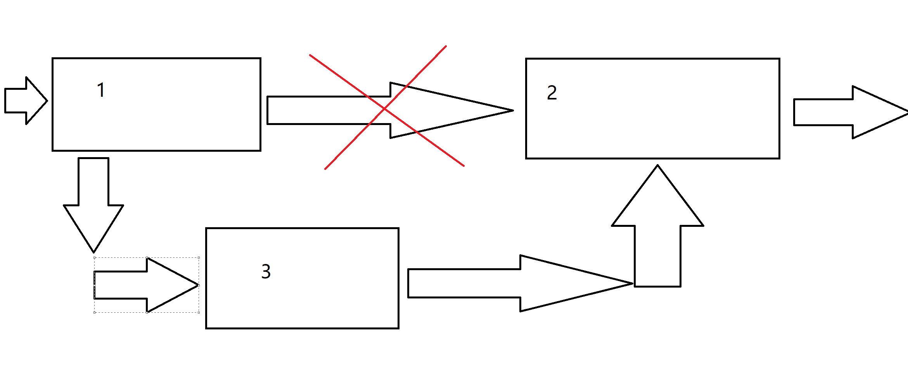

# 基于C的算法深入学习

## 第一篇：小引

​		为了更好的学习算法，我们有必要采取一些简单的数学复习。

### 指数

𝑋𝐴𝑋𝐵=𝑋𝐴+𝐵

𝑋𝐴𝑋𝐵=𝑋𝐴−𝐵

(𝑋𝐴)𝐵=𝑋𝐴𝐵

### 对数

​		在计算机科学中，我们有必要反复强调，所有的对数都是以二为底的。

​		而在数学上，我们如是定义对数：𝑋𝐴=𝐵，于是log𝑋𝐵=𝐴

log𝐴𝐵=log𝐶𝐵log𝐶𝐴

log⁡𝐴𝐵=log⁡𝐴+log⁡𝐵

​		当然基于此，我们还有其他的公式：

1.log⁡𝐴/𝐵=log⁡𝐴−log⁡𝐵

2.log⁡(𝐴𝐵)=𝐵log⁡𝐴

3.log⁡𝑋<𝑋

### 级数

​		什么是级数呢？一些列数字的从1 至 i 的和记作𝑎𝑖，于是下面是一个最简单的级数求和公式

∑𝑖=0𝑁2𝑖=2𝑁+1−1

​		为了强调通用性，我们还给出这个公式：

∑𝑖=0𝑁𝐴𝑖=𝐴𝑁+1−1𝐴−1

​		于是，当0<𝐴<1下，就会得到该级数收敛的结果

∑𝑖=0𝑁𝐴𝑖≤11−𝐴

### 定义模运算

​		如果我们说: 一个整数𝑁整除𝐴−𝐵，也就记作有：𝐴≡𝐵(mod𝑁)

### 简单的递归阐述

​		递归在数据结构与算法中被大量的使用。我们来看一个小例子：𝐶=5×(𝐹−32)/9。我们书写一个函数来求之给定一个华氏度下的摄氏度求法。

​		任何一个C程序员可以马上给出：（为了从简我们使用`int` ）

```C++
int F(int x){
    return 5*(F-32)/9;
}
```

​		那使用递归呢？

```C++
int F(int x){
	/*给出退出条件*/
    if( X == 0 )
        return 0;
    else
        return 2*F(X-1) + X*X;
}
```

​		什么意思？**当我们没有办法给出一个直达结果的程序代码，而是只知道两者联系的时候，使用递归可以是很好的解决办法**

​		上面的代码，只考虑了第𝐼−1摄氏度和第𝐼摄氏度关系，一直调用函数直到函数的形参为0 时停止调用，将值一级一级返回至最初的调用点。

​		注意——书写函数的时候应当妥善的处理推出条件，估计到自己的递归能不能成功退出递归条件。比如说

```C++
/*Unsuccessful recursion!*/
int someFunc(unsigned int N){
    if(N == 0){
        return 0;
    }
    else
    {
        return someFunc(N/3 + 1) + N - 1; 
    }
}
```

​		上面的结果，除了 0 之外，都无法算出结果，代价是程序的空间将会被占满直到计算机崩溃为止。

## Extensive Reading

原文链接：https://blog.csdn.net/weixin_44572229/article/details/119909728

### 1.什么是递归？ 

​		什么是递归呢? 要理解递归，就得先了解什么是递归，实际上这句话就是一个递归。这么说可能不好理解，接下来我举个简单的例子来解释这段话的意义。

​		如果不了解递归，那就先了解什么是递归。嗯？那我再说一遍：如果不了解递归，那就先了解什么是递归。，好像死循环了！可能你会说这是个循环并不是递归，我们前面说到，递归是需要终止条件的，那么你明白递归是什么其实就是终止条件。整个过程，搜索引擎充当递归函数(只是形象的假设)。在你去依次查找递归/栈/内存/操作系统的过程为前行阶段，在你都了解完之后，反回去了解含义的过程为退回阶段。如果还是不太清楚，可以接着看下面的例子。


 实际上这张图就很形象地表达出了递归，这句吓得我抱起了抱着抱着抱着我的小鲤鱼的我的我的我如果从字面意义上看可能看不出是什么意思，那么我们可以通过代码来实现同样的效果:

```C++
void recursion(int n){
	std::cout<<"抱着";
	if(!n){
		std::cout<<"我的小鲤鱼";
	}
	else{
		recursion(n-1);
	}  
	std::cout<<"的我";
	return;
}
int main(){
	std::cout<<"吓得我抱起了";
	recursion(2);
	return 0;//完结撒花～
}
```


### 2.递归的思想

​		递归的基本思想是某个函数直接或者间接地调用自身，这样原问题的求解就转换为了许多性质相同但是规模更小的子问题。求解时只需要关注如何把原问题划分成符合条件的子问题，而不需要过分关注这个子问题是如何被解决的。

​		递归有三大要素

#### 第一要素：明确你这个函数想要干什么

​		对于递归，我觉得很重要的一个事就是，这个函数的功能是什么，他要完成什么样的一件事，而这个，是完全由你自己来定义的。也就是说，我们先不管函数里面的代码什么，而是要先明白，你这个函数是要用来干什么。

​		例如，我定义了一个函数

```C++
// 算 n 的阶乘(假设n不为0)
int f(int n){

}
```

​		这个函数的功能是算 n 的阶乘。好了，我们已经定义了一个函数，并且定义了它的功能是什么，接下来我们看第二要素。

#### 第二要素：寻找递归结束条件

​		所谓递归，就是会在函数内部代码中，调用这个函数本身，所以，我们必须要找出递归的结束条件，不然的话，会一直调用自己，进入无底洞。也就是说，我们需要找出当参数为啥时，递归结束，之后直接把结果返回，请注意，这个时候我们必须能根据这个参数的值，能够直接知道函数的结果是什么。

​		例如，上面那个例子，当 n = 1 时，那你应该能够直接知道 f(n) 是啥吧？此时，f(1) = 1。完善我们函数内部的代码，把第二要素加进代码里面，如下

```C++
// 算 n 的阶乘(假设n不为0)
int f(int n){
    if(n == 1){
        return 1;
    }
}
```

​		有人可能会说，当 n = 2 时，那我们可以直接知道 f(n) 等于多少啊，那我可以把 n = 2 作为递归的结束条件吗？

​		当然可以，只要你觉得参数是什么时，你能够直接知道函数的结果，那么你就可以把这个参数作为结束的条件，所以下面这段代码也是可以的。

```C++
// 算 n 的阶乘(假设n>=2)
int f(int n){
    if(n == 2){
        return 2;
    }
}
```

​		注意我代码里面写的注释，假设 n >= 2，因为如果 n = 1时，会被漏掉，当 n <= 2时，f(n) = n，所以为了更加严谨，我们可以写成这样：

```C++
// 算 n 的阶乘(假设n不为0)
int f(int n){
    if(n <= 2){
        return n;
    }
}
```

#### 第三要素：找出函数的等价关系式

​		第三要素就是，我们要不断缩小参数的范围，缩小之后，我们可以通过一些辅助的变量或者操作，使原函数的结果不变。

​		例如，f(n) 这个范围比较大，我们可以让 f(n) = n * f(n-1)。这样，范围就由 n 变成了 n-1 了，范围变小了，并且为了原函数f(n) 不变，我们需要让 f(n-1) 乘以 n。

​		说白了，就是要找到原函数的一个等价关系式，f(n) 的等价关系式为 𝑛×𝑓(𝑛−1).

​		举个栗子，还是从阶乘来出发 

​		假设我们用递归来算阶乘 f(n)

```
f = n =>
    n === 1 ? 1
            : n * f(n-1) 
```

​		f 里面用到了 f，怎么理解呢？

​		很简单，把式子展开即可：


```
	看到递归了吗？
```


​		先递进，再回归——这就是「递归」。 

#### 3.递归的缺点

​		递归的缺点，从上图我们可以看出

​		在程序执行中，递归是利用堆栈来实现的。每当进入一个函数调用，栈就会增加一层栈帧，每次函数返回，栈就会减少一层栈帧。而栈不是无限大的，当递归层数过多时，就会造成 栈溢出 的后果。

​		显然有时候递归处理是高效的，比如归并排序；有时候是低效的，比如数孙悟空身上的毛，因为堆栈会消耗额外空间，而简单的递推不会消耗空间。

#### 4.递归的程序特性

优雅性

​		相比其他解法（比如迭代法），使用递归法，你会发现只需少量程序就可描述出解题过程，大大减少了程序的代码量，而且很好理解。递归的能力在于用有限的语句来定义对象的无限集合。

反向性

​		由于递归调用程序需要维护调用栈，而栈（我们在上文提过）具有后进先出的特征，因此递归程序适合满足取反类需求。我们在第五部分有一些编程实践，比如字符串取反，链表取反等相关有趣的算法问题。

递推关系

​		递归程序可以较明显的发现递推关系，反过来也可以这么说，具有递推关系的问题基本都可以通过递归求解（当然也许有性能更佳的解法，但递归绝对是一种选择）。递推关系常见问题有杨辉三角、阶乘计算

#### 5.什么时候用递归

​		说了那么多，那么我们什么时候可以用、应该用递归呢？

​		具有以下特征的问题可考虑递归求解：

​		当问题和子问题具有递推关系，比如杨辉三角、计算阶乘（后文讨论）。 		具有递归性质的数据结构，比如链表、树、图。 		反向性问题，比如取反。 		总结下来，最根本的还是要抓住问题本身是否可以通过层层拆解到最小粒度来得解。

### 6.递归总结 

​		现在，我们更加相信递归是一种强大的技术，它使我们能够以一种优雅而有效的方式解决许多问题。同时，它也不是解决任务问题的灵丹妙药。由于时间或空间的限制，并不是所有的问题都可以用递归来解决。递归本身可能会带来一些不希望看到的副作用，如栈溢出。

​		有时，在解决实际问题时乍一看，我们并不清楚是否可以应用递归算法来解决问题。然而，由于递归的递推性质与我们所熟悉的数学非常接近，用数学公式来推导某些关系总是有帮助的，也就是说写出递推关系和基本情况是使用递归算法的前置条件。

​		只要有可能，就应用记忆化。在起草递归算法时，可以从最简单的策略开始。有时，在递归过程中，可能会出现重复计算的情况，例如斐波纳契数（Fibonacci）。在这种情况下，你可以尝试应用 Memoization 技术，它将中间结果存储在缓存中供以后重用，它可以在空间复杂性上稍加折中，从而极大地提高时间复杂性，因为它可以避免代价较高的重复计算。

​		当堆栈溢出时，尾递归可能会有所帮助。

​		使用递归实现算法通常有几种方法。尾递归是我们可以实现的递归的一种特殊形式。与记忆化技术不同的是，尾递归通过消除递归带来的堆栈开销，优化了算法的空间复杂度。更重要的是，有了尾递归，就可以避免经常伴随一般递归而来的堆栈溢出问题，而尾递归的另一个优点是，与非尾递归相比，尾部递归更容易阅读和理解。这是由于尾递归不存在调用后依赖（即递归调用是函数中的最后一个动作），这一点不同于非尾递归，因此，只要有可能，就应该尽量运用尾递归。

## 第二篇：简单的算法分析

### 时间复杂度

​		我们分析算法，**首先需要衡量的就是一个算法的时间复杂度**，问题来了，啥是时间复杂度嘞？答案是：我跑完这个算法的时间相对于数量级的最高幂数。抽象！人话就是：对于同一套数据处理之，它快不快？

​		还是没大懂，究竟是什么？

​		先来思考一个问题：你怎么衡量一个算法的速度的？很简单，扔进一个程序性能分析器，看他跑完我这个模块的时间呗！基于此的，我再问你，你这个算法，和我这个算法，给出10个数据处理，和给1000000000000000000个数据处理，时间一样嘛？显然不一样！我的算法处理1000000000000000000个数据，和你的算法处理10个数据，显然往往后这快！但是，如果我们两个都去处理1000000000000000000个数据，这就不好说了。于是——

​		`时间复杂度`正是对于给定一套数量级的数据，该算法相对于这个数量级的数据的运算时间表现。

#### 𝑂(𝑓(𝑁))

​		但是，这一时间并不好精确的衡量，我们于是引入下面四个重要的定义式子：他们将分别衡量——算法运行的最大期望时间，最小的期望时间。

```
首先，这是我们在学习工作中描述算法时间复杂度用的最普遍的符号shi 。它是渐进上界，其作用是将我们得到的算法在最坏情况下（worst case）时间复杂度表达式简化成对应的多项式（比如n^2等）。所以在我们证明的过程中，目的是证明我们的式子要“小于等于”目标多项式。
```

#### Ω(𝑓(𝑁))

```
 这个符号我们一般用的比较少，一个是因为我们一般不会去考虑算法运行时间的下界，另一个是因为下界时间也不好证明。没错，他就是渐进下界，其作用是将我们得到的算法在最好情况下（best case）时间复杂度表达式简化成对应的多项式（也比如n^2等）。所以在我们证明的过程中，目的是证明我们的式子要“大于等于”目标多项式。
```

#### Θ(𝑔(𝑁))

​      如果O和Ω可以用同一个多项式表示，那么这个多项式就是我们所要求的渐进紧的界了。其作用是将我们可以较准确地得到算法的时间复杂度表达式对应的多项式（也比如n^2等）。所以在我们证明的过程中，目的是证明我们的式子要“等于”目标多项式。

### 各项算法的差异

​		常见的时间复杂度如下所示：

1.O(1) — 常数复杂度 2.O(log n) — 对数复杂度 3.O(n) — 线性复杂度 4.O(n log n) — 对数线性复杂度 5.O(nᵏ) — 多项式复杂度 6.O(kⁿ) — 指数复杂度 7.O(n!) — 阶乘复杂度 	下图描绘了各种复杂度的算法中，当输入规模增长时，操作数量（运行时间）的变化趋势。


​		你可以看到，随着输入规模的增长，红色阴影区域中算法的运行时间急剧增长。另一方面，在黄色和绿色阴影区域中的算法，当输入规模增长时，运行时间在变化不是很大，因此它们更高效，处理大量数据时更游刃有余。

​		最后需要指明的一点，大 O 表示法通常用于描述当输入规模变得非常大时，算法呈现的「显著趋势」。因此，大的显著趋势会盖过一些小的细枝末节的趋势。例如，我们实际测算得到时间复杂度为 O(n²+ n) 的算法会简化为 O(n²)，原因是随着 n 变得非常大时， n² 这一项的显著性远远盖过了 n 这一项的显著性。

​		下面给出一些例子：

1. #### O(1) — 常数复杂度

  		这种复杂度的算法的运行时间不会随着输入规模的增加而增加。这类操作的实际例子就是在数组中按索引查找值，或者在哈希表中按键查找值：

```C++
int i = 0;
i ++; // 简单的操作
int arr[100] = {0};
i = arr[99];
// pretend that we import the hashTable
table.search(i); // 常数时间操作
```

​		无论传递给这些函数的哈希表有多大，它们用同等的时间来完成（只有一步操作）。

1. #### O(log n) — 对数复杂度

  		典型的对数复杂度算法是二分搜索算法。这是一种用于在有序数组中查找特定值的算法，它不断迭代读取当前范围的中间值，判断目标值是小于还是大于中间值，排除不包含目标的那一半内容。下面是它的一种实现：

```C
typedef int Index;
#define UNFIND -1;
Index binSearch(int arr[],int arrSize,int target)
{
    // make some check here...
    // ...
    // end check
    int left = 0;
    int right = arrSize - 1;
    while(left <= right)
    {
        int middle = left + (right - left) >> 1; // actually make middle,but this way we could effectively prevent overflowing
        if(middle = target)
        {
            return middle;
        }
        else if(arr[middle] < target){
            left = middle + 1;
        }
        else
        {
            right = middle - 1;
        }
    }
    
    // the while break, means that we could not find the target, while loop break.
    
    return UNFIND;
}
```

​		由于每次迭代，待搜索的数组长度会减半。因此哪怕搜索的数组长度翻了一倍，也只需多迭代一次！因此，随着数组长度的增加，运行时间将呈对数增长。

1. #### O(n) — 线性复杂度

  		线性复杂度算法往往在连续迭代数据结构时涉及到。参考先前的对数搜索示例，在数组中搜索值可以用（效率较低）的线性时间来进行，这里还是采取链表的搜索吧！

```C++
typedef int Index;
#define UNFIND -1;
/*pretend that we define a linklist contains integers*/

Index FindElem(LinkList list, int target)
{
    LinkNodePtr cur;
    Index inPos = 0;
    while(cur != NULL){
        if(cur->data == target){
            return inPos;
        }
        inPos++;
        cur = cur->next;
    }
}
```

  		显然，随着输入链表大小的增加，由于需要检查列表中的每个项目，最坏情况下找到目标所需的循环迭代次数的增长与输入列表的大小增长成正比。

1. #### O(n log n) — 对数线性复杂度

```
		列举对数线性复杂度算法的示例会比之前难一些。顾名思义，它们同时包含对数和线性部分。其中最常见的示例是排序算法。有一个算法叫「归并排序」，它用迭代手法将数组分成一小块一小块，对每小块进行拆分、排序，然后再按顺序重新将各个小块合并在一起。通过图像可以更容易看明白，因此我将省略代码的实现。
```


1. #### O(nᵏ) — 多项式复杂度

  		在这里，我们开始着手研究时间复杂度较差的算法，通常应尽可能避免使用它（请参考上文的图表，我们正处于红色区域！）。但是，许多「暴力」算法都属于多项式复杂度，可以作为帮助我们解决问题的切入点。


1. #### O(kⁿ) — 指数复杂度

  我们的倒数第二个常见时间复杂度是指数复杂度，即随着输入规模的增加，运行时间将按固定倍数来增长。一个典型的例子是直接计算斐波纳契数列中的第 n 项。

```C++
long long Feb(int pos){
	if(pos <= 2){
        return 1;
    }
    
    return Feb(pos -1) + Feb(pos - 2);
}
```

​		在上面的示例中，每当输入 n 增加 1 时，执行的操作数量就会翻倍。这是因为我们没有缓存每个函数调用的结果，所以必须从最开始重新计算所有先前的值。因此，该算法的时间复杂度为 O(2ⁿ)。

1. #### O(n!) — 阶乘复杂度

  最后但同样重要（但肯定是效率最低）的类型是阶乘时间复杂度的算法。通常应避免这中复杂度，因为随着输入规模的增加，它们会很快变得难以运行。这种算法有一个示例，那就是旅行推销员问题的暴力解法。这个问题是希望找到一条最短路径，要求该路径必须访问坐标系中的所有点，并最终回到起点。暴力解法涉及相互比较所有可能的路线（读作：排列组合）并选择最短的。请注意，除非要访问的点数很少，否则这通常不是解决此问题的合理方法。

### 简单的计算时间表达式

  		时间复杂度可以由时间表达式给出。来看一个很简单的小例子：

```C++
int getSumCube(int N){
	int i, PartialSum;
   	PartialSum = 0;
    for(i = 1; i <= N;i++){
        PartialSum += i*i*i;
    }
	return PartialSum;
}
```

  		我们扫描了一遍大小为N的数组，于是可以给出这个式子的时间表达式是：

𝑓(𝑁)=6𝑁+4

  		计算时间的一般简单法则：

  1.`for`循环

  一次 `for` 循环的时间是for循环的次数乘上for 循环次数

  2.嵌套的`for`循环

  自内向外的做1 的分析，一般来讲是带有乘上几层for循环的。

  3.顺序语句

  直接求和即可

  4.`if/else`语句

  不会超过判断时间 + 较长者分支时间。

### 一些问题导览

#### 最大的子序数列和问题

​		问题是这样的：给定整数序列{𝐴𝑖}我们需要求出：∑𝑘=𝑖𝑗作为这数列的一个子数列的和的最大值的问题。

​		最简单的，我们来回扫描嘛！

```C++
int MaxSequenceSum(const int A[],int N)
{
    int thisSum,Maxsum,i,j,k;
    for(i = 0; i < N; i++){
        for(j = 0; j < N; j++){
            thisSum = 0;
            for(k = 1; k <= j; k++){
                ThisSum += A[k];
            }
            
            if(ThisSum > MaxSum){
                MaxSum = thisSum;
            }
        }
    }
    
    return MaxSum;
}
```

​		于是，精确的来讲，我们需要花费的时间表达式是：

∑𝑖=0𝑁−1(𝑁−𝑖−1)(𝑁−𝑖)2=𝑁3+3𝑁2+2𝑁6

​		但是，这样的算法一旦数据量大起来，就会寄。

​		那就优化一下！

```C
int MaxSequenceSum(const int A[],int N)
{
    int thisSum,Maxsum,i,j;
    MaxSum = 0;
    for(i = 0; i < N; i++)
    {
        thisSum = 0;
        for(j = i; j < N; j++)
        {
            ThisSum += j[k]; 
            if(ThisSum > MaxSum)
            {
            	MaxSum = thisSum;
            }
        }
    }
    
    return MaxSum;
}
```

​		还有其他方法嘛？有的！

#### 其他方法

（1）原文链接：https://blog.csdn.net/weixin_44507219/article/details/128245726

​		最大子序列求和是指给定一组序列，求所有连续子序列的和中的最大值，例如给定数列：

​		[5,-2,-5,6]最大子序列和是6；[1, 2, -3, 4, -5, 6, 7, 8, -9, 10]最大子序列和是22；

​		下面将利用几种不同的算法来解决此问题，重要的是理解不同算法中所代表的思想

**1、穷举法**

​		穷举法的思想比较简单，它是指列举所有的可能，来得到问题最终的解；

​		在此问题中，可以利用穷举法将所有的子序列的和计算出来，来得到最大子序列的和；

​		假设子序列的起点为i，那么i的范围在数组下标中可以是:[0,arrays.length-1]；

​		针对起点为i的子序列，由于子序列是连续的，那么它的终点的范围是[i,arrays.length-1]；

​		最后我们需要对[i,j]的子序列进行求和，并把结果每次与max比较，以此得到最大子序列和max；

```java
//穷举法，时间复杂度为O(N^3)
public static int method_1(int[] arrays) {
    int max = 0;
    //每个子序列的起点 = i
    for (int i = 0; i < arrays.length; i++) {
        //每个子序列的终点 = j
        for (int j = i; j < arrays.length; j++) {
            int sum = 0;
            //子序列求和
            for (int k = i; k <= j; k++) {
                sum = sum + arrays[k];
            }
            //当出现子序列和大于max，用sum替换掉max
            if (sum > max) {
                max = sum;
            }
        }
    }
    return max;
}
```

2、穷举优化

​		显然，上面算法的时间复杂度O(N^3)并不能让人满意，不过我们可以简单优化一下：

​		列举所有的子序列[i,j]依然不变，但是针对子序列[i,j]求和，我们完全可以省略这一步，当固定起点i时，以i为起点的子序列的终点j的范围[i,arrays.length-1]是连续的，可以发现，j=i+1为子序列的终点时，它的和为：

```
    SUM(i,j)=SUM(i,i+1)=SUM(i,i)+arrays[i+1]；
```

​		同理，j=i+2时：

```
    SUM(i,j)=SUM(i,i+2)=SUM(i,i+1)+arrays[i+2]
```

……

​		也就是说，我们可以把上一次子序列的求和保存起来，留待下次j递增(j++)后使用，即不用针对每次子序列[i,j]，去重新计算它的和，在代码里，只需要把对sum的初始化int sum = 0 提到上一层循环里就可以了，并去掉重复计算的for循环就可以了，此方法的时间复杂度为O(N^2)

```Java
//穷举优化:时间复杂度为O(N^2)
public static int method_2(int[] arrays) {
    int max = 0;
    //每个子序列的起点 = i
    for (int i = 0; i < arrays.length; i++) {
        int sum = 0;
        //每个子序列的终点 = j
        for (int j = i; j < arrays.length; j++) {
            sum = sum + arrays[j];
            //当出现子序列和大于max，用sum替换掉max
            if (sum > max) {
                max = sum;
            }
        }
    }
    return max;
}
```

​		这里稍微有点动态规划的思想，但并不完全，下面我们将介绍基于动态规划的思想的Kadane算法对此问题的解法思路

3、Kadane算法-动态规划

​        穷举法是针对具体的子序列[i,j]去求解，虽然做了优化减少了重复计算，但依然需要比较高的时间复杂度。

​    最大子序列和的最终答案是值，而不用去求具体的子序列，所以这里我们可以巧妙的运用动态规划的思想来解决，动态规划的核心思想是：拆分成若干子问题，记住过往，减少重复计算。

​    假设我们求长度为N的序列的最大子序列和，可以拆分成N个子问题来计算，假设此数组序列下标是i，那么这N个子问题分别是：i=[0]、i=[0,1]、i=[0,1,2]、......、i=[0,1,2,...,N-1]的子序列的最大子序列和，我们这里可以不用逆推，直接采用顺推的方式来实现。

​    我们可以根据i=[0]的子序列的结果，去推算i=[0,1]的结果，然后用i=[0,1]的子序列的结果去推算i=[0,1,2]的结果，以此类推，最终推算出i=[0,1,2,...,N-1]的结果；

​    然而值得我们注意的是，我们需要知道使用前一个子问题去推算后一个子问题，它们之间的连接关系：

```
	 当 i(k)=[0,1,2,3,...k] --> i(k+1)=[0,1,2,3,...k,k+1],即用i(k)结果去推算i(k+1)的结果的时候：
```

​    我们定义两个变量max，sum；max(k)代表i(k)的结果(即最大子序列和)，sum(k)代表

i(k)序列的累加，（max ≠ sum）；

​            sum(k+1) = sum(k) + arrays[k+1]

​            当sum(k+1) > max(k) 时，则 max(k+1) = sum(k+1)

​            否则max(k+1)=max(k)；

​            要使上述成立我们必须所做的一个操作是，当sum < 0时，需要把sum = 0（结合下面i = 4/5时更容易理解）

例如对于数组[1, 2, -3, 4, -5, 6, 7, 8, -9, 10]，

| Arrays	1	2	-3	4	-5	6	7	8	-9	10 |      |      |      |      |      |      |      |      |      |      |
| ------------------------------------------------------------ | ---- | ---- | ---- | ---- | ---- | ---- | ---- | ---- | ---- | ---- |
| i(下标)	0	1	  2	3	4	5	6	 7	  8	9 |      |      |      |      |      |      |      |      |      |      |

​		当遍历到：

```
    i=0时：

            sum=1  ----> sum>max ----> max = 0 ： 序列[1]的最大子序列和为 1

    i=1时：

            sum = 3 ----> sum>max ----> max = 3 ： 序列[1,2]的最大子序列和为3

    i=2时：

            sum=0 ----> sum<max ----> max = 3 ： 序列[1,2,-3]的最大子序列和为3

    i=3时：

            sum=4 ----> sum>max ----> max = 4 ： 代表序列[1,2,-3,4]的最大子序列和为4
```

​		（注意：此时的和为最大的值的子序列有两个[1,2,-3,4]，[4]，但我们并不在意，我们需要在意的是状态(sum是否小于0)以及max(sum是否大于max),sum如果一直没有小于0,那么sum的值对于后面的累加都是有效的增大，而sum只要一小于0，我们需要把sum=0，它才不影响后面最大值的累加。强调一下：我们只关注当前所遍历过的这整个一块的最大子序列的和max以及sum值的状态）

```
    i=4时：

            sum=-1 ----> sum<max ----> max = 4 ---->sum=0：序列[1,2,-3,4,-5]的最大子序列和为4

    i=5时：

            sum=6 ----> sum>max ----> max = 6 ： 序列[1,2,-3,4,-5,6]的最大子序列和为6

    ......

    i=8时：

            sum=6+7+8-9 ----> sum<max(6+7+8) ----> max=21 : 序列[1, 2, -3, 4, -5, 6, 7, 8, -9]的最大子序列和为21

    i=9时：

            sum=6+7+8-9+10=22 ----> sum > max ----> max = 22 ：序列[1, 2, -3, 4, -5, 6, 7, 8, -9, 10]的最大子序列和为22。
```

​        可以清晰的看到，我们只需要一次遍历，就可以得到最终的解，时间复杂度为O(N);

代码如下：               

```Java
//动态规划，时间复杂度O(N)
public static int method_3(int[] arrays) {
    int max = 0;
    int sum = 0;
    for (int i = 0; i < arrays.length; i++) {
            sum = sum + arrays[i];
            if (sum > max) {
                max = sum;
            }else if(sum < 0){
                sum = 0;
            }
    }
    return max;
}
```

4、分治策略

​    	分治策略的核心思想为：分而治之。

​    	它跟动态规划相同点：都是将问题分成若干个子问题。

​    	不同点：动态规划的场景一般为：每个子问题与前后都是有联系的，以1推2，以2推3，依次推到最终结果；而分治策略的场景一般为：先独立的计算出每个子问题的结果，再合并结果得到最终结果。

左半部分                  起点                    右半部分 1	2	-3	4	-5	6	7	8	-9	10        在此问题中，我们也同样可以使用分治策略来解决：我们很容易知道最大子序列和可能在三处出现，如：

​    A、左半部分：

​    B、右半部分：

​    C、中间部分（左右都占）：

​    AB两种情况我们可以通过递归求解；C情况我们可以算出以左半部分的起点向左依次遍历的最大和值，以右半部分的起点向右依次遍历得出的最大和值，两者相加；最终我们比较ABC三者的最大值，即可返回最终结果。

​    此种方法的时间复杂度为O(N*logN)，想比较动态规划而言，它有些地方重复计算了，但是如果将问题转换为求最大子序列的起点跟终点，动态规划或许不太适用了。

​                

```Java
//分治策略，时间复杂度为O(N*logN)
public static int method_4(int[] arrays,int left,int right) {
    //基准情况
    if(left == right){
        if(arrays[left] > 0){
            return arrays[left];
        }else{
            return 0;
        }
    }
 
    int center = (left+right)/2;
    //递归求左半部分(A情况)
    int maxLeft = method_4(arrays,left,center);
    //递归求右半部分(B情况)
    int maxRight = method_4(arrays,center+1,right);
    
    //求C情况的以左半部分起点向左遍历的最大值
    int maxLeftBorder = 0;
    int sumLeftBorder = 0;
    for(int i = center;i>=left;i--){
        sumLeftBorder = sumLeftBorder+arrays[i];
        if(sumLeftBorder>maxLeftBorder){
            maxLeftBorder = sumLeftBorder;
        }
    }
    
    //求C情况的以右半部分起点向右遍历的最大值
    int maxRightBorder = 0;
    int sumRightBorder = 0;
    for(int i = center+1;i<=right;i++){
        sumRightBorder = sumRightBorder+arrays[i];
        if(sumRightBorder>maxRightBorder){
            maxRightBorder = sumRightBorder;
        }
    }
    //返回 maxLeft 、maxRight、maxLeftBorder+maxRightBorder中的最大值
    int temp = Math.max(maxLeft, maxRight);
    return Math.max(temp,maxLeftBorder+maxRightBorder);
```

## 第三章：表，栈以及队列

### `ADT`（抽象数据类型）

​		首先我们有必要强调一下模块化编程的重要。它的优势是显然的：

1. 首先：调试一个小的模块显然比调试一个大的模块方便。
2. 其次：让一堆人可以公用开发显然更加的容易
3. 接着：一个已经写好的模块化程序将依赖限定在了一个例程！

​		`ADT`，也就是`Abstract Data Type`，允许我们在概念上谈论数据结构。下面，我们就经典的线性数据结构，来展开谈谈在C语言中（后面可能会在附录上给出`C++`语言实现的基本操作）。

### 表的概念

​		啥是表？我们说——至少在逻辑上是线性关系的数据结构是表。也就是说，我们的元素之间只有前后关系，而不存在层次关系（后者们称之为数）。就表的实现结构（是否离散）：我们有数组存储的和链式存储的； 就表的操作自由度，我们有单头操作和双头操作。下面，我们一 一实现在各个领域内发挥重要作用的数据结构

### 表（动态数组实现）

​		

​		我们在这里下一个简单的定论，如何？

```
实现动态数组的重要方法就是使数据域是通过堆开辟函数调整，而不是栈上简单开辟。
```

​		这指出，欲想构建动态数组，我们有必要使用内存管理。为了方便，我们引入`C`中重要的库——`#include<stdlib.h>`，或者，在技术上追求卓越效率的程序员，只需要引入`#include<malloc.h>``#include<memory.h>`就可以胜任这些工作了。

​		效仿`C++`中一个类的基本成员函数种类，我们必须先声明动态数组的基本结构:

| 内部对象成员 | 类型     | 描述                         |
| ------------ | -------- | ---------------------------- |
| `coreData`   | `void*`  | 在这里通过指针联系数据域     |
| `dataSize`   | `size_t` | 在这里指明存储元素的大小     |
| `curSize`    | `size_t` | 在这里指明存储元素的现有个数 |
| `capicity`   | `size_t` | 在这里表明最多能容纳多少元素 |

```C++
typedef struct _CCSTDC_Vector{
    
    void* coreData;		// 在这里通过指针联系数据域
    size_t dataSize;	// 在这里指明存储元素的大小
    size_t curSize;		// 在这里指明存储元素的现有个数
    size_t capicity;		// 在这里表明最多能容纳多少元素
    
}CCSTDC_Vector;
```


​		我知道有些人焦急的说——我知道我知道，我知道在`C++`中动态数组里还有很多其他成员，比如说`Iterator`，为什么这里没有呢？注意到，现在我们只是刚刚构建起表（动态数组实现），目前没有必要引入`Iterator`这些追求效率的东西。我会在附录下，给出如何在我们实现的更加复杂，健全，在实现机能上类似于`std::vector` 的实现，现在我们更需要关注核心`API`的实现。

​		我们将要实现的，有以下几个基本操作：

#### 实现操作

| 函数名称                           | 参数列表                                                     | 返回类型                    | 描述                                                         |
| ---------------------------------- | ------------------------------------------------------------ | --------------------------- | ------------------------------------------------------------ |
| `CCSTDC_Vector_EmptyInit`          | `int dataSize`,<br/>`int wishing_capicity`                   | `CCSTDC_Vector*`            | 生成一个空动态数组                                           |
| `CCSTDC_Vector_PushBack`           | `CCSTDC_Vector* vec`<br/>`int datasize`<br/>`void* data`,<br/> | `CCSTDC_Bool`               | 想动态数组内推入元素                                         |
| `CCSTDC_Vector_PrintList`          | `CCSTDC_Vector* vec` ,<br/> `Printer printFunc`              | `CCSTDC_Bool`               | 打印数组元素                                                 |
| `CCSTDC_Vector_Insert`             | `CCSTDC_Vector* vec`,<br/>`void* elem`,<br/>`int place`      | `CCSTDC_Bool`               | 向动态数组内插入元素                                         |
| `CCSTDC_Vector_EraseByPos`         | `CCSTDC_Vector* vec`,<br/>`int place`                        | `CCSTDC_Bool`               | 在动态数组内删除元素                                         |
| `CCSTDC_Vector_EraseByGivenData`   | `CCSTDC_Vector* vec`,<br/>`void* targetElem`,<br/>`CCSTDC_Comparator compareFunc` | `CCSTDC_Bool`               | 在动态数组内删除元素<br/>(通过提供比较器)                    |
| `CCSTDC_Vector_FindTarget`         | `CCSTDC_Vector* vec`,<br/>`void* targetElem`,<br/>`CCSTDC_Comparator compareFunc`<br/>`CCSTDC_Order order` | `CCSTDC_GainGuidePosArray*` | 在动态数组中返回组下标用于访问                               |
| `CCSTDC_Vector_Resize`             | `CCSTDC_Vector* vec`,<br/>`size_t new_capicity`              | `CCSTDC_Bool`               | 扩展动态数组的空间                                           |
| `CCSTDC_Vector_DestroyWhole`       | `CCSTDC_Vector* vec`                                         | `CCSTDC_Bool`               | 删除一个动态数组                                             |
| `CCSTDC_Vector_GetPyPos`           | `CCSTDC_Vector* vec`<br/>`CCSTDC_Moving_Selection usrChoice` | `void*`                     | 返回一个元素的下标，该元素可以是被拷贝的或者是直接给出指针的 |
| `[Debug]` `CCSTDC_Vector_ShowInfo` | `CCSTDC_Vector* vec`,<br/>`Printer InfoPrinter`              | `CCSTDC_Bool`               | 【Debug】打印动态数组信息                                    |

#### `CCSTDC_Vector_EmptyInit`

​		仿照构造器的，我们给出一个空构造：

| 函数名称                  | 参数1          | 参数2                  | 返回类型         | 存在于文件：                                             | 说明               |
| ------------------------- | -------------- | ---------------------- | ---------------- | -------------------------------------------------------- | ------------------ |
| `CCSTDC_Vector_EmptyInit` | `int dataSize` | `int wishing_capicity` | `CCSTDC_Vector*` | 声明：`CCSTDC_Vector.h`<br/>实现:声明：`CCSTDC_Vector.c` | 生成一个空动态数组 |

```C
CCSTDC_Vector* CCSTDC_Vector_EmptyInit(int dataSize, int wishing_capicity);
```

也就是说：我们接受一个描述数据大小的参数，和一个描述我们希望开辟空间的参数作为初始化的参数。

首先检查数据：

```C
if(dataSize < 0 && wishing_capicity < 0){
    /*Error Throw or Call exit(Error_Code). in C++, call std::terminate or std::abort is both acceptable*/
    CCSTDC_Error_Throw(1);
}

if(dataSize * wishing_capicity < 0){
    CCSTDC_Error_Throw(2);
}
```

| 宏                               | 宏展开                                      | 说明                             |
| -------------------------------- | ------------------------------------------- | -------------------------------- |
| `CCSTDC_Error_Throw(Error_Code)` | `printf("Error occured!");exit(Error_Code)` | 发生错误！处理异常（虽然很粗暴） |

| 条件                              | 条件说明                 | 将返回错误码 |
| --------------------------------- | ------------------------ | ------------ |
| `dataSize < 0`                    | 数据大小非法             | 1            |
| `wishing_capicity`                | 数据个数非法             | 1            |
| `dataSize * wishing_capicity < 0` | 后续的开辟会发生溢出错误 | 2            |

其次，就是开辟出一个跟`CCSTDC_Vector`大小完全一致的空间出来。我们当然是使用`malloc`了

##### Extensive Reading

​		原文链接：https://blog.csdn.net/qq_43511299/article/details/119838387

​		在使用`malloc`函数前，需要调用头文件

```C
# include <malloc.h>
void* malloc(size_t BlockSize);
```

​		`malloc`函数的作用是动态分配内存，以解决静态内存定长、不能手动释放等缺陷。

​		这是一种写法：

```C 
int* p = (int*)malloc(sizeof(int));
*p = 1;
free(p);
```

​		还有一种写法：

```C 
int* p;
p = (int *)malloc(sizeof(int));
free(p);
```

​		其中，p为一个整型指针变量，由`int *p = (int*)malloc(sizeof(int))`可以看出来，这句话在给*p分配内存.

​		`malloc`函数支持一个形参（该形参就是字节大小），而`sizeof(int)`计算出了我们需要的字节数，`malloc`函数的返回值是一个地址，把分配的动态内存的地址赋给指针p，就是在为*p开辟了一块动态内存。

​		`free(p)`则是释放了p所指向的内存。

##### Extensive Reading End

​		于是：

```C 
CCSTDC_Vector* getter = (CCSTDC_Vector*)malloc(sizeof(CCSTDC_Vector));//get a space
```

​		以及，**判断是否有效总是一个好习惯**

```C 
if(getter == NULL)/* NULL == (void*)0 */
{
	/* when malloc space, we shouldn't get an invaild space pointer:NULL for example! */
    CCSTDC_Error_Throw(3);
}
```

​		

| 条件             | 条件说明       | 将返回错误码 |
| ---------------- | -------------- | ------------ |
| `getter == NULL` | 堆内存开辟失败 | 3            |

​		初始化类成员:

```C
void* getCoreData 	= malloc(dataSize * wishing_capicity); 
if(getCoreData == NULL){
    
    CCSTDC_Error_Throw(3);
    
}
getter->coreData 		= getCoreData;
getter->dataSize 		= dataSize;
getter->curSize 		= 0;
getter->capicity 		= wishing_capicity;

/*初始化完成，返回！*/
return getter;
```

​		空初始化完成。

```C++ 
CCSTDC_Vector* CCSTDC_Vector_EmptyInit(int dataSize, int wishing_capicity)
{
    if (dataSize < 0 && wishing_capicity < 0) {
        /*Error Throw or Call exit(Error_Code). in C++, call std::terminate or std::abort is both acceptable*/
        CCSTDC_Error_Throw(1);
    }

    if (dataSize * wishing_capicity < 0) {
        CCSTDC_Error_Throw(2);
    }

    CCSTDC_Vector* getter = (CCSTDC_Vector*)malloc(sizeof(CCSTDC_Vector));//get a space
    void* getCoreData = malloc(dataSize * wishing_capicity);
    if (getter == NULL)/* NULL == (void*)0 */
    {
        /* when malloc space, we shouldn't get an invaild space pointer:NULL for example! */
        CCSTDC_Error_Throw(3);
    }
    if (getCoreData == NULL) {

        CCSTDC_Error_Throw(3);

    }
    getter->coreData = getCoreData;
    getter->dataSize = dataSize;
    getter->curSize = 0;
    getter->capicity = wishing_capicity;

    /*初始化完成，返回！*/
    return getter;
}
```

#### `CCSTDC_Vector_Resize`

| 函数名称               | 参数1                   | 参数2                  | 返回类型       | 存在于文件：                                       | 说明     |
| ---------------------- | ----------------------- | ---------------------- | -------------- | -------------------------------------------------- | -------- |
| `CCSTDC_Vector_Resize` | `CCSTDC_Vector* vector` | `int wishing_capicity` | `CCSTDC_Bool*` | 声明：`CCSTDC_Vector.h`<br/>实现:`CCSTDC_Vector.c` | 重置大小 |

```C
CCSTDC_Bool* CCSTDC_Vector_Resize(CCSTDC_Vector* vector, int wishing_capicity);
```

​		这里，我们就需要重新分配内存，从而合理的使用空间。

​		在这里，我们本质上即是包装函数`realloc(void* block, size_t newSize)`(`re-allocate`)

##### Extensive Reading

##### realloc:

```C
void *realloc(
   void *memblock,
   size_t size
);
```

###### 参数

*`memblock`* 指向之前已分配内存块的指针。

*`size`* 新大小（字节）。


###### 返回值

**`realloc`** 将返回指向重新分配的（并且可能已移动的）内存块的 **`void`** 指针。

如果没有足够的可用内存将块扩展到给定大小，则原始块保持不变，并 `NULL` 返回。

如果 *`size`* 为零，则释放由 *`memblock`* 指向的块；返回值为 `NULL`，而 *`memblock`* 仍指向已释放的块。

返回值将指向适当对齐任何类型的对象的存储的存储空间。 若要获取指向类型而非 **`void`** 的指针，请在返回值中使用类型转换。


###### 注解

​		尚未为实现 C17 行为而更新 **`realloc`**，因为新行为与 Windows 操作系统不兼容。

​		**`	realloc`** 函数更改已分配内存块的大小。 *`memblock`* 参数指向内存块的开头。 如果 *`memblock`* 为 `NULL`，则 **`realloc`** 与 **`malloc`** 的行为相同，并分配一个 *`size`* 字节的新块。 如果 *`memblock`* 不是 `NULL`，则它应该是上一次调用 **`calloc`**、 **`malloc`**或 **`realloc`**返回的指针。

​		*`size`* 参数提供块的新大小（字节）。 块的内容不随其新旧大小而更改，尽管新块可以在不同的位置。 由于新块可以位于新的内存位置，因此不一定由 返回 **`realloc`** 的指针是通过 参数传递的 *`memblock`* 指针。 **`realloc`** 如果存在缓冲区增长，则不会为新分配的内存零。

​		如果内存分配失败或请求的内存量超过 `_HEAP_MAXREQ`，则 **`realloc`** 将 `errno` 设置为 `ENOMEM`。 有关此错误代码和其他错误代码的信息，请参阅 [`errno`、`_doserrno`、`_sys_errlist` 和 `_sys_nerr`](https://learn.microsoft.com/zh-cn/cpp/c-runtime-library/errno-doserrno-sys-errlist-and-sys-nerr?view=msvc-170)。

​		**`realloc`** 调用 **`malloc`** 以使用 C++ [`_set_new_mode`](https://learn.microsoft.com/zh-cn/cpp/c-runtime-library/reference/set-new-mode?view=msvc-170) 函数设置新的处理程序模式。 新的处理程序模式将指示 **`malloc`** 是否在失败时调用由 [`_set_new_handler`](https://learn.microsoft.com/zh-cn/cpp/c-runtime-library/reference/set-new-handler?view=msvc-170) 设置的新处理程序例程。 默认情况下，**`malloc`** 在失败时不调用新的处理程序例程来分配内存。 可以替代此默认行为，以便在 **`realloc`** 无法分配内存时，**`malloc`** 将以 **`new`** 运算符由于相同原因失败时的同一方法调用新的处理程序例程。 若要重写默认值，请在程序的早期调用：

```C
_set_new_mode(1);
```

​		在 ones 程序早期，或链接到 NEWMODE。OBJ (请参阅 [链接选项](https://learn.microsoft.com/zh-cn/cpp/c-runtime-library/link-options?view=msvc-170)) 。

​		当应用程序与调试版的 C 运行时库链接时，**`realloc`** 将解析为 [`_realloc_dbg`](https://learn.microsoft.com/zh-cn/cpp/c-runtime-library/reference/realloc-dbg?view=msvc-170)。 有关如何在调试过程中管理堆的详细信息，请参阅 [CRT 调试堆](https://learn.microsoft.com/zh-cn/cpp/c-runtime-library/crt-debug-heap-details?view=msvc-170)。

​		**`realloc`** 被标记为 `__declspec(noalias)` 和 `__declspec(restrict)`，也就是说确保该函数不能修改全局变量，并且指针返回不使用别名。 有关详细信息，请参阅 [`noalias`](https://learn.microsoft.com/zh-cn/cpp/cpp/noalias?view=msvc-170) 和 [`restrict`](https://learn.microsoft.com/zh-cn/cpp/cpp/restrict?view=msvc-170)。

​		默认情况下，此函数的全局状态范围限定为应用程序。 若要更改此行为，请参阅 [CRT 中的全局状态](https://learn.microsoft.com/zh-cn/cpp/c-runtime-library/global-state?view=msvc-170)。


###### 要求

| 例程所返回的值 | 必需的标头                   |
| :------------- | :--------------------------- |
| **`realloc`**  | `<stdlib.h>` 和 `<malloc.h>` |

有关兼容性的详细信息，请参阅[兼容性](https://learn.microsoft.com/zh-cn/cpp/c-runtime-library/compatibility?view=msvc-170)。


###### 示例

```C
// crt_realloc.c
// This program allocates a block of memory for
// buffer and then uses _msize to display the size of that
// block. Next, it uses realloc to expand the amount of
// memory used by buffer and then calls _msize again to
// display the new amount of memory allocated to buffer.

#include <stdio.h>
#include <malloc.h>
#include <stdlib.h>

int main( void )
{
   long *buffer, *oldbuffer;
   size_t size;

   if( (buffer = (long *)malloc( 1000 * sizeof( long ) )) == NULL )
      exit( 1 );

   size = _msize( buffer );
   printf_s( "Size of block after malloc of 1000 longs: %u\n", size );

   // Reallocate and show new size:
   oldbuffer = buffer;     // save pointer in case realloc fails
   if( (buffer = realloc( buffer, size + (1000 * sizeof( long )) ))
        ==  NULL )
   {
      free( oldbuffer );  // free original block
      exit( 1 );
   }
   size = _msize( buffer );
   printf_s( "Size of block after realloc of 1000 more longs: %u\n",
            size );

   free( buffer );
   exit( 0 );
}
```

​		输出如下：

```Output
Size of block after malloc of 1000 longs: 4000
Size of block after realloc of 1000 more longs: 8000
```

##### Extensive Reading end

​		于是，我们准备上班：

```C
/*判断有效性*/
if(vector == NULL){
     CCSTDC_Error_Throw(4);
}
if(wishing_capicity < 0)
{
    CCSTDC_Error_Throw(1);
}
if(wishing_capicity * vector->dataSize < 0)
{
    CCSTDC_Error_Throw(2);
}
```

| 条件                              | 条件说明                 | 将返回错误码 |
| --------------------------------- | ------------------------ | ------------ |
| `vector == NULL`                  | 传入非法空指针           | 4            |
| `wishing_capicity`                | 数据个数非法             | 1            |
| `dataSize * wishing_capicity < 0` | 后续的开辟会发生溢出错误 | 2            |

​		然后，调用`realloc`

```C 
void* newData = realloc(vector->coreData, wishing_capicity * vector->dataSize);
```

​		注意到：此函数必须将返回的地址进行有效性判断后赋给原处！否则会发生未定义错误！

```C
if(newData == NULL){
    CCSTDC_Error_Throw(3);
}
```

| 条件              | 条件说明       | 将返回错误码 |
| ----------------- | -------------- | ------------ |
| `newData == NULL` | 堆内存开辟失败 | 3            |

​		然后进行托管与调整：

```C 
vector->coreData = newData;
vector->capicity = wishing_capicity;
```

​		全局来看是这样的：

```C 
CCSTDC_Bool* CCSTDC_Vector_Resize(CCSTDC_Vector* vector, int wishing_capicity)
{
    /*判断有效性*/
    if (vector == NULL) {
        CCSTDC_Error_Throw(4);
    }
    if (wishing_capicity < 0)
    {
        CCSTDC_Error_Throw(1);
    }
    if (wishing_capicity * vector->dataSize < 0)
    {
        CCSTDC_Error_Throw(2);
    }
    void* newData = realloc(vector->coreData, wishing_capicity * vector->dataSize);
    if (newData == NULL) {
        CCSTDC_Error_Throw(3);
    }

    vector->coreData = newData;
    vector->capicity = wishing_capicity;

    return 1;
}
```


#### `CCSTDC_Vector_PushBack`

| 函数名称                 | 参数1                   | 参数2        | 参数3          | 返回类型      | 说明                 | 存在于文件：                                       |
| ------------------------ | ----------------------- | ------------ | -------------- | ------------- | -------------------- | -------------------------------------------------- |
| `CCSTDC_Vector_PushBack` | `CCSTDC_Vector* vector` | `void* data` | `int datasize` | `CCSTDC_Bool` | 想动态数组内推入元素 | 声明：`CCSTDC_Vector.h`<br/>实现:`CCSTDC_Vector.c` |

```C
CCSTDC_Bool CCSTDC_Vector_PushBack(CCSTDC_Vector* vector, void* data, int datasize);
```

​		在这里，我们将会使用`memcpy`函数作为我们对数据搬运的重要函数！

##### Extensive Reading 

###### 语法

```C
void *memcpy(
   void *dest,
   const void *src,
   size_t count
);
```


###### 参数

*`dest`* 新缓冲区。

*`src`* 从中进行复制操作的缓冲区。

*`count`* 要复制的字符数。


###### 返回值

*`dest`* 的值。


###### 注解

**`memcpy`** copies *`count`* bytes from *`src`* to *`dest`*; **`wmemcpy`** copies *`count`* wide characters. 如果源区域和目标区域重叠，则未 **`memcpy`** 定义其行为。 使用 **`memmove`** 处理重叠区域。

 重要

​		确保目标缓冲区等于或大于源缓冲区。 有关详细信息，请参阅 [避免缓冲区溢出](https://learn.microsoft.com/zh-cn/windows/win32/SecBP/avoiding-buffer-overruns)。

​		**由于因不恰当使用 `memcpy` 而跟踪到了过多的缓冲区溢出以及因此产生的潜在安全漏洞，因此安全开发生命周期 (SDL) 将此函数列在“禁用”函数中。 你可能会发现一些 VC++ 库类仍然继续使用 `memcpy`**。 此外，你还可能发现 VC++ 编译优化器有时会向 **`memcpy`** 发出调用。 Visual C++ 产品的开发需符合 SDL 过程，因此对此禁止函数的使用进行了仔细评估。 在库使用情况下，已经对调用进行了仔细审查，确保通过这些调用不会产生缓冲区溢出。 对于编译器，某些代码模式有时会被视为与 **`memcpy`** 模式相同，因此会被函数的调用替代。 在一些情况下，使用 **`memcpy`** 安全性并不比原始指令差，它们只是优化了对 **`memcpy`** 性能调整函数的调用。 正如使用“安全”CRT 函数不能保证安全 (它们只是使不安全) 更加困难，“禁止”函数的使用不能保证危险 (它们只需要更严格的审查来确保安全) 。

​		由于已经仔细审查了 VC++ 编译器和库对 **`memcpy`** 的使用，因此允许在不符合 SDL 的代码中出现这些调用。 应用程序源代码中引用的 **`memcpy`** 调用只有在安全专家审查了其使用时才符合 SDL。

​		仅当常量 `_CRT_SECURE_DEPRECATE_MEMORY` 在 include 语句之前定义时，才会弃用函数 **`memcpy`** 和 **`wmemcpy`**，如下例所示：

```C
#define _CRT_SECURE_DEPRECATE_MEMORY
#include <memory.h>
```

​		或

```C
#define _CRT_SECURE_DEPRECATE_MEMORY
#include <wchar.h>
```

##### Extensive Reading End

​		这就是一个复制行为的函数！

​		我们先进行判断：

```C
if (data == NULL || vector == NULL) {
   CCSTDC_Error_Throw(4);
}
if (datasize < 0 || datasize != vector->dataSize) {
   CCSTDC_Error_Throw(1);
}
```

| 条件                                           | 条件说明       | 将返回错误码 |
| ---------------------------------------------- | -------------- | ------------ |
| `data == NULL || vector == NULL`               | 传入非法空指针 | 4            |
| `datasize < 0 || datasize != vector->dataSize` | 数据个数非法   | 1            |

​		先判定一下我们的动态数组有没有满：

```C
 /*检查是否已满*/
if (vector->curSize == vector->capicity - 1) {
   CCSTDC_Vector_Resize(vector, 2 * vector->capicity);
}
```

​		然后将指针定位到我们准备进行拷贝的位置上：

```C
char* pushPtr = (char*)vector->coreData + datasize * vector->curSize;
memcpy(pushPtr, data, datasize);
```

​		工作完成，准备返回：

```C
CCSTDC_Bool CCSTDC_Vector_PushBack(CCSTDC_Vector* vector, void* data, int datasize)
{
    if (data == NULL || vector == NULL) {
        CCSTDC_Error_Throw(4);
    }
    if (datasize < 0 && datasize != vector->dataSize) {
        CCSTDC_Error_Throw(1);
    }

    /*检查是否已满*/
    if (vector->curSize == vector->capicity - 1) {
        CCSTDC_Vector_Resize(vector, 2 * vector->capicity);
    }

    char* pushPtr = (char*)vector->coreData + datasize * vector->curSize;
    memcpy(pushPtr, data, datasize);

    vector->curSize++;
    return;
}
```

#### `CCSTDC_Vector_PrintList`

| 函数名称                  | 参数1                   | 参数2               | 返回类型      | 说明         | 存在于文件：                                   |
| ------------------------- | ----------------------- | ------------------- | ------------- | ------------ | ---------------------------------------------- |
| `CCSTDC_Vector_PrintList` | `CCSTDC_Vector* vector` | `Printer printFunc` | `CCSTDC_Bool` | 输出或者元素 | 声明：`CCSTDC_Vector.h` 实现:`CCSTDC_Vector.c` |

​		其中：

| 抽象类型  | 展开为           |
| --------- | ---------------- |
| `Printer` | `void(*)(void*)` |

```C
typedef void(*Printer)(void*)
CCSTDC_Bool CCSTDC_Vector_PrintList(CCSTDC_Vector* vector, Printer printFunc);
```

​		在这里，我们需要使用到函数指针这个概念!

​		也就是说，我们使用函数指针，完成灵活的打印行为！

​		啥是函数的指针呢？我们知道，一个指针可以指向任何东西！（至少在C中，只要找到类型，我们就可以创建一个指针指向之）

​		标识一个函数的方法是指出返回值和参数列表！于是，指针也就类似的：

```
type-return (*POINTER_NAME)(ARG-TYPES)
```

​		比如说，我们指出一个返回整形，接受整形的函数的指针可以被声明为

```C 
typedef int(*FuncPtr)(int);
```


##### Extensive Reading

原文链接：https://blog.csdn.net/m0_46569169/article/details/124318184

###### 1.概念

​		函数指针：首先它是一个指针，一个指向函数的指针，在内存空间中存放的是函数的地址；

请看示例：

```C 
int main(){
int a = 10;
int*pa = &a;
char ch = 'c';
char* pc = &ch;
int arr[10] = {0};
int (*parr)[10] = &arr;//取出数组的地址
return 0;
｝
```

​		解析：parr是一个指向数组的指针，存放的是数组的地址；

​		所以：

```C 
数组指针 —存放数组地址的指针；
&数组名 —得到的就是数组的地址；
```

​		那么我们可以不可以这么认为：

```
函数指针 —存放函数地址的指针；
&函数名 —得到的就是一个函数的地址；
```

是这样吗？我们来测试一下，请看下面事例：

```C 
int Add(int x，int y)
{
	return x+y;
 }
int main()
{
	printf("%p\n",&Add);//打印一下函数Add()的地址
	printf("%p\n",Add);//数组名等于数组首元素地址，那函数名是等于函数地址吗？
	return 0;
}
```

​		请看结果：


​		哦！原来，函数名是等于函数地址的！

###### 1.2函数指针的使用方法

函数指针的定义： 函数的返回值类型（*指针名）（函数的参数列表类型）

```C 
int Add(int x, int y)
{
	return x+y;
}

int main()
{
 	int (*pf)(int, int) = &Add;//函数指针定义，返回值类型和参数类型与函数Add（）相同
}
```

###### 怎么使用函数指针去调用函数

还是上面的例子:

```
void Add(int x, int y){
return x+y;}
int main(){
int (*pf)(int,int)=&Add;
int ret=(*pf)(3,5);
```

​		解析：

```
int ret=(*pf)(3,5);
```

​		此时就相当于通过函数名调用： int ret=Add(3,5);}，我们又知道：函数名是等于&函数名的，所以

```
int (*pf)(int,int)=&Add
```

​		可改成：

```
int (*pf)(int,int)=Add;
```

​		此时Add等价于pf，所以：

```
int ret=(*pf)(3,5);
```

​		语句可改成：

```
int ret=pf(3,5);
```

​		等价于

```
int ret=Add(3,5)
```

​		故我们知道了对于：

```
int ret=(*pf)(3,5);
```

​		语句来说，*是没有意义的，有一个或多个或者没有都不影响；

###### 1.4小结一下

```
数组名 (arr) != &数组名(&arr)
函数名(Add) = &函数名(&Add)
```

###### 二、阅读两段有趣的代码

​		注：来源于《c陷阱和缺陷》；

```
1.(*(void(*)())0)()
```

解析： 	这段代码的含义是：

​		调用0地址处的函数 		该函数无参数，返回值是void 拆分： ●void()() 表示函数指针类型 ●( void()() )0 表示对0进行强制类型转换，把0强制类型转换成一个函数的地址；如（int）3.14 ●* ( void()() )0 表示对0地址处的函数进行了解引用操作 ●（ ( void(*)() )0)() 则表示调用0地址处的函数 		请看图解：

```
2.void (* signal(int,void( * )( int ) ) )(int)
```

解析：

​		signal和（）先结合，说明signal是一个函数名 		signal函数第一个参数的类型为int，第二个参数的类型为函数指针，该函数指针指向一个参数为int，返回值为void的函数； 		signal 函数的返回类型也是一个函数指针，该函数指针，指向一个参数为int，返回值为void函数 		4.请看图解：

​		综上，signal是一个函数声明；

##### Extensive Reading End

​		首先还是检查：

```C
if (vector == NULL || printFunc == NULL)
{
    CCSTDC_Error_Throw(4);
}
```

| 条件                                  | 条件说明       | 将返回错误码 |
| ------------------------------------- | -------------- | ------------ |
| `vector == NULL || printFunc == NULL` | 传入非法空指针 | 4            |

​		接下来，就是准备把数据一个一个调用，放到函数里去：

​		C语言是使用精确到字节的指针来完成这项工作的。这样来看：


​		我们每一次只需要把调整好的指针传进去即可，这样的话，用户只需要指定好数据类型就可以决定如何读取这数据了！但是留心到：`void*`作为通用的万能类型，是不知道自己的可以访问的字节权限的，对他进行加减乘除是没有意义的！于是，调用万能的强制转化使之转化为访问大小为1个字节的`char*`即可！

```C
for (int i = 0; i < vector->curSize; i++)
{
    printFunc(
        (char*)vector->coreData + i*vector->dataSize	/*这里传入指向单个元素的指针*/
    );
}
```

全局来看

```C
CCSTDC_Bool CCSTDC_Vector_PrintList(CCSTDC_Vector* vector, Printer printFunc)
{
    if (vector == NULL || printFunc == NULL)
    {
        CCSTDC_Error_Throw(4);
    }
    for (int i = 0; i < vector->curSize; i++)
    {
        printFunc(
            (char*)vector->coreData + i*vector->dataSize
        );
    }

    return 1;
}
```

#### `CCSTDC_Vector_DestroyWhole`

| 函数名称                     | 参数1                   | 返回类型       | 存在于文件：                                         | 说明         |
| ---------------------------- | ----------------------- | -------------- | ---------------------------------------------------- | ------------ |
| `CCSTDC_Vector_DestroyWhole` | `CCSTDC_Vector* vector` | `CCSTDC_Bool*` | 声明：`CCSTDC_Vector.h` 实现:声明：`CCSTDC_Vector.c` | 删除动态数组 |

```C
CCSTDC_Bool CCSTDC_Vector_DestroyWhole(CCSTDC_Vector* vector);
```

​		还是检查：

```C
if (vector == NULL) {
    CCSTDC_Error_Throw(4);
}
```

| 条件             | 条件说明       | 将返回错误码 |
| ---------------- | -------------- | ------------ |
| `vector == NULL` | 传入非法空指针 | 4            |

​		然后我们需要严肃思考了：

​		难道我们一 `free`了之，拍拍屁股就走人？我们查看一下此时我们自己构建的简单的结构体模型：


​		我们只是`free`了结构体，马上就会出现内存泄漏！！！

```C
free(vector);/*直接这样就完事*/
return 1;
```

​		相当于：


​		完蛋，还没有啥东西记住这玩意在哪里！这下没法管这块内存了！

​		正确的操作在下下面

```C
CCSTDC_Bool CCSTDC_Vector_DestroyWhole(CCSTDC_Vector* vector)
{
    if (vector == NULL) {
        CCSTDC_Error_Throw(4);
    }

    if(vector->coreData != NULL)
    {
        free(vector->coreData);	/*先释放子对象，在释放父对象，从附属逐步向主干释放！*/
    }

    free(vector);

    return 1;
}
```

#### 截至到目前...

​		我们以及可以上测试了：

```C
/// in file: test.c
#include"CCSTDC_Vector.h"
void integerPrint(int* num) {
	printf("%d ", *num);
}
int main()
{
	CCSTDC_Vector* getVector = CCSTDC_Vector_EmptyInit(sizeof(int), 10);
	for (int i = 0; i < 200; i++) {
		CCSTDC_Vector_PushBack(getVector, &i, sizeof(int));
	}

	CCSTDC_Vector_PrintList(getVector, integerPrint);

	CCSTDC_Vector_DestroyWhole(getVector);
}
```


​		笔者测试过：截至到`INT_MAX`大小，我们的动态数组仍可以正确的工作。

#### `CCSTDC_Vector_Insert`

​		原则上讲，我们为了凸显出线性表（基于逻辑与物理均连续的动态数组实现）插入下的时间复杂度是`O(N)`，不会采用memcpy全部的方式，因此，这里就给出两个版本的`CCSTDC_Vector_Insert`实现。显然，后者将是比前者快的多的!

| 函数名称               | 参数1                   | 参数2     | 参数3        | 返回类型       | 存在于文件：                                       | 说明         |
| ---------------------- | ----------------------- | --------- | ------------ | -------------- | -------------------------------------------------- | ------------ |
| `CCSTDC_Vector_Insert` | `CCSTDC_Vector* vector` | `int pos` | `void* elem` | `CCSTDC_Bool*` | 声明：`CCSTDC_Vector.h` <br/>实现:CCSTDC_Vector.c` | 删除动态数组 |

```
CCSTDC_Bool CCSTDC_Vector_Insert(CCSTDC_Vector* vector, int pos, void* elem);
```

​		按理来讲，我们的做法是，所有的元素依次后移一个：

```C
memcpy(
	RearOnePos,
	FrontOnePos,
    dataSize
);
```

​		这样我们就完成了一个线性操作时间的`Insert`行为

```C
	if (vector == NULL || elem == NULL)
    {
        CCSTDC_Error_Throw(4);
    }

    if (pos < 0)
    {
        CCSTDC_Error_Throw(1);
    }

    if (pos >= vector->curSize) {
        pos = vector->curSize - 1;  /*做处理*/
    }
	if (vector->curSize == vector->capicity - 1) {
        CCSTDC_Vector_Resize(vector, 1.5 * vector->capicity);
    }
```

| 条件                                      | 条件说明       | 将返回错误码       |
| ----------------------------------------- | -------------- | ------------------ |
| `vector == NULL || elem == NULL`          | 传入非法空指针 | 4                  |
| `pos < 0`                                 | 插入位置非法   | 1                  |
| `pos >= vector->curSize`                  | 越界插入       | 不返回而作友善处理 |
| `vector->curSize == vector->capicity - 1` | 数据量即将溢出 | 自动扩容           |

```C
for (int i = vector->curSize; i > pos; i--) {
        memcpy(
            (char*)vector->coreData + i * vector->dataSize,
            (char*)vector->coreData + (i - 1) * vector->dataSize,
            vector->dataSize
        );/*Warning for a fucking low effiency*/
}
memcpy(
    (char*)vector->coreData + pos * vector->dataSize, 
    elem, 
    vector->dataSize
);/*Insertion here*/
vector->curSize++;

return 1
```

​		你的编译器看到这样的代码可能暴躁的做出优化。是的，我们下面还有一个`O(1)`实现，但是那是我们讲完这些再说的了。

​		全局来看就是这样：

```C
CCSTDC_Bool CCSTDC_Vector_Insert(CCSTDC_Vector* vector, int pos, void* elem)
{
    if (vector == NULL || elem == NULL)
    {
        CCSTDC_Error_Throw(4);
    }

    if (pos < 0)
    {
        CCSTDC_Error_Throw(1);
    }

    if (pos >= vector->curSize) {
        pos = vector->curSize - 1;  /*做处理*/
    }

    if (vector->curSize == vector->capicity - 1) {
        CCSTDC_Vector_Resize(vector, 1.5 * vector->capicity);
    }

    for (int i = vector->curSize; i > pos; i--) {
        memcpy(
            (char*)vector->coreData + i * vector->dataSize,
            (char*)vector->coreData + (i - 1) * vector->dataSize,
            vector->dataSize
        );/*Warning for a funking low effiency*/
    }

    memcpy((char*)vector->coreData + pos * vector->dataSize, elem, vector->dataSize);

    vector->curSize++;

    return 1;

}
```

#### `CCSTDC_Vector_FindTarget`

​		我们在这里引入比较器的概念。还是一样的，我们使用函数指针来完成这样的工作：

| 函数名称                   | 参数1（被操作动态数组） | 参数2（要查找的元素） | 参数3（比较器）                 | 返回类型                     | 存在文件                                           | 说明                           |
| -------------------------- | ----------------------- | --------------------- | ------------------------------- | ---------------------------- | -------------------------------------------------- | ------------------------------ |
| `CCSTDC_Vector_FindTarget` | `CCSTDC_Vector* vec`    | `void* Elem`          | `CCSTDC_Comparator compareFunc` | `CCSTDC_GainGuide_PosArray*` | 声明：`CCSTDC_Vector.h` <br/>实现:CCSTDC_Vector.c` | 在动态数组中返回组下标用于访问 |

​		其中：

| 抽象类型                     | 原始类型                       |
| ---------------------------- | ------------------------------ |
| `CCSTDC_Comparator `         | `CCSTDC_Bool(*)(void*, void*)` |
| `CCSTDC_GainGuide_PosArray ` | `CCSTDC_Vector`                |

```C 
typedef CCSTDC_Bool(*CCSTDC_Comparator)(void*, void*);
typedef CCSTDC_Vector CCSTDC_GainGuide_PosArray
CCSTDC_GainGuide_PosArray* CCSTDC_Vector_FindTarget(
    CCSTDC_Vector* vec, 
    void* Elem, 
    CCSTDC_Comparator compareFunc
)
```

​		也不难想到这些参数！

​		下面怎么做呢？答案是：这下我们不得不线性的完成这些工作了。毕竟我们和电脑都不知道这里面究竟有什么。

```
if (vec == NULL || Elem == NULL || compareFunc == NULL)
{
    CCSTDC_Error_Throw(4);    
}
```

| 条件                                                 | 条件说明       | 将返回错误码 |
| ---------------------------------------------------- | -------------- | ------------ |
| `vec == NULL || Elem == NULL || compareFunc == NULL` | 传入非法空指针 | 4            |

​		下面就是逐一的比较了：

```C
CCSTDC_GainGuide_PosArray* getArr = CCSTDC_Vector_EmptyInit(sizeof(int), 10);
for (int i = 0; i < vec->curSize; i++) {
    if (compareFunc(
       (char*)vec->coreData + i * vec->dataSize,
       Elem
    ))
    {
        CCSTDC_Vector_PushBack(getArr, &i, sizeof(int));
    }
}
```

​		发现一个就往里面送一个数据。这样为我们后续的操作给出了方便。

​		然后就是分析返回：

```C
if (getArr->curSize == 0) {
    free(getArr);
    return NULL;	/*减小开销*/
}

return getArr;
CCSTDC_GainGuide_PosArray* CCSTDC_Vector_FindTarget(
CCSTDC_Vector* vec, 
void* Elem, 
CCSTDC_Comparator compareFunc
) 
{
    if (vec == NULL || Elem == NULL || compareFunc == NULL)
    {
        CCSTDC_Error_Throw(4);
    }

    CCSTDC_GainGuide_PosArray* getArr = CCSTDC_Vector_EmptyInit(sizeof(int), 10);

    for (int i = 0; i < vec->curSize; i++) {
        if (compareFunc(
            (char*)vec->coreData + i * vec->dataSize,
            Elem
        ))
        {
            CCSTDC_Vector_PushBack(getArr, &i, sizeof(int));
        }
    }

    if (getArr->curSize == 0) {
        free(getArr);
        return NULL;
    }

    return getArr;
}
```

#### `CCSTDC_Vector_GetByPos`

| 函数名称                 | 参数1（被操作动态数组） | 参数2（要返回的位置） | 参数3（返回指针本身还是拷贝）       | 返回类型 | 存在文件                                            | 说明                                                         |
| ------------------------ | ----------------------- | --------------------- | ----------------------------------- | -------- | --------------------------------------------------- | ------------------------------------------------------------ |
| `CCSTDC_Vector_GetPyPos` | `CCSTDC_Vector* vec`    | `int pos`             | `CCSTDC_Moving_Selection usrChoice` | `void *` | 声明：`CCSTDC_Vector.h` <br/>实现:`CCSTDC_Vector.c` | 返回一个元素的下标，该元素可以是被拷贝的或者是直接给出指针的 |

```C
void* CCSTDC_Vector_GetPyPos(CCSTDC_Vector* vec, int pos, CCSTDC_Moving_Selection usrChoice);
```

| 抽象类型                  | 原始类型       |
| ------------------------- | -------------- |
| `CCSTDC_Moving_Selection` | `unsigned int` |

| `Enum Type for CCSTDC_Moving_Selection` | `Descriptions`                         |
| --------------------------------------- | -------------------------------------- |
| `CCSTDC_Copy`                           | 返回拷贝数据的指针                     |
| `CCSTDC_Move`                           | 将数据暴露给客户程序员（有风险，慎用） |

```C 
	if (vec == NULL)
    {
        CCSTDC_Error_Throw(4);
    }
    if (pos < 0 || pos >= vec->curSize)
    {
        CCSTDC_Error_Throw(1);
    }
```

| 条件                             | 条件说明       | 将返回错误码 |
| -------------------------------- | -------------- | ------------ |
| `vec == NULL`                    | 传入非法空指针 | 4            |
| `pos < 0 || pos >= vec->curSize` | 位置非法       | 1            |

​		这个没啥技术含量，返回指针即可：

```C
switch (usrChoice)
{
    case CCSTDC_Move:
    {
        return (char*)vec->coreData + pos * vec->dataSize;
    }
    case CCSTDC_Copy:
    {
        void* data = malloc(vec->dataSize);
        if (data == NULL) {
            CCSTDC_Error_Throw(3);
        }

        memcpy(data, (char*)vec->coreData + pos * vec->dataSize, vec->dataSize);

        return data;
    }
    default:
        printf("Invaild Selection Code");
        CCSTDC_Error_Throw(1);
        break;
}
```

| 路径1：暴露指针 | 返回：                                       |
| --------------- | -------------------------------------------- |
| `CCSTDC_Move`   | `(char*)vec->coreData + pos * vec->dataSize` |

| 路径2：返回拷贝 | 返回：       |
| --------------- | ------------ |
| `CCSTDC_Copy`   | `void* data` |

| 路径2:错误     | 抛出错误吗与说明 |
| -------------- | ---------------- |
| `data == NULL` | 4：开辟空间失败  |

| 路径3:非法指令码 | 抛出错误吗与说明 |
| ---------------- | ---------------- |
| `default`        | 3：非法指令码    |

```C 
void* CCSTDC_Vector_GetPyPos(CCSTDC_Vector* vec, int pos, CCSTDC_Moving_Selection usrChoice)
{
    if (vec == NULL)
    {
        CCSTDC_Error_Throw(4);
    }
    if (pos < 0 || pos >= vec->curSize)
    {
        CCSTDC_Error_Throw(1);
    }
    switch (usrChoice)
    {
    case CCSTDC_Move:
    {
        return (char*)vec->coreData + pos * vec->dataSize;
    }
    case CCSTDC_Copy:
    {
        void* data = malloc(vec->dataSize);
        if (data == NULL) {
            CCSTDC_Error_Throw(3);
        }

        memcpy(data, (char*)vec->coreData + pos * vec->dataSize, vec->dataSize);

        return data;
    }
    default:
        printf("Invaild Selection Code");
        CCSTDC_Error_Throw(1);
        break;
    }

}
```

#### `CCSTDC_Vector_EraseByPos`

| 函数名称                   | 参数1（被操作动态数组） | 参数2（要返回的位置） | 返回类型      | 说明                 | 存在文件                                            |
| -------------------------- | ----------------------- | --------------------- | ------------- | -------------------- | --------------------------------------------------- |
| `CCSTDC_Vector_EraseByPos` | `CCSTDC_Vector* vec`    | `int place`           | `CCSTDC_Bool` | 在动态数组内删除元素 | 声明：`CCSTDC_Vector.h` <br/>实现:`CCSTDC_Vector.c` |

```C
CCSTDC_Bool CCSTDC_Vector_EraseByPos(CCSTDC_Vector* vec,int place);
    if (vec == NULL)
    {
        CCSTDC_Error_Throw(4);
    }
    if (place < 0 || place >= vec->curSize)
    {
        CCSTDC_Error_Throw(1);
    }
```

| 条件                             | 条件说明       | 将返回错误码 |
| -------------------------------- | -------------- | ------------ |
| `vec == NULL`                    | 传入非法空指针 | 4            |
| `pos < 0 || pos >= vec->curSize` | 位置非法       | 1            |

​		删除怎么搞？很简单，还是分作`O(N)`方法和`O(1)`方法，还是为了凸显数组的特征，这里选择：

```C
	for (int i = place; i < vec->curSize - 1; i++)
    {
        memcpy(
            (char*)vec->coreData + i * vec->dataSize,
            (char*)vec->coreData + (i + 1) * vec->dataSize,
            vec->dataSize
        );

    }
```

​		**就是把后一个覆盖到前一个罢了！**

​		工作总结一下：

```C 
CCSTDC_Bool CCSTDC_Vector_EraseByPos(CCSTDC_Vector* vec, int place)
{
    if (vec == NULL)
    {
        CCSTDC_Error_Throw(4);
    }
    if (place < 0 || place >= vec->curSize)
    {
        CCSTDC_Error_Throw(1);
    }

    for (int i = place; i < vec->curSize - 1; i++)
    {
        memcpy(
            (char*)vec->coreData + i * vec->dataSize,
            (char*)vec->coreData + (i + 1) * vec->dataSize,
            vec->dataSize
        );

    }

    vec->curSize--; /*不要忘记--，后续发生非法访问可别当我没说！*/
    
    if (vec->curSize >= 10 && vec->curSize < (int)(vec->capicity / 2)) {
        CCSTDC_Vector_Resize(vec, (int)(vec->capicity / 2));
    }/**/
    return 1;
}
```

#### `CCSTDC_Vector_EraseByGivenData`

| 函数名称                         | 参数1（操作数组）    | 参数2（目标元素）  | 参数3（比较器）                 | 返回类型      | 说明                                      | 存在文件                                            |
| :------------------------------- | -------------------- | ------------------ | ------------------------------- | ------------- | ----------------------------------------- | --------------------------------------------------- |
| `CCSTDC_Vector_EraseByGivenData` | `CCSTDC_Vector* vec` | `void* targetElem` | `CCSTDC_Comparator compareFunc` | `CCSTDC_Bool` | 在动态数组内删除元素<br/>(通过提供比较器) | 声明：`CCSTDC_Vector.h` <br/>实现:`CCSTDC_Vector.c` |

```C
CCSTDC_Bool CCSTDC_Vector_EraseByGivenData(CCSTDC_Vector* vec, void* targetElem, CCSTDC_Comparator compareFunc);
```

​		这个是复合的实现。我们这次在删除上采用`O(1)`的算法：其实很简单，改一个地方就好了：

```C
	memcpy(
                (char*)vec->coreData + i * vec->dataSize,
                (char*)vec->coreData + (i + 1) * vec->dataSize,
                vec->dataSize * (vec->curSize - i) /*就是直接一块的移动*/
           );
CCSTDC_Bool CCSTDC_Vector_EraseByGivenData(CCSTDC_Vector* vec, void* targetElem, CCSTDC_Comparator compareFunc)
{
    if (vec == NULL || targetElem == NULL || compareFunc == NULL)
    {
        CCSTDC_Error_Throw(4);
    }

    for (int i = 0; i < vec->curSize; i++)
    {
        if (
            compareFunc(
                (char*)vec->coreData + i * vec->dataSize,
                targetElem
            ))
        {
            memcpy(
                (char*)vec->coreData + i * vec->dataSize,
                (char*)vec->coreData + (i + 1) * vec->dataSize,
                vec->dataSize * (vec->curSize - i)
                );

            vec->curSize--;
        }
    }

    if (vec->curSize >= 10 && vec->curSize < (int)(vec->capicity / 2)) {
        CCSTDC_Vector_Resize(vec, (int)(vec->capicity / 2));/*这里剔除不被需要的空间*/
    }

    return 1;
}
```

| 条件                                                         | 条件说明       | 将返回错误码 |
| ------------------------------------------------------------ | -------------- | ------------ |
| `vector == NULL || targetElem == NULL || compareFunc == NULL` | 传入非法空指针 | 4            |

​		

到这里为止，我们已经完成了基本的操作了，当然，至于那个`[Debug]CCSTDC_Vector_ShowInfo`打印数组信息的我们这里就不在多述了（简单的结构题访问即可）

### 表（双循环链表实现操作）

​		下面，我们准备开始玩难的！也就是使用C语言来完成链表操作！

​		我们现在发现，对于没有做优化实现的动态数组，插入和删除将会是开销巨大的。即使是使用了`O(1)`算法优化，我们还是不得不移动大量的数据。**根本原因正是我们的表的物理耦合过密。**我们只需要让连接松散化。将元素与元素的连接关系不再是由指针偏移而是**指针游历**实现的话，就可以仅仅改变指针的指向完成元素的插入和删除。

​		下面，我们一步写出双循环链表的结构，当然，下面的实现不是最为简洁的，但是在广泛支持API的性能上，将大量游历算法优化到直接取值。因此，让我们来看看实现如何：

| 字段名称            | 含义与说明             | 类型                         |
| ------------------- | ---------------------- | ---------------------------- |
| `CCSTDC_DRLinkNode` | 双循环链表的节点类型   | `struct`                     |
| `coreData`          | 核心数据（离散数据域） | `void*`                      |
| `dataSize`          | 数据域大小             | `size_t`                     |
| `next`              | 下一个元素的地址       | `struct _CCSTDC_DRLinkNode*` |
| `prev`              | 上一个元素的地址       | `struct _CCSTDC_DRLinkNode*` |

| 字段名称            | 含义与说明       | 类型                 |
| ------------------- | ---------------- | -------------------- |
| `CCSTDC_DRLinkList` | 双循环链表类型   | `struct`             |
| `Head`              | 给出首结点的地址 | `CCSTDC_DRLinkNode*` |
| `cur_size`          | 给出当前元素个数 | `size_t`             |


```C
typedef struct _CCSTDC_DRLinkNode{
	void* coreData;						/*此项为数据域*/
    size_t dataSize;					/*此项限定了数据域访问的字节数*/
    struct _CCSTDC_DRLinkNode* next;	  /*给出了逻辑上下一个元素的地址*/
    struct _CCSTDC_DRLinkNode* prev;	   /*给出了逻辑上上一个元素的地址*/
}CCSTDC_DRLinkNode;

typedef struct _CCSTDC_DRLinkList{
    CCSTDC_DRLinkNode* Head;			 /*给出首结点的地址*/
    CCSTDC_DRLinkNode* Rear;			 /*给出尾结点的地址*/
    size_t cur_size;					/*给出当前元素个数*/
}CCSTDC_DRLinkList;
```

​		**补充：有人会疑惑，为什么不可以：`CCSTDC_DRLinkNode\* next`呢？答案是：此类型尚未定义出来，你没办法定义一个尚不存在的类型，但是，指针是可以的——他的本质是一串地址而不是具体的确定的数据！**

#### 实现操作

| 函数名称                                        | 参数列表                                                     | 返回类型                    | 描述                           |
| ----------------------------------------------- | ------------------------------------------------------------ | --------------------------- | ------------------------------ |
| `CCSTDC_DRLinkList_InitEmpty`                   | `NULL`                                                       | `CCSTDC_DRLinkList*`        | 生成一个纯空的链表             |
| `CCSTDC_DRLinkList_WrapNode`                    | `void* data`<br/>`int dataSize`                              | `CCSTDC_DRLinkNode`         | 将数据包装成孤立节点           |
| `CCSTDC_DRLinkList_isFirst`                     | `CCSTDC_DRLinkList* list`                                    | `CCSTDC_Bool`               | 判断是不是首节点元素           |
| `CCSTDC_DRLinkList_isLast`                      | `CCSTDC_DRLinkList* list`                                    | `CCSTDC_Bool`               | 判断是不是尾节点元素           |
| `CCSTDC_DRLinkList_Insert`                      | `CCSTDC_DRLinkList* list`<br/>`void* data`<br/>`int pos`<br/>`int dataSize` | `CCSTDC_Bool`               | 插入元素                       |
| `[ABS_FUNC]CCSTDC_DRLinkList_PushBack`          | `CCSTDC_DRLinkList* list`<br/>`void* data`<br/>`size_t datasize` | `CCSTDC_Bool`               | （宏函数）尾插元素             |
| `[ABS_FUNC]CCSTDC_DRLinkList_PushFront`         | `CCSTDC_DRLinkList* list`<br/>`void* data`<br/>`size_t datasize` | `CCSTDC_Bool`               | （宏函数）头插元素             |
| `CCSTDC_DRLinkList_Erase`                       | `CCSTDC_DRLinkList* list`<br/>`void* data`<br/>`int pos`<br/>`int dataSize` | `CCSTDC_Bool`               | 删除元素                       |
| `[ABS_FUNC]CCSTDC_DRLinkList_PopBack`           | `CCSTDC_DRLinkList* list`<br/>`void* data`<br/>`size_t datasize` | `CCSTDC_Bool`               | （宏函数）尾删元素             |
| `[ABS_FUNC]CCSTDC_DRLinkList_PopFront`          | `CCSTDC_DRLinkList* list`<br/>`void* data`<br/>`size_t datasize` | `CCSTDC_Bool`               | （宏函数）头删元素             |
| `CCSTDC_DRLinkList_PrintList`                   | `CCSTDC_DRLinkList* list`<br/>`Printer printFunc`            | `CCSTDC_Bool`               | 打印链表                       |
| `CCSTDC_DRLinkList_FindTarget`                  | `CCSTDC_DRLinkList* list`<br/>`CCSTDC_Comparator compFunc`<br/>`void* elem` | `CCSTDC_GainGuidePosArray*` | 查询元素并返回下标             |
| `CCSTDC_DRLinkList_GetElemByPos`                | `CCSTDC_DRLinkList* list`<br/>`int pos`<br/>`CCSTDC_Moving_Selection usrChoice` | `void*`                     | 返回元素指针或者是拷贝者的元素 |
| `[ABS_Func]CCSTDC_DRLinkList_GetFrontElem`      | `CCSTDC_DRLinkList* list`<br/>`CCSTDC_Moving_Selection usrChoice` | `void*`                     | 返回首元素                     |
| `[ABS_Func]CCSTDC_DRLinkList_GetRearElem`       | `CCSTDC_DRLinkList* list`<br/>`CCSTDC_Moving_Selection usrChoice` | `void*`                     | 返回尾元素                     |
| `CCSTDC_DRLinkList_DestroyWhole`                | `CCSTDC_DRLinkList* list`                                    | `CCSTDC_Bool`               | 删除链表                       |
| `CCSTDC_DRLinkList_SetClear`                    | `CCSTDC_DRLinkList* list`                                    | `CCSTDC_Bool`               | 清空链表                       |
| `[LinkList_Attribute]CCSTDC_DRLinkList_isEmpty` | `CCSTDC_DRLinkList* list`                                    | `CCSTDC_Bool`               | 判断链表是不是空的             |

#### `CCSTDC_DRLinkList_InitEmpty`

| 函数名称                      | 参数列表 | 返回类型             | 描述               | 存在文件                                                    |
| ----------------------------- | -------- | -------------------- | ------------------ | ----------------------------------------------------------- |
| `CCSTDC_DRLinkList_InitEmpty` | `NULL`   | `CCSTDC_DRLinkList*` | 生成一个纯空的链表 | 声明：`CCSTDC_DRLinkList.h`<br/>实现：`CCSTDC_DRLinkList.c` |

```C 
CCSTDC_DRLinkList* CCSTDC_DRLinkList_InitEmpty();
```

​		我们首先开始搞一个空链表的产生！本质上讲，就是生成一个空的**表头**，用来存储这个链表的基础信息！

​		首先留意到：我们可以使用上一小节使用的`malloc`函数完成开辟空间的工作：

```C
CCSTDC_DRLinkList* getNew = (CCSTDC_DRLinkList*)malloc(sizeof(CCSTDC_DRLinkList));
```

​		再强调一遍，必须跟`malloc`一起出现的还有判断模块

```C
if (getNew == NULL) {
		CCSTDC_Error_Throw(4);
}
```

​		你可能已经发现，如此的书写令人费解：什么是 4， 这个东西干了什么呢？这预示我们必须对异常做进一步的抽象！我们把常见的错误（嗯，不知道常见的错误？回到上一节看出现了几个错误码！）罗列成一个枚举类型：

```C
typedef enum {
    CCSTDC_NULL_INPUT 		= 1,
    CCSTDC_INVALID_INPUT 	= 2,
    CCSTDC_FAILED_MALLOC 	= 3,
    CCSTDC_INVALID_FREE 	= 4
}CCSTDC_ErrorCode;
```

##### Extensive Reading

[C语言枚举类型（C语言enum用法）详解 (biancheng.net)](http://c.biancheng.net/view/2034.html)

​		在实际编程中，有些数据的取值往往是有限的，只能是非常少量的整数，并且最好为每个值都取一个名字，以方便在后续代码中使用，比如一个星期只有七天，一年只有十二个月，一个班每周有六门课程等。

​		以每周七天为例，我们可以使用`#define`命令来给每天指定一个名字：

```C 
#include <stdio.h>
#define Mon 1
#define Tues 2
#define Wed 3
#define Thurs 4
#define Fri 5
#define Sat 6
#define Sun 7
int main(){    
    int day;    
    scanf("%d", &day);    
    switch(day){        
        case Mon: puts("Monday"); break;        
        case Tues: puts("Tuesday"); break;        
        case Wed: puts("Wednesday"); break;        
        case Thurs: puts("Thursday"); break;       
        case Fri: puts("Friday"); break;        
        case Sat: puts("Saturday"); break;        
        case Sun: puts("Sunday"); break;        
        default: puts("Error!");    
    }    
    return 0;
}
```

运行结果： 5↙ Friday

​		`#define`命令虽然能解决问题，但也带来了不小的副作用，导致宏名过多，代码松散，看起来总有点不舒服。C语言提供了一种**枚举（Enum）类型**，能够列出所有可能的取值，并给它们取一个名字。

​		枚举类型的定义形式为：

```C 
enum typeName{
	valueName1, 
	valueName2, 
	valueName3, 
	...... 
};
```

​		`enum`是一个新的关键字，专门用来定义枚举类型，这也是它在C语言中的唯一用途；`typeName`是枚举类型的名字；`valueName1, valueName2, valueName3, ......`是每个值对应的名字的列表。注意最后的`;`不能少。

​		例如，列出一个星期有几天：

```
enum week{ Mon, Tues, Wed, Thurs, Fri, Sat, Sun };
```

​		可以看到，我们仅仅给出了名字，却没有给出名字对应的值，这是因为枚举值默认从 0 开始，往后逐个加 1（递增）；也就是说，week 中的 Mon、Tues ...... Sun 对应的值分别为 0、1 ...... 6。

​		我们也可以给每个名字都指定一个值：

```
enum week{ Mon = 1, Tues = 2, Wed = 3, Thurs = 4, Fri = 5, Sat = 6, Sun = 7 };
```

​		更为简单的方法是只给第一个名字指定值：

```
enum week{ Mon = 1, Tues, Wed, Thurs, Fri, Sat, Sun };
```

​		这样枚举值就从 1 开始递增，跟上面的写法是等效的。

​		枚举是一种类型，通过它可以定义枚举变量：

```
enum week a, b, c;
```

​		也可以在定义枚举类型的同时定义变量：

```
enum week{ Mon = 1, Tues, Wed, Thurs, Fri, Sat, Sun } a, b, c;
```

​		有了枚举变量，就可以把列表中的值赋给它：

```
enum week{ Mon = 1, Tues, Wed, Thurs, Fri, Sat, Sun };enum week a = Mon, b = Wed, c = Sat;
```

​		或者：

```
enum week{ Mon = 1, Tues, Wed, Thurs, Fri, Sat, Sun } a = Mon, b = Wed, c = Sat;
```

【示例】判断用户输入的是星期几。

```C 
#include <stdio.h>
int main(){    
    enum week{
        Mon = 1, 
        Tues, 
        Wed, 
        Thurs, 
        Fri, 
        Sat, 
        Sun 
    } day;    
    scanf("%d", &day);    
    switch(day){        
        case Mon: puts("Monday"); break;        
        case Tues: puts("Tuesday"); break;       
        case Wed: puts("Wednesday"); break;       
        case Thurs: puts("Thursday"); break;      
        case Fri: puts("Friday"); break;      
        case Sat: puts("Saturday"); break;      
        case Sun: puts("Sunday"); break;       
        default: puts("Error!");    
    }   
    return 0;
}
```

运行结果： 4↙ Thursday

​		需要注意的两点是： 		\1) 枚举列表中的 Mon、Tues、Wed 这些标识符的作用范围是全局的（严格来说是 main() 函数内部），不能再定义与它们名字相同的变量。

​		\2) Mon、Tues、Wed 等都是常量，不能对它们赋值，只能将它们的值赋给其他的变量。

​		枚举和宏其实非常类似：宏在预处理阶段将名字替换成对应的值，枚举在编译阶段将名字替换成对应的值。我们可以将枚举理解为编译阶段的宏。

​		对于上面的代码，在编译的某个时刻会变成类似下面的样子：

```C 
#include <stdio.h>
int main(){    
    enum week{ 
        Mon = 1, 
        Tues, 
        Wed, 
        Thurs,
        Fri, 
        Sat, 
        Sun 
    } day;    
    scanf("%d", &day);    
    switch(day){        
        case 1: puts("Monday"); break;        
        case 2: puts("Tuesday"); break;        
        case 3: puts("Wednesday"); break;       
        case 4: puts("Thursday"); break;        
        case 5: puts("Friday"); break;        
        case 6: puts("Saturday"); break;        
        case 7: puts("Sunday"); break;        
        default: puts("Error!");    
    }    
    return 0;
}
```

​		Mon、Tues、Wed 这些名字都被替换成了对应的数字。这意味着，Mon、Tues、Wed 等都不是变量，它们不占用数据区（常量区、全局数据区、栈区和堆区）的内存，而是直接被编译到命令里面，放到代码区，所以不能用`&`取得它们的地址。这就是枚举的本质。

​	case 关键字后面必须是一个整数，或者是结果为整数的表达式，但不能包含任何变量，正是由于 Mon、Tues、Wed 这些名字最终会被替换成一个整数，所以它们才能放在 case 后面。

枚举类型变量需要存放的是一个整数，我猜测它的长度和 int 应该相同，下面来验证一下：

```
#include <stdio.h>int main(){    enum week{ Mon = 1, Tues, Wed, Thurs, Fri, Sat, Sun } day = Mon;    printf("%d, %d, %d, %d, %d\n", sizeof(enum week), sizeof(day), sizeof(Mon), sizeof(Wed), sizeof(int) );    return 0;}
```

运行结果：

```
4, 4, 4, 4, 4
```


##### Extensive Reading End

​		如法炮制的，给出一个我们自己的枚举：

```C
typedef enum {
    CCSTDC_NULL_INPUT = 1,
    CCSTDC_INVALID_INPUT = 2,
    CCSTDC_FAILED_MALLOC = 3,
    CCSTDC_INVALID_FREE = 4
}CCSTDC_ErrorCode;
```

​		随后，我们就可以重写错误码了：

| ErrorCode | EnumName               |
| --------- | ---------------------- |
| 1         | `CCSTDC_NULL_INPUT`    |
| 2         | `CCSTDC_INVALID_INPUT` |
| 3         | `CCSTDC_FAILED_MALLOC` |
| 4         | `CCSTDC_INVALID_FREE`  |

```C 
if (getNew == NULL) {
	CCSTDC_Error_Throw(CCSTDC_FAILED_MALLOC);
}
```

| 异常错误               | 说明               | 错误码 |
| ---------------------- | ------------------ | ------ |
| `CCSTDC_FAILED_MALLOC` | 无法在堆上开辟内存 | 4      |

​		这次，完成初始化就好了

```C
getNew->cur_size = 0;		/*链表是空的，啥都没有*/
getNew->Head = NULL;		/*链表的头节点指向空*/
getNew->Rear = NULL;		/*链表的尾节点指向空*/
```

​		全局如下：

```C
CCSTDC_DRLinkList* CCSTDC_DRLinkList_InitEmpty()
{
	CCSTDC_DRLinkList* getNew = (CCSTDC_DRLinkList*)malloc(sizeof(CCSTDC_DRLinkList));

	if (getNew == NULL) {
		CCSTDC_Error_Throw(CCSTDC_FAILED_MALLOC);
	}

	getNew->cur_size = 0;
	getNew->Head = NULL;
	getNew->Rear = NULL;
        
	return getNew;
}
```

#### `CCSTDC_DRLinkList_WrapNode`

| 函数名称                     | 参数1        | 参数2          | 返回类型             | 描述                 | 存在文件                                                    |
| ---------------------------- | ------------ | -------------- | -------------------- | -------------------- | ----------------------------------------------------------- |
| `CCSTDC_DRLinkList_WrapNode` | `void* data` | `int dataSize` | `CCSTDC_DRLinkNode*` | 将数据包装成孤立节点 | 声明：`CCSTDC_DRLinkList.h`<br/>实现：`CCSTDC_DRLinkList.c` |

```C
CCSTDC_DRLinkNode* CCSTDC_DRLinkList_WrapNode(void* data, int dataSize);
```

​		包装孤立节点，意味着我们产出一个节点——其前后驱的关系是空（`NULL`）

​		**下面是必要的检查：**

```C
if (elem == NULL) {
	CCSTDC_Error_Throw(CCSTDC_NULL_INPUT);
}
```

​		如上保证了传入的合法性。

| 异常错误            | 说明                 | 错误码 |
| ------------------- | -------------------- | ------ |
| `CCSTDC_NULL_INPUT` | 传入数据为空或者非法 | 1      |

​		 **产生数据域：**

```C
	CCSTDC_DRLinkNode* getNode = (CCSTDC_DRLinkNode*)malloc(sizeof(CCSTDC_DRLinkNode));
	if (getNode == NULL) {
		CCSTDC_Error_Throw(CCSTDC_FAILED_MALLOC);
	}

	void* data = malloc(dataSize);
	if (data == NULL) {
		free(getNode);
		CCSTDC_Error_Throw(CCSTDC_FAILED_MALLOC);
	}
```

| 异常错误               | 说明               | 错误码 |
| ---------------------- | ------------------ | ------ |
| `CCSTDC_FAILED_MALLOC` | 无法在堆上开辟内存 | 4      |

​		上面的两个错误都会抛出同一个错误码——如果想要更进一步的了解通过——行数来反映报错位置，可以考虑使用宏`__LINE__`完成这个工作，这里就不再采用了！

​		**初始化节点**

​		也就是说，我们依靠软链接来托管数据：

```C
	memcpy(data, elem, dataSize);		/*实现数据拷贝存储*/

	getNode->coreData = data;			/*实现数据托管*/
	getNode->dataSize = dataSize;		/*指定访问步长*/
	getNode->next = NULL;				/*指定后驱的关系*/
	getNode->prev = NULL;				/*指定前驱的关系*/
```

​		全局实现如下：

```C
CCSTDC_DRLinkNode* CCSTDC_DRLinkList_WrapNode(void* elem, size_t dataSize)
{
	if (elem == NULL) {
		CCSTDC_Error_Throw(CCSTDC_NULL_INPUT);
	}

	CCSTDC_DRLinkNode* getNode = (CCSTDC_DRLinkNode*)malloc(sizeof(CCSTDC_DRLinkNode));
	if (getNode == NULL) {
		CCSTDC_Error_Throw(CCSTDC_FAILED_MALLOC);
	}

	void* data = malloc(dataSize);
	if (data == NULL) {
		free(getNode);
		CCSTDC_Error_Throw(CCSTDC_FAILED_MALLOC);
	}

	memcpy(data, elem, dataSize);

	getNode->coreData = data;
	getNode->dataSize = dataSize;
	getNode->next = NULL;
	getNode->prev = NULL;

	return getNode;
}
```

​		**现在我们就可以依靠节点工厂函数完成生成节点的任务了**

#### `CCSTDC_DRLinkList_isFirst` `&&` `CCSTDC_DRLinkList_isLast`

| 函数名称                    | 参数1                     | 参数2                        | 返回类型      | 描述                     | 存在文件                                                |
| --------------------------- | ------------------------- | ---------------------------- | ------------- | ------------------------ | ------------------------------------------------------- |
| `CCSTDC_DRLinkList_isFirst` | `CCSTDC_DRLinkList* list` | `CCSTDC_DRLinkNode* curNode` | `CCSTDC_Bool` | 判断当前节点是不是首节点 | 声明：`CCSTDC_DRLinkList.h` 实现：`CCSTDC_DRLinkList.c` |

​		先别着急搞插入，我知道部分人直到单链表的插入。就在这里开始讨论插入的事情。实际上，我们还是需要先把头尾节点的判断函数给出——从而方便我们的抽象。

```C
CCSTDC_Bool CCSTDC_DRLinkList_isFirst(CCSTDC_DRLinkList* list, CCSTDC_DRLinkNode* curNode)
{
	if (list == NULL || curNode == NULL) {
		CCSTDC_Error_Throw(CCSTDC_NULL_INPUT);
	}
	return list->Head == curNode;
}
```

​		简单吧！我们因为已经采用了双循环链表实现，就不必再通过先前的单链表，需要遍历链表才知道是不是首尾节点了！

```C
CCSTDC_Bool CCSTDC_DRLinkList_isLast(CCSTDC_DRLinkList* list, CCSTDC_DRLinkNode* curNode)
{
	if (list == NULL || curNode == NULL) {
		CCSTDC_Error_Throw(CCSTDC_NULL_INPUT);
	}
	return list->Rear == curNode;
}
```

​		如法炮制！

| 触发异常                          | 抛出                |
| --------------------------------- | ------------------- |
| `list == NULL || curNode == NULL` | `CCSTDC_NULL_INPUT` |

| 异常错误            | 说明                 | 错误码 |
| ------------------- | -------------------- | ------ |
| `CCSTDC_NULL_INPUT` | 传入数据为空或者非法 | 1      |

#### `[ABS_Func]CCSTDC_DRLinkList_PushBack`

#### `[ABS_Func]CCSTDC_DRLinkList_PushFront`

#### `CCSTDC_DRLinkList_Insert`

| 函数名称                                | 参数1                     | 参数2        | 参数3             | 参数4          | 存在文件                                                | 返回类型      | 描述               |
| --------------------------------------- | ------------------------- | ------------ | ----------------- | -------------- | ------------------------------------------------------- | ------------- | ------------------ |
| `CCSTDC_DRLinkList_Insert`              | `CCSTDC_DRLinkList* list` | `void* data` | `int pos`         | `int dataSize` | 声明：`CCSTDC_DRLinkList.h` 实现：`CCSTDC_DRLinkList.c` | `CCSTDC_Bool` | 插入元素           |
| `[ABS_FUNC]CCSTDC_DRLinkList_PushBack`  | `CCSTDC_DRLinkList* list` | `void* data` | `size_t datasize` | 无             | 声明：`CCSTDC_DRLinkList.h` 实现：`CCSTDC_DRLinkList.c` | `CCSTDC_Bool` | （宏函数）尾插元素 |
| `[ABS_FUNC]CCSTDC_DRLinkList_PushFront` | `CCSTDC_DRLinkList* list` | `void* data` | `size_t datasize` | 无             | 声明：`CCSTDC_DRLinkList.h` 实现：`CCSTDC_DRLinkList.c` | `CCSTDC_Bool` | （宏函数）头插元素 |

​		现在开盒！先说一下`[ABS_Func]`表示的是宏函数（我自己的记号（逃））

​		首先回答——什么是宏函数呢？

##### Extension Reading

原文链接：https://blog.csdn.net/wit_732/article/details/106602503

1. ###### 函数和数据类型

  函数式宏(宏函数)和函数类比会更加灵活，我们通过两个例子来看一下。

函数

```C 
#include <stdio.h>
int sqr_int(int x)
{
    return x*x;
}

double sqr_double(double x)
{
    return x*x;
}

int main(int argc , char *argv[])
{
    int n;
    double x;
    

    printf("请输入一个整数：\n");
    scanf("%d",&n);
    printf("%d的平方是：%d\n",n,sqr_int(n));
    
    printf("请输入一个实数：\n");
    scanf("%lf",&n);
    printf("%lf的平方是：%lf\n",n,sqr_double(n));
    
    return 0;
}
```

​		当然了，如果计算long int，或者long long int型的数据类型的话我们还得编写该类型的函数。可以 遇见，如果这样下去代码中将会充斥着大量功能相近，名称相似的函数，看起来非常糟糕。 下面来看一下函数式宏的实现： 函数式宏

```C
#include <stdio.h>

#define sqr(x) ((x)*(x))

int main(int argc,char *argv[])
{
    int n;
    double x;
    

    printf("请输入一个整数：\n");
    scanf("%d",&n);
    printf("%d的平方是：%d\n",n,sqr(n));
    
    printf("请输入一个实数：\n");
    scanf("%lf",&n);
    printf("%lf的平方是：%lf\n",n,sqr(n));
    
    return 0;

}
```

​		可以看到一个简单的宏函数就实现了几个函数才能实现的事情，当然了宏函数可不止这点儿能耐。 		本例中类似sqr(@) —>展开为((@)*(@))的形式就称为宏展开 		当调用该宏函数的时候，就会在调用位置将该宏函数展开为上述形式。 		值得注意的是宏定义只做替换不做计算，这一点很重要，后面会再提到。

1. ###### 函数和函数式宏

  从上面可以看到函数式宏在某些时候可以替代函数的作用，它们的区别如下：  函数式宏是在编译时展开并填入程序的

​		而函数定义则需要为每个形参都定义各自的数据类型，返回值类型也只能为一种。函数更为严格。

​		函数默默的为我们进行一些复杂的操作，比如：

​		参数传递(将实参值赋值给形参) 		函数调用和函数返回操作 		返回值的传递 		而函数式宏只是做宏展开，并不做上述处理。

​		函数式宏能是程序的运行速度稍微提高一点儿，但是当函数中有大量的宏替换的时候，又会使得程序变得臃肿。(原理是宏函数只做替换，并没有类似函数调用的跳转、参数出入栈等操作，自然会提高函数的运行速度。这种运行速度加快体验在大量使用的时候尤为明显)

​		宏在使用的时候必须小心谨慎，避免出现问题。这一点是有宏的本身特性决定，即只做替换不做计算。举例来说明：

###### 宏的副作用

情况一：

```
#define sqr(a) ((a)*(a))
```

若调用该函数式宏计算sqr(a++)，展开后就变为：((a++) * (a++))，可以发现a执行了两次自增操作。这就会造成隐形的错误，比如我只是想将a自增1后在求其平方，但是结果却并非我们所想。

情况二：

​		宏定义与宏函数

​		假如我们在sqr 和’('之间多敲了一个空格，如下

```
#define sqr (a) ((a)*(a))
```

​		那么此时函数式宏就变成了，宏定义了，也成对象式宏。即sqr会被编译器替换成(x) (x)*(x)

在定义宏函数的时候注意宏函数名和’('之间不能有空格。

情况三：

```C 
#define sum(x,y) x + y	//注意：不规范的函数式宏的定义

//调用
z = sum(a,b) * sum(c,d);
//编译器将其展开后就变为：
z = a + b * c + d;	//这样是不是偏离了我们的本意
```

​		因此，我们在定义函数式宏的时候与一定要每个参数以及整个表达式都用()括起来，就不会出错了。上面的就可以改为

```C
#define sum(x,y) ((x) + (y))	//正确的定义方法
//调用
z = sum(a,b) * sum(c,d);
/编译器将其展开后就变为：
z = ((a) + (b)) * ((c) + (d));
```

​		总结，在定义和使用函数式宏的时候要注意避免其产生副作用

1. ###### 不带参数的函数式宏

  函数式宏也可以像函数那样不带参数

```
#define my_print() (printf("你好啊！\n"))
```

1. ###### 函数式宏和逗号表达式

  下面将说明函数式宏使用时的一个重要技巧

```C
4. #include <stdio.h>

#define puts_alert(str)  {putchar('\a');puts(str);}

int main(int argc,char *argv[])
{
    int n;
    

    printf("请输入一个整数：");
    scanf("%d",&n);
    
    if(n)
        puts_alert("这个数不是0.");
    else
        puts_alert("这个数是0.");
    
    return 0;

}
```

  当我们运行这个程序的时候会报错，无法运行。提示else 缺少if

​		因为将该函数式宏展开后就变为：

```
#include <stdio.h>

#define puts_alert(str)  {putchar('\a');puts(str);}

//当然了，如果一行定义不下，有时候为了美观我们也这样写，'\'表示下一行还有内容
#define puts_alert(str)  {putchar('\a'); 	\
						   puts(str);}

int main(int argc,char *argv[])
{
    int n;
    

    printf("请输入一个整数：");
    scanf("%d",&n);
    
    if(n)
        {putchar('\a');puts(str);};
    else
        {putchar('\a');puts(str);};
    
    return 0;

}
```

​		很明显，`if`下的复合语句`'}'`后的’;‘会被认为是空语句，那么此时else再去找它上面的那个if的时候就找不到了，因此就会报错。当然了函数式宏中的`'{}'`也不能少，若少了又会报其他的错误。怎么解决呢？可以思考一下。当然了，也可以参见下面一节

1. ###### 函数式宏和逗号表达式

  		上面一节我们看到了当函数式宏中有多条需要执行的语句的时候我么遇到了麻烦，下面各处解决方法：

```C
#include <stdio.h>
#define puts_alert(str)  (putchar('\a'),puts(str))

int main(int argc,char *argv[])
{
    int n;
    

    printf("请输入一个整数：");
    scanf("%d",&n);
    
    if(n)
        puts_alert("这个数不是0.");
    else
        puts_alert("这个数是0.");
    
    return 0;

}

//在if处展开
    if(n)
        (putchar('\a'),puts(str));
    else
        (putchar('\a'),puts(str));     
```

​		这里有个知识点，逗号表达式。逗号运算符：

​		表达式a,表达式b —> 按顺序判断a和b,整个表达式最终生成表达式b的判断结果。当然了，若有多个表达式(整个逗号表达式的值为最后一个表达式的值)，可以以此类推。

举个例子：

```
  int a = 3,b = 4,z = 0;
  z = ++a,++b;	
//执行时a的值会自增1，b的值也会自增1，最终将b自增后的值赋给变量z
//此时z的值为5，也就是最终整个逗号表达式的结果。
```

​		可以看到：整个逗号表达式中每个语句都会被计算到。

1. ###### 总结

​		函数式宏在使用时很方便，正确使用的话不仅可以使得我们的程序变得简洁，而且可以提高我们程序的运行速度。 但是这种方式有时也很容易出错，所以我们在使用的时候一定要非常小心,避免出错。

##### Extension Reading End

​		于是，我们可以定义`[ABS_Func]CCSTDC_DRLinkList_PushFront`和`[ABS_Func]CCSTDC_DRLinkList_PushBack`为`CCSTDC_DRLinkList_Insert`的一个特殊实现。

```C 
CCSTDC_Bool CCSTDC_DRLinkList_Insert(CCSTDC_DRLinkList* list,void* data, int dataSize, int pos);
#define CCSTDC_HEAD 0
#define CCSTDC_END(list) list->cursize
#define CCSTDC_DRLinkList_PushFront(list, data, dataSize) \
	CCSTDC_DRLinkList_Insert(list, data, dataSize, CCSTDC_HEAD)
#define CCSTDC_DRLinkList_PushBack(list, data, dataSize) \
	CCSTDC_DRLinkList_Insert(list, data, dataSize, CCSTDC_END(list))
```

​		这两个函数都会彻底展开成：

```C
// PushFront 头插
CCSTDC_DRLinkList_Insert(list, data, dataSize, 0);
// PushBack
CCSTDC_DRLinkList_Insert(list, data, dataSize, list->curSize);
```

​		现在，我们把目光转向实现：

​		还是检查一下参数

```C
	if (list == NULL || elem == NULL) {
		CCSTDC_Error_Throw(CCSTDC_NULL_INPUT);
	}
```

| 条件                           | 错误代码            |
| ------------------------------ | ------------------- |
| `list == NULL || elem == NULL` | `CCSTDC_NULL_INPUT` |

​		下面，我们有必要处理一下关于 `pos` 的问题了。

​		首先考虑正溢出的情况，我们保守的认为这是想要插入到表的尾端而不是啥别点地方，于是对于这样的情况，我们选择直接把`pos`置`CCSTDC_END(list)`，展开在上面已经给出，正是表的尾端。

​		然后，考虑负数的情况——虽然我们有权利直接认为用户脑子有毛病，给你传入一个负数。但是，我们何不给他扩张功能呢？也就是像`Python`那样，是从表尾访问呢？注意到如法炮制的负溢出依旧选择插到表头！

```C
	if (pos < 0) {
		if (pos <= -(long)list->cur_size) {	/*负溢出*/
			pos = CCSTDC_HEAD;			   /*插表头*/	
		}
		else {
			pos = pos + list->cur_size;		/*计算公式为 长度 + 负值数*/
		}
	}

	if (pos >= list->cur_size) {
		pos = CCSTDC_END(list);				/**正溢出插表尾/
	}
```

| 情况   | 处理办法     |
| ------ | ------------ |
| 正插入 | 正常处理     |
| 正溢出 | 插到表尾     |
| 负插入 | 从表尾计数插 |
| 负溢出 | 插到表头     |

​		下面就是大家期待的插入处理了。

##### 一般情况

​		我们现在考虑一般的情况！就是在一个已经成熟的链表里插入元素：


​		对，就是这样。我们怎么实现呢？

​		我们现在来看一个单链表怎么操作的（且不谈太过复杂的双循环链表，可不知道我处理指针关系熬到凌晨两点(╯▔皿▔)╯）


​		对于单链表，我们发现——想要找到下一个元素，我们是通过指针流历得到的，也就是说——调整指针的关系是我们正确的选择。

​		这样做对不对？

```
1) 1 -> 3
2) 3 -> 2
```

​		对吗这样的步骤？

​		错误的！

​		注意！我们的单链表只有一个指针！一旦我们的 1 的指针指向了 3 ，谁还记得我们的 2 呢？一个好像还行的做法，是

```
1) Create TempPointer
2) TempPointer = 1 -> 2
3) 1 -> 3
4) 3 -> 2 = TempPointer 
```

​		是的，引入一个记忆指针。但是这样的实现貌似不是最优的！我们为什么不先让

```
2 -> 3
```

​		再 

```
1 -> 3
```

​		呢？ 这样就连起来了：

1）


2）



​		这样就通了！

​		总而言之——方法就是

​		**先调整插入节点的指针关系，再调整前驱和后驱的关系！！！！**

​		**先调整插入节点的指针关系，再调整前驱和后驱的关系！！！！**

​		**先调整插入节点的指针关系，再调整前驱和后驱的关系！！！！**

​		好我念完经了，下面继续操作：

​		对于双链表，我们需要调整两个指针域的位置：前驱指针`prev`和后驱指针`next`

​		先找到我们的前驱节点，这次不得不薄记了：

```C
CCSTDC_DRLinkNode* makeInsertion = list->Head;
for (int i = 0; i < pos - 1; i++) {
	makeInsertion = makeInsertion->next;		/*一步步找*/
}
```

​		现在，**我们先调整插入节点的指针关系**


```C
node->next = makeInsertion->next;
node->prev = makeInsertion;
```

​		然后，**调整前后驱的关系**：


```C
makeInsertion->next->prev = node; 	/*原先节点的下一个的前驱修改成插入节点*/
makeInsertion->next = node;			/*原先节点的后驱改成插入节点*/
```

​		总的来讲，就改这四个地方！

​		以及不要忘记给我们的访问数量++

```C
list->cur_size++;
```

​		下面是局部小实现：

```C
CCSTDC_DRLinkNode* makeInsertion = list->Head;
for (int i = 0; i < pos - 1; i++) {
	makeInsertion = makeInsertion->next;
}
node->next = makeInsertion->next;
makeInsertion->next->prev = node;
makeInsertion->next = node;
node->prev = makeInsertion;
		
list->cur_size++;
return 1;
```

​		很好，我们完成了一般节点的插入了。

​		可是，两个三个问题悬再在我们的头上：

##### 1）如果是空表怎么办？

​		我们一下子拿到一个完全空的链表——他没有`list->head`，也没有`list->rear`

​		那就初始化呗：对于一个只有他自己的节点，我们选择：

```C
list->Head = node;	/*给予一个表头节点*/
list->Rear = node;	/*给予一个表尾节点*/
node->next = node;	/*给予节点前驱*/
node->prev = node;	/*给予节点后驱*/
list->cur_size++;	/*处理一下表长度*/
return 1;			/* 直接结束*/
```

##### 2）我这次想要插头节点怎么办？

​		也就意味着我们的表头需要被更换！


​		首先**调整插入节点的指针关系**


```C
node->next = list->Head;
node->prev = list->Rear;
```

​		**接着调整前驱和后驱的关系：**


```C
list->Head->prev = node;
list->Rear->next = node;
```

​		顺手做一下头节点更改与个数++

```C
list->Head = node;
list->cur_size++;
```

​		全局小实现

```C
node->next = list->Head;
node->prev = list->Rear;

list->Head->prev = node;
list->Rear->next = node;

list->Head = node;
list->cur_size++;

return 1;
```

##### 3）我这次想要插入尾节点怎么办呢？

当然是类似处理（不画图了，累人）

```C
/*调整插入节点的指针关系*/
node->next = list->Head;
node->prev = list->Rear;
/*接着调整前驱和后驱的关系*/
list->Head->prev = node;
list->Rear->next = node;
/*调整尾节点接口地址和数目*/
list->Rear = node;
list->cur_size++;
return 1;
```

##### 合并情况展现代码		

现在，我们展示我们的成果：

```C
CCSTDC_Bool CCSTDC_DRLinkList_Insert(CCSTDC_DRLinkList* list, void* elem, size_t datasize,int pos)
{
    /*是否非法*/
	if (list == NULL || elem == NULL) {
		CCSTDC_Error_Throw(CCSTDC_NULL_INPUT);
	}
	/*位置多样化处理*/
	if (pos < 0) {
		if (pos <= -(int)list->cur_size) {
			pos = CCSTDC_HEAD;	
		}
		else {
			pos = pos + list->cur_size;
		}
	}

	if (pos >= list->cur_size) {
		pos = CCSTDC_END(list);
	}
	/*产生包装节点*/
	CCSTDC_DRLinkNode* node = CCSTDC_DRLinkList_WrapNode(elem,datasize);
	/*分类插入*/
    /*如果你有兴趣(不你没有)当然可以优化情况分类*/
	if(list->cur_size == 0)
	{
		list->Head = node;
		list->Rear = node;
		node->next = node;
		node->prev = node;
		list->cur_size++;
		return 1;
	}

	if (pos == 0)
	{		
		node->next = list->Head;
		node->prev = list->Rear;

		list->Head->prev = node;
		list->Rear->next = node;

		list->Head = node;
		list->cur_size++;

		return 1;
		
	}
	else if (pos == CCSTDC_END(list)) {
		node->next = list->Head;
		node->prev = list->Rear;
		list->Head->prev = node;
		list->Rear->next = node;
		list->Rear = node;
		list->cur_size++;
		return 1;
	}
	else 
	{
		CCSTDC_DRLinkNode* makeInsertion = list->Head;
		for (int i = 0; i < pos - 1; i++) {
			makeInsertion = makeInsertion->next;
		}
		node->next = makeInsertion->next;
		makeInsertion->next->prev = node;
		makeInsertion->next = node;
		node->prev = makeInsertion;
		
		list->cur_size++;
		return 1;
	}
}
```

#### `CCSTDC_DRLinkList_PrintList`

| 函数名称                      | 参数1                     | 参数2               | 参数3                | 返回类型      | 描述     | 存在文件                                                |
| ----------------------------- | ------------------------- | ------------------- | -------------------- | ------------- | -------- | ------------------------------------------------------- |
| `CCSTDC_DRLinkList_PrintList` | `CCSTDC_DRLinkList* list` | `Printer printFunc` | `CCSTDC_Order order` | `CCSTDC_Bool` | 打印链表 | 声明：`CCSTDC_DRLinkList.h` 实现：`CCSTDC_DRLinkList.c` |

| 抽象类型       | 原始类型                |
| -------------- | ----------------------- |
| `CCSTDC_Order` | `unsigned int`          |
| `Printer`      | `void(*Printer)(void*)` |

```C
typedef enum {
    PositiveOrder,
    NegativeOrger
}CCSTDC_Visit_Order;
```

| Enum            | Discriptions |
| --------------- | ------------ |
| `PositiveOrder` | 正向打印     |
| `NegativeOrger` | 逆向打印     |

```C
CCSTDC_Bool CCSTDC_DRLinkList_PrintList(CCSTDC_DRLinkList* list, Printer printFunc)
```

​		异常处理：

```C
	if (list == NULL || printFunc == NULL) {
		CCSTDC_Error_Throw(CCSTDC_NULL_INPUT);
	}

	if (list->Head == NULL) {
		CCSTDC_LOG("LinkList NULL, there is no neccessity of printing somthing...");
		return 1;
	}
```

| 条件                                | 错误处理            |
| ----------------------------------- | ------------------- |
| `list == NULL || printFunc == NULL` | `CCSTDC_NULL_INPUT` |
| `list->Head == NULL`                | 链表为空不打印      |

​		对于正向，我们使之停止的标志是：遇到了此游历节点的下一个是首节点停止。（我们开始于首节点，不能说遇到首节点就停止，不然一进`while`就退出了。）

```C
	case PositiveOrder:
	{
		CCSTDC_DRLinkNode* pCur = list->Head;	/*设定当前游历指针在头节点*/
		
		while (pCur->next != list->Head) {

			printFunc(pCur->coreData);			/*打印当前节点*/

			pCur = pCur->next;					/*移动流历指针*/

		}
		printFunc(pCur->coreData);				/*处理漏网之鱼*/
		break;
	}
```

​		对于逆向，我们反着来就好了：

```C
	case NegativeOrger:
	{
		CCSTDC_DRLinkNode* pCur = list->Rear;
		while (!CCSTDC_DRLinkList_isLast(list, pCur->prev)) { /*分离查找和比较，防止复杂度上升到O(N^2)*/
			
			printFunc(pCur->coreData);

			pCur = pCur->prev;
		}
		printFunc(pCur->coreData);
		break;
	}
```

​		对于不知道传进来啥的：

```C
default:
	CCSTDC_Error_Throw(CCSTDC_INVALID_INPUT);	
	break;
```

​	

| 情况              | 处理             |
| ----------------- | ---------------- |
| `PositiveOrder`   | 正向打印         |
| `NegativeOrger`   | 逆向打印         |
| `default(Others)` | 抛出非法输入处理 |

​		全局实现：

```C 
CCSTDC_Bool CCSTDC_DRLinkList_PrintList(CCSTDC_DRLinkList* list, Printer printFunc, CCSTDC_Order order)
{
	if (list == NULL || printFunc == NULL) {
		CCSTDC_Error_Throw(CCSTDC_NULL_INPUT);
	}

	if (list->Head == NULL) {
		CCSTDC_LOG("LinkList NULL, there is no neccessity of printing somthing...");
		return 1;
	}
	
	switch (order)
	{
	case PositiveOrder:
	{
		CCSTDC_DRLinkNode* pCur = list->Head;
		
		while (pCur->next != list->Head) {

			printFunc(pCur->coreData);

			pCur = pCur->next;

			
		}
		printFunc(pCur->coreData);
		break;
	}
	case NegativeOrger:
	{
		CCSTDC_DRLinkNode* pCur = list->Rear;
		while (!CCSTDC_DRLinkList_isLast(list, pCur->prev)) { /*分离查找和比较，防止复杂度上升到O(N^2)*/
			
			printFunc(pCur->coreData);

			pCur = pCur->prev;
		}
		printFunc(pCur->coreData);
		break;
	}
	default:CCSTDC_Error_Throw(CCSTDC_INVALID_INPUT);
		break;
	}

	return 1;
}
```

#### `CCSTDC_DRLinkList_DestroyAll`

| 函数名称                         | 参数列表                  | 返回类型      | 描述     | 存在文件                                                |
| -------------------------------- | ------------------------- | ------------- | -------- | ------------------------------------------------------- |
| `CCSTDC_DRLinkList_DestroyWhole` | `CCSTDC_DRLinkList* list` | `CCSTDC_Bool` | 删除链表 | 声明：`CCSTDC_DRLinkList.h` 实现：`CCSTDC_DRLinkList.c` |

​		嘿！我们的链表没法一`free`了之啊，我们必须游历链表完成删除操作！

​		第 0 步就是大伙最喜欢的：

```C
	if (list == NULL) {
		CCSTDC_Error_Throw(CCSTDC_NULL_INPUT);
	}
```

| 条件           | 错误处理                            |
| -------------- | ----------------------------------- |
| `list == NULL` | `CCSTDC_NULL_INPUT`（空指针不受理） |

​		首先对于一个发病的刚创建出来就`tmd`反悔的要把它删了人，直接`free`掉`list`即可

​		其次，对于只有一个节点的：

```C
	if (list->cur_size == 1) {
		free(list->Head->coreData);
		free(list->Head);
		free(list);
		return 1;
	}
```

​		然后对于多个节点的我们只需要游历一遍链表即可

```C
	CCSTDC_DRLinkNode* pCur = list->Head->next;
	for(int i = 0; i < list->cur_size - 1;i++){

		free(pCur->prev->coreData);
		free(pCur->prev);
		pCur = pCur->next;
	}
```

​		最后，`free`掉链表本表！

​		全局实现

```
CCSTDC_Bool CCSTDC_DRLinkList_DestoryAll(CCSTDC_DRLinkList* list)
{
	if (list == NULL) {
		CCSTDC_Error_Throw(CCSTDC_NULL_INPUT);
	}

	if (list->cur_size == 1) {
		free(list->Head->coreData);
		free(list->Head);
		free(list);
		return 1;
	}

	CCSTDC_DRLinkNode* pCur = list->Head->next;
	for(int i = 0; i < list->cur_size - 1;i++){

		free(pCur->prev->coreData);
		free(pCur->prev);
		pCur = pCur->next;
		
	}
	free(list);

	return 1;
}
```

#### `[ABS_FUNC]CCSTDC_DRLinkList_PopBack`

#### `[ABS_FUNC]CCSTDC_DRLinkList_PopFront`

#### `CCSTDC_DRLinkList_Erase`

​		首先，我们还是如法炮制的设定道——`popBack`和`popFront`本质上是特殊的`Erase`行为。我们只需要把重点放到`Erase`上即可。

```C
#define CCSTDC_DRLinkList_PopBack(list) \
	CCSTDC_DRLinkList_Erase(list,CCSTDC_END(list) - 1);
#define CCSTDC_DRLinkList_PopFront(list) \
	CCSTDC_DRLinkList_Erase(list,CCSTDC_HEAD);
```

| 函数名称                               | 参数1                     | 参数2     | 存在文件                                                | 返回类型      | 描述               |
| -------------------------------------- | ------------------------- | --------- | ------------------------------------------------------- | ------------- | ------------------ |
| `CCSTDC_DRLinkList_Erase`              | `CCSTDC_DRLinkList* list` | `int pos` | 声明：`CCSTDC_DRLinkList.h` 实现：`CCSTDC_DRLinkList.c` | `CCSTDC_Bool` | 删除元素           |
| `[ABS_FUNC]CCSTDC_DRLinkList_PopBack`  | `CCSTDC_DRLinkList* list` | `NULL`    | 声明：`CCSTDC_DRLinkList.h` 实现：`CCSTDC_DRLinkList.c` | `CCSTDC_Bool` | （宏函数）尾删元素 |
| `[ABS_FUNC]CCSTDC_DRLinkList_PopFront` | `CCSTDC_DRLinkList* list` | `NULL`    | 声明：`CCSTDC_DRLinkList.h` 实现：`CCSTDC_DRLinkList.c` | `CCSTDC_Bool` | （宏函数）头删元素 |

```C 
CCSTDC_Bool CCSTDC_DRLinkList_Erase(CCSTDC_DRLinkList* list, int pos);
	if (list == NULL) {
		CCSTDC_Error_Throw(CCSTDC_NULL_INPUT);
	}
	if (pos < 0) {
		if (pos <= -(int)list->cur_size) {
			CCSTDC_Error_Throw(CCSTDC_INVALID_INPUT);
		}
		else {
			pos = pos + list->cur_size;
		}
	}

	if (pos >= list->cur_size) {
		CCSTDC_Error_Throw(CCSTDC_INVALID_INPUT);
	}
```


| 异常                                | 抛出                   |
| ----------------------------------- | ---------------------- |
| 空指针传入`list == NULL`            | `CCSTDC_NULL_INPUT`    |
| 负溢出`pos <= -(int)list->cur_size` | `CCSTDC_INVALID_INPUT` |
| 正溢出`pos >= list->cur_size`       | `CCSTDC_INVALID_INPUT` |

​		我们仍然支持负指数访问。但是，对于越界访问还是会严格把控！

​		还是分成经典三问：

##### 1）只有一个的删除

​		这下很好办——直接`list->Head`的东西`free`掉就完事。但是这一次我们没有必要单独写之。

##### 2）头删

​		**删除我们采用跟插入一样的方法——也就是先删掉**

​		首先改变头节点接口变量`list->head`

```C 
list->Head = list->Head->next;	/*原先头节点的下一个成为了新的头节点*/
```

​		删除数据域

```C
free(list->Head->prev->coreData);
free(list->Head->prev);
```

​		重置前后驱关系

```C
list->Rear->next = list->Head;
list->Head->prev = list->Rear;
list->cur_size--;
```

​		此时，`list->Rear`的后驱应当是新头点，而新头节点的前驱应当是表尾节点，而不是已经死去的尸体！

##### 3）尾删

​		如法炮制。

##### 4）一般情况

​		我想你已经猜到了——还是一样的方法：


​		我们继续采取原先的措施：

​		先定位：	

```C
		CCSTDC_DRLinkNode* pCur = list->Head;
		for (int i = 0; i < pos; i++) {
			pCur = pCur->next;
		}
```

​		再调整

```
		pCur->prev->next = pCur->next;
		pCur->next->prev = pCur->prev;
```

​		再删除

```C
		free(pCur->coreData);
		free(pCur);
		list->cur_size--;
		return 1;
```

​		总览一下全局又是

```C
CCSTDC_Bool CCSTDC_DRLinkList_Erase(CCSTDC_DRLinkList* list, int pos)
{
	if (list == NULL) {
		CCSTDC_Error_Throw(CCSTDC_NULL_INPUT);
	}

	if (pos < 0) {
		if (pos <= -(int)list->cur_size) {
			CCSTDC_Error_Throw(CCSTDC_INVALID_INPUT);
		}
		else {
			pos = pos + list->cur_size;
		}
	}

	if (pos >= list->cur_size) {
		CCSTDC_Error_Throw(CCSTDC_INVALID_INPUT);
	}

	if (pos == 0) {
		list->Head = list->Head->next;
		free(list->Head->prev->coreData);
		free(list->Head->prev);
		list->Rear->next = list->Head;
		list->Head->prev = list->Rear;
		list->cur_size--;
		return 1;
	}
	else if (pos == CCSTDC_END(list) - 1) {
		list->Rear = list->Rear->prev;
		free(list->Rear->next->coreData);
		free(list->Rear->next);
		list->Rear->next = list->Head;
		list->Head->prev = list->Rear;
		list->cur_size--;
		return 1;
	}
	else
	{
		CCSTDC_DRLinkNode* pCur = list->Head;
		for (int i = 0; i < pos; i++) {
			pCur = pCur->next;
		}

		pCur->prev->next = pCur->next;
		pCur->next->prev = pCur->prev;
		free(pCur->coreData);
		free(pCur);
		list->cur_size--;
		return 1;
	}
}
```

#### `CCSTDC_DRLinkList_FindTarget` 

| 函数名称                       | 参数1                     | 参数2                        | 参数3        | 参数4                | 存在文件                                                | 返回类型                    | 描述               |
| ------------------------------ | ------------------------- | ---------------------------- | ------------ | -------------------- | ------------------------------------------------------- | --------------------------- | ------------------ |
| `CCSTDC_DRLinkList_FindTarget` | `CCSTDC_DRLinkList* list` | `CCSTDC_Comparator compFunc` | `void* elem` | `CCSTDC_Order order` | 声明：`CCSTDC_DRLinkList.h` 实现：`CCSTDC_DRLinkList.c` | `CCSTDC_GainGuidePosArray*` | 返回查找的元素位置 |

```C 
typedef CCSTDC_DRLinkList CCSTDC_GainGuidePosArray
```

| 抽象类型                   | 原始类型            |
| -------------------------- | ------------------- |
| `CCSTDC_GainGuidePosArray` | `CCSTDC_DRLinkList` |

```C
CCSTDC_GainGuidePosArray* CCSTDC_DRLinkList_FindTarget(
    CCSTDC_DRLinkList* list, 
    void* elem,
    CCSTDC_Comparator compFunc, 
    CCSTDC_Order order
);
	if (list == NULL || elem == NULL || compFunc == NULL) {
		CCSTDC_Error_Throw(CCSTDC_NULL_INPUT);
	}

	if (list->Head == NULL) {
		CCSTDC_LOG("No need to find sth... the list is still NULL");
        return 1;
	}
```

| 异常                                               | 说明                           | 错误码              |
| -------------------------------------------------- | ------------------------------ | ------------------- |
| `list == NULL || elem == NULL || compFunc == NULL` | 传入中有任何一个是非法的空指针 | `CCSTDC_NULL_INPUT` |
| `list->Head == NULL`                               | 没有元素不打印                 | `return 1`          |

​		我们的查询动作分为正向查询和反向查询

##### 1）正向查询

​		我们引入位置计数器`counter`, 且置作0，同时，准备好查询指针和空链表——我们入乡随俗，这个时候我们的`CCSTDC_DRLinkList`作为我们的`CCSTDC_GainGuidePosArray`

```C 
int counter = 0;
CCSTDC_DRLinkNode* pCur = list->Head;
CCSTDC_DRLinkList* getPos = CCSTDC_DRLinkList_InitEmpty();
```

​		然后，在正向查询中：

```C
/*先处理正向查询的一般情况*/
while (pCur->next != list->Head)
{
	if (compFunc(pCur->coreData, elem)) {
		CCSTDC_DRLinkList_PushBack(getPos, &counter, sizeof(int));
	}
	counter++;
	pCur = pCur->next;
}
```

​		我们发现了一个符合条件的，就像里面`Push`一个位置，否则只对位置进行++和指针迭代

​		最后还会有一个漏网之鱼——我们需要单独拿出来判断：（也就是`Rear`）

```C
if (compFunc(pCur->coreData, elem)) {
	CCSTDC_DRLinkList_PushBack(getPos, &counter, sizeof(int));
}
```

​		这是总览：

```C
		case PositiveOrder:
		{
			int counter = 0;
			CCSTDC_DRLinkNode* pCur = list->Head;
			CCSTDC_DRLinkList* getPos = CCSTDC_DRLinkList_InitEmpty();
			while (pCur->next != list->Head)
			{
				if (compFunc(pCur->coreData, elem)) {
					CCSTDC_DRLinkList_PushBack(getPos, &counter, sizeof(int));
				}
				counter++;
				pCur = pCur->next;
			}
			if (compFunc(pCur->coreData, elem)) {
				CCSTDC_DRLinkList_PushBack(getPos, &counter, sizeof(int));
			}
			return getPos;
		}break;
```

##### 2）反向查询

​		如法炮制，但是这次我们的移动变成了前驱，位置计数器变成了从`curSize - 1`至`0`

```C 
case NegativeOrger:
{
	int counter = CCSTDC_END(list) - 1;
	CCSTDC_DRLinkNode* pCur = list->Rear;
	CCSTDC_DRLinkList* getPos = CCSTDC_DRLinkList_InitEmpty();
	while (pCur->prev != list->Rear)
	{
		if (compFunc(pCur->coreData, elem)) {
			CCSTDC_DRLinkList_PushBack(getPos, &counter, sizeof(int));
		}
		counter--;
		pCur = pCur->prev;
	}
	if (compFunc(pCur->coreData, elem)) {
		CCSTDC_DRLinkList_PushBack(getPos, &counter, sizeof(int));
	}
	return getPos;
}break;
```

##### 3）这是总和：

```C
CCSTDC_GainGuidePosArray* CCSTDC_DRLinkList_FindTarget(CCSTDC_DRLinkList* list, void* elem, CCSTDC_Comparator compFunc, CCSTDC_Order order)
{
	if (list == NULL || elem == NULL || compFunc == NULL) {
		CCSTDC_Error_Throw(CCSTDC_NULL_INPUT);
	}

	if (list->Head == NULL) {
		CCSTDC_LOG("No need to find sth... the list is still NULL");
		return 1;
	}
	
	switch (order) 
	{
		case PositiveOrder:
		{
			int counter = 0;
			CCSTDC_DRLinkNode* pCur = list->Head;
			CCSTDC_DRLinkList* getPos = CCSTDC_DRLinkList_InitEmpty();
			while (pCur->next != list->Head)
			{
				if (compFunc(pCur->coreData, elem)) {
					CCSTDC_DRLinkList_PushBack(getPos, &counter, sizeof(int));
				}
				counter++;
				pCur = pCur->next;
			}
			if (compFunc(pCur->coreData, elem)) {
				CCSTDC_DRLinkList_PushBack(getPos, &counter, sizeof(int));
			}
			return getPos;
		}break;

		case NegativeOrger:
		{
			int counter = CCSTDC_END(list) - 1;
			CCSTDC_DRLinkNode* pCur = list->Rear;
			CCSTDC_DRLinkList* getPos = CCSTDC_DRLinkList_InitEmpty();
			while (pCur->prev != list->Rear)
			{
				if (compFunc(pCur->coreData, elem)) {
					CCSTDC_DRLinkList_PushBack(getPos, &counter, sizeof(int));
				}
				counter--;
				pCur = pCur->prev;
			}
			if (compFunc(pCur->coreData, elem)) {
				CCSTDC_DRLinkList_PushBack(getPos, &counter, sizeof(int));
			}
			return getPos;
		}break;

		default:
			CCSTDC_Error_Throw(CCSTDC_INVALID_INPUT);
			break;
	}
}
```

| 情况            | 处理     |
| --------------- | -------- |
| `PositiveOrder` | 正向查询 |
| `NegativeOrger` | 反向查询 |
| `default`       | 异常处理 |

| 异常      | 错误                   |
| --------- | ---------------------- |
| `default` | `CCSTDC_INVALID_INPUT` |


#### `[ABS_Func]CCSTDC_DRLinkList_GetFrontElem`

#### `[ABS_Func]CCSTDC_DRLinkList_GetRearElem`

#### `CCSTDC_DRLinkList_GetElemByPos`

| 函数名称                                   | 参数1                     | 参数2                               | 参数3                               | 存在文件                                                | 返回类型 | 描述                   |
| ------------------------------------------ | ------------------------- | ----------------------------------- | ----------------------------------- | ------------------------------------------------------- | -------- | ---------------------- |
| `CCSTDC_DRLinkList_GetElemByPos`           | `CCSTDC_DRLinkList* list` | `int pos`                           | `CCSTDC_Moving_Selctions usrChoice` | 声明：`CCSTDC_DRLinkList.h` 实现：`CCSTDC_DRLinkList.c` | `void*`  | 取到元素               |
| `[ABS_FUNC]CCSTDC_DRLinkList_GetRearElem`  | `CCSTDC_DRLinkList* list` | `CCSTDC_Moving_Selctions usrChoice` | `NULL`                              | 声明：`CCSTDC_DRLinkList.h` 实现：`CCSTDC_DRLinkList.c` | `void*`  | （宏函数）取到表头元素 |
| `[ABS_FUNC]CCSTDC_DRLinkList_GetFrontElem` | `CCSTDC_DRLinkList* list` | `CCSTDC_Moving_Selctions usrChoice` | `NULL`                              | 声明：`CCSTDC_DRLinkList.h` 实现：`CCSTDC_DRLinkList.c` | `void*`  | （宏函数）取到表尾元素 |

```C
void* CCSTDC_DRLinkList_GetElemByPos(CCSTDC_DRLinkList* list,int pos,CCSTDC_Moving_Selection usrChoice);
#define CCSTDC_DRLinkList_GetFrontElem(list,usrChoice) \
	CCSTDC_DRLinkList_GetElemByPos(list, 0, usrChoice)
#define CCSTDC_DRLinkList_GetRearElem(list,usrChoice) \
	CCSTDC_DRLinkList_GetElemByPos(list, CCSTDC_END(list) - 1, usrChoice)
```

| 抽象数据类型              | 原始类型       |
| ------------------------- | -------------- |
| `CCSTDC_Moving_Selection` | `unsigned int` |

​		以及复习一下我们的取出操作：

```C
typedef enum {
    CCSTDC_Copy,		/*返回拷贝指针*/
    CCSTDC_Move			/*返回指针*/
}CCSTDC_Moving_Choice;
	if (list == NULL) {
		CCSTDC_Error_Throw(CCSTDC_NULL_INPUT);
	}
	if (pos < 0) {
		if (pos <= -(int)list->cur_size) {
			int temp = -pos;
			temp %= list->cur_size;
			pos = temp;
		}
		else {
			pos = pos + list->cur_size;
		}
	}

	if (pos >= list->cur_size) {
		pos %= list->cur_size;
	}
```

| 异常                                | 抛出                 |
| ----------------------------------- | -------------------- |
| 空指针传入`list == NULL`            | `CCSTDC_NULL_INPUT`  |
| 负溢出`pos <= -(int)list->cur_size` | 按照取余计算得到位置 |
| 正溢出`pos >= list->cur_size`       | 按照取余计算得到位置 |

##### 情况1：取表头

​		我们针对用户的选择来给出不一样的措施：

```C
	if (pos == 0) {
		CCSTDC_DRLinkNode* pCur = list->Head;	/*追求内存卓越可以omit这个，下面的pCur一律换成list->Head*/
		switch (usrChoice)
		{
		case CCSTDC_Move:
			return pCur->coreData;				/*返回直接使用的指针*/
		case CCSTDC_Copy:
		{
			void* dataPiece = malloc(pCur->dataSize);
			if (dataPiece == NULL) {
				CCSTDC_Error_Throw(CCSTDC_FAILED_MALLOC);
			}
			memcpy(dataPiece, pCur->coreData, pCur->dataSize);
			return dataPiece;
		}
		default:
			CCSTDC_Error_Throw(CCSTDC_INVALID_INPUT);
		}

	}
```

##### 情况2：取表尾

```C
	if (pos == list->cur_size - 1) {
		CCSTDC_DRLinkNode* pCur = list->Rear;
		switch (usrChoice)
		{
		case CCSTDC_Move:
			return pCur->coreData;
		case CCSTDC_Copy:
		{
			void* dataPiece = malloc(pCur->dataSize);
			if (dataPiece == NULL) {
				CCSTDC_Error_Throw(CCSTDC_FAILED_MALLOC);
			}
			memcpy(dataPiece, pCur->coreData, pCur->dataSize);
			return dataPiece;
		}
		default:
			CCSTDC_Error_Throw(CCSTDC_INVALID_INPUT);
		}
	}
```

##### 情况3：正常情况

```C
	CCSTDC_DRLinkNode* pCur = list->Head;
	for (int i = 0; i < pos; i++) {
		pCur = pCur->next;
	}

	switch (usrChoice) 
	{
		case CCSTDC_Move:
			return pCur->coreData;
		case CCSTDC_Copy:
		{
			void* dataPiece = malloc(pCur->dataSize);
			if (dataPiece == NULL) {
				CCSTDC_Error_Throw(CCSTDC_FAILED_MALLOC);
			}
			memcpy(dataPiece, pCur->coreData, pCur->dataSize);
			return dataPiece;
		}
		default:
			CCSTDC_Error_Throw(CCSTDC_INVALID_INPUT);
	}
```

##### 全局

```C
void* CCSTDC_DRLinkList_GetElemByPos(CCSTDC_DRLinkList* list, int pos,CCSTDC_Moving_Selection usrChoice)
{
	if (list == NULL) {
		CCSTDC_Error_Throw(CCSTDC_NULL_INPUT);
	}

	if (pos < 0) {
		if (pos <= -(int)list->cur_size) {
			int temp = -pos;
			temp %= list->cur_size;
			pos = list->cur_size - temp;
		}
		else {
			pos = pos + list->cur_size;
		}
	}

	if (pos >= list->cur_size) {
		pos %= list->cur_size;
	}


	if (pos == 0) {
		CCSTDC_DRLinkNode* pCur = list->Head;
		switch (usrChoice)
		{
		case CCSTDC_Move:
			return pCur->coreData;
		case CCSTDC_Copy:
		{
			void* dataPiece = malloc(pCur->dataSize);
			if (dataPiece == NULL) {
				CCSTDC_Error_Throw(CCSTDC_FAILED_MALLOC);
			}
			memcpy(dataPiece, pCur->coreData, pCur->dataSize);
			return dataPiece;
		}
		default:
			CCSTDC_Error_Throw(CCSTDC_INVALID_INPUT);
		}

	}

	if (pos == list->cur_size - 1) {
		CCSTDC_DRLinkNode* pCur = list->Rear;
		switch (usrChoice)
		{
		case CCSTDC_Move:
			return pCur->coreData;
		case CCSTDC_Copy:
		{
			void* dataPiece = malloc(pCur->dataSize);
			if (dataPiece == NULL) {
				CCSTDC_Error_Throw(CCSTDC_FAILED_MALLOC);
			}
			memcpy(dataPiece, pCur->coreData, pCur->dataSize);
			return dataPiece;
		}
		default:
			CCSTDC_Error_Throw(CCSTDC_INVALID_INPUT);
		}
	}


	CCSTDC_DRLinkNode* pCur = list->Head;
	for (int i = 0; i < pos; i++) {
		pCur = pCur->next;
	}

	switch (usrChoice) 
	{
		case CCSTDC_Move:
			return pCur->coreData;
		case CCSTDC_Copy:
		{
			void* dataPiece = malloc(pCur->dataSize);
			if (dataPiece == NULL) {
				CCSTDC_Error_Throw(CCSTDC_FAILED_MALLOC);
			}
			memcpy(dataPiece, pCur->coreData, pCur->dataSize);
			return dataPiece;
		}
		default:
			CCSTDC_Error_Throw(CCSTDC_INVALID_INPUT);
	}
}
```

​		对于每一种情况，给出如下的判断逻辑：

| 情况                | 处理                                           |
| ------------------- | ---------------------------------------------- |
| `CCSTDC_Move`       | 直接返回使用指针                               |
| `CCSTDC_Copy`       | 直接返回拷贝指针                               |
| `dataPiece == NULL` | 抛出异常`CCSTDC_FAILED_MALLOC`表示开辟空间失败 |
| `default`           | 抛出异常`CCSTDC_INVALID_INPUT`表示非法传入     |

#### `CCSTDC_DRLinkList_SetClear`

| 函数名称                     | 参数列表                  | 返回类型      | 描述     | 存在文件                                                |
| ---------------------------- | ------------------------- | ------------- | -------- | ------------------------------------------------------- |
| `CCSTDC_DRLinkList_SetClear` | `CCSTDC_DRLinkList* list` | `CCSTDC_Bool` | 清空链表 | 声明：`CCSTDC_DRLinkList.h` 实现：`CCSTDC_DRLinkList.c` |

```C
CCSTDC_Bool CCSTDC_DRLinkList_SetClear(CCSTDC_DRLinkList* list);
```

​		跟`DestroyAll`的实现类似，这里就直接给出实现：

```C
CCSTDC_Bool CCSTDC_DRLinkList_SetClear(CCSTDC_DRLinkList* list)
{
	if (list == NULL) {
		CCSTDC_Error_Throw(CCSTDC_NULL_INPUT);
	}

	if (list->cur_size == 1) {
		free(list->Head->coreData);
		free(list->Head);
		return 1;
	}

	CCSTDC_DRLinkNode* pCur = list->Head->next;
	for (int i = 0; i < list->cur_size - 1; i++) {

		free(pCur->prev->coreData);
		free(pCur->prev);
		pCur = pCur->next;
	}
	

	return 1;
}
```

### 表（栈实现操作）

​		下面，难度又会稍稍缓和——我们下面准备实现栈！栈可以理解为一个受限制的数组，我们只可以在一端进行若干的操作。意味着，这个数据结构的数据出入的特点是：**先入后出，后入先出的**，


1. 栈是先进后出的，入栈和出栈的数据都是在栈顶进行操作的 ，所以入栈时间复杂度O（1）  出栈时间复杂度O（1）
2. 前面说的顺序存储的方式，那么栈的链式存储是什么样的，假设栈是以单向链表存储，那么插入数据有头插和尾插

（1）入栈是尾插法，那么时间复杂度就是O（N）； 出栈，删除尾结点也是O（N）        

（2）入栈是头插法，那么时间复杂度是O（1）从头结点插入不需要遍历链表。出栈，删除头结点就是O（1）        

所以当栈的存储方式是链式时，并且是单链表，那么对比下来，入栈就选头插法，出栈就删除头结点

3.对于双链表模拟栈，两种时间复杂度都是O（1）因为双向链表有头结点和尾结点，两边入栈出栈都一样。

​		这里，我们使用静态数组模拟栈，来考虑一个最经典的栈的实现！

```C
typedef struct _CCSTDC_Stack {
	void* coreData;
	size_t curSize;
	size_t capicity;
	size_t dataSize;
}CCSTDC_Stack;
```

| 成员       | 类型     | 说明     |
| ---------- | -------- | -------- |
| `coreData` | `void* ` | 核心数据 |
| `curSize`  | `size_t` | 当前大小 |
| `capicity` | `size_t` | 栈容量   |
| `dataSize` | `size_t` | 元素大小 |

​		看起来和`CCSTDC_Vector`没什么区别！正确的，栈还是一种表。只是操作受到了限制。

​		下面开始展示实现操作：

#### 实现操作

| 函数名称                        | 参数列表                                                     | 返回类型        | 函数说明                          |
| ------------------------------- | ------------------------------------------------------------ | --------------- | --------------------------------- |
| `CCSTDC_Stack_initEmpty`        | `size_t dataSize`<br/>`int num`                              | `CCSTDC_Stack*` | 生成一个固定空间的空栈            |
| `CCSTDC_Stack_PushBack`         | `CCSTDC_Stack* stack`<br/>`void* data`<br/>`size_t dataSize` | `CCSTDC_Bool`   | 压栈                              |
| `CCSTDC_Stack_PopBack`          | `CCSTDC_Stack* stack`                                        | `void*`         | 弹栈且返回拷贝                    |
| `CCSTDC_Stack_PopBackAllInTurn` | `CCSTDC_Stack* stack`                                        | `void*`         | 将栈弹空并返回拷贝元素的经典C数组 |
| `CCSTDC_Stack_GetFront`         | `CCSTDC_Stack* stack`                                        | `void*`         | 返回栈低的元素                    |
| `CCSTDC_Stack_GetRear`          | `CCSTDC_Stack* stack`                                        | `void*`         | 返回栈顶的元素                    |
| `CCSTDC_Stack_isEmpty`          | `CCSTDC_Stack* stack`                                        | `CCSTDC_Bool`   | 判断栈是否为空                    |
| `CCSTDC_Stack_isFull`           | `CCSTDC_Stack* stack`                                        | `CCSTDC_Bool`   | 判断栈是否已满                    |
| `CCSTDC_Stack_SimplePop`        | `CCSTDC_Stack* stack`                                        | `NULL`          | 简单弹出                          |
| `CCSTDC_Stack_MakeClear`        | `CCSTDC_Stack* stack`                                        | `NULL`          | 清空栈                            |
| `CCSTDC_Stack_DestroyStack`     | `CCSTDC_Stack* stack`                                        | `NULL`          | 销毁栈                            |

#### `CCSTDC_Stack_initEmpty`

​		老生常谈了，这里也就不多说了：

| 函数名称                 | 参数1             | 参数2         | 返回类型        | 存在文件                                             | 说明                   |
| ------------------------ | ----------------- | ------------- | --------------- | ---------------------------------------------------- | ---------------------- |
| `CCSTDC_Stack_initEmpty` | `size_t dataSize` | `int num`个数 | `CCSTDC_Stack*` | 声明:`CCSTDC_Stack.h`<br/>实现:声明:`CCSTDC_Stack.c` | 生成一个固定空间的空栈 |

```
CCSTDC_Stack* CCSTDC_Stack_initEmpty(size_t dataSize, int num);
```

​		准备空间：

```C
	CCSTDC_Stack* getStack = (CCSTDC_Stack*)malloc(sizeof(CCSTDC_Stack));
	if (getStack == NULL) {
		CCSTDC_Error_Throw(CCSTDC_FAILED_MALLOC);
	}

	void* getCoreData = malloc(dataSize * num);
	if (getCoreData == NULL) {
		CCSTDC_Error_Throw(CCSTDC_FAILED_MALLOC);
	}	
```

| 条件                  | 异常说明                                         |
| --------------------- | ------------------------------------------------ |
| `getStack == NULL`    | 开辟空间失败，返回错误码：`CCSTDC_FAILED_MALLOC` |
| `getCoreData == NULL` | 开辟空间失败, 返回错误码：`CCSTDC_FAILED_MALLOC` |

​		初始化就不再多述，这里是总览

```C
CCSTDC_Stack* CCSTDC_Stack_initEmpty(size_t dataSize, int num)
{
	CCSTDC_Stack* getStack = (CCSTDC_Stack*)malloc(sizeof(CCSTDC_Stack));
	if (getStack == NULL) {
		CCSTDC_Error_Throw(CCSTDC_FAILED_MALLOC);
	}

	void* getCoreData = malloc(dataSize * num);
	if (getCoreData == NULL) {
		CCSTDC_Error_Throw(CCSTDC_FAILED_MALLOC);
	}

	getStack->coreData = getCoreData;
	getStack->capicity = num;
	getStack->dataSize = dataSize;
	getStack->curSize = 0;

	return getStack;
}
```

#### `CCSTDC_Stack_PushBack`

| 函数名称                | 参数1             | 参数2         | 参数3             | 返回类型      | 存在文件                                         | 说明 |
| ----------------------- | ----------------- | ------------- | ----------------- | ------------- | ------------------------------------------------ | ---- |
| `CCSTDC_Stack_PushBack` | `size_t dataSize` | `int num`个数 | `size_t datasize` | `CCSTDC_Bool` | 声明:`CCSTDC_Stack.h` 实现:声明:`CCSTDC_Stack.c` | 压栈 |

```C
CCSTDC_Bool CCSTDC_Stack_PushBack(CCSTDC_Stack* stack, void* data, size_t dataSize)
```

​		老规矩，异常处理一些逆天条件

```C
	if (stack == NULL || data == NULL ) {
		CCSTDC_Error_Throw(CCSTDC_NULL_INPUT);
	}

	if (dataSize != stack->dataSize) {
		CCSTDC_Error_Throw(CCSTDC_INVALID_INPUT);
	}

	if (stack->curSize == stack->capicity){
		CCSTDC_LOG("Stack is full, reject to push in");

		return CCSTDC_False;
	}
```

| 条件                                | 异常说明                                         |
| ----------------------------------- | ------------------------------------------------ |
| `stack == NULL || data == NULL`     | 传入非法空指针，返回错误码：`CCSTDC_NULL_INPUT`  |
| `dataSize != stack->dataSize`       | 数据类型错误, 返回错误码：`CCSTDC_INVALID_INPUT` |
| `stack->curSize == stack->capicity` | 满栈了，拒绝插入                                 |

​		然后直接拷贝即可：

```C
	memcpy(
		(char*)stack->coreData + stack->dataSize * stack->curSize, 
		data, 
		dataSize
	);

	stack->curSize++;
	return CCSTDC_True;
```

​		对了，现在我们转向抽象`C`里的真和假。

```C
typedef enum {
	CCSTDC_True = 1,
	CCSTDC_False = 2
}CCSTDC_BOOL;

typedef unsigned int CCSTDC_Bool;
```

​		全局实现如下：

```C
CCSTDC_Bool CCSTDC_Stack_PushBack(CCSTDC_Stack* stack, void* data, size_t dataSize)
{
	if (stack == NULL || data == NULL ) {
		CCSTDC_Error_Throw(CCSTDC_NULL_INPUT);
	}

	if (dataSize != stack->dataSize) {
		CCSTDC_Error_Throw(CCSTDC_INVALID_INPUT);
	}

	if (stack->curSize == stack->capicity){
		CCSTDC_LOG("Stack is full, reject to push in");

		return CCSTDC_False;
	}

	memcpy(
		(char*)stack->coreData + stack->dataSize * stack->curSize, 
		data, 
		dataSize
	);

	stack->curSize++;
	return CCSTDC_True;
}
```

#### `CCSTDC_Stack_PopBack`

| 函数名称               | 参数                  | 返回类型 | 存在文件                                         | 说明 |
| ---------------------- | --------------------- | -------- | ------------------------------------------------ | ---- |
| `CCSTDC_Stack_PopBack` | `CCSTDC_Stack* stack` | `void*`  | 声明:`CCSTDC_Stack.h` <br/>实现:`CCSTDC_Stack.c` | 弹栈 |

```
void* CCSTDC_Stack_PopBack(CCSTDC_Stack* stack);
```

​		啥？你打算`free`？哥们这样搞就慢了——直接`size--`即可，如果想要实现更加高级的栈（动态的），只需要对`CCSTDC_Vector`进行类型重定义，在对API高一些限制就是更加高级的栈了。但是这里不这样做了：

```C
void* CCSTDC_Stack_PopBack(CCSTDC_Stack* stack)
{
	if (CCSTDC_Stack_isEmpty(stack)) {
		CCSTDC_LOG("Stack is empty, reject to pop out!");	/*空栈没法弹栈，予以警告*/

		return NULL;
	}
	stack->curSize--;
	void* dataPiece = malloc(stack->dataSize);		/*创造拷贝以返回*/
	if (dataPiece == NULL) {
		CCSTDC_Error_Throw(CCSTDC_FAILED_MALLOC);
	}
	return dataPiece;
}
```

| 条件                | 异常说明                                         |
| ------------------- | ------------------------------------------------ |
| `dataPiece == NULL` | 开辟空间失败, 返回错误码：`CCSTDC_FAILED_MALLOC` |

#### `CCSTDC_Stack_PopBackAllInTurn`

| 函数名称                        | 参数                  | 返回类型 | 存在文件                                     | 说明                              |
| ------------------------------- | --------------------- | -------- | -------------------------------------------- | --------------------------------- |
| `CCSTDC_Stack_PopBackAllInTurn` | `CCSTDC_Stack* stack` | `void*`  | 声明:`CCSTDC_Stack.h`  实现:`CCSTDC_Stack.c` | 将栈弹空并返回拷贝元素的经典C数组 |

```C 
void* CCSTDC_Stack_PopBackAllInTurn(CCSTDC_Stack* stack);
```

​		首先老样子：

```C
if (CCSTDC_Stack_isEmpty(stack)) {
	CCSTDC_LOG("Stack is empty, reject to pop out!");	/*空栈没法弹栈，予以警告*/

	return NULL;
}
```

| 条件                | 异常说明                                         |
| ------------------- | ------------------------------------------------ |
| `dataPiece == NULL` | 开辟空间失败, 返回错误码：`CCSTDC_FAILED_MALLOC` |

​		对了，我们是**先进后出**，所以，我们决定倒过来赋值栈元素：

```C
	void* getCoreData = malloc(stack->dataSize * stack->curSize);
	if (getCoreData == NULL) {
		CCSTDC_Error_Throw(CCSTDC_FAILED_MALLOC);
	}

	for (int i = stack->curSize - 1, j=0; i >= 0; i--,j++) {
		memcpy(
			(char*)getCoreData + j * stack->dataSize,
			(char*)stack->coreData + stack->dataSize * i,
			stack->dataSize
		);
	}
	stack->curSize = 0;
	return getCoreData;
```

| 条件                  | 异常说明                                         |
| --------------------- | ------------------------------------------------ |
| `getCoreData == NULL` | 开辟空间失败, 返回错误码：`CCSTDC_FAILED_MALLOC` |

```C 
void* CCSTDC_Stack_PopBackAllInTurn(CCSTDC_Stack* stack)
{
	if (CCSTDC_Stack_isEmpty(stack)) {
		CCSTDC_LOG("Stack is empty, reject to pop out!");

		return NULL;
	}

	void* getCoreData = malloc(stack->dataSize * stack->curSize);
	if (getCoreData == NULL) {
		CCSTDC_Error_Throw(CCSTDC_FAILED_MALLOC);
	}

	for (int i = stack->curSize - 1, j=0; i >= 0; i--,j++) {
		memcpy(
			(char*)getCoreData + j * stack->dataSize,
			(char*)stack->coreData + stack->dataSize * i,
			stack->dataSize
		);
	}
	stack->curSize = 0;
	return getCoreData;
}
```

剩下的几个API跟先前的两个大同小异！

#### `CCSTDC_Stack_isEmpty`

| 函数名称               | 参数                  | 返回类型      | 存在文件                                     | 说明           |
| ---------------------- | --------------------- | ------------- | -------------------------------------------- | -------------- |
| `CCSTDC_Stack_isEmpty` | `CCSTDC_Stack* stack` | `CCSTDC_Bool` | 声明:`CCSTDC_Stack.h`  实现:`CCSTDC_Stack.c` | 判断栈是否为空 |

```
CCSTDC_Bool CCSTDC_Stack_isEmpty(CCSTDC_Stack* stack);
CCSTDC_Bool CCSTDC_Stack_isEmpty(CCSTDC_Stack* stack)
{
	if (stack == NULL) {
		CCSTDC_Error_Throw(CCSTDC_NULL_INPUT);
	}
	return stack->curSize == 0;
}
```

| 条件            | 错误说明                                    |
| --------------- | ------------------------------------------- |
| `stack == NULL` | 传入非法空指针，抛出错误`CCSTDC_NULL_INPUT` |

#### `CCSTDC_Stack_isFull`

| 函数名称              | 参数                  | 返回类型      | 存在文件                                     | 说明           |
| --------------------- | --------------------- | ------------- | -------------------------------------------- | -------------- |
| `CCSTDC_Stack_isFull` | `CCSTDC_Stack* stack` | `CCSTDC_Bool` | 声明:`CCSTDC_Stack.h`  实现:`CCSTDC_Stack.c` | 判断栈是否已满 |

```C 
CCSTDC_Bool CCSTDC_Stack_isFull(CCSTDC_Stack* stack);
CCSTDC_Bool CCSTDC_Stack_isFull(CCSTDC_Stack* stack)
{
	if (stack == NULL) {
		CCSTDC_Error_Throw(CCSTDC_NULL_INPUT);
	}
	return stack->curSize == stack->capicity;
}
```

| 条件            | 错误说明                                    |
| --------------- | ------------------------------------------- |
| `stack == NULL` | 传入非法空指针，抛出错误`CCSTDC_NULL_INPUT` |

#### `CCSTDC_Stack_SimplePop`

| 函数名称                 | 参数                  | 返回类型 | 存在文件                                     | 说明     |
| ------------------------ | --------------------- | -------- | -------------------------------------------- | -------- |
| `CCSTDC_Stack_SimplePop` | `CCSTDC_Stack* stack` | `void`   | 声明:`CCSTDC_Stack.h`  实现:`CCSTDC_Stack.c` | 只是弹栈 |

```C 
void CCSTDC_Stack_SimplePop(CCSTDC_Stack* stack);
void CCSTDC_Stack_SimplePop(CCSTDC_Stack* stack)
{
	if (CCSTDC_Stack_isEmpty(stack)) {
		CCSTDC_LOG("Stack is null,can not pop out");
		return;
	}
	stack->curSize--;
}
```

​		嗯？为什么没有异常判断呢？答案是已经在`CCSTDC_Stack_isEmpty(stack)`里做完了！

#### `CCSTDC_Stack_MakeClear`

| 函数名称                 | 参数                  | 返回类型 | 存在文件                                     | 说明     |
| ------------------------ | --------------------- | -------- | -------------------------------------------- | -------- |
| `CCSTDC_Stack_MakeClear` | `CCSTDC_Stack* stack` | `void`   | 声明:`CCSTDC_Stack.h`  实现:`CCSTDC_Stack.c` | 将栈弹空 |

```C 
void CCSTDC_Stack_MakeClear(CCSTDC_Stack* stack);
void CCSTDC_Stack_MakeClear(CCSTDC_Stack* stack)
{
	if (CCSTDC_Stack_isEmpty(stack)) {
		CCSTDC_LOG("Stack is null,can not pop out");
		return;
	}
	stack->capicity = 0;
}
```

#### `CCSTDC_Stack_DestroyStack`

| 函数名称                        | 参数                  | 返回类型 | 存在文件                                     | 说明                              |
| ------------------------------- | --------------------- | -------- | -------------------------------------------- | --------------------------------- |
| `CCSTDC_Stack_PopBackAllInTurn` | `CCSTDC_Stack* stack` | `void*`  | 声明:`CCSTDC_Stack.h`  实现:`CCSTDC_Stack.c` | 将栈弹空并返回拷贝元素的经典C数组 |

```C
void CCSTDC_Stack_DestroyStack(CCSTDC_Stack* stack);
void CCSTDC_Stack_DestroyStack(CCSTDC_Stack* stack)
{
	if (stack == NULL) {
		CCSTDC_Error_Throw(CCSTDC_NULL_INPUT);
	}
	if (stack->coreData != NULL) {
		free(stack->coreData);
	}

	free(stack);
}
```

| 条件            | 错误说明                                    |
| --------------- | ------------------------------------------- |
| `stack == NULL` | 传入非法空指针，抛出错误`CCSTDC_NULL_INPUT` |

#### `CCSTDC_Stack_GetFront`

| 函数名称                        | 参数                  | 返回类型 | 存在文件                                     | 说明                              |
| ------------------------------- | --------------------- | -------- | -------------------------------------------- | --------------------------------- |
| `CCSTDC_Stack_PopBackAllInTurn` | `CCSTDC_Stack* stack` | `void*`  | 声明:`CCSTDC_Stack.h`  实现:`CCSTDC_Stack.c` | 将栈弹空并返回拷贝元素的经典C数组 |

```
void* CCSTDC_Stack_GetFront(CCSTDC_Stack* stack);
void* CCSTDC_Stack_GetFront(CCSTDC_Stack* stack)
{
	if (CCSTDC_Stack_isEmpty(stack)) {
		CCSTDC_LOG("Stack is null,can not pop out");
		return NULL;
	}
	void* getCoreData = malloc(stack->dataSize);
	if (getCoreData == NULL) {
		CCSTDC_Error_Throw(CCSTDC_FAILED_MALLOC);
	}
	memcpy(
		getCoreData,
		(char*)stack->coreData + stack->dataSize * (stack->curSize-1),
		stack->dataSize
	);
	return getCoreData;
}
```

| 条件                  | 异常说明                                         |
| --------------------- | ------------------------------------------------ |
| `getCoreData == NULL` | 开辟空间失败, 返回错误码：`CCSTDC_FAILED_MALLOC` |

#### `CCSTDC_Stack_GetRear`

| 函数名称                        | 参数                  | 返回类型 | 存在文件                                     | 说明                              |
| ------------------------------- | --------------------- | -------- | -------------------------------------------- | --------------------------------- |
| `CCSTDC_Stack_PopBackAllInTurn` | `CCSTDC_Stack* stack` | `void*`  | 声明:`CCSTDC_Stack.h`  实现:`CCSTDC_Stack.c` | 将栈弹空并返回拷贝元素的经典C数组 |

```
void* CCSTDC_Stack_GetRear(CCSTDC_Stack* stack);
void* CCSTDC_Stack_GetRear(CCSTDC_Stack* stack)
{
	if (CCSTDC_Stack_isEmpty(stack)) {
		CCSTDC_LOG("Stack is null,can not pop out");
		return NULL;
	}
	void* getCoreData = malloc(stack->dataSize);
	if (getCoreData == NULL) {
		CCSTDC_Error_Throw(CCSTDC_FAILED_MALLOC);
	}
	memcpy(
		getCoreData,
		stack->coreData,
		stack->dataSize
	);
	return getCoreData;
}
```

| 条件                  | 异常说明                                         |
| --------------------- | ------------------------------------------------ |
| `getCoreData == NULL` | 开辟空间失败, 返回错误码：`CCSTDC_FAILED_MALLOC` |

### 表（队列-1 普通队列 实现）

​		下面，我们使用普通的双循环链表来完成一个简单的普通队列。

​		我们说：队列是一个**先进先出（`FIFO`）**的数据结构，那些被先推入队列的元素，会首先被释放出来，我们一般喜欢用排队使用打印机来比喻，也就是说——在未给定优先级的情况下，我们是依照来的顺序依次完成任务！简单吧。

​		我们这里不采取数组实现——因为数组实在是太过死板而且存在空间浪费的情况，我们这里采取先前实现的链表，对它进行特殊的抽象与包装，从而实现一个队列。

```C++
typedef struct _CCSTDC_Recycle_Queue {
	CCSTDC_DRLinkList* coreData;
	size_t limited_size;
}CCSTDC_Queue;
```

| 字段           | 类型                | 说明           |
| -------------- | ------------------- | -------------- |
| `coreData`     | `CCSTDC_DRLinkList` | 核心数据       |
| `limited_size` | `size_t`            | 限制的流通大小 |

​		我们下面就开始实现：

| 函数名称                             | 参数列表                                                     | 返回类型        | 说明                                                         |
| ------------------------------------ | ------------------------------------------------------------ | --------------- | ------------------------------------------------------------ |
| `CCSTDC_Queue_initEmptyQueue`        | `size_t limitedSize`                                         | `CCSTDC_Queue*` | 生成一个空的队列                                             |
| `CCSTDC_Queue_enQueue`               | `CCSTDC_Queue* queue`<br/> `void* data`, <br/>`size_t dataSize`,<br/>`CCSTDC_PopOutChoice usrChoice` | `CCSTDC_Bool`   | 入列，会在队列满的时候在指定返回时返回数据，否则丢失         |
| `CCSTDC_Queue_deQueue`               | `CCSTDC_Queue* queue`                                        | `void*`         | 出列，但是不会返回数据，如果想要返回可以使用下面的`FetchFrontData` |
| `[ABS_FUNC]CCSTDC_Queue_PrintQueue ` | `CCSTDC_Queue* queue`<br/>`Printer printFunc`                | `CCSTDC_Bool`   | 打印队列（默认正序防止引发误会）`CCSTDC_DRLinkList_PrintList`<br/>`(GETQUEUECORE(queue),printFunc,PositiveOrder);` |
| `CCSTDC_Queue_FlowForward`           | `CCSTDC_Queue* queue`                                        | `CCSTDC_Bool`   | 将队列向前挪动（循环队列）                                   |
| `CCSTDC_Queue_FlowBackward`          | `CCSTDC_Queue* queue`                                        | `CCSTDC_Bool`   | 将队列向后挪动（循环队列）                                   |
| `CCSTDC_Queue_FetchFrontDataCore`    | `CCSTDC_Queue* queue`                                        | `void*`         | 取得队首元素数据                                             |
| `CCSTDC_Queue_FetchRearDataCore`     | `CCSTDC_Queue* queue`                                        | `void*`         | 取得队尾元素数据                                             |
| `CCSTDC_Queue_SetEmpty`              | `CCSTDC_Queue* queue`                                        | `CCSTDC_Bool`   | 清空队列                                                     |
| `CCSTDC_Queue_DestroyAll`            | `CCSTDC_Queue* queue`                                        | `CCSTDC_Bool`   | 删除队列                                                     |

#### `CCSTDC_Queue_initEmptyQueue`

| 函数名称                      | 参数1                | 返回类型        | 存在文件                                         | 说明           |
| ----------------------------- | -------------------- | --------------- | ------------------------------------------------ | -------------- |
| `CCSTDC_Queue_initEmptyQueue` | `size_t limitedSize` | `CCSTDC_Queue*` | 声明：`CCSTDC_Queue.h`<br/>实现:`CCSTDC_Queue.c` | 生成一个空队列 |

```C
CCSTDC_Queue* CCSTDC_Queue_initEmptyQueue(size_t limitedSize)
```

​		我们首次采用套用数据结构完成任务， 因为使用的是底层的链表实现：所以这次的初始化令人意外的简单：

```C
CCSTDC_Queue* CCSTDC_Queue_initEmptyQueue(size_t limitedSize)
{
	CCSTDC_Queue* getQueue = (CCSTDC_Queue*)malloc(sizeof(CCSTDC_Queue));
	if (getQueue == NULL) {
		CCSTDC_Error_Throw(CCSTDC_FAILED_MALLOC);
	}

	getQueue->limited_size = limitedSize;

	CCSTDC_DRLinkList* getList = CCSTDC_DRLinkList_InitEmpty();
	
	getQueue->coreData = getList;

	return getQueue;
}
```

​		这里我们只分析最顶层的异常：

| 异常               | 说明                                            |
| ------------------ | ----------------------------------------------- |
| `getQueue == NULL` | 开辟空间失败，返回错误码:`CCSTDC_FAILED_MALLOC` |

#### `CCSTDC_Queue_enQueue`

| 函数名称               | 参数1                 | 参数2        | 参数3             | 参数4                           | 返回类型 | 存在文件                                         | 说明                                                 |
| ---------------------- | --------------------- | ------------ | ----------------- | ------------------------------- | -------- | ------------------------------------------------ | ---------------------------------------------------- |
| `CCSTDC_Queue_enQueue` | `CCSTDC_Queue* queue` | `void* data` | `size_t dataSize` | `CCSTDC_PopOutChoice usrChoice` | `void*`  | 声明：`CCSTDC_Queue.h`<br/>实现:`CCSTDC_Queue.c` | 入列，会在队列满的时候在指定返回时返回数据，否则丢失 |

```C
void* CCSTDC_Queue_enQueue(CCSTDC_Queue* queue, void* data, size_t dataSize, CCSTDC_PopOutChoice usrChoice);
```

​				好习惯是判断空：

```
if (data == NULL || queue == NULL) {
	CCSTDC_Error_Throw(CCSTDC_NULL_INPUT);
}
```

| 异常                            | 说明                     |
| ------------------------------- | ------------------------ |
| `data == NULL || queue == NULL` | 传入了空数据或者是空队列 |

​		对于尚未满列的队列，只需要直接入列即可：

```C
	if(queue->coreData->cur_size < queue->limited_size)
	{
		CCSTDC_DRLinkList_PushBack(queue->coreData, data, dataSize);
		return NULL;
	}
```

​		对于已经满列的，我们开始流动式的剔除队首元素，对于用户指定的方式处理数据：

​		先给出可以指定的方式（定义）

```C
typedef unsigned int CCSTDC_PopOutChoice;
typedef enum {
	CCSTDC_Throw,
	CCSTDC_Fetch
}CCSTDC_PopOut_Selections;
```

​		下面是这一小部分的实现

```C
switch (usrChoice)
{
	case CCSTDC_Fetch:
	{
		void* data1 = CCSTDC_DRLinkList_GetRearElem(queue->coreData, CCSTDC_Copy);

		CCSTDC_DRLinkList_PopBack(queue->coreData);
		
		CCSTDC_DRLinkList_PushFront(queue->coreData, data, dataSize);

		return data1;
	}
	case CCSTDC_Throw:
	{
		CCSTDC_DRLinkList_PopBack(queue->coreData);

		CCSTDC_DRLinkList_PushFront(queue->coreData, data, dataSize);

			return NULL;
	}
	default:
		CCSTDC_Error_Throw(CCSTDC_INVALID_INPUT);
		break;
}
```

| 路径           | 说明                     |
| -------------- | ------------------------ |
| `CCSTDC_Fetch` | 取回出列的数据           |
| `CCSTDC_Throw` | 抛弃出列的数据           |
| 其他           | 错误的指定代码，程序退出 |

​		全局实现如下

```C
void* CCSTDC_Queue_enQueue(CCSTDC_Queue* queue,void* data, size_t dataSize, CCSTDC_PopOutChoice usrChoice)
{
	if (data == NULL || queue == NULL) {
		CCSTDC_Error_Throw(CCSTDC_NULL_INPUT);
	}
	if(queue->coreData->cur_size < queue->limited_size)
	{
		CCSTDC_DRLinkList_PushBack(queue->coreData, data, dataSize);
		return NULL;
	}
	else {
		switch (usrChoice)
		{
		case CCSTDC_Fetch:
		{
			void* data1 = CCSTDC_DRLinkList_GetRearElem(queue->coreData, CCSTDC_Copy);

			CCSTDC_DRLinkList_PopBack(queue->coreData);

			CCSTDC_DRLinkList_PushFront(queue->coreData, data, dataSize);

			return data1;
		}
		case CCSTDC_Throw:
		{
			CCSTDC_DRLinkList_PopBack(queue->coreData);

			CCSTDC_DRLinkList_PushFront(queue->coreData, data, dataSize);

			return NULL;
		}
		default:
			CCSTDC_Error_Throw(CCSTDC_INVALID_INPUT);
			break;
		}
	}
}
```


#### `CCSTDC_Queue_deQueue`

| 函数名称               | 参数1                 | 返回类型      | 存在文件                                     | 说明 |
| ---------------------- | --------------------- | ------------- | -------------------------------------------- | ---- |
| `CCSTDC_Queue_deQueue` | `CCSTDC_Queue* queue` | `CCSTDC_Bool` | 声明：`CCSTDC_Queue.h` 实现:`CCSTDC_Queue.c` | 出列 |

```C 
CCSTDC_Bool CCSTDC_Queue_deQueue(CCSTDC_Queue* queue);
```

​		实现很简单：

```C
CCSTDC_Bool CCSTDC_Queue_deQueue(CCSTDC_Queue* queue)
{
	if (queue == NULL) {
		CCSTDC_Error_Throw(CCSTDC_NULL_INPUT);
	}

	CCSTDC_DRLinkList_PopBack(queue->coreData);

	return CCSTDC_True;
}
```

| 异常            | 说明         |
| --------------- | ------------ |
| `queue == NULL` | 传入了空队列 |

#### `[ABS_FUNC]CCSTDC_Queue_PrintQueue`

​		这在本质上就是打印链表，不再讲实现：

```C
#define CCSTDC_Queue_PrintQueue(queue,printFunc) CCSTDC_DRLinkList_PrintList(GETQUEUECORE(queue),printFunc,PositiveOrder);
```

#### `CCSTDC_Queue_FlowForward && CCSTDC_Queue_FlowBackward` 

| 函数名称                   | 参数1                 | 返回类型      | 存在文件                                     | 说明                 |
| -------------------------- | --------------------- | ------------- | -------------------------------------------- | -------------------- |
| `CCSTDC_Queue_FlowForward` | `CCSTDC_Queue* queue` | `CCSTDC_Bool` | 声明：`CCSTDC_Queue.h` 实现:`CCSTDC_Queue.c` | 让队列循环向前不挪动 |

```
CCSTDC_Bool  CCSTDC_Queue_FlowForward(CCSTDC_Queue* queue);
```

| 函数名称                    | 参数1                 | 返回类型      | 存在文件                                     | 说明                 |
| --------------------------- | --------------------- | ------------- | -------------------------------------------- | -------------------- |
| `CCSTDC_Queue_FlowBackward` | `CCSTDC_Queue* queue` | `CCSTDC_Bool` | 声明：`CCSTDC_Queue.h` 实现:`CCSTDC_Queue.c` | 让队列循环向后不挪动 |

```C
CCSTDC_Bool CCSTDC_Queue_FlowBackward(CCSTDC_Queue* queue);
```

​		本质上，我们就是把队头的元素取出来插入到队尾，或者是反过来做。

```C
CCSTDC_Bool CCSTDC_Queue_FlowForward(CCSTDC_Queue* queue)
{
	if (queue == NULL) {
		CCSTDC_Error_Throw(CCSTDC_NULL_INPUT);
	}
	void* data = CCSTDC_DRLinkList_GetRearElem(queue->coreData, CCSTDC_Copy);

	CCSTDC_DRLinkList_PopBack(queue->coreData);

	CCSTDC_DRLinkList_PushFront(queue->coreData, data, queue->coreData->Head->dataSize);

	free(data);
}

CCSTDC_Bool CCSTDC_Queue_FlowBackward(CCSTDC_Queue* queue)
{
	if (queue == NULL) {
		CCSTDC_Error_Throw(CCSTDC_NULL_INPUT);
	}
	void* data = CCSTDC_DRLinkList_GetFrontElem(queue->coreData, CCSTDC_Copy);

	CCSTDC_DRLinkList_PopFront(queue->coreData);

	CCSTDC_DRLinkList_PushBack(queue->coreData, data, queue->coreData->Head->dataSize);

	free(data);
}
```

| 异常            | 说明         |
| --------------- | ------------ |
| `queue == NULL` | 传入了空链表 |

#### `CCSTDC_Queue_FetchFrontDataCore && CCSTDC_Queue_FetchRearDataCore`

| 函数名称                          | 参数1                 | 返回类型 | 存在文件                                     | 说明         |
| --------------------------------- | --------------------- | -------- | -------------------------------------------- | ------------ |
| `CCSTDC_Queue_FetchFrontDataCore` | `CCSTDC_Queue* queue` | `void*`  | 声明：`CCSTDC_Queue.h` 实现:`CCSTDC_Queue.c` | 取出队首元素 |

| 函数名称                         | 参数1                 | 返回类型 | 存在文件                                     | 说明         |
| -------------------------------- | --------------------- | -------- | -------------------------------------------- | ------------ |
| `CCSTDC_Queue_FetchRearDataCore` | `CCSTDC_Queue* queue` | `void*`  | 声明：`CCSTDC_Queue.h` 实现:`CCSTDC_Queue.c` | 取出队尾元素 |

```
void* CCSTDC_Queue_FetchFrontDataCore(CCSTDC_Queue* queue)
{
	if (queue == NULL) {
		CCSTDC_Error_Throw(CCSTDC_NULL_INPUT);
	}

	void* data = CCSTDC_DRLinkList_GetFrontElem(queue->coreData, CCSTDC_Copy);

	return data;
}

void* CCSTDC_Queue_FetchRearDataCore(CCSTDC_Queue* queue)
{
	if (queue == NULL) {
		CCSTDC_Error_Throw(CCSTDC_NULL_INPUT);
	}

	void* data = CCSTDC_DRLinkList_GetRearElem(queue->coreData, CCSTDC_Copy);

	return data;
}
```

| 异常            | 说明         |
| --------------- | ------------ |
| `queue == NULL` | 传入了空链表 |

#### `CCSTDC_Queue_SetEmpty`

| 函数名称                | 参数1                 | 返回类型      | 存在文件                                     | 说明     |
| ----------------------- | --------------------- | ------------- | -------------------------------------------- | -------- |
| `CCSTDC_Queue_SetEmpty` | `CCSTDC_Queue* queue` | `CCSTDC_Bool` | 声明：`CCSTDC_Queue.h` 实现:`CCSTDC_Queue.c` | 清空队列 |

```C
CCSTDC_Bool CCSTDC_Queue_SetEmpty(CCSTDC_Queue* queue)
{
	if (queue == NULL) {
		CCSTDC_Error_Throw(CCSTDC_NULL_INPUT);
	}

	CCSTDC_DRLinkList_SetClear(queue->coreData);

	return CCSTDC_True;
}
```

| 异常            | 说明         |
| --------------- | ------------ |
| `queue == NULL` | 传入了空链表 |

#### `CCSTDC_Queue_DestroyAll`

| 函数名称                  | 参数1                 | 返回类型      | 存在文件                                     | 说明     |
| ------------------------- | --------------------- | ------------- | -------------------------------------------- | -------- |
| `CCSTDC_Queue_DestroyAll` | `CCSTDC_Queue* queue` | `CCSTDC_Bool` | 声明：`CCSTDC_Queue.h` 实现:`CCSTDC_Queue.c` | 删除队列 |

```
CCSTDC_Bool CCSTDC_Queue_DestroyAll(CCSTDC_Queue* queue)
{
	if (queue == NULL) {
		CCSTDC_Error_Throw(CCSTDC_NULL_INPUT);
	}

	CCSTDC_DRLinkList_DestoryAll(queue->coreData);

	free(queue);

	return CCSTDC_True;
}
```

| 异常            | 说明         |
| --------------- | ------------ |
| `queue == NULL` | 传入了空链表 |

### 表（队列-2 优先队列实现）

​		我们有时候往往更加关注一个表里的最大值和最小值。这就要求我们需要在入列的时候就完成排序工作。我们效仿`C++`中继承的概念，对队列实施继承：

```C
typedef CCSTDC_Bool(*Comparator)(void*, void*);
typedef struct _CCSTDC_PriorityQueue {
	CCSTDC_Queue* orgQueue;
	CCSTDC_Comparator compFunc;
}CCSTDC_PriorityQueue;
```

| 字段       | 类型                | 说明         |
| ---------- | ------------------- | ------------ |
| `orgQueue` | `CCSTDC_Queue`      | 内置原始队列 |
| `compFunc` | `CCSTDC_Comparator` | 内置比较器   |

​		先给出复用的操作措施：

```C
#define CCSTDC_PriorityQueue_deQueue(queue) 
		CCSTDC_Queue_deQueue(queue->orgQueue)
#define CCSTDC_PriorityQueue_PrintQueue(queue,printFunc) 
        CCSTDC_DRLinkList_PrintList(GETQUEUECORE(queue->orgQueue),printFunc,PositiveOrder)
#define CCSTDC_PriotityQueue_FetchFrontDataCore(queue) 
        CCSTDC_Queue_FetchFrontDataCore(queue->orgQueue)
#define CCSTDC_PriorityQueue_FetchRearDataCore(queue) 
        CCSTDC_Queue_FetchRearDataCore(queue->orgQueue)
```

​		下面是我们重写的函数

| 函数名称                              | 参数列表                                                     | 返回类型                | 说明                                                 |
| ------------------------------------- | ------------------------------------------------------------ | ----------------------- | ---------------------------------------------------- |
| `CCSTDC_PriorityQueue_initEmptyQueue` | `size_t limitedSize, Comparator compFunc`                    | `CCSTDC_PriorityQueue*` | 生成空优先队列                                       |
| `CCSTDC_PriorityQueue_enQueue`        | `CCSTDC_PriorityQueue* queue,`<br/>`void* data,`<br>`size_t dataSize, `<br>`CCSTDC_PopOutChoice usrChoice)` | `void*`                 | 入列，会在队列满的时候在指定返回时返回数据，否则丢失 |
| `CCSTDC_PriorityQueue_DestroyAll`     | `CCSTDC_PriorityQueue* queue`                                | `CCSTDC_Bool`           | 删除队列                                             |

#### `CCSTDC_PriorityQueue_initEmptyQueue`

| 函数名称                              | 参数1                 | 参数2                 | 返回类型                | 存在文件                                     | 说明           |
| ------------------------------------- | --------------------- | --------------------- | ----------------------- | -------------------------------------------- | -------------- |
| `CCSTDC_PriorityQueue_initEmptyQueue` | `size_t limitedSize`, | `Comparator compFunc` | `CCSTDC_PriorityQueue*` | 声明：`CCSTDC_Queue.h` 实现:`CCSTDC_Queue.c` | 生成空优先队列 |

```C 
CCSTDC_PriorityQueue* CCSTDC_PriorityQueue_initEmptyQueue(size_t limitedSize, Comparator compFunc);
```

​		实现如下（真没啥想说的）

```
CCSTDC_PriorityQueue* CCSTDC_PriorityQueue_initEmptyQueue(size_t limitedSize, Comparator compFunc)
{
	if (compFunc == NULL) {
		CCSTDC_Error_Throw(CCSTDC_NULL_INPUT);
	}

	CCSTDC_PriorityQueue* getQueue = (CCSTDC_PriorityQueue*)malloc(sizeof(CCSTDC_PriorityQueue));
	if (getQueue == NULL) {
		CCSTDC_Error_Throw(CCSTDC_FAILED_MALLOC);
	}

	getQueue->orgQueue = CCSTDC_Queue_initEmptyQueue(limitedSize);

	getQueue->compFunc = compFunc;

	return getQueue;
}
```

| 条件               | 说明             |
| ------------------ | ---------------- |
| `compFunc == NULL` | 传入了非法比较器 |
| `getQueue == NULL` | 开辟空间失败     |

#### `CCSTDC_PriorityQueue_enQueue`

| 函数名称                       | 参数1                         | 参数2        | 参数3             | 参数4                           | 返回类型 | 存在文件                                     | 说明                                                 |
| ------------------------------ | ----------------------------- | ------------ | ----------------- | ------------------------------- | -------- | -------------------------------------------- | ---------------------------------------------------- |
| `CCSTDC_PriorityQueue_enQueue` | `CCSTDC_PriorityQueue* queue` | `void* data` | `size_t dataSize` | `CCSTDC_PopOutChoice usrChoice` | `void*`  | 声明：`CCSTDC_Queue.h` 实现:`CCSTDC_Queue.c` | 入列，会在队列满的时候在指定返回时返回数据，否则丢失 |

```C 
void* CCSTDC_PriorityQueue_enQueue(CCSTDC_PriorityQueue* queue, void* data, size_t dataSize, CCSTDC_PopOutChoice usrChoice);
```

​		推入数据的方式很简单：

​		首先对于那些没满的队列直接入列就好了。

```C
	if (queue == NULL || data == NULL) {
		CCSTDC_Error_Throw(CCSTDC_NULL_INPUT);
	}

	if (queue->orgQueue->coreData->cur_size == 0) {
		CCSTDC_DRLinkList_PushBack(queue->orgQueue->coreData, data,dataSize);
		return NULL;
	}
```

| 异常                            | 说明                     |
| ------------------------------- | ------------------------ |
| `data == NULL || queue == NULL` | 传入了空数据或者是空队列 |

​		对于那些想要插入的话——我们知道，先要有比较，直到比较器返回的信号要求我们插入到这里的时候，我们才会插入到这里来：

```C
CCSTDC_DRLinkNode* pCurNode = queue->orgQueue->coreData->Head;

int curCount = 0;
while (queue->compFunc(pCurNode->coreData, data) == 0) {	/*这里表示的是这里不是当前我们应该插入的位置*/
	pCurNode = pCurNode->next;							/*更新迭代指针*/
	curCount++;
	if (pCurNode == queue->orgQueue->coreData->Head) {
		break;									/*到队尾了！说明他是当前队列最大的，循环停下。指针*/
	}
}
```

​		然后，根据找到的下表插入，同时抛出掉队首元素。

```
CCSTDC_DRLinkList_Insert(queue->orgQueue->coreData, data, dataSize, curCount);
```

​		总的实现如下所示：

```C 
void* CCSTDC_PriorityQueue_enQueue(CCSTDC_PriorityQueue* queue, void* data, size_t dataSize, CCSTDC_PopOutChoice usrChoice)
{
	if (queue == NULL || data == NULL) {
		CCSTDC_Error_Throw(CCSTDC_NULL_INPUT);
	}

	if (queue->orgQueue->coreData->cur_size == 0) {
		CCSTDC_DRLinkList_PushBack(queue->orgQueue->coreData, data,dataSize);
		return NULL;
	}

	if (queue->orgQueue->coreData->cur_size >= queue->orgQueue->limited_size) {
		switch (usrChoice)
		{
		case CCSTDC_Fetch:
		{

			void* data1 = CCSTDC_DRLinkList_GetRearElem(queue->orgQueue->coreData, CCSTDC_Copy);

			CCSTDC_DRLinkList_PopBack(queue->orgQueue->coreData);

			CCSTDC_DRLinkNode* pCurNode = queue->orgQueue->coreData->Head;

			int curCount = 0;
			while (queue->compFunc(pCurNode->coreData, data) == 0) {
				pCurNode = pCurNode->next;
				curCount++;
				if (pCurNode == queue->orgQueue->coreData->Head) {
					break;
				}
			}

			CCSTDC_DRLinkList_Insert(queue->orgQueue->coreData, data, dataSize, curCount);

			return data1;
		}
		case CCSTDC_Throw:
		{
			CCSTDC_DRLinkList_PopBack(queue->orgQueue->coreData);
			CCSTDC_DRLinkNode* pCurNode = queue->orgQueue->coreData->Head;

			int curCount = 0;
			while (queue->compFunc(pCurNode->coreData, data) == 0) {
				pCurNode = pCurNode->next;
				curCount++;
				if (pCurNode == queue->orgQueue->coreData->Head) {
					break;
				}
			}

			CCSTDC_DRLinkList_Insert(queue->orgQueue->coreData, data, dataSize, curCount);

			return NULL;
		}
		default:
			CCSTDC_Error_Throw(CCSTDC_INVALID_INPUT);
			break;
		}
	}
	else {
		CCSTDC_DRLinkNode* pCurNode = queue->orgQueue->coreData->Head;

		int curCount = 0;
		while (queue->compFunc(pCurNode->coreData, data) == 0) {
			pCurNode = pCurNode->next;
			curCount++;
			if (pCurNode == queue->orgQueue->coreData->Head) {
				break;
			}
		}

		CCSTDC_DRLinkList_Insert(queue->orgQueue->coreData, data, dataSize, curCount);
	}
}
```

| 异常                            | 说明                     |
| ------------------------------- | ------------------------ |
| `data == NULL || queue == NULL` | 传入了空数据或者是空队列 |

​		以及：

| 情况     | 处理                     |
| -------- | ------------------------ |
| 队列尚空 | 直接插入不比较           |
| 队列未满 | 比较着插入               |
| 队列已满 | 比较着插入后抛掉队首元素 |

#### `CCSTDC_PriorityQueue_DestroyAll`

| 函数名称                          | 参数1                         | 返回类型      | 存在文件                                     | 说明     |
| --------------------------------- | ----------------------------- | ------------- | -------------------------------------------- | -------- |
| `CCSTDC_PriorityQueue_DestroyAll` | `CCSTDC_PriorityQueue* queue` | `CCSTDC_Bool` | 声明：`CCSTDC_Queue.h` 实现:`CCSTDC_Queue.c` | 删除队列 |

​		实现如下：

```C
CCSTDC_Bool CCSTDC_PriorityQueue_DestroyAll(CCSTDC_PriorityQueue* queue)
{
	if (queue == NULL) {
		CCSTDC_Error_Throw(CCSTDC_NULL_INPUT);
	}

	CCSTDC_Queue_DestroyAll(queue->orgQueue);

	free(queue);

	return CCSTDC_True;
}
```

### 表（结语）

​		表在我们的程序设计中占据了重要的地位，他是一个线性的数据结构，也是一种相较于其他而言简单的数据结构。后面，我们会依次阐述树，图等更加难的概念.	

[表的代码](https://github.com/Charliechen114514/C_Algorithm_BlogCode/tree/Table)

## 第四章 树（二叉树）

​		我们下面要谈到的，是树的概念。什么是树呢？回想起来链表，我们的逻辑关系总是一对一的，串联起来就像一条线一样。然而，我们在编程的时候，并不会总是跟线一样，而是像树一样——前驱有多个后驱，但是一个后驱只会有前一个后驱！

​		我们这次的讲解，就是拿树中应用最为广泛的——二叉树作为例子，来简单的书写代码。

​		注意：篇幅和能力起见，我们构建的是二叉搜索树和AVL树。B树等其他数不会选择构建。可以另行参考其他博客，或者等待后面的更新！

### 一些概念

​		但是，我们讨论这些术语之前，务必确保一件事情——那就是我们要对一些常见的，共有的概念进行阐述和统一。

### 定义

**树（Tree）** 是`n(n>=0)`个结点的有限集。`n=0`时称为空树。在任意一颗非空树中：

1. **有且仅有一个特定的称为根（Root）的结点；**
2. **当n>1时，其余结点可分为`m(m>0)`个互不相交的有限集T1、T2、......、Tn，其中每一个集合本身又是一棵树，并且称为根的子树。**（这点很重要，这是我们递归的出发点——任何一个子集都可以被认为是树）

此外，树的定义还需要强调以下两点：

1. `n>0`时根结点是唯一的，不可能存在多个根结点，数据结构中的树只能有一个根结点。
2. `m>0`时，子树的个数没有限制，但它们一定是互不相交的。

### 节点

**结点**是数据结构中的基础，是构成复杂数据结构的基本组成单位。


### 结点的度

结点拥有的子树数目称为结点的**度**。


### 结点关系


结点子树的根结点为该结点的**孩子结点**。相应该结点称为孩子结点的**双亲结点**。 同一个双亲结点的孩子结点之间互称**兄弟结点**。

- 如图：A为B的双亲结点，B为A的孩子结点。
- 结点B与结点C互为兄弟结点。

### 结点层次


从根开始定义起，根为第一层，根的孩子为第二层，以此类推。

### 树的深度


树中结点的最大层次数称为树的深度或高度。 如图树的深度为4。


好吧，这是树的通用概念！

### 二叉树

### 定义

**二叉树**是`n(n>=0)`个结点的有限集合，该集合或者为空集（称为空二叉树），**或者由一个根结点和两棵互不相交的、分别称为根结点的左子树和右子树组成。**

### 图解


### 二叉树特点

由二叉树定义以及图示分析得出二叉树有以下特点：

1. 每个结点最多有两颗子树，所以二叉树中不存在度大于2的结点。
2. 左子树和右子树是有顺序的，次序不能任意颠倒。
3. 即使树中某结点只有一棵子树，也要区分它是左子树还是右子树。

### 二叉树性质

由二叉树定义以及图示分析得出二叉树有以下性质：


1. 若对含 n 个结点的完全二叉树从上到下且从左至右进行 1 至 n 的编号，则对完全二叉树中任意一个编号为 i 的结点有如下特性：

- 若 i=1，则该结点是二叉树的根，无双亲, 否则，编号为 [i/2] 的结点为其双亲结点;
- 若 2i>n，则该结点无左孩子， 否则，编号为 2i 的结点为其左孩子结点；
- 若 2i+1>n，则该结点无右孩子结点， 否则，编号为2i+1 的结点为其右孩子结点。


### 斜树

### 定义

**斜树**：所有的结点都只有左子树的二叉树叫左斜树。所有结点都是只有右子树的二叉树叫右斜树。这两者统称为斜树。


### 满二叉树

### 图解


### 定义

​		**满二叉树**：在一棵二叉树中。如果所有分支结点都存在左子树和右子树，并且所有叶子都在同一层上，这样的二叉树称为满二叉树。

### 满二叉树的特点

​		满二叉树的特点有：

1. 叶子只能出现在最下一层。出现在其它层就不可能达成平衡。
2. 非叶子结点的度一定是2。
3. 在同样深度的二叉树中，满二叉树的结点个数最多，叶子数最多。

### 完全二叉树

### 图解


### 定义

**完全二叉树**：对一颗具有n个结点的二叉树按层编号，如果编号为i(1<=i<=n)的结点与同样深度的满二叉树中编号为i的结点在二叉树中位置完全相同，则这棵二叉树称为完全二叉树。

### 完全二叉树特点

**特点**：

1. 叶子结点只能出现在最下层和次下层。
2. 最下层的叶子结点集中在树的左部。
3. 倒数第二层若存在叶子结点，一定在右部连续位置。
4. 如果结点度为1，则该结点只有左孩子，即没有右子树。
5. 同样结点数目的二叉树，完全二叉树深度最小。
6. **注**：满二叉树一定是完全二叉树，但反过来不一定成立。

### 二叉树的存储结构

### 定义

二叉树的顺序存储结构就是使用一维数组存储二叉树中的结点，并且结点的存储位置，就是数组的下标索引。

### 图解


如图一棵完全二叉树按照顺序存储：


### 二叉树遍历

### 定义

**二叉树的遍历**是指从二叉树的根结点出发，按照某种次序依次访问二叉树中的所有结点，使得每个结点被访问一次，且仅被访问一次。

### 访问次序

二叉树的访问次序可以分为四种：

1. 前序遍历 根结点 > 左子树 > 右子树
2. 中序遍历 左子树> 根结点 > 右子树
3. 后序遍历 左子树 > 右子树 > 根结点
4. 层序遍历 仅仅需按层次遍历就可以

#### 图解


#### 前序遍历

##### 定义

**前序遍历**通俗的说就是从二叉树的根结点出发，当第一次到达结点时就输出结点数据，按照先向左在向右的方向访问。

#### 中序遍历

##### 定义

**中序遍历**就是从二叉树的根结点出发，当第二次到达结点时就输出结点数据，按照先向左在向右的方向访问。

#### 后序遍历

##### 定义

**后序遍历**就是从二叉树的根结点出发，当第三次到达结点时就输出结点数据，按照先向左在向右的方向访问。


### 继续

​		我们继续，在我们得知了基础的概念之后，就要准备构建二叉树了。

​		回到概念，我们说——树由若干节点链接。节点就是我们存储信息的载体。于是，我们就需要定义出两个结构

#### Question

​		一个结构可不可以呢？答案是可以的，然而，这样做的抽象性和包装性很差。以二叉搜索树为例，我们必须要把比较接口暴露在外面，极有可能导致二叉树的不稳定。所以，为了二叉树的稳定工作。我们把二叉树给包装成单独的一个数据结构。但这也是有代价的。我们的函数传递将会不得不有更多的参数。我们可以使用宏来提供特定的接口完成这些操作。

#### Question End

### 构建树的ADT

​		准备构建树的ADT了。我们如是设计一个**二叉树节点**！

| 数据成员      | 数据成员类型       | 说明                         |
| ------------- | ------------------ | ---------------------------- |
| `curElem`     | `void*`            | 这是数据域，存储我们的数据   |
| `dataSize`    | `size_t`           | 数据域，维护我们的成员大小   |
| `AppearTimes` | `size_t`           | 出现的次数，防止造成树的冗余 |
| `leftChild`   | `struct _binTree*` | 左子树                       |
| `rightChild`  | `struct _binTree*` | 右子树                       |

```C
typedef struct _binTree {
	void* curElem;				/* 数据域 */
	size_t dataSize;			/* 维护数据域的大小 */
	size_t Appeartimes;			/* 维护数据出现的次数 */
	struct _binTree* leftChild;  /* 左子树 */
	struct _binTree* rightChild; /* 右子树 */
}CCSTDC_BinarySearchTreeNode;
```

​		以及二叉树本身的设计

| 数据成员       | 数据成员类型                   | 说明                         |
| -------------- | ------------------------------ | ---------------------------- |
| `curCountElem` | `unsigned int / size_t`        | 这是用来维护二叉树节点个数的 |
| `toRoot`       | `CCSTDC_BinarySearchTreeNode*` | 指向根节点                   |
| `compFunc`     | `Comparator`                   | 比较器                       |

```C
typedef int(*Comparator)(void*, void*);
/*返回结果和设计结果如是*/
typedef enum {
	CCSTDC_Bigger = 1,
	CCSTDC_Equal = 0,
	CCSTDC_Smaller = -1
};
#define CASE_BIIGER(EXP) \
	if(EXP) return CCSTDC_Bigger;
#define CASE_SMALLER(EXP) \
	if(EXP) return CCSTDC_Smaller;
#define CASE_EQUAL(EXP) \ 
	if(EXP) return CCSTDC_Equal;
typedef struct _binTreeSelf {
	unsigned int curCountElem;				/* 维护当前的节点个数，省去宽度优先遍历 */
	CCSTDC_BinarySearchTreeNode* toRoot;	 /* 指向根节点 */
	Comparator compFunc;					/* 比较器，这是二叉树构建的根基 */
}CCSTDC_BinarySearchTree;
```

​		这就是树的所有结构了，如果你对这里使用到的C技术有任何的问题，都可以回到前面查看！

### 实现功能

​		看下表

| 函数名称                                                  | 参数列表                                                     | 返回类型                        | 说明                                                       |
| --------------------------------------------------------- | ------------------------------------------------------------ | ------------------------------- | ---------------------------------------------------------- |
| `CCSTDC_BinarySearchTree_initEmptyBinarySearchTree`       | `Comparator compFunc`                                        | `CCSTDC_BinarySearchTree*`      | 构建一棵空树                                               |
| `CCSTDC_BinarySearchTree_SimplyCopyNode`                  | `CCSTDC_BinarySearchTreeNode* copied`                        | `CCSTDC_BinarySearchTreeNode*`  | 拷贝一个节点（只是拷贝一个节点而不携带左子树右子树的信息） |
| `CCSTDC_BinarySearchTree_CopyBinarySearchTree`            | `CCSTDC_BinarySearchTree* aTree`                             | `CCSTDC_BinarySearchTree*`      | 完全拷贝一棵二叉树                                         |
| `CCSTDC_BinarySearchTree_CopyBinarySearchSubTree`         | `CCSTDC_BinarySearchTreeNode* startFromWhere`                | `CCSTDC_BinarySearchTreeNode* ` | 递归的拷贝一棵二叉子树                                     |
| `CCSTDC_BinarySearchTree_wrapDataToNode`                  | `void* elem, size_t size`                                    | `CCSTDC_BinarySearchTreeNode*`  | 包装数据成为节点                                           |
| `[MACRO]CCSTDC_BinarySearchTree_FastwrapDataToNode(elem)` | `elem`                                                       | `CCSTDC_BinarySearchTreeNode*`  | 包装数据成为节点                                           |
| `CCSTDC_BinarySearchTree_wrapDataListToListNode`          | `void* array,`<br/>`size_t dataSize,`<br/>`int arraySize`    | `CCSTDC_BinarySearchTreeNode**` | 包装数组成为节点数组                                       |
| `CCSTDC_BinarySearchTree_Insert`                          | `CCSTDC_BinarySearchTree* insertTree,`<br/>`CCSTDC_BinarySearchTreeNode* node,`<br/>`CCSTDC_BinarySearchTreeNode* curNode` | `CCSTDC_BinarySearchTreeNode* ` | 像二叉树中插入节点                                         |
|                                                           |                                                              |                                 |                                                            |
|                                                           |                                                              |                                 |                                                            |
|                                                           |                                                              |                                 |                                                            |
|                                                           |                                                              |                                 |                                                            |
|                                                           |                                                              |                                 |                                                            |
|                                                           |                                                              |                                 |                                                            |
|                                                           |                                                              |                                 |                                                            |
|                                                           |                                                              |                                 |                                                            |
|                                                           |                                                              |                                 |                                                            |
|                                                           |                                                              |                                 |                                                            |
|                                                           |                                                              |                                 |                                                            |
|                                                           |                                                              |                                 |                                                            |
|                                                           |                                                              |                                 |                                                            |
|                                                           |                                                              |                                 |                                                            |
|                                                           |                                                              |                                 |                                                            |