# 深入理解递归系列（1）

## 写在前面

​		我们在学习与工作中，常常看到这样递归。是的，递归让代码变得简洁，复用率更高。但是我们往往不会很好的使用递归（包括我，QAQ）。 一般来讲，这可能是不知道递归的本质是函数调用，不清晰函数调用的本质造成的，其次，我们很容易陷入递归里去出不来了，搞不清楚当前的状态，也即是：搞错了方向。宏观把控更为重要（后面会细说）

​		简单来讲，函数体内一次递归是对线性数据结构的遍历处理，二次递归是对二叉树数据结构的递归处理。多次递归是对多叉树进行处理。但这样讲还是抽象，我们先不从应用层面而是转向原理层面来了解递归！

## 从栈讲起！

​		有点莫名奇妙，我们为什么要从栈讲起呢？这是为了后面的系统函数调用栈做准备，如果对栈比自己喜欢吃啥都熟悉，建议移步到系统调用栈下面去。

​		其实他不是什么新东西，只是一个受到了限制的数据结构（数组，单链表）等。什么意思呢》以数组为例，数组可以在结构的两端插入元素，链表同理。但是现在我们规定我们只能从一端来操作数据结构。举个例子。现在我们要往一个数组里扔东西。对于一个一般的数组，我爱怎么扔怎么扔。但是对于栈来讲，他只能如下图所示的这样的放入数组或者弹出数组。这样受限的数据结构正是栈。

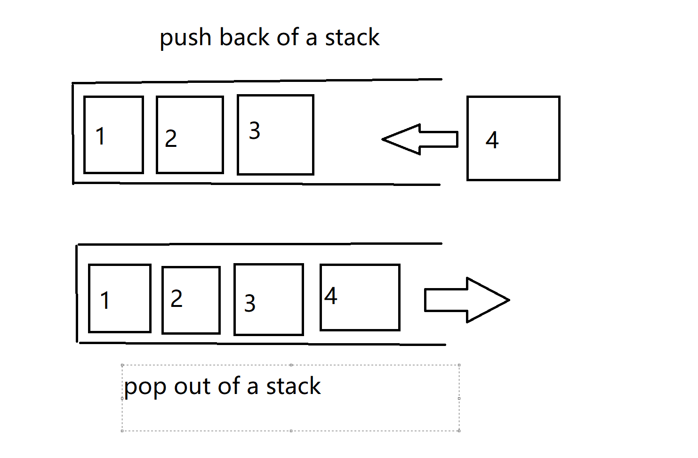

​		可以看到，我们把插入和删除换成了 push back 和 pop out. 在栈里，这样的行为叫压栈和弹栈。

```
往栈里放入元素的过程叫压栈
往栈里弹出元素的过程叫弹栈
```

​		而且，我们只可以对最上面的元素展开操作而不能对下面的元素操作。这样的特点从动态角度来看，不正是后进先出嘛！就是说，最后进入栈的必须第一个出栈

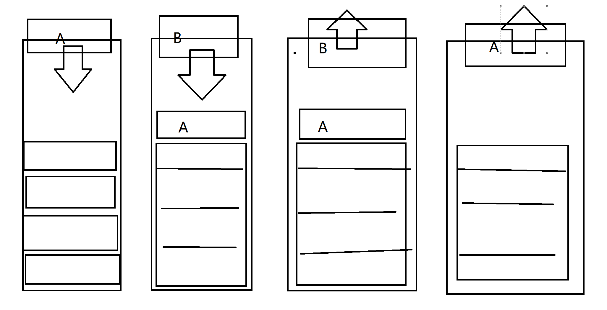

​		至于栈的实现如何，这里不做说明，可以看我搞的其他博客或者自行查询怎样实现。

## 系统函数调用栈

​		可以说，栈的一个在操作系统级别的应用，就是系统函数的调用栈。话说的太抽象了，来看个例子！

​		今天我们需要书写一个程序，很简单，不难的：

```C
#include<stdio.h> // 不熟悉这个的，理解为python 的 import 包就可以了！

int getModFrom2Int(int num1,int num2)
{
    return a % b; // 函数执行取余数的操作，并将其返回！
}

int getAddOf2Int(int num1,int num2)
{
    int resFromMod = getModFrom2Int(num1,num2);
    return resFromMod + b;
}

int main() // 程序入口
{
    int a = 3;
    int b = 2;
    int c = getAddOf2Int(a,b); // 
    printf("%d",c); // print the num on console控制台的打印
    return 0;
}
```

​		这是一份简单的C语言代码。从程序运行的顺序来看：程序从 main 进入，经过初始化 a,b的时候，准备初始 c ，但是注意到，c的初始化是由`getAddOf2Int`这个函数的返回值赋值的，意味着程序必须要进入函数当中。 当程序执行到`getAddOf2Int`里，他马上又发现， 里头的另一个变量 res ，需要调用函数`getModFrom2Int`来解决。程序又跳转到`getModFrom2Int`里去，终于我们不折腾了，对 作为实参的 a, b 取完余数就直接扔回去（优雅的讲叫返回结果指调用处），res 得到了值 3 % 2 = 1，随后，`getAddOf2Int`又把res和 b 再次相加， 作为`getAddOf2Int`返回去了，显然这是 3。分析结束，是不是这样呢？我们在Linux下跑一下代码！

​		如果不知道怎么搞，就这样

```shell
# 找到一个文件夹，进入到里面，打开终端 open in terminal
>>> vim runCode1.c
#书写代码， 当然不熟悉的话，先摁i进入编辑模式随后输入代码

# 写完了退出去，方法是：摁esc，输入:wq退出

>>> gcc runCode1 #没有就跟提示 sudo apt install gcc

# 没有指定可执行文件，会自动生成 a.out

>>> ./a.out

res: 3
```

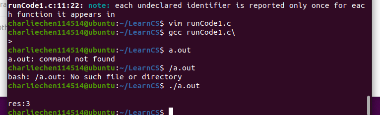

​		找到你的可执行文件，不然就会出现如上图各种各样的报错。我们的分析没有大问题。

​		可是这跟我们的主题有什么关系呢？别着急，现在就来问你，怎么实现的？怎么让函数按部就班的调用，返回呢？答案就是系统调用函数栈。

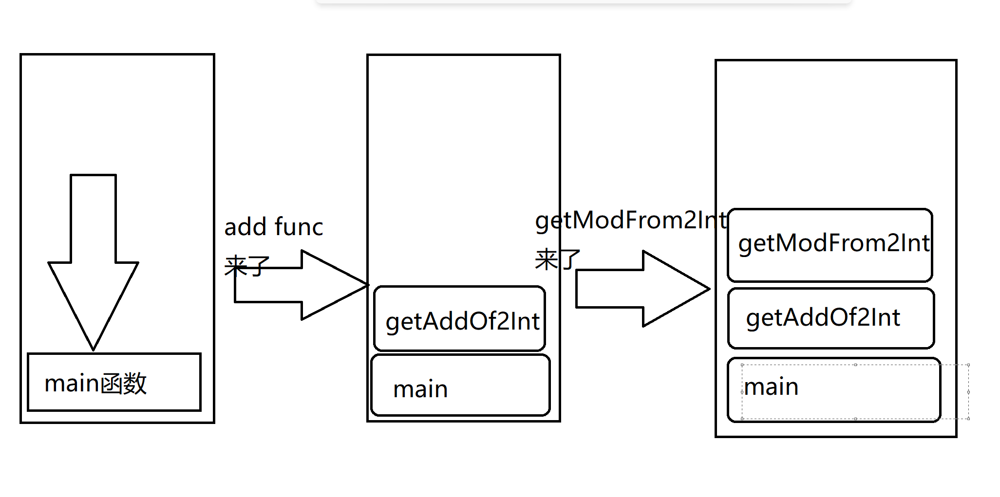

​		很好，我们遇到一个函数就把函数地址（函数在哪）压到里面去！直到程序不在调用新的函数（最后一个入栈的不调函数了！）开始逐级返回，函数出栈！

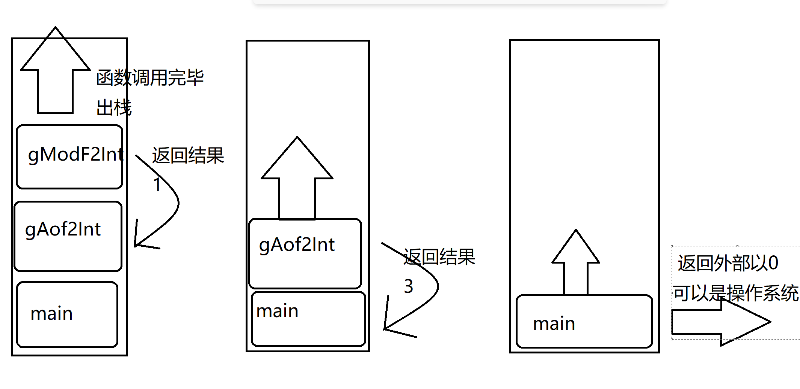

​		这些函数在栈里，就用这里的属于说话吧！他们叫栈帧，如同视频一般，一帧一帧展示调用返回。

​		栈帧是一个复杂的复合体，一般而言他有三个部分构成！

​		1.函数参数，如 main 函数没有函数参数，而`getAddOf2Int`有两个参数 num1 ,num2

​		2.局部变量，如 main 函数里有 a, b ,c 三个在函数体内的变量，`getAddOf2Int`里有个res 来接受 Mod 函数的返回值。

​		3.(不好理解)返回地址。这是干嘛的呢？我们在文本编辑器里，可以直观的看到...

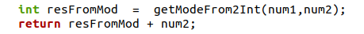

但是对于CPU来讲，它进到getModFrom2Int里，再次出来的时候不知道下一条指令在哪里。于是，需要存储下一条指令（return resFromMod + num2）的指令地址，方便CPU从其他函数调用之后又再次回来时找到继续执行的地方.

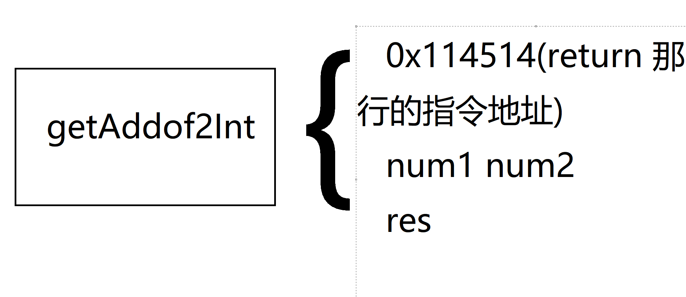

​		什么？口说无凭？上汇编！

```shell
objdump -S a.out
```

A

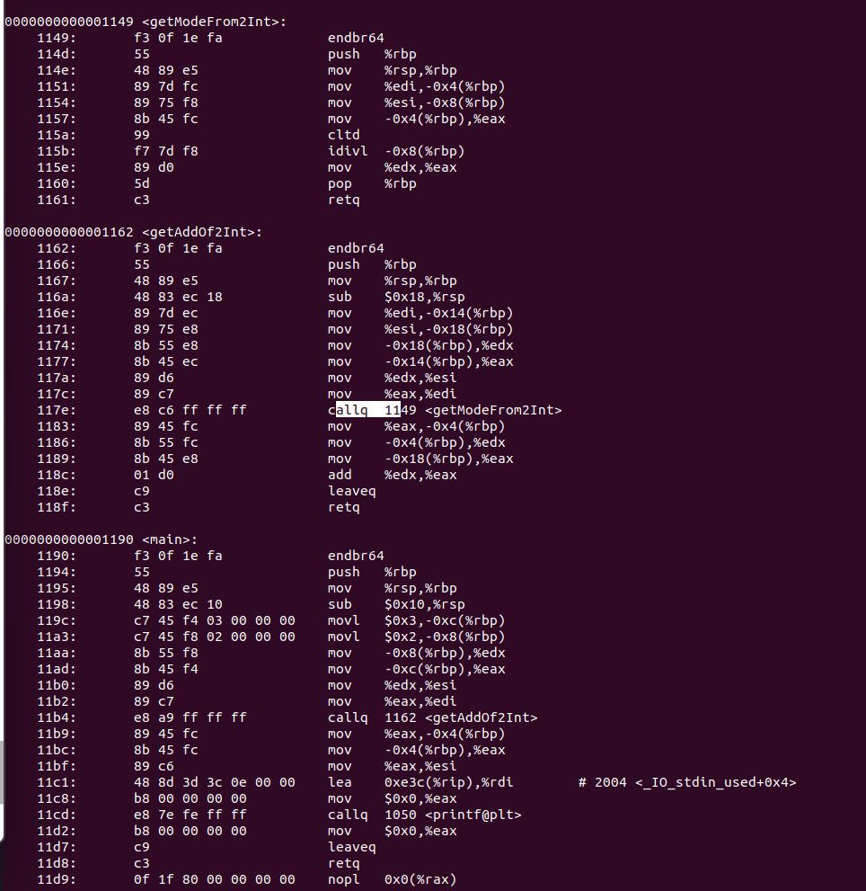

​		留心到 callq 指令，这是函数调用的指令。函数执行完毕，CPU直接读取栈帧的存储返回地址继续走。

## 步入正题！函数调用自己！（就是递归）

​		我们学习完基本的函数调用之后，有没有一个大胆的想法：函数可不可以调他自己呢？试试！

```C++
#include<iostream>
using namespace std;

int main()
{
	cout << "Lol, I am calling myself again and again!";
	Sleep(500); // 加个这个，防止程序栈炸了
	main();
}
```

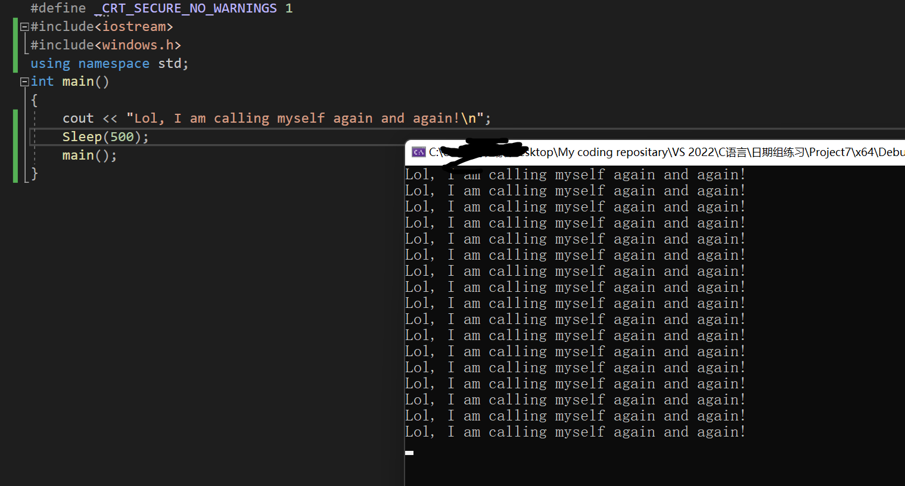

​		是的，尝试自己调用自己！这个函数正在不停的调用他自己，直到函数调用栈溢出崩溃。

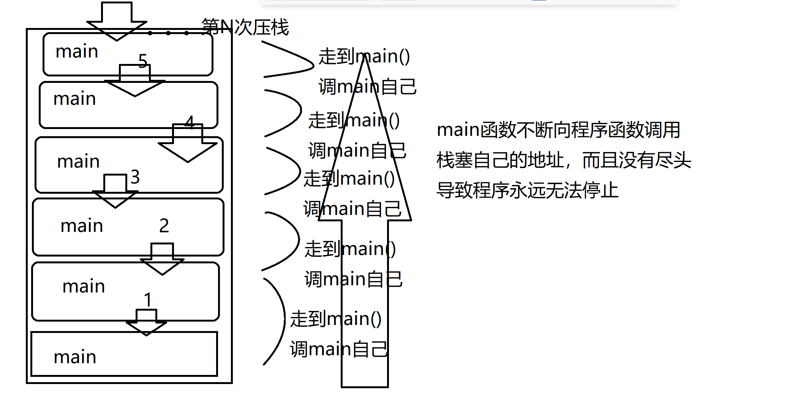


​		歪！不能这样啊，那咋办，简单，来个中止条件就可以了！简单加个出口。方法就是引入一个计数器，来控制调用次数

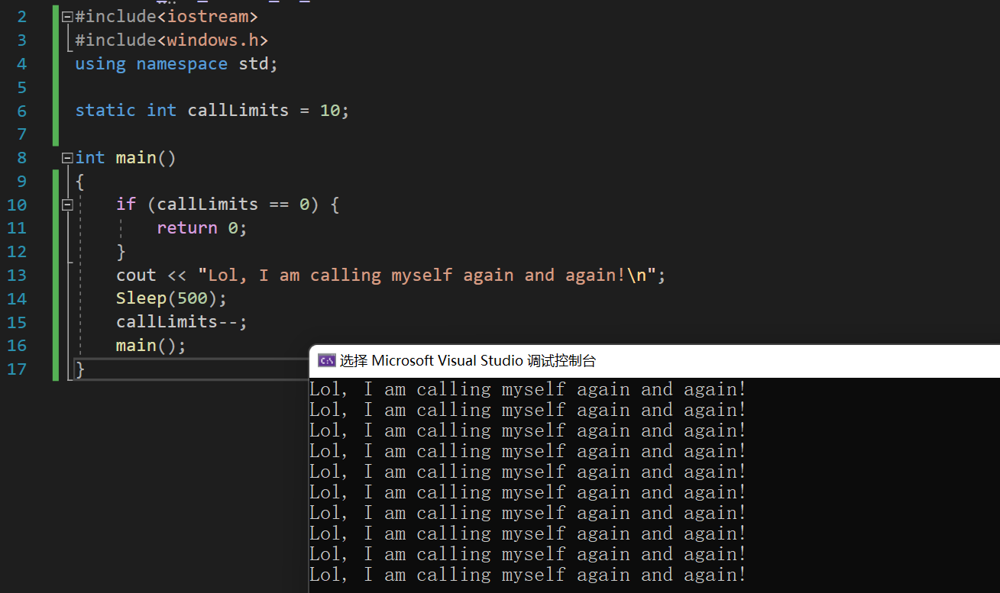

​		就调用了十次，很好！

​		当然，没人，除非是真的需要，会对主函数干这种事情。事实上，以递归执行的函数的调用计时器往往放在参数列表里，通过检测参数来停止函数调用

​		比如说，打印函数3次：

```C++
void PrintinLimits(int times)
{
	if (times == 0) { // if time is used up,process exited by returning val directly
		return;
	}

	cout << "Calling for times:>" << times << '\n';

	PrintinLimits(times - 1); // 次数减1，趋向于停止（0就跳出去了）

	return;
}


int main()
{
	PrintinLimits(3);
}
```

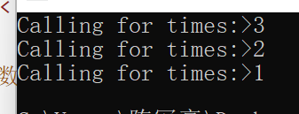

所以，到底怎么回事，还是回到调用栈上

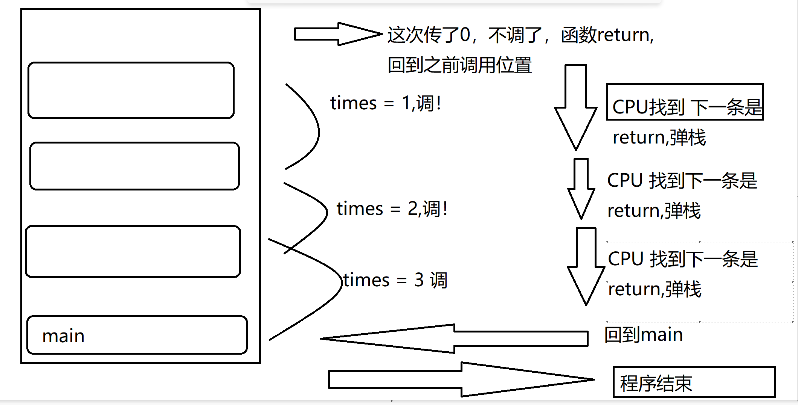

​		比如说我们今天不好好写高斯求和函数：

```C++
#include<iostream>
#include<windows.h>
using namespace std;

static int callLimits = 10;

long GaussainSumInRecurssion(int curAdder)
{
	if (curAdder == 0) {
		return 0;
	}
	return curAdder + GaussainSumInRecurssion(curAdder-1);
}


int main()
{
	cout << GaussainSumInRecurssion(10);
}
```

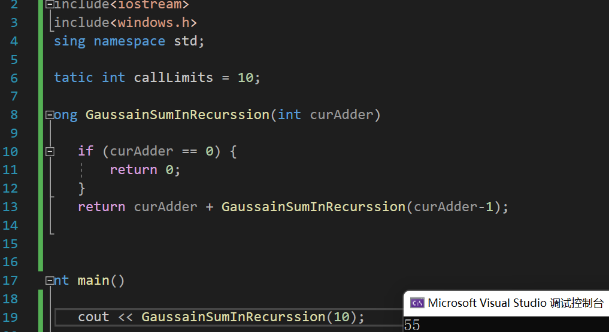

​		是跟上面同理的，但是这个是尾递归，不好理解，我们先不去分析。

​		仿照这一思路，打印数组也有花样！

```C++
void printArrayInRecur(int* array, unsigned int arraySize)
{
	if (arraySize == 0) {
		return;
	}

	cout << array[arraySize - 1] << " " ; // for correctly print
	// 数组下标从0开始，减个一！

	printArrayInRecur(array, arraySize - 1);

	return;
}


int main()
{
	int array[4] = {1,2,3,4};

	printArrayInRecur(array, 4);

	return 0;
}
```

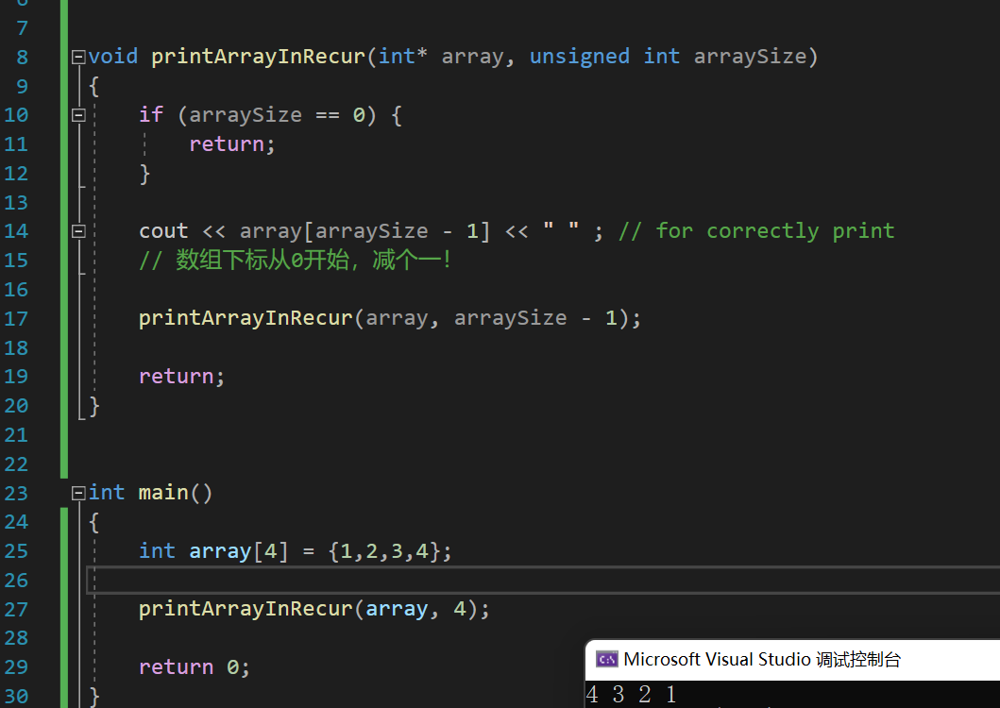

​		手动实现了倒序打印！

​		那正序呢？

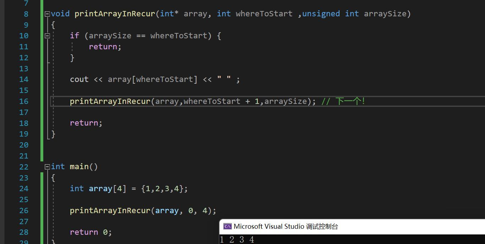

​		就这样！下面的有空再开一个。

# 深入理解递归2

​		回忆一下，递归的本质就是函数的调用，而且特别的，是调用他自己，为了防止根本停不下来的调用，我们必须提供一个函数的递归出口——这正是我们之前所阐述的！

```C++
#include<string>
#include<iostream>
using namespace std;
// 如果你忘记了的话，看看这个复习一下吧！
void printRecur(const int* array, unsigned int start, unsigned int end)
{
	if (array == NULL) {
		return;
	}

	if (start >= end)
	{
		return;
	}
	cout << array[start] << " ";

	printRecur(array, start + 1, end);
}


int main()
{
	int arr[10] = { 1,2,3,4,5,6,7,8,9,10 };
	printRecur(arr, 0, 10);
}
```

​		下面继续哔哔新东西！

​		我们刚刚一直在说系统栈，可不可以书写一个函数来实现我们的系统栈功能呢？可以的：

​		改造上面的代码为如下，详细的解说请参看代码的注释！

```C++
void imitateSysRecur(const int* array, unsigned int start, unsigned int end)
{
	cout << '\n';
	stack<int>* sys = new stack<int>();// 创造一个空栈
	sys->push(array[start]);// 这里等效做函数的第一次调用
	while (!sys->empty())// 查看有没有弹出干净，没有继续弹出！
	{
		int prt = sys->top();// 一下就弹出第一个任务
		
		if (start >= end)
			return;

		printf("%d ", prt); // 对之执行操作
		sys->push(array[++start]);// 转向下一个
	}

}

int main()
{
	int arr[10] = { 1,2,3,4,5,6,7,8,9,10 };
	imitateSysRecur(arr, 0, 10);
}
```

## 虽说递归爽，但是注意到性能问题！

​		递归也有代价：写的爽必然有代价。

​		首先函数调用就有时间的开销（注意到递归反复调用函数）

​		其次，这也存在空间上的开销！我们需要占一定的空间复杂度来运行我们的函数。

​		那么，什么时候使用递归呢？预告一下：正是那些非线性的数据结构我们使用递归来处理，这将会在树与图论中显的常见！

## 练习1：递归求解线性表：如数组的和

​		首先，我们来看，对于一个线性表，我们若是想得知这些元素的和：
$$
A = \sum_{i=0}^{n-1}a[i]
$$
​		然而马上发现，这个表达式可以写作：
$$
A = \sum_{i=0}^{n-1}a[i] = a[n-1] + \sum_{i=0}^{n-2}a[i]
$$
​		啊哈！这递归就出来了：终止条件就是当取到 arr[0]时停止！，这样就可以开始设计递归了。

​		我们的结果可以存放在函数的参数列表里，这样的话递归不用开辟新的空间存放局部变量！

```C++
long getSumRecur(const int* arr, unsigned int arrSize,int curSum)// 设计1
{
	if (arr == nullptr) // 不合法的数组return
	{
		return -1;// 这个地方放错误处理，可以是cstdlib下的exit!
	}

	if (arrSize == -1) // 即将越界
	{
		return curSum; // 求和结束，直接返回当下参数的curSum就好了
	}

	getSumRecur(arr, arrSize - 1, curSum + arr[arrSize]);
    // 递归！ 让arrSize减1， 表明arr[size-1]已经纳入和 curSum 了！
    // 同时，在参数列表中做出 curSum + arr[arrSize]的修改就好了
}

```

​		这样的递归适合与有前缀初始值的求和！

​		有没有别的形式的？有。直接注意到：没有必要新增一个参数，而是直接return掉局部和！就是说：

```C++
return arr[size] + getCur2(arr,size-1)
```

​		因为为了返回，必须要把getCur2的值求出来，一直递归到函数不需要调用自己为止！那就很是容易了，只要curSize == 0,返回 arr[curSize]就好了！（其实就是arr[0]）

```C++
long getSumRecur2(const int* arr,int arrSize)
{

	if (arr == nullptr) {
		return -1;
	}

	if (arrSize == 0)
	{
		return arr[0];
	}

	return arr[arrSize] + getSumRecur2(arr, arrSize - 1);

}
```

​		run 一下代码！

```
int main()
{
	int arr[10] = { 1,2,3,4,5,6,7,8,9,10 };
	cout << getSumRecur(arr, 9, 0)<< endl;
	cout << getSumRecur2(arr, 9) << endl;
}
```

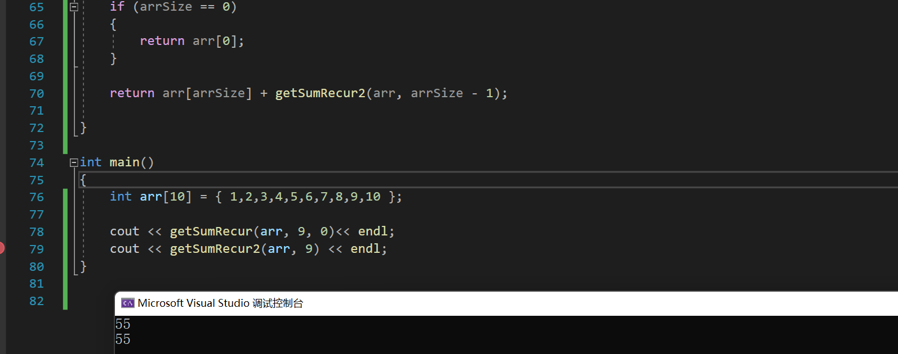

