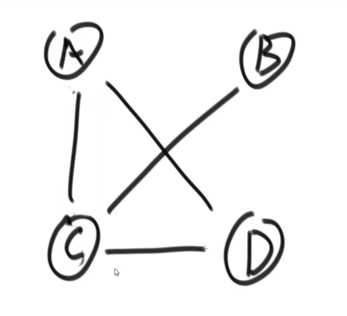

# 算法竞赛

###### 认识时间复杂度

​		我们有一些操作是常数时间完成的：

```C
int a =arr[i];
```

​		因为我们直接计算偏移量直接取出的

​		但是这个不是

```C
int t=list.get(i);//链表
```

​		因为链表必须遍历，才能找到元素

​		以及加减乘除的操作是常数操作。

​		总而言之：涉及到数据量的操作都是==非常数操作==

​		举个例子，选择排序：这个排序是一种选择某一个数与前面已经排好的数组开始对比。怎么保证前面的已经有序了呢？我们把算法作用在第一个元素上，这个时候那他与第二个元素排序，成功后就是一个有序小数组，这样就满足了递归的条件：

```C
//Part I:C version without recurssion
#include <stdio.h>
#include<stdlib.h>
#include<time.h>
#include<windows.h>
//using Choose sort to sort the array
//rand num getter
int getRandNum(int maxRange)
{
    srand((unsigned int)clock());
    Sleep(10);
    return rand()% maxRange;
}

void printCurrentArray(int* array,int arraySize)
{
    printf("Current array is shown:\n");
    for(int i=0; i<arraySize; i++)
    {
        printf("%d ",array[i]);
    }
    printf("\n");
}

void swapInt(int* e1, int* e2)
{
    int temp=*e1;
    *e1=*e2;
    *e2=temp;
}

int main()
{
    //get a rand array
    int arr[10]={0};
    for(int i=0; i<10; i++)
    {
        arr[i]= getRandNum(100);
    }
    //Sort starts!
    for(int i=1; i<10; i++)
    {
        //from the second one
        //Compared with the previous one and the front one
        for(int j=i;j>0;j--)
        {
            //If inverted,invert them back
            if(arr[j]<arr[j-1])
            {
                swapInt(&arr[j], &arr[j - 1]);
            }
        }
        //Target the Current Key and show:
        printf("Current key is:%d\n",arr[i]);
        printCurrentArray(arr,10);
        printf("Enter the newline to go forward!");
        getchar();
    }
    printf("Eventually...\n");
    printCurrentArray(arr,10);
}
```

```C
//Or Recussion type
#define _CRT_SECURE_NO_WARNINGS 1
#include<windows.h>
#include <stdio.h>
#include<stdlib.h>
#include<time.h>
//using Choose sort to sort the array
//rand num getter
int getRandNum(int maxRange)
{
    srand((unsigned int)clock());
    Sleep(10);
    return rand() % maxRange;
}

void printCurrentArray(int* array, int arraySize)
{
    printf("Current array is shown:\n");
    for (int i = 0; i < arraySize; i++)
    {
        printf("%d ", array[i]);
    }
    printf("\n");
}

void swapInt(int* e1, int* e2)
{
    int temp = *e1;
    *e1 = *e2;
    *e2 = temp;
}

void insertSort(int* array, int arraySize, int cur_sort_place)
{
    if (cur_sort_place > arraySize-1)
        return;
    int j = cur_sort_place;
    while (j > 0)
    {
        if (array[j] < array[j - 1])
            swapInt(&array[j], &array[j - 1]);
        j--;
    }
    choiceSort(array, arraySize, cur_sort_place + 1);
}

int main()
{
    int arr[10] = { 0 };
    for (int i = 0; i < 10; i++)
    {
        arr[i] = getRandNum(100);
    }
    insertSort(arr, 10, 1);
    printCurrentArray(arr, 10);
}
```

​		这个算法的时间复杂度就是O($N^2$)，这是因为操作表达式的最高阶是$N^2$.

​		注意到O(N)表达的是表达式的最高此项，是衡量巨大数量下算法的优良度


​		当时间复杂度相同时，通过==比较常数项==作出判断是否可靠。更多的时候我们选择直接开跑看看怎么样：

```Java
public static void Process1()
{
    int N=1000;
    int a=1;
    for(int i=0 ; i<N; i++)
    {
        a*=10;
        a=a+10;
        a=6127*9876;
    }
}

public static void Process2()
{
     int N=1000;
    int a=1;
    for(int i=0 ; i<N; i++)
    {
        a=10|1;
        a^=10;
        a=a&9876;
    }
}
```

​		对，就是这种。

##### 选择排序

​		回顾上面的实例代码：我们使用Java写出另一个版本：

```java
public static void seletionSort(int[] array){
    if(arr==null&&arr.length<2)
    {
        return;
    }
    for(int i=0;i<arr.length-1;i++)
    {
        int minIndex=i;
        for(int j=i+1;j<arr.length;j++)
        {
            minIndex=arr[j]<arr[minIndex]?j:minIndex;//直接找到最小的地方
        }
        swap(arr,i,minIndex);//Using in swap minindex with arr[i]
    }
}
```

###### 冒泡排序

​		我们也可以使用冒泡排序排数，就像大的泡泡向下沉，小的泡泡向上浮。就好了。值得注意的是，我们换完产生的最值区已经换好了，没有必要再参与排序。

```c
for(int i=0;i<N-1;i++)
{
    for(int j=0;j<N-i;j++)
    {
        if(conditions)
            swap data;
    }
}
```

###### 交换的离奇写法

请看这个

```java
public static void swap(int[] arr, int i, int j)
{
    arr[i]=arr[i]^arr[j];
    arr[j]=arr[i]^arr[j];
    arr[i]=arr[i]^arr[j];
}
```

异或：相同为0，不同为1：

例如：

A:1011110101001

B:1000101011001

  A^B: 0011011110000                        

也可以理解为无进位相加：

性质1：0^N=N,N^N=0

性质2：满足交换律和结合律

那这是怎么交换的？

a=a^b  1)

b=a^b

a=a^b

假设a= A,b=B;

1)a=A^B b=B

2)a=A^B,b=(A^B)^B =A^(B^B)=A

3)a=A^B^A=B b=A

交换完毕

但是注意：这样的方法不适用于同一块内存，否则会洗成0.

例题：1）现在有一个整型数组：里面有诺干出现了偶数次的数和一个出现奇数次的数，找出那个奇数次数的数：

EG：[2,1,3,1,3,1,3,2,1]----->3

Solutions：

```C
int ero=0;
for(int i=0;i<arr.length;i++)
{
ero^=arr[i];
}
printf("%d ",ero);
```

​		这是因为异或顺序无关，偶数次数的全消成了0.于是可以引用在奇偶相关次序无关的题目。

2）现在有一个整型数组：里面有诺干出现了偶数次的数和两个出现奇数次的数，找出那两个奇数次数的数：

Ok，当我们依旧沿袭上面的方法的时候，我们发现：eor=a^b,这是因为一切出现了偶数次的异或为0，a和b也最后削成一个a^b。下面怎么办？

注意到a$\neq$b，这样的话：因为最右边的1是a,b作为二进制的特征数（用它来区分a,b），我们就可以提取出来：int rightOne=eor&(~eor+1)，也就是源码与上补码，提取eor上的第右边的1，随后只与这个位置上是1的数，就得到a或者是b了

​		

```java
public static void printOddTimeNum2(int[] arr)
{
    int eor=0;
    for(int i=0;i<num)
    {
        eor^arr[i];
    }
    int rightOne=eor&(~eor+1);//找出来最右边的数
    int onlyOne=0;//eor'
    for(int cur:arr)
    {
        if((cur&rightOne)==0)//别写1，因为出来的只能是0或者是rightOne，如果想要另一个就!=0;
            onlyOne^=cur;
    }
    System.out.printIn(onlyOne+" "+(ero^onlyOne));
}
```

###### 插入排序

​		这个就是最上面的代码，就是相当于插牌。这个算法的表现是波动较大的：O(N)~O($N^2$)。

​		但是算法的复杂度是看最差情况的，所以是O($N^2$).

```java 
public class Solution{
    public static void insertSort(int[] arr)
    {
        if(arr==null&&arr.length<2)
        {
            return;
        }
        for(int i=1;i<arr.length;i++)
        {
            for(int j=i-1; j>=0&&arr[j]>arr[j+1];j--)
            {
                swap(arr,j,j+1);
            }
        }
    }
    public static void swap(...)
    {
        //...
    }
}
```

###### 二分查找法

​		注意，这个只使用于有序数组。这个数组使用二分查找是最快的。主要思想：找中间，比大小，挪边界，继续二分。这个算法的复杂度因此是$O(\log n)$.

###### 对数器

​		假设我们要进行测试方法A，我们使用随机样本产生器，我们随机的产生数据放到多个方法，他们结果要是不一样，那要不就是A错，要不就是B错，要不就是都错了。这个时候人工干预的方式修改方法。

# 算法竞赛

##### 递归行为下时间复杂度的计算

###### 求取中点的方法

```C
int mid=L+((R-L)>>1);
```

​	为什么这样书写：防止R+L溢出int上限、

###### 使用递归求解数组最大值：

```java
public class Solution{
	public static int getMax(int[] arr)
    {
        return process(arr,0,arr.length-1);
    }
    public static int process(int[] arr, int L ,int R){
        if(L==R)
            return;
        int mid=L+((R-L)>>1);
        int leftMax=process(arr,L,mid);
        int rightMax=process(arr,mid+1,R);
        return Math.max(leftMax,rightMax);
    }
}
```

这个写法我们是在二分类是常用的：先处理递归左边，再递归处理右边，最后从小到大的返回各层的最大值，最后得到整体的最大值。下面也有C++版本的

```C++
#include<iostream>
#include<vector>
#include<Windows.h>
class Finder {
public:
	int getMax(std::vector<int> s) {
		return Dofindmax(s, 0, s.size()-1);
	}
	int Dofindmax(std::vector<int> s, int left, int right)
	{
		if (left == right)
			return s[left];
		int mid = left + ((right - left) >> 1);
		int leftMax = Dofindmax(s, left, mid);
		int rightMax = Dofindmax(s, mid + 1, right);
		return leftMax > rightMax ? leftMax : rightMax;
	}
};

void PrintVector(std::vector<int> s)
{
	for (std::vector<int>::iterator it = s.begin(); it != s.end(); it++)
		std::cout << *it << " ";
	std::cout<<std::endl;
}

int getRandNum()
{
	srand((unsigned int)clock());
	Sleep(10);
	return rand() % 100;
}

int main()
{
	std::vector<int> s;
	for (int i = 0; i < 10; i++)
		s.push_back(getRandNum());
	PrintVector(s);
	Finder f;
	int t = f.getMax(s);
	std::cout << t;
}
```

当然，别太常用，因为容易把栈搞炸


画个递归树

###### Master公式

$$
if:T(N)=a*T(\frac{N}{b})+O(N^d)
$$

$$
then:1)\log_ba>d->T(N^{\log_ba})
$$

$$
2)\log_ba=d->T(N^{d}log N)
$$

$$
3)\log_ba<d->T(N^{d})
$$

有人话版本吗？有的：就是说我们的一次递归可以拆分一个问题为b个子问题，当然右额外开销$N^d$,这样，我们就有分层级讨论：比较$\log_ba$与d的大小从而一步写出公式。

以上面为例：上面的问题把问题拆成两个子问题：b=2,并且在单个函数体内调用了两次：a=2,剩下的时间复杂度为O(1).这下，我们的公式就是：
$$
T(N)=2*T(N/2)+O(1)
$$
这样就直接带入公式:T(N)=O(logn).

###### 补充Reading

​		平时设计或者阅读一个算法的时候，必然会提到算法的复杂度（包括时间复杂度和空间复杂度）。比如我们说一个二分查找算法的平均时间复杂度为 O(log n)，快速排序可能是 O(n log n)。那这里的 O 是什么意思？这样的表达是否准确呢？

​		今天来复习一下与算法复杂度相关的知识：函数渐进阶，记号 O、Ω、θ和 o；Master 定理。

​		先插一句，在算法复杂度分析中，log 通常表示以 2 为底的对数。

​		算法复杂度（算法复杂性）是用来衡量算法运行所需要的计算机资源（时间、空间）的量。通常我们利用渐进性态来描述算法的复杂度。

​		用 n 表示问题的规模，T(n) 表示某个给定算法的复杂度。所谓渐进性态就是令 n→∞ 时，T(n) 中增长最快的那部分。严格的定义是：如果存在 $T'(n)$，当 n→∞ 时，有:
$$
\frac{T(n)-T'(n)}{T(n)}\rightarrow 0
$$
​		我们就说$T'(n)$是 T(n) 当 n→∞ 时的渐进性态。

​		比如 T(n) = 2 * n ^ 2 + n log n + 3，那么显然它的渐进性态是 2 * n ^ 2，因为当 n→∞ 时，后两项的增长速度要慢的多，可以忽略掉。引入渐进性态是为了简化算法复杂度的表达式，只考虑其中的主要因素。当比较两个算法复杂度的时候，如果他们的渐进复杂度的阶不相同，那只需要比较彼此的阶（忽略常数系数）就可以了。

​		总之，分析算法复杂度的时候，并不用严格演算出一个具体的公式，而是只需要分析当问题规模充分大的时候，复杂度在渐进意义下的阶。记号 O、Ω、θ和 o 可以帮助我们了解函数渐进阶的大小。

​		假设有两个函数 f(n) 和 g(n)，都是定义在正整数集上的正函数。上述四个记号的含义分别是：

- f(n) = O(g(n))：$∃c>0,n_0∈N,∀n≥n_0,f(n)≤cg(n)$；f 的阶**不高于** g 的阶。
- f(n) = Ω(g(n))：$∃c>0,n_0∈N,∀n≥n_0,f(n)≥cg(n)$；f 的阶**不低于** g 的阶。
- f(n) = θ(g(n))：⟺$f(n)=O(g(n))\&\&f(n)=Ω(g(n))$；f 的阶**等于** g 的阶。
- f(n) = o(g(n))：$∀\varepsilon>0,∃n_0∈N,∀n≥n_0,f(n)/g(n)<\varepsilon$；f 的阶**低于** g 的阶。

​		可见，记号 O 给出了函数 f(n) 在渐进意义下的上界（但不一定是最小的），相反，记号Ω给出的是下界（不一定是最大的）。如果上界与下界相同，表示 f(n) 和 g(n) 在渐进意义下是同阶的（θ），亦即复杂度一样。

​		列举一些常见的函数之间的渐进阶的关系：


​		有些人可能会把这几个记号跟算法的最坏、最好、平均情况复杂度混淆，它们有区别，也有一定的联系。

​		即使问题的规模相同，随着输入数据本身属性的不同，算法的处理时间也可能会不同。于是就有了最坏情况、最好情况和平均情况下算法复杂度的区别。它们从不同的角度反映了算法的效率，各有用处，也各有局限。

​		有时候也可以利用最坏情况、最好情况下算法复杂度来粗略地估计算法的性能。比如某个算法在最坏情况下时间复杂度为θ(n ^ 2)，最好情况下为θ(n)，那这个算法的复杂度一定是 O(n ^ 2)、Ω(n) 的。也就是说 n ^ 2 是该算法复杂度的上界，n 是其下界。

​		接下来看看 Master 定理。

​		有些算法在处理一个较大规模的问题时，往往会把问题拆分成几个子问题，对其中的一个或多个问题递归地处理，并在分治之前或之后进行一些预处理、汇总处理。这时候我们可以得到关于这个算法复杂度的一个递推方程，求解此方程便能得到算法的复杂度。其中很常见的一种递推方程就是这样的：

​		设常数 a >= 1，b > 1，f(n) 为函数，T(n) 为非负整数，T(n) = a T(n / b) + f(n)，则有：


​		比如常见的二分查找算法，时间复杂度的递推方程为 T(n) = T(n / 2) + θ(1)，显然有 $n^{\log _b^a}⁡=n^0=Θ(1)$，满足 Master 定理第二条，可以得到其时间复杂度为 T(n) = θ(log n)。

​		再看一个例子，T(n) = 9 T(n / 3) + n，可知 $n^{\log_b^a}=n^2$，令ε取 1，显然满足 Master 定理第一条，可以得到 T(n) = θ(n ^ 2)。

​		来一个稍微复杂一点儿例子，T(n) = 3 T(n / 4) + n log n。$n^{\log_b^a}=O(n^{0.793})$，取ε = 0.2，显然当 c = 3 / 4 时，对于充分大的 n 可以满足 a * f(n / b) = 3 * (n / 4) * log(n / 4) <= (3 / 4) * n * log n = c * f(n)，符合 Master 定理第三条，因此求得 T(n) = θ(n log n)。

​		运用 Master 定理的时候，有一点一定要**特别注意**，就是第一条和第三条中的ε必须**大于零**。如果无法找到大于零的ε，就不能使用这两条规则。

​		举个例子，T(n) = 2 T(n / 2) + n log n。可知 $n^{\log_b^a}=n$，而 f(n) = n log n，显然不满足 Master 定理第二条。但对于第一条和第三条，也无法找到大于零的ε使得 nlog⁡n=O$(n^{1−\varepsilon})$ 或者Ω$(n^{1−\varepsilon})$，因此不能用 Master 定理求解，只能寻求别的方式求解。比如可以利用递归树求出该算法的复杂度为 $T(n)=O(n\log^2n)$。简单的说一下计算过程：

​		递归树的建立过程，就像是模拟算法的递推过程。树根对应的是输入的规模为 n 的问题，在递归处理子问题之外，还需要 n log n 的处理时间。然后根据递推公式给根节点添加子节点，每个子节点对应一个子问题。这里需要两个子节点，每个节点处理规模为 n / 2 的问题，分别需要 (n / 2) * log(n / 2) 的时间。因此在第二层一共需要 n * (log n - 1) 的时间。第三层节点就是将第二层的两个节点继续分裂开，得到四个各需要 (n / 4) * log(n / 4) 时间的节点，总的时间消耗为 n * (log n - 2)。依此类推，第 k（设树根为 k = 0）层有 2 ^ k 的节点，总的时间为 n * (log n - k)。而且可以知道，这棵树总共有 log n 层（最后一层每个节点只处理规模为 1 的子问题，无须再分治）。最后将每一层消耗的时间累加起来，得到：


###### 归并排序（MergeSort）

​		1）整体就很简单，就是一个简单的递归，左边排好序，右边排好序，然后整体就有序。

​		2）让其整体有序的方式用了排外序方法

​		3）继续使用master公式求解:$O(N\log N)$，空间复杂度O(N)

​		4）归并排序的实质

思路


​		对于一块区域，我们使用指针访问：左右双指针法。开辟一块小空间，如果左边的大于右边的，左边指针拷贝同时指针后移一个，右边大于左边的同理。

```Java
public class Solution{
    public static void mergeSort(int[] arr)
    {
        if(arr==null||arr.length<2)
            return;
        process(arr,0,arr.length-1);
    }
    public static void process(int[] arr,int L, int R)
    {
        if(L==R)
            return;
      	int mid = left + ((right - left) >> 1);
        process(arr,L,mid);
        process(arr,mid+1,R);
        merge(arr,L,mid,R);
    }
    public static void merge(int[] arr,int L,int M,int R){
        int[] helpSort=new int[R-L+1];//这是辅助空间
        int i=0;
        int p1=L;
        int p2=M+1;//划分区域
        while(p1<=M&&p2<=R){
            helpSort[i++]=arr[p1]<=arr[p2]?arr[p1++]:arr[p2++];
            }
        while(p1<=M){
           helpSort[i++]=arr[p1++];
        	}
        while(p2<=R){
            helpSort[i++]=arr[p2++];
        }
        for(i=0;i<helpSort.length;i++){
            arr[L+i]=helpSort[i];
        }
    }
}
```

C++:

```C++
#include<iostream>
using namespace std;
 
void Merge(int arr[],int low,int mid,int high){
    //low为第1有序区的第1个元素，i指向第1个元素, mid为第1有序区的最后1个元素
    int i=low,j=mid+1,k=0; //mid+1为第2有序区第1个元素，j指向第1个元素
    int *temp=new(nothrow) int[high-low+1]; //temp数组暂存合并的有序序列
    if(!temp){ //内存分配失败
        cout<<"error";
        return;
    }
    while(i<=mid&&j<=high){
        if(arr[i]<=arr[j]) //较小的先存入temp中
            temp[k++]=arr[i++];
        else
            temp[k++]=arr[j++];
    }
    while(i<=mid)//若比较完之后，第一个有序区仍有剩余，则直接复制到t数组中
        temp[k++]=arr[i++];
    while(j<=high)//同上
        temp[k++]=arr[j++];
    for(i=low,k=0;i<=high;i++,k++)//将排好序的存回arr中low到high这区间
		arr[i]=temp[k];
    delete []temp;//删除指针，由于指向的是数组，必须用delete []
}
 
//用递归应用二路归并函数实现排序——分治法
void MergeSort(int arr[],int low,int high){
    if(low<high){
        int mid=(low+high)/2;
        MergeSort(arr,low,mid);
        MergeSort(arr,mid+1,high);
        Merge(arr,low,mid,high);
    }
}
 
int main(){
    int a[10]={5,1,9,3,7,4,8,6,2,0};
    MergeSort(a,0,9);
    for(int i=0;i<10;i++)
        cout<<a[i]<<" ";
    return 0;
```

###### 扩展我们的归并排序问题

​		小和问题：对一个数组中，每个数左边比当前数小的数累加起来，叫做这个数的小和：请写一个程序：求解一个数组的小和。

Example:[1,3,4,2,5]产生的单个小和是[0,1,4,1,10],故数组的小和是16.

​		逆序问题：在一个数组中，左边的数如果比右边的数大，则这连哥哥数构成一个逆序对，请打印所有的逆序对。

​		（1）暴力解法是很简单的：对于位置i直接暴力遍历，但是$O(N^2)$

​		有没有更快的：有！

​		仔细思考一下：我们的小和可以这样产生！看一个数右边走，如果有别的数大于它就加一次这个数本身。如[1,3,4,2,5]：看1，右边四个数比他大，就加四次1，看3，右边两个数比他大，就加两个3，依次类推。。。

​		现在，我们对全数组进行二分。针对拆分后的数组一级一级使用我们新的求小和的过程，我们在比较的同时也排序：如：[1，3，4，2，5]下，拆分成2级[1,3,4]和[2,5]，然后又是:[1,3] [4]  和[2]  [5]最后是:[1] [3] [4] [2] [5]，现在返回去合并：[1,3]产生小和1，[1,3,4]产生1个1，1个3，（左侧小，左侧加小和，左侧移动指针到下一个，于是产生）[2,5]合并产生一个2，之后再次合并产生一个1，一个3，一个4，现在完事了：1+1+1+3+2+1+3+4=16

​		这个算法为什么是O(NlogN),就是因为排序的时候不需要在暴力遍历之后才知道有几个数比当前的数小。这才省略了新的遍历。

​		可能不一样的是：在这题里面，我们必须在左右数字相等的时候先拷贝右边的，再拷贝左边的.

​		（2）类似的，仍可以使用mergeSort，也就是说，只要产生小和操作就是说明产生了逆序。我们只要统计这个就好了

​		荷兰国旗问题：指定一个数，比他大的放右边，小的放左边，但是注意空间复杂度O(1)


​		思路：我们把使用两个指针。把小于num的放到左边，与小于区的下一个数字直接交换就好了。这样小于区右扩，否则指针直接右移。


​		荷兰国旗问题（2）：指定一个数，比他大的放右边，小的放左边，相等的放中间。但是注意空间复杂度O(1)

​		


​		还是类似，只不过有趣的是我们可以：

​		小于：[i]和小于区域的下一个交换，小于区东扩

​		相等：直接++

​		大于：[i]和大于区域的上一个交换，大于区西扩，但是i不动（我们还没排序那个交换过来的数嘞！）。

看看代码实现（看2就好了）

```C
#include<stdio.h>
#include<stdlib.h>
void swap(int* e1, int* e2)
{
	int temp = *e1;
	*e1 = *e2;
	*e2 = temp;
}

typedef struct Pair_ {
	int pair1;
	int pair2;
}Pair;

void arrangeArray(Pair* pair, int* arr, int arrsize,int sortnum)
{
	if (!pair && !arr)
		return;
	if (arrsize < 0)
		return;
	int* smaller = &arr[-1];
	int* bigger = &arr[10];
	int* check = arr;
	while (check < bigger)
	{
		if (*check < sortnum)
		{
			swap(check, smaller + 1);
			check++;
			smaller++;
		}
		else if (*check == sortnum)
		{
			check++;
		}
		else
		{
			swap(check, bigger - 1);
			bigger--;
		}
	}
	pair->pair1 = smaller - arr;
	pair->pair2 = bigger - arr;

}


void PrintArr(int* arr, int arr_size)
{
	for (int i = 0; i < arr_size; i++)
	{
		printf("%d ", arr[i]);
	}
	printf("\n");
}
int main()
{
	int arr[10] = { 3,5,6,3,4,5,2,6,9,0 };
	PrintArr(arr, 10);
	Pair* p=(Pair*)malloc(sizeof(Pair));
	p->pair1 = 0;
	p->pair2 = 0;
	arrangeArray(p, arr, 10, 5);
	PrintArr(arr, 10);
	printf("%d\n", arr[p->pair1]);
	printf("%d\n", arr[p->pair2]);
}
```

​		C++:

```C++
#include<iostream>
class Array {
public:
	void initVal(int* arr, int size) {
		int* arrayData = new int[size];
		for (int i = 0; i < size; i++)
		{
			arrayData[i] = arr[i];
		}
		arraydata = arrayData;
		arraysize = size;
	}
	void swapPartialData(int swap1,int swap2)
	{
		int temp = arraydata[swap1];
		arraydata[swap1] = arraydata[swap2];
		arraydata[swap2] = temp;
	}
	void arrangeandSort(int sortnum)
	{
		int smaller = -1;
		int bigger = arraysize;
		int check = 0;
		while (check < bigger)
		{
			if (arraydata[check] < sortnum)
			{
				swapPartialData(check, smaller + 1);
				check++;
				smaller++;
			}
			else if (arraydata[check] == sortnum)
			{
				check++;
			}
			else
			{
				swapPartialData(check, bigger - 1);
				bigger--;
			}
		}
	}
	void PrintVal()
	{
		for (int i = 0; i < arraysize; i++)
		{
			std::cout << arraydata[i] << " ";
		}
		std::cout << std::endl;
	}
private:
	int* arraydata;
	int arraysize;
};

int main()
{
	int arr[10] = { 3,5,6,3,4,5,2,6,9,0 };
	Array a;
	a.initVal(arr, 10);
	a.PrintVal();
	a.arrangeandSort(5);
	a.PrintVal();
}
```

###### 快速排序

​		快速排序请先把上面的代码琢磨明白：快速排序使得我们以一个数区分好了左右，排除掉标杆数我们只要对左右再次区分直到一个尽头结束。这次我们直接拿最后一个数当作标杆进行快排，这样我们就使得整个数组有序了。

​		这个思想还可以进一步优化：直接把标杆数（最后一个）直接放到中间，左右再递归。

​		当然，这个时间复杂度很不稳定：当划分值再中间的时候：
$$
T(n)=2T(\frac{T}{2})+O(N)
$$
​		但是如果划分值再最左边和最右边：则就是经典排序为O($N^2$)。

​		我们继续改进：如果我们在一个划分区域随机选一个数，是不是就更多的避免了总是遇到最差情况？是的，这就是随机快速排序。这下，我们就可以


​		对所有的情况求时间期望:$O(N\log N)$

# 算法竞赛（3）

### 堆结构

​		堆在逻辑结构上是一个完全二叉树。也就是说，每个非叶子节点必有左节点。怎么实现呢？我们可以将天然的一维数组视作一棵完全二叉树。


我们可以使用这个公式快速找到左孩子的节点下标：(i是当前节点的下标)
$$
I_{left}=2i+1
$$
类似的：
$$
I_{right}=2i+2
$$
父节点：
$$
I_{father}=\frac{i-1}{2}
$$
完全二叉树的高度也可以求解：
$$
H=logN+1
$$
堆在这个概念上派生：他是一个特殊的完全二叉树。大根堆中其父节点总是大于子节点，比如说


类比的：小根堆就是父节点总是小于子节点。怎么创建一个堆呢？

​		假设：我们有一个干净的数组，现在往数组里放数。现在，标记一下一个heapsize:他描述我们现在已经成型的堆的大小。显然刚开始heapsize一定是0！因为压根数没来呢！随着数进来，如果一个数比父节点大，那就准备交换父节点！

```C++
swap(arr[i],arr[(i-1)/2]);
```

​		如果作为上一级的子节点还是比父节点大，那不就是又要交换？是的。这就是一个递归算法。但是如果相等呢？没关系，就停在那里就好了！

```java
public static void heapInsert(int[] arr,int index){
    //不用担心0位置的问题，因为根节点的父节点还是他自己，取等依旧跳出循环
    while(arr[index]>add[(index-1)/2]){
        swap(arr,index,(index-1)/2);
        index=(index-1)/2;
    }
}
```

​		


​		这下很容易了：arr[0]就是我们的最大值，返回出去就好了。那如果我们要把它抹掉，然后还是一个大根堆。这又如何？很简单，与最后一个数交换，或者是被覆盖。然后heapsize--.然后，我们让父节点和子节点比较。

```java
public static void heapify(int[] arr, int index，int heapsize){
    //得到左孩子下标
    int left = index*2+1;
    //一旦left<heapsize那显然我们的当前节点就没有孩子节点了
    while(left<heapsize){
        //比较两个孩子节点谁大，把大的那个下标给largest
        int largest=
            //万一没右孩子嘞？判断一下！
            left+1<heapsize
            && arr[left+1]>arr[left]
            ? left+1 : left ;
        //父亲和孩子之间谁大？谁大把谁的下表交给largest
        largest = arr[largest] > arr[index] ? largest : index;
        //如果到位了，退出循环！
        if(index== largest){
            break;
        }
        //反之，交换，继续跑路
        swap(arr,largest,index);
        index=largest;
        left = index* 2+1;
    }
}
```

​		OK，现在我们的用户又抽风了，现在它随即指定一个节点变成?，那怎么怎么让他成为一个新的堆？很简单！如果变大了，只能往上走，就像上heapify,变小了那就是向下走。

​		算法复杂度如何？我们发现他就是遍历了树的高度：也就是说
$$
T(N)=O(\log N)
$$

###   堆排序

​		现在我们拿到一个数组，想要进行堆排序，就首先需要构建堆。使用heapInsert就好了。然后怎么排序？我们想到，heap总是确定最大值，只需要：最大值和最后一个值交换，在heapsize--再堆排序。这是一个逐步弹出最大值的算法排序。

```java
import java.util.Array;
public class HeapSort{
	public static void heapSort(int[] arr){
        if(arr==null||arr.length<2){
            return;
        }
        for(int i=0;i<arr.length;i++){
            heapInsert(arr,i);
        }
        int heapsize=arr.length;
        swap(arr,0,--heapsize);
        while(heapSize>0){
            heapify(arr,0,heapSize);
            swap(arr,0,--heapsize);
        }
    }
}
```

​			这个算法：空间复杂度:O(1) 时间复杂度: O(nlogn)

下面是C++版本：

```C++
class Array {
public:
	void Updatearray(int* arr, int size) {
		int* trans = new int[size];
		for (int i = 0; i < size; i++) {
			trans[i] = arr[i];
		}
		this->array = trans;
		this->arraysize = size;
	}
	void swap(int i1, int i2) {
		int temp = array[i1];
		array[i1] = array[i2];
		array[i2] = temp;
	}
	int* getArrayDataPointer() {
		return this->array;
	}
	int getsize()
	{
		return this->arraysize;
	}
	void printArray() {
		for (int i = 0; i < arraysize; i++)
		{
			std::cout << array[i] << " ";
		}
		std::cout << std::endl;
	}
private:
	int* array;
	int arraysize;
};


class heapSort {
public:
	void heapInsert(Array a, int index) {
		while (
            a.getArrayDataPointer()[index] 
            > 
            a.getArrayDataPointer()[(index - 1) / 2]
              ) 
        {
			a.swap(index, (index - 1) / 2);
			index = (index - 1) / 2;
		}
	}
	void heapify(Array a, int index, int heapsize) {
		int left = 2 * index + 1;
		while (left < heapsize) {
			int largest =
				left + 1 < heapsize
				&&
				a.getArrayDataPointer()[left + 1] > a.getArrayDataPointer()[left]
				? left + 1 : left;
			largest = a.getArrayDataPointer()[largest] > a.getArrayDataPointer()[index] ? largest : index;
			if (index == largest)
			{
				break;
			}
			a.swap(largest, index);
			index = largest;
			left = index * 2 + 1;
		}
	}
	void heapsort(Array a) {
		if (a.getArrayDataPointer() == NULL || a.getsize() < 2)
		{
			return;
		}
		for (int i = 0; i < a.getsize(); i++)
			heapInsert(a, i);
		int heapsize = a.getsize();
		a.swap(0, --heapsize);
		while (heapsize > 0) {
			heapify(a, 0, heapsize);
			a.swap(0, --heapsize);
		}
	}
};
```

​		对于几乎排好序的（向我保证在-K~K内有序）数组，我们可以使用小根堆来排序，把小数往前弹就可以了。

### 桶排序

​		这个算法跟之前的不一样，之前的算法都是基于比较的排序算法，现在介绍一个更逆天的算法：计数排序。这个算法的局限性极大：就是必须为整形，同时空间复杂度为O(N)，这样，我们得知了一个数据范围[K1,K2]，我们创造一个大小为[k2-k1+1]的数组，遇到一个数就在这个数对应的位置上+1，使用位置来衡量这个值的大小。随后，根据值来覆写数组。比如说统计到1的个数10，那就在数组里写10个1.但是，一旦数据量大起来就是寄！

​		现在，引入一个全新的算法：基数算法：我们首先确定数据的最大几位，对其他数字补齐0操作：如[72,100]->[072,100]就好了。然后基于个位数，创造10个桶。个位数是0的去0，1去1.。。以此类推，然后，从小到大导倒出来，随后比十位，再百位。。。以此类推

​		比如说：[17,13,25,100,72]->[ 017 , 013 , 025 , 100 , 072 ],然后个位入桶。再导出来


然后把这个数组再倒入桶，这次按十位数


然后把这个数组再倒入桶，这次按百位数


倒出来，排好序了


本质上，我们是按照位数排序

```java
public class _RadixSort{
    public static void radixSort(int[] arr){
        if(arr==null||arr.length<2){
            return;
        }
         radixsort(arr,0,arr.length-1,maxbits(arr));
    }
   
    //这个函数的本质是求解digit 表示最大的数有几个十进制位数
	public static int maxbits(int[] arr){
        int max=Interger.MIN_VALUE;
        for(int i=0;i<arr.length;i++){
            max=Math.max(max,arr[i]);
        }
        int res=0;
        while(max!=0){
            res++;
            max/=10;
        }
        return res;
    }
    
    //digit 表示最大的数有几个十进制位数
    public static void radixSort(int[] arr,int L ,int R,int digit)
    {
        final int radix=10;
        int i=0,j=0;
        //准备空间
        int[] bucket=new int[R-L+1];
        for(int d=1;d<=digit;d++)
        //有多少位就进出多少次，从个位起步
        {
            int[] count =new int[radix];
            //这个代码统计数字频率，改进后则是统计小于等于该位置数的个数
             //这个count[i]表示小于等于i有count[i]个，数组代替了队列使得我们保证了后进后出
            for(i=L,i<=R;i++)
            {
                j=getDigit(arr[i],d);
                count[j]++;
            }
        }
        
        for(i=1 ; i<radix;i++)
        {
            //改进count
            count[i]=count[i]+count[i-1];
        }
        
        for(i=R;i>=L;i--)
        {
            //取出位数
            j=getDigit(arr[i],d);
            //放到辅助数组
             bucket[count[j]-1]=arr[i];
           //我们放置一个,就在频数上减一
            count[j]--
        }
        
        //出桶
        for(int i=L,j=0;i<=R;i++,j++)
        {
            arr[i]=bucket[j];
        }
        
    }
    public static int getDigit(int x,int d)
    {
        return ((x/((int)Math.pow(10,d-1)))%10);
    }
}
```

# 算法竞赛：链表

### 哈希表

​		哈希表在使用层面上可以理解为一个集合结构！在C++中使用

```C++
#include<unordered_map>
#include<unordered_set>
```

​		引入！

​		我们的哈希表就是由Key 和 Value构成。Set不带伴随数据Value,Map则带。

​		在Java中则是hashSet和HashMap结构：

```java
HashSet<Integer> hashSet = new HashSet<>();
```

​		我们来简单看看HashSet的基本API：

​		HashSet只有Key存在！

```Java
HashSet<Integer> hashSet1=new HashSet<>();
hashSet1.add(3);
System.out.printIn(hashSet1.contains(3));
hashSet1.remove(3);
System.out.printIn(hashSet1.contains(3));
```

​		结构显然的是：

```
>>>true
>>>false
```

​		可以用来查询

​		而对于HashMap,我们多了一个 value作为附加值：

```Java
HashMap<Integer,String> mapTest = new HashMap<>();
mapTest.put(1,"1");
mapTest.put(1,"2");//注意是实际上覆盖掉了！Value就变成了“2”
mapTest.put(2,"2V");
```

​		于是我们可以使用key来查找：

```Java
System.out.printIn(mapTest.containKey(1));
System.out.printIn(mapTest.get(1));
System.out.printIn(mapTest.get(4));
```

​		看到我们的结果是：

```C++
>>>true
>>>"2"
>>>false
```

​		查找一个数据是逆天的：可以认为查询数据的时间复杂度为：$O(1)$，只是常数项可能比较大

​		Hash表中Key如果是基本类型就是直接值传递，内存的占用是本身。如果不是基本类型就是引用传递（存放指针）

### 有序表

​		有序表可以在使用层面上看作是一个集合结构：类似的，只有Key没有Value可以使用TreeSet结构，又有Key又有Value的是TreeMap结构（C++ 中又是Ordered Map 和 Ordered Set）.

​		我们的有序表和哈希表有一个区别就是Key按照一个方式排序。增删查改都可以！

​		但是由于有序：我们可以使用firstKey和lastKey查看Key中的极值，也就可以使用floorKey和ceilingKey来查看小于或者大于指定Key的界限！

​		还是一样：Key如果是基本类型就是直接值传递，内存的占用是本身。如果不是基本类型就是引用传递（存放指针），同时必须提供自己的比较器。

```
功能一栏：
1.put:将键值对(key,value)放到表中，并将表中的value更新！
2.get:按照key返回value
3.remove 移除Key的记录
4.containsKey 是否存在Key的查询
5.firstKey 返回最左边的
6.lastKey 返回最右边的
7.floorKey 存过Key就返回Key，否则返回Key的前一个
8.ceilingKey 存过Key就返回Key，否则返回Key的后一个
```

​		时间复杂度：$O(\log n)$

### 链表

​		下面开始阐述单链表，将使用C，C++，Java浏览基本结构：对于具体的内容：比如说单链表，双链表，循环链表的特点可以看专门的数据结构的笔记：

```C
typedef struct SigLinkNode_{
    void* value;
    struct SigLinkNode_* next;
}SigLinkNode,*SigLinkList
```

```C++
template <class val>
class SigLinkNode_{
private:
    val value;
    class SigLinkNode* next;
public:
    //Public API
}
```

```java
Class Node<V>{
	V value;
	Node next;
}
```

​		双链表：

```c
typedef struct SigLinkNode_{
    void* value;
    struct SigLinkNode_* next;
    struct SigLinkNode_* prior;
}SigLinkNode,*SigLinkList
```

```C++
template <class val>
class SigLinkNode_{
private:
    val value;
    class SigLinkNode* next;
    class SigLinkNode* prior;
public:
    //Public API
}
```

```java
Class Node<V>{
	V value;
	Node next;
    Node prior;
}
```

看几道题：

​		1.判断回文链表，使用$O(\log n)$的时间复杂度和$O(1)$的空间复杂度

​		很简单：我们只需要把链表里的内容放到栈里面：再将他依次弹出比对。

​		如果要省点空间呢》使用快慢指针：快指针一次走两步：满指针一次走一步。快指针走完了，慢指针压中中点即可：随后开始把后面的内容压入栈！

​		就原地呢？快慢指针走：快指针走到头了就开始将后半部分的指针反转，随后我们使用以一比对向中间靠拢。都相等就是回文！ 

​		2.划分链表：小于左边，等于中间，大于右边：


​		注意：小心边界：小于等于大于的条件是不能有空！

​		例题：两个单链表的相交问题：给定两个可能有环可能没有环的单链表，头节点是`head 1`和`head 2`.请实现这样一个函数，如果有相交就返回第一个相交节点，否则返回NULL！

​		法一：准备一个集合 Set。遇到一个链表的元素就把它放进去！但是有一个问题：如果一旦有环，我们怎么判断它结束了搜索呢？

​		法二：快慢指针法， 如果快指针遇到了NULL，那就说明没有环，反之，如果快慢指针相遇了，就说明有环（链表有环且是单链表，说明产生了封闭性）

​		下面，如果相遇了：那就马上快指针回到头节点，慢指针停留原地，快指针和慢指针改成一次一个走：他们最终一定在接口处相遇


（（5）处就是接口处）

​		

```java
public static class Node{
    public int value;
    public Node next;
    
    public Node(int data){
        this.value = data ;
    }
}
public static Node getInsertsectNode(Node head1, Node head2){
    if(head1 == null || head2 == null){
        return null;
    }
    Node loop1 = getLoopNode(head1);
    Node loop2 = getLoopNode(head2);
    if(loop1 == null && loop2 == null){
        return noLoop(head1 , head2);
    }
    if(loop1 != null && loop2 != null){
        return bothLoop(head1, loop1 , head2, loop2);
    }
    return null;
}

//如果链表入环的节点，无环返回NULL
public static Node getLoopnode(Node head){
    if(head == null || head.next == null || head.next.next == null){
        return null;
    }
    Node n1 = head.next;
    Node n2 = head.next.next;
    while(n1 != n2){//跳出来就说明有环
        
        if(n2.next == null || n2.next.next == null){
            return null; //没有环
        }
        n2 = n2.next.next; // 快指针移动
        n1 = n1.next;
    }
    while(n1 != n2){
        n1 = n1.next;
        n2 = n2.next;
    }
    return n1;
}
```


​		首先，如果两个node都是NULL，说明两个链表都是无环！注意：如果其中有一个产生了交叉节点，那就两个表的最后一个节点必须是同一个！


​		在判断上！我们直接判断最后的节点是不是同一个节点

```java
if(endNode1 != endNode2)
{
	return null;
}
```

​		那我们怎么找到第一个节点？现在为了方便统计，我们记录移动次数，好，现在我们统计两个指针的移动次数，举个例子：


​		现在统计到第一条链表移动了6步，第二条4步，然后计算插值为2，于是再次回到开始，这次先让长链表指针走差值步，随后，让短表指针一起跟长指针走，他们就一定会在第一个共同节点处相遇！

```java 
public static Node noLoop(Node head1,Node head2){
	if(head1 == null || head2 == null){
        return null;
    }
    Node cur1 = head1;
    Node cur2 = head2;
    int n = 0;
    //统计一下移动了几步
    while( cur1.next != null){
        n++;
        cur1 = cur1.next;
    }
    //统计一下差值
    while(cur2.next != null){
        n--;
        cur2 = cur2.next;
    }
    //此时N就是链表长度的值
    if(cur1 != cur2){
        return null;
    }
    //定位谁的链表长
    cur1 = n>0 ? head1 : head2;
    //转换短链表的头指针
    cur2 = (cur1 == head1 ?head2 : head1);
    //保证N总是正的
    n = Math.abs(n);
    //现在开始找cur
    while(n != 0){
        n--;
        cur1 = cur1.next;
    }
    return cur1;
}
```

​		另外一个：如果1个是NULL，另一个不是NULL，那就肯定是不相交！（相交了的化就肯定不会产生NULL）

​		都是非空的，说明两个都有环！但是呢又有三种情况

1）


2）


3）


​		第二种最好说：就是无环链表的相交问题：只需要到入环处作为结点就好了。现在，让我们的Loop1和Loop2转圈圈，如果遇到了即使第三种，返回LOOP1或者LOOP2，都可以！否则就是第一种，返回NULL。

```java
public static Node bothLoop(Node head1, Node head2,Node loop1,Node loop2)
{
    Node cur1 = null;
    Node cur2 = null;
    if(loop1 == loop2){
        cur1 = head1;
        cur2 = head2;
        int n = 0;
        while(cur1 != loop1){
            n++;
            cur1 = cur1.next; 
        }
        while(cur2 !=loop2){
            n--;
            cur1 = cur1.next;
        }
        while(cur1 != cur2){
            cur1 = cur1.next;
            cur2 = cur2.next;
        }
        return cur1;
    }
    else{
        cur1 = loop1.next;
        while(cur1 != loop1){
            if(cur1 == loop2){
                return loop1;
            }
            cur1 = cur1.next;
        }
        return null;
    }
}
```

# 二叉树

下面，我们开始加大难度，整点花活了！

### 二叉树的节点结构

```Java
class node<V>{
    V value;
    Node left;
    Node right;
}
```

​		在Java语言下，二叉树是这样描述的，而在C语言下，二叉树可以这样看：

```C
typedef struct _NODE_{
    void* value;
    struct _NODE_* left_child;
    struct _NODE_* right_child;
}Node;
```

​		我们来使用递归和非递归的方式来实现二叉树的先序，中序和后序遍历！接着来直观的打印一个二叉树，最后来完成二叉树的宽度优先遍历（如：求解一棵二叉树的宽度）。

​		

```java
public static void preCurNode(Node head){
    if(head == null){
        return;
    }
    //Go left node:
    preCurNode(head.left);
    
    //until the cur_node has no left child
    //that is : head == null! we return
    //and go to the right one:
    
    preCurNode(head.right);
}
```


​		对于先序遍历：就是先访问根节点，后访问左子树，后访问右子树！

​		非递归又是如何呢，以先序遍历为例：

​		我们首先把头节点放到一个栈，然后：开始循环

1）`从栈里弹出一个节点Cur`

2）`处理Cur`

3）`先右再左的压入孩子节点（有就压）没有就跳过`

4）`周而复始上述流程`

```Java
public static void preOrderUnRecur(Node head){
    System.out.printIn("here comes the pre-order:");
    if(head != null)
    {
        Stack<Node> stack = new Stack<Node>();
        stack.add(head);
        while(!stack.isEmpty()){
            head = stack.pop();
            System.out.printIn(head.val+" ");
            if(head.right != null)
            {
                stack.push(head.right);
            }
            if(head.left != null)
            {
                stack.push(head.left);
            }
        }
    }
    System.out.printIn();
}
```

​		对于中序遍历：就是先访问左子树，接着访问根节点，在访问右子树

​		

​		我们使用图像中的左边界来分解二叉树（左，头），对于右子树，类似递归的再处理（左，头）

```java
public static void inOrderUnRecur(Node head){
    System.out.printIn("here comes the in-order:");
    if(head != null)
    {
        Stack<Node> stack = new Stack<Node>();
        while(!stack.isEmpty() || head !=null){
            if(head != null)
            {
                stack.push(head);
            }
            else
            {
                head = stack.pop();
                System.out.print(head.value+" ");
                head = head.right()
            }
        }
    }
    System.out.printIn();
}
```

​		对于后序遍历：就是先访问左子树，接着访问右子树，在访问根节点

​		类似的，他是先序遍历的逆过程，我们准备两个栈：一个叫弹出栈，一个叫收集栈

```java
public static void posOrderUnRecur(Node head){
    System.out.printIn("here comes the post-order:");
    if(head != null)
    {
        Stack<Node> stack1 = new Stack<Node>();
        Stack<Node> stack2 = new Stack<Node>();
        stack1.push(head);
        while(!stack1.isEmpty()){
            head = stack1.pop();
            s2.push(head);
            if(head.left != null)
            {
                stack1.push(head.left);
            }
              if(head.right != null)
            {
                stack1.push(head.right);
            }
        }
        while(!s2.isEmpty()){
            System.out.print(s2.pop().value+" ");
        }
    }
    System.out.printIn();
}
```

直观打印一颗二叉树（福利lol）

(嫖来的~)

```
怎么看呢？

首先，将二叉树顺时针选择90°
接下来，需要清晰的确定任何一个节点的父节点：
如果一个节点打印结果的前缀和后缀都有"H"（H1H），说明这个节点是头结点，不存放父节点
如果一个节点的前缀和后缀都带有v，表示父节点在该节点所在列的前一列，在该节点所在行的下方，并且是离该节点最近的节点。
上图中v3v、v6v、v7v，父节点分别为H1H、v3v、^4^
如果一个节点的前缀和后缀都带有^，表示父节点在该节点所在列的前一列，在该节点所在行的上方，并且是离该节点最近的节点。
上图中^5^、^2^、4^4，父节点分别为v3v、H1H、^2^
（2）第二个要解决的问题：规定节点打印时占用的统一长度。

我们必须规定一个节点在打印时到达占多长
比如，“1”、"433261"等，如果不统一规定打印长度，那么打印一个长短值交替的二叉树必然会出现格式不齐的问题
那么，需要多少呢？整形值(INT32_MIN)占用的长度是11；加上前缀和后缀(H、v、^)之后占用长度为13；另外为了在打印之后更好的区分，再在前面加上两个空格，后面加上两个空格；总共长度是13 + 4 = 17
举个例子，比如v8v长度为3，一共17个字符，那么17-3=14，所以前面补7个空格、后面也补7个空格
举个例子，比如v11v长度为4，一共17个字符，那么17-3=13，所以前面补6个空格、后面补7个空格
（3）怎么实现

打印的整体过程是：右子树–>根节点–>左子树
```

```C++
class Solution {
    static std::string getSpace(int num){
        std::string s(num, ' ');
        return s;
    }
    void process(TreeNode *head, int height, const std::string& to, int len){
        if(head == nullptr){
            return;
        }

        process(head->right, height + 1, "v", len);
        std::string val = to + std::to_string(head->val) + to;
        int lenM = val.length();
        int lenL = (len - lenM) / 2;
        int lenR = len - lenM - lenL;
        val = getSpace(lenL) + val + getSpace(lenR);
        std::cout  << getSpace(height * len) << val << "\n";  // getSpace(height * len)用来区分每一层
        process(head->left, height + 1, "^", len);
    }
public:
    void printTree(TreeNode *head){
        process(head, 0, "H", 17);
    }
};

```

### 	广度优先搜索

​		我们前面的都是深度优先的遍历（先最快的下降到叶子层），现在来介绍广度优先的搜索：

​		就是说 ：


​		我们使用队列来实现：

```java
public static void BFS(Node head){
    if(head == null){
        return;
    }
    Queue<Node> queue = new LinkedList<>();
    queue.add(head);
    while(!queue.isEmpty()){
        Node cur = queue.poll();
        System.out.printIn(cur.value);
        if(cur.left != null)
        {
            queue.add(cur.left);
        }
        if(cur.right != null)
        {
            queue.add(cur.right);
        }
    }
}
```

​		现在统计一下各个层上节点的个数：使用一个表：

```Java
public static void BFS(Node head){
    if(head == null){
        return;
    }
    Queue<Node> queue = new LinkedList<>();
    queue.add(head);
    //引出一个表，记录他在第几层
    HashMap<Node, Integer>levelMap = new HashMap<>();
    //直接放头节点再第一层
    levelMap.put(head,1);
    //当前在哪一层？
    int curLevel = 1;
    
    //当前层数有几个节点
    int curLevelNodes = 0;
    
    //哪个层数的最大节点数
    int max = Integer.MIN_VALUE;
    while(!queue.isEmpty()){
        Node cur = queue.poll();
        int curNodeLevel = levelMap.get(cur);
        if(curNodeLevel == curLevel)
        {
            curLevelNodes++;
        }
        else
        {
            max = Math.max(max, curLevelNodes);
            curLevel++;
            curLevelNodes = 0;
        }
        if(cur.left != null)
        {
            levelMap.put(cur.left,curNodeLevel+1)
            queue.add(cur.left);
        }
        if(cur.right != null)
        {
            levelMap.put(cur.right,curNodeLevel+1)
            queue.add(cur.right);
        }
    }
}
```

### 判断二叉树是不是搜索二叉树

​		二叉查找树（Binary Search Tree），（又：二叉搜索树，二叉排序树）它或者是一棵空树，或者是具有下列性质的二叉树： **若它的左子树不空，则左子树上所有结点的值均小于它的根结点的值； 若它的右子树不空，则右子树上所有结点的值均大于它的根结点的值；** 它的左、右子树也分别为二叉排序树。二叉搜索树作为一种经典的数据结构，它既有链表的快速插入与删除操作的特点，又有数组快速查找的优势；所以应用十分广泛，例如在文件系统和数据库系统一般会采用这种数据结构进行高效率的排序与检索操作。 

​		说白了，就是如此的二叉树，左子树比根节点小，根节点比右子树小。

​		说白了，使用中序遍历，就好了嘛！（左 < 根 < 右）

```Java
public static int preValue = Integer.MIN_VALUE;
public static boolean checkBST(Node head){
    if( head == null){
        return true;
    }
    boolean isLeftBst = checkBST(head.left);
    if( !isLeftBst){
        return false;
    } // 检查左树是不是BST
    if(head.value <= preValue){
        return false;
    }
    else{
        preValue = head.value;
    }
    return check(head.right);
}
```

​		或者这样：

```Java
public static boolean checkBST2(Node head){
    List<Node>inOrderList = new ArrayList<>();
    process2(head, inOrderList);
    // 检查一下 inOrderList 里的数据是不是上升的
}

public static void process2(Node head, List<Node>inOrderList){
    if(head == null){
        return;
    }
     process2(head.left, inOrderList);
     inOrderList.add(head);
     process2(head.left, inOrderList);
}
```

甚至可以不递归：

```java
public static void checkBST3(Node head){
    
    if(head != null){
        if(head.left == null && head.right == null){
            return true;// 只有一个节点，直接return
        }
        
        
        int preValue = Integer.MIN_VALUE;
        Stack<Node> stack = new Stack<Node>();
        
        
        while(!stack.isEmpty() || head != null)
        {
            
            
            if(head != null){
                stack.push(head);
                head = head.left;
            }
            else
            {
                head = stack.pop();
                
                if(head.value <= preValue)
                {
                    return false;
                }
                else
                {
                    preValue = head.value;
                }
                
                head = head.right;
            }
        }
    }
}
```

#### 判断一个二叉树是不是完全二叉树

​		很简单：

1）一个节点只有右子树的情况：

2）在1）下，第一个左右节点不全的，后续的必须是叶子节点！否则也不是完全二叉树：

```java
public static boolean isCBT(Node head){
    if(head == null){
        return true;
    }
    LinkedList<Node> queue = new  LinkedList<Node>();
    // 是否遇到左右两个孩子双全的情况
    boolean leaf = false;
    Node l = null;
    Node r = null;
    queue.add(head);
    while(!queue.isEmpty()){
        head = queue.poll();
        l = head.left();
        r = head.right();
        if(
        	(leaf && (l != null || r != null)) // 后面中必须是叶子节点
            ||
            (l == null && r != null)
        )
        {
            return false;
        }
        
        if(l != null){
            queue.add(l);
        }
         if(r != null){
            queue.add(r);
        }
        if(l == null || r == null){
            leaf = true;
        }
    }
    return true;
}
```

```java
public static class ReturnData{
    public boolean isBST;
    public int min;
    public int max;
    public ReturnData(boolean is,int mi,int ma){
        isBST = is;
        min = mi;
        max = ma;
    }
}

public static ReturnData process(Node x){
    if(x == null){
        return null;
    }
    //先取到信息,这是黑盒！总是可以给我我想要的！
    ReturnData leftdata =  process(x.left);
    ReturnData rightdata =  process(x.right);
    
    int min = x.value;
    int max = x.value
    if(leftdata != null){
        //更新一下 min max
        min = Math.min(min,leftData.min);
        max = Math.max(max,leftData.max);
        
    }
    if(rightdata != null){
        //更新一下 min max
        min = Math.min(min,rightData.min);
        max = Math.max(max,rightData.max);
    }
    
    boolean isBST = true;
    if(leftData != null && (!leftData.isBST || leftData.max >= x.value )){
        isBST = false;
    }
    if(rightData != null && (!rightData.isBST || rightData.min <= x.value )){
        isBST = false;
    }
    
}
```


#### 判断是不是满二叉树 && 是不是平衡二叉树&&套路

​		结合满二叉树的重要性质：设最大深度为 `l` ,节点数是`N`
$$
N = 2^l-1
$$

```java
public static boolean isFull(Node head){
    if(head == null){
        return true;
    }
    Info data = process(head);
    return data.nodes == (1 << data.height -1);
}

public static class Info{
    public int height;
    public int nodes;
    
    public Info(int h, int n){
        height = h;
        nodes = n;
    }
}

public static Info process(Node x){
    if(x == null)
    {
        return new Info(0,0);
    }
    
    Info leftData = process(x.left);
    Info rightData = process(x.right);
    
    int height = Math.max(left.height,right.height)+1;
    int nodes = leftData.nodes + rightData.nodes + 1;
    
    return new Info(height,nodes);
}


```

​		**平衡二叉树**（Balanced Binary Tree）又被称为AVL树（有别于AVL算法），且具有以下性质：它是一 棵空树或它的左右两个子树的高度差的绝对值不超过1，并且左右两个子树都是一棵平衡二叉树。这个方案很好的解决了二叉查找树退化成链表的问题，把插入，查找，删除的时间复杂度最好情况和最坏情况都维持在O(logN)。但是频繁旋转会使插入和删除牺牲掉O(logN)左右的时间，不过相对二叉查找树来说，时间上稳定了很多。

​		现在来看：以一个节点`X`的二叉树若是平衡的二叉树，则它的子树也必须是平衡的：更何况，其左树高 - 右树高 $\leq$ 1。

​		我们需要子树向我们反馈树是否平衡！

```java
public static class ReturnType{
    public boolen isBalanced;
    public int height;
    
    public ReturnType(boolen isBa , int hei){
        isBalanced = isBa;
        height= hei
    }
}

public static ReturnType process(Node x){
    if(x == null){
        return new ReturnType(true,0);
    }
    ReturnType leftData = process(x.left);
    ReturnType rightData = process(x.right);
    
    int height = Math.max(leftData.height,rightData.height) + 1;
    boolean isBalanced = leftData.isBalanced && rightData.isBalanced
        &&
        Math.abs(leftData.height - rightData.height) < 2
    return new ReturnType(isBalanced,height)
}
```

`TIPS` :排错优先！

```
工程化的代码也是这样写，一个一个if先排错，最后剩下的就是对的,相反，先去找怎样对的，会写很多if嵌套的代码，并且容易漏想!
```

套路：

1）左递归找左子树的信息

2）右递归找右递归的信息

3）处理当前情况的信息判断

4）return 状态

​		不是所有的问题都可以使用：如果涉及到全局的不可`Dynamic Planning`问题的，不可以使用：如求中位数！


例题：

​		给定两个二叉树的节点`node1`和`node2`，找到他们的最低公共祖先节点！

```java
public class LowestCommonAncestor{
    
    public static class Node{
        public int value;
        public Node left;
        public Node right;
        
        public Node(int data){
            this.value = data;
        }
    }
    // limitation : o1 and o2 must be the BT whose head is HEAD!
    public static Node lowestCommonAncestor(Node head ,Node o1, Node o2){
        HashMap<Node,Node> fathermap = new HashMap<>();
        fatherMap.put(head,head);
        process(head,fathermap);
        HashSet<Node> set1 = new HashSet<>();
    	Node cur = o1;
        while(cur != fatherMap.get(cur)){
            set1.add(cur);
            cur = fatherMap.get(cur);
        }
        set1.add(head);
        
        HashSet<Node> set2 = new HashSet<>();
        Node cur = o2;
        while(cur != fatherMap.get(cur)){
            set2.add(cur);
            cur = fatherMap.get(cur);
        }
        set2.add(head);
        
        // then compare the set1 and set2
    }
    
    public static void process(Node head,HashMap<Node,Node> fathermap){
        if(head == null){
            return;
        }
        father.put(head.left,head);
        father.put(head.right,head)
        process(head.left,fatherMap);
        process(head.right,fatherMap);
    }
}
```

​		还有一个离谱版本的：

```Java
 public static Node lowestCommonAncestor(Node head ,Node o1, Node o2){
     if(head == null || head == o1 || head == o2){
         return head;
     } // 说明就是之前找到的一个head，直接向上返回
     Node left = lowestCommonAncestor(head ,o1,  o2);
     Node right = lowestCommonAncestor(head ,o1,  o2);
     
     // 情况1 ：不走这个if
     // 情况2 ：把自己返回，因为自己的下侧就有 O1 ， O2
     if(left != null && right != null){
         return head;
     }
     
     return left != null ? left : right;//说明O1，O2就是在一侧子树
 }
```


1)这是：一个是另一个的父节点

2） 这是很好想到的汇聚的模式


#### 在二叉树里找自己的后继节点

​		定义如下的结构：

```java
public class Node {
	public int val;
    public Node left;
     public Node right;
     public Node parent;
    public Node(int val){
        value = val;
    }
}
```

​		该结构的 parent 指向自己的父节点， 头节点的父节点是null 现在只给出一个二叉树的摸一个节点 node ，请写出一个返回 node 后继节点的函数。

​		可以这样看：中序遍历下的一个节点的后继节点是它的中序遍历下下一节点

​		一句话理解：左子树的最右结点，右子树的最左节点

​		这个原理让算法优化到 `O(k)`

```java
public static Node getSuccessorNode(Node node){
    if(node == null){
        return node;
    }
    if(node.right != null)
        return getLeftMost(node.right);
    else
    {
        Node parent = node.parent;
        while(parent != null // 最右的节点
              && 
              parent.left != node // 发现还得是走右节点
             ){ 
            node = parent;
            parent = node.parent;
        }
        return parent;
    }
}
```

# 算法竞赛6

## 		图

图(Graph)是由顶点的有穷非空集合V ( G ) 和顶点之间边的集合E ( G ) 组成，通常表示为: $G = ( V , E ) $，其中，G 表示个图，V是图G 中顶点的集合，E 是图G 中边的集合。若
$$
V= \{v_1, v_2,...,v_n\}\\
$$
则用∣V∣表示图G 中顶点的个数，也称图G的阶，E = { ( u , v ) ∣ u ∈ V , v ∈ V } ，用∣ E ∣ 表示图G 中边的条数。

### 		图的存储方式

1）邻接表

​		我们定义一些离散的但是有联系的点集是图（不准确的讲），而且还分为有向图和无向图（一个有向图指的是链接必须是有方向的）：



这个图中：

​		A的直接邻居是 C 和 D ！对于 B 的直接邻居 C，C 的邻居是ABD，而D是AC，

2）邻接矩阵

​		我们也可以使用矩阵来表达这个关系，使用一个正方形的矩阵：


​		图的表达方式很多！可以自行查找。对于图的问题，找到一个喜欢的模板，之后再区讲其他问题转换成这个模板的框架！

​		比如说这个模板：

```java
public class Gragh {
    // int 是自己节点的编号，点是元素
	public HashMap<Integer,Node> nodes;
    // 边集
    public HashSet<Edge> edges;
    
    public Gragh(){
        nodes = new HashMap<>();
        edges = new HashSet<>();
    }
}
```

​	

```java
public class Node{
    public int value; //数据项
    public int in; //入度
    public int out; // 出度
    public ArrayList<Node> nexts; // 直接连向的点
    public ArrayList<Edge> edges; // 边集
    
    public Node(int value){
        this.value = value;
        in = 0;
        out = 0;
        nexts = new ArrayList<>();
        edges = new ArrayList<>();
    }
}
```

​		in : 入度，就是说有多少个节点指向的这个节点！

​		out : 出度，自己的这个节点可以指向多少个节点！


```java
public class Edges{
    public int weight;
    public Node from;
    public Node to;
    
    public Edge(int weight,Node from,Node to){
        this.weight = weight;
        this.from = from;
        this.to = to;
    }
}
```

### 图的宽度优先遍历

​		1.利用队列实现

```java
public static void bfs(Node node){
    if(node == null){
        return;
    }
    Queue<Node> queue = new LinkedList<>();
    HashSet<Node> set = new HashSet<>();
    queue.add(node);
    set.add(node);
    while(!queue.isEmpty()){
        Node cur = queue.poll();
        // Do something to the  cur node
        for(Node next : cur.nexts){
            if(!set.contains(next)){
                set.add(next);
                queue.add(next);
            }
        }
    }
}
```

​		很简单！准备一个队列来遍历，同时，准备一个Hashset来记录我们走的节点，如果有下一个节点就一直往下走。


### 图的深度优先遍历

​		使用栈和HashSet来完成这项工作。

```java
public static void DFS(Node node){
    if(node == null){
        return;
    }
    Stack<Node> stack = new Stack<>();
    HashSet<Node> set = new HashSet<>();
    stack.add(node);
    set.add(node);
    //Do somethong to the headnode
    while(!stack.isEmpty()){
        Node cur = stack.pop();
        for(Node next : cur.nexts){
            if(!set.contains(next)){
                stack.push(cur); // 压回去已经弹出的节点
                stack.push(next);
                set.add(next);
                 //Do somethong to the node
                break;
            }
        }
    }
}
```

### 拓扑排序

​		对于一个有向图：我们首先看入度为0的点，随后擦去这个点和边集，递归处理。

```Java
public static List<Node> sortedTopology(Graph graph){
    //key : 一个node
    //value: 剩余的入度
    HashMap<Node,Integer> inMap = new HashMap<>();
    Queue<Node> zeroInQueue = new LinkedList<>();
    
    // 入度为0才可以进入
    for(Node node : graph.nodes.values()){
        inMap.put(node,node.in);
        if(node.in == 0){
            zeroInQueue.add(node); 
        }
    }
    // 排序
    List<Node> result = new ArrayList<>();
    while(!zeroInQueue.isEmpty()){
        Node cur = zeroInQueue.poll();
        result.add(cur);
        for(Node next : cur.nexts){
            // 因为裁掉了一个节点，相关的入度减1
            inMap.put(next,inMap.get(next)-1);
            if(inMap.get(next) == 0){
                zeroInQueue.add(next); 
            }
        }
    }
    return result;
}
```

### kruskal算法（无向图算法）

​		从边出发，依次选择最小的边开始考虑，连起来的时候，如果形成了环就不要，反之就要


​		怎么判断？先假设所有的点是孤立的，依次从小到大加上边，连到的地方塞进集合，如果在考察的时候发现两个边里集合都有，那就去掉这个边。

```java 
// 一个简单并查集
public static class Mysets{
    
    public HashMap<Node,List<Node>> setMap;
    
    public Mysets(List<Node> nodes)
    {
        for(Node cur : nodes)
        {
            List<Node> set = new ArrayList<Node>();
            set.add(cur);
            setMap.put(cur,set);
        }
    }
    
    public boolean isSameSet(Node from,Node to){
        List<Node> fromSet = setMap.get(from);
        List<Node> toSet = setMap.get(to);
        return fromSet == toSet;
    }
    
    public void union(Node from,Node to){
        List<Node> fromSet = setMap.get(from);
        List<Node> toSet = setMap.get(to);
        
        for(Node toNode : toSet){
            fromSet.add(toNode);
            setMap.put(toNode,fromSet); 
        }
    }
} 
```

```java
public static Set<Edge> kruskalMST(Graph graph){
    UnionFind unionFind = new  UnionFind();
    unionFind.makeSets(graph.nodes.values());
    PriorityQueue<Edge> priorityQueue = new  PriorityQueue<>(new EgdeComparator);// 可以自己实现自己的比较器传入
    for(Edge edge : graph.edges){
        priorityQueue.add(edge);
    }
    Set<Edge> result = new HashSet<>();
    while(!priorityQueue.isEmpty()){
        Edge edge = priorityQueue.poll();
        if(!unionFind.isSameSet(edge.from,edge.to)){ // 是不是集合里面的
            result.add(edge);
            unionFind.union(edge.from,edge.to);
        }
    }
     return result;   
}
```

### prim算法（无向图）

​		这次，我们入列的是一个一个节点，再顺藤摸瓜找到其他的

```java
public static Set<Edge> primSet(Graph graph){
    
    // 解锁的边进入小根堆
    PriorityQueue<Edge> priorityQueue.add = new  PriorityQueue<>(
    	new EdgeComparator
    );
    HashSet<Node> set = new HashSet<>();
    
    Set<Edge> result = new HashSet<>(); // 依次挑选的边放进这里
    
    for(Node node: graph.nodes.values())
    {
        //node start
        if(!set.contains(node))
        {
            set.add(node);
            for(Edge edge : node.edges)
            {
                priorityQueue.add(edge);
            }
            while(!priorityQueue.isEmpty())
            {
                Edge edge = priorityQueue.poll(); // 弹出解锁的边中最小的边
                Node toNode = edge.to; // 可能的新点
                if(!set.contains(toNode))
                {
                    set.add(toNode);
                     result.add(edge);
                    for(Edge nextEdge : toNode.edges)
                    {
                         priorityQueue.add(nextEdge);
                    }
                }
            }
        }
    }    
}
```

### Dijkstra算法

