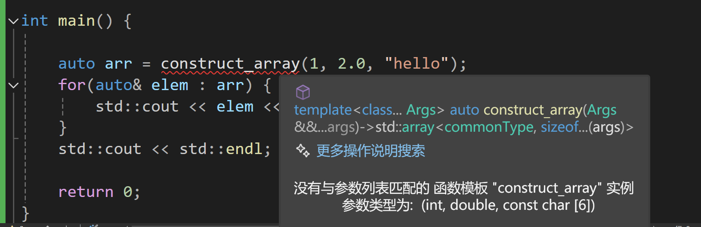
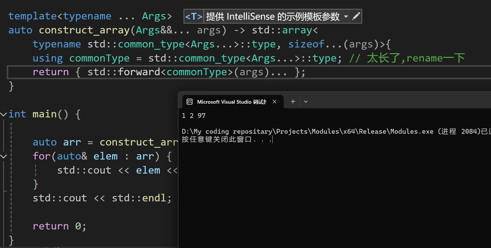

# 从0开始的数据结构速过——番外（1）

​	这是《数据结构从0开始》的一个番外。实际上是介绍一下一些现代C++的写法。这里以快速构建std::array作为契机来说明一下一些现代C++的语法。

## 尝试

​	我们在这里呢，需要完成一个比较底层的工作：那就是为任何type的array构造一个方便的函数。他接受任意长度的参数，然后返回这些参数组成的array，就是这样的简单！

​	想一想，你需要做什么工作呢？

## 思考与架构设置

​	显然，我们需要为任何type构建，意味着我们需要使用现代C++的模板来完成这个工作。接受任意长度的参数说明我们需要可变参数模板。std::array还需要一个常量说明长度，意味着我们需要一个编译时推导的长度。

​	那这样看，至少我们现在需要的是：

- 可变的参数模板
- 使用sizeof... (args)来描述我们的参数长度！

## 编写！

​	第一步，我们按照函数参数模板的起手来干活，我们需要的是：

```c++
#include <array>
#include <type_traits>

template<typename ... Args>
auto construct_array(Args&&... args) -> std::array<ATypename, Args_number>{
    return ...
} 
```

​	好吧，还有好多东西并不确定！我们知道，有的时候我们构造数组，需要抽取公共类型。也就是需要使用std::common_type来做这个事情。以及，需要typename强制告知我后面的标识符是一个类型名称而不是一个什么别的东西。因此，ATypename就可以被替代为：

```
std::common_type<Args...>::type
```

​	至于参数的长度，那也就是使用sizeof...(args)表述

```c++
#include <array>
#include <type_traits>

template<typename ... Args>
auto construct_array(Args&&... args) -> std::array<
    typename std::common_type<Args...>::type, sizeof...(args)>{
    using commonType = std::common_type<Args...>::type; // 太长了,rename一下
    return { std::forward<commonType>(args)... };
}

```

​	下一步就是具体干活，实现函数体

```c++
#include <array>
#include <type_traits>

template<typename ... Args>
auto construct_array(Args&&... args) -> std::array<
    typename std::common_type<Args...>::type, sizeof...(args)>{
    using commonType = std::common_type<Args...>::type; // 太长了,rename一下
    return { std::forward<commonType>(args)... };
}
```

​	下面我们来试试看：非常的好！





## 一些额外知识的补充

### 可变参数模板

​	C++11增强了模板功能，允许模板定义中包含0到任意个模板参数，这就是可变参数模板。可变参数模板的加入使得C++11的功能变得更加强大，而由此也带来了许多神奇的用法。


​	在语义上，可变参数模板和普通模板是一样的，只是写法上稍有区别，声明可变参数模板时需要在typename或class后面带上省略号...：

```
template<typename... Types>
```

​	其中，...可接纳的模板参数个数是0个及以上的任意数量，**需要注意包括0个。**我的另一个意思是，如果需要强迫有N个参数模板，那么：

```
template<typename T1,typename T2, typename... Types>
```

​	很好，现在至少要求两个了。

​	**如果我们关心每一个参数是什么，那么，我们一般会选择递归的处理函数模板**，举个例子，我们来递归的调用一个有趣的打印函数printRecursive，他是这样做的：

```
#include <array>
#include <type_traits>
#include <iostream>

void print() {}

template<typename PrintableCurrent, typename ... PrintableArgs>
void print(const PrintableCurrent& current, const PrintableArgs&... printableArgs)
{
	std::cout << current << " ";
	return print(printableArgs...);
}

int main()
{
	print(1, 2, 3, "hello, world", 'h', 9.1234f);
}
```

​	看懂这个代码了吗？我们需要一个终止递归的特化函数，还有一个就是我们的主运行函数。

## std::common_type

在C++11标准中引入了common_type，在C++14中引入了common_type_t，它主要是用来获取参数的共有类型的，需要注意的，它获取的类型是退化的，因为它内部调用了std::decay。

```
#include <iostream>
#include <type_traits>

int main() {
    // 定义几个类型
    using T1 = int;
    using T2 = double;

    // 使用 std::common_type 推导出公共类型
    using CommonType = std::common_type<T1, T2>::type;

    // 输出推导结果
    std::cout << "The common type of int and double is: ";
    if constexpr (std::is_same_v<CommonType, double>) {
        std::cout << "double" << std::endl;
    } else {
        std::cout << "unknown type" << std::endl;
    }

    return 0;
}
```

### `std::forward`

​	`std::forward` 是 C++11 引入的一个函数模板，主要用于完美转发（perfect forwarding）。它的作用是根据传递给它的参数类型（左值或右值）转发给函数参数，而不改变它们的类别（即保留其左值或右值特性）。这对于转发参数到其他函数时非常有用，尤其是在实现泛型函数模板时。

​	`std::forward` 通过条件地使用 `std::move` 来实现对右值的转发，而对于左值，它则简单地返回原值。因此，它通常与 `std::move` 一起使用，以确保右值不会在不需要的地方被拷贝。

```
#include <iostream>
#include <utility>

void func(int& x) {
    std::cout << "lvalue func, " << x << std::endl;
}

void func(int&& x) {
    std::cout << "rvalue func, " << x << std::endl;
}

template <typename T>
void forward_example(T&& arg) {
    func(std::forward<T>(arg)); // 完美转发
}

int main() {
    int a = 5;
    forward_example(a);         // 传递左值
    forward_example(10);        // 传递右值
    return 0;
}
```

