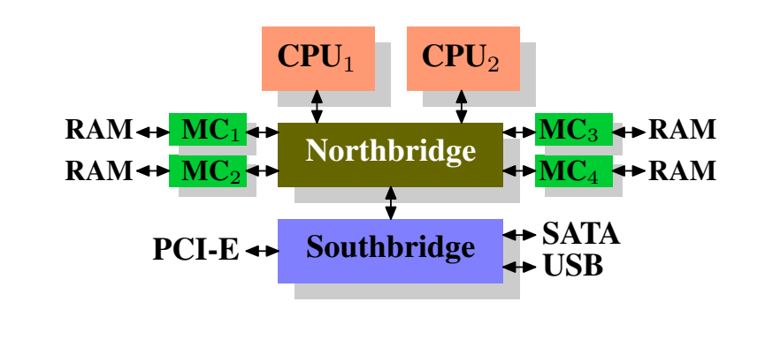
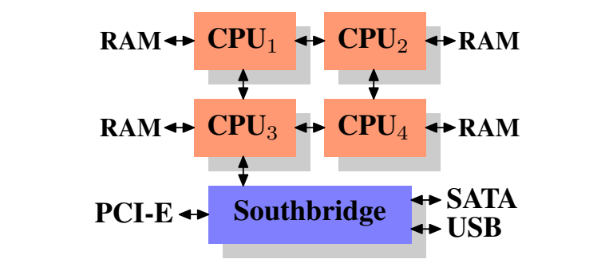

# 现代计算机体系架构读书笔记

## 通用商品集硬件的今天

​	计算机产业的发展正在向普罗大众普及。这也就意味着一个通用化的，标准性强的廉价的Commodity Hardware将会逐渐占领过去完全由专门的硬件所拥有的市场。另一个意思是，现在我们的硬件层架构也在不断的更新迭代！如今，扩展通常是水平扩展而非垂直扩展，这意味着今天使用许多较小的、连接的商品计算机比使用少数几个非常大且速度极快（且昂贵）的系统更具成本效益。这是因为快速且廉价的网络硬件随处可见。

​	在某些情况下，大型专用系统仍有其一席之地，这些系统仍然提供商机，但与商品硬件市场相比，整体市场相形见绌。 

​	多年来，个人电脑和小型服务器都采用由两部分组成的芯片组：北桥和南桥。这是上图可以验证的。

​	所有 CPU（上例中为两个，但可以有更多）通过公共总线（前端总线，FSB）连接到北桥。北桥包含内存控制器等，其实现决定了计算机使用的 RAM 芯片的类型。不同类型的 RAM，如 DRAM、 Rambus 和 SDRAM，需要不同的内存控制器。 为了访问所有其他系统设备，北桥必须与南桥通信。南桥通常称为 I/O 桥，通过各种不同的总线处理与设备的通信。如今，PCI、PCI Express、SATA 和 USB 总线最为重要，但南桥也支持 PATA、IEEE 1394、串行和并行端口。旧系统有连接到北桥的 AGP 插槽。这样做是出于性能原因，因为北桥和南桥之间的连接速度不够快。然而，如今 PCI-E 插槽都连接到南桥。 这样的系统结构有许多值得注意的后果： 

- 从一个 CPU 到另一个 CPU 的所有数据通信都必须通过用于与北桥通信的同一总线。 
- 与 RAM 的所有通信都必须通过北桥。 
- RAM 只有一个端口。
- CPU 与连接到南桥的设备之间的通信通过北桥路由。 

​	这种设计立即出现了几个瓶颈。其中一个瓶颈涉及设备对 RAM 的访问。在 PC 的早期，与任一桥上的设备的所有通信都必须通过 CPU，这对整体系统性能产生了负面影响。 **为了解决这个问题，一些设备变得能够进行直接内存访问 (DMA)。DMA 允许设备在北桥的帮助下直接在 RAM 中存储和接收数据，而无需 CPU 的干预（及其固有的性能成本）**。今天，连接到任何总线的所有高性能设备都可以使用 DMA。虽然这大大减少了 CPU 的工作负载，但它也造成了对北桥带宽的争用，因为 DMA 请求与 CPU 的 RAM 访问竞争。因此，必须考虑到这个问题。 第二个瓶颈涉及从北桥到 RAM 的总线。总线的具体细节取决于部署的内存类型。在较旧的系统中，只有一条总线连接到所有 RAM 芯片，因此无法进行并行访问。最近的 RAM 类型需要两条独立的总线，这使可用带宽翻倍。北桥在通道之间交错内存访问。较新的内存技术（例如 FB-DRAM）增加了更多通道。由于可用带宽有限，因此以最小化延迟的方式安排内存访问对于性能很重要。正如我们将看到的，尽管使用了 CPU 缓存，处理器的速度要快得多并且必须等待才能访问内存。如果多个超线程、内核或处理器同时访问内存，则内存访问的等待时间会更长。对于 DMA 操作也是如此。 然而，访问内存不仅仅是并发。访问模式本身也极大地影响了内存子系统的性能，尤其是在具有多个内存通道的情况下。在

​	在一些更昂贵的系统上，**北桥实际上不包含内存控制器**。相反，北桥可以连接到多个外部内存控制器（在下面的例子中是四个）。 

​	这种架构的优点是存在多个内存总线，因此总可用带宽增加。这种设计还支持更多内存。 并发内存访问模式通过同时访问不同的内存组来减少延迟。当多个处理器直接连接到北桥时，情况尤其如此，对于这样的设计，主要限制是北桥的内部带宽，这对于这种架构（来自英特尔）来说是惊人的。

​	使用多个外部内存控制器并不是增加内存带宽的唯一方法。另一种越来越流行的方法是将内存控制器集成到 CPU 中，并将内存连接到每个 CPU。这种架构因基于 AMD Opteron 处理器的 SMP 系统而流行起来。英特尔将从 Nehalem 处理器开始支持通用系统接口 (CSI)；这基本上是相同的方法：集成内存控制器，每个处理器都有本地内存的可能性。 有了这样的架构，可用的内存组数量与处理器数量一样多。在四 CPU 机器上，内存带宽增加了四倍，而无需带宽巨大的复杂北桥。将内存控制器集成到 CPU 中还有一些额外的优势；我们不会深入探讨。4为了完整起见，应该提到，这种内存控制器布置可用于其他目的，例如“内存 RAID”，它与热插拔内存结合使用很有用。 

​	这种架构也有缺点。首先，因为机器仍然必须使系统的所有内存可供所有处理器访问，所以内存不再统一（因此这种架构称为 NUMA - 非统一内存架构）。本地内存（连接到处理器的内存）可以以通常的速度访问。当访问连接到另一个处理器的内存时，情况就不同了。在这种情况下，必须使用处理器之间的互连。要从 CPU1 访问连接到 CPU2 的内存，需要通过一个互连进行通信。当同一个 CPU 访问连接到 CPU4 的内存时，必须跨越两个互连。 每次这样的通信都有相关的成本。当我们描述访问远程内存所需的额外时间时，我们谈论的是“NUMA 因素”。对于更复杂的机器，级别数量可能会显著增加。还有机器架构（例如 IBM 的 x445 和 SGI 的 Altix 系列），其中存在多种类型的连接。CPU 被组织成节点；在节点内，访问内存的时间可能是均匀的，或者只有较小的 NUMA 因素。但是，节点之间的连接可能非常昂贵，NUMA 因素可能相当高。 商品级 NUMA 机器现在存在，并且很可能在未来发挥更大的作用。