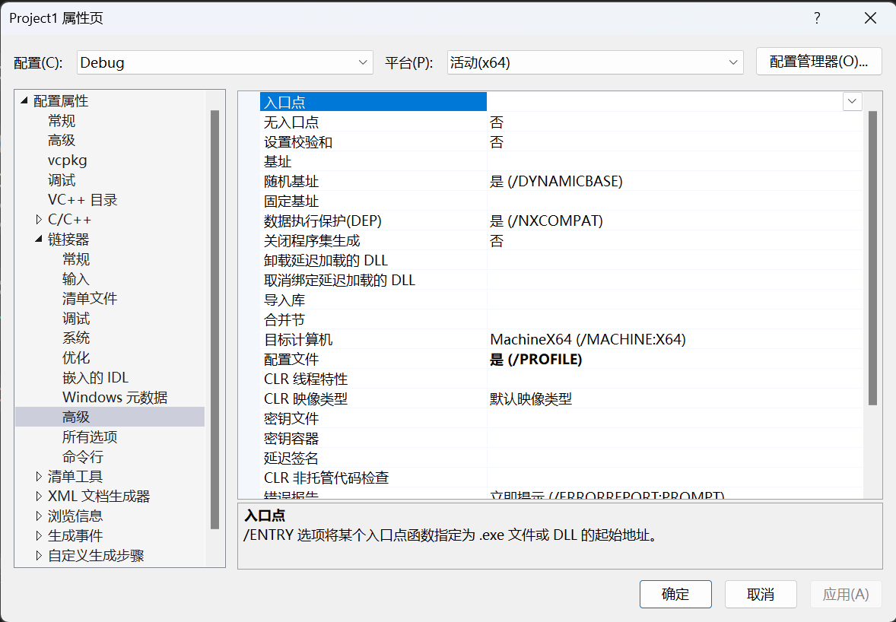
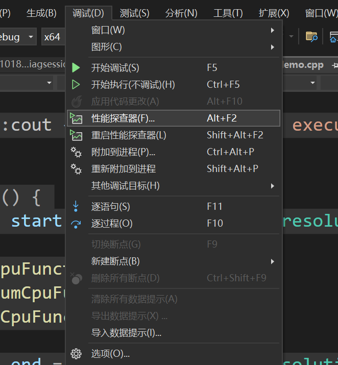
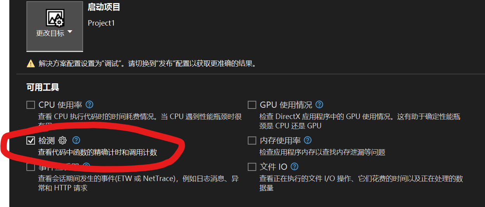
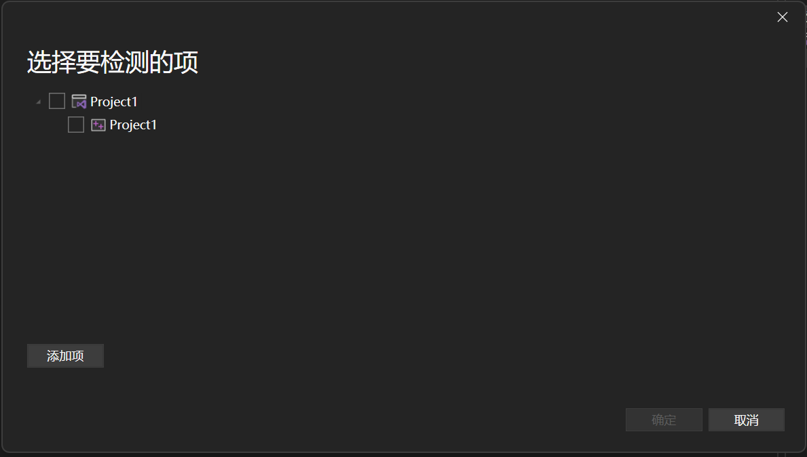
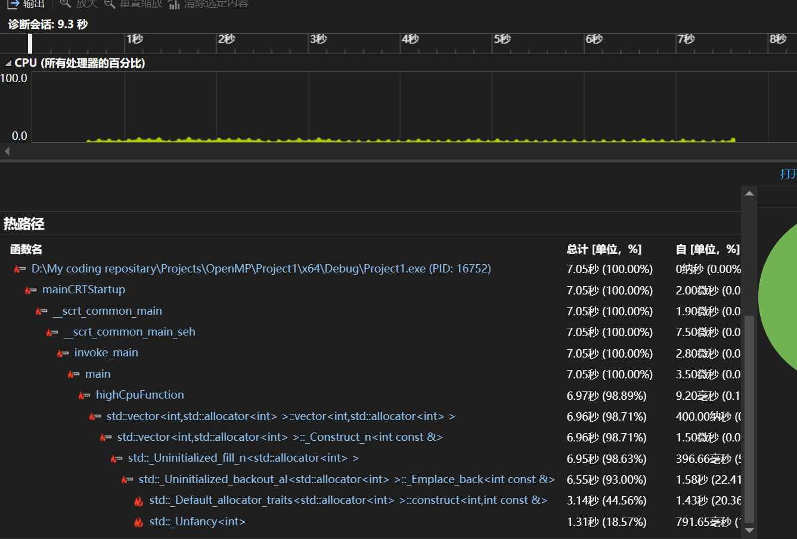
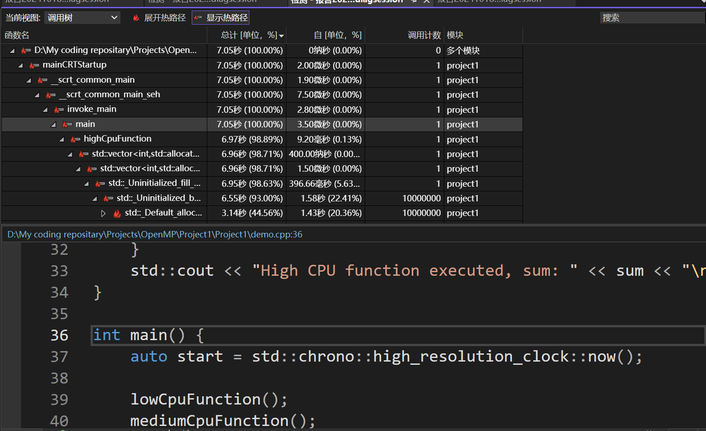

# Start Profiling!

## 记录我的最常用的几个IDE/工具的Profiling基本方法

​	笔者最近正在研究如何写出更加高效的程序。评价是否快速的重要指标就是量化我们的程序运行指标。笔者目前比较关心的是在稳定的产出正确结果以外可能的迅速执行。这也就意味着我最关心程序的执行时间。笔者使用的几个常见的IDE恰好都支持Profiling.下面简单记录一下

## 标杆程序

```c++
#include <iostream>
#include <thread>
#include <vector>

void lowCpuFunction() {
    // 小规模内存占用
    std::vector<int> vec(1000, 1);
    int sum = 0;
    for (const auto& val : vec) {
        sum += val;
    }
    std::cout << "Low CPU function executed, sum: " << sum << "\n";
}

void mediumCpuFunction() {
    // 中等规模内存占用
    std::vector<int> vec(100000, 1);
    int sum = 0;
    for (const auto& val : vec) {
        sum += val;
    }
    std::cout << "Medium CPU function executed, sum: " << sum << "\n";
}

void highCpuFunction() {
    // 大规模内存占用
    std::vector<int> vec(10000000, 1);
    int sum = 0;
    for (const auto& val : vec) {
        sum += val;
    }
    std::cout << "High CPU function executed, sum: " << sum << "\n";
}

int main() {
    lowCpuFunction();
    mediumCpuFunction();
    highCpuFunction();
    return 0;
}

```


## Visual Studio

​	Visual Studio的Profiling非常的庞大。操作起来相对比较复杂。步骤如下：

### 将程序设置为/PROFILE

​	链接器需要侵入到程序中进行一定的分析：需要在项目的属性 `->` 链接器 `->` 高级中设置

 

​	在**配置文件**一栏中选择 **是/PROFILE**，现在程序就可以准备进行分析了。

### 打开性能分析器

​	在上侧的菜单选择：



​	点击后，只选择“检测”。就会让你选择进行检测的项目。





​	如果这里出现“未配置/PROFILE”，请返回开头进行设置！



​	现在就可以加载出来一些函数了，这里会展示最耗时的路径的调用树。我们点击其中的任意一项：



​	这里就会显示对应的函数耗时等信息。当然，也可以按照自己的需求，在“当前视图”选择“函数”或者“火焰图”等。这里不再展示。

