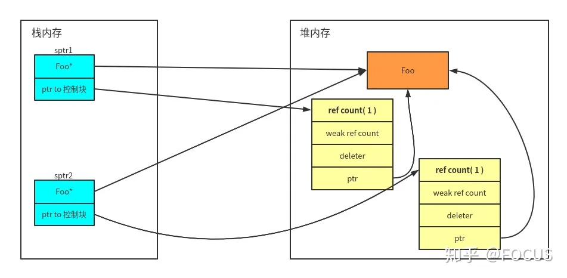
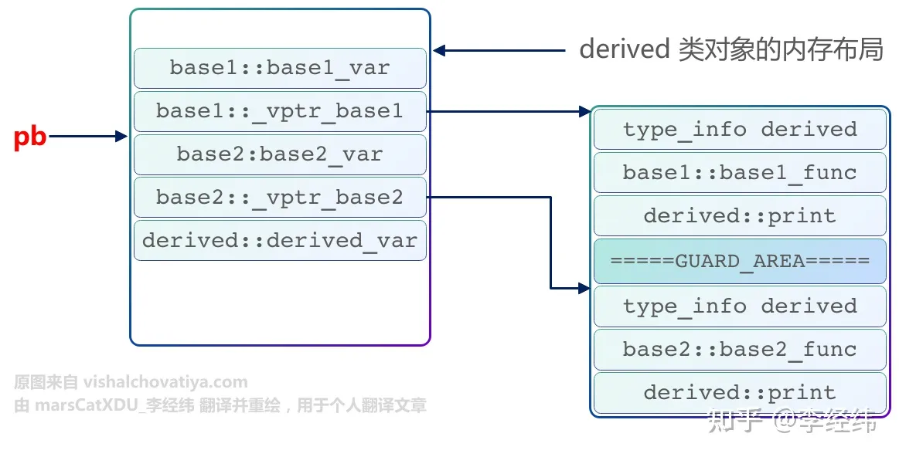
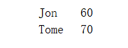
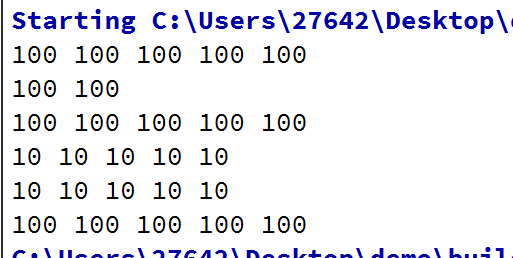
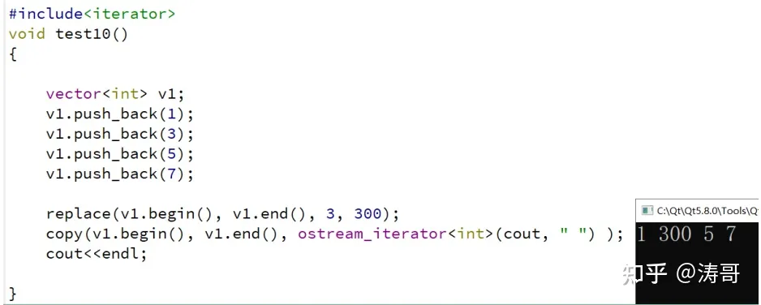
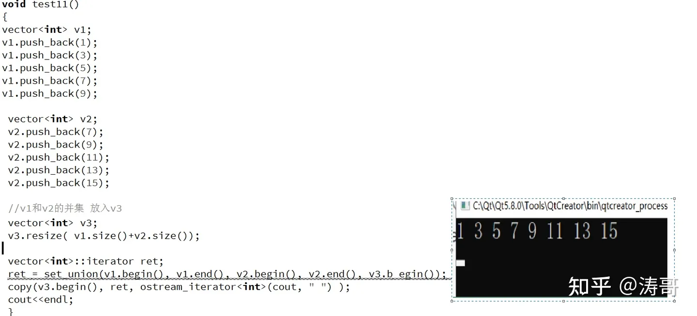

# C++ 全教程（高级编程）

## Chapter 1 : 速览C++

​		好吧，我们总是听说C++是C的一个超集，但是在今天，C++的绝大多数特性已经跟C完全不同了。所以，我们有必要重新速览一下C++的基本语法。

### 第一个小程序

```C++
// helloworld.cpp
import <iostream>;

int main()
{
    std::cout << "Hello, world!" << std::endl;
    return 0;
}
```

​		不用想，我们的控制台上一定会有：


#### 注释

​		我们的第一行是一个注释： 

```C++
//
```

​		也可以有多行注释

```C++
/*
	This is a multiline comment.
	Compiler will always ignore these.
*/
```

#### 模块导入

​		C++20的新特性：模块导入，而不是简单的头文件机制

#### 预处理指令

​		如果，你使用的不是C++20 而是一些更加古老的版本，则

```C++ 
#include <iostream>
```

​		想要生成C++程序的步骤有三个

- 1.代码经过预处理编译，识别代码中的元信息
- 2.代码编译转换为计算机可以识别的目标文件
- 3.独立文件链接构成应用程序

​		预处理指令总是以#开始，前面的`#include<iostream>`就是如此。头文件最常见的用途就是声明函数，函数声明的作用就是告诉编译器如何调用它（声明函数的参数的个数和类型和返回）在C++20之前，我们喜欢把声明放在.h文件下，现在游历模块，就不再需要我们将声明和定义分开。

```
注意：
在C中，我们的标准库头文件名称总是以.h结尾，比如说#include<stdio.h>
在C++中，则省略了.h;所有的文件都在std名称空间和std的子空间名称下被定义
C中的标准库头文件在C++中依然存在，但是务必使用c前缀，如#include<cstdio>
当然，不建议对C标准库头文件进行import!
```

| 预处理指令                                    | 功能                                                 | 常见用法                                                     |
| --------------------------------------------- | ---------------------------------------------------- | ------------------------------------------------------------ |
| `#include<file>`                              | 将指定的文件插入到代码（当前include位置）里去        | 几乎总是用来包含头文件                                       |
| `#define [id] [value]`                        | 每个标识符都将会被替换成`value`                      | 在C中，常用来定义常数值或宏，在C++ 中有更好的机制，请慎重使用！ |
| `#ifdef [id] #endif`<br>`#ifndef [id] #endif` | 这几个指令都会根据id 的真假来选择代码是否被编译      | 经常用来防止被循环包含                                       |
| `#pragma [xyz]`                               | 根据编译器不同而选择，如果是不认识的指令会直接ignore | 之后说                                                       |

### 扩展

​		每种C和C++的实现支持对其宿主机或操作系统唯一的功能。例如，一些程序需要精确控制超出数据所在的储存空间，或着控制特定函数接受参数的方式。#pragma指示使每个编译程序在保留C和C++语言的整体兼容性时提供不同机器和操作系统特定的功能。编译指示被定义为机器或操作系统特定的，并且通常每种编译程序是不同的。

语法：`#pragma token_string`

​		“token_string”是一系列字符用来给出所需的特定编译程序指令和参数。数字符号“#”必须是包含编译指令的行中第一个非空白字符；而空白字符可以隔开数字符号“#”和关键字“pragma”。在#pragma后面，写任何翻译程序能够作为预处理符号分析的文本。#pragma的参数类似于宏扩展。

​		如果编译程序发现它不认得一个编译指示，它将给出一个警告，可是编译会继续下去。

​		为了提供新的预处理功能，或者为编译程序提供由实现定义的信息，编译指示可以用在一个条件语句内。C和C++编译程序可以识别下列编译程序指令。

| alloc_text   | comment   | init_seg* | component     | optimize         | auto_inline          |
| ------------ | --------- | --------- | ------------- | ---------------- | -------------------- |
| inline_depth | pack      | bss_seg   | data_seg      | inline_recursion | pointers_to_members* |
| check_stack  | function  | intrinsic | setlocale     | code_seg         | hdrstop              |
| message      | vtordisp* | const_seg | include_alias | once             | warning              |

*仅用于C++编译程序。

#### 1. alloc_text

`#pragma alloc_text( "textsection", function1, ... )`

​		命名特别定义的函数驻留的代码段。该编译指示必须出现在函数说明符和函数定义之间。

​		`alloc_text`编译指示不处理`C++`成员函数或重载函数。它仅能应用在以C连接方式说明的函数——就是说，函数是用extern "C"连接指示符说明的。如果你试图将这个编译指示应用于一个具有C++连接方式的函数时，将出现一个编译程序错误。

​		由于不支持使用__based的函数地址，需要使用alloc_text编译指示来指定段位置。由textsection指定的名字应该由双引号括起来。

​		alloc_text编译指示必须出现在任何需要指定的函数说明之后，以及这些函数的定义之前。

​		在alloc_text编译指示中引用的函数必须和该编译指示处于同一个模块中。如果不这样做，使以后一个未定义的函数被编译到一个不同的代码段时，错误会也可能不会被捕获。即使程序一般会正常运行，但是函数不会分派到应该在的段。

alloc_text的其它限制如下：

​		它不能用在一个函数内部。

​		它必须用于函数说明以后，函数定义以前。

2` auto_inline`

`#pragma auto_inline( [{on | off}] )`

​		当指定off时将任何一个可以被考虑为作为自动嵌入扩展候选的函数排除出该范围。为了使用auto_inline编译指示，将其紧接着写在一个函数定义之前或之后（不是在其内部）。该编译指示将在其出现以后的第一个函数定义开始起作用。auto_inline编译指示对显式的inline函数不起作用。

3 `bss_seg`

`#pragma data_seg( ["section-name"[, "section-class"] ] )`

​		为未初始化数据指定缺省段。data_seg编译指示除了工作于已初始化数据而不是未初始化的以外具有一样的效果。在一些情况下，你能使用bss_seg将所有未初始化数据安排在一个段中来加速你的装载时间。

`#pragma bss_seg( "MY_DATA" )`

​		将导致把#pragma语句之后的未初始化的数据安排在一个叫做MY_DATA的段中。

​		用bss_seg编译指示分配的数据不包含任何关于其位置的信息。

​		第二个参数section-class是用于兼容2.0版本以前的Visual C++的，现在将忽略它。

4 check_stack

`#pragma check_stack([ {on | off}] )`

`#pragma check_stack{+ | –}`

​		如果指定off（或者“-”）指示编译程序关闭堆栈探测，或者指定on（或“+”）打开堆栈探测。如果没有给出参数，堆栈探测将根据默认设置决定。该编译指示将在出现该指示之后的第一个函数开始生效。堆栈探测既不是宏和能够生成嵌入代码函数的一部分。

​		如果你没有给出check­_stack编译指示的参数，堆栈检查将恢复到在命令行指定的行为。详细情况见编译程序参考。#pragma check_stack和/Gs选项的互相作用情况在表2.1中说明。

表 2.1 使用check_stack编译指示

| 编译指示                                         | 用/Gs选项编译？ | 行为                   |
| ------------------------------------------------ | --------------- | ---------------------- |
| #pragma check_stack()或#pragma check_stack       | 是              | 后续的函数关闭堆栈检查 |
| #pragma check_stack()或#pragma check_stack       | 否              | 后续的函数打开堆栈检查 |
| #pragma check_stack(on)或#pragma check_stack(+)  | 是或者否        | 后续的函数打开堆栈检查 |
| #pragma check_stack(off)或#pragma check_stack(-) | 是或者否        | 后续的函数关闭堆栈检查 |

5 `code_seg`

`#pragma code_seg( ["section-name"[,"section-class"] ] )`

​		指定分配函数的代码段。code_seg编译指示为函数指定默认的段。你也能够像段名一样指定一个可选的类名。使用没有段名字符串的#pragma code_seg将恢复分配到编译开始时候的状态。

6 const_seg

`#pragma const_seg( ["section-name"[, "section-class"] ] )`

​		指定用于常量数据的默认段。data_seg编译指示除了可以工作于所有数据以外具有一样的效果。你能够使用该编译指示将你的常量数据保存在一个只读的段中。

`#pragma const_seg( "MY_DATA" )`

​		导致在#pragma语句后面的常量数据分配在一个叫做MY_DATA的段中。

​		用const_seg编译指示分配的数据不包含任何关于其位置的信息。

​		第二个参数section-class是用于兼容2.0版本以前的Visual C++的，现在将忽略它。

7` comment`

`#pragma comment( comment-type [, commentstring] )`

​		将描述记录安排到目标文件或可执行文件中去。comment-type是下面说明的五个预定义标识符中的一个，用来指定描述记录的类型。可选的commentstring是一个字符串文字值用于为一些描述类型提供附加的信息。因为commentstring是一个字符串文字值，所以它遵从字符串文字值的所有规则，例如换码字符、嵌入的引号（"）和联接。

7-1 `compiler`

​		在目标文件中放置编译程序名和版本号。该描述记录被连接程序忽略。如果你为这个记录类型提供一个commentstring参数，编译程序将生成一个警告。

7-2 exestr

​		将commentstring放置到目标文件中去。在连结时，这个字符串再被放到可执行文件去中。当可执行文件被装载时这个字符串不会被装入内存，然而，它可以被一个能够在文件中搜索可打印字符串的程序找到。该描述记录的一个用处是在可执行文件中嵌入版本号或者类似的信息。

7-3 lib

​		将一个库搜索记录放置到目标文件中去。该描述类型必须有包含你要连接程序搜索的库名（和可能的路径）的commentstring参数。因为在目标文件中该库名先于默认的库搜索记录，所以连接程序将如同你在命令行输入这些库一样来搜索它们。你可以在一个源文件中放置多个库搜索记录，每个记录将按照它们出现在源文件中的顺序出现在目标文件中。

7-4 linker

​		在目标文件中放置连接程序选项。你可以用这个描述类型指定连接程序选项来代替在Project Setting对话框中Link页内的选项。例如，你可以指定/include选项以强迫包含一个符号：

`#pragma comment(linker, "/include:__mySymbol")`

7-5 user

​		在目标文件中包含一个普通描述记录。commentstring参数包含描述的文本。该描述记录将被连接程序忽略。


​		下面的编译指示导致连接程序在连接时搜索EMAPI.LIB库。连接程序首先在当前工作目录然后在LIB环境变量指定的路径中搜索。

#pragma comment( lib, "emapi" )

​		下面的编译指示导致编译程序将其名字和版本号放置到目标文件中去。

The following pragma causes the compiler to place the name and version number of the compiler in the object file:

#pragma comment( compiler )

​		注意，对于具有commentstring参数的描述记录，你可以使用其它用作字符串文字量的宏来提供宏扩展为字符串文字量。你也能够联结任何字符串文字量和宏的组合来扩展成为一个字符串文字量。例如，下面的语句是可以接受的：

#pragma comment( user, "Compiled on " __DATE__ " at " __TIME__ )

8 component

#pragma component( browser, { on | off }[, references [, name ]] )

#pragma component( minrebuild, on | off )


​		从源文件内控制浏览信息和依赖信息的收集。

8-1 浏览信息（Browser）

​		你可以将收集打开或关闭，你也可以指定收集时忽略特别的名字。

​		使用on或off在编译指示以后控制浏览信息的收集。例如：

#pragma component(browser, off)

​		终止编译程序收集浏览信息。

​		注意，为了用这个编译指示打开浏览信息的收集，必须先从Project Setting对话框或者命令行允许浏览信息。

​		references选项可以有也可以没有name参数。使用没有name参数的references选项将打开或者关闭引用信息的收集（然而继续收集其它浏览信息）。例如：

#pragma component(browser, off, references)

​		终止编译程序收集引用信息。

​		使用有name和off参数的references选项将阻止从浏览信息窗口中出现引用到的名字。用这个语法将忽略你不感兴趣的名字和类型从而减少浏览信息文件的大小。例如：

#pragma component(browser, off, references, DWORD)

​		从这一点以后忽略DWORD的引用。你能够用on恢复DWORD的引用收集：

#pragma component(browser, on, references, DWORD)

​		这是唯一的方法可以恢复收集指定名字的引用，你必须显式地打开任何你关闭的名字。

​		为了防止预处理程序扩展名字（就像扩展NULL到0），用引号括起来：

`#pragma component(browser, off, references, "NULL")`

8-2 最小化重建（Minimal Rebuild）

​		Visual C++的最小化重建功能要求编译程序创建并保存需要大量磁盘空间的C++类依赖信息。为了节省磁盘空间，你能够在你不需要收集依赖信息时使用#pragma component(minrebuild,off)，例如，没有改变过头文件。在未修改过的类之后插入#pragma component(minrebuild,on)重新打开依赖信息。

详见Enable Minimal Rebuild(/Gm)编译程序选项。

9 data_seg

`#pragma data_seg( ["section-name"[, "section-class"] ] )`

​		指定数据的默认段。例如：

#pragma data_seg( "MY_DATA" )

​		导致在#pragma语句后分配的数据保存在一个叫做MY_DATA的段中。

​		用data_seg编译指示分配的数据不包含任何关于其位置的信息。

​		第二个参数section-class是用于兼容2.0版本以前的Visual C++的，现在将忽略它。

10 function

#pragma function( function1 [, function2, ...] )

​		指定必须生成对编译指示中参数列表内函数的调用。如果你使用intrinsic编译指示（或者/Oi）来告诉编译程序生成内含函数（内含函数如同嵌入代码一样生成，不作为一个函数调用），你能够用function编译指示显式地强迫函数调用。当遇到一个function编译指示，它将在其后面遇到的第一个包含有内含函数的函数定义处生效。其持续作用到源文件的尾部或者出现对同一个内含函数指定intrinsic编译指示。function编译指示只能用于函数外——在全局层次。

​		为了列出具有内含形式的函数表，参见#pragma intrinsic。

11 hdrstop

#pragma hdrstop [( "filename" )]

​		控制预编译头文件的工作方式。filename是要使用或者创建（依赖于是否指定了/Yu或/Yc）预编译头文件的名字。如果 filename不包括一个指定路径，将假定预编译头文件和源文件处于同一个目录中。当指定自动预编译头文件选项/YX时，所有指定的文件名将被忽略。

​		如果有/YX或者/Yc选项，而且C或C++文件包含了一个hdrstop编译指示时，编译程序保存编译指示之前的编译状态。编译指示之后的编译状态不被保存。

​		hdrstop编译选项不能出现在一个头文件内。它只能出现在源文件的文件级，它也不能出现在任何数据或者函数的说明或定义之中。

​		注意，除非指定没有文件名的/YX选项或者/Yu或/Yc选项，否则hdrstop编译指示将被忽略。

​		用一个文件名命名要保存编译状态的预编译头文件。在hdrstop和filename之间的空格是可选的。在hdrstop编译指示中的文件名是一个字符串，这样它服从于C或C++的字符串规则。特别的，你必须像下面例子里面显示的用引号括起来。

`#pragma hdrstop( "c:\projects\include\myinc.pch" )`

​		预编译头文件的文件名按照如下规则决定，按照优先次序：

/Fp编译程序选项的参数；

​		由#pragma hdrstop的filename参数；

​		原文件名的基本文件名加上.PCH扩展名。

12 include_alias

`#pragma include_alias( "long_filename", "short_filename" )`

`#pragma include_alias( <long_filename>, <short_filename> )`

​		指定作为long_filename别名的short_filename。一些文件系统允许超出8.3FAT文件系统限制的长头文件名。编译程序不能简单地将长文件名截断为8.3名字，因为长头文件名的前8个字符可能不是唯一的。无论何时编译程序遇到long_filename串，它代替short_filename，并且用short_filename搜索头文件。这个编译指示必须出现在相应的#include指示之前。例如：

// First eight characters of these two files not unique.

```
#pragma include_alias( "AppleSystemHeaderQuickdraw.h", "quickdra.h" )

#pragma include_alias( "AppleSystemHeaderFruit.h", "fruit.h" )

#pragma include_alias( "GraphicsMenu.h", "gramenu.h" )


#include "AppleSystemHeaderQuickdraw.h"

#include "AppleSystemHeaderFruit.h"

#include "GraphicsMenu.h"
```

​		这个别名在搜索时精确匹配，包括拼写和双引号、尖括号。include_alias编译指示在文件名上执行简单的字符串匹配，不进行其它的文件名验证。例如，给出下列指示：

```
#pragma include_alias("mymath.h", "math.h")

#include "./mymath.h"

#include "sys/mymath.h"
```

​		并不执行别名替代，因为头文件名字符串没有精确匹配。另外，在/Yu，/Yc和/YX编译程序选项，或hdrstop编译指示中作为参数的头文件名不被替换。例如，如果你的源文件包含下列指示：

`#include <AppleSystemHeaderStop.h>`

相应的编译程序选项必须是：

`/YcAppleSystemHeaderStop.h`

你能够用include­_alias编译指示将任何头文件映射到其它文件。例如：

```
#pragma include_alias( "api.h", "c:\version1.0\api.h" )

#pragma include_alias( <stdio.h>, <newstdio.h> )

#include "api.h"

#include <stdio.h>
```

​		不要混淆用双引号和尖括号括起来的文件名。例如，给出上面的#pragma include_alias指示时，在下面的#include指示中编译程序不执行替换。

```
#include <api.h>

#include "stdio.h"
```

​		还有，下面的指示将产生一个错误：

`#pragma include_alias(<header.h>, "header.h") // Error`

​		注意，在错误信息中报告的文件名，或者预定义宏__FILE__的值，是执行替换以后的文件名。例如，在下列指示之后：

`#pragma include_alias( "VeryLongFileName.H", "myfile.h" )`

`#include "VeryLongFileName.H"`

文件VeryLongFileName.H产生下列错误信息：

`myfile.h(15) : error C2059 : syntax error`

还要注意的是不支持传递性。给出下面的指示：

```
#pragma include_alias( "one.h", "two.h" )

#pragma include_alias( "two.h", "three.h" )

#include "one.h"
```

编译程序将搜索two.h而不是three.h。

13 init_seg

C++特有

```
#pragma init_seg({ compiler | lib | user | "section-name" [, "func-name"]} )
```

​		指定影响启动代码执行的关键字或代码段。因为全局静态对象的初始化可以包含执行代码，所以你必须指定一个关键字来定义什么时候构造对象。在使用需要初始化的动态连接库（DLL）或程序库时使用init_seg编译指示是尤其重要的。

init_seg编译指示的选项有：

13-1 compiler

由Microsoft C运行时间库保留。在这个组中的对象将第一个构造。

13-2 lib

用于第三方类库开发者的初始化。在这个组中的对象将在标记为构造compiler的对象之后，其它对象之前构造。

13-3 user

用于任何其它用户。在这个组中的对象将最后构造。

13-4 section-name

允许显式地指定初始化段。在用户指定的section-name中的对象将不会隐式地构造，而它们的地址将会被放置在由section-name命名的段中。

13-5 func-name

指定当程序退出时，作为atexit函数调用的函数。这个函数必须具有和atexit函数相同的形式：

int funcname(void (__cdecl *)(void));

如果你需要延迟初始化，你能够选择指定显式的段名。随后你必须调用每个静态对象的构造函数。

14 inline_depth

#pragma inline_depth( [0... 255] )

​		通过控制能够被扩展的一系列函数调用（从0到255次）来控制嵌入函数扩展的发生次数，这个编译指示控制用inline，__inline标记的或在/Ob2选项下能自动嵌入的嵌入函数。

​		inline_depth编译指示控制能够被扩展的一系列函数调用。例如，如果嵌入深度是4，并且如果A调用B然后调用C，所有的3次调用都将做嵌入扩展。然而，如果设置的最近一次嵌入深度是2，则只有A和B被扩展，而C仍然作为函数调用。

​		为了使用这个编译指示，你必须设置编译程序选项/Ob为1或者2。用这个编译指示指定的深度设定在该指示后面的第一个函数开始生效。如果你在括号内不指定一个值，inline_depth设置嵌入深度到默认值8。

​		在扩展时，嵌入深度可以被减少而不能被增加。如果嵌入深度是6，同时在扩展过程中预处理程序遇到一个inline_depth编译指示设置为8，则深度保持为6。

​		嵌入深度0将拒绝嵌入扩展，深度255将设置在嵌入扩展时没有限制。如果用一个没有指定值的编译指示，则使用为默认值。


15 inline_recursion

`#pragma inline_recursion( [{on | off}] )`

​		控制直接或者相互间的递归函数调用式的嵌入扩展。用这个编译指示控制用inline，__inline标记的或在/Ob2选项下能自动嵌入的嵌入函数。使用这个编译指示需要设置编译程序选项/Ob为1或者2。默认的inline_recursion状态是off。这个编译指示在出现该编译指示之后第一个函数调用起作用，并不影响函数的定义。

​		inline_recursion编译指示控制如何扩展递归函数。如果inline_recursion是off，并且如果一个嵌入函数调用了它自己（直接的或者间接的），函数将仅仅扩展一次。如果inline_recursion是on,函数将扩展多次直到达到inline_depth的值或者容量限制。

16 intrinsic

`#pragma intrinsic( function1 [, function2, ...] )`

​		指定对在编译指示参数表中函数调用是内含的。编译程序像嵌入代码一样生成内含函数，而不是函数调用。下面列出了具有内含形式的库函数。一旦遇到intrinsic编译指示，它从第一个包含指定内含函数的函数定义开始起作用。作用持续到源文件尾部或者出现包含相同内含函数的function编译指示。intrinsic编译指示只能用在函数定义外——在全局层次。

下列函数具有内含形式：

| _disable | _lrotl | _rotl   | fabs   | memset | strlen |
| -------- | ------ | ------- | ------ | ------ | ------ |
| _enable  | _lrotr | _rotr   | labs   | strcat |        |
| _inp     | _outp  | _strset | memcmp | strcmp |        |
| _inpw    | _outpw | abs     | memcpy | strcpy |        |


​		使用内含函数的程序更快，因为它们没有函数调用的额外代价，然而因为有附加的代码生成，可能比较大。

​		注意，_alloca和setjmp函数总是内含的，这个行为不受intrinsic编译指示影响。

​		下列浮点函数没有内含形式。然而它们具有直接将参数通过浮点芯片传送而不是推入程序堆栈的版本。

| acos | fmod | tanh |
| ---- | ---- | ---- |
| asin | pow  |      |
| cosh | sinh |      |

当你同时指定/Oi和/Og编译程序选项（或者任何包含/Og，/Ox，/O1和/O2的选项）时下列浮点函数具有真正的内含形式

| atan  | sqrt  | sin  |
| ----- | ----- | ---- |
| exp   | atan2 | tan  |
| log10 | log   | cos  |


​		你可以用编译程序选项/Op或/Za来覆盖真内含浮点选项的生成。在这种情况下，函数会像一般库函数一样被生成，同时直接将参数通过浮点芯片传送而不是推入程序堆栈。

17 message

#pragma message( messagestring )

​		不中断编译，发送一个字符串文字量到标准输出。message编译指示的典型运用是在编译时显示信息。

​		下面的代码段用message编译指示在编译过程中显示一条信息：

`#if _M_IX86 == 500`

`#pragma message( "Pentium processor build" )`

`#endif`

​		messagestring参数可以是一个能够扩展成字符串文字量的宏，并且你能够用字符串文字量和宏的任何组合来构造。例如，下面的语句显示被编译文件的文件名和文件最后一次修改的日期和时间。

`#pragma message( "Compiling " __FILE__ )`

`#pragma message( "Last modified on " __TIMESTAMP__ )`

18 `once`

`#pragma once`

​		指定在创建过程中该编译指示所在的文件仅仅被编译程序包含（打开）一次。该编译指示的一种常见用法如下：

//header.h

#pragma once

// Your C or C++ code would follow:

19 optimize

仅在专业版和企业版中存在

#pragma optimize( "[optimization-list]", {on | off} )

​		代码优化仅有Visual C++专业版和企业版支持。详见Visual C++ Edition。

​		指定在函数层次执行的优化。optimize编译选项必须在函数外出现，并且在该编译指示出现以后的第一个函数定义开始起作用。on和off参数打开或关闭在optimization-list指定的选项。

optimization-list能够是0或更多个在表2.2中给出的参数：

表 2.2 optimize编译指示的参数

| 参数   | 优化类型                         |
| ------ | -------------------------------- |
| a      | 假定没有别名                     |
| g      | 允许全局优化                     |
| p      | 增强浮点一致性                   |
| s 或 t | 指定更短或者更快的机器代码序列。 |
| w      | 假定在函数调用中没有别名。       |
| y      | 在程序堆栈中生成框架指针。       |

​		这些和在/O编译程序选项中使用的是相同的字母。例如：

​		`#pragma optimize( "atp", on )`

​		用空字符串（""）的optimize编译指示是一种特别形式。它要么关闭所有的优化选项，要么恢复它们到原始（或默认）的设定。

```
#pragma optimize( "", off )

#pragma optimize( "", on )
```

20 pack

#pragma pack( [ n] )

​		指定结构和联合成员的紧缩对齐。尽管用/Zp选项设定整个翻译单元的结构和联合成员的紧缩对齐，可以用pack编译指示在数据说明层次设定紧缩对齐。从出现该编译指示后的第一个结构或者联合说明开始生效。这个编译指示不影响定义。

​		当你使用#pragma pack(n)，其中n是1，2，4，8或者16，第一个以后的每个结构成员保存在较小的成员类型或者n字节边界上。如果你使用没有参数的#pragma pack，结构成员将被紧缩到由/Zp指定的值。默认的/Zp紧缩的大小是/Zp8。

​		编译程序还支持下面的增强语法：

`#pragma pack( [ [ { push | pop}, ] [ identifier, ] ] [ n ] )`

​		该语法允许你将使用不同紧缩编译指示的组件合并到同一个翻译单元内。

​		每次出现有push参数的pack编译指示将保存当前的紧缩对齐值到一个内部的编译程序堆栈。编译指示的参数列表从左向右读取。如果你使用了push，当前紧缩值被保存。如果你提供了一个n值，这个值将成为新的紧缩值。如果你指定了一个你选定的标示符，这个标示符将和新的紧缩值关联。

​		每次出现有pop参数的pack编译指示从内部编译程序堆栈顶部取出一个值并将那个值作为新的紧缩对齐。如果你用了pop，而内部编译程序堆栈是空的，对齐值将从命令行得到，同时给出一个警告。如果你用了pop并指定了n的值，那个值将成为新的紧缩值。如果你用了pop并指定了一个标示符，将移去所有保存在堆栈中的的值直到匹配的找到匹配的标示符，和该标示符关联的紧缩值也被从堆栈中移出来成为新的紧缩值。如果没有找到匹配的标示符，将从命令行获取紧缩值并产生一个1级警告。默认的紧缩对齐是8。

​		pack编译指示的新的增强功能允许你编写头文件保证在使用头文件之前和其后的紧缩值是一样的：

```
/* File name: include1.h

*/

#pragma pack( push, enter_include1 )

/* Your include-file code ... */

#pragma pack( pop, enter_include1 )

/* End of include1.h */
```

​		在前面的例子中，进入头文件时将当前紧缩值和标示符enter_include1关联并推入，被记住。在头文件尾部的pack编译选项移去所有在头文件中可能遇到的紧缩值并移去和enter_include1关联的紧缩值。这样头文件保证了在使用头文件之前和其后的紧缩值是一样的。

​		新功能也允许你在你的代码内用pack编译指示为不同的代码，例如头文件设定不同的紧缩对齐。

```
#pragma pack( push, before_include1 )

#include "include1.h"

#pragma pack( pop, before_include1 )
```

在上一个例子中，你的代码受到保护，防止了在include.h中的任何紧缩值的改变。

21 pointers_to_members

C++特有

`#pragma pointers_to_members(pointer-declaration, [most-general-representation] )`

​		指定是否能够在相关类定义之前说明一个指向类成员的指针，并且用于控制指针的大小和解释指针的代码。你能够在你的源代码中使用pointers_to_members编译知识来代替/vmx编译程序选项。

​		pointer-declaration参数指出是否在相关函数定义之前或其后你已经说明了一个指向成员的指针。pointer-declaration参数是下面两个符号之一：

| 参数            | 说明                                                         |
| --------------- | ------------------------------------------------------------ |
| full_generality | 生成安全的，但是有时不能优化的代码。如果有一些指向成员的指针在相关类定义之前说明，你要用full_generality。这个参数总是使用由most-general-representation指定的指针表示方式。 |
| best_case       | 对于所有指向成员的指针用最佳的表示方式生成安全的，优化的代码。需要在说明一个指向类成员指针之前定义类。默认是best_case。 |

​		`most-general-representaion`参数指出在一个翻译单元中编译程序能够安全引用任何指向类成员指针的最小指针表示方式。这个参数可以是下列之一：

| 参数                | 说明                                                         |
| ------------------- | ------------------------------------------------------------ |
| single_inheritance  | 最普通的表示方式是单继承，指向成员函数。如果用于指向具有多重或者虚拟继承方式类成员的指针，将产生一个错误。 |
| multi_inheritance   | 最普通的表示方式是多重继承，指向成员函数。如果用于指向具有虚拟继承方式类成员的指针，将产生一个错误。 |
| virtual_inheritance | 最普通的表示方式是虚拟继承，指向成员函数。不会产生错误。当使用#pragma pointers_to_members (full_generality)时这是默认的参数。 |

22 setlocale

#pragma setlocale( "locale-string" )

​		定义用于翻译宽字符常数和字符串文字量时用的地区（国家和语言）。由于用于从多字节字符转换到宽字符的算法根据地区或者由于在运行可执行程序不同的地方进行编译而不同，这个编译指示提供一种在编译时指定目标地区的方式。这保证宽字符字符串将以正确的格式保存。默认的locale-string是“C”。“C”地区将字符串中的每个字符作为wchar_t（即unsigned int）映射其值。

23 vtordisp

C++特有

`#pragma vtordisp({on | off} )`

​		允许隐藏的附加vtordisp构造函数/析构函数替换成员。vtordisp编译指示仅能够用于具有虚拟基类的代码。如果派生类从一个虚拟基类重载了一个虚拟函数，并且如果派生类的构造函数或析构函数用指向虚拟基类的指针调用了这个函数，编译程序将根据虚拟基类在类中引入一个附加的隐藏“vtordisp”域。

​		vtodisp编译选项影响它后面的类布局。/vd0和/vd1选项为整个模块指定了相同的行为。指定off将禁止隐藏的vtordisp成员，指定on（默认）将在它们需要的时候允许vtordisp。仅在不可能出现类的构造函数和析构函数通过this指针调用其指向对象中的虚拟函数时才关闭vtordisp。

```
#pragma vtordisp( off )

class GetReal : virtual public { ... };

#pragma vtordisp( on )
```

24 warning

```
#pragma warning( warning-specifier : warning-number-list [,warning-specifier : warning-number-list...] )

#pragma warning( push[ , n ] )

#pragma warning( pop )
```

​		允许有选择地修改编译程序警告信息的行为。

warning-specifier能够是下列值之一：

| warning-specifier | 含义                               |
| ----------------- | ---------------------------------- |
| once              | 只显示指定信息一次。               |
| default           | 对指定信息应用默认的编译程序选项。 |
| 1,2,3,4           | 对指定信息引用给定的警告等级。     |
| disable           | 不显示指定信息。                   |
| error             | 对指定信息作为错误显示             |

​		warning-number_list能够包含任何警告编号。如下，在一个编译指示中可以指定多个选项：

`#pragma warning( disable : 4507 34; once : 4385; error : 164 )`

这等价于：

`#pragma warning( disable : 4507 34 ) // Disable warning messages`

// 4507 and 34.

`#pragma warning( once : 4385 ) // Issue warning 4385`

// only once.

`#pragma warning( error : 164 ) // Report warning 164`

// as an error.

​		对于那些关于代码生成的，大于4699的警告标号，warning编译指示仅在函数定义外时有效。如果指定的警告编号大于4699并且用于函数内时被忽略。下面例子说明了用warning编译指示禁止、然后恢复有关代码生成警告信息的正确位置：

```
int a;

#pragma warning( disable : 4705 )

void func()
{

	a;

}

#pragma warning( default : 4705 )
```

warning编译指示也支持下面语法：

```
#pragma warning( push [ ,n ] )

#pragma warning( pop )
```

这里n表示警告等级（1到4）。

warning(push)编译指示保存所有警告的当前警告状态。warning(push,n)保存所有警告的当前状态并将全局警告等级设置为n。

warning(pop)弹出最后一次推入堆栈中的警告状态。任何在push和pop之间改变的警告状态将被取消。考虑下面的例子：

```
#pragma warning( push )

#pragma warning( disable : 4705 )

#pragma warning( disable : 4706 )

#pragma warning( disable : 4707 )

// Some code

#pragma warning( pop )
```

​		在这些代码的结束，pop恢复了所有警告的状态（包括4705，4706和4707）到代码开始时候的样子。

​		当你编写头文件时，你能用push和pop来保证任何用户修改的警告状态不会影响正常编译你的头文件。在头文件开始的地方使用push，在结束地方使用pop。例如，假定你有一个不能顺利在4级警告下编译的头文件，下面的代码改变警告等级到3，然后在头文件的结束时恢复到原来的警告等级。

```
#pragma warning( push, 3 )

// Declarations/ definitions

#pragma warning( pop )
```

### 扩展结束

#### main 

​		`main`函数总是作为程序的入口，`main`函数返回一个`int`值，**用来表示程序的最终状态**，我们当然可以不直接`return 0`

​		这是一个标准的`main`函数

```
int main(int argc, char* argv[])
```

​		这是`main`函数的命令行形式，`argc`指出了我们传递了多少个实参，`argv`就是命令了

#### 输入输出流

​		我们的基本输入输出流是简单的，`std::cout`有能力同时处理多个类型数据！

```
std::cout << "There are " << 219 << " way I love you" << std::endl;
```

 		从C++20开始，我们推介的写法是

```
std::cout << std::format("There are {} wa8ys I love you!",219) << std::endl;
```

​		我们当然还有转义字符：

| 转义字符 | 含义                           |
| -------- | ------------------------------ |
| `\n`     | 换行，且将光标移至下一行的开头 |
| `\r`     | 回车，将光标一道本行的开头     |
| `\\`     | 打出反斜杠                     |
| `\t`     | 制表符                         |
| `\"`     | 打出双引号                     |

​		**`std::endl`会在流中插入新的一行，然后刷出所有还在缓冲区的字符！不建议过度使用它！**

​		我们还有输入流：

```
int val = 10;
std::cin >> val;
```

### 名称空间

​		名称空间是为了防止不同代码段的冲突问题！我们可以把代码塞到一个名称空间下：

```C++
namespace mycode{
    void foo()
    {
        std::cout << "foo() called in the space " << std::endl;
    }
}
```

​		调用它也是简单的

```C++ 
mycode::foo();
```

​		如果我们在本文件中常常使用同一名称空间下的大小，不妨

```C++ 
using namespace mycode；
```

​		之后，我们就不再需要声明空间了！

```C++
using namespace mycode；
int main()
{
	foo();
}
```

​		但是不要过度使用——那跟没有名称空间没有任何区别！

​		我们也可以使用特定的：

```C++
using namespace std::cout;
```

​		之后，对于`cout`而言，不需要指定名称空间了！

```C++
cout << " Hello World! "<< std::endl
```

​		嵌套的名称空间：

```C++
namespace MyLibs::NetWorking::FTP{
	/*		*/
}
```

​		当然，这是在C++之前才会支持，事实上，在C++17之前，我们是：

```C++
namespace MyLibs{
	namespace NetWorking{
        namespace FTP{
            /*			*/
        }
    }
}
```

​		我们也可以起别名：

```C++ 
namespace MyFTP =  MyLibs::NetWorking::FTP
```

### 字面量

​		字面量就是用于代码中编写数字或者是字符串。C++中支持大量的标准字面量：

- 十进制字面量 1234
- 八进制字面量 01234
- 十六进制字面量 0x7B
- 二进制字面量 0b101010101
- 浮点值 3.14
- 双精度浮点值 3.14
- 十六进制浮点值 0x3.ABC
- 单个字符
- 以NUL结尾的字符数组
- 也可以自己定义


### 变量

​		我们可以在任何位置设定变量，并且在这一行之后，我们可以任意的使用它。当然，一个未被初始化的变量会被赋予一个随机的值

​		C++初始化方式非常的多样

```
int uninitializedInt;
int initializedInt{7};
cout << format("{} is a random val",uninitializedInt);
cout << format("{} was assigned!",initializedInt);
```

​		当然，老式的C++是使用赋值语句完成这样的工作的：

```
int initializedInt = 7;
```

​		下面我们给出C++所有的常见类型：

​		使用编程语言进行编程时，需要用到各种变量来存储各种信息。变量保留的是它所存储的值的内存位置。这意味着，当您创建一个变量时，就会在内存中保留一些空间。

​		您可能需要存储各种数据类型（比如字符型、宽字符型、整型、浮点型、双浮点型、布尔型等）的信息，操作系统会根据变量的数据类型，来分配内存和决定在保留内存中存储什么。

#### 基本的内置类型

C++ 为程序员提供了种类丰富的内置数据类型和用户自定义的数据类型。下表列出了七种基本的 C++ 数据类型：

| 类型     | 关键字  |
| :------- | :------ |
| 布尔型   | bool    |
| 字符型   | char    |
| 整型     | int     |
| 浮点型   | float   |
| 双浮点型 | double  |
| 无类型   | void    |
| 宽字符型 | wchar_t |

其实 wchar_t 是这样来的：

```
typedef short int wchar_t;
```

​		所以 wchar_t 实际上的空间是和 short int 一样。

​		一些基本类型可以使用一个或多个类型修饰符进行修饰：

- signed
- unsigned
- short
- long

​		下表显示了各种变量类型在内存中存储值时需要占用的内存，以及该类型的变量所能存储的最大值和最小值。

**注意：**不同系统会有所差异，一字节为 8 位。

**注意：**默认情况下，int、short、long都是带符号的，即 signed。

**注意：**long int 8 个字节，int 都是 4 个字节，早期的 C 编译器定义了 long int 占用 4 个字节，int 占用 2 个字节，新版的 C/C++ 标准兼容了早期的这一设定。

| 类型               | 位            | 范围                                                         |
| :----------------- | :------------ | :----------------------------------------------------------- |
| char               | 1 个字节      | -128 到 127 或者 0 到 255                                    |
| unsigned char      | 1 个字节      | 0 到 255                                                     |
| signed char        | 1 个字节      | -128 到 127                                                  |
| int                | 4 个字节      | -2147483648 到 2147483647                                    |
| unsigned int       | 4 个字节      | 0 到 4294967295                                              |
| signed int         | 4 个字节      | -2147483648 到 2147483647                                    |
| short int          | 2 个字节      | -32768 到 32767                                              |
| unsigned short int | 2 个字节      | 0 到 65,535                                                  |
| signed short int   | 2 个字节      | -32768 到 32767                                              |
| long int           | 8 个字节      | -9,223,372,036,854,775,808 到 9,223,372,036,854,775,807      |
| signed long int    | 8 个字节      | -9,223,372,036,854,775,808 到 9,223,372,036,854,775,807      |
| unsigned long int  | 8 个字节      | 0 到 18,446,744,073,709,551,615                              |
| float              | 4 个字节      | 精度型占4个字节（32位）内存空间，+/- 3.4e +/- 38 (~7 个数字) |
| double             | 8 个字节      | 双精度型占8 个字节（64位）内存空间，+/- 1.7e +/- 308 (~15 个数字) |
| long double        | 16 个字节     | 长双精度型 16 个字节（128位）内存空间，可提供18-19位有效数字。 |
| wchar_t            | 2 或 4 个字节 | 1 个宽字符                                                   |

> 注意，各种类型的存储大小与系统位数有关，但目前通用的以64位系统为主。
>
> 以下列出了32位系统与64位系统的存储大小的差别（windows 相同）：
>
> 

从上表可得知，变量的大小会根据编译器和所使用的电脑而有所不同。

下面实例会输出您电脑上各种数据类型的大小。

#### 实例

```C++
#include<iostream>   
#include <limits>  
using namespace std;     
int main()   
{      
    cout << "type: \t\t" << "************size**************"<< endl;      
 	cout << "bool: \t\t" << "所占字节数：" << sizeof(bool);      
    cout << "\t最大值：" << (numeric_limits<bool>::max)();      
    cout << "\t\t最小值：" << (numeric_limits<bool>::min)() << endl;      
    cout << "char: \t\t" << "所占字节数：" << sizeof(char);      
    cout << "\t最大值：" << (numeric_limits<char>::max)();      
    cout << "\t\t最小值：" << (numeric_limits<char>::min)() << endl;      
    cout << "signed char: \t" << "所占字节数：" << sizeof(signed char);      
    cout << "\t最大值：" << (numeric_limits<signed char>::max)();      
    cout << "\t\t最小值：" << (numeric_limits<signed char>::min)() << endl;      
    cout << "unsigned char: \t" << "所占字节数：" << sizeof(unsigned char);      
    cout << "\t最大值：" << (numeric_limits<unsigned char>::max)();      
    cout << "\t\t最小值：" << (numeric_limits<unsigned char>::min)() << endl;     
    cout << "wchar_t: \t" << "所占字节数：" << sizeof(wchar_t);      
    cout << "\t最大值：" << (numeric_limits<wchar_t>::max)();      
    cout << "\t\t最小值：" << (numeric_limits<wchar_t>::min)() << endl;     
    cout << "short: \t\t" << "所占字节数：" << sizeof(short);      
    cout << "\t最大值：" << (numeric_limits<short>::max)();      
    cout << "\t\t最小值：" << (numeric_limits<short>::min)() << endl;      
    cout << "int: \t\t" << "所占字节数：" << sizeof(int);      
    cout << "\t最大值：" << (numeric_limits<int>::max)();      
    cout << "\t最小值：" << (numeric_limits<int>::min)() << endl;      
    cout << "unsigned: \t" << "所占字节数：" << sizeof(unsigned);      
    cout << "\t最大值：" << (numeric_limits<unsigned>::max)();      
    cout << "\t最小值：" << (numeric_limits<unsigned>::min)() << endl;     
    cout << "long: \t\t" << "所占字节数：" << sizeof(long);      
    cout << "\t最大值：" << (numeric_limits<long>::max)();      
    cout << "\t最小值：" << (numeric_limits<long>::min)() << endl;     
    cout << "unsigned long: \t" << "所占字节数：" << sizeof(unsigned long);      
    cout << "\t最大值：" << (numeric_limits<unsigned long>::max)();      
    cout << "\t最小值：" << (numeric_limits<unsigned long>::min)() << endl;      
    cout << "double: \t" << "所占字节数：" << sizeof(double);      
    cout << "\t最大值：" << (numeric_limits<double>::max)();     
    cout << "\t最小值：" << (numeric_limits<double>::min)() << endl;     
    cout << "long double: \t" << "所占字节数：" << sizeof(long double);     
    cout << "\t最大值：" << (numeric_limits<long double>::max)();     
    cout << "\t最小值：" << (numeric_limits<long double>::min)() << endl;    
    cout << "float: \t\t" << "所占字节数：" << sizeof(float);    
    cout << "\t最大值：" << (numeric_limits<float>::max)();  
    cout << "\t最小值：" << (numeric_limits<float>::min)() << endl;     
    cout << "size_t: \t" << "所占字节数：" << sizeof(size_t);     
    cout << "\t最大值：" << (numeric_limits<size_t>::max)();     
    cout << "\t最小值：" << (numeric_limits<size_t>::min)() << endl;   
    cout << "string: \t" << "所占字节数：" << sizeof(string) << endl;      
    // << "\t最大值：" << (numeric_limits<string>::max)() << "\t最小值：" << (numeric_limits<string>::min)() << endl;      
    cout << "type: \t\t" << "************size**************"<< endl;      return 0;   }
```

​		本实例使用了 **endl**，这将在每一行后插入一个换行符，**<<** 运算符用于向屏幕传多个值，**sizeof()** 运算符用来获取各种数据类型的大小。

​		当上面的代码被编译和执行时，它会产生以下的结果，结果会根据所使用的计算机而有所不同：

```
type:         ************size**************
bool:         所占字节数：1    最大值：1        			最小值：0
char:         所占字节数：1    最大值：        			最小值：?
signed char:  所占字节数：1    最大值：        			最小值：?
unsigned char:所占字节数：1    最大值：?        			最小值：
wchar_t:      所占字节数：4    最大值：2147483647          最小值：-2147483648
short:        所占字节数：2    最大值：32767        		 最小值：-32768
int:          所占字节数：4    最大值：2147483647    		 最小值：-2147483648
unsigned:     所占字节数：4    最大值：4294967295   		 最小值：0
long:         所占字节数：8    最大值：9223372036854775807  最小值：-9223372036854775808
unsigned long:所占字节数：8    最大值：18446744073709551615 最小值：0
double:       所占字节数：8    最大值：1.79769e+308    	  最小值：2.22507e-308
long double:  所占字节数：16   最大值：1.18973e+4932    	  最小值：3.3621e-4932
float:        所占字节数：4    最大值：3.40282e+38   		  最小值：1.17549e-38
size_t:       所占字节数：8    最大值：18446744073709551615  最小值：0
string:       所占字节数：24
type:         ************size**************
```

#### typedef 声明

您可以使用 **typedef** 为一个已有的类型取一个新的名字。下面是使用 typedef 定义一个新类型的语法：

```
typedef type newname; 
```

例如，下面的语句会告诉编译器，feet 是 int 的另一个名称：

```
typedef int feet;
```

现在，下面的声明是完全合法的，它创建了一个整型变量 distance：

```
feet distance;
```

#### 枚举类型

枚举类型(enumeration)是C++中的一种派生数据类型，它是由用户定义的若干枚举常量的集合。

如果一个变量只有几种可能的值，可以定义为枚举(enumeration)类型。所谓"枚举"是指将变量的值一一列举出来，变量的值只能在列举出来的值的范围内。

创建枚举，需要使用关键字 **enum**。枚举类型的一般形式为：

```
enum 枚举名{ 
     标识符[=整型常数], 
     标识符[=整型常数], 
... 
    标识符[=整型常数]
} 枚举变量;
    
```

如果枚举没有初始化, 即省掉"=整型常数"时, 则从第一个标识符开始。

例如，下面的代码定义了一个颜色枚举，变量 c 的类型为 color。最后，c 被赋值为 "blue"。

```
enum color { red, green, blue } c;
c = blue;
```

默认情况下，第一个名称的值为 0，第二个名称的值为 1，第三个名称的值为 2，以此类推。但是，您也可以给名称赋予一个特殊的值，只需要添加一个初始值即可。例如，在下面的枚举中，**green** 的值为 5。

```
enum color { red, green=5, blue };
```

在这里，**blue** 的值为 6，因为默认情况下，每个名称都会比它前面一个名称大 1，但 red 的值依然为 0。


#### 类型转换

类型转换是将一个数据类型的值转换为另一种数据类型的值。

C++ 中有四种类型转换：静态转换、动态转换、常量转换和重新解释转换。

##### 静态转换（Static Cast）

静态转换是将一种数据类型的值强制转换为另一种数据类型的值。

静态转换通常用于比较类型相似的对象之间的转换，例如将 int 类型转换为 float 类型。

静态转换不进行任何运行时类型检查，因此可能会导致运行时错误。

#### 实例

```
int i = 10;
float f = static_cast<float>(i); // 静态将int类型转换为float类型
```


##### 动态转换（Dynamic Cast）

动态转换通常用于将一个基类指针或引用转换为派生类指针或引用。动态转换在运行时进行类型检查，如果不能进行转换则返回空指针或引发异常。

##### 实例

```
class Base {};
class Derived : public Base {};
Base* ptr_base = new Derived;
Derived* ptr_derived = dynamic_cast<Derived*>(ptr_base); // 将基类指针转换为派生类指针
```


#### 常量转换（Const Cast）

常量转换用于将 const 类型的对象转换为非 const 类型的对象。

常量转换只能用于转换掉 const 属性，不能改变对象的类型。

##### 实例

```
const int i = 10;
int& r = const_cast<int&>(i); // 常量转换，将const int转换为int
```


#### 重新解释转换（Reinterpret Cast）

重新解释转换将一个数据类型的值重新解释为另一个数据类型的值，通常用于在不同的数据类型之间进行转换。

重新解释转换不进行任何类型检查，因此可能会导致未定义的行为。

##### 实例

```
int i = 10;
float f = reinterpret_cast<float&>(i); // 重新解释将int类型转换为float类型
```

好吧,还有太长不看版:

| 类型                                                         | 说明                                               | 用法                                                         |
| ------------------------------------------------------------ | -------------------------------------------------- | ------------------------------------------------------------ |
| `(signed)int`<br>`signed`                                    | 正整数和负整数,范围取决于编译器(通常是4个字节)     | `int i {-7}`<br>`signed int i {-6}`<br>`signed i {-5}`       |
| `(signed)short(int)`                                         | 短整型                                             | `short s {13}`<br>`short int s{14}`<br>`signed short s{15}`<br>`signed short int s{16}` |
| `(signed)long(int)`                                          | 长整型                                             | `long l {-7L}`                                               |
| `(signed)long long(int)`                                     | 超长整形(还是取决于编译器)                         | `long long ll {14LL}`                                        |
| ` unsigned short(int)`<br>`unsigned int`<br/>`unsigned)short(int)`<br/>`(unsigned)short(int)`<br/> | 对前面我们提到的类型加以限制，其值**恒非负**       | `unsigned int i {2U};`<br>`unsigned j{5U};`<br/>`unsigned short s {23U}`<br/>`unsigned long l {5400UL}`<br>`unsigned long ll {1400ULL}` |
| `float`                                                      | 浮点型数字                                         | `float f{7.2f}`                                              |
| `double`                                                     | 双精度数字，不得低于`float`                        | `double d {7.2}`                                             |
| `long double`                                                | 长双精度，精度不得低于`double`                     | `long double dd{16.98L}`                                     |
| `char`<br>`signed char`<br>`unsigned char`                   | 单个字符                                           | `char m{'k'}`                                                |
| `char8_t`(since C++20)<br>`char_16_t`<br>`char_32_t`         | 单个n位的`UTF8-n`编码的Unicode字符，n可以是8,16,32 | `char8_t c8{u8'm'}`<br>`char16_t c16 {u'm'}`<br>`char32_t c32{U'm'}` |
| `wchar_t`                                                    | 单个宽字符，大小取决于编译器                       | `wchar_t w {L'm'}`                                           |
| `bool`                                                       | 布尔类型，取值可以是`true`或者`false`              | `bool b{true}`                                               |

当然，现在我们指出了，C++也有byte类型了：来自`<cstddef>`

```C++ 
std::byte b {42}
```

#### 数值极限

​		我们的C++也有数值极限这个说法了。他在`<limits>`里面，你当然可以使用这个头文件来打印或者是判断

```
// The template and inlines for the numeric_limits classes. -*- C++ -*-

// Copyright (C) 1999-2021 Free Software Foundation, Inc.
//
// This file is part of the GNU ISO C++ Library.  This library is free
// software; you can redistribute it and/or modify it under the
// terms of the GNU General Public License as published by the
// Free Software Foundation; either version 3, or (at your option)
// any later version.

// This library is distributed in the hope that it will be useful,
// but WITHOUT ANY WARRANTY; without even the implied warranty of
// MERCHANTABILITY or FITNESS FOR A PARTICULAR PURPOSE.  See the
// GNU General Public License for more details.

// Under Section 7 of GPL version 3, you are granted additional
// permissions described in the GCC Runtime Library Exception, version
// 3.1, as published by the Free Software Foundation.

// You should have received a copy of the GNU General Public License and
// a copy of the GCC Runtime Library Exception along with this program;
// see the files COPYING3 and COPYING.RUNTIME respectively.  If not, see
// <http://www.gnu.org/licenses/>.

/** @file include/limits
 *  This is a Standard C++ Library header.
 */

// Note: this is not a conforming implementation.
// Written by Gabriel Dos Reis <gdr@codesourcery.com>

//
// ISO 14882:1998
// 18.2.1
//

#ifndef _GLIBCXX_NUMERIC_LIMITS
#define _GLIBCXX_NUMERIC_LIMITS 1

#pragma GCC system_header

#include <bits/c++config.h>

//
// The numeric_limits<> traits document implementation-defined aspects
// of fundamental arithmetic data types (integers and floating points).
// From Standard C++ point of view, there are 14 such types:
//   * integers
//         bool							(1)
//         char, signed char, unsigned char, wchar_t            (4)
//         short, unsigned short				(2)
//         int, unsigned					(2)
//         long, unsigned long					(2)
//
//   * floating points
//         float						(1)
//         double						(1)
//         long double						(1)
//
// GNU C++ understands (where supported by the host C-library)
//   * integer
//         long long, unsigned long long			(2)
//
// which brings us to 16 fundamental arithmetic data types in GNU C++.
//
//
// Since a numeric_limits<> is a bit tricky to get right, we rely on
// an interface composed of macros which should be defined in config/os
// or config/cpu when they differ from the generic (read arbitrary)
// definitions given here.
//

// These values can be overridden in the target configuration file.
// The default values are appropriate for many 32-bit targets.

// GCC only intrinsically supports modulo integral types.  The only remaining
// integral exceptional values is division by zero.  Only targets that do not
// signal division by zero in some "hard to ignore" way should use false.
#ifndef __glibcxx_integral_traps
# define __glibcxx_integral_traps true
#endif

// float
//

// Default values.  Should be overridden in configuration files if necessary.

#ifndef __glibcxx_float_has_denorm_loss
#  define __glibcxx_float_has_denorm_loss false
#endif
#ifndef __glibcxx_float_traps
#  define __glibcxx_float_traps false
#endif
#ifndef __glibcxx_float_tinyness_before
#  define __glibcxx_float_tinyness_before false
#endif

// double

// Default values.  Should be overridden in configuration files if necessary.

#ifndef __glibcxx_double_has_denorm_loss
#  define __glibcxx_double_has_denorm_loss false
#endif
#ifndef __glibcxx_double_traps
#  define __glibcxx_double_traps false
#endif
#ifndef __glibcxx_double_tinyness_before
#  define __glibcxx_double_tinyness_before false
#endif

// long double

// Default values.  Should be overridden in configuration files if necessary.

#ifndef __glibcxx_long_double_has_denorm_loss
#  define __glibcxx_long_double_has_denorm_loss false
#endif
#ifndef __glibcxx_long_double_traps
#  define __glibcxx_long_double_traps false
#endif
#ifndef __glibcxx_long_double_tinyness_before
#  define __glibcxx_long_double_tinyness_before false
#endif

// You should not need to define any macros below this point.

#define __glibcxx_signed_b(T,B)	((T)(-1) < 0)

#define __glibcxx_min_b(T,B)					\
  (__glibcxx_signed_b (T,B) ? -__glibcxx_max_b (T,B) - 1 : (T)0)

#define __glibcxx_max_b(T,B)						\
  (__glibcxx_signed_b (T,B) ?						\
   (((((T)1 << (__glibcxx_digits_b (T,B) - 1)) - 1) << 1) + 1) : ~(T)0)

#define __glibcxx_digits_b(T,B)				\
  (B - __glibcxx_signed_b (T,B))

// The fraction 643/2136 approximates log10(2) to 7 significant digits.
#define __glibcxx_digits10_b(T,B)		\
  (__glibcxx_digits_b (T,B) * 643L / 2136)

#define __glibcxx_signed(T) \
  __glibcxx_signed_b (T, sizeof(T) * __CHAR_BIT__)
#define __glibcxx_min(T) \
  __glibcxx_min_b (T, sizeof(T) * __CHAR_BIT__)
#define __glibcxx_max(T) \
  __glibcxx_max_b (T, sizeof(T) * __CHAR_BIT__)
#define __glibcxx_digits(T) \
  __glibcxx_digits_b (T, sizeof(T) * __CHAR_BIT__)
#define __glibcxx_digits10(T) \
  __glibcxx_digits10_b (T, sizeof(T) * __CHAR_BIT__)

#define __glibcxx_max_digits10(T) \
  (2 + (T) * 643L / 2136)

namespace std _GLIBCXX_VISIBILITY(default)
{
_GLIBCXX_BEGIN_NAMESPACE_VERSION

  /**
   *  @brief Describes the rounding style for floating-point types.
   *
   *  This is used in the std::numeric_limits class.
  */
  enum float_round_style
  {
    round_indeterminate       = -1,    /// Intermediate.
    round_toward_zero         = 0,     /// To zero.
    round_to_nearest          = 1,     /// To the nearest representable value.
    round_toward_infinity     = 2,     /// To infinity.
    round_toward_neg_infinity = 3      /// To negative infinity.
  };

  /**
   *  @brief Describes the denormalization for floating-point types.
   *
   *  These values represent the presence or absence of a variable number
   *  of exponent bits.  This type is used in the std::numeric_limits class.
  */
  enum float_denorm_style
  {
    /// Indeterminate at compile time whether denormalized values are allowed.
    denorm_indeterminate = -1,
    /// The type does not allow denormalized values.
    denorm_absent        = 0,
    /// The type allows denormalized values.
    denorm_present       = 1
  };

  /**
   *  @brief Part of std::numeric_limits.
   *
   *  The @c static @c const members are usable as integral constant
   *  expressions.
   *
   *  @note This is a separate class for purposes of efficiency; you
   *        should only access these members as part of an instantiation
   *        of the std::numeric_limits class.
  */
  struct __numeric_limits_base
  {
    /** This will be true for all fundamental types (which have
	specializations), and false for everything else.  */
    static _GLIBCXX_USE_CONSTEXPR bool is_specialized = false;

    /** The number of @c radix digits that be represented without change:  for
	integer types, the number of non-sign bits in the mantissa; for
	floating types, the number of @c radix digits in the mantissa.  */
    static _GLIBCXX_USE_CONSTEXPR int digits = 0;

    /** The number of base 10 digits that can be represented without change. */
    static _GLIBCXX_USE_CONSTEXPR int digits10 = 0;

#if __cplusplus >= 201103L
    /** The number of base 10 digits required to ensure that values which
	differ are always differentiated.  */
    static constexpr int max_digits10 = 0;
#endif

    /** True if the type is signed.  */
    static _GLIBCXX_USE_CONSTEXPR bool is_signed = false;

    /** True if the type is integer.  */
    static _GLIBCXX_USE_CONSTEXPR bool is_integer = false;

    /** True if the type uses an exact representation. All integer types are
	exact, but not all exact types are integer.  For example, rational and
	fixed-exponent representations are exact but not integer. */
    static _GLIBCXX_USE_CONSTEXPR bool is_exact = false;

    /** For integer types, specifies the base of the representation.  For
	floating types, specifies the base of the exponent representation.  */
    static _GLIBCXX_USE_CONSTEXPR int radix = 0;

    /** The minimum negative integer such that @c radix raised to the power of
	(one less than that integer) is a normalized floating point number.  */
    static _GLIBCXX_USE_CONSTEXPR int min_exponent = 0;

    /** The minimum negative integer such that 10 raised to that power is in
	the range of normalized floating point numbers.  */
    static _GLIBCXX_USE_CONSTEXPR int min_exponent10 = 0;

    /** The maximum positive integer such that @c radix raised to the power of
	(one less than that integer) is a representable finite floating point
	number.  */
    static _GLIBCXX_USE_CONSTEXPR int max_exponent = 0;

    /** The maximum positive integer such that 10 raised to that power is in
	the range of representable finite floating point numbers.  */
    static _GLIBCXX_USE_CONSTEXPR int max_exponent10 = 0;

    /** True if the type has a representation for positive infinity.  */
    static _GLIBCXX_USE_CONSTEXPR bool has_infinity = false;

    /** True if the type has a representation for a quiet (non-signaling)
	Not a Number.  */
    static _GLIBCXX_USE_CONSTEXPR bool has_quiet_NaN = false;

    /** True if the type has a representation for a signaling
	Not a Number.  */
    static _GLIBCXX_USE_CONSTEXPR bool has_signaling_NaN = false;

    /** See std::float_denorm_style for more information.  */
    static _GLIBCXX_USE_CONSTEXPR float_denorm_style has_denorm = denorm_absent;

    /** True if loss of accuracy is detected as a denormalization loss,
	rather than as an inexact result. */
    static _GLIBCXX_USE_CONSTEXPR bool has_denorm_loss = false;

    /** True if-and-only-if the type adheres to the IEC 559 standard, also
	known as IEEE 754.  (Only makes sense for floating point types.)  */
    static _GLIBCXX_USE_CONSTEXPR bool is_iec559 = false;

    /** True if the set of values representable by the type is
	finite.  All built-in types are bounded, this member would be
	false for arbitrary precision types. */
    static _GLIBCXX_USE_CONSTEXPR bool is_bounded = false;

    /** True if the type is @e modulo. A type is modulo if, for any
	operation involving +, -, or * on values of that type whose
	result would fall outside the range [min(),max()], the value
	returned differs from the true value by an integer multiple of
	max() - min() + 1. On most machines, this is false for floating
	types, true for unsigned integers, and true for signed integers.
	See PR22200 about signed integers.  */
    static _GLIBCXX_USE_CONSTEXPR bool is_modulo = false;

    /** True if trapping is implemented for this type.  */
    static _GLIBCXX_USE_CONSTEXPR bool traps = false;

    /** True if tininess is detected before rounding.  (see IEC 559)  */
    static _GLIBCXX_USE_CONSTEXPR bool tinyness_before = false;

    /** See std::float_round_style for more information.  This is only
	meaningful for floating types; integer types will all be
	round_toward_zero.  */
    static _GLIBCXX_USE_CONSTEXPR float_round_style round_style =
						    round_toward_zero;
  };

  /**
   *  @brief Properties of fundamental types.
   *
   *  This class allows a program to obtain information about the
   *  representation of a fundamental type on a given platform.  For
   *  non-fundamental types, the functions will return 0 and the data
   *  members will all be @c false.
  */
  template<typename _Tp>
    struct numeric_limits : public __numeric_limits_base
    {
      /** The minimum finite value, or for floating types with
	  denormalization, the minimum positive normalized value.  */
      static _GLIBCXX_CONSTEXPR _Tp
      min() _GLIBCXX_USE_NOEXCEPT { return _Tp(); }

      /** The maximum finite value.  */
      static _GLIBCXX_CONSTEXPR _Tp
      max() _GLIBCXX_USE_NOEXCEPT { return _Tp(); }

#if __cplusplus >= 201103L
      /** A finite value x such that there is no other finite value y
       *  where y < x.  */
      static constexpr _Tp
      lowest() noexcept { return _Tp(); }
#endif

      /** The @e machine @e epsilon:  the difference between 1 and the least
	  value greater than 1 that is representable.  */
      static _GLIBCXX_CONSTEXPR _Tp
      epsilon() _GLIBCXX_USE_NOEXCEPT { return _Tp(); }

      /** The maximum rounding error measurement (see LIA-1).  */
      static _GLIBCXX_CONSTEXPR _Tp
      round_error() _GLIBCXX_USE_NOEXCEPT { return _Tp(); }

      /** The representation of positive infinity, if @c has_infinity.  */
      static _GLIBCXX_CONSTEXPR _Tp
      infinity() _GLIBCXX_USE_NOEXCEPT { return _Tp(); }

      /** The representation of a quiet Not a Number,
	  if @c has_quiet_NaN. */
      static _GLIBCXX_CONSTEXPR _Tp
      quiet_NaN() _GLIBCXX_USE_NOEXCEPT { return _Tp(); }

      /** The representation of a signaling Not a Number, if
	  @c has_signaling_NaN. */
      static _GLIBCXX_CONSTEXPR _Tp
      signaling_NaN() _GLIBCXX_USE_NOEXCEPT { return _Tp(); }

      /** The minimum positive denormalized value.  For types where
	  @c has_denorm is false, this is the minimum positive normalized
	  value.  */
      static _GLIBCXX_CONSTEXPR _Tp
      denorm_min() _GLIBCXX_USE_NOEXCEPT { return _Tp(); }
    };

  // _GLIBCXX_RESOLVE_LIB_DEFECTS
  // 559. numeric_limits<const T>

  template<typename _Tp>
    struct numeric_limits<const _Tp>
    : public numeric_limits<_Tp> { };

  template<typename _Tp>
    struct numeric_limits<volatile _Tp>
    : public numeric_limits<_Tp> { };

  template<typename _Tp>
    struct numeric_limits<const volatile _Tp>
    : public numeric_limits<_Tp> { };

  // Now there follow 16 explicit specializations.  Yes, 16.  Make sure
  // you get the count right. (18 in C++11 mode, with char16_t and char32_t.)
  // (+1 if char8_t is enabled.)

  // _GLIBCXX_RESOLVE_LIB_DEFECTS
  // 184. numeric_limits<bool> wording problems

  /// numeric_limits<bool> specialization.
  template<>
    struct numeric_limits<bool>
    {
      static _GLIBCXX_USE_CONSTEXPR bool is_specialized = true;

      static _GLIBCXX_CONSTEXPR bool
      min() _GLIBCXX_USE_NOEXCEPT { return false; }

      static _GLIBCXX_CONSTEXPR bool
      max() _GLIBCXX_USE_NOEXCEPT { return true; }

#if __cplusplus >= 201103L
      static constexpr bool
      lowest() noexcept { return min(); }
#endif
      static _GLIBCXX_USE_CONSTEXPR int digits = 1;
      static _GLIBCXX_USE_CONSTEXPR int digits10 = 0;
#if __cplusplus >= 201103L
      static constexpr int max_digits10 = 0;
#endif
      static _GLIBCXX_USE_CONSTEXPR bool is_signed = false;
      static _GLIBCXX_USE_CONSTEXPR bool is_integer = true;
      static _GLIBCXX_USE_CONSTEXPR bool is_exact = true;
      static _GLIBCXX_USE_CONSTEXPR int radix = 2;

      static _GLIBCXX_CONSTEXPR bool
      epsilon() _GLIBCXX_USE_NOEXCEPT { return false; }

      static _GLIBCXX_CONSTEXPR bool
      round_error() _GLIBCXX_USE_NOEXCEPT { return false; }

      static _GLIBCXX_USE_CONSTEXPR int min_exponent = 0;
      static _GLIBCXX_USE_CONSTEXPR int min_exponent10 = 0;
      static _GLIBCXX_USE_CONSTEXPR int max_exponent = 0;
      static _GLIBCXX_USE_CONSTEXPR int max_exponent10 = 0;

      static _GLIBCXX_USE_CONSTEXPR bool has_infinity = false;
      static _GLIBCXX_USE_CONSTEXPR bool has_quiet_NaN = false;
      static _GLIBCXX_USE_CONSTEXPR bool has_signaling_NaN = false;
      static _GLIBCXX_USE_CONSTEXPR float_denorm_style has_denorm
       = denorm_absent;
      static _GLIBCXX_USE_CONSTEXPR bool has_denorm_loss = false;

      static _GLIBCXX_CONSTEXPR bool
      infinity() _GLIBCXX_USE_NOEXCEPT { return false; }

      static _GLIBCXX_CONSTEXPR bool
      quiet_NaN() _GLIBCXX_USE_NOEXCEPT { return false; }

      static _GLIBCXX_CONSTEXPR bool
      signaling_NaN() _GLIBCXX_USE_NOEXCEPT { return false; }

      static _GLIBCXX_CONSTEXPR bool
      denorm_min() _GLIBCXX_USE_NOEXCEPT { return false; }

      static _GLIBCXX_USE_CONSTEXPR bool is_iec559 = false;
      static _GLIBCXX_USE_CONSTEXPR bool is_bounded = true;
      static _GLIBCXX_USE_CONSTEXPR bool is_modulo = false;

      // It is not clear what it means for a boolean type to trap.
      // This is a DR on the LWG issue list.  Here, I use integer
      // promotion semantics.
      static _GLIBCXX_USE_CONSTEXPR bool traps = __glibcxx_integral_traps;
      static _GLIBCXX_USE_CONSTEXPR bool tinyness_before = false;
      static _GLIBCXX_USE_CONSTEXPR float_round_style round_style
       = round_toward_zero;
    };

  /// numeric_limits<char> specialization.
  template<>
    struct numeric_limits<char>
    {
      static _GLIBCXX_USE_CONSTEXPR bool is_specialized = true;

      static _GLIBCXX_CONSTEXPR char
      min() _GLIBCXX_USE_NOEXCEPT { return __glibcxx_min(char); }

      static _GLIBCXX_CONSTEXPR char
      max() _GLIBCXX_USE_NOEXCEPT { return __glibcxx_max(char); }

#if __cplusplus >= 201103L
      static constexpr char
      lowest() noexcept { return min(); }
#endif

      static _GLIBCXX_USE_CONSTEXPR int digits = __glibcxx_digits (char);
      static _GLIBCXX_USE_CONSTEXPR int digits10 = __glibcxx_digits10 (char);
#if __cplusplus >= 201103L
      static constexpr int max_digits10 = 0;
#endif
      static _GLIBCXX_USE_CONSTEXPR bool is_signed = __glibcxx_signed (char);
      static _GLIBCXX_USE_CONSTEXPR bool is_integer = true;
      static _GLIBCXX_USE_CONSTEXPR bool is_exact = true;
      static _GLIBCXX_USE_CONSTEXPR int radix = 2;

      static _GLIBCXX_CONSTEXPR char
      epsilon() _GLIBCXX_USE_NOEXCEPT { return 0; }

      static _GLIBCXX_CONSTEXPR char
      round_error() _GLIBCXX_USE_NOEXCEPT { return 0; }

      static _GLIBCXX_USE_CONSTEXPR int min_exponent = 0;
      static _GLIBCXX_USE_CONSTEXPR int min_exponent10 = 0;
      static _GLIBCXX_USE_CONSTEXPR int max_exponent = 0;
      static _GLIBCXX_USE_CONSTEXPR int max_exponent10 = 0;

      static _GLIBCXX_USE_CONSTEXPR bool has_infinity = false;
      static _GLIBCXX_USE_CONSTEXPR bool has_quiet_NaN = false;
      static _GLIBCXX_USE_CONSTEXPR bool has_signaling_NaN = false;
      static _GLIBCXX_USE_CONSTEXPR float_denorm_style has_denorm
       = denorm_absent;
      static _GLIBCXX_USE_CONSTEXPR bool has_denorm_loss = false;

      static _GLIBCXX_CONSTEXPR
      char infinity() _GLIBCXX_USE_NOEXCEPT { return char(); }

      static _GLIBCXX_CONSTEXPR char
      quiet_NaN() _GLIBCXX_USE_NOEXCEPT { return char(); }

      static _GLIBCXX_CONSTEXPR char
      signaling_NaN() _GLIBCXX_USE_NOEXCEPT { return char(); }

      static _GLIBCXX_CONSTEXPR char
      denorm_min() _GLIBCXX_USE_NOEXCEPT { return static_cast<char>(0); }

      static _GLIBCXX_USE_CONSTEXPR bool is_iec559 = false;
      static _GLIBCXX_USE_CONSTEXPR bool is_bounded = true;
      static _GLIBCXX_USE_CONSTEXPR bool is_modulo = !is_signed;

      static _GLIBCXX_USE_CONSTEXPR bool traps = __glibcxx_integral_traps;
      static _GLIBCXX_USE_CONSTEXPR bool tinyness_before = false;
      static _GLIBCXX_USE_CONSTEXPR float_round_style round_style
       = round_toward_zero;
    };

  /// numeric_limits<signed char> specialization.
  template<>
    struct numeric_limits<signed char>
    {
      static _GLIBCXX_USE_CONSTEXPR bool is_specialized = true;

      static _GLIBCXX_CONSTEXPR signed char
      min() _GLIBCXX_USE_NOEXCEPT { return -__SCHAR_MAX__ - 1; }

      static _GLIBCXX_CONSTEXPR signed char
      max() _GLIBCXX_USE_NOEXCEPT { return __SCHAR_MAX__; }

#if __cplusplus >= 201103L
      static constexpr signed char
      lowest() noexcept { return min(); }
#endif

      static _GLIBCXX_USE_CONSTEXPR int digits = __glibcxx_digits (signed char);
      static _GLIBCXX_USE_CONSTEXPR int digits10
       = __glibcxx_digits10 (signed char);
#if __cplusplus >= 201103L
      static constexpr int max_digits10 = 0;
#endif
      static _GLIBCXX_USE_CONSTEXPR bool is_signed = true;
      static _GLIBCXX_USE_CONSTEXPR bool is_integer = true;
      static _GLIBCXX_USE_CONSTEXPR bool is_exact = true;
      static _GLIBCXX_USE_CONSTEXPR int radix = 2;

      static _GLIBCXX_CONSTEXPR signed char
      epsilon() _GLIBCXX_USE_NOEXCEPT { return 0; }

      static _GLIBCXX_CONSTEXPR signed char
      round_error() _GLIBCXX_USE_NOEXCEPT { return 0; }

      static _GLIBCXX_USE_CONSTEXPR int min_exponent = 0;
      static _GLIBCXX_USE_CONSTEXPR int min_exponent10 = 0;
      static _GLIBCXX_USE_CONSTEXPR int max_exponent = 0;
      static _GLIBCXX_USE_CONSTEXPR int max_exponent10 = 0;

      static _GLIBCXX_USE_CONSTEXPR bool has_infinity = false;
      static _GLIBCXX_USE_CONSTEXPR bool has_quiet_NaN = false;
      static _GLIBCXX_USE_CONSTEXPR bool has_signaling_NaN = false;
      static _GLIBCXX_USE_CONSTEXPR float_denorm_style has_denorm
       = denorm_absent;
      static _GLIBCXX_USE_CONSTEXPR bool has_denorm_loss = false;

      static _GLIBCXX_CONSTEXPR signed char
      infinity() _GLIBCXX_USE_NOEXCEPT { return static_cast<signed char>(0); }

      static _GLIBCXX_CONSTEXPR signed char
      quiet_NaN() _GLIBCXX_USE_NOEXCEPT { return static_cast<signed char>(0); }

      static _GLIBCXX_CONSTEXPR signed char
      signaling_NaN() _GLIBCXX_USE_NOEXCEPT
      { return static_cast<signed char>(0); }

      static _GLIBCXX_CONSTEXPR signed char
      denorm_min() _GLIBCXX_USE_NOEXCEPT
      { return static_cast<signed char>(0); }

      static _GLIBCXX_USE_CONSTEXPR bool is_iec559 = false;
      static _GLIBCXX_USE_CONSTEXPR bool is_bounded = true;
      static _GLIBCXX_USE_CONSTEXPR bool is_modulo = false;

      static _GLIBCXX_USE_CONSTEXPR bool traps = __glibcxx_integral_traps;
      static _GLIBCXX_USE_CONSTEXPR bool tinyness_before = false;
      static _GLIBCXX_USE_CONSTEXPR float_round_style round_style
       = round_toward_zero;
    };

  /// numeric_limits<unsigned char> specialization.
  template<>
    struct numeric_limits<unsigned char>
    {
      static _GLIBCXX_USE_CONSTEXPR bool is_specialized = true;

      static _GLIBCXX_CONSTEXPR unsigned char
      min() _GLIBCXX_USE_NOEXCEPT { return 0; }

      static _GLIBCXX_CONSTEXPR unsigned char
      max() _GLIBCXX_USE_NOEXCEPT { return __SCHAR_MAX__ * 2U + 1; }

#if __cplusplus >= 201103L
      static constexpr unsigned char
      lowest() noexcept { return min(); }
#endif

      static _GLIBCXX_USE_CONSTEXPR int digits
       = __glibcxx_digits (unsigned char);
      static _GLIBCXX_USE_CONSTEXPR int digits10
       = __glibcxx_digits10 (unsigned char);
#if __cplusplus >= 201103L
      static constexpr int max_digits10 = 0;
#endif
      static _GLIBCXX_USE_CONSTEXPR bool is_signed = false;
      static _GLIBCXX_USE_CONSTEXPR bool is_integer = true;
      static _GLIBCXX_USE_CONSTEXPR bool is_exact = true;
      static _GLIBCXX_USE_CONSTEXPR int radix = 2;

      static _GLIBCXX_CONSTEXPR unsigned char
      epsilon() _GLIBCXX_USE_NOEXCEPT { return 0; }

      static _GLIBCXX_CONSTEXPR unsigned char
      round_error() _GLIBCXX_USE_NOEXCEPT { return 0; }

      static _GLIBCXX_USE_CONSTEXPR int min_exponent = 0;
      static _GLIBCXX_USE_CONSTEXPR int min_exponent10 = 0;
      static _GLIBCXX_USE_CONSTEXPR int max_exponent = 0;
      static _GLIBCXX_USE_CONSTEXPR int max_exponent10 = 0;

      static _GLIBCXX_USE_CONSTEXPR bool has_infinity = false;
      static _GLIBCXX_USE_CONSTEXPR bool has_quiet_NaN = false;
      static _GLIBCXX_USE_CONSTEXPR bool has_signaling_NaN = false;
      static _GLIBCXX_USE_CONSTEXPR float_denorm_style has_denorm
       = denorm_absent;
      static _GLIBCXX_USE_CONSTEXPR bool has_denorm_loss = false;

      static _GLIBCXX_CONSTEXPR unsigned char
      infinity() _GLIBCXX_USE_NOEXCEPT
      { return static_cast<unsigned char>(0); }

      static _GLIBCXX_CONSTEXPR unsigned char
      quiet_NaN() _GLIBCXX_USE_NOEXCEPT
      { return static_cast<unsigned char>(0); }

      static _GLIBCXX_CONSTEXPR unsigned char
      signaling_NaN() _GLIBCXX_USE_NOEXCEPT
      { return static_cast<unsigned char>(0); }

      static _GLIBCXX_CONSTEXPR unsigned char
      denorm_min() _GLIBCXX_USE_NOEXCEPT
      { return static_cast<unsigned char>(0); }

      static _GLIBCXX_USE_CONSTEXPR bool is_iec559 = false;
      static _GLIBCXX_USE_CONSTEXPR bool is_bounded = true;
      static _GLIBCXX_USE_CONSTEXPR bool is_modulo = true;

      static _GLIBCXX_USE_CONSTEXPR bool traps = __glibcxx_integral_traps;
      static _GLIBCXX_USE_CONSTEXPR bool tinyness_before = false;
      static _GLIBCXX_USE_CONSTEXPR float_round_style round_style
       = round_toward_zero;
    };

  /// numeric_limits<wchar_t> specialization.
  template<>
    struct numeric_limits<wchar_t>
    {
      static _GLIBCXX_USE_CONSTEXPR bool is_specialized = true;

      static _GLIBCXX_CONSTEXPR wchar_t
      min() _GLIBCXX_USE_NOEXCEPT { return __glibcxx_min (wchar_t); }

      static _GLIBCXX_CONSTEXPR wchar_t
      max() _GLIBCXX_USE_NOEXCEPT { return __glibcxx_max (wchar_t); }

#if __cplusplus >= 201103L
      static constexpr wchar_t
      lowest() noexcept { return min(); }
#endif

      static _GLIBCXX_USE_CONSTEXPR int digits = __glibcxx_digits (wchar_t);
      static _GLIBCXX_USE_CONSTEXPR int digits10
       = __glibcxx_digits10 (wchar_t);
#if __cplusplus >= 201103L
      static constexpr int max_digits10 = 0;
#endif
      static _GLIBCXX_USE_CONSTEXPR bool is_signed = __glibcxx_signed (wchar_t);
      static _GLIBCXX_USE_CONSTEXPR bool is_integer = true;
      static _GLIBCXX_USE_CONSTEXPR bool is_exact = true;
      static _GLIBCXX_USE_CONSTEXPR int radix = 2;

      static _GLIBCXX_CONSTEXPR wchar_t
      epsilon() _GLIBCXX_USE_NOEXCEPT { return 0; }

      static _GLIBCXX_CONSTEXPR wchar_t
      round_error() _GLIBCXX_USE_NOEXCEPT { return 0; }

      static _GLIBCXX_USE_CONSTEXPR int min_exponent = 0;
      static _GLIBCXX_USE_CONSTEXPR int min_exponent10 = 0;
      static _GLIBCXX_USE_CONSTEXPR int max_exponent = 0;
      static _GLIBCXX_USE_CONSTEXPR int max_exponent10 = 0;

      static _GLIBCXX_USE_CONSTEXPR bool has_infinity = false;
      static _GLIBCXX_USE_CONSTEXPR bool has_quiet_NaN = false;
      static _GLIBCXX_USE_CONSTEXPR bool has_signaling_NaN = false;
      static _GLIBCXX_USE_CONSTEXPR float_denorm_style has_denorm
       = denorm_absent;
      static _GLIBCXX_USE_CONSTEXPR bool has_denorm_loss = false;

      static _GLIBCXX_CONSTEXPR wchar_t
      infinity() _GLIBCXX_USE_NOEXCEPT { return wchar_t(); }

      static _GLIBCXX_CONSTEXPR wchar_t
      quiet_NaN() _GLIBCXX_USE_NOEXCEPT { return wchar_t(); }

      static _GLIBCXX_CONSTEXPR wchar_t
      signaling_NaN() _GLIBCXX_USE_NOEXCEPT { return wchar_t(); }

      static _GLIBCXX_CONSTEXPR wchar_t
      denorm_min() _GLIBCXX_USE_NOEXCEPT { return wchar_t(); }

      static _GLIBCXX_USE_CONSTEXPR bool is_iec559 = false;
      static _GLIBCXX_USE_CONSTEXPR bool is_bounded = true;
      static _GLIBCXX_USE_CONSTEXPR bool is_modulo = !is_signed;

      static _GLIBCXX_USE_CONSTEXPR bool traps = __glibcxx_integral_traps;
      static _GLIBCXX_USE_CONSTEXPR bool tinyness_before = false;
      static _GLIBCXX_USE_CONSTEXPR float_round_style round_style
       = round_toward_zero;
    };

#if _GLIBCXX_USE_CHAR8_T
  /// numeric_limits<char8_t> specialization.
  template<>
    struct numeric_limits<char8_t>
    {
      static _GLIBCXX_USE_CONSTEXPR bool is_specialized = true;

      static _GLIBCXX_CONSTEXPR char8_t
      min() _GLIBCXX_USE_NOEXCEPT { return __glibcxx_min (char8_t); }

      static _GLIBCXX_CONSTEXPR char8_t
      max() _GLIBCXX_USE_NOEXCEPT { return __glibcxx_max (char8_t); }

      static _GLIBCXX_CONSTEXPR char8_t
      lowest() _GLIBCXX_USE_NOEXCEPT { return min(); }

      static _GLIBCXX_USE_CONSTEXPR int digits = __glibcxx_digits (char8_t);
      static _GLIBCXX_USE_CONSTEXPR int digits10 = __glibcxx_digits10 (char8_t);
      static _GLIBCXX_USE_CONSTEXPR int max_digits10 = 0;
      static _GLIBCXX_USE_CONSTEXPR bool is_signed = __glibcxx_signed (char8_t);
      static _GLIBCXX_USE_CONSTEXPR bool is_integer = true;
      static _GLIBCXX_USE_CONSTEXPR bool is_exact = true;
      static _GLIBCXX_USE_CONSTEXPR int radix = 2;

      static _GLIBCXX_CONSTEXPR char8_t
      epsilon() _GLIBCXX_USE_NOEXCEPT { return 0; }

      static _GLIBCXX_CONSTEXPR char8_t
      round_error() _GLIBCXX_USE_NOEXCEPT { return 0; }

      static _GLIBCXX_USE_CONSTEXPR int min_exponent = 0;
      static _GLIBCXX_USE_CONSTEXPR int min_exponent10 = 0;
      static _GLIBCXX_USE_CONSTEXPR int max_exponent = 0;
      static _GLIBCXX_USE_CONSTEXPR int max_exponent10 = 0;

      static _GLIBCXX_USE_CONSTEXPR bool has_infinity = false;
      static _GLIBCXX_USE_CONSTEXPR bool has_quiet_NaN = false;
      static _GLIBCXX_USE_CONSTEXPR bool has_signaling_NaN = false;
      static _GLIBCXX_USE_CONSTEXPR float_denorm_style has_denorm
	= denorm_absent;
      static _GLIBCXX_USE_CONSTEXPR bool has_denorm_loss = false;

      static _GLIBCXX_CONSTEXPR char8_t
      infinity() _GLIBCXX_USE_NOEXCEPT { return char8_t(); }

      static _GLIBCXX_CONSTEXPR char8_t
      quiet_NaN() _GLIBCXX_USE_NOEXCEPT { return char8_t(); }

      static _GLIBCXX_CONSTEXPR char8_t
      signaling_NaN() _GLIBCXX_USE_NOEXCEPT { return char8_t(); }

      static _GLIBCXX_CONSTEXPR char8_t
      denorm_min() _GLIBCXX_USE_NOEXCEPT { return char8_t(); }

      static _GLIBCXX_USE_CONSTEXPR bool is_iec559 = false;
      static _GLIBCXX_USE_CONSTEXPR bool is_bounded = true;
      static _GLIBCXX_USE_CONSTEXPR bool is_modulo = !is_signed;

      static _GLIBCXX_USE_CONSTEXPR bool traps = __glibcxx_integral_traps;
      static _GLIBCXX_USE_CONSTEXPR bool tinyness_before = false;
      static _GLIBCXX_USE_CONSTEXPR float_round_style round_style
	= round_toward_zero;
    };
#endif

#if __cplusplus >= 201103L
  /// numeric_limits<char16_t> specialization.
  template<>
    struct numeric_limits<char16_t>
    {
      static constexpr bool is_specialized = true;

      static constexpr char16_t
      min() noexcept { return __glibcxx_min (char16_t); }

      static constexpr char16_t
      max() noexcept { return __glibcxx_max (char16_t); }

      static constexpr char16_t
      lowest() noexcept { return min(); }

      static constexpr int digits = __glibcxx_digits (char16_t);
      static constexpr int digits10 = __glibcxx_digits10 (char16_t);
      static constexpr int max_digits10 = 0;
      static constexpr bool is_signed = __glibcxx_signed (char16_t);
      static constexpr bool is_integer = true;
      static constexpr bool is_exact = true;
      static constexpr int radix = 2;

      static constexpr char16_t
      epsilon() noexcept { return 0; }

      static constexpr char16_t
      round_error() noexcept { return 0; }

      static constexpr int min_exponent = 0;
      static constexpr int min_exponent10 = 0;
      static constexpr int max_exponent = 0;
      static constexpr int max_exponent10 = 0;

      static constexpr bool has_infinity = false;
      static constexpr bool has_quiet_NaN = false;
      static constexpr bool has_signaling_NaN = false;
      static constexpr float_denorm_style has_denorm = denorm_absent;
      static constexpr bool has_denorm_loss = false;

      static constexpr char16_t
      infinity() noexcept { return char16_t(); }

      static constexpr char16_t
      quiet_NaN() noexcept { return char16_t(); }

      static constexpr char16_t
      signaling_NaN() noexcept { return char16_t(); }

      static constexpr char16_t
      denorm_min() noexcept { return char16_t(); }

      static constexpr bool is_iec559 = false;
      static constexpr bool is_bounded = true;
      static constexpr bool is_modulo = !is_signed;

      static constexpr bool traps = __glibcxx_integral_traps;
      static constexpr bool tinyness_before = false;
      static constexpr float_round_style round_style = round_toward_zero;
    };

  /// numeric_limits<char32_t> specialization.
  template<>
    struct numeric_limits<char32_t>
    {
      static constexpr bool is_specialized = true;

      static constexpr char32_t
      min() noexcept { return __glibcxx_min (char32_t); }

      static constexpr char32_t
      max() noexcept { return __glibcxx_max (char32_t); }

      static constexpr char32_t
      lowest() noexcept { return min(); }

      static constexpr int digits = __glibcxx_digits (char32_t);
      static constexpr int digits10 = __glibcxx_digits10 (char32_t);
      static constexpr int max_digits10 = 0;
      static constexpr bool is_signed = __glibcxx_signed (char32_t);
      static constexpr bool is_integer = true;
      static constexpr bool is_exact = true;
      static constexpr int radix = 2;

      static constexpr char32_t
      epsilon() noexcept { return 0; }

      static constexpr char32_t
      round_error() noexcept { return 0; }

      static constexpr int min_exponent = 0;
      static constexpr int min_exponent10 = 0;
      static constexpr int max_exponent = 0;
      static constexpr int max_exponent10 = 0;

      static constexpr bool has_infinity = false;
      static constexpr bool has_quiet_NaN = false;
      static constexpr bool has_signaling_NaN = false;
      static constexpr float_denorm_style has_denorm = denorm_absent;
      static constexpr bool has_denorm_loss = false;

      static constexpr char32_t
      infinity() noexcept { return char32_t(); }

      static constexpr char32_t
      quiet_NaN() noexcept { return char32_t(); }

      static constexpr char32_t
      signaling_NaN() noexcept { return char32_t(); }

      static constexpr char32_t
      denorm_min() noexcept { return char32_t(); }

      static constexpr bool is_iec559 = false;
      static constexpr bool is_bounded = true;
      static constexpr bool is_modulo = !is_signed;

      static constexpr bool traps = __glibcxx_integral_traps;
      static constexpr bool tinyness_before = false;
      static constexpr float_round_style round_style = round_toward_zero;
    };
#endif

  /// numeric_limits<short> specialization.
  template<>
    struct numeric_limits<short>
    {
      static _GLIBCXX_USE_CONSTEXPR bool is_specialized = true;

      static _GLIBCXX_CONSTEXPR short
      min() _GLIBCXX_USE_NOEXCEPT { return -__SHRT_MAX__ - 1; }

      static _GLIBCXX_CONSTEXPR short
      max() _GLIBCXX_USE_NOEXCEPT { return __SHRT_MAX__; }

#if __cplusplus >= 201103L
      static constexpr short
      lowest() noexcept { return min(); }
#endif

      static _GLIBCXX_USE_CONSTEXPR int digits = __glibcxx_digits (short);
      static _GLIBCXX_USE_CONSTEXPR int digits10 = __glibcxx_digits10 (short);
#if __cplusplus >= 201103L
      static constexpr int max_digits10 = 0;
#endif
      static _GLIBCXX_USE_CONSTEXPR bool is_signed = true;
      static _GLIBCXX_USE_CONSTEXPR bool is_integer = true;
      static _GLIBCXX_USE_CONSTEXPR bool is_exact = true;
      static _GLIBCXX_USE_CONSTEXPR int radix = 2;

      static _GLIBCXX_CONSTEXPR short
      epsilon() _GLIBCXX_USE_NOEXCEPT { return 0; }

      static _GLIBCXX_CONSTEXPR short
      round_error() _GLIBCXX_USE_NOEXCEPT { return 0; }

      static _GLIBCXX_USE_CONSTEXPR int min_exponent = 0;
      static _GLIBCXX_USE_CONSTEXPR int min_exponent10 = 0;
      static _GLIBCXX_USE_CONSTEXPR int max_exponent = 0;
      static _GLIBCXX_USE_CONSTEXPR int max_exponent10 = 0;

      static _GLIBCXX_USE_CONSTEXPR bool has_infinity = false;
      static _GLIBCXX_USE_CONSTEXPR bool has_quiet_NaN = false;
      static _GLIBCXX_USE_CONSTEXPR bool has_signaling_NaN = false;
      static _GLIBCXX_USE_CONSTEXPR float_denorm_style has_denorm
       = denorm_absent;
      static _GLIBCXX_USE_CONSTEXPR bool has_denorm_loss = false;

      static _GLIBCXX_CONSTEXPR short
      infinity() _GLIBCXX_USE_NOEXCEPT { return short(); }

      static _GLIBCXX_CONSTEXPR short
      quiet_NaN() _GLIBCXX_USE_NOEXCEPT { return short(); }

      static _GLIBCXX_CONSTEXPR short
      signaling_NaN() _GLIBCXX_USE_NOEXCEPT { return short(); }

      static _GLIBCXX_CONSTEXPR short
      denorm_min() _GLIBCXX_USE_NOEXCEPT { return short(); }

      static _GLIBCXX_USE_CONSTEXPR bool is_iec559 = false;
      static _GLIBCXX_USE_CONSTEXPR bool is_bounded = true;
      static _GLIBCXX_USE_CONSTEXPR bool is_modulo = false;

      static _GLIBCXX_USE_CONSTEXPR bool traps = __glibcxx_integral_traps;
      static _GLIBCXX_USE_CONSTEXPR bool tinyness_before = false;
      static _GLIBCXX_USE_CONSTEXPR float_round_style round_style
       = round_toward_zero;
    };

  /// numeric_limits<unsigned short> specialization.
  template<>
    struct numeric_limits<unsigned short>
    {
      static _GLIBCXX_USE_CONSTEXPR bool is_specialized = true;

      static _GLIBCXX_CONSTEXPR unsigned short
      min() _GLIBCXX_USE_NOEXCEPT { return 0; }

      static _GLIBCXX_CONSTEXPR unsigned short
      max() _GLIBCXX_USE_NOEXCEPT { return __SHRT_MAX__ * 2U + 1; }

#if __cplusplus >= 201103L
      static constexpr unsigned short
      lowest() noexcept { return min(); }
#endif

      static _GLIBCXX_USE_CONSTEXPR int digits
       = __glibcxx_digits (unsigned short);
      static _GLIBCXX_USE_CONSTEXPR int digits10
       = __glibcxx_digits10 (unsigned short);
#if __cplusplus >= 201103L
      static constexpr int max_digits10 = 0;
#endif
      static _GLIBCXX_USE_CONSTEXPR bool is_signed = false;
      static _GLIBCXX_USE_CONSTEXPR bool is_integer = true;
      static _GLIBCXX_USE_CONSTEXPR bool is_exact = true;
      static _GLIBCXX_USE_CONSTEXPR int radix = 2;

      static _GLIBCXX_CONSTEXPR unsigned short
      epsilon() _GLIBCXX_USE_NOEXCEPT { return 0; }

      static _GLIBCXX_CONSTEXPR unsigned short
      round_error() _GLIBCXX_USE_NOEXCEPT { return 0; }

      static _GLIBCXX_USE_CONSTEXPR int min_exponent = 0;
      static _GLIBCXX_USE_CONSTEXPR int min_exponent10 = 0;
      static _GLIBCXX_USE_CONSTEXPR int max_exponent = 0;
      static _GLIBCXX_USE_CONSTEXPR int max_exponent10 = 0;

      static _GLIBCXX_USE_CONSTEXPR bool has_infinity = false;
      static _GLIBCXX_USE_CONSTEXPR bool has_quiet_NaN = false;
      static _GLIBCXX_USE_CONSTEXPR bool has_signaling_NaN = false;
      static _GLIBCXX_USE_CONSTEXPR float_denorm_style has_denorm
       = denorm_absent;
      static _GLIBCXX_USE_CONSTEXPR bool has_denorm_loss = false;

      static _GLIBCXX_CONSTEXPR unsigned short
      infinity() _GLIBCXX_USE_NOEXCEPT
      { return static_cast<unsigned short>(0); }

      static _GLIBCXX_CONSTEXPR unsigned short
      quiet_NaN() _GLIBCXX_USE_NOEXCEPT
      { return static_cast<unsigned short>(0); }

      static _GLIBCXX_CONSTEXPR unsigned short
      signaling_NaN() _GLIBCXX_USE_NOEXCEPT
      { return static_cast<unsigned short>(0); }

      static _GLIBCXX_CONSTEXPR unsigned short
      denorm_min() _GLIBCXX_USE_NOEXCEPT
      { return static_cast<unsigned short>(0); }

      static _GLIBCXX_USE_CONSTEXPR bool is_iec559 = false;
      static _GLIBCXX_USE_CONSTEXPR bool is_bounded = true;
      static _GLIBCXX_USE_CONSTEXPR bool is_modulo = true;

      static _GLIBCXX_USE_CONSTEXPR bool traps = __glibcxx_integral_traps;
      static _GLIBCXX_USE_CONSTEXPR bool tinyness_before = false;
      static _GLIBCXX_USE_CONSTEXPR float_round_style round_style
       = round_toward_zero;
    };

  /// numeric_limits<int> specialization.
  template<>
    struct numeric_limits<int>
    {
      static _GLIBCXX_USE_CONSTEXPR bool is_specialized = true;

      static _GLIBCXX_CONSTEXPR int
      min() _GLIBCXX_USE_NOEXCEPT { return -__INT_MAX__ - 1; }

      static _GLIBCXX_CONSTEXPR int
      max() _GLIBCXX_USE_NOEXCEPT { return __INT_MAX__; }

#if __cplusplus >= 201103L
      static constexpr int
      lowest() noexcept { return min(); }
#endif

      static _GLIBCXX_USE_CONSTEXPR int digits = __glibcxx_digits (int);
      static _GLIBCXX_USE_CONSTEXPR int digits10 = __glibcxx_digits10 (int);
#if __cplusplus >= 201103L
      static constexpr int max_digits10 = 0;
#endif
      static _GLIBCXX_USE_CONSTEXPR bool is_signed = true;
      static _GLIBCXX_USE_CONSTEXPR bool is_integer = true;
      static _GLIBCXX_USE_CONSTEXPR bool is_exact = true;
      static _GLIBCXX_USE_CONSTEXPR int radix = 2;

      static _GLIBCXX_CONSTEXPR int
      epsilon() _GLIBCXX_USE_NOEXCEPT { return 0; }

      static _GLIBCXX_CONSTEXPR int
      round_error() _GLIBCXX_USE_NOEXCEPT { return 0; }

      static _GLIBCXX_USE_CONSTEXPR int min_exponent = 0;
      static _GLIBCXX_USE_CONSTEXPR int min_exponent10 = 0;
      static _GLIBCXX_USE_CONSTEXPR int max_exponent = 0;
      static _GLIBCXX_USE_CONSTEXPR int max_exponent10 = 0;

      static _GLIBCXX_USE_CONSTEXPR bool has_infinity = false;
      static _GLIBCXX_USE_CONSTEXPR bool has_quiet_NaN = false;
      static _GLIBCXX_USE_CONSTEXPR bool has_signaling_NaN = false;
      static _GLIBCXX_USE_CONSTEXPR float_denorm_style has_denorm
       = denorm_absent;
      static _GLIBCXX_USE_CONSTEXPR bool has_denorm_loss = false;

      static _GLIBCXX_CONSTEXPR int
      infinity() _GLIBCXX_USE_NOEXCEPT { return static_cast<int>(0); }

      static _GLIBCXX_CONSTEXPR int
      quiet_NaN() _GLIBCXX_USE_NOEXCEPT { return static_cast<int>(0); }

      static _GLIBCXX_CONSTEXPR int
      signaling_NaN() _GLIBCXX_USE_NOEXCEPT { return static_cast<int>(0); }

      static _GLIBCXX_CONSTEXPR int
      denorm_min() _GLIBCXX_USE_NOEXCEPT { return static_cast<int>(0); }

      static _GLIBCXX_USE_CONSTEXPR bool is_iec559 = false;
      static _GLIBCXX_USE_CONSTEXPR bool is_bounded = true;
      static _GLIBCXX_USE_CONSTEXPR bool is_modulo = false;

      static _GLIBCXX_USE_CONSTEXPR bool traps = __glibcxx_integral_traps;
      static _GLIBCXX_USE_CONSTEXPR bool tinyness_before = false;
      static _GLIBCXX_USE_CONSTEXPR float_round_style round_style
       = round_toward_zero;
    };

  /// numeric_limits<unsigned int> specialization.
  template<>
    struct numeric_limits<unsigned int>
    {
      static _GLIBCXX_USE_CONSTEXPR bool is_specialized = true;

      static _GLIBCXX_CONSTEXPR unsigned int
      min() _GLIBCXX_USE_NOEXCEPT { return 0; }

      static _GLIBCXX_CONSTEXPR unsigned int
      max() _GLIBCXX_USE_NOEXCEPT { return __INT_MAX__ * 2U + 1; }

#if __cplusplus >= 201103L
      static constexpr unsigned int
      lowest() noexcept { return min(); }
#endif

      static _GLIBCXX_USE_CONSTEXPR int digits
       = __glibcxx_digits (unsigned int);
      static _GLIBCXX_USE_CONSTEXPR int digits10
       = __glibcxx_digits10 (unsigned int);
#if __cplusplus >= 201103L
      static constexpr int max_digits10 = 0;
#endif
      static _GLIBCXX_USE_CONSTEXPR bool is_signed = false;
      static _GLIBCXX_USE_CONSTEXPR bool is_integer = true;
      static _GLIBCXX_USE_CONSTEXPR bool is_exact = true;
      static _GLIBCXX_USE_CONSTEXPR int radix = 2;

      static _GLIBCXX_CONSTEXPR unsigned int
      epsilon() _GLIBCXX_USE_NOEXCEPT { return 0; }

      static _GLIBCXX_CONSTEXPR unsigned int
      round_error() _GLIBCXX_USE_NOEXCEPT { return 0; }

      static _GLIBCXX_USE_CONSTEXPR int min_exponent = 0;
      static _GLIBCXX_USE_CONSTEXPR int min_exponent10 = 0;
      static _GLIBCXX_USE_CONSTEXPR int max_exponent = 0;
      static _GLIBCXX_USE_CONSTEXPR int max_exponent10 = 0;

      static _GLIBCXX_USE_CONSTEXPR bool has_infinity = false;
      static _GLIBCXX_USE_CONSTEXPR bool has_quiet_NaN = false;
      static _GLIBCXX_USE_CONSTEXPR bool has_signaling_NaN = false;
      static _GLIBCXX_USE_CONSTEXPR float_denorm_style has_denorm
       = denorm_absent;
      static _GLIBCXX_USE_CONSTEXPR bool has_denorm_loss = false;

      static _GLIBCXX_CONSTEXPR unsigned int
      infinity() _GLIBCXX_USE_NOEXCEPT { return static_cast<unsigned int>(0); }

      static _GLIBCXX_CONSTEXPR unsigned int
      quiet_NaN() _GLIBCXX_USE_NOEXCEPT
      { return static_cast<unsigned int>(0); }

      static _GLIBCXX_CONSTEXPR unsigned int
      signaling_NaN() _GLIBCXX_USE_NOEXCEPT
      { return static_cast<unsigned int>(0); }

      static _GLIBCXX_CONSTEXPR unsigned int
      denorm_min() _GLIBCXX_USE_NOEXCEPT
      { return static_cast<unsigned int>(0); }

      static _GLIBCXX_USE_CONSTEXPR bool is_iec559 = false;
      static _GLIBCXX_USE_CONSTEXPR bool is_bounded = true;
      static _GLIBCXX_USE_CONSTEXPR bool is_modulo = true;

      static _GLIBCXX_USE_CONSTEXPR bool traps = __glibcxx_integral_traps;
      static _GLIBCXX_USE_CONSTEXPR bool tinyness_before = false;
      static _GLIBCXX_USE_CONSTEXPR float_round_style round_style
       = round_toward_zero;
    };

  /// numeric_limits<long> specialization.
  template<>
    struct numeric_limits<long>
    {
      static _GLIBCXX_USE_CONSTEXPR bool is_specialized = true;

      static _GLIBCXX_CONSTEXPR long
      min() _GLIBCXX_USE_NOEXCEPT { return -__LONG_MAX__ - 1; }

      static _GLIBCXX_CONSTEXPR long
      max() _GLIBCXX_USE_NOEXCEPT { return __LONG_MAX__; }

#if __cplusplus >= 201103L
      static constexpr long
      lowest() noexcept { return min(); }
#endif

      static _GLIBCXX_USE_CONSTEXPR int digits = __glibcxx_digits (long);
      static _GLIBCXX_USE_CONSTEXPR int digits10 = __glibcxx_digits10 (long);
#if __cplusplus >= 201103L
      static constexpr int max_digits10 = 0;
#endif
      static _GLIBCXX_USE_CONSTEXPR bool is_signed = true;
      static _GLIBCXX_USE_CONSTEXPR bool is_integer = true;
      static _GLIBCXX_USE_CONSTEXPR bool is_exact = true;
      static _GLIBCXX_USE_CONSTEXPR int radix = 2;

      static _GLIBCXX_CONSTEXPR long
      epsilon() _GLIBCXX_USE_NOEXCEPT { return 0; }

      static _GLIBCXX_CONSTEXPR long
      round_error() _GLIBCXX_USE_NOEXCEPT { return 0; }

      static _GLIBCXX_USE_CONSTEXPR int min_exponent = 0;
      static _GLIBCXX_USE_CONSTEXPR int min_exponent10 = 0;
      static _GLIBCXX_USE_CONSTEXPR int max_exponent = 0;
      static _GLIBCXX_USE_CONSTEXPR int max_exponent10 = 0;

      static _GLIBCXX_USE_CONSTEXPR bool has_infinity = false;
      static _GLIBCXX_USE_CONSTEXPR bool has_quiet_NaN = false;
      static _GLIBCXX_USE_CONSTEXPR bool has_signaling_NaN = false;
      static _GLIBCXX_USE_CONSTEXPR float_denorm_style has_denorm
       = denorm_absent;
      static _GLIBCXX_USE_CONSTEXPR bool has_denorm_loss = false;

      static _GLIBCXX_CONSTEXPR long
      infinity() _GLIBCXX_USE_NOEXCEPT { return static_cast<long>(0); }

      static _GLIBCXX_CONSTEXPR long
      quiet_NaN() _GLIBCXX_USE_NOEXCEPT { return static_cast<long>(0); }

      static _GLIBCXX_CONSTEXPR long
      signaling_NaN() _GLIBCXX_USE_NOEXCEPT { return static_cast<long>(0); }

      static _GLIBCXX_CONSTEXPR long
      denorm_min() _GLIBCXX_USE_NOEXCEPT { return static_cast<long>(0); }

      static _GLIBCXX_USE_CONSTEXPR bool is_iec559 = false;
      static _GLIBCXX_USE_CONSTEXPR bool is_bounded = true;
      static _GLIBCXX_USE_CONSTEXPR bool is_modulo = false;

      static _GLIBCXX_USE_CONSTEXPR bool traps = __glibcxx_integral_traps;
      static _GLIBCXX_USE_CONSTEXPR bool tinyness_before = false;
      static _GLIBCXX_USE_CONSTEXPR float_round_style round_style
       = round_toward_zero;
    };

  /// numeric_limits<unsigned long> specialization.
  template<>
    struct numeric_limits<unsigned long>
    {
      static _GLIBCXX_USE_CONSTEXPR bool is_specialized = true;

      static _GLIBCXX_CONSTEXPR unsigned long
      min() _GLIBCXX_USE_NOEXCEPT { return 0; }

      static _GLIBCXX_CONSTEXPR unsigned long
      max() _GLIBCXX_USE_NOEXCEPT { return __LONG_MAX__ * 2UL + 1; }

#if __cplusplus >= 201103L
      static constexpr unsigned long
      lowest() noexcept { return min(); }
#endif

      static _GLIBCXX_USE_CONSTEXPR int digits
       = __glibcxx_digits (unsigned long);
      static _GLIBCXX_USE_CONSTEXPR int digits10
       = __glibcxx_digits10 (unsigned long);
#if __cplusplus >= 201103L
      static constexpr int max_digits10 = 0;
#endif
      static _GLIBCXX_USE_CONSTEXPR bool is_signed = false;
      static _GLIBCXX_USE_CONSTEXPR bool is_integer = true;
      static _GLIBCXX_USE_CONSTEXPR bool is_exact = true;
      static _GLIBCXX_USE_CONSTEXPR int radix = 2;

      static _GLIBCXX_CONSTEXPR unsigned long
      epsilon() _GLIBCXX_USE_NOEXCEPT { return 0; }

      static _GLIBCXX_CONSTEXPR unsigned long
      round_error() _GLIBCXX_USE_NOEXCEPT { return 0; }

      static _GLIBCXX_USE_CONSTEXPR int min_exponent = 0;
      static _GLIBCXX_USE_CONSTEXPR int min_exponent10 = 0;
      static _GLIBCXX_USE_CONSTEXPR int max_exponent = 0;
      static _GLIBCXX_USE_CONSTEXPR int max_exponent10 = 0;

      static _GLIBCXX_USE_CONSTEXPR bool has_infinity = false;
      static _GLIBCXX_USE_CONSTEXPR bool has_quiet_NaN = false;
      static _GLIBCXX_USE_CONSTEXPR bool has_signaling_NaN = false;
      static _GLIBCXX_USE_CONSTEXPR float_denorm_style has_denorm
       = denorm_absent;
      static _GLIBCXX_USE_CONSTEXPR bool has_denorm_loss = false;

      static _GLIBCXX_CONSTEXPR unsigned long
      infinity() _GLIBCXX_USE_NOEXCEPT
      { return static_cast<unsigned long>(0); }

      static _GLIBCXX_CONSTEXPR unsigned long
      quiet_NaN() _GLIBCXX_USE_NOEXCEPT
      { return static_cast<unsigned long>(0); }

      static _GLIBCXX_CONSTEXPR unsigned long
      signaling_NaN() _GLIBCXX_USE_NOEXCEPT
      { return static_cast<unsigned long>(0); }

      static _GLIBCXX_CONSTEXPR unsigned long
      denorm_min() _GLIBCXX_USE_NOEXCEPT
      { return static_cast<unsigned long>(0); }

      static _GLIBCXX_USE_CONSTEXPR bool is_iec559 = false;
      static _GLIBCXX_USE_CONSTEXPR bool is_bounded = true;
      static _GLIBCXX_USE_CONSTEXPR bool is_modulo = true;

      static _GLIBCXX_USE_CONSTEXPR bool traps = __glibcxx_integral_traps;
      static _GLIBCXX_USE_CONSTEXPR bool tinyness_before = false;
      static _GLIBCXX_USE_CONSTEXPR float_round_style round_style
       = round_toward_zero;
    };

  /// numeric_limits<long long> specialization.
  template<>
    struct numeric_limits<long long>
    {
      static _GLIBCXX_USE_CONSTEXPR bool is_specialized = true;

      static _GLIBCXX_CONSTEXPR long long
      min() _GLIBCXX_USE_NOEXCEPT { return -__LONG_LONG_MAX__ - 1; }

      static _GLIBCXX_CONSTEXPR long long
      max() _GLIBCXX_USE_NOEXCEPT { return __LONG_LONG_MAX__; }

#if __cplusplus >= 201103L
      static constexpr long long
      lowest() noexcept { return min(); }
#endif

      static _GLIBCXX_USE_CONSTEXPR int digits
       = __glibcxx_digits (long long);
      static _GLIBCXX_USE_CONSTEXPR int digits10
       = __glibcxx_digits10 (long long);
#if __cplusplus >= 201103L
      static constexpr int max_digits10 = 0;
#endif
      static _GLIBCXX_USE_CONSTEXPR bool is_signed = true;
      static _GLIBCXX_USE_CONSTEXPR bool is_integer = true;
      static _GLIBCXX_USE_CONSTEXPR bool is_exact = true;
      static _GLIBCXX_USE_CONSTEXPR int radix = 2;

      static _GLIBCXX_CONSTEXPR long long
      epsilon() _GLIBCXX_USE_NOEXCEPT { return 0; }

      static _GLIBCXX_CONSTEXPR long long
      round_error() _GLIBCXX_USE_NOEXCEPT { return 0; }

      static _GLIBCXX_USE_CONSTEXPR int min_exponent = 0;
      static _GLIBCXX_USE_CONSTEXPR int min_exponent10 = 0;
      static _GLIBCXX_USE_CONSTEXPR int max_exponent = 0;
      static _GLIBCXX_USE_CONSTEXPR int max_exponent10 = 0;

      static _GLIBCXX_USE_CONSTEXPR bool has_infinity = false;
      static _GLIBCXX_USE_CONSTEXPR bool has_quiet_NaN = false;
      static _GLIBCXX_USE_CONSTEXPR bool has_signaling_NaN = false;
      static _GLIBCXX_USE_CONSTEXPR float_denorm_style has_denorm
       = denorm_absent;
      static _GLIBCXX_USE_CONSTEXPR bool has_denorm_loss = false;

      static _GLIBCXX_CONSTEXPR long long
      infinity() _GLIBCXX_USE_NOEXCEPT { return static_cast<long long>(0); }

      static _GLIBCXX_CONSTEXPR long long
      quiet_NaN() _GLIBCXX_USE_NOEXCEPT { return static_cast<long long>(0); }

      static _GLIBCXX_CONSTEXPR long long
      signaling_NaN() _GLIBCXX_USE_NOEXCEPT
      { return static_cast<long long>(0); }

      static _GLIBCXX_CONSTEXPR long long
      denorm_min() _GLIBCXX_USE_NOEXCEPT { return static_cast<long long>(0); }

      static _GLIBCXX_USE_CONSTEXPR bool is_iec559 = false;
      static _GLIBCXX_USE_CONSTEXPR bool is_bounded = true;
      static _GLIBCXX_USE_CONSTEXPR bool is_modulo = false;

      static _GLIBCXX_USE_CONSTEXPR bool traps = __glibcxx_integral_traps;
      static _GLIBCXX_USE_CONSTEXPR bool tinyness_before = false;
      static _GLIBCXX_USE_CONSTEXPR float_round_style round_style
       = round_toward_zero;
    };

  /// numeric_limits<unsigned long long> specialization.
  template<>
    struct numeric_limits<unsigned long long>
    {
      static _GLIBCXX_USE_CONSTEXPR bool is_specialized = true;

      static _GLIBCXX_CONSTEXPR unsigned long long
      min() _GLIBCXX_USE_NOEXCEPT { return 0; }

      static _GLIBCXX_CONSTEXPR unsigned long long
      max() _GLIBCXX_USE_NOEXCEPT { return __LONG_LONG_MAX__ * 2ULL + 1; }

#if __cplusplus >= 201103L
      static constexpr unsigned long long
      lowest() noexcept { return min(); }
#endif

      static _GLIBCXX_USE_CONSTEXPR int digits
       = __glibcxx_digits (unsigned long long);
      static _GLIBCXX_USE_CONSTEXPR int digits10
       = __glibcxx_digits10 (unsigned long long);
#if __cplusplus >= 201103L
      static constexpr int max_digits10 = 0;
#endif
      static _GLIBCXX_USE_CONSTEXPR bool is_signed = false;
      static _GLIBCXX_USE_CONSTEXPR bool is_integer = true;
      static _GLIBCXX_USE_CONSTEXPR bool is_exact = true;
      static _GLIBCXX_USE_CONSTEXPR int radix = 2;

      static _GLIBCXX_CONSTEXPR unsigned long long
      epsilon() _GLIBCXX_USE_NOEXCEPT { return 0; }

      static _GLIBCXX_CONSTEXPR unsigned long long
      round_error() _GLIBCXX_USE_NOEXCEPT { return 0; }

      static _GLIBCXX_USE_CONSTEXPR int min_exponent = 0;
      static _GLIBCXX_USE_CONSTEXPR int min_exponent10 = 0;
      static _GLIBCXX_USE_CONSTEXPR int max_exponent = 0;
      static _GLIBCXX_USE_CONSTEXPR int max_exponent10 = 0;

      static _GLIBCXX_USE_CONSTEXPR bool has_infinity = false;
      static _GLIBCXX_USE_CONSTEXPR bool has_quiet_NaN = false;
      static _GLIBCXX_USE_CONSTEXPR bool has_signaling_NaN = false;
      static _GLIBCXX_USE_CONSTEXPR float_denorm_style has_denorm
       = denorm_absent;
      static _GLIBCXX_USE_CONSTEXPR bool has_denorm_loss = false;

      static _GLIBCXX_CONSTEXPR unsigned long long
      infinity() _GLIBCXX_USE_NOEXCEPT
      { return static_cast<unsigned long long>(0); }

      static _GLIBCXX_CONSTEXPR unsigned long long
      quiet_NaN() _GLIBCXX_USE_NOEXCEPT
      { return static_cast<unsigned long long>(0); }

      static _GLIBCXX_CONSTEXPR unsigned long long
      signaling_NaN() _GLIBCXX_USE_NOEXCEPT
      { return static_cast<unsigned long long>(0); }

      static _GLIBCXX_CONSTEXPR unsigned long long
      denorm_min() _GLIBCXX_USE_NOEXCEPT
      { return static_cast<unsigned long long>(0); }

      static _GLIBCXX_USE_CONSTEXPR bool is_iec559 = false;
      static _GLIBCXX_USE_CONSTEXPR bool is_bounded = true;
      static _GLIBCXX_USE_CONSTEXPR bool is_modulo = true;

      static _GLIBCXX_USE_CONSTEXPR bool traps = __glibcxx_integral_traps;
      static _GLIBCXX_USE_CONSTEXPR bool tinyness_before = false;
      static _GLIBCXX_USE_CONSTEXPR float_round_style round_style
       = round_toward_zero;
    };

#define __INT_N(TYPE, BITSIZE, EXT, UEXT)				\
  template<>								\
    struct numeric_limits<TYPE>						\
    {									\
      static _GLIBCXX_USE_CONSTEXPR bool is_specialized = true;		\
									\
      static _GLIBCXX_CONSTEXPR TYPE					\
      min() _GLIBCXX_USE_NOEXCEPT { return __glibcxx_min_b (TYPE, BITSIZE); } \
									\
      static _GLIBCXX_CONSTEXPR TYPE					\
      max() _GLIBCXX_USE_NOEXCEPT { return __glibcxx_max_b (TYPE, BITSIZE); } \
									\
      static _GLIBCXX_USE_CONSTEXPR int digits				\
	= BITSIZE - 1;							\
      static _GLIBCXX_USE_CONSTEXPR int digits10			\
	= (BITSIZE - 1) * 643L / 2136;					\
									\
      static _GLIBCXX_USE_CONSTEXPR bool is_signed = true;		\
      static _GLIBCXX_USE_CONSTEXPR bool is_integer = true;		\
      static _GLIBCXX_USE_CONSTEXPR bool is_exact = true;		\
      static _GLIBCXX_USE_CONSTEXPR int radix = 2;			\
									\
      static _GLIBCXX_CONSTEXPR TYPE					\
      epsilon() _GLIBCXX_USE_NOEXCEPT { return 0; }			\
									\
      static _GLIBCXX_CONSTEXPR TYPE 					\
      round_error() _GLIBCXX_USE_NOEXCEPT { return 0; }			\
									\
      EXT								\
									\
      static _GLIBCXX_USE_CONSTEXPR int min_exponent = 0;		\
      static _GLIBCXX_USE_CONSTEXPR int min_exponent10 = 0;		\
      static _GLIBCXX_USE_CONSTEXPR int max_exponent = 0;		\
      static _GLIBCXX_USE_CONSTEXPR int max_exponent10 = 0;		\
									\
      static _GLIBCXX_USE_CONSTEXPR bool has_infinity = false;		\
      static _GLIBCXX_USE_CONSTEXPR bool has_quiet_NaN = false;		\
      static _GLIBCXX_USE_CONSTEXPR bool has_signaling_NaN = false;	\
      static _GLIBCXX_USE_CONSTEXPR float_denorm_style has_denorm	\
	= denorm_absent;						\
      static _GLIBCXX_USE_CONSTEXPR bool has_denorm_loss = false;	\
									\
      static _GLIBCXX_CONSTEXPR TYPE					\
      infinity() _GLIBCXX_USE_NOEXCEPT					\
      { return static_cast<TYPE>(0); }					\
									\
      static _GLIBCXX_CONSTEXPR TYPE					\
      quiet_NaN() _GLIBCXX_USE_NOEXCEPT					\
      { return static_cast<TYPE>(0); }					\
									\
      static _GLIBCXX_CONSTEXPR TYPE					\
      signaling_NaN() _GLIBCXX_USE_NOEXCEPT				\
      { return static_cast<TYPE>(0); }					\
									\
      static _GLIBCXX_CONSTEXPR TYPE					\
      denorm_min() _GLIBCXX_USE_NOEXCEPT				\
      { return static_cast<TYPE>(0); }					\
									\
      static _GLIBCXX_USE_CONSTEXPR bool is_iec559 = false; 		\
      static _GLIBCXX_USE_CONSTEXPR bool is_bounded = true; 		\
      static _GLIBCXX_USE_CONSTEXPR bool is_modulo = false; 		\
									\
      static _GLIBCXX_USE_CONSTEXPR bool traps 				\
	= __glibcxx_integral_traps; 					\
      static _GLIBCXX_USE_CONSTEXPR bool tinyness_before = false; 	\
      static _GLIBCXX_USE_CONSTEXPR float_round_style round_style 	\
	= round_toward_zero; 						\
    }; 									\
									\
  template<>								\
    struct numeric_limits<unsigned TYPE>				\
    {									\
      static _GLIBCXX_USE_CONSTEXPR bool is_specialized = true;		\
									\
      static _GLIBCXX_CONSTEXPR unsigned TYPE				\
      min() _GLIBCXX_USE_NOEXCEPT { return 0; }				\
									\
      static _GLIBCXX_CONSTEXPR unsigned TYPE				\
      max() _GLIBCXX_USE_NOEXCEPT					\
      { return  __glibcxx_max_b (unsigned TYPE, BITSIZE); }		\
									\
      UEXT								\
									\
      static _GLIBCXX_USE_CONSTEXPR int digits				\
	= BITSIZE;							\
      static _GLIBCXX_USE_CONSTEXPR int digits10			\
	= BITSIZE * 643L / 2136; 					\
      static _GLIBCXX_USE_CONSTEXPR bool is_signed = false;		\
      static _GLIBCXX_USE_CONSTEXPR bool is_integer = true;		\
      static _GLIBCXX_USE_CONSTEXPR bool is_exact = true;		\
      static _GLIBCXX_USE_CONSTEXPR int radix = 2;			\
									\
      static _GLIBCXX_CONSTEXPR unsigned TYPE 				\
      epsilon() _GLIBCXX_USE_NOEXCEPT { return 0; }			\
									\
      static _GLIBCXX_CONSTEXPR unsigned TYPE				\
      round_error() _GLIBCXX_USE_NOEXCEPT { return 0; }			\
									\
      static _GLIBCXX_USE_CONSTEXPR int min_exponent = 0;		\
      static _GLIBCXX_USE_CONSTEXPR int min_exponent10 = 0;		\
      static _GLIBCXX_USE_CONSTEXPR int max_exponent = 0; 		\
      static _GLIBCXX_USE_CONSTEXPR int max_exponent10 = 0;		\
									\
      static _GLIBCXX_USE_CONSTEXPR bool has_infinity = false;		\
      static _GLIBCXX_USE_CONSTEXPR bool has_quiet_NaN = false;		\
      static _GLIBCXX_USE_CONSTEXPR bool has_signaling_NaN = false;	\
      static _GLIBCXX_USE_CONSTEXPR float_denorm_style has_denorm	\
       = denorm_absent; 						\
      static _GLIBCXX_USE_CONSTEXPR bool has_denorm_loss = false;	\
									\
      static _GLIBCXX_CONSTEXPR unsigned TYPE 				\
      infinity() _GLIBCXX_USE_NOEXCEPT 					\
      { return static_cast<unsigned TYPE>(0); }				\
									\
      static _GLIBCXX_CONSTEXPR unsigned TYPE				\
      quiet_NaN() _GLIBCXX_USE_NOEXCEPT 				\
      { return static_cast<unsigned TYPE>(0); }				\
									\
      static _GLIBCXX_CONSTEXPR unsigned TYPE				\
      signaling_NaN() _GLIBCXX_USE_NOEXCEPT				\
      { return static_cast<unsigned TYPE>(0); }				\
									\
      static _GLIBCXX_CONSTEXPR unsigned TYPE 				\
      denorm_min() _GLIBCXX_USE_NOEXCEPT				\
      { return static_cast<unsigned TYPE>(0); }				\
									\
      static _GLIBCXX_USE_CONSTEXPR bool is_iec559 = false;		\
      static _GLIBCXX_USE_CONSTEXPR bool is_bounded = true;		\
      static _GLIBCXX_USE_CONSTEXPR bool is_modulo = true;		\
									\
      static _GLIBCXX_USE_CONSTEXPR bool traps = __glibcxx_integral_traps; \
      static _GLIBCXX_USE_CONSTEXPR bool tinyness_before = false;	\
      static _GLIBCXX_USE_CONSTEXPR float_round_style round_style	\
	= round_toward_zero;						\
    };

#if __cplusplus >= 201103L

#define __INT_N_201103(TYPE)						\
      static constexpr TYPE 						\
      lowest() noexcept { return min(); }				\
      static constexpr int max_digits10 = 0;

#define __INT_N_U201103(TYPE)						\
      static constexpr unsigned TYPE  					\
      lowest() noexcept { return min(); }				\
      static constexpr int max_digits10 = 0;

#else
#define __INT_N_201103(TYPE)
#define __INT_N_U201103(TYPE)
#endif

#if !defined(__STRICT_ANSI__)
#ifdef __GLIBCXX_TYPE_INT_N_0
  __INT_N(__GLIBCXX_TYPE_INT_N_0, __GLIBCXX_BITSIZE_INT_N_0,
	  __INT_N_201103 (__GLIBCXX_TYPE_INT_N_0),
	  __INT_N_U201103 (__GLIBCXX_TYPE_INT_N_0))
#endif
#ifdef __GLIBCXX_TYPE_INT_N_1
  __INT_N (__GLIBCXX_TYPE_INT_N_1, __GLIBCXX_BITSIZE_INT_N_1,
	  __INT_N_201103 (__GLIBCXX_TYPE_INT_N_1),
	  __INT_N_U201103 (__GLIBCXX_TYPE_INT_N_1))
#endif
#ifdef __GLIBCXX_TYPE_INT_N_2
  __INT_N (__GLIBCXX_TYPE_INT_N_2, __GLIBCXX_BITSIZE_INT_N_2,
	  __INT_N_201103 (__GLIBCXX_TYPE_INT_N_2),
	  __INT_N_U201103 (__GLIBCXX_TYPE_INT_N_2))
#endif
#ifdef __GLIBCXX_TYPE_INT_N_3
  __INT_N (__GLIBCXX_TYPE_INT_N_3, __GLIBCXX_BITSIZE_INT_N_3,
	  __INT_N_201103 (__GLIBCXX_TYPE_INT_N_3),
	  __INT_N_U201103 (__GLIBCXX_TYPE_INT_N_3))
#endif

#elif defined __STRICT_ANSI__ && defined __SIZEOF_INT128__
  __INT_N(__int128, 128,
	  __INT_N_201103 (__int128),
	  __INT_N_U201103 (__int128))
#endif

#undef __INT_N
#undef __INT_N_201103
#undef __INT_N_U201103


  /// numeric_limits<float> specialization.
  template<>
    struct numeric_limits<float>
    {
      static _GLIBCXX_USE_CONSTEXPR bool is_specialized = true;

      static _GLIBCXX_CONSTEXPR float
      min() _GLIBCXX_USE_NOEXCEPT { return __FLT_MIN__; }

      static _GLIBCXX_CONSTEXPR float
      max() _GLIBCXX_USE_NOEXCEPT { return __FLT_MAX__; }

#if __cplusplus >= 201103L
      static constexpr float
      lowest() noexcept { return -__FLT_MAX__; }
#endif

      static _GLIBCXX_USE_CONSTEXPR int digits = __FLT_MANT_DIG__;
      static _GLIBCXX_USE_CONSTEXPR int digits10 = __FLT_DIG__;
#if __cplusplus >= 201103L
      static constexpr int max_digits10
	 = __glibcxx_max_digits10 (__FLT_MANT_DIG__);
#endif
      static _GLIBCXX_USE_CONSTEXPR bool is_signed = true;
      static _GLIBCXX_USE_CONSTEXPR bool is_integer = false;
      static _GLIBCXX_USE_CONSTEXPR bool is_exact = false;
      static _GLIBCXX_USE_CONSTEXPR int radix = __FLT_RADIX__;

      static _GLIBCXX_CONSTEXPR float
      epsilon() _GLIBCXX_USE_NOEXCEPT { return __FLT_EPSILON__; }

      static _GLIBCXX_CONSTEXPR float
      round_error() _GLIBCXX_USE_NOEXCEPT { return 0.5F; }

      static _GLIBCXX_USE_CONSTEXPR int min_exponent = __FLT_MIN_EXP__;
      static _GLIBCXX_USE_CONSTEXPR int min_exponent10 = __FLT_MIN_10_EXP__;
      static _GLIBCXX_USE_CONSTEXPR int max_exponent = __FLT_MAX_EXP__;
      static _GLIBCXX_USE_CONSTEXPR int max_exponent10 = __FLT_MAX_10_EXP__;

      static _GLIBCXX_USE_CONSTEXPR bool has_infinity = __FLT_HAS_INFINITY__;
      static _GLIBCXX_USE_CONSTEXPR bool has_quiet_NaN = __FLT_HAS_QUIET_NAN__;
      static _GLIBCXX_USE_CONSTEXPR bool has_signaling_NaN = has_quiet_NaN;
      static _GLIBCXX_USE_CONSTEXPR float_denorm_style has_denorm
	= bool(__FLT_HAS_DENORM__) ? denorm_present : denorm_absent;
      static _GLIBCXX_USE_CONSTEXPR bool has_denorm_loss
       = __glibcxx_float_has_denorm_loss;

      static _GLIBCXX_CONSTEXPR float
      infinity() _GLIBCXX_USE_NOEXCEPT { return __builtin_huge_valf(); }

      static _GLIBCXX_CONSTEXPR float
      quiet_NaN() _GLIBCXX_USE_NOEXCEPT { return __builtin_nanf(""); }

      static _GLIBCXX_CONSTEXPR float
      signaling_NaN() _GLIBCXX_USE_NOEXCEPT { return __builtin_nansf(""); }

      static _GLIBCXX_CONSTEXPR float
      denorm_min() _GLIBCXX_USE_NOEXCEPT { return __FLT_DENORM_MIN__; }

      static _GLIBCXX_USE_CONSTEXPR bool is_iec559
	= has_infinity && has_quiet_NaN && has_denorm == denorm_present;
      static _GLIBCXX_USE_CONSTEXPR bool is_bounded = true;
      static _GLIBCXX_USE_CONSTEXPR bool is_modulo = false;

      static _GLIBCXX_USE_CONSTEXPR bool traps = __glibcxx_float_traps;
      static _GLIBCXX_USE_CONSTEXPR bool tinyness_before
       = __glibcxx_float_tinyness_before;
      static _GLIBCXX_USE_CONSTEXPR float_round_style round_style
       = round_to_nearest;
    };

#undef __glibcxx_float_has_denorm_loss
#undef __glibcxx_float_traps
#undef __glibcxx_float_tinyness_before

  /// numeric_limits<double> specialization.
  template<>
    struct numeric_limits<double>
    {
      static _GLIBCXX_USE_CONSTEXPR bool is_specialized = true;

      static _GLIBCXX_CONSTEXPR double
      min() _GLIBCXX_USE_NOEXCEPT { return __DBL_MIN__; }

      static _GLIBCXX_CONSTEXPR double
      max() _GLIBCXX_USE_NOEXCEPT { return __DBL_MAX__; }

#if __cplusplus >= 201103L
      static constexpr double
      lowest() noexcept { return -__DBL_MAX__; }
#endif

      static _GLIBCXX_USE_CONSTEXPR int digits = __DBL_MANT_DIG__;
      static _GLIBCXX_USE_CONSTEXPR int digits10 = __DBL_DIG__;
#if __cplusplus >= 201103L
      static constexpr int max_digits10
	 = __glibcxx_max_digits10 (__DBL_MANT_DIG__);
#endif
      static _GLIBCXX_USE_CONSTEXPR bool is_signed = true;
      static _GLIBCXX_USE_CONSTEXPR bool is_integer = false;
      static _GLIBCXX_USE_CONSTEXPR bool is_exact = false;
      static _GLIBCXX_USE_CONSTEXPR int radix = __FLT_RADIX__;

      static _GLIBCXX_CONSTEXPR double
      epsilon() _GLIBCXX_USE_NOEXCEPT { return __DBL_EPSILON__; }

      static _GLIBCXX_CONSTEXPR double
      round_error() _GLIBCXX_USE_NOEXCEPT { return 0.5; }

      static _GLIBCXX_USE_CONSTEXPR int min_exponent = __DBL_MIN_EXP__;
      static _GLIBCXX_USE_CONSTEXPR int min_exponent10 = __DBL_MIN_10_EXP__;
      static _GLIBCXX_USE_CONSTEXPR int max_exponent = __DBL_MAX_EXP__;
      static _GLIBCXX_USE_CONSTEXPR int max_exponent10 = __DBL_MAX_10_EXP__;

      static _GLIBCXX_USE_CONSTEXPR bool has_infinity = __DBL_HAS_INFINITY__;
      static _GLIBCXX_USE_CONSTEXPR bool has_quiet_NaN = __DBL_HAS_QUIET_NAN__;
      static _GLIBCXX_USE_CONSTEXPR bool has_signaling_NaN = has_quiet_NaN;
      static _GLIBCXX_USE_CONSTEXPR float_denorm_style has_denorm
	= bool(__DBL_HAS_DENORM__) ? denorm_present : denorm_absent;
      static _GLIBCXX_USE_CONSTEXPR bool has_denorm_loss
        = __glibcxx_double_has_denorm_loss;

      static _GLIBCXX_CONSTEXPR double
      infinity() _GLIBCXX_USE_NOEXCEPT { return __builtin_huge_val(); }

      static _GLIBCXX_CONSTEXPR double
      quiet_NaN() _GLIBCXX_USE_NOEXCEPT { return __builtin_nan(""); }

      static _GLIBCXX_CONSTEXPR double
      signaling_NaN() _GLIBCXX_USE_NOEXCEPT { return __builtin_nans(""); }

      static _GLIBCXX_CONSTEXPR double
      denorm_min() _GLIBCXX_USE_NOEXCEPT { return __DBL_DENORM_MIN__; }

      static _GLIBCXX_USE_CONSTEXPR bool is_iec559
	= has_infinity && has_quiet_NaN && has_denorm == denorm_present;
      static _GLIBCXX_USE_CONSTEXPR bool is_bounded = true;
      static _GLIBCXX_USE_CONSTEXPR bool is_modulo = false;

      static _GLIBCXX_USE_CONSTEXPR bool traps = __glibcxx_double_traps;
      static _GLIBCXX_USE_CONSTEXPR bool tinyness_before
       = __glibcxx_double_tinyness_before;
      static _GLIBCXX_USE_CONSTEXPR float_round_style round_style
       = round_to_nearest;
    };

#undef __glibcxx_double_has_denorm_loss
#undef __glibcxx_double_traps
#undef __glibcxx_double_tinyness_before

  /// numeric_limits<long double> specialization.
  template<>
    struct numeric_limits<long double>
    {
      static _GLIBCXX_USE_CONSTEXPR bool is_specialized = true;

      static _GLIBCXX_CONSTEXPR long double
      min() _GLIBCXX_USE_NOEXCEPT { return __LDBL_MIN__; }

      static _GLIBCXX_CONSTEXPR long double
      max() _GLIBCXX_USE_NOEXCEPT { return __LDBL_MAX__; }

#if __cplusplus >= 201103L
      static constexpr long double
      lowest() noexcept { return -__LDBL_MAX__; }
#endif

      static _GLIBCXX_USE_CONSTEXPR int digits = __LDBL_MANT_DIG__;
      static _GLIBCXX_USE_CONSTEXPR int digits10 = __LDBL_DIG__;
#if __cplusplus >= 201103L
      static _GLIBCXX_USE_CONSTEXPR int max_digits10
	 = __glibcxx_max_digits10 (__LDBL_MANT_DIG__);
#endif
      static _GLIBCXX_USE_CONSTEXPR bool is_signed = true;
      static _GLIBCXX_USE_CONSTEXPR bool is_integer = false;
      static _GLIBCXX_USE_CONSTEXPR bool is_exact = false;
      static _GLIBCXX_USE_CONSTEXPR int radix = __FLT_RADIX__;

      static _GLIBCXX_CONSTEXPR long double
      epsilon() _GLIBCXX_USE_NOEXCEPT { return __LDBL_EPSILON__; }

      static _GLIBCXX_CONSTEXPR long double
      round_error() _GLIBCXX_USE_NOEXCEPT { return 0.5L; }

      static _GLIBCXX_USE_CONSTEXPR int min_exponent = __LDBL_MIN_EXP__;
      static _GLIBCXX_USE_CONSTEXPR int min_exponent10 = __LDBL_MIN_10_EXP__;
      static _GLIBCXX_USE_CONSTEXPR int max_exponent = __LDBL_MAX_EXP__;
      static _GLIBCXX_USE_CONSTEXPR int max_exponent10 = __LDBL_MAX_10_EXP__;

      static _GLIBCXX_USE_CONSTEXPR bool has_infinity = __LDBL_HAS_INFINITY__;
      static _GLIBCXX_USE_CONSTEXPR bool has_quiet_NaN = __LDBL_HAS_QUIET_NAN__;
      static _GLIBCXX_USE_CONSTEXPR bool has_signaling_NaN = has_quiet_NaN;
      static _GLIBCXX_USE_CONSTEXPR float_denorm_style has_denorm
	= bool(__LDBL_HAS_DENORM__) ? denorm_present : denorm_absent;
      static _GLIBCXX_USE_CONSTEXPR bool has_denorm_loss
	= __glibcxx_long_double_has_denorm_loss;

      static _GLIBCXX_CONSTEXPR long double
      infinity() _GLIBCXX_USE_NOEXCEPT { return __builtin_huge_vall(); }

      static _GLIBCXX_CONSTEXPR long double
      quiet_NaN() _GLIBCXX_USE_NOEXCEPT { return __builtin_nanl(""); }

      static _GLIBCXX_CONSTEXPR long double
      signaling_NaN() _GLIBCXX_USE_NOEXCEPT { return __builtin_nansl(""); }

      static _GLIBCXX_CONSTEXPR long double
      denorm_min() _GLIBCXX_USE_NOEXCEPT { return __LDBL_DENORM_MIN__; }

      static _GLIBCXX_USE_CONSTEXPR bool is_iec559
	= has_infinity && has_quiet_NaN && has_denorm == denorm_present;
      static _GLIBCXX_USE_CONSTEXPR bool is_bounded = true;
      static _GLIBCXX_USE_CONSTEXPR bool is_modulo = false;

      static _GLIBCXX_USE_CONSTEXPR bool traps = __glibcxx_long_double_traps;
      static _GLIBCXX_USE_CONSTEXPR bool tinyness_before =
					 __glibcxx_long_double_tinyness_before;
      static _GLIBCXX_USE_CONSTEXPR float_round_style round_style =
						      round_to_nearest;
    };

#undef __glibcxx_long_double_has_denorm_loss
#undef __glibcxx_long_double_traps
#undef __glibcxx_long_double_tinyness_before

_GLIBCXX_END_NAMESPACE_VERSION
} // namespace

#undef __glibcxx_signed
#undef __glibcxx_min
#undef __glibcxx_max
#undef __glibcxx_digits
#undef __glibcxx_digits10
#undef __glibcxx_max_digits10

#endif // _GLIBCXX_NUMERIC_LIMITS

```

### 导读扩展：一、climits[头文件](https://so.csdn.net/so/search?q=头文件&spm=1001.2101.3001.7020)

#### 1.头文件

```cpp
#include <limits.h>
1
```

或者

```cpp
#include <climits>
1
```

#### 2.[符号常量](https://so.csdn.net/so/search?q=符号常量&spm=1001.2101.3001.7020)

| 常用类型最大值的符号常量 | 表示                |
| ------------------------ | ------------------- |
| CHAR_MAX                 | char 的最大值       |
| SHRT_MAX                 | short 的最大值      |
| INT_MAX                  | int 的最大值        |
| LONG_MAX                 | long 的最大值       |
| LLONG_MAX                | long long 的最大 值 |

| 常用类型最小值的符号常量 | 表示               |
| ------------------------ | ------------------ |
| CHAR_MIN                 | char 的最小值      |
| SHRT_MIN                 | short 的最小值     |
| INT_MIN                  | int 的最小值       |
| LONG_MIN                 | long 的最小值      |
| LLONG_MIN                | long long 的最小值 |

| 带符号与无符号的符号常量 | 表示                    |
| ------------------------ | ----------------------- |
| SCHAR_MAX                | singed char 的最大值    |
| SCHAR_MIN                | signed char 的最小值    |
| UCHAR_MAX                | unsigned char 的最大值  |
| USHRT_MAX                | unsigned short 的最大值 |
| UINT_MAX                 | unsigned int 的最大值   |
| ULONG_MAX                | unsigned 的最大值       |
| ULLONG_MAX               | unsigned long 的最大值  |

- 常用类型的最小值就是最大值加1取负。
- 带符号与无符号：其中signed char的最大值与最小值是char的最大值与最小值一样，其他（无符号值）是最小值的绝对值与最大值的和。

#### 3.示例

##### （1）常用类型的最大值

```cpp
#include <iostream>
#include <climits>		//limits.h
using namespace std;

int main() {
	cout << "char: "		<< CHAR_MAX << endl;
	cout << "short: "		<< SHRT_MAX << endl;
	cout << "int: "			<< INT_MAX << endl;
	cout << "long: "		<< LONG_MAX << endl;
	cout << "long long: "	<< LLONG_MAX << endl;
	/*
	char: 127
	short: 32767
	int: 2147483647
	long: 2147483647
	long long: 9223372036854775807
	*/
	return 0;
}
```

##### （2）常用类型的最小值

```cpp
#include <iostream>
#include <climits>				//limits.h
using namespace std;

int main() {
	cout << "char: "		<< CHAR_MIN << endl;
	cout << "short: "		<< SHRT_MIN << endl;
	cout << "int: "			<< INT_MIN << endl;
	cout << "long: "		<< LONG_MIN << endl;
	cout << "long long: "	<< LLONG_MIN << endl;
	/*
	char: -128
	short: -32768
	int: -2147483648
	long: -2147483648
	long long: -9223372036854775808
	*/
	return 0;
}
```

##### （3）带符号与无符号

```cpp
#include <iostream>
#include <climits>				//limits.h
using namespace std;

int main() {
	cout << "signed char_max: "		<< SCHAR_MAX << endl;
	cout << "signed char_min: "		<< SCHAR_MIN << endl;
	cout << "unsigned char: "		<< UCHAR_MAX << endl;
	cout << "unsigned short: "		<< USHRT_MAX << endl;
	cout << "unsigned int: "		<< UINT_MAX << endl;
	cout << "unsigned long: "		<< ULONG_MAX << endl;
	cout << "unsigned long long: "	<< ULLONG_MAX << endl;
	/*
	signed char_max: 127
	signed char_min: -128
	unsigned char: 255
	unsigned short: 65535
	unsigned int: 4294967295
	unsigned long: 4294967295
	unsigned long long: 18446744073709551615
	*/
	return 0;
}
```

#### 二、limits头文件

##### 1.头文件

```cpp
#include <limits>
1
```

##### 2.格式

```
numeric_limits<T>::max()`
`numeric_limits<T>::min()
```

##### 3.示例

###### （1）简单举一下常用的最大值

```cpp
#include<iostream>
#include<limits>
using namespace std;

int main()
{

	int k = numeric_limits<char>::max();
	cout << k << endl;
	//cout << numeric_limits<char>::max() << endl;这样写不知道为什么输出是空白
	//cout << numeric_limits<short>::max()+0 << endl;这样写也有127的结果输出
	cout << numeric_limits<short>::max() << endl;
	cout << numeric_limits<int>::max() << endl;
	cout << numeric_limits<long>::max() << endl;
	cout << numeric_limits<long long>::max() << endl;
	/*
	32767
	2147483647
	2147483647
	9223372036854775807
	*/

	cout << numeric_limits<float>::max() << endl;
	cout << numeric_limits<double>::max() << endl;
	/*
	3.40282e+38
	1.79769e+308
	*/
	return 0;
}
```

### （2）简单举一下常用的最小值

```cpp
#include<iostream>
#include<limits>
using namespace std;

int main()
{

	int k = numeric_limits<char>::min();
	cout << k << endl;
	//cout << numeric_limits<char>::min() << endl;这样写不知道为什么输出是空白
	//cout << numeric_limits<short>::min()+0 << endl;这样写也有127的结果输出
	cout << numeric_limits<short>::min() << endl;
	cout << numeric_limits<int>::min() << endl;
	cout << numeric_limits<long>::min() << endl;
	cout << numeric_limits<long long>::min() << endl;
	/*
	-128
	-32768
	-2147483648
	-2147483648
	-9223372036854775808
	*/

	cout << numeric_limits<float>::min() << endl;
	cout << numeric_limits<double>::min() << endl;
	/*
	1.17549e-38
	2.22507e-308
	*/
	return 0;
}
```

#### 三、配合abs的陷阱

某类型最小负数的绝对值却没有对应此类型的正值，因为刚好小1。比如，`int`的最小负数`-2147483648`，而`int`的最大正数是`2147483647`。所以，理所应当的绝对值`2147483647`却无法用`int`表示出来。
而`abs()`恰好陷入这个陷阱，顶多能扩充char和short得到正确的答案。


```cpp
#include<iostream>
#include<limits>
using namespace std;

int main()
{
	cout << abs(numeric_limits<char>::min()) << endl;
	cout << abs(numeric_limits<short>::min()) << endl;
	cout << abs(numeric_limits<int>::min()+0) << endl;
	cout << abs(numeric_limits<long>::min()) << endl;
	cout << abs(numeric_limits<long long>::min()) << endl;
	/*
    128
    32768
    -2147483648
    -2147483648
    -9223372036854775808
	*/
	return 0;
}
```

- 直接对本类型取反更不行：

```cpp
short a = -32768;
a = -a;
cout << a << endl; // -32768

int b = -2147483648;
b = -b;
cout << b << endl; // -2147483648;
```

那么，如果不是绝对最小会出现，那么就取第二最小。

```cpp
int a = numeric_limits<int>::min() + 1;
cout << abs(a) << endl; //2147483647
```

### 扩展结束

#### 零初始化

​		我们可以用`{0}`的统一初始化器将变量初始化为0，0在这里是可以选择的，而`{}`是零初始化器，一些原始的数据类型将会被初始化为`0`,指针将会被初始化为`nullptr`,浮点型是`0.0`

```
float aFloat {}; // aFloat = 0.0
int aInt {}; // aInt = 0
```

#### 类型转换

​		C++中有大量的初始化方法：

```C++ 
float myFloat {3.14f};
int i1 {(int)myFloat};
int i2 {int(myFloat)};
int i3 {static_cast<int>(myFloat)};
```

​		得到的整数时去掉了小数点后的浮点数。

​		一些精度低的数据类型可以很自然的转化为精度高的数据类型。

#### 浮点数related

​		说几个特殊的浮点数

- `+/- infinity` 表示的是正负无穷
- `NaN`不是数字的缩写，如`0/0`的结果就是`NaN`
- 想要判断之::`std::isnan()`和`std::isinf()`是正确的选择
- 获取他们？在`numeric_limits<double>::`下获取！

#### 运算符

​		运算符让变量之间可以交互：

| 运算符                               | 说明                                                         | 用法                                               |
| ------------------------------------ | ------------------------------------------------------------ | -------------------------------------------------- |
| =                                    | 二元运算符，将右边的值赋值给左边的变量                       | `int i; i = 3;int j; j = 1`                        |
| !                                    | 一元操作符，改变真假状态                                     | `bool b {true}; bool opB { !b }`                   |
| +                                    | 执行加法的二元操作符                                         | `int i { 3 + 2 }; int j {i + 5}`                   |
| -<br>*<br>/                          | 执行减法，乘法，除法的操作符                                 | `int i { 5 - 1 }; int j {5 * 2} ; int k = {j / i}` |
| %                                    | 取余数（取模）                                               | `int rem {5 % 2};`                                 |
| ++                                   | 一元操作符，可以使值+1                                       | `i++;++i`                                          |
| `+=`<br>`-=`<br>`*=`<br>`/=`<br>`%=` | `i = i + j`<br>`i = i - j`<br>`i = i * j`<br>`i = i / j`<br>`i = i % j` | 略                                                 |
| `&`<br>`&=`                          | 对一个变量和另一个变量做与运算                               | `i = j & k`                                        |
| `|`<br>`|=`                          | 对一个变量和另一个变量做或运算                               | `i = j | k`                                        |
| `<<`<br>`>>`<br>`<<=`<br>`>>=`       | 进行移位运算                                                 | `i = j << 4`                                       |
| `^`<br>`^=`                          | 执行两个变量之间的按位异或                                   | `i = i ^ j `                                       |

#### 枚举类型

​		我们可以通过定义自己的序列来实现一个属于自己的序列：

```C++
enum class PieceType {King, Queen, Rook, Pawn};
PieceType piece {PieceType::King};
```

​		这样的表示比

```C++ 
const int PieceTypeKing 	{0};
const int PieceTypeQueen 	{1};
const int PieceTypeRook 	{2};
const int PieceTypePawn 	{3};
```

​		强，因为

```
int myPiece {PieceTypeKing};
```

​		在后面导致

```C++
myPiece = PieceTypeQueue // 可能无意的更改
myPiece = -1			// 可能程序员的设置
```

​		总而言之，其抽象表达的程度比我们手动定义的枚举差一些。

​		这些值，在我们这样的定义的时候：

```C++
enum class PieceType {King, Queen, Rook, Pawn};
```

​		已经赋值了：1，2，3，4.当然我们也可以这样指定值：

```C++
enum class PieceType{
	King = 1,
    Queen,
    Rook = 10,
    Pawn
};
```

​		这里的`Queen`和`Pawn`已经自动变成了2和11了

​		但是，不可以直接的使用之与无特殊含义的整形比较：

```C++ 
if( PieceType::Queen == 2 ) // invalid
```

​		默认下，我们的枚举是整形的，但是，也可以改变：

```C++
enum class PieceType : unsigned long
{
	King = 1,
    Queen,
    Rook = 10,
    Pawn
};
```

​		为什么不是`enum`呢，这是因为：

```C++ 
enum class State { Unknown, Started, Finished };
enum class Error { None, BadInput, DiskFull, Unknown };
```

​		这两个`Unknown`并不会冲突！然而，代价就是必须手动给出命名空间范围，你是想使用哪个呢？`State::Unknown`还是 `Error::Unknown`？好吧，不妨还是考虑一下`using namespace` !

### 条件语句

#### `if/else`

​		这个简单，我不想说了。但是C++20有独特的写法

```
if( <initializer>; <conditional_exp>){
	<if_body>
}else if( <else_if_exp> ){
	<else_if_exp>;
}else{
	<else_body>;
}
```

```C++ 
if(Employee employee{ getEmploy() }; employee.salary > 1000){...}
```

#### `switch`

​		如果我们试图根据不同的值来决定程序不同的执行路径的时候，不妨采取`switch...case...default`语句来分开讨论！

​		注意，我们的case如果没有break,将会按照下一个case继续执行！

```C++
enum class Mode {Def, Ctm, Std};
Mode mode {/*...*/};
switch(mode){
	using enum Mode;
    case Ctm:
        value = 84;	/*Oops, no break, process continue!*/
    case Std:
    case Def:
        /*	Do	Sth	else*/
    break;    
}
```

​		编译器一般会扔出一个warning!想让它不扔warning,办法很简单：

```C++
enum class Mode {Def, Ctm, Std};
Mode mode {/*...*/};
switch(mode){
	using enum Mode;
    case Ctm:
        value = 84;	/*Oops, no break, process continue!*/
        [[fallthrough]];
    case Std:
    case Def:
        /*	Do	Sth	else*/
    break;    
}
```


​		跟`if`一样，`switch`可以内部初始化变量：

```
switch( <initializer>;<expression>){<body>}
```

### 条件运算符

​		C++有一个接受三元运算符的表达式：`[exp]?statement 1 : statement 2`

​		在事实上，他等效于：

```C ++
if(exp){
	statement 1;
}else{
	statement 2;
}
```

### 逻辑比较运算符

​		逻辑运算符可以将两个或多个关系表达式连接成一个或使表达式的逻辑反转。本节将介绍如何使用逻辑运算符将两个或多个关系表达式组合成一个。表 1 列出了 [C++](http://c.biancheng.net/cplus/) 的逻辑运算符。


| 运算符 | 含义 | 效 果                                                        |
| ------ | ---- | ------------------------------------------------------------ |
| &&     | 与   | 将两个表达式连接成一个。两个表达式必须都为 true，整个表达式才为 true |
| \|\|   | 或   | 将两个表达式连接成一个。必须有一个或两个表达式为 true，才能使整个表达式为 true。只要其中有一个为 true，那么另外一个就变得无关紧要 |
| ！     | 非   | 反转一个表达式的“真相”。它使一个表达式从 true 变成了 false，或者从 false 变成了 true |

#### && 运算符

&& 运算符被称为逻辑与运算符。它需要两个表达式作为操作数，并创建一个表达式，只有当两个子表达式都为 true 时，该表达式才为 true。

以下是使用 && 运算符的 if 语句示例：

if ((temperature <20) && (minutes > 12))
  cout << "The temperature is in the danger zone.";

请注意，这两个被逻辑与运算符连接在一起的表达式都是完整的表达式，它们的值可以被评估为 true 或 false。首先评估 `temperature<20` 以产生 true 或 false 的结果，然后评估 `minutes>12` 以产生 true 或 false 的结果，最后，这两个结果被 AND 并列在一起，以得出整个表达式的最终结果。

仅当 temperature 小于 20 且 minutes 大于 12 时，cout 语句才会执行，其中只要有一个表达式的结果被评估为 false，则整个表达式为 false，不执行 cout 语句。

表 2 显示了 && 运算符的真值表。该真值表列出了两个表达式可能的值及其所有可能的组合，以及由连接两个表达式的 && 操作返回的结果值。


| 子表达式值所有可能的组合 | 整体表达式的值 |
| ------------------------ | -------------- |
| false && false           | false（0）     |
| false && true            | false（0）     |
| true && false            | false（0）     |
| true && true             | true（1）      |


如该表所示，要使 && 运算符返回 true 值，则两个子表达式都必须为 true。

注意，如果 && 运算符左侧的子表达式为 false，则不会检查右侧的表达式。因为只要有一个子表达式为 false，则整个表达式都为 false，所以再检查剩余的表达式会浪费 CPU 时间。这被称为短路评估。

#### || 运算符

|| 运算符被称为逻辑或运算符。它需要两个表达式作为操作数，并创建一个表达式，当任何一个子表达式为 true 时，该表达式为 true。

以下是一个使用 || 运算符的 if 语句示例：

if ((temperature < 20) || (temperature > 100))
  cout << "The temperature is in the danger zone.";

如果 temperature 小于 20 或者大于 100，那么 cout 语句将被执行。这两个子表达式只要其中一个为 true，则整个表达式为 true，执行 cout 语句。

注意，被逻辑或连接在一起的两件事情应该都是逻辑表达式，它们的值为 true 或 false，按以下形式书写的if条件是不正确的：

if (temperature <20 || >100)

表 3 显示了或（||）运算符的真值表。


| 子表达式值所有可能的组合 | 整体表达式的值 |
| ------------------------ | -------------- |
| false \|\| false         | false（0）     |
| false \|\| true          | true（1）      |
| true \|\| false          | true（1）      |
| true \|\| true           | true（1）      |


只要其中一个子表达式为 true，则整体表达式为 true，此时另外一个子表达式无论是 false 还是 true 都无关紧要。

需要注意的是，|| 运算符也将进行短路评估。如果 || 运算符左侧的子表达式为 true，则右侧的子表达式将不被检查，因为只要有一个子表达式为 true，那么整体表达式就可以被评估为 true。

#### ! 运算符

! 运算符被称为逻辑非运算符，执行逻辑 NOT 操作。它可以反转一个操作数的真值或假值。换句话说，如果表达式为 true，那么 ! 运算符将返回 false，如果表达式为 false，则返回 true。

以下是一个使用 ! 运算符的 if 语句示例：

if (!(temperature > 100))
  cout << "You are below the maximum temperature. \n";

首先，表达式 `(temperature > 100)` 将被测试为 true 或 false，然后!运算符被应用于该值。如果表达式 `(temperature>100)` 为 true，则!运算符返回 false。如果为 false，则!运算符返回 true。在该例子中，它相当于问“温度是不是不大于 100?”或“温度大于 100 是不是假的？”

表 4 显示了非（!）运算符的真值表。


| 表达式  | 表达式的值 |
| ------- | ---------- |
| ! false | true（1）  |
| ! true  | false（0） |

##### 布尔变量和！运算符

布尔变量的一个有趣特性是它的值可以简单地通过命名来测试。假设 moreData 是一个布尔变量，其测试语句如下：

if (moreData == true)

它可以简写为：

if (moreData)

再来看以下语句：

if (moreData == false)

它可以使用逻辑非运算符简写为：

if (! moreData)

> 布尔类型是 C99 标准新增加的，定义布尔类型变量的方式有两种，一种是使用 _Bool 类型，另一种是使用 <stdbool.h> 头文件中定义好的 bool 类型，感兴趣的小伙伴请猛击这里了解详情。 

#### &&、|| 和 ! 的优先级

&&、|| 和 ！的优先级为：

! > && > ||

! 运算符比许多 C++ 运算符具有更高的优先级。因此，为了避免错误，应始终将其操作数括在括号中，除非打算将其应用于没有其他操作符的变量或简单表达式。例如，来看以下表达式：

! (x > 2)
! x > 2

第一个表达式将 ！运算符应用于表达式 x>2，它是在问“x 是否不大于 2”，然而，第二个表达式是将 ！运算符应用于到 x。它是在问“x 的逻辑是否大于 2”。假设 x 被设置为 5，由于 5 是非零值，所以被认为是 true，而 ！运算符会将其反转为 false，即为 0，然后，> 运算符将确定 0 是否大于 2。为了避免这种错误，始终使用括号是明智的。

&& 和 || 运算符的优先级低于关系运算符，这意味着关系表达式先进行计算，然后再通过 && 和 || 运算符进行评估，因此有：

a > b && x < y 等同于（a > b) && (x < y)
a > b || x < y 等同于（a > b) | | (x < y)

因此，在关系运算符与 && 和 || 混合时，通常不需要括号。当然，无论如何，使用括号都是一个好主意，因为它们可以让程序更易读。

> 一个表达式中，可能包含多种运算符混合使用，例如 !a||++b+2*3&&a--，这种情况下先计算谁后计算谁，要根据各个运算符的优先级和结合性来决定，感兴趣的小伙伴请猛击这里详细了解各个运算符的优先级和结合性。

当表达式内包含多个运算符时，强烈建议用`( )`括号标明计算顺序。例如，在 && 和 || 同时使用的情况下，由于 && 的优先级高于 ||，如果没有括号表示执行顺序，那么 && 将永远在 || 之前完成，这可能并不符合编写者的初衷。比如有 3 个布尔变量 recentGrad、employed 和 goodCredit，则以下表达式：

recentGrad || employed && goodCredit

等同于以下表达式：

recentGrad || (employ && goodCredit)

但是它并不等同于以下表达式：

(recentGrad || employed)&& goodCredit

### 扩展：C++20 特有的`<=>`

​		我们在项目中经常需要将一些struct的值用作set/map的key，所以就需要实现自定义的小于号运算符。这个运算如果实现得不对（可能会出现自相矛盾，a < b 且 b < a），在set/map中排序也是不对的，而且程序可能会崩溃。但是根据我碰到的实际情况，这个功能对新手来说并不简单。举个例子吧：

```cpp
struct Name {
  string first_name;
  string mid_name;
  string last_name;
};
```

​		如果要实现这个Name的`operator<`，因为有3个成员，所以有些人会用一些嵌套的if语句，如果有更多成员呢？看起来就很复杂很容易出错了。我的要求是写成下面这样，这也是我每次code review的时候会去检查的一个功能点：

```cpp
bool operator<(const Name& other) const {
  //before c++11
  return first_name<other.first_name
      || first_name == other.first_name && mid_name < other.mid_name
      || first_name == other.first_name && mid_name == other.mid_name && last_name < other.last_name;

  //after c++11
  return std::tie(first_name, mid_name, last_name) < 
      std::tie(other.first_name, other.mid_name, other.last_name);
}
```

​		无论哪种写法，都比自己整一些if else要简单得多，但是在C++20中，这种应用有更简单的方法，只需要一句：

```cpp
std::strong_ordering operator<=>(const Name&) const = default;
```

​		只要这一句，编译器会帮你实现绝对正确的operator<，同时还帮你实现了==, !=, >, >=, <=这几个运算符。

​		`<=>`在C++20中叫做三向比较`(three way comparation)`，它提出了一些新的概念，包括强有序、弱有序、强相等、弱相等`(strong ordering/weak ordering/strong equality/weak equality)`，如下图所示：


​		肯定有的人会说哎呀怎么又变复杂了。其实three-way comparation并不是C++的发明，某些语言在更早的时候就有了，C++不过是跟进而已。而选用<=>来作为C++的三向比较运算符也不是C++独有，至少还有PHP也选用了它作为三向比较。

​		其实<=>有一个很高级的名字，叫做飞船运算符(spaceship operator)，因为它很像星球大战中的某一款飞船：


​		operator<=>的返回值不是int，而是定义成一些enum，像我上面举的那个Name的例子，返回值类型是strong_ordering，全部可能的返回值类型和其enum对应的值如下：


​		本篇是入门篇，我只介绍strong_ordering和weak_ordering，它们有何区别呢？对于某个类型的对象，如果你想**“严格比较”**它们的**”全部成员”**，则用strong_ordering，否则用weak_ordering。有两个条件，一个是“严格比较”，像我前面实现的Name，对每个字符进行比较，所以我选择用strong_ordering，如果我想进行不区分大小写的比较，则返回类型应该选用weak_ordering；第二个条件是“全部成员”，我对Name的3个成员first_name/mid_name/last_name三个都纳入了比较的范围，所以是strong_ordering，如果只比较其中的一个或是两个，就用weak_ordering。

​		如果要将全部的成员纳入比较范围，则只要用default，具体代码会由编译器帮你实现。但是如果只比较部分，就要自己实现呢。如何自己实现operator<=>呢？我再举个例子。

```cpp
struct ID {
    int id_number;
    auto operator<=>(const ID&) const = default;
};

struct Person {
    ID id;
    string name;
    string email;
    std::weak_ordering operator<=>(const Person& other) const
    {
        return id<=>other.id;
    }
};
```

​		这个例子中的Person因为只要根据id来比较，所以返回的是weak_ordering，它可以通过调用string ID的operator<=>来实现。

​		前面说了，operator<=>的代码可以由编译器来生成，但是有一个注意事项。就是类成员中有容器类型(例如vector)时，需要将operator==单独列出来，像这样：

```cpp
struct SomeType {
    int int_property;
    std::vector<int> some_ints; // vector是容器
    std::strong_ordering operator<=>(const SomeType&) const = default;
    bool operator==(const SomeType&) const = default; // 加上这一行
};
```

这是为何呢？这是为了性能考虑的。编译器生成的`operator==`的代码，对于容器类型会先比较容器的size，如果size不同，则必定不等，size相等再去逐个比较内容，这样实现效率高，但是`operator<=>`要同时实现几个运算符的逻辑，它生成的代码是从头比到尾，对于容器也是如此，并不会先去比size，所以在有容器成员的时候它生成的`operator==`代码性能不是最高，这时候需要单独将`operator==`再明确写一次。

​		C++20的operator<=>大大地节省了程序员的时间，对于很多类，以前可能需要实现十几二十几运算符的，现在只需要几个了。

​		operator<=>对于语言本身也有改进。C++20以前的比较运算符定义有两种方法，但是分别都有缺点。第一种是通过成员函数，假设有一个封装的Str类，是这样定义的：

```cpp
bool Str::operator==(const char*) const {...}
```

​		这样就可用if(s == "xyz")了，但是if("xyz" == s)却编不过， 需要作为firend函数定义两次

```text
friend bool operator==(const Str&, const char*) const {...}
friend bool operator==(const char*, const Str&) const {...}
```

​		不仅仅是对于==，对于其他<, >, !=, >=, <=同样需要实现两次，所以每个类与另一个不同类型的对象比较需要实现12个类似的函数。但是operator<=>就没这么麻烦，一次搞定。

​		第二种就是上面提到的friend函数，像这样定义：

```cpp
friend bool operator==(const Str&, const Str&) {...}
```

​		这样就可以用if(s == "xyz")和if("xyz" == s)了，但是又会有更严重的缺陷，假设某个类X可以转化为Str，则if(x1 == x2)也能编过，即使类X根本没有`operator==`，编译器会来找Str的`operator==`，这简直是一个bug。但是`operator<=>`不允许两个参数同时隐式转换。所以说operator<=>比以前的比较运算符定义方式肯定是要好。

### **三向比较运算符**

三向比较运算符 `<=>` 通常也被称为 spaceship 运算符，它能够确定两个值 A 和 B 之间的大小和相等关系，C++20使用三向比较运算符能够大大提高编程效率。

在C++20之前，我们如果想要让自己定义的类型支持排序的话，我们至少要定义一种排序关系。但是，这样虽然能够满足简单排序的要求，但是如果在代码的其他位置还涉及到了更多类型的关系判断，就很可能因为缺少定义而报错。因此，很多数学库的自定义类型往往要实现六种比较运算符（`<`、`=`、`>`、`<=`、`!=`、`>=`），但是这样繁琐的手动定义相当的麻烦。

为了简单有效地实现排序关系的定义，C++20新提出了三向比较运算符，可以让编译器自动生成六种比较运算符的定义：

```cpp
struct MyInt {
    int value;
    explicit MyInt(int val): value{val} { }
    auto operator<=>(const MyInt& rhs) const {
        return value <=> rhs.value;
    }
};
```

也可以指定编译器自动生成三向比较运算符：

```cpp
struct MyDouble {
    double value;
    explicit constexpr MyDouble(double val): value{val} { }
    auto operator<=>(const MyDouble&) const = default;   
};
```

值得注意的是，如果使用编译器生成的三向比较运算符，将会比较指针而非被引用的对象：

```cpp
#include <iostream>
#include <compare>
#include <vector>

struct A
{
    std::vector<int> *pointerToVector;
    auto operator<=>(const A &) const = default;
};

int main()
{
    std::cout << '\n';
    std::cout << std::boolalpha;
    A a1{new std::vector<int>()};
    A a2{new std::vector<int>()};
    std::cout << "(a1 == a2): " << (a1 == a2) << "\n\n";
}
```

此时结果将是 false，因为比较的是指针的内容而非指针所指向的内容。

#### **比较范畴**

在介绍三向比较运算符前，我们首先需要介绍一下三种比较类别，分别是：强排序、弱排序和偏序，对于类型 T，以下三个属性区分了三个比较类别：

1. Relational Operator：T 支持全部六个关系运算符（`<`、`=`、`>`、`<=`、`!=`、`>=`）
2. Equivalence：所有等效值都是不可区分的（字符串在比较时如果不考虑大小写就是可区分的）
3. Comparable：T 的所有值都是可比较的（任意两个浮点数不必具有可比性，比如 1.1 和 `NaN`）

根据这三个属性，很容易区分这三种比较：

|                  |      |      |      |
| ---------------- | ---- | ---- | ---- |
| Strong Ordering  | yes  | yes  | yes  |
| Weak Ordering    | yes  |      | yes  |
| Partial Ordering | yes  |      |      |

支持强排序的类型支持弱排序和偏序。支持弱排序的类型也支持偏序。

#### **返回值类型**

如果声明的返回类型为 `auto`，则实际返回类型是要比较的对象成员的公共比较类别，举例说明：

```cpp
// strongWeakPartial.cpp

#include <compare>

struct Strong {
    std::strong_ordering operator <=> (const Strong&)  const = default;
};

struct Weak {
    std::weak_ordering operator <=> (const Weak&)  const = default;
};

struct Partial {
    std::partial_ordering operator <=> (const Partial&)  const = default;
};

struct StrongWeakPartial {
    Strong s;
    Weak w;
    Partial p;

    auto operator <=> (const StrongWeakPartial&)  const = default;  

    // FINE       
    // std::partial_ordering operator <=> (const StrongWeakPartial&) const = default; 

    // ERROR
    // std::strong_ordering operator <=> (const StrongWeakPartial&) const = default;  
    // std::weak_ordering operator <=> (const StrongWeakPartial&) const = default;    
   
};

int main() {
    StrongWeakPartial a1, a2;
    a1 < a2;
}
```

#### **编译器生成的三向比较运算符**

编译器生成的三向比较运算符会执行字典序比较。

在下面的例子中，我们可以看到：字典序比较意味着所有基类都按声明顺序从左向右进行比较，类的所有非静态成员也会进行比较。不过出于性能原因，编译器生成的 `==` 和 `!=` 运算符则并不一定。

```cpp
struct Basics
{
    int i;
    char c;
    float f;
    double d;
    auto operator<=>(const Basics &) const = default;
};

struct Arrays
{
    int ai[1];
    char ac[2];
    float af[3];
    double ad[2][2];
    auto operator<=>(const Arrays &) const = default;
};

struct Bases : Basics, Arrays
{
    auto operator<=>(const Bases &) const = default;
};

int main()
{
    constexpr Bases a = {{0, 'c', 1.f, 1.},                 // Basics
                         {{1}, {'a', 'b'}, {1.f, 2.f, 3.f}, // Arrays
                          {{1., 2.}, {3., 4.}}}};
    constexpr Bases b = {{0, 'c', 1.f, 1.},                 // Basics
                         {{1}, {'a', 'b'}, {1.f, 2.f, 3.f}, // Arrays
                          {{1., 2.}, {3., 4.}}}};
    static_assert(a == b);
    static_assert(!(a != b));
    static_assert(!(a < b));
    static_assert(a <= b);
    static_assert(!(a > b));
    static_assert(a >= b);
}
```

​		但是如果我们仔细分析就会发现：字符串型或矢量型类型有优化的潜力。在这种情况下，`==` 和 `!=` 可能比编译器生成的三向比较运算符更快。如果比较的两个值的长度不同，则 `==` 和 `!=` 运算符的结果就已经可以得到了。只有当两个值的长度不同时，才需要逐一进行比较。标准化委员会意识到了这个性能问题，并解决了这个问题。因此，对于类似字符串或类似向量的类型，编译器生成的 `==` 和 `!=` 运算符首先比较它们的长度，然后在必要时比较它们的内容。

​		而当自动生成的比较运算符和自定义的比较运算符同时存在时，自定义的比较运算符具有更高的优先级。

### 函数

​		我们下面要阐述的，是函数这个概念。我们有必要指出：把所有的代码都放在`main`函数里，是一件十分不现实的事情。现在，我们就需要把工作分解，让一个一个小模块用以函数来完成。

​		这个是一个函数的实例

```
void myFunc(int a, char ch);
```

​		该函数不返回啥东西，但是需要两个参数，一个是`int`，一个是`char`

​		上面这段代码是函数的声明，我们的函数也有定义。如：

```C++
void myFunc(int a, char ch)
{
    cout << format("The value of a is {}",i) << endl;
    cout << format("The value of ch {}",ch)< endl;
}
```

​		然后，我们就可以在任何地方调用之：

```C++
myFunc(8,'b');
```

​		我们也可以使用之来返回结果：

```C++
int addTwo(int num1, int num2)
{
    return num1 + num2;
}
```

​		现在，我们可以用`auto`，让编译器自己判断应该返回什么：

```C++ 
auto addTwo(int num1, int num2)
{
    return num1 + num2;
}
```

​		想要查看函数名称，我们可以使用`__func__`来拿到函数的名称：

```C++ 
auto addTwo(int num1, int num2)
{
    cout << format("Have Entered the functions:{}",__func__);
    return num1 + num2;
}
```

​		不同于C的，函数可以重载！也就是说，我们可以针对不同参数类型的（当然，仅仅只是返回类型不同是不行的）函数使用相同的名字：

```
int addTwo(int a1, int a2);
double addTwo(double a1, double a2);
```

​		编译器知道选择哪个！

### 属性

​		属性是一种将可选的和/或特定于编译器厂商的信息添加到代码源代码的机制。在C++对属性进行标准化之前，编译器厂商决定了应该怎么指定。如：`__attribute__`和`__declspec`，现在在C++11中，事情变成了`[[attribute]]`,这是标准的模式

#### `[[nodiscard]]`

​		这个函数用于警示调用了带有返回值的函数却没有被接受的情况，编译器会对那些没有接受返回值的情况爆出警告：

```C++
[[nodiscard]] int func(){
	return 42;
}

int main()
{
    func();
}
```


#### `[[maybe_unused]]`

​		这个是让编译器对那些未调用一些内容的时候让他闭嘴的！

```C++
int func(int p1, [[maybe_unused]]int p2){
    return 42;
}

int main(){
    func(10,20);
}
```


#### `[[noreturn]]`

​		用于函数，我们的函数添加了这个属性后，其调用权不会自动的归还调用点——也就是说，一些函数可能会因为一些异常，或者线程的终止，使用这个属性可以屏蔽一些警告。

```C++
[[noreturn]] void forceProgramTermination()
{
    std::exit(1);
}

bool isDongleAvailaible(){
    return false;
}

bool isFeatureLicensed(int featureID){
    if(!isDongleAvailaible()){
        forceProgramTermination();
    }
    else
    {
        return ( featureID == 42);
    }
}

int main(){
    bool isL {isFeatureLicensed(42)};
}
```


#### `[[deprecated]]`

​		这个属性用来标记这个函数实际上已经被弃用！

```C++ 
[[deprecated("Unsafe Func!Using the sustitude is recommended!")]]void func();
```

#### `[[likely]],[[unlikely]]`

​		帮助编译器选择路径优化的！注意一下，当然，现在的编译器很智能，除非是性能要求，不然没有必要使用之！

### C风格的数组

​		数组具有一系列的值，且所有的值的类型都是一致的

```
int Array[3];
Array[0] = 1;
Array[1] = 2;
Array[3] = 3;
```

​		我们有必要总是指出——下标总是从0开始！

​		当然，如果我们想要给一个同一的值：

```C++
int Array[3] = { 0 };
int Array[3] = { };
int Array[3] {};
```

​		都是同一个意思。

​		我们也可以使用列表初始化：

```C++ 
int Array[] { 1, 2, 3, 4 };
```

​		当然，如果是初始化的个数小于数组的大小，那就余下的元素自动补0.想要获取C风格数组的大小，使用`std::size()`即可

```C++
size_t arraySize { std::size( myArray ) };
```

​		获取个数的良好办法就是：

```
size_t arraySize {std::size( myArray ) / std::size( myArray[0] )};
```

### `std::array`

​		C++包装了`array`,使用`std::array`使用之，但是，需要模板的知识：

```C++
array<int,3>arr {9,8,7};
```

### `std::vector`

​		C++也有动态数组，这就是一个动态数组：

```
vector<int> myVec;
myVec.push_back(1);
```

### `std::pair`

​		对，在`utility`这个头文件里面，让两个不同类型的对象组合起来

```
pair<double, int> myPair{ 1.23, 5};
```

### `std::optional`

​		也就是说，我们的函数返回值是可选的，消除了一些特殊需求从而化简了程序的逻辑

```C++
optional<int> getData(bool giveIt)
{
	if(giveIt){
        return 42;
    }
    return nullopt; // return { }
}
```

### 扩展：`std::optional`

​		在介绍之前，我们从一个问题出发，C++ 的函数如何返回多个值？

​		比较有年代感的一种做法是将返回值作为引用参数传入，函数的返回值用来标识运行状态，比如像下面这样

```cpp
#include <iostream>

using namespace std;

int func(const string& in, string& out1, string& out2) {
    if (in.size() == 0)
        return 0;
    out1 = "hello";
    out2 = "world";
    return 1;
}

int main() {
    string out1, out2;
    int status = func("hi", out1, out2);
    if (status) {
        cout << out1 << endl;
        cout << out2 << endl;
    }
    return 0;
}
```

​		这种做法性能不错，但可读性会比较差，参数列表里既包含了入参也包含了出参，常见通过变量名前缀来标识，尤其是在出入参比较多的时候，后期维护会非常头疼。

​		在 C++ 11 中新增了 `tuple` 这种数据结构的支持，自然也可以使用 tuple 来实现多个返回值

```cpp
#include <iostream>
#include <tuple>

using namespace std;

tuple<bool, string, string> func(const string& in) {
    if (in.size() == 0)
        return make_tuple(false, "", "");
    return make_tuple(true, "hello", "world");
}

int main() {
    if (auto [status, out1, out2] = func("hi"); status) {
        cout << out1 << endl;
        cout << out2 << endl;
    }
    return 0;
}
```

​		上面这段代码中的 `auto [status, out1, out2] = func("hi");` 是 C++ 17 中叫 Structured Bindings 的新特性，效果就是将多个返回值按照顺序绑定到方括号中的变量名中。

​		`tuple` 在这里用起来不是很爽的地方是需要刻意的记忆每个返回值的位置，在返回值数量比较多的时候就会带来比较大的困扰，返回值的语意表达的。

​		还有一种做法就是将函数返回值定义成一个结构体，同时要返回函数的运行状态，我们可以考虑把这两部分数据定义成一个 `pair `，`pair` 可以理解为一种特殊的 `tuple`（只有 2 个元素的 `tuple`）。

```cpp
#include <iostream>

using namespace std;

struct Out {
    string out1 { "" };
    string out2 { "" };
};

pair<bool, Out> func(const string& in) {
    Out o;
    if (in.size() == 0)
        return { false, o };
    o.out1 = "hello";
    o.out2 = "world";
    return { true, o };
}

int main() {
    if (auto [status, o] = func("hi"); status) {
        cout << o.out1 << endl;
        cout << o.out2 << endl;
    }
    return 0;
}
```

​		目前这种做法可以做到让返回值更富有语意，并且可以很方便的扩展，如果要增加一个新的返回值，只需要扩展现有的结构体就可以了。正如上文所说，在 [CppCoreGuidelines](https://link.zhihu.com/?target=https%3A//isocpp.github.io/CppCoreGuidelines/CppCoreGuidelines%23Rf-out-multi) 中对于多返回值更建议使用 tuple 或 struct ，这样做能让返回值的语意更加明确。

​		最后这种做法中的 pair<bool, Out> 这个数据结构实现的功能就跟本文要介绍 std::optional 很相似了。

#### std::optional

From [cppreference -std::optional](https://link.zhihu.com/?target=http%3A//%3Ccode%3E//en.cpprefer%3C/code%3Eence.com/w/cpp/utility/optional)

> The class template `std::optional` manages an *optional* contained value, i.e. a value that may or may not be present.
> A common use case for `optional` is the return value of a function that may fail. As opposed to other approaches, such as [std::pair](https://link.zhihu.com/?target=http%3A//en.cppreference.com/w/cpp/utility/pair)<T,bool>, `optional` handles expensive-to-construct objects well and is more readable, as the intent is expressed explicitly.
> 类模板 `std::optional` 管理一个*可选*的容纳值，即可以存在也可以不存在的值。
> 一种常见的 `optional` 使用情况是一个可能失败的函数的返回值。与其他手段，如 [std::pair](https://link.zhihu.com/?target=http%3A//zh.cppreference.com/w/cpp/utility/pair)<T,bool> 相比， `optional` 良好地处理构造开销高昂的对象，并更加可读，因为它显式表达意图。

​		`std::optional` 是在 C++ 17 中引入到标准库中的，C++ 17 之前的版本可以通过 boost::optional 实现几乎相同的功能。

​		我们来看一下使用` std::optional` 来实现上面那段代码的样子

```cpp
#include <iostream>
#include <optional>

using namespace std;

struct Out {
    string out1 { "" };
    string out2 { "" };
};

optional<Out> func(const string& in) {
    Out o;
    if (in.size() == 0)
        return nullopt;
    o.out1 = "hello";
    o.out2 = "world";
    return { o };
}

int main() {
    if (auto ret = func("hi"); ret.has_value()) {
        cout << ret->out1 << endl;
        cout << ret->out2 << endl;
    }
    return 0;
}
```

​		这段代码中我们看到了部分 std::optional 的用法，std::nullopt 是 C++ 17 中提供的没有值的 optional 的表达形式，等同于 { } 。

​		创建一个 optional 的方法：

```cpp
// 空 optiolal
optional<int> oEmpty;
optional<float> oFloat = nullopt;

optional<int> oInt(10);
optional oIntDeduced(10);  // type deduction

// make_optional
auto oDouble = std::make_optional(3.0);
auto oComplex = make_optional<complex<double>>(3.0, 4.0);

// in_place
optional<complex<double>> o7{in_place, 3.0, 4.0};

// initializer list
optional<vector<int>> oVec(in_place, {1, 2, 3});

// 拷贝赋值
auto oIntCopy = oInt;
```

​		访问 optional 对象中数据的方法：

```cpp
// 跟迭代器的使用类似，访问没有 value 的 optional 的行为是未定义的
cout << (*ret).out1 << endl; 
cout << ret->out1 << endl;

// 当没有 value 时调用该方法将 throws std::bad_optional_access 异常
cout << ret.value().out1 << endl;

// 当没有 value 调用该方法时将使用传入的默认值
Out defaultVal;
cout << ret.value_or(defaultVal).out1 << endl;
```

​		使用 std::optional 带来的好处：

- 省去了运行状态的 bool 值的声明，让代码更简洁，更注重返回值本身的语意

- 不用担心额外的动态内存分配，这一点会在后面的文章里详细展开

  ### 扩展结束

  这样调用函数：

  ```
  optional<int> data1 {getData( true )};
  optional<int> data2 {getData( false )};
  ```

  ​	

  想要知道有没有值，只需要：

  ```
  cout << "data2.has value = " << data1.has_value() << endl;
  if(data2){
  	cout << "data2 owns a value!";
  }
  ```

  如果有值，就可以用`value()`访问

  ```C++ 
  cout << " data1 has the value :" << data1.value() << endl;
  cout << " data1 has the value :" << *data1 << endl;
  ```

  当然解析空的给你扔出来`std::bad_optional_access`的异常。

  ### 结构化的绑定

​		我们可以声明多个变量，他们是通过数组，结构体，`pair`或者是`tuple`初始化的

```
array value{ 11, 22, 33};
auto [x, y, z] {value};
```

​		当然，我们的结构化绑定声明的变量数量必须与右侧表达式的值数量匹配

```
struct Point{double m_x, m_y, m_z};
Point point;
point.m_x = 1.0;
point.m_y = 2.0;
point.m_z = 3.0;
auto [x, y, z] {point};
```


### 循环

​		我们C++有四种循环`while`,`do...while`,`for`,和基于范围的`for`

​		前三种很熟悉了：

```C++
int i { 0 };
while( i < 5 ){
    cout << "This is silly" << endl;
    ++i;
}
```

```C++
int i { 100 };
do{
    cout << "This is silly" << endl;
    ++i;
}while( i < 5 )
```

```C++
for(int i = 0; i < 10; i++){
	cout << " From CCSTDCPP ";
}
```

​		最后一种`for`，也就是基于范围的for, 是新加的

```
array arr { 1, 2, 3, 4}
for(int i : array){ cout << i < <endl; }
```

​		当然，现在我们也可以尝试基于范围for循环的初始化器

```
for(<initializer>;<for-range-declaration>:<for-range>>){<body>}
```

### 初始化列表

​		我们的初始化列表实在`<initializer_list>`里定义的，它允许我们使用可变参数个的包：

```C++
using namespace std;
int getSum(initializer_list<int> package)
{
    int tol{0};
    for(int val:package){tol += val}
    return tol;
}
```

​		调用的时候，如是调用即可：

```
int a{ getSum({1, 2, 3, 4}) };
```

### 扩展：initializer_list

​		C++11之前的初始化语法很乱，有四种初始化方式，而且每种之前甚至不能相互转换。让人有种剪不断，理还乱的感觉。因此，C++11添加了统一初始化的方式，本文将对统一初始化的语法进行详细讲解。

#### 统一初始化

几种初始化方式
先来看一下，C++用于的几种初始化的方式，以int为例：

```
小括号：int x(0);             //C++98
等号：int x = 0;              //C++98
大括号：int x{0};             //C++98成功，C++11成功
等号和大括号：int x = {0};    //C++98失败，C++11成功
```

​		可以看出，C++拥有较多的初始化方式，如此便引申出一种统一初始化的方式。

#### 统一初始化方式

​		统一初始化，也叫做大括号初始化。顾名思义，是使用大括号进行初始化的方式。例如：

```
#include <iostream>
#include <vector>
#include <complex>

int main(int argc, char *argv[]) {
  int values[]{1, 2, 3};
  std::vector<int> v{2, 3, 5, 7, 11, 13, 17};
  std::vector<std::string> cities{
    "Beijing", "Nanjing", "Shanghai", "Hangzhou"
  };
  std::complex<double> c{3.0, 4.0};

	return 0;

}
```

​		其实是利用一个事实：编译器看到{t1, t2, …, tn}便会做出一个initializer_list，它关联到一个array<T, n>。调用构造函数的时候，该array内的元素会被编译器分解逐一传给函数。但若函数的参数就是initializer_list，则不会逐一分解，而是直接调用该参数的函数。

​		例如：vector类型的cities，由于采用{}进行初始化，会形成一个initializer_list，它会关联到一个array<string, 4>。调用vector构造函数时，发现正好有一个接收initializer_list的参数，于是直接调用构造函数。但是complex类型的c，就没有以initializer_list为参数的构造函数，于是在初始化的时候，只能从array中将元素逐一传递给构造函数进行初始化。

所有的标准容器的构造函数都有以initializer_list为参数的构造函数。

#### initializer_list的简单用法

使用initizlizer_list的最广泛的使用就是：不定长度同类型参数的情况。

```
#include <iostream>

void print(std::initializer_list<int> vals) {
  for(auto iter = vals.begin(); iter != vals.end(); ++iter)
    std::cout << *iter << std::endl;
}

int main(int argc, char *argv[]) {
  print({1, 2, 3, 4, 5});

	return 0;

}
```

对于initizlizer_list，可以利用iterator来对包含的元素进行遍历来完成所需的一些操作。

构造函数的匹配
当initizlizer_list做参数与其他参数的函数形成重载关系的时候，如何进行函数的选择呢？

```
#include <iostream>

class P {
  public:
    P() {
      std::cout << "P" << std::endl;
    }
    P(int a, int b) {
      std::cout << "P(int, int) " << a << " " << b << std::endl;
    }
    P(std::initializer_list<int> vars) {
      std::cout << "P(initializer_list) ";
      for(auto a : vars)
        std::cout << a << " ";
      std::cout << std::endl;
    }
};

int main(int argc, char *argv[]) {
  P p1(1, 2);                     // P(int, int) 1 2
  P p2{1, 2};                     // P(initializer_list) 1 2
  P p3{1, 2, 3};                  // P(initializer_list) 1 2 3
  P p4 = {1, 2};                  // P(initializer_list) 1 2
  P p5{};                         // P

	return 0;

}
```

在这个例子中，p1使用小括号进行初始化，直接调用第一个构造函数，这是没有什么可犹豫的。p2、p3、p4都使用的大括号进行初始化，会形成一个initializer_list，而且正好存在以该类型为参数的构造函数，直接调用该构造函数直接进行初始化。p5尽管使用的是大括号进行初始化，但使用的是空大括号，表示没有参数，会调用无参构造函数。

如果，P类中仅仅只有第一个构造函数，那么情形又会变成什么呢？

```
#include <iostream>

class P {
  public:
    P(int a, int b) {
      std::cout << "P(int, int) " << a << " " << b << std::endl;
    }
};

int main(int argc, char *argv[]) {
  P p1(1, 2);                     // P(int, int) 1 2
  P p2{1, 2};                     // P(int, int) 1 2
  P p3{1, 2, 3};                  // Error 出错
  P p4 = {1, 2};                  // P(int, int) 1 2

	return 0;

}
```


​		此时由于没有以initializer_list类型为参数的构造函数，p2、p4内的元素会将会被拆解，逐一传递给构造函数进行初始化。但是，p3由于元素的个数为3个，与构造函数的参数数量不同，不可以调用。

总结下，initializer_list与重载构造函数的关系：

​		当构造函数形参中不带initializer_list时，小括号和大括号的意义没有区别；
​		如果构造函数中带有initializer_list形参，采用大括号初始化语法会强烈优先匹配带有initializer_list形参的重载版本，而其他更精确匹配的版本可能没有机会被匹配；
空大括号构造一个对象时，表示没有参数(而不是空的initializer_list对象)，因此，会匹配默认的无参构造函数，而不是匹配`initializer_list`形参的版本的构造函数；
​		拷贝构造函数和移动构造函数也可能被带有initializer_list形参的构造函数劫持。
源码分析
​		下面通过对initizlizer_list的源码，分析来探究其深层次的原理：

```
template<class _E>
class initializer_list
{
public:
  typedef _E value_type;
  typedef const _E& reference;
  typedef const _E& const_reference;
  typedef size_t size_type;
  typedef const _E* iterator;
  typedef const _E* const_iterator;

private:
  iterator _M_array;
  size_type _M_len;

  // The compiler can call a private constructor.
  constexpr initializer_list(const_iterator __a, size_type __l)
  : _M_array(__a), _M_len(__l) { }

public:
  constexpr initializer_list() noexcept
  : _M_array(0), _M_len(0) { }

  constexpr size_type size() const noexcept { return _M_len; }
  constexpr const_iterator begin() const noexcept { return _M_array; }
  constexpr const_iterator end() const noexcept { return begin() + size(); }
};
```


​		可以看到initializer_list内部存储了两个变量：`_M_array(`迭代器变量)和_M_len(长度)。当调用构造函数的时候，就会将这两个变量进行初始化赋值。那这两个变量是怎么来的呢？

​		其实，当用`{}`进行初始化的时候，首先会创建一个array，并将初始化元素存放起来。然后，调用initializer_list的构造函数，用array首元素的迭代器和array的元素个数，进行初始化。

​		如果仔细看会发现，initializer_list构造函数是private类型的，按道理来说，是没有办法外部调用的！但是，在源码中也注明了，编译器可以调用该private构造函数。

除此之外，还有如下几个注意点：

​		`initializer_list`是一个轻量级的容器类型，内部定义了iterator等容器必需的概念。其中有3个成员接口：size()、begin()和end()。遍历时取得的迭代器是只读的，无法修改其中的某一个元素的值；
​		对于`initializer_list`而言，它可以接收任意长度的初始化列表，但要求元素必须是同种类型T(或可转换为T)；
​		`Initializer_list`内部并不负责保存初始化列表中的元素拷贝，仅仅是列表中元素的引用而己。因此，通过过拷贝构造对象与原对象共享列表中的元素空间。也就是说，initializer_list的内部并没有内含该array的内容，仅仅是拥有指向array的迭代器。如果拷贝构造或者拷贝赋值的话，array的内容只有一份，但有两份迭代器指向。如果对initializer_list对象copy一个副本，默认是浅拷贝，此时两个对象指向同一个array。这是危险的。
​		也就是说，下面的情形是不允许的：

```C++ 
std::initializer_list<int> func(void)
{
  int a = 1, b = 2;
  return {a, b};      //由于initializer_list保存的是对象的引用，但a与b是局部变量在
                      //func返回后会被释放，initializer_list内部会存在空悬指针！危险！
                      //正确的做法可以将返回值改为保存副本的容器，如vector<int>
}

//注意下面s1、 s2、s3和s4均共享元素空间
initializer_list<string> s1 = { "aa", "bb", "cc", "dd" };
initializer_list<string> s2 = s1;
initializer_list<string> s3(s1);
initializer_list<string> s4;
s4 = s1;
```

​		之前版本的C++，min、max只可以进行两个数之间的比较，但是有了initializer_list之后，现在支持如下的比较：

```
std::max({4, 3, 5, 7});
std::min({4, 3, 5, 7});
```


​		这是因为，源码中增加了如下的定义：

```C++ 
template<typename _Tp>
inline _Tp max(initializer_list<_Tp> __l)
{ return *std::max_element(__l.begin(), __l.end()); }

template<typename _Tp>
inline _Tp min(initializer_list<_Tp> __l)
{ return *std::min_element(__l.begin(), __l.end()); }
```

### 面对对象的C++

​		我们现在讨论一下面对对象的概念。

#### 定义类

​		我们的类就说明了对象的属性，我们常常在.cpp文件里完成这项工作。

​		我们来试试：

```
export module airline_ticket;
import <string>;

export class AirlineTicket
{
public:
    AirlineTicket();
    ~AirlineTicket();
    
    double calculatePriceInDollars();
    std::string getPassengerName();
    void setPassengerName(std::string name);
    
    int getNumberOfMiles();
    void setNumberOfMiles(int miles);
    
    bool hasEliteSuperRewardsStatus();
    void setHasEliteSuperRewardsStatus();
private:
    std::string m_passengerName;
    int m_numberOfMiles;
    bool m_hasEliteSuperRewardsStatus;
};
```

​		这里有一个建议——就是：所有的成员变量都带上`m_`的前缀。模块接口文件定义了类，然而在本例中方法的实现在模块的实现文件中（`.cpp`）源文件以

```cpp
module airline_ticket;
```

​		打头。余下的内容我们慢慢阐述。

### 作用域解析

​		一个CPP程序员需要了解`scope`的概念，一些对象会在一个作用域内可用，并且覆盖更广作用域的同名对象！不声明作用域下的对象会被认为是匿名空间的对象。

### 扩展主题：`module`

**C++20 最大的特性是什么？**

最大的特性是迄今为止没有哪一款编译器完全实现了所有特性。


​		有人认为 C++20 是 C++11 以来最大的一次改动，甚至比 C++11 还要大。本文仅介绍 C++20 四大特性当中的 Module 部分，分为三部分：

- ​		探究 C++ 编译链接模型的由来以及利弊
- ​		介绍 C++20 Module 机制的使用姿势
- ​		总结 Module 背后的机制、利弊、以及各大编译器的支持情况

​		C++ 是兼容 C 的，不但兼容了 C 的语法，也兼容了 C 的编译链接模型。1973年初，C 语言基本定型：有了预处理、支持结构体；编译模型也基本定型为：**预处理、编译、汇编、链接**四个步骤并沿用至今；1973年，K&R 二人使用 C 语言重写了 Unix 内核。

​		为何要有预处理？为何要有头文件？在 C 诞生的年代，用来跑 C 编译器的计算机 PDP-11 的硬件配置是这样的：内存：64 KiB 硬盘：512 KiB。编译器无法把较大的源码文件放入狭小的内存，故当时 C 编译器的设计目标是能够支持模块化编译，即将源码分成多个源码文件、挨个编译，以生成多个目标文件，最后整合（链接）成一个可执行文件。

​		**C 编译器分别编译多个源码文件的过程，实际上是一个 One pass compile 的过程**，即：从头到尾扫描一遍源码、边扫描边生成目标文件、过眼即忘（以源码文件为单位）、后面的代码不会影响编译器前面的决策，该特性导致了 C 语言的以下特征：

​		**结构体**必须先定义再使用，否则无法知道成员的类型以及偏移，就无法生成目标代码。

​		**局部变量**先定义再使用，否则无法知道变量的类型以及在栈中的位置，且为了方便编译器管理栈空间，局部变量必须定义在语句块的开始处。

​		**外部变量**只需要知道类型、名字（二者合起来便是声明）即可使用（生成目标代码），外部变量的实际地址由连接器填写。

​		**外部函数**只需知道函数名、返回值、参数类型列表（函数声明）即可生成调用函数的目标代码，函数的实际地址由连接器填写。

​		头文件和预处理恰好满足了上述要求，头文件只需用少量的代码，声明好函数原型、结构体等信息，编译时将头文件展开到实现文件中，编译器即可完美执行 One pass comlile 过程了。

​		至此，我们看到的都是头文件的必要性和益处，当然，头文件也有很多负面影响：

​		**低效：**头文件的本职工作是提供前置声明，而提供前置声明的方式采用了文本拷贝，文本拷贝过程不带有语法分析，会一股脑将需要的、不需要的声明全部拷贝到源文件中。

​		**传递性：**最底层的头文件中宏、变量等实体的可见性，可以通过中间头文件“透传”给最上层的头文件，这种透传会带来很多麻烦。

​		**降低编译速度：**加入 a.h 被三个模块包含，则 a 会被展开三次、编译三次。

​		**顺序相关：**程序的行为受头文件的包含顺影响，也受是否包含某一个头文件影响，在 C++ 中尤为严重（重载）。

​		**不确定性：**同一个头文件在不同的源文件中可能表现出不同的行为，导致这些不同的原因，可能源自源文件（比如该源文件包含的其他头文件、该源文件中定义的宏等），也可能源自编译选项。

​		C++20 中加入了 Module，我们先看 Module 的基本使用姿势，最后再总结 Module 比 头文件的优势。

​		**Module（即模块）避免了传统头文件机制的诸多缺点，一个 Module 是一个独立的翻译单元，包含一个到多个 module interface file（即模块接口文件），包含 0 个到多个 module implementation file（即模块实现文件），使用 Import 关键字即可导入一个模块、使用这个模块暴露的方法。**

#### **实现一个最简单的 Module**

module_hello.cppm：定义一个完整的hello模块，并导出一个 say_hello_to 方法给外部使用。当前各编译器并未规定模块接口文件的后缀，本文统一使用 ".cppm" 后缀名。".cppm" 文件有一个专用名称"模块接口文件"，值得注意的是，该文件不光可以声明实体，也可定义实体。


​		main 函数中可以直接使用 hello 模块：


​		编译脚本如下，需要先编译 module_hello.cppm 生成一个 pcm 文件（Module 缓存文件），该文件包含了 hello 模块导出的符号。


​		以上代码有以下细节需要注意：

​		**module hello：**声明了一个模块，前面加一个 export，则意味着当前文件是一个模块接口文件（module interface file），只有在模块接口文件中可以导出实体（变量、函数、类、namespace等）。一个模块至少有一个模块接口文件、模块接口文件可以只放实体声明，也可以放实体定义。

​		**import hello：**不需加尖括号，且不同于 include，import 后跟的不是文件名，而是模块名（文件名为 module_hello.cpp），编译器并未强制模块名必须与文件名一致。

​		想要导出一个函数，在函数定义/声明前加一个 **export 关键字**即可。

​		**Import 的模块不具有传递性。**hello 模块包含了 string_view，但是 main 函数在使用 hello 模块前，依然需要再 import ; 。

​		模块中的 Import 声明需要放在模块声明之后、模块内部其他实体声明之前，**即：import <iostream>; 必须放在 export module hello; 之后，void internal_helper() 之前。**

​		编译时需要先编译基础的模块，再编译上层模块，buildfile.sh 中先将 module_hello 编译生成 pcm，再编译 main。

#### **接口与实现分离**

​		上个示例中，接口的声明与实现都在同一个文件中（.cppm中，准确地说，该文件中只有函数的实现，声明是由编译器自动生成、放到缓存文件pcm中），**当模块的规模变大、接口变多之后，将所有的实体定义都放在模块接口文件中会非常不利于代码的维护，C++20 的模块机制还支持接口与实现分离。**下面我们将接口的声明与实现分别放到 .cppm 和 .cpp 文件中。

​		module_hello.cppm：我们假设 say_hello_to、func_a、func_b 等接口十分复杂，.cppm 文件中只包含接口的声明（square 方法是个例外，它是函数模板，只能定义在 .cppm 中，不能分离式编译）。


module_hello.cpp：给出 hello 模块的各个接口声明对应的实现。


​		代码有几个细节需要注意：

​		整个 hello 模块分成了 **module_hello.cppm 和 module_hello.cpp** 两个文件，前者是模块接口文件(module 声明前有 export 关键字)，后者是模块实现文件（module implementation file）。当前各大编译器并未规定模块接口文件的后缀必须是 cppm。

​		模块实现文件中不能 export 任何实体。

​		函数模板，比如代码中的 square 函数，定义必须放在模块接口文件中，使用 auto 返回值的函数，定义也必须放在模块接口文件。

**可见性控制**

​		在模块最开始的例子中，我们就提到了模块的 Import 不具有传递性：main 函数使用 hello 模块的时候必须` import <string_view>`，如果想让 hello 模块中的 string_view 模块暴露给使用者，需使用 export import 显式声明：


hello 模块显式导出 string_view 后，main 文件中便无需再包含 string_view 了。


#### **子模块（Submodule）**

​		当模块变得再大一些，仅仅是将模块的接口与实现拆分到两个文件也有点力不从心，模块实现文件会变得非常大，不便于代码的维护。C++20 的模块机制支持子模块。

​		这次 module_hello.cppm 文件不再定义、声明任何函数，而是仅仅显式导出 hello.sub_a、hello.sub_b 两个子模块，外部需要的方法都由上述两个子模块定义，module_hello.cppm 充当一个“汇总”的角色。


​		子模块 module hello.sub_a 采用了接口与实现分离的定义方式：“.cppm” 中给出定义，“.cpp” 中给出实现。


​		module hello.sub_b 同上，不再赘述。


​		这样，hello 模块的接口和实现文件被拆分到了两个子模块中，每个子模块又有自己的接口文件、实现文件。

​		值得注意的是，C++20 的子模块是一种**“模拟机制”**，模块 hello.sub_b 是一个完整的模块，中间的点并不代表语法上的从属关系，不同于函数名、变量名等标识符的命名规则，模块的命名规则中允许点存在于模块名字当中，点只是从逻辑语义上帮助程序员理解模块间的逻辑关系。

#### **Module Partition**

​		除了子模块之外，处理复杂模块的机制还有 Module Partition。Module Partition 一直没想到一个贴切的中文翻译，或者可以翻译为模块分区，下文直接使用 Module Partition。Module Partition 分为两种：

module implementation partition

module interface partition

**module implementation partition** 可以通俗的理解为：将模块的实现文件拆分成多个。module_hello.cppm 文件：给出模块的声明、导出函数的声明。


模块的一部分实现代码拆分到 module_hello_partition_internal.cpp 文件，该文件实现了一个内部方法 internal_helper。


模块的另一部分实现拆分到 module_hello.cpp 文件，该文件实现了 func_a、func_b，同时引用了内部方法 internal_helper（func_a、func_b 当然也可以拆分到两个 cpp 文件中）。


值得注意的是， 模块内部 Import 一个 module partition 时，不能 import hello:internal;而是直接import :internal; 。

**module interface partition** 可以理解为模块声明拆分到多个文件中。module implementation partition 的例子中，函数声明只集中在一个文件中，module interface partition 可以将这些声明拆分到多个接口文件。

首先定义一个内部 helper：internal_helper：


hello 模块的 a 部分采用声明+定义合一的方式，定义在 module_hello_partition_a.cppm 中：


hello 模块的 b 部分采用声明+定义分离的方式，module_hello_partition_b.cppm 只做声明：


module_hello_partition_b.cpp 给出 hello 模块的 b 部分对应的实现：


module_hello.cppm 再次充当了”汇总“的角色，将模块的 a 部分+ b 部分导出给外部使用：


module implementation partition 的使用方式较为直观，相当于我们平时编程中“一个头文件声明多个 cpp 实现”这种情况。module interface partition 有点类似于 submodule 机制，但语法上有较多差异：

module_hello_partition_b.cpp 第一行不能使用 import hello:partition_b;虽然这样看上去更符合直觉，但是不允许。

每个 module partition interface 最终必须被 primary module interface file 导出，不能遗漏。

primary module interface file 不能导出 module implementation file，只能导出 module interface file，故在 module_hello.cppm 中 export :internal; 是错误的。

同样作为处理大模块的机制，Module Partition 与子模块最本质的区别在于：子模块可以独立的被外部使用者 Import，而 Module Partition 只在模块内部可见。

#### **全局模块片段**

**（Global module fragments）**

C++20 之前有大量的不支持模块的代码、头文件，这些代码实际被隐式的当作全局模块片段处理，模块代码与这些片段交互方式如下：


事实上，由于标准库的大多数头文件尚未模块化（VS 模块化了部分头文件），整个第二章的代码在当前编译器环境下(Clang12)是不能直接编译通过的——当前尚不能直接 import < iostream > 等模块，通全局模块段则可以进行方便的过渡（在全局模块片段直接 #include <iostream>），另一个过渡方案便是下一节所介绍的 Module Map——该机制可以使我们能够将旧的 iostream编译成一个 Module。

**Module Map**

Module Map 机制可以将普通的头文件映射成 Module，进而可以使旧的代码吃到 Module 机制的红利。下面便以 Clang13 中的 Module Map 机制为例：

假设有一个 a.h 头文件，该头文件历史较久，不支持 Module：


通过给 Clang 编译器定义一个 module.modulemap 文件，在该文件中可以将头文件映射成模块：


编译脚本需要依次编译 A、ctype、iostream 三个模块，然后再编译 main 文件：


首先使用 -fmodule-map-file 参数，指定一个 module map file，然后通过 -fmodule 指定 map file 中定义的 module，就可以将头文件编译成 pcm。main 文件使用 A、iostream 等模块时，同样需要使用 fmodule-map-file 参数指定 mdule map 文件，同时使用 -fmodule 指定依赖的模块名称。

注：关于 Module Map 机制能够查到的资料较少，有些细节笔者也未能一一查明，例如：

通过 Module Map 将一个头文件模块化之后，头文件中暴露的宏会如何处理？

假如头文件声明的实体的实现分散在多个 cpp 中，该如何组织编译？

**Module 与 Namespace**

Module 与 Namespace 是两个维度的概念，在 Module 中同样可以导出 Namespace：


#### **总结**

最后，对比最开始提到的头文件的缺点，模块机制有以下几点优势：

**无需重复编译：**一个模块的所有接口文件、实现文件，作为一个翻译单元，一次编译后生成 pcm，之后遇到 Import 该模块的代码，编译器会从 pcm 中寻找函数声明等信息，该特性会极大加快 C++ 代码的编译速度。

**隔离性更好：**模块内 Import 的内容，不会泄漏到模块外部，除非显式使用 export Import 声明。

**顺序无关：**Import 多个模块，无需关心这些模块间的顺序。

**减少冗余与不一致：**小的模块可以直接在单个 cppm 文件中完成实体的导出、定义，但大的模块依然会把声明、实现拆分到不同文件。

子模块、Module Partition 等机制让**大模块、超大模块的组织方式更加灵活。**

全局模块段、Module Map 制使得 Module 与老旧的头文件交互成为可能。

缺点也有：

**编译器支持不稳定：**尚未有编译器完全支持 Module 的所有特性、Clang13 支持的 Module Map 特性不一定保留到主干版本。

**编译时需要分析依赖关系、先编译最基础的模块。**

**现有的 C++ 工程需要重新组织 pipline，且尚未出现自动化的构建系统，需要人工根据依赖关系组构建脚本，实施难度巨大。**

**Module 不能做什么？**

Module 不能实现代码的二进制分发，依然需要通过源码分发 Module。

pcm 文件不能通用，不同编译器的 pcm 文件不能通用，同一编译器不同参数的 pcm 不能通用。

无法自动构建，现阶段需要人工组织构建脚本。

**编译器如何实现对外隐藏 Module 内部符号的？**

在 Module 机制出现之前，符号的链接性分为外部连接性（external linkage，符号可在文件之间共享）、内部链接性（internal linkage，符号只能在文件内部使用），可以通过 extern、static 等关键字控制一个符号的链接性。

Module 机制引入了模块链接性(module linkage)，符号可在整个模块内部共享(一个模块可能存在多个 partition 文件)。

对于模块 export 的符号，编译器根据现有规则（外部连接性）对符号进行名称修饰(name mangling)。

对于 Module 内部的符号，统一在符号名称前面添加 “_Zw” 名称修饰，这样链接器链接时便不会链接到内部符号。

截至2020.7，三大编译器对 Module 机制的支持情况：


### 扩展：about modules

#### modules 试图解决的痛点

​		能最大的痛点就是编译慢, 头文件的重复替换, 比如你有多个翻译单元, 每一个都调用了 `iostream`, 就得都处理一遍. 预处理完的源文件就会立刻膨胀. 真的会很慢.

​		有了 modules 以后, 我们可以模块化的处理. 已经编译好的 modules 直接变成编译器的中间表示进行保存, 需要什么就取出什么, 这就非常地快速了.

​		比如你只是用了 `cout` 的函数, 那么编译器下次就不需要处理几万行, 直接找 `cout` 相关函数用就行了. **太快了, 太快了! Google 使用 modules 的经验表明, 编译速度飞快.**

​		除此之外, 封装什么的也可以做得很好, 可以控制 modules 的哪些部分可以暴露于外界. 这些也是非常不错的地方.

​		可以看倒数第二节, C++ 之父介绍了 modules 的发展进程.

#### modules 的痛点

​		modules 目前没有构建系统.

​		modules 的构建必须是按照依赖关系进行构建的. 也就是说**子模块必须提前构建**, 这就对传统的并行构建系统提出了挑战. **手工写编译命令是权宜之计**, 想用上像 cmake 这样的构建工具, 得等到未来才有了.

#### 关于 modules 的技术细节

**1. 为什么会变快?**

modules 编译出来会有两个部分:

1. 编译器缓存, 基本上代表了全部源代码信息. 编译器已经处理好了源代码, 并且把内部缓存留了下来. 下次读取的时候会更快. 主流三大编译器都有 lazy loading 的功能, 可以只取出需要的部分. 这不就快了?
2. 编译出来的 object, 这个 object 只有链接的时候需要了, 不需要特别处理, 也不需要再次编译.

所以啊, 就是有了这个缓存, 才会让它更快. 各个编译器不能通用哦. 而且编译选项不同的时候, 内部的表示不一样, 所以也不能通用.

这个缓存文件:

1. 在 Clang 那里, 叫 BMI, 后缀名是 `.pcm`.
2. 在 GCC 那里, 叫 CMI, 后缀名是 `.gcm`.
3. 在 MSVC 那里, 叫 IFC, 后缀名是 `.ifc`.

对于这个缓存文件, 这三家编译器还使用了 lazy loading 的技术. 也就是说需要哪些定义/声明就加载哪些. 编译器的这种 lazy loading 进一步提升了速度.

**2. 如何做到接口隔离?**

C++ 标准中新提出了一种 module linkage, 意味着只有同一个 module 内部可见. 之前的 C++ 标准中只有 external linkage (全局可见) 和 internal linkage (同一个翻译单元可见).

为了实现这个 module linkage 功能, GCC 和 Clang 共同使用了一种新的 name mangling 技术. 具体地说, 如果

1. modules 对外 export 的名称, 按照平时方式进行 name mangling.
2. 对于 modules 内部, 需要 module linkage 的名称, **使用一种全新的 `_ZW` 开头的 name mangling.**

这两个技术一结合, 编译器就能分辨出啥是好的, 啥是坏的了. 编译器编译的时候, 就知道 `_ZW` 开头的函数只能同一个 module 内互相调用, 就在编译的时候进行隔离了.

这样做有一个巨大利好, 不用改动链接器了. 在链接器的角度看来 module linkage 和 external linkage 是一回事.

但 MSVC 希望能更进一步. 比如在 A, B 两个 module 同时 export 一个函数的时候, MSVC 希望能够区分出这俩函数是不同的. 为此, 他们既改了编译器, 又改了链接器. 具体可以看看下面这篇博客.

### 插入：

​		*Please see our [Visual Studio 2019 version 16.8 Preview 3 release notes](https://devblogs.microsoft.com/cppblog/a-multitude-of-updates-in-visual-studio-2019-version-16-8-preview-3/) for more of our latest features.*

​		It has been some time since our [last update](https://devblogs.microsoft.com/cppblog/c-modules-conformance-improvements-with-msvc-in-visual-studio-2019-16-5/) regarding C++ Modules conformance. The toolset, project system, and IDE teams have been hard at work to create a first class C++ Modules experience in Visual Studio 2019. There is a lot to share, so let’s get right into it:

#### What’s new?

- [`/std:c++latest` Implies C++ Modules.](https://devblogs.microsoft.com/cppblog/standard-c20-modules-support-with-msvc-in-visual-studio-2019-version-16-8/#std-latest)
- [Private Module fragments](https://devblogs.microsoft.com/cppblog/standard-c20-modules-support-with-msvc-in-visual-studio-2019-version-16-8/#private-module-fragments) are a new form of API encapsulation for primary Module interfaces.
- [Include translation](https://devblogs.microsoft.com/cppblog/standard-c20-modules-support-with-msvc-in-visual-studio-2019-version-16-8/#include-translation) allows for easy adoption of header units without changing existing code.
- [Module linkage](https://devblogs.microsoft.com/cppblog/standard-c20-modules-support-with-msvc-in-visual-studio-2019-version-16-8/#module-linkage) is a new type of linkage enforced by the back-end and linker.
- [Project system](https://devblogs.microsoft.com/cppblog/standard-c20-modules-support-with-msvc-in-visual-studio-2019-version-16-8/#project-system) changes to enable C++ Module scenarios.
- [IntelliSense](https://devblogs.microsoft.com/cppblog/standard-c20-modules-support-with-msvc-in-visual-studio-2019-version-16-8/#intellisense) updates.

#### `/std:c++latest` Implies C++ Modules

​		Since MSVC began down the path of implementing the Modules TS the toolset has always required the use of `/experimental:module` on any compilation. Since the merge of Modules into the C++20 standard (we can [officially](https://herbsutter.com/2020/09/06/c20-approved-c23-meetings-and-schedule-update/) say C++20 now!) the compiler has been working towards C++20 Modules conformance until precisely such a time that we can confidently roll Modules into `/std:c++latest`. That time is now!

​		There are a few caveats to implying C++ Modules under `/std:c++latest`:

- `/std:c++latest` now implies `/permissive-`. This means that customers currently relying on the permissive behavior of the compiler in combination with `/std:c++latest` are required to now apply `/permissive` on the command line. **Note:** enabling `/permissive` also disables the use of Modules.
- Now that Modules are rolled into the latest language mode *some* code is subject to breakage due to `module` and `import` being converted into keywords. We have [documented some of the common scenarios](https://docs.microsoft.com/en-us/cpp/cpp/import-export-module?view=vs-2019#remarks). The paper MSVC implements in order to convert `module` and `import` into keywords has even more scenarios: [P1857R1](http://www.open-std.org/jtc1/sc22/wg21/docs/papers/2019/p1857r1.html).
- The `std.*` Modules which ship with Visual Studio will not be available through `/std:c++latest` alone. The standard library Modules have not yet been standardized and as such remain experimental. To continue using the standard library Modules users will need `/experimental:module` as part of their command line options.

#### Private Module Fragments

C++20 added a new section to a primary Module interface known as the private Module fragment, [[module.private.frag\]](http://eel.is/c%2B%2Bdraft/module.private.frag). Private Module fragments allow authors to truly hide details of a library without having to create a separate C++ source file to contain implementation details. Imagine a scenario where a PIMPL pattern is used in a primary Module interface:

```
module;
#include <memory>
export module m;
struct Impl;

export
class S {
public:
  S();
  ~S();
  void do_stuff();
  Impl* get() const { return impl.get(); }
private:
  std::unique_ptr<Impl> impl;
};

module :private; // Everything beyond this point is not available to importers of 'm'.

struct Impl {
  void do_stuff() { }
};

S::S():
  impl{ std::make_unique<Impl>() }
{
}

S::~S() { }

void S::do_stuff() {
  impl->do_stuff();
}
```

​		And on the import side:

```
import m;

int main() {
    S s;
    s.do_stuff();         // OK.
    s.get();              // OK: pointer to incomplete type.
    auto impl = *s.get(); // ill-formed: use of undefined type 'Impl'.
}
```

​		The private Module partition is an abstraction barrier shielding the consumer of the containing Module from anything defined in the purview of the private partition, effectively enabling single-“header” libraries with better hygiene, improved encapsulation, and reduced build system administrivia.

#### Include Translation

With the introduction of [header units](https://devblogs.microsoft.com/cppblog/c-modules-conformance-improvements-with-msvc-in-visual-studio-2019-16-5/#header-units) comes header include translation, [[cpp.include\]/7](http://eel.is/c%2B%2Bdraft/cpp.include#7) enables the compiler to translate `#include` directives into `import` directives provided the header-name designates an importable header (to MSVC, a header unit is made an importable header through the use of `/headerUnit`). This switch can be enabled through **C/C++ -> All Options -> Additional Options** and adding `/translateInclude`. In future releases, users will have the choice of selecting specific headers that should be subject to include translation, instead of an all-or-nothing switch.

#### Module Linkage

C++ Modules demands more from the toolset beyond simply parsing (front-end). C++20 introduces a new flavor of linkage, “module linkage” [[basic.link\]/2.2](http://eel.is/c++draft/basic.link#2.2). A proof-of-concept, using only front-end name mangling, implementation of Module linkage developed during the Modules Technical Specification (TS) era has proven to be imperfect, and inefficient at scale. Starting with Visual Studio 2019 16.8, the compiler and linker work together in order to enforce module linkage semantics (without the front-end name mangling workaround). The new linker work means that users can more freely author code using named Modules without being concerned with possible name collision issues while gaining stronger odr guarantees not offered by any other language facility.

##### Strong Ownership

The MSVC toolset has also adopted a *strong ownership* model for the purposes of program linkage. The strong ownership model brings certainty and avoids clashes of linkage names by empowering the linker to attach exported entities to their owning Modules. This capability allows MSVC to rule out undefined behavior stemming from linking different Modules (maybe revisions of the same Module) reporting similar declarations of different entities in the same program.

For instance, consider the following example that is formally left undefined behavior (in practical terms):

```
m.ixx
export module m;
export
int munge(int a, int b) {
    return a + b;
}
n.ixx
export module n;
export
int munge(int a, int b) {
    return a - b;
}
libM.cpp` Also a header file which forward declares `libm_munge
import m;

int libm_munge(int a, int b) {
    return munge(a, b);
}
main.cpp
#include "libM.h"
import n; // Note: do not import 'm'.
int main() {
    if (munge(1, 2) != -1)
        return 1;
    if (libm_munge(1, 2) != 3) // Note uses Module 'm' version of 'munge'.
        return 1;
}
```

In practice and in general, one wouldn’t write code purposefully like that, but it is hard to avoid in practice under code migration, evolution, and maintenance. Before strong module ownership semantics, a program such as this would not be possible (with two external linkage names of `munge`). Strong ownership buys this new odr guarantee. There is a great paper [“A Module System for C++”](http://www.open-std.org/jtc1/sc22/wg21/docs/papers/2016/p0142r0.pdf) which details rationale behind strong ownership.

#### Project System

Quite possibly the most essential part of using C++ Modules is having a build system which can cope with the requirements of C++ Modules build while providing an experience for users without a steep learning curve. The VC Project System team has been working closely with the compiler toolset team to bring an experience with automatic Modules and header units support minimizing user work to set them up.

The files with .ixx or .cppm extensions are considered “Module interface” source. But ultimately it is controlled by **CompileAs** property: [](https://devblogs.microsoft.com/cppblog/wp-content/uploads/sites/9/2020/09/property1.jpg)

If you want to build a header unit for a .h file, you need to change its item type to be “C/C++ compiler” as by default .h files are in “C/C++ header” group and are not passed to the compiler. “C/C++ compiler” files with .h extension are considered “header units” by default. [](https://devblogs.microsoft.com/cppblog/wp-content/uploads/sites/9/2020/09/property2.jpg)

The project build will automatically scan the Modules and Header Unit files (according to their Compile As setting), for other Module and Header Units dependencies in the same project, and build them in the correct dependency order.

To reference a Module or a header unit produced by another project, just add a reference to that project. All “public” Modules and header units from referenced projects are automatically available for referencing in code.

A project can control which Modules and headers (including the ones built as header units) are considered “public” by modifying the following properties: [](https://devblogs.microsoft.com/cppblog/wp-content/uploads/sites/9/2020/09/property3.jpg)

This short video gives a brief look of the workflow. The only manual work done was setting the C++ language standard to [`/std:c++latest`](https://docs.microsoft.com/en-us/cpp/build/reference/std-specify-language-standard-version?view=vs-2019#to-set-this-compiler-option-in-the-visual-studio-development-environment).

#### Compiler Switch Overhaul

The experimental phase of many `/module:*` prefixed switches is over so we have moved them into a permanent home under a new name:

| Old                           | New                       |
| ----------------------------- | ------------------------- |
| `/module:interface`           | `/interface`              |
| `/module:internalPartition`   | `/internalPartition`      |
| `/module:reference`           | `/reference`              |
| `/module:search`              | `/ifcSearchDir`           |
| `/module:stdIfcDir`           | `/stdIfcDir`              |
| `/module:output`              | `/ifcOutput`              |
| `/module:ifcOnly`             | `/ifcOnly`                |
| `/module:exportHeader`        | `/exportHeader`           |
| `/module:showResolvedHeader`  | `/showResolvedHeader`     |
| `/module:validateChecksum[-]` | `/validateIfcChecksum[-]` |

Build systems and users wishing to use the 16.8 toolset should take note of the new changes.

#### IntelliSense

Visual C++ would not be… visual without IntelliSense. In 16.8 we’re adding full support for using IntelliSense in modules, both for writing Module interfaces (.ixx) and getting IntelliSense from imported Modules and header units. IntelliSense support for imported Modules will not be available in Preview 3 but we plan to enable it in an upcoming Preview. Please stay tuned for our CppCon demo which will feature IntelliSense usage!

The toolset team has worked hard to ensure that the C++ Module format emitted by the compiler is well-documented and stable for use in the IntelliSense engine. It is MSVC which is responsible for building the IFC file which is then used by the IDE. The ability for other tools to consume the MSVC IFC format is crucial to a healthy ecosystem, and the IntelliSense engine using the IFC output is the first step in that direction.

#### Closing

We urge you to go out and try using Visual Studio 2019 with Modules. 16.8 Preview 3 will be available through the [Visual Studio 2019 downloads](https://visualstudio.microsoft.com/downloads/) page!

As always, we welcome your feedback. Feel free to send any comments through e-mail at [visualcpp@microsoft.com](mailto:visualcpp@microsoft.com) or through [Twitter @visualc](https://twitter.com/visualc). Also, feel free to follow me on Twitter [@starfreakclone](https://twitter.com/starfreakclone).

If you encounter other problems with MSVC in VS 2019 please let us know via the [Report a Problem](https://docs.microsoft.com/en-us/visualstudio/ide/how-to-report-a-problem-with-visual-studio?view=vs-2019) option, either from the installer or the Visual Studio IDE itself. For suggestions or bug reports, let us know through [DevComm.](https://developercommunity.visualstudio.com/)

为了历史兼容性, 我们希望在 module 文件里面仍然插入一些 external linkage 的函数. 为此我们引入了 global module fragment 的语义, 下面的章节有具体介绍.

**3. 可以给客户分发缓存文件和 object 文件, 但不分发源代码吗?**

应该是不行的. 编译器的内部表示受到多种原因影响, 比如不同的标准, 比如有没有启用异常功能, 有没有启用 PIC, 有没有启用 RTTI. 而且还和编译器版本相关. 还和平台相关 (比如 `sizeof(int)` 的大小)

太多因素了影响了. 而且你看三个编译器的实现都不一样. 除非你能保证你客户的环境和你一模一样, 你只有靠源代码进行分发, 或者传统实践中的 "头文件+object file" 的方案进行分发.

**4. modules 最重要的功能是什么**

个人观点:

我原来感觉, 不引入多余的符号会是一个很大的亮点, 但是 modules 需要使用源代码进行分发. 所以这个 modules 做的隔离只是防止意外引入重名的符号罢了, 因为如果人家硬要链接上, 你也拦不住他.

但如果只是防意外引入的话, 以前我们也有 static 函数 (internal linkage) 可以做到, 或者我们可以使用 namespace 进行包装, 效果都是很好的.

现在的我感觉, modules 的 lazy loading 大大加快了编译速度, 这一点是远好于传统方式的. modules 可以用什么就取什么, 对于高频出现的文件 (比如标准库) 会很好. 这样, 你不用为你不使用的函数花编译时间.

所以, **以前的我感觉 modules 带来的隔离是最棒的** (也是最初设计它的原因之一), 但现在的我认为: **只取出代码中我们需要的部分, 大大提升编译速度才是 modules 最大的利好.**

**我认为正是基于这个考虑, 三个编译器选择了最利于编译速度的 modules 实现方案, 也没有把缓存文件设计成适合分发的样子.**

#### 编译器支持状态

##### Clang

目前 Clang 12 已经可以用上对 modules 的支持. 比如下面这个示例 1

```cpp
// A.cc
export module A;
export int foo();


// A.cpp
module;
#include <iostream>
module A;
int foo()
{
    std::cout << 1;
    return 1;
}


// main.cpp
import A;

int main(){
    foo();
}
```

`A.cc` 这里是 module interface 规定了接口. `A.cpp` 是 module implementation, 给出了实现.

编译的时候需要先把这个 module interface unit `A.cc` 变成 BMI 文件, 比如这样

```bash
clang++ -std=c++20 -c A.cc -Xclang -emit-module-interface -o A.pcm
```

然后利用这个 `A.pcm` 再编译链接剩下三个翻译单元即可.

```bash
clang++ -std=c++20 -fimplicit-modules -fimplicit-module-maps -fprebuilt-module-path=. A.cc A.cpp main.cpp -o main
```

这里 `A.pcm` 是隐式被使用的. Clang 对文件名有一些隐式的要求, 建议使用之前阅读一下官方文档.[[1\]](https://zhuanlan.zhihu.com/p/350136757#ref_1)

实际上, `A.cc` 之中的所有的源代码信息已经完全清楚地存在于 `A.pcm` 之中了. Clang 更详细的用法可以查看这篇文章, 但有点老了.

##### GCC

GCC 11 引入了对 modules 的支持.

用 modules 要记得严格遵守 modules 之间的依赖关系, 被依赖的一定要放在前面编译.

GCC 的设计比较自动化, 他会自动生成缓存. 比如你在 `build/` 目录下运行 g++ 进行编译, 那他会把缓存文件放在 `build/gcm.cache` 目录下. 之后的编译过程中, 他也会在这个地方进行查找.

对于上面的示例 1, 需要先编译 `A.cc`, 因为是 `A.cpp` 的依赖.

然后 `main.cpp` 需要 `import A`, 所以 `A.cpp` 需要先于 `main.cpp`编译.

编译 `A.cpp` 也需要读取 `build/gcm.cache/` 下的 `A.gcm`, 才能编译 `main.cpp`. 所以我们得这样写代码.

```bash
g++ -fmodules-ts -std=c++20 A.cc A.cpp main.cpp -o main
```

按照设计, GCC 会按照你给定的文件顺序进行编译, 而你顺序错了必定编译失败.

我们来看下面的例子, 修改自 C++20 的标准文件. 称为示例 2.

```cpp
// 1.cc 
export module A;       // 对外暴露一个叫 A 的 module
export import :Foo;    // 对外暴露 A:Foo 这个模块
export int baz();      // 对外暴露 int baz();


  
// 2.cc
export module A:Foo;     // 对外暴露 A:Foo 这个模块
import :Internals;       // 引入 A:Internals 这个模块

// 给出函数 int foo() 的实现, 并且对外暴露
export int foo() { return 2 * (bar() + 1); }


// 3.cc
module A:Internals;     // 表明我就是 A:Internals 这个模块
int bar();              // 表明本模块里面有一个 int bar() 函数.


// 4.cc
module;                // 表明现在我是 global module fragment
#include <iostream>    
module A;              // 表明现在我是模块 A 的 module implementation unit
import :Internals;     // 引入 A:Internals 这个模块

// 给出了 A:Internals 之中 int bar() 的定义 (具有 module linkage)
int bar() { return baz() - 10; }

// 给出了 1.cc 中 int baz() 的定义 (具有 external linkage)
int baz()
{
    std::cout << 30;
    return 30;
}


// main.cpp
import A;

int main(){
    foo();
}
```

`1.cc` 是 module A 的 interface unit.
`2.cc` 是一个 module partition, 叫做 `A:Foo`, 同时也是 module A 的 interface 一部分.
`3.cc` 也是一个 module partition, 叫做 `A:Internals`, 但是不是 module A 的 interface 一部分.
`4.cc` 是一个 module implementation unit. 给之前这些 interface 提供实现. 但是无法被外部 import.

从上面的代码中, 我们看到 3 被 2 and 4 需要, 1 被 4 需要, 2 被 1 需要, 于是我们的编译顺序就是.

所以必须先编译 `3.cc`, 然后是 `2.cc` 必须在 `1.cc` 之前, `1.cc` 必须在 `4.cc` 之前, 他们都必须在 `main.cpp` 之前, 所以编译的顺序为

```bash
g++ -fmodules-ts -std=c++20 3.cc 2.cc 1.cc 4.cc main.cpp -o main
```

换句话说, 想要生成 `A.gcm`, 必须先生成 `A-Internals.gcm`, 再生成 `A-Foo.gcm`.

你也可以分开编译

```bash
g++ -fmodules-ts -std=c++20 -c 3.cc -o 3.o    # 生成 A-Internals.gcm
g++ -fmodules-ts -std=c++20 -c 2.cc -o 2.o    # 读取 A-Internals.gcm, 生成 A-Foo.gcm
g++ -fmodules-ts -std=c++20 -c 1.cc -o 1.o    # 读取 A-Foo.gcm, 生成 A.gcm
g++ -fmodules-ts -std=c++20 -c 4.cc -o 4.o    # 读取 A.gcm, A-Internals.gcm, 写入 A.gcm
g++ -fmodules-ts -std=c++20 -c main.cpp -o main.o    # 读取 A.gcm
g++ 1.o 2.o 3.o 4.o main.o -o main    # 链接阶段就不需要了特殊处理了
```

Clang 目前还不支持 module partition. 为了生成 `A.pcm`, 你得先生成 `A-Internals.pcm` 和 `A-Foo.pcm`. Clang 还没做这种功能.

目前来说, 使用 g++ 编译, 必须使用 `-fmodules-ts` 参数.

只编译头文件也是可以做到的, 那样也不会有 object file 生成了. 我们可以使用 `-fmodule-header` 参数.

GCC 做出的设计选择是, 不支持新的拓展名, 只支持原来的 `.cc, .cxx, .cpp` 等等拓展名. 更多信息可以参考手册.

[C++ Modules (Using the GNU Compiler Collection (GCC))gcc.gnu.org/onlinedocs/gcc/C_002b_002b-Modules.html](https://link.zhihu.com/?target=https%3A//gcc.gnu.org/onlinedocs/gcc/C_002b_002b-Modules.html)

**Global module fragment**

在介绍 MSVC 之前, 上面的 `4.cc` 有一个有点奇怪的地方需要介绍.

```cpp
module;
#include <iostream>
module A;
```

我们希望 `#include <iostream>` 里面的东西的 linkage/name mangling 都是和非 module 部分一样的, 千万不能经过 module 的特殊处理.

所以我们搞出了个 global module fragment 的语法. 用 `module;` 代表 global module. 这样到 `module A;` 之前的东西就和以前一样了, 非常好用.

##### MSVC

对于示例 2, MSVC 也必须按照顺序编译, 而且需要指定清楚每个文件是哪一种类型的文档.


然后也是通过这样的方式进行编译.


来自 @Berrysoft

MSVC 还有个好的地方, 它已经提供了编译好的标准库头文件 (module 形式的). 在 GCC 上只能自行手工编译一份,

#### 总结

##### 整体判断

新的大型项目可以用, 速度会很快, 但还不太成熟. 老项目要移植过来可能会很麻烦, 要改构建系统, 并且要改掉很多代码.

目前看来, 最缺乏的是构建系统的支持. 这个搞好了, 前途还是不错的啊.

##### 使用的一些问题

1. 编译变麻烦了. 未来有希望改善.
2. 缓存文件在不同的编译环境下无法复用.
3. 代码格式化工具不能正确格式化. 当然未来会改善.
4. 对于新手而言, 可能难以理解. 比如 module 可以向外返回一个内部结构. 像

```cpp
export module A;

class Secret
{
public:
    Secret(int a) : _a(a) {}
    int _a;
};

export Secret getSecret()
{
    return Secret{1};
}
```

那么这个 Secret 类对于外部来说就是一个匿名类型. 使用起来需要一些技巧.

```cpp
import A;

int main()
{
    auto sec1 = getSecret(); // 移动构造, 可行

    // Secret sec2{1}; // 会编译失败, 找不到 Secret 这个类

    using secretType = decltype(getSecret()); // 先获取类型
    secretType sec3{1};   // 再进行使用
    // 可以找到 _ZW1AEN6SecretC2Ei 这个构造函数
}
```


#### Bjarne Stroustrup 的介绍

​		Bjarne 是 C++ 之父, 下面这段是他对 modules 的介绍. (下面链接为中译版, 中译版协议不明, 原文 CC4.0 协议共享.)

[https://github.com/Cpp-Club/Cxx_HOPL4_zh/blob/main/09.md#931-%E6%A8%A1%E5%9D%97github.com/Cpp-Club/Cxx_HOPL4_zh/blob/main/09.md#931-%E6%A8%A1%E5%9D%97](https://link.zhihu.com/?target=https%3A//github.com/Cpp-Club/Cxx_HOPL4_zh/blob/main/09.md%23931-%E6%A8%A1%E5%9D%97)

​		在委员会的鼓励下(并得到了我的支持), David Vandevoorde 在二十一世纪产出了一系列模块设计 [Vandevoorde 2007, 2012], 但进展非常缓慢. 委员会的首要任务是完成 C++0x, 而不是在模块上取得进展. David 主要靠自己奋斗, 此外基本就只得到一些精神支持了. 在 2012 年, Doug Gregor 从苹果提交了一个完全不同的模块系统设计 [Gregor 2012]. 在 Clang 编译器基础设施中, 这一设计已经针对 C 和 Objective C 实现 [Clang 2014]. 它依赖于语言之外的文件映射指令, 而不是 C++ 语言里的构造. 该设计还强调了不需要对头文件进行修改.

​		在 2014 年, 由 Gabriel Dos Reis 领导的微软团队成员根据他们的工作提出了一项提案 [Dos Reis et al. 2014]. 从精神层面上讲, 它更接近于 David Vandevoorde 的设计, 而不是 Clang/苹果的提议, 并且很大程度上是基于 Gabriel Dos Reis 和 Bjarne Stroustrup 在得州农工大学所做的关于 C++ 源代码的最优图表示的研究 (于 2007 年发布并开源 [Dos Reis 2009; Dos Reis and Stroustrup 2009, 2011]).

​		这为在模块方面取得重大进展奠定了基, 但同时也为苹果/谷歌/Clang 方式(和实现)及微软方式(和实现)之间的一系列冲突埋下了伏笔.

​		为此一个模块研究小组被创建. 3 年后, 该小组主要基于 Gabriel Dos Reis 的设计 [Dos Reis 2018] 制订了 TS.

​		在 2017 年, 然后在 2018 年又发生了一次, 将 Modules TS 纳入 C++20 标准的建议受阻, 就因为谷歌提出了不同的设计 [Smith 2018a, b]. 争论的主要焦点是在 Gabriel Dos Reis 的设计中宏无法导出. 谷歌的人认为这是一个致命缺陷, 而 Gabriel Dos Reis (和我)认为这对于模块化至关重要 [Stroustrup 2018c]:

> 模块化是什么意思? 顺序独立性: import X; import Y; 应该与 import Y; import X; 相同. 换句话说, 任何东西都不能隐式地从一个模块"泄漏"到另一个模块. 这是 `#include` 文件的一个关键问题. `#include` 中的任何内容都会影响所有后续的 `#include` .


​		我认为顺序独立性是“代码卫生”和性能的关键. 通过坚持这种做法, Gabriel Dos Reis 的模块实现也比使用头文件在编译时间上得到了 10 倍量级的性能提升——即使在旧式编译中使用了预编译头文件也是如此. 迎合传统头文件和宏的常规使用的方式很难做到这一点, 因为需要将模块单元保持为允许宏替换(“标记汤”)的形式, 而不是 C++ 逻辑实体的图.

​		经过精心设计的一系列折中, 我们最终达成了一个被广泛接受的解决方案. 这一多年努力的关键人物有 Richard Smith(谷歌)和 Gabriel Dos Reis(微软), 以及 GCC 的模块实现者 Nathan Sidwell(Facebook), 还有其他贡献者 [Dos Reis and Smith 2018a, b; Smith and Dos Reis 2018]. 从 2018 年年中开始, 大多数讨论都集中在需要精确规范的技术细节上, 以确保实现之间的可移植性 [Sidwell 2018; Sidwell and Herring 2019].

关键思想：

\* `export` 指令使实体可以被 `import` 到另一个模块中.
\* `import` 指令使从另一个模块 `export` 出来的的实体能够被使用.
\* `import` 的实体不会被隐式地再 `export` 出去.
\* `import` 不会将实体添加到上下文中；它只会使实体能被使用 (因此, 未使用的 `import` 基本上是无开销的).

最后两点不同于 `#include` , 并且它们对于模块化和编译期性能至关重要.

这个简单的例子纯粹是基于模块的；这是理想情况. 但是, 已经部署的 C++ 代码也许有五千亿行, 而头文件和 `#include` 并不会在一夜之间被淘汰, 可能再过几十年都不会. 好几个人和组织指出, 我们需要一些过渡机制, 使得头文件和模块可以在程序中共存, 并让库为不同代码成熟度的用户同时提供头文件和模块的接口. 请记住, 在任何给定的时刻, 都有用户依赖 10 年前的编译器.

考虑在无法修改 `iostream` 和 `container` 头文件的约束下实现 `map_printer`:


```cpp
export module map_printer;  // 定义一个模块

import <iostream>      // 使用 iostream 头文件
import "containers"    // 使用我自己的 containers 头文件
using namespace std;

export                 // 让 print_map() 对 map_printer 的用户可用
template<Sequence S>
 requires Printable<Key_type<S>> && Printable<Value_type<S>>
void print_map(const S& m){
 for (const auto& [key,val] : m) // 分离“键”和“值”
        cout << key << " -> " << val << '\n';
}
```


​		指名某个头文件的 `import` 指令工作起来几乎与 `#include` 完全一样——宏、实现细节以及递归地 `#include` 到的头文件. 但是, 编译器确保 `import` 导入的“旧头文件”不具有相互依赖关系. 也就是说, 头文件的 `import` 是顺序无关的, 因此提供了部分、但并非全部的模块化的好处. 例如, 像 `import <iostream>` 这样导入单个头文件, 程序员就需要去决定该导入哪些头文件, 也因为与文件系统进行不必要的多次交互而降低编译速度, 还限制了来自不同头文件的标准库组件的预编译. 我个人希望看到颗粒度更粗的模块, 例如, 标准的 `import std` 表示让整个标准库都可用. 然而, 更有雄心的标准库重构 [Clow et al. 2018] 必须要推迟到 C++23 了.

​		像 `import` 头文件这样的功能是谷歌/Clang 提案的重要组成部分. 这样做的一个原因是有些库的主要接口就是一堆宏.

​		在设计/实现/标准化工作的后期, 反对意见集中在模块对构建系统的可能影响上. 当前 C 和 C++ 的构建系统对处理头文件已经做了大量优化. 数十年的工作已经花费在优化这一点上, 一些与传统构建系统相关的人表示怀疑, 是否可以不经重大重新设计就顺利引入模块, 而使用模块的构建会不允许并行编译(因为当前要导入的模块依赖于某个先前已导入模块的编译结果)[Bindels et al. 2018; Lopes et al. 2019; Rivera 2019a]. 幸运的是, 早期印象过于悲观了 [Rivera 2019b], build2 系统已经为处理模块进行了修改, 微软和谷歌报告说他们的构建系统在处理模块方面显示出良好的效果, 最后 Nathan Sidwell 报告说他在仅两周的业余时间里修改了 GNU 的构建系统来处理模块 [Sidwell 2019]. 这些经验的最终演示及关键模块实现者(Gabriel Dos Reis、Nathan Sidwell、Richard Smith 和 David Vandevoorde)的联署论文打动了几乎所有反对者 [Dos Reis et al. 2019].

​		在 2019 年 2 月, 模块得到了 46 比 6 的多数票, 进入了 C++20；投票者中包含了所有的实现者 [Smith 2019]. 在那时, 主要的 C++ 实现已经接近 C++20 标准. 模块有望成为 C++20 提供的最重要的单项改进.

#### Nathan 的观点

​		C++20’s long awaited module system has arrived. Nathan Sidwell presents a tourist’s guide.

​		One of the major C++ 20 features is a module system. This has been a long time in coming. The idea predates C++98; it is about time C++ caught up with other languages! In this article, I’ll show 3 example programs, using progressively more advanced organization of code. There are a number of call-out boxes answering a few questions the main text might suggest. You can read those separately.

| The road to standardization                                  |
| ------------------------------------------------------------ |
| ISO Working Group 21 (WG21) is responsible for C++. It holds meetings 3 times a year, to discuss new features and resolve issues with existing features. These physical meetings are on hold now, and various subcommittees hold virtual ones.In 2016 a Technical Specification (N4592) was published, which specified a modules system. As implementors (such as me) experimented with this, a number of changes or clarifications were made during its path to incorporation into C++20.Because of the pervasive use of header files as the way of describing interfaces, a particular difficulty is solving what may be phrased as the ‘how do we get there from here?’ problem. That took up a significant fraction of design and implementation effort. |

​		Let’s start with a simple example showing some modular concepts. Listing 1 is a module interface file – this is the source file that provides importable entities to users of the module.

| `// file: ex1/hello.cc module; // legacy includes go here – not part of this module #include <iostream> #include <string_view> export module Hello; // the module purview starts here // provide a function to users by exporting it export void SayHello  (std::string_view const &name) {  std::cout << "Hello " << name << "!\n"; } 		` |
| ------------------------------------------------------------ |
| Listing 1                                                    |

The name of the file containing that code can be anything, but let’s put it in hello.cc. Listing 2 is a user of that module.

| `// file: ex1/main.cc import Hello; // import the Hello module,              // its exports become available #include <string_view> int main () {  SayHello ("World"); } 		` |
| ------------------------------------------------------------ |
| Listing 2                                                    |

​		We can compile our program using a module-aware GCC[1](https://accu.org/journals/overload/28/159/sidwell/#FN01) with:

```
  > cd ex1
  > g++ -fmodules-ts -std=c++20 -c hello.cc
  > g++ -fmodules-ts -std=c++20 -c main.cc
  > g++ -o main main.o hello.o
  > ./main
  Hello World!
```

You’ll notice there are some differences to using header files:

- You compile the module interface, just as a regular source file.
- The module interface can contain non-inline function definitions.
- You need to compile the interface before you compile sources that import it.

| Do we need a new source suffix?                              |
| ------------------------------------------------------------ |
| Often other module tutorials use a new source file suffix for the module interface file. This is user choice. The compiler doesn’t need a new suffix – it’s all still C++. Adding a new suffix means teaching your entire toolchain about the new suffix, which was too fiddly for me, and I control the compiler and am completely at home in an emacs config file!As described in the build-systems box, prescanners need to scan all your sources, not just interface files, they gain nothing from distinguished interface names. If you do want to distinguish your interfaces, for the same reasons it’s useful to distinguish header files from source files, you could augment another part of the filename – a -I.cc ending maybe? As we’ll see further down, there are variations on module interfaces – should they be distinguishable from each other? (With yet more suffixes?)Part of the reason may be due to history. The modules-ts did not have a specific syntax to denote a module interface, as opposed to a module implementation. The compiler had to be told via command line switch. It was one of my first contributions to suggest in-file syntax should make it clear. |

The interface is a regular source file. It just happens to create an additional artefact to the usual object file – a Compiled Module Interface (CMI). That CMI is read by importers of the module, and then code can refer to entities exported by the module. It is this dependency that forces the compilation ordering. In this particular case, the CMI contains information about the `SayHello` function’s declaration, but not (necessarily) about its body. If `SayHello` was an inline function, the body would also (most likely) be present in the CMI.

| What is a Compiled Module Interface (CMI) and how is it used? |
| ------------------------------------------------------------ |
| I’ve described a module interface as producing a CMI. That’s a common implementation technique, but the standard itself makes no mention of such things, nor does it require them (the standard says nothing about object files either, by the way). Different compilers have taken different approaches to the CMI. For instance, Clang’s CMI represents the entire source file, and is another step in the compilation sequence, from whence the object file can be generated for instance. GCC generates the CMI as a separate artefact containing only the items required by importers. The CMI is a serialization of the compiler’s internal representation, but a more mergeable form than the usual PreCompiled Header (PCH) mechanism.Rather than distribute source code, could one distribute a CMI? Not really. The CMI contains target CPU-specific information in addition to being very compiler-specific. Besides, users of a module will probably need source code to aid debugging. As mentioned above, the CMI may not contain all the source code information, so an object file would be needed too.Why is the CMI not general? C++ itself requires certain architectural features to be locked down in the front end. For instance, sizeof(int) – consider instantiating a template on that value, we have to know what it is to get the correct specialization. Other pieces of the C++ language are implementation-defined, and to be portable all implementations would need to have the same behaviour. Underlying ABI decisions make themselves visible in the C++ front end, as it may or may not need to create temporaries in passing and returning. Don’t forget, different Standard Libraries are not binary compatible – you cannot link object files built against different library implementations.Command line options also affect source. For instance `-std=c++20` will allow rather different code, and enable different standard library code to `-std=c++17`. If you disable exceptions with `-fno-exceptions`, you’ll have differences in the internal representation streamed. The CMI data is probably tightly related to several command line options.While CMIs might not be interchangeable, both GCC and Clang have extended the Itanium ABI so that their object files remain link-compatible.The CMI is a caching artefact, recreateable on demand.We already have a code distribution mechanism. It is source code. |

You may notice that modules are not namespaces. A module can export names in any namespaces it chooses. The namespaces are common across all modules, and many modules can export names into the same namespace. An importer of a module has to use a qualified name to refer to a module’s exports (or deploy using-directives).

You’ll also have noticed that the main program had to `#include <string_view>`, even though the interface had already done so. The interface had done this in part of the file that precedes the module itself, and that part is not visible to importers. As the user code needs to create a `std::string_view`, it needs the header file itself. The header include and the import can be in any order. I’ll get more into detail about this later, as it is an important bridge from today’s code to the future’s module code.

## Export

You’ll see the example used the resurrected `export` keyword in two places:

- `export module Hello; // declare the interface of a module`
- `export void SayHello (…); // make a declaration visible to importers`

The first use is a *module-declaration*, a new kind of declaration specifying the current source file is part of a module. You can only have at most one of them, and there are restrictions on what can appear before it. The intent is that you won’t get surprised with it buried in the middle of a file. As you might guess, there’s a variant of the *module-declaration*, which lacks the `export` keyword. I’ll get to that later.

The second use allows you to make parts of the module interface visible to importers, and most importantly its lack allows you to keep parts of the interface private to the module. Only namespace-scope nameable declarations can be exported. You can’t export (just) a member of a class, nor can you export a specific template specialization (specializations are not found by name). You cannot export things from within an anonymous namespace. You can only export things from the interface of a module (see Listing 3).

| `export module example; // You can export a class. // Both it and its members are available (usual // access restrictions apply) export class Widget { … }; namespace Tool { // export a member of a namespace export void Frobber (); } // export a using declaration (the used things must // be exported) export using Tool::Frobber; // export a typedef export using W  = Widget; // export a template definition. Users can // instantiate it export template<int I> int Number () { return I;} // you cannot explicitly export a specialization, // but you can create them for importers to use template<> int Number<0> () {   return -1; /* Evil! */ } 		` |
| ------------------------------------------------------------ |
| Listing 3                                                    |

If you export something, you must export it upon its first declaration. This is like declaring something `static` – you have to do so on its first declaration, but a later redeclaration can omit the `static`. In fact, `export` is described in terms of linkage – it’s how you get *external-linkage* from inside a module. Declarations with external linkage are nameable from other modules.

| Module ownership                                             |
| ------------------------------------------------------------ |
| Module ownership is a new concept. Declarations in the purview (after the *module-declaration*) of a module are owned by that module. No other module can declare the same entity. The module specification has been carefully designed to not *require* new linker technology. In general, module ownership can be added to the symbol-name of an entity, at the object-file level. You’re probably familiar with overloaded functions having mangled names, so that the linker can distinguish between `int Frob (int)` and `int Frob (double)`. Module ownership can be implemented by extending that mangling, and that is just what the Itanium ABI does (used on Linux and many other systems).However, there is a design trade-off. Should exported names be link-compatible with their non-modular equivalent? I.e. is it possible to create a header file with just the exported declarations of a module, and have that useable in module-unaware code? An alternative way of phrasing the question is whether modules exporting the ‘same’ entity should result in multiple definition errors (it is ill-formed). The Itanium ABI takes that approach, which is known as *weak* ownership.The alternative *strong* ownership includes the module ownership in the exported symbols too, or uses new linker technology. |

So, what happens if you omit the `export` inside a module? In that case, you get a new kind of linkage – *module-linkage*. Declarations with *module-linkage* are nameable only within the same module, as a module can consist of several source files, this is not like the *internal-linkage* you have with `static`. It does mean that two modules could both have their own `int Frob (int)` functions, without placing them into globally unique namespaces.

Types (including typedefs) can be exported (or not exported), in the same way as functions and variables. Types already have linkage (but typedefs do not). Usually we don’t think about that, because we use header files to convey such information and they textually include the class or typedef definition. Modules has more rigorous formulation of linkage of these entities that do not themselves generate code (and hence object-level symbols).

You can also export imports (see Listing 4).

| `// file: ex2/hello.cc module; #include <iostream> export module Hello; export import <string_view>; // importers get <string_view> using namespace std; // not visible to importers export void SayHello (string_view const &name) { cout << "Hello " << name << "!\n"; } // file: ex2/main.cc // same contents as ex1/main.cc 		` |
| ------------------------------------------------------------ |
| Listing 4                                                    |

Here I’ve imported and re-exported `<string_view>`, (wait, what? importing a header file!? I’ll get to that) so that users do not need to `#include` (or import) it themselves. To build this, you will need to process `<string_view>`:

```
  > cd ex2
  > g++ -fmodules-ts -std=c++20 -c \
    -x c++-system-header2 string_view
  > g++ -fmodules-ts -std=c++20 -c hello.cc
  > g++ -fmodules-ts -std=c++20 -c main.cc
  > g++ -o main main.o hello.o
  > ./main
  Hello World!
```

## World in transition

So, how do I write my lovely new modules, but have them depend on olde worlde header files? It’d be unfortunate if it could only use modules. Fortunately there’s not one, but two ways to do this (with different trade-offs).

| New keywords                                                 |
| ------------------------------------------------------------ |
| C++ already had `export` as a keyword, exported templates were removed in C++11, but the keyword remained reserved, but `module` and `import` are new. Will that cause problems? There is known code that uses `module` and `import` as identifiers in their external interfaces. It would cause difficulty if those suddenly became unusable.The C++ committee took care to specify that the lexing and parsing of `module` and `import` declarations was context sensitive. Code using those tokens as identifiers will largely be unaffected, and if they are there are simple formatting workarounds. |

You saw the first way in the early example. We had a section of the source file before the module-declaration. That section is known as a Global Module Fragment (GMF). It’s introduced by a plain `module;` sequence, which must be the first tokens of the file (after preprocessing and comment stripping). If there is such a GMF, there must be a *module-declaration* – you can’t just have an introduced GMF, why would you need that? The contents of the GMF must entirely consist of preprocessing directives (or comments). You can have a `#include` there, but you can’t have the contents of that `#include` directly in the top-level source. The aim of this design is to make scanning for the *module-declaration* simple. Both the introductory `module;` and the *module-declaration* must be in the top-level source, unobscured by macros.

In this way, modules can get access to regular header files, and not reveal them to their users – we get encapsulation that is, in general, impossible with header files. Hurrah!

There is a missed opportunity with this kind of scheme. The compiler still has to tokenize and parse all those header files, and we might be blocking the compilation of source files that depend on this module. That’s unfortunate. Another scheme to address this is *header-units*. Header units are header files that have been compiled in an implementation-specified mode to create their own CMIs. Unlike the *named-module* CMIs that we’ve met so far, all *header-unit* CMIs declare entities in the Global Module. You can import *header-units* with an import-declaration naming the header-file:

```
  import <iostream>;
```

This import can be placed in the module’s purview, without making it visible to importers.

Naturally, as *header-units* are built from header files, there are issues with duplicate declarations and definitions. But we can make use of the One Definition Rule, and extend it into this new domain. Thus *header-units* may multiply declare or define entities, and be importable into a single compilation. Unlike header files, importing a *header-unit* is not affected by macros already defined at the point of the import – the meaning of the *header-unit* is determined by the macros defined when it was compiled to a CMI.

Not all header files are convertible to *header-units*. The goal here is to allow most of them to be, generally the well-behaved header files. This work derives from Clang-modules, which was an effort to do this seamlessly without changing source code.

One thing *header-units* do, which named modules do not, is export macros. This was unfortunately unavoidable as so many header files expose parts of their interface in the form of macros. Named-modules never export macros, even from re-exported *header-units*.

| Implementations                                              |
| ------------------------------------------------------------ |
| I know of 4 popular compiler front ends that are on the path of implementing C++20 modules support.**The Edison Design Group FE**. This is a popular front end for many proprietary compilers. They implemented the original `export` specification and gained an awful amount of knowledge about pitfalls in combining translation units. I do not know the current state of the implementation, nor do I know implementation details.**The Microsoft Compiler**. This is complete, or very nearly so. The main architect of the modules-ts, Gabriel dos Reis, is at Microsoft, and has guided that design. I believe this is the most complete implementation.**Clang**. The Clang FE has provided an implicit module scheme for use with header files for some time. Much of that experience went into the header-unit design. Richard Smith of Google has guided that design.**GCC** I have been working on an implementation for GCC. This is currently on a development branch, and not in a released version. Godbolt ([https://godbolt.org](https://godbolt.org/)) provides it as an available compiler ‘x86-64 GCC (modules)’. The current status (along with build instructions and list of unimplemented features) is described at https://gcc.gnu.org/wiki/cxx-modules. I try not to regress its state, and I hope to merge it soon.[1](https://accu.org/journals/overload/28/159/sidwell/#TFN01)The latter 3 implementations (at least), have a lazy loading optimization. Importing a module does nothing beyond annotating symbol tables noting that an import contains something with a particular name. It is only when user code mentions a name that the relevant parts of the import are read in. The same is true for the macros of header-units. Thus importing is even cheaper than #including than might be expected.Apologies to any other C++ compilers that I have failed to mention.1 Det er vanskeligt at spaa, især naar det gælder Fremtiden. [It is difficult to make predictions, especially about the future.] Probably a Dane other than Niels Bohr, https://quoteinvestigator.com/2013/10/20/no-predict/. |

## Splitting a module

So far I’ve only shown a module consisting of a single interface file. You can split a module up in two different ways.

The simplest way is to provide *module-implementation* files, distinct from the interface. An implementation file just has a *module-declaration* lacking the `export` keyword (it doesn’t export things). While a module must have only one interface file, it can have many implementation files (or none at all). The implementation files implicitly import the interface’s CMI, but themselves only produce an object file. If you think about modules as glorified header files, then this is the natural separation of interface and implementation (but you’re probably missing out).

The interface itself can be separated into *module-partitions*. Partitions have names containing exactly one `:`. These themselves can be interface or implementation partitions depending on whether their *module-declaration* has the `export` keyword or not. Interface partitions may export entities, just as the primary interface does. These interface partitions must be re-exported from the primary interface. The partitions may also be imported into any unit of the same module.

- Partitions provide a way to break a large interface into smaller chunks.
- Partitions are not importable into different modules. The partitions are invisible outside of their module.
- Implementation partitions provide a way to make certain definitions available inside the module only, but have users aware of the type (for instance).

For example we could break our original example up as shown in Listing 5.

| `// file: ex3/hello-inp.cc module; #include <string_view> // interface partition of Hello export module Hello:inter;  export void SayHello  (std::string_view const &name); // file: ex3/hello-imp.cc module; #include <iostream> // implementation partition of Hello module Hello:impl;  import :inter; // import the interface partition import <string_view>;  using namespace std; void SayHello (string_view const &name) // matches the interface partitions’s exported // declaration {  cout << "Hello " << name << "!\n"; } // file: ex3/hello-i.cc export module Hello; // reexport the interface partition export import :inter;  import :impl; // import the implementation partition // export the string header-unit export import <string_view>;   // file: ex3/main.cc // same contents as ex1/main.cc 		` |
| ------------------------------------------------------------ |
| Listing 5                                                    |

In the primary interface, the three imports can be in any order. That’s one of the design goals – import order is unimportant. You can see that the import syntax for a partition doesn’t name the module. That’s also important, so that there is no temptation to import into a different module.

Here are the build commands:

```
  > cd ex3
  > g++ -fmodules-ts -std=c++20 -c \
    -x c++-system-header string_view
  > g++ -fmodules-ts -std=c++20 -c hello-inp.cc
  > g++ -fmodules-ts -std=c++20 -c hello-imp.cc
  > g++ -fmodules-ts -std=c++20 -c hello-i.cc
  > g++ -fmodules-ts -std=c++20 -c main.cc
  > ar -cr libhello.a hello-{i,inp,imp}.o 
  > g++ -o main main.o -L. -lhello
  > ./main
  Hello World!
```

Note that in this example there was no need to import the implementation partition – it had no semantic effect.

## Module ABI stability

An important part of module interface design is control of the aspects that are visible to users. Generally, the parts of the interface that can result in the importer emitting code are part of the ABI of your module. You want to control that.

| The One Definition Rule                                      |
| ------------------------------------------------------------ |
| The One Definition Rule specifies that in a complete program there can only be One Definition of certain types of entities. And for those that can have multiple definitions (class, inline function, template instantiations), it places restrictions specifying how all those definitions are equivalent. It is the source of many ‘ill-formed, no diagnostic-required’ clauses in the standard – you the poor user get to figure it out.Modules, and header-units, make it much harder to have silent ODR violations, which is good. The down side is you shouldn’t be surprised when it finds ODR violations in your existing code as you convert to modules. At least you’ll get a diagnostic rather than a land mine. |

Every exported inline function’s body is visible to importers (they need to refer to the entities it names), and changing the body can change the ABI of a module. To that end, one significant change has been made to in-class function definitions. They are no-longer implicitly inline in a module’s purview! The implicit functions are still inline, as are lambdas. This means you no longer have to separate the definitions of your non-inline member functions (including template definitions), from their in-class declaration.

| How will build systems be affected?                          |
| ------------------------------------------------------------ |
| C++ build systems will need to change. The hardest build is build-from-scatch, when one does not have dependency information from a previous build.In a header-only world, their problem was much simpler – all sources files can be built in parallel. Unless of course there are generated headers, and usually build systems suck with those. But now, we have interdependencies between source files. We cannot build the importers of module `Foo`, until we’ve built module `Foo` – we have the equivalent of generated headers all over the place! To make the problem harder, there’s no defined mapping between module names and the source file name of the interface.There are essentially two approaches to solving this.**Prescanners**. A prescan stage processes all the source files. Fortunately the design is such that this scanning is relatively simple, if one’s happy with over-estimating the dependencies. The module-declarations and import-declarations must appear on lines by themselves, without the `module`, `export` or `import` keywords being obscured by macros. They’re pretty much like preprocessor directives without the leading `#`. If one ignores everything else – including `#if` lines, one will get the maximal set of dependencies. To further simplify, all the imports of a module must appear immediately after the module-declaration – you can’t place one later in the middle of the module. For more accurate dependencies one would have to track `#if`s and macros. With this information computed, the build can launch compiles in the correct order, and inform each of the locations of the Compiled Module Interfaces (CMIs) it will require.**Dynamic build graph**. The compiler could consult an oracle whenever it meets an *import-declaration*, and inform the same oracle whenever it meets a *module-declaration* and produces a CMI. If the oracle is the build-system, it can modify its dependency graph, build the needed CMI(s) and then inform the compiler of the location. Because of the requirement of import placement, this can even be parallelized somewhat!In both cases the determined build graph can be retained for a subsequent incremental build.Note that in an unconstrained parallel build, a clean build of modular code is likely to be slower than that of #include builds – it’s constrained by the module dependency tree. However, an incremental build is likely to be much faster, because header-files do not need to be reparsed all the time. Google’s experience with Clang’s implicit modules showed this to be a significant win. |

## Onwards!

I hope the examples here have shown you a flavour of what is available with modules. I kept the examples simple, to show some of the core module concepts, particularly how non-modular and modular code can interact.

As mentioned elsewhere, I believe the Microsoft implementation is the most advanced, and has been used for production code. Of the other implementations, GCC’s is more complete than Clang’s (mid 2020).

Unfortunately, for GCC one must use Godbolt, which is awkward for the more advanced use, or build one’s own compiler, which is a steep cliff to climb for most users. To make things even more exciting, those that have played with GCC have fallen over bugs. As with any major new feature, ensuring it is correct is difficult, and users have imaginative ways of exercising things. Don’t let that put you off though, user bug reports are helpful.

## Footnotes


1. GCC’s main development trunk and released versions do not yet provide module support. See the ‘Implementations’ box for details.
2. As `string_view` has no suffix, you need to tell G++ what language it is. The c++-system-header language specifies (a) searching on the system `#include` path and (b) with `-fmodules-ts`, specifies building a header-unit. Other possibilities are `c++-header` (automatically recognized with a variety of typical header file suffixes) and `c++-user-header` (use using #include path).

​		Nathan Sidwell 是 GCC module 实现者. 他在上面这篇文章中介绍了他的看法. 对于我上面没提到的部分, 我摘录了一些作为补充.

**CMI 文件:**

> 标准没有规定过 module 如何实施, 也没有在 object 文件上做规定. 不同的编译器采用了不同的方案. 举例而言, Clang 的 CMI 文件中包含了源代码的所有信息, 并且是编译过程中的另一个阶段. GCC 生成的 CMI 之中只包含必需的信息. CMI 是编译器中间表示的一个序列化.

**新关键词:**

> export 是已经被弃用但是仍然保留的关键词. import 和 module 是新的关键词.
> 为了不影响, 我们把标准设计为仅在特定情况下才会触发关键词, 会尽可能地不影响老的代码.

注: 比如一个叫 import 的类仍然是有效的. 除了一些极端情况, 比如

```cpp
template<typename> class import {};
import<int> f(); // ill-formed; previously well-formed
```

**其他编译器实现:**

> MSVC: 基本上做完了. 模块部分的主要设计者是微软的 Gabriel dos Reis. 我认为这是最完整的实现了.
> Clang: Clang 前段提供了一个 implicit module 的方案. 那里的经验用作了 header units 的设计. 谷歌的 Richard Smith 领导了设计.
> GCC: 我领导了设计. 目前是开发分支, 还没有发布. 我尽量确保设计不退化, 并且尽快 merge 进主分支.
> 这三个实现都有 lazy loading 的机制. 只有在用户代码提到名称时, 才会导入相关的部分, 所以会比传统的 include 头文件方式更快.
> 我认为 MSVC 完成度最高, 其次是我们, 最后是 Clang.

注: 文章写于 2020 年 10 月.

**会如何影响 build system**

> build system 需要重新设计. 最难的是重零构建的时候, 因为那时候还不知道模块的依赖关系.
> **预扫描:**
> 预扫描阶段将处理所有源文件. 如果人们对高估依赖关系无所谓, 那么这种扫描相对简单. 模块声明和导入声明必须自己出现在单独的行上, 而宏不会掩盖模块, 导出或导入关键字. 它们非常类似于没有前导＃的预处理器指令. 如果忽略所有其他内容 (包括 #if 行), 则将获得最大的依赖集. 为了进一步简化, 模块的所有导入必须在模块声明之后立即显示——您以后不能将其放置在模块中间. 为了获得更准确的依赖关系, 必须跟踪 #if 和宏. 计算出此信息后, 构建可以以正确的顺序启动编译, 并告知所需的每个 CMI 的位置。
> **动态依赖图:**
> 编译器可以跟 build system 配合. 遇到新的 module 的时候, build system 指导编译器去编译新的模块. build system 维持一个动态的依赖图. 相对地, 预扫描就会得到一个静态的依赖图.
> 所以我们在大型项目上的预期是, 第一次编译会比传统方案更慢, 但是之后的增量编译都会非常快. Google 用上了 Clang 的 implicit module 的经验表明, 这是一个巨大的成功.

注: Clang 的 implicit module 是 Google 的 Richard Smith 领导设计的, 所以会拿来做做实验.

### 指针和动态内存

#### 栈和自由存储区

​		C++中的程序内存分为`stack`和`free store`,栈上的变量一旦离开栈就会释放，但是自由存储区的不会。

#### 使用指针

​		这是一个big issue，但是我们简单的说就是指向一片内存的东西，用*表示

```
int* aIntPointer;
```

​		空指针是其默认的值，在C中，我们熟悉一个叫`NULL`的东西，在C++中有一个叫`nullptr`的东西，作为空指针的代表物。

### 扩展:nullptr

作为程序猿，你是否有很多问号：

- 是否可以混着用`NULL`和`nullptr`呢？
- 这两者到底有什么区别呢？
- 滥用`NULL`到底会带来什么不可思议的错误？

今天，我们就来讨论讨论`nullptr`这个空指针的救世主。在C++11之前，几乎所有人写代码时都对`NULL`又爱又恨，爱是因为他确实能够起到空指针的作用，恨是刚躲过了这个坑，又遇见了那个妖，魑魅魍魉怎么它就这么多。还好，C++11给我们带来了希望的曙光——`nulltpr`。

#### 什么是`NULL`？

​		这个问题想要回答好还真是不容易。从定义上来看，`NULL`是一个宏，它被定义为`0`（也就是`int`型的零），或者`0L`（`long`型的零），或者其他**零指针常数**；但是一般来说我们还是把它当作整形来看待。零指针常数之所以得名，是因为他们能够被转化为空指针。在C中，`NULL`也可以被理解为`(void*)0`，因为`void`类型的指针都可以被转化为**其他任何指针类型**。

​		虽然`NULL`很明显是为了指针被制造出来的，但是如果你把它当作参数传到函数中去，它就会“原形毕露”——编译器会把它当作一个`int`类型，或一个`long`类型，而不是一个指针类型。比如说下边的例子：

```cpp
 class Girlfriend {/* ... */};
 
 void kissGirlfriend(Girlfriend* gf);
 void kissGirlfriend(int gfId);
 
 int main() {
   // 参数匹配后，其实调用的是第二个函数，你的第零号女朋友莫名其妙被亲了一下
   kissGirlfriend(NULL);
 }
```

​		从上边代码来看，我们很明显是想传一个空指针进去，让程序调用第一个重载函数，但很可惜的是，这种情况下我们唯一能确定的事情就是我们的预想肯定不会发生——可能有两个结果:

- 如果`NULL`被定义为`0`（`int`零），那么编译器会自然而然调用第二个重载函数，毕竟这是一个完美参数匹配。
- 如果`NULL`被定义为`0L`或者其他形式的整型零，编译器会报错，告诉你有一个指向不明的函数调用，——因为`0L`可以被等同地转化为空指针或`int`，由此就产生了二义性。

​		让我们看看这个问题怎么解决。第一个尝试：我们可以试着让一个`enum`来代替那个函数的`int`，然后去消除二义性。同时让我们给参数一个名字，让代码看起来指向性也更明确一些：

```cpp
 class Girlfriend {/* ... */};
 
 enum GirlfriendId {/* ... */};
 void kissGirlfriend(Girlfriend* gf);
 void kissGirlfriend(GirlfriendId gfId);
 
 int main() {
   auto noGf = NULL;
   kissGirlfriend(noGF); //还是ERROR
 }
```

​		在这里，`noGf`不是指针，是一个正儿八经的整形变量，另一方面，从整型零到空指针的转化只能发生在零指针常数上。所以编译器很无奈的告诉我们，他不知道该把`noGf`转化为一个`GirlfriendId`还是`Girlfriend*`。

**`NULL`的弊端**

​		上边两个例子都向我们展示了问题所在：`NULL`终究只是一个宏。它是一个整型，它不是指针，所以一旦涉及类型转换就会有风险。因而随之带来的问题是，我们没有办法在不显示声明指针类型的情况下定义一个空指针。

#### `nullptr`

​		自从C++11以来，有一个小特性完美的解决了这个问题——`nullptr`。作为一个字面常量和一个零指针常数，它可以被隐式转换为**任何指针类型**。我们只需稍作修改上边的例子，你就会得到：

```cpp
 void kissGirlfriend(GirlFriend* gf);
 void kissGirlfriend(int gfId);
 
 int main() {
   kissGirlfriend(nullptr);  //调用第一个重载函数
 }
```

​		这时编译器就会乖乖听话了：因为`nullptr`是没办法转换成`int`的，它会隐式转化为一个空的`Girlfriend*`从而正确的函数会被调用。下边这个例子对`nullptr`的类型进行说明：

```cpp
 class Girlfriend {/* ... */};
 
 enum GirlfriendId {/* ... */};
 void kissGirlfriend(Girlfriend* gf);
 void kissGirlfriend(GirlfriendId gfId);
 
 int main() {
   auto noGf = nullptr;
   kissGirlfriend(noGF); //OK
 }
```

​		`nullptr`有它自己的类型，`std::nullptr_t`，他可以隐式转换为任何指针类型。所以上例中`noGf`现在有了std::`nullptr_t`类型并且可以转换为`Girlfriend*`，而不是`GirlfriendId`。所以，无论在哪里，都请使用`nullptr`，而不是`NULL`、`0`或者其他零指针常数。

#### **`nullptr`和智能指针**

​		智能指针并不是真正的指针，他们是**类**。所以上边所有的隐式转化对诸如`shared_ptr<T>`等智能指针都不会奏效。但很幸运的是，对于`nullptr`自己的类型，智能指针类都重载了针对这种类型的**构造器**，所以下边的代码其实是合法的：

```cpp
 shared_ptr<Girlfriend> gfPtr = nullptr;    //隐式构造shared_ptr
 unique_ptr<Boyfriend> bfPtr = nullptr;    //隐式构造unique_ptr
```

​		需要注意的是，除了从`auto_ptr`到`unique_ptr`的转换，这是唯一一种智能指针的隐式构造函数。因此，当一个函数的参数类型是智能指针类型时，理论上你也可以直接传一个`nullptr`进去，而不必画蛇添足地额外用`nullptr`创建一个智能指针出来：

```cpp
 void doSomething(unique_ptr<Object> objectPtr);
 
 int main() {
   doSomething(nullptr); //OK
 }
```

#### **向后兼容**

​		更妙的是，C++11标准规定了任何**零指针常量都，**如`0、NULL`等，都可以隐式转化为`nullptr`，这让我们能够有效地兼容使用`NULL`的老代码。也就是说，如果你将`nullptr`和`nullptr_t`引入老代码，代码将会很好地兼容以前的逻辑。尤其是当我们向03版及之前的代码中引入智能指针时，我们更能体会到这种兼容特性的妙处：

```cpp
 //C++03 version:
 void doSomething(Object* objectPtr) {
   //...
   delete objectPtr;
 }
 
 int main() {
   doSomething(NULL);
 }
```

​		我们通过把原始的指针用`unique_ptr`来替换时，如果某处忘记了把`NULL`替换成`nullptr`怎么办？别担心，这样不会引起错误：

```cpp
 //引入 unique_ptr
 void doSomething(unique_ptr<Object> objectPtr) {
   //...
 }
 
 int main() {
   doSomething(NULL);  // OK
 }
```

​		原因就在于，`NULL`是一个零指针常数，可以隐式转换为`nullptr`，而`nullptr`又可以调用`unique_ptr<T>`的隐式构造器，通过两次隐式转换，我们就可以完美完成上边的调用。

#### **结语**

`nullptr`是一个有用的小特性，它能让你的代码更安全，也更readable。还有什么理由不用它呢？

### 扩展结束

​		我们拿到了这个指向了一篇内存的地方，需要用它，那么，我们就需要访问这个内存，也就是说：解引用它！使用*解引用！

```
*aIntPointer = 8;
```

### 动态分配内存

​		我们不可能总把东西开到栈上，这个时候，我们东西开到自由存储区。但是缺点就是需要自己手动做：开辟new,删除delete.

​		C语言中等效的是`malloc`和 `free`，但是问题是不安全，不建议使用！

​		以及，每一次`new`完记得`delete`,防止内存泄漏。

malloc与free是C++/C语言的标准库函数，new/delete是C++的运算符。都可以⽤来在堆上分配和回收空间。

### 扩展1


​		执行 new 实际上执行两个过程：

1.分配未初始化的内存空间（malloc）；

2.使⽤对象的构造函数对空间进行初始化；返回空间的⾸地址。如果在第⼀步分配空间中出现问题，则抛出 std::bad_alloc 异常，或被某个设定的异常处理函数捕获处理；如果在第⼆步构造对象时出现异常，则⾃动调⽤ delete 释放内存。

​		执行 delete 实际上也有两个过程：

1. 使⽤析构函数对对象进行析构；

2.回收内存空间（free）。


​		以上也可以看出 new 和 malloc 的区别，new 得到的是经过**初始化的空间**，⽽ malloc 得到的是**未初始化的空间**。

所以 new 是 new ⼀个类型，⽽ malloc 则是malloc ⼀个字节⻓度的空间。delete 和 free 同理，delete 不仅释放空间**还析构对象**，delete ⼀个类型，free ⼀个字节⻓度的空间。


#### 为什么有了 malloc／free 还需要 new／delete？

​		因为对于⾮内部数据类型，仅是 malloc／free **⽆法更好做到动态对象**。对象在创建的同时需要⾃动执行构造函数，对象在消亡以前要⾃动执行析构函数。由于 **malloc／free 是库函数**⽽不是运算符，**不在编译器控制权限之内**，不能够把执行的构造函数和析构函数的任务强加于 malloc／free，所以有了 new／delete 操作符

### 扩展2

​		从表面上来看， new 返回指定类型的[指针](https://link.zhihu.com/?target=http%3A//baike.baidu.com/view/159417.htm)，并且可以自动计算所需要大小：

```cpp
int* p = new int; 
//返回类型为int* 类型(整数型指针)，分配大小为 sizeof(int);
int* parr = new int [100]; 
//返回类型为 int* 类型(整数型指针)，分配大小为 sizeof(int) * 100; 
```

​		而 malloc 则必须要由我们计算字节数，并且在返回后强行转换为实际类型的[指针](https://link.zhihu.com/?target=http%3A//baike.baidu.com/view/159417.htm)：

```cpp
int* p =(int*) malloc (sizeof(int)*128);
//分配128个（可根据实际需要替换该数值）整型存储单元，
//并将这128个连续的整型存储单元的首地址存储到指针变量p中
double* pd=(double*) malloc (sizeof(double)*12);
//分配12个double型存储单元，并将首地址存储到指针变量pd中 
```

​		但其实本质的去看待new和malloc这两个东西，其实new是C++对C中的malloc的一层封装。首先我们知道，malloc/free不能执行构造函数与析构函数，但产生/杀死对象的时候必然要调用构造和析构函数，new/delete/delete[]里完成了这些内容，看看示例代码：


​		在new中，先由operator new调用malloc申请了对象数据存储大小（非全局静态成员变量+虚函数表指针大小*数量）的空间，然后赋给一个空指针，然后静态转型为目标型的指针，赋值给刚开始定义对象类型指针，然后调用了类的构造函数，对内对中的对象空间初始化赋值。

​		在delete中，则是先调用了对象的析构函数，然后调用operator delete来free空间。

​		**引发疑问？为什么简单的申请空间释放空间要层层封装呢？**

​		**概括言之，为了重载，在类中重载operator new/delete/[]来让开发者接管内存申请权限，可以自行在类中设计策略来管理内存池（申请、释放内存）。**

​		**这里还要提一点，delete和new成对出现，而delete[]和new[]也是必须成对出现的。**

好了，我们再说说malloc的实质

​		

​		malloc函数的实质体现在，它有一个将可用的内存块连接为一个长长的列表的空闲链表。**即所谓的一级内存池。**调用malloc函数时，它沿连接表寻找一个大到足以满足用户请求所需要的内存块。然后，将该内存块一分为二（一块的大小与用户请求的大小相等，另一块的大小就是剩下的字节）。接下来，将分配给用户的那块内存传给用户，并将剩下的那块（如果有的话）返回到连接表上。调用free函数时，它将用户释放的内存块连接到空闲链上。到最后，空闲链会被切成很多的小内存片段，如果这时用户申请一个大的内存片段，那么空闲链上可能没有可以满足用户要求的片段了。于是，malloc函数请求延时，并开始在空闲链上翻箱倒柜地检查各内存片段，对它们进行整理，将相邻的小空闲块合并成较大的内存块。如果无法获得符合要求的内存块，malloc函数会返回NULL指针，因此在调用malloc动态申请内存块时，一定要进行返回值的判断。**malloc函数的内存大小从何申请而来呢？它通过系统调用从操作系统（即堆空间中）获得，也就是说函数返回的指针是指向堆里面的一块内存。操作系统中有一个记录空闲内存地址的链表。当操作系统收到程序的申请时，就会遍历该链表，然后就寻找第一个空间大于所申请空间的堆结点，然后就将该结点从空闲结点链表中删除，并将该结点的空间分配给程序。就是这样！**

​		free()也是相似，将不用的内存返还给malloc维护的一级内存池，内存池有什么作用，通过系统调用向操作系统申请空间需要时间开销，返还也需要。所以malloc索性一次性申请128K的内存，当上层内存申请小于一级内存池的内存可用量时，直接返还，就不用和操作系统打交道了，提高效率，而实践中，小额的内存频繁申请的机会占大多数，所以内存池有效的提高了效率。

​		**free()释放的是指针指向的内存！注意！释放的是内存，不是指针！这点非常非常重要！指针是一个变量，只有程序结束时才被销毁。释放了内存空间后，原来指向这块空间的指针还是存在！只不过现在指针指向的内容的垃圾，是未定义的，所以说是垃圾。因此，前面我已经说过了，释放内存后把指针指向NULL，防止指针在后面不小心又被解引用了。非常重要啊这一点！**

​		为何我们要强调一级内存池呢？主要是因为STL中分配器会为容器维护一个二级内存池，这里说一级内存池作为区分。

​		自顶向下：分配器—>new/delete—>malloc/free—>系统调用sbrk/mmap/munmap

​		继续深入底层探寻效率问题，可以考虑这个方向，频繁系统调用申请内存可能导致缺页中断增加，消耗CPU性能。

### 扩展3

**一、区别**

​		其实在使用的大部分场景下，两者是可以通用的，但是我们还是要知道他两的区别。

1、[malloc](https://so.csdn.net/so/search?q=malloc&spm=1001.2101.3001.7020)与free是c++/c语言的标准函数，new/delete是C++的运算符。

2、他们都可用于申请动态内存和释放内存。new/delete比malloc/free更加智能，其实底层也是执行的malloc/free。为啥说new/delete更加的智能？因为new和delete在对象创建的时候自动执行构造函数，对象消亡之前会自动执行析构函数。

​		既然new/delete的功能完全覆盖了malloc和free，为什么C++中不把malloc/free淘汰出局呢？因为c++程序经常要调用c函数，而c程序智能用malloc/free管理动态内存。

3、new返回指定类型的指针，并且可以自动计算出所需要的大小。如 ：

```
int *p;  p = new int; //返回类型为int*类型，大小为sizeof(int);

int *pa; pa = new int[50];//返回类型为int *，大小为sizeof(int) * 100;
```

malloc必须用户指定大小，并且默然返回类型为void*,必须强行转换为实际类型的指针。

**二、malloc详细解释**

1、malloc的实质

​		malloc函数的实质体现在，它有一个将可用的内存块连接为一个长长的列表的所谓空闲链表。调用malloc函数时，它沿连接表寻找一个大到足以满足用户请求所需要的内存块。然后，将该内存块一分为二（一块的大小与用户请求的大小相等，另一块的大小就是剩下的字节）。接下来，将分配给用户的那块内存传给用户，并将剩下的那块（如果有的话）返回到连接表上。调用free函数时，它将用户释放的内存块连接到空闲链上。到最后，空闲链会被切成很多的小内存片段，如果这时用户申请一个大的内存片段，那么空闲链上可能没有可以满足用户要求的片段了。于是，malloc函数请求延时，并开始在空闲链上翻箱倒柜地检查各内存片段，对它们进行整理，将相邻的小空闲块合并成较大的内存块。如果无法获得符合要求的内存块，malloc函数会返回NULL指针，因此在调用malloc动态申请内存块时，一定要进行返回值的判断。

2、malloc()到底从哪里得来了内存空间：
1）malloc()到底从哪里得到了内存空间？答案是从堆里面获得空间。也就是说函数返回的指针是指向堆里面的一块内存。操作系统中有一个记录空闲内存地址的链表。当操作系统收到程序的申请时，就会遍历该链表，然后就寻找第一个空间大于所申请空间的堆结点，然后就将该结点从空闲结点链表中删除，并将该结点的空间分配给程序。就是这样！
  	说到这里，不得不另外插入一个小话题，相信大家也知道是什么话题了。什么是堆？说到堆，又忍不住说到了栈！什么是栈？下面就另外开个小部分专门而又简单地说一下这个题外话：
2）什么是堆：堆是大家共有的空间，分全局堆和局部堆。全局堆就是所有没有分配的空间，局部堆就是用户分配的空间。堆在操作系统对进程 初始化的时候分配，运行过程中也可以向系统要额外的堆，但是记得用完了要还给操作系统，要不然就是内存泄漏。
3）什么是栈：栈是线程独有的，保存其运行状态和局部自动变量的。栈在线程开始的时候初始化，每个线程的栈互相独立。每个函数都有自己的栈，栈被用来在函数之间传递参数。操作系统在切换线程的时候会自动的切换栈，就是切换SS/ESP寄存器。栈空间不需要在高级语言里面显式的分配和释放。
  以上的概念描述是标准的描述，不过有个别语句被我删除，不知道因为这样而变得不标准了^_^.
  通过上面对概念的描述，可以知道：
  栈是由编译器自动分配释放，存放函数的参数值、局部变量的值等。操作方式类似于数据结构中的栈。
  堆一般由程序员分配释放，若不释放，程序结束时可能由OS回收。注意这里说是可能，并非一定。所以我想再强调一次，记得要释放！
注意它与数据结构中的堆是两回事，分配方式倒是类似于链表。（这点我上面稍微提过）
 	所以，举个例子，如果你在函数上面定义了一个指针变量，然后在这个函数里申请了一块内存让指针指向它。实际上，这个指针的地址是在栈上，但是它所指向的内容却是在堆上面的！这一点要注意！所以，再想想，在一个函数里申请了空间后，比如说下面这个函数：

```
程序代码：
  // code... 
    void Function(void) 
    { 
    char *p = (char *)malloc(100 * sizeof(char)); 
  }
```


  就这个例子，千万不要认为函数返回，函数所在的栈被销毁指针也跟着销毁，申请的内存也就一样跟着销毁了！这绝对是错误的！因为申请的内存在堆上，而函数所在的栈被销毁跟堆完全没有啥关系。所以，还是那句话：记得释放！


3、free()到底释放了什么=
  	这个问题比较简单，其实我是想和第二大部分的题目相呼应而已！哈哈！free()释放的是指针指向的内存！注意！释放的是内存，不是指针！这点非常非常重要！指针是一个变量，只有程序结束时才被销毁。释放了内存空间后，原来指向这块空间的指针还是存在！只不过现在指针指向的内容的垃圾，是未定义的，所以说是垃圾。因此，前面我已经说过了，释放内存后把指针指向NULL，防止指针在后面不小心又被解引用了。非常重要啊这一点！


  好了！这个“题外话”终于说完了。就这么简单说一次，知道个大概就可以了！下面就进入第三个部分：


三、malloc()以及free()的机制：


  	这个部分我今天才有了新的认识！而且是转折性的认识！所以，这部分可能会有更多一些认识上的错误！不对的地方请大家帮忙指出！


  	事实上，仔细看一下free()的函数原型，也许也会发现似乎很神奇，free()函数非常简单，只有一个参数，只要把指向申请空间的指针传递		给free()中的参数就可以完成释放工作！这里要追踪到malloc()的申请问题了。申请的时候实际上占用的内存要比申请的大。因为超出的空间是用来记录对这块内存的管理信息。先看一下在《UNIX环境高级编程》中第七章的一段话：
  	
  	大多数实现所分配的存储空间比所要求的要稍大一些，额外的空间用来记录管理信息——分配块的长度，指向下一个分配块的指针等等。这就意味着如果写过一个已分配区的尾端，则会改写后一块的管理信息。这种类型的错误是灾难性的，但是因为这种错误不会很快就暴露出来，所以也就很难发现。将指向分配块的指针向后移动也可能会改写本块的管理信息。
  	以上这段话已经给了我们一些信息了。malloc()申请的空间实际我觉得就是分了两个不同性质的空间。一个就是用来记录管理信息的空间，另外一个就是可用空间了。而用来记录管理信息的实际上是一个结构体。在C语言中，用结构体来记录同一个对象的不同信息是

天经地义的事！下面看看这个结构体的原型：


程序代码：

```
  struct mem_control_block { 
  int is_available;  //这是一个标记？ 
  int size;      //这是实际空间的大小 
  };
```


  	对于size,这个是实际空间大小。这里其实我有个疑问，is_available是否是一个标记？因为我看了free()的源代码之后对这个变量感觉有点纳闷（源代码在下面分析）。这里还请大家指出！


  	所以，free()就是根据这个结构体的信息来释放malloc()申请的空间！而结构体的两个成员的大小我想应该是操作系统的事了。但是这里有一个问题，malloc()申请空间后返回一个指针应该是指向第二种空间，也就是可用空间！不然，如果指向管理信息空间的话，写入的内容和结构体的类型有可能不一致，或者会把管理信息屏蔽掉，那就没法释放内存空间了，所以会发生错误！（感觉自己这里说的是废话）


  	好了！下面看看free()的源代码，我自己分析了一下，觉得比起malloc()的源代码倒是容易简单很多。只是有个疑问，下面指出！


程序代码：

```
 // code... 
  
  void free(void *ptr) 
  { 
      struct mem_control_block *free; 
      free = ptr - sizeof(struct mem_control_block); 
      free->is_available = 1; 
      return; 
  }
```

  	看一下函数第二句，这句非常重要和关键。其实这句就是把指向可用空间的指针倒回去，让它指向管理信息的那块空间，因为这里是在值上减去了一个结构体的大小！后面那一句free->is_available = 1;我有点纳闷！我的想法是：这里is_available应该只是一个标记而已！因为从这个变量的名称上来看，is_available 翻译过来就是“是可以用”。不要说我土！我觉得变量名字可以反映一个变量的作用，特别是严谨的代码。这是源代码，所以我觉得绝对是严谨的！！这个变量的值是1，表明是可以用的空间！只是这里我想了想，如果把它改为0或者是其他值不知道会发生什么事？！但是有一点我可以肯定，就是释放绝对不会那么顺利进行！因为这是一个标记！


  	当然，这里可能还是有人会有疑问，为什么这样就可以释放呢？？我刚才也有这个疑问。后来我想到，释放是操作系统的事，那么就free()这个源代码来看，什么也没有释放，对吧？但是它确实是确定了管理信息的那块内存的内容。所以，free()只是记录了一些信息，然后告诉操作系统那块内存可以去释放，具体怎么告诉操作系统的我不清楚，但我觉得这个已经超出了我这篇文章的讨论范围了。


  	那么，我之前有个错误的认识，就是认为指向那块内存的指针不管移到那块内存中的哪个位置都可以释放那块内存！但是，这是大错特错！释放是不可以释放一部分的！首先这点应该要明白。而且，从free()的源代码看，ptr只能指向可用空间的首地址，不然，减去结构体大小之后一定不是指向管理信息空间的首地址。**所以，要确保指针指向可用空间的首地址！不信吗？自己可以写一个程序然后移动指向可用空间的指针，看程序会有会崩！**

### const的用法

#### const 修饰类型

​		const有点像readonly的感觉，向编译器保证了我们不会改变值：

```
const int versionMajor { 2 };
const double PI {3.1415926};
```

####  const && pointer

​		很麻烦！

​		如果我们想要`const`一个指针指向的值不要改变，就需要

```C++
const int * ip = new int[10];
ip[4] = 5 // ERROR!!!
```

​		实际上等效于

```C++ 
int const* ip = new int[10];
ip[4] = 5 // ERROR!!!
```

​		如果我们想要`const`一个指针的指向的地址不变，就需要

```C++
int* const ip {nullptr};
ip = new int[10]; // Error!!!
```

​		一个原则：**const直接修饰左侧的所有内容！**

#### const保护参数

​		对函数参数声明const使我们无法改变它

```C++
void func(const string* str){*str = "Test"}; // Error
```

#### const方法

​		这让我们没有办法更改成员数据！

```C++
void ClassWhat::can_not_change() const
{
     m_val = 10 ; // Error
	return m_val;
}
```


#### constexpr关键字

​		`constexpr`允许函数在编译期间就完成求值。

```C++
const int returnSize(){return 32;}

int main()
{
    int arrayMine[returnSize()]; // ERROR
}
```

​		这是因为此时此刻，我们认为给与的是变量！不合法！但是现在，只需要：

```C++ 
constexpr int returnSize(){return 32;}

int main()
{
    int arrayMine[returnSize()];
}
```

#### consteval

​		这个关键字保证函数始终在编译器间求值！

### 引用

​		实际上就是变量的别名可以视作是隐式指针。

```C++ 
int& refForInt = aInt; // pretend that aInt = 10; 
```

​		没有初始化的变量不可以引用！

​		引用可以视作就是变量本身了，单纯的如下更改不会改变refToInt的引用对象

```C++
int x{ 3 }, y{ 4 };
int& xRef = x;
xRef = y; // change x to 4, not xRef Ref to y!
```

#### const 引用

​		也就是说，我们给引用塞上了const,本质上就是对引用对象塞上了const!

#### 引用作为函数参数

​		引用当然可以作为函数参数，本质上就是常指针，使得我们的传递开销变得就是传递指针！可以狠狠的加速程序效率！

#### 引用作为函数返回值

​		注意，必须是离开函数作用域还得存在，不然会返回一具尸体！

#### 尽可能使用引用而不是指针

### const_cast()

​		现在有五个case了：`const_case`, `static_cast`,`dynamic_cast` ,`reinterpret_cast`,`std::bit_cast`,`const_case`让我们可以取消const属性。


### 类型别名

​		`using 新名称 = 旧名称`

```C++
using IntPtr = int*;
```

### decltype类型推断

​		我们可以计算表达式的类型并且用之：

```C++
int x { 123 };
decltype(x) y { 456 };
```

### 扩展：const

首先，来看看const的基本含义。在 C/C++ 语言中，const关键字是一种修饰符。所谓“修饰符”，就是在编译器进行编译的过程中，给编译器一些“要求”或“提示”，但修饰符本身，并不产生任何实际代码。就 const 修饰符而言，它用来告诉编译器，**被修饰的这些东西，具有“只读”的特点**。在编译的过程中，一旦我们的代码试图去改变这些东西，编译器就应该给出错误提示。

　　所以，const修饰符的作用主要是利用编译器帮助我们检查自己代码的正确性。我们使用const在源码中标示出“不应该改变”的地方，然后利用编译器，帮助我们检查这些地方是否真的没有被改变过。如果我们不小心去修改了这些地方，编译器就会报错，从而帮助我们纠正错误。使用const和不使用const，对于最终编译产生的代码并没有影响。

虽然const对于最终代码没有影响，但是**尽可能使用const，将帮助我们避免很多错误，提高程序正确率。**

**在C/C++中，常见 const 用法有以下几种：**

**一、const 变量**

　　const 变量指的是，此变量的值是只读的，不应该被改变。

如果我们在程序中试图修改 const 变量的值，在编译的时候，编译器将给出错误提示。

正因为 const 变量的值在给定以后不能改变，所以 **const 变量必须被初始化。**（如果不初始化，之后还怎么赋值呢？）如果我们不初始化 const 变量，编译时也会有错误提示。

> const int debugLevel =10;
> const int logLevel; // 编译错误：未初始化const变量（这个错误是否提示，和所用的编译器有关）
> debugLevel =5; // 编译错误：给只读变量赋值

　　在C++中，const 全局变量被用来替换一般常量宏定义。因为虽然 const 变量的值不能改变，但是依然是变量，使用时依然会进行类型检查，要比宏定义的直接替换方法更严格一些（下文还会讨论这个问题）。

　　结构体变量也是一种变量，const 结构体变量是什么含义呢？


在C中，const 结构体变量表示**结构体中任何数据域均不允许改变，**且需要另一个结构体变量进行初始化。在C++中，struct与class除了默认访问权限之外，并无本质区别。在下一节进行讨论。

**二、const 类对象**

　　const类对象指的是，此类对象不应该被改变。

const 类对象与 const 变量并无实质不同，只在于类对象的 “改变” 定义。

类对象的 “改变” 定义**：改变任何成员变量的值，调用任何非const成员函数**


　　不能改变 const 类对象的任何成员变量，这一点比较好理解，因为 const 本身就带有不可改变变量取值（内部状态）的含义。为何const 类成员不能调用非const成员函数呢？我们将在 第九节“const 成员函数” 进行探讨。在C++中，struct和class没有明显差别，不再赘述。

**三、指向 const 变量的指针**

　　指向 const 变量的指针，指的是一个指针，其中保存着一个 const 变量的地址。

​		由于指针指向一个 const 变量，所以通过指针，不能修改这个 const 变量的值。

​		虽然指针**指向的值不能改变**，但是**指针的指向可以改变。**


　　在 *p = 10， 这一句，编译器是通过“指针的类型”（const int *）还是通过其“指向变量的类型”（const int ）来判断只读的呢？我们可以通过下面这个小程序来求证一下：


​		通过10、11行程序的编译结果，我们可以看出，如果指针的类型为“指向const变量的指针”，即使其指向的内容是非const变量，也无法通过这个指针改变数据内容。反之，如果指针的类型是“指向非const变量的指针”，即使指向的是const变量，也可以通过这个指针改变const变量的内容（稍后讨论这一点）。所以，**编译器是通过 “指针的类型” 来判断是否只读的。**

　　说到这点，我觉得可以这么解释。因为我们没有使用面向对象编程，也就不具备动态判断对象具体类型的能力。所以，编译器只能够静态地判断对象的类型。这样，编译器就只能识别出指针的类型，而不清楚指针指向的内容的具体类型了。当然也就只能通过指针类型来判断内容是否只读了。

　　在上面，我们通过指针，“改变”了const变量的内容，如果我们在上边的程序中添加上输出，会是什么结果？


　　从上边的说明，我们可以想象，debugLevel的值，被我们通过指针改变了，所以输出应该是：


​		但是，事实上，这个结果是**不确定的！**跟您所用的编译器和优化级别有关。我在g++ 4.1.2上，编译运行得出了以下结果：


　　乍一看，好像同一个地址的东西，采用变量名访问和采用指针访问，得到的结果竟然不一样。其实，之所以产生这种结果，是由于在编译器变异的过程中，对 const 变量的访问进行了优化。编译器将 const 变量直接替换为对应的内容。也就是说，在编译的过程中 :

> printf("debugLevel = %d\n", debugLevel);

这个语句，被直接替换成了：

> printf("debugLevel = %d\n", 10);

所以，才产生了上边的现象。当然，这种替换不一定会发生，跟编译器和优化等级相关。

　　上文已经提到了，C++建议使用 const 全局变量来替换一般常量的宏定义。通过这个例子可以看出，使用 const 全局变量之后，由于编译器会替换其为具体内容，所以在程序实际运行中，并不会产生一次变量访问，也就使得 const 全局变量和宏定义具有相同的执行效率。同时，使用 const 全局变量，可以让编译器帮助我们进行变量类型检查，提高正确率。

　　指针也是变量的一种，所以自然有 const 类型指针。


**四、const 指针**

　　const指针指的是，一个指针本身经过 const 修饰，自身内容（指针指向）不应该发生改变。

**指针的指向一经确定，不能改变。指针指向的内容，可以改变。**


　　指针也是一种变量，只不过其内容保存的是地址而已。所以const指针的内容不能改变，也即是它的指向不能改变。

const指针和指向const变量的指针，在写法上容易使人混淆。给大家介绍一种我自己用着比较顺手的区分方法：**从右向左，依次结合，const就近结合。**

　　比如，int * const p 可以这样进行解读：

　　1、`int * ( const p )`：变量p 经过 const 修饰，为只读变量。

　　2、`int (* (const p))：`（const p 现在作为一个整体） 只读变量p是一个指针。

　　3、`(int (* (const p)))`：（同样的 * const p 作为一个整体） 这个只读的指针p，指向一个int型变量。

　　于是，可以区分出 int * const p 是一个指向 int 型的const指针。


　　再比如，const int * p 可以这样解读：

　　1、const int (* p)：变量p是一个指针。

　　2、（const int） (* p)：（const与就近的 int 结合）这个指针指向 const int 型变量。

　　所以，const int * p 是一个指向 const 整形变量的指针。

　　采用这个方法，相信大家可以自己分辨 int const * p的含义了。

​		值得注意的是，有的编译器对重复的 const 不会报错！所以允许像 const int const *p; 这种写法。在分析这种“错误”的写法时，只要把重复修饰的const忽略即可。

**五、指向 const 变量的 const 指针**

　　这种情况是 const 指针和 指向 const 变量的指针的结合，相信大家已经能够自己分析，不再赘述。

**六、const 变量作为函数参数**

​		在函数调用的过程中，函数的参数是建立在函数的栈上的变量。既然是变量，就可以通过 const 进行修饰。

​		将函数参数声明为 const 类型，表示**对于函数来说，这个参数是一个 const 变量**。也就是说，函数内部不能够改变这个参数的值。

​		将函数参数是一个指针，把它声明为 “指向 const 变量的指针” ，**允许上层使用 ”指向 const 变量的指针“ 或 普通指针 作为参数，调用函数**。（如果参数声明的是普通指针，则不允许使用 指向 const 变量的指针 作为参数调用）（与编译器有关）


​		为什么对于指针参数的要求特殊？其实我们可以仔细想一下 const 在修饰参数时的作用。

​		首先，函数参数是函数内部可见的一个变量。**在const 修饰函数参数时，仅仅表示此函数内部对于这个变量的限制**。对于传进来的参数，在外边究竟是什么样子的，函数内部并不关心。所以，函数 void OutputInt_const( const int a ) 并不会在意传入的参数在main函数中是否是只读的。它只会在函数内部，将入参当作只读变量处理。

​		既然 const 修饰函数参数时，不会限制入参是否为只读，为什么 OutputInt_p_not_const( int *a ) 和 OutputInt_p_const( const int *a ) 的调用方式有区别呢(见44、45行)？

​		其实答案很简单，const 在此处并不是修饰函数参数的！此处的 const ，与 int * 组合，描述了参数的一种类型。OutputInt_p_const函数要求的参数是：指向只读整形的指针。所以，只要调用时传入的参数不是一个指向只读整形数的指针，就会发生类型不匹配。在示例41行的调用中，使用一个 int * 来调用 OutputInt_p_const 函数，发生类型不匹配，但是 int * 可以隐式转换为 const int *，所以此处调用可以成功。但在45行中，采用 const int * 来调用需要 int * 的 OutputInt_p_not_const 函数，发生类型不匹配， const int * 不能够隐式转换为 int *，所以此处调用失败。

　　为什么 int * 可以隐式转换为 const int *，但是反向就不可以呢？相信各位读者已经想到了。隐式转换不放宽对于变量的要求，而 const 型的变量显然比非 const 型变量要求严格，所以不能由 const int * 转为 int *。


**七、const 返回值**

　　const 型的返回值，指的是函数的返回值为一个 const 变量。

​		函数返回const返回值，主要用于**函数返回const引用。**


​		引用是一个对象的别名，相当于 const 指针，其指向一经确定，就不能改变了。而 const 引用，则相当于指向 const 变量的 const 指针，其指向和指向的内容均不允许改变。所以在函数返回 const 引用时，不能够通过函数返回的引用对实际对象进行任何修改，即便对象本身不是 const 的。在本例中，versionInfo 在 main 函数中不是const的。SetVersion_const 函数返回了一个指向 versionInfo 的 const 引用，不能通过此引用，对 versionInfo 进行修改。

　　为什么会出现这种现象？相信大家都能理解了。请参考 指向 const 变量指针 的相关内容。

**八、const 成员变量**

　　const 成员变量指的是类中的成员变量为只读，不能够被修改（包括在类外部和类内部）。

const 成员变量**必须被初始化**（在相关构造函数的**初始化列表中**），**初始化后，不能够被修改**。

静态 const 成员变量**需要在类外部单独定义并初始化（可定义在头文件）**


​		类对象的实例化过程可以理解为包含以下步骤：首先，开辟整个类对象的内存空间。之后，根据类成员情况，分配各个成员变量的内存空间，并通过构造函数的初始化列表进行初始化。最后，执行构造函数中的代码。由于 const 成员变量必须在定义（分配内存空间）时，就进行初始化。所以需要在够在函数的初始化列表中初始化。const成员在初始化之后，其值就不允许改变了，即便在构造内部也是不允许的。

​		静态成员变量并不属于某个类对象，而是整个类共有的。静态成员变量可以不依附于某个实例化后的类对象进行访问。那么，静态成员变量的值，应该在任何实例化操作之前，就能够进行改变（否则，只有实例化至少一个对象，才能访问静态成员）。所以，静态成员变量不能够由构造函数进行内存分配，而应该在类外部单独定义，在实例化任何对象之前，就开辟好空间。又由于 const 成员变量 必须初始化，所以静态成员变量必须在定义的时候就初始化。


**九、const 成员函数**

　　const成员函数指的是，此函数不应该修改任何成员变量。

​		传给const成员函数的this指针，是**指向 const 对象 的 const 指针**。

​		const成员函数，不能够修改任何成员变量，**除非成员变量被 mutable 修饰符修饰**。


​		在成员函数调用的过程中，都有一个 this 指针被当做参数隐性地传递给成员函数（可能通过栈，也可能通过CPU寄存器）。这个this指针，指向调用这个函数的对象（这样，成员函数才能找到成员变量的地址，从而对其进行操作）。这个this指针，是个 const指针，不能修改其指向（你不希望这个对象的函数，修改了那个对象的成员变量，对吧？）。

​		传递给const成员函数的this指针，指向一个const对象。也就是说，在const成员函数内部，这个this指针是一个指向const对象的const指针。通过第二节的探讨，相信大家已经能够明白，为什么const成员函数不能修改任何成员变量了。

　　mutable 修饰符使得const函数的行为有了一些灵活性。相当于提醒编译器，这个成员变量比较特殊，就不要进行任何只读检查了。

我们在第二节留下了一个问题 “为什么 const 对象只能够调用const成员函数呢？”，其实是这样的。由于对象本身通过 const 修饰，那么指向这个对象的指针也就是指向const对象的const指针了。换句话说，指向这个对象的this指针就是指向const对象的const指针。一般成员函数要求的this指针（别忘了this指针也是一个参数）为：指向对象的const指针。所以此处发生了参数不匹配，无法进行调用。而 const 成员函数要求的this指针，恰恰是 指向const对象的const指针。所以依然能够调用。

**十、总结**


# C++ 全教程（高级编程）

## Chapter 2: 使用string 和 string_view

### C风格字符串

​		我们的最初的字符串没有经过抽象，操作很不方便。原始的字符串总是以`null(\0)`作为结尾，官方上，他以`NUL`的面貌出现，`NULL != NUL`，这是我们需要注意的。

​		常见的错误是忘记给`NUL`分配空间！举个例子：

```C++
char* copyStr(const char* str)
{
    char* res{ new char[strlen(str)]};
    strcpy(res, str);
    return res;
}
```

​		我们先不谈论它安不安全，起码上，我们漏复制了`\0`


```C++ 
char* copyStr(const char* str)
{
    char* res{ new char[strlen(str) + 1]};
    strcpy(res, str);
    return res;
}
```

​		那使用sizeof如何？

​		有趣的是，我们必须保证他是字符数组：

```
char text[] {"abcdef"};
sizeof(text); // Correct;
const char* text2 = "abcdef";
sizeof(text2); // is a char pointer size
```

### 字符串字面量

​		我们的字符串：

```C++
"hello"
```

​		就是一个字符串字面量！他是只读的！也就是说，如果我们整了500个`hello`,其实都应该只有一个实例！

​		下面这个程序：

```C++ 
char* ptr = { "hello" };
prt[1] = 'a';
```

​		就是不安全的，未定义行为的——本来字面量是不可以被改变的，我们却使用一个非const 的指针修饰之！这很危险。

​		想要避免，除了塞上一个`const`以外，最好是使用`string`

#### 原始字面量

​		也就是说，不要转义！

```C++
R"Str"
```

​		实现了这个功能：

```C++ 
    const char* previous { "hello\n" };
    const char* after { R"(hello\n)" };
```


### 扩展：string的简单用法

​		C++ 大大增强了对字符串的支持，除了可以使用C风格的字符串，还可以使用内置的 string 类。string 类处理起字符串来会方便很多，完全可以代替C语言中的字符数组或字符串[指针](http://c.biancheng.net/c/80/)。

​		string 是 C++ 中常用的一个类，它非常重要，我们有必要在此单独讲解一下。

​		使用 string 类需要包含头文件`<string>`，下面的例子介绍了几种定义 string 变量（对象）的方法：

```C++
#include <iostream>
#include <string>
using namespace std;
int main(){    
	string s1;    
    string s2 = "c plus plus";    
    string s3 = s2;    
    string s4 (5, 's');    
    return 0;
}
```

​		变量 s1 只是定义但没有初始化，编译器会将默认值赋给 s1，默认值是`""`，也即空字符串。

​		变量 s2 在定义的同时被初始化为`"c plus plus"`。与C风格的字符串不同，string 的结尾没有结束标志`'\0'`。

​		变量 s3 在定义的时候直接用 s2 进行初始化，因此 s3 的内容也是`"c plus plus"`。

​		变量 s4 被初始化为由 5 个`'s'`字符组成的字符串，也就是`"sssss"`。

​		从上面的代码可以看出，string 变量可以直接通过赋值操作符`=`进行赋值。string 变量也可以用C风格的字符串进行赋值，例如，s2 是用一个字符串常量进行初始化的，而 s3 则是通过 s2 变量进行初始化的。

​		与C风格的字符串不同，当我们需要知道字符串长度时，可以调用 string 类提供的 length() 函数。如下所示：

```
string s = "http://c.biancheng.net";
int len = s.length();
cout<<len<<endl;
```

​		输出结果为`22`。由于 string 的末尾没有`'\0'`字符，所以 length() 返回的是字符串的真实长度，而不是长度 +1。

#### 转换为C风格的字符串

​		虽然 C++ 提供了 string 类来替代C语言中的字符串，但是在实际编程中，有时候必须要使用C风格的字符串（例如打开文件时的路径），为此，string 类为我们提供了一个转换函数 c_str()，该函数能够将 string 字符串转换为C风格的字符串，并返回该字符串的 const 指针（const char*）。请看下面的代码：

```
string path = "D:\\demo.txt";
FILE *fp = fopen(path.c_str(), "rt");
```

为了使用C语言中的 fopen() 函数打开文件，必须将 string 字符串转换为C风格的字符串。

#### string 字符串的输入输出

​		string 类重载了输入输出运算符，可以像对待普通变量那样对待 string 变量，也就是用`>>`进行输入，用`<<`进行输出。请看下面的代码：

```
#include <iostream>#include <string>using namespace std;int main(){    string s;    cin>>s;  //输入字符串    cout<<s<<endl;  //输出字符串    return 0;}
```

​		运行结果：

```
http://c.biancheng.net  http://vip.biancheng.net↙
http://c.biancheng.net
```

​		虽然我们输入了两个由空格隔开的网址，但是只输出了一个，这是因为输入运算符`>>`默认会忽略空格，遇到空格就认为输入结束，所以最后输入的`http://vip.biancheng.net`没有被存储到变量 s。

#### 访问字符串中的字符

​		string 字符串也可以像C风格的字符串一样按照下标来访问其中的每一个字符。string 字符串的起始下标仍是从 0 开始。请看下面的代码：

```c++
#include <iostream>
#include <string>using namespace std;
int main(){    
    string s = "1234567890";    
    for(int i=0,len=s.length(); i<len; i++)
    {        
        cout<<s[i]<<" ";    
    }    
    cout<<endl;    
    s[5] = '5';    
    cout<<s<<endl;    
    return 0;
}
```

运行结果：

```
1 2 3 4 5 6 7 8 9 0
1234557890
```

​		本例定义了一个 string 变量 s，并赋值 "1234567890"，之后用 [for 循环](http://c.biancheng.net/view/172.html)遍历输出每一个字符。借助下标，除了能够访问每个字符，也可以修改每个字符，`s[5] = '5';`就将第6个字符修改为 '5'，所以 s 最后为 "1234557890"。

#### 字符串的拼接

​		有了 string 类，我们可以使用`+`或`+=`运算符来直接拼接字符串，非常方便，再也不需要使用C语言中的 strcat()、strcpy()、malloc() 等函数来拼接字符串了，再也不用担心空间不够会溢出了。

​		用`+`来拼接字符串时，运算符的两边可以都是 string 字符串，也可以是一个 string 字符串和一个C风格的字符串，还可以是一个 string 字符串和一个字符数组，或者是一个 string 字符串和一个单独的字符。请看下面的例子：

```c++ 
#include <iostream>
#include <string>
using namespace std;int main()
{    
    string s1 = "first ";    
    string s2 = "second ";    
    char *s3 = "third ";    
    char s4[] = "fourth ";   
    char ch = '@';    
    string s5 = s1 + s2;    
    string s6 = s1 + s3;    
    string s7 = s1 + s4;   
    string s8 = s1 + ch;        
    cout<<s5<<endl<<s6<<endl<<s7<<endl<<s8<<endl;   
    return 0;
}
```

运行结果：

```
first second
first third
first fourth
first @
```

#### string 字符串的增删改查

​		C++ 提供的 string 类包含了若干实用的成员函数，大大方便了字符串的增加、删除、更改、查询等操作。

##### 一. 插入字符串

​		insert() 函数可以在 string 字符串中指定的位置插入另一个字符串，它的一种原型为：

​		string& insert (size_t pos, const string& str);

​		pos 表示要插入的位置，也就是下标；str 表示要插入的字符串，它可以是 string 字符串，也可以是C风格的字符串。

请看下面的代码：

```c++ 
#include <iostream>
#include <string>
using namespace std;
int main(){    
    string s1, s2, s3;    
    s1 = s2 = "1234567890";   
    s3 = "aaa";   
    s1.insert(5, s3);  
    cout<< s1 <<endl;  
    s2.insert(5, "bbb");  
    cout<< s2 <<endl;  
    return 0;
}
```

运行结果：

```
12345aaa67890
12345bbb67890
```

​		insert() 函数的第一个参数有越界的可能，如果越界，则会产生运行时异常，我们将会在《[C++异常（Exception）](http://c.biancheng.net/cpp/biancheng/cpp/rumen_16/)》一章中详细讲解如何捕获这个异常。

​		更多 insert() 函数的原型和用法请参考：http://www.cplusplus.com/reference/string/string/insert/

##### 二. 删除字符串

erase() 函数可以删除 string 中的一个子字符串。它的一种原型为：

```
string& erase (size_t pos = 0, size_t len = npos);
```

pos 表示要删除的子字符串的起始下标，len 表示要删除子字符串的长度。如果不指明 len 的话，那么直接删除从 pos 到字符串结束处的所有字符（此时 len = str.length - pos）。

请看下面的代码：

```c++ 
#include <iostream>
#include <string>
using namespace std;
int main(){ 
    string s1, s2, s3;  
    s1 = s2 = s3 = "1234567890"; 
    s2.erase(5);   
    s3.erase(5, 3);   
    cout<< s1 <<endl;  
    cout<< s2 <<endl;  
    cout<< s3 <<endl;   
    return 0;
}
```

运行结果：

```
1234567890
12345
1234590
```

​		有读者担心，在 pos 参数没有越界的情况下， len 参数也可能会导致要删除的子字符串越界。但实际上这种情况不会发生，erase() 函数会从以下两个值中取出最小的一个作为待删除子字符串的长度：

- len 的值；
- 字符串长度减去 pos 的值。


​		说得简单一些，待删除字符串最多只能删除到字符串结尾。

### 三. 提取子字符串

​		substr() 函数用于从 string 字符串中提取子字符串，它的原型为：

```
string substr (size_t pos = 0, size_t len = npos) const;
```

​		pos 为要提取的子字符串的起始下标，len 为要提取的子字符串的长度。

​		请看下面的代码：

```c++ 
#include <iostream>
#include <string>
using namespace std;
int main(){    
    string s1 = "first second third";    
    string s2;   
    s2 = s1.substr(6, 6); 
    cout<< s1 <<endl;  
    cout<< s2 <<endl;  
    return 0;
}
```

运行结果：

```
first second third
second
```

系统对 substr() 参数的处理和 erase() 类似：

- 如果 pos 越界，会抛出异常；
- 如果 len 越界，会提取从 pos 到字符串结尾处的所有字符。

#### 四. 字符串查找

string 类提供了几个与字符串查找有关的函数，如下所示。

##### 1) find() 函数

find() 函数用于在 string 字符串中查找子字符串出现的位置，它其中的两种原型为：

```
size_t find (const string& str, size_t pos = 0) const;
size_t find (const char* s, size_t pos = 0) const;
```

​		第一个参数为待查找的子字符串，它可以是 string 字符串，也可以是C风格的字符串。第二个参数为开始查找的位置（下标）；如果不指明，则从第0个字符开始查找。

请看下面的代码：

```c++ 
#include <iostream>
#include <string>
using namespace std;int main()
{    
    string s1 = "first second third";  
    string s2 = "second"; 
    int index = s1.find(s2,5);  
    if(index < s1.length())    
        cout<<"Found at index : "<< index <<endl;   
    else      
        cout<<"Not found"<<endl;   
    return 0;
}
```

运行结果：

```
Found at index : 6
```

​		find() 函数最终返回的是子字符串第一次出现在字符串中的起始下标。本例最终是在下标 6 处找到了 s2 字符串。如果没有查找到子字符串，那么会返回 string::npos，它是 string 类内部定义的一个静态常成员，用来表示 size_t 类型所能存储的最大值。

##### 2) rfind() 函数

​		rfind() 和 find() 很类似，同样是在字符串中查找子字符串，不同的是 find() 函数从第二个参数开始往后查找，而 rfind() 函数则最多查找到第二个参数处，如果到了第二个参数所指定的下标还没有找到子字符串，则返回 string::npos。

请看下面的例子：

```c++ 
#include <iostream>
#include <string>
using namespace std;int main()
{    
    string s1 = "first second third";  
    string s2 = "second";  
    int index = s1.rfind(s2,6);   
    if(index < s1.length())      
        cout<<"Found at index : "<< index <<endl;  
    else       
        cout<<"Not found"<<endl;   
    return 0;
}
```

运行结果：
Found at index : 6

##### 3) find_first_of() 函数

find_first_of() 函数用于查找子字符串和字符串共同具有的字符在字符串中首次出现的位置。请看下面的代码：

```c++ 
#include <iostream>
#include <string>
using namespace std;
int main()
{    
    string s1 = "first second second third";  
    string s2 = "asecond";
    int index = s1.find_first_of(s2);   
    if(index < s1.length())       
        cout<<"Found at index : "<< index <<endl;
    else       
        cout<<"Not found"<<endl;   
    return 0;
}
```

运行结果：
Found at index : 3

本例中 s1 和 s2 共同具有的字符是‘s’，该字符在 s1 中首次出现的下标是3，故查找结果返回3。

### 扩展结束

### 数值转换

『String类型的字符串』
这里数值和字符串相互转换的例子，使用的是stringstream函数，在c++11当中有定义好的现成的函数取调用，非常方便。

1.【字符串转换为数值】

| string和数值转换 | 转换类型                                        |
| :--------------- | :---------------------------------------------- |
| to_string(val)   | 把val转换成string                               |
| stoi(s,p,b)      | 把字符串s从p开始转换成b进制的int                |
| stol(s,p,b)      | 把字符串s从p开始转换成b进制的long               |
| stoul(s,p,b)     | 把字符串s从p开始转换成b进制的unsigned long      |
| stoll(s,p,b)     | 把字符串s从p开始转换成b进制的long long          |
| stoull(s,p,b)    | 把字符串s从p开始转换成b进制的unsigned long long |
| stof(s,p)        | 把字符串s从p开始转换成float                     |
| stod(s,p)        | 把字符串s从p开始转换成double                    |
| stold(s,p)       | l把字符串s从p开始转换成long double              |

```cpp
#include <bits/stdc++.h>
#include <map>
using namespace std;
int main(){
	string s="222.22";
	cout<<"s="<<s<<endl;
	int a = 222;
	int ot = stoi(s,0,10);
	int ol = stol(s,0,10);
	float of = stof(s,0);
	double od = stod(s,0); 
	cout<<"ot="<<ot<<endl;
	cout<<"ol="<<ol<<endl;
	cout<<"of="<<of<<endl;
	cout<<"od="<<od<<endl;
	return 0;
}
```


**2.【数值转换为字符串】**

用stringstream即可把多种数值类型转换为String类型的字符串

```cpp
#include <string>
#include <sstream>
#include <iostream> 
using namespace std;
int main(){
    double a = 123.32;
    string res;
    stringstream ss;
    ss << a;
    ss >> res;//或者 res = ss.str();
    cout<<res; 
    return 0;
}
```


#### Char数组类型的字符串

------

这里是使用C语言提供了几个标准库函数，可以将任意类型(整型、长整型、浮点型等)的数字和字符串相互转换。

 

| 字符串和数值转换 | 作用                                                         |
| :--------------- | :----------------------------------------------------------- |
| atof(s)          | 将字符串s[n]转换为双精度浮点型值。                           |
| atoi(s)          | 将字符串s[n]转换为整型值。                                   |
| atol(s)          | 将字符串s[n]转换为长整型值。                                 |
| strtod(s,*p,b)   | 将字符串s[n]转换为b进制双精度浮点型值，到p停止,并报告不能被转换的所有剩余数字。 |
| strtol(s,*p,b)   | 将字符串s[n]转换为b进制长整值，到p停止,并报告不能被转换的所有剩余数字。 |
| strtoul(s,*p,b)  | 将字符串s[n]转换为b进制无符号长整型值，到p停止,并报告不能被转换的所有剩余数字。 |

```C++
#include <cctype>
#include <cstdio>
#include <cstdlib>
int main(void ) {
	char s[100]="1431";
	printf("The number integer is %d\n",atoi(s));
	return 0;
}
```


```C++
#include <cstdlib>
#include <cstdio>
main() {
	double a=123.45;
	double b=-1234.56;
	char ptr[50];
	gcvt(a,5,ptr);
	printf("a value=%s\n",ptr);
	gcvt(b,6,ptr);
	printf("b value=%s\n",ptr);
}
```


### `string_view`

​		我们接受只读字符串，可以考虑使用`string_view`,他只会传递字符串的指针和大小而不是字符串本身，从而提高了效率：

```C++
string_view extractExtension(string_view filename)
{
    return filename.substr(filename.rfind('.'));
}
```

​		在之后的使用中，他跟正常的字符串完全一致！它可以代替`const char*`或者是`const std::string&`

​		我们不可以从string_view中隐式构造string.要不使用显式的构造函数，要不就data()方法。

​		如：

```C++ 
void getString(const string& ext);
getString(extractExtension("myFile.txt")); // invalid
```

​		办法是：

```C++ 
getString(extractExtension("myFile.txt").data());
getString(string(extractExtension("myFile.txt")));
```

### 注意

​		不要用`string_view`保存一个临时字符串的视图！

```C++ 
string s{ " hello " };
string_view sv { s + " World!"};
cout << sv; // undefined behavior
```

## 字符串格式化

##### 说明

文本格式化库提供 printf 函数族的安全且可扩展的替用品。有意使之补充既存的 C++ I/O 流库并复用其基础设施，例如对用户定义类型重载的流插入[运算符](https://so.csdn.net/so/search?q=运算符&spm=1001.2101.3001.7020)。

##### 头文件

```cpp
#include <format>
1
```

##### 函数定义

```cpp
template<class... Args>
std::string format(std::string_view fmt, const Args&... args);

template<class... Args>
std::wstring format(std::wstring_view fmt, const Args&... args);

template<class... Args>
std::string format(const std::locale& loc, std::string_view fmt, const Args&... args);

template<class... Args>
std::wstring format(const std::locale& loc, std::wstring_view fmt, const Args&... args);
1234567891011
```

按照格式字符串 fmt 格式化 [args](https://so.csdn.net/so/search?q=args&spm=1001.2101.3001.7020) ，并返回作为 string 的结果。 loc 若存在，则用于本地环境特定的格式化。

##### 参数说明

**fmt - 表示格式字符串的字符串视图。**

格式字符串由以下内容组成：

- 通常字符（除了 { 与 } ），它们被不加修改地复制到输出
- 转义序列 {{ 与 }} ，它们在输出中被分别替换成 { 与 }
- 替换域

每个替换域拥有下列格式：

- 引入的 { 字符
- (可选) arg-id ，一个非负数
- (可选) 冒号（ : ）后随格式说明
- 终止的 } 字符

arg-id 指定用于格式化其值的 args 中的参数的下标；若省略 arg-id ，则按顺序使用参数。格式字符串中的 arg-id 必须全部存在或全部被省略。混合手动和自动指定下标是错误。
格式说明由对应参数特化的 std::formatter 定义。

- 对于基本类型和标准字符串类型，格式说明为标准格式说明
- 对于标准日期和时间类型，格式说明为 chrono 格式说明
- 对于用户定义类型，格式说明由用户定义的 std::formatter 特化决定

**args… - 要格式化的参数**

**loc - 用于本地环境特定格式化的 std::locale**

##### 返回值

保有格式化结果的 string 对象。

##### 异常

若 fmt 对于提供的参数不是合法的格式字符串则抛出 std::format_error 。并且会传播任何格式化器所抛的异常。
注意，提供多于格式字符串所要求的参数不是错误：

```cpp
std::format("{} {}!", "Hello", "world", "something"); // OK ：产生 "Hello world!"
1
```

##### 填充与对齐

基本格式：

```bash
填充与对齐(可选) 符号(可选) #(可选) 0(可选) 宽度(可选) 精度(可选) L(可选) 类型(可选)
1
```

填充与对齐 是一个可选的填充字符（可为任何 { 或 } 外的的字符），后随对齐选项 < 、 > 、 ^ 之一。对齐选项的意义如下：

- < ：强制域在可用空间内左对齐。这在使用非整数非浮点显示类型时为默认。
- \> ：强制域在可用空间内右对齐。这在使用整数或浮点显示类型时为默认。
- ^ ：强制域在可用空间中央，通过在值的前面插入n/2向下取整个字符，后面插入n/2向上取整个字符，其中 n 是待插入的总字符数。

```cpp
char c = 120;
auto s0 = std::format("{:6}", 42);    // s0 的值为 "    42"
auto s1 = std::format("{:6}", 'x');   // s1 的值为 "x     "
auto s2 = std::format("{:*<6}", 'x'); // s2 的值为 "x*****"
auto s3 = std::format("{:*>6}", 'x'); // s3 的值为 "*****x"
auto s4 = std::format("{:*^6}", 'x'); // s4 的值为 "**x***"
auto s5 = std::format("{:6d}", c);    // s5 的值为 "   120"
auto s6 = std::format("{:6}", true);  // s6 的值为 "true  "
12345678
```

###### 符号、 # 与 0

符号 选项能为下列之一：

- \+ ：指示符号应该一同用于非负数和负数。在非负数的输出值前插入 + 号。
- \- ：指示符号应该仅用于负数（这是默认行为）。
- 空格：指示应对非负数使用前导空格，而对负数使用负号。

负零被当作负数。符号 选项应用于浮点无穷大和 NaN 。

```cpp
double inf = std::numeric_limits<double>::infinity();
double nan = std::numeric_limits<double>::quiet_NaN();
auto s0 = std::format("{0:},{0:+},{0:-},{0: }", 1);   // s0 的值为 "1,+1,1, 1"
auto s1 = std::format("{0:},{0:+},{0:-},{0: }", -1);  // s1 的值为 "-1,-1,-1,-1"
auto s2 = std::format("{0:},{0:+},{0:-},{0: }", inf); // s2 的值为 "inf,+inf,inf, inf"
auto s3 = std::format("{0:},{0:+},{0:-},{0: }", nan); // s3 的值为 "nan,+nan,nan, nan"
```

##### formatter - 自定义的类型扩展

formatter 的被启用特化对给定类型定义格式化规则。被启用特化必须满足格式化器 (Formatter) 要求。特别是，它们定义成员函数或函数模板 parse 与 format 。

```cpp
#include <format>
#include <iostream>
	 
// 类型 T 的包装
template<class T>
struct Box {
    T value;
};
 
// 能用被包装值的格式说明格式化包装 Box<T>
template<class T, class CharT>
struct std::formatter<Box<T>, CharT> : std::formatter<T, CharT> {
    // 从基类继承 parse()
 
    // 通过以被包装值调用基类实现定义 format()
    template<class FormatContext>
    auto format(Box<T> t, FormatContext& fc) {
        return std::formatter<T, CharT>::format(t.value, fc);
    }
};
 
int main() {
    Box<int> v = { 42 };
    std::cout << std::format("{:#x}", v);
}
```

输出：

```bash
0x2a
```

## Chapter 3 编码风格

### 良好外观的重要性与为代码编写文档方法


​		良好的外观是重要的，它可以让其他开发成员快速的了解架构。同时，开发文档也是必要的：

#### 说明用途的注释

​		我们注意到，函数的命名，都是可以反映函数想干什么的，具体干什么，就是注释的核心要点。当然，可以适当说明一些抽象类型，如Windows下的LPARAM和|RPARAM, LRESULT总是可以返回任意的结果，于是详细的说明他们是必要的

### 命名

| 适当的名称                   | 不当的名称                                |
| ---------------------------- | ----------------------------------------- |
| `sourceName,destinationName` | `thing1`                                  |
| `g_Settings`                 | `globalUsrSpecificSettingsAndPreferrence` |
| `m_nameCounter`              | `mNC`                                     |
| `calculateMarigoldOffset`    | `doAct`                                   |
| `mTypeString`                | `typeSTR256`                              |
|                              | `mIHateLarry`                             |
| `errorMessage`               | `String`                                  |
| `sourceDestination`          | `srcDest`                                 |


​		也就是说，我们习惯上可以使用一些大伙约定俗称的前缀，如：

| 前缀           | 实例名称                                        | 前缀的意思     | 用法                                   |
| -------------- | ----------------------------------------------- | -------------- | -------------------------------------- |
| `m`;`m_`       | `mData,m_data`                                  | 成员           | 类的数据成员                           |
| `s`,`ms`,`ms_` | `sLookUpTabel`,`msLookUpTabel`,`ms_LookUpTabel` | 静态           | 静态变量或者是数据成员                 |
| `k`            | `kMaxinumLength`                                | `konstant`常量 | 常量值，或者不用这个后缀——而是全部大写 |
| `b`,`is`       | `bCompleted`,`isCompleted`                      | 布尔值         | 表示布尔值                             |

# 扩展1


## **序**

C++用法很多，包容性也比较强。一个C++的工程可能包含了各种各样没见过的用法。本篇内容主要是参照谷歌C++标准规范，结合自身实际工作 及经验，整理一份适合平时C++开发的规则，规范自身C++编程规范。详细内容可参考**[Google C++风格指南](https://link.zhihu.com/?target=https%3A//zh-google-styleguide.readthedocs.io/en/latest/google-cpp-styleguide/contents/)**。

## **1 函数**

## **1.1 参数顺序**

**总述**

函数的参数顺序为: 输入参数在先, 后跟输出参数.

**说明**

C/C++ 中的函数参数或者是函数的输入, 或者是函数的输出, 或兼而有之. 输入参数通常是值参或 const引用, 输出参数或输入/输出参数则一般为非 const 指针. 在排列参数顺序时, 将所有的输入参数置于输出参数之前. 特别要注意, 在加入新参数时不要因为它们是新参数就置于参数列表最后, 而是仍然要按照前述的规则, 即将新的输入参数也置于输出参数之前.

这并非一个硬性规定. 输入/输出参数 (通常是类或结构体) 让这个问题变得复杂. 并且, 有时候为了其他函数保持一致, 你可能不得不有所变通.

## **1.2 编写简短函数**

**总述**

我们倾向于编写简短, 凝练的函数.

**说明**

我们承认长函数有时是合理的, 因此并不硬性限制函数的长度. 如果函数超过 40 行, 可以思索一下能不能在不影响程序结构的前提下对其进行分割.

即使一个长函数现在工作的非常好, 一旦有人对其修改, 有可能出现新的问题, 甚至导致难以发现的 bug. 使函数尽量简短, 以便于他人阅读和修改代码.

在处理代码时, 你可能会发现复杂的长函数. 不要害怕修改现有代码: 如果证实这些代码使用 / 调试起来很困难, 或者你只需要使用其中的一小段代码, 考虑将其分割为更加简短并易于管理的若干函数.

## **1.3 引用参数**

**总述**

所有按引用传递的参数必须加上 const.

**定义**

在 C 语言中, 如果函数需要修改变量的值, 参数必须为指针, 如 int foo(int *pval). 在 C++ 中, 函数还可以声明为引用参数: int foo(int &val).

**优点**

**定义**引用参数可以防止出现 (*pval)++ 这样丑陋的代码. 引用参数对于拷贝构造函数这样的应用也是必需的. 同时也更明确地不接受空指针。

**缺点**

容易引起误解, 因为引用在语法上是值变量却拥有指针的语义。

**结论**

函数参数列表中, 所有引用参数都必须是 const:

void Foo(const string &in, string *out);

## **1.4 函数重载**

**总述**

若要使用函数重载, 则必须能让读者一看调用点就胸有成竹, 而不用花心思猜测调用的重载函数到底是哪一种. 这一规则也适用于构造函数。

**定义**

你可以编写一个参数类型为 const string& 的函数, 然后用另一个参数类型为 const char* 的函数对其进行重载:

```text
class MyClass {
  public:
    void Analyze(const string &text);
    void Analyze(const char *text, size_t textlen);
};
```

**优点**

通过重载参数不同的同名函数, 可以令代码更加直观. 模板化代码需要重载, 这同时也能为使用者带来便利。

**缺点**

如果函数单靠不同的参数类型而重载 (acgtyrant 注：这意味着参数数量不变), 读者就得十分熟悉 C++ 五花八门的匹配规则, 以了解匹配过程具体到底如何. 另外, 如果派生类只重载了某个函数的部分变体, 继承语义就容易令人困惑.

**结论**

如果打算重载一个函数, 可以试试改在函数名里加上参数信息. 例如, 用 AppendString() 和 AppendInt() 等, 而不是一口气重载多个 Append(). 如果重载函数的目的是为了支持不同数量的同一类型参数, 则优先考虑使用 std::vector 以便使用者可以用 列表初始化 指定参数。

## **1.5 函数返回类型后置语法**

**总述**

只有在常规写法 (返回类型前置) 不便于书写或不便于阅读时使用返回类型后置语法.

**定义**

C++ 现在允许两种不同的函数声明方式. 以往的写法是将返回类型置于函数名之前. 例如:

```text
int foo(int x);
```

C++11 引入了这一新的形式. 现在可以在函数名前使用 auto 关键字, 在参数列表之后后置返回类型. 例如:

```text
auto foo(int x) -> int;
```

后置返回类型为函数作用域. 对于像 int 这样简单的类型, 两种写法没有区别. 但对于复杂的情况, 例如类域中的类型声明或者以函数参数的形式书写的类型, 写法的不同会造成区别.

**优点**

后置返回类型是显式地指定 **Lambda 表达式** 的返回值的唯一方式. 某些情况下, 编译器可以自动推导出 Lambda 表达式的返回类型, 但并不是在所有的情况下都能实现. 即使编译器能够自动推导, 显式地指定返回类型也能让读者更明了.

有时在已经出现了的函数参数列表之后指定返回类型, 能够让书写更简单, 也更易读, 尤其是在返回类型依赖于模板参数时. 例如:

```text
template <class T, class U> auto add(T t, U u) -> decltype(t + u);
```

对比下面的例子:

```text
template <class T, class U> decltype(declval<T&>() + declval<U&>()) add(T t, U u);
```

**缺点**

后置返回类型相对来说是非常新的语法, 而且在 C 和 Java 中都没有相似的写法, 因此可能对读者来说比较陌生.

在已有的代码中有大量的函数声明, 你不可能把它们都用新的语法重写一遍. 因此实际的做法只能是使用旧的语法或者新旧混用. 在这种情况下, 只使用一种版本是相对来说更规整的形式.

**结论**

在大部分情况下, 应当继续使用以往的函数声明写法, 即将返回类型置于函数名前. 只有在必需的时候 (如 Lambda 表达式) 或者使用后置语法能够简化书写并且提高易读性的时候才使用新的返回类型后置语法. 但是后一种情况一般来说是很少见的, 大部分时候都出现在相当复杂的模板代码中, 而多数情况下不鼓励写这样**[复杂的模板代码](https://zhuanlan.zhihu.com/write#template-metaprogramming)**.

## **2 命名约定**

## **2.1 通用命名规则**

尽可能使用描述性的命名，不要用只有项目开发者才能理解的缩写，也不能通过砍掉字母来缩写单词（除非是程序员都熟悉的缩写）。

## **2.2 文件命名**

**总述**

文件名要全部小写，多个单词用下划线_或者’-’连接。推荐使用”_”。

**说明**

可接受的文件名命名示例：

```text
my_useful_class.cpp
my-useful-class.cpp
```

不要使用已经存在于 /usr/include 下的文件名 (Yang.Y 注: 即编译器搜索系统头文件的路径), 如 db.h.

通常应尽量让文件名更加明确. http_server_logs.h就比 logs.h 要好. **定义**类时文件名一般成对出现, 如 foo_bar.h 和 foo_bar.cc, 对应于类 FooBar.

内联函数必须放在 .h 文件中. 如果内联函数比较短, 就直接放在 .h 中.

## **2.3 类型命名**

**总述**

类型名称的每个单词首字母均大写, 不包含下划线:MyExcitingClass, MyExcitingEnum.

**说明**

所有类型命名 —— 类, 结构体, 类型**定义** (typedef), 枚举, 类型模板参数 —— 均使用相同约定, 即以大写字母开始, 每个单词首字母均大写, 不包含下划线. 例如:

```text
// 类和结构体
class UrlTable { ...
class UrlTableTester { ...
struct UrlTableProperties { ...

// 类型**定义**
typedef hash_map<UrlTableProperties *, string> PropertiesMap;

// using 别名
using PropertiesMap = hash_map<UrlTableProperties *, string>;

// 枚举
enum UrlTableErrors { ...
```

## **2.4 变量命名**

**总述**

变量 (包括函数参数) 和数据成员名一律小写, 单词之间用下划线连接. 类的成员变量以m_开始, 但结构体的就不用, 如: a_local_variable, a_struct_data_member, m_class_data_member.

变量标识符与对应的类型标识符之间的区别应避免仅在于用小写字母写的初始字母不同情况。eg:Path path;是不可取的

**说明**

### **普通变量命名**

举例：

```text
string table_name;  // 好 - 用下划线.string tablename;   // 好 - 全小写.

string tableName;  // 差 - 混合大小写
```

### **类数据成员**

不管是静态还是非静态的，类数据成员都可以和普通变量一样，但要加m或者m_前缀。

若是m前缀则m后紧跟大写字母；若使用m_，后接小写字母。

**m_用法：后接下划线和全小写**

```text
class TableInfo {
  ...

  private:
    string m_table_name;  // 好 - 后加下划线.
    string m_tablename;   // 好.
    static Pool<TableInfo>* m_pool;  // 好.
};
```

**m用法：后接首字母大写的独立单词**

```text
class TableInfo {
  ...
  private:
    string mTableName;  // 好 - 后加下划线.
    string mTableName;   // 好.
    static Pool<TableInfo>* mPool;  // 好.

};
```

推荐使用第一种！！

### **结构体变量**

不管是静态的还是非静态的, 结构体数据成员都可以和普通变量一样, 不用像类成员那样接下划线。

```text
struct UrlTableProperties {
    string name;
    int num_entries;
    static Pool<UrlTableProperties>* pool;
};
```

### **全局变量**

**总述**

一般情况下禁止使用全局变量，非不得已情况下采用g_前缀，其他格式与普通变量相同。

**说明**

凡是需要采用全局变量extern，尽量都优化为get，set修改内部static静态变量。

```text
int g_value;

char g_name[] = {};
```

**注：**全局变量和静态全局变量均采用此命名格式。

### **指针变量**

**总述**

采用指针变量时要格外小心，尽量在声明时就初始化。避免程序中使用未初始化的野指针，从而导致程序崩溃。

**说明**

指针变量采用“驼峰”命名规则，即小写p前缀、大小写混合、单词首字母大写。

```text
char name[] = “C++ Style”;
char *pStr, *pName = name[0];
pStr = name;
```

## **2.5 常量命名**

在程序代码中，所有固定的数值(可能除了- 1,0和1)都要用常量替换，也就是说，不使用“神奇的数字”(这些数字后来都不知道这个值代表什么)常量不允许使用小写字母，因此名称部分之间的下划线在这里是允许的。

```text
const double PI = 3.14
const int MAX_SIZE = 100;
```

## **2.6 函数命名**

**总述**

常规函数使用大小写混合, 取值和设值函数则要求与变量名匹配:

```text
MyExctingFunction();
MyExcitingMethod();
my_exciting_member_variable();
set_my_exciting_member_variable();
```

**说明**

推荐使用，函数名每个单词首字母都需要大写，没有下划线。对于首字母缩写的单词，更倾向于将它们视作一个单词进行首字母大写 (例如, 写作StartRpc()而非StartRPC())。

```text
AddTableEntry();
DeleteUrl();
OpenFileOrDie();
```

取值和设值函数的命名与变量一致. 一般来说它们的名称与实际的成员变量对应, 但并不强制要求. 例如 int count()与void SetCount(int count)。

## **2.7 命名空间命名**

## **2.8 枚举命名**

**总述**

枚举的命名应当于常量和宏一致，以大写E字母开头，多个单词用下划线_连接。ESIZE_SEARCH。

**说明**

由于枚举的功能与宏功能类似，故规定枚举命名规则与宏命名一致。为避免与宏命名冲突，规定枚举命名以大写字母E作为前缀，使得枚举命名更加清晰。

```text
enum EFormatStateExtPvr    
{
    FORMAT_STATE_PROGRESS = 0x1,
    FORMAT_STATE_NOTSET= 0xF
};
```

## **2.9 宏命名**

**总述**

谷歌规则中推荐使用内联函数、枚举和常量代替宏的使用。

**说明**

宏的定义规则与枚举一样，只不过不需要任何字母前缀，大写以下划线_连接。

```text
#define PI 3.14
#define MAX_SIZE 1024
#define ROUND(x) ...
```

宏定义中的参数，可以使用小写。

## **3 注释**

注释的重要性不亚于代码实现，好的注释能够让代码可读性更强。优秀的注释能减轻开发人员自身的负担，提高团队开发效率。当然也要注意：注释固然重要，但最好的注释就是代码本身，有意义的类型名和变量名，要远胜于用注释解释含糊不清的名字。

## **3.1 注释风格**

**总述**

使用// 或 /* */,都是允许的，只要统一即可。内容语言建议使用英文。

**说明**

本文推荐单行注释采用//,多行注释采用/* */形式。若工程中已经存在注释风格，需要与当前工程保持一致即可。

## **3.2 文件注释**

**总述**

在每一个文件的开头加入版权公告。

文件注释应包括版权、文件名、作者、版本、描述、日志、注释等内容。

**说明**

推荐采用以下格式，若工程已经存在模板，与其他文件保持一致即可。

### **法律公告和作者信息**

每个文件都应该包含许可证引用. 为项目选择合适的许可证版本.(比如, Apache 2.0, BSD, LGPL, GPL)

如果你对原始作者的文件做了重大修改, 请考虑删除原作者信息.

### **文件内容**

如果一个 .h 文件声明了多个概念, 则文件注释应当对文件的内容做一个大致的**说明**, 同时**说明**各概念之间的联系. 一个一到两行的文件注释就足够了, 对于每个概念的详细文档应当放在各个概念中, 而不是文件注释中.

```text
/*
********************************************************************************
* Copyright (C),1975-2020, xxxxxx., Ltd.
* File Name : example.cpp
* Author :
* Version : V1.0
* Description: General driver template, if wanting to use it, you can use
* global case matching to replace DRIEVER_CASE and driver_case
* with your custom driver name.
* Journal : 2020-05-09 init v1.0 by xxxx
* Others : ********************************************************************************
*/
```

## **3.3 类注释**

**总述**

每个类的**定义**都要附带一份注释，除非它的功能相当明显。

**说明**

类注释应当为读者理解如何使用与何时使用类提供足够的信息, 同时应当提醒读者在正确使用此类时应当考虑的因素. 如果类有任何同步前提, 请用文档**说明**. 如果该类的实例可被多线程访问, 要特别注意文档**说明**多线程环境下相关的规则和常量使用.

如果你想用一小段代码演示这个类的基本用法或通常用法, 放在类注释里也非常合适.

如果类的声明和**定义**分开了(例如分别放在了.h和.cpp文件中), 此时,描述类用法的注释应当和接口**定义**放在一起, 描述类的操作和实现的注释应当和实现放在一起.

## **3.4 函数注释**

**总述**

函数声明处的注释描述函数功能; **定义**处的注释描述函数实现.

**说明**

### **函数声明**

基本上每个函数声明处前都应当加上注释, 描述函数的功能和用途. 只有在函数的功能简单而明显时才能省略这些注释(例如, 简单的取值和设值函数). 注释使用叙述式 (“Opens the file”) 而非指令式 (“Open the file”); 注释只是为了描述函数, 而不是命令函数做什么. 通常, 注释不会描述函数如何工作. 那是函数**定义**部分的事情.

经常被调用的函数声明处注释内容：

```text
/*
* @description : Open the equipment
* @param - inode : transmit inode
* @param - filp : The device file, the file descriptor
* @return : 0: success; other: fail
*/
static int LedOpen(struct inode *inode, struct file *filp)
{
    if (!atomic_dec_and_test(&gpioled.lock)) {
        atomic_inc(&gpioled.lock);
        return -EBUSY;
    }
   filp->private_data = &gpioled;
   return 0;
 }
```

但也要避免啰嗦，或者对显而易见的内容进行**说明**. 下面的注释就没有必要加上 “否则返回 false”, 因为已经暗含其中了:

```text
// Returns true if the table cannot hold any more entries.
bool IsTableFull();
```

注释函数重载时, 注释的重点应该是函数中被重载的部分, 而不是简单的重复被重载的函数的注释. 多数情况下, 函数重载不需要额外的文档, 因此也没有必要加上注释.

注释构造/析构函数时, 切记读代码的人知道构造/析构函数的功能, 所以 “销毁这一对象” 这样的注释是没有意义的. 你应当注明的是注明构造函数对参数做了什么 (例如, 是否取得指针所有权) 以及析构函数清理了什么. 如果都是些无关紧要的内容, 直接省掉注释. 析构函数前没有注释是很正常的.

### **函数定义\**\****

如果函数的实现过程中用到了很巧妙的方式, 那么在函数**定义**处应当加上解释性的注释. 例如, 你所使用的编程技巧, 实现的大致步骤, 或解释如此实现的理由. 举个例子, 你可以**说明**为什么函数的前半部分要加锁而后半部分不需要.

不要从.h文件或其他地方的函数声明处直接复制注释. 简要重述函数功能是可以的, 但注释重点要放在如何实现上.

## **3.5 变量注释**

**总述**

通常变量名本身足以很好**说明**变量用途。某些情况下，也需要额外注释**说明**。

**说明**

### **类数据成员**

每个类数据成员 (也叫实例变量或成员变量) 都应该用注释**说明**用途. 如果有非变量的参数(例如特殊值, 数据成员之间的关系, 生命周期等)不能够用类型与变量名明确表达, 则应当加上注释. 然而, 如果变量类型与变量名已经足以描述一个变量, 那么就不再需要加上注释.

特别地, 如果变量可以接受 NULL 或 -1 等警戒值, 须加以说明. 比如:

```text
  private:
    /* Used to bounds-check table accesses. -1 means
       that we don't yet know how many entries the table has. */
    int m_num_total_entries;
```

### **全局变量**

和数据成员一样, 所有全局变量也要注释**说明**含义及用途, 以及作为全局变量的原因. 比如:

```text
// The total number of tests cases that we run through in this regression test.
const int g_num_testcases = 6;
```

## **3.6 实现注释**

**总述**

对于代码中巧妙的, 晦涩的, 有趣的, 重要的地方加以注释。

**说明**

### **代码前注释**

```text
/* Divide result by two, taking into account that x
   contains the carry from the add. */
    for (int i = 0; i < result->size(); i++) {
       x = (x << 8) + (*result)[i];
      (*result)[i] = x >> 1;
      x &= 1;
    }
```

### **行注释**

比较隐晦的地方要在行尾加入注释。在行尾空两格进行注释。 比如:

```text
// If we have enough memory, mmap the data portion too.
    mmap_budget = max<int64>(0, mmap_budget - index_->length());
    if (mmap_budget >= data_size_ && !MmapData(mmap_chunk_bytes, mlock))
    return;  // Error already logged.
```

## **3.7 标点，拼音和语法**

**总述**

注意标点, 拼写和语法; 写的好的注释比差的要易读的多。

**说明**

注释的通常写法是包含正确大小写和结尾句号的完整叙述性语句. 大多数情况下, 完整的句子比句子片段可读性更高. 短一点的注释, 比如代码行尾注释, 可以随意点, 但依然要注意风格的一致性。

虽然被别人指出该用分号时却用了逗号多少有些尴尬, 但清晰易读的代码还是很重要的. 正确的标点, 拼写和语法对此会有很大帮助。

## **3.8 TODO注释**

**总述**

对那些临时的, 短期的解决方案, 或已经够好但仍不完美的代码使用 TODO 注释.

TODO 注释要使用全大写的字符串 TODO, 在随后的圆括号里写上你的名字, 邮件地址, bug ID, 或其它身份标识和与这一 TODO 相关的 issue. 主要目的是让添加注释的人 (也是可以请求提供更多细节的人) 可根据规范的 TODO 格式进行查找. 添加 TODO 注释并不意味着你要自己来修正, 因此当你加上带有姓名的 TODO 时, 一般都是写上自己的名字。

```text
// TODO(kl@gmail.com): Use a "*" here for concatenation operator.
// TODO(Zeke) change this to use relations.
// TODO(bug 12345): remove the "Last visitors" feature
```

如果加 TODO 是为了在 “将来某一天做某事”, 可以附上一个非常明确的时间 “Fix by November 2005”), 或者一个明确的事项 (“Remove this code when all clients can handle XML responses.”)。

## **4 格式**

每个人都可能有自己的代码风格和格式, 但如果一个项目中的所有人都遵循同一风格的话, 这个项目就能更顺利地进行. 每个人未必能同意下述的每一处格式规则, 而且其中的不少规则需要一定时间的适应, 但整个项目服从统一的编程风格是很重要的, 只有这样才能让所有人轻松地阅读和理解代码。

## **4.1 行长度**

**总述**

每行长度字符数不超过80。

尽管这条规则具有争议，Linux源码的风格也是遵照这一规则，因此一致性更重要。

**优点**

提倡该原则的人认为强迫他们调整编辑器窗口大小是很野蛮的行为. 很多人同时并排开几个代码窗口, 根本没有多余的空间拉伸窗口. 大家都把窗口最大尺寸加以限定, 并且 80 列宽是传统标准。

**缺点**

反对该原则的人则认为更宽的代码行更易阅读. 80 列的限制是上个世纪 60 年代的大型机的古板缺陷; 现代设备具有更宽的显示屏, 可以很轻松地显示更多代码。

**结论**

如果无法在不伤害易读性的条件下进行断行, 那么注释行可以超过 80 个字符, 这样可以方便复制粘贴. 例如, 带有命令示例或 URL 的行可以超过 80 个字符。

包含长路径的 #include 语句可以超出80列。

## **4.2 非ASCII字符**

**总述**

尽量不使用非 ASCII 字符, 使用时必须使用 UTF-8 编码。

## **4.3 空格还是制表位**

**总述**

只使用空格，每次缩进4个空格。

**说明**

我们使用空格缩进. 不要在代码中使用制表符。应该设置编辑器将制表符转为空格。Vim中Makefile需要使用制表位，Ctrl+V Tab即可出现制位表。

## **4.4 函数声明与定义**

**总述**

返回类型和函数名在同一行，参数也尽量放在同一行，如果放不下就对形参进行分行，分行方式与函数调用一致。

**说明**

函数看上去像这样:

```text
ReturnType ClassName::FunctionName(Type par_name1, Type par_name2) {
    DoSomething();
    ...
}
```

如果同一行文本太多, 放不下所有参数:

```text
ReturnType ClassName::ReallyLongFunctionName(Type par_name1, Type par_name2,
                                             Type par_name3) {
    DoSomething();
    ...
}
```

甚至连第一个参数都放不下:

```text
ReturnType LongClassName::ReallyReallyReallyLongFunctionName(
    Type par_name1,  // 4 space indent
    Type par_name2,
    Type par_name3) {

    DoSomething();  //4space indent
    ...
}
```

注意以下几点:

- 使用好的参数名.
- 只有在参数未被使用或者其用途非常明显时, 才能省略参数名.
- 如果返回类型和函数名在一行放不下, 分行.
- 如果返回类型与函数声明或**定义**分行了, 不要缩进.
- 左圆括号总是和函数名在同一行.
- 函数名和左圆括号间永远没有空格.
- 圆括号与参数间没有空格.
- 左大括号总在最后一个参数同一行的末尾处, 不另起新行.
- 右大括号总是单独位于函数最后一行, 或者与左大括号同一行.
- 右圆括号和左大括号间总是有一个空格.
- 所有形参应尽可能对齐.
- 缺省缩进为 4 个空格.
- 换行后的参数保持 4 个空格的缩进.

## **4.5 条件语句**

**总述**

倾向于不在圆括号内使用空格. 关键字 if 和 else 另起一行。

**说明**

- if 与圆括号（）与{} 都需要空格隔开。
- if (condition) { // 好 - if 和 { 都与空格紧邻。
- if-else后面无论包含几行代码，都必须紧跟{}。

## **4.6 循环和开关选择语句**

**总述**

循环语句使用{}分段。尽管很多风格选择switch使用{}用来表明case之间不是连在一起的，但是这里采用linux内核风格，不推荐case使用{}包含分支，且case位置要与switch对齐。

**说明**

如果有不满足 case 条件的枚举值, switch 应该总是包含一个 default 匹配 (如果有输入值没有 case 去处理, 编译器将给出 warning). 如果 default 应该永远执行不到, 简单的加条 assert:

```text
switch (var) {
case 0:     // 与switch对齐
    ...      // 4 空格缩进
    break;
case 1:
    ...
    break;
default:
    assert(false);
    break；    
}
```

## **4.7 指针和引用表达式**

**总述**

句点或箭头前后不要有空格. 指针/地址操作符 (*, &) 之后不能有空格.

**说明**

下面是指针和引用表达式的正确使用范例:

```text
x = *p;
p = &x;
x = r.y;
x = r->y;
```

注意:

- 在访问成员时, 句点或箭头前后没有空格.
- 指针操作符 * 或 & 后没有空格.
- 在声明指针变量或参数时, 星号与类型或变量名紧挨都可以:

```text
// 好, 空格前置.
char *c;
const string &str;

// 好, 空格后置.
char* c;
const string& str;

int x, *y;  // 不允许 - 在多重声明中不能使用 & 或 *
char * c;  // 差 - * 两边都有空格
const string & str;  // 差 - & 两边都有空格.
```

在单个文件内要保持风格一致, 所以, 如果是修改现有文件, 要遵照该文件的风格.

## **4.8 布尔表达式**

**总述** 如果一个布尔表达式超过80行, 断行方式要统一一下.

**说明**

下例中, 逻辑与 (&&) 操作符总位于行尾:

```text
if (this_one_thing > this_other_thing &&
    a_third_thing == a_fourth_thing &&
    yet_another && last_one) {

    ...
}
```

## **4.9 预处理指令**

**总述**

预处理指令不要缩进, 从行首开始.

**说明**

即使预处理指令位于缩进代码块中, 指令也应从行首开始.

```text
// 好 - 指令从行首开始
    if (lopsided_score) {
#if DISASTER_PENDING      // 正确 - 从行首开始
    DropEverything();
# if NOTIFY               // 非必要 - # 后跟空格
    NotifyClient();
# endif
#endif
    BackToNormal();
  }

// 差 - 指令缩进
  if (lopsided_score) {
    #if DISASTER_PENDING  // 差 - "#if" 应该放在行开头
    DropEverything();
    #endif                // 差 - "#endif" 不要缩进
    BackToNormal();
  }
```

## **4.10 类格式**

**总述**

访问控制块的声明依次序是 public:, protected:, private:, 每个都缩进 2 个空格。

**说明**

类声明的基本格式如下:

```text
class MyClass : public OtherClass {
  public:      // 注意有一个空格的缩进
    MyClass();  // 标准的两空格缩进
    explicit MyClass(int var);
    ~MyClass() {}
    void SomeFunction();
    void SomeFunctionThatDoesNothing() {
    }

    void set_some_var(int var) { some_var_ = var; }
    int some_var() const { return some_var_; }

  private:
    bool SomeInternalFunction();

    int m_some_var;
    int m_some_other_var;
};
```

**注意事项:**

- 所有基类名应在 80 列限制下尽量与子类名放在同一行.
- 关键词 public:, protected:, private: 要缩进 2 个空格.
- 除第一个关键词 (一般是 public) 外, 其他关键词前要空一行. 如果类比较小的话也可以不空.
- 这些关键词后不要保留空行.
- public 放在最前面, 然后是 protected, 最后是 private.

## **4.11 水平留白**

**总述**

水平留白的使用根据在代码中的位置决定. 永远不要在行尾添加没意义的留白。

**说明**

### **通用**

```text
void f(bool b) {  // 左大括号前总是有空格.
    ...
    int i = 0;  // 分号前不加空格.
    // 列表初始化中大括号内的空格是可选的.
    // 如果加了空格, 那么两边都要加上.
    int x[] = { 0 };
    int x[] = {0};
}

// 继承与初始化列表中的冒号前后恒有空格.
class Foo : public Bar {
  public:
    /* 对于单行函数的实现, 在大括号内加上空格
    然后是函数实现 */
    Foo(int b) : Bar(), baz_(b) {}  // 大括号里面是空的话, 不加空格.
    void Reset() { baz_ = 0; }  // 用括号把大括号与实现分开.
    ...
}
```

添加冗余的留白会给其他人编辑时造成额外负担. 因此, 行尾不要留空格. 如果确定一行代码已经修改完毕, 将多余的空格去掉; 或者在专门清理空格时去掉。

### **循环和条件语句**

```text
if (b) {          // if 条件语句和循环语句关键字后均有空格.
...
} else {          // else 前后有空格.
}while (test) {}   // 圆括号内部不紧邻空格.

switch (i) {
for (int i = 0; i < 5; ++i) {
switch ( i ) {    // 循环和条件语句的圆括号里可以与空格紧邻.
if ( test ) {     // 圆括号, 但这很少见. 总之要一致.

for ( int i = 0; i < 5; ++i ) {
    for ( ; i < 5 ; ++i) {  // 循环里内 ; 后恒有空格, ;  前可以加个空格.
        switch (i) {
        case 1:         // switch case 的冒号前无空格.
        ...
        case 2: break;  // 如果冒号有代码, 加个空格.
        }
    }
}
```

### **操作符**

```text
// 赋值运算符前后总是有空格.
x = 0;

// 其它二元操作符也前后恒有空格, 不过对于表达式的子式可以不加空格.
// 圆括号内部没有紧邻空格.
v = w * x + y / z;
v = w*x + y/z;
v = w * (x + z);

// 在参数和一元操作符之间不加空格.
x = -5;
++x;

if (x && !y) {
    ...
}
```

### **模板和转换**

```text
// 尖括号(< and >) 不与空格紧邻, < 前没有空格, > 和 ( 之间也没有.
vector<string> x;
y = static_cast<char*>(x);

// 在类型与指针操作符之间留空格也可以, 但要保持一致.
vector<char *> x;
```

### **类数据成员与函数成员**

**总述**

一般情况下，在类中函数成员与数据成员之间要一行留白，便于查看。

**说明**

```text
class Student {
  public：
    GetStuName();
    ShowScore();

    String m_name;
    int m_score;
}
```

## **4.12 垂直留白**

**总述**

垂直留白越少越好.

**说明**

这不仅仅是规则而是原则问题了: 不在万不得已, 不要使用空行. 尤其是: 两个函数**定义**之间的空行不要超过 2 行, 函数体首尾不要留空行, 函数体中也不要随意添加空行.

基本原则是: 同一屏可以显示的代码越多, 越容易理解程序的控制流. 当然, 过于密集的代码块和过于疏松的代码块同样难看, 这取决于你的判断. 但通常是垂直留白越少越好.

下面的规则可以让加入的空行更有效:

- 函数体内开头或结尾的空行可读性微乎其微.
- 在多重 if-else 块里加空行或许有点可读性.


# 扩展2

# 1. 头文件

通常每一个 `.cc` 文件都有一个对应的 `.h` 文件. 也有一些常见例外, 如单元测试代码和只包含 `main()` 函数的 `.cc` 文件.

正确使用头文件可令代码在可读性、文件大小和性能上大为改观.

下面的规则将引导你规避使用头文件时的各种陷阱.


## 1.1. Self-contained 头文件

Tip

头文件应该能够自给自足（self-contained,也就是可以作为第一个头文件被引入），以 `.h` 结尾。至于用来插入文本的文件，说到底它们并不是头文件，所以应以 `.inc` 结尾。不允许分离出 `-inl.h` 头文件的做法.

所有头文件要能够自给自足。换言之，用户和重构工具不需要为特别场合而包含额外的头文件。详言之，一个头文件要有 [1.2. #define 保护](https://zh-google-styleguide.readthedocs.io/en/latest/google-cpp-styleguide/headers/#define-guard)，统统包含它所需要的其它头文件，也不要求定义任何特别 symbols.

不过有一个例外，即一个文件并不是 self-contained 的，而是作为文本插入到代码某处。或者，文件内容实际上是其它头文件的特定平台（platform-specific）扩展部分。这些文件就要用 `.inc` 文件扩展名。

如果 `.h` 文件声明了一个模板或内联函数，同时也在该文件加以定义。凡是有用到这些的 `.cc` 文件，就得统统包含该头文件，否则程序可能会在构建中链接失败。不要把这些定义放到分离的 `-inl.h` 文件里（译者注：过去该规范曾提倡把定义放到 -inl.h 里过）。

有个例外：如果某函数模板为所有相关模板参数显式实例化，或本身就是某类的一个私有成员，那么它就只能定义在实例化该模板的 `.cc` 文件里。


## 1.2. #define 保护

Tip

所有头文件都应该有 `#define` 保护来防止头文件被多重包含, 命名格式当是: `<PROJECT>_<PATH>_<FILE>_H_` .

为保证唯一性, 头文件的命名应该基于所在项目源代码树的全路径. 例如, 项目 `foo` 中的头文件 `foo/src/bar/baz.h` 可按如下方式保护:

```
#ifndef FOO_BAR_BAZ_H_
#define FOO_BAR_BAZ_H_
...
#endif // FOO_BAR_BAZ_H_
```


## 1.3. 前置声明

Tip

尽可能地避免使用前置声明。使用 `#include` 包含需要的头文件即可。

**定义：**

> 所谓「前置声明」（forward declaration）是类、函数和模板的纯粹声明，没伴随着其定义.

**优点：**

> - 前置声明能够节省编译时间，多余的 `#include` 会迫使编译器展开更多的文件，处理更多的输入。
> - 前置声明能够节省不必要的重新编译的时间。 `#include` 使代码因为头文件中无关的改动而被重新编译多次。

**缺点：**

> - 前置声明隐藏了依赖关系，头文件改动时，用户的代码会跳过必要的重新编译过程。
>
> - 前置声明可能会被库的后续更改所破坏。前置声明函数或模板有时会妨碍头文件开发者变动其 API. 例如扩大形参类型，加个自带默认参数的模板形参等等。
>
> - 前置声明来自命名空间 `std::` 的 symbol 时，其行为未定义。
>
> - 很难判断什么时候该用前置声明，什么时候该用 `#include` 。极端情况下，用前置声明代替 `#include` 甚至都会暗暗地改变代码的含义：
>
>   > ```
>   > // b.h:
>   > struct B {};
>   > struct D : B {};
>   > 
>   > // good_user.cc:
>   > #include "b.h"
>   > void f(B*);
>   > void f(void*);
>   > void test(D* x) { f(x); }  // calls f(B*)
>   > ```
>
> > 如果 `#include` 被 `B` 和 `D` 的前置声明替代， `test()` 就会调用 `f(void*)` .
>
> - 前置声明了不少来自头文件的 symbol 时，就会比单单一行的 `include` 冗长。
> - 仅仅为了能前置声明而重构代码（比如用指针成员代替对象成员）会使代码变得更慢更复杂.

**结论：**

> - 尽量避免前置声明那些定义在其他项目中的实体.
> - 函数：总是使用 `#include`.
> - 类模板：优先使用 `#include`.

至于什么时候包含头文件，参见 [1.5. #include 的路径及顺序](https://zh-google-styleguide.readthedocs.io/en/latest/google-cpp-styleguide/headers/#name-and-order-of-includes) 。


## 1.4. 内联函数

Tip

只有当函数只有 10 行甚至更少时才将其定义为内联函数.

**定义:**

> 当函数被声明为内联函数之后, 编译器会将其内联展开, 而不是按通常的函数调用机制进行调用.

**优点:**

> 只要内联的函数体较小, 内联该函数可以令目标代码更加高效. 对于存取函数以及其它函数体比较短, 性能关键的函数, 鼓励使用内联.

**缺点:**

> 滥用内联将导致程序变得更慢. 内联可能使目标代码量或增或减, 这取决于内联函数的大小. 内联非常短小的存取函数通常会减少代码大小, 但内联一个相当大的函数将戏剧性的增加代码大小. 现代处理器由于更好的利用了指令缓存, 小巧的代码往往执行更快。

**结论:**

> 一个较为合理的经验准则是, 不要内联超过 10 行的函数. 谨慎对待析构函数, 析构函数往往比其表面看起来要更长, 因为有隐含的成员和基类析构函数被调用!
>
> 另一个实用的经验准则: 内联那些包含循环或 `switch` 语句的函数常常是得不偿失 (除非在大多数情况下, 这些循环或 `switch` 语句从不被执行).
>
> 有些函数即使声明为内联的也不一定会被编译器内联, 这点很重要; 比如虚函数和递归函数就不会被正常内联. 通常, 递归函数不应该声明成内联函数.（YuleFox 注: 递归调用堆栈的展开并不像循环那么简单, 比如递归层数在编译时可能是未知的, 大多数编译器都不支持内联递归函数). 虚函数内联的主要原因则是想把它的函数体放在类定义内, 为了图个方便, 抑或是当作文档描述其行为, 比如精短的存取函数.


## 1.5. `#include` 的路径及顺序

Tip

使用标准的头文件包含顺序可增强可读性, 避免隐藏依赖: 相关头文件, C 库, C++ 库, 其他库的 .h, 本项目内的 .h.

项目内头文件应按照项目源代码目录树结构排列, 避免使用 UNIX 特殊的快捷目录 `.` (当前目录) 或 `..` (上级目录). 例如, `google-awesome-project/src/base/logging.h` 应该按如下方式包含:

```
#include "base/logging.h"
```

又如, `dir/foo.cc` 或 `dir/foo_test.cc` 的主要作用是实现或测试 `dir2/foo2.h` 的功能, `foo.cc` 中包含头文件的次序如下:

> 1. `dir2/foo2.h` (优先位置, 详情如下)
> 2. C 系统文件
> 3. C++ 系统文件
> 4. 其他库的 `.h` 文件
> 5. 本项目内 `.h` 文件

这种优先的顺序排序保证当 `dir2/foo2.h` 遗漏某些必要的库时， `dir/foo.cc` 或 `dir/foo_test.cc` 的构建会立刻中止。因此这一条规则保证维护这些文件的人们首先看到构建中止的消息而不是维护其他包的人们。

`dir/foo.cc` 和 `dir2/foo2.h` 通常位于同一目录下 (如 `base/basictypes_unittest.cc` 和 `base/basictypes.h`), 但也可以放在不同目录下.

按字母顺序分别对每种类型的头文件进行二次排序是不错的主意。注意较老的代码可不符合这条规则，要在方便的时候改正它们。

您所依赖的符号 (symbols) 被哪些头文件所定义，您就应该包含（include）哪些头文件，[前置声明](https://zh-google-styleguide.readthedocs.io/en/latest/google-cpp-styleguide/headers/#forward-declarations) (forward declarations) 情况除外。比如您要用到 `bar.h` 中的某个符号, 哪怕您所包含的 `foo.h` 已经包含了 `bar.h`, 也照样得包含 `bar.h`, 除非 `foo.h` 有明确说明它会自动向您提供 `bar.h` 中的 symbol. 不过，凡是 cc 文件所对应的「相关头文件」已经包含的，就不用再重复包含进其 cc 文件里面了，就像 `foo.cc` 只包含 `foo.h` 就够了，不用再管后者所包含的其它内容。

举例来说, `google-awesome-project/src/foo/internal/fooserver.cc` 的包含次序如下:

> ```
> #include "foo/public/fooserver.h" // 优先位置
> 
> #include <sys/types.h>
> #include <unistd.h>
> 
> #include <hash_map>
> #include <vector>
> 
> #include "base/basictypes.h"
> #include "base/commandlineflags.h"
> #include "foo/public/bar.h"
> ```

**例外：**

有时，平台特定（system-specific）代码需要条件编译（conditional includes），这些代码可以放到其它 includes 之后。当然，您的平台特定代码也要够简练且独立，比如：

> ```
> #include "foo/public/fooserver.h"
> 
> #include "base/port.h"  // For LANG_CXX11.
> 
> #ifdef LANG_CXX11
> #include <initializer_list>
> #endif  // LANG_CXX11
> ```

## 译者 (YuleFox) 笔记

1. 避免多重包含是学编程时最基本的要求;
2. 前置声明是为了降低编译依赖，防止修改一个头文件引发多米诺效应;
3. 内联函数的合理使用可提高代码执行效率;
4. `-inl.h` 可提高代码可读性 (一般用不到吧:D);
5. 标准化函数参数顺序可以提高可读性和易维护性 (对函数参数的堆栈空间有轻微影响, 我以前大多是相同类型放在一起);
6. 包含文件的名称使用 `.` 和 `..` 虽然方便却易混乱, 使用比较完整的项目路径看上去很清晰, 很条理, 包含文件的次序除了美观之外, 最重要的是可以减少隐藏依赖, 使每个头文件在 “最需要编译” (对应源文件处 :D) 的地方编译, 有人提出库文件放在最后, 这样出错先是项目内的文件, 头文件都放在对应源文件的最前面, 这一点足以保证内部错误的及时发现了.

## 译者（acgtyrant）笔记

1. 原来还真有项目用 `#includes` 来插入文本，且其文件扩展名 `.inc` 看上去也很科学。
2. Google 已经不再提倡 `-inl.h` 用法。
3. 注意，前置声明的类是不完全类型（incomplete type），我们只能定义指向该类型的指针或引用，或者声明（但不能定义）以不完全类型作为参数或者返回类型的函数。毕竟编译器不知道不完全类型的定义，我们不能创建其类的任何对象，也不能声明成类内部的数据成员。
4. 类内部的函数一般会自动内联。所以某函数一旦不需要内联，其定义就不要再放在头文件里，而是放到对应的 `.cc` 文件里。这样可以保持头文件的类相当精炼，也很好地贯彻了声明与定义分离的原则。
5. 在 `#include` 中插入空行以分割相关头文件, C 库, C++ 库, 其他库的 `.h` 和本项目内的 `.h` 是个好习惯。

# 2. 作用域


## 2.1. 命名空间

Tip

鼓励在 `.cc` 文件内使用匿名命名空间或 `static` 声明. 使用具名的命名空间时, 其名称可基于项目名或相对路径. 禁止使用 using 指示（using-directive）。禁止使用内联命名空间（inline namespace）。

**定义:**

> 命名空间将全局作用域细分为独立的, 具名的作用域, 可有效防止全局作用域的命名冲突.

**优点:**

> 虽然类已经提供了（可嵌套的）命名轴线 (YuleFox 注: 将命名分割在不同类的作用域内), 命名空间在这基础上又封装了一层.
>
> 举例来说, 两个不同项目的全局作用域都有一个类 `Foo`, 这样在编译或运行时造成冲突. 如果每个项目将代码置于不同命名空间中, `project1::Foo` 和 `project2::Foo` 作为不同符号自然不会冲突.
>
> 内联命名空间会自动把内部的标识符放到外层作用域，比如：
>
> ```
> namespace X {
> inline namespace Y {
> void foo();
> }  // namespace Y
> }  // namespace X
> ```
>
> `X::Y::foo()` 与 `X::foo()` 彼此可代替。内联命名空间主要用来保持跨版本的 ABI 兼容性。

**缺点:**

> 命名空间具有迷惑性, 因为它们使得区分两个相同命名所指代的定义更加困难。
>
> 内联命名空间很容易令人迷惑，毕竟其内部的成员不再受其声明所在命名空间的限制。内联命名空间只在大型版本控制里有用。
>
> 有时候不得不多次引用某个定义在许多嵌套命名空间里的实体，使用完整的命名空间会导致代码的冗长。
>
> 在头文件中使用匿名空间导致违背 C++ 的唯一定义原则 (One Definition Rule (ODR)).

**结论:**

> 根据下文将要提到的策略合理使用命名空间.
>
> - 遵守 [命名空间命名](https://zh-google-styleguide.readthedocs.io/en/latest/google-cpp-styleguide/scoping/naming.html#namespace-names) 中的规则。
>
> - 像之前的几个例子中一样，在命名空间的最后注释出命名空间的名字。
>
> - 用命名空间把文件包含, [gflags](https://gflags.github.io/gflags/) 的声明/定义, 以及类的前置声明以外的整个源文件封装起来, 以区别于其它命名空间:
>
>   > ```
>   > // .h 文件
>   > namespace mynamespace {
>   > 
>   > // 所有声明都置于命名空间中
>   > // 注意不要使用缩进
>   > class MyClass {
>   > public:
>   > ...
>   > void Foo();
>   > };
>   > 
>   > } // namespace mynamespace
>   > ```
>   >
>   > ```
>   > // .cc 文件
>   > namespace mynamespace {
>   > 
>   > // 函数定义都置于命名空间中
>   > void MyClass::Foo() {
>   > ...
>   > }
>   > 
>   > } // namespace mynamespace
>   > ```
>   >
>   > 更复杂的 `.cc` 文件包含更多, 更复杂的细节, 比如 gflags 或 using 声明。
>   >
>   > ```
>   > #include "a.h"
>   > 
>   > DEFINE_FLAG(bool, someflag, false, "dummy flag");
>   > 
>   > namespace a {
>   > 
>   > ...code for a...                // 左对齐
>   > 
>   > } // namespace a
>   > ```
>
> - 不要在命名空间 `std` 内声明任何东西, 包括标准库的类前置声明. 在 `std` 命名空间声明实体是未定义的行为, 会导致如不可移植. 声明标准库下的实体, 需要包含对应的头文件.
>
> - 不应该使用 *using 指示* 引入整个命名空间的标识符号。
>
>   > ```
>   > // 禁止 —— 污染命名空间
>   > using namespace foo;
>   > ```
>
> - 不要在头文件中使用 *命名空间别名* 除非显式标记内部命名空间使用。因为任何在头文件中引入的命名空间都会成为公开API的一部分。
>
>   > ```
>   > // 在 .cc 中使用别名缩短常用的命名空间
>   > namespace baz = ::foo::bar::baz;
>   > ```
>   >
>   > ```
>   > // 在 .h 中使用别名缩短常用的命名空间
>   > namespace librarian {
>   > namespace impl {  // 仅限内部使用
>   > namespace sidetable = ::pipeline_diagnostics::sidetable;
>   > }  // namespace impl
>   > 
>   > inline void my_inline_function() {
>   > // 限制在一个函数中的命名空间别名
>   > namespace baz = ::foo::bar::baz;
>   > ...
>   > }
>   > }  // namespace librarian
>   > ```
>
> - 禁止用内联命名空间


## 2.2. 匿名命名空间和静态变量

Tip

在 `.cc` 文件中定义一个不需要被外部引用的变量时，可以将它们放在匿名命名空间或声明为 `static` 。但是不要在 `.h` 文件中这么做。

**定义:**

> 所有置于匿名命名空间的声明都具有内部链接性，函数和变量可以经由声明为 `static` 拥有内部链接性，这意味着你在这个文件中声明的这些标识符都不能在另一个文件中被访问。即使两个文件声明了完全一样名字的标识符，它们所指向的实体实际上是完全不同的。

**结论:**

> 推荐、鼓励在 `.cc` 中对于不需要在其他地方引用的标识符使用内部链接性声明，但是不要在 `.h` 中使用。
>
> 匿名命名空间的声明和具名的格式相同，在最后注释上 `namespace` :
>
> ```
> namespace {
> ...
> }  // namespace
> ```


## 2.3. 非成员函数、静态成员函数和全局函数

Tip

使用静态成员函数或命名空间内的非成员函数, 尽量不要用裸的全局函数. 将一系列函数直接置于命名空间中，不要用类的静态方法模拟出命名空间的效果，类的静态方法应当和类的实例或静态数据紧密相关.

**优点:**

> 某些情况下, 非成员函数和静态成员函数是非常有用的, 将非成员函数放在命名空间内可避免污染全局作用域.

**缺点:**

> 将非成员函数和静态成员函数作为新类的成员或许更有意义, 当它们需要访问外部资源或具有重要的依赖关系时更是如此.

**结论:**

> 有时, 把函数的定义同类的实例脱钩是有益的, 甚至是必要的. 这样的函数可以被定义成静态成员, 或是非成员函数. 非成员函数不应依赖于外部变量, 应尽量置于某个命名空间内. 相比单纯为了封装若干不共享任何静态数据的静态成员函数而创建类, 不如使用 [2.1. 命名空间](https://zh-google-styleguide.readthedocs.io/en/latest/google-cpp-styleguide/scoping/#namespaces) 。举例而言，对于头文件 `myproject/foo_bar.h` , 应当使用
>
> ```
> namespace myproject {
> namespace foo_bar {
> void Function1();
> void Function2();
> }  // namespace foo_bar
> }  // namespace myproject
> ```
>
> 而非
>
> ```
> namespace myproject {
> class FooBar {
> public:
> static void Function1();
> static void Function2();
> };
> }  // namespace myproject
> ```
>
> 定义在同一编译单元的函数, 被其他编译单元直接调用可能会引入不必要的耦合和链接时依赖; 静态成员函数对此尤其敏感. 可以考虑提取到新类中, 或者将函数置于独立库的命名空间内.
>
> 如果你必须定义非成员函数, 又只是在 `.cc` 文件中使用它, 可使用匿名 [2.1. 命名空间](https://zh-google-styleguide.readthedocs.io/en/latest/google-cpp-styleguide/scoping/#namespaces) 或 `static` 链接关键字 (如 `static int Foo() {...}`) 限定其作用域.


## 2.4. 局部变量

Tip

将函数变量尽可能置于最小作用域内, 并在变量声明时进行初始化.

C++ 允许在函数的任何位置声明变量. 我们提倡在尽可能小的作用域中声明变量, 离第一次使用越近越好. 这使得代码浏览者更容易定位变量声明的位置, 了解变量的类型和初始值. 特别是，应使用初始化的方式替代声明再赋值, 比如:

> ```
> int i;
> i = f(); // 坏——初始化和声明分离
> int j = g(); // 好——初始化时声明
> vector<int> v;
> v.push_back(1); // 用花括号初始化更好
> v.push_back(2);
> vector<int> v = {1, 2}; // 好——v 一开始就初始化
> ```

属于 `if`, `while` 和 `for` 语句的变量应当在这些语句中正常地声明，这样子这些变量的作用域就被限制在这些语句中了，举例而言:

> ```
> while (const char* p = strchr(str, '/')) str = p + 1;
> ```

Warning

有一个例外, 如果变量是一个对象, 每次进入作用域都要调用其构造函数, 每次退出作用域都要调用其析构函数. 这会导致效率降低.

```
// 低效的实现
for (int i = 0; i < 1000000; ++i) {
    Foo f;                  // 构造函数和析构函数分别调用 1000000 次!
    f.DoSomething(i);
}
```

在循环作用域外面声明这类变量要高效的多:

```
Foo f;                      // 构造函数和析构函数只调用 1 次
for (int i = 0; i < 1000000; ++i) {
    f.DoSomething(i);
}
```


## 2.5. 静态和全局变量

Tip

禁止定义静态储存周期非POD变量，禁止使用含有副作用的函数初始化POD全局变量，因为多编译单元中的静态变量执行时的构造和析构顺序是未明确的，这将导致代码的不可移植。

禁止使用类的 [静态储存周期](http://zh.cppreference.com/w/cpp/language/storage_duration#.E5.AD.98.E5.82.A8.E6.9C.9F) 变量：由于构造和析构函数调用顺序的不确定性，它们会导致难以发现的 bug 。不过 `constexpr` 变量除外，毕竟它们又不涉及动态初始化或析构。

静态生存周期的对象，即包括了全局变量，静态变量，静态类成员变量和函数静态变量，都必须是原生数据类型 (POD : Plain Old Data): 即 int, char 和 float, 以及 POD 类型的指针、数组和结构体。

静态变量的构造函数、析构函数和初始化的顺序在 C++ 中是只有部分明确的，甚至随着构建变化而变化，导致难以发现的 bug. 所以除了禁用类类型的全局变量，我们也不允许用函数返回值来初始化 POD 变量，除非该函数（比如 `getenv()` 或 `getpid()` ）不涉及任何全局变量。函数作用域里的静态变量除外，毕竟它的初始化顺序是有明确定义的，而且只会在指令执行到它的声明那里才会发生。

Note

Xris 译注:

同一个编译单元内是明确的，静态初始化优先于动态初始化，初始化顺序按照声明顺序进行，销毁则逆序。不同的编译单元之间初始化和销毁顺序属于未明确行为 (unspecified behaviour)。

同理，全局和静态变量在程序中断时会被析构，无论所谓中断是从 `main()` 返回还是对 `exit()` 的调用。析构顺序正好与构造函数调用的顺序相反。但既然构造顺序未定义，那么析构顺序当然也就不定了。比如，在程序结束时某静态变量已经被析构了，但代码还在跑——比如其它线程——并试图访问它且失败；再比如，一个静态 string 变量也许会在一个引用了前者的其它变量析构之前被析构掉。

改善以上析构问题的办法之一是用 `quick_exit()` 来代替 `exit()` 并中断程序。它们的不同之处是前者不会执行任何析构，也不会执行 `atexit()` 所绑定的任何 handlers. 如果您想在执行 `quick_exit()` 来中断时执行某 handler（比如刷新 log），您可以把它绑定到 `_at_quick_exit()`. 如果您想在 `exit()` 和 `quick_exit()` 都用上该 handler, 都绑定上去。

综上所述，我们只允许 POD 类型的静态变量，即完全禁用 `vector` (使用 C 数组替代) 和 `string` (使用 `const char []`)。

如果您确实需要一个 `class` 类型的静态或全局变量，可以考虑在 `main()` 函数或 `pthread_once()` 内初始化一个指针且永不回收。注意只能用 raw 指针，别用智能指针，毕竟后者的析构函数涉及到上文指出的不定顺序问题。

Note

Yang.Y 译注:

上文提及的静态变量泛指静态生存周期的对象, 包括: 全局变量, 静态变量, 静态类成员变量, 以及函数静态变量.

## 译者 (YuleFox) 笔记

1. `cc` 中的匿名命名空间可避免命名冲突, 限定作用域, 避免直接使用 `using` 关键字污染命名空间;
2. 嵌套类符合局部使用原则, 只是不能在其他头文件中前置声明, 尽量不要 `public`;
3. 尽量不用全局函数和全局变量, 考虑作用域和命名空间限制, 尽量单独形成编译单元;
4. 多线程中的全局变量 (含静态成员变量) 不要使用 `class` 类型 (含 STL 容器), 避免不明确行为导致的 bug.
5. 作用域的使用, 除了考虑名称污染, 可读性之外, 主要是为降低耦合, 提高编译/执行效率.

## 译者（acgtyrant）笔记

1. 注意「using 指示（using-directive）」和「using 声明（using-declaration）」的区别。
2. 匿名命名空间说白了就是文件作用域，就像 C static 声明的作用域一样，后者已经被 C++ 标准提倡弃用。
3. 局部变量在声明的同时进行显式值初始化，比起隐式初始化再赋值的两步过程要高效，同时也贯彻了计算机体系结构重要的概念「局部性（locality）」。
4. 注意别在循环犯大量构造和析构的低级错误。


# 3. 类

类是 C++ 中代码的基本单元. 显然, 它们被广泛使用. 本节列举了在写一个类时的主要注意事项.

## 3.1. 构造函数的职责

**总述**

不要在构造函数中调用虚函数, 也不要在无法报出错误时进行可能失败的初始化.

**定义**

在构造函数中可以进行各种初始化操作.

**优点**

- 无需考虑类是否被初始化.
- 经过构造函数完全初始化后的对象可以为 `const` 类型, 也能更方便地被标准容器或算法使用.

**缺点**

- 如果在构造函数内调用了自身的虚函数, 这类调用是不会重定向到子类的虚函数实现. 即使当前没有子类化实现, 将来仍是隐患.
- 在没有使程序崩溃 (因为并不是一个始终合适的方法) 或者使用异常 (因为已经被 [禁用](https://zh-google-styleguide.readthedocs.io/en/latest/google-cpp-styleguide/others/#exceptions) 了) 等方法的条件下, 构造函数很难上报错误
- 如果执行失败, 会得到一个初始化失败的对象, 这个对象有可能进入不正常的状态, 必须使用 `bool IsValid()` 或类似这样的机制才能检查出来, 然而这是一个十分容易被疏忽的方法.
- 构造函数的地址是无法被取得的, 因此, 举例来说, 由构造函数完成的工作是无法以简单的方式交给其他线程的.

**结论**

构造函数不允许调用虚函数. 如果代码允许, 直接终止程序是一个合适的处理错误的方式. 否则, 考虑用 `Init()` 方法或工厂函数.

构造函数不得调用虚函数, 或尝试报告一个非致命错误. 如果对象需要进行有意义的 (non-trivial) 初始化, 考虑使用明确的 Init() 方法或使用工厂模式. Avoid `Init()` methods on objects with no other states that affect which public methods may be called (此类形式的半构造对象有时无法正确工作).


## 3.2. 隐式类型转换

**总述**

不要定义隐式类型转换. 对于转换运算符和单参数构造函数, 请使用 `explicit` 关键字.

**定义**

隐式类型转换允许一个某种类型 (称作 *源类型*) 的对象被用于需要另一种类型 (称作 *目的类型*) 的位置, 例如, 将一个 `int` 类型的参数传递给需要 `double` 类型的函数.

除了语言所定义的隐式类型转换, 用户还可以通过在类定义中添加合适的成员定义自己需要的转换. 在源类型中定义隐式类型转换, 可以通过目的类型名的类型转换运算符实现 (例如 `operator bool()`). 在目的类型中定义隐式类型转换, 则通过以源类型作为其唯一参数 (或唯一无默认值的参数) 的构造函数实现.

`explicit` 关键字可以用于构造函数或 (在 C++11 引入) 类型转换运算符, 以保证只有当目的类型在调用点被显式写明时才能进行类型转换, 例如使用 `cast`. 这不仅作用于隐式类型转换, 还能作用于 C++11 的列表初始化语法:

```
class Foo {
  explicit Foo(int x, double y);
  ...
};

void Func(Foo f);
```

此时下面的代码是不允许的:

```
Func({42, 3.14});  // Error
```

这一代码从技术上说并非隐式类型转换, 但是语言标准认为这是 `explicit` 应当限制的行为.

**优点**

- 有时目的类型名是一目了然的, 通过避免显式地写出类型名, 隐式类型转换可以让一个类型的可用性和表达性更强.
- 隐式类型转换可以简单地取代函数重载.
- 在初始化对象时, 列表初始化语法是一种简洁明了的写法.

**缺点**

- 隐式类型转换会隐藏类型不匹配的错误. 有时, 目的类型并不符合用户的期望, 甚至用户根本没有意识到发生了类型转换.
- 隐式类型转换会让代码难以阅读, 尤其是在有函数重载的时候, 因为这时很难判断到底是哪个函数被调用.
- 单参数构造函数有可能会被无意地用作隐式类型转换.
- 如果单参数构造函数没有加上 `explicit` 关键字, 读者无法判断这一函数究竟是要作为隐式类型转换, 还是作者忘了加上 `explicit` 标记.
- 并没有明确的方法用来判断哪个类应该提供类型转换, 这会使得代码变得含糊不清.
- 如果目的类型是隐式指定的, 那么列表初始化会出现和隐式类型转换一样的问题, 尤其是在列表中只有一个元素的时候.

**结论**

在类型定义中, 类型转换运算符和单参数构造函数都应当用 `explicit` 进行标记. 一个例外是, 拷贝和移动构造函数不应当被标记为 `explicit`, 因为它们并不执行类型转换. 对于设计目的就是用于对其他类型进行透明包装的类来说, 隐式类型转换有时是必要且合适的. 这时应当联系项目组长并说明特殊情况.

不能以一个参数进行调用的构造函数不应当加上 `explicit`. 接受一个 `std::initializer_list` 作为参数的构造函数也应当省略 `explicit`, 以便支持拷贝初始化 (例如 `MyType m = {1, 2};`).


## 3.3. 可拷贝类型和可移动类型

**总述**

如果你的类型需要, 就让它们支持拷贝 / 移动. 否则, 就把隐式产生的拷贝和移动函数禁用.

**定义**

可拷贝类型允许对象在初始化时得到来自相同类型的另一对象的值, 或在赋值时被赋予相同类型的另一对象的值, 同时不改变源对象的值. 对于用户定义的类型, 拷贝操作一般通过拷贝构造函数与拷贝赋值操作符定义. `string` 类型就是一个可拷贝类型的例子.

可移动类型允许对象在初始化时得到来自相同类型的临时对象的值, 或在赋值时被赋予相同类型的临时对象的值 (因此所有可拷贝对象也是可移动的). `std::unique_ptr<int>` 就是一个可移动但不可复制的对象的例子. 对于用户定义的类型, 移动操作一般是通过移动构造函数和移动赋值操作符实现的.

拷贝 / 移动构造函数在某些情况下会被编译器隐式调用. 例如, 通过传值的方式传递对象.

**优点**

可移动及可拷贝类型的对象可以通过传值的方式进行传递或者返回, 这使得 API 更简单, 更安全也更通用. 与传指针和引用不同, 这样的传递不会造成所有权, 生命周期, 可变性等方面的混乱, 也就没必要在协议中予以明确. 这同时也防止了客户端与实现在非作用域内的交互, 使得它们更容易被理解与维护. 这样的对象可以和需要传值操作的通用 API 一起使用, 例如大多数容器.

拷贝 / 移动构造函数与赋值操作一般来说要比它们的各种替代方案, 比如 `Clone()`, `CopyFrom()` or `Swap()`, 更容易定义, 因为它们能通过编译器产生, 无论是隐式的还是通过 `= default`. 这种方式很简洁, 也保证所有数据成员都会被复制. 拷贝与移动构造函数一般也更高效, 因为它们不需要堆的分配或者是单独的初始化和赋值步骤, 同时, 对于类似 [省略不必要的拷贝](http://en.cppreference.com/w/cpp/language/copy_elision) 这样的优化它们也更加合适.

移动操作允许隐式且高效地将源数据转移出右值对象. 这有时能让代码风格更加清晰.

**缺点**

许多类型都不需要拷贝, 为它们提供拷贝操作会让人迷惑, 也显得荒谬而不合理. 单件类型 (`Registerer`), 与特定的作用域相关的类型 (`Cleanup`), 与其他对象实体紧耦合的类型 (`Mutex`) 从逻辑上来说都不应该提供拷贝操作. 为基类提供拷贝 / 赋值操作是有害的, 因为在使用它们时会造成 [对象切割](https://en.wikipedia.org/wiki/Object_slicing) . 默认的或者随意的拷贝操作实现可能是不正确的, 这往往导致令人困惑并且难以诊断出的错误.

拷贝构造函数是隐式调用的, 也就是说, 这些调用很容易被忽略. 这会让人迷惑, 尤其是对那些所用的语言约定或强制要求传引用的程序员来说更是如此. 同时, 这从一定程度上说会鼓励过度拷贝, 从而导致性能上的问题.

**结论**

如果需要就让你的类型可拷贝 / 可移动. 作为一个经验法则, 如果对于你的用户来说这个拷贝操作不是一眼就能看出来的, 那就不要把类型设置为可拷贝. 如果让类型可拷贝, 一定要同时给出拷贝构造函数和赋值操作的定义, 反之亦然. 如果让类型可移动, 同时移动操作的效率高于拷贝操作, 那么就把移动的两个操作 (移动构造函数和赋值操作) 也给出定义. 如果类型不可拷贝, 但是移动操作的正确性对用户显然可见, 那么把这个类型设置为只可移动并定义移动的两个操作.

如果定义了拷贝/移动操作, 则要保证这些操作的默认实现是正确的. 记得时刻检查默认操作的正确性, 并且在文档中说明类是可拷贝的且/或可移动的.

```
class Foo {
 public:
  Foo(Foo&& other) : field_(other.field) {}
  // 差, 只定义了移动构造函数, 而没有定义对应的赋值运算符.

 private:
  Field field_;
};
```

由于存在对象切割的风险, 不要为任何有可能有派生类的对象提供赋值操作或者拷贝 / 移动构造函数 (当然也不要继承有这样的成员函数的类). 如果你的基类需要可复制属性, 请提供一个 `public virtual Clone()` 和一个 `protected` 的拷贝构造函数以供派生类实现.

如果你的类不需要拷贝 / 移动操作, 请显式地通过在 `public` 域中使用 `= delete` 或其他手段禁用之.

```
// MyClass is neither copyable nor movable.
MyClass(const MyClass&) = delete;
MyClass& operator=(const MyClass&) = delete;
```


## 3.4. 结构体 VS. 类

**总述**

仅当只有数据成员时使用 `struct`, 其它一概使用 `class`.

**说明**

在 C++ 中 `struct` 和 `class` 关键字几乎含义一样. 我们为这两个关键字添加我们自己的语义理解, 以便为定义的数据类型选择合适的关键字.

`struct` 用来定义包含数据的被动式对象, 也可以包含相关的常量, 但除了存取数据成员之外, 没有别的函数功能. 并且存取功能是通过直接访问位域, 而非函数调用. 除了构造函数, 析构函数, `Initialize()`, `Reset()`, `Validate()` 等类似的用于设定数据成员的函数外, 不能提供其它功能的函数.

如果需要更多的函数功能, `class` 更适合. 如果拿不准, 就用 `class`.

为了和 STL 保持一致, 对于仿函数等特性可以不用 `class` 而是使用 `struct`.

注意: 类和结构体的成员变量使用不同的 [命名规则](https://zh-google-styleguide.readthedocs.io/en/latest/google-cpp-styleguide/naming/#variable-names).


## 3.5. 继承

**总述**

使用组合 (YuleFox 注: 这一点也是 GoF 在 <<Design Patterns>> 里反复强调的) 常常比使用继承更合理. 如果使用继承的话, 定义为 `public` 继承.

**定义**

当子类继承基类时, 子类包含了父基类所有数据及操作的定义. C++ 实践中, 继承主要用于两种场合: 实现继承, 子类继承父类的实现代码; [接口继承](https://zh-google-styleguide.readthedocs.io/en/latest/google-cpp-styleguide/classes/#interface), 子类仅继承父类的方法名称.

**优点**

实现继承通过原封不动的复用基类代码减少了代码量. 由于继承是在编译时声明, 程序员和编译器都可以理解相应操作并发现错误. 从编程角度而言, 接口继承是用来强制类输出特定的 API. 在类没有实现 API 中某个必须的方法时, 编译器同样会发现并报告错误.

**缺点**

对于实现继承, 由于子类的实现代码散布在父类和子类间之间, 要理解其实现变得更加困难. 子类不能重写父类的非虚函数, 当然也就不能修改其实现. 基类也可能定义了一些数据成员, 因此还必须区分基类的实际布局.

**结论**

所有继承必须是 `public` 的. 如果你想使用私有继承, 你应该替换成把基类的实例作为成员对象的方式.

不要过度使用实现继承. 组合常常更合适一些. 尽量做到只在 “是一个” (“is-a”, YuleFox 注: 其他 “has-a” 情况下请使用组合) 的情况下使用继承: 如果 `Bar` 的确 “是一种” `Foo`, `Bar` 才能继承 `Foo`.

必要的话, 析构函数声明为 `virtual`. 如果你的类有虚函数, 则析构函数也应该为虚函数.

对于可能被子类访问的成员函数, 不要过度使用 `protected` 关键字. 注意, 数据成员都必须是 [私有的](https://zh-google-styleguide.readthedocs.io/en/latest/google-cpp-styleguide/classes/#access-control).

对于重载的虚函数或虚析构函数, 使用 `override`, 或 (较不常用的) `final` 关键字显式地进行标记. 较早 (早于 C++11) 的代码可能会使用 `virtual` 关键字作为不得已的选项. 因此, 在声明重载时, 请使用 `override`, `final` 或 `virtual` 的其中之一进行标记. 标记为 `override` 或 `final` 的析构函数如果不是对基类虚函数的重载的话, 编译会报错, 这有助于捕获常见的错误. 这些标记起到了文档的作用, 因为如果省略这些关键字, 代码阅读者不得不检查所有父类, 以判断该函数是否是虚函数.


## 3.6. 多重继承

**总述**

真正需要用到多重实现继承的情况少之又少. 只在以下情况我们才允许多重继承: 最多只有一个基类是非抽象类; 其它基类都是以 `Interface` 为后缀的 [纯接口类](https://zh-google-styleguide.readthedocs.io/en/latest/google-cpp-styleguide/classes/#interface).

**定义**

多重继承允许子类拥有多个基类. 要将作为 *纯接口* 的基类和具有 *实现* 的基类区别开来.

**优点**

相比单继承 (见 [继承](https://zh-google-styleguide.readthedocs.io/en/latest/google-cpp-styleguide/classes/#inheritance)), 多重实现继承可以复用更多的代码.

**缺点**

真正需要用到多重 *实现* 继承的情况少之又少. 有时多重实现继承看上去是不错的解决方案, 但这时你通常也可以找到一个更明确, 更清晰的不同解决方案.

**结论**

只有当所有父类除第一个外都是 [纯接口类](https://zh-google-styleguide.readthedocs.io/en/latest/google-cpp-styleguide/classes/#interface) 时, 才允许使用多重继承. 为确保它们是纯接口, 这些类必须以 `Interface` 为后缀.

**注意**

关于该规则, Windows 下有个 [特例](https://zh-google-styleguide.readthedocs.io/en/latest/google-cpp-styleguide/exceptions/#windows-code).


## 3.7. 接口

**总述**

接口是指满足特定条件的类, 这些类以 `Interface` 为后缀 (不强制).

**定义**

当一个类满足以下要求时, 称之为纯接口:

- 只有纯虚函数 (”`=0`”) 和静态函数 (除了下文提到的析构函数).
- 没有非静态数据成员.
- 没有定义任何构造函数. 如果有, 也不能带有参数, 并且必须为 `protected`.
- 如果它是一个子类, 也只能从满足上述条件并以 `Interface` 为后缀的类继承.

接口类不能被直接实例化, 因为它声明了纯虚函数. 为确保接口类的所有实现可被正确销毁, 必须为之声明虚析构函数 (作为上述第 1 条规则的特例, 析构函数不能是纯虚函数). 具体细节可参考 Stroustrup 的 *The C++ Programming Language, 3rd edition* 第 12.4 节.

**优点**

以 `Interface` 为后缀可以提醒其他人不要为该接口类增加函数实现或非静态数据成员. 这一点对于 [多重继承](https://zh-google-styleguide.readthedocs.io/en/latest/google-cpp-styleguide/classes/#multiple-inheritance) 尤其重要. 另外, 对于 Java 程序员来说, 接口的概念已是深入人心.

**缺点**

`Interface` 后缀增加了类名长度, 为阅读和理解带来不便. 同时, 接口属性作为实现细节不应暴露给用户.

**结论**

只有在满足上述条件时, 类才以 `Interface` 结尾, 但反过来, 满足上述需要的类未必一定以 `Interface` 结尾.

## 3.8. 运算符重载

**总述**

除少数特定环境外, 不要重载运算符. 也不要创建用户定义字面量.

**定义**

C++ 允许用户通过使用 `operator` 关键字 [对内建运算符进行重载定义](http://en.cppreference.com/w/cpp/language/operators) , 只要其中一个参数是用户定义的类型. `operator` 关键字还允许用户使用 `operator""` 定义新的字面运算符, 并且定义类型转换函数, 例如 `operator bool()`.

**优点**

重载运算符可以让代码更简洁易懂, 也使得用户定义的类型和内建类型拥有相似的行为. 重载运算符对于某些运算来说是符合语言习惯的名称 (例如 `==`, `<`, `=`, `<<`), 遵循这些语言约定可以让用户定义的类型更易读, 也能更好地和需要这些重载运算符的函数库进行交互操作.

对于创建用户定义的类型的对象来说, 用户定义字面量是一种非常简洁的标记.

**缺点**

- 要提供正确, 一致, 不出现异常行为的操作符运算需要花费不少精力, 而且如果达不到这些要求的话, 会导致令人迷惑的 Bug.
- 过度使用运算符会带来难以理解的代码, 尤其是在重载的操作符的语义与通常的约定不符合时.
- 函数重载有多少弊端, 运算符重载就至少有多少.
- 运算符重载会混淆视听, 让你误以为一些耗时的操作和操作内建类型一样轻巧.
- 对重载运算符的调用点的查找需要的可就不仅仅是像 grep 那样的程序了, 这时需要能够理解 C++ 语法的搜索工具.
- 如果重载运算符的参数写错, 此时得到的可能是一个完全不同的重载而非编译错误. 例如: `foo < bar` 执行的是一个行为, 而 `&foo < &bar` 执行的就是完全不同的另一个行为了.
- 重载某些运算符本身就是有害的. 例如, 重载一元运算符 `&` 会导致同样的代码有完全不同的含义, 这取决于重载的声明对某段代码而言是否是可见的. 重载诸如 `&&`, `||` 和 `,` 会导致运算顺序和内建运算的顺序不一致.
- 运算符从通常定义在类的外部, 所以对于同一运算, 可能出现不同的文件引入了不同的定义的风险. 如果两种定义都链接到同一二进制文件, 就会导致未定义的行为, 有可能表现为难以发现的运行时错误.
- 用户定义字面量所创建的语义形式对于某些有经验的 C++ 程序员来说都是很陌生的.

**结论**

只有在意义明显, 不会出现奇怪的行为并且与对应的内建运算符的行为一致时才定义重载运算符. 例如, `|` 要作为位或或逻辑或来使用, 而不是作为 shell 中的管道.

只有对用户自己定义的类型重载运算符. 更准确地说, 将它们和它们所操作的类型定义在同一个头文件中, `.cc` 中和命名空间中. 这样做无论类型在哪里都能够使用定义的运算符, 并且最大程度上避免了多重定义的风险. 如果可能的话, 请避免将运算符定义为模板, 因为此时它们必须对任何模板参数都能够作用. 如果你定义了一个运算符, 请将其相关且有意义的运算符都进行定义, 并且保证这些定义的语义是一致的. 例如, 如果你重载了 `<`, 那么请将所有的比较运算符都进行重载, 并且保证对于同一组参数, `<` 和 `>` 不会同时返回 `true`.

建议不要将不进行修改的二元运算符定义为成员函数. 如果一个二元运算符被定义为类成员, 这时隐式转换会作用于右侧的参数却不会作用于左侧. 这时会出现 `a < b` 能够通过编译而 `b < a` 不能的情况, 这是很让人迷惑的.

不要为了避免重载操作符而走极端. 比如说, 应当定义 `==`, `=`, 和 `<<` 而不是 `Equals()`, `CopyFrom()` 和 `PrintTo()`. 反过来说, 不要只是为了满足函数库需要而去定义运算符重载. 比如说, 如果你的类型没有自然顺序, 而你要将它们存入 `std::set` 中, 最好还是定义一个自定义的比较运算符而不是重载 `<`.

不要重载 `&&`, `||`, `,` 或一元运算符 `&`. 不要重载 `operator""`, 也就是说, 不要引入用户定义字面量.

类型转换运算符在 [隐式类型转换](https://zh-google-styleguide.readthedocs.io/en/latest/google-cpp-styleguide/classes/#implicit-conversions) 一节有提及. `=` 运算符在 [可拷贝类型和可移动类型](https://zh-google-styleguide.readthedocs.io/en/latest/google-cpp-styleguide/classes/#copyable-and-movable-types) 一节有提及. 运算符 `<<` 在 [流](https://zh-google-styleguide.readthedocs.io/en/latest/google-cpp-styleguide/others/#streams) 一节有提及. 同时请参见 [函数重载](https://zh-google-styleguide.readthedocs.io/en/latest/google-cpp-styleguide/others/#function-overloading) 一节, 其中提到的的规则对运算符重载同样适用.


## 3.9. 存取控制

**总述**

将 *所有* 数据成员声明为 `private`, 除非是 `static const` 类型成员 (遵循 [常量命名规则](https://zh-google-styleguide.readthedocs.io/en/latest/google-cpp-styleguide/naming/#constant-names)). 出于技术上的原因, 在使用 [Google Test](https://github.com/google/googletest) 时我们允许测试固件类中的数据成员为 `protected`.


## 3.10. 声明顺序

**总述**

将相似的声明放在一起, 将 `public` 部分放在最前.

**说明**

类定义一般应以 `public:` 开始, 后跟 `protected:`, 最后是 `private:`. 省略空部分.

在各个部分中, 建议将类似的声明放在一起, 并且建议以如下的顺序: 类型 (包括 `typedef`, `using` 和嵌套的结构体与类), 常量, 工厂函数, 构造函数, 赋值运算符, 析构函数, 其它函数, 数据成员.

不要将大段的函数定义内联在类定义中. 通常，只有那些普通的, 或性能关键且短小的函数可以内联在类定义中. 参见 [内联函数](https://zh-google-styleguide.readthedocs.io/en/latest/google-cpp-styleguide/headers/#inline-functions) 一节.

## 译者 (YuleFox) 笔记

1. 不在构造函数中做太多逻辑相关的初始化;
2. 编译器提供的默认构造函数不会对变量进行初始化, 如果定义了其他构造函数, 编译器不再提供, 需要编码者自行提供默认构造函数;
3. 为避免隐式转换, 需将单参数构造函数声明为 `explicit`;
4. 为避免拷贝构造函数, 赋值操作的滥用和编译器自动生成, 可将其声明为 `private` 且无需实现;
5. 仅在作为数据集合时使用 `struct`;
6. 组合 > 实现继承 > 接口继承 > 私有继承, 子类重载的虚函数也要声明 `virtual` 关键字, 虽然编译器允许不这样做;
7. 避免使用多重继承, 使用时, 除一个基类含有实现外, 其他基类均为纯接口;
8. 接口类类名以 `Interface` 为后缀, 除提供带实现的虚析构函数, 静态成员函数外, 其他均为纯虚函数, 不定义非静态数据成员, 不提供构造函数, 提供的话, 声明为 `protected`;
9. 为降低复杂性, 尽量不重载操作符, 模板, 标准类中使用时提供文档说明;
10. 存取函数一般内联在头文件中;
11. 声明次序: `public` -> `protected` -> `private`;
12. 函数体尽量短小, 紧凑, 功能单一;

# 4. 函数

## 4.1. 输入和输出

**总述**

我们倾向于按值返回， 否则按引用返回。 避免返回指针， 除非它可以为空.

**说明**

C++ 函数由返回值提供天然的输出， 有时也通过输出参数（或输入/输出参数）提供. 我们倾向于使用返回值而不是输出参数： 它们提高了可读性， 并且通常提供相同或更好的性能.

C/C++ 中的函数参数或者是函数的输入, 或者是函数的输出, 或兼而有之. 非可选输入参数通常是值参或 `const` 引用, 非可选输出参数或输入/输出参数通常应该是引用 （不能为空）. 对于可选的参数， 通常使用 `std::optional` 来表示可选的按值输入， 使用 `const` 指针来表示可选的其他输入． 使用非常量指针来表示可选输出和可选输入/输出参数．

避免定义需要 `const` 引用参数去超出生命周期的函数， 因为 `const` 引用参数与临时变量绑定． 相反， 要找到某种方法来消除生命周期要求 （例如， 通过复制参数）， 或者通过 `const` 指针传递它并记录生命周期和非空要求.

在排序函数参数时， 将所有输入参数放在所有输出参数之前. 特别要注意, 在加入新参数时不要因为它们是新参数就置于参数列表最后, 而是仍然要按照前述的规则, 即将新的输入参数也置于输出参数之前.

这并非一个硬性规定. 输入/输出参数 (通常是类或结构体) 让这个问题变得复杂. 并且, 有时候为了其他函数保持一致, 你可能不得不有所变通.

## 4.2. 编写简短函数

**总述**

我们倾向于编写简短, 凝练的函数.

**说明**

我们承认长函数有时是合理的, 因此并不硬性限制函数的长度. 如果函数超过 40 行, 可以思索一下能不能在不影响程序结构的前提下对其进行分割.

即使一个长函数现在工作的非常好, 一旦有人对其修改, 有可能出现新的问题, 甚至导致难以发现的 bug. 使函数尽量简短, 以便于他人阅读和修改代码.

在处理代码时, 你可能会发现复杂的长函数. 不要害怕修改现有代码: 如果证实这些代码使用 / 调试起来很困难, 或者你只需要使用其中的一小段代码, 考虑将其分割为更加简短并易于管理的若干函数.

## 4.3. 引用参数

**总述**

所有按引用传递的参数必须加上 `const`.

**定义**

在 C 语言中, 如果函数需要修改变量的值, 参数必须为指针, 如 `int foo(int *pval)`. 在 C++ 中, 函数还可以声明为引用参数: `int foo(int &val)`.

**优点**

定义引用参数可以防止出现 `(*pval)++` 这样丑陋的代码. 引用参数对于拷贝构造函数这样的应用也是必需的. 同时也更明确地不接受空指针.

**缺点**

容易引起误解, 因为引用在语法上是值变量却拥有指针的语义.

**结论**

函数参数列表中, 所有引用参数都必须是 `const`:

```
void Foo(const string &in, string *out);
```

事实上这在 Google Code 是一个硬性约定: 输入参数是值参或 `const` 引用, 输出参数为指针. 输入参数可以是 `const` 指针, 但决不能是非 `const` 的引用参数, 除非特殊要求, 比如 `swap()`.

有时候, 在输入形参中用 `const T*` 指针比 `const T&` 更明智. 比如:

- 可能会传递空指针.
- 函数要把指针或对地址的引用赋值给输入形参.

总而言之, 大多时候输入形参往往是 `const T&`. 若用 `const T*` 则说明输入另有处理. 所以若要使用 `const T*`, 则应给出相应的理由, 否则会使得读者感到迷惑.


## 4.4. 函数重载

**总述**

若要使用函数重载, 则必须能让读者一看调用点就胸有成竹, 而不用花心思猜测调用的重载函数到底是哪一种. 这一规则也适用于构造函数.

**定义**

你可以编写一个参数类型为 `const string&` 的函数, 然后用另一个参数类型为 `const char*` 的函数对其进行重载:

```
class MyClass {
    public:
    void Analyze(const string &text);
    void Analyze(const char *text, size_t textlen);
};
```

**优点**

通过重载参数不同的同名函数, 可以令代码更加直观. 模板化代码需要重载, 这同时也能为使用者带来便利.

**缺点**

如果函数单靠不同的参数类型而重载 (acgtyrant 注：这意味着参数数量不变), 读者就得十分熟悉 C++ 五花八门的匹配规则, 以了解匹配过程具体到底如何. 另外, 如果派生类只重载了某个函数的部分变体, 继承语义就容易令人困惑.

**结论**

如果打算重载一个函数, 可以试试改在函数名里加上参数信息. 例如, 用 `AppendString()` 和 `AppendInt()` 等, 而不是一口气重载多个 `Append()`. 如果重载函数的目的是为了支持不同数量的同一类型参数, 则优先考虑使用 `std::vector` 以便使用者可以用 [列表初始化](https://zh-google-styleguide.readthedocs.io/en/latest/google-cpp-styleguide/others/#braced-initializer-list) 指定参数.

## 4.5. 缺省参数

**总述**

只允许在非虚函数中使用缺省参数, 且必须保证缺省参数的值始终一致. 缺省参数与 [函数重载](https://zh-google-styleguide.readthedocs.io/en/latest/google-cpp-styleguide/others/#function-overloading) 遵循同样的规则. 一般情况下建议使用函数重载, 尤其是在缺省函数带来的可读性提升不能弥补下文中所提到的缺点的情况下.

**优点**

有些函数一般情况下使用默认参数, 但有时需要又使用非默认的参数. 缺省参数为这样的情形提供了便利, 使程序员不需要为了极少的例外情况编写大量的函数. 和函数重载相比, 缺省参数的语法更简洁明了, 减少了大量的样板代码, 也更好地区别了 “必要参数” 和 “可选参数”.

**缺点**

缺省参数实际上是函数重载语义的另一种实现方式, 因此所有 [不应当使用函数重载的理由](https://zh-google-styleguide.readthedocs.io/en/latest/google-cpp-styleguide/others/#function-overloading) 也都适用于缺省参数.

虚函数调用的缺省参数取决于目标对象的静态类型, 此时无法保证给定函数的所有重载声明的都是同样的缺省参数.

缺省参数是在每个调用点都要进行重新求值的, 这会造成生成的代码迅速膨胀. 作为读者, 一般来说也更希望缺省的参数在声明时就已经被固定了, 而不是在每次调用时都可能会有不同的取值.

缺省参数会干扰函数指针, 导致函数签名与调用点的签名不一致. 而函数重载不会导致这样的问题.

**结论**

对于虚函数, 不允许使用缺省参数, 因为在虚函数中缺省参数不一定能正常工作. 如果在每个调用点缺省参数的值都有可能不同, 在这种情况下缺省函数也不允许使用. (例如, 不要写像 `void f(int n = counter++);` 这样的代码.)

在其他情况下, 如果缺省参数对可读性的提升远远超过了以上提及的缺点的话, 可以使用缺省参数. 如果仍有疑惑, 就使用函数重载.

## 4.6. 函数返回类型后置语法

**总述**

只有在常规写法 (返回类型前置) 不便于书写或不便于阅读时使用返回类型后置语法.

**定义**

C++ 现在允许两种不同的函数声明方式. 以往的写法是将返回类型置于函数名之前. 例如:

```
int foo(int x);
```

C++11 引入了这一新的形式. 现在可以在函数名前使用 `auto` 关键字, 在参数列表之后后置返回类型. 例如:

```
auto foo(int x) -> int;
```

后置返回类型为函数作用域. 对于像 `int` 这样简单的类型, 两种写法没有区别. 但对于复杂的情况, 例如类域中的类型声明或者以函数参数的形式书写的类型, 写法的不同会造成区别.

**优点**

后置返回类型是显式地指定 [Lambda 表达式](https://zh-google-styleguide.readthedocs.io/en/latest/google-cpp-styleguide/others/#lambda-expressions) 的返回值的唯一方式. 某些情况下, 编译器可以自动推导出 Lambda 表达式的返回类型, 但并不是在所有的情况下都能实现. 即使编译器能够自动推导, 显式地指定返回类型也能让读者更明了.

有时在已经出现了的函数参数列表之后指定返回类型, 能够让书写更简单, 也更易读, 尤其是在返回类型依赖于模板参数时. 例如:

```
template <class T, class U> auto add(T t, U u) -> decltype(t + u);
```

对比下面的例子:

```
template <class T, class U> decltype(declval<T&>() + declval<U&>()) add(T t, U u);
```

**缺点**

后置返回类型相对来说是非常新的语法, 而且在 C 和 Java 中都没有相似的写法, 因此可能对读者来说比较陌生.

在已有的代码中有大量的函数声明, 你不可能把它们都用新的语法重写一遍. 因此实际的做法只能是使用旧的语法或者新旧混用. 在这种情况下, 只使用一种版本是相对来说更规整的形式.

**结论**

在大部分情况下, 应当继续使用以往的函数声明写法, 即将返回类型置于函数名前. 只有在必需的时候 (如 Lambda 表达式) 或者使用后置语法能够简化书写并且提高易读性的时候才使用新的返回类型后置语法. 但是后一种情况一般来说是很少见的, 大部分时候都出现在相当复杂的模板代码中, 而多数情况下不鼓励写这样 [复杂的模板代码](https://zh-google-styleguide.readthedocs.io/en/latest/google-cpp-styleguide/others/#template-metaprogramming).

# 5. 来自 Google 的奇技

Google 用了很多自己实现的技巧 / 工具使 C++ 代码更加健壮, 我们使用 C++ 的方式可能和你在其它地方见到的有所不同.

## 5.1. 所有权与智能指针

**> 总述**

动态分配出的对象最好有单一且固定的所有主, 并通过智能指针传递所有权.

**> 定义**

所有权是一种登记／管理动态内存和其它资源的技术. 动态分配对象的所有主是一个对象或函数, 后者负责确保当前者无用时就自动销毁前者. 所有权有时可以共享, 此时就由最后一个所有主来负责销毁它. 甚至也可以不用共享, 在代码中直接把所有权传递给其它对象.

智能指针是一个通过重载 `*` 和 `->` 运算符以表现得如指针一样的类. 智能指针类型被用来自动化所有权的登记工作, 来确保执行销毁义务到位. [std::unique_ptr](http://en.cppreference.com/w/cpp/memory/unique_ptr) 是 C++11 新推出的一种智能指针类型, 用来表示动态分配出的对象的独一无二的所有权; 当 `std::unique_ptr` 离开作用域时, 对象就会被销毁. `std::unique_ptr` 不能被复制, 但可以把它移动（move）给新所有主. [std::shared_ptr](http://en.cppreference.com/w/cpp/memory/shared_ptr) 同样表示动态分配对象的所有权, 但可以被共享, 也可以被复制; 对象的所有权由所有复制者共同拥有, 最后一个复制者被销毁时, 对象也会随着被销毁.

**> 优点**

- 如果没有清晰、逻辑条理的所有权安排, 不可能管理好动态分配的内存.
- 传递对象的所有权, 开销比复制来得小, 如果可以复制的话.
- 传递所有权也比”借用”指针或引用来得简单, 毕竟它大大省去了两个用户一起协调对象生命周期的工作.
- 如果所有权逻辑条理, 有文档且不紊乱的话, 可读性会有很大提升.
- 可以不用手动完成所有权的登记工作, 大大简化了代码, 也免去了一大波错误之恼.
- 对于 const 对象来说, 智能指针简单易用, 也比深度复制高效.

**> 缺点**

- 不得不用指针（不管是智能的还是原生的）来表示和传递所有权. 指针语义可要比值语义复杂得许多了, 特别是在 API 里：这时不光要操心所有权, 还要顾及别名, 生命周期, 可变性以及其它大大小小的问题.
- 其实值语义的开销经常被高估, 所以所有权传递带来的性能提升不一定能弥补可读性和复杂度的损失.
- 如果 API 依赖所有权的传递, 就会害得客户端不得不用单一的内存管理模型.
- 如果使用智能指针, 那么资源释放发生的位置就会变得不那么明显.
- `std::unique_ptr` 的所有权传递原理是 C++11 的 move 语法, 后者毕竟是刚刚推出的, 容易迷惑程序员.
- 如果原本的所有权设计已经够完善了, 那么若要引入所有权共享机制, 可能不得不重构整个系统.
- 所有权共享机制的登记工作在运行时进行, 开销可能相当大.
- 某些极端情况下 (例如循环引用), 所有权被共享的对象永远不会被销毁.
- 智能指针并不能够完全代替原生指针.

**> 结论**

如果必须使用动态分配, 那么更倾向于将所有权保持在分配者手中. 如果其他地方要使用这个对象, 最好传递它的拷贝, 或者传递一个不用改变所有权的指针或引用. 倾向于使用 `std::unique_ptr` 来明确所有权传递, 例如：

```
std::unique_ptr<Foo> FooFactory();
void FooConsumer(std::unique_ptr<Foo> ptr);
```

如果没有很好的理由, 则不要使用共享所有权. 这里的理由可以是为了避免开销昂贵的拷贝操作, 但是只有当性能提升非常明显, 并且操作的对象是不可变的（比如说 `std::shared_ptr<const Foo>` ）时候, 才能这么做. 如果确实要使用共享所有权, 建议于使用 `std::shared_ptr` .

不要使用 `std::auto_ptr`, 使用 `std::unique_ptr` 代替它.

## 5.2. Cpplint

**> 总述**

使用 `cpplint.py` 检查风格错误.

**> 说明**

`cpplint.py` 是一个用来分析源文件, 能检查出多种风格错误的工具. 它不并完美, 甚至还会漏报和误报, 但它仍然是一个非常有用的工具. 在行尾加 `// NOLINT`, 或在上一行加 `// NOLINTNEXTLINE`, 可以忽略报错.

某些项目会指导你如何使用他们的项目工具运行 `cpplint.py`. 如果你参与的项目没有提供, 你可以单独下载 [cpplint.py](http://github.com/google/styleguide/blob/gh-pages/cpplint/cpplint.py).

## 译者（acgtyrant）笔记

1. 把智能指针当成对象来看待的话, 就很好领会它与所指对象之间的关系了.
2. 原来 Rust 的 Ownership 思想是受到了 C++ 智能指针的很大启发啊.
3. `scoped_ptr` 和 `auto_ptr` 已过时. 现在是 `shared_ptr` 和 `uniqued_ptr` 的天下了.
4. 按本文来说, 似乎除了智能指针, 还有其它所有权机制, 值得留意.
5. Arch Linux 用户注意了, AUR 有对 cpplint 打包.


# 6. 其他 C++ 特性

## 6.1. 引用参数

Tip

所有按引用传递的参数必须加上 `const`.

定义:

> 在 C 语言中, 如果函数需要修改变量的值, 参数必须为指针, 如 `int foo(int *pval)`. 在 C++ 中, 函数还可以声明引用参数: `int foo(int &val)`.

优点:

> 定义引用参数防止出现 `(*pval)++` 这样丑陋的代码. 像拷贝构造函数这样的应用也是必需的. 而且更明确, 不接受 `NULL` 指针.

缺点:

> 容易引起误解, 因为引用在语法上是值变量却拥有指针的语义.

结论:

> 函数参数列表中, 所有引用参数都必须是 `const`:
>
> > ```
> > void Foo(const string &in, string *out);
> > ```
>
> 事实上这在 Google Code 是一个硬性约定: 输入参数是值参或 `const` 引用, 输出参数为指针. 输入参数可以是 `const` 指针, 但决不能是非 `const` 的引用参数，除非用于交换，比如 `swap()`.
>
> 有时候，在输入形参中用 `const T*` 指针比 `const T&` 更明智。比如：
>
> - 您会传 null 指针。
> - 函数要把指针或对地址的引用赋值给输入形参。
>
> 总之大多时候输入形参往往是 `const T&`. 若用 `const T*` 说明输入另有处理。所以若您要用 `const T*`, 则应有理有据，否则会害得读者误解。

## 6.2. 右值引用

Tip

只在定义移动构造函数与移动赋值操作时使用右值引用. 不要使用 `std::forward`.

定义:

> 右值引用是一种只能绑定到临时对象的引用的一种, 其语法与传统的引用语法相似. 例如, `void f(string&& s)`; 声明了一个其参数是一个字符串的右值引用的函数.

优点:

> 用于定义移动构造函数 (使用类的右值引用进行构造的函数) 使得移动一个值而非拷贝之成为可能. 例如, 如果 `v1` 是一个 `vector<string>`, 则 `auto v2(std::move(v1))` 将很可能不再进行大量的数据复制而只是简单地进行指针操作, 在某些情况下这将带来大幅度的性能提升.
>
> 右值引用使得编写通用的函数封装来转发其参数到另外一个函数成为可能, 无论其参数是否是临时对象都能正常工作.
>
> 右值引用能实现可移动但不可拷贝的类型, 这一特性对那些在拷贝方面没有实际需求, 但有时又需要将它们作为函数参数传递或塞入容器的类型很有用.
>
> 要高效率地使用某些标准库类型, 例如 `std::unique_ptr`, `std::move` 是必需的.

缺点:

> 右值引用是一个相对比较新的特性 (由 C++11 引入), 它尚未被广泛理解. 类似引用崩溃, 移动构造函数的自动推导这样的规则都是很复杂的.

结论:

> 只在定义移动构造函数与移动赋值操作时使用右值引用, 不要使用 `std::forward` 功能函数. 你可能会使用 `std::move` 来表示将值从一个对象移动而不是复制到另一个对象.


## 6.3. 函数重载

Tip

若要用好函数重载，最好能让读者一看调用点（call site）就胸有成竹，不用花心思猜测调用的重载函数到底是哪一种。该规则适用于构造函数。

定义:

> 你可以编写一个参数类型为 `const string&` 的函数, 然后用另一个参数类型为 `const char*` 的函数重载它:
>
> > ```
> > class MyClass {
> > public:
> > void Analyze(const string &text);
> > void Analyze(const char *text, size_t textlen);
> > };
> > ```

优点:

> 通过重载参数不同的同名函数, 令代码更加直观. 模板化代码需要重载, 同时为使用者带来便利.

缺点:

> 如果函数单单靠不同的参数类型而重载（acgtyrant 注：这意味着参数数量不变），读者就得十分熟悉 C++ 五花八门的匹配规则，以了解匹配过程具体到底如何。另外，当派生类只重载了某个函数的部分变体，继承语义容易令人困惑。

结论:

> 如果您打算重载一个函数, 可以试试改在函数名里加上参数信息。例如，用 `AppendString()` 和 `AppendInt()` 等， 而不是一口气重载多个 `Append()`.

## 6.4. 缺省参数

Tip

我们不允许使用缺省函数参数，少数极端情况除外。尽可能改用函数重载。

优点:

> 当您有依赖缺省参数的函数时，您也许偶尔会修改修改这些缺省参数。通过缺省参数，不用再为个别情况而特意定义一大堆函数了。与函数重载相比，缺省参数语法更为清晰，代码少，也很好地区分了「必选参数」和「可选参数」。

缺点:

> 缺省参数会干扰函数指针，害得后者的函数签名（function signature）往往对不上所实际要调用的函数签名。即在一个现有函数添加缺省参数，就会改变它的类型，那么调用其地址的代码可能会出错，不过函数重载就没这问题了。此外，缺省参数会造成臃肿的代码，毕竟它们在每一个调用点（call site）都有重复（acgtyrant 注：我猜可能是因为调用函数的代码表面上看来省去了不少参数，但编译器在编译时还是会在每一个调用代码里统统补上所有默认实参信息，造成大量的重复）。函数重载正好相反，毕竟它们所谓的「缺省参数」只会出现在函数定义里。

结论:

> 由于缺点并不是很严重，有些人依旧偏爱缺省参数胜于函数重载。所以除了以下情况，我们要求必须显式提供所有参数（acgtyrant 注：即不能再通过缺省参数来省略参数了）。
>
> 其一，位于 `.cc` 文件里的静态函数或匿名空间函数，毕竟都只能在局部文件里调用该函数了。
>
> 其二，可以在构造函数里用缺省参数，毕竟不可能取得它们的地址。
>
> 其三，可以用来模拟变长数组。
>
> > ```
> > // 通过空 AlphaNum 以支持四个形参
> > string StrCat(const AlphaNum &a,
> >         const AlphaNum &b = gEmptyAlphaNum,
> >         const AlphaNum &c = gEmptyAlphaNum,
> >         const AlphaNum &d = gEmptyAlphaNum);
> > ```

## 6.5. 变长数组和 alloca()

Tip

我们不允许使用变长数组和 `alloca()`.

优点:

> 变长数组具有浑然天成的语法. 变长数组和 `alloca()` 也都很高效.

缺点:

> 变长数组和 `alloca()` 不是标准 C++ 的组成部分. 更重要的是, 它们根据数据大小动态分配堆栈内存, 会引起难以发现的内存越界 bugs: “在我的机器上运行的好好的, 发布后却莫名其妙的挂掉了”.

结论:

> 改用更安全的分配器（allocator），就像 `std::vector` 或 `std::unique_ptr<T[]>`.

## 6.6. 友元

Tip

我们允许合理的使用友元类及友元函数.

通常友元应该定义在同一文件内, 避免代码读者跑到其它文件查找使用该私有成员的类. 经常用到友元的一个地方是将 `FooBuilder` 声明为 `Foo` 的友元, 以便 `FooBuilder` 正确构造 `Foo` 的内部状态, 而无需将该状态暴露出来. 某些情况下, 将一个单元测试类声明成待测类的友元会很方便.

友元扩大了 (但没有打破) 类的封装边界. 某些情况下, 相对于将类成员声明为 `public`, 使用友元是更好的选择, 尤其是如果你只允许另一个类访问该类的私有成员时. 当然, 大多数类都只应该通过其提供的公有成员进行互操作.


## 6.7. 异常

Tip

我们不使用 C++ 异常.

优点:

> - 异常允许应用高层决定如何处理在底层嵌套函数中「不可能发生」的失败（failures），不用管那些含糊且容易出错的错误代码（acgtyrant 注：error code, 我猜是Ｃ语言函数返回的非零 int 值）。
> - 很多现代语言都用异常。引入异常使得 C++ 与 Python, Java 以及其它类 C++ 的语言更一脉相承。
> - 有些第三方 C++ 库依赖异常，禁用异常就不好用了。
> - 异常是处理构造函数失败的唯一途径。虽然可以用工厂函数（acgtyrant 注：factory function, 出自 C++ 的一种设计模式，即「简单工厂模式」）或 `Init()` 方法代替异常, 但是前者要求在堆栈分配内存，后者会导致刚创建的实例处于 ”无效“ 状态。
> - 在测试框架里很好用。

缺点:

> - 在现有函数中添加 `throw` 语句时，您必须检查所有调用点。要么让所有调用点统统具备最低限度的异常安全保证，要么眼睁睁地看异常一路欢快地往上跑，最终中断掉整个程序。举例，`f()` 调用 `g()`, `g()` 又调用 `h()`, 且 `h` 抛出的异常被 `f` 捕获。当心 `g`, 否则会没妥善清理好。
> - 还有更常见的，异常会彻底扰乱程序的执行流程并难以判断，函数也许会在您意料不到的地方返回。您或许会加一大堆何时何处处理异常的规定来降低风险，然而开发者的记忆负担更重了。
> - 异常安全需要RAII和不同的编码实践. 要轻松编写出正确的异常安全代码需要大量的支持机制. 更进一步地说, 为了避免读者理解整个调用表, 异常安全必须隔绝从持续状态写到 “提交” 状态的逻辑. 这一点有利有弊 (因为你也许不得不为了隔离提交而混淆代码). 如果允许使用异常, 我们就不得不时刻关注这样的弊端, 即使有时它们并不值得.
> - 启用异常会增加二进制文件数据，延长编译时间（或许影响小），还可能加大地址空间的压力。
> - 滥用异常会变相鼓励开发者去捕捉不合时宜，或本来就已经没法恢复的「伪异常」。比如，用户的输入不符合格式要求时，也用不着抛异常。如此之类的伪异常列都列不完。

结论:

> 从表面上看来，使用异常利大于弊, 尤其是在新项目中. 但是对于现有代码, 引入异常会牵连到所有相关代码. 如果新项目允许异常向外扩散, 在跟以前未使用异常的代码整合时也将是个麻烦. 因为 Google 现有的大多数 C++ 代码都没有异常处理, 引入带有异常处理的新代码相当困难.
>
> 鉴于 Google 现有代码不接受异常, 在现有代码中使用异常比在新项目中使用的代价多少要大一些. 迁移过程比较慢, 也容易出错. 我们不相信异常的使用有效替代方案, 如错误代码, 断言等会造成严重负担.
>
> 我们并不是基于哲学或道德层面反对使用异常, 而是在实践的基础上. 我们希望在 Google 使用我们自己的开源项目, 但项目中使用异常会为此带来不便, 因此我们也建议不要在 Google 的开源项目中使用异常. 如果我们需要把这些项目推倒重来显然不太现实.
>
> 对于 Windows 代码来说, 有个 [特例](https://zh-google-styleguide.readthedocs.io/en/latest/google-cpp-styleguide/exceptions/#windows-code).

(YuleFox 注: 对于异常处理, 显然不是短短几句话能够说清楚的, 以构造函数为例, 很多 C++ 书籍上都提到当构造失败时只有异常可以处理, Google 禁止使用异常这一点, 仅仅是为了自身的方便, 说大了, 无非是基于软件管理成本上, 实际使用中还是自己决定)


## 6.8. 运行时类型识别

> TODO

Tip

我们禁止使用 RTTI.

定义:

> RTTI 允许程序员在运行时识别 C++ 类对象的类型. 它通过使用 `typeid` 或者 `dynamic_cast` 完成.

优点:

> RTTI 的标准替代 (下面将描述) 需要对有问题的类层级进行修改或重构. 有时这样的修改并不是我们所想要的, 甚至是不可取的, 尤其是在一个已经广泛使用的或者成熟的代码中.
>
> RTTI 在某些单元测试中非常有用. 比如进行工厂类测试时, 用来验证一个新建对象是否为期望的动态类型. RTTI 对于管理对象和派生对象的关系也很有用.
>
> 在考虑多个抽象对象时 RTTI 也很好用. 例如:
>
> ```
> bool Base::Equal(Base* other) = 0;
> bool Derived::Equal(Base* other) {
> Derived* that = dynamic_cast<Derived*>(other);
> if (that == NULL)
> return false;
> ...
> }
> ```

缺点:

> 在运行时判断类型通常意味着设计问题. 如果你需要在运行期间确定一个对象的类型, 这通常说明你需要考虑重新设计你的类.
>
> 随意地使用 RTTI 会使你的代码难以维护. 它使得基于类型的判断树或者 switch 语句散布在代码各处. 如果以后要进行修改, 你就必须检查它们.

结论:

> RTTI 有合理的用途但是容易被滥用, 因此在使用时请务必注意. 在单元测试中可以使用 RTTI, 但是在其他代码中请尽量避免. 尤其是在新代码中, 使用 RTTI 前务必三思. 如果你的代码需要根据不同的对象类型执行不同的行为的话, 请考虑用以下的两种替代方案之一查询类型:
>
> 虚函数可以根据子类类型的不同而执行不同代码. 这是把工作交给了对象本身去处理.
>
> 如果这一工作需要在对象之外完成, 可以考虑使用双重分发的方案, 例如使用访问者设计模式. 这就能够在对象之外进行类型判断.
>
> 如果程序能够保证给定的基类实例实际上都是某个派生类的实例, 那么就可以自由使用 dynamic_cast. 在这种情况下, 使用 dynamic_cast 也是一种替代方案.
>
> 基于类型的判断树是一个很强的暗示, 它说明你的代码已经偏离正轨了. 不要像下面这样:
>
> ```
> if (typeid(*data) == typeid(D1)) {
> ...
> } else if (typeid(*data) == typeid(D2)) {
> ...
> } else if (typeid(*data) == typeid(D3)) {
> ...
> ```
>
> 一旦在类层级中加入新的子类, 像这样的代码往往会崩溃. 而且, 一旦某个子类的属性改变了, 你很难找到并修改所有受影响的代码块.
>
> 不要去手工实现一个类似 RTTI 的方案. 反对 RTTI 的理由同样适用于这些方案, 比如带类型标签的类继承体系. 而且, 这些方案会掩盖你的真实意图.

## 6.9. 类型转换

Tip

使用 C++ 的类型转换, 如 `static_cast<>()`. 不要使用 `int y = (int)x` 或 `int y = int(x)` 等转换方式;

定义:

> C++ 采用了有别于 C 的类型转换机制, 对转换操作进行归类.

优点:

> C 语言的类型转换问题在于模棱两可的操作; 有时是在做强制转换 (如 `(int)3.5`), 有时是在做类型转换 (如 `(int)"hello"`). 另外, C++ 的类型转换在查找时更醒目.

缺点:

> 恶心的语法.

结论:

> 不要使用 C 风格类型转换. 而应该使用 C++ 风格.
>
> > - 用 `static_cast` 替代 C 风格的值转换, 或某个类指针需要明确的向上转换为父类指针时.
> > - 用 `const_cast` 去掉 `const` 限定符.
> > - 用 `reinterpret_cast` 指针类型和整型或其它指针之间进行不安全的相互转换. 仅在你对所做一切了然于心时使用.
>
> 至于 `dynamic_cast` 参见 [6.8. 运行时类型识别](https://zh-google-styleguide.readthedocs.io/en/latest/google-cpp-styleguide/others/#rtti).


## 6.10. 流

Tip

只在记录日志时使用流.

定义:

> 流用来替代 `printf()` 和 `scanf()`.

优点:

> 有了流, 在打印时不需要关心对象的类型. 不用担心格式化字符串与参数列表不匹配 (虽然在 gcc 中使用 `printf` 也不存在这个问题). 流的构造和析构函数会自动打开和关闭对应的文件.

缺点:

> 流使得 `pread()` 等功能函数很难执行. 如果不使用 `printf` 风格的格式化字符串, 某些格式化操作 (尤其是常用的格式字符串 `%.*s`) 用流处理性能是很低的. 流不支持字符串操作符重新排序 (%1s), 而这一点对于软件国际化很有用.

结论:

> 不要使用流, 除非是日志接口需要. 使用 `printf` 之类的代替.
>
> 使用流还有很多利弊, 但代码一致性胜过一切. 不要在代码中使用流.

拓展讨论:

> 对这一条规则存在一些争论, 这儿给出点深层次原因. 回想一下唯一性原则 (Only One Way): 我们希望在任何时候都只使用一种确定的 I/O 类型, 使代码在所有 I/O 处都保持一致. 因此, 我们不希望用户来决定是使用流还是 `printf + read/write`. 相反, 我们应该决定到底用哪一种方式. 把日志作为特例是因为日志是一个非常独特的应用, 还有一些是历史原因.
>
> 流的支持者们主张流是不二之选, 但观点并不是那么清晰有力. 他们指出的流的每个优势也都是其劣势. 流最大的优势是在输出时不需要关心打印对象的类型. 这是一个亮点. 同时, 也是一个不足: 你很容易用错类型, 而编译器不会报警. 使用流时容易造成的这类错误:
>
> > ```
> > cout << this;   // 输出地址
> > cout << *this;  // 输出值
> > ```
>
> 由于 `<<` 被重载, 编译器不会报错. 就因为这一点我们反对使用操作符重载.
>
> 有人说 `printf` 的格式化丑陋不堪, 易读性差, 但流也好不到哪儿去. 看看下面两段代码吧, 实现相同的功能, 哪个更清晰?
>
> > ```
> > cerr << "Error connecting to '" << foo->bar()->hostname.first
> > << ":" << foo->bar()->hostname.second << ": " << strerror(errno);
> > 
> > fprintf(stderr, "Error connecting to '%s:%u: %s",
> >   foo->bar()->hostname.first, foo->bar()->hostname.second,
> >   strerror(errno));
> > ```
>
> 你可能会说, “把流封装一下就会比较好了”, 这儿可以, 其他地方呢? 而且不要忘了, 我们的目标是使语言更紧凑, 而不是添加一些别人需要学习的新装备.
>
> 每一种方式都是各有利弊, “没有最好, 只有更适合”. 简单性原则告诫我们必须从中选择其一, 最后大多数决定采用 `printf + read/write`.

## 6.11. 前置自增和自减

Tip

对于迭代器和其他模板对象使用前缀形式 (`++i`) 的自增, 自减运算符.

定义:

> 对于变量在自增 (`++i` 或 `i++`) 或自减 (`--i` 或 `i--`) 后表达式的值又没有没用到的情况下, 需要确定到底是使用前置还是后置的自增 (自减).

优点:

> 不考虑返回值的话, 前置自增 (`++i`) 通常要比后置自增 (`i++`) 效率更高. 因为后置自增 (或自减) 需要对表达式的值 `i` 进行一次拷贝. 如果 `i` 是迭代器或其他非数值类型, 拷贝的代价是比较大的. 既然两种自增方式实现的功能一样, 为什么不总是使用前置自增呢?

缺点:

> 在 C 开发中, 当表达式的值未被使用时, 传统的做法是使用后置自增, 特别是在 `for` 循环中. 有些人觉得后置自增更加易懂, 因为这很像自然语言, 主语 (`i`) 在谓语动词 (`++`) 前.

结论:

> 对简单数值 (非对象), 两种都无所谓. 对迭代器和模板类型, 使用前置自增 (自减).

## 6.12. `const` 用法

Tip

我们强烈建议你在任何可能的情况下都要使用 `const`. 此外有时改用 C++11 推出的 constexpr 更好。

定义:

> 在声明的变量或参数前加上关键字 `const` 用于指明变量值不可被篡改 (如 `const int foo` ). 为类中的函数加上 `const` 限定符表明该函数不会修改类成员变量的状态 (如 `class Foo { int Bar(char c) const; };`).

优点:

> 大家更容易理解如何使用变量. 编译器可以更好地进行类型检测, 相应地, 也能生成更好的代码. 人们对编写正确的代码更加自信, 因为他们知道所调用的函数被限定了能或不能修改变量值. 即使是在无锁的多线程编程中, 人们也知道什么样的函数是安全的.

缺点:

> `const` 是入侵性的: 如果你向一个函数传入 `const` 变量, 函数原型声明中也必须对应 `const` 参数 (否则变量需要 `const_cast` 类型转换), 在调用库函数时显得尤其麻烦.

结论:

> `const` 变量, 数据成员, 函数和参数为编译时类型检测增加了一层保障; 便于尽早发现错误. 因此, 我们强烈建议在任何可能的情况下使用 `const`:
>
> > - 如果函数不会修改你传入的引用或指针类型参数, 该参数应声明为 `const`.
> > - 尽可能将函数声明为 `const`. 访问函数应该总是 `const`. 其他不会修改任何数据成员, 未调用非 `const` 函数, 不会返回数据成员非 `const` 指针或引用的函数也应该声明成 `const`.
> > - 如果数据成员在对象构造之后不再发生变化, 可将其定义为 `const`.
>
> 然而, 也不要发了疯似的使用 `const`. 像 `const int * const * const x;` 就有些过了, 虽然它非常精确的描述了常量 `x`. 关注真正有帮助意义的信息: 前面的例子写成 `const int** x` 就够了.
>
> 关键字 `mutable` 可以使用, 但是在多线程中是不安全的, 使用时首先要考虑线程安全.

`const` 的位置:

> 有人喜欢 `int const *foo` 形式, 不喜欢 `const int* foo`, 他们认为前者更一致因此可读性也更好: 遵循了 `const` 总位于其描述的对象之后的原则. 但是一致性原则不适用于此, “不要过度使用” 的声明可以取消大部分你原本想保持的一致性. 将 `const` 放在前面才更易读, 因为在自然语言中形容词 (`const`) 是在名词 (`int`) 之前.
>
> 这是说, 我们提倡但不强制 `const` 在前. 但要保持代码的一致性! (Yang.Y 注: 也就是不要在一些地方把 `const` 写在类型前面, 在其他地方又写在后面, 确定一种写法, 然后保持一致.)

## 6.13. `constexpr` 用法

Tip

在 C++11 里，用 constexpr 来定义真正的常量，或实现常量初始化。

定义:

> 变量可以被声明成 constexpr 以表示它是真正意义上的常量，即在编译时和运行时都不变。函数或构造函数也可以被声明成 constexpr, 以用来定义 constexpr 变量。

优点:

> 如今 constexpr 就可以定义浮点式的真・常量，不用再依赖字面值了；也可以定义用户自定义类型上的常量；甚至也可以定义函数调用所返回的常量。

缺点:

> 若过早把变量优化成 constexpr 变量，将来又要把它改为常规变量时，挺麻烦的；当前对constexpr函数和构造函数中允许的限制可能会导致这些定义中解决的方法模糊。

结论:

> 靠 constexpr 特性，方才实现了 C++ 在接口上打造真正常量机制的可能。好好用 constexpr 来定义真・常量以及支持常量的函数。避免复杂的函数定义，以使其能够与constexpr一起使用。 千万别痴心妄想地想靠 constexpr 来强制代码「内联」。

## 6.14. 整型

Tip

C++ 内建整型中, 仅使用 `int`. 如果程序中需要不同大小的变量, 可以使用 `<stdint.h>` 中长度精确的整型, 如 `int16_t`.如果您的变量可能不小于 2^31 (2GiB), 就用 64 位变量比如 `int64_t`. 此外要留意，哪怕您的值并不会超出 int 所能够表示的范围，在计算过程中也可能会溢出。所以拿不准时，干脆用更大的类型。

定义:

> C++ 没有指定整型的大小. 通常人们假定 `short` 是 16 位, `int` 是 32 位, `long` 是 32 位, `long long` 是 64 位.

优点:

> 保持声明统一.

缺点:

> C++ 中整型大小因编译器和体系结构的不同而不同.

结论:

> `<stdint.h>` 定义了 `int16_t`, `uint32_t`, `int64_t` 等整型, 在需要确保整型大小时可以使用它们代替 `short`, `unsigned long long` 等. 在 C 整型中, 只使用 `int`. 在合适的情况下, 推荐使用标准类型如 `size_t` 和 `ptrdiff_t`.
>
> 如果已知整数不会太大, 我们常常会使用 `int`, 如循环计数. 在类似的情况下使用原生类型 `int`. 你可以认为 `int` 至少为 32 位, 但不要认为它会多于 `32` 位. 如果需要 64 位整型, 用 `int64_t` 或 `uint64_t`.
>
> 对于大整数, 使用 `int64_t`.
>
> 不要使用 `uint32_t` 等无符号整型, 除非你是在表示一个位组而不是一个数值, 或是你需要定义二进制补码溢出. 尤其是不要为了指出数值永不会为负, 而使用无符号类型. 相反, 你应该使用断言来保护数据.
>
> 如果您的代码涉及容器返回的大小（size），确保其类型足以应付容器各种可能的用法。拿不准时，类型越大越好。
>
> 小心整型类型转换和整型提升（acgtyrant 注：integer promotions, 比如 `int` 与 `unsigned int` 运算时，前者被提升为 `unsigned int` 而有可能溢出），总有意想不到的后果。

关于无符号整数:

> 有些人, 包括一些教科书作者, 推荐使用无符号类型表示非负数. 这种做法试图达到自我文档化. 但是, 在 C 语言中, 这一优点被由其导致的 bug 所淹没. 看看下面的例子:
>
> > ```
> > for (unsigned int i = foo.Length()-1; i >= 0; --i) ...
> > ```
>
> 上述循环永远不会退出! 有时 gcc 会发现该 bug 并报警, 但大部分情况下都不会. 类似的 bug 还会出现在比较有符合变量和无符号变量时. 主要是 C 的类型提升机制会致使无符号类型的行为出乎你的意料.
>
> 因此, 使用断言来指出变量为非负数, 而不是使用无符号型!

## 6.15. 64 位下的可移植性

Tip

代码应该对 64 位和 32 位系统友好. 处理打印, 比较, 结构体对齐时应切记:

- 对于某些类型, `printf()` 的指示符在 32 位和 64 位系统上可移植性不是很好. C99 标准定义了一些可移植的格式化指示符. 不幸的是, MSVC 7.1 并非全部支持, 而且标准中也有所遗漏, 所以有时我们不得不自己定义一个丑陋的版本 (头文件 `inttypes.h` 仿标准风格):

  > ```
  > // printf macros for size_t, in the style of inttypes.h
  > #ifdef _LP64
  > #define __PRIS_PREFIX "z"
  > #else
  > #define __PRIS_PREFIX
  > #endif
  > 
  > // Use these macros after a % in a printf format string
  > // to get correct 32/64 bit behavior, like this:
  > // size_t size = records.size();
  > // printf("%"PRIuS"\n", size);
  > #define PRIdS __PRIS_PREFIX "d"
  > #define PRIxS __PRIS_PREFIX "x"
  > #define PRIuS __PRIS_PREFIX "u"
  > #define PRIXS __PRIS_PREFIX "X"
  > #define PRIoS __PRIS_PREFIX "o"
  > ```
  >
  > | 类型                      | 不要使用          | 使用                   | 备注           |
  > | ------------------------- | ----------------- | ---------------------- | -------------- |
  > | `void *` (或其他指针类型) | `%lx`             | `%p`                   |                |
  > | `int64_t`                 | `%qd, %lld`       | `%"PRId64"`            |                |
  > | `uint64_t`                | `%qu, %llu, %llx` | `%"PRIu64", %"PRIx64"` |                |
  > | `size_t`                  | `%u`              | `%"PRIuS", %"PRIxS"`   | C99 规定 `%zu` |
  > | `ptrdiff_t`               | `%d`              | `%"PRIdS"`             | C99 规定 `%zd` |
  >
  > 注意 `PRI*` 宏会被编译器扩展为独立字符串. 因此如果使用非常量的格式化字符串, 需要将宏的值而不是宏名插入格式中. 使用 `PRI*` 宏同样可以在 `%` 后包含长度指示符. 例如, `printf("x = %30"PRIuS"\n", x)` 在 32 位 Linux 上将被展开为 `printf("x = %30" "u" "\n", x)`, 编译器当成 `printf("x = %30u\n", x)` 处理 (Yang.Y 注: 这在 MSVC 6.0 上行不通, VC 6 编译器不会自动把引号间隔的多个字符串连接一个长字符串).

- 记住 `sizeof(void *) != sizeof(int)`. 如果需要一个指针大小的整数要用 `intptr_t`.

- 你要非常小心的对待结构体对齐, 尤其是要持久化到磁盘上的结构体 (Yang.Y 注: 持久化 - 将数据按字节流顺序保存在磁盘文件或数据库中). 在 64 位系统中, 任何含有 `int64_t`/`uint64_t` 成员的类/结构体, 缺省都以 8 字节在结尾对齐. 如果 32 位和 64 位代码要共用持久化的结构体, 需要确保两种体系结构下的结构体对齐一致. 大多数编译器都允许调整结构体对齐. gcc 中可使用 `__attribute__((packed))`. MSVC 则提供了 `#pragma pack()` 和 `__declspec(align())` (YuleFox 注, 解决方案的项目属性里也可以直接设置).

- 创建 64 位常量时使用 LL 或 ULL 作为后缀, 如:

  > ```
  > int64_t my_value = 0x123456789LL;
  > uint64_t my_mask = 3ULL << 48;
  > ```

- 如果你确实需要 32 位和 64 位系统具有不同代码, 可以使用 `#ifdef _LP64` 指令来切分 32/64 位代码. (尽量不要这么做, 如果非用不可, 尽量使修改局部化)


## 6.16. 预处理宏

Tip

使用宏时要非常谨慎, 尽量以内联函数, 枚举和常量代替之.

宏意味着你和编译器看到的代码是不同的. 这可能会导致异常行为, 尤其因为宏具有全局作用域.

值得庆幸的是, C++ 中, 宏不像在 C 中那么必不可少. 以往用宏展开性能关键的代码, 现在可以用内联函数替代. 用宏表示常量可被 `const` 变量代替. 用宏 “缩写” 长变量名可被引用代替. 用宏进行条件编译… 这个, 千万别这么做, 会令测试更加痛苦 (`#define` 防止头文件重包含当然是个特例).

宏可以做一些其他技术无法实现的事情, 在一些代码库 (尤其是底层库中) 可以看到宏的某些特性 (如用 `#` 字符串化, 用 `##` 连接等等). 但在使用前, 仔细考虑一下能不能不使用宏达到同样的目的.

下面给出的用法模式可以避免使用宏带来的问题; 如果你要宏, 尽可能遵守:

> - 不要在 `.h` 文件中定义宏.
> - 在马上要使用时才进行 `#define`, 使用后要立即 `#undef`.
> - 不要只是对已经存在的宏使用#undef，选择一个不会冲突的名称；
> - 不要试图使用展开后会导致 C++ 构造不稳定的宏, 不然也至少要附上文档说明其行为.
> - 不要用 `##` 处理函数，类和变量的名字。

## 6.17. 0, `nullptr` 和 `NULL`

Tip

整数用 `0`, 实数用 `0.0`, 指针用 `nullptr` 或 `NULL`, 字符 (串) 用 `'\0'`.

整数用 `0`, 实数用 `0.0`, 这一点是毫无争议的.

对于指针 (地址值), 到底是用 `0`, `NULL` 还是 `nullptr`. C++11 项目用 `nullptr`; C++03 项目则用 `NULL`, 毕竟它看起来像指针。实际上，一些 C++ 编译器对 `NULL` 的定义比较特殊，可以输出有用的警告，特别是 `sizeof(NULL)` 就和 `sizeof(0)` 不一样。

字符 (串) 用 `'\0'`, 不仅类型正确而且可读性好.

## 6.18. sizeof

Tip

尽可能用 `sizeof(varname)` 代替 `sizeof(type)`.

使用 `sizeof(varname)` 是因为当代码中变量类型改变时会自动更新. 您或许会用 `sizeof(type)` 处理不涉及任何变量的代码，比如处理来自外部或内部的数据格式，这时用变量就不合适了。

```
Struct data;
Struct data; memset(&data, 0, sizeof(data));
```

Warning

```
memset(&data, 0, sizeof(Struct));
if (raw_size < sizeof(int)) {
    LOG(ERROR) << "compressed record not big enough for count: " << raw_size;
    return false;
}
```

## 6.19. auto

Tip

用 `auto` 绕过烦琐的类型名，只要可读性好就继续用，别用在局部变量之外的地方。

定义：

> C++11 中，若变量被声明成 `auto`, 那它的类型就会被自动匹配成初始化表达式的类型。您可以用 `auto` 来复制初始化或绑定引用。
>
> ```
> vector<string> v;
> ...
> auto s1 = v[0];  // 创建一份 v[0] 的拷贝。
> const auto& s2 = v[0];  // s2 是 v[0] 的一个引用。
> ```

优点：

> C++ 类型名有时又长又臭，特别是涉及模板或命名空间的时候。就像：
>
> ```
> sparse_hash_map<string, int>::iterator iter = m.find(val);
> ```
>
> 返回类型好难读，代码目的也不够一目了然。重构其：
>
> ```
> auto iter = m.find(val);
> ```
>
> 好多了。
>
> 没有 `auto` 的话，我们不得不在同一个表达式里写同一个类型名两次，无谓的重复，就像：
>
> ```
> diagnostics::ErrorStatus* status = new diagnostics::ErrorStatus("xyz");
> ```
>
> 有了 auto, 可以更方便地用中间变量，显式编写它们的类型轻松点。

缺点：

> 类型够明显时，特别是初始化变量时，代码才会够一目了然。但以下就不一样了：
>
> ```
> auto i = x.Lookup(key);
> ```
>
> 看不出其类型是啥，x 的类型声明恐怕远在几百行之外了。
>
> 程序员必须会区分 `auto` 和 `const auto&` 的不同之处，否则会复制错东西。
>
> auto 和 C++11 列表初始化的合体令人摸不着头脑：
>
> ```
> auto x(3);  // 圆括号。
> auto y{3};  // 大括号。
> ```
>
> 它们不是同一回事——`x` 是 `int`, `y` 则是 `std::initializer_list<int>`. 其它一般不可见的代理类型（acgtyrant 注：normally-invisible proxy types, 它涉及到 C++ 鲜为人知的坑：[Why is vector not a STL container?](http://stackoverflow.com/a/17794965/1546088)）也有大同小异的陷阱。
>
> 如果在接口里用 `auto`, 比如声明头文件里的一个常量，那么只要仅仅因为程序员一时修改其值而导致类型变化的话——API 要翻天覆地了。

结论：

> `auto` 只能用在局部变量里用。别用在文件作用域变量，命名空间作用域变量和类数据成员里。永远别列表初始化 `auto` 变量。
>
> `auto` 还可以和 C++11 特性「尾置返回类型（trailing return type）」一起用，不过后者只能用在 lambda 表达式里。


## 6.20. 列表初始化

Tip

你可以用列表初始化。

早在 C++03 里，聚合类型（aggregate types）就已经可以被列表初始化了，比如数组和不自带构造函数的结构体：

```
struct Point { int x; int y; };
Point p = {1, 2};
```

C++11 中，该特性得到进一步的推广，任何对象类型都可以被列表初始化。示范如下：

```
// Vector 接收了一个初始化列表。
vector<string> v{"foo", "bar"};

// 不考虑细节上的微妙差别，大致上相同。
// 您可以任选其一。
vector<string> v = {"foo", "bar"};

// 可以配合 new 一起用。
auto p = new vector<string>{"foo", "bar"};

// map 接收了一些 pair, 列表初始化大显神威。
map<int, string> m = {{1, "one"}, {2, "2"}};

// 初始化列表也可以用在返回类型上的隐式转换。
vector<int> test_function() { return {1, 2, 3}; }

// 初始化列表可迭代。
for (int i : {-1, -2, -3}) {}

// 在函数调用里用列表初始化。
void TestFunction2(vector<int> v) {}
TestFunction2({1, 2, 3});
```

用户自定义类型也可以定义接收 `std::initializer_list<T>` 的构造函数和赋值运算符，以自动列表初始化：

```
class MyType {
 public:
  // std::initializer_list 专门接收 init 列表。
  // 得以值传递。
  MyType(std::initializer_list<int> init_list) {
    for (int i : init_list) append(i);
  }
  MyType& operator=(std::initializer_list<int> init_list) {
    clear();
    for (int i : init_list) append(i);
  }
};
MyType m{2, 3, 5, 7};
```

最后，列表初始化也适用于常规数据类型的构造，哪怕没有接收 `std::initializer_list<T>` 的构造函数。

```
double d{1.23};
// MyOtherType 没有 std::initializer_list 构造函数，
 // 直接上接收常规类型的构造函数。
class MyOtherType {
 public:
  explicit MyOtherType(string);
  MyOtherType(int, string);
};
MyOtherType m = {1, "b"};
// 不过如果构造函数是显式的（explict），您就不能用 `= {}` 了。
MyOtherType m{"b"};
```

千万别直接列表初始化 auto 变量，看下一句，估计没人看得懂：

Warning

```
auto d = {1.23};        // d 即是 std::initializer_list<double>
auto d = double{1.23};  // 善哉 -- d 即为 double, 并非 std::initializer_list.
```

至于格式化，参见 [9.7. 列表初始化格式](https://zh-google-styleguide.readthedocs.io/en/latest/google-cpp-styleguide/formatting/#braced-initializer-list-format).


## 6.21. Lambda 表达式

Tip

适当使用 lambda 表达式。别用默认 lambda 捕获，所有捕获都要显式写出来。

定义：

> Lambda 表达式是创建匿名函数对象的一种简易途径，常用于把函数当参数传，例如：
>
> ```
> std::sort(v.begin(), v.end(), [](int x, int y) {
> return Weight(x) < Weight(y);
> });
> ```
>
> C++11 首次提出 Lambdas, 还提供了一系列处理函数对象的工具，比如多态包装器（polymorphic wrapper） `std::function`.

优点：

> - 传函数对象给 STL 算法，Lambdas 最简易，可读性也好。
> - Lambdas, `std::functions` 和 `std::bind` 可以搭配成通用回调机制（general purpose callback mechanism）；写接收有界函数为参数的函数也很容易了。

缺点：

> - Lambdas 的变量捕获略旁门左道，可能会造成悬空指针。
> - Lambdas 可能会失控；层层嵌套的匿名函数难以阅读。

结论：

> - 按 format 小用 lambda 表达式怡情。
> - 禁用默认捕获，捕获都要显式写出来。打比方，比起 `[=](int x) {return x + n;}`, 您该写成 `[n](int x) {return x + n;}` 才对，这样读者也好一眼看出 `n` 是被捕获的值。
> - 匿名函数始终要简短，如果函数体超过了五行，那么还不如起名（acgtyrant 注：即把 lambda 表达式赋值给对象），或改用函数。
> - 如果可读性更好，就显式写出 lambd 的尾置返回类型，就像auto.


## 6.22. 模板编程

Tip

不要使用复杂的模板编程

定义:

> 模板编程指的是利用c++ 模板实例化机制是图灵完备性, 可以被用来实现编译时刻的类型判断的一系列编程技巧

优点:

> 模板编程能够实现非常灵活的类型安全的接口和极好的性能, 一些常见的工具比如Google Test, std::tuple, std::function 和 Boost.Spirit. 这些工具如果没有模板是实现不了的

缺点:

> - 模板编程所使用的技巧对于使用c++不是很熟练的人是比较晦涩, 难懂的. 在复杂的地方使用模板的代码让人更不容易读懂, 并且debug 和 维护起来都很麻烦
> - 模板编程经常会导致编译出错的信息非常不友好: 在代码出错的时候, 即使这个接口非常的简单, 模板内部复杂的实现细节也会在出错信息显示. 导致这个编译出错信息看起来非常难以理解.
> - 大量的使用模板编程接口会让重构工具(Visual Assist X, Refactor for C++等等)更难发挥用途. 首先模板的代码会在很多上下文里面扩展开来, 所以很难确认重构对所有的这些展开的代码有用, 其次有些重构工具只对已经做过模板类型替换的代码的AST 有用. 因此重构工具对这些模板实现的原始代码并不有效, 很难找出哪些需要重构.

结论:

> - 模板编程有时候能够实现更简洁更易用的接口, 但是更多的时候却适得其反. 因此模板编程最好只用在少量的基础组件, 基础数据结构上, 因为模板带来的额外的维护成本会被大量的使用给分担掉
> - 在使用模板编程或者其他复杂的模板技巧的时候, 你一定要再三考虑一下. 考虑一下你们团队成员的平均水平是否能够读懂并且能够维护你写的模板代码.或者一个非c++ 程序员和一些只是在出错的时候偶尔看一下代码的人能够读懂这些错误信息或者能够跟踪函数的调用流程. 如果你使用递归的模板实例化, 或者类型列表, 或者元函数, 又或者表达式模板, 或者依赖SFINAE, 或者sizeof 的trick 手段来检查函数是否重载, 那么这说明你模板用的太多了, 这些模板太复杂了, 我们不推荐使用
> - 如果你使用模板编程, 你必须考虑尽可能的把复杂度最小化, 并且尽量不要让模板对外暴露. 你最好只在实现里面使用模板, 然后给用户暴露的接口里面并不使用模板, 这样能提高你的接口的可读性. 并且你应该在这些使用模板的代码上写尽可能详细的注释. 你的注释里面应该详细的包含这些代码是怎么用的, 这些模板生成出来的代码大概是什么样子的. 还需要额外注意在用户错误使用你的模板代码的时候需要输出更人性化的出错信息. 因为这些出错信息也是你的接口的一部分, 所以你的代码必须调整到这些错误信息在用户看起来应该是非常容易理解, 并且用户很容易知道如何修改这些错误


## 6.23. Boost 库

Tip

只使用 Boost 中被认可的库.

定义:

> [Boost 库集](http://www.boost.org/) 是一个广受欢迎, 经过同行鉴定, 免费开源的 C++ 库集.

优点:

> Boost代码质量普遍较高, 可移植性好, 填补了 C++ 标准库很多空白, 如型别的特性, 更完善的绑定器, 更好的智能指针。

缺点:

> 某些 Boost 库提倡的编程实践可读性差, 比如元编程和其他高级模板技术, 以及过度 “函数化” 的编程风格.

结论:

> 为了向阅读和维护代码的人员提供更好的可读性, 我们只允许使用 Boost 一部分经认可的特性子集. 目前允许使用以下库:
>
> > - [Call Traits](http://www.boost.org/doc/libs/1_58_0/libs/utility/call_traits.htm) : `boost/call_traits.hpp`
> > - [Compressed Pair](http://www.boost.org/libs/utility/compressed_pair.htm) : `boost/compressed_pair.hpp`
> > - [ : `boost/graph`, except serialization (`adj_list_serialize.hpp`) and parallel/distributed algorithms and data structures(`boost/graph/parallel/*` and `boost/graph/distributed/*`)
> > - [Property Map](http://www.boost.org/libs/property_map/) : `boost/property_map.hpp`
> > - The part of [Iterator](http://www.boost.org/libs/iterator/) that deals with defining iterators: `boost/iterator/iterator_adaptor.hpp`, `boost/iterator/iterator_facade.hpp`, and `boost/function_output_iterator.hpp`
> > - The part of [Polygon](http://www.boost.org/libs/polygon/) that deals with Voronoi diagram construction and doesn’t depend on the rest of Polygon: `boost/polygon/voronoi_builder.hpp`, `boost/polygon/voronoi_diagram.hpp`, and `boost/polygon/voronoi_geometry_type.hpp`
> > - [Bimap](http://www.boost.org/libs/bimap/) : `boost/bimap`
> > - [Statistical Distributions and Functions](http://www.boost.org/libs/math/doc/html/dist.html) : `boost/math/distributions`
> > - [Multi-index](http://www.boost.org/libs/multi_index/) : `boost/multi_index`
> > - [Heap](http://www.boost.org/libs/heap/) : `boost/heap`
> > - The flat containers from [Container](http://www.boost.org/libs/container/): `boost/container/flat_map`, and `boost/container/flat_set`
>
> 我们正在积极考虑增加其它 Boost 特性, 所以列表中的规则将不断变化.
>
> 以下库可以用，但由于如今已经被 C++ 11 标准库取代，不再鼓励：
>
> > - [Pointer Container](http://www.boost.org/libs/ptr_container/) : `boost/ptr_container`, 改用 [std::unique_ptr](http://en.cppreference.com/w/cpp/memory/unique_ptr)
> > - [Array](http://www.boost.org/libs/array/) : `boost/array.hpp`, 改用 [std::array](http://en.cppreference.com/w/cpp/container/array)

## 6.24. C++11

Tip

适当用 C++11（前身是 C++0x）的库和语言扩展，在贵项目用 C++11 特性前三思可移植性。

定义：

> C++11 有众多语言和库上的`变革 <https://en.wikipedia.org/wiki/C%2B%2B11>`_ 。

优点：

> 在二〇一四年八月之前，C++11 一度是官方标准，被大多 C++ 编译器支持。它标准化很多我们早先就在用的 C++ 扩展，简化了不少操作，大大改善了性能和安全。

缺点：

> C++11 相对于前身，复杂极了：1300 页 vs 800 页！很多开发者也不怎么熟悉它。于是从长远来看，前者特性对代码可读性以及维护代价难以预估。我们说不准什么时候采纳其特性，特别是在被迫依赖老实工具的项目上。
>
> 和 [6.23. Boost 库](https://zh-google-styleguide.readthedocs.io/en/latest/google-cpp-styleguide/others/#boost) 一样，有些 C++11 扩展提倡实则对可读性有害的编程实践——就像去除冗余检查（比如类型名）以帮助读者，或是鼓励模板元编程等等。有些扩展在功能上与原有机制冲突，容易招致困惑以及迁移代价。

结论：

> C++11 特性除了个别情况下，可以用一用。除了本指南会有不少章节会加以讨若干 C++11 特性之外，以下特性最好不要用：
>
> - 尾置返回类型，比如用 `auto foo() -> int` 代替 `int foo()`. 为了兼容于现有代码的声明风格。
> - 编译时合数 `<ratio>`, 因为它涉及一个重模板的接口风格。
> - `<cfenv>` 和 `<fenv.h>` 头文件，因为编译器尚不支持。
> - 默认 lambda 捕获。

## 译者（acgtyrant）笔记

1. 实际上，[缺省参数会改变函数签名的前提是改变了它接收的参数数量](http://www.zhihu.com/question/24439516/answer/27858964)，比如把 `void a()` 改成 `void a(int b = 0)`, 开发者改变其代码的初衷也许是，在不改变「代码兼容性」的同时，又提供了可选 int 参数的余地，然而这终究会破坏函数指针上的兼容性，毕竟函数签名确实变了。
2. 此外把自带缺省参数的函数地址赋值给指针时，会丢失缺省参数信息。
3. 我还发现 [滥用缺省参数会害得读者光只看调用代码的话，会误以为其函数接受的参数数量比实际上还要少。](http://www.zhihu.com/question/24439516/answer/27896004)
4. `friend` 实际上只对函数／类赋予了对其所在类的访问权限，并不是有效的声明语句。所以除了在头文件类内部写 friend 函数／类，还要在类作用域之外正式地声明一遍，最后在对应的 `.cc` 文件加以定义。
5. 本风格指南都强调了「友元应该定义在同一文件内，避免代码读者跑到其它文件查找使用该私有成员的类」。那么可以把其声明放在类声明所在的头文件，定义也放在类定义所在的文件。
6. 由于友元函数／类并不是类的一部分，自然也不会是类可调用的公有接口，于是我主张全集中放在类的尾部，即的数据成员之后，参考 [声明顺序](https://zh-google-styleguide.readthedocs.io/en/latest/google-cpp-styleguide/classes/#declaration-order) 。
7. [对使用 C++ 异常处理应具有怎样的态度？](http://www.zhihu.com/question/22889420) 非常值得一读。
8. 注意初始化 const 对象时，必须在初始化的同时值初始化。
9. 用断言代替无符号整型类型，深有启发。
10. auto 在涉及迭代器的循环语句里挺常用。
11. [Should the trailing return type syntax style become the default for new C++11 programs?](http://stackoverflow.com/questions/11215227/should-the-trailing-return-type-syntax-style-become-the-default-for-new-c11-pr) 讨论了 auto 与尾置返回类型一起用的全新编码风格，值得一看。


# 7. 命名约定

最重要的一致性规则是命名管理. 命名的风格能让我们在不需要去查找类型声明的条件下快速地了解某个名字代表的含义: 类型, 变量, 函数, 常量, 宏, 等等, 甚至. 我们大脑中的模式匹配引擎非常依赖这些命名规则.

命名规则具有一定随意性, 但相比按个人喜好命名, 一致性更重要, 所以无论你认为它们是否重要, 规则总归是规则.


## 7.1. 通用命名规则

**总述**

函数命名, 变量命名, 文件命名要有描述性; 少用缩写.

**说明**

尽可能使用描述性的命名, 别心疼空间, 毕竟相比之下让代码易于新读者理解更重要. 不要用只有项目开发者能理解的缩写, 也不要通过砍掉几个字母来缩写单词.

```
int price_count_reader;    // 无缩写
int num_errors;            // "num" 是一个常见的写法
int num_dns_connections;   // 人人都知道 "DNS" 是什么
int n;                     // 毫无意义.
int nerr;                  // 含糊不清的缩写.
int n_comp_conns;          // 含糊不清的缩写.
int wgc_connections;       // 只有贵团队知道是什么意思.
int pc_reader;             // "pc" 有太多可能的解释了.
int cstmr_id;              // 删减了若干字母.
```

注意, 一些特定的广为人知的缩写是允许的, 例如用 `i` 表示迭代变量和用 `T` 表示模板参数.

模板参数的命名应当遵循对应的分类: 类型模板参数应当遵循 [类型命名](https://zh-google-styleguide.readthedocs.io/en/latest/google-cpp-styleguide/naming/#type-names) 的规则, 而非类型模板应当遵循 [变量命名](https://zh-google-styleguide.readthedocs.io/en/latest/google-cpp-styleguide/naming/#variable-names) 的规则.

## 7.2. 文件命名

**总述**

文件名要全部小写, 可以包含下划线 (`_`) 或连字符 (`-`), 依照项目的约定. 如果没有约定, 那么 “`_`” 更好.

**说明**

可接受的文件命名示例:

- `my_useful_class.cc`
- `my-useful-class.cc`
- `myusefulclass.cc`
- `myusefulclass_test.cc` // `_unittest` 和 `_regtest` 已弃用.

C++ 文件要以 `.cc` 结尾, 头文件以 `.h` 结尾. 专门插入文本的文件则以 `.inc` 结尾, 参见 [头文件自足](https://zh-google-styleguide.readthedocs.io/en/latest/google-cpp-styleguide/headers/#self-contained-headers).

不要使用已经存在于 `/usr/include` 下的文件名 (Yang.Y 注: 即编译器搜索系统头文件的路径), 如 `db.h`.

通常应尽量让文件名更加明确. `http_server_logs.h` 就比 `logs.h` 要好. 定义类时文件名一般成对出现, 如 `foo_bar.h` 和 `foo_bar.cc`, 对应于类 `FooBar`.

内联函数定义必须放在 `.h` 文件中. 如果内联函数比较短, 就直接将实现也放在 `.h` 中.


## 7.3. 类型命名

**总述**

类型名称的每个单词首字母均大写, 不包含下划线: `MyExcitingClass`, `MyExcitingEnum`.

**说明**

所有类型命名 —— 类, 结构体, 类型定义 (`typedef`), 枚举, 类型模板参数 —— 均使用相同约定, 即以大写字母开始, 每个单词首字母均大写, 不包含下划线. 例如:

```
// 类和结构体
class UrlTable { ...
class UrlTableTester { ...
struct UrlTableProperties { ...

// 类型定义
typedef hash_map<UrlTableProperties *, string> PropertiesMap;

// using 别名
using PropertiesMap = hash_map<UrlTableProperties *, string>;

// 枚举
enum UrlTableErrors { ...
```


## 7.4. 变量命名

**总述**

变量 (包括函数参数) 和数据成员名一律小写, 单词之间用下划线连接. 类的成员变量以下划线结尾, 但结构体的就不用, 如: `a_local_variable`, `a_struct_data_member`, `a_class_data_member_`.

**说明**

### 普通变量命名

举例:

```
string table_name;  // 好 - 用下划线.
string tablename;   // 好 - 全小写.

string tableName;  // 差 - 混合大小写
```

### 类数据成员

不管是静态的还是非静态的, 类数据成员都可以和普通变量一样, 但要接下划线.

```
class TableInfo {
  ...
 private:
  string table_name_;  // 好 - 后加下划线.
  string tablename_;   // 好.
  static Pool<TableInfo>* pool_;  // 好.
};
```

### 结构体变量

不管是静态的还是非静态的, 结构体数据成员都可以和普通变量一样, 不用像类那样接下划线:

```
struct UrlTableProperties {
  string name;
  int num_entries;
  static Pool<UrlTableProperties>* pool;
};
```

结构体与类的使用讨论, 参考 [结构体 vs. 类](https://zh-google-styleguide.readthedocs.io/en/latest/google-cpp-styleguide/classes/#structs-vs-classes).


## 7.5. 常量命名

**总述**

声明为 `constexpr` 或 `const` 的变量, 或在程序运行期间其值始终保持不变的, 命名时以 “k” 开头, 大小写混合. 例如:

```
const int kDaysInAWeek = 7;
```

**说明**

所有具有静态存储类型的变量 (例如静态变量或全局变量, 参见 [存储类型](http://en.cppreference.com/w/cpp/language/storage_duration#Storage_duration)) 都应当以此方式命名. 对于其他存储类型的变量, 如自动变量等, 这条规则是可选的. 如果不采用这条规则, 就按照一般的变量命名规则.


## 7.6. 函数命名

**总述**

常规函数使用大小写混合, 取值和设值函数则要求与变量名匹配: `MyExcitingFunction()`, `MyExcitingMethod()`, `my_exciting_member_variable()`, `set_my_exciting_member_variable()`.

**说明**

一般来说, 函数名的每个单词首字母大写 (即 “驼峰变量名” 或 “帕斯卡变量名”), 没有下划线. 对于首字母缩写的单词, 更倾向于将它们视作一个单词进行首字母大写 (例如, 写作 `StartRpc()` 而非 `StartRPC()`).

```
AddTableEntry()
DeleteUrl()
OpenFileOrDie()
```

(同样的命名规则同时适用于类作用域与命名空间作用域的常量, 因为它们是作为 API 的一部分暴露对外的, 因此应当让它们看起来像是一个函数, 因为在这时, 它们实际上是一个对象而非函数的这一事实对外不过是一个无关紧要的实现细节.)

取值和设值函数的命名与变量一致. 一般来说它们的名称与实际的成员变量对应, 但并不强制要求. 例如 `int count()` 与 `void set_count(int count)`.

## 7.7. 命名空间命名

**总述**

命名空间以小写字母命名. 最高级命名空间的名字取决于项目名称. 要注意避免嵌套命名空间的名字之间和常见的顶级命名空间的名字之间发生冲突.

顶级命名空间的名称应当是项目名或者是该命名空间中的代码所属的团队的名字. 命名空间中的代码, 应当存放于和命名空间的名字匹配的文件夹或其子文件夹中.

注意 [不使用缩写作为名称](https://zh-google-styleguide.readthedocs.io/en/latest/google-cpp-styleguide/naming/#general-naming-rules) 的规则同样适用于命名空间. 命名空间中的代码极少需要涉及命名空间的名称, 因此没有必要在命名空间中使用缩写.

要避免嵌套的命名空间与常见的顶级命名空间发生名称冲突. 由于名称查找规则的存在, 命名空间之间的冲突完全有可能导致编译失败. 尤其是, 不要创建嵌套的 `std` 命名空间. 建议使用更独特的项目标识符 (`websearch::index`, `websearch::index_util`) 而非常见的极易发生冲突的名称 (比如 `websearch::util`).

对于 `internal` 命名空间, 要当心加入到同一 `internal` 命名空间的代码之间发生冲突 (由于内部维护人员通常来自同一团队, 因此常有可能导致冲突). 在这种情况下, 请使用文件名以使得内部名称独一无二 (例如对于 `frobber.h`, 使用 `websearch::index::frobber_internal`).

## 7.8. 枚举命名

**总述**

枚举的命名应当和 [常量](https://zh-google-styleguide.readthedocs.io/en/latest/google-cpp-styleguide/naming/#constant-names) 或 [宏](https://zh-google-styleguide.readthedocs.io/en/latest/google-cpp-styleguide/naming/#macro-names) 一致: `kEnumName` 或是 `ENUM_NAME`.

**说明**

单独的枚举值应该优先采用 [常量](https://zh-google-styleguide.readthedocs.io/en/latest/google-cpp-styleguide/naming/#constant-names) 的命名方式. 但 [宏](https://zh-google-styleguide.readthedocs.io/en/latest/google-cpp-styleguide/naming/#macro-names) 方式的命名也可以接受. 枚举名 `UrlTableErrors` (以及 `AlternateUrlTableErrors`) 是类型, 所以要用大小写混合的方式.

```
enum UrlTableErrors {
    kOK = 0,
    kErrorOutOfMemory,
    kErrorMalformedInput,
};
enum AlternateUrlTableErrors {
    OK = 0,
    OUT_OF_MEMORY = 1,
    MALFORMED_INPUT = 2,
};
```

2009 年 1 月之前, 我们一直建议采用 [宏](https://zh-google-styleguide.readthedocs.io/en/latest/google-cpp-styleguide/naming/#macro-names) 的方式命名枚举值. 由于枚举值和宏之间的命名冲突, 直接导致了很多问题. 由此, 这里改为优先选择常量风格的命名方式. 新代码应该尽可能优先使用常量风格. 但是老代码没必要切换到常量风格, 除非宏风格确实会产生编译期问题.


## 7.9. 宏命名

**总述**

你并不打算 [使用宏](https://zh-google-styleguide.readthedocs.io/en/latest/google-cpp-styleguide/others/#preprocessor-macros), 对吧? 如果你一定要用, 像这样命名: `MY_MACRO_THAT_SCARES_SMALL_CHILDREN`.

**说明**

参考 [预处理宏](https://zh-google-styleguide.readthedocs.io/en/latest/google-cpp-styleguide/others/#preprocessor-macros); 通常 *不应该* 使用宏. 如果不得不用, 其命名像枚举命名一样全部大写, 使用下划线:

```
#define ROUND(x) ...
#define PI_ROUNDED 3.0
```

## 7.10. 命名规则的特例

**总述**

如果你命名的实体与已有 C/C++ 实体相似, 可参考现有命名策略.

`bigopen()`: 函数名, 参照 `open()` 的形式

```
uint`: `typedef
```

`bigpos`: `struct` 或 `class`, 参照 `pos` 的形式

`sparse_hash_map`: STL 型实体; 参照 STL 命名约定

```
LONGLONG_MAX`: 常量, 如同 `INT_MAX
```

## 译者（acgtyrant）笔记

1. 感觉 Google 的命名约定很高明, 比如写了简单的类 QueryResult, 接着又可以直接定义一个变量 query_result, 区分度很好; 再次, 类内变量以下划线结尾, 那么就可以直接传入同名的形参, 比如 `TextQuery::TextQuery(std::string word) : word_(word) {}` , 其中 `word_` 自然是类内私有成员.

# 8. 注释

注释虽然写起来很痛苦, 但对保证代码可读性至关重要. 下面的规则描述了如何注释以及在哪儿注释. 当然也要记住: 注释固然很重要, 但最好的代码应当本身就是文档. 有意义的类型名和变量名, 要远胜过要用注释解释的含糊不清的名字.

你写的注释是给代码读者看的, 也就是下一个需要理解你的代码的人. 所以慷慨些吧, 下一个读者可能就是你!

## 8.1. 注释风格

**总述**

使用 `//` 或 `/* */`, 统一就好.

**说明**

`//` 或 `/* */` 都可以; 但 `//` *更* 常用. 要在如何注释及注释风格上确保统一.

## 8.2. 文件注释

**总述**

在每一个文件开头加入版权公告.

文件注释描述了该文件的内容. 如果一个文件只声明, 或实现, 或测试了一个对象, 并且这个对象已经在它的声明处进行了详细的注释, 那么就没必要再加上文件注释. 除此之外的其他文件都需要文件注释.

**说明**

### 法律公告和作者信息

每个文件都应该包含许可证引用. 为项目选择合适的许可证版本.(比如, Apache 2.0, BSD, LGPL, GPL)

如果你对原始作者的文件做了重大修改, 请考虑删除原作者信息.

### 文件内容

如果一个 `.h` 文件声明了多个概念, 则文件注释应当对文件的内容做一个大致的说明, 同时说明各概念之间的联系. 一个一到两行的文件注释就足够了, 对于每个概念的详细文档应当放在各个概念中, 而不是文件注释中.

不要在 `.h` 和 `.cc` 之间复制注释, 这样的注释偏离了注释的实际意义.


## 8.3. 类注释

**总述**

每个类的定义都要附带一份注释, 描述类的功能和用法, 除非它的功能相当明显.

```
// Iterates over the contents of a GargantuanTable.
// Example:
//    GargantuanTableIterator* iter = table->NewIterator();
//    for (iter->Seek("foo"); !iter->done(); iter->Next()) {
//      process(iter->key(), iter->value());
//    }
//    delete iter;
class GargantuanTableIterator {
  ...
};
```

**说明**

类注释应当为读者理解如何使用与何时使用类提供足够的信息, 同时应当提醒读者在正确使用此类时应当考虑的因素. 如果类有任何同步前提, 请用文档说明. 如果该类的实例可被多线程访问, 要特别注意文档说明多线程环境下相关的规则和常量使用.

如果你想用一小段代码演示这个类的基本用法或通常用法, 放在类注释里也非常合适.

如果类的声明和定义分开了(例如分别放在了 `.h` 和 `.cc` 文件中), 此时, 描述类用法的注释应当和接口定义放在一起, 描述类的操作和实现的注释应当和实现放在一起.

## 8.4. 函数注释

**总述**

函数声明处的注释描述函数功能; 定义处的注释描述函数实现.

**说明**

### 函数声明

基本上每个函数声明处前都应当加上注释, 描述函数的功能和用途. 只有在函数的功能简单而明显时才能省略这些注释(例如, 简单的取值和设值函数). 注释使用叙述式 (“Opens the file”) 而非指令式 (“Open the file”); 注释只是为了描述函数, 而不是命令函数做什么. 通常, 注释不会描述函数如何工作. 那是函数定义部分的事情.

函数声明处注释的内容:

- 函数的输入输出.
- 对类成员函数而言: 函数调用期间对象是否需要保持引用参数, 是否会释放这些参数.
- 函数是否分配了必须由调用者释放的空间.
- 参数是否可以为空指针.
- 是否存在函数使用上的性能隐患.
- 如果函数是可重入的, 其同步前提是什么?

举例如下:

```
// Returns an iterator for this table.  It is the client's
// responsibility to delete the iterator when it is done with it,
// and it must not use the iterator once the GargantuanTable object
// on which the iterator was created has been deleted.
//
// The iterator is initially positioned at the beginning of the table.
//
// This method is equivalent to:
//    Iterator* iter = table->NewIterator();
//    iter->Seek("");
//    return iter;
// If you are going to immediately seek to another place in the
// returned iterator, it will be faster to use NewIterator()
// and avoid the extra seek.
Iterator* GetIterator() const;
```

但也要避免罗罗嗦嗦, 或者对显而易见的内容进行说明. 下面的注释就没有必要加上 “否则返回 false”, 因为已经暗含其中了:

```
// Returns true if the table cannot hold any more entries.
bool IsTableFull();
```

注释函数重载时, 注释的重点应该是函数中被重载的部分, 而不是简单的重复被重载的函数的注释. 多数情况下, 函数重载不需要额外的文档, 因此也没有必要加上注释.

注释构造/析构函数时, 切记读代码的人知道构造/析构函数的功能, 所以 “销毁这一对象” 这样的注释是没有意义的. 你应当注明的是注明构造函数对参数做了什么 (例如, 是否取得指针所有权) 以及析构函数清理了什么. 如果都是些无关紧要的内容, 直接省掉注释. 析构函数前没有注释是很正常的.

### 函数定义

如果函数的实现过程中用到了很巧妙的方式, 那么在函数定义处应当加上解释性的注释. 例如, 你所使用的编程技巧, 实现的大致步骤, 或解释如此实现的理由. 举个例子, 你可以说明为什么函数的前半部分要加锁而后半部分不需要.

*不要* 从 `.h` 文件或其他地方的函数声明处直接复制注释. 简要重述函数功能是可以的, 但注释重点要放在如何实现上.

## 8.5. 变量注释

**总述**

通常变量名本身足以很好说明变量用途. 某些情况下, 也需要额外的注释说明.

**说明**

### 类数据成员

每个类数据成员 (也叫实例变量或成员变量) 都应该用注释说明用途. 如果有非变量的参数(例如特殊值, 数据成员之间的关系, 生命周期等)不能够用类型与变量名明确表达, 则应当加上注释. 然而, 如果变量类型与变量名已经足以描述一个变量, 那么就不再需要加上注释.

特别地, 如果变量可以接受 `NULL` 或 `-1` 等警戒值, 须加以说明. 比如:

```
private:
 // Used to bounds-check table accesses. -1 means
 // that we don't yet know how many entries the table has.
 int num_total_entries_;
```

### 全局变量

和数据成员一样, 所有全局变量也要注释说明含义及用途, 以及作为全局变量的原因. 比如:

```
// The total number of tests cases that we run through in this regression test.
const int kNumTestCases = 6;
```

## 8.6. 实现注释

**总述**

对于代码中巧妙的, 晦涩的, 有趣的, 重要的地方加以注释.

**说明**

### 代码前注释

巧妙或复杂的代码段前要加注释. 比如:

```
// Divide result by two, taking into account that x
// contains the carry from the add.
for (int i = 0; i < result->size(); i++) {
  x = (x << 8) + (*result)[i];
  (*result)[i] = x >> 1;
  x &= 1;
}
```

### 行注释

比较隐晦的地方要在行尾加入注释. 在行尾空两格进行注释. 比如:

```
// If we have enough memory, mmap the data portion too.
mmap_budget = max<int64>(0, mmap_budget - index_->length());
if (mmap_budget >= data_size_ && !MmapData(mmap_chunk_bytes, mlock))
  return;  // Error already logged.
```

注意, 这里用了两段注释分别描述这段代码的作用, 和提示函数返回时错误已经被记入日志.

如果你需要连续进行多行注释, 可以使之对齐获得更好的可读性:

```
DoSomething();                  // Comment here so the comments line up.
DoSomethingElseThatIsLonger();  // Two spaces between the code and the comment.
{ // One space before comment when opening a new scope is allowed,
  // thus the comment lines up with the following comments and code.
  DoSomethingElse();  // Two spaces before line comments normally.
}
std::vector<string> list{
                    // Comments in braced lists describe the next element...
                    "First item",
                    // .. and should be aligned appropriately.
"Second item"};
DoSomething(); /* For trailing block comments, one space is fine. */
```

### 函数参数注释

如果函数参数的意义不明显, 考虑用下面的方式进行弥补:

- 如果参数是一个字面常量, 并且这一常量在多处函数调用中被使用, 用以推断它们一致, 你应当用一个常量名让这一约定变得更明显, 并且保证这一约定不会被打破.
- 考虑更改函数的签名, 让某个 `bool` 类型的参数变为 `enum` 类型, 这样可以让这个参数的值表达其意义.
- 如果某个函数有多个配置选项, 你可以考虑定义一个类或结构体以保存所有的选项, 并传入类或结构体的实例. 这样的方法有许多优点, 例如这样的选项可以在调用处用变量名引用, 这样就能清晰地表明其意义. 同时也减少了函数参数的数量, 使得函数调用更易读也易写. 除此之外, 以这样的方式, 如果你使用其他的选项, 就无需对调用点进行更改.
- 用具名变量代替大段而复杂的嵌套表达式.
- 万不得已时, 才考虑在调用点用注释阐明参数的意义.

比如下面的示例的对比:

```
// What are these arguments?
const DecimalNumber product = CalculateProduct(values, 7, false, nullptr);
```

和

```
ProductOptions options;
options.set_precision_decimals(7);
options.set_use_cache(ProductOptions::kDontUseCache);
const DecimalNumber product =
    CalculateProduct(values, options, /*completion_callback=*/nullptr);
```

哪个更清晰一目了然.

### 不允许的行为

不要描述显而易见的现象, *永远不要* 用自然语言翻译代码作为注释, 除非即使对深入理解 C++ 的读者来说代码的行为都是不明显的. 要假设读代码的人 C++ 水平比你高, 即便他/她可能不知道你的用意:

你所提供的注释应当解释代码 *为什么* 要这么做和代码的目的, 或者最好是让代码自文档化.

比较这样的注释:

```
// Find the element in the vector.  <-- 差: 这太明显了!
auto iter = std::find(v.begin(), v.end(), element);
if (iter != v.end()) {
  Process(element);
}
```

和这样的注释:

```
// Process "element" unless it was already processed.
auto iter = std::find(v.begin(), v.end(), element);
if (iter != v.end()) {
  Process(element);
}
```

自文档化的代码根本就不需要注释. 上面例子中的注释对下面的代码来说就是毫无必要的:

```
if (!IsAlreadyProcessed(element)) {
  Process(element);
}
```

## 8.7. 标点, 拼写和语法

**总述**

注意标点, 拼写和语法; 写的好的注释比差的要易读的多.

**说明**

注释的通常写法是包含正确大小写和结尾句号的完整叙述性语句. 大多数情况下, 完整的句子比句子片段可读性更高. 短一点的注释, 比如代码行尾注释, 可以随意点, 但依然要注意风格的一致性.

虽然被别人指出该用分号时却用了逗号多少有些尴尬, 但清晰易读的代码还是很重要的. 正确的标点, 拼写和语法对此会有很大帮助.

## 8.8. TODO 注释

**总述**

对那些临时的, 短期的解决方案, 或已经够好但仍不完美的代码使用 `TODO` 注释.

`TODO` 注释要使用全大写的字符串 `TODO`, 在随后的圆括号里写上你的名字, 邮件地址, bug ID, 或其它身份标识和与这一 `TODO` 相关的 issue. 主要目的是让添加注释的人 (也是可以请求提供更多细节的人) 可根据规范的 `TODO` 格式进行查找. 添加 `TODO` 注释并不意味着你要自己来修正, 因此当你加上带有姓名的 `TODO` 时, 一般都是写上自己的名字.

```
// TODO(kl@gmail.com): Use a "*" here for concatenation operator.
// TODO(Zeke) change this to use relations.
// TODO(bug 12345): remove the "Last visitors" feature
```

如果加 `TODO` 是为了在 “将来某一天做某事”, 可以附上一个非常明确的时间 “Fix by November 2005”), 或者一个明确的事项 (“Remove this code when all clients can handle XML responses.”).

## 8.9. 弃用注释

**总述**

通过弃用注释（`DEPRECATED` comments）以标记某接口点已弃用.

您可以写上包含全大写的 `DEPRECATED` 的注释, 以标记某接口为弃用状态. 注释可以放在接口声明前, 或者同一行.

在 `DEPRECATED` 一词后, 在括号中留下您的名字, 邮箱地址以及其他身份标识.

弃用注释应当包涵简短而清晰的指引, 以帮助其他人修复其调用点. 在 C++ 中, 你可以将一个弃用函数改造成一个内联函数, 这一函数将调用新的接口.

仅仅标记接口为 `DEPRECATED` 并不会让大家不约而同地弃用, 您还得亲自主动修正调用点（callsites）, 或是找个帮手.

修正好的代码应该不会再涉及弃用接口点了, 着实改用新接口点. 如果您不知从何下手, 可以找标记弃用注释的当事人一起商量.

## 译者 (YuleFox) 笔记

1. 关于注释风格, 很多 C++ 的 coders 更喜欢行注释, C coders 或许对块注释依然情有独钟, 或者在文件头大段大段的注释时使用块注释;
2. 文件注释可以炫耀你的成就, 也是为了捅了篓子别人可以找你;
3. 注释要言简意赅, 不要拖沓冗余, 复杂的东西简单化和简单的东西复杂化都是要被鄙视的;
4. 对于 Chinese coders 来说, 用英文注释还是用中文注释, it is a problem, 但不管怎样, 注释是为了让别人看懂, 难道是为了炫耀编程语言之外的你的母语或外语水平吗；
5. 注释不要太乱, 适当的缩进才会让人乐意看. 但也没有必要规定注释从第几列开始 (我自己写代码的时候总喜欢这样), UNIX/LINUX 下还可以约定是使用 tab 还是 space, 个人倾向于 space;
6. TODO 很不错, 有时候, 注释确实是为了标记一些未完成的或完成的不尽如人意的地方, 这样一搜索, 就知道还有哪些活要干, 日志都省了.

# 9. 格式

每个人都可能有自己的代码风格和格式, 但如果一个项目中的所有人都遵循同一风格的话, 这个项目就能更顺利地进行. 每个人未必能同意下述的每一处格式规则, 而且其中的不少规则需要一定时间的适应, 但整个项目服从统一的编程风格是很重要的, 只有这样才能让所有人轻松地阅读和理解代码.

为了帮助你正确的格式化代码, 我们写了一个 [emacs 配置文件](https://raw.githubusercontent.com/google/styleguide/gh-pages/google-c-style.el).


## 9.1. 行长度

**总述**

每一行代码字符数不超过 80.

我们也认识到这条规则是有争议的, 但很多已有代码都遵照这一规则, 因此我们感觉一致性更重要.

**优点**

提倡该原则的人认为强迫他们调整编辑器窗口大小是很野蛮的行为. 很多人同时并排开几个代码窗口, 根本没有多余的空间拉伸窗口. 大家都把窗口最大尺寸加以限定, 并且 80 列宽是传统标准. 那么为什么要改变呢?

**缺点**

反对该原则的人则认为更宽的代码行更易阅读. 80 列的限制是上个世纪 60 年代的大型机的古板缺陷; 现代设备具有更宽的显示屏, 可以很轻松地显示更多代码.

**结论**

80 个字符是最大值.

如果无法在不伤害易读性的条件下进行断行, 那么注释行可以超过 80 个字符, 这样可以方便复制粘贴. 例如, 带有命令示例或 URL 的行可以超过 80 个字符.

包含长路径的 `#include` 语句可以超出80列.

[头文件保护](https://zh-google-styleguide.readthedocs.io/en/latest/google-cpp-styleguide/headers/#define-guard) 可以无视该原则.

## 9.2. 非 ASCII 字符

**总述**

尽量不使用非 ASCII 字符, 使用时必须使用 UTF-8 编码.

**说明**

即使是英文, 也不应将用户界面的文本硬编码到源代码中, 因此非 ASCII 字符应当很少被用到. 特殊情况下可以适当包含此类字符. 例如, 代码分析外部数据文件时, 可以适当硬编码数据文件中作为分隔符的非 ASCII 字符串; 更常见的是 (不需要本地化的) 单元测试代码可能包含非 ASCII 字符串. 此类情况下, 应使用 UTF-8 编码, 因为很多工具都可以理解和处理 UTF-8 编码.

十六进制编码也可以, 能增强可读性的情况下尤其鼓励 —— 比如 `"\xEF\xBB\xBF"`, 或者更简洁地写作 `u8"\uFEFF"`, 在 Unicode 中是 *零宽度 无间断* 的间隔符号, 如果不用十六进制直接放在 UTF-8 格式的源文件中, 是看不到的.

(Yang.Y 注: `"\xEF\xBB\xBF"` 通常用作 UTF-8 with BOM 编码标记)

使用 `u8` 前缀把带 `uXXXX` 转义序列的字符串字面值编码成 UTF-8. 不要用在本身就带 UTF-8 字符的字符串字面值上, 因为如果编译器不把源代码识别成 UTF-8, 输出就会出错.

别用 C++11 的 `char16_t` 和 `char32_t`, 它们和 UTF-8 文本没有关系, `wchar_t` 同理, 除非你写的代码要调用 Windows API, 后者广泛使用了 `wchar_t`.

## 9.3. 空格还是制表位

**总述**

只使用空格, 每次缩进 2 个空格.

**说明**

我们使用空格缩进. 不要在代码中使用制表符. 你应该设置编辑器将制表符转为空格.

## 9.4. 函数声明与定义

**总述**

返回类型和函数名在同一行, 参数也尽量放在同一行, 如果放不下就对形参分行, 分行方式与 [函数调用](https://zh-google-styleguide.readthedocs.io/en/latest/google-cpp-styleguide/formatting/#function-calls) 一致.

**说明**

函数看上去像这样:

```
ReturnType ClassName::FunctionName(Type par_name1, Type par_name2) {
  DoSomething();
  ...
}
```

如果同一行文本太多, 放不下所有参数:

```
ReturnType ClassName::ReallyLongFunctionName(Type par_name1, Type par_name2,
                                             Type par_name3) {
  DoSomething();
  ...
}
```

甚至连第一个参数都放不下:

```
ReturnType LongClassName::ReallyReallyReallyLongFunctionName(
    Type par_name1,  // 4 space indent
    Type par_name2,
    Type par_name3) {
  DoSomething();  // 2 space indent
  ...
}
```

注意以下几点:

- 使用好的参数名.
- 只有在参数未被使用或者其用途非常明显时, 才能省略参数名.
- 如果返回类型和函数名在一行放不下, 分行.
- 如果返回类型与函数声明或定义分行了, 不要缩进.
- 左圆括号总是和函数名在同一行.
- 函数名和左圆括号间永远没有空格.
- 圆括号与参数间没有空格.
- 左大括号总在最后一个参数同一行的末尾处, 不另起新行.
- 右大括号总是单独位于函数最后一行, 或者与左大括号同一行.
- 右圆括号和左大括号间总是有一个空格.
- 所有形参应尽可能对齐.
- 缺省缩进为 2 个空格.
- 换行后的参数保持 4 个空格的缩进.

未被使用的参数, 或者根据上下文很容易看出其用途的参数, 可以省略参数名:

```
class Foo {
 public:
  Foo(Foo&&);
  Foo(const Foo&);
  Foo& operator=(Foo&&);
  Foo& operator=(const Foo&);
};
```

未被使用的参数如果其用途不明显的话, 在函数定义处将参数名注释起来:

```
class Shape {
 public:
  virtual void Rotate(double radians) = 0;
};

class Circle : public Shape {
 public:
  void Rotate(double radians) override;
};

void Circle::Rotate(double /*radians*/) {}
// 差 - 如果将来有人要实现, 很难猜出变量的作用.
void Circle::Rotate(double) {}
```

属性, 和展开为属性的宏, 写在函数声明或定义的最前面, 即返回类型之前:

```
MUST_USE_RESULT bool IsOK();
```

## 9.5. Lambda 表达式

**总述**

Lambda 表达式对形参和函数体的格式化和其他函数一致; 捕获列表同理, 表项用逗号隔开.

**说明**

若用引用捕获, 在变量名和 `&` 之间不留空格.

```
int x = 0;
auto add_to_x = [&x](int n) { x += n; };
```

短 lambda 就写得和内联函数一样.

```
std::set<int> blacklist = {7, 8, 9};
std::vector<int> digits = {3, 9, 1, 8, 4, 7, 1};
digits.erase(std::remove_if(digits.begin(), digits.end(), [&blacklist](int i) {
               return blacklist.find(i) != blacklist.end();
             }),
             digits.end());
```


## 9.6. 函数调用

**总述**

要么一行写完函数调用, 要么在圆括号里对参数分行, 要么参数另起一行且缩进四格. 如果没有其它顾虑的话, 尽可能精简行数, 比如把多个参数适当地放在同一行里.

**说明**

函数调用遵循如下形式：

```
bool retval = DoSomething(argument1, argument2, argument3);
```

如果同一行放不下, 可断为多行, 后面每一行都和第一个实参对齐, 左圆括号后和右圆括号前不要留空格：

```
bool retval = DoSomething(averyveryveryverylongargument1,
                          argument2, argument3);
```

参数也可以放在次行, 缩进四格：

```
if (...) {
  ...
  ...
  if (...) {
    DoSomething(
        argument1, argument2,  // 4 空格缩进
        argument3, argument4);
  }
```

把多个参数放在同一行以减少函数调用所需的行数, 除非影响到可读性. 有人认为把每个参数都独立成行, 不仅更好读, 而且方便编辑参数. 不过, 比起所谓的参数编辑, 我们更看重可读性, 且后者比较好办：

如果一些参数本身就是略复杂的表达式, 且降低了可读性, 那么可以直接创建临时变量描述该表达式, 并传递给函数：

```
int my_heuristic = scores[x] * y + bases[x];
bool retval = DoSomething(my_heuristic, x, y, z);
```

或者放着不管, 补充上注释：

```
bool retval = DoSomething(scores[x] * y + bases[x],  // Score heuristic.
                          x, y, z);
```

如果某参数独立成行, 对可读性更有帮助的话, 那也可以如此做. 参数的格式处理应当以可读性而非其他作为最重要的原则.

此外, 如果一系列参数本身就有一定的结构, 可以酌情地按其结构来决定参数格式：

```
// 通过 3x3 矩阵转换 widget.
my_widget.Transform(x1, x2, x3,
                    y1, y2, y3,
                    z1, z2, z3);
```


## 9.7. 列表初始化格式

**总述**

您平时怎么格式化函数调用, 就怎么格式化 [列表初始化](https://zh-google-styleguide.readthedocs.io/en/latest/google-cpp-styleguide/others/#braced-initializer-list).

**说明**

如果列表初始化伴随着名字, 比如类型或变量名, 格式化时将将名字视作函数调用名, {} 视作函数调用的括号. 如果没有名字, 就视作名字长度为零.

```
// 一行列表初始化示范.
return {foo, bar};
functioncall({foo, bar});
pair<int, int> p{foo, bar};

// 当不得不断行时.
SomeFunction(
    {"assume a zero-length name before {"},  // 假设在 { 前有长度为零的名字.
    some_other_function_parameter);
SomeType variable{
    some, other, values,
    {"assume a zero-length name before {"},  // 假设在 { 前有长度为零的名字.
    SomeOtherType{
        "Very long string requiring the surrounding breaks.",  // 非常长的字符串, 前后都需要断行.
        some, other values},
    SomeOtherType{"Slightly shorter string",  // 稍短的字符串.
                  some, other, values}};
SomeType variable{
    "This is too long to fit all in one line"};  // 字符串过长, 因此无法放在同一行.
MyType m = {  // 注意了, 您可以在 { 前断行.
    superlongvariablename1,
    superlongvariablename2,
    {short, interior, list},
    {interiorwrappinglist,
     interiorwrappinglist2}};
```

## 9.8. 条件语句

**总述**

倾向于不在圆括号内使用空格. 关键字 `if` 和 `else` 另起一行.

**说明**

对基本条件语句有两种可以接受的格式. 一种在圆括号和条件之间有空格, 另一种没有.

最常见的是没有空格的格式. 哪一种都可以, 最重要的是 *保持一致*. 如果你是在修改一个文件, 参考当前已有格式. 如果是写新的代码, 参考目录下或项目中其它文件. 还在犹豫的话, 就不要加空格了.

```
if (condition) {  // 圆括号里没有空格.
  ...  // 2 空格缩进.
} else if (...) {  // else 与 if 的右括号同一行.
  ...
} else {
  ...
}
```

如果你更喜欢在圆括号内部加空格:

```
if ( condition ) {  // 圆括号与空格紧邻 - 不常见
  ...  // 2 空格缩进.
} else {  // else 与 if 的右括号同一行.
  ...
}
```

注意所有情况下 `if` 和左圆括号间都有个空格. 右圆括号和左大括号之间也要有个空格:

```
if(condition)     // 差 - IF 后面没空格.
if (condition){   // 差 - { 前面没空格.
if(condition){    // 变本加厉地差.
if (condition) {  // 好 - IF 和 { 都与空格紧邻.
```

如果能增强可读性, 简短的条件语句允许写在同一行. 只有当语句简单并且没有使用 `else` 子句时使用:

```
if (x == kFoo) return new Foo();
if (x == kBar) return new Bar();
```

如果语句有 `else` 分支则不允许:

```
// 不允许 - 当有 ELSE 分支时 IF 块却写在同一行
if (x) DoThis();
else DoThat();
```

通常, 单行语句不需要使用大括号, 如果你喜欢用也没问题; 复杂的条件或循环语句用大括号可读性会更好. 也有一些项目要求 `if` 必须总是使用大括号:

```
if (condition)
  DoSomething();  // 2 空格缩进.

if (condition) {
  DoSomething();  // 2 空格缩进.
}
```

但如果语句中某个 `if-else` 分支使用了大括号的话, 其它分支也必须使用:

```
// 不可以这样子 - IF 有大括号 ELSE 却没有.
if (condition) {
  foo;
} else
  bar;

// 不可以这样子 - ELSE 有大括号 IF 却没有.
if (condition)
  foo;
else {
  bar;
}
// 只要其中一个分支用了大括号, 两个分支都要用上大括号.
if (condition) {
  foo;
} else {
  bar;
}
```

## 9.9. 循环和开关选择语句

**总述**

`switch` 语句可以使用大括号分段, 以表明 cases 之间不是连在一起的. 在单语句循环里, 括号可用可不用. 空循环体应使用 `{}` 或 `continue`.

**说明**

`switch` 语句中的 `case` 块可以使用大括号也可以不用, 取决于你的个人喜好. 如果用的话, 要按照下文所述的方法.

如果有不满足 `case` 条件的枚举值, `switch` 应该总是包含一个 `default` 匹配 (如果有输入值没有 case 去处理, 编译器将给出 warning). 如果 `default` 应该永远执行不到, 简单的加条 `assert`:

```
switch (var) {
  case 0: {  // 2 空格缩进
    ...      // 4 空格缩进
    break;
  }
  case 1: {
    ...
    break;
  }
  default: {
    assert(false);
  }
}
```

在单语句循环里, 括号可用可不用：

```
for (int i = 0; i < kSomeNumber; ++i)
  printf("I love you\n");

for (int i = 0; i < kSomeNumber; ++i) {
  printf("I take it back\n");
}
```

空循环体应使用 `{}` 或 `continue`, 而不是一个简单的分号.

```
while (condition) {
  // 反复循环直到条件失效.
}
for (int i = 0; i < kSomeNumber; ++i) {}  // 可 - 空循环体.
while (condition) continue;  // 可 - contunue 表明没有逻辑.
while (condition);  // 差 - 看起来仅仅只是 while/loop 的部分之一.
```

## 9.10. 指针和引用表达式

**总述**

句点或箭头前后不要有空格. 指针/地址操作符 (`*, &`) 之后不能有空格.

**说明**

下面是指针和引用表达式的正确使用范例:

```
x = *p;
p = &x;
x = r.y;
x = r->y;
```

注意:

- 在访问成员时, 句点或箭头前后没有空格.
- 指针操作符 `*` 或 `&` 后没有空格.

在声明指针变量或参数时, 星号与类型或变量名紧挨都可以:

```
// 好, 空格前置.
char *c;
const string &str;

// 好, 空格后置.
char* c;
const string& str;
int x, *y;  // 不允许 - 在多重声明中不能使用 & 或 *
char * c;  // 差 - * 两边都有空格
const string & str;  // 差 - & 两边都有空格.
```

在单个文件内要保持风格一致, 所以, 如果是修改现有文件, 要遵照该文件的风格.

## 9.11. 布尔表达式

**总述**

如果一个布尔表达式超过 [标准行宽](https://zh-google-styleguide.readthedocs.io/en/latest/google-cpp-styleguide/formatting/#line-length), 断行方式要统一一下.

**说明**

下例中, 逻辑与 (`&&`) 操作符总位于行尾:

```
if (this_one_thing > this_other_thing &&
    a_third_thing == a_fourth_thing &&
    yet_another && last_one) {
  ...
}
```

注意, 上例的逻辑与 (`&&`) 操作符均位于行尾. 这个格式在 Google 里很常见, 虽然把所有操作符放在开头也可以. 可以考虑额外插入圆括号, 合理使用的话对增强可读性是很有帮助的. 此外, 直接用符号形式的操作符, 比如 `&&` 和 `~`, 不要用词语形式的 `and` 和 `compl`.

## 9.12. 函数返回值

**总述**

不要在 `return` 表达式里加上非必须的圆括号.

**说明**

只有在写 `x = expr` 要加上括号的时候才在 `return expr;` 里使用括号.

```
return result;                  // 返回值很简单, 没有圆括号.
// 可以用圆括号把复杂表达式圈起来, 改善可读性.
return (some_long_condition &&
        another_condition);
return (value);                // 毕竟您从来不会写 var = (value);
return(result);                // return 可不是函数！
```

## 9.13. 变量及数组初始化

**总述**

用 `=`, `()` 和 `{}` 均可.

**说明**

您可以用 `=`, `()` 和 `{}`, 以下的例子都是正确的：

```
int x = 3;
int x(3);
int x{3};
string name("Some Name");
string name = "Some Name";
string name{"Some Name"};
```

请务必小心列表初始化 `{...}` 用 `std::initializer_list` 构造函数初始化出的类型. 非空列表初始化就会优先调用 `std::initializer_list`, 不过空列表初始化除外, 后者原则上会调用默认构造函数. 为了强制禁用 `std::initializer_list` 构造函数, 请改用括号.

```
vector<int> v(100, 1);  // 内容为 100 个 1 的向量.
vector<int> v{100, 1};  // 内容为 100 和 1 的向量.
```

此外, 列表初始化不允许整型类型的四舍五入, 这可以用来避免一些类型上的编程失误.

```
int pi(3.14);  // 好 - pi == 3.
int pi{3.14};  // 编译错误: 缩窄转换.
```

## 9.14. 预处理指令

**总述**

预处理指令不要缩进, 从行首开始.

**说明**

即使预处理指令位于缩进代码块中, 指令也应从行首开始.

```
// 好 - 指令从行首开始
  if (lopsided_score) {
#if DISASTER_PENDING      // 正确 - 从行首开始
    DropEverything();
# if NOTIFY               // 非必要 - # 后跟空格
    NotifyClient();
# endif
#endif
    BackToNormal();
  }
// 差 - 指令缩进
  if (lopsided_score) {
    #if DISASTER_PENDING  // 差 - "#if" 应该放在行开头
    DropEverything();
    #endif                // 差 - "#endif" 不要缩进
    BackToNormal();
  }
```

## 9.15. 类格式

**总述**

访问控制块的声明依次序是 `public:`, `protected:`, `private:`, 每个都缩进 1 个空格.

**说明**

类声明 (下面的代码中缺少注释, 参考 [类注释](https://zh-google-styleguide.readthedocs.io/en/latest/google-cpp-styleguide/comments/#class-comments)) 的基本格式如下:

```
class MyClass : public OtherClass {
 public:      // 注意有一个空格的缩进
  MyClass();  // 标准的两空格缩进
  explicit MyClass(int var);
  ~MyClass() {}

  void SomeFunction();
  void SomeFunctionThatDoesNothing() {
  }

  void set_some_var(int var) { some_var_ = var; }
  int some_var() const { return some_var_; }

 private:
  bool SomeInternalFunction();

  int some_var_;
  int some_other_var_;
};
```

注意事项:

- 所有基类名应在 80 列限制下尽量与子类名放在同一行.
- 关键词 `public:`, `protected:`, `private:` 要缩进 1 个空格.
- 除第一个关键词 (一般是 `public`) 外, 其他关键词前要空一行. 如果类比较小的话也可以不空.
- 这些关键词后不要保留空行.
- `public` 放在最前面, 然后是 `protected`, 最后是 `private`.
- 关于声明顺序的规则请参考 [声明顺序](https://zh-google-styleguide.readthedocs.io/en/latest/google-cpp-styleguide/classes/#declaration-order) 一节.

## 9.16. 构造函数初始值列表

**总述**

构造函数初始化列表放在同一行或按四格缩进并排多行.

**说明**

下面两种初始值列表方式都可以接受:

```
// 如果所有变量能放在同一行:
MyClass::MyClass(int var) : some_var_(var) {
  DoSomething();
}

// 如果不能放在同一行,
// 必须置于冒号后, 并缩进 4 个空格
MyClass::MyClass(int var)
    : some_var_(var), some_other_var_(var + 1) {
  DoSomething();
}

// 如果初始化列表需要置于多行, 将每一个成员放在单独的一行
// 并逐行对齐
MyClass::MyClass(int var)
    : some_var_(var),             // 4 space indent
      some_other_var_(var + 1) {  // lined up
  DoSomething();
}

// 右大括号 } 可以和左大括号 { 放在同一行
// 如果这样做合适的话
MyClass::MyClass(int var)
    : some_var_(var) {}
```

## 9.17. 命名空间格式化

**总述**

命名空间内容不缩进.

**说明**

[命名空间](https://zh-google-styleguide.readthedocs.io/en/latest/google-cpp-styleguide/scoping/#namespaces) 不要增加额外的缩进层次, 例如:

```
namespace {

void foo() {  // 正确. 命名空间内没有额外的缩进.
  ...
}

}  // namespace
```

不要在命名空间内缩进:

```
namespace {

  // 错, 缩进多余了.
  void foo() {
    ...
  }

}  // namespace
```

声明嵌套命名空间时, 每个命名空间都独立成行.

```
namespace foo {
namespace bar {
```

## 9.18. 水平留白

**总述**

水平留白的使用根据在代码中的位置决定. 永远不要在行尾添加没意义的留白.

**说明**

### 通用

```
void f(bool b) {  // 左大括号前总是有空格.
  ...
int i = 0;  // 分号前不加空格.
// 列表初始化中大括号内的空格是可选的.
// 如果加了空格, 那么两边都要加上.
int x[] = { 0 };
int x[] = {0};

// 继承与初始化列表中的冒号前后恒有空格.
class Foo : public Bar {
 public:
  // 对于单行函数的实现, 在大括号内加上空格
  // 然后是函数实现
  Foo(int b) : Bar(), baz_(b) {}  // 大括号里面是空的话, 不加空格.
  void Reset() { baz_ = 0; }  // 用空格把大括号与实现分开.
  ...
```

添加冗余的留白会给其他人编辑时造成额外负担. 因此, 行尾不要留空格. 如果确定一行代码已经修改完毕, 将多余的空格去掉; 或者在专门清理空格时去掉（尤其是在没有其他人在处理这件事的时候). (Yang.Y 注: 现在大部分代码编辑器稍加设置后, 都支持自动删除行首/行尾空格, 如果不支持, 考虑换一款编辑器或 IDE)

### 循环和条件语句

```
if (b) {          // if 条件语句和循环语句关键字后均有空格.
} else {          // else 前后有空格.
}
while (test) {}   // 圆括号内部不紧邻空格.
switch (i) {
for (int i = 0; i < 5; ++i) {
switch ( i ) {    // 循环和条件语句的圆括号里可以与空格紧邻.
if ( test ) {     // 圆括号, 但这很少见. 总之要一致.
for ( int i = 0; i < 5; ++i ) {
for ( ; i < 5 ; ++i) {  // 循环里内 ; 后恒有空格, ;  前可以加个空格.
switch (i) {
  case 1:         // switch case 的冒号前无空格.
    ...
  case 2: break;  // 如果冒号有代码, 加个空格.
```

### 操作符

```
// 赋值运算符前后总是有空格.
x = 0;

// 其它二元操作符也前后恒有空格, 不过对于表达式的子式可以不加空格.
// 圆括号内部没有紧邻空格.
v = w * x + y / z;
v = w*x + y/z;
v = w * (x + z);

// 在参数和一元操作符之间不加空格.
x = -5;
++x;
if (x && !y)
  ...
```

### 模板和转换

```
// 尖括号(< and >) 不与空格紧邻, < 前没有空格, > 和 ( 之间也没有.
vector<string> x;
y = static_cast<char*>(x);

// 在类型与指针操作符之间留空格也可以, 但要保持一致.
vector<char *> x;
```

## 9.19. 垂直留白

**总述**

垂直留白越少越好.

**说明**

这不仅仅是规则而是原则问题了: 不在万不得已, 不要使用空行. 尤其是: 两个函数定义之间的空行不要超过 2 行, 函数体首尾不要留空行, 函数体中也不要随意添加空行.

基本原则是: 同一屏可以显示的代码越多, 越容易理解程序的控制流. 当然, 过于密集的代码块和过于疏松的代码块同样难看, 这取决于你的判断. 但通常是垂直留白越少越好.

下面的规则可以让加入的空行更有效:

- 函数体内开头或结尾的空行可读性微乎其微.
- 在多重 if-else 块里加空行或许有点可读性.

## 译者 (YuleFox) 笔记

1. 对于代码格式, 因人, 系统而异各有优缺点, 但同一个项目中遵循同一标准还是有必要的;
2. 行宽原则上不超过 80 列, 把 22 寸的显示屏都占完, 怎么也说不过去;
3. 尽量不使用非 ASCII 字符, 如果使用的话, 参考 UTF-8 格式 (尤其是 UNIX/Linux 下, Windows 下可以考虑宽字符), 尽量不将字符串常量耦合到代码中, 比如独立出资源文件, 这不仅仅是风格问题了;
4. UNIX/Linux 下无条件使用空格, MSVC 的话使用 Tab 也无可厚非;
5. 函数参数, 逻辑条件, 初始化列表: 要么所有参数和函数名放在同一行, 要么所有参数并排分行;
6. 除函数定义的左大括号可以置于行首外, 包括函数/类/结构体/枚举声明, 各种语句的左大括号置于行尾, 所有右大括号独立成行;
7. `.`/`->` 操作符前后不留空格, `*`/`&` 不要前后都留, 一个就可, 靠左靠右依各人喜好;
8. 预处理指令/命名空间不使用额外缩进, 类/结构体/枚举/函数/语句使用缩进;
9. 初始化用 `=` 还是 `()` 依个人喜好, 统一就好;
10. `return` 不要加 `()`;
11. 水平/垂直留白不要滥用, 怎么易读怎么来.
12. 关于 UNIX/Linux 风格为什么要把左大括号置于行尾 (`.cc` 文件的函数实现处, 左大括号位于行首), 我的理解是代码看上去比较简约, 想想行首除了函数体被一对大括号封在一起之外, 只有右大括号的代码看上去确实也舒服; Windows 风格将左大括号置于行首的优点是匹配情况一目了然.

## 译者（acgtyrant）笔记

1. 80 行限制事实上有助于避免代码可读性失控, 比如超多重嵌套块, 超多重函数调用等等.
2. Linux 上设置好了 Locale 就几乎一劳永逸设置好所有开发环境的编码, 不像奇葩的 Windows.
3. Google 强调有一对 if-else 时, 不论有没有嵌套, 都要有大括号. Apple 正好 [有栽过跟头](http://coolshell.cn/articles/11112.html) .
4. 其实我主张指针／地址操作符与变量名紧邻, `int* a, b` vs `int *a, b`, 新手会误以为前者的 `b` 是 `int *` 变量, 但后者就不一样了, 高下立判.
5. 在这风格指南里我才刚知道 C++ 原来还有所谓的 [Alternative operator representations](http://en.cppreference.com/w/cpp/language/operator_alternative), 大概没人用吧.
6. 注意构造函数初始值列表（Constructer Initializer List）与列表初始化（Initializer List）是两码事, 我就差点混淆了它们的翻译.
7. 事实上, 如果您熟悉英语本身的书写规则, 就会发现该风格指南在格式上的规定与英语语法相当一脉相承. 比如普通标点符号和单词后面还有文本的话, 总会留一个空格; 特殊符号与单词之间就不用留了, 比如 `if (true)` 中的圆括号与 `true`.
8. 本风格指南没有明确规定 void 函数里要不要用 return 语句, 不过就 Google 开源项目 leveldb 并没有写; 此外从 [Is a blank return statement at the end of a function whos return type is void necessary?](http://stackoverflow.com/questions/9316717/is-a-blank-return-statement-at-the-end-of-a-function-whos-return-type-is-void-ne) 来看, `return;` 比 `return ;` 更约定俗成（事实上 cpplint 会对后者报错, 指出分号前有多余的空格）, 且可用来提前跳出函数栈.

# 10. 规则特例

前面说明的编程习惯基本都是强制性的. 但所有优秀的规则都允许例外, 这里就是探讨这些特例.

## 10.1. 现有不合规范的代码

**总述**

对于现有不符合既定编程风格的代码可以网开一面.

**说明**

当你修改使用其他风格的代码时, 为了与代码原有风格保持一致可以不使用本指南约定. 如果不放心, 可以与代码原作者或现在的负责人员商讨. 记住, *一致性* 也包括原有的一致性.


## 10.2. Windows 代码

**总述**

Windows 程序员有自己的编程习惯, 主要源于 Windows 头文件和其它 Microsoft 代码. 我们希望任何人都可以顺利读懂你的代码, 所以针对所有平台的 C++ 编程只给出一个单独的指南.

**说明**

如果你习惯使用 Windows 编码风格, 这儿有必要重申一下某些你可能会忘记的指南:

- 不要使用匈牙利命名法 (比如把整型变量命名成 `iNum`). 使用 Google 命名约定, 包括对源文件使用 `.cc` 扩展名.
- Windows 定义了很多原生类型的同义词 (YuleFox 注: 这一点, 我也很反感), 如 `DWORD`, `HANDLE` 等等. 在调用 Windows API 时这是完全可以接受甚至鼓励的. 即使如此, 还是尽量使用原有的 C++ 类型, 例如使用 `const TCHAR *` 而不是 `LPCTSTR`.
- 使用 Microsoft Visual C++ 进行编译时, 将警告级别设置为 3 或更高, 并将所有警告(warnings)当作错误(errors)处理.
- 不要使用 `#pragma once`; 而应该使用 Google 的头文件保护规则. 头文件保护的路径应该相对于项目根目录 (Yang.Y 注: 如 `#ifndef SRC_DIR_BAR_H_`, 参考 [#define 保护](https://zh-google-styleguide.readthedocs.io/en/latest/google-cpp-styleguide/headers/#define-guard) 一节).
- 除非万不得已, 不要使用任何非标准的扩展, 如 `#pragma` 和 `__declspec`. 使用 `__declspec(dllimport)` 和 `__declspec(dllexport)` 是允许的, 但必须通过宏来使用, 比如 `DLLIMPORT` 和 `DLLEXPORT`, 这样其他人在分享使用这些代码时可以很容易地禁用这些扩展.

然而, 在 Windows 上仍然有一些我们偶尔需要违反的规则:

- 通常我们 [禁止使用多重继承](https://zh-google-styleguide.readthedocs.io/en/latest/google-cpp-styleguide/classes/#multiple-inheritance), 但在使用 COM 和 ATL/WTL 类时可以使用多重继承. 为了实现 COM 或 ATL/WTL 类/接口, 你可能不得不使用多重实现继承.
- 虽然代码中不应该使用异常, 但是在 ATL 和部分 STL（包括 Visual C++ 的 STL) 中异常被广泛使用. 使用 ATL 时, 应定义 `_ATL_NO_EXCEPTIONS` 以禁用异常. 你需要研究一下是否能够禁用 STL 的异常, 如果无法禁用, 可以启用编译器异常. (注意这只是为了编译 STL, 自己的代码里仍然不应当包含异常处理).
- 通常为了利用头文件预编译, 每个每个源文件的开头都会包含一个名为 `StdAfx.h` 或 `precompile.h` 的文件. 为了使代码方便与其他项目共享, 请避免显式包含此文件 (除了在 `precompile.cc` 中), 使用 `/FI` 编译器选项以自动包含该文件.
- 资源头文件通常命名为 `resource.h` 且只包含宏, 这一文件不需要遵守本风格指南.

# 设计良好的C++程序

## 程序设计概述

​		在我们C++程序设计里——需要我们先提出需求，再根据需求合理写出抽象步骤，可以继承的就继承，可以抽象的就抽象。以及，事先商量好再干活。

## C++程序设计的两个原则

### 抽象

​		这是面对对象语言的要求，抽象使得我们不需要在乎内部的原理就可以接口直接用之。从而简化了工作。就像我们开电视机不需要知道阴极射线管的工作原理一样。

### 在设计中使用抽象

​		应该设计函数和类，使得自己和其他程序员可以使用，而不需要关心它本身是怎么实现的。在一个过程式的编程范式里：

```C++
ChessPiece* chessBoard[8][8]{};
...
chessBoard[0][0] = new Book {};
```

​		这并不抽象，这还是在用程序语言思考。

```C++
class ChessBoard
{
  public:
    void setPieceAt(size_t x, size_t y, ChessPiece* piece); // setter
    ChessPiece* getPieceAt(size_t x, size_t y) const; // getter 
    bool isEmpty(size_t x, size_t y) const;
  private:
    //...
};
```

### 重用

​		我们需要编写可以重用的代码：如使用模板这个技术：

```C++
template <typename PieceType>
class ChessBoard
{
  public:
    void setPieceAt(size_t x, size_t y, PieceType* piece); // setter
    PieceType* getPieceAt(size_t x, size_t y) const; // getter 
    bool isEmpty(size_t x, size_t y) const;
  private:
    //...
};
```

​		这样，我们什么棋子都可以传入并且使用了。9

## 面对对象的设计

### 扩展

## 一、什么是面向对象

**1、面向对象简介**

面向对象是一种对现实世界理解和抽象的方法，是计算机编程技术发展到一定阶段后的产物。

面向对象是相对于面向过程来讲的，面向对象方法，把相关的数据和方法组织为一个整体来看待，从更高的层次来进行系统建模，更贴近事物的自然运行模式。

抽象是人类解决问题的基本法宝。良好的抽象策略可以控制问题的复杂程度，增强系统的通用性和可扩展性。

数据抽象是较过程抽象更高级别的抽象方式，将描述客体的属性和行为绑定在一起，实现统一的抽象，从而达到对现实世界客体的真正模拟。

> 面向对象是面向对象的程序设计的核心，它由描述状态的属性（变量）和用来实现对象行为的方法（函数）组成，完成了从数据模型到处理模型的结合与统一。面向对象方法论的出发点和基本原则是尽可能模拟人类习惯的思维方式，使开发软件的方法与过程尽可能接近人类认识世界解决问题的方法与过程；也就是使描述问题的问题空间（也称为问题域）与实现解法的解空间（也称为求解域）在结构上尽可能一致。这样就解决了系统在分析过程中获得的分析模型与设计过程中所获得的设计模型进行转换时，由于理解上的差异而造成的系统不稳定性。面向对象方法论中产生的设计模型是分析模型的进一步完善和细化，使得模型之间的转换成为一种平滑的过渡。


**2、面向对象特征**

**（1）对象唯一性。**

每个对象都有自身唯一的标识，通过这种标识，可找到相应的对象。在对象的整个生命期中，它的标识都不改变，不同的对象不能有相同的标识。

**（2）抽象性。**

抽象性是指将具有一致的数据结构（属性）和行为（操作）的对象抽象成类。一个类就是这样一种抽象，它反映了与应用有关的重要性质，而忽略其他一些无关内容。任何类的划分都是主观的，但必须与具体的应用有关。

**（3）继承性。**

继承性是子类自动共享父类数据结构和方法的机制，这是类之间的一种关系。在定义和实现一个类的时候，可以在一个已经存在的类的基础之上来进行，把这个已经存在的类所定义的内容作为自己的内容，并加入若干新的内容。

继承性是面向对象程序设计语言不同于其它语言的最重要的特点，是其他语言所没有的。

```text
在类层次中，子类只继承一个父类的数据结构和方法，则称为单重继承。
在类层次中，子类继承了多个父类的数据结构和方法，则称为多重继承。
```

采用继承性，提供了类的规范的等级结构。通过类的继承关系，使公共的特性能够共享，提高了软件的重用性。

**（4）多态性（多形性）**

多态性是指相同的操作或函数、过程可作用于多种类型的对象上并获得不同的结果。不同的对象，收到同一消息可以产生不同的结果，这种现象称为多态性。

多态性允许每个对象以适合自身的方式去响应共同的消息。

> 多态性存在的三个必要条件

```text
1、要有继承；
2、要有重写；
3、父类引用指向子类对象。
```

多态性增强了软件的灵活性和重用性。


**3、类**

一般习惯于把有相似特征的事物归为一类。在面向对象的技术中，把具有相同属性和相同操作的一组相似对象也归为一“类”。类是对象的模板。即类是对一组有相同属性和相同操作的对象的定义，一个类所包含的方法和属性描述一组对象的共同属性和行为。类是在对象之上的抽象，对象则是类的具体化，是类的实例。类可有其子类，也可有其它类，形成类的层次结构。

例如：下图右，是三个不同的对象，它们都有相同的属性（车的颜色、外形等）和相同的操作（行驶等等）。因此，它们是同一类事物，可以用“car类”来定义。


实例（Instance）就是由某个特定的类所描述的一个具体的对象。


## **二、面向对象设计思想**

面向对象是一种对现实世界理解和抽象的方法，它的设计思想能很好的解决设计问题。


**1、设计对象重构**

首先，采用模块化思想对设计对象进行解构与重构，保证重构后的模块具备高内聚低耦合性，同时符合MECE原则。解构重构一般包含视图和逻辑两方面。

```text
解构可能有新的对象产生，需要重新对象重构
```

示例：表格规范-框架（视图重构为主）


**2、抽象基础设计**

其次，抽象出基础设计。

```text
提取设计对象共性
```

示例：表格规范-框架


**3、继承化设计**

然后，进行继承化设计。

```text
不改变抽象基础设计，依据情况添加相关设计
```

示例：表格规范-表格功能


**4、多态性设计**

最后，进行多态性设计。

```text
不改变抽象基础设计，在不同场景下的对抽象基础设计展现形式重新设计
```

示例：表格规范-表格类型


------

> 

### 扩展结束

### 合理的设计类

​		我们合理的设计类的要点是：

		1. 不要过度的使用类——当然，这取决于程序的发展，没有固定的答案，比如说有人就是喜欢设计一个Piece类代表char
		1. 不要设计过于通用的类，那样让人不知所云，本身丢掉了类的抽象性。

### 类之间的关系

### 扩展

### 依赖关系

在生产中，很多场景下类与类之间都存在一定的联系，类之间的关系包括：依赖、关联、聚合、组合、继承等 ，通过学习类之间的关系有利提高面向对象编程的能力，为解决生产实际问题打下基础。

假设有两个类，类A和类B，类A的某个成员方法的参数有类B，说明类A使用了类B，类A依赖类B，依赖关系即uses-a关系，依赖关系除了被依赖方作为依赖方的方法参数，还可能作为依赖方的方法返回值存在，这些都是依赖关系的表现形式。如下图所示：


依赖关系的例子有很多，比如：LocalDateTime的now方法根据时区ID创建LocalDateTime，这里说明LocalDateTime依赖ZoneId。

```text
public static LocalDateTime now(ZoneId zone) {
    return now(Clock.system(zone));
}
```

在UML中依赖关系使用虚线箭头表示，依赖方指向被依赖方：


LocalDateTime依赖ZoneId的关系如下图所示：


UML是什么？引用百度百科，统一建模语言(Unified Modeling Language，UML)是一种为面向对象系统的产品进行说明、可视化和编制文档的一种标准语言，是非专利的第三代建模和规约语言。UML是面向对象设计的建模工具，独立于任何具体程序设计语言。

### 关联关系

关联关系是一种强依赖的关系，假设有两个类，类A和类B，类B作为类A的成员变量存在，类A也可为类B的成员变量存在，如果互为成员变量则为双向依赖，否则为单向依赖。


关联关系与依赖关系的区别在于，依赖关系是一种临时的关系，依赖关系主要体现在方法参数，当调用方法时才有关系，关联关系是一种长期的关系，主体现在成员变量，无论是否调用方法这种关系都存在。

比如：ZonedDateTime与LocalDateTime关联，ZonedDateTime是带时区的日期时间，ZonedDateTime关联LocalDateTime。


在UML中双向关联关系一条实线表示，单向关联为单向实线箭头表示 。


ZonedDateTime关联LocalDateTime的关系图表示如下：


### 聚合关系

聚合关系是一种has-a关系，假设有两个类，类A和类B，类A包含类B，类B是类A的成员变量，聚合关系和关联关系都体现在成员变量，它们的区别在于：关联关系双方是平级的，是个体和个体的关系，聚合关系双方不是平级的，是整体和部分的关系。

比如：LocalDateTime类中包括LocalDate date和LocalTime time，这是一种聚合关系。


在UML中聚合关系用下边的符号表示 聚合关系：


菱形连接整体，实线连接部分。LocalDateTime类中包括LocalDate date和LocalTime time聚合关系如下图：


### 组合关系

组合关系是一种强聚合的关系，组合关系与聚合关系的区别在于：聚合关系中部分离开整体仍可存活，组合关系中部分离开整体没有意义，比如：人由身体、四肢等部分组成 ，它们的关系为组合关系。

在UML中组合关系使用下边的符号表示：


人与身体、四肢的关系表示如下：


### 扩展结束

### 类之间的关系

#### " 有一个 "关系

​		A包含B的关系，比如说Dialog类里有PushButton类

#### " 是一个 "关系

​		A is B 的关系，其实就是继承关系（Monkey is an animal）


## 设计可重用的代码

### 一些名言


1. 原文：重构技术就是以微小的步伐修改程序。如果你犯下错误，很容易便可发现它。
   感悟：细碎的步子前进，可以使得我们避免bug,在实际中，我们应当是以稍大的步骤来改进，当遇到问题时，撤销我们的更改 转而走向细碎的步子推进
2. 原文：重构前，先检查自己是否拥有一套可靠的测试集，这些测试必须有自我检视能力。
   感悟：和鲍勃大叔在代码整洁之道(clean code)中的观点一致，先编写测试，才能再开发。重构亦如此
3. 原文：一些重构手法也会显著地影响性能。但即便如此，我通常也不去管它，继续重构，因为有了一份结构良好的代码，回头调优其性能也容易得多
   感悟：不要因为性能问题而不敢重构，一份好的代码再去调优是很容易的，更何况在现在各种缓存、压缩、浏览器的优化等加持下，真正影响性能的往往只是我们项目中的某一小块代码
4. 原文：每当感觉需要以注释来说明点什么的时候，我们就把需要说明的东西写进一个独立函数中，并以其用途（而非实现手法）命名。我们可以对一组甚至短短一行代码做这件事。哪怕替换后的函数调用动作比函数自身还长，只要函数名称能够解释其用途，我们也该毫不犹豫地那么做。关键不在于函数的长度，而在于函数“做什么”和“如何做”之间的语义距离。
   感悟：一个最好的程序就是不需要任何注释，自己本身就已经说明了程序的运转流程，这和在初入行时，老师让我们多写注释，最好每一行都写的不太一样，但也不算老师或者马丁大叔说错了，初入行时，我们什么都不懂，经常编写匪夷所思的代码，所以注释很必要，但是更好的注释是我们自身的代码。这个在很多代码规范中或者一些优秀的代码也都是这么做的。

> tips:好的代码中，注释应该是短小精悍的，应该只是我们需要描述一些非常规做法的说明，或者隐患的说明以及我们某些时候冒出的一些对程序有用但没有做的想法

1. 原文：事实上，撰写测试代码的最好时机是在开始动手编码之前。当我需要添加特性时，我会先编写相应的测试代码。听起来离经叛道，其实不然。编写测试代码其实就是在问自己：为了添加这个功能，我需要实现些什么？编写测试代码还能帮我把注意力集中于接口而非实现（这永远是一件好事）。预先写好的测试代码也为我的工作安上一个明确的结束标志：一旦测试代码正常运行，工作就可以结束了
   感悟：编写测试代码的最佳时机是在开始编写之前，将业务最终效果编为测试代码，有利于我们明白我们为什么要做这个功能，需要实现什么样的东西。在作者看来，不论是新增功能、修改功能、bug fix都应该测试先行。这是一种正确的思路，也是我们现在很多程序员中所缺少的。大部分人做的都是先写功能，在写测试。甚至一些公司连测试代码都没有

> 注： 本书经典语句比较多，只挑选了其中我觉得感悟最深刻的五点写出

## 两顶帽子的概念

Kent Beck提出了“两顶帽子”的比喻。使用重构技术开发软件时，我把自己的时间分配给两种截然不同的行为：添加新功能和重构。添加新功能时，我不应该修改既有代码，只管添加新功能。通过添加测试并让测试正常运行，我可以衡量自己的工作进度。重构时我就不能再添加功能，只管调整代码的结构。此时我不应该添加任何测试（除非发现有先前遗漏的东西），只在绝对必要（用以处理接口变化）时才修改测试软件开发过程中，我可能会发现自己经常变换帽子。首先我会尝试添加新功能，然后会意识到：如果把程序结构改一下，功能的添加会容易得多，于是我换一顶帽子，做一会儿重构工作。程序结构调整好后，我又换上原先的帽子，继续添加新功能。新功能正常工作后，我又发现自己的编码造成程序难以理解，于是又换上重构帽子……整个过程或许只花10分钟，但无论何时我都清楚自己戴的是哪一顶帽子，并且明白不同的帽子对编程状态提出的不同要求。

- [x] 时刻牢记自己正在做什么，不要混在一起。这也是我自己所欠缺的东西

## 读书内容详解

### 重构的定义

- [x] 所谓重构（refactoring）是这样一个过程：在不改变代码外在行为的前提下，对代码做出修改，以改进程序的内部结构。重构是一种经千锤百炼形成的有条不紊的程序整理方法，可以最大限度地减小整理过程中引入错误的概率。本质上说，重构就是在代码写好之后改进它的设计。

### 应该重构的原因

1. **需求变化**
   需求的变化使重构变得必要。如果一段代码能正常工作，并且不会再被修改，那么完全可以不去重构它。能改进之当然很好，但若没人需要去理解它，它就不会真正妨碍什么。
2. **新需求（预备性重构）**
   重构的最佳时机在添加新功能之前，在动手添加新功能之前，我会看看现有的代码库，此时经常会发现：如果对代码结构做一点微调，工作会变的容易很多（旧代码重构来扩展新功能）
3. **帮助理解的重构**
   我需要先理解代码在做什么，然后才能着手修改。这段代码可能是我写的，也可能是别人写的。一旦我需要思考“这段代码到底在做什么”，我就会自问：能不能重构这段代码，令其一目了然？我可能看见了一段结构糟糕的条件逻辑，也可能希望复用一个函数，但花费了几分钟才弄懂它到底在做什么，因为它的函数命名实在是太糟糕了。这些都是重构的机会。
4. **捡垃圾式重构**
   当我在重构过程中或者开发过程中，发现某一块不好，如果很容易修改可以顺手修改，但如果很麻烦，我又有紧急事情时候，可以选择记录下来（但不代表我就一点都做不到把他变好）。就像野营者的老话：至少让营地比你到达时更干净，久而久之，营地就非常干净（来自营地法则）
5. **见机行事的重构**
   重构经常发生在我们日常开发中，随手可改的地方。当我们发现不好的味道，就要将他重构
6. **长期的重构**
   可以在一个团队内，达成共识。当大家遇到时候，就改正它例如，如果想替换一个正在使用的库，可以先引入一层新的抽象，使其兼容新旧两个库的接口，然后一旦调用方完全改为了使用这层抽象，替换下面的库就会如容易的多
7. **复审代码（code review）时的重构**
   开发者与审查者保持持续沟通，使得审查者能够深入了解逻辑，使得开发者能充分认同复审者的修改意见（结对编程）

------

### 不知道何时该重构，那就遵循三次法则（来自书中）

Don Roberts给了我一条准则：第一次做某件事时只管去做；第二次做类似的事会产生反感，但无论如何还是可以去做；第三次再做类似的事，你就应该重构正如老话说的：事不过三，三则重构

### 重构的意义

1. **改进软件的设计（也可以说是增加程序的健壮、耐久）**
   通过投入精力改善内部设计,我们增加了软件的耐久性,从而可以更长时间地保持开发的快速
2. **使得代码更容易理解**
3. **找到潜在bug**
4. **提高编程速度**

------

### 重构的挑战

1. **延缓新功能开发**
   实际上，这只是一部分不理解重构真正原因的人的想法，重构是为了从长效上见到收益，一段优秀的代码能让我们开发起来更顺手，要权衡好重构与新功能的时机，比如一段很少使用的代码。就没必要对他重构
2. **代码所有权**
   有时候我们经常会遇到，接口发布者与调用者不是同一个人，并且甚至可能是用户与我们团队的区别，在这种情况下，需要使用函数改名手法，重构新函数，并且保留旧的对外接口来调用新函数，并且标记为不推荐使用。
3. **分支的差异**
   经常会有长期不合并的分支，一旦存在时间过长，合并的可能性就越低，尤其是在重构时候，我们经常要对一些东西进行改名和变化，所以最好还是尽可能短的进行合并，这就要求我们尽可能的将功能颗粒化，如果遇到还没开发完成且又无法细化的功能，我们可以使用特性开关对其隐藏
4. **缺乏一组自测试的代码**
   一组好的测试代码对重构很有意义，它能让我们快速发现错误，虽然实现比较复杂，但他很有意义
5. **遗留代码**
   不可避免，一组别人的代码使得我们很烦恼，如果是一套没有合理测试的代码则使得我们更加苦恼。这种情况下，我们需要增加测试，可以运用重构手法找到程序的接缝，再接缝处增加测试，虽然这可能有风险，但这是前进所必须要冒的风险，同时不建议一鼓作气的把整个都改完，更倾向于能够逐步地推进

------

### 何时不应该重构

1. **不需要修改的代码**
2. **隐藏在一个API之下，只有当我需要理解其工作原理时，对其进行重构才有价值**
3. **重写比重构还容易**

------

### 重构与其他的关系

1. 开发：短期会耽误一定的开发事件，但从长期来看，重构使得新功能会更容易开发
2. 性能：会影响部分性能，但在大多数的加持下，显得微不足道，并且重构有利于性能优化的点集中于某一处或者几处
3. 架构：相辅相成
4. 需求：需求推动重构前进

------

## 代码的坏味道

本书之中的核心之一：简单来说就是碰到什么样子的代码，你就需要警惕起来，需要进行重构了！

本文章中主要分成三部分进行描述，第一部分为名字就是它的术语，第二部分为详解：它的描述及一些实际场景，第三部分重构：就是他的参考重构手法，但这些手法仅作为参考，有时我们可能会需要更多的手法

1. **神秘命名**
   详解：也包含那些随意的abc或者汉语拼音，总之一切我们看不懂的、烂的都算，好的命名能节省我们很大的时间
   重构：改变函数声明、变量改名、字段改名
2. **重复代码**
   详解：自然这个就好理解了，只要是我们看到两段相似的语法都可以确定为这段代码可以提炼，通常提炼出来会更好，当然这个要看具体情况，个人感觉真的遇到那种只有两处，且代码使用地方八杆子打不着，在代码稳定期间也不用浪费这个时间（这个时间不止体现在改动过程，也包括你可能因为改动导致的隐藏bug,尤其是系统核心模块，一旦出现问题只能马上回滚，不会给你时间去找问题
   重构：提炼函数、移动语句、函数上移等手法
3. **过长的函数**
   描述：短小才是精悍！比如一些条件分支、一个函数做了很多事情、循环内的处理等等的都是应该重构的
   重构：提炼函数（常用）、以查询取代临时变量、引入参数对象、保持对象完整性、以命令取代参数（消除一些参数）、分解条件表达式、以多态取代条件表达式（应对分支语句）、拆分循环（应对一个循环做了很多事情）
4. **过长的参数列表**
   描述：正常来说，函数中所需的东西应该以参数形式传入，避免全局变量的使用，但过长的参数列表其实也很恶心。
   重构：查询取代参数、保持对象完整、引入参数对象、移除标记参数、函数组合成类
5. **全局数据**
   描述：最常见的就是全局变量，但类变量与单例模式也有这样的问题，我们通常无法保证项目启动后不被修改，这就很容易造成诡异的bug，并且很难追查到
   重构：封装变量
6. **可变数据**
   描述：数据的可变性和全局变量一样，如果我其他使用者修改了这个值，而引发不可理喻的bug。 这是很难排查的。
   重构：封装变量，拆分变量，移动语句、提炼函数，查询函数和修改函数分离，移除设值函数，以查询取代变量函数组合成类
7. **发散式变化**
   描述：发散式变化是指某个模块经常因为不同的原因在不同的方向上变化了（可以理解为某一处修改了，造成其他模块方向错乱）
   重构：拆分阶段、搬移函数、提炼函数、提炼类
8. **霰弹式修改**
   描述：和发散式变化接近，却又相反。我们每次修改一个功能或者新增一个功能都需要对多处进行修改；并且随着功能增多我们可能还需要修改更多。 这样程序时是很不健康的，其实我个人理解为：霰弹用来描述发散式变化更好，想想霰弹是一个点发射出去变成很多。而本条应该用另一个词来描述更好，但我还想不到叫什么词。或许叫多路并进？仅限个人观点，每个人理解可能不一样，建议以作者为准
   重构：搬移函数、搬移字段、函数组合成类、函数组合成变换、拆分阶段、内联函数、内联字段
9. **依恋情结**
   描述：一个模块内的一部分频繁的和外面的模块进行交互沟通，甚至超过了它与内部的沟通。也就是违反了高内聚低耦合，遇到这种的“叛乱者”，不如就让他去他想去的地方吧
   重构：搬移函数、提炼函数
10. **数据泥团**
    描述：杂合缠绕在一起的。代码中也如是，我们可能经常看到三四个相同的数据，两个类中相同字段等等。总之像泥一样，这里也是这样那里也是这样，就是他了
    重构：提炼类、引入参数对象、保持对象完整性
11. **基本类型偏执**
    描述：一些基本类型无法表示一个数据的真实意义，例如电话号码、温度等，
    重构：以对象取代基本类型、以子类取代类型码、以多态取代条件表达式
12. **重复的switch**
    描述：不只是switch，大片相联的if也应该包含在内，甚至在古老的前端时代，曾经一度无条件反对这样的写法。
    重构：多态取代条件表达式
13. **循环语句**
    描述：在js中体现为传统的for类循环
    重构：用管道来取代循环（管道：map、forEach、reduce、filter等一系列）
14. **冗赘的元素**
    描述：元素指类和函数，但是这些元素可能因为种种原因，导致函数过于小，导致没有什么作用，以及那些重复的，都可以算作冗赘
    重构：内联函数、内联类、折叠继承类
15. **夸夸其谈通用性**
    描述：为了将来某种需求而实现的某些特殊的处理，但其实可能导致程序难以维护难以理解，直白来说就是没个锤子用的玩意，你留下他干个屁
    重构：折叠继承体系、内联函数、内联类、改变函数声明、移除死代码
16. **临时字段**
    描述：那些本身就足以说明自己是谁的，不需要名字来描述的
    重构：提炼类、提炼函数、引入特例
17. **过长的消息链**
    描述：一个对象请求另一个对象，然后再向后者请求另一个对象，然后再请求另一个对象……这就是消息链，举个例子来说 `new Car().properties.bodyWork.material.composition().start()` 这意味着在查找过程中，很多的类耦合在一起。个人认为，不仅是结构的耦合，也很难理解。这也包含某类人jq的那一大串的连续调用。都是很难让人理解的。
    重构: 隐藏委托关系、提炼函数、搬移函数
18. **中间人**
    描述：如果一个类有大部分的接口（函数）委托给了同一个调用类。当过度运用这种封装就是一种代码的坏味道
    重构：移除中间人、内联函数
19. **内幕交易**
    描述：两个模块的数据频繁的私下交换数据（可以理解为在程序的不为人知的角落），这样会导致两个模块耦合严重，并且数据交换隐藏在内部，不易被察觉
    重构：搬移函数、隐藏委托关系、委托取代子类、委托取代超类
20. **过大的类**
    描述：单个类做了过多的事情，其内部往往会出现太多字段，一旦如此，重复代码也就接踵而至。这也意味着这个类绝不只是在为一个行为负责
    重构：提炼超类、以子类取代类型码
21. **异曲同工的类**
    描述：两个可以相互替换的类，只有当接口一致才可能被替换
    重构：改变函数声明、搬移函数、提炼超类
22. **纯数据类**
    描述：拥有一些字段以及用于读写的函数，除此之外一无是处的类，一般这样的类往往半一定被其他类频繁的调用（如果是不可修改字段的类，不在此列，不可修改的字段无需封装，直接通过字段取值即可），这样的类往往是我们没有把调用的行为封装进来，将行为封装进来这种情况就能得到很大改善。
    重构：封装记录、移除取值函数、搬移函数、提炼函数、拆分阶段
23. **被拒绝的遗赠**
    描述：这种味道比较奇怪，说的是继承中，子类不想或不需要继承某一些接口，我们可以用函数下移或者字段下移来解决，但不值得每次都这么做，只有当子类复用了超类的行为却又不愿意支持超类的接口时候我们才应该做出重构
    重构：委托取代子类、委托取代超类
24. **注释**
    描述：这里提到注释并非是说注释是一种坏味道，只是有一些人经常将注释当作“除臭剂”来使用（一段很长的代码+一个很长的注释，来帮助解释）。往往遇到这种情况，就意味着：我们需要重构了
    重构：提炼函数、改变函数声明、引入断言

------

## 重构手法介绍

如果说上面的味道是核心的话，那手法应该就是本书的重中之重。通常我们发现哪里味道不对之后，就要选择使用不同的手法进行重构。将他们变得味道好起来。

本文中每个手法通常包含三个模块：时机（遇到什么情况下使用）、做法（详细步骤的概括）、关键字（做法的缩影）

### 提炼函数

- 时机：

1. 当我们觉得一段大函数内某一部分代码在做的事情是同一件事，并且自成体系，不与其他掺杂时
2. 当代码展示的意图和真正想做的事情不是同一件时候，如作者提到的例子。想要高亮，代码意思为反色，这样就不容易让人误解，印证了作者前面说的：当你需要写一行注释时候，就适合重构了

- 做法：

1. 一个以他要做什么事情来命名的函数
2. 待提炼代码复制到这个函数
3. 检查这个函数内的代码的作用域、变量
4. 编译查看函数内有没有报错（js可以通过eslint协助）
5. 替换源函数的被提炼代码替换为函数调用
6. 测试
7. 替换其他代码中是否有与被提炼的代码相同或相似之处

- 关键字：
  新函数、拷贝、检查、作用域/上下文、编译、替换、修改细节

### 内联函数

- 时机：

1. 函数内代码直观表达的意思与函数名字相同
2. 有一堆杂乱无章的代码需要重构，可以先内联函数，再通过提炼函数合理重构
3. 非多态性函数（函数属于一个类，而这个类被继承）

- 做法：

1. 检查多态性(如果该函数属于某个超类，并且它具有多态性，那么就无法内联)
2. 找到所有调用点
3. 将函数所有调用点替换为函数本体（非一次性替换，可以分批次替换、适应新家、测试）
4. 删掉该函数的定义（也可能会不删除，比如我们放弃了有一些函数调用，因为重构为渐进式，非一次性）

- 关键字：
  检查多态、找调用并替换、删除定义

### 提炼变量

- 时机：

1. 一段又臭又长的表达式
2. 在多处地方使用这个值（可能是当前函数、当前类乃至于更大的如全局作用域）

- 做法：

1. 确保要提炼的表达式，对其他地方没有影响
2. 声明一个不可修改的变量，并用表达式作为该变量的值
3. 用新变量取代原来的表达式
4. 测试
5. 交替使用3、4

- 关键字：

副作用、不可修改的变量、赋值、替换

### 内联变量

- 时机：

1. 变量没有比当前表达式有什么更好的释义
2. 变量妨碍了重构附近代码

- 做法：

1. 检查确认变量赋值的右侧表达式不对其他地方造成影响
2. 确认是否为只读，如果没有声明只读，则要先让他只读，并测试
3. 找到使用变量的地方，直接改为右侧表达式
4. 测试
5. 交替使用3、4

- 关键字

副作用、只读、替换变量

### 改变函数声明

```text
最好能把大的修改拆成小的步骤，所以如果你既想修改函数名，又想添加参数最好分成两步来做。
不论何时，如果遇到了麻烦，请撤销修改，并改用迁移式做法）
```

- 时机：

1. 函数名字不够贴切函数所做的事情
2. 函数参数增加
3. 函数参数减少
4. 函数参数概念发生变化
5. 函数因为某个参数导致的函数应用范围小(全局有很多类似的函数，在做着类似的事情)

- 做法（适用于确定了函数或者参数只在有限的小范围内使用，并且仅仅改名）

1. 先确定函数体内有没有使用这个参数（针对于参数）
2. 确定函数调用者（针对于函数）
3. 修改函数/参数的声明，使其达到我们想要的效果
4. 找到所有的函数/参数声明的地方将其改名
5. 找到所有函数/参数调用的地方将其替换

- 关键字

使用变量者、函数调用者、修改函数、声明改名、调用替换

- 做法（标准化做法）

1. 对函数内部进行重构（如果有必要的话）
2. 使用[提炼函数手法](https://zhuanlan.zhihu.com/write#extractFunction)，将函数体提炼成一个新函数，同名的话，可以改为一个暂时的易于搜索的随意名字（如：aaa_getData，只要好搜索且唯一即可。），非同名的话，使用我们想要的名字作为新函数名字
3. 在新函数内做我们的变更（新增参数、删除参数、改变参数释义等）
4. 改变函数调用的地方（如果是新增、修改、删除参数）
5. 测试
6. 对旧函数使用内联函数来调用或返回新函数
7. 如果使用了临时名字，使用改变函数声明将其改回原来的名字（这时候就要删除旧函数了）
8. 测试

- 关键字：

内部重构、提炼新函数、好搜索的临时名字、变更、改变调用、旧函数使用新函数、改变调用名字

### 封装变量

- 时机：

1. 当我们在修改或者增加使用可变数据的时候
2. 数据被大范围使用（设置值）
3. 对象、数组无外部变动需要内部一起改变的需求时候，最好返回一份副本

- 做法：

1. 创建封装函数（包含访问和更新函数）

2. 1. 修改获取这个变量和更新这个变量的地方

3. 测试

4. 控制变量外部不可见（可以借助es6类中的get来实现不可变量以及限制可见）

5. 测试

- 关键字：

新函数、替换调用、不可见

### 变量改名

- 时机：

1. 变量/常量的名字不足以说明字段的意义
2. 垃圾命名

- 做法：

1. 针对广泛使用的
   1.1 先用[封装变量手法](https://zhuanlan.zhihu.com/write#encapsulateVariable)封装
   1.2 找到所有使用该变量的代码，修改测试（如果是对外已发布的变量，可以标记为不建议使用（作者没提到，但是个人感觉是可以这样的）
   1.3 测试
2. 只作用于某个函数的直接替换即可
3. 替换过程中可以以新名字作为过渡。待全部替换完毕再删除旧的名字

- 关键字：

封装变量手法、替换名字、中间过渡

### 引入参数对象

- 时机：

1. 一组参数总在一起出现
2. 函数参数过多

- 做法：

1. 创建一个合适的数据结构（如果已经有了，可以略过）
   数据结构选择：一种是以对象的形式，一种是以类的形式，作者推荐以类的形式，但是在我看来，要根据场景，如果这组数据以及其相关行为可以变为一组方法，如数组类里面的比较两个数组是否完全一致，这就可以以类来声明（js中也可以以export来导出而使用）
2. 使用[改变函数声明手法](https://zhuanlan.zhihu.com/write#changeFunctionDeclaration)给原函数增加一个参数为我们新的结构
3. 测试
4. 旧数据中的参数传到新数据结构（变更调用方）
5. 删除一项旧参数，并将之使用替换为新参数结构
6. 测试
7. 重复5、6

- 关键字：

新结构、增加参数、入参新结构、删除旧参数、使用新结构

### 函数组合成类

- 时机：

1. 一组函数(行为)总是围绕一组数据做事情
2. 客户端有许多基于基础数据计算派生数据的需求
3. 一组函数可以自成一个派系，而放在其他地方总是显得不够完美

- 做法：

1. 如果这一组数据还未做封装，则使用[引入参数对象手法](https://zhuanlan.zhihu.com/write#introduceParameterObject)对其封装
2. 运用[封装记录手法](https://zhuanlan.zhihu.com/write#encapsulateRecord)将数据记录封装成数据类
3. 使用[搬移函数手法](https://zhuanlan.zhihu.com/write#moveFunction)将已有的函数加入类（如果遇到参数为新类的成员，则一并替换为使用新类的成员）
4. 替换客户端的调用
5. 将处理数据记录的逻辑运用[提炼函数手法](https://zhuanlan.zhihu.com/write#extractFunction)提炼出来，并转为不可变的计算数据

- 关键字：

提炼变量、封装成类、移入已有函数、替换调用、移入计算数据

### 函数组合成变换

- 时机：

1. 函数组合成变换手法时机等同于组合成类的手法，区别在于其他地方是否需要对源数据做更新操作。 如果需要更新则使用类，不需要则使用变换，js中推荐类的方式

- 做法：

1. 声明一个变换函数（工厂函数）
2. 参数为需要做变换的数据（需要deepclone）
3. 计算逻辑移入变换函数内（比较复杂的可以使用[提炼函数手法](https://zhuanlan.zhihu.com/write#extractFunction)做个过渡）
4. 测试
5. 重复3、4

- 关键字：

变换函数、变换入参、搬移计算逻辑

### 封装记录

- 时机：

1. 可变的记录型结构
2. 一条记录上有多少字段不够直观
3. 有需要对记录进行控制的需求（个人理解为需要控制权限、需要控制是否只读等情况）
4. 需要对结构内字段进行隐藏

- 做法：

1. 首先用[封装变量手法](https://zhuanlan.zhihu.com/write#encapsulateVariable)将记录转化为函数（旧的值的函数）
2. 声明一个新的类以及获取他的函数
3. 找到记录的使用点，在类内声明设置方法
4. 替换设置值的方法（es6 set）
5. 声明一个取值方法，并替换所有取值的地方
6. 测试
7. 删除旧的函数
8. 当我们需要改名时，可以保留老的，标记为不建议使用，并声明新的名字进行返回

- 关键字：

转化函数、取值函数、设值函数、替换调用者、替换设置者

### 以对象取代基本类型

- 时机：

1. 随着开发迭代，我们一个简单的值已经不仅仅只是简单的值那么简单了，他可能还要肩负一些其他的职责，如比较、值行为等
2. 一些关键的、非仅仅只有打印的功能的值

- 做法：

1. 如果没被封装，先使用[封装变量手法](https://zhuanlan.zhihu.com/write#encapsulateVariable)
2. 为要修改的数据值创建一个对象，并为他提供取值、设值函数（看需求）
3. 使用者（可能是另外一个大类）修改其取值设值函数
4. 测试
5. 修改大类中的取值设值函数的名称，使其更好的语义化
6. 为这个新类增加其行为（可能是转换函数、比较函数、特殊处理函数、操作函数）等
7. 根据实际需求对新类进行行为扩展（如果有必要的话）
8. 修改外部客户端的使用

- 关键字：

新类、取设值函数、行为入类、扩展类

### 以查询取代临时变量

- 时机：

1. 修改对象最好是一个类（这也是为什么提倡class，因为类可以开辟一个命名空间，不至于有太多全局变量）
2. 有很多函数都在将同一个值作为参数传递
3. 分解过长的冗余函数
4. 多个函数中重复编写计算逻辑，比如讲一个值进行转换（好几个函数内都需要这个转换函数）
5. 如果这个值被多次修改，应该将这些计算代码一并提炼到取值函数

- 做法：

1. 检查是否每次计算过程和结果都一致(不一致则放弃)
2. 如果能改为只读，就改成只读
3. 将变量赋值取值提炼成函数
4. 测试
5. 去掉临时变量

- 关键字：

只读、提炼函数、删变量

### 提炼类

- 时机：

1. 一个大的类在处理多个不同的事情(这个类不纯洁了)

- 做法：

1. 确定分出去的部分要做什么事情
2. 创建一个新的类，表示从旧地方分离出来的责任
3. 旧类创建时，为新类初始化
4. 使用[搬移函数手法](https://zhuanlan.zhihu.com/write#moveFunction)将需要的方法搬移到新的类（搬移函数时候就将调用地方改名）
5. 删除多余的接口函数，并为新类的接口取一个适合自己的名字
6. 考虑是否将新的类开放为公共类

- 关键字：

职责边界确认、创建新域、新旧同步初始化、行为搬家、接口删除

### 内联类

- 时机：

1. 一个曾经有很多功能的类，在重构过程中，已经变成一个毫无单独职责的类
2. 需要对两个类重新进行职责划分

- 做法：

1. 将需要内联的类中的所有对外可调用函数（也可能是字段）在目标类中新建一个对应的中间代理函数
2. 修改调用者，调用代理方法并测试
3. 将原函数中的相关方法（字段）搬移到新地方并测试
4. 原类变为空壳后就可以删除了

- 关键字：

代理、修改调用者、方法搬家、抛弃旧类

### 隐藏委托关系

- 时机：

1. 一个类需要隐藏其背后的类的方法或事件
2. 一个客户端调用类的方法时候，必须知道隐藏在后面的委托关系才能调用

- 做法：

1. 在服务类（对外的类）中新建一个委托函数，让其调用受托类（背后的类）的相关方法
2. 修改所有客户端调用为这个委托函数
3. 重复12直到受托类全部被搬移完毕，移除服务类中返回受托类的函数

- 关键字：

委托函数、替换调用者、删除委托整个类

### 移除中间人

- 时机：

1. 因为隐藏委托关系（当初可能是比较适合隐藏的）手法造成的现在转发函数越来越多
2. 过度的[迪米特法则](https://link.zhihu.com/?target=https%3A//www.jianshu.com/p/4b244f132439)造成的转发函数越来越多

- 做法：

1. 在服务类（对外）内为受托对象（背后的类）创建一个返回整个委托对象的函数
2. 客户端的调用转为连续的访问函数进行调用
3. 删除原本的中间代理函数

- 关键字：

委托整个类、修改调用、删除代理

### 替换算法

- 时机：

1. 旧算法已经不满足当前功能
2. 有更好的方式可以完成与旧算法相同的事情(通常是因为优化)

- 做法：

1. 保证待替换的算法为单独的封装，否则先将其封装
2. 准备好更好的算法，
3. 替换算法过去
4. 运行并测试新算法与旧算法对比(一定要对比，也许你选的还不如以前呢)

- 关键字：

算法封装、编写新算法、替换算法、比较算法

### 搬移函数

- 时机：

1. 随着对项目（模块）的认知过程中，也可能是改造过程中，一些函数已经脱离了当前模块的范围
2. 一个模块内的一些函数频繁的与其他模块交互，却很少和自身内部进行交互(出现了叛变者)
3. 一个函数在发展过程中，现在他已经有了更通用的场景

- 做法：

1. 查找要搬移的函数在当前上下文中引用的所有元素（先将依赖最少的元素进行搬离）
2. 考虑待搬移函数是否具有多态性（复写了超类的函数或者被子类重写）
3. 复制函数到目标上下文，调整函数，适应新的上下文
4. 函数内使用的变量考虑是一起搬移还是以参数传递
5. 改写原函数为代理函数（也可以内联）
6. 检查新函数是否可以继续进行搬离

- 关键字：

确定关系、确定继承、优先基础、函数搬家、相关部分位置确定、原址代理、优化新函数

### 搬移字段

- 时机：

1. 随着业务推进过程中，原有的数据结构已经不能很好的表示程序的逻辑
2. 每当调用一个函数时，需要传入的记录参数，总是需要传入另一条记录或者他的某些字段一起
3. 修改(行为)一条记录时，总是需要同时改动其他记录
4. 更新(数据)一条字段时，总是需要同时在多个结构中作出修改

- 做法：

1. 源字段已经被封装（如果未封装，则应该先使用[封装变量手法](https://zhuanlan.zhihu.com/write#encapsulateVariable)对其封装）
2. 目标对象上创建一个字段，及其访问函数
3. 源对象对目标对象的字段做对应的代理
4. 调整源对象的访问函数，令其使用目标对象的字段
5. 测试
6. 移除源对象的字段
7. 视情况而定决定是否需要[内联变量](https://zhuanlan.zhihu.com/write#inlineVariable)访问函数

- 关键字：
  封装、新字段、源址代理、代理新址、旧字段移除、确定是否内联

### 搬移语句到函数

- 时机：

1. 重复代码
2. 每次调用a方法时，b操作也总是每次都执行
3. 某些语句放在特定函数内更像一个整体

- 做法：

1. 将重复代码使用[搬移函数手法](https://zhuanlan.zhihu.com/write#moveFunction)到紧邻目标函数的位置
2. 如果目标函数紧被唯一一个原函数调用，则只需要将原函数的重复片段粘贴到目标函数即可
3. 选择一个调用点进行[提炼函数](https://zhuanlan.zhihu.com/write#extractFunction)，将目标语句函数与语句提炼成一个新的函数
4. 修改函数其他调用点，令他们调用新提炼的函数
5. 调整函数的引用点
6. [内联函数手法](https://zhuanlan.zhihu.com/write#inlineFunction)将目标函数内联到新函数里
7. 移除原目标函数
8. 对新函数应用[函数改名手法（改变函数声明的简单做法）](https://zhuanlan.zhihu.com/write#changeFunctionDeclaration)

- 关键字：

代码靠近、单点提炼、中间函数、修改引用、函数内联、原函数删除、函数改名

### 函数搬移到调用者

- 时机：

1. 随着系统前进过程中，函数某一块的作用发生改变，不再适合原函数位置
2. 之前在多个地方表现一致的行为，如今在不同调用点面前表现了不同的行为

> tips: 本手法只适合边界有些许偏移的场景，不适合相差较大的场景

- 做法：

1. 简单情况下，直接剪切
2. 将不想搬移的部分[提炼](https://zhuanlan.zhihu.com/write#extractFunction)成与当前函数同级函数（如果是超类方法，子类也要一起提炼）
3. 原函数调用新的同级函数
4. 替换调用点为新的同级函数和要内联的语句
5. 删除原函数
6. 使用[函数改名手法（改变函数声明的简单做法）](https://zhuanlan.zhihu.com/write#changeFunctionDeclaration)改回名字

- 关键字：

提炼不变的为临时方法、搬移语句、删除原，改名字

### 以函数调用替换内联代码

- 时机：

1. 函数内做的某些事情与已有函数重复
2. 已有函数与函数之间希望同步变更

- 做法：

1. 内联代码替换为函数（可能有参数,就要对应传递）

- 关键字：

内联替换

### 移动语句

- 时机：

1. 移动语句一般用于整合相关逻辑代码到一处，这是其他部分手法的基础
2. 代码相关逻辑整合一处方便我们对这部分代码优化和重构

- 做法：

1. 确定要移动的语句要移动到哪（调整的目标是什么、该目标能否达到）
2. 确定要移动的语句是否搬移后会使得代码不能正常工作，如果是，则放弃

- 关键字：

确定副作用、确定目标

### 拆分循环

- 时机：

1. 一个循环做了多件不相干事

- 做法：

1. 复制循环
2. 如果有副作用则删除单个循环内的重复片段
3. [提炼函数](https://zhuanlan.zhihu.com/write#extractFunction)
4. 优化内部

- 关键字：

复制循环、行为拆分、函数提炼

### 以管道替代循环

- 时机：

1. 一组虽然在做相同事情的循环，但是内部过多的处理逻辑，使其晦涩难懂
2. 不合适的管道（如过滤使用some）

- 做法：

1. 创建一个新变量，用来存放每次行为处理后，参与循环的剩余集合
2. 选用合适的管道，将每一次循环的行为进行搬移
3. 搬移完所有的循环行为，删除整个循环

- 关键字：

新变量、合适的管道、删除整个循环

### 移除死代码

- 时机：

1. 代码随着迭代已经变得没用了。
2. 即使这段代码将来很有可能还会使用，那也应该移除，毕竟现在版本控制很实用。

- 做法：

1. 如果不可以外部引用，则放心删除（如果可能将来极有可能会启用，在这里留下一行注释，标示曾经有过这段代码，以及它被删除的那个提交的版本号） 2、如果外部引用了，则需要仔细确认还有没有其他调用点（有eslint规则限制的话。其实可以先删了，看有没有报错）

- 关键字：

检查引用

### 拆分变量

- 时机：

1. 一个变量被应用到两种/多种的作用下
2. 修改输入参数的值

- 做法：

1. 在变量第一次赋值的地方，为函数取一个更加有意义的变量名（尽量声明为const）
2. 在第二次赋值地方声明该变量
3. 以该变量第二次赋值动作为界，修改此前对该变量的所有引用。让他们引用新的变量
4. 测试
5. 重复上述，直到变量拆分完毕

- 关键字：

新变量、赋值时声明、替换调用

### 字段改名

- 时机：

1. 记录结构中的字段需要改个名字

- 做法：

1. 如果结构简单，可以一次性替换
2. 如果记录没有封装，最好是先[封装记录](https://zhuanlan.zhihu.com/write#encapsulateRecord)
3. 修改构造时候做兼容判断（老的值与新的值兼容判断：this.a = data.a || data.b）
4. 修改内部设取值函数
5. 修改记录数据类中的内部调用
6. 测试
7. 修改外部调用初始化时候的数据
8. 删除初始化兼容判断
9. 使用[函数改名手法（改变函数声明的简单做法）](https://zhuanlan.zhihu.com/write#changeFunctionDeclaration)，修改调用处的调用方式及内部取设值函数为新字段名

- 关键字：

封装、兼容初始化、内部取设只返回新字段，修改内部调用，测试、删除兼容、内部取设改名、替换外部调用

### 以查询取代派生变量

- 时机：

1. 两个变量相互耦合
2. 设置一个变量的同时，将另一个变量与该变量结合,通过计算后给另一个变量设置值

> tips：计算的参考变量，是不可变的，计算结果也是不可变的。可以不重构（还是那句话，不可变的数据，我们就没必要理他）

- 做法：

1. 确定可以引起变量发生变化的所有点（如果有来自其他模块变量，需要先用[拆分变量手法](https://zhuanlan.zhihu.com/write#splitVariiable)）
2. 新建一个计算函数，计算变量值
3. 引入断言(assert)，确保计算函数的值与该变量结果相同
4. 测试
5. 修改读取变量的代码，用[内联函数手法](https://zhuanlan.zhihu.com/write#inlineFunction)将计算函数内联进来）
6. 用[移除死代码手法](https://zhuanlan.zhihu.com/write#removeDeadCode)将旧的更新点的地方清理掉

- 关键字：

来源确定、结果相同、计算函数、清理更新点

### 将引用对象改为值对象

- 时机：

1. 几个对象中共享了一个对象，并且要联动变更的情况下
2. 值对象就是每次设置都直接设置这个值，比如：

```text
值对象：a.b=new b（1）
    引用对象：a.b.c=1
```

- 做法：

1. 检查重构的目标是否为不可变对象，如果不是的话，则看看是否可以将其改为不可变对象
2. 用[移除设值函数手法](https://zhuanlan.zhihu.com/write#removeSettingMethod)去掉第一个设引用值函数（每次都用设置值的方式复写整个对象）
3. 测试
4. 重复2、3
5. 判断两次相同输入时候，值是否相等

- 关键字：

不可变、替换设置引用值为设置值

### 将值对象改为引用对象

- 时机：

1. 数据副本在多处使用，并且需要一处变化其他地方同步更新

- 做法：

1. 创建一个仓库（如果没有的话），仓库要支持：每次访问相同数据都是一个相同的引用对象、支持注册新数据和获取同一个引用数据(js可以在简单场景下简单的使用{})
2. 确保仓库的构造函数有办法找到关联对象的正确实例
3. 修改调用点，令其从仓库获取关联对象。
4. 测试

- 关键字：

共享仓库、单例的引用对象、替换调用点

### 分解条件表达式

- 时机：

1. 条件逻辑内，过长的函数，导致反而难以理解条件逻辑的场景
2. 单个条件逻辑处理的函数过大

- 做法：

1. 对条件判断的每个分支分别运用[提炼函数手法](https://zhuanlan.zhihu.com/write#extractFunction)
2. 如果条件表达式过长，对条件表达式运用[提炼函数手法](https://zhuanlan.zhihu.com/write#extractFunction)
3. 优化当前条件逻辑（如使用三元表达式）

- 关键字：

提炼分支、提炼条件、优化判断

### 合并条件表达式

- 时机：

1. 无其他副作用的嵌套if
2. 无其他副作用的，且返回一致的并列if
3. 这些if都是关联的（可以用是否能提炼出一个合适的函数名来作为依据，但也不是绝对，我们可以选择不提炼函数，但是还是建议是相关的if作为一组）

- 做法：

1. 确定条件表达式有副作用，先用[将查询函数和修改函数分离的手法](https://zhuanlan.zhihu.com/write#separateQueryFromModifier)对其处理 2、如果是嵌套函数一般是用逻辑与合并，如果是并列的if一般是用逻辑或合并，如果两种均有，就要组合使用了（但是我更建议他们应该分离成多个判断） 3、测试
2. 重复2、3
3. 对合并后的条件表达式进行[提炼函数手法](https://zhuanlan.zhihu.com/write#extractFunction)（有必要的话）

- 关键字：

分离副作用、合适的逻辑符、提炼条件函数

### 以卫语句取代嵌套表达式

- 时机：

1. 无其他副作用的嵌套if
2. 无其他副作用的，且返回一致的并列if
3. 这些if都是关联的（可以用是否能提炼出一个合适的函数名来作为依据，但也不是绝对，我们可以选择不提炼函数，但是还是建议是相关的if作为一组）

- 做法：

1. 选取最外层需要被替换的条件逻辑，将其替换为卫语句（单独检查条件、并在条件为真时==立刻返回==的语句，叫做卫语句）
2. 测试
3. 重复1、2

- 关键字：

从外而内

### 以多态取代条件表达式

- 时机：

1. 多种并列或者嵌套的条件逻辑，让人难以理解
2. switch
3. 同行为不同类型的判断

- 做法：

1. 确定现有的条件类是否具有多态性，如果没有，可以通过将行为封装成类（借助其他手法如[函数组合成类](https://zhuanlan.zhihu.com/write#combineFunctionsIntoClass)等）
2. 在调用方使用工厂函数获得行为对象的实例
3. 针对不同类型创建子类（相当于在超类在分化）
4. 调用方此时应当通过一个工厂返回合适的子类
5. 将超类中针对子类类型所做的判断，逐一移入对应子类进行复写（相关子类复写超类的分支函数），超类只留下默认值

注意：这种手法其实是在面向对象开发中很常用的一种方式，但是如果不是

1. 在写一个面向对象很明确的项目
2. 这个判断过于大
3. 可以明确这些子类抽取出来是有意义的（从后期维护角度来说，需要对其增加一些行为）
4. 这个子类可以自成体系

不如将其通过一个json或者map来进行指责划分。在js中我觉得更常用的是以策略来代替if

- 关键字：

多态、继承、封装、行为拆分

### 引入特例

- 时机：

1. 数据结构的调用者都在检查某个特殊值，并且这个值每次所做的处理也都相同
2. 多处以同样方式应对同一个特殊值

三种情况 第一种原始为类，特例元素没有设置值的操作 第二种原始为类，特例元素有设置值的操作 第三种 原始就是普通的json

- 做法：

- - 针对于有自己对应行为的类

1. 在原类中为特例元素增加一个函数，用以标记这个特例的情况，默认返回一个写死的就行）
2. 为特例创建一个class，用以处理特例的正常逻辑和行为，需要把特例对象及其所有行为放到这个类
3. 将本次特例的条件使用[提炼函数手法](https://zhuanlan.zhihu.com/write#extractFunction)抽成一个在类中的字段函数返回true
4. 修改所有调用者为第3步的函数
5. 修改第一步创建的类。让它返回我们的特例对象
6. 特例中的其他字段

- 针对于只读的类

1. 将上面做法的创建一个b类改为在类内创建一个函数，返回对象即可。把特例所需信息全部返回在js

- 针对于原始不是类的

1. 为特例对象创建一个函数，返回特例对象的深拷贝状态
2. 将本次特例的条件使用[提炼函数手法](https://zhuanlan.zhihu.com/write#extractFunction)抽成一个统一的函数
3. 对第一步创建的函数返回值做特殊增强。 将需要的特例的值，逐一放进来。
4. 替换调用者使用函数的返回值

- 关键字：

特例逻辑搬到class、过渡函数、替换调用者、修改新class

### 将查询函数和修改函数分离

- 时机：

1. 一个函数既有返回值又有设置值

- 做法：

1. 复制一份目标函数并改名为查找函数的名字
2. 将被复制的函数删除设置值的代码
3. 将调用者替换为新函数，并在下面调用原函数
4. 删除原函数返回值
5. 将原函数和新函数中的相同代码进行优化

- 关键字：

新函数为查找、删除设置值、替换调用者、删除返回值、优化

### 函数参数化

- 时机：

1. 有多余一个函数的逻辑非常相似，只是有一些字面量不同（有时候可能会碰到a、b很相似，a、c也很相似，但是b、c差距比较大时候，这种情况个人观点为：将ab、ac中逻辑紧密的抽成一个，不要形式化的就要吧abc抽到一起。反而适得其反）

- 做法：

1. 从这一组相似函数中，找到一组，通常来说尽可能选择调用比较少的地方
2. 运用[改变函数声明手法](https://zhuanlan.zhihu.com/write#changeFunctionDeclaration)（改变参数）使其在调用时候，将变化的部分以参数形式传入）
3. 修改当前这个函数的所有调用点，为调用新函数，并传递参数
4. 修改新函数，让它使用新传进来的参数
5. 将其他相似的函数，逐一替换为这个新函数，每次替换都要测试一下

- 关键字：

调用较少、变化点入参、修改调用、替换使用

### 移除标记参数

- 时机：

1. 一个用来控制函数流程的参数

- 做法：

1. 针对参数的每一种可能值，新建一个明确函数（如果参数控制整个流程，则可以用[分解条件表达式手法](https://zhuanlan.zhihu.com/write#decomposeConditional)创建明确函数，如果只控制一部分函数则创建转发函数，将这些函数，统一通过这些明确函数进行转发）
2. 替换调用者

> tips：如果是这个标记即作为标记，又作为参数值。则对其进行拆分。

- 关键字：

流程、行为拆分

### 保证对象完整的手法

- 时机：

1. 从一个代码中导出几个值
2. 调用者将自身的部分参数传递
3. 一般发生在[引入参数对象手法](https://zhuanlan.zhihu.com/write#introduceParameterObject)之后

- 做法：

1. 新建一个空函数（可能是新建，也可能是用[提炼函数](https://zhuanlan.zhihu.com/write#extractFunction)），接受完整对象
2. 新函数体内调用旧函数，并且使用合适的参数列表
3. 修改旧函数的调用者，令他使用新函数，修改旧函数内部
4. 使用[内联函数手法](https://zhuanlan.zhihu.com/write#inlineFunction)将旧函数内代码搬移到新建的函数 5、修改新函数的名字为旧函数

- 关键字：

接受完整对象、新调用老、修改调用、内联、改名

### 以查询取代参数

- 时机：

1. 一个函数传入了多个相同的值（如总是能根据b参数不需要很复杂就可以查到a参数）
2. 调用函数传入了一个函数本身就可以很容易获得的参数（指的是内部或者计算获得，而非从其他模块拿）
3. 如果目标函数本身就具有引用透明性(函数的返回值只依赖于其输入值)，用查询后，他去访问了一个全局变量，则不适合用本重构

> 一言以概之：这个函数自身或者通过参数都能得到另一个值就可以使用这个手法

- 做法：

1. 如果有必要，可以将参数计算的过程提炼为一个只读变量或者一个函数
2. 将函数体内引用该参数的地方，都改为运用计算函数
3. 去掉该参数（调用者也要去掉）

- 关键字：

提炼变量、参数消除

### 以参数取代查询

- 时机：

1. 一个函数内部因为引用了全局变量而导致了不透明
2. 一个函数内部引用了一个即将被删除的元素
3. 一个函数内部，过多的依赖了另一个模块（这种有两种做法：一种是本手法，另一种是[搬移函数手法](https://zhuanlan.zhihu.com/write#moveFunction)，要根据函数实际作用操作

- 做法：

1. 使用[提炼变量手法](https://zhuanlan.zhihu.com/write#extractVariable)将目标（希望作为参数传入的查询）提炼出来
2. [把整个函数体提炼](https://zhuanlan.zhihu.com/write#extractFunction)，并且单独放到一个函数内（需要保留计算逻辑，计算逻辑作为代理函数每次的值以参数传入函数）
3. 消除刚才提炼出来的变量（旧函数应该只剩下一个简单的调用）
4. 修改调用方，改为调用新函数，并传入调用时候计算的计算值
5. 删除原函数内的计算代理
6. [新函数改回旧函数的名字](https://zhuanlan.zhihu.com/write#(#changeFunctionDeclaration))（如果意义发生变化，需要重新起名字）

- 关键字：

变量提炼、函数体换新、旧函数传参、旧函数调新函数，删除代理函数、函数改名

### 移除设值函数

- 时机：

1. 类内某个字段有一些设值函数
2. 类无任何副作用（如：操作渲染html的append、往localstorage写东西、init调用接口、多处共享引用等）
3. 很庞大的类（需要先作拆分优化）

- 做法：

1. 如果无法拿到设置变化的值，就通过构造函数的参数传入
2. 在构造函数内部调用设值函数进行更新
3. 移除所有的设置值的函数调用，改为new一个类
4. 使用[内联函数手法](https://zhuanlan.zhihu.com/write#inlineFunction)消除设值函数。

> tips：可以批量操作多个设值函数。

- 关键字：

设值替换为new

### 以工厂函数取代构造函数

- 时机：

1. 构造函数每次都需要new关键字，又臭又长(个人观点是这条没必要，除非完全忍受不了)
2. 构造函数如果不是default导出的话，这个名字那就是固定的。有时候语义化不明显
3. 有时虽然都是调用同一个类。但所处环境不同，我调用意义就不同

- 做法：

1. 新建一个工厂
2. 工厂调用并返回现有的构造函数
3. 替换调用者
4. 尽可能缩小构造函数可见范围（js中很难实现，可能只能藏的深一些）

- 关键字：

工厂函数、调用类、替换调用

### 以命令取代函数手法

- 时机：

1. 在js中，体现为又臭又长的还没法进行指责划分的函数（可能是它们都属于同一部分逻辑，也可能是因为内部写法导致不好划分）

- 做法：

1. 新建一个空的类
2. 用[搬移函数手法](https://zhuanlan.zhihu.com/write#moveFunction)将函数搬移到这个新的类
3. 给类改个有意义的名字，如果没什么好名字就给命令对象的实际具体执行的函数起一个通用的名字，如：execute或者call
4. 将原函数作为转发函数，去构造类
5. 将函数内的参数，改为构造时候传入
6. 如果可以将其他字段修改为只读

- 关键字：

新的类、函数搬家、原类转发函数、构造入参、只读

### 函数上移手法

- 时机：

1. 子类中有绝大部分都在复制某个函数
2. 这些函数函数体都相同或者近似

- 做法：

1. 确保待提升函数的行为完全一致，否则需要先将他们一致化
2. 检查函数体内的所有调用和字段都能从超类中调用（如果有不一致则考虑先把它们提升）
3. 检查函数名字全部一致，不一致的话先将他们名字统一
4. 将函数复制到超类中
5. 逐一移除子类中的函数。每一次都要测试

- 关键字：

函数体一致化、名字一致化、引用调用先行、提升函数、删除重写

### 字段上移手法

- 时机：

1. 子类中有绝大部分都在复制某个字段

- 做法：

1. 检查该字段的所有使用点，确保是在同样的方式被使用
2. 如果名字不同，先把名字统一化
3. 移动到父类，并确保子类都能访问父类的这个字段
4. 逐一移除子类的该字段

- 关键字：

同样方式使用、统一名字、字段上移、删除子类字段

### 构造函数本体上移

- 时机：

1. 子类中有绝大部分都在复制某个构造函数函数
2. 这些构造函数函数体都相同或者近似

- 做法：

1. 如果超类没有构造函数，就先定义一个，所有子类增加super关键字
2. 使用[移动语句](https://zhuanlan.zhihu.com/write#slideStatements)将子类的公共语句移动到super紧挨着之后
3. 提升到超类构造函数中
4. 逐一移除子类的公共代码，如果这个值来自于调用者，则从super上传给父类
5. 如果要上移的语句有基于子类的字段而设置初始化的值的，查看是否可以将这个[字段上移](https://zhuanlan.zhihu.com/write#pullUpField)，如果不能，则使用[提炼函数语句](https://zhuanlan.zhihu.com/write#extractFunction)，将这句提炼为一个函数，在构造函数内调用他
6. [函数上移](https://zhuanlan.zhihu.com/write#pullUpMethod)

- 关键字：

构造函数内的语句上移

### 函数下移、字段下移

- 时机：

1. 超类中的函数（字段）只与一部分子类有关（这个范围需要掌控好，我通常选择如果使用超过三分之二的，并且在剩余的三分之一里面，这个函数/字段没有副作用，就选择上移，否则下移）

- 做法：

1. 将超类中的函数（字段）本体逐一复制到每一个需要此函数（字段）的子类中
2. 删除超类中的函数（字段）

- 关键字：

按需放置

### 以子类取代状态码

- 时机：

1. 一个类中有一些有必要的多态性被隐藏
2. 根据某个状态码来返回不同的行为

- 做法：
- 直接继承超类的

1. 将类型码字段进行封装，改为一个get type（）的形式
2. 选择其中一个类型码，为其创建一个自己类型的子类
3. 创建一个选择器逻辑（根据类型，选择正确的子类）把类型码复制到新的子类
4. 测试
5. 逐一创建、添加选择逻辑的代码
6. 移除构造函数的这个参数
7. 将与类型相关的代码重构优化

- 间接继承（通过类型的超类而非现有超类进行继承）

1. 用类型类包装类型码（以对象取代基本类型手法）
2. 走直接继承超类的逻辑，唯一不同的是，这次要继承类型超类，而非当前超类


1. 关键字：

封装类型码、多态化、选择子类的函数、移除类型参数

### 移除子类

- 时机：

1. 随着程序发展子类原有行为被搬离殆尽
2. 原本是为了适应未来，而增加子类，但是现在放弃了这部分代码。
3. 子类的用处太少，不值得保留

- 做法：

1. 检查子类的使用者，是否根据不同子类进行处理
2. 如果处理了则将处理函数[封装为一个函数](https://zhuanlan.zhihu.com/write#extractFunction)，并将他们[搬移到父级](https://zhuanlan.zhihu.com/write#pullUpMethod)
3. 新建一个字段在超类，用以代表子类的类型
4. 将选择哪个类来实例化的构造函数[搬移到超类](https://zhuanlan.zhihu.com/write#moveStatementsToCallers)
5. 逐步搬移所有的类型
6. 将原本的类型处理改为使用新建的字段进行判断处理
7. 删除子类

- 关键字：

工厂函数取代子、类型提炼、检查类型判断

### 提炼超类

- 时机：

1. 两个类在做类似的事情
2. 两个类随着程序发展，有一些共同部分需要合并到一起

- 做法：

1. 新建超类(可能已经存在)
2. 调整构造函数（从数据开始）
3. 调整子类需要的字段
4. 将多个子类内共同的行为复制到超类
5. 检查客户端代码。考虑是否调整为超类

- 关键字：

相同事情搬移到超类

### 以委托取代子类

- 时机：

1. 类只能继承一个，无法多继承
2. 继承给类引入了紧密的关系（超类、子类耦合严重）

- 做法：

1. 使用[以工厂函数取代构造函数](https://zhuanlan.zhihu.com/write#replaceConstructorWithFactoryFunction)将子类封装
2. 创建一个委托类、接受所有子类的数据，如果用到了超类，则以一个参数指代超类
3. 超类中增加一个安放委托类的字段
4. 增加一个创建子类的工厂，让他初始化超类中的委托字段
5. 将子类中的函数搬移至委托类，不要删除委托代码(如果用到了其他元素也要一并搬离)
6. 如果这个函数被子类之外使用了，把留在子类的委托移动到超类中，并加上卫语句，检查委托对象初始化
7. 如果没有其他调用者，使用[移除死代码手法](https://zhuanlan.zhihu.com/write#removeDeadCode)去掉没人使用的委托代码
8. 测试
9. 重复567。直到所有函数都搬到了委托类
10. 找到调用子类的地方，将其改为使用超类的构造函数
11. 去掉子类

- 关键字：

工厂函数初始化类、委托类、所有子类数据搬移至委托类、超类增加委托类的字段、子类函数搬移到委托类、删除子类

### 以委托取代超类手法

- 时机：

1. 错误的继承（如父子不是同一个意义的东西，但是子还想要用超类的一些字段）
2. 超类不是所有方法都适用于子类

- 做法：

1. 在子类中创建一个属性，指向新建的超类实例
2. 子类中用到超类的函数，为他们创建转发函数（用上面的属性）
3. 去除子类与超类的继承关系

- 关键字：

子类属性指向超类、转发函数、去除继承


### SOLID原则

| 字母 | 含义                                                         |
| ---- | ------------------------------------------------------------ |
| S    | `SRP(Single Responsibility Principle)`<br>单个组件应该具有单独明确的责任 |
| O    | `OCP(Open/Close Principle)`<br>一个类对扩展应该是开放的,对修改时闭源的 |
| L    | `LSP(Liskov Substitution Principle)`<br>对于一个对象,应当可以使用子类型对该类型的实例进行替换 |
| I    | `ISP(Interface Segregation Principle)`<br>接口要清楚,不要使用太宽泛的接口 |
| D    | `DIP(Dependency Inversion Principle)`<br>使用接口倒置一类关系 |

# C++全教程（高级教程）

# 内存管理（**）

​		内存管理是一个重大的Issue，下面我们来好好看看

## 使用动态内存

​		内存是计算机的底层组件，下面，一张图告诉内存抽象可以是啥


```C++ 
int i { 7 };
```

​		这个就是当我们声明了` i = 7 `的内存视图。

​		现在让我们试着使用`new`这个关键字来在自由存储区分配分配内存

```C++
int* ptr { nullptr };
prt = new int;
```


### 分配和释放

​		想要操纵内存，就需要知道`new`和`delete`关键字

#### `new`和`delete`

​		注意，这是程序员常常会犯的一个错误：

```C++
void leaky()
{
    new int;
    cout << "Oh shit! I just leak an int!!!";
}
```

​		开辟了，用完了，就要删！这是原则！

```C++
int* ptr { new int };
...;
delete ptr;
ptr = nullptr;
```

#### `malloc`和`new`的区别

```
Foo* ptrFoo1 { (Foo*)malloc(sizeof(Foo)) };
Foo* ptrFoo2 { new Foo() };
```

​		**第一个只是开辟了一块内存恰恰可以容纳Foo的空间，第二个则是开辟完空间又初始化了数据！**

#### 内存分配失败了

​		new 则会返回nullptr!

### 数组

#### 基本类型的数组

​		当程序为数组分配内存的时候，则是分配连续的内存。

```C++ 
int array[5];
```

​		这是在栈上开辟了一个数组。我们当然可以用initializer_list完成初始化。

```
int array[5] {1, 2, 3, 4, 5};
```

​		或者，干脆就不指定，默认为0：

```
int array[5] {}
```

​		栈上开辟也很简单：

```
int* myArray = new int[5]
```

​		为了不跑出异常让程序异常结束，可以：

```
int* myArray { new(nothrow) int[5] }
```

​		这样就可以安静的返回一个nullptr供程序员处理！

​		注意，`new[]`和`delete[]`配对！

```C++
delete[] myArray;
myArray = nullptr;
```

​		不要在C++中使用`realloc`函数，可能会出bug!

#### 对象数组

​		也就是说，连续分配了N块可以容纳N个对象的内存：

```C++
class Simple
{
    public:
    	Simple() << "Create";
    	~Simple() << "Erase";
}
```

```
Simple* mySimpleArray { new Simple[4] };
delete[] mySimpleArray;
```


​		可以看到会自动调用构造函数和析构函数！

#### 多维数组

​		我们当然可以扩展到多维数组：

```
char board[3][3];
```

​		在栈上的视图，就是


​		想访问就是


#### 在自由存储区开辟多维数组

​		我们没办法这样开：

```
char** borad { new char[i][j] };
```

​		在自由存储区中的多维数组未必是内存连续的：他可能是这样的：


​		我们必须显式的分配内存：

```C++
char** allocateCharacterBoard(size_t xDim, size_t yDim)
{
    char** myArray { new char* [ xDim ] };
    for( size_t i { 0 }; i < xDim; i++)
    {
        myArray[i] = new char [yDim];
    }
    
    return myArray;
}
```

​		想要释放存储在堆上的多维数组，就需要使用循环手动释放：

```C++
void releaseCharBoard(char**& array, size_t xDim)
{
	for(size_t i { 0 }; i < xDim; i++){
        delete[] myArray[i];
        myArray[i] { nullptr };
    }
    
    delete[] myArray;
    myArray = nullptr;
}
```

​		好了，现在我们还是不要使用C式的旧数组了。我们C++编程有更好的东西：`std::array`和`std::vector`更香！

### 使用指针

#### 一、指针的定义与使用

​    指针是高级编程语言中非常重要的概念，在高级语言的编程中发挥着非常重要的作用，它能使得不同区域的代码可以轻易的共享[内存](https://so.csdn.net/so/search?q=内存&spm=1001.2101.3001.7020)数据。指针使得一些复杂的链接性的数据结构的构建成为可能，有些操作必须使用指针，比如申请堆内存，还有C++或者C语言中函数的调用中值传递都是按值传递的，如果在函数中修改被传递的对象，就必须通过这个对象指针来完成。指针就是内存地址，指针变量就是用来存放内存地址的变量，不同类型的指针变量所占用的存储单元长度是相同的，而存放数据的变量因为数据类型不同，因此所占的存储空间长度也不同。使用指针不仅可以对数据本身，也可以对存储数据变量的地址进行操作。很多萌新在刚开始学习编程的时候会被指针搞蒙，那现在就让我给大家详细讲解指针的使用。

##### 1、指针的引入（函数返回中return语句的局限性）

函数的缺陷：

一个函数只能返回一个值，就算我们在函数里面写多了return语句，但是只要执行任何一条return语句，整个函数调用就结束了。

[数组](https://so.csdn.net/so/search?q=数组&spm=1001.2101.3001.7020)可以帮助我们返回多个值，但是数组是相同数据类型的结合，对于不同数据类型则不能使用数组

使用指针可以有效解决这个问题，使用指针我们想反回几个值就能返回几个值，想返回什么类型就可以返回什么类型的值。在程序设计过程中，存入数据还是取出数据都需要与内存单元打交道，计算机通过地址编码来表示内存单元。指针类型就是为了处理计算机地址数据的，计算机将内存划分为若干个存储空间大小的单元，每个单元大小就是一个字节，即计算机将内存换分为一个一个的字节，然后为每一个字节分配唯一的编码，这个编码即为这个字节的地址。指针就是用来表示这些地址的，即指针型数据不是什么字符型数据，而存的是我们内存中的地址编码。指针可以提高程序的效率，更重要的是能使一个函数访问另一个函数的局部变量，指针是两个函数进行数据交换必不可少的工具。

地址及指针的概念：

程序中的数据（变量，数组等）对象总是存放在内存中，在生命期内这些对象占据一定的内存空间，有确定的存储位置，实际上，每个内存单元都有一个地址，即以字节为单位连续编码。编译器将程序中的对象名转换成机器指令识别的地址，通过地址来存储对象值。

int i;  double  f;

计算机为int 类型数据分配4个字节，为double 类型分配8个字节。按对象名称存取对象的方式成为对象直接访问，如：i=100;  f=3.14;  通过对象地址存取对象的方式成为指针间接访问

如图，这里有一个名为4000的存储空间它放的不是数值，而是 i 这个变量的地址，i 占有四个字节每个字节都有一个地址，这个变量的地址其实就是第一个字节的地址，在这里 i 的地址指就是他第一个字节的地址，假设第一个地址是4000，这里有一个p，先不管他是个啥东西，他占了一段存储空间，他里面放的就是 i 的地址，现在我们要访问 i 但是我们不直接访问，不出现 i 的名字，而是通过找到 p 得到了p里面放的 i 的地址以后就能间接的去访问 i ,就是说我们不是直接访问这个地址的，而是通过 P 这个量去访问 i 的值，这样的访问方式就叫做指针间接访问。即通过对象的地址来存储对象的方式称为指针间接访问。

现在我们来举个例子详细了解一下指针到底是一个什么东东

​     一个快递员送快递，如果送的是一个老顾客，那么快递员可以直接跑到顾客的办公地点，将快递交给她就行了，这就是直接访问。但是如果现在快递员拿到了一个不认识的人的快递他是一个新顾客，那么快递员跑到他的办公地点，办公地点有很多人，他也分不清谁是谁，于是快递员找到了这里的一个保安问“张三是谁”保安就会给他指出张三就是这个人。然后快递员才能把快递送到顾客手上。此时这个中间来指出张三的人（保安）就是起了指针的作用，快递员无法直接找到张三，因此他只有通过保安才能给他指出张三是谁，这就叫做间接访问。

##### 2、指针的定义形式方法及其含义

c++将专门用来存放对象地址的变量叫做指针变量，下面是指针变量定义形式：

```
指针类型* 指针变量名；
例如：
int* p, i;	//定义指针变量p,i为整形变量
p = &i;		//指针变量p指向i
把 i 的地址放到p
```


i 里放的是100这个数他的地址是4000，p里面放的就是i 的地址,然后就将p 指向i，他俩的关系即为p指向i,


```cpp
假定指针变量p 的值是4000，三种写法：
char* p;
int* p;
double* p;
指针的类型其实就是它所指向的对象的类型
```

指针的类型：

​     指针的类型表明的就是他所指向的对象的类型，把p定义为char类型，即用char类型的指针P来间接访问它指向的对象时我们间接引用的是一个字节的空间，假设p放的是4000，则系统会默认p指向的是4000这一个字节里面的内容，若将p定义成整形那么意味着我们用间接引用的方式来用指针指向对象的时候，系统就会认为你 的指针占4个字节这个对象就是4000，4001, 4002, 4003 这四个字节共同组成这个对象，若定义为double类型，那么系统就会认为他指向的对象时8个字节的即4000~~4007这八个字节都认为是P所指向的对象。这就是指针类型的含义，指针的类型应该和他指向的对象的类型一致，即整形指针应该指向整形变量，实型指针指向实型的变量。

### 3、通过指针间接访问

通过间接引用运算 *  可以访问指针所指向的对象或者内存单元，即在指针前面加上一个 * 就表明指针所引用的东西

```cpp
int a, * p = &a;
a = 100;//直接访问a(对象直接访问）
*p = 100;//*p就是a,间接访问a(指针间接访问）
*p = *p + 1;//等价于a=a+1
int a, b, * p1 = &a, * p2;
&*p1 的含义：
&和*都是自右向左运算符，因此先看p1是指针，*p1即为p1指向的对象，
因此*p1等价于a,因此a 的前面加一个&,表示的就是 a 的地址
因此：&*p1 ,p1 ,&a 三者等价
*&a 的含义：a的地址前加*表示的就是a本身，指针就是用来放地址的，地址前面加*表示的就是这个对象
因此： *&a ,a ,*p 三者等价
int main()
{
	int i = 100, j = 200;
	int* p1, * p2;
	p1 = &i, p2 = &j;//p1指向i,p2指向j
	*p1 = *p1 + 1;//等价于i=i+1
	p1 = p2;//将p2的值赋给p1,则p1指向j
	*p1 = *p1 + 1;//等价于j=j+1
	return 0;
}
```

##### 4、指针的初始化，可以在定义指针时对它进行初始化

```
指针类型* 指针变量名 = 地址初值，......
 
int a;
int* p = &a;//p的初值为变量a 的地址
int b, * p1 = &b;//p1初始化是变量b已有地址值
由于指针数据的特殊性，他的初始化和赋值运算是有约束条件的，只能使用以下四种值：
（1）0值常量表达式：
int a, z = 0;
int p1 = null;  //指针允许0值常量表达式
p1 = 0;//指针允许0只常量表达式
 
下面三中形式是错误的：
int* p1 = a;//错误  地址初值不能是变量
int p1 = z;//错误  整形变量不能作为指针，即使值为0
p1 = 4000;//错误，指针允许0值常量表达式
 
（2）相同指向类型的对象的地址。
int a, * p1;
double f, * p3;
p1 = &a;
p3 = &f;
 
p1 = &f;//错误p1和f指向类型不同
（3）相同指向类型的另一个有效指针
int x, * px = &x;
int* py = px;//相同指向类型的另一个指针
(4)对象存储空间后面下一个有效地址，如数组下一个元素的地址
int a[10], * px = &a[2];
int* py = &a[++i];
```

##### 5、指针运算

指针运算都是作用在连续存储空间上才有意义。

```C++
（1）指针加减整数运算
int x[10], n = 3, * p = &x[5];
p + 1		//指向内存空间中x[5]后面的第1个int 型存储单元
p + n		//--------------------------n(3)个
p - 1		//-------------------前面-----1个
p - n		//
 
（2）指针变量自增自减运算
int x[10], * p = &x[5];
p++		//p指向x[5]后面的第1个int型内存单元
++p		//-----------------1--------------
p--		//p指向x[5]前面的第1个int型内存单元
--p		//--------------------------------
 
(3)两个指针相减运算
设p1, p2是相同类型的两个指针，则p2 - p1的结果是两支针之间对象
的个数，如果p2指针地址大于p1则结果为正，否则为负
int x[5], * p1 = &x[0], * p2 = &x[4];
int n;
n = p2 - p1;//n 的值为4  即为他们之间间隔的元素的个数
运算方法：（p2储存的地址编码-p1储存的地址编码）/4  若是double类型则除以8  char类型除以1
 
（1）指针加减整数运算
int x[10], n = 3, * p = &x[5];
p + 1		//指向内存空间中x[5]后面的第1个int 型存储单元
p + n		//--------------------------n(3)个
p - 1		//-------------------前面-----1个
p - n		//
 
（4）指针的运算关系
设p1、p2是同一个指向类型的两个指针，则p1和p2可以进行关系运算，
用于比较这两个地址的位置关系即哪一个是靠前或者靠后的元素
int x[4], * p1 = &x[0], * p2 = &x[4];
p2 > p1;   //表达式为真
```

##### 6、指针的const限定

（1）一个指针变量可以指向只读型对象，称为指向const对象的指针定义形式是：

```cpp
const 指向类型  *指针变量，...
```

即在指针变量前加const限定符，其含义是不允许通过指针来改变所指向的const对象的值，不能通过间接引用来改变它所指向的对象的值

```cpp
const int a = 10, b = 20;
const int* p;
p = &a;//正确 p不是只读的，把a的地址赋给p，给p赋值是允许的
p = &b;//正确，p不是只读的
*p = 42;//把42赋给p所指向的对象。错误，*p是只读的
```

（2）把一个const对象的地址赋给一个非const对象的指针是错误的，例如：

```cpp
const double pi = 3.14;
double* ptr = &pi;//错误，ptr是非const所指向的变量
const double* cptr = &pi;//正确，cptr是const指针变量
```

(3)允许把非const对象的地址赋给指向const对象的指针，不能使用指向const对象的指针修改指向对象，然而如果该指针指向的是一个非const对象，可以用其他方法修改其所指向的对象

```cpp
const double pi = 3.14;
const double* cptrf = &pi;//正确
double f = 3.14;//f是double类型（非const类型）
cptr = &f;//正确，允许将f的地址赋给cptrf
f = 1.68;//正确，允许修改f的值
*cptrf = 10.3;//错误不能通过引用cptr修改f的值
```

(4)实际编程过程中，指向const的指针常用作函数的形参，以此确保传递给函数的参数对象在函数中不能被修改

```cpp
void fun(const int* p)
{
...
}
int main()
{
	int a;
	fun(&a);
}
指针作为函数的形参，在主函数中，我们定义整形变量a然后将a的地址传递给了子函数，对于子函数来说，
他的形参就是用const修饰过 的整型变量p指向主函数里a这个变量
这样的一系列操作就使得我们不能在子函数中通过p间接引用a 来改变a 的值，因为a 是用const修饰过的作就使得我们不能在子函数中通过p间接引用a 来改变a 的值，因为a 是用const修饰过的
```

##### 7、const指针

一个指针变量可以是只读的，成为const指针它的定义形式：

```
指针类型* const 指针变量, ...;
注意观察将const放在变量名的前面，与上面的形式不同，
 
int a = 10, b = 20;
int* const pc = &a;//pc是const指针
pc = &b;//错误pc 是只读的
pc = pc;//错误pc是只读的
pc++;//错误pc是只读的
*pc = 100;//正确，a被修改
```

pc是指向int型对象的const指针

不能使pc再被赋值指向其他对象，任何企图给const指针赋值的操作都会导致编译错误

但是可以通过pc间接引用修改该对象的值

#### 二、一维数组与指针

##### 1、数组的首地址

数组有若干个元素组成，每个元素都有相应的地址，通过取地址运算符&可以得到每个元素的地址，数组的地址就是这一整块存储空间中，第一个元素的地址即a[0]

```C++
int a[10];
int* p = &a[0];//定义指向一维数组元素的指针,用a数组的地址来初始化p,称p指向a
p = &a[5];//指向a[5] 重新给p赋值，指针数组元素的地址跟取变量的地址是一样的效果，
c++中规定数组名既代表数组本身，又代表整个数组的地址，还是数组首元素的地址值即：与a第0个元素的地址& a[0]相同
例如：
下面两个语句是等价的：
p = a;
p = &a[0];
 
数组名是一个指针常量，因而他不能出现在左值和某些算数运算中
例如：
int a[10], b[10], c[10];
a = b;//错误，a是常量，不能出现在左值的位置
c = a + b;//错误，a,b是地址值，不允许加法运算
a++;//错误，a 是常量不能使用++运算
```

##### 2、指向一维数组的指针变量

定义指向一维数组元素的指针变量时，指向类型应该与数组元素类型一致

```cs
int a[10], * p1;

double f[10], * p2;

p1 = a;//正确

p2 = f;//正确

p1 = f;//错误，指向类型不同不能赋值
```

##### 3、通过指针访问一维数组

由于数组的元素地址是规律性增加的，根据指针 运算规律，可以利用指针及其运算来访问数组元素

```cpp
int* p, a[10] = { 1,2,3,4,5,6,7,8,9,0 };
p = a;//指向数组a,其实就是让p指向了a[0]
p++;//指向了下一个数组元素即a[1]
```


根据上图，我们设：

a是一个一维数组，p是指针变量，且p=a；下面我们来访问一个数组元素 a[i]；

（1）数组下标法：a[i];

（2）指针下标法：p[i]; p里面已经放了数组的地址了，因此数组名和p 是等价的所以 p[i]与a[i]含义相同

（3）地址引用法：*（a+i); a表示的是下标为0 的元素的地址 (a+i) 即为a这个数组往后数第 i 个元素的地址 即第 i 个元素的地址 那么*（a+i)相当于地址再加一个星号表示的就是这个地址对应的存储单元，或者说对应的对像即为 a[i]这个元素

（4）指针引用法：*（p+i）；将a替换成p跟（3）含义相同

下面我们用多种方法来遍历一维数组元素：

（1）下标法：优点是程序写法直观，能直接知道访问的是第几个元素

```C++
#include<iostream>
using namespace std;
int main()
{
	int a[4];
	for (int i = 0; i < 4; i++)
		cin >> a[i];
	for (int i = 0; i < 4; i++)
		cout << a[i] << " ";
	return 0;
}
```

（2）通过地址间接访问数组元素

```C++
#include<iostream>
using namespace std;
int main()
{
	int a[5],i;
	for (i = 0; i < 5; i++)
		cin >> *(a + i);
	for (i = 0; i < 5; i++)
		cout << *(a + i) << " ";
}
```

3）通过指向数组的指针变量间接访问数组，用指针作为循环控制变量 优点是指针直接指向元素，不必每次都重新计算地址，能提高运行效率（我们用P某一个元素的时候p本身已经放了这个元素的地址，因此计算机就不用再去计算这个元素的地址，因为取一个元素的时候要先知道他的地址），将自增自减运算用于指针变量十分有效，可以使指针变量自动向前或者向后指向数组的下一个或前一个元素

```
#include<iostream>
using namespace std;
int main()
{
	int a[5], * p;
	for (p = a; p < a + 5; p++)
		cin >> *p;
	for (p = a; p < a + 5; p++)
		cout << *p << " ";
}
```

指针p初值为a,即一开始指向元素a[0]，指针可以进行比较运算 p

cin>>*p;即为间接的引用了p所指向的数组元素。


### 三、用指针来操纵字符串

可以利用一个字符型的指针来处理字符串，其中过程与通过指针访问数组元素相同，使用指针可以简化字符串的处理。

c++允许定义一个字符指针，初始化是指向一个字符常量，一般形式为：

```C++
char* p = "C Language";
或者
char* p;
p="C Language"
```

初始化时，p存储了这个字符串字符地址，而不是字符串常量本身，相当于char类型的指针指向"C Language"这个字符串的首地址，即第一个元素C的地址称p指向字符串

下面我们通过字符串指针来访问字符串

```
char str[] = "C Language", * p = str;//p指向字符串的指针相当于p指向了str[0]
cout << p << endl;//输出：C Language  跟cout<<str<<endl；效果相同
cout << p + 2 << endl;//输出：Language 从字符L开始输出直到结束
cout << &str[7] << endl;//输出：age   从第7个元素开始输出
#include<iostream>
using namespace std;
int main()
{
	char str[] = "C language", * p = str;
	cout << p << endl;
	return 0;
}
```

运行结果：


```
#include<iostream>
using namespace std;
int main()
{
	char str[] = "C language";
	char* p = str;
	cout << p+2 << endl;
	return 0;
}
```


```
#include<iostream>
using namespace std;
int main()
{
	char str[] = "C Language";
	char* p = str;
	cout << p << endl;
	cout << p+2 << endl;
	cout << &str[7] << endl;
	return 0;
}
```


通过字符指针来遍历字符串

```C++
char str[] = "C Language", * p = str;
while (*p!='\0')cout << *p++;
判断p指向的元素是不是字符串结束的标志*p++ 的含义：先输出p指向的元素然后p++(后置增增，先做完其他事再自增)
假设从str[0]开始，p指向的是C满足(*p!='\0')因此执行循环，下一个循环p指向“空格”不是字符串结束的标志，继续
循环直到遇到字符串结束的标志后结束循环
```

比如说

```
#include<iostream>
using namespace std;
int main()
{
	char str[100], * p = str;
	cin >> str;
	while (*p)p++;
	cout << "strlen=" << p - str << endl;
	return 0;
}
```


while(*p)p++;的含义：进入循环判断逻辑值p是否为真，（非零为真，零为假）即判断p是否指向字符串结束标志（字符串结束标志符ASLL码为0）若p指向的字符不是空字符则括号内容为真执行循环p++（p指向下一个字符），否则结束循环

p-str为指针相减运算即看这两个指针中间相隔了多少个元素，这里的p已经是字符串结束标志，str表示的str[0]

注意：

指针可以指向数组，这使得数组访问多了一种方式，单指针不能代替数组存储大批量元素

```cpp
char s[100] = "Computer";
s是数组名不能赋值，自增自减运算
char* p = "Computer";
p是一个指针，他存放的是这个字符串的首地址
p是一个指针变量，他能指向这个字符串也能指向其他东西可以进行赋值和自增自减
 
1、存储内容不同
2、运算方式不同
3、赋值操作不同
s一旦赋初值之后就不能再用其他字符来赋值，然而p却能重新指向其他字符
int a = 10, * p;
int& b = a;
p = &a;
string s = "C++";
string* ps = &s;
cout << p << endl;  //输出指针p的值，a变量的首地址
cout << b << endl;  //输出b的值是10
cout << *p << endl;  //输出指针p指向的变量，即a的值10
cout << ps << endl;;  //输出指针ps的值，s变量的地址
cout << *ps << endl; //输出指针ps指向的变量的值，即“C++”
```

二维数组字符串：

```
char s[6][7] = { "C++","Java","C","PHP","CSharp","Basic" };
```

内存形式


### 指针的类型转换

​		指针当然可以类型转换，旧式的C语言可以做到任意的转换：

```C++ 
Document* pDoc = (Document*)getDoc();
```

​		但是在C++，我们可以使用`static_cast<toType>(obj)`

## 常见的内存陷阱

​		我们下面要阐述的式常见的内存陷阱：

### 数据缓冲区分配不足以及越界访问

```C++
char buffer[1024] {0};
while(1)
{
    char* nextTrunk { getMoreData() };
    if(nextTrunk == nullptr)
    {
        break;
    }
    else
    {
        strcat(buffer,nextTrunk); // BUGGY！
        delete[] nextTrunk;
    }
}
```

​		这就是一个BUG程序！可以如下的改进之：

​		1）转向使用C++字符串

​		2）转向分配到堆上，当检测到即将溢出时分配适当大的空间！

​		3）创建另一个版本的getMoreData，限制接受的字符！

#### 内存泄漏

​		C++很容易内存泄漏！只要我们的指针放弃托管了内存地址而不释放就会导致内存泄漏

##### using Visual Studio to check the leaky memory

使用vs的内存检测有以下几种方法。

在debug模式下以F5运行：

方法一：

```
#define CRTDBG_MAP_ALLOC  
#include <stdlib.h>  
#include <crtdbg.h>  
//在入口函数中包含 _CrtDumpMemoryLeaks();  
//即可检测到内存泄露

//以如下测试函数为例：
int main()
{
	char* pChars = new char[10];
	_CrtDumpMemoryLeaks();
	return 0;
}
```

F5运行输出窗口会得到：

```
Detected memory leaks!
Dumping objects ->
{58} normal block at 0x00341A38, 10 bytes long.
Data: < > CD CD CD CD CD CD CD CD CD CD
Object dump complete.
```

以上方法没有输出

注意：
		1.在VS2010下测试的时候，发现_CrtDumpMemoryLeaks();这句必须放在函数结束处，放在主函数入口处输出窗口不会输出内存泄露信息
		2.{}中的数字指明这块内存是程序中总计第几个被申请的，这种方法没有行号和其他信息输出。我们可以定义：

```
#ifdef _DEBUG
#define New   new(_NORMAL_BLOCK, __FILE__, __LINE__)
#endif

#define CRTDBG_MAP_ALLOC  
#include <stdlib.h>  
#include <crtdbg.h>  
//在入口函数中包含 _CrtDumpMemoryLeaks();  
//即可检测到内存泄露

//以如下测试函数为例：
int main()
{
	char* pChars = New char[10];
	_CrtDumpMemoryLeaks();
	return 0;
}
```

输出：

```
Detected memory leaks!
Dumping objects ->
e:\vs2005\stltest\stltest\test.cpp(14) : {58} normal block at 0x00591A38, 10 bytes long.
Data: < > CD CD CD CD CD CD CD CD CD CD
Object dump complete.
```

方法二：

```
#define CRTDBG_MAP_ALLOC  
#include <stdlib.h>  
#include <crtdbg.h>  
//在入口函数中包含 _CrtDumpMemoryLeaks();  
//即可检测到内存泄露

//定义函数：
inline void EnableMemLeakCheck()
{
	_CrtSetDbgFlag(_CrtSetDbgFlag(_CRTDBG_REPORT_FLAG) | _CRTDBG_LEAK_CHECK_DF);
}
//该函数可以放在主函数的任意位置，都能正确的触发内存泄露输出

//以如下测试函数为例：
int main()
{
	EnableMemLeakCheck();
	char* pChars = new char[10];
	//_CrtDumpMemoryLeaks();
	return 0;
}
```


输出：

```
Detected memory leaks!
Dumping objects ->
{58} normal block at 0x004F1A38, 10 bytes long.
Data: < > CD CD CD CD CD CD CD CD CD CD
Object dump complete.
```

方法三：直接定位指定内存块错误的代码行

​		单确定了内存泄漏发生在哪一行，有时候并不足够。特别是同一个new对应有多处释放的情形。在实际的工程中，以下两种情况很典型：

​		创建对象的地方是一个类工厂（ClassFactory）模式。很多甚至全部类实例由同一个new创建。对于此，定位到了new出对象的所在行基本没有多大帮助。

​		COM对象。我们知道COM对象采用Reference Count维护生命周期。也就是说，对象new的地方只有一个，但是Release的地方很多，你要一个个排除。
​		那么，有什么好办法，可以迅速定位内存泄漏？

​		答：有。

​		在内存泄漏情况复杂的时候，你可以用以下方法定位内存泄漏。这是我个人认为通用的内存泄漏追踪方法中最有效的手段。

​		我们再回头看看crtdbg生成的内存泄漏报告：

```
Detected memory leaks!
Dumping objects ->
{58} normal block at 0x004F1A38, 10 bytes long.
Data: < > CD CD CD CD CD CD CD CD CD CD
Object dump complete.
```

​		除了产生该内存泄漏的内存分配语句所在的文件名、行号为，我们注意到有一个比较陌生的信息：{58}。这个整数值代表了什么意思呢？

​		其实，它代表了第几次内存分配操作。象这个例子，{58}代表了第58次内存分配操作发生了泄漏。你可能要说，我只new过一次，怎么会是第58次？这很容易理解，其他的内存申请操作在C的初始化过程调用的呗。

​		有没有可能，我们让程序运行到第58次内存分配操作的时候，自动停下来，进入调试状态？所幸，crtdbg确实提供了这样的函数：即 long _CrtSetBreakAlloc(long nAllocID)。我们加上它：

```
#define CRTDBG_MAP_ALLOC  
#include <stdlib.h>  
#include <crtdbg.h>  

int main()
{
	_CrtSetBreakAlloc(58);
	char* pChars = new char[10];
	_CrtDumpMemoryLeaks();
	return 0;
}
```

CrtSetBreakAlloc则是把整个现场恢复，你可以通过对函数调用栈分析（我发现很多人不习惯看函数调用栈，如果你属于这种情况，我强烈推荐你去补上这一课，因为它太重要了）以及其他在线调试技巧，来分析产生内存泄漏的原因。通常情况下，这种分析方法可以在5分钟内找到肇事者。

PS：在VS2010下使用这两种方法，宏和头文件不用包含也可以正确运行：

```
#define CRTDBG_MAP_ALLOC  
#include <stdlib.h>  
#include <crtdbg.h>   
```

非MFC程序可以用以下方法检测内存泄露：

1.程序开始包含如下定义：

```
#ifdef _DEBUG
#define DEBUG_CLIENTBLOCK new( _CLIENT_BLOCK, __FILE__, __LINE__)
#else
#define DEBUG_CLIENTBLOCK
#endif  // _DEBUG
#define _CRTDBG_MAP_ALLOC
#include <stdlib.h>
#include <crtdbg.h>
#ifdef _DEBUG
#define new DEBUG_CLIENTBLOCK
#endif  // _DEBUG
```

2.程序中添加下面的函数：

```
_CrtSetDbgFlag(_CRTDBG_ALLOC_MEM_DF|_CRTDBG_LEAK_CHECK_DF);
Debug版本程序运行结束后如有内存泄漏，输出窗口中会显示类似信息：
Detected memory leaks!
Dumping objects ->
g:\programs\test\test.cpp(16) : {51} client block at 0x00385C58, subtype 0, 4 bytes long.
Data: < > CD CD CD CD
Object dump complete.
```

MFC程序内存泄漏检测方法：

1.在 CMyApp 中添加如下三个 CMemoryState 类的成员变量：

```
#ifdef _DEBUG
protected:
      CMemoryState m_msOld, m_msNew, m_msDiff;
#endif  // _DEBUG
```

2.在 CMyApp::InitInstance() 中添加如下代码：

```
#ifdef _DEBUG
      m_msOld.Checkpoint();
#endif  // _DEBUG
```


3.在 CMyApp::ExitInstance() 中添加如下代码：

```
#ifdef _DEBUG
      m_msNew.Checkpoint();
      if (m_msDiff.Difference(m_msOld, m_msNew))
      {
            afxDump<<"\nMemory Leaked :\n";
            m_msDiff.DumpStatistics();
            afxDump<<"Dump Complete !\n\n";
      }
#endif  // _DEBUG
```

Debug版本程序运行结束后如有内存泄漏，输出窗口中会显示类似信息：

```
Memory Leaked :
0 bytes in 0 Free Blocks.
8 bytes in 1 Normal Blocks.
0 bytes in 0 CRT Blocks.
0 bytes in 0 Ignore Blocks.
0 bytes in 0 Client Blocks.
Largest number used: 8825 bytes.
Total allocations: 47506 bytes.
Dump Complete !

Detected memory leaks!
Dumping objects ->
g:\programs\chat\chatdlg.cpp(120) : {118} normal block at 0x00D98150, 8 bytes long.
Data: < > A8 7F D9 00 01 00 00 00
Object dump complete.
```

## 智能指针

C++11 引入了 3 个智能指针类型：

1. `std::unique_ptr<T>` ：独占资源所有权的指针。
2. `std::shared_ptr<T>` ：共享资源所有权的指针。
3. `std::weak_ptr<T>` ：共享资源的观察者，需要和 std::shared_ptr 一起使用，不影响资源的生命周期。

std::auto_ptr 已被废弃。

## **std::unique_ptr**

简单说，当我们独占资源的所有权的时候，可以使用 std::unique_ptr 对资源进行管理——离开 unique_ptr 对象的作用域时，会自动释放资源。这是很基本的 RAII 思想。

std::unique_ptr 的使用比较简单，也是用得比较多的智能指针。这里直接看例子。

1. 使用裸指针时，要记得释放内存。

```text
{
    int* p = new int(100);
    // ...
    delete p;  // 要记得释放内存
}
```

1. 使用 std::unique_ptr 自动管理内存。

```text
{
    std::unique_ptr<int> uptr = std::make_unique<int>(200);
    //...
    // 离开 uptr 的作用域的时候自动释放内存
}
```

1. std::unique_ptr 是 move-only 的。

```text
{
    std::unique_ptr<int> uptr = std::make_unique<int>(200);
    std::unique_ptr<int> uptr1 = uptr;  // 编译错误，std::unique_ptr<T> 是 move-only 的

    std::unique_ptr<int> uptr2 = std::move(uptr);
    assert(uptr == nullptr);
}
```

1. std::unique_ptr 可以指向一个数组。

```text
{
    std::unique_ptr<int[]> uptr = std::make_unique<int[]>(10);
    for (int i = 0; i < 10; i++) {
        uptr[i] = i * i;
    }   
    for (int i = 0; i < 10; i++) {
        std::cout << uptr[i] << std::endl;
    }   
}
```

1. 自定义 deleter。

```text
{
    struct FileCloser {
        void operator()(FILE* fp) const {
            if (fp != nullptr) {
                fclose(fp);
            }
        }   
    };  
    std::unique_ptr<FILE, FileCloser> uptr(fopen("test_file.txt", "w"));
}
```

1. 使用 Lambda 的 deleter。

```text
{
    std::unique_ptr<FILE, std::function<void(FILE*)>> uptr(
        fopen("test_file.txt", "w"), [](FILE* fp) {
            fclose(fp);
        });
}
```

## **std::shared_ptr**

std::shared_ptr 其实就是对资源做引用计数——当引用计数为 0 的时候，自动释放资源。

```text
{
    std::shared_ptr<int> sptr = std::make_shared<int>(200);
    assert(sptr.use_count() == 1);  // 此时引用计数为 1
    {   
        std::shared_ptr<int> sptr1 = sptr;
        assert(sptr.get() == sptr1.get());
        assert(sptr.use_count() == 2);   // sptr 和 sptr1 共享资源，引用计数为 2
    }   
    assert(sptr.use_count() == 1);   // sptr1 已经释放
}
// use_count 为 0 时自动释放内存
```

和 unique_ptr 一样，shared_ptr 也可以指向数组和自定义 deleter。

```text
{
    // C++20 才支持 std::make_shared<int[]>
    // std::shared_ptr<int[]> sptr = std::make_shared<int[]>(100);
    std::shared_ptr<int[]> sptr(new int[10]);
    for (int i = 0; i < 10; i++) {
        sptr[i] = i * i;
    }   
    for (int i = 0; i < 10; i++) {
        std::cout << sptr[i] << std::endl;
    }   
}

{
    std::shared_ptr<FILE> sptr(
        fopen("test_file.txt", "w"), [](FILE* fp) {
            std::cout << "close " << fp << std::endl;
            fclose(fp);
        });
}
```

## **std::shared_ptr 的实现原理**

一个 shared_ptr 对象的内存开销要比裸指针和无自定义 deleter 的 unique_ptr 对象略大。

```text
  std::cout << sizeof(int*) << std::endl;  // 输出 8
  std::cout << sizeof(std::unique_ptr<int>) << std::endl;  // 输出 8
  std::cout << sizeof(std::unique_ptr<FILE, std::function<void(FILE*)>>)
            << std::endl;  // 输出 40

  std::cout << sizeof(std::shared_ptr<int>) << std::endl;  // 输出 16
  std::shared_ptr<FILE> sptr(fopen("test_file.txt", "w"), [](FILE* fp) {
    std::cout << "close " << fp << std::endl;
    fclose(fp);
  }); 
  std::cout << sizeof(sptr) << std::endl;  // 输出 16
```

无自定义 deleter 的 unique_ptr 只需要将裸指针用 RAII 的手法封装好就行，无需保存其它信息，所以它的开销和裸指针是一样的。如果有自定义 deleter，还需要保存 deleter 的信息。

shared_ptr 需要维护的信息有两部分：

1. 指向共享资源的指针。
2. 引用计数等共享资源的控制信息——实现上是维护一个指向控制信息的指针。

所以，shared_ptr 对象需要保存两个指针。shared_ptr 的 的 deleter 是保存在控制信息中，所以，是否有自定义 deleter 不影响 shared_ptr 对象的大小。

当我们创建一个 shared_ptr 时，其实现一般如下：

```text
std::shared_ptr<T> sptr1(new T);
```


复制一个 shared_ptr ：

```text
std::shared_ptr<T> sptr2 = sptr1;
```


为什么控制信息和每个 shared_ptr 对象都需要保存指向共享资源的指针？可不可以去掉 shared_ptr 对象中指向共享资源的指针，以节省内存开销？

答案是：不能。 因为 shared_ptr 对象中的指针指向的对象不一定和控制块中的指针指向的对象一样。

来看一个例子。

```text
struct Fruit {
    int juice;
};

struct Vegetable {
    int fiber;
};

struct Tomato : public Fruit, Vegetable {
    int sauce;
};

 // 由于继承的存在，shared_ptr 可能指向基类对象
std::shared_ptr<Tomato> tomato = std::make_shared<Tomato>();
std::shared_ptr<Fruit> fruit = tomato;
std::shared_ptr<Vegetable> vegetable = tomato;
```


另外，std::shared_ptr 支持 aliasing constructor。

```text
template< class Y >
shared_ptr( const shared_ptr<Y>& r, element_type* ptr ) noexcept;
```

Aliasing constructor，简单说就是构造出来的 shared_ptr 对象和参数 r 指向同一个控制块（会影响 r 指向的资源的生命周期），但是指向共享资源的指针是参数 ptr。看下面这个例子。

```text
using Vec = std::vector<int>;
std::shared_ptr<int> GetSPtr() {
    auto elts = {0, 1, 2, 3, 4};
    std::shared_ptr<Vec> pvec = std::make_shared<Vec>(elts);
    return std::shared_ptr<int>(pvec, &(*pvec)[2]);
}

std::shared_ptr<int> sptr = GetSPtr();
for (int i = -2; i < 3; ++i) {
    printf("%d\n", sptr.get()[i]);
}
```


看上面的例子，使用 std::shared_ptr 时，会涉及两次内存分配：一次分配共享资源对象；一次分配控制块。C++ 标准库提供了 std::make_shared 函数来创建一个 shared_ptr 对象，只需要一次内存分配。


这种情况下，不用通过控制块中的指针，我们也能知道共享资源的位置——这个指针也可以省略掉。


## **std::weak_ptr**

std::weak_ptr 要与 std::shared_ptr 一起使用。 一个 std::weak_ptr 对象看做是 std::shared_ptr 对象管理的资源的观察者，它不影响共享资源的生命周期：

1. 如果需要使用 weak_ptr 正在观察的资源，可以将 weak_ptr 提升为 shared_ptr。
2. 当 shared_ptr 管理的资源被释放时，weak_ptr 会自动变成 nullptr。\

```text
void Observe(std::weak_ptr<int> wptr) {
    if (auto sptr = wptr.lock()) {
        std::cout << "value: " << *sptr << std::endl;
    } else {
        std::cout << "wptr lock fail" << std::endl;
    }
}

std::weak_ptr<int> wptr;
{
    auto sptr = std::make_shared<int>(111);
    wptr = sptr;
    Observe(wptr);  // sptr 指向的资源没被释放，wptr 可以成功提升为 shared_ptr
}
Observe(wptr);  // sptr 指向的资源已被释放，wptr 无法提升为 shared_ptr
```


当 shared_ptr 析构并释放共享资源的时候，只要 weak_ptr 对象还存在，控制块就会保留，weak_ptr 可以通过控制块观察到对象是否存活。


## **enable_shared_from_this**

一个类的成员函数如何获得指向自身（this）的 shared_ptr？ 看看下面这个例子有没有问题？

```text
class Foo {
 public:
  std::shared_ptr<Foo> GetSPtr() {
    return std::shared_ptr<Foo>(this);
  }
};

auto sptr1 = std::make_shared<Foo>();
assert(sptr1.use_count() == 1);
auto sptr2 = sptr1->GetSPtr();
assert(sptr1.use_count() == 1);
assert(sptr2.use_count() == 1);
```

上面的代码其实会生成两个独立的 shared_ptr，他们的控制块是独立的，最终导致一个 Foo 对象会被 delete 两次。



成员函数获取 this 的 shared_ptr 的正确的做法是继承 std::enable_shared_from_this。

```text
class Bar : public std::enable_shared_from_this<Bar> {
 public:
  std::shared_ptr<Bar> GetSPtr() {
    return shared_from_this();
  }
};

auto sptr1 = std::make_shared<Bar>();
assert(sptr1.use_count() == 1);
auto sptr2 = sptr1->GetSPtr();
assert(sptr1.use_count() == 2);
assert(sptr2.use_count() == 2);
```

一般情况下，继承了 std::enable_shared_from_this 的子类，成员变量中增加了一个指向 this 的 weak_ptr。这个 weak_ptr 在第一次创建 shared_ptr 的时候会被初始化，指向 this。


似乎继承了 std::enable_shared_from_this 的类都被强制必须通过 shared_ptr 进行管理。

```text
auto b = new Bar;
auto sptr = b->shared_from_this();
```

在我的环境下（gcc 7.5.0）上面的代码执行的时候会直接 coredump，而不是返回指向 nullptr 的 shared_ptr：

```text
terminate called after throwing an instance of 'std::bad_weak_ptr'
 what():  bad_weak_ptr
```

## **小结**

智能指针，本质上是对资源所有权和生命周期管理的抽象：

1. 当资源是被独占时，使用 std::unique_ptr 对资源进行管理。
2. 当资源会被共享时，使用 std::shared_ptr 对资源进行管理。
3. 使用 std::weak_ptr 作为 std::shared_ptr 管理对象的观察者。
4. 通过继承 std::enable_shared_from_this 来获取 this 的 std::shared_ptr 对象。

# 类与对象

​		我们下面要阐述的，时类与对象的概念，以尝试编一个电子表格为例：

### 类定义

```C++
export module spreadsheet_cell;

export class SpreadsheetCell
{
    public:
    	void setValue(double value);
    	double getValue() const;
    private:
    	double m_value;
};
```

​		类定义结束，请务必带上分号！

#### 类成员

​		类里有很多的成员，成员可以是成员函数，也可以是成员变量。

#### 访问控制

​		**类的默认权限是private:也就是说默认私有，只要不加说明符：成员就是私有的！而C++ 的结构体是默认public.这是类和结构体唯一的区别！**

​		对于那些方法很少，成员简单的组合，还是用结构体比较合适。

### 定义方法

​		我们当然可以直接在类的声明中直接定义方法：

```C++ 
export module spreadsheet_cell;

export class SpreadsheetCell
{
    public:
    	void setValue(double value){ m_value = value; };
    	double getValue() const{ return m_value; };
    private:
    	double m_value;
};
```

​		C++20的模块下，定义放在头文件没有任何的危险！

​		当然，现今的大部分程序员依旧习惯接口和实现分离，这样就需要：

```C++
void SpreadsheetCell::setValue(double value)
{ 
    m_value = value ;
}
```

#### 访问成员数据

​		类的非静态成员方法，就需要使用类似于`setValue`,`getValue`这些方法完成任务

#### this指针

​		这是一个指向对象本身的指针，说话说不清楚，我们上代码：

```C++
void  setValue(double value){
	// this time , we say it is the value instead of the m_value
    value = value;
}
```

​		让人疑惑，哪个是哪个呢？

```C++ 
void  setValue(double value){
	// this time , we say it is the value instead of the m_value
    this->value = value;
}
```

​		想要在成员方法内部调用对象，我们可以直接：

```C++
// printCell needs Cell itself;
void  setValue(double value){
	// this time , we say it is the value instead of the m_value
    this->value = value;
    printCell(*this)
}
```

## 对象的声明周期

### 创建对象

​		不管是栈上，还是在堆上，我们创建对象都会调用构造函数建立对象。语法上讲，这个函数的函数名称跟类对象一致，同时，不带有返回值：

```C++
export class SpreadsheetCell
{
    public:
    	SpreadsheetCell(double initVal);
    // Another initializer is omitted! which is the default initializer
    
}
```

​		这样我们就要强迫着给出实现：

```C++ 
SpreadsheetCell::SpreadsheetCell(double initVal)
{
	m_value = initVal;
}
```

​		想要使用非常简单

```
SpreadsheetCell thisCell(56);
```

​		不要显式的调用，以及不要之后调用！编译器会报错！

### 提供多个构造器

​		事实上，这用到了重载的技术，也就是说，我们可以设计不同参数的构造函数：

```C++
export class SpreadsheetCell
{
    public:
    	SpreadsheetCell(double initVal);
    	SpreandsheetCell(string_view initStr);
    // Another initializer is omitted! which is the default initializer
    
}
```

```
SpreadsheetCell::SpreadsheetCell(string_view initStr)
{
	m_str = initStr;
}
```

### 默认的构造函数

​		我们在C++11之前需要手动写一个默认的构造函数，啥也不需要我们做

​		现在，我们可以这样书写，指定默认的构造函数：

```C++ 
export class SpreadsheetCell
{
    public:
    	SpreadsheetCell(double initVal);
    	SpreandsheetCell(string_view initStr);
    	SpreadsheetCell() = default;
    // Another initializer is omitted! which is the default initializer
    
}
```

​		当然，不希望调用的话——可以把default换成delete,这样就会删除掉这个函数

### 构造函数初始化器

​		构造函数是类的一种特殊的非静态[成员函数](https://www.bookstack.cn/read/cppreference-language/1d70a7061fb29d20.md)，用于初始化该类类型的对象。

​		在类的构造函数定义中，*成员初始化器列表*指定各个直接和虚基类子对象和各个非静态数据成员的初始化器。（请勿与 [std::initializer_list](https://zh.cppreference.com/w/cpp/utility/initializer_list) 混淆）

## 语法

​		构造函数用下列形式的成员[函数声明符](https://www.bookstack.cn/read/cppreference-language/374c8ca9599289da.md)声明：

|                                                              |      |      |
| ------------------------------------------------------------ | ---- | ---- |
| 类名 `**(**` 形参列表(可选) `**)**` 异常说明(可选) attr(可选) | (1)  |      |
|                                                              |      |      |

​		其中 类名 必须指名当前类（或类模板的当前实例化），或当在命名空间作用域或在友元声明中声明时，它必须是有限定的类名。

​		构造函数声明的 声明说明符序列 中仅允许说明符 [friend](https://www.bookstack.cn/read/cppreference-language/ef02801a86db86da.md)、[inline](https://www.bookstack.cn/read/cppreference-language/09d877ec974ea2d6.md)、`explicit` 及 `constexpr`（尤其是不允许返回类型）。注意 [cv 及引用限定符](https://www.bookstack.cn/read/cppreference-language/1d70a7061fb29d20.md)也不受允许；const 与 volatile 语义对于构造过程中的对象无效果，直至最终派生类的构造函数完成才生效。

​		任何构造函数的[函数定义](https://www.bookstack.cn/read/cppreference-language/374c8ca9599289da.md)的函数体，在复合语句的开花括号之前，可包含*成员初始化器列表*，其语法是冒号字符 `**:**` 后随一或多个 成员初始化器 的逗号分隔列表，每项均具有下列语法

|                                             |      |            |
| ------------------------------------------- | ---- | ---------- |
| 类或标识符 `**(**` 表达式列表(可选) `**)**` | (1)  |            |
|                                             |      |            |
| 类或标识符 花括号初始化器列表               | (2)  | (C++11 起) |
|                                             |      |            |
| 形参包 `**…**`                              | (3)  | (C++11 起) |
|                                             |      |            |

​		\1) 用[直接初始化](https://www.bookstack.cn/read/cppreference-language/f40e6b3ac0d5cce3.md)，或当 表达式列表 为空时用[值初始化](https://www.bookstack.cn/read/cppreference-language/448ec4bcbc4ceca4.md)，初始化 类或标识符 所指名的基类或成员

​		\2) 用[列表初始化](https://www.bookstack.cn/read/cppreference-language/37048f7c0627974a.md)（若列表为空则为[值初始化](https://www.bookstack.cn/read/cppreference-language/448ec4bcbc4ceca4.md)，而在初始化聚合体时为[聚合初始化](https://www.bookstack.cn/read/cppreference-language/b65a6dad190b7332.md)），初始化 类或标识符 所指名的基类或成员

​		\3) 用[包展开](https://www.bookstack.cn/read/cppreference-language/5c04935094badaf1.md#.E5.9F.BA.E7.B1.BB.E8.AF.B4.E6.98.8E.E7.AC.A6.E4.B8.8E.E6.88.90.E5.91.98.E5.88.9D.E5.A7.8B.E5.8C.96.E5.99.A8.E5.88.97.E8.A1.A8)初始化多个基类

| 类或标识符         | -    | 任何标识符、类名或 decltype 表达式，它指名一个非静态数据成员，一个直接或虚基类，或（对于委托构造函数）该类自身 |
| ------------------ | ---- | ------------------------------------------------------------ |
| 表达式列表         | -    | 可为空的，传递给基类或成员的参数的逗号分隔列表               |
| 花括号初始化器列表 | -    | 花括号包围的初始化器和嵌套的花括号初始化器列表的列表         |
| 形参包             | -    | 变参模板[形参包](https://www.bookstack.cn/read/cppreference-language/5c04935094badaf1.md#.E5.9F.BA.E7.B1.BB.E8.AF.B4.E6.98.8E.E7.AC.A6.E4.B8.8E.E6.88.90.E5.91.98.E5.88.9D.E5.A7.8B.E5.8C.96.E5.99.A8.E5.88.97.E8.A1.A8)的名字 |

运行此代码

```C++
struct S {
    int n;
    S(int); // 构造函数声明
    S() : n(7) {} // 构造函数定义。
                  // ": n(7)" 为初始化器列表
                  // ": n(7) {}" 为函数体
};
S::S(int x) : n{x} {} // 构造函数定义。": n{x}" 为初始化器列表
int main()
{
    S s; // 调用 S::S()
    S s2(10); // 调用 S::S(int)
}
```

## 解释

​		构造函数没有名字且无法被直接调用。它们在发生[初始化](https://www.bookstack.cn/read/cppreference-language/7c08fb388f7fd5da.md)时调用，且它们按照初始化的规则进行选择。无 `explicit` 说明符的构造函数是[转换构造函数](https://www.bookstack.cn/read/cppreference-language/cd390d6f0c06912b.md)。有 `constexpr` 说明符的构造函数令其类型成为[*字面类型* (LiteralType) ](https://zh.cppreference.com/w/cpp/named_req/LiteralType)。可以不带任何实参调用的构造函数是[默认构造函数](https://www.bookstack.cn/read/cppreference-language/c3fc8c3c8d9aefce.md)。可以接收同类型的另一对象为实参的构造函数是[复制构造函数](https://www.bookstack.cn/read/cppreference-language/61e0047b5b1de28b.md)和[移动构造函数](https://www.bookstack.cn/read/cppreference-language/b845b3a86fa7ae1b.md)。

​		在开始执行组成构造函数体的复合语句之前，所有直接基类，虚基类，及非静态数据成员的初始化均已结束。成员初始化器列表是能指定这些对象的非默认初始化之处。对于不能默认初始化的成员，例如引用和 const 限定的类型的成员，必须指定成员初始化器。对没有成员初始化器的[匿名联合体](https://www.bookstack.cn/read/cppreference-language/2d57c0d9f9f939f5.md#.E5.8C.BF.E5.90.8D.E8.81.94.E5.90.88.E4.BD.93)或[变体成员](https://www.bookstack.cn/read/cppreference-language/2d57c0d9f9f939f5.md#.E8.81.94.E5.90.88.E4.BD.93.E5.BC.8F.E7.9A.84.E7.B1.BB)不进行初始化。

​		类或标识符 指名[虚基类](https://www.bookstack.cn/read/cppreference-language/a2d4700fc4dc2307.md)的初始化器，在并非所构造对象的最终派生类的构造函数执行期间被忽略。

​		出现于 表达式列表 或 花括号初始化器列表 中的名字在构造函数的作用域中求值：

```C++
class X {
    int a, b, i, j;
public:
    const int& r;
    X(int i)
      : r(a) // 初始化 X::r 为指代 X::a
      , b{i} // 初始化 X::b 为形参 i 的值
      , i(i) // 初始化 X::i 为形参 i 的值
      , j(this->i) // 初始化 X::j 为 X::i 的值
    { }
};
```

​		成员初始化器所抛出的异常可被[函数 try 块](https://www.bookstack.cn/read/cppreference-language/f0a000eb63f163a3.md)处理。

​		成员函数（包括虚成员函数）可从成员初始化器调用，但若在该点所有直接基类尚未全部被初始化，则行为未定义。

​		对于虚函数调用（若基类已被初始化），适用与从构造函数与析构函数中进行虚函数调用相同的规则：虚成员函数表现如同 *this 的动态类型是正在构造的类（动态派发不在继承层级下传），而对[纯虚](https://www.bookstack.cn/read/cppreference-language/22b8c54c70046ca7.md)成员函数的虚调用（但非静态调用）是未定义行为。

| 若非静态数据成员具有 [默认成员初始化器](https://www.bookstack.cn/read/cppreference-language/779d7e9824f74dee.md#.E6.88.90.E5.91.98.E5.88.9D.E5.A7.8B.E5.8C.96)且亦出现于成员初始化器列表中，则执行成员初始化器列表而忽略默认成员初始化器：     `struct S {    int n = 42;   // 默认成员初始化器    S() : n(7) {} // 将设置 n 为 7，而非 42};` | (C++11 起) |
| ------------------------------------------------------------ | ---------- |
| 引用成员不能绑定到成员初始化器列表中的临时量：     `struct A {    A() : v(42) { }  // 错误    const int& v;};`    注意：这同样适用于[默认成员初始化器](https://www.bookstack.cn/read/cppreference-language/779d7e9824f74dee.md#.E6.88.90.E5.91.98.E5.88.9D.E5.A7.8B.E5.8C.96) | (C++14 起) |

| ### 委托构造函数   若类自身的名字在初始化器列表中作为 类或标识符 出现，则该列表必须仅由这一个成员初始化器组成；这种构造函数被称为*委托构造函数（delegating constructor）*，而构造函数列表的仅有成员所选择的构造函数是*目标构造函数*  此情况下，首先由重载决议选择目标构造函数并予以执行，然后控制返回到委托构造函数并执行其函数体。  委托构造函数不能递归。 | (C++11 起) |
| ------------------------------------------------------------ | ---------- |
|                                                              |            |

```C++
class Foo {
public:
  Foo(char x, int y) {}
  Foo(int y) : Foo('a', y) {} // Foo(int) 委托到 Foo(char,int)
};
```

## 初始化顺序

​		列表中的成员初始化器的顺序是不相关的：初始化的实际顺序如下：

\1) 若构造函数是最终派生类的，则按基类声明的深度优先、从左到右的遍历中的出现顺序（从左到右指的是基说明符列表中所呈现的），初始化各个虚基类

\2) 然后，以在此类的基类说明符列表中出现的从左到右顺序，初始化各个直接基类

\3) 然后，以类定义中的声明顺序，初始化各个非静态成员。

\4) 最后，执行构造函数体

（注意：如果初始化的顺序是由不同构造函数中的成员初始化器列表中的出现所控制，那么[析构函数](https://www.bookstack.cn/read/cppreference-language/4766eada5a6403da.md)就无法确保销毁顺序是构造顺序的逆序了）

## 示例

运行此代码

```C++
#include <fstream>
#include <string>
#include <mutex>
 
struct Base {
    int n;
};   
 
struct Class : public Base
{
    unsigned char x;
    unsigned char y;
    std::mutex m;
    std::lock_guard<std::mutex> lg;
    std::fstream f;
    std::string s;
 
    Class ( int x )
      : Base { 123 }, // 初始化基类
        x ( x ),      // x（成员）以 x（形参）初始化
        y { 0 },      // y 初始化为 0
        f{"test.cc", std::ios::app}, // 在 m 和 lg 初始化之后发生
        s(__func__),   //__func__ 可用，因为初始化器列表是构造函数的一部分
        lg ( m ),      // lg 使用已经初始化的 m
        m{}            // m 在 lg 前初始化，即使此出它最后出现
    {}                // 空复合语句
 
    Class ( double a )
      : y ( a+1 ),
        x ( y ), // x 将在 y 前初始化，其值不确定
        lg ( m )
    {} // 基类构造函数未出现于列表中，它被默认初始化（这不同于使用 Base()，那是值初始化）
 
    Class()
    try // 函数 try 块始于包含初始化器列表的函数体之前
      : Class( 0.0 ) // 委托构造函数
    {
        // ...
    }
    catch (...)
    {
        // 初始化中发生的异常
    }
};
 
int main() {
    Class c;
    Class c1(1);
    Class c2(0.1);
}
```

### 拷贝构造函数

​		也就是说，我们用来拷贝一个对象的函数，在实际上，他等效：

```C++
SpreadsheetCell::SpreadsheetCell(const SpreadsheetCell& src);
```

​		C++ 会生成自动的拷贝构造！

### 总结与扩展（移动构造）

若要自定义类初始化其成员的方式，或是如要在创建类的对象时调用函数，请定义构造函数。 构造函数具有与类相同的名称，没有返回值。 可以定义所需数量的重载构造函数，以各种方式自定义初始化。 通常，构造函数具有公共可访问性，以便类定义或继承层次结构外部的代码可以创建类的对象。 但也可以将构造函数声明为 **`protected`** 或 **`private`**。

构造函数可以选择采用成员初始化表达式列表。 与在构造函数主体中赋值相比，初始化类成员是更高效的方式。 以下示例演示具有三个重载构造函数的类 `Box`。 最后两个构造函数使用成员初始化列表：

```cpp
class Box {
public:
    // Default constructor
    Box() {}

    // Initialize a Box with equal dimensions (i.e. a cube)
    explicit Box(int i) : m_width(i), m_length(i), m_height(i) // member init list
    {}

    // Initialize a Box with custom dimensions
    Box(int width, int length, int height)
        : m_width(width), m_length(length), m_height(height)
    {}

    int Volume() { return m_width * m_length * m_height; }

private:
    // Will have value of 0 when default constructor is called.
    // If we didn't zero-init here, default constructor would
    // leave them uninitialized with garbage values.
    int m_width{ 0 };
    int m_length{ 0 };
    int m_height{ 0 };
};
```

声明类的实例时，编译器会基于重载决策选择要调用的构造函数：

```cpp
int main()
{
    Box b; // Calls Box()

    // Using uniform initialization (preferred):
    Box b2 {5}; // Calls Box(int)
    Box b3 {5, 8, 12}; // Calls Box(int, int, int)

    // Using function-style notation:
    Box b4(2, 4, 6); // Calls Box(int, int, int)
}
```

- 构造函数可以声明为 **`inline`**、[`explicit`](https://learn.microsoft.com/zh-cn/cpp/cpp/constructors-cpp?view=msvc-170#explicit_constructors)、[`friend`](https://learn.microsoft.com/zh-cn/cpp/cpp/friend-cpp?view=msvc-170) 或 [`constexpr`](https://learn.microsoft.com/zh-cn/cpp/cpp/constructors-cpp?view=msvc-170#constexpr_constructors)。
- 构造函数可以初始化一个已声明为 **`const`**、**`volatile`** 或 **`const volatile`** 的对象。 该对象在构造函数完成之后成为 **`const`**。
- 若要在实现文件中定义构造函数，请为它提供限定名称，如同任何其他成员函数一样：`Box::Box(){...}`。


## 成员初始化表达式列表

构造函数可以选择具有成员初始化表达式列表，该列表会在构造函数主体运行之前初始化类成员。 （成员初始化表达式列表与类型为 [`std::initializer_list`](https://learn.microsoft.com/zh-cn/cpp/standard-library/initializer-list-class?view=msvc-170) 的初始化表达式列表不同。）

首选成员初始化表达式列表，而不是在构造函数主体中赋值。 成员初始化表达式列表直接初始化成员。 以下示例演示了成员初始化表达式列表，该列表由冒号后的所有 `identifier(argument)` 表达式组成：

```cpp
    Box(int width, int length, int height)
        : m_width(width), m_length(length), m_height(height)
    {}
```

标识符必须引用类成员；它使用参数的值进行初始化。 参数可以是构造函数参数之一、函数调用或 [`std::initializer_list`](https://learn.microsoft.com/zh-cn/cpp/standard-library/initializer-list-class?view=msvc-170)。

**`const`** 成员和引用类型的成员必须在成员初始化表达式列表中进行初始化。

若要确保在派生构造函数运行之前完全初始化基类，请调用初始化表达式列表中的任何参数化基类构造函数。


## 默认构造函数

默认构造函数通常没有参数，但它们可以具有带默认值的参数。

```cpp
class Box {
public:
    Box() { /*perform any required default initialization steps*/}

    // All params have default values
    Box (int w = 1, int l = 1, int h = 1): m_width(w), m_height(h), m_length(l){}
...
}
```

默认构造函数是[特殊成员函数](https://learn.microsoft.com/zh-cn/cpp/cpp/special-member-functions?view=msvc-170)之一。 如果类中未声明构造函数，则编译器提供隐式 **`inline`** 默认构造函数。

```cpp
#include <iostream>
using namespace std;

class Box {
public:
    int Volume() {return m_width * m_height * m_length;}
private:
    int m_width { 0 };
    int m_height { 0 };
    int m_length { 0 };
};

int main() {
    Box box1; // Invoke compiler-generated constructor
    cout << "box1.Volume: " << box1.Volume() << endl; // Outputs 0
}
```

如果你依赖于隐式默认构造函数，请确保在类定义中初始化成员，如前面的示例所示。 如果没有这些初始化表达式，成员会处于未初始化状态，Volume() 调用会生成垃圾值。 一般而言，即使不依赖于隐式默认构造函数，也最好以这种方式初始化成员。

可以通过将隐式默认构造函数定义为[已删除](https://learn.microsoft.com/zh-cn/cpp/cpp/constructors-cpp?view=msvc-170#explicitly_defaulted_and_deleted_constructors)来阻止编译器生成它：

```cpp
    // Default constructor
    Box() = delete;
```

如果有任何类成员不是默认可构造，则编译器生成的默认构造函数会定义为已删除。 例如，类类型的所有成员及其类类型成员都必须具有可访问的默认构造函数和析构函数。 引用类型的所有数据成员和所有 **`const`** 成员都必须具有默认成员初始化表达式。

调用编译器生成的默认构造函数并尝试使用括号时，系统会发出警告：

```cpp
class myclass{};
int main(){
myclass mc();     // warning C4930: prototyped function not called (was a variable definition intended?)
}
```

此语句是“最棘手的分析”问题的示例。 可以将 `myclass md();` 解释为函数声明或是对默认构造函数的调用。 因为 C++ 分析程序更偏向于声明，因此表达式会被视为函数声明。 有关详细信息，请参阅[最棘手的分析](https://en.wikipedia.org/wiki/Most_vexing_parse)。

如果声明了任何非默认构造函数，编译器不会提供默认构造函数：

```cpp
class Box {
public:
    Box(int width, int length, int height)
        : m_width(width), m_length(length), m_height(height){}
private:
    int m_width;
    int m_length;
    int m_height;

};

int main(){

    Box box1(1, 2, 3);
    Box box2{ 2, 3, 4 };
    Box box3; // C2512: no appropriate default constructor available
}
```

如果类没有默认构造函数，则无法通过单独使用方括号语法来构造该类的对象数组。 例如，在前面提到的代码块中，Box 数组无法进行如下声明：

```cpp
Box boxes[3]; // C2512: no appropriate default constructor available
```

但是，你可以使用一组初始化表达式列表来初始化 Box 对象数组：

```cpp
Box boxes[3]{ { 1, 2, 3 }, { 4, 5, 6 }, { 7, 8, 9 } };
```

有关详细信息，请参阅[初始化表达式](https://learn.microsoft.com/zh-cn/cpp/cpp/initializers?view=msvc-170)。


## 复制构造函数

复制构造函数通过从相同类型的对象复制成员值来初始化对象。 如果类成员都是简单类型（如标量值），则编译器生成的复制构造函数已够用，你无需定义自己的函数。 如果类需要更复杂的初始化，则需要实现自定义复制构造函数。 例如，如果类成员是指针，则需要定义复制构造函数以分配新内存，并从其他指针指向的对象复制值。 编译器生成的复制构造函数只是复制指针，以便新指针仍指向其他指针的内存位置。

复制构造函数可能具有以下签名之一：

```cpp
    Box(Box& other); // Avoid if possible--allows modification of other.
    Box(const Box& other);
    Box(volatile Box& other);
    Box(volatile const Box& other);

    // Additional parameters OK if they have default values
    Box(Box& other, int i = 42, string label = "Box");
```

定义复制构造函数时，还应定义复制赋值运算符 (=)。 有关详细信息，请参阅[赋值](https://learn.microsoft.com/zh-cn/cpp/cpp/assignment?view=msvc-170)以及[复制构造函数和复制赋值运算符](https://learn.microsoft.com/zh-cn/cpp/cpp/copy-constructors-and-copy-assignment-operators-cpp?view=msvc-170)。

可以通过将复制构造函数定义为已删除来阻止复制对象：

```cpp
    Box (const Box& other) = delete;
```

尝试复制对象会产生错误“C2280: 尝试引用已删除的函数”。


## 移动构造函数

移动构造函数是特殊成员函数，它将现有对象数据的所有权移交给新变量，而不复制原始数据。 它采用 rvalue 引用作为其第一个参数，以后的任何参数都必须具有默认值。 移动构造函数在传递大型对象时可以显著提高程序的效率。

```cpp
Box(Box&& other);
```

当对象由相同类型的另一个对象初始化时，如果另一对象即将被毁且不再需要其资源，则编译器会选择移动构造函数。 以下示例演示了一种由重载决策选择移动构造函数的情况。 在调用 `get_Box()` 的构造函数中，返回值是 xvalue（过期值）。 它未分配给任何变量，因此即将超出范围。 为了为此示例提供动力，我们为 Box 提供表示其内容的大型字符串向量。 移动构造函数不会复制该向量及其字符串，而是从过期值“box”中“窃取”它，以便该向量现在属于新对象。 只需调用 `std::move` 即可，因为 `vector` 和 `string` 类都实现自己的移动构造函数。

```cpp
#include <iostream>
#include <vector>
#include <string>
#include <algorithm>
using namespace std;

class Box {
public:
    Box() { std::cout << "default" << std::endl; }
    Box(int width, int height, int length)
       : m_width(width), m_height(height), m_length(length)
    {
        std::cout << "int,int,int" << std::endl;
    }
    Box(Box& other)
       : m_width(other.m_width), m_height(other.m_height), m_length(other.m_length)
    {
        std::cout << "copy" << std::endl;
    }
    Box(Box&& other) : m_width(other.m_width), m_height(other.m_height), m_length(other.m_length)
    {
        m_contents = std::move(other.m_contents);
        std::cout << "move" << std::endl;
    }
    int Volume() { return m_width * m_height * m_length; }
    void Add_Item(string item) { m_contents.push_back(item); }
    void Print_Contents()
    {
        for (const auto& item : m_contents)
        {
            cout << item << " ";
        }
    }
private:
    int m_width{ 0 };
    int m_height{ 0 };
    int m_length{ 0 };
    vector<string> m_contents;
};

Box get_Box()
{
    Box b(5, 10, 18); // "int,int,int"
    b.Add_Item("Toupee");
    b.Add_Item("Megaphone");
    b.Add_Item("Suit");

    return b;
}

int main()
{
    Box b; // "default"
    Box b1(b); // "copy"
    Box b2(get_Box()); // "move"
    cout << "b2 contents: ";
    b2.Print_Contents(); // Prove that we have all the values

    char ch;
    cin >> ch; // keep window open
    return 0;
}
```

如果类未定义移动构造函数，则在没有用户声明的复制构造函数、复制赋值运算符、移动赋值运算符或析构函数时，编译器会生成隐式构造函数。 如果未定义显式或隐式移动构造函数，则原本使用移动构造函数的操作会改用复制构造函数。 如果类声明了移动构造函数或移动赋值运算符，则隐式声明的复制构造函数会定义为已删除。

如果作为类类型的任何成员缺少析构函数或是如果编译器无法确定要用于移动操作的构造函数，则隐式声明的移动构造函数会定义为已删除。

有关如何编写不常用的移动构造函数的详细信息，请参阅[移动构造函数和移动赋值运算符 (C++)](https://learn.microsoft.com/zh-cn/cpp/cpp/move-constructors-and-move-assignment-operators-cpp?view=msvc-170)。


## 显式默认构造函数和已删除构造函数

你可以显式设置默认复制构造函数、设置默认构造函数、移动构造函数、复制赋值运算符、移动赋值运算符和析构函数。 你可以显式删除所有特殊成员函数。

```cpp
class Box2
{
public:
    Box2() = delete;
    Box2(const Box2& other) = default;
    Box2& operator=(const Box2& other) = default;
    Box2(Box2&& other) = default;
    Box2& operator=(Box2&& other) = default;
    //...
};
```

有关详细信息，请参阅[显式默认设置的函数和已删除的函数](https://learn.microsoft.com/zh-cn/cpp/cpp/explicitly-defaulted-and-deleted-functions?view=msvc-170)。


## constexpr 构造函数

构造函数在以下情况下可能会声明为 [constexpr](https://learn.microsoft.com/zh-cn/cpp/cpp/constexpr-cpp?view=msvc-170)

- 声明为默认，或是在一般情况下满足 [constexpr 函数](https://learn.microsoft.com/zh-cn/cpp/cpp/constexpr-cpp?view=msvc-170#constexpr_functions) 的所有条件；
- 类没有虚拟基类；
- 每个参数都是[文本类型](https://learn.microsoft.com/zh-cn/cpp/cpp/trivial-standard-layout-and-pod-types?view=msvc-170#literal_types)；
- 主体不是函数 try 块；
- 所有非静态数据成员和基类子对象都会进行初始化；
- 如果类是 (a) 具有变体成员的联合，或是 (b) 具有匿名联合，则只有一个联合成员会进行初始化；
- 类类型的每个非静态数据成员以及所有基类子对象都具有 constexpr 构造函数


## 初始化表达式列表构造函数

如果某个构造函数采用 [`std::initializer_list`](https://learn.microsoft.com/zh-cn/cpp/standard-library/initializer-list-class?view=msvc-170) 作为其参数，并且任何其他参数都具有默认自变量，则当类通过直接初始化来实例化时，会在重载决策中选择该构造函数。 可以使用 initializer_list 初始化可接受它的任何成员。 例如，假设前面演示的 Box 类具有 `std::vector<string>` 成员 `m_contents`。 可以提供如下所示的构造函数：

```cpp
    Box(initializer_list<string> list, int w = 0, int h = 0, int l = 0)
        : m_contents(list), m_width(w), m_height(h), m_length(l)
{}
```

随后创建如下所示的 Box 对象：

```cpp
    Box b{ "apples", "oranges", "pears" }; // or ...
    Box b2(initializer_list<string> { "bread", "cheese", "wine" }, 2, 4, 6);
```


## 显式构造函数

如果类具有带一个参数的构造函数，或是如果除了一个参数之外的所有参数都具有默认值，则参数类型可以隐式转换为类类型。 例如，如果 `Box` 类具有一个类似于下面这样的构造函数：

```cpp
Box(int size): m_width(size), m_length(size), m_height(size){}
```

可以初始化 Box，如下所示：

```cpp
Box b = 42;
```

或将一个 int 传递给采用 Box 的函数：

```cpp
class ShippingOrder
{
public:
    ShippingOrder(Box b, double postage) : m_box(b), m_postage(postage){}

private:
    Box m_box;
    double m_postage;
}
//elsewhere...
    ShippingOrder so(42, 10.8);
```

这类转换可能在某些情况下很有用，但更常见的是，它们可能会导致代码中发生细微但严重的错误。 作为一般规则，应对构造函数（和用户定义的运算符）使用 **`explicit`** 关键字以防止出现这种隐式类型转换：

```cpp
explicit Box(int size): m_width(size), m_length(size), m_height(size){}
```

构造函数是显式函数时，此行会导致编译器错误：`ShippingOrder so(42, 10.8);`。 有关详细信息，请参阅[用户定义的类型转换](https://learn.microsoft.com/zh-cn/cpp/cpp/user-defined-type-conversions-cpp?view=msvc-170)。


## 构造函数顺序

构造函数按此顺序执行工作：

1. 按声明顺序调用基类和成员构造函数。
2. 如果类派生自虚拟基类，则会将对象的虚拟基指针初始化。
3. 如果类具有或继承了虚函数，则会将对象的虚函数指针初始化。 虚函数指针指向类中的虚函数表，确保虚函数正确地调用绑定代码。
4. 它执行自己函数体中的所有代码。

下面的示例显示，在派生类的构造函数中，基类和成员构造函数的调用顺序。 首先，调用基构造函数。 然后，按照在类声明中出现的顺序初始化基类成员。 最后，调用派生构造函数。

```cpp
#include <iostream>

using namespace std;

class Contained1 {
public:
    Contained1() { cout << "Contained1 ctor\n"; }
};

class Contained2 {
public:
    Contained2() { cout << "Contained2 ctor\n"; }
};

class Contained3 {
public:
    Contained3() { cout << "Contained3 ctor\n"; }
};

class BaseContainer {
public:
    BaseContainer() { cout << "BaseContainer ctor\n"; }
private:
    Contained1 c1;
    Contained2 c2;
};

class DerivedContainer : public BaseContainer {
public:
    DerivedContainer() : BaseContainer() { cout << "DerivedContainer ctor\n"; }
private:
    Contained3 c3;
};

int main() {
    DerivedContainer dc;
}
```

输出如下：

```Output
Contained1 ctor
Contained2 ctor
BaseContainer ctor
Contained3 ctor
DerivedContainer ctor
```

派生类构造函数始终调用基类构造函数，因此，在完成任何额外任务之前，它可以依赖于完全构造的基类。 基类构造函数按派生顺序进行调用 — 例如，如果 `ClassA` 派生自 `ClassB`，而后者派生自 `ClassC`，那么首先调用 `ClassC` 构造函数，然后调用 `ClassB` 构造函数，最后调用 `ClassA` 构造函数。

如果基类没有默认构造函数，则必须在派生类构造函数中提供基类构造函数参数：

C++复制

```cpp
class Box {
public:
    Box(int width, int length, int height){
       m_width = width;
       m_length = length;
       m_height = height;
    }

private:
    int m_width;
    int m_length;
    int m_height;
};

class StorageBox : public Box {
public:
    StorageBox(int width, int length, int height, const string label&) : Box(width, length, height){
        m_label = label;
    }
private:
    string m_label;
};

int main(){

    const string aLabel = "aLabel";
    StorageBox sb(1, 2, 3, aLabel);
}
```

如果构造函数引发异常，析构的顺序与构造的顺序相反：

1. 构造函数主体中的代码将展开。
2. 基类和成员对象将被销毁，顺序与声明顺序相反。
3. 如果是非委托构造函数，所有完全构造的基类对象和成员均会销毁。 但是，对象本身不是完全构造的，因此析构函数不会运行。


## 派生构造函数和扩展聚合初始化

如果基类的构造函数是非公共的，但可由派生类进行访问，那么在 **`/std:c++17`** 模式及更高版本模式下的 Visual Studio 2017 及更高版本中，无法使用空括号来初始化派生类型的对象。

以下示例演示 C++14 一致行为：

```cpp
struct Derived;

struct Base {
    friend struct Derived;
private:
    Base() {}
};

struct Derived : Base {};

Derived d1; // OK. No aggregate init involved.
Derived d2 {}; // OK in C++14: Calls Derived::Derived()
               // which can call Base ctor.
```

在 C++17，`Derived` 现被视作聚合类型。 这意味着 `Base` 通过私有默认构造函数进行的初始化将作为扩展的聚合初始化规则的一部分而直接发生。 以前，`Base` 私有构造函数通过 `Derived` 构造函数调用，它之所以能够成功是因为 `friend` 声明。

以下示例展示了在 **`/std:c++17`** 模式下的 Visual Studio 2017 及更高版本中的 C++17 行为：

```cpp
struct Derived;

struct Base {
    friend struct Derived;
private:
    Base() {}
};

struct Derived : Base {
    Derived() {} // add user-defined constructor
                 // to call with {} initialization
};

Derived d1; // OK. No aggregate init involved.

Derived d2 {}; // error C2248: 'Base::Base': can't access
               // private member declared in class 'Base'
```


### 具有多重继承的类的构造函数

如果类从多个基类派生，那么将按照派生类声明中列出的顺序调用基类构造函数：

```cpp
#include <iostream>
using namespace std;

class BaseClass1 {
public:
    BaseClass1() { cout << "BaseClass1 ctor\n"; }
};
class BaseClass2 {
public:
    BaseClass2() { cout << "BaseClass2 ctor\n"; }
};
class BaseClass3 {
public:
    BaseClass3() { cout << "BaseClass3 ctor\n"; }
};
class DerivedClass : public BaseClass1,
                     public BaseClass2,
                     public BaseClass3
                     {
public:
    DerivedClass() { cout << "DerivedClass ctor\n"; }
};

int main() {
    DerivedClass dc;
}
```

你应看到以下输出：

```Output
BaseClass1 ctor
BaseClass2 ctor
BaseClass3 ctor
DerivedClass ctor
```


## 委托构造函数

委托构造函数调用同一类中的其他构造函数，以完成部分初始化工作。 在具有多个全都必须执行类似工作的构造函数时，此功能非常有用。 可以在一个构造函数中编写主逻辑，并从其他构造函数调用它。 在以下简单示例中，Box(int) 将其工作委托给 Box(int,int,int)：

```cpp
class Box {
public:
    // Default constructor
    Box() {}

    // Initialize a Box with equal dimensions (i.e. a cube)
    Box(int i) :  Box(i, i, i)  // delegating constructor
    {}

    // Initialize a Box with custom dimensions
    Box(int width, int length, int height)
        : m_width(width), m_length(length), m_height(height)
    {}
    //... rest of class as before
};
```

所有构造函数完成后，完全初始化的构造函数将立即创建对象。 有关详细信息，请参阅[委托构造函数](https://learn.microsoft.com/zh-cn/cpp/cpp/delegating-constructors?view=msvc-170)。


## 继承构造函数 (C++11)

派生类可以使用 **`using`** 声明从直接基类继承构造函数，如下面的示例所示：

```cpp
#include <iostream>
using namespace std;

class Base
{
public:
    Base() { cout << "Base()" << endl; }
    Base(const Base& other) { cout << "Base(Base&)" << endl; }
    explicit Base(int i) : num(i) { cout << "Base(int)" << endl; }
    explicit Base(char c) : letter(c) { cout << "Base(char)" << endl; }

private:
    int num;
    char letter;
};

class Derived : Base
{
public:
    // Inherit all constructors from Base
    using Base::Base;

private:
    // Can't initialize newMember from Base constructors.
    int newMember{ 0 };
};

int main()
{
    cout << "Derived d1(5) calls: ";
    Derived d1(5);
    cout << "Derived d1('c') calls: ";
    Derived d2('c');
    cout << "Derived d3 = d2 calls: " ;
    Derived d3 = d2;
    cout << "Derived d4 calls: ";
    Derived d4;
}

/* Output:
Derived d1(5) calls: Base(int)
Derived d1('c') calls: Base(char)
Derived d3 = d2 calls: Base(Base&)
Derived d4 calls: Base()*/
```

Visual Studio 2017 及更高版本：**`/std:c++17`** 模式及更高版本模式下的 **`using`** 语句可将来自基类的所有构造函数引入范围（除了签名与派生类中的构造函数相同的构造函数）。 一般而言，当派生类未声明新数据成员或构造函数时，最好使用继承构造函数。

如果类型指定基类，则类模板可以从类型参数继承所有构造函数：

```cpp
template< typename T >
class Derived : T {
    using T::T;   // declare the constructors from T
    // ...
};
```

如果基类的构造函数具有相同签名，则派生类无法从多个基类继承。


## 构造函数和复合类

包含类类型成员的类称为“复合类”。 创建复合类的类类型成员时，调用类自己的构造函数之前，先调用构造函数。 当包含的类没有默认构造函数是，必须使用复合类构造函数中的初始化列表。 在之前的 `StorageBox` 示例中，如果将 `m_label` 成员变量的类型更改为新的 `Label` 类，则必须调用基类构造函数，并且将 `m_label` 变量（位于 `StorageBox` 构造函数中）初始化：

```cpp
class Label {
public:
    Label(const string& name, const string& address) { m_name = name; m_address = address; }
    string m_name;
    string m_address;
};

class StorageBox : public Box {
public:
    StorageBox(int width, int length, int height, Label label)
        : Box(width, length, height), m_label(label){}
private:
    Label m_label;
};

int main(){
// passing a named Label
    Label label1{ "some_name", "some_address" };
    StorageBox sb1(1, 2, 3, label1);

    // passing a temporary label
    StorageBox sb2(3, 4, 5, Label{ "another name", "another address" });

    // passing a temporary label as an initializer list
    StorageBox sb3(1, 2, 3, {"myname", "myaddress"});
}
```

### 销毁对象

​		下面我们要讲的是销毁对象：在栈上，生命作用域结束，所有对象销毁——对于类则是调用**析构函数**，在C++中这样显式的声明析构函数：

```C++
export class SpreadsheetCell
{
	public:
    	~SpreadsheetCell();
}
```

​		对于在堆上的类，必须我们手动自己调用析构函数

```C++
SpreadsheetCell* aCell = new SpreadsheetCell("hello");
//...
delete aCell;
```

### 对象赋值

​		就像一个int用等号传递给另一个int一样，我们希望对类也是类似的：这就需要我们重载=:也就是`operator=`这个操作符

```C++ 
export class SpreadsheetCell
{
	public:
    	SpreadsheetCell& operator=(const SpreadsheetCell& rhs);
}
```

​		我们就可以这样调用：

```
myCell = aCell = aThird;
```

​		这是因为调用返回的总是它自身。

## Advanced Chapter in 类和对象

## 友元

​		我们下面要阐述的是有缘的概念，友元可以访问类内的`protected`和`private`成员。

```C++
class Foo
{
    friend class Bar;
}
```

​		现在Bar可以任意的访问Foo了！

​		当然，函数也可以做友元：

```C++ 
class Foo
{
    friend void printFoo();
}
```

### 扩展


C++使用类对数据进行隐藏和封装，类的数据成员一般定义为私有成员，而将提供类与外界通讯接口的成员函数定义为公有的。

C++类成员的三种访问权限：

- public：可以被该类中的函数、子类的函数、友元函数访问，也可以由该类的对象访问；
- protected：可以被该类中的函数、子类的函数、友元函数访问，但不可以由该类的对象访问；
- private：可以被该类中的函数、友元函数访问，但不可以由子类的函数、该类的对象、访问。

但是，有时需要定义一些函数，这些函数不是类的一部分，但又需要频繁访问类的私有（private）成员和保护（protected）成员，这时可以将这些函数定义为友元函数。

除了友元函数，还有友元类，两者统称为友元（friend）。

借助友元，可以使得普通函数或其他类中的成员函数可以访问某个类的私有成员和保护成员。

- 友元函数：普通函数可以访问某个类私有成员或保护成员。
- 友元类：类A中的成员函数可以访问类B中的私有或保护成员。

## 1、友元函数

友元函数时可以直接访问类的私有成员或保护成员，它是定义在类外的普通函数，它不属于任何类，但需要在类的定义中加以声明。

友元函数的声明格式如下：

```cpp
friend 类型 函数名(形参);
```

示例如下，友元函数 ShowAge() ：


如上图所示，类的友元函数 ShowAge() 定义在类的外部，需要注意的是，尽管 ShowAge() 在类的定义中出现过，但其并不是类的成员函数。

倘若没有在 Student 类中声明友元函数 ShowAge() ，则其是不能直接访问类的私有成员的，如下图所示。


类的友元函数函数减少了类型检查和安全性检查，提高了程序的运行效率，但它破坏了类的封装性和隐藏性，使得非成员函数也可以访问类的私有成员。

## 2、友元类

友元可以是一个函数，也可以是一个类，该类被称为友元类。

友元类的所有成员函数都是另一个类的友元函数，都可以访问另一个类中的保护成员和私有成员。

声明友元类的格式如下：

```cpp
friend class 类名;
```

其中，friend 和 class 是关键字，类名必须是程序中已经定义过的一个类。

示例如下，类CB是类CA的友元类，可以直接访问类CA的私有成员。


倘若没有在类CA中声明友元类CB，则CB是不能直接访问CA的私有成员的。


使用友元类时，需要注意：

- 友元关系不能被继承；
- 友元关系是单向的，不具有交换性。即类B是类A的友元，则类A不一定是类B的友元，需要看类中是否有相应的声明；
- 友元关系不具有传递性。即类B是类A的友元，类C是类B的友元，但类C不一定是类A的友元，需要看类中是否有相应的声明。

另外，使用一般不建议把整个类声明为友元类，而只将某些成员函数声明为友元函数，这样更安全些。

## 3、友元的优缺点

利用 friend 修饰符，可以让一些普通函数 或 另一个类的成员函数 直接对某个类的保护成员和私有成员进行操作，提高了程序的运行效率；同时避免把类的成员都声明为public，最大限度地保护数据成员的安全。

但是，即使是最大限度地保护数据成员，友元也破坏了类的封装性。

如果将类的封装比喻成一堵墙的话，那么友元机制就像墙上开了一个门。所以使用友元时一定要慎重。

## 对象内的动态内存分配

​		现在，我们继续扩展一下：Spreadsheet类

```C++
export module Spreadsheet;
export import Spreadsheet_cell;

export class Spreadsheet
{
    public:
    	Spreadsheet(size_t width, size_t height);
    	void setCell(size_t x, size_t y, const SpreadsheetCell& cell);
    	SpreadsheerCell& getCellAt(size_t x, size_t y);
    private:
    	bool inRange(size_t value, size_t upeer)const;
    	size_t m_width { 0 };
    	size_t m_height { 0 };
    	SpreadsheetCell** m_cells { nullptr };
}
```

​		于是，我们发现我们并没有直接包含Cell的二维数组表，而是转向使用了一个二重指针！

​		这样，我们就可以这样使用一个二重指针开辟内存

```C++
Spreadsheet::Spreadsheet(size_t width, size_t height):
	m_width {width}, m_height { height }
{
    m_cells = new SpreadsheetCell*[m_width];
    for(size_t i{ 0 };i < m_wdith; i++ )
    {
        m_cells[i] = new SpreadsheetCell[m_height];
    }
}
```

​		同样类似的处理析构。

#### 处理赋值和复制

​		注意，这里涉及到浅拷贝和深拷贝的问题：

```
Spreadsheet s1 {2, 2}, s{ 4,3 }
s1 = s2;
```

​		我们并没有实际的开辟，只是把`m_cells`的指针指向了同一个！这是很危险的——这意味着s1，s2有一者发生析构就会爆炸！


### 使用移动语义处理移动

​		下面，我们先简单阐述阐述啥是右值，以及右值引用：

#### 右值引用

​		在C++中，左值是可以被取得地址的量——一个有名称的量，如：

```
int a {4 + 2};
```

​		这里，`a`是一个左值，`4 + 2`就是一个右值，毕竟，你没有办法`&(4 + 2)`。对于那些临时存在的值就是右值，右值的引用就是为了适应移动这个语义才产生的。当我们显示的传入一个右值的时候，一个需要右值的函数才会被调用，举个例子：strMsg是一个成千上万MB的大字符串。

```C++
void handleSuchMsg(string& msg){
    cout << format("Handle a lval {}",msg) << endl;
}
```

​		这是左值版本

```C++
void handleSuchMsg(string&& msg){
    cout << format("Handle a rval {}",msg) << endl;
}
```

​		我们这样调用：

```
string a {"aaa"}, b {"bbb"};
handleSuchMsg(a);
handleSuchMsg(a + b);
```


#### 1、左值和右值的概念

C++中左值（lvalue）和右值（rvalue）是比较基础的概念，虽然平常几乎用不到，但C++11之后变得十分重要，它是理解 move/forward 等新语义的基础。

左值与右值这两个概念是从 C 中传承而来的，左值指既能够出现在等号左边，也能出现在等号右边的变量；右值则是只能出现在等号右边的变量。

```cpp
int a; // a 为左值
a = 3; // 3 为右值
```

- 左值是可寻址的变量，有持久性；
- 右值一般是不可寻址的常量，或在表达式求值过程中创建的无名临时对象，短暂性的。

左值和右值主要的区别之一是左值可以被修改，而右值不能。

#### 2、左值引用和右值引用

- 左值引用：引用一个对象；
- 右值引用：就是必须绑定到右值的引用，C++11中右值引用可以实现“移动语义”，通过 && 获得右值引用。

```cpp
int x = 6; // x是左值，6是右值
int &y = x; // 左值引用，y引用x

int &z1 = x * 6; // 错误，x*6是一个右值
const int &z2 =  x * 6; // 正确，可以将一个const引用绑定到一个右值

int &&z3 = x * 6; // 正确，右值引用
int &&z4 = x; // 错误，x是一个左值
```

右值引用和相关的移动语义是C++11标准中引入的最强大的特性之一，通过std::move()可以避免无谓的复制，提高程序性能。

### std::exchange

​		我们可以使用std:exchange交换数据。对于那些堆上开辟的内存，我们可以把源给搬运到目标而把源置成空。

> - 定义于： 
>
>   **<utility>**
>
>   - C++14 至 C++20前的定义：
>
> ```cpp
> template< class T, class U = T >
> T exchange( T& obj, U&& new_value );
> ```
>
> - C++20定义：
>
> ```cpp
> template< class T, class U = T >
> constexpr T exchange( T& obj, U&& new_value );
> ```
>
> - 使用new_value 替换 obj 的值，并返回 obj 的旧值。（右边替换左边，返回左边的初值）
> - **T 必须满足可移动构造** (MoveConstructible) 的要求。而且必须能移动赋值 U 类型对象给 T 类型对象
>
> **【可能的实现】**
>
> ```cpp
> template<class T, class U = T>
> T exchange(T& obj, U&& new_value)
> {
>     T old_value = std::move(obj);
>     obj = std::forward<U>(new_value);
>     return old_value;
> }
> ```

**注意：能在实现移动赋值运算符和移动构造函数时使用此函数**

```C++
struct S
{
  int* p;
  int n;
 
  S(S&& other):p{std::exchange(other.p, nullptr)}
               ,n{std::exchange(other.n, 0)}
  {}
 
  S& operator=(S&& other) {
    p = std::exchange(other.p, nullptr); // 移动 p ，同时留 nullptr 于 other.p 中
    n = std::exchange(other.n, 0); // 移动 n ，同时留零于 other.n 中
    return *this;
  }
};
```

​		案例

```C++
#include <iostream>
#include <utility>
#include <vector>
#include <iterator>
 
class stream
{
  public:
 
   using flags_type = int;
 
  public:
 
    flags_type flags() const
    { return flags_; }
 
    /// 以 newf 替换 flags_ 并返回旧值。
    flags_type flags(flags_type newf)
    { return std::exchange(flags_, newf); }
 
  private:
 
    flags_type flags_ = 0;
};
 
void f() { std::cout << "f()"; }
 
int main()
{
   stream s;
 
   std::cout << s.flags() << '\n';
   std::cout << s.flags(12) << '\n';
   std::cout << s.flags() << "\n\n";
 
   std::vector<int> v;
 
   // 因为第二模板形参有默认值，故能以花括号初始化列器表为第二参数。
   // 下方表达式等价于 std::exchange(v, std::vector<int>{1,2,3,4});
 
   std::exchange(v, {1,2,3,4});
 
   std::copy(begin(v),end(v), std::ostream_iterator<int>(std::cout,", "));
 
   std::cout << "\n\n";
 
   void (*fun)();
 
   // 模板形参的默认值亦使得能以通常函数为第二参数。
   // 下方表达式等价于 std::exchange(fun, static_cast<void(*)()>(f))
   std::exchange(fun,f);
   fun();
}
```

### std::move

​		我们使用move来搬运对象

# 一文读懂C++右值引用和std::move

[](https://www.zhihu.com/org/teng-xun-ji-zhu-gong-cheng)

[腾讯技术工程](https://www.zhihu.com/org/teng-xun-ji-zhu-gong-cheng)[](https://www.zhihu.com/question/48509984)

编程话题下的优秀答主

关注

2,340 人赞同了该文章

作者：rickonji 冀铭哲

> C++11引入了右值引用，有一定的理解成本，工作中发现不少同事对右值引用理解不深，认为右值引用性能更高等等。本文从实用角度出发，用尽量通俗易懂的语言讲清左右值引用的原理，性能分析及其应用场景，帮助大家在日常编程中用好右值引用和std::move。

### **1. 什么是左值、右值**

首先不考虑引用以减少干扰，可以从2个角度判断：左值**可以取地址、位于等号左边**；而右值**没法取地址，位于等号右边**。

```cpp
int a = 5;
```

- a可以通过 & 取地址，位于等号左边，所以a是左值。
- 5位于等号右边，5没法通过 & 取地址，所以5是个右值。

再举个例子：

```cpp
struct A {
    A(int a = 0) {
        a_ = a;
    }
 
    int a_;
};
 
A a = A();
```

- 同样的，a可以通过 & 取地址，位于等号左边，所以a是左值。
- A()是个临时值，没法通过 & 取地址，位于等号右边，所以A()是个右值。

可见左右值的概念很清晰，有地址的变量就是左值，没有地址的字面值、临时值就是右值。

### **2. 什么是左值引用、右值引用**

引用本质是别名，可以通过引用修改变量的值，传参时传引用可以避免拷贝，其实现原理和指针类似。 个人认为，引用出现的本意是为了降低C语言指针的使用难度，但现在指针+左右值引用共同存在，反而大大增加了学习和理解成本。

### **2.1 左值引用**

左值引用大家都很熟悉，**能指向左值，不能指向右值的就是左值引用**：

```cpp
int a = 5;
int &ref_a = a; // 左值引用指向左值，编译通过
int &ref_a = 5; // 左值引用指向了右值，会编译失败
```

**引用是变量的别名，由于右值没有地址，没法被修改，所以左值引用无法指向右值。**

但是，const左值引用是可以指向右值的：

```cpp
const int &ref_a = 5;  // 编译通过
```

const左值引用不会修改指向值，因此可以指向右值，这也是为什么要使用`const &`作为函数参数的原因之一，如`std::vector`的`push_back`：

```cpp
void push_back (const value_type& val);
```

如果没有`const`，`vec.push_back(5)`这样的代码就无法编译通过了。

### **2.2 右值引用**

再看下右值引用，右值引用的标志是`&&`，顾名思义，右值引用专门为右值而生，**可以指向右值，不能指向左值**：

```cpp
int &&ref_a_right = 5; // ok
 
int a = 5;
int &&ref_a_left = a; // 编译不过，右值引用不可以指向左值
 
ref_a_right = 6; // 右值引用的用途：可以修改右值
```

### **2.3 对左右值引用本质的讨论**

下边的论述比较复杂，也是本文的核心，对理解这些概念非常重要。

### **2.3.1 右值引用有办法指向左值吗？**

有办法，`std::move`：

```cpp
int a = 5; // a是个左值
int &ref_a_left = a; // 左值引用指向左值
int &&ref_a_right = std::move(a); // 通过std::move将左值转化为右值，可以被右值引用指向
 
cout << a; // 打印结果：5
```

在上边的代码里，看上去是左值a通过std::move移动到了右值ref_a_right中，那是不是a里边就没有值了？并不是，打印出a的值仍然是5。

`std::move`是一个非常有迷惑性的函数，不理解左右值概念的人们往往以为它能把一个变量里的内容移动到另一个变量，**但事实上std::move移动不了什么，唯一的功能是把左值强制转化为右值**，让右值引用可以指向左值。其实现等同于一个类型转换：`static_cast<T&&>(lvalue)`。 所以，**单纯的std::move(xxx)不会有性能提升**，std::move的使用场景在第三章会讲。

同样的，右值引用能指向右值，本质上也是把右值提升为一个左值，并定义一个右值引用通过std::move指向该左值：

```cpp
int &&ref_a = 5;
ref_a = 6; 
 
等同于以下代码：
 
int temp = 5;
int &&ref_a = std::move(temp);
ref_a = 6;
```

### **2.3.2 左值引用、右值引用本身是左值还是右值？**

**被声明出来的左、右值引用都是左值**。 因为被声明出的左右值引用是有地址的，也位于等号左边。仔细看下边代码：

```cpp
// 形参是个右值引用
void change(int&& right_value) {
    right_value = 8;
}
 
int main() {
    int a = 5; // a是个左值
    int &ref_a_left = a; // ref_a_left是个左值引用
    int &&ref_a_right = std::move(a); // ref_a_right是个右值引用
 
    change(a); // 编译不过，a是左值，change参数要求右值
    change(ref_a_left); // 编译不过，左值引用ref_a_left本身也是个左值
    change(ref_a_right); // 编译不过，右值引用ref_a_right本身也是个左值
     
    change(std::move(a)); // 编译通过
    change(std::move(ref_a_right)); // 编译通过
    change(std::move(ref_a_left)); // 编译通过
 
    change(5); // 当然可以直接接右值，编译通过
     
    cout << &a << ' ';
    cout << &ref_a_left << ' ';
    cout << &ref_a_right;
    // 打印这三个左值的地址，都是一样的
}
```

看完后你可能有个问题，std::move会返回一个右值引用`int &&`，它是左值还是右值呢？ 从表达式`int &&ref = std::move(a)`来看，右值引用`ref`指向的必须是右值，所以move返回的`int &&`是个右值。所以右值引用既可能是左值，又可能是右值吗？ 确实如此：**右值引用既可以是左值也可以是右值，如果有名称则为左值，否则是右值**。

或者说：**作为函数返回值的 && 是右值，直接声明出来的 && 是左值**。 这同样也符合第一章对左值，右值的判定方式：其实引用和普通变量是一样的，`int &&ref = std::move(a)`和 `int a = 5`没有什么区别，等号左边就是左值，右边就是右值。

最后，从上述分析中我们得到如下结论：

1. **从性能上讲，左右值引用没有区别，传参使用左右值引用都可以避免拷贝。**
2. **右值引用可以直接指向右值，也可以通过std::move指向左值；而左值引用只能指向左值(const左值引用也能指向右值)。**
3. **作为函数形参时，右值引用更灵活。虽然const左值引用也可以做到左右值都接受，但它无法修改，有一定局限性。**

```cpp
void f(const int& n) {
    n += 1; // 编译失败，const左值引用不能修改指向变量
}

void f2(int && n) {
    n += 1; // ok
}

int main() {
    f(5);
    f2(5);
}
```

### **3. 右值引用和std::move的应用场景**

按上文分析，`std::move`只是类型转换工具，不会对性能有好处；右值引用在作为函数形参时更具灵活性，看上去还是挺鸡肋的。他们有什么实际应用场景吗？

### **3.1 实现移动语义**

在实际场景中，右值引用和std::move被广泛用于在STL和自定义类中**实现移动语义，避免拷贝，从而提升程序性能**。 在没有右值引用之前，一个简单的数组类通常实现如下，有`构造函数`、`拷贝构造函数`、`赋值运算符重载`、`析构函数`等。深拷贝/浅拷贝在此不做讲解。

```cpp
class Array {
public:
    Array(int size) : size_(size) {
        data = new int[size_];
    }
     
    // 深拷贝构造
    Array(const Array& temp_array) {
        size_ = temp_array.size_;
        data_ = new int[size_];
        for (int i = 0; i < size_; i ++) {
            data_[i] = temp_array.data_[i];
        }
    }
     
    // 深拷贝赋值
    Array& operator=(const Array& temp_array) {
        delete[] data_;
 
        size_ = temp_array.size_;
        data_ = new int[size_];
        for (int i = 0; i < size_; i ++) {
            data_[i] = temp_array.data_[i];
        }
    }
 
    ~Array() {
        delete[] data_;
    }
 
public:
    int *data_;
    int size_;
};
```

该类的拷贝构造函数、赋值运算符重载函数已经通过使用左值引用传参来避免一次多余拷贝了，但是内部实现要深拷贝，无法避免。 这时，有人提出一个想法：是不是可以提供一个`移动构造函数`，把被拷贝者的数据移动过来，被拷贝者后边就不要了，这样就可以避免深拷贝了，如：

```cpp
class Array {
public:
    Array(int size) : size_(size) {
        data = new int[size_];
    }
     
    // 深拷贝构造
    Array(const Array& temp_array) {
        ...
    }
     
    // 深拷贝赋值
    Array& operator=(const Array& temp_array) {
        ...
    }
 
    // 移动构造函数，可以浅拷贝
    Array(const Array& temp_array, bool move) {
        data_ = temp_array.data_;
        size_ = temp_array.size_;
        // 为防止temp_array析构时delete data，提前置空其data_      
        temp_array.data_ = nullptr;
    }
     
 
    ~Array() {
        delete [] data_;
    }
 
public:
    int *data_;
    int size_;
};
```

这么做有2个问题：

- 不优雅，表示移动语义还需要一个额外的参数(或者其他方式)。
- 无法实现！`temp_array`是个const左值引用，无法被修改，所以`temp_array.data_ = nullptr;`这行会编译不过。当然函数参数可以改成非const：`Array(Array& temp_array, bool move){...}`，这样也有问题，由于左值引用不能接右值，`Array a = Array(Array(), true);`这种调用方式就没法用了。

可以发现左值引用真是用的很不爽，**右值引用的出现解决了这个问题**，在STL的很多容器中，都实现了以**右值引用为参数**的`移动构造函数`和`移动赋值重载函数`，或者其他函数，最常见的如std::vector的`push_back`和`emplace_back`。参数为左值引用意味着拷贝，为右值引用意味着移动。

```cpp
class Array {
public:
    ......
 
    // 优雅
    Array(Array&& temp_array) {
        data_ = temp_array.data_;
        size_ = temp_array.size_;
        // 为防止temp_array析构时delete data，提前置空其data_      
        temp_array.data_ = nullptr;
    }
     
 
public:
    int *data_;
    int size_;
};
```

如何使用：

```cpp
// 例1：Array用法
int main(){
    Array a;
 
    // 做一些操作
    .....
     
    // 左值a，用std::move转化为右值
    Array b(std::move(a));
}
```

### **3.2 实例：vector::push_back使用std::move提高性能**

```cpp
// 例2：std::vector和std::string的实际例子
int main() {
    std::string str1 = "aacasxs";
    std::vector<std::string> vec;
     
    vec.push_back(str1); // 传统方法，copy
    vec.push_back(std::move(str1)); // 调用移动语义的push_back方法，避免拷贝，str1会失去原有值，变成空字符串
    vec.emplace_back(std::move(str1)); // emplace_back效果相同，str1会失去原有值
    vec.emplace_back("axcsddcas"); // 当然可以直接接右值
}
 
// std::vector方法定义
void push_back (const value_type& val);
void push_back (value_type&& val);
 
void emplace_back (Args&&... args);
```

在vector和string这个场景，加个`std::move`会调用到移动语义函数，避免了深拷贝。

除非设计不允许移动，STL类大都支持移动语义函数，即`可移动的`。 另外，编译器会**默认**在用户自定义的`class`和`struct`中生成移动语义函数，但前提是用户没有主动定义该类的`拷贝构造`等函数(具体规则自行百度哈)。 **因此，可移动对象在<需要拷贝且被拷贝者之后不再被需要>的场景，建议使用**`std::move`**触发移动语义，提升性能。**

```cpp
moveable_objecta = moveable_objectb; 
改为： 
moveable_objecta = std::move(moveable_objectb);
```

还有些STL类是`move-only`的，比如`unique_ptr`，这种类只有移动构造函数，因此只能移动(转移内部对象所有权，或者叫浅拷贝)，不能拷贝(深拷贝):

```cpp
std::unique_ptr<A> ptr_a = std::make_unique<A>();

std::unique_ptr<A> ptr_b = std::move(ptr_a); // unique_ptr只有‘移动赋值重载函数‘，参数是&& ，只能接右值，因此必须用std::move转换类型

std::unique_ptr<A> ptr_b = ptr_a; // 编译不通过
```

**std::move本身只做类型转换，对性能无影响。** **我们可以在自己的类中实现移动语义，避免深拷贝，充分利用右值引用和std::move的语言特性。**

### **4. 完美转发 std::forward**

和`std::move`一样，它的兄弟`std::forward`也充满了迷惑性，虽然名字含义是转发，但他并不会做转发，同样也是做类型转换.

与move相比，forward更强大，move只能转出来右值，forward都可以。

> std::forward<T>(u)有两个参数：T与 u。 a. 当T为左值引用类型时，u将被转换为T类型的左值； b. 否则u将被转换为T类型右值。

举个例子，有main，A，B三个函数，调用关系为：`main->A->B`，建议先看懂*2.3节对左右值引用本身是左值还是右值的讨论*再看这里：

```cpp
void B(int&& ref_r) {
    ref_r = 1;
}
 
// A、B的入参是右值引用
// 有名字的右值引用是左值，因此ref_r是左值
void A(int&& ref_r) {
    B(ref_r);  // 错误，B的入参是右值引用，需要接右值，ref_r是左值，编译失败
     
    B(std::move(ref_r)); // ok，std::move把左值转为右值，编译通过
    B(std::forward<int>(ref_r));  // ok，std::forward的T是int类型，属于条件b，因此会把ref_r转为右值
}
 
int main() {
    int a = 5;
    A(std::move(a));
}
```

例2：

```cpp
void change2(int&& ref_r) {
    ref_r = 1;
}
 
void change3(int& ref_l) {
    ref_l = 1;
}
 
// change的入参是右值引用
// 有名字的右值引用是 左值，因此ref_r是左值
void change(int&& ref_r) {
    change2(ref_r);  // 错误，change2的入参是右值引用，需要接右值，ref_r是左值，编译失败
     
    change2(std::move(ref_r)); // ok，std::move把左值转为右值，编译通过
    change2(std::forward<int &&>(ref_r));  // ok，std::forward的T是右值引用类型(int &&)，符合条件b，因此u(ref_r)会被转换为右值，编译通过
     
    change3(ref_r); // ok，change3的入参是左值引用，需要接左值，ref_r是左值，编译通过
    change3(std::forward<int &>(ref_r)); // ok，std::forward的T是左值引用类型(int &)，符合条件a，因此u(ref_r)会被转换为左值，编译通过
    // 可见，forward可以把值转换为左值或者右值
}
 
int main() {
    int a = 5;
    change(std::move(a));
}
```

上边的示例在日常编程中基本不会用到，`std::forward`最主要运于模版编程的参数转发中，想深入了解需要学习`万能引用(T &&)`和`引用折叠(eg:& && → ?)`等知识，本文就不详细介绍这些了。

#### 在返回中使用std::move

​		注意在return对象的时候，若是返回一个局部对象，不要使用std::move!

​		以及对于如下的情况：也就是（N）RVO，不会触发移动构造，反而会触发拷贝从而影响性能：

```C++ 
return condition? obj1: obj2;
```

​		要不就：

```C++
if(condition){
    return obj1;
}
else
{
    return obj2;
}
```

​		实在想用第一个：强制使用std::move即可

```
return condition? std::move(obj1): std::move(obj2);
```

## 关于方法...

### static方法

​		这是针对全体类对象而不是摸一个个体，因此没有this指针！

### const方法

​		我们实际上就是将所有的对象都塞上const，防止更改，所以：const对象只可以调用const方法（非const方法会修改，编译器不会允许！）

### mutable

​		对于一些方法逻辑上是const，但是确实碰巧不得不改动数据，则使用mutable这个关键字即可

### 方法重载

​		我们可以重载方法，会根据参数的选择调用对应的函数，当然，一些参数可以发生隐式转换，这可以让我们对参数的原本传入类型版本进行delete静止调用！

```C++
export class SpreadsheetCell{
	public:
    	void setVal(double Val);
    	void setVal(int val) = delete; // 不允许传入int!
}
```

### 内敛方法

​		对于一些常见的小函数，我们有内敛操作——将方法体直接插入代码块而不是调用！也就是inline关键字最初的事情！

###  默认参数

​		我们可以给函数指定 默认参数，**但是要求必须从右边开始指定！**

## 为什么需要静态属性和静态方法

静态成员是类级别的,也就是它和类的地位等同,而普通成员是对象(实例)级别的.类级别的成员,应先于该类任何对象的存在而存在,所以类的静态成员会被该**类所有的对象共享**,因此**不能在静态方法里面访问非静态元素**但非静态方法可以访问类的静态成员及非静态成员

当我们需要在每次创建对象时进行实例化对象数量的计数,使用普通变量的话,由于普通变量为类中的局部变量,也就是说,每建立一次对象,对象中的局部变量都会被初始化并重新写入,而有了类中的静态变量,由于静态变量是类中的全局变量且不可被类外的对象访问,全局变量值在每次对象构建时不会被初始化,而是在**原值**的基础上进行**累计**,使用静态属性和静态方法,保证了**重要参数的安全性**

所以静态数据成员的用途之一是**统计有多少个对象实际存在**

面对对象编程技术的一个重要特征是用一个对象把数据和对数据处理的方法封装在一起,在前面的例子里我们一直是在使用对象(也可以说是某个类的实例)来调用方法,每个方法只处理调用它的那个对象所包含的数据,所有的数据都属于同一个对象,这就引发了一个问题：如果我们所需要的功能或者数据不属于某个特定的对象，而是属于整个类的,该怎么办？

举例:
比如现在需要统计一下有多少只活的动物,那么我们需要一个计数器数量：每诞生一只宠物,就给宠物计数器加上1,每死掉一只,就减去1,此时我们首先想到的是创建一个全局变量来充当这个计数器,但这么做的后果是程序中的任何代码都可以修改这个计数器,稍不小心就会在程序里留下一个难以查堵的漏洞

所以坚决不建议在非必要的时候声明全局变量,我们真正需要的是一个只有在创建或删除对象时候才允许访问的计数器

这个问题必须使用C++的**静态属性和静态函数**才能完美地得到解决，C++允许我们把**一个或多个成员声明为属于某个类，而不是仅属于该类实例化出的某个对象**这么做的好处在于程序员可以**在没有创建任何对象的情况下调用有关的方法 而且 有关数据仍能在该类的所有对象（静态和非静态皆可）之间共享**

------

## 静态数据成员

**静态数据成员的声明**

静态数据成员实际上是**类域中的全局变量**,且类的静态数据成员在**类内只能声明**,**定义和初始化必须在类外**

因为静态成员属于整个类,而不属于某个对象,如果在类内初始化,会导致每个对象都包含该静态成员,这是矛盾的,所以静态成员不能在类内初始化

在C++中,类的静态成员(`static member`)必须在类内声明,在类外初始化,像下面这样 ：

```cpp
class A
{  
private:
    static int count ; //类内声明一个static类的静态数据成员
};
int A::count = 0 ; //🌟类外初始化静态数据,注意,类外定义时不必再加static关键字说明其的静态属性!

👽类外定义和初始化是保证static成员变量只被定义一次的好方法,其保证了类中static成员A的静态属性
```

注意: 在C++中,类的静态常量成员(`static const member`)可以在类内声明并初始化,像下面这样 ：

```cpp
class A
{  
private:
    static const int count = 0;//🌟静态常量成员可以在类内初始化
};
```

const数据成员不能在类内定义时初始化,在类外初始化也不行,其通常通过构造函数初始化.
static数据成员不能在类内初始化,其需要在类外初始化,因为[static](https://so.csdn.net/so/search?q=static&spm=1001.2101.3001.7020)成员不属于任何一个对象.
static const数据成员可以在类内声明且同时进行初始化,但一般仅仅限于初始化整形参数.

静态数据的**定义**
所有的静态数据成员(`const`,`static`,`static const`)都必须在`.cpp`文件中定义 否则就会出现无法识别外部符号的错误

静态数据成员的**作用域**
静态数据成员被类的所有对象共享,包括该类的派生类对象,所以静态数据成员可以想象为类内的全局变量

静态数据成员可以成为**成员函数的可选参数,而普通数据成员不可以**,举例如下

```cpp
class cla{   
public :   
    static int i1;   //静态数据成员
    int i2;   //普通数据成员
    void f1(int i = i1);//OK   允许作为此类内的成员函数的参数进行值传递(因为静态数据成员可看作全局变量)
    void f2(int i = i2);//错误  不允许
};   
```

静态数据成员的类型可以为**本类的类型，而普通数据成员不可以，举例如下**

```cpp
class Pet
{
public:
	static Pet A;//todo静态数据成员的类型,可以是本类的类型,而普通数据成员则不可以
    Pet A;//错误,普通数据成员的类型不能是本类的类型 

	🌟注意: 指针和引用数据成员的类型,也可以是本类的类型,而普通数据成员则不可以
	Pet * a;//正确 
	Pet& b;//正确
}
```

------

## 静态成员函数

类的静态成员函数**可以在没有定义任何对象前使用**,即**无须创建任何对象实例就可以使用此成员函数,举例如下：**

```cpp
class A
{  
public:  
    static void B(); //建立一个静态成员函数
}  
A::B();//正确访问静态成员函数的方式 格式为classname::funcname();
```

**静态成员函数不可调用类的非静态成员,且静态成员函数不包含this指针,非静态成员必须与特定对象相对**

------

**类内声明静态变量及静态成员函数**

```cpp
class Pet
{
public:
	static int getcount();//类内声明静态成员函数 正确
protected:
	string thename;
private:
	static int count;//类内声明静态变量 正确
	static int count=10;//类内声明静态变量 错误 声明时不可进行赋值操作(此时未分配内存 变量赋值需要分配内存)
};
```

------

**类外声明静态变量成员**

静态成员的值对所有的对象是一样的.静态成员可以被初始化,但只能在类体外进行初始化

静态成员不可在类体内进行赋值,因为它是被所有该类的对象所共享的,你在一个对象里给它赋值,其他对象里的该成员也会发生变化,为了避免混乱C++规定不可在类体内进行赋值,真正要为它们分配内存并进行初始化的时候,需要在类外进行声明 ,格式如下:

在类外声明静态变量的一般形式为 : `数据类型类名::静态数据成员名＝初值`

```cpp
int Pet::count = 0;类外定义并初始化静态数据成员 （要使用静态变量和静态成员函数 必须分配内存和初始化）
1
```

------

**类外实现静态成员函数**

静态成员函数在类外实现时候无须加`static`关键字,否则将会报错,若在类外实现上述的那个静态成员函数,是不能加上static关键字的,需要这样写：

```cpp
int Pet::getcount()
{
	return count;
}
```

------

**注意：🎯**

1.static成员的所有者是类本身和对象,但是对象拥有一样的静态成员,从而在定义对象时不能通过构造函数对其进行初始化
2.静态成员不能在类定义里边初始化,只能在class body外初始化
3.静态成员仍然 遵循`public,private,protected`访问准则
4.静态成员函数, 没有this指针,它不能返回非静态成员,因为除了对象会调用他之外,类本身也可以调用,静态成员函数可以直接访问该类的静态数据和函数成员,而访问非静态数据成员必须通过参数传递的方式,得到一个对象名,然后通过对象名来访问,

------

**总结：🎯**

1.非静态成员函数可以任意地访问静态成员函数和静态数据成员,静态成员函数不能访问非静态成员函数和非静态数据成员。

2.调用静态成员函数，可以用成员访问操作符(.)和(->)为一个类的对象或指向类对象的指针调用静态成员函数，当同一类的所有对象使用一个量时，对于这个共用的量，可以用静态数据成员变量，这个变量对于同一类的所有的对象都取相同的值。**静态成员变量只能被静态成员函数调用。静态成员函数也是由同一类中的所有对象共用。只能调用静态成员变量和静态成员函数**

3.一个静态成员函数不与任何对象相联系，故不能对非静态成员进行默认访问,它们的根本区别在于**静态成员函数没有this指针，而非静态成员函数有一个指向当前对象地址的指针this（也就是说静态成员不被对象包含）**

------

**如何创建一个静态属性和静态方法：**

只需要在它的声明前加上static保留字即可

```cpp
class Class
{ 
public:
static int a;//建立一个静态属性
static void b(int a);//建立一个静态方法
 };
```

------

## 程序案例：

利用static静态属性和静态方法的特性,编写一个不用建立对象便可进行 宠物 这个类中的 宠物信息登记程序 的调用
要求 用户不可访问宠物的名字和宠物数量 且宠物数量为全局变量

**程序如下**

```cpp
#include <iostream>
#include <string>

using namespace std;

class Pet
{
public:
	Pet(string name);//构造函数
	~Pet();//析构函数

	static int getcount();//todo访问权限为public的对象计数器函数(接口函数 对象可以访问 并可以不建立对象进行全局访问)
	//todo定义类的静态成员函数

	//测试 与项目无关----------------------------
	//static int para;
	//void fun(int i = para); //todo静态数据成员可以成为成员函数的可选参数，而普通成员不可以

	//static Pet type;//todo静态数据成员的类型可以是本类的类型，而普通数据成员则不可以
	//Pet * a;//正确
	//Pet& b;//正确
	//---------------------------------------------------

protected:
	string thename;//todo建立存放宠物名的参数thename 访问权限为protected(对象不可访问) 目的是防止用户不慎修改该参数 所以这个参数的赋值发生在本类的结构体中（即每次有对象建立便类内部进行赋值）

private:
	static int count;//todo访问权限为private的计数值 只能本类中访问（对象不可访问）目的是防止用户不慎修改该参数 所以这个参数的赋值发生在本类的结构体中（即每次有对象建立便类内部进行赋值）
	//todo定义类的静态成员变量
};

class Dog :public Pet
{
public:
	Dog(string name);
};

class Cat :public Pet
{
public:
	Cat(string name);
};


int Pet::count = 0;//todo类中的静态变量count 可以全局使用

Pet::Pet(string name)//todo构造函数 用于宠物数量的计数和宠物信息的显示 每次为类建立实例后都将被调用一次
{
	thename = name;
	count++;
	cout << "一只小宠物出生啦！名字叫做:" << thename << endl;
}

Pet::~Pet()//todo析构函数 在程序尾部或对象寿命结束时被调用
{
	count--;
	cout << thename << "挂掉了" << endl;
}

Dog::Dog(string name) :Pet(name)
{
}

Cat::Cat(string name) : Pet(name)
{
}

int Pet::getcount()
{
	return count;
}

int main()
{
	Dog dog("wangcai");

	Cat cat("miaomiao");
	cout << "\n已经诞生了" << Pet::getcount() << "只宠物\n\n";
	//todo以上这个静态函数就可以在未声明任何对象的情况下 使用classname::staticfunname的格式进行 类内函数的调用
	//最大程度上规避了用户不小心修改count这个宠物数量变量的漏洞 因为这个静态函数中的count变量为private私有 仅能被Pet类内函数调用

	//todo大括号建立区域  
	{
		Dog dog2("tom");
		Cat cat2("jerry");
		cout << "\n现在呢，已经诞生了" << Pet::getcount() << "只宠物!\n\n";
	}//todo大括号建立了区域后dog2和cat2的作用域仅存在于括号内 出了括号则进行析构也就是进行~pet() 从而导致宠物死亡
	cout << "\n现在还有" << Pet::getcount() << "只宠物\n";

}
```

**结果**


**关于花括号对 对象的生存周期的影响：**

如果一个类的实例在花括号内被声明和定义 那么当程序运行到花括号外后 花括号内的对象将被视为已经结束使用，将被析构函数进行析构处理.

当上方程序为进行或括号包含后的运行结果

```cpp
int main()
{
	Dog dog("wangcai");
	Cat cat("miaomiao");
	cout << "\n已经诞生了" << Pet::getcount() << "只宠物\n\n";
	//todo以上这个静态函数就可以在未声明任何对象的情况下 使用classname::staticfunname的格式进行 类内函数的调用
	//最大程度上规避了用户不小心修改count这个宠物数量变量的漏洞 因为这个静态函数中的count变量为private私有 仅能被Pet类内函数调用
	Dog dog2("tom");
	Cat cat2("jerry");
	cout << "\n现在呢，已经诞生了" << Pet::getcount() << "只宠物!\n\n";
	cout << "\n现在还有" << Pet::getcount() << "只宠物\n";
}
```

**结果**


### const方法

C++作为一种面向对象的经典语言，它是非常的强大，它的每个部分都值得我们去深入了解。

***\*const的基本概念：\****

   const名叫常量限定符，用来限定特定变量，以通知编译器该变量是不可修改的。习惯性的使用const，可以避免在函数中对某些不应修改的变量造成可能的改动。

下面我就const的用法来谈谈：

***\*const的用法大致可分为以下几个方面：\****

***\*(1)const修饰基本数据类型\****

***\*(2)const应用到函数中\****

***\*(3)const在类中的用法\****

**(4)const修饰类对象，定义常量对象** 

**一、const修饰基本数据类型** 

   **1.const修饰一般常量及数组**  

```
   const int a=10;        等价的书写方式：   int const a=10;
     const int arr[3]={1,2,3};            int const arr[3]={1,2,3};
```

   对于类似这些基本数据类型，修饰符const可以用在类型说明符前，也可以用在类型说明符后，其结果是一样的。在使用这些常量的时候，只要不改变这些常量的值便好。 

   **2.const修饰指针变量\*及引用变量&**     

​     介绍本部分内容之前，先说说指针和引用的一些基本知识。

​     指针(pointer)是用来指向实际内存地址的变量，一般来说，指针是整型，而且一般的大家会接受十六进制的输出格式。
​      引用(reference)是其相应变量的别名，用于向函数提供直接访问参数（而不是参数的副本）的途径，与指针相比，引用是一种受限制的指针类型，或者说是指针的一个子集，而从其功能上来看，似乎可以说引用是指针功能的一种高层实现。

关于运算符&和*：
      在C++里，沿袭C中的语法，有两个一元运算符用于指针操作：&和*。按照本来的定义，&应当是取址符，*是指针符，也就是说， &用于返回变量的实际地址，*用于返回地址所指向的变量，他们应当互为逆运算。实际的情况也是如此。

​     在定义变量的引用的时候，&只是个定义引用的标志，不代表取地址。

举例： 

```
 1 #include<iostream.h>
 2 void main()
 3 {
 4   int a; //a is an integer
 5   int *aPtr; //aPtr is a pointer to an integer
 6 
 7   a=7;
 8   aPtr = &a;
 9   cout<<"Showing that * and & are inverses of "<<"each other.\n";
10   cout<<"a="<<a<<" *aPtr="<<*aPtr<<"\n";
11   cout<<"&*aPtr = "<<&*aPtr<<endl;
12   cout<<"*&aPtr = "<<*&aPtr <<endl;
13 }
```

 运行结果： 

    

​     了解完指针和应用的基本概念之后，下面继续我们的话题。

const修饰指针（*）：

```
const int* a = & [1]     //非常量数据的常量指针  指针常量
int const *a = & [2]     //非常量数据的常量指针   a is a pointer to the constant char variable

int* const a = & [3]     //常量数据的非常量指针指针常量 常量指针 a is a constant pointer to the (non-constant) char variable

const int* const a = & [4]  //常量数据的常量指针
```

​		可以参考《Effective c++》Item21上的做法，

​		如果const位于星号*的左侧，则const就是用来修饰指针所指向的变量，即指针指向为常量；

​		如果const位于星号的右侧，const就是修饰指针本身，即指针本身是常量。

​		因此，[1]和[2]的情况相同，都是指针所指向的内容为常量，这种情况下不允许对内容进行更改操作，如不能*a = 3 ；

​		[3]为指针本身是常量，而指针所指向的内容不是常量，这种情况下不能对指针本身进行更改操作，如a++是错误的；

​		[4]为指针本身和指向的内容均为常量。  

const修饰引用（&）：

```
int& const = x;//**这种方式定义是C、C++编译器未定义，虽然不会报错，但是该句效果和int &a一样。  
```

​     这两种定义方式是等价的，此时的引用a不能被更新。如：a++ 这是错误的。  

 **二、const应用到函数中** 

   **1.作为参数的const修饰符**

   **2.作为函数返回值的const修饰符** 

   其实，不论是参数还是返回值，道理都是一样的，参数传入时候和函数返回的时候，初始化const变量
   1   修饰参数的const，如 void fun0(const A* a ); void fun1(const A& a);
   调用函数的时候，用相应的变量初始化const常量，则在函数体中，按照const所修饰的部分进行常量化，如形参为const A* a，

   则不能对传递进来的指针的内容   进行改变，保护了原指针所指向的内容；如形参为const A& a，则不能对传递进来的引用对象进行改变，

   保护了原对象的属性。
   [注意]：参数const通常用于参数为指针或引用的情况; 
   2   修饰返回值的const，如const A fun2( ); const A* fun3( );
     这样声明了返回值后，const按照"修饰原则"进行修饰，起到相应的保护作用。

```
const Rational operator*(const Rational& lhs, const Rational& rhs)
{
return Rational(lhs.numerator() * rhs.numerator(),
lhs.denominator() * rhs.denominator());
}
```

   返回值用const修饰可以防止允许这样的操作发生:

```
Rational a,b;
Radional c;
(a*b) = c;
```

一般用const修饰返回值为对象本身（非引用和指针）的情况多用于二目操作符重载函数并产生新对象的时候。

**类中的成员函数：A fun4()const; 其意义上是不能修改所在类的的任何变量。** 

------

 **三、****类中定义常量****（const的特殊用法）** 

 

 在类中实现常量的定义大致有这么几种方式实现： 

**1.使用枚举类型** 

```
class test
{
   enum { SIZE1 = 10, SIZE2 = 20}; // 枚举常量
   int array1[SIZE1]; 
   int array2[SIZE2];
};
```

***\*2.使用const 或static\****

   C++11仅不允许在类声明中初始化static非const类型的数据成员。


```cpp
// using c++11 standard
class CTest11
{
public:
    static const int a = 3; // Ok in C++11
    static int b = 4;       // Error
    const int c = 5;        // Ok in C++11
    int d = 6;              // Ok in C++11
public:
    CTest11() :c(0) { }     // Ok in C++11
};
int main()
{
	CTest11 testObj;
    cout << testObj.a << testObj.b << testObj.c << testObj.d << endl;
    return 0;
}
```


 到这里就把在类中定义常量的方法都陈列出来了。 

***\**\*关于C++11新特性： \*\*C++11仅不允许在类声明中初始化static非const类型的数据成员\*\*\*\*\****

总结如下：


- 
- 对于static const 类型的成员变量不管是旧的C++标准还是C++11都是支持在定义时初始化的。
- 对于static 非const类型的成员变量C++03和C++11的标准都是不支持在定义时初始化的。
- 对于const 非static类型的成员变量C++03要求必须在构造函数的初始化列表中来初始化，而C++11的标准支持这种写法，同时允许在定义时进行初始化操作。
- 对于非static 非const成员变量，C++03标准不允许在成员变量定义时初始化，但是C++11标准允许在类的定义时对这些非静态变量进行初始化。
- 对于static非const成员变量的初始化方式并未改变，就是在相应的cpp文件中写成`int CTest11::b = 5`即可，注意要在类定义之后。


**四、const定义常量对象，以及常量对象的用法** 

```
 class test
{
public:
  test():x(1)
  {
    y=2;
  }
  ~test()
  {}
  void set(int yy)
  {
    y=yy;
  }
  int getx() const
  {
    return x;
  }
//protected:
  const int x;
  int y;
};
void main()
{
 const test t;
 t.set(33);//error
 t.getx();
}
```

***常量对象只能调用常量函数，别的成员函数都不能调用。\*** 

**五、使用const的一些建议**
  <1>要大胆的使用const，这将给你带来无尽的益处，但前提是你必须搞清楚原委；
  <2> 要避免最一般的赋值操作错误，如将const变量赋值，具体可见思考题；
  <3> 在参数中使用const应该使用引用或指针，而不是一般的对象实例，原因同上；
  <4> const在成员函数中的三种用法（参数、返回值、函数）要很好的使用；
  <5>不要轻易的将函数的返回值类型定为const;
  <6>除了重载操作符外一般不要将返回值类型定为对某个对象的const引用; 

### inline方法

在c/c++中，为了解决一些频繁调用的小函数大量消耗栈空间（栈内存）的问题，特别的引入了inline修饰符，表示为内联函数。

栈空间就是指放置程序的局部数据（也就是函数内数据）的内存空间。

在系统下，栈空间是有限的，假如频繁大量的使用就会造成因栈空间不足而导致程序出错的问题，如，函数的死循环递归调用的最终结果就是导致栈内存空间枯竭。


上面的例子就是标准的内联函数的用法，使用inline修饰带来的好处我们表面看不出来，其实，在内部的工作就是在每个for循环的内部任何调用dbtest(i)的地方都换成了(i%2>0)?”奇”:”偶”，这样就**避免了频繁调用函数对栈内存重复开辟所带来的消耗**。

### inline使用限制

inline的使用时有所限制的，inline只适合函数体内部代码简单的函数使用，不能包含复杂的结构控制语句例如while、switch，并且不能内联函数本身不能是直接递归函数（即，自己内部还调用自己的函数）。

### inline仅是一个对编译器的建议

inline函数仅仅是一个对编译器的建议，所以最后能否真正内联，看编译器的意思：

**它如果认为函数不复杂，能在调用点展开，就会真正内联，并不是说声明了内联就会内联，声明内联只是一个建议而已。**

### 建议：inline函数的定义放在头文件中

因为内联函数要在调用点展开，所以编译器必须随处可见内联函数的定义，要不然就成了非内联函数的调用了。所以，这要求：

**每个调用了内联函数的文件都出现了该内联函数的定义。**

因此，将内联函数的定义放在头文件里实现是合适的，省却为每个文件实现一次的麻烦。

声明跟定义要一致：

**如果在每个文件里都实现一次该内联函数的话，那么，最好保证每个定义都是一样的，否则，将会引起未定义的行为。如果不是每个文件里的定义都一样，那么，编译器展开的是哪一个，那要看具体的编译器而定。所以，最好将内联函数定义放在头文件中。**

### 类中的成员函数与inline

定义在类中的成员函数缺省都是内联的

如果在类定义时就在类内给出函数定义，那当然最好。

如果在类中未给出成员函数定义，而又想内联该函数的话，那在类外要加上inline，否则就认为不是内联的。


将成员函数的定义体放在类声明之中虽然能带来书写上的方便，但不是一种良好的编程风格，上例应该改成：


### inline 是一种“用于实现的关键字”

关键字inline 必须与函数定义体放在一起才能使函数成为内联，仅将inline 放在函数声明前面不起任何作用。

**如下风格的函数Foo不能成为内联函数：**


**而如下风格的函数Foo则可以成为内联函数：**


因此，inline 是一种“用于实现的关键字”，而不是一种“用于声明的关键字”。

一般地，用户可以阅读函数的声明，但是看不到函数的定义。尽管在大多数教科书中内联函数的声明、定义体前面都加了inline 关键字，但我认为inline不应该出现在函数的声明中。这个细节虽然不会影响函数的功能，但是体现了高质量C++/C 程序设计风格的一个基本原则：

声明与定义不可混为一谈，用户没有必要、也不应该知道函数是否需要内联。

### 慎用inline

虽然说内联函数可以提高执行效率，但是不可以将所有的函数都定义为内联函数。

内联是以**代码膨胀（复制）为代价，仅仅省去了函数调用的开销，从而提高函数的执行效率。**

如果执行函数体内代码的时间，相比于函数调用的开销较大，那么效率的收获会很少。另一方面，每一处内联函数的调用都要复制代码，将使程序的总代码量增大，消耗更多的内存空间。

以下的情况不适合用内联函数：

（1）如果函数体内的代码比较长，使用内联将导致内存消耗代价较高。

（2）如果函数体内出现循环，那么执行函数体内代码的时间要比函数调用的开销大。类的构造函数和析构函数容易让人误解成使用内联更有效。要当心构造函数和析构函数可能会隐藏一些行为，如“偷偷地”执行了基类或成员对象的构造函数和析构函数。所以不要随便地将构造函数和析构函数的定义体放在类声明中。一个好的编译器将会根据函数的定义体，自动地取消不值得的内联（这进一步说明了 inline 不应该出现在函数的声明中）。


## 小结

内联函数并不是一个增强性能的灵丹妙药。只有当函数非常短小的时候它才能得到我们想要的效果；但是，如果函数并不是很短而且在很多地方都被调用的话，那么将会使得可执行体的体积增大。

最令人烦恼的还是当编译器拒绝内联的时候。在老的实现中，结果很不尽人意，虽然在新的实现中有很大的改善，但是仍然还是不那么完善的。一些编译器能够足够的聪明来指出哪些函数可以内联哪些不能，但是大多数编译器就不那么聪明了，因此这就需要我们的经验来判断。

**如果内联函数不能增强性能，就避免使用它！**

### 静态成员数据

```C++
export class Spreadsheet
{
    private:
    	static size_t ms_counter;
}
```

​		现在，这个变量属于类而不是成员了，当然，还要再类里显式的指定值，或者不指定，默认初始化为0！我们可以在类内自由访问，类外选择加上类作用域访问！

#### 内联变量

​		内敛变量使得我们不需要为变量分配内存，他会插入到代码块中去！

### const static 数据成员

​		比如说我们的待女子表格设置的最大的高度和宽度！也就是说：一旦创建就不可以修改了！

### 内部类和嵌套类

## 1. 嵌套类(nested class)

- 一个类可以**定义**在另一个类的内部，前者称为嵌套类，嵌套类时一个独立的类，和外层类基本没什么关系,它通过提供新的类型类作用域来避免名称混乱.
- 嵌套类必须声明在类的内部，但是可以定义在类的内部或者外部。在外层类之外定义一个嵌套类时，必须以外层类的名字限定嵌套类的名字。
- 嵌套类的名字只在外围类可见。
- 类的私有成员只有类的成员和友元可以访问，因此外围类不可以访问嵌套类的私有成员。嵌套类可以访问外围类的成员（通过对象、指针或者引用）。
- 一个好的嵌套类设计：嵌套类应该设成私有。嵌套类的成员和方法可以设为 public 。
- 嵌套类可以直接访问外围类的静态成员、类型名（ typedef ）、枚举值。

 

 

## 内部类与外部类

### 1.1 作用域

嵌套类的声明位置决定了嵌套类的作用域，即它决定了程序的那部分可以创建嵌套类的对象。

如果嵌套类声明在一个类的私有部分，则只有嵌套类的外部类可以知道它。上面的类就是这种情况。

如果嵌套类声明在一个类的保护部分，对于后者是可见的，对于外界是不可见的。派生类知道该嵌套类，并且可以直接创建这种类型的对象。

如果嵌套类声明在一个类的公有部分，则允许后者，后者的派生类以及外部世界使用。然后在外部使用时，必须加上外部类的外部类作用域限制符,如： 使用NestedClass 时，应该这样定义 OutClass::NestedClass nestedInstance.

嵌套结构和枚举的[作用域](https://so.csdn.net/so/search?q=作用域&spm=1001.2101.3001.7020)于此相同。许多程序员使用公有的枚举提供客户使用的类常量。

下面表格总结了，嵌套类、结构、枚举的作用域特征。


### 1.2 访问权限

  在外部类中声明嵌套类并没有赋予外部类任何对嵌套类的访问权限，也没有赋予任何嵌套类对于外部类的访问权限。与一般类的访问控制相同（私有，公有，保护）。

## 局部类

- 类可以定义在某个函数的内部，这样的类被称为局部类，局部类定义的类型只在定义它的作用域内可见。
- 局部类不能使用函数作用域中的变量。
- 局部类已经封装在函数作用域中，通过信息隐藏进一步封装就显得没什么必要了。
- 可以在局部类的内部再嵌套一个类，此时，嵌套类的定义可以出现在局部类之外且与局部类相同的作用域中。

> （c++不能在函数中定义函数。c++在类中定义的函数也就是成员函数。）这个类以及由它创建的对象，都局限在该函数作用域中；必须在类内实现所有的成员函数，不能拿到类外。因为函数是不可以嵌套定义的；若类内含有静态数据成员，必须在该函数外初始化；类内不可含有静态函数成员；类中不可使用包裹它的函数所定义的除静态外的局部变量。

> c++内部类与java内部类最大的区别就是：
> c++的内部类对象没有外部类对象的指针，不能访问外部类对象的非静态成员；java的非静态内部类对象有外部类对象的指针，能访问外部类对象的非静态成员。

1 局部类Demo 示例

```
int a;
　　void fun()
　　{
　　static int s;
　　class A
　　{
　　　　public:
　　　　void init(int i) { s = i; }
　　};
　　A m;
　　m.init(10);
　　}
```

2  局部类的另一个用途是用来实现类型转化

```
class Interface
{
public:
  virtual void Fun() = 0;  
};
 
template <class T, class P>
Interface* MakeAdapter(const T& obj, const P& arg)
{
  int x;
  class Local : public Interface
  {
  public:
   Local(const T& obj, const P& arg)
     : obj_(obj), arg_(arg) {}
   virtual void Fun()
   {
     x = 100;
     obj_.Call(arg_);
   }
  private:
   T obj_;
   P arg_;
  };
  return new Local(obj, arg);
}
```

.内嵌类
是在类体内定义的又一个类。外面的类叫外围类。这个类以及由它创建的对象，都局限在外层类作用域中；

外界能否使用内层类，全在于访问权限；若能使用，定要以外围类::内层类格式来用；

是类组合演化的又一种类间关系，即组合或聚集成员不是产生于其它类，而是产生于内层类；内层类的成员函数，可以在类内实现，也可以在外层类之外实现；

内层类的成员函数对外围类的成员没有访问权，反之亦然

定义嵌套类的目的在于隐藏类名，减少全局的标识符，从而限制用户能否使用该类建立对象。这样可以提高类的抽象能力，并且强调了两个类(外围类和嵌套类)之间的主从关系。

1 下面是一个嵌套类的例子

```
class A
　　{
　　 public:
　　　　class B
　　　　{
　　　　public:
　　　　　　…
　　　　private:
　　　　　　…
　　　　};
　　　　void f();
　　　　private:
　　　　int a;
　　}
```

其中，类B是一个嵌套类，类A是外围类，类B定义在类A的类体内。

2  对嵌套类的若干说明：

1、从作用域的角度看，嵌套类被隐藏在外围类之中，该类名只能在外围类中使用。如果在外围类的作用域内使用该类名时，需要加名字限定。
2、从访问权限的角度来看，嵌套类名与它的外围类的对象成员名具有相同的访问权限规则。不能访问嵌套类的对象中的私有成员函数，也不能对外围类的私有部分中的嵌套类建立对象。
3、嵌套类中的成员函数可以在它的类体外定义。
4、嵌套类中说明的成员不是外围类中对象的成员，反之亦然。嵌套类的成员函数对外围类的成员没有访问权，反之亦然。国此，在分析嵌套类与外围类的成员访问关系时，往往把嵌套类看作非嵌套类来处理。

上述的嵌套类可写成如下格

```csharp
	class A		
　　{
　　public:
　　　　void f();
　　private:
　　　　int a;
    
　　};
　　　　class B
　　{
　　　　public:
　　　　…
　　private:
　　　　…
　　};
```

由引可见，嵌套类仅仅是语法上的嵌入。

5、在嵌套类中说明的友元对外围类的成员没有访问权。
6、如果嵌套类比较复杂，可以只在外围类中对嵌套类进行说明，关于嵌套的详细的内容可在外围类体外的文件域中进行定义。

## 重载运算符

​		我们假设我们要将两个单元格相加：但是C++没有自带这个算法，需要我们自己写！

## **1. 运算符重载概念**

### **1.1 什么是运算符重载**

运算符重载与函数重载比较类似，相当于让一个运算符具有另外一种含义；

运算符重载的基本语法:

**返回值 operator 运算符(形参)**

```cpp
// test1.cpp
#include <iostream>

class ComplexData {
public:
    ComplexData(int a, int b) : a_(a), b_(b) {}
    ~ComplexData(){};

    // 重载+号操作符
    ComplexData& operator+(ComplexData& c) {
        std::cout << "overload oprator + " << std::endl;
        a_ = a_ + c.a_;
        b_ = b_ + c.b_;
        return *this;
    }
    /*
        void operator+(ComplexData &c) {
            a_ = a_ + c.a_;
            b_ = b_ + c.b_;
        }
    */
    int a_;
    int b_;
};

int main() {
    ComplexData d1(1, 2);
    ComplexData d2(1, 3);
    //这里调用了拷贝构造函数，利用d1的结果去初始化d3, d1 = (2, 5) 
    ComplexData d3 = d1 + d2; 
    // d2 = (3,8) 
    d2 + d1;                  
    std::cout << "d1 a: " << d1.a_ << std::endl;
    std::cout << "d1 b: " << d1.b_ << std::endl;
    std::cout << "d2 a: " << d2.a_ << std::endl;
    std::cout << "d2 b: " << d2.b_ << std::endl;
    std::cout << "d3 a: " << d3.a_ << std::endl;
    std::cout << "d3 b: " << d3.b_ << std::endl;
}
```


### **1.2 运算符重载的本质**

运算符重载的本质是一个函数，是从函数一步步演绎而来；

c++编译器如何支持操作符重载机制: 本质是函数重载，根据运算符前后的数据类型调用对应的函数；

```cpp
// test2.cpp
#include <iostream>

class ComplexData {
public:
    ComplexData(int a, int b) : a_(a), b_(b) {}
    ~ComplexData(){};
    int a_;
    int b_;
};
/* step 1: 通过函数实现 */
ComplexData Add(ComplexData &val1, ComplexData &val2) {
    printf("函数实现复数加法\n");
    ComplexData tmp(0, 0);
    tmp.a_ = val1.a_ + val2.a_;
    tmp.b_ = val1.b_ + val2.b_;
    return tmp;
}

/* step 2: 函数名升级 */
ComplexData operator+(ComplexData &val1, ComplexData &val2) {
    printf("调用operator+函数实现复数加法\n");
    ComplexData tmp(0, 0);
    tmp.a_ = val1.a_ + val2.a_;
    tmp.b_ = val1.b_ + val2.b_;
    return tmp;
}

int main() {
    // 对于自定义的数据类型，要实现加减乘除，编译器本身并不知道如何进行运算，必须自己定义运算的规则；
    /* step1: 通过函数实现 */
    ComplexData t1(1, 2), t2(2, 3);
    ComplexData t3 = Add(t1, t2);
    std::cout << "t3-a: " << t3.a_ << "   "
              << "t3-b: " << t3.b_ << std::endl;

    /* step2: 函数名升级 */
    ComplexData s1(1, 2), s2(2, 3);
    ComplexData s3 = operator+(s1, s2);
    std::cout << "s3-a: " << s3.a_ << "  "
              << "s3-b: " << s3.b_ << std::endl;

    /*step3: 编译器能够自动调用operator + 函数了 */
    // + 号操作符进入了operator+ 函数, c++ 编译器通过+前后的数据类型去寻找对应的函数；
    ComplexData s4 = s1 + s2;
    std::cout << "s4-a: " << s4.a_ << " "
              << "s4-b: " << s4.b_ << std::endl;
}
```


## **2. 运算符重载的两种方法**

### **2.1 使用成员函数进行运算符重载**

```cpp
// test4.cpp
//使用成员函数方法分别重载二元运算符和一元运算符
// 二元运算符 -
// 一元运算符 后置--和前置--

#include <iostream>
class ComplexData {
public:
    ComplexData(int a, int b) : a_(a), b_(b) {}
    ~ComplexData(){};
    /* 重载 - 号操作符 */
    // step1: 函数名： operator-
    // step2: 函数参数： operator-(ComplexData dataTem)
    // step3: 返回值: ComplexData operator-(ComplexData dataTem)
    ComplexData& operator-(ComplexData dataTem) {
        this->a_ = this->a_ - dataTem.a_;
        this->b_ = this->b_ - dataTem.b_;
        return *this;
    }

    /* 重载前置-- */
    // step1: 函数名 operator--
    // step2: 函数参数: operator--()
    // step3: 函数返回值: ComplexData operator--()
    ComplexData operator--() {
        this->a_ = this->a_ - 1;
        this->b_ = this->b_ - 1;
        return *this;
    }

    /* 重载后置-- */
    // step1: 函数名: operator--(int) //int为伪参数，用来占位，可以为float等么？
    // step2: 参数: operator--(int)
    // step3: 返回值 ComplexData operator--(int)
    ComplexData operator--(int) {
        ComplexData tmp = *this;  // 后置--, 先返回，再--
        this->a_ = this->a_ - 1.2;
        this->b_ = this->b_ - 1;
        return tmp;
    }
    void PrintData() {
        std::cout << "a_: " << a_ << std::endl;
        std::cout << "b_: " << b_ << std::endl;
    }

private:
    int a_;
    int b_;
};

int main() {
    /* 重载 - 号操作符 */
    ComplexData data1(3, 4), data2(1, 2);
    ComplexData data3 = data1 - data2;
    data3.PrintData();

    /* 重载前置-- */
    ComplexData data4(4, 5);
    --data4;
    data4.PrintData();

    /* 重载后置-- */
    ComplexData data5(6, 7);
    data5--;
    data5.PrintData();
}
```


**注意事项:**

- **返回值用引用还是非引用？**

> 返回值使用引用还是非引用取决于返回的内容，如果返回的内容是重载函数中定义的临时变量，那么返回引用肯定是不行的。如果返回的是对象本身（this指针），那么返回引用还是非引用都可以。区别是，返回非引用会生成一个临时的匿名对象，效率略低；

- **后置--的伪参数能否用其他类型？**

> 不行，只能用int

- **二元操作符的参数传递理解**

> 两个参数，一个参数随对象通过this指针进行传递；

### **2.2 使用友元函数进行运算符重载**

```cpp
// test5.cpp
// 使用友元函数重载二元运算符和一元运算符
// 二元运算符号 -
// 一元运算符 后置--和前置--

#include <iostream>
class ComplexData {
public:
    ComplexData(int a, int b) : a_(a), b_(b) {}
    ~ComplexData(){};
    //重载 -
    friend ComplexData operator-(ComplexData &dataTem1, ComplexData &dataTem2);
    // 重载前置 --
    friend void operator--(ComplexData &dataTem1);
    // 重载后置--
    friend ComplexData operator--(ComplexData &dataTem, int);

    void PrintData() {
        std::cout << "a_: " << a_ << std::endl;
        std::cout << "b_: " << b_ << std::endl;
    }

private:
    int a_;
    int b_;
};

ComplexData operator-(ComplexData &dataTem1, ComplexData &dataTem2) {
    ComplexData tem(dataTem1.a_ - dataTem2.a_, dataTem1.b_ - dataTem2.b_);
    return tem;
}

void operator--(ComplexData &dataTem1){
   dataTem1.a_ =  dataTem1.a_ -1;
   dataTem1.b_ = dataTem1.b_ - 1;
    
}

ComplexData operator--(ComplexData &dataTem, int){
    ComplexData tmp = dataTem;
    dataTem.a_ = dataTem.a_ - 1;
    dataTem.b_ = dataTem.b_ - 1;
    return tmp;
}

int main() {
    /* 友元函数法重载 - */
    ComplexData data1(3, 4), data2(1, 2);
    ComplexData data3 = data1 - data2;
    data3.PrintData();

    /* 友元函数法重载前置-- */
    ComplexData data4(5,6);
    --data4;
    data4.PrintData();

    /* 友元函数法重载后置-- */
    ComplexData data5(7,8);
    data5--;
    data5.PrintData();

}
```


**注意事项**

- friend关键字

> 在类里面函数的声明处要加friend关键字，在函数的实现处不加friend关键字；

- 返回值

> 前置--的返回值，可以是void，也可以是具体的类型；
> 如果是具体的类型，传参数一定是引用，返回的也是这个传参；

- 为什么需要友元函数重载

> 友元函数能够拿到一个类的私有属性；
> 如果没有友元函数，直接用全局函数重载，是拿不到私有属性的；

- 友元函数重载与成员函数重载的区别

> 友元函数没有this指针，成员函数能够拿到this指针；

## **3. 运算符重载的使用**

### **3.1 重载赋值运算符=**

```cpp
// 重载=运算符
#include <iostream>
class ComplexData {
public:
    ComplexData(int a, int b) : a_(a), b_(b) {}
    ~ComplexData(){};
    /* 成员函数重载 =  */
    // 函数名 operator=
    // 参数 operator=(ComplexData &data)
    // 返回值 Complex operator=(ComplexData &data)
    void operator=(ComplexData &data)
    {
        this->a_ = this->a_ + data.a_;
        this->b_ = this->b_ + data.b_;   
    }
    void PrintData() {
        std::cout << "a_: " << a_ << std::endl;
        std::cout << "b_: " << b_ << std::endl;
    }

private:
    int a_;
    int b_;
};

int main()
{
    ComplexData c1(1, 2), c2(3, 4);
    c1 = c2;
    c1.PrintData();
}
```

编译器默认=号重载运算符，是浅拷贝；

```cpp
// test7.cpp 编译器默认拷贝构造（=），是浅拷贝；
#include <iostream>
#include <cstring>
using namespace std;

class Student {
public:
    // Student(const char* name, int age): name_(name), age_(age){} //error char* 不能用来初始化char*
    Student(const char* name, int age) {
        len_ = strlen(name);
        name_ = (char*)malloc(len_ + 1);
        strcpy(name_, name);
    }

    ~Student() {
        if (name_ != NULL) {
            free(name_);
            name_ = NULL;
            len_ = 0;
        }
    }

private:
    char* name_;
    int len_;
    int age_;
};

int main()
{
    /* error */
    // c++ 提供的默认拷贝构造和默认的=号操作符为浅拷贝；
    Student A("xiaoming", 5);
    Student C("daming", 6);
    // Student B = A;
    A  = C;

}
```


正确的处理方式应该是对=号运算符进行重载。

```cpp
// test7.cpp 编译器默认拷贝构造（=），是浅拷贝；
#include <cstring>
#include <iostream>
using namespace std;

class Student {
public:
    // Student(const char* name, int age): name_(name), age_(age){} //error char* 不能用来初始化char*
    Student(const char* name, int age) {
        len_ = strlen(name);
        name_ = (char*)malloc(len_ + 1);
        strcpy(name_, name);
        age_ = age;
    }

    /* 成员函数法重载=号运算符*/
    // 函数名 operator=
    // 参数 operator=(Student &st)
    // 返回值 void operator=(Student &st)
    void operator=(Student& st) {
        // Student& operator=(Student& st) {
        cout << name_ << "的重载=运算符" << endl;
        if (name_ != NULL) {
            delete[] name_;
            len_ = 0;
        }
        this->len_ = st.len_;
        this->age_ = st.age_;
        strcpy(this->name_, st.name_);

        // return *this;
    }

    ~Student() {
        if (name_ != NULL) {
            free(name_);
            name_ = NULL;
            len_ = 0;
        }
    }
    void PrintStudent() {
        cout << "name: " << name_ << endl;
        cout << "age_: " << age_ << endl;
    }

private:
    char* name_;
    int len_;
    int age_;
};

int main() {
    /* error */
    // c++ 提供的默认拷贝构造和默认的=号操作符为浅拷贝；
    // Student A("xiaoming", 5);
    // Student C("daming", 6);
    // Student B = A;
    // A  = C;

    /* right:  重载=号运算符号*/
    Student D("xiaoming", 6);
    Student E("daming", 5);
    E = D; //相当于 E.operator=(D)
    E.PrintStudent();
}
```

**注意事项：**

- 重载的=号运算符调用的是哪个对象的？

> 重载的=号运算符是前面对象的


- 重载的返回值应该用void还是？

> 重载的返回值不能用void，如果用void对于连续=的运算会有问题；

```cpp
int main() {
    /* error */
    // c++ 提供的默认拷贝构造和默认的=号操作符为浅拷贝；
    // Student A("xiaoming", 5);
    // Student C("daming", 6);
    // Student B = A;
    // A  = C;

    /* right:  重载=号运算符号*/
    Student D("xiaoming", 6);
    Student E("daming", 5);
    E = D; //相当于 E.operator=(D)
    E.PrintStudent();

    Student F("xiaoxiong", 7);
    F = E = D;// 如果返回值为void的时候 error
}
```


> F = E = D 的运算，先运算E = D，如果返回值是void，那么后面的运算相当于F = void 所以报错；

- 重载=运算符能否用 友元函数重载?

> c++规则规定: =号运算符不能用友元函数重载，因为可能出现二义性；
> 原本A = 7，编译器判断类型匹配，当没有重载的成员函数时，会调用有参构造函数，如果=号有友元函数重载，此时，编译器就不知道该调用友元函数还是有参构造函数。为避免二义性，C++ 规定=号运算符不能使用友元函数进行重载

```cpp
// test8.cpp 编译器默认拷贝构造（=），是浅拷贝；
#include <cstring>
#include <iostream>
using namespace std;

class Student {
public:
    Student() { age_ = 100; };
    Student(int age) {
        age_ = age;
        cout << "调用有参构造函数" << endl;
    }
    void PrintAge() { cout << "age_: " << age_ << endl; }
    ~Student(){};

private:
    int age_;
};

int main() {
    Student A;
    Student B(9);
    A = 7;
    A.PrintAge();
    // A = B;
    // A.PrintAge();
}
```

同样不能使用友元函数重载，只能使用成员函数重载的操作符有：

- 下标操作符[]
- 函数调用符()

### **3.2 重载数组下标运算符**

以一个存放int类型的vector为例：

```cpp
// test9.cpp
#include <iostream>
using namespace std;
class MyVector {
public:
    MyVector(int size) : size_(size) { my_pt_ = new int[size_]; }  //开辟了一个存储int类型的数组空间；

    ~MyVector() { delete[] my_pt_; }

    int& operator[](int i) {
        return *(my_pt_ + i);
        // return my_pt_[i]; //当作数组使用；
    }

private:
    int size_;
    int* my_pt_;
};

int main() {
    MyVector MyVector1(10);
    MyVector1[5] = 2;
    cout << "MyVector1[5]: " << MyVector1[5] << endl;
}
```

**注意事项：**

- 返回值使用引用类型，方便作为左值；

### **3.3 重载函数调用符()**

```cpp
// test10.cpp
#include <iostream>
using namespace std;

class F {
public:
    double operator()(double x, double y) { return x + y; }  //重载()运算符
};

int main() {
    F test;
    cout << "test(1,2): " << test(1, 2) << endl;
}
```

**注意事项**:

- 只能通过成员函数进行重载，不能通过友元函数重载；

### **3.4 为什么不要重载&&和||操作符**

```cpp
// test11.cpp
// error: 重载&&操作符
#include <cstdlib>
#include <iostream>

using namespace std;

class Test {
    int i;

public:
    Test(int i) { this->i = i; }

    Test operator+(const Test& obj) {
        Test ret(0);

        cout << "执行+号重载函数" << endl;
        ret.i = i + obj.i;
        return ret;
    }

    bool operator&&(const Test& obj) {
        cout << "执行&&重载函数" << endl;
        return i && obj.i;
    }
};

// && 从左向右
int main() {
    int a1 = 0;
    int a2 = 1;

    cout << "注意：&&操作符的结合顺序是从左向右" << endl;

    if (a1 && (a1 + a2)) {
        cout << "有一个是假，则不在执行下一个表达式的计算" << endl;
    }

    Test t1 = 0;
    Test t2 = 1;

    if (t1 && (t1 + t2)) {  // 先执行了t1 + t2, 改变了原来的&&号的运算特性
        // t1  && t1.operator(t2)
        // t1.operator(  t1.operator(t2)  )
        cout << "两个函数都被执行了，而且是先执行了+" << endl;
    }

    return 0;
}
```

**注意事项**:

- 逻辑运算符： && 和 || 本身带有阻断特性（短路）(运行完一个如果不满足条件就不会去运行另外的一个表达式了）
- 而操作符重载本质还是一个函数重载，函数的参数都会进行求值运算，改变了原来逻辑运算符的特性；

### 扩展2

# C++ 重载运算符和重载函数

C++ 允许在同一作用域中的某个**函数**和**运算符**指定多个定义，分别称为**函数重载**和**运算符重载**。

重载声明是指一个与之前已经在该作用域内声明过的函数或方法具有相同名称的声明，但是它们的参数列表和定义（实现）不相同。

当您调用一个**重载函数**或**重载运算符**时，编译器通过把您所使用的参数类型与定义中的参数类型进行比较，决定选用最合适的定义。选择最合适的重载函数或重载运算符的过程，称为**重载决策**。

## C++ 中的函数重载

在同一个作用域内，可以声明几个功能类似的同名函数，但是这些同名函数的形式参数（指参数的个数、类型或者顺序）必须不同。您不能仅通过返回类型的不同来重载函数。

下面的实例中，同名函数 **print()** 被用于输出不同的数据类型：

## 实例

\#include <iostream> using namespace std;  class printData {   public:      void print(int i) {        cout << "整数为: " << i << endl;      }       void print(double  f) {        cout << "浮点数为: " << f << endl;      }       void print(char c[]) {        cout << "字符串为: " << c << endl;      } };  int main(void) {   printData pd;    // 输出整数   pd.print(5);   // 输出浮点数   pd.print(500.263);   // 输出字符串   char c[] = "Hello C++";   pd.print(c);    return 0; }

当上面的代码被编译和执行时，它会产生下列结果：

```
整数为: 5
浮点数为: 500.263
字符串为: Hello C++
```

## C++ 中的运算符重载

您可以重定义或重载大部分 C++ 内置的运算符。这样，您就能使用自定义类型的运算符。

重载的运算符是带有特殊名称的函数，函数名是由关键字 operator 和其后要重载的运算符符号构成的。与其他函数一样，重载运算符有一个返回类型和一个参数列表。

```
Box operator+(const Box&);
```

声明加法运算符用于把两个 Box 对象相加，返回最终的 Box 对象。大多数的重载运算符可被定义为普通的非成员函数或者被定义为类成员函数。如果我们定义上面的函数为类的非成员函数，那么我们需要为每次操作传递两个参数，如下所示：

```
Box operator+(const Box&, const Box&);
```

下面的实例使用成员函数演示了运算符重载的概念。在这里，对象作为参数进行传递，对象的属性使用 **this** 运算符进行访问，如下所示：

## 实例

\#include <iostream> using namespace std;  class Box {   public:       double getVolume(void)      {         return length * breadth * height;      }      void setLength( double len )      {          length = len;      }       void setBreadth( double bre )      {          breadth = bre;      }       void setHeight( double hei )      {          height = hei;      }      // 重载 + 运算符，用于把两个 Box 对象相加      Box operator+(const Box& b)      {         Box box;         box.length = this->length + b.length;         box.breadth = this->breadth + b.breadth;         box.height = this->height + b.height;         return box;      }   private:      double length;      // 长度      double breadth;     // 宽度      double height;      // 高度 }; // 程序的主函数 int main( ) {   Box Box1;                // 声明 Box1，类型为 Box   Box Box2;                // 声明 Box2，类型为 Box   Box Box3;                // 声明 Box3，类型为 Box   double volume = 0.0;     // 把体积存储在该变量中    // Box1 详述   Box1.setLength(6.0);    Box1.setBreadth(7.0);    Box1.setHeight(5.0);    // Box2 详述   Box2.setLength(12.0);    Box2.setBreadth(13.0);    Box2.setHeight(10.0);    // Box1 的体积   volume = Box1.getVolume();   cout << "Volume of Box1 : " << volume <<endl;    // Box2 的体积   volume = Box2.getVolume();   cout << "Volume of Box2 : " << volume <<endl;    // 把两个对象相加，得到 Box3   Box3 = Box1 + Box2;    // Box3 的体积   volume = Box3.getVolume();   cout << "Volume of Box3 : " << volume <<endl;    return 0; }

当上面的代码被编译和执行时，它会产生下列结果：

```
Volume of Box1 : 210
Volume of Box2 : 1560
Volume of Box3 : 5400
```

## 可重载运算符/不可重载运算符

下面是可重载的运算符列表：

| 双目算术运算符 | + (加)，-(减)，*(乘)，/(除)，% (取模)                        |
| -------------- | ------------------------------------------------------------ |
| 关系运算符     | ==(等于)，!= (不等于)，< (小于)，> (大于)，<=(小于等于)，>=(大于等于) |
| 逻辑运算符     | \|\|(逻辑或)，&&(逻辑与)，!(逻辑非)                          |
| 单目运算符     | + (正)，-(负)，*(指针)，&(取地址)                            |
| 自增自减运算符 | ++(自增)，--(自减)                                           |
| 位运算符       | \| (按位或)，& (按位与)，~(按位取反)，^(按位异或),，<< (左移)，>>(右移) |
| 赋值运算符     | =, +=, -=, *=, /= , % = , &=, \|=, ^=, <<=, >>=              |
| 空间申请与释放 | new, delete, new[ ] , delete[]                               |
| 其他运算符     | **()**(函数调用)，**->**(成员访问)，**,**(逗号)，**[]**(下标) |

下面是不可重载的运算符列表：

- **.**：成员访问运算符
- **.\***, **->\***：成员指针访问运算符
- **::**：域运算符
- **sizeof**：长度运算符
- **?:**：条件运算符
- **#**： 预处理符号

### 一些实例

#### 一元操作符

一元运算符只对一个操作数进行操作，下面是一元运算符的实例：

- [递增运算符（ ++ ）和递减运算符（ -- ）](https://www.runoob.com/cplusplus/increment-decrement-operators-overloading.html)
- 一元减运算符，即负号（ - ）
- 逻辑非运算符（ ! ）

一元运算符通常出现在它们所操作的对象的左边，比如 !obj、-obj 和 ++obj，但有时它们也可以作为后缀，比如 obj++ 或 obj--。

下面的实例演示了如何重载一元减运算符（ - ）。

```C++
#include <iostream>
using namespace std;
 
class Distance
{
   private:
      int feet;             // 0 到无穷
      int inches;           // 0 到 12
   public:
      // 所需的构造函数
      Distance(){
         feet = 0;
         inches = 0;
      }
      Distance(int f, int i){
         feet = f;
         inches = i;
      }
      // 显示距离的方法
      void displayDistance()
      {
         cout << "F: " << feet << " I:" << inches <<endl;
      }
      // 重载负运算符（ - ）
      Distance operator- ()  
      {
         feet = -feet;
         inches = -inches;
         return Distance(feet, inches);
      }
};
int main()
{
   Distance D1(11, 10), D2(-5, 11);
 
   -D1;                     // 取相反数
   D1.displayDistance();    // 距离 D1
 
   -D2;                     // 取相反数
   D2.displayDistance();    // 距离 D2
 
   return 0;
}
```

当上面的代码被编译和执行时，它会产生下列结果：

```
F: -11 I:-10
F: 5 I:-11
```

#### 二元运算符

​		二元运算符需要两个参数，下面是二元运算符的实例。我们平常使用的加运算符（ + ）、减运算符（ - ）、乘运算符（ * ）和除运算符（ / ）都属于二元运算符。就像加(+)运算符。

​		下面的实例演示了如何重载加运算符（ + ）。类似地，您也可以尝试重载减运算符（ - ）和除运算符（ / ）。

```
#include <iostream>
using namespace std;
 
class Box
{
   double length;      // 长度
   double breadth;     // 宽度
   double height;      // 高度
public:
 
   double getVolume(void)
   {
      return length * breadth * height;
   }
   void setLength( double len )
   {
       length = len;
   }
 
   void setBreadth( double bre )
   {
       breadth = bre;
   }
 
   void setHeight( double hei )
   {
       height = hei;
   }
   // 重载 + 运算符，用于把两个 Box 对象相加
   Box operator+(const Box& b)
   {
      Box box;
      box.length = this->length + b.length;
      box.breadth = this->breadth + b.breadth;
      box.height = this->height + b.height;
      return box;
   }
};
// 程序的主函数
int main( )
{
   Box Box1;                // 声明 Box1，类型为 Box
   Box Box2;                // 声明 Box2，类型为 Box
   Box Box3;                // 声明 Box3，类型为 Box
   double volume = 0.0;     // 把体积存储在该变量中
 
   // Box1 详述
   Box1.setLength(6.0); 
   Box1.setBreadth(7.0); 
   Box1.setHeight(5.0);
 
   // Box2 详述
   Box2.setLength(12.0); 
   Box2.setBreadth(13.0); 
   Box2.setHeight(10.0);
 
   // Box1 的体积
   volume = Box1.getVolume();
   cout << "Volume of Box1 : " << volume <<endl;
 
   // Box2 的体积
   volume = Box2.getVolume();
   cout << "Volume of Box2 : " << volume <<endl;
 
   // 把两个对象相加，得到 Box3
   Box3 = Box1 + Box2;
 
   // Box3 的体积
   volume = Box3.getVolume();
   cout << "Volume of Box3 : " << volume <<endl;
 
   return 0;
}
```

当上面的代码被编译和执行时，它会产生下列结果：

```
Volume of Box1 : 210
Volume of Box2 : 1560
Volume of Box3 : 5400
```

#### 关系运算符

C++ 语言支持各种关系运算符（ < 、 > 、 <= 、 >= 、 == 等等），它们可用于比较 C++ 内置的数据类型。

您可以重载任何一个关系运算符，重载后的关系运算符可用于比较类的对象。

下面的实例演示了如何重载 < 运算符，类似地，您也可以尝试重载其他的关系运算符。

```C++
#include <iostream>
using namespace std;
 
class Distance
{
   private:
      int feet;             // 0 到无穷
      int inches;           // 0 到 12
   public:
      // 所需的构造函数
      Distance(){
         feet = 0;
         inches = 0;
      }
      Distance(int f, int i){
         feet = f;
         inches = i;
      }
      // 显示距离的方法
      void displayDistance()
      {
         cout << "F: " << feet << " I:" << inches <<endl;
      }
      // 重载负运算符（ - ）
      Distance operator- ()  
      {
         feet = -feet;
         inches = -inches;
         return Distance(feet, inches);
      }
      // 重载小于运算符（ < ）
      bool operator <(const Distance& d)
      {
         if(feet < d.feet)
         {
            return true;
         }
         if(feet == d.feet && inches < d.inches)
         {
            return true;
         }
         return false;
      }
};
int main()
{
   Distance D1(11, 10), D2(5, 11);
 
   if( D1 < D2 )
   {
      cout << "D1 is less than D2 " << endl;
   }
   else
   {
      cout << "D2 is less than D1 " << endl;
   }
   return 0;
}
```

当上面的代码被编译和执行时，它会产生下列结果：

```
D2 is less than D1
```

#### 输入输出运算符重载

C++ 能够使用流提取运算符 >> 和流插入运算符 << 来输入和输出内置的数据类型。您可以重载流提取运算符和流插入运算符来操作对象等用户自定义的数据类型。

在这里，有一点很重要，我们需要把运算符重载函数声明为类的友元函数，这样我们就能不用创建对象而直接调用函数。

下面的实例演示了如何重载提取运算符 >> 和插入运算符 <<。

## 实例

```C++
#include <iostream>
using namespace std;
 
class Distance
{
   private:
      int feet;             // 0 到无穷
      int inches;           // 0 到 12
   public:
      // 所需的构造函数
      Distance(){
         feet = 0;
         inches = 0;
      }
      Distance(int f, int i){
         feet = f;
         inches = i;
      }
      friend ostream &operator<<( ostream &output, 
                                       const Distance &D )
      { 
         output << "F : " << D.feet << " I : " << D.inches;
         return output;            
      }
 
      friend istream &operator>>( istream  &input, Distance &D )
      { 
         input >> D.feet >> D.inches;
         return input;            
      }
};
int main()
{
   Distance D1(11, 10), D2(5, 11), D3;
 
   cout << "Enter the value of object : " << endl;
   cin >> D3;
   cout << "First Distance : " << D1 << endl;
   cout << "Second Distance :" << D2 << endl;
   cout << "Third Distance :" << D3 << endl;
 
 
   return 0;
}
```

当上面的代码被编译和执行时，它会产生下列结果：

```
$./a.out
Enter the value of object :
70
10
First Distance : F : 11 I : 10
Second Distance :F : 5 I : 11
Third Distance :F : 70 I : 10
```

#### ++ -- 重载

递增运算符（ ++ ）和递减运算符（ -- ）是 C++ 语言中两个重要的一元运算符。

下面的实例演示了如何重载递增运算符（ ++ ），包括前缀和后缀两种用法。类似地，您也可以尝试重载递减运算符（ -- ）。

```C++
#include <iostream>
using namespace std;
 
class Time
{
   private:
      int hours;             // 0 到 23
      int minutes;           // 0 到 59
   public:
      // 所需的构造函数
      Time(){
         hours = 0;
         minutes = 0;
      }
      Time(int h, int m){
         hours = h;
         minutes = m;
      }
      // 显示时间的方法
      void displayTime()
      {
         cout << "H: " << hours << " M:" << minutes <<endl;
      }
      // 重载前缀递增运算符（ ++ ）
      Time operator++ ()  
      {
         ++minutes;          // 对象加 1
         if(minutes >= 60)  
         {
            ++hours;
            minutes -= 60;
         }
         return Time(hours, minutes);
      }
      // 重载后缀递增运算符（ ++ ）
      Time operator++( int )         
      {
         // 保存原始值
         Time T(hours, minutes);
         // 对象加 1
         ++minutes;                    
         if(minutes >= 60)
         {
            ++hours;
            minutes -= 60;
         }
         // 返回旧的原始值
         return T; 
      }
};
int main()
{
   Time T1(11, 59), T2(10,40);
 
   ++T1;                    // T1 加 1
   T1.displayTime();        // 显示 T1
   ++T1;                    // T1 再加 1
   T1.displayTime();        // 显示 T1
 
   T2++;                    // T2 加 1
   T2.displayTime();        // 显示 T2
   T2++;                    // T2 再加 1
   T2.displayTime();        // 显示 T2
   return 0;
}
```

当上面的代码被编译和执行时，它会产生下列结果：

```
H: 12 M:0
H: 12 M:1
H: 10 M:41
H: 10 M:42
```

注意，int 在 括号内是为了向编译器说明这是一个后缀形式，而不是表示整数。

前缀形式重载调用 Check operator ++ () ，后缀形式重载调用 operator ++ (int)。

```C++
#include <iostream>
using namespace std;
 
class Check
{
  private:
    int i;
  public:
    Check(): i(0) {  }
    Check operator ++ ()
    {
        Check temp;
        temp.i = ++i;
        return temp;
    }
 
    // 括号中插入 int 表示后缀
    Check operator ++ (int)
    {
        Check temp;
        temp.i = i++;
        return temp;
    }
 
    void Display()
    { cout << "i = "<< i <<endl; }
};
 
int main()
{
    Check obj, obj1;    
    obj.Display(); 
    obj1.Display();
 
    // 调用运算符函数，然后将 obj 的值赋给 obj1
    obj1 = ++obj;
    obj.Display();
    obj1.Display();
 
    // 将 obj 赋值给 obj1, 然后再调用运算符函数
    obj1 = obj++;
    obj.Display();
    obj1.Display();
 
    return 0;
}
```

执行输出结果为：

```
i = 0
i = 0
i = 1
i = 1
i = 2
i = 1
```

```
#include <iostream>
using namespace std;
 
class Check
{
  private:
    int i;
  public:
    Check(): i(3) {  }
    Check operator -- ()
    {
        Check temp;
        temp.i = --i;
        return temp;
    }
 
    // 括号中插入 int 表示后缀
    Check operator -- (int)
    {
        Check temp;
        temp.i = i--;
        return temp;
    }
 
    void Display()
    { cout << "i = "<< i <<endl; }
};
 
int main()
{
    Check obj, obj1;    
    obj.Display(); 
    obj1.Display();
 
    // 调用运算符函数，然后将 obj 的值赋给 obj1
    obj1 = --obj;
    obj.Display();
    obj1.Display();
 
    // 将 obj 赋值给 obj1, 然后再调用运算符函数
    obj1 = obj--;
    obj.Display();
    obj1.Display();
 
    return 0;
}
```

执行输出结果为：

```
i = 3
i = 3
i = 2
i = 2
i = 1
i = 2
```

#### 赋值运算符重载

就像其他运算符一样，您可以重载赋值运算符（ = ），用于创建一个对象，比如拷贝构造函数。

下面的实例演示了如何重载赋值运算符。

```
#include <iostream>
using namespace std;
 
class Distance
{
   private:
      int feet;             // 0 到无穷
      int inches;           // 0 到 12
   public:
      // 所需的构造函数
      Distance(){
         feet = 0;
         inches = 0;
      }
      Distance(int f, int i){
         feet = f;
         inches = i;
      }
      void operator=(const Distance &D )
      { 
         feet = D.feet;
         inches = D.inches;
      }
      // 显示距离的方法
      void displayDistance()
      {
         cout << "F: " << feet <<  " I:" <<  inches << endl;
      }
      
};
int main()
{
   Distance D1(11, 10), D2(5, 11);
 
   cout << "First Distance : "; 
   D1.displayDistance();
   cout << "Second Distance :"; 
   D2.displayDistance();
 
   // 使用赋值运算符
   D1 = D2;
   cout << "First Distance :"; 
   D1.displayDistance();
 
   return 0;
}
```

当上面的代码被编译和执行时，它会产生下列结果：

```
First Distance : F: 11 I:10
Second Distance :F: 5 I:11
First Distance :F: 5 I:11
```

#### 调用符号重载

​		函数调用运算符 () 可以被重载用于类的对象。当重载 () 时，您不是创造了一种新的调用函数的方式，相反地，这是创建一个可以传递任意数目参数的运算符函数。

​		下面的实例演示了如何重载函数调用运算符 ()。

```
#include <iostream>
using namespace std;
 
class Distance
{
   private:
      int feet;             // 0 到无穷
      int inches;           // 0 到 12
   public:
      // 所需的构造函数
      Distance(){
         feet = 0;
         inches = 0;
      }
      Distance(int f, int i){
         feet = f;
         inches = i;
      }
      // 重载函数调用运算符
      Distance operator()(int a, int b, int c)
      {
         Distance D;
         // 进行随机计算
         D.feet = a + c + 10;
         D.inches = b + c + 100 ;
         return D;
      }
      // 显示距离的方法
      void displayDistance()
      {
         cout << "F: " << feet <<  " I:" <<  inches << endl;
      }
      
};
int main()
{
   Distance D1(11, 10), D2;

   cout << "First Distance : "; 
   D1.displayDistance();

   D2 = D1(10, 10, 10); // invoke operator()
   cout << "Second Distance :"; 
   D2.displayDistance();

   return 0;
}

```

当上面的代码被编译和执行时，它会产生下列结果：

```
First Distance : F: 11 I:10
Second Distance :F: 30 I:120
```

#### 下标运算符重载

下标操作符 [] 通常用于访问数组元素。重载该运算符用于增强操作 C++ 数组的功能。

下面的实例演示了如何重载下标运算符 []。

```
#include <iostream>
using namespace std;
const int SIZE = 10;
 
class safearay
{
   private:
      int arr[SIZE];
   public:
      safearay() 
      {
         register int i;
         for(i = 0; i < SIZE; i++)
         {
           arr[i] = i;
         }
      }
      int& operator[](int i)
      {
          if( i >= SIZE )
          {
              cout << "索引超过最大值" <<endl; 
              // 返回第一个元素
              return arr[0];
          }
          return arr[i];
      }
};
int main()
{
   safearay A;
 
   cout << "A[2] 的值为 : " << A[2] <<endl;
   cout << "A[5] 的值为 : " << A[5]<<endl;
   cout << "A[12] 的值为 : " << A[12]<<endl;
 
   return 0;
}
```

当上面的代码被编译和执行时，它会产生下列结果：

```
$ g++ -o test test.cpp
$ ./test 
A[2] 的值为 : 2
A[5] 的值为 : 5
A[12] 的值为 : 索引超过最大值
0
```

#### 类->重载

类成员访问运算符（ -> ）可以被重载，但它较为麻烦。它被定义用于为一个类赋予"指针"行为。运算符 -> 必须是一个成员函数。如果使用了 -> 运算符，返回类型必须是指针或者是类的对象。

运算符 -> 通常与指针引用运算符 * 结合使用，用于实现"智能指针"的功能。这些指针是行为与正常指针相似的对象，唯一不同的是，当您通过指针访问对象时，它们会执行其他的任务。比如，当指针销毁时，或者当指针指向另一个对象时，会自动删除对象。

间接引用运算符 -> 可被定义为一个一元后缀运算符。也就是说，给出一个类：

```
class Ptr{
   //...
   X * operator->();
};
```

类 **Ptr** 的对象可用于访问类 **X** 的成员，使用方式与指针的用法十分相似。例如：

```
void f(Ptr p )
{
   p->m = 10 ; // (p.operator->())->m = 10
}
```

语句 p->m 被解释为 (p.operator->())->m。同样地，下面的实例演示了如何重载类成员访问运算符 ->。

```C++
#include <iostream>
#include <vector>
using namespace std;
 
// 假设一个实际的类
class Obj {
   static int i, j;
public:
   void f() const { cout << i++ << endl; }
   void g() const { cout << j++ << endl; }
};
 
// 静态成员定义
int Obj::i = 10;
int Obj::j = 12;
 
// 为上面的类实现一个容器
class ObjContainer {
   vector<Obj*> a;
public:
   void add(Obj* obj)
   { 
      a.push_back(obj);  // 调用向量的标准方法
   }
   friend class SmartPointer;
};
 
// 实现智能指针，用于访问类 Obj 的成员
class SmartPointer {
   ObjContainer oc;
   int index;
public:
   SmartPointer(ObjContainer& objc)
   { 
       oc = objc;
       index = 0;
   }
   // 返回值表示列表结束
   bool operator++() // 前缀版本
   { 
     if(index >= oc.a.size() - 1) return false;
     if(oc.a[++index] == 0) return false;
     return true;
   }
   bool operator++(int) // 后缀版本
   { 
      return operator++();
   }
   // 重载运算符 ->
   Obj* operator->() const 
   {
     if(!oc.a[index])
     {
        cout << "Zero value";
        return (Obj*)0;
     }
     return oc.a[index];
   }
};
 
int main() {
   const int sz = 10;
   Obj o[sz];
   ObjContainer oc;
   for(int i = 0; i < sz; i++)
   {
       oc.add(&o[i]);
   }
   SmartPointer sp(oc); // 创建一个迭代器
   do {
      sp->f(); // 智能指针调用
      sp->g();
   } while(sp++);
   return 0;
}
```

当上面的代码被编译和执行时，它会产生下列结果：

```
10
12
11
13
12
14
13
15
14
16
15
17
16
18
17
19
18
20
19
21
```

## 类的继承技术

### 扩展类

​		类可以扩展，使用的是继承方法：

```C++
class Base{
    public:
    	void someMethod();
    protected:
    	int m_protectedInt;
    private:
    	int m_privateInt;
}
```

​		现在从Base中继承：

```
class Derived: public Base{
	public:
		void doOtherMethod();
}
```

​		当然，Base - derived关系当然可以是一对多！

​		面向对象程序设计中最重要的一个概念是继承。继承允许我们依据另一个类来定义一个类，这使得创建和维护一个应用程序变得更容易。这样做，也达到了重用代码功能和提高执行效率的效果。

​		当创建一个类时，您不需要重新编写新的数据成员和成员函数，只需指定新建的类继承了一个已有的类的成员即可。这个已有的类称为**基类**，新建的类称为**派生类**。

​		继承代表了 **is a** 关系。例如，哺乳动物是动物，狗是哺乳动物，因此，狗是动物，等等。


代码如下：

```
// 基类
class Animal {
  // eat() 函数
  // sleep() 函数
};


//派生类
class Dog : public Animal {
  // bark() 函数
};
```


#### 基类 & 派生类

​		一个类可以派生自多个类，这意味着，它可以从多个基类继承数据和函数。定义一个派生类，我们使用一个类派生列表来指定基类。类派生列表以一个或多个基类命名，形式如下：

```
class derived-class: access-specifier base-class
```

​		其中，访问修饰符 access-specifier 是 **public、protected** 或 **private** 其中的一个，base-class 是之前定义过的某个类的名称。如果未使用访问修饰符 access-specifier，则默认为 private。

​		假设有一个基类 **Shape**，**Rectangle** 是它的派生类，如下所示：

#### 实例

```C++
#include <iostream>
 
using namespace std;
 
// 基类 Shape
class Shape 
{
   public:
      void setWidth(int w)
      {
         width = w;
      }
      void setHeight(int h)
      {
         height = h;
      }
   protected:
      int width;
      int height;
};
 
// 基类 PaintCost
class PaintCost 
{
   public:
      int getCost(int area)
      {
         return area * 70;
      }
};
 
// 派生类
class Rectangle: public Shape, public PaintCost
{
   public:
      int getArea()
      { 
         return (width * height); 
      }
};
 
int main(void)
{
   Rectangle Rect;
   int area;
 
   Rect.setWidth(5);
   Rect.setHeight(7);
 
   area = Rect.getArea();
   
   // 输出对象的面积
   cout << "Total area: " << Rect.getArea() << endl;
 
   // 输出总花费
   cout << "Total paint cost: $" << Rect.getCost(area) << endl;
 
   return 0;
}
```

当上面的代码被编译和执行时，它会产生下列结果：

```
Total area: 35
```

### 访问控制和继承

派生类可以访问基类中所有的非私有成员。因此基类成员如果不想被派生类的成员函数访问，则应在基类中声明为 private。

我们可以根据访问权限总结出不同的访问类型，如下所示：

| 访问     | public | protected | private |
| :------- | :----- | :-------- | :------ |
| 同一个类 | yes    | yes       | yes     |
| 派生类   | yes    | yes       | no      |
| 外部的类 | yes    | no        | no      |

一个派生类继承了所有的基类方法，但下列情况除外：

- 基类的构造函数、析构函数和拷贝构造函数。
- 基类的重载运算符。
- 基类的友元函数。

## 继承类型

​		当一个类派生自基类，该基类可以被继承为 **public、protected** 或 **private** 几种类型。继承类型是通过上面讲解的访问修饰符 access-specifier 来指定的。

​		我们几乎不使用 **protected** 或 **private** 继承，通常使用 **public** 继承。当使用不同类型的继承时，遵循以下几个规则：

- **公有继承（public）：**当一个类派生自**公有**基类时，基类的**公有**成员也是派生类的**公有**成员，基类的**保护**成员也是派生类的**保护**成员，基类的**私有**成员不能直接被派生类访问，但是可以通过调用基类的**公有**和**保护**成员来访问。
- **保护继承（protected）：** 当一个类派生自**保护**基类时，基类的**公有**和**保护**成员将成为派生类的**保护**成员。
- **私有继承（private）：**当一个类派生自**私有**基类时，基类的**公有**和**保护**成员将成为派生类的**私有**成员。

## 多继承

多继承即一个子类可以有多个父类，它继承了多个父类的特性。

C++ 类可以从多个类继承成员，语法如下：

```
class <派生类名>:<继承方式1><基类名1>,<继承方式2><基类名2>,…
{
<派生类类体>
};
```

其中，访问修饰符继承方式是 **public、protected** 或 **private** 其中的一个，用来修饰每个基类，各个基类之间用逗号分隔，如上所示。现在让我们一起看看下面的实例：

## 实例

```
#include <iostream>
 
using namespace std;
 
// 基类 Shape
class Shape 
{
   public:
      void setWidth(int w)
      {
         width = w;
      }
      void setHeight(int h)
      {
         height = h;
      }
   protected:
      int width;
      int height;
};
 
// 基类 PaintCost
class PaintCost 
{
   public:
      int getCost(int area)
      {
         return area * 70;
      }
};
 
// 派生类
class Rectangle: public Shape, public PaintCost
{
   public:
      int getArea()
      { 
         return (width * height); 
      }
};
 
int main(void)
{
   Rectangle Rect;
   int area;
 
   Rect.setWidth(5);
   Rect.setHeight(7);
 
   area = Rect.getArea();
   
   // 输出对象的面积
   cout << "Total area: " << Rect.getArea() << endl;
 
   // 输出总花费
   cout << "Total paint cost: $" << Rect.getCost(area) << endl;
 
   return 0;
}
```

当上面的代码被编译和执行时，它会产生下列结果：

```
Total area: 35
Total paint cost: $2450
```

### 重写方法

​		基类的一些方法，可能不够适用于子类，这就需要我们重写之：于是，给基类赛上一个可重写标志很重要

```C++ 
class Base{
    public:
    	virtual void someMethod();
    protected:
    	int m_protectedInt;
    private:
    	int m_privateInt;
}
```

​	现在我们可以重写了

```C++
void Base::someMethod();{
	printf("From base one");
}

void Derived::someMethod();{
	printf("From derived one");
}
```

​		现在，当我们调用之的时候，基类对象调用基类版本，派生对象调用派生的！

​		注意！基类没有办法调用子类的方法！毕竟，基类不是子类，子类来自基类。

### override

今天我想谈谈`override`和`final`，这一对在C++11中不太引人注意的特性，相比于C++11其他特性而言也更简单。这两个特性都能让我们的程序在继承类和覆写虚函数时更安全，更清晰。

#### **覆写（override）虚函数**

你有没有像我一样遇到过这种情况：在子类中，本来你想覆写虚函数，结果虚函数却没有被正确地调用呢？或者更惨的是，你有时不得不去修改父类虚函数的声明。在所有的子类中查找重载的函数这件事可真的是很麻烦，而且墨菲定律告诉你：你永远会忘掉你搞错了的那一个子类。不管怎么样，看下边这个例子吧：

```cpp
 struct Base {
   virtual void doSomething(int i) const {
     std::cout << "This is from Base with " << i << std::endl;
   }
 };
 
 struct Derivied : Base {
   virtual void doSomething(int i) {
     std::cout << "This is from Derived with " << i << std::endl;
   }
 };
 
 void letDoSomething(Base& base) {
   base.doSomething(419);
 }
 
 int main() {
   Derived d;
   letDoSomething(d);  //输出结果： "This is from Base with 419"
 }
```

相信我，我曾经傻傻地花了好久解决诸如上边的问题——当然是在更复杂的程序中。如果你现在还没发现问题，我提示你一下：`Derived::doSomething`函数把`Base::doSomething`的`const`给搞丢了。所以他们两者并没有相同的函数签名，前者也没有如我们预想的对后者进行覆写。确实会有编译器弹出warning提示这个问题，但是往往在我们本意就不想覆写虚函数时它也会报警——久而久之我们就麻木了，编译器并不能从根本上解决这个问题。像这样的场景，我们也没有工具来区分告诉编译器我们的本意是否向覆写这个父类的虚函数。因此，在C++11中，我们引入了`override`这个关键字。

```cpp
 struct Derived : public Base {
   void doSomething(int i) override {  // ERROR,编译器报警没有正确覆写Base::doSomething
     std::cout << "This is from Derived with " << i << std::endl;
   }
 };
```

很简单吧，加个关键字，让编译器来检查我们又没有正确覆写父类的虚函数。因此，任何子类覆写虚函数后导致函数签名的变化，都会导致编译器报错。

除此之外，如果你一直使用`override`，他还会给你带来一个意想不到的收获：在C++11之前，关于子类覆写父类虚函数后，子类的虚函数还要不要加`virtual`关键字，还是个值得争论的问题。人们一开始之所以想在子类的覆写函数上也加上`virtual`，就是为了提醒读代码的人这是个覆写的虚函数。但是在有了`override`之后，这个关键字本身就起了这个作用，之前的做法也就不是必须的了。所以建议的做法是，在**最顶层的虚函数上加上`virtual`关键字**后，其余的子类覆写后**就不再加`virtual`了**，但是要**统一加上`override`**。

> Prefer to use `override` whenever you are overriding a virtual function and`virtual` only for the topmost declaration of that function.

#### **防止覆写**

针对上面特性的反面，C++11也他讨论了如何防止子类再覆写父类的虚函数了——即父类的某些特性或方法被设计成不想再被改变。在C++11出现前，比较难受的一点就在于，即使父类的虚函数是`private`的情况下，我们仍然无法阻止它的子类覆写这个方法。

```cpp
 class Base {
 public:
   void doSomething() const {
     std::cout << "I did something" << dontChangeMe() << std::endl;
   }
 private:
   virtual int dontChangeMe() const = 0;
 };
 
 class ChildOfBase : public Base {
 private:
   int dontChangeMe() const override { return 419; }
 };
 
 class BadChildOfChild : public ChildOfBase {
   int dontChangeMe() const override { return 61; }
 };
 
 int main() {
   BadChildOfChild badLittleChild;
   badLittleChild.doSomething(); //结果是61
 }
```

在C++11之前，你还对上边的行为无可奈何，至少你无法在语法层面去禁止开发人员这么做。现在，我们有了`final`关键字来帮我们这个忙。

```cpp
 class ChildOfBase : public Base {
 private:
   int dontChangeMe() const final { return 61; }
 };
 
 class BadChildOfChild : public ChildOfBase {
   int dontChangeMe() const override;  //ERROR
 }
```

关于`final`和`override`关键字位置的一个小提示：这两者应放在`const`，`volatile`等其他关键字后边，但是应该在纯虚标记，也就是"`=0`"的前边。一个`final`的纯虚函数是没什么意义的，因为本身就是一个抽象函数又不让后边的子类覆写给与它实际意义。另外就是`override final`和`final override`并没有什么区别，只是后者读起来可能更顺一些吧。只写一个`final`并不会像`override`那样检查覆写类型，所以最好还是两个都写上。

现在再去覆写`ChildOfBase`类的`dontChangeMe`函数就不可能了，但是写一个新的子类继承`Base`再覆写`dontChangeMe`还是允许的。

#### **被`final`修饰的类**

`final`还有第二种用法，直接用在类上，紧跟着类名，表示这个类禁止任何其他类继承它，无论是`public`继承还是`private`继承。

```cpp
 class DontDeriveFromMe final {
   // ...
 };
 
 class Failure : public DontDeriveFromMe { //ERROR
   // ...
 };
```

但是在你给类使用`final`之前，还是麻烦你想清楚`final`是否真的是必要的，如果不是，那它就是一个坑。

#### **如何更新你的代码**

如果你的代码已经非常冗长并且到处都是覆写的虚函数，这个时候你想用`final`和`override`来更新你的代码库，我会给你以下建议：

- 在处理`final`时应该慎之又慎，需要case by case地处理。
- 至于`override`，无论哪里用到了覆写，直接加上去就完事了，只会有益处而不会有害，不过看清楚你的本意到底是不是覆写哈。尤其是你加上`override`后编译器报错的，一定要先检查你的本意到底是不是覆写，确定你真的犯了错误后，再去修改源代码。
- 加上`override`后，我建议你把子类的`virtual`关键字去掉，并且以后都遵循上边提到的规范：只有顶层的虚函数加上`virtual`，其余子类在覆写时全部用`override`来标记。
- 当你看到一个函数标记了`virtual`时，弄清楚它是不是顶层虚函数其实是一件非常困难的事情，这个时候我建议你多用用你的编译器，当你使用`override`报错时，也有可能它确实就是顶层`virtual`函数了。

#### **结论**

`override`和`final`都能帮助我们改善虚函数相关的安全性，使用`final`需要更多的权衡但是`override`就尽管大胆地用吧。

#### virtual 的真相

​		我们对于那些不virtual方法的也尝试覆写

```C++
class Base{
	public:
		void go() { cout << "from base" ;}
}

class Derived:public Base
{
    public:
		void go() { cout << "from derived" ;}
}
```

​		好像没什么问题：

```
Derived myDer;
myDer.go();
```

​		但是这样就有问题了！

```
Derived myDer;
Base& ref { myDer };
ref.go();
```

​		现在他却调用了基类的方法！

​		下面展开说说virtual:

​		"关于 C++ Virtual 关键字的一切"是一个系列文章，描述了不同场景下 virtual 关键字的工作方式。本篇主要关注"虚函数的内部原理"，即 C++ 的动态调度（ dynamic dispatch ）。

​		在文章开始前，需要明确两件事情：

1. 动态调度（即虚函数）的实现是完全依赖于编译器的；
2. C++ 标准只定义了行为，没有定义实现方式。

​		我在每次学新东西前都会问“我们为什么需要这个东西”，所以本文也将从这里开始

#### **我们为什么需要虚函数？**

我们用一个例子来理解这件事——假设你需要用你自己的手机连接网络，或连接到其他的移动设备，这时就需要用到 Wifi 或者蓝牙。 Wifi 和蓝牙是完全不同的两种技术，但它们在某些抽象层面 / 行为上还是有一致性的，比如它们都是通信协议，它们也都需要身份认证等。

假设我们用下面这样的两个类来描述它们：

```cpp
class wifi_t {
private:
    char _pass[15];
    // 其他要存储的信息等
public:
    void authenticate();
    void connect();
    // 其他的操作等
};

class bluetooth_t {
private:
    char _pass[15];
    // 其他要存储的信息等
public:
    void authenticate();
    void connect;
    // 其他的操作等
};
```

接下来，我们基于上面这两个类来写一个程序，这个程序应该能使用蓝牙或 wifi 连接其他设备。

下面就是该程序的主函数：

```cpp
int main()
{
    wifi_t *wifi = new wifi_t;
    bluetooth_t *bluetooth = new bluetooth_t;
  
    int pt = selectProtocol();  // 假设有这么个函数来选择要用的协议
  
    if(pt == BLUETOOTH) {       // 选了蓝牙，就要走蓝牙的流程
        bluetooth->authenticate();
        bluetooth->connect();
    } else if(pt == WIFI) {     // 选了 wifi ，就要走 wifi 的流程
        wifi->authenticate();
        wifi->connect();
    }
    return 0;
}
```

​		仔细看一下上面的代码，不难发现，无论选择什么样的协议，总有些步骤是相同的——即身份认证和连接。

​		这就是 C++ virtual 函数可以大显身手的地方：

```cpp
class protocol_t {
private:
    uint8_t _type;
    // 其他要存储的信息等
public:
    virtual void authenticate() {};
    virtual void connect() {};
    // 其他的操作等
};

class wifi_t : public protocol_t {
private:
    char _pass[15];
    // 其他要存储的信息
public:
    void authenticate() {};
    void connect() {};
    // 其他操作等
};

class bluetooth_t : public protocol_t {
private:
    char _pass[15];
    // 其他要存储的信息
public:
    void authenticate() {};
    void connect() {};
    // 其他操作等
}

void makeConnection(protocol_t *protocol) {
    protocol->authenticate();  // 只需使用基类指针，选择交给 RTTI
    protocol->connect();
}

int main() {
    int pt = selectProtocol();
  
    makeConnection((pt==WIFI) ? new wifi_t : new bluetooth_t);
  
    return 0;
}
```

通过使用 virtual 关键字，我们得到了下列好处：

1. 实现**运行时多态**：具体被调用的函数是在程序运行时才确定的。例如当 `protocol` 是 wifi 时，实际执行的函数就是 `wifi_t::authenticate()` 和 `wifi_t::connect()` ；
2. 有利于**代码复用**：`makeConnection` 函数就能够包装两种认证、连接过程，这大大简化了主函数中的相关代码；
3. 主要逻辑的代码更加简洁、紧凑

#### **那么，virtual 函数的内部原理是什么呢？**

- 当你将一个函数声明为 virtual 时，编译器会在编译时对一部分代码进行转换（也可以说是"增强(augment)"了这部分代码）
- 比如上面的 `protocol_t` 类，编译器会对该类进行增强——编译器会为该类添加一个指向虚表（virtual table）的指针 `_vptr`
- 不过这个指针也并没有特别神奇，它只是一个指向函数指针数组的指针。这个数组中的每条记录都包含了 virtual 函数的偏移量/地址，这样一来就能够通过该表来调用函数了，而不是直接调用对应的函数。

当我们可以像下面这样，使用指向 `protocol_t` 的指针调用 `authenticate()` 时：

```cpp
protocol_t *protocol;
// 将实际的对象地址赋值给该指针

protocol->authenticate();
```

这段代码可能就会被编译器增强为下面的样子：

```cpp
(*protocol->_vptr[ 1 ])(protocol)
```

我们来分析一下这行增强后的代码：

1. `_vptr` 是指向编译器内部生成的虚表的指针。若一个类声明了虚函数或继承了包含虚函数的类，那么编译器就会在编译时为该类插入一个虚表指针。在实际的程序中，`_vptr` 的名字可能看起来很复杂，这是因为在一个复杂的派生类中可能会存在多个 `_vptr`
2. `_vptr[1]` 中的数字 1 是虚表的索引（数组中的下标），该索引与 `authenticate()` 函数相关联。该索引是由编译器和函数所处于的继承树中的位置所共同决定的，一旦确定就不会再改变
3. 参数位置上的 `protocol` 代表 `this` 指针——这用于说明我们调用的是属于哪个实例的成员函数。

当 `wifi_t` 类继承 `protocol_t` 类时，编译器会生成一个带有【已重写多态函数】的新虚表，每个重写的多态函数都是表中的一个新元素。每个虚函数都在虚表中有一个固定的索引，无论继承链有多长，这些索引都不会改变。

如果派生类中定义了一个基类中不存在的新的虚函数，则虚表中就会增加一个与该虚函数对应的元素，并在其中存入该函数的地址。

用一句话总结 virtual 关键字的功能就是【多态函数的间接调用】。如果想更直观地看到函数的分布方式，可以参考另一篇文章《不同场景下的 C++ 对象内存布局》

如下：

​		本文将会介绍 C++ 对象几种不同的内存布局，并探讨不同的存储和读取标识符会如何影响内存占用。本文不会涉及任何编译器增强代码、名称修饰等内存相关的 C++ 机制，这些内容属于编译器和架构相关内容。为了进一步简化内容，本文只考虑标准的栈内存延伸方向（即从上向下），且内存中的数据成员也以倒置形式表示。

​		简言之，本文是关于 "不同的对象是如何在内存中存储" 的。

#### **简单、非多态对象的内存布局**

```cpp
class X {
  int x;
  float xx;
public:
  X() {}
  ~X() {}
  
  void printInt() {}
  void printFloat() {}
}
```

对应的内存布局


- 上面的例子要说明的是：只有数据成员对象会被分配在栈上，而且排列的顺序也与它们在代码中的声明顺序相同。绝大多数编译器的行为都是这样的。
- 此外，所有的成员函数、构造函数、析构函数以及编译器增强代码都在代码段中（ text segment ）。这些函数都会通过一个隐式传入的 `this` 指针参数来确定他们在此时属于哪个类。

#### **有 virtual 函数、static 成员变量的对象内存布局**

```cpp
class X {
  int x;
  float xx;
  static int count;

public:
  X() {}
  virtual ~X() {}
  
  virtual void printAll() {}
  void printInt() {}
  void printFloat() {}
  static void printCount() {}
}
```

内存布局：


- 如上所示，所有的非静态成员变量都和前面的例子一样，按照声明顺序从上到下排列在栈中。
- 静态成员变量的内存会被分配在数据段（ data segment ）。在代码中，想要访问静态成员变量需要使用作用域解析运算符（`::`），但在编译好的代码中却是没有作用域和命名空间的。这是因为编译器通过名称修饰（ name managling ）来让所有对这些变量的访问都变为通过绝对或相对地址进行。关于名称修饰的信息可以阅读 IBM 文章[IBM Documentation](https://link.zhihu.com/?target=https%3A//www.ibm.com/docs/en/i/7.2%3Ftopic%3Dlinkage-name-mangling-c-only) 。
- 静态函数会被放在代码段中，可以使用作用域运算符进行调用。静态函数的参数表中并不会包含 `this` 指针。
- 对于 virtual 关键字，编译器会自动为其在虚拟表（virtual table） 中插入一个指针（`_vptr`），该指针在内存中和对象放在一起。所以对于 virtual 函数的直接调用会被转换为间接调用（即在[virtual 函数内部是如何运行的？](https://link.zhihu.com/?target=http%3A//www.vishalchovatiya.com/part-1-all-about-virtual-keyword-in-cpp-how-virtual-function-works-internally/)一文中提到过的动态调度）。通常，编译器会为每个类在数据段中静态地创建虚拟表，但实际情况取决于具体的编译器实现。
- 虚拟表的第一个条目是指向 `type_info` 对象的指针，该对象包含与当前类及基类（若存在）的 DAG （有向无环图，Directed Acyclic Graph ）相关信息。
- 这里没有提到 `_vptr` 的数据类型，这是因为 C++ 标准没有提到它（实际上我也不知道）

#### **带继承的 C++ 对象布局**

```cpp
class X
{
  int x;
  string str;
public:
  X() {}
  virtual ~X() {}
  virtual void printAll() {}
};

class Y: public X 
{
  int y;
public:
  Y() {}
  ~Y() {}
  void printAll() {}
};
```

对应的内存布局：


在继承模型中，基类和成员变量类都属于派生类的子对象。因此派生类对象的内存布局是像上面这样的。

- 包含所有【被重写的 virtual 函数的】、被`_vptr` 所指的虚拟表（ virtual table ），将有编译器在类的构造器中生成。更多关于 virtual 函数的内容，请阅读我之前的系列文章 [How Does Virtual Function Works Internally? – Vishal Chovatiya](https://link.zhihu.com/?target=http%3A//www.vishalchovatiya.com/part-1-all-about-virtual-keyword-in-cpp-how-virtual-function-works-internally/)

#### **多继承的、带虚函数的对象的内存布局**

```cpp
class X
{
public:
  int x;
  
  virtual ~X() {}
  virtual void printX() {}
};

class Y
{
public:
  int y;
  
  virtual ~Y() {}
  virtual void printY() {}
};

class Z : public X, public Y
{
public:
  int z;
  
  ~Z() {}
  void printX() {}
  void printY() {}
  void printZ() {}
};
```

内存布局：


- 在多继承的层次下，实际创建的 virtual table 指针（`_vptr`）数量等于相关的类总数-1
- 使用基类指针来调用 `Z` 类实例的函数，实际上是通过相应的 virtual table 来调用的。看下下面的例子：

```cpp
Y *y_ptr = new Z;
y_ptr->printY();    // 可行
y_ptr->printZ()l    // 不可行。因为类 Y 的虚表不包含 printZ() 函数的地址
```

- 在这段代码中，`y_ptr` 指向完整的 `Z` 类对象中的 `Y` 部分。
- 因此，类似于`y_ptr->printY()` 这样的函数调用都会被解析为下面这样：
  (*y_ptr->_vtbl[2])(y_ptr)
- 这里的参数 `y_ptr` 是隐式传递的 `this` 指针。详情可阅读该文章：[http://www.vishalchovatiya.com/how-cpp-object-used-internally-in-the-executable/](https://link.zhihu.com/?target=http%3A//www.vishalchovatiya.com/how-cpp-object-used-internally-in-the-executable/)

#### **带 virtual 继承的对象内存布局**

```cpp
class X { int x; };
class Y : public virtual X { int y; };
class Z : public virtual X { int z; };
class A : public Y, public Z { int a; };
```

内存布局：


- 有一到多个虚基类的派生类内存，会被划分为两部分：

1. 不可变区域
2. 共享区域

不管后续的派生关系如何，不可变区域中的数据都会和对象的起始点维持一个固定的偏移值

共享区域会包含一个虚基类，其位置会受到后续派生和具体的派生顺序的影响。

#### **一些关于虚函数和虚表的 FAQ**

Q. 是每个对象或者每个类都有一个自己的虚表吗？

- 这和具体的编译器实现有关；
- 但通常而言，虚表是属于类而非对象的，而虚表指针（`_vptr`）是属于每个对象的（译注：大概像是 static 成员和普通成员变量的关系）；
- 根据具体的继承方式的不同，一个对象中可能同时存在多个虚表指针。

Q. 虚表 / 指针代码是在哪里、如何被编译器加进去的？

- 生成虚表的代码是在编译时由编译器生成的。换句话重复一遍：**虚表是由编译器在编译时静态生成的**。具体的位置就是在构造函数中，开发者编写的代码前面；
- 虚表指针（即 `_vptr`）的偏移量是固定的。而覆盖 `_vptr` 的代码是由编译器在对象构造处产生的；
- 这就是为什么我们不能在构造函数中使用虚函数。更多详细内容可阅读：[c++ - Calling virtual functions inside constructors - Stack Overflow](https://link.zhihu.com/?target=https%3A//stackoverflow.com/questions/962132/calling-virtual-functions-inside-constructors)

Q. 为什么可以相信 `protocol` 指针能够在运行时选择（被指向对象中的）正确的函数来执行？

- 通常来说，我们无法确定每次调用 `authenticate()` 时， `protocol` 所指向的对象的具体类型。但是我们能够确定和对象的类相关联的虚表指针（`_vptr`）的偏移量，该偏移量是个固定值；
- 那么我们就可以使用这个 `_vptr` 来获取由 `protocol` 指针所指向的对象，而且 `authenticate()` 函数在虚表中的索引，在整个继承层次中都一直是固定的。因此，能够保证可以执行正确的 `authenticate()` 函数。

#### **"纯虚函数"（pure virtual function）是怎么工作的？**

- 对于代码中的纯虚函数，编译器会自动为这个纯虚函数生成一个占位用的假函数，可能是个名字类似于 `pure_function_call()` 的库函数。如果在运行时有哪里直接调用这个函数，则会抛出运行时异常；
- 此外，其他调用行为以及虚表的机制上，都和普通的虚函数相同

#### **多继承下的虚函数**

我们基于下面这个简化的例子来理解相关行为：

```cpp
class base1 {
public:
    int base1_var;
    
    virtual void base1_func() {}
    virtual void print() {}
};

class base2 {
public:
    int base2_var;
    
    virtual void base2_func() {}
    virtual void print() {}
};

class derived : public base1, public base2 {
public:
    int derived_var;
    
    void print() {}
};
```

这段代码中的 `derived` 类继承了两个基类，这样的派生类在创建对象时会在其内部增加两个虚表指针（ `_vptr` ），两个虚表指针分别对应 `base1` 和 `base2` ，而派生类中重写的函数，也会覆盖虚表中原有的基类定义的函数，如下图：


我们用一个实例一步步理解上面这个东西。首先在堆上创建一个 `derived` 的实例，然后把地址赋给一个指向 `base2` 类型的指针

```cpp
base2 *pb = new derived;
```

这就需要 `derived` 对象必须能够有满足 `base2` 类形式要求的**子对象**。因此，对于上面这行代码，编译器是这么处理的：

```cpp
base2* pb = static_cast<base2 *>(new derived());
// 等价于：derived 对象的地址 + sizeof(base1)
```

把 `pb` 加进来之后，pb 在内存布局中看起来是这样的：



这样一来，对于多态函数 `print()` 的调用 `pb->print();` ，就会转化为下面这样：

```cpp
(*pb->_vptr_base2[2])(pb);
```


#### **总结**

本文主要讨论了这么几点内容：

1. C++ 标准只定义了动态调度（即，虚函数）的行为，而没有定义具体实现；
2. 虚表指针（`_vptr`）是属于对象的；
3. 虚表指针有固定的偏移量；
4. 覆盖虚表指针的代码生成在构造函数中；
5. 虚表是属于类的；
6. 虚表是在编译时静态生成的

#### **我们为什么需要虚类 / 虚继承？**

多数情况下，继承都是用派生类来扩展基类功能。换句话说，就是派生类会在基类的基础上加一些东西、改一些东西，进而使基类成为派生类的一部分，而此时基类对象也就会成为派生类对象的一个子对象。

这在单继承的情况下运行良好，但是在多继承时就不一定了。若多个基类共享了继承层次中更上层的同一个基类，当要访问那个最顶层基类对应的子对象时，就会遇到一些问题。

##### **问题**

上述描述可能有一点复杂，下面用例子来说明一下

```cpp
class Top { public: int t; };
class Left : public Top { public: int l; };
class Right : public Top { public: int r; };
class Bottom : public Left, public Right { public: int b; };
```

上面的继承层次结构就是 "钻石型" 的，看起来就像下面这样：

```text
      Top
     /   \
   Left  Right
     \   /
     Bottom
```

一个 `Bottom` 实例由一个 `Left` 实例和一个 `Right` 实例组成，而 `Left` 和 `Right` 实例又分别都有各自的 `Top` 子对象。这就导致我们在 `Bottom` 实例中有两个 `Top` 子对象。这会导致下面这样的含糊（ambiguity）问题：

```cpp
Bottom *bot = new Bottom;
bot->t = 5;     // 这个 t 是属于 Left 的还是 Right 的呢？
```

这就是到目前为止，我们需要用虚基类解决的最简单的问题。作为例子，再考虑一下下面这个场景：

```cpp
Top *t_ptr1 = new Left;
Top *t_ptr2 = new Right;
```

这两个都可以正常用，因为 `Left` 和 `Right` 的对象内存布局中都有 `Top` 子对象。

看一下下面的 `Bottom` 对象内存布局，会对理解后面的有所帮助：


那么，当我们将指针向上转型到 `Bottom` 时，会发生什么呢？

```cpp
Left *left = new Bottom;
```

这不会有任何问题——因为 `Bottom` 对象的内存布局就是从 `Left` 子对象开始的。

然而，如果将指针向上转型到 `Right` ，会发生什么呢？

```cpp
Right *right = new Bottom;
```

如果想实现这个赋值，我们就需要调整 `right` 指针的值，让它指向 `Bottom` 对象内存布局中 `Right` 所对应的位置上：


进行这次调整后，我们就可以像访问一个正常的 `Right` 对象一样，用 `right` 指针访问 `Bottom` 对象了。

但，如果我们这么做，会发生什么呢：

```cpp
Top *top = new Bottom;
```

这句话的含义是含糊的，编译器会报错：

```text
error: `Top' is an ambiguous base of `Bottom'
```

不过其实也可以使用强制类型转换来解决这个问题：

```cpp
Top* topL = (Left*) new Bottom;
Top* topR = (Right*) new Bottom;
```

##### **解决方案**

可以用虚继承来解决这类钻石问题。在继承类时指定 virtual ，就相当于告诉了编译器在继承中我们只想要一个单一的实例

```cpp
class Top { public: int t; };
class Left : virtual public Top { public: int l; };
class Right : virtual public Top { public: int r; };
class Bottom : public Left, public Right { public: int b; };
```

这就意味着继承层次中只能有一个 `Top` 的 "实例" 。所以：

```cpp
Bottom *bot = new Bottom;
bot->t = 5;    // 这下就不含糊了
```

从程序员的角度来看这或许更直观、更简单了，但对编译器来说这可要复杂多了。

这个问题非常有趣：编译器是怎么寻址和处理 `bot->t` 的地址的呢？下面我们就来讨论这个问题

#### **虚基类地址寻址的内部原理是什么？**

像 `Bottom` 这样包含了一到多个虚基类作为子对象的类，会被分为两个区域：

1. 不变区域（ Invariant region ）
2. 共享区域（ Shared region ）

不变区域中的数据，都会有一个从对象起始点开始的固定偏移量（该偏移量会在编译时确定），无论后续如何派生都是固定不变的。因此，不变区域中的的成员都是可以直接访问的。在上面的例子中，不变区域就是 `Left`、`Right` 和 `Bottom` 。

共享区域表示的是虚基类子对象，它们所在的共享区域地址会随着派生顺序、后续派生的不同而发生变化。因此只能间接访问位于共享区域中的成员。

不变区域位于对象内存内存布局的开头，而共享区域则在对象内存布局的末尾。

共享区域的偏移量会在虚表中更新，相关的处理代码会由编译器加到对象构造的时候。可以看下图作为参考：


现在回到我们的问题：`bot->t` 将被如何寻址？

```cpp
Bottom *bot = new Bottom;
bot->t = 5;
```

上面的代码大概会被转为：

```cpp
Bottom *bot = new Bottom;
(bot + _vptr_Left[-1])->t = 5; // 若没想明白这行啥意思，就再看看上面的图
```

这就一目了然了，虚基类的寻址是通过存储在虚表中的、相对于当前基类的偏移量实现的。

#### **总结**

从程序员的角度看，上面讲到的这些内容的思路比较自然，但对编译器来说就要复杂一些。接下来还将在另一篇文章中讨论一些使用虚基类的复杂问题。下面我们总结一些本文中的要点

- 没有标准的 C++ 动态调度实现，C++ 标准只定义了行为
- 虚类能够用来避免钻石问题
- 以一个虚基类作为子对象的对象，其内存被划分为两个区域：
  \1. 不变区域：存储非虚类
  \2. 共享区域：存储虚类
- 共享区域位于内存布局的末尾
- 虚基类中数据成员的地址要通过虚表中存储的虚基类偏移量间接得到

我们前面讨论过了虚函数、虚类/继承的内部原理。现在只剩下析构函数了

#### **为什么需要 virtual 析构函数？**

我们来通过下面的例子理解这个问题：

```cpp
#include <iostream>
#include <cstdint>
using namespace std;

class protocol_t {
private:
    uint8_t *_type;
    // 其他要存储的东西 ...
public:
    protocol_t() { _type = new uint8_t; }
    ~protocol_t() { cout << "~protocol_t\n"; delete _type; }
    
    virtual void authenticate() {};
    virtual void connect() {};
    // 其他的操作 ...
};

class wifi_t : public protocol_t {
private:
    char *_pass;
    // 其他要存储的东西 ...
public:
    wifi_t() { _pass = new char[15]; }
    ~wifi_t() { cout << "~wifi_t\n"; delete _pass; }
    
    virtual void authenticate() {};
    virtual void connect() {};
    // 其他的操作 ...
};

class bluetooth_t : public protocol_t {
private:
    char *_pass;
    // 其他要存储的东西 ...
public:
    bluetooth_t() { _pass = new char[15]; }
    ~bluetooth_t() { cout << "~bluetooth_t\n"; delete _pass; }
    
    virtual void authenticate() {};
    virtual void connect() {};
    // 其他的操作 ...
};

void makeConnection(protocol_t *protocol) {
    protocol->authenticate();
    protocol->connect();
    // 进行一些收发操作
    delete protocol;
}

int main() {
    int prot_type = rand() % 2;  // 随机选，选中哪个就创建哪种连接
    if(prot_type) {
        makeConnection(new wifi_t);
    } else {
        makeConnection(new bluetooth_t);
    }
    return 0;
}
```

上面的 `main` 函数中会进行随机选择，动态创建 `wifi_t` 或 `bluetooth_t` 对象，这两个对象内部也通过指针管理着自己创建在堆上的内存，这些内存都在对象创建和销毁时进行分配和释放。

运行该程序，输出如下：

```text
lijingwei@lijingwei-PC:~/pg$ ./a.out 
~protocol_t
```

无论运行多少次，输出结果都是这样的——这就意味着，释放资源时只有实际对象的基类部分（也就是实际对象的基类子对象）被释放了，那么 `makeConnection` 最后的 `delete` 也就总会造成子类部分发生内存泄漏。此外，在函数 `makeConnection` 之内，我们也无法判断 `protocol` 指针究竟指向了一个什么类型的对象，也就没法在该函数中做分类处理。

要解决该问题，可以使用 virtual 析构函数：

```cpp
virtual ~protocol_t() { cout << "~protocol_t\n"; delete _type; }
```

只需要在析构函数前面加一个 `virtual` ，就能让 `delete protocol;` 这行代码通过虚表机制来间接调用指针所指向对象的析构函数了，而不再直接调用虚构函数——如此一来，析构函数也就有了多态，能够自动调用正确的派生类析构函数（`~wifi_t()` 或 `~bluetooth_t()`），最后再调用基类的析构函数（`~protocol_t()`）。

即，virtual 析构函数可被用于删除使用基类指针/引用指向的对象


#### **virtual 析构函数是怎么工作的？**

这个问题相当于“派生类的析构函数是怎么被调用的”——答案很简单，是通过虚表指针（`_vptr`）间接调用的。还用上面的例子来举例，假设我们的基类指针 `protocol` 指向了一个 `wifi_t` 对象：

```cpp
protocol_t *protocol = new wifi_t;
delete protocol;
```

那么 `wifi_t` 的内存布局就是下面这样的：


这样一来，`delete protocol;` 这行代码就可能会被编译器转为下面这样子：

```cpp
//...
(*protocol->vptr[3])(protocol);  // 等价于 `delete protocol;`
//...
```

到这里的为止都还好理解，毕竟和前面的虚函数机制差不多。但这里有趣的地方在于：基类 `protocol` 的析构函数也会被调用。

这其实也是由编译器添加的增强代码搞定的。派生类的虚构函数可能会被增强为下面这样：

```cpp
~wifi_t() {
    cout<<"~wifi_t\n";
    delete this->_pass;
    
    // 编译器增强代码 ------------------
    this->vptr = vtable_protocol_t; // vtable_protocol_t: 静态虚表地址
    // 调用基类虚构函数
    protocol_t::~protocol_t(this);
    // -------------------------------
}
```

析构一个对象的实际过程，要比我们写在析构函数体中的操作多一些。当编译器生成这些析构函数代码时，会在我们打的代码前后都添加一些额外代码，这里只写了对我们理解来说最必要的。

无论继承链有多长，该过程都是一样的。

#### **验证 virtual 析构函数中的编译器增强代码**

尽管我们无法直接看到编译器增强代码（除非反编译），但还是可以通过间接的方法来证明 virtual 析构函数调用了派生类析构函数。

在下面这段代码中：

```cpp
class base {
public:
    virtual ~base() = 0;
};

class derived: public base {
public:
    ~derived() {}
};

int main() {
    base *pbase = new derived;
    delete pbase;
    return 0;
}
```

当直接使用纯虚（ pure virtual ）析构函数时，构造函数会在链接时报错：

```text
/usr/bin/ld: /tmp/ccdAiPfV.o: in function `derived::~derived()':
o.cpp:(.text._ZN7derivedD2Ev[_ZN7derivedD5Ev]+0x20): undefined reference to `base::~base()'
collect2: error: ld returned 1 exit status
```

这段报错就意味着编译器在进行链接之前，在派生类析构函数中添加了调用基类析构函数的代码。但由于基类虚构函数实际上是没有定义的，因此编译器会报一个未定义引用的错。

#### **一个有趣的例子：猜猜代码的输出**

下面的例子是从 stackoverflow 偷来的：

```cpp
struct base {
    virtual ~base() { f(); }
    virtual void f() { std::cout << "base"; }
};

struct derived: base {
    void f() { std::cout << "derived"; }
};

int main() {
    base *p = new derived;
    delete p;
}
```

我建议你先自己猜一猜会输出什么，然后再运行一下看看。如果为结果感到震惊，就试着理解下面这行：

标准规定：一个对象的运行时类型是【 **当下**正在被构造 / 虚构的类】，即使这个类本来是个派生类。

所以，最终的输出是 `base`

## **总结**

1. 当 delete 基类类型指针/引用指向的派生类时，可以通过 virtual 析构函数来确保完全删除整个对象而不造成内存泄漏；
2. 对 virtual 构造函数的调用是由动态调度（ dynamic dispatch，即借助虚表 ）完成的；
3. 编译器会通过向派生类析构函数中插入基类析构调用的方法，来对代码进行增强；
4. 一个对象的运行时类型是【 **当下**正在被构造 / 虚构的类】，即使这个类本来是个派生类。

### 扩展结束

### 向上转型和向下转型

​		好吧，我们看到这个代码

```C++ 
Base myBase { myDerived };
```

​		**我们发现这样发生截断，但是引用：**

```
Base& myBase { myDerived };
```

​		不会，我们没有直接使用而是间接引用！

​		所欲，**向上转型的时候建议使用引用或者指针防止发生截断！**

​		对于向下转型可以使用`dynamic_cast`

​		dynamic_cast是四个强制类型转换操作符中最特殊的一个，**它支持运行时识别指针或引用**。

​		首先，dynamic_cast依赖于RTTI信息，其次，在转换时，dynamic_cast会检查转换的source对象是否真的可以转换成target类型，

​		这种检查不是语法上的，而是真实情况的检查。

#### dynamic_cast主要用于“安全地向下转型”

​		dynamic_cast**用于类继承层次间的指针或引用转换**。主要还是用于执行“安全的向下转型（safe downcasting）”，

​		也即是基类对象的指针或引用转换为同一继承层次的其他指针或引用。

​		至于“先上转型”（即派生类指针或引用类型转换为其基类类型），本身就是安全的，尽管可以使用dynamic_cast进行转换，但这是没必要的， 普通的转换已经可以达到目的，**毕竟使用dynamic_cast是需要开销的**。

```
 1 class Base
 2 {
 3 public:
 4     Base(){};
 5     virtual void Show(){cout<<"This is Base calss";}
 6 };
 7 class Derived:public Base
 8 {
 9 public:
10     Derived(){};
11     void Show(){cout<<"This is Derived class";}
12 };
13 int main()
14 {    
15     Base *base ;
16     Derived *der = new Derived;
17     //base = dynamic_cast<Base*>(der); //正确，但不必要。
18     base = der; //先上转换总是安全的
19     base->Show(); 
20     system("pause");
21 }
```

 

#### dynamic_cast与继承层次的指针

​		对于“向下转型”有两种情况。

​		一种是基类指针所指对象是派生类类型的，这种转换是安全的；

​		另一种是基类指针所指对象为基类类型，在这种情况下dynamic_cast在运行时做检查，转换失败，返回结果为0；

```
#include "stdafx.h"
#include<iostream>
using namespace std;

class Base
{
public:
    Base(){};
    virtual void Show(){cout<<"This is Base calss";}
};
class Derived:public Base
{
public:
    Derived(){};
    void Show(){cout<<"This is Derived class";}
};
int main()
{    
    //这是第一种情况
    Base* base = new Derived;
    if(Derived *der= dynamic_cast<Derived*>(base))
    {
        cout<<"第一种情况转换成功"<<endl;
        der->Show();
        cout<<endl;
    }
    //这是第二种情况
    Base * base1 = new Base;
    if(Derived *der1 = dynamic_cast<Derived*>(base1))
    {
        cout<<"第二种情况转换成功"<<endl;
        der1->Show();
    }
    else 
    {
        cout<<"第二种情况转换失败"<<endl;
    }

    delete(base);
    delete(base1);
    system("pause");
}
```


运行结果：

　　　　　　

 

#### dynamic_cast和引用类型

在前面的例子中，使用了dynamic_cast将基类指针转换为派生类指针，也可以使用dynamic_cast将基类引用转换为派生类引用。

同样的，引用的向上转换总是安全的：

```
    Derived c;
    Derived & der2= c;
    Base & base2= dynamic_cast<Base&>(der2);//向上转换，安全
    base2.Show();
```

所以，在引用上，dynamic_cast依旧是常用于“安全的向下转型”。与指针一样，引用的向下转型也可以分为两种情况，**与指针不同的是，并不存在空引用，所以引用的dynamic_cast检测失败时会抛出一个bad_cast异常：**

```
int main()
{    
    //第一种情况，转换成功
    Derived b ;
    Base &base1= b;
    Derived &der1 = dynamic_cast<Derived&>(base1);
    cout<<"第一种情况：";
    der1.Show();
    cout<<endl;

    //第二种情况
    Base a ;
    Base &base = a ;
    cout<<"第二种情况：";
    try{
        Derived & der = dynamic_cast<Derived&>(base);
    }
    catch(bad_cast)
    {
        cout<<"转化失败,抛出bad_cast异常"<<endl;
    }
    system("pause");
}
```


运行结果：


 

- 使用dynamic_cast转换的Base类至少带有一个虚函数

  	当一个类中拥有至少一个虚函数的时候，编译器会为该类构建出一个虚函数表（virtual method table），虚函数表记录了虚函数的地址。如果该类派生了其他子类，且子类定义并实现了基类的虚函数，那么虚函数表会将该函数指向新的地址。虚表是C++多态实现的一个重要手段，也是dynamic_cast操作符转换能够进行的前提条件。当类没有虚函数表的时候（也即一个虚函数都没有定义）,dynamic_cast无法使用RTTI，不能通过编译（个人猜想...有待验证）。

　　当然，虚函数表的建立对效率是有一定影响的，构建虚函数表、由表查询函数 都需要时间和空间上的消耗。所以，除了必须声明virtual（对于一个多态基类而言），不要轻易使用virtual函数。对于虚函数的进一步了解，可以查看《Effective C++》

## 多重继承

### 从多个类继承

​		我们当然可以从多个类中继承，只需要在继承的时候多指定类就好了：

​		但是多重继承容易引发二义性的问题：名称歧义和歧义基类

​		在C++中，派生类继承基类，对基类成员的访问应该是确定的、唯一的，但是常常会有以下情况导致访问不一致，产生二义性。

  1.在继承时，基类之间、或基类与派生类之间发生成员同名时，将出现对成员访问的不确定性——同名二义性。

  2.当派生类从多个基类派生，而这些基类又从同一个基类派生，则在访问此共同基类中的成员时，将产生另一种不确定性——路径二义性。


  1.

​                                  

“倒三角”问题——同名二义性

```C++
#include "iostream"
 
using namespace std;
 
class Parent_f
{
public:
    void show()
    {
        cout<<"This is Parent_f\n";
    }
};
class Parent_m
{
public:
    void show()
    {
        cout<<"This is Parent_m\n";
    }
};
class Son:public Parent_f,public Parent_m
{
public:
    void display()
    {
        cout<<"This is son\n";
    }
};
int main()
{
    Son son;
    son.show();
    son.display();
    cout << "Hello world!" << endl;
    return 0;
}
```

​		这种问题（1）利用作用域限定符（：：），用来限定子类调用的是哪个父类的show（）函数

```cpp
son.Parent_f::show();
```

  （2）在类中定义同名成员，覆盖掉父类中的相关成员

```cpp
class Son:public Parent_f,public Parent_m
{
public:
    void display()
    {
        cout<<"This is son\n";
    }
    void show()
    {
        cout<<"show:This is son.\n";
    }
```

2.

​                          

“菱形”问题——路径二义性


  	有最基类A，有A的派生类B、C，又有D同时继承B、C，那么若A中有成员a，那么在派生类B，C中就存在a，又D继承了B，C，那么D中便同时存在B继承A的a和C继承A的a，那么当D的实例调用a的时候就不知道该调用B的a还是C的a，就导致了二义性。

```cpp
#include "iostream"
 
using namespace std;
 
class Grandpa
{
public:
    int year_old;
};
 
class Parent_f:public Grandpa {};
class Parent_m:public Grandpa {};
 
class Son:public Parent_f,public Parent_m {};
 
int main()
{
    Son son;
    son.year_old = 10;
    cout << "Hello world!" << endl;
    return 0;
}
```

 Grandpa为Parent_f和Parent_m的基类，而Son又继承Parent_f和Parent_m，当Son访问Grandpa的year_old时，会出现二义性错误.

  解决方法：

  （1）使用作用域限定符，指明访问的是哪一个基类的成员。

​      注意：不能是Grandpa作用域下限定，因为Son直接基类的基类才是Grandpa，纵使指明了访问Grandpa的成员的话，对于Son来说，还是模糊的，还是具有二义性。

  （2）在类中定义同名成员，覆盖掉父类中的相关成员。

  （3）虚继承、使用虚基类

​    教科书上面对C++虚基类的描述玄而又玄，名曰“共享继承”，名曰“各派生类的对象共享基类的的一个拷贝”，其实说白了就是解决多重多级继承造成的二义性问题。父类对祖父类的继承方式改为虚继承，那么子类访问自己从祖父类那里继承过来的成员就不会有二义性问题了，也就是将子类对象里的祖父类对象统一为一个，继承的只有一个祖父类对象，代码如下。

```C++
#include "iostream"
 
using namespace std;
 
class Grandpa
{
public:
    int year_old;
    void show()
    {
        cout << "year_old:" << year_old <<endl;
    }
};
 
class Parent_f:virtual public Grandpa {};
class Parent_m:virtual public Grandpa {};
 
class Son:public Parent_f,public Parent_m {};
 
int main()
{
    Grandpa grp;
    Parent_f pa_f;
    Parent_m pa_m;
    Son son;
 
    grp.year_old = 100;
    pa_f.year_old = 55;
    pa_m.year_old = 50;
    son.year_old = 10;
 
    grp.show();
    pa_f.show();
    pa_m.show();
    son.show();
    cout << "Hello world!" << endl;
    return 0;
}
```

#### 重写方法的特殊情况

​		在C++中不可以重写静态方法！对于两个类同名方法各自调用各自的！

​		基类方法中若是有默认参数，默认参数不会被继承！

​		我们子类只可以访问public protected方法，我们认为private是基类特有的方法！

### 虚基类

#### **虚基类**[[1\]](https://zhuanlan.zhihu.com/p/104344453#ref_1)

##### 需要解决的问题

- - 当派生类从多个基类派生，而这些基类又有共同基类，则在访问此共同基类中的成员时，将产生冗余，并有可能因冗余带来不一致性。

##### 虚基类声明

- - 以virtual说明基类继承方式
  - 例：

```cpp
class B1:virtual public B
```

##### 作用

- - 主要用来解决多继承时可能发生的对同一基类继承多次而产生的二义性问题
  - 为最远的派生类提供唯一的基类成员，而不重复产生多次复制

##### 注意：

- - 在第一级继承时就要将共同基类设计为虚基类。

##### 例7-8 虚基类举例


> 将Base0类作为它的直接派生类Base1和Base2的虚基类，即Base1虚继承Base0，Base2虚继承Base0。之后Derived再继承Base1和Base2，在Derived对象里面就不会存在Base0类的双份的成员。
> Derived对象包含着从Base1继承的成员和从Base2继承的成员，但是从Base1继承的Base0成员实际上这个地方放了一个指针，这个指针指向真正的Base0成员，Base2的也是。所以实质上从最远的基类继承过来的成员，在最远派生类中只有一份。

```cpp
#include <iostream>
using namespace std;
class Base0 {
public:
	int var0;
	void fun0() { cout << "Member of Base0" << endl; }
};
class Base1 : virtual public Base0 {
public:
	int var1;
};
class Base2 : virtual public Base0 {
public:
	int var2;
};

class Derived : public Base1, public Base2 {
	//定义派生类Derived 
public:
	int var;
	void fun() {
		cout << "Member of Derived" << endl;
	}
};

int main() {
	Derived d;
	d.var0 = 2; //直接访问虚基类的数据成员
	d.fun0();   //直接访问虚基类的函数成员
	return 0;
}
```

##### 程序运行结果：


### C++ 的类型转换四种方法

C++类型转换分为显式类型转换和隐式类型转换 ，隐式类型转换由编译器自动完成，这里只讨论显式类型转换。

#### **旧式风格的类型转换**

```cpp
type(expr); // 函数形式的强制类型转换
(type)expr; // C语言风格的强制类型转换
```

#### **现代C++风格的类型转换**

```cpp
cast-name<type>(expression)
```

type是转换的目标类型。

expression是被转换的值。

cast-name有static_cast，dynamic_cast，const_cast和reinterpret_cast四种，表示转换的方式。

#### **static_cast**

格式：

```cpp
static_cast<type>(expression)
```

任何编写程序时能够明确的类型转换都可以使用static_cast（static_cast不能转换掉底层const，volatile和__unaligned属性）。由于不提供运行时的检查，所以叫static_cast，因此，需要在编写程序时确认转换的安全性。

主要在以下几种场合中使用：

1. 用于类层次结构中，父类和子类之间指针和引用的转换；进行上行转换，把子类对象的指针/引用转换为父类指针/引用，这种转换是安全的；进行下行转换，把父类对象的指针/引用转换成子类指针/引用，这种转换是不安全的，需要编写程序时来确认；
2. 用于基本数据类型之间的转换，例如把int转char，int转enum等，需要编写程序时来确认安全性；
3. 把void指针转换成目标类型的指针（这是极其不安全的）；

示例：

```cpp
int i, j;
double slope = static_cast<double>(j) / i;
void *p = &d;
double *dp = static_cast<double*>(p);
```

#### **dynamic_cast**

格式：

```cpp
dynamic_cast<type>(expression)
```

相比static_cast，dynamic_cast会在运行时检查类型转换是否合法，具有一定的安全性。由于运行时的检查，所以会额外消耗一些性能。dynamic_cast使用场景与static相似，在类层次结构中使用时，上行转换和static_cast没有区别，都是安全的；下行转换时，dynamic_cast会检查转换的类型，相比static_cast更安全。

**dynamic_cast转换仅适用于指针或引用。**

在转换可能发生的前提下，dynamic_cast会尝试转换，若指针转换失败，则返回空指针，若引用转换失败，则抛出异常。

1.继承中的转换

(1)上行转换：

在继承关系中 ，dynamic_cast由子类向父类的转换与static_cast和隐式转换一样，都是非常安全的。

(2)下行转换

```cpp
class A { virtual void f(){}; };
class B : public A{ };
void main()
{
     A* pA = new B;
     B* pB = dynamic_cast<B*>(pA); 
}
```

注意类A和类B中定义了一个虚函数，这是不可缺少的。因为类中存在虚函数，说明它可能有子类，这样才有类型转换的情况发生，由于运行时类型检查需要运行时类型信息，而这个信息存储在类的虚函数表中，只有定义了虚函数的类才有虚函数表。

2.void*的转换

一些情况下，我们需要将指针转换为void*，然后再合适的时候重新将void*转换为目标类型指针。

```cpp
class A { virtual void f(){} };
int main()
{
     A *pA = new A;
     void *pV = dynamic_cast<void *>(pA); 
}
```

3.菱形继承中的上行转换

首先，定义一组菱形继承的类：

```cpp
class A { virtual void f() {}; };
class B :public A { void f() {}; };
class C :public A { void f() {}; };
class D :public B, public C { void f() {}; };
```

继承关系如图：


B继承A，C继承A。

D继承B和C。

考虑这样的情况：D对象指针能否安全的转换为A类型指针？

直觉来说是可以的，因为从子类向父类转化，无论如何都是安全的。

```cpp
class A { virtual void f() {}; };
class B :public A { void f() {}; };
class C :public A { void f() {}; };
class D :public B, public C { virtual void f() {}; };

void main()
{
    D *pD = new D;
    A *pA = dynamic_cast<A *>(pD); // pA = NULL
}
```

但实际上，如果尝试这样的转换，只能得到一个空指针。因为B和C都继承了A，并且都实现了虚函数f()，导致在进行转换时，无法选择一条转换路径。

一种可行的方法是，自行指定一条转换路径：

```cpp
class A { virtual void f() {}; };
class B :public A { void f() {}; };
class C :public A { void f() {}; };
class D :public B, public C { void f() {}; };

void main()
{
    D *pD = new D;
    B *pB = dynamic_cast<B *>(pD);
    A *pA = dynamic_cast<A *>(pB);
}
```

#### **const_cast**

格式：

```cpp
const_cast<type>(expression)
```

const_cast用于移除类型的const、volatile和__unaligned属性。

常量指针被转换成非常量指针，并且仍然指向原来的对象；常量引用被转换成非常量引用，并且仍然引用原来的对象。

```cpp
const char *pc;
char *p = const_cast<char*>(pc);
```

#### **reinterpret_cast**

格式：

```cpp
reinterpret_cast<type>(expression)
```

非常激进的指针类型转换，在编译期完成，可以转换任何类型的指针，所以极不安全。非极端情况不要使用。

```cpp
int *ip;
char *pc = reinterpret_cast<char*>(ip);
```

#### bit_cast (From C++20)

通过转译 `from` 的对象表示获得 `To` 类型值。返回的 `To` 对象值表示中的每位都等于 `from` 的对象表示中的对应位。返回的 `To` 对象中的填充位的值未指定。

若无 `To` 类型值对应产生的值表示，则行为未定义。若有多个这种值，则产生哪个值是未指定的。

此重载仅若 sizeof(To) == sizeof(From) 且 `To` 和 `From` 两者都是[*可平凡复制* *(TriviallyCopyable)* ](https://www.apiref.com/cpp-zh/cpp/named_req/TriviallyCopyable.html)类型才参与重载决议。

此函数模板为 `constexpr` ，若且唯若 `To` 、 `From` 和 `To` 及 `From` 的所有子对象的类型都：

- 不是联合体类型；
- 不是指针类型；
- 不是指向成员指针类型；
- 不是 volatile 限定类型；且
- 无引用类型的非静态数据成员。

##### 返回值

值表示描述如上的 `To` 类型对象。

##### 注意

大多数情况下不应该用指针或引用类型间的 [`reinterpret_cast`](https://www.apiref.com/cpp-zh/cpp/language/reinterpret_cast.html) （或等价的[显式转型](https://www.apiref.com/cpp-zh/cpp/language/explicit_cast.html)）转译对象表示，因为[类型别名使用规则](https://www.apiref.com/cpp-zh/cpp/language/reinterpret_cast.html#.E7.B1.BB.E5.9E.8B.E5.88.AB.E5.90.8D.E4.BD.BF.E7.94.A8)。

在 `std::bit_cast` 前，需要翻译对象表示为另一类型的对象表示时，能使用 [std::memcpy](https://www.apiref.com/cpp-zh/cpp/string/byte/memcpy.html) ：

```
template <class To, class From>
typename std::enable_if<
    (sizeof(To) == sizeof(From)) &&
    std::is_trivially_copyable<From>::value &&
    std::is_trivial<To>::value,
    // 此实现要求 To 可平凡默认构造
    To>::type
// constexpr 支持需要编译器魔法
bit_cast(const From &src) noexcept
{
    To dst;
    std::memcpy(&dst, &src, sizeof(To));
    return dst;
}
```

##### 示例

运行此代码

```
#include <cstdint>
#include <bit>
#include <iostream>
 
constexpr double f64v = 19880124.0;
constexpr auto u64v = std::bit_cast<std::uint64_t>(f64v);
 
constexpr std::uint64_t u64v2 = 0x3fe9000000000000ull;
constexpr auto f64v2 = std::bit_cast<double>(u64v2);
 
int main()
{
    std::cout
        << std::fixed <<f64v << "f64.to_bits() == 0x"
        << std::hex << u64v << "u64\n";
 
    std::cout
        << "f64::from_bits(0x" << std::hex << u64v2 << "u64) == "
        << std::fixed << f64v2 << "f64\n";
}
```

可能的输出：

```
19880124.000000f64.to_bits() == 0x4172f58bc0000000u64
f64::from_bits(0x3fe9000000000000u64) == 0.781250f64
```

### 转换小总结

| 场景                                                   | 类型转换                              |
| ------------------------------------------------------ | ------------------------------------- |
| 移除const                                              | `const_cast`                          |
| 语言支持的显式强制类型转换                             | `static_cast`                         |
| 用户定义的构造函数或转换函数支持的显式强制转换         | `static_cast`                         |
| 一个类对象转化成另一个（无关）类对象                   | `bit_cast`                            |
| 同一个继承层次结构中，一个类的指针转化为另一个类的指针 | 建议`dynamic_cast`，或者`static_cast` |
| 同一个继承层次结构中，一个类的引用转化为另一个类的引用 | 建议`dynamic_cast`，或者`static_cast` |
| 指向同一类的指针转换为其他不相关的类型的指针           | `reinterpret_cast`                    |
| 指向同一类的引用转换为其他不相关的类型的引用           | `reinterpret_cast`                    |
| 函数指针的转化                                         | `reinterpret_cast`                    |

## 其他零碎的小工作

### 概述

C++20中新增了“模块(module)”的概念，用以解决传统的头文件在编译时间及程序组织上的问题。那么传统的在源文件中包含头文件的方式有哪些弊端呢？概括下来，主要有以下几点：

- 效率低下。我们一般在头文件中提供C++实体（类，函数，变量等）的前置声明，C++预处理器在遇到头文件时会就地将头文件中的所有字节原模原样地拷贝到包含此头文件的源文件中，而不去分析是否头文件中有不需要被包含的信息。这导致编译时间增加。
- 传递性。头文件中定义的C++实体可在包含此头文件的的文件中传递。
- 标识符不能被有效隔离。倘若多个头文件中定义了同样的标识符(如变量等)，并且这些头文件被同一源文件包含，那么这些标识符会产生冲突。

C++20中引入的“模块”的概念将致力于解决上述问题。在进入模块的正式介绍之前，我们先明确一个概念。

**模块单元（Module Unit）**

C++中的基本编译单元称为“翻译单元（即translation unit）”。一个翻译单元由一个源文件和该源文件所直接或间接包括的头文件的内容组成。C++20中的模块是一种新的翻译单元，称为模块单元。

好，现在进入正题

### 声明模块单元

- **声明模块接口单元**

​    模块接口单元是可以被其他源文件导入的模块单元，它用来**声明**其可供导出的C++实体(类，函数，变量等)，当然在模块接口单元中也可以进行C++实体的定义。

```cpp
export module 模块名;
```

```C++
//my_module.cppm
 
export module myModule;  //module关键字指明这是一个模块，export关键字指明这是一个模块接口单元
 
void internal_function(){ //这是一个只在该模块内部可见的函数，不可导出
	//do something;
}
export void say_hello(){  //export关键字指明本模块导出函数say_hello()
	internal_function();
	//....
	return;
}
export void say_world();  //导出函数say_world, 函数在此处只提供声明
 
//当需要导出的C++实体太多时，不必一一指定，可以在下面的大括号中统一指定
export
{
    int var;
    void i_am_export_function(){ //...; };
    //other export entity
}
 
// main.cpp
 
import myModule;
import <string_view>;
 
int main(){
	say_hello();
    say_world();
    i_am_export_function();
	internal_helper();//error, 此函数没有被导出，不能访问
	return 0;
}
 
```

- **声明模块实现单元**

​    模块实现单元提供C++实体的定义，上面的例子中， 导出函数say_world()在模块接口单元myModule中只提供了声明，我们可以在模块实现单元中对其进行定义。

```cpp
module 模块名;//注意：没有export关键字
```

```
module myModule;
 
void say_world() {
    //...
}
```

- **声明模块分区**

​    当模块的规模过大时，可以将大模块划分为多个模块分区

```
export module mainModule:modulePartition; // 为模块 'mainModule' 声明模块接口分区：'modulePartition' 
export void part_funtion();
 
module mainModule:partB; //为模块‘mainModule’声明模块实现分区
void partB_function()    //注意，此函数只在模块mainModule中可见
{
    //...
}
```

- **声明全局模块**

​    当我们通过module关键字声明一个模块时，从声明语句后开始，我们就再不允许通过#include来导入头文件了。C++标准规定需用import关键字导入头文件，或者在全局模块中用#include来导入头文件这一方法来作为过渡。

注意：如果一个模块单元有一个全局模块片段，那么它的首个声明必须是 `**module;**`。然后在全局模块片段中只能出现[预处理指令](https://zh.cppreference.com/w/cpp/preprocessor#.E6.8C.87.E4.BB.A4)。然后用一个标准的模块声明结束这个全局模块片段，后面就是模块内容。

```
/// myModule.cppm （'myModule' 的主模块接口单元）
 
module; ///声明一个全局模块片段,在全局模块片段中，可通过#include的方式导入传统的头文件
 
#include <stdlib.h>
#include <iostream>
 
export module A;         //此语句后就不能使用#include包含头文件了
 
export void export_function();
```

### 导入模块单元

我们通过import关键字导入模块

- **导入其他模块**

```
/// A.cpp （'A' 的主模块接口单元）
export module A;
 
export char const* hello() { return "hello"; }
 
/// B.cpp （'B' 的主模块接口单元）
export module B;
 
import A;//导入模块A
 
//export import A;//注意此处的export关键字
 
export char const* world() { return "world"; }
 
/// main.cpp （非模块单元）
#include <iostream>
import B;
 
int main()
{
    std::cout << hello() << ' ' << world() << '\n';
}
```

此处需要注意的是导入的模块不具有传递性，比如我们在模块B中导入模块A，则模块B中能看到模块A中导出的内容。main.cpp中导入了B，则在main.cpp中可以看到B中的导出接口，但是看不到A中的导出接口，如果main.cpp中也想看到A中的导出接口的话，那么在B中必须用**export** import A；的方式导出。

- **导入模块分区**

  我们通过 export(可选) import **:**分区名的方式导入模块分区 

```
/// A-B.cpp， 为主模块A定义模块接口分区B 
export module A:B; 
...
 
/// A-C.cpp， 为主模块A定义模块实现分区C
module A:C;
...
 
/// A.cpp，定义主模块分区A
export module A; 
 
import :C;         //导入模块实现分区C
export import :B;  //导入模块接口分区B
 
...
```

- **导入传统头文件**

我们在上文提到过，module声明后将不再允许通过#include方式导入传统头文件，C++标准允许我们通过import关键字来导入传统头文件

```
export module A;
 
import <iostream>; //导入传统头文件<iostream>, <iostream>只在本模块中可见
export import<string_view>; //导入传统头文件，export关键字使得导入A的文件也能看到<string_view>
 
main.cpp
#include <iostream> //注意：#include必须在import之前
import module A;
int main()
{
 
}

```

值得注意的是，这种方法似乎目前编译器还不支持，在g++ 11.2.0中会报如下错误：

error: failed to read compiled module: No such file or directory
note: compiled module file is 'gcm.cache/./usr/include/c++/11/iostream.gcm'
note: imports must be built before being imported
fatal error: returning to the gate for mechanical issue

我通过上文中在全局模块片段中包含头文件的方法解决

在g++中编译时，要指定 -fmodules-ts开关才能编译module，并且被导入的模块需要先于导入它的模块编译，比如main.cpp中导入了moduleA，则需要先编译moduleA：

g++ -o out moduleA.cpp main.cpp -std=c++2a -fmodules-ts

#### 模块使用限制

##### 关于export关键字的限制

**1. export不能导出具有内部链接的C++实体，静态变量、函数以及定义在匿名命名空间中的类、变量、函数皆具有内部链接。**

```cpp
export module myModule;
//静态变量，函数具有内部链接
export static int data = 1; 
export static void function() {} 
 
//匿名命名空间具有内部链接
namespace {
    export class Demo {} 
}
 
//main.cpp
import myModule;
int main() { 
    std::cout<<data<<"\n"; //error: 'data' was not declared in this scope
    function();            //error: 'function' was not declared in this scope
    Demo d;                //error: 'Demo' was not declared in this scope
}
 
```

**2. 只能在命名空间作用域或全局命名空间中导出实体。**

```
export class Demo {
    int a;
    export int b; // Illegal
};
 
export void function() {
    export int value = 30; // Illegal
}
```

**`3.“using`声明”中所指向的具有非内部链接或非模块链接的C++实体也可进行导出，但`using namespace`声明不能被导出。**

```
namespace NS1 {
    export class Demo1{};
    class Demo2{};
 
    namespace {
        class Demo3{};
    }
}
 
export using NS1::Demo1; // Okay
export using NS1::Demo2; // Illegal
 
export using NS1::Demo3; // Illegal
 
export using namespace NS1; // Illegal
```

**4. 命名空间也可以被导出，但是只能导出命名空间中那些满足条件的C++实体。**

```
namespace NS1 {
    export class Demo1{};
    class Demo2{};
 
    namespace {
        class Demo3{};
    }
}
 
export using NS1::Demo1; // Okay
export using NS1::Demo2; // Illegal
 
export using NS1::Demo3; // Illegal
 
export using namespace NS1; // Illegal
```

**5. 被导出的C++实体需在第一次声明时用export关键字，其后的声明或定义均不需再指定export**

```
export class Domo; 
 
class Domo{ // Implicit `export` keyword
    int m_a;
    int m_b;
};
 
class Demo1; //do not export Demo1
 
export class Demo1; // Illegal!, Deomo1 is not declared as exported class
```

#### 关于import关键字的使用限制

**1. import语句必须出现在任何C++实体的声明之前。**

```
export module myModule;
 
import mouduleB;
 
void func();
 
import moduleC; // illegal! Move it above `function`
```

**2. import语句仅能出现在全局作用域中。**

```
void function() {
    import myModule; // Illegal
}
 
namespace {
    import myModule; // Illegal
}
```

## 头文件

​		在模块出现之前，我们还是使用头文件作为接口。但是这样很容易发生重复定义。先前我们习惯上这样做

```
#ifndef LOGGER_H
#define LOGGER_H


// ...

#endif
```

​		现在可以直接加上`#pragma once`

## static and extern

### static关键字解决什么问题？

​		C++中局部变量在栈上分配空间，函数结束后，栈上分配的空间会被释放。

​		如果想要保留变量的值，就需要采用static关键字（另外一种方式就是在函数外定义全局变量，但此方式会破坏变量的访问范围）。


### static内部实现机制？

static修饰的成员必须在程序运行之初就要存在，因此不能在任何函数内部分配空间和初始化。实际上，static修饰的变量和全局变量一起放置在全局数据区，其中初始化后的变量放在全局数据区的DATA段，未初始化的变量放在BSS段。

static**只存储一份**，供所有对象使用。


### **static使用场景？**

修饰变量：变量初始化后，一直存在到程序运行结束。

```
static int a = 1;//修饰后的变量只能在本文件访问，其他文件使用extern关键字无效
```

修饰函数：静态函数只在声明的文件内可见，其他文件不能引用该函数。

```
static void fun(){}
```

​		修饰成员变量：所修饰的成员变量必须初始化，该类的多个实例对象共享该变量（因为该变量内存中只有一份数据）。

```
class Point{

private:

static int countP;

}

int Point :: countP = 0;*//静态数据成员定义和初始化，使用类名限定*
```

​		修饰成员函数:与静态成员变量一样，同一个函数为所以的实例对象服务，因此不具有this指针。

```
class A{

public :

static void fun(A a);

private :

int b;

}

void A:: func(A a){

cout<<x;//错误，没有this指针

cout<<a.x;//正确

}


```

### **C++使用建议**

需要函数退出后变量仍存在：使用static修饰局部变量

需要限定变量的使用范围在当前文件：static修饰全局变量

需要在共享变量或函数的情况下调用成员变量/函数：static修饰成员变量/函数


### **extern关键字使用场景？**

extern可用于修饰变量或函数,当需要引入外部文件的非静态变量或函数时使用。C和C++混合编程也会使用，C语言中调用C++如果不加extern C会导致函数未定义。

**场景一：**C语言中，修饰符extern用在变量或者函数的声明前，用来说明“此变量/函数是在别处定义的，要在此处引用”。extern声明不是定义，即不分配存储空间。

```text
extern int a;
extern int func();
```

**场景二：**编写的C语言库，如果需要C++调用时，就需要加上此关键字。C++语言在编译的时候为了解决函数的多态问题，会将函数名和参数联合起来生成一个中间的函数名称，而C语言则不会，因此会造成链接时无法找到对应函数的情况，此时C函数就需要用extern “C”进行链接指定，这告诉编译器

```text
#ifdef __cpluscplus  
extern "C" {  
    #endif   
    //library code 
    #ifdef __cplusplus  
}  
#endif 
```

或

```text
extern "C" {  
    #include "test_extern_c.h"  
}
```

**使用建议**：慎用extern，会改变变量作用范围。

如果需要重复使用同一个变量，有两种方式：

1.使用头文件，然后声明它们，然后其他文件去包含头文件。

2.在其他文件中直接extern


## 利用模板完成泛型编程

​		我们在代码中很容易抽离那些跟自身无关的代码，现在，为例配饰不同的situation，需要我们使用模板来完成相应的工作！

​		模板是泛型编程的基础，泛型编程即以一种独立于任何特定类型的方式编写代码。

​		模板是创建泛型类或函数的蓝图或公式。库容器，比如迭代器和算法，都是泛型编程的例子，它们都使用了模板的概念。

​		每个容器都有一个单一的定义，比如 **向量**，我们可以定义许多不同类型的向量，比如 `vector <int> `或 `vector <string>`

​		您可以使用模板来定义函数和类，接下来让我们一起来看看如何使用。

### 函数模板

模板函数定义的一般形式如下所示：

```
template <typename type> ret-type func-name(parameter list) {   // 函数的主体 }
```

​		在这里，type 是函数所使用的数据类型的占位符名称。这个名称可以在函数定义中使用。

​		下面是函数模板的实例，返回两个数中的最大值：

## 实例

```
#include <iostream>
#include <string>
 
using namespace std;
 
template <typename T>
inline T const& Max (T const& a, T const& b) 
{ 
    return a < b ? b:a; 
} 
int main ()
{
 
    int i = 39;
    int j = 20;
    cout << "Max(i, j): " << Max(i, j) << endl; 
 
    double f1 = 13.5; 
    double f2 = 20.7; 
    cout << "Max(f1, f2): " << Max(f1, f2) << endl; 
 
    string s1 = "Hello"; 
    string s2 = "World"; 
    cout << "Max(s1, s2): " << Max(s1, s2) << endl; 
 
    return 0;
}
```

当上面的代码被编译和执行时，它会产生下列结果：

```
Max(i, j): 39
Max(f1, f2): 20.7
Max(s1, s2): World
```

### 类模板

正如我们定义函数模板一样，我们也可以定义类模板。泛型类声明的一般形式如下所示：

```
template <class type> class class-name {
.
.
.
}
```

在这里，**type** 是占位符类型名称，可以在类被实例化的时候进行指定。您可以使用一个逗号分隔的列表来定义多个泛型数据类型。

下面的实例定义了类 Stack<>，并实现了泛型方法来对元素进行入栈出栈操作：

#### 实例

```C++ 
#include <iostream>
#include <vector>
#include <cstdlib>
#include <string>
#include <stdexcept>
 
using namespace std;
 
template <class T>
class Stack { 
  private: 
    vector<T> elems;     // 元素 
 
  public: 
    void push(T const&);  // 入栈
    void pop();               // 出栈
    T top() const;            // 返回栈顶元素
    bool empty() const{       // 如果为空则返回真。
        return elems.empty(); 
    } 
}; 
 
template <class T>
void Stack<T>::push (T const& elem) 
{ 
    // 追加传入元素的副本
    elems.push_back(elem);    
} 
 
template <class T>
void Stack<T>::pop () 
{ 
    if (elems.empty()) { 
        throw out_of_range("Stack<>::pop(): empty stack"); 
    }
    // 删除最后一个元素
    elems.pop_back();         
} 
 
template <class T>
T Stack<T>::top () const 
{ 
    if (elems.empty()) { 
        throw out_of_range("Stack<>::top(): empty stack"); 
    }
    // 返回最后一个元素的副本 
    return elems.back();      
} 
 
int main() 
{ 
    try { 
        Stack<int>         intStack;  // int 类型的栈 
        Stack<string> stringStack;    // string 类型的栈 
 
        // 操作 int 类型的栈 
        intStack.push(7); 
        cout << intStack.top() <<endl; 
 
        // 操作 string 类型的栈 
        stringStack.push("hello"); 
        cout << stringStack.top() << std::endl; 
        stringStack.pop(); 
        stringStack.pop(); 
    } 
    catch (exception const& ex) { 
        cerr << "Exception: " << ex.what() <<endl; 
        return -1;
    } 
}
```

当上面的代码被编译和执行时，它会产生下列结果：

```
7
hello
Exception: Stack<>::pop(): empty stack
```

C++的一些高级特性对于新人来说，很具有挑战性，而模板就是其中之一，晦涩语法让很多新人望而生畏；大多数人苦苦磨炼，却始终没有掌握这门绝学，本文通过揭开模板的一些面纱，希望帮助新人掌握模板的心法，从而学会这门武功（技术），助你跨过C++这座大山，向C++顶级程序员迈进，升职加薪；


## **Content**

C++模版的诞生

C++模板的实现

C++类模板（class template）技术

C++函数模板（function template）技术

C++模板的核心技术

C++模版应用场景

C++模版的展望


## **C++模版的诞生**


**程序 = 数据结构 + 算法**

**---Niklaus EmilWirth**


程序本质是数据结构+算法，任何一门语言都可以这样理解，这个公式对计算机科学的影响程度足以类似物理学中爱因斯坦的“E=MC^2”——一个公式展示出了程序的本质。


最初C++是没有标准库的，任何一门语言的发展都需要标准库的支持，为了让C++更强大，更方便使用，Bjarne Stroustrup觉得需要给C++提供一个标准库，但标准库设计需要一套统一机制来定义各种通用的容器（数据结构）和算法，并且能很好在一起配合，这就需要它们既要相对的独立，又要操作接口保持统一，而且能够很容易被别人使用(用到实际类中），同时又要保证开销尽量小（性能要好）。Bjarne Stroustrup 提议C++需要一种机制来解决这个问题，所以就催生了模板的产生，最后经标准委员会各路专家讨论和发展，就发展成如今的模版， C++ 第一个正式的标准也加入了模板。


C++模版是一种解决方案，初心是提供参数化容器类和通用的算法（函数），目的就是为了减少重复代码，让通用性和高性能并存，提高C++程序员生产力。


### **什么是参数化容器类？**


首先C++是可以提供OOP（面向对象）范式编程的语言，所以支持类概念，类本身就是现实中一类事物的抽象，包括状态和对应的操作，打个比喻，大多数情况下我们谈论汽车，并不是指具体某辆汽车，而是某一类汽车（某个品牌），或者某一类车型的汽车。


所以我们设计汽车这个类的时候，各个汽车品牌的汽车大体框架（骨架）都差不多，都是4个轮子一个方向盘，而且操作基本上都是相同的，否则学车都要根据不同厂商汽车进行学习，所以我们可以用一个类来描述汽车的行为：

```text
class Car{
public:Car(...);
  //other operations...
private:Tire m_tire[4];
Wheel m_wheel;
//other attributes
...
}；
```

但这样设计扩展性不是很好，因为不同的品牌的车，可能方向盘形状不一样，轮胎外观不一样等等。所以要描述这些不同我们可能就会根据不同品牌去设计不同的类，这样类就会变得很多，就会产生下面的问题：

\1. 代码冗余，会产生视觉复杂性，本身相似的东西比较多；

\2. 用户很难通过配置去实现一辆车设计，不好定制化一个汽车；

\3. 如果有其中一个属性有新的变化，就得实现一个新类，扩展代价太大。


这个时候，就希望这个类是可以参数化的（属性参数化），可以根据不同类型的参数进行属性配置，继而生成不同的类。类模板就应运而生了，类模板就是用来实现参数化的容器类。


### **什么是通用算法？**


**程序=数据结构+算法**


算法就是对容器的操作，对数据结构的操作，一般算法设计原则要满足KISS原则，功能尽量单一，尽量通用，才能更好和不同容器配合，有些算法属于控制类算法（比如遍历），还需要和其他算法进行配合，所以需要解决函数参数通用性问题。举个例子, 以前我们实现通用的排序函数可能是这样：


```text
void sort (void* first, void* last, Cmp cmp)；
```

这样的设计有下面一些问题：

\1. 为了支持多种类型，需要采用void*参数，但是void*参数是一种类型不安全参数，在运行时候需要通过类型转换来访问数据。

\2. 因为编译器不知道数据类型，那些对void*指针进行偏移操作（算术操作）会非常危险（GNU支持），所以操作会特别小心，这个给实现增加了复杂度。


所以要满足通用（支持各种容器），设计复杂度低，效率高，类型安全的算法，模板函数就应运而生了，模板函数就是用来实现通用算法并满足上面要求。


### **C++模板的实现**


C++标准委员会采用一套类似函数式语言的语法来设计C++模板，而且设计成图灵完备 (Turing-complete)（详见参考），我们可以把C++模板看成是一种新的语言，而且可以看成是函数式编程语言，只是设计依附在(借助于）C++其他基础语法上（类和函数）。


### **C++实现类模板（class template）技术**


1.定义模板类，让每个模板类拥有模板签名。

```text
template<typename T>class X{...};
```

上面的模板签名可以理解成：X<typename T>; 主要包括模板参数<typename T>和模板名字X（类名）， 基本的语法可以参考《C++ Templates: The Complete Guide》，《C++ primer》等书籍。


模板参数在形式上主要包括四类，为什么会存在这些分类，主要是满足不同类对参数化的需求:

- **type template parameter:** 类型模板参数，以class或typename 标记；此类主要是解决朴实的参数化类的问题（上面描述的问题），也是模板设计的初衷。
- **non-type template parameter:** 非类型模板参数，比如整型，布尔，枚举，指针，引用等;此类主要是提供给大小，长度等整型标量参数的控制，其次还提供参数算术运算能力，这些能力结合模板特化为模板提供了初始化值，条件判断，递归循环等能力，这些能力促使模板拥有图灵完备的计算能力。
- **template template parameter**，模板参数是模板,此类参数需要依赖其他模板参数（作为自己的入参），然后生成新的模板参数，可以用于策略类的设计policy-base class。
- **parameter pack**，C++11的变长模板参数,此类参数是C++11新增的，主要的目的是支持模板参数个数的动态变化，类似函数的变参，但有自己独有语法用于定义和解析（unpack），模板变参主要用于支持参数个数变化的类和函数，比如std::bind，可以绑定不同函数和对应参数，惰性执行，模板变参结合std::tuple就可以实现。

\2. 在用模板类声明变量的地方，把模板实参（Arguments）（类型）带入模板类，然后按照匹配规则进行匹配，选择最佳匹配模板. 模板实参和形参类似于函数的形参和实参，模板实参只能是在编译时期确定的类型或者常量，C++17支持模板类实参推导。


\3. 选好模板类之后，编译器会进行模板类实例化--记带入实际参数的类型或者常量自动生成代码，然后再进行通常的编译。


### **C++实现模板函数（function template）技术**


模板函数实现技术和模板类形式上差不多：

```text
template<typename T>retType function_name(T t)；
```

其中几个关键点：

- 函数模板的签名包括模板参数，返回值，函数名，函数参数, cv-qualifier；
- 函数模板编译顺序大致：名称查找(可能涉及参数依赖查找)->实参推导->模板实参替换(实例化,可能涉及 SFINAE)->函数重载决议->编译；
- 函数模板可以在实例化时候进行参数推导，必须知道每个模板的实参，但不必指定每个模板的实参。编译器会从函数实参推导缺失的模板实参。这发生在尝试调用函数、取函数模板地址时，和某些其他语境中；
- 函数模板在进行实例化后会进行函数重载解析, 此时的函数签名不包括返回值(template argument deduction/substitution)；
- 函数模板实例化过程中，参数推导不匹配所有的模板或者同时存在多个模板实例满足，或者函数重载决议有歧义等，实例化失败；
- 为了编译函数模板调用，编译器必须在非模板重载、模板重载和模板重载的特化间决定一个无歧义最佳的模板；


### **C++模板的核心技术**


**1. SFINAE -Substitution failure is not an error**

要理解这句话的关键点是failure和error在模板实例化中意义，模板实例化时候，编译器会用模板实参或者通过模板实参推导出参数类型带入可能的模板集（模板备选集合）中一个一个匹配，找到最优匹配的模板定义，

Failure：在模板集中，单个匹配失败；

Error：在模板集中，所有的匹配失败；

所以单个匹配失败，不能报错误，只有所有的匹配都失败了才报错误。

**2. 模板特化**

模板特化为了支持模板类或者模板函数在特定的情况（指明模板的部分参数（偏特化）或者全部参数（完全特化））下特殊实现和优化，而这个机制给与模板某些高阶功能提供了基础，比如模板的递归（提供递归终止条件实现），模板条件判断（提供true或者false 条件实现）等。

**3. 模板实参推导**

模板实参推导机制给与编译器可以通过实参去反推模板的形参，然后对模板进行实例化，具体推导规则见参考;

**4. 模板计算**

模板参数支持两大类计算：

一类是类型计算（通过不同的模板参数返回不同的类型），此类计算为构建类型系统提供了基础，也是泛型编程的基础；
一类是整型参数的算术运算, 此类计算提供了模板在实例化时候动态匹配模板的能力；实参通过计算后的结果作为新的实参去匹配特定模板（模板特化）。

**5. 模板递归**

模板递归是模板元编程的基础，也是C++11变参模板的基础。


### **C++模版的应用场景**

**1. C++ Library:**

可以实现通用的容器（Containers）和算法（Algorithms），比如STL，Boost等,使用模板技术实现的迭代器（Iterators）和仿函数（Functors）可以很好让容器和算法可以自由搭配和更好的配合;

**2. C++ type traits**

通过模板技术，C++ type traits实现了一套操作类型特性的系统，C++是静态类型语言，在编译时候需要对变量和函数进行类型检查，这个时候type traits可以提供更多类型信息给编译器， 能让程序做出更多策略选择和特定类型的深度优化，Type Traits有助于编写通用、可复用的代码。


C++创始人对traits的理解：

"Think of a trait as a small object whose main purpose is to carry information used by another object or algorithm to determine "policy" or "implementation details". - Bjarne Stroustrup


而这个技术，在其他语言也有类似实现，比如go的interface，java的注解，反射机制等。


**3. Template metaprogramming-TMP**


****


随着模板技术发展，模板元编程逐渐被人们发掘出来，metaprogramming本意是进行源代码生成的编程（代码生成器），同时也是对编程本身的一种更高级的抽象，好比我们元认知这些概念，就是对学习本身更高级的抽象。TMP通过模板实现一套“新的语言”（条件，递归，初始化，变量等），由于模板是图灵完备，理论上可以实现任何可计算编程，把本来在运行期实现部分功能可以移到编译期实现，节省运行时开销，比如进行循环展开，量纲分析等。


**4. Policy-Based Class Design**


C++ Policy class design 首见于 Andrei Alexandrescu 出版的 《Modern C++ Design》一书以及他在C/C++ Users Journal杂志专栏 Generic<Programming>，参考wiki。通过把不同策略设计成独立的类，然后通过模板参数对主类进行配置,通常policy-base class design采用继承方式去实现，这要求每个策略在设计的时候要相互独立正交。STL还结合CRTP （Curiously recurring template pattern）等模板技术，实现类似动态多态（虚函数）的静态多态，减少运行开销。


**5. Generic Programming(泛型编程）**


由于模板这种对类型强有力的抽象能力，能让容器和算法更加通用，这一系列的编程手法，慢慢引申出一种新的编程范式：泛型编程。泛型编程是对类型的抽象接口进行编程，STL库就是泛型编程经典范例。


### **C++模版的展望**


**1. 模版的代价**


没有任何事物是完美的，模板设计如此精良也有代价的，模板的代码和通常的代码比起来，

- 代码可读性差，理解门槛高
  一般人初学者很难看懂，开发和调试比较麻烦，对人员要求高，是跨越C++三座大山之一；
- 代码实现稳定性代价大
  对模板代码，实际上很难覆盖所有的测试，为了保证代码的健壮性，需要大量高质量的测试，各个平台（编译器）支持力度也不一样（比如模板递归深度，模板特性等），可移植性不能完全保证。模板多个实例很有可能会隐式地增加二进制文件的大小等，所以模板在某些情况下有一定代价，一定要在擅长的地方发挥才能；

如何降低门槛，对初学者更友好，如何降低复杂性，这个是C++未来发展重要的方向。现代c++正在追求让模板，或者说编译期的计算和泛型约束变简单，constexpr，concept，fold expression，还有C++ 20一大堆consteval，constinit，constexpr virtual function,constexpr dynamic cast,constexpr container等等特性的加入就是为了解决这些问题。曾经的递归变成了普通的constexpr函数，曾经的SFINAE变成了concept，曾经的枚举常量变成了constexpr常量，曾经的递归展开变成了fold expression，越来越简单，友好了。


**2. 基于模板的设计模式**


随着C++模板技术的发展，以及大量实战的经验总结，逐渐形成了一些基于模板的经典设计，比如STL里面的特性（traits），策略（policy），标签（tag）等技法；Boost.MPL库（高级C++模板元编程框架）设计；Andrei Alexandrescu 提出的Policy-Based Class Design；以及Jim Coplien的curiously recurring template pattern (CRTP)，以及衍生Mixin技法；或许未来，基于模板可以衍生更多的设计模式，而这些优秀的设计模式可以实现最大性能和零成本抽象，这个也是C++的核心精神。

### 扩展

### 1. 重载，不能解决的问题

> 从 C 语言刚学 C++ 重载的时候，只有一个想法：重载好阿，重载妙啊，想用重载大展拳脚。

*🌰一个残酷对比奉上：*

```cpp
// 是从 C 开始就被我们写烂的 Swap 函数

/******************************  重载  ****************************/
void Swap(int& left, int& right)
{
	int tmp = left;
	left = right;
	right = tmp;
}
void Swap(double& left, double& right)
{
	double tmp = left;
	left = right;
	right = tmp;
}
void Swap(char& left, char& right)
{
	double tmp = left;
	left = right;
	right = tmp;
}

/******************************  模板  ****************************/
template<class T>
void Swap(T& x, T& y)
{
	T tmp = x;
	x = y;
	y = tmp;
}
123456789101112131415161718192021222324252627282930
```

*（在你盘算重载参数有没有写齐全的同时，模板已经写出三份了~*


为解决这个问题，我们引入 [泛型编程](https://so.csdn.net/so/search?q=泛型编程&spm=1001.2101.3001.7020) 的概念，

**泛型编程，是编写与类型无关的通用代码，是代码复用的一种手段。模板 是泛型编程的基础。**

模板分为 **函数模板** 和 **类模板**。

------

### 2. 模板的原理


如图所示，使用[函数模板](https://so.csdn.net/so/search?q=函数模板&spm=1001.2101.3001.7020)看似只写了一个函数，实际上该有的重载函数一个不少，只是不再需要用户去反复编写，而是通过模板实例化自动生成。

**⭕注意：**

1. 模板的声明或定义只能在 **全局**，**命名空间** 或 **类范围内** 进行。即不能在局部范围，函数内进行，比如不能在main函数中声明或定义一个模板。
2. 如果定义和声名分开写，两份都需要声明 template
3. [类模板](https://so.csdn.net/so/search?q=类模板&spm=1001.2101.3001.7020)的定义和声明尽量放在一个文件下，可以分开方式但会很麻烦。（具体方式见下篇）
4. 类模板的名称：类名 <参数>

------

### 3. 函数模板

> 函数模板，定义时，简化了函数参数，使其与具体类型无关，在使用时，根据实参类型被实例化，产生函数的特定类型版本以供使用。

写法：

```
template<class T1, class T2>			// T 为自定义名，class 也可写作 typedef
函数...
12
```

*🌰举个例子：*

1. *👣 定义模板：*

```cpp
template<class T>
T Add(T a, T b)
{
	return a + b;
}
12345
```

1. *👣 使用模板*


```cpp
/***********************  测试及结果如下  ***********************/
void testAdd()
{
	int a1 = 10, a2 = 20;
	double d1 = 1.88, d2 = 2.77;

	// 隐式实例化
	cout << Add(a1, a2) << endl;					// 30
	cout << Add(d1, d2) << endl;					// 4.65
	cout << Add(a1, (int)d1) << endl;				// 11
	cout << Add((double)a1, d1) << endl;			// 11.88
	//cout << Add(a1, d1) << endl;		// 报错，因为类型与模板不一致，这里可以回忆一下 auto 的使用规则
	
	// 显式实例化
	cout << Add<int>(a1, d1) << endl;				// 11
	cout << Add<double>(a1, d1) << endl;			// 11.88
}
-----------
测试结果：
30
4.65
11
11.88
11
11.88
12345678910111213141516171819202122232425
```

1. *👣 函数模板 与 函数 同时存在*

*如果用户定义了相应参数类型的函数，会调用用户定义的！！一是用户可以 **个性化定制**，二是 **执行效率更高**，不需要模板实例化。*

*ps：如果在有用户定义的情况下，还想用模板，可以用模板显式实例化。*

```cpp
// 将下面这个函数放入上面的代码段，仍然调用 testAdd() 进行测试
int Add(int a, int b)	
{
	cout << "int Add() = ";
	return a + b;
}

/***********************  测试及结果如下  ***********************/
int Add = 30
4.65
int Add = 11
11.88
11
11.88
1234567891011121314
```

------

### 4. 类模板

> 函数模板 解决了 函数重载 的限制问题，类模板 将解决 typedef 的限制问题，针对仅数据成员和成员函数类型不同的类。

🤔问：typedef 差在哪儿啦？

```cpp
typedef int STDataType;
class Stack
{
		//...	
private:
	STDataType* _a;
	size_t _top;
	size_t _capacity;
};

/**** 要求，创建两个对象，其中成员_a的类型分别为 int* 和 double* ****/
int main()
{
	Stack st1;	// int
	Stack st2;	// ...还是int
	
	return 0;
}

//（typedef 内心 os：写完 main 函数是我最后的倔强
1234567891011121314151617181920
```

答：无法创建多类型的对象成员！！

*🌰**类模板的写法和函数模板异曲同工**，直接上代码：*

```cpp
template<class T>
class Stack
{
public:
	Stack(int capacity = 4)
	{
		_a = new T[capacity];	// try catch 暂时不考虑
		_top = 0;
		_capacity = 0;
	}
	~Stack();		// 类中声明，类外定义

private:
	T* _a;
	size_t _top;
	size_t _capacity;
};


template<class T>	// 需要再次 template
Stack<T>::~Stack()	// 类模板类型名称：类名<参数>
{
	delete[] _a;	// 方括号！！！！匹配使用，一定注意检查
	_top = 0;
	_capacity = 0;
}

int main()
{
	Stack<int> st1;
	Stack<double> st1;

	return 0;
}
12345678910111213141516171819202122232425262728293031323334
	这是一段 不学模板 看不懂的代码：

	vector<int> v;										// 模板、类对象

	for(int i = 0; i < v.size(); ++i)
	{
		cout << v[i] << " ";							// 运算符重载
	}
	
123456789
```

------

### 5. 模板 Ⅰ 总结

1. <class / typedef T> 两种写法都可取，T 是自定义名称 **通常大写**，多个参数时，用逗号间隔。
2. 使用模板函数时可以将 **参数类型** **显式实例化**。
3. 函数模板和同名函数可以同时存在，**优先调用用户定义的 同名函数**。
   （有同名函数时，可以显式实例化模板）
4. 模板的 声明或定义 只能在 **全局、命名空间、类** 范围内进行。即不能在局部范围，函数内进行，比如不能在 main 函数中声明或定义一个模板。
5. 如果定义和声名分开写，**声明 也需要标记 template**。
6. 模板的 **定义** 和 **声明** 尽量写在 **一个文件中**，可以分开方式但会很麻烦。（具体方式见下篇）
7. 类模板的名称：类名 <参数>
8. 多多使用为益！！

9. 非类型模板参数
   模板参数分为 类型形参 与 非类型形参。

类型形参：出现在模板参数列表中，跟在class或者typename之类的参数类型名称。

非类型形参： 是用一个整形常量作为 类 / 函数 模板的一个参数，在 类 / 函数 模板中可将该参数当成常量来使用。

整形常量： int、size_t、short、long、char、bool… 定义后作为 “常量”，故 不可修改

注意：
浮点数、类对象 以及 字符串 是 不允许 作为非类型模板参数的。

非类型的模板参数 必须在编译期就能确认结果

使用场景：
需要一个模板，用来定义一个静态数组，实现可以传参定义 数组类型 和 数组大小

分析：
使用 类型模板参数 + define 解决不了上述可以定义数组大小的需求

解决：
非类型模板参数

🐎场景构建：

```C++
// #define N 10		// 无法解决数组大小的改变
/*****************   类模板    ***************************/

template<class T, size_t N = 20>
class Array
{
public:
	//...
private:
	T _a[N];
};

/*****************   主函数    ***************************/
int main()
{
	Array<int, 10> a1;		// 10
	Array<double, 1000> a2;	// 1000
	Array<char> a1			// 20
	
	return 0;
}
```

```
/*****************   函数模板    ***************************/
//template<class T, double N = 20.2>	// 参数不合规，不能为浮点数
template<class T, int N = 20>
void func1(const T& a)
{
	//N = 10;	// 非类型模板参数是整形常量，不能修改
}

template<class T, bool flag = true>		// bool 类型可以定义
void func2(const T& a)
{}

/*****************   主函数    ***************************/
int main()
{
	func1(1);
	func2(1);
	return 0;
}

```

### 2. 模板特化

所谓特化，就是特殊化。
模板特化的前提：有原模版才可以哦

> 通常情况下，使用模板可以实现一些与类型无关的代码，但对于一些特殊类型的可能会得到一些错误的结果，需要特殊处理

- **全特化：** 针对某一个特殊类型写的模板特化
- **偏特化**，可以是特化某一部分，也可以是对参数进行进一步的限制

------

#### 2.1 [函数模板](https://so.csdn.net/so/search?q=函数模板&spm=1001.2101.3001.7020) 的 特化

​		函数模板的特化，其实，有意义的情况不多，更有意义的其实是类模板的特化

```
/******************  函数模板 -- 参数匹配  ********************/
template<class T>
bool Less(T left, T right)
{
	return left < right;
}

/************************ 全特化 ***********************/ 
template<>
bool Less<Date*>(Date* left, Date* right)
{
	return *left < *right;
}

/************************ 偏特化 ***********************/ 
template<class T>
bool Less(T* left, T* right)
{
	return *left < *right;
}

/******************* 函数重载自然也是可以的 *******************/
//bool Less(Date* left, Date* right)
//{
//	return *left < *right;
//}

/************************ 测试 ***********************/ 
void test()
{
	cout << Less(1, 2) << endl; // 可以比较，结果正确
	Date d1(2022, 7, 7);
	Date d2(2022, 7, 8);
	cout << Less(d1, d2) << endl; // 可以比较，结果正确

	Date* p1 = &d1;
	Date* p2 = &d2;
	cout << Less(p1, p2) << endl; // 可以比较，结果错误。模板特化后正确

	int* p3 = new int(1);
	int* p4 = new int(2);
	cout << Less(p3, p4) << endl; // 可以比较，结果错误
}

```

注意：一般情况下如果函数模板遇到不能处理或者处理有误的类型，为了实现简单通常都是将该函数直接重载。

------

#### 2.2 [类模板](https://so.csdn.net/so/search?q=类模板&spm=1001.2101.3001.7020) 的 特化

*🌰举例：Date 类放进 优先级队列
（应用场景描述见代码段后）*

```
/**************************** 优先级队列 ***************************/
// 用于控制优先级队列的大小堆转化
// 模板
template<class T>
struct less
{
	bool operator()(const T& x, const T& y)
	{
		return x < y;
	}
};
template<class T>
struct greater
{
	bool operator()(const T& x, const T& y)
	{
		return x > y;
	}
};

// 【优先级队列】
template<class T, class Container = vector<T>, class Compare = less<T>>
class priority_queue
{
public:
	// ...
	// 优先级队列的实现
	// ...
		
private:
	Container _con;
};

/**************************** 【date 类】 ***************************/

class Date
{
public:
	Date(int year = 1900, int month = 1, int day = 1)
		: _year(year)
		, _month(month)
		, _day(day)
	{}
	
	bool operator<(const Date& d)const
	{
		return (_year < d._year) ||
			(_year == d._year && _month < d._month) ||
			(_year == d._year && _month == d._month && _day < d._day);
	}
	
	bool operator>(const Date& d)const
	{
		return (_year > d._year) ||
			(_year == d._year && _month > d._month) ||
			(_year == d._year && _month == d._month && _day > d._day);
	}
	
	friend ostream& operator<<(ostream& _cout, const Date& d)
	{
		_cout << d._year << "-" << d._month << "-" << d._day;
		return _cout;
	}
private:
	int _year;
	int _month;
	int _day;
};

```

上述代码已经可以用 priority_queue<Date, vector> q1，将 Date 类型的数据排序

可是如果我需要传入的是 Date*，即 priority_queue<Date*, vector<Date*>> q2，此时也可以比较，不过这里的 new 在堆上申请，位置有大有小，排的序也是排的指针的大小。上述代码并不能完成我们想要的比较 Date 数据项的效果。

此时便需要专门为 Date* 处理，有以下两种方法：

*1. **对原类模板，进行特化，** 写法：*

```
// ps：这里其实没有什么必要，用后面的函数重载()，即用仿函数就阔以了~
// pps：仅为介绍知识点
template<>
struct less<Date*>
{
	bool operator()(const Date* a, const Date* b)
	{
		return *a < *b;
	}
};
template<>
struct greater<Date*>
{
	bool operator()(const Date* a, const Date* b)
	{
		return *a > *b;
	}
};
	
// 测试 Date 类
// 通过【模板特化】完成比较
void test1()
{
	priority_queue<Date, vector<Date>> q1;
	q1.push(Date(2018, 10, 29));
	q1.push(Date(2018, 10, 28));
	q1.push(Date(2018, 10, 30));
	cout << q1.top() << endl;

	priority_queue<Date*, vector<Date*>> q2;
	q2.push(new Date(2018, 10, 29));
	q2.push(new Date(2018, 10, 28));
	q2.push(new Date(2018, 10, 30));
	cout << *(q2.top()) << endl;	
}

```

2. 仿函数写法

   ```
   class pDateLess
   {
   public:
   	bool operator()(const Date* p1, const Date* p2)
   	{
   		return *p1 < *p2;
   	}
   };
   class pDateGreater
   {
   public:
   	bool operator()(const Date* p1, const Date* p2)
   	{
   		return *p1 > *p2;
   	}
   };
   
   // 测试 Date 类
   // 通过【仿函数】完成比较
   void test2()
   {
   	priority_queue<Date, vector<Date>, greater<Date>> q1;
   	q1.push(Date(2018, 10, 29));
   	q1.push(Date(2018, 10, 28));
   	q1.push(Date(2018, 10, 30));
   	cout << q1.top() << endl;
   
   	//priority_queue<Date*, vector<Date*>, pDateLess> q2;
   	priority_queue<Date*, vector<Date*>, pDateGreater> q2;
   	q2.push(new Date(2018, 10, 29));
   	q2.push(new Date(2018, 10, 28));
   	q2.push(new Date(2018, 10, 30));
   	cout << *(q2.top()) << endl;	
   }	
   
   ```

   **🌰了解类模板的特化后，再举一个更为清晰的例子**

*原模版：*

```
template<class T1, class T2>
class Data
{
public:
	Data() { cout << "Data<T1, T2>" << endl; }
private:
	T1 _d1;
	T2 _d2;
};
```

***全特化：***

```
template<>
class Data<int*, char*>
{
public:
	Data() { cout << "Data<int*, char*>" << endl; }
private:
	int _d1;
	char _d2;
};

```

***偏特化：1. 部分特化***

```
// 将第二个参数特化为int
//template<class T1, class T2>	// 原模版在此
template <class T1>
class Data<T1, int>
{
public:
	Data() { cout << "Data<T1, int>" << endl; }
private:
	T1 _d1;
	int _d2;
};

```

***偏特化：2. 对参数的进一步限制***

```
// 1
// 两个参数偏特化为指针类型
template <typename T1, typename T2>
class Data <T1*, T2*>
{
public:
	Data() { cout << "Data<T1*, T2*>" << endl; }
private:
	T1 _d1;
	T2 _d2;
};

// 2
// 两个参数偏特化为引用类型
template <typename T1, typename T2>
class Data <T1&, T2&>
{
public:
	Data(const T1& d1, const T2& d2)
		: _d1(d1)
		, _d2(d2)
	{
		cout << "Data<T1&, T2&>" << endl;
	}

private:
	const T1& _d1;
	const T2& _d2;
};

// 3
// 两个参数偏特化为一个引用类型一个指针
template <typename T1, typename T2>
class Data <T1&, T2*>
{
public:
	Data(const T1& d1, const T2& d2)
		: _d1(d1)
		, _d2(d2)
	{
		cout << "Data<T1&, T2*>" << endl;
	}

private:
	const T1& _d1;
	const T2& _d2;
};

```

测试

```
void TestVector2()
{
	Data<double, int> d1;		// 调用特化的T1+int版本
	Data<int, double> d2;		// 调用基础的模板 
	Data<int*, char*> d3;		// 调用特化的指针版本 在全特化和半特化都符合的时候，调用的全特化
	Data<int&, int&> d4(1, 2);	// 调用特化的指针版本
	Data<int&, char*> d5(1, 2);	// 调用特化的引用+指针版本
}
/*
输出结果：
	Data<T1, int>
	Data<T1, T2>
	Data<int*, char*>
	Data<T1&, T2&>
	Data<T1&, T2*>
*/

```

结论：在全特化和半特化都符合的时候，调用的全特化

#### 3. 模板 不支持 分离编译

> 正确使用：模板的 **定义** 和 **声明** **写在一个文件中**

​		声明和定义放到一起，直接就可以实例化，编译时就有地址，不需要链接

```
//    func.h 文件    /
template<class T>
T Add(const T& leftt, const T& right);

template<class T>
T Add(const T& left, const T& right)
{
	return left + right;
}
```

```
/    test.cpp 文件    
#include"func.h"
int main()
{
	Add(1, 2);
	Add(1.0, 2.0);

	return 0;
}
```

错误使用：

比如模板函数，如果 声明 和 定义 分离，调用时会报编译错误。

可以解决，方法为实例化显示（很麻烦，每个使用的类型都需要重申，根本不推荐！！）此处放出代码只为展示。

```
//    func.h 文件    /
template<class T>
T Add(const T& leftt, const T& right);

// 普通函数：
void func();
/    func.cpp 文件    
#include "func.h"

template<class T>
T Add(const T& left, const T& right)
{
	return left + right;
}

// 显式实例化：麻烦！！有局限性，一般不使用
// 每个调用的类型都需要声明
template
double Add<double>(const double& left, const double& right);

template
int Add<int>(const int& left, const int& right);

// 普通函数：
void func(){cout << "void func()" << endl;}

/    test.cpp 文件    
#include"func.h"
int main()
{
	Add(1, 2);
	Add(1.0, 2.0);

	func();
	return 0;
}

```

原理分析

**编译过程：**

1. **预处理：** 头文件的展开、宏替换、条件编译、去掉注释… --> add.i, test.i
2. **编译：** 检查语法，生成汇编代码 --> add.s, test.s
3. **汇编：** 汇编代码转化成二进制机器代码 --> add.o, test.o
4. **链接：** 合并生成可执行文件 --> a.out

**基于模板分析：**

- 普通函数 func 会被编译成一堆指令，所以在 func.o 中有 func 函数的地址，用于下一步的链接。
- 但是汇编阶段不会有 Add 的地址，因为 Add 还没有实例化，没办法确定 T，栈帧都不知道开多大咧。

------

### 模板 Ⅱ 总结

1. **非类型形参** 只能用 **整形常量**，在模板中作为 **常量** 来使用。
   整型家族：int、size_t、short、long、char、bool… （ 浮点数、类对象 以及 字符串 是 **不允许** 作为非类型模板参数的）
2. 模板特化需要在有原模版的基础之上建立，分为全特化、偏特化，偏特化又有部分特化、进一步限制参数。
3. 函数模板 的特化，绝大多数都可以直接使用 **仿函数** 去实现需要的功能。
4. 模板的 **定义** 和 **声明** 尽量写在 **一个文件中**。

## I/O流解密

​		我们可以把数据比喻成流，输出管道比喻成槽，这样，我们就好理解了cout cin cerr clog这几个东西

### 本文讨论了标准输入输出流、文件输入输出流、streambuffer流和字符串输入输出流，以及对应的迭代器使用。

### 问题带入：

#### 解决标准输入给不同类型变量赋值的不足：

```text
#include <iostream>
#include <string>
using namespace std;
int main() {
        int i;
        char str[20];
        string s1;
        cout << "请输入一个字符串：";
        cin >> s1;
        cout << "s1 = " << s1;
        cout << "请输入一个整型及一个字符串：";
        cin >> i >> str;
        cout << "i = " << i << endl;
        cout << "str = " << str << endl;
        char str1[20];
        cout << "请输入一个字符串：";
        cin >> str1;
        cout << "str1 = " << str1 << endl;
        return 0;
}
```


由于命令行各参数默认是以空格为界定符的，how后是空格，因此解析串到此位置就停止了

#### 使用get系列函数解决标准输入给不同类型变量赋值的不足问题：

- int get(); 返回输入流一个字符

- istream& get(unsigned char * pszBuf, int nBufLen, char delime = '\n')

- - pszBuf:指向字符缓冲区的指针，用于保存结果
  - nBufLen:缓冲区长度
  - delim: 结束字符，根据结束字符判断何时停止读入操作

- istream& getline(unsigned char * pszBuf, int nBufLen, char delim = '\n')

```text
#include <iostream>
using namespace std;
int main() {
        char szBuf[60];
        char szBuf1[60];
        cout << "请输入一个字符串：";
        int n = cin.get();        //特殊情况可使用get提取'\n'
        //cin.get(szBuf1, 60);
        cin.getline(szBuf, 60);
        cout << n << endl;
        cout << "The received string is:" << szBuf << endl;
        //cout << "The received string is:" << szBuf1 << endl;
        return 0;
}
```

#### get 和 getline 区别：

当遇到输入流中的界定符（delim）时，get（）停止执行，但是并不从输入流中提取界定符，直接在字符串缓冲区尾部加结束标志'\0';

函数getline()相反，它将从输入流中提取界定符，但不会把它存储到结果缓冲区中。

文件"a.txt"中有：



```text
#include <iostream>
#include <fstream>
using namespace std;
int main() {
        char buf[80];
        ifstream in{ "d:\\a.txt" };
        if (!in) {
               cout << "fail to open a.txt" << endl;
               return EXIT_FAILURE;
        }
        //while(in.getline(buf, sizeof(buf)))
        while (in.get(buf, sizeof(buf)))
        {
               cout << buf << endl;
        }
        in.close();
        return EXIT_SUCCESS;
}
```

#### get函数结果：


#### getline函数结果：


除了cin和cout之外，<iostream> 头文件中还声明有 2 个 ostream 类对象，分别为 cerr 和 clog。它们的用法和 cout 完全一样，但 cerr 常用来输出警告和错误信息给程序的使用者，clog 常用来输出程序执行过程中的日志信息（此部分信息只有程序开发者看得到，不需要对普通用户公开）。

### cout、cerr 和 clog 之间的区别如下：

1. cout 除了可以将数据输出到屏幕上，通过重定向（后续会讲），还可以实现将数据输出到指定文件中；而 cerr 和 clog 都不支持重定向，它们只能将数据输出到屏幕上；
2. cout 和 clog 都设有缓冲区，即它们在输出数据时，会先将要数据放到缓冲区，等缓冲区满或者手动换行（使用换行符 '\n' 或者 endl）时，才会将数据全部显示到屏幕上；而 cerr 则不设缓冲区，它会直接将数据输出到屏幕上。

除了以上 2 点特性上的不同之外，cerr、clog 和 cout 没有任何不同。之所以我们常用 cout，是因为 cerr 和 clog 有各自不同的适用场景。以 cerr 为例，一旦程序某处使用 cerr 输出数据，我们自然而然地会认为此处输出的是警告或者错误信息。


### 处理流错误：

- 类型不符
- 文件无法读取、写入
- 文件游标不对
- 非法字符

### **C++中流状态：**

1. goodbit 被置位表示流未发生错误。如果badbit failbit 和eofbit 任何一个被置位，则检查流状态的条件会失败。
2. 当输入流遇到文件尾时， eofbit位将被设置。可以调用函数 cin.eof()来判断是否到达文件末尾
3. 当在流中发生格式错误时，failbit位将被设置。例如程序要求输入整数，但是在输入流中有非整数的字符的情况。在遇到这种错误时，这些字符不会丢失。成员函数fail将报告流操作失败了，通常这种错误是可以恢复的。
4. 当发生数据丢失时，将会设置badbit位。成员函数bad将报告流操作是否失败了。一般情况下，这种严重的错误是不能修复的。

#### 对应函数：

1. int rdstate(): 无参数，返回值即是状态信息特征值
2. bool good(): 若返回值true,一切正常，没有错误发生
3. bool eof(): 若返回值true,表名已到达流的末尾。
4. bool fail(): 若返回值true,表名I/O操作失败，主要原因是非法数据。但流可以继续使用
5. bood bad(): 发生了致命性错误，流将不能继续使用
6. clear成员函数将流的状态重置为“好的”，使得流可以继续执行I/O操作。clear函数的默认参数是goodbit所以语句cin.clear()清空了cin， 并且为该流设置goodbit位。语句cin.clear(ios::failbit)则为流设置failbit位。

```text
#include<iostream>
using namespace std;
int main() {
        int a;
        cout << "请输入一个数据：";
        cin >> a;
        cout << "状态值为：" << cin.rdstate() << endl;
        if (cin.good()) {
               cout<<"输入数据的类型正确，无错误！"<<endl;
        }
        if (cin.fail()) {
               cout << "输入的数据类型错误，非致命错误，可清除输入缓冲区挽回！" << endl;
        }
        return 0;
}
```


当发现错误需要改正时，使用clear()更改标记改正确后，同时使用get()成员函数清除输入缓冲区，已达到重复输入的目的

```text
#include<iostream>
using namespace std;
int main() {
        int a;
        while (1) {
               cin >> a;
               if (cin.fail()) {
                       cout << "输入有错！请重新输入" << endl;
                       cin.clear();
                       cin.get();        //一次只读入一个字符，可以使用getline()替代get，一次清空缓冲区
               }
               else {
                       cout << a << endl;
                       break;
               }
        }
        return 0;
}
```


## c++输入输出流类图


### 在类图中有

- 输入输出流istream类/ostream类/iostream类、
- 文件输人输出流ifstream类/ofstream类/fstream类、
- 字符串输入输出流stringstream类/istringstream类/ostringstream类等

C++I/O还可以对对象进行输入输出操作,这些都是C函数所不具备的。这些流类都位于std名字空间内,一般都是用stream作后缀名。它们在数据流的处理上具有灵活、完善和强大的功能。

## 文件的输入输出流

### 文件输入输出流特点：

- 一个文件流对应一个物理文件

- 文件流有下述属性

- - 长度length
  - 索引(0,end)

- 文件流只能按字符方式迭代

- 不同操作系统文件的编码模式不同（Big-endian,Little-endian）

## 文件流操作3步

打开-->操作-->关闭

### 打开模式mode

- 只读ios::in：以读取方式打开文件
- 写入ios::out：以写入方式打开文件
- 追加ios::app：每次希尔数据时，在文件尾追加数据
- trunc,ios::trunc：写入数据前，先清空文件，当文件不存在时会创建文件
- 二进制ios::binary：以二进制方式打开文件，不作字符转换
- ios::ate，初始定位到末尾，可以seek到文件任何位置写入数据


```text
#include <iostream>
#include <fstream>
using namespace std;
int main() {
        char buf[80];
        ifstream in{ "d:\\a.txt" };
        if (!in) {
               cout << "fail to open a.txt" << endl;
               return EXIT_FAILURE;
        }
        while(in.getline(buf, sizeof(buf)))
        //while (in.get(buf, sizeof(buf)))
        {
               cout << buf << endl;
        }
        in.close();
        return EXIT_SUCCESS;
}
```


```text
#include <fstream>
#include <iostream>
using namespace std;
struct Student {
        char strName[20];
        int nGrade;
};
int main() {
        ofstream out("d:\\a.txt");            //打开或创建文本文件
        //ofstream out.open("d:\\a.txt");     
        Student st1 = { "Jon", 5 };
        Student st2 = { "Tome", 6 };                                        
        out << st1.strName << "\t" << st1.nGrade << endl;           //把信息存入文本文件
        out << st2.strName << "\t" << st2.nGrade << endl;
        out.close();
        return EXIT_SUCCESS;
}
//通过<<流操作可以很好的写文本文件，<<流操作可以把不同类型的数据直接输出。
```


## 读写二进制文件 

### 通过read/write完成2进制文件读写功能

ostream& write(const char *, int nSize)

istream& read(char*, int nSize)

```text
#include <iostream>
#include <fstream>
using namespace std;
struct Student {
        char name[20];
        int grade;
};
int main() {
        /*ofstream out("d:\\a.txt");  //打开或创建文本文件
        //out.open("d:\\a.txt");      //打开或创建文本文件
        Student st1 = {"Jon", 90};            //先在a文件中写二进制信息
        Student st2 = { "Rose", 80 };
        out.write((const char*)&st1, sizeof(Student));
        out.write((const char*)&st2, sizeof(Student));
        out.close();*/
        ifstream in;
        in.open("d:\\a.txt");
        if (!in) {
               return EXIT_FAILURE;
        }
        Student st1;
        Student st2;
        in.read((char*)&st1, sizeof(Student));        //读二进制文件
        in.read((char*)&st2, sizeof(Student));
        cout << st1.name << '\t' << st1.grade << endl;
        cout << st2.name << '\t' << st2.grade << endl;
        in.close();
        return 0;
}
```


a文件中信息


### 二进制更直接面对问题，效率高

- 网络的编解码使用较多
- 粘连问题（如何分隔2条记录）

### 综合实例（读取a文件的二进制数据，写入b文件中）

```text
#include <iostream>
#include <string>
#include <fstream>
using namespace std;
struct Student {
        string strName;
        string strSex;
        int nAge;
};
ifstream& operator>>(ifstream& is, Student& s) {
        is.read((char*)&s, sizeof(Student));
        return is;
}
ofstream& operator<<(ofstream& os, const Student& s) {
        os.write((const char*)&s, sizeof(Student));
        return os;
}
int main() {
        Student s;
        ifstream in("d:\\a.txt");
        
        /*ofstream out("d:\\a.txt");          //先在a文件中写二进制数据
        Student st1 = { "Jon","男",20 };
        Student st2 = { "Anna", "女", 18 };
        out.write((const char*)&st1, sizeof(Student));
        out.write((const char*)&st2, sizeof(Student));
        out.close();*/
        //cout<<in.rdbuf();
        ofstream out("d:\\b.txt");
        cout << "Reading..." << endl;
        while (in >> s) {
               cout << s.strName << ',' << s.strSex << ',' << s.nAge << endl;
               cout << "Writting..." << endl;
               out << s;
        }
        return 0;
}
```


### 输入输出流中的缓冲streambuf

stl(标准库）提供了缓冲区类streambuf，提供给输入输出流使用，每个标准的输入输出流对象均包含一个streambuf的指针。

可以通过调用rdbuf()获取该指针，从而直接访问底层streambuf对象

streambuf最精彩的部分在于它支持<<,>>操作，以及迭代器操作，支持自定义。

```text
#include <iostream>
#include <fstream>
int main(int argc, char** argv) {
        if (argc != 2)
               return 1;
        std::ifstream fin(argv[1]);
        if (fin) {
               std::cout << fin.rdbuf();
        }
        fin.close();
        return 0;
}
```

### 定位输入输出流

### istream& seekg(long relativepos, ios::seek_dir dir)

针对输入流（只能ifstream和fstream定义的文件类型使用）

参数一：要移动的字符数目，可正可负

参数二：相对位置

1. ios::beg：流的开始位置
2. ios::cur：流的当前位置
3. ios::end：流的结束位置

```text
inFile.seekg(10, inFile.beg);    //beg：定位到文件中的第10个字节处
inFile.seekg(10, inFile.cur);    //cur：定位到从文件的当前位置后10个字节处
inFile.seekg(-10, inFile.end);    //end：定位到文件的倒数第10个字节处
```

### ostream& seekp(long relativepos, ios::seek_dir dir)

针对输出流（只能ifstream和fstream定义的文件类型使用）

用法和seekg一样

### tellg

返回该输入流的当前位置(距离文件的起始位置的偏移量)

**只能ifstream和fstream定义的文件类型使用**

```text
int line = inFile.tellg();
```

### tellp

返回该输出流的当前位置(距离文件的起始位置的偏移量)

**只能ofstream和fstream定义的文件类型使用**

```text
int line = outFile.tellg();
```

### 综合实例

```text
#include <iostream>
#include <fstream>
using namespace std;
int main() {
        fstream in_out;
        in_out.open("d:\\a.txt", ios::in | ios::out | ios::trunc);
        in_out.write("Hello", 5);
        cout << in_out.tellg() << endl;
        in_out.seekg(0, ios::beg);
        cout << in_out.rdbuf();
        cout << endl;
        in_out.close();
        return 0;
}
```


### 字符串输入输出流

字符串输入输出流是直接对内存操作，针对的是string,而不是对文件或标准输入输出操作。所以其有streambuffer但没有通道

#### 标准库定义的三种类型的字符串流

- istringstream 输入流，提供读string功能
- ostringstream 输出流，提供写string功能
- stringstream 输入输出流，同时读写string功能

利用字符串输入输出流，可以方便地把多种基本数据类型组合成字符串，也可以反解字符串给各种变量赋值


```text
#include <iostream>
#include <sstream>
#include <string>
using namespace std;
int main() {           //反解字符串给各变量赋值
        int n;
        float f;
        string strHello;
        string strText = "1 3.14 hello";
        istringstream s(strText);
        s >> n;
        s >> f;
        s >> strHello;
        cout << "n = " << n << endl;
        cout << "f = " << f << endl;
        cout << "strHello = " << strHello << endl;
        return 0;
}
```


```text
#include <iostream>
#include <sstream>
#include <string>
using namespace std;
int main() {           //合并不同类型的数据到字符串
        cout << "type an int, a float and a string:";
        int i;                 
        float f;
        string stuff;
        cin >> i >> f;
        getline(cin, stuff);
        ostringstream os;
        os << "integer = " << i << endl;
        os << "float = " << f << endl;
        os << "string = " << stuff << endl;
        string result = os.str();
        cout << result << endl;
        return 0;
}
```


### 流的模板化

```text
#include <sstream>
#include <iostream>
template <typename T>
T stringTo(const std::string& source) {              //反解字符串给变量赋值
        std::istringstream iss(source);
        T ret;
        iss >> ret;
        return ret;
}
template <typename T>
std::string Tostring(const T& n) {           //合并不同类型的数据到字符串
        std::ostringstream tmp;
        tmp << n;
        return tmp.str();
}
int main() {
        std::cout << "5 = " << stringTo<int>("5") << std::endl;
        std::cout << "5 + 6 = " << stringTo<int>("5") + 6 << std::endl;
        std::cout << Tostring<int>(stringTo<int>("5") + 6);
        return 0;
}
```


### 总结：

通常stream的直接>>、<<、read、write会效率较高，而迭代器主要应用在算法的使用，比如：从A形态转换成B形态。

## 错误处理

​		异常是程序在执行期间产生的问题。C++ 异常是指在程序运行时发生的特殊情况，比如尝试除以零的操作。

​		异常提供了一种转移程序控制权的方式。C++ 异常处理涉及到三个关键字：**try、catch、throw**。

- **throw:** 当问题出现时，程序会抛出一个异常。这是通过使用 **throw** 关键字来完成的。
- **catch:** 在您想要处理问题的地方，通过异常处理程序捕获异常。**catch** 关键字用于捕获异常。
- **try:** **try** 块中的代码标识将被激活的特定异常。它后面通常跟着一个或多个 catch 块。

​		如果有一个块抛出一个异常，捕获异常的方法会使用 **try** 和 **catch** 关键字。try 块中放置可能抛出异常的代码，try 块中的代码被称为保护代码。使用 try/catch 语句的语法如下所示：

```
try
{
   // 保护代码
}catch( ExceptionName e1 )
{
   // catch 块
}catch( ExceptionName e2 )
{
   // catch 块
}catch( ExceptionName eN )
{
   // catch 块
}
```

如果 **try** 块在不同的情境下会抛出不同的异常，这个时候可以尝试罗列多个 **catch** 语句，用于捕获不同类型的异常。

### 抛出异常

您可以使用 **throw** 语句在代码块中的任何地方抛出异常。throw 语句的操作数可以是任意的表达式，表达式的结果的类型决定了抛出的异常的类型。

以下是尝试除以零时抛出异常的实例：

```
double division(int a, int b)
{
   if( b == 0 )
   {
      throw "Division by zero condition!";
   }
   return (a/b);
}
```


### 捕获异常

**catch** 块跟在 **try** 块后面，用于捕获异常。您可以指定想要捕捉的异常类型，这是由 catch 关键字后的括号内的异常声明决定的。

```
try {  
// 保护代码 }catch( ExceptionName e)
{ 
// 处理 ExceptionName 异常的代码
}
```

上面的代码会捕获一个类型为 **ExceptionName** 的异常。如果您想让 catch 块能够处理 try 块抛出的任何类型的异常，则必须在异常声明的括号内使用省略号 ...，如下所示：

```
try {  
// 保护代码
}catch(...) {  // 能处理任何异常的代码 }
```

下面是一个实例，抛出一个除以零的异常，并在 catch 块中捕获该异常。

## 实例

```
#include <iostream>
using namespace std;
 
double division(int a, int b)
{
   if( b == 0 )
   {
      throw "Division by zero condition!";
   }
   return (a/b);
}
 
int main ()
{
   int x = 50;
   int y = 0;
   double z = 0;
 
   try {
     z = division(x, y);
     cout << z << endl;
   }catch (const char* msg) {
     cerr << msg << endl;
   }
 
   return 0;
}
```

​		由于我们抛出了一个类型为 **const char\*** 的异常，因此，当捕获该异常时，我们必须在 catch 块中使用 const char*。当上面的代码被编译和执行时，它会产生下列结果：

```
Division by zero condition!
```

### C++ 标准的异常

C++ 提供了一系列标准的异常，定义在 **<exception>** 中，我们可以在程序中使用这些标准的异常。它们是以父子类层次结构组织起来的，如下所示：


下表是对上面层次结构中出现的每个异常的说明：

| 异常                   | 描述                                                         |
| :--------------------- | :----------------------------------------------------------- |
| **std::exception**     | 该异常是所有标准 C++ 异常的父类。                            |
| std::bad_alloc         | 该异常可以通过 **new** 抛出。                                |
| std::bad_cast          | 该异常可以通过 **dynamic_cast** 抛出。                       |
| std::bad_typeid        | 该异常可以通过 **typeid** 抛出。                             |
| std::bad_exception     | 这在处理 C++ 程序中无法预期的异常时非常有用。                |
| **std::logic_error**   | 理论上可以通过读取代码来检测到的异常。                       |
| std::domain_error      | 当使用了一个无效的数学域时，会抛出该异常。                   |
| std::invalid_argument  | 当使用了无效的参数时，会抛出该异常。                         |
| std::length_error      | 当创建了太长的 std::string 时，会抛出该异常。                |
| std::out_of_range      | 该异常可以通过方法抛出，例如 std::vector 和 std::bitset<>::operator[]()。 |
| **std::runtime_error** | 理论上不可以通过读取代码来检测到的异常。                     |
| std::overflow_error    | 当发生数学上溢时，会抛出该异常。                             |
| std::range_error       | 当尝试存储超出范围的值时，会抛出该异常。                     |
| std::underflow_error   | 当发生数学下溢时，会抛出该异常。                             |

## 定义新的异常

您可以通过继承和重载 **exception** 类来定义新的异常。下面的实例演示了如何使用 std::exception 类来实现自己的异常：

## 实例

```
#include <iostream>
#include <exception>
using namespace std;
 
struct MyException : public exception
{
  const char * what () const throw ()
  {
    return "C++ Exception";
  }
};
 
int main()
{
  try
  {
    throw MyException();
  }
  catch(MyException& e)
  {
    std::cout << "MyException caught" << std::endl;
    std::cout << e.what() << std::endl;
  }
  catch(std::exception& e)
  {
    //其他的错误
  }
}
```

这将产生以下结果：

```
MyException caught
C++ Exception
```

在这里，**what()** 是异常类提供的一个公共方法，它已被所有子异常类重载。这将返回异常产生的原因。

## 标准库概述

### 一、STL产生原因

长久以来，软件界一直希望建立一种可重复利用的东西，以及一种得以制造出”可重复运用东西”的方法,让程序员的心血不止于随时间的迁移，人事异动而烟消云散，从函数(functions)，类别(classes),函数库(function libraries),类别库(class libraries)、各种组件，从模块化设计，到面向对象(object oriented)，为的就是复用性的提升。

复用性必须建立在某种标准之上。但是在许多环境下，就连软件开发最基本的数据结构(data structures) 和算法(algorithm)都未能有一套标准。大量程序员被迫从事大量重复的工作，竟然是为了完成前人已经完成而自己手上并未拥有的程序代码，这不仅是人力资源的浪费，也是挫折与痛苦的来源。

为了建立数据结构和算法的一套标准，并且降低他们之间的耦合关系，以提升各自的独立性、弹性、交互操作性(相互合作性,interoperability),诞生了STL。

### 二、STL发展过程

标准模板库系由Alexander Stepanov创造于1979年前后，这也正是比雅尼·斯特劳斯特鲁普创造C++的年代。


标准模板库设计人Stepanov早期从事教育工作，1970年代研究泛型程序设计，那时他与其同事Deepak Kapur、David Musser一起在GE公司开发出一个新的程序语言——Tecton。

1983年，Stepanov先生转至Polytechnic大学教书，继续研究泛型程序设计，同时写了许多Scheme的程序，应用在graph与network的算法上，1985年又转至GE公司专门教授高阶程序设计，并将graph与network的Scheme程序，改用Ada写，用了Ada以后，他发现到一个动态（dynamically）类型的程序（如Scheme）与强制（strongly）类型的程序（如Ada）有多么的不同。

1987 年， Stepanov 开始首次采用 C++语言进行泛型软件库的研究。由于当时的 C++ 语言还没有引入模板的编程技术，泛型库只能是通过 C++ 的继承机制来开发，代码表达起来非常笨拙。但尽管如此，Stepanov 还是开发出了一个庞大的算法库。与此同时，在与 Andrew Koenig（前 ISO C++ 标准化委员会主席）和 Bjarne Stroustrup（C++ 语言的创始人）等顶级大师们的共事过程中，Stepanov 开始注意到 C/C++ 语言在实现其泛型思想方面所具有的潜在优势。

1988年Stepanov先生转至HP公司运行开发泛型程序库的工作。此时，他已经认识C语言中指针(pointer)的威力，他表示一个程序员只要有些许硬件知识，就很容易接受C语言中指针的观念，同时也了解到C语言的所有数据结构均可以指针间接表示，这点是C与Ada、Scheme的最大不同。

Stepanov并认为，虽然C++中的继承功能可以表示泛型设计，但终究有个限制。虽然可以在基础类型（superclass）定义算法和接口，但不可能要求所有对象皆是继承这些，而且庞大的继承体系将减低虚拟（virtual）函数的运行效率，这便违反的前面所说的“效率”原则。

到了C++模板观念，Stepanov参加了许多有关的研讨会，与C++之父Bjarne讨论模板的设计细节。如，Stepanov认为C++的函数模板（function template）应该像Ada一样，在声明其函数原型后，应该显式的声明一个函数模板之实例（instance）；Bjarne则不然，他认为可以通过C++的重载（overloading）功能来表达。

1992年Meng Lee加入Alex的项目，成为另一位主要贡献者。

1992年，HP泛型程序库项目结束，小组解散，只剩下Stepanov先生与Meng Lee小姐（她是东方人，标准模板库的英文名称其实是取STepanov与Lee而来），Lee先前研究的是编译器的制作，对C++的模板很熟，第一版的标准模板库中许多程序都是Lee的杰作。

1993年，Andy Koenig到史丹佛演讲，Stepanov便向他介绍标准模板库，Koenig听后，随即邀请Stepanov参加1993年11月的ANSI/ISO C++标准化会议，并发表演讲。

Bell实验室的Andrew Koenig于1993年知道标准模板库研究计划后，邀请Alex于是年11月的ANSI/ISO C++标准委员会会议上展示其观念。并获得与会者热烈的回应。

1994年1月6日，Koenig寄封电子邮件给Stepanov，表示如果Stepanov愿意将标准模板库的帮助文档撰写齐全，在1月25日前提出，便可能成为标准C++的一部分。Stepanov回信道："Andy, are you crazy?" 。 Koenig便说："Well, yes I am crazy,but why not try it?"。

Alex于是在次年夏天在Waterloo举行的会议前完成其正式的提案，并以百分之八十压倒性多数，一举让这个巨大的计划成为C++ Standard的一部分。

标准模板库于1994年2月年正式成为ANSI/ISO C++的一部分，它的出现，促使C++程序员的思维方式更朝向泛型编程（generic program）发展。

（发展过程部分参考百度百科）。

### 三、 STL基本概念

STL(Standard Template Library,标准模板库)，是惠普实验室开发的一系列软件的统 称。现在主要出现在 c++中，但是在引入 c++之前该技术已经存在很长时间了。 STL 从广义上分为: 容器(container) 算法(algorithm) 迭代器(iterator),容器和算法之间通过迭代器进行无缝连接。STL 几乎所有的代码都采用了模板类或者模板函数，这相比传统的由函数和类组成的库来说提供了更好的代码重用机会。

STL(Standard Template Library)标准模板库,在我们 c++标准程序库中隶属于 STL 的占到了 80%以上。

### 四、 STL六大组件简介

STL提供了六大组件，彼此之间可以组合套用，这六大组件分别是:容器、算法、迭代器、仿函数、适配器（配接器）、空间配置器。 容器：各种数据结构，如vector、list、deque、set、map等,用来存放数据，从实现角度来看，STL容器是一种class template。 算法：各种常用的算法，如sort、find、copy、for_each。从实现的角度来看，STL算法是一种function tempalte. 迭代器：扮演了容器与算法之间的胶合剂，共有五种类型，从实现角度来看，迭代器是一种将operator* , operator-> , operator++,operator--等指针相关操作予以重载的class template. 所有STL容器都附带有自己专属的迭代器，只有容器的设计者才知道如何遍历自己的元素。原生指针(native pointer)也是一种迭代器。 仿函数：行为类似函数，可作为算法的某种策略。从实现角度来看，仿函数是一种重载了operator()的class 或者class template 适配器：一种用来修饰容器或者仿函数或迭代器接口的东西。 空间配置器：负责空间的配置与管理。从实现角度看，配置器是一个实现了动态空间配置、空间管理、空间释放的class tempalte.

STL六大组件的交互关系，容器通过空间配置器取得数据存储空间，算法通过迭代器存储容器中的内容，仿函数可以协助算法完成不同的策略的变化，适配器可以修饰仿函数。

### 五、 STL优点

STL 是 C++的一部分，因此不用额外安装什么，它被内建在你的编译器之内。 STL 的一个重要特性是将数据和操作分离。数据由容器类别加以管理，操作则由可定制的算法定义。迭代器在两者之间充当“粘合剂”,以使算法可以和容器交互运作 程序员可以不用思考 STL 具体的实现过程，只要能够熟练使用 STL就 OK 了。这样他们就可以把精力放在程序开发的别的方面。 STL 具有高可重用性，高性能，高移植性，跨平台的优点。 高可重用性：STL 中几乎所有的代码都采用了模板类和模版函数的方式实现，这相比于传统的由函数和类组成的库来说提供了更好的代码重用机会。关于模板的知 识，已经给大家介绍了。 高性能：如 map 可以高效地从十万条记录里面查找出指定的记录，因为 map 是采用红黑树的变体实现的。 高移植性：如在项目 A 上用 STL 编写的模块，可以直接移植到项目 B 上。

STL作为C++标准的重要一部分,在很大程序上改变了C++程序的结构与使用方式,STL大大提高了软件开发的效率,降低了开发成本成维护成本,降低了开发时间与维护时间,提高了软件稳定性与可移植性.随着软件行业的迅速发展, STL在C++程序中得到了广泛的应用.

上一篇内容介绍了STL提供了六大组件，彼此之间可以组合套用，这六大组件分别是:容器、算法、迭代器、仿函数、适配器（配接器）、空间配置器。我们将详细介绍其中三个，为接下来的学习打好基础。

### **一、容器**

容器，置物之所也。 研究数据的特定排列方式，以利于搜索或排序或其他特殊目的，这一门学科我们称为数据结构。大学信息类相关专业里面，与编程最有直接关系的学科，首推数据结构与算法。几乎可以说，任何特定的数据结构都是为了实现某种特定的算法。STL容器就是将运用最广泛的一些数据结构实现出来。 常用的数据结构：数组(array),链表(list),tree(树)，栈(stack),队列(queue),集合(set),映射表(map),根据数据在容器中的排列特性，这些数据分为序列式容器和关联式容器两种。 序列式容器强调值的排序，序列式容器中的每个元素均有固定的位置，除非用删除或插入的操作改变这个位置。Vector容器、Deque容器、List容器等。 关联式容器是非线性的树结构，更准确的说是二叉树结构。各元素之间没有严格的物理上的顺序关系，也就是说元素在容器中并没有保存元素置入容器时的逻辑顺序。关联式容器另一个显著特点是：在值中选择一个值作为关键字key，这个关键字对值起到索引的作用，方便查找。

**总结：针对于STL通用的容器分为三类：顺序性容器、关联式容器和容器适配器。**

顺序性容器是一种各元素之间有顺序关系的线性表，除非用插入、删除的操作改变位置，否则元素在容器中的位置与元素本身没有关系，只与操作的时间和地点相关(时间：什么时候添加的元素，地点：元素添加到了那个位置)；**常用的顺序性容器有：vector、deque、list**。

关联式容器是采用非线性的树结构来存储数据，树形结构的底层采用的是平衡二叉搜索树：RB-Tree(红黑树)，哈希结构底层实现为哈希表，容器内的各元素没有严格意义上的物理内存上的顺序关系。此外，关联式容器是采用key-value形式，在树形结构中保存key值，然后通过哈希表访问其value值，而顺序性容器只能保存一种类型的值。常用的关联式容器有：**set和multiset、map和multimap**。

容器适配器其实就是将已有的容器结构类型，改变一下接口，使其实现特有的功能，比如stack容器，其实就是deque容器改变接口实现的，你也可以使用deque容器当做stack容器使用，但是deque容器接口过多，为了避免误操作，破坏了stack容器的性质，就使用容器适配器。**常用的关联式容器有：stack，queue和priority_queue**。stack和queue默认是基于deque实现，priority_queue默认是基于vector实现。

最后容器可以嵌套容器!如下图所示。


### **二、算法**

算法，问题之解法也。以有限的步骤，解决逻辑或数学上的问题，这一门学科我们叫做算法(Algorithms).广义而言，我们所编写的每个程序都是一个算法，其中的每个函数也都是一个算法，毕竟它们都是用来解决或大或小的逻辑问题或数学问题。STL收录的算法经过了数学上的效能分析与证明，是极具复用价值的，包括常用的排序，查找等等。特定的算法往往搭配特定的数据结构，算法与数据结构相辅相成。

**算法分为:质变算法和非质变算法。**

> 质变算法：是指运算过程中会更改区间内的元素的内容。例如拷贝，替换，删除等等 非质变算法：是指运算过程中不会更改区间内的元素内容，例如查找、计数、遍历、寻找极值等等

**总结：针对于STL常用的算法有：查找算法、排序和通用算法、删除和替换算法、排列组合算法、数值算法、生成和异变算法、关系算法、集合算法、堆算法等。（具体的算法将在接下来章节中介绍）**

**三、迭代器**

迭代器(iterator)是一种抽象的设计概念，现实程序语言中并没有直接对应于这个概念的实物。在对市面上23种设计模式的完整描述中，其中iterator模式定义如下：提供一种方法，使之能够依序寻访某个容器所含的各个元素，而又无需暴露该容器的内部表示方式。

迭代器的设计思维-STL的关键所在，STL的中心思想在于将容器(container)和算法(algorithms)分开，彼此独立设计，最后再一贴胶着剂将他们撮合在一起。从技术角度来看，容器和算法的泛型化并不困难，c++的class template和function template可分别达到目标，如果设计出两这个之间的良好的胶着剂，才是大难题。

迭代器的种类:


**使用案例：**

```cpp
#include<iostream> 
#include<vector> 
#include<algorithm> 
using namespace std; //STL 中的容器 算法 迭代器 
void test01(){ 
	vector<int> v; //STL 中的标准容器之一 ：动态数组 
	v.push_back(1); //vector 容器提供的插入数据的方法
	v.push_back(3); 
	v.push_back(7); //迭代器 
	vector<int>::iterator pStart = v.begin(); //vector 容器提供了 begin()方法 返回 指向第一个元素的迭代器 
	vector<int>::iterator pEnd = v.end(); //vector 容器提供了 end()方法 返回指向最后 一个元素下一个位置的迭代器 //通过迭代器遍历 
	while (pStart != pEnd){ 
		cout << *pStart << " "; 
		pStart++; 
}
	cout << endl; 
}//STL 容器不单单可以存储基础数据类型，也可以存储类对象 
class Teacher 
{
	public: 
		Teacher(int age) :age(age){};
		 ~Teacher(){}; 
	public: 
		int age; 
};
void test02()
{ 
	vector<Teacher> v; //存储 Teacher 类型数据的容器 
	Teacher t1(10), t2(20), t3(30); 
	v.push_back(t1); 
	v.push_back(t2); 
	v.push_back(t3); 
	vector<Teacher>::iterator pStart = v.begin(); 
	vector<Teacher>::iterator pEnd = v.end(); //通过迭代器遍历 
	while (pStart != pEnd)
	{ 
		cout << pStart->age << " "; 
		pStart++; 
	}
	cout << endl; 
}//存储 Teacher 类型指针 
void test03()
{ 
	vector<Teacher*> v; //存储 Teacher 类型指针
	Teacher* t1 = new Teacher(10); 
	Teacher* t2 = new Teacher(20); 
	Teacher* t3 = new Teacher(30); 
	v.push_back(t1); 
	v.push_back(t2); 
	v.push_back(t3); //拿到容器迭代器
	vector<Teacher*>::iterator pStart = v.begin(); 
	vector<Teacher*>::iterator pEnd = v.end(); 
	//通过迭代器遍历 
	while (pStart != pEnd)
	{ 
		cout << (*pStart)->age << " "; 
		pStart++; 
	}
	cout << endl; 
 }
 //容器嵌套容器 难点(不理解，可以跳过) 
 void test04() 
 { 
	 vector< vector<int> > v; 
	 vector<int>v1; 
	 vector<int>v2; 
	 vector<int>v3; 
	 for (int i = 0; i < 5;i++) 
	 { 
		 v1.push_back(i); 
		 v2.push_back(i * 10); 
		 v3.push_back(i * 100); 
	 }
	 v.push_back(v1); 
	 v.push_back(v2); 
	 v.push_back(v3);
	 for (vector< vector<int> >::iterator it = v.begin(); it != v.end();it++) 
	 { 
		 for (vector<int>::iterator subIt = (*it).begin(); subIt != (*it).end(); subIt ++)
		 { 
			cout << *subIt << " "; 
		 }
		 cout << endl; 
	 } 
 }
 int main()
 { 
	 //test01();
	 //test02(); 
	 //test03(); 
	 test04(); 
	 system("pause"); 
	 return EXIT_SUCCESS; 
 }
```

### C++ STL常用容器之string

#### 一、string本质

string是一个类，类似于java中的string类。利用string类可以定义其对应的string对象。

#### 二、string产生原因

C风格字符串(以空字符结尾的字符数组)太过复杂难于掌握，不适合大程序的开发，所以C++标准库定义了一种string类，定义在头文件。

**注意：**

- **要使用string类要引入库**
- **string首字母s就是小写，不要大写，和java不一样**
- **string封装了很多实用的成员方法**
- **string封装了char，管理这个字符串，是一个char型的容器。**
- **不用考虑内存释放和越界**

**三、string容器的常用操作**

1、string构造函数

```cpp
string();//创建一个空的字符串 例如: string str; 
string(const string& str);//使用一个string对象初始化另一个string对象 
string(const char* s);//使用字符串s初始化 
string(int n, char c);//使用n个字符c初始化 
```

2、string基本赋值操作

```cpp
string& operator=(const char* s);//char*类型字符串 赋值给当前的字符串 
string& operator=(const string &s);//把字符串s赋给当前的字符串 
string& operator=(char c);//字符赋值给当前的字符串 
string& assign(const char *s);//把字符串s赋给当前的字符串 
string& assign(const char *s, int n);//把字符串s的前n个字符赋给当前的字符串 
string& assign(const string &s);//把字符串s赋给当前字符串 
string& assign(int n, char c);//用n个字符c赋给当前字符串 
string& assign(const string &s, int start, int n);//将s从start开始n个字符赋值给字符 串
```

案例：

```cpp
#include <iostream> 
#include <string> 
using namespace std; 
void test01() 
{ 
	//string(const char* s);//使用字符串s初始化 
	string str1("hello world"); 
	cout<<str1<<endl; 

	//string(int n, char c);//使用n个字符c初始化 
	string str2(5,'a'); 
	cout<<str2<<endl; 

	//string& operator=(const char* s);//char*类型字符串 赋值给当前的字符串 
	string str3; 
	str3 = "hello world"; 

	string str4; 
	str4 = str3; 
	string str5; 
	str5 ='H'; 
	cout<<str3<<endl; 
	cout<<str4<<endl; 
	cout<<str5<<endl; 

	string str6="hello wrold"; 
	string str7; 
	str7.assign(str6, 2, 3); 
	cout<<str7<<endl; 
	string str8; 
	str8.assign("world", 4);
	cout<<str8<<endl; 
}
int main()
{ 
	test01() ;
	return EXIT_SUCCESS; 
}
```


3、string存取字符操作

```cpp
char& operator[](int n);//通过[]方式取字符 
char& at(int n);//通过at方法获取字符
```

案例：

```cpp
#include <iostream> 
#include <string> 
using namespace std; 
void test02() 
 { 
	 string str1="hello world"; 
	 cout<<str1[1]<<endl; 
	 cout<<str1.at(1)<<endl; 

	 str1[4]='H'; 
	 str1.at(1)='E'; 
	 cout<<str1<<endl; 

	 //[] 访问元素越界 不会抛出异常 
	 //at 访问元素越界 会抛出异常 
	 try 
	 { 
		 //str1[1000]='H'; 
		 str1.at(1000)='H'; 
	 }
	 catch(exception &e) 
	 { 
		cout<<e.what()<<endl; 
	 } 
	 cout<<"结束了"<<endl; 
 }
int main()
{ 
	test02() ;
	return EXIT_SUCCESS; 
}
```


4、string拼接操作

```cpp
string& operator+=(const string& str);//重载+=操作符 
string& operator+=(const char* str);//重载+=操作符 
string& operator+=(const char c);//重载+=操作符 
string& append(const char *s);//把字符串s连接到当前字符串结尾 
string& append(const char *s, int n);//把字符串s的前n个字符连接到当前字符串结尾 
string& append(const string &s);//同operator+=() 
string& append(const string &s, int pos, int n);//把字符串s中从pos开始的n个字符连接到 当前字符串结尾 
string& append(int n, char c);//在当前字符串结尾添加n个字符c
```

5、string查找和替换

```cpp
int find(const string& str, int pos = 0) const; //查找str第一次出现位置,从pos开始查找 
int find(const char* s, int pos = 0) const; //查找s第一次出现位置,从pos开始查找 
int find(const char* s, int pos, int n) const; //从pos位置查找s的前n个字符第一次位置 
int find(const char c, int pos = 0) const; //查找字符c第一次出现位置 
int rfind(const string& str, int pos = npos) const;//查找str最后一次位置,从pos开始查找
int rfind(const char* s, int pos = npos) const;//查找s最后一次出现位置,从pos开始查找 
int rfind(const char* s, int pos, int n) const;//从pos查找s的前n个字符最后一次位置 
int rfind(const char c, int pos = 0) const; //查找字符c最后一次出现位置 
string& replace(int pos, int n, const string& str); //替换从pos开始n个字符为字符串 
str string& replace(int pos, int n, const char* s); //替换从pos开始的n个字符为字符串s
```

6、string比较操作

```cpp
/*
compare函数在>时返回 1，<时返回 -1，==时返回 0。 
比较区分大小写，比较时参考字典顺序，排越前面的越小。 
大写的A比小写的a小。 
*/
int compare(const string &s) const;//与字符串s比较 
int compare(const char *s) const;//与字符串s比较
```

7、string子串

```cpp
string substr(int pos = 0, int n = npos) const;//返回由pos开始的n个字符组成的字符串 
```

8、string插入和删除操作

```cpp
string& insert(int pos, const char* s); //插入字符串 
string& insert(int pos, const string& str); //插入字符串 
string& insert(int pos, int n, char c);//在指定位置插入n个字符c 
string& erase(int pos, int n = npos);//删除从Pos开始的n个字符
```

9、string和c-style字符串转换

```cpp
//string 转 char* 
string str = "itcast"; 
const char* cstr = str.c_str(); 
//char* 转 string char* s = "itcast"; 
string str(s);
```

案例：

```cpp
#include <iostream> 
#include <string> 
using namespace std; 
 void test03() 
 { 
	 string str1="hello"; 
	 str1.insert(2,"haha");
	 cout<<str1<<endl; 

	 string str2="hello"; 
	 str2.insert(2,3,'a'); 
	 cout<<str2<<endl; 

	 str2.erase(2,3); 
	 cout<<str2<<endl; 
	 cout<<str2.size()<<endl; 

	 string str; 
	 char *p = "hello"; 

	 //char * 转 string (可以) 
	 str = p; 
	 cout<<str<<endl; 

	 string str5="hello"; 
	 //string 转 char * (不可以) 
	 //const char *p1 = str5;//err 
	 const char *p1 = str5.c_str(); 
	 cout<<p1<<endl; 
 }
int main()
{ 
	test03() ;
	return EXIT_SUCCESS; 
}
```


在c++中存在一个从const char到*string*的隐式类型转换，却不存在从一个*string*对象到*C_string*的自动类 型转换。对于*string*类型的字符串，可以通过*c_str()*函数返回*string*对象对应的*C_string.* 通常，程序员在整个程序中应坚持使用*string*类对象，直到必须将内容转化为*char*时才将其转换为C_string.

提示: 为了修改string字符串的内容，下标操作符[]和at都会返回字符的引用。但当字符串的内存被重新分配之后，可能发生错误.

### vector


**1、vector容器基本概念**

vector是一种单口的容器，又称单端动态数组，vector所指的内容是一片连续的空间，支持随机访问（Random Access），此外，vector容器的空间是动态增长的。

**2、vector容器本质及其实现**

vector的数据安排以及操作方式，与array非常相似。两者的唯一差别在于空间的运用的灵活性。

Array是静态空间，一旦配置了就不能改变，要换大一点或者小一点的空间，可以，一切琐碎得由自己来，首先配置一块新的空间，然后将旧空间的数据搬往新空间，再释放原来的空间。

Vector是动态空间，随着元素的加入，它的内部机制会自动扩充空间以容纳新元素。因此vector的运用对于内存的合理利用与运用的灵活性有很大的帮助，我们再也不必害怕空间不足而一开始就要求一个大块头的array了。

Vector的实现技术，关键在于其对大小的控制以及重新配置时的数据移动效率，一旦vector旧空间满了，如果客户每新增一个元素，vector内部只是扩充一个元素的空间，实为不智，因为所谓的扩充空间(不论多大)，一如刚所说，是”配置新空间-数据移动-释放旧空间”的大工程,时间成本很高，应该加入某种未雨绸缪的考虑，稍后我们便可以看到vector的空间配置策略。

**vector的未雨绸缪机制：当容器满的时候 会另辟一段空间（大小为2的N次方），将旧空间 的内容 复制 到新空间 然后释放旧空间。**


**3、 vector迭代器**

Vector维护一个线性空间，所以不论元素的型别如何，**普通指针都可以作为vector的迭代器**，因为 vector迭代器所需要的操作行为，如operator, operator->, operator++, operator--, operator+, operator-, operator+=, operator-=, 普通指针天生具备。

Vector支持**随机存取**，而普通指针正有着这样的能力。所以vector提供的是随机访问迭代器(Random Access Iterators).

使用案例：

```text
#define _CRT_SECURE_NO_WARNINGS 
#include<iostream>
#include<vector> 
using namespace std; 
int main()
{ 
	vector<int> v; 
	for (int i = 0; i < 10;i ++)
	{ 
		v.push_back(i);
		cout << v.capacity() << endl; // v.capacity()容器的容量 
	}
	system("pause"); 
	return EXIT_SUCCESS; 
}
```

**4、 vector的数据结构**

**V**ector所采用的数据结构非常简单，线性连续空间，它以两个迭代器Myfirst和Mylast分别指向配置得来的连续空间中目前已被使用的范围，并以迭代器_Myend指向整块连续内存空间的尾端。 为了降低空间配置时的速度成本，vector实际配置的大小可能比客户端需求大一些，以备将来可能的扩充，这边是容量的概念。换句话说，一个vector的容量永远大于或等于其大小，一旦容量等于大小，便是满载，下次再有新增元素，整个vector容器就得另觅居所。

注意： 所谓**动态增加大小**，并不是在原空间之后续接新空间(因为无法保证原空间之后尚有可配置的空间)，而是一块更大的内存空间，然后将原数据拷贝新空间，并释放原空间。因此，对vector的任何操作，一旦引起空间的重新配置，指向原vector的所有迭代器就都失效了。这是程序员容易犯的一个错误，务必小心。

**5、vector常用API操作**

5.1vector构造函数

```text
vector<T> v; //采用模板实现类实现，默认构造函数 
vector(v.begin(), v.end());//将v[begin(), end())区间中的元素拷贝给本身。 
vector(n, elem);//构造函数将n个elem拷贝给本身。 
vector(const vector &vec);//拷贝构造函数。 
//例子 使用第二个构造函数 我们可以... 
int arr[] = {2,3,4,1,9}; 
vector<int> v1(arr, arr + sizeof(arr) / sizeof(int));
```

5.2vector常用赋值操作

```text
assign(beg, end);//将[beg, end)区间中的数据拷贝赋值给本身。 
assign(n, elem);//将n个elem拷贝赋值给本身。 
vector& operator=(const vector &vec);//重载等号操作符 
swap(vec);// 将vec与本身的元素互换。
```

5.3vector大小操作

```text
size();//返回容器中元素的个数 
empty();//判断容器是否为空 
resize(int num);//重新指定容器的长度为num，若容器变长，则以默认值填充新位置。如果容器变短， 则末尾超出容器长度的元素被删除。 
resize(int num, elem);//重新指定容器的长度为num，若容器变长，则以elem值填充新位置。如果容 器变短，则末尾超出容器长>度的元素被删除。 
capacity();//容器的容量 
reserve(int len);//容器预留len个元素长度，预留位置不初始化，元素不可访问。
```

5.4vector数据存取操作

```text
at(int idx); //返回索引idx所指的数据，如果idx越界，抛出out_of_range异常。
operator[];//返回索引idx所指的数据，越界时，运行直接报错 
front();//返回容器中第一个数据元素 
back();//返回容器中最后一个数据元素
```

5.5vector插入和删除操作

```text
insert(const_iterator pos, int count,ele);//迭代器指向位置pos插入count个元素ele. 
push_back(ele); //尾部插入元素ele
pop_back();//删除最后一个元素 
erase(const_iterator start, const_iterator end);//删除迭代器从start到end之间的元素 
erase(const_iterator pos);//删除迭代器指向的元素 
clear();//删除容器中所有元素
```

**6、vector使用案例**

6.1巧用swap收缩内存空间

```text
#define _CRT_SECURE_NO_WARNINGS
 #include<iostream> 
 #include<vector> 
 using namespace std; 
 int main()
 { 
	 vector<int> v; 
	 for (int i = 0; i < 100000;i ++)
	 { 
		v.push_back(i); 
	 }
	 cout << "capacity:" << v.capacity() << endl; 
	 cout << "size:" << v.size() << endl; 
	 //此时 通过resize改变容器大小 
	 v.resize(10); 
	 cout << "capacity:" << v.capacity() << endl; 
	 cout << "size:" << v.size() << endl; 
	 //容量没有改变 
	 vector<int>(v).swap(v); 
	 cout << "capacity:" << v.capacity() << endl; 
	 cout << "size:" << v.size() << endl;
	system("pause"); 
	return EXIT_SUCCESS; 
}
```


6.2reserve预留空间

如果调用reserve函数预留出足够的空间，可以大大降低空间开辟次数。

```text
#define _CRT_SECURE_NO_WARNINGS
 #include<iostream>
 #include<vector>
 using namespace std;
 int main()
 {
     vector<int> v;
    //预先开辟空间
    //v.reserve(100000);
    int* pStart = NULL;
    int count = 0;
    for (int i = 0; i < 100000;i ++)
    {
        v.push_back(i);
        if (pStart != &v[0])
        {
            pStart = &v[0];
            count++;
        }
    }
    cout << "count:" << count << endl;
    system("pause");
    return EXIT_SUCCESS;
}
```


```text
#define _CRT_SECURE_NO_WARNINGS
 #include<iostream>
 #include<vector>
 using namespace std;
 int main()
 {
     vector<int> v;
    //预先开辟空间
    v.reserve(100000);
    int* pStart = NULL;
    int count = 0;
    for (int i = 0; i < 100000;i ++)
    {
        v.push_back(i);
        if (pStart != &v[0])
        {
            pStart = &v[0];
            count++;
        }
    }
    cout << "count:" << count << endl;
    system("pause");
    return EXIT_SUCCESS;
}
```


### deque

**1、deque容器的基本概念**

Vector容器是单向开口的连续内存空间，deque则是一种**双向开口的连续线性空间，**又称**双端动态数组**。所谓的双向开口，意思是可以在头尾两端分别做元素的插入和删除操作，当然，vector容器也可以在头尾两端插入元素，但是在其头部操作效率奇差，无法被接受。


**2、与vector区别不同**

Deque容器和vector容器最大的差异。

一在于deque允许使用**常数项时间**对头端进行元素的插入和删除 操作。

二在于deque**没有容量**的概念，因为它是动态的以分段连续空间组合而成，随时可以增加一段新的空间并链接起来，换句话说，像vector那样，”旧空间不足而重新配置一块更大空间，然后复制元素，再释放旧空间”这样的事情在deque身上是不会发生的。也因此，deque没有必须要提供所谓的空间保留(reserve)功能. 虽然deque容器也提供了Random Access Iterator,但是它的迭代器并不是普通的指针， 其复杂度和vector不是一个量级，这当然影响各个运算的层面。

因此，除非有必要，我们应该尽可能的 使用vector，而不是deque。对deque进行的排序操作，为了最高效率，可将deque先完整的复制到一个vector中，对vector容器进行排序，再复制回deque。

**3、deque容器的实现原理**

Deque容器是连续的空间，至少逻辑上看来如此，连续现行空间总是令我们联想到array和vector,**array 无法成长，vector虽可成长**，却只能向尾端成长，而且其成长其实是一个假象，事实上(1) 申请更大空间 (2)原数据复制新空间 (3)释放原空间 三步骤，如果不是vector每次配置新的空间时都留有余裕，其成长假象所带来的代价是非常昂贵的。 Deque是由一段一段的定量的连续空间构成。一旦有必要在deque前端或者尾端增加新的空间，便配置一段连续定量的空间，串接在deque的头端或者尾端。Deque最大的工作就是维护这些分段连续的内存空间的整体性的假象，并提供随机存取的接口，避开了重新配置空间，复制，释放的轮回，代价就是复杂的迭代器架构。 既然deque是分段连续内存空间，那么就必须有中央控制，维持整体连续的假象，数据结构的设计及迭代器的前进后退操作颇为繁琐。Deque代码的实现远比vector或list都多得多。 Deque采取一块所谓的map(注意，不是STL的map容器)作为主控，这里所谓的map是一小块连续的内存空间，其中每一个元素(此处成为一个结点)都是一个指针，指向另一段连续性内存空间，称作缓冲区。缓冲区才是deque的存储空间的主体。


**4、deque容器常用API**

4.1deque构造函数

```text
deque<T> deqT;//默认构造形式 
deque(beg, end);//构造函数将[beg, end)区间中的元素拷贝给本身。 
deque(n, elem);//构造函数将n个elem拷贝给本身。 
deque(const deque &deq);//拷贝构造函数
```

4.2deque赋值操作

```text
assign(beg, end);//将[beg, end)区间中的数据拷贝赋值给本身。 
assign(n, elem);//将n个elem拷贝赋值给本身。 
deque& operator=(const deque &deq); //重载等号操作符 
swap(deq);// 将deq与本身的元素互换
```

案例：

```text
#define _CRT_SECURE_NO_WARNINGS
#include<iostream>
#include<deque>

using namespace std;
void printDequeInt(deque<int> &d)
 {
     deque<int>::iterator it = d.begin();
    for(;it!=d.end(); it++)
     {
        cout<<*it<<" ";
    }
    cout<<endl;
}

void test01()
{
 
    deque<int> d1(5,100);
    printDequeInt(d1);
 
    deque<int> d2;
    d2.assign(d1.begin(), d1.begin()+2);
    printDequeInt(d2);
 
    deque<int> d3(5,10);
    printDequeInt(d1);
    printDequeInt(d3);
    
    d1.swap(d3);
    printDequeInt(d1);
    printDequeInt(d3);
}
int main()
{

    test01() ;
    return EXIT_SUCCESS;
}
```



4.3deque大小操作

```text
deque.size();//返回容器中元素的个数
deque.empty();//判断容器是否为空 
deque.resize(num);//重新指定容器的长度为num,若容器变长，则以默认值填充新位置。如果容器变 短，则末尾超出容器长度的元素被删除。 
deque.resize(num, elem); //重新指定容器的长度为num,若容器变长，则以elem值填充新位置,如果 容器变短，则末尾超出容器长度的元素被删除
```

4.4deque双端插入和删除操作

```text
push_back(elem);//在容器尾部添加一个数据 
push_front(elem);//在容器头部插入一个数据 
pop_back();//删除容器最后一个数据 
pop_front();//删除容器第一个数据
```

案例：

```text
#define _CRT_SECURE_NO_WARNINGS
#include<iostream>
#include<deque>

using namespace std;
void printDequeInt(deque<int> &d)
 {
     deque<int>::iterator it = d.begin();
    for(;it!=d.end(); it++)
     {
        cout<<*it<<" ";
    }
    cout<<endl;
}

void test01()
{
    deque<int> d1;
    d1.push_back(10);
    d1.push_back(20);
    d1.push_back(30);
    d1.push_front(40);
    d1.push_front(50);
    d1.push_front(60);
    printDequeInt(d1);

     //尾部删除
     d1.pop_back();
     printDequeInt(d1);//60 50 40 10 20
     d1.pop_front();
     printDequeInt(d1);//50 40 10 20

     cout<<d1[2]<<endl;//10
     cout<<d1.at(2)<<endl;//10

     d1.insert(d1.begin()+2, 3, 100);
     printDequeInt(d1);//50 40 100 100 100 10 20
     d1.erase(d1.begin()+2, d1.begin()+5);
     printDequeInt(d1);//50 40 10 20
 }
int main()
{

    test01() ;
    return EXIT_SUCCESS;
}
```


4.5deque数据存取

```text
at(idx);//返回索引idx所指的数据，如果idx越界，抛出out_of_range。 
operator[];//返回索引idx所指的数据，如果idx越界，不抛出异常，直接出错。 
front();//返回第一个数据。
back();//返回最后一个数据
```

4.6deque插入操作

```text
insert(pos,elem);//在pos位置插入一个elem元素的拷贝，返回新数据的位置。 
insert(pos,n,elem);//在pos位置插入n个elem数据，无返回值。 
insert(pos,beg,end);//在pos位置插入[beg,end)区间的数据，无返回值。
```

4.7deque删除操作

```text
clear();//移除容器的所有数据 
erase(beg,end);//删除[beg,end)区间的数据，返回下一个数据的位置。 
erase(pos);//删除pos位置的数据，返回下一个数据的位置。
```

**5、deque容器使用案例**

> 有5名选手：选手ABCDE，10个评委分别对每一名选手打分，去除最高分，去除评委中最低分，取平均分。 1. 创建五名选手，放到vector中 2. 遍历vector容器，取出来每一个选手，执行for循环，可以把10个评分打分存到deque容器中 3. sort算法对deque容器中分数排序，pop_back pop_front去除最高和最低分 4. deque容器遍历一遍，累加分数，累加分数/d.size() 5. person.score = 平均分

```text
#include <iostream>
#include <string>
#include <vector>
#include <deque>
#include <stdlib.h>//srand rand
#include <time.h>//time
#include <algorithm>//sort
using namespace std;

 class Person
 {
     private:
         string name;
         int score;
     public:
        Person(){}
        Person(string name, int score)
         {
            this‐>name = name;
            this‐>score = score;
         }
         void showPerson(void)
         {
            cout<<"姓名:"<<name<<", 分数:"<<score<<endl;
         }
         void setScore(int score)
         {
            this‐>score = score;
         }
 };
 void ceatePlayer(vector<Person> &v)
 {
     int i=0;
     string tmp="ABCDE";
     for(i=0;i<5;i++)
     {
         string name="选手";
         name += tmp[i];
         v.push_back(Person(name, 0));
     }
 }
 void printVectorPerson(vector<Person> &v)
 {
     vector<Person>::iterator it=v.begin();
     for(;it!=v.end();it++)
     {
        (*it).showPerson();
     }
 }
 void playGame(vector<Person> &v)
 {
     //设置随机数种子
     srand(time(NULL));
     vector<Person>::iterator it=v.begin();
     for(; it!=v.end();it++)
     {
         //*it代表的就是每位选手
         //定义一个deque容器存放评委的分数
         deque<int> d;
         int i=0;
         for(i=0;i<10;i++)
         {
             int score = 0;
             score = rand()%41+60;//60~100
             //将评委的分数放入 d容器中
             d.push_back(score);
         }

         //对容器排序(默认从小‐‐‐>大排序)
         sort(d.begin(), d.end());
         //去掉一个最高分
         d.pop_back();
         //去掉一个最低分
         d.pop_front();
         //求总分数
         int sum = accumulate(d.begin(), d.end(), 0);
         //求平均成绩
         int avg = sum/d.size();
         //将平均成绩赋值给选手
         (*it).setScore(avg);
     }
 }

 int main(int argc, char *argv[])
 {
     vector<Person> v;
     //创建5名选手
     ceatePlayer(v);

     //遍历容器
     printVectorPerson(v);

     //参加比赛
     playGame(v);

     cout<<"------------"<<endl;
     //遍历容器
     printVectorPerson(v);
     return 0;
 }
```


### stack

**1、stack容器的基本概念**

stack是一种**先进后出**(First In Last Out,FILO)的数据结构，它只有一个出口，形式如图所示。stack容器允许新增元素，移除元素，取得栈顶元素，但是除了最顶端外，没有任何其他方法可以存取stack的其他元素。换言之，stack不允许有遍历行为。 有元素推入栈的操作称为:push,将元素推出stack的操作称为pop


**2、stack容器特点**

> Stack所有元素的进出都必须符合”先进后出”的条件，只有stack顶端的元素，才有机会被外界取用。 Stack不提供遍历功能，也不提供迭代器。

**3、stack常用API**

3.1stack构造函数

```text
stack<T> stkT;//stack采用模板类实现， stack对象的默认构造形式：
stack(const stack &stk);//拷贝构造函数
```

3.2stack赋值操作

```text
stack& operator=(const stack &stk);//重载等号操作符
```

3.3stack数据存取操作

```text
push(elem);//向栈顶添加元素 
pop();//从栈顶移除第一个元素 
top();//返回栈顶元素
```

3.4stack大小操作

```text
empty();//判断堆栈是否为空 
size();//返回堆栈的大小
```

案例：

```text
#include <iostream>
#include<stack>
using namespace std;
void test()
 {
     stack<int> s;
     s.push(10);
     s.push(20);
     s.push(30);
     s.push(40);
     s.push(50);
     if(s.empty())
     {
        cout<<"空栈"<<endl;
     }
     else
     {
         cout<<"栈的元素个数:"<<s.size()<<endl;
         while(!s.empty())//栈不为空 我就访问栈顶元素
         {
             cout<<s.top()<<" ";
             s.pop();//出栈 一个数据
         }
     }
 }
int main(int argc, char *argv[])
{
   test();
    return 0;
}
```


**4、其他应用场景**

给定一个句子（只包含字母和空格）， 将句子中的单词位置反转，单词用空格分割, 单词之间只有一个空格，前后没有空格。

比如： （1） “good good study day day up”-> “up day day study good good ”

案例：

```text
#include<iostream>
#include<stack>
using namespace std;
int main(){
    string ss;
    stack<string> sstack;
    while(cin>>ss){
        sstack.push(ss);
    }
    while(sstack.size()>1){
        cout<<sstack.top()<<" ";
        sstack.pop();
    }
    cout<<sstack.top()<<endl;
    return 0;
}
```

### queue

**1、queue容器的基本概念**

Queue是一种先进先出(First In First Out,FIFO)的数据结构，它有两个出口，queue容器允许从一端新增元素，从另一端移除元素。


**2、queue容器的特点**

> Queue所有元素的进出都必须符合”先进先出”的条件，只有queue的顶端元素，才有机会被外界取用。 Queue不提供遍历功能，也**不提供迭代器**。

**3、queue常用API介绍**

3.1queue构造函数

```text
queue<T> queT;//queue采用模板类实现，queue对象的默认构造形式： 
queue(const queue &que);//拷贝构造函数
```

3.2queue存取、插入和删除操作

```text
push(elem);//往队尾添加元素 
pop();//从队头移除第一个元素 
back();//返回最后一个元素 
front();//返回第一个元素
```

3.3queue赋值操作

```text
queue& operator=(const queue &que);//重载等号操作符
```

3.4queue大小操作

```text
empty();//判断队列是否为空 
size();//返回队列的大小
```

案例：

```text
#include<iostream>
#include <queue>    //队列模板

using namespace std;
void test()
{
    queue<int> q;
    q.push(10);
    q.push(20);
    q.push(30);
    q.push(40);
    q.push(50);
     if(q.empty())
     {
        cout<<"空队"<<endl;
     }
     else
     {
         cout<<"队的元素个数:"<<q.size()<<endl;
         while(!q.empty())//队不为空 我就访问队头元素
         {
             cout<<q.front()<<" ";
             q.pop();//出队 一个数据
         }
     }
 }
int main() {
    test() ;
    return 0;
}
```


**4、优先队列priority_queue**

在<queue>头文件中，还定义了一个非常有用的模版类priority_queue(优先队列），优先队列与队列的差别在于优先队列不是按照入队的顺序出队，而是按照队列中元素的优先权顺序出队（默认为大者优先，也可以通过指定算子来指定自己的优先顺序）。

priority_queue模版类有三个模版参数，元素类型，容器类型，比较算子。其中后两个都可以省略，默认容器为vector，默认算子为less，即小的往前排，大的往后排（出队时序列尾的元素出队）。

定义方式：

```text
priority_queue<int >q1;//优先队列  默认大的先出队
priority_queue<pair<int,int> >q2;
priority_queue<int,vector<int>，greater<int> >q3;//定义小的先出队
```

案例：给定几个坐标（x,y,z），按照优先输出z坐标大的。

```text
#include<iostream>
#include<queue>
#include<stdlib.h>
using namespace std;
class T
{
public:
	int x,y,z;
	T(int a,int b,int c):x(a),y(b),z(c)
	{
	}
};
bool operator<(const T&t1,const T&t2)
{
	return t1.z<t2.z;
}
int main(void)
{
	priority_queue<T>q;
	q.push(T(4,4,3));
	q.push(T(2,2,5));
	q.push(T(1,5,4));
	q.push(T(3,3,6));
	while(!q.empty())
	{
		T t=q.top();
		q.pop();
		cout<<t.x<<" "<<t.y<<" "<<t.z<<endl;
	}
	system("Pause");
	return 1;

}
```


### list

**1、list容器基本概念**

链表是一种物理存储单元上非连续、非顺序的存储结构，数据元素的逻辑顺序是通过**链表**中的指针链接次序实现的。链表由一系列结点（链表中每一个元素称为结点）组成，结点可以在运行时动态生成。每个结点包括两个部分：一个是存储数据元素的数据域，另一个是存储下一个结点地址的指针域。 相较于vector的连续线性空间，list就显得负责许多，它的好处是每次插入或者删除一个元素，就是配置或者释放一个元素的空间。因此，list对于空间的运用有绝对的精准，一点也不浪费。而且，对于任何位置的元素插入或元素的移除，list永远是常数时间。 List和vector是两个最常被使用的容器。 **List容器是一个双向链表**。


采用动态存储分配，不会造成内存浪费和溢出 链表执行插入和删除操作十分方便，修改指针即可，不需要移动大量元素 链表灵活，但是空间和时间额外耗费较大。

**2、list容器的迭代器（双向迭代器）**

List容器不能像vector一样以普通指针作为迭代器，因为其节点不能保证在同一块连续的内存空间上。List迭代器必须有能力指向list的节点，并有能力进行正确的递增、递减、取值、成员存取操作。所谓”list正确的递增，递减、取值、成员取用”是指，递增时指向下一个节点，递减时指向上一个节点，取值时取的是节点的数据值，成员取用时取的是节点的成员。 由于list是一个双向链表，迭代器必须能够具备前移、后移的能力，所以list容器提供的是Bidirectional Iterators. List有一个重要的性质，插入操作和删除操作都不会造成原有list迭代器的失效。这在vector是不成立的，因为vector的插入操作可能造成记忆体重新配置，导致原有的迭代器全部失效，甚至List元素的删除，也只有被删除的那个元素的迭代器失效，其他迭代器不受任何影响。 **list容器不仅是一个双向链表，而且还是一个循环的双向链表**。

怎么判断一个迭代器是随机访问迭代器还是双向迭代器

简单判断：迭代器+1，如果成功，就是随机访问迭代器，否就是双向迭代器。

案例：

```text
int main() 
{ 
	vector<int> v; 
	v.begin()+1;//随机访问迭代器 

	list<int> l; 
	//l.begin() +1;//err 双向迭代器 不允许+1 
}
```

**3、list容器常用的API**

3.1list构造函数

```text
list<T> lstT;//list采用采用模板类实现,对象的默认构造形式： 
list(beg,end);//构造函数将[beg, end)区间中的元素拷贝给本身。 
list(n,elem);//构造函数将n个elem拷贝给本身。 
list(const list &lst);//拷贝构造函数。
```

3.2list数据元素的插入和删除操作

```text
push_back(elem);//在容器尾部加入一个元素
pop_back();//删除容器中最后一个元素
push_front(elem);//在容器开头插入一个元素
pop_front();//从容器开头移除第一个元素
insert(pos,elem);//在pos位置插elem元素的拷贝，返回新数据的位置。
insert(pos,n,elem);//在pos位置插入n个elem数据，无返回值。
insert(pos,beg,end);//在pos位置插入[beg,end)区间的数据，无返回值。
clear();//移除容器的所有数据 erase(beg,end);//删除[beg,end)区间的数据，返回下一个数据的位置。
erase(pos);//删除pos位置的数据，返回下一个数据的位置。
remove(elem);//删除容器中所有与elem值匹配的元素。
```

3.3list大小操作

```text
size();//返回容器中元素的个数 
empty();//判断容器是否为空 
resize(num);//重新指定容器的长度为num， 若容器变长，则以默认值填充新位置。 如果容器变短，则末尾超出容器长度的元素被删除。 
resize(num, elem);//重新指定容器的长度为num， 若容器变长，则以elem值填充新位置。 如果容器变短，则末尾超出容器长度的元素被删除。
```

3.4list赋值操作

```text
assign(beg, end);//将[beg, end)区间中的数据拷贝赋值给本身。 
assign(n, elem);//将n个elem拷贝赋值给本身。 
list& operator=(const list &lst);//重载等号操作符 
swap(lst);//将lst与本身的元素互换
```

3.5list的数据存取

```text
front();//返回第一个元素。 
back();//返回最后一个元素。 3.6.4.6 list反转排序 
reverse();//反转链表，比如lst包含1,3,5元素，运行此方法后，lst就包含5,3,1元素。 
sort(); //list排序
```

3.6list反转排序

```text
reverse();//反转链表，比如lst包含1,3,5元素，运行此方法后，lst就包含5,3,1元素。 
sort(); //list排序
```

使用案例：

```text
#include<iostream>
#include<list>
using namespace std;

void printListInt(list<int> &l)
{
    list<int>::iterator it=l.begin();
    for(;it!=l.end();it++)
    {
        cout<<*it<<" ";
    }
    cout<<endl;
}

void test()
{
    list<int> l1(5,100);
    printListInt(l1);

    list<int> l2;
    l2.push_back(10);
    l2.push_back(20);
    l2.push_back(30);
    l2.push_front(40);
    l2.push_front(50);
    l2.push_front(60);
    printListInt(l2);

    l2.insert(++l2.begin(), 3,10);
    printListInt(l2);
    l2.erase(l2.begin());
    printListInt(l2);
    //remove根据节点内容删除
    l2.remove(10);
    printListInt(l2);//50 40 20 30

    cout<<"front = "<<l2.front()<<endl;
    cout<<"back = "<<l2.back()<<endl;

    //链表反转
    l2.reverse();
    printListInt(l2);//30 20 40 50

    //链表排序
    //STL的sort排序算法 只能用随机访问迭代器
    //list容器的迭代器为双向迭代器 所以无法使用系统算法
    //sort(l2.begin(), l2.end());//err
    l2.sort();
    printListInt(l2);//20 30 40 50

}
int main(void)
{
    test();
    system("Pause");
    return 0;

}
```


### set

**1、 set/multiset容器基本概念**

所有元素都会根据元素的键值自动被排序。

set/multiset属于关联式容器，底层结构是用二叉树实现。

**2、set容器特点**

> set的元素不像map那样可以同时拥有实值和键值，set的元素即是键值又是实值。 set不允许两个元素有相同的键值。 不能通过set的迭代器改变set元素的值。因为set元素值就是其键值，关系到set元素的排序规则。如果任意改变set元素值，会严重破坏set组织。 set容器的迭代器为可读迭代器。

**3、set/multiset容器区别**

multiset特性及用法和set完全相同，唯一的差别在于它允许键值重复。set和multiset的底层实现是红黑树，红黑树为平衡二叉树的一种。 树的简单知识： 二叉树就是任何节点最多只允许有两个字节点。 分别是左子结点和右子节点。


二叉树示意图

二叉搜索树，是指二叉树中的节点按照一定的规则进行排序，使得对二叉树中元素访问更加高效。二叉 搜索树的放置规则是：任何节点的元素值一定大于其左子树中的每一个节点的元素值，并且小于其右子树的值。因此从根节点一直向左走，一直到无路可走，即得到最小值，一直向右走，直至无路可走，可得到最大值。那么在儿茶搜索树中找到最大元素和最小元素是非常简单的事情。下图为二叉搜索树：


上面我们介绍了二叉搜索树，那么当一个二叉搜索树的左子树和右子树不平衡的时候，那么搜索依据上图表示，搜索9所花费的时间要比搜索17所花费的时间要多，由于我们的输入或者经过我们插入或者删除操作，二叉树失去平衡，造成搜索效率降低。 所以我们有了一个平衡二叉树的概念，所谓的平衡不是指的完全平衡。


**4、set/multiset容器常用API**

4.1set/multiset构造函数

```text
set<T> st;//set默认构造函数： 
mulitset<T> mst; //multiset默认构造函数: 
set(const set &st);//拷贝构造函数
```

4.2set赋值操作

```text
set& operator=(const set &st);//重载等号操作符 
swap(st);//交换两个集合容器
```

4.3set大小操作

```text
size();//返回容器中元素的数目 
empty();//判断容器是否为空
```

2.4set插入和删除操作

```text
insert(elem);//在容器中插入元素。 
clear();//清除所有元素 erase(pos);//删除pos迭代器所指的元素，返回下一个元素的迭代器。 
erase(beg, end);//删除区间[beg,end)的所有元素 ，返回下一个元素的迭代器。 
erase(elem);//删除容器中值为elem的元素。
```

4.5set查找操作

```text
find(key);//查找键key是否存在,若存在，返回该键的元素的迭代器；若不存在，返回set.end(); 
count(key);//查找键key的元素个数 
lower_bound(keyElem);//返回第一个key>=keyElem元素的迭代器。 
upper_bound(keyElem);//返回第一个key>keyElem元素的迭代器。 
equal_range(keyElem);//返回容器中key与keyElem相等的上下限的两个迭代器
```

使用案例：

```text
#include <iostream>
#include <set>
using namespace std;
void printSetInt(set<int> &s)
{
    set<int>::iterator it=s.begin();

    for(;it!=s.end();it++)
    {
        cout<<*it<<" ";
    }
    cout<<endl;
}

void test(){
    set<int> s;
    //set容器 会根据键值 自动排序
    s.insert(20);
    s.insert(50);
    s.insert(40);
    s.insert(30);
    s.insert(10);

    printSetInt(s);
    set<int>::iterator p = s.begin();
    //*p = 100;//set容器的迭代器为只读迭代器 不允许修改内容
    set<int>::const_iterator ret;
    //如果find没有找到相关数据 返回结束迭代器end
    ret = s.find(30);
    if(ret == s.end())
    {
        cout<<"未找到相关数据"<<endl;
    }
    else
    {
        cout<<"找到数据为:"<<*ret<<endl;
    }

    //set容器的键值 唯一的。
    //count统计元素在set容器的个数：结果只能是1 或 0
    cout<<s.count(100)<<endl;//0

    set<int> s1;
    s1.insert(10);//ok
    s1.insert(20);//ok
    s1.insert(10);//err
    s1.insert(10);//err
    s1.insert(30);//ok
    printSetInt(s1);//10 20 30
}

int main(int argc, char *argv[])
{
    test();
    return 0;
}
```


**5、常见应用**

5.1set容器的排序规则（仿函数 更改 set的排序规则）

```text
#include <iostream>
#include <set>
using namespace std;

//仿函数
class MyCompare
{
public:
    bool operator()(int v1, int v2)
    {
        return v1>v2;
    }
};

void printSetInt01(set<int, MyCompare> &s)
{
    set<int, MyCompare>::iterator it=s.begin();
    for(;it != s.end(); it++)
    {
        cout<<*it<<" ";
    }
    cout<<endl;
}
void test01()
{
    //排序规则：必须是类型 但同时又可以执行函数
    //set<int,排序规则> s;
    set<int, MyCompare> s;
    s.insert(5);
    s.insert(2);
    s.insert(3);
    s.insert(4);
    s.insert(1);
    printSetInt01(s);
}
int main(int argc, char *argv[])
{
    test01();
    return 0;
}
```


5.2set容器 存放自定义数据 必须指定 排序规则。

```text
#include <iostream>
#include <set>
using namespace std;

class Person{
public:
    string name;
    int num;
    int age;
public:
    Person(string name, int num, int age)
    {
        //this‐>
        this->name = name;
        this->num =num;
       this->age = age;
    }
};
class MyComparePerson
{
public:
    bool operator()(Person ob1, Person ob2)
    {
        return ob1.num < ob2.num;
    }
};
void printSetPerson(set<Person, MyComparePerson> &s)
{
    set<Person, MyComparePerson>::iterator it=s.begin();
    for(;it != s.end(); it++)
    {
       cout<<it->name<<", "<<it->num<<", "<<it->age<<endl;
    }
    cout<<endl;
}

void test()
{
    set<Person, MyComparePerson> s;
    s.insert(Person("lucy", 101, 19));
    s.insert(Person("bob", 107, 19));
    s.insert(Person("tom", 105, 19));
    s.insert(Person("hehe", 104, 19));

    printSetPerson(s);
}
int main(int argc, char *argv[])
{
    test();
    return 0;
}
```


5.3multiset容器使用（允许重复）

```text
#include <iostream>
#include <set>
using namespace std;

void printSetInt(multiset<int> &s)
{
    multiset<int>::iterator it=s.begin();
    for(;it != s.end(); it++)
    {
        cout<<*it<<" ";
    }
    cout<<endl;
}
void test()
{
    multiset<int> s;
    s.insert(10);
    s.insert(10);
    s.insert(10);
    printSetInt(s);
}
int main(int argc, char *argv[])
{
    test();
    return 0;
}
```


**6、对组（补充）**

对组(pair)将一对值组合成一个值，这一对值可以具有不同的数据类型，两个值可以分别用pair的两个公 有属性fifirst和second访问。 类模板：template <class T1, class T2> struct pair. 如何创建对组?

```text
//第一种方法创建一个对组
pair<string, int> pair1(string("name"), 20); 
cout << pair1.first << endl; //访问pair第一个值 
cout << pair1.second << endl;//访问pair第二个值 
//第二种 
pair<string, int> pair2 = make_pair("name", 30); 
cout << pair2.first << endl; 
cout << pair2.second << endl; 
//pair=赋值 
pair<string, int> pair3 = pair2; 

cout << pair3.first << endl; cout << pair3.second << endl;
```

### map

**1、map/multimap容器的基本概念**

Map的特性是，所有元素都会根据元素的键值自动排序。Map所有的元素都是pair,同时拥有实值和键值，pair的第一元素被视为键值，第二元素被视为实值，map不允许两个元素有相同的键值。 我们可以通过map的迭代器改变map的键值吗？答案是不行，因为map的键值关系到map元素的排列规则，任意改变map键值将会严重破坏map组织。如果想要修改元素的实值，那么是可以的。 Map和list拥有相同的某些性质，当对它的容器元素进行新增操作或者删除操作时，操作之前的所有迭代器，在操作完成之后依然有效，当然被删除的那个元素的迭代器必然是个例外。 Multimap和map的操作类似，唯一区别multimap键值可重复。 Map和multimap都是以红黑树为底层实现机制。

**2、map/multimap容器常用API**

2.1构造函数

```text
map<T1, T2> mapTT;//map默认构造函数: 
map(const map &mp);//拷贝构造函数
```

2.2赋值操作函数

```text
map& operator=(const map &mp);//重载等号操作符 
swap(mp);//交换两个集合容器
```

2.3大小操作函数

```text
size();//返回容器中元素的数目 
empty();//判断容器是否为空
```

2.4插入数据元素操作

```text
map.insert(...); //往容器插入元素，返回pair<iterator,bool> 
map<int, string> mapStu; 
// 第一种 通过pair的方式插入对象 
mapStu.insert(pair<int, string>(3, "小张")); 
// 第二种 通过pair的方式插入对象 
mapStu.inset(make_pair(-1, "校长")); 
// 第三种 通过value_type的方式插入对象 
mapStu.insert(map<int, string>::value_type(1, "小李")); // 第四种 通过数组的方式插入值 
mapStu[3] = "小刘"; 
mapStu[5] = "小王";
```

2.5删除操作

```text
clear();//删除所有元素 
erase(pos);//删除pos迭代器所指的元素，返回下一个元素的迭代器。 
erase(beg,end);//删除区间[beg,end)的所有元素 ，返回下一个元素的迭代器。 
erase(keyElem);//删除容器中key为keyElem的对组。
```

2.6查找操作

```text
find(key);//查找键key是否存在,若存在，返回该键的元素的迭代器；/若不存在，返回map.end(); 
count(keyElem);//返回容器中key为keyElem的对组个数。对map来说，要么是0，要么是1。对 multimap来说，值可能大于1。 
lower_bound(keyElem);//返回第一个key>=keyElem元素的迭代器。 
upper_bound(keyElem);//返回第一个key>keyElem元素的迭代器。 equal_range(keyElem);//返回容器中key与keyElem相等的上下限的两个迭代器。
```

**3、map应用案例**

```text
#define _CRT_SECURE_NO_WARNINGS
#include<iostream>
#include<map>
#include<string>
#include<vector>
#include <bits/stdc++.h>
using namespace std;

class Student
{
public:
    string name;
    int age;
public:
    Student(){}
    Student(string name, int age)
    {
         this->name = name;
         this->age = age;
    }
 };

 void test02()
 {
     map<int,Student> m;//存放学号 和 学员信息
     vector<int> v;//存放学号

     int i=0;
     for(i=0;i<5; i++)
     {
         cout<<"请输入学生的编号:";
         int num;
         cin>> num;
         v.push_back(num);

         cout<<"请输入学生的信息:";
         string name;
         int age;
         cin>>name>>age;

         m.insert(make_pair(num,Student(name,age)));
     }

     //通过学号访问学员信息
     vector<int>::iterator it=v.begin();
     for(;it != v.end(); it++)
     {
         //*it == num 学号
         cout<<*it<<", "<<m[*it].name<<", "<<m[*it].age<<endl;
     }

     //抽签（vector容器的内容打乱）
     random_shuffle(v.begin(), v.end());

     cout<<"‐‐‐‐‐‐‐‐‐"<<endl;
     it=v.begin();
     for(;it != v.end(); it++)
     {
         //*it == num 学号
         cout<<*it<<", "<<m[*it].name<<", "<<m[*it].age<<endl;
     }
 }
int main()
{
     test02();
     system("pause");
     return EXIT_SUCCESS;
}
```

**4、multimap应用案例**

公司今天招聘了5个员工，5名员工进入公司之后，需要指派员工在那个部门工作 人员信息有: 姓名 年龄 电话 工资等组成 通过Multimap进行信息的插入 保存 显示 分部门显示员工信息 显示全部员工信息 。

```text
#define _CRT_SECURE_NO_WARNINGS
#include<iostream>
#include<map>
#include<string>
#include<vector>
using namespace std;
#define SALE_DEPATMENT 1 //销售部门
#define DEVELOP_DEPATMENT 2 //研发部门
#define FINACIAL_DEPATMENT 3 //财务部门
#define ALL_DEPATMENT 4 //所有部门
//员工类
class person{
public:
    string name; //员工姓名
    int age; //员工年龄
    double salary; //员工工资
    string tele; //员工电话
};
//创建5个员工
void CreatePerson(vector<person>& vlist)
{
    string seed = "ABCDE";
    for (int i = 0; i < 5; i++)
    {
        person p;
        p.name = "员工";
        p.name += seed[i];
        p.age = rand() % 30 + 20;
        p.salary = rand() % 20000 + 10000;
        p.tele = "010-8888888";
        vlist.push_back(p);
    }
}
//5名员工分配到不同的部门
void PersonByGroup(vector<person>& vlist, multimap<int, person>& plist)
{
    int operate = -1; //用户的操作
    for (vector<person>::iterator it = vlist.begin(); it != vlist.end(); it++)
    {
        cout << "当前员工信息:" << endl;
        cout << "姓名：" << it->name << " 年龄:" << it->age << " 工资:" << it->salary << " 电话：" << it->tele << endl;
        cout << "请对该员工进行部门分配(1 销售部门, 2 研发部门, 3 财务部门):" << endl; scanf("%d", &operate);
        while (true)
        {
            if (operate == SALE_DEPATMENT){
            //将该员工加入到销售部门
                plist.insert(make_pair(SALE_DEPATMENT, *it));
                break;
            }
            else if (operate == DEVELOP_DEPATMENT)
            {
                plist.insert(make_pair(DEVELOP_DEPATMENT, *it));
                break;
            }
            else if (operate == FINACIAL_DEPATMENT)
            {
                plist.insert(make_pair(FINACIAL_DEPATMENT, *it));
                break;
            }
            else
            {
                cout << "您的输入有误，请重新输入(1 销售部门, 2 研发部门, 3 财务部门):" << endl;
                scanf("%d", &operate);
            }
        }
    }
    cout << "员工部门分配完毕!" << endl;
    cout << "***********************************************************" << endl;
}
//打印员工信息
void printList(multimap<int, person>& plist, int myoperate)
{
    if (myoperate == ALL_DEPATMENT)
    {
        for (multimap<int, person>::iterator it = plist.begin(); it != plist.end(); it++)
        {
            cout << "姓名：" << it->second.name << " 年龄:" << it->second.age << " 工资:" << it->second.salary << " 电话：" << it->second.tele << endl;
        }
        return;
    }
    multimap<int, person>::iterator it = plist.find(myoperate);
    int depatCount = plist.count(myoperate);
    int num = 0;
    if (it != plist.end())
    {
        while (it != plist.end() && num < depatCount){
            cout << "姓名：" << it->second.name << " 年龄:" << it->second.age << " 工资:" << it->second.salary << " 电话：" << it->second.tele << endl;
            it++;
            num++;
        }
    }
}
//根据用户操作显示不同部门的人员列表
void ShowPersonList(multimap<int, person>& plist, int myoperate)
{
    switch (myoperate)
    {
        case SALE_DEPATMENT: printList(plist, SALE_DEPATMENT);
        break;
        case DEVELOP_DEPATMENT: printList(plist, DEVELOP_DEPATMENT);
        break;
        case FINACIAL_DEPATMENT: printList(plist, FINACIAL_DEPATMENT);
        break;
        case ALL_DEPATMENT: printList(plist, ALL_DEPATMENT);
        break;
    }
}
//用户操作菜单
void PersonMenue(multimap<int, person>& plist)
{
    int flag = -1;
    int isexit = 0;
    while (true)
    {
        cout << "请输入您的操作((1 销售部门, 2 研发部门, 3 财务部门, 4 所有部门, 0退 出)：" << endl;
        scanf("%d", &flag);
        switch (flag)
        {
            case SALE_DEPATMENT: ShowPersonList(plist, SALE_DEPATMENT);
            break;
            case DEVELOP_DEPATMENT: ShowPersonList(plist, DEVELOP_DEPATMENT);
            break;
            case FINACIAL_DEPATMENT: ShowPersonList(plist, FINACIAL_DEPATMENT);
            break;
            case ALL_DEPATMENT: ShowPersonList(plist, ALL_DEPATMENT);
            break;
            case 0: isexit = 1;
            break;
            default: cout << "您的输入有误，请重新输入!" << endl;
            break;
        }
        if (isexit == 1)
        {
            break;
        }
    }
}
int main()
{
     vector<person> vlist;
     //创建的5个员工 未分组
     multimap<int, person> plist; //保存分组后员工信息 //创建5个员工
     CreatePerson(vlist);
     //5名员工分配到不同的部门
     PersonByGroup(vlist, plist);
     //根据用户输入显示不同部门员工信息列表 或者 显示全部员工的信息列表
     PersonMenue(plist);
     system("pause");
     return EXIT_SUCCESS;
}
```

**5、容器总结**

> vector的使用场景：比如软件历史操作记录的存储 deque的使用场景：比如排队购票系统 list的使用场景：支持频繁的不确实位置元素的移除插入 set的使用场景：比如对手机游戏的个人得分记录的存储 map的使用场景：比如按ID号存储十万个用户，想要快速要通过ID查找对应的用户。二叉树的找效率，这时就体现出来了。

### 遍历算法

## **1、算法概述**

算法主要是由头文件<algorithm>，<numeric>和<functional>组成。

> <algorithm>是所有STL头文件中最大的一个,其中常用的功能涉及到比较，交换，查找, 遍历，复制，修改，反转，排序，合并等... <numeric>体积很小，只包括在几个序列容器上进行的简单运算的模板函数.包括加法乘法在序列上的一些操作。 <functional>定义了一些模板类,用以声明函数对象

STL提供了大量实现算法的模版函数，只要我们熟悉了STL之后，许多代码可以被大大的化简，只需要通过调用一两个算法模板，就可以完成所需要的功能，从而大大地提升效率。

## **2、算法分类**

根据操作对象 ：

> 直接改变容器的内容 将原容器的内容复制一份,修改其副本,然后传回该副本

根据功能:

> 非可变序列算法 指不直接修改其所操作的容器内容的算法 计数算法 count、count_if 搜索算法 search、find、find_if、find_first_of、… 比较算法 equal、mismatch、lexicographical_compare 可变序列算法 指可以修改它们所操作的容器内容的算法 删除算法 remove、remove_if、remove_copy、… 修改算法 for_each、transform 删除算法 remove、remove_if、remove_copy、…、 排序算法 包括对序列进行排序和合并的算法、搜索算法以及有序序列上的集合操作 数值算法 对容器内容进行数值计算

## **3、常用遍历算法**

**3.1for_each遍历算法**

```cpp
/* 
遍历算法 遍历容器元素 
@param beg 开始迭代器 
@param end 结束迭代器 
@param _callback 函数回调或者函数对象 
@return 函数对象 
*/

for_each(iterator beg, iterator end, _callback); 
```

使用案例：

```cpp
//普通函数 
void print01(int val)
{ 
	cout << val << " "; 
}
//函数对象 
struct print001
{ 
	void operator()(int val)
	{ 
		cout << val << " "; 
	} 
};
//for_each算法基本用法 
void test01()
{ 
	vector<int> v; 
	for (int i = 0; i < 10;i++)
	{ 
		v.push_back(i); 
	}
	//遍历算法
	for_each(v.begin(), v.end(), print01); 
	cout << endl; 
	for_each(v.begin(), v.end(), print001());
	cout << endl; 
 }
 struct print02{ 
	 print02()
	 { 
		mCount = 0; 
	 }
	 void operator()(int val)
	 { 
		 cout << val << " "; 
		 mCount++; 
	 }
	 int mCount; 
 };
 //for_each返回值 
 void test02()
 { 
	 vector<int> v; 
	 for (int i = 0; i < 10; i++)
	 { 
		v.push_back(i); 
	 }
	 print02 p = for_each(v.begin(), v.end(), print02()); 
	 cout << endl; 
	 cout << p.mCount << endl; 
}
struct print03 : public binary_function<int, int, void>
{ 
	 void operator()(int val,int bindParam) const
	 { 
		cout << val + bindParam << " "; 
	 } 
 };
 //for_each绑定参数输出 
 void test03(){ 
	 vector<int> v; 
	 for (int i = 0; i < 10; i++)
	 { 
		v.push_back(i); 
	 }
	 for_each(v.begin(), v.end(), bind2nd(print03(),100)); 
 }
```

3.2transform遍历算法

transform: 与for_each类似，遍历所有元素，但可对容器的元素进行修改

作用：

> 可以一个容器的元素，通过op，变换到另一个容器中（同一个容器中） 也可以把两个容器的元素，通过op，变换到另一个容器中

注意：

> 1.如果目标与源相同，transform()就和for_each()一样。 2.如果想以某值替换符合规则的元素，应使用replace()算法

```cpp
/*
transform算法 将指定容器区间元素搬运到另一容器中 
注意 : transform 不会给目标容器分配内存，所以需要我们提前分配好内存 
@param beg1 源容器开始迭代器 
@param end1 源容器结束迭代器 
@param beg2 目标容器开始迭代器 
@param _cakkback 回调函数或者函数对象 
@return 返回目标容器迭代器 
*/
transform(iterator beg1, iterator end1, iterator beg2, _callbakc);
```

使用案例：

```cpp
struct transformTest01{
    int operator()(int val){
        return val + 100;
    }
};
struct print01{
    void operator()(int val){
        cout << val << " ";
    }
};
void test01(){
    vector<int> vSource;
    for (int i = 0; i < 10;i ++){
        vSource.push_back(i + 1);
    }
    //目标容器
    vector<int> vTarget;
    //给vTarget开辟空间
    vTarget.resize(vSource.size());
    //将vSource中的元素搬运到vTarget
    vector<int>::iterator it = transform(vSource.begin(), vSource.end(),
    vTarget.begin(), transformTest01());
    //打印
    for_each(vTarget.begin(), vTarget.end(), print01()); cout << endl;
    }
//将容器1和容器2中的元素相加放入到第三个容器中
struct transformTest02{
    int operator()(int v1,int v2){
        return v1 + v2;
    }
};
void test02(){
    vector<int> vSource1;
    vector<int> vSource2;
    for (int i = 0; i < 10; i++){
        vSource1.push_back(i + 1);
    }
    //目标容器
    vector<int> vTarget;
    //给vTarget开辟空间
    vTarget.resize(vSource1.size());
    transform(vSource1.begin(), vSource1.end(),
    vSource2.begin(),vTarget.begin(), transformTest02());
    //打印
    for_each(vTarget.begin(), vTarget.end(), print01()); cout << endl;
}
```

**4、for_each()和transform（）算法比较**

> for_each() 速度快 不灵活 transform() 速度慢 非常灵活 for_each所使用的函数对象，参数是引用，没有返回值void mysquare(int &num)； transform所使用的函数对象，参数一般不使用引用，而是还有返回值int mysquare2(int num)；

举例：

```cpp
void mysquare(int &num)
{
	num = num * num;
}
int mysquare2(int num) //结果的传出，必须是通过返回值
{
	return num = num * num;
}
void main_foreach_pk_tranform()
{
 vector<int>  v1;
 v1.push_back(1); 
 v1.push_back(3); 
 v1.push_back(5);
 
 vector<int>v2 = v1;
 for_each(v1.begin(), v1.end(), mysquare);
 printAA(v1);
 cout << endl;
 
 transform(v2.begin(), v2.end(), v2.begin(), mysquare2);
 printAA(v2); 
 cout << endl;
}
```

### 查找算法

**1、常用查找算法汇总**


**2、常用查找算法详解**

2.1find算法

```cpp
/*
	find算法 查找元素
	@param beg 容器开始迭代器
	@param end 容器结束迭代器
	@param value 查找的元素
	@return 返回查找元素的位置
*/
find(iterator beg, iterator end, value)
```

案例：

```cpp
int main() 
{ 
	vector<int> v1; 
	v1.push_back(10); 
	v1.push_back(50); 
	v1.push_back(30); 
	v1.push_back(40); 
	v1.push_back(20); 

	vector<int>::iterator ret; 
	ret = find(v1.begin(), v1.end(), 50); 
	if(ret != v1.end()) 
	{ 
		cout<<"寻找到结果为:"<<*ret<<endl; 
	} 
}
```


2.2find_if算法

```cpp
/*
	find_if算法 条件查找
	@param beg 容器开始迭代器
	@param end 容器结束迭代器
	@param  callback 回调函数或者谓词(返回bool类型的函数对象)
	@return bool 查找返回true 否则false
*/
find_if(iterator beg, iterator end, _callback);
```

案例：

```cpp
bool geaterThan30(int val)
{ 
	return val>30; 
} 
class GreaterThan30 
{ 
	public: 
	bool operator()(int val) 
	{ 
		return val>30; 
	} 
}; 

int main() 
{ 
	vector<int> v1; 
	v1.push_back(10); 
	v1.push_back(50); 
	v1.push_back(30); 
	v1.push_back(40); 
	v1.push_back(20); 

	vector<int>::iterator ret; 
	//寻找大于30的数 
	//ret = find_if(v1.begin(), v1.end(), bind2nd(greater<int>(), 30)); 
	//ret = find_if(v1.begin(), v1.end(), geaterThan30); 
	ret = find_if(v1.begin(), v1.end(), GreaterThan30()); 
	if(ret != v1.end()) 
	{ 
		cout<<"找到:"<<*ret<<endl; 
	} 
}
```


2.3adjacent_find算法

```cpp
/*
	adjacent_find算法 查找相邻重复元素
	@param beg 容器开始迭代器
	@param end 容器结束迭代器
	@param  _callback 回调函数或者谓词(返回bool类型的函数对象)
	@return 返回相邻元素的第一个位置的迭代器
*/
adjacent_find(iterator beg, iterator end, _callback);
```

案例：

```cpp
int main() 
{ 
	vector<int> v1; 
	v1.push_back(10); 
	v1.push_back(30); 
	v1.push_back(30); 
	v1.push_back(40); 
	v1.push_back(20); 
	v1.push_back(20); 

	vector<int>::iterator ret; 
	ret = adjacent_find(v1.begin(), v1.end()); 
	if(ret != v1.end()) 
	{ 
		cout<<"找到:"<<*ret<<endl; 
	} 
}
```


2.4binary_search算法

```cpp
/*
	binary_search算法 二分查找法
	注意: 在无序序列中不可用
	@param beg 容器开始迭代器
	@param end 容器结束迭代器
	@param value 查找的元素
	@return bool 查找返回true 否则false
*/
bool binary_search(iterator beg, iterator end, value);
```

案例：略

2.5count算法

```cpp
/*
	count算法 统计元素出现次数
	@param beg 容器开始迭代器
	@param end 容器结束迭代器
	@param  value回调函数或者谓词(返回bool类型的函数对象)
	@return int返回元素个数
*/
count(iterator beg, iterator end, value);
```

案例：

```cpp
bool geaterThan30(int val)
{ 
	return val>30; 
} 
class GreaterThan30 
{ 
	public: 
	bool operator()(int val) 
	{ 
		return val>30; 
	} 
}; 

int main() 
{ 
	vector<int> v1; 
	v1.push_back(10); 
	v1.push_back(30); 
	v1.push_back(30); 
	v1.push_back(40); 
	v1.push_back(20); 
	v1.push_back(30); 	
	cout<<count(v1.begin(), v1.end(),30)<<endl; 

}
```


2.6count_if算法

```cpp
/*
count_if算法 统计元素出现次数
	@param beg 容器开始迭代器
	@param end 容器结束迭代器
	@param  callback 回调函数或者谓词(返回bool类型的函数对象)
	@return int返回元素个数
*/
count_if(iterator beg, iterator end, _callback);
```

案例：

```cpp
int main() 
{ 
	vector<int> v1; 
	v1.push_back(10); 
	v1.push_back(30); 
	v1.push_back(30); 
	v1.push_back(40); 
	v1.push_back(20); 
	v1.push_back(30); 
	cout<<count_if(v1.begin(), v1.end(),bind2nd(greater<int>(),20))<<endl; 

}
 
```


### 排序算法

**1、常用排序算法与通用算法汇总**


**2、常用排序算法详解**

2.1merge算法

```text
/*
	merge算法 容器元素合并，并存储到另一容器中
	注意:两个容器必须是有序的
	@param beg1 容器1开始迭代器
	@param end1 容器1结束迭代器
	@param beg2 容器2开始迭代器
        @param end2 容器2结束迭代器
	@param dest  目标容器开始迭代器
*/
merge(iterator beg1, iterator end1, iterator beg2, iterator end2, iterator dest)
```

案例：

```text
int main() 
 { 
 vector<int> v1; 
 v1.push_back(1); 
 v1.push_back(3); 
 v1.push_back(5); 
 v1.push_back(7); 

 vector<int> v2; 
 v2.push_back(2); 
 v2.push_back(4); 
 v2.push_back(6); 
 v2.push_back(8); 

 vector<int> v3; 
 v3.resize(v1.size() + v2.size()); 

 merge(v1.begin(), v1.end(), v2.begin(),v2.end(), v3.begin()); 

 for_each(v3.begin(), v3.end(), [](int val){cout<<val<<" ";}); 
 cout<<endl; 

 }
```


2.2sort算法

```text
/*
	sort算法 容器元素排序
	@param beg 容器1开始迭代器
	@param end 容器1结束迭代器
	@param _callback 回调函数或者谓词(返回bool类型的函数对象)
*/
sort(iterator beg, iterator end, _callback)
```

案例：略

2.3random_shuffle算法

```text
/*
	random_shuffle算法 对指定范围内的元素随机调整次序
	@param beg 容器开始迭代器
	@param end 容器结束迭代器
*/
random_shuffle(iterator beg, iterator end)
```

案例：

```text
 int main() 
 { 
	 //设置随机数种子 
	 srand(time(NULL)); 
	 vector<int> v1; 
	 v1.push_back(1); 
	 v1.push_back(3); 
	 v1.push_back(5); 
	 v1.push_back(7); 

	 random_shuffle(v1.begin(), v1.end()); 

	 for_each(v1.begin(), v1.end(), [](int val){cout<<val<<" ";}); 
	 cout<<endl; 
 }
```


2.4reverse算法

```text
/*
	reverse算法 反转指定范围的元素
	@param beg 容器开始迭代器
	@param end 容器结束迭代器
*/
reverse(iterator beg, iterator end)
```

案例：

```text
 int main() 
 { 
	 //设置随机数种子 
	 srand(time(NULL)); 
	 vector<int> v1; 
	 v1.push_back(1); 
	 v1.push_back(3); 
	 v1.push_back(5); 
	 v1.push_back(7); 

	 reverse(v1.begin(), v1.end()); 

	 for_each(v1.begin(), v1.end(), [](int val){cout<<val<<" ";}); 
	 cout<<endl; 
 }
```


其余算法使用参照上面四个。

### 其他算法

1、常用的拷贝和替换算法

```text
/*
	copy算法 将容器内指定范围的元素拷贝到另一容器中
	@param beg 容器开始迭代器
	@param end 容器结束迭代器
	@param dest 目标起始迭代器
*/
copy(iterator beg, iterator end, iterator dest)
```

案例：


```text
/*
	replace算法 将容器内指定范围的旧元素修改为新元素
	@param beg 容器开始迭代器
	@param end 容器结束迭代器
	@param oldvalue 旧元素
	@param oldvalue 新元素
*/
replace(iterator beg, iterator end, oldvalue, newvalue)
```

案例：



```text
/*
	replace_if算法 将容器内指定范围满足条件的元素替换为新元素
	@param beg 容器开始迭代器
	@param end 容器结束迭代器
	@param callback函数回调或者谓词(返回Bool类型的函数对象)
	@param oldvalue 新元素
*/
replace_if(iterator beg, iterator end, _callback, newvalue)
```

案例：


```text
/*
	swap算法 互换两个容器的元素
	@param c1容器1
	@param c2容器2
*/
swap(container c1, container c2)
```


2、常用的算数和生成算法

```text
/*
	accumulate算法 计算容器元素累计总和
	@param beg 容器开始迭代器
	@param end 容器结束迭代器
	@param value累加值
*/
accumulate(iterator beg, iterator end, value)
```

案例：


```text
/*
	fill算法 向容器中添加元素
	@param beg 容器开始迭代器
	@param end 容器结束迭代器
	@param value t填充元素
*/
fill(iterator beg, iterator end, value)
```

案例：


3、常用的集合算法

```text
/*
	set_intersection算法 求两个set集合的交集
	注意:两个集合必须是有序序列
	@param beg1 容器1开始迭代器
	@param end1 容器1结束迭代器
	@param beg2 容器2开始迭代器
	@param end2 容器2结束迭代器
	@param dest  目标容器开始迭代器
	@return 目标容器的最后一个元素的迭代器地址
*/
set_intersection(iterator beg1, iterator end1, iterator beg2, iterator end2, iterator dest)
```

案例：


```text
/*
	set_union算法 求两个set集合的并集
	注意:两个集合必须是有序序列
	@param beg1 容器1开始迭代器
	@param end1 容器1结束迭代器
	@param beg2 容器2开始迭代器
	@param end2 容器2结束迭代器
	@param dest  目标容器开始迭代器
	@return 目标容器的最后一个元素的迭代器地址
*/
set_union(iterator beg1, iterator end1, iterator beg2, iterator end2, iterator dest)
```

案例：



```text
/*
	set_difference算法 求两个set集合的差集
	注意:两个集合必须是有序序列
	@param beg1 容器1开始迭代器
	@param end1 容器1结束迭代器
	@param beg2 容器2开始迭代器
	@param end2 容器2结束迭代器
	@param dest  目标容器开始迭代器
	@return 目标容器的最后一个元素的迭代器地址
*/
set_difference(iterator beg1, iterator end1, iterator beg2, iterator end2, iterator dest)
```

案例：


## 总结


## 序列式容器

​		序列容器是指在逻辑上以线性排列方式存储给定类型元素的容器。

​		这些容器和数组非常类似，都是在逻辑上连续的(但内存不一定是连续的)，与数组不同的是，容器可以非常方便的动态管理，而不是固定元素大小。


### std::vector

> 当你需要容器时，就找vector!
> -- Bjarne Stroustrup


std::vector 差不多是C++当中最常用的容器，它是一个模版类。你可以将它视作传统数组的动态功能增强版本，因此它的泛用性非常高。

当你以局部变量形式创建并初始化 vector 时，对象本身是存储于栈内存当中，但是它所存储的元素却是在堆内存当中连续的一块空间，因此 std::vector 对于随机访问效率会非常高。


> vector 的存储是自动管理的，按需扩张收缩。 vector 通常占用多于静态数组的空间，因为要分配更多内存以管理将来的增长。 vector 所用的方式不在每次插入元素时，而只在额外内存耗尽时重分配。分配的内存总量可用 capacity() 函数查询。额外内存可通过对 shrink_to_fit() 的调用返回给系统。 (C++11 起)
> 重分配通常是性能上有开销的操作。若元素数量已知，则 reserve() 函数可用于消除重分配。
> -- 《C++ Reference》


### 头文件：

```cpp
#include <vector>
```


### 构造语法：

```cpp
// 空初始化
std::vector<Type> name;

// 带有默认集合
std::vector<Type> name{ value, value, ... };

// 预分配长度
std::vector<Type> name(num);

// 预分配长度与默认值
std::vector<Type> name(num, value);
```


### 成员函数：

```text
assign	清除当前vector并将指定的元素复制到该空vector。
at	返回对vector中指定位置的元素的引用。
back	返回对vector中最后一个元素的引用。
begin	返回该vector中起始位置的迭代器。
capacity	返回在不分配更多的内存的情况下vector可以包含的元素数。(当前内存空间)
cbegin	返回指向vector中起始位置的常量迭代器。(const修饰)
cend	返回末尾位置常量迭代器。(非末尾元素)(const修饰)
crbegin	返回一个指向vector中起始位置的常量反向迭代器。(const修饰)
crend	返回一个指向vector中末尾位置的常量反向迭代器。(const修饰)
clear	清除vector的所有元素。（但没有回收内存）
data	返回指向vector中首个元素的指针。
emplace	将元素原位插入到指定位置之前。
emplace_back	将元素原位插入到指定位置之后。
empty	检查vector是否为空。
end	返回指向vector末尾的迭代器。（非末尾元素）
erase	从指定位置删除vector中的一个元素或一系列元素。
front	返回回vector中第一个元素的引用。
get_allocator	将对象返回到vector使用的 allocator 类。
insert	将一个元素或多个元素插入到vector指定位置。
max_size	返回vector的最大长度。
pop_back	删除vector末尾处的元素。
push_back	在vector末尾处追加一个元素。
rbegin	返回起始位置的反向迭代器。
rend	返回末尾位置的反向迭代器。
reserve	重新分配vector的最小存储长度。
resize	为vector指定新的大小。
shrink_to_fit	释放冗余容量(内存)。
size	返回vector中的元素数量。
swap	交换两个vector的元素。
```

### 运算符：

```text
operator[]	返回对指定位置的vector元素的引用。
operator=	用另一个vector的副本替换该向量中的元素。
```

### 最简单示例：

```cpp
int main()
{
    std::vector<int> vec = { 0, 1, 2, 3, 4 };
    for (auto &i : vec)
    {
        std::cout << i << std::endl;
    }

    vec.reserve(10);

    vec.push_back(5);
    vec.push_back(6);
    vec.push_back(7);
    vec.push_back(8);
    vec.push_back(9);

    vec.erase(vec.begin() + 2, vec.end() - 3);

    for (auto& i : vec)
    {
        std::cout << i << std::endl;
    }

    vec.clear();
    std::vector<int>().swap(vec);

    return EXIT_SUCCESS;
}
```

### 扩展阅读：

[【Example】C++ Vector 内存预分配的良好习惯](https://link.zhihu.com/?target=https%3A//www.airchip.org.cn/index.php/2021/12/12/c-vector-pre-mem/)

[【Example】C++ Vector 的内存强制回收](https://link.zhihu.com/?target=https%3A//www.airchip.org.cn/index.php/2021/12/12/examplecvectordncqzhs/)


### std::list

std::list 是一个模板类，即链表。它的特点是每个元素在逻辑上都以线性连续方式来存储。

它的每个元素内部都有指向前元素及后元素的指针，每次插入与删除都只需更改前后“邻居”的指针，可以做到任何位置高效的插入与删除。

但是，虽然在逻辑上是连续的，然而每个元素在内存当中并不是连续存储的，因此 std::list 无法做到像 std::vector 那样随机读写。（它直接没有 at 函数及 [] 重载）

此外 std::list 对异常的控制是，要么操作成功，出现异常则不进行任何更改。


### 头文件：

```cpp
#include <list>
```


### 构造语法：

```cpp
// 默认
std::list<Type> name;

// 预分配长度
std::list<Type> name(num);

// 预分配长度及默认值
std::list<Type> name(num, value);

// 从 initlist 创建
std::list<Type> name(initlist);

// 迭代器区间创建
std::list<Type> name(obj.begin(), obj.end());
```


### 成员函数：

```text
assign	清空当前list并将指定的元素复制到当前空list。
back	返回对list中最后一个元素的引用。
begin	返回list中指向起始位置的迭代器。
cbegin	返回list中起始的位置的常量迭代器。(const修饰)
cend	返回list中末尾的位置的常量迭代器。(const修饰)
clear	清空list。
crbegin	返回list中起始的常量反向迭代器。(const修饰)
crend	返回list中末尾的常量反向迭代器。(const修饰)
emplace	将元素原位插入到指定位置。
emplace_back	将元素原位插入到末尾位置。
emplace_front	将元素原位插入到起始位置。
empty	判断list是否为空。
end	返回list中指向末尾的迭代器。
erase	从指定位置删除list中的一个元素或一系列元素。
front	返回对list中第一个元素的引用。
get_allocator	返回用于构造list的 allocator 对象的一个副本。
insert	将一个、几个或一系列元素插入list中的指定位置。
max_size	返回list的最大长度。
merge	合并两个已排序list，合并前必须升序或其他指定顺序排序。
pop_back	删除最后元素。
pop_front	删除首个元素。
push_back	从末尾追加元素。
push_front	从起始追加元素。
rbegin	返回起始位置的反向迭代器。
remove	移除满足条件的元素。
remove_if	移除满足谓词条件的元素。
rend	返回list中末尾的反向迭代器。
resize	重新分配长度。
reverse	反转list中元素的顺序。
size	返回list中元素的数目。
sort	按升序或指定其他顺序排列list中的元素。
splice	从另一个list中移动元素。
swap	交换两个list的元素。
unique	删除连续的重复元素。
```

### 运算符：

```text
operator=  用另一个list的副本替换当前list中的元素。
```

### 最简单示例：

```cpp
int main()
{
    std::list<int> list(10, 0);

    list.emplace_front(1);
    list.emplace_front(2);
    list.emplace_back(6);
    list.emplace_back(7);

    for (auto& i : list)
    {
        std::cout << i << std::endl;
    }
    std::cout << "------" << std::endl;

    list.sort();
    std::list<int> list_m{1, 2, 3, 4, 5};
    list.merge(list_m);

    for (auto& i : list)
    {
        std::cout << i << std::endl;
    }return EXIT_SUCCESS;
}
```


### 扩展阅读：

### std::forward_list

std::forward_list 是单项链表，它的头文件是：

```cpp
#include <forward_list>
```


它的操作方式和 std::list 基本相同，但是，由于它是单向链表，所以它没有反向迭代器。

也就意味着没有 size() 函数，没有 push_back()、pop_back()、emplace_back() 这些涉及反向操作的函数。

它的优势是空间利用率比 std::list 更高，酌情使用。

它相对于 std::list 多了以下操作函数：

| 名称          | 说明                               |
| ------------- | ---------------------------------- |
| before_begin  | 返回指向第一个元素之前的迭代器     |
| cbefore_begin | 返回指向第一个元素之前的常量迭代器 |
| insert_after  | 在某个元素后插入新元素             |
| emplace_after | 在元素后原位构造元素               |
| erase_after   | 擦除元素后的元素                   |


### std::deque

双端队列，是具有下标与逻辑相邻顺序的容器。它是 std::vector 与 std::list 相结合的方案，既可随机访问、也可高效双端插入删除。

std::vector 之所以随机访问效率高，是因为它在内存当中是连续的空间并且具有下标。

std::list 之所以插入删除效率高，是因为它所进行插入与删除操作时只需更改前后邻居的链接节点指针。


先来看 std::vector 的内存逻辑：[【Example】C++ Vector 内存预分配的良好习惯](https://link.zhihu.com/?target=https%3A//www.airchip.org.cn/index.php/2021/12/12/c-vector-pre-mem/)

std::vector 是始终保持每个元素在连续的一块内存上，当 pushback 了新的元素后，如果冗余内存空间不足，需要重新申请一块新内存再将原有数据拷贝入新的内存块并释放旧内存块。

而 std::deque 在面临 pushback 了新元素且已有内存空间面临不足情况时，则新申请一块内存直接存入新数据，再对新旧内存块进行链接。

**因此，std::deque 本质是由多个连续内存块组成，在一定程度上兼具了 std::vector 与 std::list 的优点，但却无法单独超越其中一者。**


除此之外，std::deque 还具有以下特点：

1，双端都可以进行数据的增删。

2，不支持内存预分配或其他控制手段，也不支持对容量进行手动修改。

3，deque 会释放冗余的内存区块，时机取决于编译器实现。

4，它的迭代器需要在不同内存区块之间迭代，所以性能不如 std::vector 但优于 std::list 。


需要注意的问题：

**迭代器非法化：指的是在 std::deque 逻辑上连续元素的头尾与中间进行插入或删除新的元素而导致的迭代器失效。**

**特别补充：迭代器失效情况也取决于编译器实现，如果实际操作中存在任何可能原因而导致失效，请采取措施避免。**

引发失效的情况：

| 操作               | 情况                                                 |
| ------------------ | ---------------------------------------------------- |
| 在头尾插入         | 可能导致迭代器失效(全部或部分)，但指针与引用仍然有效 |
| 在头尾删除         | 其他元素的迭代器不失效                               |
| 中间插入或删除操作 | 全部失效                                             |


具体原因：

std::deque 是一个同时管理着索引区块与对应数据区块的结构，它通过一个类似于 MAP 的 Key:Value 形式来记录所拥有的内存区块。

当出现头尾插或者中间插操作时，如果当前所管理的数据内存区块容量不足，而去开辟了新的数据内存区块，自然索引就会增加。

如果存储索引本身的区块内存空间不足，就又要去开辟新的内存去存储更改后的索引区块，已有的迭代器自然就失效了，因为迭代器找不到自己所处数据区块的原有索引在哪了。

（听不懂没事，多琢磨几天。）


> 《C++ Reference》对迭代器非法化的补充

| 操作                                                         | 被非法化                                                     |
| ------------------------------------------------------------ | ------------------------------------------------------------ |
| 所有只读操作                                                 | 决不                                                         |
| swap 、 std::swap                                            | 尾后迭代器可能被非法化（实现定义）                           |
| shrink_to_fit 、 clear 、 insert 、 emplace 、 push_front 、 push_back 、 emplace_front 、 emplace_back | 始终                                                         |
| erase                                                        | 若在起始擦除——仅被擦除元素 若在末尾擦除——仅被擦除元素和尾后迭代器否则——非法化所有迭代器（包含尾后迭代器）。 |
| resize                                                       | 若新大小小于旧者：仅被擦除元素和尾后迭代器 若新大小大于旧者：非法化所有迭代器否则——不非法化任何迭代器。 |
| pop_front                                                    | 仅有指向被擦除元素者                                         |
| pop_back                                                     | 仅有指向被擦除元素者和尾后迭代器                             |

此节有仍少量不准确处，更多细节请查看涉及单独成员函数的页面
非法化注意

- - 从 deque 任一端插入时， insert 和 emplace 不会非法化引用。
  - push_front 、 push_back 、 emplace_front 和 emplace_back 不会非法化任何到 deque 元素的引用。
  - 从 deque 任一端擦除时， erase 、 pop_front 和 pop_back 不会非法化到未擦除元素的引用。
  - 以较小的大小调用 resize 不会非法化任何到未擦除元素的引用。
  - 以较大的大小调用 resize 不会非法化任何到 deque 元素的引用。


**回归正题**

### 头文件：

\#include <deque>


### 构造语法：

```cpp
// 默认空
std::deque<Type> name;

// 拷贝构造
std::deque<Type> name(dequeobj);

// 默认分配长度及默认值
std::deque<Type> name(num, value);

// 迭代器区间
std::deque<Type> name(obj.begin(), obj.end());
```

### 成员函数：

```text
assign	清空当前deque并将指定的元素复制到当前空deque。
at	返回对deque中指定位置的元素的引用。
back	返回对deque中最后一个元素的引用。
begin	返回指向起始的迭代器。
cbegin	返回指向起始的常量迭代器。(const修饰)
cend	返回指向末尾的常量迭代器。(const修饰)
clear	清空 deque。
crbegin	返回指向起始的逆向常量迭代器。(const修饰)
crend	返回指向末尾的逆向常量迭代器。(const修饰)
emplace	将元素原位插入到指定位置。
emplace_back	将元素原位插入到末尾位置。
emplace_front	将元素原位插入到起始位置。
empty	检查 deque 是否为空。
end	返回指向末尾的迭代器。
erase	从指定位置删除一个或一系列元素。
front	返回第一个元素的引用。
get_allocator	返回用于构造 allocator 的 deque 对象的副本。
insert	将一个、多个或一系列元素插入到指定位置。
max_size	返回可容纳的最大元素数。
pop_back	删除末尾处的元素。
pop_front	删除起始处的元素。
push_back	插入元素到末尾位置。
push_front	插入元素到起始位置。
rbegin	返回指向起始的逆向迭代器。
rend	返回指向末尾的逆向迭代器。
resize	手动改变大小。
shrink_to_fit	释放未使用的内存。
size	返回当前长度。（元素数量）
swap	交换两个deque。
```

### 运算符：

```text
operator[]	返回对指定位置的 deque 元素的引用。
operator=	将 deque 的元素替换为另一个 deque 的副本。
```

### 最简单示例：

**(注意看对迭代器的操作)**

```cpp
int main()
{
    std::deque<int> deque_d(10, 0);

    std::deque<int>::iterator it = deque_d.begin();
    it = deque_d.insert(it, 1);
    it = deque_d.insert(it, 2);
    it = deque_d.insert(it, 3);
    it = deque_d.insert(it, 4);

    std::deque<int>::iterator itf = std::find(deque_d.begin(), deque_d.end(), 3);
    itf = deque_d.emplace(itf, 5);
    itf = deque_d.emplace(itf, 6);
    itf = deque_d.emplace(itf, 7);

    for (auto &i : deque_d) {
        std::cout << i << std::endl;
    }

    return EXIT_SUCCESS;
}
```


### std::array

标准库数组，本质一个模板类，**是一个固定长度的容器，不可扩容**。在现代C++中，主张使用 std::array 替代传统样式的数组。

std::array 提供的功能也比 std::vector、std::list 更简单。因为，它从设计上的目的，就是对传统数组进行现代化改造。

具体体现在：

1，它拥有和传统数组一样的性能、可访问性。

2，它具有传统数组所没有的容器优点：可获取大小、随机访问迭代器、支持赋值等。

所以，当你需要固定大小的数组时，应首先考虑 std::array。


### 头文件：

```cpp
#include <array>
```


### 构造语法：

```cpp
// 默认空
std::array<Type, SizeNum> name;

// 默认值情况下
std::array<Type, SizeNum> name{value, value...};
std::array<Type, SizeNum> name = {value, value...};
```


**成员函数：**

```text
array	构造一个数组对象。
at	访问指定位置处的元素。
back	访问最后一个元素。
begin	指定受控序列的开头。
cbegin	返回一个随机访问常量迭代器，它指向数组中的第一个元素。
cend	返回一个随机访问常量迭代器，它指向刚超过数组末尾的位置。
crbegin	返回一个指向反向数据中第一个元素的常量迭代器。
crend	返回一个指向反向数组末尾的常量迭代器。
data	获取第一个元素的地址。
empty	测试元素是否存在。
end	指定受控序列的末尾。
fill	将所有元素替换为指定值。
front	访问第一个元素。
max_size	对元素数进行计数。
rbegin	指定反向受控序列的开头。
rend	指定反向受控序列的末尾。
size	对元素数进行计数。
swap	交换两个容器的内容。
```

### 运算符：

```text
array::operator=	赋值替换数组。
array::operator[]	访问指定位置处的元素。
```

### 最简单示例：

```cpp
int main()
{
    std::array<int, 5> arry = {5, 4, 3, 2, 1};
    std::sort(arry.begin(), arry.end());

    for (auto &i : arry)
    {
        std::cout << i << std::endl;
    }
    std::cout << "-------------" << std::endl;

    arry[2] = 10;

    for (auto& i : arry)
    {
        std::cout << i << std::endl;
    }
    std::cout << "-------------" << std::endl;

    arry.fill(0);

    for (auto& i : arry)
    {
        std::cout << i << std::endl;
    }

    return EXIT_SUCCESS;
}
```


## 关联式容器

与序列式容器不同的是，关联式容器是采用键值对的方式即 Key : Value 对应的方式来存储数据。

STL 所内置的关联式容器主要使用红黑树来实现，容器内会自动根据 Key 来自动升序排序。

**此外还有基于哈希值的无序关联式容器，请照猫画虎使用即可。**


| 名称                    | 头文件        | 实现   | 键值对应    | 允许键重复 | 键排序 |
| ----------------------- | ------------- | ------ | ----------- | ---------- | ------ |
| std::set                | set           | 红黑树 | Key = Value | No         | 升序   |
| std::multiset           | set           | 红黑树 | Key = Value | Yes        | 升序   |
| std::unordered_set      | unordered_set | 哈希表 | Key = Value | No         | 无     |
| std::unordered_multiset | unordered_set | 哈希表 | Key = Value | Yes        | 无     |
| std::map                | map           | 红黑树 | Key : Value | No         | 升序   |
| std::multimap           | map           | 红黑树 | Key : Value | Yes        | 升序   |
| std::unordered_map      | unordered_map | 哈希表 | Key : Value | No         | 无     |
| std::unordered_multimap | unordered_map | 哈希表 | Key : Value | Yes        | 无     |

**红黑树与哈希表不同实现的关联式容器区别：红黑树实现的关联式容器遍历性能更好，哈希表实现的关联式容器基于键的随机访问性能更好。**

请记下表格当中的头文件，下文当中不再赘述。


### Set

std::set 与 std::multiset 最显著的特点就是键就是值，所以在 Set 当中的值不能直接修改，需要删除旧值再重新建立新值 (即新建立键值，只是对于 set 来说值就是键而已)。

std::set 与 std::multiset 的区别是，std::set 不允许有重复值，std::multiset 则允许。两者同样都会根据键值大小进行升序排序。


### 构造语法：

```cpp
// 默认
std::set<Type> name;
std::multiset<Type> sm1;

// 迭代器区间
std::set<Type> name(obj.begin(), obj.end());
std::multiset<Type> name(obj.begin(), obj.end());

// initlist
std::set<int> name{value, value, ...};
std::multiset<int> name{value, value, ...};// 拷贝构造和移动构造略

// 自定义比较器(C++14)
struct Point { double x, y; };
struct PointCmp {
    bool operator()(const Point& lhs, const Point& rhs) const {
       return std::hypot(lhs.x, lhs.y) < std::hypot(rhs.x, rhs.y);
    }
};
std::set<Point, PointCmp> z = { {2, 5}, {3, 4}, {1, 1} };
```


### 成员函数：

```text
begin	返回指向起始的迭代器。
cbegin	返回指向起始的常量迭代器。(const修饰)
cend	返回指向末尾的常量迭代器。(const修饰)
clear	清除所有元素。
contains(c++20)	检查是否存在指定键。仅限C++20。
count	返回匹配特定键的元素数量。
crbegin	返回指向起始的常量逆向迭代器。(const修饰)
crend	返回指向末尾的常量逆向迭代器。(const修饰)
emplace	原位插入元素。
emplace_hint	原位插入元素，且尽可能于 hint(迭代器) 前面位置。
empty	检查是否为空。
end	返回指向末尾的迭代器。
equal_range	返回一对表示范围区间的迭代器，为匹配特定键的元素范围。
erase	从指定位置移除一个元素或元素范围，或者移除与指定键匹配的元素。
find	寻找带有特定键的元素，并返回它所处位置的迭代器。
get_allocator	返回用于构造 allocator 的 set 对象的副本。
insert	将一个元素或元素范围插入到set。
key_comp	返回set内用于比较排序对象(比较器)的副本。
lower_bound	返回指向首个不小于给定键的元素的迭代器。
max_size	返回set的最大长度。
rbegin	返回指向起始的逆向迭代器。
rend	返回指向末尾的逆向迭代器。
size	返回set中的元素数量。
swap	交换两个set。
upper_bound	返回指向首个大于给定键的元素的迭代器。
value_comp	返回用于在value_type类型的对象中比较键的函数。
```

### 运算符：

```text
operator=	将一个集中的元素替换为另一个集的副本。
```

### 最简单示例：

```cpp
int main()
{
    std::set<int> s3{4, 3, 2, 1, 0};

    s3.emplace(5);
    s3.emplace(6);
    s3.emplace(7);
    s3.emplace(8);

    for (auto &i : s3) {
        std::cout << i << std::endl;
    }
    std::cout << "-------------" << std::endl;

    s3.erase(s3.find(5));
    s3.emplace(10);

    auto it = s3.equal_range(10);
    if (it.first == s3.end() || it.second == s3.end())
    {
        std::cout << "There are 10 in the set" << std::endl;
    }
 
    for (auto& i : s3) {
        std::cout << i << std::endl;
    }

    return EXIT_SUCCESS;
}
```


### 扩展阅读：

**std::unordered_set 与 std::unordered_multiset**

基于哈希表实现的无序 set 容器，拥有比红黑树所实现的版本更好的随机访问性能，但是遍历性能弱于红黑树实现。


> 序列由哈希函数弱排序，哈希函数将此序列分区到称为存储桶的有序序列集中。 在每个存储桶中，比较函数确定任何一对元素是否具有等效的排序。 每个元素同时用作排序键和值。 序列以允许查找、插入和移除任意元素的方式表示，并包含与序列中的元素数量无关的多个操作（常量时间），至少在所有存储桶长度大致相等时如此。 在最坏情况下，当所有元素位于一个存储桶中时，操作数量与序列中的元素数量成比例（线性时间）。 插入元素不会使任何 iterator 无效，删除元素只会使指向已删除元素的 iterator 失效。
> -- Microsoft Docs


两者相较于 std::set，新增了以下桶操作、哈希策略函数：

| 名称             | 说明                                         |
| ---------------- | -------------------------------------------- |
| bucket_count     | 返回桶数量                                   |
| max_bucket_count | 返回桶最大数量                               |
| bucket_size      | 返回桶的大小                                 |
| bucket           | 返回带有特定键的桶                           |
| load_factor      | 返回每个桶的平均元素数量                     |
| max_load_factor  | 获取或设置每个桶的最大元素数。               |
| rehash           | 重新生成哈希表，并且为指定数量的桶预留空间。 |
| reserve          | 重新分配预留元素个数。                       |
| hash_function    | 返回用于存储元素的哈希函数对象。             |
| key_eq           | 返回用于比较键相等性的函数对象。             |


### Map

与 set 不同的是，map 系列是键值与值对应的形式，即 Key : Value 成对出现。基于红黑树的 map 会根据键的大小自动升序排序，基于哈希表的则无序。

map 可以根据键的映射直接修改元素值。但是，键却是常量无法修改，只能删除已有的键值对再添加新的。

标准库当中 map 系列分为 std::map 和 std::multimap，前者不允许键重复，后者则允许键重复。


### 构造语法：

```cpp
// 默认空
std::map<KeyType, ValueType> name;

// initlist
std::map<KeyType, ValueType> name{ {Key, Value}, ...};

// 迭代器范围
std::map<KeyType, ValueType> name(map.begin(), map.end());

// 拷贝构造和移动构造略

// 自定义比较struct
struct Comp
{
    int x, y;
    Comp(int v, int n) : x(v), y(n) {};
    bool operator()(const int& l, const int& r) const {
        return std::hypot(l, r) < std::hypot(x, y);
    };
};
std::map<int, string, Comp> m4(Comp(11, 22));

// 自定义比较lambda
int xx = 11;
int yy = 22;
auto compLambda = [&](const int &x, const int &y) {
    return std::hypot(x, y) < std::hypot(xx, yy);
};
std::map<int, string, decltype(compLambda)> m5(compLambda);
```


### 成员函数：

```text
at	查找具有指定键值的元素。(在std::multimap中不提供)
begin	返回一个迭代器，此迭代器指向Map起始位置。
cbegin	返回一个常量迭代器，此常量迭代器指向Map起始位置。(const修饰)
cend	返回一个常量迭代器，此常量迭代器指向Map末尾位置。(const修饰)
clear	清除所有元素。
contains(C++20)	检查Map中是否有具有指定键的元素。(仅限C++20)
count	返回Map中其键与参数中指定的键匹配的元素数量。
crbegin	返回一个常量反向迭代器，此常量反向迭代器指向Map起始位置。(const修饰)
crend	返回一个常量反向迭代器，此常量反向迭代器指向Map末尾位置。(const修饰)
emplace	将原位构造的元素插入到Map中。
emplace_hint	将原位构造的元素插入到Map中，且尽可能于 hint(迭代器) 前面位置。
empty	判断是否为空。
end	返回一个迭代器，此迭代器指向Map末尾位置。
equal_range	返回一对迭代器。
第一个迭代器指向Map中其键大于指定键的第一个元素。

第二个迭代器指向Map中其键等于或大于指定键的第一个元素。

erase	从指定位置移除Map中的元素或元素范围。
find	寻找带有特定键的元素，并返回它所处位置的迭代器。
get_allocator	返回用于构造 allocator 的 map 对象的副本。
insert	将一个或一系列元素插入到Map中的指定位置。
key_comp	返回Map内用于比较排序对象(比较器)的副本。
lower_bound	返回指向首个不小于给定键的元素的迭代器。
max_size	返回可容纳的最大元素数。
rbegin	返回一个反向迭代器，此反向迭代器指向Map起始位置。
rend	返回一个反向迭代器，此反向迭代器指向Map末尾位置。
size	返回当前Map中的元素数量。
swap	交换两个Map。
upper_bound	返回指向首个大于给定键的元素的迭代器。
value_comp	返回用于在value_type类型的对象中比较键的函数。
```

### 运算符：

```text
operator[]	将元素插入到具有指定键值的映射。(在std::multimap中不提供)
operator=	将一个映射中的元素替换为另一映射副本。
```

### 最简单示例：

```cpp
int main()
{
    std::map<int, string> mapObj{ {0, "ABC"}, {1, "DEF"}, {2, "GHI"}};
    for (auto &it : mapObj)
    {
        std::cout << "Key:" << it.first << " Value:" << it.second << std::endl;
    }
    std::cout << "-------------" << std::endl;

    std::vector<std::pair<int, string>> vec{ std::make_pair(3, "OOO"), std::make_pair(4, "PPP"), std::make_pair(5, "QQQ") };
    mapObj.insert(vec.begin(), vec.end());
    
    for (auto& it : mapObj)
    {
        std::cout << "Key:" << it.first << " Value:" << it.second << std::endl;
    }
    std::cout << "-------------" << std::endl;

    auto it = mapObj.find(4);
    if (it != mapObj.end())
    {
        it->second = "***";
    }

    for (auto& it : mapObj)
    {
        std::cout << "Key:" << it.first << " Value:" << it.second << std::endl;
    }

    return EXIT_SUCCESS;
}
```


### 扩展阅读：

**std::unordered_map 与 std::unordered_multimap**

两个基于哈希表实现的 Map，顾名思义一个不允许键重复，另一个则允许。


> 哈希函数将此序列分区到称为存储桶的有序序列集中。 在每个存储桶中，比较函数将确定任一元素对是否具有等效顺序。 每个元素存储两个对象，包括一个排序键和一个值。 序列以允许查找、插入和移除任意元素的方式表示，并包含与序列中的元素数量无关的多个操作（常量时间），至少在所有存储桶长度大致相等时如此。 在最坏情况下，当所有元素位于一个存储桶中时，操作数量与序列中的元素数量成比例（线性时间）。 此外，插入元素不会使迭代器失效，移除元素仅会使指向已移除元素的迭代器失效。
> -- Microsoft Docs


两者相较于 std::map，新增了以下桶操作、哈希策略函数：

| 名称             | 说明                                         |
| ---------------- | -------------------------------------------- |
| bucket_count     | 返回桶数量                                   |
| max_bucket_count | 返回桶最大数量                               |
| bucket_size      | 返回桶的大小                                 |
| bucket           | 返回带有特定键的桶                           |
| load_factor      | 返回每个桶的平均元素数量                     |
| max_load_factor  | 获取或设置每个桶的最大元素数。               |
| rehash           | 重新生成哈希表，并且为指定数量的桶预留空间。 |
| reserve          | 重新分配预留元素个数。                       |
| hash_function    | 返回用于存储元素的哈希函数对象。             |
| key_eq           | 返回用于比较键相等性的函数对象。             |


## std::pair 与 std::tuple

可以同时存储不同数据类型的容器，它们两个都有各自的优势与最佳用途。


### std::pair

std:pair 是一个类模板，**提供了一个单元存储两个不同类型数据的功能，但也仅限于存储两个数据**。

但也正是它的优势：拿它可以轻松高效的初始化 std::map。

**注意：声明 std::pair 时<>内的类型声明必须和初始化时()内排列的数据类型相对应。**


### 头文件：

```cpp
#include <utility>
```


### 构造语法：

```cpp
// 默认空
std::pair<Type1, Type2> name;

// 默认值
std::pair<Type1, Type2> name(Value1, Value2);

// make_pair
auto name3(std::make_pair<Type1, Type2>(Value1, Value2));
```


### 成员对象：

| 成员名 | 说明   |
| ------ | ------ |
| first  | Value1 |
| second | Value2 |


### 成员函数：

| 名称      | 说明 |
| --------- | ---- |
| operator= | 赋值 |
| swap      | 交换 |


### 辅助类：

| 名称                          | 说明         |
| ----------------------------- | ------------ |
| std::tuple_size<std::pair>    | 获得大小     |
| std::tuple_element<std::pair> | 获得元素类型 |


### 最简单示例：

```cpp
int main()
{
    std::map<int, string> mapObj{ {0, "ABC"}, {1, "DEF"}, {2, "GHI"}};

    std::vector<std::pair<int, string>> vec{ std::make_pair(3, "OOO"), std::make_pair(4, "PPP"), std::make_pair(5, "QQQ") };
    mapObj.insert(vec.begin(), vec.end());

    mapObj.insert(std::make_pair(6, "GGG"));
    mapObj.insert(std::make_pair(7, "EEE"));
    
    for (auto& it : mapObj)
    {
        std::cout << "Key:" << it.first << " Value:" << it.second << std::endl;
    }
    return EXIT_SUCCESS;
}
```


### std::tuple

元组，它是 std::pair 的扩展，是一个类模板。可以将多个不同类型的值汇集在一起，但它的长度只能是固定的。

此外，它还需要配合其头文件内的几个类外部函数来使用。

**注意：**

**1，声明 std::tuple 时 <> 内的类型声明必须和初始化时()内相排列的数据类型对应。**

2，**std::tuple 长度是固定的，长度由声明时 <> 内的类型数量而定，此后便不可更改。**


### 头文件：

```cpp
#include <tuple>
```


### 构造语法：

```cpp
// 默认空
std::tuple<Type1, Type2, Type3, ...> name;

// 默认值
std::tuple<Type1, Type2, Type3, ...> name(Value1, Value2, Value3, ...);

// 使用 std::pair 构造
std::tuple<Type1, Type2> name(std::make_pair<Type1, Type2>(Value1, Value2));

// 使用 std::make_tuple 构造
std::tuple<Type1, Type2, Type3, ...> name(std::make_tuple(Value1, Value2, Value3, ...));
```


### 成员函数:

| 名称      | 说明          |
| --------- | ------------- |
| operator= | 赋值          |
| swap      | 交换两个tuple |


### 非成员辅助函数：

| 名称                 | 说明                                           |
| -------------------- | ---------------------------------------------- |
| make_tuple           | 创建一个tuple对象，其类型根据各实参类型定义    |
| tie                  | 创建左值引用的tuple，或将 tuple 解包为独立对象 |
| forward_as_tuple     | 创建转发引用的 tuple                           |
| tuple_cat            | 通过连接任意数量的元组来创建一个tuple          |
| std::get(std::tuple) | 元组式访问指定的元素                           |


### 辅助类：

| 名称                            | 说明                                     |
| ------------------------------- | ---------------------------------------- |
| tuple_size                      | 获得大小                                 |
| tuple_element                   | 获得元素类型                             |
| ignore                          | 用 tie 解包 tuple 时用来跳过元素的占位符 |
| std::uses_allocator<std::tuple> | 特化 std::uses_allocator 类型特征        |


### 最简单示例：

```cpp
int main()
{
    std::tuple<int, string, float> t4(std::make_tuple(0, "str", 3.14));
    
    std::cout << std::get<0>(t4) << std::endl;
    std::cout << std::get<1>(t4) << std::endl;
    std::cout << std::get<2>(t4) << std::endl;

    // 批量拆包
    int i;
    string s;
    float f;

    std::tie(i, s, f) = t4;

    std::cout << i << std::endl;
    std::cout << s << std::endl;
    std::cout << f << std::endl;

    return EXIT_SUCCESS;
}
```


## 容器配接器

> C + + 标准库定义了三种类型的容器适配器： stack 、 queue 和 priority_queue 。 每种适配器都限制了一些基础容器类的功能，以便对标准数据结构提供精确控制的接口。
>
> stack 类支持) 数据结构的后进先出 (后进先出。 可以在脑海中将其类比为一摞盘子。 元素（盘子）只能从堆栈顶部（基容器末尾的最后一个元素）插入、检查或删除。 仅访问顶部元素的限制是使用 stack 类的原因。
> queue 类支持先进先出 (FIFO) 数据结构。 可以在脑海中将其类比为排队等候银行柜员的人。 元素（人）可从行的后部添加，并且可以从行的前部删除。 行的前部和后部都可以插入。 仅以这种方式访问前端和后端元素的限制是使用 queue 类的原因。
> priority_queue类对其元素进行排序，以便最大的元素始终位于顶部位置。 它支持元素的插入以及顶部元素的检查和删除。 要记住的一个好方法是，人们将其按 age、身高或其他一些标准进行排列。
>
> -- Microsoft Docs


C++ 标准库当中提供了三种容器配接器，分别是 std::stack、std::queue、std::priority_queue。它们并不是容器，而是给予容器功能，比如栈与队列。

首先先讲两个逻辑：

**栈：先进后出**

**队列：先进先出**

配接器目的就是给予容器这些抽象的功能。

扩展阅读自行百度：[百度百科_栈(Stack)](https://link.zhihu.com/?target=https%3A//baike.baidu.com/item/%E6%A0%88/12808149) | [百度百科_队列(queue)](https://link.zhihu.com/?target=https%3A//baike.baidu.com/item/%E9%98%9F%E5%88%97/14580481)


### std::stack

> std::stack 类是容器适配器，它给予程序员栈的功能——特别是 FILO （先进后出）数据结构。
> 该类模板表现为底层容器的包装器——只提供特定函数集合。栈从被称作栈顶的容器尾部推弹元素。
> -- 《C++ Reference》


在不指定的情况下，std::stcak 默认基于 std::deque 实现。当然也可手动指定基于 std::vector 或者 std::list 实现。

由于栈本身属于线性概念，所有它不能用于关联式容器。


### 头文件：

```cpp
#include <stack>
```


### 构造语法：

```cpp
// 默认
std::stack<Type> name;

// 指定底层容器
std::stack<Type, std::vector<Type>> name;
std::stack<Type, std::list<Type>> name;
std::stack<Type, std::deque<Type>> name;

// 默认值统一初始化
std::stack<Type> name({1, 2, 3});

// 根据其他容器
std::vector<Type> name({1, 2, 3});
std::stack<int, std::vector<Type>> name(vec);

std::list<Type> list({ 1, 2, 3 });
std::stack<Type, std::list<Type>> name(list);

std::deque<Type> deque({ 1, 2, 3 });
std::stack<Type, std::deque<Type>> name(deque);
```


### 成员函数：

| 名称    | 说明                 |
| ------- | -------------------- |
| top     | 访问栈顶元素         |
| empty   | 判断是否为空         |
| size    | 返回当前元素个数     |
| push    | 向栈顶推入元素       |
| pop     | 推出(移除)栈顶元素   |
| emplace | 原位向栈顶推入元素   |
| swap    | 交换两个类型相同的栈 |


### 运算符：

| 名称      | 说明 |
| --------- | ---- |
| operator= | 赋值 |


### 最简单示例：

```cpp
int main()
{
    std::stack<int, std::vector<int>> st({ 1, 2, 3 });

    st.push(4);
    st.push(4);
    st.push(4);

    st.top() = 5;

    while (!st.empty())
    {
        std::cout << st.top() << std::endl;
        st.pop();
    }

    return EXIT_SUCCESS;
}
```


### std::queue

队列可以给予容器先进先出的功能，就像核酸检测排队一样先到的先做。

和 std::stack 有一个共同点，就是 std::queue 也是默认使用 std::deque 作为默认容器，也可基于 std::vector 和 std::list。

PS：std::queue 支持 std:set 构造，但不支持 std::map。


### 头文件：

```text
#include <queue>
```


### 构造语法：

```cpp
// 默认
std::queue<Type> name;

// 指定底层容器
std::queue<Type, std::vector<Type>> name;
std::queue<Type, std::list<Type>> name;
std::queue<Type, std::deque<Type>> name;

// 默认值统一初始化
std::queue<Type> name({1, 2, 3});

// 根据其他容器
std::vector<Type> name({1, 2, 3});
std::queue<int, std::vector<Type>> name(vec);

std::list<Type> list({ 1, 2, 3 });
std::queue<Type, std::list<Type>> name(list);

std::deque<Type> deque({ 1, 2, 3 });
std::queue<Type, std::deque<Type>> name(deque);
```


### 成员函数：

| 名称    | 说明                   |
| ------- | ---------------------- |
| front   | 访问首个元素           |
| back    | 访问末尾               |
| empty   | 判断是否为空           |
| size    | 返回当前元素个数       |
| push    | 向尾部推入元素         |
| pop     | 移除首个元素           |
| emplace | 原位向尾部推入元素     |
| swap    | 交换两个类型相同的队列 |


### 运算符：

| 名称      | 说明 |
| --------- | ---- |
| operator= | 赋值 |


### 最简单示例：

```cpp
int main()
{
    std::queue<int> qu({ 1, 2, 3 });
    
    qu.push(9);
    qu.pop(); // del 1

    std::cout << "Front " << qu.front() << std::endl; // 2
    std::cout << "Back " << qu.back() << std::endl; // 9

    return EXIT_SUCCESS;
}
```


### std::priority_queue

**std::priority_queue 与 std::queue** **完全不同，它是优先级队列，优先级高的元素先出队列，而并非先进入的元素。**

默认情况下，std::priority_queue 会选择值最大的元素作为最高优先级。当然，也可以自定义值最小元素作为最高优先级。

PS：和 std::queue 一样，std::priority_queue 支持 std:set 构造，但不支持 std::map。


### 头文件:

```text
#include <queue>
```


### 构造语法：

```cpp
// 默认
std::priority_queue<Type> name;

// 指定底层容器
std::priority_queue<Type, std::vector<Type>> name;
std::priority_queue<Type, std::list<Type>> name;
std::priority_queue<Type, std::deque<Type>> name;
std::priority_queue<Type, std::set<Type>> name;

// 自定义比较器
auto comp = [](const Type& v1, const Type& v2){
    return v1 > v2;
};
std::priority_queue<Type, std::vector<Type>, decltype(comp)> name(comp);
```


### 成员函数：

| 名称    | 说明                         |
| ------- | ---------------------------- |
| top     | 访问最大优先级元素           |
| empty   | 判断是否为空                 |
| size    | 返回当前所容纳的元素数量     |
| push    | 推入元素并排序底层容器       |
| emplace | 原位推入元素并排序底层容器   |
| pop     | 移除优先级最大的元素         |
| swap    | 交换两个同类型priority_queue |


### 运算符：

| 名称      | 说明 |
| --------- | ---- |
| operator= | 赋值 |


### 最简单示例：

```cpp
int main()
{
    auto comp = [](const int& v1, const int& v2){
        return v1 > v2;
    };
    std::priority_queue<int, std::vector<int>, decltype(comp)> pri_qu(comp);

    pri_qu.push(3);
    pri_qu.push(8);
    pri_qu.push(6);
    pri_qu.push(1);
    pri_qu.push(7);
    pri_qu.push(5);
    pri_qu.push(9);
    pri_qu.push(2);
    pri_qu.push(4);

    while (!pri_qu.empty())
    {
        std::cout << pri_qu.top() << std::endl;
        pri_qu.pop();
    }

    return EXIT_SUCCESS;
}
```


