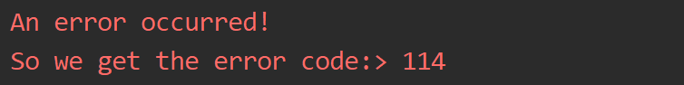
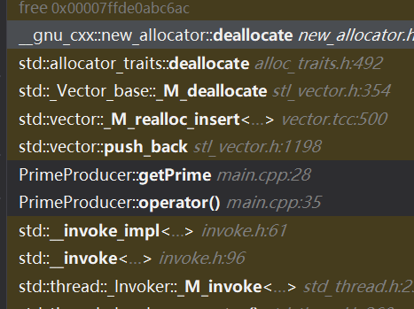

# C++ 新特性学习

## 异常处理 Exception Handle

​		我们简单的聊聊异常处理先：

​		C++ 异常是指在程序运行时发生的特殊情况，比如尝试除以零的操作。异常提供了一种转移程序控制权的方式。C++ 异常处理涉及到三个关键字：**try、catch、throw**。

- **throw:** 当问题出现时，程序会抛出一个异常。这是通过使用 **throw** 关键字来完成的。
- **catch:** 在您想要处理问题的地方，通过异常处理程序捕获异常。**catch** 关键字用于捕获异常。
- **try:** **try** 块中的代码标识将被激活的特定异常。它后面通常跟着一个或多个 catch 块。

```c++
void handleError(){
    try
    {
        try {
            // do sth
            // and sth bad occurred
            throw "An error occurred!";
            // ... do other things then

        }
        catch (const char *exceptionWord) {
            std::cerr << exceptionWord;
            throw 114;
        } catch (int &errorCode) {
            std::cerr << "So we get the error code:> " << errorCode;
            // throw std::exception();
        } catch (std::exception &e) { ; // do nothing
        }
    }catch(int& errorCode){
        std::cerr << "So we get the error code:> " << errorCode;
        // throw std::exception();
    }
}
```

​		如你所见，这就是一个复杂的处理异常的代码，我们分析来看，无非就是

```c++
try{
	// handle sthh
    throw Exception
}catch(Exception& e){
    // handle with e
};
```

​		一段代码内，可能会抛出不同类型的异常，举一个例子：

```C++
bool isParam1Unfit(const char* para1);
bool isParam2Unfit(int& code);
bool isParam3Unfit(Product& pro);

void checkVadility(const char* para1, int& code, Product& pro)
try{
	if(isParam1Unfit(para1)){
        throw para1;
    }
    else if(isParam2Unfit(code)){
        throw code;
    }
    else if(isParam3Unfit(pro)){
        throw pro;
    }
    catch(const char* e1){
        // handle e1;
    }
    catch(int& e2){
        // handle e2
    }
    catch(Product& e3){
        // handle e3
    }
}
```

​		当然这样写很不规范，但是在这里我意在说明一件事情：那就是我们可以抛出任何类型的异常，对于这些异常，我们进入对应类型的catch模块处理。（抽象的讲：就是不同类型的错误不同处理）

> `catch(...)`表示的是接受任何异常，无论是什么类型的！往往我们可以在这里处理**“任何其他未知的异常”**

​		合理的使用这段代码的办法是：定义一个基于std::exception的我们的自己的异常。我们改造上面的代码：

```c++
bool isParam1Unfit(const char* para1);
bool isParam2Unfit(int& code);
bool isParam3Unfit(Product& pro);

class NameException : public std::exception
{
	public:
    	const char* what(){
            return "name error";
        }
}

class CodeException : public std::exception
{
	public:
    	const char* what(){
            return "code error";
        }
}

class ProductUnfitException : : public std::exception
{
	public:
    	const char* what(){
            return "product error";
        }
}

void checkVadility(const char* para1, int& code, Product& pro)
try{
	if(isParam1Unfit(para1)){
        throw NameException();
    }
    else if(isParam2Unfit(code)){
        throw CodeException();
    }
    else if(isParam3Unfit(pro)){
        throw ProductUnfitException();
    }
}    
catch(const NameException& e1){
    std::cerr << e1.what();
}
catch(const CodeException& e2){
    std::cerr << e2.what();
}
catch(const ProductUnfitException& e3){
    std::cerr << e3.what();
}
```

​		注意到，我们的代码一旦走到`throw`就会跳转到对应的catch处理模块。而我们的处理模块就需要尽可能的完成我们的异常处理工作。反之，本级代码无法处理着将会传递给上一级调用端去处理。

```c++
void handleError(){
    try
    {
        try {
            // do sth
            // and sth bad occurred
            throw "An error occurred!";
            // ... do other things then

        }
        catch (const char *exceptionWord) {
            std::cerr << exceptionWord;
            throw 114;
        } catch (int &errorCode) {
            std::cerr << "So we get the error code:> " << errorCode;
            // throw std::exception();
        } catch (std::exception &e) { ; // do nothing
        }
    }catch(int& errorCode){
        std::cerr << "So we get the error code:> " << errorCode;
        // throw std::exception();
    }
}
```

​		以这个代码为例，我们的内部异常就会抛出一个`const char*`类型的异常，转向到内部的异常处理之后再次抛出一个int类型的异常。现在，他就会外溢int类型的error到外部，然后被外部的：

```c++
catch(int& errorCode){
        std::cerr << "So we get the error code:> " << errorCode;
        // throw std::exception();
        }
```

​		接住。



​		这就是结果。

​		那些没有被handle的exception回外溢到最外层。C++默认的处理方式是调用std::terminate，但后就是std::exit退出部分。

## 并发编程基础

### 基础

​		我们下面速通并发（不是）

​		很简单，我们可以简单的认为一个线程跑的是一个任务，所以，对于一个简单的线程，实质上传递一个（仿）函数就可以。

​		我们举一个例子，算质数的例子：

```c++
#include <thread>
#include <iostream>
#include <cmath>
class PrimeProducer
{
public:
    PrimeProducer() = delete;
    PrimeProducer(int bounding_low, int boundingHigh):m_high(boundingHigh),m_low(bounding_low){};

    void getPrime(){
        for(int i = m_low; i <= m_high; i++)
            if(isPrime(i))
                std::cout << i << " ";
        std::cout << "\n";
    }

    void operator()(){
        getPrime();
    }

private:
    bool isPrime(int cur)
    {
        for(int i = 2; i <= std::sqrt(cur); i++)
        {
            if(cur % i == 0)
            {
                return false;
            }
        }
        return true;
    }

    int m_low = 2;
    int m_high = 2;
};
```

​		代码并不复杂，就是打印质数

```
PrimeProducer(2, 100)();
```

​		我们这样就完成了一个任务的封装。这种形式是仿函数的。

​		那么，现在我们就用线程来完成任务

```c++
#include <thread>
#include <iostream>
#include <cmath>
#include <vector>
std::vector<int> primes;

void showResult(){
    for(const auto& it : primes){
        std::cout << it << " ";
    }
    std::cout << "\n";
}

class PrimeProducer
{
public:
    PrimeProducer() = delete;
    PrimeProducer(int bounding_low, int boundingHigh):m_high(boundingHigh),m_low(bounding_low){};

    void getPrime(){
        for(int i = m_low; i <= m_high; i++)
            if(isPrime(i)) {
                //std::cout << i << " ";
                primes.push_back(i);
            }
        //std::cout << "\n";
    }

    void operator()(){
        getPrime();
    }

private:
    bool isPrime(int cur)
    {
        if(cur <= 1)
            return false;
        for(int i = 2; i <= std::sqrt(cur); i++)
        {
            if(cur % i == 0)
            {
                return false;
            }
        }
        return true;
    }

    int m_low = 2;
    int m_high = 2;
};


int main()
{
    std::thread pools[3];
    int boundLow = 1;
    int boundHigh = 100;
    for(auto& each_thread : pools)
    {
        each_thread = std::thread(PrimeProducer(boundLow, boundHigh));
        boundHigh += 100;
        boundLow += 100;
    }

    for(auto& each_thread : pools)
    {
        each_thread.join();
    }

    showResult();
}
```

​		先别急啥意思，我先贴一个：

​		std::thread就是我们的线程对象， 它在 `<thread>` 头文件中声明

```
#include <thread>
```

​		说的就是这个事情。

#### std::thread 构造

| 构造函数       | 声明                                                         |
| -------------- | ------------------------------------------------------------ |
| default        | `thread() noexcept; `                                        |
| initialization | `template <class Fn, class... Args> explicit thread (Fn&& fn, Args&&... args); ` |
| copy [deleted] | `thread (const thread&) = delete; `                          |
| move           | `thread (thread&& x) noexcept;`                              |

- 默认构造函数，创建一个空的 thread 执行对象。这个时候，由于没有任务可以执行，他不会做出任何事情。
- 初始化构造函数，创建一个 thread对象，该thread对象可被 joinable，新产生的线程会调用 fn 函数，该函数的参数由 args 给出。
- 拷贝构造函数(被禁用)，意味着 thread 不可被拷贝构造。
- move 构造函数，move 构造函数，调用成功之后 x 不代表任何 thread 执行对象。
- 注意：可被 joinable 的 thread 对象必须在他们销毁之前被主线程 join 或者将其设置为 detached.

#### move 赋值操作

| move           | `thread& operator= (thread&& rhs) noexcept; ` |
| -------------- | --------------------------------------------- |
| copy [deleted] | `thread& operator= (const thread&) = delete;` |

- move 赋值操作，如果当前对象不可 joinable，需要传递一个右值引用(rhs)给 move 赋值操作；如果当前对象可被 joinable，则 terminate() 报错。
- 拷贝赋值操作被禁用，thread 对象不可被拷贝。

​		也就是说，我们这里的：

```c++
each_thread = std::thread(PrimeProducer(boundLow, boundHigh));
```

​		其实做的是移动操作。

​		那么，join和detach是啥意思呢？join表示的是发出后在这句调用的位置线程要结束运行，父进程才不会被阻塞，否则就等待到子进程结束运行，detach就是让他放飞自我，一般而言不会对裸的任务直接detach，不确定性太大了。

### 互斥量

​		这个使用于那些必须要求我们原子性访问变量的部分。

​		话说的有点抽象，我们就来跑一下上面的程序，这次我们把gap拉大来：


​		崩溃了？为什么呢？我们一开debug来看看：



​		检查调用栈，马上就可以猜出问题了！那就是多个进程之间发生了向同一个位置push_back，马上就会出现问题。这是因为STL事实上不提供任何强度的线程安全！我们需要做一些措施，保证我们的插入是原子性的

```c++
// ...
    void getPrime(){
        mtx.lock();
        for(int i = m_low; i <= m_high; i++)
            if(isPrime(i)) {
                //std::cout << i << " ";
                primes.push_back(i);
            }
        //std::cout << "\n";
        mtx.unlock();
    }
/// 。。。
```

​		你看到了实际上就是对全局变量开锁。维护住锁了才可以

简单看看互斥量的种类：

#### Mutex 系列类(四种)

- std::mutex，最基本的 Mutex 类。
- std::recursive_mutex，递归 Mutex 类。
- std::time_mutex，定时 Mutex 类。
- std::recursive_timed_mutex，定时递归 Mutex 类。

#### Lock 类（两种）

- std::lock_guard，与 Mutex RAII 相关，方便线程对互斥量上锁。
- std::unique_lock，与 Mutex RAII 相关，方便线程对互斥量上锁，但提供了更好的上锁和解锁控制。

#### 其他类型

- std::once_flag
- std::adopt_lock_t
- std::defer_lock_t
- std::try_to_lock_t

#### 函数

- std::try_lock，尝试同时对多个互斥量上锁。（注意锁不上就不锁了！）
- std::lock，可以同时对多个互斥量上锁。
- std::call_once，如果多个线程需要同时调用某个函数，call_once 可以保证多个线程对该函数只调用一次。

下面以 std::mutex 为例介绍 C++11 中的互斥量用法。

​		std::mutex 是C++11 中最基本的互斥量，std::mutex 对象提供了独占所有权的特性——即不支持递归地对 std::mutex 对象上锁，而 std::recursive_lock 则可以递归地对互斥量对象上锁。

#### std::mutex 的成员函数

- 构造函数，std::mutex不允许拷贝构造，也不允许 move 拷贝，最初产生的 mutex 对象是处于 unlocked 状态的。
- lock()，调用线程将锁住该互斥量。线程调用该函数会发生下面 3 种情况：(1). 如果该互斥量当前没有被锁住，则调用线程将该互斥量锁住，直到调用 unlock之前，该线程一直拥有该锁。(2). 如果当前互斥量被其他线程锁住，则当前的调用线程被阻塞住。(3). 如果当前互斥量被当前调用线程锁住，则会产生死锁(deadlock)。
- unlock()， 解锁，释放对互斥量的所有权。
- try_lock()，尝试锁住互斥量，如果互斥量被其他线程占有，则当前线程也不会被阻塞。线程调用该函数也会出现下面 3 种情况，(1). 如果当前互斥量没有被其他线程占有，则该线程锁住互斥量，直到该线程调用 unlock 释放互斥量。(2). 如果当前互斥量被其他线程锁住，则当前调用线程返回 false，而并不会被阻塞掉。(3). 如果当前互斥量被当前调用线程锁住，则会产生死锁(deadlock)。

```c
#include <thread>
#include <iostream>
#include <vector>
#include <mutex>
std::mutex mtx;           // locks access to counter
volatile int counter = 0;

void addCounter()
{
    for(int i = 0; i < 10000; i++) {
        mtx.lock();
        counter++;;
        mtx.unlock();
    }
}

int main()
{
    std::thread pool[10];
    for(auto & i : pool)
        i = std::thread(addCounter);

    for(auto & i : pool)
        i.join();

    std::cout << counter;
}
```

### lock详解

C++11 标准为我们提供了两种基本的锁类型，分别如下：

- std::lock_guard，与 Mutex RAII 相关，方便线程对互斥量上锁。
- std::unique_lock，与 Mutex RAII 相关，方便线程对互斥量上锁，但提供了更好的上锁和解锁控制。

另外还提供了几个与锁类型相关的 Tag 类，分别如下:

- `std::adopt_lock_t，一个空的标记类，定义如下：`

```
struct adopt_lock_t {};
```

 该类型的常量对象adopt_lock（adopt_lock 是一个常量对象，定义如下

```
constexpr` `adopt_lock_t adopt_lock {};，``// constexpr 是 C++11 中的新关键字）
通常作为参数传入给 unique_lock 或 lock_guard 的构造函数。 
```

- `std::defer_lock_t`一个空的标记类，定义如下：

```
struct defer_lock_t {};
```

 该类型的常量对象` defer_lock`是一个常量对象，定义如下：

```
constexpr` `defer_lock_t defer_lock {};，``// constexpr 是 C++11 中的新关键字）, 通常作为参数传入给 unique_lock 或 lock_guard 的构造函数。 

```

- `std::try_to_lock_t`，一个空的标记类，定义如下：

```
struct try_to_lock_t {};
```

该类型的常量对象  `try_to_lock`是一个常量对象，定义如下：

```
constexpr try_to_lock_t try_to_lock {};
```

`通常作为参数传入给 unique_lock 或 lock_guard 的构造函数。`后面我们会详细介绍以上三种 Tag 类型在配合 lock_gurad 与 unique_lock 使用时的区别。

#### std::lock_guard 介绍

std::lock_gurad 是 C++11 中定义的模板类。定义如下：

```
template <class Mutex>
class lock_guard;
```

​		lock_guard 对象通常用于管理某个锁(Lock)对象，因此与 Mutex RAII 相关，方便线程对互斥量上锁，即在某个 lock_guard 对象的声明周期内，它所管理的锁对象会一直保持上锁状态；而 lock_guard 的生命周期结束之后，它所管理的锁对象会被解锁(注：类似 shared_ptr 等智能指针管理动态分配的内存资源 )。

​		模板参数 Mutex 代表互斥量类型，例如 std::mutex 类型，它应该是一个基本的 BasicLockable 类型，标准库中定义几种基本的 BasicLockable 类型，分别 std::mutex, std::recursive_mutex, std::timed_mutex，std::recursive_timed_mutex (以上四种类型均已在上一篇博客中介绍)以及 std::unique_lock(本文后续会介绍 std::unique_lock)。(注：BasicLockable 类型的对象只需满足两种操作，lock 和 unlock，另外还有 Lockable 类型，在 BasicLockable 类型的基础上新增了 try_lock 操作，因此一个满足 Lockable 的对象应支持三种操作：lock，unlock 和 try_lock；最后还有一种 TimedLockable 对象，在 Lockable 类型的基础上又新增了 try_lock_for 和 try_lock_until 两种操作，因此一个满足 TimedLockable 的对象应支持五种操作：lock, unlock, try_lock, try_lock_for, try_lock_until)。

​		在 lock_guard 对象构造时，传入的 Mutex 对象(即它所管理的 Mutex 对象)会被当前线程锁住。在lock_guard 对象被析构时，它所管理的 Mutex 对象会自动解锁，由于不需要程序员手动调用 lock 和 unlock 对 Mutex 进行上锁和解锁操作，因此这也是最简单安全的上锁和解锁方式，尤其是在程序抛出异常后先前已被上锁的 Mutex 对象可以正确进行解锁操作，极大地简化了程序员编写与 Mutex 相关的异常处理代码。

​		值得注意的是，lock_guard 对象并不负责管理 Mutex 对象的生命周期，lock_guard 对象只是简化了 Mutex 对象的上锁和解锁操作，方便线程对互斥量上锁，即在某个 lock_guard 对象的声明周期内，它所管理的锁对象会一直保持上锁状态；而 lock_guard 的生命周期结束之后，它所管理的锁对象会被解锁。

#### std::lock_guard 构造函数

lock_guard 构造函数如下表所示：

| locking (1)       | `explicit lock_guard (mutex_type& m); `          |
| ----------------- | ------------------------------------------------ |
| adopting (2)      | `lock_guard (mutex_type& m, adopt_lock_t tag); ` |
| copy [deleted](3) | `lock_guard (const lock_guard&) = delete;`       |

1. locking 初始化

   - lock_guard 对象管理 Mutex 对象 m，并在构造时对 m 进行上锁（调用 m.lock()）。

2. adopting初始化

   - lock_guard 对象管理 Mutex 对象 m，与 locking 初始化(1) 不同的是， Mutex 对象 m 已被当前线程锁住。

3. 拷贝构造

   - lock_guard 对象的拷贝构造和移动构造(move construction)均被禁用，因此 lock_guard 对象不可被拷贝构造或移动构造。

     ### 期物

​		其实，我们的这样场景更多，那就是一个线程工作，另一个线程去接受这个线程的结果很多，我们将之抽象为一个是Provider,一个是Receiver.我们在一些时候需要阻塞Receiver直到我们收获了东西。

`<future>` 头文件中包含了以下几个类和函数：

- Providers 类：std::promise, std::package_task
- Futures 类：std::future, shared_future.
- Providers 函数：std::async()
- 其他类型：std::future_error, std::future_errc, std::future_status, std::launch.

#### std::promise 类介绍

​		promise 对象可以保存某一类型 T 的值，该值可被 future 对象读取（可能在另外一个线程中），因此 promise 也提供了一种线程同步的手段。在 promise 对象构造时可以和一个共享状态（通常是std::future）相关联，并可以在相关联的共享状态(std::future)上保存一个类型为 T 的值。

​		可以通过 get_future 来获取与该 promise 对象相关联的 future 对象，调用该函数之后，两个对象共享相同的共享状态(shared state)

- promise 对象是异步 Provider，它可以在某一时刻设置共享状态的值。
- future 对象可以异步返回共享状态的值，或者在必要的情况下阻塞调用者并等待共享状态标志变为 ready，然后才能获取共享状态的值

#### std::promise 构造函数

| default        | `promise(); `                                                |
| -------------- | ------------------------------------------------------------ |
| with allocator | `template <class Alloc> promise (allocator_arg_t aa, const Alloc& alloc); ` |
| copy [deleted] | `promise (const promise&) = delete; `                        |
| move           | `promise (promise&& x) noexcept; `                           |

1. 默认构造函数，初始化一个空的共享状态。
2. 带自定义内存分配器的构造函数，与默认构造函数类似，但是使用自定义分配器来分配共享状态。
3. 拷贝构造函数，被禁用。
4. 移动构造函数。

另外，std::promise 的 operator= 没有拷贝语义，即 std::promise 普通的赋值操作被禁用，operator= 只有 move 语义，所以 std::promise 对象是禁止拷贝的。

#### std::promise::get_future

该函数返回一个与 promise 共享状态相关联的 future *。*返回的 future 对象可以访问由 promise 对象设置在共享状态上的值或者某个异常对象。只能从 promise 共享状态获取一个 future 对象。在调用该函数之后，promise 对象通常会在某个时间点准备好(设置一个值或者一个异常对象)，如果不设置值或者异常，promise 对象在析构时会自动地设置一个 future_error 异常(broken_promise)来设置其自身的准备状态。上面的例子中已经提到了 get_future，此处不再重复。

​		看一个例子：

```c++
#include <thread>
#include <iostream>
#include <cmath>
#include <vector>
#include <mutex>
#include <future>

bool isPrime(int cur){
    if(cur <= 1)
        return false;
    for(int i = 2; i <= std::sqrt(cur); i++)
        if(cur % i == 0)
            return false;
    return true;
}

// Producer
void producePrime(std::promise<std::vector<int>*>& pro, int beg, int end)
{
    auto* vec = new std::vector<int>;
    for(int i = beg; i <= end; i++)
        if(isPrime(i))
            vec->push_back(i);

    pro.set_value(vec);
}

void receivePrime(std::future<std::vector<int>*>& fut)
{
    std::vector<int>* res = fut.get();
    for(const auto& i : *res)
        std::cout << i << " ";
    std::cout << "\n";
    delete res;
}
int main()
{
    std::promise<std::vector<int>*> promisePrimes;
    std::future<std::vector<int>*> futurePrimes = promisePrimes.get_future();
    std::thread t1(producePrime, std::ref(promisePrimes), 1, 100);
    std::thread t2(receivePrime, std::ref(futurePrimes));

    t1.join();
    t2.join();
}
```

### 条件变量

​		条件变量是利用线程间共享的全局变量进行同步的一种机制，主要包括两个动作：一个线程等待，条件变量的条件成立而挂起;另一个线程使条件成立（给出条件成立信号）。为了防止竞争，条件变量的使用总是和一个互斥量结合在一起。

​		<condition_variable > 头文件主要包含了与条件变量相关的类和函数。相关的类包括 std::condition_variable 和 std::condition_variable_any，还有枚举类型std::cv_status。另外还包括函数 std::notify_all_at_thread_exit()

​		std::condition_variable 对象的某个 wait 函数被调用的时候，它使用 std::unique_lock(通过 std::mutex) 来锁住当前线程。当前线程会一直被阻塞，直到另外一个线程在相同的 std::condition_variable 对象上调用了 notification 函数来唤醒当前线程。

​		std::condition_variable 对象通常使用 std::unique_lock<std::mutex> 来等待，如果需要使用另外的 lockable 类型，可以使用 std::condition_variable_any 类，本文后面会讲到 std::condition_variable_any 的用法。

**std::condition_variable 构造函数**

| default (1)        | `condition_variable(); `                                   |
| ------------------ | ---------------------------------------------------------- |
| copy [deleted] (2) | `condition_variable (const condition_variable&) = delete;` |

std::condition_variable 的拷贝构造函数被禁用，只提供了默认构造函数。

**std::condition_variable::wait() 介绍**

| unconditional (1) | `void wait (unique_lock<mutex>& lck); `                      |
| ----------------- | ------------------------------------------------------------ |
| predicate (2)     | `template <class Predicate>  void wait (unique_lock<mutex>& lck, Predicate pred);` |

​		std::condition_variable 提供了两种 wait() 函数。当前线程调用 wait() 后将被阻塞(此时当前线程应该获得了锁（mutex），不妨设获得锁 lck)，直到另外某个线程调用 notify_* 唤醒了当前线程。

​		在线程被阻塞时，该函数会自动调用 `lck.unlock() 释放锁，使得其他被阻塞在锁竞争上的线程得以继续执行。`另外，一旦当前线程获得通知(notified，通常是另外某个线程调用 notify_* 唤醒了当前线程)，wait() 函数也是自动调用 lck.lock()，使得 lck 的状态和 wait 函数被调用时相同。

​		在第二种情况下（即设置了 Predicate），只有当 pred 条件为 false 时调用 wait() 才会阻塞当前线程，并且在收到其他线程的通知后只有当 pred 为 true 时才会被解除阻塞。因此第二种情况类似以下代码：

```
while (!pred()) wait(lck);
```

**std::condition_variable::wait_for() 介绍**

| unconditional (1) | `template <class Rep, class Period>  cv_status wait_for (unique_lock<mutex>& lck,                      const chrono::duration<Rep,Period>& rel_time); ` |
| ----------------- | ------------------------------------------------------------ |
| predicate (2)     | `template <class Rep, class Period, class Predicate>       bool wait_for (unique_lock<mutex>& lck,                      const chrono::duration<Rep,Period>& rel_time, Predicate pred);` |

​		与 **std::condition_variable::wait()** 类似，不过 wait_for 可以指定一个时间段，在当前线程收到通知或者指定的时间 rel_time 超时之前，该线程都会处于阻塞状态。而一旦超时或者收到了其他线程的通知，wait_for 返回，剩下的处理步骤和 wait() 类似。

​		另外，wait_for 的重载版本（**predicte(2)**）的最后一个参数 pred 表示 wait_for 的预测条件，只有当 pred 条件为 false 时调用 wait() 才会阻塞当前线程，并且在收到其他线程的通知后只有当 pred 为 true 时才会被解除阻塞

#### std::condition_variable_any 介绍

​		与 std::condition_variable 类似，只不过 std::condition_variable_any 的 wait 函数可以接受任何 lockable 参数，而 std::condition_variable 只能接受 std::unique_lock<std::mutex> 类型的参数，除此以外，和 std::condition_variable 几乎完全一样。

#### std::cv_status 枚举类型介绍

| cv_status::no_timeout | wait_for 或者 wait_until 没有超时，即在规定的时间段内线程收到了通知。 |
| --------------------- | ------------------------------------------------------------ |
| cv_status::timeout    | wait_for 或者 wait_until 超时。                              |

#### std::notify_all_at_thread_exit

函数原型为：

```
void notify_all_at_thread_exit (condition_variable& cond, unique_lock<mutex> lck);
```

当调用该函数的线程退出时，所有在 cond 条件变量上等待的线程都会收到通知。

#### 看一个例子

```c++
#include <iostream>
#include <string>
#include <thread>
#include <mutex>
#include <condition_variable>

// 锁
std::mutex m;
// 条件变量
std::condition_variable cv;
// 这里就是数据了
std::string data;
// 比较特殊，这里公开暴露了两个控制变量，实际上最好集成在类里
bool ready = false;
bool processed = false;

void worker_thread()
{
    // Wait until main() sends data
    std::unique_lock<std::mutex> lk(m);
    //子进程的中wait函数对互斥量进行解锁，同时线程进入阻塞或者等待状态。
    cv.wait(lk, []{return ready;});

    // after the wait, we own the lock.
    std::cout << "Worker thread is processing data\n";
    data += " after processing";

    // Send data back to main()
    processed = true;
    std::cout << "Worker thread signals data processing completed\n";

    // Manual unlocking is done before notifying, to avoid waking up
    // the waiting thread only to block again (see notify_one for details)
    lk.unlock();
    cv.notify_one();
}

int main()
{
    std::thread worker(worker_thread);

    data = "Example data";
    // send data to the worker thread
    {
        //主线程堵塞在这里，等待子线程的wait()函数释放互斥量。
        std::lock_guard<std::mutex> lk(m);
        ready = true;
        std::cout << "main() signals data ready for processing\n";
    }
    cv.notify_one();

    // wait for the worker
    {
        std::unique_lock<std::mutex> lk(m);
        cv.wait(lk, []{return processed;});
    }
    std::cout << "Back in main(), data = " << data << '\n';

    worker.join();
}
```

