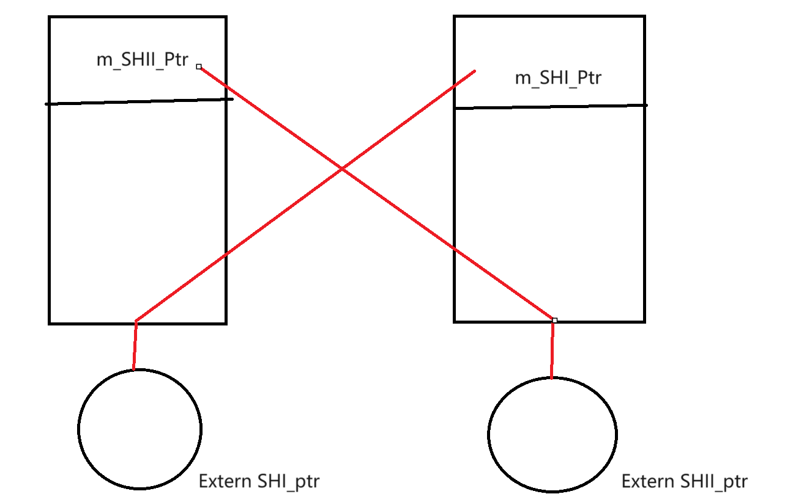
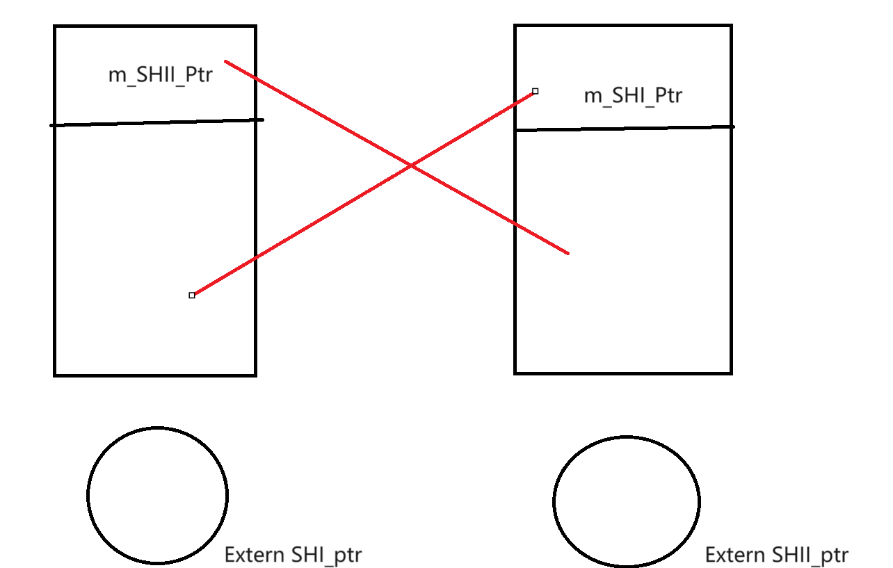

# C++ 智能指针

​	我们今天的主题是简单的智能指针。智能指针主要有三种：`std::unique_ptr`，`std::shared_ptr`，`std::weak_ptr`，第三种被广泛认为是解决一个我们将要谈到的“循环引用”的topic服务的，我们实际上主要把目光放在前两个。

## `std::unique_ptr`

### 入门

```C++
_EXPORT_STD template <class _Ty, class _Dx /* = default_delete<_Ty> */>
class unique_ptr { // non-copyable pointer to an object
public:
    using pointer      = typename _Get_deleter_pointer_type<_Ty, remove_reference_t<_Dx>>::type;
    using element_type = _Ty;
    using deleter_type = _Dx;

    template <class _Dx2 = _Dx, _Unique_ptr_enable_default_t<_Dx2> = 0>
    constexpr unique_ptr() noexcept : _Mypair(_Zero_then_variadic_args_t{}) {}

    template <class _Dx2 = _Dx, _Unique_ptr_enable_default_t<_Dx2> = 0>
    constexpr unique_ptr(nullptr_t) noexcept : _Mypair(_Zero_then_variadic_args_t{}) {}
```

​	如MSVC所见，这就是你锁定到的定义，但是有些复杂，我们回到cpp_reference来看看：

```C++
template<
    class T,
    class Deleter = std::default_delete<T>
> class unique_ptr;
template <
    class T,
    class Deleter
> class unique_ptr<T[], Deleter>;
```

​	清晰了：实际上，这个unique_ptr就是一个负责托管资源的类。它需要一个实际的类和可能的删除器来实例化对象。举个例子：

```
#include <memory>
#include <vld.h>	// 自行寻找vld库
#include <iostream>
int main()
{
	int* leak = new int;
}
```

​	在C++11之前，我们可能会写出这样的代码：你立马反应过来，有问题！内存泄漏了！

​	为此，我引入vld检测小工具，马上就得到了证实：

```
Visual Leak Detector read settings from: D:\VLD\Visual Leak Detector\vld.ini
Visual Leak Detector Version 2.5.1 installed.
WARNING: Visual Leak Detector detected memory leaks!
---------- Block 1 at 0x0000000055796C60: 4 bytes ----------
  Leak Hash: 0x67B77119, Count: 1, Total 4 bytes
  Call Stack (TID 16744):
  Data:
    CD CD CD CD                                                  ........ ........
```

​	泄漏了一个int，符合我们的预期。现在，我们让他交给一个智能指针进行托管：

```C++
int main()
{
	int* leak = new int;
	std::unique_ptr<int> no_more_leak(leak);
}
```

​	现在不会泄漏了！

```
Visual Leak Detector read settings from: D:\VLD\Visual Leak Detector\vld.ini
Visual Leak Detector Version 2.5.1 installed.
No memory leaks detected.
Visual Leak Detector is now exiting.
```

​	由此可以看见，`std::unique_ptr`就是一个可以自动执行析构的内存管理类。换而言之，他会在这个变量应该结束声明周期的时候自动结束所托管资源的生命。

​	我们还没有结束话题！仔细看看：

```C++
template<
    class T,
    class Deleter = std::default_delete<T>
> class unique_ptr;
```

​	我们还有一个Deleter没有谈到！这个Deleter就是我们用户自己定义的Deleter。毕竟，当我们的资源很简单但是需要在删除的时候做处理时，就没有必要单独封装了。举个例子

```C++
#include <memory>		// std::unique_ptr
#include <vld.h>
#include <iostream>		// std::cout
#include <functional> 	// std::function
using MyIntDeleter = std::function<void(int*)>;

void deleter(int* be_del)
{
	std::cout << "将要删除指针:> " << be_del << ", 资源值是:> " << *be_del << "\n";
	delete be_del;
}

int main()
{
	
	int* leak = new int;
	std::unique_ptr<int, MyIntDeleter> no_more_leak(leak, deleter);
	*no_more_leak = 114514;
}
```

​	看看效果：

```
Visual Leak Detector read settings from: D:\VLD\Visual Leak Detector\vld.ini
Visual Leak Detector Version 2.5.1 installed.
将要删除指针:> 0000029931EA1750, 资源值是:> 114514
No memory leaks detected.
Visual Leak Detector is now exiting.
```

> 需要注意：
>
> ```C++
> 	int* leak = new int;
> 	*leak = 114514;
> 	std::unique_ptr<int, MyIntDeleter> no_more_leak(leak, deleter);
> 	delete leak; // is Legal ?
> ```
>
> 是不可行的，这里当我们托管了指针之后，就不要在使用原始指针去操作数据了！否则程序就会因为二次释放而崩溃！因此，一个合适的使用智能指针的方式是：
>
> ```C++
> std::unique_ptr<int, MyIntDeleter> no_more_leak(new int, deleter); // 尽可能不给外界提供原始操作接口
> *no_more_leak = ...;
> ```

​	这样行不行呢？

```
	int* leak = new int;
	std::unique_ptr<int, MyIntDeleter> no_more_leak = leak; // Is Legal?
	*no_more_leak = 114514;
```

​	不行！`std::unique_ptr`是一个独占性的资源管理器！另一个说法是：`unique_ptr` 不共享它的指针。它无法复制到其他 `unique_ptr`，自然也就没办法无法通过值传递到函数，也无法用于需要副本的任何标准模板库 (STL) 算法。只能移动`unique_ptr` 。这意味着，内存资源所有权将转移到另一个 `unique_ptr` ，并且原始 `unique_ptr`  不再拥有此资源。一言以蔽之：对于一个实例，只允许有一个资源管理器在管理它！

​	于是，在原始指针和智能指针之间，只存在直接的赋值：

```
std::unique_ptr<int, MyIntDeleter> no_more_leak = leak; // Is illegal
std::unique_ptr<int, MyIntDeleter> no_more_leak = std::move(leak); // Is illegal

std::unique_ptr<int, MyIntDeleter> no_more_leak(leak); // legal
std::unique_ptr<int, MyIntDeleter> no_more_leak(std::move(leak)); // legal, and is more obvious for readers that the function calls the move_constructor of the sources
```

​	但是，我们可以在智能指针之间便捷的使用等号进行资源管理的传递！注意到：我们的资源托管是独占的，意味着直接使用operator=和复制构造是不可能的！（`=delete`）

```C++ 
std::unique_ptr<int, MyIntDeleter> no_more_leak(leak, deleter);
std::unique_ptr<int, MyIntDeleter> no_more_leak_other = no_more_leak; // Error
std::unique_ptr<int, MyIntDeleter> no_more_leak_other(no_more_leak); // Error
```

​	怎么办？那就std::move手动告知我们是移动资源即可

```C++
std::unique_ptr<int, MyIntDeleter> no_more_leak_other(std::move(no_more_leak));
std::unique_ptr<int, MyIntDeleter> no_more_leak_other = std::move(no_more_leak);
```

​	现在，我们就可以将资源的管理权进行移动了！这样我们就实现了资源管理的传递性。

```
	std::unique_ptr 实现了独享所有权的语义。一个非空的 std::unique_ptr 总是拥有它所指向的资源。转移一个 std::unique_ptr 将会把所有权也从源指针转移给目标指针（源指针被置空）。拷贝一个 std::unique_ptr 将不被允许，因为如果你拷贝一个 std::unique_ptr ,那么拷贝结束后，这两个 std::unique_ptr 都会指向相同的资源，它们都认为自己拥有这块资源（所以都会企图释放）。因此 std::unique_ptr 是一个仅能移动（move_only）的类型。当指针析构时，它所拥有的资源也被销毁。默认情况下，资源的析构是伴随着调用 std::unique_ptr 内部的原始指针的 delete 操作的。
```

### API

#### 构造

​	我们如何产生一个unique_ptr实例呢？答案是：使用默认的构造：也就是当前的unique_ptr不托管任何对象

```
std::unique_ptr<int, MyIntDeleter> no_more_leak;
```

​	这就是一个例子！当前的no_more_leak不会托管任何对象。或者是为他给予一个可以被移动的类型（就比如说一个int!他当然可以被移动！）

```C++
int* leak = new int;
std::unique_ptr<int, MyIntDeleter> no_more_leak(leak, deleter);
```

​	或者：使用std::move来移动另一个智能指针。

```C++
std::unique_ptr<int, MyIntDeleter> no_more_leak_other(std::move(no_more_leak));
std::unique_ptr<int, MyIntDeleter> no_more_leak_other = std::move(no_more_leak);
```

​	在C++14中（据说是标准会那帮人忘记加了（大雾.png）），可以使用make_unique来返回一个独占的智能指针

```C++
_EXPORT_STD template <class _Ty, class... _Types, enable_if_t<!is_array_v<_Ty>, int> = 0>
_NODISCARD_SMART_PTR_ALLOC _CONSTEXPR23 unique_ptr<_Ty> make_unique(_Types&&... _Args) { // make a unique_ptr
return unique_ptr<_Ty>(new _Ty(_STD forward<_Types>(_Args)...));
}
```

​	实际上是：

```
template< class T, class... Args >
unique_ptr<T> make_unique( Args&&... args );
```

​	也就是说：我们可以在C++14及以上使用这个函数返回智能指针了。

​	在另一方面，智能指针支持对一个原始数组的管理。这里我们不重复上面的陈述了，只需要这样使用就可以管理一个数组：

```
using MyIntDeleter = std::function<void(int[])>;

void deleter(int be_del[] )
{
	std::cout << "将要删除指针:> " << be_del << "\n";
	delete[] be_del;
}

int main()
{
	std::unique_ptr<int[], MyIntDeleter> h(new int[10], deleter);
	for (int i = 0; i < 10; i++)
		h[i] = i; // Make Write
}
```

#### 修改

​	修改主要使用的是三个API：

```
// 释放管理器对资源的管理
pointer release() noexceptpointer release() noexcept 
// 替换被管理对象
void reset( pointer ptr = pointer() ) noexcept;
template< class U >
void reset( U ptr ) noexcept;
void reset( std::nullptr_t = nullptr ) noexcept;
// 交换 *this 和另一 unique_ptr 对象 other 的被管理对象和关联的删除器。
void swap( unique_ptr& other ) noexcept;
```

​	先看第一个：释放管理。release也就是这个意思。**注意：他不会删除被管理的资源，单纯只是解除了管理关系**，如果不知道怎么删，那就`get_deleter()`删除。

```C++
using IntDeleter = std::function<void(int*)>;

void make_del(int* ptr) {
	std::cout << "Del Int" << ptr << " :" << *ptr;
	delete ptr;
}

int main()
{
	std::unique_ptr<int, IntDeleter> intHandle(new int, make_del);
	*intHandle = 110;
	intHandle.get_deleter()(intHandle.release()); // 一个紧凑的写法
}
```

​	下一个就是reset了：reset自如其名：就是重置管理的资源。他比release做了一个进一步的工作：就是释放原先的资源，然后再去托管新的资源

```c++
using IntDeleter = std::function<void(int*)>;

void make_del(int* ptr) {
	std::cout << "Del Int" << ptr << " :" << *ptr << "\n";
	delete ptr;
}

int main()
{
	std::unique_ptr<int, IntDeleter> intHandle(new int, make_del);
	*intHandle = 110;
	intHandle.reset(new int);
	*intHandle = 220;
}
```

```
Visual Leak Detector read settings from: D:\VLD\Visual Leak Detector\vld.ini
Visual Leak Detector Version 2.5.1 installed.
Del Int000001C5F36A27B0 :110
Del Int000001C5F36A2F30 :220
No memory leaks detected.
Visual Leak Detector is now exiting.
```

​	程序首先接受了初始的资源并使用，在reset的流程中删除了旧的资源，转向托管新的资源。

​	最后一个是swap，说的是两个智能指针之间交换托管资源：

```c++
using IntDeleter = std::function<void(int*)>;

void make_del(int* ptr) {
	std::cout << "Del Int" << ptr << " :" << *ptr << "\n";
	delete ptr;
}

int main()
{
	std::unique_ptr<int, IntDeleter> intHandle(new int, make_del);
	std::unique_ptr<int, IntDeleter> intHandle2(new int, make_del);
	*intHandle = 110;
	*intHandle2 = 220;
	std::cout << "IntHandle handles:> " << intHandle.get() << "with value:> " << *intHandle << "\n";
	std::cout << "IntHandle2 handles:> " << intHandle2.get() << "with value:> " << *intHandle2 << "\n";
	intHandle.swap(intHandle2);
	std::cout << "IntHandle handles:> " << intHandle.get() << "with value:> " << *intHandle << "\n";
	std::cout << "IntHandle2 handles:> " << intHandle2.get() << "with value:> " << *intHandle2 << "\n";
}
```

​	很简单，他会交换两个智能指针所托管的资源。注意到资源地址没有改变，是在内存层面交换值而不是简单的交换地址。

```
Visual Leak Detector read settings from: D:\VLD\Visual Leak Detector\vld.ini
Visual Leak Detector Version 2.5.1 installed.
IntHandle handles:> 00000140C0A511F0with value:> 110
IntHandle2 handles:> 00000140C0A50EF0with value:> 220
IntHandle handles:> 00000140C0A50EF0with value:> 220 // 资源地址没变，但是值变了
IntHandle2 handles:> 00000140C0A511F0with value:> 110
Del Int00000140C0A511F0 :110
Del Int00000140C0A50EF0 :220
No memory leaks detected.
Visual Leak Detector is now exiting.
```

#### 资源观察器

​	这里，我们将会讨论的是智能指针这个管理器内部的参数是如何被获取的。有三个API：

```C++
    _NODISCARD _CONSTEXPR23 _Dx& get_deleter() noexcept {
        return _Mypair._Get_first();
    }

    _NODISCARD _CONSTEXPR23 const _Dx& get_deleter() const noexcept {
        return _Mypair._Get_first();
    }

    _NODISCARD _CONSTEXPR23 pointer get() const noexcept {
        return _Mypair._Myval2;
    }

    _CONSTEXPR23 explicit operator bool() const noexcept {
        return static_cast<bool>(_Mypair._Myval2);
    }
```

​	MSVC的实现很简单，他就是使用一个Pair实现的智能指针：有趣的是，这个智能指针的内部资源就是智能指针本身在托管，很有趣的实现。

```
    template <class, class>
    friend class unique_ptr;
    _Compressed_pair<_Dx, pointer> _Mypair;
```

​	首先我们要说的是`get()`,返回指向被管理对象的指针，如果无被管理对象，则为 nullptr。另一个就是我上面他提到的`get_deleter`返回删除器。注意到，对于没有安装删除器（初始化的时候没有指定删除器）的智能指针返回空。

```
explicit operator bool() const noexcept;
```

​	当然，他也可以返回bool：检查 *this 是否占有对象，即是否有 get() != nullptr。

​	剩下的实在是很好解决了：那些重载运算符同你一般的使用指针是完全一致的。

​	以上就是独占式的智能指针常见的API。

# `std::shared_ptr` 和 `std::weak_ptr`

​	我们前一篇博客提到了`std::unique_ptr`，我们称呼他是一个独占性质的管理资源的资源管理器。现在，我们来看一下`std::shared_ptr`和为了解决`std::shared_ptr`存在的潜在缺陷（本质上是引用计数的缺陷）而派生的`std::weak_ptr`

​	这次为了更好的展示，我们使用一个demo资源类：

```
class Special
{
public:
	Special() {
		std::cout << "Create Class Instances Special!" << std::endl;
	}

	~Special() {
		std::cout << "delete Class Instances Special!" << std::endl;
	}
private:
	int sources;
};
```

## `std::shared_ptr` 入门

​	结合上一篇博客，我们知道，智能指针可以自动的在资源的声明周期结束之后进行析构。`std::shared_ptr`作为智能指针的一种，自然也是如此：

```
int main()
{
	std::shared_ptr<Special> shared(new Special);
}
```

​	没有任何意外：

```
Visual Leak Detector read settings from: D:\VLD\Visual Leak Detector\vld.ini
Visual Leak Detector Version 2.5.1 installed.
Create Class Instances Special!
delete Class Instances Special!
No memory leaks detected.
Visual Leak Detector is now exiting.
```

​	但是首先，我们看到的是：`shared_ptr`是可以shared它的资源的。代价就是`use_count++`

```
int main()
{
	std::shared_ptr<Special> shared(new Special);
	std::shared_ptr<Special> other_shared(shared);
	std::cout << "Current sources is handling for " << shared.use_count() << " times\n";
}
```

```
Visual Leak Detector read settings from: D:\VLD\Visual Leak Detector\vld.ini
Visual Leak Detector Version 2.5.1 installed.
Create Class Instances Special!
delete Class Instances Special!
No memory leaks detected.
Visual Leak Detector is now exiting.
```

​	可以看到，使用这个指针来指向资源，不发生拷贝行为，相反，只是将它的use_count（引用计数，用来记载有多少个指针此时正在把控这个资源）增加，（这里不放源码了，这里的shared_ptr实现是继承了`_ptr_base`的，这里是更改了父类的计数）

```
Visual Leak Detector read settings from: D:\VLD\Visual Leak Detector\vld.ini
Visual Leak Detector Version 2.5.1 installed.
Create Class Instances Special!
Current sources is handling for 2 times
delete Class Instances Special!
No memory leaks detected.
Visual Leak Detector is now exiting.
```

​	你可以看到，我们在第一行指定了一个资源管理器管理一个资源:`new Special`这样一个右值。在第二行又要求另一个资源管理器管理同一个资源（如你所见，就是调用拷贝函数）。我们的程序仍然正确的释放了资源，这是因为shared或者是other_shared被释放的时候，当use_count不是0的时候就减去一个use_count，减到0的时候就会自动释放

```C++
    void _Decref() noexcept { // decrement use count
        if (_MT_DECR(_Uses) == 0) { 
        // #define _MT_DECR(x) _INTRIN_ACQ_REL(_InterlockedDecrement)(reinterpret_cast<volatile long*>(&x)), 也就是原子的减，调用的是CPU命令当中集成的原子减指令，这是为了防止形成竞态
            _Destroy(); // 删除资源
            _Decwref();
        }
    }
```

​	其他的部分让我们看看API就好了：

## `std::shared_ptr's API`

### 构造

​	当然可以生成默认的构造：此时此刻，我们的`std::shared_ptr`就是空的，不托管任何资源

```
std::shared_ptr<Special> shared;
```

​	或者是托管一个裸指针：

```
std::shared_ptr<Special> shared(new Special);
```

​	或者是调用拷贝函数，

```
	std::shared_ptr<Special> shared(new Special);
	std::shared_ptr<Special> other_shared(shared);
```

​	亦或者是移动函数：

```
	std::shared_ptr<Special> shared(new Special);
	std::shared_ptr<Special> other_shared(std::move(shared));
	std::cout << "Current sources is handling for " << shared.use_count() << " times by shared\n";
	std::cout << "Current sources is handling for " << other_shared.use_count() << " times by other_shared\n";
```

​	结合你对移动构造的认识，你马上就会意识到：调用移动函数本质上就是更换资源托管器。这也正是它的作用。

​	我们得到`shared_ptr`的另一种更加可行的方式是：make_shared

```C++
std::make_shared<Special>(/*nullptr or set nothing to get a default shared_ptr*/);
std::make_shared<Special>(new Special); // wrapped a raw pointer
std::make_shared<Special>(other_shared); // copy a shared_ptr
```

​	通过这种方式也可以获得`shared_ptr`

> 这里插一句：使用这些智能指针访问就跟我们使用裸指针一样，使用`->`访问资源，`.`在这里则是表示对资源管理器自身进行操作。

### 修改器

​	就是这两个：

| [reset](https://zh.cppreference.com/w/cpp/memory/shared_ptr/reset) | 替换所管理的对象 (公开成员函数) |
| ------------------------------------------------------------ | ------------------------------- |
| [swap](https://zh.cppreference.com/w/cpp/memory/shared_ptr/swap) | 交换所管理的对象 (公开成员函数) |

​	这里跟`unique_ptr`在功能上类似，这里如果只是希望查看这两个函数可以做什么的可以参考我的上一篇博客：[C++ 智能指针-CSDN博客](https://blog.csdn.net/charlie114514191/article/details/136489270)。这里只是给出Demo。相信可以一目了然：

> reset空

```c++
void showUseCount_And_Reset()
{
	// 创建一个智能指针，让他托管
	std::shared_ptr<Special> spPtr(new Special);
	std::cout << spPtr.use_count() << std::endl;
	spPtr->setSources(100);
	spPtr.reset(); // set as nullptr, in other words, sources are released
	std::cout << spPtr.use_count() << std::endl;
}
```

```
Visual Leak Detector read settings from: D:\VLD\Visual Leak Detector\vld.ini
Visual Leak Detector Version 2.5.1 installed.
Create Class Instances Special!
1
delete Class Instances Special!
The sources of 00000159ADF00A60's value is:> 100
0
No memory leaks detected.
Visual Leak Detector is now exiting.
```

> reset另一个资源

```c++
void showUseCount_And_Reset()
{
	// 创建一个智能指针，让他托管
	std::shared_ptr<Special> spPtr(new Special);
	std::cout << spPtr.use_count() << std::endl;
	spPtr->setSources(100); 
	spPtr.reset(new Special);
	spPtr->setSources(200);
	std::cout << spPtr.use_count() << std::endl;
}
```

```
Visual Leak Detector read settings from: D:\VLD\Visual Leak Detector\vld.ini
Visual Leak Detector Version 2.5.1 installed.
Create Class Instances Special!
1
Create Class Instances Special!
delete Class Instances Special!
The sources of 000002403FB20AE0's value is:> 100
1
delete Class Instances Special! // reset here
The sources of 000002403FB20DA0's value is:> 200
No memory leaks detected.
Visual Leak Detector is now exiting.
```

```C++
void showUseCount_And_Reset()
{
	std::shared_ptr<Special> sp(new Special);
	sp->setSources(100);
	// 创建多个资源管理同时管理同一个资源：
	std::shared_ptr<Special> sp2 = sp;
	std::shared_ptr<Special> sp3 = sp;
	std::cout << sp.use_count() << std::endl;
	std::cout << sp2.use_count() << std::endl;
	std::cout << sp3.use_count() << std::endl;

	// 资源发生变动
	sp.reset(new Special);
	sp->setSources(200);
	std::cout << "sp2:> " << sp2->getSources() << std::endl;
	std::cout << "sp3:> " << sp3->getSources() << std::endl; 
}
```

```
Visual Leak Detector read settings from: D:\VLD\Visual Leak Detector\vld.ini
Visual Leak Detector Version 2.5.1 installed.
Create Class Instances Special!
3
3
3
Create Class Instances Special!
sp2:> 100
sp3:> 100
delete Class Instances Special!
The sources of 0000023F58B505E0's value is:> 100
delete Class Instances Special!
The sources of 0000023F58B501E0's value is:> 200
No memory leaks detected.
Visual Leak Detector is now exiting.
```

​	这个例子存在输出的竞态，实际上，仍然是释放了资源之后再去接受新的资源。其他的获取器API同`unique_ptr`差不多，这里不再赘述了

## `weak_ptr`入门

​	引用计数存在天然的缺陷！

​	我们知道：我们现在做出的假定是：资源管理器自己不会称为一个被管理的资源。什么意思呢？我们看看一个资源管理的逻辑图就知道了：

​	这是`unique_ptr`的资源逻辑管理示意图：我们看到了资源和管理器是一一映射的

```
ManagerA < - > A
ManagerB < - > B
ManagerC < - > C
```

​	这是`shared_ptr`的资源逻辑管理示意图：我们看到了资源和管理器是多对一映射的。

```
ManagerA < - > A
ManagerB < - > A
ManagerC < - > A
```

​	换而言之，我们的资源逻辑图不会出现一个环状的结构。什么是一个环状的结构呢？我们来看一个例子：

```
ManagerA < - > ManagerB
ManagerB < - > ManagerA
```

​	这个步骤单纯的依靠管理器本身初始化做不到，需要我们手动的构造以下场景：

```C++
class Special_HolderII;

class Special_HolderI
{
public:
	std::shared_ptr<Special_HolderII> sp;
	~Special_HolderI() {
		std::cout << "Special Holder I is released" << std::endl;
	}
};

class Special_HolderII
{
public:
	std::shared_ptr<Special_HolderI> sp;
	~Special_HolderII() {
		std::cout << "Special Holder II is released" << std::endl;
	}
};
```

​	你可以看到，我们的管理对象里包含了对方！这里就是导致潜在漏洞的点！我们初始化：

```C++
	std::shared_ptr<Special_HolderI>	sh1(new Special_HolderI);
	std::shared_ptr<Special_HolderII>	sh2(new Special_HolderII);
```

​	上面的代码首先声明了两个独立的shared_ptr，分别托管了这样的资源示意图：


​	两个圆圈就是两个shared_ptr，现在他们分别托管`Special_HolderI`和`Special_HolderII`，这两个资源管理器本身没有耦合！现在为止，我们在外部操作了两个智能指针托管资源让他们的引用计数为1

```c++
	// I
	std::cout << "sh1's use_count: " << sh1.use_count() << std::endl;
	std::cout << "sh2's use_count: " << sh2.use_count() << std::endl;
```

​	现在，我们操作资源，让资源耦合资源管理器，以一种奇怪的方式再次增加：

```
	sh1->sp = sh2;
	sh2->sp = sh1;
```

​	这是在干什么？仔细思考走完上面这两步的后果：我们的sh1托管一个资源管理器（他是属于sh1的）被赋值以sh2他所托管的对象（第一句的作用），而sh2托管的`Special_HolderI`类型的对象是就是sh1（第二句的作用）

​	同理：我们的sh2托管一个资源管理器（他是属于sh2的）被赋值以sh1他所托管的对象（第二句的作用），而sh1托管的`Special_HolderII`类型的对象是就是sh2（第一句的作用）

​	等等，这是**不同的智能指针**托管同一个对象。所以，我们一经发现这是同一个对象，不会释放自己handle的资源而是简单的增加引用计数。

​	现在构成了这样的一个图：



```
	// II
	std::cout << "sh1's use_count: " << sh1.use_count() << std::endl; // 2
	std::cout << "sh2's use_count: " << sh2.use_count() << std::endl; // 2
```

​	还不懂？？有点绕？我再重复一次！第一次我们的外部智能指针分别托管了对方类型的资源，让资源的引用数为1了。第二次我们操纵他们所托管的资源内部的智能指针托管**外部指针托管的对象（包含了他们自身的资源）**。这样，我们走一次逻辑链就会发现，第一次我们在**资源管理器的层次（资源外部）**上让A托管了B的资源，B托管了A的资源。第二次我们的赋值，则是在**资源层次**让资源内部的智能指针重复我们所作的事情。也就是在资源层次上让A托管了B的资源，B托管了A的资源。强行让编译器认为我们是在操作不同的指针指向同一个资源而不是实际上的同一个（同一个指针多次指向同一个资源当然不会增加引用计数）

​	这也被叫做shared_ptr的死锁。当我们释放的时候，触发了sh1和sh2的析构，进而准备释放成员。



​	现在Extern SH1和Extern SH2释放，引用计数被减1了，但是还有资源内部耦合没有被解除：**对象是动态分配的，而对象本身又含有shared_ptr指针，释放对象需要shared_ptr的释放使引用计数减为零，而shared_ptr的释放又需要对象的释放，两者互相等待对方先释放，往往是两者都无法释放。**

```
Visual Leak Detector read settings from: D:\VLD\Visual Leak Detector\vld.ini
Visual Leak Detector Version 2.5.1 installed.
sh1's use_count: 1
sh2's use_count: 1
sh1's use_count: 2
sh2's use_count: 2
WARNING: Visual Leak Detector detected memory leaks!
---------- Block 2 at 0x0000000007774F60: 24 bytes ----------
  Leak Hash: 0x386B91B3, Count: 1, Total 24 bytes
  Call Stack (TID 28472):
  Data:
    70 DE F3 EF    F7 7F 00 00    01 00 00 00    01 00 00 00     p....... ........
    90 B6 77 07    C1 01 00 00                                   ..w..... ........


---------- Block 4 at 0x00000000077752C0: 24 bytes ----------
  Leak Hash: 0x1142308C, Count: 1, Total 24 bytes
  Call Stack (TID 28472):
  Data:
    A0 DE F3 EF    F7 7F 00 00    01 00 00 00    01 00 00 00     ........ ........
    20 BD 77 07    C1 01 00 00                                   ..w..... ........


---------- Block 1 at 0x000000000777B690: 16 bytes ----------
  Leak Hash: 0x9A5D80CF, Count: 1, Total 16 bytes
  Call Stack (TID 28472):
  Data:
    20 BD 77 07    C1 01 00 00    C0 52 77 07    C1 01 00 00     ..w..... .Rw.....


---------- Block 3 at 0x000000000777BD20: 16 bytes ----------
  Leak Hash: 0xE93075EF, Count: 1, Total 16 bytes
  Call Stack (TID 28472):
  Data:
    90 B6 77 07    C1 01 00 00    60 4F 77 07    C1 01 00 00     ..w..... `Ow.....


Visual Leak Detector detected 4 memory leaks (288 bytes).
Largest number used: 288 bytes.
Total allocations: 288 bytes.
Visual Leak Detector is now exiting.
```

​	这样就泄漏了。

​	如何解决呢？答案是使用`weak_ptr`

​	根本原因在于：我们总是强耦合的管理资源，匆匆的宣布自己负责托管它。但是事实上过于急躁的宣布自己的所属权可能会导致死锁。

​	我们试想：如果我们可以在我们真正需要访问并且资源的时候在增加引用计数，而只是声明我跟资源有关系的时候不增加引用计数，这样我们就回避了过早的增加计数导致死锁的问题了。

​	weak_ptr正是这样的：

```c++
class Special_HolderII;

class Special_HolderI
{
public:
	std::shared_ptr<Special_HolderII> sp;
	~Special_HolderI() {
		std::cout << "Special Holder I is released" << std::endl;
	}
};

class Special_HolderII
{
public:
	std::weak_ptr<Special_HolderI> sp;
	~Special_HolderII() {
		std::cout << "Special Holder II is released" << std::endl;
	}
};


int main()
{
	std::shared_ptr<Special_HolderI>	sh1(new Special_HolderI);
	std::shared_ptr<Special_HolderII>	sh2(new Special_HolderII);
	// I
	std::cout << "sh1's use_count: " << sh1.use_count() << std::endl;
	std::cout << "sh2's use_count: " << sh2.use_count() << std::endl;
	sh1->sp = sh2;
	sh2->sp = sh1; // 这里只是声明我很资源有关系但是可能不打算使用，不增加计数
	// II
	std::cout << "sh1's use_count: " << sh1.use_count() << std::endl;
	std::cout << "sh2's use_count: " << sh2.use_count() << std::endl;
}
```

```
Visual Leak Detector read settings from: D:\VLD\Visual Leak Detector\vld.ini
Visual Leak Detector Version 2.5.1 installed.
sh1's use_count: 1
sh2's use_count: 1
sh1's use_count: 1
sh2's use_count: 2
Special Holder I is released
Special Holder II is released
No memory leaks detected.
Visual Leak Detector is now exiting.
```

​	值得注意的是：weak_ptr因为只是声明有关系，没办法真正有权利访问资源，需要使用API进行转化。这里就开始介绍：

## `std::weak_ptr's API`

​	std::weak_ptr支持拷贝和移动，以及从一个强管理的shared_ptr中派生，但是不支持默认的构造。也就是说它完全是shared_ptr的附属物，依靠shared_ptr生存。

​	使用`lock`来获取真正可以管理的实例对象：

```
创建共享被管理对象的所有权的新 std::shared_ptr 对象。若无被管理对象，即 *this 为空，则返回的 shared_ptr 也为空。相当于返回 expired() ? shared_ptr<T>() : shared_ptr<T>(*this)，原子地执行。
```

​	使用`expire`来检查我们的`weak_ptr`是否合法！

```
等价于 use_count() == 0。可能仍未对被管理对象调用析构函数，但此对象的析构已经临近（或可能已发生）。
```

> 使用weak_ptr的场景是：当**两个对象相互使用一个shared_ptr成员变量指向对方，会造成循环引用，使引用计数失效，从而导致内存泄漏。**
>
> 这是因为：weak_ptr 是一种不控制对象生命周期的智能指针, 它指向一个 shared_ptr 管理的对象. weak_ptr只是提供了对管理对象的一个访问手段。weak_ptr 设计的目的是为配合 shared_ptr 而引入的一种智能指针来协助 shared_ptr 工作, 它只可以从一个 shared_ptr 或另一个 weak_ptr 对象构造, 它的构造和析构不会引起引用记数的增加或减少。weak_ptr是用来解决shared_ptr相互引用时的死锁问题,如果说两个shared_ptr相互引用,那么这两个指针的引用计数永远不可能下降为0,资源永远不会释放。它是对对象的一种弱引用，不会增加对象的引用计数，


参考网站：

[cppreference.com](https://zh.cppreference.com/w/首页)

