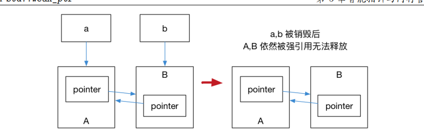

# Modern C++ 11 I:Abandoned Characteristic

## 1 被弃用的特性

​		我们首先来阐述一下那些被弃用的C++98特性

1. 现代C++不允许将一个字符串常量赋值给char*,强迫使用更加合理的const char\*

```
char *str = "hello world" // Not Allowed now
```

2. C++98的异常被说明，`unexpected_handle` , `set_unexpected()` 被弃用
3. 不要再使用`auto_ptr`了，应该使用`unique_ptr`,`shared_ptr`,`weak_ptr` 
4. register关键字被废弃，可以使用但是没有任何意义了
5. bool类型的++操作被废弃
6. 如果一个类有析构函数，为其生成拷贝构造函数和拷贝赋值运算符的特性被弃用了。
7. C 语言风格的类型转换被弃用（即在变量前使用 (convert_type)），应该使用 static_cast、
   reinterpret_cast、const_cast 来进行类型转换。
8. 特别地，在最新的 C++17 标准中弃用了一些可以使用的 C 标准库，例如 < ccomplex>、
   < cstdalign >、< cstdbool > 与 < ctgmath > 等

在现代C++中，C++不再是C 的一个简单超集。注意到我们的编译需要避免C风格的通用类型`void*`在我们不得不使用C时，注意使用extern

看一下代码：

```
// cadd.h
// block 1
#ifdef __cplusplus
#define EXTERN_Begin extern "C" {
#define EXTERN_End  }
#else
#define EXTERN_Begin
#define EXTERN_End
#endif

EXTERN_Begin 
int add(int a, int b);
EXTERN_End
```

```
// cadd.c
int add(int a, int b){
    return a + b;
}
```

```
// cpptry.cpp
#include"cadd.h"
#include<iostream>
#include<functional>

int main()
{
    [out = std::ref(std::cout << "Got the result of " << add(1, 2))](){
        out.get() << ".\n";
    }();

    return 0;
}
```

尝试一下Makefile

```
// Makefile
C = gcc
CXX = clang++
SOURCE_C = cadd.c
OBJECTS_C = cadd.o
SOURCE_CXX = cpptry.cpp
TARGET = cpptry
LDFLAGS_COMMON = -std=c++2a
all:
	$(C) -c $(SOURCE_C)
	$(CXX) $(SOURCE_CXX) $(OBJECTS_C) $(LDFLAGS_COMMON) -o $(TARGET)
clean:
	rm -rf *.o $(TARGET)
```

```
// 单走一个make
make
./cpptry
```

## 语言可用性强化

​		我们声明，定义一个变量的时候，对代码进行流程控制，面对对象，模板编程等都是运行前发生的。这里就是我们要讨论的重点。

## 常量

### nullptr

​		他的出现很简单，那就是代替nullptr，传统C++视NULL, 0作一个东西。，这取决于编译器是如何定义NULL的，你看我的这个：

```
#if defined (_STDDEF_H) || defined (__need_NULL)
#undef NULL		/* in case <stdio.h> has defined it. */
#ifdef __GNUG__
#define NULL __null
#else   /* G++ */
#ifndef __cplusplus
#define NULL ((void *)0)
#else   /* C++ */
#define NULL 0
#endif  /* C++ */
#endif  /* G++ */
```

就取消了NULL的传统定义，也就是`(void*)0`

```
char* ch = NULL;
```

​		没有了 void * 隐式转换的 C++ 只好将 NULL 定义为 0。而这依然会产生新的问题，将 NULL 定义 成 0 将导致 C++ 中重载特性发生混乱。

​		考虑下面这两个 foo 函数： 

```
void foo(char*); 
void foo(int); 
```

​		那么 foo(NULL); 这个语句将会去调用 foo(int)，从而导致代码违反直觉。 

​		为了解决这个问题，C++11 引入了 nullptr 关键字，专门用来区分空指针、0。而 nullptr 的类型 为 nullptr_t，能够隐式的转换为任何指针或成员指针的类型，也能和他们进行相等或者不等的比较。

```
#include<iostream>
#include<type_traits>

void foo(char*);
void foo(int);

int main() {
    if (std::is_same<decltype(NULL), decltype(0)>::value)
        std::cout << "NULL == 0" << std::endl;
    if (std::is_same<decltype(NULL), decltype((void*)0)>::value)
        std::cout << "NULL == (void *)0" << std::endl;
    if (std::is_same<decltype(NULL), std::nullptr_t>::value)
        std::cout << "NULL == nullptr" << std::endl;
    foo(0);// 调用 foo(int)
    // // foo(NULL);// 该行不能通过编译
    foo(nullptr);// 调用 foo(char*)
    return 0;
}

void foo(char *) {
    std::cout << "foo(char*) is called" << std::endl;
}
void foo(int i) {
    std::cout << "foo(int) is called" << std::endl;
}
```

### constexpr

​		C++本身具有常量表达式的概念，比如说一些常量表达式的结果总是那样，若编译器可以提前预知并且产生更加高效的编译代码是良好的。

```
#include <iostream>
#define LEN 5

int len_foo(){
    int i = 2;
    return i;
}

constexpr int len_foo_constexpr(){
    return 5;
}

constexpr int fibonacci(const int n){
    return n == 1 || n == 2 ? 1 : fibonacci(n - 1) + fibonacci(n - 2);
}

int main()
{
    char arr_1[10];
    char arr_2[LEN];

    int len = 10;
    // char arr_inv[len]; // This exp is INVALID
    constexpr int len_2_constexpr = 1 + 2 + 3;

    char arr_4[len_2_constexpr];
    // char arr_5[len_foo + 5]; // ALSO INVALID
    char arr_6[len_foo_constexpr() + 1];

    std::cout << fibonacci(10) << std::endl;
    
}
```

​		上面的例子中，`char arr_4[len_2]` 可能比较令人困惑，因为 `len_2` 已经被定义为了常量。为什么`char arr_4[len_2]` 仍然是非法的呢？这是因为 C++ 标准中数组的长度必须是一个常量表达式，而对于 `len_2` 而言，这是一个 const 常数，而不是一个常量表达式，因此（即便这种行为在大部分编译器中都支持，但是）它是一个非法的行为，我们需要使用接下来即将介绍的 C++11 引入的 constexpr 特性来解决这个问题；而对于 arr_5 来说，C++98 之前的编译器无法得知 len_foo() 在运行期实际上是返回一个常数，这也就导致了非法的产生。

## 变量及其初始化

### `if/switch`变量声明强化

​		在传统C++中，变量可以声明在任何的位置除了if，switch当中。举个例子

```
#include <iostream>
#include <vector>
#include <algorithm>

int main()
{
    std::vector<int> vec = {1, 2 , 3, 4};

    const std::vector<int>::iterator itr = std::find(vec.begin(), vec.end(), 2);
    if(itr != vec.end()){
        *itr = 3;
    }
	// 必须在声明一个
    const std::vector<int>::iterator itr2 = std::find(vec.begin(), vec.end(), 3);
    if(itr2 != vec.end()){
        *itr2 = 4;
    }

    for(std::vector<int>::iterator elem = vec.begin(); elem != vec.end(); elem++)
    {
        std::cout << *elem << std::endl;
    }
}
```

​		这就显得很没有必要，所以，我们现在支持：

```
#include <iostream>
#include <vector>
#include <algorithm>

int main()
{
    std::vector<int> vec = {1, 2 , 3, 4};


    if(const std::vector<int>::iterator itr = std::find(vec.begin(), vec.end(), 2);itr != vec.end()){
        *itr = 3;
    }

    if( const std::vector<int>::iterator itr2 = std::find(vec.begin(), vec.end(), 3);itr2 != vec.end()){
        *itr2 = 4;
    }

    for(std::vector<int>::iterator elem = vec.begin(); elem != vec.end(); elem++)
    {
        std::cout << *elem << std::endl;
    }
}
```

​		可以看到我们把变量声明放到了if块里面

### 初始化列表`initialize_list`

​		初始化是一个非常重要的语言特性，最常见的就是在对象进行初始化时进行使用。在传统 C++ 中，

​		**不同的对象有着不同的初始化方法**，例如普通数组、POD （**P**lain **O**ld **D**ata，即没有构造、析构和虚函数的类或结构体）类型都可以使用 `{}` 进行初始化，也就是我们所说的初始化列表。**而对于类对象的初始化，要么需要通过拷贝构造、要么就需要使用` () `进行。这些不同方法都针对各自对象，不能通用**,我们看一个例子

```
#include <iostream>
#include <vector>

class Foo{
public:
    int v_a;
    int v_b;
    Foo(int a, int b):v_a(a), v_b(b){}
};

int main()
{
    int arr[3] = {1, 2, 3};
    Foo foo(1, 2);
    std::vector<int> vec = {1, 2, 3, 4, 5};

    std::cout << "arr[0]: " << arr[0] << std::endl;

    std::cout << foo.v_a << " " << foo.v_b << std::endl;

    for(auto It = vec.begin(); It != vec.end(); It++)
        std::cout << *It << std::endl;

    return 0;
 }
```

​		可以看到我们的初始化方式非常的不统一！但是在C++11中，这一切都变了。

```
#include <iostream>
#include <vector>
#include <algorithm>

class NewFoo{
public:
    std::vector<int> vec;

    NewFoo(std::initializer_list<int> list){
        for(std::initializer_list<int>::iterator it = list.begin(); it != list.end(); it++){
            vec.push_back(*it);
        }
    }

    void printList(){
        for(std::vector<int>::iterator it = vec.begin(); it != vec.end(); it++){
            std::cout << *it << " ";
        }
        std::cout << std::endl;
    }
};


int main()
{
    NewFoo newFoo{1, 2, 3, 4};
    newFoo.printList();
}
```

​		我们讲类的初始化和POD的初始化合并了。都可以使用初始化列表这种统一的方式进行初始化。

### 结构化绑定

​		结构化绑定提供了类似其他语言中提供的多返回值的功能。我们将会学到 C++11 新增了 std::tuple 容器用于构造一个元组，进而囊括多个返回值。但缺陷是，C++11/14 并没有提供一种简单的方法直接从元组中拿到并定义元组中的元素，尽管我们可以使用 std::tie 对元组进行拆包，但我们依然必须非常清楚这个元组包含多少个对象，各个对象是什么类型，非常麻烦。C++17 完善了这一设定，给出的结构化绑定可以让我们写出这样的代码

```
#include <iostream>
#include <tuple>

std::tuple<int, double, std::string> f(){
    return std::make_tuple(1, 2.3, "456");
}

int main()
{
    auto [x, y, z] = f();
    std::cout << x << ", " << y << ", " << z << std::endl;
    return 0;
}
```

​		auto是做什么的我们之后具体介绍。

### 类型推导

​		传统C/C++当中，我们只能明确的定义各个参数的类型才可以使用一个变量，但是在现代C++当中，可以不用了：

#### auto

​		支持自动的类型推导，程序员今后只需要打auto便可以进行编程。

​		而在C++20中，甚至支持对参数类型声明为auto:

```
#include<iostream>

int add(auto x, auto y){
    return x + y;
}

int main()
{
    auto x = 3, y = 4;
    std::cout << add(3, 4) << std::endl;
}
```

#### decltype

​		这一关键字是辅助auto进行类型判断的。他将会返回表达式的类型：

```
#include <iostream>

int main()
{
    auto x = 1;
    auto y = 2;
    decltype(x + y) z;

    if(std::is_same<decltype(x), int>::value)
        std::cout << "type x == int" << std::endl;

    if(std::is_same<decltype(x), float>::value)
        std::cout << "type x == float" << std::endl;

    if(std::is_same<decltype(x), decltype(z)>::value)
        std::cout << "type x == type z" << std::endl;
}
```

#### 尾返回类型

​		我们知道，auto现在可以用来自动声明变量类型，可以用于参数传递，那可不可以用于返回类型推导呢？可以，但是必须指定返回的类型

```C++
template<typename T, typename U>
auto add2(T x, U y)->decltype(x + y){
	return x + y;
}
```

​		如果是简单的函数，可以省略decltype指定部分。

#### if constexpr

​		我们知道了 C++11 引入了 constexpr 关键字，它将表达式或函数编译为常量结果。一个很自然的想法是，如果我们把这一特性引入到条件判断中去，让代码在编译时就完成分支判断，岂不是能让程序效率更高？C++17 将 constexpr 这个关键字引入到 if 语句中，允许在代码中声明常量表达式的判断条件，考虑下面的代码：

```
#include <iostream>

template<typename T>
auto print_type_info(const T& t){
    if constexpr (std::is_integral<T>::value){
        return t + 1;
    }
    else
        return t+0.001;
}
```

​		现在我们编译，就会为传入的参数类型不一样而自动的省略一定不会被执行的代码。

#### range-for语句

​		我们现在支持range-for语句，也就是对于那些可以提供begin和end的容器，只需要：

```
for(auto X : vec)
```

​		就可以进行容器遍历了

## 模板

​		传统 C++ 中，模板只有在使用时才会被编译器实例化。换句话说，只要在每个编译单元（文件）中编译的代码中遇到了被完整定义的模板，都会实例化。这就产生了重复实例化而导致的编译时间的增加。并且，我们没有办法通知编译器不要触发模板的实例化。

​		为此，C++11 引入了外部模板，扩充了原来的强制编译器在特定位置实例化模板的语法，使我们能够显式的通知编译器何时进行模板的实例化：

```
template class std::vector<bool>; // 强行实例化
extern template class std::vector<double>; // 不在该当前编译文件中实例化模板
```

### > >问题

​		C++11之前，当我们使用嵌套模板的时候，必须手动的给连续的两个>>添加空格防止被错误的解释为右移运算符。

​		而 C++11 开始，连续的右尖括号将变得合法，并且能够顺利通过编译。

### 类型别名模板

​		在了解类型别名模板之前，需要理解『模板』和『类型』之间的不同。仔细体会这句话：**模板是用来产生类型的。**在传统 C++ 中，typedef 可以为类型定义一个新的名称，但是却没有办法为模板定义一个新的名称。**因为，模板不是类型。**例如：

```C++
template<typename T, typename U>
class MagicType {
public:
	T dark;
	U magic;
};
// 不合法
template<typename T>
typedef MagicType<std::vector<T>, std::string> FakeDarkMagic;
```

​		c++11引入了using的用法，他等效于typedef:

```C++ 
typedef int (*process)(void*)
using NewProcess = int (*)(void*)
template<typename T>
using AliasClass = MagicType<std::vector<T>, std::string>
```

### 变长参数模板

​		变化的长度！现在，我们允许任意个数，任意型别的模板参数！

```
template<typename... Ts> class Magic;
```

```C++
class Magic<int,std::vector<int>,std::map<std::string,std::vector<int>>> darkMagic;
```

​		既然是任意形式，所以个数为 0 的模板参数也是可以的：`class Magic<> nothing;`。

​		如果不希望产生的模板参数个数为 0，可以手动的定义至少一个模板参数：

​		那我们又该如何对参数解包呢？这里先介绍一下如何求解参数的个数：

```
template<typename... Ts>
void magic(Ts... args) {
	std::cout << sizeof...(args) << std::endl;
}
```

#### 递归求解

```C++
#include <iostream>
template<typename T0>
void printf1(T0 value) {
	std::cout << value << std::endl;
}
template<typename T, typename... Ts>
void printf1(T value, Ts... args) {
	std::cout << value << std::endl;
	printf1(args...);
}
int main() {
	printf1(1, 2, "123", 1.1);
	return 0;
}
```

​		但是非常麻烦。我们现在使用C++17中的if constexpr来看看：

```C++
template<typename T0, typename ...T>
void printf2(T0, t0, T... t)
{
    std::cout << t0 << std::endl;
    if constexpr (sizeof ...(t) > 0)
        printf2(t...);
}
```

​		还有一种黑魔法，那就是使用初始化列表来：

```C++
template<typename T, typename... Ts>
auto printf3(T value, Ts... args) {
	std::cout << value << std::endl;
	(void) std::initializer_list<T>{([&args] {
		std::cout << args << std::endl;
		}(), value)...};
}
```

​		在这个代码中，额外使用了 C++11 中提供的初始化列表以及 Lambda 表达式的特性。通过初始化列表，(lambda 表达式, value)... 将会被展开。由于逗号表达式的出现，首先会执行前面的 lambda 表达式，完成参数的输出。为了避免编译器警告，我们可以将 std::initializer_list显式的转为 void

### 折叠表达式

​		C++17将变长参数这种特性进一步给了表达式：

```
#include <iostream>

template<typename ... T>
auto sum(T ... t){
    return (t + ...);
}

int main()
{
    std::cout << sum(1,2,3,4,5,6,7) << std::endl;
}
```

​		我们下面来考虑一下非类型的模板参数推导：

```C++
template <typename T, int BufSize>
class buffer_t {
public:
	T& alloc();
	void free(T& item);
private:
	T data[BufSize];
}
buffer_t<int, 100> buf; // 100 作为模板参数
```

​		在这种模板参数形式下，我们可以将 100 作为模板的参数进行传递。在 C++11 引入了类型推导这一特性后，我们会很自然的问，既然此处的模板参数以具体的字面量进行传递，能否让编译器辅助我们进行类型推导，通过使用占位符 auto 从而不再需要明确指明类型？幸运的是，C++17 引入了这一特性，我们的确可以 auto 关键字，让编译器辅助完成具体类型的推导，

## 面对对象

### 委托构造

​		我们下面介绍委托构造，这其实是在一个构造函数中调用另一个构造函数从而化简代码：

```
#include <iostream>

class Base{
public:
    int value1;
    int value2;
    Base(){
        value1 = 1;
    }
    Base(int value):Base()
    {
        value2 = value;
    }
};

int main()
{
    Base b(2);
    std::cout << b.value1 << std::endl;
    std::cout << b.value2 << std::endl;
}
```

### **继承构造**

​		在传统 C++ 中，构造函数如果需要继承是需要将参数一一传递的，这将导致效率低下。C++11 利用关键字 using 引入了继承构造函数的概念：

```C++
#include <iostream>
class Base {
public:
    int value1;
    int value2;
    Base() {
        value1 = 1;
    }
    Base(int value) : Base() { // 委托 Base() 构造函数
        value2 = value;
    }
};
class Subclass : public Base {
public:
    using Base::Base; // 继承构造
};
int main() {
    Subclass s(3);
    std::cout << s.value1 << std::endl;
    std::cout << s.value2 << std::endl;
}
```

### **显式虚函数重载**

```C++
struct Base {
	virtual void foo();
};
struct SubClass: Base {
	void foo();
};
```

​		SubClass::foo 可能并不是程序员尝试重载虚函数，只是恰好加入了一个具有相同名字的函数。另一个可能的情形是，当基类的虚函数被删除后，子类拥有旧的函数就不再重载该虚拟函数并摇身一变成为了一个普通的类方法，这将造成灾难性的后果。

​		现在，我们有了override和final显式的指定了知编译器进行重载，编译器将检查基函数是否存在这样的其函数签名一致的虚函数，否则将无法通过编译：

```C++
struct Base {
	virtual void foo(int);
};
struct SubClass: Base {
	virtual void foo(int) override; // 合法
	virtual void foo(float) override; // 非法, 父类没有此虚函数
};
```

 		final 则是为了防止类被继续继承以及终止虚函数继续重载引入的

### **显式禁用默认函数**

​		在传统 C++ 中，如果程序员没有提供，编译器会默认为对象生成默认构造函数、复制构造、赋值算符以及析构函数。另外，C++ 也为所有类定义了诸如 new delete 这样的运算符。当程序员有需要时，可以重载这部分函数。

​		这就引发了一些需求：无法精确控制默认函数的生成行为。例如禁止类的拷贝时，必须将复制构造函数与赋值算符声明为 private。尝试使用这些未定义的函数将导致编译或链接错误，则是一种非常不优雅的方式。并且，编译器产生的默认构造函数与用户定义的构造函数无法同时存在。**若用户定义了任何构造函数，编译器将不再生成默认构造函数，但有时候我们却希望同时拥有这两种构造函数，这就造成了尴尬。**

​		C++11 提供了上述需求的解决方案，允许显式的声明采用或拒绝编译器自带的函数。

```C++
class Magic{
    public:
    	Magic() = default;
    	Magic& operator=(const Magic&) = delete;
    	Magic(int magic);
}
```

### **强类型枚举**

​		在传统 C++ 中，枚举类型并非类型安全，枚举类型会被视作整数，则会让两种完全不同的枚举类型可以进行直接的比较（虽然编译器给出了检查，但并非所有），**甚至同一个命名空间中的不同枚举类型的枚举值名字不能相同**，

​		C++11 引入了枚举类（enumeration class），并使用 enum class 的语法进行声明：

```
enum class new_enum : unsigned int {
	value1,
	value2,
	value3 = 100,
	value4 = 100
};
```

​		这样定义的枚举实现了类型安全，首先他不能够被隐式的转换为整数，同时也不能够将其与整数数字进行比较，更不可能对不同的枚举类型的枚举值进行比较。但相同枚举值之间如果指定的值相同，那么可以进行比较：

```C++
if (new_enum::value3 == new_enum::value4) {
	// 会输出
	std::cout << "new_enum::value3 == new_enum::value4" << std::endl;
}
```

​		在这个语法中，枚举类型后面使用了冒号及类型关键字来指定枚举中枚举值的类型，这使得我们能够为枚举赋值（未指定时将默认使用 int）。

​		而我们希望获得枚举值的值时，将必须显式的进行类型转换，不过我们可以通过重载 << 这个算符来进行输出，可以收藏下面这个代码段：

```
#include <iostream>
template<typename T>
std::ostream& operator<<(
typename std::enable_if<std::is_enum<T>::value,std::ostream>::type& stream, const T& e)
{
	return stream << static_cast<typename std::underlying_type<T>::type>(e);
}
```

​		这时，下面的代码将能够被编译：

```
std::cout << new_enum::value3 << std::endl
```

## 语言运行期的强化

​		下面我们将看到Lambda表达式，它实际上就是一个类似于匿名函数的特性——那些我们希望使用但是不想费力命名的特性。

```
[捕获列表](参数列表) mutable(可选的) 异常属性 -> 返回类型{
	// inside the func
}
```

​		上面的语法规则除了 [捕获列表] 内的东西外，其他部分都很好理解，只是一般函数的函数名被略去，返回值使用了一个 `->` 的形式进行

​		所以，我们来看看值捕获是啥：所谓捕获列表就是参数的一种类型，这是因为Lambda表达式内部函数体在默认情况下式不能使用函数体外部的变量的

​		捕获分为下面几种：

1. 值捕获：与参数列表类似，值捕获的前提是变量可以拷贝，不同之处在于：被捕获的变量在Lambda表达式被创建的时候拷贝，而不是在调用的时候

   ```C++
   void lambda_value_capture(){
       int value = 1;
       auto copy_value = [value]{
           return value;
       };
       value = 100;
       auto stored_value = copy_value();
       std::cout << "stored_value = " << stored_value << std::endl;
   }
   ```

   ```
   stored_value = 1
   ```

2. 引用捕获

   与引用传递类似，我们这次捕获的是值本身，当我们改变值的时候会发生变化。

   ```C++
   void lambda_reference_capture(){
   	int value = 1;
   	auto copy_value = [&value]{
           return value;
       };
       value = 100;
       auto stored_value = copy_value();
       std::cout << "stored_value = " << stored_value << std::endl;
   }
   ```

   ```
   stored_value = 1
   ref_stored_value = 100
   ```

3. 隐式捕获

   ​		手动书写捕获列表有时候是非常复杂的，这种机械性的工作可以交给编译器来处理，这时候可以在捕获列表中写一个 & 或 = 向编译器声明采用引用捕获或者值捕获.

​		总结一下，捕获提供了 Lambda 表达式对外部值进行使用的功能，捕获列表的最常用的四种形式可以是：

- [] 空捕获列表
- [name1, name2, . . . ] 捕获一系列变量
- [&] 引用捕获, 让编译器自行推导引用列表
- [=] 值捕获, 让编译器自行推导值捕获列表

4. **表达式捕获**

​		这部分内容需要了解后面马上要提到的右值引用以及智能指针上面提到的值捕获、引用捕获都是已经在外层作用域声明的变量，因此这些捕获方式捕获的均为左值，而不能捕获右值。

​		C++14 给与了我们方便，允许捕获的成员用任意的表达式进行初始化，这就允许了右值的捕获，被声明的捕获变量类型会根据表达式进行判断，判断方式与使用 auto 本质上是相同的：

```C++
#include<iostream>
#include<memory>
#include<utility>

void lambda_expression_capture(){
     auto important = std::make_unique<int>(1);
	auto add = [v1 = 1, v2 = std::move(important)](int x, int y) -> int {
		return x+y+v1+(*v2);
	};
	std::cout << add(3,4) << std::endl;
}
```

```
9
```

​		在上面的代码中，important 是一个独占指针，是不能够被 “=” 值捕获到，这时候我们可以将其转移为右值，在表达式中初始化。

### **泛型** **Lambda**

​		上一节中我们提到了 auto 关键字不能够用在参数表里，这是因为这样的写法会与模板的功能产生冲突。但是 Lambda 表达式并不是普通函数，所以在没有明确指明参数表类型的情况下，Lambda 表达式并不能够模板化。幸运的是，这种麻烦只存在于 C++11 中，从 C++14 开始，Lambda 函数的形式参数可以使用 auto 关键字来产生意义上的泛型

```C++
auto add = [](auto x, auto y) {
	return x+y;
};
add(1, 2);
add(1.1, 2.2);
```

### **函数对象包装器**

#### `std::function`

​		Lambda 表达式的本质是一个和**函数对象类型相似的类类型（称为闭包类型）**的对象（称为闭包对象），当 Lambda 表达式的捕获列表为空时，闭包对象还能够转换为函数指针值进行传递

```
#include <iostream>

using foo = void(int);
void func(foo f){
    f(1);
}

int main()
{
    auto f = [](int val){
        std::cout << val << std::endl;
    };
    func(f); // 传递闭包对象
    f(1);
    return 0;
}
```

​		上面的代码给出了两种不同的调用形式，**一种是将 Lambda 作为函数类型传递进行调用，而另一种则是直接调用 Lambda 表达式，在 C++11 中，统一了这些概念，将能够被调用的对象的类型，统一称之为可调用类型。**而这种类型，便是通过 std::function 引入的。

​		C++11 std::function 是一种通用、多态的函数封装，它的实例可以对任何可以调用的目标实体进行存储、复制和调用操作，它也是对 C++ 中现有的可调用实体的一种类型安全的包裹（相对来说，函数指针的调用不是类型安全的），换句话说，就是函数的容器。当我们有了函数的容器之后便能够更加方便的将函数、函数指针作为对象进行处理。

```C++ 
#include <iostream>
#include <functional>

int foo(int para){
    return para;
}

int main(){
    std::function<int(int)> func = foo;
    int important = 10;
    std::function<int(int)>func2 = [&](int val) -> int {
        return 1 + val + important;
    };
    std::cout << func(10) << std::endl;
    std::cout << func2(10) << std::endl;
}
```

```
10
21
```

#### **`std::bind`** **和** **`std::placeholder`**

​		**std::bind 则是用来绑定函数调用的参数的，它解决的需求是我们有时候可能并不一定能够一次性获得调用某个函数的全部参数**，通过这个函数，我们可以将部分调用参数提前绑定到函数身上成为一个新的对象，然后在参数齐全后，完成调用。

```C++ 
int foo(int a, int b, int c) {
	;
}
int main() {
	// 将参数 1,2 绑定到函数 foo 上，
	// 但使用 std::placeholders::_1 来对第一个参数进行占位
	auto bindFoo = std::bind(foo, std::placeholders::_1, 1,2);
	// 这时调用 bindFoo 时，只需要提供第一个参数即可
	bindFoo(1);
}
```

### **右值引用**

​		右值引用是 C++11 引入的与 Lambda 表达式齐名的重要特性之一。它的引入解决了 C++ 中大量的历史遗留问题，消除了诸如 std::vector、std::string 之类的额外开销，也才使得函数对象容器std::function 成为了可能。

#### **左值、右值的纯右值、将亡值、右值**

>  **左值** (lvalue, left value)，顾名思义就是赋值符号左边的值。准确来说，左值是表达式（不一定是赋值表达式）后依然存在的持久对象。
>
>  **右值** (rvalue, right value)，右边的值，是指表达式结束后就不再存在的临时对象。而 C++11 中为了引入强大的右值引用，将右值的概念进行了进一步的划分，分为：纯右值、将亡值。
>
>  **纯右值** (prvalue, pure rvalue)，纯粹的右值，要么是纯粹的字面量，例如 10, true；要么是求值结果相当于字面量或匿名临时对象，例如 1+2。非引用返回的临时变量、运算表达式产生的临时变量、原始字面量、Lambda 表达式都属于纯右值。

​		需要注意的是，字面量除了字符串字面量以外，均为纯右值。而字符串字面量是一个左值，类型为const char 数组。例如：

```C++
#include<type_traits>

int main()
{
    // 正确，"01234"类型为const char [6]，这是左值
    const char (&left)[6] = "01234";
    
    static_assert(std::is_same<declype("01234"), const char (&)[6]>::value,"");
    
    // 错误，"01234" 是左值，不可被右值引用
    // const char (&&right)[6] = "01234";
    
}
```

​		数组可以被隐式转换成相对应的指针类型：表达式的结果（如果不是左值引用）那就一定是一个右值（右值引用为将亡值，否则就是一个纯右值）

```C++
const char* p = "01234";	// √，转换为const char*
const char*&& pr = "01234"; // √，转换为const char*，结果是一个纯右值
// const char*& pl = "01234"; // 错误，此处不存在 const char* 类型的左值
```

> **将亡值** (xvalue, expiring value)，是 C++11 为了引入右值引用而提出的概念（因此在传统 C++ 中，纯右值和右值是同一个概念），也就是即将被销毁、却能够被移动的值。

​		看一段代码：

```C++
std::vector<int> foo(){
	std::vector<int> tmp = {1, 2, 3, 4};
    return tmp;
}

std::vector<int> v = foo();
```

​		我们知道，在传统C++中，这意味着巨大的开销——构造，销毁，再构造。在最后一行中，v 是左值、foo() 返回的值就是右值（也是纯右值）。但是，v 可以被别的变量捕获到，而 foo() 产生的那个返回值作为一个临时值，一旦被 v 复制后，将立即被销毁，无法获取、也不能修改。**而将亡值就定义了这样一种行为：临时的值能够被识别、同时又能够被移动。**

​		在 C++11 之后，编译器为我们做了一些工作，此处的左值 temp 会被进行此隐式右值转换，等价于`static_cast<std::vector<int> &&>(temp)`，进而此处的 v 会将 foo 局部返回的值进行移动。也就是后面我们将会提到的移动语义。

### **右值引用和左值引用**

​		要拿到一个将亡值，就需要用到右值引用：`T&&`，其中 T 是类型。右值引用的声明让这个临时值的生命周期得以延长、只要变量还活着，那么将亡值将继续存活。

​		C++11 提供了 std::move 这个方法将左值参数无条件的转换为右值，有了它我们就能够方便的获得一个右值临时对象，例如

```C++
#include <iostream>
#include <string>
void reference(std::string& str) {
	std::cout << " 左值" << std::endl;
}

void reference(std::string&& str) {
	std::cout << " 右值" << std::endl;
}
int main()
{
	std::string lv1 = "string,"; // lv1 是一个左值
	// std::string&& r1 = lv1; // 非法, 右值引用不能引用左值
	std::string&& rv1 = std::move(lv1); // 合法, std::move 可以将左值转移为右值
	std::cout << rv1 << std::endl; // string,
	const std::string& lv2 = lv1 + lv1; // 合法, 常量左值引用能够延长临时变量的生命周期
	// lv2 += "Test"; // 非法, 常量引用无法被修改
	std::cout << lv2 << std::endl; // string,string,
	std::string&& rv2 = lv1 + lv2; // 合法, 右值引用延长临时对象生命周期
	rv2 += "Test"; // 合法, 非常量引用能够修改临时变量
	std::cout << rv2 << std::endl; // string,string,string,Test
	reference(rv2); // 输出左值
	return 0;
}
```

​		rv2 虽然引用了一个右值，但由于它是一个引用，所以 rv2 依然是一个左值。

### 移动语义

​				传统 C++ 通过拷贝构造函数和赋值操作符为类对象设计了拷贝/复制的概念，但为了实现对资源的移动操作，调用者必须使用先复制、再析构的方式，否则就需要自己实现移动对象的接口。

```C++
#include <iostream>
class A {
	public:
	int *pointer;
	A():pointer(new int(1)) {
		std::cout << " 构造" << pointer << std::endl;
	}
	A(A& a):pointer(new int(*a.pointer)) {
		std::cout << " 拷贝" << pointer << std::endl;
	} // 无意义的对象拷贝
	A(A&& a):pointer(a.pointer) {
		a.pointer = nullptr;
		std::cout << " 移动" << pointer << std::endl;
	}
	~A(){
		std::cout << " 析构" << pointer << std::endl;
		delete pointer;
	}
};
// 防止编译器优化
A return_rvalue(bool test) {
	A a,b;
	if(test) return a; // 等价于 static_cast<A&&>(a);
	else return b; // 等价于 static_cast<A&&>(b)
}
int main() {
	A obj = return_rvalue(false);
	std::cout << "obj:" << std::endl;
	std::cout << obj.pointer << std::endl;
	std::cout << *obj.pointer << std::endl;
	return 0;
}
```

1. 首先会在 return_rvalue 内部构造两个 A 对象，于是获得两个构造函数的输出；

2. 函数返回后，产生一个将亡值，被 A 的移动构造（A(A&&)）引用，从而延长生命周期，并将这个右值中的指针拿到，保存到了 obj 中，而将亡值的指针被设置为 nullptr，防止了这块内存区域被销毁。

```C++
#include <iostream> // std::cout
#include <utility> // std::move
#include <vector> // std::vector
#include <string> // std::string
int main() {
	std::string str = "Hello world.";
	std::vector<std::string> v;
	// 将使用 push_back(const T&), 即产生拷贝行为
	v.push_back(str);
	// 将输出 "str: Hello world."
	std::cout << "str: " << str << std::endl;
	// 将使用 push_back(const T&&), 不会出现拷贝行为
	// 而整个字符串会被移动到 vector 中，所以有时候 std::move 会用来减少拷贝出现的开销
	// 这步操作后, str 中的值会变为空
	v.push_back(std::move(str));
	// 将输出 "str: "
	std::cout << "str: " << str << std::endl;
	return 0;
}
```

### **完美转发**

​		前面我们提到了，一个声明的右值引用其实是一个左值。这就为我们进行参数转发（传递）造成了问题：

```C++
void reference(int& v) {
	std::cout << " 左值" << std::endl;
}
void reference(int&& v) {
	std::cout << " 右值" << std::endl;
}
template <typename T>
void pass(T&& v) {
	std::cout << " 普通传参:";
	reference(v); // 始终调用 reference(int&)
}
int main() {
	std::cout << " 传递右值:" << std::endl;
	pass(1); // 1 是右值, 但输出是左值
	std::cout << " 传递左值:" << std::endl;
	int l = 1;
	pass(l); // l 是左值, 输出左值
	return 0;
}	
```

​		对于 pass(1) 来说，虽然传递的是右值，但由于 v 是一个引用，所以同时也是左值。因此reference(v) 会调用 reference(int&)，输出『左值』。而对于 pass(l) 而言，l 是一个左值，为什么会成功传递给 pass(T&&) 呢？

​		这是基于**引用坍缩规则**的：在传统 C++ 中，我们不能够对一个引用类型继续进行引用，但 C++ 由于右值引用的出现而放宽了这一做法，从而产生了引用坍缩规则，允许我们对引用进行引用，既能左引用，又能右引用。但是却遵循如下规则：

| 函数形参类型 | 实参参数类型 | 推到后函数形参类型 |
| ------------ | ------------ | ------------------ |
| T&           | 左引用       | T&                 |
| T&           | 右引用       | T&                 |
| T&&          | 左引用       | T&                 |
| T&&          | 右引用       | T&&                |

​		因此，模板函数中使用 T&& 不一定能进行右值引用，当传入左值时，此函数的引用将被推导为左值，更准确的讲，**无论模板参数是什么类型的引用，当且仅当实参类型为右引用时，模板参数才能被推导为右引用类型**。这才使得 v 作为左值的成功传递。

​		所以，完美转发就是为了让我们在传递参数的时候，保持原来的参数类型（左引用保持左引用，右引用保持右引用）。

```
#include <iostream>
#include <utility>
void reference(int& v) {
    std::cout << " 左值引用" << std::endl;
}
void reference(int&& v) {
    std::cout << " 右值引用" << std::endl;
}
template <typename T>
void pass(T&& v) {
    std::cout << " 普通传参: ";
    reference(v);
    std::cout << " std::move 传参: ";
    reference(std::move(v));
    std::cout << " std::forward 传参: ";
    reference(std::forward<T>(v));
    std::cout << "static_cast<T&&> 传参: ";
    reference(static_cast<T&&>(v));
}
int main() {
    std::cout << " 传递右值:" << std::endl;
    pass(1);
    std::cout << " 传递左值:" << std::endl;
    int v = 1;
    pass(v);
    return 0;
}
```

```
 传递右值:
 普通传参:  左值引用
 std::move 传参:  右值引用
 std::forward 传参:  右值引用
static_cast<T&&> 传参:  右值引用
 传递左值:
 普通传参:  左值引用
 std::move 传参:  右值引用
 std::forward 传参:  左值引用
static_cast<T&&> 传参:  左值引用
```

​		留意到我们的普通传参总是把参数当成左值传递。std::move总是要求接受左值转化为右值传递，`std::forward<T>(v)`在现象上貌似跟`static_cast<T&&>(v)`没啥区别。

```
template<typename _Tp>
    _GLIBCXX_NODISCARD
    constexpr _Tp&&
    forward(typename std::remove_reference<_Tp>::type& __t) noexcept
    { return static_cast<_Tp&&>(__t); }

  template<typename _Tp>
    _GLIBCXX_NODISCARD
    constexpr _Tp&&
    forward(typename std::remove_reference<_Tp>::type&& __t) noexcept
    {
      static_assert(!std::is_lvalue_reference<_Tp>::value, "template argument"
		    " substituting _Tp must not be an lvalue reference type");
      return static_cast<_Tp&&>(__t);
    }
```

​		在这份实现中，std::remove_reference 的功能是消除类型中的引用，std::is_lvalue_reference则用于检查类型推导是否正确，在 std::forward 的第二个实现中检查了接收到的值确实是一个左值，进而体现了坍缩规则。当 std::forward 接受左值时，_Tp 被推导为左值，所以返回值为左值；而当其接受右值时，\_Tp 被推导为右值引用，则基于坍缩规则，返回值便成为了 && + && 的右值。可见 std::forward 的原理在于巧妙的利用了模板类型推导中产生的差异

## C++11的新容器

#### **std::array**

​		与 std::vector 不同，std::array 对象的大小是固定的，如果容器大小是固定的，那么可以优先考虑使用 std::array 容器。

#### **无序容器**

​		C++11 引入了的两组无序容器分别是：

1. `std::unordered_map/std::unordered_multimap` 
2. `std::unordered_set/std::unordered_multiset`。

​		C++ 中的有序容器 std::map/std::set，这些元素内部通过红黑树进行实现，插入和搜索的平均复杂度均为 O(log(size))。在插入元素时候，会根据 < 操作符比较元素大小并判断元素是否相同，并选择合适的位置插入到容器中。当对这个容器中的元素进行遍历时，输出结果会按照< 操作符的顺序来逐个遍历。

​		而无序容器中的元素是不进行排序的，内部通过 Hash 表实现，插入和搜索元素的平均复杂度为O(constant)，在不关心容器内部元素顺序时，能够获得显著的性能提升。

#### **元组**

1. std::make_tuple: 构造元组

2. std::get: 获得元组某个位置的值

3. std::tie: 元组拆包

## **智能指针与内存管理**

###  **RAII** **与引用计数**

​		引用计数这种计数是为了防止内存泄露而产生的。基本想法是对于动态分配的对象，进行引用计数，**每当增加一次对同一个对象的引用，那么引用对象的引用计数就会增加一次，每删除一次引用，引用计数就会减一，当一个对象的引用计数减为零时，就自动删除指向的堆内存**

​		C++11的现在有了智能指针，管理我们的堆内存。

#### **std::shared_ptr**

​		std::shared_ptr 是一种智能指针，它能够记录多少个 shared_ptr 共同指向一个对象，从而消除显式的调用 delete，当引用计数变为零的时候就会将对象自动删除。

​		我们当然可以使用new来开辟，但是C++更加建议我们使用make_share函数：

```C++
#include <iostream>
#include <memory>
void foo(std::shared_ptr<int> i) {
	(*i)++;
}
int main() {
	// auto pointer = new int(10); // illegal, no direct assignment
	// Constructed a std::shared_ptr
	auto pointer = std::make_shared<int>(10);
	foo(pointer);
	std::cout << *pointer << std::endl; // 11
	// The shared_ptr will be destructed before leaving the scope
	return 0;
}
```

​		std::shared_ptr 可以通过 get() 方法来获取原始指针，通过 reset() 来减少一个引用计数，并通过 use_count() 来查看一个对象的引用计数。

#### **std::unique_ptr**

​		std::unique_ptr 是一种独占的智能指针，它禁止其他智能指针与其共享同一个对象，从而保证代码的安全：

```
std::unique_ptr<int> pointer = std::make_unique<int>(10); 
std::unique_ptr<int> pointer2 = pointer; // 非法
```

####  **std::weak_ptr**

​		std::weak_ptr 没有 * 运算符和 -> 运算符，所以不能够对资源进行操作，它可以用于检查std::shared_ptr 是否存在，其 expired() 方法能在资源未被释放时，会返回 false，否则返回 true；

​		除此之外，它也可以用于获取指向原始对象的 std::shared_ptr 指针，其 lock() 方法在原始对象未被释放时，返回一个指向原始对象的 std::shared_ptr 指针，进而访问原始对象的资源，否则返回nullptr。



​		这一指针主要是用在这种情况

## **并行与并发**

​		std::thread 用于创建一个执行的线程实例，所以它是一切并发编程的基础，使用时需要包含`<thread>` 头文件，它提供了很多基本的线程操作，例如 get_id() 来获取所创建线程的线程 ID，使用join() 来等待一个线程结束（与该线程汇合）等等，

```C++ 
// 经典代码
#include <iostream>
#include <thread>
int main() {
	std::thread t([](){
		std::cout << "hello world." << std::endl;
	});
	t.join();
	return 0;
}
```

### **互斥量与临界区**

​		std::mutex 是 C++11 中最基本的 mutex 类，通过实例化 std::mutex 可以创建互斥量，而通过其成员函数 lock() 可以进行上锁，unlock() 可以进行解锁。但是在实际编写代码的过程中，最好不去直接调用成员函数，因为调用成员函数就需要在每个临界区的出口处调用 unlock()，当然，还包括异常。这时候 C++11 还为互斥量提供了一个 RAII 语法的模板类 std::lock_guard。RAII 在不失代码简洁性的同时，很好的保证了代码的异常安全性。

### **期物**

​		期物（Future）表现为 std::future，它提供了一个访问异步操作结果的途径，这句话很不好理解。为了理解这个特性，我们需要先理解一下在 C++11 之前的多线程行为。

​		试想，如果我们的主线程 A 希望新开辟一个线程 B 去执行某个我们预期的任务，并返回我一个结果。而这时候，线程 A 可能正在忙其他的事情，无暇顾及 B 的结果，所以我们会很自然的希望能够在某个特定的时间获得线程 B 的结果。在 C++11 的 std::future 被引入之前，通常的做法是：创建一个线程 A，在线程 A 里启动任务B，当准备完毕后发送一个事件，并将结果保存在全局变量中。而主函数线程 A 里正在做其他的事情，当需要结果的时候，调用一个线程等待函数来获得执行的结果。

​		而 C++11 提供的 std::future 简化了这个流程，可以用来获取异步任务的结果。自然地，我们很容易能够想象到把它作为一种简单的线程同步手段，即屏障（barrier）。为了看一个例子，我们这里额外使用 std::packaged_task，它可以用来封装任何可以调用的目标，从而用于实现异步的调用。

### **条件变量**

​		条件变量 std::condition_variable 是为了解决死锁而生，当互斥操作不够用而引入的。比如，线程可能需要等待某个条件为真才能继续执行，而一个忙等待循环中可能会导致所有其他线程都无法进入临界区使得条件为真时，就会发生死锁。所以，condition_variable 实例被创建出现主要就是用于唤醒等待线程从而避免死锁。std::condition_variable 的 notify_one() 用于唤醒一个线程；notify_all()则是通知所有线程。