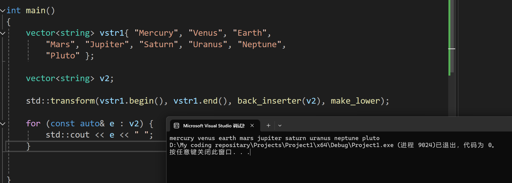

# C++ STL Cookbook 算法

​	STL实际上提供了非常非常丰富的算法库，笔者这里打算记录如下几个比较常见的STL算法库。

## std::copy

​	std::copy负责了将我们的容器的一部分拷贝到了另一部分。关于这个，并不难以猜测它的API是：

```
std::copy(start, end, std::back_inserter(container));  
```

​	前两个参数告知我们的需要提供的需要被拷贝的容器的开始和结尾。第三个参数则是说要拷贝到哪个地方。

​	当然，我们的STL存在一个变种（很典型的）std::copy_if，也就是那些满足条件才发生拷贝的函数。

```
template<typename Input_it, typename Output_it>
Output_it my_copy(Input_it begin_it, Input_it end_it, 
                  Output_it dest_it) {
    while (begin_it != end_it) {
        *dest_it++ = *begin_it++;
    }
    return dest_it;
}
```

​	这个算法一点也不难写。但是你也注意到，这样的实现是不保证检查容器是否合法的。也就是说，关于内存大小足不足够，提供的地址是否合法是需要我们来保证的。

## 将容器元素合并为一个字符串

​	有时，库中没有算法来完成手头的任务。我们可以使用迭代器，使用与算法库相同的技术，轻松编写一个。

​	例如，我们经常需要将容器中的元素与分隔符合并为一个字符串。一种常见的解决方案是使用一个简单的 for() 循环：for(auto v : c) cout << v << ', ';
这个简单的解决方案的问题在于它留下了一个尾随分隔符：

```
vector<string> greek{ "alpha", "beta", "gamma",
“delta", "epsilon" };
for(auto v : greek) cout << v << ", ";
cout << '\n';
```

输出：

```
alpha、beta、gamma、delta、epsilon，
```

​	这在测试环境中可能没问题，但在任何生产系统中，结尾的逗号都是不可接受的。

​	ranges::views 库有一个 join() 函数，但它不提供分隔符：

```
auto greek_view = views::join(greek);
```

​	这需要我们自己写一个来：

```
template<typename I>
ostream& join(I it, I end_it, ostream& o, string_view sep = "") {
    if(it != end_it) o << *it++;
    while(it != end_it) o << sep << *it++;
    return o;
}
```

​	分隔符位于第一个元素之后，位于每个连续元素之间，并在最后一个元素之前停止。这意味着我们可以在每个元素之前添加一个分隔符，跳过第一个元素，或者在每个元素之后添加一个分隔符，跳过最后一个元素。如果我们测试并跳过第一个元素，逻辑会更简单。我们在 while() 循环之前的行中执行此操作：

```
if(it != end_it) o << *it++;
```

​	一旦我们解决了第一个元素的问题，我们就可以简单地在每个剩余元素之前添加一个分隔符：

```
while(it != end_it) o << sep << *it++;
```

​	为了方便起见，我们返回 ostream 对象。这允许用户轻松地向流中添加换行符或其他对象：

## 使用 std::sort 对容器进行排序

​	如何高效地对可比较元素进行排序的问题基本上已经解决了。对于大多数应用程序来说，没有必要重新发明轮子。STL 通过 std::sort() 算法提供了一种出色的排序解决方案。虽然标准没有指定排序算法，但它确实指定了应用于 n 个元素范围时的最坏情况复杂度为 O(n log n)。

​	就在几十年前，快速排序算法被认为是大多数用途的良好折衷方案，并且通常比其他同类算法更快。今天，我们有混合算法，可以根据情况在不同方法之间进行选择，通常会动态切换算法。大多数当前的 C++ 库都使用混合方法，结合了内排序和插入排序。std::sort() 在大多数常见情况下提供出色的性能。

```
template <class RandomAccessIterator, class Compare>
void sort (RandomAccessIterator first, RandomAccessIterator last, Compare comp);
```

​	说白了，就是要求你提供需要排序的容器的起止位置，以及比较的办法是如何的函数，这里的Compare可以使用Lambda，也可以使用std::function。

​	还有一个不太常见的变种：

```
//按照默认的升序排序规则，对 [first, last) 范围的数据进行筛选并排序
void partial_sort (RandomAccessIterator first,
                   RandomAccessIterator middle,
                   RandomAccessIterator last);
//按照 comp 排序规则，对 [first, last) 范围的数据进行筛选并排序
void partial_sort (RandomAccessIterator first,
                   RandomAccessIterator middle,
                   RandomAccessIterator last,
                   Compare comp);
```

​	partial_sort() 函数会以交换元素存储位置的方式实现部分排序的。具体来说，partial_sort() 会将 [first, last) 范围内最小（或最大）的 middle-first 个元素移动到 [first, middle) 区域中，并对这部分元素做升序（或降序）排序。

​	需要注意的是，partial_sort() 函数受到底层实现方式的限制，它仅适用于普通数组和部分类型的容器。换句话说，只有普通数组和具备以下条件的容器，才能使用 partial_sort() 函数：

​	容器支持的迭代器类型必须为随机访问迭代器。这意味着，partial_sort() 函数只适用于 array、vector、deque 这 3 个容器。

​	当选用默认的升序排序规则时，容器中存储的元素类型必须支持 <小于运算符；同样，如果选用标准库提供的其它排序规则，元素类型也必须支持该规则底层实现所用的比较运算符；
partial_sort() 函数在实现过程中，需要交换某些元素的存储位置。因此，如果容器中存储的是自定义的类对象，则该类的内部必须提供移动构造函数和移动赋值运算符。

## 使用 std::transform 修改容器

​	std::transform() 函数非常强大且灵活。它是库中最常用的算法之一，它将函数或 lambda 应用于容器中的每个元素，将结果存储在另一个容器中，同时保留原始元素。鉴于其强大功能，它的使用非常简单。

```
template <class InputIterator, class OutputIterator, class UnaryOperation>
  OutputIterator transform (InputIterator first1, InputIterator last1,
                            OutputIterator result, UnaryOperation op);
	
template <class InputIterator1, class InputIterator2,
          class OutputIterator, class BinaryOperation>
  OutputIterator transform (InputIterator1 first1, InputIterator1 last1,
                            InputIterator2 first2, OutputIterator result,
                            BinaryOperation binary_op);
```

​	我们可以试着对一个数搞平方，假如我们有一个v1容器装着一串int：

```
cout << "squares:\n";
transform(v1.begin(), v1.end(), back_inserter(v2),
    [](int x){ return x * x; });
```

​	现在查看v2，就会发现他已经装上了每一个数的平方了！

​	我们下面来试试看这个：



```
#include <vector>
#include <iostream>
#include <algorithm>

using namespace std;

string make_lower(const std::string& buffer) {
    string res;
    for (const auto& e : buffer) res += std::tolower(e);
    return res;
}

int main()
{
    vector<string> vstr1{ "Mercury", "Venus", "Earth",
        "Mars", "Jupiter", "Saturn", "Uranus", "Neptune",
        "Pluto" };

    vector<string> v2;

    std::transform(vstr1.begin(), vstr1.end(), back_inserter(v2), make_lower);

    for (const auto& e : v2) {
        std::cout << e << " ";
    }
}
```

​	代码很糙，但是能用。

## 在容器中查找项目

​	算法库包含一组用于在容器中查找元素的函数。std::find() 函数及其派生函数按顺序搜索容器并返回指向第一个匹配元素的迭代器，如果没有匹配，则返回 end() 元素。

​	find() 算法适用于满足前向或输入迭代器条件的任何容器。对于此配方，我们将使用向量容器。find() 算法按顺序搜索容器中的第一个匹配元素。在此配方中，我们将介绍几个示例：
我们首先在 main() 函数中声明一个 int 向量：

```
int main() {
	const vector<int> v{ 1, 2, 3, 4, 5, 6, 7, 8, 9, 10 };
	...
}
```

现在，让我们搜索值为 7 的元素：

```
auto it1 = find(v.begin(), v.end(), 7);
if(it1 != v.end()) cout << format("found: {}\n", *it1);
else cout << "not found\n";
```

​	find() 算法有三个参数：begin() 和 end() 迭代器，以及要搜索的值。它返回一个迭代器到它找到的第一个元素，或者如果搜索未找到匹配项，则返回end() 迭代器。
输出：

```
found: 7
```

​	我们还可以搜索比标量更复杂的东西。对象需要支持相等比较运算符\==。这是一个带有operator=\=() 重载的简单结构：

```
struct City {
	string name{};
	unsigned pop{};
	bool operator==(const City& o) const {
		return name == o.name;
	}
	string str() const {
		return format("[{}, {}]", name, pop);
	}
};
```

请注意，operator=() 重载仅比较 name 成员。
我还包含了一个 str() 函数，它返回 City 元素的字符串表示形式。现在我们可以声明一个 City 元素向量：

```
const vector<City> c{
{ "London", 9425622 },
{ "Berlin", 3566791 },
{ "Tokyo",  37435191 },
{ "Cairo",  20485965 }
};
```

我们可以像搜索 int 向量一样搜索 City 向量：

```
auto it2 = find(c.begin(), c.end(), City{"Berlin"});
if(it2 != c.end()) cout << format("found: {}\n",
it2->str());
else cout << "not found\n";
```

输出：

```
found: [Berlin, 3566791]
```

如果我们想搜索 pop 成员而不是 name，我们可以使用带有谓词的 find_
if() 函数：

```c++
auto it3 = find_if(begin(c), end(c),[](const City& item)
{ return item.pop > 20000000; });

if(it3 != c.end()) 
    cout << format("found: {}\n",it3->str());
else 
    cout << "not found\n";
```

​	检查每个元素，直到找到匹配项。如果找到匹配项，它将返回指向该匹配项的迭代器。如果它到达 end() 迭代器而未找到匹配项，它将返回 end() 迭代器以指示未找到匹配项。 find() 函数有三个参数，begin() 和 end() 迭代器，以及一个搜索值。签名如下所示： 

```
template<class InputIt, class T> 
constexpr InputIt find(InputIt, InputIt, const T&) 
```

find_if() 函数使用谓词而不是值： 

```
template<class InputIt, class UnaryPredicate> 
constexpr InputIt find_if(InputIt, InputIt, UnaryPredicate)
```

## 使用 std::sample 采样数据集

​	std::sample() 算法对一系列值进行随机采样，并将采样结果填充到目标容器中。它对于分析较大的数据集非常有用，因为随机采样代表了整体数据。

​	样本集使我们能够近似估计大量数据的特征，而无需分析整个数据集。这以效率换取准确性，在许多情况下，这是一种公平的权衡。我们将使用一个具有标准正态分布的 200,000 个随机整数数组。我们将采样几百个值来创建每个值频率的直方图。
我们将从一个简单的函数开始，该函数从双精度数返回舍入后的整数。标准库缺少这样的函数，我们稍后会需要它：

```
int iround(const double& d) {
	return static_cast<int>(std::round(d));
}
```

标准库提供了几个版本的 std::round()，包括一个返回 long int 的版本。但我们需要一个 int，这是一个简单的解决方案，可以避免编译器关于缩小转换的警告，同时隐藏难看的 static_cast。
在 main() 函数中，我们将从一些有用的常量开始：

```
int main() {
constexpr size_t n_data{ 200000 };
constexpr size_t n_samples{ 500 };
constexpr int mean{ 0 };
constexpr size_t dev{ 3 };
...
}
```

​	我们有 n_data 和 n_samples 的值，分别用于数据和样本容器的大小。我们还有 mean 和 dev 的值，它们是随机值正态分布的平均值和标准差参数。
我们现在设置随机数生成器和分布对象。它们用于初始化源数据集：

```
std::random_device rd;
std::mt19937 rng(rd());
std::normal_distribution<> dist{mean, dev};
```

​	random_device 对象提供对硬件随机数生成器的访问。mt19937 类是 Mersenne Twister 随机数算法的实现，这是一种高质量算法，在大多数系统上使用我们正在使用的数据集大小时都能表现良好。normal_distribution 类提供围绕平均值的随机数分布，并提供标准差。 现在我们用 n_data 个随机 int 值填充一个数组：

```
array<int, n_data> v{};
for(auto& e : v) e = iround(dist(rng));
```

​	数组容器的大小是固定的，因此模板参数包含一个size_t 值，表示要分配的元素数量。我们使用 for() 循环来填充数组。rng 对象是硬件随机数生成器。它被传递给dist()，我们的 normal_distribution 对象，然后传递给 iround()，我们的整数舍入函数。
此时，我们有一个包含 200,000 个数据点的数组。这需要分析很多数据，
因此我们将使用 sample() 算法来抽取 500 个值的样本：

```
array<int, n_samples> samples{};
sample(v.begin(), v.end(), samples.begin(), n_samples, rng);
```

​	我们定义另一个数组对象来保存样本。这个数组的大小为 n_samples。然后我们使用 sample() 算法用 n_samples 个随机数据点填充数组。

我们创建一个直方图来分析样本。映射结构非常适合此目的，因为我们可以轻松映射每个值的频率：

```
std::map<int, size_t> hist{};
for (const int i : samples) ++hist[i];
```

for() 循环从样本容器中获取每个值并将其用作映射中的键。增量表达式 ++hist[i] 计算样本集中每个值的出现次数。
我们使用 C++20 format() 函数打印出直方图：

```
constexpr size_t scale{ 3 };
cout << format("{:>3} {:>5} {:<}/{}\n", "n", "count", "graph", scale);
for (const auto& [value, count] : hist) {
	cout << format("{:>3} ({:>3}) {}\n", value, count, string(count / scale, '*'));
}
```

​	format() 说明符（类似于 {:>3}）为一定数量的字符留出空间。尖括号指定对齐方式，右对齐或左对齐。string(count, char) 构造函数创建一个字符串，其中字符重复指定的次数，在本例中为 n 个星号字符 *，其中 n 是 count/scale，即直方图中值的频率除以比例常数。

​	这是输出的内容，看起来还是不错的！

```
  n count graph/3
 -9 (  1)
 -8 (  3) *
 -7 (  7) **
 -6 ( 10) ***
 -5 ( 16) *****
 -4 ( 25) ********
 -3 ( 44) **************
 -2 ( 47) ***************
 -1 ( 66) **********************
  0 ( 65) *********************
  1 ( 65) *********************
  2 ( 56) ******************
  3 ( 42) **************
  4 ( 17) *****
  5 ( 16) *****
  6 (  9) ***
  7 (  6) **
  8 (  3) *
  9 (  2)
```

```
#include <vector>
#include <iostream>
#include <algorithm>
#include <random>
#include <array>
#include <map>
#include <format>
using namespace std;

int iround(const double& d) {
	return static_cast<int>(std::round(d));
}


int main()
{
	constexpr size_t n_data{ 200000 };
	constexpr size_t n_samples{ 500 };
	constexpr int mean{ 0 };
	constexpr size_t dev{ 3 };


	std::random_device rd;
	std::mt19937 rng(rd());
	std::normal_distribution<> dist{ mean, dev };

	array<int, n_data> v{};
	for (auto& e : v) e = iround(dist(rng));

	array<int, n_samples> samples{};
	sample(v.begin(), v.end(), samples.begin(),
		n_samples, rng);

	std::map<int, size_t> hist{};
	for (const int i : samples) ++hist[i];

	constexpr size_t scale{ 3 };
	cout << format("{:>3} {:>5} {:<}/{}\n", "n", "count", "graph", scale);
	for (const auto& [value, count] : hist) {
		cout << format("{:>3} ({:>3}) {}\n", value, count, string(count / scale, '*'));
	}
}
```

