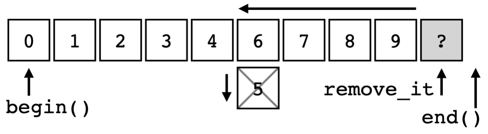
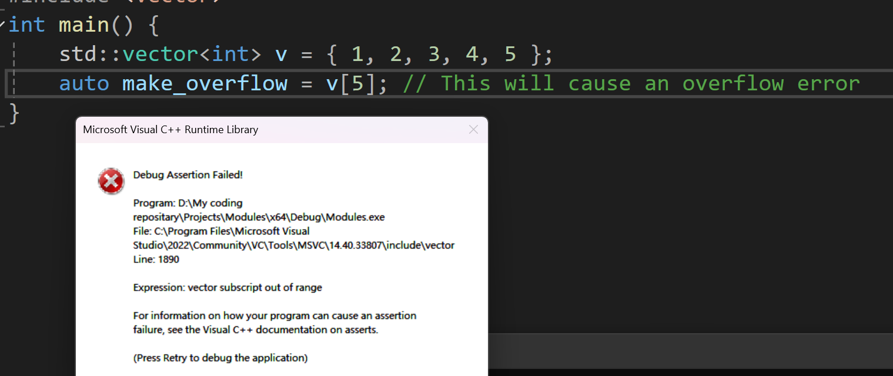
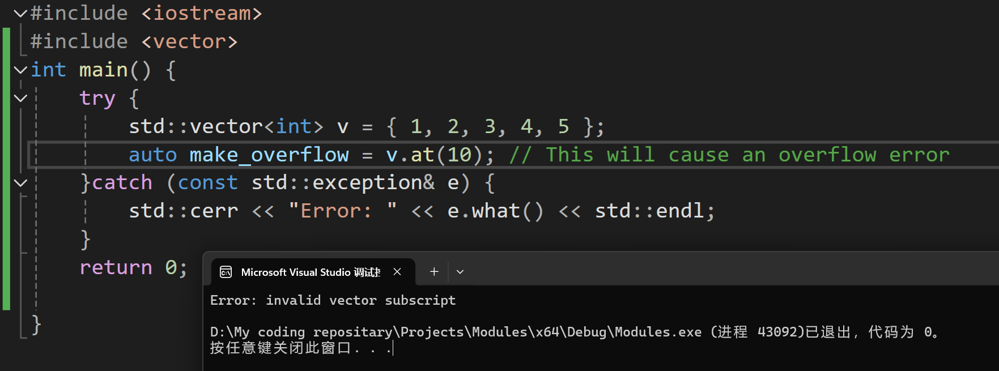
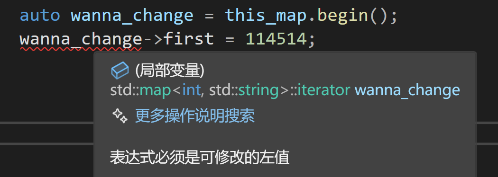
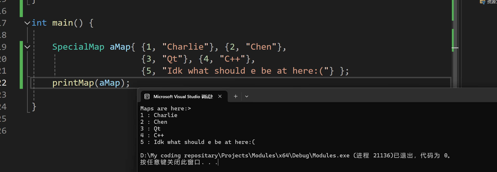
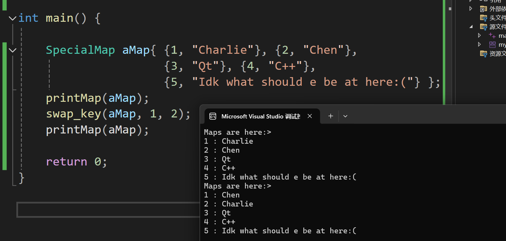
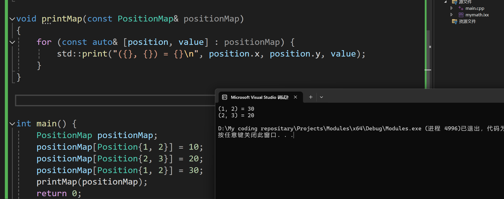
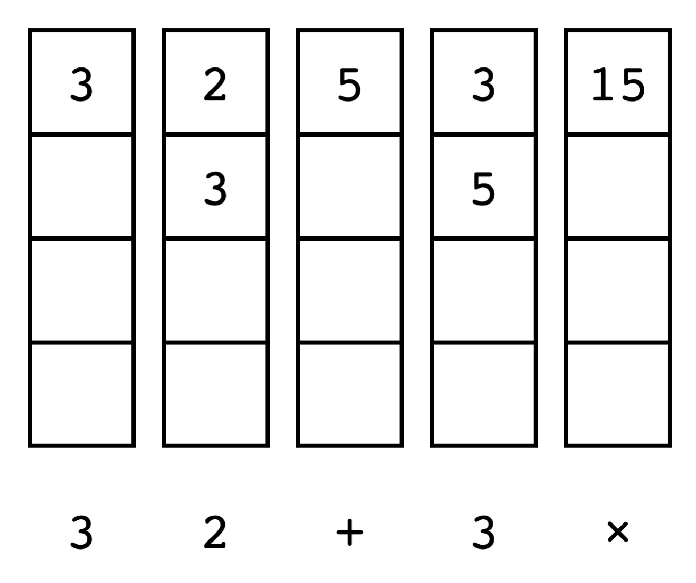

# C++ STL CookBook 6：STL Containers （I）

​	在我们开始之前，先来回顾一下传统的经典

## 顺序容器

​	顺序容器提供了一个接口，其中元素按顺序排列。虽然您可以按顺序使用元素，但其中一些容器使用连续存储，而其他容器则不使用。STL 包括这些顺序容器：

- 数组是一个固定大小的序列，在连续存储中保存特定数量的元素。一旦分配，它就不能改变大小。这是最简单、最快的连续存储容器。
- 向量就像一个可以缩小和增大的数组。它的元素是连续存储的，因此更改大小可能涉及分配内存和移动数据的费用。向量可能会保留额外的空间以减轻这种成本。从向量后面以外的任何位置插入和删除元素将触发元素的重新对齐以保持连续存储。列表是一种双向链接列表结构，允许在常数（O(1)）时间内插入和删除元素。遍历列表的时间复杂度为线性 O(n)。
- 单链接变体可用作 forward_list，它仅向前迭代。forward_list 使用的空间较少，并且比双向链接列表更高效，但缺少一些功能。
- 双端队列（通常发音为 deck）是一种双端队列。它是一个可以在两端扩展或收缩的顺序容器。双端队列允许随机访问其元素，就像向量一样，但不保证连续存储。

## 关联容器

​	关联容器将一个键与每个元素关联。元素由其键引用，而不是其在容器中的位置。 STL 关联容器包括以下容器：

- 集合是一种关联容器，其中每个元素也是其自己的键。元素通常是按某种二叉树排序的。集合中的元素是不可变的，无法修改，但可以插入和删除。集合中的元素是唯一的，不允许重复。集合根据其排序运算符按顺序迭代。
- 多集类似于具有非唯一键的集合，其中允许重复。
- unordered_set 类似于不按顺序迭代的集合。元素不按任何特定顺序排序，而是根据其哈希值进行组织以便快速访问。
- unordered_multiset 类似于具有非唯一键的 unordered_set，其中允许重复。
- 映射是键值对的关联容器，其中每个键都映射到特定值（或有效负载）。键和值的类型可能不同。键是唯一的，但值不是。映射根据其排序运算符按其键的顺序进行迭代。
  多映射类似于具有非唯一键的映射，其中允许重复的键。
- unordered_map 类似于不按顺序迭代的映射。
- unordered_multimap 类似于具有非唯一键的 unordered_map，其中允许重复。

## 容器适配器

​	容器适配器是封装底层容器的类。容器类提供一组特定的成员函数来访问底层容器元素。STL 提供以下容器适配器：

- 堆栈提供 LIFO（后进先出）接口，其中元素只能从容器的一端添加和提取。底层容器可以是向量、双端队列或列表之一。如果未指定底层容器，则默认为双端队列。
- 队列提供 FIFO（先进先出）接口，其中元素可以添加到容器的一端并从另一端提取。底层容器可以是双端队列或列表之一。如果未指定底层容器，则默认为双端队列。
- priority_queue 根据严格的弱排序将最大值元素保持在顶部。它提供对最大值元素的恒定时间查找，但插入和提取的时间对数为代价。底层容器可以是向量或双端队列之一。如果未指定底层容器，则默认为向量。

## 使用统一擦除函数从容器中删除指定项

​	在 C++20 之前，通常使用擦除-删除习语来有效地从 STL 容器中删除元素。这有点麻烦，但负担不大。通常使用这样的函数来完成任务：

```c++
template<typename Tc, typename Tv>
void remove_value(Tc & c, const Tv v) {
	auto remove_it = std::remove(c.begin(), c.end(), v);
	c.erase(remove_it, c.end());
}
```

​	嘿！实际上是这样的：

> std::remove() 函数来自 `<algorithms>` 标头。`std::remove()`搜索指定的值并通过从容器末尾向前移动元素来删除它。它不会改变容器的大小。它返回一个超出移位范围末尾的迭代器。然后，我们调用容器的 erase() 函数来删除剩余元素。

​	现在，使用新的统一擦除函数，这个两步过程简化为一步：

```
std::erase(c, 5);    // 与 remove_value() 函数相同
```

​	这个函数调用与我们上面编写的 remove_value() 函数执行相同的操作。还有一个使用谓词函数的版本。例如，要从数字容器中删除所有偶数值：

```
std::erase_if(c, [](auto x) { return x % 2 == 0; });
```

​	

​	当我们调用 remove(c.begin(), c.end(), 5) 时，算法会从 begin() 迭代器开始搜索匹配元素。对于找到的每个匹配元素，它会将下一个元素移到其位置。它会继续搜索和移动，直到到达 end() 迭代器。

​	结果是一个容器，其中所有剩余元素都在开头，没有被删除的元素，并且按其原始顺序排列。end() 迭代器保持不变，剩余元素未定义。我们可以像这样可视化操作：



​	如你所见，这就是remove_iterator的基本原理，那就是不停的拷贝元素覆盖。

## 在恒定时间内对一个对排序不敏感的vector中删除项目 

​	使用统一擦除函数（或擦除-删除习语）从向量中间删除项目需要 O(n)（线性）时间。这是因为必须从向量末尾移动元素以填补已删除项目的间隙。

​	如果向量中项目的顺序不重要，我们可以优化此过程以花费 O(1)（常数）时间。方法如下。

```
template<typename T>
void quick_delete(T& v, size_t idx) {
    if (idx < v.size()) {
        v[idx] = move(v.back());
        v.pop_back();
    }
}
```

​	如你所见，其实很简单，就是简单的交换一下最后一个元素和目标元素然后直接使得长度减一，但是注意！必须是对那些排序不敏感的！

## 如果不确定自己访问容器会不会越界，那就使用`.at`方法而不是`[]`

​	是的，我们一直喜欢这样写来访问容器的元素：

```
vector v{ 19, 71, 47, 192, 4004 };
auto & i = v[2];
```

​	当然，一些人会争论我们应该这样写更好：

```
auto & i = v.at(2);
```

​	两者的区别何在呢？答案是：

​	**at() 函数会进行边界检查，而 [] 运算符则不会。**

​	这是有意为之，因为它允许 [] 运算符与原始 C 数组保持兼容性。让我们更详细地研究一下。

​	这里，我们来直接使用 [] 运算符直接访问向量中的第三个元素。与 C++ 中的大多数顺序对象一样，索引从 0 开始，因此第三个元素是数字 2。

​	向量有五个元素，编号为 0 到 4。如果我尝试访问元素编号 5，则会超出向量的边界：

```
vector v{ 19, 71, 47, 192, 4004 };
auto & i = v[5];
cout << format("element is {}\n", i);
element is 0
```

​	这个结果非常具有欺骗性。这是一个常见的错误，因为人类倾向于从 1 开始计数，而不是从 0 开始。但不能保证向量末尾之后的元素具有任何特定值。更糟糕的是，[] 运算符会默默地允许您写入超出向量末尾的位置：

```
vector v{ 19, 71, 47, 192, 4004 };
v[5] = 2001;
auto & i = v[5];
cout << format("element is {}\n", i);
element is 2001
```

​	**现在已经写入不受我们控制的内存**，对于MSVC的库，他会给我们惊喜：



​	**越界内存访问是安全漏洞的主要原因之一。**

​	解决方案是尽可能使用 at() 成员函数，而不是 [] 运算符：

```
vector v{ 19, 71, 47, 192, 4004 };
auto & i = v.at(5);
cout << format("element is {}\n", i);
```

现在我们得到一个运行时异常：



​	代码编译时没有错误，但 at() 函数会检查容器的边界，并在您尝试访问这些边界之外的内存时抛出运行时异常。
​	`[]` 运算符和 `at()` 成员函数执行相同的工作；它们根据容器元素的索引位置提供对容器元素的直接访问。 [] 运算符无需任何边界检查即可完成此操作，因此在某些迭代密集型应用程序中，它可能会稍微快一点。

​	好了，不说废话了：对于那些可以完全保证不会越界的代码段，使用`[]`无可厚非。但是笔者的态度是：**总有人喜欢在酒吧里点炒饭，或者是-1杯啤酒**，不要小看输入的多样性。所以，at() 函数应该是您的默认选择。

​	写过汇编的朋友都知道，比较两个数只需要几个CPU周期（啊哈！咱们不谈分支预测的事情，但是类似likely的操作总是好的，不是吗），但它是一种廉价的保险。对于大多数应用程序来说，其好处是值得的。

​	更加严肃的是，对于那些不允许因为内存overflow践踏而终止，或者希望程序自发的抛出异常传递而不是限制错误的编程理念的朋友更加应该使用at函数。他省去您做限制的心智负担。

## 让vector在插入删除的时候仍然保证是有序的

​	首先，STL的确提供了一种办法来检查我们的目标容器是不是有序的：[std::is_sorted - cppreference.com](https://en.cppreference.com/w/cpp/algorithm/is_sorted)，也就是std::is_sorted。我们当然可以这样做：

```
#include <iostream>
#include <vector>
#include <algorithm>
int main() {
	std::vector v{ 1, 4, 3 };
	if (std::is_sorted(v.begin(), v.end())) {
		std::cout << "Vector is sorted\n";
	}else {
		std::cout << "Vector is not sorted\n";
	}
	
	std::sort(v.begin(), v.end());
	
	if (std::is_sorted(v.begin(), v.end())) {
		std::cout << "Vector is sorted\n";
	}
	else {
		std::cout << "Vector is not sorted\n";
	}
	return 0;
}
```

结果显而易见：

```
Vector is not sorted
Vector is sorted
```

​	当然还可以添加谓词，这里就不再赘述了

​	我们现在关心的是：如果我们向元素中插入一个新元素（删除如何呢？想一想我们有必要考虑删除的case吗？），我们能不能保证原来的数组还是有序的呢？

​	答案是，可以做到，但是我们需要组合我们的STL算法完成这个工作！

```
template<typename C, typename E>
void insert_sorted(C& c, const E& e) {
    const auto pos{ std::ranges::lower_bound(c, e) };
    c.insert(pos, e);
}
```

​	这个算法有一定的通用局限性：这是因为std::sort() 算法（及其派生算法）需要支持随机访问的容器。并非所有 STL 容器都满足此要求（std::list是位列其中的）

## 高效地将元素插入到映射中

​	映射类Map是一个关联容器，它包含键值对，其中键在容器内必须是唯一的。这里有多种方法可以填充映射容器。

```
map<string, string> m;
```

​	嗯哼，这就是说我们的Key和Value都是字符串，字符串之间的映射。一般的，我们喜欢使用 [] 运算符添加元素：

```
m["Miles"] = "Trumpet"
```

​	或者使用 insert() 成员函数：

```
m.insert(pair<string,string>("Hendrix", "Guitar"));
```

​	还可以使用 emplace() 成员函数：

```
m.emplace("Krupa", "Drums");
```

​	笔者倾向于使用 emplace() 函数。在 C++11 中引入的 emplace() 使用完美转发来为容器放置（就地创建）新元素。参数直接转发到元素构造函数。这快速、高效且易于编码。

​	虽然它肯定比其他选项有所改进，但 emplace() 的问题在于，即使不需要，它也会构造一个对象。这涉及调用构造函数、分配内存和移动数据，然后丢弃该临时对象。为了解决这个问题，**C++17 提供了新的 try_emplace() 函数，该函数仅在需要时构造值对象。这对于大型对象或许多位置尤其重要**。

​	映射的每个元素都是一个键值对。在对结构中，元素被命名为第一和第二，但它们在映射中的目的是键和值。我倾向于将值对象视为有效载荷，因为这通常是映射的要点。要搜索现有键，try_emplace() 函数必须构造键对象；这是无法避免的。但它不需要构造有效载荷对象，除非需要将其插入到映射中。

## 高效的修改map中的keys

​	映射是一种存储键值对的关联容器。容器按键排序。**键必须是唯一的，并且是 const 限定的，因此不能更改。**例如，如果我填充映射并尝试更改键，则会在编译时收到错误：

```
std::map<int, string> this_map {
	{1, "foo"}, {2, "bar"}, {3, "baz"}
};

auto wanna_change = this_map.begin();
wanna_change->first = 114514;
```



​	如果您需要重新排序地图容器，可以使用extract() 方法交换键来实现。作为 C++17 的新增功能，extract() 是地图类及其派生类中的成员函数。它允许从序列中提取地图的元素，而无需触及有效负载。提取后，键不再是 const 限定的，可能会被修改。

​	下面，我们来演示一下这个extract方法应该如何使用！

```c++
using SpecialMap = std::map<int, std::string>;
void printMap(const SpecialMap& m){
	std::cout << "Maps are here:> \n";
    for(const auto& [aInt, aString] : m)
    {
        std::print("{} : {}\n", aInt, aString);
    }
}
```

​	现在您可以测试一下好不好用这个函数。

```c++
SpecialMap aMap {
    {1, "Charlie"}, {2, "Chen"}, {3, "Qt"}, {4, "C++"}, {5, "Idk what should e be at here:("}
};
printMap(aMap);
```



​	下面才是正文，我们交换map两个键值对的key：

```
template<typename Map, typename Key>
bool swap_key(Map& m, const Key& key1, const Key& key2)
{
// 取出我们的
	auto node1 = m.extract(key1);
	auto node2 = m.extract(key2);
	if (!node1 ||!node2)
	{
		return false;
	}
	swap(node1.key(), node2.key());
	m.insert(std::move(node2));
	m.insert(std::move(node1));
	return true;
}
```

​	小小的测试一下：



## 使用带有自定义键的 unordered_map

​	对于有序映射，键的类型必须是可排序的，这意味着它必须至少支持小于 < 比较运算符。假设您想要使用具有不可排序的自定义类型的关联容器。例如，向量 (0, 1) 不小于或大于 (1, 0)，它只是指向不同的方向。在这种情况下，您仍然可以使用 unordered_map 类型。让我们看看如何做到这一点。

​	我们现在呢，把Key设置为一个坐标：

```
struct Position {
    int x{};
    int y{};
    friend bool operator==(const Position& lhs, const Position& rhs){
    	return lhs.x == rhs.x && lhs.y == rhs.y;
    }
};

using PositionMap = std::unordered_map<Position, int>;
```

​	我们知道unordered_map还需要第三个模板参数：

```
template<
    class Key,
    class T,
    class Hash = std::hash<Key>,
    class KeyEqual = std::equal_to<Key>,
    class Allocator = std::allocator< std::pair<const Key, 
      T> >
> class unordered_map;
```

​	所以，实际上我们还需要提供将Key映射为哈希值的办法。

​	所以我们需要重载一下...

```
namespace std {
    template<>
    struct hash<Coord> {
        size_t operator()(const Coord& c) const {
            return static_cast<size_t>(c.x)
                 + static_cast<size_t>(c.y);
        }
    };
}
```



​	现在我们就可以这样使用我们的Map With self defined Key了。

```
void printMap(const PositionMap& positionMap)
{
    for (const auto& [position, value] : positionMap) {
        std::print("({}, {}) = {}\n", position.x, position.y, value);
    }
}
```

## 使用set来unique我们的输入

​	集合容器是一种关联容器，其中每个元素都是一个值，用作键。集合中的元素按排序顺序维护，不允许重复的键。集合容器经常被误解，与更通用的容器（例如向量和映射）相比，它的用途更少且更具体。集合的一个常见用途是从一组值中过滤重复项。

​	作为示例，我们将从标准输入中读取单词并过滤掉重复项。

​	我们首先为 istream 迭代器定义一个别名。我们将使用它从命令行获取输入。

```
using input_it = istream_iterator<string>;
```

​	在 main() 函数中，我们将为我们的单词定义一个集合：

```
int main() {
set<string> words;
```

​	该集合定义为一组字符串元素。我们定义一对迭代器以与 inserter() 函数一起使用：

```
input_it it{ cin };
input_it end{};
```

​	end 迭代器用其默认构造函数初始化。这称为流结束迭代器。当我们的输入结束时，此迭代器将与 cin 迭代器进行比较。inserter() 函数用于将元素插入到集合容器中：

```
copy(it, end, inserter(words, words.end()));
```

我们使用 std::copy() 方便地从输入流中复制单词。现在我们可以打印出我们的集合来查看结果：

```
for(const string & w : words) {
	cout << format("{} ", w);
}
cout << '\n';
```

​	我们可以通过将一堆单词传送到其输入来运行该程序：

```
➜  echo "a a b b b c c c c hello world hello" | .\Modules.exe
a
b
c
hello
world
```

​	现在我们看：该集合已消除重复项并保留了插入的单词的排序列表。

​	集合容器是核心。它仅包含唯一元素。当您插入重复项时，该插入将失败。因此，您最终会得到每个唯一元素的排序列表。但这不是此配方唯一有趣的部分。istream_iterator 是一个从流中读取对象的输入迭代器。我们像这样实例化输入迭代器：

```
istream_iterator<string> it{ cin };
```

​	现在我们有一个来自 cin 流的字符串类型的输入迭代器。每次我们取消引用此迭代器时，它都会从输入流中返回一个单词。

## 带有双端队列的简单 RPN 计算器 

​	RPN（逆波兰表示法）计算器是一种基于堆栈的计算器，使用后缀表示法，其中运算符位于操作数之后。它通常用于打印计算器，尤其是 HP 12C，这是有史以来最受欢迎的电子计算器。 熟悉其操作方式后，许多人更喜欢使用 RPN 计算器。（自 20 世纪 80 年代初首次推出 HP 12C 和 16C 以来，我一直在使用它们。）例如，使用传统的代数符号，要将 1 和 2 相加，您需要输入 1 + 2。使用 RPN，您需要输入 1 2 +。运算符位于操作数之后。 使用代数计算器，您需要按 = 键来表示您想要结果。使用 RPN 计算器时，这没有必要，因为运算符会立即处理，起到双重作用。另一方面，RPN 计算器通常 需要按下 Enter 键才能将操作数推送到堆栈上。 我们可以使用基于堆栈的数据结构轻松实现 RPN 计算器。 



​	这就是一个例子。RPN 的一个优点是您可以将操作数留在堆栈上以供将来计算，从而减少对单独内存寄存器的需求。考虑 (9×6)+(2×3) 的情况：

​	对于此实现**，我们将使用双端队列容器作为堆栈。为什么不使用堆栈容器？堆栈类是一个容器适配器，它使用另一个容器（通常是双端队列）进行存储。就我们的目的而言，堆栈与双端队列相比没有任何明显的优势。**而双端队列允许我们迭代并显示 RPN 堆栈，就像纸带计算器一样。
我们将把 RPN 计算器封装在一个类中。在这里使用类有几个优点。封装提供了安全性、可重用性、可扩展性和干净的接口。我们将我们的类称为 RPN：

```
class RPN {
	deque<double> deq{};
	constexpr static double zero{0.0};
	constexpr static double inf
	{ std::numeric_limits<double>::infinity() };
	...  // 公共和私有成员放在这里
};
```

​	双端队列数据存储名为 deq\_，位于类的私有区域中以保护它。这是我们存储 RPN 堆栈的地方。
​	zero_ 常量在整个类中使用，既作为返回值，又作为比较操作数。 inf_ 常量用于除以零的错误。 这些常量被声明为 constexpr static，因此它们不会在每个实例中占用空间。

我们不需要显式的构造函数或析构函数，因为双端队列类
管理自己的资源。因此，我们的公共接口仅包含三个函数：

```
public:
	// 处理操作数/运算符
	double op(const string & s) {
		if(is_numeric(s)) {
			double v{stod(s, nullptr)};
			deq.push_front(v);
			return v;
		}
		else 
			return optor(s);
	}

	// 清空堆栈
	void clear() {
		deq.clear();
	}

	// 打印堆栈
	string get_stack_string() const {
	string s{};
	for(auto v : deq_) {
		s += format("{} ", v);
	}
	return s;
}
```

​	double op() 函数是 RPN 类的主要入口点。它接受一个字符串，带有数字或运算符。如果是数字，则将其转换为双精度数并推送到堆栈上。如果是运算符，我们调用 optor() 来执行操作。这是该类的主要逻辑。
​	void clear() 函数只是在双端队列上调用 clear() 来清空堆栈。
​	最后，字符串 get_stack_string() 函数以字符串形式返回堆栈的内容。

​	在私有部分，我们有支持实用程序使接口工作。 pop_get2() 函数从堆栈中弹出两个操作数并将它们作为一对返回。我们将其用作运算符的操作数：

```
pair<double, double> pop_get2() {
	if(deq_.size() < 2) return {zero, zero};
	double v1{deq.front()};
	deq.pop_front();
	double v2{deq.front()};
	deq.pop_front();
	return {v2, v1};
}
```

​	is_numeric() 函数检查字符串是否完全是数字。我们还允许使用小数和字符。

```
bool is_numeric(const string& s) {
	for(const char c : s) {
	if(c != '.' && !std::isdigit(c)) return false;
	}
	return true;
}
```

​	optor() 函数执行运算符。我们使用 map 容器将运算符映射到相应的 lambda 函数。

```
double optor(const string& op) {
	map<string, double (*)(double, double)> opmap {
		{"+", [](double l, double r){ return l + r; }},
		{"-", [](double l, double r){ return l - r; }},
		{"*", [](double l, double r){ return l * r; }},
		{"/", [](double l, double r){ return l / r; }},
		{"^", [](double l, double r){ return pow(l, r); }},
		{"%", [](double l, double r)
		{ return fmod(l, r); }}
	};
i	if(opmap.find(op) == m.end()) 
		return zero;
	auto [l, r] = pop_get2();
    // don’t divide by zero
    if(op == "/" && r == zero_) deq.push_front(inf_);
    else deq.push_front(opmap.at(op)(l, r));
    return deq.front();
```

