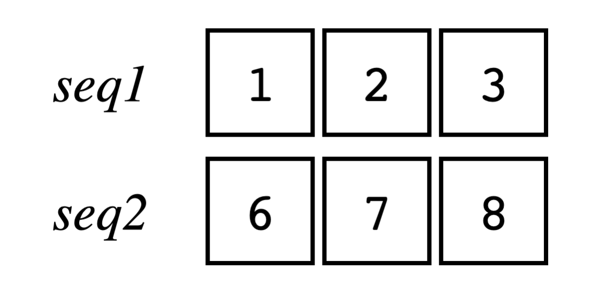

# STL C++ CookBook 7:迭代器简单 论

## 兼容的迭代器 

​	迭代器是 STL 中的一个基本概念。**迭代器使用 C 指针的语义实现，使用相同的递增、递减和解引用**运算符。 大多数 C/C++ 程序员都熟悉指针习语，它允许 std::sort 和 std::transform 等算法在原始内存缓冲区以及 STL 容器上工作。

​	笔者认为，迭代器实际上就是C指针的一次抽象。指针毕竟还是跟底层而不是业务相近。因此，对他进行规范和抽象实际上是有意的


​	几乎可以说，每一个C++的程序员都知道，STL 使用迭代器来导航其容器类的元素。大多数容器都包含 begin() 和 end() 迭代器。这些迭代器通常作为返回迭代器对象的成员函数实现。begin() 迭代器指向初始容器元素，end() 迭代器指向最终元素之后，这就让end() 迭代器可以充当长度不确定的容器的哨兵。

​	大多数 STL 容器都定义了自己的特定迭代器类型。例如，对于 int 向量：

```
std::vector<int> v;
```

​	迭代器类型将定义为：

```
std::vector<int>::iterator v_it;
```

您可以看到这很容易失控。如果我们有一个 string 向量的向量：

```
std::vector<std::vector<int, std::string>> v;
```

它的迭代器类型将是：

```
std::vector<std::vector<int, std::string>>::iterator v_it;
```

​	幸运的是，C++11 为我们提供了自动类型推断和 auto 类型。通过使用 auto，我们很少需要使用完整的迭代器类型定义。例如，如果我们需要在 for 循环中使用迭代器，则可以使用 auto 类型：

```
for(auto v_it = v.begin(); v_it != v.end(); ++v_it) {
	cout << *v_it << '\n';
}
```

​	请注意使用解引用运算符 * 来访问迭代器中的元素。这与解引用指针的语法相同：

```
const int a[]{ 1, 2, 3, 4, 5 };
size_t count{ sizeof(a) / sizeof(int) };
for(const int* p = a; count > 0; ++p, --count) {
	cout << *p << '\n';
}
```

这也意味着您可以使用基于范围的 for 循环和原始数组：

```
const int a[]{ 1, 2, 3, 4, 5 };
for(auto e : a) {
	cout << e << '\n';
}
```

​	或者是STL容器下：

```
std::vector<int> v{ 1, 2, 3, 4, 5 };
for(auto e : v) {
    cout << e << '\n';
}
```

​	可能对上面的写法感到陌生，但实际上，他就是下面代码的抽象：

```
{
    auto begin_it{ std::begin(container) };
    auto end_it{ std::end(container) };
    for ( ; begin_it != end_it; ++begin_it) {
        auto e{ *begin_it };
        cout << e << '\n';
    } 
}
```

​	你可能想到for_each，是的，其实就是for_each。

​	值得各位注意的是，这样的range-base算法对目标有所要求，他必须是可以迭代的！有范围的，意味着它可以被`std::begin()`找到起始，被`std::end()`找到末尾。因此原生数组也是可以用range-base-for的

​	迭代器分层，看看这张图：


​	这些类别是分层的，其中功能更强大的迭代器继承了功能较弱的迭代器的功能。换句话说，输入迭代器可以读取并递增一次。前向迭代器具有输入迭代器的功能，并且可以递增多次。双向迭代器具有这些功能，还可以递减。
​	输出迭代器可以写入并递增一次。如果任何其他迭代器也可以写入，则将其视为可变迭代器。

## 迭代器概念

​	概念和约束是 C++20 中的新概念。概念只是一个命名约束，它限制了模板函数或类的参数类型，并帮助编译器选择适当的专业化。

​	现在，由于概念concept的出现，很多事情实际上更依赖接口而不是父类，因此：


| **概念名称**             | **描述**                                                     | **中文翻译**                                                 |
| ------------------------ | ------------------------------------------------------------ | ------------------------------------------------------------ |
| indirectly_readable      | An iterator can be read by the dereference operator, `*`. This includes pointers, smart pointers, and input iterators. | 迭代器可以通过解引用运算符 `*` 进行读取。这包括指针、智能指针和输入迭代器。 |
| indirectly_writable      | The object reference of the iterator is writable.            | 迭代器的对象引用是可写的。                                   |
| weakly_incrementable     | This can be incremented with `++`, but does not preserve equality. For example, where `a == b`, `++a` may not equal `++b`. | 该迭代器可以使用 `++` 进行递增，但不保证等式的保持。例如，当 `a == b` 时，`++a` 可能不等于 `++b`。 |
| incrementable            | This can be incremented with `++` and equality is preserved. | 该迭代器可以使用 `++` 进行递增，并保持等式。                 |
| input_or_output_iterator | An iterator can be incremented and dereferenced. Every iterator must satisfy this concept. | 迭代器可以递增和解引用。每个迭代器都必须满足这个概念。       |
| sentinel_for             | A sentinel iterator is used to find the end of an object of indeterminate size, such as an input stream. | 哨兵迭代器用于查找不确定大小对象的结束位置，如输入流。       |
| sized_sentinel_for       | A sentinel iterator may be used with another iterator and the `-` operator to determine its distance in constant time. | 尺寸哨兵迭代器可与另一个迭代器配合使用，并通过 `-` 运算符确定其距离，且该操作在常数时间内完成。 |
| input_iterator           | An iterator that may be read and incremented.                | 可以读取和递增的迭代器。                                     |
| output_iterator          | An iterator that may be written to and incremented.          | 可以写入和递增的迭代器。                                     |
| forward_iterator         | This modifies `input_iterator` to include incrementable.     | 该迭代器将 `input_iterator` 扩展为包括可递增的功能。         |
| bidirectional_iterator   | This modifies `forward_iterator` by adding the ability to decrement with the `--` operator. It preserves equality. | 该迭代器将 `forward_iterator` 扩展为支持使用 `--` 运算符递减，并保持等式。 |
| random_access_iterator   | This modifies `bidirectional_iterator` by adding support for the `+`, `+=`, `-`, `-=`, and `[]` operators. | 该迭代器将 `bidirectional_iterator` 扩展为支持 `+`、`+=`、`-`、`-=` 和 `[]` 运算符。 |
| contiguous_iterator      | This modifies `random_access_iterator` to indicate contiguous storage. | 该迭代器将 `random_access_iterator` 扩展为表示连续存储。     |

## 使用迭代器来填充STL的容器

​	迭代器本质上是一种抽象。它具有特定的接口并以特定的方式使用。但除此之外，它只是代码，可以用于其他目的。迭代器适配器是一个看起来像迭代器但执行其他操作的类。STL 附带了各种迭代器适配器。它们通常与算法库一起使用，非常有用。STL 迭代器适配器通常分为三类：

- 插入迭代器或插入器，用于将元素插入容器。
- 流迭代器从流中读取和写入。
- 反向迭代器反转迭代器的方向。

​	先简单引入一个方便的打印：

```
void printc(const auto & v, const string_view s = "") {
    if(s.size()) cout << format("{}: ", s);
    for(auto e : v) cout << format("{} ", e);
    cout << '\n';
}
```

```
int main() {
    deque<int> d1{ 1, 2, 3, 4, 5 };
    deque<int> d2(d1.size());
    copy(d1.begin(), d1.end(), d2.begin());
    printc(d1);
    printc(d2, "d2 after copy"); 
}
```

​	我们定义了具有五个 int 值的双端队列 d1，以及具有可容纳相同数量元素的空间的 d2。copy() 算法不会分配空间，因此 d2 必须有足够的空间容纳元素。copy() 算法需要三个迭代器：begin 和 end 迭代器指示要从中复制的元素范围，begin 迭代器指示目标范围。它不会检查迭代器以确保它们有效。（如果尝试在向量中不分配空间，您将收到分段错误。）我们在两个容器上调用 printc() 来显示结果。

​	copy() 算法并不总是方便。有时您想要复制元素并将其添加到容器的末尾。如果有一个为每个元素调用 push_back() 的算法就好了。这就是迭代器适配器有用的地方。让我们在 main() 的末尾添加一些代码：

```
copy(d1.begin(), d1.end(), back_inserter(d2));
printc(d2, "d2 after back_inserter");
```

输出：

```
d2 after back_inserter: 1 2 3 4 5 1 2 3 4 5
```

​	back_inserter() 是一个插入迭代器适配器，它为每个分配给它的项调用 push_back()。您可以在任何需要输出迭代器的地方使用它。

​	这里还有一个 front_inserter() 适配器，用于在容器的前面插入元素：

```
deque<int> d3{ 47, 73, 114, 138, 54 };
copy(d3.begin(), d3.end(), front_inserter(d2));
printc(d2, "d2 after front_inserter");
```

输出：

```
d2 after front_inserter: 54 138 114 73 47 1 2 3 4 5 1 2 3
4 5
```

​	front_inserter() 适配器使用容器的 push_front() 方法在前面插入元素。请注意，目标中的元素是反转的，因为每个元素都插入在前一个元素之前。
解引用如果我们想在中间插入，我们可以使用 inserter() 适配器：

```
auto it2{ d2.begin() + 2};
copy(d1.begin(), d1.end(), inserter(d2, it2));
printc(d2, "d2 after middle insert");
```

输出：

```
d2 after middle insert: 54 138 1 2 3 4 5 114 73 47 ...
```

inserter() 适配器采用迭代器作为插入开始点。
解引用流迭代器便于读取和写入 iostream 对象，
这是 ostream_iterator()：

```
cout << "ostream_iterator: ";
copy(d1.begin(), d1.end(), ostream_iterator<int>(cout));
cout << '\n';
```

输出：

```
ostream_iterator: 12345
```

​	大多数容器都包含反向适配器，作为函数成员rbegin() 和 rend()：

```
for(auto it = d1.rbegin(); it != d1.rend(); ++it) {
	cout << format("{} ", *it);
}
cout << '\n';
```

输出：

```
5 4 3 2 1
```

​	迭代器适配器通过环绕现有容器来工作。当您使用容器对象调用适配器（如 back_inserter()）时：

```
copy(d1.begin(), d1.end(), back_inserter(d2));
```

​	适配器返回一个模拟迭代器的对象，在本例中为 std::back_insert_iterator 对象，每次为迭代器分配值时，该对象都会调用容器对象上的 push_back() 方法。这样，适配器就可以代替迭代器使用，同时执行其有用的任务。
istream_adapter() 还需要一个哨兵。哨兵会发出不确定长度的迭代器的结尾信号。从流中读取时，在到达末尾之前，您不知道流中有多少个对象。当流到达末尾时，哨兵将与迭代器进行比较，发出流结尾的信号。

​	istream_adapter() 将在没有参数的情况下调用时创建一个哨兵：

```
auto it = istream_adapter<string>(cin);
auto it_end = istream_adapter<string>(); // 创建哨兵
```

​	这块就会方便的让我们迭代：

```
for(auto it = istream_iterator<string>(cin);
        it != istream_iterator<string>();
        ++it) {
    cout << format("{} ", *it);
}
cout << '\n';
```

## 将一些序列算法包装成可迭代的

​	我们来试试这段代码：

```
#include <iostream>
#include <vector>
#include <string_view>
#include <format>

using namespace std;

void printc(const auto& v, const string_view s = "") {
	if (s.size()) cout << format("{}: ", s);
	for (auto e : v) cout << format("{} ", e);
	cout << '\n';
}

class FibGenerator {
public:
	using fib_t = unsigned long long;
	fib_t stop_at{};
	fib_t count{};
	fib_t a_{};
	fib_t b_{ 1 };

	FibGenerator(fib_t stop_at = 0) : stop_at(stop_at) {}

	FibGenerator& operator++() {
		do_fib();
		count++;
		return *this;
	}	

	FibGenerator operator++(int) {
		FibGenerator temp = *this;
		do_fib();
		count++;
		return temp;
	}

	bool operator==(const FibGenerator& other) const {
		return count == other.count;
	}

	bool operator!=(const FibGenerator& other) const {
		return count!= other.count;
	}

	fib_t operator*() const {
		return b_;
	}

	const FibGenerator& begin() const {
		return *this;
	}

	const FibGenerator& end() const {
		/*
			Sentinel object to indicate the end of the sequence.
			Yet the end is stop_at val, but we cannot use that as the object
			is not default-constructible. So we create a new object with
			stop_at val and return it as the end.
		*/
		auto sentinel = FibGenerator();
		sentinel.count = stop_at;
		return sentinel;
	}

	fib_t size() const {
		return stop_at;
	}

private:
	constexpr void do_fib() {
		const fib_t old = b_;
		b_ += a_;
		a_ = old;
	}
};

int main() {

	printc(FibGenerator(10), "Fibonacci numbers up to 10");

	return 0;
}

```

​	这段代码将会打印前10个斐波那契数列的值。这些代码定义了一个前向迭代器最基本的接口，意味着可以运作！

```
    fib_t operator*() const;
    constexpr fib_generator& operator++();
    fib_generator operator++(int);
    bool operator!=(const fib_generator &o) const;
    bool operator==(const fib_generator&o) const;
    const fib_generator& begin() const;
    const fib_generator end() const;
```

​	如果我们想让我们的生成器与算法库一起工作，我们需要提供特征别名。它们位于公共部分的顶部：

```
public:
using iterator_concept  = std::forward_iterator_tag;
using iterator_category = std::forward_iterator_tag;
using value_type         = std::remove_cv_t<fib_t>;
using difference_type   = std::ptrdiff_t;
using pointer              = const fib_t*;
using reference            = const fib_t&;
```

​	现在我们可以将我们的生成器与算法一起使用：

```
fib_generator fib(10);
auto x = ranges::views::transform(fib,
[](unsigned long x){ return x * x; });
printc(x, "平方：");
```

​	这使用 ranges::views 版本的 transform() 算法来对每个值求平方。生成的对象可以在任何可以使用迭代器的地方使用。我们从 printc() 调用中获得以下输出：

```
squared:: 1 1 4 9 25 64 169 441 1156 3025
```

## 构建 zip 迭代器适配器 

​	许多脚本语言都包含将两个序列压缩在一起的函数。典型的 zip 操作将接受两个输入序列，并为两个输入中的每个位置返回一对值： 考虑两个序列的情况 - 它们可以是容器、迭代器或初始化列表：



​	咱们想要做的就是把这两个打包到一起。


```
template<typename T>
class zip_iterator {
    using val_t = typename T::value_type;
    using ret_t = std::pair<val_t, val_t>;
    using it_t = typename T::iterator;
    it_t ita_{};
	it_t itb_{};
	// for begin() and end() objects
	it_t ita_begin_{};
	it_t itb_begin_{};
	it_t ita_end_{};
	it_t itb_end_{};
	
	zip_iterator(it_t ita, it_t itb) : ita_{ita}, itb_{itb} {}
public:
    using iterator_concept  = std::forward_iterator_tag;
    using iterator_category = std::forward_iterator_tag;
    using value_type        = std::pair<val_t, val_t>;
    using difference_type   = long int;
    using pointer           = const val_t*;
    using reference         = const val_t&;
    zip_iterator(T& a, T& b) : 
    ita_{a.begin()},
    itb_{b.begin()},
    ita_begin_{ita_},
    itb_begin_{itb_},
    ita_end_{a.end()},
    itb_end_{b.end()}{}
    zip_iterator& operator++() {
    	++ita_;
    	++itb_;
    	return *this;
	}
	bool operator==(const zip_iterator& o) const {
    	return ita_ == o.ita_ || itb_ == o.itb_;
	}
	bool operator!=(const zip_iterator& o) const {
    	return !operator==(o);
	}
	ret_t operator*() const {
    	return { *ita_, *itb_ };
	}
	zip_iterator begin() const
    { return zip_iterator(ita_begin_, itb_begin_); }
	zip_iterator end() const
    { return zip_iterator(ita_end_, itb_end_); }
```

