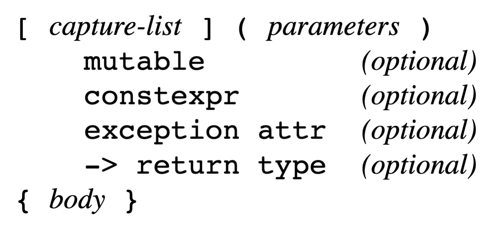

# C++STL CookBook 系统理解Lambda系列（1）

​	在C++11中，我们引入了一个有用的语法：lambda表达式。此功能允许在表达式上下文中使用匿名函数。Lambda 可用于函数调用、容器、变量和其他表达式上下文。

```
auto demo = []{ return "Hello\n"; };
```

​	我们调用这个表达式，就会得到一个"Hello\n"的字符串了

```
cout << demo();
```

​	Lambda有意义的点在于，它可以变成一个函数对象传递：

```
func(demo);
```

​	甚至是Lambda调用Lambda

```
const auto la = []{ return "Hello\n"; };
const auto lb = [](auto a){ return a(); };
cout << lb(la);
```

## 闭包

​	术语“闭包”通常适用于任何匿名函数。严格来说，闭包是允许在其词汇范围之外使用符号的函数。

```
auto la = []{ return "Hello\n"; };
```

​	方括号用于指定捕获列表。捕获是可从 lambda 主体范围内访问的外部变量。如果我尝试使用外部变量而不将其列为捕获，我将收到编译错误：

```
const char * Greeting{ "Hello\n" };
const auto la = []{ return Greeting; };
cout << la();
```

​	当我尝试使用 GCC 编译此代码时，我收到以下错误：

```
In lambda function:
error: 'greeting' is not captured
```

​	也就是说，使用Lambda的第一件事情就是要指明这个东西可以认识使用那些东西。

```
const char * greeting{ "Hello\n" };
const auto la = [greeting]{ return greeting; };
cout << la();
```

​	现在试试，可以工作了

​	这种捕获自身范围之外的变量的能力使 lambda 成为闭包。人们以不同的方式使用这个术语，这很好，只要我们能够相互理解。不过，了解这个术语的含义还是有好处的。

​	Lambda 表达式使我们能够编写良好、干净的通用代码。它们允许使用函数式编程模式，我们可以在其中将 lambda 用作算法甚至其他 lambda 的函数式参数。

## 使用 lambda 实现作用域可重用代码

​	可以定义和存储 Lambda 表达式以供以后使用。它们可以作为参数传递、存储在数据结构中，并在具有不同参数的不同上下文中调用。它们与函数一样灵活，但具有数据的移动性。让我们从一个简单的程序开始，我们将使用它来测试 lambda 表达式的各种配置：

• 我们首先定义一个 main() 函数并使用它来试验 lambda：

```
int main() {
	... // 代码在此处
}
```

• 在 main() 函数中，我们将声明几个 lambda。lambda 的基本定义需要一对方括号和一个大括号中的代码块：

```
auto one = [](){ return "one"; };
auto two = []{ return "two"; };
```

​	请注意，第一个示例 one 在方括号后包含括号，而第二个示例 two 没有。空参数括号通常包含在内，但并非总是必需的。返回类型由编译器推断。我可以使用 cout 或 format 调用这些函数，或者在任何采用 C 字符串的上下文中调用这些函数：

```
cout << one() << '\n';
cout << format("{}\n", two());
```

​	在许多情况下，编译器可以通过自动类型推断确定返回类型。否则，您可以使用 -> 运算符指定返回类型：

```
auto one = []() -> const char * { return "one"; };
auto two = []() -> auto { return "two"; };
```

Lambda 使用尾随返回类型语法。它由 -> 运算符和后跟类型规范组成。如果未指定返回类型，则将其视为 auto。如果使用尾随返回类型，则需要参数括号。

​	让我们定义一个 lambda 来打印出其他 lambda 的值：

```
auto p = [](auto v) { cout << v() << '\n'; };
```

​	p() lambda 需要一个 lambda（或函数）作为其参数 v，并在其函数主体中调用它。auto 类型参数使此 lambda 成为缩写模板。在C++20 之前，这是模板化 lambda 的唯一方法。从 C++20 开始，您可以在捕获括号后指定模板参数（不带 template 关键字）。这与模板参数等效：

```
auto p = []<template T>(T v) { cout << v() << '\n'; };
```

​	缩写的 auto 版本更简单，更常见。它适用于大多数目的。	

​	现在我们可以在函数调用中传递一个匿名 lambda：

```
p([]{ return "lambda call lambda"; });
```

输出为：
lambda call lambda

​	如果需要将参数传递给匿名 lambda，我们可以将它们放在 lambda 表达式后的括号中：

```
<< [](auto l, auto r){ return l + r; }(47, 73)
<< '\n';
```

​	函数参数 47 和 73 在函数体后的括号中传递给匿名 lambda。您可以通过将变量作为方括号中的捕获包含在 lambda 的外部范围来访问它们：

```
int num{1};
p([num]{ return num; });
```

​	或者您可以通过引用捕获它们：

```
int num{0};
auto inc = [&num]{ num++; };
for (size_t i{0}; i < 5; ++i) {
	inc();
}
cout << num << '\n';
```

​	您还可以定义一个维持其状态的局部捕获变量：

```
auto counter = [n = 0]() mutable { return ++n; };
for (size_t i{0}; i < 5; ++i) {
	cout << format("{}, ", counter());
}
cout << '\n';
```

输出：

```
1, 2, 3, 4, 5,
```

​	mutable 说明符允许 lambda 修改其捕获。Lambda 默认为 const 限定。与尾随返回类型一样，任何说明符都需要参数括号。
​	lambda 支持两种类型的默认捕获：

```
int a = 47;
int b = 73;
auto l1 = []{ return a + b; };
```

​	如果我尝试编译此代码，则会收到一个错误，其中包含：注意：lambda 没有默认捕获，一种默认捕获类型由等号表示：

```
auto l1 = [=]{ return a + b; };
```

​	这将捕获 lambda 范围内的所有符号。等号执行通过复制捕获。它将捕获对象的副本，就像它们是使用赋值运算符复制的一样。另一种默认捕获使用 & 符号进行引用捕获：

```
auto l1 = [&]{ return a + b; };
```

​	说了这样多，我下面来集合起来，谈谈Lambda的结构

### Lambda的结构示意



​	lambda 表达式唯一必需的部分是捕获列表和主体，主体可以为空：

```
[]{}
```

​	这是最小的 lambda 表达式。它不捕获任何内容，也不执行任何操作。


#### 捕获列表

​	捕获列表指定我们捕获的内容（如果有）。它不能省略，但可以为空。我们可以使用 [=] 通过复制捕获所有变量，或使用 [&] 通过引用捕获所有变量，在 lambda 范围内。您可以通过在括号中列出单个变量来捕获它们：

```
[a, b]{ return a + b; }
```

​	指定的捕获默认为复制。您可以使用引用运算符通过引用捕获：

```
[&a, &b]{ return a + b; }
```

​	当您通过引用捕获时，您可以修改引用的变量。您不能直接捕获对象成员。您可以捕获 this 或*this 以解引用类成员。

#### 参数

​	与函数一样，参数在括号中指定：

```
[](int a, int b){ return a + b };
```

​	如果没有参数、说明符或尾随返回类型，则括号是可选的。说明符或尾随返回类型使括号成为必需：

```
[]() -> int { return 47 + 73 };
```

#### mutable 修饰符（可选）

​	除非您指定 mutable 修饰符，否则 lambda 表达式默认为 const 限定。这允许它在 const 上下文中使用，但这也意味着它不能修改其任何通过复制捕获的变量。例如：

```
[a]{ return ++a; };
```

​	这将无法编译，并显示如下错误消息：

```
在 lambda 函数中：
错误：只读变量“a”的增量
使用 mutable 修饰符，lambda 不再是 const 限定的，并且捕获的变量可能会更改：[a]() mutable { return ++a; };
```

#### constexpr 说明符（可选）

​	您可以使用 constexpr 明确指定您希望将 lambda 视为常量表达式。这意味着它可能在编译时进行评估。如果 lambda满足要求，即使没有说明符，也可能被视为 constexpr。

#### exception 属性（可选）

​	您可以使用 noexcept 说明符声明您的 lambda 不会引发任何异常。

#### 尾随返回类型（可选）

​	默认情况下，lambda 返回类型是从 return 语句推导出来的，就好像它是自动返回类型一样。您可以选择使用 -> 运算符指定尾随返回类型：

```
[](int a, int b) -> long { return a + b; };
```

如果您使用任何可选说明符或尾随返回类型，则参数括号是必需的。
注意：某些编译器（包括 GCC）允许省略空参数括号，即使有说明符或尾随返回类型也是如此。这是不正确的。根据规范，参数、说明符和尾随返回类型都是 lambda 声明符的一部分，并且当包含任何部分时，括号是必需的。这可能会在 C++ 的未来版本中发生变化。

## 将Lambda用作STL算法库的谓词

​	使用 lambda 作为算法库的谓词算法库中的某些函数需要使用谓词函数。谓词是一个函数（或函子或 lambda），它测试条件并返回true/false.

​	首先，让我们创建一个用作谓词的函数。谓词采用一定数量的参数并返回布尔值。count_if() 的谓词采用一个参数：

```
bool is_div4(int i) {return i % 4 == 0; }
```

​	此谓词检查 int 值是否可以被 4 整除。在 main() 中，我们将定义一个 int 值向量，并使用它来测试我们的谓词函数和 count_if()：

```
int main() {
	const vector<int> v{ 1, 7, 4, 9, 4, 8, 12, 10, 20 };
	int count = count_if(v.begin(), v.end(), is_div4);
	cout << format("numbers divisible by 4: {}\n",count);
}
```

输出如下：

```
numbers divisible by 4: 5
```

（5 个可被 4 整除的数字是：4、4、8、12 和 20。）

​	count_if() 算法使用谓词函数来确定要计数序列中的哪些元素。它以每个元素作为参数来调用谓词，并且只有当谓词返回 true 时才计数元素。
​	我们还可以使用函子作为谓词：

```
struct is_div4 {
	bool operator()(int i) {
		return i % 4 == 0;
	}
};
```

这里唯一的变化是我们需要使用类的实例作为谓词：

```
int count = count_if(v.begin(), v.end(), is_div4());
```

​	函子的优点是它可以携带上下文并访问类和实例变量。在 C++11 引入 lambda 表达式之前，这是使用谓词的常见方式。

​	使用 lambda 表达式，我们可以同时拥有两全其美的优势：函数的简单性和函子的强大功能。我们可以使用 lambda 作为变量：

```
auto is_div4 = [](int i){ return i % 4 == 0; };
int count = count_if(v.begin(), v.end(), is_div4);
```

​	或者我们可以使用匿名 lambda：

```
int count = count_if(v.begin(), v.end(),
[](int i){ return i % 4 == 0; });
```

​	我们可以通过将 lambda 包装在一个函数中来利用 lambda 捕获，并使用该函数上下文生成具有不同参数的相同 lambda：

```
auto is_div_by(int divisor) {
	return [divisor](int i){ return i % divisor == 0; };
}
```

​	此函数返回一个带有捕获上下文中除数的谓词 lambda。然后我们可以将该谓词与 count_if() 一起使用：

```
for( int i : { 3, 4, 5 } ) {
	auto pred = is_div_by(i);
	int count = count_if(v.begin(), v.end(), pred);
	cout << format("numbers divisible by {}: {}\n", i, count);
}
```

每次调用 is_div_by() 都会返回一个与 i 具有不同除数的谓词。现在我们得到这个输出：

```
numbers divisible by 3: 2
numbers divisible by 4: 5
numbers divisible by 5: 2
```


​	实际上，函数指针的类型表示为指针后跟函数调用 () 运算符：

```
void (*)()
```

​	您可以声明一个函数指针并使用现有函数的名称对其进行初始化：

```
void (*fp)() = func;
```

​	一旦声明，函数指针就可以被取消引用并像函数本身一样使用：

```
func();   // 执行 func 操作
```

​	lambda 表达式具有与函数指针相同的类型：

```
void (*fp)() = []{ cout << "foo\n"; };
```

​	这意味着无论您在哪里使用具有特定签名的函数指针，您都可以使用具有相同签名的 lambda。这样，函数指针、函子和 lambda 就可以互换使用：

```
bool (*fp)(int) = is_div4;
bool (*fp)(int) = [](int i){ return i % 4 == 0; };
```

​	由于这种互换性，count_if() 等算法可以接受函数、函子或 lambda，并期望具有特定函数签名的谓词。这适用于任何使用谓词的算法。

## 使用 std::function 作为多态包装器

​	类模板 std::function 是函数的薄多态包装器。它可以存储、复制和调用任何函数、lambda 表达式或其他函数对象。在您想要存储对函数或 lambda 的引用的地方，它可以派上用场。使用std::function 允许您将具有不同签名的函数和 lambda 存储在同一个容器中，并且它维护 lambda 捕获的上下文。

​	我们首先声明三个不同类型的容器：

```
int main() {
	deque<int> d;
	list<int> l;
	vector<int> v;
```

​	这些容器（双端队列、列表和向量）将由模板 lambda 引用。我们将声明一个简单的 print_c lambda 函数来打印出容器：

```
auto print_c = [](auto& c) {
for(auto i : c) cout << format("{} ", i);
	cout << '\n';
};
```

​	现在我们声明一个返回匿名 lambda 的 lambda：

```
auto push_c = [](auto& container) {
	return [&container](auto value) {container.push_back(value);};
};
```

​	push_c lambda 引用一个容器，该容器由匿名 lambda 捕获。匿名 lambda 调用
捕获的容器上的 push_back() 成员。push_c 的返回值是匿名 lambda。现在我们声明一个 std::function 元素向量，并用 push_c() 的三个实例填充它：

```
const vector<std::function<void(int)>>
consumers { push_c(d), push_c(l), push_c(v) };
```

​	初始化程序列表中的每个元素都是对 push_c lambda 的函数调用。push_c 返回匿名 lambda 的实例，该实例通过函数包装器存储在向量中。 push_c lambda 使用三个容器 d、l 和 v 调用。容器作为捕获与匿名 lambda 一起传递。

​	现在我们循环遍历消费者向量，并调用每个 lambda 元素10 次，在每个容器中用整数 0-9 填充三个容器：

```
for(auto &consume : consumer) {
	for (int i{0}; i < 10; ++i) {
		consume(i);
	}
}
```

```
0 1 2 3 4 5 6 7 8 9
0 1 2 3 4 5 6 7 8 9
0 1 2 3 4 5 6 7 8 9
```

​	Lambda 通常与间接一起使用，此配方就是一个很好的例子。例如，push_c lambda 返回一个匿名 lambda：

```
auto push_c = [](auto& container) {
	return [&container](auto value) {
		container.push_back(value);
	};
};
```

​	这个匿名 lambda 是存储在向量中的：

```
const vector<std::function<void(int)>>
consumers { push_c(d), push_c(l), push_c(v) };
```

​	这是消费者容器的定义。它用三个元素初始化，其中每个元素都用对 push_c 的调用初始化，它返回一个匿名lambda。存储在向量中的是匿名 lambda，而不是 push_c lambda。
​	向量定义使用 std::function 类作为元素的类型。函数构造函数接受任何可调用对象并将其引用存储为函数目标：

```
template< class F >
function( F&& f );
```

​	当其函数调用 () 运算符被调用时，函数对象会使用预期参数调用目标函数：

```
for(auto &c : consumer) {
	for (int i{0}; i < 10; ++i) {
		c(i);
	}
}
```

​	这会调用存储在消费者容器中的每个匿名 lambda 10 次，从而填充 d、l 和 v 容器。

## 使用递归连接 lambda

​	您可以使用简单的递归函数堆叠 lambda，以便一个 lambda 的输出是下一个 lambda 的输入。这创建了一种基于另一个函数构建一个函数的简单方法。
​	我们首先定义连接函数 concat()：

```
template <typename T, typename ...Ts>
auto concat(T t, Ts ...ts) {
	if constexpr (sizeof...(ts) > 0) {
		return [&](auto ...parameters) {
			return t(concat(ts...)(parameters...));
		};
	} else  {
		return t;
	}
}
```

​	此函数返回一个匿名 lambda，该 lambda 又会再次调用该函数，直到参数包耗尽。

​	在 main() 函数中，我们创建了几个 lambda 表达式并用它们调用 concat() 函数：

```
int main() {
	auto twice = [](auto i) { return i * 2; };
	auto thrice = [](auto i) { return i * 3; };
	auto combined = concat(thrice, twice,
	std::plus<int>{});
	std::cout << format("{}\n", combined(2, 3));
}
```

​	concat() 函数使用三个参数调用：两个 lambda 表达式和std::plus() 函数。随着递归的展开，函数从右到左调用，从 plus() 开始。
​	plus() 函数接受两个参数并返回总和。 plus() 的返回值 传递给 twice()，其返回值传递给 thrice()。然后使用 format() 将结果打印到控制台：

```
30
```

​	concat() 函数很简单，但由于递归和返回的 lambda 的间接性，可能会造成混淆：

```
template <typename T, typename ...Ts>
auto concat(T t, Ts ...ts) {
if constexpr (sizeof...(ts) > 0) {
	return [&](auto ...parameters) {
			return t(concat(ts...)(parameters...));
		};
	} else  {
		return t;
	}
}
```

​	concat() 函数使用参数包调用。对于省略号，sizeof...运算符返回参数包中的元素数量。这用于测试递归的结束。

## 使用逻辑合取将谓词组合起来

​	此示例将 lambda 包装在函数中，以创建自定义合取以用于算法谓词。copy_if() 算法需要一个带有一个参数的谓词。在此配方中，我们将从其他三个 lambda 创建一个谓词 lambda：
​	首先，我们将编写 Combine() 函数。此函数返回一个 lambda，用于 copy_if() 算法：

```
template <typename F, typename A, typename B>
auto Combine(F binary_func, A a, B b) {
	return [=](auto param) {
		return binary_func(a(param), b(param));
	};
}
```

​	combine() 函数需要三个函数参数 - 一个二元合取和两个谓词 - 并返回一个使用两个谓词调用合取的 lambda。
​	在 main() 函数中，我们创建用于 Combine() 的 lambda：

```
int main() {

	auto begins_with = [](const string &s){
		return s.find("a") == 0;
	};
	auto ends_with = [](const string &s){
		return s.rfind("b") == s.length() - 1;
	};
	auto bool_and = [](const auto& l, const auto& r){
		return l && r;
	};
```

​	begins_with 和 ends_with lambda 是简单的过滤谓词，分别用于查找以“a”开头和以“b”结尾的字符串。 bool_and lambda 是连词。现在我们可以使用combine()调用copy_if算法：

```
std::copy_if(istream_iterator<string>{cin}, {},
ostream_iterator<string>{cout, " "},
combine(bool_and, begins_with, ends_with));
cout << '\n';
```

​	combine()函数返回一个将两个谓词与合取词组合在一起的lambda。
输出如下所示：

```
$ echo aabb bbaa foo bar abazb | ./conjunction
aabb abazb
```

​	std::copy_if()算法需要一个带有一个参数的谓词函数，但我们的合取词需要两个参数，每个参数都需要一个参数。我们用一个返回专门针对此上下文的 lambda 的函数来解决这个问题：

```
template <typename F, typename A, typename B>
auto Combine(F binary_func, A a, B b) {
	return [=](auto param) {
		return binary_func(a(param), b(param));
	};
}
```

​	combine() 函数从三个参数创建一个 lambda，每个参数都是一个函数。返回的 lambda 采用谓词函数所需的一个参数。现在我们可以使用 Combine() 函数调用 copy_if()：

```
std::copy_if(istream_iterator<string>{cin}, {},
ostream_iterator<string>{cout, " "},
combine(bool_and, begins_with, ends_with));
```

​	这会将组合的 lambda 传递给算法，以便它可以在该上下文中运行。

## 使用相同输入调用多个 lambda

​	通过将 lambda 包装在函数中，您可以轻松创建具有不同捕获值的 lambda 的多个实例。这允许您使用相同输入调用 lambda 的不同版本。
​	这是一个将值包装在不同类型的括号中的 lambda 的简单示例：我们将从创建包装函数 braces() 开始：

```
auto braces (const char a, const char b) {
	return [a, b](const char v) {
cout << format("{}{}{} ", a, v, b);
};
}
```

​	braces() 函数包装一个返回三值字符串的 lambda，其中第一个值和最后一个值是作为捕获传递给 lambda 的字符，中间值作为参数传递。
​	在 main() 函数中，我们使用 braces() 创建四个 lambda，使用四组不同的括号：

```
auto a = braces('(', ')');
auto b = braces('[', ']');
auto c = braces('{', '}');
auto d = braces('|', '|');
```

现在我们可以从一个简单的 for() 循环中调用 lambda：

```
for( int i : { 1, 2, 3, 4, 5 } ) {
	for( auto x : { a, b, c, d } ) x(i);
	cout << '\n';
}
```

​	这是两个嵌套的 for() 循环。外循环只是从 1 计数到 5，并将一个整数传递给内循环。内循环使用括号调用 lambda。
​	两个循环都使用初始化列表作为基于范围的 for() 循环中的容器。这是一种循环遍历一小组值的便捷技术。
​	我们程序的输出如下所示：

```
(1) [1] {1} |1|
(2) [2] {2} |2|
(3) [3] {3} |3|
(4) [4] {4} |4|
(5) [5] {5} |5|
```

输出显示每个括号组合中的每个整数。
工作原理...
这是一个如何使用 lambda 包装器的简单示例。 braces() 函数使用传递给它的括号构造一个 lambda：

```
auto braces (const char a, const char b) {
	return [a, b](const auto v) {
		cout << format("{}{}{} ", a, v, b);
	};
}
```

通过将 braces() 函数参数传递给 lambda，它可以返回具有该上下文的 lambda。因此，主函数中的每个赋值都带有这些参数：

```
auto a = braces('(', ')');
auto b = braces('[', ']');
auto c = braces('{', '}');
auto d = braces('|'，'|');
```

