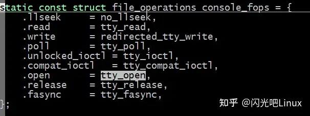
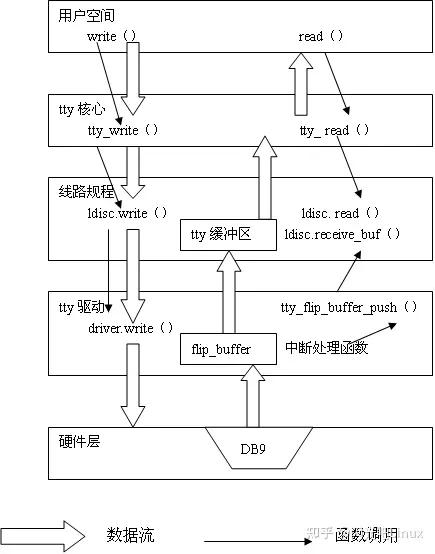

# 优质博客总结

## 1.C++ 更常用 string 还是 char* 呢？

> [(99+ 封私信 / 48 条消息) C++ 更常用 string 还是 char* 呢？ - 知乎 (zhihu.com)](https://www.zhihu.com/question/483774144/answer/2493158216)

### 引论

​	对于字符串的常量而言，尽可能的少去使用`std::string`定义常量：这是因为

> - `std::string` 会引发[堆内存](https://www.zhihu.com/search?q=堆内存&search_source=Entity&hybrid_search_source=Entity&hybrid_search_extra={"sourceType"%3A"answer"%2C"sourceId"%3A2493158216})分配；
> - `std::string`[析构函数](https://www.zhihu.com/search?q=析构函数&search_source=Entity&hybrid_search_source=Entity&hybrid_search_extra={"sourceType"%3A"answer"%2C"sourceId"%3A2493158216})非平凡，全局对象销毁顺序难以预测，存在生命周期结束后被访问的风险（例如该 `std::string` 被其他全局对象引用）等。

​	在现代C++中，使用这种方式来定义一个字符串比较合适：

```c++
constexpr char someString[] = "hello, world";
```

​	使用 `constexpr char[]`本身没任何问题，只是很容易在调用中退化为 `const char*`，导致取字符串长度的复杂度变为 O(n)。为了避免计算长度的开销，调用参数需要一路都额外带一个 `int` 或者 `size_t` 的长度。

​	一些其他代码使用 `std::string_view`（自C++17引入）：

```cpp
constexpr std::string_view kMyConstString = "hello world";
constexpr auto kMyConstString = "hello world"sv;  // using namespace std::literals
```

​	`std::string_view`自带很多方法，自然比 `constexpr char[]`好用很多，也有 O(1) 的方法获取长度。

​	通过[字面量](https://www.zhihu.com/search?q=字面量&search_source=Entity&hybrid_search_source=Entity&hybrid_search_extra={"sourceType"%3A"answer"%2C"sourceId"%3A2493158216})字符串创建的 `std::string_view` 其内部数据是 NUL 结尾的，但是 NUL 字符在其 `size()` 之外，略有点怪怪的。但是一般意义上的 `std::string_view` **不保证是 NUL 结尾**的，导致用起来总需要多留个心眼。这种区别可能会导致开发时拿到一个 `std::string_view` 后不知道该不该信任它有个 NUL 字符而会脑裂，同时也会给 reviewer 带来负担。

### 函数参数

遵循以下原则：

- 自底向上扩散
- 最底没有要求或必然无法自底一致时，优先考虑 `std::string_view`
- 若无特殊必要，避免 `(const) char*`，通常都可以使用 `std::string_view`替代

​	**首先是自底向上扩散，是指使用最底层第一个不可变（e.g. 别人的库）的调用参数作为参数类型传递**。如果调用链靠下的部分是 `const std::string&` 这样的参数类型，那么直接保持 `const std::string&` 到你负责的最外层即可。底层决定了参数必然需要转换成为 `std::string`，假如调用链中间混进了 `std::string_view`，就会导致需要从 `std::string_view`转换 `std::string`，产生不必要的拷贝。

​	一个常见例子是，如果我的一个函数是查询一个 `std::map<std::string, Foo>`，这就决定了其查询 key 必然是 `std::string` 类型，查询的 `find()`函数接收 `const std::string&`，遵循 “[自底向上扩散](https://www.zhihu.com/search?q=自底向上扩散&search_source=Entity&hybrid_search_source=Entity&hybrid_search_extra={"sourceType"%3A"answer"%2C"sourceId"%3A2493158216})“ 原则，一路都应该是 `const std::string&`。也就不难发现，所有查 `std::string` 为 key 的关联容器的函数，其参数最好都是 `const std::string&`。如果是调用别人的接口，接口使用了 `const std::string&`，则也是同理。

​	有一个例外是，如果底层的 `std::string` 参数是值传递（而非引用、指针传递）的，例如：

```cpp
void Foo(std::string s);
```

​	那么无论如何也都会拷贝一次，此时也可以用 `std::string_view` 做调用链传递。

​	在 `std::string_view` 和 `const char*` 之间，鉴于 ：

- 【`const char*`数据 + `int`/`size_t`长度 】的组合可以和 `std::string_view` 低成本互转，不用担心发生数长度、拷贝；
- `std::string_view` 可以低成本转 `const char*` ；
- 单独的 `const char*` 无法低成本转 `std::string_view`，需要数一次长度 。

考虑到 `std::string_view` 用起来方便很多，**通常在调用链上使用 `std::string_view` 是更好的。**

只有一种特殊情况，如果调用链底层的接口比较奇特，只接收单独的 `const char*` （可能是写死了在内部数长度），**并且调用参数来源也是个 `const char*` 不知为何也不带长度，那么遵循 “自底向上扩散” 原则效能最佳，调用链过程中避免多数一次长度。**

### （非静态）类成员变量

**`std::string` 与 `std::string_view` 的最本质区别是，前者持有字符串数据所在内存的所有权，并负责管理其生命周期，而后置只是对内存中已有数据的引用。**因而，仅在被引用字符串能够保证生命周期足够，且生命周期内不会被修改时，可以通过使用 `std::string_view` 保存其引用或其片段的引用。

由于类（或者说对象）通常都是各自管理自己的成员，会发现，上述使用 `std::string_view` 的条件在类成员变量中很难满足，就算见到，与其烧脑子梳理生命周期担心以后会不会别人改崩，还是在遇到性能瓶颈之前先用 `std::string` 是更保险的做法，不要用正确性换取性能。相比其他场合，类成员变量使用 `std::string_view` 通常风险高出很多。一般会优先考虑共享语义，例如 `std::shared_ptr<std::string>`，并在可能并发读写场合再加个锁。

### 临时变量

思路类似于（非静态）类[成员变量](https://www.zhihu.com/search?q=成员变量&search_source=Entity&hybrid_search_source=Entity&hybrid_search_extra={"sourceType"%3A"answer"%2C"sourceId"%3A2493158216})，但类/对象通常承载了生命周期，而一个函数中的临时变量通常没有这种职责，因此相比之下，临时变量有更多的场合适合使用 `std::string_view`。

具体来说，如果[函数调用](https://www.zhihu.com/search?q=函数调用&search_source=Entity&hybrid_search_source=Entity&hybrid_search_extra={"sourceType"%3A"answer"%2C"sourceId"%3A2493158216})，要么是同步无并发的，要么有只读并发且能保证被引用数据生命周期的，就可以使用 `std::string_view` 来引用数据。我倾向于仅在同步无并发的环境使用——并发环境冷不丁某一天可能就不是只读并发，或者生命周期有变化了。

在一些需要对字符串做算法处理的场合，例如很多[字符串算法](https://www.zhihu.com/search?q=字符串算法&search_source=Entity&hybrid_search_source=Entity&hybrid_search_extra={"sourceType"%3A"answer"%2C"sourceId"%3A2493158216})题，需要对字符串的字串进行[递归](https://www.zhihu.com/search?q=递归&search_source=Entity&hybrid_search_source=Entity&hybrid_search_extra={"sourceType"%3A"answer"%2C"sourceId"%3A2493158216})操作，若使用 `std::string` 作为参数进行递归，不可避免有大量拷贝。屏幕前的看官可以翻翻 leetcode 提交记录，如果有使用 `std::string` 的递归，可以试着改成 `std::string_view`，对比一下运算时间和内存，通常优势是比较明显的。

## 散记

> [每日面经（C++） - 知乎 (zhihu.com)](https://zhuanlan.zhihu.com/p/620426130)

### 1.Class和struct有什么区别

在C++中，class和struct是两种用于定义自定义类型的关键字。它们的主要区别在于默认的访问控制权限和基类继承的默认类型

1. 默认访问控制权限：class的成员默认是private，而struct的成员默认是public。

例如：

```text
class A {
    int x; // 默认是private
};
struct B {
    int y; // 默认是public
};
```

2. 基类继承的默认类型：用class定义的结构体默认是private继承，而用struct定义的结构体默认是public继承。

例如：

```text
class A {
    int x;
};
class B : A { // 默认是private继承
    int y;
};
struct C {
    int x;
};
struct D : C { // 默认是public继承
    int y;
};
```

除了以上默认的区别，class和struct在其他方面是相同的，它们都可以定义成员函数、构造函数、析构函数、静态成员变量等，并且它们可以互相继承。

### 2.右值引用了解多少

右值引用是C++11新增的特性，其使用符号是&&。右值引用主要用于实现移动语义和完美转发，能够有效提高程序的性能和可读性。

右值引用的本质是通过标记一个表达式为右值来实现的。右值是指在表达式中只能作为值使用的对象，例如字面量、临时对象、返回右值引用的函数等。右值引用的特点是能够接受右值，但不能接受左值。同时，右值引用具有可修改性，可以用于实现移动构造函数、移动赋值运算符和完美转发等操作。

移动语义是指在对象被移动（例如函数返回值）时，避免不必要的对象拷贝和内存分配。当有大量的对象需要被拷贝或分配内存时，移动语义可以极大地提高程序的性能。

完美转发是指在将参数转发给其他函数时，保留参数的值和类型信息，避免不必要的类型转换或信息损失。完美转发可以在模板中使用，提供通用的函数接口和更好的代码复用性。

需要注意的是，右值引用和左值引用不同，使用时需要特别小心，避免产生不必要的对象拷贝或内存操作。

### 3.vector和list底层实现了解多少

vector和list都是C++标准库中的容器类型。

vector是一种动态数组，可以自动扩容。底层的实现使用了连续的内存空间，因此对于随机访问非常高效。在进行添加和删除元素时，需要对数组进行重新分配内存的操作，因此会有一定的开销。

list是一种双向链表，可以在任意位置进行快速添加和删除操作，但是随机访问元素的效率比vector低。链表的每个节点都有指向前后两个节点的指针，因此需要额外的内存存储指针信息。

需要注意的是，vector和list的使用场景有所不同。如果需要频繁进行随机访问，那么vector会更加高效；如果需要频繁进行添加和删除操作，那么list会更加高效。同时，vector和list都有自己的迭代器实现，可以方便地进行遍历操作。

### 4.C++的虚函数有什么优势和劣势

C++中的虚函数有如下优势：

1. 实现多态性：通过虚函数，可以在运行时动态绑定对象和函数的关系，实现多态性的特性。这种特性可以使得程序更加灵活和可扩展。
2. 可以通过基类的指针或引用来访问派生类的对象：通过将派生类指针或引用转换成基类指针或引用来进行对象访问，可以实现基于抽象接口的基于类型的操作，这对于实现一些具有层次结构的数据结构，例如树、图等非常有用。

但同时，虚函数还存在以下劣势：

1. 运行时开销：虚函数的实现需要运行时动态确定函数的地址，因此在执行过程中需要进行额外的开销，从而使程序运行速度变慢。
2. 内存开销：需要增加一个虚函数表，为每个对象分配一个指针来指向虚函数表，因此会额外增加内存开销和开发复杂度。
3. 安全性问题：在某些情况下可以通过访问对象的虚函数表来实现攻击。例如，利用虚函数表的地址进行缓冲区溢出等攻击方式。

### 5.虚函数可以内联吗

虚函数可以被内联，但是只有在特定情况下才能内联。如果在调用虚函数的地方已经确定了需要调用的函数版本，那么编译器可以内联虚函数。这种情况下，虚函数的表现和非虚函数一样。

然而，当虚函数被声明为内联时，这并不意味着该函数一定会被内联。具体来说，如果虚函数被任何函数调用，这个函数带有动态绑定的行为，此时虚函数是不能被内联的，因为编译器无法确定需要调用哪个版本的函数。此时，虚函数必须按照常规的调用机制被调用。

因此，内联虚函数的效果可以被视为一个优化技术，只有当编译器确定要调用的函数版本时，才能被内联。

### 6.虚函数性能上除了对虚函数表的查询外，还有什么其他的开销吗

除了对虚函数表的查询开销之外，还存在一定的间接寻址开销。当我们利用指向子类类型对象的基类指针或引用来调用虚函数时，程序需要进行一定的额外计算，以找到正确的函数地址。通过虚函数表的查找，可以根据当前对象的实际类型来确定调用的是哪个函数，但是直接调用非虚函数则不需要做这个工作。因此，虚函数调用的开销相对于非虚函数调用可能会略微增加。

### 7.不同机器上的进程之间怎么通信

不同机器上的进程之间可以通过网络进行通信。常用的网络通信方式有 TCP/IP、UDP、HTTP 等。其中 TCP/IP 是一种可靠的面向连接的通信协议，它要求通信双方先建立连接，然后再进行数据传输。UDP 是一种不可靠的无连接通信协议，它不会像 TCP/IP 那样进行三次握手建立连接，直接发送数据报文，可能会丢失。HTTP 是在 TCP/IP 上的一个应用层协议，支持客户端和服务器之间的数据传输。此外，还可以使用更高级的通信协议，如 RPC（远程过程调用），它可以让进程之间的通信更加简单、方便。

### [http://8.int](https://link.zhihu.com/?target=http%3A//8.int)型指针和long型指针有什么区别

int型指针和long型指针的区别在于它们分别指向不同的变量类型。

int型指针指向的是int类型的变量或数组的首地址，而long型指针则指向long类型的变量或数组的首地址。因为int和long在不同的平台上所占的字节数可能不同，所以使用int型指针和long型指针时需要特别注意，防止出现指针指向错误的情况。

此外，由于long的长度可能比int更长，使用long型指针可能会浪费一些内存，而使用int型指针则可以节省内存资源。所以在具体实现时，应该根据具体的需求和数据类型来选择使用适当的指针类型。

### 9.数组和链表的区别，什么时候使用链表，什么时候使用链表

数组和链表是两种常见的数据结构，它们各自有不同的特点，适用于不同的场景。

数组是一段连续的内存区域，可以存储一定数量相同类型的元素。数组的随机访问速度非常快，因为可以通过下标直接计算出元素在内存中的位置。但数组的长度一旦确定，就不能再改变，如果要添加或删除元素，需要进行大量的数据移动操作。

链表是由一系列节点构成的数据结构，每个节点包含数据项和指向下一个节点的指针。由于节点不一定是连续的，所以链表的长度可以动态增长或缩短。但相对于数组，链表的随机访问比较耗时，因为需要从头开始遍历链表。而对于插入或删除一个节点，链表只需要改变相邻节点的指针，不需要像数组那样进行大量的数据移动操作。

所以，通常情况下，如果需要频繁进行随机访问或者操作固定长度的数据，可以选择使用数组；而如果需要频繁插入或删除元素，或者数据长度不确定，可以使用链表。

需要注意的是，链表的优势在于插入和删除元素操作，但如果需要频繁遍历整个数据结构，链表的性能相对较差。同时，链表的额外空间开销比数组大，因为每个节点都需要一个指针指向下一个节点。所以，在选择数据结构的时候需要根据具体情况进行权衡和选择。

### 10.操作系统中虚拟内存和物理内存的区别，他们怎么映射

虚拟内存是指操作系统为每个进程分配的一部分地址空间，它是在硬盘上的一部分空间作为缓存。物理内存则是指计算机实际的内存条。

虚拟内存和物理内存的映射是通过分页技术实现的。在分页技术中，操作系统将物理内存分为一个个页面，大小通常为4KB或4MB，同样地，虚拟内存也被划分为一个个页面。

当应用程序访问虚拟内存时，由操作系统进行地址转换，将虚拟页面映射到物理页面上，并将其复制到物理内存中。当应用程序访问的虚拟页面不在物理内存中时，操作系统会将其中一些页移到硬盘上，以释放物理内存。

在操作系统的内存管理中，虚拟内存的作用在于提供更多的内存空间，让多个应用程序运行在同一台计算机上时不会相互影响。实际上，每个应用程序都认为它独占整个内存空间，这是因为每个应用程序都有自己的虚拟内存。

物理内存的作用在于提供更快的访问速度，因为访问物理内存相对于访问硬盘上的虚拟内存来说更加快速和高效。而虚拟内存则是为了满足应用程序需要更多内存而提供的一种折中方案。

### 11.计算机网络分为几层

计算机网络一般分为七层，这个被称为 OSI (Open Systems Interconnection) 参考模型，它将计算机网络相关的通讯协议划分为不同的层级，每个层级都有指定的功能和协议。


下面是七层的具体描述：


1. **物理层（Physical Layer）**：定义了物理设备如何传输数据，包括电器特性、物理介质、数据传输速率等。


2. **数据链路层（Data Link Layer）**：在节点之间建立数据链路，物理地址寻址、流量控制、传输错误检测和校验等技术都在这一层实现。
3. **网络层（Network Layer）**：负责数据包从源到宿的传输，包括寻址、路由选择和分组等。
4. **传输层（Transport Layer）**：负责向两个主机中进程之间的通信提供通用数据传输服务，包括协议有 TCP、UDP 等。
5. **会话层（Session Layer）**：负责在网络中建立、管理和终止会话，确保通信双方能够持续的交换信息。
6. **表示层（Presentation Layer）**：定义数据的表现形式，使接收方能够正确解释数据内容。
7. **应用层（Application Layer）**：为特定应用程序提供服务，如电子邮件、文件传输、文件共享等。

请注意，实际上网络协议族并不局限于 OSI 参考模型七层，还有其他模型和协议族。比如 TCP/IP 协议族，它模型大致分为四层：网络接口层、网络层、传输层和应用层。

### 12.计算机网络为什么要分层，有什么好处

计算机网络采用分层的结构设计，因为这种设计能够把整个大型系统简化成许多小的、可管理的部分，每个部分具有特定的功能和接口，这些部分通过标准的接口相互通信。这样做的好处主要有以下几个方面：

1. 模块化：分层的设计可以将系统分成若干个模块，这样每个模块可以独立测试、设计、实现和维护，从而更容易发现问题并进行修复。
2. 标准化：由于网络中每个层次都有一个标准化的协议，因此可以在不同的厂家和不同的系统上实现相同的网络协议，从而实现互联互通。
3. 易于维护：由于每个层次都有一个特定的功能，如果有问题，可以快速定位到相应的层次，并进行维护。
4. 易于扩展：由于每个层次都有一个标准化的接口，因此可以很容易地添加新的功能模块，拓展网络的功能。
5. 提高效率：按照分层的方式设计网络，可以在每个层次更加专注于自己的任务，从而提高整个网络的效率。

综上所述，计算机网络采用分层的结构设计可以使整个系统更加稳定、易于维护和扩展，提高网络的效率和可靠性。

### 13.一个对象包含哪些要素

一个对象一般包含以下要素：

1. 状态（state）：对象的状态是指它的属性或者数据，它描述了对象的特征和当前的情况。
2. 行为（behavior）：对象的行为是指它可以执行的操作，例如方法或函数。
3. 标识符（identifier）：对象的标识符是指用于唯一标识对象的名称或者引用。
4. 类型（type）：对象的类型是指它所属的类或者类型，这决定了对象可以具有的属性和行为。
5. 生命周期（lifetime）：对象的生命周期是指从创建到销毁的时间段，这个过程中对象可以修改其状态和执行行为。

以上是对象包含的基本要素，不同的编程语言和开发环境可能还会有其他的要素，但大多数情况下这些要素都是通用的。

### 14.TCP和UDP的区别

TCP和UDP是两种基于IP协议的传输层协议，它们有以下区别：

1. 连接性：TCP是面向连接的协议，而UDP是面向无连接的协议。这意味着TCP在传输数据前需要先建立连接，而UDP则直接发送数据。
2. 可靠性：TCP提供可靠的数据传输，它使用序号、确认和重传机制来确保数据的可靠性。而UDP则没有这些机制，发送的数据可能会丢失或乱序。
3. 速度：UDP比TCP快，因为它没有TCP的连接设置和确认机制。但是，UDP快的代价是可靠性较差。
4. 吞吐量效率：UDP比TCP效率更高，它可以以最大努力交付的方式发送数据包，没有额外开销。
5. 适用范围：TCP适合可靠的数据传输，比如文件传输和电子邮件。而UDP适合流媒体和实时通信等需要快速传输的场景。

需要根据具体的应用场景来选择使用TCP还是UDP。

### 15.C++怎么实现多态

C++中实现多态需要使用虚函数和指针。虚函数是指在基类中声明的函数，在派生类中使用`virtual`关键字重新定义。通过指向基类的指针或引用，可以动态绑定到派生类的成员函数，从而实现多态。

举个例子，假设我们有一个基类Animal，有一个makeSound()函数，然后派生出了两个子类Cat和Dog，它们都重写makeSound()函数。我们可以这样定义：

```text
class Animal {
public:
    virtual void makeSound() {
        std::cout << "Unknown animal sound" << std::endl;
    }
};
class Cat : public Animal {
public:
    void makeSound() override {
        std::cout << "Meow" << std::endl;
    }
};
class Dog : public Animal {
public:
    void makeSound() override {
        std::cout << "Woof" << std::endl;
    }
};
```

然后我们可以使用指向基类的指针和引用来进行多态操作：

```text
int main() {
    Animal* ptr = new Cat;
    ptr->makeSound();    // 输出：Meow
    delete ptr;

    ptr = new Dog;
    ptr->makeSound();    // 输出：Woof
    delete ptr;

    return 0;
}
```

这里我们先创建一个指向Cat的指针，然后调用`makeSound()`函数，输出Meow。接着我们将指针改为指向Dog，再调用makeSound()函数，输出`Woof`。这就是多态的表现

### 16.C++智能指针了解多少

C++智能指针是一种实现自动内存管理的技术，可以自动地对内存进行分配、释放和处理，有效地防止内存泄漏和野指针的问题。智能指针通常是在堆上动态分配的对象的所有权，其可以根据需要动态地分配和释放内存。

C++提供了三种类型的智能指针：unique_ptr、shared_ptr和weak_ptr。unique_ptr是一种独占式的智能指针，只能在单个指针中拥有对对象的所有权，而shared_ptr是一种共享式的智能指针，可以在多个指针中共享对对象的所有权。weak_ptr是一种弱引用指针，用于检测shared_ptr是否已经释放了它拥有的对象。

使用智能指针可以避免手动管理内存的复杂性和容易出错的情况，从而提高代码的可靠性和可维护性。同时，智能指针还能够提高代码的性能，因为它可以避免不必要的内存分配和释放。

### 17.互斥锁核自旋锁的区别

[(偷懒) 互斥锁和自旋锁 - 搜索结果 - 知乎 (zhihu.com)](https://www.zhihu.com/search?type=content&q=互斥锁和自旋锁)

### 18.unordered_map实现原理，底层结构

unordered_map 是 C++ STL 标准库中的一个关联容器，它的底层实现是哈希表。哈希表是一种基于数组的数据结构，每个元素可以通过哈希函数转化为一个数组下标，从而实现快速的查找、插入和删除操作。

在哈希表中，每个数组元素称为桶（bucket），每个桶可以存储多个元素，如果有多个元素映射到同一个桶，这些元素会组成链表或红黑树等数据结构。

unordered_map 的底层结构和哈希表类似，它通过哈希函数将键值对存储到对应的桶中，并通过链表或红黑树等数据结构解决哈希冲突。此外，unordered_map 还支持动态扩容，当桶中元素数量过多时，unordered_map 会自动增加桶的数量，以保证哈希表的性能。

### 19.unordered_map发生哈希冲突是怎么解决的

当unordered_map的不同键值映射到哈希表的同一个槽中时，就会发生哈希冲突。为了解决哈希冲突，unordered_map使用链表法。链表法是将所有哈希到同一个槽的键值对存放在同一个链表中。每个节点除了存储键值对的信息，还存储了指向下一个节点的指针。

为了高效查找一个键值对，unordered_map使用了另一种数据结构——红黑树来优化。当一个槽中的链表长度达到一定的阈值时，unordered_map会将整个链表转换成一个红黑树。这样，查找、插入和删除操作的时间复杂度将从O(n)降低到O(log n)。

需要注意的是，虽然红黑树在平均情况下表现比链表好，但是在一些特殊情况下，红黑树的性能会退化成链表，所以需要选择一个合适的阈值来平衡哈希冲突和红黑树的平衡

### 20.常见的解决哈希冲突的方法

常见的解决哈希冲突的方法主要有以下几种：

1. 开放地址法：当发生冲突时，按照某种规则寻找下一个空槽，直到找到空槽为止。常见的开放地址法包括线性探测、二次探测和双重散列等。
2. 链地址法：将哈希表中的每个槽对应一个链表，哈希冲突的元素放到相应的链表中。
3. 建立公共溢出区：如果哈希表中某个槽的链表长度过长，可以将这些元素放入一个公共的溢出区域。

以上三种方法都有其优缺点，具体选择哪种方法也取决于具体情况，如数据量、读写比例等。

## 线程

>[(99+ 封私信 / 78 条消息) 学习c++多线程编程主要用pthread还是c++11中的thread类？ - 知乎 (zhihu.com)](https://www.zhihu.com/question/36236334/answer/3390124577)

### std::thread

在 #include 头文件中声明，因此使用 std::thread 时需要包含**#include** 头文件。

### 语法

### 构造函数

- **默认构造函数**

```cpp
//创建一个空的 thread 执行对象。
thread() _NOEXCEPT
{ // construct with no thread
    _Thr_set_null(_Thr);
}
```

- **初始化构造函数**

```cpp
//创建std::thread执行对象，该thread对象可被joinable，新产生的线程会调用threadFun函数，该函
数的参数由 args 给出
    template<class Fn, class... Args>
        explicit thread(Fn&& fn, Args&&... args);
```

- **拷贝构造函数**

```cpp
// 拷贝构造函数（被禁用），意味着 thread 不可被拷贝构造。
thread(const thread&) = delete;
```

- **Move构造函数**

```cpp
//move 构造函数，调用成功之后 x 不代表任何 thread 执行对象。
//注意：可被 joinable 的 thread 对象必须在他们销毁之前被主线程 join 或者将其设置为
detached。
thread(thread&& x)noexcept
```

### 主要成员函数

- **get_id**()
- 获取线程ID，返回类型std::thread::id对象。
- [http://www.cplusplus.com/reference/thread/thread/get_id/](https://link.zhihu.com/?target=http%3A//www.cplusplus.com/reference/thread/thread/get_id/)
- **joinable**()
- 判断线程是否可以加入等待
- [http://www.cplusplus.com/reference/thread/thread/joinable/](https://link.zhihu.com/?target=http%3A//www.cplusplus.com/reference/thread/thread/joinable/)
- **join**()
- 等该线程执行完成后才返回。
- [http://www.cplusplus.com/reference/thread/thread/join/](https://link.zhihu.com/?target=http%3A//www.cplusplus.com/reference/thread/thread/join/)
- **detach**()
- 将本线程从调用线程中分离出来，允许本线程独立执行。(但是当主进程结束的时候，即便是 detach()出去的子线程不管有没有完成都会被强制杀死)
- [http://www.cplusplus.com/reference/thread/thread/detach/](https://link.zhihu.com/?target=http%3A//www.cplusplus.com/reference/thread/thread/detach/)

### 简单线程的创建

简单线程的创建 使用std::thread创建线程，提供线程函数或者函数对象，并可以同时指定线程函数的参数。

```cpp
#include <iostream>
#include <thread>
using namespace std;
void func1()
{
    cout << "func1 into" << endl;
}
void func2(int a, int b)
{
    cout << "func2 a + b = " << a+b << endl;
}
class A
{
    public:
    static void fun3(int a)
    {
        cout << "a = " << a << endl;
    }
};
int main()
{
    std::thread t1(func1); // 只传递函数
    t1.join(); // 阻塞等待线程函数执行结束
    int a =10;
    int b =20;
    std::thread t2(func2, a, b); // 加上参数传递
    t2.join();
    std::thread t3(&A::fun3, 1); // 绑定类静态函数
    t3.join();
    return 0;
}
```

### 线程封装

见范例1-thread2-pack zero_thread.h

**zero_thread.h**

```cpp
#ifndef ZERO_THREAD_H
#define ZERO_THREAD_H
#include <thread>
class ZERO_Thread
{
    public:
    ZERO_Thread(); // 构造函数
    virtual ~ZERO_Thread(); // 析构函数
    bool start();
    void stop();
    bool isAlive() const; // 线程是否存活.
    std::thread::id id() { return _th->get_id(); }
    std::thread* getThread() { return _th; }
    void join(); // 等待当前线程结束, 不能在当前线程上调用
    void detach(); //能在当前线程上调用
    static size_t CURRENT_THREADID();
    protected:
    static void threadEntry(ZERO_Thread *pThread); // 静态函数, 线程入口
    virtual void run() = 0; // 运行
    protected:
    bool _running; //是否在运行
    std::thread *_th;
};
#endif // ZERO_THREAD_H
```

**zero_thread.cpp**

```cpp
#include "zero_thread.h"
#include <sstream>
#include <iostream>
#include <exception>
ZERO_Thread::ZERO_Thread():
_running(false), _th(NULL)
{
}
ZERO_Thread::~ZERO_Thread()
{
    if(_th != NULL)
    {
        //如果资源没有被detach或者被join，则自己释放
        if (_th->joinable())
        {
            _th->detach();
        }
        delete _th;
        _th = NULL;
    }
    std::cout << "~ZERO_Thread()" << std::endl;
}
bool ZERO_Thread::start()
{
    if (_running)
    {
        return false;
    }
    try
    {
        _th = new std::thread(&ZERO_Thread::threadEntry, this);
    }
    catch(...)
    {
        throw "[ZERO_Thread::start] thread start error";
    }
    return true;
}
void ZERO_Thread::stop()
{
    _running = false;
}
bool ZERO_Thread::isAlive() const
{
    return _running;
}
void ZERO_Thread::join()
{
    if (_th->joinable())
    {
        _th->join();
    }
}
void ZERO_Thread::detach()
{
    _th->detach();
}
size_t ZERO_Thread::CURRENT_THREADID()
{
    // 声明为thread_local的本地变量在线程中是持续存在的，不同于普通临时变量的生命周期，
    // 它具有static变量一样的初始化特征和生命周期，即使它不被声明为static。
    static thread_local size_t threadId = 0;
    if(threadId == 0 )
    {
        std::stringstream ss;
        ss << std::this_thread::get_id();
        threadId = strtol(ss.str().c_str(), NULL, 0);
    }
    return threadId;
}
void ZERO_Thread::threadEntry(ZERO_Thread *pThread)
{
    pThread->_running = true;
    try
    {
        pThread->run(); // 函数运行所在
    }
    catch (std::exception &ex)
    {
        pThread->_running = false;
        throw ex;
    }
    catch (...)
    {
        pThread->_running = false;
        throw;
    }
    pThread->_running = false;
}
```

**main.cpp**

```cpp
#include <iostream>
#include <chrono>
#include "zero_thread.h"
using namespace std;
class A: public ZERO_Thread
{
    public:
    void run()
    {
        while (_running)
        {
            cout << "print A " << endl;
            std::this_thread::sleep_for(std::chrono::seconds(5));
        }
        cout << "----- leave A " << endl;
    }
};
class B: public ZERO_Thread
{
    public:
    void run()
    {
        while (_running)
        {
            cout << "print B " << endl;
            std::this_thread::sleep_for(std::chrono::seconds(2));
        }
        cout << "----- leave B " << endl;
    }
};
int main()
{
    {
        A a;
        a.start();
        B b;
        b.start();
        std::this_thread::sleep_for(std::chrono::seconds(10));
        a.stop();
        a.join();
        b.stop();
        b.join();
    }
    cout << "Hello World!" << endl;
    return 0;
}
```

### 互斥量

mutex又称互斥量，C++ 11中与 mutex相关的类（包括锁类型）和函数都声明在 头文件中，所以如果 你需要使用 std::mutex，就必须包含**#include**头文件。

C++11提供如下4种语义的互斥量（mutex）

- std::mutex，独占的互斥量，不能递归使用。
- std::time_mutex，带超时的独占互斥量，不能递归使用。
- std::recursive_mutex，递归互斥量，不带超时功能。
- std::recursive_timed_mutex，带超时的递归互斥量。

### 独占互斥量std::mutex

### std::mutex 介绍

下面以 std::mutex 为例介绍 C++11 中的互斥量用法。 std::mutex 是C++11 中最基本的互斥量，std::mutex 对象提供了独占所有权的特性——即不支持递归地 对 std::mutex 对象上锁，而 std::recursive_lock 则可以递归地对互斥量对象上锁。

### std::mutex 的成员函数

- 构造函数，std::mutex不允许拷贝构造，也不允许 move 拷贝，最初产生的 mutex 对象是处于 unlocked 状态的。
- lock()，调用线程将锁住该互斥量。线程调用该函数会发生下面 3 种情况：
- 如果该互斥量当前没 有被锁住，则调用线程将该互斥量锁住，直到调用 unlock之前，该线程一直拥有该锁。
- 如果当 前互斥量被其他线程锁住，则当前的调用线程被阻塞住。
- 如果当前互斥量被当前调用线程锁 住，则会产生死锁(deadlock)。
- unlock()， 解锁，释放对互斥量的所有权。
- try_lock()，尝试锁住互斥量，如果互斥量被其他线程占有，则当前线程也不会被阻塞。线程调用该 函数也会出现下面 3 种情况，
- 如果当前互斥量没有被其他线程占有，则该线程锁住互斥量，直 到该线程调用 unlock 释放互斥量。
- 如果当前互斥量被其他线程锁住，则当前调用线程返回 false，而并不会被阻塞掉。
- 如果当前互斥量被当前调用线程锁住，则会产生死锁(deadlock)。

范例1-2-mutex1

```cpp
//1-2-mutex1
#include <iostream> // std::cout
#include <thread> // std::thread
#include <mutex> // std::mutex
volatile int counter(0); // non-atomic counter
std::mutex mtx; // locks access to counter
void increases_10k()
{
    for (int i=0; i<10000; ++i) {
        // 1. 使用try_lock的情况
        // if (mtx.try_lock()) { // only increase if currently not
        locked:
        // ++counter;
        // mtx.unlock();
        // }
        // 2. 使用lock的情况
        {
            mtx.lock();
            ++counter;
            mtx.unlock();
        }
    }
}
int main()
{
    std::thread threads[10];
    for (int i=0; i<10; ++i)
        threads[i] = std::thread(increases_10k);
    for (auto& th : threads) th.join();
    std::cout << " successful increases of the counter " << counter <<
        std::endl;
    return 0;
}
```

### 递归互斥量std::recursive_mutex

递归锁允许同一个线程多次获取该互斥锁，可以用来解决同一线程需要多次获取互斥量时死锁的问题。

死锁范例1-2-mutex2-dead-lock

```cpp
//死锁范例1-2-mutex2-dead-lock
#include <iostream>
#include <thread>
#include <mutex>
struct Complex
{
    std::mutex mutex;
    int i;
    Complex() : i(0){}
    void mul(int x)
    {
        std::lock_guard<std::mutex> lock(mutex);
        i *= x;
    }
    void div(int x)
    {
        std::lock_guard<std::mutex> lock(mutex);
        i /= x;
    }
    void both(int x, int y)
    {
        std::lock_guard<std::mutex> lock(mutex);
        mul(x);
        div(y);
    }
};
int main(void)
{
    Complex complex;
    complex.both(32, 23);
    return 0;
}
```

使用递归锁

```cpp
//递归锁1-2-recursive_mutex1
#include <iostream>
#include <thread>
#include <mutex>
struct Complex
{
    std::recursive_mutex mutex;
    int i;
    Complex() : i(0){}
    void mul(int x)
    {
        std::lock_guard<std::recursive_mutex> lock(mutex);
        i *= x;
    }
    void div(int x)
    {
        std::lock_guard<std::recursive_mutex> lock(mutex);
        i /= x;
    }
    void both(int x, int y)
    {
        std::lock_guard<std::recursive_mutex> lock(mutex);
        mul(x);
        div(y);
    }
};
int main(void)
{
    Complex complex;
    complex.both(32, 23); //因为同一线程可以多次获取同一互斥量，不会发生死锁
    std::cout << "main finish\n";
    return 0;
}
```

虽然递归锁能解决这种情况的死锁问题，但是尽量不要使用递归锁，主要原因如下：

1. 需要用到递归锁的多线程互斥处理本身就是可以简化的，允许递归很容易放纵复杂逻辑的产生，并 且产生晦涩，当要使用递归锁的时候应该重新审视自己的代码是否一定要使用递归锁；
2. 递归锁比起非递归锁，效率会低；
3. 递归锁虽然允许同一个线程多次获得同一个互斥量，但可重复获得的最大次数并未具体说明，一旦 超过一定的次数，再对lock进行调用就会抛出std::system错误。

### 带超时的互斥量std::timed_mutex和 std::recursive_timed_mutex

std::timed_mutex比std::mutex多了两个超时获取锁的接口：try_lock_for和try_lock_until

```cpp
//1-2-timed_mutex
#include <iostream>
#include <thread>
#include <mutex>
#include <chrono>
std::timed_mutex mutex;
void work()
{
    std::chrono::milliseconds timeout(100);
    while (true)
    {
        if (mutex.try_lock_for(timeout))
        {
            std::cout << std::this_thread::get_id() << ": do work with the
                mutex" << std::endl;
                std::chrono::milliseconds sleepDuration(250);
            std::this_thread::sleep_for(sleepDuration);
            mutex.unlock();
            std::this_thread::sleep_for(sleepDuration);
        }
        else
        {
            std::cout << std::this_thread::get_id() << ": do work without the
                mutex" << std::endl;
                std::chrono::milliseconds sleepDuration(100);
            std::this_thread::sleep_for(sleepDuration);
        }
    }
}
int main(void)
{
    std::thread t1(work);
    std::thread t2(work);
    t1.join();
    t2.join();
    std::cout << "main finish\n";
    return 0;
}
```

### lock_guard和unique_lock的使用和区别

相对于手动lock和unlock，我们可以使用RAII(通过类的构造析构)来实现更好的编码方式。 这里涉及到unique_lock,lock_guard的使用。 ps: C++相较于C引入了很多新的特性, 比如可以在代码中抛出异常, 如果还是按照以前的加锁解锁的话代 码会极为复杂繁琐

```cpp
#include <iostream> // std::cout
#include <thread> // std::thread
#include <mutex> // std::mutex, std::lock_guard
#include <stdexcept> // std::logic_error
std::mutex mtx;
void print_even (int x) {
    if (x%2==0) std::cout << x << " is even\n";
    else throw (std::logic_error("not even"));
}
void print_thread_id (int id) {
    try {
        // using a local lock_guard to lock mtx guarantees unlocking on
        destruction / exception:
        std::lock_guard<std::mutex> lck (mtx);
        print_even(id);
    }
    catch (std::logic_error&) {
        std::cout << "[exception caught]\n";
    }
}
int main ()
{
    std::thread threads[10];
    // spawn 10 threads:
    for (int i=0; i<10; ++i)
        threads[i] = std::thread(print_thread_id,i+1);
    for (auto& th : threads) th.join();
    return 0;
}
```

这里的lock_guard换成unique_lock是一样的。 unique_lock,lock_guard的区别

- unique_lock与lock_guard都能实现自动加锁和解锁，但是前者更加灵活，能实现更多的功能。
- unique_lock可以进行临时解锁和再上锁，如在构造对象之后使用lck.unlock()就可以进行解锁， lck.lock()进行上锁，而不必等到析构时自动解锁。

```cpp
#include <iostream>
#include <deque>
#include <thread>
#include <mutex>
#include <condition_variable>
#include <unistd.h>
std::deque<int> q;
std::mutex mu;
std::condition_variable cond;
void fun1() {
    while (true) {
        std::unique_lock<std::mutex> locker(mu);
        q.push_front(count);
        locker.unlock();
        cond.notify_one();
        sleep(10);
    }
}
void fun2() {
    while (true) {
        std::unique_lock<std::mutex> locker(mu);
        cond.wait(locker, [](){return !q.empty();});
        data = q.back();
        q.pop_back();
        locker.unlock();
        std::cout << "thread2 get value form thread1: " << data << std::endl;
    }
}
int main() {
    std::thread t1(fun1);
    std::thread t2(fun2);
    t1.join();
    t2.join();
    return 0;
}
```

条件变量的目的就是为了，在没有获得某种提醒时长时间休眠; 如果正常情况下, 我们需要一直循环 (+sleep), 这样的问题就是CPU消耗+时延问题，条件变量的意思是在cond.wait这里一直休眠直到 cond.notify_one唤醒才开始执行下一句; 还有cond.notify_all()接口用于唤醒所有等待的线程。

**那么为什么必须使用unique_lock呢?**

> 原因: 条件变量在wait时会进行unlock再进入休眠, lock_guard并无该操作接口

- wait: 如果线程被唤醒或者超时那么会先进行lock获取锁, 再判断条件(传入的参数)是否成立, 如果成立则 wait函数返回否则释放锁继续休眠
- notify: 进行notify动作并不需要获取锁

### 总结

**lock_guard**

1. std::lock_guard 在构造函数中进行加锁，析构函数中进行解锁。
2. 锁在多线程编程中，使用较多，因此c++11提供了lock_guard模板类；在实际编程中，我们也可以根 据自己的场景编写resource_guard RAII类，避免忘掉释放资源。

**std::unique_lock**

1. unique_lock 是通用互斥包装器，允许延迟锁定、锁定的有时限尝试、递归锁定、所有权转移和与 条件变量一同使用。
2. unique_lock比lock_guard使用更加灵活，功能更加强大。
3. 使用unique_lock需要付出更多的时间、性能成本。

### 条件变量

互斥量是多线程间同时访问某一共享变量时，保证变量可被安全访问的手段。但单靠互斥量无法实现线 程的同步。线程同步是指线程间需要按照预定的先后次序顺序进行的行为。C++11对这种行为也提供了 有力的支持，这就是条件变量。条件变量位于**头文件`condition_variable`**下。 [http://www.cplusplus.com/reference/condition_variable/condition_variable](https://link.zhihu.com/?target=http%3A//www.cplusplus.com/reference/condition_variable/condition_variable)

条件变量使用过程：

1. 拥有条件变量的线程获取互斥量；
2. 循环检查某个条件，如果条件不满足则阻塞直到条件满足；如果条件满足则向下执行；
3. 某个线程满足条件执行完之后调用notify_one或notify_all唤醒一个或者所有等待线程。 条件变量提供了两类操作：wait和notify。这两类操作构成了多线程同步的基础。

条件变量提供了两类操作：wait和notify。这两类操作构成了多线程同步的基础。

### 成员函数

### wait函数

**函数原型**

```cpp
void wait (unique_lock<mutex>& lck);
template <class Predicate>
    void wait (unique_lock<mutex>& lck, Predicate pred);
```

包含两种重载，第一种只包含unique_lock对象，另外一个Predicate 对象（等待条件），这里必须使用 unique_lock，因为wait函数的工作原理：

- 当前线程调用wait()后将被阻塞并且函数会解锁互斥量，直到另外某个线程调用notify_one或者 notify_all唤醒当前线程；一旦当前线程获得通知(notify)，wait()函数也是自动调用lock()，同理不 能使用lock_guard对象。
- 如果wait没有第二个参数，第一次调用默认条件不成立，直接解锁互斥量并阻塞到本行，直到某一 个线程调用notify_one或notify_all为止，被唤醒后，wait重新尝试获取互斥量，如果得不到，线程 会卡在这里，直到获取到互斥量，然后无条件地继续进行后面的操作。
- 如果wait包含第二个参数，如果第二个参数不满足，那么wait将解锁互斥量并堵塞到本行，直到某 一个线程调用notify_one或notify_all为止，被唤醒后，wait重新尝试获取互斥量，如果得不到，线程会卡在这里，直到获取到互斥量，然后继续判断第二个参数，如果表达式为false，wait对互斥 量解锁，然后休眠，如果为true，则进行后面的操作。

### wait_for函数

函数原型：

```cpp
template <class Rep, class Period>
    cv_status wait_for (unique_lock<mutex>& lck,
                        const chrono::duration<Rep,Period>& rel_time);
template <class Rep, class Period, class Predicate>
    bool wait_for (unique_lock<mutex>& lck,
                   const chrono::duration<Rep,Period>& rel_time, Predicate
                   pred);
```

和wait不同的是，wait_for可以执行一个时间段，在线程收到唤醒通知或者时间超时之前，该线程都会 处于阻塞状态，如果收到唤醒通知或者时间超时，wait_for返回，剩下操作和wait类似。

### wait_until函数

函数原型：

```cpp
template <class Clock, class Duration>
    cv_status wait_until (unique_lock<mutex>& lck,
                          const chrono::time_point<Clock,Duration>& abs_time);
template <class Clock, class Duration, class Predicate>
    bool wait_until (unique_lock<mutex>& lck,
                     const chrono::time_point<Clock,Duration>& abs_time,
                     Predicate pred);
```

### notify_one函数

函数原型：

```cpp
void notify_one() noexcept;
```

解锁正在等待当前条件的线程中的一个，如果没有线程在等待，则函数不执行任何操作，如果正在等待 的线程多余一个，则唤醒的线程是不确定的。

### notify_all函数

函数原型：

```cpp
void notify_all() noexcept;
```

解锁正在等待当前条件的所有线程，如果没有正在等待的线程，则函数不执行任何操作。

### 范例

使用条件变量实现一个同步队列，同步队列作为一个线程安全的数据共享区，经常用于线程之间数据读 取。 代码范例：同步队列的实现1-3-condition-sync-queue sync_queue.h

```cpp
//同步队列的实现1-3-condition-sync-queue
#ifndef SYNC_QUEUE_H
#define SYNC_QUEUE_H
#include<list>
#include<mutex>
#include<thread>
#include<condition_variable>
#include <iostream>
template<typename T>
class SyncQueue
{
    private:
    bool IsFull() const
    {
        return _queue.size() == _maxSize;
    }
    bool IsEmpty() const
    {
        return _queue.empty();
    }
    public:
    SyncQueue(int maxSize) : _maxSize(maxSize)
    {
    }
    void Put(const T& x)
    {
        std::lock_guard<std::mutex> locker(_mutex);
        while (IsFull())
        {
            std::cout << "full wait..." << std::endl;
            _notFull.wait(_mutex);
        }
        _queue.push_back(x);
        _notFull.notify_one();
    }
    void Take(T& x)
    {
        std::lock_guard<std::mutex> locker(_mutex);
        while (IsEmpty())
        {
            std::cout << "empty wait.." << std::endl;
            _notEmpty.wait(_mutex);
        }
        x = _queue.front();
        _queue.pop_front();
        _notFull.notify_one();
    }
    bool Empty()
    {
        std::lock_guard<std::mutex> locker(_mutex);
        return _queue.empty();
    }
    bool Full()
    {
        std::lock_guard<std::mutex> locker(_mutex);
        return _queue.size() == _maxSize;
    }
    size_t Size()
    {
        std::lock_guard<std::mutex> locker(_mutex);
        return _queue.size();
    }
    int Count()
    {
        return _queue.size();
    }
    private:
    std::list<T> _queue; //缓冲区
    std::mutex _mutex; //互斥量和条件变量结合起来使用
    std::condition_variable_any _notEmpty;//不为空的条件变量
    std::condition_variable_any _notFull; //没有满的条件变量
    int _maxSize; //同步队列最大的size
};
#endif // SYNC_QUEUE_H
```

main.cpp

```cpp
#include <iostream>
#include "sync_queue.h"
#include <thread>
#include <iostream>
#include <mutex>
using namespace std;
SyncQueue<int> syncQueue(5);
void PutDatas()
{
    for (int i = 0; i < 20; ++i)
    {
        syncQueue.Put(888);
    }
    std::cout << "PutDatas finish\n";
}
void TakeDatas()
{
    int x = 0;
    for (int i = 0; i < 20; ++i)
    {
        syncQueue.Take(x);
        std::cout << x << std::endl;
    }
    std::cout << "TakeDatas finish\n";
}
int main(void)
{
    std::thread t1(PutDatas);
    std::thread t2(TakeDatas);
    t1.join();
    t2.join();
    std::cout << "main finish\n";
    return 0;
}
```

代码中用到了std::lock_guard，它利用RAII机制可以保证安全释放mutex。

```cpp
std::lock_guard<std::mutex> locker(_mutex);
while (IsFull())
{
    std::cout << "full wait..." << std::endl;
    _notFull.wait(_mutex);
}
```

可以改成

```cpp
std::lock_guard<std::mutex> locker(_mutex);
_notFull.wait(_mutex， [this] {return !IsFull();});
```

两种写法效果是一样的，但是后者更简洁，条件变量会先检查判断式是否满足条件，如果满足条件则重 新获取mutex，然后结束wait继续往下执行；如果不满足条件则释放mutex，然后将线程置为waiting状 态继续等待。

这里需要注意的是，wait函数中会释放mutex，而lock_guard这时还拥有mutex，它只会在出了作用域 之后才会释放mutex，所以这时它并不会释放，但执行wait时会提取释放mutex。 从语义上[看这里](https://www.zhihu.com/search?q=看这里&search_source=Entity&hybrid_search_source=Entity&hybrid_search_extra={"sourceType"%3A"answer"%2C"sourceId"%3A3390124577})使用lock_guard会产生矛盾，但是实际上并不会出问题，因为wait提前释放锁之后会处 于等待状态，在被notify_one或者notify_all唤醒后会先获取mutex，这相当于lock_guard的mutex在 释放之后又获取到了，因此，在出了作用域之后lock_guard自动释放mutex不会有问题。 这里应该用unique_lock，因为unique_lock不像lock_guard一样只能在析构时才释放锁，它可以随时释 放锁，因此在wait时让unique_lock释放锁从语义上更加准确。

使用unique_lock和condition_variable_variable改写1-3-condition-sync-queue，改写为用等待一个判 断式的方法来实现一个简单的队列。 范例：1-3-condition-sync-queue2

```cpp
#ifndef SIMPLE_SYNC_QUEUE_H
#define SIMPLE_SYNC_QUEUE_H
#include <thread>
#include <condition_variable>
#include <mutex>
#include <list>
#include <iostream>
template<typename T>
class SimpleSyncQueue
{
    public:
    SimpleSyncQueue(){}
    void Put(const T& x)
    {
        std::lock_guard<std::mutex> locker(_mutex);
        _queue.push_back(x);
        _notEmpty.notify_one();
    }
    void Take(T& x)
    {
        std::unique_lock<std::mutex> locker(_mutex);
        _notEmpty.wait(locker, [this]{return !_queue.empty(); });
        x = _queue.front();
        _queue.pop_front();
    }
    bool Empty()
    {
        std::lock_guard<std::mutex> locker(_mutex);
        return _queue.empty();
    }
    size_t Size()
    {
        std::lock_guard<std::mutex> locker(_mutex);
        return _queue.size();
    }
    private:
    std::list<T> _queue;
    std::mutex _mutex;
    std::condition_variable _notEmpty;
};
#endif // SIMPLE_SYNC_QUEUE_H
#include <iostream>
#include "sync_queue.h"
#include <thread>
#include <iostream>
#include <mutex>
using namespace std;
SimpleSyncQueue<int> syncQueue;
void PutDatas()
{
    for (int i = 0; i < 20; ++i)
    {
        syncQueue.Put(888);
    }
}
void TakeDatas()
{
    int x = 0;
    for (int i = 0; i < 20; ++i)
    {
        syncQueue.Take(x);
        std::cout << x << std::endl;
    }
}
int main(void)
{
    std::thread t1(PutDatas);
    std::thread t2(TakeDatas);
    t1.join();
    t2.join();
    std::cout << "main finish\n";
    return 0;
}
```

### 原子变量

具体参考：[http://www.cplusplus.com/reference/atomic/atomic/](https://link.zhihu.com/?target=http%3A//www.cplusplus.com/reference/atomic/atomic/) 范例：1-4-atomic

```cpp
// atomic::load/store example
#include <iostream> // std::cout
#include <atomic> // std::atomic, std::memory_order_relaxed
#include <thread> // std::thread
//std::atomic<int> foo = 0;//错误初始化
std::atomic<int> foo(0); // 准确初始化
void set_foo(int x)
{
    foo.store(x,std::memory_order_relaxed); // set value atomically
}
void print_foo()
{
    int x;
    do {
        x = foo.load(std::memory_order_relaxed); // get value atomically
    } while (x==0);
    std::cout << "foo: " << x << '\n';
}
int main ()
{
    std::thread first (print_foo);
    std::thread second (set_foo,10);
    first.join();
    second.join();
    std::cout << "main finish\n";
    return 0;
}
```

### call_once和once_flag使用

具体：[https://www.apiref.com/cpp-zh/cpp/thread/call_once.html](https://link.zhihu.com/?target=https%3A//www.apiref.com/cpp-zh/cpp/thread/call_once.html) 在多线程中，有一种场景是某个任务只需要执行一次，可以用C++11中的std::call_once函数配合 std::once_flag来实现。多个线程同时调用某个函数，std::call_once可以保证多个线程对该函数只调用一 次。

```cpp
#include <iostream>
#include <thread>
#include <mutex>
std::once_flag flag1, flag2;
void simple_do_once()
{
    std::cout << "simple_do_once\n" ;
    std::call_once(flag1, [](){ std::cout << "Simple example: called once\n";
                              });
}
void may_throw_function(bool do_throw)
{
    if (do_throw) {
        std::cout << "throw: call_once will retry\n"; //
        throw std::exception();
    }
    std::cout << "Didn't throw, call_once will not attempt again\n"; // 保证一次
}
void do_once(bool do_throw)
{
    try {
        std::call_once(flag2, may_throw_function, do_throw);
    }
    catch (...) {
    }
}
int main()
{
    std::thread st1(simple_do_once);
    std::thread st2(simple_do_once);
    std::thread st3(simple_do_once);
    std::thread st4(simple_do_once);
    st1.join();
    st2.join();
    st3.join();
    st4.join();
    std::thread t1(do_once, false);
    std::thread t2(do_once, false);
    std::thread t3(do_once, false);
    std::thread t4(do_once, true);
    t1.join();
    t2.join();
    t3.join();
    t4.join();
}
```

### 异步操作

- std::future
- std::aysnc
- std::promise
- std::packaged_task

参考C++官方手册的范例。

### std::future

std::future期待一个返回，从一个异步调用的角度来说，future更像是执行函数的返回值，C++标准库 使用std::future为一次性事件建模，如果一个事件需要等待特定的一次性事件，那么这线程可以获取一 个future对象来代表这个事件。 异步调用往往不知道何时返回，但是如果异步调用的过程需要同步，或者说后一个异步调用需要使用前 一个异步调用的结果。这个时候就要用到future。 线程可以周期性的在这个future上等待一小段时间，检查future是否已经ready，如果没有，该线程可以 先去做另一个任务，一旦future就绪，该future就无法复位（无法再次使用这个future等待这个事 件），所以future代表的是一次性事件。

### future的类型

在库的头文件中声明了两种future，唯一future（std::future）和共享future（std::shared_future）这 两个是参照std::unique_ptr和std::shared_ptr设立的，前者的实例是仅有的一个指向其关联事件的实 例，而后者可以有多个实例指向同一个关联事件，当事件就绪时，所有指向同一事件的 std::shared_future实例会变成就绪。

### future的使用

std::future是一个模板，例如std::future，模板参数就是期待返回的类型，虽然future被用于线程间通 信，但其本身却并不提供同步访问，热门必须通过互斥元或其他同步机制来保护访问。 future使用的时机是当你不需要立刻得到一个结果的时候，你可以开启一个线程帮你去做一项任务，并 期待这个任务的返回，但是std::thread并没有提供这样的机制，这就需要用到std::async和std::future （都在头文件中声明） std::async返回一个std::future对象，而不是给你一个确定的值（所以当你不需要立刻使用此值的时候才 需要用到这个机制）。当你需要使用这个值的时候，对future使用get()，线程就会阻塞直到future就 绪，然后返回该值。

```cpp
//1-6-future
#include <iostream>
#include <future>
#include <thread>
using namespace std;
int find_result_to_add()
{
    // std::this_thread::sleep_for(std::chrono::seconds(5)); // 用来测试异步延迟的影
    响
        return 1 + 1;
}
int find_result_to_add2(int a, int b)
{
    // std::this_thread::sleep_for(std::chrono::seconds(5)); // 用来测试异步延迟的影
    响
        return a + b;
}
void do_other_things()
{
    std::cout << "Hello World" << std::endl;
    // std::this_thread::sleep_for(std::chrono::seconds(5));
}
int main()
{
    // std::future<int> result = std::async(find_result_to_add);
    std::future<decltype (find_result_to_add())> result =
        std::async(find_result_to_add);
    do_other_things();
    std::cout << "result: " << result.get() << std::endl; // 延迟是否有影响？
    // std::future<decltype (find_result_to_add2(int, int))> result2 =
    std::async(find_result_to_add2, 10, 20); //错误
    std::future<decltype (find_result_to_add2(0, 0))> result2 =
        std::async(find_result_to_add2, 10, 20);
    std::cout << "result2: " << result2.get() << std::endl; // 延迟是否有影响？
    std::cout << "main finish" << endl;
    return 0;
}
```

跟thread类似，async允许你通过将额外的参数添加到调用中，来将附加参数传递给函数。如果传入的 函数指针是某个类的成员函数，则还需要将类对象指针传入（直接传入，传入指针，或者是std::ref封 装）。 默认情况下，std::async是否启动一个新线程，或者在等待future时，任务是否同步运行都取决于你给的 参数。这个参数为std::launch类型

- std::launch::defered表明该函数会被延迟调用，直到在future上调用get()或者wait()为止
- std::launch::async，表明函数会在自己创建的线程上运行
- std::launch::any = std::launch::defered |std::launch::async
- std::launch::sync = std::launch::defered

```cpp
enum class launch
{
    async,deferred,sync=deferred,any=async|deferred
};
```

PS：默认选项参数被设置为std::launch::any。如果函数被延迟运行可能永远都不会运行。

### std::packaged_task

如果说std::async和std::feature还是分开看的关系的话，那么std::packaged_task就是将任务和feature 绑定在一起的模板，是一种封装对任务的封装。 The class template std::packaged_task wraps any Callable target (function, lambda expression, bind expression, or another function object) so that it can be invoked asynchronously. Its return value or exception thrown is stored in a shared state which can be accessed through std::future objects.

可以通过std::packaged_task对象获取任务相关联的feature，调用get_future()方法可以获得 std::packaged_task对象绑定的函数的返回值类型的future。std::packaged_task的模板参数是函数签 名。 PS：例如int add(int a, intb)的函数签名就是int(int, int)

```cpp
//1-6-package_task
#include <iostream>
#include <future>
using namespace std;
int add(int a, int b)
{
    return a + b;
}
void do_other_things()
{
    std::cout << "Hello World" << std::endl;
}
int main()
{
    std::packaged_task<int(int, int)> task(add);
    do_other_things();
    std::future<int> result = task.get_future();
    task(1, 1); //必须要让任务执行，否则在get()获取future的值时会一直阻塞
    std::cout << result.get() << std::endl;
    return 0;
}
```

### std::promise

从字面意思上理解promise代表一个承诺。promise比std::packaged_task抽象层次低。 std::promise提供了一种设置值的方式，它可以在这之后通过相关联的std::future对象进行读取。换种 说法，之前已经说过std::future可以读取一个异步函数的返回值了，那么这个std::promise就提供一种 方式手动让future就绪。

```cpp
//1-6-promise
#include <future>
#include <string>
#include <thread>
#include <iostream>
using namespace std;
void print(std::promise<std::string>& p)
{
    p.set_value("There is the result whitch you want.");
}
void do_some_other_things()
{
    std::cout << "Hello World" << std::endl;
}
int main()
{
    std::promise<std::string> promise;
    std::future<std::string> result = promise.get_future();
    std::thread t(print, std::ref(promise));
    do_some_other_things();
    std::cout << result.get() << std::endl;
    t.join();
    return 0;
}
```

由此可以看出在promise创建好的时候future也已经创建好了 线程在创建promise的同时会获得一个future，然后将promise传递给设置他的线程，当前线程则持有 future，以便随时检查是否可以取值。

### 总结

future的表现为期望，当前线程持有future时，期望从future获取到想要的结果和返回，可以把future当 做异步函数的返回值。而promise是一个承诺，当线程创建了promise对象后，这个promise对象向线程 承诺他必定会被人设置一个值，和promise相关联的future就是获取其返回的手段。

## printf是怎么输出到控制台的呢？

### 一、起于app

首先是用户态代码调用printf函数。printf函数首先会检查其[格式字符串](https://www.zhihu.com/search?q=格式字符串&search_source=Entity&hybrid_search_source=Entity&hybrid_search_extra={"sourceType"%3A"answer"%2C"sourceId"%3A3099313413})中的特殊字符，如%d、%s等，并根据这些特殊字符和传递给printf函数的参数来生成要输出的字符串。

还记得上大学一年级第一堂C语言课吗？最熟悉的就是：

```text
printf("hello, world!\n");
```

### 二、经过libc

但我们别忘了，要能使用printf需要先包含：

```text
#include <stdio.h>
```

因为printf它是一个libc实现的[标准库函数](https://www.zhihu.com/search?q=标准库函数&search_source=Entity&hybrid_search_source=Entity&hybrid_search_extra={"sourceType"%3A"answer"%2C"sourceId"%3A3099313413})，定义如下：

```text
int printf(const char *format, ...);
```

如果你想了解它是怎么实现的，最最快速的办法不是看源码，而是找“男人”（man 3 printf）：


man 3 printf截取

总结下来就是2个关键词，分别是“格式字符串的格式化”、“打印到标准输出”，有个成语叫“[有的放矢](https://www.zhihu.com/search?q=有的放矢&search_source=Entity&hybrid_search_source=Entity&hybrid_search_extra={"sourceType"%3A"answer"%2C"sourceId"%3A3099313413})”，前者就是箭即打印的内容，后者就是靶即打印的地方。围绕主题，我们重点说靶。

标准输出？什么东西。嘿嘿，这也是我经常问应届生的知识点。看上去很抽象，其实它并不神秘，我们来通过[strace](https://www.zhihu.com/search?q=strace&search_source=Entity&hybrid_search_source=Entity&hybrid_search_extra={"sourceType"%3A"answer"%2C"sourceId"%3A3099313413})下这把箭是如何射到靶上的（嘿嘿，这也是一个考点）：

```text
$ strace printf "hello,world\n"   
execve("/usr/bin/printf", ["printf", "hello,world\\n"], 0x7fff5fd81ec8 /* 33 vars */) = 0
......
fstat(1, {st_mode=S_IFCHR|0620, st_rdev=makedev(0x88, 0x1), ...}) = 0
write(1, "hello,world\n", 12hello,world
)           = 12
close(1)                                = 0
close(2)                                = 0
exit_group(0)                           = ?
+++ exited with 0 +++
```

瞧，就是fd 1嘛。

当然，你若是一名优秀的Linuxer，不满足于我以上肤浅的讲解，你全然可以继续刨根问底，那就是“read the fucking code”：

```text
$ git clone https://sourceware.org/git/glibc.git
$ vim glibc/stdio-common/printf.c
```


printf在glibc中源码实现入口

喝口茶，让我们继续。前述可知，在Linux中，为了将格式化的输出发送到控制台上，printf函数会调用[write系统](https://www.zhihu.com/search?q=write系统&search_source=Entity&hybrid_search_source=Entity&hybrid_search_extra={"sourceType"%3A"answer"%2C"sourceId"%3A3099313413})调用。write系统调用会将生成的要输出的字符串写入到[标准输出流](https://www.zhihu.com/search?q=标准输出流&search_source=Entity&hybrid_search_source=Entity&hybrid_search_extra={"sourceType"%3A"answer"%2C"sourceId"%3A3099313413})中。而标准输出流（stdout）是一个[文件描述符](https://www.zhihu.com/search?q=文件描述符&search_source=Entity&hybrid_search_source=Entity&hybrid_search_extra={"sourceType"%3A"answer"%2C"sourceId"%3A3099313413})，它与控制台相关联。

首先要理解控制台的概念，控制台设备的实现方式可能因不同的Linux发行版而有所不同。例如，在我的Ubuntu虚拟机上，控制台是一个“/dev/pts/0”：

```text
$ sleep 10000 &
$ lsof -c sleep
COMMAND   PID    USER   FD   TYPE DEVICE SIZE/OFF   NODE NAME
......
sleep   52958 linuxer    0u   CHR  136,0      0t0      3 /dev/pts/0
sleep   52958 linuxer    1u   CHR  136,0      0t0      3 /dev/pts/0
sleep   52958 linuxer    2u   CHR  136,0      0t0      3 /dev/pts/0
```

在[嵌入式Linux](https://www.zhihu.com/search?q=嵌入式Linux&search_source=Entity&hybrid_search_source=Entity&hybrid_search_extra={"sourceType"%3A"answer"%2C"sourceId"%3A3099313413})设备上，控制台一般就是串口终端，设备端的驱动节点为“/dev/console"：

```text
$ ll /dev/console 
crw--w---- 1 root tty 5, 1 6月  22 22:54 /dev/console
```

另外，特别要注意的是标准输出它仅仅是一个描述符，它不等同于一个具体的设备也不会永远与之绑定，在某些应用场景下比如日志单独存储时可以被重定向，如下例子：

```text
$ sleep 10000 > test &
$ lsof -c sleep
COMMAND   PID    USER   FD   TYPE DEVICE SIZE/OFF   NODE NAME
......
sleep   52979 linuxer    0u   CHR  136,0      0t0      3 /dev/pts/0
sleep   52979 linuxer    1w   REG    8,6        0 392452 /home/linuxer/test
sleep   52979 linuxer    2u   CHR  136,0      0t0      3 /dev/pts/0
```

那么标准输出fd描述符究竟是如何与控制台相关联的呢？当write系统调用被调用时，数据又是怎样从用户空间下发到控制台的呢？

那无疑是先要看标准数据fd即控制台式什么时候被打开的。这时又遇到问题了，你会发现我前面通过strace跟踪“sleep ...”运行的过程其实根本没有去显式打开标准输出fd的，那么怎么回事呢？

我们知道，[子进程](https://www.zhihu.com/search?q=子进程&search_source=Entity&hybrid_search_source=Entity&hybrid_search_extra={"sourceType"%3A"answer"%2C"sourceId"%3A3099313413})fork时默认继承父进程打开的文件描述符。又知，在Linux的天下，用户进程兼为init进程的子民。所以，具体要看[rootfs](https://www.zhihu.com/search?q=rootfs&search_source=Entity&hybrid_search_source=Entity&hybrid_search_extra={"sourceType"%3A"answer"%2C"sourceId"%3A3099313413})启动后init进程是如何初始化控制台的，手头是busybox-1.34.1/init/init.c：

```text
int init_main(int argc UNUSED_PARAM, char **argv)
{
......
console_init();
......
}
```


知道了吧，console_init()获取console文件相关环境变量，默认为空的情况下赋值为"dev/console"，然后打开并将STDIN_FILENO和STDOUT_FILENO重定向到console。

讲到这里，我们总结下，printf打印的内容本质上就是先打开一个控制台设备（嵌入式Linux下默认为/dev/console），这个描述符固定是标准输出（fd=1），然后往这个fd写内容。

### 三、来到syscall

当使用open系统调用打开“/dev/console”时，发生了什么呢？

当write系统调用被调用时，它会将数据从用户空间复制到内核空间。那么进一步又写到哪里去呢？

这就要考Linux下设备驱动框架了，请耐心继续往下看：

前面已知道，这个是由标准输出关联的控制台在打开时就已经决定了。Linux下的文件分为设备文件、常规文件、管道、[套接字](https://www.zhihu.com/search?q=套接字&search_source=Entity&hybrid_search_source=Entity&hybrid_search_extra={"sourceType"%3A"answer"%2C"sourceId"%3A3099313413})等，不同的文件有它固有的写入方法。其中设备文件又分块设备文件和字符设备文件，而/dev/console就是后者：

```text
$ ll /dev/console  crw--w---- 1 root tty 5, 1 6月  22 22:54 /dev/console
```

其主设备号为5，次设备号为1。所以打开的时候，最终会找到当时注册的&console_cdev（别问我为什么，这就要考字符设备驱动框架了，哈哈）：


源码位置：drivers/tty/tty_io.c

也就是会打开console_fops的open方法即tty_open：



源码位置：tty_open

tty_open方法如下：


然后会调用tty_open_by_driver()->tty_lookup_driver()接口从注册的console驱动中查找一个最合适的tty对象（struct tty_struct *tty），具体怎么注册和查找的这里就忽略了，如果你想进一步理解可以自行跟踪上下文，最终会调用tty_add_file()将tty对象绑定到打开的file对象中：

```text
/* Associate a new file with the tty structure */
void tty_add_file(struct tty_struct *tty, struct file *file)                                                                                                             
{
    struct tty_file_private *priv = file->private_data;
 
    priv->tty = tty;
    priv->file = file;
 
    spin_lock(&tty->files_lock);
    list_add(&priv->list, &tty->tty_files);
    spin_unlock(&tty->files_lock);
}
```

说了这么多，小结下就是open的最终目标其实找到tty对象绑定到file对象，为接下来写做铺垫。就拿前面“有的放矢”的例子，这里就是在拉弓准备射箭。

下面就是正真要射箭了，请仔细往下看。

在Linux系统下，write系统调用是sys_write()：

```text
SYSCALL_DEFINE3(write, unsigned int, fd, const char __user *, buf,
		size_t, count)
{
	struct fd f = fdget_pos(fd);
	ssize_t ret = -EBADF;

	if (f.file) {
		loff_t pos = file_pos_read(f.file);
		ret = vfs_write(f.file, buf, count, &pos);
		if (ret >= 0)
			file_pos_write(f.file, pos);
		fdput_pos(f);
	}

	return ret;
}
```

上面可以看到sys_write()会进一步调用vfs_write()：

```text
ssize_t vfs_write(struct file *file, const char __user *buf, size_t count,
		  loff_t *pos)
{
	ssize_t ret;

	if (!(file->f_mode & FMODE_WRITE))
		return -EBADF;
	if (!(file->f_mode & FMODE_CAN_WRITE))
		return -EINVAL;
	if (unlikely(!access_ok(VERIFY_READ, buf, count)))
		return -EFAULT;

	ret = rw_verify_area(WRITE, file, pos, count);
	if (ret >= 0) {
		count = ret;
		file_start_write(file);
		if (file->f_op->write)
			ret = file->f_op->write(file, buf, count, pos);
		else if (file->f_op->aio_write)
			ret = do_sync_write(file, buf, count, pos);
		else
			ret = new_sync_write(file, buf, count, pos);
		if (ret > 0) {
			fsnotify_modify(file);
			add_wchar(current, ret);
		}
		inc_syscw(current);
		file_end_write(file);
	}

	return ret;
}
```

所以，write的时候也自然会调用console_fops的write方法即ssize_t redirected_[tty_write()](https://www.zhihu.com/search?q=tty_write()&search_source=Entity&hybrid_search_source=Entity&hybrid_search_extra={"sourceType"%3A"answer"%2C"sourceId"%3A3099313413})，正常就会继续调用tty_write()：


到这里就等于找准了靶心，通过file对象关联的tty结构，继续往前射。

### 四、穿越tty层和uart层

上一节可知，这把箭已经射到了tty层。那么什么是tty层？

当年从单片机过来刚入门嵌入式Linux时我非常的纳闷，console对应的控制台底层最终不就是一个uart吗，Linux下干嘛做的这么复杂，为什么要让用户态直接和console交互，console再去找tty，tty再去找uart，为什么不直接操作[UART](https://www.zhihu.com/search?q=UART&search_source=Entity&hybrid_search_source=Entity&hybrid_search_extra={"sourceType"%3A"answer"%2C"sourceId"%3A3099313413})发出去呢？

嘿嘿，这就是Linux下伟大之处了，tty它是一个框架，为了实现分层与隔离，[向下兼容](https://www.zhihu.com/search?q=向下兼容&search_source=Entity&hybrid_search_source=Entity&hybrid_search_extra={"sourceType"%3A"answer"%2C"sourceId"%3A3099313413})不同的硬件，对上提供统一的终端操作接口。还是直接上张[架构图](https://www.zhihu.com/search?q=架构图&search_source=Entity&hybrid_search_source=Entity&hybrid_search_extra={"sourceType"%3A"answer"%2C"sourceId"%3A3099313413})吧：



tty框架层次及数据流

前面讲到了tty_write()，所处的层次是tty核心层，会将数据从用户态拷贝到tty缓冲区（详见do_tty_write()接口）。向下还有行规程，其作用是用来控制终端的解释行为，比如要不要换行转换、回显等，这里不展开。行程层的操作方法是n_tty_ops：


会继续调用n_tty_write()将数据发到tty驱动层，其操作方法转换成了struct tty_struct *tty对象的ops->write()方法，对于uart就是[uart_ops](https://www.zhihu.com/search?q=uart_ops&search_source=Entity&hybrid_search_source=Entity&hybrid_search_extra={"sourceType"%3A"answer"%2C"sourceId"%3A3099313413})的write方法即uart_write()（详见drivers/tty/serial/serial_core.c的[uart](https://www.zhihu.com/search?q=uart&search_source=Entity&hybrid_search_source=Entity&hybrid_search_extra={"sourceType"%3A"answer"%2C"sourceId"%3A3099313413})_register_driver()接口），最终才到了UART硬件层。

**此时的你是否感慨，这何尝不是‘四千’精神的体现，走遍千山万水、说尽千言万语、想尽千方百计、吃尽千辛万苦。**

因此，控制台驱动程序会将数据最终发送到[串口设备](https://www.zhihu.com/search?q=串口设备&search_source=Entity&hybrid_search_source=Entity&hybrid_search_extra={"sourceType"%3A"answer"%2C"sourceId"%3A3099313413})。串口[设备驱动程序](https://www.zhihu.com/search?q=设备驱动程序&search_source=Entity&hybrid_search_source=Entity&hybrid_search_extra={"sourceType"%3A"answer"%2C"sourceId"%3A3099313413})会将数据转换为串口信号，并将其发送到串口端口，从而在控制台上显示输出的字符串。

## 1. 搭建C/S

本节主要讲述如何使用C++搭建一个简单的socket服务器和客户端。

为了能更加容易理解如何搭建，本节会省略许多细节和函数解释，对于整个连接的过程的描述也会比较抽象，细节和解析会留到之后再讲。

### 服务端和客户端的预期功能

这里要实现的服务端的功能十分简单，只需要把任何收到的数据原封不动地发回去即可，也就是所谓的**ECHO服务器**。

客户端要做的事情也十分简单，读取用户输入的一个字符串并发送给服务端，然后把接收到的数据输出出来即可。

### 服务端搭建

将上面的需求转化一下就可以得到如下形式：

```
while(true)
{   
 buff = 接收到的数据;    
 将buff的数据发回去;
}
```

当然，上面的伪代码是省略掉网络连接和断开的过程。这个例子使用的连接形式为**TCP连接**，而在一个完整的TCP连接中，服务端和客户端通信需要做三件事：

- 服务端与客户端进行连接
- 服务端与客户端之间传输数据
- 服务端与客户端之间断开连接

将这些加入伪代码中，便可以得到如下伪代码：

```text
while(true)
{
    与客户端建立连接;
    buff = 接收到从客户端发来的数据;
    将buff的数据发回客户端;
    与客户端断开连接;
}
```

首先需要解决的就是，如何建立连接。

在socket编程中，服务端和客户端是靠**socket**进行连接的。服务端在建立连接之前需要做的有：

- 创建socket（伪代码中简称为`socket()`）
- 将socket与指定的IP和端口（以下简称为port）绑定（伪代码中简称为`bind()`）
- 让socket在绑定的端口处监听请求（等待客户端连接到服务端绑定的端口）（伪代码中简称为`listen()`）


而客户端发送连接请求并成功连接之后（这个步骤在伪代码中简称为`accept()`），服务端便会得到**客户端的套接字**，于是所有的收发数据便可以在这个客户端的套接字上进行了。

而收发数据其实就是：

- 接收数据：使用客户端套接字拿到客户端发来的数据，并将其存于buff中。（伪代码中简称为`recv()`）
- 发送数据：使用客户端套接字，将buff中的数据发回去。（伪代码中简称为`send()`）

在收发数据之后，就需要断开与客户端之间的连接。在socket编程中，只需要关闭客户端的套接字即可断开连接。（伪代码中简称为`close()`）

将其补充进去得到：

```text
sockfd = socket();    // 创建一个socket，赋给sockfd
bind(sockfd, ip::port和一些配置);    // 让socket绑定端口，同时配置连接类型之类的
listen(sockfd);        // 让socket监听之前绑定的端口
while(true)
{
    connfd = accept(sockfd);    // 等待客户端连接，直到连接成功，之后将客户端的套接字返回出来
    recv(connfd, buff); // 接收到从客户端发来的数据，并放入buff中
    send(connfd, buff); // 将buff的数据发回客户端
    close(connfd);      // 与客户端断开连接
}
```

这便是socket服务端的大致流程。详细的C++代码如下所示：

```text
#include <cstdio>
#include <cstring>
#include <cstdlib>
#include <sys/socket.h>
#include <sys/unistd.h>
#include <sys/types.h>
#include <sys/errno.h>
#include <netinet/in.h>
#include <signal.h>
#define BUFFSIZE 2048
#define DEFAULT_PORT 16555    // 指定端口为16555
#define MAXLINK 2048
int sockfd, connfd;    // 定义服务端套接字和客户端套接字
void stopServerRunning(int p)
{
    close(sockfd);
    printf("Close Server\n");
    exit(0);
}
int main()
{
    struct sockaddr_in servaddr;    // 用于存放ip和端口的结构
    char buff[BUFFSIZE];    // 用于收发数据
    // 对应伪代码中的sockfd = socket();
    sockfd = socket(AF_INET, SOCK_STREAM, 0);
    if (-1 == sockfd)
    {
        printf("Create socket error(%d): %s\n", errno, strerror(errno));
        return -1;
    }
    // END
    // 对应伪代码中的bind(sockfd, ip::port和一些配置);
    bzero(&servaddr, sizeof(servaddr));
    servaddr.sin_family = AF_INET;
    servaddr.sin_addr.s_addr = htonl(INADDR_ANY);
    servaddr.sin_port = htons(DEFAULT_PORT);
    if (-1 == bind(sockfd, (struct sockaddr*)&servaddr, sizeof(servaddr)))
    {
        printf("Bind error(%d): %s\n", errno, strerror(errno));
        return -1;
    }
    // END
    // 对应伪代码中的listen(sockfd);    
    if (-1 == listen(sockfd, MAXLINK))
    {
        printf("Listen error(%d): %s\n", errno, strerror(errno));
        return -1;
    }
    // END
    printf("Listening...\n");
    while (true)
    {
        signal(SIGINT, stopServerRunning);    // 这句用于在输入Ctrl+C的时候关闭服务器
        // 对应伪代码中的connfd = accept(sockfd);
        connfd = accept(sockfd, NULL, NULL);
        if (-1 == connfd)
        {
            printf("Accept error(%d): %s\n", errno, strerror(errno));
            return -1;
        }
        // END
        bzero(buff, BUFFSIZE);
        // 对应伪代码中的recv(connfd, buff);
        recv(connfd, buff, BUFFSIZE - 1, 0);
        // END
        printf("Recv: %s\n", buff);
        // 对应伪代码中的send(connfd, buff);
        send(connfd, buff, strlen(buff), 0);
        // END
        // 对应伪代码中的close(connfd);
        close(connfd);
        // END
    }
    return 0;
}
```

### 客户端搭建

客户端相对于服务端来说会简单一些。它需要做的事情有：

- 创建socket
- 使用socket和已知的服务端的ip和port连接服务端
- 收发数据
- 关闭连接

其收发数据也是借助自身的套接字来完成的。

转换为伪代码如下：

```text
sockfd = socket();    // 创建一个socket，赋给sockfd
connect(sockfd, ip::port和一些配置);    // 使用socket向指定的ip和port发起连接
scanf("%s", buff);    // 读取用户输入
send(sockfd, buff);    // 发送数据到服务端
recv(sockfd, buff);    // 从服务端接收数据
close(sockfd);        // 与服务器断开连接
```

这便是socket客户端的大致流程。详细的C++代码如下所示：

```text
#include <cstdio>
#include <cstring>
#include <cstdlib>
#include <sys/socket.h>
#include <sys/unistd.h>
#include <sys/types.h>
#include <sys/errno.h>
#include <netinet/in.h>
#include <arpa/inet.h>
#define BUFFSIZE 2048
#define SERVER_IP "192.168.19.12"    // 指定服务端的IP，记得修改为你的服务端所在的ip
#define SERVER_PORT 16555            // 指定服务端的port
int main()
{
    struct sockaddr_in servaddr;
    char buff[BUFFSIZE];
    int sockfd;
    sockfd = socket(AF_INET, SOCK_STREAM, 0);
    if(-1 == sockfd)
    {
        printf("Create socket error(%d): %s\n", errno, strerror(errno));
        return -1;
    }
    bzero(&servaddr, sizeof(servaddr));
    servaddr.sin_family = AF_INET;
    inet_pton(AF_INET, SERVER_IP, &servaddr.sin_addr));
    servaddr.sin_port = htons(SERVER_PORT);
    if (-1 == connect(sockfd, (struct sockaddr*)&servaddr, sizeof(servaddr)))
    {
        printf("Connect error(%d): %s\n", errno, strerror(errno));
        return -1;
    }
    printf("Please input: ");
    scanf("%s", buff);
    send(sockfd, buff, strlen(buff), 0);
    bzero(buff, sizeof(buff));
    recv(sockfd, buff, BUFFSIZE - 1, 0);
    printf("Recv: %s\n", buff);
    close(sockfd);
    return 0;
}
```

效果演示

将服务端TrainServer.cpp和客户端TrainClient.cpp分别放到机子上进行编译：

```text
g++ TrainServer.cpp -o TrainServer.o
g++ TrainClient.cpp -o TrainClient.o
```

编译后的文件列表如下所示：

```text
$ ls
TrainClient.cpp  TrainClient.o  TrainServer.cpp  TrainServer.o
```

接着，先启动服务端：

```text
$ ./TrainServer.o 
Listening...
```

然后，再在另一个命令行窗口上启动客户端：

```text
$ ./TrainClient.o 
Please input:
```

随便输入一个字符串，例如说`Re0_CppNetworkProgramming`：

```text
$ ./TrainClient.o 
Please input: Re0_CppNetworkProgramming
 Recv: Re0_CppNetworkProgramming
```

此时服务端也收到了数据并显示出来：

```text
$ ./TrainServer.o
 Listening...
 Recv: Re0_CppNetworkProgramming
```

你可以在服务端启动的时候多次打开客户端并向服务端发送数据，服务端每当收到请求都会处理并返回数据。

当且仅当服务端下按`ctrl+c`的时候会关闭服务端。

## 2. socket库函数浅析

本节会先从TCP连接入手，简单回顾一下TCP连接的过程。然后再根据上一节的代码对这个简单客户端/服务器的socket通信涉及到的库函数进行介绍。


注意：本篇中所有函数都按工作在**TCP连接**的情况下，并且socket默认为**阻塞**的情况下讲解。

### TCP连接简介

### 什么是TCP协议

在此之前，需要了解网络的协议层模型。这里不使用OSI七层模型，而是直接通过**网际网协议族**进行讲解。

在网际网协议族中，协议层从上往下如下图所示：


这个协议层所表示的意义为：如果A机和B机的网络都是使用（或可以看作是）网际网协议族的话，那么从机子A上发送数据到机子B所经过的路线大致为：

A的应用层→A的传输层（TCP/UDP）→A的网络层（IPv4，IPv6）→A的底层硬件（此时已经转化为物理信号了）→B的底层硬件→B的网络层→B的传输层→B的应用层

而我们在使用socket（也就是套接字）编程的时候，其实际上便是工作于应用层和传输层之间，此时我们可以屏蔽掉底层细节，将网络传输简化为：

A的应用层→A的传输层→B的传输层→B的应用层

而如果使用的是TCP连接的socket连接的话，每个数据包的发送的过程大致为：

- 数据通过socket套接字构造符合TCP协议的数据包
- 在屏蔽底层协议的情况下，可以理解为TCP层直接将该数据包发往目标机器的TCP层
- 目标机器解包得到数据

其实不单是TCP，其他协议的**单个数据**发送过程大致也是如此。

TCP协议和与其处在同一层的UDP协议的区别主要在于其对于**连接和应用层数据的处理和发送方式**。

如上一节所述，要使用TCP连接收发数据需要做三件事：

- 建立连接
- 收发数据
- 断开连接

下面将对这三点展开说明：

### 建立连接：TCP三次握手

在没进行连接的情况下，客户端的TCP状态处于`CLOSED`状态，服务端的TCP处于`CLOSED`（未开启监听）或者`LISTEN`（开启监听）状态。

TCP中，服务端与客户端建立连接的过程如下：

- 客户端主动发起连接（在socket编程中则为调用`connect`函数），此时客户端向服务端发送一个SYN包
- 这个SYN包可以看作是一个小数据包，不过其中没有任何实际数据，仅有诸如TCP首部和TCP选项等协议包必须数据。可以看作是客户端给服务端发送的一个信号
- 此时客户端状态从`CLOSED`切换为`SYN_SENT`
- 服务端收到SYN包，并返回一个针对该SYN包的响应包（ACK包）和一个新的SYN包。
- 在socket编程中，服务端能收到SYN包的前提是，服务端已经调用过`listen`函数使其处于监听状态（也就是说，其必须处于`LISTEN`状态），并且处于`accept`函数等待连接的阻塞状态。
- 此时服务端状态从`LISTEN`切换为`SYN_RCVD`
- 客户端收到服务端发来的两个包，并返回针对新的SYN包的ACK包。
- 此时客户端状态从`SYN_SENT`切换至`ESTABLISHED`，该状态表示可以传输数据了。
- 服务端收到ACK包，成功建立连接，`accept`函数返回出客户端套接字。
- 此时服务端状态从`SYN_RCVD`切换至`ESTABLISHED`

###  

### 收发数据

当连接建立之后，就可以通过客户端套接字进行收发数据了。

### 断开连接：TCP四次挥手

在收发数据之后，如果需要断开连接，则断开连接的过程如下：

- 双方中有一方（假设为A，另一方为B）主动关闭连接（调用`close`，或者其进程本身被终止等情况），则其向B发送FIN包
- 此时A从`ESTABLISHED`状态切换为`FIN_WAIT_1`状态
- B接收到FIN包，并发送ACK包
- 此时B从`ESTABLISHED`状态切换为`CLOSE_WAIT`状态
- A接收到ACK包
- 此时A从`FIN_WAIT_1`状态切换为`FIN_WAIT_2`状态
- 一段时间后，B调用自身的`close`函数，发送FIN包
- 此时B从`CLOSE_WAIT`状态切换为`LAST_ACK`状态
- A接收到FIN包，并发送ACK包
- 此时A从`FIN_WAIT_2`状态切换为`TIME_WAIT`状态
- B接收到ACK包，关闭连接
- 此时B从`LAST_ACK`状态切换为`CLOSED`状态
- A等待一段时间（两倍的最长生命周期）后，关闭连接
- 此时A从`TIME_WAIT`状态切换为`CLOSED`状态

###  

### socket函数

根据上节可以知道，socket函数用于创建套接字。其实更严谨的讲是创建一个**套接字描述符**（以下简称sockfd）。

套接字描述符本质上类似于文件描述符，文件通过文件描述符供程序进行读写，而套接字描述符本质上也是提供给程序可以对其缓存区进行读写，程序在其写缓存区写入数据，写缓存区的数据通过网络通信发送至另一端的相同套接字的读缓存区，另一端的程序使用相同的套接字在其读缓存区上读取数据，这样便完成了一次网络数据传输。

而`socket`函数的参数便是用于设置这个套接字描述符的属性。

该函数的原型如下：

```text
#include <sys/socket.h>
int socket(int family, int type, int protocol);
```

### family参数

该参数指明要创建的sockfd的协议族，一般比较常用的有两个：

- `AF_INET`：IPv4协议族
- `AF_INET6`：IPv6协议族

###  

### type参数

该参数用于指明套接字类型，具体有：

- `SOCK_STREAM`：**字节流套接字**，适用于TCP或SCTP协议
- `SOCK_DGRAM`：**数据报套接字**，适用于UDP协议
- `SOCK_SEQPACKET`：有序分组套接字，适用于SCTP协议
- `SOCK_RAW`：原始套接字，适用于绕过传输层直接与网络层协议（IPv4/IPv6）通信

###  

### protocol参数

该参数用于指定协议类型。

如果是TCP协议的话就填写`IPPROTO_TCP`，UDP和SCTP协议类似。

也可以直接填写0，这样的话则会默认使用`family`参数和`type`参数组合制定的默认协议

（参照上面type参数的适用协议）

### 返回值

`socket`函数在成功时会返回套接字描述符，失败则返回-1。

失败的时候可以通过输出`errno`来详细查看具体错误类型。

### 关于errno

通常一个内核函数运行出错的时候，它会定义全局变量`errno`并赋值。

当我们引入`errno.h`头文件时便可以使用这个变量。并利用这个变量查看具体出错原因。

一共有两种查看的方法：

- 直接输出`errno`，根据输出的错误码进行Google搜索解决方案
- 当然也可以直接翻man手册
- 借助`strerror()`函数，使用`strerror(errno)`得到一个具体描述其错误的字符串。一般可以通过其描述定位问题所在，实在不行也可以拿这个输出去Google搜索解决方案

###  

### bind函数

根据上节可以知道，bind函数用于将套接字与一个`ip::port`绑定。或者更应该说是**把一个本地协议地址赋予一个套接字**。

该函数的原型如下：

```text
#include <sys/socket.h>
int bind(int sockfd, const struct sockaddr *myaddr, socklen_t addrlen);
```

这个函数的参数表比较简单：第一个是套接字描述符，第二个是**套接字地址结构体**，第三个是套接字地址结构体的长度。其含义就是将第二个的套接字地址结构体赋给第一个的套接字描述符所指的套接字。

接下来着重讲一下套接字地址结构体

### 套接字地址结构体

在bind函数的参数表中出现了一个名为`sockaddr`的结构体，这个便是用于存储将要赋给套接字的地址结构的**通用套接字地址结构**。其定义如下：

```text
#include <sys/socket.h>
struct sockaddr
{
    uint8_t     sa_len;
    sa_family_t sa_family;      // 地址协议族
    char        sa_data[14];    // 地址数据
};
```

当然，我们一般不会直接使用这个结构来定义套接字地址结构体，而是使用更加特定化的**IPv4套接字地址结构体**或**IPv6套接字地址结构体**。这里只讲前者。

IPv4套接字地址结构体的定义如下：

```text
#include <netinet/in.h>
struct in_addr
{
    in_addr_t       s_addr;         // 32位IPv4地址
};
struct sockaddr_in
{
    uint8_t         sin_len;        // 结构长度，非必需
    sa_family_t     sin_family;     // 地址族，一般为AF_****格式，常用的是AF_INET
    in_port_t       sin_port;       // 16位TCP或UDP端口号
    struct in_addr  sin_addr;       // 32位IPv4地址
    char            sin_zero[8];    // 保留数据段，一般置零
};
```

值得注意的是，一般而言一个`sockaddr_in`结构对我们来说有用的字段就三个：

- `sin_family`
- `sin_addr`
- `sin_port`

可以看到在第一节的代码中也是只赋值了这三个成员：

```text
#define DEFAULT_PORT 16555
// ...
struct sockaddr_in servaddr;    // 定义一个IPv4套接字地址结构体
// ...
bzero(&servaddr, sizeof(servaddr));    // 将该结构体的所有数据置零
servaddr.sin_family = AF_INET;    // 指定其协议族为IPv4协议族
servaddr.sin_addr.s_addr = htonl(INADDR_ANY);    // 指定IP地址为通配地址
servaddr.sin_port = htons(DEFAULT_PORT);    // 指定端口号为16555
// 调用bind，注意第二个参数使用了类型转换，第三个参数直接取其sizeof即可
if (-1 == bind(sockfd, (struct sockaddr*)&servaddr, sizeof(servaddr)))
{
    printf("Bind error(%d): %s\n", errno, strerror(errno));
    return -1;
}
```

其中有三个细节需要注意：

- 在指定IP地址的时候，一般就是使用像上面那样的方法指定为通配地址，此时就交由内核选择IP地址绑定。指定特定IP的操作在讲connect函数的时候会提到。
- 在指定端口的时候，可以直接指定端口号为0，此时表示端口号交由内核选择（也就是进程不指定端口号）。但一般而言对于服务器来说，不指定端口号的情况是很罕见的，因为服务器一般都需要暴露一个端口用于让客户端知道并作为连接的参数。
- 注意到不管是赋值IP还是端口，都不是直接赋值，而是使用了类似`htons()`或`htonl()`的函数，这便是**字节排序函数**。

###  

### 字节排序函数

首先，不同的机子上对于多字节变量的字节存储顺序是不同的，有**大端字节序**和**小端字节序**两种。

那这就意味着，将机子A的变量原封不动传到机子B上，其值可能会发生变化（本质上数据没有变化，但如果两个机子的字节序不一样的话，解析出来的值便是不一样的）。这显然是不好的。

故我们需要引入一个通用的规范，称为**网络字节序**。引入网络字节序之后的传递规则就变为：

- 机子A先将变量由自身的字节序转换为网络字节序
- 发送转换后的数据
- 机子B接到转换后的数据之后，再将其由网络字节序转换为自己的字节序

其实就是很常规的**统一标准中间件**的做法。

在Linux中，位于`<netinet/in.h>`中有四个用于主机字节序和网络字节序之间相互转换的函数：

```text
#include <netinet/in.h>
uint16_t htons(uint16_t host16bitvalue);    //host to network, 16bit
uint32_t htonl(uint32_t host32bitvalue);    //host to network, 32bit
uint16_t ntohs(uint16_t net16bitvalue);     //network to host, 16bit
uint32_t ntohl(uint32_t net32bitvalue);     //network to host, 32bit
```

### 返回值

若成功则返回0，否则返回-1并置相应的`errno`。

比较常见的错误是错误码`EADDRINUSE`（"Address already in use"，地址已使用）。

###  

### listen函数

listen函数的作用就是开启套接字的监听状态，也就是将套接字从`CLOSE`状态转换为`LISTEN`状态。

该函数的原型如下：

```text
#include <sys/socket.h>
int listen(int sockfd, int backlog);
```

其中，`sockfd`为要设置的套接字，`backlog`为服务器处于`LISTEN`状态下维护的队列长度和的最大值。

### 关于backlog

这是一个**可调参数**。

其意义为，服务器套接字处于`LISTEN`状态下所维护的**未完成连接队列（SYN队列）**和**已完成连接队列(Accept队列)**的长度和的最大值。

↑ 这个是原本的意义，现在的`backlog`仅指**Accept队列的最大长度**，SYN队列的最大长度由系统的另一个变量决定。

这两个队列用于维护与客户端的连接，其中：

- 客户端发送的SYN到达服务器之后，服务端返回SYN/ACK，并将该客户端放置SYN队列中（第一次+第二次握手）
- 当服务端接收到客户端的ACK之后，完成握手，服务端将对应的连接从SYN队列中取出，放入Accept队列，等待服务器中的accept接收并处理其请求（第三次握手）

###  

### backlog调参

`backlog`是由程序员决定的，不过最后的队列长度其实是`min(backlog, /proc/sys/net/core/somaxconn , net.ipv4.tcp_max_syn_backlog )`，后者直接读取对应位置文件就有了。

不过由于后者是可以修改的，故这里讨论的`backlog`实际上是这两个值的最小值。

至于如何调参，可以参考这篇博客：

[https://ylgrgyq.github.io/2017/05/18/tcp-backlog/](https://link.zhihu.com/?target=https%3A//ylgrgyq.github.io/2017/05/18/tcp-backlog/)

事实上`backlog`仅仅是与**Accept队列的最大长度**相关的参数，实际的队列最大长度视不同的操作系统而定。例如说MacOS上使用传统的Berkeley算法基于`backlog`参数进行计算，而Linux2.4.7上则是直接等于`backlog+3`。

### 返回值

若成功则返回0，否则返回-1并置相应的`errno`。

###  

### connect函数

该函数用于客户端跟绑定了指定的ip和port并且处于`LISTEN`状态的服务端进行连接。

在调用connect函数的时候，调用方（也就是客户端）便会主动发起TCP三次握手。

该函数的原型如下：

```text
#include <sys/socket.h>
int connect(int sockfd, const struct sockaddr *myaddr, socklen_t addrlen);
```

其中第一个参数为客户端套接字，第二个参数为用于指定服务端的ip和port的套接字地址结构体，第三个参数为该结构体的长度。

操作上比较类似于服务端使用bind函数（虽然做的事情完全不一样），唯一的区别在于指定ip这块。服务端调用bind函数的时候无需指定ip，但客户端调用connect函数的时候则需要指定服务端的ip。

在客户端的代码中，令套接字地址结构体指定ip的代码如下：

```text
inet_pton(AF_INET, SERVER_IP, &servaddr.sin_addr);
```

这个就涉及到**ip地址的表达格式与数值格式相互转换**的函数。

### IP地址格式转换函数

IP地址一共有两种格式：

- 表达格式：也就是我们能看得懂的格式，例如`"192.168.19.12"`这样的字符串
- 数值格式：可以存入套接字地址结构体的格式，数据类型为整型

显然，当我们需要将一个IP赋进套接字地址结构体中，就需要将其转换为数值格式。

在`<arpa/inet.h>`中提供了两个函数用于IP地址格式的相互转换：

```text
#include <arpa/inet.h>
int inet_pton(int family, const char *strptr, void *addrptr);
const char *inet_ntop(int family, const void *addrptr, char *strptr, size_t len);
```

其中：

- `inet_pton()`函数用于将IP地址从表达格式转换为数值格式
- 第一个参数指定协议族（`AF_INET`或`AF_INET6`）
- 第二个参数指定要转换的表达格式的IP地址
- 第三个参数指定用于存储转换结果的指针
- 对于返回结果而言：
  - 若转换成功则返回1
  - 若表达格式的IP地址格式有误则返回0
  - 若出错则返回-1
- `inet_ntop()`函数用于将IP地址从数值格式转换为表达格式
- 第一个参数指定协议族
- 第二个参数指定要转换的数值格式的IP地址
- 第三个参数指定用于存储转换结果的指针
- 第四个参数指定第三个参数指向的空间的大小，用于防止缓存区溢出
  - 第四个参数可以使用预设的变量：

```text
#include <netinet/in.h>
#define INET_ADDRSTRLEN    16  // IPv4地址的表达格式的长度
#define INET6_ADDRSTRLEN 46    // IPv6地址的表达格式的长度
```

- 对于返回结果而言
  - 若转换成功则返回指向返回结果的指针
  - 若出错则返回NULL

### 返回值

若成功则返回0，否则返回-1并置相应的`errno`。

其中connect函数会出错的几种情况：

- 若客户端在发送SYN包之后长时间没有收到响应，则返回`ETIMEOUT`错误

  - 一般而言，如果长时间没有收到响应，客户端会重发SYN包，若超过一定次数重发仍没响应的话则会返回该错误

  - 可能的原因是目标服务端的IP地址不存在

    

- 若客户端在发送SYN包之后收到的是RST包的话，则会立刻返回`ECONNREFUSED`错误

  - 当客户端的SYN包到达目标机之后，但目标机的对应端口并没有正在`LISTEN`的套接字，那么目标机会发一个RST包给客户端

  - 可能的原因是目标服务端没有运行，或者没运行在客户端知道的端口上

    

- 若客户端在发送SYN包的时候在中间的某一台路由器上发生ICMP错误，则会发生`EHOSTUNREACH`或`ENETUNREACH`错误

  - 事实上跟处理未响应一样，为了排除偶然因素，客户端遇到这个问题的时候会保存内核信息，隔一段时间之后再重发SYN包，在多次发送失败之后才会报错
  - 路由器发生ICMP错误的原因是，路由器上根据目标IP查找转发表但查不到针对目标IP应该如何转发，则会发生ICMP错误
  - 可能的原因是目标服务端的IP地址不可达，或者路由器配置错误，也有可能是因为电波干扰等随机因素导致数据包错误，进而导致路由无法转发


由于connect函数在发送SYN包之后就会将自身的套接字从`CLOSED`状态置为`SYN_SENT`状态，故当connect报错之后需要主动将套接字状态置回`CLOSED`。此时需要通过调用close函数主动关闭套接字实现。

故原版的客户端代码需要做一个修改：

```text
if (-1 == connect(sockfd, (struct sockaddr*)&servaddr, sizeof(servaddr)))
{
    printf("Connect error(%d): %s\n", errno, strerror(errno));
    close(sockfd);        // 新增代码，当connect出错时需要关闭套接字
    return -1;
}
```

### accept函数

根据上一节所述，该函数用于跟客户端建立连接，并返回客户端套接字。

更准确的说，accept函数由TCP服务器调用，用于从**Accept队列**中pop出一个已完成的连接。若Accept队列为空，则accept函数所在的进程阻塞。

该函数的原型如下：

```text
#include <sys/socket.h>
int accept(int sockfd, struct sockaddr *cliaddr, socklen_t *addrlen);
```

其中第一个参数为服务端自身的套接字，第二个参数用于接收客户端的套接字地址结构体，第三个参数用于接收第二个参数的结构体的长度。

### 返回值

当accept函数成功拿到一个已完成连接时，其会返回该连接对应的**客户端套接字描述符**，用于后续的数据传输。

若发生错误则返回-1并置相应的`errno`。

### recv函数&send函数

recv函数用于通过套接字接收数据，send函数用于通过套接字发送数据

这两个函数的原型如下：

```text
#include <sys/socket.h>
ssize_t recv(int sockfd, void *buff, size_t nbytes, int flags);
ssize_t send(int sockfd, const void *buff, size_t nbytes, int flags);
```

其中：

- 第一个参数为要读写的套接字
- 第二个参数指定要接收数据的空间的指针（recv）或要发送的数据（send）
- 第三个参数指定最大读取的字节数（recv）或发送的数据的大小（send）
- 第四个参数用于设置一些参数，默认为0
- 目前用不到第四个参数，故暂时不做展开

事实上，去掉第四个参数的情况下，recv跟read函数类似，send跟write函数类似。这两个函数的本质也是一种通过描述符进行的IO，只是在这里的描述符为套接字描述符。

### 返回值

在recv函数中：

- 若成功，则返回所读取到的字节数
- 否则返回-1，置`errno`

在send函数中：

- 若成功，则返回成功写入的字节数
- 事实上，当返回值与`nbytes`不等时，也可以认为其出错。
- 否则返回-1，置`errno`

### close函数

根据第一节所述，该函数用于断开连接。或者更具体的讲，该函数用于关闭套接字，并终止TCP连接。

该函数的原型如下：

```text
#include <unistd.h>
int close(int sockfd);
```

### 返回值

同样的，若close成功则返回0，否则返回-1并置`errno`。

常见的错误为**关闭一个无效的套接字**。

##  

## 3. 搭建HTTP服务器

本节将会将最开始的简单服务器改为可以接收并处理HTTP请求的HTTP服务器。

在改装之前，首先需要明白HTTP服务器能做什么。

所谓HTTP服务器，通俗点说就是可以使用像`http://192.168.19.12:16555/`这样的**URL**进行服务器请求，并且能得到一个**合法的返回**。

其实之前搭的服务器已经可以处理这种HTTP请求了，只是请求的返回不合法罢了（毕竟只是把发送的数据再回传一遍）。在这里可以做个试验，看看现阶段的服务器是如何处理HTTP请求的：

首先，开启服务器：

```text
$ ./TrainServer.o 
Listening...
```

之后，另开一个命令行，使用`curl`指令发送一个HTTP请求（其实就是类似浏览器打开`http://192.168.19.12:16555/`的页面一样）：

```text
$ curl -v "http://192.168.19.12:16555/"
* About to connect() to 192.168.19.12 port 16555 (#0)
*   Trying 192.168.19.12... connected
* Connected to 192.168.19.12 (192.168.19.12) port 16555 (#0)
> GET / HTTP/1.1
> User-Agent: curl/7.19.7 (x86_64-redhat-linux-gnu) libcurl/7.19.7 NSS/3.27.1 zlib/1.2.3 libidn/1.18 libssh2/1.4.2
> Host: 192.168.19.12:16555
> Accept: */*
> 
GET / HTTP/1.1
User-Agent: curl/7.19.7 (x86_64-redhat-linux-gnu) libcurl/7.19.7 NSS/3.27.1 zlib/1.2.3 libidn/1.18 libssh2/1.4.2
Host: 192.168.19.12:16555
Accept: */*
* Connection #0 to host 192.168.19.12 left intact
* Closing connection #0
```

其中：

```text
GET / HTTP/1.1
User-Agent: curl/7.19.7 (x86_64-redhat-linux-gnu) libcurl/7.19.7 NSS/3.27.1 zlib/1.2.3 libidn/1.18 libssh2/1.4.2
Host: 192.168.19.12:16555
Accept: */*
```

便是接收到的返回数据，我们可以通过服务器自己输出的日志确认这一点：

```text
$ ./TrainServer.o 
Listening...
Recv: GET / HTTP/1.1
User-Agent: curl/7.19.7 (x86_64-redhat-linux-gnu) libcurl/7.19.7 NSS/3.27.1 zlib/1.2.3 libidn/1.18 libssh2/1.4.2
Host: 192.168.19.12:16555
Accept: */*
```

（注意其中的`Recv:`是程序自己的输出）

可以看到，当我们通过`http://192.168.19.12:16555/`访问服务器的时候，其实就相当于发这一长串东西给服务器。

事实上这一串东西就是**HTTP请求串**，其格式如下：

```text
方法名 URL 协议版本  //请求行
字段名:字段值       //消息报头
字段名:字段值       //消息报头
...
字段名:字段值       //消息报头
请求正文           //可选
```

每一行都以`\r\n`结尾，表示一个换行。

于是对应的就有一个叫做**HTTP返回串**的东西，这个也是有格式规定的：

```text
协议版本 状态码 状态描述 //状态行
字段名:字段值       //消息报头
字段名:字段值       //消息报头
...
字段名:字段值       //消息报头
响应正文           //可选
```

其中，状态码有如下的几种：

- 1xx：指示信息，表示请求已接收，继续处理
- 2xx：成功，表示请求已被成功接收、理解、接受
- 3xx：重定向，要完成请求必须进行更进一步的操作
- 4xx：客户端错误，请求有语法错误或请求无法实现
- 5xx：服务器端错误，服务器未能实现合法的请求

比较常见的就有200（OK），404（Not Found），502（Bad Gateway）。

显然我们需要返回一个成功的HTTP返回串，故这里就需要使用200，于是第一行就可以是：

```text
HTTP/1.1 200 OK
```

至于字段名及其对应的字段值则按需加就行了，具体的可以上网查有哪些选项。

这里为了简洁就只加一个就行了：

```text
Connection: close
```

这个表示该连接为**短连接**，换句话说就是传输一个来回之后就关闭连接。

最后，正文可以随便写点上面，例如`Hello`什么的。于是完成的合法返回串就搞定了：

```text
HTTP/1.1 200 OK 
Connection: close
 Hello
```

在代码中，我们可以写一个函数用于在buff中写入这个返回串：

```text
void setResponse(char *buff) 
{  
bzero(buff, sizeof(buff)); 
 strcat(buff, "HTTP/1.1 200 OK\r\n"); 
 strcat(buff, "Connection: close\r\n"); 
 strcat(buff, "\r\n"); 
 strcat(buff, "Hello\n"); 
}
```

然后在`main()`中的`recv()`之后，`send()`之前调用该函数就可以了。

```text
setResponse(buff);
```

接着把更新好的HTTP服务器放到机子上运行，再使用`curl`试一遍：

```text
$ curl -v "http://192.168.19.12:16555/"
* About to connect() to 192.168.19.12 port 16555 (#0)
*   Trying 192.168.19.12... connected
* Connected to 192.168.19.12 (192.168.19.12) port 16555 (#0)
> GET / HTTP/1.1
> User-Agent: curl/7.19.7 (x86_64-redhat-linux-gnu) libcurl/7.19.7 NSS/3.27.1 zlib/1.2.3 libidn/1.18 libssh2/1.4.2
> Host: 192.168.19.12:16555
> Accept: */*
> 
< HTTP/1.1 200 OK
< Connection: close
< 
Hello
* Closing connection #0
```

可以得到正确的返回串头和正文了。

于是，一个简单的HTTP服务器便搭好了，它的功能是，只要访问该服务器就会返回`Hello`。

##  

## 4. 压力测试入门

> 由于在不同机器上进行压力测试的结果不同，故将本次及之后的实验机器的配置贴出来，以供比对： CPU：4核64位 Intel(R) Xeon(R) CPU E5-2630 v2 @ 2.60GHz 内存：10GB 操作系统：Tencent tlinux release 1.2 (Final)

介绍了这么多，我们一直都只关注**服务器能不能跑**，却没有关注过**服务器能力强不强**。

怎样才算强呢？一般而言搭一个能正确响应请求的服务器是不难的，但搭建一个**可以在大量请求下仍能正确响应请求**的服务器就很难了，这里的大量请求一般指的有：

- 总的请求数多
- 请求并发量大

于是要怎么进行压力测试呢？由于我们的服务器是HTTP服务器，故这个时候就可以直接使用Apache Bench压力测试工具了。

由于这个工具的测试方式是模拟大量的HTTP请求，故无法适用于之前的裸socket服务器，所以只能测试现在的HTTP服务器。

使用方法很简答，直接运行以下指令即可：

```text
ab -c 1 -n 10000 "http://192.168.19.12:16555/"
```

这个指令中，`-c`后面跟着的数字表示**请求并发数**，`-n`后面跟着的数字表示**总请求数**。于是上面的指令表示的就是【并发数为1，一共10000条请求】，其实就是相当于我们直接`curl`10000次。

执行之后的效果如下：

```text
$ ab -c 1 -n 10000 "http://192.168.19.12:16555/"
This is ApacheBench, Version 2.3 <$Revision: 655654 $>
Copyright 1996 Adam Twiss, Zeus Technology Ltd, http://www.zeustech.net/
Licensed to The Apache Software Foundation, http://www.apache.org/
Benchmarking 192.168.19.12 (be patient)
Completed 1000 requests
Completed 2000 requests
Completed 3000 requests
Completed 4000 requests
Completed 5000 requests
Completed 6000 requests
Completed 7000 requests
Completed 8000 requests
Completed 9000 requests
Completed 10000 requests
Finished 10000 requests
Server Software:        
Server Hostname:        192.168.19.12
Server Port:            16555
Document Path:          /
Document Length:        6 bytes
Concurrency Level:      1
Time taken for tests:   3.620 seconds
Complete requests:      10000
Failed requests:        0
Write errors:           0
Total transferred:      440000 bytes
HTML transferred:       60000 bytes
Requests per second:    2762.46 [#/sec] (mean)
Time per request:       0.362 [ms] (mean)
Time per request:       0.362 [ms] (mean, across all concurrent requests)
Transfer rate:          118.70 [Kbytes/sec] received
Connection Times (ms)
              min  mean[+/-sd] median   max
Connect:        0    0   0.0      0       0
Processing:     0    0  12.1      0     670
Waiting:        0    0  12.1      0     670
Total:          0    0  12.1      0     670
Percentage of the requests served within a certain time (ms)
  50%      0
  66%      0
  75%      0
  80%      0
  90%      0
  95%      0
  98%      0
  99%      0
 100%    670 (longest request)
```

其中比较重要的有：

- Failed requests：失败请求数。
- Requests per second：每秒处理的请求数，也就是**吞吐率**。
- Transfer rate：传输速率，表示每秒收到多少的数据量。
- 最下面的表：表示百分之xx的请求数的响应时间的分布，可以比较直观的看出请求响应时间分布。

在这次压力测试中，撇开其他数据不管，至少失败请求数是0，已经算是能够用的了（在并发数为1的情况下）。

那么，更高的请求量呢？例如10000并发，100000请求数呢：

```text
ab -c 10000 -n 100000 -r "http://192.168.19.12:16555/"
```

这里加上`-r`是为了让其在出错的时候也继续压测（这么大数据量肯定会有请求错误的）

结果如下（省略部分输出，用`...`表示省略的输出）：

```text
$ ab -c 10000 -n 100000 -r "http://192.168.19.12:16555/"
...
Complete requests:      100000
Failed requests:        34035
   (Connect: 0, Receive: 11345, Length: 11345, Exceptions: 11345)
Write errors:           0
Total transferred:      4133096 bytes
HTML transferred:       563604 bytes
Requests per second:    3278.15 [#/sec] (mean)
Time per request:       3050.501 [ms] (mean)
Time per request:       0.305 [ms] (mean, across all concurrent requests)
Transfer rate:          132.31 [Kbytes/sec] received
Connection Times (ms)
              min  mean[+/-sd] median   max
Connect:        0  481 1061.9    146    7392
Processing:    31 1730 3976.7    561   15361
Waiting:        0  476 319.3    468   10064
Total:        175 2210 3992.2    781   15361
Percentage of the requests served within a certain time (ms)
  50%    781
  66%    873
  75%   1166
  80%   1783
  90%   4747
  95%  15038
  98%  15076
  99%  15087
 100%  15361 (longest request)
```

可以看出，这个时候的失败请求数已经飙到一个难以忍受的地步了（`34%`的失败率啊。。），而且请求响应时长也十分的长（甚至有到15秒的），这显然已经足够证明在这种并发量和请求数的情况下，我们的服务器宛如一个土豆。

### 一个优化的Tip

那么在当前阶段下要怎么优化这个服务器呢？注意到服务器端在每接收到一个请求的时候都会将收到的内容**在屏幕上打印出来**。要知道这种与输出设备交互的IO是很慢的，于是这便是一个要优化掉的点。

考虑到日志是必须的（虽然这仅仅是将收到的内容打印出来，不算严格意义上的日志），我们不能直接去掉日志打印，故我们可以尝试将日志打印转为**文件输出**。

首先，先写一个用于在文件中打日志的类：

```text
#define LOG_BUFFSIZE 65536
class Logger
{
    char buff[LOG_BUFFSIZE];
    int buffLen;
    FILE *fp;
public:
    Logger()
    {
        bzero(buff, sizeof(buff));
        buffLen = 0;
        fp = fopen("TrainServer.log", "a");
    }
    void Flush()
    {
        fputs(buff, fp);
        bzero(buff, sizeof(buff));
        buffLen = 0;
    }
    void Log(const char *str, int len)
    {
        if (buffLen + len > LOG_BUFFSIZE - 10)
        {
            Flush();
        }
        for (int i = 0; i < len; i++)
        {
            buff[buffLen] = str[i];
            buffLen++;
        }
    }
    ~Logger()
    {
        if (buffLen != 0)
        {
            Flush();
        }
        fclose(fp);
    }
}logger;
```

这里使用了一个长的字符串作为日志缓冲区，每次写日志的时候往日志缓冲区中写，直到**缓冲区快满了**或者**进程终止**的时候才把缓冲区的内容一次性写入文件中。这样便能减少文件读写次数。

那么在打日志的位置便可以直接调用`Log()`方法：

```text
// 替换掉printf("Recv: %s\n", buff);
logger.Log("Recv: ", 6);
logger.Log(buff, strlen(buff));
```

接着我们将服务器部署上去，然后用`ab`指令发送一个请求（并发数1，请求总数1），可以看到目录下就生成了日志文件：

```text
$ ls
TrainClient.cpp  TrainClient.o  TrainServer.cpp  TrainServer.log  TrainServer.o
```

打开日志可以看到这个内容跟之前的屏幕输出一致。统计行数可以得到单次成功的请求所记录的日志一共有5行：

```text
$ cat TrainServer.log        
Recv: GET / HTTP/1.0
Host: 192.168.19.12:16555
User-Agent: ApacheBench/2.3
Accept: */*
$ cat TrainServer.log | wc -l
5
```

接着我们测试一下在一定规模的数据下日志是否能正常工作。这个时候将请求量加大：

```text
ab -c 100 -n 1000 "http://192.168.19.12:16555/"
```

结果如下（省略部分输出，用`...`表示省略的输出）：

```text
$ ab -c 1 -n 10000 "http://192.168.19.12:16555/"
...
Complete requests:      10000
Failed requests:        0
Write errors:           0
Total transferred:      440000 bytes
HTML transferred:       60000 bytes
Requests per second:    15633.89 [#/sec] (mean)
Time per request:       0.064 [ms] (mean)
Time per request:       0.064 [ms] (mean, across all concurrent requests)
Transfer rate:          671.77 [Kbytes/sec] received
Connection Times (ms)
              min  mean[+/-sd] median   max
Connect:        0    0   0.0      0       0
Processing:     0    0   0.0      0       0
Waiting:        0    0   0.0      0       0
Total:          0    0   0.0      0       0
Percentage of the requests served within a certain time (ms)
  50%      0
  66%      0
  75%      0
  80%      0
  90%      0
  95%      0
  98%      0
  99%      0
 100%      0 (longest request)
```

可以看到这10000次请求没有失败请求，故如果日志正确记录的话应该会有50000行。

于是我们查看一下日志行数：

```text
$ cat TrainServer.log | wc -l
50000
```

一切正常。必要的话还可以用`cat`或者`head`随机检查日志内容。

接着就可以试一下改良后的服务器的性能了，还是一万并发十万请求：

```text
$ ab -c 10000 -n 100000 -r "http://192.168.19.12:16555/"
...
Complete requests:      100000
Failed requests:        1164
   (Connect: 0, Receive: 388, Length: 388, Exceptions: 388)
Write errors:           0
Total transferred:      4471368 bytes
HTML transferred:       609732 bytes
Requests per second:    5503.42 [#/sec] (mean)
Time per request:       1817.053 [ms] (mean)
Time per request:       0.182 [ms] (mean, across all concurrent requests)
Transfer rate:          240.31 [Kbytes/sec] received
Connection Times (ms)
              min  mean[+/-sd] median   max
Connect:        0 1149 1572.6    397    7430
Processing:    36  362 972.8    311   15595
Waiting:        0  229 250.7    217   15427
Total:        193 1511 1845.6    780   16740
Percentage of the requests served within a certain time (ms)
  50%    780
  66%   1476
  75%   1710
  80%   1797
  90%   3695
  95%   3825
  98%   7660
  99%   7817
 100%  16740 (longest request)
```

与优化前的服务器性能对比如下：


可以看到，相比起来整体还是优化了不少了，尤其是失败率，从`34%`下降到不到`2%`。

## 总结

本文通过一个简单的C++客户端/服务器例子讲述了C++网络编程的基础以及一些关于压力测试的入门知识。读者可以借此对C++网络编程有一个大体的认识，也算是从零开始的C++网络编程的一个入门吧。

# 10分钟理解TCP、UDP 和端口号

## 前言

在我们开始学习网络编程的时候，我们发现一些名词出现的频率极其高，比如 TCP/IP、UDP、OSI 七层网络模型等。这肯定不是偶然，因为它们极其重要，才会被人反复提及。尤其在面试的时候，面试官喜欢把它们拿来，当作考察面试者基础功底的重要环节。为了不让文章显得冗余，我们今天只谈网络中的 TCP、UDP 和端口

## 协议、TCP 和 UDP

在了解 TCP(Transmission Control Protocol 即传输控制协议) 和 UDP(User Datagram Protocol 即用户数据包协议) 之前，我们先要知道一个名词，即协议。它到底是什么？它其实就是一套约定成俗的规则。就像开会的时候，我们达成了一些共识，先开发那个接口，项目什么时候上线等等。

可以毫不夸张地说计算机网络的构建与发展，奠基石就是各种网络协议。它们定义了信息通讯的方式，以及如何收发信息等，比如：

- IP 协议负责将多个包交换网络连接起来，并管理通讯 IP 源地址和目标地址的协议
- TCP 和 UDP 协议则是位于应用层和 IP 层之间，负责它们之间信息传输的重要协议

既然是协议，大家都必须遵守，否则，今天张三定一个协议，李四不同意，他明天再定一个协议，这就乱了套。因此，不同的大厂和许多公司就联合起来组成一个组织，将这些协议统一规范起来。你就必须得用这些规定好的协议，否则就无法通信。这才实现了“地球村”的梦想。今天无论用什么设备，在世界的任何角落，用哪种国家的语言，都可以很方便地使用网络进行通信

## TCP 和 UDP 的特点

用一个不算严谨的说法总结 TCP 就是，女孩子如果遇到 TCP 这样的男生，就嫁了吧。因为TCP的核心特点就是靠谱。他的特定包括，面向连接、可靠、基于字节流控制的传输，就像一个管道一样将应用层和 IP 层连接起来

而与之相对应的，UDP 就像二十多岁的浪子。他们不够可靠，但却充满热情。一切以效率为先，他们可以马上答应你很多事情，并且愿意立马付出实践。你这一秒说佛珠浪漫，他不管身处何处，立马搭飞机给你去取，下一秒说想去听周杰伦的演唱会，他立马给你订票。当然，人的精力和时间都有限，所以就可能出现不可控的意外，比如根本没有足够的钱买门票等。这和UDP相仿，它提供无连接通信，但不对传送的数据包提供可靠性保证

TCP 和 UDP 的特点总结


## TCP 和 UDP 的使用场景

不同的人，因性格不同，做事的方式也不一样，你不能说这样就一定好，那样就一定不好，对于 TCP 和 UDP 也是一样，在不同的场景中，他们各有各的妙用

比如在开发一个游戏的的程序是，对于玩家登陆账号，因为我们要确保不同的玩家能登陆到自己的账号，这个时候就要应用 TCP 协议。而对于控制游戏中角色的移动，我们只需根据玩家鼠标的点击移动角色，如果因为小概率的网络问题，对于玩家来说，再次进行角色移动操作即可，成本和风险在可控范围内，因此就可以使用 UDP 协议

我们从以上可以看出，如果是基础服务功能，则最好使用 TCP 协议，保证服务的可靠性。以确保过程中，每一个网络包能够正确抵达目的地。而相较于 UDP ，程序员则需要自己去进一步做丢包情况和字节传输顺序的处理

可不要因此就觉得 UDP 非常难用，正相反，其实有大量的服务是基于 UDP 协议的。比如 DNS 解析服务。每一台电脑访问外网网页，都需要通过 DNS 服务解析域名，从中找到对应的 IP 地址。这个时候如果 DNS 出了问题，我们其实只需要再一次进行 DNS 寻址查询即可。唯一的副作用，可能就是有一丁点儿延迟罢了

另一个 UDP 的应用就是 IP 电话， 我们常把它称作 VoIP(Voice over IP)，它的原理可以简化的理解为，把拨打电话从以往的电话通讯，转移到网络通讯上，类似于我们现在的微信通话。当你和某人通话的时候，用的就是 UDP ，想象一下，其实我们这个时候需要的并不是可靠性，而是实时性。如果不幸中间有一点信息损失了，比如你妈说：“过年给我把对象带回来，不然就别回来了”。由于信息损失一部分，像这样——“过年给 把对象带 来，不然 别回 了”，其实我们是可以理解一整句话的意思的。而如果用 TCP，我们可能说一句话，别人 30 秒之后才能听到，这显然是不能忍受的

因此，我们明白了，在日常的开发过程中，我们应该根据不同的应用场景，选择对应的 TCP 或者 UDP 作为网络传输协议，而不能因为我们对 UDP 不熟悉，就从心理上抗拒它

## 端口及其特点

如果 IP 是用来定位街区的，那么端口就是对应于该街区中每一户的门牌号。在通讯过程中，数据通过各种通讯协议最终抵达设备（如计算机）后，这里的设备就相当于一个街区，而在设备计算机内部有很多程序在跑，数据进来之后，必须要给它一个对应的门牌号（即端口号），程序才方便进行后续操作

端口号属于传输协议的一部分，因此我们可以说，数据通过 IP 地址发送对应的数据到指定设备上，而通过端口号把数据发送到指定的服务或程序上

程序一般不止是监听指定的端口号，而且也会明确对应的传输协议。所以我们在进行数据传输的时候，既要指定对应的端口号，也要指定对应的通讯协议，很多人仅仅会说：程序 A 监听着 33001 端口，这个是不正确的，至少是不完全正确的。相应的，我们应该这样说：程序 A 使用 TCP 协议，监听 33001 端口，当然你也可以说：程序 A 使用 UDP 协议，监听 33001 端口

指定传输协议和端口，显而易见的好处在于，当我们进行端口转发或者构建网络防火墙的时候，我们可以很方便的通过协议和端口进行隔离。以防止不可预见的意外发生。对于计算机来说，通过这种方式可以防止外网各种不必要的数据，进入本地局域网

你可能会想，这么多端口号，如果大家都用同一个，那不是也有冲突。没错，这就需要一个专门的组织来管理它们，[IANA](https://link.zhihu.com/?target=https%3A//www.iana.org/assignments/service-names-port-numbers/service-names-port-numbers.xhtml%3F%26page%3D2)（ Internet Assigned Numbers Authority 即互联网号码分配局 ），它负责管理端口注册。大多数主流的程序，都有一个明确的已注册端口，比如常见的 FTP 监听 20、 21 端口，而 HTTP 服务监听 80 端口等。如果有一个程序想注册某个端口，那么 IANA 会先去查一查这个端口是否已被注册，如果已经被注册了，它则会拒绝申请

端口号根据范围分为三种

1. Well-Known Ports（即公认端口号）

它是一些众人皆知著名的端口号，这些端口号固定分配给一些服务，我们上面提到的 HTTP 服务、 FTP服务等都属于这一类。知名端口号的范围是：0-1023

1. Registered Ports（即注册端口）

它是不可以动态调整的端口段，这些端口没有明确定义服务哪些特定的对象。不同的程序可以根据自己的需要自己定义，注册端口号的范围是：1024-49151

1. Dynamic, private or ephemeral ports（即动态、私有或临时端口号）

顾名思义，这些端口号是不可以注册的，这一段的端口被用作一些私人的或者定制化的服务，当然也可以用来做动态端口服务，这一段的范围是：49152–65535

## **1. 基础**

### **1.1 模板函数**

```cpp
// 单模板参数
template<typename T>
void Func(T value);

template<typename T>
T Func(T a, T b);

// 多模板参数
template<typename T1, typename T2>
T2 Func(T1 a, T1 b);
```

### **1.2 模板类/结构体**

```cpp
// 单模板参数
template<typename T>
class Test1
{
public:
    T val;
    void Func(T val);
};

// 多模板参数
template<typename T1, typename T2>
class Test2
{
public:
    T1 val;
    void Func(T2 val);
    T2 Func(T1 v1, T2 v2);
};
```

## **2. 特化**

```cpp
// 基础模板
template<typename T1, typename T2, typename T3>
class Test
{

};

// 偏特化
template<typename T2>
class Test<int, T2, float>
{

};

// 全特化
template<>
class Test<int, bool, float>
{
    
};
```

需要注意的是，偏特化的概念不适用于模板函数。但是模板函数可以通过函数重载的方式来实现偏特化全特化的效果。

```cpp
// 基础模板函数
template<typename T1, typename T2, typename T3>
void Func(T1 a, T2, b, T3 c);

// 重载了 T1，T3 的函数
template<typename T2>
void Func(int a, T2 b, float c);

// 重载了全部模板参数的函数
void Func(int a, bool b, float c);

// 模板函数不支持偏特化
// // IDE 报错： Function template partial specialization is not allowed
// template<typename T1>
// void Func<T1, int, bool>(T1 a, int b, bool c);

// 模板函数全特化没有问题
template<>
void Func<float, int, bool>(float a, int b, bool c);
```

## **3. 可变模板参数**

### **3.1 老方法**

在写函数的时候，有时会遇到需要传入不确定数量参数的情况。在 C 的时候可以使用 `stdarg.h` 下的系列宏来实现。

```cpp
#include <cstdarg>

int Sum(int cnt, ...)
{
    va_list args;
    va_start(args, cnt);
    int sum = 0;
    for (int i = 0; i < cnt; ++i)
    {
        sum += va_arg(args, int);
    }

    va_end(args);

    return sum;
}
```

此处 `cnt` 表示传入参数的数量。

> 相关资料可以参考 [https://en.cppreference.com/w/cpp/utility/variadic](https://link.zhihu.com/?target=https%3A//en.cppreference.com/w/cpp/utility/variadic)

### **3.2 新方法：参数包**

在 `C11` 之后，引入了 **参数包（Parameter pack）**这一个特性。可以配合 C++ 的模板（template）来实现各种可变参数的功能。

```cpp
// 不确定参数类型
template<typename... Args>
int Sum(Args... args);

// 指定参数类型
template<int... args>
int Sum();
```

这里的 `Args... args` 就是一个参数包，要访问参数包中的参数，有两种方法。

**递归的方法**

```cpp
// 只有一个参数时调用，相当于递归的终止条件
template<typename T>
void print(T val)
{
    std::cout << val << std::endl;
}
// 递归的方式来剥离每个参数
template<typename T, typename... Args>
void print(T start, Args... args)
{
    std::cout << start << std::endl;
    print(args...);
}
```

**包展开方法（Pack Expansion）**

> 包展开的详细信息可以参考 [https://en.cppreference.com/w/cpp/language/parameter_pack](https://link.zhihu.com/?target=https%3A//en.cppreference.com/w/cpp/language/parameter_pack)

```cpp
template<typename... Args>
void print(Args... args)
{
    ((std::cout << args << " "), ...);
    std::cout << std::endl;
}
```

这里的 `(std::cout << args << " ")` 即是包展开的一个单元。

可以在 [C++ Insights](https://link.zhihu.com/?target=https%3A//cppinsights.io/) 中看到这段代码会实际展开成如下所示（假设传入三个参数）：

```cpp
template<typename ... Args>
void print(Args... args)
{
  (((std::cout << args) << " ") , ...);
  std::cout.operator<<(std::endl);
}

/* First instantiated from: insights.cpp:12 */
#ifdef INSIGHTS_USE_TEMPLATE
template<>
void print<int, int, int>(int __args0, int __args1, int __args2)
{
  (std::operator<<(std::cout.operator<<(__args0), " ")), 
  (std::operator<<(std::cout.operator<<(__args1), " ")),
  (std::operator<<(std::cout.operator<<(__args2), " "));
  std::cout.operator<<(std::endl);
}
#endif
```

如果仅一行代码还是没法对参数完成操作，可以考虑使用函数来作为包展开的单元：

```cpp
#include <iostream>

template<typename... Args>
void print(int& sum, Args... args)
{
    (Add(sum, args), ...);
}

template<typename T>
void Add(int& sum,  T val)
{
    sum += val;
    std::cout << val << std::endl;
}

int main()
{
    int sum = 0;
    print(sum, 3, 2, 3, 4);
    std::cout << sum << std::endl;
    return 0;
}
```

当然匿名函数也是可以的。

```cpp
template<typename... Args>
void print(int& sum, Args... args)
{
    ([&]()->void{
        sum += args;
        std::cout << args << std::endl;
    }(), ...);
}
```

**参数包函数的调用**

不确定参数类型和指定参数类型的参数包函数，在调用上会有些许不同，如下所示：

```cpp
// 不确定参数类型
template<typename... Args>
float Sum(Args... args)
{
    float sum = 0;
    ((sum += args), ...);
    return sum;
}

// 指定参数类型
template<int... args>
int Sum()
{
    int sum = 0;
    ((sum += args), ...);
    return sum;
}


int main()
{
    /** std::cout << Sum<int, float, float, float>(1, 1.2f, 3.314f, 7.5f) << std::endl;
        可以简写成下面的形式 **/
    std::cout << Sum(1, 1.2f, 3.314f, 7.5f) << std::endl;
    
    // 指定参数类型的参数是放在 <> 内，这点需要注意
    std::cout << Sum<1, 2, 3, 4, 5>() << std::endl;

    return 0;
}
```

## **4. 为模板实例化添加限制**

在实际开发中，有时会遇到不希望模板被某种类型实例化的情况。从 C11 开始，引入了 `std::enable_if` 来处理这个问题。它会在满足条件的时候使用一个指定的类型来定义变量或者函数返回值（本文后面的例子都是函数），否则会产生报错（当然可以捕获这个异常并输出报错日志，来保证程序可以继续运行）。

其中的布尔值条件可以通过 `std::is_xxxx` 来进行设置。一下为几种常见的：

- `std::is_same`：判断两个类型是否一样；
- `std::is_class`：是否是某个类；
- `std::is_base_of`：是否是某个类的子类，这里可以交换顺序判断是否是某个类的父类；
- `std::is_array`：是否是数组；

**用法**

```cpp
template<typename T>
typename std::enable_if<true, int>::type
AddTwo(T val)
{
    return val + 2;
}
```

这里有几个需要注意的关键点：

- `enable_if<true, int>::type`：这里第一个参数是 `true` 的时候，后面的 `type` 才有效，`type` 对应的类型是第二个参数的类型，即 `int`；
  - 此处如果函数返回值是 void，则可以省略第二个参数；
- 要用 `typename` 修饰 `enable_if<true, int>::type`，这样才能表示一个完整的类型，不然会报错。

接下来用 `is_same` 来替换第一个参数，从而让改模板不能生成 `std::string` 所对应的实例。

```cpp
template<typename T>
typename std::enable_if<!std::is_same<std::string, T>::value, int>::type
AddTwo(T val)
{
    return val + 2;
}
```

## **5. 来点复杂的应用**

### **5.1 只接收 int 和 float 类型**

上文实现的 `print()` 函数，我们想要限制传入的参数必须是 `int` 或者 `float` 类型，同时让它返回 `sum`，可以写成代码如下：

```cpp
template<typename T>
struct is_float : std::is_same<T, float> {};

template<typename T>
struct is_int : std::is_same<T, int> {};

template<typename... Args>
typename std::enable_if<((is_float<Args>::value || is_int<Args>::value ) && ...), float>::type
print(Args... args)
{
    int sum = 0;
    ([&]()->void{
        sum += args;
        std::cout << args << std::endl;
    }(), ...);

    return sum;
}

/**
std::cout << print(1, 2, 3, 4) << std::endl;       // 没问题，最后输出 10
std::cout << print(1, "123", 3.f, 4) << std::endl; // IDE 报错，有参数不是 int 类型
**/
```

### **5.2 禁止使用模板类作为模板参数的模板函数**

```cpp
template <typename T>
struct is_template_class : std::false_type {};

template<template<typename...> class Tmp, typename... T>
struct is_template_class<Tmp<T...>> : std::true_type {};

template<typename T>
typename std::enable_if<!is_template_class<T>::value>::type
Func(T value)
{
    std::cout << "Not a template class" << std::endl;
}
```

### **5.3 禁止使用 vector 容器作为模板参数的模板函数**

```cpp
template <typename T>
struct is_vector : std::false_type {};

template<template<typename...> class Tmp, typename... T>
struct is_vector<Tmp<T...>> : std::is_same<Tmp<T...>, std::vector<T...>> {};

template<typename T>
typename std::enable_if<!is_vector<T>::value>::type
Func(T value)
{
    std::cout << "Not Vector" << std::endl;
}
```

# 如何区分 lvalue, rvalue, xvalue

```cpp
#include <iostream>
#include <type_traits>

// C++ 14 判断 表达式的 值类别, 看 decltype(expr)
//  + 返回 T&: 表达式 是 lvalue
//  + 返回 T&&: 表达式 是 xvalue
//  + 返回 T: 表达式 是 prvalue

#define PRINT_VALUE_CAT(e) \
    if constexpr (std::is_lvalue_reference<decltype((e))>::value) { \
        std::cout << "lvalue\n"; \
    } else if constexpr (std::is_rvalue_reference<decltype((e))>::value) { \
        std::cout << "xvalue\n"; \
    } else { \
        std::cout << "prvalue\n"; \
    }

struct S { int i; };

int main ()
{
    int&& r = 42;

    PRINT_VALUE_CAT(r); // lvalue，可以取地址

    PRINT_VALUE_CAT(4); // prvalue
    PRINT_VALUE_CAT(std::move(r)); // xvalue
    
    PRINT_VALUE_CAT(S{0}); // prvalue
    PRINT_VALUE_CAT(S{0}.i); // xvalue：注意，这个是 xvalue

    return 0;
}
```

## 02. C++ 17: 修改 prvalue 概念

- RVO: 返回值优化；
- NRVO: name-RVO 具名的返回值优化；

目的：让 RVO 可以 不依赖 移动构造函数

`C++ 17` 之后，就彻底分成：glvalue / prvalue 两大阵营

只有 xvalue 可以被移动; prvalue 不能被移动，不再是临时对象

- prvalue (省略拷贝) 用于初始化的情况下，会直接在其最终目的地的存储空间中构建
- 其他情况下，prvalue 隐式转换为 xvalue 进行移动

prvalue 可被理解为 能够产生临时对象的初始化器，但其本身并未成为临时对象。

```cpp
struct NonMovable {
    int a_;

    NonMovable(int a): a_(a) {}

    // 禁止 如下函数
    NonMovable(const NonMovable&) = delete;
    NonMovable& operator=(const NonMovable&) = delete;

    NonMovable(NonMovable&&) noexcept = delete;
    NonMovable& operator=(NonMovable&&) noexcept = delete;
};

void foo(NonMovable v) { }

// 返回值优化
NonMovable rvo(int a) {
    return NonMovable {a};
}

// nrvo: 通不过编译，需要移动构造
// NonMovable nrvo(int a) {
//    auto v = NonMovable {a};
//    return v;
// }

int main() {
    // C++ 17: 只有 xvalue 可以被移动; prvalue 不能被移动，不再是临时对象
    // prvalue (省略拷贝) 用于初始化的情况下，会直接在其最终目的地的存储空间中构建
    // 其他情况下，prvalue 隐式转换为 xvalue 进行移动

    NonMovable v {4};

    // prvalue 用于初始化，等价于 NonMovable v2 {3};
    NonMovable v2 = NonMovable {3};

    // prvalue 用于初始化，等价于 foo(NonMovable v = {8});
    foo(NonMovable {8});

    // prvalue 用于初始化，等价于 auto r = NonMovable {9};
    auto r = rvo(9);
    
    // --------------------- 其他情况 1: NRVO，需要 移动构造
    // auto y = nrvo();
}
```

## 计算C结构体大小遵循两个大原则

1. 每个元素存储的起始位置（由对齐原则确定）
2. 每个元素自身大小（也就是在内存占用内存大小）

## C结构体默认对齐规则

1. 结构体第一个成员首地址为0
2. 每个成员的首地址是自身大小的整数倍
3. 如果结构体的成员是结构体，那么对齐位置是结构体成员中所含最大类型的整数倍

## 修改C结构体默认对齐规则

```text
#pragma pack(push, <对齐字节数>)  // 开始自定义对齐字节
#pragma pack(pop)               // 结束自定义对齐字节
```

## 例子

结构体中仅含基础类型：

```c
// 此结构体元素s1占用最大内存，因此对齐字节为8
// s1：元素开始位置为0，占用8个字节，结束字节是7
// s2：元素开始字节为8，占用1个字节，结束字节是8
// 因此 s2 之后还留有7个字节未使用，整个结构体占用 16 个字节
typedef struct _S1 
{
    double  s1;         // 0 - 7
    char    s2;         // 8
} S1;
```

结构体中包含基础类型的数组类型：

```text
// 此结构体元素s1占用最大内存，因此对齐字节为8
// s1：元素开始位置为0，占用8个字节，结束字节是7
// s2：元素开始字节为8，占用10个字节，结束字节是17
// s3：元素开始字节为18，占用1个字节，结束字节为18（至此已占用19字节）
// 因此整个结构体占用24 个字节（3*8=24）
typedef struct _S2 
{
    double  s1;         // 0 - 7
    char    s2[10];     // 8 - 17
    char    s3;         // 18
} S2;
```

结构体中包含结构体类型：

```text
// 结构体S9中，占用最大的内存是double，占用8字节，因此整个结构体对齐为 8 字节的整数倍
// s1：起始位置是0，占用8字节，结束位置为7
// s2：占用1字节，因此起始位置为8
// s3：s3是一个结构体，其中最大元素是double，占用8字节，
//     正常来说s3.ss1开始字节为9，但是9不是8的倍数，因此开始位置为16，结束位置为23
//     s3.ss2，占用1个字节，开始位置为24（24是1的倍数），结束位置为33
// 最后结构体已经使用到 33 字节处，整个结构体要按8字节对齐，因此整个结构体大小是40
typedef struct _S9
{
    double  s1;             // 0 - 7
    char    s2;             // 8
    struct _S21             // >>> 8倍
    {
        double  ss1;        // 16 - 23
        char    ss2[10];    // 24 - 34
    } s3;                   
} S9;
```

修改结构体默认对齐策略：

```text
#pragma pack(push,1) // 整个结构体默认对齐策略改为1
// 结构体大小：9
typedef struct _S14
{
    double  s1;             // 0 - 7
    char    s2;             // 8
} S14;                      // = 9

// 结构体大小：22
typedef struct _S15
{
    double      s1;         // 0 - 7
    char        s2;         // 8
    struct {
        int     s31;        // 9 - 12
        char    s32;        // 13
        double  s33;        // 14 - 21
    } s3;
} S15;                      // = 22

#pragma pack(pop)
```

完整例子：

```c++
#include <stdio.h>
#include <stdlib.h>

/**
 * @brief
 *  1. 第一个成员首地址为0；
 *  2. 每个成员的首地址是自身大小的整数倍；
 *  3. 结构体中大小，是成员中所含最大类型的整数倍；
 *  4. 使用 #pragma pack(push, 1) 和 #pragma pack(pop) 之后，对齐为设置的数值；
 *
 *  注意两点：对齐对应的首位置 + 所占大小
 */

// 16
typedef struct _S1 
{
    double  s1;         // 0 - 7
    char    s2;         // 8 - 9
} S1;                   // = 16

// 24
typedef struct _S2 
{
    double  s1;         // 0 - 7
    char    s2[10];     // 8 - 17
    char    s3;         // 18 - 19
} S2;                   // = 24

// 32
typedef struct _S3 
{
    double  s1;         // 0 - 7
    char    s2[10];     // 8 - 17
    char    s3[8];      // 18 - 26
} S3;                   // = 32

// 24
typedef struct _S4
{
    double  s1;         // 0 - 7
    char    s2[10];     // 8 - 17
    char    s3[6];      // 18
} S4;                   // = 24

// 16
typedef struct _S5
{
    double  s1;         // 0 - 7
    char    s2;         // 8
    char    s3;         // 9
} S5;                   // = 16

// 16
typedef struct _S6
{
    double  s1;         // 0 - 7
    char    s2;         // 8
    char    s3;         // 9
    char    s4;         // 10
    char    s5;         // 11
    char    s6;         // 12
    char    s7;         // 13
    char    s8;         // 14
    char    s9;         // 15
} S6;                   // = 16

// 16
typedef struct _S7
{
    double  s1;         // 0 - 7
    char    s2;         // 8
    char    s3;         // 9
    char    s4;         // 10
    char    s5;         // 11
    int     s6;         // 12 - 15
} S7;                   // = 16

// 24
typedef struct _S8
{
    double  s1;         // 0 - 7
    char    s2;         // 8
    int     s6;         // 12 - 15
    char    s3;         // 16
} S8;                   // = 24


// 40
typedef struct _S9
{
    double  s1;             // 0 - 7
    char    s2;             // 8
    struct _S21             // >>> 8倍
    {
        double  ss1;        // 16 - 23
        char    ss2[10];    // 24 - 34
    } s3;                   
} S9;                       // = 40

// 32
typedef struct _S10
{
    double  s1;             // 0 - 7
    char    s2;             // 8
    struct                  // >>> 4倍
    {
        int     ss1;        // 12 - 15
        char    ss2[10];    // 15 - 24
    } S21;                   
} S10;                      // = 32

// 24
typedef struct _S11
{
    double  s1;             // 0 - 7
    char    s2;             // 8
    struct                  // >>> 2倍
    {
        short   ss1;        // 10 - 11
        char    ss2[10];    // 12 - 21
    } S21;                   
} S11;                      // = 24


// 8
typedef union _S12
{
    double  u1;             // 0 - 7
    char    u2;             // 0
    int     u3;             // 0 - 3
} S12;                      // = 8

// 8
typedef union _S13
{
    char    u1;             // 0
    struct {                // >> 4 倍
        int     u21;        // 0 - 4
        short   u22;        // 5 - 6
    } u2;
} S13;                      // =8

#pragma pack(push,1)
// 9
typedef struct _S14
{
    double  s1;             // 0 - 7
    char    s2;             // 8
} S14;                      // = 9

// 22
typedef struct _S15
{
    double      s1;         // 0 - 7
    char        s2;         // 8
    struct {
        int     s31;        // 9 - 12
        char    s32;        // 13
        double  s33;        // 14 - 21
    } s3;
} S15;                      // = 22

#pragma pack(pop)


int main ()
{
    printf ("char   : %lu\n", sizeof(char));        // 1    8bit
    printf ("short  : %lu\n", sizeof(short));       // 2    16bit
    printf ("int    : %lu\n", sizeof(int));         // 4    32bit
    printf ("long   : %lu\n", sizeof(long));        // 8    64bit
    printf ("float  : %lu\n", sizeof(float));       // 4    32bit
    printf ("double : %lu\n", sizeof(double));      // 8    64bit

    printf ("S1     : %lu\n", sizeof(S1));          // 16   128bit
    printf ("S2     : %lu\n", sizeof(S2));          // 24
    printf ("S3     : %lu\n", sizeof(S3));          // 32
    printf ("S4     : %lu\n", sizeof(S4));          // 24
    printf ("S5     : %lu\n", sizeof(S5));          // 16
    printf ("S6     : %lu\n", sizeof(S6));          // 16
    printf ("S7     : %lu\n", sizeof(S7));          // 16
    printf ("S8     : %lu\n", sizeof(S8));          // 24
    printf ("S9     : %lu\n", sizeof(S9));          // 40
    printf ("S10    : %lu\n", sizeof(S10));         // 32
    printf ("S11    : %lu\n", sizeof(S11));         // 24
    printf ("S12    : %lu\n", sizeof(S12));         // 8
    printf ("S13    : %lu\n", sizeof(S13));         // 8
    printf ("S14    : %lu\n", sizeof(S14));         // 9
    printf ("S15    : %lu\n", sizeof(S15));         // 22

    return 0;
}
```

# 深入linux内核架构--内存屏障

## 简介

之前在看volatile 可见性的时候，经常会看到内存屏障，但是对于其基本原理似懂非懂，也对于内存屏障是如何保障多个CPU之间的数据可见性保持好奇，网上的博客基本上只是停留于表面，导致我产生了几个误区： **1. CPU之间内存数据可见性问题是由于cpu cache没及时同步数据导致的。** **2. 内存屏障为啥能通过防止指令重排序，就能让cpu cache及时同步数据？** 不过最近发现这只是表面现象！所以今天写一下这篇文章来彻底介绍一下**内存屏障**

**【推荐阅读】**

[Linux文件系统详解](https://zhuanlan.zhihu.com/p/581250390)

[linux进程管理---实时调度](https://zhuanlan.zhihu.com/p/580503043)

[linux内核内存管理-缺页异常](https://zhuanlan.zhihu.com/p/579482414)

[linux内核内存管理-brk系统调用](https://zhuanlan.zhihu.com/p/579405096)

## CPU cache

虽然内存可见性问题不是直接由cpu cache导致的，还是与cpu cache是有密切联系的，所以我们先来简单介绍一下cpu cache。 在我之前的文章中有提到内核对于小块内存是通过slab来管理的，slab将内存划分为小块，每一块为2的一个指数级，而这个内存块是与cpu cacheline一一对应的，cacheline的大小在一个16字节到256字节的范围，通过一些缓存失效机制来进行替换，比如FIFO，LRU之类的。


内核其实是有机制保证CPU之间数据一致性的，我们称这种缓存一致性协议为MESI 状态机。 MESI是一个比较啰嗦的机制，其主要作用就是通过四种状态之间的切换来保证同一数据在不同CPU中的一致性，这和内存屏障其实关系不大，所以我下面只做简单介绍，如果有兴趣详细了解的，见文章最后的参考资料。 M即"modify"，表示一个CPU line独占当前变量数据，且该变量未同步回memory，所以更新该变量时需要同步回内存，或转发给其他cpu。 E即"exclusive"，它和modify的唯一区别是，已经同步回memory，因而可以直接操作该line(读写)，而不需要和其他cpu或者memory进行其他交互。 S即"share"，表示该line至少被一个cpu共享着，如果需要操作该line需要通知其他也共享该line的cpu。 I即"invalid"，表示空line或者无效line。


各个状态之间可以通过一些操作来切换，这些操作我称他为”消息调用“或组合，其实跟rpc调用之类的相似。 MESI message： Read：从一个指定cache line物理地址读取数据 Read response: 返回数据 Invalidate: 将一个指定cache line物理地址标记为无效，所有相关CPU都要删除对应的cache line Invalidate response: 收到invalidate消息的cpu要返回确认。 Read Invalidate: 原子性的发送 Read + Invalidate Writeback: 将指定cache line中的数据写回memory CPU通过MESI中一套严密的事务操作来保障操作同一变量，在各个CPU中都是一致的。这里状态切换，特别繁杂，就不一一介绍了，就举一个简单列子来说明一下两个CPU中是如何保障操作同一变量的一致性吧： 有如下三条指令

```text
1 a=1;
2 b=a+1;
3 assert(b == 2);
```

其中a存在cpu1的cache中，b存在cpu0的cache中，现在在cpu0中执行上述指令： 那么操作过程为：

1. cpu 0 发现a不在缓存中，且自己需要read-modify-write，所以就会发起一个Read Invalidate message，cpu1将a对应的cpu line置为无效，并返回ack。
2. cpu 0 等待 Invalidate ACK，直至收到ACK后，才执行后续指令
3. b就在cpu 0的cache line中，所以直接操作让b = 2；
4. 指令3assert成功。
5. 如果cpu1上的进程如果读a的话，会向cpu0发送read请求

如果按照上面的逻辑走的话，即使没有mb(memory barrier)，也不会有任何问题。但是有经验的同学会发现在步骤2中，必须要等待CPU1返回ACK后才能执行后续的指令，非常低效，因此CPU 引入了store buffer的机制，来提高CPU性能。


## store buffer

在上述的例子中，可以发现CPU 0 其实并不依赖其他CPU中a的值，所以完全可以不用等待ack也能保障CPU 0中指令的执行正确性，通过把a的值存入store buffer就可以接着跑后续的指令了，性能大大提升。 但是这种有些特殊场景却无法涵盖，比如上述指令中对于变量a，Read Invalidate调用会将CPU 0 的cache line置为0(从CPU1读过来的)，而store buffer中的值为1，如果CPU只拿cache line中的值的话，会有一致性问题，所以store buffer还需要与store forwarding机制一起合作。也就是如果store buffer中有值，就从store buffer中拿。


## memory barrier

引入了store buffer 及 store forwarding 后看上去解决了cpu cache一致性问题，且性能大大提升，但是这仅仅保证了当前CPU的指令正确性。我们来看另外一个例子：

```text
1 void foo(void) 
2{
3 a=1;
4 b=1;
5}
6
7 void bar(void) 
8{
9 while (b == 0) continue;
10 assert(a == 1);
11 }
```

在CPU 0中执行foo，CPU 1中执行bar，a在CPU 1的缓存中， b 在CPU 0的缓存中，执行序列如下：

1. CPU0 执行 **a=1**，将a的值存入store buffer，发现a不在缓存中，所以向发送Read Invalidate message。
2. CPU1 执行**while (b == 0) continue;**，b不在CPU1cache中，发送Read message。
3. CPU0 执行 **b=1**，b owned by itself，所以直接更新。
4. CPU0 接收到b的read请求后，将更新过后的值发给CPU1。
5. CPU1 将b的值更新到自己的缓存
6. CPU1 执行**while (b == 0) continue;**中b的值变为1，可以跳出该循环了。
7. CPU1 执行**assert(a == 1);**，此时CPU1中的a值可能尚未被置为无效，所以直接从cache中拿出来其，值为0，导致assert failed。 从上可以看出，如果Read Invalidate message未被执行完时，会让两个CPU中对于同一值出现不一致的情况。按正常逻辑来说b已经更新为1了，a不可能还是0。 单从硬件方面来说，目前没有很好的机制来解决这一类问题，所以就引入了memory barrier 指令来防止CPU cache中的这种store buffer带来的不一致性问题。但是mb相比于原始的unnecessary stall机制还是有优化的，就是当遇到memory barrier 指令时，将store buffer中的已有的所有变量做标记，后续的write操作，必须要等buffer中所有被标记数据清空后，才将未做标记的数据更新到cache。我们将上述例子改写如下：

```text
1 void foo(void) 
2{
3 a=1;
4 smp_mb();
5 b=1;
6 }
7
8 void bar(void)
9{
10 while (b == 0) continue;
11 assert(a == 1);
12 }
```

那么CPU0执行完a=1后，将其写入store buffer，执行到smp_mb后将store buffer中的所有变量标记，执行到b=1时，写入store buffer后不做标记，且不写回cache line，在收到CPU1的请求后将b的cache line 标记为shared，当CPU0收到CPU1对于a的Invalidate ACK后，将a更新回cache line并将其置为modified，且清除store buffer中a的值，所以CPU0中store buffer没有被标记的数据了，剩余的b就可以更新会cache了，此时其是share状态所以其更新会向其share CPU发送Invalidate message，CPU1接收到message后重新Read，将b置一继续后面的逻辑，这样assert就是没问题的了。

## Store Sequence Capacity

有了上续机制后，可以通过mb来禁止指令读取乱序后，解决了数据CPU间的一致性问题，但是又带了另外一个问题，store buffer的容量是很小的，如果等待的Invalidate指令迟迟不返回，那么store buffer就会被填满，而无法继续执行后续指令。

所以就需要一些机制来加速Invalidate message的执行，便引入了Invalidate Queue，这是因为Invalidate message执行慢的主要原因是需要确保对应的cache line确实是无效的，但是这个验证工作有时候会因为CPU过忙而推迟。所以有了Invalidate Queue后可以不做有效性验证，直接ACK，后续有空了再验证清除对应的cache line，这样就不会stalling 其他 CPU了。但这又产生了另外一个问题，要确保当前CPU中读取某一个值时，其是否在Invalidate Queue中，否则就会读到无效的数据。比如上述例子中的a如果只存在CPU1的Invalidate Queue中，却未被真正的清除，那么bar还是assert 失败(a == 0)的，具体过程可以自己推到。

## Invalidate Queues and Memory Barriers

所以我们需要另外一种机制确保读某一个值时，其不能存在于Invalidate Queues中，所以硬件开发者又提供了一种方式来解决该问题，这种机制还是基于mb 指令，但是这次带来了一个新的限制，当遇到mb时将Invalidate Queues中的所有变量做标记，后续有读指令时，必须要等所有被标记的Invalidate Queues的数据被处理完后才能继续执行。因此我们可以将上述代码修改如下：

```c
void foo(void) 
{
	a=1;
	smp_mb();
	b=1;
}
void bar(void) 
{
	while (b == 0) continue;
	smp_mb();
	assert(a == 1);
}
```

至此就可以保障变量a在CPU0 和 CPU1中的完全一致可见性了。

## 后记

由此可见，CPU之间的变量可见性不是直接由于CPU cache，也不是由于指令乱序，而是由于CPU Cache-Coherence Protocols性能优化中store buffer带来的数据不一致性问题带来的的cache不一致性问题，而内存屏障也不是用来禁止指令乱序，而是解决由于数据只更新到了store buffer却没有更新回cache以及Invalidate不同步问题。

在C++编程中，类型转换是一项基础而强大的特性，允许开发者在不同数据类型间转换和操作数据。本文将详细分析C++的四种类型转换：static_cast、reinterpret_cast、dynamic_cast 和 const_cast。通过精心设计的示例和深入讲解。

强调理解这些转换只是改变了编译器对地址解释的方式，而非创建或转换实际对象。加深您对C++类型转换的理解


## 1. static_cast<void*>()静态转换

`static_cast` 是一种更安全的转换方式，它在编译时检查转换的合法性。它通常用于基类和派生类指针之间的转换，或者具有相关类型转换操作符的类。

代码位置：deps\oblib\src\lib\hash\ob_hash.h


```cpp
 // 获取下一个节点的指针，未标记删除的节点
    Node *get_next()
    {
      return static_cast<Node *>(DMark::unset(ATOMIC_LOAD(&next_)));
    }
```

举个例子：


其中参数d 是一个Derived *d = new Derived(); 类型；和自定义类Student 完全没有关系。

这种情况下 reinterpret_cast 照样可以转换，并且还可以运行，运行后还可以输出。正常创建了 student这个对象。

但是 static_cast 在编译阶段就提示出来了，不合法。


### static_cast和 reinterpret_cast的几种使用场景

**`static_cast` 主要用于以下几种情形：**

- 在相关类型之间进行转换，比如整数类型和浮点类型之间，或者将 `void*` 转换为具体类型的指针。
- 在类层次结构中向上转型（从子类指针或引用转换为父类指针或引用），这种转换在类层次结构中是安全的。
- 向下转型（从父类指针或引用转换为子类指针或引用），但这要求转换是合法的，即实际的对象类型确实是目标子类类型。如果不是，结果是未定义的。


**`reinterpret_cast` 主要用于以下几种情形：**

- 用于任意指针（或引用）类型之间的转换，但不检查安全性。它只是告诉编译器把指针从一种类型重新解释为另一种类型。


## 2. reinterpret_cast<void *>()重新解释转换

> re：再次 interpret：解释 cast：转换

`reinterpret_cast` 是 C++ 中的一个类型转换运算符，它用于执行低级别的、不安全的类型转换。与其他类型转换运算符（如 `static_cast`、`dynamic_cast` 和 `const_cast`）相比，`reinterpret_cast` 提供了最少的类型检查。它基本上可以将任何指针类型转换为任何其他指针类型，甚至可以将指针转换为足够大的整数类型，反之亦然。

`reinterpret_cast` 通常用于以下场景：

1. 当你需要将一种指针类型转换为完全不同的指针类型时。
2. 当你需要将指针和足够大的整数类型之间进行转换时。
3. 当你需要操作指针的二进制表示时，例如清除指针的某些位。【**这个也挺重要**】

### A：指针与整数之间的转换：

```cpp
    void* ptr= reinterpret_cast<void*>(0xdeadbeef); // 将整数转换为void*指针
    std::uintptr_t addr= reinterpret_cast<std::uintptr_t>(ptr);  // 将void*指针转换为整数
    std::cout<<"ptr:"<<ptr<<std::endl;
    std::cout<<"node:"<<addr<<std::endl;
```


### B：指针之间的转换

一般都是相关类型

```cpp
// 转换相关代码

#include <iostream>

class Base
{
public:
    Base()
    {
    }
    int data = 0;
};
class Derived : public Base
{

public:
    Derived()
    {
    }
    int value = 10;
};

int main()
{
    Base *b = new Base();
    b->data = 100;
    std::cout << "b->data：" << b->data << std::endl;
    Derived *d = new Derived();
    d->data = 200;
    d->value = 100;
    std::cout << "d->data：" << d->data << std::endl;
    std::cout << "d->value：" << d->value << std::endl;

    //--将父类 转换为子类。 可以调用其成员。但是缺无法正常访问到数据
    Derived *d1 = reinterpret_cast<Derived *>(b);
    std::cout << "d1->data：" << d1->data << std::endl; //输出正常
    std::cout << "d1->value：" << d1->value << std::endl; //输出 0

    //--将子类 转换父类。 
    Base *b1=reinterpret_cast<Base*>(d);
    std::cout << "b1->data：" << b1->data << std::endl; //输出正常
    return 0;
}
```


即使从 `Derived*` 到 `Base*` 的转换可以安全地使用 `static_cast` 完成（因为存在继承关系），依然可以使用 `reinterpret_cast` 来强制执行，但是不推荐这么做。


### C：不相关类型的指针之间的转换

```cpp
int* iptr = new int(42);
// 转换 int* 到 char*，可能为了操作内存块的单个字节
char* cptr = reinterpret_cast<char*>(iptr);

// 修改 int 值的第一个字节
*cptr = 'A';
```


### D：函数指针之间的转换：

```cpp
typedef void (*FuncPtr)();
void someFunction() {}

FuncPtr funcPtr = reinterpret_cast<FuncPtr>(&someFunction);
```

## 3. const_cast 常量转换

**const_cast 是C++中用来移除变量的 const 性质的类型转换操作符。它的典型用途包括：**

- 1. 在有const 和 非const版本的重载函数中进行转换。
- 1. 当你需要向一个只接受非 const指针或者引用的函数传递 const数据时。【可以用这个转换下】
- 1. 当需要修改由const定义 但实际上不应该是 const 的遗留代码的数据时。

```cpp
void print(char *str) {
    std::cout << str << std::endl;
}

int main() {
    const char *cstr = "Hello World";
    // print(cstr); // 错误：不能从const char*转换为char*
    print(const_cast<char *>(cstr)); //
```


## 4. dynamic_cast 动态转换

dynamic_cast 是 C++中的一个类型转换操作符，它主要用于处理多态类型的安全向下转换（**也就是父类向子类转换**）。 如果转换不合法，对于指针类型，dynamic_cast 会返回空指针 nullptr ； 对于引用类型，它会抛出 std::bda_cast 异常

> 注意：dynamic_cast是在运行时检查，并且 使用dynamic_cast 转换时，涉及的类通常至少需要有一个虚函数（比如虚析构函数），这样编译器才能再运行时使用类型信息和执行转换。 另外在转换前，也得 Base* base =new Derived1; 指向这个对象，不然会存在 和reinterpret_cast一样的问题

下面是一个简单例子：


```cpp
#include <iostream>

// 基类
class Base {
public:
    virtual ~Base() {}   // 虚析构函数
    virtual void print() const {
        std::cout << "Base class\n";
    }
};

// 派生类1
class Derived1 : public Base {
public:
    void print() const override {
        std::cout << "Derived1 class\n";
    }

    void derived1SpecificFunction() {
        std::cout << "Derived1 specific function\n";
    }
};

// 派生类2
class Derived2 : public Base {
public:
    void print() const override {
        std::cout << "Derived2 class\n";
    }
};

int main() {
    // 创建一个 Derived1 对象，但是以 Base 类型指针存储
    Base* base = new Derived1;

    // 现在，我们想要将 base 指针转换为 Derived1 类型的指针
    Derived1* derived1 = dynamic_cast<Derived1*>(base);

    if (derived1 != nullptr) {
        // 转换成功，调用 Derived1 类的函数
        derived1->derived1SpecificFunction();
    } else {
        // 转换失败，可能是 base 实际上指向其他派生类的实例
        std::cout << "Conversion to Derived1* failed.\n";
    }

    // 尝试转换到 Derived2 类型，应该失败
    Derived2* derived2 = dynamic_cast<Derived2*>(base);

    if (derived2 != nullptr) {
        // 这段代码不应该被执行，除非 base 真的指向 Derived2 的实例
        std::cout << "Conversion to Derived2* worked (unexpected).\n";
    } else {
        std::cout << "Conversion to Derived2* failed (expected).\n";
    }

    // 最后别忘了释放内存
    delete base;

    return 0;
}
```


## 5. 重点-深入理解下reinterpret_cast的转换原理

在内存级别，两个指针无非是不通的内存地址，而内存地址也可以理解为是一个数字，一个编码。

那这跟类型有何关系呢？ 其实这个转换本身跟类型也没关系， 只是从抽象层面理解成了类型转换。

> reinterpret_cast 在C++是最不安全的类型转换操作符，有点像强制转换。它允许开发者将任意类型的指针转换为几乎任何其他类型的指针。 比如下面这段代码执行的时候，一样是可以的：

```cpp
// 一个Student *s   转换为 Derived *d   那这个类型信息是怎么出来的？

Derived *d = new Derived();
Student *st=reinterpret_cast<Student*>(d);
std::cout << "st->getData()：" << st->getData() << std::endl;
// 这个可以正常输出。
```


**上面的代码-你实际上在做的是告诉编译器：**

- ---》“我知道 d 可能不是一个 student类型的指针，但是我就想把它当作是一个 student 类型的指针。 ”
- ---》这个转换操作并不会把 改变 d 指针的值，也不会为 student 对象分配内存，更不会在堆栈上创建任何东西。它仅仅告诉编译器 如何理解哪块内存。

> **如果 `d` 实际上并不是一个 `Student` 对象的指针，那么通过 `st` 访问 `getData()` 时可能发生以下情况：**

1. 程序崩溃（segmentation fault）：如果 `d` 指向的内存区域不可访问或者 `getData()` 方法访问了无效的内存区域。
2. 未定义的行为：如果 `d` 指向的内存区域包含随机数据或与 `Student` 类型不兼容的数据，`getData()` 的返回值可能是随机的或意料之外的。
3. 看似“正常”的输出：即使 `d` 指向的内存并不是一个 `Student` 对象，它的内存布局恰好使得 `getData()` 调用返回了一个看似合理的值。这完全是偶然的，并不能说明代码是安全或正确的。


下面是类的代码，上面用到class。

```cpp
class Base
{
public:
    Base()
    {
    }
    int data = 0;
};
class Derived : public Base
{

public:
    Derived()
    {
    }
    int value = 10;
};

class Student{

    public:
      int getData(){
        return 190;
      }
};
```

**重要的是要知道，仅仅因为程序没有崩溃并且输出了某些值，并不意味着这种类型转换是安全或正确的。**

# C++23语言部分盘点

## 语言 - T1

### Deducing This：显式`this`参数

显式`this`参数 / Deducing This

[cppreference](https://link.zhihu.com/?target=https%3A//en.cppreference.com/w/cpp/language/member_functions%23Explicit_object_parameter) - [P0847R7](https://link.zhihu.com/?target=https%3A//wg21.link/P0847R7) - [[dcl.fct\]/6](https://link.zhihu.com/?target=https%3A//eel.is/c%2B%2Bdraft/dcl.fct%236) - 2021.10

支持：GCC not yet, Clang not yet, MSVC 19.32 (partial)

测试：`__cpp_explicit_this_parameter >= 202110L`

Deducing This算是C++23语言部分难得的亮点。这一提案正如标题所说的一样，能够让非静态成员函数的`this`参数成为一个显式参数——众所周知，在调用成员函数时，C++的语法是`x.fun(args)`，而`x`（在函数内就是`*this`）往往被认为是一个隐式传给函数的参数。这一参数的`const`/`volatile`限定可以在成员函数参数列表的后面指定，比如说

```cpp
struct X
{
    void fun1() const;
    void fun2(int i) volatile &&;
};
```

`fun1()`的`*this`实际上的类型是`const X&`，`fun2()`则是`volatile X&&`。像Python之类的语言则允许我们将这个隐式以`this`传递的参数写明成第一个参数：

```python
class X:
    def fun(self, arg):
        # ...
        pass
```

现在，C++也允许我们这么干了：第一参数如果放一个`this`在前面，那么默认这个第一参数就是调用对象：

```cpp
struct X
{
    void fun1(this const X& self);
    void fun2(this volatile X&& self, int i);
};
```

这个类和上面那个基本等价（当然，有少量差别，比如`fun1`的无*ref-qualifier*模式和左值引用有点差别，而且这两个函数实际上是静态函数，调用ABI并不一样）——调用形式还是`x.fun1()`和`x.fun2(5)`，但是此时`self`就会绑定到`x`（这种函数内部`this`不可访问）。这样最大的好处就是既然`self`是一个参数了，那么我们就可以把各种跟参数有关的用法用上去——最重要的就是模版。

```cpp
struct T
{
          value_type& operator[](std::size_t idx)       { return arr[idx]; }
    const value_type& operator[](std::size_t idx) const { return arr[idx]; }
};
```

这是一个典型的`operator[]`实现——非常量函数和常量函数需要写两个重载。现在函数体只有一行还好，一旦函数体比较长这个重复就很烦了。现在我们就可以直接

```cpp
struct T
{
    template<typename Self>
    auto& operator[](this Self&& self, std::size_t idx) { return self.arr[idx]; }
};
```

一个函数解决。

这一特性看上去很小，但是它带来了多项出人意料的改进——比如说，既然这是个参数，没人要求这个参数必须是引用：

```cpp
class string_view
{
    // ...
    const char* data;
    std::size_t size;
public:
    constexpr const char* begin(this string_view self)
    {
        return self.data;
    }
    constexpr const char* end(this string_view self)
    {
        return self.data + self.size;
    }
    // ...
};
```

以前，`this`一定是个指针，所以在自己的成员函数内部`string_view`一定是以引用传递——而我们知道这种view type一般是以值传递效率最高。现在我们终于可以在成员函数也做值传递了。用来实现Python一样的`sorted()`函数（返回一个排好序的拷贝）也是很好的选择。

另外一个带来的进步是lambda——lambda本质上就是带`operator()`的匿名类，所以我们也可以在lambda的参数列表写explicit this——这带来了一个大家一直想要的特性：递归lambda。

```cpp
int main()
{
    auto fact = [](this auto self, int n) {
        if (n <= 1) return 1;
        return n * self(n - 1);
    };
    std::println("{}", fib(5)); // output 120
}
```

优雅，简洁。除此之外，它还带来了包括简化CRTP在内的一大堆应用（可以看看写的很好的[原提案](https://link.zhihu.com/?target=https%3A//wg21.link/P0847R7)）——这也是为什么它是个T1级特性。

## 语言 - T2

### 多元`operator[]`：多维数组支持

多元`operator[]` / Multidimensional subscript operator

[cppreference](https://link.zhihu.com/?target=https%3A//en.cppreference.com/w/cpp/language/operators%23Array_subscript_operator) - [P2128R6](https://link.zhihu.com/?target=https%3A//wg21.link/P2128R6) - [[over.sub\]](https://link.zhihu.com/?target=https%3A//eel.is/c%2B%2Bdraft/over.sub) - 2021.10

支持：GCC 12, Clang 15, MSVC not yet

测试：`__cpp_multidimensional_subscript >= 202110L`

这算是个老生常谈了——C++的函数调用操作符`operator()`在很长一段时间内是唯一能够接受超过两个参数的操作符重载。在过去30年中，下标操作符`operator[]`一直只能接受一个参数，这让所有的多维数组类（包括C带来的伪"多维数组"，实际上是个数组的数组的数组）都只能使用别扭的`arr[i][j][k]`语法（想想，`arr[i]`是什么？能copy吗？是深层copy吗？如果这个多维数组不是连续存放的话这个切片怎么办？）或者借用函数调用（或者说MATLAB）的语法`arr(i, j, k)`（这就和一维数组不统一了），以至于曾经的`span`还留了个`operator()`重载给`mdspan`...

现在，这一切改变了。在C++20 deprecate了`arr[i, j]`这个下标+逗号表达式的语法之后，C++23比较反常地飞速通过了这一改变语法的提案——现在下标操作符可以接受0，1，2或者多个参数了！语法很简单，就是把`operator()`的语法照搬过来：

```cpp
struct Matrix
{
    value_type& operator[](int row, int col) {/* ... */}
};
Matrix m;
m[2, 3] = 4;
```

当然，最大的受益者就是多维数组类（比如同样是C++23加入的`mdspan`）。不过其他的类也可以沾光，比如模仿Mathematica的函数调用语法`Plus[1, 2, 3]`之类的。

### `size_t`字面量：补全缺憾

```
size_t`字面量 / Literal Suffix for (signed) `size_t
```

[cppreference](https://link.zhihu.com/?target=https%3A//en.cppreference.com/w/cpp/language/integer_literal%23The_type_of_the_literal) - [P0330R8](https://link.zhihu.com/?target=https%3A//wg21.link/P0330R8) - [[tab:lex.icon.type\]](https://link.zhihu.com/?target=https%3A//eel.is/c%2B%2Bdraft/tab%3Alex.icon.type) - 2020.11

支持：GCC 11, Clang 13, MSVC not yet

测试：`__cpp_size_t_suffix >= 202011L`

`std::size_t`是一个很重要的整数类型，几乎所有STL的下标操作符都要求这个作为参数——以及`size()`的返回值也是它。所以一个简单的`for (int i = 0; i < vec.size(); ++i)`可能会报warning——`i < vec.size()`是有符号数对比无符号数。`std::size_t`被指定为一个无符号整数，**通常**实现为`unsigned long long`，所以不少人直接用

```cpp
for (auto i = 0ull, i < vec.size(); ++i)
```

来做循环。然而，标准并不保证这一点，所以这个循环严格意义上还是应该报narrow warning。现在，C++23提供了新的后缀来直接生成`size_t`字面量——`0uz`或者`0zu`就是`size_t`，而`0z`是一个`size_t`的有符号版本（这些后缀都可以用大写，效果一样）。所以我们直接

```cpp
for (auto i = 0uz, i < vec.size(); ++i)
```

就保证ok了。原提案还有一个`0t`给`ptrdiff_t`用，但最后WG21觉得没人用这个类型就没加这个suffix。

### 扩展浮点字面量：支持更多的架构

扩展浮点字面量 / Extended floating-point types and standard names

cppreference - [P1467R9](https://link.zhihu.com/?target=https%3A//wg21.link/P1467R9) - [[basic.extended.fp\]](https://link.zhihu.com/?target=https%3A//eel.is/c%2B%2Bdraft/basic.extended.fp) - 2022.07

支持：GCC not yet, Clang not yet, MSVC not yet

主要头文件：`<stdfloat>`

测试：`#ifdef __STDCPP_{FLOAT}_T__` where `FLOAT` is in `{FLOAT16, FLOAT32, FLOAT64, FLOAT128, BFLOAT16}`

在很长一段时间内，C和C++只有三个浮点类型——32位的`float`，64位的`double`，和通常是80/128位的`long double`。当然，绝大多数人用`float`和`double`确实也就够了，毕竟精度和范围而言`4e-324`到`1e308`的`double`已经能够满足绝大多数人，而占用空间的优化上来说小于`float`的类型也并不是那么吃香。

然而，现在已经是21世纪了，在机器学习大发展的年代，16位浮点数类型的重要性慢慢显示了出来。在现代CV和其他机器学习领域中，16位浮点数常常被用作像素存储和神经网络的中间结果，因为它仍然有着浮点数的长范围优势，这些应用领域也不需要32位精度。毕竟，神经网络的通常结构是运算量大，但是并不需要高精度，这种情况下使用空间占用低的16位浮点数也是很有用的。因此，像现代的ARM CPU，NVIDIA GPU以及多个机器学习框架早已经原生支持了16位浮点数。不过，C++作为机器学习最常用的语言之一，之前并没有原生对于16位浮点数的支持，就显得有些落后了。

当然，和大整数类的情况一样，我们总是可以说这应该是一个库特性，而不是用核心语言去实现。不过，大整数类用库去模拟问题不大，16位浮点数即使是在内部全用汇编去写，光运算符重载带来的额外负载就会让它的优势消耗殆尽——更不用说即使把所有运算符都重载一遍，和原生类型仍然会有一定差距。当然，往核心语言中加入16位浮点数的提案在C++17周期就早已出现——[P0192R4](https://link.zhihu.com/?target=https%3A//wg21.link/P0192R4)在当时提出了`short float`的概念，和`long double`相对表示16位浮点数。然而，在讨论中，P0192最后被拒绝的主要原因可以说是增加的类型太少——只有一个16位浮点数是不够的。实际上，现代的浮点计算库已经提供了三种C/C++现在没有的浮点类型：（注意，在C/C++遵守的IEEE 754标准中，32位浮点数FP32的形式是1符号位+8指数位+24小数位，64位浮点数是1+11+53）

- 16位浮点数。这种标准的16位浮点数（IEEE 754 FP16/`binary16`）的形式是1+5+11，取值范围大概是`6e-8`到65504。
- `bfloat16` (Brain Floating Point Format)。这是由TensorFlow和一些现代TPU所支持的新一代16位浮点数——实际上就是32位浮点数直接取前16位，即1+8+7。这种变种16位浮点数相对于标准的FP16有多个优点：更大的取值范围（范围和FP32接近，只是精度更低，而很多时候机器学习等领域不太在乎精度），和FP32转换极其容易（截断和补0即可），以及更快的乘法（小数位少就意味着要做乘法运算的位数少）。因此，BF16大有成为机器学习新一代基础类型的潜力。
- 高于64位的浮点数。在标准中，高于`double` (FP64)的浮点数类型只有`long double`，但是标准并未指明`long double`的位数，实际实现80/96/128位的都有。对于现代应用来说，有IEEE 754规定的标准128位浮点数（FP128，1+15+113）也是十分重要的。

而P0192的`short float`并没有可扩展性。且不说这个假想类型只能在FP16和BF16二选一，`long double`已经被占了总不能再来一个`long long double`（笑）。最终，C23和C++23集体加入了新的浮点类型，从而在C/C++领域中最后一致地更新到了最新的潮流。（C的扩展浮点数提案是一个新的浮点数Annex，具体类型是`_FloatN`，而且没有BF16；C++ P1467当然也尽力保持了一致性，不过C++是不可能用宏去实现扩展浮点数的；这里就不介绍C23的用法了）

具体来说，P1467为C++23增加了“扩展浮点类型”这一概念。和现有的`<cstdint>`支持的“扩展整数类型”一样，实际上标准并不能真正强制实现支持某些扩展浮点数形式，而在标准中限定“扩展浮点类型”只有像FP16，FP128这样的类型又会限制未来的扩展支持。因此，标准中最后采取的办法就是不作说明——实现支持的扩展浮点类型可以是任意的，可以在IEEE 754中也可以不在。不过，为了用户使用上的方便，标准在`<stdfloat>`头文件中提供了五个类型别名：`std::float16_t`, `std::float32_t`, `std::float64_t`, `std::float128_t`和`std::bfloat16_t`。这些只是别名，也就是实现如果提供了对应的浮点数类型就可以做一个alias到这些别名。因此，所有这五个别名都是可选支持的。（注意！这里的五个类型别名必须指IEEE 754的binary16/32/64/128类型以及标准BF16，这里没有像`float`/`double`那样可以不是IEEE 754形式的自由度；而且这些类型实际上对应C23的`_Float16`/`_Float32`等等，**注意和`_Float16_t`, `_Float32_t`等并不等价**）

当然，有了别名还远远不够。这一次标准还加入了对应这些扩展浮点类型别名的字面量后缀：`f16`到`f128`对应`std::float16_t`到`std::float128_t`，然后`bf16`对应`std::bfloat16_t`。比如说：

```cpp
auto a = 1.0f16; // std::float16_t
auto b = 1.0bf16; // std::bfloat16_t
```

这些后缀当然也是大小写不分的（即可以写成`F16`, `F32`, `BF16`，注意`bf16`/`BF16`可行但是`Bf16`/`bF16`是不行的）。另外，遵守了C++20以来的规矩，所有这些别名也都有特性测试宏，可以单独检测实现是否支持某个扩展浮点数别名。测试宏的名称是`__STDCPP_FLOAT16_T__`（16可以换成32/64/128）以及`__STDCPP_BFLOAT16_T__`。（另外要注意的是，这些宏并不是在`<version>`中定义的而是编译器自带的宏，而且它们（如果定义）的值也是1，而不是进入标准的日期）

另一个重要的特点（也是和`<cstdint>`的一个重要区别）是这些扩展浮点数别名并不能是标准浮点数类型的别名，也就是`std::float32_t`永远和`float`不是同一个类型（`double`/`long double`也一样）。这点和`<cstdint>`不一样（`std::uint16_t`和`unsigned short`完全可以是同一个类型），但是能够允许用户做`void f(float)`和`void f(std::float32_t)`这样的重载，因此P1467选择了这个行为。

有了这些类型别名之后，下一步使用起来最关心的其实就是它们的转换规则了。比如说：`float32_t`能不能隐式转换成`double`？诸如此类的问题。

首先，一个最重要的原则就是所有这些类型以及标准浮点类型都是可以随便显式转换的：

```cpp
auto b = static_cast<float>(1.0f128); // okay
```

这也和其他算数类型的行为一致，即如果你显式说了要转换，那么即使有精度损失也会允许。因此，我们只需要关注隐式转换。

扩展浮点数的隐式转换说起来也很简单：只要是转换序数相同或者从大到小的转换就是隐式的。转换序数是一个根据表示范围而定的概念——如果一个类型`T`所能精确表示的数的集合是`U`能精确表示的数的集合的严格超集，那么`T`的转换序数就比`U`大。注意，这个概念实际上是基于纯数学上的定义的，在C++的世界中有着很多有意思的推论：

1. 浮点转换序数实际上是一个偏序关系（注意整型的转换序数是全序），也就是两个类型的转换序数比较除了大，小，相等三种结果，还有可能是无序的，也就是无法比较。
2. “`U`能精确表示的值`T`也能表示“翻译过来就是`T`的指数位和小数位都比`U`长或者相等
3. 对于标准及扩展浮点数而言（常见情况，`float`32位，`double`64位，`long double`80位），转换序数是`{float16_t, bfloat16_t} < float32_t = float < float64_t = double < long double < float128_t`。当然`long double`也有可能等于`float128_t`
4. `float16_t`和`bfloat16_t`之间是无序的，都无法隐式转换到对方。
5. `long double`这个比较特殊，它被强制规定成比`double`的转换序数大，即使它本身只有64位也是这样；正因如此`long double`到`float64_t`的转换一定是显式的，即使没有精度损失（两个都是64位）也不能隐式转换。
6. 这也就意味着`std::float16_t f = 1.0`是行不通的，必须显式转换。

当然，这种新的“相等或者大于”隐式转换规则只适用于新的扩展浮点类型——`double`到`float`永远都会是隐式转换，这已经改不了了。另外，整形提升也只有`float`到`double`一种情况——同样和`uint16_t`不一样，新的浮点数类型不会自动提升（谢天谢地）。总的来说，这种隐式转换规则也是十分符合直觉的，所有的隐式转换也都是不损失精度的。

有了隐式转换规则，我们就可以知道扩展浮点类型之间的四则运算和比较是什么规则了：如果两边的类型有一个可以隐式转换成另一个，那么就这么转换；如果两边都不能隐式转换（i.e. 转换序数无序），那么运算就是编译错误。当然这里多了一种情况：如果两边的类型都可以隐式转换成另一个，那么优先隐式转换成五个新的浮点类型别名。举些例子：

```cpp
float f; double d; long double ld;
float16_t f16; bfloat16_t bf16; float32_t f32; float64_t f64; float128_t f128;

f16 + f; // float16_t隐式转换成float
f16 - f32; // float16_t隐式转换成float32_t
f16 + bf16; // 转换序数无序，编译错误
bf16 - f64; // bfloat16_t隐式转换成float64_t
d >= f32; // float32_t隐式转换成double
f32 * f; // float隐式转换成float32_t（序数相等，优先新类型）
d / f64; // double隐式转换成float64_t
ld < f64; // float64_t隐式转换成long double（注意long double转换序数永远大于double和float64_t）
ld == f128; // long double隐式转换成float128_t
```

最后一个要解决的问题就是重载决议。这里，首先需要显式转换的组合就被排除掉了——这就帮我们去掉了一大堆组合。除此之外要记住的主要原则就是在多个隐式转换可行的时候，优先选择不改变转换序数的选择；如果所有选择都要改变转换序数，那么就是二义性的。举一些例子：

```cpp
// 仍然使用上面那些变量
void f(float32_t); // 1
void f(float64_t); // 2
f(f); // 12均可行，优先1（float/float32_t同序数）
f(d); // 仅2可行
f(f16); // 12均可行，二义性（编译错误）

void g(float); // 1
void g(float32_t); // 2
g(f); // 1
g(f16); // 12均可行，二义性

void h(float); // 1
void h(double); // 2
h(f16); // 12均可行，二义性
h(f32); // 12均可行，优先1
```

核心语言的改变说完了，P1467实际上还为这些扩展浮点类型提供了相应的标准库支持。具体来说，有下面这些改变：

- 既有的type traits，如`numeric_limits<T>`，`is_floating_point`，`std::numbers`常量会获得新的扩展浮点数特化
- `to_chars`和`from_chars`会获得扩展浮点数重载
- IOStreams库的`operator<<`和`operator>>`操作符会获得**所有转换序数小于等于`long double`**的扩展浮点数重载（这是因为实现方式是转换成`float`/`double`/`long double`之一然后调用对应重载）
- `<cmath>`中的大部分重载函数（比如`fabs`）都会获得扩展浮点数重载
- `std::complex`和`std::atomic`会获得扩展浮点数重载
- `std::format`会支持扩展浮点数（没有自己的类型格式符）

注意，标准库的以下部分没变：

- `<cfloat>`没有扩展浮点数支持；请用`numeric_limits`
- `printf`/`scanf`家族没有扩展浮点数支持；请用IOStreams或者`std::format`
- `strtod`，`stod`和`to_string`这些字符串转换操作符没有扩展浮点数支持，`strtod`和`stod`是因为名字里有`d`/`f`/`ld`没法扩展，`to_string`是因为实现依赖`snprintf`；请用`to_chars`/`from_chars`
- `<random>`没有扩展浮点数支持（因为它没有扩展整型支持）

### 假定表达式：让编译器拿到更多信息

假定表达式 / Portable assumptions

cppreference - [P1774R8](https://link.zhihu.com/?target=https%3A//wg21.link/P1774R8) - [[dcl.attr.assume\]](https://link.zhihu.com/?target=https%3A//eel.is/c%2B%2Bdraft/dcl.attr.assume) - 2022.07

支持：GCC not yet, Clang not yet, MSVC not yet

测试：`__has_cpp_attribute(assume) >= 202207L`

这实际上是一个让Clang的`__builtin_assume`和MSVC的`__assume`转正的特性。简单的说，一个假定就是在告诉优化器，假定这个表达式是真，大胆优化——如果表达式实际上是假的，程序就是UB。这个“告诉”的语法是`[[assume(expr)]]`。比如说：

```cpp
void limiter(float* data, size_t size)
{
    [[assume(size > 0)]];
    [[assume(size % 32 == 0)]];
    for (size_t i = 0; i < size; ++i)
    {
        [[assume(std::isfinite(data[i]))]];
        data[i] = std::clamp(data[i], -1.0f, 1.0f);
    }
}
```

这几个假定就可以让编译器直接把循环优化成一次处理32个非负元素的并行指令。注意假定不会做任何检查（这也是它和Contracts不一样的地方）——只要不是真的就是UB。实际上，假定内部的`expr`甚至不会被执行——它只是被ODR-used。上面的代码绝大多数情况下是不会带对`std::isfinite`的调用的。另外，和`[[fallthrough]]`一样，`[[assume(expr)]]`只能在空语句上写（换句话说就是`]]`后面要加分号）。

### 静态`operator()`：效率至上

静态`operator()` / static `operator()`

cppreference - [P1169R4](https://link.zhihu.com/?target=https%3A//wg21.link/P1169R4) - [[over.oper\]/7.1](https://link.zhihu.com/?target=https%3A//eel.is/c%2B%2Bdraft/over.oper%23general-7.1) - 2022.07

支持：GCC not yet, Clang not yet, MSVC not yet

测试：`__cpp_static_call_operator >= 202207L`

至今为止，C++所有的运算符重载都必须是非成员函数或者非静态的成员函数——现在这一原则改变了。`operator()`会被允许成为静态函数——主要的目的和上面的按值传递成员函数一样，就是为了提升性能。静态函数不用传递`this`，所以连值传递都能省了。语法很简单，就是在定义前面加上`static`，调用形式完全不变：

```cpp
template <typename T>
struct less {
    static constexpr bool operator()(const T& x, const T& y)
    {
        return x < y;
    };
};
less<int>{}(2, 3);
```

可惜我们已经没有更改`std::less<T>`的机会了。另外一个可惜的点是lambda，现在我们可以指定`static`：

```cpp
auto f = [](int i) static {return i * 2;}
```

对于这种lambda，`static`只有好处，所以其实lambda一开始就应该是默认`static`的——可惜我们也改不了这一点了。另外要注意的是一个`static`的lambda不能有capture。

### `if consteval`：C++20的bugfix

```
if consteval
```

[cppreference](https://link.zhihu.com/?target=https%3A//en.cppreference.com/w/cpp/language/if%23Consteval_if) - [P1938R3](https://link.zhihu.com/?target=https%3A//wg21.link/P1938R3) - [[stmt.if\]/4](https://link.zhihu.com/?target=https%3A//eel.is/c%2B%2Bdraft/stmt.if%234) - 2021.06

支持：GCC 12, Clang 14, MSVC not yet

测试：`__cpp_if_consteval >= 202106L`

这实际上有点像一个bugfix——C++20引入了`std::is_constant_evaluated()`和`consteval`，但是这两个特性互相之间有点冲突。前一个特性实际上就是一个魔法函数，告诉你当前是不是在编译期执行。比如说在一个`constexpr`函数（这种函数实际上既可以在编译期也可以在运行期执行）中，你就可以据此采用两种算法

```cpp
constexpr int some_computation(std::span<const int> sp)
{
    if (std::is_constant_evaluated())
    {
        int res = 0;
        for (auto a : sp) {res += a * a;}
        return res;
    }
    else
    {
        __asm__("Some SIMD Things");
    }
}
```

好，现在假设我们把那个编译期算法提到另一个函数（按照定义，可以写成一个强制编译期的`consteval`函数中）：

```cpp
consteval int compiler_computation(std::span<const int> sp)
{
    int res = 0;
    for (auto a : sp) {res += a * a;}
    return res;
}
constexpr int some_computation(std::span<const int> sp)
{
    if (std::is_constant_evaluated())
    {
        return compiler_computation(sp);
    }
    else
    {
        __asm__("Some SIMD Things");
    }
}
```

这样不行——你知道这个`if`函数体只会在编译期执行，编译器可不知道，它们只能看到一个有可能在运行期执行的函数调用了一个只能在编译期执行的函数，从而报错。很多人看到这一点就会使用传统解法——`if constexpr`来告诉编译器这一点：

```cpp
constexpr int some_computation(std::span<const int> sp)
{
    if constexpr (std::is_constant_evaluated()) // OOPS
    {
        return compiler_computation(sp);
    }
    else
    {
        __asm__("Some SIMD Things");
    }
}
```

好吧，我承认我从提案里学了个词——这种用法是"obviously incorrect"，或者说“显然不对”（笑）。实际上因为`if constexpr`的条件永远会在编译期执行，这个条件永远都是`true`。为了解决这个问题，我们就可以用`if consteval`：

```cpp
constexpr int some_computation(std::span<const int> sp)
{
    if consteval
    {
        return compiler_computation(sp);
    }
    else
    {
        __asm__("Some SIMD Things");
    }
}
```

这样就没问题了。`if consteval`就是一个加了作用域限定（让`consteval`函数可调用）的`if (std::is_constant_evaluated())`。要注意的是和`try`一样它的`if`和`else`的花括号不能省。另外，它还有一个反向版本`if !consteval`。

### `auto(x)` / *decay-copy*

自动推导的copy / `auto(x)`: *decay-copy* in the language

[cppreference](https://link.zhihu.com/?target=https%3A//en.cppreference.com/w/cpp/language/explicit_cast) - [P0849R8](https://link.zhihu.com/?target=https%3A//wg21.link/P0849R8) - [[expr.type.conv\]/1](https://link.zhihu.com/?target=http%3A//eel.is/c%2B%2Bdraft/expr.type.conv%231) - 2021.10

支持：GCC 12, Clang 15, MSVC not yet

测试：好像没有...

这个很简单，就是`auto x = a`意味着一个copy，那么我们可以让`auto(a)`和`auto{a}`也意味着copy...这个语法看着有点怪，但是实际上我们知道`int(i)`就是copy一个int，`Widget(w)`就是copy一个Widget，那么让`auto(i)`和`auto(w)`表示同样的东西也很正常——前面的类型相当于是被推导出来了。这个特性主要是为了取代标准中的*decay-copy*这个概念——毕竟auto就意味着数组什么的会被退化回指针。

## 语言 - T3

### 新的预处理指令：30年的落后

(1) `#warning`

[cppreference](https://link.zhihu.com/?target=https%3A//en.cppreference.com/w/cpp/preprocessor/error) - [P2437R1](https://link.zhihu.com/?target=https%3A//wg21.link/P2437R1) - [[cpp.error\]](https://link.zhihu.com/?target=https%3A//eel.is/c%2B%2Bdraft/cpp.error) - 2022.07

支持：GCC Yes (13+不再警告), Clang Yes, MSVC not yet

测试：N/A (macro)

(2) `#elifdef` & `#elifndef`

[cppreference](https://link.zhihu.com/?target=https%3A//en.cppreference.com/w/cpp/preprocessor/conditional) - [P2334R1](https://link.zhihu.com/?target=https%3A//wg21.link/P2334R1) - [[cpp.cond\]/13](https://link.zhihu.com/?target=https%3A//eel.is/c%2B%2Bdraft/cpp.cond%2313) - 2021.10

支持：GCC 12, Clang 13, MSVC not yet

测试：N/A (macro)

这两个一起说，都相当于是bugfix——`#warning`已经有悠久的历史，像`#error`一样，后者是在这行生成一个自定义错误信息的错误，前者则是在这一行生成一个自定义信息的警告；C23也在最近加了它，C++也应该加上它。而`#elifdef`算是`#ifdef`的自然延伸——`#elifdef`就是`#elif defined(...)`。用法很简单：

```cpp
#warning "Here!"  // 生成警告 (和#error很像)
#if SOMEMACRO > 10
#elifdef SOMEOTHERMACRO
// 等价于#elif defined(SOMEOTHERMACRO)
#elifndef SOMEOTHERMACRO2
// 等价于to #elif !defined(SOMEOTHERMACRO2)
#endif
```

### Down with ()!：简化lambda

lambda不再需要空括号 / Down with ()!

[cppreference](https://link.zhihu.com/?target=https%3A//en.cppreference.com/w/cpp/language/lambda) - [P1102R2](https://link.zhihu.com/?target=https%3A//wg21.link/P1102R2) - [[expr.prim.lambda\]](https://link.zhihu.com/?target=https%3A//eel.is/c%2B%2Bdraft/expr.prim.lambda) - 2021.02

支持：GCC 11, Clang 13, MSVC not yet

测试：纯bugfix，不需要feature testing macro

这个也很简单——就是原来如果lambda没有参数的话可以省略`()`，比如说`[](){return 2;}`和`[]{return 2;}`是一样的——但是如果我们加上限定符（比如`mutable`），我们就只能写`[]() mutable {return 2;}`了。现在，这个提案之后`[] mutable {return 2;}`也合法了。

### `constexpr`扩展：永远前进的征途

(1) `constexpr`函数中的`goto`与非字面类型变量 / Non-literal variables (and labels and `goto`s) in `constexpr` functions

[cppreference](https://link.zhihu.com/?target=https%3A//en.cppreference.com/w/cpp/language/constexpr%23relaxed-constexpr) - [P2242R3](https://link.zhihu.com/?target=https%3A//wg21.link/P2242R3) - [[expr.const\]/5](https://link.zhihu.com/?target=https%3A//eel.is/c%2B%2Bdraft/expr.const%235) - 2021.10

支持：GCC 12, Clang 15, MSVC not yet

测试：`__cpp_constexpr >= 202110L`

(2) 对`bool`的截断转换 / Narrowing contextual conversions to `bool`

[cppreference](https://link.zhihu.com/?target=https%3A//en.cppreference.com/w/cpp/language/static_assert) - [P1401R5](https://link.zhihu.com/?target=https%3A//wg21.link/P1401R5) - [[dcl.pre\]/10](https://link.zhihu.com/?target=https%3A//eel.is/c%2B%2Bdraft/dcl.pre%2310), [[stmt.if\]/2](https://link.zhihu.com/?target=https%3A//eel.is/c%2B%2Bdraft/stmt.if%232) - 2021.06

支持：GCC 9, Clang 14, MSVC not yet

测试：无（bugfix）

(3) `std::size(std::array)`修复 / Using unknown pointers and references in constant expressions

cppreference - [P2280R4](https://link.zhihu.com/?target=https%3A//wg21.link/P2280R4) - [[expr.const\]/7](https://link.zhihu.com/?target=https%3A//eel.is/c%2B%2Bdraft/expr.const%237) - 2022.07

支持：GCC not yet, Clang not yet, MSVC not yet

测试：无（可能是忘了，应该bump `__cpp_constexpr`）

(4) 消除无谓的全域非常量表达式检查 / Relaxing some `constexpr` restrictions

cppreference - [P2448R2](https://link.zhihu.com/?target=https%3A//wg21.link/P2448R2) - [[dcl.constexpr\]/N4](https://link.zhihu.com/?target=https%3A//eel.is/c%2B%2Bdraft/dcl.constexpr%23note-4) - 2022.07

支持：GCC not yet, Clang not yet, MSVC not yet

测试：`__cpp_constexpr >= 202207L`

自从C++11引入`constexpr`关键字以来，每一代标准都对这一关键字的适用范围做了扩展，让越来越多的函数可以被`constexpr`化，从而移动到编译期进行。C++11的原始`constexpr`只能包含一条`return`语句，C++14开始允许多条语句的`constexpr`函数，C++17让所有lambda都成为了隐式`constexpr`函数，并引入了在现代TMP中至关重要的`if constexpr`语句，而C++20则允许了`try`, `constexpr`透明内存分配的出现，并且让析构函数和虚函数也可以标记成`constexpr`。C++23继续了这一趋势，除了引入十分有用的`if consteval`语句来分隔运行期与编译期算法外，这4个提案则对`constexpr`函数的适用范围进行了进一步的增强。下面从最重要的开始说：

P2280这一提案可能是4个提案中最坎坷的一个，但也是最重要的一个，因为它解决了一个自从C++11以来就遗留的问题。先看一个例子：在C中，一个典型的宏应用是自动获取数组的长度：

```c
#define array_size(a) (sizeof(a) / sizeof(a[0]))
for (int i = 0; i < array_size(a); ++i)
{
    // ... use a[i] ...
}
```

这个宏实际上利用了`sizeof`对于真正的数组会返回整个数组的大小这一特性。然而，我们知道，在C和C++中，原生数组十分容易退化成指针，函数传递，拷贝，隐式转换，一个数组和它的头指针实在太难分开了。更加可怕的是，如果传递一个指针到上面的宏中，不会出现任何错误，反而会得到一个完全没有意义的长度值。这也是为什么很多很多C API都是把数组指针和长度一起传递的。

在C++中，我们有了`std::array<T, N>`来取代原生数组，也有了`std::span<T>`来取代指针-长度API。然而，很多时候我们依然要和原生数组打交道，毕竟它还是语言自带的类型。不过，在C++的世界中，有了`constexpr`，引用和模版的帮助，仅仅在C++11中我们就可以写出一个更好的版本：

```cpp
template<typename T, std::size_t N>
constexpr std::size_t array_size(T (&arr) [N])
{ return N; }
```

这里利用的特性是使用引用传递数组时，是少数几种数组不会退化成指针的场景，从而会保留长度让我们可以用NTTP参数获取出来。这个写法比起宏要好得多，毕竟像指针，`std::vector<T>`这类那个宏会毫无异义接受的类型（然后吐出一个无用长度）就不能传递进来。实际上，这个惯用法是如此常用，以至于C++17把它放进了标准，成为`std::size`全局函数（当然，这个全局函数同时能处理任何带`size()`成员函数的类）。

不幸的是，这个新的数组长度函数并没有宏那么通用：

```cpp
void fun(const int (&arr) [3])
{
    int local[] = {1, 2, 3};
    constexpr auto l1 = std::size(local); // okay, 3
    constexpr auto l2 = std::size(arr); // error (surprise!)
}
```

嗯？为啥本地数组可以用，参数就不行了？

背后的原因实际上有一些复杂。简单的说，C++11 `constexpr`函数的最大优势之一就是在编译期完全杜绝UB——也就是说，一个`constexpr`函数在编译期执行时内部不会出现未定义行为。比如说：

```cpp
constexpr int fun()
{
    int i = 2147483647;
    return i + 1;
}

int main()
{
    constexpr auto i = fun();
}
```

就会直接报错，而不是带着有符号整型溢出的UB执行下去。

这跟数组长度有什么关系呢？首先还是要明确一点，在编译器眼里，引用只不过是指针的语法糖，底层实现还是指针，帮你自动解引用而已。换成指针看看：

```cpp
template<typename T, std::size_t N>
constexpr std::size_t array_size(T (*arr) [N])
{ return N; }
void fun(const int (*arr) [3])
{
    constexpr auto l = array_size(arr); // error (surprise!)
}
```

这下问题应该是明显了——`arr`作为参数，编译期并不知道这个指针合不合法（完全可以传个`nullptr`进来），然后实际上`array_size`的调用自然要拷贝指针，而要拷贝指针就要读取它的值；然而`arr`的值在编译期并不知道（是参数），所以说就不行了。至于`local`，编译器能够确认它一定合法，所以就没事。

因此，这个提案就对这条规则做了一定的放宽：这里的放宽实际上仅限一类特殊的函数。看上面`array_size`实际上完全没有使用参数，我们在乎的仅仅是它的类型。因此，只有当我们确实没有使用引用的内容的时候，这条规则才能放开。这包括上面提到的只使用参数类型的情况，也包括只使用静态`constexpr`函数或者变量的情况，比如说：

```cpp
auto rando(std::uniform_random_bit_generator auto& g)
{
    if constexpr (std::has_single_bit(g.max() - g.min()))
        // ...
    else
        // ...
}
```

`max()`和`min()`都是静态，`constexpr`函数，如果换成`decltype(g)::max()`就是合法的，现在这么直接调用也是合法的了。

另外，这条规则的放松还带来了一个比较尴尬的情况——随着Deducing This加入标准，非静态成员函数访问静态成员函数/变量也有可能被这个未知引用规则干掉。比如说：

```cpp
template <bool V>
struct Widget {
   struct Config {
      static constexpr bool value = V;
   } config;

   void f() {
       if constexpr (config.value) {
          // ...
       }
   }
};
```

如果我们写的是`void f(this Widget& self)`然后用`self.config.value`访问的话，根据上面的规则这种情况会被放开，但是现在用`this.config.value`访问就不行，因为`this`并不能在编译期获取。因此，这个提案顺便放宽了`this`的相关规则，让上面的例子也是合法的了。

接下来是两个比较相似的提案，都可以概括成“消除无谓的检查”。C++20中允许了`constexpr`函数中**出现**`try`语句，但是并不允许编译期抛出异常，所以它的应用只不过是允许在（我们知道，但是编译器不知道）编译期不会执行到的地方使用这个语句：

```cpp
template<typename T>
constexpr void fun()
{
    if constexpr (sizeof(T) >= 8)
    {
        try {throw 1;} catch(int) {/* ... */}
    }
    // do whatever
}
```

在C++20以前，仅仅出现`try`语句就是一个直接报错的地方。现在不会做这样的检查，所以`fun<char>()`是完全没问题的，但是`fun<std::string>()`还是会报错的。这一特性主要还是为了支持对编译期和运行期采用不同的算法，比如说：

```cpp
constexpr void fun()
{
    if consteval
    {
        // naive循环
    }
    else
    {
        std::memset(/* ... */);
        goto somewhere;
        // etc
    }
}
```

C++23的P2242将这个趋势更进了一步：现在允许`constexpr`函数中出现`goto`语句，标签，非字面类型变量（即没有`constexpr`/`consteval`构造函数的类型），以及`static`/`thread_local`变量。还是一样的道理，这些构造允许出现，但是不允许在编译期执行，因此上面现在可以在`if !consteval`环境下用`goto`，`static int i = 2`之类的了。不过如果这些放到编译期下还是会报错的。

在此基础上，P2448实际上更进了一步。原来`constexpr`函数有一条有意思的规定，或者说全域检查，也就是说每一个`constexpr`函数必须存在一种输入，使得它实际上可以在编译期执行。或者说，如果编译器能够看出一个`constexpr`函数，无论输入什么，都只能在运行期执行，那么就应该报错。不过，标准也知道这一检查十分难以进行，毕竟能编译期执行的语句是越来越多了...因此，违反这一条（比如下面的例子）是一个IFNDR，不要求报错。

```cpp
void non_const(int& i) {i = 0;}
constexpr void use(int& i) {non_const(i);}
```

这里`non_const()`不是`constexpr`函数，因此不会在编译期执行。因此，任何对`use()`的输入都只能在运行期执行，所以这一段程序是IFNDR。自然，我们能看出这一条规则的初衷是好的：就是避免写出无法实现的`constexpr`声明，毕竟把一个只能在运行期执行的函数声明成`constexpr`没有意义。

然而，现实总是没这么完美的。事实上，一个看上去只能在运行期执行的函数声明成`constexpr`并不是一定没有意义。简单的例子就是随着标准变更带来的`constexpr`变化——仅仅在C++23中，`bitset`，`from_chars`，`unique_ptr`之类的类型和函数都变为了`constexpr`可用的。这样一来，一个用了`std::unique_ptr<T>`的函数在C++20中就完全不可能在编译期执行，所以应该报错；但是换成新标准就可以了，这显然不太好。（至于特性测试宏——理论上确实可以，但是第三方库应该没有粒度这么细致的宏）。这也正是很多编译期选择不实现这个IFNDR的全域检查的原因。更加怪异的是，标准的这条规则还有个例外：如果这个函数是`= default`的特殊成员，那么这个全域检查是强制进行的（不止是IFNDR，就是ill-formed）。比如说：

```cpp
template<typename T>
struct Widget
{
    T value;
    constexpr friend bool operator==(const Widget&, const Widget&) = default;
};

struct X {friend bool operator==(const X&, const X&) {/* ... */}};

Widget<X> widget_of_x; // error!
```

这里只是定义了一个`Widget<X>`类型的对象，完全没用到`operator==`，但是`Widget<X>`的实例化就已经报错了。究其本质就是默认生成的比较函数无条件调用了`X::operator==`这个非`constexpr`函数，从而报错。这篇提案因此改变了全域检查这条规则，从而以后标记`constexpr`也不会再检测是不是至少有一个参数输入能在编译期执行了。

最后是P1401。这个提案更像是一个C++11/17 DR。简单的说，`static_assert`和`if constexpr`语句的布尔条件一直跟它们的运行期对应，`assert`和`if`语句的条件有一些细微差异——它们的条件转换成`bool`时不允许截断。比如说：

```cpp
template<std::size_t N>
void fun()
{
    static_assert(N, "Nope");
}
```

是不行的，必须写`N != 0`。

诚然，这种限制的确增强了安全性，必须写明整个条件表达式才能编译通过。然而，一方面，通过`if constexpr(N)`或者`if constexpr (flags & FLAG_SOME_MASK)`检查非空容器和掩码仍然十分常用，另一方面让`static_assert`和`assert`拥有不同的行为十分烦人，毕竟这两个语句看上去就很像。因此，这个提案最后做出了退让，让`if constexpr`和`static_assert`的条件允许任意隐式条件转换成`bool`的表达式出现。当然，C++17 [CWG Issue 2039](https://link.zhihu.com/?target=https%3A//wg21.link/cwg2039)带来的底线仍然保持——`noexcept(bool)`和`explicit(bool)`语句的条件仍然是不允许截断转换的，毕竟这两个表达式一般还是用在type traits上面，后者结果一般都是`bool`或者至少是不算截断的0/1。

### Unicode转义字符增强：`\N`与`\u{}`

(1) `\N{UNICODE NAME}` / Named universal character escapes cppreference - [P2071R2](https://link.zhihu.com/?target=https%3A//wg21.link/P2071R2) - [[tab:lex.charset.ucn\]](https://link.zhihu.com/?target=https%3A//eel.is/c%2B%2Bdraft/tab%3Alex.charset.ucn) - 2022.07

支持：GCC 13, Clang 15, MSVC not yet

测试：`__cpp_named_character_escapes >= 202207L`

(2) 分界版`\u{XXXX}` / Delimited escape sequences

cppreference - [P2290R3](https://link.zhihu.com/?target=https%3A//wg21.link/P2290R3) - [[lex.charset\]/3](https://link.zhihu.com/?target=https%3A//eel.is/c%2B%2Bdraft/lex.charset%233) - 2022.07

支持：GCC 13, Clang 15, MSVC not yet

测试：无（使用旧版UCS escape即可）

Unicode已经成为了支持世界上的其他语言字符，表情字符等等扩展字符集的事实标准。遗憾的是，C++在Unicode支持上总是显得有些怪异和落后，使得很多现代C++程序仍然只能和ASCII字符串打交道。好在C++近些年逐渐开始补全了Unicode支持所需的各块拼图，从单一的宽字符类型`wchar_t`发展到了对于UTF-8/16/32的完整字符支持，同时也加入了`u8""`, `u8string`等配套语言和库设施。在C++23中继续了C++20开启的这一趋势，除了通过提案P2295强制所有编译器支持UTF-8源代码文件以外，在转义字符上也有新的进展。这方面，C++11引入了通用字符转义`\uXXXX`与`\UXXXXXXXX`来直接在字符串中插入Unicode代码点。然而，虽然代码点编码十分简洁，但是它们始终有着难以维护与阅读的缺点：`\u200B`肯定没有`\N{ZERO WIDTH SPACE}`来的清晰。P2071就是这样一篇提案，加入了新的`\N{name}`转义字符，让我们可以直接使用代码点的官方名称来代表这个代码点：

```cpp
"\N{LATIN CAPITAL LETTER A WITH MACRON}\N{COMBINING GRAVE ACCENT}"
== "\u0100\u0300"
```

不过，看着这一堆大写字符的官方名称总是显得有些烦人...Unicode官方推荐的名称比对方法实际上是UAX44-LM2，也就是忽略大小写，忽略部分空格和横杠，以及把下划线看成空格。也就是`\N{zeRo_width SPA-CE}`也是合法的名称。然而，这个“推荐”并没有什么用——目前所有支持相似的使用名称代表代码点的语言绝大多数都没有采用LM2这么松的算法。绝大多数语言都是直接要求完全匹配（D，Perl）或者最多用忽略大小写但是不忽略其他东西（空格等）进行匹配（Python）。P2071也没有例外——原来还想遵循推荐，让C++用上UAX44-LM2算法，然而EWGI 0-7-14反对，SG16 4-6落败于完全匹配，EWG 13-5-5弱倾向完全匹配（不算反对），三个工作组全部反对已经说明了这个算法的过于宽松实在不太合适。至于到底要不要忽略大小写，工作组总的意见还是要求完全匹配（大小写匹配），毕竟现在严格一点以后还可以放宽，要留有后路。这方面EWGI 12-4-5弱倾向（不算支持）严格匹配，SG16 6-6平手，EWG 11-6-6无倾向，所以仍然是一个有争议的话题，不过最后留有后路这一思想还是让P2071选择了最严格的方法，也就是D和Perl的包括大小写在内的完全匹配。不过不管如何，`\N`的引入已经是一个不错的进步。

P2290本身则更像是一个bugfix，或者说对于C++11设计错误的改正。一方面，Unicode字符集最高就到`0x10FFFF`，而且目前几乎所有代码点都只需要五位16进制数来表示。然而，只要超过4位，在C++11中表示这个代码点就必须用`\UXXXXXXXX`这一形式，比如`\U0001F1F8`，由于必须是8位前面几乎所有时候都要补上3个0。

另外一个错误的地方就是老生常谈的八进制数。在整形字面量中，前导0表示八进制数已经导致了不少疑惑(`01000 != 1000`? what? 其实`0o`前缀肯定更好)，但是在字符串中我们也有一个转义字符：`\ooo`，斜杠加1-3位八进制数表示对应的代码点，比如`\17`表示U+000F。然而，`\18`却表示U+0001后跟`'8'`，显得十分迷惑。更加混乱的是，另外还有16进制对应的`\xXXX`转义符。这个转义符跟`\u`很像，唯一的区别是不限制位数。然而，这个转义形式并没有明确的终止界限，而是碰到第一个不是16进制数字符的字符就终止。比如`"I have a \xabcar"`其实是`"I have a \x{abca}r"`的意思。

P2290则引入了新的带界限Unicode转义符来解决这些问题。现在，新的`\u{XXXX}`, `\x{XXXX}`, `\o{XXXX}`转义符分别代表了16，16，8进制的任意长度Unicode字符编码，并且有了明确的界限，比如`"I have a \x{ab}car"`。这些的使用场景和原来的`\uXXXX`, `\xXXX`, `\ooo`完全一样，当然后两者必须编码单一代码点的限制仍然在。

另外，这两个提案都包含花括号语法，所以要注意：字符串拼接是在代码点替换之后发生的，所以`"\u{1F1" "F8}"`是不行的。

### Implicit Move的世界：`return x`背后的努力

`return x`的最终fix / Simpler Implicit Move

cppreference - [P2266R3](https://link.zhihu.com/?target=https%3A//wg21.link/P2266R3) - [[expr.prim.id.unqual\]/3](https://link.zhihu.com/?target=https%3A//eel.is/c%2B%2Bdraft/expr.prim.id.unqual%233) - 2022.07

支持：GCC not yet, Clang 13, MSVC not yet

测试：`__cpp_implicit_move >= 202207L`

Copy Elision并不是一个简单的话题。由于简单的`return x`语句可能是C++函数中最常出现的语句之一，自从C++98以来，每一代标准都在这个话题上下了十足的功夫，为了将这一返回语句的性能压缩到极致。举个最简单的例子：

```cpp
struct X { X(const X&); X(X&&) noexcept; };
X produce();
X fun() { X x = produce(); return x; }
void use()
{
    X y = fun();
}
```

在事实上拥有non-trivial的拷贝/移动构造函数的情况下（注意这里完全不涉及赋值），以上这个片段会产生几次拷贝和移动？单从字面上来看，`x`的构造是一次移动构造，返回`x`需要一次拷贝，然后`y`的构造又是一次移动构造。然而，事实上这个“拷贝”是从`x`到`fun()`的返回值存储地址（在`use()`的栈帧中），所以`use()`可以控制这个地址，从而可以直接将`x`拷贝到`y`中而省略一次移动。要注意的是，即使是C++98中也直接允许了这样省略一个有副作用的拷贝构造函数的行为。事实上，即使是25年前的C++98标准也允许编译期更进一步——连第二步的拷贝构造函数调用也可以省略掉，直接把`produce()`的结果移动进`y`中即可（当然当时没有移动这个概念）。这个优化被称作NRVO，即命名的返回值优化。

C++11在这基础上更进了一步，提出了implicit move的概念。NRVO本身的限制性很强，一方面要求直接返回一个变量名，不能有任何修饰（比如`return std::move(x)`之所以是不建议的用法就是因为这么写NRVO就没戏了），另一方面要求函数返回值就是`X`，不能是其他类（比如父类），而且`X`的拷贝构造函数必须可用（虽然不会调用，但是毕竟`return x`明面上是要拷贝的）。Implicit move规则放松了后一条要求：现在会先将`x`看作右值，进行第一轮重载决议，如果成功的话就照常NRVO，否则回到C++98规则（第二轮重载决议看拷贝构造函数）。这样形如

```cpp
std::unique_ptr<T> fun()
{
    std::unique_ptr<T> up = /* ... */;
    return up;
}
```

就可以NRVO了。以前这样的move-only类型是不能直接返回的。

C++14定稿期间，[CWG issue 1579](https://link.zhihu.com/?target=https%3A//wg21.link/CWG1579)又一次放松了第二条规则的另一个部分：返回值不必完全和变量类型相等了。现在，下面的例子也是合法的：

```cpp
struct Base {/* ... */};
struct Derived : public Base {/* ... */};
std::unique_ptr<Base> fun()
{
    std::unique_ptr<Derived> up = /* ... */;
    return up;
}
```

注意在类型不同的情况下copy elision从来不会发生，但是implicit move规则在C++14中会照常起作用，从而这里会调用`unique_ptr`的转换版移动构造函数，将`up`看作右值返回。

C++20则在这一基础上继续扩张了implicit move的范围（C++17 guaranteed copy elision也是个很重要的改变，但是跟implicit move这个话题关系不是太大，毕竟仅仅是语义上的改变，没有改变实际调用结果）。[P1155 More Implicit Move](https://link.zhihu.com/?target=https%3A//wg21.link/P1155)的接受使得现在implicit move不再限定于纯粹的移动构造函数了，比如：

```cpp
struct Source {/* ... */};
struct Sink { Sink(Source); };
Sink process() { Source s; return s; }
```

这里`Sink`是用纯粹的传值参数来接受的`Source`。然而，C++17的时候这里会先拷贝`s`，然后调用`Sink`的构造函数，因为C++11 implicit move的一个重要条件是目标构造函数必须严格接受右值，也就是`Sink(Source&&)`这样的签名才可以。P1155解除了这个限制，从而以上例子也会先调用`Source`的移动构造函数，再调用`Sink`的构造函数。

简单的总结一下的话，implicit move的基础思想就是`return x`本质上可以确保是`x`的最后一个使用地点，这样我们就可以放弃`x`的内容，从而使用移动而不是拷贝来构造返回值，表现也就是`x`在返回语句中被看作右值。

在C++23中，P2266更像是一个随之而来的“最终解决方案”，或者说还是P1155的bugfix。一方面，CWG 1579留下了一个有些奇怪的现象：`Sink(Source&&)`可以作为返回值，然而单纯的`Source&&`竟然不行！

```cpp
struct Source {/* ... */};
struct Sink { Sink(Source&&); };
Sink process() { Source s; return s; } // okay
Source&& process() { Source s; return s; } // error!
```

当然，这个“不行”虽然不符合常理（多一步转换反而可以返回了？），但是却是有益的，毕竟返回`Source&&`就成悬挂引用了。然而，P0527进入C++20之后，一个稍有变化的情景可就没那么简单了：

```cpp
struct Source {/* ... */};
struct Sink { Sink(Source&&); };
Sink process(Source&& s) { return s; } // okay
Source&& process(Source&& s) { return s; } // error!
```

是的，接受`Source&&`类型的参数再返回同样类型的结果在C++11一直到C++20都是不行的——毕竟`s`本身是一个左值表达式，我们必须`return std::move(s);`。然而，前面说过这种写法普遍上是损害效率的，而虽然这里没有NRVO的事情，但是统一使用简单的`return s;`显然是一个不错的诱惑。

一个更大的遗留问题就是C++11开始的两轮重载决议。一旦遇到这种“两轮”的问题，我们就必须面对它们的区分问题——标准中写的是第一轮（将返回值看作右值）失败之后进行第二轮，但怎么才算失败呢？选到`= delete`的函数算不算失败？或者更加迷惑的，选到多个ambiguous的重载，无法选出最优解是算失败（从而进行第二轮）还是直接报错？这些问题在C++20的各家实现中实际上引发了分歧。因此，P2266决定彻底解决这两个问题。

解决方案实际上很简单：直接去掉第二次重载决议，也就是去掉C++11为了兼容性保留的那个fallback——现在只要能move的`return x`语句，就会直接把`x`当作右值。这样，C++11一直到20的implicit move扩展成果并没有被放弃，而是通过引入少量不兼容性的方法最终去掉了最后一个copy的可能。这样，形如`X&& fun(X&& x) {return x;}`的函数就是合法了的，因为这里`x`会被直接看成右值。当然，这样的bugfix总会带来一些不兼容性，比如说

```cpp
int& fun() {int x = 0; return x;}
```

这样的函数自从C++98以来就是悬挂引用的完美示范，现在这样的函数终于ill-formed了，毕竟这里`x`会被看成右值。（可惜的是，如果把返回值换成`int&&`，那就还是一个合法的返回悬挂引用的地方。）

P1155和P2266的作者在CppNow 2021上有一个很不错的演讲，将这两篇提案的来龙去脉讲清楚了，想要了解NRVO和implicit move的完整历史与底层实现的推荐过去看一看：

[The Complete Guide to `return x;` - Arthur O'Dwyer - [CppNow 2021\]www.youtube.com/watch?v=OGKAJD7bmr8](https://link.zhihu.com/?target=https%3A//www.youtube.com/watch%3Fv%3DOGKAJD7bmr8)

### 确定性的定义顺序：灵活性太高也是一件坏事

清除非标准内存存放顺序 / Make declaration order layout mandated

[cppreference](https://link.zhihu.com/?target=https%3A//en.cppreference.com/w/cpp/language/data_members%23Layout) - [P1847R4](https://link.zhihu.com/?target=https%3A//wg21.link/P1847R4) - [[class.mem\]/20](https://link.zhihu.com/?target=https%3A//eel.is/c%2B%2Bdraft/class.mem%23general-20) - 2021.06

支持：GCC Yes, Clang Yes, MSVC Yes

测试：无（bugfix）

众所周知，C++11对标准术语方面带来了一次变革——从C++98开始使用的POD（Plain Old Data）这一概念正式寿终正寝，相关的type traits（例如`std::is_pod`）也在C++20中正式被deprecate。究其原因，主要还是POD这一概念过于严格，而在C++11周期中，委员们最终发现这一概念实际上是两个概念的组合体：平凡（trivial）类型和标准布局（standard layout）类型，而标准中许多关于POD的段落实际上也可以扩展到适用于所有平凡类型或者所有标准布局类型，因此，[N2342](https://link.zhihu.com/?target=https%3A//wg21.link/N2342)完成了对这个概念的拆分。

平凡类型实际上很容易理解：可以直接认为就是那些“由编译器来写特殊成员”的类型，即6个特殊成员（包括默认构造函数）均是由编译器生成的类（当然，之后的几个标准也对平凡这一概念做了些许修改，这里只是一个简略的描述）。标准布局就没那么容易理解了。

简单的来说，由[[class.prop\]/3](https://link.zhihu.com/?target=https%3A//eel.is/c%2B%2Bdraft/class.prop%233)描述的标准布局类就像那种“一眼望到头”的类，或者说最像原始C struct的类：没有虚函数，没有多继承，所有成员变量都使用同一个访问控制。比如说：

```cpp
struct A {int a; int b;};
struct B {int c; int d;};
```

上面的`A`和`B`都是标准布局的类。

标准布局也带来了一个衍生的概念——当两个标准布局的类的成员变量有相同的类型和相同的顺序的时候（当然，这个定义也不准确），这两个类（比如上面的`A`和`B`）就拥有相兼容的布局。这也就意味着标准实际上保证了`offsetof(A, b) == offsetof(B, d)`...即两个“相同”的类也拥有相同的成员偏移量。

然而，标准布局实际上是一个限制性很强的概念——毕竟大多数类都是混合使用`public`和`private`的。如果标准在这里直接不做规定的话，那么对于非标准布局的类做编程（比如后定义的变量反而可以先在布局中出现）就太难了。因此，C++对非标准布局对类也做出了一个基础规定：对于两个没有被访问控制符号（即`public:`类似的）分隔的变量，它们的布局顺序一定和定义顺序相等。也就是说，对一个非标准布局的类`C`：

```cpp
struct C
{
    int a; int b;
private:
    int c;
public:
    int d; int e;
}c;
```

标准在这种情况下保证了`&c.a < &c.b && &c.d < &c.e`。注意，这条规则在C++98中限制性很强——同一访问级别不够，必须是同一个“访问块”，即上面`c.a`和`c.d`的布局先后顺序并没有规定。这是为了给编译器自由度，使得在布局时可以随意交换这样的“访问块”来提高性能，比如把`[c]`排在`[a b]`前面之类的。

然而，并没有哪个编译器真正做了这样的交换...毕竟这一行为实在是很反直觉，先定义的后出现在类布局中？也只有EDG前端加了个编译选项，让所有类都先排列`public`变量，然后`protected`，最后`private`（即`C`按照`[a b d e c]`排列），然而并没有任何人真的启用这个选项。

终于，在C++11中，随着POD概念的拆分，新的标准布局Wording中对这个自由度做出了初步的限制：从“访问块”终于变成了正常的同一访问级别的变量均强制按照定义类型来布局。也就是说，这下上面的`C`类中，`&c.a < &c.b < &c.d < &c.e`就是必须成立的了。然而，标准仍然没有对**不同**访问级别的变量之间的布局顺序做出任何规定——也就是说`&c.c`可以出现在`a`前面，可以出现在`d`和`e`之间，任何地方都可以。这样那个编译选项的效果就仍然被标准所允许。

最终，10年又过去了，这一剩下来的自由度仍然被证明是不必要的——所有仍在流行的编译器都会严格按照定义顺序来布局成员变量。最终，在C++23中，P1847终结了这方面的所有自由度，这样对上面的`C`类来说，`&c.a < &c.b < &c.c < &c.d < &c.e`就是一个一定成立的表达式了。要注意的是——这里只是说成员变量没有自由度了，没有说父类的事情，也就是说如果是

```cpp
struct A {int a;};
struct B : A {int b;} b;
```

那么`&b.a`和`&b.b`哪个靠前仍然是没有规定的。

### CTAD增强：继承构造函数的缺憾

继承构造函数的CTAD / Wording for class template argument deduction from inherited constructors

cppreference - [P2582R1](https://link.zhihu.com/?target=https%3A//wg21.link/P2582R1) - [[over.match.class.deduct\]/2](https://link.zhihu.com/?target=https%3A//eel.is/c%2B%2Bdraft/over.match.class.deduct%232) - 2022.07

支持：GCC not yet, Clang not yet, MSVC not yet

测试：无（bugfix）

在C++中，如果要完美继承父类的构造函数，很多人的第一反应都是写一个完美转发：

```cpp
struct A { /* 很多A(...) */ };
struct B : A
{
    template<typename... Ts>
    B(Ts&&... args) : A(std::forward<Ts>(args)...) {}
};
```

这样，所有传给B构造函数的参数都会被原封不动地传递给`A::A`，从而实现了子类和父类构造方法上的完全一致。

然而，这种方法有他自己的缺点：一方面，是模版构造函数必然带来的大量二进制重复；另一方面，完美转发有着自己的失效场景，比如`B({1, 2, 3})`必然失效，而`A`则有可能能够从`std::vector<int>`之类的构造。可能你会说：再添加四个模版重载，`B(const std::initializer_list<T>&)`（和另外三个不同修饰符的版本）不就行了？然而，当`A`有一个从`std::pair<int, double>`构造的构造函数时，我们可以直接用`A({1, 2.0})`进行构造，然而对`B`来说这么构造是永远不可能的——毕竟真正的list-initialization初始化器是无法完美转发的。

好在，这里标准提供了自己的解决方式——直接使用`using`声明将父类的构造函数引入子类：

```cpp
struct A { /* 很多A(...) */ };
struct B : A
{
    using A::A;
};
```

这样就是真正的完美转发了——`B({1, 2.0})`也没问题，而且也少了模版的额外开销。

然而，在C++23以前，这个“完美”的继承方式其实并不完美——继承而来的构造函数忽略了CTAD的作用！比如说：

```cpp
template<typename T>
struct A
{
    T func;
    A(T&& t) :func(t) {}
    void operator()() const { func(); }
};
template<typename T>
struct B : A<T>
{
    using A<T>::A;
};
```

这里，由于自动CTAD的作用，`A a([]{});`是一个合法的构造。然而，`B b([]{});`不是，因为CTAD不会对这种“继承”的构造函数起作用。更尴尬的是，由于参数是个lambda，提供模版参数需要费很大的功夫（拿个`auto`存一下然后`decltype`可能是最简单的做法）。同理，如果A有显式的模版推导指示，也会被子类忽略。P2582补上了这一缺陷，从而让上述例子中`B b([]{});`也是合法的了。

需要注意的是，这当然不意味着`using`声明带来的构造函数就是完美的重复API方法——因为父类完全可以没有构造函数而构造对象。最典型的例子就是当A是一个aggregate的时候，虽然C++20让aggregate也可以通过括号构造，这里并没有生成任何构造函数，从而也不会被子类“继承”。从而对于

```cpp
struct A {int a, b, c;};
struct B : A {using A::A;};
```

来说，`A a(1, 2, 3);`合法，但是`B b(1, 2, 3);`仍然会因为没有构造函数而失效。

### 重要的CWG Issue

CWG2355: Deducing *noexcept-specifier*s

CWG2507: Default arguments for `operator[]`

CWG2586: Explicit object parameter for assignment and comparison

均通过[P2622R0](https://link.zhihu.com/?target=https%3A//wg21.link/P2622R0)在2022-07接受

CWG/LWG Issue（几年之前还有EWG/LEWG Issue）是比正式提案更低一级的形式，主要目的就是为了一个很小的bugfix，不值得完整的走一遍提案流程，就可以直接提个Issue扔给CWG和LWG判断；每次Plenary都会接受一大批这样的Issue。相比之下，因为库特性的设计争议相对较多，而且LWG也比CWG更加容易通过，很多原本应该是Issue的库设计失误都成为了提案，所以CWG Issue的含金量比LWG Issue更高，毕竟很多改正的CWG Issue就相当于新的语言特性了。

首先说CWG2355，这个其实是个老问题了，2017年中就提出来，但是直到最近CWG才有人想起了这个issue，讨论了一下然后接受了。这个issue说的是函数模版推导时`noexcept`标识符的推导问题：

```cpp
template<typename R, typename... Args>
void fun(R (*f)(Args...));
```

像这样的函数模版可以接受任意函数指针，但是有`noexcept`修饰的除外——毕竟在C++17中，`noexcept`成为了函数类型的一部分，也就是`int (*)()`和`int (*)() noexcept`是不同的两个类型，后者自然也就没法传递给`fun`。在C++23以前，这个问题的解决方案就是加一个重载：

```cpp
template<typename R, typename... Args>
void fun(R (*f)(Args...) noexcept);
```

但是问题是，一方面这是同一个函数的重复，另一方面自从C++11开始，`noexcept`就可以带一个参数——表示条件性`noexcept`。于是，很多人自然会想到下面这个解决方案：

```cpp
template<typename R, typename... Args, bool E>
void fun(R (*f)(Args...) noexcept(E));
```

也就是用一个`bool` NTTP来直接推导出`noexcept(true)`或者`noexcept(false)`，这样就不用写两遍了。

遗憾的是，标准并未指明这种写法的合法性，也就是说那张可以推导出来的参数大表（[[temp.deduct.type\]/8](https://link.zhihu.com/?target=https%3A//eel.is/c%2B%2Bdraft/temp.deduct.type%238)）中并没有`noexcept(E)`这一项，从而导致了各大编译器厂商也对这种情况合不合法做出了不同的选择（MSVC认为这里不能推导出`E`，GCC/Clang认为能）。最终，CWG2355在C++23的解决明确了这种写法的合法性，也就不再会有编译器差异了。

CWG2507则属于标准wording的缺陷——在C++23接受多元`operator[]`那个提案的时候，里面的wording忘了允许默认参数（也就是禁止掉[[over.oper.general\]/10](https://link.zhihu.com/?target=https%3A//eel.is/c%2B%2Bdraft/over.oper.general%2310)这一段，`operator()`就是显式允许了默认参数），导致目前实装多元`operator[]`的编译器都不允许默认参数。自然，这是一个无理的限制，也就由这个Issue放松了。

CWG2586其实同样也是wording的疏忽，但是比上一个复杂一点。Deducing This这个特性理论上是可以用于任何成员函数的——包括成员操作符和特殊成员函数。但问题是标准中这一段的wording有一些自相矛盾，导致看起来形如

```cpp
struct A
{
    A& operator=(this A&, const A&);
};
```

这样的定义并不会被看成特殊成员函数，从而会与自动生成的版本产生冲突（MSVC行为）；这个Issue解决了这个矛盾，从而上面的版本也是合法的拷贝赋值操作符了；另外还有`bool operator==(this const A&, const A&);`也是合法的比较操作符签名。这两个形式后面都可以加`= default`。

# C++23标准库部分盘点

## 标准库 - T0.5

### `import std`：新时代的`#include <bits/stdc++.h>`

```
import std` / Standard Library Modules `std` and `std.compat
```

cppreference - [P2465R3](https://link.zhihu.com/?target=https%3A//wg21.link/P2465R3) - [[std.modules\]](https://link.zhihu.com/?target=https%3A//eel.is/c%2B%2Bdraft/std.modules) - 2022.07

支持：GCC not yet, Clang not yet, MSVC not yet

测试：`__cpp_lib_modules >= 202207L`

尽管我把这个提案列作C++23唯一的T0.5级特性，其实它的标准文本特别简单——可能连5页都没有，但是`import std`的重要性怎么拔高也不为过。可以说这个提案的简单是因为它站在巨人（C++20 Modules）的肩膀上。

简单的说，这个提案彻底终结了标准库中`#include`的使用——不用再搞什么`#include <iostream>`了，一行`import std;`统统搞定。这一行实际上很像GCC那个好多人在竞赛里用的`#include <bits/stdc++.h>`——只不过`import std;`要快得多，以至于`import std;`这个一下子把整个标准库全部import进来的语句比`#include <iostream>`还快——没错，import几十个文件比`#include`一个文件还快。可以看[P2412R0](https://link.zhihu.com/?target=https%3A//wg21.link/P2412R0)里面的性能测试。因此，以后很有可能所有程序从开头的

```cpp
#include <iostream>
#include <string>
// etc etc
```

直接变成开头一句`import std;`完事了。这实际上跟Python差不太多，那边也是任何库都直接`import requests`，`import torch`之类的就行了，也不管这个库有多大。

这之所以是个T0.5级特性，是因为编译器实现这个特性需要费很大力气——每一个标准库函数都需要加上`export`。不过那就不关我们用户的事情了。要注意的是，这个实现难度很有可能意味着这个特性至少得到2023年底或者更久才能实现，就像Modules现在的状态一样。

另外，从名字中也可以看到这个提案还引入了一个`std.compat`模块。这是为了和C兼容——以前，实际上你`#include <cmath>`的时候，你是可以直接调用全局空间的`sqrt()`。不过，在`import std`这个时代，这个问题被修补了——`import std`带来的所有名称（除了两个例外，`::operator new/delete`）都在`std`命名空间里面，也就是说我们必须`std::sqrt()`才行。这可能会break很多C代码——这时候我们就可以`import std.compat;`，这样所有的`<cfoo>`头文件都会把名字引入全局空间。

当然，这里是C++，没有什么事情是完美的——最大的问题（或许是改进？）是所有命名Modules不能引入宏。也就是说，`import std;`也不会引入任何宏，比如说`errno`，`assert`和`va_start`。我们还是得手动`#include`或者`import` `<cerrno>`，`<cassert>`和`<cstdarg>`这三个头文件（还好，这些宏都有自己的独立头文件）。要注意的是，几乎所有`<cmath>`函数（和一些其他C函数，比如`strtod`什么的）都会设置`errno`，这也就意味着如果我们要检查错误的话必须写两行——

```cpp
#include <cerrno> // OR import <cerrno>;
import std;
```

好在这也不算太繁琐。

在将来，`std`大概率会被继续细分成更小的模块，比如`std.io`，`std.fundamental`之类的，这也像Python一样——`import std`自动`import`了这些小模块，你也可以只import这些小模块来限制名称可见性。不过那就是C++26以后的事情了。

## 标准库 - T1

### `std::print`：新时代的输出手段

`std::print` / Formatted output

[cppreference](https://link.zhihu.com/?target=https%3A//en.cppreference.com/w/cpp/io/print) - [P2093R14](https://link.zhihu.com/?target=https%3A//wg21.link/P2093R14) - [[print.fun\]](https://link.zhihu.com/?target=https%3A//eel.is/c%2B%2Bdraft/print.fun) - 2022.07

支持：GCC not yet, Clang not yet, MSVC not yet

主要头文件：`<print>`

测试：`__cpp_lib_print >= 202207L`

我把最重要的T1级特性这个头衔给了`std::print`——因为它同时是一个C++追求了30年的特性，也是一个能够大幅度改变初学者学习C++路径的特性。和`import std`一样，实际上这个提案也像是站在巨人（C++20 `std::format`和`{fmt}`库）的肩上——这个提案本身的标准文本也挺短的。这个提案实际上就是`fmt::print`转正。

终于：C++要有一个能看的`print`了！

回顾一下历史：C++实际上有两套主要的输出方式——一套是继承自C的`<cstdio>`，里面有我们熟悉的`scanf`和`printf`。这两个函数使用的都是格式字符串——

```cpp
int val; std::scanf("%d", &val);
std::printf("%d\n", val);
```

自然，作为一个C函数，它有种种缺点——不能为自定义类型定义输出方式，不能检查类型是否正确，也不能适应现代的C++类型（C varargs并不能可靠地传递C++类型），而且还得手动指定d/f之类的类型标识。不过，它的最大优点就是语法简洁——`%5d`就是补齐位宽到5，`%.2f`就是两位小数。另外一个优点就是效率极高。

C++自己自然也发明了一套输入输出系统——这就是引起巨大争议的IOStreams库。这个库充分利用了C++特性——包括使用继承让`istream`/`ostream`成为一个可以统一输入输出流，字符串和文件的抽象接口，以及使用运算符重载来输出。

```cpp
int val; std::cin >> val;
std::cout << val << std::endl;
```

这一方式基本解决了`printf`的所有问题——可以自动推导类型，可以自定义（自己重载`operator<<`即可），可以方便地传递各种引用/move-only类型等等。然而最大的问题就是一旦输出长了可读性就直线下降，比如输出一个三维点坐标

```cpp
float a, b, c;
// ...
std::printf("(%f, %f, %f)\n", a, b, c);
std::cout << '(' << a << ", " << b << ", " << c << ")\n";
```

而且如果你想指定位宽和精度，就得和`<iomanip>`打交道——比如说繁琐的`std::cout << setprecision(10)`之类的。所以对长输出来说`cin`/`cout`是不太友好的。另外一个缺陷是因为所有东西都要用`<<`串起来，上面那一句实际上调用了7个函数（每个操作符重载一个，先不管inline的话）而不是一个，所以效率会低一些。

在C++20中，标准库引入了`std::format`，汇集了两者的优点——实际上这是收编了已经被广泛使用的`{fmt}`库的一小部分。简单的说，`std::format`和Python的`str.format`方法几乎完全一样，使用了一个比起`printf`更加先进的格式串格式——这样，在保留了`printf`的简洁性和性能的基础上，加入了`cout`拥有的自定义能力和推导类型，而且还加入了自己的更强功能（指定格式化顺序）。比如上面的点输出用`format`来写就是

```cpp
std::cout << std::format("({}, {}, {})\n", a, b, c);
```

跟`printf`一样简洁，而且不用写出类型是什么；而且我们可以指定顺序：

```cpp
std::cout << std::format("({1}, {0}, {2})\n", a, b, c); // output (b, a, c)
```

在格式化方面，从Python借鉴（笑）过来的格式串也在简洁和表达能力方面找到了一个不错的平衡（冒号前面是顺序指定，后面是格式串）：

```cpp
// alignment
char c = 120;
auto s0 = std::format("{:6}", 42);    // value of s0 is "    42"
auto s1 = std::format("{:6}", 'x');   // value of s1 is "x     "
auto s2 = std::format("{:*<6}", 'x'); // value of s2 is "x*****"
auto s3 = std::format("{:*>6}", 'x'); // value of s3 is "*****x"
auto s4 = std::format("{:*^6}", 'x'); // value of s4 is "**x***"
auto s5 = std::format("{:6d}", c);    // value of s5 is "   120"
auto s6 = std::format("{:6}", true);  // value of s6 is "true  "

// fill 0
char c = 120;
auto s1 = std::format("{:+06d}", c);   // value of s1 is "+00120"
auto s2 = std::format("{:#06x}", 0xa); // value of s2 is "0x000a"
auto s3 = std::format("{:<06}", -42);  // value of s3 is "-42   "
                                       // (0 is ignored because of < alignment)

// width & precision: static & dynamic
float pi = 3.14f;
auto s1 = std::format("{:10f}", pi);           // s1 = "  3.140000" (width = 10)
auto s2 = std::format("{:{}f}", pi, 10);       // s2 = "  3.140000" (width = 10 - dynamic from parameter)
auto s3 = std::format("{:.5f}", pi);           // s3 = "3.14000" (precision = 5)
auto s4 = std::format("{:.{}f}", pi, 5);       // s4 = "3.14000" (precision = 5 - dynamic from parameter)
auto s5 = std::format("{:10.5f}", pi);         // s5 = "   3.14000"
                                               // (width = 10, precision = 5)
auto s6 = std::format("{:{}.{}f}", pi, 10, 5); // s6 = "   3.14000"
                                               // (width = 10, precision = 5 - both dynamic from parameter)
```

自定义方面也有不错的支持，自己的类型可以通过特化`std::formatter`并提供`format`和`parse`方法来进行自定义格式化。比如说，标准库的chrono部分就做了一个不错的格式串支持（当然，也是从Python*借鉴*的）

```cpp
std::cout << std::format("Today is {:%Y.%m.%d}\n", std::chrono::system_clock::now());
// Today is YYYY.MM.DD
```

不过严格意义上来说，`format`是直接替代`sprintf`的成果——只能输出字符串，不能直接输出到文件或者流。`std::print`，顾名思义，就是补上了这个缺陷。它的语法很简单，和`format`完全一样——你可以理解成`print(format-string, args)`就是`cout << format(format-string, args)`（有区别！只是便于理解）。比如说上面的几个例子就是

```cpp
std::println("({}, {}, {})", a, b, c);
std::print("Today is {:%Y.%m.%d}\n", std::chrono::system_clock::now());
```

主要要注意的几点是：

- 因为`cout`的效率问题（WG21自己都嫌弃，笑），默认的输出渠道是`stdout`，也就是默认和`printf`一样。这不太可能在现实中造成很大问题——不过如果你把`cout`和`stdout`的同步关掉了的话就要注意这一点。如果你想手动指定输出渠道（比如输出到`stderr`或者文件），可以指定第一参数：

```cpp
std::println(std::cout, "({}, {}, {})", a, b, c);
std::println(stderr, "({}, {}, {})", a, b, c);
std::ofstream file_out("my.txt");
std::print(file_out, "Today is {:%Y.%m.%d}\n", std::chrono::system_clock::now());
```

- 这个第一参数支持`FILE*`和`std::ostream&`进行输出渠道指定。
- 正如上面展示的，还加入了一个`std::println`自动在末尾补换行符。
- 要注意的是，C++23周期中对C++20做的bugfix之一就是让`std::format`在遇到格式串错误（比如`std::format("{:d}", "222")`）的时候直接产生编译错误（原来是抛异常）。这自然就要求格式串一定得是一个字面量（跟Rust `format!`一样），不能是变量合成的格式串（本来绝大多数人用`printf`也是字面量吧——而且动态产生格式串本来就容易出安全问题）。也就是说`std::format(s + "222", 1, 2)`是不行的——`std::print`也是这样。如果你*真的*需要动态格式串，可以包一层：

```cpp
auto s2 = std::vformat(s + "222", std::make_format_args(1, 2));
```

- `vprint`是没有的，你只能自己拿`cout`输出。原因是`print`比起`format`额外对Unicode做了一些处理——在Windows命令行下UTF-8输出是有问题的（还记得CP936吗？），`print`做了一点额外处理来把这种情况修复。因此，它的`v`版本实际上是两个——`vprint_unicode`和`vprint_nonunicode`。
- 这个`print`是`fmt::print`转正，和Python那个`print` 不一样！最大的区别就是只输出一个元素的时候，你不能直接往外面一套`print(...)`完事，注意看差别

```cpp
print(some_complex_object)
std::print("{}", some_complex_object) // <==
print(a, b, c)
std::print("{} {} {}", a, b, c)
```

这也算比较无奈——C++没有字符串字面量加方法（`"1".toString()`之类的）的传统，也没有keyword argument，实现不了Python那种效果。不过无论如何，再加上前面的`import std`，我们终于可以声称C++23的Hello World可以变得前所未有的简单——

```cpp
import std;
int main()
{
    std::println("Hello World!");
}
```

另外要注意的是，默认的`print`，`println`和第一参数是`FILE*`的版本在自己的头文件`<print>`里面，第一参数是`ostream&`的重载在`<ostream>`里面（或者包含它的`<iostream>`也行）。而且目前只有输出——输入是与这个完全不同的另一个更难的话题，可以先用[scnlib](https://link.zhihu.com/?target=https%3A//github.com/eliaskosunen/scnlib)顶一顶。

### Ranges格式化输出：`cout`的缺憾

(1) Ranges的格式化输出支持 / Formatting Ranges

cppreference - [P2286R8](https://link.zhihu.com/?target=https%3A//wg21.link/P2286R8) - [[format.range\]](https://link.zhihu.com/?target=https%3A//eel.is/c%2B%2Bdraft/format.range) - 2022.07

支持：GCC not yet, Clang not yet, MSVC not yet

测试：`__cpp_lib_format >= 202207L`

(2) 自定义容器的格式化支持 / Improve default container formatting

cppreference - [P2585R1](https://link.zhihu.com/?target=https%3A//wg21.link/P2585R1) - [[format.range.fmtkind\]](https://link.zhihu.com/?target=https%3A//eel.is/c%2B%2Bdraft/format.range.fmtkind) - 2022.07

支持：GCC not yet, Clang not yet, MSVC not yet

测试：无（和P2286同期）

`printf`最大的功能缺陷是什么？注意我说的是*功能*缺陷，不是效率或者用法上的缺陷。我相信大部分人的回答都会是不支持第三方类型的格式化打印——不仅是自己写的类型不行，即使是标准中的各种`struct`也是没法打印的。这也是1994年的IOStreams库想要解决的最大问题之一——支持自定义类型的格式化输出。尽管`std::cout`有着这样那样的效率和用法（格式化）问题，但是不得不承认，`operator<<`的重载作为自定义类型的输出方式是一个十分方便的自定义手段。在ADL的帮助下，一个简单的`std::ostream& operator<<(std::ostream&, const A&)`就是自定义输出所需要的所有函数（我个人认为这种方式其实比`std::formatter<A>`的两个成员方法特化更方便）。

那么，`std::cout`的最大的功能缺陷是什么？格式化和自定义其实都不是答案，因为`<iomanip>`和`operator<<`的存在比较完善地实现了这两块功能（好不好用是另一回事，至少能用）。我认为，对大多数人来说（尤其是初学者），`cout`最大的功能缺失就是缺乏对于Ranges输出的默认支持。最简单的例子就是`std::vector<T>`——作为最常用的STL容器（没有之一），居然没法直接用`cout`输出，必须用一个循环来搞。（`std::string[_view]`的情况比较特殊，严格意义上来说它们是`char`的Range，但是它们从一开始就有输出支持）。`set`/`map`这样的关联容器更加难受，不光没有直接`cout <<`输出支持，而且即使用循环要实现在Python之类的语言司空见惯的`{1, 2, 3}`, `{1: 2, 3: 4}`这样的输出模式也是要费一点功夫的。至于任意Range（比如Ranges视图产生的那些），那就更别想了——在C++23初期修正之后，`views::split`是一个还算凑合的字符串分割函数；但是想要输出它们就很难受了——不过是一个`char`的Range，但是就是没法用`cout`直接输出。

C++20周期中，`std::format`取代了原来的IOStream库。不幸的是，由于WG21一向的最小化提案趋势，加入的`std::format`只有最基础的输出功能——甚至不如`cout`的功能（比如`std::complex<T>`是支持`cout`直接输出的，但是不支持`format`）。因此，现在的`std::format`仍然是不支持Ranges格式化的，比如`vector`之类的。不过，由于这个功能本来就是从成熟的{fmt}库中分离出来的，而后者早已提前支持Ranges的格式化，所以C++20的时候大家不是很着急——毕竟早晚会加进来。终于，在C++23将Ranges格式化放进最高优先级的几项Ranges功能之中之后，这一自从1994年以来已经等待了接近30年的特性终于成为了标准的一部分。当然，跟Old STL的情况一样，IOStreams的输出部分作为已经基本被弃用的库，也并没有得到这个更新——新的Ranges输出功能不会来到`std::cout`（所以不要用啦！），只会来到`std::format`，以及和它绑定的新`std::print[ln]`。

设计这种新功能，首先决定的其实应该是到底我们要支持什么样的类型，然后在标准库中提供它们的`std::formatter`特化。自然，所有现有的STL容器都应该被支持（现在支持的只有`basic_string[_view]`）。其实只要前进一步就几乎够了——我们希望支持所有的输入Range，这样因为所有的顺序和关联容器都拥有`begin()`和`end()`成员/全局函数支持，所以它们都是Range。但是，这一层抽象立刻带来了三个问题：

1. 虽然它们都是Range（而且至少都是前向Range，除了`forward_list`都是双向Range），但是顺序容器和关联容器还是有很大的一个区别——关联容器（比如`vector`）都是很简单的Range，比如`vector<T>`的元素类型就是`T&`（除了`T = bool`...这个一会再说）。但是，关联容器的元素类型对`set`系列来说还是`T&`，但是对于`map`系列都是`pair<const Key, Value>&`之类的东西。可是，关联容器并不应该用正常的Range打印方法来打印——要不然`map<int, int>`就会被简单地打印成`[(1, 2), (3, 4)]`这样，而我们实际上想要`{1: 2, 3: 4}`这样。`set<int>`也是一样，我们想要的是`{1, 2, 3}`而不是`[1, 2, 3]`。因此，关联容器实际上都需要自己的`std::formatter`特化来特殊输出这些东西。
2. 在扩展到任意输入Range的时候，一个重要问题就是什么样的Range我们应该支持？具体来说，如果Range的元素类型不能打印，那么自然整个Range也就不支持打印。那么`vector<bool>`的元素类型是`vector<bool>::reference`，这个类型不能打印的话，那`vector<bool>`本身也就不能打印了，所以提案中也为这个类型加上了打印功能。另外，对于一些特殊的元素类型（`char`和`string`），我们有可能有特殊要求——比如一个`char`的序列是不是应该提供一种方法，把这种序列按照`string`打印出来？以及以这两种类型作为元素的Range是不是需要转义？比如`vector<string>{"abc", "def", "\n2\n"}`就应该打印成`["abc", "def", "\n2\n"]`而不是真把换行符打印出来（也就是序列应该实现类似于Python `repr()`的效果而不是`str()`）。最后，SG16在review中也提出了一个问题：`filesystem::path`这个类型是一个病态的Range，它的元素类型是它自己；所以如果允许它格式化有可能产生循环依赖。这怎么办？
3. 另一个问题就是STL容器库中除了关联和顺序容器，还有容器适配器这一个类别——也就是`queue`, `stack`和`priority_queue`。这三个类型**并不是**Range——它们都没有`begin()`和`end()`函数。但是它们都有底层Range，也就是它们适配的底层容器。从可用性的角度来看，直接能够打印出一个队列或者栈中的元素是很诱人的功能，之前其实很难直接看到队列或者栈中有什么东西的。

因此，综合以上的讨论，最后P2286为标准库增加的格式化功能有这些：首先是通用的针对任意输入Range的格式化支持，要求是：

- 输入Range
- 元素类型可以格式化（即支持`std::formatter`）
- 元素类型（去掉cvref）不是Range类型自己

这也就包含了所有的顺序容器以及视图结果。除此之外，标准库加入了下述类型的`std::formatter`特化来支持特殊功能：

- `std::vector<bool>::reference`，为了让`vector<bool>`本身可以使用通用方法直接格式化
- `std::pair`和`std::tuple`，为了让`map`之类的容器可以格式化
- 所有的关联容器（`set`/`map`以及无序系列，包括新的平坦容器）和相似类型。这里的相似类型是直接探测容器内部是不是有`key_type`和`mapped_type`类型定义，再加上元素类型是`pair`或者大小为2的`tuple`；如果两个都满足就会按`map`进行格式化，只有`key_type`就会按照`set`
- 三个容器适配器

而在**默认情况下**（即`std::format("{}", some_container)`这样不提供任何格式符的用法），这些东西的格式化结果是：（其实基本和Python一样）

- 通用情况下，任意输入Range会被格式化成`[item1, item2, ...]`，使用方括号。例子：`vector{2, 3, 4}`的格式化结果就是`[2, 3, 4]`
- `vector<bool>::reference`的格式符支持和结果和`bool`完全一致
- `std::pair`和`std::tuple`的格式化结果是`(item1, item2, ...)`，使用圆括号。例子：`tuple{2, 2.0}`的格式化结果就是`(2, 2.0)`
- `set`系列（有序/无序/平坦，包括`multiset`）的格式化结果是`{item1, item2, ...}`，使用花括号。例子：`set{2, 3, 4}`的格式化结果就是`{2, 3, 4}`
- `map`系列（有序/无序/平坦，包括`multimap`）的格式化结果是`{key1: value1, key2: value2, ...}`，使用花括号和冒号分隔键值。例子：`map{pair{1, 2}, pair{3, 4}}`的格式化结果就是`{1: 2, 3: 4}`
- 三个容器适配器的格式符支持和结果与底层容器完全一致（**注意！**`priority_queue`的格式化结果并不保证有序）
- 对于上面所有的Range情况（通用Range，`pair`/`tuple`, 关联容器，容器适配器），当Range元素类型（或者键/值类型）是`char`/`string`的时候，元素会按带引号的转义形式展示出来。比如说，`vector{'H', 'i', '\n'}`的格式化结果就是`['H', 'i', '\n']`, 不是`[H, i, <CR>]`，而`map<int, string>{{1, "Hello!"}, {2, "Yes\tMadam"}}`的格式化结果也就是`{1: "Hello", 2: "Yes\tMadam"}`（转义的更多信息在下面）
- 对于自定义容器，用户也可以特化`ranges::format_kind<R>`为`ranges::range_format::{disabled, map, set, sequence, string, debug_string}`之一，来按照对应的类型自动格式化自己的容器。

而所有这些例子其实都支持各种各样的格式符来更改输出。首先，最重要的一点是所有支持的情况都和其他标准类型有着一样的行宽/对齐/填充格式符支持，因此我们可以直接用（比如说）`int`的格式符来用：

```cpp
std::println("=={:<15}==", std::vector{1, 2, 3}); // 行宽15左对齐
// ==[1, 2, 3]      ==
std::println("=={:*^15}==", std::vector{1, 2, 3}); // 行宽15居中，用*填充
// ==***[1, 2, 3]***==
```

主要的区别在于类型格式符（就是`{:d}`作为整形，`{:e}`浮点科学型那个字母格式符）以及Ranges独有的元素格式符。

其中，`vector<bool>::reference`和`bool`的格式符支持完全一样，容器适配器和底层容器支持一样，而关联容器和通用情况的格式符支持完全一样（它们只是更改了输出的外包围符号/分隔符）。因此，实际上只有两种情况需要介绍：通用Range格式符和`pair`/`tuple`元组格式符。

`pair`/`tuple`的情况比较简单，它们不是Range，所以没有元素格式符这一部分，支持的类型格式符也比较少，只有这些：（注意所有类型格式符都是互斥的）

- `?`, 调试格式符，在这种情况下是无效的（也就是输出不会变）
- `n`, 这个格式符会去掉外包装（也就是那一对括号），这样你就可以自己想输出什么包装就输出什么包装
- `m`, 字典格式符，仅对于`pair`和大小为2的`tuple`有效；会按照`k: v`而不是正常的`(k, v)`打印。

```cpp
std::println("{}", std::pair{1, 2}); // (1, 2)
std::println("{:?}", std::pair{1, 2}); // (1, 2)
std::println("{:n}", std::pair{1, 2}); // 1, 2
std::println("[{:n}]", std::pair{1, 2}); // [1, 2]
// 这样就可以输出任意包装
std::println("{:m}", std::pair{1, 2}); // 1: 2

using namespace std::literals;
std::println("{}", std::tuple{1, 2, "Hi"s}); // (1, 2, "Hi")
std::println("{:?}", std::tuple{1, 2, "Hi"s}); // (1, 2, "Hi")
std::println("{:n}", std::tuple{1, 2, "Hi"s}); // 1, 2, "Hi"
std::println("[{:n}]", std::tuple{1, 2, "Hi"s}); // [1, 2, "Hi"]
// 这样就可以输出任意包装
std::println("{:m}", std::tuple{1, 2, "Hi"s}); // 编译错误
```

对于现有的`char`和`string[_view]`格式符，也会新增一个`?`调试格式符，从而让这两个类型按照转义之后的样子打印出来：

```cpp
std::println("{}", 'A'); // A
std::println("{:?}", 'A'); // 'A'
std::println("{}", "ABC"); // ABC
std::println("{:?}", "ABC"); // "ABC"
```

转义规则本身比较复杂，知道双引号在`string`中被转义，单引号在`char`中被转义，`\t\n\r\\`这四个字符按照这里写的样子转义，所有剩下的Unicode `Separator`/`Other`/非打印字符都会按照`\u{XX}`（见上面的P2290介绍）转义就行了。非法Unicode字符会按照`\x{XX}`转义。

而对于一个通用情况的输入Range（包括关联容器）来说，类型操作符有下面这些：

- `s`，仅适用于`char`的Range，会将Range看成`string`输出（相当于转换成`string_view`）
- `?s`，仅适用于`char`的Range，会将Range看成`string`+调试（转义）输出
- `m`，仅适用于元素类型是`pair`或者大小为2的`tuple`，按照`{k1: v1, k2: v2}`（用花括号包围，每个元素应用`m`格式符）输出
- `n`，同样，去掉外包装来让你可以用任何格式输出
- `nm` （不能反过来），`n`和`m`的合体，按照`k1: v1, k2: v2`无花括号输出。

```cpp
std::println("{}", std::vector{1, 2, 3}); // [1, 2]
std::println("{:s}", std::vector{1, 2, 3}); // 编译错误
std::println("{:?s}", std::vector{1, 2, 3}); // 编译错误
std::println("{:n}", std::vector{1, 2, 3}); // 1, 2
std::println("({:n})", std::vector{1, 2, 3}); // (1, 2)
// 这样就可以输出任意包装
std::println("{:m}", std::vector{1, 2, 3}); // 编译错误

std::println("{}", std::vector{'H', 'i', '!', '\n'}); // ['H', 'i', '!', '\n']
std::println("{:s}", std::vector{'H', 'i', '!', '\n'}); // Hi!
// 上一条后面会有一个空行，因为输出的是Hi!加一个换行符
std::println("{:?s}", std::vector{'H', 'i', '!', '\n'}); // "Hi!\n"
std::println("{:n}", std::vector{'H', 'i', '!', '\n'}); // 'H', 'i', '!', '\n'
std::println("({:n})", std::vector{'H', 'i', '!', '\n'}); // ('H', 'i', '!', '\n')
// 这样就可以输出任意包装
std::println("{:m}", std::vector{'H', 'i', '!', '\n'}); // 编译错误

std::println("{}", std::vector<std::tuple<int, std::string>>{{1, "One"}, {2, "Two"}}); // [(1, "One"), (2, "Two")]
std::println("{:s}", std::vector<std::tuple<int, std::string>>{{1, "One"}, {2, "Two"}}); // 编译错误
std::println("{:?s}", std::vector<std::tuple<int, std::string>>{{1, "One"}, {2, "Two"}}); // 编译错误
std::println("{:n}", std::vector<std::tuple<int, std::string>>{{1, "One"}, {2, "Two"}}); // (1, "One"), (2, "Two")
std::println("({:n})", std::vector<std::tuple<int, std::string>>{{1, "One"}, {2, "Two"}}); // ((1, "One"), (2, "Two"))
// 这样就可以输出任意包装
std::println("{:m}", std::vector<std::tuple<int, std::string>>{{1, "One"}, {2, "Two"}}); // {1: "One", 2: "Two"}
std::println("{:nm}", std::vector<std::tuple<int, std::string>>{{1, "One"}, {2, "Two"}}); // 1: "One", 2: "Two"
std::println("[{:nm}]", std::vector<std::tuple<int, std::string>>{{1, "One"}, {2, "Two"}}); // [1: "One", 2: "Two"]
```

除此之外，Ranges的格式化支持还有自己的元素格式符，也就是对每一个元素提供的格式符。它们的指定方式是在写完Range本身的格式符之后加一个冒号，然后写元素格式符。比如说：（注意在类型格式符是`s`或者`?s`的时候不能提供元素格式符）

```cpp
std::println("{::<10}", std::vector<std::string>{"Hello", "World"});     // [Hello     , World     ]
// 本身的格式符为空，元素格式符是<10
std::println("+{:n:<10?}+", std::vector<std::string>{"Hello", "World"}); // +"Hello"   , "World"   +
// 本身的格式符为n，元素格式符是<10?
std::println("{::#x}", std::vector{42, 10}); // [0x2a, 0xa]
```

甚至，因为元素格式符本身就是直接传递给每个元素的`std::formatter`的，我们可以嵌套Range格式符：

```cpp
std::println("{:::d}", vector{vector{'a'}, vector{'b', 'c'}}); // [[97], [98, 99]]
std::println("{:*^22:n:#x}", vector{vector{'a'}, vector{'b', 'c'}}); // **[0x61, 0x62, 0x63]**
```

那么，这些都是在说标准库自带的Ranges格式化API。如果想要自定义类型也支持这样的Ranges格式化符应该怎么做呢？首先，P2286提供了一个Concept `std::formattable<T>`，用来探测类型是否可以格式化（用在`pair`之类的地方），然后重头戏是`std::range_formatter<V>`这个API。这是一个Range格式化类的通用父类，`V`是Range的元素类型。这个类会用`formatter<V>`进行元素的格式化，然后在其上自动处理上面提到的所有Range格式化符。与此同时，除了`format()`和`parse()`以外，`range_formatter`还提供了`set_separator`（分隔符），`set_brackets`（前后包装符）和`underlying`三个成员函数，让自定义类型可以很轻松地支持新的格式化符。

当然，P2286本身也并不是完整的。有三大方面可以继续加强：

1. 更多的类型支持。在支持了`pair`和`tuple`之后，一个正常的外推是支持sum types，也就是`optional`/`variant`/`any`/`expected`这些的输出。目前这方面的主要障碍是谁也不知道空`optional`应该输出什么
2. 指定分隔符。`set_separator`的存在让自定义类可以很容易地指定分隔符，但是问题是上面那一堆Range格式化符中并没有哪个能够指定分隔符（只能指定元素怎么格式化），也就是说没有任何specifier可以让`std::format(specifier, std::vector{1, 2, 3})`得到`[1-2-3]`这种东西——这个问题有两个解决方式，一种是用一个辅助函数，即`fmt::join`来指定分隔符，另一种方案是指定一个新的Range格式化符来直接在specifier中指定分隔符。后一种可能性的存在也是为什么`fmt::join`没能跟着P2286一起标准化——虽然写出`fmt::join`的实现极其简单（用`range_formatter`做底层，30行左右就够了）
3. `pair`和`tuple`的元素格式符。这两个类型因为元素类型有可能不一样，无法使用普通Range的元素格式符，连带着`std::map`之类的Range也没法指定具体每个元素的格式化方式。这方面的格式符语法就要在以后制定了。

### `std::expected`：新时代的异常处理方式

```
std::expected
```

[cppreference](https://link.zhihu.com/?target=https%3A//en.cppreference.com/w/cpp/utility/expected) - [P0323R12](https://link.zhihu.com/?target=https%3A//wg21.link/P0323R12) - [[expected\]](https://link.zhihu.com/?target=https%3A//eel.is/c%2B%2Bdraft/expected) - 2022.02

支持：GCC 12, Clang not yet, MSVC 19.33

主要头文件：`<expected>`

测试：`__cpp_lib_expected >= 202202L`

这个提案历经8年，15个Revision，终于成为现实，即使在T1中也算比较长时间的了。而且可以说是经典的Boost库进入标准的例子，最后基本上按照Boost.Outcome的设计来了。

Sum types是一个C++长久以来的热门话题。简单的说，sum type是两种（或者多种）类型中的选择——在同一时刻最多有多种可能类型中的一个。C/C++中最经典的sum type就是union：

```cpp
union U
{
    int a;
    double d;
};
```

一个`U`类型的变量在同一时刻一定是一个`int`或者一个`double`，不可能都不是也不可能都是。这种sum type在实际运用中也很常见——比如比较典型的，函数返回值有可能是多种类型之一，或者一个参数位有可能是多种不同的类型。

在以前，C++标准中一直只有内置的union一种sum type，而union是类型不安全的——没有针对访问非活动类型的保护或者检查。在C++17中，标准库一口气加了三种不同的类型安全sum type——

- `std::optional<T>`——其他语言的`Optional`或者`Maybe`或者`Nullable`，有可能是空的，有可能包含一个类型`T`的对象（即一个可空的`T`）。在可空（有默认值）的参数，或者函数计算一个可能有也可能没有的值十分常用，比如应用在空Range上的`fold`。访问一个空的`optional`会抛异常。
- `std::variant<T1, T2, ...>`——即一个类型安全版本的`union`。有可能是空的（`valueless_by_exception()`）或者包含一个`T1`或者`T2`或者...的对象（多个类型之一）。试图以`T2`形式访问一个包含`T1`的`variant`会抛异常。
- `std::any`——即一个类型安全版本的`void*`。这是一个有可能包含任意类型的东西（可以理解成尖括号里有所有可能类型的`variant`），试图以非原始类型访问一个`any`会抛异常。

在C++23中，我们迎来了第四个sum type——`std::expected<T, E>`。这个东西有点像`optional<T>`和`variant<T, unexpected<E>>`的结合体。可以理解成这个类型扩展了`optional<T>`——`optional<T>`是有可能存放一个`T`，或者有可能是空的（即存放一个`std::nullopt_t`）。`expected<T, E>`是有可能存放一个正常值`T`，或者有可能存放一个异常值`E`。这里的`E`是一个预料之外的值，常常是一个错误码或者异常指针之类的，当然也可以是一个带错误信息的字符串之类的。自然，最常用的地方就是返回值——有一大堆函数（C函数和不少C++都是）都是有可能出现异常值的，现在C++有三种主要处理异常的方法：

- 从C继承而来的错误码，即最原始的`errno`全局变量，和C++11引入的`std::error_code`之类的。主要优点是效率极高，直接用来做返回值即可。缺点是会占用返回值通道（很多时候必须做输出参数，比如`from_chars`）并且容易被忽略（多少人不检查`open`之类的返回值和`<cmath>`的`errno`...），而且要把返回值不处理传递给上层函数比较麻烦。
- C++的异常，有语言支持（`throw`和`try/catch`），因此主要优点是不会占用返回值通道，无法被忽略，也很容易传递给上层函数。最大的缺点就是效率比较低，而且容易生成很多额外的异常控制流代码量。而且如果没有深入贯彻RAII，异常导致的资源泄漏也是问题。
- 现在新来的第三种：`std::expected<T, E>`。算是结合了两者的优点，不会占用返回值通道（同时可以返回正常值和异常值），无法被忽略（要用返回值就必须检查，要不然抛异常），而且如果有Monadic Interface的话也很容易传递回上层函数。最大的缺点是会引入分支导致效率没有错误码高，以及更多模版使用可能带来代码膨胀。

`expected<T, E>`内部和`variant`基本一样，使用了一个`union`来包裹两个类型节省空间，并加上了类型安全的外壳。但是它的外部和`optional`很像，要取用正常值可以直接用`value()`或者更加直接的`operator*`和`operator->`。它相当于是在`optional`基础上增加了对异常值的访问——可以使用`error()`来访问异常值。构造方面，因为大部分时候我们想返回正常值，因此`expected`和`optional`一样选择了允许从`T`的隐式构造，而从异常值的构造使用了一个辅助类型`std::unexpected`。看下面的简单例子：

```cpp
std::expected<int, std::errc> svtoi(std::string_view sv)
{
    int value{0};
    auto [ptr, ec] = std::from_chars(sv.begin(), sv.end(), value);
    if (ec == std::errc{})
    {
        return value;
    }
    return std::unexpected(ec);
}
```

这是一个简单的`string_view`转`int`的函数。我们知道`from_chars`是有可能出错误的，因此返回值实际上是一个指针+错误码的结构体，而实际上的最终输出值也就只能通过输出参数来做了。要注意的是`value`作为正常值可以直接返回，但是异常值就需要用`std::unexpected`来包一层。在使用方面，我们可以这么干：

```cpp
auto ret = svtoi("1234");
if (ret) // OR ret.has_value()
{
    // ret has a normal value
    auto value = *ret; // -> also works for class type
    // OR
    auto value2 = ret.value(); // not recommended, see below
}
else
{
    auto error = ret.error();
}
```

可以直接通过判断`bool`或者`has_value()`来判断是正常值还是异常值，正常值如果使用`value()`来获取会在内部再进行一次检查（如果当前是异常值会抛一个`bad_expected_access<E>`类型的异常），`operator*`就不会，所以建议使用后者；`error()`没有这个问题。

要注意的几点是：

- 正如刚才所说，`value()`会检查是不是正常值，如果不是会抛一个异常。`error()`则不会，如果不是异常值（有正常值）就是UB。这么设计的原因是和`optional`统一，而且`operator*`也能提供快速的获取正常值的方法。
- 注意`T`和`E`是可以一样的——有`unexpected`包裹一层之后不会有冲突。
- 和`optional`一样，有`value_or()`函数来提供一个额外的功能：有正常值取正常值，否则取一个默认值。
- `expected`为了作为返回值，`T`是可以是`void`的，来表示“没有正常值但是有可能有异常值”的情况。这时候`value()`成员返回`void`。
- 更多的辅助功能可以看下面要介绍的Monadic Interface。

### `std::generator`：Coroutines ❤️ Ranges

`std::generator`: Synchronous Coroutine Generator for Ranges

cppreference - [P2502R2](https://link.zhihu.com/?target=https%3A//wg21.link/P2502R2) - [[coro.generator\]](https://link.zhihu.com/?target=https%3A//eel.is/c%2B%2Bdraft/coro.generator) - 2022.07

支持：GCC not yet, Clang not yet, MSVC not yet

主要头文件：`<generator>`

测试：`__cpp_lib_generator >= 202207L`

（看着Revision很少？那是因为这是D2168R4的接续提案，实际上R2就是R7）

到这里，我们到了[C++23计划](https://link.zhihu.com/?target=https%3A//wg21.link/P0592R4)中的两个最终实现了的目标。一个是`import std`，一个就是`generator`。`generator`可以说是C++20四大特性之二，Coroutines和Ranges的结合体，也是90%人使用Coroutines最常用的类型。它本身实现比较简单，但是众所周知C++20对Coroutines的库支持基本等于没有，这也算是补全了缺失的很大一部分库支持。（PS：不出意外的话，这也是整个C++23周期唯一的Coroutines相关特性——`std::lazy`没能进来）

这个提案就是经典的同步生成器/generator——将你用`co_yield`传递给Coroutines的所有东西收集起来，成为一个输入Range。看一下例子：

```cpp
std::generator<int> fib()
{
    auto a = 0, b = 1;
    while (true)
    {
        co_yield std::exchange(a, std::exchange(b, a + b));
    }
}
```

简单的说就是所有`co_yield`的东西收集起来成为一个容器返回，让你可以遍历。使用上也很简单，因为这是一个无穷Range我们不能直接上Range for-loop，可以用Ranges库的工具处理一下：

```cpp
for (auto a : fib() | views::take(5))
{
    std::println("{}", a);
}
```

要注意的是，WG21在2022年初针对generator吵了一些架，最终决定：像这样最基础的`generator<T>`会默认返回右值，也就是上面的`fib()`的返回值实际上是一个`int&&`的Range。这么做最大的优点就是支持move-only type做为返回值——比如说`co_yield`一个`unique_ptr`。下面会谈这么做的一些问题。

这个`generator`作为标准库版本，支持了递归的`generator`——即可以递归地将内层函数返回的`generator`返回给外层。语法上为了避免歧义，加上了一个包装类型：

```cpp
std::generator<int> my_wrap()
{
    co_yield ranges::elements_of(fib());
}
```

当然，这个`elements_of`也不只支持`generator`，可以放任意Range——`elements_of(some_vector)`也是可以的，就不用写个循环挨个`co_yield`了。对称传递和HALO优化的实现让这样的递归`generator`也能有很高的效率。

要注意几点——

- 如果`T`不是引用，`generator<T>`默认的引用类型就是`T&&`，也就是说像`auto val = *fib().begin()`这样的调用会把那个`int`移动进`val`里面（即那个内部Range也就不再拥有这个`int`了，不过反正是输入Range不太可能有什么问题）。这有可能带来一些问题，这时候你可以自己指定`generator<const T&>`，`generator<T&>`，或者指定第二参数：`generator<T, U>`，第二参数会成为值类型，第一参数会是引用类型。另外，想要指定自己的分配器的可以放第三参数，`generator<T, void, Alloc>`即可（`void`表示让引用类型保持默认）。当然三个参数都提供也是可以的。
- 要注意的是，`generator`是一个输入+右值Range，还是个move-only类型——可以说是C++中最难搞的类型之一。输入Range很容易理解——和`ranges::istream_view`一样，Coroutine本质上只是暂停了函数的执行，遍历到Range的下一个元素就是让函数继续执行，所以不可能让你返回上一个元素或者重新遍历一遍。这边要注意的是有些算法和适配器可能不能用在输入Range或者会产生意外结果（比如`views::cartesian_product`的非首位Range之类的）。用的时候也要注意只能单遍遍历。
- 右值Range算是个新概念——C++23周期做的bugfix之一就是让很多Ranges设施支持右值，这样大部分东西都是just works。不过仍然有很多要注意的地方。比如说

```cpp
auto res = fib();
auto it = res.begin();
auto val = *it;
```

这里`val = *it`就是一个移动——尽管看不出来（没有`std::move`调用），Range内部的值已经没了，再来`auto val2 = *it`就会得到无效值。另外有些Ranges适配器（比如`views::filter`）对右值引用的支持也不太好——`filter`会对每个元素调用函数，所以你的函数得是接受`T&&`作为参数才不会出问题——看这个例子

```cpp
std::generator<std::string> some_func();
for (auto str : some_func() | views::filter([](auto a) {return a.size() > 5;})) // OOPS
{
    // str is empty (moved-from) here
}
```

如果函数是值类型参数的，那么内部的右值`string`就会直接被移动到函数参数里面去——Range内部的值就没了，所以循环体内部`str`会是一个空的（不一定）`string`。要解决这个问题，要么用`string&&`或者`auto&&`做参数（我推荐所有filter函数用`auto&&`），要么改用`std::generator<const std::string&>`。

- 要注意的是，`std::generator`还是move-only的——和`std::cin/cout`之类的一样（原因也一样，Coroutine Handle没法拷贝）。所以把它传递给函数得用引用。
- 另外，虽然值类型是右值，你还是可以`co_yield`左值——会自动做一个拷贝，这样Range内部的右值引用就会引用到拷贝上。
- 在某些平台上面，递归`generator`可能有一定性能损失（这也是为什么不能直接`co_yield`一个generator，要用`ranges::elements_of`包一层）——不过如果HALO不够好Coroutine本身就有性能损失。

### `ranges::to` & 容器Ranges支持：补全C++20 Ranges的最大缺憾

(1) `ranges::to`与容器Ranges支持

[cppreference](https://link.zhihu.com/?target=https%3A//en.cppreference.com/w/cpp/ranges/to) - [P1206R7](https://link.zhihu.com/?target=https%3A//wg21.link/P1206R7) - [[range.utility.conv.to\]](https://link.zhihu.com/?target=https%3A//eel.is/c%2B%2Bdraft/range.utility.conv.to) - 2022.02

支持：GCC not yet, Clang not yet, MSVC not yet

主要头文件：`<ranges>`与各个容器头文件

测试：`__cpp_lib_ranges_to_container >= 202202L` (`ranges::to`)，`__cpp_lib_containers_ranges >= 202202L` (容器Ranges支持)

(2) `std::stack`与`std::queue`的迭代器对构造函数 / Iterators pair constructors for stack and queue

[cppreference](https://link.zhihu.com/?target=https%3A//en.cppreference.com/w/cpp/container/stack/stack) - [P1425R4](https://link.zhihu.com/?target=https%3A//wg21.link/P1425R4) - [[queue.cons\]/3](https://link.zhihu.com/?target=https%3A//eel.is/c%2B%2Bdraft/queue.cons%233), [[stack.cons\]/3](https://link.zhihu.com/?target=https%3A//eel.is/c%2B%2Bdraft/stack.cons%233) - 2021.06

支持：GCC 12, Clang 14, MSVC 19.31

主要头文件：`<stack>`, `<queue>`

测试：`__cpp_lib_adaptor_iterator_pair_constructor >= 202106L`

在上大菜之前，先说一下P1425R4这个小bugfix——这是P1206这个大提案的写作过程中发现的小问题。我们知道，STL的容器构造算是千奇百怪，`vector`有接受初始大小，`map`之类的有`pair`的初始化列表构造等等。不过各种STL容器有一个共同点：除了默认构造函数以外，所有STL容器都有一个从迭代器对（即Old STL的Range表示形式）构造的函数，让我们可以从任意（输入）Range来构造：

```cpp
std::list<int> l{1, 2, 3, 4};
std::vector<int> v(l.begin(), l.end());
```

不过——可能很少有人知道，STL中有两个容器是没有迭代器对构造函数的。这两个容器是`stack`和`queue`，而主要原因就是它们（和`priority_queue`）是一类特殊的STL容器——容器适配器。这三个容器本身并不存储元素，而是将别的容器（默认来说，`stack`和`queue`是`deque`双向队列，`priority_queue`是包装`vector`）进行包装，从而提供特殊的数据结构（栈，队列和优先队列）。正因如此，`priority_queue`由于底层不进行连续存储（保持排序），从而保留了迭代器对构造函数；但是`stack`和`queue`由于底层的连续结构，没有提供这个迭代器对的构造函数。不过，在`ranges::to`的设计过程中，发现依赖这个几乎所有STL容器都统一有的构造函数来传递Range会更好，所以C++23干脆改正了这个25年前的疏忽——现在`stack`和`queue`有迭代器构造函数了。所以我们也可以

```cpp
std::stack<int> s(l.begin(), l.end());
```

现在来说甜点，也就是`ranges::to`（哈！这可不是主菜，P1206R7作为86页的庞大提案，80%以上的内容都在主菜容器的Ranges支持上面，不过`ranges::to`实在是C++20 Ranges库的一个很大缺陷，所以先说这个）。

在C++20中，Ranges引入了不少适配器（也就是Ranges Views/视图），能够对一个Range进行各种lazy的操作，而不会有任何负担——

```cpp
std::vector<int> vec = /* ... */;
auto res = vec | views::filter([](auto a) {return a > 5;})
               | views::transform([](auto a) {return a * 2;})
               | views::take(3);
// 到这为止，这些操作都还没有执行
for (auto a : res) // 到这里才真正执行三个操作
{/* ... */}
```

这里我们只`take`了前三个值，所以只需要找到前三个满足filter条件的元素，也只需要执行三次transform，不用把整个vector都遍历一遍。不过，对于结果的视图来说，我们自然能够用range-for遍历，也可以用`begin()`/`end()`之类的传统迭代器方法来访问，不过我们并没有一个很好的把结果存放进容器的方法——看了上面的介绍，一个自然的选择是

```cpp
std::vector<int> result(ranges::begin(res), ranges::end(res));
```

抛开这需要两句话，而且调用`begin()`显得有点繁琐不说，这并不一定能编译——迭代器对构造函数是一个Old STL产物，它要求的是迭代器对模型，而不是C++20的新迭代器-哨兵模型，所以对于很多迭代器（`begin()`）和哨兵（`end()`）类型不一样的情况（按Ranges术语就是，非common）就会失效。这种情况最简单的解决方案就是在`res`右边的最后加上一个`| views::common`——能够包装一下把非common Range变成common Range的适配器。即使这样仍然不一定能成功构造，因为`views::common`并不支持纯C++20的输入Range——举个例子

```cpp
std::generator<std::pair<const int, std::string>> fun();
auto v = fun();
std::map<int, std::string> m(ranges::begin(v), ranges::end(v));
```

这里不能`fun() | views::common`，因为`generator`不可拷贝——在这种情况下，我们就只能

```cpp
std::map<int, std::string> m;
ranges::copy(v, std::back_inserter(m));
```

更繁琐了。现在，C++23从range-v3中拿来了这种情况下的完美解决方案——`ranges::to`来将视图实体化成容器：

```cpp
auto res = vec | views::filter([](auto a) {return a > 5;})
               | views::transform([](auto a) {return a * 2;})
               | views::take(3);
auto vec2 = res | ranges::to<std::vector>();
// or ranges::to<std::vector>(res)
std::generator<std::pair<const int, std::string>> fun();
auto m = fun() | ranges::to<std::map>(); // 支持右值
// OR
auto m = fun() | ranges::to<std::map<int, std::string>>(); // 可以指定元素类型来做转换（上面都是自动推导的）
```

实际上，`ranges::to`的能力更加强大——它是从任意Range到任意容器的通用算法。因此，我们可以用它来拷贝容器

```cpp
std::list<int> l;
auto v = l | ranges::to<std::vector>();
// 还支持递归变化
std::list<std::map<int, std::string>> lm;
auto v = l | ranges::to<std::vector<std::vector<std::pair<const int, std::string>>>>();
```

这里要注意的一点是省略元素类型只能在最上层使用——不能写`to<vector<vector>>`什么的。另外和range-v3不一样的一点是这里必须使用`to<vector>()`，不能省略空括号，而range-v3可以；不过WG21正在讨论要不要改进这个略显繁琐的细节。`to`的内部实现会在下面讨论。

下面终于到了主菜——容器的Ranges支持，这也是P1206R7中最主要的篇幅所在。众所周知，狭义上的STL主要有三个部分——算法，迭代器和容器。C++20 Ranges（STL2）的引入完全更新了算法和迭代器部分，不过并没能更新容器部分——主要是Ranges是对迭代器的上层抽象，对容器并没有特别的关系，只是通过`begin`/`end`这层把所有容器抽象成了Range的特殊情况，并没有特意更新容器的成员函数。现在，这一部分缺失终于补上了。

简单的说，对于每一个接受迭代器对的函数（包括构造函数），都增加了一个Range版本——也就是只接受一个参数作为Range。另外，对于我们很熟悉的`push_back`和`push_front`两个函数，也增加了它们的Ranges版本，解决了长久以来难以直接在尾部append一个Range的问题。具体来说：（注意`std::array`在这个语境下并不算STL容器）

- 对于有迭代器对构造函数的（P1425R4之后是所有）STL容器，增加一个Range的构造函数——因为有歧义是要带tag调用，也就是`Container(from_range, r)`。
- 对于有`insert(pos, beg, end)`方法（`forward_list`是`insert_after`）的所有容器，即除了三个STL容器适配器（`stack`/`queue`/`priority_queue`）之外的所有STL容器，添加一个`insert_range(pos, r)`（`forward_list`是`insert_after_range`）方法。
- 对于有`push_back(elem)`方法的`vector`, `deque`, `list`和`basic_string`，各自添加一个`append_range(r)`方法。
- 对于有`push_front(elem)`方法的`deque`, `foward_list`和`list`，各自添加一个`prepend_range(r)`方法。
- 对于有`assign(beg, end)`方法的`vector`, `deque`, `forward_list`, `list`和`basic_string`，各自添加一个`assign_range(r)`方法。
- 对于有`replace(beg1, end1, beg2, end2)`方法的`basic_string`，添加一个`replace_with_range(beg1, beg2, r)`方法。

其实就是把所有方法的迭代器对化成Range。看一些例子：

```cpp
std::vector<int> vec{2, 3, 4};
std::list<int> l{std::from_range, vec}; // Range构造函数
std::set<int> s{std::from_range, vec | views::take(2)};
l.append_range(s);
std::vector<int> vec2{3, 3, 3};
vec2.insert_range(vec2.begin() + 1, l);
std::list<int> l2{std::from_range, vec2};
l2.prepend_range(s);
s.assign_range(vec2);
std::vector<char> lc{'a', 'b', 'c'};
std::string str = "22222";
str.replace_with_range(str.begin() + 1, str.begin() + 3, lc);
```

当然分配器和比较函数作为默认参数也是支持的。`ranges::to`的实现就是依赖于这些Ranges支持。它会先尝试`from_range_t`-tagged Range构造函数，然后尝试迭代器对函数，然后尝试一个个插入到末尾来最大化效率。

要注意的点是：

- Range构造函数需要一个tag， `std::from_range`（类型是`std::from_range_t`）。
- 注意这些方法都有对完整Range的访问，所以往往可以实现更高效率的算法（比如事先reserve足够空间避免多次分配）。因此，在能用Ranges方法的时候就应该用，`ranges::to`也会优先尝试Ranges方法（正如能用STL2工具就不要用Old STL）。
- 注意这些方法和Ranges算法不太一样，只有Range重载，没有迭代器-哨兵重载，所以如果你有迭代器-哨兵对的话可以用`ranges::subrange`包一层。
- 指向容器内部的迭代器对是没有Ranges重载的，因为它们被限定了迭代器类型。也就是说没有`erase_range`，`replace_with_range`也只有第二个迭代器对被换了。
- `prepend_range`**不会**反转传入Range的顺序（也就是说不是一个个`push_front`，是整体`prepend`）

### `mdspan`：多维数组视图

```
mdspan
```

cppreference - [P0009R18](https://link.zhihu.com/?target=https%3A//wg21.link/P0009R18) - [[mdspan.mdspan\]](https://link.zhihu.com/?target=https%3A//eel.is/c%2B%2Bdraft/mdspan.mdspan) - 2022.07

支持：GCC not yet, Clang not yet, MSVC not yet

主要头文件：`<mdspan>`

测试：`__cpp_lib_mdspan >= 202207L`

在C++20中我们迎来了`std::span`，一个一维数组的视图。引入`span`的主要目的还是取代传统C函数的“指针+长度”习惯：

```cpp
// from
void fun(int* arr, std::size_t len);
// to
void fun(std::span<int> arr);
```

这样既能确保不会丢失长度信息，减少一个参数，还能确保传入的长度大多数时候都是对的（毕竟大部分容器和Range直接传就行了，不用调用`data()`）。因此，`span`和`string_view`一样，大部分时候都是一个“参数类型”。

虽然是`span`的自然多维扩展，`mdspan`却是为了解决完全不同的另一个问题。这一区别的重要原因就是C（以及C++）中并没有原生的“多维数组”——有的只是一个看起来像多维数组的玩意`int a[N][M][K]`，但实际上完全不是一回事：

- 除了第一维以外都不能动态指定（VLA？别提那个东西...）
- 只支持连续存放（row major）格式，不能自己选择存放格式
- 没有边界检查
- 语法不太好：`a[i][j][k]`，而且不支持切片

C里还有一个看起来像那么回事的`int***`，但是这个三级指针并不能指向上面的“三维数组”，而且跟`span`一样会丢失长度信息，不支持编译期长度，而且需要多次内存分配+存放不连续导致效率低下。

在C++中我们还有一个看起来都不太像样的解决办法：`vector<vector<vector<int>>>`（编译期长度可以把其中一维换成`array<..., N>`）。撇开这个长类型名不说，这种解决办法仍然需要多次内存分配+存放不连续，而且多层嵌套模版的使用也让访问元素的inline化很难进行。

好了，C/C++目前并没有能用的多维数组类。那么`mdspan`一定解决了这个问题吧...？很遗憾，并没有，一个多维数组类要等到[mdarray](https://link.zhihu.com/?target=https%3A//wg21.link/P1684)提案进入C++26才能可用。在那之前，`mdspan`提供了一个假象——作为视图，它可以把一个一维数组模拟成多维数组，也就提供了一个还算可用的多维数组**接口**。（注意！内部实现（通常）还是个一维数组）

其实这种模式在现在也很多人用，也就是维度压缩。

```cpp
auto arr = std::make_unique<int[]>(N * M);
arr[M * row + col] // -> arr[row][col]
```

这样，我们就可以用`arr[M * row + col]`访问第`(row, col)`个元素。这样的维度压缩可以轻易推广到多维——而且因为底层是连续的一维数组，往往比专门的多维数组类效率更高。`mdspan`算是大幅度改进了这个已有的习惯用法——看：

```cpp
auto arr = std::make_unique<int[]>(N * M);
auto mds = std::mdspan(arr.get(), N, M);
mds[row, col];
```

现在就可以直接用`mds[row, col]`这样的便捷语法来访问了——如果是更多维的数组也可以`mds[i, j, k, l]`，不用自己算最后的索引了。

具体来说，为了实现最大的可定制性，`mdspan`提供了很多的策略类——主要是三个，Extent，Layout和Accessor。下面一个一个来说。

Extent就是索引类。这里的索引是`std::extents`的实例化，同时支持动态（运行期）索引和静态（编译期）索引的——使用的是和`std::span`一样的策略，用`dynamic_extent`这个特殊值来表示动态索引。举几个例子：

```cpp
std::extents<std::size_t, N, M> ext; // [N][M]
std::extents<std::size_t, N, std::dynamic_extent, 2> ext2(M); // [N][][2], 第二维动态索引 = M
std::extents<std::size_t, std::dynamic_extent, std::dynamic_extent> ext3(N, M); // [][], 动态索引 = N, M
```

（第一个参数是`mdspan::index_type`的值，即最终算出的索引类型，只是为了提高性能让你能够定制；大部分人`size_t`就行）。其实很简单，直接把所有编译期索引按顺序写成模版参数即可——如果某一维是运行期决定的，那么就放`std::dynamic_extent`作为占位符，而构造函数就可以传递进所有的运行期索引。注意多个`dynamic_extent`可能会名字很长，所以标准库提供了一个针对所有维度都是运行期决定的Extent类的别名：

```cpp
std::dextents<std::size_t, 2> == std::extents<std::dynamic_extent, std::dynamic_extent>
std::dextents<std::size_t, 3> == std::extents<std::dynamic_extent, std::dynamic_extent, std::dynamic_extent>
// 所以上面ext3可以写成
std::dextents<std::size_t, 2> ext3(N, M); // [][], 动态索引 = N, M
```

下面看Layout。这个策略类决定了数组元素的存放方式——可以是C/C++的row major，Fortran/MATLAB的column major，也可以是不连续的layout。本质上说，Layout就是一个`(i1, i2, i3, ...) -> index`从多个索引到一个实际索引的函数——比如说对于上面的压缩维度的二维数组，这个函数就是`(row, col) -> M * row + col`。`mdspan`自己提供了三种默认Layout：row major的`layout_right`（最右侧索引是连续存放的），column major的`layout_left`（最左侧索引是连续存放的），以及一个比较通用的`layout_stride`。不过要注意的是，`mdspan`实际上允许任意函数作为Layout，也就是说甚至可以让两个不同的多维索引指向同一个底层元素——不过标准库没有提供这种东西。在实际应用中，row-major和column-major两者应该已经覆盖了95%以上的用法，所以这里就不介绍自己写Layout定制策略的东西了。有兴趣的可以看看C++26的线性代数库提案。

Accessor是另一个策略类，它实际上是把一个指针+偏移量转换成对于实际元素的引用。因此，最简单的Accessor就是直接返回`p[i]`，这也是标准库的默认Accessor，`std::default_accessor<T>`的做法。提供这个定制点的主要原因是让你可以控制元素的访问，比如检查边界，或者加锁实现原子化访问，或者如果底层不是简单的一维数组的话可以在这里实现自己的访问算法。不过这个策略就比Layout用的还少——99%的人用默认的就够了。

有了这三个策略类的知识，`mdspan`的用法就很简单了：

```cpp
std::mdspan<T, Extent, Layout, Accessor>
```

第一参数是元素类型，后面三个依次是三个策略类。`Layout`默认是C++的原生数组，`layout_right`；`Accessor`默认就是`default_accessor<T>`，因此大部分人是不需要更改最后两个策略的（正如Allocator一样）。因此一般的用法就前两个参数就够了：

```cpp
std::mdspan<int, std::dextents<std::size_t, 2>> mds; // int[][]
std::mdspan<float, std::extents<std::size_t, 3, std::dynamic_extent, 4>> mds2; // float[3][][4]
```

构造函数的第一个参数就是指针（通常是个一维数组的指针）。如果你的Extent有动态索引，那么就在构造函数里面传进去就行：

```cpp
int* data = new int[/* ... */];
float* fdata = /* ... */;
std::mdspan<int, std::dextents<std::size_t, 2>> mds(data, 3, 3);
std::mdspan<float, std::extents<std::size_t, 3, std::dynamic_extent, 4>> mds2(fdata, 4); // float[3][4][4]
std::mdspan<int, std::extents<std::size_t, 3, 3>, std::layout_left> mds3(data); // no dynamic extent, row major
```

当然，CTAD往往是更方便的构造方法：`mdspan(data, 3, 3)`会推导出一个全是动态索引的`mdspan`，传入`extent`对象之后`mdspan(data, extent)`就会推导出对应的`mdspan`。至于访问，`mdspan`提供了`extent()`成员函数，你可以通过`mds.extent(0)`拿到第一维长度，`extent(1)`是第二维，以此类推；如上所见，实际元素可以通过`mds[1, 2]`的C++23的多维`operator[]`语法来访问。另外，如果你有一个`std::array`，也可以直接用`mds[arr]`访问。因此，一般就可以用多层循环访问：

```cpp
for (auto i = 0uz; i < mds.extent(0); ++i)
{
    for (auto j = 0uz; j < mds.extent(1); ++j)
    {
         // mds[i, j]
    }
}
```

或者酷一点，用Ranges视图访问：

```cpp
for (auto [i, j] : views::cartesian_product(
    views::iota(0, mds.extent(0)),
    views::iota(0, mds.extent(1))
))
{
    // mds[i, j]
}
```

至于具体有几维可以用`rank()`查询，有几维是动态的可以用`rank_dynamic()`（都是`constexpr`函数）。

`mdspan`很强大，也很能定制，甚至有些时候一个一维的`mdspan`比`span`更适合某些工作——不过还是要注意几点：

- `mdspan`是一个视图，它并不拥有元素本身，所以要保证使用时那个传入的指针是有效的
- `mdspan`没有Ranges支持，所以没有`begin()`/`end()`之类的，也不能直接在后面加Ranges视图。好在`data_handle()`倒是有，大不了操作底层一维数组

### 堆栈信息库：Finally

堆栈信息库 / A Proposal to add stacktrace library

[cppreference](https://link.zhihu.com/?target=https%3A//en.cppreference.com/w/cpp/utility/basic_stacktrace) - [P0881R7](https://link.zhihu.com/?target=https%3A//wg21.link/P0881R7) - [[stacktrace\]](https://link.zhihu.com/?target=https%3A//eel.is/c%2B%2Bdraft/stacktrace) - 2020.11

支持：GCC 12 (partial), Clang not yet, MSVC 19.34

主要头文件：`<stacktrace>`

测试：`__cpp_lib_stacktrace >= 202011L`

又是一个典型的Boost作为标准库前置的例子——Boost.Stacktrace库通过这个提案进入了标准。长久以来，Python的异常都会带堆栈信息，让查找具体的函数位置和调用层数非常方便；Java的异常也有`printStackTrace()`方法来打印具体的堆栈（函数调用链）。然而，C++的异常或者断言（C `assert()`）一直都只有一条错误信息，没有具体的函数调用链和行数。新的stacktrace库补上了这个缺陷，让以后的断言信息可以十分详细：（Boost.Stacktrace效果）

```cpp
Expression 'i < N' is false in function 'T& boost::array<T, N>::operator[](boost::array<T, N>::size_type)': out of range.
Backtrace:
 0# boost::assertion_failed_msg(char const*, char const*, char const*, char const*, long) at ../example/assert_handler.cpp:39
 1# boost::array<int, 5ul>::operator[](unsigned long) at ../../../boost/array.hpp:124
 2# bar(int) at ../example/assert_handler.cpp:17
 3# foo(int) at ../example/assert_handler.cpp:25
 4# bar(int) at ../example/assert_handler.cpp:17
 5# foo(int) at ../example/assert_handler.cpp:25
 6# main at ../example/assert_handler.cpp:54
 7# 0x00007F991FD69F45 in /lib/x86_64-linux-gnu/libc.so.6
 8# 0x0000000000401139
```

具体使用方面，目前stacktrace库和C++20的`source_location`一样，比较偏向于手动调用：你可以通过

```cpp
auto st = std::stacktrace::current();
```

拿到一个当前行的stacktrace。本质上，这样一个`stacktrace`对象内部是一个`vector`，每一个元素都是一个`stacktrace_entry`类型的条目，记载了上面一行中的内容：描述（`description()`），源码文件（`source_file()`）和行数（`source_line()`）。自然，既然内部是`vector()`，可以遍历：

```cpp
for (const auto& entry : st)
{
    std::println("{}: Line {}", entry.source_file(), entry.source_line());
}
```

而且整个stacktrace和stacktrace_entry都可以用ostream输出，或者用`to_string(st)`转成string，也都可以hash（`std::format`暂时不支持）。使用这个库要注意几点：

- `stacktrace_entry`默认构造是一个空的entry
- `to_string(st)`并不一定就是每行一个entry，没保证这点
- `stacktrace`实质上是`basic_stacktrace<allocator<stacktrace_entry>>`的别名，这里可以用自己的Allocator分配器
- 目前没有直接办法从抛出的异常拿到堆栈——要么等C++26的[Stacktrace from exception](https://link.zhihu.com/?target=https%3A//wg21.link/P2370)要么自己写一个内部存放stacktrace的异常类抛出吧
- 记录堆栈信息在一些平台上可能有可观的性能损失，尤其是在大项目中——很有可能大部分编译器都会有一个`-fno-stacktrace`之类的选项完全关闭堆栈记录，这时`current()`会返回一个空的stacktrace

### 平坦容器`flat_{map,set}`：10年后的新容器

(1) `flat_set` & `flat_multiset`

cppreference - [P1222R4](https://link.zhihu.com/?target=https%3A//wg21.link/P1222R4) - [[flat.set\]](https://link.zhihu.com/?target=https%3A//eel.is/c%2B%2Bdraft/flat.set) - 2022.07

支持：GCC not yet, Clang not yet, MSVC not yet

主要头文件：`<flat_set>`

测试：`__cpp_lib_flat_set >= 202207L`

(2) `flat_map` & `flat_multimap`

cppreference - [P0429R9](https://link.zhihu.com/?target=https%3A//wg21.link/P0429R9) - [[flat.map\]](https://link.zhihu.com/?target=https%3A//eel.is/c%2B%2Bdraft/flat.map) - 2022.07

支持：GCC not yet, Clang not yet, MSVC not yet

主要头文件：`<flat_map>`

测试：`__cpp_lib_flat_map >= 202207L`

STL作为C++标准库中最核心的组件（没有之一），主要包含三大板块：迭代器工具，算法和容器。在C++20中，随着Ranges库的加入，迭代器（种类，特征值）和算法都迎来了翻天覆地的变化，以至于沿用了22年的旧版STL迭代器/算法已经几乎被废止了。然而，容器在这一浪潮中并没有受到任何改动，无论是API还是容器种类都没有——在C++20中并没有新增Ranges相关的容器API，直到C++23中上面提到的容器Ranges支持才补上这一部分。而种类方面，C++11新增了`forward_list`和`unordered_`系列容器之后，已经有10年没有新容器进入STL了（C++17 `string_view`和C++20/23 `[md]span`都是容器视图，并不是真正的容器）。终于，在C++23中，我们迎来了C++11之后对于容器种类的第一个重要改动：四个新的平坦容器，`flat_{set, multiset, map, multimap}`。（顺便提一句，C++26中几乎一定会至少引入`mdarray`, `hive`和`static_vector`三个新容器，所以现在真是STL容器的第三春）

要理解平坦容器的意义和用法，首先我们要回顾一下大家肯定都很熟悉的STL关联式容器。在C++98的初版STL中，容器被明确地分为三大板块：顺序容器，关联容器和容器适配器。其中，关联容器指的是`set`, `map`, `multiset`和`multimap`这四个容器（C++11新增了四个`unordered_`版本，所以现在是8个，标准其实把这些哈希容器单独分了一类，不过API相似性让我还是觉得这八个都算关联容器比较好）。标准[[associative.reqmts.general\]/1](https://link.zhihu.com/?target=https%3A//eel.is/c%2B%2Bdraft/associative.reqmts.general%231)精准地描述了关联容器的特点：

> Associative containers provide fast retrieval of data based on keys.

嗯，就是一些能够提供快速查找键值的数据结构。简单的说，就是字典——说是四个，实际上这四个容器都是字典的变种。一个字典内部存储的都是键-值对，而只要有键我们就可以迅速查找到对应的值。这也是一类应用极其广泛的数据结构，在各个编程语言中都是最先提供的基础类型之一（比如Python的`dict`）。因此，这八个关联式容器也和`vector`一样，成为了最常用的STL容器之一。

但是，我们看这个描述，其实有很多模糊的地方——“快速”查找键值到底有多快？以及额外功能（比如数据是否可以快速有序遍历）也完全没提。这方面，STL容器的特殊性显现了出来——与STL算法，甚至任何其他部分的标准不同，STL容器的API和时间复杂度基本上是被完全指定下来的，因此，虽然其他部分的标准通常并不制定具体的实现策略，STL容器的实现策略基本上是完全确定下来的。具体到关联容器上来说，它们的限制是：

- 普通的（有序）关联容器拥有Node-based API和对数级别的查找和插入要求。因此，它们的实现基本上必定是一棵自平衡的二叉搜索树——而几乎所有实现使用的都是红黑树。
- 无序（哈希）关联容器拥有Bucket-based API和均摊常数级别的查找和插入要求。因此，它们的实现基本上必定是**封闭/链表式**的哈希表。

其实这些选择在当时看来并没有什么问题——BST本来就是有序字典的最好实现方式之一（即使现在也是这样），而在C++11周期（即2007年左右），封闭式的哈希表也是当时的主流实现（因为当时开放寻址式的哈希表基本上被认为是一种不成熟的实现）。然而，十几年之后，关于最有效率的字典数据结构的结论发生了一些变化：红黑树的缺点慢慢被揭示出来，而开放寻址式的哈希表慢慢成为了主流实现，而尴尬的是我们显然无法更改旧容器的API，也就无法更改它们的底层实现方式。因此，新的在（接近）相同时间复杂度条件下提供更有效率操作的容器已经迫在眉睫（不少第三方库，比如Boost和Abseil，早已提供了这些非标准容器）。开放寻址式的哈希表目前是Boost正在探索的`unordered_flat_map`系列，而红黑树的替代品则抢先一步，成为了C++23的新容器：平坦容器家族。

首先来说一下红黑树（或者任何BST）的缺点：它们的主要参数是对数级别的插入/查找/删除键值操作，以及`O(n)`的有序遍历。不过，为了提供这些时间复杂度，树状的基础结构就意味着每个节点一般情况下至少要多存储2-3个指针，因此空间占用会大一些，而且红黑树复杂的插入/删除操作也使得`O(log n)`前面的常数项十分大。另外，树状结构也意味着它们的迭代器只能是双向迭代器。

这些效率上的缺点让很多人转向了另一种，更简单地实现对数级别查找的数据结构：有序数组。毕竟，绝大多数人查找的次数远大于插入/删除操作，而在有序数组中的二分查找十分简单而成熟，常数项远小于BST中的查找。而且单单一个数组显然不需要任何额外空间，在空间占用上也会少很多，而且迭代器可以是随机访问迭代器。因此，平坦容器（就是用维护有序数组实现的关联容器）**并不是**一个全方面优越于`std::map`的容器。相反，它做出了一定的交换，用插入/删除的低效率（线性）交换了查找的高效率与低空间占用。具体来说，平坦容器相对于原来的`std::map`的特点（注意不全是优势）有：

- 更快的查找（仍然是`O(log n)`但是低常数）
- 更慢的插入/删除（`O(n)`而不是`O(log n)`）
- 更快的遍历速度（迭代器`operator++`从`O(log n)`优化到`O(1)`），而且遍历仍然有序
- 更小的空间占用
- 缓存性能提高（连续存储）
- 随机访问迭代器（而不是双向）（`flat_set`确实可以是连续存储迭代器，但是没必要）
- 迭代器不稳定（插入/删除有可能让迭代器变非法，和`vector`一样）
- 无法存储无法移动的对象
- 更差的异常保证（和`vector`一样，拷贝构造函数抛异常的时候就无法保证后面的元素成功复制）

因此，并不是所有人都适合用`flat_map`代替`map`。不过，因为查找比插入/删除要常见的多，所以这个容器也有很广泛的应用场景。

历史上来说，这些平坦容器像很多其他标准组件一样，首先进入了Boost，成为了Boost.Container的一部分；后来在C++20/23周期慢慢成熟进入了标准。这些容器设计上模仿了它们的普通伙伴，也就是说`flat_map`和`map`的API基本完全一样，以此类推；所以这四个平坦容器基本可以作为无缝替代品。比如：

```cpp
std::flat_map<int, int> fm;
fm[1] = 2;
fm[2] = 3;
std::println("{}\n", fm); // {1: 2, 2: 3}
```

用法跟原来的`map`/`set`完全一样。如果只是想要基础用法的话，知道这点就够了...然而，这些平坦容器有着自己的复杂度。

首先，这些平坦容器不仅仅是关联容器家族的一份子，它们还同时是容器适配器——先回忆一下，STL中现有的三个容器适配器，`queue`/`stack`/`priority_queue`，都是通过**包装**现有的容器（前两者默认包装`deque`，优先队列默认包装`vector`）来实现特定功能。比如说`queue`就是简单的内部存储一个`deque`，然后把`push_front`/`push_back`包装成`push`/`pop`。平坦容器也是这样——虽然内部是用有序数组实现的，但是这个“数组”的容器也可以让你指定。当然，默认选择肯定是所有人的最爱——`std::vector<T>`。如果你真有自己的要求，可以在比较器后面指定容器：

```cpp
std::flat_set<int> fs1; // std::vector<int>
std::flat_set<int, std::less<int>, std::deque<int>> fs2;
std::flat_map<int, std::string, std::less<int>, std::deque<int>, std::vector<std::string>> fm;
```

注意这里要求一个能够随机访问的顺序容器（来维持对数查找），所以STL中能用的只有`vector`和`deque`，主要还是给STL之外的容器用的。注意`flat_map`可以分别指定键的容器和值的容器（见下）。这两个容器的`multi`版本的模版参数完全和非`multi`版本一样，就不重复了。

然而，这里“有序数组”的实现让`flat_map`和`flat_set`之间出现了巨大的差别——`set`实际上和`map`结构一样，只是树节点额外储存一些数据；然而`flat_map`和`flat_set`的实现有着十分巨大的差别。要注意的是，因为性能上的因素，提案中的`flat_map`实际上和现在Boost.Container中的`boost::flat_map`完全不一样，而`flat_set`基本上是一样的。前者不一样在哪里呢？重点就是要多存储一个值。在Boost和Abseil中，多存储一个值的实现就是直接用`std::vector<pair<const Key, Value>>`进行存储，也就是一个键值对绑定在一起存储在数组中；然而，标准化的`flat_map`则采用了**键值分开存储**的方案，也就是对象内部两个数组：`vector<Key>`和`vector<Value>`。这也是为什么有两个可以自定义的底层容器（Boost只有一个）。这样的优点是只访问Key或者只访问Value的时候就是访问连续的内存，然而缺点是整个`flat_map`的迭代器设计变得及其繁琐与复杂——实际上这个迭代器是一个类似于`vector<bool>::reference`的代理迭代器，`operator*`返回的引用类型可以看成是`pair<const Key&, Value&>`的变种，即一个代理引用（注意这里是引用的`pair`），所以不能直接`auto a = *it`，最好直接取出`first`和`second`。

总之，用有序数组实现字典的思想早在20年前的初版Loki库中就有实现了（`AssocVector`），现在终于有了一个标准的版本，对于希望快速访问的人还是很有吸引力的。至于`flat_map`那个没有任何实现经验的分离存储选择——唉，希望没啥问题吧。

## 标准库 - T2 - Ranges适配器

Ranges适配器（或者说Ranges视图）是Ranges库比起Old STL最大的进步之处，lazy views的支持让许多运算可以推后到循环处，甚至不再执行，同时管道操作符的支持让C++ Ranges达到了类似C# LINQ的直观效果。不过，正因如此，所有的Ranges视图本质上都是另起炉灶——标准库中没有现成的算法让你参考，所以在有限的设计时间内C++20仅仅从range-v3的上百个视图中选择了16个加入。好在C++23几乎翻倍了这个数字，加入了15个新的Ranges视图。不过这离完整接纳range-v3还差得远——还得让C++26接着努力。下面是对每一个Ranges适配器，从（个人认为）最重要的到最不重要的的介绍。

这15个视图是[C++23 Ranges计划](https://link.zhihu.com/?target=https%3A//wg21.link/P2214R1)中除了`views::enumerate`以外的所有Tier 1内容，再加上`views::as_rvalue`和`views::repeat`。

### `zip`家族

`zip` (`views::zip` & `views::adjacent`)

[cppreference](https://link.zhihu.com/?target=https%3A//en.cppreference.com/w/cpp/ranges/zip_view) - [P2321R2](https://link.zhihu.com/?target=https%3A//wg21.link/P2321R2) - [[range.zip\]](https://link.zhihu.com/?target=https%3A//eel.is/c%2B%2Bdraft/range.zip) - 2021.10

支持：GCC 13 (partial), Clang not yet, MSVC not yet (代理迭代器部分三家都已实现)

测试：`__cpp_lib_ranges_zip >= 202110L`

这个提案看上去是`zip`，实际上是6个Ranges视图组成的家族——`zip`, `adjacent`, `pairwise`和它们的`_transform`版本。不过实际上只需要实现两个Ranges视图——`_transform`版本都可以在非变换版本的基础上实现，`pairwise`就是`adjacent<2>`的别名，所以只需要实现`zip`和`adjacent`就够了。

其实使用过Python的应该对`zip`这个视图非常熟悉——它在Python中会依次从所有列表中取元素：

```python
>>> zip([1, 2, 3], ['a', 'b', 'c'])
[(1, 'a'), (2, 'b'), (3, 'c')]
```

在C++中，一个自然的选择也是让`zip`成为一个`tuple`的Range——不过这里的元组当然也就是`std::tuple`了。具体来说：

```cpp
std::vector<int> vi{1, 2, 3};
std::vector<std::string> vs{"a", "b", "c"};
auto z = views::zip(vi, vs);
// range of tuple<int&, string&>
```

`zip_transform`大概是`zip` + `transform(apply)`也就是

```python
>>> zip_transform(f, [1, 2, 3], ['a', 'b', 'c'])
[f(1, 'a'), f(2, 'b'), f(3, 'c')]
```

至于`adjacent`，是把一个Range的连续N个元素放到一起成为一个tuple：

```python
>>> adjacent<3>([1, 2, 3, 4, 5])
[(1, 2, 3), (2, 3, 4), (3, 4, 5)]
>>> adjacent_transform<3>(f, [1, 2, 3, 4, 5])
[f(1, 2, 3), f(2, 3, 4), f(3, 4, 5)]
```

注意这个`adjacent`和后面要说的`views::slide`很像；区别是这里每个子Range的元素个数是编译期给定的，所以最终元素类型是tuple。由于相邻元素的情况比较常见，`adjacent<2>`提供了一个别名`pairwise`（以及`pairwise_transform`）。

要注意这个时候，`z`的元素类型（也就是引用类型）是`std::tuple<int&, std::string&>`，而值类型是`std::tuple<int, std::string>`——这就出了问题了。要注意，Ranges库的要求是引用类型和值类型的左值引用要有common reference——具体来说，Concept链是`input_iterator<I>`要求`indirectly_readable<I>`，后者要求`indirectly-readable-impl<remove_cvref_t<I>>`，从而最终要求`common_reference_with<iter_reference_t<I>&&, iter_value_t<I>&>`。那么看common reference就看能不能互相转化：

- 这里`std::tuple<int&, std::string&>`可以转化成`std::tuple<int, std::string>`
- 但是反过来`std::tuple<int, std::string>&`（注意左值）不能转化成`std::tuple<int&, std::string&>`，因为`int const&`不能转化成`int&`

其实这里就比较明显了——`tuple`的构造函数不够多，没有办法完整地传递cv修饰符。因此，这一提案为`tuple`已有的18个构造函数上又增加了8个，让构造函数数量达到了惊人的26个。另外在赋值上，同样为了体现`tuple`只不过是一个代理（即使是一个`const tuple`也是可以更改内部值的），将6个赋值函数翻倍成了12个。不过无论如何，这都是内部实现——在这些更改之后，我们就可以支持下面的用法了

```cpp
std::vector<std::unique_ptr<int>> vu{/* ... */};
std::vector<std::string> vs{"a", "b", "c"};
auto z = views::zip(vu, vs); // 支持move-only元素

std::vector<int> vi{1, 2, 3};
std::vector<std::string> vs{"a", "b", "c"};
ranges::sort(views::zip(vi, vs)); // 通过视图更改原容器
```

总之，`zip`的元素类型就是`tuple<int&, string&>`，但是要注意只有`zip`的值类型是真正的值`tuple<int, string>`——`zip_transform`的值类型仍然是`tuple<int&, string&>`。另外要注意的点是：（以下均对普通版和transform版都适用）

- `zip()`，即zip零个元素会产生一个类型为`std::tuple<>`的空Range。
- `adjacent`的元素类型是`std::tuple<T&, T&, ...>`，不是`std::array`，因为数组不能存放引用。
- `adjacent`不支持输入Range
- `adjacent`永远是common range
- `zip_transform`在range-v3中被叫做`zip_with`。实际上这个视图内部用了`ranges::zip_view`作为底层实现。

### `as_const`：Range版`std::as_const`

`views::as_const` / `cbegin` should always return a constant iterator

[cppreference](https://link.zhihu.com/?target=https%3A//en.cppreference.com/w/cpp/ranges/as_const_view) - [P2278R4](https://link.zhihu.com/?target=https%3A//wg21.link/P2278R4) - [[range.as.const\]](https://link.zhihu.com/?target=https%3A//eel.is/c%2B%2Bdraft/range.as.const) - 2022.07

支持：GCC not yet, Clang not yet, MSVC not yet

测试：`__cpp_lib_ranges_as_const >= 202207L`

`views::as_const`可能是“水最深”的Ranges适配器之一。它的背后暗示着已经摇摇欲坠的常量迭代器这一概念的变革与发展，以至于这个适配器可能连P2278的10%篇幅都没有（只是个附加产物）。另外，这个视图的命名也是跌宕起伏，到现在都没有一个准确的说法，下面还是用as_const这个名字。

`views::as_const`本身倒是一个很简单的视图。简单的说，`views::as_const(R)`就等价于`views::transform(R, std::as_const)`（当然后者现在并不合法），或者说就是Range版本的`std::as_const`。正因如此，它和后者也有着一样的用法：用常量性保护元素。比如说：

```cpp
for (auto&& elem : views::as_const(r)) {/* elem只读 */}
func(r | views::as_const); // func内部不能修改r的元素
```

要注意的点是`views::as_const`有可能什么都不做（如果参数已经是常量Range）或者直接调用`std::as_const`（比如传入`std::vector<T>`，返回`const std::vector<T>`即可）。只有在参数本身和`std::as_const`都不能产生常量Range（大多数视图和`std::span<T>`属于这一类）的时候这个视图才会加以包装。

### `as_rvalue`：Range版`std::move`

```
views::as_rvalue
```

[cppreference](https://link.zhihu.com/?target=https%3A//en.cppreference.com/w/cpp/ranges/as_rvalue_view) - [P2446R2](https://link.zhihu.com/?target=https%3A//wg21.link/P2446R2) - [[range.as.rvalue\]](https://link.zhihu.com/?target=https%3A//eel.is/c%2B%2Bdraft/range.as.rvalue) - 2022.07

支持：GCC not yet, Clang not yet, MSVC 19.34

测试：`__cpp_lib_ranges_as_rvalue >= 202207L`

`views::as_rvalue`跟`views::as_const`非常像——后者是Range版本的`std::as_const`，前者是Range版本的`std::move`。这两个视图都不会对元素本身做任何操作，只是做了一个转型（转成右值Range或者转成常量Range）。简单的说，这个视图就是把所有元素都转换成右值，这样就可以从结果中移动出来这些元素了。而且，`views::as_rvalue`背后没有那么深刻和庞大的关系网，毕竟`std::move_iterator<T>`早在十年前就存在了，`iter_move`这个CPO也早已经准备好。

不过，这个视图背后的故事仍然不那么单纯。在命名上，P2446是真的字面意义上的三易其稿——原来的命名是`views::move`（也是range-v3的命名），后来有人提出这个名字容易跟`std::move`混淆（一个施加于整个Range，一个施加于元素），所以被改成了`views::all_move`（`views::as_const`也被改成了`views::all_const`）。结果，大家都很反感这个新名字——毕竟STL里面还没有`all_`开头的先例（`all_of`那个算法不算），`views::transform`前面也没有all，没见谁把它和`std::transform`搞混，all move也不是通顺的英语。然而，没有人能够给出一个让所有人满意的命名——有些人想改回`views::move`，但是在ADL语境下不小心调用了`views::move`而不是`std::move`的危险性始终存在（as_const可以改回去，因为即使调用错了结果也是一样的，view会调用std版本）。最后，作者自己选择了`views::as_rvalue`来表示用意，但是这个名字和大家用了十年的`std::move`有差异，所以也有人不同意。这个命名问题一直搁置到现在，4轮投票都没个准确说法，不知道最后如何解决。

抛开命名不说，`views::as_rvalue`本身还是极为简洁的——让所有元素变成右值，通常情况下也就让移动成为可能。比如说

```cpp
views::as_rvalue(rng) | ranges::to<std::vector>()
```

就把所有元素move到了一个新vector里面去。

### `cartesian_product`：笛卡尔积

```
views::cartesian_product
```

cppreference - [P2374R4](https://link.zhihu.com/?target=https%3A//wg21.link/P2374R4) - [[range.cartesian\]](https://link.zhihu.com/?target=https%3A//eel.is/c%2B%2Bdraft/range.cartesian) - 2022.07

支持：GCC not yet, Clang not yet, MSVC not yet

测试：`__cpp_lib_ranges_cartesian_product >= 202207L`

笛卡尔积并不是一个新事物了，实际上每一个多重嵌套循环本质上就是一个笛卡尔积。然而，STL中一直没有对生成笛卡尔积有着太好的支持——现在终于有了。

```python
>>> cartesian_product([1, 2, 3], ['a', 'b', 'c'])
[(1, 'a'), (1, 'b'), (1, 'c'),
 (2, 'a'), (2, 'b'), (2, 'c'),
 (3, 'a'), (3, 'b'), (3, 'c')]
```

从结果上来看就能知道，这个视图和`views::zip`非常像，只不过一个是内积一个是外积而已。用途上来说，第一个能想到的其实就是多层循环，比如说上面提到过的多维数组视图访问：

```cpp
for (auto [i, j] : views::cartesian_product(
    views::iota(mds.extent(0)),
    views::iota(mds.extent(1))
))
{
    // mds[i, j]
}

std::vector<int> a, b, c;
for (auto [i, j, k] : views::cartesian_product(a, b, c))
{
    // i, j, k
}
```

要注意几点：

- 和zip一样，这个视图是一个视图工厂，也就是说只能开启一个管道，不能在前面接管道，因为`a | cartesian_product(b, c)`和`cartesian_product(b, c)`自身是区分不开的（得等|>进入标准才能区分开）。
- 这个视图的Range特征值变化规则十分复杂，简单的说第一个参数是区别对待的，它可以是输入Range，剩下的都至少得是前向Range。另外，结果是不是common也只和第一个Range相关——后者是common或者同时是sized和随机访问就可以。（别问结果Range的迭代类型，别问，复杂得很）
- `views::cartesian_product()`（即0个参数）会产生一个唯一元素是一个`std::tuple<>{}`的Range。（这个和range-v3不一样——后者是一个同样类型的空Range）

### `join_with`：带分隔符的`join`/`flatten`

```
views::join_with
```

[cppreference](https://link.zhihu.com/?target=https%3A//en.cppreference.com/w/cpp/ranges/join_with_view) - [P2441R2](https://link.zhihu.com/?target=https%3A//wg21.link/P2441R2) - [[range.join.with\]](https://link.zhihu.com/?target=https%3A//eel.is/c%2B%2Bdraft/range.join.with) - 2022.02

支持：GCC not yet, Clang not yet, MSVC 19.34

测试：`__cpp_lib_ranges_join_with >= 202202L`

C++20的Ranges库中有一个`views::join`，提供了将传入的Ranges-of-Ranges（嵌套Range）合并成一个Range的方法：

```python
>>> join([[2, 3, 4], [5, 6], [7]])
[2, 3, 4, 5, 6, 7]
```

（当然，在很多语言中这个操作叫做flatten）

`views::join_with`在这个基础上做了少许修改：允许传入一个第二参数作为分隔符，也就是说`join_with`恰好是`split`的逆操作：

```python
>>> join_with([[2, 3, 4], [5, 6], [7]], 2)
[2, 3, 4, 2, 5, 6, 2, 7]
```

当然，最常用的版本肯定还是把一个字符串数组join成一个长串，分隔符一般是空格之类的（类似Python的str.join）。当然，结果是一个Range-of-`char`，但是用`string`的Range构造函数（或者`ranges::to`）就可以重新成为字符串。

命名上来说，本来这个视图完全可以也叫join（range-v3就是这么做的），通过参数个数来区分；然而，没有|>的恶果进一步显现出来——`r | views::join(P)`和`views::join(P)`并不能区分开来。因此，为了避免歧义，只得加上了_with后缀。

结果方面，`join_with`比起`join`相对来说复杂一些，不过总体上还是很直观的：结果类型基本上是外层Range，内层Range以及分隔符三者的迭代类型中最差的那一种（当然，上限是双向Range，而且有特殊要求，比如如果外层Range是纯右值&不是一个视图，那么无论三者迭代类型如何结果都只是个输入Range）。另外，像值/引用类型之类的Range特征值是内层Range和分隔符的相应类型的common type（这也保证了分隔符不必完全和内层Range的元素类型一致）。

### `chunk_by`：分块

```
views::chunk_by
```

cppreference - [P2443R1](https://link.zhihu.com/?target=https%3A//wg21.link/P2443R1) - [[range.chunk.by\]](https://link.zhihu.com/?target=https%3A//eel.is/c%2B%2Bdraft/range.chunk.by) - 2022.02

支持：GCC not yet, Clang not yet, MSVC 19.33

测试：`__cpp_lib_ranges_chunk_by >= 202202L`

接下来的四个视图都是分块操作的各种变种。其中，`views::chunk_by`实现的是GroupBy。GroupBy这一操作也算是各家语言算法库中的最基础之一了。某种意义上，这一操作可以说是`join`/`flatten`的逆操作，将一个完整的Range分割成多个Range，分割依据一般是一个谓词或者投影函数。具体来说，GroupBy有两种不同的解释：

第一种是所谓的ChunkBy，第二参数是一个二元谓词，这个谓词会连续调用相邻元素，返回false时就会开启一个新的分割窗口。比如说：

```python
>>> chunk_by([2, 3, 4, 2, 1, 4, 5, 10, 2, 3], lambda x, y: x < y)
[[2, 3, 4], [2], [1, 4, 5, 10], [2, 3]]
```

传入<这个操作就意味着每一次出现前一元素>后一元素，就会在这里分隔Range。

第二种一般称为ChunkOn，第二参数是一个投影函数（一元），而分割依据也就是第二参数返回的值一样的就会被分到一起（当然，既然还是分块，只有连续的相同值才会被分到一起）。比如：

```python
>>> chunk_on([2, 3, 6, 2, 1, 4, 10, 3], lambda x: x % 3)
[(2, [2]), (0, [3, 6]), (2, [2]), (1, [1, 4, 10]), (0, [3])]
```

每个元组第一元素是投影的结果，第二元素是所有得到这个结果的相邻元素列表。

可以很明显的看出，第一种比第二种结构更加常用一点——一方面是第二种结构的结果实际上是一个multimap，是一个不怎么常用的数据结构；另一方面是只需要传入`lambda x, y: x % 3 == y % 3`就可以把第一种当第二种用，所以C++23只加入了实现第一种结构的`views::chunk_by`，而`views::chunk_on`就留待以后处理了。

Range特征值本身来说，`views::chunk_by`的结果只有可能是双向或者前向Range——取决于第一参数Range的迭代类型（不支持输入Range作为第一参数）。另外，十分重要的一点是`views::chunk_by`和`views::split`一样，是不能做常量遍历的——主要原因是这个视图的`begin()`要返回第一个底层Range，所以自然必须知道这第一个Range的终点在哪里，而为了满足`begin()`是`O(1)`的硬性要求就只能内部提前计算出第一个Range的终点并且储存起来。自然，`begin()`也就不能在常量对象上调用了。

### `chunk`与`slide`：滑动窗格

Windowing range adaptors: `views::chunk` and `views::slide`

cppreference - [P2442R1](https://link.zhihu.com/?target=https%3A//wg21.link/P2443R1) - [[range.chunk\]](https://link.zhihu.com/?target=https%3A//eel.is/c%2B%2Bdraft/range.chunk), [[range.slide\]](https://link.zhihu.com/?target=https%3A//eel.is/c%2B%2Bdraft/range.slide) - 2022.02

支持：GCC not yet, Clang not yet, MSVC 19.33

测试：`__cpp_lib_ranges_chunk >= 202202L`, `__cpp_lib_ranges_slide >= 202202L`

接下来的两个视图仍然是分块操作，不过这一次变成了直接指定分块的大小，而不是使用谓词函数。这两个视图很相似：`chunk(N)`和`slide(N)`都是形成长度为`N`的分块，但是chunk不会重叠，而slide会。比如说：

```python
>>> chunk([1, 2, 3, 4, 5, 6, 7], 3)
[[1, 2, 3], [4, 5, 6], [7]]
>>> slide([1, 2, 3, 4, 5, 6, 7], 3)
[[1, 2, 3], [2, 3, 4], [3, 4, 5], [4, 5, 6], [5, 6, 7]]
```

注意chunk的最后一个Range有可能低于指定长度。slide的行为实际上跟zip家族中的`views::adjacent`完全一样；区别只不过是分块大小从编译期变成了运行期参数，而元素类型也从`std::tuple`变成了Range（具体来说，`ranges::subrange`）。不过，尽管两者很相似，但在Range特征值上它们还是有不少区别的：

- `chunk`支持输入Range，而`slide`不支持。不过这个“支持”是有代价的，输入Range使用了不同的算法，而且因为内部提前计算+存储的原因输入Range版本的`ranges::chunk_view`并不支持常量遍历。
- `chunk`的输入Range版本值类型是一个内嵌的类，其他Range版本的值类型是`ranges::take_view`；`slide`的值类型则是`ranges::subrange`（实际上是`views::counted`的结果）
- `views::slide`在range-v3中被叫做`sliding`。

### `stride`：定宽滑动窗格

```
views::stride` / `stride_view
```

cppreference - [P1899R3](https://link.zhihu.com/?target=https%3A//wg21.link/P1899R3) - [[range.stride\]](https://link.zhihu.com/?target=https%3A//eel.is/c%2B%2Bdraft/range.stride) - 2022.07

支持：GCC not yet, Clang not yet, MSVC 19.34

测试：`__cpp_lib_ranges_stride >= 202207L`

`views::stride`是第四个分块相关的Ranges视图，或许也是最重要的一个；它补上了STL中最重要的缺失之一——带步长的子集选择：

```cpp
for (auto i = 0uz; i < vec.size(); i += 2)
{
    // ... do something on vec[i] ...
}
```

在目前的STL中，并没有太好的办法来做这种隔几个选一个的事情——`transform`（无论是Ranges算法还是视图）不行，`filter`不行，我们现在又没有`enumerate`能让`filter`使用。连最常用的Ranges视图`views::iota`都没有步长参数——这一切都要`views::stride`来拯救。

`views::stride`的用法本身很简单：`r | views::stride(N)`就是每`N`个元素选择一个`r`中的元素形成的子集：

```python
>>> stride([1, 2, 3, 4, 5, 6, 7], 2)
[1, 3, 5, 7]
```

因此，上面的`for`循环就可以直接写成

```cpp
for (const auto& elem : vec | views::stride(2))
{
    // ...
}
```

而带步长的`iota`也可以直接`iota(N, M) | stride(k)`解决。

这个适配器本身的实现十分简单，唯一要注意的可能是`stride`的步长参数必须是正整数（0和负数没有意义；想要无限0步长重复的视图的看下面的`views::repeat`）。大部分Ranges特征值也是直接继承底层Range的——除了common需要在底层Range也是common的基础上加上一个条件：要么同时是sized，要么是输入或者前向Range（即non-sized 双向Range并不支持common结果）。

### `repeat`：重复单一元素的生成器

```
views::repeat
```

[cppreference](https://link.zhihu.com/?target=https%3A//en.cppreference.com/w/cpp/ranges/repeat_view) - [P2474R2](https://link.zhihu.com/?target=https%3A//wg21.link/P2474R2) - [[range.repeat\]](https://link.zhihu.com/?target=https%3A//eel.is/c%2B%2Bdraft/range.repeat) - 2022.07

支持：GCC not yet, Clang not yet, MSVC not yet

测试：`__cpp_lib_ranges_repeat >= 202207L`

Ranges视图并不仅仅能把一个已有Range经过处理形成一个新的Range；它们还能是Range工厂，即从一个元素/临界值/...形成一个全新的Range。这类工厂视图是不能在左边加`r |`的；它们就是管道的起点。这方面最常用的例子莫过于`views::iota`，从一个或者两个临界值生成完整的Range。

如果输入是元素的话，我们可以说视图把元素“提升”成了Range。例如`views::single`，把传入的对象提升成一个长度为1的Range；`views::empty<T>`，把传入的类型提升成长度为0的空Range；C++26的`views::maybe`，把传入的可空类型提升成长度为0/1的Range；还有这个提案的`views::repeat`，把传入的对象复制然后提升成长度为N/无穷的重复Range：

```python
>>> repeat(2)
[2, 2, 2, 2, 2, ...]
>>> repeat("My", 3)
["My", "My", "My"]
```

`views::repeat`本身就是把第一参数重复几次，然后组合成一个新Range；新Range的长度是第二参数，或者如果没有第二参数就是一个无穷Range（这点和`views::iota`一样，`iota(N)`是个无穷Range）。既然是Range了，那么就可以和其他视图凑出很多有趣的用法，比如：

```cpp
std::vector vec{1, 2, 3, 4, 5};
auto m = views::zip(vec, views::repeat(1)) | ranges::to<std::map>();
std::println("{}", m); // {1: 1, 2: 1, 3: 1, 4: 1, 5: 1}
```

或者用来在`views::concat` (C++26)的几个连续Range中插入一堆连续填充符之类的。这个视图最大的危险性可能还是在无穷Range上——一个`for (auto a : views::repeat(1))`就直接是死循环，至少要`take`一下。另外，range-v3中无穷版本和两参数版本实际上是分开的（后者叫`views::repeat_n`），但是加入标准的时候合并起来的，用参数个数区分两者。

## 标准库 - T2 - Ranges算法

和视图方面相比，C++20 Ranges库的算法部分要充实许多——自然，主要原因就是绝大多数算法都有现成的Old STL参考，只需要确定concept限定就可以了。C++20 Ranges算法比起Old STL算法主要的进步是三点：使用Range/迭代器-哨兵参数而不是迭代器对参数，以及使用Concept来对大部分参数进行了限定（现在`ranges::sort(some_std_list)`之流会直接在Concept层面就拒绝掉了），以及成为Niebloids来阻止ADL。现在的`<algorithm>`随着99个C++20 Ranges算法的加入已经基本完全Range化了，留下的只有`shift_left/right`这一对有点争议的算法。然而，很容易被遗忘的标准库算法头文件`<numeric>`（`std::accumulate`在这里面哦！没想到吧）中还有11个算法尚未Range化。

C++23部分解决了这一问题。14个新的Range算法加入了标准，使得`<algorithm>`的剩余那一对算法完成了这方面的工作，而`<numeric>`中也有两个算法（`iota`和`accumulate`）完成了Range化。至于剩下那9个，以`transform_`开头的4个（`inner_product`实际上应该叫`transform_accumulate`）实际上并不需要Range化（`transform_xxx(rng, args)`就是`xxx(rng | views::transform(F), args)`），在Ranges视图`views::transform`存在的情况下使用它们已经没有意义；剩下的5个情况更加复杂，例如`std::reduce`要求二元运算符满足交换律和结合律，这方面的要求使用现有的Concept设施（只能限制语法，不能限制语义）比较难以表达，所以这5个就留待以后处理了。加入C++23剩下的5个算法（`accumulate`膨胀成6个算法了，`find_last`是三个）则是Old STL中没有的，这五个都是简单的wrapper用来提供方便用的。

### `fold`家族

`ranges::fold` (`_left`, `_right`, `_left_first`, `_right_last`, `_left_with_iter`, `_left_first_with_iter`)

cppreference - [P2322R6](https://link.zhihu.com/?target=https%3A//wg21.link/P2322R6) - [[alg.fold\]](https://link.zhihu.com/?target=https%3A//eel.is/c%2B%2Bdraft/alg.fold) - 2022.07

支持：GCC not yet, Clang not yet, MSVC not yet

测试：`__cpp_lib_ranges_fold >= 202207L`

`fold`可能是各家算法库中最重要的算法，没有之一。有无数的其他算法（`count`，`max`/`min`，`all_of`，`inner_product`等等）在实质上都可以基于`fold`实现，甚至C++17中加入了语言层面的fold支持。然而，在Old STL中，只有两个与`fold`有关的算法：`std::accumulate`和`std::reduce`。这两个算法最大的问题就是名字不对（一般人不会想到`accumulate`作为一个极度暗示加法操作的名字可以做任何fold，而`reduce`作为一个比较通用的名字居然反而对它的操作限制性很强），以及它们只能提供左fold。因此，为了解决这一问题，`std::accumulate`的Range版本，`fold`家族，进入了标准。（`reduce`更为复杂，需要更多设计）

这一次就不是只有左fold了——经过冗长的讨论，`fold`的全貌应该兼顾以下四个方面（暂时不考虑短路fold，后面再说）：

- Range参数/迭代器-哨兵对（这个不影响名字）
- 左/右fold
- 接受一个额外初始值/使用第一个元素作为初始值
- 只返回结果或者同时返回末尾迭代器和结果（这里确实可以只提供第二种，但是考虑到易用性还是提供了只返回结果的版本）

由于这些都是正交的选择，如果全部提供就是8个名字下的16个重载算法。最后，提案中还是稍微缩减了这个数字——右fold+同时返回迭代器这个组合的2个名字（4个重载）被删掉了，因为你可以使用`views::reverse`来把左fold变成右fold。因此，最后提供的是6个名字下的12个重载：

- `fold_left` + `fold_left_first`
- `fold_right` + `fold_right_last`
- `fold_left_with_iter` + `fold_left_first_with_iter`

（最后那个25个字符的名字看起来太长？`__cpp_lib_has_unique_object_representations`了解一下。啥？宏不算？`atomic_compare_exchange_strong_explicit`了解一下，算上`ranges::`都不够打的）

以上的统一命名规则是`left`/`right`代表左/右fold，不带`first`/`last`就是额外接受初始值作为参数，带就是用第一个/最后一个元素做初始值；不带`with_iter`就只会返回结果，带就会同时返回末尾迭代器。可以看出越常用的名字越短（曾经有提议把左fold就叫`ranges::fold`，但是没有得到一致认同）。因此，简单的使用实际上不用理会那些长名字，知道`fold_{left,right}`就行了：

```cpp
std::vector vec{1, 2, 3, 4, 5};
ranges::fold_left(vec, 0, std::plus{}); // 15
// or simply
ranges::fold_left_first(vec, std::plus{}); // 15

// fold_left(vec, init, f):
// f(...f(f(init, vec[1]), vec[2]), ...vec[n])
// fold_left_first(vec, f):
// f(...f(f(vec[1], vec[2]), vec[3]), ...vec[n])
// fold_right(vec, init, f):
// f(vec[1], f(vec[2], ...f(vec[n], init)))
// fold_right_last(vec, f):
// f(vec[1], f(vec[2], ...f(vec[n - 1], vec[n])))
```

要注意几点：

- 正如前面所说的，`fold_right[_last]_with_iter`是没有的
- `fold`家族现在在`<algorithm>`中而不是`<numeric>`中了
- `fold`家族实际上解决了`std::accumulate`的一个隐藏缺点：原来结果类型就是传入的初始值的类型，导致像对一个`vector<double>`用`std::accumulate(vec.begin(), vec.end(), 1)`只会返回截断的`int`；现在返回值会是`f(init, vec[1])`（或者对于其他变种，`f(vec[1], vec[2])`，`f(vec[n], init)`，`f(vec[n - 1], vec[n])`）的类型（decay之后），从而解决了这个问题。不过当然严格意义上`f(init, vec[1])`和`f(f(init, vec[1]), vec[2])`的类型有可能不一样，所以这个解决方案并不完美；不过这样的`f`应该很少见了。
- `fold`家族的`first`/`last`变种会返回`std::optional<T>`（其中`T`是上面提到的第一次调用的结果类型），这点比较特别，在传入空Range的时候会返回空`optional`。这和其他STL算法不一样（其他的一般就是直接UB，比如`max`），也是标准库第一次有意义地使用`std::optional`。
- `with_iter`变种会返回`ranges::in_value_result<I, T>`，其实就是一个迭代器和一个值的`struct`；直接用structural binding `auto [iter, result]`接受就可以。当然看这个名字就知道实际上访问末尾迭代器是`.in`，访问结果是`.value`（别忘了如果用`fold_left_first_with_iter`，`.value`实际上是个`std::optional`）
- `fold`家族另外一个与众不同的地方是它们不像其他的Ranges算法，是没有投影参数的；主要原因是`ranges::fold_left_first`需要计算初始**值**，所以需要投影能够传入Range的值类型的**右值**（即第一个元素的投影结果）；然而其他算法的投影只要求能够传入Range的引用类型和值类型的**左值**（而将右值转换成左值需要拷贝一次，自然这种效率损失是不行的）。为了统一，本来可以有投影的`ranges::fold_left`也没有了。
- 短路`fold`（比如`all_of`）暂时是没有的，主要是传入第二个短路标识符会显得太过复杂。
- 实际上把右fold转换成左fold不只需要`views::reverse`，还需要把二元操作的两个参数颠倒一下位置，即（没考虑forward）

```cpp
ranges::fold_right(r, init, f) == ranges::fold_left(
    r | views::reverse, init,
    [](auto&& a, auto&& b) {return f(b, a);}
)
```

### `contains`：25年的补偿

```
ranges::contains` & `ranges::contains_subrange
```

[cppreference](https://link.zhihu.com/?target=https%3A//en.cppreference.com/w/cpp/algorithm/ranges/contains) - [P2302R4](https://link.zhihu.com/?target=https%3A//wg21.link/P2302R4) - [[alg.contains\]](https://link.zhihu.com/?target=https%3A//eel.is/c%2B%2Bdraft/alg.contains) - 2022.07

支持：GCC not yet, Clang not yet, MSVC 19.34

测试：`__cpp_lib_ranges_contains >= 202207L`

`contains`在C++标准库中（无论是Old STL还是Ranges）一直是一个被遗忘的角落。在非常长的一段时间里，查询被表述为`find() != end()`，导致了很多困惑，毕竟把简单的“是否在里面”换成“找到的位置是不是在末尾（即没找着）”并不是一个十分直观的转变。长期以来，因为`contains()`“只不过”是一个简单的wrapper，WG21并不想加入这样的算法。

好在这一情况终于开始改变。从C++20开始，WG21逐渐意识到了提供这类方便函数对初学者的好处。首先是`std::set`等关联容器拿到了`contains(key)`方法，然后是C++23中`std::string`终于拿到了查找字串的成员函数`contains(substring)`（下面会讲到）。现在，P2302将这两个已有的例子进行了通用化，提出了查找任意Range的元素或者子序列的通用算法`ranges::contains`。不过，上面两个`contains`实际上有细微的差别：`contains(key)`是查找单个元素，而`contains(substring)`则是查找子序列。为了避免混淆，P2302以不同的名字添加了两者，更常用一点的查找单个元素就是`ranges::contains`，而查找子序列则被命名为`ranges::contains_subrange`。比如说：

```cpp
std::vector vec{1, 2, 3, 4, 5};
if (ranges::contains(vec, 3)) // true
if (ranges::contains(vec.begin(), vec.end(), 6)) // false
std::vector pattern{1, 2, 3};
if (ranges::contains_subrange(vec, pattern)) // true
// 等价于
if (ranges::contains_subrange(vec.begin(), vec.end(), pattern.begin(), pattern.end())) // true
```

要注意的是，这两个算法和它们的成员函数版本一样，并不是新算法——`ranges::contains`直接调用`ranges::find`，而`ranges::contains_subrange`直接调用`ranges::search`。它们只不过是为了方便而产生的包装函数。另外，像其他Ranges算法一样，这两个算法也接受投影函数作为最后一个参数：

```cpp
auto vec = views::iota(1, 11) | ranges::to<std::vector>();
ranges::contains(vec | views::take(2), 6); // false
ranges::contains(vec | views::take(2), 6,
                 [](auto a) { return a % 4; }); // true
```

### `{starts,ends}_with`：通用化的String操作

```
ranges::starts_with` & `ranges::ends_with
```

[cppreference](https://link.zhihu.com/?target=https%3A//en.cppreference.com/w/cpp/algorithm/ranges/starts_with) - [P1659R3](https://link.zhihu.com/?target=https%3A//wg21.link/P1659R3) - [[alg.starts.with\]](https://link.zhihu.com/?target=https%3A//eel.is/c%2B%2Bdraft/alg.starts.with), [[alg.ends.with\]](https://link.zhihu.com/?target=https%3A//eel.is/c%2B%2Bdraft/alg.ends.with) - 2021.06

支持：GCC not yet, Clang not yet, MSVC 19.31

测试：`__cpp_lib_ranges_starts_ends_with >= 202106L`

和`contains`一样，`starts_with`和`ends_with`也长期从标准库中缺失。这一次可能更加影响恶劣——知道使用`find()`来模拟`contains()`的人并不少，但是知道如何使用STL算法来模拟`starts_with`的人是真的少（实际上应该使用`std::mismatch`——知道这个算法的都不多吧？），导致这个常用的操作在很多时候只能用for循环实现。好在C++20终于开始扭转这一问题，首先加上了最常用的`string`和`string_view`的`starts_with`/`ends_with`成员算法，而轮到C++23就有P1659来加入这两个算法的通用版本：查询一个Range是否以另外一个Range为起始/终止。比如说：

```cpp
ranges::starts_with(views::iota(0, 50), views::iota(0, 30)); // true
ranges::ends_with(views::iota(0, 50), views::iota(30, 50)); // true
std::vector vec{1, 2, 3, 4, 5};
ranges::starts_with(vec, vec | views::take(2)); // true
```

注意和`contains_subrange`一样，长序列在前，开头/结尾查询序列在后，而且同样可以传入4个迭代器-哨兵参数来指定两个序列。同样的，最后三个可选参数分别可以指定比较谓词和两个序列的投影函数，比如说：

```cpp
std::vector vec{3, 5, 6, 7, 8};
std::vector pattern{0, 2};
ranges::starts_with(vec, pattern, ranges::equal_to{}, [](auto a) {return a % 3;}); // true
```

### `iota`/`shift_{left,right}`：最后的算法补全

```
ranges::iota`, `ranges::shift_left` & `ranges::shift_right
```

[cppreference](https://link.zhihu.com/?target=https%3A//en.cppreference.com/w/cpp/algorithm/ranges/iota) - [P2440R1](https://link.zhihu.com/?target=https%3A//wg21.link/P2440R1) - [[numeric.iota\]](https://link.zhihu.com/?target=https%3A//eel.is/c%2B%2Bdraft/numeric.iota), [[alg.shift\]](https://link.zhihu.com/?target=https%3A//eel.is/c%2B%2Bdraft/alg.shift) - 2022.02

支持：GCC not yet, Clang not yet, MSVC 19.34

测试：`__cpp_lib_ranges_iota >= 202202L`, `__cpp_lib_shift >= 202202L`

`std::iota`是最不为人知的STL算法之一，作为`<numeric>`中最简单的算法，它在这个提案中终于获得了Ranges版本。更好的是，由于`views::iota`已经存在，`ranges::iota`的实现可以大范围照抄。这个算法很简单：`ranges::iota(rng, val)`就是将`val`开始的连续序列放入`rng`中，即一连串`rng[0] = val; rng[1] = val + 1; ...`这样以此类推。比如说：

```cpp
std::vector vec(5);
ranges::iota(vec, 1);
std::println("{}", vec); // [1, 2, 3, 4, 5]
```

这个算法的返回值是得到的末尾迭代器和最终值，比如上面就会返回`{vec.end(), 6}`。注意，十分明显的，这个算法由于是向Range输出值，没有投影函数参数。

`std::shift_left`, `std::shift_right`则是STL的新成员——直到C++20它们才加入标准，也因此成为了`<algorithm>`中最后一对没有Range化的算法。这两个算法和名字所说的操作一样：把序列向左或者向右平移一段距离。比如说：

```cpp
std::vector vec{1, 2, 3, 4, 5, 6, 7};
ranges::shift_left(vec, 3);
// vec = [4, 5, 6, 7, 5, 6, 7]
ranges::shift_right(vec, 2);
// vec = [4, 5, 4, 5, 6, 7, 5]
```

要注意的是这个算法只不过是平移元素，比如把`[4, 5, 6, 7]`向左平移三个位置，而不会改变原位置的值。这两个算法同样没有投影函数参数，而且第二个参数如果小于0是UB（可不会反向移动哦），等于0或者大于等于序列长度就啥也不干。Range版本的优势是可以返回新的Range，这样上面`ranges::shift_left(vec, 3)`返回的就是`[4, 5, 6, 7]`这一部分，而去除了原来序列没被更改的部分。

### `find_last`：无人预料的缺失

`find_last`家族

[cppreference](https://link.zhihu.com/?target=https%3A//en.cppreference.com/w/cpp/algorithm/ranges/find_last) - [P1223R5](https://link.zhihu.com/?target=https%3A//wg21.link/P1223R5) - [[alg.find.last\]](https://link.zhihu.com/?target=https%3A//eel.is/c%2B%2Bdraft/alg.find.last) - 2022.07

支持：GCC not yet, Clang not yet, MSVC not yet

测试：`__cpp_lib_find_last >= 202207L`

`find_last`并不是一个新算法。

`std::find`（和`_if`/`_if_not`变种）可以说是STL算法这部分中最老牌的成员之一，毕竟在一个序列中寻找符合要求的元素在无论哪个算法库都是最基础的操作之一。这个算法不仅作为Old STL的独立算法（`std::find`）存在，也有一个Ranges版本（`std::ranges::find`），还作为`string`和`string_view`的成员函数存在。有趣的是，前两者都只有`find`/`find_if`/`find_if_not`三个变种，而作为成员函数的`find`有多得多的变种：

`find`/`rfind`/`find_first_of`/`find_last_of`/`find_first_not_of`/`find_last_not_of`。P1223这个提案就是为Ranges算法库中添加了三个新的`find`变种，对应于`string[_view]::rfind`的反向版本。（为什么不叫`rfind`？我也不知道，大概LEWG现在喜欢完整单词了。原来是叫`find_backward`，最终定名为了`find_last`）

为什么在C++98加入`find`的时候没有想过反向版本呢？其实原因很简单：`std::reverse_iterator<I>`当时已经存在了。想要在序列中找到最后一个给定的值的位置，只需要：

```cpp
// 序列[beg, end]找最后一个value
auto it = std::find(
    std::make_reverse_iterator(beg),
    std::make_reverse_iterator(end), value);
// 序列R找最后一个value
auto it = std::ranges::find(R | views::reverse, value);
```

可以明显地看出， `views::reverse`的存在确实让Ranges库中的反向查找变得十分简单——但是普通的`std::find`的反向查找还是有一些繁琐的。不过，秉承C++20开始的加方便wrapper的趋势，`find_last`这个“仅仅是一行”的wrapper还是因为方便使用而被加了进来。

`find_last`的用法很简单：和`ranges::find`几乎完全一致，也有三个版本`find_last`/`find_last_if`/`find_last_if_not`。注意只有`ranges::`版本，因为现在Old STL基本上已经被放弃了，里面不会新增任何算法。

```cpp
auto [it, end] = ranges::find_last(beg, end, value);
auto [it, end] = ranges::find_last_if(R, [](auto val) {/* ... */});
```

效果就是找到序列中最后一个相等/符合要求/不符合要求的值。有一个重要的区别是作为Ranges时代的新算法，它的返回值实际上是一个`subrange`，即会同时返回找到的位置以及计算出来的末尾迭代器位置。这里用structural binding或者`.begin()`就行了。


## 标准库 - T2 - 其他

### `std::function`的伙伴：函数参数增强

```
move_only_function
```

[cppreference](https://link.zhihu.com/?target=https%3A//en.cppreference.com/w/cpp/utility/functional/move_only_function) - [P0288R9](https://link.zhihu.com/?target=https%3A//wg21.link/P0288R9) - [[func.wrap.move\]](https://link.zhihu.com/?target=https%3A//eel.is/c%2B%2Bdraft/func.wrap.move) - 2021.10

支持：GCC 12, Clang not yet, MSVC 19.32

主要头文件：`<functional>`

测试：`__cpp_lib_move_only_function >= 202110L`

(P0792已推迟)

`move_only_function`是一个很有趣的标准库组件——可以说，这是一个迟到的改正。换句话说，本来C++11加入的就应该是`move_only_function`，而原来的`std::function`应该作为`copyable_function`在之后加入。

为什么这么说呢？`move_only_function`实际上才是真正的“任意调用对象”的包装类（曾经的名称确实就是`any_invocable`），它是一个比`std::function`要求更加宽松的包装对象，并且解决了`function`的一大遗留问题。

从名称中其实就可以看出，`move_only_function`放松的就是`function`对包装对象最重要的要求之一：拷贝性。其实这个名称有点迷惑性在里面的——一般人肯定以为`move_only_function`对包装对象的要求就是可以移动，然而实际上比这个还要宽松——`move_only_function`只要求包装对象可调用（即有`operator()`），连移动性都没有要求。这个名称的`move_only`实际上指的是这个类本身，无论包装对象有何种性质，都是只能移动，不能拷贝的。

那么，既然包装对象可以不具有移动性，怎么构造`move_only_function`呢？这种情况下，通常常用的`move_only_function(F&&)`构造函数是不能用的，但是`move_only_function`加入了新的就地构造函数，从而可以在对象中直接构造包装物，不用移动。用法是将`std::in_place_type<T>`放在第一参数（`T`是包装对象的类型，这个tag的类型是`std::in_place_type_t<T>`），后面像各种`emplace`函数一样传入构造函数的参数就行了：

```cpp
struct NonMovable
{
    NonMovable(NonMovable&&) noexcept = delete;
    explicit NonMovable(int a, int b) {/* ... */}
    void operator()(int c) const {/* ... */}
};
std::move_only_function<void(int) const> mf(std::in_place_type<NonMovable>, 2, 3);
mf(4); // NonMovable(2, 3)(4)
```

另外，这里也支持`initializer_list`作为第一参数的构造函数。

除此之外，`move_only_function`解决的`function`最重要的问题就是`const`正确性。`std::function<R(Args...)>`本身的`operator()`调用操作符是有`const`限定的，但是内部调用并没有`const`，也就是说一个`const std::function`对象仍然可以调用非`const`函数：

```cpp
struct A
{
    void operator()() {/* ... */} // not const!
};
const std::function<void()> func(A{});
func(); // okay!
```

这在多线程环境下会造成一些问题，毕竟一个`const`成员却能够变动对象内部的内容，违反了“多个`const`调用同时执行不会产生竞争条件“这一普遍原则。`move_only_function`利用了一个极其鲜为人知的语言特性，[Abominable Function Types](https://link.zhihu.com/?target=https%3A//wg21.link/P0172R0)解决了这个问题：`move_only_function<void()>`的`operator()`没有`const`修饰，`move_only_function<void() const>`的`operator()`则有，也就是说`operator()`的修饰完全由模版参数决定：

```cpp
struct A1
{
    void operator()() const noexcept;
};
struct A2
{
    void operator()() noexcept;
};

const std::move_only_function<void()> mf1(A1{});
// void()后面没有const/noexcept，所以mf1::operator()没有const和noexcept标记
mf1(); // error!
std::move_only_function<void()> mf2(A1{});
mf2(); // fine
noexcept(mf2()); // false
const std::move_only_function<void() const> mf3(A1{});
// void()后面有const，没有noexcept，所以mf3::operator()有const，没有noexcept标记
mf3(); // fine
noexcept(mf3()); // false
const std::move_only_function<void() const noexcept> mf4(A1{});
// void()后面有const，有noexcept，所以mf4::operator()有const，有noexcept标记
mf4(); // fine
noexcept(mf4()); // true
std::move_only_function<void() const> mf5(A2{});
// error! A2不能在const环境下调用
```

简单的说就是想要`const`调用就得显式指明`R(Args...) const`（这种情况下只有带`const operator()`的类才能构造）

除此之外，`move_only_function`解决的另一个`function`问题就是空对象调用。当对一个空对象（默认构造/`nullptr`构造/moved-from）调用`operator()`的时候，`function`会抛出`bad_function_call`异常，而`move_only_function`就是UB。简单的说就是在这种情况发生比较少的前提下，用UB来提高了正常调用的性能，不用再检测是不是空对象了。

除了这三点（本身move-only，支持不能移动/拷贝的对象，不抛异常）以外，另一个小一点的变动是去掉了本身就非常鲜为人知的`target()/target_type()`两个得到RTTI信息的成员函数，从而尽量和RTTI分离开。除了这些之外，`move_only_function`的API设计和`std::function`完全相同——依然可以接受任意函数对象（指针，lambda，仿函数，成员函数指针，etc），因此可以作为一个直接的（更好的）替代品。`move_only_function`的调用/构造效率和`function`完全相同，所以替代之后也不会有性能损失。

```cpp
std::move_only_function<void()> mf1([]{});
if (mf1) {/* ... */} // 判空
void some_function();
std::move_only_function<void()> mf2(some_function);
swap(mf1, mf2); // 交换
// etc etc
```

使用这个类要注意的有：

- `move_only_function`的参数类型是`R(Args...) cv ref noexcept(noex)` ，后面可以加`const`，`noexcept`，`&`和`&&`，加了之后它的调用操作符就会有相同的修饰（注意`volatile`成员函数是不支持的，因为太少见了）
- `move_only_function::swap`是一个Hidden Friend，因为它是C++20以后的新类型。

### `spanstream`：`strstream`的替代品

`spanstream` / A `strstream` replacement using `span<charT>` as buffer

[cppreference](https://link.zhihu.com/?target=https%3A//en.cppreference.com/w/cpp/header/spanstream) - [P0448R4](https://link.zhihu.com/?target=https%3A//wg21.link/P0448R4) - [[span.streams\]](https://link.zhihu.com/?target=https%3A//eel.is/c%2B%2Bdraft/span.streams) - 2021.06

支持：GCC 12, Clang not yet, MSVC 19.31

主要头文件：`<spanstream>`

测试：`__cpp_lib_spanstream >= 202106L`

作为一门ISO标准语言，往C++中添加内容是很难的（提案往往要几年才能最终批准），但是从C++中删除内容是更加难的，因为谁都想维持老旧代码不被破坏，不引入API Break。要知道，语言中犯的错误和老旧库内容从来都不是天经地义必须删除的——Java的策略就是不断地标注废弃（deprecated），但是永远不删除那些老旧内容，这样最大程度地维持了代码兼容性。

可能让很多人比较意外的是，素来有发展缓慢名称的C++并不是这样的语言。正相反，从第一个标准化版本开始，C++就不断地标记各种各样的语言特性和库特性为废弃，并且在之后真的加以移除（当然，某些厂商可能会仍然将原来的特性作为扩展提供，但是这跟标准清理它们没关系）。C++11是第一个移除语言特性的发行版（以`auto`和`export`的原功能移除为最知名），而C++17是第一个移除库特性的发行版（以`auto_ptr`的移除为最知名）。在如此多年的发展之后，标准基本上已经形成了废弃-移除cycle，对于语言特性，一般废弃两个周期（6年）之后就可以移除干净，有些紧急的设计缺陷甚至可以不经过废弃直接移除。库特性相比之下要难移除的多，因为一般必须要有能够完美替代的库内容（比如`std::bind`替代`bind1st/bind2nd`）才会移除，不过C++17和20也移除了大把库特性。

遗憾的是，随着P2139的搁浅（没有足够LEWG review时间），C++23没能移除大量原本到了移除时机的特性（比如`std::rel_ops`，数组的互相比较等等），不过还是通过单独小提案的方式完成了`[a, b]`语法的废弃，删除（不是废弃）了C++11的垃圾收集支持，废弃了`aligned_storage`，以及将C头文件从废弃状态放回了标准正文。这样，在C++20大规模清理，C++23这一波小调整之后，废弃特性列表（附录D）只剩下了26个特性（其中语言9个，库17个）。而其中在C++11及以前废弃的只剩下了两个顽固的特性（C++98废弃一个，C++11一个），剩下24个都是C++17到23废弃的。这也反映出了C++17/20做的清理还是不错的。

当然，一个废弃的特性居然能在标准中继续存在10年甚至25年，本身就是很有故事的。C++11的遗留问题是特殊函数的自动生成——即在加入移动构造/赋值这两个特殊函数的时候，标准要求了定义一个就不会自动生成另一个，但是当时（C++11）已经无法改变原来的拷贝构造/赋值函数的语义，这两个定义了一个还是会自动生成另一个，于是标记了废弃。C++20/23两次review这个废弃特性的时候，都觉得去掉breakage太大，于是“留给后人解决”了。而C++98的那个遗留问题则更加有故事，毕竟在标准化之初就废弃的特性自然很不寻常，25年后仍然没有替代品更加离奇。这就是这一段的主角：库类型`strstream`。

前面`std::print`那一节已经简单介绍过了`sprintf` -> `stringstream` -> `format`这一段演变的历史，不过在C++标准化之前，`strstream`也曾经是被寄予厚望的下一代字符串格式化输入/输出流标准。然而，后来在IOStreams库的标准化过程中，`stringstream`因为更好的内存封装性和安全性被WG21相中，取代了`strstream`成为了标准在长达22年之中推荐的格式类型。自那以后，`strstream`只是作为`stringstream`的一个“不安全的”替补仍然在标准中存在，但是也正因如此在C++98中就被标记为了废弃。

不过，`strstream`也有着自己的优点。相比于`stringstream`来说，最重要的优点就是可以避免内存分配——`stringstream`为了安全性一定会自己管理内存，分配所需的缓冲区，而`strstream`既可以使用分配好的缓冲区，也可以让类自己管理内存。在许多情况下，栈上分配好的缓冲区往往比堆上动态分配的缓冲区性能高，这也是`strstream`的优点之一。不过，当`strstream`自己管理内存的时候，除了通常的`str()`获取结果以外，还需要显示调用`freeze(false)`去掉缓冲区的冻结效果才能避免内存泄漏，这种潜在的危险性也是它被废弃的重要原因。

当然，在C++20以后，标准推荐的输出方式已经变成了`std::format`，而`strstream`这个使用预分配缓冲区的功能也被`std::format_to`取代。那么为什么还不移除`strstream`呢？因为比起`format`家族，它至少还有两大优点：

- 支持输入
- 可以使用现有的IOStreams设施（比如`operator<<`重载）

正因如此，在C++23中，`strstream`也迎来了自己的继任者：`spanstream`。这是一个“取其精华”的类型，只提供了使用既有缓冲区的功能，去掉了原来有内存泄漏危险的自己管理内存那部分功能。另一个重要的改进是将原来使用`const char*`指向缓冲区的技术换成了C++20的新技术，`std::span`（这也是名字的由来）。使用方法实际上很简单，和IOStreams的其他部分一样，`spanstream`有三个变种，`ispanstream`，`ospanstream`，`spanstream`，分别只支持输入，输出和两个都支持。在构造时就要传递进一个缓冲区：

```cpp
char input[] = "10 20 30";
std::ispanstream iss{std::span<char>{input}};
int i, j, k;
iss >> i >> j >> k;
```

注意参数是`std::span<char>`或者（仅限`ispanstream`）一个可以转换为`std::span<const char>`的Range。构造函数的第二个参数是打开方式，对于`ispanstream`默认值就是`std::ios_base::in`，所以一般不用指定。

对于输出来说，也和`ostringstream`除了构造方式以外几乎完全一样：

```cpp
char output[30] = {};
std::ospanstream{std::span<char>{output}};
os << 10 << 20 << 30;
const auto sp = os.span();
// sp.size() == 6, sp.data() = &output[0]
// output == "102030\0\0...."
```

这里要注意几点：

- `span()`是得到底层缓冲区的成员函数，实际上因为使用的是`std::span`，这个函数返回的结果（的`data()`指针）只不过是指向了原来给它的缓冲区。
- `span()`同样也可以更换底层缓冲区，像`os.span(sp2)`一样传一个参数就可以变。
- 和IOStreams的其他部分一样，这几个类型的真实面目实际上是`basic_spanstream<charT, traits>`，而`spanstream`就是`basic_spanstream<char>`的别名而已。
- 同样和IOStreams库的设计一样，这些流的底层缓冲区是`basic_spanbuf`，通过`rdbuf()`成员函数可以访问；这个`buf`提供`seekoff`/`seekpos`保护成员函数。
- 自然，所有三个`spanstream`变种以及`spanbuf`都是move-only类型。而且除了最基础的别名以外，还提供了`wspanstream`/`wspanbuf`四个宽字符别名。`spanbuf`也单独提供了`u8`/`u16`前缀的别名。
- 和`strstream`库的原始设计一样，`ospanstream`**不会**在输出之后自动添加`\0`；不过返回的是`std::span<char>`，这个类型本来就没有NUL结尾的约定，所以也算符合常理；以前返回`const char*`的时候这可就是危险性之一了。

### Monadic `std::optional` & `std::expected`：看齐其他语言

(1) Monadic operations for `std::optional`

[cppreference](https://link.zhihu.com/?target=https%3A//en.cppreference.com/w/cpp/utility/optional%23Monadic_operations) - [P0798R8](https://link.zhihu.com/?target=https%3A//wg21.link/P0798R8) - [[optional.monadic\]](https://link.zhihu.com/?target=https%3A//eel.is/c%2B%2Bdraft/optional.monadic) - 2021.10

支持：GCC 12, Clang 14, MSVC 19.32

测试：`__cpp_lib_optional >= 202110L`

(*2) Monadic functions for `std::expected`

cppreference - [P2505R4](https://link.zhihu.com/?target=https%3A//wg21.link/P2505R4) - not yet in standard - 2022.11 (probably)

支持：GCC not yet, Clang not yet, MSVC not yet

测试：`__cpp_lib_expected >= 202211L` (也有可能不变)

又是Sum types的话题。我们知道，sum type实际上是vocabulary type的一种——也就是那些表征“概念”的类型。比如说，`std::optional<T>`表达的就是一个可空的`T`，而`std::expected<T, E>`表达的是一种可以有异常值的`T`。Vocabulary type是非常重要的一类类型——概念的表达使得它们经常作为参数或者返回值。因此，我们也希望尽量减少它们的语法噪音，从而达到让这些API得到更广泛使用的目的（这也是为什么`optional<T&>`的缺失是很大的问题）。

这之中，`optional<T>`和`expected<T, E>`这两个类型的API易用性又尤为重要——因为它们是异常这个语言特性以及已经被广泛使用的错误码返回值的直接竞争者。如果增加的语法繁琐度太大，那么即使使用这些sum type的确能提高性能，很多人也不想去用。因此，相对于错误码增加的各种便利成员函数就是它们最重要的特性之一。举个例子：

```cpp
std::errc stoi_error_code(string_view sv, int& out);
optional<int> stoi_sum_type(string_view sv); // or std::expected<int, std::errc>
int stoi_exception(string_view sv); // Throw std::invalid_argument
```

这是将字符串转化为整数的经典库函数`stoi`系列的三种实现方式，分别代表了错误码，sum type和异常三种方式。其中，第一种和第三种实际上有着极为悠久的历史——在标准库中，`std::from_chars`就是第一种的代表，`std::stoi`系列则是第三种的代表。因此，新兴的sum types想要取得优势，除了性能之外，在语法上也要简洁一些才行。单从函数签名上来看，是第三种（异常）最为简洁，因为异常是不在函数签名中表述的。不过在使用上，就不一定了。来个典型例子：如果转换不成功就返回-1

```cpp
string str = /* ... */;
{
    int result;
    if (stoi_error_code(str, result) != std::errc{})
        result = -1;
    return result;
}
{
    auto res = stoi_sum_type(str);
    return res ? *res : -1; // 注意，非最优写法
}
{
    try { return stoi_exception(str); }
    catch (std::invalid_argument&) { return -1; }
}
```

有趣的是，从这个naive的例子中，我们已经能够看到语法简洁带来的好处。`optional<T>`的设计是像指针语法靠拢的，毕竟指针就是人们最熟悉的可空物体实现。因此，我们可以直接`res`判断非空，然后直接解引用即可，这比`return res.has_value() ? res.value() : -1;`要简洁和明了多了，也让更多人愿意包装上这一层（当然，`*res`还比`res.value()`少一次检查，性能高一些）。

但是，这还不够。看看上面的三个实现，你或许会说——其中哪一个都不是很简洁，有点半斤八两的意思，毕竟都得两行（当然，输出参数显得更加繁琐一些）。这就是方便函数的用武之地了——由于"带默认值的取值"这个操作十分常见，各种语言都为它提供了便捷的运用方式：C#等语言直接把这个操作做进了核心语言（`res ?? -1`，C++最近也有提案提这个事情），C++则没有那么激进，但是它的努力体现在了`optional`和`expected`自加入标准库以来就有的第一个便捷成员：`value_or()`。

```cpp
return stoi_sum_type(str).value_or(-1);
```

这个成员函数实现当然很简单——一行`return has_value() ? operator*() : arg`就够了。但是它带来的语法便利是惊人的，现在终于可以说使用`optional`包装的版本和只返回`int`版本几乎没有差异了——只是在后面加一个函数调用就可以了。再和上面三个对比一下，很容易发现`value_or()`的必要性和优越性。

P0798/P2505引入的新便捷成员函数继承了`value_or()`的精神。这些新成员的实现往往都很简单，但是能够极大地简化常见场景的语法便捷性，从而吸引更多人使用sum types。这些新成员函数解决的是错误码曾经带来的一个痛点：函数式编程时的错误检查。我们知道，在FP环境中，嵌套多个函数是非常常见的情况，比如说：

```cpp
image process_img(const image& orig_img)
{
    return crop_img(
        add_blur(
            reduce_noise(
                increase_size(orig_img)
            )
        )
    );
}
```

在这样一个流水线式的函数调用链中，每一个函数的签名都是`image(const image&)`，这样传入的`image`就可以一路被处理好然后被直接返回，显得十分简洁。但是，这样一个函数回避了一个问题：如果其中有操作失败会怎么样？

如果使用的是异常，那确实不错——异常机制不影响语法的特征使得上面这段代码并不用改就可以自然地把异常传递出去。然而，这相当于是在使用异常作为控制流——一个让大部分C++ Guidelines都反对的行为，因为本质上编译器在暗地里还是要插入各种处理异常传递的底层代码，只是你看不见而已。错误码的表现更差——一方面，输出参数的普遍使用使得函数一般无法像这样被嵌套起来，另一方面相信大家都见过这样的代码：

```cpp
FILE* fp;
if (fp = fopen("xxx", "w")) {/* error */}
if (fputs("Hello", fp) == EOF) {/* ferror(...) */}
// ...
```

这样处理自然十分繁琐，每调用一个函数就要检查一遍错误，很多人甚至因此就直接假定`malloc`，`fopen`之类的函数永远不会出错直接调用了，留下了不少隐藏的bug。

Sum types在这个话题上的表现也没有好到哪里去（实际上`fopen`之类的指针返回值和`optional`很像）。如果每一个函数签名都是`optional<image>(const image&)`，那么想要把这几个函数组合起来，一种方式是嵌套带初始化值的if：

```cpp
optional<image> process_img(const image& orig_img)
{
    if (auto o1 = increase_size(orig_img))
        if (auto o2 = reduce_noise(*o1))
            if (auto o3 = add_blur(*o2))
                if (auto o4 = crop_img(*o3))
                    return *o4;
    return std::nullopt;
}
```

或者如果不想嵌套的话，就得一个个判断：

```cpp
optional<image> process_img(const image& orig_img)
{
    auto o1 = increase_size(orig_img);
    if (!o1) return {};
    auto o2 = reduce_noise(*o1);
    if (!o2) return {};
    auto o3 = add_blur(*o2);
    if (!o3) return {};
    auto o4 = crop_img(*o3);
    return o4;
}
```

相信谁也不会喜欢这么连续判断。而且，如果你遗漏了一个`if`，由于`operator*`并不会做检查，整个程序就是UB了。

正因为现有的几种方法都没能做到语法的简洁，P0798为`optional`增加了三个便捷成员，都跟这样的函数式编程风格有些关系。实际上，这已经是C++落后了——几乎所有的语言中的`Optional`，`Maybe`之类的类型都有这些操作，诸如Rust之类的语言甚至提供了更多的便捷成员（远远不止C++已有的4个）。

第一个是`transform`（其实应该叫`map`，但是和`views::transform`保持了一致的名字）。这个成员的用途是改变这个`optional`存放的类型或者值，用法是：

```cpp
optional<T>::transform(T => U) => optional<U>
```

也就是接受一个从T到U的函数，然后返回`optional<U>`。举个例子：

```cpp
optional<string> opt_string = /* ... */;
auto os = opt_string.transform([](auto&& s) {return s.size();});
// decltype(os) == optional<size_t>
```

就相当于把函数的返回值放进一个`optional`然后包装起来。

第二个是`and_then`，看名字就知道这个成员就是专门用来嵌套函数的——也就是前面提到的例子。这个函数的用法是

```cpp
optional<T>::and_then(T => optional<U>) => optional<U>
```

和`transform`的唯一区别就是参数代表的函数是返回一个`optional<U>`， 不是单纯的`U`。这样一来，如果`this`和函数返回值有一个是空`optional`，返回值就是空`optional`，否则就是函数的返回值。因此，上面的`image`例子就可以直接写成：

```cpp
optional<image> process_img(const image& orig_img)
{
    return orig_img
        .and_then(increase_size)
        .and_then(reduce_noise)
        .and_then(add_blur)
        .and_then(crop_img);
}
```

这样一来就清楚多了，而且可以一行写完，也不用费劲地把函数链倒过来理解了。

第三个便捷成员是`or_else`，这是一个专门为了错误处理而生的成员，签名是

```cpp
optional<T>::or_else(() => optional<T>) => optional<T>
```

用法也很简单，在`this`是空的时候就会调用函数，并且返回其返回值；否则就返回`*this`。这是用在出现错误时提供日志，异常之类的报告：

```cpp
std::optional<int> try_parse_int(std::string_view);
std::optional<int> log()
{
    std::cout << "Error!";
    return std::nullopt;
}
auto oi = opt_string.transform(try_parse_int)
                    .or_else(log);
```

比较可惜的是，原本`or_else`还能接受返回`void`的函数，这一特性在最终设计中被去掉了，因此我们必须加上`return std::nullopt;`。

这三个函数为我们提供了`optional`流水线的可能性，比如说：

```cpp
auto oi = opt_string.and_then(stoi)
                    .or_else(log)
                    .transform([](auto i) { return i * 2; });
```

这样的monadic函数调用链比起多次判断来说就要简洁多了。

对于`expected<T, E>`（P2505）来说，情况要更加复杂。一方面，`optional<T>`相当于一个`expected<T, std::nullopt_t>`，即相当于固定异常类型的`expected`，多出来的这一个`E`自由度会让成员函数更加复杂；另一方面，`expected`由于设计用来作为通用的返回值类型，有返回`void`的支持（`expected<void, E>`），来表示正常情况什么都不返回，但有可能返回错误这样的情况（比如`fclose`）。这两个复杂度让它的便捷成员函数设计更加复杂了一些。不过，基本思想还是一样的。

`expected<T, E>`同样会拥有`optional<T>`加入的这三个便捷成员，`transform`，`and_then`和`or_else`。`transform`最为简单——因为`expected`现在有两个自由度，正常值和异常值都是模版参数，所以`transform`也变成了两个函数：仍然只变动正常值的`transform`和变动异常值的`transform_error`：

```cpp
expected<T, E>::transform(T => U) => expected<U, E>
expected<T, E>::transform_error(E => F) => expected<T, F>
```

这两个函数的用法也和`optional`很类似：

```cpp
expected<int, errc> stoi(string_view sv);
auto et = stoi(some_string)
    .transform([](auto a) {return a * 2;})
    .transform_error([](auto e) {return make_error_condition(e);});
// decltype(et) == expected<int, error_condition>
```

而`and_then`同样变化不大，这次没有针对`error`的重载，只能直接改变正常值：

```cpp
expected<T, E>::and_then(T => expected<U, E>) => expected<U, E>
```

注意参数函数的返回值必须使用同一个`E`。这里的`and_then`仍然是嵌套函数的利器，比如多个函数都使用`std::errc`作异常值，那么就可以嵌套起来：

```cpp
expected<int, errc> stoi(string_view sv);
expected<double, errc> sqrt(int i);
expected<double, errc> negate(double d);
auto ed = stoi(some_string)
    .and_then(sqrt)
    .and_then(negate);
// decltype(ed) == expected<double, errc>
```

`or_else`则有了一些变化。由于`optional<T>`没有异常值，它的`or_else`接受的是一个无参函数，而`expected<T, E>::or_else`的参数自然可以接受`E`。因此，现在的签名是：

```cpp
expected<T, E>::or_else(E => expected<T, F>) => expected<T, F>
```

注意这里是可以更改异常值的类型的。`or_else`仍然可以在日志打印或者异常上使用...当然还是要注意返回值。比如说：

```cpp
auto ed = stoi(some_string)
    .and_then(sqrt)
    .or_else([](auto e) {std::println("Error!"); return expected<double, errc>(unexpected, e);})
    .and_then(negate);
```

另外，最后一个（第五个）由P2505添加的成员函数是`error_or`——`value_or`的异常值版本。这是`expected`原始提案的一个疏忽，现在也加上了这个可以提供异常值的默认值的函数。用法上，我们可以将正常值处理成`errc{}`来统一：

```cpp
expected<int, errc> ei = /* ... */;
auto code = ei.error_or(errc{}); // code is errc
process(code);
if (code) {/* ... */}
```

要注意的是，这五个函数都可以用在`expected<void, E>`上面，`transform`也可以把`T`变成`void`，或者把`void`变成`T`，这里是没有限制的。

### `[in]out_ptr`：指针作为输出参数的支持

`[in]out_ptr` / `out_ptr` - a scalable output pointer abstraction

[cppreference](https://link.zhihu.com/?target=https%3A//en.cppreference.com/w/cpp/memory/out_ptr_t/out_ptr) - [P1132R8](https://link.zhihu.com/?target=https%3A//wg21.link/P1132R8) - [[smartptr.adapt\]](https://link.zhihu.com/?target=https%3A//eel.is/c%2B%2Bdraft/smartptr.adapt) - 2021.06

支持：GCC not yet, Clang not yet, MSVC 19.30

主要头文件：`<memory>`

测试：`__cpp_lib_out_ptr >= 202106L`

C++11加入的智能指针（当然，C++98就有“智能”指针了，不过我相信所有人都想忘掉那段回忆）深刻地改变了所有人使用C++指针的方式，第一次在标准库中提供了RAII语义的安全智能指针，能够做到自动释放，定制删除器，自动引用计数等等功能。然而，虽然在现代C++中由于智能指针（和`observer_ptr`）的存在，很多时候原生指针已经不再被需要，但是作为一门脱胎于C的语言，和C库的互操作性永远是C++摆脱不开的话题，毕竟有太多的legacy库都是由C或者仿照C的惯例写出来的，直接调用C库的可能性也一直是C++的卖点之一。

在传统C库中，API参数里指针的使用一般有两种可能：引用传递和输出参数。引用传递很简单，毕竟默认情况是值传递，只有当参数是指针的时候才会做引用传递。在C++中，原生引用也对这种情况有了不错的支持。然而，输出参数就是另外一个故事了——输出参数指的是像`SomeLib_Init`这样的函数，将参数指针初始化成一段内存空间或者某个内部结构。往往输出参数使用返回值是更好的选择，但是一方面返回值只有一个，输出参数可以有任意多个；另一方面也有可能是像`realloc`这样的函数，将传进来的指针作出一定处理之后再传出。

当然，原生引用作为指针的语法糖，同样直接支持了输出参数这种用法——`from_chars`就是一个例子。不过，当我们把目光转向智能指针的时候，我们会发现它们支持作为引用传递的用法（直接调用`.get()`即可），但是却不支持输出参数。

举个例子：libavformat库里有下面这几个函数

```cpp
struct AVFormatContext {/* ... */};
AVFormatContext* avformat_alloc_context();
void avformat_free_context(AVFormatContext*);
int avformat_open_input(AVFormatContext**, /* a lot of options */);
void avformat_close_input(AVFormatContext**);
```

注意这里是一个典型的两步初始化例子——我们需要先分配context所需的内存，然后才能在context上打开输入文件（释放也是两步，先关闭文件再释放内存）。这里，`AVFormatContext**`这个二级指针参数并不表示二维数组，而是表示一个`AVFormatContext*`类型的输出参数（也就是像`realloc`一样，把分配好的内存接收进来，做文件操作然后返回新的内存指针）。自然，看到alloc-free这种两个函数的组合，一个很明显的改进是使用智能指针来避免忘记释放：

```cpp
using context_ptr = std::unique_ptr<AVFormatContext, decltype([](auto a)
{
    avformat_close_input(&a);
    avformat_free_context(a);
})>;
context_ptr ptr{avformat_alloc_context()};
// ???
```

到这里都还好，但是下一步，我们需要在这个智能指针上调用`open_input`，也就是要把它当成输出参数传进去。如果是普通指针，`&ptr`就行了，但是智能指针没有（也不应该，`CComPtr`，shame on you）重载地址操作符所以不能这么干。`get()`在这里帮不上忙，因为返回的是一个右值指针没法再取地址。因此，我们唯一的选择就是暂时让智能指针放弃自己的所有权：

```cpp
auto inner = ptr.release();
avformat_open_input(&inner, /* options */);
ptr.reset(inner);
```

且不说这样很繁琐，这让智能指针的所有意义全部消失（毕竟忘了调用`reset`的风险仍然存在）。

P1132提供的两个工具，`std::out_ptr`和`std::inout_ptr`，就是为了解决这个问题产生的。简单的说，它们的返回值都是智能指针之上的包装对象，可以自动隐式转换成`T**`，而且在析构函数中自动调用`reset`成员。因此，上面的例子就可以直接写成：

```cpp
avformat_open_input(std::inout_ptr(ptr), /* options */);
```

这样`release`和`reset`调用就会自动发生，不用再自己调用了。

这两个函数的区别其实也很明显。`std::out_ptr`是用作纯输出函数的，它只调用`reset`；`std::inout_ptr`是用在上面的情景，既用作输入又用做输出，就像`realloc`一样会先删除掉输入的指针，再重新分配一块内存。因此，假设我们有如下C API：

```cpp
struct c_api_t;
void c_api_create(c_api_t**); // 将输入指针重置为新内存空间（不删除）
void c_api_realloc(c_api_t**); // 删除输入指针再分配新内存空间
void c_api_free(c_api_t*); // 删除输入指针
using smart_t = std::unique_ptr<c_api_t, decltype([](auto a) {c_api_free(a);})>;
```

就可以分别使用：

```cpp
smart_t ptr;
c_api_create(std::out_ptr(ptr));
c_api_realloc(std::inout_ptr(ptr));
```

其实就是`inout_ptr`在传入函数之前会事先释放掉智能指针的占用，交给函数来删除输入的指针；`out_ptr`则不会，假设函数并不需要删除原来的指针，只是分配新的内存。

除此之外，`[in]out_ptr`也是支持自定义删除器的——只要传进构造函数就行：

```cpp
std::shared_ptr<c_api_t> ptr;
c_api_create(std::out_ptr(ptr, [](auto a) {c_api_free(a);}));
```

这些额外的参数会被直接转发给`reset`。

而且，指针类型并不一定非得是`T**`。很多C API（比如`malloc`/`free`）用的都是`void*`指针而不是一个更具体的类型，针对这种情况`[in]out_ptr`的返回值除了隐式转换成`T**`以外，还可以转换成`void**`，也就可以直接支持这样的API。自定义指针类型其实也是可以支持的，毕竟`[in]out_ptr`的模版参数可以指定：

```cpp
struct fd_wrap
{
    static constexpr auto invalid = static_cast<intptr_t>(-1);
    struct pointer
    {
        int handle;
        pointer() :pointer{nullptr} {}
        pointer(FILE* fp) :handle{fp ? fileno(fp) : invalid} {}
        explicit operator bool() const noexcept {return handle != invalid;}
        friend auto operator<=>(const pointer&, const pointer&) = default;
    };
    void operator()(pointer p) const
    {
        // fclose etc
    }
};
using smart_file = std::unique_ptr<int, fd_wrap>;
smart_file ptr;
fopen(std::out_ptr<FILE*>(ptr), "xxx.txt", "r");
```

要注意几点：

- 默认情况下，`out_ptr`支持任意包括`reset`成员的指针，`inout_ptr`支持任意包括`reset`和`release`成员的指针。（注意，这意味着`inout_ptr`不支持`std::shared_ptr<T>`）
- 这两个函数的返回值是`out_ptr_t`和`inout_ptr_t`，而且这两个返回值类型是可以特化的，如果需要自定义reset/release的行为就可以特化这两个模版。

### `std::unreachable`：此路不通

`std::unreachable()` / Function to mark unreachable code

[cppreference](https://link.zhihu.com/?target=https%3A//en.cppreference.com/w/cpp/utility/unreachable) - [P0627R6](https://link.zhihu.com/?target=https%3A//wg21.link/P0627R6) - [[utility.unreachable\]](https://link.zhihu.com/?target=https%3A//eel.is/c%2B%2Bdraft/utility.unreachable) - 2022.02

支持：GCC 12, Clang 15, MSVC 19.32

主要头文件：`<utility>`

测试：`__cpp_lib_unreachable >= 202202L`

"停机问题"可能是计算机领域历史最悠久的梦想之一，毕竟，让编译器能够决断一个程序是不是能够结束运行，这是一个非常强大的可能性；遗憾的是，这已经被证明是不可能实现的。不过，也正因如此，很多时候编译器是不能知道程序的某些部分是无法执行的，但是我们知道，于是就可以帮它一把；这也就是`std::unreachable()`的作用：标记某个部分不可到达。比如说：

```cpp
std::string colorCode(int level)
{
    switch (level)
    {
        case 1: return "Red";
        case 2: return "Blue";
        default: std::unreachable();
    }
}
```

这里我们就表述了一个编译器不知道的事实：这个函数只会以1或者2为参数，别的不可能。这样编译器就可以省掉判断`level <= 2`之后跳转前面的判断，从而提高性能。当然，如果你调用`colorCode(3)`，那就是UB了...

`std::unreachable()`本身的标准Wording也很有意思，调用就会立马产生UB，这也是它的用途所在；也有很多类似情况可以立马判断不会执行到，但是编译器不知道，又比如说：

```cpp
[[noreturn]] void kill_self()
{
    kill(getpid(), SIGKILL);
    std::unreachable();
}
```

既然后面`unreachable`了，那么编译器也不会再对这里`[[noreturn]]`发出警告了，也可以省掉`ret`这条汇编。这方面有大量可能的性能提高机会，所以几乎每个编译器都提供了这样一个"unreachable"函数（GCC/ICC/Clang `__builtin_unreachable`，MSVC `__assume(false)`），这也是为什么这个提案这么快被实现。

当然，读过前面假定表达式一节就会发现，这两个特性实际上是重复的——`[[assume(false)]];`就是一个永远不成立的假定，也就是无条件UB，和`std::unreachable()`完全等价。这里有一个先来后到的因素（P0627比P1774早一次Plenary进入C++23），而且`[[assume(false)]];`让一般人来看第一眼肯定反应不过来这是在干什么，`std::unreachable()`就清楚多了。

### `string::contains()`：Finally Here

`basic_string[_view]::contains()` / string contains function

[cppreference](https://link.zhihu.com/?target=https%3A//en.cppreference.com/w/cpp/string/basic_string/contains) - [P1679R3](https://link.zhihu.com/?target=https%3A//wg21.link/P1679R3) - [[string.contains\]](https://link.zhihu.com/?target=https%3A//eel.is/c%2B%2Bdraft/string.contains), [[string.view.ops\]/26](https://link.zhihu.com/?target=https%3A//eel.is/c%2B%2Bdraft/string.view.ops%2326) - 2020.11

支持：GCC 11, Clang 12, MSVC 19.30

测试：`__cpp_lib_string_contains >= 202011L`

看这标题，啥也不用说了——`std::string`作为标准的字符串类，居然自加入之起25年内都没有`contains()`这个成员函数...这一惊人的缺失有两个主要原因：一是在C++17周期WG21对成员函数十分不感冒，很多原本应该是成员函数的东西都被强行扔进全局空间，而且当时`basic_string`的成员函数太多已经成为了一个众所周知的问题，因此往里面加入任何新成员的提案都相当于被搁置了；另一方面，查找一个字符串是否包含另一个串这个操作早已经被支持——`string::find`已经存在了很多年，而`a.find(b) != string::npos`实际上就相当于`a.contains(b)`，因此WG21并没有动力去加一个“一行wrapper”。

不过，正如前面好几个提案所展现出来的，WG21在C++20周期终于醒悟，彻底地改变了自己之前的策略。一方面，成员函数限制被全面放开，`starts_with`和`ends_with`趁机加入了`string`；另一方面，WG21认识到了这样的“一行wrapper”对于许多初学者是十分必要的，对专家来说也能够让代码更清晰，因此第一次像标准库中添加了一大堆诸如`views::keys`，`set::contains`之类的便捷wrapper。C++23继续了这一趋势，除了前面提到了`optional`便捷成员，`ranges::contains`以外，`string`和`string_view`终于迎来了缺失的`contains`成员函数。

想必这个成员函数的用法就不用我再介绍了——实在是太明显了：

```cpp
std::string str = "Hello";
str.contains('H'); // true
str.contains("Hel"); // true
```

这个成员函数的内部实现就是直接转发给`find() != npos`。注意`contains`的参数可以是`string_view`，`const char*`和单个`char`，而且`string`和`string_view`都有这个成员函数。另外，和同期加入标准的`ranges::contains`不同，这里没有区分找元素和找子串，因为类型就可以区分开。

### `to_underlying`：`enum`类的增强支持

(1) `to_underlying`

[cppreference](https://link.zhihu.com/?target=https%3A//en.cppreference.com/w/cpp/utility/to_underlying) - [P1682R3](https://link.zhihu.com/?target=https%3A//wg21.link/P1682R3) - [[utility.underlying\]](https://link.zhihu.com/?target=https%3A//eel.is/c%2B%2Bdraft/utility.underlying) - 2021.02

支持：GCC 11, Clang 13, MSVC 19.30

测试：`__cpp_lib_to_underlying >= 202102L`

(2) `is_scoped_enum` / A proposal for a type trait to detect scoped enumerations

[cppreference](https://link.zhihu.com/?target=https%3A//en.cppreference.com/w/cpp/types/is_scoped_enum) - [P1048R1](https://link.zhihu.com/?target=https%3A//wg21.link/P1048R1) - [[tab:meta.unary.prop\]/16](https://link.zhihu.com/?target=https%3A//eel.is/c%2B%2Bdraft/tab%3Ameta.unary.prop%23row-16) - 2020.11

支持：GCC 11, Clang 12, MSVC 19.30

测试：`__cpp_lib_is_scoped_enum >= 202011L`

自从scoped enum在C++11加入标准以来，它就作为C enum的更优越的替代品风行于世：无论是更限制的名称可见性，不再能够隐式转换，还是更强的类型安全性，新的scoped enum无论在哪个方面都是更好的选择。

不过，有些时候，类型安全性的增强也会带来一些烦恼——毕竟不能隐式转换就意味着很多旧API不能直接调用

```cpp
enum class Flags
{
    read = 0x1, write = 0x2, exec = 0x4
};
void use(Flags flag)
{
    some_c_api("xxx.txt", static_cast<int>(flag));
}
```

这里必须显示转换成`int`。不过，`int`不一定是合适的选择——每个enum都有自己的底层类型，比如如果`Flags`里面有一个成员被赋值`0xFFFFFFFF`之类的，底层类型就会变成比`int`大的整形，而`static_cast`的显示使用就会让编译器不会对这些情况作出任何警告。

更好的方式就是直接转换成enum的底层类型，这样永远不会出现溢出，也就是

```cpp
static_cast<std::underlying_type_t<Flags>>(flag)
```

当然，这显然太繁琐了——很多人就因为这一点就放任`int`或者`size_t`之类的选择大行其道。Effective Modern C++的Item 10也因此推荐了一个`toUType`便捷函数来完成这项工作。最终，在C++20以来加入便捷函数的东风之下，`std::to_underlying`被加入了标准，其唯一作用就是把一个scoped enum转换成底层类型，也就是

```cpp
void use(Flags flag)
{
    some_c_api("xxx.txt", std::to_underlying(flag));
}
```

这样一来就安全了。

至于P1048，属于C++11 type traits库的一个疏失——里面只有`std::is_enum`，没法区分是不是scoped enum。当然理论上来说我们可以用是否能隐式转换区分开来（至少在CWG 2516解决之前我们可以这么干），但是标准库中提供`std::is_scoped_enum`（以及`std::is_scoped_enum_v`）显然是更好的选择。这个type traits和其他的一样，类型是scoped enum就返回`true`。

### `string_view`的Ranges构造函数：一个混乱的故事

(1) Range constructor for `std::string_view` 2: Constrain Harder

[cppreference](https://link.zhihu.com/?target=https%3A//en.cppreference.com/w/cpp/string/basic_string_view/basic_string_view) - [P1989R2](https://link.zhihu.com/?target=https%3A//wg21.link/P1989R2) - [[string.view.cons\]/11](https://link.zhihu.com/?target=https%3A//eel.is/c%2B%2Bdraft/string.view.cons%2311) - 2021.06

支持：GCC 11, Clang 14, MSVC 19.30

测试：无

(2) `string_view` range constructor should be explicit

[cppreference](https://link.zhihu.com/?target=https%3A//en.cppreference.com/w/cpp/string/basic_string_view/basic_string_view) - [P2499R0](https://link.zhihu.com/?target=https%3A//wg21.link/P2499R0) - [[string.view.cons\]/11](https://link.zhihu.com/?target=https%3A//eel.is/c%2B%2Bdraft/string.view.cons%2311) - 2022.07

支持：GCC 12.2, Clang 16, MSVC 19.34

测试：无

不得不感叹，`string_view`和`span`这两个类型真是难兄难弟——作为C++标准库中最先加入的两个视图容器（`initializer_list`不算），在起到探路先锋作用的同时也带来了一大堆需要解决的问题。不过，具体到这两个类型上面，它们好像自带争吵体制，无论是构造函数还是成员函数都能引发激烈的争吵：`span`的`initializer_list`构造函数先是被扔出C++20，然后它的提案（P2447）又因为争议过大被推过了C++23截止期限，到现在甚至都没有足够的动力在WG21中推进；而它的成员函数`cbegin`和`cend`又经历了得而复失而又得的惊险故事，在标准中几进几出。`string_view`没好到哪里去，先是成员函数`substr`到底应该返回`string`还是`string_view`引起争议，`string::operator string_view`甚至被设计者都说是失败的选择，然后又出了Range构造函数这档子事情，4篇相似提案互相掐架直到最近才分出胜负。明明`span`的那个隐式Range构造函数没人有意见为什么这里就吵起来了呢？还是值得仔细分析一下的。

首先，我们要知道`string_view`和`span`在概念上分别代表什么样子的视图。作为视图，它们都是对一个序列的引用——也就是对象内部不保存元素，只保存序列的指针。`span`相对来说比较简单，创造这个类型的唯一目的就是为所有连续序列提供统一的抽象类型——也就是`span`可以指代任意连续Range。因此，一个不指定元素个数的`span`自然需要能够从任意连续Range隐式构造，从而允许下面的用法：

```cpp
void fun(span<const int> sp);
vector vec{1, 2, 3};
fun(vec);
```

由于`span`主要是一个参数类型，这种传递任意连续Range进入函数的用法是很重要的。

那么，`string_view`也是一个参数类型，也是用来接受任意字符串参数（`const char*`，`string`，都能接受）传进参数，也有人说`string_view`和`span<const char>`是重复类型，那么我们能否得出一样的结论，也就是`string_view`也应该能够从任意元素类型为`const char`的连续Range隐式构造呢？

在C++20周期中，提案[P1391R3](https://link.zhihu.com/?target=https%3A//wg21.link/P1391R3)就根据这一思路，提出了为`basic_string_view`增加从迭代器-哨兵对和任意连续Range隐式构造的构造函数。当时的想法非常美好：让C++中各种第三方字符串类（比如`QString`，`fbstring`之类的）都能被`string_view`代理，`string_view`不就可以成为通用的字符串视图了吗？

```cpp
void fun(string_view sv);
fbstring s = "Hello";
fun(s); // okay?
```

而且另一个优势是很多时候，`vector<char>`，`span<const char>`之类的序列如果看成`string`来处理也是合理的（毕竟C中字符串和字符数组并不能区分开来），这样我们让`vector<char>`也可以传递进`fun`里面，就成为了通用的字符串处理函数了，也可以让更多人愿意使用`string_view`。因此，P1391R3提议增加两个构造函数：

```cpp
template<typename R>
requires contiguous_range<R> && sized_range<R> && /* ... 元素可转换为char，避免抢夺其他构造函数 ... */
basic_string_view(R&& r);
template<contiguous_iterator I, sized_sentinel_for<I> S>
requires /* ... */
basic_string_view(I i, S s);
```

注意这里没有`explicit`，因为我们希望任意连续，sized，元素是char的Range都能隐式构造。

然而，在Belfast (2019-11)对P1391的最终LWG讨论中，第一个构造函数（Range那个）的限制条件被发现不够强，也就是说有一些不应该能够构造的东西却能够隐式构造`string_view`。在时间已经不够了的情况下，最终被C++20接受的[P1391R4](https://link.zhihu.com/?target=https%3A//wg21.link/P1391R4)只保留了第二个迭代器-哨兵函数，而Range构造函数被分离进了[P1989R2](https://link.zhihu.com/?target=https%3A//wg21.link/P1989R2)并被推迟到了C++23周期。

在新周期中，P1989对这个构造函数进行了详尽的设计：P1391发现的主要问题有两个，一是很多类型已经仿照`std::string`的做法，提供了向`string_view`隐式转换的操作符（成员`operator basic_string_view`），而在有这个操作符的情况下我们可以直接调用它，不用自己提供构造函数；另一方面，如果目标（也许是另一个第三方字符串类）有`traits_type`成员类型定义的话，那么我们也希望它指代的类型和`basic_string_view`的类型一样，因为我们不希望允许从`other_string<char, Trait1>`到`basic_string_view<char, Trait2>`的隐式转换。因此，在2021年中由C++23接受的P1989R2最终为`string_view`添加的这个Range构造函数有整整6个限制条件，可以说是很努力了。

遗憾的是，最终证明这些努力都是没有什么意义的。在C++23设计周期临近尾声的时候，两篇竞争提案[P2499R0](https://link.zhihu.com/?target=https%3A//wg21.link/P2499R0)与[P2516R0](https://link.zhihu.com/?target=https%3A//wg21.link/P2516R0)被提出，不约而同地指出了P1391+P1989的共同问题：努力方向不对。`string_view`和`span`不同，前者并不是一个通用的连续Range抽象层——`string_view`引入的唯一目的就是做一个字符串的抽象层，也就是包装`const char*`和`std::string`，并不包括其他的char序列。其实本质上来说就是隐式转换的设计问题——一个类的隐式转换通常不应该引入信息损失或者重大性能瓶颈，而`string_view`的Range构造函数是有可能有信息损失的：

```cpp
const char[] str = "Hello";
string_view sv = str; // sv.size() == 5
span<const char> sp = str;
string_view sv2 = sp; // sv2.size() == 6!
```

本质上字符串其实是以`\0`结尾的序列，并不是任意`char`序列都可以作为字符串的——也就是说，如果想要让这个构造函数做正确的事情，我们就必须像`strlen`一样计算正确的长度，这就引入了性能损失了，从而不适合继续做一个隐式构造函数。

字符串和char序列的问题在预支缓冲区的背景下或许更加清楚。在C和C++中，一个很常见的手法是先搞一块缓冲区然后再放进字符串，比如说

```cpp
void get_string(span<char> buffer);
void use_string(string_view sv);
char buf[100] = {};
get_string(buf);
use_string(buf);
```

这里并没有什么问题，但是如果我们遵循现代C++的建议，使用`array<char, 100>`而不是原生数组的话，就出了问题——`string_view`的隐式Range构造函数会产生作用，收到的`sv.size()`就是100而不是正确的长度了。

因此，P2499和P2516提出了不同的解决方案——P2499建议把这个构造函数变成显式的，这样就可以把选择权交还给用户，在需要这一转换的时候就可以显式调用；而P2516认为这个构造函数本质上就是错误的，建议从标准中删除P1391+P1989的wording。最终，LEWG在2022年2月的投票中，P2499获得了赞同-中立-反对=20-1-0，支持远强于P2516的12-4-3，毕竟这个转换在部分情况下还是有用的（比如把`vector<char>`看成字符串处理），直接删掉不太好。最终，P2499R0被C++23接受，从而现在`basic_string_view`的构造函数变成了

```cpp
basic_string_view(I, S);
explicit basic_string_view(R&&);
```

因此现在必须显式转换到`string_view`才能看成字符串，避免了隐式转换带来的各种问题。

### `invoke_r`：带返回值类型的`invoke`

```
invoke_r
```

[cppreference](https://link.zhihu.com/?target=https%3A//en.cppreference.com/w/cpp/utility/functional/invoke) - [P2136R3](https://link.zhihu.com/?target=https%3A//wg21.link/P2136R3) - [[func.invoke\]/3](https://link.zhihu.com/?target=https%3A//eel.is/c%2B%2Bdraft/func.invoke%233) - 2021.06

支持：GCC 12, Clang not yet, MSVC 19.31

主要头文件：`<functional>`

测试：`__cpp_lib_invoke_r >= 202106L`

TLDR: `invoke_r<R>(func, args...)`就是`static_cast<R>(invoke(func, args...))`，结束（笑

认真的说，`invoke_r`的标准实现确实就是把`invoke`的返回值转换成`R`。不过，要知道为什么C++23又加入了这么一个单行wrapper（是不是很熟悉，这样的wrapper多了点啊），还是要从`invoke`家族历史的开头说起。

很多人没有意识到的是，`invoke`这一通用概念在C++11就已经出现——尽管`std::invoke`本身是一个C++17特性。引入这一概念的动机其实是C++11的`std::function`与`std::bind`（的结果）——作为取代C++98时代的`std::mem_fun`和Binder的通用函数，这两个类型是作为所谓的PFCW（perfect forwarding call wrapper，在C++11时代这个名词还没有前面的perfect）登场的，也就是所谓的完美转发包装器：

```cpp
template<class F>
struct PFCW {
    F f;

    template<class... Args>
    constexpr auto operator()(Args&&... args)
        noexcept(noexcept(f(static_cast<Args&&>(args)...)))
        -> decltype(      f(static_cast<Args&&>(args)...)) {
        return            f(static_cast<Args&&>(args)...);
    }
};
```

这样，所有传入PFCW的参数都会被完美转发给底层的函数对象/指针，也就实现了函数的包装（比如如果上面`f(static_cast<Args&&>(args)...)`前面加个`!`，就是`std::not_fn`的简略版实现了）

不过，PFCW的概念并没有这么简单。我们知道，像`std::bind`，`std::mem_fn`这几个函数，设计目的之一就是要取代C++98时代的`std::mem_fun`，所以它们是支持传入成员函数指针的。因此，在C++11标准中最后采用的办法是提供了通用的`INVOKE`伪函数：

> Define `INVOKE (f, t1, t2, ..., tN)` as follows:

```text
— `(t1.*f)(t2, ..., tN)` when `f` is a pointer to a member function of a class `T` and `t1` is an object of type `T` or a reference to an object of type `T` or a reference to an object of a type derived from `T`;
— [...]
— `f(t1, t2, ..., tN)` in all other cases.
```

(N3337 20.8.2)

实际上，`INVOKE(f, args...)`就是一个通用的“以`args...`为参数调用`f`”的表达式，其中`f`可以是成员指针，函数对象，lambda等等东西。然后，标准中用这个表达式制定了`bind`，`function`等类型/函数的预期行为，这样所有这些类型和函数就都被要求支持成员指针了。不过，在这个时候，`INVOKE`并不是真正的标准库函数，而只是一个被方便用来统一要求的伪函数（表达式）。

这一段定义后来又经过了多次改动。首先是在2012年底，[LWG issue 2219](https://link.zhihu.com/?target=https%3A//cplusplus.github.io/LWG/issue2219)提出要加上`INVOKE`表达式对于`reference_wrapper`第一参数+成员指针的支持，因为当时主要的目标就是`reference_wrapper<T>`要尽量像`T&`靠拢，所以这里只支持`T&`却不支持`reference_wrapper<T>`总归不太好。不过，这个issue在2015年中才被接受进C++17，在那之前又发生了好几件事情：

第一件是在2014年中，WG21认识到了INVOKE表达式可能的实际作用（比如用作其他库的底层实现，`not_fn`之类的wrapper实现起来也更方便之类的），因此终于在[N4169](https://link.zhihu.com/?target=https%3A//wg21.link/N4169)中将INVOKE表达式具现化成了C++17 `std::invoke`，从而我们可以将上面PFCW的实现直接换成三遍`std::invoke(f, std::forward<Args>(args)...)`，从而直接支持好成员指针。遗憾的是，在C++11标准中，INVOKE表达式并非只有一种形式，在上面那一种之后还有这一段：

> Define `INVOKE(f, t1, t2, ..., tN, R)` as `INVOKE(f, t1, t2, ..., tN)` implicitly converted to R.

也就是说，INVOKE(..., R)不过就是把INVOKE的结果转换成R。引入这个形式的主要目的应该是支持`std::function<R(Args...)>`和`std::bind<R>`重载。在这两个重载中，返回值类型是被明确指定了的，所以我们可以直接帮用户做好转换：

```cpp
double f();
std::function<int()> fun(f); // okay
const char* get_str();
auto s = std::bind<std::string>(get_str)(); // okay
```

这里的主要目的其实就是方便，不用外面套一层`static_cast`了。

然而，N4169在看标准中的INVOKE表达式的时候，说了一段：

> First revision of the paper definied second overload of the proposed function (`invoke<R>(args...)`), mapped to `INVOKE` expression with explicit specification of return type (`INVOKE(args..., R)`). Mentioned version is leftover from TR1 implementation, were result type was determined using `result_of` protocol or has to be specified at call side and, after the introduction of type interference in C++11, it becomes obsolete.

遗憾的是，这段话并不正确。即使是在C++11 `decltype`的加持下，`INVOKE(..., R)`也并不是没有用的，一方面是少写一个`static_cast`带来的便捷性，另一方面，紧接着N4169发布（2014年底）的[LWG issue 2420](https://link.zhihu.com/?target=https%3A//cplusplus.github.io/LWG/issue2420)当场就打了脸...这个issue的主要成果是允许了R=void的情况，毕竟事实上任何类型到`void`也是一个合法的转型（就是丢弃任意结果），所以C++17开始下面的写法也有效了：

```cpp
int f();
std::function<void()> fun(f);
fun();
```

因此，如果N4169在这个issue之后发布的话，就可以看到`std::invoke<R>`的更多作用——然而这一错过就再等了7年。

在接下来的几年里，`INVOKE(..., R)`也有了更多的发展。先是在C++17即将定稿的最后阶段（2017年初），NB Comment提出了[LWG issue 2926](https://link.zhihu.com/?target=https%3A//cplusplus.github.io/LWG/issue2926)，表示`INVOKE(f, t1, t2)`和`INVOKE(f, t1, R)`太过接近，于是C++17在最后阶段接受了[P0604R0](https://link.zhihu.com/?target=https%3A//wg21.link/P0604R0)，除了将`INVOKE(f, t1, R)`改成了现在的`INVOKE<R>(f, t1)`以外，还引入了像`is_invocable`等type traits的`_r`版本，让能够测试能否调用的基础上还能测试结果类型是否可以隐式转换成`R`（另外，也是这个提案用`invoke_result`替代了`result_of`）。

接下来，2018年中，C++20接受了[P0655R1](https://link.zhihu.com/?target=https%3A//wg21.link/P0655R1)，在已有的`bind<R>`，`is_invocable_r`以外加入了`visit<R>`，用来表示将`std::visit`的返回值转换为`R`。这个形式有它更大的作用，因为正常的`visit`在函数对于`variant`中不同类型返回类型不一样的时候就无法得出固定的结论，比如说：

```cpp
std::variant<int, double> v{2};
std::visit([](auto a) {return a * 2;}, v);
// int or double? 错误!
```

也就是即使是这样的常见情况也会因为返回值类型不一致而报错。使用`visit<double>`就没有这个问题了。另一个增强是我们可以使用`visit<variant<int, double>>`实现类似`optional::transform`的效果。

至此，`_r`家族已经有了三个成员，然而最底层的`INVOKE<R>`表达式还是一个伪函数，并没有真正加入标准库——其实当初本就应该在加入`std::invoke`的时候用它替代标准中所有的`INVOKE`表达式，当初N4169犯懒没有做这个工作。结果，2016年初[LWG issue 2690](https://link.zhihu.com/?target=https%3A//cplusplus.github.io/LWG/issue2690)就提出了为`INVOKE<R>`增加对应的`std::invoke`版本，结果C++17，20周期大家都太忙没处理这个issue，直到C++23周期才终于由P2136加上了`std::invoke_r`。因此，当初看起来只是多一个转换的`invoke_r`实际上由多年的历史，用法除了省略`static_cast`以外，`invoke_r<void>`丢弃表达式结果也是可以的用法。当然本身语法上跟`invoke`完全一样，第一个参数是函数/对象/指针，后面都是完美转发的参数；只是要多提供一个模版参数`R`而已。

### `std::byteswap`：Have Fun

`std::byteswap` / Byteswapping for fun&&nuf

[cppreference](https://link.zhihu.com/?target=https%3A//en.cppreference.com/w/cpp/numeric/byteswap) - [P1272R4](https://link.zhihu.com/?target=https%3A//wg21.link/P1272R4) - [[bit.byteswap\]](https://link.zhihu.com/?target=https%3A//eel.is/c%2B%2Bdraft/bit.byteswap) - 2021.10

支持：GCC 12, Clang 14, MSVC 19.31

主要头文件：`<bit>`

测试：`__cpp_lib_byteswap >= 202110L`

这可能是整个T2列表中最简单的特性之一了——毕竟就是一个convenient wrapper。

背景上来说，在C++20周期中，[P0553R4](https://link.zhihu.com/?target=https%3A//wg21.link/P0553R4)为标准库的`<bit>`头文件增加了一批字节操作函数，比如`std::rotl`，就是把参数的二进制表示循环左移一位：

```cpp
int i = 0b00011101;
std::println("i = {:b}", i);
std::println("rotl(i, 1) = {:b}", std::rotl(i, 1));
std::println("rotl(i, 4) = {:b}", std::rotl(i, 4));
// 输出：
// i = 00011101
// rotl(i, 1) = 00111010
// rotl(i, 4) = 11010001
```

另外还有众所周知的`popcount()`（二进制1的个数），`countl_zero`等等。这些函数表面上看起来很无厘头（并不是很常用），但是实际上它们和`std::unreachable()`一样，是对底层指令的包装——所有这些函数在很多平台上都有可以直接用的汇编指令，并不需要真的用位运算算出来（比如x86平台中的`rol`/`popcnt`等指令），从而可以以一种最大化效率的形式提供这些操作的跨平台实现。

`std::byteswap`实际上也是一样——P0553忘了这个函数，P1272本来也是C++20周期的提案，只是被拖了一年半。顾名思义，`byteswap`就是把整个数的字节全部反转——

```cpp
std::uint32_t i{"0xDEADBEEF"};
std::println("i = {:x}", i);
std::println("byteswap(i) = {:x}", std::byteswap(i));
// 输出：
// i = DEADBEEF
// byteswap(i) = EFBEADDE
```

注意，是对所有字节（8个二进制位，2个16进制位）进行反转。（另外，`std::byteswap`只支持整形，包括`int`和`uint64_t`之类的类型；浮点和指针得先`bit_cast`一下）

### `string::resize_and_overwrite()`：String Resize的效率改进

```
std::basic_string::resize_and_overwrite()
```

[cppreference](https://link.zhihu.com/?target=https%3A//en.cppreference.com/w/cpp/string/basic_string/resize_and_overwrite) - [P1072R10](https://link.zhihu.com/?target=https%3A//wg21.link/P1072R10) - [[string.capacity\]/7](https://link.zhihu.com/?target=https%3A//eel.is/c%2B%2Bdraft/string.capacity%237) - 2021.10

支持：GCC 12, Clang 14, MSVC 19.31

测试：`__cpp_lib_string_resize_and_overwrite >= 202110L`

创造一个对象分成两步：分配内存和在内存上调用构造函数。这实际上自从C被广泛使用以来已经成为了普遍统一的真理——C中`malloc`和`somelib_init`的分离，C++98中的`new T`表达式也只不过是把两个本质上分离的操作包装了一下，你还是可以调用`operator new`和placement new来分别分配（未初始化）内存和构造对象，标准分配器更是从一开始就把`allocate()`和`construct()`明确分开了。也正是因为这样的两段构造模型，很多时候我们可以预先分配内存，却暂时不初始化它们来为以后做准备：

```cpp
std::vector vec{1, 2, 3, 4, 5};
vec.reserve(100);
// push_back 90 more times...
```

这里那100个元素占用的内存并没有完全初始化，而以后`push_back`的时候也就不用分配内存了。

当然，这里用的是更加智能化的`vector`，如果我们更底层一点，用原生数组的话，我们依然可以手动调用`operator new[]`分配内存。即使是夹在中间的智能指针也在C++20中获得了`_for_overwrite`系列函数，让你能够只分配内存，不初始化内容：

```cpp
std::unique_ptr<double[]> ptr = std::make_unique_for_overwrite<double[]>(1024);
// ptr内所有元素均未被初始化
for (int i = 0; i < 1024; ++i) ptr[i] = ...;
```

这里`make_unique_for_overwrite`比起`make_unique`的区别就是不会初始化成0，所以在后面会直接进行覆盖的情况下不初始化能够省掉一个`memset`。

不过，即使是最智能的容器，`reserve()`也并不完美——预留空间之后，内存分配确实省掉了，但是每次`push_back`/`append[_range]`都要检查一遍是不是超过了现在的capacity，这个检查虽然开销比内存分配小得多，但是终究也是可以省去的。因此，为了达到极限效率，C++23中加入了`basic_string::resize_and_overwrite`，让我们连这个检查的开销都可以省掉了。

一看这个名字，两个问题立马就出来了：为什么是`string`？为什么是`and_overwrite`而不是`for_overwrite`？

先说第一个。P1072这个提案只为`basic_string`一个容器增加了这样的成员，而更常用的连续容器（`vector`，`deque`）并没有加。主要原因是`basic_string`的模版参数必须是char-like类型——非数组，平凡，标准布局，etc，基本就是“啥都很平凡”的类型。像`basic_string<A>`这样的自定义类型是放不进去的（然而三家厂商好像有两家都支持这么写，笑）。因此，由于元素类型必然是平凡的，我们就可以直接去掉对于`allocator_traits::construct`/`destroy`的调用，而不带来可见的副作用；对于非平凡类型就不能轻易的去掉这些调用，从而`vector`可能需要更加复杂的解决方案。

那么，为什么是`and`而不是`for`呢？如果遵循`for_overwrite`家族的基础，我们容易想到，`resize_for_overwrite`的作用就是做一个resize，但是只分配内存不初始化：

```cpp
std::string s = "Hello";
s.resize_for_overwrite(100); // 假想
// s.size() == 100，但是s[5]到s[99]都没初始化
// 必须在读之前覆写
```

但是，这样一来，我们就必须允许`basic_string`内部存放未初始化的元素而不（直接）引起UB（只有真正读了未初始化内存才是UB）。对于智能指针，这不算什么，它们本来就是指针的轻量包装，也没有额外加强类约束的必要；但是`basic_string`作为容器，这样削弱容器的完整性最终被LEWG认为是不可接受的，所以最终采用了更严格的写法：

```cpp
std::string s = "Hello";
s.resize_and_overwrite(100, [](char* buf, std::size_t n) {
    for (int i = 5; i < n; ++i)
        buf[i] = 'A';
    return n;
});
// s.size() == 100而且全部元素均已初始化
```

这里做的改动就是加了一个第二参数，必须是一个可调用物，签名是`(char*, size_t) -> size_t`——实际上的用法是string内部会先重新分配内存，然后调用第二参数，传入的指针就是`s.data()`的新值（重新分配内存之后的第一个元素地址），长度则就是你申请resize的长度。调用的返回值会作为`s`的新长度，所以如果你没有用到所有的空间就可以在这里返回正确的长度（返回值必须<=传入长度，要不然就是UB）

还是看一个例子可能更容易理解这个第二参数的运作方式。假设我们有一个C API用来压缩字符串，API是

```c
int compress(char* out, size_t* out_size, const char* in, size_t in_size);
int compress_bound(const char* in, size_t in_size);
```

这里`compress`是实际做压缩的函数，而`compress_bound`是压缩后长度的上界，也就是压缩之后最坏情况也能保证的长度。自然，我们希望在存放结果时直接按照上界一次性分配好内存，压缩之后再回到正确的结果长度。我们可以这样写：

```cpp
std::string input = ...;
std::string result;
result.resize_and_overwrite(
    compress_bound(input.data(), input.size()),
    [&input](char* buf, std::size_t n) {
        std::size_t result_size;
        int ret = compress(buf, &result_size, input.data(), input.size());
        if (ret != 0) {/* error ... */}
        return result_size;
    }
}
// 最终result.size() == result_size
```

这里我们的resize请求是上界，因此`result_size <= compress_bound`成立，结果就是一次性分配`compress_bound`那么多内存，`compress`直接覆盖之后再返回正确的长度，`size()`就会是正确的值了。

这里要注意几点：

- 传入的指针`buf`是新的内存开头地址，这样你就可以覆盖原有的元素了；当然大部分情况下都是在空串上调用这个成员，所以没啥区别。
- 同理，传入的长度是resize请求的长度，不是原来字符串的长度。
- 如果`buf[0]`到`buf[result_size - 1]`有元素没初始化，那么这个调用是UB，所以要返回正确的长度避免basic_string内部出现未初始化元素。
- 返回长度必须<=传入长度（传入长度是上界）
- 现在`basic_string`的构造并不一定调用`allocator_traits::construct`了（因为这个成员就是让用户自己construct）
- 如果第二参数调用的时候抛出异常，也是UB，所以错误处理需要另找办法...
- 在调用期间，`result`（被resize的字符串）刚刚分配完内存没有初始化，是一种不稳定的非法状态，所以不要用`&result`捕获，会出UB。

### `allocate_at_least`：独木难支

`std::allocate_at_least` / Providing size feedback in the Allocator interface

[cppreference](https://link.zhihu.com/?target=https%3A//en.cppreference.com/w/cpp/memory/allocate_at_least) - [P0401R6](https://link.zhihu.com/?target=https%3A//wg21.link/P0401R6) - [[allocator.traits.other\]](https://link.zhihu.com/?target=https%3A//eel.is/c%2B%2Bdraft/allocator.traits.other) - 2021.06

支持：GCC not yet, Clang 15, MSVC 19.30

测试：`__cpp_lib_allocate_at_least >= 202106L`

在C++20周期和23周期，都发生了不止一起语言和库脱节的事情；由于语言工作组和库工作组是两套不同的架构，一个提案的语言部分和库部分往往有着不同的进度，最后导致了只有语言没有库支持（或者反过来）的半截特性。比如说，`std::start_lifetime_as[_array]`原来是P0593的一部分，但是由于C++20 LWG超载掉出去了一大批提案，导致P0593R6最后只有语言部分（隐式创造对象生命期）进入了C++20，它的库函数支持直到C++23才补上。

P0401也是一样，原本来说，更加基础（也更加有用的）语言提案[P0901R9](https://link.zhihu.com/?target=https%3A//wg21.link/P0901R9)应该是和P0401一起进入C++23的，提供对于返回大小的operator new/分配器在语言和库层面提供完整的支持；然而P0901因为设计争议最后掉了出去，P0401只加入分配器的返回大小支持就显得很尴尬，毕竟其实P0901就是P0401的底层实现。

其实P0401和上面的P1072很像——都是为了解决`resize()`/`reserve()` API的缺陷。当然，这次的问题不同——P0401/P0901解决的问题是超分配问题。这个问题简单的说，就是你申请（无论是`operator new`还是分配器）内存的时候，得到的往往比申请的多；比如你`operator new(12)`申请12个字节，很多内存池会返回给你一个16个字节大小的内存空间（向上取整）。这种行为也是被C++标准允许的，只要返回空间的大小>=申请大小就可以。

不过，这段“赠送”的分配空间却并不能为用户所用——现标准中，申请了12个字节你就只能访问12个字节，即使后面送了你4个字节，访问那些还是UB。自然，我们希望能访问所有字节——比如说，`vector::resize(12)`就可以直接把capacity设成16，下次push_back就不用重新分配内存了。

一个最容易想到的办法就是让内存池提供一个接口，回答“当我申请N个字节的时候，实际上我会得到多少字节？”（也就是TCMalloc的`nallocx` API）。不过，这个API有三个问题：

- 效率不高，很多时候知道“能得到多少字节”这个信息的唯一途径就是实际分配一遍内存（比如遍历一遍链表），而后面我们实际分配的时候就相当于做了两遍同样的工作。
- 返回值可能比较保守。N -> 实际字节这个映射实际上并不是常数，有可能两次`malloc(12)`一次返回16字节，一次32字节，但是`nallocx(12)`永远只能返回最保守的猜测。
- 损失实际大小。`nallocx`得到数值之后，我们每次只会使用这个数值的字节做分配请求（比如想要12/13/14字节都会申请16字节），这可能会让内存池对于实际内存需求的预估出现偏差从而损失效率。

说到这里，实际可行的解决办法其实已经呼之欲出了——只要在分配的时候，除了返回指向分配内存的指针，还返回实际分配的大小就行了；这样三个问题都解决了。P0401采用的就是这个方法——在分配器API既有的`allocate()`函数之外，增加了`allocate_at_least()`函数：

```cpp
std::allocator<int> alloc;
auto p1 = alloc.allocate(12);
auto [p2, sz] = alloc.allocate_at_least(12);
```

唯一区别就是会返回一个

```cpp
template<class Pointer>
struct allocation_result {
    Pointer ptr;
    size_t count;
};
```

而不是仅仅一个指针，这里用结构化绑定就可以拿到实际分配的大小（保证>=12），从而我们可以使用`p2[0]`到`p2[sz - 1]`的所有内存（而不是只到`p2[11]`）。在释放的时候，`allocator::deallocate(ptr, n)`的第二参数只要是12<=n<=sz即可，即请求大小<=释放大小<=实际大小即可，不用非得保存实际大小。

另外，为了兼容性，增加了一个全局函数`std::allocate_at_least(a, n)`（参数是分配器和大小）。这个函数是一个兼容垫片，在`a.allocate_at_least`存在时调用它，不存在就返回`{a.allocate(n), n}`（即直接认为请求大小=实际大小）。标准容器的`resize`就可以使用这个全局函数，从而没有`allocate_at_least`只有`allocate`的第三方分配器仍然可以被支持，而有前述接口的升级版分配器就能获得性能提升。

（顺带提一句，`std::allocator<T>::allocate_at_least`的默认实现实际上需要依赖P0901的新版`operator new`，但是由于P0901没进，现在就只能很尴尬地写"it is unspecified when and how this function (`operator new`) is called"，以标准中unspecified的形式来强行避开这个问题）

### `forward_like`：Deducing This的附加功能

```
std::forward_like
```

[cppreference](https://link.zhihu.com/?target=https%3A//en.cppreference.com/w/cpp/utility/forward_like) - [P2445R1](https://link.zhihu.com/?target=https%3A//wg21.link/P2445R1) - [[forward\]](https://link.zhihu.com/?target=https%3A//eel.is/c%2B%2Bdraft/forward) - 2022.07

支持：GCC not yet, Clang 16, MSVC 19.34

测试：`__cpp_lib_forward_like >= 202207L`

（其实`forward_like`也有点半截特性的意思——P0847提了`like_t`和`forward_like`，后者进了前者（P1450 `copy_cvref_t`）掉出去了）

`std::forward`可能是C++11最著名的库特性之一，完美转发和万能引用的广泛使用使得这个“无用”函数在几乎所有用到模版的C++代码中都会多次出现。当然，一般的用法是完美转发参数：

```cpp
void fun(/* ... */);
template<typename T>
void pass(T&& arg)
{
    fun(std::forward<T>(arg));
}
```

去掉少数几个完美转发失效的情况，这样写的函数基本还是能够做到完美的——`pass(arg)`和`fun(arg)`无论传入的是左值还是右值，无论是不是常量，都能正常运作。

然而，往往我们需要的并不仅仅是完美转发参数——有时候可能会想转发参数的成员，比如内部有一个指针指向实际对象。自然，一个简单的想法就是换成`std::forward<T>(arg).member`，而且这在大部分情况下真的是可以成立的。这里我们有几种情况（见[Godbolt](https://link.zhihu.com/?target=https%3A//godbolt.org/z/1Enzo9cWf)的完整示例）：

```cpp
struct Test
{
    int i;
    std::optional<int> opt;
    std::vector<int> vec;
    std::unique_ptr<int> ptr;
};

template<typename T>
void pass_bad(T&& t)
{
    sink(std::forward<T>(t).i);
    sink(std::forward<T>(t).opt.value());
    sink(std::forward<T>(t).vec[0]);
    sink(*std::forward<T>(t).ptr);
}
```

看下这几种类型的成员，都用`forward`+成员访问会怎么样。对于最简单的成员`i`（直接存放对象）来说，这么做是可以的——一个右值的`t`意味着`t.i`就是右值，常量同理，所以这里`forward<T>(t).i`也能够完美转发`t`的表达式类型（左右值/常量）。

接下来是不那么简单的情况，成员被包了一层（指针，容器，optional），那么这时会怎么样呢？对于`std::optional<int> opt`，我们走运了——`std::optional<T>::value`有四个重载：

```cpp
constexpr T& value() &;
constexpr const T& value() const &;
constexpr T&& value() &&;
constexpr const T&& value() const &&;
```

这样对于每一个不同的表达式类型，可以返回对应的包装值，比如`move(t).opt.value()`也是一个右值（`move(t)`是右值 => `move(t).opt`是右值访问表达式 => 调用`value() &&` => 返回右值），因此这里`forward<T>(t).opt.value()`同样是完美转发成功了。

然而，到了容器这里，事情就没那么好办了——容器`operator[]`只有两个重载，只区分了常量性：

```cpp
constexpr reference operator[](size_type pos);
constexpr const_reference operator[](size_type pos) const;
```

因此，`as_const(t).vec[0]`确实是一个`const int`类型的左值，然而`move(t).vec[0]`还是一个左值，并不是右值——这里常量性可以转发下去，左/右值丢失了。考虑到绝大多数第三方类也是这么写`operator[]`和其他getter的（只区分常量性），我们可以认为通常情况下`forward<T>(t).vec[0]`这种写法只能保留常量性。

指针（原生和智能都一样）则是最差的情况：容器只要愿意，提供一个右值`operator[]`重载是没有技术难度的；但是指针从设计上来说就是浅层`const`的：

```cpp
int i = 2;
int* ptr = &i;
*as_const(ptr) = 4; // fine!
```

对的——解引用一个`T* const`会给你一个`T&`，永远不会给你常量左值——除非原来的指针就是指向常量的指针。正因如此，智能指针也只提供了一个`operator*`

```cpp
reference operator*() const;
```

对，`const unique_ptr<T>`就是`T* const`，解引用它必然是非常量左值。但是这也就意味着我们的`*forward<T>(t).ptr`压根不是一个完美转发——任何情况下这都是一个非常量左值。而且这个行为是不可修改的。

要知道，像`optional<T>`这样提供四个重载的getter的类绝对是极少数——绝大多数第三方包装类都是容器和指针的情况。因此，P2445引入了`std::forward_like`专门解决这个问题：

```cpp
template<typename T>
void pass_good(T&& t)
{
    sink(std::forward_like<T>(t.i));
    sink(std::forward_like<T>(t.opt.value()));
    sink(std::forward_like<T>(t.vec[0]));
    sink(std::forward_like<T>(*t.ptr));
}
```

注意这里的区别：先写完表达式，外面再套`forward_like`，而不是先`forward`再写表达式。这里`forward_like`的模版参数是“拥有者”的类型，内部没有任何实际操作，只是一个转型，从而达到完美转发的效果。

在Deducing This语境下，`forward_like`更是能够大放异彩。毕竟需要完美转发成员的情况不多，但是Deducing This之下返回本类的成员也可以用这个直接完美转发——比如上面`optional::value()`，之前写成

```cpp
template<typename T>
struct optional
{
    T* value;
    T& operator*() & {return *value;}
    const T& operator*() const & {return *value;}
    T&& operator*() && {return std::move(*value);}
    const T&& operator*() const && {return std::move(*value);}
};
```

现在，我们可以直接完美转发自己的成员：

```cpp
template<typename T>
struct optional
{
    T* value;
    template<typename Self>
    decltype(auto) operator*(this Self&& self)
    { return std::forward_like<Self>(*self.value); }
};
```

在lambda语境下，这个特性甚至更加有用：毕竟lambda不能简单地重载，在这之前我们完全不可能这么实现`not_fn`这样的完美转发包装器：

```cpp
#define RETURNS(x) noexcept(x) -> decltype(x) { return x; }
template <typename F>
auto not_fn(F&& f) {
    return [f = std::forward<F>(f)](this auto&& self, auto&&... args)
        RETURNS(
            !std::invoke(
                std::forward_like<decltype(self)>(f),
                std::forward<decltype(args)>(args)...)
        );
}
```

现在就这么几行，SFINAE，常量，左/右值传参和调用都搞定了...

对于更喜欢技术内容的人，除了这样的总体效果以外我们可以稍微深入一点：`forward_like`和`forward`一样只是一个转型，常量是两个参数的常量性取或，**值类型用的是拥有者（模版参数）的值类型**（比如说，`int k; std::forward_like<int>(k)`返回一个`int&&`右值，尽管传进去的是左值也会被忽略）

## 标准库 - T3

### 自定义Range适配器支持

自定义Range适配器支持 / Pipe support for user-defined range adaptors

cppreference - [P2387R3](https://link.zhihu.com/?target=https%3A//wg21.link/P2387R3) - [[range.adaptor.object\]/2.2](https://link.zhihu.com/?target=https%3A//eel.is/c%2B%2Bdraft/range.adaptor.object%232.2) - 2022.02

支持：GCC not yet, Clang not yet, MSVC 19.34

测试：`__cpp_lib_ranges >= 202202L`

C++20 Ranges库带来的新内容主要有三个方面：Ranges算法，迭代器工具与Ranges视图（或者说适配器）。这其中，Ranges视图有着最高的关注度和使用频率，因为它既是唯一一块Old STL完全没有涉及的新内容，又是使用最方便的一块内容。无论是`views::take`，`views::filter`等常用的过程适配器，还是`views::iota`，`views::zip`等工厂适配器都有着自己的使用场景，也是很多人最喜欢Ranges库的部分（毕竟真的很方便）

```cpp
std::vector vec{1, 2, 3, 4, 5};
std::println("{}", vec | views::take(2)); // [1, 2]
std::println("{}", vec | views::transform([](auto a) {return a * 2;})
                       | views::filter([](auto a) {return a > 5;})
                       | views::drop(1)); // [8, 10]
```

不过，新内容也就意味着新的复杂度，Ranges视图也是三大板块中最难自定义的一块。自己写Ranges算法很好办，只不过是一个lambda加上一些Concept限定而已。迭代器稍微复杂一点，但是也只不过是提供`iterator_category`加上一些运算符重载而已。然而，想要自己写一个Range视图，这个难度就有点大了——一方面，Range视图的调用形式非常多，为了用户方便`views::take`实际上支持下面所有的调用形式：

```cpp
views::take(vec, 2)
vec | views::take(2)
views::take(2)(vec)
views::take(2) | views::join

// 最后一种是指vec | (views::take(2) | views::join)这样的形式
```

也就是同时有简单函数调用，管道，部分绑定以及适配器组合四种形式。要让自己写的Range视图同时支持这四种形式的难度还是很大的，尤其是最后一种，由于标准并没有针对Range视图的Concept，实际上我们自己是没法写出这个`operator|`的，只能让标准库来提供支持。

因此，在C++23中，P2387为自定义Range视图提供了一个初步的支持。首先，要明确一个概念：Range视图实际上有两种，有额外参数的RAO（Range适配器对象）和没有额外参数的RACO（Range适配器闭包对象）。RACO是指可以进行如下调用的对象（其中`R`是Range，`C`和`D`是RACO）：

```cpp
C(R)
R | C // 并且和C(R)等价
C | D // 并且R | (C | D)和(R | C) | D等价
```

很容易看出这三种形式就是简单调用，管道和组合，也就是像`views::join`和`views::take(2)`（部分绑定的结果）就是RACO。P2387对RACO的支持是一个CRTP父类`ranges::range_adaptor_closure<C>`，从这个父类CRTP继承会自动帮你做好`R | C`和`C | D`的支持（`R | C`会直接转发到`C(R)`，`C | D`会生成另一个RACO），也就是你只要自己支持`C(R)`就好了（毕竟这是一个成员`operator()`重载，标准库没法帮你实现`C(R)`）。以`views::join`为例，按照惯例我们假设已经有一个`join_view{R}`存在，只需要在其上包装一个RACO。那么写法就比较简单：

```cpp
struct join_closure : public ranges::range_adaptor_closure<join_closure>
{
    template<ranges::input_range R>
        requires ranges::viewable_range<R>
    constexpr operator()(R&& r) const
    { return join_view{views::all_t<R>(std::forward<R>(r))}; }
};
```

实际上就是直接转发给`join_view{views::all(r)}`，实现好`operator()`之后管道就被自动支持了。

当然，对每个RACO都这么来一下可能有一点繁琐，我们也可以写一个通用的RACO构造类：

```cpp
template<typename F>
class closure : public ranges::range_adaptor_closure<closure<F>>
{
private:
    F f;
public:
    constexpr closure(F func) :f{func} {}
    template<ranges::viewable_range R>
        requires std::invocable<const F&, R>
    constexpr operator()(R&& r) const
    { return f(std::forward<R>(r)); }
};
```

然后对每一个RACO直接用一个lambda初始化即可：

```cpp
inline constexpr closure join =
    []<ranges::input_range R>
        requires ranges::viewable_range<R>
    (R&& r)
    { return join_view{views::all_t<R>(std::forward<R>(r))}; }
```

RAO则是一个更加复杂的概念，适用于有额外参数的Range视图：对一个RAO `A`，如下构造成立（`R`为Range，`args...`为任意参数）：

```cpp
A(R, args...)
A(args...)(R)
R | A(args...)
// 并且三种形式的结果等价
```

容易看出，`views::take`，`views::transform`等Range视图就都是RAO。P2387并没有在标准中直接支持自定义RAO——而是旁敲侧击地提供了一个工具函数：`std::bind_back`。顾名思义，`bind_back`就是`std::bind`固定所有参数在末尾的形式：

```cpp
void fun(int a, int b, int c);
auto f2 = std::bind_back(fun, 2);
f2(1, 3); // fun(1, 3, 2)
```

由于`std::bind`本身需要`_1`这种placeholder，所以没法直接实现这样的效果；在C++17周期，`std::bind_front`（`f2(1, 3)`调用`fun(2, 1, 3)`）因此加入了标准，当时考虑过`bind_back`但是因为觉得没人用就没加，现在P2387在C++23周期补上了这一半。

那么`bind_back`和RAO有什么关系呢？仔细看一下上面的三种调用，我们可以发现只要让`A(args...)`是一个RACO，那么后两种调用自然就等价了，因此有了RACO支持，我们实现RAO其实也不难：（以`views::take`为例）

```cpp
struct take_closure // 注意，views::take自己并不是RACO，所以不用继承
{
    template<typename... Args>
    constexpr operator()(Args... args) const
    {
        if constexpr (sizeof...(Args) == 1)
        {
            // views::take(2)
            return closure{std::bind_back(
                [](auto&& R, auto N) {return take_view{std::forward<decltype(R)>(R), N};},
                std::forward<Args>(args)...)};
        }
        else
        {
            // views::take(vec, 2)
            static_assert(sizeof...(Args) == 2);
            return take_view{std::forward<Args>(args)...};
        }
    }
};
```

也就是说，只要你的`operator()`支持了`A(R, args...)`和`A(args...)`（后者返回RACO），那么管道就会自动支持。当然，我们仍然可以把这个形式抽象成一个RAO构造类：

```cpp
template<typename F>
class adaptor
{
private:
    F f;
public:
    constexpr adaptor(F func) :f{func} {}
    template<typename... Args>
    constexpr operator()(Args&&... args) const
    {
        if constexpr (std::invocable<const F&, Args...>)
        { return f(std::forward<Args>(args)...); }
        else
        { return closure{std::bind_back(f, std::forward<Args>(args)...)}; }
    }
};

inline constexpr adaptor take =
    []<ranges::viewable_range R, std::integral N>
        requires ranges::input_range<R>
    (R&& r, N n)
    { return take_view(std::forward<R>(r), n}; }
```

### `constexpr`扩展：`<cmath>`与更多

(1) `constexpr` for `<cmath>` and `<cstdlib>`

[cppreference](https://link.zhihu.com/?target=https%3A//en.cppreference.com/w/cpp/numeric/math/fabs) - [P0533R9](https://link.zhihu.com/?target=https%3A//wg21.link/P0533R9) - [[library.c\]/3](https://link.zhihu.com/?target=https%3A//eel.is/c%2B%2Bdraft/library.c%233) - 2022.02

支持：GCC 4.6 (partial), Clang not yet, MSVC not yet

测试：`__cpp_lib_constexpr_cmath >= 202202L`

(2) Making `std::unique_ptr` `constexpr`

[cppreference](https://link.zhihu.com/?target=https%3A//en.cppreference.com/w/cpp/memory/unique_ptr/unique_ptr) - [P2273R3](https://link.zhihu.com/?target=https%3A//wg21.link/P2273R3) - [[unique.ptr.single.general\]](https://link.zhihu.com/?target=https%3A//eel.is/c%2B%2Bdraft/unique.ptr.single.general) - 2022.02

支持：GCC 12, Clang 16 (partial), MSVC 19.33

测试：`__cpp_lib_constexpr_memory >= 202202L`

(3) A more `constexpr` `bitset`

[cppreference](https://link.zhihu.com/?target=https%3A//en.cppreference.com/w/cpp/utility/bitset) - [P2417R2](https://link.zhihu.com/?target=https%3A//wg21.link/P2417R2) - [[template.bitset.general\]](https://link.zhihu.com/?target=https%3A//eel.is/c%2B%2Bdraft/template.bitset.general) - 2022.07

支持：GCC not yet, Clang 16, MSVC 19.34

测试：`__cpp_lib_constexpr_bitset >= 202207L`

(4) `constexpr` `from_chars` & `to_chars` / Add Constexpr Modifiers to Functions `to_chars` and `from_chars` for Integral Types in `<charconv>` Header

[cppreference](https://link.zhihu.com/?target=https%3A//en.cppreference.com/w/cpp/utility/from_chars) - [P2291R3](https://link.zhihu.com/?target=https%3A//wg21.link/P2291R3) - [[charconv.from.chars\]](https://link.zhihu.com/?target=https%3A//eel.is/c%2B%2Bdraft/charconv.from.chars), [[charconv.to.chars\]](https://link.zhihu.com/?target=https%3A//eel.is/c%2B%2Bdraft/charconv.to.chars) - 2022.07

支持：GCC not yet, Clang not yet, MSVC 19.34

测试：`__cpp_lib_constexpr_charconv >= 202207L`

(5) Making `std::type_info::operator==` `constexpr`

[cppreference](https://link.zhihu.com/?target=https%3A//en.cppreference.com/w/cpp/types/type_info/operator_cmp) - [P1328R1](https://link.zhihu.com/?target=https%3A//wg21.link/P1328R1) - [[type.info\]](https://link.zhihu.com/?target=https%3A//eel.is/c%2B%2Bdraft/type.info) - 2021.06

支持：GCC 12, Clang not yet, MSVC 19.33

测试：`__cpp_lib_constexpr_typeinfo >= 202106L`

就像每个标准都会在语言中放松`constexpr`函数的限制一样，C++11以来的每个标准也都向越来越多的标准库内容增加了`constexpr`。C++14为`<array>`, `<chrono>`与`<complex>`增加了`constexpr`标注，C++17为type traits增加了`constexpr`的`_v`版本，C++20为`vector`/`string`增加了`constexpr`支持。C++23在这里也没有停下脚步，一共五篇提案接着为一批标准库内容增加了`constexpr`标注，也让更多类型能够在编译期使用。

五篇里面最重要的应该是P0533，为`<cmath>`和`<cstdlib>`中的部分数学函数增加了`constexpr`限定。在C++23之前，整个`<cmath>`都是几乎没有任何`constexpr`的——像`fabs`，`floor`，`ceil`之类的函数因而根本不能在编译期使用。但是，我们并不能一股脑地把整个`<cmath>`中的函数（比如`sqrt`）加上`constexpr`，因为这样做会遇到一个重要的问题：`errno`和其他全局错误状态。作为C标准库中的一部分，`<cmath>`中几乎所有函数都是通过`errno`和浮点异常（注意这不是C++异常，而是`FE_INEXACT`之类的异常旗帜）来报告错误的，毕竟它们也没有别的办法——`sqrt(-1)`会返回什么？也只能报告错误了。

但是，众所周知，`constexpr`函数自然没法变动全局运行期数据。那么，难道所有C函数都没办法在编译期使用了吗？并不一定。自从C++11开始，`constexpr`环境下的浮点四则运算（比如`constexpr double f = 1.0 * 2.0;`）就是被支持的，而这些运算本来就有可能报错：

```cpp
constexpr double f = numeric_limits<double>::max() * 2;
// 报告FE_OVERFLOW和FE_INVALID
```

但是，这并没有阻止`*`在编译期的使用，只不过上面的语句本身不是编译期常量而已。

另一个麻烦的地方是浮点舍入模式，这决定了像`1.0 / 3.0`之类的运算结果如何舍入。不过，虽然舍入模式也是全局运行期数据，我们还是可以使用一样的理由——`1.0 / 3.0`现在也是合法的编译期运算，只不过现在它的结果是实现定义的而已。无论如何，舍入模式的改变对于这类运算结果的影响是极小的，所以我们可以忽略这里的依赖。然而，`nearbyint()`这类函数就是另一个故事了——它们就是舍入模式的直接体现，这里我们避不开舍入模式的问题（因为如果这也是实现定义的结果，那么这个函数就没意义了）

总的来说，考虑以上两个方面，P0533为C++23标准库添加`constexpr`的主要原则是选择`<cmath>`和`<cstdlib>`中满足如下两个条件的函数：

- 在有理数集（或者其一个在实数集上无处稠密的子集）上闭合（忽略除0/0的对数的情况）
- 不强依赖于舍入模式（就是不像`nearbyint`那样不考虑舍入模式就没意义了）

这样，选中的函数实际上就是那些“四则运算的组合“形成的函数；比如`sin`/`cos`/`sqrt`这样的函数因为不满足第一个条件就被排除了（其实这里有些保守，GCC libstdc++中`sqrt`也是编译期可用的；但是现阶段保守一点以后再增加也不是坏事）。最终，被选中的函数包括：（每一个函数名，比如`ilogb`，都是`ilogb(float)`/`ilogb(double)`/`ilogb(long double)`/`ilogbf(float)`/`ilogbl(long double)`这样五个函数的家族）

- `<cstdlib>`中的`abs`/`labs`/`llabs`, `div`/`ldiv`/`lldiv`
- `<cmath>`中的`frexp`, `ilogb`, `ldexp`, `logb`, `modf`, `scalbn`, `scalbln`, `abs`, `fabs`, `ceil`, `floor`, `round`/`lround`/`llround`, `trunc`, `fmod`, `remainder`, `remquo`, `copysign`, `nextafter`, `nexttoward`, `fdim`, `fmax`, `fmin`, `fma`, `fpclassify`, `isfinite`, `isinf`, `isnan`, `isnormal`, `signbit`, `isgreater`/`isgreaterequal`/`isless`/`islessequal`/`islessgreater`, `isunordered`

所有这些函数现在都可以在编译期使用了。

接下来是P2273。C++20核心语言中对于`constexpr`最重要的增强之一就是允许了编译期的内存分配与释放。然而，不幸的是，标准库再一次没跟上——所有智能指针都没能支持`constexpr`，从而在编译期我们还是只能手动管理内存。最终，P2273为C++23迈出了支持智能指针的第一步——让最简单的智能指针，`std::unique_ptr<T>`，支持了`constexpr`的编译期使用场景。在C++20引入了`new`/`delete`编译期支持之后，这一支持实际上比较直观，基本就是把所有成员函数加一遍`constexpr`就行。不过，要注意的是，有五个非成员——`operator<`等比较函数——是没有加`constexpr`的，也就是说在编译期两个`unique_ptr`是没法比较大小的（比较相等可以，和`nullptr`比较大小也可以）。具体来说：

```cpp
unique_ptr<int> u1, u2;
u1 == u2; // okay
u1 != u2; // okay
u1 == nullptr; // okay
u1 > nullptr; // okay
u1 < u2; // error!
```

禁止的有且只有两个`unique_ptr`做`<`/`>`/`<=`/`>=`/`<=>`这五种比较的情况，相等比较以及和`nullptr`的比较是允许的，所有其他成员/非成员也可以在编译期使用。具体禁止的原因就是两个`T*`之间比大小的结果是未定义的，而编译期我们要禁止所有UB。当然，涉及原子操作和控制块分配的`shared_ptr<T>`不可能这么简单，于是只能等待以后再标准化了。无论如何，下面的代码在C++23算是合法了：

```cpp
constexpr auto fun() {return *std::make_unique<int>(2);}
int main()
{
    constexpr int i = fun();
    static_assert(i == 2);
}
```

（要注意，C++20编译期内存分配必须是透明的，也就是不能把分配的内存返回到函数外面去）

接下来，在C++20成功搞定了最常用的`vector`/`string`之后，又一个容器——`std::bitset<N>`——被P2417成功拉进了编译期可用的名单中。实际上在C++23之前`bitset<N>`已经部分编译期化了，不过之前被标注`constexpr`的只有默认构造函数，整数构造函数和`operator[]`，实在是太少了。这一次，整个类的所有成员和非成员都被标注成为了`constexpr`（当然，IOStreams输入/输出函数除外），包括内嵌的`bitset::reference`也完全编译期可用了。因此现在我们可以写：

```cpp
constexpr bitset<5> b = 0b11001;
b.flip(2);
static_assert(b.to_ulong() == 0b11101ul);
```

接下来，P2291为C++23编译期支持增加了另一个重要的模块——`std::from_chars`/`std::to_chars`现在在编译期可用了。由于`to_string`等函数之前也没有编译期支持，在C++23以前实际上是完全没有标准的整数/字符串编译期互转函数的，现在终于有了。不过，要特别注意的是，只有**整型**版本的`from_chars`/`to_chars`被标记了，也就是只能在编译期做整形和字符串的互转；浮点数是转换不了的。这一选择最大的原因就是浮点数版本的这两个函数在三大标准库厂商中的实现遇到了重大困难，以至于GCC长达三个版本，MSVC长达两年，Clang长达七个大版本都在已经实现整型版本的情况下完全无法实现浮点数版本的`from/to_chars`（直到现在Clang都没有浮点数`from_chars`），所以还是别忙着让它们编译期可用吧，还是需要更加成熟一些。

最后一个小的更新是P1328，它为C++23增加了一个小函数的编译期支持：`type_info::operator==`。在C++20中，`typeid`和`dynamic_cast`（即RTTI支持）在编译期中可用了，但是`typeid`得到的`type_info`对象完全没有`constexpr`成员，所以完全没法用；P1328迈出了编译期支持的第一步，为`operator==`（只有它）添加了`constexpr`标记，所以至少`static_assert(typeid(int) == typeid(i))`这样的语句可以成立了。其他的成员还得再等一等。

### *tuple-like*：类`tuple`类型的完全支持

`tuple-like` / Compatibility between `tuple`, `pair` and *tuple-like* objects

cppreference - [P2165R4](https://link.zhihu.com/?target=https%3A//wg21.link/P2165R4) - [[tuple.like\]](https://link.zhihu.com/?target=https%3A//eel.is/c%2B%2Bdraft/tuple.like) - 2022.07

支持：GCC not yet, Clang 2.9 (partial), MSVC not yet

测试：`__cpp_lib_tuple_like >= 202207L`

在C++98 STL中，`std::pair<T, U>`是一个很有意思的类。就其本身来说，其实就是一个`struct {T t; U u};`两个值的`struct`，用来存放两个逻辑关系上紧密相关的值。一个最典型的例子就是`std::map<K, V>::insert`的返回值：这个返回值实际上既要返回插入后的迭代器，又要返回插入是否成功，因此C++98 STL在这里用了一个`pair<iterator, bool>`作为返回值，以弥补C++没有多返回值的缺憾。当然C++98有`bind1st`这种特别注重前两个参数的模版的情况下，`pair`也完全是为了两个值而设计的（当时没有不定长模版），甚至其中还有成员变量`first`和`second`来提供便捷的访问函数：

```cpp
std::map<int, double> mp = /* ... */;
bool b = mp.insert(std::make_pair(5, 1.0)).second;
```

这也是在STL中极为罕见的`public`成员变量的出现场合之一，因为这里`first`/`second`是变量而不是函数。即使到了C++11周期，也有着越来越多的函数接受了`pair`作为参数或者返回值，比如需要同时返回最小和最大值的`std::minmax`：

```cpp
auto p = std::minmax(3, 5);
// p.first == 3, p.second == 5
```

不过，遗憾的是，以现代的目光看回去，`std::pair`很有可能是一个设计错误（或者说，“历史局限性”）。这是因为实际上无论是作为返回值还是作为参数都有着比它更好的选择：

- 第一，`std::pair`本身限死了两个参数，不能少也不能多，而很多函数需要返回三个或者更多参数；
- 第二，也是更重要的：`std::pair`并不能清晰地表达出这两个成员是干什么的，毕竟什么都是`first`/`second`。

因此，针对第二个问题，C++20 Ranges终于还是醒悟了，使用了具名`struct`和清楚命名的成员而不是`std::pair`来从Ranges算法中返回多个值，不过这是后话了。

在C++11中，第一个问题的重要性也慢慢显现出来，再加上核心语言已经有了变长模版，于是，`std::tuple`类登场了。这是一个任意参数个数版本的`std::pair`——一个参数可以`tuple<int>`，三个可以`tuple<int, double, float>`。当然，缺点就是我们失去了`first`/`second`这样方便的成员访问函数，而必须用`std::get<0>(t)`这样的语法进行访问。

不过，很尴尬的一点是，在C++11终于标准化了这个更通用的“集合”类的时候，`pair`已经存在了很多年。因此，尽管`pair<T, U>`和大小为2的`tuple<T, U>`除了成员访问以外完全一样（因此`pair`实际上已经是多余的了），WG21仍然没有办法移除这个多余的类。最终，在C++11中提供的方案是找到一个转换路径——让`pair<T, U>`可以隐式转换成`tuple<T, U>`，但是反过来则不行，这样来鼓励人们多使用`tuple<T, U>`（反正库函数的返回值可以转换过去）。标准带着这个解决办法继续上路了，十年又过去了，`pair`仍然留在了标准之中，这个转换关系仍然是单向的，没有改变；但是众所周知`tuple`的使用率仍然不算高，绝大多数人还是在用`pair`。

当然，这十年中`tuple`并没有停留不前。C++17周期中，结构化绑定第一次在标准中引入了*tuple-like*，类`tuple`类型的概念。这一概念引入的初衷是让用户可以自定义结构化绑定的行为，即让`auto [a, b, c] = t;`对于`t`是自定义类型也能够成立。在这里，类`tuple`类型实际上有两种不同的含义——第一种是最简单的，只要`T`的所有成员都是`public`的，那么就可以直接解绑定到每一个成员：

```cpp
struct S
{
    int i; double d; float f;
};

S s{1, 2.0, 3.0f};
auto [a, b, c] = s; // okay, a == 1, b == 2.0, c == 3.0f
```

但是，这种方式没有留下任何自定义的空间。

第二种方式，也是唯一一种能够自定义绑定结果的方式，就是让你的类型实现所谓的`tuple-like`协议。具体来说，要特化/重载下面三个STL type traits/函数：

- `std::tuple_size_v<T>`需要合法，并且结果是一个非负整数代表等价`tuple`的长度
- `std::tuple_element_t<i, T>`（`i`为0到`std::tuple_size_v<T> - 1`的任意整数）需要合法，并且结果是等价`tuple`的第`i`元素的类型
- `t.get<i>()`或者`get<i>(t)`（ADL `get`）必须有一个合法，并且返回等价`tuple`的第`i`个元素的值

举个简单的例子，为一个全`private`的类实现`tuple-like`协议：

```cpp
class People
{
private:
std::string name;
    int age;
public:
    People(std::string_view n, int a) :name{n}, age{a} {}
    const std::string& getName() const {return name;}
    int getAge() const {return age;}
};

template<>
struct std::tuple_size<People> : std::integral_constant<int, 2> {};
template<>
struct std::tuple_element<0, People>
{ using type = std::string; };
template<>
struct std::tuple_element<1, People>
{ using type = int; };
template<int i>
auto get(const People& people)
{
    static_assert(0 <= i && i <= 1);
    if constexpr (i == 0) return people.getName();
    else return people.getAge();
}

People p{"Peter", 22};
auto [name, age] = p; // okay
// name == "Peter", age == 22
```

然而，类`tuple`类型的支持也就到此为止了——只有结构化绑定支持它们；`std::tuple`并不能从任意类`tuple`类型构造（只有`tuple`/`pair`能够构造另一个`tuple`），任意类`tuple`类型也不能和`std::tuple`比较，像`apply`，`make_from_tuple`也并不支持不是`std::tuple`的类型。不过，标准在这里留了一点余地，`std::tuple_cat`实际上是允许实现额外支持类`tuple`类型的（有一个Note提了一句），然而除此之外就没了。

这种类`tuple`类型的标准库支持缺失对标准库的其他部分并不是没有影响的。比如说，STL关联容器的API（构造函数，`insert`返回值等等）中使用的是`std::pair<T, U>`，而不是大小为2的`tuple`（毕竟C++98决定好的东西已经没法改了）。因为不是`tuple`而只是一个类`tuple`类型，这导致了整个关联容器API都不能和`tuple`互相转换：

```cpp
std::vector<std::tuple<int, double>> vec{{1, 2.0}, {3, 4.0}};
vec | ranges::to<std::map<int, double>>(); // error!
```

因为这样`std::tuple`的Range都没法转换成关联容器了，毕竟`tuple`没法转换成`pair`。不幸的是，像`views::zip`，`views::cartesian_product`等等常用的Range视图的结果元素类型都是`tuple`，毕竟多个序列`zip`起来自然就应该生成`tuple`，但这也就意味着

```cpp
std::vector vec{1, 2, 3}, vec2{4, 5, 6};
views::zip(vec, vec2) // 元素类型tuple<int&, int&>
| ranges::to<std::map<int, int>>(); // error???
```

自然我们不希望`zip`的结果没法转换成关联容器。在range-v3和2022-02标准草案中，这个问题的解决方式是让这两个视图的结果元素类型是`tuple-or-pair<Ts...>`：

```cpp
template<typename... Ts>
using tuple_or_pair = std::conditional_t<sizeof...(Ts) == 2,
    pair<Ts...>, tuple<Ts...>>;
```

对，就是强行让只`zip`两个Range的时候结果元素类型是个`pair`，这样上面就可以`ranges::to`成为关联容器了。

当然，这是一个看上去就很荒谬的解决方案，不是吗？最终，P2165在C++23周期迈出了支持类`tuple`类型的第一步：对于所有**标准**类`tuple`类型，现在STL提供了如下支持：

- 任意标准类`tuple`类型可以转换成`std::tuple`，并且可以比较大小/相等 - 任意长度为2的标准`tuple`类型可以转换成`std::pair`，并且可以比较大小/相等
- 任意两个标准类`tuple`类型之间有`common_reference`和`common_type`（就是都能转换到的那个`tuple`）
- 任意标准类`tuple`类型现在都可以用做`tuple_cat`/`apply`/`make_from_tuple`的参数

遗憾的是，这样的完整支持目前只对标准类`tuple`类型有效——也就是STL中实现了`tuple-like`协议的类型（包括`tuple`, `pair`, `array`, `ranges::subrange`）。这种限制主要是因为`std::get`到底是不是一个CPO仍然在探（chao）讨（jia）之中，所以自定义类型的这些支持得再等等了。不过无论如何，标准类`tuple`类型和`std::tuple`之间终于可以随便互操作了：

```cpp
std::array arr{2, 3, 4, 5};
std::tuple<int, int, int, int> t = arr; // okay!
auto p = std::tuple{1, 2};
std::pair p2 = p; // okay!
p2 < p; // okay!
arr >= t; // okay!
```

这样，由于`pair`也顺带可以转换成`tuple`了，`views::zip`和`views::cartesian_product`在C++23终稿中就可以永远使用`std::tuple`，而不用再对2个Range的情况特殊处理了。

这里要注意一个遗漏下来没有支持的点：`std::tuple`的CTAD推导指引是没变的，也就是说：

```cpp
std::array arr{2, 3, 4, 5};
std::tuple t{arr}; // std::tuple<std::array<int, 4>>

// 注意，现在标准中tuple仅仅对pair有特判，array和subrange默认会推导出长度为1的tuple而不是使用tuple-like协议。
std::pair p{2, 3};
std::tuple t{p}; // okay, std::tuple<int, int>
std::array arr{2, 3};
std::tuple ta{arr}; // std::tuple<std::array<int, 2>>!
```

除了这个小问题（`vector`其实也有一样的问题）之外，现在对类`tuple`类型的支持相对来说比较完整了，所以只要等着自定义类型也能被支持（从而比如，`People`可以隐式转换成`tuple`）就好了。

### 异质容器成员：最后的拼图

关联容器的异质擦除成员 / Heterogeneous erasure overloads for associative containers

[cppreference](https://link.zhihu.com/?target=https%3A//en.cppreference.com/w/cpp/container/map/erase) - [P2077R3](https://link.zhihu.com/?target=https%3A//wg21.link/P2077R3) - [[associative.reqmts.general\]/122](https://link.zhihu.com/?target=https%3A//eel.is/c%2B%2Bdraft/associative.reqmts.general%23122) - 2021.10

支持：GCC not yet, Clang not yet, MSVC 19.32

测试：`__cpp_lib_associative_heterogeneous_erasure >= 202110L`

容器的异质成员是标准中近10年突然兴起的一股潮流，也标志着WG21对容器成员的效率问题关注度提高到了一个新的高度。由于异质成员可以说是“幕后付出”，用户往往并不知道它们的存在，但是却能实打实地为不少常用场景带来20%甚至更高的效率提升（这点和移动语义倒是很像），所以了解它们的由来，历史与发展对于高效率地使用STL容器还是很重要的。

一切都要从C++98说起（废话，笑），当时的初版STL实际上分为四个部分，除了我们熟悉的容器，算法与迭代器以外，函数适配器也是Old STL很重要的组成部分之一。这一部分包括`binder1st`这样的旧版绑定对象，`mem_fun`这样的成员函数指针适配器，也包括这一段的主角：运算符函数对象（`std::less<T>`家族）。

（题外话：函数适配器这一部分跟被诅咒了一样，基本上所有内容到C++11都相当于是被废弃了，全部推倒重来了一遍：`binder1st`家族变成了`std::bind`/`bind_front`/`bind_back`，也不再暴露函数适配器类型；`mem_fun`变成了`mem_fn`，在lambda存在的情况下显得也有些尴尬；`not1`/`not2`变成了`not_fn`；然后运算符函数对象也都被异质版本取代了。或许这也是为什么一般只认为Old STL有三个部分，因为那三个部分在C++20之前没怎么变，原来的函数适配器部分则几乎完全消失了。当然，诅咒是开玩笑的，能看出来，C++11变长参数模版其实是所有这一切推倒重来的最重要原因）

在C++98中，运算符函数对象总共有18个，都和`std::less<T>`差不多，总计是加减乘除+取模取负+六种比较运算符+三种条件运算符+位运算符（`&`, `|`, `^`）这些。（比较搞笑的是，很容易发现这个列表里缺了位运算符`~`，但是当年就是忘了；直到C++14才想起来赶紧把`std::bit_not<T>`扔进标准）。这些运算符函数对象的写法都是

```cpp
template<typename T>
struct less
{
    /* constexpr(C++14) */ bool operator()(const T& lhs, const T& rhs) const
    { return lhs < rhs; }
};
```

其实就像看上去一样简单：把对应的运算符包装成函数对象而已。这一提升最重要的作用就是让这些运算符能够直接传递给各种STL算法的函数参数：

```cpp
std::vector<int> vec = /* ... */;
sort(vec.begin(), vec.end(), std::greater<int>()); // 反向排序
```

当然，这属于当年没有lambda的一个曲线救国方案，但是现在回头来看，即使有了lambda，现在的语法还是没有这么简单。

在C++98 STL中，这些看似简单的运算符函数对象其实除了STL算法之外，还有另外一个用法：关联容器的比较器参数。我们知道，`std::set`（和其他关联容器）的完整模版参数是：

```cpp
template<
    class Key,
    class Compare = std::less<Key>,
    class Allocator = std::allocator<Key>
> class set;
```

这里的第二参数就是比较器。传入的比较器会被当作“小于”操作的实际定义——或者说，`set`内部会认为`Compare()(a, b)`为`true`就意味着`a < b`。因此，和STL算法一样，`set<int, greater<int>>`就可以直接创造出一个最大元素在前的`set`。（当然，C++20给lambda匿名类加了默认构造函数之后，这里可以把`decltype([](int i, int j) {return i > j;})`当作第二参数传进去，不过这是后话了）

不幸的是，这个看似还可以的设计最终被证明是有一些小问题的：首先是一个不少人应该已经看出来的缺陷：每次使用这些函数对象的时候都要指明类型，即`greater<int>`，`plus<std::string>`这样的。但是这完全是不必要的——只要我们能够把模版放到成员函数上去而不是类本身：

```cpp
struct less
{
    template<typename T>
    constexpr bool operator()(const T& lhs, const T& rhs) const
    { return lhs < rhs; }
};
```

突然，这个`less`就不用再是模版类了：只需要`sort(vec.begin(), vec.end(), less{})`，我们就可以直接让编译器推导出所需的比较类型，省掉一堆字母和一对尖括号。

另外一个重要的问题是这些函数对象的签名：`bool(const T&, const T&) const`。这个签名最重要的限定就是两个参数的类型必须一样，虽然看上去没什么大不了的（毕竟通常情况下`a + b`，`a`和`b`的类型都一样），但是很明显，C++运算符重载的自由度就代表了这个限制是过于严厉的。具体来说有下面这几种不符合这个签名的可能：

- 异质运算符，即`a + b`，`a`和`b`类型不相等的情况。最简单的例子就是`std::equal(vec_int.begin(), vec_int.end(), vec_double.begin(), std::equal_to<double>{})`这样，明明是`int == double`我们却必须先转换成`double`才能用同质的函数对象。
- 效率问题。比如说，在一个`vector<const char*>`中二分查找`std::string`，如果把`greater<std::string>`传给`lower_bound`就有效率问题了——每一个元素都要构造成`string`才能比较，显然非常之浪费，`greater<const char*>`又传不进去。

最终，认识到了C++98运算符函数对象的这些问题，C++14接受了提案[N3421](https://link.zhihu.com/?target=https%3A//wg21.link/N3421)，在标准库中提供了异质的通用运算符函数对象。具体实现其实很简单：

```cpp
struct less
{
    template<typename T, typename U>
    constexpr decltype(auto) operator()(T&& t, U&& u) const
    { return forward<T>(t) < forward<U>(u); }
};
```

对，就是在成员函数模版的基础上用两个万能引用参数接受，然后完美转发给运算符。这样，上面的问题就没有了：

```cpp
vector<const char*> vec = /* ... */;
std::string str = /* ... */;
std::lower_bound(vec.begin(), vec.end(), str, greater{});
```

就会自动生成一个`const char*`和`string`比较的成员`operator()`，从而达到最大效率。

遗憾的是，在C++14意识到这个问题的时候，`std::less<T>`和其他函数对象已经在标准库中存在了16年了，而这些函数对象的语义又决定了没法轻易换名字（想象一下，要是STL里同时有`std::less<T>`和`std::less_than`，会迷惑多少人）。因此，最后N3421选择了一条妥协的路：

```cpp
template<typename T = void>
struct less {/* 原来的less<T> */};

template<>
struct less<void> {/* 新的异质运算符函数对象 */};
```

也就是说，用之前非法的`less<void>`来做万能对象，然后保留原来的同质函数对象。这样，虽然使用上稍微繁琐了一点（得用`std::less<>{}`而不是`std::less{}`），但是也算可以接受：

```cpp
std::lower_bound(vec.begin(), vec.end(), str, std::greater<>{});
```

（后来，C++17 CTAD又一次去掉了`<>`，使得`std::greater{}`也合法了，所以这算是个成功的妥协故事）

最终，在C++20 Ranges全面翻新的大潮中，WG21终于找到了完美的新名字：`less_than`和`less`容易混淆，我们可以加个命名空间做成`std::ranges::less`嘛！这样就能保留原来的好名字还能更新内容了。于是，C++20中，六个比较运算符（注意只有这六个，剩下的没更新）被提升进了`std::ranges`命名空间，并且顺带和Ranges算法一样被加上了Concept：

```cpp
struct less
{
    template<typename T, typename U>
        requires totally_ordered_with<T, U>
    constexpr decltype(auto) operator()(T&& t, U&& u) const
    { return forward<T>(t) < forward<U>(u); }
};
```

注意这个Concept就意味着新的`ranges::less{}`实际上比`std::less<void>`要求更严，后者只需要`t < u`合法就行，但是前者需要所有六个比较运算符都是合法的才行。另外，随着三相比较操作符加入标准，`std::compare_three_way`（对应`<=>`）也成为了标准库第20个，也是至今为止最后一个运算符函数对象。

回到C++14周期，我们知道，异质运算符函数对象加入标准最重要的原因之一就是效率问题——STL算法（比如`lower_bound`）有可能会将元素和传入的（不同类型）对象进行比较，从而传入异质运算符函数对象避免了构造临时对象的开销。但是，STL算法的特殊设计意味着异质运算符可以在这里使用，原来的`std::less<T>`应用到的另一个领域——STL关联容器——则就没有这么好的设计了。关联容器本身也有`find()`成员函数，和`std::lower_bound`的行为很像；而且也有着同样的效率问题：

```cpp
std::set<std::string> ss = /* ... */;
ss.find("key"); // !!
```

注意这个场景甚至比`lower_bound`更加常见——毕竟`const char*`的容器不太常见，像这样把字符串字面量传进去查找可就太常见了。遗憾的是，`find()`的签名是

```cpp
iterator find(const Key&);
const_iterator find(const Key&) const;
```

这里也就意味着字符串字面量会被先构造成一个临时`std::string`对象，然后再跟`set`元素比较。自然，这个效率问题很好解决，直接用上模版不就好了？

```cpp
template<typename K> iterator find(const K&);
template<typename K> const_iterator find(const K&) const;
```

不过，这时候，另一个C++98的选择出来搅局了——`std::set<T>`的默认比较器是`std::set<T, std::less<T>>`，而且在C++14那时候已经没法改这个默认值了，因为改了就是ABI Break；于是，如果还使用`less<string>`做比较器，上面的模版`find()`就是无用功了，甚至还更恶化了性能——原来`find("Key")`只是在调用时构造一个临时对象，现在变成了每次比较都要构造一个临时对象了。

于是，C++14最后接受的提案[N3657](https://link.zhihu.com/?target=https%3A//wg21.link/N3657)同样采用了一个折中方案：只有在你使用`std::less<>`作为比较器的时候，`std::set`才会有上面的模版`find()`重载。具体来说，`std::less<>`和其他的异质函数对象会遵守透明协议，即提供一个`is_transparent`成员类定义：

```cpp
template<>
struct less<void>
{
    using is_transparent = void; // =什么不重要，有这个类型定义就行
    // ...
};
```

（甚至你写个`struct is_transparent {};`也行，只要是个类型就行）。`std::set`和其他有序关联容器在传入遵守透明协议的比较器作为第二参数的时候（这样第三方函数对象也可以获得性能提升），就会将`find()`，`count()`，`lower_bound()`，`upper_bound()`，`equal_range()`这五个用于比较的成员函数（当然，还有C++20的`contains()`）按照上面的方式模版化；如果没有遵守透明协议，就还是原来的同质重载。也就是说：

```cpp
std::set<std::string> ss = /* ... */;
ss.find("Key"); // 效率问题，产生1个临时对象
std::set<std::string, std::less<>> ss2 = /* ... */;
ss2.find("Key"); // 没有效率问题
```

换句话说，`std::set<T, std::less<>>`就应该是默认使用的`set`类型，只是没法再改默认参数而已（PMR `set`也没能改正这个错误，有点可惜）。

这只解决了1/4的问题。首先，这些新的模版成员只适用于有序关联容器（`set`/`map`/`multiset`/`multimap`和它们的平坦版本），无序关联容器还没有解决。另一方面，除了查找系列函数，擦除和插入/访问成员函数也可以通过模版化来提高效率。这两个维度的扩展首先由C++20接受的提案[P0919R3](https://link.zhihu.com/?target=https%3A//wg21.link/P0919R3)作出：将查找系列函数的模版化扩展到了无序关联容器。不过，无序容器的解决方案更加复杂一些。

表面上来看，我们完全可以采用和异质运算符函数对象一样的方法，提供一个异质的哈希算法对象：

```cpp
template<typename T = void> struct hash;

template<>
struct hash<void>
{
    template<typename T>
    std::size_t operator()(T&& t) const
    {
        return std::hash<std::decay_t<T>>{}(std::forward<T>(t));
    }
};
```

然后指定`unordered_set<string, hash<>>`不就可以同时`hash`字符串常量了吗？遗憾的是，无序容器除了哈希算法以外，还要（在第三参数）指定等价关系（默认是`std::equal_to<T>`），而哈希算法必须和等价关系尽量形成一个双射（即`a == b`一定意味着`hash(a) == hash(b)`）。然而，在异质情况下，即使我们指定异质等价关系`std::equal_to<>`，这个双射也不会再成立：

```cpp
-1L == -1.0 // okay
hash<long>{}(-1L) == hash<double>{}(-1.0) // 多数平台false
```

推广开来，不同的两个类型一般哈希算法也不一样，所以即使跨类型比较能够相等它们的哈希值也不会相等。（不是双射的后果就是对于一个`unordered_set<double, hash<>, equal_to<>>`，插入`-1L`会成功，但是之后再用模版`find()`查找`-1L`的时候会查找失败，因为哈希值不相等会找到错误的bucket去）

因此， P0919最后的解决办法是引入跟透明比较协议类似的一个透明哈希协议。对于一个哈希算法对象（比如`std::hash<T>`）来说，要遵守透明哈希协议就要提供一个成员类型定义`transparent_key_equal`，指向一个遵守透明比较协议的等价关系类（最常用的肯定就是`std::equal_to<>`）。比如说：

```cpp
struct string_hash
{
    using transparent_key_equal = std::equal_to<>;
    using hasher = std::hash<std::string_view>;
    std::size_t operator()(std::string_view sv) const
    { return hasher{}(sv); }
    std::size_t operator()(const char* sv) const
    { return hasher{}(sv); }
    std::size_t operator()(const std::string& sv) const
    { return hasher{}(sv); }
};
```

这就是一个符合透明哈希协议的类。要注意的是，这里我们采用的手段是把所有类字符串的类型全部（隐式）转换成`string_view`，然后用同一个hasher进行哈希；注意千万不能用`hash<const char*>`，`hash<string>`和`hash<string_view>`分别进行哈希，要不然就掉到同一个陷阱里了，而且标准库并没办法检查你给的函数是不是双射，只能相信你。

（题外话：标准库提供不了`std::hash<>`，但是完全可以仿照上面的类提供一个`std::hash_to<T>`啊，估计又懒了，这种透明哈希类只能自己写了）

这样，当你将无序关联容器的第二个模版参数指定成一个透明哈希类的时候，你就不用再写第三个模版参数了——会自动使用你的`transparent_key_equal`作为等价关系类（如果写了，你也只能写一样的等价关系类；写不一样的会编译错误）。这样：

```cpp
std::unordered_set<std::string, string_hash> us;
us.find("Key"); // 无临时对象
```

另一个维度，即扩展到除了查找之外的更多成员函数，首先由C++23接受的P2077进行推进。P2077将这种异质模版成员推广到了擦除函数上，即关联容器的`erase()`和`extract()`。这两个函数比起查找成员更加复杂一点，它们有一个重载`erase(const_iterator)`，传入一个迭代器而删除掉指向的元素。如果我们还是加`erase(const auto&)`作为异质模版，那么就会和这个迭代器重载产生冲突。为了解决这个问题，`erase()`和`extract()`的模版成员使用了万能引用（即签名是`erase(T&& arg)`），然后在`T&&`能够转换成`iterator`或者`const_iterator`的时候关闭模版重载。（这对用户来说唯一的区别就是不能把bit-field传进去了而已）。当然，有序/无序容器的两种透明协议没有改变，有透明比较/哈希函数就会开放这些模版异质重载，没有就不会出现这些模版成员。总结起来就是调用形式不用变，提供透明对象就能获得免费的性能提升。

P2077只是初步扩展（多了两个成员），在这个维度上的进一步扩展则由C++23周期的提案[P2363R3](https://link.zhihu.com/?target=https%3A//wg21.link/P2363R3)进行。这一提案以完全一致的方式将异质成员扩展到了插入和访问函数，即`set`的`insert()`，`map`的`insert_or_assign()`，`try_emplace()`，`at()`，`operator[]`，以及无序关联容器的`bucket()`成员。毕竟，用户不用改调用代码，加上一个透明对象就可以获得性能提上，这当然是不错的。这一提案本已通过LEWG Electronic Poll，离最终接受只差LWG的一次review，但是遗憾的是，在C++23周期的末尾，和C++20周期末尾一样的事情发生了：LWG在50多个待review提案的压迫下最终耗尽了所有时间，在C++23定稿日到来之前的两周，被迫扔掉了几个提案来保证相对来说更重要的提案（比如那些新的Ranges适配器）能够进入C++23。P2363在这一波变动中最终被扔出C++23周期，只能在C++26周期进行接受了。（同样被扔掉的还有P1885，P0792这些也很重要的提案）

不过，也是在定稿前最后几周，非常搞笑和巧合的一件事情发生了——C++23的平坦容器（P0429 `flat_map`和P1222 `flat_set`，见上篇的介绍）是在2022年6月中旬通过LWG review，最终成功进入C++23的；当时P2363还在LWG队列中没有掉出去，因此P0429和P1222进行了相应的修改（毕竟同一个标准版本接受嘛），将P2363提出的这些异质模版成员加入了`flat_set`/`flat_map`的API。然而，仅仅两周之后，P2363掉了出去，这导致了一个很有意思的局面：`flat_set`/`flat_map`（和`multi`版本）是有`at()`，`insert()`之类的成员函数的异质模版重载的，但是`std::map`/`std::set`却没有这些成员函数的模版重载，从而平坦容器能够获得又一个性能优势——我个人希望这个插曲能够让某个NB Comment捞一下P2363，就跟P2505一样；不过现在看来希望渺茫。

### Ranges迭代器与pre-C++20算法支持

让pre-C++20算法支持Ranges迭代器 / Ranges Iterators As Inputs To Non-Ranges Algorithms

cppreference - [P2408R5](https://link.zhihu.com/?target=https%3A//wg21.link/P2408R5) - [[algorithm.requirements\]/4.4](https://link.zhihu.com/?target=https%3A//eel.is/c%2B%2Bdraft/algorithms.requirements%234.4) - 2022.07

支持：GCC not yet, Clang not yet, MSVC 19.34

测试：`__cpp_lib_algorithm_iterator_requirements >= 202207L`

C++20 Ranges库在引入一大批新东西（Ranges算法，适配器，etc）的同时，也彻底改变了C++98以来的迭代器模型——一方面是迭代器-哨兵模型取代了迭代器对，另一方面Ranges库也用C++20 Concepts完全重写了迭代器的要求，使得现在我们终于可以在定义算法模版的时候就直接要求特定的迭代器类型：

```cpp
template<ranges::random_access_iterator I,
         std::sentinel_for<I> S>
void sort(I it, S sentinel);
```

这样就可以直接要求一个随机访问迭代器，传一个`list<int>::iterator`进来就会直接报错，而不是到比较的时候再报错。

不过，由于C++17时代迭代器是使用文字制定的要求，而C++20使用了Concepts（代码）来严格地指定迭代器要求，所以这两个时代的迭代器要求是有一些区别的。举个例子，在C++17时代前向迭代器的要求是：（[[forward.iterators\]](https://link.zhihu.com/?target=https%3A//eel.is/c%2B%2Bdraft/forward.iterators)）

> A class or pointer type `X` meets the requirements of a forward iterator if - X meets the Cpp17InputIterator requirements, - X meets the Cpp17DefaultConstructible requirements, - if `X` is a mutable iterator, `iterator_traits<X>::reference` is a reference to `T`; if `X` is a constant iterator, reference is a reference to `const T`, - the expressions in Table [tab:forwarditerator] are valid and have the indicated semantics, and - objects of type `X` offer the multi-pass guarantee, described below. … [tab:forwarditerator]: - `r++`: Return type convertible to `const X&`, semantics … - `*r++`: Return type is `iterator_traits<X>::reference`

而C++20时代，前向迭代器Concept `std::forward_iterator<I>`的要求是：（[[iterator.concept.forward\]](https://link.zhihu.com/?target=https%3A//eel.is/c%2B%2Bdraft/iterator.concept.forward)）

```cpp
template<class I>
  concept forward_­iterator =
    input_­iterator<I> &&
    derived_­from<ITER_CONCEPT(I), forward_iterator_tag> &&
    incrementable<I> &&
    sentinel_­for<I, I> &&
    /* multi-pass guarantee */;
```

乍一看，并没有什么区别，都是在输入迭代器的基础上要求可默认构造（C++20 `sentinel_for<I, I> -> semiregular<I> -> default_initializable<I>`），多遍遍历，和可自增。然而，实际上`Cpp17ForwardIterator`和`std::forward_iterator`的要求有两点不同：

1. `Cpp17ForwardIterator`要求了`Cpp17InputIterator`要求了`Cpp17Iterator`要求了`Cpp17Destructible`。这个概念的要求（[[tab:cpp17.destructible\]](https://link.zhihu.com/?target=https%3A//eel.is/c%2B%2Bdraft/tab%3Acpp17.destructible)）是”All resources owned by `u` are reclaimed, no exception is propagated.”，也就是不让异常离开析构函数就行，并没有要求析构函数必须标注`noexcept`（比如说，用`catch`捕获异常就行，写`noexcept(false)`也能满足要求）。而`forward_iterator -> input_iterator -> input_or_output_iterator -> weakly_incrementable -> movable -> move_constructible -> constructible_from -> destructible`这一长串依赖看到底，`std::destructible<I>`明确要求了`is_nothrow_destructible_v<I>`，也就是析构函数必须明确标注`noexcept`。
2. `Cpp17ForwardIterator`明确要求了（上面第三条）可变迭代器的`iterator_traits::reference`是`T&`或者`const T&`，`std::forward_iterator -> input_iterator -> indirectly_readable`只要求了`iter_reference_t<X>`存在，没有要求它必须是一个引用。

当然，这第一条区别有一点吹毛求疵，毕竟所有析构函数默认都是`noexcept`的，这个区别不太可能造成问题（明确写`noexcept(false)`析构函数的迭代器？即使有这么写的也该改改了）。不过，第二条区别（注意第一条适用于所有迭代器，第二条只有前向迭代器有这个区别）可就有意义了：`iterator_traits<I>::reference`不是原生引用并不是一个很奇怪的事情，最典型的例子就是代理迭代器。`vector<bool>::iterator`的引用类型是`vector<bool>::reference`，并不是一个引用类型，所以这个迭代器只是一个C++17输入迭代器，尽管除了这一条要求之外它满足C++17随机访问迭代器的所有其他要求，而这个迭代器完全是一个符合标准的C++20随机访问迭代器。标准库中的其他代理迭代器包括`zip_view::iterator`（引用类型为`tuple<T&, U&, ...>`）和`flat_map::iterator`（引用类型为`pair<const K&, V&>`），这些都是C++20前向迭代器（或者更高）但是只能是C++17输入迭代器。

如果我们只考虑C++17/20的输入迭代器，这两个概念还有另一个重要区别：后置自增运算符`operator++(int)`的返回值。正常情况下，后置自增运算符应该返回自增之前的值的拷贝，而`Cpp17InputIterator`也是这么要求的（`*r++`返回值要能转换成`T`）。不过，对于输入迭代器来说，由于只能单遍遍历，自增运算符是有可能让自增之前的值失效的——最典型的例子就是`istreambuf_iterator`，其自增运算符会从从输入流中读取字符，所以直接返回自增前的迭代器就是一个失效值了。因此，这个迭代器被迫实现了一个代理类，内部存放了读取的值，让后置自增运算符返回。Ranges TS时代中的提案[P0541R1](https://link.zhihu.com/?target=https%3A//wg21.link/P0541R1)去掉了这个要求，从而C++20的输入迭代器的后置自增运算符不用返回`T`——事实上，所有的标准库中的C++20输入迭代器的后置自增运算符返回的都是`void`。这是一个安全措施，因为下面的代码是危险的：

```cpp
some_input_iterator it = /* ... */;
auto pre = it++;
*pre; // 危险！
```

在第三条语句中`pre`已经失效了，因此唯一合法的使用方式就是`*it++`这样直接解引用（这也是`Cpp17InputIterator`唯一要求合法的形式）。C++20让`it++`不再返回任何东西，因此虽然`*it++`也不合法了，但是安全性得到了保证。因此，像`istream_view`，`join_view`（输入Range）之类的C++20输入迭代器的`operator++(int)`返回值都是`void`。

这也就意味着两件事情：

- 一个C++20前向迭代器一定是一个C++17输入迭代器，但是有可能不是一个C++17前向迭代器
- 一个C++20输入迭代器有可能连C++17迭代器都不是

为了解决这个迭代器类型不相符的问题，C++20迭代器将原来的类型指示器`iterator_category`拆成了两个部分：`iterator_category`和`iterator_concept`，前者表示C++17迭代器类型，后者表示C++20迭代器类型。而标准库中决定迭代器类型的概念`ITER_CONCEPT(I)`（[[iterator.concepts.general\]](https://link.zhihu.com/?target=https%3A//eel.is/c%2B%2Bdraft/iterator.concepts.general)）则会先看`iterator_concept`，没有再看`iterator_category`，从而就可以同时兼容C++20新迭代器和C++17旧迭代器（只提供category就代表前后迭代器类型没变）。因此，上面的两种类型的不相符体现到代码上就是：

- 像`iota_view<W, Bound>::iterator`这样的C++20新（前向）迭代器，`iterator_category`永远都是`input_iterator_tag`（因为它的引用类型是`W`，不是一个引用），而它的`iterator_category`最高有可能是`random_access_iterator_tag`。这就表示它是一个C++17输入迭代器，但是有可能是一个C++20随机访问迭代器。
- 像`istream_view::iterator`这样的C++20新输入迭代器，它完全没有提供`iterator_category`成员类型，而提供了`iterator_concept`为`input_iterator_tag`。这就表示它不是一个C++17迭代器，但是是一个C++20输入迭代器。（注意，这种情况下`iterator_traits`也是一个空类）

后一种情况是由C++23周期的（给C++20的DR）提案[P2259R1](https://link.zhihu.com/?target=https%3A//wg21.link/P2259R1)引入的，其中明确了标准库中的所有C++20输入迭代器都不是C++17迭代器，从而不提供`iterator_category`成员类型。

但是，这只是解决了Ranges适配器的迭代器类型问题，Ranges算法的问题并没有解决——准确的说，Ranges算法当然没问题（它们用的是新的C++20迭代器Concept），但是Old STL中的算法仍然用的是C++17迭代器概念：

```cpp
auto idxs = std::views::iota(0, N);
std::transform(std::execution::par,
               begin(idxs), end(idxs), begin(sqrts),
               [](int x) { return std::sqrt(float(x)); }); // error!
```

这里`transform`要求传入的迭代器是`Cpp17ForwardIterator`，而根据之前的讨论，`iota_view::iterator`是C++20随机访问迭代器，但是只是C++17输入迭代器，所以这个调用理论上是非法的。不过，在实际实现中，这些C++17算法引入的时候并没有Concept支持，所以很多实现都没有检查`Cpp17`迭代器概念的满足程度，而依赖于实际运算报错，所以上面的例子在这些实现（比如libstdc++）中不会报错。MSVC STL严格地检查了这些算法的迭代器概念，所以上面的例子在MSVC中会报错。

你可能会问：这不就是Ranges算法引入的原因吗？使用新的迭代器类型，从而上面的例子用`ranges::transform`就没问题了。不过，pSTL算法的Ranges版本可能还要等很久很久才能进入标准（要和Executors协调），而这和迭代器-哨兵/迭代器对的区别还不一样（虽然旧算法要求迭代器对，大部分情况下`views::common`包一层就行），没有标准适配器来帮你把`iota_view::iterator`包装成一个C++17随机访问迭代器。

最终，P2408采用了比较激进的手段，直接让所有这些Old STL算法使用了新的C++20迭代器类型。具体来说，所有要求常量迭代器+C++17前向迭代器的Old STL算法， 现在都会使用C++20的新迭代器概念，从而上面的例子就是合法的了。注意，这里只改变了要求常量迭代器的算法（比如`std::transform`的输入迭代器对）要求可变迭代器的算法并不能直接这么放松，因为它们无法正确处理代理迭代器：将`zip_view::iterator`传给`std::sort`是不会成功排序的（因为其中使用的是标准`std::swap`，三变量交换是没法正确交换两个代理迭代器的），而使用`ranges::iter_swap`的`ranges::sort`就能成功。当然，旧算法使用的还是迭代器对，所以对于非common Range可能需要`views::common`包一层，但是除此之外新的C++20 Range应该可以无缝用做Old STL算法的输入参数了。

### Reference Binding to Temporary：生命周期错误检测

检测生命期扩展的type traits / A type trait to detect reference binding to temporary

[cppreference](https://link.zhihu.com/?target=https%3A//en.cppreference.com/w/cpp/types/reference_constructs_from_temporary) - [P2255R2](https://link.zhihu.com/?target=https%3A//wg21.link/P2255R2) - [[tab:meta.unary.prop\]](https://link.zhihu.com/?target=https%3A//eel.is/c%2B%2Bdraft/tab%3Ameta.unary.prop) - 2022.02

支持：GCC 13 (partial), Clang not yet, MSVC not yet

测试：`__cpp_lib_reference_from_temporary >= 202202L`

生命期扩展（lifetime extension）是一个很有趣的C++98标准小bug（当然也可以叫*特性*，笑）。即使在最新标准中，这个小玩意也在发挥着自己的重要作用，大部分时候你都感觉不到它的存在（因为扩展是自动的），但是你要是感觉到了估计就是出问题的时候。最简单的生命期扩展例子是：

```cpp
int main()
{
    const int& i = 1;
}
```

我们知道，和可变引用只能绑定到左值不同，一个常量引用是可以绑定到右值（具体来说，prvalue和xvalue都可以，这里是前者）的，这也是为什么C++98时代的guidelines普遍建议使用常量引用而不是值传递作为参数：不损失用法优势（左右值都能传递）的同时避免了拷贝的存在。但是，作为引用，`i`一定是要绑定到一个具体的地址上的（毕竟底层就是指针），这里右边的1不过是一个字面量，哪里来的地址呢？这里，标准要求编译器必须将临时值（1）的生命周期延长到和引用`i`一样，也就是说编译器会自动生成下面的代码：

```cpp
int main()
{
    const int __temp = 1;
    const int& i = __temp;
}
```

这里隐藏的`__temp`变量会和`i`的生命周期完全一样，同时构造也同时析构。

这条生命期扩展的规则要求很严格：右侧必须是一个临时值（也就是prvalue）才能考虑延长，xvalue可不行！比如说：

```cpp
int fun1(const int& x) { return x; }
const int& r1 = fun1(1); // okay, lifetime extension

const int& fun2(const int& x) { return x; }
const int& r2 = fun2(1); // dangling! 悬挂引用
```

这里`fun1(1)`返回的prvalue临时值会像刚才一样，自动生成一个隐形的变量把生命周期延长到和`r1`一样；但是`fun2(1)`返回的并不是临时值，而是另一个引用，所以这里字面量1的生命期延长仅限和`x`一样，在这个语句结束之后`r2`立刻成为了悬挂引用。

生命期延长并不严格限制左右必须是同类型——绑定到某个对象的**直接**子对象的引用也会导致整个对象的生命周期被延长：

```cpp
struct S
{
    int x;
    const int& getX() const { return x; }
};
S getS();

const int& r = getS().x; // ok! 返回值生命期被延长
// 等价于
const S s = getS();
const int& r = s.x;
```

注意这里仅限直接子对象（包括成员变量访问，父类对象绑定，数组元素之类的，标准直接在[[class.temporary\]/6](https://link.zhihu.com/?target=https%3A//eel.is/c%2B%2Bdraft/class.temporary%236)把所有能延长的表达式列了个表），如果我们写的是`const int& r = getS().getX()`的话，这里直接就是悬挂引用了，因为函数返回的引用并不会引发任何生命期扩展。

你可能会想，谁会故意用引用接受函数返回的临时变量呢？上面的例子也太造作了一点吧。不过，生命期扩展实际上作为幕后的功臣，在我们耳熟能详一个语言构造上有着不可或缺的重要作用：range-based `for`循环。如下形式的`for`实际上是一个非常常见的构造：

```cpp
for (auto&& elem : getVector()) ...
for (const auto& elem : getRange()) ...
for (auto elem : vec | views::reverse) ... // reverse_view{vec}，右值哦！
```

按照[[stmt.ranged\]](https://link.zhihu.com/?target=https%3A//eel.is/c%2B%2Bdraft/stmt.ranged)中的标准形式展开，第一个循环展开出来就是：

```cpp
{
    auto&& range = getVector(); // <==
    auto begin = ranges::begin(range);
    auto end = ranges::begin(range);
    for (; begin != end; ++begin)
    {
        auto&& elem = *begin; // <==
        /* body */
    }
}
```

注意，这里`range`的定义直接就依赖于生命期扩展才能成立——将`getVector()`返回的右值扩展到至少在整个循环都有效。除此之外，`elem`的定义也有可能使用生命期扩展，比如如果这是一个prvalue Range（比如`vec_of_int | views::transform([] (auto a) {return std::to_string(a);})`这种很常见的构造就是一个prvalue `std::string`的Range），那么这一行也相当于把`operator*`返回的右值扩展到了在整个循环体都有效。

这也引出了range-based `for`循环的一个重要缺陷：如下的常见构造实际上是UB：

```cpp
struct S
{
    vector<int> vec;
    const vector<int>& getVector() const {return vec;}
};
S getS();

for (auto elem : getS().getVector()) /* UB! */
```

原因就是刚才说过的，生命期扩展只能用于直接子对象，拿一个函数返回引用就会使得`vec`的生命期没有被扩展，从而上面的展开中`range`从第三行开始就是悬挂引用了。C++20的带初始化语句的range-based `for`循环就是特意为解决这个缺陷而生的：

```cpp
for (auto&& s = getS(); auto elem : s.getVector()) /* ... */
```

这里`getS()`的返回值生命周期直接被延长了，所以后面的循环就没事了。

在很多其他细微的方面，生命期延长也发挥着一定的作用。比如说：

```cpp
vector<bool> vb = /* ... */;
for (const auto& elem : vb) // elem = *begin那条实际上延长了返回的vector<bool>::reference的生命期

struct S
{
    const std::string& getString() const;
    int getInt() const;
};
S s;
const auto& i   = s.getInt();
const auto& str = s.getString();
// 语法统一，两条初始化也都成立；以后getInt()改成返回引用这里也不用改
```

不过，很多时候，（缺少）生命期扩展也会带来一些很细微的问题。比如说，成员引用变量如果初始化成一个临时值，这里是没有生命期扩展的（直接搬[[class.base.init\]/11](https://link.zhihu.com/?target=https%3A//eel.is/c%2B%2Bdraft/class.base.init%2311)的例子，注释有亮点）

```cpp
struct A {
  A() = default;        // OK
  A(int v) : v(v) { }   // OK
  const int& v = 42;    // OK
};
A a1;                   // error: ill-formed binding of temporary to reference
A a2(1);                // OK, unfortunately
```

这里`a1.v`构造完就是悬挂引用，所以C++14接受的DR [CWG Issue 1696](https://link.zhihu.com/?target=https%3A//wg21.link/CWG1696)干脆直接禁止了这种情况调用构造函数——也就是`a1`的构造是ill-formed。然而，标准也承认，不幸的是，`a2`的构造是成立的，但是构造函数`A(int)`内部成员引用会直接绑定到`v`这个参数，而这个参数函数执行完就被销毁了，所以`a2.v`构造完也是悬挂引用…

当然，这里确实用`A(const int& v)`就没有问题了。但是，即使用引用传递，也并不能完全避免缺少生命期扩展带来的悬挂引用，比如说`std::tuple`。`std::tuple<const std::string&>`这个实例化的模版大概长这个样子：

```cpp
struct tuple<const string&>
{
    const string& member;
    // ...
    template<typename UTypes> tuple(UTypes&& u)
    : member(forward<UTypes>(u)) {}
};
```

这里用的是万能引用，那么没问题了吗？

```cpp
tuple<const string&> ts{"222"s}; // okay... but
tuple<const string&> ts2{"222"}; // !!!
```

`ts`倒是确实没问题，但是`ts2`产生的构造函数`tuple(const char (&)[4])`在`member`的成员初始化列上就会就地生成一个临时`std::string`对象；这个对象虽然会被生命期延长，但是只会延长到函数参数`u`被销毁的地方，也就是这个构造函数一结束`member`就是悬挂引用了。标准也“不幸地”没有禁止这种情况调用构造函数。

既然核心语言没法禁止，那么标准库就只能自己上了，这也就是P2255的目的：提供必要的工具使得`ts2`这样的构造函数调用被禁止。具体来说，两个新的type traits被提出：`std::reference_constructs_from_temporary<T, U>`和`std::reference_converts_from_temporary<T, U>`，它们都是专门用来检测生命期延长是不是发生的，前者检测直接初始化，后者则是拷贝初始化。具体来说，这两个type traits的`T`都必须是个引用类型并且可以被`U`构造/转换（否则一定是`false`），然后如果`T t(e)`/`T t = e`（其中`decltype(e) == U`）这样的构造表达式会造成`e`的生命期被延长，那么type traits的结果就是`true`。举一些例子：

```cpp
template<typename T, typename U>
inline constexpr bool RCFT = std::reference_constructs_from_temporary_v<T, U>;

int getInt();
int&& getIntRef();
long&& getLongRef();

RCFT<int&&, int>; // true, int&& t(getInt())有生命期延长
RCFT<const int&, int>; // true, 同样
RCFT<int&&, int&&>; // false, int&& t(getIntRef())没有生命期延长
RCFT<int&&, long&&>; // true, int&& t(getLongRef())有生命期延长（不是直接绑定，要先生成临时对象）
```

这样，对于`std::tuple`来说，我们只需要：

```cpp
template<typename... Ts>
struct tuple
{
    // ...
    template<typename... Us>
    tuple(Us&&... us)
    requires (reference_constructs_from_temporary_v<Ts, Us&&> || ...)
    = delete;
};
```

我们就可以拒绝上面的`ts2`构造了。

P2255为`std::pair`，`std::tuple`和所有使用`INVOKE<R>`表达式的类型（`std::function`/`std::visit<R>`/`std::bind<R>`/`std::packaged_task`/`std::invoke_r`/`std::move_only_function`）都做了这样的更改。`INVOKE<R>`也做是为了防这个情况：

```cpp
std::function<const std::string&()> func = []{ return std::string{}; }
// 注意，return语句中的临时变量不会被生命期扩展
```

### 禁止`nullptr`构造`string`：半截解决方案

禁止`std::basic_string[_view]`从`nullptr`构造 / A Proposal to Prohibit `std::basic_string` and `std::basic_string_view` construction from `nullptr`.

[cppreference](https://link.zhihu.com/?target=https%3A//en.cppreference.com/w/cpp/string/basic_string/basic_string) - [P2166R1](https://link.zhihu.com/?target=https%3A//wg21.link/P2166R1) - [[basic.string\]](https://link.zhihu.com/?target=https%3A//eel.is/c%2B%2Bdraft/basic.string) - 2021.06

支持：GCC 12, Clang 13, MSVC 19.30

测试：无

```cpp
struct customer_id
{
    int x;
    customer_id(int v) :x(v) {}
};

void fun(const std::string& name);
void fun(customer_id id);

int main()
{
    fun(111); // Great
    fun("Peter"); // Great
}
```

假设我们有这么一个重载集，传递一个顾客作为参数既可以传ID又可以传名字…看起来没啥问题？

```cpp
fun(0);
```

嗯？

`fun(0)`这个调用实际上是有二义性的：`customer_id`自不必说，还是可以从`int`构造，但是`std::string`怎么能从0构造呢？还是老生常谈的C遗留问题：0既是一个整数字面量又是一个指针字面量：

```cpp
std::string str = "Hello"; // string(const char*)
std::string str = 0; // string(const char*)
std::string str = nullptr; // string(const char*)
```

嗯，第一个构造当然是很合理的，会调用接受`const char*`的构造函数…然而这个构造函数同样会接受第二个和第三个构造。当然，这里“接受”仅仅意味着能够成功编译，将空指针传给`string`构造函数当然是个UB，因为构造函数要求传入的是一个合法的字符串起始位。然而，运行期UB显然不是一个很好的结果，毕竟能在编译期检测出来的错误就不要拖到运行期。（这个例子估计看起来很造作，但是即使是像LLVM这样的大工程中居然也真的会赤裸裸出现`string str = nullptr`这样的语句。另外，在模版中这样的用法也更加常见：

```cpp
template<typename T>
void fun(const T& val)
{
    auto init = T(0);
    init += ...;
}
```

当然这里实际上应该用`T{}`而不是`T(0)`，但是确实有这么写的）

P2166用最简单粗暴的方式部分解决了这个问题：直接禁掉了`string`和`string_view`从`nullptr`构造的构造函数。具体来说，`basic_string`和`basic_string_view`两个模版类都会增加一个构造函数：

```cpp
basic_string(nullptr_t) = delete;
```

这样，一个直接的`string str = nullptr`就会调用这个构造函数，从而得到一个编译期错误。注意`string str = 0`也能防住（`int`到`const char*`/`nullptr_t`的转换是二义性的），但是这仍然是一个部分解决方案——

```cpp
const char* ptr = nullptr;
std::string str = ptr;

// 更现实一点，有可能是下面这种情况
const char* getString(); // 可能返回NULL
std::string str = getString(); // OOPS
```

这就没法从编译期防范了。好在大部分标准库实现构造函数里都有个`param != NULL`的断言，在调试模式下还是能抓住这种bug的。

### `fstream` Exclusive Mode：太迟了！

`fstream`的独占模式 / Support exclusive mode for `fstream`s

cppreference - [P2467R1](https://link.zhihu.com/?target=https%3A//wg21.link/P2467R1) - [[tab:ios.openmode\]](https://link.zhihu.com/?target=https%3A//eel.is/c%2B%2Bdraft/tab%3Aios.openmode) - 2022.07

支持：GCC 12, Clang not yet, MSVC not yet

测试：`__cpp_lib_ios_noreplace >= 202207L`

这是一个有些匪夷所思的长达25年的疏忽。

`fopen`作为C标准库中打开文件的标准函数，用法想必大家都很熟悉：

```cpp
FILE* fp = fopen("xxx.txt", "w");
```

注意这里的第二参数，即打开文件的模式。模式有三种基础的：`r`读取，`w`写入（到开头），`a`附加（写入到结尾）。除此之外，我们还可以在这三种模式后面加`+`表示同时读写，或者加`b`表示是个二进制文件（比如`w+b`之类的模式也是合法的）。

不过，`w`模式有一个问题：它在文件存在的时候会打开已有文件，不存在的时候会创建一个新文件用来写入，这两种方式并没有安全的办法区分：

```cpp
FILE* fp = fopen("xxx.txt", "r");
if (!fp)
{
    // file does not exist
    fp = fopen("xxx.txt", "w");
    // write
}
else
{
    // file exist
    fclose(fp); // 避免覆盖已有文件
}
```

这样子的判断是不安全的，因为在多线程环境下两次`fopen`之间有可能这个文件突然被创建起来了。

POSIX标准函数`open(2)`为这个竞争问题提供了一个解决方案：它的第二参数（也是文件打开模式）除了常见的`O_RDONLY`之类的以外，有一个`O_EXCL`选项。提供这个（和`O_CREAT`一起）作为打开模式代表这个文件会被以独占方式创建（exclusive create）：在文件已存在的情况下直接返回`EEXIST`错误，而不是继续打开写入。遵循这一思路，glibc实现了`fopen()`的扩展，使得除了`+`和`b`以外，每一个合法的打开模式后面可以加上`x`来代表独占模式（比如`wx`，`r+bx`），这时如果文件已经存在就会报错（返回空指针）而不是打开它写入。（底层实现正是给`open(2)`传递`O_EXCL`）。这样，我们就可以直接

```cpp
FILE* fp = fopen("xxx.txt", "wx");
if (fp)
{
    // 一定是新创建的文件
    // write ...
}
```

由于这一附加模式在避免竞争上很有用，WG14接受了提案[N1339](https://link.zhihu.com/?target=https%3A//www.open-std.org/jtc1/sc22/wg14/www/docs/n1339.pdf)，将`x`模式加入了C11标准的`fopen()`函数中。由于C++17将基于的C标准库版本从C99更新到了C11，C++17也自动获得了这一新模式。

然而，说到底，`fopen()`仍然是一个C库函数，并不是C++打开文件的标准方法。标准方法自然是IOStreams库的文件流——

```cpp
std::fstream in("xxx.txt", std::ios::binary | std::ios::in);
```

这里第二参数是一个枚举`std::ios_base::openmode`，参数包括对应`fopen()`每一个打开模式的参数，比如`w`对应`ios::out`，`b`对应`ios::binary`等等，多个模式就是直接或起来。然而，这个枚举的内容自从C++98到C++20已经25年没变过了…

最讽刺的一点是，在1994年IOStreams库刚刚诞生时，`ios_base::openmode`这个枚举实际上是有`noreplace`这个值的，正好就是表示独占模式（即`fopen()`的`x`），以至于MSVC STL至今还留着一个`_Noreplace`的值。但是后来C++98标准化的过程中，由于当时的C90标准库没有`x`，这个值从枚举中被去掉了，这一去就是25年没再变过，即使C11添加了`x`，C++这边也已经10年没动静了。

最终P2467还是赶紧为C++23解决了这个疏忽，现在可以指定`noreplace`了：

```cpp
std::fstream in("xxx.txt",
    std::ios::binary | std::ios::in | std::ios::noreplace);
// 等价于fopen()的wbx
```

就有些尴尬，改的也太慢了…不过加上了就好，只能算是亡羊补牢吧。

### `string::substr() &&`：右值优化

```
string::substr()`的右值优化 / `std::string::substr() &&
```

cppreference - [P2438R2](https://link.zhihu.com/?target=https%3A//wg21.link/P2438R2) - [[string.substr\]](https://link.zhihu.com/?target=https%3A//eel.is/c%2B%2Bdraft/string.substr) - 2022.07

支持：GCC not yet, Clang not yet, MSVC 19.34

测试：无

```cpp
void sink(const std::string& str);

void func(const std::string& str)
{
    std::println("{}", str);
    sink(str.substr(0, 3));
}
```

这样的函数再常见不过了吧——传入的字符串先log一下，然后将一个子串拿去处理一些东西。`string::substr`也因此成为了`std::string`最常用的成员函数之一。

Quiz：众所周知，C++17 `std::string_view`的引入目的是作为替代`const std::string&`的参数类型。如果我们把`sink()`和`func()`的参数类型都换成`string_view`，会有多少个地方获得性能提升？

首先，`func("Hello")`不会再创建临时`std::string`对象，而`sink`的调用也不会移动一次，所以`func("Hello")`原来是2构造+1移动，现在只剩1构造了，对吧……？

不对！换成`string_view`之后，连1次构造也没有了，`func("Hello")`完全不会有任何临时`std::string`对象出现。这是因为`string_view::substr`和`string::substr`的不同行为：后者会构造一个新的`std::string`对象来存放子串（从而其中的字符会被拷贝到新串），前者返回`string_view`，所以只需要返回一个指向子串的指针就行。这在提高了性能（不再拷贝字符）的同时，也是`string_view`不是`const string&`参数的完美替代品的一个重要原因：

```cpp
std::string str = "Hello";
auto sub1 = str.substr(0, 3);
str[0] = 'A'
// sub1[0] == 'H'

std::string str2 = "Hello";
std::string_view sv = str2;
auto sub2 = sv.substr(0, 3);
str2[0] = 'A';
// sub2[0] == 'A'
```

不过，在实际运用中，依赖于`substr`的额外对象这一特性的代码其实很少。更常见的情况往往这个额外对象只会造成性能负担，比如说：

```cpp
std::string getName();

bool isValid()
{
    return getName().substr(1, 3) == "Yes";
}
// 1次构造
```

这里这1次构造完全是没必要的：`getName()`返回的临时`std::string`对象生命期很快就要结束了，`substr()`完全可以接着用其中分配好的内存，调整一下指针和长度就行了。

这正是P2438做出的改动：现在，`basic_string::substr()`在C++23中将会有两个重载：

```cpp
basic_string substr(size_type, size_type) const &;
basic_string substr(size_type, size_type) &&;
```

左值重载和之前一样，创建一个新的`string`对象；新的右值重载因为本身`*this`是一个右值，从而相当于是一个临时对象，从而我们可以不创造新对象而是直接复用其中的内存空间。除此之外，另外一个创造子串的方法——构造函数——也做了类似的改动。因此，现在我们可以：

```cpp
std::string getName();

bool isValid()
{
    return getName().substr(1, 3) == "Yes";
}
// isValid()内部无临时std::string构造，直接复用返回值内存

void sink(const std::string&);
void use()
{
    sink(std::string(getName(), 1, 3));
    // 这个构造函数也不再创造临时对象了
}

void fun()
{
    std::string str = getName();
    std::println("{}", str);
    // ... use str ...

    sink(str.substr(1, 3)); // 这个还是会创造新对象的，是左值
    // ... use str ...

    sink(std::move(str).substr(1, 3)); // 显式转换成右值，从而不会创造临时对象
}
```

要注意，之前`move(str).substr(1, 3)`这种语句是不会改变`str`的内容的，现在它有可能改变了，这是一个breaking change（不过是好事，因为用`std::move`就意味着你不再需要`str`的值了）。另外，在使用自定义分配器的情况下，`std::string s(getName(), 1, 3)`只有返回值和`s`的分配器一样才会做这种优化。

### Move-only类型的Ranges支持：纯数学概念如何在C++中生存？

(1) 三相比较Concept的move-only类型支持 / Move-only types for `equality_comparable_with`, `totally_ordered_with`, and `three_way_comparable_with`

cppreference - [P2404R3](https://link.zhihu.com/?target=https%3A//wg21.link/P2404R3) - [[concept.comparisoncommontype\]](https://link.zhihu.com/?target=https%3A//eel.is/c%2B%2Bdraft/concept.comparisoncommontype) - 2022.07

支持：GCC not yet, Clang not yet, MSVC not yet

测试：`__cpp_lib_concepts >= 202207L`

(2) Ranges适配器的move-only类型支持 / Relaxing range adaptors to allow for move only types

cppreference - [P2494R2](https://link.zhihu.com/?target=https%3A//wg21.link/P2494R2) - [[range.move.wrap\]](https://link.zhihu.com/?target=https%3A//eel.is/c%2B%2Bdraft/range.move.wrap) - 2022.07

支持：GCC not yet, Clang not yet, MSVC 19.34

测试：`__cpp_lib_ranges >= 202207L`

假设我们有这么一个类：

```cpp
struct S
{
    S(int);
    S(const S&) = delete;
    S& operator=(const S&) & = delete;
    S(S&&) noexcept = default;
    S& operator=(S&&) & noexcept = default;
    auto operator<=>(const S&) const = default;
    bool operator==(const S&) const = default;
    std::strong_ordering operator<=>(int) const;
    bool operator==(int) const;
};
```

实际上就是一个move-only的整数包装类，比如说某些大整数类因为内部是个`vector`，拷贝起来很耗时，只允许移动到也是个合理的用法。自然，大整数类需要能够从整型隐式构造，然后也能和整型进行比较，比如说`S{1} < 2`当然应该成立。

然后假设我们有了一个`vector<S> s`…然后想要在其中找到第一个1。熟悉STL算法的你一定不会认为这有什么难的：

```cpp
auto it = std::find(s.begin(), s.end(), S{1});
```

或者，既然C++20 Ranges已经得到了比较广泛的支持，现代C++中我们自然可以

```cpp
auto it = ranges::find(s, S{1});
```

到这里都没什么问题。

可是为什么我们要构造一个临时对象呢？一方面这会带来额外的构造性能损耗（大整数类构造往往需要内存分配，之类的），另一方面`S`的API中已经有了和整型的异构`operator==`等价比较函数，而且这样还能省下三个字符：

```cpp
auto it = std::find(s.begin(), s.end(), 1);
```

当然，在现代C++中我们可以写：

```cpp
auto it = ranges::find(s, 1); // 编译错误！
```

wait, what?

仔细研究一下错误信息很容易发现问题出在了默认的等价比较函数，`ranges::equal_to`中。之前异构比较函数对象那里介绍过，这些是C++20 Ranges带来的对C++14 `std::equal_to<void>`这类异构比较对象的更新版本（而后者则是C++98 `std::equal_to<T>`的异构更新版本）。C++20对于这些函数对象的主要更新点就是和Ranges算法一样，引入了Concept限定:

```cpp
struct equal_to
{
    template<typename T, typename U>
        requires std::equality_comparable_with<T, U> // NEW
    constexpr bool operator()(T&& t, U&& u) const
    { return forward<T>(t) == forward<U>(u); }
};
```

这里相比于`std::equal_to<void>`，只有NEW那行的Concept限定是新增的。可是，明明`S::operator=(int)`存在，为什么`std::equal_to<void>`可以，`ranges::equal_to`就会出错呢？

这要追溯到2012年左右Ranges初创阶段的几个约定。在当时，Ranges中的各种概念往往依赖于传统离散数学中的对应概念，比如谓词`predicate`，纯函数`regular_invocable`。后来2017年左右的三相比较提案其实也是基于类似的想法——所谓的强弱等价/比较类型还有偏序关系这种概念本来就是从数学那边借过来的。本来这倒也没什么问题，毕竟数学中一个等价关系大概也就是要求自反射`a == a`，对称性`a == b => b == a`和传递性`a == b && b == c => a == c`，这些也是一个合格的C++ 强等价关系`operator==`应该遵守的三条定律。（浮点数等价关系并不遵守第一条，所以它只能是一个弱比较类型）

然而，离散数学中的等价关系是定义在一个集合`X`上的关系`~`，对所有`x in X`满足三条定律。数学中并没有针对两个集合`A`和`B`的异构等价关系。因此，当年的Ranges初稿采用的手段是将这种异构等价关系提升到一个集合，也就是`A`和`B`的并集。具体到C++中，也就是一个合法的`A`和`B`之间的异构等价关系必须是一个合法的在`A`并`B`上定义的等价关系。当然这里的`A`并`B`只有两个选择，`std::common_type_t<A, B>`或者`std::common_reference_t<A, B>`，由于我们需要十分注意值类型的问题（i.e. 要和万能引用&右值引用打交道），实际上我们只能选择后者。因此，现在的等价比较Concept实际上的定义是：

```cpp
template<typename T>
concept equality_comparable = /* t == t, t != t合法而且返回值可以条件转换为bool */;
template<typename T, typename U>
concept equality_comparable_with =
    equality_comparable<T> && equality_comparable<U> &&
    common_reference_with<remove_reference_t<T>, remove_reference_t<U>> &&
    equality_comparable<common_reference_t<
        const remove_reference_t<T>&,
        const remove_reference_t<U>&
    > && /* t == u, t != u, u == t, u != t合法而且返回值可以条件转换为bool */
```

也就是说，两个类型`T`和`U`之间的异构等价关系同时要求`T`本身，`U`本身，以及他们的常量引用的`common_reference_t`这三个类型都能自己和自己等价比较。这里的重点当然是第三个要求，也就是一方面`common_reference_t`要存在，另一方面它要有一个（同构）等价关系。

回到`S`的例子上，这里我们在问`S`和`int`是不是有异构等价关系。前两条要求自然没问题，那么`const S&`和`const int&`的`common_reference_t`是什么呢？因为`const int&`可以转换成`S`，而反向不行，自然他们的“共同引用类型”就是`S`。但是这就引出了真正的错误原因：一个“共同引用类型”`CR = common_reference_t<T, U>`要合法，那么`T`和`U`都得能转换成`CR`才行。看起来是废话？那么`const S&`能转换成`S`嘛？

当然不行！`S`是move-only类型，这个转换相当于做一个拷贝，当然不成立了（看看拷贝构造函数的签名）。当然，这其实是纯数学概念没有预料到的一个C++独有问题，数学中`A`当然就是`A`的子集，但是因为引用的存在C++中我们不能简单认为某种`S`的引用一定能转换成自身。

P2404重点解决的就是这个问题。这篇提案将Ranges的这个疏忽（不必要的额外copyable要求）解决了。现在，只要`T`或者`const T&`之一能够转换成`CR`即可（以前是必须要求`const T&`能够转换成`CR`），从而让上面的`ranges::find`调用合法了。注意，这个变动（对所有的三相比较Concept，`three_way_comparable_with`，`equality_comparable_with`和`totally_ordered_with`都改了）的代价当然就是这些Concept不再直接使用`common_reference_with`了，所以依赖这个包含关系的代码会被break掉（希望不会真有人写这种代码吧）。

P2494则是C++23周期中一个经久不衰，争论极大的问题——“到底什么样的类型能被称作Ranges视图？”——的最新回答（当然，远远不是最终答案）。众所周知，概念上Ranges视图（也就是`ranges::view<V>`这个Concept）是对一个Ranges的轻量视图，内部相当于存储一个指针，就像`span`/`string_view`那样；从而它们往往拷贝起来很轻量，同时生命期和底层Ranges绑定。但是，Concept要求我们在语法层面上能够将Ranges视图从其他Ranges中区分出来。

在Ranges TS最初引入视图这一概念的时候（当时视图叫Ranges，现在的Ranges叫Iterable，乱得很），视图被认为是具有准常规值语义的类型（C++20 `semiregular`概念），也就是可以拷贝构造，拷贝赋值，以及可以默认构造的类型。这也是C++中最常用也是最容易使用的类型，什么操作都可以进行。Ranges的最初设计中也指出了这些视图只不过是对底层Ranges的引用，因此拷贝它们会得到完全独立的另外一个视图，而且这个拷贝操作应该是常量时间的。这一概念在最近的三年中收到了大幅度的改动。

先是在C++20周期中，提案[P1456R1](https://link.zhihu.com/?target=https%3A//wg21.link/P1456R1)去掉了视图的拷贝要求；现在Ranges视图只需要可以移动（构造/赋值）就够了，不用支持拷贝。这一放松的重要目的就是支持像`views::single`这样的视图不再要求它的底层类型支持拷贝——毕竟move-only类型在C++中早已大行其道，而`single_view<T>`需要在视图中存储一个类型`T`的成员，自然也就要求`T`能够拷贝。除了这一目的之外，当时已经加入C++20的Coroutines也是一个重要的放松原因，因为`generator<T>`自然必须是一个move-only类型（Coroutine Handle无法拷贝），而我们很希望生成器是一个视图。

接下来，C++23周期为C++20做的DR中，提案[P2325R3](https://link.zhihu.com/?target=https%3A//wg21.link/P2325R3)又一次去掉了Ranges视图的默认构造要求。这一要求是原先要求值语义的遗留产品，而且导致不少视图必须支持一种“部分构造”状态，在默认构造函数执行之后还是需要赋值之类的来恢复正常的全构造状态。另外，这个要求也导致`span<T, N>`和`generator<T>`无法成为视图（毕竟对于不能默认构造的`T`，它们没办法提供默认构造函数）。

又过了几个月，又一个C++23周期的C++20 DR，提案[P2415R2](https://link.zhihu.com/?target=https%3A//wg21.link/P2415R2)终于对原始设计中仅剩的第三个要求——拷贝/移动/析构操作必须是常量时间——下手了：析构函数被发现并不需要是常量时间的，因为很多时候视图内部需要存储具体容器的成员，毕竟如果你不存储，Ranges视图的起始永远还是一个实体Range，这样你不仅需要担心悬挂引用问题而且效率还没提高（原来的实体Range还是需要被析构的）。这一条要求最终被放宽成了被移动过的move-from对象的析构是常量时间即可。

因此，在C++23修改过后，最终一个Ranges视图的语义要求是：

- 常量时间的移动构造/赋值
- move-from对象拥有常量时间的析构
- 要么不支持拷贝，要么拥有常量时间的拷贝构造/赋值

当然，常量时间没法用语法要求来保证，因此我们有`ranges::enable_view`这种手动开启视图支持的方法。在这个宽松定义下，实际上`std::vector<T>`已经很接近一个视图了——只要把拷贝操作禁止掉就是一个视图了（这实际上正是`ranges::owning_view<R>`所做的事情）

不过，不幸的是，P1456和P2325/P2415之间并没有做到很好的互动——上面提过，P1456放松的一个重要目的就是像`views::single`这样的视图不用再要求元素类型支持拷贝，但是直到2022年初，C++23标准草案中这些视图还有着这个要求，P2494最终修复了这个互动问题。现在，存储元素的那些视图（C++23标准库中是`single`，`repeat`和`zip_tranform`/`adjacent_transform`的函数对象）现在可以存储move-only类型了，也就是`views::single(make_unique<int>(2))`这种东西现在合法了。

（当然，上面那一大堆放松很多都是给生成器铺路，C++23也实现了这个愿望，`std::generator<T>`确实满足一个输入Ranges视图的要求）