# C++线程并发

## 入门

### 先来谈谈什么是并发

​		计算机领域的并发指的是在单个系统里同时执行多个独立的任务，而非顺序的进行一些活动。说白了就是一个人同时做很多事情。

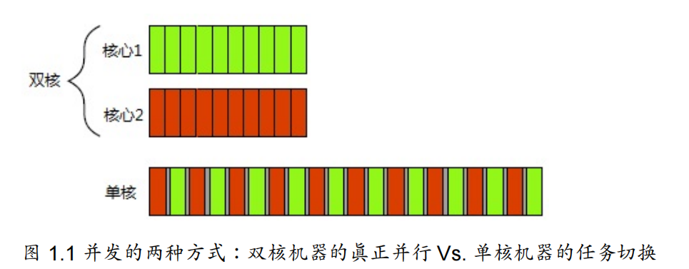

### 并发与并行

​		对于多线程来说，这两个概念有很大部分是重叠的。对于很多人来说，它们的意思没有什么区别。其区别主要在于关注点和意图方面(差距甚微)。这两个词都是用来对硬件在同时执行多个任务的方式进行描述的术语，不过并行更加注重性能。在讨论使用当前可用硬件来提高批量数据处理的速度时，我们会讨论程序的并行性；当关注的重点在于任务分离或任务响应时，就会讨论到程序的并发性。这对术语没有明显的区别，并且还有很多意义上的重叠。这两个术语存在的目的，就是为了区别多线程程序中不同的关注点。本书中，将有两个例子对并行和并发进行演示。

### 我们为什么使用并发

​		编写软件时，分离关注点是个好主意。通过将相关的代码与无关的代码分离，可以使程序更容易理解和测试，从而减少出错的可能性。即使一些功能区域中的操作需要在同一时刻发生的情况下，依旧可以使用并发分离不同的功能区域；若不显式地使用并发，就得编写一个任务切换框架，或者在操作中主动地调用一段不相关的代码。

### 整一段！

​		回想一下那个你入门C++的下午，你写了一句：

```C++
#include<iostream>

int main()
{
    std::cout << "Hello world! \n";
}
```

​		不错，现在，让我们来并发的试一试：

```
#include <iostream>
#include <thread>
void showHello()
{
    std::cout << "Hello in Thread Programming";
}


int main() {
    std::thread aThread(showHello);
    aThread.join();
}

```

​		有什么区别嘛？有：

​		第一个区别是增加了 `#include <thread> `①,标准C++库中对多线程支持的声明在新的头文件中：管理线程的函数和类在` <thread> `中声明，而保护共享数据的函数和类在其他头文件中声明。

​		其次，打印信息的代码被移动到了一个独立的函数中②。因为每个线程都必须具有一个初始函数(initial function)，新线程的执行从这里开始。对于应用程序来说，初始线程是main()，但是对于其他线程，可以在 std::thread 对象的构造函数中指定——本例中，被命名为t③的 std::thread 对象拥有新函数hello()作为其初始函数。

​		下一个区别：与直接写入标准输出或是从main()调用hello()不同，该程序启动了一个全新的线程来实现，将线程数量一分为二——初始线程始于main()，而新线程始于hello()。新的线程启动之后③，初始线程继续执行。如果它不等待新线程结束，它就将自顾自地继续运行到main()的结束，从而结束程序——有可能发生在新线程运行之前。这就是为什么在④这里调用 join() 的原因——详见第2章，这会导致调用线程(在main()中)等待与 std::thread 对象相关联的线程，即这个例子中的t。

## 线程管理入门

​		最简单的情况下，任务也会很简单，通常是**无参数无返回的函数**。这种函数在其所属线程上运行，直到函数执行完毕，线程也就结束了。在一些极端情况下，线程运行时，任务中的函数对象需要通过某种通讯机制进行参数的传递，或者执行一系列独立操作;可以通过通讯机制传递信号，让线程停止。线程要做什么，以及什么时候启动，其实都无关紧要。总之，使用C++线程库启动线程，可以归结为构造 std::thread 对象

```
void doSomeWork();
std::thread my_thread(do_some_work)
```

​		当然，也可以传入方法类：前提是重载了函数调用符号。

```C++
class compoundWork{
  public:
    	void operator()() const{
            do_something();
            do_something_else();
        }
};

// ... 
compoundWork work;
std::thread my_thread(work);
```

​		代码中，提供的函数对象会复制到新线程的存储空间当中，函数对象的执行和调用都在线程的内存空间中进行。函数对象的副本应与原始函数对象保持一致，否则得到的结果会与我们的期望不同。

```C++ 
//
// Created by 陈冠豪 on 2023/7/20.
//
#include <thread>
#include <iostream>
using namespace std;
void work1(){
    cout << "activated the work1\n";
}

void work2(){
    cout << "activated the work2";
}

class CompoundWork{
public:
    void operator()(){
        work1();
        work2();
    }
};

int main()
{
    CompoundWork work;
    thread compoundThread(work);
    compoundThread.join();
}
```

​		有件事需要注意，当把函数对象传入到线程构造函数中时，需要避免“最令人头痛的语法解析”(*C++’s most vexing parse*, 中文简介)。**如果你传递了一个临时变量，而不是一个命名的变量；C++编译器会将其解析为函数声明，而不是类型对象的定义。**

```
std::thread my_thread(background_task());
```

​		这里相当与声明了一个名为my_thread的函数，这个函数带有一个参数(函数指针指向没有参数并返回background_task对象的函数)，返回一个 std::thread 对象的函数，而非启动了一个线程。

​		使用在前面命名函数对象的方式，或使用多组括号①，或使用新统一的初始化语法②，可以避免这个问题。

```
std::thread my_thread((background_task())); // 1
std::thread my_thread{background_task()}; // 2
```

​		使用lambda表达式也能避免这个问题。lambda表达式是C++11的一个新特性，它允许使用一个可以捕获局部变量的局部函数(可以避免传递参数，参见2.2节)。

```C++ 
std::thread my_thread([]{
	do_something();
	do_something_else();
});
```

​		**启动了线程，你需要明确是要等待线程结束(加入式——参见2.1.2节)，还是让其自主运行(分离式——参见2.1.3节)。**如果 std::thread 对象销毁之前还没有做出决定，程序就会终止( std::thread 的析构函数会调用 std::terminate() )。因此，即便是有异常存在，也需要确保线程能够正确的加入(joined)或分离(detached)。2.1.3节中，会介绍对应的方法来处理这两种情况。需要注意的是，必须在 std::thread 对象销毁之前做出决定，否则你的程序将会终止( std::thread 的析构函数会调用 std::terminate() ，这时再去决定会触发相应异常)。如果不等待线程，就必须保证线程结束之前，可访问的数据得有效性。这不是一个新问题——单线程代码中，对象销毁之后再去访问，也会产生未定义行为——不过，线程的生命周期增加了这个问题发生的几率。这种情况很可能发生在线程还没结束，函数已经退出的时候，这时线程函数还持有函数局部变量的指针或引用。下面的清单中就展示了这样的一种情况。

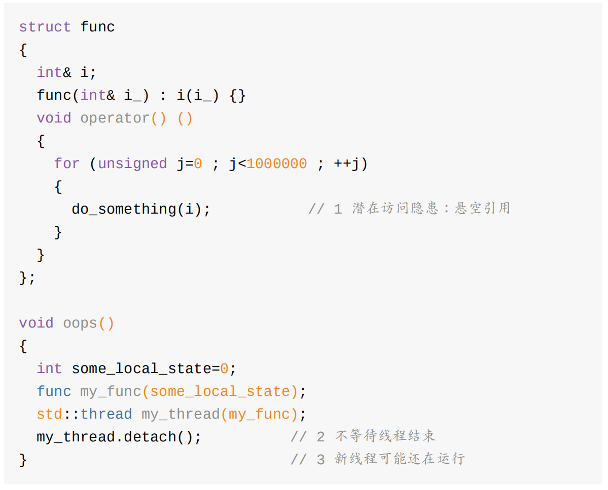

​		这个例子中，已经决定不等待线程结束(使用了detach() ② )，所以当oops()函数执行完成时③，新线程中的函数可能还在运行。如果线程还在运行，它就会去调用do_something(i)函数①，这时就会访问已经销毁的变量。如同一个单线程程序——允许在函数完成后继续持有局部变量的指针或引用；当然，这从来就不是一个好主意——这种情况发生时，错误并不明显，会使多线程更容易出错。运行顺序参考表2.1

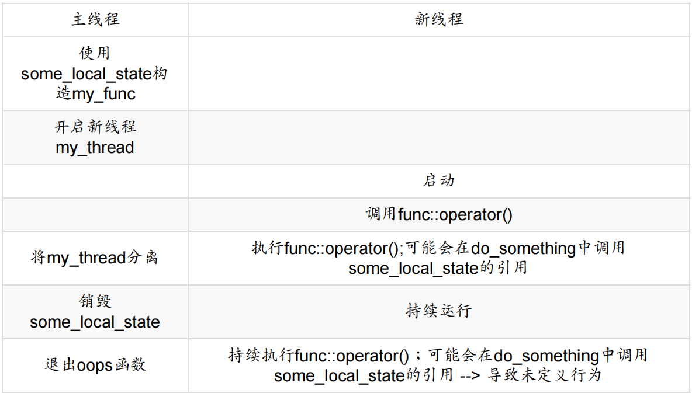

​		处理这种情况的常规方法：使线程函数的功能齐全，将数据复制到线程中，而非复制到共享数据中。如果使用一个可调用的对象作为线程函数，这个对象就会复制到线程中，而后原始对象就会立即销毁。但对于对象中包含的指针和引用还需谨慎，例如清单2.1所示。使用一个能访问局部变量的函数去创建线程是一个糟糕的主意(除非十分确定线程会在函数完成前结束)

​		此外，可以通过join()函数来确保线程在函数完成前结束

### 等待线程完成

​		如果需要等待线程，相关的 std::thread 实例需要使用join()。清单2.1中，将 my_thread.detach() 替换为 my_thread.join() ，就可以确保局部变量在线程完成后，才被销毁。在这种情况下，因为原始线程在其生命周期中并没有做什么事，使得用一个独立的线程去执行函数变得收益甚微，但在实际编程中，原始线程要么有自己的工作要做；要么会启动多个子线程来做一些有用的工作，并等待这些线程结束。join()是简单粗暴的等待线程完成或不等待。当你需要对等待中的线程有更灵活的控制时，比如，看一下某个线程是否结束，或者只等待一段时间(超过时间就判定为超时)。想要做到这些，你需要使用其他机制来完成，比如条件变量和期待(futures)，相关的讨论将会在第4章继续。调用join()的行为，还清理了线程相关的存储部分，这样 std::thread 对象将不再与已经完成的线程有任何关联。这意味着，只能对一个线程使用一次join();一旦已经使用过join()， std::thread 对象就不能再次加入了，当对其使用joinable()时，将返回false。

### 特殊情况下的等待

​		如前所述，需要对一个还未销毁的 std::thread 对象使用join()或detach()。如果想要分离一个线程，可以在线程启动后，直接使用detach()进行分离。如果打算等待对应线程，则需要细挑选调用join()的位置。当在线程运行之后产生异常，在join()调用之前抛出，就意味着这次调用会被跳过。避免应用被抛出的异常所终止，就需要作出一个决定。通常，当倾向于在无异常的情况下使用join()时，需要在异常处理过程中调用join()，从而避免生命周期的问题。下面的程序清单是一个例子。

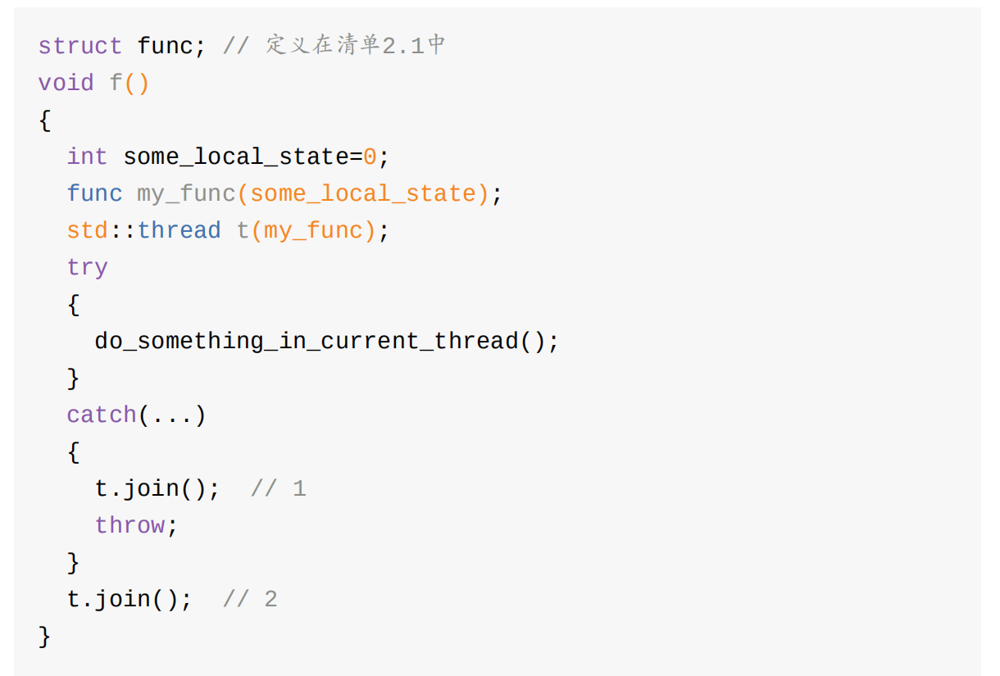

​		清单2.2中的代码使用了 try/catch 块确保访问本地状态的线程退出后，函数才结束。当函数正常退出时，会执行到②处；当函数执行过程中抛出异常，程序会执行到①处。 try/catch 块能轻易的捕获轻量级错误，所以这种情况，并非放之四海而皆准。如需确保线程在函数之前结束——查看是否因为线程函数使用了局部变量的引用，以及其他原因——而后再确定一下程序可能会退出的途径，无论正常与否，可以提供一个简洁的机制，来做解决这个问题。**一种方式是使用“资源获取即初始化方式”(RAII，Resource Acquisition Is Initialization)，并且提供一个类，在析构函数中使用join()，如同下面清单中的代码。看它如何简化f()函数。**

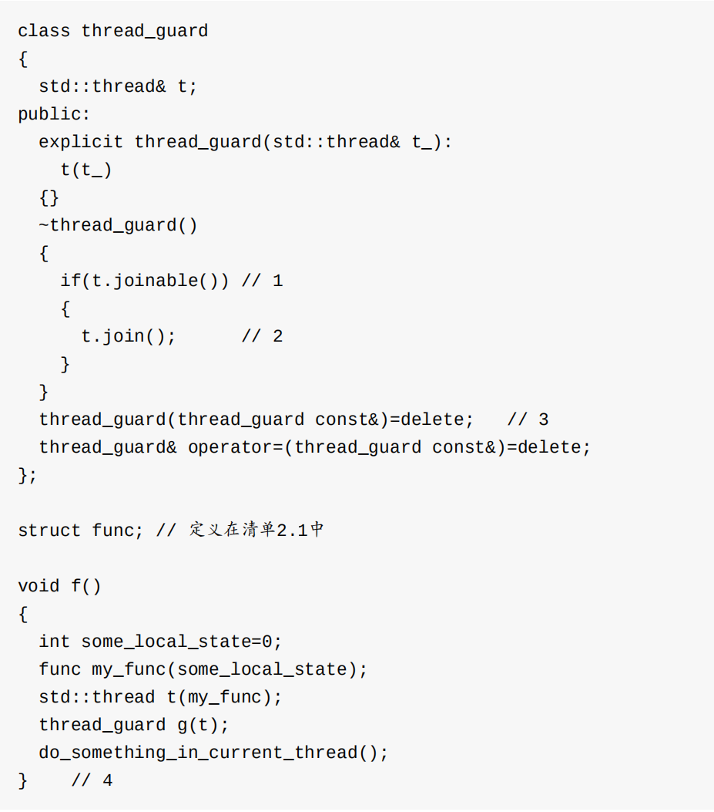

​		当线程执行到④处时，局部对象就要被逆序销毁了。因此，thread_guard对象g是第一个被销毁的，这时线程在析构函数中被加入②到原始线程中。即使do_something_in_current_thread抛出一个异常，这个销毁依旧会发生。

​		在thread_guard的析构函数的测试中，首先判断线程是否已加入①，如果没有会调用join()②进行加入。这很重要，**因为join()只能对给定的对象调用一次，所以对给已加入的线程再次进行加入操作时，将会导致错误。拷贝构造函数和拷贝赋值操作被标记为 =delete ③，是为了不让编译器自动生成它们。直接对一个对象进行拷贝或赋值是危险的，因为这可能会弄丢已经加入的线程。通过删除声明，任何尝试给thread_guard对象赋值的操作都会引发一个编译错误。**

​		如果不想等待线程结束，可以分离_(_detaching)线程，从而避免异常安全(exception-safety)问题。不过，这就打破了线程与 std::thread 对象的联系，即使线程仍然在后台运行着，分离操作也能确保 std::terminate() 在 std::thread 对象销毁才被调用。

## 后台运行线程

​		**使用detach()会让线程在后台运行**，这就意味着主线程不能与之产生直接交互。也就是说，不会等待这个线程结束；如果线程分离，那么就不可能有 std::thread 对象能引用它，分离线程的确在后台运行，所以分离线程不能被加入。不过C++运行库保证，当线程退出时，相关资源的能够正确回收，后台线程的归属和控制C++运行库都会处理。通常称分离线程为守护线程(daemon threads)，UNIX中守护线程是指，没有任何显式的用户接口，并在后台运行的线程。这种线程的特点就是长时间运行；线程的生命周期可能会从某一个应用起始到结束，可能会在后台监视文件系统，还有可能对缓存进行清理，亦或对数据结构进行优化。另一方面，分离线程的另一方面只能确定线程什么时候结束，发后即忘(fire and forget)的任务就使用到线程的这种方式。

​		如2.1.2节所示，调用 std::thread 成员函数detach()来分离一个线程。之后，相应的 std::thread 对象就与实际执行的线程无关了，并且这个线程也无法加入：

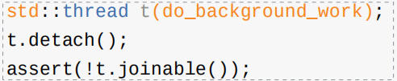

​		为了从 std::thread 对象中分离线程(前提是有可进行分离的线程),不能对没有执行线程的 std::thread 对象使用detach(),也是join()的使用条件，并且要用同样的方式进行检查——**当 std::thread 对象使用t.joinable()返回的是true，就可以使用t.detach()。试想如何能让一个文字处理应用同时编辑多个文档。无论是用户界面，还是在内部应用内部进行，都有很多的解决方法。虽然，这些窗口看起来是完全独立的，每个窗口都有自己独立的菜单选项，但他们却运行在同一个应用实例中。**一种内部处理方式是，**让每个文档处理窗口拥有自己的线程；每个线程运行同样的的代码，并隔离不同窗口处理的数据。如此这般，打开一个文档就要启动一个新线程。因为是对独立的文档进行操作，所以没有必要等待其他线程完成。因此，这里就可以让文档处理窗口运行在分离的线程上。下面代码简要的展示了这种方法：**

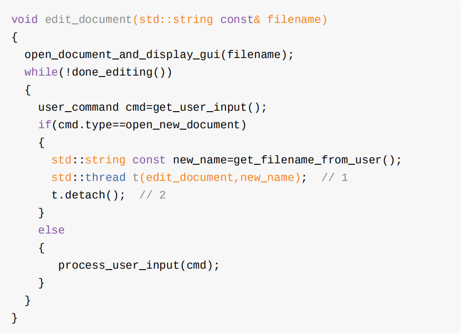

​		如果用户选择打开一个新文档，需要启动一个新线程去打开新文档①，并分离线程②。与当前线程做出的操作一样，新线程只不过是打开另一个文件而已。所以，edit_document函数可以复用，通过传参的形式打开新的文件。这个例子也展示了传参启动线程的方法：不仅可以向 std::thread 构造函数①传递函数名，还可以传递函数所需的参数(实参)。C++线程库的方式也不是很复杂。当然，也有其他方法完成这项功能，比如:使用一个带有数据成员的成员函数，代替一个需要传参的普通函数

## 向线程函数传递参数

​		清单2.4中，向 std::thread 构造函数中的可调用对象，或函数传递一个参数很简单。需要注意的是，默认参数要拷贝到线程独立内存中，即使参数是引用的形式，也可以在新线程中进行访问。再来看一个例子：

​		代码创建了一个调用f(3, "hello")的线程。注意，函数f需要一个 std::string 对象作为第二个参数，但这里使用的是字符串的字面值，也就是 char const * 类型。之后，在线程的上下文中完成字面值向 std::string 对象的转化。需要特别要注意，当指向动态变量的指针作为参数传递给线程的情况，代码如下：

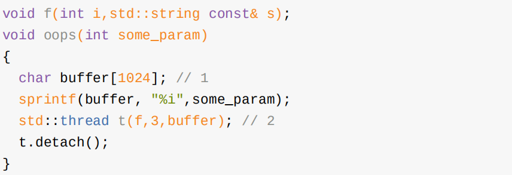

​		这种情况下，buffer①是一个指针变量，指向本地变量，然后本地变量通过buffer传递到新线程中②。并且，函数有很有可能会在字面值转化成 std::string 对象之前崩溃(oops)，从而导致一些未定义的行为。并且想要依赖隐式转换将字面值转换为函数期待的 std::string 对象，但因 std::thread 的构造函数会复制提供的变量，就只复制了没有转换成期望类型的字符串字面值。解决方案就是在传递到 std::thread 构造函数之前就将字面值转化为 std::string 对象

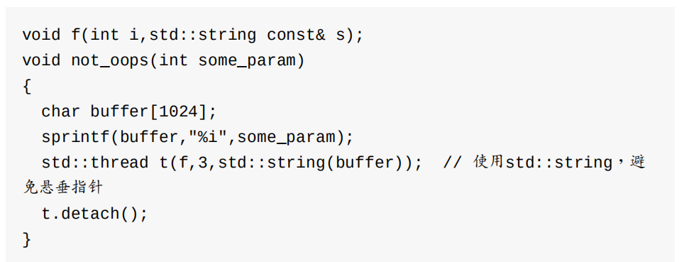

​		还可能遇到相反的情况：期望传递一个非常量引用(但这不会被编译)，但整个对象被复制了。你可能会尝试使用线程更新一个引用传递的数据结构

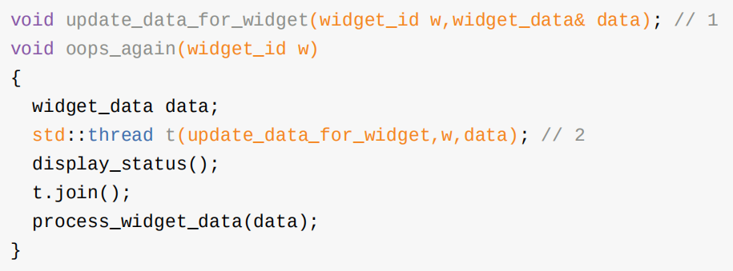

​		虽然update_data_for_widget①的第二个参数期待传入一个引用，但是 std::thread 的构造函数②并不知晓；构造函数无视函数期待的参数类型，并盲目的拷贝已提供的变量。不过，在代码会将参数以右值的方式进行拷贝传递，这是为了照顾到那些只能进行移动的类型，而后会以右值为参数调用update_data_for_widget。因为函数期望的是一个非常量引用作为参数，而非一个右值作为参数，所以会在编译时出错。

​		对于熟悉 std::bind 的开发者来说，问题的解决办法是显而易见的：可以使用 std::ref 将参数转换成引用的形式，从而可将线程的调用改为以下形式：

```
std::thread t(update_data_for_widget,w,std::ref(data));
```

​		在这之后，update_data_for_widget就会接收到一个data变量的引用，而非一个data变量拷贝的引用，这样代码就能顺利的通过编译。

​		如果你熟悉 std::bind ，就应该不会对以上述传参的形式感到奇怪，因为 std::thread 构造函数和 std::bind 的操作都在标准库中定义好了，可以传递一个成员函数指针作为线程函数，并提供一个合适的对象指针作为第一个参数：

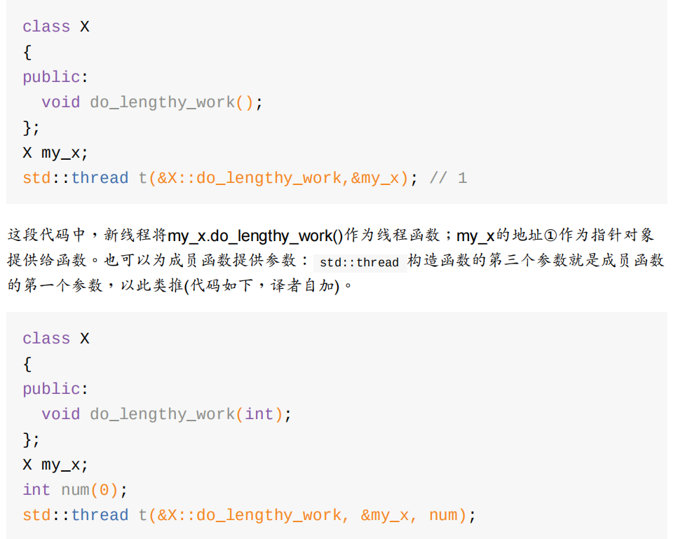

​		有趣的是，提供的参数可以移动，但不能拷贝。"移动"是指:原始对象中的数据转移给另一对象，而转移的这些数据就不再在原始对象中保存了(译者：比较像在文本编辑的"剪切"操作)。 std::unique_ptr 就是这样一种类型(译者：C++11中的智能指针)，这种类型为动态分配的对象提供内存自动管理机制(译者：类似垃圾回收)。同一时间内，只允许一个 std::unique_ptr 实现指向一个给定对象，并且当这个实现销毁时，指向的对象也将被删除。移动构造函数(move constructor)和移动赋值操作符(move assignment operator)允许一个对象在多个 std::unique_ptr 实现中传递(有关"移动"的更多内容，请参考附录A的A.1.1节)。使用"移动"转移原对象后，就会留下一个空指针(NULL)。移动操作可以将对象转换成可接受的类型，例如:函数参数或函数返回的类型。当原对象是一个临时变量时，自动进行移动操作，但当原对象是一个命名变量，那么转移的时候就需要使用 std::move() 进行显示移动。下面的代码展示了 std::move 的用法，展示了 std::move 是如何转移一个动态对象到一个线程中去的

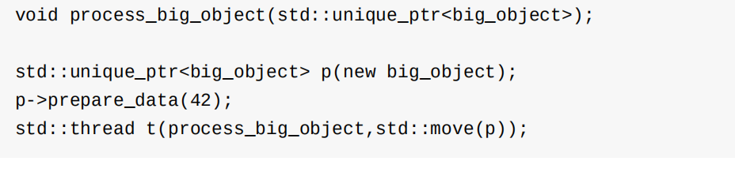

​		std::thread 的构造函数中指定 std::move(p) ，big_object对象的所有权就被首先转移到新创建线程的的内部存储中，之后传递给process_big_object函数。c++标准线程库中和 std::unique_ptr 在所属权上有相似语义类型的类有好几种， std::thread 为其中之一。虽然， std::thread 实例不像 std::unique_ptr 那样能占有一个动态对象的所有权，但是它能占有其他资源：每个实例都负责管理一个执行线程。执行线程的所有权可以在多个 std::thread 实例中互相转移，这是依赖于 std::thread 实例的可移动且不可复制性。不可复制保性证了在同一时间点，一个 std::thread 实例只能关联一个执行线程；可移动性使得开发者可以自己决定，哪个实例拥有实际执行线程的所有权

## 转移线程所有权

​		假设要写一个在后台启动线程的函数，并想通过新线程返回的所有权去调用这个函数，而不是等待线程结束再去调用；或完全与之相反的想法：创建一个线程，并在函数中转移所有权，都必须要等待线程结束。所以，新线程的所有权都需要转移。

​		这就是将移动操作引入 std::thread 的原因，C++标准库中有很多资源占有(resource-owning)类型，比如 std::ifstream ， std::unique_ptr 还有 std::thread 都是可移动，但不可拷贝。这就说明执行线程的所有权可以在 std::thread 实例中移动，下面将展示一个例子。例子中，创建了两个执行线程，并且在 std::thread 实例之间(t1,t2和t3)转移所有权

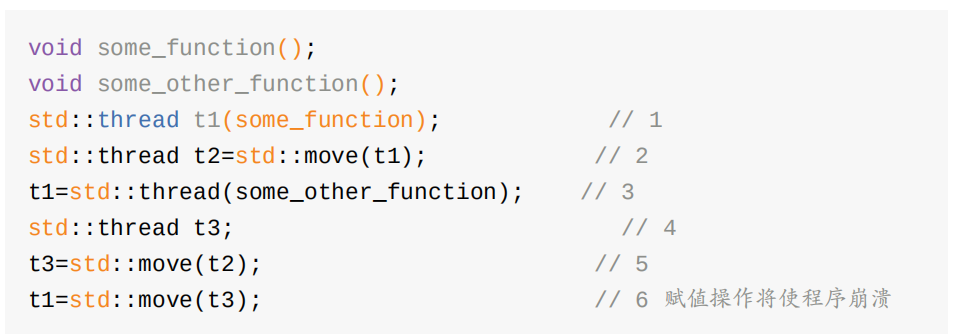

​		首先，新线程开始与t1相关联①。当显式使用 std::move() 创建t2后②，t1的所有权就转移给了t2。之后，t1和执行线程已经没有关联了，执行some_function的函数线程与t2关联。然后，一个临时 std::thread 对象相关的线程启动了③。为什么不显式调用 std::move() 转移所有权呢？因为，所有者是一个临时对象——移动操作将会隐式的调用。t3使用默认构造方式创建④，与任何执行线程都没有关联。调用 std::move() 将与t2关联线程的所有权转移到t3中⑤。因为t2是一个命名对象，需要显式的调用 std::move() 。移动操作 #5完成后，t1与执行some_other_function的线程相关联，t2与任何线程都无关联，t3与执行some_function的线程相关联。最后一个移动操作，将some_function线程的所有权转移⑥给t1。不过，t1已经有了一个关联的线程(执行some_other_function的线程)，所以这里系统直接调用 std::terminate() 终止程序继续运行。这样做（不抛出异常， std::terminate() 是*noexcept*函数)是为了保证与 std::thread 的析构函数的行为一致。2.1.1节中，需要在线程对象被析构前，显式的等待线程完成，或者分离它；进行赋值时也需要满足这些条件(说明：不能通过赋一个新值给 std::thread 对象的方式来"丢弃"一个线程)。

​		std::thread 支持移动，就意味着线程的所有权可以在函数外进行转移，就如下面程序一样。

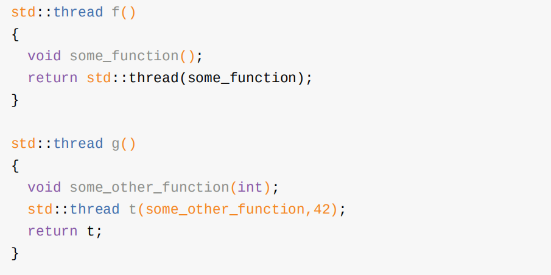

​		当所有权可以在函数内部传递，就允许 std::thread 实例可作为参数进行传递，代码如下：

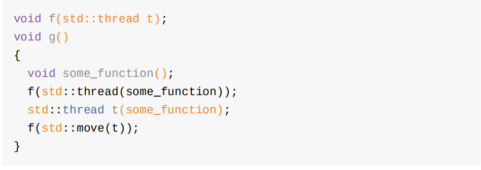

​		std::thread 支持移动的好处是可以创建thread_guard类的实例(定义见清单2.3)，并且拥有其线程所有权。当thread_guard对象所持有的线程被引用时，移动操作就可以避免很多不必要的麻烦；这意味着，当某个对象转移了线程的所有权后，它就不能对线程进行加入或分离。为了确保线程程序退出前完成，下面的代码里定义了scoped_thread类。现在，我们来看一下这段代码：

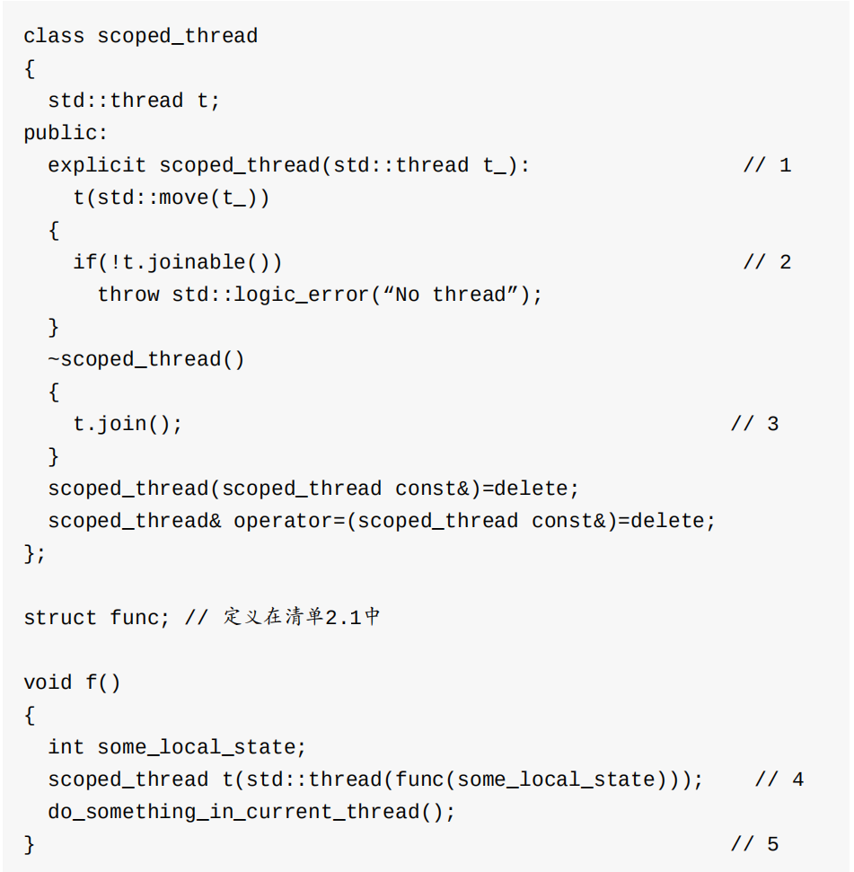

​		与清单2.3相似，不过新线程直接传递到scoped_thread中④，而非创建一个独立变量。当主线程到达f()函数末尾时⑤，scoped_thread对象就会销毁，然后加入③到的构造函数①创建的线程对象中去。在清单2.3中的thread_guard类，需要在析构中检查线程是否"可加入"。这里把检查放在了构造函数中②，并且当线程不可加入时，抛出异常。这里对C++17标准给出一个建议，就是添加一个joining_thread的类型，这个类型与 std::thread 类似；不同是的添加了析构函数，就类似于scoped_thread。委员会成员们对此并没有达成统一共识，所以这个类没有添加入C++17标准中(C++20仍旧对这种方式进行探讨，不过名称为 std::jthread )，不过这个类实现起来也不是很困难。下面就来对这个类进行

```C++ 
class joining_thread
{
	std::thread t;
public:
	joining_thread() noexcept=default;
	template<typename Callable,typename ... Args>
	explicit joining_thread(Callable&& func,Args&& ... args):
	t(std::forward<Callable>(func),std::forward<Args>(args)...)
{}
	explicit joining_thread(std::thread t_) noexcept:t(std::move(t_))
{}
	joining_thread(joining_thread&& other) noexcept:
	t(std::move(other.t))
{}
	joining_thread& operator=(joining_thread&& other) noexcept
	{
		if（joinable()）{
			join();
		}
		t = std::move(other.t);
		return *this;
	}
	joining_thread& operator=(std::thread other) noexcept
	{
	if(joinable())
		join();
	t=std::move(other);
	return *this;
	}
	~joining_thread() noexcept
	{
		if(joinable())
			join();
	}
	void swap(joining_thread& other) noexcept
	{
	t.swap(other.t);
	}
	std::thread::id get_id() const noexcept{
		return t.get_id();
	}
	bool joinable() const noexcept
	{
		return t.joinable();
	}
	void join()
	{
		t.join();
	}
	void detach()
	{
		t.detach();
	}
	std::thread& as_thread() noexcept
	{
		return t;
	}
	const std::thread& as_thread() const noexcept
	{
		return t;
	}
};
```

​		std::thread 对象的容器，如果这个容器是移动敏感的(比如，标准中的 std::vector<> )，那么移动操作同样适用于这些容器。了解这些后，就可以写出类似清单2.7中的代码，代码量产了一些线程，并且等待它们结束

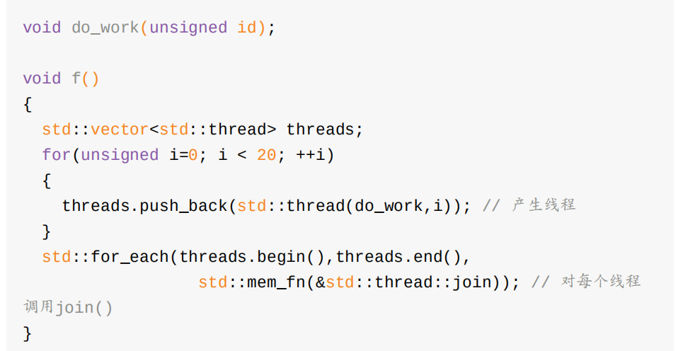

​		我们经常需要线程去分割一个算法的工作总量，所以在算法结束的之前，所有的线程必须结束。清单2.8中线程所做的工作都是独立的，并且结果仅会受到共享数据的影响。如果f()有返回值，这个返回值就依赖于线程得到的结果。在写入返回值之前，程序会检查使用共享数据的线程是否终止。结果在不同线程中转移的替代方案，我们会在第4章中再次讨论。将 std::thread 放入 std::vector 是向线程自动化管理迈出的第一步：并非为这些线程创建独立的变量，并且直接加入，而是把它们当做一个组。创建一组线程(数量在运行时确定)，可使得这一步迈的更大，而非像清单2.8那样创建固定数量的线程。

## 运行时决定线程数量

​		std::thread::hardware_concurrency() 在新版C++标准库中是一个很有用的函数。这个函数会返回能并发在一个程序中的线程数量。例如，多核系统中，返回值可以是CPU核芯的数量。返回值也仅仅是一个提示，当系统信息无法获取时，函数也会返回0。但是，这也无法掩盖这个函数对启动线程数量的帮助。清单2.9实现了一个并行版的 std::accumulate 。代码中将整体工作拆分成小任务交给每个线程去做，其中设置最小任务数，是为了避免产生太多的线程。程序可能会在操作数量为0的时候抛出异常。比如， std::thread 构造函数无法启动一个执行线程，就会抛出一个异常。在这个算法中讨论异常处理，已经超出现阶段的讨论范围，这个问题我们将在第8章中再来讨论

```C++ 
template<typename Iterator,typename T>
struct accumulate_block
{
	void operator()(Iterator first,Iterator last,T& result)
	{
		result=std::accumulate(first,last,result);
	}
};
template<typename Iterator,typename T>
T parallel_accumulate(Iterator first,Iterator last,T init)
{
	unsigned long const length=std::distance(first,last);
	if(!length) // 1
		return init;
	unsigned long const min_per_thread=25;
	unsigned long const max_threads=(length+min_per_thread-1)/min_per_thread; // 2
	unsigned long const hardware_threads=std::thread::hardware_concurrency();
	unsigned long const num_threads= std::min(hardware_threads != 0 ? hardware_threads : 2,
max_threads);
	unsigned long const block_size=length/num_threads; // 4
	std::vector<T> results(num_threads);
	std::vector<std::thread> threads(num_threads-1); // 5
	Iterator block_start=first;
	for(unsigned long i=0; i < (num_threads-1); ++i)
	{
		Iterator block_end=block_start;
		std::advance(block_end,block_size); // 6
		threads[i]=std::thread( // 7
			accumulate_block<Iterator,T>(),
			block_start,block_end,std::ref(results[i])
        );
		block_start=block_end; // #8
	}
	accumulate_block<Iterator,T>()(
		block_start,last,results[num_threads-1]); // 9
		std::for_each(threads.begin(),threads.end(),
		std::mem_fn(&std::thread::join)
                     ); // 10
	return std::accumulate(results.begin(),results.end(),init); //11
}
```

​		函数看起来很长，但不复杂。如果输入的范围为空①，就会得到init的值。反之，如果范围内多于一个元素时，都需要用范围内元素的总数量除以线程(块)中最小任务数，从而确定启动线程的最大数量②，这样能避免无谓的计算资源的浪费。比如，一台32芯的机器上，只有5个数需要计算，却启动了32个线程。计算量的最大值和硬件支持线程数中，较小的值为启动线程的数量③。因为上下文频繁的切换会降低线程的性能，所以你肯定不想启动的线程数多于硬件支持的线程数量。

​		当 std::thread::hardware_concurrency() 返回0，你可以选择一个合适的数作为你的选择；在本例中，我选择了"2"。你也不想在一台单核机器上启动太多的线程，因为这样反而会降低性能，有可能最终让你放弃使用并发。

​		每个线程中处理的元素数量,是范围中元素的总量除以线程的个数得出的④。对于分配是否得当，我们会在后面讨论现在，确定了线程个数，通过创建一个 `std::vector<T>` 容器存放中间结果，并为线程创建一个` std::vector<std::thread> `容器 #5。**这里需要注意的是，启动的线程数必须比num_threads少1个，因为在启动之前已经有了一个线程(主线程)。**使用简单的循环来启动线程：block_end迭代器指向当前块的末尾⑥，并启动一个新线程为当前块累加结果⑦。当迭代器指向当前块的末尾时，启动下一个块⑧。

​		启动所有线程后，⑨中的线程会处理最终块的结果。对于分配不均，因为知道最终块是哪一个，那么这个块中有多少个元素就无所谓了。当累加最终块的结果后，可以等待 std::for_each ⑩创建线程的完成(如同在清单2.8中做的那样)，之后使用 std::accumulate 将所有结果进行累加⑪。结束这个例子之前，需要明确：T类型的加法运算不满足结合律(比如，对于float型或double型，在进行加法操作时，系统很可能会做截断操作)，因为对范围中元素的分组，会导致parallel_accumulate得到的结果可能与 std::accumulate 得到的结果不同。同样的，这里对迭代器的要求更加严格：必须都是向前迭代器，而 std::accumulate 可以在只传入迭代器的情况下工作。对于创建出results容器，需要保证T有默认构造函数。对于算法并行，通常都要这样的修改；不过，需要根据算法本身的特性，选择不同的并行方式。算法并行会在第8章有更加深入的讨论，并在第10章中会介绍一些C++17中支持的并行算法(其中 std::reduce 操作等价于这里的parallel_accumulate)。需要注意的：因为不能直接从一个线程中返回一个值，所以需要传递results容器的引用到线程中去。另一个办法，通过地址来获取线程执行的结果；第4章中，我们将使用期望(futures)完成这种方案。

​		当线程运行时，所有必要的信息都需要传入到线程中去，包括存储计算结果的位置。不过，并非总需如此：有时候这是识别线程的可行方案，可以传递一个标识数，例如清单2.8中的i。不过，当需要标识的函数在调用栈的深层，同时其他线程也可调用该函数，那么标识数就会变的捉襟见肘。好消息是在设计C++的线程库时，就有预见了这种情况，在之后的实现中就给每个线程附加了唯一标识符

## 标识线程

​		线程标识类型为 std::thread::id ，并可以通过两种方式进行检索。

​		第一种，可以通过调用 std::thread 对象的成员函数 get_id() 来直接获取。如果 std::thread 对象没有与任何执行线程相关联， get_id() 将返回` std::thread::type `默认构造值，这个值表示“无线程”。

​		第二种，当前线程中调用 std::this_thread::get_id() (这个函数定义在 `<thread> `头文件中)也可以获得线程标识。std::thread::id 对象可以自由的拷贝和对比,因为标识符就可以复用。如果两个对象的 std::thread::id 相等，那它们就是同一个线程，或者都“无线程”。如果不等，那么就代表了两个不同线程，或者一个有线程，另一没有线程。C++线程库不会限制你去检查线程标识是否一样， std::thread::id 类型对象提供相当丰富的对比操作；比如，提供为不同的值进行排序。这意味着允许程序员将其当做为容器的键值，做排序，或做其他方式的比较。按默认顺序比较不同值的 std::thread::id ，所以这个行为可预见的：当 a<b ， b<c 时，得 a<c ，等等。标准库也提供 `std::hash<std::thread::id> `容器，所以 std::thread::id 也可以作为无序容器的键值。std::thread::id 实例常用作检测线程是否需要进行一些操作，比如：当用线程来分割一项工作(如清单2.9)，主线程可能要做一些与其他线程不同的工作。这种情况下，启动其他线程前，它可以将自己的线程ID通过 std::this_thread::get_id() 得到，并进行存储。就是算法核心部分(所有线程都一样的)，每个线程都要检查一下，其拥有的线程ID是否与初始线程的ID相同.

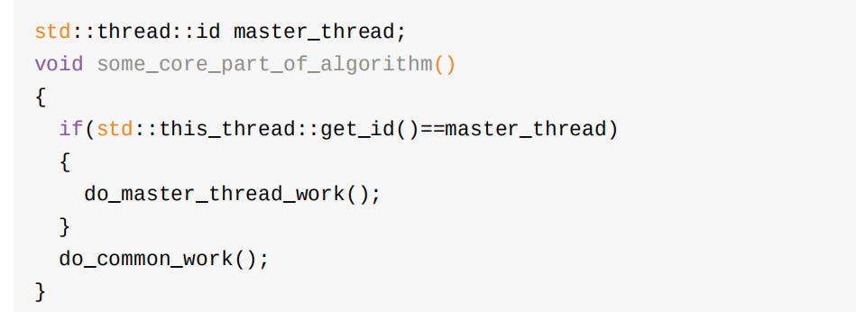

​		另外，当前线程的 std::thread::id 将存储到一个数据结构中。之后在这个结构体中对当前线程的ID与存储的线程ID做对比，来决定操作是被“允许”，还是“需要”(permitted/required)。同样，作为线程和本地存储不适配的替代方案，线程ID在容器中可作为键值。例如，容器可以存储其掌控下每个线程的信息，或在多个线程中互传信息std::thread::id 可以作为一个线程的通用标识符，当标识符只与语义相关(比如，数组的索引)时，就需要这个方案了。也可以使用输出流( std::cout )来记录一个 std::thread::id 对象的值

```
std::cout<<std::this_thread::get_id();
```

​		具体的输出结果是严格依赖于具体实现的，C++标准的唯一要求就是要保证ID比较结果相等的
线程，必须有相同的输出。