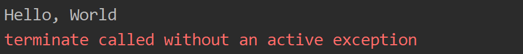
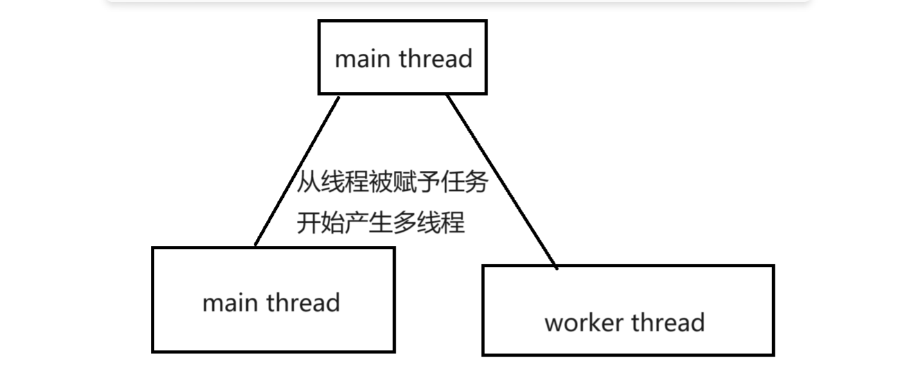
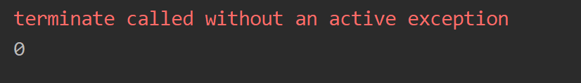
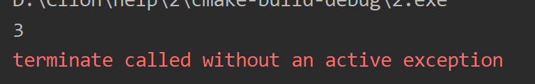
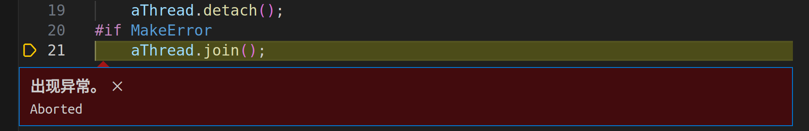
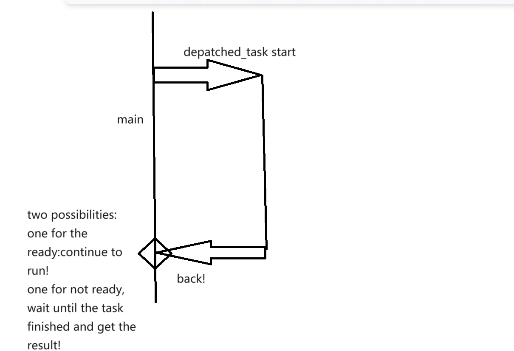

# C++并发编程学习记录

​		因为一些需求需要学习，这里开篇博客记录一下。本人使用的环境是Windows11，使用的IDE是Clion。标准自然是C++11（thread是C++11加入的，Linux下使用gcc手动编译链接的可能需要添加链接库参数-lpthread）

## 前言

​		C++并发编程的重要性不言而喻。我们首先需要认识到：使用并发的终极目的就是让程序变得更快，我们可以更快的拿到结果。这就提示我们：何时使用并发，何时不使用是一门严肃的学问。笔者这里给出拙见：一条万能的判断方式是`earning > cost`的时候使用。我们都知道并发的重要载体：线程，是一个有限的资源。盲目的开线程消耗系统资源。使得效率不升反降（操作系统不得不为此频繁的切换上下文）。

​		但是考虑这个之前，我们有必要了解一下C++11新加入的`<thread>`库。

## 线程，启动！

​		我们考虑的第一个事情，就是思考如何启动一个线程。C++11中，线程构造即启动。也就是说：只要线程拿到任务，他就会直接开始执行函数，我们无法手动命令之何时启动。

​		下面这个程序是一个很经典的例子：开一个新的附属线程，我们喜欢叫子线程。

```C++
#include <iostream>
#include <thread>

// no params, no return, the job-function
void printHello()
{
    std::cout << "Hello, World" << std::endl;
}

int main()
{
    std::thread worker(printHello);
}
```

​		这里，如果熟知其他并发教程的人会发现这里我省略了一句话。如果我们贸然的执行之，会发现：



​		这就是结果。

```
terminate called without an active exception
```

​		这个错误指的是，我们创造了一个线程。但是却没有回收他，导致了异常。下面这张图展示了我们当我们执行语句：

```
std::thread worker(printHello);
```



​		后程序的情况。如你所见，主线程执行结束后，会自动的`return 0`，主线程就结束了，但是，子线程却不一定结束，或者，可能结束了，这取决于操作系统如何调度任务（这具有随机性！）。我们并没有告诉操作系统，我们的子线程应该如何优雅的结束掉他自己——是主线程等等他，还是说让他自生自灭？不知道。那么程序选择了最不优雅的方式告诉你：我不知道，所以抛出一个异常。

​		不必着急解决方式，很快我就会说。我们继续看`thread`的其他构造函数：

```
thread() noexcept = default; // 默认空构造，这个时候thread是不动的，毕竟没有事情可以做
```

```
template<typename _Callable, typename... _Args,typename = _Require<__not_same<_Callable>>> explicit
thread(_Callable&& __f, _Args&&... __args);
```

​		下面这个，不了解可变参数模板的可能会感到陌生。实际上，这个构造函数的意思是：传入一个可以被调用的对象（重要），和它需要的参数。举个例子：

```
void doSum(int n1, int n2){
    std::cout << n1 + n2 << std::endl;
}

int main() {
    std::thread worker(doSum, 1, 2);
}
```

​		这个时候我们可以看到除了那行让人不愉快的报错，就是我们想要的结果：3

​		那我们有的时候需要返回值需要怎么办呢？这个的最好解决办法是之后我们要提到的`std::future`和`std::promise`，但是这里我们选择使用Lambda表达式完成这项任务：

```C 
int doSum(int n1, int n2){
    // std::cout << n1 + n2 << std::endl;
    return n1 + n2;
}


int main() {
    int result = 0;
    
    std::thread worker([&](){result = doSum(1, 2);});

	// pre-Include the <Windows.h>
	
	Sleep(1000);
	
    std::cout << result << std::endl;
}
```

​		我们慢慢的开始触碰到并发编程的难点了——那就是控制何时才可以检验我们线程工作的问题。这里，我们要是不使用Sleep强制等待的话，极有可能主线程结束了打印工作之后，result才会被赋值。导致我们的打印结果还是0（让人不悦）



​		但是加上之后，结果一般而言就是正确的。



​		值得注意的是，这并不是一个长久之计：我们几乎不可能总是知道，线程到底运行多久，这一次sleep够了，结果正确，下一次出现意外，sleep的时间不够了，那就会发生严重错误。

​		解决办法？那就是使用线程的API： **让线程“通知”主线程，我结束了，你现在可以继续行动了，亦或者是，不需要管我，你走你的，我走我的，老死不相往来了**，这也就是我们下面要介绍的`join`和`detach`了

### 值得一提

​		线程只可以移动，不可以拷贝。

```C++
thread(const thread&) = delete;
thread(thread&& __t) noexcept
{ 
	swap(__t); 
}
thread& operator=(const thread&) = delete;
thread& operator=(thread&& __t) noexcept
{
    if (joinable())
		std::terminate();
    swap(__t);
    return *this;
}
```

# C++并发编程学习记录2

​			下面开始回答之前的bug解决方案，那就是简单的介绍一下join和detach的区别。

## join && detach

​		为了处理线程执行结束的决策问题，我们有两个选择：一是等待线程结束运行后主线程在继续。要不就是直接抛掉线程让子线程结束就退出执行。前者对应的就是成员函数join，后者对应的是成员函数detach.

​		为了让两者的区别明显一些，我们设计一个这样的任务函数：他的任务就是调用指定次数的IO向标准输出输出`Hello, World`。

```
void work(int times)
{
    for(int i = 0; i < times; i++)
        std::cout << "Hello, world " << "for times " << i << "\n";
}
```

​		这就是我们的工作。然后，我们现在来看看join的使用。

```
    std::thread aThread;
    aThread = std::thread(work, 100);
```

​		我们这样就启动了线程。这个时候，程序就开始向控制台输出东西了。这个时候，我们写下这样的一句话：

```
	aThread.join();
```

​		这样我们发现，异常就会消失，同时我们完整的看到了所有的输出。


​		换而言之，我们就是等待所有的工作都结束了，我们才进行下一步的工作。

## detach

​		有的时候，我们希望子线程与主线程彻底分离，当调用该函数后，线程就被分离到后台运行，主线程不需要等待该线程结束才结束。我们实际上就要不会来这个子线程了。

```
Hello, world for times 0
Hello, world for times 1
Hello, world for times 2
\\ End
```

​		这样程序的输出就截然而止了。剩下的内容被扔到后台去执行了。我们不知道它实际上干了什么。

## joinable

​		我们上面强调，**一个线程被分离`(detach)`后，就不会在与主线程建立起任何联系了。任何想要在直接join回来或者再一次detach的操作都会诱发异常。**这是笔者在Ubuntu22.04下VScode给我的异常。



​		所以，我们需要一个API函数，告知我们这个线程可不可以向主线程加入。这个函数就是成员函数`joinable()`，

```
    if(aThread.joinable())
    {
        aThread.join();
        std::cout << "aThread is joinable and it has been joined!\n";
    }
    else{
        std::cout << "aThread is not joinable";
    }
```

​		这样，就不会引发异常了，从而实现安全的线程加入或者其他处理函数。

## get_id()

​		这个函数则是返回线程的ID号：

```
std::cout << "the thread id is " << aThread.get_id(); // 确保线程已经开始运作
```

```
the thread id is 140289826092608
```

​		对于那些没有运行的线程的ID，则是会给出一个

```
thread::id of a non-executing thread
```

​		打印出来的结果就是这个.

```
#include <thread>
#include <iostream>

#define DETACH 1
#define MakeError 0
void work(int times)
{
    for(int i = 0; i < times; i++)
        std::cout << "Hello, world " << "for times " << i << "\n";
}


int main()
{
    std::thread aThread;
    aThread = std::thread(work, 100);
    std::cout << aThread.get_id();
#if DETACH
    aThread.detach();
#if MakeError
    aThread.join();  
#endif
#endif
    if(aThread.joinable())
    {
        aThread.join();
        std::cout << "aThread is joinable and it has been joined!\n";
    }
    else{
        std::cout << "aThread is not joinable";
    }
    return 0;
}
```

​		这就是全部的实验代码。

# C++异步编程小论

​	浅论：我看有人写的浅论异步编程的文章实际上在干的是介绍多线程，这里刚好最近对异步编程有所兴趣：我们来看看几个C++11新加进来的一些异步编程关键字。

​	这里需要对线程编程有所概念了我们好方便阅读，所以简单的想看看本文请先对多线程有一个基本的了解。

​	我们的本篇文章的主角是：`std::async`，`std::future`和`std::package_task`，`std::promise`等。

## `std::async`与`std::future`

>[std::async - cppreference.com](https://en.cppreference.com/w/cpp/thread/async)
>
>[std::future - cppreference.com](https://en.cppreference.com/w/cpp/thread/future)

​	异步的前几个字母！也就是说，我们这里就会创建一个异步的线程！默认的，他封装了std::thread以及将线程派发和发起线程的线程之间的沟通的几个流程，从复杂的需要自行定义的类封装转向了使用几个简单的关键字就可以完成任务。

```
auto future_res = std::async(task, params); # 这里的auto就是对应的std::future
```

​	我们需要传递什么呢？传递需要被线程执行的函数和她所需要的参数！

​	我们接受什么呢？一个叫做`std::future`的模板类！这样理解：我们的线程工作是需要时间的，我们的结果在发起异步的时候尚无，但是我们预留了位置给线程执行的结果（从未来来hhh），所以叫`std::future`

​	`std::future`需要被实例化为函数返回的结果的类型。其中，我们的结果需要以方法`.get`来获取！如果异步操作还没有结束，那么会在此等待异步操作的结束，并获取返回的结果。wait()只是在此等待异步操作的结束，并不能获得返回结果。wait_for()超时等待返回结果。

​	我们来看一个稍微复杂的例子

```C++
template<typename... Args>
int fastFunc(Args... a) {
	return (... + a);
}

int main(){
    auto res = std::async(fastFunc<int, int, int>, 1, 2, 3);
	std::cout << res.get();
}
```

​	我们的函数流是这样执行的，



​	也就是说，我们总是可以保证在.get调用处拿到函数执行的结果！

​	async实际上有两种执行flag：仔细想想：你要不一发起就执行异步线程，要不等到你需要get的时候才执行：

>`std::launch::deferred`：设置了deferred标志，则async将进行惰性求值，即在async返回的std::future调用get函数时，将在当前线程(不一定是调用async时的线程)进行求值。
>`std::launch::async`：设置了async标志，则async在新的线程执行函数f。（默认的是这个）

​	我们的async也为此设置了等待流程：比如说如果我们的线程执行超时了，我们应该如何处理：我们可以通过future_status去查询future的三种状态，分别是deferred(还未执行)，ready(已经完成)，timeout(执行超时)，所以我们可以通过这个去查询异步操作的状态。使用这三种状态就OK！


```c++
template<typename... Args>
int slowFunc(int sleepTime, Args... a){
	std::this_thread::sleep_for(std::chrono::seconds(sleepTime));
	return (... + a);
}

int main()
{
    auto sleepTime = 5;	// 假设的耗时时间
	auto waitTime = 3;	// 我们决定等待的时间
	auto wait_for = std::async(slowFunc<int, int>, sleepTime, 1, 2);
	switch (wait_for.wait_for(std::chrono::seconds(waitTime)))
	{
	case std::future_status::ready:		// 执行完事了！
		std::cout << "For this case, the waiting is enough!:>\n" << wait_for.get();
		break;
	case std::future_status::deferred:	// 设置了std::launch::deferred
		std::cout << "For your set! the func depatched!:>\n" << wait_for.get();
		break;
	case std::future_status::timeout: // 执行超时了！
		std::cout << "Shit bro! the task timeout!:>\n " << wait_for.get();
		break;
	default:
		break;
	}
}
```

## 其他

​	我们可以认为`std::async`是零散的由：`std::future`和`std::packaged_task`，`std::promise`等类

### std::package_task

>[std::packaged_task - cppreference.com](https://en.cppreference.com/w/cpp/thread/packaged_task)

​	`std::packaged_task`是一个类模板，顾名思义是用来打包的，将一个可调用对象封装起来，然后可以将其的返回值传给future。`std::packaged_task<函数返回类型(参数类型)> `变量名(函数名)。

​	这个打包起来的任务要是想获得给我们所用的等待体，调用`get_future`方法先接受，之后塞到线程里执行就可以。

### 	std::promise

>[std::promise - cppreference.com](https://en.cppreference.com/w/cpp/thread/promise)

**std::promise是一个类模板，它的作用是在不同的线程中实现数据的同步，与future结合使用，也间接实现了future在不同线程间的同步。**他与future是结合使用的。（future和promise相互关联）

```
#include <iostream>
#include <future>
#include <thread>

int fun(int x, std::promise<int>& p) {
	x++;
	x *= 10;
	p.set_value(x);
	std::cout << std::this_thread::get_id() << std::endl;
	return x;
}


int main()
{
	std::promise<int> p;
	std::future<int> fu = p.get_future();        // 并将结果返回给future
	std::thread t(fun, 1, std::ref(p));
	std::cout << fu.get() << std::endl;          // 当promise还没有值的时候在此等待
	std::cout << std::this_thread::get_id() << std::endl;
	t.join();
	return 0;
}
```

## Reference

>[C++11异步编程(std::async, std::future, std::packaged_task, std::promise)-腾讯云开发者社区-腾讯云 (tencent.com)](https://cloud.tencent.com/developer/article/1584075)
>
>[C++11中std::async的使用详解_std::sync-CSDN博客](https://blog.csdn.net/weixin_45966328/article/details/113241640)
>
>[std::thread- cppreference.com](https://en.cppreference.com/w/cpp/thread)

# C++ 并发编程 - 入门

## 写在前面

​	计算机的并发指在单个系统里同时执行多个独立的任务。

​	在过去计算机内只有一个处理器时并发是通过快速的切换进程上下文所实现的，而现在计算机已经步入了多核并发时代，所以多个进程的并发实际上已经可以实现为多个进程的并行。

​	并发的方式有两种：

​	第一种是多进程的并发，多进程并发指的是将应用程序分为多个独立的进程同时运行。比如说网页浏览或者是文字处理，但是它的缺点非常明显：首先多个进程之间的通信比较困难即使使用了IPC通信机制，仍然需要消耗大量的系统资源。其次运行多个进程存在不必要的数据结构上的内存开销等。

​	所以现在的并发多是使用**多线程并发**，在多线程中进程中的所有线程都共享地址空间并且能够访问大部分的数据 

​	我们为什么使用并发：无非两点！

- 首先我们可以分离程序的关注点，把程序下派到多个线程之间完成各个部分的任务，组合起来共同完成我们整体的任务。它可以使程序的抽象性更好！
- 其次是性能的问题，一些任务可以分派到不同的线程共同完成一个性质的任务，从而把大任务划分为小任务并行的完成，从而可以加快程序执行的速度。

​	那么什么时候并不去考虑使用并发呢？唯一的一个原因就是：收益是比不上成本的时候！

- 首先编写并发程序需要消耗大量的脑力，而且增加的复杂性也有可能诱发更多的错误！除非潜在的性能增益足够大或者说程序可以被分离得足够清晰，要不然使用并发的整体性能也许不如直接使用单线程！
- 其次还需要考虑系统资源是否可以使并发线程的优势更大，启动越多的线程，操作系统切换上下文可能就越频繁，导致程序流执行的效率可能就越低！（想象一下时间主要被用来切换上下文而不是用来执行任务）

##  并发编程，启动！

​	一个并发程序可能远远比你想象的要简单！

​	这是我们使用单线程来打印一个字符串时常用的一个程序，想必你应该很熟悉它！

```c++
#include <iostream>

int main(){
	std::cout << "Hello, World" << std::endl;
}
```

​	多线程版本也很简单，如下

```c++
#include <iostream>
#include <thread> // Here we import worker thread

void sayHello(){
    std::cout << "Hello!Programming in threads!" << std::endl;
}

int main()
{
    std::thread t(sayHello);
    t.join();
}
```

​	确保你使用的C++版本在C++11及其以上


​	输出相当简单！在下一篇博客，我们将会重点介绍并发编程的若干细节。

# C++并发编程 - 线程管理

​	我们的`std::thread`对象就是在创建的时候方才执行函数，而不是使用某一个类似于run的API执行。这使得我们启动一个线程的方式变得很简单：

```c++
void task(void); // A demo
std::thread(task);
```

​	我们这样就派生出了一个执行流task。

​	出于C++语法解析的原因，有的时候我们会遇上定义-声明混淆的问题。比如说假使我们传递了一个自己定义的仿函数：

```c++
struct MyTask()
{
	void operator()(){
        do_one_thing(); // Decleared anyhow!
    }
    
    void do_one_thing(){/* ... */}
}

int main()
{
    MyTask t;
    std::thread task(t());
}
```

​	这里会被认为是声明了一个带有一个参数，返回值是std::thread的名称是task的函数。所以一个比较号的回避办法是：

> 显式告知我们调用的是std::thread的构造函数：
>
> ```c++
> std::thread task( (t()) );
> ```
>
> 或者是使用统一大括号法：
>
> ```
> std::thread task{ t() };
> ```
>
> 原书（《C++并发编程》）还提到了使用lambda，不失为一种方法，但是总有种脱裤子放屁的美感：
>
> ```c++
> std::thread task([](){
> 	t(); // 或者把里头的东西展开写了	
> })
> ```


必须值得注意的是，我们更多时候可能使用的是带有参数的函数，这也就意味着，如果这些参数是引用形式进行传递的，势必要保证这些参数是有效的！

```c++
struct MyFunc
{
	int& f;
    func(int& _i):f(_i){}
	void operator()(){
        for(int i = 0; i < 100000000; i++)
        	do_someThing(f); // 极有可能会崩溃
    }	
}

void shitBro(){
    int some_local_st = 0;
    MyFunc f(some_local_st);
    std::thread t(MyFunc);
    t.detach(); // 这里表示的是脱离主线程称为一个后台线程
    			// 结果可想而知，在这里函数出去，我们的对象引用这里就会失效！
}
```

### 等待线程的完成

​	一个线程结束他的作用域的时候，如果我们不指定线程的处理后事，程序可能会抛出一个异常来！所以，想要让一个线程结束作用域时仍然可以存在，只能两种选择

> 等待线程执行完毕（也就是std::thread的join方法）
>
> 脱离主线程成为后台进程（也就是std::thread的detach方法）

​	当然，还有一种办法就是将std::thread封装，我们实现自己默认行为的std::thread

```c
#include <iostream>
#include <type_traits>
#include <thread>

class MyThread
{
    std::thread _thread;
public:
    MyThread() = delete;
    template<typename Callable, typename... Args>
    MyThread(Callable&& c, Args... a)
    {
        static_assert(std::is_invocable_v<Callable, Args...>, "Is not Invookable! Check Params");
        _thread = std::move(std::thread(std::forward<Callable>(c), std::forward<Args>(a)...));
    }

    ~MyThread()
    {
        if(_thread.joinable()){
            _thread.join();
        }
    }
};

void printHello(){
    std::cout << "Hello";
}


int main()
{
    MyThread m(printHello);
}
```

​	这就允许我们可以执行默认的行为，当然这不过是一个小demo，还有很多方法并没有实现，读者可以自行扩展之！

### 传递参数

​	我们注意到std::thread的参数无非就两处！第一个参数：可以被invoke（调用的），第二组是一个参数包，它表明了被调用的对象所需要的参数。

```c
void task(int param, double t);
int d = 20;
double f = 30;
std::thread t(task, d, t);
```

​	如你所见，如果你查看`std::thread`的参数包中的声明类型是：`Args...`，这证明了我们传递的参数都是以拷贝的方式进行传递，这正是为了防止潜在的引用失效。

​	如果我们确实在移动一个巨大的对象，则可以手动触发std::move的方式提醒使用重载的参数移动构造的构造函数！

### 属性API

- `get_id()`：获取线程的ID，它将返回一个类型为`std::thread::id`的对象。

- `joinable()`：检查线程是否可被`join`。（我们没有办法对一个detach的线程做join!所以一个泛化的Join方法是）

  ```
  if(t.joinable()) // 是不是已经detach了？
  	t.join()	// 不是detach的，选择join汇入主线程
  ```

- `std::thread::hardware_concurrency:`我们知道并发度过高不会增加系统的效率（好奇为什么看我操作系统的关于进程调度的博客）所以我们需要确定当前系统的一个合适线程数目上限


# Reference

>[std::thread - cppreference.com](https://zh.cppreference.com/w/cpp/thread/thread)