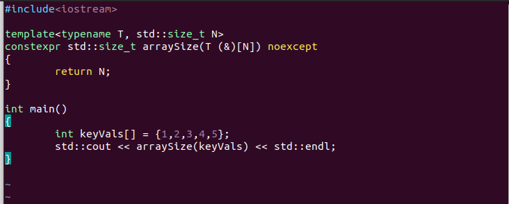
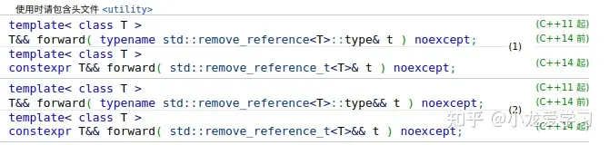
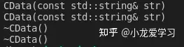
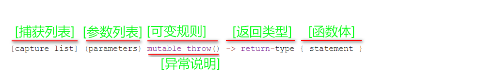

# `Effective Modern C++`

## 理解模板类别推导

​		一个良好风格程序，是可以让客户程序员对其原理一无所知但是却用的相当的satisfied的！

​		符合上述陈述的，就是模板类别推导机制。这里有一小段伪代码可以view一下：

```C++
template<typename T>
void f(ParamType param); // ParamType is a compound of T
```

​		一次调用：

```
f(expr);
```

​		在编译期间，我们的编译器通过expr推导两个型别：一个是T，另一个是`ParamType`,这个`ParamType`，往往会有一些饰词：举个例子：

```C++ 
template<typename T>
void f(const T& param);
```

​		调用如下：

```
int x = 0;
f(x);
```

​		不会违背我们常识的——我们马上拿到了T是int,而*`ParamType`*是`const T&`

​		结合我们的开发经验，可以知道*`ParamType`*有三种：

- `ParamType`具有指针或者是引用型别，但不是一个万能引用
- `ParamType`是一个万能引用
- `ParamType`啥也不是

### `Case 1`:`ParamType`具有指针或者是引用型别，但不是一个万能引用

​		这是最简单的！运作的步骤就是如下：

1. 若expr具有引用型别，先忽略引用
2. 而后，对expr的型别和`ParamType`的型别进行模式匹配后，来决定T的型别

举个例子

```C++
template<typename T>
void f(T& param);

int x = 27;			// x is int
const int cx = x;	// cx is const int
const int& rx = x;	// rx is consy int&
```

​		于是

```C++
f(x);			// T is int, param is int&
f(cx);			// T is const int, param is const int&
f(rx);			// T is const int, param is const int&
```

​		这个时候，请注意——const关键字在类型模板推到中还是被带上了const。这就说明了模板推导是安全的。

​		当然，那如果是

```
void f(const T& param);
```

​		于是，我们没有必要繁琐的多次添加const，也就是说：

```
f(x);			// T is int, param is int&
f(cx);			// T is int, param is const int&
f(rx);			// T is int, param is const int&
```

​		没有必要再让T带上const修饰符了——这里的参数总会具有恒定修饰符。

​		当然，对于指针

```C++
void f(T* param);
int x = 27;
const int cx = x;
const int* px = &x;

f(&x);	// T is int, param is int*
f(px);	// T is const int param is const int*
```

## `case 2: param`是一个万能引用

​		先简单谈谈什么是万能引用

C++11除了带来了右值引用以外，还引入了一种称为“万能引用”的语法；通过“万能引用”，对某型别的引用T&&，既可以表达右值引用，也可以表达左值引用。

## 定义

该语法有两种使用场景，最常见的一种是作为函数模板的形参：

```text
template<typename T>
void f(T&& param);
```

其中param就是一个万能引用。
第二个场景则是auto声明：

```text
auto&& var2 = var1;
```

这两种情况都涉及到了型别的推导，也就是说，如果你虽然遇到了T&&的形式，但是不涉及型别推导，那么它只是一个右值引用：

```text
void f(Widget&& param);
```

同时，想要成为万能引用，变量声明的形式也必须正确无误，必须正好是形如“T&&”才行。比如下面这些情况就不是万能引用：

```text
template<typename T>
void f1(std::vector<T>&& param); // param是一个右值引用

template<typename T>
void f2(const T&& param);      //param也是一个右值引用
```

如果你向f1和f2传左值，会都是会直接报错的。
除此之外，像下面这种情况也不是万能引用：

```text
template<class T, class Allocator=allocator<T>>
class vector{
public:
  void push_back(T&& x);
};
```

push_back的形参x的型别T是受vector影响的，假设给定T为Widget，那么就会被实例化为如下代码：

```text
template<class Widget, class Allocator=allocator<T>>
class vector{
public:
  void push_back(Widget&& x);
};
```

而作为对比，vector类中的emplace_back函数则是一个实实在在的万能引用：

```text
template<class T, class Allocator=allocator<T>>
class vector{
public:
  template<class...Args>
  void emplace_back(Args&&.. args);
};
```

args的型别Args完全独立于vector的型别形参T，Args必须在每次调用emplace_back时被推导，因此args是万能引用。

## 为什么是“万能引用”？

你一定非常好奇，为什么这种形态被称作“万能引用”。原因正像前文所说的，通过“万能引用”，对某型别的引用T&&，既可以表达右值引用，也可以表达左值引用。
比如说，传入一个右值引用，一般都要给传入的参数加一个std::move操作确保变量的可移动性：

```text
class Widget
{
public:
  Widget(Widget&& rhs):name(std::move(rhs.name)){}
private:
  std::string name;
};
```

而万能引用则有所不同，它一般是通过std::forward来进行转换：

```text
class Widget
{
public:
  template<typename T>
  void setName(T&& newName)
  {name = std::forward<T>(newName);}
private:
  std::string name;
};
```

在这种情况下，若newName是一个左值引用，则forward函数不会对它进行操作，它的返回值仍然是一个左值引用；若newName是一个右值，则会进行std::move的转换。用户使用时无需区分，这也正是它“万能”之处。
举个例子：

```text
Widget w;
std::string c = "123";
w.setName(w);            //传入是一个左值，forward返回左值引用
w.setName("123");        //传入是一个右值，forward返回右值引用
w.setName(std::move(w)); //传入是一个右值，forward返回右值引用
```

## 引用折叠

​		你一定会很奇怪，为什么万能引用的形式明明是T&&，却既可以代表左值又可以代表右值。这就要涉及到C++的引用折叠语法了。
​		首先，C++不支持“引用的引用”这种概念，这样的代码在C++中是非法的：

```text
int x;
auto& & rx = x;
```

​		但是，假设我们向前面的万能引用函数f传入一个左值引用：

```text
Widget w = w;
f(w);  //T的推导型别为Widget&
```

​		那么实例化的结果如下：

```text
void f(Widget& && param);
```

​		之所以这样的代码能通过，是因为在特殊的情况下（比如模板实例化），C++应用了引用折叠的语法。
​		有左值和右值两种引用，所以就有四种可能的组合：左值-左值、左值-右值、右值-左值、右值-右值，如果引用的引用出现在允许的语境，改双重引用会被折叠成单个引用：

```text
如果任一引用为左值引用，则结果为左值引用。否则（即两个都为右值引用），结果为右值引用。
```

​		因此上述例子中，最终将param推导为左值引用。
​		此外，auto的型别推导也会应用引用折叠的场景，例如：

```text
Widget w;
auto &&w1 =w;  //w1是个左值
```

话说到这里，我们就可以更深入地理解万能引用，其实它就是满足了下面两个条件的语境中的右值引用：

- 1.型别推导的过程会区别左值和右值。T型别的左值推导结果为T&，而T型别的右值推导结果为T。
- 2.会发生引用折叠。


好了，再给出大纲：

- 如果expr 时一个左值，那么 T 和 paramType都会被推导为左值引用，这个结果仔细思考很有趣：在模板型别推到中，T被认为是引用的唯一情形。其次，尽管在声明的时候使用的是右值引用语法，它的型别推导是左值引用！
- expr是右值，那就是常规的，没有什么区别了。

### `case 3: param`既不是指针又不是引用

​		那就是剩下值传递了

```C++
template<typename T>
void f(T param);
```

​		这意味：传入啥都会是副本，于是我们的param就是一个副本。也就是说：

```
int x = 27;
const int cx = x;
const int& rx = x;

f(x);  // T 和 param 都是int
f(cx); // T 和 param 都是int
f(rx); // T 和 param 都是int
```

​		不过，有一个很有趣的情况

```C++
template<typename T>
void f(T param);

const char* const ptr = "Fun wth pointers";
f(ptr); // const char* const的实参
```

​		这个时候，传景区的param类型就会被推到为const char*，原因很简单，我们必须拷贝这个字符串，这就意味着不可能对原本的字符串进行更改（仍然保留了这一原则！），仍然遵循着自身的const或者volitaile属性会被忽略的问题。

### 		数组实参

​		我们下面考虑的是数组实参的问题

```
const char name[] = "J,P,Briggs";
const char* ptrToName = name;
```

​		这里的ptrToName就是通过name来初始化的。后者的类型是const char[13]，前者是const char*。我们说：这里就发生了数组的退化。

​		现在，当我们把之传递给模板又如何呢？

```
template<typename T>
void f(T param);
f(name);
```

​		我们知道，这样的传递相当的合法：

```
void myFunc(int param[]);
```

​		同样的，我们可以按照指针的方式加以处理——等价的！

```
void myFunc(int* param);
```

​		所以，对于值传递——param就会变成`const char*`

​		那么，有没有办法传递一个真正的数组呢？答案是传递引用

```
template<typename T>
void f(T& param);
f(name);
```

​		T在此时此刻就会变成`const char [13]`，也就是说，param这个时候是:`const char (&) [13]`

​		嗯，试一下：



​		没有任何意外，答案是5.

## 理解auto型别推导

​		有人调侃，未来的C++将会是

```C++
#include auto
auto main(){
    auto;
    return auto;
}
```

​		这确实形象的表达了auto的功能——但是没有如此的夸张。他会让你想起来模板类型推导——没有反转，原理完全一致，我甚至不打算在这里重复一遍了。但是，唯独有一个区别...

​		C++11中，引入了一个叫做统一初始化列表的东西，它的语法是这样的

```
int x = {27};
int y{27};
```

​		都被允许了！

```
auto x1 = 27;
auto x2(27); // x1 and x2 is 27

auto x3 = {27}; // initialize_list<int>
auto x4{27}; // 存疑，貌似有更改，不再是initialize_list<int>
```

```
#include <iostream>

#define SHOWTYPE(X) std::cout << #X << " is " << typeid(X).name() << std::endl;
void show1()
{
    auto x1 = 27;
    SHOWTYPE(x1);
    auto x2(27);

    auto x3 = {27};
    SHOWTYPE(x3);
    auto x4{27};
    SHOWTYPE(x4);
}

template<typename T>
void f(T param)
{
    std::cout << " In F" << std::endl;
    std::cout << "T is " << typeid(T).name() << std::endl;
    std::cout << "param is " << typeid(param).name() << std::endl;
}

template<typename T>
void g(std::initializer_list<T> listParam){
    std::cout << " In G" << std::endl;
    std::cout << "T is " << typeid(T).name() << std::endl;
    std::cout << "param is " << typeid(listParam).name() << std::endl;
}


int main()
{
    auto x = {1,2,3};

    // f({1,2,3}); // can not pass compiling
    f(x);
    g({1,2,3});

    return 0;
}
```

​		尝试一下使用上面的代码编译一下！最终我们得出结论：auto可以识别initialize_list这个类型（推导时假定），但是模板类型推导不会。

​		C++14中，我们无法使用auto返回initialize_list这个类型：

```C++
auto ErrorReturn(){
	return {1,2,3}; // Failed!
}
```

# 扩展

作者：Codemaxi
链接：https://juejin.cn/post/7090673873183571975
来源：稀土掘金
著作权归作者所有。商业转载请联系作者获得授权，非商业转载请注明出处。

## 概念

我们都知道，现代的编程语言，不管是动态语言（JavaScript、Python 等），还是静态语言（Go、Rust 等），大都支持自动类型推导（type deduction）。自动类型推导，通俗地讲就是定义一个变量的时候不需要明确指定类型，而是让编译器根据上下文进行推导。 对于C++语言，在 C++11 之前，就只有模板（template）代码就支持编译器自动类型推导。C++11 很重要的一个特性就是加强了编译器自动类型推导的能力，使之不限于模板 —— 与此相关的关键字有两个 `auto` 和 `decltype` 。通过这两个关键字不仅能方便地获取复杂的类型，而且还能简化书写，提高编码效率。但是有利也有弊，增加简洁可能就会需要增加学习度，如果不能深入理解类型推断背后的规则与机理，很可能就会出现用法错误。基于我们上一篇文章已经介绍了模板类型推导。本节我们先讲解 auto 关键字，下节再讲解 decltype 关键字。

## auto用法

通常auto的用法有下列两种：

```c++
c++复制代码auto declaratorinitializer;  // 普通变量声明定义
auto f = [](auto param1, auto param2) {};  // lambda表达式参数
```

### 基本类型

我们来看看 auto 关键字在 C++ 中的使用。 最简单的用法，定义变量的时候不指定类型，通过初始化的值让编译器自动推导。在C++11标准的语法中，auto被定义为自动推断变量的类型。不过C++11的auto关键字时有一个限定条件，那就是必须给申明的变量赋予一个初始值，否则编译器在编译阶段将会报错。

```cpp
cpp复制代码auto a;  // 编译error，initializer required
auto b = 0;  // b 是 int 类型
auto c = 0ull;   // c 是 unsigned long long 类型  
auto d = "Hello World";  // d 是 const char* 类型
auto e = std::string("Hello");  // e 是 std::string 类型
```

### 容器类型和迭代器

auto 和容器类型、迭代器一起配合使用，可以简化代码，代码也更简洁、清晰。

```cpp
cpp复制代码std::vector<int> v(10, 1); 
auto it_begin = v.begin();   // std::vector<int>::iterator
auto it_end = v.end();       // std::vector<int>::iterator
auto sz = v.size();          // std::vector<int>::size_type

std::map<int,list<string>> m;
auto i = m.begin();  // std::map<int,list<string>>::iterator
```

### 引用和 cv 限定符

特别要注意，使用 **`auto`** 会删除引用、 **`const`** 限定符和 **`volatile`** 限定符。如果定义的对象**不是指针或者引用**，则const属性会被**丢弃**。 请看下面示例：

```cpp
cpp复制代码#include <iostream>

int main() {
    int count = 10;
    int& countRef = count;
    auto myAuto = countRef;

    countRef = 11;
    std::cout << count << " ";

    myAuto = 12;
    std::cout << count << std::endl;
}
```

在上面的程序中，myAuto 是一个int，而不是引用int，因此，如果引用限定符尚未被auto删除，则输出11 11，而不是11 12。如果我们希望推导出的auto类型保留**上层const**或引用，我们需要明确指出。例如：

```c++
c++复制代码const int i = 2;
const auto cvAuto = i;  // save const
auto& ri = i;  // save reference
```

### 指针和引用

如果定义的对象**是指针或者引用**，则const属性被**保留**。 **auto关键字与指针**：设置类型为auto的指针，**初始值的const属性仍然保留**。

```c++
c++复制代码#include <iostream>
#include <string>
#include <typeinfo>
 
int main() {
    int i=2;
    const int ci=i;
    auto a=&i;  // a是整型指针(整数的地址就是指向整数的指针)；
    auto b=&ci; // b是指向整型常量的指针(对const对象取地址是一种底层const)；
    std::cout << typeid(a).name() << '\n';  // Pi
    std::cout << typeid(b).name() << '\n';  // PKi

    // 用auto声明指针类型时，用auto和auto *没有任何区别;
    auto *ppi=&i;
    auto pi=&i;  // 两种方式没有差别；
    std::cout << typeid(ppi).name() << '\n';  // Pi
    std::cout << typeid(pi).name() << '\n';  // Pi
    //用auto声明引用类型时则必须加&;
    auto &rri=i; // rri为引用；
    auto ri=i;  // ri为int；
    std::cout << typeid(rri).name() << '\n';  // i
    std::cout << typeid(ri).name() << '\n';  // i
}
```

**auto关键字与引用**：在使用auto关键字，使用引用其实是使用引用的对象。特别是当引用被用作初始值时，真正参与初始化的其实是**引用的对象的值**，此时编译器以引用对象的类型作为auto的类型。另外设置类型为auto的引用，**初始值的const属性仍然保留**。例如：

```c++
c++复制代码#include <iostream>
#include <string>
#include <typeinfo>
 
int main() {
    int x = 0, &rx = x; // rx是引用
    auto a1 = rx;  //使用引用其实是使用引用的对象，
                //此时auto以引用对象的类型作为auto的类型，
                //所以auto这里被推断为 int;
    auto &a2 = rx; //此时auto被推断为int类型，a2本身就是int &类型;
    const auto &a3 = rx; //auto被推断为int类型，a3对象本身是const int &类型;
                   //不能通过a3去修改rx引用的对象值;
    std::cout << typeid(a1).name() << '\n';  // i
    std::cout << typeid(a2).name() << '\n';  // i
    std::cout << typeid(a3).name() << '\n';  // i

    int i=2; 
	   const int ci=i;
    auto &a=ci;  // 此时auto被推断为const int类型，a本身是const int &类型;
    // auto &b=42; //错误，不能为非const引用绑定字面值；
    const auto &c=43; //正确，可以为const引用绑定字面值；
    std::cout << typeid(a).name() << '\n';  // i
    std::cout << typeid(c).name() << '\n';  // i
}
```

### 数组和函数

在一些情况下，数组的操作实际上是**指针的操作**。意味着适用数组作为一个auto变量的初始值时，推断得到的类型是**指针**而非数组。例如：

```c++
23#include <iostream>
#include <string>
#include <typeinfo>

int add(int a,int b){ return a+b; }  // 函数声明；

int main() {
    int ia[]={1,2,3,4,5};
    auto ia2(ia); // 此时ia2是整型指针，指向ia的第一个元素，
              // 相当于auto ia2(&ia[0])；
    std::cout << typeid(ia2).name() << '\n';  // Pi

    decltype(ia) ia3={0,1,2,3,4}; // 此时ia3是一个数组，下一篇我们介绍decltype；
    std::cout << typeid(ia3).name() << '\n';  // A5_i

    const char arr[] = "I Love China";
    auto r1 = arr; // 如果将数组名赋值给auto变量，那么auto推断的结果是指针类型，
               // 如果有const属性，则保留，auto推断的结果是const char *；
    auto &r2 = arr; // 如果将数组名赋值给auto &变量，
               // auto &变量的类型是一个数组引用类型，即为const char (&)[14]； 
    std::cout << typeid(r1).name() << '\n';  // PKc
    std::cout << typeid(r2).name() << '\n';  // A13_c


    auto r3 = add; // r3为函数指针：int(*)(int, int)；
    auto &r4 = add; // r4为函数引用：int(&)(int, int)；
    std::cout << typeid(r3).name() << '\n';  // PFiiiE
    std::cout << typeid(r4).name() << '\n';  // FiiiE
}
```

### 复合类型

下面的代码示例演示如何使用大括号初始化 **`auto`** 变量。 请注意 B 和 C 与 A 与 E 之间的差异。

```c++
c++复制代码#include <iostream>

int main(){
    // auto初始化表达式可以采用多种形式：
    auto a(1); // 直接初始化或构造函数样式的语法，int
    auto b{ 2 };  // 通用初始化语法，int
    auto c = 3; // 赋值语法，int
    auto d = { 4 }; // 通用赋值语法，是一个列表：std::initializer_list<int>
    std::cout << typeid(a).name() << '\n';  // i
    std::cout << typeid(b).name() << '\n';  // i
    std::cout << typeid(c).name() << '\n';  // i
    std::cout << typeid(d).name() << '\n';  // St16initializer_listIiE

    auto A = { 1, 2 }; // std::initializer_list<int>
    auto B = { 3 }; // std::initializer_list<int>
    auto C{ 4 }; // int
    std::cout << typeid(A).name() << '\n';  // St16initializer_listIiE
    std::cout << typeid(B).name() << '\n';  // St16initializer_listIiE
    std::cout << typeid(C).name() << '\n';  // St16initializer_listIiE

    // error: cannot deduce type for 'auto' from initializer list'
    auto D = { 5, 6.3 }; // 不允许两种不同类型
    // error in a direct-list-initialization context the type for 'auto'
    // can only be deduced from a single initializer expression
    auto E{ 8, 9 }; // 必须要用=号
}
```

关键字 auto 是声明具有复杂类型的变量的简单方法。 例如，可用于 auto 声明初始化表达式涉及模板、指向函数的指针或指向成员的指针的变量。 还可以用于 auto 向 lambda 表达式声明和初始化变量。 您不能自行声明变量的类型，因为仅编译器知道 lambda 表达式的类型。 这和`auto`的一种特殊类型推导有关系。当使用一对花括号来初始化一个`auto`类型的变量的时候，推导的类型是`std::intializer_list`。如果这种类型无法被推导（比如在花括号中的变量拥有不同的类型），代码会编译错误。

### 更多用法

以下代码片段声明变量 `iter` 的类型以及 `elem` 何时 **`for`** 启动范围 **`for`** 循环。

```cpp
cpp复制代码#include <vector>
using namespace std;

int main() {
    vector<double> vtDoubleData(10, 0.1);

    for (auto iter = vtDoubleData.begin(); iter != vtDoubleData.end(); ++iter)
    { /* ... */ }

    // prefer range-for loops with the following information in mind
    // (this applies to any range-for with auto, not just vector, deque, array...)
    // COPIES elements, not much better than the previous examples
    for (auto elem : vtDoubleData) 
    { /* ... */ }

    // observes and/or modifies elements IN-PLACE
    for (auto& elem : vtDoubleData) 
    { /* ... */ }

    // observes elements IN-PLACE
    for (const auto& elem : vtDoubleData) 
    { /* ... */ }
}
```

以下代码片段使用 new 运算符和指针声明来声明指针：

```cpp
cpp复制代码#include <iostream>
#include <vector>

int main() {
    {
        double x = 12.34;
        auto *y = new auto(x);
        auto **z = new auto(&x);
        std::cout << typeid(x).name() << '\n';  // d
        std::cout << typeid(y).name() << '\n';  // Pd
        std::cout << typeid(z).name() << '\n';  // PPd
    }
    {
        int v1 = 300;
        int v2 = 200;
        auto x = v1 > v2 ? v1 : v2;
        std::cout << typeid(x).name() << '\n';  // i
    }
}
```

## auto推导规则

首先，结论是auto使用的是模板实参推断（Template Argument Deduction）的机制，也就是我们上一篇文章介绍的。auto被一个虚构的模板类型参数T替代，然后进行推断，即相当于把变量设为一个函数参数，将其传递给模板并推断为实参，auto相当于利用了其中进行的实参推断，承担了模板参数T的作用。比如：

```c++
c++复制代码template<typename Container>
void useContainer(const Container& container) {
    auto pos = container.begin();  // 1
    while (pos != container.end()) {
        auto& element = *pos++;  // 2
        // ... 对元素进行操作
    }
}
```

上面第一个auto的初始化相当于下面这个模板传参时的情形，T就是为auto推断的类型：

```cpp
cpp复制代码// 模板声明定义
template<typename T>
void deducePos(T pos);
// auto pos = container.begin()中auto的推导等价于下列语句推导
deducePos(container.begin());
```

而auto类型变量不会是引用类型（int&， float&等），所以要用`auto&`，第二个auto推断对应于下面这个模板传参时的情形，同样T就是为auto推断的类型:

```c++
c++复制代码template<typename T>
void deduceElement(T& element);

deduceElement(*pos++);
```

我们上一篇文章把模板类型推导划分成三部分，基于在通用的函数模板的`ParamType`的特性和`param`的类型声明。在一个用`auto`声明的变量上，类型声明代替了`ParamType`的作用，所以也有三种情况：

- 情况1：类型声明是一个指针或者是一个引用，但不是一个通用的引用
- 情况2：类型声明是一个通用引用
- 情况3：类型声明既不是一个指针也不是一个引用

上面我们已经看了情况1和情况3的例子，如下类似：

```cpp
cpp复制代码auto x = 27;        // 情况3（x既不是指针也不是引用）
const auto cx = x;   // 情况3（cx二者都不是）
const auto& rx = x;  // 情况1（rx是一个非通用的引用）
const auto* rx = &x;  // 情况1（rx是一个非通用的指针）
```

情况2正如你期待的那样：

```cpp
cpp复制代码auto x = 27; 
const auto cx = x;
auto&& uref1 = x;   // x是int并且是左值，所以uref1的类型是int&
auto&& uref2 = cx;  //cx是int并且是左值，所以uref2的类型是const int&
auto&& uref3 = 27;  // 27是int并且是右值，所以uref3的类型是int&&
```

当然我们上一篇文章还介绍了数组以及函数这两种情形，这两种情形对于auto这里也是适用的，上面我们已经把这两种情形的用法介绍了，这里就不详细介绍它的推导了。

但是，唯一例外的是对初始化列表的推断，auto会将其视为`std::initializer_list`，而模板则不能对其推断

```c++
c++复制代码#include <iostream>

template<typename T>
void deduceX(T x) {}

int main(){
    auto x = { 1, 2 };  // 不允许对auto用initializer_list直接初始化，必须用=
    // auto x1 { 1, 2 }; // 错误
    // 保留了单元素列表的直接初始化，但不会将其视为initializer_list，x2是int   
    auto x2 { 1 };
    std::cout << typeid(x).name();  // class std::initializer_list<int>
    std::cout << typeid(x2).name();  // C++14中为int

    deduceX({ 1, 2 }); // 错误：不能推断T
}
```

但是，如果你明确模板的`param`的类型是一个不知道`T`类型的`std::initializer_list<T>`：

```c++
c++复制代码#include <iostream>

template<typename T>
void deduceX(std::initializer_list<T> initList) {}

int main(){
    // void deduceX<int>(std::initializer_list<int>)
    deduceX({ 1, 2 }); // 正确：T是int
}
```

所以`auto`和模板类型推导的本质区别就是`auto`假设花括号初始化代表的是std::initializer_list，但是模板类型推导却不是。

你们可能对为什么`auto`类型推导有一个对花括号初始化有一个特殊的规则而模板的类型推导却没有感兴趣。可惜我也没找到答案。这可能就是规则吧，这就意味着你必须记住如果使用`auto`声明一个变量并且使用花括号来初始化它，类型推导的就是`std::initializer_list`。在C++11编程里面的一个经典的错误就是误被声明成`std::initializer_list`，而其实你是想声明另外的一种类型。这个陷阱使得一些开发者仅仅在必要的时候才会在初始化数值周围加上花括号。

C++14还允许auto作为返回类型，但此时auto仍然使用的是模板实参推断的机制，因此返回类型为auto的函数如果返回一个初始化列表，则会出错：

```c++
c++
复制代码auto newInitList() { return { 1,2 }; } // 错误
```

在C++14的lambda里面，当`auto`用在参数类型声明的时候也是如此：

```c++
c++复制代码std::vector<int> v;
auto resetV = [&v](const auto& newValue) { v = newValue; } // C++14

resetV({ 1, 2, 3 });   // 编译错误，不能推导出{ 1, 2, 3 }的类型
```

## 什么时候用 auto

适用的场景：

- 一些类型长度书写很长的，可以用 auto 来简化。例如：

```cpp
cpp
复制代码for(std::vector<int>::iterator it = v.begin();it != v.end();++it) {}
```

如果使用auto可以直接写为 :

```cpp
cpp
复制代码for(auto it = v.begin();it != v.end();++it) {}
```

- 当函数返回的值不确定时，可以用auto作为返回值类型，更加方便。编译器会根据返回值的类型推断 auto 的类型，这种语法是在 C++14 才出现的。例如：

```arduino
arduino
复制代码auto func() { return 0; }
```

不适用的场景：

- 函数形参不能是auto类型，比如:

```cpp
cpp
复制代码int add(auto a, auto b) { return a + b; } //是不允许的。
```

- 类的非static成员变量不可以是auto类型。类的static成员变量可以是auto类型的，但需要用const修饰，而且该变量需要类内初始化。例如：

```arduino
arduino复制代码class {
	auto x = 6; // error
	auto static const i=4;
}
```

- auto 不能直接用来声明数组。
- 实例化模板时不能使用auto作为模板参数。

## 总结

在C++11新标准中引进了auto类型说明符，使用它能够让编译器代替我们去分析**表达式所属的类型**。auto 自动类型推断发生在**编译期**，所以使用 auto 关键字不会降低程序的运行效率。

但是要注意，虽然auto 是一个很强大的工具，但任何工具都有它的两面性，不加选择地随意使用 auto，会带来代码可读性和维护性的严重下降。因此，在使用 auto 的时候，一定要权衡好它带来的“价值”和相应的“损失”。 总的来说, 我认为模板参数推导 (template argument deduction) 和 `auto` 其实是一回事, 是基于 C++ 类型系统的类型推导 (type inference) 的两个表现形式。

另外，decltype也是 C++11 新增的一个关键字，它和 auto 的功能一样，都是用来在编译时期进行自动类型推导。decltype比auto更确切地推断名称或表达式的类型（即原始的declared type），实现原理和auto类似，只是特殊情况不太一样，具体我们下一篇文章介绍。

# Effective Modern C++

## 理解decltype

​		这玩意很有趣，它可以返回给定的表达式的类型。我举个例子

```
const int i = 0;		// decltype(i) -> const int
bool f(const Widget& w); // decltype(f) -> bool(const Widget&)

struct Point{
	int x, y;
}
```

​		`delctype`主要是应用于那些返回值型别依赖于形参型别的函数模板。

​		在C++11中，我们需要这样写一个函数模板

```C++
template<typename Container, typename Index>
auto authandAccess(Container& c, Index i)->decltype(c[i])
{
    authenticateUser();
    return c[i];
}
```

​		这里使用了C++11的返回值型别尾序语法，这样，我们就可以在指定返回值型别的时候使用函数形参。

​		当然，现在不会再那么麻烦了：

```C++
template<typename Container, typename Index>
auto authandAccess(Container& c, Index i)
{
    authenticateUser();
    return c[i];
}
```

​		可是即使这样，还是会留下隐患。

​		举个例子，在STL中的若干容器，当我们试着去运行operator[]的时候，我们希望返回的是T& ， 啥意思？这个意思：

```C++
std::deque<int> a;
a[1] = 10;
```

​		我们可以通过这种方式赋值。

​		但是，我们上面的写法，是没有办法赋值的。

```
std::deque<int> d;
authAndAccess(d, 5) = 10; // 抛错， 本质上返回了右值int
```

​		所以，这样修改：

```
template<typename Container, typename Index>
auto authandAccess(Container& c, Index i) -＞delctype(auto)
{
    authenticateUser();
    return c[i];
}
```

​		这样，我们的`c[i]`是啥，他就会返回啥。

​		别跑，还有问题！我们可能会需要起传递一个右值容易——

```
std::deque<std::string> makeStringDeque();// 工厂函数
auto s = authAndAccess(makeStringDeque(), 5);
```

​		我们的右值容器，会在传递语句结束之后就会被析构。右值不可以绑定在左值引用上！（马上就会消失）。

​		我们的一个办法，就是写两个函数（一个接受左值，一个接受右值）。还有一个办法就是使用万能引用——让我们的编译器判断处置

```
template<typename T, typename Index>
decltype(auto) authAndAccess(Container&& c, Index i);
```

​		当然，我们后面会提到的——对万能模板使用`std::forward`

# decltype 关键字

[c++ decltype: 类型推导规则及应用 - 知乎 (zhihu.com)](https://zhuanlan.zhihu.com/p/152154499)

### 获知表达式的类型

- auto，用于通过一个表达式在编译时确定待定义的变量类型，auto 所修饰 的变量必须被初始化，编译器需要通过初始化来确定auto 所代表的类型，即必须要定义变 量。
- 若仅希望得到类型，而不需要（或不能）定义变量的时候应该怎么办呢？ C++11 新增了decltype 关键字，用来在编译时推导出一个表达式的类型。它的语法格式 如下：

```text
decltype(exp)
其中，exp 表示一个表达式（expression）
```

从格式上来看，decltype 很像sizeof——用来推导表达式类型大小的操作符。类似于 sizeof，decltype 的推导过程是在编译期完成的，并且不会真正计算表达式的值。 那么怎样使用decltype 来得到表达式的类型呢？让我们来看一组例子：

```text
int x = 0;
decltype(x) y = 1; // y -> int
decltype(x + y) z = 0; // z -> int
const int& i = x;
decltype(i) j = y; // j -> const int &
const decltype(z) * p = &z; // *p -> const int, p -> const int *
decltype(z) * pi = &z; // *pi -> int , pi -> int *
decltype(pi)* pp = &pi; // *pp -> int * , pp -> int * *
```

1. **y 和z** 的结果表明decltype 可以根据表达式直接推导出它的类型本身。这个功能和上一 节的auto 很像，但又有所不同。auto 只能根据变量的初始化表达式推导出变量应该具有的 类型。若想要通过某个表达式得到类型，但不希望新变量和这个表达式具有同样的值，此时 auto 就显得不适用了。
2. **j** 的结果表明decltype 通过表达式得到的类型，可以保留住表达式的引用及const 限定 符。实际上，对于一般的标记符表达式（id-expression），decltype 将精确地推导出表达式定义 本身的类型，不会像auto 那样在某些情况下舍弃掉引用和cv 限定符。
3. **p、pi** 的结果表明decltype 可以像auto 一样，加上引用和指针，以及cv 限定符。 pp 的推导则表明，当表达式是一个指针的时候，decltype 仍然推导出表达式的实际类 型（指针类型），之后结合pp 定义时的指针标记，得到的pp 是一个二维指针类型。这也是和 auto 推导不同的一点。
4. 对于decltype 和引用（&） 结合的推导结果， 与C++11 中新增的引用折叠规则 （Reference Collapsing）有关，因此，留到后面的2.1 节右值引用（Rvalue Reference）时再详 细讲解。
5. **p、pi、pp** 的推导， 有个很有意思的地方。像MicrosoftVisual Studio 这样的 IDE，可以在运行时观察每个变量的类型。我们可以看到p 的显示是这样的： 这其实是C/C++ 的一个违反常理的地方： 指针（*）、引用（&） 属于说明符 （declarators），在定义的时候，是和变量名，而不是类型标识符（type-specif iers）相结 合的。因此，“ const decltype(z)*p”推导出来的其实是*p 的类型（const int），然后再进一步运算出p 的类型。

### decltype 的推导规则

从上面一节内容来看，decltype 的使用是比较简单的。但在简单的使用方法之后，也隐 藏了不少细节。 我们先来看看decltype(exp) 的推导规则：

**推导规则 1**: exp 是标识符、类访问表达式，decltype(exp) 和 exp 的类型一致。*

**推导规则 2**: exp 是函数调用，decltype(exp) 和返回值的类型一致。

**推导规则 3**: 其他情况，若 exp 是一个左值，则 decltype(exp) 是 exp 类型的左值引 用，否则和exp 类型一致。

只看上面的推导规则，很难理解decltype(exp) 到底是一个什么类型。为了更好地讲解这 些规则的适用场景，下面根据上面的规则分3 种情况依次讨论： *标识符表达式和类访问表达式。* 函数调用（非标识符表达式，也非类访问表达式）。 * 带括号的表达式和加法运算表达式（其他情况）。

### 标识符表达式和类访问表达式

先看第一种情况，代码清单1-3 是一组简单的例子。 代码清单1-3　decltype 作用于标识符和类访问表达式示例

```text
class Foo
{
public:
static const int Number = 0;
int x;
};

int n = 0;
volatile const int & x = n;
decltype(n) a = n; // a -> int
decltype(x) b = n; // b -> const volatile int &
decltype(Foo::Number) c = 0; // c -> const int
Foo foo;
decltype(foo.x) d = 0; // d -> int，类访问表达式
```

1. 变量a、b、c 保留了表达式的所有属性（cv、引用）。 这里的结果是很简单的，按照推导规则1，对于标识符表达式而言，decltype 的推导结果就和这个变量的类型定义一致。
2. d 是一个类访问表达式，因此也符合推导规则1。

### 函数调用

如果表达式是一个函数调用（不符合推导规则1），结果会如 何呢？ 请看代码清单1-4 所示的示例。

```text
int& func_int_r(void); // 左值（lvalue，可简单理解为可寻址值）
int&& func_int_rr(void); // x 值（xvalue，右值引用本身是一个xvalue）
int func_int(void); // 纯右值（prvalue，将在后面的章节中讲解）
const int& func_cint_r(void); // 左值
const int&& func_cint_rr(void); // x 值
const int func_cint(void); // 纯右值
const Foo func_cfoo(void); // 纯右值
// 下面是测试语句
int x = 0;
decltype(func_int_r()) a1 = x; // a1 -> int &
decltype(func_int_rr()) b1 = 0; // b1 -> int &&
decltype(func_int()) c1 = 0; // c1 -> int
decltype(func_cint_r()) a2 = x; // a2 -> const int &
decltype(func_cint_rr()) b2 = 0; // b2 -> const int &&
decltype(func_cint()) c2 = 0; // c2 -> int
decltype(func_cfoo()) ff = Foo(); // ff -> const Foo
```

1. 按照推导规则2，decltype 的结果和函数的返回值类型保持一致。
2. 需要注意的是，c2 是int 而不是const int。这是因为函数返回的int 是一个纯右值 （prvalue）。对于纯右值而言，只有类类型可以携带cv 限定符，此外则一般忽略掉cv 限定。 如果在gcc 下编译上面的代码，会得到一个警告信息如下：

```text
warning: type qualif iers ignored on function return type
[-Wignored-qualif iers]
cint func_cint(void);
```

因此，decltype 推导出来的c2 是一个int。 3. 作为对比，可以看到decltype 根据func_cfoo() 推导出来的ff 的类型是const Foo。

### 带括号的表达式和加法运算表达式

最后，来看看第三种情况：

```text
struct Foo { int x; };
const Foo foo = Foo();
decltype(foo.x) a = 0; // a -> int
decltype((foo.x)) b = a; // b -> const int &
int n = 0, m = 0;
decltype(n + m) c = 0; // c -> int
decltype(n += m) d = c; // d -> int &
```

1. a 和b 的结果：仅仅多加了一对括号，它们得到的类型却是不同的。
2. a 的结果是很直接的，根据推导规则1，a 的类型就是foo.x 的定义类型。
3. b 的结果并不适用于推导规则1 和2。根据foo.x 是一个左值，可知括号表达式也是一个 左值。因此可以按照推导规则3，知道decltype 的结果将是一个左值引用。 foo 的定义是const Foo，所以foo.x 是一个const int 类型左值，因此decltype 的推导结果 是const int &。 同样，n+m 返回一个右值，按照推导规则3，decltype 的结果为int。 最后，n+=m 返回一个左值，按照推导规则3，decltype 的结果为int &。

### decltype 的实际应用

### decltype 的应用多出现在泛型编程中

```text
#include <vector>
template <class ContainerT>
class Foo
{
typedef typename ContainerT::iterator it_; // 类型定义可能有问题

public:
void func(ContainerT& container)
{
it_ i = container.begin();
}
// ...
};
int main(void)
{
typedef const std::vector<int> container_t;
container_t arr;
Foo<container_t> foo;
foo.func(arr);
return 0;
}
```

单独看类Foo 中的it_ 成员定义，很难看出会有什么错误，但在使用时，若上下文要求 传入一个const 容器类型，编译器马上会弹出一大堆错误信息。

原因就在于，ContainerT::iterator 并不能包括所有的迭代器类型，当ContainerT 是一个 const 类型时，应当使用const_iterator。

要想解决这个问题，在C++98/03 下只能想办法把const 类型的容器用模板特化单独处 理，比如增加一个像下面这样的模板特化：

```text
template <class ContainerT>
class Foo<const ContainerT>
{
typename ContainerT::const_iterator it_;
public:
void func(const ContainerT& container)
{
it_ = container.begin();
}
// ...
};
```

这实在不能说是一个好的解决办法。若const 类型的特化只是为了配合迭代器的类型限 制，Foo 的其他代码也不得不重新写一次。

有了decltype 以后，就可以直接这样写：

```C++ 
template <class ContainerT>
class Foo
{
	decltype(ContainerT().begin()) it_;
	public:
	void func(ContainerT& container)
	{
		it_ = container.begin();
	}
// ...
};
```

### decltype 用在通过变量表达式抽取变量类型

如下面的这种用法：

```text
vector<int> v;
// ...
decltype(v)::value_type i = 0;
```

在冗长的代码中，人们往往只会关心变量本身，而并不关心它的具体类型。

比如在上例中，只要知道v 是一个容器就够了（可以提取value_type），后面的所有算法内容只需要出现 v，而不需要出现像vector 这种精确的类型名称。这对理解一些变量类型复杂但操作统 一的代码片段有很大好处。

实际上，标准库中有些类型都是通过decltype 来定义的：

```text
typedef decltype(nullptr)nullptr_t;// 通过编译器关键字nullptr 定义类型nullptr_t
typedef decltype(sizeof(0)) size_t;
```

这种定义方法的好处是，从类型的定义过程上就可以看出来这个类型的含义。

### 返回类型后置语法——auto 和decltype 的结合使用

在泛型编程中，可能需要通过参数的运算来得到返回值的类型。 考虑下面这个场景：

```text
template <typename R, typename T, typename U>
R add(T t, U u)
{
return t+u;
}
int a = 1; float b = 2.0;
auto c = add<decltype(a + b)>(a, b);
```

我们并不关心a+b 的类型是什么，因此，只需要通过decltype(a+b) 直接得到返回值 类型即可

。但是像上面这样使用十分不方便，因为外部其实并不知道参数之间应该如何运 算，只有add 函数才知道返回值应当如何推导。那么，在add 函数的定义上能不能直接通过 decltype 拿到返回值吗？

```text
template <typename T, typename U>
decltype(t + u) add(T t, U u) // error: t、u 尚未定义
{
return t + u;
}
```

当然，直接像上面这样写是编译不过的。因为t、u 在参数列表中，而C++ 的返回值是 前置语法，在返回值定义的时候参数变量还不存在。 可行的写法如下：

```text
template <typename T, typename U>
decltype(T() + U()) add(T t, U u)
{
return t + u;
}
```

考虑到T、U 可能是没有无参构造函数的类，正确的写法应该是这样：

```text
template <typename T, typename U>
decltype((*(T*)0) + (*(U*)0)) add(T t, U u)
{
return t + u;
}
```

虽然成功地使用decltype 完成了返回值的推导，但写法过于晦涩，会大大增加decltype 在返回值类型推导上的使用难度并降低代码的可读性。

因此，在C++11 中增加了**返回类型后置**（trailing-return-type，又称跟踪返回类型）语法，将decltype 和auto 结合起来完成返回值类型的推导。

返回类型后置语法是通过auto 和 decltype 结合起来使用的。

上面的add 函数，使用新的语法可以写成：

```text
template <typename T, typename U>
auto add(T t, U u) -> decltype(t + u)
{
return t + u;
}
```

为了进一步说明这个语法，再看另一个例子：

```text
int& foo(int& i);
float foo(float& f);
template <typename T>
auto func(T& val) -> decltype(foo(val))
{
return foo(val);
}
```

# std::forward

[C++编程系列笔记（3）——std::forward与完美转发详解 - 知乎 (zhihu.com)](https://zhuanlan.zhihu.com/p/645328162)

std::forward是C++11中引入的一个函数模板，用于实现完美转发（Perfect Forwarding）。它的作用是根据传入的参数，决定将参数以左值引用还是右值引用的方式进行转发。

我们知道，在C++中，存在左值（lvalue）和右值（rvalue）的概念。关于左值和右值的概念，在本系列上一篇文章《C++编程系列笔记（2）——std::move和移动语义详解》中也有较为详细的讲解。简单来说，左值是指可以取地址的、具有持久性的对象，而右值是指不能取地址的、临时生成的对象。传统上，当一个左值传递给一个函数时，参数会以左值引用的方式进行传递；当一个右值传递给一个函数时，参数会以右值引用的方式进行传递。

然而，完美转发是为了解决传递参数时的临时对象（右值）被强制转换为左值的问题。在C++03中，可以使用泛型引用来实现完美转发，但是需要写很多重载函数，非常繁琐。而在C++11中，引入了std::forward，可以更简洁地实现完美转发。

因此，概括来说，std::forward实现完美转发主要用于以下场景：**提高模板函数参数传递过程的转发效率**。

下面我们将逐步引入完美转发的必要性和用法。完美转发主要通过“引用折叠”和“std::forward”函数实现，我们先来了解他们。

## 引用折叠

C++引用折叠是一种特性，允许在模板元编程中使用引用类型的参数来创建新的引用类型。

由于存在`T&&`这种万能引用类型，当它作为`参数`时，有可能被一个左值引用或右值引用的参数初始化，这是经过类型推导的T&&类型，推导后得到的参数类型会发生类型变化，这种变化就称为引用折叠。

引用折叠的具体规则如下：

- 若一个右值引用（即带有`&&`）参数被一个左值或左值引用初始化，那么引用将折叠为左值引用。（即：T&& & –> T&）
- 若一个右值引用参数被一个右值初始化，那么引用将折叠为右值引用。（即：T&& && 变成 T&&）。
- 若一个左值引用参数被一个左值或右值初始化，那么引用不能折叠，仍为左值引用（即：T& & –>T&，T& && –>T&）。

> 总结一下： 所有右值引用折叠到右值引用上仍然是一个右值引用。（A&& && 变成 A&&） 。 所有的其他引用类型之间的折叠都将变成左值引用。 （A& & 变成 A&; A& && 变成 A&; A&& & 变成 A&）。
> 简单来说：右值经过T&&参数传递，类型保持不变还是右值（引用）；而左值经过T&&变为普通的左值引用。

为了更好地理解引用折叠，以下为几个示例：

```cpp
template<typename T>
void func(T&& arg);

int main() {
  int a = 5;
  func(a);  // arg为int&，引用折叠为左值引用

  func(10);  // arg为int&&，引用折叠为右值引用

  int& ref = a;
  func(ref);  // arg为int&，引用不能折叠
}
```

在上述示例中，函数模板func接受一个转发引用类型（&&）的参数，并根据传递给func的实参类型决定引用类型：

- 当func(a)时，参数类型折叠后实际为int&，因为a是一个左值，引用类型折叠为左值引用。
- 当func(10)时，参数类型折叠后实际为int&&，因为10是一个右值，引用类型折叠为右值引用。
- 当func(ref)时，参数类型折叠后实际为int&，由于左值引用类型不能折叠，参数类型保持为左值引用。

引用折叠是C++中模板编程中非常有用的特性，可以根据传递实参的左值还是右值来确定引用类型，进而使得编写通用的模板函数或类更简单。

## std::forward函数

实现完美转发的关键是使用std::forward函数。std::forward是一个条件转发函数模板，根据参数的左值或右值属性进行转发。它的定义参考如下：



这个模板函数接受一个参数并返回一个右值引用，同时利用**引用折叠**保留参数的左值或右值属性。调用std::forward时，根据参数的左值或右值属性，编译器会选择适当的模板实例进行转发。如果参数是一个左值引用，std::forward将返回一个左值引用。如果参数是一个右值引用，std::forward将返回一个右值引用。

例如：

1、如果T为std::string&，那么std::forward(t) 返回值为std::string&& &，折叠为std::string&，左值引用特性不变。

2、如果T为std::string&&，那么std::forward(t) 返回值为std::string&& &&，折叠为std::string&&，右值引用特性不变。

掌握了以上知识之后，我们可能还是不清楚std::forward到底有什么用，那么请看下一节。

## 利用std::forward实现完美转发

C++完美转发是指一种能够传递函数参数或对象的**同样类型**（例如左值或右值属性）和**cv限定符**（const或volatile）的方式，同时保留原参数的准确数值类别和cv限定符的转发机制。完美转发通过使用引用折叠机制和std::forward函数来实现。

### 作用

在C++11之前，当我们将一个参数转发给另一个函数时，会丢失参数的左值或右值的信息。例如，如果我们有一个函数f，它接受一个左值引用，然后我们通过f来调用一个函数g并传递一个右值，那么在g函数内部，参数将被视为左值，从而可能引入额外的参数转移开销。

C++11引入了右值引用、移动构造函数、引用折叠、std::forward等概念，使我们能够更准确地传递参数的左值或右值属性。因此，完美转发的目标是在转发参数时保持原始参数的左值或右值属性，从而提高函数参数传递的效率。

### **完美转发应用实例**

首先定义一个对象CData，具体说明看注释：

```cpp
#include <stdio.h>
#include <unistd.h>
#include <iostream>

class CData
{
public:
	CData() = delete;
	CData(const char* ch) : data(ch)    // 构造函数，涉及资源的复制
	{
		std::cout << "CData(const char* ch)" << std::endl;
	}
	CData(const std::string& str) : data(str)  // 拷贝构造函数，涉及资源的复制
	{
		std::cout << "CData(const std::string& str)" << std::endl;
	}
	CData(std::string&& str) : data(str)    // 移动构造函数，不涉及资源的复制！！！
	{
		std::cout << "CData(std::string&& str)" << std::endl;
	}
	~CData()   // 析构函数
	{
		std::cout << "~CData()" << std::endl;
	}
private:
	std::string data;   // 表示类内部管理的资源
};
```

假如我们封装了一个操作，主要是用来创建对象使用（类似设计模式中的工厂模式），这个操作要求如下：

\1. 可以接受不同类型的参数，然后构造一个对象的指针。

\2. 性能尽可能高。（这里需要高效率，故对于右值的调用应该使用CData(std::string&& str)移动函数操作）

**1）不使用std::forward实现**

假设我们不使用std::forward，那么要提高函数参数转发效率，我们使用右值引用（万能引用）作为模板函数参数：

```cpp
template<typename T>
CData* Creator(T&& t) { // 利用&&万能引用，引用折叠： T&& && -> T&&; T&& & -> T&
	return new CData(t);
}
int main(void) {
    std::string str1 = "hello";  
    std::string str2 = " world";
    CData* p1 = Creator(str1);       // 参数折叠为左值引用，调用CData构造函数
    CData* p2 = Creator(str1 + str2);// 参数折叠为右值引用，但在Creator函数中t仍为左值，调用CData构造函数！！！
    delete p2;
    delete p1;

    return 0;
}
```

g++编译上述程序，可得如下结果，印证了注释中的说明：



可以看出，在不使用std::forward的情况下，即使传入了右值引用，也无法在Creator函数中触发CData的移动构造函数，从而造成了额外的资源复制损耗。

**2）使用std::forward实现**

使用std::forward即可完美解决上述问题：

```cpp
template<typename T>
CData* Creator(T&& t) {
    return new CData(std::forward<T>(t));
}
int main(void) {
    std::string str1 = "hello";
    std::string str2 = " world";
    CData* p1 = Creator(str1);        // 参数折叠为左值引用，调用CData构造函数
    CData* p2 = Creator(str1 + str2); // 参数折叠为右值引用，通过std::forward转发给CData，调用移动构造函数
    delete p2;
    delete p1;

    return 0;
}
```

g++编译上述程序，可得如下结果，印证了注释中的说明：


可以看出，使用了std::forward之后，可以将传入的函数参数按照其原类型进一步传入参数中，从而使右值引用的参数类型可以触发类的移动构造函数，从而避免不必要的资源复制操作，提高参数转移效率。

### **结论**

所谓的完美转发，是指std::forward会将输入的参数原封不动地传递到下一个函数中，这个“原封不动”指的是，如果输入的参数是左值，那么传递给下一个函数的参数的也是左值；如果输入的参数是右值，那么传递给下一个函数的参数的也是右值。

完美转发主要使用两步来完成任务： 1. 在模板中使用&&（万能引用）接收参数。 2. 使用std::forward()转发给被调函数.

这个对于上面一个例子带来的好处就是函数转发仍旧为右值引用，可以使用移动构造函数提高参数转移的效率（关于移动构造函数可以参考上一篇文章《C++编程系列笔记（2）——std::move和移动语义详解》中的内容）。

## std::forward实现原理（参考自ChatGPT）

std::forward的定义如下：

```text
template <typename T>
T&& forward(typename std::remove_reference<T>::type& arg) noexcept
{   // forward an lvalue as either an lvalue or an rvalue
    return (static_cast<_Ty&&>(_Arg));
}
```

它接受一个参数arg，并将其转发为右值引用。实际上，它会根据arg的左值或右值属性来决定是将arg转发为左值引用还是右值引用。如果arg是左值，它会将arg转发为左值引用；如果arg是右值，它会将arg转发为右值引用。

std::forward通常与模板函数和转发引用（forwarding reference）一起使用，用于完美转发函数参数。例如：

```text
template <typename T>
void foo(T&& arg)
{
    bar(std::forward<T>(arg));
}
```

在这个例子中，foo函数接受一个转发引用arg，并将arg转发给另一个函数bar。通过使用std::forward，bar函数会根据传入的arg参数的左值或右值属性，将它作为左值引用或右值引用进行转发。

总之，std::forward是C++11中用于实现完美转发的函数模板，可以根据传入的参数决定将参数以左值引用还是右值引用的方式进行转发，解决了传递参数时临时对象被强制转换为左值的问题。

## C ++ [Lambda](https://so.csdn.net/so/search?q=Lambda&spm=1001.2101.3001.7020)表达式详解

### 1.Lambda表达式概述

 Lambda表达式是现代C++在C ++ 11和更高版本中的一个新的语法糖 ，在C++11、C++14、C++17和C++20中Lambda表达的内容还在不断更新。 lambda表达式（也称为lambda函数）是在调用或作为函数参数传递的位置处定义匿名函数对象的便捷方法。通常，lambda用于封装传递给算法或异步方法的几行代码 。本文主要介绍Lambda的工作原理以及使用方法。

### 2.Lambda表达式定义

#### 2.1 Lambda表达式示例

 Lambda有很多叫法，有Lambda表达式、Lambda函数、匿名函数，本文中为了方便表述统一用Lambda表达式进行叙述。 ISO C ++标准官网展示了一个简单的lambda 表示式实例:

```cpp
#include <algorithm>
#include <cmath>

void abssort(float* x, unsigned n) {
    std::sort(x, x + n,
        // Lambda expression begins
        [](float a, float b) {
            return (std::abs(a) < std::abs(b));
        } // end of lambda expression
    );
}
```

在上面的实例中std::sort函数第三个参数应该是传递一个排序规则的函数，但是这个实例中直接将排序函数的实现写在应该传递函数的位置，省去了定义排序函数的过程，对于这种不需要复用，且短小的函数，直接传递函数体可以增加代码的可读性。

#### 2.2 Lambda表达式语法定义



1. 捕获列表。在C ++规范中也称为*Lambda导入器， 捕获列表总是出现在Lambda函数的开始处。实际上，[]是Lambda引出符。编译器根据该引出符判断接下来的代码是否是Lambda函数，捕获列表能够捕捉上下文中的变量以供Lambda函数使用。*
2. *参数列表*。与普通函数的参数列表一致。如果不需要参数传递，则可以连同括号“()”一起省略。
3. 可变规格*。mutable修饰符， 默认情况下Lambda函数总是一个const函数，mutable可以取消其常量性。在使用该修饰符时，参数列表不可省略（即使参数为空）。*
4. *异常说明*。用于Lamdba表达式内部函数抛出异常。
5. 返回类型。 追踪返回类型形式声明函数的返回类型。我们可以在不需要返回值的时候也可以连同符号”->”一起省略。此外，在返回类型明确的情况下，也可以省略该部分，让编译器对返回类型进行推导。
6. lambda函数体。内容与普通函数一样，不过除了可以使用参数之外，还可以使用所有捕获的变量。

#### 2.3 Lambda表达式参数详解

##### 2.3.1 Lambda捕获列表

 Lambda表达式与普通函数最大的区别是，除了可以使用参数以外，Lambda函数还可以通过捕获列表访问一些上下文中的数据。具体地，捕捉列表描述了上下文中哪些数据可以被Lambda使用，以及使用方式（以值传递的方式或引用传递的方式）。语法上，在“[]”包括起来的是捕获列表，捕获列表由多个捕获项组成，并以逗号分隔。捕获列表有以下几种形式：

- []表示不捕获任何变量

```cpp
auto function = ([]{
		std::cout << "Hello World!" << std::endl;
	}
);

function();
```

- [var]表示值传递方式捕获变量var

  ```cpp
  int num = 100;
  auto function = ([num]{
  		std::cout << num << std::endl;
  	}
  );
  
  function();
  ```

- [=]表示值传递方式捕获所有父作用域的变量（包括this）

  ```cpp
  int index = 1;
  int num = 100;
  auto function = ([=]{
  			std::cout << "index: "<< index << ", " 
                  << "num: "<< num << std::endl;
  	}
  );
  
  function();
  ```

- [&var]表示引用传递捕捉变量var

  ```cpp
  int num = 100;
  auto function = ([&num]{
  		num = 1000;
  		std::cout << "num: " << num << std::endl;
  	}
  );
  
  function();
  ```

- [&]表示引用传递方式捕捉所有父作用域的变量（包括this）

  ```cpp
  int index = 1;
  int num = 100;
  auto function = ([&]{
  		num = 1000;
  		index = 2;
  		std::cout << "index: "<< index << ", " 
              << "num: "<< num << std::endl;
  	}
  );
  
  function();
  ```

- [this]表示值传递方式捕捉当前的this指针

  ```cpp
  #include <iostream>
  using namespace std;
   
  class Lambda
  {
  public:
      void sayHello() {
          std::cout << "Hello" << std::endl;
      };
  
      void lambda() {
          auto function = [this]{ 
              this->sayHello(); 
          };
  
          function();
      }
  };
   
  int main()
  {
      Lambda demo;
      demo.lambda();
  }
  ```

- [=, &] 拷贝与引用混合

  - [=,&a,&b]表示以引用传递的方式捕捉变量a和b，以值传递方式捕捉其它所有变量。

    ```cpp
    int index = 1;
    int num = 100;
    auto function = ([=, &index, &num]{
    		num = 1000;
    		index = 2;
    		std::cout << "index: "<< index << ", " 
                << "num: "<< num << std::endl;
    	}
    );
    
    function();
    ```

- [&,a,this]表示以值传递的方式捕捉变量a和this，引用传递方式捕捉其它所有变量。

不过值得注意的是，捕捉列表不允许变量重复传递。下面一些例子就是典型的重复，会导致编译时期的错误。例如：

- [=,a]这里已经以值传递方式捕捉了所有变量，但是重复捕捉a了，会报错的;
- [&,&this]这里&已经以引用传递方式捕捉了所有变量，再捕捉this也是一种重复。

如果lambda主体`total`通过引用访问外部变量，并`factor`通过值访问外部变量，则以下捕获子句是等效的：

```
[&total, factor]
[factor, &total]
[&, factor]
[factor, &]
[=, &total]
[&total, =]
```

##### 2.3.2 Lambda参数列表

 除了捕获列表之外，lambda还可以接受输入参数。参数列表是可选的，并且在大多数方面类似于函数的参数列表。

```cpp
auto function = [] (int first, int second){
    return first + second;
};
	
function(100, 200);
```

##### 2.3.3 可变规格mutable

 mutable修饰符， 默认情况下Lambda函数总是一个const函数，mutable可以取消其常量性。在使用该修饰符时，参数列表不可省略（即使参数为空）。

```cpp
#include <iostream>
using namespace std;

int main()
{
   int m = 0;
   int n = 0;
   [&, n] (int a) mutable { m = ++n + a; }(4);
   cout << m << endl << n << endl;
}
```

##### 2.3.4 异常说明

 你可以使用 throw() 异常规范来指示 lambda 表达式不会引发任何异常。与普通函数一样，如果 lambda 表达式声明 C4297 异常规范且 lambda 体引发异常，Visual C++ 编译器将生成警告 throw() 。

```cpp
int main() // C4297 expected 
{ 
 	[]() throw() { throw 5; }(); 
}
```

在MSDN的异常规范 [5] 中，明确指出异常规范是在 C++11 中弃用的 C++ 语言功能。因此这里不建议不建议大家使用。

##### 2.3.5 返回类型

 Lambda表达式的返回类型会自动推导。除非你指定了返回类型，否则不必使用关键字。返回型类似于通常的方法或函数的返回型部分。但是，返回类型必须在参数列表之后，并且必须在返回类型->之前包含类型关键字。如果lambda主体仅包含一个return语句或该表达式未返回值，则可以省略Lambda表达式的return-type部分。如果lambda主体包含一个return语句，则编译器将从return表达式的类型中推断出return类型。否则，编译器将返回类型推导为void。

```cpp
auto x1 = [](int i){ return i; };
```

##### 2.3.6 Lambda函数体

```
- 捕获变量
- 形参变量
- 局部声明的变量
- 类数据成员，当在类内声明**`this`**并被捕获时
- 具有静态存储持续时间的任何变量，例如全局变量
```

 Lambda表达式的lambda主体（标准语法中的*复合语句*）可以包含普通方法或函数的主体可以包含的任何内容。普通函数和lambda表达式的主体都可以访问以下类型的变量：

```
#include <iostream>
using namespace std;

int main()
{
   int m = 0;
   int n = 0;
   [&, n] (int a) mutable { m = ++n + a; }(4);
   cout << m << endl << n << endl;
}
```

### 3.Lambda表达式的优缺点

#### 3.1 Lambda表达式的优点

- 可以直接在需要调用函数的位置定义短小精悍的函数，而不需要预先定义好函数

  ```cpp
  std::find_if(v.begin(), v.end(), [](int& item){return item > 2});
  ```

- 使用Lamdba表达式变得更加紧凑，结构层次更加明显、代码可读性更好

#### 3.2 Lambda表达式的缺点

- Lamdba表达式语法比较灵活，增加了阅读代码的难度
- 对于函数复用无能为力

### 4.Lambda表达式工作原理

#### 4.1 Lambda表达式工作原理

 编译器会把一个lambda表达式生成一个匿名类的匿名对象，并在类中重载函数调用运算符,实现了一个operator()方法。

```cpp
auto print = []{cout << "Hello World!" << endl; };
```

 编译器会把上面这一句翻译为下面的代码:

```cpp
class print_class
{
public:
	void operator()(void) const
	{
		cout << "Hello World！" << endl;
	}
};
//用构造的类创建对象，print此时就是一个函数对象
auto print = print_class();
```

#### 4.2 C++仿函数

 仿函数（functor）又称为函数对象（function object）是一个能行使函数功能的类。仿函数的语法几乎和我们普通的函数调用一样，不过作为仿函数的类，都必须重载operator()运算符，仿函数与Lamdba表达式的作用是一致的。举个例子：

```cpp
#include <iostream>
#include <string>
using namespace std;
 
class Functor
{
public:
    void operator() (const string& str) const
    {
        cout << str << endl;
    }
};
 
int main()
{
    Functor myFunctor;
    myFunctor("Hello world!");
    return 0;
}
```

### 5.Lamdba表达式适用场景

#### 5.1 Lamdba表达式应用于STL算法库

```cpp
// for_each应用实例
int a[4] = {11, 2, 33, 4};
sort(a, a+4, [=](int x, int y) -> bool { return x%10 < y%10; } );
for_each(a, a+4, [=](int x) { cout << x << " ";} );
1234
// find_if应用实例
int x = 5;
int y = 10;
deque<int> coll = { 1, 3, 19, 5, 13, 7, 11, 2, 17 };
auto pos = find_if(coll.cbegin(), coll.cend(), [=](int i) {                 
    return i > x && i < y;
});
1234567
// remove_if应用实例
std::vector<int> vec_data = {1, 2, 3, 4, 5, 6, 7, 8, 9};
int x = 5;
vec_data.erase(std::remove_if(vec.date.begin(), vec_data.end(), [](int i) { 
    return n < x;}), vec_data.end());

std::for_each(vec.date.begin(), vec_data.end(), [](int i) { 
    std::cout << i << std::endl;});
```

#### 5.2 短小不需要复用函数场景

```cpp
#include <iostream>
#include <vector>
#include <algorithm>

using namespace std;

int main(void)
{
    int data[6] = { 3, 4, 12, 2, 1, 6 };
    vector<int> testdata;
    testdata.insert(testdata.begin(), data, data + 6);

    // 对于比较大小的逻辑，使用lamdba不需要在重新定义一个函数
    sort(testdata.begin(), testdata.end(), [](int a, int b){ 
        return a > b; });

    return 0;
}
```

#### 5.3 Lamdba表达式应用于多线程场景

```cpp
#include <iostream>
#include <thread>
#include <vector>
#include <algorithm>

int main()
{
    // vector 容器存储线程
    std::vector<std::thread> workers;
    for (int i = 0; i < 5; i++) 
    {
        workers.push_back(std::thread([]() 
        {
            std::cout << "thread function\n";
        }));
    }
    std::cout << "main thread\n";

    // 通过 for_each 循环每一个线程
    // 第三个参数赋值一个task任务
    // 符号'[]'会告诉编译器我们正在用一个匿名函数
    // lambda函数将它的参数作为线程的引用t
    // 然后一个一个的join
    std::for_each(workers.begin(), workers.end(), [](std::thread &t;) 
    {
        t.join();
    });

    return 0;
}

std::mutex mutex;
std::condition_variable condition;
std::queue<std::string> queue_data;

std::thread threadBody([&]{
	std::unique_lock<std::mutex> lock_log(mutex);
	condition.wait(lock_log, [&]{
		return !queue_data.front();
	});
	std::cout << "queue data: " << queue_data.front();
	lock_log.unlock();
});

queue_data.push("this is my data");
condition.notity_one();

if(threadBody.joinable())
{
	threadBody.join();
}
```

#### 5.4 Lamdba表达式应用于函数指针与function

```cpp
#include <iostream>
#include <functional>
using namespace std;

int main(void)
{
    int x = 8, y = 9;
    auto add = [](int a, int b) { return a + b; };
    std::function<int(int, int)> Add = [=](int a, int b) { return a + b; };

    cout << "add: " << add(x, y) << endl;
    cout << "Add: " << Add(x, y) << endl;

    return 0;
}
```

#### 5.5 Lamdba表达式作为函数的入参

```cpp
using FuncCallback = std::function<void(void)>;

void DataCallback(FuncCallback callback)
{
	std::cout << "Start FuncCallback!" << std::endl;
	callback();
	std::cout << "End FuncCallback!" << std::endl;
}

auto callback_handler = [&](){
	std::cout << "This is callback_handler";
};

DataCallback(callback_handler);
```

#### 5.6 Lamdba表达式在QT中的应用

```cpp
QTimer *timer=new QTimer;
timer->start(1000);
QObject::connect(timer,&QTimer::timeout,[&](){
        qDebug() << "Lambda表达式";
});
12345
int a = 10;
QString str1 = "汉字博大精深";
connect(pBtn4, &QPushButton::clicked, [=](bool checked){
	qDebug() << a <<str1;
	qDebug() << checked;
	qDebug() << "Hua Windows Lambda Button";
});
```

# Effective Modern C++ 4

## 当auto推导的型别不符合要求的时候，强转之

​		我们来看一个特例：

```
std::vector<bool> features(const Widget& w);
```

​		我们构造此函数意在说明关于它的第几个比特表征了他的第几个性质，举个例子

```C++
Widget w;
...;
bool highPriority = feature(w)[5];
...;
processWidget(w, highPriority);
```

​		这段代码本身没啥，但是注意到：

```C++
Widget w;
...;
auto highPriority = feature(w)[5];
...;
processWidget(w, highPriority);
```

​		就会出现状况！这是因为`std::vector<bool>`再当我们使用`operator[]`访问的时候，会返回一个reference，这个reference的生命周期很短，只要我们越过了这个生命周期就会产生未定义的现象。那么，我们可以如何处理这种在我们可能不熟悉的情况下产生总是正确的结果呢？答案是使用强制类型转换：

```
auto highPriority = static_cast<bool>(features(w)[5])
```

​		这样，我们就可以强制的转换类型达到我们想要的目的了。

## 区分`()`和`{}`

​		C++11引入了初始化列表方法：`initializer_list`

```
int z = {0};
```

​		这种大括号的处理方法，可以初始化一些容器：

```
std::vector<int> x{1, 3, 5};
```

​		在类内，我们可以使用两种初始化方法，一个是上面刚刚提到的initializer_list，另一个就是等号赋值

```C++
class A{
	...;
private:
        int x{0};
    	int y = 0;
    	// int z(0) ; // will Failed
}
```

​		但是调转回头，对于那些不可以被复制的对象（`std::atomic`）上，却可以使用大小括号的方式进行初始化：

```
std::atomic<int> ai1{0};
std::atomic<int> ai2(0);
// std::atomic<int> ai3 = 0;
```

​		大括号初始化有一个好处，那就是精致内建型别之间相互的隐式转化，举个例子

```C++
double x, y, z;
int sum1{x, y, z}; // ERROR
```

​		而其它方式不会报错.

​		对于类：那些没有initializer_list作为单纯参数的构造函数同小括号方式调用的方式没有任何区别，但是，当存在：

```C++
class W{
	public:
    	Widget(int, bool);
    	Widget(int, double);
    	Widget(std::initialzer_list<long double> i1);
};

Widget w1(10, true); // 第一个构造函数
Widget w2{10, true}; // 第三个构造函数
```

​		**注意，`{}`认为是没有参数，而不是空的`{}`**，这也就意味着，对于那些含有默认构造函数的同时还具有有初始化列表的构造函数类上

```
A{} -> A() 而不是 A({})
```

## 优先选用nullptr而不是0, NULL

​		0 是 int， 而NULL是void*，都不符合现代C++的风格。

> 不要在指针类型和整数类型上做重载（Even in C++）

​		这是一个忠告。现在，我们使用`nullptr`作为题目的代替品，他总是会保证我们走的函数是指针类型的而不是整数类型的。

## 优先使用别名而不是typedef

​		在C++98时期，我们使用typedef来化简对类型的声明：

```C++
typedef std::unique_ptr<std::unordered_map<std::string, std::string>> UPtrMapSS
```

​		在C++11中，使用这个：

```C++
using UPtrMapSS = std::unique_ptr<std::unordered_map<std::string, std::string>>;
```

​		当然，关于为什么使用using最好的理由是它可以使用模板

```C++
template<typename T>
using MyList = std::list<T, MyAlloc<T>>;

MyList<W> list_w;
```

​		使用typedef的话，会显得十分的麻烦。

## 优先使用enum class而不是enum

​		enum class给我们的枚举值加上了作用域，同时，还支持了我们不会对之做出隐式的转化，实在是很方便。

​		我们当然可以控制他做任何的转化，举个例子：

```C++
size_t size = static_cast<size_t>(NewMember::MEM_TYPE::someType_MAX)
```

​		程序员自然可以控制类型的转化方式了。

​		当然可以使用继承整形的方式来确定我们的枚举类型的基础整形如何。

## 优先使用删除函数，而不是把函数塞到private且不下定义

​		在C++98中，我们常常会为了删除构造函数而把函数藏在private中，当我们试图使用的时候就会抛出未定义的错误。在C++11中，更好的做法是声明为delete：

```
      basic_ios(const basic_ios&) = delete;
      basic_ios& operator=(const basic_ios&) = delete;
```

​		删除函数可以拒绝我们不想要的重载版本，从而避免隐式转换。

## 为意在改写的函数添加override

​		在C++中，面对对象是不可避免的话题，也就意味着我们的代码活动伴随着大量的重写。我们可以为我们就是想要改写的函数上标签`override`

```c++
class Base
{
    public:
    	virtual void doWork() = 0;
}

class DerivedClass : public Base{
    public:
    	virtual void doWork() override;
}
```

​		对于此，我们就要求：

> 1. 基类和派生类的函数的函数形参型别必须完全一致与相同
> 2. 基类和派生类中的函数常量性必须完全一致
> 3. 基类和派生类中的函数返回值和异常规格必须完全兼容

## 优先选用`const_iterator`而不是iterator

​		他是那些指向不可以被修改的const的对象的指针的等价物

> 任何时候我们没有必要修改设计的内容的时候都应该使用`const_iterator`

​		现在，主流的容器接口提供`cbegin`和`cend`来返回常迭代器

```C++
#include <vector>
#include <iostream>

void makeInit(std::vector<int>* vec)
{
    for(int i = 0; i < 10; i++)
        vec->push_back(i);
}

void displayVec(std::vector<int>& vec)
{
    for(std::vector<int>::const_iterator it = vec.cbegin(); it != vec.cend(); it++)
        std::cout << *it << " ";
    std::cout << "\n";
}

int main()
{
    std::vector<int> vec;
    makeInit(&vec);
    displayVec(vec);
}
```

## 只要函数不发射异常，就应该加上noexcept声明

​		注意，为了保证接口信息全面，应该为那些确实不会发射异常的函数加上noexcept声明。

### Microsoft Team给出的解释

​		*`noexcept-expression`* 是一种异常规范：一个函数声明的后缀，代表了一组可能由异常处理程序匹配的类型，用于处理退出函数的任何异常。 当 *`constant_expression`* 生成 **`true`** 时，一元条件运算符 `noexcept(constant_expression)` 及其无条件同义词 **`noexcept`** 指定可以退出函数的潜在异常类型集为空。 也就是说，该函数绝不会引发异常，也绝不允许在其范围外传播异常。 当 *`constant_expression`* 生成 **`false`** 或缺少异常规范（析构函数或解除分配函数除外），运算符 `noexcept(constant_expression)` 指示可以退出函数的潜在异常集是所有类型的集合。

​		仅当函数直接或间接调用的所有函数也是 **`noexcept`** 或 **`const`** 时，才将该函数标记为 **`noexcept`**。 编译器不一定会检查可能归因于 **`noexcept`** 函数的异常的每个代码路径。 如果异常确实退出标记为 **`noexcept`** 的函数的外部范围，则会立即调用 [`std::terminate`](https://learn.microsoft.com/zh-cn/cpp/standard-library/exception-functions?view=msvc-170#terminate)，并且不会保证将调用任何范围内对象的析构函数。 使用 **`noexcept`** 而不是动态异常说明符 `throw()`。 动态异常规范（`throw(optional_type_list)` 规范）在 C++11 中已弃用，并已在 C++17 中删除，但 `throw()` 除外，它是 `noexcept(true)` 的别名。 我们建议你将 **`noexcept`** 应用到任何绝不允许异常传播到调用堆栈的函数。 当函数被声明为 **`noexcept`** 时，它使编译器可以在多种不同的上下文中生成更高效的代码

> noexcept对于那些移动操作的，swap和内存释放函数和析构函数最有价值。

## 保证const成员函数的线程安全性

​		我们一般认为，多个线程执行读操作是安全的，但是可能存在：在读的内部更改了和const变量自身有关的其他变量导致实际上会存在破坏数据的风险。

​		这样，我们可能就会需要使用互斥量mutex来完成这些事情，或者是使用`atomic`型别的计数器来完成

## 理解特种成员函数的生成机制

​		现在，我们多了两个特别的成员函数：

```C++
Widget(Widget&& rhs);
Widget& opreator=(Widget&& rhs)
```

​		移动构造。

​		注意到：移动操作彼此之间并不互相对立——只要生成了其中一个就会阻止另一个的生成。

​		C++里有一个大三律的推论：假如类有明显地定义下列其中一个成员函数，那么程序员必须连其他二个成员函数也一同编写至类内，亦即下列三个成员函数缺一不可:

> 析构函数（Destructor）
> 复制构造函数（copy constructor）
> 复制赋值运算符（copy assignment operator）

​		上述三个函数是特别的成员函数，假如程序员没有自行定义或是编写声明它们，那么编译器会自动地创建它们，并且会编译至应用程序内。相反地，假如程序员有定义上述三者其中一个函数，那么由编译器自动产生出来的上述三个函数是不会搭配到这个类内。三法则（Rule of three）这个专有名词是由 Marshall Cline 于 1991 年创立的。

​		这个法则的修正版本是，假如析构函数有用到 RAII（资源的取得就是初始化，Resource Acquisition Is Initialization），可以使得析构函数的定义更加明确（也就是所谓的二大定律，The Law of The Big Two[3]）。
​		因为隐性产生（英语：implicitly-generated；由编译器自动产生）的构造函数与赋值运算符可以很容易地复制类内所有的数据成员[4]，当数据成员是指针型态时，指针地址会随着类而跟着被复制，要注意的是，直接地复制指针地址是一项非常危险的动作，所以只要类有封装指针型态的数据结构，或是类有封装外部引用的数据成员（例如：指针型态的数据成员），程序员应该为此定义显性的（英语：explicit；由程序员来编写清楚明确的）复制构造函数，以及复制赋值运算符。

## 使用`std::unique_ptr`来管理具备专属所有权的资源

​		当我们想要使用智能指针的时候，我们应该认为`std::unique_ptr`总是首选。他保证了我们的指针总是独占我们的资源。

​		我们当然可以自定义我们的析构操作：

```C++
auto delInv = [](Invest* pInv){
	makeLoggy();
    delete pInv;
}

template<typename ...T>
std::unique_ptr<Investment, decltype<delInv>> makeInvest(Ts&&... param){
    std::unique_ptr<Investment, decltype<delInv>> pInv(nullptr, delInvmt);
    if(...)
        pInv.reset(new Stock(std::forward<Ts>(params)...));
    else
        pInv.reset(new Bond(std::forward<Ts>(params)...));
    
    return pInv;
}
```

​		使用reset来切换资源管理。

## 使用 std::shared_ptr 管理具备共享所有权的资源

​		`std::shared_ptr`提供了方便的手段，实现了任意资源在共享所有权语义下进行生命周期管理的垃圾回收。与`std::unique_ptr`相比，`std::shared_ptr`所占大小通常是裸指针的两倍，它还会带来控制块的开销，并且要求成本高昂的原子化的引用计数操作。

​		默认的资源析构通过`delete`运算符来完成，但同时也支持自定义删除器。与`std::unique_ptr`不同的是，删除器的类型对`std::shared_ptr`的类型没有影响，也不会影响`std::shared_ptr`的尺寸大小：

```cpp
auto loggingDel = [](Widget* pw) {
    makeLogEntry(pw);
    delete pw;
};

std::unique_ptr<Widget, decltype(loggingDel)> upw(new Widget, loggingDel);
std::shared_ptr<Widget>                       spw(new Widget, loggingDel);
```

​		这使得`std::shared_ptr`的设计更具弹性，拥有不同类型自定义删除器的`std::shared_ptr`也可以被放在同一个容器中：

```cpp
auto customDeleter1 = [](Widget* pw) {};    // 自定义删除器
auto customDeleter2 = [](Widget* pw) {};    // 各有不同的类型

std::shared_ptr<Widget> pw1(new Widget, customDeleter1);
std::shared_ptr<Widget> pw2(new Widget, customDeleter2);

std::vector<std::shared_ptr<Widget>> vpw{ pw1, pw2 };
```

​		**控制块（control block）：** 每一个由`std::shared_ptr`管理的对象都拥有一个控制块，它的内存被动态分配在堆上，除了包含引用计数以外，还包含作用于`std::weak_ptr`的弱计数，自定义删除器和分配器等内容。

一个对象的控制块应该在创建首个指向该对象的`std::shared_ptr`时确定，因此，控制块的创建遵循以下规则：

1. 使用`std::make_shared`总是会创建一个控制块。
2. 从具备专属所有权的指针（`std::unique_ptr`或`std::auto_ptr`）出发构造一个`std::shared_ptr`时，会创建一个控制块。
3. 用裸指针作为实参调用`std::shared_ptr`的构造函数时，会创建一个控制块。

由以上规则我们可以得出，应该避免使用裸指针类型的变量来创建`std::shared_ptr`。用同一个裸指针构造出不止一个`std::shared_ptr`将会使对象拥有多重的控制块，这会导致对资源的多次析构，从而产生未定义行为，如下所示：

```cpp
auto pw = new Widget; // pw 是个裸指针
...
std::shared_ptr<Widget> spw1(pw, loggingDel);
...
std::shared_ptr<Widget> spw2(pw, loggingDel);
```

应该改为：

```cpp
std::shared_ptr<Widget> spw1(new Widget, loggingDel);
...
std::shared_ptr<Widget> spw2(spw1);
```

当你希望一个托管到`std::shared_ptr`的类能够安全地由`this`指针创建一个`std::shared_ptr`时，应该使该类继承自`std::enable_shared_from_this`，如下所示：

```cpp
class Widget : public std::enable_shared_from_this<Widget> {
public:
    ...
    void process();
    ...
};
```

`std::enable_shared_from_this`定义了一个成员函数`std::shared_from_this`，它会创建一个`std::shared_ptr`指向当前对象，但不会重复创建控制块：

```cpp
std::vector<std::shared_ptr<Widget>> processedWidget;

void Widget::process() {
    // 处理对象本身
    ...

    // 将指向当前对象的 std::shared_ptr 加入 processedWidget
    processedWidget.emplace_back(shared_from_this());
}
```

为了避免用户在`std::shared_ptr`指向该对象前就调用了`std::shared_from_this`（这会导致其无法查询到对象拥有的控制块，产生未定义行为），继承自`std::enable_shared_from_this`的类通常会将其构造函数声明为 private，并且只允许通过调用返回`std::shared_ptr`的工厂函数来创建对象。例如，以下是`Widget`类的一个可能实现：

```cpp
class Widget : public std::enable_shared_from_this<Widget> {
public:
    // 将实参完美转发给 private 构造函数的工厂函数
    template<typename... Ts>
    static std::shared_ptr<Widget> create(Ts&&... params);
    ...
    void process();
    ...

private:
    Widget( ... );  // 构造函数
};
```

`std::unique_ptr`可以轻易转换为`std::shared_ptr`，反之却并不成立，一旦资源的生存期被托管给了`std::shared_ptr`，就不能回收该资源的所有权，并让一个`std::unique_ptr`来托管它。并且和`std::unique_ptr`不同，`std::shared_ptr`直到 C++17 才拥有处理数组的能力（`std::shared_ptr<T[]>`），在 C++11/14 中，它的 API 仅被设计用来处理指向单个对象的指针。

## 使用`std::weak_ptr`防止循环引用导致指针失效

​		`std::weak_ptr`并不是一种独立的智能指针，而是`std::shared_ptr`的一种扩充。它一般是通过`std::shared_ptr`来创建的，两者会指向相同位置，但`std::weak_ptr`并不影响所指向对象的引用计数，而是会影响控制块中的弱计数。

​		**使用`expired`函数来检测`std::weak_ptr`的空悬：**

```cpp
auto spw = std::make_shared<Widget>();
std::weak_ptr<Widget> wpw(spw);
...

spw = nullptr;      // Widget 对象被析构，wpw 空悬

if (wpw.expired())  // 若 wpw 不再指向任何对象
    ...
```

​		通过`std::weak_ptr`创建`std::shared_ptr`，可以在未失效情况下提供对资源的访问：

```cpp
// 使用 lock 函数时，若 wpw 失效，则 spw1 和 spw2 为空
std::shared_ptr<Widget> spw1 = wpw.lock();
auto spw2 = wpw.lock();

// 直接构造时，若 wpw 失效，则抛出 std::bad_weak_ptr 类型的异常
std::shared_ptr<Widget> spw3(wpw);
```

`std::weak_ptr`有以下可能的用武之地：

- 创建带缓存的工厂函数：

```cpp
std::shared_ptr<const Widget> fastLoadWidget(WidgetID id) {
    static std::unordered_map<WidgetID, std::weak_ptr<const Widget>> cache;

    auto objPtr = cache[id].lock(); // 如果对象不在缓存中，则返回空指针

    if (!objPtr) {                  // 加载并缓存对象
        objPtr = loadWidget(id);
        cache[id] = objPtr;
    }
    return objPtr;
}
```

- 观察者设计模式（Observer design pattern）：多个观察者（observer）对象同时监听一个主题（subject）对象，主题对象会在其发生状态改变时发出通知。主题对象不会控制其观察者的生存期，但需要确认当一个观察者对象被析构后，主题对象不会再访问它。一种合理的设计就是让每个主题对象持有指向其观察者对象的`std::weak_ptr`，以便在使用之前确认它是否空悬。
- 避免`std::shared_ptr`循环引用：

```cpp
class A {
public:
    ...
    std::shared_ptr<B> pb;
};

class B {
public:
    ...
    std::shared_ptr<A> pa;
};
...

auto pa = std::make_shared<A>();
auto pb = std::make_shared<B>();

pa->pb = pb;
pb->pa = pa;
```

在这种情况下，`A`和`B`互相保存着指向对方的`std::shared_ptr`，产生了循环引用，两者会永久保持彼此的引用计数至少为一，这会阻止`A`和`B`被析构，实际上产生了内存泄漏。

将其中一者改为`std::weak_ptr`可以避免循环的产生：

```cpp
class A {
public:
    ...
    std::shared_ptr<B> pb;
};

class B {
public:
    ...
    std::weak_ptr<A> pa;
};
```

## 优先选用 std::make_unique 和 std::make_shared，而非直接使用 new

​		`std::make_shared`是 C++11 的一部分，但`std::make_unique`到了 C++14 才被加入标准库，不过要写出一个基础版本的`std::make_unique`非常容易：

```cpp
template<typename T, typename... Ts>
std::unique_ptr<T> make_unique(Ts&&... params) {
    return std::unique_ptr<T>(new T(std::forward<Ts>(params)...));
}
```

​		相对于直接使用`new`运算符，make 函数有以下优势：

- 消除重复代码：

```cpp
auto upw1(std::make_unique<Widget>());      // 使用 make 函数
std::unique_ptr<Widget> upw2(new Widget);   // 不使用 make 函数

auto spw1(std::make_shared<Widget>());      // 使用 make 函数
std::shared_ptr<Widget> spw2(new Widget);   // 不使用 make 函数
```

- 改进了异常安全性：

```cpp
processWidget(std::shared_ptr<Widget>(new Widget), computePriority());  // 有潜在的内存泄漏风险

processWidget(std::make_shared<Widget>(), computePriority());           // 不具有潜在的内存泄漏风险
```

​		在直接使用`new`运算符的情况下，由于分配`Widget`对象、执行`std::shared_ptr`构造函数、执行`computePriority`函数三者并不存在固定顺序，`computePriority`函数可能会晚于`Widget`对象的分配，先于`std::shared_ptr`的构造函数执行，此时若`computePriority`产生异常，那么分配的`Widget`内存就会发生泄漏。使用`std::make_shared`则不会产生这个问题。

- 使用`std::make_shared`和`std::allocate_shared`有助于生成的尺寸更小、速度更快的目标代码。

> `std::make_shared`会将指向的对象和与其相关联的控制块分配在单块内存中，这种优化减少了程序的静态尺寸，并且因为只进行一次内存分配，还可以加块代码的运行速度。使用`std::make_shared`还可以减少对控制块一些簿记信息（bookkeeping information）的需要，潜在地减少了程序的内存占用量（memory footprint）。`std::allocate_shared`也是同理。

​		虽然有着如此多的优势，但还是有一些情形下，不能或者不应该使用 make 函数：

- 使用 make 函数**无法自定义删除器，以及直接传递大括号内的初始值设定项：**

```cpp
// 想要自定义删除器，就只能使用 new 运算符
std::unique_ptr<Widget, decltype(widgetDeleter)> upw(new Widget, widgetDeleter);
std::shared_ptr<Widget>                          spw(new Widget, widgetDeleter);

// 只能间接传递初始化列表给 make 函数
auto initList = { 10, 20 };
auto spv = std::make_shared<std::vector<int>>(initList);
```

- 不建议对**自定义内存管理方式的类使用 make 函数**：通常情况下，类自定义的`operator new`和`operator delete`被设计成用来分配和释放能精确容纳该类大小的内存块，但`std::allocate_shared`所要求的内存大小并不等于动态分配对象的大小，而是在其基础上加上控制块的大小。因此，使用 make 函数去创建重载了`operator new`和`operator delete`类的对象，通常并不是个好主意。
- 当处于特别关注内存的系统中时，若存在非常大的对象和比相应的`std::shared_ptr`生存期更久的`std::weak_ptr`，不建议使用 make 函数：这会导致对象的析构和内存的释放之间产生延迟，而若直接使用`new`运算符，内存的释放就不必等待`std::weak_ptr`的析构。

如果你发现自己处于不应该使用`std::make_shared`的情形下，又不想受到之前所述异常安全问题的影响。**最好的方法是确保在直接使用`new`时，立即将结果传递给智能指针的构造函数，并且在这条语句中不做其它任何事**：

```cpp
std::shared_ptr<Widget> spw(new Widget, cusDel);
processWidget(std::move(spw), computePriority());
```

## 使用 Pimpl 惯用法时，将特殊成员函数的定义放到实现文件中

Pimpl 惯用法的第一部分，是声明一个指针类型的数据成员，指向一个非完整类型：

```cpp
class Widget {
    Widget();
    ~Widget();
    ...

private:
    struct Impl;
    Impl* pImpl;
};
```

​		第二部分是动态分配和回收持有原始类中数据成员的对象，而分配和回收的代码被放在实现文件中：

```cpp
struct Widget::Impl {                   // Widget::Impl 的实现
    std::string name;                   // 包含在原始 Widget 类中的数据成员
    std::vector<double> data;
    Gadget g1, g2, g3;
};

Widget::Widget() : pImpl(new Impl) {}   // 为 Widget 对象分配数据成员所需内存

Widget::~Widget() { delete pImpl; }     // 为 Widget 对象析构数据成员
```

​				而到了 C++11，使用`std::unique_ptr`替代指向`Impl`的裸指针成为了首选：

```cpp
// 声明代码位于头文件 widget.h 内

class Widget {
    Widget();
    ...

private:
    struct Impl;
    std::unique_ptr<Impl> pImpl;
};

// 实现代码位于实现文件 widget.cpp 内

struct Widget::Impl {   // 同前
    std::string name;
    std::vector<double> data;
    Gadget g1, g2, g3;
};

Widget::Widget() : pImpl(std::make_unique<Impl>()) {}
```

​		遗憾的是，这段代码本身能通过编译，但在创建对象时却会报错。因为编译器自动生成的析构函数默认是`inline`的，而`std::unique_ptr`的默认删除器要求其指向完整类型，所以即使默认特殊函数的实现有着正确行为，我们仍必须将其声明和实现分离：

```cpp
// 声明代码位于头文件 widget.h 内

class Widget {
    Widget();
    ~Widget()
    ...

private:
    struct Impl;
    std::unique_ptr<Impl> pImpl;
};

// 实现代码位于实现文件 widget.cpp 内

...

Widget::Widget() : pImpl(std::make_unique<Impl>()) {}

Widget::~Widget() {}    // 写成 Widget::~Widget() = default; 效果相同
```

​		声明析构函数会阻止编译器生成移动操作，所以假如你需要支持移动操作，也必须采用声明和实现分离的方法：

```cpp
// 声明代码位于头文件 widget.h 内

class Widget {
    ...
    Widget(Widget&& rhs);
    Widget& operator=(Widget&& rhs);
    ...
};

// 实现代码位于实现文件 widget.cpp 内

...

Widget::Widget(Widget&& rhs) = default;
Widget& Widget::operator=(Widget&& rhs) = default;
```

​		编译器不会为带有`std::unique_ptr`这种只移类型的类生成拷贝操作，假如你需要支持拷贝操作，则需要自行编写执行深拷贝的函数实现，并且同样需要遵守前面所说的规则：

```cpp
// 声明代码位于头文件 widget.h 内

class Widget {
    ...
    Widget(const Widget& rhs);
    Widget& operator=(const Widget& rhs);
    ...
};

// 实现代码位于实现文件 widget.cpp 内

...

Widget::Widget(const Widget& rhs)
    : pImpl(std::make_unique<Impl>(*rhs.pImpl)) {}

Widget& Widget::operator=(const Widget& rhs) {
    *pImpl = *rhs.pImpl;
    return *this;
}
```

​		上述建议仅仅适用于`std::unique_ptr`，而不适用于`std::shared_ptr`。对于`std::shared_ptr`而言，删除器类型并非智能指针类型的一部分，这就会导致更大的运行时数据结构以及更慢的目标代码，但在使用编译器生成的特殊函数时，并不要求其指向完整类型。以下代码并不会产生问题：

```cpp
class Widget {
    Widget();
    ...         // 不再需要析构函数或移动操作的声明

private:
    struct Impl;
    std::shared_ptr<Impl> pImpl;
};
```

​		就 Pimpl 惯用法而言，并不需要在`std::unique_ptr`和`std::shared_ptr`的特性之间作出权衡，因为`Widget`和`Impl`之间的关系是专属所有权，所以在此处`std::unique_ptr`就是完成任务的合适工具。

## 理解 std::move 和 std::forward

​		`std::move`执行的是**向右值的无条件强制类型转换**，就其自身而言，它不会移动任何东西。它的基本实现大致是这样的：

```cpp
// C++11 版本
template<typename T>
typename remove_reference<T>::type&& move(T&& param) {
    using ReturnType = typename remove_reference<T>::type&&;
    return static_cast<ReturnType>(param);
}

// C++14 版本
template<typename T>
decltype(auto) move(T&& param) {
    using ReturnType = remove_reference_t<T>&&;
    return static_cast<ReturnType>(param);
}
```

​		`std::move`并不改变常量性，也**不保证经过其强制类型转换后的对象可被移动，针对常量对象执行的移动操作可能会悄无声息地转化为拷贝操作**，如下所示：

```cpp
class Annotation {
public:
    explicit Annotation(const std::string text)
        : value(std::move(text)) { ... }    // 想要将 text “移动入” value
    ...                                     // 但实际上执行了 std::string 的拷贝构造函数
                                            // 而非移动构造函数 string(string&&)
private:
    std::string value;
};
```

​		因此，如果想要取得对某个对象执行移动操作的能力，就不要将其声明为常量。

​		与`std::move`不同，`std::forward`是有条件的。仅当传入的实参被绑定到右值时，`std::forward`才会针对该实参执行向右值的强制类型转换，它同样不会转发任何东西。`std::forward`的一个典型应用场景，是某个函数模板使用万能引用作为形参，随后将其传递给另一个函数：

```cpp
void process(const Widget& lvalArg);    // 处理左值
void process(Widget&& rvalArg);         // 处理右值

template<typename T>
void logAndProcess(T&& param) {         // 使用万能引用作为实参
    auto now = std::chrono::system_clock::now();
    makeLogEntry("Calling 'process'", now);

    process(std::forward<T>(param));
}
```

​		若在调用`logAndProcess`时传入左值，那么该左值自然会传递给处理左值版本的`process`函数；若在调用`logAndProcess`时传入右值，由于函数形参皆为左值，必须要通过`std::forward`将`param`强制转换为右值类型，才能得以正确调用处理右值版本的`process`函数。`std::forward`会通过模板类型`T`来判断是否该对`param`进行强制类型转换。

​		尽管`std::move`和`std::forward`归根结底都是强制类型转换，但两者的行为具有本质上的不同：**前者用于为移动操作进行铺垫，而后者仅仅用于转发一个对象到另一个函数，在此过程中该对象仍保持原来的左值性或右值性。**（人话版本：std::forward只是传递变量的左值性和右值性）

> 需要注意的是，在运行期，`std::move`和`std::forward`都不会做任何操作。

## 区分万能引用和右值引用

​		如果函数模板形参的类型为`T&&`，并且 T 的类型需要推导得到，或一个对象使用`auto&&`声明其类型，则此处的`T&&`和`auto&&`表示**万能引用（universal reference）**；如果类型声明不是标准的`type&&`形式，或者并未发生类型推导，则此处的`type&&`表示右值引用。

符合万能引用的情形如下：

```cpp
auto&& var2 = var1;

template<typename T>
void f(T&& param);

template<class T, class Allocator = allocator<T>>
class vector {
public:
    template<class... Args>
    void emplace_back(Args&&... args);
    ...
};

auto timeFuncInvocation = [](auto&& func, auto&&... params) {   // C++14
    std::forward<decltype(func)>(func)(                         // 调用 func
        std::forward<decltype(params)>(params)...               // 取用 params
    );
};
```

​		类型声明不是标准`type&&`的情形如下：

```cpp
template<typename T>
void f(std::vector<T>&& param); // param 是右值引用

template<typename T>
void f(const T&& param);        // param 是右值引用
```

​		类型是`T&&`，但并未发生类型推导的情形如下：

```cpp
template<class T, class Allocator = allocator<T>>
class vector {
public:
    void push_back(T&& x);  // x 是右值引用
    ...
};
```

​		**若使用右值来初始化万能引用，就会得到一个右值引用；同理，若使用左值来初始化万能引用，就会得到一个左值引用。**如下所示：

```cpp
template<typename T>
void f(T&& param);  // param 是万能引用

Widget w;
f(w);               // 左值被传递给 f，param 的类型为 Widget&

f(std::move(w));    // 右值被传递给 f，param 的类型为 Widget&&
```

## 针对右值引用实施 std::move，针对万能引用实施 std::forward

​		右值引用一定会被绑定到右值，因此当转发右值引用给其他函数时，应当通过`std::move`对其实施向右值的无条件强制类型转换：

```cpp
class Widget {
public:
    Widget(Widget&& rhs)
        : name(std::move(rhs.name)),
          p(std::move(rhs.p)) { ... }
    ...

private:
    std::string name;
    std::shared_ptr<SomeDataStructure> p;
};
```

​		而万能引用不一定会被绑定到右值，因此当转发万能引用时，应当通过`std::forward`对其实施向右值的有条件强制类型转换：

```cpp
class Widget {
public:
    template<typename T>
    void setName(T&& newName) {
        name = std::forward<T>(newName);
    }
    ...
};
```

​		虽然针对右值引用实施`std::forward`也能硬弄出正确行为，但代码啰嗦、易错，且不符合习惯用法；而针对万能引用实施`std::move`会造成更加严重的后果，这会导致某些左值遭受意外的改动：

```cpp
class Widget {
public:
    template<typename T>
    void setName(T&& newName) {
        name = std::move(newName);
    }
    ...

private:
    std::string name;
    std::shared_ptr<SomeDataStructure> p;
};

std::string getWidgetName();    // 工厂函数

Widget w;
auto n = getWidgetName();
w.setName(n);               // 将 n 移入 w
...                         // n 的值变为未知
```

​		一种手法是将万能引用的版本改成对左值和右值分别进行重载：

```cpp
class Widget {
public:
    void setName(const std::string& newName) {
        name = newName;
    }

    void setName(std::string&& newName) {
        name = std::move(newName);
    }
    ...
};
```

这种手法虽然看似可以解决问题，但是拥有更大的缺点：第一，需要编写和维护更多源码；第二，效率会大打折扣（产生额外的临时对象）；第三，可扩展性太差。因此，正确地使用万能引用才是问题的唯一解决之道。

在有些情况下，你可能想在函数内将某个对象不止一次地绑定到右值引用或万能引用，并且想保证在完成对该对象地其它所有操作之前，其值不会发生移动，那么就得仅在最后一次使用该引用时，对其实施`std::move`或`std::forward`：

```cpp
template<typename T>
void setSignText(T&& text) {
    sign.setText(text);                         // 使用 text，但不修改其值

    auto now = std::chrono::system_clock::now();

    signHistory.add(now, std::forward<T>(now)); // 有条件地将 text 强制转换为右值
}
```

在极少数的情况下，你需要用`std::move_if_noexcept`来代替`std::move`。

> `std::move_if_noexcept`是`std::move`的一个变体，它是否会将对象强制转换为右值，取决于其类型的移动构造函数是否带有 noexcept 声明。

​		在按值返回的函数中，如果返回的是绑定到右值引用或万能引用的对象，则当你返回该引用时，应当对其实施`std::move`或`std::forward`，这样可以避免编译器将其视作左值，从而消除拷贝左值进入返回值存储位置的额外开销：

```cpp
// 按值返回右值引用形参
Matrix operator+(Matrix&& lhs, const Matrix& rhs) {
    lhs += rhs;
    return std::move(lhs);
}

// 按值返回万能引用形参
template<typename T>
Fraction reduceAndCopy(T&& frac) {
    frac.reduce();
    return std::forward<T>(frac);
}
```

​		但是若局部对象可能适用于**返回值优化（return value optimization，RVO）**，则请勿对其实施`std::move`或`std::forward`。这是因为当 RVO 的前提条件得到满足时，要么发生**拷贝省略（copy elision）**，要么`std::move`会隐式地被实施于返回的局部对象上；而人为地添加`std::move`或`std::forward`，会导致编译器失去执行 RVO 的能力。

​		下面的`makeWidget`函数满足 RVO 的两个前提条件：**局部对象类型和函数返回值类型相同，且返回的就是局部对象本身**：

```cpp
Widget makeWidget(Widget w) {
    ...
    return w;
}
```

​		但由于函数形参不适合实施拷贝省略，所以编译器必须处理以上代码，使其与以下代码等价：

```cpp
Widget makeWidget(Widget w) {
    ...
    return std::move(w);
}
```

## 避免对万能引用类型进行重载

​		参为万能引用的函数是 C++ 中最贪婪的，它们会在具现过程中和几乎所有实参类型产生精确匹配），这就是为何把重载和万能引用两者结合通常不会达到预期效果。考虑如下情形：

```cpp
template<typename T>
void logAndAdd(T&& name) {
    auto now = std::chrono::system_clock::now();
    log(now, "logAndAdd");
    names.emplace(std::forward<T>(name));
}

std::string nameFromIdx(int idx);
void logAndAdd(int idx) {
    auto now = std::chrono::system_clock::now();
    log(now, "logAndAdd");
    names.emplace(nameFromIdx(idx));
}
...

short nameIdx;      // 用 short 类型持有索引值
...

logAndAdd(nameIdx); // 调用的却是万能引用版本
```

​		`logAndAdd`有两个重载版本，形参类型为万能引用的版本可以将`T`推导为`short`，从而产生精确匹配；而形参类型为`int`的版本却只能在类型提升后才可以匹配到`short`类型的实参。因此，形参类型为万能引用的版本才是被优先调用的版本。

​		当完美转发出现在类的构造函数中时，情况会变得更加复杂：

```cpp
class Person {
public:
    template<typename T>        // 完美转发构造函数
    explicit Person(T&& n)
        : name(std::forward<T>(n)) {}

    explicit Person(int idx);   // 形参为 int 的构造函数

    Person(const Person& rhs);  // 拷贝构造函数（由编译器生成）

    Person(Person&& rhs);       // 移动构造函数（由编译器生成）
    ...

private:
    std::string name;
};
```

​		**对于非常量的左值类型，完美转发构造函数一般都会优先于拷贝构造函数形成匹配；而对于常量左值类型，完美转发构造函数和拷贝构造函数具有相等的匹配程度，此时由于非函数模板会优先于函数模板被匹配，编译器才会转向调用拷贝构造函数：**

```cpp
Person p("Nancy");
auto cloneOfP(p);           // 调用完美转发构造函数，无法通过编译

const Person cp("Nancy");   // 对象成为了常量
auto cloneOfCp(cp);         // 会正确调用拷贝构造函数
```

完美转发构造函数还会劫持派生类中对基类的拷贝和移动构造函数的调用：

```cpp
class SpecialPerson : public Person {
public:
    SpecialPerson(const SpecialPerson& rhs) // 拷贝构造函数
        : Person(rhs) {}                    // 调用的是基类的完美转发构造函数！

    SpecialPerson(SpecialPerson&& rhs)      // 移动构造函数
        : Person(std::move(rhs)) {}         // 调用的是基类的完美转发构造函数！
};
```

## 熟悉对万能引用类型进行重载的替代方案

**1. 放弃重载**

**2. 传递`const T&`类型的形参**

```cpp
void logAndAdd(const std::string& name) {
    auto now = std::chrono::system_clock::now();
    log(now, "logAndAdd");
    names.emplace(name);
}
```

​		这种做法可以避免重载万能引用带来的不良影响，但会舍弃一些性能。

**3. 传值**

​		把传递的形参从引用类型换成值类型，是一种经常能够提升性能，却不会增加任何复杂性的方法，尽管这有些反直觉。当你知道肯定需要复制形参时，考虑按值传递对象：

```cpp
class Person {
public:
    explicit Person(std::string n)  // 替换掉 T&& 类型的构造函数
        : name(std::move(n)) {}

    explicit Person(int idx)        // 同前
        : name(nameFromIdx(idx)) {}

private:
    std::string name;
};
```

**4. 使用标签分派（tag dispatch）**

​		在这个方案中，我们将实际重载和实现功能的函数改为`logAndAddImpl`，而`logAndAdd`仅仅用于执行完美转发和标签分派：

```cpp
template<typename T>
void logAndAdd(T&& name) {
    logAndAddImpl(std::forward<T>(name),
        std::is_integral<typename std::remove_reference<T>::type>());    // C++14 可以使用 std::remove_reference_t
}
```

​		针对`std::is_integral`产生的布尔值，我们可以写出两个`logAndAddImpl`重载版本，用于区分它们的类型`std::false_type`和`std::true_type`就是所谓 “标签”。具体实现代码如下：

```cpp
template<typename T>
void logAndAddImpl(T&& name, std::false_type) { // 非整型实参
    auto now = std::chrono::system_clock::now();
    log(now, "logAndAdd");
    names.emplace(std::forward<T>(name));
}

std::string nameFromIdx(int idx);
void logAndAddImpl(int idx, std::true_type) {   // 整型实参
    logAndAdd(nameFromIdx(idx));
}
```

**5. 对接受万能引用的模板施加限制**

通过 SFINAE 技术和`std::enable_if`，我们可以让一些模板在满足了指定条件的情况下才被启用，它的使用方式大致如下：

```cpp
class Person {
public:
    template<typename T,
             typename = typename std::enable_if<condition>::type>    // C++14 可以使用 std::enable_if_t
    explicit Person(T&& n);
    ...
};
```

此处我们想要`T`是`Person`以外的类型时，才启用该模板构造函数，则我们可以写下面这样的条件：

```cpp
!std::is_same<Person, typename std::decay<T>::type>::value  // C++17 可以使用 std::is_same_v
```

`std::decay`用于使类型完全退化，在此处用来移除`T`的引用和 cv 限定符（即`const`或`volatile`限定符），使我们可以更加纯粹地关注类型本身。`std::decay`还可以用于把数组和函数类型强制转换为指针类型，它当然也拥有更易用的 C++14 版本，即`std::decay_t`。

​		写出这个条件并不意味着完成，我们想要的是为`Person`和继承自`Person`的类型都不一样的实参类型启用模板构造函数。标准库中的`std::is_base_of`用于判断一个类型是否由另一个类型派生而来，用它代替`std::is_same`就可以得到我们想要的东西（C++17 可以使用`std::is_base_of_v`）：

```cpp
class Person {
public:
    template<
        typename T,
        typename = typename std::enable_if<
                       !std::is_base_of<Person, 
                                        typename std::decay<T>::type
                                       >::value
                   >::type
    >
    explicit Person(T&& n);
    ...
};
```

​		再加上处理整型实参的构造函数重载版本，并进一步限制模板构造函数，禁止其接受整型实参，我们得到的完美的`Person`类代码如下所示：

```cpp
class Person {
public:
    template<
        typename T,
        typename = std::enable_if_t<
            !std::is_base_of<Person, std::decay_t<T>>::value
            &&
            !std::is_integral<std::remove_reference_t<T>>::value
        >
    >
    explicit Person(T&& n)              // 接受 std::string 类型以及可以强制转换为 
    : name(std::forward<T>(n)) { ... }  // std::string 类型的实参的构造函数

    explicit Person(int idx)            // 接受整型实参的构造函数
    : name(nameFromIdx(idx)) { ... }

    ...                                 // 拷贝和移动构造函数等

private:
    std::string name;
};
```

**权衡**

​		本条款讨论的前三种方案（舍弃重载，传递`const T&`类型的形参和传值）都需要对待调用的函数形参逐一指定类型，而后两种方案（使用标签分派和对接受万能引用的模板施加限制）则使用了完美转发，因此无需指定形参类型。

​		按照常理，完美转发的效率更高，因为它将类型保持和形参声明时完全一致，所以会避免创建临时对象。但完美转发也有一些不足：首先是针对某些类型无法实现完美转发，其次是完美转发会使得在传递非法形参时，出现更难理解的错误信息。`std::is_constructible`这个类型特征（type trait）可以在编译期判断某个类型的对象是否可以用另一类型的对象（或不同类型的多个对象）来构造，我们可以用它来验证转发函数的万能引用形参是否合法。下面是增加了`static_assert`后的`Person`类，它可以产生更明确的报错信息：

```cpp
class Person {
public:
    template<typename T, typename = std::enable_if_t<...>>  // 同前
    explicit Person(T&& n)
        : name(std::forward<T>(n)) {
        // 断言可以用 T 类型的对象构造 std::string
        static_assert(
            std::is_constructible<std::string, T>::value,   // C++17 可以使用 std::is_constructible_v
            "Parameter n can't be used to construct a std::string"
        );

        ... // 构造函数通常要完成的工作
    }
    ...
};
```

## 理解引用折叠

​		万能引用并非一种新的引用类型，其实它就是在满足下面两个条件的语境中的右值引用：

1. 类型推导的过程中会区分左值和右值；
2. 会发生**引用折叠（reference collapsing）**。

​		C++ 标准禁止直接声明 “引用的引用” ，但引用折叠不受此限制。当左值被传递给接受万能引用的函数模板时，会发生下面这样的状况：

```cpp
template<typename T>
void func(T&& param);

func(w);    // 调用 func 并传入左值，T 推导出的类型为 Widget&
```

​		代入`T`的推导类型，我们可以得到下面这样的具现化模板：

```cpp
void func(Widget& && param);
```

出现了引用的引用！然而这并不违规，引用折叠的规则会把双重引用折叠成单个引用，规则如下：

> 如果任一引用为左值引用，则结果为左值引用，否则（即两个皆为右值引用），结果为右值引用。

所以实际上的函数签名为：

```cpp
void func(Widget& param);
```

​		引用折叠是使`std::forward`得以运作的关键，也是将左值或右值信息编码到万能引用形参`T`中的实现途径。`std::forward`的任务是，当且仅当编码在`T`中的信息表明传递的实参是右值，即`T`推导出的类型是个非引用类型时，对左值形参实施到右值的强制类型转换。它的基本实现大致是这样的：

```cpp
// C++11 版本
template<typename T>
T&& forward(typename remove_reference<T>::type& param) {
    return static_cast<T&&>(param);
}

// C++14 版本
template<typename T>
T&& forward(remove_reference_t<T>& param) {
    return static_cast<T&&>(param);
}
```

​		假设传递给函数`forward`的实参类型是左值`Widget`，则模板的具现化结果可以写成：

```cpp
Widget& && forward(remove_reference_t<Widget&>& param) {
    return static_cast<Widget& &&>(param);
}
```

​		发生引用折叠后，生成的最终结果如下，可以看出左值类型并不会发生改变：

```cpp
Widget& forward(Widget& param) {
    return static_cast<Widget&>(param);
}
```

​		假设传递给函数`forward`的实参类型是右值`Widget`，则模板的具现化结果可以写成：

```cpp
Widget&& forward(remove_reference_t<Widget>& param) {
    return static_cast<Widget&&>(param);
}
```

​		发生引用折叠后，生成的最终结果如下，显然左值类型的形参会被强制转换为右值：

```cpp
Widget&& forward(Widget& param) {
    return static_cast<Widget&&>(param);
}
```

​		引用折叠会在四种语境中出现：模板具现化，`auto`类型推断，创建和使用`typedef`和别名声明，以及`decltype`。`auto`类型推断中发生的引用折叠：

```cpp
Widget w;                       // 变量（左值）
Widget widgetFunction();        // 返回右值的函数

auto&& w1 = w;                  // 推导出 Widget& && w1，引用折叠后为 Widget& w1
auto&& w2 = widgetFunction();   // 推导出 Widget&& w1，不会发生引用折叠
```

​		创建和使用`typedef`中发生的引用折叠：

```cpp
template<typename T>
class Widget {
public:
    typedef T&& RvalueRefToT;
    ...
};

Widget<int&> w; // 用左值引用类型来具现化 Widget 模板

// 具现化后得到 typedef int& && RvalueRefToT
// 引用折叠后为 typedef int& RvalueRefToT
```

​		最后一种会发生引用折叠的语境在`decltype`的运用中：如果在分析一个涉及`decltype`的类型时出现了引用的引用，则引用折叠会介入并将其消灭。

## 假定移动操作不存在、成本高、未被使用

在下面几个情形下，C++11 的移动语义不会给你带来什么好处：

- **没有移动操作：** 待移动的对象未能提供移动操作。因此，移动请求就变成了拷贝请求。
- **移动未能更快：** 待移动的对象虽然有移动操作，但并不比其拷贝操作更快。

> 移动操作不比拷贝操作更快的例子：`std::array`将数据直接存储在对象内，移动`std::array`需要逐个移动容器内的每个元素；开启了**短字符串优化（small string optimization，SSO）** 的`std::string`，它会将字符串存储在`std::string`对象的某个缓冲区内，而非使用堆上的内存。

- **移动不可用：** 移动本可以发生的情况下，要求移动操作不会抛出异常，但该操作未加上`noexcept`声明。
- **源对象是左值：** 只有右值可以作为移动操作的源。

因此，我们应该为通用的代码假定移动操作不存在、成本高且未被使用。然而，对于已知的类型或支持移动语义的代码中，就不需要作上述假定，在你知道移动操作成本低廉的情况下，可以放心大胆地将拷贝操作替换为相对不那么昂贵的移动操作。

## 熟悉完美转发的失败情形

​		完美转发的含义是我们不仅转发对象，还转发其特征：类型，是左值还是右值，以及是否带有`const`和`volatile`限定符。出于此目的，我们会运用万能引用来将左、右值信息编码到类型中，而用于转发的函数自然也该是泛型的，它的标准形式如下：

```cpp
template<typename T>
void fwd(T&& param) {
    f(std::forward<T>(param));
}
```

​		为了使转发函数能接受任意数量的形参，使用可变参数模板也在我们的考虑范围内：

```cpp
template<typename... Ts>
void fwd(Ts&&... param) {
    f(std::forward<Ts>(param)...);
}
```

​		若用相同实参调用`f`和`fwd`会执行不同的操作，则称`fwd`将实参完美转发到`f`失败。完美转发的失败情形源于模板类型推导失败，或推导出错误的类型。下面我们将了解会造成完美转发失败的典型例子。

**大括号初始值设定项（Braced initializers）**

```cpp
void f(const std::vector<int>& v);

f({ 1, 2, 3 });         // “{ 1, 2, 3 }” 会隐式转换为 std::vector<int>
fwd({ 1, 2, 3 });       // 无法通过编译！
```

​		由于`fwd`的形参为被声明为`std::initializer_list`，编译器就会被禁止在`fwd`的调用过程中从表达式`{ 1, 2, 3 }`出发来推导类型。既然无法推导出形参的类型，那么编译器也只能拒绝对`fwd`的调用。

我们可以通过先用`auto`声明一个局部变量，再传递给`fwd`来避免这个问题：

```cpp
auto il = { 1, 2, 3 };  // il 的类型被推导为 std::initializer_list<int>
fwd(il);                // 没问题，将 il 完美转发给 f
```

**0 和 NULL 作空指针**

​		当你试图将`0`或`NULL`作为空指针传递给模板时，类型推导就会发生错误，将实参推导为一个整型而非指针类型，结果不管是`0`还是`NULL`都不会作为空指针被完美转发。解决方法非常简单，传一个`nullptr`而不是`0`或`NULL`。

**仅有声明的整型`static const`成员变量**

```cpp
class Widget {
public:
    static const std::size_t MinVals = 28;  // 仅提供 MinVals 的声明
    ...
};                                          // 未给出 MinVals 的定义

void f(std::size_t v);

f(Widget::MinVals);                         // 没问题，当作 “f(28)” 处理
fwd(Widget::MinVals);                       // 可能无法通过链接
```

​		一般而言，编译器会绕过`MinVals`缺少定义的事实，并用其值替换所有涉及到`MinVals`的地方，但并不会为其实际分配存储空间。这就导致如果我们尝试对`MinVals`实施取地址或对它进行引用，就会导致链接无法通过，这也就是为何不能将`Widget::MinVals`作为实参传递给`fwd`。

​		按照标准，按引用传递`MinVals`时要求`MinVals`有定义。然而并不是所有实现都遵循了这个规定，对于一些编译器和链接器，你会发现将`MinVals`用于完美转发并不会产生错误，甚至对它取地址也不会。但为了代码的可移植性，还是应当重视此处所讲的规则，为`static const`成员变量提供定义：

```cpp
const std::size_t Widget::MinVals;  // 在 Widget 的 .cpp 文件中
```

**重载函数的名称和模板名称**

```cpp
void f(int (*pf)(int)); // 或者 void f(int pf(int))

int processVal(int value);
int processVal(int value, int priority);

f(processVal);          // 没问题
fwd(processVal);        // 错误！无法确定是哪个重载版本

template<typename T>
T workOnVal(T param) { ... }

fwd(workOnVal);         // 错误！无法确定是 workOnVal 的哪个实例
```

​		当我们将`processVal`传递给`f`时，由于`f`的形参类型是已知的，编译器自然也知道它需要的是`processVal`的哪个重载版本；但纯粹的函数名称`processVal`并不包含类型信息，类型推导更是无从谈起，将它传递给`fwd`只会造成完美转发失败而已。

​		要让`fwd`接受重载函数的名称或模板名称，只能手动指定需要转发的哪个重载版本或模板实例。例如下面的做法就是合理的：

```cpp
using ProcessFuncType = int (*)(int);
ProcessFuncType processValPtr = processVal;     // 指定了需要的 processVal 签名

fwd(processValPtr);                             // 没问题
fwd(static_cast<ProcessFuncType>(workOnVal));   // 也没问题
```

**位域**

```cpp
struct IPv4Header {                 // 用于表示 IPv4 头部的模型
    std::uint32_t version:4,
                  IHL:4,
                  DSCP:6,
                  ECN:2,
                  totalLength:16;
    ...
};

void f(std::size_t sz);

IPv4Header h;
...

f(h.totalLength);                   // 没问题
fwd(h.totalLength);                 // 错误！
```

​		C++ 标准规定：非常引用不得绑定到位域。位域是由机器字的若干任意部分组成的，但这样的实体是无法对其直接取地址的，无法将指针指向它，因此也无法对其进行引用。

> 实际上常引用也不可能绑定到位域，它们绑定到的是 “常规” 对象（某种标准整型，例如`int`），其中拷贝了位域的值。

​		将位域传递给转发函数的可能途径是制作一个副本，并以该副本调用转发函数：

```cpp
// 拷贝位域值，使用的初始化形式参考条款 6
auto length = static_cast<std::uint16_t>(h.totalLength);

fwd(length);    // 转发该副本
```

## lambda 表达式

​		在开始本章之前，需要理解几个基本的概念：

- **lambda 表达式（lambda expression）：** 表达式的一种，它的基本写法如下所示：

```cpp
[](int val){ return 0 < val && val < 10; }
```

- **闭包（closure）：** lambda 所创建的运行期对象，根据不同的捕获模式，闭包会持有数据的副本或引用。
- **闭包类（closure class）：** 实例化闭包的类，每个 lambda 都会使编译器生成唯一的闭包类。lambda 中的语句会成为其闭包类的成员函数中的可执行指令。

> lambda 表达式和闭包类存在于编译期，而闭包存在于运行期。

## 避免默认捕获模式

​		C++11 中有两种默认捕获模式：按引用或按值。按引用捕获会导致闭包内包含指向局部变量的引用，或指向定义 lambda 的作用域内形参的引用，一旦由 lambda 所创建的闭包越过了该局部变量或形参的生命周期，那么闭包内的引用就会发生空悬：

```cpp
using FilterContainer = std::vector<std::function<bool(int)>>;
FilterContainer filters;                                // 元素为筛选函数的容器

void addDivisorFilter() {
    auto calc1 = computeSomeValue1();
    auto calc2 = computeSomeValue2();

    auto divisor = computeDivisor(calc1, calc2);

    filters.emplace_back(
        [&](int value) { return value % divisor == 0; } // 危险！指向 divisor 的引用可能空悬
    );
}
```

换作用显式方式按引用捕获`divisor`，问题依旧会发生，但更容易看出 lambda 依赖于`divisor`的生命周期这一问题：

```cpp
filters.emplace_back(
    [&divisor](int value) { return value % divisor == 0; }
);
```

​		一种权宜之计是不使用容器来存放筛选函数，转而使用 C++11 的`std::all_of`对每个元素逐一进行判断。但如果将该 lambda 拷贝到其它闭包比`divisor`生命周期更长的语境中，则空悬引用的问题仍会发生：

```cpp
template<typename C>
void workWithContainer(const C& container) {
    auto calc1 = computeSomeValue1();
    auto calc2 = computeSomeValue2();

    auto divisor = computeDivisor(calc1, calc2);

    using ContElemT = typename C::value_type;           // 取得容器中的元素类型（参考条款 13）

    using std::begin;
    using std::end;

    if (std::all_of(begin(container), end(container),   // 判断是否所有元素都是 divisor 的倍数
        [&](const ContElemT& value)                     // C++14 可以直接写成 const auto& value
        { return value % divisor == 0; })) {
        ...
    }
    else {
        ...
    }
}
```

​		在本例中，使用默认的按值捕获模式就足以解决问题：

```cpp
filters.emplace_back(
    [=](int value) { return value % divisor == 0; }
);
```

​		但是默认的按值捕获模式也有其问题：默认的按值捕获极易受到空悬指针的影响（尤其是`this`指针），并且会误导人们认为 lambda 是独立的。考虑如下情形：

```cpp
class Widget {
public:
    ...
    void addFilter() const;

private:
    int divisor;    // 用于 Widget 的 filters
};

void Widget::addFilter() const {
    filters.emplace_back(
        [=](int value) { return value % divisor == 0; }
    );
}
```

​		对于此处的 lambda 而言，`divisor`既不是局部变量，也不是形参，按理来讲是压根无法被捕获的。事实也确实如此，被捕获的实际上是`Widget`的`this`指针，而不是`divisor`。对于编译器来说，`addFilter`的代码相当于：

```cpp
void Widget::addFilter() const {
    auto currentObjectPtr = this;

    filters.emplace_back(
        [currentObjectPtr](int value)
        { return value % currentObjectPtr->divisor == 0; }
    );
}
```

​		理解了这一点，也就能理解 lambda 闭包的存活依赖于它含有的`this`指针副本所指向的`Widget`对象的生命周期。假如面临以下代码，空悬指针的问题将出现在我们的眼前：

```cpp
using FilterContainer = std::vector<std::function<bool(int)>>;
FilterContainer filters;                    // 同前

void doSomeWork() {
    auto pw = std::make_unique<Widget>();   // 创建 Widget，std::make_unique 的使用参考条款 21

    pw->addFilter();                        // 添加使用了 Widget::divisor 的筛选函数
    ...
}                                           // Widget 被销毁，filters 现在持有空悬指针！
```

​		一种解决方法是将你想捕获的成员变量拷贝至局部变量中，之后再捕获该副本局部变量：

```cpp
void Widget::addFilter() const {
    auto divisorCopy = divisor;

    filters.emplace_back(
        [divisorCopy](int value) { return value % divisorCopy == 0; }
    );
}
```

​		在 C++14 中，捕获成员变量的一种更好的方法是使用**广义 lambda 捕获**：

```cpp
void Widget::addFilter() const {
    filters.emplace_back(
        [divisor = divisor](int value)  // C++14: 将 divisor 拷贝入闭包并使用副本
        { return value % divisor == 0; }
    );
}
```

​		默认的按值捕获模式的另一个缺点是，它会使人们误认为闭包是独立的，与闭包外的数据变化相隔绝。但实际上并非如此，lambda 可能不仅依赖于局部变量和形参，还会依赖于**静态存储期（static storage duration）对象**，这样的对象可以在 lambda 中使用，但却无法被捕获。下面这个例子足以体现这一点会造成的问题：

```cpp
void addDivisorFilter() {
    static auto calc1 = computeSomeValue1();
    static auto calc2 = computeSomeValue2();

    static auto divisor = computeDivisor(calc1, calc2);

    filters.emplace_back(
        [=](int value)                      // 未捕获任何东西！
        { return value % divisor == 0; }    // 引用上面的 static 对象
    );

    ++divisor;                              // 意外修改了 divisor
                                            // 导致每个 lambda 都出现新的行为
}
```

## 使用初始化捕获将对象移入闭包

C++14 中新增的**初始化捕获（init capture，又称广义 lambda 捕获）**，可以让你指定：

1. 由 lambda 生成的闭包类中成员变量的名字。
2. 一个用于初始化该成员变量的表达式。

下面演示了如何使用初始化捕获将`std::unique_ptr`移入闭包内：

```cpp
class Widget {
public:

    bool isValidated() const;
    bool isProcessed() const;
    bool isArchived() const;

private:

};

auto pw = std::make_unique<Widget>();   // 创建 Widget，std::make_unique 的使用参考条款 21

...                                     // 配置 *pw

auto func = [pw = std::move(pw)]        // 使用 std::move(pw) 初始化闭包类的数据成员
            { return pw->isValidated() && pw->isArchived(); };
```

​		如果经由`std::make_unique`创建的对象已具备被 lambda 捕获的合适状态，则闭包类成原对象可以直接由`std::make_unique`完成初始化：

```cpp
auto func = [pw = std::make_unique<Widget>()]
            { return pw->isValidated() && pw->isArchived(); };
```

​		在初始化捕获的代码中，位于`=`左侧的是所指定的闭包类成员变量的名称，右侧的则是其初始化表达式。值得一提的是，`=`的左右两侧位于不同的作用域，左侧作用域就是闭包的作用域，而右侧作用域则与 lambda 定义所在的作用域相同。

​		在 C++11 中，我们虽然无法使用初始化捕获，但是可以依靠原理相同的手写类达到目的：

```cpp
class IsValAndArch {
public:
    using DataType = std::unique_ptr<Widget>;

    explicit IsValAndArch(DataType&& ptr)   // std::move 的使用参考条款 25
        : pw(std::move(ptr)) {}

    bool operator()() const {               // 编写仿函数
        return pw->isValidated() && pw->isArchived();
    }

private:
    DataType pw;
};

auto func = IsValAndArch(std::make_unique<Widget>());
```

如果你非要使用 lambda，按移动捕获也可以通过以下方法模拟：

1. 将需要捕获的对象移至`std::bind`所产生的函数对象中。
2. 给予 lambda 一个指向想要 “捕获” 的对象的引用。

```cpp
std::vector<double> data;

auto func =
    std::bind([](const std::vector<double>& data)   // C++11 模拟初始化捕获
              { /* 使用 data */ },
              std::move(data));
```

`std::bind`的第一个实参是个可调用对象，接下来的所有实参表示传给该对象的值。和 lambda 表达式类似，`std::bind`也会生成函数对象（原书中称其为**绑定对象，bind object**），其中含有传递给`std::bind`的所有实参的副本，其中左值实参执行的是拷贝构造，而右值实参执行的则是移动构造。因此，在此处用`std::move(data)`作为实参可以让`data`被移入绑定对象中，被 lambda 的左值引用形参所接受。

​		默认情况下，lambda 生成的闭包类中的`operator()`成员函数会带有`const`限定符，它会导致是闭包类里的所有成员变量在 lambda 的函数体内都会带有`const`限定符。但是，绑定对象里通过移动构造得到的`data`副本却并不带有`const`限定符。因此，为了防止该`data`副本在 lambda 中被意外修改，我们会将其形参声明为常引用。但如果 lambda 在声明时带有`mutable`限定符，则闭包里的`operator()`就不再会带有`const`限定符，也不必再将形参声明为常引用：

```cpp
auto func =
    std::bind([](std::vector<double>& data) mutable
              { /* 使用 data */ },
              std::move(data));
```

回到之前的例子，使用 C++14 在闭包内创建`std::unique_ptr`：

```cpp
auto func = [pw = std::make_unique<Widget>()]
            { return pw->isValidated() && pw->isArchived(); };
```

它在 C++11 中的模拟代码可以这样编写：

```cpp
auto func = std::bind([](const std::unique_ptr<Widget>& pw)
                      { return pw->isValidated() && pw->isArchived(); },
                      std::make_unique<Widget>());
```

## 对 auto&& 类型的形参使用 decltype 以对其实施 std::forward

​		C++14 支持**泛型 lambda（generic lambda）**，可以在声明形参时使用`auto`，即闭包类中的`operator()`可以用模板实现。例如，给定以下 lambda：

```cpp
auto f = [](auto x) { return func(normalize(x)); };
```

​		则闭包类的`operator()`实现大致如下：

```cpp
class SomeCompilerGeneratedClassName {
public:
    template<typename T>
    auto operator()(T x) const {    // auto 类型的返回值，参考条款 3
        return func(normalize(x));
    }
    ...
};
```

​		在此处，lambda 总会传递左值给`normalize`，这对于一个会区别对待左、右值的`normalize`显然是不行的。如果想要保留实参的左、右值性，就需要将形参声明为万能引用，并使用`std::forward`将其转发给`normalize`。这样的改造十分简单，唯一的问题是在 lambda 中，我们并没有可用的模板形参`T`，只能对要转发的形参使用`decltype`，以取得其类型：

```cpp
auto f = [](auto&& param) {
    return func(normalize(std::forward<decltype(param)>(param)));
};
```

​		使用`std::forward`的惯例是：用左值引用类型的模板形参来表明想要返回左值，用非引用类型的模板形参来表明想要返回右值。而在此处，如果`param`是左值，则`decltype(param)`会产生左值引用类型，这符合惯例；但如果`param`是右值，则`decltype(param)`会产生右值引用类型，不符合惯例的非引用，在这种情况下，`std::forward`将被具现化为：

```cpp
Widget&& && forward(remove_reference_t<Widget&>& param) {
    return static_cast<Widget&& &&>(param);
}
```

由于引用折叠的存在，`Widget&& &&`将被折叠为`Widget&&`，所以实际上生成的代码和使用非引用类型作为模板形参生成的版本并没有什么区别。综上所述，在此处使用`decltype(param)`并不会产生任何问题，这是个非常不错的结果。

C++14 的 lambda 也支持可变参数，只需稍加改动，就可以得到能接受多个参数的完美转发 lambda 版本：

```cpp
auto f = [](auto&&... params) {
    return func(normalize(std::forward<decltype(params)>(params)...));
};
```

## 优先选用 lambda，而非 std::bind

​		之所以优先选用 lambda 而非 std::bind，最主要的原因是 lambda 具有更高的可读性。举个例子，假设我们有个函数用来设置警报声：

```cpp
// 表示时刻的类型
using Time = std::chrono::steady_clock::time_point;
enum class Sound { Beep, Siren, Whistle };

// 表示时长的类型
using Duration = std::chrono::steady_clock::duration;

// 在时刻 t，发出声音 s，持续时长 d
void setAlarm(Time t, Sound s, Duration d);
```

我们可以编写一个 lambda，设置在一小时后发出警报并持续 30 秒，同时提供接口，以指定发出的声音：

```cpp
auto setSoundL = [](Sound s) {
    using namespace std::chrono;
    using namespace std::literals;              // 引入 C++14 中的字面量后缀

    setAlarm(steady_clock::now() + 1h, s, 30s); // C++11 需要用 hours 和 seconds 代替后缀
}
```

接下来我们将尝试使用`std::bind`来编写相应的代码。下面的这段代码并不正确，但足以让我们发现`std::bind`的难用之处：

```cpp
using namespace std::chrono;
using namespace std::literals;

using namespace std::placeholders;  // 引入占位符

auto setSoundB = std::bind(setAlarm,
                           steady_clock::now() + 1h,
                           _1,
                           30s);
```

占位符`_1`表示它在`std::bind`形参列表中的映射位置，在此处表示调用`setSoundB`时传入的第一个实参，会作为第二个实参传递给`setAlarm`。这显然已经不如 lambda 直观。

更重要的是上述代码所隐含的问题：调用时间的错误。在`std::bind`的调用中，`steady_clock::now() + 1h`作为实参被传递给了`std::bind`，而非`setAlarm`，这意味着该表达式会在调用`std::bind`的时刻计算出具体值，而非调用`setAlarm`的时刻，这与我们的意图显然不符。想要解决这个问题，就要嵌套第二层`std::bind`的调用：

```cpp
auto setSoundB = std::bind(setAlarm,
                           std::bind(std::plus<>(), // C++11 无法省略 std::plus<steady_clock::time_point>()
                                     steady_clock::now(),
                                     1h),
                           _1,
                           30s);
```

另一个`std::bind`不如 lambda 的例子是重载。假如有个重载版本会接受第四个形参，用于指定警报的音量：

```cpp
enum class Volume { Normal, Loud, LoudPlusPlus };
void setAlarm(Time t, Sound s, Duration d, Volume v);
```

原来的 lambda 仍会正常运作，而`std::bind`会立刻发生错误，因为它只有函数名，并不知道要调用哪个重载版本的函数。为使得`std::bind`的调用能通过编译，必须将`setAlarm`强制转换到适当的函数指针类型：

```cpp
using SetAlarm3ParamType = void (*)(Time t, Sound s, Duration d);

auto setSoundB = std::bind(static_cast<SetAlarm3ParamType>(setAlarm),
                           std::bind(std::plus<>(), steady_clock::now(), 1h),
                           _1,
                           30s);
```

下面是一个更极端的例子，演示了`std::bind`到底有多晦涩：

```cpp
// lambda 版本（C++14）
auto betweenL = [lowVal, highVal](const auto& val) {
    return lowVal <= val && val <= highVal;
};

// std::bind 版本（C++14）
auto betweenB = std::bind(std::logical_and<>(),
                          std::bind(std::less_equal<>(), lowVal, std::placeholders::_1),
                          std::bind(std::less_equal<>(), std::placeholders::_1, highVal),)
```

`std::bind`总是拷贝其实参，调用时需要借助`std::ref`来达到按引用存储实参的目的，这一点同样也不如 lambda 来得明确：

```cpp
auto compressRateL = [&w](CompLevel lev) { return compress(w, lev); };
auto compressRateB = std::bind(compress, std::ref(w), std::placeholders::_1);
```

除了可读性以外，编译器通常能更好地以内联优化 lambda 所调用的函数，而对于使用函数指针的`std::bind`则很难做到，这会导致使用 lambda 有可能会生成比使用`std::bind`运行得更快的代码。

在 C++11 中，`std::bind`仅在两个受限的场合还有使用的理由：

1. 移动捕获；
2. 多态函数对象（这在 C++14 中可以被泛型 lambda 轻易实现）：

```cpp
class PolyWidget {
public:
    template<typename T>
    void operator()(const T& param);
    ...
};

PolyWidget pw;
auto boundPW = std::bind(pw, std::placeholders::_1);

// 可以用不同类型的实参调用 PolyWidget::operator()
boundPW(1930);
boundPW(nullptr);
boundPW("Rosebud"); // 原书作者玩的《公民凯恩》梗（应该是吧）
```

## 优先选用基于任务而非基于线程的程序设计

如果你想以异步方式执行函数`doAsyncWork`，你可以选择**基于线程（thread-based）** 的方式：

```cpp
int doAsyncWork();

std::thread t(doAsyncWork);
```

也可以将`doAsyncWork`传递给`std::async`，这是**基于任务（task-based）** 的方式：

```cpp
auto fut = std::async(doAsyncWork); // 需要 #include <future>
```

“线程” 在带有并发的 C++ 软件中有三重含义：

- **硬件线程（hardware threads）** 是实际执行计算的线程。现代计算机架构会为每个 CPU 内核提供一个或多个硬件线程。
- **软件线程（software threads，也称系统线程）** 是操作系统（或嵌入式系统）用于实现跨进程的管理，以及进行硬件线程调度的线程。通常，能够创建的软件线程比硬件线程要多，因为当一个软件线程被阻塞时，运行其它未阻塞线程能够提高吞吐率。
- **`std::thread`** 是 C++ 进程中的对象，用作底层软件线程的句柄。有些`std::thread`对象表现为 “null” 句柄，表示其无软件线程，可能的原因有：处于默认构造状态（没有要执行的函数），被移动了（被移动的目标对象成为了该软件线程的句柄），被联结（join）了（函数已执行结束），被分离（detach）了（与其软件线程的连接被切断）。

软件线程和硬件线程都是有限的。如果你试图创建多于系统能提供的数量的线程，就会抛出`std::system_error`异常，即使待执行的函数带有`noexcept`限定符也一样。如果非阻塞的软件线程数量超过了硬件线程数量，就会产生**资源超额（oversubscription）** 问题，此时线程调度器会将软件线程的 CPU 时间切片，分配到硬件线程之上。当一个软件线程的时间片执行结束，就会让给另一个软件线程，并产生上下文切换。在这种情况下，新的软件线程几乎不能命中 CPU 缓存，同时还会污染为旧线程所准备的数据（旧线程很可能还会再被调度到同一内核上运行），这会造成高昂的线程管理开销。

> 避免资源超额很困难，因为软件线程和硬件线程的最佳比例取决于软件线程的执行频率，那是动态改变的，例如一个程序从 IO 密集型变成计算密集型，会使执行频率发生改变。而且该比例还依赖于上下文切换的开销以及软件线程对于 CPU 缓存的使用效率。计算机本身的架构也会对其具体细节产生很大的影响。

比起基于线程，基于任务的设计能够减轻手动管理线程的艰难，而且它提供了一种很自然的方式（藉由`get`函数），让你检查异步执行函数的结果（即返回值或异常）。

虽然说了这么多，但仍有以下几种情况，直接使用线程会更合适：

- **你需要访问非常底层的线程 API。** C++ 并发 API 通常会采用特定平台的低级 API 来实现，例如 pthread 和 Windows 线程库，它们提高的 API 比 C++ 更丰富。为了访问底层的线程 API，`std::thread`通常会提供`native_handle`成员函数，而`std::async`的返回值`std::future`则没有该功能。
- **你需要且有能力为你的应用优化线程的使用。** 例如在完成性能分析的情况下为专一硬件平台开发应用。
- **你需要实现实现超越 C++ 并发 API 的线程技术。** 例如为 C++ 未提供线程池的平台实现线程池。

## 如果异步是必要的，则指定 std::launch::async

在调用`std::async`时，有以下两种启动策略可以选择：

- `std::launch::async`启动策略意味着函数必须以异步方式在另一条线程上执行。
- `std::launch::deferred`启动策略意味着函数会被推迟到`std::async`所返回的`std::future`的`get`或`wait`函数得到调用时才执行（这是个简化说法，关键点其实是`std::future`引用的共享状态，参考**条款 38**）。在那之后，调用`get`或`wait`的线程将会被阻塞，直至函数执行结束为止。如果`get`或`wait`都没得到调用，则函数将不会被执行。

`std::async`的默认启动策略既允许任务以异步方式执行，也允许任务以同步方式执行，即下面两个调用是等价的：

```cpp
auto fut1 = std::async(f);

auto fut2 = std::async(std::launch::async | std::launch::deferred,
                       f);
```

这种弹性使得`std::async`和标准库的线程管理组件能够承担起线程的创建和销毁，避免资源超额，以及负载均衡的责任。但也会带来一些意料之外的问题：

- 无法预知`f`是否会与调用`std::async`的线程并发执行，它也可能会被推迟执行。
- 无法预知`f`是否会在与调用`get`和`wait`函数的线程不同的线程上执行。
- 无法预知`f`在读或写此**线程本地存储（thread-local，TLS）** 时，会在哪个线程的本地存储上完成操作，这会影响到`thread_local`变量的使用。
- 就连`f`是否会被执行这种基本的事情都无法预知。

延迟启动策略还会影响以超时为条件的基于 wait 的循环：

```cpp
using namespace std::literals;

void f() {
    std::this_thread::sleep_for(1s);
}

auto fut = std::async(f);

while (fut.wait_for(100ms) != std::future_status::ready) {  // 循环至 f 完成执行
    ...
    // 若 f 被推迟执行，则 fut.wait_for 返回 std::future_status::deferred
    // 循环永远不会被终止！
}
```

解决这个问题的方法很简单，只需要确认任务是否被推迟，可以通过调用一个基于超时的函数（例如`wait_for`）并检查其返回值来实现：

```cpp
auto fut = std::async(f);

if (fut.wait_for(0s) == std::future_status::deferred) { // 如果任务被推迟了
    ... // 调用 fut 的 wait 或 get，以同步方式执行 f
}
else {                                                  // 如果任务未被推迟
    while (fut.wait_for(100ms) != std::future_status::ready) {
        ... // 不断去做并发任务，直至 f 完成执行
    }
    ... // fut 已经就绪
}
```

综上所述，如果需要执行的任务满足以下条件，就可以使用`std::async`的默认启动策略：

1. 任务不需要与调用`get`或`wait`的线程并发执行。
2. 读或写哪个线程的`thread_local`变量并无影响。
3. 保证在`std::async`返回的`std::future`对象上调用`get`或`wait`，或者可以接受任务可能永不执行。
4. 使用`wait_for`或`wait_until`的代码会考虑到任务被推迟的可能性。

如果其中任何一个条件不满足，就需要确保任务以异步方式执行：

```cpp
auto fut = std::async(std::launch::async, f);
```

也可以编写一个辅助函数来自动执行`std::async`的异步启动策略：

```cpp
template<typename F, typename... Ts>
inline std::future<typename std::result_of<F(Ts...)>::type> // C++14 可以直接用 auto 推导返回值类型
reallyAsync(F&& f, Ts&&... params) {
    return std::async(std::launch::async,
                      std::forward<F>(f),
                      std::forward<Ts>(params)...);
}
```

> 用于获取可调用对象返回值类型的`std::result_of`在 C++17 后被弃用，其替代品为`std::invoke_result`。

## 使 std::thread 对象在所有路径皆不可联结

当`std::thread`处于可联结的状态时，它对应于正在运行或可能将要运行的底层执行线程，这包括正在等待调度的或者被阻塞的线程，以及运行结束的线程。

以下几种`std::thread`对象处于不可联结的状态：

- 默认构造的`std::thread`。
- 已移动的`std::thread`。
- 已联结（join）的`std::thread`。
- 已分离（detach）的`std::thread`。

当`std::thread`执行析构时，若其处于可联结状态，就会导致程序终止运行（通常会调用`std::abort`）。考虑以下代码：

```cpp
constexpr auto tenMillion = 10'000'000;             // C++14 的单引号数字分隔符

bool doWork(std::function<bool(int)> filter, int maxVal = tenMillion) {
    std::vector<int> goodVals;

    std::thread t([&filter, maxVal, &goodVals] {    // 遍历 goodVals
                      for (auto i = 0; i <= maxVal; ++i)
                      { if (filter(i)) goodVals.push_back(i); }
                  });

    auto nh = t.native_handle();                    // 使用 t 的原生句柄来设定线程的优先级

    if (conditionAreSatisfied()) {
        t.join();                                   // 让 t 结束运行
        performComputation(goodVals);
        return true;                                // 计算已实施
    }

    return false;                                   // 计算未实施
}                                                   // 此处析构 std::thread 会导致程序终止
```

标准委员会并没有选择让`std::thread`在销毁时，隐式执行`join`或`detach`，因为这带来的问题会比直接让程序终止运行还要严重：

- **隐式`join`** 会使`std::thread`的析构函数等待底层异步线程执行完毕。这听上去很合理，但却可能导致难以追踪的性能异常。例如，即使`conditionAreSatisfied`已经返回`false`了，`doWork`仍然会继续执行遍历操作，这是违反直觉的。
- **隐式`detach`** 会使`std::thread`的析构函数分离`std::thread`对象和底层执行线程之间的连接，而该底层执行线程会继续运行。这会导致更要命的调试问题。假如`conditionAreSatisfied`返回了`false`，则`doWork`也会直接返回，同时销毁局部变量并弹出栈帧。但线程仍然在`doWork`的调用点继续运行，并导致栈帧上的内存被意外修改，

我们可以编写一个 RAII 类，并让调用者自行选择在销毁时为`std::thread`调用`join`还是`detach`：

```cpp
class ThreadRAII {
public:
    enum class DtorAction { join, detach };     // 关于枚举类，参考条款 20

    ThreadRAII(std::thread&& t, DtorAction a)   // 对 t 执行操作 a
        : action(action), t(std::move(t)) {}

    ~ThreadRAII() {
        // 先校验 t 是否处于可联结状态
        // 对不可联结的 std::thread 调用 join 或 detach 是未定义行为
        if (t.joinable()) {
            if (action == DtorAction::join) {
                t.join();
            }
            else {
                t.detach();
            }
        }
    }

    ThreadRAII(ThreadRAII&&) = default;         // 支持移动操作
    ThreadRAII& operator=(ThreadRAII&&) = default;

    std::thread& get() { return t; }            // 返回底层的 std::thread 对象

private:
    DtorAction action;
    std::thread t;                              // 使 t 最后被初始化，确保它可以安全访问其它成员
};
```

> 不需要担心在`t.joinable()`的执行和`join`或`detach`的调用之间，有另一个线程会让`t`变得不可联结。因为`std::thread`对象只能通过调用成员函数来从可联结状态转换为不可联结状态，而当`ThreadRAII`对象的析构函数被调用时，不应该有其它线程调用该对象的成员函数。一般地，若要在一个对象上同时调用两个成员函数，只有当所有这些函数都带有`const`限定符时才安全（参考**条款 16**）。

在`doWork`函数的代码中，可以这样使用`ThreadRAII`：

```cpp
bool doWork(std::function<bool(int)> filter, int maxVal = tenMillion) {
    std::vector<int> goodVals;

    ThreadRAII t(std::thread([&filter, maxVal, &goodVals] {
                                 for (auto i = 0; i <= maxVal; ++i)
                                 { if (filter(i)) goodVals.push_back(i); }
                             }),
                 ThreadRAII::DtorAction::join);

    auto nh = t.get().native_handle();

    if (conditionAreSatisfied()) {
        t.get().join();
        performComputation(goodVals);
        return true;
    }

    return false;
}
```

## 注意不同线程句柄的析构行为

future 位于通信信道的一端，被调用者通过该信道将结果发送给调用者。被调用者（通常以异步方式运行）将其计算所得的结果写入信道（通常经过`std::promise`对象），而调用者则使用 future 来读取该结果。

但被调用者的结果要存储在哪里呢？既不能存储在被调用者的`std::promise`对象中，因为它是个局部对象，在被调用者执行结束后会被销毁；也不能存储在调用者的 future 中，因为`std::future`可能会被用来创建`std::shared_future`，而后者会导致原始`std::future`析构之后被多次拷贝，但被调用者的结果并不能保证一定可以被拷贝，很难做到使它与最后一个指向它的 future 生命周期一样长。

因此该结果会被存储在位于两者外部的某个位置，这个位置称为**共享状态（shared state）**，通常用堆上的对象来表示，但是其类型、接口和实现皆未在标准中指定。我们可以把调用者，被调用者以及共享状态之间的关系用下图来表示：


共享状态的存在非常重要，因为 future 对象的析构行为取决于与其关联的共享状态。具体来说就是：

- 常规的 future 对象在析构时仅会析构该 future 的成员变量。这相当于对底层执行线程执行了隐式`detach`。
- 引用了共享状态（使用`std::async`启动未延迟任务时创建的）的最后一个 future 对象的析构函数将会被阻塞住，直至该任务结束。这相当于对正在运行`std::async`所创建任务的线程执行了隐式`join`。

也就是说，只有在满足下列条件时，future 的非常规析构行为才会被触发：

1. future 所引用的共享状态是在调用`std::async`时创建的；
2. 该任务执行异步启动策略，即`std::launch::async`（参考**条款 36**）；
3. 该 future 是最后一个引用了该共享状态的 future。

future 的 API 没有提供任何办法判断它引用的共享状态是否诞生于`std::async`的调用，因此任意给定一个 future 对象，我们没有办法判断它是否会在析构函数中阻塞。这可能会导致一些意外的情况：

```cpp
// 该容器的析构函数可能会发生阻塞
// 因为它持有 future 可能会有一个或多个
// 满足触发非常规析构行为的条件
std::vector<std::future<void>> futs;    // 关于 std::future<void>，参考条款 39

class Widget {                          // Widget 对象的析构函数可能会发生阻塞
public:
    ...

private:
    std::shared_future<double> fut;
};
```

使用`std::packaged_task`也能创建出共享对象，但是其衍生的 future 都会执行常规的析构行为：

```cpp
int calcValue();

{
    std::packaged_task<int()>       // 给 calcValue 加上包装
    pt(calcValue);                  // 使之能以异步方式执行

    auto fut = pt.get_future();     // 取得 pt 的 future
    std::thread t(std::move(pt));   // std::packaged_task 是只移类型

    ...                             // 析构 std::thread（参考条款 37）
}                                   // 以常规方式析构 future 对象 fut
```

## 考虑对一次性事件通信使用 void 的 futures

有的时候，让一个任务能够在发生了特定事件后，通知另一个异步运行的任务，会是很有用的。为了实现这种简单的事件通信，使用条件变量会是一个显而易见的做法：

```cpp
std::condition_variable cv;             // 事件的条件变量
std::mutex m;                           // 配合 cv 使用的互斥量

...                                     // 检测事件
cv.notify_one();                        // 通知反应任务，对多个任务使用 notify_all

// 反应任务的代码
...                                     // 准备作出反应
{
    std::unique_lock<std::mutex> lk(m); // 为互斥量加锁

    cv.wait(lk);                        // 等待通知到来
    ...                                 // 针对事件作出反应
}                                       // 通过 lk 的析构函数为 m 解锁
...                                     // 继续等待反应
```

这种途径会导致以下几个问题：

- **代码异味（code smell）：** 虽然代码能够运行，但总感觉哪里不太对劲。此处对互斥量的使用似乎有些多余，互斥量是用于控制共享数据访问的，但检测和反应任务之间大可以根本不需要这种介质。
- 如果检测任务在反应任务调用`wait`之前就通知了条件变量，则反应任务将会失去响应。
- 反应任务的`wait`语句无法应对**虚假唤醒（spurious wakeups）**，即使条件变量没有得到通知，针对该条件变量等待的代码也有可能被唤醒。如果反应线程可以确认它所等待的事件是否已经发生，那么我们可以通过将 lambda 传递给`wait`来处理这种情况：

```cpp
cv.wait(lk, [] { return 事件是否真的已经发生; });
```

基于 flag 的设计可以避免上述问题，但这一设计基于轮询而非阻塞，会对 CPU 核心产生额外的性能消耗：

```cpp
std::atomic<bool> flag(false);  // 共享的 bool flag
                                // 关于 std::atomic，参考条款 40
...                             // 检测事件
flag = true;                    // 通知反应任务

// 反应任务的代码
...                             // 准备作出反应
while (!flag);                  // 等待事件
...                             // 针对事件作出反应
```

条件变量可以和 flag 一起使用，但这样的通信机制设计看起来不太自然：

```cpp
std::condition_variable cv;                 // 同前
std::mutex m;

bool flag(false);                           // 非 std::atomic 对象

...                                         // 检测事件
{
    std::lock_guard<std::mutex> g(m);       // 为 m 加锁
    flag = true;                            // 通知反应任务（第一部分）
}
cv.notify_one();                            // 通知反应任务（第二部分）

// 反应任务的代码
...                                         // 准备作出反应
{
    std::unique_lock<std::mutex> lk(m);     // 同前

    cv.wait(lk, [&flag] { return flag; });  // 使用 lambda 应对虚假唤醒
    ...                                     // 针对事件作出反应
}
...                                         // 继续等待反应
```

另外一种方法是摆脱条件变量，互斥量和 flag，让反应任务去等待检测任务设置的 future。这种设计简单易行，检测任务有一个`std::promise`对象，反应任务有对应的 future。当检测任务发现它查找的事件已经发生时，它会设置`std::promise`对象；与此同时，反应任务调用`wait`以等待它的 future。由于在此处我们并不会真正向信道发送任何数据，所以对于`std::promise`、`std::future`和`std::shared_future`的模板类型形参，都只需使用`void`即可：

```cpp
std::promise<void> p;

...                     // 检测事件
p.set_value();          // 通知反应任务

// 反应任务的代码
...                     // 准备作出反应
p.get_future().wait();  // 等待 p 对应的 future
...                     // 针对事件作出反应
```

这种手法有两个最大的局限性：

- `std::promise`和 future 之间依赖共享状态，而共享状态会带来在堆上分配和回收空间的成本。
- `std::promise`对象只能设置一次，这意味着该手法只能应用于一次性通信的情况。

假如你想创建多个能暂停一次的线程，使用`void` future 手法就是合理的选择。代码演示如下：

```cpp
std::promise<void> p;

void detect() {
    auto sf = p.get_future().share();                   // sf 的类型是 std::shared_future<void>

    std::vector<std::thread> vt;                        // 反应任务的容器

    for (int i = 0; i < threadsToRun; ++i) {
        vt.emplace_back([sf] { sf.wait(); react(); });  // sf 局部副本之上的 wait
    }

    ...                                                 // 若在此处抛出异常，则 detect 会失去响应！

    p.set_value();                                      // 让所有线程取消暂停

    ...                                                 // 完成其它工作

    for (auto& t : vt) {                                // 把所有线程设为不可联结的状态
        t.join();
    }
}
```

## 对并发使用 std::atomic，对特殊内存使用 volatile

`std::atomic`可以保证它提供的操作被其它线程视为具有原子性，它产生的效果和受到互斥锁保护的操作类似，但是通常`std::atomic`的原子操作是通过特定的机器指令实现的，这比锁的实现更高效。考虑以下应用了`std::atomic`的代码：

```cpp
std::atomic<int> ai(0); // 将 ai 初始化为 0
ai = 10;                // 原子地将 ai 设为 10
std::cout << ai;        // 原子地读取 ai 地值
++ai;                   // 原子地将 ai 自增为 11
--ai;                   // 原子地将 ai 自减为 10
```

需要注意的是，在`std::cout << ai`语句中，`std::atomic`仅能保证对于`ai`的读取操作具有原子性，而不能保证整条语句都具有原子性，在读取`ai`的值和调用`operator<<`之间，可能会有别的线程修改了`ai`的值，但这对使用按值传参的`operator<<`并没有什么影响。

`ai`的自增和自减操作是**读取-修改-写入（read-modify-write，RWM）** 操作，`std::atomic`能确保它们整体以原子方式执行。这是`std::atomic`最重要的特性之一：`std::atomic`对象之上的所有成员函数都能被其它线程视为原子性的。

`std::atomic`在 RWM 上具有的优势与`volatile`相比十分明显：

```cpp
std::atomic<int> ac(0); // atomic counter
volatile int vc(0);     // volatile counter

/* 在两个同时运行的线程中各自执行自增操作 */

// 线程 1
++ac;
++vc;

// 线程 2
++ac;
++vc;
```

在两个执行结束后，`ac`的值一定为 2，而`vc`却不一定，数据竞争导致它的最终结果实际上是无法预测的，下面是一种可能的情况：

1. 线程 1 读取`vc`的值为 0；
2. 线程 2 读取`vc`的值仍为 0；
3. 线程 1 将读取的值 0 自增为 1，写入`vc`；
4. 线程 2 也将读取的值 0 自增为 1，写入`vc`；
5. `vc`最终的值为 1。

除了 RWM 以外，`std::atomic`还在确保**顺序一致性（sequential consistency）** 上具有优势，这种一致性是它默认采用的（尽管 C++ 还支持其它的一致性模型，但它们的安全性无法得到保证），它规定：在源代码中，**任何位于`std::atomic`变量的写入操作之前的代码不得发生于写入操作之后**。使用`std::atomic`可以保证以下代码中的赋值语句不会进行重新排序：

```cpp
std::atomic<bool> valAvailable(false);
auto imptValue = computeImportantValue();   // 计算出值
valAvailable = true;                        // 通知其它任务，值已可用
```

如果不使用`std::atomic`，语句的顺序可能会被编译器或底层硬件重新排列，以使得代码运行得更快：

```cpp
// 重新排序后的结果
valAvailable = true;
auto imptValue = computeImportantValue();
```

`std::atomic`是只移类型，因此以下代码无法通过编译：

```cpp
std::atomic<int> x(0);

auto y = x;
y = x;
```

正确的方式是调用`std::atomic`的成员函数`load`和`store`来以原子方式读取和写入：

```cpp
std::atomic<int> y(x.load());
y.store(x.load());
```

尽管在很多时候`load`和`store`并不是必要的，但是有些开发者还是很喜欢使用它们，因为这样做可以在代码中明确强调所使用的变量并非常规。这在很大程度上是一个代码风格的问题。

`volatile`是用来处理特殊内存的工具，它会被用在读写操作不应该被优化的内存上。一般来讲，编译器会为常规内存的冗余读取和写入自动执行优化，例如以下代码：

```cpp
auto y = x; // 读取 x
y = x;      // 再次读取 x

x = 10;     // 写入 x
x = 20;     // 再次写入 x
```

在经过优化后就能变成十分精简的版本：

```cpp
auto y = x; // 读取 x

x = 20;     // 写入 x
```

但对于特殊内存，我们可能不想要编译器去执行这种优化。例如用于内存映射 I/O 的内存，这种内存的位置实际上会被用于与外部设备通信，而非用于读取或写入常规内存。这时，`volatile`就能派上用场：

```cpp
volatile int x; // 以 volatile 声明 x
...             // 初始化 x

auto y = x;     // 读取 x
y = x;          // 再次读取 x（不会被优化掉）

x = 10;         // 写入 x（不会被优化掉）
x = 20;         // 再次写入 x
```

`std::atomic`和`volatile`用于不同的目的，它们甚至可以一起使用：

```cpp
volatile std::atomic<int> vai;  // 针对 vai 的操作具有原子性
                                // 并且不会被优化掉
```

## 对于移动成本低且总是被拷贝的可拷贝形参，考虑将其按值传递

为了实现对传入函数的左值实参执行拷贝，对右值实参执行移动，我们一共有以下三种方法：

```cpp
class Widget {                                  // 方法一：
public:                                         // 对左值和右值分别重载
    void addName(const std::string& newName) {
        names.push_back(newName);
    }

    void addName(std::string&& newName) {
        names.push_back(std::move(newName));
    }
    ...

private:
    std::vector<std::string> names;
};

class Widget {                                  // 方法二：
public:                                         // 使用万能引用
    template<typename T>
    void addName(T&& newName) {
        names.push_back(std::forward<T>(newName));
    }
    ...
};

class Widget {                                  // 方法三：
public:                                         // 按值传递参数
    void addName(std::string newName) {
        names.push_back(std::move(newName));
    }
    ...
};
```

在 C++98 中，按值传递的形参总会通过拷贝构造函数创建，但在 C++11 后，形参仅在传入左值时才会被拷贝构造，而如果传入的是个右值，它会被移动构造。

对于可拷贝的，移动开销低的，并且总是会被拷贝的形参而言，按值传递和按引用传递的效率很接近，而且按值传递更容易实现，还可能会生成更少的目标代码。

对于不可拷贝的形参，由于它的拷贝构造函数已被禁用，我们也不需要为其左值类型的实参提供支持，只需要编写一个接受右值引用的版本就行了。考虑一个类，它含有一个`std::unique_ptr`类型的数据成员和对应的 setter，而`std::unique_ptr`是个只移类型，所以我们只需要编写单个函数：

```cpp
class Widget {
public:
    ...
    void setPtr(std::unique_ptr<std::string>&& ptr) {
        p = std::move(ptr);
    }

private:
    std::unique_ptr<std::string> p;
};

Widget w;
...
w.setPtr(std::make_unique<std::string>("Modern C++"));
```

使用按值传参的前提是形参移动的成本足够低廉，因为按值传参会比按引用传参多一次额外的移动操作，如果这个前提不成立，那么执行不必要的移动就与执行不必要的拷贝没有什么区别。另外，你应当只对一定会被拷贝的形参考虑使用按值传参，以下代码就是一个反例：

```cpp
class Widget {
public:
    void addName(std::string newName) {
        if ((newName.length() >= minLen) &&
            (newName.length() <= maxLen)) {
            names.push_back(std::move(newName));
        }
    }
    ...

private:
    std::vector<std::string> names;
};
```

即使没有向`names`添加任何内容，该函数也会造成构造和析构`newName`的开销，而如果使用按引用传参，就可以避免这笔开销。

通过构造拷贝形参的开销可能会比通过赋值拷贝形参要大得多。考虑以下代码：

```cpp
class Password {
public:
    explicit Password(std::string pwd)  // 按值传参
        : text(std::move(pwd)) {}       // 对 text 进行构造

    void changeTo(std::string newPwd) { // 按值传参
        text = std::move(newPwd);       // 对 text 进行赋值
    }

private:
    std::string text;                   // 表示密码
};
...

std::string initPwd("Supercalifragilisticexpialidocious");  // 旧密码
Password p(initPwd);
...

std::string newPassword = "Beware the Jabberwock";          // 新密码
p.changeTo(newPassword);
```

在此处，旧密码比新密码更长，因此不需要进行任何内存分配和回收。如果采用重载的方式，可能就不会发生任何动态内存管理操作：

```cpp
class Password {
public:
    ...
    void changeTo(std::string& newPwd) {    // 对左值的重载
        text = newPwd;                      // 若 text.capacity() >= newPwd.size()
                                            // 则可以复用 text 的内存
    }
    ...
};
```

在此情形下，使用按值传参就会造成额外的内存分配和回收的开销，这可能会比移动`std::string`的开销高出几个数量级。

综上所述，通过赋值拷贝一个形参进行按值传参所造成的额外开销，取决于传参的类型，左值和右值的比例，这个类型是否需要动态分配内存，以及，如果需要分配内存的话，赋值操作符的具体实现，还有赋值目标所占的内存是否至少和赋值源所占的内存一样大。对于`std::string`来说，开销还取决于实现是否使用了 SSO（参考**条款 29**），如果是，那么要赋的值是否匹配 SSO 缓冲区。

最后要注意的一点是，按值传参肯定会导致**对象切片（object slicing）** 的问题，所以基类类型不适合用于按值传递：

```cpp
class Widget { ... };                           //基类

class SpecialWidget : public Widget { ... };    //派生类

void processWidget(Widget w);                   // 针对任意类型的 Widget 的函数
                                                // 包括派生类型
... 

SpecialWidget sw;
...

processWidget(sw);                              // 发生对象切片，processWidget 只能看到 Widget
                                                // 而非 SpecialWidget
```

## 考虑置入而非插入

假如你想向 STL 容器中添加新元素，**插入函数（insertion function）** 通常是合乎逻辑的选择，但对于性能狂人而言，其背后所隐含的临时对象带来的开销是难以忍受的。考虑以下代码：

```cpp
std::vector<std::string> vs;    // 持有 std::string 对象的容器
vs.push_back("xyzzy");          // 添加字符串字面量
```

此处添加的字符串字面量和`std::string`类型并不匹配，因此需要先创建一个`std::string`类型的临时对象，然后再将其绑定到`push_back`函数的右值引用形参。换句话说，你可以把这句调用看作下面这样：

```cpp
vs.push_back(std::string("xyzzy"));
```

在这之后，`push_back`会在`std::vector`中构造出一个形参的副本，这个过程是通过调用移动构造函数来完成的（这已经是第二次调用构造函数了）。在`push_back`返回后，临时对象将立刻被销毁，这又调用了`std::string`的析构函数。

从原理上来说，**置入函数（emplacement function）** 在大部分时候应该比插入函数更高效，而且不会有更低效的可能性。`emplace_back`函数使用了完美转发，因此调用它不会带来任何的临时对象：

```cpp
vs.emplace_back("xyzzy");
```

但令人遗憾的是，插入函数还是有可能比置入函数更快的，这取决于传递的实参类型，使用的容器种类，置入或插入到容器中的位置，容器中类型的构造函数的异常安全性，和对于禁止重复值的容器（`std::set`，`std::map`，`std::unordered_set`和`set::unordered_map`）而言，要添加的值是否已经在容器中。不过在以下这些情况，置入函数很有可能会运行得更快：

- 待添加的值是通过构造而非赋值方式加入容器。一个反例是向`std::vector`中已经被占据的位置置入对象：

```cpp
std::vector<std::string> vs;
...                                 // 向 vs 中添加元素

vs.emplace(vs.begin(), "xyzzy");    // 向 vs 的开头添加元素，该位置已经存在对象
                                    // 使用的是赋值而非构造方式
```

> 基于节点的容器一般都使用构造来添加新元素，而大多数标准库容器都是基于节点的，除了`std::vector`，`std::deque`和`std::string`等（`std::array`也不是基于节点的，但是它不支持置入和插入，所以和我们的讨论无关）。在不是基于节点的容器中，你可以确信`emplace_back`是使用构造来向容器添加元素的，这对于`std::deque`的`emplace_front`也同样成立。

- 传递的实参类型和容器所持有的类型不同。
- 容器不会因为存在重复值而拒绝待添加的值。

在面对`new Widget`这样的表达式时，置入函数也没有什么优势。考虑以下两种向`std::shared_ptr`容器中添加新元素的方式：

```cpp
void killWidget(Widget* pWidget);   // 自定义删除器

ptrs.push_back(std::shared_ptr<Widget>(new Widget, killWidget));
// 和 ptrs.push_back({ new Widget, killWidget }) 等价

ptrs.emplace_back(new Widget, killWidget);
```

此处使用`push_back`仍然会创建出`std::shared_ptr`类型的临时对象，但该临时对象却拥有了正面意义，如果在为链表节点分配内存时抛出了内存不足的异常，那么该`std::shared_ptr`临时对象可以自动调用`killWidget`来释放`Widget`的内存；但在使用`emplace_back`的情况下，起到保障作用的`std::shared_ptr`临时对象将不再存在，如果发生同样的异常，那么`Widget`的内存将不可避免地被泄漏。

如果你参考**条款 21** 所述，使用独立语句将`new Widget`产生的指针转交给资源管理对象，那么使用置入函数和插入函数的效果也是差不多的：

```cpp
std::shared_ptr<Widget> spw(new Widget, killWidget);

ptrs.push_back(std::move(spw));
// 或 ptrs.emplace_back(std::move(spw))
```

最后需要注意的一点是，置入函数可能会执行在插入函数中会被拒绝的类型转换。这是因为置入函数使用的是直接初始化，而插入函数使用的是拷贝初始化，只有直接初始化会将带有`explicit`限定符的构造函数纳入考虑范围。因此在使用置入函数时，要特别关注是否传递了正确的实参：

```cpp
std::vector<std::regex> regexes;    // C++11 提供了对正则表达式的支持

regexes.push_back(nullptr);         // 无法通过编译！
regexes.emplace_back(nullptr);      // 能通过编译，但会产生未定义行为
                                    // 相当于执行 std::regex(nullptr)
```