# 嵌入式C语言与ARM架构体系

## 前导

​		在开始我们嵌入式C语言学习的路程之前,先简单的回顾一下一些工具的简单使用.

​		在嵌入式下,我们经常会使用一些简单的工具,比如说vim, git等等.

### vim

​		vim是我们的一个常用工具,一些操作系统是默认有vim的. 但是我们常见的ubuntu是没有vim 而是只有vi的

​		啥是vi呢,就是`visual interface`的一个缩写.我们以前的文本编辑器都是使用行编辑器ex的命令, 后面,我们有了vi来增强他,但是还是会有不少的缺陷.于是我们现在又有了VI improved,就是增强版本.

​		使用如下的命令可以安装vim

```shell
# apt-get install vim
sudo apt-get install vim
```

​		在其他的Unix系统下,可能使用的包管理器不太一样,这个时候,我们就可以使用对应的包管理来下载vim

​		想查看自己有没有正常的安装,可以使用命令

```
vim -v 
```

​		查看版本信息即可

​		这是我的Ubuntu输出的信息


### Linux vi/vim

所有的 Unix Like 系统都会内建 vi 文书编辑器，其他的文书编辑器则不一定会存在。

但是目前我们使用比较多的是 vim 编辑器。

vim 具有程序编辑的能力，可以主动的以字体颜色辨别语法的正确性，方便程序设计。

相关文章：[史上最全Vim快捷键键位图 — 入门到进阶](https://www.runoob.com/w3cnote/all-vim-cheatsheat.html)

------

#### 什么是 vim？

Vim 是从 vi 发展出来的一个文本编辑器。代码补全、编译及错误跳转等方便编程的功能特别丰富，在程序员中被广泛使用。

简单的来说， vi 是老式的字处理器，不过功能已经很齐全了，但是还是有可以进步的地方。 vim 则可以说是程序开发者的一项很好用的工具。

连 vim 的官方网站 (https://www.vim.org/) 自己也说 vim 是一个程序开发工具而不是文字处理软件。

#### vim 键盘图


------

#### vi/vim 的使用

基本上 vi/vim 共分为三种模式，**命令模式（Command Mode）、输入模式（Insert Mode）和命令行模式（Command-Line Mode）**。

#### 命令模式

**用户刚刚启动 vi/vim，便进入了命令模式。**

此状态下敲击键盘动作会被 Vim 识别为命令，而非输入字符，比如我们此时按下 **i**，并不会输入一个字符，**i** 被当作了一个命令。

以下是普通模式常用的几个命令：

- **i** -- 切换到输入模式，在光标当前位置开始输入文本。
- **x** -- 删除当前光标所在处的字符。
- **:** -- 切换到底线命令模式，以在最底一行输入命令。
- **a** -- 进入插入模式，在光标下一个位置开始输入文本。
- **o**：在当前行的下方插入一个新行，并进入插入模式。
- **O** -- 在当前行的上方插入一个新行，并进入插入模式。
- **dd** -- 删除当前行。
- **yy** -- 复制当前行。
- **p** -- 粘贴剪贴板内容到光标下方。
- **P** -- 粘贴剪贴板内容到光标上方。
- **u** -- 撤销上一次操作。
- **Ctrl + r** -- 重做上一次撤销的操作。
- **:w** -- 保存文件。
- **:q** -- 退出 Vim 编辑器。
- **:q!** -- 强制退出Vim 编辑器，不保存修改。

若想要编辑文本，只需要启动 Vim，进入了命令模式，按下 **i** 切换到输入模式即可。

命令模式只有一些最基本的命令，因此仍要依靠**底线命令行模式**输入更多命令。

#### 输入模式

在命令模式下按下 **i** 就进入了输入模式，使用 **Esc** 键可以返回到普通模式。


在输入模式中，可以使用以下按键：

- **字符按键以及Shift组合**，输入字符
- **ENTER**，回车键，换行
- **BACK SPACE**，退格键，删除光标前一个字符
- **DEL**，删除键，删除光标后一个字符
- **方向键**，在文本中移动光标
- **HOME**/**END**，移动光标到行首/行尾
- **Page Up**/**Page Down**，上/下翻页
- **Insert**，切换光标为输入/替换模式，光标将变成竖线/下划线
- **ESC**，退出输入模式，切换到命令模式

#### 底线命令模式

在命令模式下按下 **:**（英文冒号）就进入了底线命令模式。

底线命令模式可以输入单个或多个字符的命令，可用的命令非常多。

在底线命令模式中，基本的命令有（已经省略了冒号）：

- `:w`：保存文件。
- `:q`：退出 Vim 编辑器。
- `:wq`：保存文件并退出 Vim 编辑器。
- `:q!`：强制退出Vim编辑器，不保存修改。

按 **ESC** 键可随时退出底线命令模式。

简单的说，我们可以将这三个模式想成底下的图标来表示：


------

#### vi/vim 使用实例

##### 使用 vi/vim 进入一般模式

如果你想要使用 vi 来建立一个名为 runoob.txt 的文件时，你可以这样做：

```
$ vim runoob.txt
```

直接输入 **vi 文件名** 就能够进入 vi 的一般模式了。请注意，记得 vi 后面一定要加文件名，不管该文件存在与否！


##### 按下 i 进入输入模式(也称为编辑模式)，开始编辑文字

在一般模式之中，只要按下 i, o, a 等字符就可以进入输入模式了！

在编辑模式当中，你可以发现在左下角状态栏中会出现 –INSERT- 的字样，那就是可以输入任意字符的提示。

这个时候，键盘上除了 **Esc** 这个按键之外，其他的按键都可以视作为一般的输入按钮了，所以你可以进行任何的编辑。


#### 按下 ESC 按钮回到一般模式

好了，假设我已经按照上面的样式给他编辑完毕了，那么应该要如何退出呢？是的！没错！就是给他按下 **Esc** 这个按钮即可！马上你就会发现画面左下角的 – INSERT – 不见了！

#### 在一般模式中按下 **:wq** 储存后离开 vi

OK，我们要存档了，存盘并离开的指令很简单，输入 **:wq** 即可保存离开！


OK! 这样我们就成功创建了一个 runoob.txt 的文件。

------

#### vi/vim 按键说明

除了上面简易范例的 i, Esc, :wq 之外，其实 vim 还有非常多的按键可以使用。

##### 第一部分：一般模式可用的光标移动、复制粘贴、搜索替换等

| 移动光标的方法                                               |                                                              |
| :----------------------------------------------------------- | ------------------------------------------------------------ |
| h 或 向左箭头键(←)                                           | 光标向左移动一个字符                                         |
| j 或 向下箭头键(↓)                                           | 光标向下移动一个字符                                         |
| k 或 向上箭头键(↑)                                           | 光标向上移动一个字符                                         |
| l 或 向右箭头键(→)                                           | 光标向右移动一个字符                                         |
| 如果你将右手放在键盘上的话，你会发现 hjkl 是排列在一起的，因此可以使用这四个按钮来移动光标。 如果想要进行多次移动的话，例如向下移动 30 行，可以使用 "30j" 或 "30↓" 的组合按键， 亦即加上想要进行的次数(数字)后，按下动作即可！ |                                                              |
| [Ctrl] + [f]                                                 | 屏幕『向下』移动一页，相当于 [Page Down]按键 (常用)          |
| [Ctrl] + [b]                                                 | 屏幕『向上』移动一页，相当于 [Page Up] 按键 (常用)           |
| [Ctrl] + [d]                                                 | 屏幕『向下』移动半页                                         |
| [Ctrl] + [u]                                                 | 屏幕『向上』移动半页                                         |
| +                                                            | 光标移动到非空格符的下一行                                   |
| -                                                            | 光标移动到非空格符的上一行                                   |
| n<space>                                                     | 那个 n 表示『数字』，例如 20 。按下数字后再按空格键，光标会向右移动这一行的 n 个字符。例如 20<space> 则光标会向后面移动 20 个字符距离。 |
| 0 或功能键[Home]                                             | 这是数字『 0 』：移动到这一行的最前面字符处 (常用)           |
| $ 或功能键[End]                                              | 移动到这一行的最后面字符处(常用)                             |
| H                                                            | 光标移动到这个屏幕的最上方那一行的第一个字符                 |
| M                                                            | 光标移动到这个屏幕的中央那一行的第一个字符                   |
| L                                                            | 光标移动到这个屏幕的最下方那一行的第一个字符                 |
| G                                                            | 移动到这个档案的最后一行(常用)                               |
| nG                                                           | n 为数字。移动到这个档案的第 n 行。例如 20G 则会移动到这个档案的第 20 行(可配合 :set nu) |
| gg                                                           | 移动到这个档案的第一行，相当于 1G 啊！ (常用)                |
| n<Enter>                                                     | n 为数字。光标向下移动 n 行(常用)                            |
| 搜索替换                                                     |                                                              |
| /word                                                        | 向光标之下寻找一个名称为 word 的字符串。例如要在档案内搜寻 vbird 这个字符串，就输入 /vbird 即可！ (常用) |
| ?word                                                        | 向光标之上寻找一个字符串名称为 word 的字符串。               |
| n                                                            | 这个 n 是英文按键。代表重复前一个搜寻的动作。举例来说， 如果刚刚我们执行 /vbird 去向下搜寻 vbird 这个字符串，则按下 n 后，会向下继续搜寻下一个名称为 vbird 的字符串。如果是执行 ?vbird 的话，那么按下 n 则会向上继续搜寻名称为 vbird 的字符串！ |
| N                                                            | 这个 N 是英文按键。与 n 刚好相反，为『反向』进行前一个搜寻动作。 例如 /vbird 后，按下 N 则表示『向上』搜寻 vbird 。 |
| 使用 /word 配合 n 及 N 是非常有帮助的！可以让你重复的找到一些你搜寻的关键词！ |                                                              |
| :n1,n2s/word1/word2/g                                        | n1 与 n2 为数字。在第 n1 与 n2 行之间寻找 word1 这个字符串，并将该字符串取代为 word2 ！举例来说，在 100 到 200 行之间搜寻 vbird 并取代为 VBIRD 则： 『:100,200s/vbird/VBIRD/g』。(常用) |
| **:1,$s/word1/word2/g** 或 **:%s/word1/word2/g**             | 从第一行到最后一行寻找 word1 字符串，并将该字符串取代为 word2 ！(常用) |
| **:1,$s/word1/word2/gc** 或 **:%s/word1/word2/gc**           | 从第一行到最后一行寻找 word1 字符串，并将该字符串取代为 word2 ！且在取代前显示提示字符给用户确认 (confirm) 是否需要取代！(常用) |
| 删除、复制与贴上                                             |                                                              |
| x, X                                                         | 在一行字当中，x 为向后删除一个字符 (相当于 [del] 按键)， X 为向前删除一个字符(相当于 [backspace] 亦即是退格键) (常用) |
| nx                                                           | n 为数字，连续向后删除 n 个字符。举例来说，我要连续删除 10 个字符， 『10x』。 |
| dd                                                           | 剪切游标所在的那一整行(常用)，用 p/P 可以粘贴。              |
| ndd                                                          | n 为数字。剪切光标所在的向下 n 行，例如 20dd 则是剪切 20 行(常用)，用 p/P 可以粘贴。 |
| d1G                                                          | 删除光标所在到第一行的所有数据                               |
| dG                                                           | 删除光标所在到最后一行的所有数据                             |
| d$                                                           | 删除游标所在处，到该行的最后一个字符                         |
| d0                                                           | 那个是数字的 0 ，删除游标所在处，到该行的最前面一个字符      |
| yy                                                           | 复制游标所在的那一行(常用)                                   |
| nyy                                                          | n 为数字。复制光标所在的向下 n 行，例如 20yy 则是复制 20 行(常用) |
| y1G                                                          | 复制游标所在行到第一行的所有数据                             |
| yG                                                           | 复制游标所在行到最后一行的所有数据                           |
| y0                                                           | 复制光标所在的那个字符到该行行首的所有数据                   |
| y$                                                           | 复制光标所在的那个字符到该行行尾的所有数据                   |
| p, P                                                         | p 为将已复制的数据在光标下一行贴上，P 则为贴在游标上一行！ 举例来说，我目前光标在第 20 行，且已经复制了 10 行数据。则按下 p 后， 那 10 行数据会贴在原本的 20 行之后，亦即由 21 行开始贴。但如果是按下 P 呢？ 那么原本的第 20 行会被推到变成 30 行。 (常用) |
| J                                                            | 将光标所在行与下一行的数据结合成同一行                       |
| c                                                            | 重复删除多个数据，例如向下删除 10 行，[ 10cj ]               |
| u                                                            | 复原前一个动作。(常用)                                       |
| [Ctrl]+r                                                     | 重做上一个动作。(常用)                                       |
| 这个 u 与 [Ctrl]+r 是很常用的指令！一个是复原，另一个则是重做一次～ 利用这两个功能按键，你的编辑，嘿嘿！很快乐的啦！ |                                                              |
| .                                                            | 不要怀疑！这就是小数点！意思是重复前一个动作的意思。 如果你想要重复删除、重复贴上等等动作，按下小数点『.』就好了！ (常用) |

##### 第二部分：一般模式切换到编辑模式的可用的按钮说明

| 进入输入或取代的编辑模式                                     |                                                              |
| :----------------------------------------------------------- | ------------------------------------------------------------ |
| i, I                                                         | 进入输入模式(Insert mode)： i 为『从目前光标所在处输入』， I 为『在目前所在行的第一个非空格符处开始输入』。 (常用) |
| a, A                                                         | 进入输入模式(Insert mode)： a 为『从目前光标所在的下一个字符处开始输入』， A 为『从光标所在行的最后一个字符处开始输入』。(常用) |
| o, O                                                         | 进入输入模式(Insert mode)： 这是英文字母 o 的大小写。o 为在目前光标所在的下一行处输入新的一行； O 为在目前光标所在的上一行处输入新的一行！(常用) |
| r, R                                                         | 进入取代模式(Replace mode)： r 只会取代光标所在的那一个字符一次；R会一直取代光标所在的文字，直到按下 ESC 为止；(常用) |
| 上面这些按键中，在 vi 画面的左下角处会出现『--INSERT--』或『--REPLACE--』的字样。 由名称就知道该动作了吧！！特别注意的是，我们上面也提过了，你想要在档案里面输入字符时， 一定要在左下角处看到 INSERT 或 REPLACE 才能输入喔！ |                                                              |
| [Esc]                                                        | 退出编辑模式，回到一般模式中(常用)                           |

##### 第三部分：一般模式切换到指令行模式的可用的按钮说明

| 指令行的储存、离开等指令                                     |                                                              |
| :----------------------------------------------------------- | ------------------------------------------------------------ |
| :w                                                           | 将编辑的数据写入硬盘档案中(常用)                             |
| :w!                                                          | 若文件属性为『只读』时，强制写入该档案。不过，到底能不能写入， 还是跟你对该档案的档案权限有关啊！ |
| :q                                                           | 离开 vi (常用)                                               |
| :q!                                                          | 若曾修改过档案，又不想储存，使用 ! 为强制离开不储存档案。    |
| 注意一下啊，那个惊叹号 (!) 在 vi 当中，常常具有『强制』的意思～ |                                                              |
| :wq                                                          | 储存后离开，若为 :wq! 则为强制储存后离开 (常用)              |
| ZZ                                                           | 这是大写的 Z 喔！如果修改过，保存当前文件，然后退出！效果等同于(保存并退出) |
| ZQ                                                           | 不保存，强制退出。效果等同于 **:q!**。                       |
| :w [filename]                                                | 将编辑的数据储存成另一个档案（类似另存新档）                 |
| :r [filename]                                                | 在编辑的数据中，读入另一个档案的数据。亦即将 『filename』 这个档案内容加到游标所在行后面 |
| :n1,n2 w [filename]                                          | 将 n1 到 n2 的内容储存成 filename 这个档案。                 |
| :! command                                                   | 暂时离开 vi 到指令行模式下执行 command 的显示结果！例如 『:! ls /home』即可在 vi 当中察看 /home 底下以 ls 输出的档案信息！ |
| vim 环境的变更                                               |                                                              |
| :set nu                                                      | 显示行号，设定之后，会在每一行的前缀显示该行的行号           |
| :set nonu                                                    | 与 set nu 相反，为取消行号！                                 |

特别注意，在 vi/vim 中，数字是很有意义的！数字通常代表重复做几次的意思！ 也有可能是代表去到第几个什么什么的意思。

举例来说，要删除 50 行，则是用 『50dd』 对吧！ 数字加在动作之前，如我要向下移动 20 行呢？那就是『20j』或者是『20↓』即可。

### make

​		当你学习到这里的时候,你肯定已经对IDE编译C系语言程序已经是相当的熟悉了,那么下面,我们来简单看看使用GCC编译器编译程序的流程

​		这里是嵌入式C语言学习,意味着我们可能需要交叉编译器

```
sudo apt-get install gcc
sudo apt-get install gcc-arm-linux-gnuabi
```


​		老样子，查看版本的方式检查我们的安装

​		使用GCC来编译我们的程序，很简单的：

​		好习惯，对于一个单独的测试我们开一个文件夹

```
mkdir test
```

​		回车ls一下，你会发现多出了一个test文件夹

```
cd test
```

​		上面的这个指令就是切换到test目录下， 下面尝试vim一个.c文件

```
vim gcc-try.c
```

​		你会看到一个船新的空白的页面。记住，这个时候，显得将模式切换到插入模式：也就是摁I键。

​		你会发现左下角就会有一个INSERT的单词代表现在你可以输入东西了。掏出你的老回忆

```
#include <stdio.h>
/* a default test gcc program */

int main()
{

	printf("Hello, gcc-linux!"); // I decide nou to insert a slash here
	return 0;

}
```

​		你知道的，首先摁ESC键退出，然后`:wq`一顿操作退出并且保存


​		这是我当时写的，可能有带你不太一样，但是——都是学过C的，这个原理懂的。

​		下面，我们就需要调用GCC连编译他。 GCC一步到位的指令是

```
gcc -o ${TARGET} ${SOURCE}
```

​		试一下

```
gcc -o gcc-try gcc-try.c
```

​		如果你没什么语法错误，这一步将会相当的平和和迅速。

​		ls一下：


​		你瞧，多出来了一个gcc-try，就是我们指定的那样。对于可执行文件，我们所作的就是：

```
./gcc-try
```

​		呐！


​		gcc当然还有其他的活！

### 扩展GCC：常用命令

[Linux GCC常用命令 - 知乎 (zhihu.com)](https://zhuanlan.zhihu.com/p/606058690)

#### **1简介**

GCC 的意思也只是 GNU C Compiler 而已。经过了这么多年的发展，GCC 已经不仅仅能支持 C 语言；它现在还支持 Ada 语言、C++ 语言、Java 语言、Objective C 语言、Pascal 语言、COBOL语言，以及支持函数式编程和逻辑编程的 Mercury 语言，等等。而 GCC 也不再单只是 GNU C 语言编译器的意思了，而是变成了 GNU Compiler Collection 也即是 GNU 编译器家族的意思了。另一方面，说到 GCC 对于操作系统平台及硬件平台支持，概括起来就是一句话：无所不在。

#### **2简单编译**

示例程序如下：
//test.c
\#include <stdio.h>
int main(void)
{
printf("Hello World!\n");
return 0;
}

这个程序，一步到位的编译指令是:

gcc test.c -o test

实质上，上述编译过程是分为四个阶段进行的，即预处理(也称预编译，Preprocessing)、编译(Compilation)、汇编 (Assembly)和连接(Linking)。

**2.1预处理**

gcc -E test.c -o test.i 或 gcc -E test.c

可以输出test.i文件中存放着test.c经预处理之后的代码。打开test.i文件，看一看，就明白了。后面那条指令，是直接在命令行窗口中输出预处理后的代码.

gcc的-E选项，可以让编译器在预处理后停止，并输出预处理结果。在本例中，预处理结果就是将stdio.h 文件中的内容插入到test.c中了。

**2.2编译为汇编代码(Compilation)**

预处理之后，可直接对生成的test.i文件编译，生成汇编代码：

gcc -S test.i -o test.s

gcc的-S选项，表示在程序编译期间，在生成汇编代码后，停止，-o输出汇编代码文件。

##### **2.3汇编(Assembly)**

对于上一小节中生成的汇编代码文件test.s，gas汇编器负责将其编译为目标文件，如下：

gcc -c test.s -o test.o

##### **2.4连接(Linking)**

gcc连接器是gas提供的，负责将程序的目标文件与所需的所有附加的目标文件连接起来，最终生成可执行文件。附加的目标文件包括静态连接库和动态连接库。

对于上一小节中生成的test.o，将其与Ｃ标准输入输出库进行连接，最终生成程序test

gcc test.o -o test


在命令行窗口中，执行./test, 让它说HelloWorld吧！

#### **3多个程序文件的编译**

通常整个程序是由多个源文件组成的，相应地也就形成了多个编译单元，使用GCC能够很好地管理这些编译单元。假设有一个由test1.c和 test2.c两个源文件组成的程序，为了对它们进行编译，并最终生成可执行程序test，可以使用下面这条命令：

gcc test1.c test2.c -o test

如果同时处理的文件不止一个，GCC仍然会按照预处理、编译和链接的过程依次进行。如果深究起来，上面这条命令大致相当于依次执行如下三条命令：

gcc -c test1.c -o test1.o
gcc -c test2.c -o test2.o
gcc test1.o test2.o -o test


#### **4检错**

gcc -pedantic illcode.c -o illcode

-pedantic编译选项并不能保证被编译程序与ANSI/ISO C标准的完全兼容，它仅仅只能用来帮助Linux程序员离这个目标越来越近。或者换句话说，-pedantic选项能够帮助程序员发现一些不符合 ANSI/ISO C标准的代码，但不是全部，事实上只有ANSI/ISO C语言标准中要求进行编译器诊断的那些情况，才有可能被GCC发现并提出警告。

除了-pedantic之外，GCC还有一些其它编译选项也能够产生有用的警告信息。这些选项大多以-W开头，其中最有价值的当数-Wall了，使用它能够使GCC产生尽可能多的警告信息。

gcc -Wall illcode.c -o illcode

GCC给出的警告信息虽然从严格意义上说不能算作错误，但却很可能成为错误的栖身之所。一个优秀的Linux程序员应该尽量避免产生警告信息，使自己的代码始终保持标准、健壮的特性。所以将警告信息当成编码错误来对待，是一种值得赞扬的行为！所以，在编译程序时带上-Werror选项，那么GCC会在所有产生警告的地方停止编译，迫使程序员对自己的代码进行修改，如下：

gcc -Werror test.c -o test

#### **5库文件连接**

开发软件时，完全不使用第三方函数库的情况是比较少见的，通常来讲都需要借助许多函数库的支持才能够完成相应的功能。从程序员的角度看，函数库实际上就是一些头文件（.h）和库文件（so、或lib、dll）的集合。。虽然Linux下的大多数函数都默认将头文件放到/usr/include/目录下，而库文件则放到/usr/lib/目录下；Windows所使用的库文件主要放在Visual Stido的目录下的include和lib，以及系统文件夹下。但也有的时候，我们要用的库不再这些目录下，所以GCC在编译时必须用自己的办法来查找所需要的头文件和库文件。

例如我们的程序test.c是在linux上使用c连接mysql，这个时候我们需要去mysql官网下载MySQL Connectors的C库，下载下来解压之后，有一个include文件夹，里面包含mysql connectors的头文件，还有一个lib文件夹，里面包含二进制so文件libmysqlclient.so

其中inclulde文件夹的路径是/usr/dev/mysql/include,lib文件夹是/usr/dev/mysql/lib

##### **5.1编译成可执行文件**

首先我们要进行编译test.c为目标文件，这个时候需要执行

gcc –c –I /usr/dev/mysql/include test.c –o test.o

##### **5.2链接**

最后我们把所有目标文件链接成可执行文件:

gcc –L /usr/dev/mysql/lib –lmysqlclient test.o –o test

Linux下的库文件分为两大类分别是动态链接库（通常以.so结尾）和静态链接库（通常以.a结尾），二者的区别仅在于程序执行时所需的代码是在运行时动态加载的，还是在编译时静态加载的。

##### **5.3强制链接时使用静态链接库**

默认情况下， GCC在链接时优先使用动态链接库，只有当动态链接库不存在时才考虑使用静态链接库，如果需要的话可以在编译时加上-static选项，强制使用静态链接库。

在/usr/dev/mysql/lib目录下有链接时所需要的库文件libmysqlclient.so和libmysqlclient.a，为了让GCC在链接时只用到静态链接库，可以使用下面的命令:

gcc –L /usr/dev/mysql/lib –static –lmysqlclient test.o –o test

静态库链接时搜索路径顺序：

\1. ld会去找GCC命令中的参数-L
\2. 再找gcc的环境变量LIBRARY_PATH
\3. 再找内定目录 /lib /usr/lib /usr/local/lib 这是当初compile gcc时写在程序内的

动态链接时、执行时搜索路径顺序:

\1. 编译目标代码时指定的动态库搜索路径
\2. 环境变量LD_LIBRARY_PATH指定的动态库搜索路径
\3. 配置文件/etc/ld.so.conf中指定的动态库搜索路径
\4. 默认的动态库搜索路径/lib
\5. 默认的动态库搜索路径/usr/lib

有关环境变量：
LIBRARY_PATH环境变量：指定程序静态链接库文件搜索路径
LD_LIBRARY_PATH环境变量：指定程序动态链接库文件搜索路径

## 扩展结束

​		我们来尝试一个：

```
gcc -E -C gcc-try.c > gcc-try.i
```

​		回忆下（或者找我的博客，这里用到了文件重定向符的知识）

​		我们这行指令的意思，就是保留注释的，将`gcc-try.c`进行预处理产生的结果输出到gcc-try.i文件里去。这恰恰验证了一个事情：就是#include就是将被包含文件的代码粘贴到目标源文件上去

## 手撸MakeFile

​		我们尝试一下MakeFile.体验下感觉。

​		我们知道，我们往往回去编译一些大的工程：比如说Linux内核这种，不幸的是，他有大约30000个源文件，还有数不清的链接关系，那怎么编译呢。

​		所以，我们请出战神makefile!

### 准备

​		先来整个最简单最简单的：整数相加工程

```
vim add.h
```

```C
#ifndef _ADD_H_
#define _ADD_H_

int add(int num1, int num2);

#endid
```

```
vim add.c
```

```C
#include "add.h"

int add(int num1, int num2)
{
	
	return num1  + num2;

}
```

```
vim main.c
```

```C
#include <stdio.h>
#include "add.h"

int main()
{
    int a = 1;
    int b = 2;
	printf("We test the function add: %d + %d = %d",a, b, add(a, b));
    return 0;
}
```

​		好，到这里，我们可以开始整活了，手撸一个Makefile

```makefile
.PHONY: all clean
all: hello
hello: main.o add.o
	gcc -o hello main.o add.o
main.o: main.c
	gcc -c main.c
add.o: add.c
	gcc -c add.c
clean:
	rm -f main.o add.o hello
```

​		makefile是由一个个规则而来的，最通用的格式如下

```
target: rely
	command
```

​		我们一般说目标是我们要生成的可执行文件或者是各个源文件所对应的目标文件

​		命令可以很多样：可以是编译命令，可以是链接命令，还可以是shell命令。

​		上面的.PHONY则是声明了一个伪目标（不是一个真正的存在的文件），可以看作是一个目标，一般选择第一个目标作为默认的目标

​		我们把Makefile放到跟源码目录同级的地方，然后，你知道的：

```
make
```

​		MakeFile, 启动！


## Git

​		啥是Git，简单来讲，托管代码的，我们的工程开发中常常可能会需要代码更改和管理。这玩意就是方便我们的管理而产生的。安装git 很简单

```bash
sudo apt-get install git
```

​		然后，我们需要声明一下，我们是谁：

```
git config --global user_email 114514@xb.com
git config --global user_name Tiansuohaoer
```

​		--global: 配置 ~/.gitconfig文件，对当前用户下所有的仓库都有效

​		--system: 配置 /etc/gitconfig文件，对所有系统下的用户都生效

​		不配置则是只对当前的仓库生效

## 常用的Git命令

```
git init: 创建一个本地仓库
git add [FILES]: 添加文件到保护区
git commit : 提交更改到本地仓库
git log: 查看历史
git show commit_id: 根据提交ID查看提交的详细信息
```

​		当然，我们从头讲起

​		简单的讲，我们的仓库代码分为三个部分：工作区，暂存区和版本库。现在，我们干活:

```
mkdir gitProject
cd ./gitProject
```

​		我这边有个Git联系仓库，我们先把远程仓库克隆下来

```
git clone https://github.com/Charliechen114514/git-study-lol.git
```

​		我们先看看看这个仓库里有什么


### 		题外话

​		啥？git clone 的速度太感人了？简单：我们之所以访问github慢，是因为我们的特色的DNS污染，导致我们的访问速度感人，那么，我们只需要修改一下hosts，就可以解决问题。

​		首先可以查找一下github域名解析的结果有哪些（自行找网站查）

```
140.82.114.3    github.com
185.199.108.153    assets-cdn.github.com
199.232.69.194    github.global.ssl.fastly.net
```

​		至少这几个目前管用，听说github时常换解析。可能需要经常更新。

​		然后，记得重启一下network-manager（我的是NetWork-manager管理我的Ubuntu操作系统的网络，所以我重启这个，查看自己的网络管理器，修改就好）

```
/etc/NetworkManager restart
```

​		完事。

```
ping github.com
```


​		应该不算太卡。

​		好，现在，我们以这个作为基底，整一个本地仓库：

```
git init
```

​	

```
ls -a # 查看所有文件（./git是一个隐藏文件夹，所以需要这样搞）
```


​		现在，我们加上一个文件，比如说——我们测试一下g++是不是正常的，我们把文件整理一下

```
mkdir Vector
mv ./*.hpp ./Vector
mv ./*.cpp ./Vector
mkdir GppTest
cd GppTest
```

​		这样就会有上面的效果了（当然现在clone  下来的就已经分类好了）

```
vim gppTest.cpp
```

```C++
#include <iosstream>

int main(){
	std::cout << "This is a g++ && git test" << std::endl;
}
// ESC ,:wq
```

```
g++ -o GPPTEST GppTest.cpp
```

```
./GPPTEST
```


​		不难的，不是吗。

​		下面，我们添加所有的文件到暂存区去

```
git add .
git status # 查看状态如何
```


​		然后，提交到git本地仓库去

```
git commit -m "MSG"
```

​	

​		下面，我们指定一下本次提交的远程仓库


​		欢乐push

```
git push -u gitProject master
```

​		完事。

## 扩展


[Git 使用教程：最详细、最傻瓜、最浅显、真正手把手教！（万字长文） - 知乎 (zhihu.com)](https://zhuanlan.zhihu.com/p/135183491)

## **一：Git是什么？**

Git是目前世界上最先进的分布式版本控制系统。

工作原理 / 流程：


- Workspace：工作区
- Index / Stage：暂存区
- Repository：仓库区（或本地仓库）
- Remote：远程仓库

## **二：SVN与Git的最主要的区别？**

SVN是集中式版本控制系统，版本库是集中放在中央服务器的，而干活的时候，用的都是自己的电脑，所以首先要从中央服务器哪里得到最新的版本，然后干活，干完后，需要把自己做完的活推送到中央服务器。集中式版本控制系统是必须联网才能工作，如果在局域网还可以，带宽够大，速度够快，如果在互联网下，如果网速慢的话，就纳闷了。

Git是分布式版本控制系统，那么它就没有中央服务器的，每个人的电脑就是一个完整的版本库，这样，工作的时候就不需要联网了，因为版本都是在自己的电脑上。既然每个人的电脑都有一个完整的版本库，那多个人如何协作呢？比如说自己在电脑上改了文件A，其他人也在电脑上改了文件A，这时，你们两之间只需把各自的修改推送给对方，就可以互相看到对方的修改了。

## **三、在windows上如何安装Git？**

msysgit是 windows版的Git,如下：


需要从网上下载一个，然后进行默认安装即可。安装完成后，在开始菜单里面找到 "Git --> Git Bash",如下：


会弹出一个类似的命令窗口的东西，就说明Git安装成功。如下：


安装完成后，还需要最后一步设置，在命令行输入如下：


因为Git是分布式版本控制系统，所以需要填写用户名和邮箱作为一个标识。

注意：git config --global 参数，有了这个参数，表示你这台机器上所有的Git仓库都会使用这个配置，当然你也可以对某个仓库指定的不同的用户名和邮箱。

## **四：如何操作？**

## **一：创建版本库。**

什么是版本库？版本库又名仓库，英文名repository,你可以简单的理解一个目录，这个目录里面的所有文件都可以被Git管理起来，每个文件的修改，删除，Git都能跟踪，以便任何时刻都可以追踪历史，或者在将来某个时刻还可以将文件”还原”。

所以创建一个版本库也非常简单，如下我是D盘 –> www下 目录下新建一个testgit版本库。


pwd 命令是用于显示当前的目录。

通过命令 git init 把这个目录变成git可以管理的仓库，如下：


这时候你当前testgit目录下会多了一个.git的目录，这个目录是Git来跟踪管理版本的，没事千万不要手动乱改这个目录里面的文件，否则，会把git仓库给破坏了。如下：


下面先看下demo如下演示：

我在版本库testgit目录下新建一个记事本文件 readme.txt 内容如下：11111111

第一步：使用命令 git add readme.txt添加到暂存区里面去。如下：


如果和上面一样，没有任何提示，说明已经添加成功了。

第二步：用命令 git commit告诉Git，把文件提交到仓库。


现在我们已经提交了一个readme.txt文件了，我们下面可以通过命令git status来查看是否还有文件未提交，如下：


说明没有任何文件未提交，但是我现在继续来改下readme.txt内容，比如我在下面添加一行2222222222内容，继续使用git status来查看下结果，如下：


上面的命令告诉我们 readme.txt文件已被修改，但是未被提交的修改。

把文件添加到版本库中。

首先要明确下，所有的版本控制系统，只能跟踪文本文件的改动，比如txt文件，网页，所有程序的代码等，Git也不列外，版本控制系统可以告诉你每次的改动，但是图片，视频这些二进制文件，虽能也能由版本控制系统管理，但没法跟踪文件的变化，只能把二进制文件每次改动串起来，也就是知道图片从1kb变成2kb，但是到底改了啥，版本控制也不知道。

接下来我想看下readme.txt文件到底改了什么内容，如何查看呢？可以使用如下命令：

git diff readme.txt 如下：


如上可以看到，readme.txt文件内容从一行11111111改成 二行 添加了一行22222222内容。

知道了对readme.txt文件做了什么修改后，我们可以放心的提交到仓库了，提交修改和提交文件是一样的2步(第一步是git add 第二步是：git commit)。

如下：


## **二：版本回退：**

如上，我们已经学会了修改文件，现在我继续对readme.txt文件进行修改，再增加一行

内容为33333333333333.继续执行命令如下：


现在我已经对readme.txt文件做了三次修改了，那么我现在想查看下历史记录，如何查呢？我们现在可以使用命令 git log 演示如下所示：


git log命令显示从最近到最远的显示日志，我们可以看到最近三次提交，最近的一次是,增加内容为333333.上一次是添加内容222222，第一次默认是 111111.如果嫌上面显示的信息太多的话，我们可以使用命令 git log –pretty=oneline 演示如下：


现在我想使用版本回退操作，我想把当前的版本回退到上一个版本，要使用什么命令呢？可以使用如下2种命令，第一种是：git reset --hard HEAD^ 那么如果要回退到上上个版本只需把HEAD^ 改成 HEAD^^ 以此类推。那如果要回退到前100个版本的话，使用上面的方法肯定不方便，我们可以使用下面的简便命令操作：git reset --hard HEAD~100 即可。未回退之前的readme.txt内容如下：


如果想回退到上一个版本的命令如下操作：


再来查看下 readme.txt内容如下：通过命令cat readme.txt查看


可以看到，内容已经回退到上一个版本了。我们可以继续使用git log 来查看下历史记录信息，如下：


我们看到 增加333333 内容我们没有看到了，但是现在我想回退到最新的版本，如：有333333的内容要如何恢复呢？我们可以通过版本号回退，使用命令方法如下：

git reset --hard 版本号 ，但是现在的问题假如我已经关掉过一次命令行或者333内容的版本号我并不知道呢？要如何知道增加3333内容的版本号呢？可以通过如下命令即可获取到版本号：git reflog 演示如下：


通过上面的显示我们可以知道，增加内容3333的版本号是 6fcfc89.我们现在可以命令

git reset --hard 6fcfc89来恢复了。演示如下：


可以看到 目前已经是最新的版本了。

## **三：理解工作区与暂存区的区别？**

- 工作区：就是你在电脑上看到的目录，比如目录下testgit里的文件(.git隐藏目录版本库除外)。或者以后需要再新建的目录文件等等都属于工作区范畴。
- 版本库(Repository)：工作区有一个隐藏目录.git,这个不属于工作区，这是版本库。其中版本库里面存了很多东西，其中最重要的就是stage(暂存区)，还有Git为我们自动创建了第一个分支master,以及指向master的一个指针HEAD。

我们前面说过使用Git提交文件到版本库有两步：

1. 是使用 git add 把文件添加进去，实际上就是把文件添加到暂存区。
2. 使用git commit提交更改，实际上就是把暂存区的所有内容提交到当前分支上。

我们继续使用demo来演示下：

我们在readme.txt再添加一行内容为4444444，接着在目录下新建一个文件为test.txt 内容为test，我们先用命令 git status来查看下状态，如下：


现在我们先使用git add 命令把2个文件都添加到暂存区中，再使用git status来查看下状态，如下：


接着我们可以使用git commit一次性提交到分支上，如下：


## **四：Git撤销修改和删除文件操作**

## **一：撤销修改：**

比如我现在在readme.txt文件里面增加一行 内容为555555555555，我们先通过命令查看如下：


在我未提交之前，我发现添加5555555555555内容有误，所以我得马上恢复以前的版本，现在我可以有如下几种方法可以做修改：

1. 如果我知道要删掉那些内容的话，直接手动更改去掉那些需要的文件，然后add添加到暂存区，最后commit掉。
2. 我可以按以前的方法直接恢复到上一个版本。使用 git reset --hard HEAD^

但是现在我不想使用上面的2种方法，我想直接想使用撤销命令该如何操作呢？首先在做撤销之前，我们可以先用 git status 查看下当前的状态。如下所示：


可以发现，Git会告诉你，git checkout -- file 可以丢弃工作区的修改，如下命令：

git checkout -- readme.txt,如下所示：


命令 git checkout --readme.txt 意思就是，把readme.txt文件在工作区做的修改全部撤销，这里有2种情况，如下：

1. readme.txt自动修改后，还没有放到暂存区，使用 撤销修改就回到和版本库一模一样的状态。
2. 另外一种是readme.txt已经放入暂存区了，接着又作了修改，撤销修改就回到添加暂存区后的状态

对于第二种情况，我想我们继续做demo来看下，假如现在我对readme.txt添加一行 内容为6666666666666，我git add 增加到暂存区后，接着添加内容7777777，我想通过撤销命令让其回到暂存区后的状态。如下所示：


注意：命令git checkout -- readme.txt 中的 -- 很重要，如果没有 -- 的话，那么命令变成创建分支了。

## **二：删除文件**

假如我现在版本库testgit目录添加一个文件b.txt,然后提交。如下：


如上：一般情况下，可以直接在文件目录中把文件删了，或者使用如上rm命令：rm b.txt ，如果我想彻底从版本库中删掉了此文件的话，可以再执行commit命令 提交掉，现在目录是这样的，


只要没有commit之前，如果我想在版本库中恢复此文件如何操作呢？

可以使用如下命令 git checkout -- b.txt，如下所示：


再来看看我们testgit目录，添加了3个文件了。如下所示：


## **五：远程仓库**

在了解之前，先注册github账号，由于你的本地Git仓库和github仓库之间的传输是通过SSH加密的，所以需要一点设置：

第一步：创建SSH Key。在用户主目录下，看看有没有.ssh目录，如果有，再看看这个目录下有没有id_rsa和id_rsa.pub这两个文件，如果有的话，直接跳过此如下命令，如果没有的话，打开命令行，输入如下命令：

ssh-keygen -t rsa –C “youremail@example.com”, 由于我本地此前运行过一次，所以本地有，如下所示：


id_rsa是私钥，不能泄露出去，id_rsa.pub是公钥，可以放心地告诉任何人。

第二步：登录github,打开” settings”中的SSH Keys页面，然后点击“Add SSH Key”,填上任意title，在Key文本框里黏贴id_rsa.pub文件的内容。


点击 Add Key，你就应该可以看到已经添加的key。


## **如何添加远程库？**

现在的情景是：我们已经在本地创建了一个Git仓库后，又想在github创建一个Git仓库，并且希望这两个仓库进行远程同步，这样github的仓库可以作为备份，又可以其他人通过该仓库来协作。

首先，登录github上，然后在右上角找到“create a new repo”创建一个新的仓库。如下：


在Repository name填入testgit，其他保持默认设置，点击“Create repository”按钮，就成功地创建了一个新的Git仓库：


目前，在GitHub上的这个testgit仓库还是空的，GitHub告诉我们，可以从这个仓库克隆出新的仓库，也可以把一个已有的本地仓库与之关联，然后，把本地仓库的内容推送到GitHub仓库。

现在，我们根据GitHub的提示，在本地的testgit仓库下运行命令：

```text
git remote add origin https://github.com/tugenhua0707/testgit.git
```

所有的如下：


把本地库的内容推送到远程，使用 git push命令，实际上是把当前分支master推送到远程。

由于远程库是空的，我们第一次推送master分支时，加上了 –u参数，Git不但会把本地的master分支内容推送的远程新的master分支，还会把本地的master分支和远程的master分支关联起来，在以后的推送或者拉取时就可以简化命令。推送成功后，可以立刻在github页面中看到远程库的内容已经和本地一模一样了，上面的要输入github的用户名和密码如下所示：


从现在起，只要本地作了提交，就可以通过如下命令：

```text
git push origin master
```

把本地master分支的最新修改推送到github上了，现在你就拥有了真正的分布式版本库了。

## **如何从远程库克隆？**

上面我们了解了先有本地库，后有远程库时候，如何关联远程库。

现在我们想，假如远程库有新的内容了，我想克隆到本地来 如何克隆呢？

首先，登录github，创建一个新的仓库，名字叫testgit2.如下：


如下，我们看到：


现在，远程库已经准备好了，下一步是使用命令git clone克隆一个本地库了。如下所示：


接着在我本地目录下 生成testgit2目录了，如下所示：


## **六：创建与合并分支**

在 版本回填退里，你已经知道，每次提交，Git都把它们串成一条时间线，这条时间线就是一个分支。截止到目前，只有一条时间线，在Git里，这个分支叫主分支，即master分支。HEAD严格来说不是指向提交，而是指向master，master才是指向提交的，所以，HEAD指向的就是当前分支。

首先，我们来创建dev分支，然后切换到dev分支上。如下操作：


git checkout命令加上 –b参数表示创建并切换，相当于如下2条命令

1. git branch dev
2. git checkout dev

git branch查看分支，会列出所有的分支，当前分支前面会添加一个星号。然后我们在dev分支上继续做demo，比如我们现在在readme.txt再增加一行 7777777777777

首先我们先来查看下readme.txt内容，接着添加内容77777777，如下：


现在dev分支工作已完成，现在我们切换到主分支master上，继续查看readme.txt内容如下：


现在我们可以把dev分支上的内容合并到分支master上了，可以在master分支上，使用如下命令 git merge dev 如下所示：


git merge命令用于合并指定分支到当前分支上，合并后，再查看readme.txt内容，可以看到，和dev分支最新提交的是完全一样的。

注意到上面的Fast-forward信息，Git告诉我们，这次合并是“快进模式”，也就是直接把master指向dev的当前提交，所以合并速度非常快。

合并完成后，我们可以接着删除dev分支了，操作如下：


总结创建与合并分支命令如下：

- 查看分支：git branch
- 创建分支：git branch name
- 切换分支：git checkout name
- 创建+切换分支：git checkout –b name
- 合并某分支到当前分支：git merge name
- 删除分支：git branch –d name

## **如何解决冲突？**

下面我们还是一步一步来，先新建一个新分支，比如名字叫fenzhi1，在readme.txt添加一行内容8888888，然后提交，如下所示：

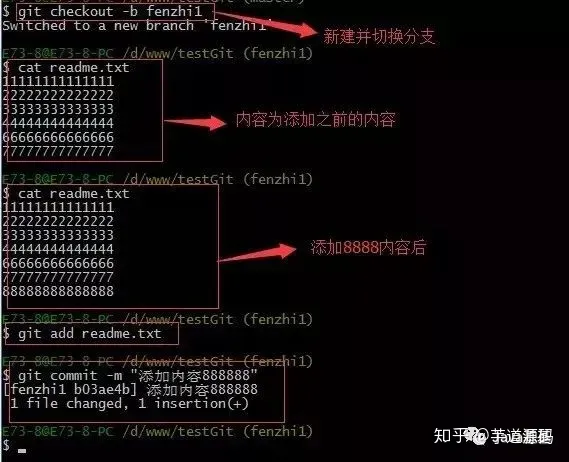

同样，我们现在切换到master分支上来，也在最后一行添加内容，内容为99999999，如下所示：


现在我们需要在master分支上来合并fenzhi1，如下操作：


Git用<<<<<<<，=======，>>>>>>>标记出不同分支的内容，其中<<<HEAD是指主分支修改的内容，>>>>>fenzhi1 是指fenzhi1上修改的内容，我们可以修改下如下后保存：


如果我想查看分支合并的情况的话，需要使用命令 git log.命令行演示如下：


## **分支管理策略**

通常合并分支时，git一般使用”Fast forward”模式，在这种模式下，删除分支后，会丢掉分支信息，现在我们来使用带参数 –no-ff来禁用”Fast forward”模式。首先我们来做demo演示下：

1. 创建一个dev分支。
2. 修改readme.txt内容。
3. 添加到暂存区。
4. 切换回主分支(master)。
5. 合并dev分支，使用命令 git merge –no-ff -m “注释” dev
6. 查看历史记录

截图如下：


分支策略：首先master主分支应该是非常稳定的，也就是用来发布新版本，一般情况下不允许在上面干活，干活一般情况下在新建的dev分支上干活，干完后，比如上要发布，或者说dev分支代码稳定后可以合并到主分支master上来。

## **七：bug分支**

在开发中，会经常碰到bug问题，那么有了bug就需要修复，在Git中，分支是很强大的，每个bug都可以通过一个临时分支来修复，修复完成后，合并分支，然后将临时的分支删除掉。

比如我在开发中接到一个404 bug时候，我们可以创建一个404分支来修复它，但是，当前的dev分支上的工作还没有提交。比如如下：


并不是我不想提交，而是工作进行到一半时候，我们还无法提交，比如我这个分支bug要2天完成，但是我issue-404 bug需要5个小时内完成。怎么办呢？还好，Git还提供了一个stash功能，可以把当前工作现场 ”隐藏起来”，等以后恢复现场后继续工作。如下：


所以现在我可以通过创建issue-404分支来修复bug了。

首先我们要确定在那个分支上修复bug，比如我现在是在主分支master上来修复的，现在我要在master分支上创建一个临时分支，演示如下：


修复完成后，切换到master分支上，并完成合并，最后删除issue-404分支。演示如下：


现在，我们回到dev分支上干活了。


工作区是干净的，那么我们工作现场去哪里呢？我们可以使用命令 git stash list来查看下。如下：


工作现场还在，Git把stash内容存在某个地方了，但是需要恢复一下，可以使用如下2个方法：

1. git stash apply恢复，恢复后，stash内容并不删除，你需要使用命令git stash drop来删除。
2. 另一种方式是使用git stash pop,恢复的同时把stash内容也删除了。

演示如下


## **八：多人协作**

当你从远程库克隆时候，实际上Git自动把本地的master分支和远程的master分支对应起来了，并且远程库的默认名称是origin。

- 要查看远程库的信息 使用 git remote
- 要查看远程库的详细信息 使用 git remote –v

如下演示：


## **一：推送分支：**

推送分支就是把该分支上所有本地提交到远程库中，推送时，要指定本地分支，这样，Git就会把该分支推送到远程库对应的远程分支上：使用命令 git push origin master

比如我现在的github上的readme.txt代码如下：


本地的readme.txt代码如下：


现在我想把本地更新的readme.txt代码推送到远程库中，使用命令如下：


我们可以看到如上，推送成功，我们可以继续来截图github上的readme.txt内容 如下：

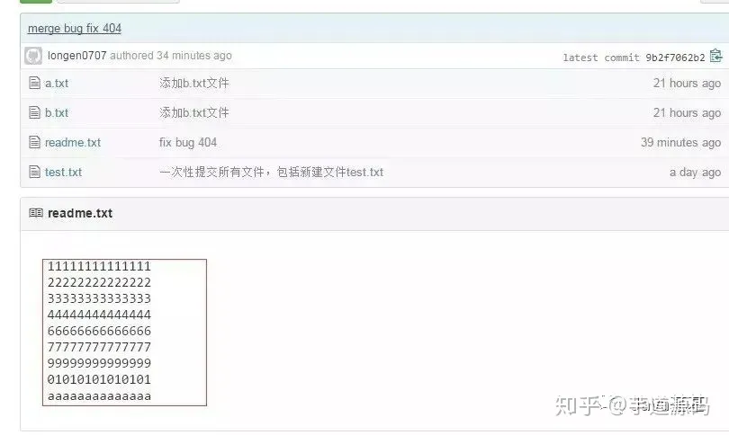

可以看到 推送成功了，如果我们现在要推送到其他分支，比如dev分支上，我们还是那个命令 git push origin dev

那么一般情况下，那些分支要推送呢？

master分支是主分支，因此要时刻与远程同步。

一些修复bug分支不需要推送到远程去，可以先合并到主分支上，然后把主分支master推送到远程去。

## **二：抓取分支：**

多人协作时，大家都会往master分支上推送各自的修改。现在我们可以模拟另外一个同事，可以在另一台电脑上（注意要把SSH key添加到github上）或者同一台电脑上另外一个目录克隆，新建一个目录名字叫testgit2

但是我首先要把dev分支也要推送到远程去，如下


接着进入testgit2目录，进行克隆远程的库到本地来，如下：


现在目录下生成有如下所示：


现在我们的小伙伴要在dev分支上做开发，就必须把远程的origin的dev分支到本地来，于是可以使用命令创建本地dev分支：

```text
git checkout –b dev origin/dev
```

现在小伙伴们就可以在dev分支上做开发了，开发完成后把dev分支推送到远程库时。

如下：


小伙伴们已经向origin/dev分支上推送了提交，而我在我的目录文件下也对同样的文件同个地方作了修改，也试图推送到远程库时，如下：


由上面可知：推送失败，因为我的小伙伴最新提交的和我试图推送的有冲突，解决的办法也很简单，上面已经提示我们，先用git pull把最新的提交从origin/dev抓下来，然后在本地合并，解决冲突，再推送。


git pull也失败了，原因是没有指定本地dev分支与远程origin/dev分支的链接，根据提示，设置dev和origin/dev的链接：如下：


这回git pull成功，但是合并有冲突，需要手动解决，解决的方法和分支管理中的 解决冲突完全一样。解决后，提交，再push：

我们可以先来看看readme.txt内容了。


现在手动已经解决完了，我接在需要再提交，再push到远程库里面去。如下所示：


因此：多人协作工作模式一般是这样的：

- 首先，可以试图用git push origin branch-name推送自己的修改.
- 如果推送失败，则因为远程分支比你的本地更新早，需要先用git pull试图合并。
- 如果合并有冲突，则需要解决冲突，并在本地提交。再用git push origin branch-name推送。

# 嵌入式C语言与ARM架构体系

# CPU架构

## 计算机架构体系

​		常见的架构体系分为冯诺依曼架构和哈佛架构。当然还有混合架构（不做详解，是两者集合优点的产物），下面是他们的详解

## **一.冯.诺依曼结构的灵魂**

​		早期的计算机是由各种门电路组成的，这些门电路通过组装出一个固定的电路板，来执行一个特定的程序，一旦需要修改程序功能，就要重新组装电路板，所以**早期的计算机程序是硬件化的**！

​		然而，祖师爷的出现将最初的硬件化程序变为可编程、可存储编码，放在存储器中，随意使用，下面大体介绍一下冯.诺依曼结构的灵魂。

​		要知道，早期的计算机设计中，程序和数据是俩个截然不同的概念，数据放在存储器中，而**程序作为控制器的一部分**，这样的计算机计算效率低，灵活性较差。冯.诺依曼结构中，将程序和数据一样看待，**将程序编码为数据，然后与数据一同存放在存储器中**，这样计算机就可以调用存储器中的程序来处理数据了。意味着，无论什么程序，最终都是会转换为数据的形式存储在存储器中，要执行相应的程序只需要从存储器中依次取出指令、执行，冯.诺依曼结构的灵魂所在正是这里：减少了硬件的连接，**这种设计思想导致了硬件和软件的分离，即硬件设计和程序设计可以分开执行！！！这就催生了程序员这个职业的诞生！！！**

​		概括的来讲，冯.诺依曼结构消除了原始计算机体系中，只能依靠硬件控制程序的状况（程序作为控制器的一部分，作为硬件存在），将程序编码存储在存储器中，实现了可编程的计算机功能，实现了硬件设计和程序设计的分离，大大促进了计算机的发展。

​		灵魂就是将程序从硬件实现转换为软件实现（存储程序控制原理）！！！

​		计算机的基本工作原理就是：存储程序控制原理！

## **二.冯.诺依曼结构的核心设计思想**

核心设计思想主要体现在如下三个方面：

- 程序、数据的最终形态都是二进制编码，程序和数据都是以二进制方式存储在存储器中的，二进制编码也是计算机能够所识别和执行的编码。（可执行二进制文件：.bin文件）
- 程序、数据和指令序列，都是事先存在主（内）存储器中，以便于计算机在工作时能够高速地从存储器中提取指令并加以分析和执行。
- 确定了计算机的五个基本组成部分：运算器、控制器、存储器、输入设备、输出设备

## **三.冯诺依曼结构的五个主要组成部分**

冯.诺依曼在秘密开发的 EDVAC 写了一篇报告*First Draft of a Report on the EDVAC*，描述了他心目中的一台计算机应该长什么样。这篇报告在历史上有个很特殊的简称，叫**First Draft**，翻译成中文，其实就是《第一份草案》。这样，现代计算机的发展就从祖师爷写的一份草案开始了。

**First Draft**里面说了一台计算机应该有哪些部分组成，我们一起来看看。

冯.诺依曼确定了”计算机结构“中的5大部件：

- 运算器
- 控制器
- 存储器
- 输入设备
- 输出设备

现在看来，运算器和控制器单元集成在CPU中实现，存储器的容量不断扩大、输入输出设备不断更新，这些部件构成了当代计算机硬件系统的基本组成。


我们手机里只有 SD 卡（Secure Digital Memory Card）这样类似硬盘功能的存储卡插槽，并没有内存插槽、CPU 插槽这些东西。没错，因为手机尺寸的原因，手机制造商们选择把 CPU、内存、网络通信，乃至摄像头芯片，都封装到一个芯片，然后再嵌入到手机主板上。这种方式叫**SoC**，也就是 System on a Chip（系统芯片）。


## **1.运算器**

首先计算机要有运算处理数据的能力，所以需要一个处理单元来完成各种算数运算和逻辑运算，这就是算术逻辑单元（Arithmetic Logic Unit，ALU）。ALU的主要功能就是在控制信号的作用下，完成加、减、乘、除等算术运算以及与、或、非、异或等逻辑运算以及移位、补位等运算。

运算器的主要部件就是ALU，运算器的处理对象是数据，所以数据的长度以及数据的表示方法，对运算器的影响很大。大多数通用计算机是以16、32、64位数据作为运算器一次处理数据的长度。能够对一个数据的所有位同时处理运算器称为并行运算器，一次只能对数据的一个位处理的运算器称为串行运算器。

运算器与其他部分的关系：

计算机运算时，运算器的操作对象和操作种类由控制器决定。运算器操作的数据从内存中读取，处理的结果再写入内存（或者暂时存放在内部寄存器中），而且运算器对内存数据的读写是由控制器来进行的。


## **2.控制器**

控制器又称为控制单元（Control Unit），是计算机的神经中枢和指挥中心，只有在控制器的控制下，整个计算机才能够有条不紊地工作、自动执行程序。

控制器的工作流程为：从内存中取指令、翻译指令、分析指令，然后根据指令的内存向有关部件发送控制命令，控制相关部件执行指令所包含的操作。

控制器和运算器共同组成中央处理器（Central Processing Unit），CPU是一块超大规模集成电路，是计算机运算核心和控制核心，CPU的主要功能是解释计算机指令以及处理数据。


## **3.存储器**

存储器的主要功能是存储程序和各种数据，并且能够在计算机运行过程高速、自动地完成程序或者数据的存储，存储器是有记忆的设备，而且**采用俩种稳定状态的物理器件来记录存储信息，所以计算机中的程序和数据都要转换为二进制代码才可以存储和操作。**

存储器可以分为内部存储器（内存）和外部存储器，俩者在计算机系统中各有用处，下面大概介绍一下俩种存储器的特点：

### **Ⅰ.内部存储器**

内部存储器称为内存或者主存，是用来存放欲执行的程序和数据。

在计算机内部，程序和数据都是以二进制代码的形式存储的，它们均以字节为单位（8位）存储在存储器中，一个字节占用一个存储单元，并且每个存储单元都有唯一的地址号。

> 这里以字节（8位）为存储单元，就与上面运算器的操作数据的大小联系起来了，16、32、64都是8的倍数


CPU可以直接使用指令对内部存储器按照地址进行读写俩种操作，读：将内存中某个存储单元的内容读出，送入CPU的某个寄存器中；写：在控制器的控制下，将CPU中某寄存器内容传到某个存储单元中。

要注意，内存中的数据和地址码都是二进制数，但是俩者是不同的，一个地址可以指向一个存储单元，地址是存储单元的位置，数据是存储单元的内容，数据可以是操作码、可以是CPU要处理阿数据、也可以是数据的地址，地址码的长度由内存单元的个数确定。

内存的存取速度会直接影响计算机的运算速度，由于CPU是高速器件，但是CPU的速度是受制于内存的存取速度的，所以为了解决CPU和内存速度不匹配的问题，在CPU和内存直接设置了一种高速缓冲存储器Cache。 Cache是计算机中的一个高速小容量存储器，其中存放的是CPU近期要执行的指令和数据，其存取速度可以和CPU的速度匹配，一般采用静态RAM充当Cache

内存按工作方式的不同又可以分为俩部分：

RAM：随机存储器，可以被CPU随机读取，一般存放CPU将要执行的程序、数据，断电丢失数据

ROM：只读存储器，只能被CPU读，不能轻易被CPU写，用来存放永久性的程序和数据，比如：系统引导程序、监控程序等。具有掉电非易失性。


### **Ⅱ.外部存储器**

外部存储器主要来存放”暂时“用不着的程序和数据，可以和内存交换数据。

一般是磁盘、光盘、U盘、硬盘等。


## **4.输入输出设备**

实际上我们操作计算机都是与输入输出设备在打交道。

鼠标键盘是输入设备、显示器是输出设备；

手机触摸屏即时输入设备又是输出设备；

服务器中网卡既是输入设备又是输出设备；

所有的计算机程序都可以抽象为输入设备读取信息，通过CPU来执行存储在存储器中的程序，结果通过输出设备反馈给用户。

## “哈佛[体系结构](https://so.csdn.net/so/search?q=体系结构&spm=1001.2101.3001.7020)”指的是什么？

微型计算机处理命令和数据，但是在很久以前的微型计算机中，用命令和数据共享了一条总线。在这种情况下，CPU在读取指令时使用总线，因此无法访问数据，并且在读取指令结束后访问数据。使用这种方法的总线配置的计算机体系结构被称为“诺伊曼体系结构(Von Neumann Architecture)”。

另一方面，有将总线用命令和数据分开，使之独立的总线构成方式。使用这种方法，即使CPU读取指令，您也可以使用数据总线访问数据。因此，微型计算机的性能可以比诺伊曼型更高(见图1)。使用这种总线配置的计算机架构是“哈佛架构(Harvard Architecture)”。


但是，哈佛型号内置两条总线，因此有一个缺点：微型计算机的硬件规模比诺伊曼型大，成本更高。

### 诺依曼型

简单地说，它是一种架构，可以同时使用指令和数据总线，有效地配置微型计算机的硬件。由于总线布满了微型计算机的内部，所以尽可能少的数量有利于抑制微型计算机的成本。但是，因为只有一个总线，所以不能同时处理命令和数据，影响微型计算机的运算性能。这被称为“诺伊曼瓶颈”，由于这个瓶颈，在追求高性能的微型计算机中没有被采用。另一方面，比起性能更重视成本的微型计算机更方便，在重视成本的微型计算机中被广泛采用。以ARM Cortex-M处理器为例，Cortex-M0和Cortex-M0+适用于此。因为它是针对低价位市场开发的处理器，所以它优先考虑成本。

### 哈佛型

为了消除诺伊曼瓶颈，把总线按命令和数据分开，使之独立的方式就是哈佛型。以这种方式，即使在CPU读取指令的时间段，您也可以使用数据总线访问数据。因此，微型计算机的性能可以比诺伊曼类型更高。但是，由于需要独立的指令总线和数据总线，微型计算机的硬件会变大，成本也会变高。因此，比起成本，更重视性能的微型计算机被广泛采用。以ARM Cortex-M处理器为例，Cortex-M3、Cortex-M4和Cortex-M7属于此类处理器。高性能处理器是针对高性能应用市场而开发的。


它由三个步骤组成：“指令读取(F)”、“指令解码(解码/翻译)(D)”、“运算并写入结果(E)”。每个处理执行一个周期一次的处理。读取指令是步骤“F”。访问数据是“E”步骤。在图2-a的情况下，在第三个周期之后，“F”和“E”总是同时进行。如果是诺伊曼类型，则不能同时执行指令提取和数据访问，因此任何一方都必须等待总线的使用。如果采用轮转方式(交替)调停总线权，则“F”和“E”将交替进行，因此如图2-b所示，命令的执行效率会非常差。如果是哈佛类型，管道处理可以执行一个周期1个指令。

哈佛的缺点是，总线的硬件规模需要诺依曼型号的两倍，从而提高了微型计算机的成本。对于32位微型计算机，指令和数据都是32位，因此需要相当于64位总线的程度。不仅仅是总线的程度。CPU内部需要控制两种总线的电路，因此CPU内部的硬件也会变大。

## 真正的哈佛架构

在此，我们将以STM32F1系列的STM32F103为例。


图左侧的Cortex-M3和DMA(直接存储器访问)是总线主机。Cortex-M3的命令总线是ICode总线。而且作为数据总线有DCode总线和系统接口总线两种。STM32F103的数据总线具有总线矩阵配置，因此总线主站连接Cortex-M3的Dcode总线、系统接口总线和DMA数据总线。总线从属端的所有数据总线都与总线矩阵相连。由于数据可能存储在闪存中，因此闪存也连接到总线矩阵。Cortex-M3的ICode总线通过闪存接口电路连接到内置闪存，而不连接到总线矩阵。

如果只看这个图，指令看起来只能从闪存运行，但是对于Cortex-M3，也可以从数据总线运行，所以您也可以从RAM或通过外围功能连接的外部内存执行它。

## 他们的区别

### 冯·诺依曼结构

冯·诺依曼结构（von Neumann architecture）又称作普林斯顿体系结构（Princetion architecture）。冯·诺依曼结构的处理器使用同一个存储器，经由同一个总线传输。冯·诺依曼结构处理器具有以下几个特点：

- 必须有一个存储器；
- 必须有一个控制器；
- 必须有一个运算器，用于完成算术运算和逻辑运算；
- 必须有输入和输出设备，用于进行人机通信。


### 哈佛结构

哈佛结构是一种将**程序指令存储**和**数据存储**分开的存储器结构，如下图所示。中央处理器首先到程序指令存储器中读取程序指令内容，解码后得到数据地址，再到相应的数据存储器中读取数据，并进行下一步的操作（通常是执行）。程序指令存储和数据存储分开，可以使**指令和数据有不同的数据宽度**，如Microchip公司的PIC16芯片的程序指令是14位宽度，而数据是8位宽度。


哈佛体系结构框图

哈佛结构的微处理器通常具有较高的执行效率。其程序指令和数据指令分开组织和存储的，执行时可以预先读取下一条指令。

哈佛结构是指程序和数据空间独立的体系结构， 目的是为了减轻程序运行时的访存瓶颈。

哈佛结构能基本上解决取指和取数的冲突问题。

### 冯·诺依曼体系和哈佛总线体系的区别

二者的区别就是程序空间和数据空间是否是一体的。冯·诺依曼结构数据空间和地址空间不分开，哈佛结构数据空间和地址空间是分开的。

哈佛总线技术应用是以DSP和ARM为代表的。采用哈佛总线体系结构的芯片内部程序空间和数据空间是分开的，这就允许同时取指和取操作数，从而大大提高了运算能力。

DSP芯片硬件结构有冯·诺依曼结构和哈佛结构，两者区别是地址空间和数据空间分开与否。一般DSP都是采用改进型哈佛结构，就是分开的数据空间和地址空间都不只是一条，而是有多条，这根据不同的生产厂商的DSP芯片有所不同。在对外寻址方面从逻辑上来说也是一样，因为外部引脚的原因，一般来说都是通过相应的空间选取来实现的。本质上是同样的道理。

### 改进型的哈佛结构与哈佛体系结构差别

与冯.诺曼结构处理器比较，哈佛结构处理器有两个明显的特点：

(1).使用两个独立的存储器模块，分别存储指令和数据，每个存储模块都不允许指令和数据并存；

(2).使用独立的两条总线，分别作为CPU与每个存储器之间的专用通信路径，而这两条总线之间毫无关联。

后来，又提出了改进的哈佛结构，其结构特点为：

(1).使**用两个独立的存储器模块，分别存储指令和数据，每个存储模块都不允许指令和数据并存；**

(2).具有一条独立的地址总线和一条独立的数据总线，利用公用地址总线访问两个存储模块（程序存储模块和数据存储模块），公用数据总线则被用来完成程序存储模块或数据存储模块与CPU之间的数据传输；

(3).两条总线由程序存储器和数据存储器分时共用。


# Cache机制

​		我们的现代CPU工作，采用了Cache机制，简单的讲，就是利用了SRAM（讲台随机访问存储器），其速度介于CPU和DRAM之间，我们通过此来缓解两个工作速度不匹配的瓶颈问题

> 啥瓶颈问题呢：简单的讲：就是CPU跑的太快，没东西可算了，等内存慢悠悠的传输内容来

​		怎么工作的呢？就是预先存储一系列的指令和数据，这样的话就相当于以增加中速媒介的方式提升了存取速度，让CPU不再需要从内存中等待存取

本文主要内容如下，基本涉及了Cache的概念，工作原理，以及保持一致性的入门内容。


### **1、为什么需要 Cache**

### **1.1 为什么需要 Cache**

我们首先从一张图来开始讲为什么需要 Cache.


上图是 CPU 性能和 Memory 存储器访问性能的发展。

我们可以看到，随着工艺和设计的演进，CPU 计算性能其实发生了翻天覆地的变化，但是DRAM存储性能的发展没有那么快。

所以造成了一个问题，存储限制了计算的发展。

容量与速度不可兼得。

如何解决这个问题呢？可以从计算访问数据的规律入手。

我们随便贴段代码:

```text
for (j = 0; j < 100; j = j + 1)
    for( i = 0; i < 5000; i = i + 1)
        x[i][j] = 2 * x[i][j];
```

可以看到，由于大量循环的存在，我们访问的数据其实在内存中的位置是相近的。

**换句专业点的话说，我们访问的数据有局部性。**

我们只需要将这些数据放入一个小而快的存储中，这样就可以快速访问相关数据了。

**总结起来，Cache是为了给CPU提供高速存储访问，利用数据局部性而设计的小存储单元。**

### **1.2 实际系统中的 Cache**

我们展示一下实际系统中的 Cache 。


如上图所示，整个系统的存储架构包括了 CPU 的寄存器，L1/L2/L3 CACHE，DRAM 和硬盘。

数据访问时先找寄存器，寄存器里没有找 L1 Cache, L1 Cache 里没有找 L2 Cache 依次类推，最后找到硬盘中。

同时，我们可以看到，速度与存储容量的折衷关系。容量越小，访问速度越快！

其中，一个概念需要搞清楚。


CPU 和 Cache 是 word 传输的，而 Cache 到主存是以块传输的，一块大约 64Byte 。

现有 SOC 中的 Cache 一般组成如下。

### **1.3 Cache 的分类**

Cache按照不同标准分类可以分为若干类。

- 按照数据类型划分：I-Cache与D-Cache。其中I-Cache负责放置指令，D-Cache负责方式数据。两者最大的不同是D-Cache里的数据可以写回，I-Cache是只读的。
- 按照大小划分：分为small Cache和large Cache。没路组（后文组相连介绍）<4KB叫small Cache, 多用于L1 Cache, 大于4KB叫large Cache。多用于L2及其他Cache.
- 按照位置划分：Inner Cache和Outer Cache。一般独属于CPU微架构的叫Inner Cache, 例如上图的L1 L2 CACHE。不属于CPU微架构的叫outer Cache.
- 按照数据关系划分：Inclusive/exclusive Cache: 下级Cache包含上级的数据叫inclusive Cache。不包含叫exclusive Cache。举个例子，L3 Cache里有L2 Cache的数据，则L2 Cache叫exclusive Cache。

### **2、Cache的工作原理**

要讲清楚 Cache 的工作原理，需要回答 4 个问题：

- 数据如何放置
- 数据如何查询
- 数据如何被替换
- 如果发生了写操作，Cache如何处理

### **2.1 数据如何放置**

这个问题也好解决。我们举个简单的栗子来说明问题。

假设我们主存中有 32 个块，而我们的 Cache 一共有 8 个 Cache 行( 一个 Cache 行放一行数据）。

假设我们要把主存中的块 12 放到 Cache 里。

**那么应该放到 Cache 里什么位置呢？**

三种方法：

- 全相连（Fully associative）。可以放在Cache的任何位置。
- 直接映射（Direct mapped）。只允许放在Cache的某一行。比如12 mod 8
- 组相连（set associative）。可以放在Cache的某几行。例如2路组相连，一共有4组，所以可以放在0,1位置中的一个。

可以看到，全相连和直接映射是Cache组相连的两种极端情况。

不同的放置方式主要影响有两点：

1、组相连组数越大，比较电路就越大，但Cache利用率更高，Cache miss发生的概率小。2、组相连数目变小，Cache经常发生替换，但是比较电路比较小。

这也好理解，内存中的块在Cache中可放置的位置多，自然找起来就麻烦。

### **2.2 如何在Cache中找数据**

其实找数据就是一个比对过程，如下图所示。


我们地址都以 Byte 为单位的。

但主存于Cache之间的数据交换单位都是块（block，现代Cache一般一个block大约64Byte)。所以地址对最后几位是block offset。

由于我们采用了组相连，则还有几个比特代表的是存储到了哪个组。

组内放着若干数据，我们需要比较Tag, 如果组内有Tag出现，则说明我们访问的数据在缓存中，可以开心的使用了。

比如举个 2 路组相连的例子，如下图所示。


T表示Tag。直接比较Tag，就能得知是不是命中了。如果命中了，则根据index(组号）将对应的块取出来即可。

如上图所示。用index选出位于组相连的哪个组。然后并行的比较Tag, 判断最后是不是在Cache中。上图是2路组相连，也就是说两组并行比较。

那如果不在缓存中呢？这就涉及到另一个问题。

不在缓存中如何替换 Cache ？

### **2.3 如何替换Cache中的数据**

Cache中的数据如何被替换的？这个就比较简单直接。


- 随机替换。如果发生Cache miss里随机替换掉一块。
- Least recently used. LRU。最近使用的块最后替换。
- First in, first out (FIFO), 先进先出。

实际上第一个不怎么使用，LRU 和 FIFO 根据实际情况选择即可。

Cache 在什么时候数据会被替换内？也有几种策略。

- 不在本 Cache 替换。如果Cache miss了，直接转发访问地址到主存，取到的数据不会写到Cache.
- 在读MISS时替换。如果读的时候Cache里没有该数据，则从主存读取该数据后写入Cache。
- 在写MISS时替换。如果写的时候Cache里没有该数据，则将本数据调入Cache再写。

### **2.4 如果发生了写操作怎么办**

Cache毕竟是个临时缓存。

如果发生了写操作，会造成Cache和主存中的数据不一致。如何保证写数据操作正确呢？

也有三种策略。

- 通写：直接把数据写回Cache的同时写回主存。极其影响写速度。


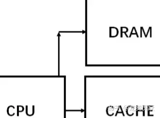


- 回写：先把数据写回Cache, 然后当Cache的数据被替换时再写回主存。


- 通写队列：通写与回写的结合。先写回一个队列，然后慢慢往主存储写。如果多次写同一个数据，直接写这个队列。避免频繁写主存。

### **3、Cache一致性**

Cache 一致性是 Cache 中遇到的比较坑的一个问题。

什么原因需要 Cache 处理一致性呢？

主要是多核系统中，假如core 0读了主存储的数据，写了数据。core 1也读了主从的数据。这个时候core 1并不知道数据已经被改动了，也就是说，core 1 Cache中的数据过时了，会产生错误。

Cache一致性的保证就是让多核访问不出错。


**Cache一致性主要有两种策略。**

### **策略一：基于监听的一致性策略**

这种策略是所有Cache均监听各Cache的写操作，如果一个Cache中的数据被写了，有两种处理办法。

**写更新协议：**某个Cache发生写了，就索性把所有Cache都给更新了。

**写失效协议：**某个Cache发生写了，就把其他Cache中的该数据块置为无效。

策略 1 由于监听起来成本比较大，所以只应用于极简单的系统中。

### **策略二：基于目录的一致性策略**

这种策略是在主存处维护一张表。记录各数据块都被写到了哪些Cache, 从而更新相应的状态。一般来讲这种策略采用的比较多。又分为下面几个常用的策略。

- SI: 对于一个数据块来讲，有share和invalid两种状态。如果是share状态，直接通知其他Cache, 将对应的块置为无效。
- MSI：对于一个数据块来讲，有share和invalid，modified三种状态。其中modified状态表表示该数据只属于这个Cache, 被修改过了。当这个数据被逐出Cache时更新主存。这么做的好处是避免了大量的主从写入。同时，如果是invalid时写该数据，就要保证其他所有Cache里该数据的标志位不为M，负责要先写回主存储。
- MESI：对于一个数据来讲，有4个状态。modified, invalid, shared, exclusive。其中exclusive状态用于标识该数据与其他Cache不依赖。要写的时候直接将该Cache状态改成M即可。

我们着重讲讲 MESI。图中黑线：CPU的访问。红线：总线的访问，其他Cache的访问。


当前状态时I状态时，如果发生处理器读操作 prrd。

- 如果其他Cache里有这份数据，如果其他Cache里是M态，先 把M态写回主存再读。否则直接读。最终状态变为S。
- 其他Cache里没这个数据，直接变到E状态。

当前状态为S态。

- 如果发生了处理器读操作，仍然在S态。
- 如果发生了处理器写操作，则跳转到M状态。
- 如果其他Cache发生了写操作，跳到I态。

当前状态E态

- 发生了处理器读操作还是E。
- 发生了处理器写操作变成M。
- 如果其他Cache发生了读操作，变到S状态。

当前状态M态

- 发生了读操作依旧是M态。
- 发生了写操作依旧是M态。
- 如果其他Cache发生了读操作，则将数据写回主存储，变换到S态。

### **4、总结**

Cache 在计算机体系架构中有非常重要的地位，本文讲了 Cache中最主要的内容，具体细节可以再根据某个点深入研究。

# CPU 流水线

前几天摸鱼的时候，我在stackoverflow发现一个有趣的问题：

> [https://stackoverflow.com/questions/11227809/why-is-processing-a-sorted-array-faster-than-processing-an-unsorted-array](https://link.zhihu.com/?target=https%3A//stackoverflow.com/questions/11227809/why-is-processing-a-sorted-array-faster-than-processing-an-unsorted-array)

提问者发现用C++写了一个数组求和的函数，把数组排序求和和无序求和的计算性能竟然相差6倍，十分诡异。

我们来看下代码：

```cpp
#include <algorithm>
#include <ctime>
#include <iostream>

int main()
{
    // Generate data
    const unsigned arraySize = 32768;
    int data[arraySize];

    for (unsigned c = 0; c < arraySize; ++c)
        data[c] = std::rand() % 256;

    // !!! With this, the next loop runs faster.
    std::sort(data, data + arraySize);

    // Test
    clock_t start = clock();
    long long sum = 0;
    for (unsigned i = 0; i < 100000; ++i)
    {
        for (unsigned c = 0; c < arraySize; ++c)
        {   // Primary loop
            if (data[c] >= 128)
                sum += data[c];
        }
    }

    double elapsedTime = static_cast<double>(clock()-start) / CLOCKS_PER_SEC;

    std::cout << elapsedTime << '\n';
    std::cout << "sum = " << sum << '\n';
```

​		代码比较简单，先搞了个大数组，然后数组的元素是256以内取模，所有元素都落在0-256之内，接着在循环里面使用if条件判断将>=128元素求和。

​		作者做了一个A/B测试，一个随机生成数组就进行求和，一个排序求和，为了防止有单次误差，作者做了10w次循环，发现运行时间差别很大：

- 无序求和 累计耗时 11.54秒
- 排序求和 累计耗时 1.93秒

对呀，按理说加了个std:sort()耗时会增加，但是性能还是这么优秀，真是奇怪呀!

提问者又用Java搞了一遍，现象和C++不能说一模一样，但几乎也是分毫不差。

## 洗车房的故事

前阵子我开着自己的捷达去洗车，车还挺多，排着队一个个搞。

我发现洗车流程是这样的：喷水、打泡沫、刷洗、擦拭、吹干。


车辆在外面排队，依次是奥迪A6L、宝马X5、奔驰C200L、捷达vs5。

就这样一个工序完成后，车辆向下一个工序移动，当前工序又补进来一辆车。

我原来以为是一辆车进去 完成所有工序再出来，下一辆进行完成全部工序，依次类推，没想到洗车房还是流水线作业。

为啥是流水线呢？提高洗车数量，也就是吞吐量，单位时间赚取更多噻！

> 如果是完成所有工序再搞下一辆，这样某个时刻5个工序只有1个在做，其他4共工序都是等待状态，工人们都开始摸鱼了，钱也没赚到，客户等待时间还长。

生活中的智慧还真是不少呀，流水线作业，yyds!

看到这里，不禁要问，这和前面的数组求和有啥关系呢？别急，还真有关系。

## CPU的内部的那些事儿

我们先从一个宏观角度去看下CPU内部的结构：


从两个图上，我们可以得到如下信息：

- CPU内部的核心组件有各类寄存器、控制单元CU、逻辑运算单元ALU、高速缓存
- CPU和外部交互的交通大动脉就是三种总线：地址总线、数据总线、控制总线
- I/O设备、RAM通过三大总线和CPU实现功能交互

Cpp程序经过编译器处理成机器码来执行，程序会被翻译成一条条的指令Instruction，为了简化问题，我们选择5级流水线的CPU来说明问题：


- **取指令IF**
  取指令（Instruction Fetch，IF）阶段是将一条指令从主存中取到指令寄存器的过程。
- **指令译码ID**
  取出指令后，计算机立即进入指令译码（Instruction Decode，ID）阶段。
  在指令译码阶段，指令译码器按照预定的指令格式，对取回的指令进行拆分和解释，识别区分出不同的指令类别以及各种获取操作数的方法。
- **指令执行EX**
  在取指令和指令译码阶段之后，接着进入执行指令（Execute，EX）阶段。
  此阶段的任务是完成指令所规定的各种操作，具体实现指令的功能。为此，CPU的不同部分被连接起来，以执行所需的操作。
- **访存取数阶段MEM**
  根据指令需要，有可能要访问主存读取操作数，这样就进入了访存取数（Memory，MEM）阶段，此阶段的任务是：根据指令地址码，得到操作数在主存中的地址，并从主存中读取该操作数用于运算。
- **结果回写WB**
  作为最后一个阶段，结果写回（Writeback，WB）阶段把执行指令阶段的运行结果数据写回到某种存储形式。

上面的IF、ID、EX、MEM、WB就是CPU的5级流水线，这个流程和洗车房的流水线很相似：


没错，CPU内部处理一条条指令的过程和洗车房就非常相似，我们继续深挖！


> `小结`
> CPU流水线技术是一种将指令分解为多步，并让不同指令的各步操作重叠，从而实现几条指令并行处理，以加速程序运行过程的技术。
> 指令的每步有各自独立的电路来处理，每完成一步，就进到下一步，而前一步则处理后续指令，属于CPU硬件电路层面的并发。

## CPU流水线吞吐量和延迟

我们来看下引入流水线之后吞吐量的变化：


未使用流水线时各个执行部分组成了组合逻辑，执行完成后写寄存器，整个时间包括：组合逻辑时间300ps和写寄存器20ps

该模式下的吞吐量是1/(300+20)ps = 3.125GIPS(每秒千兆条指令)

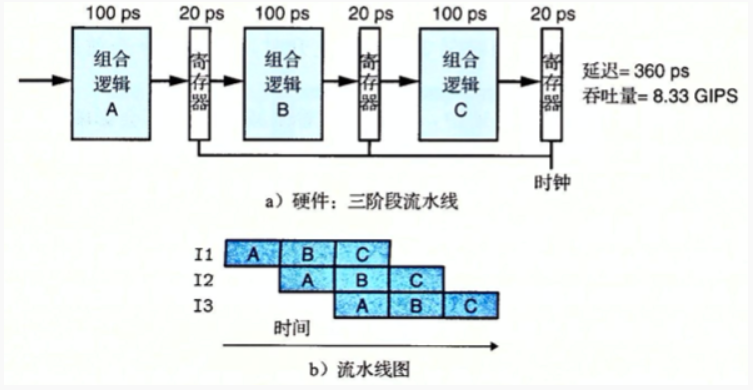

使用流水线时，组合逻辑被拆分为3个部分，但是每个部分都需要写寄存器，这样就增加了整个流程的时间从320ps提高到了360ps。

> 拆分多出两个逻辑和两个寄存器写，额外多出40ps。

此时的吞吐量是1/(100+20)ps = 8.333GIPS(每秒千兆条指令)，整个吞吐量是未使用流水线的2.67倍。

从上面的对比来看，增加了一些硬件和延迟带来了吞吐量的提升，但是一味增加硬件不是万金油，单纯的写寄存器延迟就很明显。

流水线的级数也被称为深度，当前intel的酷睿i7采用了16级深度的流水线，在一定范围内提高流水线深度可以提高CPU的吞吐量，但是也为硬件设计带来很大的挑战，甚至降低吞吐量。

## CPU流水线冒险

通过流水线设计来提升 CPU 的吞吐率，是一把双刃剑，在提高吞吐量的同时我们也在冒险。

> 所谓的冒险就是一帆风顺路上的磕磕绊绊，坑坑洼洼，流水线也并非一帆风顺的。

提到流水线设计需要解决的三大冒险：结构冒险（Structural Hazard）、数据冒险（Data Hazard）以及控制冒险（Control Hazard）。


### **结构冒险**

结构冒险本质上是一种硬件冲突，我们以5级流水线为例来说，指令读取IF阶段和取数操作MEM，都需要进行内存数据的读取，然而内存只有一个地址译码器，只能在一个时钟周期里面读取一条数据。


> 换句话说就像洗车流水线的喷水和刷洗都要用到水管，但是只有一根水管，这样就存在冲突，导致只能满足一个喷水或者刷洗。


对于MEM阶段和IF阶段的冲突，一个解决方案就是把内存分成两部分：存放指令的内存和存放数据的内存，让它们有各自的地址译码器，从而通过增加硬件资源来解决冲突。

没错，这种将指令和数据分开存储就是著名的哈佛结构Harvard Architecture，指令和数据放在一起的就是冯诺依曼结构(也叫普林斯顿结构Princeton Architecture)。


这两种结构都有各自的优缺点，现代的CPU借鉴了两种架构采用一种混合结构，并且引入了高速缓存，来降低CPU和内存的速度不匹配问题，如图：


这种混合结构就很好地解决了流水线结构冒险问题。

### **数据冒险**

数据冒险是指令之间存在数据依赖关系，就像这段代码：

```text
int a = 10;
int b = a + 10;//语句2
int c = b + a;//语句3
```

语句3的计算依赖于b的值，在语句2对b进行了计算，也就是语句3依赖于语句2，但是每一个语句都会被翻译成很多的指令，也就是其中两个指令存在依赖关系。


比如说指令3-3需要等待指令2-2完成WB阶段才可以进行EX阶段，如果不等待得到的结果就是错误的。


一种解决方案就是引入NOP操作，这个时钟周期啥也不做，等到依赖的数据完成再继续，这种通过流水线停顿解决数据冒险的方案称为流水线冒泡(Pipeline Bubble)。

流水线冒泡虽然简单，但是效率却下降了，经过大量的实践发现，我们完全可以在第一条指令的结果数据传输给到下一条指令的 ALU，下一条指令不需要再插入NOP 阶段，就可以继续正常进行了。

这种将结果直接传输的技术称为操作数前推/转发Operand Forwarding，它可以和流水线冒泡NOP一起使用，因为单纯的操作数前推也无法完全避免使用NOP。

> `小结`：操作数前推，就是通过在硬件层面制造一条旁路，让一条指令的计算结果，可以直接传输给下一条指令，而不再需要指令 1 写回寄存器，指令 2 再读取寄存器,这样多此一举的操作。


ADD指令不需要等待WB完成再执行EX，而是LOAD指令通过操作数转发直接传给ADD指令，减少了一个NOP操作，只需要1个NOP操作即可，提升了流水线效率。


### **控制冒险**

在流水线中，多个指令是并行执行的，在指令1执行的时候，后续的指令2和指令3可能已经完成了IF和ID两个阶段等待被执行，此时如果指令1一下子跳到了其他地方，那么指令2和指令3的IF和ID就是无用功了。

遇到这种指令转移情况，处理器需要先排空指令2和指令3对应的流水线，然后跳转到指令1的新的目标位置进入新的流水线，这部分称为**转移开销**。


> 转移指令本身和流水线的模式是冲突的，因为转移指令会改变指令的流向， 而流水线则希望能够依次地取回指令，将流水线填满的，但是转移指令在实际程序中非常普遍，这也是CPU流水线必须要面对的问题。

转移指令可以分为无条件转移和条件转移。

无条件转移是确定发生的，并且跳转地址在取指阶段就能得到，我们在 CPU 里面设计对应的旁路电路，把计算结果更早地反馈到流水线中，这种属于硬件方案称为缩短分支延迟。

但是，对于条件转移我们在IF阶段并不能获得跳转位置，只能等EX阶段才知道，这就引出了分支预测。


分支预测换句话说就是：**流水线的上一个阶段还没有完成，但是下一个指令是啥要依赖于这个结果，为了效率，流水线不能停顿住，必须要做个选择，向左走还是 向右走，选择出下一条要执行的指令。**

## CPU分支预测

分支预测有：静态分支预测和动态分支预测。


静态分支预测就是每次都选择一个结果，就像抛硬币每次都猜正面，对于CPU流水线来说都猜指令不跳转，也就有50%的正确率了，这种预测方式简单但是不够高效。

**动态分支预测会根据之前的选择情况和正确率来预测当前的情况，做出判断是顺序分支还是跳转分支，因此仍然会有成功和失败两种情况**。

比如预测出现跳转时：

- 预测成功时，尽快找到分支目标指令地址，避免控制相关造成流水线停顿。
- 预测错误时，要作废已经预取和分析的指令，恢复现场，并从另一条分支路径重新取指令。


最简单的动态分支预测器有1bit和2bit，其中2bit表示有2位标记，分别记录上一次预测状态和上次预测结果，讲到这里很多文章就一带而过，给了一个状态机迁移图，就草草收尾了：


说实话，看到这图，我仿佛懂了，又仿佛没懂，于是我决定好好研究一下这个2bit分支预测器的一些原理，我们继续：

- **两种决策**
  not taken代表选择顺序分支
  taken代表跳转分支
- **四种状态**
  00 代表strongly not taken 强顺序分支
  01 代表weakly not taken 弱顺序分支
  10 代表weakly taken 弱跳转分支
  11 代表strongly taken 强跳转分支

我们继续看2bit动态分支预测是如果进行状态机迁移的：

- **当前状态处于00 强顺序分支时**
  必然预测下一次也是顺序分支，此时会有两种结果，预测成功了，下一次状态仍然是00，预测失败了，最终程序选择了跳转分支，下一次状态变为01。


- **当前状态处于01 弱顺序分支时**
  必然预测下一次也是顺序分支，此时会有两种结果，预测成功了，下一次状态调整为00，预测失败了，最终程序选择了跳转分支，下一次状态变为10。


- **当前状态处于10 弱跳转分支时**
  必然预测下一次也是跳转分支，此时会有两种结果，预测成功了，下一次状态调整为11，预测失败了，最终程序选择了顺序分支，下一次状态变为01。


- **当前状态处于11 强跳转分支时**
  必然预测下一次也是跳转分支，此时会有两种结果，预测成功了，状态不变仍然是11，预测失败了，最终程序选择了顺序分支，下一次状态变为10。


坚持看到这里，说明你真是个爱学习的人儿啊，我们来画一张完整的迁移图：

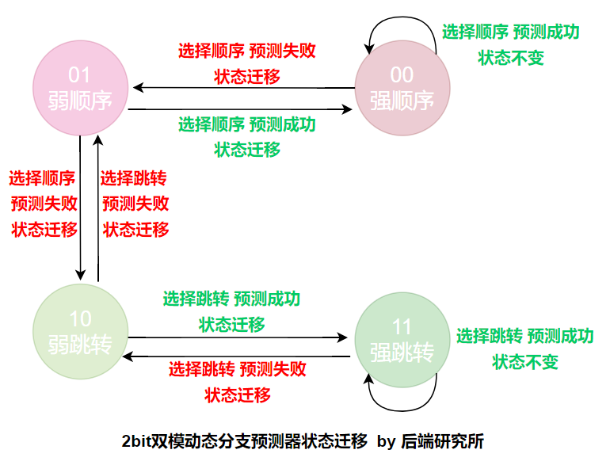

从这张图可以看到从**顺序分支改变为跳转分支，需要连续两次预测失败，同样的跳转分支变为顺序分支，也需要连续两次预测失败**：


标记分支状态以及分支历史的一段内存被称为BTB，这段内存非常小，只存储了分支指令地址，以及预测的目标地址，以及预测的位，这一块内容也比较复杂，我们在此不展开了，后续再搞。

经过前面的分析可以看到动态分支预测器具有一定的容错性，并且波动性较小，只有连续两次预测失败才会转变选择结果，整体正确率提升明显。

从一些文章的数据显示，大部分情况下2bit预测器准确率可以达到95%以上：


## 回顾问题

经过前面的一番分析，我们回到stackoverflow那个数组排序和无序耗时的问题上来，这个问题有两个关键因素：

- 数组元素是完全随机的，本次结果和上次结果是独立分布的
- 循环结构和条件判断的存在

没错，**随机+循环+条件就彻底命中了CPU流水线的软肋。**

- **数组排序之后的分支预测**


- **数组未排序的分支预测**


数组排序后，动态分支预测会结合之前的结果做出判断准确率非常高，未排序时完全随机和静态分支预测差不多了，因此准确率一般。

分支预测失败就意味着流水线排空，废弃已经进行IF和ID的指令，然后再选择正确的指令，整个过程在目前CPU来说要来浪费10-20个时钟周期，这样耗时就上来了。

# 地址和总线

## 地址的本质

​		我们习惯给每个存储单元编号管理——CPU如果是想访问其中任何一块存储单元的时候，我们就依据其编号来找到他从而读写数总线的基本概念

## 总线的概念

总线：连接多个部件的信息传输线，是各部件共享的传输介质。

在某一时刻，只允许有**一个部件**向总线发送信息，而**多个部件**可以同时从总线上接受**相同**的信息。

总线是由许多传输线或通路组成，每条线都可以一位一位地传输[二进制](https://so.csdn.net/so/search?q=二进制&spm=1001.2101.3001.7020)代码，若干条传输线可以同时传输若干位二进制代码

采用总线连接的计算机结构有下列几种：

- 以CPU为中心的双总线结构

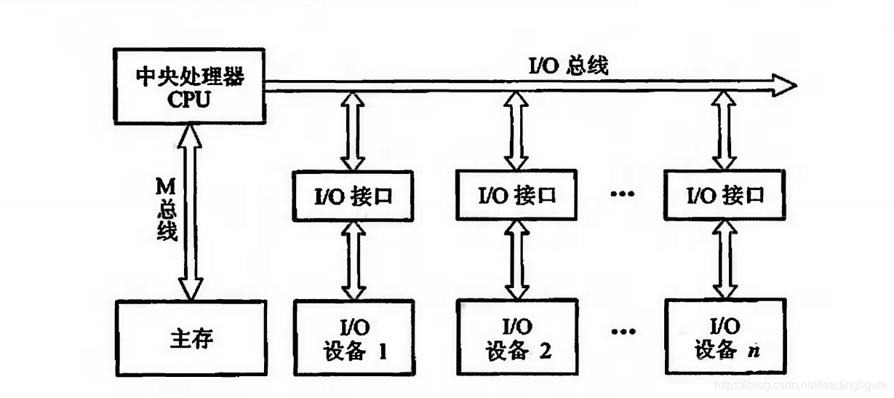

- 存储总线(M总线)：连接CPU和主存
- 输入输出总线(I/O总线)：建立CPU和各I/O设备交换信息的通道

这种结构在I/O设备与主存交换信息时仍然要占用CPU，影响CPU的工作效率

- 单总线结构


当I/O设备和主存进行交换信息，不影响CPU工作。

缺点：只有一组总线，要设置总线判优逻辑，让各部件按优先级高低占用总线，避免进行冲突。这也会降低效率

- 以存储器为中心的双总线结构


在单总线基础上开辟出CPU和主存的存储总线，提高传输效率，减轻系统总线的负担

## 总线的分类

以下均按**连接部件**不同，进行分类。

- 片内总线：芯片内部的总线

- 系统总线：CPU、主存、I/O设备各大部件之间的信息传输线，又称**板级总线**或**板间总线**

  系统总线按照**传输信息不同**，分为三类

  - 数据总线：传输各功能部件之间的数据信息。是**双向**传输总线，其位数和**机器字长、存储字长**有关。

    数据总线宽度：数据总线的位数，是衡量系统性能的重要指标

  - 地址总线：用来指出数据总线上的源数据或目的数据在主存单元的地址或I/O设备的地址

    由CPU输出，**单向**传输。

    地址总线的位数与存储单元的个数有关

  - 控制总线：用来发出各种控制信号的传输线，使各部件能在**不同时刻**占有总线使用权。

    对于任一控制线来说，传输是**单向的**，但是对于控制总线整体，传输是**双向的**。

    常见的控制信号：

    - 时钟：同步操作
    - 复位：初始化所有部件
    - 总线请求：某部件需获得总线使用权
    - 总线允许：需要获得总线使用权的部件已获得控制权
    - 中断请求：某部件提出中断
    - 中断响应：中断请求被接收
    - 存储器写：将数据总线上的数据写入存储器中
    - 存储器读：
    - I/O写：
    - I/O读
    - 传输响应：表示数据已被接受或已被送入数据总线

- 通信总线：用于计算机系统之间或计算机系统与其他系统之间的通信

  按传输方式分为两类：

  - 串行通信：数据在单条1位宽的传输线上，一位一位地按顺序分时传送
  - 并行通信：数据在多条并行1位宽地传输线上，同时由源传送到目的地

两类：

- 串行通信：数据在单条1位宽的传输线上，一位一位地按顺序分时传送
- 并行通信：数据在多条并行1位宽地传输线上，同时由源传送到目的地

​		并行通信适用于**短距离**数据传输，串行通信适用于**远距离**传送。据。这块内存向CPU发出的信号，也就是编号，正是地址。换而言之，可以理解为内存的位置位置编号

## 指令集

​		ISA是计算机操纵的指令规范（很虚幻），说白了，就是依据此来指挥怎样运行硬件！

​		指令集包含如下内容：

- 指令的分发，预取，解码，执行和写回
- 操作数的类型，存储，存去和旁路转移
- Load/ Store架构
- 寄存器
- 地址的格式，大端小端模式
- 字节对齐，边界对齐

​		注意到指令集也是在不断变化的

​		在计算机中，指示计算机硬件执行某种运算、处理功能的命令称为指令。指令是计算机运行的最小的功能单位，而硬件的作用是完成每条指令规定的功能。一台计算机上全部指令的集合，就是这台计算机的指令系统。指令系统也称指令集，是这台计算机全部功能的体现。而人们设计计算机首要考虑的是它拥有的功能，也就是首先要按功能档次设计指令集，然后按指令集的要求在硬件上实现。指令系统不仅仅是指令的集合，还包括全部指令的指令格式、寻址方式和数据形式。所以，各计算机执行的指令系统不仅决定了机器所要求的能力，而且也决定了指令的格式和机器的结构。反过来说，不同结构的机器和不同的指令格式应该具有与之相匹配的指令系统。为此，设计指令系统时，要对指令格式、类型及操作功能给予应有的重视。软件是为了使用计算机而编写的各种系统和用户的程序，程序由一个序列的计算机指令组成。从这个角度上说，指令是用于设计程序的一种计算机语言单位 [2] 。计算机的指令系统是指一台计算机上全部指令的集合，也称计算机的指令集。指令系统包括指令格式、寻址方式和数据形式。一台计算机的指令系统反映了该计算机的全部功能，机器类型不同，其指令系统也不同，因而功能也不同。指令系统的设置和机器的硬件结构密切相关，一台计算机要有较好的性能，必须设计功能齐全、通用性强、内含丰富的指令系统，这就需要复杂的硬件结构来支持 [2] 。

​		常见的指令集有：Intel的x86，EM64T，MMX，SSE，SSE2，SSE3，SSSE3 (Super SSE3)，SSE4A，SSE4.1，SSE4.2，AVX，AVX2，AVX-512，VMX等指令集；和AMD的x86，x86-64，3D-Now!指令集。

​		SSE指令集

​		由于[MMX指令](https://baike.baidu.com/item/MMX指令/848680?fromModule=lemma_inlink)并没有带来3D游戏性能的显著提升，1999年Intel公司在[Pentium III](https://baike.baidu.com/item/Pentium III?fromModule=lemma_inlink)CPU产品中推出了数据流单指令序列扩展指令（SSE）。SSE兼容MMX指令，它可以通过SIMD（单指令多数据技术）和单时钟周期并行处理多个浮点来有效地提高浮点运算速度。在MMX指令集中,借用了浮点处理器的8个寄存器，这样导致了浮点运算速度降低。而在SSE指令集推出时，Intel公司在Pentium III CPU中增加了8个128位的SSE指令专用寄存器。而且SSE指令寄存器可以全速运行，保证了与浮点运算的并行性。

SSE2指令集

​		在Pentium 4 CPU中，Intel公司开发了新指令集SSE2。这一次新开发的SSE2指令一共144条，包括浮点SIMD指令、整形SIMD指令、SIMD浮点和整形数据之间转换、数据在MMX寄存器中转换等几大部分。其中重要的改进包括引入新的数据格式，如：128位SIMD整数运算和64位双精度浮点运算等。为了更好地利用高速缓存。另外，在Pentium 4中还新增加了几条缓存指令，允许程序员控制已经缓存过的数据。

SSE3指令集

​		相对于SSE2，SSE3又新增加了13条新指令，此前它们被统称为pni(prescott new instructions)。13条指令中，一条用于视频解码，两条用于线程同步，其余用于复杂的数学运算、浮点到整数转换和SIMD浮点运算。

SSE4指令集

​		SSE4又增加了50条新的增加性能的指令，这些指令有助于编译、媒体、字符/文本处理和程序指向加速。[SSE4指令集](https://baike.baidu.com/item/SSE4指令集/493151?fromModule=lemma_inlink)将作为Intel公司未来“显著视频增强”平台的一部分。该平台的其他视频增强功能还有Clear Video技术（CVT）和统一显示接口（UDI）支持等，其中前者是对ATi AVIVO技术的回应，支持高级解码、后处理和增强型3D功能。3D Now!扩展指令集3D Now!指令集是AMD公司1998年开发的多媒体扩展指令集，共有21条指令。针对MMX指令集没有加强浮点处理能力的弱点，重点提高了AMD公司K6系列CPU对3D图形的处理能力。由于指令有限，3D Now!指令集主要用于3D游戏，而对其他商业图形应用处理支持不足。

**3DNow!指令集：**

​		在原有的指令集基础上，增加到52条指令，其中包含了部分[SSE指令](https://baike.baidu.com/item/SSE指令/8857860?fromModule=lemma_inlink)，该指令集主要用于新型的[AMD](https://baike.baidu.com/item/AMD?fromModule=lemma_inlink)CPU上。X86指令集要知道什么是指令集，要从[X86架构](https://baike.baidu.com/item/X86架构/7470217?fromModule=lemma_inlink)的CPU说起。X86指令集是Intel为其第一块16位CPU(i8086)专门开发的，IBM1981年推出的世界第一台PC机中的CPU—i8088(i8086简化版)使用的也是X86指令，同时电脑中为提高浮点数据处理能力而增加的X87芯片系列[数学协处理器](https://baike.baidu.com/item/数学协处理器/7677050?fromModule=lemma_inlink)则另外使用X87指令，以后就将X86指令集和X87指令集统称为X86指令集。虽然随着CPU技术的不断发展，Intel陆续研制出更新型的i80386、i80486，但为了保证电脑能继续运行以往开发的各类应用程序以保护和继承丰富的软件资源，所以Intel公司所生产的所有CPU仍然继续使用X86指令集，所以它的CPU仍属于X86系列。由于Intel X86系列及其兼容CPU都使用X86指令集，所以就形成了庞大的X86系列及兼容CPU阵容。EM64T指令集Intel公司的EM64T（Extended Memory 64 Technology）即64位内存扩展技术。该技术为服务器和工作站平台应用提供扩充的内存寻址能力，拥有更多的内存地址空间，可带来更大的应用灵活性，特别有利于提升音频视频编辑、CAD设计等复杂工程软件及游戏软件的应用。常说的64位指的是AMD公司出的64位CPU，而EM64T则是Intel公司按照自己的意思理解出来的64位，也就是和AMD公司的64位对应的另一种叫法。

RISC指令集

​		RISC指令集是以后高性能[CPU](https://baike.baidu.com/item/CPU?fromModule=lemma_inlink)的发展方向。它与传统的CISC([复杂指令集](https://baike.baidu.com/item/复杂指令集/7991706?fromModule=lemma_inlink))相对。相比而言，RISC的指令格式统一，种类比较少，寻址方式也比复杂指令集少。使用[RISC指令集](https://baike.baidu.com/item/RISC指令集?fromModule=lemma_inlink)的体系结构主要有ARM、[MIPS](https://baike.baidu.com/item/MIPS/2173143?fromModule=lemma_inlink)。MIPS 指令集是最早实现商用的[精简指令集](https://baike.baidu.com/item/精简指令集/4736552?fromModule=lemma_inlink)（RISC）之一，上个世纪80年代初由斯坦福大学的研究小组研发，并在1984年成立MIPS计算机公司 [3] 。随后MIPS 成为上世纪90年代最流行的指令集，一度与 x86 和ARM 指令集齐名。RISC具有设计更简单、设计周期更短等优点，并可以应用更多先进的技术，开发更快的下一代处理器。MIPS是出现最早的商业RISC架构芯片之一，新的架构集成了所有原来MIPS指令集，并增加了许多更强大的功能。随着移动互联网的兴起，MIPS 指令集逐渐衰落，公司也多次辗转被收购、

AVX指令集

​		Intel AVX指令集在SIMD计算性能增强的同时也沿用了的MMX/SSE指令集。不过MMX/SSE的不同点在于增强的AVX指令，从指令的格式上就发生了很大的变化。x86 (IA-32/Intel 64)架构的基础上增加了prefix (Prefix)，所以实现了新的命令，也使更加复杂的指令得以实现，从而提升了x86 CPU的性能。AVX并不是x86 CPU的扩展指令集，可以实现更高的效率，同时和CPU硬件兼容性也好，并且也有着足够的扩展空间，这都和其全新的命令格式系统有关。更加流畅的架构就是AVX发展的方向，换言之，就是摆脱传统x86的不足，在SSE指令的基础上AVX也使SSE指令接口更加易用。针对AVX的最新的命令编码系统，Intel也给出了更加详细的介绍，其中包括了大幅度扩充指令集的可能性。比如Sandy Bridge所带来的融合了乘法的双指令支持。从而可以更加容易地实现512bits和1024bits的扩展。而在2008年末到2009年推出的meniikoa CPU“Larrabee (LARAB)”处理器，就会采用AVX指令集。从地位上来看AVX也开始了Intel处理器指令集的新篇章。

### **1、指令集的体现**

指令集，就是CPU中用来计算和控制计算机系统的一套指令的集合。而指令集的先进与否，也关系到CPU的性能发挥，它也是CPU性能体现的一个重要标志。

指令集也作为一种标准规范，用于规范芯片设计工程师及编译器开发工程师：


因为芯片与IDE都遵循相同的指令集标准，所以高级语言编写的程序经指定编译器编译后能直接运行在对应的CPU上，反之则不能运行。

如arm-linux-gnueabihf-gcc编译得到的程序并不能运行在X86 CPU上运行：


### **2、指令集的分类**

从现阶段的主流体系结构讲，指令集可分为**[复杂指令集](https://link.zhihu.com/?target=https%3A//baike.baidu.com/item/%E5%A4%8D%E6%9D%82%E6%8C%87%E4%BB%A4%E9%9B%86/7991706)**和**[精简指令集](https://link.zhihu.com/?target=https%3A//baike.baidu.com/item/%E7%B2%BE%E7%AE%80%E6%8C%87%E4%BB%A4%E9%9B%86/4736552)**两部分：


### **（1）复杂指令集**

复杂指令集侧重于硬件执行指令的功能性，其对应的硬件结构很复杂。复杂指令集的特点是指令长度不固定，执行需要多个周期；其有很多用于特定目的的专用寄存器；处理器能够直接处理寄存器中的数据。复杂指令集主要应用于电脑的处理器，我们的个人电脑处理器用的是X86：


### **（2）精简指令集**

精简指令集侧重于结构简单、处理速度更加快速上。精简指令集的特点是：一个周期执行一条指令，指令长度固定，通过简单指令的组合实现复杂的操作；其寄存器多是通用寄存器。精简指令集主要用于嵌入式处理器上。

我们比较熟知的就是ARM指令集、MIPS指令集及RISC-V指令集。

### **① ARM**

其中ARM指令集是目前用得最多的。ARM家族占比所有32位**[嵌入式处理器](https://link.zhihu.com/?target=https%3A//baike.baidu.com/item/%E5%B5%8C%E5%85%A5%E5%BC%8F%E5%A4%84%E7%90%86%E5%99%A8/9242667)**的75%，成为占全世界最多数的32位架构。

**[ARM处理器](https://link.zhihu.com/?target=https%3A//baike.baidu.com/item/ARM%E5%A4%84%E7%90%86%E5%99%A8/1835861)**广泛使用在**[嵌入式](https://link.zhihu.com/?target=https%3A//baike.baidu.com/item/%E5%B5%8C%E5%85%A5%E5%BC%8F)**系统设计，低耗电节能，非常适用移动通讯领域。消费性电子产品，例如可携式装置（PDA、移动电话、多媒体播放器、掌上型电子游戏，和计算机），**[电脑外设](https://link.zhihu.com/?target=https%3A//baike.baidu.com/item/%E7%94%B5%E8%84%91%E5%A4%96%E8%AE%BE/10694631)**（硬盘、桌上型**[路由器](https://link.zhihu.com/?target=https%3A//baike.baidu.com/item/%E8%B7%AF%E7%94%B1%E5%99%A8/108294)**），甚至导弹的**[弹载计算机](https://link.zhihu.com/?target=https%3A//baike.baidu.com/item/%E5%BC%B9%E8%BD%BD%E8%AE%A1%E7%AE%97%E6%9C%BA/8833610)**等军用设施。

随着处理器地不断发展，应用需求不断提高，ARM指令集也发展了很多个版本：

- ARM V1：最初版本，采用的地址空间是26位的，寻址空间是64MB，这个版本没有商业化。
- ARM V2：增加了乘法指令及支持协处理器指令。
- ARM V3：实现了32位的地址空间。
- ARM V4：增加了半字指令的读取和写入操作，增加了处理器系统模式，增加Thumb指令集。
- ARM V5：增加了DSP指令、JAVA指令。
- ARM V6：增加60多条SIMD指令。
- ARM V7：采用了NEON技术，将DSP和媒体处理能力提高了近4倍。并支持改良的浮点运算。
- ARM V8：增加64位指令集、寄存器数量增加到31个。

### **② MIPS**

在设计理念上**[MIPS](https://link.zhihu.com/?target=https%3A//baike.baidu.com/item/MIPS/2173143)**指令集强调软硬件协同提高性能，同时简化硬件设计。其**[指令系统](https://link.zhihu.com/?target=https%3A//baike.baidu.com/item/%E6%8C%87%E4%BB%A4%E7%B3%BB%E7%BB%9F)**经过通用**[处理器指令](https://link.zhihu.com/?target=https%3A//baike.baidu.com/item/%E5%A4%84%E7%90%86%E5%99%A8%E6%8C%87%E4%BB%A4)**体系MIPS I、MIPS II、MIPS III、MIPS IV到MIPS V，嵌入式指令体系MIPS16、MIPS32到MIPS64的发展已经十分成熟。

在嵌入式方面，MIPS K系列微处理器是仅次于**[ARM](https://link.zhihu.com/?target=https%3A//baike.baidu.com/item/ARM)**的用得最多的处理器之一（1999年以前MIPS是世界上用得最多的处理器），其应用领域覆盖游戏机、**[路由器](https://link.zhihu.com/?target=https%3A//baike.baidu.com/item/%E8%B7%AF%E7%94%B1%E5%99%A8)**、**[激光打印机](https://link.zhihu.com/?target=https%3A//baike.baidu.com/item/%E6%BF%80%E5%85%89%E6%89%93%E5%8D%B0%E6%9C%BA/1830079)**、掌上电脑等各个方面。

### **③ RISC-V**

RISC-V(读作“RISC-FIVE”)是基于精简指令集计算(RISC)原理建立的开放**[指令集架构](https://link.zhihu.com/?target=https%3A//baike.baidu.com/item/%E6%8C%87%E4%BB%A4%E9%9B%86%E6%9E%B6%E6%9E%84/7029547)**(ISA)。

RISC-V指令集的设计考虑了小型、快速、低功耗的现实情况来实做，但并没有对特定的**[微架构](https://link.zhihu.com/?target=https%3A//baike.baidu.com/item/%E5%BE%AE%E6%9E%B6%E6%9E%84)**做过度的设计。

主流的架构为x86与**[ARM架构](https://link.zhihu.com/?target=https%3A//baike.baidu.com/item/ARM%E6%9E%B6%E6%9E%84/9154278)**为了能够保持架构的向后兼容性，其不得不保留许多过时的定义，导致其指令数目多。而RISC-V架构则能完全抛弃包袱，从轻上路。RISC-V基础指令集则只有40多条，加上其他的模块化扩展指令总共几十条指令。

RISC-V特点：

- 完全开源：开源采用宽松的**[BSD协议](https://link.zhihu.com/?target=https%3A//baike.baidu.com/item/BSD%E5%8D%8F%E8%AE%AE/8013651)**，企业完全自由免费使用，同时也容许企业添加自有指令集拓展而不必开放共享以实现差异化发展。
- 架构简单：RISC-V基础指令集则只有40多条，加上其他的模块化扩展指令总共几十条指令。
- 易于移植：RISC-V提供了详细的特权级指令规范和用户级指令规范的详细信息，使开发者能非常方便的移植linux和unix系统到RISC-V平台。
- 模块化设计：RISC-V其不同的部分以模块化的方式组织在一起，用户能够灵活选择不同的模块组合，来实现自己定制化设备的需要。
- 完整的工具链：芯片设计公司不再担心工具链问题，只需专注于芯片设计，RISC-V社区已经提供了完整的工具链。

阿里巴巴全资的半导体平头哥半导体有限公司也有设计出基于RISC-V的芯片，如：


## **ARM处理器微架构**

指令集是一个很深层次的概念，在这之上我们还需要了解一个与此相关的概念：`微架构（Microarchitecture）`，上面RISC-V的介绍中也有提到这个概念。

微架构的概念其实我们并不陌生，我们来看一个框图：


这是STM32F103系列芯片的一个框图。

微架构其就是我们常说的xxx内核（注：内核有两种概念，一种是硬件层面的概念，另一种是软件层面的概念。这里指的是硬件层面的概念），比如STM32F103的内核是ARM Cortex-M3内核就是一种`微架构`。

**一套指令集只能设计出一种微架构？**

显然不是的。针对于不同的应用场景如高性能、低功耗等不同的场景，可以基于同一套指令集设计出不同的微架构。比如我们嵌入式中接触得比较多的应该是基于ARMV7指令集的Cortex系列内核：


**ARM公司授权方式？**

ARM公司自己并不生产芯片，也不卖芯片，而是靠IP授权盈利。其主要有以下三种授权方式：


### **1、架构层级授权**

架构层级的授权是芯片厂商在付费获得指令集授权之后，可以基于该指令集设计自己的内核。架构层级方面，只有几个手机方面的芯片厂商可以玩得起。目前只有几个头部芯片能获得ARM架构层级的授权：

- 苹果：Swift架构。
- 高通：Krait微架构、Scorpion微架构。
- 三星：猫鼬微架构。
- 华为：无。采用公版ARM微架构。

其中，高通、三星曾采用ARM公版+自研架构的组合，但现在基本放弃自研架构，采用公版ARM微架构。苹果是目前是唯一一家能跟ARM这种商业模式做到五五开。

之前有一个疑问，苹果实力这么强了，为何不自研指令集完全摆脱对于ARM的依赖？

网上查了一下，查到一些回答：

> 1、完全自研，你没办法保证上下游的开发者也有设备可用，没可用设备的话，谁来给开发软件？
> 2、完全自研，所有核心技术都得很多更专业的人来做，人力成本可能会比授权费还高。
> 3、ARM和苹果的渊源很深，当年苹果是ARM的创始股东之一，后来苹果陆续卖掉了ARM的股票，再后来苹果基于ARM的架构开始大搞自研芯片。其实苹果现在就是在自研，可以理解为ARM的花式魔改。

华为目前在手机CPU方面现在并无自研微架构。华为麒麟芯片用的还是公版的ARM微架构，但现在已经被卡脖子了（停止内核层级授权），这样的形式不太乐观。虽然华为拥有ARMV8指令集永久授权，但之前并没有基于ARMV8自研出自己的微架构，可能已经在研发中了。

虽然在手机CPU方面还没有自研微架构，但已有自研云端AI芯片“昇腾（Ascend ）”系列，基于自研的`达芬奇架构`。不知道自研NPU微架构与自研CPU架构的难度差距有多大，但还是希望华为能早点自研出手机CPU微架构。

就算能成功自研出了自己的CPU微架构，华为的路也还是不好走啊。假设之后研发成功了，也还需要长期的验证才敢投入使用，毕竟华为手机市场那么大，搭载自研微架构处理器地手机一旦翻车，损失巨大。另外，这只是拥有ARMV8指令集的永久授权，之后如果指令集更新迭代了，技术岂不是又要落后别人好几代了~

### **2、内核层级授权**

内核层级的授权是ARM公司设计出不同的微架构，其他芯片公司可以购买这些微架构，再添加一些自己的一些外设模块，就可以设计出一个芯片。比如：


ST公司购买了了ARM公司的Cortex-M3内核，然后加上图上的一些外设模块如TIM、IIC、SPI等这些模块之后就可以设计出STM32F103系列芯片。

ARM的内核层级授权客户很多，如：ST、TI、三星、海思、瑞芯微、全志等。

### **3、使用层级授权**

使用层级的授权就是可以使用封装好的ARM芯片，而不能进行任何修改。

作为最低的授权等级，拥有使用授权的用户只能购买已经封装好的ARM处理器核心，而如果想要实现更多功能和特性，则只能通过增加封装之外的DSP核心的形式来实现(当然，也可以通过对芯片的再封装方法来实现)。

# ARM体系架构和汇编语言

## ARM体系架构

​		我们的计算机主要有四种指令集：CISC，RISC，EPIC，VLIW。嵌入式里，我们主要打交道的是RISC。其主要有以下三个特点：

- **LOAD/STORE架构， CPU不能直接处理内存的数据，需要先Load到寄存器再Store回寄存器**
- **固定的指令长度，单周期的指令**
- **倾向于使用更多的寄存器而不是内存的堆栈才能出数据。**

当然，ARM自身也不同于RISC：

- ARM有桶形移位寄存器，单周期就可以完成数据的各种移位操作
- 不是所有的ARM指令都是单周期完成的
- ARM有16为的Thumb指令集，等用于32位的ARM指令集的压缩形式
- 条件执行，通过指令组合减小分支指令数目，提高代码密度
- 增加DSP, SIMD/NEON等指令

ARM处理器有这些工作模式:

## [ARM的七种工作模式](https://www.cnblogs.com/zjy0806/p/11956953.html)

一、ARM处理器7种工作模式（特权模式 特权模式异常模式）

1. 用户模式（USR）：正常程序执行模式，不能直接切换到其他模式

2. 系统模式（SYS）：运行操作系统的特权任务，与用户模式类似，但具有可以直接切换到其他模式等特权

3. 快中断模式（FIQ）：支持高速数据传输及通道处理，FIQ异常响应时进入此模式

4. 中断模式（IRQ）：用于通用中断处理，IRQ异常响应时进入此模式

5. 管理模式（SVC）：操作系统保护模式，系统复位和软件中断响应时进入此模式（由系统调用执行软中断SWI命令触发）

6. 中止模式（ABT）：用于支持虚拟内存和/或存储器保护，在ARM7TDMI没有大用处

7. 未定义模式（UND）：支持硬件协处理器的软件仿真，未定义指令异常响应时进入此模式

8. 表3-1 ARM处理器工作模式

   | 处理器工作模式                  | 模式编码 | 特权模式                                    | 异常模式     | 说明                     |
   | ------------------------------- | -------- | ------------------------------------------- | ------------ | ------------------------ |
   | 用户（user）模式                | 0b10000  |                                             |              | 用户程序运行模式         |
   | 系统（system）模式              | 0b11111  | 该组模式下可以任意访问系统资源              |              | 运行特权级的操作系统任务 |
   | 一般中断（IRQ）模式             | 0b10010  | 通常由系统异常状态切换进该组模式            | 普通中断模式 |                          |
   | 快速中断（FIQ）模式             | 0b10001  | 快速中断模式                                |              |                          |
   | 管理（supervisor）模式          | 0b10011  | 提供操作系统使用的一种保护模式，swi命令状态 |              |                          |
   | 中止（abort）模式               | 0b10111  | 虚拟内存管理和内存数据访问保护              |              |                          |
   | 未定义指令终止（undefined）模式 | 0b11011  | 支持通过软件仿真硬件的协处理                |              |                          |
   | 监管模式(Monitor)               | 0b10110  | 仅限于安全扩展                              |              |                          |

   ​		CPU的模式可以简单的理解为当前CPU的工作状态，比如：当前操作系统正在执行用户程序，那么当前CPU工作在用户模式，这时网卡上有数据到达，产生中断信号，CPU自动切换到一般中断模式下处理网卡数据（普通应用程序没有权限直接访问硬件），处理完网卡数据，返回到用户模式下继续执行用户程序。

   ### 特权模式

   除用户模式外，其它模式均为特权模式（Privileged Modes）。ARM  内部寄存器  和一些  片内外设  在硬件设计上只允许（或者可选为只允许）特权模式下访问。此外，特权模式可以自由的切换处理器模式，而用户模式不能直接切换到别的模式。

   ### 异常模式

   特权模式中除系统（system）模式之外的其他5种模式又统称为异常模式。它们除了可以通过在特权下的程序切换进入外，也可以由特定的异常进入。比如硬件产生中断信号进入中断异常模式，读取没有权限数据进入中止异常模式，执行未定义指令时进入未定义指令中止异常模式。其中管理模式也称为超级用户模式，是为操作系统提供软中断的特有模式，正是由于有了软中断，用户程序才可以通过系统调用切换到管理模式

   ## *7种工作模式介绍*

   #### （1）用户模式：

   用户模式是用户程序的工作模式，它运行在操作系统的用户态，它没有权限去操作其它硬件资源，只能执行处理自己的数据，也不能切换到其它模式下，要想访问硬件资源或切换到其它模式只能通过软中断或产生异常。

   #### （2）系统模式：

   系统模式是特权模式，不受用户模式的限制。用户模式和系统模式共用一套寄存器，操作系统在该模式下可以方便的访问用户模式的寄存器，而且操作系统的一些特权任务可以使用这个模式访问一些受控的资源。

    说明：用户模式与系统模式两者使用相同的寄存器，都没有SPSR（Saved Program Statement Register，已保存程序状态寄存器），但系统模式比用户模式有更高的权限，可以访问所有系统资源。

   #### （3）一般中断模式：

   一般中断模式也叫普通中断模式，用于处理一般的中断请求，通常在硬件产生中断信号之后自动进入该模式，该模式为特权模式，可以自由访问系统硬件资源。

   #### （4）快速中断模式：

   快速中断模式是相对一般中断模式而言的，它是用来处理对时间要求比较紧急的中断请求，主要用于高速数据传输及通道处理中。

   #### （5）管理模式（Supervisor，SVC） ：

   管理模式是CPU上电后默认模式，因此在该模式下主要用来做系统的初始化，软中断处理也在该模式下。当用户模式下的用户程序请求使用硬件资源时，通过软件中断进入该模式。

   说明：系统复位或开机、软中断时进入到SVC模式下。

   #### （6）终止模式：

   中止模式用于支持虚拟内存或存储器保护，当用户程序访问非法地址，没有权限读取的内存地址时，会进入该模式，linux下编程时经常出现的segment fault通常都是在该模式下抛出返回的。

   #### （7）未定义模式：

   未定义模式用于支持硬件协处理器的软件仿真，CPU在指令的译码阶段不能识别该指令操作时，会进入未定义模式。

   说明：

   1、用户模式外，其它6种模式称为特权模式。所谓特权模式，即具有如下权利：

   a.MRS（把状态寄存器的内容放到通用寄存器）；

   b.MSR（把通用寄存器的内容放到状态寄存器中）。

   由于状态寄存器中的内容不能够改变，因此要先把内容复制到通用寄存器中，然后修改通用寄存器中的内容，再把通用寄存器中的内容复制给状态寄存器中，即可完成“修改状态寄存器”的任务。

   2、剩下的六种模式中除去系统模式外，统称为异常模式。

>   除用户模式外，其余6种工作模式都属于特权模式
>   特权模式中除了系统模式以外的其余5种模式称为异常模式
>   大多数程序运行于用户模式
>   进入特权模式是为了处理中断、异常、或者访问被保护的系统资源

  硬件权限级别：系统模式 > 异常模式 > 用户模式

  快中断与慢中断区别：**快中断处理时禁止中断**

### 二、异常的优先级


### 三、存储器格式

1. 大端格式：高字节在低地址，低字节在高地址
2. 小端格式：高字节在高地址，低字节在低地址

### 四、ARM体系的CPU有两种工作状态

1. ARM状态
2. THumb状态

### 五、Linux操作系统与ARM工作模式

  		首先，ARM开发板在刚上电或复位后都会首先进入SVC即管理模式，此时、程序计数器R15-PC值会被赋为0x0000 0000；bootloader就是在此模式下，位于0x0000 0000的NOR FLASH或SRAM中装载的，因此、开机或重启后bootloader会被首先执行。
  		接着，bootloader引导Linux内核，此时、Linux内核一样运行在ARM的SVC即管理模式下；当内核启动完毕、准备进入用户态init进程时，内核将ARM的当前程序状态CPSR寄存器M[4:0]设置为10000、进而用户态程序只能运行在ARM的用户模式。
  		由于ARM用户模式下对资源的访问受限，因此、可以达到保护Linux操作系统内核的目的。
  		需要强调的是：Linux内核态是从ARM的SVC即管理模式下启动的，但在某些情况下、如：硬件中断、程序异常（被动）等情况下进入ARM的其他特权模式，这时仍然可以进入内核态（因为就是可以操作内核了）；同样，Linux用户态是从ARM用户模式启动的，但当进入ARM系统模式时、仍然可以操作Linux用户态程序（进入用户态，如init进程的启动过程）。

  即：Linux内核从ARM的SVC模式下启动，但内核态不仅仅指ARM的SVC模式（还包括可以访问内核空间的所有ARM模式）；Linux用户程序从ARM的用户模式启动，但用户态不仅仅指ARM的用户模式

## ARM 处理器的寄存器


​		这是一张从官方手册爬下来的寄**37个寄存器**

​		ARM处理器共有37个寄存器，被分为若干个组(BANK)，这些寄存器包括：

- **31个通用寄存器：**包括程序计数器(PC指针)，均为32位的寄存器。
- **6个状态寄存器：**用以标识CPU的工作状态及程序的运行状态，均为32位，目前只使用了其中的一部分。

​		ARM微处理器的运行模式可以通过软件改变，也可以通过外部中断或异常处理改变。大多数的应用程序运行在用户模式下，**当处理器运行在用户模式下时，某些被保护的系统资源是不能被访问的。**

​		除用户模式以外，其余的所有6种模式称之为非用户模式，或特权模式(Privileged Modes)；其中除去用户模式和系统模式以外的5种又称为异常模式(Exception Modes)，常用于处理中断或异常，以及需要访问受保护的系统资源等情况。

​		ARM处理器在每一种处理器模式下均有一组相应的寄存器与之对应。即在任意一种处理器模式下，可访问的寄存器包括15个通用寄存器(R0～R14)、一至二个状态寄存器和程序计数器。在所有的寄存器中，有些是在7种处理器模式下共用的同一个物理寄存器，而有些寄存器则是在不同的处理器模式下有不同的物理寄存器。

### **Thumb工作状态**

​		ARM处理器有32位ARM和16位Thumb两种工作状态。在32位ARM状态下执行字对齐的ARM指令，在16位Thumb状态下执行半字对齐的Thumb指令。

​		在Thumb状态下，程序计数器PC(Program Counter)使用位选择另一个半字。ARM处理器在两种工作状态之间可以切换，切换不影响处理器的模式或寄存器的内容。

1. > 当操作数寄存器的状态位(位[0])为1时，执行BX指令进入Thumb状态。如果处理器在Thumb状态进入异常，则当异常处理(IRQ、FIQ、Undef、Abort和SWI)返回时，自动转换到Thumb状态。

2. > 当操作数寄存器的状态位(位[0])为0时，执行BX指令进入ARM状态，处理器进行异常处理(IRQ、FIQ、Reset、Undef、Abort和SWI)。在此情况下，把PC放入异常模式链接寄存器中。从异常向量地址开始执行也可以进入ARM状态。


### **通用寄存器**

​		ARM处理器的37个寄存器被安排成部分重叠的组，不能在任何模式都可以使用，寄存器的使用与处理器状态和工作模式有关。每种处理器模式使用不同的寄存器组。其中15个通用寄存器(R0～R14)、1或2个状态寄存器和程序计数器是通用的。

​		通用寄存器(R0～R15)可分成不分组寄存器R0～R7、分组寄存器R8～R14和程序计数器R15三类。

#### **不分组寄存器R0～R7**

不分组寄存器R0～R7是真正的通用寄存器，可以工作在所有的处理器模式下，没有隐含的特殊用途。

#### **分组寄存器R8～R14**

分组寄存器R8～R14取决于当前的处理器模式，每种模式有专用的分组寄存器用于快速异常处理。

#### **两组物理寄存器R8～Rl2**

寄存器R8～Rl2可分为两组物理寄存器。一组用于FIQ模式，另一组国用于除FIQ以外的其他模式。第1组访问R8_fiq～R12_fiq，允许快速中断处理。第二组访问R8_usr～R12_usr，寄存器R8～R12没有任何指定的特殊用途。

表明用户或系统模式使用的一般寄存器己被异常模式特定的另一寄存器所替代。

#### **6个分组物理寄存器R13～R14**

寄存器R13～R14可分为6个分组的物理寄存器。1个用于用户模式和系统模式，而其他5个分别用于svc、abt、und、irq和fiq五种异常模式。访问时需要指定它们的模式，如：R13_，R14_；其中：可以从usr、svc、abt、und、irq和fiq六种模式中选取一个。

#### **寄存器R13**

寄存器R13通常用作堆栈指针，称作SP。每种异常模式都有自己的分组R13。通常R13应当被初始化成指向异常模式分配的堆栈。在入口处，异常处理程序将用到的其他寄存器的值保存到堆栈中；返回时，重新将这些值加载到寄存器。这种异常处理方法保证了异常出现后不会导致执行程序的状态不可靠。

#### **寄存器R14**

寄存器R14用作子程序链接寄存器，也称为链接寄存器LK (Link Register)。当执行带链接分支(BL)指令时，得到R15的备份。 在其他情况下，将R14当做通用寄存器。类似地，当中断或异常出现时，或当中断或异常程序执行BL指令时，相应的分组寄存器R14_svc、R14_irq、R14_fiq、R14_abt和R14_und用来保存R15的返回值。

FIQ模式有7个分组的寄存器R8～R14，映射为R8_fiq～R14_fiq。在ARM状态下，许多FIQ处理没必要保存任何寄存器。User、IRQ、Supervisor、Abort和Undefined模式每一种都包含两个分组的寄存器R13和R14的映射，允许每种模式都有自己的堆栈和链接寄存器。

#### **程序计数器R15**

寄存器R15用作程序计数器(PC)。在ARM状态，位[1:0]为0，位[31:2]保存PC。在Thumb状态，位[0]为0，位[31:1]保存PC。R15虽然也可用作通用寄存器，但一般不这么使用，因为对R15的使用有一些特殊的限制，当违反了这些限制时，程序的执行结果是未知的。

- **读程序计数器。**指令读出的R15的值是指令地址加上8字节。由于ARM指令始终是字对齐的，所以读出结果值的位[1:0]总是0(在Thumb状态下，情况有所变化)。读PC主要用于快速地对临近的指令和数据进行位置无关寻址，包括程序中的位置无关转移。
- **写程序计数器。**写R15的通常结果是将写到R15中的值作为指令地址，并以此地址发生转移。由于ARM指令要求字对齐，通常希望写到R15中值的位[1:0]=0b00。

由于ARM体系结构采用了多级流水线技术，对于ARM指令集而言，PC总是指向当前指令的下两条指令的地址，即PC的值为当前指令的地址值加8个字节。

**程序状态寄存器**

​		寄存器R16用作程序状态寄存器CPSR(Current Program Status Register，当前程序状态寄存器)。在所有处理器模式下都可以访问CPSR。

​		CPSR包含条件码标志、中断禁止位、当前处理器模式以及其他状态和控制信息。每种异常模式都有一个程序状态保存寄存器SPSR(Saved Program Status Register)。当异常出现SPSR用于保留CPSR的状态。

**条件码标志**

​		N、Z、C、V(Negative、Zero、Carry、oVerflow)均为条件码标志位(Condition Code Flags)，它们的内容可被算术或逻辑运算的结果所改变，并且可以决定某条指令是否被执行。CPSR中的条件码标志可由大多数指令检测以决定指令是否执行。

在ARM状态下，绝大多数的指令都是有条件执行的。在Thumb状态下，仅有分支指令是有条件执行的。通常条件码标志通过执行比较指令(CMN、CMP、TEQ、TST)、一些算术运算、逻辑运算和传送指令进行修改。

| 条件码标志  | 通常含义                                                     |
| ----------- | ------------------------------------------------------------ |
| N(Negative) | 如果结果是带符号二进制补码，那么，若结果为负数，则N=1;若结果为正数或0，则N=0。 |
| Z(Zero)     | 若指令的结果为0，则置1(通常表示比较的结果为“相等”)，否则置0。 |
| C(Carry)    | 可用如下4种方法之一设置：<br>加法(包括比较指令CMN)。若加法产生进位(即无符号溢出)，则C置1，否则置0。 <br>减法(包括比较指令CMP)。若减法产生借位(即无符号溢出)，则C置0，否则置1。 <br>对于结合移位操作的非加法/减法指令，C置为移出值的最后1位。 对于其他非加法/减法指令，C通常不改变。 |
| (oVerflow)  | 可用如下两种方法设置，即<br>对于加法或减法指令，当发生带符号溢出时，V置1，认为操作数和结果是补码形式的带符号整数。<br>对于非加法/减法指令，V通常不改变。 |

### **控制位**

​		程序状态寄存器PSR(Program Status Register)的最低8位I、F、T和M[4：0]用作控制位。当异常出现时改变控制位。处理器在特权模式下时也可由软件改变。

**a. 中断禁止位**

- I：置1，则禁止IRQ中断
- F：置1，则禁止FIQ中断


**b. T位**

- T=0 指示ARM执行
- T=1 指示Thumb执行

**c. 模式控制位**

M4、M3、M2、Ml和M0(M[4:0])是模式位，决定处理器的工作模式，如表所列。M[4：0]工作模式可访问的寄存器。

并非所有的模式位组合都能定义一种有效的处理器模式。其他组合的结果不可预知。


​		简单的总结：除了快速中断模式意外，这些寄存器都共用，R0 - R3是传递函数参数的，而R4-R11一般是用来保存程序运算的中间结果和函数的局部变量的（这就是为什么他们易失）R12则是作为函数调用过程的临时寄存器。当然还有一些寄存器实在不同工作模式下独立工作的：R13是SP（Stack Pointer）寄存器，用来维护栈帧的，R14称为链接寄存器，这是用来保存上一级函数调用的地址的，R15又被称为PC，这个就不多讲了——如同计组的Program Counter一样的东西， CPSR寄存器记录了处理器的状态，SPSR则是用来保存当然的工作状态，方便程序从异常中返回的时候跳回正确的状态。

## ARM汇编

​		我们下面来看一下ARM汇编指令

```
<operation code> {<cond> {s} <Rd>, <Rn> {, <operand2>}}
```

> < >括起来的内容是必选项, { }括起来的是可选项
>
> operation code: 操作助记符号，比如说MOV， ADD等
>
> cond执行条件，为了减少分支跳转指令个数允许BEQ, BNE等指令
>
> S: 是否影响CPSR的标志位（SUBS会影响，但是SUB不会）
>
> Rd:目标寄存器
>
> Rn 第一个操作数的寄存器
>
> operand2:第二个可选的操作数

### 存储指令

​		我们知道（至少是刚刚知道），arm作为RISC指令集的一个派生，需要遵循典型的加载-存储规则，这就需要我们了解LOAD/STORE，我们先来看怎么用的

```asm
LDR R1, [R0] ;讲R0的值作为地址，将该地址上的值解引用保存到R1上
STR R1, [R0] ;讲R0的值作为地址，将R1的值存储到R0指向的地址
LDRB.STRB	 ;每次读写一个字节，默认四个字节大小
LDM/STM		 ;批量加载/存储指令，再一组寄存器中
SWP R1, R1, [R0];R1和R0指向的内存单元的数据交换
SWP R1, R2, [R0];[R0](R0指向的地址)存到R1处，讲R2写到[R0](R0指向的地址)处
```

​		我们使用他们来加载和卸载寄存器的内容，我们经常和堆栈一起组合使用

> 满递增堆栈(FA)：堆栈指针指向最后压入堆栈的数据，且由低地址向高地址生成


> 满递减堆栈(FD)：堆栈指针指向最后压入堆栈的数据，且由高地址向低地址生成


> 空递增堆栈(EA)：堆栈指针指向下一个要放入数据的空位置，且由低地址向高地址生成


> 空递减堆栈(ED)：堆栈指针指向下一个要放入数据的空地址，且由高地址向低地址生成
>
> 

​		于是，我们可以使用如下的指令，使用ARM的满递减堆栈来处理一组数据到或者出寄存器

```asm
LDMFD SP!, {R0-R2, R14} ;内存栈中数据依次弹出到R0, R1, R2, R14
sTMFD SP!, {R0-R2, R14} ;R0, R1, R2, R14压入栈中
```

​		当然，也可以形象的利用栈的FIFO，arm甚至提供了形象化的表达：

```asm
PUSH	{R0-R2, R14}
POP		{R0-R2, R14}
```

### 数据传送指令

​		下面我们来看看数据传送指令：MOV

```asm
MOV {cond} {S} Rd, oprand2
MVN {cond} {S} Rd, oprand2
```

​		MVN则是取反了传送到Rd

```asm
MOV	R1,	#1 ;立即数1送到R1处（右值送给了左值）
MOV R1, R0 ;R0寄存器的值送到了R1寄存器
MOV PC, LR ;子程序返回
MVN R0, #0xFE; 将0xFE(~11111110 = 00000001)取反押送到R0
MVN R1, R0 ;R0寄存器的值取反送到了R1寄存器
```

### 算数逻辑运算指令

#### opcode操作码功能表

| 操作码 | 指令助记符 | 说明               |
| :----- | :--------- | :----------------- |
| 0000   | AND        | 逻辑与操作指令     |
| 0001   | EOR        | 逻辑异或操作指令   |
| 0010   | SUB        | 减法运算指令       |
| 0011   | RSB        | 逆向减法指令       |
| 0100   | ADD        | 加法运算指令       |
| 0101   | ADC        | 带进位加法指令     |
| 0110   | SBC        | 带进位减法指令     |
| 0111   | RSC        | 带进位逆向减法指令 |
| 1000   | TST        | 位测试指令         |
| 1001   | TEQ        | 相等测试指令       |
| 1010   | CMP        | 比较指令           |
| 1011   | CMN        | 负数比较指令       |
| 1100   | ORR        | 逻辑或操作指令     |
| 1101   | MOV        | 数据传输           |
| 1110   | BIC        | 位清除指令         |
| 1111   | MVN        | 数据非传送         |

#### ARM数据处理指令——算术运算

| 助记符               | 说明               | 操作                       | 条件码位置     |
| :------------------- | :----------------- | :------------------------- | :------------- |
| ADD Rd, Rn, operand2 | 加法运算指令       | Rd<-Rn+operand2            | ADD{cond} {S}  |
| SUB Rd, Rn, operand2 | 减法运算指令       | Rd<-Rn-operand2            | SUB{cond} {S}  |
| RSB Rd, Rn, operand2 | 逆向减法指令       | Rd<-operand2-Rn            | RSB{cond} {S}  |
| ACC Rd, Rn, operand2 | 带进位加法         | Rd<-Rn+operand2+Carry      | ACC{cond} {S}  |
| SBC Rd, Rn, operand2 | 带进位减法指令     | Rd<-Rn-operand2-(NOT)Carry | SBC {cond} {S} |
| RSC Rd, Rn, operand2 | 带进位逆向减法指令 | Rd<-operand2-Rn-(NOT)Carry | RSC {cond} {S} |

带进位加法指令——ADC将operand2的值与Rn的值相加，再如上CPSR中的C条件标志位，结果保存到Rd寄存器。

指令格式如下：

ADC{cond}{S} Rd，Rn，operand2

应用示例(使用ADC实现64位加法，结果存于R1，R0中)

```asm
ADDS R0,R0,R2	;R0等于低32位相加，并影响标志位
ADC  R1,R1,R3	;R1等于高32位相加，并加上低位进位
```

### operand2详解

​		第2操作数operand2有2种形式

（1）    立即数型——#<32位立即数>

\#<32位立即数>是取指为数字常量的表达式。但并不是所有32位立即数都是有效的，有效的立即数必须可由一个8位的立即数循环右移偶数位得到。这个问题再立即数寻址中已有详细的介绍。

（2）    寄存器型——Rm，{#< shift >}

Rm是第2操作数寄存器，可对它进行移位或循环移位。<shift>用来指定移位类型和移位位数。移位位数可以是是5位立即数或寄存器。

汇编格式

根据第2操作数的类型，其汇编格式分为以下2种：

```
<op>{<cond>}{S}Rd,Rn,#<32位立即数>

<op>{<cond>}{S}Rd,Rn,Rm，{<shift>}
```

​		数据处理中R15的使用

​		R15作为特殊的寄存器，控制程序的运行地址，同时它也作为一般寄存器，但使用时必须注意细节问题。寄存器R15可用源操作数，但不能用来指定移位位数。在使用寄存器指定移位位数的情况下，3个源操作数不能是R15.当R15用作源操作数时，3级流水线操作使得真实PC值为当前指令的地址加8字节。

​		R15用作目的寄存器时，指令的功能相当于某种形式的转移指令，执行转移到结果对应的地址执行程序，常用来作为子程序返回。

​		若R15作为目的寄存器且使用了后缀S，即设置了S位，则将当前模式的SPSR拷贝到CPSR，着可能影响到中断使能标志位和处理器操作模式。这种机制自动恢复PC和CPSR，是实现异常返回的标准方式。因为在用户及系统模式没有SPSR，在这2种模式下这种形式的指令无效，如果使用，则指令执行的结果是不可预知的，但汇编器在汇编时并不发生警告。

​		数据处理指令表如图所示：

[](http://www.eetop.cn/blog/batch.download.php?aid=23144)


​		第二个shift又是几个意思呢？灵活的移位：其语法格式如下

```
Rm {, shift}
```

​		Rm保存着第二个操作数的数据。
​		shift是可选的，基于常量或者寄存器控制的移位位数，其格式如下：

- ASR #n; 1 ≤ n ≤ 32
- LSL #n; 1 ≤ n ≤ 31
- LSR #n; 1 ≤ n ≤ 32
- ROR #n; 1 ≤ n ≤ 31
- -;等价于LSL #0表示不移位
- RRX
- type Rs; type是ASR, LSL, LSR, ROR中的一个。Rs只用到Rs最低的那个字节来提供移位位数。

​		备注：type Rs格式只支持A32的指令集。同时移位完的结果并不会写回Rm。对某些指令对寄存器进行移位操作可能会更新进位标志（carry flag）。

**移位操作**

上面介绍了Operand2的移位操作，Operand2是嵌于指令进行使用的。当然移位操作也有单独的指令进行直接移位操作比如ASR, LSR, LSL, ROR, RRX等这些单独指令。这两种移位操作的效果是一样的，下面分别对这5种移位操作进行介绍。

**ASR**

ASR（Arithmetic shift right），算术右移或者可以说是带符号位的右移（符号位是bit[31]）。ASR #n操作可以对寄存器的内容进行算术右移n位，左边被移走的n位用寄存器的符号位bit[31]进行填充，如图13-1。

不管是单独的ASRS指令或者和Operand2（ASR #n）进行配合使用的MOVS, MVNS, ANDS,ORRS, ORNS, EORS, BICS, TEQ , TST这些指令，进位标志会根据寄存器Rm最后一位被移除掉的位的值bit[n-1]进行更新。比如下面ASR #3的移位示意图，bit[2]被更新到进位标志中。


​		备注：当32 <= n，如果需要更新进位标志那么进位标志=bit[31]，并且结果中的所有位都被设置为bit[31]

例子：

```asm
MOV R1,#0X80000001
ASR R0,R1,#3; R0 = (signed)R1>> 3
```

**LSR**

​		LSR（Logical shift right），逻辑右移或者说是无符号的右移。LSR #n操作可以对寄存器的内容进行逻辑右移n位，左边被移走的n位全部被清零，如图13-2。

​		不管是单独的LSRS指令或者和Operand2（LSR #n）进行配合使用的MOVS, MVNS, ANDS,ORRS, ORNS, EORS, BICS, TEQ , TST这些指令，进位标志会根据寄存器Rm最后一位被移除掉的位的值bit[n-1]进行更新。比如下面LSR #3的移位示意图，bit[2]被更新到进位标志中。


备注：当33 <= n，如果需要更新进位标志那么进位标志位为0。当32 <= n结果中的所有位都被设置为0。

例子：

```asm
MOV R1,#0X80000001
LSR R0,R1,#3; R0 = (unsigned)R1>> 3
```

**LSL**

LSL（Logical shift left），逻辑左移。LSL #n操作可以对寄存器的内容进行逻辑左移n位，右边被移走的n位全部被清零，如图13-3。

不管是单独的LSLS指令或者和Operand2（LSL #n）进行配合使用的MOVS, MVNS,ANDS, ORRS, ORNS, EORS, BICS, TEQ, TST这些指令，进位标志会根据寄存器Rm最后一位被移除掉的位的值bit[32-n]进行更新。比如下面LSL #3的移位示意图，bit[29]被更新到进位标志中。


备注：当33 <= n，如果需要更新进位标志那么进位标志位为0。当32 <= n结果中的所有位都被设置为0。

例子：

```asm
MOV R1,#0X000000ff
LSLS R0,R1,#3
```

**ROR**

ROR（Rotate right），循环右移。ROR #n操作可以把寄存器内容的最右边移出的n位被放到最左边空出来的n位，如图13-4。

不管是单独的RORS指令或者和Operand2（ROR #n）进行配合使用的MOVS,MVNS,ANDS,ORRS, ORNS, EORS, BICS, TEQ, TST这些指令，进位标志会根据寄存器Rm最后一位被移除掉的位的值bit[n-1]进行更新。比如下面ROR #3的移位示意图，bit[2]被更新到进位标志中。


备注：n=32时，结果和最初的Rm值是一样的，如果进位标志有需要更新那么进位标志=bit[31]。如果32 < n，那么n和n-32其操作的结果是一样的。

例子：

```asm
MOV R1,#0X000000ff
ROR R0,R1,#3;
```

**RRX**

RRX（Rotate right with extend），带扩展的循环右移。RRX参与循环右移的总共有33位，即32位的Rm+进位标志位。但是RRX只按顺序循环右移一位，也就是bit[0]移动到进位标志位，进位标志位循环移动到bit[31]，其他位按顺序右移一位，如图13-5所示。

不管是单独的RRXS指令或者和Operand2（RRX）进行配合使用的MOVS, MVNS, ANDS,ORRS, ORNS, EORS, BICS, TEQ, TST这些指令，进位标志会根据寄存器Rm bit[0]进行更新。


例子：

```asm
MOV R1,#0X000000ff
RRXS R0,R1
```

### 比较指令

ARM 汇编语言中的比较指令主要用于比较两个寄存器中的值，并根据比较结果更新状态寄存器（CPSR）中的标志位。在本节中，我们将详细介绍 ARM 汇编中的比较指令，并通过实例帮助你更好地理解和掌握这些指令。

#### 比较指令（CMP）

比较指令用于比较两个寄存器中的值，它实际上是执行一个减法操作，但不会修改操作数。基本语法如下：

```text
CMP Rn, Operand2
```

其中，Rn 是第一个操作数所在寄存器，Operand2 是第二个操作数。

示例：

```text
CMP R0, R1
```

这个指令将 R0 和 R1 中的值进行比较，根据比较结果更新状态寄存器（CPSR）中的标志位。

#### 比较并更新指令（CMN）

比较并更新指令用于比较两个寄存器中的值，它实际上是执行一个加法操作，但不会修改操作数。基本语法如下：

```text
CMN Rn, Operand2
```

其中，Rn 是第一个操作数所在寄存器，Operand2 是第二个操作数。

示例：

```text
CMN R0, R1
```

这个指令将 R0 和 R1 中的值进行比较，根据比较结果更新状态寄存器（CPSR）中的标志位。

#### 带无符号数比较的减法指令（TST）

带无符号数比较的减法指令用于比较两个寄存器中的值，它实际上是执行一个按位与操作，但不会修改操作数。基本语法如下：

```text
TST Rn, Operand2
```

其中，Rn 是第一个操作数所在寄存器，Operand2 是第二个操作数。

示例：

```text
TST R0, R1
```

这个指令将 R0 和 R1 中的值进行按位与操作，根据结果更新状态寄存器（CPSR）中的标志位。

#### 带无符号数比较的加法指令（TEQ）

带无符号数比较的加法指令用于比较两个寄存器中的值，它实际上是执行一个按位异或操作，但不会修改操作数。基本语法如下：

```text
TEQ Rn, Operand2
```

其中，Rn 是第一个操作数所在寄存器，Operand2 是第二个操作数。

示例：

```text
TEQ R0, R1
```

这个指令将 R0 和 R1 中的值进行按位异或操作，根据结果更新状态寄存器（CPSR）中的标志位。

### 条件执行指令

​		什么是条件执行（Conditional execution），它的机理是，根据运算结果更新的条件标志（condition flags），来判断指令的条件码（Condition code）是否符合条件，符合条件就执行，不符合条件则不执行。

​		A32/T32指令可以根据之前汇编指令更新的条件标志，来带条件的执行当前的汇编指令。为了让汇编指令带条件的执行，需要为汇编指令增加条件码后缀，这样就可以让处理器基于条件标志来测试是否需要执行该指令，如果条件测试不符，指令不会被执行，也不会影响其他任何标志，更不会产生异常，但是由于仍然占用了一个流水线空间，会消耗一个指令周期，除此之外什么也不会发生。

- 几乎所有A32的指令都可以基于APSR中的条件标志，进行带条件判断的执行。
- 而T32的话只支持部分 指令带条件的执行，分支指令，CBZ（零条件分支）/CBNZ（非零条件分支）——根据寄存器结果是否为零在同一个执行状态下进行短距离（0～126字节）跳转，IT（If-Then,16位指令）。
- 同样在A64里面也只有少数指令可以真正的有条件执行（也就是说，要是条件测试不符，PC值仍然是往前增加的，除此没有别的影响），这些指令包括 B.EQ，CBNZ，CBZ，TBNZ，TBZ。

------

#### 条件标志（condition flags）

总共有四个条件标志 N, Z, C, V，A32/T32中可存储更新到APSR寄存器最高的4个位置。大致示意图如下：


​		大部分的A32汇编指令编码中也会包含这四个位，而16位的T32指令大部分没有这些，所以不能带条件的执行，16位的指令编码带有的信息有限通常不会包含这四个位。

​		下面我们来说说，什么情况下这四个位会被置位/清除

| 条件标志 | 置位/清除                                                    |
| -------- | ------------------------------------------------------------ |
| N        | 当运算的结果为负数的话置位，其他情况清0                      |
| Z        | 当运算的结果为0的话置位，其他情况清0                         |
| C        | 当运算的结果产生进位或者减法运算没有借位的话置位，其他情况清0 |
| V        | 当运算的结果产生溢出的话置位，其他情况清0                    |

- 可能看完上面的表还是有点不明白，下面继续进行补充说明。最复杂的是C位了（这也是今年大家都想要的一个位：）），那就先讲一下C位，C位会在下面四种情况下被置位：
  - 无符号的（unsigned）加法运算（包括比较指令CMN）如果产生进位，C置位。
  - 无符号的（unsigned）减法运算（包括比较指令CMP）如果没有借位（减完结果是正的），C置位。
  - 移位操作也会影响C位（可以参考我之前文章中对移位操作介绍，[ARM汇编指令中灵活的第二操作数](https://www.jianshu.com/p/ef51f94a87df)），C的值是最后一个被移位器移出的位值，当然这个被移出的位值如果为1那么C值就为1
  - 除了上面3种情况，C位通常是不会被改变的，但也有特殊指令会造成C位改变，这个如果自己在编程时会用到C位最好参考一下汇编指令手册，确认一下对应的指令是否对C位有特殊影响。

例子1

```asm
ldr r1,=0xffffffff
ldr r2,=0x2
adds r3,r1,r2
```

例子2

```asm
mov r2,#3
mov r1,#1
subs r3,r2,r1;r3 = r2 - r1
```

- 在来说一下V位，这个位是针对有符号的加法/减法及比较的，溢出，何为溢出呢，如果运算的结果大于等于2的31次方，或者小于负的2的31次方则V置位

例子：

```asm
ldr r1,=0x7fffffff
ldr r2,=0x2
adds r3,r1,r2
```

- N位是用来检测运算结果是否为负数时比较有用。什么是负数呢，在计算机系统，负数通常用二进制的补码来表示，如果最高有效位被置位，则该二进制补码为负数。也就是说运算结果最高位为1那么N位就置位。

例子：


```asm
mov r1,#-1
mov r2,#-2
adds r3,r1,r2
```

- Z位是最好理解的，只有运算的结果所有的位都为0则，Z置位。

例子：

```asm
mov r1,#0
mov r2,#0
adds r3,r1,r2
```

### 更新条件标志

- 在A32/T32中条件标志大部分情况下，不会自动更新到APSR中，只有你的指令明确的告诉它要更新它才会去更新，比如你在汇编指令中使用 S 后缀明确告诉它要去更新 APSR中的这些位。如下面的这条指令语法格式，你用ADDS就会去更新条件标志，用ADD就不会去更新。
  `ADD{S}{cond} {Rd}, Rn, Operand2`
- 至于四个标志位被更新了几个，这个跟具体的指令有关，有的4位都更新了，有的只更新了1位或者都不更新。为什么会更新多位，因为计算机并不知道你操作的是有符号数还是无符号数，是正数还是负数，它只能傻傻的把所有可能全部给你列出来，所以你要对你写的程序负责，你要清楚你在做什么，你是做有符号的操作，还是无符号的操作，还是对正/负数操作，并以此选择你想要测试的条件标志位，来看操作结果是否符合预期，简单说就是你要什么，你就要去判断什么。

例子：

```asm
ldr r1,=0x7fffffff
ldr r2,=0x2
adds r3,r1,r2
bvc stop
nop
nop
nop
stop b stop
```

下图是上面程序运行之后，条件标志更新结果：


- 因为计算机不知道你要的是什么，所有它把所有情况都考虑进去了

- 如果r1，r2是无符号数，显然加法结果没有溢出因此C位为0
- 如果r1，r2是有符号数，加法结果超过了有符号数的上限而溢出因此V位为1
- 同时r3 = r1 + r3 = 0x80000001，最高位是1，因此N位也为1
- 计算的结果显然并不为0，因此Z为为0。

​		因此接下来你要用合适的条件码来对操作结果进行判断，比如你明确r1，r2是有符号数，你要判断有符号的加法是否溢出，你就需要对V位进行判断，如例子中的vc条件码。

> 备注：CMP, CMN,TEQ, TST这几条指令总是会更新条件标志位。他们没有S后缀的格式。如果带条件执行的指令没有被执行，它不会影响条件标志。

- A64中这四个条件标志是放在NZCV系统寄存器的，除了CMP,CMN, CCMP, CCMN, TST这几条总是会更新条件标志的，其他指令需要更新条件标志同样需要带S的后缀。

### 条件码（Condition code）

- 条件码由两个字母组成，在A32/A64中支持条件码后缀的汇编指令中通常会有一个 {cond}的语法选项，比如下面ADD的语法格式
  `ADD{S}{cond} {Rd}, Rn, Operand2`
- 对于T32指令，条件码在前面的IT指令中编码。

所有支持的条件码（下图第一列）及含义如下图所示


例子：

```bash
    mov r2,#6
    ldr r1,=0x7fffffff
    subs r3,r2,r1;r3 = r2 - r1
    bgt stop
    nop
    nop
    nop 
stop b stop
```

### 比较指令

- 上面提到的CMP, CMN,TEQ, TST这几条指令，总是会更新条件标志位，但运算结果总是被扔掉，不会进行保存。

他们的语法格式如下

```asm
CMP {cond} Rn, Operand2；Rn - Operand2 ;操作类似SUBS（除了扔掉运算结果）
CMN {cond} Rn, Operand2；Rn + Operand2 ;操作类似ADDS（除了扔掉运算结果）
TEQ {cond} Rn, Operand2；Rn EOR Operand2  ;操作类似EORS（除了扔掉运算结果）
TST {cond} Rn, Operand2；Rn AND Operand2  ;操作类似ANDS（除了扔掉运算结果）
```

​		备注：对TEQ和TST来说不会影响到V标志，N位和Z位会根据操作结果会被更新，Operand2移位操作也可能会影响到C位。而CMP和CMN则根据运算结果都有可能会被影响到。

例子：

```bash
    mov r1,#-1
    mov r2,#0
    tst r1,r2
    beq stop
    nop
    nop
    nop

stop b stop
```

### 为什么需要条件执行

- 因为条件执行比条件分支效率更高。在没有分支预测（至于什么是分支预测，有兴趣的同学可以参考计算机原理的相关书籍，有详细介绍）的ARM处理器上如果发生分支跳转，需要重填三个机器指令周期的流水线，当然如果有分支预测功能的ARM处理器在预测失败时，也是需要重填的。
  下面是从ARM手册摘出来的一个例子：

C语言描述的算法如下：

```cpp
int gcd(int a, int b)
{
    while (a != b)
      {
        if (a > b)
            a = a - b;
        else
            b = b - a;
      }
    return a;
}
```

如果用条件分支实现，代码如下：

```ruby
gcd     CMP      r0, r1
        BEQ      end
        BLT      less
        SUBS     r0, r0, r1  ; could be SUB r0, r0, r1 for A32
        B        gcd
less
        SUBS     r1, r1, r0  ; could be SUB r1, r1, r0 for A32
        B        gcd
end
```

如果用带条件指令的条件执行，代码如下：

```objectivec
gcd
        CMP      r0, r1
        SUBGT    r0, r0, r1
        SUBLE    r1, r1, r0
        BNE      gcd
```

跟用分支执行的比较，该代码长度更小，而且执行的也更快。

### 跳转指令

## **B指令**

B指令是ARM中最基本的跳转指令，它的使用方法如下：

```text
B label
```

上面语句表示跳转到label的标号处去执行。B跳转指令是ARM中最简单的指令，只是单纯的跳转，而且是相对跳转。它可以跳到以当前位置PC为基址，前后32MB的地址空间范围，所以B指令只是在临近的代码块、标号之间跳转。

B指令跳转，大多数时候是单向的，跳过去就不再返回来了。但是我们可以通过添加一些标号来实现一些控制逻辑：比如循环、选择程序结构：

```c
;循环结构示例
LOOP
    SUB R0,R0,#1
    ...
    CMP R0,#0
    BNE LOOP
;选择结构示例
    MOV R1,#10
    MOV R2,#20
    CMP R1,R2
    BEQ HERE
    ...
    B END 
HERE
    ...
END
    ...
```

在上面的程序中，我们使用B跳转指令实现了选择、循环这两种基本的程序结构。B指令像ARM的其它指令一样，可以根据CPSR状态寄存器的标志位，有条件的执行。这样，可以减少指令数目、提高代码密度和运行效率。如BNE、BEQ就是当结果相等、不相等时的条件跳转。

当前程序状态寄存器：


各种各样的条件码：


## **BL指令**

BL指令跟B不同：在跳转之前，会先将当前指令的下一条指令地址保存到LR寄存器中，然后才跳转到标号执行。这样做的好处是：当我们想从标号地方返回时，可以直接将LR寄存器中的返回地址赋值给PC，程序就可以返回到原来的程序中继续执行了。

BL跳转指令一般用在子程序的调用中。无论是汇编语言子程序，还是C语言子程序，在跳转到子程序之前，都要将返回地址保存起来。当子程序执行完毕，将LR寄存器保存的返回地址，重新赋值给PC，处理器就可以返回到主程序继续执行了。

```asm
BEGIN
    MOV R0,#SRC
    MOV R1,#DST
    MOV R2,#100
    BL COPY
    NOP
    ...
 COPY
    SUB R2,R2,#1
    LDR R3,[R0],#1
    STR R3,[R1],#1
    CMP R2,#0
    BNE COPY
    MOV PC,LR
```

上面的汇编代码段，我们定义了一个汇编子程序COPY，实现了数据拷贝的功能。当我们使用BL指令调用这个子程序COPY时，CPU会首先将当前指令的下一条指令：NOP 的地址保存到LR寄存器中，然后才跳转到COPY子程序去执行。在COPY子程序中，处理完数据搬运后，通过

```asm
MOV PC,LR
```

这条语句，将保存在LR寄存器中的返回地址，重新赋值给PC，这样我们就可以返回到原来的程序中继续执行了。

在上面的汇编代码中，LR，即R14，连接寄存器，常用来存放程序的返回地址；PC，即R15，程序计数器，表示当前指令地址。LR和PC都是ARM汇编器为了方便程序员编程，预定义的一些宏。你在程序中使用这些助记符其实就是相当于操作R14和R15寄存器。除此之外，ARM中常用的助记符有：

- FP：栈帧基址寄存器，即R12
- SP：栈指针寄存器，即R13
- LR：链接寄存器，即R14
- PC：程序计数器，即R15

同样，在C语言调用子函数的过程中，在跳转子函数执行之前，CPU也会将当前指令的下一条指令地址保存到LR寄存器中，然后再跳转到子函数中执行。因为在子函数运行过程中，也有可能会用到ARM的一些寄存器，也有可能会调用其它的子函数，会覆盖掉保存在LR寄存器中的返回地址，所以，我们一般在运行子函数之前，会首先将LR寄存器压入子函数的栈帧，相当于将返回地址保存到了栈上。当子函数运行结束时，再通过出栈操作，将保存在栈中的返回地址弹出到PC指针中，这样程序就成功从子程序中返回了，直接返回到原来的函数中继续执行。

```c
int main(void)
{
    func();
    printf("Hello!\n");
    return 0;
} 
```

```asm
;对应的汇编代码
main
    BL func
    BL printf
func
    PUSH LR
    ...
    pop pc 
;func子函数返回
```

## ARM 寻址方式

​		我们的寄存器需要寻址：

### arm寄存器寻址

​		直接将操作数存到寄存器中操作

```asm
MOV R1, R2
SUB R1, R2, R3; 将R2-R3的值送回到R1
```

### 立即数寻址

​		操作数是阐述，以#作为前缀，0x则表示是16进制

```
ADD R1, R1 #1; R1++
MOV R1, #0xFF; [R1] = 0xFF
MOV R1, #12  ; [R1] = 12
ADD R1, R1, #16, 20; R1 += 16 >> 20
```

​		其中，我们也可以对第二个操作数做偏移（移位）

```
MOV R2, R1, LSL, #3 	; R2 = R1 << 3
ADD R3, R2, R1, LSL #3 	;R3 = R2 + R1 << 3
ADD R3, R2, R1, LSL R0 	;R3 = R2 + R1 << [R0]
```

### 四： 寄存器间接寻址

寄存器间接寻址指令中的地址码给出的是一个通用寄存器的编号，所需的操作数保存在寄存器指定地址的存储单元中，即寄存器为操作数的地址指针，如下图所示。


### 五：基址寻址

基址寻址就是将基址寄存器中的内容与指令给出的偏移量相加，形成操作数的有效地址，如图4.7所示。基址寻址用于访问基址附近的存储单元，常用于查表、数组操作、功能部件寄存器访问等，如下图所示。


### 六：多寄存器寻址

多寄存器寻址一次可传送若干个寄存器值，允许一条指令传送16个寄存器的任何子集或所有寄存器。

在多寄存器寻址中会进行两个操作，一个是操作数据，另外一个是修改地址。

LDMIA中的A表示先进行①操作，再进行②操作。如果是LDMIB则表示先②后①，如下图所示。

LDMIA中的I表示存储器地址由低到高操作，如果是D则表示由高到低，如下图所示。


### 七：堆栈寻址

堆栈是一个按特定顺序进行存取的存储区，操作顺序为“后进先出”，堆栈寻址是隐含的，它使用一个专门的寄存器(堆栈指针)指向一块存储区域(堆栈)，指针所指向的存储单元即是堆栈的栈顶。存储器堆栈可分为两种，如下图所示。

向上生长：向高地址方向生长，称为递增堆栈。

向下生长：向低地址方向生长，称为递减堆栈。


堆栈指针指向最后压入的堆栈的有效数据项称为满堆栈，堆栈指针指向下一个待压入数据的空位置称为空堆栈。如下图所示。


这里可以组合出四种类型的堆栈寻址方式。

1.满递增：堆栈向上增长，堆栈指针指向内含有效数据项的最高地址。指令如LDMFA、STMFA等。

2.空递增：堆栈向上增长，堆栈指针指向堆栈上的第一个空位置。指令如LDMEA、STMEA等。

3.满递减：堆栈向下增长，堆栈指针指向内含有效数据项的最低地址。指令如LDMFD、STMFD等。

4.空递减：堆栈向下增长，堆栈指针指向堆栈下的第一个空位置。指令如LDMED、STMED等。

### 八：相对寻址

相对寻址是基址寻址的一种变通。由程序计数器PC提供基准地址，地址码字段作为偏移量，两者相加得到的地址即为操作数有效地址，如图4.13所示。


## ARM伪指令

[ARM汇编](https://so.csdn.net/so/search?q=ARM汇编&spm=1001.2101.3001.7020)器支持ARM伪指令，这些伪指令在汇编阶段被翻译成ARM或者Thumb（或Thumb-2）指令（或指令序列）。

[ARM](https://so.csdn.net/so/search?q=ARM&spm=1001.2101.3001.7020)伪指令不是ARM指令集中的指令，只是为了编程方便编译器定义了伪指令，使用时可以像其他ARM指令一样使用，但在编译时这些指令将被等效的ARM指令代替。

ARM[伪指令](https://so.csdn.net/so/search?q=伪指令&spm=1001.2101.3001.7020)包含ADR、ADRL、MOV32和LDR。

- ADR伪指令装载程序相关（program-relative）或寄存器相关（register-relative）地址（小范围地址）到寄存器。
- MOV32装载32位常数或地址到寄存器（ARM v6T2体系结构及以上版本支持）。
- LDR装载32位常数或地址到寄存器（所有ARM版本均支持）。

### （1）语法格式

ADR为小范围地址读取伪指令。ADR伪指令将基于PC相对偏移的地址或基于寄存器相对偏移的地址值读取到寄存器中，当地址值是字节对齐时，取值范围为-255B～255B；当地址值是字对齐时，取值范围-1020B～1020B。当地址值是16字节对齐时，其取值范围更大。

语法格式如下。

```cpp
          ADR{cond}{.W}  register，label
```

其中，cond：可选的指令执行条件。

.W：可选项，指定指令宽度。

register：目标寄存器。

label：基于PC或具有寄存器的表达式。

（2）使用说明

ADR伪指令被汇编器编译成一条指令。汇编器通常使用ADD或SUB指令来实现伪操作的地址装载功能。如果不能用一条指令来实现ADR伪指令的功能，汇编器将报告错误。

（3）示例

```cpp
LDR    r0,_start; 从内存地址 _start的地方把值读入。执行后，r0=0xe1a00000
ADR    r0,_start; 取得 _start的地址到r0，但是请看反编译的结果，它是与位置无关的。其实取得的是相对的位置。例如，这段代码在 0x0c008000运行，那么adr r0,_start得到r0=0x0c008014；如果在地址 0运行，就是0x00000014了。即当前PC值加上_start的偏移量
```

### ADRL伪指令

（1）语法格式

ADRL伪指令为中等范围地址读取伪指令。ADRL伪指令将基于PC相对偏移的地址或基于寄存器相对偏移的地址值读取到寄存器中，当地址值是字节对齐时，取值范围为-64KB～64KB，当地址值是字对齐时，取值范围为-256KB～256KB。当地址值是16字节对齐时，其取值范围更大。在32bit的Thumb-2指令中，地址取值范围为-1MB～1MB。

语法格式如下。

```cpp
          ADRL{cond}  register，label
```

其中，cond：可选的指令执行条件。register：目标寄存器。label：基于PC或具有寄存器的表达式。

（2）使用说明

ADRL伪指令与ADR伪指令相同，也是用于将基于PC相对偏移的地址或基于寄存器相对偏移的地址值读取到寄存器中。所不同的是，ADRL伪指令比ADR伪指令可以读取更大范围的地址。这是因为在编译阶段中，ADRL伪指令被编译器换成两条指令。即使一条指令可以完成该操作，编译器也将产生两条指令。其中一条为多余指令。如果汇编器不能在两条指令内完成操作，将报告错误，中止编译。

### MOV32伪指令

（1）语法格式

MOV32伪指令装载一个32位常数或地址到寄存器。与ADR和ADRL指令不同，MOV32伪指令装载的地址是位置相关地址。语法格式如下。

```cpp
          MOV32{cond}  register，expr
```

其中，cond：可选的指令执行条件。register：目标寄存器。expr：表达式具有下面几种形式。

- symbol程序中定义的标号地址。
- constant任意32bit的常数。
- symbol+constant地址标号加32bit常数。

（2）使用说明

一般情况下汇编器将一条MOV32伪指令翻译成一对MOV和MOVT指令。这样任何32bit常量都可以被装载到寄存器。

### LDR伪指令

（1）语法格式

LDR伪指令装载一个32bit常数和一个地址到寄存器。语法格式如下。

```cpp
          LDR{cond}{.w}  register，=[expr|label-expr]
```

其中，cond：可选的指令执行条件。.W：可选项，指定指令宽度（Thumb-2指令集支持）。register：目标寄存器。expr：32位常量表达式。汇编器根据expr的取值情况，对LDR伪指令做如下处理。

- 当expr表示的地址值没有超过MOV或MVN伪指令的地址取值范围时，汇编器用一对MOV和MVN伪指令代替LDR伪指令。
- 当expr表示的指令地址值超过了MOV或MVN指令的地址范围时，汇编器将常数放入数据缓存池，同时用一条基于PC的LDR伪指令读取该常数。

label-expr：一个程序相关或声明为外部的表达式。汇编器将label-expr表达式的值放入数据缓存池，使用一条程序相关LDR伪指令将该值取出放入寄存器。

当label-expr被声明为外部的表达式时，汇编器将在目标文件中插入链接重定位伪操作，由链接器在链接时生成该地址。

（2）使用说明

当要装载的常量超出了MOV或MVN伪指令的范围时，使用LDR伪指令。由LDR伪指令装载的地址是绝对地址，即PC相关地址。当要装载的数据不能由MOV或MVN伪指令直接装载时，该值要先放入数据缓存池，此时LDR伪指令处的PC值到数据缓存池中目标数据所在地址的偏移量有一定限制。ARM或32bit的Thumb-2指令中该范围为-4KB～4KB，Thumb或16bit的Thumb-2指令中该范围为0～1KB。

（3）示例

① 将常数0xff0读到r1中。

> LDR r3,=0xff0 ;

相当于下面的ARM指令：

> MOV r3,#0xff0

③ 将place标号地址读入r1中。

> LDR r2,=place ;

相当于下面的ARM指令：

> LDR r2,[pc,offset_to_litpool] ... litpool DCD place

## 其他arm伪指令大赏

在ARM汇编语言程序里，有一些特殊指令助记符，这些助记符与指令系统的助记符不同，没有相对应的操作码，通常称这些特殊指令助记符为伪指令，他们所完成 的操作称为伪操作。伪指令在源程序中的作用是为完成汇编程序作各种准备工作的，这些伪指令仅在汇编过程中起作用，一旦汇编结束，伪指令的使命就完成。

在ARM 的汇编程序中，有如下几种伪指令：

- 符号定义伪指令
- 数据定义伪指令
- 汇编控制伪指令
- 宏伪指令
- 其他伪指令

ARM汇编指令参看： https://blog.csdn.net/chengbaojin/article/details/109401708

### 一 符号定义（[Symbol](https://so.csdn.net/so/search?q=Symbol&spm=1001.2101.3001.7020) Definition）伪指令

符号定义伪指令用于定义ARM汇编程序中的变量、对变量赋值以及定义寄存器的别名等操作。

常见的符号定义伪指令有如下几种：
— 用于定义全局变量的GBLA、GBLL和GBLS
— 用于定义局部变量的LCLA、LCLL和LCLS
— 用于对变量赋值的SETA、SETL和SETS
— 为通用寄存器列表定义名称的RLIST

#### 1 GBLA、GBLL 和GBLS

语法格式：

```c
GBLA(GBLL或GBLS) 全局变量名    
1
```

GBLA、GBLL和GBLS伪指令用于定义一个ARM程序中的全局变量，并将其初始化。其中：

- GBLA 伪指令用于定义一个全局的数字变量，并初始化为0；
- GBLL 伪指令用于定义一个全局的逻辑变量，并初始化为F（假）；
- GBLS 伪指令用于定义一个全局的字符串变量，并初始化为空；

由于以上三条伪指令用于定义全局变量，因此在整个程序范围内变量名必须唯一。

**使用示例：**

```c
GBLA Test1            	;定义一个全局的数字变量，变量名为 Test1。    
Test1 SETA 0xaa    		;将该变量赋值为0xaa。    
GBLL Test2         		;定义一个全局的逻辑变量，变量名为 Test2。    
Test2 SETL {TRUE} 		;将该变量赋值为真。    
GBLS Test3              ;定义一个全局的字符串变量，变量名为 Test3。    
Test3 SETS "Testing"	;将该变量赋值为"Testing”。  
123456
```

#### 2 LCLA、LCLL和LCLS

语法格式：

```c
LCLA(LCLL或LCLS) 局部变量名    
1
```

LCLA、LCLL和LCLS伪指令用于定义一个ARM程序中的局部变量，并将其初始化。其中：

- LCLA伪指令用于定义一个局部的数字变量，并初始化为0；
- LCLL伪指令用于定义一个局部的逻辑变量，并初始化为F（假）；
- LCLS伪指令用于定义一个局部的字符串变量，并初始化为空；

以上三条伪指令用于声明局部变量，在其作用范围内变量名必须唯一。

**使用示例：**

```c
LCLA Test4             	;声明一个局部的数字变量，变量名为Test4。  
Test4 SETA 0xaa    		;将该变量赋值为0xaa。   
LCLL Test5              ;声明一个局部的逻辑变量，变量名为Test5。    
Test5 SETL {TRUE} 		;将该变量赋值为真。    
LCLS Test6              ;定义一个局部的字符串变量，变量名为Test6。    
Test6 SETS "Testing" 	;将该变量赋值为 "Testing"。   
123456
```

#### 3 SETA、SETL 和SETS

语法格式：

```c
变量名 SETA(SETL或SETS) 表达式    
1
```

伪指令SETA、SETL和SETS用于给一个已经定义的全局变量或局部变量赋值。

- SETA伪指令用于给一个数学变量赋值；
- SETL伪指令用于给一个逻辑变量赋值；
- SETS伪指令用于给一个字符串变量赋值；

其中，变量名为已经定义过的全局变量或局部变量，表达式为将要赋给变量的值。

**使用示例：**

```c
LCLA Test3              ;声明一个局部的数字变量，变量名为 Test3。    
Test3 SETA 0xaa     	;将该变量赋值为0xaa。    
LCLL Test4            	;声明一个局部的逻辑变量，变量名为 Test4。    
Test4 SETL {TRUE} 		;将该变量赋值为真。   
1234
```

#### 4 RLIST

语法格式：

```c
名称 RLIST {寄存器列表}    
1
```

RLIST伪指令可用于对一个通用寄存器列表定义名称，使用该伪指令定义的名称可在ARM指令LDM/STM中使用。在LDM/STM指令中，列表中的寄存器访问次序为根据寄存器的编号由低到高，而与列表中的寄存器排列次序无关。

**使用示例：**

```c
RegList RLIST {R0-R5, R8, R10} ;将寄存器列表名称定义为RegList，可在ARM指令LDM/STM中通过该名称访问寄存器列表。  
1
```

### 二 数据定义（Data Definition）伪指令

数据定义伪指令一般用于为特定的数据分配存储单元，同时可完成已分配存储单元的初始化。
常见的数据定义伪指令有如下几种：

- DCB 用于分配一片连续的字节存储单元并用指定的数据初始化。
- DCW(DCWU)用于分配一片连续的半字存储单元并用指定的数据初始化。
- DCD(DCDU)用于分配一片连续的字存储单元并用指定的数据初始化。
- DCFD(DCFDU)用于为双精度的浮点数分配一片连续的字存储单元并用指定的数据初始化。
- DCFS(DCFSU)用于为单精度的浮点数分配一片连续的字存储单元并用指定的数据初始化。
- DCQ(DCQU)用于分配一片以8个字节(双字)为单位的连续的存储单元并用指定的数据初始化。
- SPACE 用于分配一片连续的存储单元。
- MAP 用于定义一个结构化的内存表首地址。
- FIELD 用于定义一个结构化的内存表的数据域。

#### 1 DCB

语法格式：

```c
标号 DCB 表达式   
1
```

DCB伪指令用于分配一片连续的字节存储单元并用伪指令中指定的表达式初始化。其中，表达式可以为0～255的数字或字符串。DCB 也可用"="代替。

**使用示例：**

```c
Str DCB "This is a test"	;分配一片连续的字节存储单元并初始化。 
1
```

#### 2 DCW（或DCWU）

语法格式：

```
标号 DCW(或DCWU) 表达式    
1
```

DCW(或DCWU)伪指令用于分配一片连续的半字存储单元并用伪指令中指定的表达式初始化。其中，表达式可以为程序标号或数字表达式。用DCW分配的字存储单元是半字对齐的，而用DCWU分配的字存储单元并不严格半字对齐。

**使用示例：**

```c
DataTest DCW 1, 2, 3	;分配一片连续的半字存储单元并初始化。    
1
```

#### 3 DCD(或DCDU)

语法格式：

```c
标号 DCD(或DCDU)	表达式    
1
```

DCD（或DCDU）伪指令用于分配一片连续的字存储单元并用伪指令中指定的表达式初始化。其中，表达式可以为程序标号或数字表达式。DCD也可用"&” 代替。 用DCD分配的字存储单元是字对齐的，而用DCDU分配的字存储单元并不严格字对齐。

**使用示例：**

```c
DataTest DCD 4, 5, 6	;分配一片连续的字存储单元并初始化。 
1
```

#### 4 DCFD(或DCFDU)

语法格式：

```c
标号 DCFD(或DCFDU) 表达式   
1
```

DCFD(或DCFDU)伪指令用于为双精度的浮点数分配一片连续的字存储单元并用伪指令中指定的表达式初始化。每个双精度的浮点数占据两个字单元。用 DCFD分配的字存储单元是字对齐的，而用DCFDU分配的字存储单元并不严格字对齐。

**使用示例： **

```c
FDataTest DCFD 2E115, -5E7 ;分配一片连续的字存储单元并初始化 为指定的双精度数。    
1
```

#### 5 DCFS(或DCFSU)

语法格式：

```c
标号 DCFS(或DCFSU) 表达式    
1
```

DCFS(或DCFSU)伪指令用于为单精度的浮点数分配一片连续的字存储单元并用伪指令中指定的表达式初始化。每个单精度的浮点数占据一个字单元。用 DCFS分配的字存储单元是字对齐的，而用DCFSU分配的字存储单元并不严格字对齐。

**使用示例：**

```c
FDataTest DCFS 2E5, -5E-7	;分配一片连续的字存储单元并初始化为指定的单精度数。    
1
```

#### 6 DCQ(或DCQU）

语法格式：

```c
标号 DCQ(或DCQU)	表达式   
1
```

DCQ(或DCQU)伪指令用于分配一片以8个字节(双字)为单位的连续存储区域并用伪指令中指定的表达式 初始化。用DCQ分配的存储单元是字对齐的，而用DCQU 分配的存储单元并不严格字对齐。

**使用示例：**

```c
DataTest DCQ 100	;分配一片连续的存储单元并初始化为指定的值。 
1
```

#### 7 SPACE

语法格式：

```c
标号 SPACE 表达式    
1
```

SPACE伪指令用于分配一片连续的存储区域并初始化为0。其中，表达式为要分配的字节数.SPACE也可用"％"代替。

**使用示例：**

```c
DataSpace SPACE 100		;分配连续100字节的存储单元并初始化为0
1
```

#### 8 MAP

语法格式：

```c
MAP 表达式 {基址寄存器}    
1
```

MAP伪指令用于定义一个结构化的内存表的首地址。MAP也可用"＾"代替。表达式可以为程序中的标号或数学表达式，基址寄存器为可选项，当基址寄存器选项不存在时，表达式的值即为内存表的首地址，当该选项存在时，内存表的首地址为表达式的值与基址寄存器的和。MAP伪指令通常与FIELD伪指令配合使用来定义结构化的内存表。

**使用示例：**

```c
MAP 0x100, R0	;定义结构化内存表首地址的值为0x100＋R0
1
```

#### 9 FILED

语法格式：

```c
标号 FIELD 表达式  
1
```

FIELD伪指令用于定义一个结构化内存表中的数据域。FILED 也可用"#"代替。表达式的值为当前数据域在内存表中所占的字节数。FIELD伪指令常与MAP伪指令配合使用来定义结构化的内存表。MAP伪指令定义内存表的首地址，FIELD伪指令定义内存表中的各个数据域，并可以为每个数据域指定一个标号供其他的指令引用。注意MAP和FIELD伪指令仅用于定义数据结构，并不实际分配存储单元。

**使用示例：**

```c
MAP 0x100		;定义结构化内存表首地址的值为0x100。    
A FIELD 16		;定义A的长度为16字节，位置为0x100。    
B FIELD 32		;定义B的长度为32字节，位置为0x110。    
S FIELD 256		;定义S的长度为256字节，位置为0x130。  
1234
```

### 三 汇编控制(Assembly Control)伪指令

汇编控制伪指令用于控制汇编程序的执行流程，常用的汇编控制伪指令包括以下几条：

- IF、ELSE、ENDIF
- WHILE、WEND
- MACRO、MEND
- MEXIT

#### 1 IF/ELSE/ENDIF

语法格式：

```c
IF 逻辑表达式    
指令序列 1    
ELSE    
指令序列 2    
ENDIF    
12345
```

IF、ELSE、ENDIF伪指令能根据条件的成立与否决定是否执行某个指令序列。当IF后面的逻辑表达式为真，则执行指令序列1，否则执行指令序列2 。其中，ELSE及指令序列2可以没有，此时，当IF后面的逻辑表达式为真，则执行指令序列1 ，否则继续执行后面的指令。IF 、ELSE 、ENDIF伪指令可以嵌套使用。

**使用示例：**

```c
GBLL Test 			;声明一个全局的逻辑变量，变量名为Test   
IF Test = TRUE    
指令序列 1    
ELSE    
指令序列 2    
ENDIF    
123456
```

#### 2 WHILE/WEND

语法格式：

```c
WHILE 逻辑表达式    
指令序列    
WEND 
123
```

WHILE、WEND伪指令能根据条件的成立与否决定是否循环执行某个指令序列。当WHILE后面的逻辑表达式为真，则执行指令序列，该指令序列执行完毕后，再判断 逻辑表达式的值，若为真则继续执行，一直到逻辑表达式的值为假。WHILE、WEND伪指令可以嵌套使用。

**使用示例：**

```c
GBLA Counter 		;声明一个全局的数学变量，变量名为Counter    
Counter SETA 3		;由变量Counter 控制循环次数    
……    
WHILE Counter < 10    
指令序列    
WEND  
123456
```

#### 3 MACRO/MEND

语法格式：

```c
$ 标号 宏名 $ 参数 1 , $ 参数 2 , ......  
指令序列    
MEND   
123
```

MACRO 、MEND伪指令可以将一段代码定义为一个整体，称为宏指令，然后就可以在程序中通过宏指令多次调用该段代码。其中，$标号在宏指令被展开时，标号会被替 换为用户定义的符号，宏指令可以使用一个或多个参数，当宏指令被展开时，这些参数被相应的值替换。
宏指令的使用方式和功能与子程序有些相似，子程序可以提供模块化的程序设计、节省存储空间并提高运行速度。但在使用子程序结构时需要保护现场，从而增加了 系统的开销，因此，在代码较短且需要传递的参数较多时，可以使用宏指令代替子程序。
包含在MACRO和MEND之间的指令序列称为宏定义体，在宏定义体的第一行应声明宏的原型（包含宏名、所需的参数），然后就可以在汇编程序中通过宏名来 调用该指令序列。在源程序被编译时，汇编器将宏调用展开，用宏定义中的指令序列代替程序中的宏调用，并将实际参数的值传递给宏定义中的形式参数。
MACRO、MEND伪指令可以嵌套使用。

#### 4 MEXIT

语法格式：

```c
MEXIT    
1
```

MEXIT用于从宏定义中跳转出去。

### 四 其他常用的伪指令

还有一些其他的伪指令，在汇编程序中经常会被使用，包括以下几条：

- AREA
- ALIGN
- CODE16 、CODE32
- ENTRY
- END
- EQU
- EXPORT（或GLOBAL ）
- IMPORT
- EXTERN
- GET（或INCLUDE ）
- INCBIN
- RN
- ROUT

#### 1 AREA

语法格式：

```c
AREA 段名 属性1, 属性2, ...    
1
```

AREA伪指令用于定义一个代码段或数据段。其中，段名若以数字开头，则该段名需用"|"括起来，如：|1_test|
属性字段表示该代码段（或数据段）的相关属性，多个属性用逗号分隔。常用的属性如下：

- CODE属性：用于定义代码段，默认为READONLY 。
- DATA属性：用于定义数据段，默认为READWRITE 。
- READONLY属性：指定本段为只读，代码段默认为READONLY 。
- READWRITE属性：指定本段为可读可写，数据段的默认属性为READWRITE 。
- ALIGN属性：使用方式为ALIGN表达式。在默认时，ELF（可执行连接文件）的代码段和数据段是按字对齐的，表达式的取值范围为0～31，相应的对齐方式为2 表达式次方。
- COMMON属性：该属性定义一个通用的段，不包含任何的用户代码和数据。各源文件中同名的COMMON段共享同一段存储单元。

一个汇编语言程序至少要包含一个段，当程序太长时，也可以将程序分为多个代码段和数据段。
**使用示例：**

```c
AREA Init, CODE, READONLY	;该伪指令定义了一个代码段，段名为Init，属性为只读。    
1
```

#### 2 ALIGN

语法格式：

```c
ALIGN {表达式 ,偏移量 }  
1
```

ALIGN伪指令可通过添加填充字节的方式，使当前位置满足一定的对齐方式。其中，表达式的值用于指定对齐方式，可能的取值为2的幂，如1 、2 、4 、8 、16 等。若未指定表达式，则将当前位置对齐到下一个字的位置。偏移量也为一个数字表达式，若使用该字段，则当前位置的对齐方式为：2的表达式次幂＋偏移 量。

**使用示例：**

```c
AREA Init ，CODE ，READONLY ，ALIEN=3 ；指定后面的指令为8字节对齐。    
指令序列    
END  
123
```

#### 3 CODE16/CODE32

语法格式：

```c
CODE16(或CODE32)    
1
```

CODE16伪指令通知编译器，其后的指令序列为16位的Thumb指令。
CODE32伪指令通知编译器，其后的指令序列为32位的ARM指令。
若在汇编源程序中同时包含ARM指令和Thumb指令时，可用CODE16伪指令通知编译器其后的指令序列为16位的Thumb指令，CODE32伪指令 通知编译器其后的指令序列为32位的ARM指令。因此，在使用ARM指令和Thumb指令混合编程的代码里，可用这两条伪指令进行切换，但注意他们只通知 编译器其后指令的类型，并不能对处理器进行状态的切换。

**使用示例：**

```c
AREA Init, CODE, READONLY  
CODE32                    	;通知编译器其后的指令为32位的 ARM指令    
LDR R0, =NEXT＋1 			;将跳转地址放入寄存器R0    
BX R0                       ;程序跳转到新的位置执行，并将处理器切换到Thumb工作状态    
……    
CODE16 		                ;通知编译器其后的指令为16位的 Thumb指令    
NEXT LDR R3, =0x3FF    
……   
END
123456789
```

#### 4 ENTRY

语法格式：

```c
ENTRY    
1
```

ENTRY 伪指令用于指定汇编程序的入口点。在一个完整的汇编程序中至少要有一个ENTRY（也可以有多个，当有多个ENTRY时，程序的真正入口点由链 接器指定），但在一个源文件里最多只能有一个ENTRY（可以没有）。

**使用示例：**

```c
AREA Init, CODE, READONLY    
ENTRY ； 指定应用程序的入口点    
……
123
```

#### 5 END

语法格式：

```c
END 
1
```

END 伪指令用于通知编译器已经到了源程序的结尾。
**使用示例:**

```c
AREA Init, CODE, READONLY    
……  
END		;指定应用程序的结尾   
123
```

#### 6 EQU

语法格式：

```c
名称 EQU 表达式 {类型}    
1
```

EQU伪指令用于为程序中的常量、标号等定义一个等效的字符名称，类似于C语言中的＃define 。其中EQU可用"*"代替。名称为EQU伪指令定义的字符名称，当表达式为32位的常量时，可以指定表达式的数据类型，可以有以下三种类型: CODE16、CODE32和DATA
**使用示例：**

```c
Test EQU 50              	;定义标号Test的值为50。    
Addr EQU 0x55, CODE32		;定义Addr的值为0x55，且该处为32位的ARM指令。    
12
```

#### 7 EXPORT(或GLOBAL)

语法格式：

```c
EXPORT 标号 {[WEAK]}    
1
```

EXPORT伪指令用于在程序中声明一个全局的标号，该标号可在其他的文件中引用。EXPORT可用GLOBAL代替。标号在程序中区分大小写，[WEAK] 选项声明其他的同名标号优先于该标号被引用。
**使用示例：**

```c
AREA Init, CODE, READONLY    
EXPORT Stest				;声明一个可全局引用的标号Stest   
END    
123
```

#### 8 IMPORT

语法格式：

```c
IMPORT 标号 {[WEAK]}    
1
```

IMPORT伪指令用于通知编译器要使用的标号在其他的源文件中定义，但要在当前源文件中引用，而且无论当前源文件是否引用该标号，该标号均会被加入到当前源文件的符号表中。标 号在程序中区分大小写，[WEAK] 选项表示当所有的源文件都没有定义这样一个标号时，编译器也不给出错误信息，在多数情况下将该标号置为0 ，若该标号为B或BL指令引用，则将B或BL指令置为NOP操作。

**使用示例：**

```c
AREA Init, CODE ，READONLY    
IMPORT Main ；通知编译器当前文件要引用标号Main，但Main在其他源文件中定 义。 
END    
123
```

#### 9 EXTERN

语法格式：

```c
EXTERN 标号 {[WEAK]}   
1
```

EXTERN伪指令用于通知编译器要使用的标号在其他的源文件中定义，但要在当前源文件中引用，如果当前源文件实际并未引用该标号，该 标号就不会被加入到当前源文件的符号表中。标号在程序中区分大小写， [WEAK] 选项表示当所有的源文件都没有定义这样一个标号时，编译器也不给出错误信息，在多数情况下将该标号置为0 ，若该标号为B或BL指令引用，则将B或BL指令置为NOP操作。

**使用示例：**

```c
AREA Init, CODE, READONLY    
EXTERN Main 				;通知编译器当前文件要引用标号Main，但Main在其他源文件中定义。   
END    
123
```

#### 10 GET(或INCLUDE)

语法格式：

```c
GET 文件名    
1
```

GET伪指令用于将一个源文件包含到当前的源文件中，并将被包含的源文件在当前位置进行汇编处理。可以使用INCLUDE代替GET。
汇编程序中常用的方法是在某源文件中定义一些宏指令，用EQU定义常量的符号名称，用MAP和FIELD定义结构化的数据类型，然后用GET伪指令将这个 源文件包含到其他的源文件中。使用方法与C 语言中的"include" 相似。
GET伪指令只能用于包含源文件，包含目标文件需要使用INCBIN伪指令

**使用示例：**

```c
AREA Init, CODE, READONLY    
GET a1.s 		    ;通知编译器当前源文件包含源文件a1.s    
GET C:\a2.s 		;通知编译器当前源文件包含源文件C:\a2.s 
END 
1234
```

#### 11 INCBIN

语法格式：

```c
INCBIN 文件名    
1
```

INCBIN伪指令用于将一个目标文件或数据文件包含到当前的源文件中，被包含的文件不作任何变动的存放在当前文件中，编译器从其后开始继续处理。
**使用示例：**

```c
AREA Init, CODE, READONLY    
INCBIN a1.dat     			;通知编译器当前源文件包含文件a1.dat    
INCBIN C:\a2.txt 			;通知编译器当前源文件包含文件C:\a2.txt  
END    
1234
```

#### 12 RN

语法格式：

```c
名称 RN 表达式    
1
```

RN伪指令用于给一个寄存器定义一个别名。采用这种方式可以方便程序员记忆该寄存器的功能。其中，名称为给寄存器定义的别名，表达式为寄存器的编码。

**使用示例：**

```c
Temp RN R0 		;将R0定义一个别名Temp    
1
```

#### 13 ROUT

语法格式：

```c
{名称} ROUT    
1
```

ROUT伪指令用于给一个局部变量定义作用范围。在程序中未使用该伪指令时，局部变量的作用范围为所在的AREA，而使用ROUT后，局部变量的作为范围为当前ROUT和下一个ROUT之间。

#### 13 BNE与BEQ

```c
TST   R0, #0X8
BNE   SuspendUp 		;BNE指令是"不相等(或不为0)跳转指令” 
LDR   R1, #0x00000000
123
```

先进行and运算，如果R0的第四位不为1，则结果为零，则设置zero=1（继续下面的LDR指令）；
否则，如果R0的第四位为1，zero=0（跳到SuspendUp处执行）。
tst 和bne连用: 先是用tst进行位与运算，然后将位与的结果与0比较，如果不为0，则跳到bne紧跟着的标记（如bne sleep，则跳到sleep处）。
tst 和beq连用: 先是用tst进行位与运算，然后将位与的结果与0比较，如果为0，则跳到beq紧跟着的标记（如bne AAAA，则跳到AAAA处）。

# 程序的编译，链接和安装，执行

​		我们本章将会探讨一个更加高级的主题——也就是程序的编译，链接和安装，执行

## 从源程序到二进制文件

​		我们下面来看一个，嗯，你已经看腻歪的东西

```
//add_sub.c
int add(int a, int b){ return a + b; }
int sub(int a, int b){ return a - b; }

// add_sub.h
int add(int a, int b);
int sub(int a, int b);

// int main
#include <stdio.h>
#include "add_sub.h"

int globalValue = 1;
int uninited_value;

int main()
{
    int a, b;
    static int localValue = 2;
    static int local_uninited_value;
    
    a = add(2, 3);
    b = sub(5, 4);
    printf("a = %d\n", a);
    printf("b = %d\n", b);
    return 0;
}
arm-linux-gnueabi-gcc -o res add_sub.h add_sub.c main.c 
#./res 无效，需要在ARM平台上运行
readelf -h res
```


​		我们使用ARM 交叉编译器一编译，然后导出符号表——得到上面的结果。

```
readelf -S res
```

​		输入上面的指令得到了下表

```
There are 29 section headers, starting at offset 0x1bd8:

Section Headers:
  [Nr] Name              Type            Addr     Off    Size   ES Flg Lk Inf Al
  [ 0]                   NULL            00000000 000000 000000 00      0   0  0
  [ 1] .interp           PROGBITS        00010154 000154 000013 00   A  0   0  1
  [ 2] .note.gnu.build-i NOTE            00010168 000168 000024 00   A  0   0  4
  [ 3] .note.ABI-tag     NOTE            0001018c 00018c 000020 00   A  0   0  4
  [ 4] .gnu.hash         GNU_HASH        000101ac 0001ac 00002c 04   A  5   0  4
  [ 5] .dynsym           DYNSYM          000101d8 0001d8 000050 10   A  6   1  4
  [ 6] .dynstr           STRTAB          00010228 000228 000043 00   A  0   0  1
  [ 7] .gnu.version      VERSYM          0001026c 00026c 00000a 02   A  5   0  2
  [ 8] .gnu.version_r    VERNEED         00010278 000278 000020 00   A  6   1  4
  [ 9] .rel.dyn          REL             00010298 000298 000008 08   A  5   0  4
  [10] .rel.plt          REL             000102a0 0002a0 000020 08  AI  5  21  4
  [11] .init             PROGBITS        000102c0 0002c0 00000c 00  AX  0   0  4
  [12] .plt              PROGBITS        000102cc 0002cc 000044 04  AX  0   0  4
  [13] .text             PROGBITS        00010310 000310 000210 00  AX  0   0  4
  [14] .fini             PROGBITS        00010520 000520 000008 00  AX  0   0  4
  [15] .rodata           PROGBITS        00010528 000528 000014 00   A  0   0  4
  [16] .ARM.exidx        ARM_EXIDX       0001053c 00053c 000008 00  AL 13   0  4
  [17] .eh_frame         PROGBITS        00010544 000544 000004 00   A  0   0  4
  [18] .init_array       INIT_ARRAY      00020f10 000f10 000004 04  WA  0   0  4
  [19] .fini_array       FINI_ARRAY      00020f14 000f14 000004 04  WA  0   0  4
  [20] .dynamic          DYNAMIC         00020f18 000f18 0000e8 08  WA  6   0  4
  [21] .got              PROGBITS        00021000 001000 000020 04  WA  0   0  4
  [22] .data             PROGBITS        00021020 001020 000010 00  WA  0   0  4
  [23] .bss              NOBITS          00021030 001030 00000c 00  WA  0   0  4
  [24] .comment          PROGBITS        00000000 001030 00002b 01  MS  0   0  1
  [25] .ARM.attributes   ARM_ATTRIBUTES  00000000 00105b 00002a 00      0   0  1
  [26] .symtab           SYMTAB          00000000 001088 000700 10     27  86  4
  [27] .strtab           STRTAB          00000000 001788 00034a 00      0   0  1
  [28] .shstrtab         STRTAB          00000000 001ad2 000105 00      0   0  1
Key to Flags:
  W (write), A (alloc), X (execute), M (merge), S (strings), I (info),
  L (link order), O (extra OS processing required), G (group), T (TLS),
  C (compressed), x (unknown), o (OS specific), E (exclude),
  y (purecode), p (processor specific)
```

​		好，现在我们可以解密这些指令是做什么的了： -h就是导出可执行文件的头部信息，如你所见，就是程序的可运行平台，程序入口地址，以及程序的header, section-header等。

​		section header包含如下的信息——

1. 代码段
2. 数据段
3. BSS
4. 只读数据段


​		section header table则是section header的集合，负责描述每个板块的名称类型，起始地址，大小等信息。除此之外，可执行文件还会有ELF Header

- section下有.text, .data, .bss三大基本模块，即代码段，数据段，BSS段
- 代码段将会放置函数的二进制形式表达
- 数据段将会放置全局变量和静态变量
- BSS段未初始化的全局变量和静态变量

一般的，BSS段不会占用大小，但是BSS段的大小，起始地址和各变量的地址还是会存储在节头表的符号表下（.symtab）

对于debug编译的程序还会有专门的.debug section在，这是用来给gdb调试的。

我们现在来看看一个复合（多文件）程序编译的步骤：


​		简单的来讲，我们的编译器是一个set工具的集合：

- 预处理器：预处理一些指令
- 编译器：编译为汇编文件
- 汇编器：汇编文件至可执行文件
- 链接器：链接多个可执行文件

​		然后过这四个东西，得到了最终的a.out

- 可重定位的目标文件
- 可执行的目标文件
- 可被共享的可执行文件

## 预处理

​		我们下面来刨析预处理过程

​		一般的，我们用#表示这是预处理指令

- \#include 包含头文件
- \#define 定义一个宏
- \#if #else #elif 条件编译
- \#pragma 编译器预处理

​		这是编译器的一些常见的pragma

| 指令                     | 说明                                   |
| ------------------------ | -------------------------------------- |
| `#pragma pack([n])`      | 指示结构体和联合成员的对齐文本         |
| `#pragma message("str")` | 在编译信息输出窗口中答应自己的文本信息 |
| `#pragma warning`        | 有选择的改变编译器的警告信息行为       |
| `#pragma once`           | 只编译一次                             |

​		我们的预处理只干这些事情

1. 展开#include
2. 展开宏并且删除#define
3. 根据条件选择性编译
4. 删除注释
5. 添加行号和文件名标识
6. 保留#pragma指令

​		举个例子：

```
#include "add_sub.h"
#define PI 3.14

void platform()
{
	#ifdef ARM
		printf("ARM");
	#else
		printf("x86");
	#endif
}

#pragma back(2)
#pragma message("build current file")
float f = PI;

int main(void)
{
	platform();
	add(2, 3);
	sub(5, 4);
	return 0;
}
```

​		就会被展开成：

```
# 1 "preMain.c"
# 1 "<built-in>"
# 1 "<command-line>"
# 31 "<command-line>"
# 1 "/usr/arm-linux-gnueabi/include/stdc-predef.h" 1 3
# 32 "<command-line>" 2
# 1 "preMain.c"
# 1 "add_sub.h" 1
int add(int a, int b);
int sub(int a, int b);
# 2 "preMain.c" 2


void platform()
{


  printf("x86");

}

#pragma back(2)
        
# 14 "preMain.c"
#pragma message("build current file")
# 14 "preMain.c"

float f = 3.14;

int main(void)
{
 platform();
 add(2, 3);
 sub(5, 4);
 return 0;
}
```

​		我们尝试着编译下它：


​		你看，出现信息了

### 汇编过程

​		我们下面使用预处理后的文件使之编译成为汇编语言后，开始使用汇编器翻译成而可以执行的代码：产生的可以执行的代码，符号都是相对于自身的零地址存放位置的，我们整合到一起，就需要对大部分符号重新排布位置——这就是重定向。来看一个：

```
gcc -c main.c add_sub.c
readelf -S main.o add_sub.o
File: main.o
There are 12 section headers, starting at offset 0x35c:

Section Headers:
  [Nr] Name              Type            Addr     Off    Size   ES Flg Lk Inf Al
  [ 0]                   NULL            00000000 000000 000000 00      0   0  0
  [ 1] .text             PROGBITS        00000000 000034 00005c 00  AX  0   0  4
  [ 2] .rel.text         REL             00000000 0002c8 000030 08   I  9   1  4
  [ 3] .data             PROGBITS        00000000 000090 000008 00  WA  0   0  4
  [ 4] .bss              NOBITS          00000000 000098 000004 00  WA  0   0  4
  [ 5] .rodata           PROGBITS        00000000 000098 000010 00   A  0   0  4
  [ 6] .comment          PROGBITS        00000000 0000a8 00002c 01  MS  0   0  1
  [ 7] .note.GNU-stack   PROGBITS        00000000 0000d4 000000 00      0   0  1
  [ 8] .ARM.attributes   ARM_ATTRIBUTES  00000000 0000d4 00002a 00      0   0  1
  [ 9] .symtab           SYMTAB          00000000 000100 000160 10     10  16  4
  [10] .strtab           STRTAB          00000000 000260 000067 00      0   0  1
  [11] .shstrtab         STRTAB          00000000 0002f8 000061 00      0   0  1
Key to Flags:
  W (write), A (alloc), X (execute), M (merge), S (strings), I (info),
  L (link order), O (extra OS processing required), G (group), T (TLS),
  C (compressed), x (unknown), o (OS specific), E (exclude),
  y (purecode), p (processor specific)

File: add_sub.o
There are 10 section headers, starting at offset 0x208:

Section Headers:
  [Nr] Name              Type            Addr     Off    Size   ES Flg Lk Inf Al
  [ 0]                   NULL            00000000 000000 000000 00      0   0  0
  [ 1] .text             PROGBITS        00000000 000034 000060 00  AX  0   0  4
  [ 2] .data             PROGBITS        00000000 000094 000000 00  WA  0   0  1
  [ 3] .bss              NOBITS          00000000 000094 000000 00  WA  0   0  1
  [ 4] .comment          PROGBITS        00000000 000094 00002c 01  MS  0   0  1
  [ 5] .note.GNU-stack   PROGBITS        00000000 0000c0 000000 00      0   0  1
  [ 6] .ARM.attributes   ARM_ATTRIBUTES  00000000 0000c0 00002a 00      0   0  1
  [ 7] .symtab           SYMTAB          00000000 0000ec 0000b0 10      8   9  4
  [ 8] .strtab           STRTAB          00000000 00019c 000016 00      0   0  1
  [ 9] .shstrtab         STRTAB          00000000 0001b2 000055 00      0   0  1
Key to Flags:
  W (write), A (alloc), X (execute), M (merge), S (strings), I (info),
  L (link order), O (extra OS processing required), G (group), T (TLS),
  C (compressed), x (unknown), o (OS specific), E (exclude),
  y (purecode), p (processor specific)
```

​		我们的链接，就是把这些目标文件整合，重新排布在新文件，生成了一个重定向的表格

```c
typedef struct elf32_hdr
{
	  unsigned char	e_ident[EI_NIDENT];	/* Magic number and other info */
	  Elf32_Half	e_type;			/* Object file type */
	  Elf32_Half	e_machine;		/* Architecture */
	  Elf32_Word	e_version;		/* Object file version */
	  Elf32_Addr	e_entry;		/* Entry point virtual address */
	  Elf32_Off	e_phoff;		/* Program header table file offset */
	  Elf32_Off	e_shoff;		/* Section header table file offset */
	  Elf32_Word	e_flags;		               /* Processor-specific flags */
	  Elf32_Half	e_ehsize;		/* ELF header size in bytes */
	  Elf32_Half	e_phentsize;		/* Program header table entry size */
	  Elf32_Half	e_phnum;		/* Program header table entry count */
	  Elf32_Half	e_shentsize;		/* Section header table entry size */
	  Elf32_Half	e_shnum;		/* Section header table entry count */
	  Elf32_Half	e_shstrndx;		/* Section header string table index */
} Elf32_Ehdr;
```

这就是一个elf32的结构体

​		我们的类型主要有这些：

- OBJECT:对象类型，一般用于表示我们在程序的定义的变量
- FUNC: 关联的式函数命或者其他可执行代码
- FILE 文件
- SECTION：关联的式一个板块，用来重定位
- COMMON 表示符号是一个全局弱符号
- TLS 表示该符号对应的变量此乃在线程局部存储中
- NOTYPE未指定类型，或者现阶段无法知道

​		我们看到，当我们在编译过程中，编译器如果没发现符号不会立即报错，而是链接结束后仍然发现额没有解析的符号才报错。

```
Symbol table '.symtab' contains 22 entries:
   Num:    Value  Size Type    Bind   Vis      Ndx Name
     0: 00000000     0 NOTYPE  LOCAL  DEFAULT  UND 
     1: 00000000     0 FILE    LOCAL  DEFAULT  ABS main.c
     2: 00000000     0 SECTION LOCAL  DEFAULT    1 
     3: 00000000     0 SECTION LOCAL  DEFAULT    3 
     4: 00000000     0 SECTION LOCAL  DEFAULT    4 
     5: 00000000     0 NOTYPE  LOCAL  DEFAULT    3 $d
     6: 00000000     0 SECTION LOCAL  DEFAULT    5 
     7: 00000000     0 NOTYPE  LOCAL  DEFAULT    5 $d
     8: 00000000     0 NOTYPE  LOCAL  DEFAULT    1 $a
     9: 00000054     0 NOTYPE  LOCAL  DEFAULT    1 $d
    10: 00000000     4 OBJECT  LOCAL  DEFAULT    4 local_uninited_value.4611
    11: 00000000     0 NOTYPE  LOCAL  DEFAULT    4 $d
    12: 00000004     4 OBJECT  LOCAL  DEFAULT    3 localValue.4610
    13: 00000000     0 SECTION LOCAL  DEFAULT    7 
    14: 00000000     0 SECTION LOCAL  DEFAULT    6 
    15: 00000000     0 SECTION LOCAL  DEFAULT    8 
    16: 00000000     4 OBJECT  GLOBAL DEFAULT    3 globalValue
    17: 00000004     4 OBJECT  GLOBAL DEFAULT  COM uninited_value
    18: 00000000    92 FUNC    GLOBAL DEFAULT    1 main
    19: 00000000     0 NOTYPE  GLOBAL DEFAULT  UND add // 这里
    20: 00000000     0 NOTYPE  GLOBAL DEFAULT  UND sub // 这里
    21: 00000000     0 NOTYPE  GLOBAL DEFAULT  UND printf
```

## 链接过程

​		我们已经反复的提到——我们的诺干独立文件会在组装时对符号进行重定位。那么，我们时如何进行链接的呢：答案是——使用链接写好的脚本。这里就不多说了：可以去mingw下查看，我的电脑的位置是：

```
mingw64\x86_64-w64-mingw32\lib\ldscripts
```

​		可以自行查找

### 符号决议

​		我们的符号有强弱之分，简单的，我们遵循三个基本的原则

- 一山不容二虎
- 强弱可以共存
- 体积大者胜出

​		为了防止符号冲突，我们引入了强符号和弱符号的概念：这些弱符号将会在链接过程中被标示以COMMON。

​		强符号的使用叫做强引用，弱符号的使用叫做弱引用：弱引用只有在运行时发现需要使用符号才会抛错。强符号则是在连接的时候就会发现未知就会报错。

​		值得注意的是——对于多个文件的弱符号中，我们最终会选择占用空间最大的哪一个符号作为可执行文件的最终符号。


​		此时弱符号的大小就会去欸的那个放到可执行文件的BSS段。GNU C在ANSI C上扩展了一点新的特性：

```
__attribute__(properties)
```

​		可以用来描述符号的属性。而`__attribute__(weak)`就是告诉编译器设置这个为弱符号

​		于是，我们就可以使用这些特性来选择性的执行代码

```C
// decode.h
__attribute__((weak)) void decode();

// decode.c
__attribute__((weak)) void decode(){
	printf("Catch Libs: decode");
}

// main.c
#include <stdio.h>
#include "decode.h"
int main(void)
{
    if(decode)
        decode();
    else{  
        printf("Failed to catch decode");
    }
    printf("Process Return");
}
```


### 重定位

​		连接器将各各符号的位置发生改变的行为叫做重定位——他会记录每一个在重定位表中的符号

​		可以使用readelf和objdump指令查看一个目标文件的重定位信息。

​		重定位计算公式是简单的——新的段基址 + 段内偏移。

## 程序的运行

​		在我们编译完程序后，嗯，如果特别大还需要打包后，就可以运行了。程序的运行分成两种情况：

- ELF或者其他由操作系统环境的格式文件：这里面含有一些辅助程序运行的一些信息
- BIN / HEX文件，这里面因为没有操作系统所以直接干指令。

​		**一个可执行文件由不同的部分组成。这是老生常谈了。注意到这里：可执行文件的段头提供了一些平台运行信息。就是在这里，如果发现平台无法符合运行要求就会抛错。**

​		除此之外，可执行文件还有一个叫做program header table 的表，我们叫他段头表：他和.o文件（也就是可重定位文件）的区别是：我们不执行可重定位文件，由是不需要段头表，但是可执行文件要。

​		我们来看看：

```
Elf file type is DYN (Shared object file)
Entry point 0x1070
There are 13 program headers, starting at offset 64

Program Headers:
  Type           Offset             VirtAddr           PhysAddr
                 FileSiz            MemSiz              Flags  Align
  PHDR           0x0000000000000040 0x0000000000000040 0x0000000000000040
                 0x00000000000002d8 0x00000000000002d8  R      0x8
  INTERP         0x0000000000000318 0x0000000000000318 0x0000000000000318
                 0x000000000000001c 0x000000000000001c  R      0x1
      [Requesting program interpreter: /lib64/ld-linux-x86-64.so.2]
  LOAD           0x0000000000000000 0x0000000000000000 0x0000000000000000
                 0x0000000000000638 0x0000000000000638  R      0x1000
  LOAD           0x0000000000001000 0x0000000000001000 0x0000000000001000
                 0x0000000000000235 0x0000000000000235  R E    0x1000
  LOAD           0x0000000000002000 0x0000000000002000 0x0000000000002000
                 0x0000000000000178 0x0000000000000178  R      0x1000
  LOAD           0x0000000000002db0 0x0000000000003db0 0x0000000000003db0
                 0x0000000000000260 0x0000000000000268  RW     0x1000
  DYNAMIC        0x0000000000002dc0 0x0000000000003dc0 0x0000000000003dc0
                 0x00000000000001f0 0x00000000000001f0  RW     0x8
  NOTE           0x0000000000000338 0x0000000000000338 0x0000000000000338
                 0x0000000000000020 0x0000000000000020  R      0x8
  NOTE           0x0000000000000358 0x0000000000000358 0x0000000000000358
                 0x0000000000000044 0x0000000000000044  R      0x4
  GNU_PROPERTY   0x0000000000000338 0x0000000000000338 0x0000000000000338
                 0x0000000000000020 0x0000000000000020  R      0x8
  GNU_EH_FRAME   0x000000000000202c 0x000000000000202c 0x000000000000202c
                 0x0000000000000044 0x0000000000000044  R      0x4
  GNU_STACK      0x0000000000000000 0x0000000000000000 0x0000000000000000
                 0x0000000000000000 0x0000000000000000  RW     0x10
  GNU_RELRO      0x0000000000002db0 0x0000000000003db0 0x0000000000003db0
                 0x0000000000000250 0x0000000000000250  R      0x1

 Section to Segment mapping:
  Segment Sections...
   00     
   01     .interp 
   02     .interp .note.gnu.property .note.gnu.build-id .note.ABI-tag .gnu.hash .dynsym .dynstr .gnu.version .gnu.version_r .rela.dyn .rela.plt 
   03     .init .plt .plt.got .plt.sec .text .fini 
   04     .rodata .eh_frame_hdr .eh_frame 
   05     .init_array .fini_array .dynamic .got .data .bss 
   06     .dynamic 
   07     .note.gnu.property 
   08     .note.gnu.build-id .note.ABI-tag 
   09     .note.gnu.property 
   10     .eh_frame_hdr 
   11     
   12     .init_array .fini_array .dynamic .got 
```

​		在Linux下运行的程序通常会封装成进程，参与操作系统的统一调度和运行。在Shell下，首先需要fork一个子进程，创建一个独立的虚拟进程地址空间，接着调用execve函数把将要运行程序装到这个空间来：我们通过可执行文件的文件头找到文件的入口地址，这下就可以启动程序了！


​		注意到——我们的ARM GCC编译器一般都是以0x10000作为连接的起始地址。那会不会很多程序都冲突在一起呢？不会。因为这些地址是虚拟地址，进程中总是会有自己的页表，映射着虚拟地址和真实的物理地址。这样，每个程序看起来都在独占内存但其实根本没有了！。

​		另一方面：在裸机环境下，我们没有操作系统来帮助我们编译，处理程序的运行：所以，我们需要借助工具来帮助加载程序到内存里去（想想自己怎么加载程序到单片机的）

​		在Linux下，我们常常使用UBoot软件。这里不做讲解。

### 为什么是main 函数

​		我们一直都有一个疑问：那就是为什么我们默认城西是从main 开始的：可以看两段程序：

```C
#include <stdio.h>

int main(void)
{
	printf("From Main\n");   
    return 0;
}

int main2(void)
{
    printf("From Main2\n");
    return 0;
}
```

​		我们使用ARM-GCC编译器讲代码

- 先是编译到可重定位文件
- 再是编译到可执行文件

​		到这里，working directory下应该有三个文件了。找出后缀为.o，和没有后缀的文件，使用GCC工具objdump将之反编译到汇编文件.S。

​		编译到可执行

```shell
arm-linux-gnueabi-gcc -o code code.c
```

​		编译到可重定向

```
arm-linux-gnueabi-gcc -c code code.c
```

​		反编译：

```
arm-linux-gnueabi-objdump -D code 	> ExecutableAssembleFile.s
arm-linux-gnueabi-objdump -D code.o > ExecutableReLocationFile.s
```

​		我们看到文件长度上就有显著差异：这是因为，可执行文件还会有启动文件需要的基本的参数环境：包括但不限于可运行平台相关信息等，但是在这里，我们更加关注的是这个信息：这个信息在ExecutableAssembleFile.s中，很长一串，430多行。

```
0001030c <_start>:
   1030c:	e3a0b000 	mov	fp, #0
   10310:	e3a0e000 	mov	lr, #0
   10314:	e49d1004 	pop	{r1}		; (ldr r1, [sp], #4)
   10318:	e1a0200d 	mov	r2, sp
   1031c:	e52d2004 	push	{r2}		; (str r2, [sp, #-4]!)
   10320:	e52d0004 	push	{r0}		; (str r0, [sp, #-4]!)
   10324:	e59fc010 	ldr	ip, [pc, #16]	; 1033c <_start+0x30>
   10328:	e52dc004 	push	{ip}		; (str ip, [sp, #-4]!)
   1032c:	e59f000c 	ldr	r0, [pc, #12]	; 10340 <_start+0x34>
   10330:	e59f300c 	ldr	r3, [pc, #12]	; 10344 <_start+0x38>
   10334:	ebffffeb 	bl	102e8 <__libc_start_main@plt> ; View here
   10338:	ebfffff0 	bl	10300 <abort@plt>
   1033c:	0001049c 	muleq	r1, ip, r4
   10340:	000103fc 	strdeq	r0, [r1], -ip
   10344:	0001043c 	andeq	r0, r1, ip, lsr r4
```

​		一个有趣的符号出现在了这里：只需要简单的Ctrl + F一下：我们找到了这个符号究竟是什么：

```
000102e8 <__libc_start_main@plt>:
   102e8:	e28fc600 	add	ip, pc, #0, 12
   102ec:	e28cca10 	add	ip, ip, #16, 20	; 0x10000
   102f0:	e5bcfd20 	ldr	pc, [ip, #3360]!	; 0xd20
000103fc <main>:
   103fc:	e92d4800 	push	{fp, lr}
   10400:	e28db004 	add	fp, sp, #4
   10404:	e59f000c 	ldr	r0, [pc, #12]	; 10418 <main+0x1c>
   10408:	ebffffb3 	bl	102dc <puts@plt>
   1040c:	e3a03000 	mov	r3, #0
   10410:	e1a00003 	mov	r0, r3
   10414:	e8bd8800 	pop	{fp, pc}
   10418:	000104ac 	andeq	r0, r1, ip, lsr #9

0001041c <main2>:
   1041c:	e92d4800 	push	{fp, lr}
   10420:	e28db004 	add	fp, sp, #4
   10424:	e59f000c 	ldr	r0, [pc, #12]	; 10438 <main2+0x1c>
   10428:	ebffffab 	bl	102dc <puts@plt>
   1042c:	e3a03000 	mov	r3, #0
   10430:	e1a00003 	mov	r0, r3
   10434:	e8bd8800 	pop	{fp, pc}
   10438:	000104b8 			; <UNDEFINED> instruction: 0x000104b8
```

​		这里我们的启动函数跳转到了为 main 的签名地址处。一些初始化工作是必须要做的：这包括准备栈环境，初始化必要的静态变量和全局变量之后，将参数传递给main。

​		有一些代码是在之后添加的（运行前置代码）这些代码位于CRT`(C Running Time)`。我们的编译器厂商除了实现C语言的fread，fopen等函数以外，还会实现这些运行初始代码。

​		我们找到这些交叉编译器安装目录下的./lib/crt1.o文件，将之反编译。我们得到了：

```
crt1.o:     file format elf32-littlearm


Disassembly of section .note.ABI-tag:

00000000 <.note.ABI-tag>:
   0:	00000004 	andeq	r0, r0, r4
   4:	00000010 	andeq	r0, r0, r0, lsl r0
   8:	00000001 	andeq	r0, r0, r1
   c:	00554e47 	subseq	r4, r5, r7, asr #28
  10:	00000000 	andeq	r0, r0, r0
  14:	00000003 	andeq	r0, r0, r3
  18:	00000002 	andeq	r0, r0, r2
  1c:	00000000 	andeq	r0, r0, r0

Disassembly of section .text:

00000000 <_start>:
   0:	e3a0b000 	mov	fp, #0
   4:	e3a0e000 	mov	lr, #0
   8:	e49d1004 	pop	{r1}		; (ldr r1, [sp], #4)
   c:	e1a0200d 	mov	r2, sp
  10:	e52d2004 	push	{r2}		; (str r2, [sp, #-4]!)
  14:	e52d0004 	push	{r0}		; (str r0, [sp, #-4]!)
  18:	e59fc010 	ldr	ip, [pc, #16]	; 30 <_start+0x30>
  1c:	e52dc004 	push	{ip}		; (str ip, [sp, #-4]!)
  20:	e59f000c 	ldr	r0, [pc, #12]	; 34 <_start+0x34>
  24:	e59f300c 	ldr	r3, [pc, #12]	; 38 <_start+0x38>
  28:	ebfffffe 	bl	0 <__libc_start_main>
  2c:	ebfffffe 	bl	0 <abort>
	...

Disassembly of section .rodata.cst4:

00000000 <_IO_stdin_used>:
   0:	00020001 	andeq	r0, r2, r1

Disassembly of section .ARM.exidx:

00000000 <.ARM.exidx>:
   0:	00000000 	andeq	r0, r0, r0
   4:	00000001 	andeq	r0, r0, r1

Disassembly of section .data:

00000000 <__data_start>:
   0:	00000000 	andeq	r0, r0, r0

Disassembly of section .ARM.attributes:

00000000 <.ARM.attributes>:
   0:	00002941 	andeq	r2, r0, r1, asr #18
   4:	61656100 	cmnvs	r5, r0, lsl #2
   8:	01006962 	tsteq	r0, r2, ror #18
   c:	0000001f 	andeq	r0, r0, pc, lsl r0
  10:	00543505 	subseq	r3, r4, r5, lsl #10
  14:	01080306 	tsteq	r8, r6, lsl #6
  18:	04120109 	ldreq	r0, [r2], #-265	; 0xfffffef7
  1c:	01140113 	tsteq	r4, r3, lsl r1
  20:	03170115 	tsteq	r7, #1073741829	; 0x40000005
  24:	01190118 	tsteq	r9, r8, lsl r1
  28:	Address 0x0000000000000028 is out of bounds.
```

​		事实上就是将之组合在了一起：产生了我们的a.out文件。	

```C
/* Perform initialization and invoke main.
   Copyright (C) 1998-2023 Free Software Foundation, Inc.
   This file is part of the GNU C Library.

   The GNU C Library is free software; you can redistribute it and/or
   modify it under the terms of the GNU Lesser General Public
   License as published by the Free Software Foundation; either
   version 2.1 of the License, or (at your option) any later version.

   The GNU C Library is distributed in the hope that it will be useful,
   but WITHOUT ANY WARRANTY; without even the implied warranty of
   MERCHANTABILITY or FITNESS FOR A PARTICULAR PURPOSE.  See the GNU
   Lesser General Public License for more details.

   You should have received a copy of the GNU Lesser General Public
   License along with the GNU C Library; if not, see
   <https://www.gnu.org/licenses/>.  */

/* Note: This code is only part of the startup code proper for
   statically linked binaries.  For dynamically linked binaries, it
   resides in libc.so.  */

/* Mark symbols hidden in static PIE for early self relocation to work.  */
#if BUILD_PIE_DEFAULT
# pragma GCC visibility push(hidden)
#endif

#include <assert.h>
#include <stdlib.h>
#include <stdio.h>
#include <unistd.h>
#include <ldsodefs.h>
#include <libc-diag.h>
#include <libc-internal.h>
#include <elf/libc-early-init.h>
#include <stdbool.h>
#include <elf-initfini.h>
#include <shlib-compat.h>

#include <elf/dl-tunables.h>

extern void __libc_init_first (int argc, char **argv, char **envp);

#include <tls.h>
#ifndef SHARED
# include <dl-osinfo.h>
# ifndef THREAD_SET_STACK_GUARD
/* Only exported for architectures that don't store the stack guard canary
   in thread local area.  */
uintptr_t __stack_chk_guard attribute_relro;
# endif
# ifndef  THREAD_SET_POINTER_GUARD
/* Only exported for architectures that don't store the pointer guard
   value in thread local area.  */
uintptr_t __pointer_chk_guard_local attribute_relro attribute_hidden;
# endif
#endif

#ifndef SHARED
# include <link.h>
# include <dl-irel.h>

# ifdef ELF_MACHINE_IRELA
#  define IREL_T	ElfW(Rela)
#  define IPLT_START	__rela_iplt_start
#  define IPLT_END	__rela_iplt_end
#  define IREL		elf_irela
# elif defined ELF_MACHINE_IREL
#  define IREL_T	ElfW(Rel)
#  define IPLT_START	__rel_iplt_start
#  define IPLT_END	__rel_iplt_end
#  define IREL		elf_irel
# endif

static void
apply_irel (void)
{
# ifdef IREL
  /* We use weak references for these so that we'll still work with a linker
     that doesn't define them.  Such a linker doesn't support IFUNC at all
     and so uses won't work, but a statically-linked program that doesn't
     use any IFUNC symbols won't have a problem.  */
  extern const IREL_T IPLT_START[] __attribute__ ((weak));
  extern const IREL_T IPLT_END[] __attribute__ ((weak));
  for (const IREL_T *ipltent = IPLT_START; ipltent < IPLT_END; ++ipltent)
    IREL (ipltent);
# endif
}
#endif


#ifdef LIBC_START_MAIN
# ifdef LIBC_START_DISABLE_INLINE
#  define STATIC static
# else
#  define STATIC static inline __attribute__ ((always_inline))
# endif
# define DO_DEFINE_LIBC_START_MAIN_VERSION 0
#else
# define STATIC
# define LIBC_START_MAIN __libc_start_main_impl
# define DO_DEFINE_LIBC_START_MAIN_VERSION 1
#endif

#ifdef MAIN_AUXVEC_ARG
/* main gets passed a pointer to the auxiliary.  */
# define MAIN_AUXVEC_DECL	, void *
# define MAIN_AUXVEC_PARAM	, auxvec
#else
# define MAIN_AUXVEC_DECL
# define MAIN_AUXVEC_PARAM
#endif

#ifndef ARCH_INIT_CPU_FEATURES
# define ARCH_INIT_CPU_FEATURES()
#endif

/* Obtain the definition of __libc_start_call_main.  */
#include <libc_start_call_main.h>

#ifdef SHARED
/* Initialization for dynamic executables.  Find the main executable
   link map and run its init functions.  */
static void
call_init (int argc, char **argv, char **env)
{
  /* Obtain the main map of the executable.  */
  struct link_map *l = GL(dl_ns)[LM_ID_BASE]._ns_loaded;

  /* DT_PREINIT_ARRAY is not processed here.  It is already handled in
     _dl_init in elf/dl-init.c.  Also see the call_init function in
     the same file.  */

  if (ELF_INITFINI && l->l_info[DT_INIT] != NULL)
    DL_CALL_DT_INIT(l, l->l_addr + l->l_info[DT_INIT]->d_un.d_ptr,
		    argc, argv, env);

  ElfW(Dyn) *init_array = l->l_info[DT_INIT_ARRAY];
  if (init_array != NULL)
    {
      unsigned int jm
	= l->l_info[DT_INIT_ARRAYSZ]->d_un.d_val / sizeof (ElfW(Addr));
      ElfW(Addr) *addrs = (void *) (init_array->d_un.d_ptr + l->l_addr);
      for (unsigned int j = 0; j < jm; ++j)
	((dl_init_t) addrs[j]) (argc, argv, env);
    }
}

#else /* !SHARED */

/* These magic symbols are provided by the linker.  */
extern void (*__preinit_array_start []) (int, char **, char **)
  attribute_hidden;
extern void (*__preinit_array_end []) (int, char **, char **)
  attribute_hidden;
extern void (*__init_array_start []) (int, char **, char **)
  attribute_hidden;
extern void (*__init_array_end []) (int, char **, char **)
  attribute_hidden;
extern void (*__fini_array_start []) (void) attribute_hidden;
extern void (*__fini_array_end []) (void) attribute_hidden;

# if ELF_INITFINI
/* These function symbols are provided for the .init/.fini section entry
   points automagically by the linker.  */
extern void _init (void);
extern void _fini (void);
# endif

/* Initialization for static executables.  There is no dynamic
   segment, so we access the symbols directly.  */
static void
call_init (int argc, char **argv, char **envp)
{
  /* For static executables, preinit happens right before init.  */
  {
    const size_t size = __preinit_array_end - __preinit_array_start;
    size_t i;
    for (i = 0; i < size; i++)
      (*__preinit_array_start [i]) (argc, argv, envp);
  }

# if ELF_INITFINI
  _init ();
# endif

  const size_t size = __init_array_end - __init_array_start;
  for (size_t i = 0; i < size; i++)
      (*__init_array_start [i]) (argc, argv, envp);
}

/* Likewise for the destructor.  */
static void
call_fini (void *unused)
{
  size_t i = __fini_array_end - __fini_array_start;
  while (i-- > 0)
    (*__fini_array_start [i]) ();

# if ELF_INITFINI
  _fini ();
# endif
}

#endif /* !SHARED */

#include <libc-start.h>

STATIC int LIBC_START_MAIN (int (*main) (int, char **, char **
					 MAIN_AUXVEC_DECL),
			    int argc,
			    char **argv,
#ifdef LIBC_START_MAIN_AUXVEC_ARG
			    ElfW(auxv_t) *auxvec,
#endif
			    __typeof (main) init,
			    void (*fini) (void),
			    void (*rtld_fini) (void),
			    void *stack_end)
     __attribute__ ((noreturn));


/* Note: The init and fini parameters are no longer used.  fini is
   completely unused, init is still called if not NULL, but the
   current startup code always passes NULL.  (In the future, it would
   be possible to use fini to pass a version code if init is NULL, to
   indicate the link-time glibc without introducing a hard
   incompatibility for new programs with older glibc versions.)

   For dynamically linked executables, the dynamic segment is used to
   locate constructors and destructors.  For statically linked
   executables, the relevant symbols are access directly.  */
STATIC int
LIBC_START_MAIN (int (*main) (int, char **, char ** MAIN_AUXVEC_DECL),
		 int argc, char **argv,
#ifdef LIBC_START_MAIN_AUXVEC_ARG
		 ElfW(auxv_t) *auxvec,
#endif
		 __typeof (main) init,
		 void (*fini) (void),
		 void (*rtld_fini) (void), void *stack_end)
{
#ifndef SHARED
  char **ev = &argv[argc + 1];

  __environ = ev;

  /* Store the lowest stack address.  This is done in ld.so if this is
     the code for the DSO.  */
  __libc_stack_end = stack_end;

# ifdef HAVE_AUX_VECTOR
  /* First process the auxiliary vector since we need to find the
     program header to locate an eventually present PT_TLS entry.  */
#  ifndef LIBC_START_MAIN_AUXVEC_ARG
  ElfW(auxv_t) *auxvec;
  {
    char **evp = ev;
    while (*evp++ != NULL)
      ;
    auxvec = (ElfW(auxv_t) *) evp;
  }
#  endif
  _dl_aux_init (auxvec);
# endif

  __tunables_init (__environ);

  ARCH_INIT_CPU_FEATURES ();

  /* Do static pie self relocation after tunables and cpu features
     are setup for ifunc resolvers. Before this point relocations
     must be avoided.  */
  _dl_relocate_static_pie ();

  /* Perform IREL{,A} relocations.  */
  ARCH_SETUP_IREL ();

  /* The stack guard goes into the TCB, so initialize it early.  */
  ARCH_SETUP_TLS ();

  /* In some architectures, IREL{,A} relocations happen after TLS setup in
     order to let IFUNC resolvers benefit from TCB information, e.g. powerpc's
     hwcap and platform fields available in the TCB.  */
  ARCH_APPLY_IREL ();

  /* Set up the stack checker's canary.  */
  uintptr_t stack_chk_guard = _dl_setup_stack_chk_guard (_dl_random);
# ifdef THREAD_SET_STACK_GUARD
  THREAD_SET_STACK_GUARD (stack_chk_guard);
# else
  __stack_chk_guard = stack_chk_guard;
# endif

  /* Initialize libpthread if linked in.  */
  if (__pthread_initialize_minimal != NULL)
    __pthread_initialize_minimal ();

  /* Set up the pointer guard value.  */
  uintptr_t pointer_chk_guard = _dl_setup_pointer_guard (_dl_random,
							 stack_chk_guard);
# ifdef THREAD_SET_POINTER_GUARD
  THREAD_SET_POINTER_GUARD (pointer_chk_guard);
# else
  __pointer_chk_guard_local = pointer_chk_guard;
# endif

#endif /* !SHARED  */

  /* Register the destructor of the dynamic linker if there is any.  */
  if (__glibc_likely (rtld_fini != NULL))
    __cxa_atexit ((void (*) (void *)) rtld_fini, NULL, NULL);

#ifndef SHARED
  /* Perform early initialization.  In the shared case, this function
     is called from the dynamic loader as early as possible.  */
  __libc_early_init (true);

  /* Call the initializer of the libc.  This is only needed here if we
     are compiling for the static library in which case we haven't
     run the constructors in `_dl_start_user'.  */
  __libc_init_first (argc, argv, __environ);

  /* Register the destructor of the statically-linked program.  */
  __cxa_atexit (call_fini, NULL, NULL);

  /* Some security at this point.  Prevent starting a SUID binary where
     the standard file descriptors are not opened.  We have to do this
     only for statically linked applications since otherwise the dynamic
     loader did the work already.  */
  if (__builtin_expect (__libc_enable_secure, 0))
    __libc_check_standard_fds ();
#endif /* !SHARED */

  /* Call the initializer of the program, if any.  */
#ifdef SHARED
  if (__builtin_expect (GLRO(dl_debug_mask) & DL_DEBUG_IMPCALLS, 0))
    GLRO(dl_debug_printf) ("\ninitialize program: %s\n\n", argv[0]);

  if (init != NULL)
    /* This is a legacy program which supplied its own init
       routine.  */
    (*init) (argc, argv, __environ MAIN_AUXVEC_PARAM);
  else
    /* This is a current program.  Use the dynamic segment to find
       constructors.  */
    call_init (argc, argv, __environ);

  /* Auditing checkpoint: we have a new object.  */
  _dl_audit_preinit (GL(dl_ns)[LM_ID_BASE]._ns_loaded);

  if (__glibc_unlikely (GLRO(dl_debug_mask) & DL_DEBUG_IMPCALLS))
    GLRO(dl_debug_printf) ("\ntransferring control: %s\n\n", argv[0]);
#else /* !SHARED */
  call_init (argc, argv, __environ);

  _dl_debug_initialize (0, LM_ID_BASE);
#endif

  __libc_start_call_main (main, argc, argv MAIN_AUXVEC_PARAM);
}

/* Starting with glibc 2.34, the init parameter is always NULL.  Older
   libcs are not prepared to handle that.  The macro
   DEFINE_LIBC_START_MAIN_VERSION creates GLIBC_2.34 alias, so that
   newly linked binaries reflect that dependency.  The macros below
   expect that the exported function is called
   __libc_start_main_impl.  */
#ifdef SHARED
# define DEFINE_LIBC_START_MAIN_VERSION \
  DEFINE_LIBC_START_MAIN_VERSION_1 \
  strong_alias (__libc_start_main_impl, __libc_start_main_alias_2)	\
  versioned_symbol (libc, __libc_start_main_alias_2, __libc_start_main, \
		    GLIBC_2_34);

# if SHLIB_COMPAT(libc, GLIBC_2_0, GLIBC_2_34)
#  define DEFINE_LIBC_START_MAIN_VERSION_1 \
  strong_alias (__libc_start_main_impl, __libc_start_main_alias_1)	\
  compat_symbol (libc, __libc_start_main_alias_1, __libc_start_main, GLIBC_2_0);
#  else
#  define DEFINE_LIBC_START_MAIN_VERSION_1
# endif
#else  /* !SHARED */
/* Enable calling the function under its exported name.  */
# define DEFINE_LIBC_START_MAIN_VERSION \
  strong_alias (__libc_start_main_impl, __libc_start_main)
#endif

/* Only define the version information if LIBC_START_MAIN was not set.
```

​	一大长串的话就几个意思：设置程序运行的环境，加载共享库，解析参数，传递给main函数，调用main函数，返回后调用exit函数结束进程。

​		不同的编译器实现差可能有所不同：Windows32窗口程序的入口是WinMain函数，VS, VC++6.0则是_tmain函数，其余的函数则是main函数

​		我们当然可以自行修改入口点：

```C 
// test.c
#include <stdio.h>
#include <stdlib.h>

int MyMain()
{
	printf("Process start in myMain");
	exit(0);
}
```

​		在使用编译器的时候：

```
arm-linux0gnueabi-gcc -nostartfiles -e MyMain test.c
```

​		就可以运行产生的a.out了！注意，不可以调用return 0，因为此时我们没有链接crt1.o，没有后续的清理工作。否则会爆出段错误的错误。

### BSS段

​		我们知道BSS段存放的是未经过初始化的全局变量和静态变量，在可执行文件内，他不占用内存空间，但是在加载到内存运行的时候,加载器才会给BSS段开辟一段空间.

​		BSS段的设计就是为了节约磁盘资源,节省体积

### 扩展 ELF文件

ELF文件是一种用于二进制文件、可执行文件、目标代码、共享库和core转存格式文件。是UNIX系统实验室（USL）作为应用程序二进制接口（Application Binary Interface，ABI）而开发和发布的，也是Linux的主要可执行文件格式。

#### **ELF文件主要有四种类型**

1）可重定位文件（Relocatable File） 包含适合于与其他目标文件链接来创建可执行文件或者共享目标文件的代码和数据，即 xxx.o 文件。

2）可执行文件（Executable File） 包含适合于执行的一个程序，此文件规定了 exec() 如何创建一个程序的进程映像，即 a.out文件。

3）共享目标文件（Shared Object File） 包含可在两种上下文中链接的代码和数据。首先链接编辑器可以将它和其它可重定位文件和共享目标文件一起处理，生成另外一个目标文件。其次，动态链接器（Dynamic Linker）可能将它与某个可执行文件以及其它共享目标一起组合，创建进程映像，即 xxx.so文件。

4）内核转储(core dumps)，存放当前进程的执行上下文，用于dump信号触发。

在内核中的定义（/include/uapi/linux/elf.h）：

```c
  #define  ET_REL     	1
  #define  ET_EXEC   	2
  #define  ET_DYN    	3
  #define  ET_CORE  	4
```

#### **ELF文件格式的两种视图**

ELF文件格式提供了两种视图，分别是链接视图和执行视图：


链接视图是以节（section）为单位，执行视图是以段（segment）为单位。接视图就是在链接时用到的视图，而执行视图则是在执行时用到的视图。

目标文件.o里的代码段.text 是section（汇编中.text同理），当多个可重定向文件最终要整合成一个可执行的文件的时候（链接过程），链接器把目标文件中相同的 section 整合成一个segment，在程序运行的时候，方便加载器的加载。


使用readelf -l 命令可以查看一个链接后的elf可执行文件，Section to Segment 的映射关系：

```text
Program Headers:
  Type           Offset             VirtAddr           PhysAddr
                 FileSiz            MemSiz              Flags  Align
  PHDR           0x0000000000000040 0x0000000000400040 0x0000000000400040
                 0x00000000000001f8 0x00000000000001f8  R E    8
  INTERP         0x0000000000000238 0x0000000000400238 0x0000000000400238
                 0x000000000000001c 0x000000000000001c  R      1
      [Requesting program interpreter: /lib64/ld-linux-x86-64.so.2]
  LOAD           0x0000000000000000 0x0000000000400000 0x0000000000400000
                 0x00000000000007e4 0x00000000000007e4  R E    200000
  LOAD           0x0000000000000e30 0x0000000000600e30 0x0000000000600e30
                 0x0000000000000210 0x0000000000000220  RW     200000
  DYNAMIC        0x0000000000000e58 0x0000000000600e58 0x0000000000600e58
                 0x00000000000001a0 0x00000000000001a0  RW     8
  NOTE           0x0000000000000254 0x0000000000400254 0x0000000000400254
                 0x000000000000005c 0x000000000000005c  R      4
  GNU_EH_FRAME   0x00000000000006d0 0x00000000004006d0 0x00000000004006d0
                 0x0000000000000034 0x0000000000000034  R      4
  GNU_STACK      0x0000000000000000 0x0000000000000000 0x0000000000000000
                 0x0000000000000000 0x0000000000000000  RW     10
  GNU_RELRO      0x0000000000000e30 0x0000000000600e30 0x0000000000600e30
                 0x00000000000001d0 0x00000000000001d0  R      1

 Section to Segment mapping:
  Segment Sections...
   00     
   01     .interp 
   02     .rodata .eh_frame_hdr .eh_frame 
   03     .ctors .dtors .jcr .dynamic .got .got.plt .data .bss 
   04     .dynamic 
   05     .note.ABI-tag .note.SuSE .note.gnu.build-id 
   06     .eh_frame_hdr 
   07     
   08     .ctors .dtors .jcr .dynamic .got
```

下面的段序号和上面程序头里的段一一对应。

#### **ELF文件结构**

一个ELF文件由以下三部分组成：

1、ELF头(**ELF header**) - 描述文件的主要特性

/include/uapi/linux/elf.h （32位）

```c
typedef struct elf32_hdr
{
	  unsigned char	e_ident[EI_NIDENT];	/* Magic number and other info */
	  Elf32_Half	e_type;			/* Object file type */
	  Elf32_Half	e_machine;		/* Architecture */
	  Elf32_Word	e_version;		/* Object file version */
	  Elf32_Addr	e_entry;		/* Entry point virtual address */
	  Elf32_Off	e_phoff;		/* Program header table file offset */
	  Elf32_Off	e_shoff;		/* Section header table file offset */
	  Elf32_Word	e_flags;		               /* Processor-specific flags */
	  Elf32_Half	e_ehsize;		/* ELF header size in bytes */
	  Elf32_Half	e_phentsize;		/* Program header table entry size */
	  Elf32_Half	e_phnum;		/* Program header table entry count */
	  Elf32_Half	e_shentsize;		/* Section header table entry size */
	  Elf32_Half	e_shnum;		/* Section header table entry count */
	  Elf32_Half	e_shstrndx;		/* Section header string table index */
} Elf32_Ehdr;
```

ELF头(ELF header)位于文件的开始位置，它的主要目的是定位文件的其他部分。

比较重要的成员有：e_ident（ELF文件幻数）、e_machine（比如可执行文件ET_EXEC）、e_entry（程序入口虚拟地址）等等，下面会在加载过程分析中结合源码分析各成员作用。

可通过**readelf -h** 读取ELF 头信息，包括文件信息：


2、程序头表(**Program header table**) - 列举了所有有效的段(segments)和他们的属性（执行视图）。

程序头是一个结构的数组，每一个结构都表示一个段(segments)。在可执行文件或者共享链接库中所有的节(sections)都被分为不同的几个段(segments)。

```c
typedef struct elf32_phdr{
	  Elf32_Word	p_type;    /* Magic number and other info */
	  Elf32_Off	p_offset;
	  Elf32_Addr	p_vaddr;
	  Elf32_Addr	p_paddr;
	  Elf32_Word	p_filesz;
	  Elf32_Word	p_memsz;
	  Elf32_Word	p_flags;
	  Elf32_Word	p_align;
} Elf32_Phdr;
```

程序头的索引地址(e_phoff)、段数量(e_phnum)、表项大小(e_phentsize)都是通过 ELF头部信息获取的。

可通过**readelf -l** 读取ELF程序头信息：


3、节头表(**Section header table**) - 包含对节(sections)的描述（链接视图）

一个ELF文件中到底有哪些具体的 sections，由包含在这个ELF文件中的 section head table(SHT)决定。每个section描述了这个段的信息，比如每个段的段名、段的长度、在文件中的偏移、读写权限及段的其它属性。

```c
typedef struct elf32_shdr{
	    Elf32_Word sh_name;   //节区名，名字是一个 NULL 结尾的字符串。
	    Elf32_Word sh_type;    //为节区类型
	    Elf32_Word sh_flags;    //节区标志
	    Elf32_Addr sh_addr;    //节区的第一个字节应处的位置。否则，此字段为 0。
	    Elf32_Off sh_offset;    //此成员的取值给出节区的第一个字节与文件头之间的偏移。
	    Elf32_Word sh_size;   //此 成 员 给 出 节 区 的 长 度 （ 字 节 数 ）。
	    Elf32_Word sh_link;   //此成员给出节区头部表索引链接。其具体的解释依赖于节区类型。
	    Elf32_Word sh_info;       //此成员给出附加信息，其解释依赖于节区类型。
	    Elf32_Word sh_addralign;    //某些节区带有地址对齐约束.
	    Elf32_Word sh_entsize;    //给出每个表项的长度字节数。
}Elf32_Shdr;
```

节区名存储在.[shstrtab](onenote:#elf加载过程&section-id={503CCFB6-C32E-4B72-8C67-CB9E878870BE}&page-id={934E7334-CB4A-4A41-814C-8742312D7636}&object-id={C81FF8EC-AF62-0DAD-105B-29D5DD1E0EA2}&7D&base-path=https://d.docs.live.net/aba64c6627629f31/文档/我的笔记本/源码整理/Linux内核学习/进程管理.one)字符串表中，sh_name是表中偏移。

可通过**readelf -S** 读取sections' header：


4、系统预订的固定section

有些节区是系统预订的，一般以点开头号，下面介绍下常见和比较重要的section：

| sh_name   | sh_type      | description                                                  |
| --------- | ------------ | ------------------------------------------------------------ |
| .text     | SHT_PROGBITS | 代码段，包含程序的可执行指令                                 |
| .data     | SHT_PROGBITS | 包含初始化了的数据，将出现在程序的内存映像中                 |
| .bss      | SHT_NOBITS   | 未初始化数据，因为只有符号所以                               |
| .rodata   | SHT_PROGBITS | 包含只读数据                                                 |
| .comment  | SHT_PROGBITS | 包含版本控制信息                                             |
| .eh_frame | SHT_PROGBITS | 它生成描述如何unwind 堆栈的表                                |
| .debug    | SHT_PROGBITS | 此节区包含用于符号调试的信息                                 |
| .dynsym   | SHT_DYNSYM   | 此节区包含了动态链接符号表                                   |
| .shstrtab | SHT_STRTAB   | 存放section名，字符串表。Section Header String Table         |
| .strtab   | SHT_STRTAB   | 字符串表                                                     |
| .symtab   | SHT_SYMTAB   | 符号表                                                       |
| .got      | SHT_PROGBITS | 全局偏移表                                                   |
| .plt      | SHT_PROGBITS | 过程链接表                                                   |
| .relname  | SHT_REL      | 包含了重定位信息，例如 .text 节区的重定位节区名字将是：.rel.text |
| …         |              |                                                              |

*1）.text 代码段*

可以通过objdump -d 反汇编，查看ELF文件代码段内容。

*2）.strtab / .shstrtab 字符串表*

在ELF文件中，会用到很多字符串，比如节名，变量名等。所以ELF将所有的字符串集中放到一个表里，每一个字符串以’\0’分隔，然后使用字符串在表中的偏移来引用字符串。这样在ELF中引用字符串只需要给出一个数组下标即可。字符串表在ELF也以段的形式保存， .shstrtab是专供section name的字符串表。

可以用一下命令查看：readelf -S xxx.o

```text
Section Headers:
  [Nr] Name              Type             Address           Offset
       Size              EntSize          Flags  Link  Info  Align
  [ 0]                   NULL             0000000000000000  00000000
       0000000000000000  0000000000000000           0     0     0
  [ 1] .text             PROGBITS         0000000000000000  00000040
       0000000000000045  0000000000000000  AX       0     0     1
  [ 2] .rela.text        RELA             0000000000000000  00000658
       0000000000000048  0000000000000018          12     1     8
  [ 3] .data             PROGBITS         0000000000000000  00000085
       0000000000000000  0000000000000000  WA       0     0     1
                         … …
  [11] .shstrtab         STRTAB           0000000000000000  00000108
       0000000000000074  0000000000000000           0     0     1
  [12] .symtab           SYMTAB           0000000000000000  00000500
       0000000000000138  0000000000000018          13    10     8
  [13] .strtab           STRTAB           0000000000000000  00000638
       000000000000001e  0000000000000000           0     0     1
```

*3）.symtab 符号表*

在链接的过程中需要把多个不同的目标文件合并在一起，不同的目标文件相互之间会引用变量和函数。在链接过程中，我们将函数和变量统称为符号，函数名和变量名就是符号名。

每个定义的符号都有一个相应的值，叫做符号值(Symbol Value)，对于变量和函数，符号值就是它们的地址。

可以使用下面命令查看：readelf -s xxx.o


*4）.eh_frame / .eh_frame_hdr*

在调试程序的时候经常需要进行堆**栈回溯**，早期使用通用寄存器(ebp)来保存每层函数调用的栈帧地址，但局限性很大。后来现代Linux操作系统在LSB(Linux Standard Base)标准中定义了一个.eh_frame section，用来描述如何去unwind the stack。gcc编译器默认打开，如果不想把.eh_frame section编入elf文件，可以通过gcc选项 -fno-asynchronous-unwind-tables 去除。

GAS(GCC Assembler)汇编编译器定义了一组伪指令来协助eh_frame生成调用栈信息CFI(Call Frame Information)。具体原理在后续《栈回溯》章节分析，这里不再阐述。

*5）重定位表（.relname）*

链接器在处理目标文件时，需要对目标文件中的某些部位进行重定位，即代码段和数据中中那些绝对地址引用的位置。对于每个需要重定位的代码段或数据段，都会有一个相应的重定位表。比如”.rel.text”就是针对”.text”的重定位表，”.rel.data”就是针对”.data”的重定位表。

GOT是全局偏移表（ Global Offset Table），用于存储外部符号地址；PLT是程序链接表（Procedure Link Table），用于存储记录定位信息的额外代码。

链接静态库

​		我们为了不老是造轮子,可以引用他人编写的库.

​		库分为静态库和动态库:当我们的程序使用到了库函数的时候,在编译期间,连接器会将我们引用的函数代码或者是变量连接到可执行文件,和可执行文件组装在一起.这叫静态库

​		动态库则是运行时才会被加载到内存,不会和可执行文件链接到一起.

​		我们可以认为静态库就是一系列可执行文件的归档文件:下面我们试试:

```C 
// mylibs.c
#include <stdio.h>

int add(int a, int b){ return a + b; }
int sub(int a, int b){ return a - b; }
int mul(int a, int b){ return a * b; }
int div(int a, int b){ return a / b; }

//main.c
#include <stdio.h>

int main()
{
	int sum = add(2, 3);
	printf("%d\n",sum);
	return 0
}
```

​		下面,我们使用ar打包静态库

```
gcc -c test.c
ar rcs libtest.a test.o
gcc main.c -L. -ltest
./a.out
```

​		Linux ar命令用于建立或修改备存文件，或是从备存文件中抽取文件。在备存文件中，所有成员文件皆保有原来的属性与权限。

#### 语法

```
ar[-dmpqrtx][cfosSuvV][a<成员文件>][b<成员文件>][i<成员文件>][备存文件][成员文件]
```

**参数**：

**必要参数**：

- -d 　删除备存文件中的成员文件。
- -m 　变更成员文件在备存文件中的次序。
- -p 　显示备存文件中的成员文件内容。
- -q 　将文件附加在备存文件末端。
- -r 　将文件插入备存文件中。
- -t 　显示备存文件中所包含的文件。
- -x 　自备存文件中取出成员文件。

**选项参数**：

- a<成员文件> 　将文件插入备存文件中指定的成员文件之后。
- b<成员文件> 　将文件插入备存文件中指定的成员文件之前。
- c 　建立备存文件。
- f 　为避免过长的文件名不兼容于其他系统的ar指令指令，因此可利用此参数，截掉要放入备存文件中过长的成员文件名称。
- i<成员文件> 　将文件插入备存文件中指定的成员文件之前。
- o 　保留备存文件中文件的日期。
- s 　若备存文件中包含了对象模式，可利用此参数建立备存文件的符号表。
- S 　不产生符号表。
- u 　只将日期较新文件插入备存文件中。
- v 　程序执行时显示详细的信息。
- V 　显示版本信息。

​		注意到:我们把所有的函数实现都写入了一个文件,这意味着无论我们会不会用到函数都会链接进入文件.这会让文件体积爆炸.简单的办法就是:每个函数单独用一个源文件实现.这个时候并列打包就就好了:,编译器自动选择使用到的函数进行连接. 啥?觉得蠢? 好吧,至少glibc是这么干的.

## 链接动态库

​		好吧,确实蠢,这就需要我们的动态库出场了: 它只会在我们需要用到函数的时候才会加载到内存.如此的做法节约了大量的内存.

​		动态链接库则以.so结尾.我们只需要简单的:

```
gcc -fPIC -shared add.c div.c mul.c div.c -o libtest.so
cp libtest.so /usr/lib
gcc main.c libtest.so 
```

​		注意库需要移动到usr/lib下,是为了编译器查找.

### 问题

在讲解动态库的工作原理之前，首先抛出几个问题，在讲解完之后，再回过头来分析问题。可能有些问题一看就是错的，但是我还是需要有正确的理论作为支撑来分析问题。

1. 可以通过fork的方式，来降低使用同一个动态库的单独进程的内存占用。 问题背景 Android里面，可以通过adb shell showmap pid来查看某个进程的内存咱用其概况，中里面就列出来某个进程中某个动态库内存消耗，很多地方都称之为动态库的内存分摊。例如查看Android浏览器内存占用，里面将会有里边libwebcore.so内存占用 大小。所有就会有人觉得，动态库占用内存总量是一定的， 那么分摊的进程越多，最后分摊到单个进程上的内存占用就变得小了。所以可以通过这种技巧来降低内存占用。
2. 如何优化动态库的内存占用？ 如何优化动态库将在下一章节专门详细讲述。

### Demo代码

下面的讲解会使用一个很简单的动态库以及使用动态库的程序来演示： greet.h

```c--
 // greet.h of libgreet.so
 #ifndef GREET_H
 #define GREET_H
 extern void sayHi();
 #endif
```

greet.c

```c--
// greet.c of libgreet.so
#include "greet.h"
#include <stdio.h>
#include <stdlib.h>
#include <unistd.h>
void sayHi() {
	printf("Hi I'am v1.0\n");
}
 static void __attribute__ ((constructor)) \
init_function(void)
{
	printf("Hello, Init Library!\n");
}
static void __attribute__((destructor)) \
fini_function (void)
{
   printf("Hello, Destruct Library!\n");
}
```

main.c

```c--
#include "greet.h"
#include <stdio.h>
#include <stdlib.h>
#include <unistd.h>
void sayHi() {
 printf("Hi I'am v1.0\n");
}
```

### 动态库加载过程

#### ELF基础

Linux/Unix的可执行文件以及动态库都是以ELF(Executable Linkage Format)存在的。在Linux下，可以使用readelf命令查看ELF文件，关于加载过程所需要的信息都在ELF文件头里面，可以用使用readefl filename -e来查看EFL文件所有的头。我们可以先来查看下main.c编译出来的test可执行文件的ELF头信息：

```text
ELF Header:
  Magic:   7f 45 4c 46 01 01 01 00 00 00 00 00 00 00 00 00 
  Class:                             ELF32
  Data:                              2's complement, little endian
  Version:                           1 (current)
  OS/ABI:                            UNIX - System V
  ABI Version:                       0
  Type:                              EXEC (Executable file)
  Machine:                           Intel 80386
  Version:                           0x1
  Entry point address:               0x80483f0
  Start of program headers:          52 (bytes into file)
  Start of section headers:          4412 (bytes into file)
  Flags:                             0x0
  Size of this header:               52 (bytes)
  Size of program headers:           32 (bytes)
  Number of program headers:         9
  Size of section headers:           40 (bytes)
  Number of section headers:         30
  Section header string table index: 27
 
 
Program Headers:
  Type           Offset   VirtAddr   PhysAddr   FileSiz MemSiz  Flg Align
  PHDR           0x000034 0x08048034 0x08048034 0x00120 0x00120 R E 0x4
  INTERP         0x000154 0x08048154 0x08048154 0x00013 0x00013 R   0x1
      [Requesting program interpreter: /lib/ld-linux.so.2]
  LOAD           0x000000 0x08048000 0x08048000 0x00688 0x00688 R E 0x1000
  LOAD           0x000f0c 0x08049f0c 0x08049f0c 0x00108 0x00110 RW  0x1000
  DYNAMIC        0x000f20 0x08049f20 0x08049f20 0x000d0 0x000d0 RW  0x4
  NOTE           0x000168 0x08048168 0x08048168 0x00044 0x00044 R   0x4
  GNU_EH_FRAME   0x000590 0x08048590 0x08048590 0x00034 0x00034 R   0x4
  GNU_STACK      0x000000 0x00000000 0x00000000 0x00000 0x00000 RW  0x4
  GNU_RELRO      0x000f0c 0x08049f0c 0x08049f0c 0x000f4 0x000f4 R   0x1
```

对于一个exe应用程序启动过程中，通过系统调用exec族函数来替换掉当前进程的内容为要加载的应用程序，从而进入内核，内核需要找到程序执行的入口，那么这个入口是由Program Headers来提供的。此时，内核只知道进程的起始地址，是无法找到这个程序的执行入口的，这是，就需要ELF Header来辅助了。根据约定，ELF Header是被加载到offset为0的进程空间地址上， 也就是说ELF Header的地址是已知的，ELF Header中定义了Program Headers的偏移量。

```text
Start of program headers:          52 (bytes into file)
Start of section headers:          4412 (bytes into file)
Flags:                             0x0
Size of this header:               52 (bytes)
```

ELF Header的片段中，Start of program headers, Size of this header就可以定位Program Headers的地址。

#### Dynamic Linker的加载

在Kernel找到程序的Program Header之后，就开始执行该程序的指令。我们可以看到：

```text
Program Headers:
  Type           Offset   VirtAddr   PhysAddr   FileSiz MemSiz  Flg Align
  PHDR           0x000034 0x08048034 0x08048034 0x00120 0x00120 R E 0x4
  INTERP         0x000154 0x08048154 0x08048154 0x00013 0x00013 R   0x1
      [Requesting program interpreter: /lib/ld-linux.so.2]
```

INIERP, 指定了程序的Dynamic Linker。 程序启动过程中，另外一个重要的工作就是启动Dynamic Linker。这个Dynamic Linker其实做了三件事情:

1. 加载程序所依赖的库
2. 重新分配应用程序和依赖库的内存地址。
3. 初始化应用程序

加载依赖的库，这一步比较简单。我们可以通过readelf -d 查看程序Dynamic Sections. 上面的Demo的Dynamic Sections如下：

```text
Tag        Type                         Name/Value
 0x00000001 (NEEDED)                     Shared library: [libgreet.so]
 0x00000001 (NEEDED)                     Shared library: [libc.so.6]
 0x0000000c (INIT)                       0x8048380
```

- 加载依赖

这里记录了程序所依赖的其他动态库，只需要递归的查找这个区的数据就可以获取所有依赖库的列表，然后挨个加载即可。

- 重新分配地址

重新分配地址，分为了两种情况：

1. 基于相对地址的重分配 实际上，程序内部的函数地址以及全局全局变量的地址在编译阶段就已经知道了。我这里说的地，指的是相对地址。当Dynamic Linker运行的时候，Linker是知道进程的起始地址的，所以对于相对地址的重分配而言，比较简单，只需要使用进程的地址+相对地址即可。
2. 基于符号的地址重分配 这一步是重新分配地址过程最复杂最耗时一部。在程序编译阶段，当遇到使用动态库中的变量和函数的，其实是不知道该变量和函数的地址的。这个时候，Linker就会查找符号然后放到PLT(Procedule Linkage Table)里面，这个表在程序运行过程中是不需要更改的，所以是Read-Only.这样，程序运行过程中，就可以知道需要使用的函数和变量地址了。当然，程序并不是直接查这个表的。而是通修改一个叫GOT(Global Offset Table).也就是说每次程序使用动态库里的函数和变量的时候，就会向GOT去取，这个操作在编译阶段就已经形成。在运行时，只需要改变GOT对应的地址即可。
3. 初始化 注意看我的Demo greet.c中，定义了init_函数，这个函数就是在这个阶段被调用的。也就是说在程序加载动态库完成之后，在执行应用程序任何代码之前，会调用动态库的初始化函数。当然，我还定了动态库的析购函数， 是在整个应用程序结束之后卸载动态库的时候被调用的。

#### 结束

到此为止，我想大家应该对动态库的加载以及原理有了一些了解。我们在回过头来看看一开始我列出的问题： 可以通过fork的方式，来降低使用同一个动态库的单独进程的内存占用。我想通过上面的分析，答案应该是确定的：不能。因为即便是fork以及所谓的分摊，其实对于动态库的加载来说，应该说是按需分配，也就是上面讲的Dynamic Linker加载阶段，查找使用了哪些，然后放到PLT中。即便是fork出来的，Dynamic Linker需要重新加载，重新构建PLT。 除非不调用exec族函数替换进程内容。

### 地址无关代码

​		在计算机领域中，**地址无关代码** ([英文](https://zh.wikipedia.org/wiki/英文): **position-independent code**，缩写为**PIC**)，又称**地址无关可执行文件** (英文: **position-independent executable**，缩写为**PIE**) ，是指可在[主存储器](https://zh.wikipedia.org/wiki/電腦數據存貯器)中任意位置正确地运行，而不受其[绝对地址](https://zh.wikipedia.org/wiki/绝对地址)影响的一种[机器码](https://zh.wikipedia.org/wiki/機器碼)。PIC广泛使用于[共享库](https://zh.wikipedia.org/w/index.php?title=共享库&action=edit&redlink=1)，使得同一个库中的代码能够被加载到不同进程的[地址空间](https://so.csdn.net/so/search?q=地址空间&spm=1001.2101.3001.7020)中。PIC还用于缺少[内存管理单元](https://zh.wikipedia.org/wiki/内存管理单元)的计算机系统中，[[1\]](https://zh.wikipedia.org/wiki/地址无关代码#cite_note-1) 使得[操作系统](https://zh.wikipedia.org/wiki/操作系统)能够在单一的[地址空间](https://zh.wikipedia.org/wiki/地址空间)中将不同的运行程序隔离开来。

​		地址无关代码能够在不做修改的情况下被复制到内存中的任意位置。这一点不同于[重定位代码](https://zh.wikipedia.org/w/index.php?title=重定位代码&action=edit&redlink=1)，因为重定位代码需要经过[链接器](https://zh.wikipedia.org/wiki/链接器)或[加载器](https://zh.wikipedia.org/wiki/加載器)的特殊处理才能确定合适的运行时内存地址。 地址无关代码需要在源代码级别遵循一套特定的语义，并且需要编译器的支持。那些引用了绝对内存地址的指令（比如绝对跳转指令）必须被替换为[PC](https://zh.wikipedia.org/wiki/程序計數器)相对寻址指令。这些间接处理过程可能导致PIC的运行效率下降，但是目前大多数处理器对PIC都有很好的支持，使得这效率上的这一点点下降基本可以忽略

​		我们的-fPIC就是指示生成地址无关的代码的!

### 全局偏移表

GOT([Global](https://so.csdn.net/so/search?q=Global&spm=1001.2101.3001.7020) Offset Table)和PLT(Procedure Linkage Table)是Linux系统下面ELF格式的可执行文件中，用于定位全局变量和过程的数据信息。

#### GOT

ELF 格式的共享库使用 PIC 技术使代码和数据的引用与地址无关，程序可以被加载到地址空间的任意位置。PIC 在代码中的跳转和分支指令不使用绝对地址。PIC 在 ELF 可执行映像的数据段中建立一个存放所有全局变量指针的全局偏移量表 GOT

对于模块外部引用的全局变量和全局函数，用 **GOT 表的表项内容作为地址来间接寻址** ；对于本模块内的静态变量和静态函数，用**GOT 表的首地址作为一个基准，用相对于该基准的偏移量来引用，** 因为不论程序被加载到何种地址空间，模块内的静态变量和静态函数与 GOT 的距离是固定的，并且在链接阶段就可知晓其距离的大小。这样，PIC 使用 GOT 来引用变量和函数的绝对地址，把位置独立的引用重定向到绝对位置。

对于 PIC 代码，代码段内不存在重定位项，实际的重定位项只是在数据段的 GOT 表内。共享目标文件中的重定位类型有 R_386_RELATIVE、R_386_GLOB_DAT 和 R_386_JMP_SLOT，用于在动态链接器加载映射共享库或者模块运行的时候对指针类型的静态数据、全局变量符号地址和全局函数符号地址进行重定位 **GOT（Global Offset Table）表中每一项都是本运行模块要引用的一个全局变量或函数的地址。** 可以用GOT表来间接引用全局变量、函数，也可以把GOT表的首地址作为一个基准，用相对于该基准的偏移量来引用静态变量、静态函数。由于加载器不会把运行模块加载到固定地址，在不同进程的地址空间中，各运行模块的绝对地址、相对位 置都不同。这种不同反映到GOT表上，就是每个进程的每个运行模块都有独立的GOT表，所以进程间不能共享GOT表。

GOT是一个映射表，这里的内容是此段代码里面引用到的外部符号的地址映射，比如你用到了一个printf函数，在这里就会有一项假设是1000，则就像这样的：

**.Got** **符号　　　　　　　地址** **Printf　　　　　　1000** ………

这样的话程序在运行到printf的时候就寻找到这个地址1000从而走到其实际的代码中的地方去

但是这里存在一个问题，因为printf是在共享库里面的，而共享库在加载的时候是没有固定地址的，所以你不知道它的地址是1000还是2000？怎么办呢？于是引入了下面的表PLT

#### PLT

**PLT（Procedure Linkage Table）表每一项都是一小段代码，对应于本运行模块要引用的一个全局函数。** 以对函数fun的调用为例，PLT中代码片断如下：

```
.PLT
fun:  jmp *fun@GOT(x)
pushl $offset
jmp .PLT0@PC
1234
```

其中引用的GOT表项被加载器初始化为下一条指令（pushl)的地址，那么该jmp指令相当于nop空指令。 printf在got表里面对应的地址是1000，而这个1000到底以为着什么呢？ 你可以看到所谓1000就是它下面的这个地址，也就是说在外部函数还 没有实现连接的时候，got表里面的内容其实是指向下一条指令的，于是开始执行了plt表里面的内容，于是这个段里面的内容肯定包括计算当前这个函数的实 际地址的内容，于是求得实际地址添入got表，假设地址为0x800989898

于是got表里面的内容就应该这样的：

**Printf　　　　　　　0x800989898** ……

这样当下一次调用这个printf的时候就不需要再去plt表里面走一遭了。 这里需要提一下的是，**查找printf的地址实际上就是递归查找当前执行的程序所依赖的库，** 在她们export的符号表里面寻找，如果找到就返回，否则，报错，就是我们经常看到的undefined referenc to XXXXX.

#### 程序连接表(PLT)

在ELF文件中，全局偏移表(Global Offset Table,GOT)能够把位置无关的地址定位到绝对地址，程序连接表也有类似的作用，它能够把位置无关的函数调用定向到绝对地址。连接编辑器(link editor)不能解决程序从一个可执行文件或者共享库目标到另外一个的执行转移。结果，连接编辑器只能把包含程序转移控制的一些入口安排到程序连接表 (PLT)中。在system V体系中，程序连接表位于共享正文中，但是它们使用私有全局偏移表(private global offset table)中的地址。动态连接器(例如：[ld-2.2.2.so](http://ld-2.2.2.so/))会决定目标的绝对地址并且修改全局偏移表在内存中的影象。因而，动态连接器能够重定向 这些入口，而勿需破坏程序正文的位置无关性和共享特性。可执行文件和共享目标文件有各自的程序连接表。

elf的动态连接库是内存位置无关的，就是说你可以把这个库加载到内存的任何位置都没有影 响。这就叫做position independent。在编译内存位置无关的动态连接库时，要给编译器加上 -fpic选项，让编译器产生的目标文件是内存位置无关的还会尽量减少对变量引用时使用绝对地址。把库编译成内存位置无关会带来一些花费，编译器会保留一 个寄存器来指向全局偏移量表（global offset table (or GOT for short)），这就会导致编译器在优化代码时少了一个寄存器可以使用，但是在最坏的情况下这种性能的减少只有3%，在其他情况下是大大小于3%的。

#### 过程链接表

**过程链接表用于把位置独立的函数调用重定向到绝对位置。** 通过 PLT 动态链接的程序支持惰性绑定模式。每个动态链接的程序和共享库都有一个 PLT，**PLT 表的每一项都是一小段代码，对应于本运行模块要引用的一个全局函数。程序对某个函数的访问都被调整为对 PLT 入口的访问。**

**每个 PLT 入口项对应一个 GOT 项，执行函数实际上就是跳转到相应 GOT 项存储的地址** ，该 GOT 项初始值为 PLTn项中的 push 指令地址(即 jmp 的下一条指令，所以第 1 次跳转没有任何作用)，待符号解析完成后存放符号的真正地址。动态链接器在装载映射共享库时在 GOT 里设置 2 个特殊值：在 GOT+4( 即 GOT[1]) 设置动态库映射信息数据结构link_map 地址；在 GOT+8(即 GOT[2])设置动态链接器符号解 析函数的地址_dl_runtime_resolve。

**PLT 的第 1 个入口 PLT0 是一段访问动态链接器的特殊代码。** 程序对 PLT 入口的第 1 次访问都转到了 PLT0，最后跳入 GOT[2]存储的地址执行符号解析函数。待完成符号解析后，将符号的实际地址存入相应的 GOT 项，这样以后调用函数时可直接跳到实际的函数地址，不必再执行符号解析函数

操作系统运行程序时，[首先将解释器程序即动态链接器ld.so](http://xn--ld-uw4c55c82a04jca416i6vf14d6tn2w1eqb2bhexavvkkps.so/) 映射到一个合适的地址，然后启动 [ld.so](http://ld.so/)。[ld.so](http://ld.so/) 先完成自己的初始化工作，再从可执行文件的动态库依赖表中指定的路径名查找所需要的库，将其加载映射到内存。

Linux用一个全局的库映射信息结构 struct link_map链表来管理和控制所有动态库的加载，动态库的加载过程实际上是映射库文件到内存中，并填充库映射信息结构添加到链表中的过程。结构 struct link_map 描述共享目标文件的加载映射信息，是动态链接器在运行时内部使用的一个结构，通过它保持对已装载的库和库中符号的跟踪。 link_map 使用双向链接中间件“l_next”和“l_prev”链接进程中所有加载的共享库。当动态链接器需要去查找符号的时候，可以向前或向后遍历这个链表，通 过访问链表上的每一个库去搜索需要查找的符号。Link_map 链表的入口由每个可执行映像的全局偏移表的第 2 个入口(GOT[1])指向，查找符号时先从 GOT[1]读取 link_map 结点地址，然后沿着link-map 结点进行搜索。

###### 动态库的加载映射过程主要分 3 步：

(1) 动态链接器调用 __mmap 函数对动态库的所有PT_LOAD 可加载段进行整体映射：

`l_map_start=(ElfW(Addr))__mmap ((void *)0, maplength, prot,MAP_COPY | MAP_FILE, fd, mapoff);` 返回值 l_map_start 是实际映射的虚拟地址，和段结构成员 p_vaddr 指定的虚拟地址不一定相同，这对于位置无关代码不会产生影响。但是对于数据段和 link_map 结构中其它相关的位置描述信息还要进行修正。共享库映射的内存位置关系如图 1，l_addr 是实际映射地址和原来指定的映射地址的差值，用于其它位置信息的修正，即简单地将原来指定的虚拟地址加上 l_addr 就可以得到实际加载的虚拟地址

(2)共享文件映射完毕，动态链接器处理共享库的PT_DYNAMIC 动态段，将各项动态链接信息主要是哈希表、符号表、字符串表、重定位表、PLT 重定位项表等地址填写到 link_map 的 l_info 数组结构中。l_info 是 link_map 最重要的字段之一，几乎所有与动态链接管理相关的内容都与 l_info数组有关。动态链接器还要加载处理当前共享库的所有依赖库。

(3)由于实际的映射地址和指定的虚拟地址有可能不同，因此还要对动态库及其依赖库进行重定位。设置动态库的第1 个和第 2 个 GOT 表项：

```
Elf32_Addr *got =(Elf32_Addr *) lmap->l_info[DT_PLTGOT].d_un.d_ptr;
got[1]=lmap;
got[2]=&_dl_runtime_resolve;
123
```

对动态库的所有重定位项进行重定位，在重定位项指定的偏移地址处加上修正值 l_addr。动态项 DT_REL 给出了重定位表的地址，DT_RELSZ 给出重定位表项的数目。 映射完毕后，动态链接器调用共享库(包括所有相关的依赖库)自备的初始化函数进行初始化。

程序连接表(Procedure Linkage Table)可以使被感染的文件调用外部的函数。这要比修改LD_PRELOAD环境变量实现调用的重定向优越的多，首先不牵扯到环境变量的修改

### 共享库

一个库文件由多个不同的目标文件填充组成，众所周知，目标文件是由源代码经过编译得到的二进制中间文件，所以库文件中也是一系列已经编译好二进制代码，而它可能包含着在特定上下文中使用的一组函数。例如，当我们需要用到[多线程](https://so.csdn.net/so/search?q=多线程&spm=1001.2101.3001.7020)中所提供的函数时， `pthread` 库就会被用到。

宽泛地讲，一个库（或者说程序库）有两种类型：

- 1、共享库
- 2、静态库

在这篇文章中我们将专门讨论共享库。

#### 什么是共享库

一句话讲，共享库就是可以**在运行时**链接到任何程序的库，它们提供了一种使用加载到内存中任意位置代码的方法。一旦共享库被加载到内存，它就可以被任意数量的程序来使用。通过这种方式，大量的代码以共享库的形式被其他程序共用，所以程序本身的大小和其占用的内存都会保持在很低的状态。

共享库为开发环境提供了模块化的特性，因为库代码在修改或者重新编译后，只要其提供的接口没变，使用该库的用户程序是不需要重新编译的。例如，在修改了 **pthread** 库中的代码之后，使用 **pthread** 共享库的代码是不需要做任何修改的。

在 Linux 系统中，一个共享库通过不同的名字来访问：

- **链接器名称**：**lib** 后面接库的名字，再接 **.so** 。例如 **libpthread.so** 。
- **完全限定的soname**：**lib** 后接库的名字，再接 **.so**，再接 **.** 和一个主版本号。例如 **libpthread.so.1** 。
- **真实名称**： **lib** 后接库的名字，再接 **.so**，再接 **.** 和一个主版本号，再接一个 **.** 和次版本号，再接一个 **.** 和一个发布版本号，其中发布版本号是可选的。例如 **libpthread.so.1.1** 。

当共享库中代码的修改使得与之前的版本不再兼容的时候，主版本号就应该跟着改变。例如，如果一个函数被完全移除了，则需要修改主版本号生成共享库一个新的版本。

当共享库中代码的修改使得与之前的版本还是兼容的，则只需要改变次版本号。例如，修复一个小 bug 是不会破坏当前共享库的兼容性的，所以只需要改变次版本号，而主版本号保持不变即可。

**现在你可能会好奇为什么一个共享库有这么多名称呢？** ！！！这种命名约定帮助同一个共享库的多个版本可以在系统中共存。链接共享库的程序不需要去考虑安装在系统中最新版本的库文件，一旦共享库的最新版本被成功安装到系统中，所有的程序都可以自动地链接到最新的版本。

#### 共享库在文件系统中的位置

在 Linux 文件系统中，主要有三个可以放置库的标准位置。

- **/lib**
- **/usr/lib**
- **/usr/local/lib**

根据文件系统层次结构标准（FHS），所有在启动时加载并且在根文件系统中运行的库都被保存在 **/lib** 目录中；而系统内部使用的库存储在 **/usr/lib** 目录中，这些库并不是为了让用户或者 shell 脚本直接使用的；还有第三个位置 **/usr/local/lib** （尽管这个位置没有被定义在 FHS 的最新标准中），如果这个文件夹存在的话，那么它包含所有不属于标准发行版的库。这些非标准的库是你自己下载的库，而且它们是可能有 bug 的。

#### 使用 ldconfig 命令

一旦一个共享库被创建出来，将其复制到相应的目录中（如 **/usr/lib** 或者 **/usr/local/lib** 中）。然后在对应的目录中运行 **`ldconfig`** 命令。那么 `ldconfig` 命令做了什么呢？

在之前有提到一个共享库有三种名称，链接器名称、完全限定的 soname 和真实名称。其中共享库的链接器名称是一个指向完全限定的 soname 的符号链接，而完全限定的 soname 是一个指向真实名称的符号链接。其实 ldconfig 正是干了这件事，创建符号链接。

当你运行一个 ELF 可执行文件的时候，默认情况下装载器是第一个被运行的，装载器本身也是一个共享目标文件 **/lib/ld-linux.so.X**，其中 **.X** 是一个版本号，这个装载器然后会找到并且装载所有我们程序所依赖的共享库文件。为了找到依赖库，所有装载器搜索的目录都保存在 **/etc/ld.so.conf** 中。搜索指定在 **/etc/ld.so.conf** 文件中的所有目录是非常耗时的，所以每次运行 `ldconfig` 命令，都会建立所需要的符号链接，然后在 **/etc/ld.so.cache** 文件中创建一个可执行文件所需要的所有信息的高速缓存，从缓存中读取信息可以大大减少时间消耗。但这里的问题是，每次添加或者删除共享库的时候都需要运行 `ldconfig` 命令，所以在程序启动的时候都会使用 **/etc/ld.so.cache** 去加载程序所依赖的库。

#### 使用非标准库位置

当使用非标准库位置（即不把你的动态库安装到）的时候，可以使用以下三种方法中的一个：

1、将路径加到文件 **/etc/ld.so.conf** 中，该文件包含装载器搜索依赖库的所有目录的路径。 有时候这个文件可能只包含单单一行如下：  在这种情况下，只需要创建一个配置文件在同样的目录下，然后运行 `ldconfig` 即可。

2、通过如下命令直接添加一个目录到高速缓存文件中：

```shell
sudo ldconfig [non standard directory path containing shared library]
1
```

3、设置环境变量 `LD_LIBRARY_PATH`，以指向包含共享库的目录，装载器将使用此环境变量中提到的路径来解析依赖项。

#### 如何创建一个共享库

接下来通过一个简单的示例来展示如何创建和使用共享库文件。下面是我们希望放在共享库中的代码（shared.c）：

```c
#include "shared.h"
unsigned int add(unsigned int a, unsigned int b)
{
    printf("\n Inside add()\n");
    return (a+b);
}
123456
```

shared.h 如下：

```c
#include <stdio.h>
extern unsigned int add(unsigned int a, unsigned int b);
12
```

首先我们将 shared.c 编译打包成一个共享库文件。 1、运行以下两条命令来创建一个共享库：

```shell
gcc -c -Wall -Werror -fPIC shared.c
gcc -shared -o libshared.so shared.o
```

第一条编译命令将源代码编译成共享库需要得位置无关代码；第二条编译命令则真正的创建了共享库 **libshared.so**。

2、下面是使用共享库中 add 函数的用户代码

```c
#include<stdio.h>
#include"shared.h"
int main(void)
{
    unsigned int a = 1;
    unsigned int b = 2;
    unsigned int result = 0;

    result = add(a,b);

    printf("\n The result is [%u]\n",result);
    return 0;
}
```

3、接下来运行如下命令：

```shell
gcc -L./ -Wall main.c -o main -lshared
```

这个编译命令编译 mian.c 中的代码并且告诉 gcc 去链接共享库 libshared.so 中的代码（通过使用编译选项 -l），而且告诉编译器共享库文件的位置（通过编译选项 -L）。

编译过后，可以看到当前文件夹下的文件如下：  4、如果直接运行可执行文件 main，则会报装载错误，如下：  无法找到共享库 **libshared.so** ！！！所以接下来我们需要根据第四点中提到的那样配置路径。

当然我们可以直接将共享库 **libshared.so** 复制到 /usr/lib 或者 /lib 中，就不需要配置路径运行 main 了。  然后我们也可以通过增加路径配置文件到 **/etc/ld.so.conf.d** 文件夹下，然后运行 `ldconfig`命令生成缓存来完成路径配置，操作步骤如下：  当然我们也可以通过直接用 ldconfig 命令指定路径来刷新缓存，操作步骤如下：  还可以通过修改环境变量来配置路径，但是这个是临时的，关闭 shell 重启则失效了，操作步骤如下：


### 使用

#### 1 打开动态库dlopen()函数

函数dlopen()按照用户指定的方式打开动态链接库。

```text
void *dlopen(const char *filename, int flags);
# filename: 为动态链接库的文件名，当然可以包括路径部分
# flags: 打开方式，一般选择RTLD_LASY
# 函数返回值为库指针
```

例如我们可以使用下面的栗子打开指定目录下的动态库libbhd_client.so：

```text
void *handle = dlopen("/tos/so/libbhd_client.so", RTLD_LASY);
```

#### 2 获取函数指针dlsys()函数

我们使用动态链接库的最主要目的便是使用其中的函数接口(一个原因是模块间互相独立开发，另一个在于非开源保密)。 函数dlsys()可以获取指定函数名的函数指针，之后我们可以使用函数指针进行相关操作。

```text
void *dlsym(void *handle, char *symbol)
# handle : 为使用函数dlopen()获取到的动态链接库指针
# symbol : 函数的名称
# 返回值为函数指针
```

#### 3 关闭动态链接库

​		这个函数关闭动态链接库,当共享计数变成0则会清除

```
int dlclose(void* handle);
```

#### 4 动态库加载错误函数

```
const char* dlerror(void)
```

​		当没有出错的时候,返回NULL

# 常见的binutils工具集

想象一下，在无法访问软件的源代码时，但仍然能够理解软件的实现方式，在其中找到漏洞，并且更厉害的是还能修复错误。所有这些都是在只有二进制文件时做到的。这听起来就像是超能力，对吧？

你也可以拥有这样的超能力，GNU 二进制实用程序（binutils）就是一个很好的起点。[GNU binutils](https://link.zhihu.com/?target=https%3A//en.wikipedia.org/wiki/GNU_Binutils) 是一个二进制工具集，默认情况下所有 Linux 发行版中都会安装这些二进制工具。

二进制分析是计算机行业中最被低估的技能。它主要由恶意软件分析师、反向工程师和使用底层软件的人使用。

本文探讨了 binutils 可用的一些工具。我使用的是 RHEL，但是这些示例应该在任何 Linux 发行版上可以运行。

```text
[~]# cat /etc/redhat-release 
Red Hat Enterprise Linux Server release 7.6 (Maipo)
[~]# 
[~]# uname -r
3.10.0-957.el7.x86_64
[~]#
```

请注意，某些打包命令（例如 `rpm`）在基于 Debian 的发行版中可能不可用，因此请使用等效的 `dpkg` 命令替代。

## **软件开发的基础知识**

在开源世界中，我们很多人都专注于源代码形式的软件。当软件的源代码随时可用时，很容易获得源代码的副本，打开喜欢的编辑器，喝杯咖啡，然后就可以开始探索了。

但是源代码不是在 CPU 上执行的代码，在 CPU 上执行的是二进制或者说是机器语言指令。二进制或可执行文件是编译源代码时获得的。熟练的调试人员深谙通常这种差异。

## **编译的基础知识**

在深入研究 binutils 软件包本身之前，最好先了解编译的基础知识。

编译是将程序从某种编程语言（如 C/C++）的源代码（文本形式）转换为机器代码的过程。

机器代码是 CPU（或一般而言，硬件）可以理解的 1 和 0 的序列，因此可以由 CPU 执行或运行。该机器码以特定格式保存到文件，通常称为可执行文件或二进制文件。在 Linux（和使用 [Linux 兼容二进制](https://link.zhihu.com/?target=https%3A//www.freebsd.org/doc/handbook/linuxemu.html)的 BSD）上，这称为 [ELF](https://link.zhihu.com/?target=https%3A//en.wikipedia.org/wiki/Executable_and_Linkable_Format)（ *可执行和可链接格式(Executable and Linkable Format)*）。

在生成给定的源文件的可执行文件或二进制文件之前，编译过程将经历一系列复杂的步骤。以这个源程序（C 代码）为例。打开你喜欢的编辑器，然后键入以下程序：

```text
#include <stdio.h>

int main(void)
{
  printf("Hello World\n");
  return 0;
}
```

## `步骤 1：用 cpp 预处理`

[C 预处理程序（cpp）](https://link.zhihu.com/?target=https%3A//en.wikipedia.org/wiki/C_preprocessor)用于扩展所有宏并将头文件包含进来。在此示例中，头文件 `stdio.h` 将被包含在源代码中。`stdio.h` 是一个头文件，其中包含有关程序内使用的 `printf` 函数的信息。对源代码运行 `cpp`，其结果指令保存在名为 `hello.i` 的文件中。可以使用文本编辑器打开该文件以查看其内容。打印 “hello world” 的源代码在该文件的底部。

```text
[testdir]# cat hello.c
#include <stdio.h>

int main(void)
{
  printf("Hello World\n");
  return 0;
}
[testdir]#
[testdir]# cpp hello.c > hello.i
[testdir]#
[testdir]# ls -lrt
total 24
-rw-r--r--. 1 root root 76 Sep 13 03:20 hello.c
-rw-r--r--. 1 root root 16877 Sep 13 03:22 hello.i
[testdir]#
```

## `步骤 2：用 gcc 编译`

在此阶段，无需创建目标文件就将步骤 1 中生成的预处理源代码转换为汇编语言指令。这个阶段使用 [GNU 编译器集合（gcc）](https://link.zhihu.com/?target=https%3A//gcc.gnu.org/onlinedocs/gcc/)。对 `hello.i` 文件运行带有 `-S` 选项的 `gcc` 命令后，它将创建一个名为 `hello.s` 的新文件。该文件包含该 C 程序的汇编语言指令。

你可以使用任何编辑器或 `cat` 命令查看其内容。

```text
[testdir]#
[testdir]# gcc -Wall -S hello.i
[testdir]#
[testdir]# ls -l
total 28
-rw-r--r--. 1 root root 76 Sep 13 03:20 hello.c
-rw-r--r--. 1 root root 16877 Sep 13 03:22 hello.i
-rw-r--r--. 1 root root 448 Sep 13 03:25 hello.s
[testdir]#
[testdir]# cat hello.s
.file "hello.c"
.section .rodata
.LC0:
.string "Hello World"
.text
.globl main
.type main, @function
main:
.LFB0:
.cfi_startproc
pushq %rbp
.cfi_def_cfa_offset 16
.cfi_offset 6, -16
movq %rsp, %rbp
.cfi_def_cfa_register 6
movl $.LC0, %edi
call puts
movl $0, %eax
popq %rbp
.cfi_def_cfa 7, 8
ret
.cfi_endproc
.LFE0:
.size main, .-main
.ident "GCC: (GNU) 4.8.5 20150623 (Red Hat 4.8.5-36)"
.section .note.GNU-stack,"",@progbits
[testdir]#
```

## `步骤 3：用 as 汇编`

汇编器的目的是将汇编语言指令转换为机器语言代码，并生成扩展名为 `.o` 的目标文件。此阶段使用默认情况下在所有 Linux 平台上都可用的 GNU 汇编器。

```text
testdir]# as hello.s -o hello.o
[testdir]#
[testdir]# ls -l
total 32
-rw-r--r--. 1 root root 76 Sep 13 03:20 hello.c
-rw-r--r--. 1 root root 16877 Sep 13 03:22 hello.i
-rw-r--r--. 1 root root 1496 Sep 13 03:39 hello.o
-rw-r--r--. 1 root root 448 Sep 13 03:25 hello.s
[testdir]#
```

现在，你有了第一个 ELF 格式的文件；但是，还不能执行它。稍后，你将看到“ *目标文件(object file)*”和“ *可执行文件(executable file)*”之间的区别。

```text
[testdir]# file hello.o
hello.o: ELF 64-bit LSB relocatable, x86-64, version 1 (SYSV), not stripped
```

## `步骤 4：用 ld 链接`

这是编译的最后阶段，将目标文件链接以创建可执行文件。可执行文件通常需要外部函数，这些外部函数通常来自系统库（`libc`）。

你可以使用 `ld` 命令直接调用链接器；但是，此命令有些复杂。相反，你可以使用带有 `-v`（详细）标志的 `gcc` 编译器，以了解链接是如何发生的。（使用 `ld` 命令进行链接作为一个练习，你可以自行探索。）

```text
[testdir]# gcc -v hello.o
Using built-in specs.
COLLECT_GCC=gcc
COLLECT_LTO_WRAPPER=/usr/libexec/gcc/x86_64-redhat-linux/4.8.5/lto-wrapper
Target: x86_64-redhat-linux
Configured with: ../configure --prefix=/usr --mandir=/usr/share/man [...] --build=x86_64-redhat-linux
Thread model: posix
gcc version 4.8.5 20150623 (Red Hat 4.8.5-36) (GCC)
COMPILER_PATH=/usr/libexec/gcc/x86_64-redhat-linux/4.8.5/:/usr/libexec/gcc/x86_64-redhat-linux/4.8.5/:[...]:/usr/lib/gcc/x86_64-redhat-linux/
LIBRARY_PATH=/usr/lib/gcc/x86_64-redhat-linux/4.8.5/:/usr/lib/gcc/x86_64-redhat-linux/4.8.5/../../../../lib64/:/lib/../lib64/:/usr/lib/../lib64/:/usr/lib/gcc/x86_64-redhat-linux/4.8.5/../../../:/lib/:/usr/lib/
COLLECT_GCC_OPTIONS='-v' '-mtune=generic' '-march=x86-64'
/usr/libexec/gcc/x86_64-redhat-linux/4.8.5/collect2 --build-id --no-add-needed --eh-frame-hdr --hash-style=gnu [...]/../../../../lib64/crtn.o
[testdir]#
```

运行此命令后，你应该看到一个名为 `a.out` 的可执行文件：

```text
[testdir]# ls -l
total 44
-rwxr-xr-x. 1 root root 8440 Sep 13 03:45 a.out
-rw-r--r--. 1 root root 76 Sep 13 03:20 hello.c
-rw-r--r--. 1 root root 16877 Sep 13 03:22 hello.i
-rw-r--r--. 1 root root 1496 Sep 13 03:39 hello.o
-rw-r--r--. 1 root root 448 Sep 13 03:25 hello.s
```

对 `a.out` 运行 `file` 命令，结果表明它确实是 ELF 可执行文件：

```text
[testdir]# file a.out
a.out: ELF 64-bit LSB executable, x86-64, version 1 (SYSV), dynamically linked (uses shared libs), for GNU/Linux 2.6.32, BuildID[sha1]=48e4c11901d54d4bf1b6e3826baf18215e4255e5, not stripped
```

运行该可执行文件，看看它是否如源代码所示工作：

```text
[testdir]# ./a.out Hello World
```

工作了！在幕后发生了很多事情它才在屏幕上打印了 “Hello World”。想象一下在更复杂的程序中会发生什么。

## **探索 binutils 工具**

上面这个练习为使用 binutils 软件包中的工具提供了良好的背景。我的系统带有 binutils 版本 2.27-34；你的 Linux 发行版上的版本可能有所不同。

```text
[~]# rpm -qa | grep binutils 
binutils-2.27-34.base.el7.x86_64
```

binutils 软件包中提供了以下工具：

```text
[~]# rpm -ql binutils-2.27-34.base.el7.x86_64 | grep bin/
/usr/bin/addr2line
/usr/bin/ar
/usr/bin/as
/usr/bin/c++filt
/usr/bin/dwp
/usr/bin/elfedit
/usr/bin/gprof
/usr/bin/ld
/usr/bin/ld.bfd
/usr/bin/ld.gold
/usr/bin/nm
/usr/bin/objcopy
/usr/bin/objdump
/usr/bin/ranlib
/usr/bin/readelf
/usr/bin/size
/usr/bin/strings
/usr/bin/strip
```

上面的编译练习已经探索了其中的两个工具：用作汇编器的 `as` 命令，用作链接器的 `ld` 命令。继续阅读以了解上述 GNU binutils 软件包工具中的其他七个。

## `readelf：显示 ELF 文件信息`

上面的练习提到了术语“目标文件”和“可执行文件”。使用该练习中的文件，通过带有 `-h`（标题）选项的 `readelf` 命令，以将文件的 ELF 标题转储到屏幕上。请注意，以 `.o` 扩展名结尾的目标文件显示为 `Type: REL (Relocatable file)`（可重定位文件）：

```text
[testdir]# readelf -h hello.o
ELF Header:
Magic: 7f 45 4c 46 02 01 01 00 [...]
[...]
Type: REL (Relocatable file)
[...]
```

如果尝试执行此目标文件，会收到一条错误消息，指出无法执行。这仅表示它尚不具备在 CPU 上执行所需的信息。

请记住，你首先需要使用 `chmod` 命令在对象文件上添加 `x`（可执行位），否则你将得到“权限被拒绝”的错误。

```text
[testdir]# ./hello.o
bash: ./hello.o: Permission denied
[testdir]# chmod +x ./hello.o
[testdir]#
[testdir]# ./hello.o
bash: ./hello.o: cannot execute binary file
```

如果对 `a.out` 文件尝试相同的命令，则会看到其类型为 `EXEC (Executable file)`（可执行文件）。

```text
[testdir]# readelf -h a.out
ELF Header:
Magic: 7f 45 4c 46 02 01 01 00 00 00 00 00 00 00 00 00
Class: ELF64
[...] Type: EXEC (Executable file)
```

如上所示，该文件可以直接由 CPU 执行：

```text
[testdir]# ./a.out Hello World
```

`readelf` 命令可提供有关二进制文件的大量信息。在这里，它会告诉你它是 ELF 64 位格式，这意味着它只能在 64 位 CPU 上执行，而不能在 32 位 CPU 上运行。它还告诉你它应在 X86-64（Intel/AMD）架构上执行。该二进制文件的入口点是地址 `0x400430`，它就是 C 源程序中 `main` 函数的地址。

在你知道的其他系统二进制文件上尝试一下 `readelf` 命令，例如 `ls`。请注意，在 RHEL 8 或 Fedora 30 及更高版本的系统上，由于安全原因改用了 *位置无关可执行文件(position independent executable)*（[PIE](https://link.zhihu.com/?target=https%3A//en.wikipedia.org/wiki/Position-independent_code%23Position-independent_executables)），因此你的输出（尤其是 `Type:`）可能会有所不同。

```text
[testdir]# readelf -h /bin/ls
ELF Header:
Magic: 7f 45 4c 46 02 01 01 00 00 00 00 00 00 00 00 00
Class: ELF64
Data: 2's complement, little endian
Version: 1 (current)
OS/ABI: UNIX - System V
ABI Version: 0
Type: EXEC (Executable file)
```

使用 `ldd` 命令了解 `ls` 命令所依赖的系统库，如下所示：

```text
[testdir]# ldd /bin/ls
linux-vdso.so.1 => (0x00007ffd7d746000)
libselinux.so.1 => /lib64/libselinux.so.1 (0x00007f060daca000)
libcap.so.2 => /lib64/libcap.so.2 (0x00007f060d8c5000)
libacl.so.1 => /lib64/libacl.so.1 (0x00007f060d6bc000)
libc.so.6 => /lib64/libc.so.6 (0x00007f060d2ef000)
libpcre.so.1 => /lib64/libpcre.so.1 (0x00007f060d08d000)
libdl.so.2 => /lib64/libdl.so.2 (0x00007f060ce89000)
/lib64/ld-linux-x86-64.so.2 (0x00007f060dcf1000)
libattr.so.1 => /lib64/libattr.so.1 (0x00007f060cc84000)
libpthread.so.0 => /lib64/libpthread.so.0 (0x00007f060ca68000)
```

对 `libc` 库文件运行 `readelf` 以查看它是哪种文件。正如它指出的那样，它是一个 `DYN (Shared object file)`（共享对象文件），这意味着它不能直接执行；必须由内部使用了该库提供的任何函数的可执行文件使用它。

```text
[testdir]# readelf -h /lib64/libc.so.6
ELF Header:
Magic: 7f 45 4c 46 02 01 01 03 00 00 00 00 00 00 00 00
Class: ELF64
Data: 2's complement, little endian
Version: 1 (current)
OS/ABI: UNIX - GNU
ABI Version: 0
Type: DYN (Shared object file)
```

## `size：列出节的大小和全部大小`

`size` 命令仅适用于目标文件和可执行文件，因此，如果尝试在简单的 ASCII 文件上运行它，则会抛出错误，提示“文件格式无法识别”。

```text
[testdir]# echo "test" > file1
[testdir]# cat file1
test
[testdir]# file file1
file1: ASCII text
[testdir]# size file1
size: file1: File format not recognized
```

现在，在上面的练习中，对目标文件和可执行文件运行 `size` 命令。请注意，根据 `size` 命令的输出可以看出，可执行文件（`a.out`）的信息要比目标文件（`hello.o`）多得多：

```text
[testdir]# size hello.o
text data bss dec hex filename
89 0 0 89 59 hello.o
[testdir]# size a.out
text data bss dec hex filename
1194 540 4 1738 6ca a.out
```

但是这里的 `text`、`data` 和 `bss` 节是什么意思？

`text` 节是指二进制文件的代码部分，其中包含所有可执行指令。`data` 节是所有初始化数据所在的位置，`bss` 节是所有未初始化数据的存储位置。（LCTT 译注：一般来说，在静态的映像文件中，各个部分称之为 *节(section)*，而在运行时的各个部分称之为 *段(segment)*，有时统称为段。）

比较其他一些可用的系统二进制文件的 `size` 结果。

对于 `ls` 命令：

```text
[testdir]# size /bin/ls
text data bss dec hex filename
103119 4768 3360 111247 1b28f /bin/ls
```

只需查看 `size` 命令的输出，你就可以看到 `gcc` 和 `gdb` 是比 `ls` 大得多的程序：

```text
[testdir]# size /bin/gcc
text data bss dec hex filename
755549 8464 81856 845869 ce82d /bin/gcc
[testdir]# size /bin/gdb
text data bss dec hex filename
6650433 90842 152280 6893555 692ff3 /bin/gdb
```

## `strings：打印文件中的可打印字符串`

在 `strings` 命令中添加 `-d` 标志以仅显示 `data` 节中的可打印字符通常很有用。

`hello.o` 是一个目标文件，其中包含打印出 `Hello World` 文本的指令。因此，`strings` 命令的唯一输出是 `Hello World`。

```text
[testdir]# strings -d hello.o 
Hello World
```

另一方面，在 `a.out`（可执行文件）上运行 `strings` 会显示在链接阶段该二进制文件中包含的其他信息：

```text
[testdir]# strings -d a.out
/lib64/ld-linux-x86-64.so.2
!^BU
libc.so.6
puts
__libc_start_main
__gmon_start__
GLIBC_2.2.5
UH-0
UH-0
=(
[]A\A]A^A_
Hello World
;*3$"
```

## `objdump：显示目标文件信息`

另一个可以从二进制文件中转储机器语言指令的 binutils 工具称为 `objdump`。使用 `-d` 选项，可从二进制文件中反汇编出所有汇编指令。

回想一下，编译是将源代码指令转换为机器代码的过程。机器代码仅由 1 和 0 组成，人类难以阅读。因此，它有助于将机器代码表示为汇编语言指令。汇编语言是什么样的？请记住，汇编语言是特定于体系结构的；由于我使用的是 Intel（x86-64）架构，因此如果你使用 ARM 架构编译相同的程序，指令将有所不同。

```text
[testdir]# objdump -d hello.o
hello.o: file format elf64-x86-64
Disassembly of section .text:
0000000000000000
:
0:  55              push %rbp
1:  48 89 e5        mov %rsp,%rbp
4:  bf 00 00 00 00  mov $0x0,%edi
9:  e8 00 00 00 00  callq e

e:  b8 00 00 00 00  mov $0x0,%eax
13: 5d              pop %rbp
14: c3              retq
```

该输出乍一看似乎令人生畏，但请花一点时间来理解它，然后再继续。回想一下，`.text` 节包含所有的机器代码指令。汇编指令可以在第四列中看到（即 `push`、`mov`、`callq`、`pop`、`retq` 等）。这些指令作用于寄存器，寄存器是 CPU 内置的存储器位置。本示例中的寄存器是 `rbp`、`rsp`、`edi`、`eax` 等，并且每个寄存器都有特殊的含义。

现在对可执行文件（`a.out`）运行 `objdump` 并查看得到的内容。可执行文件的 `objdump` 的输出可能很大，因此我使用 `grep` 命令将其缩小到 `main` 函数：

```text
[testdir]# objdump -d a.out | grep -A 9 main\>
000000000040051d
:
40051d: 55              push %rbp
40051e: 48 89 e5        mov %rsp,%rbp
400521: bf d0 05 40 00  mov $0x4005d0,%edi
400526: e8 d5 fe ff ff  callq 400400
40052b: b8 00 00 00 00  mov $0x0,%eax
400530: 5d              pop %rbp
400531: c3              retq
```

请注意，这些指令与目标文件 `hello.o` 相似，但是其中包含一些其他信息：

- 目标文件 `hello.o` 具有以下指令：`callq e`
- 可执行文件 `a.out` 由以下指令组成，该指令带有一个地址和函数：`callq 400400 <puts@plt>` 上面的汇编指令正在调用 `puts` 函数。请记住，你在源代码中使用了一个 `printf` 函数。编译器插入了对 `puts` 库函数的调用，以将 `Hello World` 输出到屏幕。

查看 `put` 上方一行的说明：

- 目标文件 `hello.o` 有个指令 `mov`：`mov $0x0,%edi`
- 可执行文件 `a.out` 的 `mov` 指令带有实际地址（`$0x4005d0`）而不是 `$0x0`：`mov $0x4005d0,%edi`

该指令将二进制文件中地址 `$0x4005d0` 处存在的内容移动到名为 `edi` 的寄存器中。

这个存储位置的内容中还能是别的什么吗？是的，你猜对了：它就是文本 `Hello, World`。你是如何确定的？

`readelf` 命令使你可以将二进制文件（`a.out`）的任何节转储到屏幕上。以下要求它将 `.rodata`（这是只读数据）转储到屏幕上：

```text
[testdir]# readelf -x .rodata a.out

Hex dump of section '.rodata':
0x004005c0 01000200 00000000 00000000 00000000 ....
0x004005d0 48656c6c 6f20576f 726c6400 Hello World.
```

你可以在右侧看到文本 `Hello World`，在左侧可以看到其二进制格式的地址。它是否与你在上面的 `mov` 指令中看到的地址匹配？是的，确实匹配。

## `strip：从目标文件中剥离符号`

该命令通常用于在将二进制文件交付给客户之前减小二进制文件的大小。

请记住，由于重要信息已从二进制文件中删除，因此它会妨碍调试。但是，这个二进制文件可以完美地执行。

对 `a.out` 可执行文件运行该命令，并注意会发生什么。首先，通过运行以下命令确保二进制文件没有被剥离（`not stripped`）：

```text
[testdir]# file a.out
a.out: ELF 64-bit LSB executable, x86-64, [......] not stripped
```

另外，在运行 `strip` 命令之前，请记下二进制文件中最初的字节数：

```text
[testdir]# du -b a.out
8440 a.out
```

现在对该可执行文件运行 `strip` 命令，并使用 `file` 命令以确保正常完成：

```text
[testdir]# strip a.out
[testdir]# file a.out a.out: ELF 64-bit LSB executable, x86-64, [......] stripped
```

剥离该二进制文件后，此小程序的大小从之前的 `8440` 字节减小为 `6296` 字节。对于这样小的一个程序都能有这么大的空间节省，难怪大型程序经常被剥离。

```text
[testdir]# du -b a.out 
6296 a.out
```

## `addr2line：转换地址到文件名和行号`

`addr2line` 工具只是在二进制文件中查找地址，并将其与 C 源代码程序中的行进行匹配。很酷，不是吗？

为此编写另一个测试程序；只是这一次确保使用 `gcc` 的 `-g` 标志进行编译，这将为二进制文件添加其它调试信息，并包含有助于调试的行号（由源代码中提供）：

```text
[testdir]# cat -n atest.c
1  #include <stdio.h>
2
3  int globalvar = 100;
4
5  int function1(void)
6  {
7    printf("Within function1\n");
8    return 0;
9  }
10
11 int function2(void)
12 {
13   printf("Within function2\n");
14   return 0;
15 }
16
17 int main(void)
18 {
19   function1();
20   function2();
21   printf("Within main\n");
22   return 0;
23 }
```

用 `-g` 标志编译并执行它。正如预期：

```text
[testdir]# gcc -g atest.c
[testdir]# ./a.out
Within function1
Within function2
Within main
```

现在使用 `objdump` 来标识函数开始的内存地址。你可以使用 `grep` 命令来过滤出所需的特定行。函数的地址在下面突出显示（`55 push %rbp` 前的地址）：

```text
[testdir]# objdump -d a.out | grep -A 2 -E 'main>:|function1>:|function2>:'
000000000040051d :
40051d: 55 push %rbp
40051e: 48 89 e5 mov %rsp,%rbp
--
0000000000400532 :
400532: 55 push %rbp
400533: 48 89 e5 mov %rsp,%rbp
--
0000000000400547
:
400547: 55 push %rbp
400548: 48 89 e5 mov %rsp,%rbp
```

现在，使用 `addr2line` 工具从二进制文件中的这些地址映射到 C 源代码匹配的地址：

```text
[testdir]# addr2line -e a.out 40051d
/tmp/testdir/atest.c:6
[testdir]#
[testdir]# addr2line -e a.out 400532
/tmp/testdir/atest.c:12
[testdir]#
[testdir]# addr2line -e a.out 400547
/tmp/testdir/atest.c:18
```

它说 `40051d` 从源文件 `atest.c` 中的第 `6` 行开始，这是 `function1` 的起始大括号（`{`）开始的行。`function2` 和 `main` 的输出也匹配。

## `nm：列出目标文件的符号`

使用上面的 C 程序测试 `nm` 工具。使用 `gcc` 快速编译并执行它。

```text
[testdir]# gcc atest.c
[testdir]# ./a.out
Within function1
Within function2
Within main
```

现在运行 `nm` 和 `grep` 获取有关函数和变量的信息：

```text
[testdir]# nm a.out | grep -Ei 'function|main|globalvar'
000000000040051d T function1
0000000000400532 T function2
000000000060102c D globalvar
U __libc_start_main@@GLIBC_2.2.5
0000000000400547 T main
```

你可以看到函数被标记为 `T`，它表示 `text` 节中的符号，而变量标记为 `D`，表示初始化的 `data` 节中的符号。

想象一下在没有源代码的二进制文件上运行此命令有多大用处？这使你可以窥视内部并了解使用了哪些函数和变量。当然，除非二进制文件已被剥离，这种情况下它们将不包含任何符号，因此 `nm` 就命令不会很有用，如你在此处看到的：

```text
[testdir]# strip a.out
[testdir]# nm a.out | grep -Ei 'function|main|globalvar'
nm: a.out: no symbols
```

## **结论**

GNU binutils 工具为有兴趣分析二进制文件的人提供了许多选项，这只是它们可以为你做的事情的冰山一角。请阅读每种工具的手册页，以了解有关它们以及如何使用它们的更多信息。

# 补充：Windows的PE文件

## 一）基本概念

 

下表描述了贯穿于本文中的一些概念：

| 名称     | 描述                                                         |
| -------- | ------------------------------------------------------------ |
| 地址     | 是 “**虚拟地址**” 而不是“**物理地址**”。**为什么不是“物理地址”呢？\****因为数据在内存的位置经常在变，这样可以节省内存开支、避开错误的内存位置等的优势。同时用户并不需要知道具体的“真实地址”，因为系统自己会为程序准备好内存空间的（只要内存足够大）** |
| 镜像文件 | 包含以 EXE 文件为代表的 “可执行文件”、以DLL文件为代表的“动态链接库”。为什么用“镜像”？这是因为他们常常被直接“复制”到内存，有“镜像”的某种意思。 |
| RVA      | 英文全称 Relatively Virtual Address。偏移（又称“相对虚拟地址”）。相对镜像基址的偏移。 |
| 节       | **节** 是 PE 文件中 **代码** 或 **数据** 的基本单元。原则上讲，节只分为 “**代码节**” 和 “**数据节**” 。 |
| VA       | 英文全称 Virtual Address。基址                               |

​    	PE（ Portable Execute）文件是Windows下可执行文件的总称，常见的有 **DLL，EXE，OCX，SYS** 等。它是微软在 UNIX 平台的 COFF（通用对象文件格式）基础上制作而成。**最初设计用来提高程序在不同操作系统上的移植性，但实际上这种文件格式仅用在 Windows 系列操作系统下**。**PE文件是指 32 位可执行文件，也称为PE32。64位的可执行文件称为 PE+ 或 PE32+，是PE(PE32)的一种扩展形式（请注意不是PE64)**。

​		事实上，**一个文件是否是 PE 文件与其扩展名无关**，PE文件可以是任何扩展名。那 Windows 是怎么区分可执行文件和非可执行文件的呢？我们调用 LoadLibrary 传递了一个文件名，**系统是如何判断这个文件是一个合法的动态库呢？这就涉及到PE文件结构了。**


​		PE文件的结构一般来说如下图所示：从起始位置开始依次是 **DOS头**，**NT头**，**节表** 以及 ***\*具体的\**节**。


 

### PE 文件的执行顺序

1. 当一个 PE 文件 被执行时，**PE 装载器** 首先检查 DOS header 里的 PE header 的偏移量。如果找到，则直接跳转到 PE header 的位置。
2. 当 PE装载器 跳转到 PE header 后，第二步要做的就是检查 PE header 是否有效。如果该 PE header 有效，就跳转到 PE header 的尾部。
3. 紧跟 PE header 尾部的是节表。PE装载器执行完第二步后开始读取节表中的节段信息，并采用文件映射（ 在执行一个PE文件的时候，Windows并不在一开始就将整个文件读入内存，而是采用与内存映射的机制，也就是说，**Windows装载器在装载的时候仅仅建立好虚拟地址和PE文件之间的映射关系，只有真正执行到某个内存页中的指令或者访问某一页中的数据时，这个页面才会被从磁盘提交到物理内存**，这种机制使文件装入的速度和文件大小没有太大的关系 ）的方法将这些节段映射到内存，**同时附上节表里指定节段的读写属性**。
4. PE文件映射入内存后，PE装载器将继续处理PE文件中类似 import table （输入表）的逻辑部分。

这四个步骤便是PE文件的执行顺序，具体细节读者可以参考相关文档。（以上四个步骤摘自《**黑客破解精通**》）

 

### PE 文件结构说明：

1. **DOS头** 是用来兼容 MS-DOS 操作系统的，目的是当这个文件在 MS-DOS 上运行时提示一段文字，大部分情况下是：This program cannot be run in DOS mode. 还有一个目的，就是指明 NT 头在文件中的位置。
2. **NT头** 包含 windows PE 文件的主要信息，其中包括一个 **'PE' 字样的签名**，**PE文件头（IMAGE_FILE_HEADER）**和 **PE可选头（IMAGE_OPTIONAL_HEADER32）。**
3. **节表**：是 PE 文件后续节的描述，windows 根据节表的描述加载每个节。
4. **节**：每个节实际上是一个容器，可以包含 代码、数据 等等，每个节可以有独立的内存权限，比如代码节默认有读/执行权限，节的名字和数量可以自己定义，未必是上图中的三个。

 


 

### **相对虚拟地址RVA**与虚拟地址VA

​    当一个 PE 文件被加载到内存中以后，我们称之为 " 映象 "（image），**一般来说，PE文件在硬盘上和在内存里是不完全一样的**，**被加载到内存以后其占用的虚拟地址空间要比在硬盘上占用的空间大一些**，**这是因为各个节在硬盘上是连续的，而在内存中是按页对齐的，所以加载到内存以后节之间会出现一些 “空洞” 。**

因为存在这种对齐，所以在 PE 结构内部，表示某个位置的地址采用了两种方式：

1. 针对在硬盘上存储文件中的地址，称为 **原始存储地址** 或 **物理地址**，****表示 距离文件头的偏移。\****
2. 针对加载到内存以后映象中的地址，称为 **相对虚拟地址（RVA），表示相对内存映象头的偏移**。


**堆栈：\**堆栈里面的数据都是临时存储的数据\****，**作为参数、局部变量、计算的中间值等临时的存储位置**。**使用数据时，用pop出栈使用数据，并清除堆栈上对应数据。**

然而 CPU 的某些指令是需要使用绝对地址的，比如取全局变量的地址，传递函数的地址，以及编译后的汇编指令中肯定需要用到绝对地址而不是相对映象头的偏移，因此 PE 文件会建议操作系统将其加载到某个内存地址（这个叫基地址。段地址其实就是一种基地址，但基地址并不等于就是段地址。**所谓基地址 (** **可以理解为汇编中全局变量** **)，顾名思义就可以理解为基本地址，他是相对偏移量的计算基准，即参考位置。\****基地址和偏移地址的概念：******https://blog.51cto.com/godben/1746144，**基地址 可以理解为 内存中整个 PE 文件的头地址，文件最开始的位置**），编译器便根据这个地址求出代码中一些 全局变量 和 函数的地址，并将这些地址用到对应的指令中。例如在 IDA 里看上去是这个样子：


这种表示方式叫做 虚拟地址（VA）。


 

### RVA 和文件偏移换算

https://www.bilibili.com/video/av28047648/?p=7


​		也许有人要问，既然有 VA 这么简单的表示方式为什么还要有前面的 RVA 呢？因为虽然PE文件虽然为自己指定加载的基地址，但是 windows 有茫茫多的 DLL，而且每个软件也有自己的 DLL，如果指定的地址已经被别的 DLL 占了怎么办？**如果PE文件无法加载到预期的地址，那么系统会帮他重新选择一个合适的基地址将他加载到此处，这时原有的VA就全部失效了**，**NT头保存了PE文件加载所需的信息，在不知道PE会加载到哪个基地址之前，VA是无效的**，**所以在 PE 文件头中大部分是使用 RVA 来表示地址的，而在代码中是用VA表示全局变量和函数地址的。**那又有人要问了，既然加载基址变了以后 VA 都失效了，那存在于代码中的那些 VA 怎么办呢？答案是：重定位。系统有自己的办法修正这些值，到后续重定位表的文章中会详细描述。既然有重定位，为什么 NT 头不能依靠重定位采用 VA 表示地址呢（十万个为什么）？因为不是所有的 PE 都有重定位，早期的 EXE 就是没有重定位的。

我们都知道 PE 文件可以导出函数让其他的 PE 文件使用，也可以从其他 PE 文件导入函数，这些是如何做到的？PE 文件通过 **导出表** 指明自己导出那些函数，通过 **导入表** 指明需要从哪些模块导入哪些函数。**导入表** 和 **导出表** 的具体结构会在单独的文章中详细解释。

 

### **PE文件** 与 内存映像（映射）

​		**小甲鱼视频：**https://www.bilibili.com/video/av28047648/?p=4

​		**就是把** **PE 文件** **从** **硬盘中** **放到** **内存中\****，然后 CPU 从 内存中读取指令并执行。** 


**文件中使用偏移（offset），内存中使用 VA（Virtual Address，虚拟地址）来表示位置。**

**VA 指进程虚拟内存的绝对地址**，**RVA(Relative Virtual Address，相对虚拟地址)是指从某基准位置（ImageBase）开始的相对地址**。VA 与 RVA 满足下面的换算关系： **RVA + ImageBase = VA**

PE 头内部信息大多是 RVA 形式存在。 原因在于（主要是DLL）加载到进程虚拟内存的特定位置时，该位置可能已经加载了其他的 PE文件（DLL）。 此时必须通过重定向（Relocation）将其加载到其他空白的位置，若 PE头信息使用的是 VA，则无法正常访问。 因此使用 RVA 来重定向信息，即使发生了重定向，只要相对于基准位置的相对位置没有变化，就能正常访问到指定信息，不会出现任何问题。

**当 PE 文件被执行时，PE 装载器会为 \**进程\** 分配 4GB 的 \**虚拟地址空间\**\**（ Virtual address spaces 官方文档：\**\**https://docs.microsoft.com/zh-tw/windows-hardware/drivers/gettingstarted/virtual-address-spaces\** \**）\**，然后把程序所占用的磁盘空间作为虚拟内存映射到这个4GB的虚拟地址空间中。一般情况下，会映射到 \**虚拟地址空间\** 中的 0X400000的位置。**


### 扩展：****虚拟地址空间\****

浅谈进程地址空间与虚拟存储空间：https://www.cnblogs.com/fengliu-/p/9243004.html Linux内存管理 4---虚拟地址空间管理：https://www.cnblogs.com/smartjourneys/p/7196868.html 进程的虚拟地址空间分布：http://www.mamicode.com/info-detail-2487121.html 虚拟地址空间：https://blog.csdn.net/qq_33883085/article/details/88430087 Linux 虚拟地址空间：https://blog.csdn.net/Jocker_D/article/details/83659465

- **虚拟内存**：windows下的 虚拟内存 指的是在硬盘上建一个文件，用来放置系统非活跃性内存数据或交换数据 ( 怎么放，放多少由操作系统决定)。虚拟内存通常只在系统物理内存用完时，才会使用到，但这个时候系统已经非常卡了。但也不是一点用处没有，非活跃性进程的部分数据，系统是完全可以放在虚拟内存中的。
- **虚拟地址空间**：指 windows下 **每个进程的私有内存空间**，大小是4G，能访问的是不到2G的空间，其余是系统保留的。这2G是能访问的，但并不是立即分配的，当进程使用多少时，才从物理内存中划分给它多少，划分的的方式是 "映射"，操作系统将虚拟内存的起始地址做个标记，标记成对应的物理内存的某个地址上。在这里，只有操作系统知道，进程是没有任何办法知道的，这是 WINDOWS 的高级内存管理机制决定的。物理内存的地址空间，只有操作系统才能访问(硬件驱动也可以，但已经属于系统低层了，进程是属于用户层 ) 。进程 **虚拟内存空间** 和 **物理内存空间** 的关系**仅仅是看不见的映射关系**.

**( \**虚拟地址空间\****：在多任务操作系统中，每个进程都运行在属于自己的内存沙盘中，这个沙盘就是 **虚拟地址空间**（**virtual address space**）。**虚拟地址空间由内核空间（kernel space）和用户模式空间（user mode space）两部分组成**。虚拟地址会通过页表（page table）映射到物理内存，页表由操作系统维护并被处理器引用，**每个进程都有自己的页表。**内核空间在页表中拥有较高特权级，因此用户态程序试图访问这些页是会导致一个页错误（page fault）。其中内核空间是持续存在的，并且在所有进程中都映射到同样的物理内存。与此相反，用户模式空间的映射随进程切换的发生而不断变化。**)**


- 程序一旦被执行就成为一个 **进程**，内核就会为每个运行的进程提供了大小相同的虚拟地址空间，这使得多个进程可以同时运行而又不会互相干扰
- 具体来说一个进程对某个地址的访问，绝不会干扰其他进程对同一地址的访问。
- **每个进程都拥有4GB（32位）大小的虚拟地址空间**，**每个进程都拥有私有的前3G空间，即“用户空间”**；**而后1G空间被每个进程所共享，即“内核空间”。**
- 进程 访问内核空间 的唯一途径为 **系统调用**。
- 在每个进程眼中，它们各自拥有4GB大小的地址空间；而在CPU眼中，任意时刻，一个CPU上只存在一个虚拟地址空间。**虚拟地址空间随着进程间的切换而变化。**

 


### 分析一个完整的程序


 

**DOS 头（分 Header 和 DOS 存根）**

Header 结构 (00000000 - 0000003F，共 64 个字节)


​		注意 Win+Intel 的电脑上大部分采用 ”小端法”，字节在内存中储存方式是倒过来的。

​		重要参数为 `e_magic `和 `e_lfanew `，已用不同颜色体现。


 

**DOS存根（00000040 - 000000BF，共128字节）**


DOS存根则是一段简单的DOS程序，主要用来输出类似“This program cannot be run in DOS mode.”的提示语句。即使没有DOS存根，程序也能正常执行。[参考：DOS存根写入数据的想法](https://blog.csdn.net/song_10/article/details/84036010)

 

**NT头（PE最重要的头，由 DOS 头中的 \**`e_lfanew`\** 决定 ，**表示 DOS头之后的 NT头相对文件起始地址的偏移**）**

- IMAGE_NT_HEADERS32

  


- **IMAGE_FILE_HEADER**：其中有4个重要的成员，若设置不正确，将会导致文件无法正常运行。


```cobol
typedef struct _IMAGE_FILE_HEADER { 
        WORD    Machine;              '// 每个CPU拥有唯一的Machine码 -> 4C 01 -> PE -> 兼容32位Intel X86芯片'
 
        WORD    NumberOfSections;     '// 指文件中存在的节段（又称节区）数量，也就是节表中的项数 -> 00 04 -> 4
                                       // 该值一定要大于0，且当定义的节段数与实际不符时，将发生运行错误。'
 
        DWORD   TimeDateStamp;         // PE文件的创建时间，一般有连接器填写 -> 38 D1 29 1E
        DWORD   PointerToSymbolTable;  // COFF文件符号表在文件中的偏移 -> 00 00 00 00
        DWORD   NumberOfSymbols;       // 符号表的数量 -> 00 00 00 00
 
        WORD    SizeOfOptionalHeader; '// 指出IMAGE_OPTIONAL_HEADER32结构体的长度。->  00 E0 -> 224字节
                                       // PE32+格式文件中使用的是IMAGE_OPTIONAL_HEADER64结构体，
                                       // 这两个结构体尺寸是不相同的，所以需要在SizeOfOptionalHeader中指明大小。'
 
        WORD    Characteristics;      '// 标识文件的属性，二进制中每一位代表不同属性 -> 0F 01
                                       // 属性参见https://blog.csdn.net/qiming_zhang/article/details/7309909#3.2.2'
} IMAGE_FILE_HEADER, *PIMAGE_FILE_HEADER;
```

图解：


 

- **IMAGE_OPTIONAL_HEADER**：其中有9个重要参数，设置错误会导致文件无法运行

小甲鱼视频地址 IMAGE_OPTIONAL_HEADER 讲解：[bilibili.com/video/av28047648/?p=3](http://bilibili.com/video/av28047648/?p=3)

```C
typedef struct _IMAGE_OPTIONAL_HEADER { 
        WORD    Magic;                     '// 魔数 32位为0x10B，64位为0x20B，ROM镜像为0x107'
        BYTE    MajorLinkerVersion;         // 链接器的主版本号 -> 05
        BYTE    MinorLinkerVersion;         // 链接器的次版本号 -> 0C
        DWORD   SizeOfCode;                 // 代码节大小，一般放在“.text”节里，必须是FileAlignment的整数倍 -> 40 00 04 00
        DWORD   SizeOfInitializedData;      // 已初始化数大小，一般放在“.data”节里，必须是FileAlignment的整数倍 -> 40 00 0A 00
        DWORD   SizeOfUninitializedData;    // 未初始化数大小，一般放在“.bss”节里，必须是FileAlignment的整数倍 -> 00 00 00 00
        DWORD   AddressOfEntryPoint;       '// 指出程序最先执行的代码起始地址(RVA) -> 00 00 10 00'
        DWORD   BaseOfCode;                 // 代码基址，当镜像被加载进内存时代码节的开头RVA。必须是SectionAlignment的整数倍 -> 40 00 10 00
 
        DWORD   BaseOfData;                 // 数据基址，当镜像被加载进内存时数据节的开头RVA。必须是SectionAlignment的整数倍 -> 40 00 20 00
                                            // 在64位文件中此处被并入紧随其后的ImageBase中。
 
        DWORD   ImageBase;                 '// 当加载进内存时，镜像的第1个字节的首选地址。
                                            // WindowEXE默认ImageBase值为00400000，DLL文件的ImageBase值为10000000，也可以指定其他值。
                                            // 执行PE文件时，PE装载器先创建进程，再将文件载入内存，
                                            // 然后把EIP寄存器的值设置为ImageBase+AddressOfEntryPoint'
 
                                           '// PE文件的Body部分被划分成若干节段，这些节段储存着不同类别的数据。'
        DWORD   SectionAlignment;          '// SectionAlignment指定了节段在内存中的最小单位， -> 00 00 10 00'
        DWORD   FileAlignment;             '// FileAlignment指定了节段在磁盘文件中的最小单位，-> 00 00 02 00
                                            // SectionAlignment必须大于或者等于FileAlignment'
 
        WORD    MajorOperatingSystemVersion;// 主系统的主版本号 -> 00 04
        WORD    MinorOperatingSystemVersion;// 主系统的次版本号 -> 00 00
        WORD    MajorImageVersion;          // 镜像的主版本号 -> 00 00
        WORD    MinorImageVersion;          // 镜像的次版本号 -> 00 00
        WORD    MajorSubsystemVersion;      // 子系统的主版本号 -> 00 04
        WORD    MinorSubsystemVersion;      // 子系统的次版本号 -> 00 00
        DWORD   Win32VersionValue;          // 保留，必须为0 -> 00 00 00 00
 
        DWORD   SizeOfImage;               '// 当镜像被加载进内存时的大小，包括所有的文件头。向上舍入为SectionAlignment的倍数。
                                            // 一般文件大小与加载到内存中的大小是不同的。 -> 00 00 50 00'
 
        DWORD   SizeOfHeaders;             '// 所有头的总大小，向上舍入为FileAlignment的倍数。
                                            // 可以以此值作为PE文件第一节的文件偏移量。-> 00 00 04 00'
 
        DWORD   CheckSum;                   // 镜像文件的校验和 -> 00 00 B4 99
 
        WORD    Subsystem;                 '// 运行此镜像所需的子系统 -> 00 02 -> 窗口应用程序
                                            // 用来区分系统驱动文件（*.sys)与普通可执行文件（*.exe，*.dll），
                                            // 参考：https://blog.csdn.net/qiming_zhang/article/details/7309909#3.2.3'
 
        WORD    DllCharacteristics;         // DLL标识 -> 00 00
        DWORD   SizeOfStackReserve;         // 最大栈大小。CPU的堆栈。默认是1MB。-> 00 10 00 00
        DWORD   SizeOfStackCommit;          // 初始提交的堆栈大小。默认是4KB -> 00 00 10 00
        DWORD   SizeOfHeapReserve;          // 最大堆大小。编译器分配的。默认是1MB ->00 10 00 00
        DWORD   SizeOfHeapCommit;           // 初始提交的局部堆空间大小。默认是4K ->00 00 10 00
        DWORD   LoaderFlags;                // 保留，必须为0 -> 00 00 00 00
 
        DWORD   NumberOfRvaAndSizes;       '// 指定DataDirectory的数组个数，由于以前发行的Windows NT的原因，它只能为16。 -> 00 00 00 10'
        IMAGE_DATA_DIRECTORY DataDirectory[IMAGE_NUMBEROF_DIRECTORY_ENTRIES]; '// 数据目录数组。详见下文。' 
    } IMAGE_OPTIONAL_HEADER32, *PIMAGE_OPTIONAL_HEADER32;
 
typedef struct _IMAGE_DATA_DIRECTORY {  
    DWORD   VirtualAddress;  
    DWORD   Size;  
} IMAGE_DATA_DIRECTORY, *PIMAGE_DATA_DIRECTORY;
```

**DataDirectory[] 数据目录数组**：数组每项都有被定义的值，不同项对应不同数据结构。重点关注的 IMPORT 和 EXPORT，它们是 PE 头中的非常重要的部分，其它部分不怎么重要，大致了解下即可。

```cobol
'#define IMAGE_DIRECTORY_ENTRY_EXPORT          0   // Export Directory '
'#define IMAGE_DIRECTORY_ENTRY_IMPORT          1   // Import Directory '
#define IMAGE_DIRECTORY_ENTRY_RESOURCE        2   // Resource Directory 
#define IMAGE_DIRECTORY_ENTRY_EXCEPTION       3   // Exception Directory 
#define IMAGE_DIRECTORY_ENTRY_SECURITY        4   // Security Directory 
#define IMAGE_DIRECTORY_ENTRY_BASERELOC       5   // Base Relocation Table 
#define IMAGE_DIRECTORY_ENTRY_DEBUG           6   // Debug Directory 
//      IMAGE_DIRECTORY_ENTRY_COPYRIGHT       7   // (X86 usage) 
#define IMAGE_DIRECTORY_ENTRY_ARCHITECTURE    7   // Architecture Specific Data 
#define IMAGE_DIRECTORY_ENTRY_GLOBALPTR       8   // RVA of GP 
#define IMAGE_DIRECTORY_ENTRY_TLS             9   // TLS Directory 
#define IMAGE_DIRECTORY_ENTRY_LOAD_CONFIG    10   // Load Configuration Directory 
#define IMAGE_DIRECTORY_ENTRY_BOUND_IMPORT   11   // Bound Import Directory in headers 
#define IMAGE_DIRECTORY_ENTRY_IAT            12   // Import Address Table 
#define IMAGE_DIRECTORY_ENTRY_DELAY_IMPORT   13   // Delay Load Import Descriptors 
#define IMAGE_DIRECTORY_ENTRY_COM_DESCRIPTOR 14   // COM Runtime descriptor
```

## （二）可执行文件头

​		在 PE 文件结构详解（一）基本概念里，解释了一些 PE 文件的一些基本概念，从这篇开始，将详细讲解PE文件中的重要结构。

​		了解一个文件的格式，最应该首先了解的就是这个文件的文件头的含义，**因为几乎所有的文件格式，重要的信息都包含在头部，顺着头部的信息，可以引导系统解析整个文件。**所以，我们先来认识一下PE文件的头部格式。还记得上篇里的那个图吗？


**DOS头** 和 **NT头** 就是 PE 文件中两个重要的文件头。

 

### 一、DOS头

​		DOS头 的作用是兼容 MS-DOS 操作系统中的可执行文件，对于 32位PE文件来说，DOS 所起的作用就是显示一行文字，提示用户：我需要在32位windows上才可以运行。我认为这是个善意的玩笑，因为他并不像显示的那样不能运行，其实已经运行了，只是在 DOS 上没有干用户希望看到的工作而已，好吧，我承认这不是重点。但是，至少我们看一下这个头是如何定义的：

```C
typedef struct _IMAGE_DOS_HEADER {      // DOS .EXE header
    WORD   e_magic;                     // Magic number
    WORD   e_cblp;                      // Bytes on last page of file
    WORD   e_cp;                        // Pages in file
    WORD   e_crlc;                      // Relocations
    WORD   e_cparhdr;                   // Size of header in paragraphs
    WORD   e_minalloc;                  // Minimum extra paragraphs needed
    WORD   e_maxalloc;                  // Maximum extra paragraphs needed
    WORD   e_ss;                        // Initial (relative) SS value
    WORD   e_sp;                        // Initial SP value
    WORD   e_csum;                      // Checksum
    WORD   e_ip;                        // Initial IP value
    WORD   e_cs;                        // Initial (relative) CS value
    WORD   e_lfarlc;                    // File address of relocation table
    WORD   e_ovno;                      // Overlay number
    WORD   e_res[4];                    // Reserved words
    WORD   e_oemid;                     // OEM identifier (for e_oeminfo)
    WORD   e_oeminfo;                   // OEM information; e_oemid specific
    WORD   e_res2[10];                  // Reserved words
    LONG   e_lfanew;                    // File address of new exe header
  } IMAGE_DOS_HEADER, *PIMAGE_DOS_HEADER;
```

我们只需要关注两个域：

1. **e_magic**：一个 WORD 类型，值是一个常数 0x4D5A，用文本编辑器查看该值位‘MZ’，可执行文件必须都是'MZ'开头。
2. **e_lfanew**：为 32 位可执行文件扩展的域，用来表示 DOS头之后的 **NT头相对文件起始地址的偏移**。

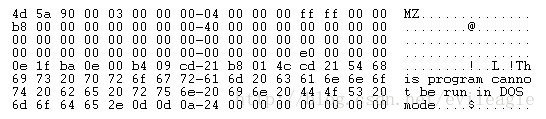

 

### 二、NT头

​		顺着 DOS 头中的 **e_lfanew**，我们很容易可以找到 **NT头，这个才是 32位PE文件中最有用的头**，定义如下:

```c
typedef struct _IMAGE_NT_HEADERS {
    DWORD Signature;
    IMAGE_FILE_HEADER FileHeader;
    IMAGE_OPTIONAL_HEADER32 OptionalHeader;
} IMAGE_NT_HEADERS32, *PIMAGE_NT_HEADERS32;
```

下图是一张真实的 ****PE文件头结构\**** 以及其 ****各个域的取值\**** ：


块对齐：

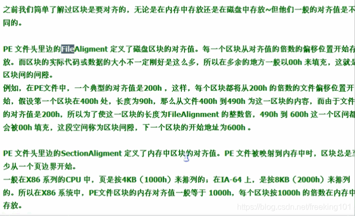

#### **Signature** ( **签名** )：

​		类似于 DOS头中的 e_magic，其高16位是0，低16是0x4550，用字符表示是 'PE‘ 。

#### IMAGE_FILE_HEADER是PE文件头其中在C语言的定义是这样的

```c
typedef struct _IMAGE_FILE_HEADER {
    WORD    Machine;
    WORD    NumberOfSections;
    DWORD   TimeDateStamp;
    DWORD   PointerToSymbolTable;
    DWORD   NumberOfSymbols;
    WORD    SizeOfOptionalHeader;
    WORD    Characteristics;
} IMAGE_FILE_HEADER, *PIMAGE_FILE_HEADER;
```

每个域的具体含义如下：

Machine：该文件的运行平台，是 x86、x64 还是 I64 等等，可以是下面值里的某一个。

```cobol
#define IMAGE_FILE_MACHINE_UNKNOWN           0
#define IMAGE_FILE_MACHINE_I386              0x014c  // Intel 386.
#define IMAGE_FILE_MACHINE_R3000             0x0162  // MIPS little-endian, 0x160 big-endian
#define IMAGE_FILE_MACHINE_R4000             0x0166  // MIPS little-endian
#define IMAGE_FILE_MACHINE_R10000            0x0168  // MIPS little-endian
#define IMAGE_FILE_MACHINE_WCEMIPSV2         0x0169  // MIPS little-endian WCE v2
#define IMAGE_FILE_MACHINE_ALPHA             0x0184  // Alpha_AXP
#define IMAGE_FILE_MACHINE_SH3               0x01a2  // SH3 little-endian
#define IMAGE_FILE_MACHINE_SH3DSP            0x01a3
#define IMAGE_FILE_MACHINE_SH3E              0x01a4  // SH3E little-endian
#define IMAGE_FILE_MACHINE_SH4               0x01a6  // SH4 little-endian
#define IMAGE_FILE_MACHINE_SH5               0x01a8  // SH5
#define IMAGE_FILE_MACHINE_ARM               0x01c0  // ARM Little-Endian
#define IMAGE_FILE_MACHINE_THUMB             0x01c2
#define IMAGE_FILE_MACHINE_AM33              0x01d3
#define IMAGE_FILE_MACHINE_POWERPC           0x01F0  // IBM PowerPC Little-Endian
#define IMAGE_FILE_MACHINE_POWERPCFP         0x01f1
#define IMAGE_FILE_MACHINE_IA64              0x0200  // Intel 64
#define IMAGE_FILE_MACHINE_MIPS16            0x0266  // MIPS
#define IMAGE_FILE_MACHINE_ALPHA64           0x0284  // ALPHA64
#define IMAGE_FILE_MACHINE_MIPSFPU           0x0366  // MIPS
#define IMAGE_FILE_MACHINE_MIPSFPU16         0x0466  // MIPS
#define IMAGE_FILE_MACHINE_AXP64             IMAGE_FILE_MACHINE_ALPHA64
#define IMAGE_FILE_MACHINE_TRICORE           0x0520  // Infineon
#define IMAGE_FILE_MACHINE_CEF               0x0CEF
#define IMAGE_FILE_MACHINE_EBC               0x0EBC  // EFI Byte Code
#define IMAGE_FILE_MACHINE_AMD64             0x8664  // AMD64 (K8)
#define IMAGE_FILE_MACHINE_M32R              0x9041  // M32R little-endian
#define IMAGE_FILE_MACHINE_CEE               0xC0EE
```

NumberOfSections：   该PE文件中有多少个节，也就是节表中的项数。 TimeDateStamp：      PE文件的创建时间，一般有连接器填写。 PointerToSymbolTable： COFF文件符号表在文件中的偏移。 NumberOfSymbols：    符号表的数量。 SizeOfOptionalHeader： 紧随其后的可选头的大小。 Characteristics：       可执行文件的属性，可以是下面这些值按位相或。

```c
#define IMAGE_FILE_RELOCS_STRIPPED           0x0001  // Relocation info stripped from file.
#define IMAGE_FILE_EXECUTABLE_IMAGE          0x0002  // File is executable  (i.e. no unresolved externel references).
#define IMAGE_FILE_LINE_NUMS_STRIPPED        0x0004  // Line nunbers stripped from file.
#define IMAGE_FILE_LOCAL_SYMS_STRIPPED       0x0008  // Local symbols stripped from file.
#define IMAGE_FILE_AGGRESIVE_WS_TRIM         0x0010  // Agressively trim working set
#define IMAGE_FILE_LARGE_ADDRESS_AWARE       0x0020  // App can handle >2gb addresses
#define IMAGE_FILE_BYTES_REVERSED_LO         0x0080  // Bytes of machine word are reversed.
#define IMAGE_FILE_32BIT_MACHINE             0x0100  // 32 bit word machine.
#define IMAGE_FILE_DEBUG_STRIPPED            0x0200  // Debugging info stripped from file in .DBG file
#define IMAGE_FILE_REMOVABLE_RUN_FROM_SWAP   0x0400  // If Image is on removable media, copy and run from the swap file.
#define IMAGE_FILE_NET_RUN_FROM_SWAP         0x0800  // If Image is on Net, copy and run from the swap file.
#define IMAGE_FILE_SYSTEM                    0x1000  // System File.
#define IMAGE_FILE_DLL                       0x2000  // File is a DLL.
#define IMAGE_FILE_UP_SYSTEM_ONLY            0x4000  // File should only be run on a UP machine
#define IMAGE_FILE_BYTES_REVERSED_HI         0x8000  // Bytes of machine word are reversed.
```

​		可以看出，PE 文件头定义了 PE 文件的一些基本信息和属性，这些属性会在PE加载器加载时用到，如果加载器发现PE文件头中定义的一些属性不满足当前的运行环境，将会终止加载该PE。

#### *PE 可选头*别看名字叫可选头，其实一点都不能少

**另一个重要的头就是** **PE 可选头\****，别看他名字叫可选头，其实一点都不能少**，不过，它在不同的平台下是不一样的，例如32位下是IMAGE_OPTIONAL_HEADER32，而在64位下是IMAGE_OPTIONAL_HEADER64。为了简单起见，我们只看32位。

```c
typedef struct _IMAGE_OPTIONAL_HEADER {
    WORD    Magic;
    BYTE    MajorLinkerVersion;
    BYTE    MinorLinkerVersion;
    DWORD   SizeOfCode;
    DWORD   SizeOfInitializedData;
    DWORD   SizeOfUninitializedData;
    DWORD   AddressOfEntryPoint;
    DWORD   BaseOfCode;
    DWORD   BaseOfData;
    DWORD   ImageBase;
    DWORD   SectionAlignment;
    DWORD   FileAlignment;
    WORD    MajorOperatingSystemVersion;
    WORD    MinorOperatingSystemVersion;
    WORD    MajorImageVersion;
    WORD    MinorImageVersion;
    WORD    MajorSubsystemVersion;
    WORD    MinorSubsystemVersion;
    DWORD   Win32VersionValue;
    DWORD   SizeOfImage;
    DWORD   SizeOfHeaders;
    DWORD   CheckSum;
    WORD    Subsystem;
    WORD    DllCharacteristics;
    DWORD   SizeOfStackReserve;
    DWORD   SizeOfStackCommit;
    DWORD   SizeOfHeapReserve;
    DWORD   SizeOfHeapCommit;
    DWORD   LoaderFlags;
    DWORD   NumberOfRvaAndSizes;
    IMAGE_DATA_DIRECTORY DataDirectory[IMAGE_NUMBEROF_DIRECTORY_ENTRIES];
} IMAGE_OPTIONAL_HEADER32, *PIMAGE_OPTIONAL_HEADER32;
```

 

### ***\*PE 可选头\** 各个字段分析说明**

- **Magic**：表示可选头的类型。

```c
#define IMAGE_NT_OPTIONAL_HDR32_MAGIC      0x10b  // 32位PE可选头
#define IMAGE_NT_OPTIONAL_HDR64_MAGIC      0x20b  // 64位PE可选头
#define IMAGE_ROM_OPTIONAL_HDR_MAGIC       0x107  
```

- **MajorLinkerVersion** 和 **MinorLinkerVersion**：链接器的版本号。
- **SizeOfCode**：代码段的长度，如果有多个代码段，则是代码段长度的总和。
- **SizeOfInitializedData**：初始化的数据长度。
- **SizeOfUninitializedData**：未初始化的数据长度。
- **AddressOfEntryPoint：程序入口的 RVA，对于exe这个地址可以理解为WinMain的RVA。对于DLL，这个地址可以理解为DllMain的RVA，如果是驱动程序，可以理解为DriverEntry的RVA。当然，实际上入口点并非是WinMain，DllMain和DriverEntry，在这些函数之前还有一系列初始化要完成，当然，这些不是本文的重点。**
- **BaseOfCode**：代码段起始地址的RVA。
- **BaseOfData**：数据段起始地址的RVA。
- **ImageBase**：映象（加载到内存中的PE文件）的基地址，这个基地址是建议，对于DLL来说，如果无法加载到这个地址，系统会自动为其选择地址。
- **SectionAlignment**：节对齐，PE中的节被加载到内存时会按照这个域指定的值来对齐，比如这个值是0x1000，那么每个节的起始地址的低12位都为0。
- **FileAlignment**：节在文件中按此值对齐，SectionAlignment必须大于或等于FileAlignment。
- **MajorOperatingSystemVersion**、MinorOperatingSystemVersion：所需操作系统的版本号，随着操作系统版本越来越多，这个好像不是那么重要了。
- **MajorImageVersion**、**MinorImageVersion**：映象的版本号，这个是开发者自己指定的，由连接器填写。
- **MajorSubsystemVersion**、**MinorSubsystemVersion**：所需子系统版本号。
- **Win32VersionValue**：保留，必须为0。
- **SizeOfImage**：映象的大小，PE文件加载到内存中空间是连续的，这个值指定占用虚拟空间的大小。
- **SizeOfHeaders**：所有文件头（包括节表）的大小，这个值是以FileAlignment对齐的。
- **CheckSum**：映象文件的校验和。
- **Subsystem**：运行该PE文件所需的子系统，可以是下面定义中的某一个：

```cpp
#define IMAGE_SUBSYSTEM_UNKNOWN              0   // Unknown subsystem.
#define IMAGE_SUBSYSTEM_NATIVE               1   // Image doesn't require a subsystem.
#define IMAGE_SUBSYSTEM_WINDOWS_GUI          2   // Image runs in the Windows GUI subsystem.
#define IMAGE_SUBSYSTEM_WINDOWS_CUI          3   // Image runs in the Windows character subsystem.
#define IMAGE_SUBSYSTEM_OS2_CUI              5   // image runs in the OS/2 character subsystem.
#define IMAGE_SUBSYSTEM_POSIX_CUI            7   // image runs in the Posix character subsystem.
#define IMAGE_SUBSYSTEM_NATIVE_WINDOWS       8   // image is a native Win9x driver.
#define IMAGE_SUBSYSTEM_WINDOWS_CE_GUI       9   // Image runs in the Windows CE subsystem.
#define IMAGE_SUBSYSTEM_EFI_APPLICATION      10  //
#define IMAGE_SUBSYSTEM_EFI_BOOT_SERVICE_DRIVER  11   //
#define IMAGE_SUBSYSTEM_EFI_RUNTIME_DRIVER   12  //
#define IMAGE_SUBSYSTEM_EFI_ROM              13
#define IMAGE_SUBSYSTEM_XBOX                 14
#define IMAGE_SUBSYSTEM_WINDOWS_BOOT_APPLICATION 16
DllCharacteristics：DLL的文件属性，只对DLL文件有效，可以是下面定义中某些的组合：
#define IMAGE_DLLCHARACTERISTICS_DYNAMIC_BASE 0x0040     // DLL can move.
#define IMAGE_DLLCHARACTERISTICS_FORCE_INTEGRITY    0x0080     // Code Integrity Image
#define IMAGE_DLLCHARACTERISTICS_NX_COMPAT    0x0100     // Image is NX compatible
#define IMAGE_DLLCHARACTERISTICS_NO_ISOLATION 0x0200     // Image understands isolation and doesn't want it
#define IMAGE_DLLCHARACTERISTICS_NO_SEH       0x0400     // Image does not use SEH.  No SE handler may reside in this image
#define IMAGE_DLLCHARACTERISTICS_NO_BIND      0x0800     // Do not bind this image.
//                                            0x1000     // Reserved.
#define IMAGE_DLLCHARACTERISTICS_WDM_DRIVER   0x2000     // Driver uses WDM model
//                                            0x4000     // Reserved.
#define IMAGE_DLLCHARACTERISTICS_TERMINAL_SERVER_AWARE     0x8000
```

- **SizeOfStackReserve**：运行时为每个线程栈保留内存的大小。
- **SizeOfStackCommit**：运行时每个线程栈初始占用内存大小。
- **SizeOfHeapReserve**：运行时为进程堆保留内存大小。
- **SizeOfHeapCommit**：运行时进程堆初始占用内存大小。
- **LoaderFlags**：保留，必须为0。
- **NumberOfRvaAndSizes**：数据目录的项数，即下面这个数组的项数。
- **DataDirectory**：数据目录，这是一个数组，数组的项定义如下：

```c=
typedef struct _IMAGE_DATA_DIRECTORY {
    DWORD   VirtualAddress;
    DWORD   Size;
} IMAGE_DATA_DIRECTORY, *PIMAGE_DATA_DIRECTORY;
```

- **VirtualAddress**：是一个RVA。
- **Size**：是一个大小。

这两个数有什么用呢 ？**一个是地址，一个是大小，可以看出这个数据目录项定义的是一个区域**。**那他定义的是什么东西的区域呢？**前面说了，**DataDirectory 是个数组**，**数组中的每一项对应一个特定的数据结构**，**包括导入表，导出表等等**，**根据不同的索引取出来的是不同的结构**，头文件里定义各个项表示哪个结构，如下面的代码所示：

```c
#define IMAGE_DIRECTORY_ENTRY_EXPORT          0   // Export Directory
#define IMAGE_DIRECTORY_ENTRY_IMPORT          1   // Import Directory
#define IMAGE_DIRECTORY_ENTRY_RESOURCE        2   // Resource Directory
#define IMAGE_DIRECTORY_ENTRY_EXCEPTION       3   // Exception Directory
#define IMAGE_DIRECTORY_ENTRY_SECURITY        4   // Security Directory
#define IMAGE_DIRECTORY_ENTRY_BASERELOC       5   // Base Relocation Table
#define IMAGE_DIRECTORY_ENTRY_DEBUG           6   // Debug Directory
//      IMAGE_DIRECTORY_ENTRY_COPYRIGHT       7   // (X86 usage)
#define IMAGE_DIRECTORY_ENTRY_ARCHITECTURE    7   // Architecture Specific Data
#define IMAGE_DIRECTORY_ENTRY_GLOBALPTR       8   // RVA of GP
#define IMAGE_DIRECTORY_ENTRY_TLS             9   // TLS Directory
#define IMAGE_DIRECTORY_ENTRY_LOAD_CONFIG    10   // Load Configuration Directory
#define IMAGE_DIRECTORY_ENTRY_BOUND_IMPORT   11   // Bound Import Directory in headers
#define IMAGE_DIRECTORY_ENTRY_IAT            12   // Import Address Table
#define IMAGE_DIRECTORY_ENTRY_DELAY_IMPORT   13   // Delay Load Import Descriptors
#define IMAGE_DIRECTORY_ENTRY_COM_DESCRIPTOR 14   // COM Runtime descriptor
```

看到这么多的定义，大家估计要头疼了，好不容易要把 PE文件头学习完了，又 “从天而降” 一大波的结构。不用紧张，有了前面的知识，后面的部分就迎刃而解了。下一篇开始将沿着这个数据目录分解其余部分，继续关注哦~

 小甲鱼 区块表 和 区块：https://www.bilibili.com/video/av28047648/?p=5

小甲鱼 区块描述及意义：https://www.bilibili.com/video/av28047648/?p=6

## （三）PE导出表

小甲鱼视频 - 导出表 ：https://www.bilibili.com/video/av28047648/?p=10


***\*导出表\** 是 用来描述 \**模块（dll）\**中的导出函数的结构，如果一个模块导出了函数，那么这个函数会被记录在导出表中，这样通过GetProcAddress函数就能动态获取到函数的地址**。导出表 就是一个 " 表格 "

扩展名为 .exe 不存在导出表，导出表 存在在 dll 文件中，就是 导出 函数给别人用。


​		上篇文章 PE文件结构详解（二）可执行文件头 的结尾出现了一个大数组，这个数组中的每一项都是一个特定的结构，通过函数获取数组中的项可以用RtlImageDirectoryEntryToData函数，DataDirectory中的每一项都可以用这个函数获取，函数原型如下：

```
PVOID NTAPI RtlImageDirectoryEntryToData(PVOID Base, BOOLEAN MappedAsImage, USHORT Directory, PULONG Size);
```

​    Base：模块基地址。     MappedAsImage：是否映射为映象。     Directory：数据目录项的索引。

```c
#define IMAGE_DIRECTORY_ENTRY_EXPORT          0   // Export Directory
#define IMAGE_DIRECTORY_ENTRY_IMPORT          1   // Import Directory
#define IMAGE_DIRECTORY_ENTRY_RESOURCE        2   // Resource Directory
#define IMAGE_DIRECTORY_ENTRY_EXCEPTION       3   // Exception Directory
#define IMAGE_DIRECTORY_ENTRY_SECURITY        4   // Security Directory
#define IMAGE_DIRECTORY_ENTRY_BASERELOC       5   // Base Relocation Table
#define IMAGE_DIRECTORY_ENTRY_DEBUG           6   // Debug Directory
//      IMAGE_DIRECTORY_ENTRY_COPYRIGHT       7   // (X86 usage)
#define IMAGE_DIRECTORY_ENTRY_ARCHITECTURE    7   // Architecture Specific Data
#define IMAGE_DIRECTORY_ENTRY_GLOBALPTR       8   // RVA of GP
#define IMAGE_DIRECTORY_ENTRY_TLS             9   // TLS Directory
#define IMAGE_DIRECTORY_ENTRY_LOAD_CONFIG    10   // Load Configuration Directory
#define IMAGE_DIRECTORY_ENTRY_BOUND_IMPORT   11   // Bound Import Directory in headers
#define IMAGE_DIRECTORY_ENTRY_IAT            12   // Import Address Table
#define IMAGE_DIRECTORY_ENTRY_DELAY_IMPORT   13   // Delay Load Import Descriptors
#define IMAGE_DIRECTORY_ENTRY_COM_DESCRIPTOR 14   // COM Runtime descriptor
```

​    Size：对应数据目录项的大小，比如Directory为0，则表示导出表的大小。

返回值表示数据目录项的起始地址。

 

## 这次来看看第一项：导出表。

**导出表 是 用来描述 \**模块（dll）\**中的导出函数的结构，如果一个模块导出了函数，那么这个函数会被记录在导出表中，这样通过GetProcAddress函数就能动态获取到函数的地址**。

函数导出的方式有两种：

1. 一种是 按 名字 导出，
2. 一种是 按 序号 导出。

这两种导出方式在导出表中的描述方式也不相同。

模块的导出函数可以通过Dependency walker工具来查看：


上图中红框位置显示的就是模块的导出函数，有时候显示的导出函数名字中有一些符号，像 ??0CP2PDownloadUIInterface@@QAE@ABV0@@Z，这种是导出了C++的函数名，编译器将名字进行了修饰。

下面看一下导出表的定义吧：

```c
typedef struct _IMAGE_EXPORT_DIRECTORY {
    DWORD   Characteristics;
    DWORD   TimeDateStamp;
    WORD    MajorVersion;
    WORD    MinorVersion;
    DWORD   Name;
    DWORD   Base;
    DWORD   NumberOfFunctions;
    DWORD   NumberOfNames;
    DWORD   AddressOfFunctions;     // RVA from base of image
    DWORD   AddressOfNames;         // RVA from base of image
    DWORD   AddressOfNameOrdinals;  // RVA from base of image
} IMAGE_EXPORT_DIRECTORY, *PIMAGE_EXPORT_DIRECTORY;
```

导出表结构：


结构还算比较简单，具体每一项的含义如下：

1. Characteristics：现在没有用到，一般为0。
2. TimeDateStamp：导出表生成的时间戳，由连接器生成。
3. MajorVersion，MinorVersion：看名字是版本，实际貌似没有用，都是0。
4. Name：模块的名字。
5. Base：序号的基数，按序号导出函数的序号值从Base开始递增。
6. NumberOfFunctions：所有导出函数的数量。
7. NumberOfNames：按名字导出函数的数量。
8. AddressOfFunctions：一个RVA，指向一个DWORD数组，数组中的每一项是一个导出函数的RVA，顺序与导出序号相同。
9. AddressOfNames：一个RVA，依然指向一个DWORD数组，数组中的每一项仍然是一个RVA，指向一个表示函数名字。
10. AddressOfNameOrdinals：一个RVA，还是指向一个WORD数组，数组中的每一项与AddressOfNames中的每一项对应，表示该名字的函数在AddressOfFunctions中的序号。


​		第一次接触这个结构的童鞋被后面的5项搞晕了吧，理解这个结构比结构本身看上去要复杂一些，文字描述不管怎么说都显得晦涩，所谓一图胜千言，无图无真相，直接上图：


​		在上图中，AddressOfNames 指向一个数组，数组里保存着一组 RVA，每个RVA指向一个字符串，这个字符串即导出的函数名，与这个函数名对应的是AddressOfNameOrdinals中的对应项。获取导出函数地址时，先在AddressOfNames中找到对应的名字，比如Func2，他在AddressOfNames中是第二项，然后从AddressOfNameOrdinals中取出第二项的值，这里是2，表示函数入口保存在AddressOfFunctions这个数组中下标为2的项里，即第三项，取出其中的值，加上模块基地址便是导出函数的地址。如果函数是以序号导出的，那么查找的时候直接用序号减去Base，得到的值就是函数在AddressOfFunctions中的下标。


用代码实现如下：

```c
DWORD* CEAT::SearchEAT( const char* szName)
{
    if (IS_VALID_PTR(m_pTable))
    {
        bool bByOrdinal = HIWORD(szName) == 0;
        DWORD* pProcs = (DWORD*)((char*)RVA2VA(m_pTable->AddressOfFunctions));
        if (bByOrdinal)
        {
            DWORD dwOrdinal = (DWORD)szName; 
            if (dwOrdinal < m_pTable->NumberOfFunctions && dwOrdinal >= m_pTable->Base)
            {
                return &pProcs[dwOrdinal-m_pTable->Base];
            }
        }
        else
        {
            WORD* pOrdinals = (WORD*)((char*)RVA2VA(m_pTable->AddressOfNameOrdinals));
            DWORD* pNames = (DWORD*)((char*)RVA2VA(m_pTable->AddressOfNames));
            for (unsigned int i=0; i<m_pTable->NumberOfNames; ++i)
            {
                char* pNameVA = (char*)RVA2VA(pNames[i]);
                if (strcmp(szName, pNameVA) != 0)
                {
                    continue;
                }
                return &pProcs[pOrdinals[i]];
            }
        }
    }
    return NULL;
}
```

## （四）PE导入表

 

小甲鱼视频 - 导入表：https://www.bilibili.com/video/av28047648/?p=8

https://www.bilibili.com/video/av28047648/?p=9

.exe 文件存在导入表，就是导入函数，然后自己使用。

**导入表 在 PE 文件加载时，会根据这个表里的内容加载依赖的 DLL ( 模块 )，并填充所需函数的地址。**


```cpp
#include <Windows.h>
 
int WINAPI WinMain(
	HINSTANCE hInstance, 
	HINSTANCE hPrevInstance, 
	PSTR szCmdLine, 
	int iCmdShow
)
{
	MessageBox(
		NULL, 
		TEXT("hello, welcome to fichc.com"), 
		TEXT("welcome"), 
		MB_OKCANCEL | MB_OK
	);
	return 0;
}
```

PE文件结构详解（二）可执行文件头的最后展示了一个数组，PE文件结构详解（三）PE导出表中解释了其中第一项的格式，本篇文章来揭示这个数组中的第二项：**IMAGE_DIRECTORY_ENTRY_IMPORT，即导入表。**

也许大家注意到过，在 **IMAGE_DATA_DIRECTORY** 中，有几项的名字都和导入表有关系，其中包括：

- **IMAGE_DIRECTORY_ENTRY_IMPORT**，
- **IMAGE_DIRECTORY_ENTRY_BOUND_IMPORT**，
- **IMAGE_DIRECTORY_ENTRY_IAT** 和
- **IMAGE_DIRECTORY_ENTRY_DELAY_IMPORT** 

这几个导入都是用来干什么的，他们之间又是什么关系呢？听我慢慢道来。

1. **IMAGE_DIRECTORY_ENTRY_IMPORT** 就是我们通常所知道的 **导入表**，**在 PE 文件加载时，会根据这个表里的内容加载依赖的 DLL ( 模块 )，并填充所需函数的地址。**
2. **IMAGE_DIRECTORY_ENTRY_BOUND_IMPORT** 叫做 **绑定导入表**，在第一种导入表导入地址的修正是在PE加载时完成，如果一个PE文件导入的DLL或者函数多那么加载起来就会略显的慢一些，所以出现了绑定导入，在加载以前就修正了导入表，这样就会快一些。
3. **IMAGE_DIRECTORY_ENTRY_DELAY_IMPORT** 叫做 **延迟导入表**，一个PE文件也许提供了很多功能，也导入了很多其他DLL，但是并非每次加载都会用到它提供的所有功能，也不一定会用到它需要导入的所有DLL，因此延迟导入就出现了，只有在一个PE文件真正用到需要的DLL，这个DLL才会被加载，甚至于只有真正使用某个导入函数，这个函数地址才会被修正。
4. **IMAGE_DIRECTORY_ENTRY_IAT** 是 **导入地址表**，前面的三个表其实是导入函数的描述，真正的函数地址是被填充在导入地址表中的。

举个实际的例子，看一下下面这张图：


这个代码调用了一个 RegOpenKeyW 的导入函数，我们看到其 opcode 是 FF 15 00 00 19 30，其实 FF 15 表示这是一个间接调用，即 call dword ptr [30190000] ，这表示要调用的地址存放在 30190000 这个地址中，而 30190000 这个地址在导入地址表的范围内，当模块加载时，PE 加载器会根据导入表中描述的信息修正30190000这个内存中的内容。


那么导入表里到底记录了那些信息，如何根据这些信息修正 **IAT （ 导入地址表 ）** 呢？我们一起来看一下导入表的定义：

```c
typedef struct _IMAGE_IMPORT_DESCRIPTOR {
    union {
        DWORD   Characteristics;            // 0 for terminating null import descriptor
        DWORD   OriginalFirstThunk;         // RVA to original unbound IAT (PIMAGE_THUNK_DATA)
    } DUMMYUNIONNAME;
    DWORD   TimeDateStamp;                  // 0 if not bound,
                                            // -1 if bound, and real date\time stamp
                                            //     in IMAGE_DIRECTORY_ENTRY_BOUND_IMPORT (new BIND)
                                            // O.W. date/time stamp of DLL bound to (Old BIND)
 
    DWORD   ForwarderChain;                 // -1 if no forwarders
    DWORD   Name;
    DWORD   FirstThunk;                     // RVA to IAT (if bound this IAT has actual addresses)
} IMAGE_IMPORT_DESCRIPTOR;
typedef IMAGE_IMPORT_DESCRIPTOR UNALIGNED *PIMAGE_IMPORT_DESCRIPTOR;
```

使用 RtlImageDirectoryEntryToData 并将索引号传 1，会得到一个如上结构的指针，实际上指向一个上述结构的数组，每个导入的 DLL 都会成为数组中的一项，也就是说，一个这样的结构对应一个导入的 DLL。

- **Characteristics** 和 **OriginalFirstThunk**：一个联合体，如果是数组的最后一项 Characteristics 为 0，否则 OriginalFirstThunk 保存一个 RVA，指向一个 IMAGE_THUNK_DATA 的数组，这个数组中的每一项表示一个导入函数。
- TimeDateStamp：映象绑定前，这个值是0，绑定后是导入模块的时间戳。
- ForwarderChain：转发链，如果没有转发器，这个值是 -1 。
- Name：一个 RVA，指向导入模块的名字，所以一个 **IMAGE_IMPORT_DESCRIPTOR** 描述一个导入的DLL。
- FirstThunk：也是一个 RVA，也指向一个 IMAGE_THUNK_DATA 数组。


既然 OriginalFirstThunk 与 FirstThunk 都指向一个 IMAGE_THUNK_DATA 数组，而且这两个域的名字都长得很像，他俩有什么区别呢？为了解答这个问题，先来认识一下 IMAGE_THUNK_DATA 结构：

```c
typedef struct _IMAGE_THUNK_DATA32 {
    union {
        DWORD ForwarderString;      // PBYTE 
        DWORD Function;             // PDWORD
        DWORD Ordinal;
        DWORD AddressOfData;        // PIMAGE_IMPORT_BY_NAME
    } u1;
} IMAGE_THUNK_DATA32;
typedef IMAGE_THUNK_DATA32 * PIMAGE_THUNK_DATA32;
```

​		ForwarderString 是转发用的，暂时不用考虑，Function 表示函数地址，如果是按序号导入 Ordinal 就有用了，若是按名字导入AddressOfData 便指向名字信息。可以看出这个结构体就是一个大的union，大家都知道union虽包含多个域但是在不同时刻代表不同的意义那到底应该是名字还是序号，该如何区分呢？可以通过Ordinal判断，如果Ordinal的最高位是1，就是按序号导入的，这时候，低16位就是导入序号，如果最高位是0，则AddressOfData是一个RVA，指向一个IMAGE_IMPORT_BY_NAME结构，用来保存名字信息，由于Ordinal和AddressOfData实际上是同一个内存空间，所以AddressOfData其实只有低31位可以表示RVA，但是一个PE文件不可能超过2G，所以最高位永远为0，这样设计很合理的利用了空间。实际编写代码的时候微软提供两个宏定义处理序号导入：IMAGE_SNAP_BY_ORDINAL 判断是否按序号导入，IMAGE_ORDINAL 用来获取导入序号。 		这时我们可以回头看看 OriginalFirstThunk 与 FirstThunk，OriginalFirstThunk 指向的 IMAGE_THUNK_DATA 数组包含导入信息，在这个数组中只有 Ordinal 和 AddressOfData 是有用的，因此可以通过 OriginalFirstThunk 查找到函数的地址。FirstThunk则略有不同，在PE文件加载以前或者说在导入表未处理以前，他所指向的数组与 OriginalFirstThunk 中的数组虽不是同一个，但是内容却是相同的，都包含了导入信息，而在加载之后，FirstThunk 中的 Function 开始生效，他指向实际的函数地址，因为FirstThunk 实际上指向 IAT 中的一个位置，IAT 就充当了 IMAGE_THUNK_DATA 数组，加载完成后，这些 IAT 项就变成了实际的函数地址，即 Function 的意义。还是上个图对比一下：


上图是加载前。


上图是加载后。


 

最后总结一下：

导入表其实是一个 IMAGE_IMPORT_DESCRIPTOR 的数组，每个导入的 DLL 对应一个 IMAGE_IMPORT_DESCRIPTOR。 IMAGE_IMPORT_DESCRIPTOR 包含两个 IMAGE_THUNK_DATA 数组，数组中的每一项对应一个导入函数。 加载前 OriginalFirstThunk 与 FirstThunk 的数组都指向名字信息，加载后 FirstThunk 数组指向实际的函数地址。

## （五）延迟导入表

 

[PE文件结构详解（四）PE导入表](http://blog.csdn.net/evileagle/article/details/12357155)讲了一般的PE导入表，这次我们来看一下另外一种导入表：延迟导入（Delay Import）。看名字就知道，这种导入机制导入其他DLL的时机比较“迟”，为什么要迟呢？因为有些导入函数可能使用的频率比较低，或者在某些特定的场合才会用到，而有些函数可能要在程序运行一段时间后才会用到，这些函数可以等到他实际使用的时候再去加载对应的DLL，而没必要再程序一装载就初始化好。

这个机制听起来很诱人，因为他可以加快启动速度，我们应该如何利用这项机制呢？VC有一个选项，可以让我们很方便的使用到这项特性，如下图所示：


​		在这一项后面填写需要延迟导入的DLL名称，连接器就会自动帮我们将这些DLL的导入变为延迟导入。

​		现在我们知道如何使用延迟导入了，那这个看上去很厉害的机制是如何实现的呢？接下来我们来探索一番。在IMAGE_DATA_DIRECTORY 中，有一项为 IMAGE_DIRECTORY_ENTRY_DELAY_IMPORT，这一项便延迟导入表，IMAGE_DATA_DIRECTORY.VirtualAddress 就指向延迟导入表的起始地址。既然是表，肯定又是一个数组，每一项都是一个ImgDelayDesc r结构体，和导入表一样，每一项都代表一个导入的DLL，来看看定义：

```c
typedef struct ImgDelayDescr {  
    DWORD           grAttrs;        // attributes  
    RVA             rvaDLLName;     // RVA to dll name  
    RVA             rvaHmod;        // RVA of module handle  
    RVA             rvaIAT;         // RVA of the IAT  
    RVA             rvaINT;         // RVA of the INT  
    RVA             rvaBoundIAT;    // RVA of the optional bound IAT  
    RVA             rvaUnloadIAT;   // RVA of optional copy of original IAT  
    DWORD           dwTimeStamp;    // 0 if not bound,  
                                    // O.W. date/time stamp of DLL bound to (Old BIND)  
} ImgDelayDescr, * PImgDelayDescr;  
typedef const ImgDelayDescr *   PCImgDelayDescr;  
```

1. grAttrs：用来区分版本，1是新版本，0是旧版本，旧版本中后续的rvaxxxxxx域使用的都是指针，而新版本中都用RVA，我们只讨论新版本。
2. rvaDLLName：一个RVA，指向导入DLL的名字。
3. rvaHmod：一个RVA，指向导入DLL的模块基地址，这个基地址在DLL真正被导入前是NULL，导入后才是实际的基地址。
4. rvaIAT：一个RVA,表示导入函数表，实际上指向IAT，在DLL加载前，IAT里存放的是一小段代码的地址，加载后才是真正的导入函数地址。
5. rvaINT：一个RVA，指向导入函数的名字表。
6. rvaUnloadIAT：延迟导入函数卸载表。
7. dwTimeStamp：延迟导入DLL的时间戳。

​		定义知道了，那他是怎么被处理的呢？前面提到了，在延迟导入函数指向的IAT里，默认保存的是一段代码的地址，当程序第一次调用到这个延迟导入函数时，流程会走到那段代码，这段代码用来干什么呢？请看一个真实的延迟导入函数的例子：

```c
.text:75C7A363 __imp_load__InternetConnectA@32:        ; InternetConnectA(x,x,x,x,x,x,x,x)  
.text:75C7A363                 mov     eax, offset __imp__InternetConnectA@32  
.text:75C7A368                 jmp     __tailMerge_WININET  
```

这段代码其实只有两行汇编，第一行把导入函数IAT项的地址放到eax中，然后用一个jmp跳转走，那么他跳转到哪里了呢？我们继续跟踪：

```c
__tailMerge_WININET proc near             
.text:75C6BEF0                 push    ecx  
.text:75C6BEF1                 push    edx  
.text:75C6BEF2                 push    eax  
.text:75C6BEF3                 push    offset __DELAY_IMPORT_DESCRIPTOR_WININET  
.text:75C6BEF8                 call    __delayLoadHelper  
.text:75C6BEFD                 pop     edx  
.text:75C6BEFE                 pop     ecx  
.text:75C6BEFF                 jmp     eax  
.text:75C6BEFF __tailMerge_WININET endp  
```

其中最重要的是 push 了一个 **DELAY_IMPORT_DESCRIPTOR_WININET，这个就是上文中看到的 ImgDelayDescr 结构，他的 DLL 名字是 wininet.dll。之后，CALL了一个**delayLoadHelper，在这个函数里，执行了加载DLL，查找导出函数，填充导入表等一系列操作，函数结束时IAT中已经是真正的导入函数的地址，这个函数同时返回了导入函数的地址，因此之后的eax里保存的就是函数地址，最后的 jmp eax 就跳转到了真实的导入函数中。

这个过程很完美，也很灵巧，但是如果仔细观察就会发现什么地方有点不对劲，你发现了吗？**delayLoadHelper 的参数中只有IAT项的偏移和整个模块的延迟导入描述**DELAY_IMPORT_DESCRIPTOR_WININET，但是参数中并没有要导入函数的名字。也许你说，名字在 **DELAY_IMPORT_DESCRIPTOR_WININET 的名字表中，是的，那里确实有名字，但是别忘了，那是个表，里面存的是所有要从该模块导入的函数名字，而不是“当前”这个被调用函数的函数名。或许你觉得参数中应该有个索引号，用来表示名字列表中的第几项是即将被导入的那个函数的名字，不幸的是我们也没有看到参数中有这样的信息存在，那Windows执行到这里是如何得到名字的呢？MS在这里使用了一个巧妙的办法：**DELAY_IMPORT_DESCRIPTOR_WININET中有一项是rvaIAT，前面提到了，这里实际上就是指向了IAT，而且是该模块第一个导入函数的IAT的偏移，现在我们有两个偏移，即将导入的函数IAT项的偏移（记作RVA1）和要导入模块第一个函数IAT项的偏移（记作RVA0），(RVA1-RVA0)/4 = 导入函数IAT项在rvaIAT中的下标，rvaINT中的名字顺序与rvaIAT中的顺序是相同的，所以下标也相同，这样就能获取到导入函数的名字了。有了模块名和函数名，用 GetProcAddress 就可以获取到导入函数的地址了。

上述流程用一张图来总结一下：


最后还有两点要提醒大家：

延迟导入的加载只发生在函数第一次被调用的时候，之后IAT就填充为正确函数地址，不会再走 __delayLoadHelper了。

延迟导入一次只会导入一个函数，而不是一次导入整个模块的所有函数。

## （六）重定位

小甲鱼 - 基址重定位：https://www.bilibili.com/video/av28047648/?p=11


 


前面两篇 PE文件结构详解（四）PE导入表 和 PE文件结构详解（五）延迟导入表 介绍了PE文件中比较常用的两种导入方式，不知道大家有没有注意到，在调用导入函数时系统生成的代码是像下面这样的：

在这里，IE 的 iexplorer.exe 导入了 Kernel32.dll 的 GetCommandLineA 函数，可以看到这是个间接 call，00401004 这个地址的内存里保存了目的地址，根据图中显示的符号信息可知，00401004 这个地址是存在于 iexplorer.exe 模块中的，实际上也就是一项 IAT 的地址。这个是 IE6 的 exe 中的例子，当然在 dll 中如果导入其他 dll 中的函数，结果也是一样的。这样就有一个问题，代码里 call 的地址是一个模块内的地址，而且是一个 VA，那么如果模块基地址发生了变化，这个地址岂不是就无效了？这个问题如何解决？

答案是：Windows 使用重定位机制保证以上代码无论模块加载到哪个基址都能正确被调用。听起来很神奇，是怎么做到的呢？其实原理并不很复杂，这个过程分三步：

- \1. 编译的时候由编译器识别出哪些项使用了模块内的直接VA，比如 push 一个全局变量、函数地址，这些指令的操作数在模块加载的时候就需要被重定位。
- \2. 链接器生成PE文件的时候将编译器识别的重定位的项纪录在一张表里，这张表就是重定位表，保存在 DataDirectory中，序号是 IMAGE_DIRECTORY_ENTRY_BASERELOC。
- \3. PE文件加载时，PE 加载器分析重定位表，将其中每一项按照现在的模块基址进行重定位。

以上三步，前两部涉及到了编译和链接的知识，跟本文的关系不大，我们直接看第三步，这一步符合本系列的特征。

在查看重定位表的定义前，我们先了解一下他的存储方式，有助于后面的理解。按照常规思路，每个重定位项应该是一个DWORD，里面保存需要重定位的RVA，这样只需要简单操作便能找到需要重定位的项。然而，Windows并没有这样设计，原因是这样存放太占用空间了，试想一下，加入一个文件有n个重定位项，那么就需要占用4*n个字节。所以Windows采用了分组的方式，按照重定位项所在的页面分组，每组保存一个页面其实地址的RVA，页内的每项重定位项使用一个WORD保存重定位项在页内的偏移，这样就大大缩小了重定位表的大小。

有了上面的概念，我们现在可以来看一下基址重定位表的定义了：

```c
typedef struct _IMAGE_BASE_RELOCATION {
    DWORD   VirtualAddress;
    DWORD   SizeOfBlock;
//  WORD    TypeOffset[1];
} IMAGE_BASE_RELOCATION;
typedef IMAGE_BASE_RELOCATION UNALIGNED * PIMAGE_BASE_RELOCATION;
```

1. VirtualAddress：页起始地址RVA。
2. SizeOfBlock：表示该分组保存了几项重定位项。
3. TypeOffset： 这个域有两个含义，大家都知道，页内偏移用12位就可以表示，剩下的高4位用来表示重定位的类型。而事实上，Windows只用了一种类型IMAGE_REL_BASED_HIGHLOW  数值是 3。


好了，有了以上知识，相信大家可以很容易的写出自己修正重定位表的代码，不如自己做个练习验证一下吧。

 

本文 by evil.eagle 转载的时候请注明出处。http://blog.csdn.net/evileagle/article/details/12886949

 

最后，还是总结一下，哪些项目需要被重定位呢？

1. 代码中使用全局变量的指令，因为全局变量一定是模块内的地址，而且使用全局变量的语句在编译后会产生一条引用全局变量基地址的指令。
2. 将模块函数指针赋值给变量或作为参数传递，因为赋值或传递参数是会产生mov和push指令，这些指令需要直接地址。
3. C++中的构造函数和析构函数赋值虚函数表指针，虚函数表中的每一项本身就是重定位项，为什么呢？大家自己考虑一下吧，不难哦~

## PE 详解 之 资源

小甲鱼资源详解 和 软件汉化：https://www.bilibili.com/video/av28047648/?p=12 https://www.bilibili.com/video/av28047648/?p=13

PE文件详解（七）--资源表：https://blog.csdn.net/lj94093/article/details/50504110 PE格式第九讲,资源表解析 及实战演练：https://www.cnblogs.com/iBinary/p/7712932.html 【PE结构】资源表：https://blog.csdn.net/chy_chenyang/article/details/80823775

 


resource_hacker 链接: https://pan.baidu.com/s/1HFUKvBvwHm_5oa0DxGcroA 提取码: ay6p eXeScope 链接: https://pan.baidu.com/s/17HVVkGN8bKZ9acg3f9aDrw 提取码: exjf

 


 


 


**IMAGE_RESOURCE_DIRECTORY** 与 **IMAGE_RESOURCE_DIRECTORY_ENTRY** 结构体定义如下：

```cpp
typedef struct _IMAGE_RESOURCE_DIRECTORY {
    DWORD   Characteristics;      //属性，一般为0
    DWORD   TimeDateStamp;        //资源的产生时刻，一般为0
    WORD    MajorVersion;         //主版本号，一般为0
    WORD    MinorVersion;         //次版本号，一般为0
    WORD    NumberOfNamedEntries; //以名称（字符串）命名的资源数量
    WORD    NumberOfIdEntries;    //以ID（整型数字）命名的资源数量
} IMAGE_RESOURCE_DIRECTORY, *PIMAGE_RESOURCE_DIRECTORY;
 
 
typedef struct _IMAGE_RESOURCE_DIRECTORY_ENTRY {
    union {
        struct {
            DWORD NameOffset:31;
            DWORD NameIsString:1;
        };
        DWORD   Name;
        WORD    Id;
    };
    union {
        DWORD   OffsetToData;
        struct {
            DWORD   OffsetToDirectory:31;
            DWORD   DataIsDirectory:1;
        };
    };
} IMAGE_RESOURCE_DIRECTORY_ENTRY, *PIMAGE_RESOURCE_DIRECTORY_ENTRY;
```


 

## 1. 第一层

 第一层起始于一个 IMAGE_RESOURCE_DIRECTORY 头，后面紧接着是 IMAGE_RESOURCE_DIRECTORY_ENTRY 数组。**数组个数** = **NumberOfNamedEntries** + **NumberOfIdEntries**。

  IMAGE_RESOURCE_DIRECTORY_ENTRY 使用的是 Name 与 OffsetToDirectory，分别代表了资源类型与第二层的数据偏移地址。Name 与资源类型的匹配如下：


  OffsetToDirectory 数据偏移地址是相对整个资源结构来说的，也就是说首个第一层的起始偏移地址加上 OffsetToDirectory 就是第二层的偏移地址。

 

## 2. 第二层

  与第一层一样，第二层起始于一个IMAGE_RESOURCE_DIRECTORY头，后面紧接着是IMAGE_RESOURCE_DIRECTORY_ENTRY 数组。数组个数=NumberOfNamedEntries+NumberOfIdEntries。

  IMAGE_RESOURCE_DIRECTORY_ENTRY使用的是NameIsString、NameOffset、Id与OffsetToDirectory。其中OffsetToDirectory与第一层一样，代表了第三层的数据偏移地址，同样是相对整个资源结构来说的。

  如果NameIsString=1，说明该资源以名称(UNICODE编码的字符串)定义的，NameOffset是名称的相对整个资源结构的偏移地址。相反，如果NameIsString=0，说明该资源以ID(整型数字)定义的，ID号为Id。

  NameOffset相对地址指向的是IMAGE_RESOURCE_DIR_STRING_U结构体，该结构体定义如下：

```cpp
typedef struct _IMAGE_RESOURCE_DIR_STRING_U {
    WORD    Length;           //字符串的长度
    WCHAR   NameString[ 1 ];  //UNICODE字符串，由于字符串是不定长的。由Length 制定长度
} IMAGE_RESOURCE_DIR_STRING_U, *PIMAGE_RESOURCE_DIR_STRING_U;
```


 

## 3. 第三层

​		与前两层一样，第二层起始于一个IMAGE_RESOURCE_DIRECTORY头，后面紧接着是IMAGE_RESOURCE_DIRECTORY_ENTRY数组，但不同的是数组个数=1。

```
	IMAGE_RESOURCE_DIRECTORY_ENTRY使用的是Name与OffsetToData，分别代表了资源语言类型与资源数据相对地址。Name是指语言内码，比如936代表简体中文。

	OffsetToData是相对整个资源结构的偏移地址，指向一个IMAGE_RESOURCE_DATA_ENTRY结构体，该结构体定义如下：
typedef struct _IMAGE_RESOURCE_DATA_ENTRY {
    DWORD   OffsetToData;  //资源数据的RVA
    DWORD   Size;          //资源数据的长度
    DWORD   CodePage;      //代码页, 一般为0
    DWORD   Reserved;      //保留字段
} IMAGE_RESOURCE_DATA_ENTRY, *PIMAGE_RESOURCE_DATA_ENTRY;
```


# 嵌入式C与ARM架构体系

# 内存堆栈管理

​		结合我们对上一张的学习，我们已经对程序的编译，链接，安装和运行有了一个大致的了解。在C程序中定义的函数，全局函数，静态变量等分别会在块中被分配。

​		我们还有问题——局部变量和全局变量时怎样分配的呢？malloc free是怎么工作的！我们下面来展开分析分析。

## 进程

​				我们的程序在运行的时候都会被封装成进程：让我们以一个hello,world为例：

```
#include <stdio.h>
int main()
{
	printf("Hello world");
	while(1);
	return 0;
}
```


​		我们编译并且在后台运行这一程序。得到的结果就是如图所示。

​		当我们使用pstree命令查看bash进程树一致，pstree本身就变成了bash 的一个子进程。

​		我们强调：程序是安装在磁盘下的二进制文件，而进程就是一个程序运行的实例。操作系统加载程序到内存中，分配必要的资源，随后地址便不再发生变化。但是，使用malloc申请的内存却在动态的发生变化，这些变化的内存叫做heap memory（堆内存），调用过程的内存叫做栈内存。

## Linux环境下的内存管理

​		我们现在考虑一下内存的堆栈管理机制，由于u低战内存不是仅靠程序本身维护，而是由操作系统，编译器，CPU和物理内存相互配合实现的

​		在Linux环境运行的程序，在编译链接的起始地址都是相同的，而且是一个虚拟地址。Linux操作系统需要CPU内存管理单元的支持才能运行

​		计算机程序无非分为两种：操作系统和应用程序。每一个应用程序都有4GB大小的虚拟空间地址。为了安全，又将之分成两个部分——用户空间和内核空间。0-3G分给应用程序，3-4G分给操作系统


​		以及：注意到，我们也存在使用页表来映射空间：


## 栈的管理

​		栈是一种常见的数据结构。但是注意，堆栈 != 栈，他们是内存中两个不同的区域！

​		栈作为一种First In Last Out的数据结构，只有push和pop两种操作，对于栈的生长方向不一致，又分为递增栈和递减栈。出栈和入栈都是使用一个叫做栈指针（SP）来进行维护的

​		满栈的SP总是指向栈顶元素，否则指向上方的可用空间。

​		栈又是C语言的基础，运行C语言程序之前都必须要进行初始化栈空间的。

### 栈的初始化

​		栈的初始化就是SP的初始化。将内存分配结束后给出一个SP指向之。不同的处理器会使用专门的寄存器保存栈的起始地址。X86使用ESP和EBP，arm则是R13和R11寄存器

​		Linux下，栈的起始地址在进程用户地址的最高位置向低地址增长


​		我们可以查看Linux下的栈大小


​		让栈爆炸的简单办法就是：开辟栈上的大内存。所以，为了防止程序崩溃：

- 不要在函数内使用大数组，实在不行使用malloc函数
- 不要嵌套函数过深
- 递归的层数不要过深

### 函数调用

​		函数的栈帧除了保存局部变量和实参以外，还要保存函数调用的上下文（入口和返回）。我们的SP总是指向函数调用层顶端，FP指向低端。

​		下面，我们写一个简单的程序看看调用过程：

```C
int g()
{
	int x = 100;
	int y = 200;
	return 500;
}

int f()
{
	int l = 20;
	int m = 30;
	int n = 40;
	g();
	return 50;
}

int main()
{
	int i = 2;
	int j = 3;
	int k =4;
	f();
	return 0;
}
```

​		拿到了又臭又长的东西,定位到这里:

```
0000000000001129 <g>:
    1129:	f3 0f 1e fa          	endbr64 
    112d:	55                   	push   %rbp
    112e:	48 89 e5             	mov    %rsp,%rbp
    1131:	c7 45 f8 64 00 00 00 	movl   $0x64,-0x8(%rbp)
    1138:	c7 45 fc c8 00 00 00 	movl   $0xc8,-0x4(%rbp)
    113f:	b8 f4 01 00 00       	mov    $0x1f4,%eax
    1144:	5d                   	pop    %rbp
    1145:	c3                   	retq   

0000000000001146 <f>:
    1146:	f3 0f 1e fa          	endbr64 
    114a:	55                   	push   %rbp
    114b:	48 89 e5             	mov    %rsp,%rbp
    114e:	48 83 ec 10          	sub    $0x10,%rsp
    1152:	c7 45 f4 14 00 00 00 	movl   $0x14,-0xc(%rbp)
    1159:	c7 45 f8 1e 00 00 00 	movl   $0x1e,-0x8(%rbp)
    1160:	c7 45 fc 28 00 00 00 	movl   $0x28,-0x4(%rbp)
    1167:	b8 00 00 00 00       	mov    $0x0,%eax
    116c:	e8 b8 ff ff ff       	callq  1129 <g>
    1171:	b8 32 00 00 00       	mov    $0x32,%eax
    1176:	c9                   	leaveq 
    1177:	c3                   	retq   

0000000000001178 <main>:
    1178:	f3 0f 1e fa          	endbr64 
    117c:	55                   	push   %rbp
    117d:	48 89 e5             	mov    %rsp,%rbp
    1180:	48 83 ec 10          	sub    $0x10,%rsp
    1184:	c7 45 f4 02 00 00 00 	movl   $0x2,-0xc(%rbp)
    118b:	c7 45 f8 03 00 00 00 	movl   $0x3,-0x8(%rbp)
    1192:	c7 45 fc 04 00 00 00 	movl   $0x4,-0x4(%rbp)
    1199:	b8 00 00 00 00       	mov    $0x0,%eax
    119e:	e8 a3 ff ff ff       	callq  1146 <f>
    11a3:	b8 00 00 00 00       	mov    $0x0,%eax
    11a8:	c9                   	leaveq 
    11a9:	c3                   	retq   
    11aa:	66 0f 1f 44 00 00    	nopw   0x0(%rax,%rax,1)
```

​		如果是ARM-C :

```
000103c8 <g>:
   103c8:	e52db004 	push	{fp}		; (str fp, [sp, #-4]!)
   103cc:	e28db000 	add	fp, sp, #0
   103d0:	e24dd00c 	sub	sp, sp, #12
   103d4:	e3a03064 	mov	r3, #100	; 0x64
   103d8:	e50b300c 	str	r3, [fp, #-12]
   103dc:	e3a030c8 	mov	r3, #200	; 0xc8
   103e0:	e50b3008 	str	r3, [fp, #-8]
   103e4:	e3a03f7d 	mov	r3, #500	; 0x1f4
   103e8:	e1a00003 	mov	r0, r3
   103ec:	e28bd000 	add	sp, fp, #0
   103f0:	e49db004 	pop	{fp}		; (ldr fp, [sp], #4)
   103f4:	e12fff1e 	bx	lr

000103f8 <f>:
   103f8:	e92d4800 	push	{fp, lr}
   103fc:	e28db004 	add	fp, sp, #4
   10400:	e24dd010 	sub	sp, sp, #16
   10404:	e3a03014 	mov	r3, #20
   10408:	e50b3010 	str	r3, [fp, #-16]
   1040c:	e3a0301e 	mov	r3, #30
   10410:	e50b300c 	str	r3, [fp, #-12]
   10414:	e3a03028 	mov	r3, #40	; 0x28
   10418:	e50b3008 	str	r3, [fp, #-8]
   1041c:	ebffffe9 	bl	103c8 <g>
   10420:	e3a03032 	mov	r3, #50	; 0x32
   10424:	e1a00003 	mov	r0, r3
   10428:	e24bd004 	sub	sp, fp, #4
   1042c:	e8bd8800 	pop	{fp, pc}

00010430 <main>:
   10430:	e92d4800 	push	{fp, lr}
   10434:	e28db004 	add	fp, sp, #4
   10438:	e24dd010 	sub	sp, sp, #16
   1043c:	e3a03002 	mov	r3, #2
   10440:	e50b3010 	str	r3, [fp, #-16]
   10444:	e3a03003 	mov	r3, #3
   10448:	e50b300c 	str	r3, [fp, #-12]
   1044c:	e3a03004 	mov	r3, #4
   10450:	e50b3008 	str	r3, [fp, #-8]
   10454:	ebffffe7 	bl	103f8 <f>
   10458:	e3a03000 	mov	r3, #0
   1045c:	e1a00003 	mov	r0, r3
   10460:	e24bd004 	sub	sp, fp, #4
   10464:	e8bd8800 	pop	{fp, pc}
```

​		那返回结构体又如何呢:

```
00010468 <getBuf>:
   10468:	e52db004 	push	{fp}		; (str fp, [sp, #-4]!)
   1046c:	e28db000 	add	fp, sp, #0
   10470:	e24dd014 	sub	sp, sp, #20
   10474:	e50b0010 	str	r0, [fp, #-16]
   10478:	e3a03001 	mov	r3, #1
   1047c:	e50b300c 	str	r3, [fp, #-12]
   10480:	e3a03002 	mov	r3, #2
   10484:	e50b3008 	str	r3, [fp, #-8]
   10488:	e51b3010 	ldr	r3, [fp, #-16]
   1048c:	e1a02003 	mov	r2, r3
   10490:	e24b300c 	sub	r3, fp, #12
   10494:	e8930003 	ldm	r3, {r0, r1}
   10498:	e8820003 	stm	r2, {r0, r1}
   1049c:	e51b0010 	ldr	r0, [fp, #-16]
   104a0:	e28bd000 	add	sp, fp, #0
   104a4:	e49db004 	pop	{fp}		; (ldr fp, [sp], #4)
   104a8:	e12fff1e 	bx	lr

000104ac <main>:
   104ac:	e92d4800 	push	{fp, lr}
   104b0:	e28db004 	add	fp, sp, #4
   104b4:	e24dd010 	sub	sp, sp, #16
   104b8:	e59f3040 	ldr	r3, [pc, #64]	; 10500 <main+0x54>
   104bc:	e5933000 	ldr	r3, [r3]
   104c0:	e50b3008 	str	r3, [fp, #-8]
   104c4:	e3a03000 	mov	r3, #0
   104c8:	e24b3010 	sub	r3, fp, #16
   104cc:	e1a00003 	mov	r0, r3
   104d0:	ebffffe4 	bl	10468 <getBuf>
   104d4:	e3a03000 	mov	r3, #0
   104d8:	e59f2020 	ldr	r2, [pc, #32]	; 10500 <main+0x54>
   104dc:	e5921000 	ldr	r1, [r2]
   104e0:	e51b2008 	ldr	r2, [fp, #-8]
   104e4:	e0321001 	eors	r1, r2, r1
   104e8:	e3a02000 	mov	r2, #0
   104ec:	0a000000 	beq	104f4 <main+0x48>
   104f0:	ebffff94 	bl	10348 <__stack_chk_fail@plt>
   104f4:	e1a00003 	mov	r0, r3
   104f8:	e24bd004 	sub	sp, fp, #4
   104fc:	e8bd8800 	pop	{fp, pc}
   10500:	00010574 	andeq	r0, r1, r4, ror r5
```

​		也就是说, 直接赋值到上一个函数的临时变量区里,给上一级函数访问了

#### 扩展:

​		函数的返回值保存在内存的什么区域呢？

> 1、结构体大小不超过4字节，那么仍然使用EAX寄存器传递返回值
> 2.结构体超过4字节但不等于8字节时，调用者将首先在栈上分配一块能容纳结构体的临时内存块，然后在传递完函数参数后将该临时内存块的首地址作为隐含的第一个参数最后(因为压栈顺序是从右到左)压栈，接下的动作同前所述。当被调用函数返回时，它会通过第一个隐含参数寻址到临时内存块并将返回值拷贝到其中，然后将保存有返回值内容的临时内存块的首址存进eax寄存器中，
> 3、结构体大小刚好为8个字节时编译器不再于栈上分配内存，而直接同时使用EAX和EDX两个寄存器传递返回值，其中EAX保存低4字节数据，EDX保存高4字节数据。

​		函数在定义时，必有其返回类型，返回类型可以为数值型(指针是表示地址的数值)，void类型。函数只能返回一个值，数值形式可以是4字节的整型，浮点，8字节大小的long long，还可以返回结构体类型。虽然返回的都是数值，但是其中的返回机制不同。

​		函数的局部变量定义在栈中，栈的特点后进先出(LIFO)。局部变量所在的栈的高地址在下，低地址在上。从main开始，申请变量时栈顶指针向上移动，进入局部变量，局部变量的申请同在main函数中一样，一旦子函数执行完毕，则栈顶指针下移到进入局部变量时的位置，子函数所申请的局部变量空间都被回收。所以如果函数需要子函数中的一些值时，可以通过返回该数据来获得（用指针间接访问变量无需返回）。

1）讨论整型，浮点型，指针等4字节大小的数值。
以下一个函数来举例说明：

```C 
int add(int x,int y){
	int z=x+y;
	return z;
}

int main(){
	int sum=add(3,4);
	return 0;
}
```

该函数返回部分的汇编代码：

```
return z;
```

```
001813F7 8B 45 F8 mov eax,dword ptr [z]
```

return这一段中，可以看到z中计算好的数据移到eax寄存器中，由eax寄存器将值带给调用该函数的函数变量。

​		在返回这些类型时，系统将该函数所要返回的值移到寄存器中，栈顶指针下移，栈中的局部变量都死亡，寄存器中的数据再返回给调用该函数的函数所要接收的变量。

2）讨论longlong等8字节大小的数值。
		在32bit的编译环境中，eax寄存器一次性只能接受传递4字节大小的数据，而8字节的大小显然靠它一次性是不能完全拿到的。代码为将上述的int改为long long类型。函数返回部分的汇编代码：

```
return z;

000C1400 8B 45 F4 mov eax,dword ptr [z]
000C1403 8B 55 F8 mov edx,dword ptr [ebp-8]
```

​		该函数的返回机制与4字节的相似，只是由两个寄存器来返回该值，其中将long long字节分为两部分移到eax和edx两个寄存器，通过这两个寄存器将函数值返回。

3）返回结构体类型的数据
		一个结构体变量中可以包含多个不同数据变量，其大小很容易超过8字节，如果靠多个寄存器来实现将值带回到调用函数中，很不现实。

函数举例：

```
typedef struct {
​int num;
char name[19];
char sex;
float score;
}student;

student test(){
student stu;
strcpy(stu.name,“xiaoming”);
stu.num=1001;
stu.score=99.9;
stu.sex=‘M’;
return stu;
}

int main(){
student su;
su=test();
return 0;
}
```

该函数的返回类型为student结构体类型，该类型的大小为28字节。

```
函数返回部分的汇编代码：
return stu;

00DD3B81 B9 07 00 00 00 mov ecx,7
00DD3B86 8D 75 DC lea esi,[stu]
00DD3B89 8B 7D 08 mov edi,dword ptr [ebp+8]
00DD3B8C F3 A5 rep movs dword ptr es:[edi],dword ptr [esi]

return stu;

00DD3B8E 8B 45 08 mov eax,dword ptr [ebp+8]
```

​		在进入该子函数之前，系统在栈中为该函数留下一段内存，在函数返回该类型数据时，先是寄存器将其中的数据移到该段空间，子函数中的数据死亡，再由该段空间将值返回到调用函数的变量中。该方式的代价比较大，消耗了空间，并且在复制移值中也占用了cpu及寄存器等资源，所以指针间接访问来提高代码的效率


### 参数传递

​		我们函数参数传递使用的是栈.如何传递数据有时也是我们需要考虑的事情

#### 什么是调用惯例

调用惯例(Calling Conventions)指计算机程序执行时调用函数或过程的一些约定，包括：

1. 函数的参数是通过栈还是寄存器传递？
2. 如果通过栈传递，顺序是怎样的，是从左至右入栈还是相反。
3. 谁负责清理栈，是调用者还是被调用者？

从清理栈的角度来讲，调用惯例可分为三类：函数的调用者清理，函数清理，混合清理（有时由调用者清理，有时由函数自己清理）。

#### 调用者清理

​		著名的*cdecl*就是由函数调用者清理栈的调用惯例。 *cdecl*是基于c语言的调用惯例，也是x86机器上大多数C编译器采用的调用惯例。

​		函数的返回结果多通过*EAX*寄存器返回。 对于32位机器，*EAX*能容纳4个字节。 整数或内存地址（指针），通过EAX寄存器返回是没有问题的。 超过4个字节的结构体呢？如何返回？

​		对于较小的结构体或对象，可以通过EAX:EDX寄存器对返回。 对于超大的对象或结构体，caller在调用函数之前会分配出内存空间，然后把这个空间地址作为第一个参数隐式地传给函数。被调用的函数callee把结果写进这片内存空间，再pop空间地址，之后才返回。 对于浮点数的结果，似乎是通过 *ST0 x87 register*(浮点寄存器)返回的。

​		因为调用者知道为参数分配了多少栈空间，所以由调用者清理栈就有一个好处： 为参数分配的栈空间大小可以动态决定。 因此*cdecl*支持可变参数的函数的调用，例如`printf`。

​		如果强迫某个函数使用*cdecl*调用惯例，可以在函数声明中加`_cdecl`关键字，如：

```csharp
void _cdecl funct();
```

#### 函数自己清理

​		*pascal*，*stdcall*，*fastcall*都是由函数来清理栈。 通过阅读程序的汇编代码，可以很容易识别这类调用惯例。因为函数返回前会清理栈。

​		*pascal*是基于*PASCAL*编程语言的函数调用惯例。 参数按照从左到右的顺序压栈（和*cdecl*的入栈顺序相反）。 OS/2 1.x，Microsoft Windows 3.x 和 Borland Delphi 1.x中的16位API都使用这种函数调用惯例。

​		*stdcall*是从*pascal*调用惯例演变出来的，和*pascal*不同的是，*stdcall*以从右到左的顺序对参数压栈。 返回值存储在EAX寄存器中。Win32 API就是采用的这种调用惯例。

​		*fastcall*是混合使用寄存器和栈来存储函数的参数，比如把前两个参数存储在寄存器中，其余的参数入栈。 有*Microsoft fastcall*和*Borland fastcall*等不同的实现。

​		由函数自己清理栈的好处在于：调用者不需要每次调用函数之后都清理栈，从而节省了不少代码， 从而生成的二进制文件比较小。坏处在于，由于清理栈的代码是事先生成在函数体内， 所以不能支持可变参数的函数。

#### 混合清理

​		混合清理的代表是*thiscall*，对C++中非静态成员函数使用的就是这种调用惯例。

​		对于*gcc*编译器来说，*thiscall*几乎和*cdecl*相同：函数调用者负责清理栈，参数按从右到左的顺序入栈。 不同的是，*thiscall*最后会把`this`指针压栈，就好象它是函数的第一个参数。（其实也是的吧）

​		对于*Microsoft VC++*编译器，*thiscall*类似于Windows API的*stdcall*，函数的参数从右到左压栈，由参数来清理栈。和*stdcall*不同的是，*thiscall*会通过*ECX*寄存器来传递`this`指针。因为由函数自己清理栈不支持可变参数的函数调用，所以对于可变参数的函数，则由函数的调用者来清理栈。这是*thiscall*的灵活之处。

#### 总结

| 调用惯例 | 出栈方     | 参数传递                                                     | 名字修饰                                                     |
| -------- | ---------- | ------------------------------------------------------------ | ------------------------------------------------------------ |
| cdecl    | 函数调用方 | 从右至左的顺序压参数入栈                                     | 下划线+函数名                                                |
| pascal   | 函数本身   | 从左至右的顺序入栈                                           | 较为复杂，参见pascal文档                                     |
| stdcall  | 函数本身   | 从右至左的顺序压参数入栈                                     | 下划线+函数名+@+参数的字节数， 如函数 int func(int a, double b)的修饰名是 _func@12 |
| fastcall | 函数本身   | 头两个 DWORD(4字节)类型或者更少字节的参数 被放入寄存器，其他剩下的参数按从右至左的顺序入栈 | @+函数名+@+参数的字节数                                      |
| thiscall | 不一定     | 从右至左的顺序压参数入栈（有时会通过寄存器传递this指针）     | 不                                                           |

### 形参和实参

​		让我们从汇编角度看看形参和实参的：

```
000103c8 <f>:
   103c8:	e52db004 	push	{fp}		; (str fp, [sp, #-4]!)
   103cc:	e28db000 	add	fp, sp, #0
   103d0:	e24dd01c 	sub	sp, sp, #28
   103d4:	e50b0010 	str	r0, [fp, #-16]
   103d8:	e50b1014 	str	r1, [fp, #-20]	; 0xffffffec
   103dc:	e50b2018 	str	r2, [fp, #-24]	; 0xffffffe8
   103e0:	e50b301c 	str	r3, [fp, #-28]	; 0xffffffe4
   103e4:	e3a03000 	mov	r3, #0
   103e8:	e50b3008 	str	r3, [fp, #-8]
   103ec:	e3a03064 	mov	r3, #100	; 0x64
   103f0:	e58b3008 	str	r3, [fp, #8]
   103f4:	e51b2010 	ldr	r2, [fp, #-16]
   103f8:	e51b3014 	ldr	r3, [fp, #-20]	; 0xffffffec
   103fc:	e0822003 	add	r2, r2, r3
   10400:	e51b3018 	ldr	r3, [fp, #-24]	; 0xffffffe8
   10404:	e0822003 	add	r2, r2, r3
   10408:	e51b301c 	ldr	r3, [fp, #-28]	; 0xffffffe4
   1040c:	e0822003 	add	r2, r2, r3
   10410:	e59b3004 	ldr	r3, [fp, #4]
   10414:	e0823003 	add	r3, r2, r3
   10418:	e59b2008 	ldr	r2, [fp, #8]
   1041c:	e0823003 	add	r3, r2, r3
   10420:	e50b3008 	str	r3, [fp, #-8]
   10424:	e51b3008 	ldr	r3, [fp, #-8]
   10428:	e1a00003 	mov	r0, r3
   1042c:	e28bd000 	add	sp, fp, #0
   10430:	e49db004 	pop	{fp}		; (ldr fp, [sp], #4)
   10434:	e12fff1e 	bx	lr

00010438 <main>:
   10438:	e92d4800 	push	{fp, lr}
   1043c:	e28db004 	add	fp, sp, #4
   10440:	e24dd020 	sub	sp, sp, #32
   10444:	e3a03001 	mov	r3, #1
   10448:	e50b301c 	str	r3, [fp, #-28]	; 0xffffffe4
   1044c:	e3a03002 	mov	r3, #2
   10450:	e50b3018 	str	r3, [fp, #-24]	; 0xffffffe8
   10454:	e3a03003 	mov	r3, #3
   10458:	e50b3014 	str	r3, [fp, #-20]	; 0xffffffec
   1045c:	e3a03004 	mov	r3, #4
   10460:	e50b3010 	str	r3, [fp, #-16]
   10464:	e3a03005 	mov	r3, #5
   10468:	e50b300c 	str	r3, [fp, #-12]
   1046c:	e3a03006 	mov	r3, #6
   10470:	e50b3008 	str	r3, [fp, #-8]
   10474:	e51b3008 	ldr	r3, [fp, #-8]
   10478:	e58d3004 	str	r3, [sp, #4]
   1047c:	e51b300c 	ldr	r3, [fp, #-12]
   10480:	e58d3000 	str	r3, [sp]
   10484:	e51b3010 	ldr	r3, [fp, #-16]
   10488:	e51b2014 	ldr	r2, [fp, #-20]	; 0xffffffec
   1048c:	e51b1018 	ldr	r1, [fp, #-24]	; 0xffffffe8
   10490:	e51b001c 	ldr	r0, [fp, #-28]	; 0xffffffe4
   10494:	ebffffcb 	bl	103c8 <f>
   10498:	e3a03000 	mov	r3, #0
   1049c:	e1a00003 	mov	r0, r3
   104a0:	e24bd004 	sub	sp, fp, #4
   104a4:	e8bd8800 	pop	{fp, pc}
```

​		我们看到，这里是将参数加载到寄存器中，反复摆弄寄存器，但是并没有改变内存中的数（没有将之写回到内存地址上）

### 栈和作用域

​		栈与作用域的问题想必是老生常谈了，我们很容易料到下面程序的结果：

```C
#include <stdio.h>

int main()
{
	int i = 1;
    {
        int i = 2;
        /* static */ int k =4;
        printf("i = %d\n", i);
        printf("k = %d\n", k);
    }
    printf("i = %d\n", i);
    printf("k = %d\n", k);    
}
```

​		我们尝试一下：


​		报错了，说明在定义域外，编译器压根就把里头的变量回收了。

​		但是让k变为静态变量如何呢？答案是——还是报错。我们改变了局部变量的属性，但是作用域仍是由`{}`决定的

​		我们注意：

- 全局变量作用域由文件来限定
- 可以使用extern来扩展
- 可以使用static关键字使之变量总是在文件内被引用。
- 局部变量的作用域由static限定，我们只可以改变他的存储位置，但是改变不了他的作用域！

## 堆的管理

​		我们下面，来看看跟堆相关的函数：

```C
/* Allocate SIZE bytes of memory.  */
extern void *malloc (size_t __size) __THROW __attribute_malloc__
     __attribute_alloc_size__ ((1)) __wur;
/* Allocate NMEMB elements of SIZE bytes each, all initialized to 0.  */
extern void *calloc (size_t __nmemb, size_t __size)
     __THROW __attribute_malloc__ __attribute_alloc_size__ ((1, 2)) __wur;

/* Re-allocate the previously allocated block
   in PTR, making the new block SIZE bytes long.  */
/* __attribute_malloc__ is not used, because if realloc returns
   the same pointer that was passed to it, aliasing needs to be allowed
   between objects pointed by the old and new pointers.  */
extern void *realloc (void *__ptr, size_t __size)
     __THROW __attribute_warn_unused_result__ __attribute_alloc_size__ ((2));

/* Free a block allocated by `malloc', `realloc' or `calloc'.  */
extern void free (void *__ptr) __THROW;
```

​		这些函数的作用，我想大家都知道：

- malloc向堆申请内存
- calloc申请nmemb个大小为size的内存块
- realloc调整块大小
- free释放堆内存

```
#include <stdio.h>
#include <stdlib.h>
#include <string.h>

int main()
{
	char* p = NULL;

	p = (char*)malloc(100);
	printf("p = %p\n", p);
	memset(p, 0, 100);
	memcpy(p, "hello", 5);

	printf("%s",p);

	p = (char*)realloc(p, 200);
	printf("%p\n", p);
	printf("%s\n", p);

	free(p);

	return 0;
}
```

​		可以编译输出一下：


​		注意：

- 堆内存是匿名的——我们没办法直接像访问变量那样访问堆：只可以操纵指针完成这个事情。
- 务必自己管理堆内存防止内存泄漏！

### 裸机环境下分配堆内存

​		一般都是使用编译器封装好的汇编库

### uC/OS的堆内存管理

### 扩展

[13. 内存管理 — [野火\]uCOS-III内核实现与应用开发实战指南——基于STM32 文档 (embedfire.com)](https://doc.embedfire.com/rtos/ucos/zh/latest/application/memory_management.html#:~:text=μC%2FOS的内存管理是采用内存池的方式进行管理，也就是创建一个内存池，静态划分一大块连续空间作为内存管理的空间，,里面划分为很多个内存块，我们在使用的时候就从这个内存池中获取一个内存块，使用完毕的时候用户可以将其放回内存池中， 这样子就不会导致内存碎片的产生。)

#### 内存管理

##### 13.1. 内存管理的基本概念

​		在计算系统中，变量、中间数据一般存放在系统存储空间中，只有在实际使用时才将它们从存储空间调入到中央处理器内部进行运算。 通常存储空间可以分为两种：内部存储空间和外部存储空间。内部存储空间访问速度比较快，能够按照变量地址随机地访问， 也就是我们通常所说的RAM（随机存储器），或计算机的内存；而外部存储空间内所保存的内容相对来说比较固定，即使掉电后数据也不会丢失， 可以把它理解为计算机的硬盘。在这一章中我们主要讨论内部存储空间（RAM）的管理——内存管理。

​		在嵌入式系统设计中，内存分配应该是根据所设计系统的特点来决定选择使用动态内存分配还是静态内存分配算法， 一些可靠性要求非常高的系统应选择使用静态的，而普通的业务系统可以使用动态来提高内存使用效率。 静态可以保证设备的可靠性但是需要考虑内存上限，内存使用效率低，而动态则是相反。

​		μC/OS的内存管理是采用内存池的方式进行管理，也就是创建一个内存池，静态划分一大块连续空间作为内存管理的空间， 里面划分为很多个内存块，我们在使用的时候就从这个内存池中获取一个内存块，使用完毕的时候用户可以将其放回内存池中， 这样子就不会导致内存碎片的产生。

​		μC/OS内存管理模块管理用于系统中内存资源，它是操作系统的核心模块之一，主要包括内存池的创建、分配以及释放。

​		很多人会有疑问，为什么不直接使用C标准库中的内存管理函数呢？在计算机中我们可以用 malloc()和 free()这两个函数动态的分配内存和释放内存。 但是，在嵌入式实时操作系统中，调用 malloc()和 free()却是危险的，原因有以下几点：

> - 这些函数在小型嵌入式系统中并不总是可用的，小型嵌入式设备中的RAM不足。
> - 它们的实现可能非常的大，占据了相当大的一块代码空间。
> - 他们几乎都不是安全的。
> - 它们并不是确定的，每次调用这些函数执行的时间可能都不一样。
> - 它们有可能产生碎片。
> - 这两个函数会使得链接器配置得复杂。
> - 如果允许堆空间的生长方向覆盖其他变量占据的内存，它们会成为debug的灾难。

​		在一般的实时嵌入式系统中，由于实时性的要求，很少使用虚拟内存机制。所有的内存都需要用户参与分配，直接操作物理内存， 所分配的内存不能超过系统的物理内存，所有的系统栈的管理，都由用户自己管理。

​		同时，在嵌入式实时操作系统中，对内存的分配时间要求更为苛刻，分配内存的时间必须是确定的。 一般内存管理算法是根据需要存储的数据的长度在内存中去寻找一个与这段数据相适应的空闲内存块，然后将数据存储在里面， 而寻找这样一个空闲内存块所耗费的时间是不确定的，因此对于实时系统来说，这就是不可接受的， 实时系统必须要保证内存块的分配过程在可预测的确定时间内完成，否则实时任务对外部事件的响应也将变得不可确定。

​		在嵌入式系统中，内存是十分有限而且是十分珍贵的，用一块内存就少了一块内存，而在分配中随着内存不断被分配和释放， 整个系统内存区域会产生越来越多的碎片，因为在使用过程中，申请了一些内存，其中一些释放了，导致内存空间中存在一些小的内存块， 它们地址不连续，不能够作为一整块的大内存分配出去，所以一定会在某个时间，系统已经无法分配到合适的内存了，导致系统瘫痪。 其实系统中实际是还有内存的，但是因为小块的内存的地址不连续，导致无法分配成功，所以我们需要一个优良的内存分配算法来避免这种情况的出现。 所以μC/OS提供的内存分配算法是只允许用户分配固定大小的内存块，当使用完成就将其放回内存池中，这样子分配效率极高， 时间复杂度是O(1)，也就是一个固定的时间常数，并不会因为系统内存的多少而增加遍历内存块列表的时间，并且还不会导致内存碎片的出现， 但是这样的内存分配机制会导致内存利用率的下降以及申请内存大小的限制。

##### 13.2. 内存管理的运作机制

​		内存池（Memory Pool）是一种用于分配大量大小相同的内存对象的技术，它可以极大加快内存分配/释放的速度。

​		在系统编译的时候，编译器就静态划分了一个大数组作为系统的内存池，然后在初始化的时候将其分成大小相等的多个内存块， 内存块直接通过链表连接起来（此链表也称为空闲内存块列表）。每次分配的时候，从空闲内存块列表中取出表头上第一个内存块， 提供给申请者。物理内存中允许存在多个大小不同的内存池，每一个内存池又由多个大小相同的空闲内存块组成。 我们必须先创建内存池才能去使用内存池里面的内存块，在创建的时候，我们必须定义一个内存池控制块，然后进行相关初始化， 内存控制块的参数包括内存池名称，内存池起始地址，内存块大小，内存块数量等信息，在以后需要从内存池取出内存块或者释放内存块的时候， 我们只需根据内存控制块的信息就能很轻易做到，内存控制块的数据结构具体见 [代码清单:内存管理-1](https://doc.embedfire.com/rtos/ucos/zh/latest/application/memory_management.html#id4) 。内存池一旦创建完成， 其内部的内存块大小将不能再做调整，具体见图 [静态内存示意图](https://doc.embedfire.com/rtos/ucos/zh/latest/application/memory_management.html#id5) 。

```
struct os_mem
{
    OS_OBJ_TYPE          Type;              (1)
    void                *AddrPtr;           (2)
    CPU_CHAR            *NamePtr;           (3)
    void                *FreeListPtr;       (4)
    OS_MEM_SIZE          BlkSize;           (5)
    OS_MEM_QTY           NbrMax;            (6)
    OS_MEM_QTY           NbrFree;           (7)
#if OS_CFG_DBG_EN > 0u
    OS_MEM              *DbgPrevPtr;
    OS_MEM              *DbgNextPtr;
#endif
};
```


注意：内存池中的内存块是通过单链表连接起来的，类似于消息池，内存池在创建的时候内存块地址是连续的， 但是经过多次申请以及释放后，空闲内存块列表的内存块在地址上不一定是连续的。

##### 13.3. 内存管理的应用场景

首先，在使用内存分配前，必须明白自己在做什么，这样做与其他的方法有什么不同，特别是会产生哪些负面影响，在自己的产品面前，应当选择哪种分配策略。

内存管理的主要工作是动态划分并管理用户分配好的内存区间，主要是在用户需要使用大小不等的内存块的场景中使用， 当用户需要分配内存时，可以通过操作系统的内存申请函数索取指定大小内存块，一旦使用完毕，通过动态内存释放函数归还所占用内存， 使之可以重复使用（heap_1.c的内存管理除外）。

例如我们需要定义一个float型数组：floatArr[];

但是，在使用数组的时候，总有一个问题困扰着我们：数组应该有多大？在很多的情况下，你并不能确定要使用多大的数组， 可能为了避免发生错误你就需要把数组定义得足够大。即使你知道想利用的空间大小，但是如果因为某种特殊原因空间利用的大小有增加或者减少， 你又必须重新去修改程序，扩大数组的存储范围。这种分配固定大小的内存分配方法称之为静态内存分配。这种内存分配的方法存在比较严重的缺陷， 在大多数情况下会浪费大量的内存空间，在少数情况下，当你定义的数组不够大时，可能引起下标越界错误，甚至导致严重后果。

μC/OS将系统静态分配的大数组作为内存池，然后进行内存池的初始化，然后分配固定大小的内存块。

注意：μC/OS也不能很好解决这种问题，因为内存块的大小是固定的，无法解决这种弹性很大的内存需求，只能按照最大的内存块进行分配。 但是μC/OS的内存分配能解决内存利用率的问题，在不需要使用内存的时候，将内存释放到内存池中，让其他任务能正常使用该内存块。

##### 13.4. 内存管理函数接口讲解

###### 13.4.1. 内存池创建函数

在使用内存池的时候首先要创建一个内存池，需要用户静态分配一个数组空间作为系统的内存池，且用户还需定义一个内存控制块。 创建内存池后，任务才可以通过系统的内存申请、释放函数从内存池中申请或释放内存，μC/OS提供内存池创建函数OSMemCreate()， 内存池创建函数源码具体见 [代码清单:内存管理-2](https://doc.embedfire.com/rtos/ucos/zh/latest/application/memory_management.html#id9) 。

代码清单:内存管理-2静态内存创建函数rt_mp_create()源码

```
void  OSMemCreate (OS_MEM       *p_mem,     (1)     //内存池控制块
                CPU_CHAR     *p_name,       (2)     //命名内存池
                void         *p_addr,       (3)     //内存池首地址
                OS_MEM_QTY    n_blks,       (4)     //内存块数目
                OS_MEM_SIZE   blk_size,     (5)     //内存块大小（单位：字节）
                OS_ERR       *p_err)        (6)     //返回错误类型
{
#if OS_CFG_ARG_CHK_EN > 0u
    CPU_DATA       align_msk;
#endif
    OS_MEM_QTY     i;
    OS_MEM_QTY     loops;
    CPU_INT08U    *p_blk;
    void         **p_link;               //二级指针，存放指针的指针
    CPU_SR_ALLOC(); //使用到临界段（在关/开中断时）时必须用到该宏，该宏声明和
    //定义一个局部变量，用于保存关中断前的 CPU 状态寄存器
    // SR（临界段关中断只需保存SR），开中断时将该值还原。

#ifdef OS_SAFETY_CRITICAL//如果启用了安全检测
    if (p_err == (OS_ERR *)0)            //如果错误类型实参为空
    {
        OS_SAFETY_CRITICAL_EXCEPTION();  //执行安全检测异常函数
        return;                          //返回，停止执行
    }
#endif

#ifdef OS_SAFETY_CRITICAL_IEC61508//如果启用了安全关键
    if (OSSafetyCriticalStartFlag == DEF_TRUE)
    {
        *p_err = OS_ERR_ILLEGAL_CREATE_RUN_TIME;//错误类型为“非法创建内核对象”
        return;                                  //返回，停止执行
    }
#endif

#if OS_CFG_CALLED_FROM_ISR_CHK_EN > 0u//如果启用了中断中非法调用检测
    if (OSIntNestingCtr > (OS_NESTING_CTR)0)   //如果该函数是在中断中被调用
    {
        *p_err = OS_ERR_MEM_CREATE_ISR;         //错误类型为“在中断中创建对象”
        return;                                //返回，停止执行
    }
#endif

#if OS_CFG_ARG_CHK_EN > 0u//如果启用了参数检测
    if (p_addr == (void *)0)                (7)//如果 p_addr 为空
    {
        *p_err   = OS_ERR_MEM_INVALID_P_ADDR;    //错误类型为“内存池地址非法”
        return;                                        //返回，停止执行
    }
    if (n_blks < (OS_MEM_QTY)2)             (8)//如果内存池的内存块数目少于2
    {
        *p_err = OS_ERR_MEM_INVALID_BLKS;         //错误类型为“内存块数目非法”
        return;                                        //返回，停止执行
    }
    if (blk_size <sizeof(void *))          (9)//如果内存块空间小于指针的
    {
        *p_err = OS_ERR_MEM_INVALID_SIZE;          //错误类型为“内存空间非法”
        return;                                        //返回，停止执行
    }
    align_msk = sizeof(void *) - 1u;        (10)//开始检查内存地址是否对齐
    if (align_msk > 0u)
    {
        if (((CPU_ADDR)p_addr & align_msk) != 0u)  //如果首地址没对齐
        {
            *p_err = OS_ERR_MEM_INVALID_P_ADDR;   //错误类型为“内存池地址非法”
            return;                                    //返回，停止执行
        }
        if ((blk_size & align_msk) != 0u)   (11)//如果内存块地址没对齐
        {
            *p_err = OS_ERR_MEM_INVALID_SIZE;     //错误类型为“内存块大小非法”
            return;                                    //返回，停止执行
        }
    }
#endif
    /* 将空闲内存块串联成一个单向链表 */
    p_link = (void **)p_addr;              (12)//内存池首地址转为二级指针
    p_blk  = (CPU_INT08U *)p_addr;         (13)//首个内存块地址
    loops  = n_blks - 1u;
    for (i = 0u; i < loops; i++)           (14)//将内存块逐个串成单向链表
    {
        p_blk +=  blk_size;                            //下一内存块地址
        *p_link = (void  *)p_blk;
        //在当前内存块保存下一个内存块地址
        p_link = (void **)(void *)p_blk;
        //下一个内存块的地址转为二级指针
    }
    *p_link             = (void *)0;       (15)//最后一个内存块指向空

    OS_CRITICAL_ENTER();                             //进入临界段
    p_mem->Type        = OS_OBJ_TYPE_MEM;  (16)//设置对象的类型
    p_mem->NamePtr     = p_name;           (17)//保存内存池的命名
    p_mem->AddrPtr     = p_addr;           (18)//存储内存池的首地址
    p_mem->FreeListPtr = p_addr;           (19)//初始化空闲内存块池的首地址
    p_mem->NbrFree     = n_blks;          (20)//存储空闲内存块的数目
    p_mem->NbrMax      = n_blks;           (21)//存储内存块的总数目
    p_mem->BlkSize     = blk_size;         (22)//存储内存块的空间大小

#if OS_CFG_DBG_EN > 0u//如果启用了调试代码和变量
    OS_MemDbgListAdd(p_mem);      //将内存管理对象插入内存管理双向调试列表
#endif

    OSMemQty++;             (23)//内存管理对象数目加1

    OS_CRITICAL_EXIT_NO_SCHED();  //退出临界段（无调度）
    *p_err = OS_ERR_NONE;          //错误类型为“无错误”
```


- [代码清单:内存管理-2](https://doc.embedfire.com/rtos/ucos/zh/latest/application/memory_management.html#id9) **(1)**：内存池控制块指针。
- [代码清单:内存管理-2](https://doc.embedfire.com/rtos/ucos/zh/latest/application/memory_management.html#id9) **(2)**：内存池名字。
- [代码清单:内存管理-2](https://doc.embedfire.com/rtos/ucos/zh/latest/application/memory_management.html#id9) **(3)**：内存池首地址。
- [代码清单:内存管理-2](https://doc.embedfire.com/rtos/ucos/zh/latest/application/memory_management.html#id9) **(4)**：内存块数目。
- [代码清单:内存管理-2](https://doc.embedfire.com/rtos/ucos/zh/latest/application/memory_management.html#id9) **(5)**：内存块大小（单位：字节）。
- [代码清单:内存管理-2](https://doc.embedfire.com/rtos/ucos/zh/latest/application/memory_management.html#id9) **(6)**：返回的错误类型。
- [代码清单:内存管理-2](https://doc.embedfire.com/rtos/ucos/zh/latest/application/memory_management.html#id9) **(7)**：如果启用了参数检测，在编译的时候回包含参数检测相关代码， 如果 p_addr 为空，返回错误类型为“内存池地址非法”的错误代码。
- [代码清单:内存管理-2](https://doc.embedfire.com/rtos/ucos/zh/latest/application/memory_management.html#id9) **(8)**：如果内存池的内存块数目少于2，返回错误类型为“内存块数目非法”错误代码。
- [代码清单:内存管理-2](https://doc.embedfire.com/rtos/ucos/zh/latest/application/memory_management.html#id9) **(9)**：如果内存块空间小于一个指针的大小（在stm32上是4字节）， 返回错误类型为“内存空间非法”的错误代码。sizeof(void *)是求出 CPU 指针的字节大小，STM32 是 32 位单片机， 求出的指针所占字节大小是 4，减去 1 后就是 3，3的二进制数是 11(B)。如果一个地址或者内存块字节大小是4 字节对齐的， 那么用二进制表示地址或内存块大小最低两位都是 0，比如 11100(B)、101010100(B)这些 4 字节对齐的都最低 2 位都是 0， 那么 11(B)与上一个低两位字节都是0 的数结果肯定为 0，不为 0 说明不是 4字节对齐。同理可以检测内存块的大小是否是 4的倍数。
- [代码清单:内存管理-2](https://doc.embedfire.com/rtos/ucos/zh/latest/application/memory_management.html#id9) **(10)**：开始检查内存地址是否对齐，如果内存池首地址没对齐，返回错误类型为“内存池地址非法”的错误代码。
- [代码清单:内存管理-2](https://doc.embedfire.com/rtos/ucos/zh/latest/application/memory_management.html#id9) **(11)**：如果内存块地址没对齐，返回错误类型为“内存块大小非法”的错误代码。
- [代码清单:内存管理-2](https://doc.embedfire.com/rtos/ucos/zh/latest/application/memory_management.html#id9) **(12)**：程序执行到这里，就表示传递进来的参数都是正确的， 下面开始初始化内存池以及内存控制块的信息，将内存池首地址转为二级指针保存在p_link变量中。
- [代码清单:内存管理-2](https://doc.embedfire.com/rtos/ucos/zh/latest/application/memory_management.html#id9) **(13)**：获取内存池中首个内存块地址。
- [代码清单:内存管理-2](https://doc.embedfire.com/rtos/ucos/zh/latest/application/memory_management.html#id9) **(14)**：将空闲内存块逐个连接成一个单向链表， 根据内存块起始地址与内存块大小获取下一个内存块的地址，然后在当前内存块中保存下一个内存块的地址， 再将下一个内存块的地址转为二级指针，将这些内存块连接成一个单链表，也就是空闲内存块链表。

一个内存块的操作是先计算是下一个内存块的地址，因为此时数组元素的地址是连续的， 所以开始的时候只要在前一个内存块的首地址加上内存块字节大小即可得到下一个内存块的首地址， 然后把下一个内存块的首地址放在前一个内存块中，就将他们串起来了，如此循环反复即可串成空闲内存块列表。

- [代码清单:内存管理-2](https://doc.embedfire.com/rtos/ucos/zh/latest/application/memory_management.html#id9) **(15)**：然后将最后一个内存块存储的地址为空， 表示到达空闲内存块列表尾部，连接完成的示意图具体见图 [空闲内存块列表初始化完成](https://doc.embedfire.com/rtos/ucos/zh/latest/application/memory_management.html#id10) 。


- [代码清单:内存管理-2](https://doc.embedfire.com/rtos/ucos/zh/latest/application/memory_management.html#id9) **(16)**：设置对象的类型。
- [代码清单:内存管理-2](https://doc.embedfire.com/rtos/ucos/zh/latest/application/memory_management.html#id9) **(17)**：保存内存池的名称。
- [代码清单:内存管理-2](https://doc.embedfire.com/rtos/ucos/zh/latest/application/memory_management.html#id9) **(18)**：保存内存池的首地址。
- [代码清单:内存管理-2](https://doc.embedfire.com/rtos/ucos/zh/latest/application/memory_management.html#id9) **(19)**：初始化空闲内存块列表的首地址，指向下一个可用的内存块。
- [代码清单:内存管理-2](https://doc.embedfire.com/rtos/ucos/zh/latest/application/memory_management.html#id9) **(20)**：保存空闲内存块的数目。
- [代码清单:内存管理-2](https://doc.embedfire.com/rtos/ucos/zh/latest/application/memory_management.html#id9) **(21)**：保存内存块的总数目。
- [代码清单:内存管理-2](https://doc.embedfire.com/rtos/ucos/zh/latest/application/memory_management.html#id9) **(22)**：保存内存块的空间大小。
- [代码清单:内存管理-2](https://doc.embedfire.com/rtos/ucos/zh/latest/application/memory_management.html#id9) **(23)**：创建完成，内存管理对象数目加1。

整个内存池创建完成示意图具体见图 [内存池创建完成](https://doc.embedfire.com/rtos/ucos/zh/latest/application/memory_management.html#id11) 。


内存池创建函数的使用实例具体见 [代码清单:内存管理-3](https://doc.embedfire.com/rtos/ucos/zh/latest/application/memory_management.html#id12) 。

代码清单:内存管理-3 OSMemCreate()使用实例

```
OS_MEM  mem;                    //声明内存管理对象
uint8_t ucArray [ 3 ] [ 20 ];   //声明内存池大小

OS_ERR      err;
/* 创建内存管理对象 mem */
OSMemCreate ((OS_MEM      *)&mem,             //指向内存管理对象
            (CPU_CHAR    *)"Mem For Test",   //命名内存管理对象
            (void        *)ucArray,          //内存池的首地址
            (OS_MEM_QTY   )3,                //内存池中内存块数目
            (OS_MEM_SIZE  )20,               //内存块的字节数目
            (OS_ERR      *)&err);            //返回错误类型
```


###### 13.4.2. 内存申请函数OSMemGet()

这个函数用于申请固定大小的内存块，从指定的内存池中分配一个内存块给用户使用，该内存块的大小在内存池初始化的时候就已经决定的。 如果内存池中有可用的内存块，则从内存池的空闲内存块列表上取下一个内存块并且返回对应的内存地址；如果内存池中已经没有可用内存块， 则返回0与对应的错误代码OS_ERR_MEM_NO_FREE_BLKS，其源码具体见 [代码清单:内存管理-4](https://doc.embedfire.com/rtos/ucos/zh/latest/application/memory_management.html#id13) 。

代码清单:内存管理-4OSMemGet()源码

```
void  *OSMemGet (OS_MEM  *p_mem,    (1)     //内存管理对象
                OS_ERR  *p_err)     (2)     //返回错误类型
{
    void    *p_blk;
    CPU_SR_ALLOC(); //使用到临界段（在关/开中断时）时必须用到该宏，该宏声明和
    //定义一个局部变量，用于保存关中断前的 CPU 状态寄存器
    // SR（临界段关中断只需保存SR），开中断时将该值还原。

#ifdef OS_SAFETY_CRITICAL//如果启用了安全检测
    if (p_err == (OS_ERR *)0)            //如果错误类型实参为空
    {
        OS_SAFETY_CRITICAL_EXCEPTION();  //执行安全检测异常函数
        return ((void *)0);              //返回0（有错误），停止执行
    }
#endif

#if OS_CFG_ARG_CHK_EN > 0u//如果启用了参数检测
    if (p_mem == (OS_MEM *)0)              //如果 p_mem 为空
    {
        *p_err  = OS_ERR_MEM_INVALID_P_MEM; //错误类型为“内存池非法”
        return ((void *)0);                //返回0（有错误），停止执行
    }
#endif

    CPU_CRITICAL_ENTER();                    //关中断
    if (p_mem->NbrFree == (OS_MEM_QTY)0) (3)//如果没有空闲的内存块
    {
        CPU_CRITICAL_EXIT();                 //开中断
        *p_err = OS_ERR_MEM_NO_FREE_BLKS;     //错误类型为“没有空闲内存块”
        return ((void *)0);                  //返回0（有错误），停止执行
    }
    p_blk  = p_mem->FreeListPtr;    (4)     //如果还有空闲内存块，就获取它
    p_mem->FreeListPtr = *(void **)p_blk;(5)//调整空闲内存块指针
    p_mem->NbrFree--;                   (6)//空闲内存块数目减1
    CPU_CRITICAL_EXIT();                     //开中断
    *p_err = OS_ERR_NONE;                     //错误类型为“无错误”
    return (p_blk);                      (7)//返回获取到的内存块
}
```


- [代码清单:内存管理-4](https://doc.embedfire.com/rtos/ucos/zh/latest/application/memory_management.html#id13) **(1)**：指定内存池对象。
- [代码清单:内存管理-4](https://doc.embedfire.com/rtos/ucos/zh/latest/application/memory_management.html#id13) **(2)**：保存返回的错误类型。
- [代码清单:内存管理-4](https://doc.embedfire.com/rtos/ucos/zh/latest/application/memory_management.html#id13) **(3)**：判断一下内存池控制块中NbrFree的值，如果没有空闲的内存块， 就没法申请内存，保存错误类型为“没有空闲内存块”的错误代码，返回0表示没申请到内存块。
- [代码清单:内存管理-4](https://doc.embedfire.com/rtos/ucos/zh/latest/application/memory_management.html#id13) **(4)**：如果内存池中还有空闲内存块，就获取它， 获取的过程就是从空闲内存块中取出一个内存块，并且返回该内存块的地址。
- [代码清单:内存管理-4](https://doc.embedfire.com/rtos/ucos/zh/latest/application/memory_management.html#id13) **(5)**：调整内存池控制块的空闲内存块指针，指向下一个可用的内存块。
- [代码清单:内存管理-4](https://doc.embedfire.com/rtos/ucos/zh/latest/application/memory_management.html#id13) **(6)**：内存池中空闲内存块数目减1。
- [代码清单:内存管理-4](https://doc.embedfire.com/rtos/ucos/zh/latest/application/memory_management.html#id13) **(7)**：返回获取到的内存块地址。

假设我们在内存池创建完成后就调用OSMemGet()函数申请一个内存块，那么申请完毕后的内存块示意图具体见图 [申请内存块完成示意图](https://doc.embedfire.com/rtos/ucos/zh/latest/application/memory_management.html#id14) ， 被申请出去的内存块会脱离空闲内存块列表，并且内存控制块中的NbrFree变量会减一。


OSMemGet()函数的使用实例具体见 [代码清单:内存管理-5](https://doc.embedfire.com/rtos/ucos/zh/latest/application/memory_management.html#id15) 。

代码清单:内存管理-5OSMemGet()使用实例

```
OS_MEM  mem;                    //声明内存管理对象
OS_ERR      err;
/* 向 mem 获取内存块 */
p_mem_blk = OSMemGet ((OS_MEM      *)&mem,              //指向内存管理对象
                    (OS_ERR      *)&err);             //返回错误类型
```


###### 13.4.3. 内存释放函数

嵌入式系统的内存对我们来说是十分珍贵的，任何内存块使用完后都必须被释放，否则会造成内存泄漏， 导致系统发生致命错误。μC/OS提供了OSMemPut()函数进行内存的释放管理，使用该函数接口时，根据指定的内存控制块对象， 将内存块插入内存池的空闲内存块列表中，然后增加该内存池的可用内存块数目，其源码具体见 [代码清单:内存管理-6](https://doc.embedfire.com/rtos/ucos/zh/latest/application/memory_management.html#id17) 。

代码清单:内存管理-6 OSMemPut()源码

```
void  OSMemPut (OS_MEM  *p_mem,     (1)     //内存管理对象
void    *p_blk,     				(2)     //要退回的内存块
                OS_ERR  *p_err)     (3)     //返回错误类型
{
    CPU_SR_ALLOC(); //使用到临界段（在关/开中断时）时必须用到该宏，该宏声明和
    //定义一个局部变量，用于保存关中断前的 CPU 状态寄存器
    // SR（临界段关中断只需保存SR），开中断时将该值还原。

#ifdef OS_SAFETY_CRITICAL//如果启用了安全检测
    if (p_err == (OS_ERR *)0)            //如果错误类型实参为空
    {
        OS_SAFETY_CRITICAL_EXCEPTION();  //执行安全检测异常函数
        return;                          //返回，停止执行
    }
#endif

#if OS_CFG_ARG_CHK_EN > 0u//如果启用了参数检测
    if (p_mem == (OS_MEM *)0)               //如果 p_mem 为空
    {
        *p_err  = OS_ERR_MEM_INVALID_P_MEM;  //错误类型为“内存池非法”
        return;                             //返回，停止执行
    }
    if (p_blk == (void *)0)                 //如果内存块为空
    {
        *p_err  = OS_ERR_MEM_INVALID_P_BLK;  //错误类型为"内存块非法"
        return;                             //返回，停止执行
    }
#endif

    CPU_CRITICAL_ENTER();                   //关中断
    if (p_mem->NbrFree >= p_mem->NbrMax)  (4)//如果内存池已满
    {
        CPU_CRITICAL_EXIT();                 //开中断
        *p_err = OS_ERR_MEM_FULL;             //错误类型为“内存池已满”
        return;                              //返回，停止执行
    }
    *(void **)p_blk = p_mem->FreeListPtr; (5)//把内存块插入空闲内存块链表
    p_mem->FreeListPtr = p_blk;           (6)//内存块退回到链表的最前端
    p_mem->NbrFree++;                     (7)//空闲内存块数目加1
    CPU_CRITICAL_EXIT();                  //开中断
    *p_err              = OS_ERR_NONE;        //错误类型为“无错误”
}
```


- [代码清单:内存管理-6](https://doc.embedfire.com/rtos/ucos/zh/latest/application/memory_management.html#id17) **(1)**：内存控制块指针，指向要操作的内存池。
- [代码清单:内存管理-6](https://doc.embedfire.com/rtos/ucos/zh/latest/application/memory_management.html#id17) **(2)**：要释放的内存块。
- [代码清单:内存管理-6](https://doc.embedfire.com/rtos/ucos/zh/latest/application/memory_management.html#id17) **(3)**：保存返回的错误类型。
- [代码清单:内存管理-6](https://doc.embedfire.com/rtos/ucos/zh/latest/application/memory_management.html#id17) **(4)**：如果内存池已经满了，那是无法进行释放的，返回错误类型为“内存池已满”的错误代码。
- [代码清单:内存管理-6](https://doc.embedfire.com/rtos/ucos/zh/latest/application/memory_management.html#id17) **(5)**：如果内存池没满，那么释放内存块到内存池中，把内存块插入空闲内存块列表。
- [代码清单:内存管理-6](https://doc.embedfire.com/rtos/ucos/zh/latest/application/memory_management.html#id17) **(6)**：内存块退回到链表的最前端。
- [代码清单:内存管理-6](https://doc.embedfire.com/rtos/ucos/zh/latest/application/memory_management.html#id17) **(7)**：空闲内存块数目加1。

我们在释放一个内存块的时候，我们会将内存插入内存池中空闲内存块列表的首部，然后增加内存池中空闲内存块的数量， 该函数的使用实例具体见 [代码清单:内存管理-7](https://doc.embedfire.com/rtos/ucos/zh/latest/application/memory_management.html#id18) 。

代码清单:内存管理-7 OSMemPut()使用实例

```C
`OS_MEM  mem;                    //声明内存管理对象 
OS_ERR      err; /* 释放内存块 */ 
OSMemPut ((OS_MEM  *)&mem,                        //指向内存管理对象        (void    *)pMsg,                        //内存块的首地址        
(OS_ERR  *)&err);                       //返回错误类型 `
```

至此μC/OS常用的内存管理函数就讲解完，需要注意的是：我们想要使用内存管理相关的函数时， 需要将os_cfg.h中的OS_CFG_MEM_EN宏定义配置为1；OSMemCreate()只能在任务级被调用， 但是OSMemGet()和OSMemPut()可以在中断中被调用。

##### 13.5. 内存管理实验

本次的实验例程采用消息队列进行发送与接收消息，只不过存放消息的地方是在内存块中，在获取完消息的时候， 就进行释放内存块，反复使用内存块，具体见 [代码清单:内存管理-8](https://doc.embedfire.com/rtos/ucos/zh/latest/application/memory_management.html#id20) 加粗部分。

代码清单:内存管理-8内存管理实验

```C
#include <includes.h>
#include <string.h>

OS_MEM  mem;                    //声明内存管理对象
uint8_t ucArray [ 3 ] [ 20 ];   //声明内存分区大小

static  OS_TCB   AppTaskStartTCB;    //任务控制块
static  OS_TCB   AppTaskPostTCB;
static  OS_TCB   AppTaskPendTCB;

static  CPU_STK  AppTaskStartStk[APP_TASK_START_STK_SIZE];       //任务栈
static  CPU_STK  AppTaskPostStk [ APP_TASK_POST_STK_SIZE ];
static  CPU_STK  AppTaskPendStk [ APP_TASK_PEND_STK_SIZE ];

static  void  AppTaskStart  (void *p_arg);               //任务函数声明
static  void  AppTaskPost   ( void * p_arg );
static  void  AppTaskPend   ( void * p_arg );

int  main (void)
{
    OS_ERR  err;
    OSInit(&err);
    //初始化 μC/OS-III


    /* 创建起始任务 */
    OSTaskCreate((OS_TCB     *)&AppTaskStartTCB,
                //任务控制块地址
                (CPU_CHAR   *)"App Task Start",
                //任务名称
                (OS_TASK_PTR ) AppTaskStart,
                //任务函数
                (void       *) 0,
                //传递给任务函数（形参p_arg）的实参
                (OS_PRIO     ) APP_TASK_START_PRIO,
                //任务的优先级
                (CPU_STK    *)&AppTaskStartStk[0],
                //任务栈的基地址
                (CPU_STK_SIZE) APP_TASK_START_STK_SIZE / 10,
                //任务栈空间剩下1/10时限制其增长
                (CPU_STK_SIZE) APP_TASK_START_STK_SIZE,
                //任务栈空间（单位：sizeof(CPU_STK)）
                (OS_MSG_QTY  ) 5u,
                //任务可接收的最大消息数
                (OS_TICK     ) 0u,
                //任务的时间片节拍数（0表默认值OSCfg_TickRate_Hz/10）
                (void       *) 0,
                //任务扩展（0表不扩展）
                (OS_OPT      )(OS_OPT_TASK_STK_CHK | OS_OPT_TASK_STK_CLR),
                //任务选项
                (OS_ERR     *)&err);
                //返回错误类型
    OSStart(&err);
    //启动多任务管理（交由μC/OS-III控制）
}

static  void  AppTaskStart (void *p_arg)
{
    CPU_INT32U  cpu_clk_freq;
    CPU_INT32U  cnts;
    OS_ERR      err;

    (void)p_arg;

    BSP_Init();   //板级初始化
    CPU_Init();   //初始化 CPU组件（时间戳、关中断时间测量和主机名）

    cpu_clk_freq = BSP_CPU_ClkFreq();
    cnts = cpu_clk_freq / (CPU_INT32U)OSCfg_TickRate_Hz;
    OS_CPU_SysTickInit(cnts);

    Mem_Init();    //初始化内存管理组件（堆内存池和内存池表）

#if OS_CFG_STAT_TASK_EN > 0u//如果启用（默认启用）了统计任务
    OSStatTaskCPUUsageInit(&err);
#endif

    CPU_IntDisMeasMaxCurReset();//复位（清零）当前最大关中断时间

    /* 创建内存管理对象 mem */
    OSMemCreate ((OS_MEM      *)&mem,             //指向内存管理对象
                (CPU_CHAR    *)"Mem For Test",   //命名内存管理对象
                (void        *)ucArray,          //内存分区的首地址
                (OS_MEM_QTY   )3,                //内存分区中内存块数目
                (OS_MEM_SIZE  )20,               //内存块的字节数目
                (OS_ERR      *)&err);            //返回错误类型


    /* 创建 AppTaskPost 任务 */
    OSTaskCreate((OS_TCB     *)&AppTaskPostTCB,
                //任务控制块地址
                (CPU_CHAR   *)"App Task Post",
                //任务名称
                (OS_TASK_PTR ) AppTaskPost,
                //任务函数
                (void       *) 0,
                //传递给任务函数（形参p_arg）的实参
                (OS_PRIO     ) APP_TASK_POST_PRIO,
                //任务的优先级
                (CPU_STK    *)&AppTaskPostStk[0],
                //任务栈的基地址
                (CPU_STK_SIZE) APP_TASK_POST_STK_SIZE / 10,
                //任务栈空间剩下1/10时限制其增长
                (CPU_STK_SIZE) APP_TASK_POST_STK_SIZE,
                //任务栈空间（单位：sizeof(CPU_STK)）
                (OS_MSG_QTY  ) 5u,
                //任务可接收的最大消息数
                (OS_TICK     ) 0u,
                //任务的时间片节拍数（0表默认值OSCfg_TickRate_Hz/10）
                (void       *) 0,
                //任务扩展（0表不扩展）
                (OS_OPT      )(OS_OPT_TASK_STK_CHK | OS_OPT_TASK_STK_CLR),
                //任务选项
                (OS_ERR     *)&err);
                //返回错误类型

    /* 创建 AppTaskPend 任务 */
    OSTaskCreate((OS_TCB     *)&AppTaskPendTCB,
                //任务控制块地址
                (CPU_CHAR   *)"App Task Pend",
                //任务名称
                (OS_TASK_PTR ) AppTaskPend,
                //任务函数
                (void       *) 0,
                //传递给任务函数（形参p_arg）的实参
                (OS_PRIO     ) APP_TASK_PEND_PRIO,
                //任务的优先级
                (CPU_STK    *)&AppTaskPendStk[0],
                //任务栈的基地址
                (CPU_STK_SIZE) APP_TASK_PEND_STK_SIZE / 10,
                //任务栈空间剩下1/10时限制其增长
                (CPU_STK_SIZE) APP_TASK_PEND_STK_SIZE,
                //任务栈空间（单位：sizeof(CPU_STK)）
                (OS_MSG_QTY  ) 50u,
                //任务可接收的最大消息数
                (OS_TICK     ) 0u,
                //任务的时间片节拍数（0表默认值OSCfg_TickRate_Hz/10）
                (void       *) 0,
                //任务扩展（0表不扩展）
                (OS_OPT      )(OS_OPT_TASK_STK_CHK | OS_OPT_TASK_STK_CLR),
                //任务选项
                (OS_ERR     *)&err);
                //返回错误类型
    OSTaskDel ( & AppTaskStartTCB, & err );
    //删除起始任务本身，该任务不再运行
}

static  void  AppTaskPost ( void * p_arg )
{
    OS_ERR      err;
    char *   p_mem_blk;
    uint32_t ulCount = 0;

    (void)p_arg;

    while (DEF_TRUE)                              //任务体
    {
        /* 向 mem 获取内存块 */
        p_mem_blk = OSMemGet ((OS_MEM      *)&mem,
                            //指向内存管理对象
                            (OS_ERR      *)&err);    //返回错误类型

        sprintf ( p_mem_blk, "%d", ulCount ++ );
        //向内存块存取计数值

        /* 发布任务消息到任务 AppTaskPend */
        OSTaskQPost ((OS_TCB      *)&AppTaskPendTCB,
                    //目标任务的控制块
                    (void        *)p_mem_blk,
                    //消息内容的首地址
                    (OS_MSG_SIZE  )strlen ( p_mem_blk ),  //消息长度
                    (OS_OPT       )OS_OPT_POST_FIFO,
                    //发布到任务消息队列的入口端
                    (OS_ERR      *)&err);              //返回错误类型
        OSTimeDlyHMSM ( 0, 0, 1, 0, OS_OPT_TIME_DLY, & err );
    }
}

static  void  AppTaskPend ( void * p_arg )
{
    OS_ERR         err;
    OS_MSG_SIZE    msg_size;
    CPU_TS         ts;
    CPU_INT32U     cpu_clk_freq;
    CPU_SR_ALLOC();

    char * pMsg;
    (void)p_arg;

    cpu_clk_freq = BSP_CPU_ClkFreq();
    //获取CPU时钟，时间戳是以该时钟计数


    while (DEF_TRUE)                                             //任务体
    {
        /* 阻塞任务，等待任务消息 */
        pMsg = OSTaskQPend ((OS_TICK        )0,    //无期限等待
                            (OS_OPT         )OS_OPT_PEND_BLOCKING,
                            //没有消息就阻塞任务
                            (OS_MSG_SIZE   *)&msg_size,  //返回消息长度
                            (CPU_TS        *)&ts,
                            //返回消息被发布的时间戳
                            (OS_ERR        *)&err);  //返回错误类型

        ts = OS_TS_GET() - ts;
        //计算消息从发布到被接收的时间差

        macLED1_TOGGLE ();          //切换LED1的亮灭状态

        OS_CRITICAL_ENTER();
        //进入临界段，避免串口打印被打断

        printf ( "\r\n接收到的消息的内容为：%s，长度是：%d字节。",pMsg, msg_size );

        printf ( "\r\n任务消息从被发布到被接收的时间差是%dus\r\n",ts / ( cpu_clk_freq / 1000000 ) );

        OS_CRITICAL_EXIT();                               //退出临界段

        /* 退还内存块 */
        OSMemPut ((OS_MEM  *)&mem,                 //指向内存管理对象
                (void    *)pMsg,                        //内存块的首地址
                (OS_ERR  *)&err);                       //返回错误类型
    }
}
```


##### 13.6. 内存管理实验现象

​		程序编译好，用USB线连接计算机和开发板的USB接口（对应丝印为USB转串口）， 用DAP仿真器把配套程序下载到野火STM32开发板（具体型号根据购买的板子而定，每个型号的板子都配套有对应的程序）， 在计算机上打开串口调试助手，然后复位开发板就可以在调试助手中看到串口的打印信息与运行结果，具体见图 [静态内存管理实验现象](https://doc.embedfire.com/rtos/ucos/zh/latest/application/memory_management.html#id22) 。


​		在裸机环境下：使用malloc/free是可以的，但是没有一个方便的操作系统导致无法正确的处理这些内存碎片


### Linux堆内存管理

​		malloc和free本质上就是调用系统函数brk函数为程序分配内存的

```C
#include <stdio.h>
#include <stdlib.h>

int global_var;

int main()
{
	int *p = NULL;
    printf("&global_val = %p\n", &global_val);
    p = (int*)malloc(100);
    printf("&mem_100 = %p\n", p);
    free(p);
    p = (int*)malloc(1024 * 256);
    printf("mem_256K = %p\n", p);
    free(p);
    return 0;
}
```

​		当用户申请的内存比较大的时候，比如说大于128K，就会使用mmap系统直接映射内存。mmap区域是Linux进程中比较特殊的一块区域，主要用于运行动态共享库加载和mmap文件映射的区域。他让我们可以像操作内存那样操作。使用结束后，需要将之返回，也就是ummap返回。

```
&global_val = 0x555db1af0014
&mem_100 = 0x555db20266b0
mem_256K = 0x7f5084115010
```

​		我们看到了大内存被映射到了较远的位置上去。

​		我们下面简单的修改一下程序：

```C
#include <stdio.h>
#include <stdlib.h>

int global_var;

int main()
{
	int *p = NULL;
    printf("&global_val = %p\n", &global_val);
    p = (int*)malloc(100);
    printf("&mem_100 = %p\n", p);
    free(p);
    p = (int*)malloc(1024 * 256);
    printf("mem_256K = %p\n", p);
    free(p);
    while(1); // 挂在后台
    return 0;
}
```

```
gcc file.c
./a.out & # &是挂在后台运行的意思
# 新版本这里总是会给出PID号
```

​		再开一个终端：

```
cat /proc/【program PID】/map
```

​		然后就会有类似于这样的东西出来：

```
5654a9942000-5654a9943000 r--p 00000000 08:05 3151261                    /home/charliechen114514/trySth/17/heapmem
5654a9943000-5654a9944000 r-xp 00001000 08:05 3151261                    /home/charliechen114514/trySth/17/heapmem
5654a9944000-5654a9945000 r--p 00002000 08:05 3151261                    /home/charliechen114514/trySth/17/heapmem
5654a9945000-5654a9946000 r--p 00002000 08:05 3151261                    /home/charliechen114514/trySth/17/heapmem
5654a9946000-5654a9947000 rw-p 00003000 08:05 3151261                    /home/charliechen114514/trySth/17/heapmem
5654aa4bf000-5654aa4e0000 rw-p 00000000 00:00 0                          [heap]
7f420aebf000-7f420aee1000 r--p 00000000 08:05 661425                     /usr/lib/x86_64-linux-gnu/libc-2.31.so
7f420aee1000-7f420b059000 r-xp 00022000 08:05 661425                     /usr/lib/x86_64-linux-gnu/libc-2.31.so
7f420b059000-7f420b0a7000 r--p 0019a000 08:05 661425                     /usr/lib/x86_64-linux-gnu/libc-2.31.so
7f420b0a7000-7f420b0ab000 r--p 001e7000 08:05 661425                     /usr/lib/x86_64-linux-gnu/libc-2.31.so
7f420b0ab000-7f420b0ad000 rw-p 001eb000 08:05 661425                     /usr/lib/x86_64-linux-gnu/libc-2.31.so
7f420b0ad000-7f420b0b3000 rw-p 00000000 00:00 0 
7f420b0ca000-7f420b0cb000 r--p 00000000 08:05 661207                     /usr/lib/x86_64-linux-gnu/ld-2.31.so
7f420b0cb000-7f420b0ee000 r-xp 00001000 08:05 661207                     /usr/lib/x86_64-linux-gnu/ld-2.31.so
7f420b0ee000-7f420b0f6000 r--p 00024000 08:05 661207                     /usr/lib/x86_64-linux-gnu/ld-2.31.so
7f420b0f7000-7f420b0f8000 r--p 0002c000 08:05 661207                     /usr/lib/x86_64-linux-gnu/ld-2.31.so
7f420b0f8000-7f420b0f9000 rw-p 0002d000 08:05 661207                     /usr/lib/x86_64-linux-gnu/ld-2.31.so
7f420b0f9000-7f420b0fa000 rw-p 00000000 00:00 0 
7ffca02e4000-7ffca0305000 rw-p 00000000 00:00 0                          [stack]
7ffca0348000-7ffca034c000 r--p 00000000 00:00 0                          [vvar]
7ffca034c000-7ffca034e000 r-xp 00000000 00:00 0                          [vdso]
ffffffffff600000-ffffffffff601000 --xp 00000000 00:00 0                  [vsyscall]
```

​		多尝试几次，会发现其起始地址不是固定的，这是为了防止黑客攻击而采取的随机性的分布。

​		对于用户创建的进程，Linux总是使用一个叫做mm_struct的东西维护。可以查看一下：

### 1.概述

------

​		一个进程的虚拟地址空间主要由两个数据结来描述。一个是最高层次的：mm_struct，一个是较高层次的：vm_area_structs。最高层次的mm_struct结构描述了一个进程的整个虚拟地址空间。较高层次的结构vm_area_truct描述了虚拟地址空间的一个区间（简称虚拟区）。每个进程只有一个mm_struct结构，在每个进程的task_struct结构中，有一个指向该进程的结构。可以说，mm_struct结构是对整个用户空间的描述。

​		首先，我们来定位mm_struct文件所在位置和task_struct所在路径是一样的，不过他们所在文件是不一样的，mm_struct所在的文件是mm_types.h，接下来我们就来分析这个结构好了。

​		首先我们来看下这个：


​		这就是我们所说的由task_struct到mm_struct，进程的地址空间的分布。

​		每一个进程都会有自己独立的mm_struct，这样每一个进程都会有自己独立的地址空间，这样才能互不干扰。当进程之间的地址空间被共享的时候，我们可以理解为这个时候是多个进程使用一份地址空间，这就是线程。


​		其实多个进程的地址空间分布就是上面这张图一样，每一个进程的用户空间在32位的平台上就是上面这个图的情况，对于物理内存当中的内核kernel，是只存在一份，所有的进程是用来共享的，内核当中会利用PCB（进程控制块）来管理不同的进程。对于linux的体系结构来说，linux当中为了保护虚拟内核空间不被修改，所以linux体系结构是这样的：

​		这种三层的体系结构，保证进程只能对最外面的应用程序进行修改，保证了内存的安全性。


​		另外，我们从第一张图上可以发射线，每个区域是依靠着两个指针进行维护的，比如[start_data,end_data)是用来维护data段，[start_code,end_data)用来维护code段，[start_brk,brk)，用来维护heap和heap的指针。[start_stack,end_stack)是用来维护stack段空间范围。mmap_base是维护共享映射区的起始地址。bss段表示的是所有的未初始化的全局变量，为了效率，对处在bss段的变量，将它们匿名映射到“零页”，这样提高了程序的加载效率。

```
    //指向线性区对象的链表头
    struct vm_area_struct * mmap;       /* list of VMAs */
    //指向线性区对象的红黑树
    struct rb_root mm_rb;1234
```

​		在地址空间中，mmap为地址空间的内存区域（用vm_area_struct结构来表示）链表，mm_rb用红黑树来存储，链表表示起来更加方便，红黑树表示起来更加方便查找。区别是，当虚拟区较少的时候，这个时候采用单链表，由mmap指向这个链表，当虚拟区多时此时采用红黑树的结构，由mm_rb指向这棵红黑树。这样就可以在大量数据的时候效率更高。所有的mm_struct结构体通过自身的mm_list域链接在一个双向链表上，该链表的首元素是init_mm内存描述符，代表init进程的地址空间。

```stylus
    atomic_t mm_users;      
    atomic_t mm_count;12
```

​		这两个内容表示的各有不同。

| 成员     | 内容                                        |
| -------- | ------------------------------------------- |
| mm_users | 进程数量值（在多线程的情况下尤为适用）      |
| mm_count | 引用计数（当计数为0的时候表示没有再被使用） |

​		使用mm_users和mm_count两个计数器是为了区别主使用计数器和使用该地址空间的进程的数目。

​		每一个进程都可以被别的进程来共享，也就是和别的进程来共享mm_struct.

​		所有的mm_struct结构以链表的形式存在mm_struct的。

​		另外需要说明的就是kernel线程是没有地址空间的，也就没有对应的mm_struct，kernel线程使用之前运行的进程的内存描述符。

​		程序中通常用到的地址常常具有局部性，当前最近一次用蛋糕的虚拟地址区间很可能下一次还是需要用到，所以我们采用局部性原理，通常时候我们去吧当前地址周围一个区间的内存放入高速缓存当中，这个区间在mm_struct当中就是由mmap_cache来维护。

### 2.关于页表

linux kernel 使用内存管理的时候，采取的是页式的管理方式，应用程序给出的内存地址是虚拟地址，是经过若干层的页表的转换才能得到真正的物理地址，所以相对来说，进程的地址空间是一份虚拟的地址空间，每一个地址通过页表的转换映射到所谓的物理地址空间上。在这里所共享的1G的kernel在内存地址是只存一份的，但是对于每一个进程其他的3G的空间，是存储其他不同的东西，另外，页表具有权限限定，这样也就提供给了每块内存区域，比如我定义了：

```stylus
char * p="12342";1
```

这里的“12342”是一个常量字符串，它被存放在只读常量存储区，所以这个区域的页表的属性就是只读，这样就可以高效的维护整个进程的地址空间。

每一个进程都会有一个进程描述符，task_struct，task_strust当中的mm指针指向每个进程的内存描述符，而对于每个mm，有都会有单独的页表，

pgt区间是用来维护页表的目录，每一个进程的都有自己的页表目录，需要注意进程的页目录和内核的页目录是不一样的，当程序调度器调度程序运行的时候，这个时候这个地址就会转换成为物理地址，linux一般采用三级页表进行转换。

### 3.task_struct和mm_strcuct的联系

不知道你是否还记得在task_struct当中的

```
    //关于进程的地址空间，指向进程的地址空间。（链表和红黑树）
    struct mm_struct *mm, *active_mm;12
```

task_struct和mm_strcut通过这两个成员进行和mm_struct联系，每一个进程都会有唯一的mm_struct结构体。

```C
struct mm_struct {
	
	//指向线性区对象的链表头
	struct vm_area_struct * mmap;		/* list of VMAs */
	//指向线性区对象的红黑树
	struct rb_root mm_rb;
	//指向最近找到的虚拟区间
	struct vm_area_struct * mmap_cache;	/* last find_vma result */
	
	//用来在进程地址空间中搜索有效的进程地址空间的函数
	unsigned long (*get_unmapped_area) (struct file *filp,
				unsigned long addr, unsigned long len,
				unsigned long pgoff, unsigned long flags);
				
       unsigned long (*get_unmapped_exec_area) (struct file *filp,
				unsigned long addr, unsigned long len,
				unsigned long pgoff, unsigned long flags);

	//释放线性区时调用的方法，			
	void (*unmap_area) (struct mm_struct *mm, unsigned long addr);
	
	//标识第一个分配文件内存映射的线性地址
	unsigned long mmap_base;		/* base of mmap area */
	
	
	unsigned long task_size;		/* size of task vm space */
	/*
	 * RHEL6 special for bug 790921: this same variable can mean
	 * two different things. If sysctl_unmap_area_factor is zero,
	 * this means the largest hole below free_area_cache. If the
	 * sysctl is set to a positive value, this variable is used
	 * to count how much memory has been munmapped from this process
	 * since the last time free_area_cache was reset back to mmap_base.
	 * This is ugly, but necessary to preserve kABI.
	 */
	unsigned long cached_hole_size;
	
	//内核进程搜索进程地址空间中线性地址的空间空间
	unsigned long free_area_cache;		/* first hole of size cached_hole_size or larger */
	
	//指向页表的目录
	pgd_t * pgd;
	
	//共享进程时的个数
	atomic_t mm_users;			/* How many users with user space? */
	
	//内存描述符的主使用计数器，采用引用计数的原理，当为0时代表无用户再次使用
	atomic_t mm_count;			/* How many references to "struct mm_struct" (users count as 1) */
	
	//线性区的个数
	int map_count;				/* number of VMAs */
	
	struct rw_semaphore mmap_sem;
	
	//保护任务页表和引用计数的锁
	spinlock_t page_table_lock;		/* Protects page tables and some counters */

	//mm_struct结构，第一个成员就是初始化的mm_struct结构，
	struct list_head mmlist;		/* List of maybe swapped mm's.	These are globally strung
						 * together off init_mm.mmlist, and are protected
						 * by mmlist_lock
						 */

	/* Special counters, in some configurations protected by the
	 * page_table_lock, in other configurations by being atomic.
	 */
	 
	mm_counter_t _file_rss;
	mm_counter_t _anon_rss;
	mm_counter_t _swap_usage;

	//进程拥有的最大页表数目
	unsigned long hiwater_rss;	/* High-watermark of RSS usage */、
	//进程线性区的最大页表数目
	unsigned long hiwater_vm;	/* High-water virtual memory usage */

	//进程地址空间的大小，锁住无法换页的个数，共享文件内存映射的页数，可执行内存映射中的页数
	unsigned long total_vm, locked_vm, shared_vm, exec_vm;
	//用户态堆栈的页数，
	unsigned long stack_vm, reserved_vm, def_flags, nr_ptes;
	//维护代码段和数据段
	unsigned long start_code, end_code, start_data, end_data;
	//维护堆和栈
	unsigned long start_brk, brk, start_stack;
	//维护命令行参数，命令行参数的起始地址和最后地址，以及环境变量的起始地址和最后地址
	unsigned long arg_start, arg_end, env_start, env_end;

	unsigned long saved_auxv[AT_VECTOR_SIZE]; /* for /proc/PID/auxv */

	struct linux_binfmt *binfmt;

	cpumask_t cpu_vm_mask;

	/* Architecture-specific MM context */
	mm_context_t context;

	/* Swap token stuff */
	/*
	 * Last value of global fault stamp as seen by this process.
	 * In other words, this value gives an indication of how long
	 * it has been since this task got the token.
	 * Look at mm/thrash.c
	 */
	unsigned int faultstamp;
	unsigned int token_priority;
	unsigned int last_interval;
	
	//线性区的默认访问标志
	unsigned long flags; /* Must use atomic bitops to access the bits */

	struct core_state *core_state; /* coredumping support */
#ifdef CONFIG_AIO
	spinlock_t		ioctx_lock;
	struct hlist_head	ioctx_list;
#endif
#ifdef CONFIG_MM_OWNER
	/*
	 * "owner" points to a task that is regarded as the canonical
	 * user/owner of this mm. All of the following must be true in
	 * order for it to be changed:
	 *
	 * current == mm->owner
	 * current->mm != mm
	 * new_owner->mm == mm
	 * new_owner->alloc_lock is held
	 */
	struct task_struct *owner;
#endif

#ifdef CONFIG_PROC_FS
	/* store ref to file /proc/<pid>/exe symlink points to */
	struct file *exe_file;
	unsigned long num_exe_file_vmas;
#endif
#ifdef CONFIG_MMU_NOTIFIER
	struct mmu_notifier_mm *mmu_notifier_mm;
#endif
#ifdef CONFIG_TRANSPARENT_HUGEPAGE
	pgtable_t pmd_huge_pte; /* protected by page_table_lock */
#endif
	/* reserved for Red Hat */
#ifdef __GENKSYMS__
	unsigned long rh_reserved[2];
#else
	/* How many tasks sharing this mm are OOM_DISABLE */
	union {
		unsigned long rh_reserved_aux;
		atomic_t oom_disable_count;
	};

	/* base of lib map area (ASCII armour) */
	unsigned long shlib_base;
#endif
};
```

​		注意到：我们的懒式评估原则总是要求我们在面对大量调用的时候持以等待的态度——我们直接准备好充足的资源等待即可。

​		malloc_chunk是一个用于管理堆的一个结构体：即Chunk Header，一个heap被分为多个chunk，至于每个chunk的大小，这是根据用户的请求决定的，也就是说用户调用malloc(size)传递的size参数“就是”chunk的大小(这里给“就是”加上引号，说明这种表示并不准确，但是为了方便理解就暂时这么描述了，详细说明见后文)。每个chunk都由一个结构体malloc_chunk表示：

```C
struct malloc_chunk {
  /* #define INTERNAL_SIZE_T size_t */
  INTERNAL_SIZE_T      prev_size;  /* Size of previous chunk (if free).  */
  INTERNAL_SIZE_T      size;       /* Size in bytes, including overhead. */
  struct malloc_chunk* fd;         /* double links -- used only if free. 这两个指针只在free chunk中存在*/
  struct malloc_chunk* bk;
  /* Only used for large blocks: pointer to next larger size.  */
  struct malloc_chunk* fd_nextsize; /* double links -- used only if free. */
  struct malloc_chunk* bk_nextsize;
};
```

​		我们调用了free不会马上就还给操作系统，而是挂到一个bins链表上，不同的大小挂在不同的位置上。

​		large bin一共有63个，和small bin一样也是通过双链表来管理chunk，如上面图3所示，和small bin不同的是，每个large bin中的chunk size可以不同，处在一个规定好的区间内，具体如下表（我连同small bin和unsorted bin的信息一并总结到了这个表中）：

| idx       | category | step  | bin size range        |
| --------- | -------- | ----- | --------------------- |
| 1         | unsorted | N/A   | N/A                   |
| [2,63]    | small    | 1<<3  | [16, 504]             |
| [64,94]   | large    | 1<<6  | [512, 512+30*step]    |
| [95,111]  | large    | 1<<9  | [2496, 2496+16*step]  |
| [112,120] | large    | 1<<12 | [11200, 11200+8*step] |
| [121,123] | large    | 1<<15 | [48064, 48064+2*step] |
| [124,125] | large    | 1<<18 | [146368, 146368+step] |
| 126       | large    | N/A   | [670656, -]           |

​		因为large bin的每个bin中的chunk size有可能不同，所以在分配的时候，采用的是前文[隐式空闲链表](https://link.zhihu.com/?target=http%3A//mp.weixin.qq.com/s%3F__biz%3DMzg5MzU4NTU5Nw%3D%3D%26mid%3D2247483842%26idx%3D1%26sn%3D5bf65cab40a6243f462bfcf433394294%26chksm%3Dc02dd010f75a59064176fc681a53a2594f23b5760185c625070ff7e27a1c3a5ee9dc272b7371%26scene%3D21%23wechat_redirect)中介绍的best fit这种算法。

## mmap映射区域

### 一、mmap基础概念

mmap 即 memory map，也就是内存映射。mmap 是一种内存映射文件的方法，即**将一个文件或者其它对象映射到进程的地址空间，实现文件磁盘地址和进程虚拟地址空间中一段虚拟地址的一一对映关系**。实现这样的映射关系后，进程就可以采用指针的方式读写操作这一段内存，而系统会自动回写脏页面到对应的文件磁盘上，即完成了对文件的操作而不必再调用 read、write 等系统调用函数。相反，内核空间对这段区域的修改也直接反映用户空间，从而可以实现不同进程间的文件共享。

**如下图所示：**


mmap的作用，在应用这一层，是让你把文件的某一段，当作内存一样来访问。将文件映射到物理内存，将进程虚拟空间映射到那块内存。这样，进程不仅能像访问内存一样读写文件，多个进程映射同一文件，还能保证虚拟空间映射到同一块物理内存，达到内存共享的作用。

**mmap 具有如下的特点：**

1. mmap 向应用程序提供的内存访问接口是内存地址连续的，但是对应的磁盘文件的 block 可以不是地址连续的；
2. mmap 提供的内存空间是虚拟空间（虚拟内存），而不是物理空间（物理内存），因此完全可以分配远远大于物理内存大小的虚拟空间（例如 16G 内存主机分配 1000G 的 mmap 内存空间）；
3. mmap 负责映射文件逻辑上一段连续的数据（物理上可以不连续存储）映射为连续内存，而这里的文件可以是磁盘文件、驱动假造出的文件（例如 DMA 技术）以及设备；
4. mmap 由操作系统负责管理，对同一个文件地址的映射将被所有线程共享，操作系统确保线程安全以及线程可见性；
5. mmap 的设计很有启发性。基于磁盘的读写单位是 block（一般大小为 4KB），而基于内存的读写单位是地址（虽然内存的管理与分配单位是 4KB）。

换言之，CPU 进行一次磁盘读写操作涉及的数据量至少是 4KB，但是进行一次内存操作涉及的数据量是基于地址的，也就是通常的 64bit（64 位操作系统）。mmap 下进程可以采用指针的方式进行读写操作，这是值得注意的。

### 二. 虚拟内存？虚拟空间？

其实是一个概念，前一篇对于这个词没有确切的定义，现在定义一下：

虚拟空间就是进程看到的所有地址组成的空间，虚拟空间是某个进程对分配给它的所有物理地址（已经分配的和将会分配的）的重新映射。

而虚拟内存，为啥叫虚拟内存，是因为它就不是真正的内存，是假的，因为它是由地址组成的空间，所以在这里，使用虚拟空间这个词更加确切和易懂。（不过虚拟内存这个词也不算错）

**虚拟空间原理**

**物理内存**

首先，物理地址实际上也不是连续的，通常是包含作为主存的DRAM和IO寄存器

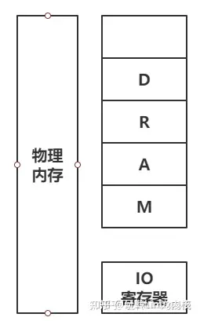

以前的CPU（如X86）是为IO划分单独的地址空间，所以不能用直接访问内存的方式（如指针）IO，只能用专门的方法（in/read/out/write）诸如此类。现在的CPU利用PCI总线将IO寄存器映射到物理内存，所以出现了基于内存访问的IO。还有一点补充的，就如同进程空间有一块内核空间一样，物理内存也会有极小一部分是不能访问的，为内核所用。

**三个总线**

这里再补充下三个总线的知识，即：地址总线、数据总线、控制总线

- 地址总线，用来传输地址
- 数据总线，用来传输数据
- 控制总线，用来传输命令

比如CPU通过控制总线发送读取命令，同时用地址总线发送要读取的数据虚地址，经过MMU后到内存

内存通过数据总线将数据传输给CPU。虚拟地址的空间和指令集的地址长度有关，不一定和物理地址长度一致，比如现在的64位处理器，从VA角度看来，可以访问64位的地址，但地址总线长度只有48位，所以你可以访问一个位于2^52这个位置的地址。

**虚拟内存地址转换（虚地址转实地址）**

上面已经明确了虚拟内存是虚拟空间，即地址的集合这一概念。基于此，来说说原理。

如果还记得操作系统课程里面提到的虚地址，那么这个虚地址就是虚拟空间的地址了，虚地址通过转换得到实地址，转换方式课程内也讲得很清楚，虚地址头部包含了页号（段地址和段大小，看存储模式：页存储、段存储，段页式），剩下部分是偏移量，经过MMU转换成实地址。


**存储方式**


虚拟地址头部为页号通过查询页表得到物理页号，假设一页时1K，那么页号*偏移量就得到物理地址


虚拟地址头部为段号，段表中找到段基地址加上偏移量得到实地址


### 二、mmap原理

mmap函数创建一个新的vm_area_struct结构，并将其与文件/设备的物理地址相连。

**vm_area_struct：**

linux使用vm_area_struct来表示一个独立的虚拟内存区域，一个进程可以使用多个vm_area_struct来表示不用类型的虚拟内存区域（如堆，栈，代码段，MMAP区域等）。

vm_area_struct结构中包含了区域起始地址。同时也包含了一个vm_opt指针，其内部可引出所有针对这个区域可以使用的系统调用函数。从而，进程可以通过vm_area_struct获取操作这段内存区域所需的任何信息。

进程通过vma操作内存，而vma与文件/设备的物理地址相连，系统自动回写脏页面到对应的文件磁盘上（或写入到设备地址空间），实现内存映射文件。

**内存映射文件的原理：**

首先创建虚拟区间并完成地址映射，此时还没有将任何文件数据拷贝至主存。当进程发起读写操作时，会访问虚拟地址空间，通过查询页表，发现这段地址不在物理页上，因为只建立了地址映射，真正的数据还没有拷贝到内存，因此引发缺页异常。缺页异常经过一系列判断，确定无非法操作后，内核发起请求调页过程。

最终会调用nopage函数把所缺的页从文件在磁盘里的地址拷贝到物理内存。之后进程便可以对这片主存进行读写，如果写操作修改了内容，一定时间后系统会自动回写脏页面到对应的磁盘地址，完成了写入到文件的过程。另外，也可以调用msync()来强制同步，这样所写的内存就能立刻保存到文件中。

**mmap内存映射的实现过程，总的来说可以分为三个阶段：**

**（一）进程启动映射过程，并在虚拟地址空间中为映射创建虚拟映射区域**

- 进程在用户空间调用库函数mmap，原型：void *mmap(void *start, size_t length, int prot, int flags, int fd, off_t offset);
- 在当前进程的虚拟地址空间中，寻找一段空闲的满足要求的连续的虚拟地址
- 为此虚拟区分配一个vm_area_struct结构，接着对这个结构的各个域进行了初始化
- 将新建的虚拟区结构（vm_area_struct）插入进程的虚拟地址区域链表或树中

**（二）调用内核空间的系统调用函数mmap（不同于用户空间函数），实现文件物理地址和进程虚拟地址的一一映射关系**

- 为映射分配了新的虚拟地址区域后，通过待映射的文件指针，在文件描述符表中找到对应的文件描述符，通过文件描述符，链接到内核“已打开文件集”中该文件的文件结构体（struct file），每个文件结构体维护着和这个已打开文件相关各项信息。
- 通过该文件的文件结构体，链接到file_operations模块，调用内核函数mmap，其原型为：int mmap(struct file *filp, struct vm_area_struct *vma)，不同于用户空间库函数。
- 内核mmap函数通过虚拟文件系统inode模块定位到文件磁盘物理地址。
- 通过remap_pfn_range函数建立页表，即实现了文件地址和虚拟地址区域的映射关系。此时，这片虚拟地址并没有任何数据关联到主存中。

**（三）进程发起对这片映射空间的访问，引发缺页异常，实现文件内容到物理内存（主存）的拷贝**

注：前两个阶段仅在于创建虚拟区间并完成地址映射，但是并没有将任何文件数据的拷贝至主存。真正的文件读取是当进程发起读或写操作时。

- 进程的读或写操作访问虚拟地址空间这一段映射地址，通过查询页表，发现这一段地址并不在物理页面上。因为目前只建立了地址映射，真正的硬盘数据还没有拷贝到内存中，因此引发缺页异常。
- 缺页异常进行一系列判断，确定无非法操作后，内核发起请求调页过程。
- 调页过程先在交换缓存空间（swap cache）中寻找需要访问的内存页，如果没有则调用nopage函数把所缺的页从磁盘装入到主存中。
- 之后进程即可对这片主存进行读或者写的操作，如果写操作改变了其内容，一定时间后系统会自动回写脏页面到对应磁盘地址，也即完成了写入到文件的过程。

注：修改过的脏页面并不会立即更新回文件中，而是有一段时间的延迟，可以调用msync()来强制同步, 这样所写的内容就能立即保存到文件里了。

### 三、mmap 的 I/O 模型

mmap 也是一种零拷贝技术，其 I/O 模型如下图所示：


```text
#include <sys/mman.h>
void *mmap(void *start, size_t length, int prot, int flags, int fd, off_t offset)
```


**mmap 技术有如下特点：**

1. 利用 DMA 技术来取代 CPU 来在内存与其他组件之间的数据拷贝，例如从磁盘到内存，从内存到网卡；
2. 用户空间的 mmap file 使用虚拟内存，实际上并不占据物理内存，只有在内核空间的 kernel buffer cache 才占据实际的物理内存；
3. mmap() 函数需要配合 write() 系统调动进行配合操作，这与 sendfile() 函数有所不同，后者一次性代替了 read() 以及 write()；因此 mmap 也至少需要 4 次上下文切换；
4. mmap 仅仅能够避免内核空间到用户空间的全程 CPU 负责的数据拷贝，但是内核空间内部还是需要全程 CPU 负责的数据拷贝；

**利用 mmap() 替换 read()，配合 write() 调用的整个流程如下：**

1. 用户进程调用 mmap()，从用户态陷入内核态，将内核缓冲区映射到用户缓存区；
2. DMA 控制器将数据从硬盘拷贝到内核缓冲区（可见其使用了 Page Cache 机制）；
3. mmap() 返回，上下文从内核态切换回用户态；
4. 用户进程调用 write()，尝试把文件数据写到内核里的套接字缓冲区，再次陷入内核态；
5. CPU 将内核缓冲区中的数据拷贝到的套接字缓冲区；
6. DMA 控制器将数据从套接字缓冲区拷贝到网卡完成数据传输；
7. write() 返回，上下文从内核态切换回用户态。

**通过mmap实现的零拷贝I/O进行了4次用户空间与内核空间的上下文切换，以及3次数据拷贝；其中3次数据拷贝中包括了2次DMA拷贝和1次CPU拷贝**

### 四、mmap 的优势

**1.简化用户进程编程**

在用户空间看来，通过 mmap 机制以后，磁盘上的文件仿佛直接就在内存中，把访问磁盘文件简化为按地址访问内存。这样一来，应用程序自然不需要使用文件系统的 write（写入）、read（读取）、fsync（同步）等系统调用，因为现在只要面向内存的虚拟空间进行开发。

但是，这并不意味着我们不再需要进行这些系统调用，而是说这些系统调用由操作系统在 mmap 机制的内部封装好了。

**（1）基于缺页异常的懒加载**

出于节约物理内存以及 mmap 方法快速返回的目的，mmap 映射采用懒加载机制。具体来说，通过 mmap 申请 1000G 内存可能仅仅占用了 100MB 的虚拟内存空间，甚至没有分配实际的物理内存空间。当你访问相关内存地址时，才会进行真正的 write、read 等系统调用。CPU 会通过陷入缺页异常的方式来将磁盘上的数据加载到物理内存中，此时才会发生真正的物理内存分配。

**（2）数据一致性由 OS 确保**

当发生数据修改时，内存出现脏页，与磁盘文件出现不一致。mmap 机制下由操作系统自动完成内存数据落盘（脏页回刷），用户进程通常并不需要手动管理数据落盘。

**读写效率提高：避免内核空间到用户空间的数据拷贝**

简而言之，mmap 被认为快的原因是因为建立了页到用户进程的虚[地址空间](https://link.zhihu.com/?target=https%3A//so.csdn.net/so/search%3Fq%3D%E5%9C%B0%E5%9D%80%E7%A9%BA%E9%97%B4%26spm%3D1001.2101.3001.7020)映射，以读取文件为例，避免了页从内核空间拷贝到用户空间。

**3.避免只读操作时的 swap 操作**

虚拟内存带来了种种好处，但是一个最大的问题在于所有进程的虚拟内存大小总和可能大于物理内存总大小，因此当操作系统物理内存不够用时，就会把一部分内存 swap 到磁盘上。

在 mmap 下，如果虚拟空间没有发生写操作，那么由于通过 mmap 操作得到的内存数据完全可以通过再次调用 mmap 操作映射文件得到。但是，通过其他方式分配的内存，在没有发生写操作的情况下，操作系统并不知道如何简单地从现有文件中（除非其重新执行一遍应用程序，但是代价很大）恢复内存数据，因此必须将内存 swap 到磁盘上。

**4.节约内存**

由于用户空间与内核空间实际上共用同一份数据，因此在大文件场景下在实际物理内存占用上有优势。

**4. mmap 不是银弹**

mmap 不是银弹，这意味着 mmap 也有其缺陷，在相关场景下的性能存在缺陷：

1. 由于 MMAP 使用时必须实现指定好内存映射的大小，因此 mmap 并不适合变长文件；
2. 如果更新文件的操作很多，mmap 避免两态拷贝的优势就被摊还，最终还是落在了大量的脏页回写及由此引发的随机 I/O 上，所以在随机写很多的情况下，mmap 方式在效率上不一定会比带缓冲区的一般写快；
3. 读/写小文件（例如 16K 以下的文件），mmap 与通过 read 系统调用相比有着更高的开销与延迟；同时 mmap 的刷盘由系统全权控制，但是在小数据量的情况下由应用本身手动控制更好；
4. mmap 受限于操作系统内存大小：例如在 32-bits 的操作系统上，虚拟内存总大小也就 2GB，但由于 mmap 必须要在内存中找到一块连续的地址块，此时你就无法对 4GB 大小的文件完全进行 mmap，在这种情况下你必须分多块分别进行 mmap，但是此时地址内存地址已经不再连续，使用 mmap 的意义大打折扣，而且引入了额外的复杂性；

**5. mmap 的适用场景**

mmap 的适用场景实际上非常受限，在如下场合下可以选择使用 mmap 机制：

1. 多个线程以只读的方式同时访问一个文件，这是因为 mmap 机制下多线程共享了同一物理内存空间，因此节约了内存；
2. mmap 非常适合用于进程间通信，这是因为对同一文件对应的 mmap 分配的物理内存天然多线程共享，并可以依赖于操作系统的同步原语；
3. mmap 虽然比 sendfile 等机制多了一次 CPU 全程参与的内存拷贝，但是用户空间与内核空间并不需要数据拷贝，因此在正确使用情况下并不比 sendfile 效率差；

**6.mmap使用细节**

1. 使用mmap需要注意的一个关键点是，mmap映射区域大小必须是物理页大小(page_size)的整倍数（32位系统中通常是4k字节）。原因是，内存的最小粒度是页，而进程虚拟地址空间和内存的映射也是以页为单位。为了匹配内存的操作，mmap从磁盘到虚拟地址空间的映射也必须是页。
2. 内核可以跟踪被内存映射的底层对象（文件）的大小，进程可以合法的访问在当前文件大小以内又在内存映射区以内的那些字节。也就是说，如果文件的大小一直在扩张，只要在映射区域范围内的数据，进程都可以合法得到，这和映射建立时文件的大小无关。
3. 映射建立之后，即使文件关闭，映射依然存在。因为映射的是磁盘的地址，不是文件本身，和文件句柄无关。同时可用于进程间通信的有效地址空间不完全受限于被映射文件的大小，因为是按页映射。

在上面的知识前提下，我们下面看看如果大小不是页的整倍数的具体情况：

**情形一：一个文件的大小是5000字节，mmap函数从一个文件的起始位置开始，映射5000字节到虚拟内存中。**

分析：因为单位物理页面的大小是4096字节，虽然被映射的文件只有5000字节，但是对应到进程虚拟地址区域的大小需要满足整页大小，因此mmap函数执行后，实际映射到虚拟内存区域8192个 字节，5000~8191的字节部分用零填充。映射后的对应关系如下图所示：


此时：
（1）读/写前5000个字节（0~4999），会返回操作文件内容。
（2）读字节50008191时，结果全为0。写50008191时，进程不会报错，但是所写的内容不会写入原文件中 。
（3）读/写8192以外的磁盘部分，会返回一个SIGSECV错误。

**情形二：一个文件的大小是5000字节，mmap函数从一个文件的起始位置开始，映射15000字节到虚拟内存中，即映射大小超过了原始文件的大小。**

分析：由于文件的大小是5000字节，和情形一一样，其对应的两个物理页。那么这两个物理页都是合法可以读写的，只是超出5000的部分不会体现在原文件中。由于程序要求映射15000字节，而文件只占两个物理页，因此8192字节~15000字节都不能读写，操作时会返回异常。如下图所示：


此时：
（1）进程可以正常读/写被映射的前5000字节(0~4999)，写操作的改动会在一定时间后反映在原文件中。
（2）对于5000~8191字节，进程可以进行读写过程，不会报错。但是内容在写入前均为0，另外，写入后不会反映在文件中。
（3）对于8192~14999字节，进程不能对其进行读写，会报SIGBUS错误。
（4）对于15000以外的字节，进程不能对其读写，会引发SIGSEGV错误。
**
情形三：一个文件初始大小为0，使用mmap操作映射了10004K的大小，即1000个物理页大约4M字节空间，mmap返回指针ptr。**

分析：如果在映射建立之初，就对文件进行读写操作，由于文件大小为0，并没有合法的物理页对应，如同情形二一样，会返回SIGBUS错误。但是如果，每次操作ptr读写前，先增加文件的大小，那么ptr在文件大小内部的操作就是合法的。例如，文件扩充4096字节，ptr就能操作ptr ~ [ (char)ptr + 4095]的空间。只要文件扩充的范围在1000个物理页（映射范围）内，ptr都可以对应操作相同的大小。这样，方便随时扩充文件空间，随时写入文件，不造成空间浪费。

### 五、mmap映射

在内存映射的过程中，并没有实际的数据拷贝，文件没有被载入内存，只是逻辑上被放入了内存，具体到代码，就是建立并初始化了相关的数据结构（struct address_space），这个过程有系统调用mmap()实现，所以建立内存映射的效率很高。
既然建立内存映射没有进行实际的数据拷贝，那么进程又怎么能最终直接通过内存操作访问到硬盘上的文件呢？那就要看内存映射之后的几个相关的过程了。
mmap()会返回一个指针ptr，它指向进程逻辑地址空间中的一个地址，这样以后，进程无需再调用read或write对文件进行读写，而只需要通过ptr就能够操作文件。但是ptr所指向的是一个逻辑地址，要操作其中的数据，必须通过MMU将逻辑地址转换成物理地址，这个过程与内存映射无关。
前面讲过，建立内存映射并没有实际拷贝数据，这时，MMU在地址映射表中是无法找到与ptr相对应的物理地址的，也就是MMU失败，将产生一个缺页中断，缺页中断的中断响应函数会在swap中寻找相对应的页面，如果找不到（也就是该文件从来没有被读入内存的情况），则会通过mmap()建立的映射关系，从硬盘上将文件读取到物理内存中，如图1中过程3所示。这个过程与内存映射无关。
如果在拷贝数据时，发现物理内存不够用，则会通过虚拟内存机制（swap）将暂时不用的物理页面交换到硬盘上，这个过程也与内存映射无关。

**mmap内存映射的实现过程：**

1. 进程启动映射过程，并在虚拟地址空间中为映射创建虚拟映射区域
2. 调用内核空间的系统调用函数mmap（不同于用户空间函数），实现文件物理地址和进程虚拟地址的一一映射关系
3. 进程发起对这片映射空间的访问，引发缺页异常，实现文件内容到物理内存（主存）的拷贝

**适合的场景**

- 您有一个很大的文件，其内容您想要随机访问一个或多个时间
- 您有一个小文件，它的内容您想要立即读入内存并经常访问。这种技术最适合那些大小不超过几个虚拟内存页的文件。（页是地址空间的最小单位，虚拟页和物理页的大小是一样的，通常为4KB。）
- 您需要在内存中缓存文件的特定部分。文件映射消除了缓存数据的需要，这使得系统磁盘缓存中的其他数据空间更大
  当随机访问一个非常大的文件时，通常最好只映射文件的一小部分。映射大文件的问题是文件会消耗活动内存。如果文件足够大，系统可能会被迫将其他部分的内存分页以加载文件。将多个文件映射到内存中会使这个问题更加复杂。

**不适合的场景**

- 您希望从开始到结束的顺序从头到尾读取一个文件
- 这个文件有几百兆字节或者更大。将大文件映射到内存中会快速地填充内存，并可能导致分页，这将抵消首先映射文件的好处。对于大型顺序读取操作，禁用磁盘缓存并将文件读入一个小内存缓冲区
- 该文件大于可用的连续虚拟内存地址空间。对于64位应用程序来说，这不是什么问题，但是对于32位应用程序来说，这是一个问题
- 该文件位于可移动驱动器上
- 该文件位于网络驱动器上

**示例代码**

```text
//
//  ViewController.m
//  TestCode
//
//  Created by zhangdasen on 2020/5/24.
//  Copyright © 2020 zhangdasen. All rights reserved.
//

#import "ViewController.h"
#import <sys/mman.h>
#import <sys/stat.h>
@interface ViewController ()

@end

@implementation ViewController

- (void)viewDidLoad {
    [super viewDidLoad];
    
    NSString *path = [NSHomeDirectory() stringByAppendingPathComponent:@"test.data"];
    NSLog(@"path: %@", path);
    NSString *str = @"test str2";
    [str writeToFile:path atomically:YES encoding:NSUTF8StringEncoding error:nil];
    
    ProcessFile(path.UTF8String);
    NSString *result = [NSString stringWithContentsOfFile:path encoding:NSUTF8StringEncoding error:nil];
    NSLog(@"result:%@", result);
}


int MapFile(const char * inPathName, void ** outDataPtr, size_t * outDataLength, size_t appendSize)
{
    int outError;
    int fileDescriptor;
    struct stat statInfo;
    
    // Return safe values on error.
    outError = 0;
    *outDataPtr = NULL;
    *outDataLength = 0;
    
    // Open the file.
    fileDescriptor = open( inPathName, O_RDWR, 0 );
    if( fileDescriptor < 0 )
    {
        outError = errno;
    }
    else
    {
        // We now know the file exists. Retrieve the file size.
        if( fstat( fileDescriptor, &statInfo ) != 0 )
        {
            outError = errno;
        }
        else
        {
            ftruncate(fileDescriptor, statInfo.st_size + appendSize);
            fsync(fileDescriptor);
            *outDataPtr = mmap(NULL,
                               statInfo.st_size + appendSize,
                               PROT_READ|PROT_WRITE,
                               MAP_FILE|MAP_SHARED,
                               fileDescriptor,
                               0);
            if( *outDataPtr == MAP_FAILED )
            {
                outError = errno;
            }
            else
            {
                // On success, return the size of the mapped file.
                *outDataLength = statInfo.st_size;
            }
        }
        
        // Now close the file. The kernel doesn’t use our file descriptor.
        close( fileDescriptor );
    }
    
    return outError;
}
void ProcessFile(const char * inPathName)
{
    size_t dataLength;
    void * dataPtr;
    char *appendStr = " append_key2";
    int appendSize = (int)strlen(appendStr);
    if( MapFile(inPathName, &dataPtr, &dataLength, appendSize) == 0) {
        dataPtr = dataPtr + dataLength;
        memcpy(dataPtr, appendStr, appendSize);
        // Unmap files
        munmap(dataPtr, appendSize + dataLength);
    }
}

@end
```

## 内存泄漏防范

### 1. 内存溢出

内存溢出 OOM （out of memory），是指程序在申请内存时，没有足够的内存空间供其使用，出现out of memory；比如申请了一个int,但给它存了long才能存下的数，那就是内存溢出。

### 2. 内存泄漏

内存泄露 memory leak，是指程序在申请内存后，无法释放已申请的内存空间，一次内存泄露危害可以忽略，但内存泄露堆积后果很严重，无论多少内存,迟早会被占光。最终的结果就是导致OOM。

内存泄漏是指你向系统申请分配内存进行使用(new)，可是使用完了以后却不归还(delete)，结果你申请到的那块内存你自己也不能再访问（也许你把它的地址给弄丢了），而系统也不能再次将它分配给需要的程序。

### 3. 造成内存泄露常见的三种情况

1，指针重新赋值

2，错误的内存释放

3，返回值的不正确处理

**3.1 指针重新赋值**

如下代码：

```text
char * p = (char *)malloc(10);
char * np = (char *)malloc(10);
```

其中，指针变量 p 和 np 分别被分配了 10 个字节的内存。

如果程序需要执行如下赋值语句：

```text
p=np;
```

这时候，指针变量 p 被 np 指针重新赋值，其结果是 p 以前所指向的内存位置变成了孤立的内存。它无法释放，因为没有指向该位置的引用，从而导致 10 字节的内存泄漏。

因此，在对指针赋值前，一定确保内存位置不会变为孤立的。

类似的情况，连续重复new的情况也是类似：

```text
 int *p = new int; 
 p = new int...;//错误
```

**3.2 错误的内存释放**

假设有一个指针变量 p，它指向一个 10 字节的内存位置。该内存位置的第三个字节又指向某个动态分配的 10 字节的内存位置。

如果程序需要执行如下赋值语句时：

```text
free(p);
```

很显然，如果通过调用 free 来释放指针 p，则 np 指针也会因此而变得无效。np 以前所指向的内存位置也无法释放，因为已经没有指向该位置的指针。换句话说，np 所指向的内存位置变为孤立的，从而导致内存泄漏。

因此，每当释放结构化的元素，而该元素又包含指向动态分配的内存位置的指针时，应首先遍历子内存位置（如本示例中的 np），并从那里开始释放，然后再遍历回父节点，如下面的代码所示：

```text
free(p->np);
free(p);
```

**3.3 返回值的不正确处理**

有时候，某些函数会返回对动态分配的内存的引用，如下面的示例代码所示：

```text
char *f(){
	return (char *)malloc(10);
}
void f1(){
	f();
}
```

函数 f1 中对 f 函数的调用并未处理该内存位置的返回地址，其结果将导致 f 函数所分配的 10 个字节的块丢失，并导致内存泄漏。

**4 在内存分配后忘记使用 free 进行释放**

### 4. 如何避免内存泄露？

- 确保没有在访问空指针。
- 每个内存分配函数都应该有一个 free 函数与之对应，alloca 函数除外。
- 每次分配内存之后都应该及时进行初始化，可以结合 memset 函数进行初始化，calloc 函数除外。
- 每当向指针写入值时，都要确保对可用字节数和所写入的字节数进行交叉核对。
- 在对指针赋值前，一定要确保没有内存位置会变为孤立的。
- 每当释放结构化的元素（而该元素又包含指向动态分配的内存位置的指针）时，都应先遍历子内存位置并从那里开始释放，然后再遍历回父节点。
- 始终正确处理返回动态分配的内存引用的函数返回值。

### 5.定位内存泄漏（valgrind）（重点）

**5.1、基本概念**

Valgrind是一个GPL的软件，用于Linux（For x86, amd64 and ppc32）程序的内存调试和代码剖析。你可以在它的环境中运行你的程序来监视内存的使用情况，比如C 语言中的malloc和free或者 C++中的new和 delete。使用Valgrind的工具包，你可以自动的检测许多内存管理和线程的bug，避免花费太多的时间在bug寻找上，使得你的程序更加稳固。

安装Valgrind

```text
//valgrind下载：
http://valgrind.org/downloads/valgrind-3.12.0.tar.bz2

valgrind安装：
1. tar -jxvf valgrind-3.12.0.tar.bz2
2. cd valgrind-3.12.0
3. ./configure
4. make
5. sudo make install
```

应用环境：Linux

编程语言：C/C++

使用方法： 编译时加上-g选项，如 gcc -g filename.c -o filename,使用如下命令检测内存使用情况：

```text
最常用的命令格式：
valgrind --tool=memcheck --leak-check=full ./test

valgrind --tool=memcheck --leak-check=full --show-reachable=yes --trace-children=yes  ./filename

其中--leak-check=full指的是完全检查内存泄漏，--show-reachable=yes是显示内存泄漏的地点，--trace-children=yes是跟入子进程。
```

如果您的程序是会正常退出的程序，那么当程序退出的时候valgrind自然会输出内存泄漏的信息。如果您的程序是个守护进程，那么也不要紧，我们 只要在别的终端下杀死memcheck进程（因为valgrind默认使用memcheck工具，就是默认参数--tools=memcheck）

参数选择

```text
 -tool=<name> 最常用的选项。运行 valgrind中名为toolname的工具。默认memcheck。
        memcheck ------> 这是valgrind应用最广泛的工具，一个重量级的内存检查器，能够发现开发中绝大多数内存错误使用情况，比如：使用未初始化的内存，使用已经释放了的内存，内存访问越界等。
        callgrind ------> 它主要用来检查程序中函数调用过程中出现的问题。
        cachegrind ------> 它主要用来检查程序中缓存使用出现的问题。
        helgrind ------> 它主要用来检查多线程程序中出现的竞争问题。
        massif ------> 它主要用来检查程序中堆栈使用中出现的问题。
        extension ------> 可以利用core提供的功能，自己编写特定的内存调试工具
    -h –help 显示帮助信息。
    -version 显示valgrind内核的版本，每个工具都有各自的版本。
    -q –quiet 安静地运行，只打印错误信息。
    -v –verbose 更详细的信息, 增加错误数统计。
    -trace-children=no|yes 跟踪子线程? [default: no]
    -track-fds=no|yes 跟踪打开的文件描述？[default: no]
    -time-stamp=no|yes 增加时间戳到LOG信息? [default: no]
    -log-fd=<number> 输出LOG到描述符文件 [2=stderr]
    -log-file=<file> 将输出的信息写入到filename.PID的文件里，PID是运行程序的进行ID
    -log-file-exactly=<file> 输出LOG信息到 file
    -log-file-qualifier=<VAR> 取得环境变量的值来做为输出信息的文件名。 [none]
    -log-socket=ipaddr:port 输出LOG到socket ，ipaddr:port

LOG信息输出

    -xml=yes 将信息以xml格式输出，只有memcheck可用
    -num-callers=<number> show <number> callers in stack traces [12]
    -error-limit=no|yes 如果太多错误，则停止显示新错误? [yes]
    -error-exitcode=<number> 如果发现错误则返回错误代码 [0=disable]
    -db-attach=no|yes 当出现错误，valgrind会自动启动调试器gdb。[no]
    -db-command=<command> 启动调试器的命令行选项[gdb -nw %f %p]
```

设计思路：根据软件的内存操作维护一个有效地址空间表和无效地址空间表（进程的地址空间）

**5.2、多个工具**

1、Memcheck

最常用的工具，用来检测程序中出现的内存问题，所有对内存的读写都会被检测到，一切对malloc()/free()/new/delete的调用都会被捕获。所以，Memcheck 工具主要检查下面的程序错误

能够检测：

- 使用未初始化的内存 (Use of uninitialised memory)
- 使用已经释放了的内存 (Reading/writing memory after it has been free’d)
- 使用超过 malloc分配的内存空间(Reading/writing off the end of malloc’d blocks)
- 对堆栈的非法访问 (Reading/writing inappropriate areas on the stack)
- 申请的空间是否有释放 (Memory leaks – where pointers to malloc’d blocks are lost forever)
- malloc/free/new/delete申请和释放内存的匹配(Mismatched use of malloc/new/new [] vs free/delete/delete [])
- src和dst的重叠(Overlapping src and dst pointers in memcpy() and related functions)
- 重复free


Callgrind

和gprof类似的分析工具，但它对程序的运行观察更是入微，能给我们提供更多的信息。和gprof不同，它不需要在编译源代码时附加特殊选项，但加上调试选项是推荐的。Callgrind收集程序运行时的一些数据，建立函数调用关系图，还可以有选择地进行cache模拟。在运行结束时，它会把分析数据写入一个文件。callgrind_annotate可以把这个文件的内容转化成可读的形式。

Cachegrind

Cache分析器，它模拟CPU中的一级缓存I1，Dl和二级缓存，能够精确地指出程序中cache的丢失和命中。如果需要，它还能够为我们提供cache丢失次数，内存引用次数，以及每行代码，每个函数，每个模块，整个程序产生的指令数。这对优化程序有很大的帮助。

Helgrind

它主要用来检查多线程程序中出现的竞争问题。Helgrind寻找内存中被多个线程访问，而又没有一贯加锁的区域，这些区域往往是线程之间失去同步的地方，而且会导致难以发掘的错误。Helgrind实现了名为“Eraser”的竞争检测算法，并做了进一步改进，减少了报告错误的次数。不过，Helgrind仍然处于实验阶段。

Massif

堆栈分析器，它能测量程序在堆栈中使用了多少内存，告诉我们堆块，堆管理块和栈的大小。Massif能帮助我们减少内存的使用，在带有虚拟内存的现代系统中，它还能够加速我们程序的运行，减少程序停留在交换区中的几率。

**5.3、使用原理**


Memcheck 能够检测出内存问题，关键在于其建立了两个全局表。

1、Valid-Value 表：

对于进程的整个地址空间中的每一个字节(byte)，都有与之对应的 8 个 bits；对于 CPU 的每个寄存器，也有一个与之对应的 bit 向量。这些 bits 负责记录该字节或者寄存器值是否具有有效的、已初始化的值。

2、Valid-Address 表

对于进程整个地址空间中的每一个字节(byte)，还有与之对应的 1 个 bit，负责记录该地址是否能够被读写。

检测原理：

- 当要读写内存中某个字节时，首先检查这个字节对应的 A bit。如果该A bit显示该位置是无效位置，memcheck 则报告读写错误。
- 内核（core）类似于一个虚拟的 CPU 环境，这样当内存中的某个字节被加载到真实的 CPU 中时，该字节对应的 V bit也被加载到虚拟的 CPU 环境中。一旦寄存器中的值，被用来产生内存地址，或者该值能够影响程序输出，则 memcheck 会检查对应的V bits，如果该值尚未初始化，则会报告使用未初始化内存错误。

**5.4、具体使用**

\1. 使用未初始化的内存（使用野指针）

这里我们定义了一个指针p，但并未给他开辟空间，即他是一个野指针，但我们却使用它了


Valgrind检测出我们程序使用了未初始化的变量，但并未检测出内存泄漏。


2.在内存被释放后进行读/写（使用野指针）

p所指向的内存被释放了，p变成了野指针，但是我们却继续使用这片内存。


Valgrind检测出我们使用了已经free掉的内存，并给出这片内存是哪里分配哪里释放的。


3.从已分配内存块的尾部进行读/写（动态内存越界）

我们动态地分配了一段数组，但我们在访问个数组时发生了越界读写，程序crash掉。

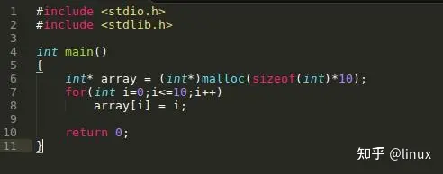

Valgrind检测出越界的位置。


注意：Valgrind不检查静态分配数组的使用情况！所以对静态分配的数组，Valgrind表示无能为力！比如下面的例子，程序crash掉，我们却不知道为什么。


4.内存泄漏

内存泄漏的原因在于没有成对地使用malloc/free和new/delete，比如下面的例子。


Valgrind会给出程序中malloc和free的出现次数以判断是否发生内存泄漏，比如对上面的程序运行memcheck，Valgrind的记录显示上面的程序用了1次malloc，却调用了0次free，明显发生了内存泄漏！


上面提示了我们可以使用–leak-check=full进一步获取内存泄漏的信息，比如malloc和free的具体行号。


\5. 不匹配地使用malloc/new/new[] 和 free/delete/delete[]

正常使用new/delete和malloc/free是这样子的：


而不匹配地使用malloc/new/new[] 和 free/delete/delete[]则会被提示mismacth：


6.两次释放内存

double free的情况同样是根据malloc/free的匹配对数来体现的，比如free多了一次，Valgrind也会提示。

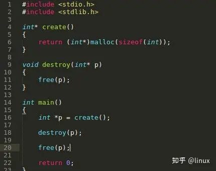


# 嵌入式C与ARM架构体系

# GNU C 扩展

​		C语言有很多个不同的实现，但是显然会有一个较为统一的标准，这个标准就是ANSI C，或者说是C89,C90标准。一般而言，这些标准中包含了：

- 定义各种关键字，数据类型
- 定义各种运算会泽，哥哥运算符的优先级和结合性
- 数据类型的转换
- 变量的作用域
- 函数原型，函数嵌套层数和参数类型限制
- 标准库函数接口

​		C语言的发展历史可以分为多个阶段，每个阶段都对应一个标准。

​		C语言的标准化是为了保证不同编译器、不同操作系统下的程序能够有一致的行为，同时也方便程序员进行交流和开发

## C语言标准历史

### 一、K&R C

K&R C 是 C语言的第一个标准，由 C语言的创始人 Dennis Ritchie 和 Brian Kernighan 于 1978 年在其著作《The C Programming Language》中定义。

K&R C 标准包含了 C语言的基本语法、数据类型、运算符等，但是并不是完整的语言规范，缺少了一些重要的特性，例如函数原型、结构体等。因此，K&R C 标准已经过时，不再被广泛使用。

### 二、ANSI C

ANSI C 是 C语言的第二个标准，由美国国家标准协会（ANSI）于 1983 年发布。该标准定义了 C语言的全部语法、数据类型、库函数等，是 C语言的第一个完整的规范。ANSI C 标准还引入了一些新特性，例如函数原型、void 类型、const 限定符等。

ANSI C 标准被广泛采用，成为了 C语言的主流标准。

### 三、C89/C90

C89/C90 是 ISO/IEC 9899 标准，也是 ANSI C 的国际标准版本，于 1989 年发布。该标准与 ANSI C 基本一致，但是对于一些问题进行了更严格的定义，例如字符集、浮点数计算等。

C89/C90 标准成为了 C语言的主流标准，并被广泛应用于各个领域。

### 四、C99

C99 是 ISO/IEC 9899:1999 标准，于 1999 年发布。

C99 标准对 C语言进行了大量的扩展和改进，引入了很多新特性，例如布尔类型、复数类型、变长数组、标准宏等。C99 标准还修正了一些 C89/C90 标准中的错误和不足之处，使得 C语言更加完善和健壮。

C99 标准在学术界和一些特定领域得到了广泛的应用，但在工业界的普及程度相对较低。

### 五、C11

C11 是 ISO/IEC 9899:2011 标准，于 2011 年发布。

C11 标准在 C99 基础上进行了进一步的扩展和改进，包括了一些新特性，例如泛型宏、多线程支持、_Static_assert 等。C11 标准对于一些早期 C标准中存在的问题进行了修正，使得 C语言更加健壮和安全。

C11 标准在工业界的普及程度相对较低，但已经被一些编译器支持。

### 六、C17

C17 是 ISO/IEC 9899:2018 标准，于 2018 年发布。

C17 标准在 C11 基础上进行了一些小的修订和更新，主要是对标准库进行了一些改进和扩展。C17 标准对于C语言本身的特性并没有做出太大的改变，主要是对于一些库函数进行了更新和扩展。

C17 标准目前还比较新，尚未得到广泛的应用。

总的来说，C语言的标准化历程经历了多个阶段，每个阶段都对应一个标准。

从最初的 K&R C 到后来的 ANSI C、C89/C90、C99、C11、C17 等版本，C语言的特性逐渐得到完善和改进，同时也保证了不同编译器、不同操作系统下的程序能够有一致的行为。

C语言的标准化是保证程序员能够更加规范地编写程序、更加方便地进行交流和开发的重要保障。

## 指定初始化

### 初始化数组元素

​		让我们看看C语言标准下，当我们定义并且初始化一个数组的时候：常用的方法如下：

```
int a[10] = {1, 2, 3, 4, 5, 6, 7, 8, 9, 10};
```

​		注意到，如果元素个数没有到10，余下的元素将会自动填充0.

​		C99里，我们可以这样初始化一个数组：

```
int b[100] = { [10] = 1, [30] = 2 ]};
```

```
0 0 0 0 0 0 0 0 0 0 1 0 0 0 0 0 0 0 0 0 0 0 0 0 0 0 0 0 0 0 2 0 0 0 0 0 0 0 0 0 0 0 0 0 0 0 0 0 0 0 0 0 0 0 0 0 0 0 0 0 0 0 0 0 0 0 0 0 0 0 0 0 0 0 0 0 0 0 0 0 0 0 0 0 0 0 0 0 0 0 0 0 0 0 0 0 0 0 0 0
```

​		打印出来的结果如上所示/

​		同时，GNU C扩展了．．．的用法，使之支持表示连续整数：

```C
#include<stdio.h>

int main()
{
    int i;
    scanf("%d", &i);
    switch(i)
    {
        case 1:
            printf("1\n");
            break;
        case 2 ... 8:
            printf("%d\n",i);
            break;
        default:
            printf("Default\n");
            break;
    }
    return 0;
}
```

### 初始化结构体元素

​		和数组类似，我们可以直接通过GNU C特有的初始化方式进行初始化：

```C
#include <stdio.h>
#define printSTU(X) printf("%s, %d\n",X.name, X.age)
typedef struct 
{
    char name[20];
    int age;
}student;

int main()
{
    student stu1 = {"wit", 20};
    printSTU(stu1);

    student stu2 =
    {
        .name   = "cgh",
        .age    = 114
    };

    printSTU(stu2);
}
```

​		可以看到可以使用这种方式注册结构体。

## 宏构造：语句表达式

### GNU C下的语句表达式扩展

​		GNU C支持这样的一种语句表达式，我们可以在表达式内使用局部变量：

```
({statement1; statement2; statement3})
```

​		和一般的表达式一致，语句表达式有自己的值，这种表达式的值总是采取最后一个表达式的值作为返回：

```
#include<stdio.h>

int main()
{
    int sum = 0;
    sum = 
    (
        {
            int s = 0;
            for(int i = 0; i < 100; i++)
                s += i;
            s;
        }
    );

    printf("%d\n",sum);
}
```

​		我们当然得到了值4950.

​		如果发现值为0， 那就是最后一句并没有加上s，s这个表达式的值就是s的值。

### 1、max()宏那点事

在Linux内核中，有这样四个比较大小的函数，如下：

```c
max(x,y) //两个数求最大值
min(x,y) //两个数求最小值
max3(x,y,z) //三个数求最大值
min3(x,y,z) //三个数求最小值
```

以Linux内核源码linux-3.18.34为例，它被定义在kernel.h中，它位于：

> linux-3.18.34/include/linux/kernel.h

我们先来思考这样一个问题，如果让你写一个max(x,y)的宏，你会怎么写？
有同学说，不就是两个数比较大小求最小值的宏嘛，一行代码解决战斗，瞧瞧我的吧，于是乎出现了这样一个宏：

```c
#define max(a,b) ((a)>(b)?(a):(b))
```

这样一个宏看似很精简，很完美，其实，问题很大，不信看下面的例子：

```c
#include<stdio.h>
#define max(a,b) ((a)>(b)?(a):(b))
int main()
{

        int x = 1, y = 2;
        printf("max=%d\n", max(x++, y++));
        printf("x = %d, y = %d\n", x, y);
}
```

​		执行完max(x++,y++)，我们期望max的值为2，x的值为2，y的值为3。但实际的结果呢，有图有真相。

​		执行完max(x++,y++)后，max的值为3，x的值为2，y的值为4， **和我们想的不一样！** 为什么会这样呢？我们又该如何解决这样的问题呢？
​		问题不大，GCC他来了，他来了，他带着GCC中的({statement list})和typeof()扩展走来了。

> - ({statement list})是一个表达式，逗号表达式类似，但是功能更强，({语句1;语句2;语句3;})中可以包含有多条语句(可以是变量定义、复杂的控制语句)，该表达式的值为statement list中最后一条语句的值。
> - typeof()的功能是取变量类型。 typeof(x)是获取x的类型，typeof(x) _a = (x)就是定义一个x类型的变量 _a，并把x的数值赋值给它。如x是int型的5，那么typeof(x) _a = (x)，就相当于int _a=5。

​		那么GCC的扩展在内核中是如何巧妙使用的呢，下面我们就结合内核中的max()宏的源码来一探究竟，先看下linux-3.18.34内核中有哪些常见的求最值的宏：

```c
/*
 * min()/max()/clamp() macros that also do
 * strict type-checking.. See the
 * "unnecessary" pointer comparison.
 */
#define min(x, y) ({				\
	typeof(x) _min1 = (x);			\
	typeof(y) _min2 = (y);
	(void) (&_min1 == &_min2);		\
	_min1 < _min2 ? _min1 : _min2; })

#define max(x, y) ({				\
	typeof(x) _max1 = (x);			\
	typeof(y) _max2 = (y);			\
	(void) (&_max1 == &_max2);		\
	_max1 > _max2 ? _max1 : _max2; })
	
#define min3(x, y, z) min((typeof(x))min(x, y), z)
#define max3(x, y, z) max((typeof(x))max(x, y), z)
12345678910111213141516171819
```

​		由此观之，大同小异，下面我们以max(x,y)宏为例，进行深入探究：

```c
#define max(x, y) ({				\
	typeof(x) _max1 = (x);			\
	typeof(y) _max2 = (y);			\
	(void) (&_max1 == &_max2);		\
	_max1 > _max2 ? _max1 : _max2; })
12345
```

​		首先，它的结构是这样({语句1;语句2;语句3;语句4;})，根据GCC的扩展特性，这个表达式最终的值应该是语句4的值。

​		语句1 `typeof(x) _max1 = (x);`是定义了一个x类型的局部变量_max1，并把x的数值赋值给了_max1。

​		语句2 `typeof(y) _max2 = (y);`是定义了一个y类型的局部变量_max2，并把x的数值赋值给了_max2。

​		语句3`(void) (&_max1 == &_max2);`对于程序的执行是没有任何作用的，它的作用在于判断两个数的类型是否相同，如果类型不同，就会在编译过程中抛出一个警告。因为x和y的类型不一样，其指针类型也会不一样，两个不一样的指针类型进行比较操作，会抛出一个编译警告。如char * x; int * y， 然后x==y， 这个判断因为一个是char * 一个是int *，所以gcc在编译时会产生一个warning，这样可以避免一些潜在的错误发生。

​		语句4`_max1 > _max2 ? _max1 : _max2;`才是最终求最大值的核心语句，那为什么要大费周章这样写呢？

​		**在这个宏定义中，先根据x和y的类型生成了两个局部变量_max1和_max2，之后判断其类型，比较其大小，返回较大的一个，这样就保证了宏参数只会被执行一次，避免了之前实验中出现的错误结果。要将x和y重新定义为_max1和_max2是为了避免输入参数和宏定义内部使用的局部变量重名，重名会导致在宏定义的语句块外层同名变量被内层变量作用而出现错误，这也就是前面提到的为什么会执行两次y++而出现错误的原因了。**

## typeof  和 container_of

​		我们下面来看看typeof关键字，它可以获取到变量的type。

```
#include <stdio.h>

int main()
{
    int i = 0;
    typeof(i) j = 20;
    typeof(int*) a;   
}
```

​		container_of宏可以提取成员变量所在的结构体的首地址在何处

### **2、container_of的作用**

container_of的作用的通过结构体成员变量地址获取这个结构体的地址，假设你的名字叫李光明，你还有一个弟弟叫做XXX，警察叔叔发现你弟弟XXX干了一件坏事，但是警察叔叔不知道你弟弟的名字，抓你来审问，你嘴巴很硬就是不说，警察叔叔就拿到你的名字，查到了你家的户口本，这下你弟弟就被查出来了，原来你弟弟XXX的名字叫做李小明。这种破案手法**叫做顺藤摸瓜**。

内核函数调用常常给函数传入的是结构体成员地址，然后在函数里面又想使用这个结构体里面的其他成员变量，所以就引发了这样的问题，我认为这个也是用C实现面向对象编程的一种方法。
**比如这段代码**

```c
static void sensor_suspend(struct early_suspend *h)                   
{                                                                     
    struct sensor_private_data *sensor =                              
            container_of(h, struct sensor_private_data, early_suspend);   
    if (sensor->ops->suspend)                                         
        sensor->ops->suspend(sensor->client);                         
} 
```

early_suspend是sensor_private_data 里面的一个成员，通过这个成员的地址获取sensor_private_data结构体变量的地址，从而调用里面的成员变量client。这个方法非常优雅。在这里我用到了一个比较叼的词，**叫“优雅”**。
这里简单说下，传进来的h一定在其他地方定义并且操作系统分配了内存空间，h分配了空间，说明他的老爸也有内存了，要不然你顺藤摸瓜摸到一个NULL就傻逼了。

### **3、如何使用container_of**

container_of需要传入三个参数，第一个参数是一个指针，第二个参数是结构体类型，第三个是对应第二个参数里面的结构体里面的成员。

**container_of(ptr, type, member)**

- ptr:表示结构体中member的地址 **h**
- type:表示结构体类型 **struct sensor_private_data**
- member:表示结构体中的成员 **early_suspend type里面一定要有这个成员，不能瞎搞啊**
- 返回结构体的首地址


### **4、container_of 用到的知识点 剖析**

#### **4.1、({})的作用**

**({})**、第一个先说这个表达式，很多人可能懂，可能在很多地方见到这个表达式，但是自己却没有注意，这个表达式返回最后一个表达式的值。比如x=({a;b;c;d;})，最终x的值应该是d。

**代码例子：**

```c
#include<stdio.h>

void main(void)
{
    int a=({1;2;4;})+10;
    printf("%d\n",a);//a=14
}
```

#### **4.2、typeof获取变量的类型**

这个我们很少看到，这个关键字是C语言关键字的拓展，返回变量的**类型**，具体可以看GCC里面的介绍
[https://gcc.gnu.org/onlinedocs/gcc/Typeof.html](https://link.zhihu.com/?target=https%3A//gcc.gnu.org/onlinedocs/gcc/Typeof.html)

++Another way to refer to the type of an expression is with typeof. The syntax of using of this keyword looks like sizeof, but the construct acts semantically like a type name defined with typedef.++

**代码例子：**

```c
void main(void)
{
    int a = 6;
    typeof(a) b =9;
    printf("%d %d\n",a,b);
}
```

#### **4.3、(struct st\*)0的作用**

尺子大家应该都用过吧，比如我想用尺子量一本书本的长度，我们第一时间就需要找到尺子的0刻度的位置，**然后用这个0刻度的位置去对准书本的边**，然后再贴合对齐，在书本的另一边查看尺子刻度就可以知道书本的长度了。
现在我们需要量一个结构体的长度，我们也可以用尺子来量，我们只要找到这个0刻度的位置就可以了。同理，即使我们不知道0刻度位置，我们**首尾刻度相减**一样可以计算出结构体的长度。
但是在C语言里什么事尺子呢？你想到的可能是sizeof，不幸的是，这个并不能满足我们的需要，所以才有了(struct st *),这个当作尺子真的再好不过了。

```c
struct st{
    int a;
    int b;
}*p_st,n_st;

void main(void)
{
    printf("%p\n",&((struct st*)0)->b);
}
```

上面的代码

```text
(struct st*)0
```

这个的意思就是把这个结构体放到0刻度上面开始量了，然后量到哪里呢？

```c
&((struct st*)0)->b)
```

这个就体现出来了，量到b的位置。所以上面的输出应该是**4**。

看完上面的解释，应该知道下面这两个代码的功能是一样的。

```c
typeof ((struct st*)0)->b) c; // 取b的类型来声明c
int c;
```

其实不只是对于0，用其他数字一样是有效的，比如下面的代码，编译器关心的是类型，而不在乎这个数字。

```c
printf("%p\n",&((struct st*)4)->b  -4 );
```

这文章写了有几天了，但是一直不想直接发出去，因为我觉得这个核心点总是没有找到一个特别好的论证方法，看完上面后，大概对这种测量应该有点感觉了吧，如果现在需要你把一个数组的首地址**设置为0**，要怎么做呢？

先思考一下，假设这里延迟了几分钟。

**代码如下：**

```c
struct A {
    short array[100];
};

int main(int argc, char *argv[])
{
    int i = 10;

    A* a = (A*)0;
    printf("%p %d %d\n",a,sizeof(short), &a->array[20]);
    getchar();
    return 1;
}
//输出 00000000 2 40
```

有什么办法不使用==struct A *== 直接把数组的地址放到0位置呢？目前我还没有找到其他更好的办法，如果有好的建议的，请留言给我。

#### **4.4、offsetof(TYPE, MEMBER)**

```c
#define offsetof(TYPE, MEMBER) ((size_t) &((TYPE*)0)->MEMBER)
```

size_t 这个有不懂的可以百度下，就是unsigned 的整数，在32位和64位下长度不同，所以这个offsetof就是获取结构体的**偏移长度**。

#### **4.5、const int\* p的作用**

上面的宏定义里面还有一个小知识点

```c
const typeof( ((type *)0)->member ) *__mptr
```

上面的代码可以简写成

```c
const int * __mptr
```

这个说明什么问题呢？这个说明__mptr指向的整型数据是一个const（常数）。
这就涉及到两外两个知识

```c
int * const __mptr;//表示__mptr的值不能改变
//和
const int * const __mptr; //表示__mptr不能改变而且指向的内容也不能改变
```

#### **5、 container_of 剖析**

看完上面的几个知识点，再来看container_of这个宏就显得非常清晰了。我把解析部分写在下面的代码注释里面。

```c
#define offsetof(TYPE, MEMBER) ((size_t) &((TYPE*)0)->MEMBER)
#define container_of(ptr, type, member) ({          \
        const typeof( ((type *)0)->member ) *__mptr = (const typeof( ((type *)0)->member ) *)(ptr); \
        (type *)( (char *)__mptr - offsetof(type,member) );})
//-----分割线
struct st{
    int a;
    int b;
}*pt;
//用这个来举例
container_of(&pt->a,struct st,a)
 const typeof( ((struct st *)0)->a ) *__mptr = (const typeof( ((struct st *)0)->a ) *)(&pt->a);
const int *__mptr = (int *)(&pt->a);//第一句解析完，实际上就是获取a的地址。
(type *)( (char *)__mptr - offsetof(type,member) );
//这个变成
(struct st *)( (char *)__mptr - ((unsigned int) &((struct st*)0)->a));
//这句的意思，把a的地址减去a对结构体的偏移地址长度，那就是结构体的地址位置了。
```

## 零长度数组

顾名思义，零长度数组就是长度为0的数组。

ANSI C 标准规定：定义一个数组时，数组的长度必须是一个常数，即数组的长度在编译的时候是确定的。在ANSI C 中定义一个数组的方法如下：

```c
int  a[10];
```

C99 新标准规定：可以定义一个变长数组。

```c
int len;
int a[len];
```

也就是说，数组的长度在编译时是未确定的，在程序运行的时候才确定，甚至可以由用户指定大小。比如，我们可以定义一个数组，然后在程序运行时才指定这个数组的大小，还可以通过输入数据来初始化数组，示例代码如下。

```c
int main(void)
{
    int len;

    printf("input array len:");
    scanf("%d",&len);
    int a[len];

    for(int i=0;i<len;i++)
    {
        printf("a[%d]= ",i);
        scanf("%d",&a[i]);
    }

      printf("a array print:\n");
    for(int i=0;i<len;i++)
        printf("a[%d] = %d\n",i,a[i]);

    return 0;
}
```

在这个程序中，我们定义一个变量 len，作为数组的长度。程序运行后，我们可以通过输入指定数组的长度并初始化，最后再将数组的元素打印出来。程序的运行结果如下：

```c
input array len:3
a[0]= 6
a[1]= 7
a[2]= 8
a  array print:
a[0] = 6
a[1] = 7
a[2] = 8
```

GNU C 可能觉得变长数组还不过瘾，再来一个实锤：支持零长度数组。这下没有其它编译器比我狠吧！是的，如果我们在程序中定义一个零长度数组，你会发现除了 GCC 编译器，在其它编译环境下可能就编译通不过或者有警告信息。零长度数组的定义如下：

```c
int a[0];
```

零长度数组有一个奇特的地方，就是它不占用内存存储空间。我们使用 sizeof 关键字来查看一下零长度数组在内存中所占存储空间的大小，代码如下。

```c
int buffer[0];
int main(void)
{
    printf("%d\n", sizeof(buffer));
    return 0;
}
```

在这个程序中，我们定义一个零长度数组，使用 sizeof 查看其大小可以看到：零长度数组在内存中不占用空间，大小为0。

零长度数组一般单独使用的机会很少，它常常作为结构体的一个成员，构成一个变长结构体。

```c
struct buffer{
    int len;
    int a[0];
};
int main(void)
{
      printf("%d\n",sizeof(struct buffer));
      return 0;
}
```

零长度数组在结构体中同样不占用存储空间，所以 buffer 结构体的大小为4。


### **5.1 零长度数组使用示例**

零长度数组经常以变长结构体的形式，在某些特殊的应用场合，被程序员使用。在一个变长结构体中，零长度数组不占用结构体的存储空间，但是我们可以通过使用结构体的成员 a 去访问内存，非常方便。变长结构体的使用示例如下。

```c
struct buffer{
    int len;
    int a[0];
};
int main(void)
{
    struct buffer *buf;
    buf = (struct buffer *)malloc \
        (sizeof(struct buffer)+ 20);

    buf->len = 20;
    strcpy(buf->a, "hello wanglitao!\n");
    puts(buf->a);

    free(buf);  
    return 0;
}
```

在这个程序中，我们使用 malloc 申请一片内存，大小为 sizeof(buffer) + 20，即24个字节大小。其中4个字节用来存储结构体指针 buf 指向的结构体类型变量，另外20个字节空间，才是我们真正使用的内存空间。我们可以通过结构体成员 a，直接访问这片内存。

通过这种灵活的动态内存申请方式，这个 buffer 结构体表示的一片内存缓冲区，就可以随时调整，可大可小。这个特性，在一些场合非常有用。比如，现在很多在线视频网站，都支持多种格式的视频播放：普清、高清、超清、1080P、蓝光甚至4K。如果我们本地程序需要在内存中申请一个 buffer 用来缓存解码后的视频数据，那么，不同的播放格式，需要的 buffer 大小是不一样的。如果我们按照 4K 的标准去申请内存，那么当播放普清视频时，就用不了这么大的缓冲区，白白浪费内存。而使用变长结构体，我们就可以根据用户的播放格式设置，灵活地申请不同大小的 buffer，大大节省了内存空间。


### **5.2 零长度数组在内核中的使用**

零长度数组在内核中，一般以变长结构体的形式使用。今天我们就分析一下 Linux 内核中的 USB 驱动。在网卡驱动中，大家可能都比较熟悉一个名字：套接字缓冲区，即 socket buffer，用来传输网络数据包。同样，在 USB 驱动中，也有一个类似的东西，叫 URB，其全名为 USB request block，即 USB 请求块，用来传输 USB 数据包。

```c
struct urb {
    struct kref kref;
    void *hcpriv;
    atomic_t use_count;
    atomic_t reject;
    int unlinked;

    struct list_head urb_list;
    struct list_head anchor_list;
    struct usb_anchor *anchor;
    struct usb_device *dev;
    struct usb_host_endpoint *ep;
    unsigned int pipe;
    unsigned int stream_id;
    int status;
    unsigned int transfer_flags;
    void *transfer_buffer;
    dma_addr_t transfer_dma;
    struct scatterlist *sg;
    int num_mapped_sgs;
    int num_sgs;
    u32 transfer_buffer_length;
    u32 actual_length;
    unsigned char *setup_packet;
    dma_addr_t setup_dma;
    int start_frame;
    int number_of_packets;
    int interval;

    int error_count;
    void *context;
    usb_complete_t complete;
    struct usb_iso_packet_descriptor iso_frame_desc[0];
};
```

在这个结构体内定义了 USB 数据包的传输方向、传输地址、传输大小、传输模式等。这些细节我们不深究，我们只看最后一个成员：

```c
struct usb_iso_packet_descriptor iso_frame_desc[0];
```

在 URB 结构体的最后，定义一个零长度数组，主要用于 USB 的同步传输。USB 有4种传输模式：中断传输、控制传输、批量传输和同步传输。不同的 USB 设备对传输速度、传输数据安全性的要求不同，所采用的传输模式是不同的。USB 摄像头对视频或图像的传输实时性要求较高，对数据的丢帧不是很在意，丢一帧无所谓 ，接着往下传。所以 USB 摄像头采用的是 USB 同步传输模式。

现在淘宝上的 USB 摄像头，打开它的说明书，一般会支持多种分辨率：从16*16到高清720P多种格式。不同分辨率的视频传输，对于一帧图像数据，对 USB 的传输数据包的大小和个数需求是不一样的。那USB到底该如何设计，去适配这种不同大小的数据传输要求，但又不影响 USB 的其它传输模式呢？答案就在结构体内的这个零长度数组上。

当用户设置不同的分辨率传输视频，USB 就需要使用不同大小和个数的数据包来传输一帧视频数据。通过零长度数组构成的这个变长结构体就可以满足这个要求。可以根据一帧图像数据的大小，灵活地去申请内存空间，满足不同大小的数据传输。但这个零长度数组又不占用结构体的存储空间，当 USB 使用其它模式传输时，不受任何影响，完全可以当这个零长度数组不存在。所以，不得不说，这样的设计真是妙！


### **5.3 思考：为什么不使用指针来代替零长度数组?**

大家在各种场合，可能常常会看到这样的字眼：数组名在作为函数参数进行参数传递时，就相当于是一个指针。在这里，我们千万别被这句话迷惑了：数组名在作为函数参数传递时，确实传递的是一个地址，但数组名绝不是指针，两者不是同一个东西。数组名用来表征一块连续内存存储空间的地址，而指针是一个变量，编译器要给它单独再分配一个内存空间，用来存放它指向的变量的地址。我们看下面这个程序。

```c
struct buffer1{
    int len;
    int a[0];
};
struct buffer2{
    int len;
    int *a;
};
int main(void)
{
    printf("buffer1: %d\n", sizeof(struct buffer1));
    printf("buffer2: %d\n", sizeof(struct buffer2));
    return 0;
}
```

运行结果分别为：

```c
buffer1：4
buffer2：8
```

对于一个指针变量，编译器要为这个指针变量单独分配一个存储空间，然后在这个存储空间上存放另一个变量的地址，我们就说这个指针指向这个变量。而数组名，编译器不会再给其分配一个存储空间的，它仅仅是一个符号，跟函数名一样，用来表示一个地址。我们接下来看另一个程序。

```c
//hello.c
int array1[10] ={1,2,3,4,5,6,7,8,9};
int array2[0];
int *p = &array1[5];
int main(void)
{
    return 0;
}
```

在这个程序中，我们分别定义一个普通数组、一个零长度数组和一个指针变量。其中这个指针变量 p 的值为 array1[5] 这个数组元素的地址，也就是说指针 p 指向 arraay1[5]。我们接着对这个程序使用 arm 交叉编译器进行编译，并进行反汇编。

```c
$ arm-linux-gnueabi-gcc hello.c -o a.out
$ arm-linux-gnueabi-objdump -D a.out
```

从反汇编生成的汇编代码中，我们找到 array1 和指针变量 p 的汇编代码。

```c
00021024 <array1>:
   21024:    00000001    andeq   r0, r0, r1
   21028:    00000002    andeq   r0, r0, r2
   2102c:    00000003    andeq   r0, r0, r3
   21030:    00000004    andeq   r0, r0, r4
   21034:    00000005    andeq   r0, r0, r5
   21038:    00000006    andeq   r0, r0, r6
   2103c:    00000007    andeq   r0, r0, r7
   21040:    00000008    andeq   r0, r0, r8
   21044:    00000009    andeq   r0, r0, r9
   21048:    00000000    andeq   r0, r0, r0
0002104c <p>:
   2104c:    00021038    andeq   r1, r2, r8, lsr r0
Disassembly of section .bss:

00021050 <__bss_start>:
   21050:    00000000    andeq   r0, r0, r0
```

从汇编代码中，可以看到，对于长度为10的数组 array1[10]，编译器给它分配了从 0x21024--0x21048 一共40个字节的存储空间，但并没有给数组名 array1 单独分配存储空间，数组名 array1 仅仅表示这40个连续存储空间的首地址，即数组元素 array1[0] 的地址。而对于 array2[0] 这个零长度数组，编译器并没有给它分配存储空间，此时的 array2 仅仅是一个符号，用来表示内存中的某个地址，我们可以通过查看可执行文件 a.out 的符号表来找到这个地址值。

```c
$ readelf -s  a.out
    88: 00021024    40 OBJECT  GLOBAL DEFAULT   23 array1
    89: 00021054     0 NOTYPE  GLOBAL DEFAULT   24 _bss_end__
    90: 00021050     0 NOTYPE  GLOBAL DEFAULT   23 _edata
    91: 0002104c     4 OBJECT  GLOBAL DEFAULT   23 p
    92: 00010480     0 FUNC    GLOBAL DEFAULT   14 _fini
    93: 00021054     0 NOTYPE  GLOBAL DEFAULT   24 __bss_end__
    94: 0002101c     0 NOTYPE  GLOBAL DEFAULT   23 __data_start_
    96: 00000000     0 NOTYPE  WEAK   DEFAULT  UND __gmon_start__
    97: 00021020     0 OBJECT  GLOBAL HIDDEN    23 __dso_handle
    98: 00010488     4 OBJECT  GLOBAL DEFAULT   15 _IO_stdin_used
    99: 0001041c    96 FUNC    GLOBAL DEFAULT   13 __libc_csu_init
    100: 00021054     0 OBJECT  GLOBAL DEFAULT   24 array2
    101: 00021054     0 NOTYPE  GLOBAL DEFAULT   24 _end
    102: 000102d8     0 FUNC    GLOBAL DEFAULT   13 _start
    103: 00021054     0 NOTYPE  GLOBAL DEFAULT   24 __end__
    104: 00021050     0 NOTYPE  GLOBAL DEFAULT   24 __bss_start
    105: 00010400    28 FUNC    GLOBAL DEFAULT   13 main
    107: 00021050     0 OBJECT  GLOBAL HIDDEN    23 __TMC_END__
    110: 00010294     0 FUNC    GLOBAL DEFAULT   11 _init
```

从符号表里可以看到，array2 的地址为 0x21054，在程序 bss 段的后面。array2 符号表示的默认地址是一片未使用的内存空间，仅此而已，编译器绝不会单独再给其分配一个内存空间来存储数组名。看到这里，也许你就明白了：数组名和指针并不是一回事，数组名虽然在作为函数参数时，可以当一个地址使用，但是两者不能划等号。菜刀有时候可以当武器用，但是你不能说菜刀就是武器。

至于为什么不用指针，很简单。使用指针的话，指针本身也会占用存储空间不说，根据上面的 USB 驱动的案例分析，你会发现，它远远没有零长度数组用得巧妙——不会对结构体定义造成冗余，而且使用起来也很方便。

## GNU C 属性声明

#### 1、存储段：section

##### 1.1 [GNU](https://so.csdn.net/so/search?q=GNU&spm=1001.2101.3001.7020) C编译器扩展关键字：`__attribute__`

  GNU C增加了一个`__attribute__`关键字用来声明一个函数、变量或类型的特殊属性。主要用途就是指导编译器在编译程序时进行特定方面的优化或代码检查。例如，我们可以通过属性声明来指定某个变量的数据对齐方式。
  `__attribute__`的使用非常简单，当我们定义一个函数、变量或类型时，直接在它们名字旁边添加下面的属性声明即可。

  需要注意的是，`__attribute__`后面是两对小括号，不能图方便只写一对，否则编译就会报错。括号里面的ATTRIBUTE表示要声明的属性。目前`__attribute__`支持十几种属性声明。

- section.
- aligned.
- packed.
- format.
- weak.
- alias.
- noinline.
- always_inline.

  aligned和packed用来显式指定一个变量的存储对齐方式。在正常情况下，当我们定义一个变量时，编译器会根据变量类型给这个变量分配合适大小的存储空间，按照默认的边界对齐方式分配一个地址。而使用__atttribute__这个属性声明，就相当于告诉编译器：按照我们指定的边界对齐方式去给这个变量分配存储空间。

  有些属性可能还有自己的参数。如aligned(8)表示这个变量按8字节地址对齐，属性的参数也要使用小括号括起来，如果属性的参数是一个字符串，则小括号里的参数还要用双引号引起来。

##### 1.2 属性声明：`section`

  section属性的主要作用是：在程序编译时，将一个函数或变量放到指定的段，即放到指定的section中。一个可执行文件主要由代码段、数据段、[BSS](https://so.csdn.net/so/search?q=BSS&spm=1001.2101.3001.7020)段构成。除了这三个段，可执行文件中还包含其他一些段。用编译器的专业术语讲，还包含其他一些section，如只读数据段、符号表等。
  在Linux环境下，使用GCC编译生成一个可执行文件a.out，使用readelf命令，就可以查看这个可执行文件中各个section的基本信息，如大小、起始地址等。在这些section中，.text section就是我们常说的代码段，.data section是数据段，.bss section是BSS段。

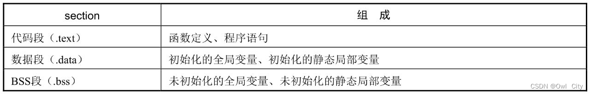
  编译器在编译程序时，以源文件为单位，将一个个源文件编译生成一个个目标文件。在编译过程中，编译器都会按照这个默认规则，将函数、变量分别放在不同的`section`中，最后将各个`section`组成一个目标文件。编译过程结束后，链接器会将各个目标文件组装合并、重定位，生成一个可执行文件。

  在GNU C中，我们可以通过`__attribute__`的`section`属性，显式指定一个函数或变量，在编译时放到指定的`section`里面。通过上面的程序我们知道，未初始化的全局变量默认是放在.bss section中的，即默认放在`BSS`段中。现在我们就可以通过`section`属性声明，把这个**未初始化的全局变量**放到数据段`.data`中。
  通过readelf命令查看符号表，我们可以看到，`uninit_val`这个未初始化的全局变量，通过`__attribute__((section(".data")))`属性声明，就和初始化的全局变量一样，被编译器放在了数据段`.data`中。

##### 1.3 U-boot镜像自复制分析

  有了section这个属性声明，我们就可以试着分析：`U-boot在启动过程中，是如何将自身代码加载的RAM中的`。
  嵌入式Linux中，U-boot的用途主要是加载Linux内核镜像到内存，给内核传递启动参数，然后引导Linux操作系统启动。U-boot一般存储在NOR Flash或NAND Flash上。无论从NOR Flash还是从NAND Flash启动，U-boot其本身在启动过程中，都会**从Flash存储介质上加载自身代码到内存，然后进行重定位，跳到内存RAM中去执行。**
  `那么U-boot是怎么完成代码自复制的呢？或者说它是怎样将自身代码从Flash复制到内存的呢？`
  在复制自身代码的过程中，一个主要的疑问就是：U-boot是如何识别自身代码的？是如何知道从哪里开始复制代码的？是如何知道复制到哪里停止的？这时候我们需要了解U-boot源码中的一个零长度数组。
  **这两行代码的作用是分别定义一个零长度数组，并指示编译器要分别放在.__image_copy_start和.__image_copy_end这两个section中。**
  链接器在链接各个目标文件时，会按照链接脚本里各个section的排列顺序，将各个section组装成一个可执行文件。

  通过链接脚本我们可以看到，`__image_copy_start`和`__image_copy_end`这两个`section`，在链接的时候分别放在了**代码段.text的前面**、**数据段.data的后面**，作为U-boot复制自身代码的起始地址和结束地址。**而在这两个section中，我们除了放两个零长度数组，并没有放其他变量，众所周知，零长度数组是不占用存储空间的。**因此以上两个零长度数组分别代表了U-boot镜像要复制自身镜像的起始地址和结束地址。无论U-boot自身镜像存储在NOR Flash，还是存储在NAND Flash上，只要知道了这两个地址，我们就可以直接调用相关代码复制。
  在嵌入式系统中，通过ARM的LDR伪指令，直接获取要复制镜像的首地址，并保存在R1寄存器中。数组名本身其实就代表一个地址，通过这种方式，U-boot在嵌入式启动的初始阶段，就完成了自身代码的复制工作：从Flash复制自身镜像到内存中，然后进行重定位，最后跳到内存中执行。

#### 2、属性声明：aligned

##### 2.1 地址对齐：aligned

  GNU C通过`__attribute__`来声明`aligned`和`packed`属性，**指定一个变量或类型的对齐方式**。这两个属性用来告诉编译器：**在给变量分配存储空间时，要按指定的地址对齐方式给变量分配地址。**
  定义一个`int`变量，在内存中以`8`字节地址对齐，就可以这样定义。
		通过`aligned`属性，我们可以显式地指定变量`a`在内存中的地址对齐方式。aligned有一个参数，表示要按几字节对齐，使用时要注意，**地址对齐的字节数必须是2的幂次方**，否则编译就会出错。
  一般情况下，当我们定义一个变量时，编译器会按照默认的地址对齐方式，来给该变量分配一个存储空间地址。
  在上面的程序中，我们分别定义2个int型变量、2个char型变量，然后分别打印它们的地址，运行结果如下。
  对于int型数据，其在内存中的地址都是以4字节或4字节整数倍对齐的。而char类型的数据，其在内存中是以1字节对齐的。变量c2就直接被分配到了c1变量的下一个存储单元，不用像int数据那样考虑4字节对齐。接下来，我们修改一下程序，指定变量c2按4字节对齐。
  程序运行结果如下。

  运行结果可以看到，字符变量c2由于使用aligned属性声明按照4字节边界对齐，所以编译器不可能再给其分配0x00402009这个地址，因为这个地址不是按照4字节对齐的。编译器会空出3个存储单元，直接从0x0040200C这个地址上给变量c2分配存储空间。通过aligned属性声明，虽然可以显式地指定变量的地址对齐方式，但是也会因边界对齐造成一定的内存空洞，浪费内存资源。如在上面这个程序中，0x00402009～0x0040200b这三个地址上的存储单元就没有被使用。
  问题：`地址对齐会造成一定的内存空洞，为什么使用地址对齐？`
  原因：`这种对齐设置可以简化CPU和内存RAM之间的接口和硬件设计。为了配合计算机的硬件设计，编译器在编译程序时，对于一些基本数据类型，如int、char、short、float等，会按照其数据类型的大小进行地址对齐，按照这种地址对齐方式分配的存储地址，CPU一次就可以读写完毕。虽然边界对齐会造成一些内存空洞，浪费一些内存单元，但是在硬件上的设计却大大简化了。`

##### 2.2 结构体对齐：aligned

  结构体作为一种复合数据类型，编译器在给一个结构体变量分配存储空间时，不仅要考虑结构体内各个基本成员的地址对齐，还要考虑结构体整体的对齐。为了结构体内各个成员地址对齐，编译器可能会在结构体内填充一些空间；为了结构体整体对齐，编译器可能会在结构体的末尾填充一些空间。
  举个例子定义一个结构体，结构体内定义int、char和short 3个成员，并打印结构体的大小和各个成员的地址。
程序运行结果如下。

  正常而言，结构体的成员b需要4字节对齐，所以编译器在给成员a分配完1字节的存储空间后，会空出3字节，在满足4字节对齐的0x0028FF34地址处才给成员b分配4字节的存储空间；接着是short类型的成员c占据2字节的存储空间；三个结构体成员一共占用1+3+4+2=10字节的存储空间。但是根据结构体的对齐规则，**结构体的整体对齐要按结构体所有成员中最大对齐字节数或其整数倍对齐，或者说结构体的整体长度要为其最大成员字节数的整数倍，如果不是整数倍则要补齐。**因为结构体最大成员int为4字节，所以结构体要按4字节对齐，或者说结构体的整体长度要是4的整数倍，要在结构体的末尾补充2字节，最后结构体的大小为12字节。
  结构体成员按不同的顺序排放，可能会导致结构体的整体长度不一样。如下程序所示。
  程序运行结果如下。
  我们发现，char型变量a和short型变量b，被分配在了结构体前4字节的存储空间中，而且都满足各自的地址对齐方式，整个结构体大小是8字节，只造成1字节的内存空洞。我们继续修改程序，让short型的变量b按4字节对齐。
  程序运行结果如下。

  结构体的大小又重新变为12字节。这是因为，我们显式指定short变量以4字节地址对齐，导致变量a的后面填充了3字节空间。int型变量c也要4字节对齐，所以变量b的后面也填充了2字节，导致整个结构体的大小为12字节。
  我们不仅可以显式指定结构体内某个成员的地址对齐，也可以显式指定整个结构体的对齐方式。
  程序运行结果如下。
  在这个结构体中，各个成员共占8字节。通过前面的学习我们知道，整个结构体的对齐只要按最大成员的对齐字节数对齐即可。所以这个结构体整体就以4字节对齐，结构体的整体长度为8字节。但是在这里，显式指定结构体整体以16字节对齐，所以编译器就会在这个结构体的末尾填充8字节以满足16字节对齐的要求，最终导致结构体的总长度变为16字节。
  问题：`编译器一定会按照aligned指定的方式对齐吗?`
  回答：`非也！我们通过这个属性声明，其实只是建议编译器按照这种大小地址对齐，但不能超过编译器允许的最大值。一个编译器，对每个基本数据类型都有默认的最大边界对齐字节数。如果超过了，则编译器只能按照它规定的最大对齐字节数来给变量分配地址。`
  在这个程序中，我们指定char型的变量c2以16字节对齐，编译运行结果如下。
  我们可以看到，编译器给c2分配的地址是按16字节地址对齐的，如果我们继续修改c2变量按32字节对齐，你会发现程序的运行结果不再有变化，编译器仍然分配一个16字节对齐的地址，这是因为32字节的对齐方式已经超过编译器允许的最大值了。

##### 2.3 属性声明：packed

  aligned属性一般用来增大变量的地址对齐，元素之间因为地址对齐会造成一定的内存空洞。而packed属性则与之相反，一般用来**减少地址对齐，指定变量或类型使用最可能小的地址对齐方式**。
  在上面的程序中，我们将结构体的成员b和c使用packed属性声明，就是告诉编译器，尽量使用最可能小的地址对齐给它们分配地址，尽可能地减少内存空洞。程序的运行结果如下。

  这个特性在底层驱动开发中还是非常有用的。使用packed可以避免这个问题，结构体的每个成员都紧挨着，依次分配存储地址，这样就避免了各个成员因地址对齐而造成的内存空洞。我们也可以对整个结构体添加packed属性，这和分别对每个成员添加packed属性效果是一样的。


##### 2.4 内核中的aligned、packed声明

  在Linux内核源码中，我们经常看到aligned和packed一起使用，即对一个变量或类型同时使用aligned和packed属性声明。这样做的好处是：**既避免了结构体内各成员因地址对齐产生内存空洞，又指定了整个结构体的对齐方式。**
  程序运行结果如下。

  结构体data虽然使用了`packed`属性声明，结构体内所有成员所占的存储空间为7字节，但是我们同时使用了`aligned(8)`指定结构体按`8`字节地址对齐，所以编译器要在结构体后面填充`1`字节，这样整个结构体的大小就变为`8`字节，按`8`字节地址对齐。

#### 3、format

##### 3.1 变参函数的格式检查

  GNU通过`__attribute__`扩展的format属性，来指定变参函数的参数格式检查。使用方法如下。

  在一些商业项目中，我们经常会实现一些自定义的打印调试函数，甚至实现一个独立的日志打印模块。这些自定义的打印函数往往是变参函数，用户在调用这些接口函数时参数往往不固定，那么编译器在编译程序时，怎么知道我们的参数格式对不对呢？
  `__attribute__`的`format`属性这时候就派上用场了。上面的示例代码中，我们定义一个`LOG()`变参函数，用来实现日志打印功能。
  编译器在编译程序时，如何检查LOG()函数的参数格式是否正确呢？通过给LOG()函数添加`__attribute__（（format(printf，1，2)））`属性声明就可以了。这个属性声明告诉编译器：你知道printf()函数不？你怎么对printf()函数进行参数格式检查的，就按照同样的方法，对LOG()函数进行检查。
  属性format(printf，1，2)有3个参数，第1个参数printf是告诉编译器，按照printf()函数的标准来检查；第2个参数表示在LOG()函数所有的参数列表中格式字符串的位置索引；第3个参数是告诉编译器要检查的参数的起始位置。

  在这个LOG()函数中有2个参数，第1个参数是格式字符串，第2个参数是要打印的一个常量值0，用来匹配格式字符串中的占位符。

##### 3.2 尝试实现变参打印函数

  尝试实现变参打印函数`my_printf(char *fmt, ...)`


##### 3.2 尝试实现日志打印函数

  尝试实现变参打印函数`LOG(char *fmt, ...)`。虽然C标准库函数有现成的打印函数，但是并不能完全满足我们的调试打印需求，在嵌入式调试过程中，我们可能需要实现字节的打印格式，打印输出方式控制，打印开关控制和优先级控制，还可以根据需要不断添加功能。而且，在调试过程中，我们需要打印过程参数以方便调试结果，但是调试完成再删除起来会很麻烦，因此，我们通过一个宏开关，可以实现关闭或者打开，维护起来方便许多。如下代码所示

  当我们在程序中定义一个DEBUG开关宏时，LOG()函数实现正常的打印功能；当我们删掉这个DEBUG宏时，LOG()函数就是一个空函数。除此之外，你还可以通过宏来设置一些打印等级。如可以分为ERROR、WARNNING、INFO等打印等级，根据设置的打印等级，模块打印的日志信息也不一样。如下程序所示。
  我们封装了3个打印函数：INFO()、WARN()和ERR()，分别打印不同优先级的日志信息。在实际调试中，我们可以根据自己需要的打印信息，设置合适的打印等级，就可以分级控制这些打印信息了。

#### 4、weak

##### 4.1 强弱符号

  GNU C通过weak属性声明，可以将一个强符号转换为弱符号。

  无论是变量名，还是函数名，在编译器的眼里，就是一个符号而已。符号可以分为强符号和弱符号。

- 强符号：函数名，初始化的全局变量名。
- 弱符号：未初始化的全局变量名。
  对于相同的全局变量名、函数名，我们一般可以归结为下面3种场景。
- 强符号+强符号。
- 强符号+弱符号。
- 弱符号+弱符号。
  **强符号和弱符号主要用来解决在程序链接过程中，出现多个同名全局变量、同名函数的冲突问题。** 一般我们遵循下面3个规则。
- **一山不容二虎。** 在一个项目中，不能同时存在两个强符号。如果你在一个多文件的工程中定义两个同名的函数或全局变量，那么链接器在链接时就会报重定义错误。
- **强弱可以共处。** 在一个工程中允许强符号和弱符号同时存在。如同时定义一个初始化的全局变量和一个未初始化的全局变量。
- **体积大者胜出。** 在一个工程中，当同名的符号都是弱符号时，那么编译器该选择哪个呢？谁的体积大，即谁在内存中的存储空间大，就选谁。
  示例程序如下：
      程序结果如下：
  
    我们在main.c和func.c中分别定义了2个同名全局变量a和b，但是一个是强符号，一个是弱符号。链接器在链接过程中，看到冲突的同名符号，会选择强符号，所以你会看到，无论是main()函数，还是func()函数，打印的都是强符号的值。

##### 4.2 函数的强弱符号

  链接器对于同名函数冲突，同样遵循相同的规则。函数名本身就是一个强符号，在一个工程中定义两个同名的函数，编译时肯定会报重定义错误。但我们可以通过weak属性声明，将其中一个函数名转换为弱符号。

  程序结果如下：

  在这个程序中，我们在main.c中定义了一个同名的func()函数，然后通过weak属性声明将其转换为一个弱符号。链接器在链接时会选择func.c中的强符号，当我们在main()函数中调用func()函数时，实际上调用的是func.c文件里的func()函数。而全局变量a则恰恰相反，因为在func.c中定义的是一个弱符号，所以在func()函数中打印的是main.c中的全局变量a的值。

##### 4.2 弱函数的用途

  在一个源文件中引用一个变量或函数，当编译器只看到其声明，而没有看到其定义时，编译器一般编译不会报错：编译器会认为这个符号可能在其他文件中定义。在链接阶段，链接器会到其他文件中找这些符号的定义，若未找到，则报未定义错误。
  当函数被声明为一个弱符号时，会有一个奇特的地方：当链接器找不到这个函数的定义时，也不会报错。编译器会将这个函数名，即弱符号，设置为0或一个特殊的值。只有当程序运行时，调用到这个函数，跳转到零地址或一个特殊的地址才会报错，产生一个内存错误。


  在这个示例程序中，我们没有定义func()函数，仅仅在main.c里做了一个声明，并将其声明为一个弱符号。编译这个工程，你会发现程序是可以编译通过的，只是到程序运行时才会出错，产生一个段错误。
  为了防止函数运行出错，我们可以在运行这个函数之前，先进行判断，看这个函数名的地址是不是0，然后决定是否调用和运行，这样就可以避免段错误了。

  编译程序并运行，可以看到程序能正常运行，没有再出现段错误。

  弱符号的这个特性，在库函数中应用得很广泛。如你在开发一个库时，基础功能已经实现，有些高级功能还没实现，那么你可以将这些函数通过weak属性声明转换为一个弱符号。**通过这样设置，即使还没有定义函数，我们在应用程序中只要在调用之前做一个非零的判断就可以了，并不影响程序的正常运行**。等以后发布新的库版本，实现了这些高级功能，应用程序也不需要进行任何修改，直接运行就可以调用这些高级功能。

##### 4.3 属性声明：alias

  GNU C扩展了一个alias属性，这个属性很简单，主要用来给函数定义一个别名。

  程序运行结果如下。

  通过alias属性声明，我们可以给__f()函数定义一个别名f()，以后如果想调用__f()函数，则直接通过f()调用即可。
  在Linux内核中，我们会发现alias有时会和weak属性一起使用。如有些函数随着内核版本升级，函数接口发生了变化，我们可以通过alias属性对这个旧的接口名字进行封装，重新起一个接口名字。

  如果我们在main.c中新定义了f()函数，那么当main()函数调用f()函数时，会直接调用main.c中新定义的函数；当f()函数没有被定义时，则调用__f()函数。GNU C 属性声明

## 内联函数

​		在计算机科学中， **内联函数** （有时称作 在线函数 或 编译时期展开函数 ）是一种 编程语言 结构，用来建议 编译器 对一些特殊 函数 进行内联扩展（有时称作 在线扩展 ）；也就是说建议编译器将指定的函数体插入并取代每一处调用该函数的地方（ 上下文 ），从而节省了每次调用函数带来的额外时间开支。

​		在GCC编译器下，可以指定`__attribute__((noinline))`或者是`__attribute__((always_inline))`来指定是否强迫内敛而不是编译器视情况而定。

### 与宏的区别

**、不同点：**

- 内联函数是在编译时展开，而宏在预编译时展开；在编译的时候，内联函数直接被嵌入到目标代码中去，而宏只是一个简单的文本替换。
- 内联函数可以进行诸如类型安全检查、语句是否正确等编译功能，宏不具有这样的功能；宏不是函数，而inline是函数。
- 宏在定义时要小心处理宏参数，一般用括号括起来，否则容易出现二义性。而内联函数不会出现二义性。
- inline有点类似于宏定义，但是它和宏定义不同的是，宏定义只是简单的文本替换，是在预编译阶段进行的。而inline的引入正是为了取消这种复杂的宏定义的。

**2、举例：**

- 宏定义：

```scss
#define MAX(a，b) ((a)>(b)?(a):(b))
MAX(a,"Hello")； //错误地比较int和字符串，没有参数类型检查
```

- 内联函数：

```c
#include <stdio.h>
 
inline int add(int a, int b)
{
    return (a + b);
}
 
int main(void)
{
    int a;
 
    a = add(1, 2);
    printf("a+b=%d\n", a);
 
    return 0;
}
```

**3、使用时的一些注意事项：**

- 使用宏定义一定要注意错误情况的出现，比如宏定义函数没有类型检查，可能传进来任意类型，从而带来错误，如举例。还有就是括号的使用，宏在定义时要小心处理宏参数，一般用括号括起来，否则容易出现二义性
- inline函数一般用于比较小的，频繁调用的函数，这样可以减少函数调用带来的开销。只需要在函数返回类型前加上关键字inline，即可将函数指定为inline函数。
- 同其它函数不同的是，最好将inline函数定义在头文件，而不仅仅是声明，因为编译器在处理inline函数时，需要在调用点内联展开该函数，所以仅需要函数声明是不够的。

**4、内联函数使用的条件：**

- 内联是以代码膨胀（复制）为代价，仅仅省去了函数调用的开销，从而提高函数的执行效率。如果执行函数体内代码的时间，相比于函数调用的开销较大，那么效率 的收获会很少。另一方面，每一处内联函数的调用都要复制代码，将使程序的总代码量增大，消耗更多的内存空间。以下情况不宜使用内联： 
- （1）如果函数体内的代码比较长，使用内联将导致内存消耗代价较高。 
- （2）如果函数体内出现循环，那么执行函数体内代码的时间要比函数调用的开销大。 
- 内联不是什么时候都能展开的，一个好的编译器将会根据函数的定义体，自动地取消不符合要求的内联。

**5、使用内联函数和宏函数可能带来的问题（慎用）：**

- 有时不要仅是为了提高编程效率而使用这两种函数，要综合考虑后再使用，因为有时使用这两种函数可能带来其他的问题，比如出现问题不能使用gdb调试问题，内联函数不展开，宏函数没有参数检测等

### 建议

​		将内联函数放在头文件里实现是合适的,省却你为每个文件实现一次的麻烦.而所以声明跟定义要一致,其实是指,如果在每个文件里都实现一次该内联函数的话,那么,最好保证每个定义都是一样的,否则,将会引起未定义的行为,即是说,如果不是每个文件里的定义都一样,那么,编译器展开的是哪一个,那要看具体的编译器而定.所以,最好将内联函数定义放在头文件中。

## 内建函数

内建函数，顾名思义，就是编译器内部实现的函数。这些函数跟关键字一样，可以直接使用，无须像标准库函数那样，要 #include 对应的头文件才能使用。

内建函数的函数命名，通常以 __builtin 开头。这些函数主要在编译器内部使用，主要是为编译器服务的。内建函数的主要用途如下。

- 用来处理变长参数列表；
- 用来处理程序运行异常；
- 程序的编译优化、性能优化；
- 查看函数运行中的底层信息、堆栈信息等；
- C 标准库函数的内建版本。

因为内建函数是编译器内部定义，主要由编译器相关的工具和程序调用，所以这些函数并没有文档说明，而且变动而频繁。对于程序开发者来说，不建议使用这些函数。

但有些函数，对于我们了解程序运行的底层信息、编译优化很有帮助，而且在 Linux 内核中也经常使用这些函数，所以还是很有必要去了解 Linux 内核中常用的一些内建函数。


### **常用内建函数**

#### __builtin_*return_*address(LEVEL)

这个函数用来返回当前函数或调用者的返回地址。函数的参数 LEVEl 表示函数调用链中的不同层次的函数，各个值代表的意义如下。

- 0：返回当前函数的返回地址；
- 1：返回当前函数调用者的返回地址；
- 2：返回当前函数调用者的调用者的返回地址；
- ……

我们接下来写一个测试程序。

```c
void f(void)
    {
        int *p;
        p = __builtin_return_address(0);
        printf("f    return address: %p\n",p);
        p = __builtin_return_address(1);;
        printf("func return address: %p\n",p);
        p = __builtin_return_address(2);;
        printf("main return address: %p\n",p);
        printf("\n");
    }
    void func(void)
    {
        int *p;
        p = __builtin_return_address(0);
        printf("func return address: %p\n",p);
        p = __builtin_return_address(1);;
        printf("main return address: %p\n",p);
        printf("\n");
        f();
    }

    int main(void)
    {
        int *p;
        p = __builtin_return_address(0);
        printf("main return address: %p\n",p);
        printf("\n"); 
        func();
        printf("goodbye!\n");
        return 0;
    }
```

C 语言函数在调用过程中，会将当前函数的返回地址、寄存器等现场信息保存在堆栈中，然后才会跳到被调用函数中去执行。当被调用函数执行结束后，根据保存在堆栈中的返回地址，就可以直接返回到原来的函数中继续执行。

在这个程序中，main() 函数调用 func() 函数，在 main() 函数跳转到 func() 函数执行之前，会将程序正在运行的当前语句的下一条语句（如下代码所示）的地址保存到堆栈中，然后才去执行 func(); 这条语句，跳到 func() 函数去执行。func() 执行完毕后，如何返回到 main() 函数呢？很简单，将保存到堆栈中的返回地址赋值给 PC 指针，就可以直接返回到 main() 函数，继续往下执行了。

```c
printf("goodbye!\n");
```

每一层函数调用，都会将当前函数的下一条指令地址，即返回地址压入堆栈保存。各层函数调用就构成 了一个函数调用链。在各层函数内部，我们使用内建函数就可以打印这个调用链上各个函数的返回地址。程序的运行结果如下。

```c
main return address:0040124B

func return address:004013C3
main return address:0040124B

f    return address:00401385
func return address:004013C3
main return address:0040124B
```

#### __builtin_*frame_*address(LEVEL)

在函数调用过程中，还有一个“栈帧”的概念。函数每调用一次，都会将当前函数的现场（返回地址、寄存器等）保存在栈中，每一层函数调用都会将各自的现场信息都保存在各自的栈中。这个栈也就是当前函数的栈帧，每一个栈帧有起始地址和结束地址，表示当前函数的堆栈信息。多层函数调用就会有多个栈帧，每个栈帧里会保存上一层栈帧的起始地址，这样各个栈帧就形成了一个调用链。很多调试器、GDB、包括我们的这个内建函数，其实都是通过回溯函数栈帧调用链来获取函数底层的各种信息的。比如，返回地址 i、调用关系等。在 ARM 系统中，使用 FP 和 SP 这两个寄存器，分别指向当前函数栈帧的起始地址和结束地址。当函数继续调用或者返回，这两个寄存器的值也会发生变化，总是指向当前函数栈帧的起始地址和结束地址。

我们可以通过内建函数 __builtin*frame*address(LEVEL)，查看函数的栈帧地址。

- 0：查看当前函数的栈帧地址
- 1：查看当前函数调用者的栈帧地址
- ……

写一个程序，打印当前函数的栈帧地址。

```c
void func(void)
{
    int *p;
    p = __builtin_frame_address(0);
    printf("func frame:%p\n",p);
    p = __builtin_frame_address(1);
    printf("main frame:%p\n",p);
}

int main(void)
{
    int *p;
    p = __builtin_frame_address(0);
    printf("main frame:%p\n",p);
    printf("\n");
    func();
    return 0;
}
```

程序运行结果如下。

```c
main frame:0028FF48

func frame:0028FF28
main frame:0028FF48
```


### **C 标准库的内建函数**

在 GNU C 编译器内部，实现了一些和 C 标准库函数类似的内建函数。这些函数跟 C 标准库函数功能相似，函数名也相同，只是在前面加了一个前缀 __builtin。如果你不想使用 C 库函数，也可以加个前缀，直接使用对应的内建函数。

常见的标准库函数如下：

- 内存相关的函数：memcpy 、memset、memcmp
- 数学函数：log、cos、abs、exp
- 字符串处理函数：strcat、strcmp、strcpy、strlen
- 打印函数：printf、scanf、putchar、puts

接下来我们写个小程序，使用与 C 标准库对应的内建函数。

```c
int main(void)
{    
    char a[100];
    __builtin_memcpy(a,"hello world!",20);
    __builtin_puts(a);

    return 0;
}
```

程序运行结果如下。

```c
hello world!
```

通过运行结果我们看到，使用与 C 标准库对应的内建函数，同样也能实现字符串的复制和打印，实现 C 标准库函数的功能。

### **内建函数：__builtin_\*constant_\*p(n)**

编译器内部还有一些内建函数，主要用来编译优化、性能优化，如 __builtin*constant*p(n) 函数。该函数主要用来判断参数 n 在编译时是否为常量，是常量的话，函数返回1；否则函数返回0。该函数常用于宏定义中，用于编译优化。一个宏定义，根据宏的参数是常量还是变量，可能实现的方法不一样。在内核中经常看到这样的宏。

```c
#define _dma_cache_sync(addr, sz, dir)        \
do {                            \
    if (__builtin_constant_p(dir))          \
        __inline_dma_cache_sync(addr, sz, dir); \
    else                        \
        __arc_dma_cache_sync(addr, sz, dir);    \
}                            \
while (0);
```

很多计算或者操作在参数为常数时可能有更优化的实现，在这个宏定义中，我们实现了两个版本。根据参数是否为常数，我们可以灵活选用不同的版本。


### **内建函数：__builtin_expect(exp,c)**

内建函数 __builtin_expect 也常常用来编译优化。这个函数有两个参数，返回值就是其中一个参数，仍是 exp。这个函数的意义主要就是告诉编译器：参数 exp 的值为 c 的可能性很大。然后编译器可能就会根据这个提示信息，做一些分支预测上的代码优化。

参数 c 跟这个函数的返回值无关，无论 c 为何值，函数的返回值都是 exp。

```c
int main(void)
{    
    int a;
    a = __builtin_expect(3,1);
    printf("a = %d\n",a);

    a = __builtin_expect(3,10);
    printf("a = %d\n",a);

    a = __builtin_expect(3,100);
    printf("a = %d\n",a);
    return 0;
}
```

程序运行结果如下。

```c
a = 3
a = 3
a = 3
```

这个函数的主要用途就是编译器的分支预测优化。现代 CPU 内部，都有 cache 这个缓存器件。CPU 的运行速度很高，而外部 RAM 的速度相对来说就低了不少，所以当 CPU 从内存 RAM 读写数据时就会有一定的性能瓶颈。为了提高程序执行效率，CPU 都会通过 cache 这个 CPU 内部缓冲区来缓存一定的指令或数据。CPU 读写内存 RAM 中的数据时，会先到 cache 里面去看看能不能找到。找到的话就直接进行读写；找不到的话，cache 会重新缓存一部分内存数据进来。CPU 读写 cache 的速度远远大于内存 RAM，所以通过这种方式，可以提高系统的性能。

那 cache 如何缓存内存数据呢？简单来说，就是依据空间相近原则。比如 CPU 正在执行一条指令，那么下一个指令周期，CPU 就会大概率执行当前指令的下一条指令。如果此时 cache 将下面几条指令都缓存到 cache 里面，下一个指令周期 CPU 就可以直接到 cache 里取指、翻译、执行，从而使运算效率大大提高。

但有时候也会出现意外。比如程序在执行过程中遇到函数调用、if 分支、goto 跳转等程序结构，会跳到其它地址执行，那么缓存到 cache 中的指令就不是 CPU 要获取的指令。此时，我们就说 cache 没有命中，cache 会重新缓存正确的指令代码给 CPU 读取，这就是 cache 工作的基本流程。

有了这个理论基础，我们在编写程序时，遇到 if/switch 这种选择分支的程序结构，可以将大概率发生的分支写在前面，这样程序运行时，因为大概率发生，所以大部分时间就不需要跳转，程序就相当于一个顺序结构，从而提高 cache 的命中率。内核中已经实现一些相关的宏，如 likely 和 unlikely，用来提醒程序员优化程序。

### **内核中的 likely 和 unlikely**

Linux 内核中，使用 __builtin_expect 内建函数，定义了两个宏。

```c
#define likely(x) __builtin_expect(!!(x),1)
#define unlikely(x) __builtin_expect(!!(x),0)
```

这两个宏的主要作用，就是告诉编译器：某一个分支发生的概率很高，或者说很低，基本不可能发生。编译器就根据这个提示信息，就会去做一些分值预测的编译优化。在这两个宏定义有一个细节，就是对宏的参数 x 做两次取非操作，这是为了将参数 x 转换为布尔类型，然后与 1 和 0 作比较，告诉编译器 x 为真或为假的可能性很高。

我们接下来举个例子，让大家感受下，使用这两个宏后，编译器在分支预测上的一些编译变化。

```c
//expect.c
int main(void)
{
    int a;
    scanf("%d",&a);
    if( a==0)
    {
        printf("%d",1);
        printf("%d",2);
        printf("\n");
    }
    else
    {
        printf("%d",5);
        printf("%d",6);
        printf("\n");
    }
    return 0;
}
```

在这个程序中，根据我们输入变量 a 的值，程序会执行不同的分支代码。我们接着对这个程序反汇编，生成对应的汇编代码。

```c
$ arm-linux-gnueabi-gcc  expect.c
$ arm-linux-gnueabi-objdump -D a.out
 00010558 <main>:
   10558:    e92d4800    push    {fp, lr}
   1055c:    e28db004    add fp, sp, #4
   10560:    e24dd008    sub sp, sp, #8
   10564:    e59f308c    ldr r3, [pc, #140]  
   10568:    e5933000    ldr r3, [r3]
   1056c:    e50b3008    str r3, [fp, #-8]
   10570:    e24b300c    sub r3, fp, #12
   10574:    e1a01003    mov r1, r3
   10578:    e59f007c    ldr r0, [pc, #124]  
   1057c:    ebffffa5    bl  10418 <__isoc99_scanf@plt>
   10580:    e51b300c    ldr r3, [fp, #-12]
   10584:    e3530000    cmp r3, #0
   10588:    1a000008    bne 105b0 <main+0x58>
   1058c:    e3a01001    mov r1, #1
   10590:    e59f0068    ldr r0, [pc, #104]  
   10594:    ebffff90    bl  103dc <printf@plt>
   10598:    e3a01002    mov r1, #2
   1059c:    e59f005c    ldr r0, [pc, #92]
   105a0:    ebffff8d    bl  103dc <printf@plt>
   105a4:    e3a0000a    mov r0, #10
   105a8:    ebffff97    bl  1040c <putchar@plt>
   105ac:    ea000007    b   105d0 <main+0x78>
   105b0:    e3a01005    mov r1, #5
   105b4:    e59f0044    ldr r0, [pc, #68]
   105b8:    ebffff87    bl  103dc <printf@plt>
   105bc:    e3a01006    mov r1, #6
   105c0:    e59f0038    ldr r0, [pc, #56]
   105c4:    ebffff84    bl  103dc <printf@plt>
```

观察 main 函数的反汇编代码，我们看到：汇编代码的结构就是基于我们的 if/else 分支先后顺序，依次生成对应的汇编代码（看 10588:bne 105b0 跳转）。我们接着改一下代码，使用 unlikely 修饰 if 分支，告诉编译器，这个 if 分支小概率发生，或者说不可能发生。

```c
//expect.c
int main(void)
{
    int a;
    scanf("%d",&a);
    if( unlikely(a==0) )
    {
        printf("%d",1);
        printf("%d",2);
        printf("\n");
    }
    else
    {
        printf("%d",5);
        printf("%d",6);
        printf("\n");
    }
    return 0;
}
```

对这个程序添加 -O2 优化参数编译，并对生成的可执行文件 a.out 反汇编。

```c
$ arm-linux-gnueabi-gcc -O2 expect.c
 $ arm-linux-gnueabi-objdump -D a.out
00010438 <main>:
   10438:    e92d4010    push    {r4, lr}
   1043c:    e59f4080    ldr r4, [pc, #128]  
   10440:    e24dd008    sub sp, sp, #8
   10444:    e5943000    ldr r3, [r4]
   10448:    e1a0100d    mov r1, sp
   1044c:    e59f0074    ldr r0, [pc, #116]
   10450:    e58d3004    str r3, [sp, #4]
   10454:    ebfffff1    bl  10420 <__isoc99_scanf@plt>
   10458:    e59d3000    ldr r3, [sp]
   1045c:    e3530000    cmp r3, #0
   10460:    0a000010    beq 104a8 <main+0x70>
   10464:    e3a02005    mov r2, #5
   10468:    e59f105c    ldr r1, [pc, #92]
   1046c:    e3a00001    mov r0, #1
   10470:    ebffffe7    bl  10414 <__printf_chk@plt>
   10474:    e3a02006    mov r2, #6
   10478:    e59f104c    ldr r1, [pc, #76]
   1047c:    e3a00001    mov r0, #1
   10480:    ebffffe3    bl  10414 <__printf_chk@plt>
   10484:    e3a0000a    mov r0, #10
   10488:    ebffffde    bl  10408 <putchar@plt>
   1048c:    e59d2004    ldr r2, [sp, #4]
   10490:    e5943000    ldr r3, [r4]
   10494:    e3a00000    mov r0, #0
   10498:    e1520003    cmp r2, r3
   1049c:    1a000007    bne 104c0 <main+0x88>
   104a0:    e28dd008    add sp, sp, #8
   104a4:    e8bd8010    pop {r4, pc}
   104a8:    e3a02001    mov r2, #1
   104ac:    e59f1018    ldr r1, [pc, #24]
   104b0:    e1a00002    mov r0, r2
   104b4:    ebffffd6    bl  10414 <__printf_chk@plt>
   104b8:    e3a02002    mov r2, #2
   104bc:    eaffffed    b   10478 <main+0x40>
```

我们对 if 分支条件表达式使用 unlikely 修饰，告诉编译器这个分支小概率发生。在编译器开启优化编译条件下，通过生成的反汇编代码（10460:beq 104a8），我们可以看到，编译器将小概率发生的 if 分支汇编代码放在了后面，将 else 分支的汇编代码放在了前面，这样就确保了程序在执行时，大部分时间都不需要跳转，直接按顺序执行下面大概率发生的分支代码。

在 Linux 内核中，你会发现很多地方使用 likely 和 unlikely 宏修饰，此时你应该知道它们的用途了吧。

## 可变参数宏

### **什么是可变参数宏**

在上面的教程中，我们学会了变参函数的定义和使用，基本套路就是使用 `va_list`、`va_start`、`va_end` 等宏，去解析那些可变参数列表我们找到这些参数的存储地址后，就可以对这些参数进行处理了：要么自己动手，自己处理；要么继续调用其它函来处理。

```c
void print_num(int count, ...)
{
    va_list args;
    va_start(args,count);
    for(int i = 0; i < count; i++)
    {
        printf("*args: %d\n",*(int *)args);
        args += 4; 
    }
}
void __attribute__((format(printf,2,3))) LOG(int k,char *fmt,...)
{
    va_list args;
    va_start(args,fmt);
    vprintf(fmt,args);
    va_end(args);
}
```

GNU C 觉得这样不过瘾，再来个猛锤：干脆宏定义也支持变参吧！

这一节我们要学习一下可变参数宏的定义和使用。其实，C99 标准已经支持了这个特性，但是其它的编译器不太给力，对 C99 标准的支持不是很好，只有 GNU C 支持这个功能，所以有时候我们也把这个可变参数宏看作是 GNU C 的一个语法扩展。 上面的 LOG 函数，如果我们想使用一个变参宏实现，就可以直接这样定义。

```c
#define LOG(fmt, ...) printf(fmt, __VA_ARGS__)

#define DEBUG(...) printf(__VA_ARGS__)

int main(void)
{
    LOG("Hello! I'm %s\n","Wanglitao");
    DEBUG("Hello! I'm %s\n","Wanglitao");
    return 0;
}
```

变参宏的实现形式其实跟变参函数差不多：用 ... 表示变参列表，变参列表由不确定的参数组成，各个参数之间用逗号隔开。可变参数宏使用 C99 标准新增加的一个 `__VA_ARGS__` 预定义标识符来表示前面的变参列表，而不是像变参函数一样，使用 `va_list`、`va_start`、`va_end` 这些宏去解析变参列表。预处理器在将宏展开时，会用变参列表替换掉宏定义中的所有 `__VA_ARGS__` 标识符。

使用宏定义实现一个变参打印功能，你会发现，它的实现甚至比变参函数还方便！内核中的很多打印宏，经常使用可变参数宏来实现，宏定义一般为下面这个格式。

```c
#define LOG(fmt, ...) printf(fmt, __VA_ARGS__)
```

在这个宏定义中，有一个固定参数，通常为一个格式字符串，后面的变参用来打印各种格式的数据，跟前面的格式字符串相匹配。这种定义方式有一个漏洞，即当变参为空时，宏展开时就会产生一个语法错误。

```c
#define LOG(fmt,...) printf(fmt,__VA_ARGS__)
int main(void)
{
    LOG("hello\n");
    return 0;
}
```

上面这个程序编译时就会通不过，产生一个语法错误。这是因为，我们只给 LOG 宏传递了一个参数，而变参为空。当宏展开后，就变成了下面这个样子。

```c
printf("hello\n", );
```

宏展开后，在第一个字符串参数的后面还有一个逗号，所以就产生了一个语法错误。我们需要继续对这个宏进行改进，使用宏连接符 ##，来避免这个语法错误。


### **继续改进我们的宏**

我们接下来，使用宏连接符 ## 来改进上面的宏。

宏连接符 ## 的主要作用就是连接两个字符串，我们在宏定义中可以使用 ## 来连接两个字符。预处理器在预处理阶段对宏展开时，会将 ## 两边的字符合并，并删除 ## 这两个字符。

```c
#define A(x) a##x
int main(void)
{
    int A(1) = 2; //int a1 = 2;
    int A() = 3;  //int a=3;
    printf("%d %d\n",a1,a);
    return 0;   
}
```

如上面的程序，我们定义一个宏。

```c
#define A(x) a##x
```

这个宏的功能就是连接字符 a 和 x。在程序中，A(1) 展开后就是 a1，A( ) 展开后就是 a。我们使用 printf( ) 函数可以直接打印变量 a1、a 的值，因为宏展开后，就相当于使用 int 关键字定义了两个整型变量 a1 和 a。上面的程序可以编译通过，运行结果如下。

```text
2  3
```

知道了宏连接符 ## 的使用方法，我们接下来就可以就对 LOG 宏做一些修改。

```c
#define LOG(fmt,...) printf(fmt, ##__VA_ARGS__)
int main(void)
{
    LOG("hello\n");
    return 0;
}
```

我们在标识符 `__VA_ARGS__` 前面加上宏连接符 ##，这样做的好处是，当变参列表非空时，## 的作用是连接 fmt，和变参列表，各个参数之间用逗号隔开，宏可以正常使用；当变参列表为空时，## 还有一个特殊的用处，它会将固定参数 fmt 后面的逗号删除掉，这样宏也就可以正常使用了。


### **可变参数宏的另一种写法**

当我们定义一个变参宏时，除了使用预定义标识符 `__VA_ARGS__` 表示变参列表外，还可以使用下面这种写法。

```c
#define LOG(fmt,args...) printf(fmt, args)
```

使用预定义标识符 `__VA_ARGS__` 来定义一个变参宏，是 C99 标准规定的写法。而上面这种格式是 GNU C 扩展的一个新写法。我们不再使用 `__VA_ARGS__`，而是直接使用 args... 来表示一个变参列表，然后在后面的宏定义中，直接使用 args 代表变参列表就可以了。

跟上面一样，为了避免变参列表为空时的语法错误，我们也需要添加一个连接符##。

```c
#define LOG(fmt,args...) printf(fmt,##args)
int main(void)
{
    LOG("hello\n");
    return 0;
}
```

使用这种方式，你会发现这种写法比使用 `__VA_ARGS__` 看起来更加直观和方便。


### **内核中的可变参数宏**

可变参数宏在内核中主要用于日志打印。一些驱动模块或子系统有时候会定义自己的打印宏，可以支持打印开关、打印格式、优先级控制等。如在 printk.h 头文件中，我们可以看到 pr_debug 宏的定义。

```c
#if defined(CONFIG_DYNAMIC_DEBUG)
#define pr_debug(fmt, ...) \
    dynamic_pr_debug(fmt, ##__VA_ARGS__)
#elif defined(DEBUG)
#define pr_debug(fmt, ...) \
    printk(KERN_DEBUG pr_fmt(fmt), ##__VA_ARGS__)
#else
#define pr_debug(fmt, ...) \
    no_printk(KERN_DEBUG pr_fmt(fmt), ##__VA_ARGS__)
#endif

#define dynamic_pr_debug(fmt, ...)                \
do {                                \
    DEFINE_DYNAMIC_DEBUG_METADATA(descriptor, fmt); \
    if (unlikely(descriptor.flags       \
            & _DPRINTK_FLAGS_PRINT))    \
        __dynamic_pr_debug(&descriptor, pr_fmt(fmt),    \
                   ##__VA_ARGS__);      \
} while (0)

static inline __printf(1, 2)
int no_printk(const char *fmt, ...)
{
    return 0;
}

#define __printf(a, b)    \   
__attribute__((format(printf, a, b)))
```

看到这个宏定义，不得不佩服宏的作者。一个小小的宏，综合运用各种技巧和知识点，把 C 语言发挥到极致！

这个宏定义了三个版本。如果我们在编译内核时有动态调试选项，那么这个宏就定义为 dynamic*pr*debug。如果没有配置动态调试选项，那我们还可以通过 DEBUG 这个宏，来控制这个宏的打开和关闭。

no_printk() 作为一个内联函数，定义在 printk.h 头文件中，而且通过 format 属性声明，指示编译器按照 printf 标准去做参数格式检查。

最有意思的是 dynamic*pr*debug 宏，宏定义采用 do{ ... }while(0) 结构。这看起来貌似有点多余，有它没它，我们的宏都可以工作。反正都是执行一次，为什么要用这种看似“画蛇添足”的循环结构呢？道理很简单，这样定义就是为了防止宏在条件、选择等分支结构的语句中展开后，产生宏歧义。

比如我们定义一个宏，由两条打印语句构成。

```c
#define DEBUG() \
 printf("hello ");printf("else\n")

int main(void)
{
    if(1)
        printf("hello if\n");
    else
        DEBUG();
    return 0;
}
```

程序运行结果如下。

```c
hello if
else
```

理论情况下，else 分支是执行不到的。但通过运行结果可以看到，程序也执行了 else 分支的一部分代码。这是因为我们定义的宏由多条语句组成，直接展开后，就变成了下面这样。

```c
int main(void)
    {
        if(1)
            printf("hello if\n");
        else
            printf("hello ");
            printf("else\n")；
        return 0;
    }
```

多条语句在宏调用处直接展开，就破坏了程序原来的 if-else 分支结构，导致程序逻辑发生变化，所以你才会看到 else 分支的非正常打印。而采用 do{ ... }while(0) 这种结构，可以将我们宏定义中的复合语句包起来，宏展开后，就是一个代码块，就避免了这种逻辑错误。

一个小小的宏，暗藏各个知识点，综合使用各种技巧，仔细分析下来，就能学到很多知识。大家在以后的工作和学习中，可能会接触到各种各样、形形色色的宏，只要我们有牢固的 C 语言基础，熟悉 GNU C 的常用扩展语法，再遇到这样类似的宏，我们都可以慢慢去分析了。不用怕，只有自己真正分析过，才算真正掌握，才能转化为自己的知识和能力，才能领略它的精妙之处。

# 数据存储与指针

​		我们现在可以看看一个很重要的topic了：数据存储与指针。

## 数据类型与存储

### 大小端模式

​		何为大小端？任何一个学习过网络编程的应该有所耳闻，他指的是数据在机器上存储的方式：当我们写下诸如0x12345678的时候，及其可能是这样存储的：

```
78 | 56 | 34 | 12
12 | 34 | 56 | 78
```

​		上者被称作大端模式，下者则是小端模式。

​		测试大小端模式，我们可以书写程序来完成：

```
#include<stdio.h>

int main()
{
    int a = 0x11223344;
    char b = a;
    if(b == 0x44){
        printf("Little Endian\n");
    }
    else{
        printf("Big Endian\n");
    }
}
```

​		当然还有一种更加常见的是使用一种叫做联合体的东西：

```C
#include<stdio.h>

int main()
{
    union u
    {
        int a;
        char b;
    };
    
    union u c;

    c.a = 0x11223344;
    if(c.b == 0x44){
        printf("Little Endian\n");
    }
    else{
        printf("Big Endian\n");
    }
}
```

​		Linux下有三个头文件：big_endian, little_endian和generic文件处理大小端的关系。

### 有符号数和无符号数

##### **1、你自已决定是否需要有正负：**

就像我们必须决定某个量使用整数还是实数，使用多大的范围数一样，我们必须自已决定某个量是否需要正负。如果这个量不会有负值，那么我们可以定它为带正负的类型。

在计算机中，可以区分正负的类型，称为有符类型（[signed](https://so.csdn.net/so/search?q=signed&spm=1001.2101.3001.7020)），无正负的类型（只有正值），称为无符类型。 （unsigned）数值类型分为整型或实型，其中整型又分为无符类型或有符类型，而实型则只有符类型。 字符类型也分为有符和无符类型。 比如有两个量，年龄和库存，我们可以定前者为无符的字符类型，后者定为有符的整数类型。

##### **2.使用二制数中的最高位表示正负:**

首先得知道最高位是哪一位？1个字节的类型，如字符类型，最高位是第7位，2个字节的数，最高位是第15位，4个字节的数，最高位是第31位。不同长度的数值类型，其最高位也就不同，但总是最左边的那位（如下示意）。字符类型固定是1个字节，所以最高位总是第7位。

(红色为最高位)

**单字节数：**

11111111

**双字节数：**

11111111 11111111

**四字节数：**

11111111 11111111 11111111 11111111

当我们指定一个数量是无符号类型时，那么其最高位的1或0，和其它位一样，用来表示该数的大小。
当我们指定一个数量是有符号类型时，此时，最高数称为“符号位”。为1时，表示该数为负值，为0时表示为正值。

##### **3.无符号数和有符号数的范围区别:**

无符号数中，所有的位都用于直接表示该值的大小。有符号数中最高位用于表示正负，所以，当为正值时，该数的最大值就会变小。我们举一个字节的数值对比：

**无符号数：** 11111111 值：255


**有符号数：** 01111111 值：127


eg：（本屌实在不知道怎么用md语法来打出数学公式，2的幂次方）

同样是一个字节，无符号数的最大值是255，而有符号数的最大值是127。原因是有符号数中的最高位被挪去表示符号了。并且，我们知道，最高位的权值也是最高的（对于1字节数来说是2的7次方=128），所以仅仅少于一位，最大值一下子减半。

不过，有符号数的长处是它可以表示负数。因此，虽然它的在最大值缩水了，却在负值的方向出现了伸展。我们仍一个字节的数值对比：

无符号数： 0 —————– 255

有符号数： -128 ——— 0 ———- 127

同样是一个字节，无符号的最小值是 0 ，而有符号数的最小值是-128。

所以二者能表达的不同的数值的个数都一样是256个。只不过前者表达的是0到255这256个数，后者表达的

是-128到+127这256个数。

**一个有符号的数据类型的最小值是如何计算出来的呢？**

有符号的数据类型的最大值的计算方法完全和无符号一样，只不过它少了一个最高位（见第3点）。但在负值
范围内，数值的计算方法不能直接使用1* 26 + 1* 25 的公式进行转换。

在计算机中，负数除为最高位为1以外，还采用补码形式进行表达。所以在计算其值前，需要对补码进行还原。 这里，先直观地看一眼补码的形式：

在10进制中：1 表示正1，而加上负号：-1 表示和1相对的负值。

那么，我们会很容易认为在2进制中（1个字节）： 0000 0001 表示正1，则高位为1后：1000 0001应该表示-1。

然而，事实上计算机中的规定有些相反，请看下表：

| 二进制（1字节） | 十进制值 |
| --------------- | -------- |
| 10000000        | -128     |
| 10000001        | -127     |
| 10000010        | -126     |
| 10000011        | -125     |
| 10000100        | -124     |
| ……              | ……       |
| 11111110        | -2       |
| 11111111        | -1       |

首先我们看到，从-1到-128，其二进制的最高位都是1，正如我们前面说的，负数最高位为1，然后我们觉得有点奇怪了，1000 0000 并没有用来表示 0；而 1000 0001也不是拿来直观地表示-1，事实上，-1用1111 1111来表示。
怎么理解这个问题呢？先问一句是-1大还是-128大？
当然是-1大，那么，1111 1111 -1是什么呢？ 和现实中的计算结果完全一致。1111 1111 -1=1111 1110，而1111 1110 就是-2，就这样一直减下去，当见到只剩最高位用于表示符号的1意外，其他低位全为0时，就是最小的负值，在一字节中，最小的负值是1000 0000，也就是-128。
我们以-1位例，来看看不同字节数的整数中，如何表达-1这个数；

| 字节数   | 二进制值                            | 十进制值 |
| -------- | ----------------------------------- | -------- |
| 单字节数 | 11111111                            | -1       |
| 双字节数 | 11111111 11111111                   | -1       |
| 四字节数 | 11111111 11111111 11111111 11111111 | -1       |

可能有些人看到这里，就已经混了，为什么呢？1111 1111 有时表示255，有时又表示-1？所以我再强调 前面说的第二点，你自己决定一个数是有符号还是无符号的，写程序时，指定一个量是有符号的，那么当这个量的二进制各位上的数都是1时，它表示的数就是-1；相反，如果事先声明这个量是无符号的， 此时它表示的就是该量允许的最大值，对于一个字节的数来说，最大值就是255。

我们已经知道计算机中，所有数据最终都是使用二进制数表达。 也已经学会如何将一个10进制数如何转换为二进制数。 不过，我们仍然没有学习一个负数如何用二进制表达。 比如，假设有一 int 类型的数，值为5，那么，我们知道它在计算机中表示为：

```
00000000 00000000 00000000 00000101  1
```

5转换成二制是101，不过int类型的数占用4字节（32位），所以前面填了一堆0。 现在想知道，-5在计算机中如何表示？ 在计算机中，负数以其正值的补码形式表达。 什么叫补码呢？这得从原码，反码说起。

**原码：**一个整数，按照绝对值大小转换成的二进制数，最高为为符号位，称为原码。 红色为符号位

比如：

```
00000000 00000000 00000000 00000101  是 5的原码。                                                  10000000 00000000 00000000 00000101  是-5的原码 1
```

**反码：** 将二进制除符号位数按位取反，所得的新二进制数称为原二进制数的反码。 正数的反码为原码，负数的反码是原码符号位外按位取反。

取反操作指：原为1，得0；原为0，得1。（1变0; 0变1）

正数：正数的反码与原码相同。
负数：负数的反码，符号位为“1”，数值部分按位取反。

**比如：**将10000000 00000000 00000000 00000101除符号位每一位取反，
得11111111 11111111 11111111 11111010。

这时候我们称：11111111 11111111 11111111 11111010 是 10000000 00000000 00000000 00000101 的反码。

反码是相互的， 所以也可称：
11111111 11111111 11111111 11111010 和 10000000 00000000 00000000 00000101 互为反码。

**补码：** 反码加1称为补码。 （如果反码最后一位是1得话就向前加1）
\1. 正数：正数的补码和原码相同。
\2. 负数：按照规则来
也就是说，要得到一个数的补码，先得到反码，然后将反码加上1，所得数称为补码。
11111111 11111111 11111111 11111010 是 10000000 00000000 00000000 00000101（-5） 的反码。
加1得11111111 11111111 11111111 11111011
所以，-5 在计算机中表达为：11111111 11111111 11111111 11111011。转换为十六

进制：0xFFFFFFFB。
再举一例，我们来看整数-1在计算机中如何表示。
假设这也是一个int类型，那么：

1、先取-1的原码： 10000000 00000000 00000000 00000001
2、除符号位取反得反码：11111111 11111111 11111111 11111110
3、加1得补码： 11111111 11111111 11111111 11111111 可见，－1在计算机里用二进制表达就是全1。16进制为：0xFFFFFF。

##### **计算机中带有符号数用补码表示的优点：**

1、负数的补码与对应正数的补码之间的转换可以用同一种方法——求补运算完成，可以简化硬件；
2、可将减法变为加法，省去减法器；
3、无符号数及带符号数的加法运算可以用同一电路完成。

可得出一种心算求补的方法——从最低位开始至找到的第一个1均不变，符号位不变，这之间的各位“求反”(该方法仅用于做题）

| 方法                                                         | 例子1    | 列子2    |
| ------------------------------------------------------------ | -------- | -------- |
| 1,从右边开始，找到第一个“1”                                  | 10101001 | 10101100 |
| 2,从这个“1”之后开始到最左边取反（不包括符号位，也就是最高位） | 11010111 | 11010100 |

**注意：（如果反码最后一位是1得话就向前加1）**


### 数据类型转换

#### 自动类型转换

自动类型转换就是编译器默默地、隐式地、偷偷地进行的数据类型转换，这种转换不需要程序员干预，会自动发生。

1) 将一种类型的数据赋值给另外一种类型的变量时就会发生自动类型转换，例如：

float f = 100;

100 是 int 类型的数据，需要先转换为 float 类型才能赋值给变量 f。再如：

int n = f;

f 是 float 类型的数据，需要先转换为 int 类型才能赋值给变量 n。

在赋值运算中，赋值号两边的数据类型不同时，需要把右边表达式的类型转换为左边变量的类型，这可能会导致数据失真，或者精度降低；所以说，自动类型转换并不一定是安全的。对于不安全的类型转换，编译器一般会给出警告。

\2) 在不同类型的混合运算中，编译器也会自动地转换数据类型，将参与运算的所有数据先转换为同一种类型，然后再进行计算。转换的规则如下：

- 转换按数据长度增加的方向进行，以保证数值不失真，或者精度不降低。例如，int 和 long 参与运算时，先把 int 类型的数据转成 long 类型后再进行运算。
- 所有的浮点运算都是以双精度进行的，即使运算中只有 float 类型，也要先转换为 double 类型，才能进行运算。
- char 和 short 参与运算时，必须先转换成 int 类型。


下图对这种转换规则进行了更加形象地描述：


> unsigned 也即 unsigned int，此时可以省略 int，只写 unsigned。

自动类型转换示例：

```
#include<stdio.h>int main(){    float PI = 3.14159;    int s1, r = 5;    double s2;    s1 = r * r * PI;    s2 = r * r * PI;    printf("s1=%d, s2=%f\n", s1, s2);    return 0;}
```

运行结果：
s1=78, s2=78.539749

在计算表达式`r*r*PI`时，r 和 PI 都被转换成 double 类型，表达式的结果也是 double 类型。但由于 s1 为整型，所以赋值运算的结果仍为整型，舍去了小数部分，导致数据失真。

#### 强制类型转换

自动类型转换是编译器根据代码的上下文环境自行判断的结果，有时候并不是那么“智能”，不能满足所有的需求。如果需要，程序员也可以自己在代码中明确地提出要进行类型转换，这称为强制类型转换。

自动类型转换是编译器默默地、隐式地进行的一种类型转换，不需要在代码中体现出来；强制类型转换是程序员明确提出的、需要通过特定格式的代码来指明的一种类型转换。换句话说，自动类型转换不需要程序员干预，强制类型转换必须有程序员干预。

强制类型转换的格式为：

```
(type_name) expression
```

`type_name`为新类型名称，`expression`为表达式。例如：

```
(float) a;  //将变量 a 转换为 float 类型(int)(x+y);  //把表达式 x+y 的结果转换为 int 整型(float) 100;  //将数值 100（默认为int类型）转换为 float 类型
```

下面是一个需要强制类型转换的经典例子：

```
#include <stdio.h>int main(){    int sum = 103;  //总数    int count = 7;  //数目    double average;  //平均数    average = (double) sum / count;    printf("Average is %lf!\n", average);    return 0;}
```

运行结果：
Average is 14.714286!

sum 和 count 都是 int 类型，如果不进行干预，那么`sum / count`的运算结果也是 int 类型，小数部分将被丢弃；虽然是 average 是 double 类型，可以接收小数部分，但是心有余力不足，小数部分提前就被“阉割”了，它只能接收到整数部分，这就导致除法运算的结果严重失真。

既然 average 是 double 类型，为何不充分利用，尽量提高运算结果的精度呢？为了达到这个目标，我们只要将 sum 或者 count 其中之一转换为 double 类型即可。上面的代码中，我们将 sum 强制转换为 double 类型，这样`sum / count`的结果也将变成 double 类型，就可以保留小数部分了，average 接收到的值也会更加精确。

在这段代码中，有两点需要注意：

- 对于除法运算，如果除数和被除数都是整数，那么运算结果也是整数，小数部分将被直接丢弃；如果除数和被除数其中有一个是小数，那么运算结果也是小数。
- `( )`的优先级高于`/`，对于表达式`(double) sum / count`，会先执行`(double) sum`，将 sum 转换为 double 类型，然后再进行除法运算，这样运算结果也是 double 类型，能够保留小数部分。注意不要写作`(double) (sum / count)`，这样写运算结果将是 3.000000，仍然不能保留小数部分。

#### 类型转换只是临时性的

无论是自动类型转换还是强制类型转换，都只是为了本次运算而进行的临时性转换，转换的结果也会保存到临时的内存空间，不会改变数据本来的类型或者值。请看下面的例子：

```
#include <stdio.h>int main(){    double total = 400.8;  //总价    int count = 5;  //数目    double unit;  //单价    int total_int = (int)total;    unit = total / count;    printf("total=%lf, total_int=%d, unit=%lf\n", total, total_int, unit);    return 0;}
```

运行结果：
total=400.800000, total_int=400, unit=80.160000

注意看第 6 行代码，total 变量被转换成了 int 类型才赋值给 total_int 变量，而这种转换并未影响 total 变量本身的类型和值。如果 total 的值变了，那么 total 的输出结果将变为 400.000000；如果 total 的类型变了，那么 unit 的输出结果将变为 80.000000。

#### 自动类型转换 VS 强制类型转换

在C语言中，有些类型既可以自动转换，也可以强制转换，例如 int 到 double，float 到 int 等；而有些类型只能强制转换，不能自动转换，例如以后将要学到的 void * 到 int *，int 到 char * 等。

可以自动转换的类型一定能够强制转换，但是，需要强制转换的类型不一定能够自动转换。现在我们学到的数据类型，既可以自动转换，又可以强制转换，以后我们还会学到一些只能强制转换而不能自动转换的类型。

可以自动进行的类型转换一般风险较低，不会对程序带来严重的后果，例如，int 到 double 没有什么缺点，float 到 int 顶多是数值失真。只能强制进行的类型转换一般风险较高，或者行为匪夷所思，例如，char * 到 int * 就是很奇怪的一种转换，这会导致取得的值也很奇怪，再如，int 到 char * 就是风险极高的一种转换，一般会导致程序崩溃。

使用强制类型转换时，程序员自己要意识到潜在的风险。

## 数据对齐

### **什么是内存对齐**

还是用一个例子带出这个问题，看下面的小程序，理论上，32位系统下，int占4byte，char占一个byte，那么将它们放到一个结构体中应该占4+1=5byte；但是实际上，通过运行程序得到的结果是8 byte，这就是内存对齐所导致的。

```cpp
//32位系统
#include<stdio.h>
struct{
    int x;
    char y;
}s;

int main()
{
    printf("%d\n",sizeof(s);  // 输出8
    return 0;
}
```

现代计算机中内存空间都是按照 byte 划分的，从理论上讲似乎对任何类型的变量的访问可以从任何地址开始，但是实际的计算机系统对基本类型数据在内存中存放的位置有限制，它们会要求这些数据的首地址的值是某个数k（通常它为4或8）的倍数，这就是所谓的内存对齐。

### 为什么要进行内存对齐

尽管内存是以字节为单位，但是大部分处理器并不是按字节块来存取内存的.它一般会以双字节,四字节,8字节,16字节甚至32字节为单位来存取内存，我们将上述这些存取单位称为内存存取粒度.

现在考虑4字节存取粒度的处理器取int类型变量（32位系统），该处理器只能从地址为4的倍数的内存开始读取数据。

假如没有内存对齐机制，数据可以任意存放，现在一个int变量存放在从地址1开始的联系四个字节地址中，该处理器去取数据时，要先从0地址开始读取第一个4字节块,剔除不想要的字节（0地址）,然后从地址4开始读取下一个4字节块,同样剔除不要的数据（5，6，7地址）,最后留下的两块数据合并放入寄存器.这需要做很多工作.


现在有了内存对齐的，int类型数据只能存放在按照对齐规则的内存中，比如说0地址开始的内存。那么现在该处理器在取数据时一次性就能将数据读出来了，而且不需要做额外的操作，提高了效率。


### ***3、内存对齐规则\***

每个特定平台上的编译器都有自己的默认“对齐系数”（也叫对齐模数）。gcc中默认#pragma pack(4)，可以通过预编译命令#pragma pack(n)，n = 1,2,4,8,16来改变这一系数。

有效对其值：是给定值#pragma pack(n)和结构体中最长数据类型长度中较小的那个。有效对齐值也叫**对齐单位**。

了解了上面的概念后，我们现在可以来看看内存对齐需要遵循的规则：

(1) 结构体第一个成员的**偏移量（offset）**为0，以后每个成员相对于结构体首地址的 offset 都是**该成员大小与有效对齐值中较小那个**的整数倍，如有需要编译器会在成员之间加上填充字节。

(3) **结构体的总大小**为 有效对齐值 的**整数倍**，如有需要编译器会在最末一个成员之后加上填充字节。

下面给出几个例子以便于理解：

```cpp
//32位系统
#include<stdio.h>
struct
{
    int i;    
    char c1;  
    char c2;  
}x1;

struct{
    char c1;  
    int i;    
    char c2;  
}x2;

struct{
    char c1;  
    char c2; 
    int i;    
}x3;

int main()
{
    printf("%d\n",sizeof(x1));  // 输出8
    printf("%d\n",sizeof(x2));  // 输出12
    printf("%d\n",sizeof(x3));  // 输出8
    return 0;
}
```

以上测试都是在Linux环境下进行的，linux下默认#pragma pack(4)，且结构体中最长的数据类型为4个字节，所以有效对齐单位为4字节，下面根据上面所说的规则以s2来分析其内存布局：

首先使用规则1，对成员变量进行对齐：

sizeof(c1) = 1 <= 4(有效对齐位)，按照1字节对齐，占用第0单元；

sizeof(i) = 4 <= 4(有效对齐位)，相对于结构体首地址的偏移要为4的倍数，占用第4，5，6，7单元；

sizeof(c2) = 1 <= 4(有效对齐位)，相对于结构体首地址的偏移要为1的倍数，占用第8单元；

然后使用规则2，对结构体整体进行对齐：

s2中变量i占用内存最大占4字节，而有效对齐单位也为4字节，两者较小值就是4字节。因此整体也是按照4字节对齐。由规则1得到s2占9个字节，此处再按照规则2进行整体的4字节对齐，所以整个结构体占用12个字节。

根据上面的分析，不难得出上面例子三个结构体的内存布局如下：


### ***#pragma pack(n)\***

不同平台上编译器的 pragma pack 默认值不同。而我们可以通过预编译命令#pragma pack(n), n= 1,2,4,8,16来改变对齐系数。

例如，对于上个例子的三个结构体，如果前面加上#pragma pack(1)，那么此时有效对齐值为1字节，此时根据对齐规则，不难看出成员是连续存放的，三个结构体的大小都是6字节。


如果前面加上#pragma pack(2)，有效对齐值为2字节，此时根据对齐规则，三个结构体的大小应为6,8,6。内存分布图如下：

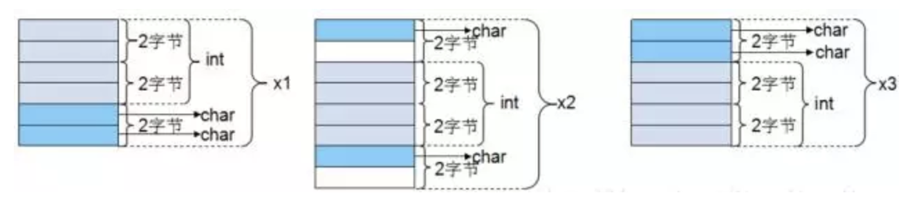

经过上面的实例分析，大家应该对内存对齐有了全面的认识和了解，在以后的编码中定义结构体时需要考虑成员变量定义的先后顺序了。

# C 中 OOP的思想

## 1. 引子

面向对象编程的特点：封装、继承、多态。

- **封装**：将数据和函数打包到类中的能力
- **继承**：基于现有类定义新类的能力，以获得重用和代码组织
- **多态**：在运行时相互替换匹配接口对象的能力

## 2. 封装

#### 2.1 封装要素

- 类的属性是由 C 结构体定义的，eg：`FILE struct`
- 类的操作由C函数定义
  - 每个函数都有一个指向该类结构的结构体指针参数，`FILE *`
  - 每个函数的命名都按照统一的通用的命名约定
- 拥有特定的初始化和去初始化函数，作为构造和析构函数，`fopen()`，`fclose()`

#### 2.1 封装实例

```c
#ifndef SHAPE_H
#define SHAPE_H

#include <stdint.h>

/* Shape's attributes... */
typedef struct {
    int16_t x; /* x-coordinate of Shape's position */
    int16_t y; /* y-coordinate of Shape's position */
} Shape;

/* Shape's operations (Shape's interface)... */
void Shape_ctor(Shape * const me, int16_t x, int16_t y);
void Shape_moveBy(Shape * const me, int16_t dx, int16_t dy);
int16_t Shape_getX(Shape const * const me);
int16_t Shape_getY(Shape const * const me);

#endif /* SHAPE_H */
#include "shape.h" /* Shape class interface */

/* constructor implementation */
void Shape_ctor(Shape * const me, int16_t x, int16_t y) {
    me->x = x;
    me->y = y;
}

/* move-by operation implementation */
void Shape_moveBy(Shape * const me, int16_t dx, int16_t dy) {
    me->x += dx;
    me->y += dy;
}

/* "getter" operations implementation */
int16_t Shape_getX(Shape const * const me) {
    return me->x;
}
int16_t Shape_getY(Shape const * const me) {
    return me->y;
}
```


- 指针`me`作为第一个参数，起到`this`指针的作用

## 3. 继承

基于现有类定义新类的能力，以获得重用和代码组织

#### 3.1 继承实现方法

1. 子类`.h`文件引用基类`.h`

2. 通过将继承的类属性结构嵌入为派生类属性结构的第一个成员

   ```c
   #ifndef RECT_H
   #define RECT_H
   
   #include "shape.h" /* the base class interface */
   
   /* Rectangle's attributes... */
   typedef struct {
       Shape super; /* <== inherits Shape */
   
       /* attributes added by this subclass... */
       uint16_t width;
       uint16_t height;
   } Rectangle;
   
   /* constructor prototype */
   void Rectangle_ctor(Rectangle * const me, int16_t x, int16_t y,
                       uint16_t width, uint16_t height);
   
   #endif /* RECT_H */
   ```


1. 子类的构造函数，第一步需要调用基类的构造函数

   ```c
   #include "rect.h"
   
   /* constructor implementation */
   void Rectangle_ctor(Rectangle * const me, int16_t x, int16_t y,
                       uint16_t width, uint16_t height)
   {
       /* first call superclass ctor */
       Shape_ctor(&me->super, x, y);
   
       /* next, you initialize the attributes added by this subclass... */
       me->width = width;
       me->height = height;
   }
   ```

2. 具体使用

   1. 实例化子类，调用构造函数

   2. 重用基类的函数，因虚调用父类的引用，可以使用以下两种方式:

      1. 因为内存中基类是位于子类的开始位置，所以可以将**基类对象强制转为父类对象**，进而使用父类的函数

         ```c
         Shape_moveBy((Shape *)&r1, -2, 3);
         1
         ```

      2. 可以利用子类实例调用父类成员，进而使用父类的函数

         ```c
         Shape_moveBy(&r2.super, 2, -1);
         1
         ```

      ```c
      int main() {
          Rectangle r1, r2; /* multiple instances of Rect */
      
          /* instantiate rectangles... */
          Rectangle_ctor(&r1, 0, 2, 10, 15);
          Rectangle_ctor(&r2, -1, 3, 5, 8);
      
          printf("Rect r1(x=%d,y=%d,width=%d,height=%d)\n",
                 Shape_getX(&r1.super), Shape_getY(&r1.super),
                 r1.width, r1.height);
          printf("Rect r2(x=%d,y=%d,width=%d,height=%d)\n",
                 Shape_getX(&r2.super), Shape_getY(&r2.super),
                 r2.width, r2.height);
      
          /* re-use inherited function from the superclass Shape... */
          Shape_moveBy((Shape *)&r1, -2, 3);
          Shape_moveBy(&r2.super, 2, -1);
      
          printf("Rect r1(x=%d,y=%d,width=%d,height=%d)\n",
                 Shape_getX(&r1.super), Shape_getY(&r1.super),
                 r1.width, r1.height);
          printf("Rect r2(x=%d,y=%d,width=%d,height=%d)\n",
                 Shape_getX(&r2.super), Shape_getY(&r2.super),
                 r2.width, r2.height);
      
          return 0;
      }
      ```

## 4. 多态

**概念**：在运行时相互替换匹配接口对象的能力

#### 4.1 [虚函数](https://so.csdn.net/so/search?q=虚函数&spm=1001.2101.3001.7020)表和虚函数指针

c++中实现多态是利用`虚函数`。在C 语言中，使用`函数指针`+`虚函数表`，构成`虚函数`，实现虚函数的机制

作为抽象接口，其不同的子类有不同的函数实现方法，需要在运行时动态根据本身的类型进行选择，如下图所示Rectangle 和 Circle 作为 Shape 的子类，其计算面积和实际绘制时有不同的方法，但是可以抽象出相同的动作，即计算面积和绘图。


```c
/* Shape.h */

/* Shape's attributes... */
struct ShapeVtbl; /* forward declaration */
typedef struct {
    struct ShapeVtbl const *vptr; /* <== Shape's Virtual Pointer */
    int16_t x; /* x-coordinate of Shape's position */
    int16_t y; /* y-coordinate of Shape's position */
} Shape;

/* Shape's virtual table */
struct ShapeVtbl {
    uint32_t (*area)(Shape const * const me);
    void (*draw)(Shape const * const me);
};

/* Shape's operations (Shape's interface)... */
...
...

static inline uint32_t Shape_area(Shape const * const me) {
    return (*me->vptr->area)(me);
}

static inline void Shape_draw(Shape const * const me) {
    (*me->vptr->draw)(me);
}
```

`Shape_area`作为虚函数，对于 Shape 的子类会有很多不同的方法，这也意味着虚函数不能像普通函数那样在链接时被解析，因为要调用的实际函数需要依赖于实例的类型（Rectangle or Circle），因此，**对虚函数的调用和实际实现之间的绑定必须在运行时发生，即`后期绑定`**（链接期间的绑定称为 早期绑定）

实际上，所有的c++ 编译器都是通过每个类的一个**虚拟表(**`vtbl`)和每个对象的一个**虚指针**(`vtpl`)，这种方法在C语言中也能实现，C 语言中虚拟表由一个函数制作作为成员的`Struct`构成

**虚指针**`vtpr`指向类中虚函数表，该指针必须存在于每个实例（对象）中，因此它必须进入类的属性结构，如示例中，使用在顶部添加的`vptr`成员来增强的 Shape 类的属性结构，值得注意的是，`vtpr`被声明为`const`，因为虚拟表不应该被更改，而且实际中在ROOM中被分配

**虚指针**`vtpr`，能够被子类继承，因此Shape的子类自动拥有该属性

#### 4.2 在构造函数中设置 `vtpr`

**虚指针**`vtpr`必须要初始化，以指向类的每个实例中对应的**虚拟表**(`vtbl`)，最为理想的地方是构造函数中，C++ 就是在构造函数中隐式设置，在C语言中必须显示地进行设置，如下示例在构造函数中进行显示的初始化`vtpr`

```c
/* Shape's prototypes of its virtual functions */
static uint32_t Shape_area_(Shape const * const me);
static void Shape_draw_(Shape const * const me);

/* constructor */
void Shape_ctor(Shape * const me, int16_t x, int16_t y) {
    static struct ShapeVtbl const vtbl = { /* vtbl of the Shape class */
        &Shape_area_,
        &Shape_draw_
     };
     me->vptr = &vtbl; /* "hook" the vptr to the vtbl */
     me->x = x;
     me->y = y;
}

/* Shape class implementations of its virtual functions... */
static uint32_t Shape_area_(Shape const * const me) {
    assert(0); /* purely-virtual function should never be called */
    return 0U; /* to avoid compiler warnings */
}

static void Shape_draw_(Shape const * const me) {
    assert(0); /* purely-virtual function should never be called */
}
```

如上所示，`vtbl`初始化为指向实现相应操作的函数，`Shape_area_`以及`Shape_draw_`

如果一个类不能提供其一些虚拟函数的合理实现（因为这是一个抽象类，如`Shape`一样），那么实现应该在内部断言，这样您至少知道，在运行的时候，调用了一个未实现的**纯虚函数**

#### 4.3 继承`vtbl`及在子类中重写`vtpr`

如果子类继承了超类，则自动拥有超类的所有的属性，通过super成员可以很好地进行。

但是，`vtpr`通常需要重新分配给特定子类的`vtbl`，对应的这个赋值需要在子类的构造函数中进行，如下是`Rectangle`类的构造函数：

```c
/* Rectangle's prototypes of its virtual functions */
/* NOTE: the "me" pointer has the type of the superclass to fit the vtable */
static uint32_t Rectangle_area_(Shape const * const me);
static void Rectangle_draw_(Shape const * const me);

/* constructor */
void Rectangle_ctor(Rectangle * const me, int16_t x, int16_t y,
                    uint16_t width, uint16_t height)
{
    static struct ShapeVtbl const vtbl = { /* vtbl of the Rectangle class */
        &Rectangle_area_,
        &Rectangle_draw_
    };
    Shape_ctor(&me->super, x, y); /* call the superclass' ctor */
    me->super.vptr = &vtbl; /* override the vptr */
    me->width = width;
    me->height = height;
}

/* Rectangle's class implementations of its virtual functions... */
static uint32_t Rectangle_area_(Shape const * const me) {
    Rectangle const * const me_ = (Rectangle const *)me; /* explicit downcast */
    return (uint32_t)me_->width * (uint32_t)me_->height;
}

static void Rectangle_draw_(Shape const * const me) {
    Rectangle const * const me_ = (Rectangle const *)me; /* explicit downcast */
    printf("Rectangle_draw_(x=%d,y=%d,width=%d,height=%d)\n",
           Shape_getX(me), Shape_getY(me), me_->width, me_->height);
}
```

需要注意的是，在子类的构造函数中，父类构造函数必须首先被调用，以此初始化继承的成员`me->super`，这个构造器将（Shape_ctor）`vptr`指向了`Shape`的`vtbl`，然而`me->super.vptr = &vtbl;` 将`vtpr`重写了，使得其指向了`Rectangle`的`vtbl`

> 子类虚函数实现必须与超类中定义的签名精确匹配（此处指声明中形参及返回类型），才能适应`vtbl`，例如，实现`rectangle_area_()`采用的`me`是`Shape*`指针而不是`Rectangle*`类的，子类在实现中必须显示的强制转换为对应的子类型

#### 4.4 虚函数调用（后期绑定）

有了`vtbl`和`vtpr`的基本搭建，虚函数的调用便能够采用下面的方式实现：

```c
uint32_t Shape_area(Shape const * const me) {
    return (*me->vptr->area)(me);
}
```

这个函数可以放在.c文件范围内，但是每个虚函数调用时，都会产生额外的函数调用开销，为了避免这种开销，可以使用`static inline`直接在.h文件中定义减少开销：

```c
static inline uint32_t Shape_area(Shape const * const me) {
    return (*me->vptr->area)(me);
}
```

或者采用宏定义的方式：

```c
#define Shape_area(me_) ((*(me_)->vptr->area)((me_)))
```

无论如何，虚函数调用是首先解引用`vtbl`来找到相应的`vtbl`，然后只通过指向函数的指针从这个`vtbl`调用适当的实现，下图给出该过程


#### 4.5 使用虚函数的实例

多态的虚拟函数允许您在子类中编写非常干净具备子类特定实现的泛型代码。此外，该代码自动支持多个子类数量，可以在长期支持泛型代码开发。

```c
#include "rect.h"   /* Rectangle class interface */
#include "circle.h" /* Circle class interface */
#include <stdio.h>  /* for printf() */

int main() {
    Rectangle r1, r2; /* multiple instances of Rectangle */
    Circle    c1, c2; /* multiple instances of Circle */
    Shape const *shapes[] = { /* collection of shapes */
        &c1.super,
        &r2.super,
        &c2.super,
        &r1.super
    };
    Shape const *s;

    /* instantiate rectangles... */
    Rectangle_ctor(&r1, 0, 2, 10, 15);
    Rectangle_ctor(&r2, -1, 3, 5, 8);

    /* instantiate circles... */
    Circle_ctor(&c1, 1, -2, 12);
    Circle_ctor(&c2, 1, -3, 6);

    s = largestShape(shapes, sizeof(shapes)/sizeof(shapes[0]));
    printf("largetsShape s(x=%d,y=%d)\n",
           Shape_getX(s), Shape_getY(s));

    drawAllShapes(shapes, sizeof(shapes)/sizeof(shapes[0]));

    return 0;
}
```

## 5 小结

`OOP`属于设计方法而不是使用特定的语言或者工具，本文描述了如何在C语言中实现封装、继承、多态的概念。

封装和继承实现起来非常简单，而不增加任何额外的成本或者开销。

多态也能够在其中进行使用，但是想要大规模使用多态概念，还是迁移到C++中较好，但如果想构建实时库，c中oop的复杂性可以局限于库，并且可以有效对开发人员进行隐藏