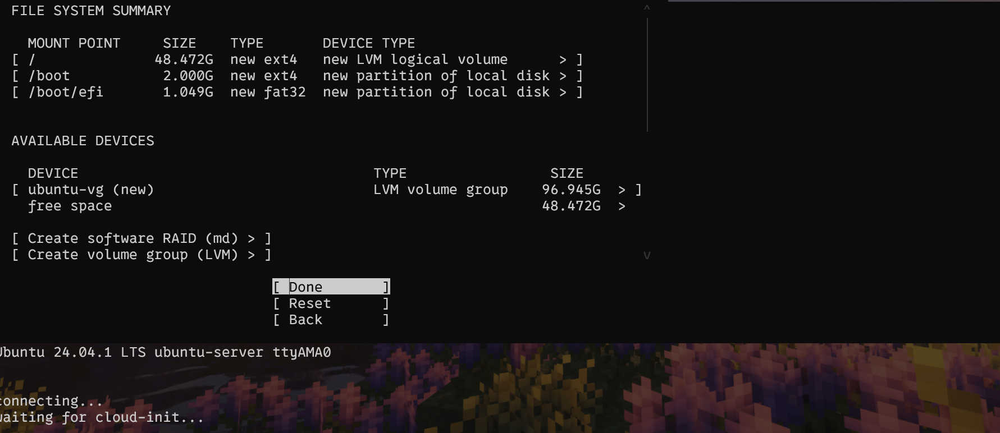

# 配置一份ARM学习环境

## 前言

​	在聊汇编之前，我们需要知道的是：汇编跟计算机体系架构是高度相关的：

> 现代计算机指令集分为四种：CISC，RISC，EPIC和VLIW

​	我们现在经常打交道的是RISC，请各位记住他的一些特点：

1. **简化的指令集**：RISC处理器使用较少的指令，指令集设计简单，通常每条指令长度相同。
2. **固定长度的指令**：大多数RISC架构使用固定长度的指令（如32位），这使得取指和解码更高效。
3. **大量寄存器**：RISC架构通常拥有更多的通用寄存器，以减少对内存的访问，提高数据处理速度。
4. **单周期执行**：许多RISC指令设计为在一个时钟周期内完成，提高了指令的执行效率。
5. **Load/Store架构**：RISC架构通常采用Load/Store模型，即数据运算只能在寄存器间进行，内存访问仅通过加载和存储指令进行。
6. **硬件和编译器的优化**：RISC架构强调编译器的优化，使得软件和硬件的配合更为高效。
7. **简化的寻址模式**：RISC的寻址模式通常比较简单，这有助于提高指令的解析速度。

​	当然，ARM自身还有区别于原生RISC指令集的一些特点：

1. ARM有桶型移位寄存器，单周期完成数据的移位操作
2. 对于ARM而言，我们需要不幸的修正第四条：不是所有的指令都能单周期完成
3. ARM有16位 THUMB指令集，是32位指令集的压缩形式。
4. 条件执行：通过指令的组合减少分叉，提高代码密度
5. DSP，SIMD/NEON指令

## 配置一份简单的ARM虚拟机环境

### 前置准备

​	下面我们将会配置一份简单的ARM虚拟环境。笔者本来是想用VMWare的，但是该虚拟机软件不支持跨平台模拟架构。只好作罢转向QEMU。笔者这里整理了如下方案。

> 1. 在Host操作系统上安装QEMU虚拟机
> 2. 目标的操作系统使用ubuntu-server-arm64作为目标发行版

​	笔者空间大，对软件的执行速度没有太大需求，决定在笔者的机械外置硬盘上安装虚拟机。

> Ubuntu-server-arm64:https://cdimage.ubuntu.com/releases/24.04/release/ubuntu-24.04.1-live-server-arm64.iso
>
> QEMU：https://qemu.weilnetz.de/w64/2024/qemu-w64-setup-20240423.exe
>
> UEFI补丁：[Linaro Releases](https://releases.linaro.org/components/kernel/uefi-linaro/16.02/release/qemu64/)下载：[QEMU_EFI.fd](https://releases.linaro.org/components/kernel/uefi-linaro/16.02/release/qemu64/QEMU_EFI.fd)

上述软件可能不是最新的，请有最新需求的各位看官前往官网下载：

- [QEMU for Windows – Installers (64 bit) (weilnetz.de)](https://qemu.weilnetz.de/w64/)
- Ubuntu ARM https://cdimage.ubuntu.com/releases
- [Linaro Releases](https://releases.linaro.org/components/kernel/uefi-linaro/16.02/release/qemu64/)

​	安装结束后，你可以选择将QEMU的应用目录添加到环境变量中！这样操作方便一些。笔者选择了添加到环境变量中。

### 准备虚拟磁盘文件 + 安装脚本

​	从此步开始，请将准备好一块位置足够大的地方

​	笔者这里已经将QEMU的应用路径放到了环境变量中，我们直接使用QEMU-IMG生成一份虚拟磁盘文件。笔者由于空间充足，决定分配100G的硬存。所以，办法是：

```
qemu-img create -f qcow2 ubuntu_hd.qcow2 100G
```

> 指令的基本格式是：qemu-img create -f qcow2 硬盘文件名称 大小

​	现在，我们可以开始编写一份简单的安装脚本了

> installs.ps1

```
qemu-system-aarch64.exe -m 8192 -cpu cortex-a72 -smp 8,sockets=4,cores=2 -M virt -bios QEMU_EFI.fd -device VGA -device nec-usb-xhci -device usb-mouse -device usb-kbd -drive if=none,file=ubuntu_hd.qcow2,id=hd0 -device virtio-blk-device,drive=hd0 -drive if=none,file=ubuntu-24.04.1-live-server-arm64.iso,id=cdrom,media=cdrom -device virtio-scsi-device -device scsi-cd,drive=cdrom  -net nic -net user,hostfwd=tcp::2222-:22 -nographic
```

​	请注意，所有涉及到文件的事情别偷懒，改成自己的文件的路径名称（绝对的或者相对的）。感谢chatgpt，至少我可偷懒了：

- `-m 8192`：分配 8GB 的内存。
- `-cpu cortex-a72`：使用 Cortex-A72 处理器（是的，我玩的Linux开发板的处理器）。
- `-smp 8,sockets=4,cores=2`：配置 8 个处理器线程，4 个插槽，每个插槽 2 个核心。
- `-M virt`：使用虚拟机器类型。
- `-bios QEMU_EFI.fd`：指定 UEFI BIOS 文件。
- `-device VGA`：添加 VGA 图形设备。
- `-device nec-usb-xhci`：添加 USB 3.0 控制器。
- `-device usb-mouse` 和 `-device usb-kbd`：添加 USB 鼠标和键盘。
- `-drive if=none,file=ubuntu_hd.qcow2,id=hd0`：定义一个名为 `hd0` 的虚拟硬盘，文件为 `ubuntu_hd.qcow2`。
- `-device virtio-blk-device,drive=hd0`：将 `hd0` 作为 VirtIO 块设备添加。
- `-drive if=none,file=ubuntu-24.04.1-live-server-arm64.iso,id=cdrom,media=cdrom`：定义一个名为 `cdrom` 的虚拟光驱，文件为 `ubuntu-24.04.1-live-server-arm64.iso`。
- `-device virtio-scsi-device`：添加 VirtIO SCSI 控制器。
- `-device scsi-cd,drive=cdrom`：将 `cdrom` 作为 SCSI CD-ROM 添加。
- `-net nic` 和 `-net user,hostfwd=tcp::2222-:22`：配置网络，允许通过主机的 2222 端口转发到虚拟机的 22 端口。
- -nographic 这个事情可选可不选，笔者不太喜欢QEMU的窗口，不如重定向到自己的终端


​	还有其他的参数，请看官自行查阅document研究了

### 配置安装


​	允许脚本，起手GRUB引导。我们单击回车，开屏就是刷必要的日志。值得注意的是，因为我们分配的内存硬存等肯定不如真实机器，启动显然会慢一些。

​	会刷一大堆日志，感兴趣的朋友可以复制一份日志研究！


​	笔者这里等待cloud-init一段时间，可以泡杯茶休息一下。


​	终于进来了！笔者选择Basic Mode，想尝试的朋友可以选择Rich Mode（我安过依次，觉得没多rich(((( ）


​	笔者不追求新，也不太想浪费时间，选择不更新 :)


​	请根据自己喜欢的语言选，笔者选择英语（问就是英语水平过关）


​	笔者选择了第一个，因为我们需要登录进入进行学习，所以不给自己添加麻烦。


​	继续选择第一个（我们配置的穿透网卡）


​	我们不需要代理，直接走下一个！（需要穿透代理的朋友自行寻找解决方案，不过我们是虚拟机，直接转发流量出来的）

​	下一个是测试源，我们不需要担心，配置好了的穿透网卡。我们只需要保证我们能上网就行！（不截图了）

​	下一步是询问我们要不要使用整个磁盘，老规矩虚拟机直接梭哈，直接Done就完事



​	我们看看，这是没有问题的，直接下一个然后（注意这是最后的修改机会！再三确认好了再点！）选择Continue


​	我们定义好名称名称，当然主机名，用户名和密码自己设置。


​	我跑路了，没必要（


​	注意这里安装SSH，这样我们才能连到ssh上进行开发。（如果你没需要就算了）

​	后面还会需要问你要不要下载一些常见的服务器包，我们不需要，写个汇编测试而已，哈哈。现在你可以去忙别的事情，或者你选中View Full Log发呆。


​	到这里完事，选择reboot重启，等到内核再次开机！ 


​	发现长时间卡在这里记得敲Enter键激活下，然后输入账号密码，现在就OK了！


```
sudo apt install build-essential
```

​	下载一些基本的组件就OK了。

### 测试一个Hello world以及 file 一下我们的输出文件

​	笔者的这个发行版已经安装了vim，所以可以直接用来写hello,world.c了。

```
charliechen@charliechen:~$ mkdir learn
charliechen@charliechen:~$ cd learn/
charliechen@charliechen:~/learn$ ls
charliechen@charliechen:~/learn$ vim test.c
```

​	代码和编译的过程在这里

```
charliechen@charliechen:~/learn$ cat test.c
#include <stdio.h>

int main(){
        printf("Hello, world\n");
        return 0;
}
charliechen@charliechen:~/learn$ gcc test.c -o test
charliechen@charliechen:~/learn$ ./test
Hello, world
```

```
charliechen@charliechen:~/learn$ file test
test: ELF 64-bit LSB pie executable, ARM aarch64, version 1 (SYSV), dynamically linked, interpreter /lib/ld-linux-aarch64.so.1, BuildID[sha1]=5260dfece2cfef3baa8dc364311cc3d2f7aad62f, for GNU/Linux 3.7.0, not stripped
```

