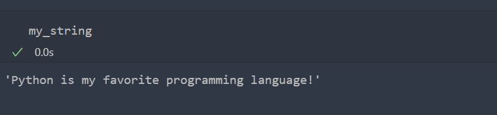
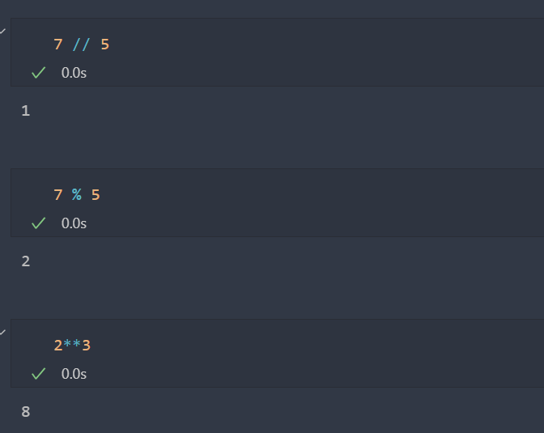
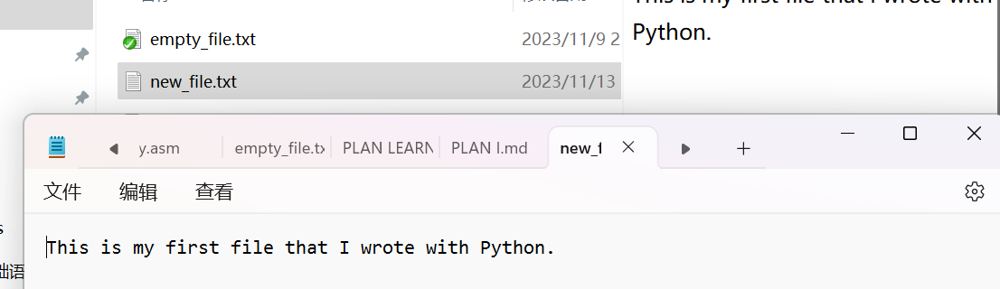

# Python3基础操作

## 字符串

​		在Python3中，直接将程序语言中的字符串赋值给目标变量即可：

```
my_string = "Python is my favorite programming language!"
```

​		我们调试，就会发现这个变量里存储的就是我们想要的字符串了：



```python
type(my_string)
```

​		查看类型发现：str（string的缩写）

​		使用len()方法查看字符串长度：

```python
len(my_string)	
```

```
>> 43
```

​		编程时，遵守PEP8的规定：那就是每行尽可能的不要超过80个字符，Python会将直接邻接的字符串拼接在一起。你看：

```Python
long_story = (
    "Lorem ipsum dolor sit amet, consectetur adipiscing elit."
    "Pellentesque eget tincidunt felis. Ut ac vestibulum est."
    "In sed ipsum sit amet sapien scelerisque bibendum. Sed "
    "sagittis purus eu diam fermentum pellentesque."
)
long_story
```

```Python
'Lorem ipsum dolor sit amet, consectetur adipiscing elit.Pellentesque eget tincidunt felis. Ut ac vestibulum est.In sed ipsum sit amet sapien scelerisque bibendum. Sed sagittis purus eu diam fermentum pellentesque.'
```

​		下面介绍`str.repleace()`方法，如果不清楚如何使用，可以尝试方法help，他可以返回该函数的参数说明与使用方法：

```
my_string.replace("a", "?")
print(my_string)
```

​		你会发现没有更改，这是因为他并不会直接更改对象本身，而是返回一个拷贝对象回来！

```
Python is my favorite programming language!
```

​		所以，我们需要使用一个全新的变量来拷贝之！

```
my_modified_string = my_string.replace("is", "will be")
print(my_modified_string)
```

```
Python will be my favorite programming language!
```

​		当然，这里引入一个小插曲，那就是在print函数中，想要像C语言那样，支持函数使用变量替换的话，是采用

```
{Var_Name}
```

的方式，比如说：

```
first_name = "Charlie"
last_name = "Chen"
age = 114514
print(f"My name is {first_name} {last_name}, you can call me {first_name}.")
print(f"I'm {age} years old.")
```

```
My name is Charlie Chen, you can call me Charlie.
I'm 114514 years old.
```

​		也可以这样搞：

```
print(f"Use '=' to also print the variable name like this: {age=}")
```

```
Use '=' to also print the variable name like this: age=114514
```

​		但我觉得奇怪，不建议。

​		字符串的拼接如下：

```python
str.join()
```

​		老规矩，看看看看帮助手册：

```
Help on method_descriptor:

join(self, iterable, /)
    Concatenate any number of strings.
    
    The string whose method is called is inserted in between each given string.
    The result is returned as a new string.
    
    Example: '.'.join(['ab', 'pq', 'rs']) -> 'ab.pq.rs'
```

​		试试看：

```
pandas = "pandas"
numpy = "numpy"
requests = "requests"
cool_python_libs = ", ".join([pandas, numpy, requests])
cool_python_libs
```

```
'pandas, numpy, requests'
```

​		字符串有一些关于大小写的快速操作，可以一览：

```
str.upper(), str.lower(), str.title()
```

​		第一个是转为全大写：

```
mixed_case = "PyTHoN hackER"
UPPER = mixed_case.upper()
UPPER
```

```
'PYTHON HACKER'
```

​		下面这个是转成全小写

```
LOWER = mixed_case.lower()
LOWER
```

```
'python hacker'
```

​		下面这个则是转化成标准的首字母大写形式：

```
TITLE = mixed_case.title()
TITLE
```

```
'Python Hacker'
```

>  `str.strip()`

​		这个函数整理了字符串前导和后导中多余的字符串，返回一个干净整洁的字符串！

```
Help on method_descriptor:

strip(self, chars=None, /)
    Return a copy of the string with leading and trailing whitespace removed.
    
    If chars is given and not None, remove characters in chars instead.
```

```
ugly_formatted = " \n \t Some story to tell "
stripped = ugly_formatted.strip()

print(f"ugly: {ugly_formatted}")
print(f"stripped: {stripped}")
```

```
ugly:  
 	 Some story to tell 
stripped: Some story to tell
```

> `str.split`

​		字符串的分割操作：

```
Help on method_descriptor:

split(self, /, sep=None, maxsplit=-1)
    Return a list of the substrings in the string, using sep as the separator string.
    
      sep
        The separator used to split the string.
    
        When set to None (the default value), will split on any whitespace
        character (including \\n \\r \\t \\f and spaces) and will discard
        empty strings from the result.
      maxsplit
        Maximum number of splits (starting from the left).
        -1 (the default value) means no limit.
    
    Note, str.split() is mainly useful for data that has been intentionally
    delimited.  With natural text that includes punctuation, consider using
    the regular expression module.
```

```
sentence = "three different words"
words = sentence.split()
print(words)
```

```
['three', 'different', 'words']
```

​		分割后的字符串将会是以列表的形式返回的！

​		我们知道，这些函数被设计成为返回的对象是有意义的，我们可以对之进行连等操作！

```
ugly_mixed_case = "   ThIS LooKs BAd "
pretty = ugly_mixed_case.strip().lower().replace("bad", "good")
print(pretty)
```

```
this looks good
```

​		注意，我们的执行操作不可以乱序，必须是从左到右的！

## 数字类型

### Int

​		int是integer的意思

```
my_int = 6
print(f"value: {my_int}, type: {type(my_int)}")
```

```
value: 6, type: <class 'int'>
```

### Float

​		Float是浮点数的意思。

```
my_float = float(my_int)
print(f"value: {my_float}, type: {type(my_float)}")
```

```
value: 6.0, type: <class 'float'>
```

​		值得一提的是，我们的整数相除的产生返回类型就是浮点数！

```
print(1 / 1)
print(6 / 5)
```

​		当然，我们必须注意的是，在Python中会出现效数的浮点误差，由此，我们在判断相等的时候有必要警示：不可以使用`==`判定浮点数的相等！

```
val = 0.1 + 0.1 + 0.1
print(val == 0.3)
print(val)
```

```
False
0.30000000000000004
```

​		那么，难道就没有办法了嘛？错误的，使用Decomal库下的Decimal方法就可以：

```
from_float = Decimal(0.1)
from_str = Decimal("0.1")
print(f"from float: {from_float}\nfrom string: {from_str}")
```

```
my_decimal = Decimal("0.1")
sum_of_decimals = my_decimal + my_decimal + my_decimal
print(sum_of_decimals == Decimal("0.3"))
```

```
from float: 0.1000000000000000055511151231257827021181583404541015625
from string: 0.1
True
```

​		这是其他的一些常见的运算符：

```
Floor division //, modulus %, power **
```



​		

## 条件

​		下面先介绍条件类型：我们知道，Python语言的真假属于布尔类型：

```
print(f"type of True and False: {type(True)}")
```

```
type of True and False: <class 'bool'>
```

```C++
print(f"0: {bool(0)}, 1: {bool(1)}")
print(f"empty list: {bool([])}, list with values: {bool(['woop'])}")
print(f"empty dict: {bool({})}, dict with values: {bool({'Python': 'cool'})}")
```

​		原生的数据集合下，空的容器都将会是假的，反之为真，可以这样判断容器内是否有元素

​		条件比较运算符有下面几个：==, !=, >, <, >=, <=

```
print(f"{1 == 0}")
print(f"{1 != 0}")
print(f"{1 > 0}")
print(f"{1 > 1}")
print(f"{1 < 0}")
print(f"{1 < 1}")
print(f"{1 >= 0}")
print(f"{1 >= 1}")
print(f"{1 <= 0}")
print(f"{1 <= 1}")
```

```
False
True
True
False
False
False
True
True
False
True
```

​		意思不言而喻，我就不多加解释了。

​		不过Python支持连续解析运算符：

```
print(f"{2 <= 3 <= 4}")
```

```
True
```

​		我们可以使用and运算符表示逻辑和

```
python_is_cool = True
java_is_cool = False
empty_list = []
secret_value = 3.14
```

```
print(f"Python and java are both cool: {python_is_cool and java_is_cool}")
print(f"secret_value and python_is_cool: {secret_value and python_is_cool}")
```

```
Python and java are both cool: False
secret_value and python_is_cool: True
```

​		or表示逻辑或

```
print(f"Python or java is cool: {python_is_cool or java_is_cool}")
print(f"{1 >= 1.1 or 2 < 1.4}")
```

```
Python or java is cool: True
False
```

​		not表示逻辑非

```
print(f"Java is not cool: {not java_is_cool}")
```

​		可以组合之：

```
print(bool(not java_is_cool or secret_value and python_is_cool or empty_list))
print(bool(not (java_is_cool or secret_value and python_is_cool or empty_list)))
```

```
True
False
```

​		下面，我们讲条件结构

### if

```
statement = True
if statement:
    print("statement is True")

if not statement:
    print("statement is not True")
```

```
statement is True
```

```
empty_list = []
# With if and elif, conversion to `bool` is implicit
if empty_list:
    print("empty list will not evaluate to True")  # this won't be executed
```

```
val = 3
if 0 <= val < 1 or val == 3:
    print("Value is positive and less than one or value is three")
```

```
Value is positive and less than one or value is three
```

### if-else结构

```
my_dict = {}
if my_dict:
    print("there is something in my dict")
else:
    print("my dict is empty :(")
```

```
my dict is empty :(
```

### if-elif-else

```
val = 88
if val >= 100:
    print("value is equal or greater than 100")
elif val > 10:
    print("value is greater than 10 but less than 100")
else:
    print("value is equal or less than 10")
```

​		elif可以有很多！

```
greeting = "Hello fellow Pythonista!"
language = "Italian"

if language == "Swedish":
    greeting = "Hejsan!"
elif language == "Finnish":
    greeting = "Latua perkele!"
elif language == "Spanish":
    greeting = "Hola!"
elif language == "German":
    greeting = "Guten Tag!"

print(greeting)
```

## 列表

​		使用`[]`创建一个空的列表！

```
my_empty_list = []
print(f"empty list: {my_empty_list}, type: {type(my_empty_list)}")
```

```
empty list: [], type: <class 'list'>
```

```
list_of_ints = [1, 2, 6, 7]
list_of_misc = [0.2, 5, "Python", "is", "still fun", "!"]
print(f"lengths: {len(list_of_ints)} and {len(list_of_misc)}")
```

​		使用len方法查阅列表的长度

​		像其他程序语言一样，我们支持`[int]`方式访问元素

```
my_list = ["Python", "is", "still", "cool"]
print(my_list[0])
print(my_list[3])
```

```
Python
cool
```

​		还支持`[][]`的复合下标访问。

```
coordinates = [[12.0, 13.3], [0.6, 18.0], [88.0, 1.1]]  # two dimensional
print(f"first coordinate: {coordinates[0]}")
print(f"second element of first coordinate: {coordinates[0][1]}")
```

```
first coordinate: [12.0, 13.3]
second element of first coordinate: 13.3
```

​		可以对列表使用下标取出元素后直接更改之：

```
my_list = [0, 1, 2, 3, 4, 5]
my_list[0] = 99
print(my_list)

# remove first value
del my_list[0]
print(my_list)
```

```
[99, 1, 2, 3, 4, 5]
[1, 2, 3, 4, 5]
```

​		我们使用in + 逻辑判断来查阅元素是否在列表当中：

```
languages = ["Java", "C++", "Go", "Python", "JavaScript"]
if "Python" in languages:
    print("Python is there!")
```

```
Python is there!
```

```
if 6 not in [1, 2, 3, 7]:
    print("number 6 is not present")
```

```
number 6 is not present
```

​		注意，我们的列表一改尽改，也就是说，当我们使用 = 传递列表的时候，他们本质上指向的是同一个列表！

```
original = [1, 2, 3]
modified = original
modified[0] = 99
print(f"original: {original}, modified: {modified}")
```

```
original: [99, 2, 3], modified: [99, 2, 3]
```

​		所以，想要保留原表，只需要我们手动调用构造方法：

```
original = [1, 2, 3]
modified = list(original)  # Note list()
# Alternatively, you can use copy method
# modified = original.copy()
modified[0] = 99
print(f"original: {original}, modified: {modified}")
```

```
original: [1, 2, 3], modified: [99, 2, 3]
```

​		列表还有许多其他好用的方法

#### 追加元素：list.append

```
my_list = [1]
my_list.append("ham")
print(my_list)
```

```
[1, 'ham']
```

#### 移除元素: list.remove

```
my_list = ["Python", "is", "sometimes", "fun"]
my_list.remove("sometimes")
print(my_list)

# If you are not sure that the value is in list, better to check first:
if "Java" in my_list:
    my_list.remove("Java")
else:
    print("Java is not part of this story.")
```

```
['Python', 'is', 'fun']
Java is not part of this story.
```

#### 整理元素: list.sort

```
numbers = [8, 1, 6, 5, 10]
numbers.sort()
print(f"numbers: {numbers}")

numbers.sort(reverse=True)
print(f"numbers reversed: {numbers}")

words = ["this", "is", "a", "list", "of", "words"]
words.sort()
print(f"words: {words}")
```

```
numbers: [1, 5, 6, 8, 10]
numbers reversed: [10, 8, 6, 5, 1]
words: ['a', 'is', 'list', 'of', 'this', 'words']
```

​		上面的方法改变链表本身，我们用sorted方法直接干处一个新表而保留原表

```
numbers = [8, 1, 6, 5, 10]
sorted_numbers = sorted(numbers)
print(f"{numbers=}, {sorted_numbers=}")
```

```
numbers=[8, 1, 6, 5, 10], sorted_numbers=[1, 5, 6, 8, 10]
```

#### 延长列表：list.extend

```
first_list = ["beef", "ham"]
second_list = ["potatoes", 1, 3]
first_list.extend(second_list)
print(f"{first_list=}, {second_list=}")
```

```
first_list=['beef', 'ham', 'potatoes', 1, 3], second_list=['potatoes', 1, 3]
```

​		当然，另一个更有趣的方法是：

```
first = [1, 2, 3]
second = [4, 5]
first += second  # same as: first = first + second
print(f"{first=}")
```

```
first=[1, 2, 3, 4, 5]
```

#### 反转列表：list.reverse

```
my_list = ["a", "b", "ham"]
my_list.reverse()
print(my_list)
```

```
['ham', 'b', 'a']
```

## 字典（哈希表）

​		他是一对键值对的集合，我们如下创建一个空字典

```
my_empty_dict = {}  # alternative: my_empty_dict = dict()
print(f"dict: {my_empty_dict}, type: {type(my_empty_dict)}")
```

```
dict: {}, type: <class 'dict'>
```

​		初始化的时候，可以采用下面两个方式：

```
dict1 = {"value1": 1.6, "value2": 10, "name": "John Doe"}
dict2 = dict(value1=1.6, value2=10, name="John Doe")

print(dict1)
print(dict2)

print(f"equals: {dict1 == dict2}")
print(f"length: {len(dict1)}")
```

```
{'value1': 1.6, 'value2': 10, 'name': 'John Doe'}
{'value1': 1.6, 'value2': 10, 'name': 'John Doe'}
equals: True
length: 3
```

​		查看键，值，键值对可以使用

```
print(f"keys: {dict1.keys()}")
print(f"values: {dict1.values()}")
print(f"items: {dict1.items()}")
```

```
keys: dict_keys(['value1', 'value2', 'name'])
values: dict_values([1.6, 10, 'John Doe'])
items: dict_items([('value1', 1.6), ('value2', 10), ('name', 'John Doe')])
```

​		想要修改值的话，采用`[key] = value`的方法，注意，如果原来不存在的话，则会插入一个全新的键值对，如果存在了，则会修改原来的值：

```
my_dict = {}
my_dict["key1"] = "value1"
my_dict["key2"] = 99
my_dict["key1"] = "new value"  # overriding existing value
print(my_dict)
print(f"value of key1: {my_dict['key1']}")
```

```
{'key1': 'new value', 'key2': 99}
value of key1: new value
```

​		当然，访问一个不存在的键值对则会报错！这个时刻警惕，所以需要先检查再访问。

​		删除键值对直接使用del方法即可：

```
my_dict = {"key1": "value1", "key2": 99, "keyX": "valueX"}
del my_dict["keyX"]
print(my_dict)

# Usually better to make sure that the key exists (see also pop() and popitem())
key_to_delete = "my_key"
if key_to_delete in my_dict:
    del my_dict[key_to_delete]
else:
    print(f"{key_to_delete} is not in {my_dict}")
```

```
{'key1': 'value1', 'key2': 99}
my_key is not in {'key1': 'value1', 'key2': 99}
```

​		跟列表类似的，直接 = 赋值本质上指向的是同一个字典：

```
my_dict = {"ham": "good", "carrot": "semi good"}
my_other_dict = my_dict
my_other_dict["carrot"] = "super tasty"
my_other_dict["sausage"] = "best ever"
print(f"{my_dict=}\nother: {my_other_dict}")
print(f"equals: {my_dict == my_other_dict}")
```

```
my_dict={'ham': 'good', 'carrot': 'super tasty', 'sausage': 'best ever'}
other: {'ham': 'good', 'carrot': 'super tasty', 'sausage': 'best ever'}
equals: True
```

​		所以可以人为的构造一个新的：

```
my_dict = {"ham": "good", "carrot": "semi good"}
my_other_dict = dict(my_dict)
my_other_dict["beer"] = "decent"
print(f"{my_dict=}\nother: {my_other_dict}")
print(f"equals: {my_dict == my_other_dict}")
```

​		回到：访问一个不存在的键会报错这里，我们一般更加会使用 dict.get方法，因为当元素不存在的时候，他会返回一个空值！

```
my_dict = {"a": 1, "b": 2, "c": 3}
value_of_d = my_dict.get("d")
print(f"d: {value_of_d}")

value_of_d = my_dict.get("d", "my default value")
print(f"d: {value_of_d}")
```

```
d: None
d: my default value
```

​		删除键值对我们建议使用pop方法，因为删除了一个不存在的键值对不会抛出异常

```
my_dict = dict(food="ham", drink="beer", sport="football")
print(f"dict before pops: {my_dict}")

food = my_dict.pop("food")
print(f"food: {food}")
print(f"dict after popping food: {my_dict}")

food_again = my_dict.pop("food", "default value for food")
print(f"food again: {food_again}")
print(f"dict after popping food again: {my_dict}")
```

​		而是会返回none或者是程序员指定的值：

```
dict before pops: {'food': 'ham', 'drink': 'beer', 'sport': 'football'}
food: ham
dict after popping food: {'drink': 'beer', 'sport': 'football'}
food again: default value for food
dict after popping food again: {'drink': 'beer', 'sport': 'football'}
```

`dict.setdefault()`首先设定了可能出现的键的默认值，当键还没被初始化的时候，访问之返回默认的值：

```
my_dict = {"a": 1, "b": 2, "c": 3}
a = my_dict.setdefault("a", "my default value")
d = my_dict.setdefault("d", "my default value")
print(f"a: {a}\nd: {d}\nmy_dict: {my_dict}")
```

```
a: 1
d: my default value
my_dict: {'a': 1, 'b': 2, 'c': 3, 'd': 'my default value'}
```

`dict.update()`允许我们合并字典。

```
dict1 = {"a": 1, "b": 2}
dict2 = {"c": 3}
dict1.update(dict2)
print(dict1)

# If they have same keys:
dict1.update({"c": 4})
print(dict1)
```

```
{'a': 1, 'b': 2, 'c': 3}
{'a': 1, 'b': 2, 'c': 4}
```

​		注意，键本身不可是可变类型，也就是说，不可以使用列表和字典来作为键。

```
good_dict = {"my key": ["Python", "is", "still", "cool"]}
print(good_dict)
```

```
{'my key': ['Python', 'is', 'still', 'cool']}
```

## for循环

​		下面我们介绍for循环。

```
my_list = [1, 2, 3, 4, "Python", "is", "neat"]
for item in my_list:
    print(item)
```

```
1
2
3
4
Python
is
neat
```

​		这个老生常谈了，大家都很熟悉。

​		我们使用 break 来终止循环。

```
for item in my_list:
    if item == "Python":
        break
    print(item)
```

```
1
2
3
4
```

​		当我们的代码执行continue的时候，他会跳回循环开始的地方，而不执行下面的代码。

```
for item in my_list:
    if item == 1:
        continue
    print(item)
```

```
2
3
4
Python
is
neat
```

​		enumerate() 函数用于将一个可遍历的数据对象(如列表、元组或字符串)组合为一个索引序列，同时列出数据和数据下标，一般用在 for 循环当中。

```
for idx, val in enumerate(my_list):
    print(f"idx: {idx}, value: {val}")
```

```
idx: 0, value: 1
idx: 1, value: 2
idx: 2, value: 3
idx: 3, value: 4
idx: 4, value: Python
idx: 5, value: is
idx: 6, value: neat
```

​		注意，遍历字典我们只看键：

```
my_dict = {"hacker": True, "age": 72, "name": "John Doe"}
for val in my_dict:
    print(val)
```

```
hacker
age
name
```

​		想要拿到键值对，还得是使用dict.item方法。

```
for key, val in my_dict.items():
    print(f"{key}={val}")
```

```
hacker=True
age=72
name=John Doe
```

​		对于数字，我们使用range可以快速的得到等差数列：

```Python
for number in range(5):
    print(number)
print("_")
for number in range(2, 5):
    print(number)
print("_")
for number in range(0, 10, 2):  # last one is step
    print(number)    
```

```
0
1
2
3
4
_
2
3
4
_
0
2
4
6
8
```

## 函数

​		我们下面来看函数的概念。

```
def my_first_function():
    print("Hello world!")


print(f"type: {type(my_first_function)}")

my_first_function()  # Calling a function
```

```
type: <class 'function'>
Hello world!
```

​		这个我相信大家并不陌生。函数可以理解为封装起来的程序小模块，让我们的程序更加的模块化。

​		函数当然支持传递参数和返回值：

```
def greet_us(name1, name2):
    print(f"Hello {name1} and {name2}!")


greet_us("John Doe", "Superman")
```

```
Hello John Doe and Superman!
```

```
# Function with return value
def strip_and_lowercase(original):
    modified = original.strip().lower()
    return modified

uggly_string = "  MixED CaSe "
pretty = strip_and_lowercase(uggly_string)
print(f"pretty: {pretty}")
```

```
pretty: mixed case
```

​		Python中显示的支持通过告知参数名=值的方式对应的传值。

```
def my_fancy_calculation(first, second, third):
    return first + second - third


print(my_fancy_calculation(3, 2, 1))

print(my_fancy_calculation(first=3, second=2, third=1))

# With keyword arguments you can mix the order
print(my_fancy_calculation(third=1, first=3, second=2))

# You can mix arguments and keyword arguments but you have to start with arguments
print(my_fancy_calculation(3, third=1, second=2))
```

```
4
4
4
4
```

​		我们当然支持默认参数值，也就是说，当我们啥也不传递的时候，就会采用默认值。

```
def create_person_info(name, age, job=None, salary=300):
    info = {"name": name, "age": age, "salary": salary}

    # Add 'job' key only if it's provided as parameter
    if job:
        info.update(dict(job=job))

    return info

person1 = create_person_info("John Doe", 82)  # use default values for job and salary
person2 = create_person_info("Lisa Doe", 22, "hacker", 10000)
print(person1)
print(person2)
```

```
{'name': 'John Doe', 'age': 82, 'salary': 300}
{'name': 'Lisa Doe', 'age': 22, 'salary': 10000, 'job': 'hacker'}
```

​		另外，不建议使用变化类型作为默认参数

```
def append_if_multiple_of_five(number, magical_list=[]):
    if number % 5 == 0:
        magical_list.append(number)
    return magical_list
    
    
print(append_if_multiple_of_five(100))
print(append_if_multiple_of_five(105))
print(append_if_multiple_of_five(123))
print(append_if_multiple_of_five(123, []))
print(append_if_multiple_of_five(123))
```

```
[100]
[100, 105]
[100, 105]
[]
[100, 105]
```

​		这样是良好的：

```
def append_if_multiple_of_five(number, magical_list=None):
    if not magical_list:
        magical_list = []
    if number % 5 == 0:
        magical_list.append(number)
    return magical_list


print(append_if_multiple_of_five(100))
print(append_if_multiple_of_five(105))
print(append_if_multiple_of_five(123))
print(append_if_multiple_of_five(123, []))
print(append_if_multiple_of_five(123))
```

```
[100]
[105]
[]
[]
[]
```

​		说明字符串可以良好的帮助我们理解函数的作用：

```
def print_sum(val1, val2):
    """Function which prints the sum of given arguments."""
    print(f"sum: {val1 + val2}")


print(help(print_sum))
```

```
Help on function print_sum in module __main__:

print_sum(val1, val2)
    Function which prints the sum of given arguments.

None
```

```
def calculate_sum(val1, val2):
    """This is a longer docstring defining also the args and the return value.

    Args:
        val1: The first parameter.
        val2: The second parameter.

    Returns:
        The sum of val1 and val2.

    """
    return val1 + val2


print(help(calculate_sum))
```

```
Help on function calculate_sum in module __main__:

calculate_sum(val1, val2)
    This is a longer docstring defining also the args and the return value.
    
    Args:
        val1: The first parameter.
        val2: The second parameter.
    
    Returns:
        The sum of val1 and val2.

None
```

​		pass语句是空语句，现在几乎不用了，只是起到了一种占位的作用

## 文件IO

​		我们尝试一下使用路径：

```
from pathlib import Path
# 当前文件位置
current_file = Path("file_io.ipynb").resolve()
print(f"current file: {current_file}")
# Note: in .py files you can get the path of current file by Path(__file__)
# 目录位置
current_dir = current_file.parent
print(f"current directory: {current_dir}")

data_dir = current_dir.parent / "data"
print(f"data directory: {data_dir}")
```

```
current file: C:\Desktop\learn-python3\notebooks\beginner\notebooks\file_io.ipynb
current directory: C:\Desktop\learn-python3\notebooks\beginner\notebooks
data directory: C:\Desktop\learn-python3\notebooks\beginner\data
```

​		当然，使用exist方法检查文件是否存在，使用is_file和is_dir方法检查是文件还是目录：

```
print(f"exists: {data_dir.exists()}")
print(f"is file: {data_dir.is_file()}")
print(f"is directory: {data_dir.is_dir()}")
```

```
exists: True
is file: False
is directory: True
```

​		读取文件，先使用open函数打开后，就可以进行操作了。我们强烈建议使用with open结构，他将会在最末尾隐式的调用close函数关闭文件，而当使用非with open结构的时候则需要我们程序员显式的调用。

```
file_path = data_dir / "simple_file.txt"

with open(file_path) as simple_file:
    for line in simple_file:
        print(line.strip())
```

```
First line
Second line
Third
And so the story goes!
```

​		对于写文件，调用写函数：

```
new_file_path = data_dir / "new_file.txt"

with open(new_file_path, "w") as my_file:
    my_file.write("This is my first file that I wrote with Python.")
```



​		执行unlink方法可以删除文件，当然最好判断一下文件是否存在！

```
if new_file_path.exists():  # make sure it's there
    new_file_path.unlink()
```

## 类

​		我们下面来看看类：类的声明如下：

```
class MyFirstClass:
    def __init__(self, name):
        self.name = name

    def greet(self):
        print(f"Hello {self.name}!")
```

```
my_instance = MyFirstClass("John Doe")
print(f"my_instance: {my_instance}")
print(f"type: {type(my_instance)}")
print(f"my_instance.name: {my_instance.name}")
```

```
my_instance: <__main__.MyFirstClass object at 0x0000021835851540>
type: <class '__main__.MyFirstClass'>
my_instance.name: John Doe
```

​		我们知道，类内存在方法，我们简单看看方法：

```
alice = MyFirstClass(name="Alice")
alice.greet()
```

```
Hello Alice!
```

### `__init__`

​		init方法被认为是初始化的方法

```
class Example:
    def __init__(self):
        print("Now we are inside __init__")


print("creating instance of Example")
example = Example()
print("instance created")
```

```
creating instance of Example
Now we are inside __init__
instance created
```

​		一般而言，我们会在init方法里做初始化值

```
class Example:
    def __init__(self, var1, var2):
        self.first_var = var1
        self.second_var = var2

    def print_variables(self):
        print(f"{self.first_var} {self.second_var}")


e = Example("abc", 123)
e.print_variables()
```

```
abc 123
```

### `__str__`

​		这个方法显式的提供了类可以如何产出字符串方法，换而言之，我们可以使用之作打印等：

```
class Person:
    def __init__(self, name, age):
        self.name = name
        self.age = age

    def __str__(self):
        return f"Person: {self.name}"


jack = Person("Jack", 82)
print(f"This is the string presentation of jack: {jack}")
```

```
This is the string presentation of jack: Person: Jack
```

​		类变量（静态变量）是共享的，而私有变量是局部的

```
class Example:
    # These are class variables
    name = "Example class"
    description = "Just an example of a simple class"

    def __init__(self, var1):
        # This is an instance variable
        self.instance_variable = var1

    def show_info(self):
        info = f"instance_variable: {self.instance_variable}, name: {Example.name}, description: {Example.description}"
        print(info)


inst1 = Example("foo")
inst2 = Example("bar")

# name and description have identical values between instances
assert inst1.name == inst2.name == Example.name
assert inst1.description == inst2.description == Example.description

# If you change the value of a class variable, it's changed across all instances
Example.name = "Modified name"
inst1.show_info()
inst2.show_info()
```

```
instance_variable: foo, name: Modified name, description: Just an example of a simple class
instance_variable: bar, name: Modified name, description: Just an example of a simple class
```

​		Python当中当然也有公共成员和私有成员的说法

```
class Person:
    def __init__(self, age):
        self._age = age


example_person = Person(age=15)
# You can't do this:
# print(example_person.age)
# Nor this:
# example_person.age = 16
```

​		说明私有成员无法直接访问。

​		当然，若我们希望让数据只读，可以：、

```
class Person:
    def __init__(self, age):
        self._age = age

    @property
    def age(self):
        return self._age


example_person = Person(age=15)
# Now you can do this:
print(example_person.age)
# But not this:
# example_person.age = 16
```

​		我们可以传入父类表示该类是被继承的：

```
class Animal:
    def greet(self):
        print("Hello, I am an animal")

    @property
    def favorite_food(self):
        return "beef"


class Dog(Animal):
    def greet(self):
        print("wof wof")


class Cat(Animal):
    @property
    def favorite_food(self):
        return "fish"
```

```
dog = Dog()
dog.greet()
print(f"Dog's favorite food is {dog.favorite_food}")

cat = Cat()
cat.greet()
print(f"Cat's favorite food is {cat.favorite_food}")
```

```
wof wof
Dog's favorite food is beef
Hello, I am an animal
Cat's favorite food is fish
```

## 异常处理

​		当出现了写不太好的情况的时候，比如说单走了一个除以0，那么Python会抛出一个除以0的异常。另一方面，当我们：

```
empty_dict = {}
empty_dict['key']  # Uncomment to see the traceback
```

```
KeyError                                  Traceback (most recent call last)
c:Desktop\learn-python3\notebooks\beginner\notebooks\12_exceptions.ipynb 单元格 2 line 2
      1 empty_dict = {}
----> 2 empty_dict['key']  # Uncomment to see the traceback

KeyError: 'key'
```

​		所以，我们需要一个try except模块来检查让程序可以被控制的抛出异常：

```
# Let's try to open a file that does not exist
file_name = "not_existing.txt"

try:
    with open(file_name) as my_file:
        print("File is successfully open")

except FileNotFoundError as e:
    print(f"Uups, file: {file_name} not found")
    print(f"Exception: {e} was raised")
```

```
Uups, file: not_existing.txt not found
Exception: [Errno 2] No such file or directory: 'not_existing.txt' was raised
```

​		另外，当你不知道可能发生何种异常的时候，采取捕捉Exception这个通用类来获取所有的异常：

```
def calculate_division(var1, var2):
    result = 0

    try:
        result = var1 / var2
    except ZeroDivisionError as ex1:
        print("Can't divide by zero")
    except Exception as ex2:
        print(f"Exception: {ex2}")

    return result


result1 = calculate_division(3, 3)
print(f"result1: {result1}")

result2 = calculate_division(3, "3")
print(f"result2: {result2}")

result3 = calculate_division(3, 0)
print(f"result3: {result3}")
```

```
result1: 1.0
Exception: unsupported operand type(s) for /: 'int' and 'str'
result2: 0
Can't divide by zero
result3: 0
```

​		try-except模块可以用在模块的外面部分，换而言之，哪里都可以！

```
def calculate_division(var1, var2):
    return var1 / var2


try:
    result = calculate_division(3, "3")
except Exception as e:
    print(e)
```

```
unsupported operand type(s) for /: 'int' and 'str'
```

​		我们可以定制化一个异常：

```
import math


# Define your own exception
class NegativeNumbersNotSupported(Exception):
    pass


# Dummy example how to use your custom exception
def secret_calculation(number1, number2):
    if number1 < 0 or number2 < 0:
        msg = f"Negative number in at least one of the parameters: {number1}, {number2}"
        raise NegativeNumbersNotSupported(msg)

    return math.sqrt(number1) + math.sqrt(number2)


# Uncomment to see the traceback
result = secret_calculation(-1, 1)
```

```
---------------------------------------------------------------------------
NegativeNumbersNotSupported               Traceback (most recent call last)
c:\Users\陈冠豪\Desktop\learn-python3\notebooks\beginner\notebooks\12_exceptions.ipynb 单元格 10 line 1
     15     return math.sqrt(number1) + math.sqrt(number2)
     18 # Uncomment to see the traceback
---> 19 result = secret_calculation(-1, 1)

c:\Desktop\learn-python3\notebooks\beginner\notebooks\12_exceptions.ipynb 单元格 10 line 1
     11 if number1 < 0 or number2 < 0:
     12     msg = f"Negative number in at least one of the parameters: {number1}, {number2}"
---> 13     raise NegativeNumbersNotSupported(msg)
     15 return math.sqrt(number1) + math.sqrt(number2)

NegativeNumbersNotSupported: Negative number in at least one of the parameters: -1, 1
```

