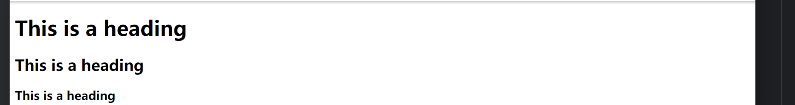
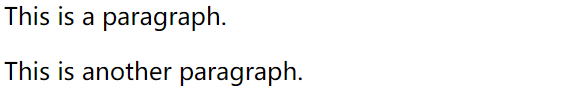
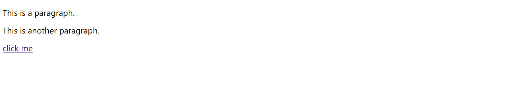

# HTML 1

## 什么是 HTML？

HTML 是用来描述网页的一种语言。

- HTML 指的是超文本标记语言 (**H**yper **T**ext **M**arkup **L**anguage)
- HTML 不是一种编程语言，而是一种**标记语言** (markup language)
- 标记语言是一套**标记标签** (markup tag)
- HTML 使用**标记标签**来描述网页

## HTML 标签

HTML 标记标签通常被称为 HTML 标签 (HTML tag)。

- HTML 标签是由*尖括号*包围的关键词，比如 `<html>`
- HTML 标签通常是*成对出现*的，比如 `<b>` 和 `</b>`
- 标签对中的第一个标签是**开始标签**，第二个标签是**结束标签**
- 开始和结束标签也被称为**开放标签**和**闭合标签**

## HTML标题是`<h1> - h<6>`实现的



```
<h1>This is a heading</h1>
<h2>This is a heading</h2>
<h3>This is a heading</h3>
```

## HTML的分段是根据`<p>`实现的

```
<p>This is a paragraph.</p>
<p>This is another paragraph.</p>
```



## HTML链接

​		是使用`<a>`标签实现的，但是注意，需要指定`属性`来做到，啥属性呢？href属性

```
<a href="https://charliechen114514.github.io/">click me</a>
```



​		点进去就可以跳转到我的博客。

## HTML 图像

​		HTML 图像是通过` ` 标签进行定义的。

```

```

​		这样就会在对应的地方插入图片

**HTML 文档是由 HTML 元素定义的。**

## HTML 元素

HTML 元素指的是从开始标签（start tag）到结束标签（end tag）的所有代码。

| 开始标签                  | 元素内容            | 结束标签 |
| :------------------------ | :------------------ | :------- |
| `<p>`                     | This is a paragraph | `</p>`   |
| `<a href="default.htm" >` | This is a link      | `</a>`   |
| `<br />`                  |                     |          |

**注释：**开始标签常被称为开放标签（opening tag），结束标签常称为闭合标签（closing tag）。

## HTML 元素语法

- HTML 元素以**开始标签**起始
- HTML 元素以结束标签终止
- 元素的内容是开始标签与结束标签之间的内容
- 某些 HTML 元素具有空内容（empty content）
- 空元素在开始标签中进行关闭（以开始标签的结束而结束）
- 大多数 HTML 元素可拥有属性

## 嵌套的 HTML 元素

大多数 HTML 元素可以嵌套（可以包含其他 HTML 元素）。

HTML 文档由嵌套的 HTML 元素构成。

## 空的 HTML 元素

没有内容的 HTML 元素被称为空元素。空元素是在开始标签中关闭的。

`<br>` 就是没有关闭标签的空元素（`<br>` 标签定义换行）。

在 XHTML、XML 以及未来版本的 HTML 中，所有元素都必须被关闭。

在开始标签中添加斜杠，比如 `<br />`，是关闭空元素的正确方法，HTML、XHTML 和 XML 都接受这种方式。

即使 `<br>` 在所有浏览器中都是有效的，但使用 `<br />` 其实是更长远的保障。

## HTML 属性

HTML 标签可以拥有属性。属性提供了有关 HTML 元素的更多的信息。属性总是以名称/值对的形式出现，比如：name="value"。属性总是在 HTML 元素的开始标签中规定。

​		举个我们之前学过的例子：

```
<a href="https://charliechen114514.github.io/">click me</a>
```

​		这里的href就是属性

下面列出了适用于大多数 HTML 元素的属性：

| 属性  | 值                 | 描述                                     |
| :---- | :----------------- | :--------------------------------------- |
| class | *classname*        | 规定元素的类名（classname）              |
| id    | *id*               | 规定元素的唯一 id                        |
| style | *style_definition* | 规定元素的行内样式（inline style）       |
| title | *text*             | 规定元素的额外信息（可在工具提示中显示） |


