# 汇编语言速通

## 汇编语言的诞生

​		汇编语言就是为了简化机器码才得以产生的，他们并不便于被调试，所以才会产生汇编。

​		汇编语言发展到今天主要有三类指令：

- 汇编指令：机器码的辅助符
- 伪指令：编译器处理之，这些指令没有对应的机器码
- 其他符号：+-乘除一类

​		留意到的是：我们的指令就是操纵CPU从存储器中，访问存储单元（对，在微型计算机中，往往我们定义一个存储单元为1Byte，8bits，这是大家所熟知的），并且送到CPU中进行若干计算的操作。

​		注意在存储单元的概念中：K，M，G的换算倍数是$2^{10}$倍

CPU欲想要读写，就必须有三个重要的数据：

1. 存储单元的地址信息
2. 期间选择（操作符选择）
3. 都或者写的信息

​		CPU通过地址总线来确定最大访问单元数目的：一根导线最多可以传递2个状态，那也就意味着具有N根总线的CPU可以访问到$2^N$个地址。编号则是0~2^N - 1个

​		存储器则是分为两大类RAM，ROM。

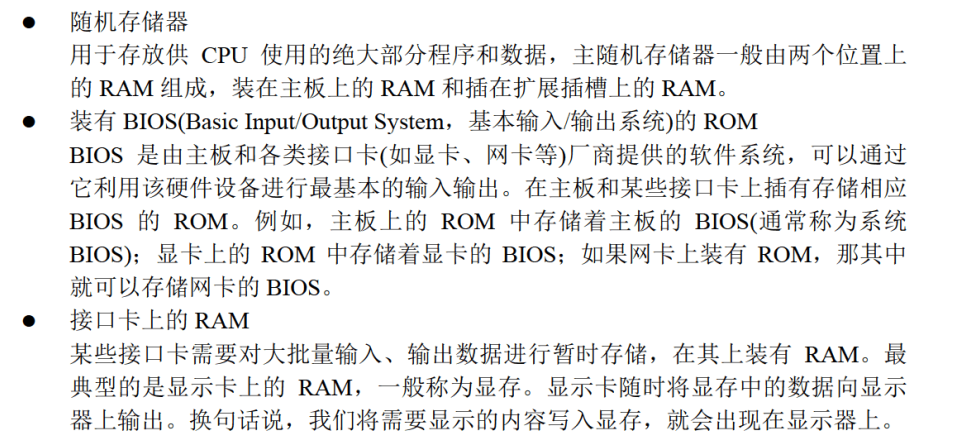

## 寄存器介绍

### 通用寄存器

​		AX，BX，CX，DX四个寄存器是通用寄存器，通常用来存放一般性质的数据。依照高八位还是第八位，分为AH（A High）与AL(A Low)。8086CPU可以处理两种尺寸的数据：byte和word(2 bytes)。

​		来接触一下汇编指令：

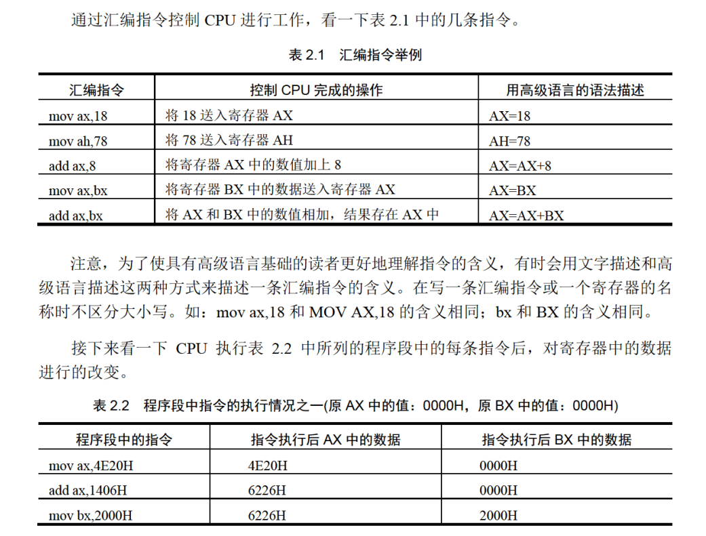

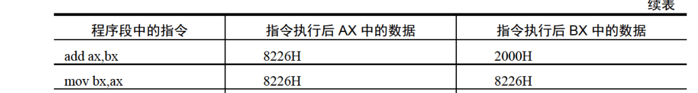

​		tips：注意当我们的寄存器发生溢出的时候，不会自动向其他寄存器发出占用一位+1的情况，而是直接丢失发生回卷现象。如 mov al 0xFF add al 0x01后al变成0x00而不是0x100.

### 8086CPU是如何寻址的

​		8086CPU是如何寻址的？8086是一个16位机，地址寄存器也是16位的，照理来讲，地址总线也该是16位，为什么是20位呢？又该如何让CPU都可以使用这20位呢？

​		答案是：采用段基址（段寄存器提供） x 16 + 段偏移（地址寄存器提供）。也就是将二进制数下的段基址左移4位 + 段偏移，在16进制下，则是左移一位16进制数。

​		对于指令：则是从CS：IP指向的内存单元读取指令，读取的指令进入指令缓存器，IP += 指令长度后自然的指向下一个指令，周而复始。

​		我们操纵CS，IP寄存器的时候，使用的是jmp指令

```
jmp register
```

​		则是跳转到寄存器内部存储的值。

## 寄存器（内存访问）

### 内存当中字的存储

​		CPU中，用16位寄存器来存储一个字。高8位存放高字节位，第八位存放低位字节。由于一个字是使用两个字节单元存储的。于是

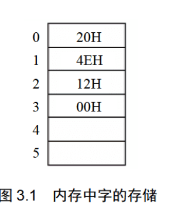

​		可以看到，我们的字节：比如说数据是4E20存储在如上单元的时候的地址图，都是这样的！我们定义字单元位一个存放字型数据的内存单元，有两个连续的内存单元组成。高地址放高字节，低地址放低字节。对于起始地址为N的字，我们称之为N地址字单元

### DS与[addr]

​		注意到我们可以使用[addr]办法表示字节偏移，其段基址则需要预先在ds上设置好。而设置ds寄存器无法直接使用mov指令完成，而是需要一个中转寄存器。这样，我们使用：

```
mov al,[10] 
```

​		就表示的是地址为`[ds]*4 + 10`的字节移动到al中。

​		mov,add,sub等都可以支持类似如下的操作：

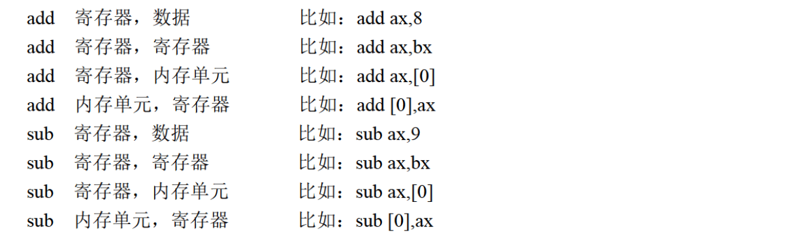

### SS:SP

​		我们直到，SS：SP则是操纵系统提供的栈机制的操作寄存器。其基本操作是push和pop:也就是压栈和出栈。

## [bx]与loop

`[bx]` 的含义：[bx]同样表示一个内存单元，它的偏移地址在bx中，段地址默认在ds中

`loop`指令的格式是：loop 标号，CPU执行loop指令的时候，要进行两步操作，

1. (cx) = (cx) - 1；
2. 判断 cx 中的值，不为零则转至标号处执行程序，如果为零则向下执行。

例如：计算$2^{12}$

```assembly
assume cs:code 

code segment 
	mov ax, 2
	
	mov cx, 11 ;循环次数
s:  add ax, ax 
	loop s     ;在汇编语言中，标号代表一个地址，标号s实际上标识了一个地址，
               ;这个地址处有一条指令：add ax，ax。
               ;执行loop s时，首先要将（cx）减1，然后若（cx）不为0，则向前
               ;转至s处执行add ax，ax。所以，可以利用cx来控制add ax，ax的执行次数。
	
	mov ax,4c00h 
	int 21h 
code ends 
end
```

**loop 和 [bx] 的联合应用**

计算`ffff:0 ~ ffff:b`单元中的数据的和，结果存储在dx中

问题分析：

1. 这些内存单元都是字节型数据范围0 ~ 255 ，12个字节数据和不会超过65535，dx可以存下
2. 对于8位数据不能直接加到 dx

解决方案：

用一个16位寄存器来做中介。将内存单元中的8位数据赋值到一个16位寄存器a中，再将ax中的数据加到dx

```asm
assume cs:code 

code segment 
	mov ax, 0ffffh ;在汇编源程序中，数据不能以字母开头，所以要在前面加0。
	mov ds, ax 
	mov bx, 0   ;初始化ds:bx指向ffff:0
	mov dx, 0   ;初始化累加寄存器dx，（dx）= 0
	
	mov cx, 12  ;初始化循环计数寄存器cx，（cx）= 12
s:  mov al, [bx]
	mov ah, 0
	add dx, ax  ;间接向dx中加上（（ds）* 16 +（bx））单元的数值
	inc bx      ;ds:bx指向下一个单元
	loop s 
	
	mov ax, 4c00h 
	int 21h 
code ends 
end
```

### 2、段前缀

```asm
mov ax, ds:[bx]
mov ax, cs:[bx]
mov ax, ss:[bx]
mov ax, es:[bx]
mov ax, ss:[0]
mov ax, cs:[0]
```

这些出现在访问内存单元的指令中，用于显式地指明内存单元的段地址
的“ds:”，“cs:”，“ss:”，“es:”，在汇编语言中称为段前缀。

**段前缀的使用**

将内存`ffff:0 ~ ffff:b`单元中的数据复制到`0:200 ~ 0:20b`单元中。

```asm
assume cs:code 

code segment 
	mov ax, 0ffffh 
	mov ds, ax   ;（ds）= 0ffffh 
	mov ax, 0020h
    mov es, ax   ;（es）= 0020h     0:200 等效于 0020:0
    mov bx, 0    ;（bx）= 0，此时ds:bx指向ffff:0，es:bx指向0020:0
    
	mov cx，12   ;（cx）=12，循环12次
s:  mov dl，[bx] ;（d1）=（（ds）* 16+（bx）），将ffff:bx中的字节数据送入dl 
	mov es:[bx]，dl ;（（es）*16+（bx））=（d1），将dl中的数据送入0020:bx 
	inc bx  ;（bx）=（bx）+1
	loop s 
	
	mov ax，4c00h 
	int 21h 
code ends 
end
```

## 五、包含多个段的程序

程序中对段名的引用，将被编译器处理为一个表示段地址的数值。

```asm
mov ax, data 

mov ds, ax 

mov bx, ds:[6]
```

在代码段中使用数据

```asm
;计算 8 个数据的和存到 ax 寄存器
assume cs:code 

code segment 

	dw 0123h,0456h,0789h,0abch,0defh,0fedh,0cbah,0987h ;define word 定义8个字形数据

	start:	mov bx, 0  ;标号start
			mov ax, 0  
			
			mov cx, 8
	s:		add ax, cs:[bx]
			add bx, 2
			loop s 
			
			mov ax, 4c00h 
			int 21h 
code ends
end start    ;end除了通知编译器程序结束外，还可以通知编译器程序的入口在什么地方
	     	 ;用end指令指明了程序的入口在标号start处，也就是说，“mov bx，0”是程序的第一条指令。
```

在代码段中使用栈

```asm
;利用栈，将程序中定义的数据逆序存放。
assume cs:codesg 

codesg segment 
	dw 0123h，0456h，0789h，0abch，0defh，0fedh，0cbah，0987h ; 0-15单元
	dw 0，0，0，0，0，0，0，0，0，0，0，0，0，0，0，0 ; 16-47单元作为栈使用
			
	start:	mov ax, cs 
			mov ss, ax 
			mov sp, 30h ;将设置栈顶ss:sp指向栈底cs:30。   30h = 48d
			mov bx, 0
			
			mov cx, 8
	s:		push cs:[bx]
			add bx, 2
			loop s    ;以上将代码段0~15单元中的8个字型数据依次入栈
			
			mov bx, 0
			
			mov cx, 8
	s0:		pop cs:[bx]		
			add bx，2
			loop s0   ;以上依次出栈8个字型数据到代码段0~15单元中
			
			mov ax，4c00h 
			int 21h 
codesg ends 
end start	;指明程序的入口在start处
```

将数据、代码、栈放入不同的段

```asm
assume cs:code,ds:data,ss:stack 

data segment 
	dw 0123h,0456h,0789h,0abch,0defh,0fedh,0cbah,0987h ;0-15单元
data ends 

stack segment 
	dw 0,0,0,0,0,0,0,0,0,0,0,0,0,0,0,0 ;0-31单元
stack ends 

code segment 
	start:	mov ax, stack;将名称为“stack”的段的段地址送入ax
			mov ss, ax
			mov sp, 20h  ;设置栈顶ss:sp指向stack:20。 20h = 32d
			
			mov ax, data ;将名称为“data”的段的段地址送入ax
			mov ds, ax   ;ds指向data段
			
			mov bx, 0    ;ds:bx指向data段中的第一个单元
			
			mov cx, 8
	s:	    push [bx]
			add bx, 2
			loop s       ;以上将data段中的0~15单元中的8个字型数据依次入栈
			
			mov bx, 0
			
			mov cx, 8
	s0:		pop [bx]
			add bx, 2
			loop s0      ;以上依次出栈8个字型数据到data段的0~15单元中
			
			mov ax, 4c00h 
			int 21h 
code ends
end start
;“end start”说明了程序的入口，这个入口将被写入可执行文件的描述信息，
;可执行文件中的程序被加载入内存后，CPU的CS:IP被设置指向这个入口，从而开始执行程序中的第一条指
```

## 六、更灵活的定位内存地址的方法

------

### 1、and 和 or

and指令：逻辑与指令，按位进行与运算。

```asm
mov al, 01100011B
and al, 00111011B
```

执行后：`al=00100011B`即都为1才为1

or指令：逻辑或指令，按位进行或运算。

`mov al, 01100011B`
`or al, 00111011B`
执行后：`al=01111011B` 即只要有一个为1就为1

**关于ASCII码**
世界上有很多编码方案，有一种方案叫做ASCII编码，是在计算机系统中通常被采用的。简单地说，所谓编码方案，就是一套规则，它约定了用什么样的信息来表示现实对象。比如说，在ASCII编码方案中，用61H表示“a”，62H表示“b”。一种规则需要人们遵守才有意义。

在文本编辑过程中，我们按一下键盘的a键，就会在屏幕上看到“a”。我们按下键盘的a键，这个按键的信息被送入计算机，计算机用ASCII码的规则对其进行编码，将其转化为61H存储在内存的指定空间中；文本编辑软件从内存中取出61H，将其送到显卡上的显存中；工作在文本模式下的显卡，用ASCII码的规则解释显存中的内容，
61H被当作字符“a”，显卡驱动显示器，将字符“a”的图像画在屏幕上。我们可以看到，显卡在处理文本信息的时候，是按照ASCII码的规则进行的。这也就是说，如果我们要想在显示器上看到“a”，就要给显卡提供“a”的ASCIⅡ码，61H。如何提供？当然是写入显存中。

**以字符形式给出的数据**

```
assume cs:code,ds:data 

data segment 
	db 'unIx'   ;相当于"db 75H，6EH，49H，58H"
	db 'foRK'
data ends 

code segment
start:	mov al, 'a'  ;相当于“mov al, 61H”，“a”的ASCI码为61H；
		mov b1, 'b'
		
		mov ax, 4c00h 
		int 21h 
code ends
end start
```

**大小写转换的问题**
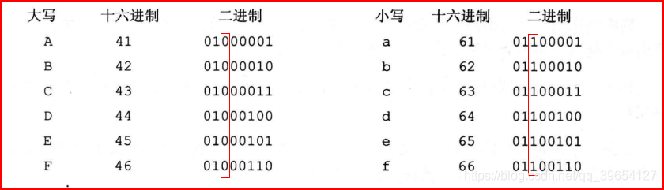
小写字母的ASCII码值比大写字母的ASCII码值大20H

大写字母ASCII码的第5位为0，小写字母的第5位为1(其他一致)

这个给了我们启发：可以与上一位1为之赋值！

```
assume cs:codesg,ds:datasg 

datasg segment 
	db 'BaSiC'
	db 'iNfOrMaTion'
datasg end

codesg segment 
	start:	mov ax, datasg 
			mov ds, ax	;设置ds 指向 datasg段
		
			mov bx, 0	;设置（bx）=0，ds:bx指向’BaSic’的第一个字母
			
			mov cx, 5     	 ;设置循环次数5，因为’Basic'有5个字母
	s:		mov al, [bx]     ;将ASCII码从ds:bx所指向的单元中取出
			and al, 11011111B;将al中的ASCII码的第5位置为0，变为大写字母
			mov [bx], al	 ;将转变后的ASCII码写回原单元
			inc bx		     ;（bx）加1，ds:bx指向下一个字母
			loop s 
			
			mov bx, 5	;设置（bx）=5，ds:bx指向，iNfOrMaTion'的第一个字母
			
			mov cx, 11	;设置循环次数11，因为‘iNfOrMaTion'有11个字母
	s0:		mov al, [bx]
			or al, 00100000B;将a1中的ASCII码的第5位置为1，变为小写字母
			mov [bx], al 
			inc bx
			loop s0
			
			mov ax, 4c00h 
			int 21h 
codesg ends
```

### 2、[bx+idata]

[bx+idata]表示一个内存单元, 例如：`mov ax, [bx+200]`
该指令也可以写成如下格式：

```
mov ax, [200+bx]

mov ax, 200[bx]

mov ax, [bx].200
```

用[bx+idata]的方式进行数组的处理

```
assume cs:codesg,ds:datasg 

datasg segment 
	db 'BaSiC';转为大写
	db 'MinIx';转为小写
datasg ends

codesg segment
	start:
		mov ax, datasg 
		mov ds, ax 
		mov bx, 0  ;初始ds:bx
	
		mov cx, 5
	s:	mov al, 0[bx]  
		and al, 11011111b ;转为大写字母
		mov 0[bx], al ;写回
		mov al, 5[bx]  ;[5 + bx]
		or al, 00100000b ;转为小写字母
		mov 5[bx], al 
		inc bx
		loop s
		
		mov ax, 4c00h 
		int 21h
codesg ends
end start
```

### 3、SI 、DI 与 寻址方式的灵活应用

**1、si 、di**

si和di是8086CPU中和bx功能相近的寄存器，si和di不能够分成两个8位寄存器来使用。

```
assume cs: codesg, ds: datasg 

datasg segment 
	db 'welcome to masm!';用si和di实现将字符串‘welcome to masm！"复制到它后面的数据区中。
	db '................'
datasg ends

codesg segment 
	start:	mov ax, datasg 
			mov ds, ax 
			mov si, 0
			
			mov cx, 8
	s:		mov ax, 0[si] ;[0 + si]
			mov 16[si], ax ;[16 + si] 使用[bx +idata]方式代替di，使程序更简洁
			add si, 2 
			loop s 
			
			mov ax, 4c00h 
			int 21h 
codesg ends 
end start
```

**2、[bx + si] 和 [bx + di]**

[bx+si]和[bx+di]的含义相似

[bx+si]表示一个内存单元，它的偏移地址为（bx）+（si）

指令`mov ax, [bx + si]`的含义：将一个内存单元字数据的内容送入ax，段地址在ds中

该指令也可以写成如下格式：`mov ax, [bx][si]`

**3、[bx+si+idata]和[bx+di+idata]**
[bx+si+idata]表示一个内存单元，它的偏移地址为（bx）+（si）+idata

指令`mov ax，[bx+si+idata]`的含义：将一个内存单元字数据的内容送入ax，段地址在ds中

**4、不同的寻址方式的灵活应用**
`[idata]`用一个常量来表示地址，可用于直接定位一个内存单元；
`[bx]`用一个变量来表示内存地址，可用于间接定位一个内存单元；
`[bx+idata]`用一个变量和常量表示地址，可在一个起始地址的基础上用变量间接定位一个内存单元；
`[bx+si]`用两个变量表示地址；
`[bx+si+idata]`用两个变量和一个常量表示地址。

```
;将datasg段中每个单词改为大写字母
assume cs:codesg,ds:datasg,ss:stacksg 

datasg segment
	db 'ibm            ' ;16
	db 'dec            ' 
	db 'dos            '
	db 'vax            '  ;看成二维数组
datasg ends 

stacksg segment ;定义一个段，用来做栈段，容量为16个字节
	dw 0, 0, 0, 0, 0, 0, 0, 0
stacksg ends 

codesg segment 
	start:	mov ax, stacksg 
			mov ss, ax
			mov sp, 16 
			mov ax, datasg 
			mov ds, ax 
			mov bx, 0 ;初始ds:bx
			
			;cx为默认循环计数器，二重循环只有一个计数器，所以外层循环先保存cx值，再恢复，我们采用栈保存
			mov cx, 4
	s0:		push cx	;将外层循环的cx值入栈
			mov si, 0
			mov cx, 3	;cx设置为内层循环的次数
	s:		mov al, [bx+si]
			and al, 11011111b ;每个字符转为大写字母
			mov [bx+si], al 
			inc si
			loop s 
			
			add bx, 16 ;下一行
			pop cx	;恢复cx值
			loop s0 ;外层循环的loop指令将cx中的计数值减1
			
			mov ax，4c00H 
			int 21H 
codesg ends
end start
```

## 七、数据处理的两个基本问题

### 1、 bx、si、di和bp

在8086CPU中，只有这4个寄存器可以用在“[…]”中来进行内存单元的寻址。

在[ ]中，这4个寄存器可以单个出现，或只能以4种组合出现：`bx和si、bx和di`、`bp和si、bp和di`。

只要在[……]中使用寄存器bp，而指令中没有显性地给出段地址, 段地址就默认在ss中

### 2、机器指令处理的数据在什么地方

数据处理大致可分为3类：读取、写入、运算。

在机器指令这一层来讲，并不关心数据的值是多少，而关心指令执行前一刻，它将要处理的数据所在的位置。指令在执行前，所要处理的数据可以在3个地方：CPU内部、内存、端口
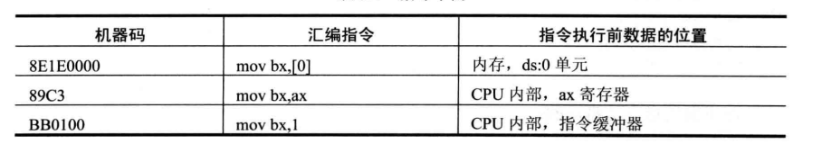

### 3、汇编语言中数据位置的表达

汇编语言中用3个概念来表达数据的位置

- 立即数（idata）

```
mov ax, 1                 ;对于直接包含在机器指令中的数据（执行前在CPU的指令缓冲器中）
add bx, 2000h             ;在汇编语言中称为：立即数（idata）
or bx, 00010000b
mov al, 'a'
```

- 寄存器

```
mov ax, bx     ;指令要处理的数据在寄存器中，在汇编指令中给出相应的寄存器名。
mov ds, ax 
push bx 
mov ds:[0], bx 
push ds 
mov ss, ax
mov sp, ax
```

- 段地址（SA）和偏移地址（EA）

```
;指令要处理的数据在内存中，在汇编指令中可用[X]的格式给出EA，SA在某个段寄存器中。
mov ax, [0]
mov ax, [di]
mov ax, [bx+8]
mov ax, [bx+si]
mov ax, [bx+si+8]   ;以上段地址默认在ds中

mov ax, [bp]
mov ax, [bp+8]
mov ax, [bp+si]
mov ax, [bp+si+8]   ;以上段地址默认在ss中

mov ax, ds:[bp]
mov ax, es:[bx]
mov ax, ss:[bx+si]
mov ax, cs:[bx+si+8] ;显式给出存放段地址的寄存器
```

寻址方式
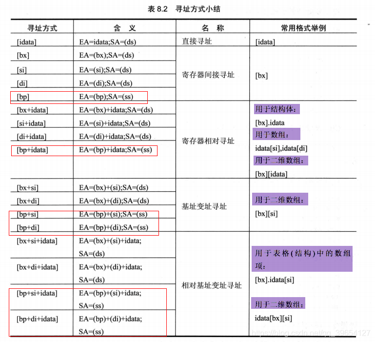

### 4、指令要处理的数据有多长

8086CPU的指令，可以处理两种尺寸的数据，byte和word

1. 通过寄存器名指明要处理的数据的尺寸。
   例如： `mov al, ds:[0]` 寄存器al指明了数据为1字节
2. 在没有寄存器名存在的情况下，用操作符`X ptr`指明内存单元的长度，X在汇编指令中可以为`word`或`byte`。
   例如：`mov byte ptr ds:[0], 1` byte ptr 指明了指令访问的内存单元是一个字节单元
3. 有些指令默认了访问的是字单元还是字节单元
   例如，`push [1000H]`，push 指令只进行字操作。

### 5、寻址方式的综合应用

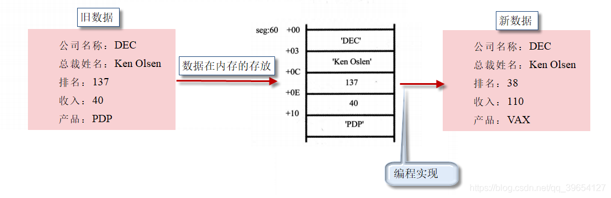

```
mov ax, seg 
mov ds, ax 
mov bx, 60h   ;确定记录地址，ds:bx 

mov word ptr [bx+0ch], 38   ;排名字段改为38  [bx].0ch
add word ptr [bx+0eh], 70   ;收入字段增加70  [bx].0eh
mov si, 0   ;用si来定位产品字符串中的字符
mov byte ptr [bx+10h+si], 'V'   ;[bx].10h[si]
inc si 
mov byte ptr [bx+10h+si], 'A'
inc si 
mov byte ptr [bx+10h+si], 'X'
```

### 6、div指令、dd、dup、mul指令

**div是除法指令**

1. 除数：有8位和16位两种，在一个`寄存器`或`内存单元`中。
2. 被除数：默认放在`AX`或`DX和AX`中，
   如果除数为8位，被除数则为16位，默认在AX中存放；
   如果除数为16位，被除数则为32位，在DX和AX中存放，DX存放高16位，AX存放低16位。
3. 结果：
   如果除数为8位，则`AL存储除法操作的商`，`AH存储除法操作的余数`；
   如果除数为16位，则AX存储除法操作的商，DX存储除法操作的余数。

```
;利用除法指令计算100001/100。
;100001D = 186A1H
mov dx, 1
mov ax, 86A1H ;(dx)*10000H+(ax)=100001
mov bx, 100
div bx

;利用除法指令计算1001/100
mov ax, 1001
mov bl, 100
div b1
1234567891011
```

**伪指令dd**

db和dw定义字节型数据和字型数据。

dd是用来定义dword（double word，双字）型数据的伪指令

**操作符dup**

dup在汇编语言中同db、dw、dd等一样，也是由编译器识别处理的符号。
它和db、dw、dd等数据定义伪指令配合使用，用来进行数据的重复

```
db 3 dup (0)       ;定义了3个字节，它们的值都是0，相当于db 0，0，0。
db 3 dup (0, 1, 2) ;定义了9个字节，它们是0、1、2、0、1、2、0、1、2，相当于db 0，1，2，0，1，2，0，1，2。
db 3 dup ('abc', 'ABC') ;定义了18个字节，它们是abcABCabcABCabcABCC，相当于db 'abc', 'ABC' ,'abc' , 'ABC, 'abc', 'ABC'。
```

**mul 指令**

mul是乘法指令，使用 mul 做乘法的时候：相乘的两个数：要么都是8位，要么都是16位。

- 8 位： `AL`中和 `8位寄存器`或`内存字节单元`中；
- 16 位： `AX`中和 `16 位寄存器`或`内存字单元`中。

结果

- 8位：AX中；
- 16位：DX（高位）和 AX（低位）中。

格式：`mul 寄存器` 或 `mul 内存单元`

```
;计算100*10
;100和10小于255，可以做8位乘法
mov al,100
mov bl,10
mul bl

;结果： (ax)=1000（03E8H） 

12345678
;计算100*10000
;100小于255，可10000大于255，所以必须做16位乘法，程序如下：
mov ax,100
mov bx,10000
mul bx

;结果： (ax)=4240H，(dx)=000FH     （F4240H=1000000）
```

## 八、转移指令的原理

------

可以修改IP，或同时修改CS和IP的指令统称为转移指令。概括地讲，转移指令就是可以控制CPU执行内存中某处代码的指令。

8086CPU的转移行为有以下几类。

- 只修改IP时，称为`段内转移`，比如：`jmp ax`。
- 同时修改CS和IP时，称为`段间转移`，比如：`jmp 1000:0`。

由于转移指令对IP的修改范围不同，段内转移又分为：`短转移和近转移`。

- 短转移IP的修改范围为`-128 ~ 127`。
- 近转移IP的修改范围为`-32768 ~ 32767`。

8086CPU的转移指令分为以下几类。

- 无条件转移指令（如：jmp）
- 条件转移指令
- 循环指令（如：loop）
- 过程
- 中断

### 1、操作符offset

操作符offset在汇编语言中是由编译器处理的符号，它的功能是取得标号的偏移地址。

```asm
;将s处的一条指令复制到s0处
assume cs:codesg
codesg segment
 s:   mov ax, bx           ;（mov ax,bx 的机器码占两个字节）
      mov si, offset s     ;获得标号s的偏移地址
      mov di, offset s0    ;获得标号s0的偏移地址
      
      mov ax, cs:[si]
      mov cs:[di], ax
 s0:  nop                     ;（nop的机器码占一个字节）
      nop
 codesg ends
 ends
```

### 2、jmp指令

jmp为无条件转移，转到标号处执行指令可以只修改IP，也可以同时修改CS和IP；

jmp指令要给出两种信息：

- 转移的目的地址
- 转移的距离（段间转移、段内短转移，段内近转移）

 `jmp short 标号` `jmp near ptr 标号` `jcxz 标号` `loop 标号` 等几种汇编指令，它们对 IP的修改

是根据转移目的地址和转移起始地址之间的位移来进行的。在它们对应的机器码中不包含转移的目的地址，而包含的是到目的地址的位移距离。

#### 1、依据位移进行转移的jmp指令

`jmp short 标号`（段内短转移）

指令“`jmp short 标号`”的功能为`(IP)=(IP)+8位位移`，转到标号处执行指令

（1）8位位移 = “标号”处的地址 - jmp指令后的第一个字节的地址；

（2）short指明此处的位移为8位位移；

（3）8位位移的范围为-128~127，用补码表示

（4）8位位移由编译程序在编译时算出。

```asm
assume cs:codesg
codesg segment
  start:mov ax,0
        jmp short s ;s不是被翻译成目的地址
        add ax, 1
      s:inc ax ;程序执行后， ax中的值为 1 
codesg ends
end start
```

CPU不需要这个目的地址就可以实现对IP的修改。这里是依据位移进行转移

**jmp short s指令的读取和执行过程：**

1. (CS)=0BBDH，(IP)=0006，上一条指令执行结束后CS:IP指向EB 03（jmp short s的机器码）；
2. 读取指令码EB 03进入指令缓冲器；
3. (IP) = (IP) + 所读取指令的长度 = (IP) + 2 = 0008，CS:IP指向add ax,1；
4. CPU指行指令缓冲器中的指令EB 03；
5. 指令EB 03执行后，(IP)=000BH，CS:IP指向inc ax

`jmp near ptr 标号` （段内近转移）

指令“`jmp near ptr 标号`”的功能为：`(IP) = (IP) + 16位位移`。

#### 2、转移的目的地址在指令中的jmp指令

`jmp far ptr 标号`（段间转移或远转移）

指令 “`jmp far ptr 标号`” 功能如下：

- (CS) = 标号所在段的段地址；
- (IP) = 标号所在段中的偏移地址。
- far ptr指明了指令用标号的段地址和偏移地址修改CS和IP。

```asm
assume cs:codesg
codesg segment
   start: mov ax, 0
		  mov bx, 0
          jmp far ptr  s ;s被翻译成转移的目的地址0B01 BD0B
          db 256 dup (0) ;转移的段地址：0BBDH，偏移地址：010BH
    s:    add ax,1
          inc ax
codesg ends
end start
```


#### 3、转移地址在寄存器或内存中的jmp指令

```
jmp 16位寄存器 功能：IP =（16位寄存器）
```

转移地址在内存中的jmp指令有两种格式：

- `jmp word ptr 内存单元地址`（段内转移）

功能：从内存单元地址处开始存放着一个字，是转移的目的偏移地址。

```asm
mov ax, 0123H
mov ds:[0], ax
jmp word ptr ds:[0]
;执行后，(IP)=0123H
```

- `jmp dword ptr 内存单元地址`（段间转移）

功能：从内存单元地址处开始存放着两个字，高地址处的字是转移的目的段地址，低地址处是转移的目的偏移地址。

1. (CS)=(内存单元地址+2)
2. (IP)=(内存单元地址)

```asm
mov ax, 0123H
mov ds:[0], ax;偏移地址
mov word ptr ds:[2], 0;段地址
jmp dword ptr ds:[0]
;执行后，
;(CS)=0
;(IP)=0123H
;CS:IP 指向 0000:0123。
```

#### 4、jcxz指令和loop指令

**jcxz指令**

jcxz指令为有条件转移指令，所有的有条件转移指令都是短转移，

在对应的机器码中包含转移的位移，而不是目的地址。对IP的修改范围都为-128~127。

指令格式：`jcxz 标号`（如果(cx)=0，则转移到标号处执行。）

当(cx) = 0时，(IP) = (IP) + 8位位移

- 8位位移 = “标号”处的地址 - jcxz指令后的第一个字节的地址；
- 8位位移的范围为-128~127，用补码表示；
- 8位位移由编译程序在编译时算出。

当(cx)!=0时，什么也不做（程序向下执行）

**loop指令**

loop指令为循环指令，所有的循环指令都是短转移，在对应的机器码中包含转移的位移，而不是目的地址。

对IP的修改范围都为-128~127。

指令格式：`loop 标号` ((cx) = (cx) - 1，如果(cx) ≠ 0，转移到标号处执行)。

(cx) = (cx) - 1；如果 (cx) != 0，(IP) = (IP) + 8位位移。

- 8位位移 = 标号处的地址 - loop指令后的第一个字节的地址；
- 8位位移的范围为-128~127，用补码表示；
- 8位位移由编译程序在编译时算出。

如果（cx）= 0，什么也不做（程序向下执行）。

## 九、call和ret指令

------

call和ret指令都是转移指令，它们都修改IP，或同时修改CS和IP。

### 1、ret 和 retf

- ret指令用栈中的数据，修改IP的内容，从而实现近转移；
- retf指令用栈中的数据，修改CS和IP的内容，从而实现远转移。

CPU执行ret指令时，相当于进行： `pop IP`：

（1）(IP) = ( (ss) * 16 + (sp) )

（2）(sp) = (sp) + 2

CPU执行retf指令时，相当于进行：`pop IP, pop CS`：

（1）(IP) = ( (ss) * 16 + (sp) )

（2）(sp) = (sp) + 2

（3）(CS) = ( (ss) * 16 + (sp) )

（4）(sp) = (sp) + 2

```asm
assume cs:code 
stack seqment
	db 16 dup (0)
stack ends 

code segment
		mov ax, 4c00h
		int 21h 
 start:	mov ax, stack 
 		mov ss, ax
 		mov sp, 16
		mov ax, 0
		push ax ;ax入栈
		mov bx, 0
		ret ;ret指令执行后，(IP)=0，CS:IP指向代码段的第一条指令。可以push cs  push ax  retf
code ends
end start
```

### 2、call 指令

call指令经常跟ret指令配合使用，因此CPU执行call指令，进行两步操作：

（1）将当前的 IP 或 CS和IP 压入栈中；

（2）转移（jmp）。

call指令不能实现短转移，除此之外，call指令实现转移的方法和 jmp 指令的原理相同。

`call 标号`（近转移）

CPU执行此种格式的call指令时，相当于进行 `push IP` `jmp near ptr 标号`

`call far ptr 标号`（段间转移）

CPU执行此种格式的call指令时，相当于进行：`push CS，push IP` `jmp far ptr 标号`

```
call 16位寄存器
```

CPU执行此种格式的call指令时，相当于进行： `push IP` `jmp 16位寄存器`

```
call word ptr 内存单元地址
```

CPU执行此种格式的call指令时，相当于进行：`push IP` `jmp word ptr 内存单元地址`

```
mov sp, 10h
mov ax, 0123h
mov ds:[0], ax
call word ptr ds:[0]
;执行后，(IP)=0123H，(sp)=0EH
12345
call dword ptr 内存单元地址
```

CPU执行此种格式的call指令时，相当于进行：`push CS` `push IP` `jmp dword ptr 内存单元地址`

```asm
mov sp, 10h
mov ax, 0123h
mov ds:[0], ax
mov word ptr ds:[2], 0
call dword ptr ds:[0]
;执行后，(CS)=0，(IP)=0123H，(sp)=0CH
```

### 3、call 和 ret 的配合使用

分析下面程序

```asm
assume cs:code
code segment
start:	mov ax,1
	    mov cx,3
     	call s ;（1）CPU指令缓冲器存放call指令，IP指向下一条指令（mov bx, ax），执行call指令，IP入栈，jmp
     	
	    mov bx,ax	;（4）IP重新指向这里  bx = 8
     	mov ax,4c00h
     	int 21h
     s: add ax,ax
     	loop s;（2）循环3次ax = 8
	    ret;（3）return : pop IP
code ends
end start
```

call 与 ret 指令共同支持了汇编语言编程中的模块化设计

编写子程序

## 十、标志寄存器

------

### 1、标志寄存器

CPU内部的寄存器中，有一种特殊的寄存器（对于不同的处理机，个数和结构都可能不同）具有以下3种作用。

（1）用来存储相关指令的某些执行结果；

（2）用来为CPU执行相关指令提供行为依据；

（3）用来控制CPU的相关工作方式。

这种特殊的寄存器在8086CPU中，被称为标志寄存器（flag）。

8086CPU的标志寄存器有16位，其中存储的信息通常被称为程序状态字（PSW-Program Status Word）

flag寄存器是按位起作用的，它的每一位都有专门的含义，记录特定的信息。

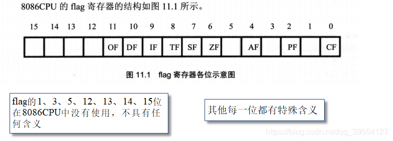
在8086CPU的指令集中，有的指令的执行是影响标志寄存器的，比如，add、sub、mul、div、inc、or、and等，它们大都是运算指令（进行逻辑或算术运算）；有的指令的执行对标志寄存器没有影响，比如，mov、push、pop等，它们大都是传送指令

#### 1、零标志位 (ZF)

零标志位（Zero Flag）。它记录相关指令执行后，其结果是否为0。

如果结果为0，那么zf = 1(表示结果是0)；如果结果不为0，那么zf = 0。

```asm
mov ax, 1
sub ax, 1 ;执行后，结果为0，则zf = 1

mov ax, 2
sub ax, 1 ;执行后，结果不为0，则zf = 0
```

#### 2、奇偶标志位 (PF)

奇偶标志位（Parity Flag）。它记录相关指令执行后，其结果的所有bit位中1的个数是否为偶数。

如果1的个数为偶数，pf = 1，如果为奇数，那么pf = 0。

```asm
mov al, 1
add al, 10 ;执行后，结果为00001011B，其中有3（奇数）个1，则pf = 0；

mov al, 1
or al, 2  ;执行后，结果为00000011B，其中有2（偶数）个1，则pf = 1；
```

#### 3、符号标志位(SF)

符号标志位(Symbol Flag)。它记录相关指令执行后，其结果是否为负。

如果结果为负，sf = 1；如果非负，sf = 0。

计算机中通常用补码来表示有符号数据。计算机中的一个数据可以看作是有符号数，也可以看成是无符号数。

`00000001B`，可以看作为无符号数1，或有符号数+1；
`10000001B`，可以看作为无符号数129，也可以看作有符号数-127。

对于同一个二进制数据，计算机可以将它当作无符号数据来运算，也可以当作有符号数据来运算

CPU在执行add等指令的时候，就包含了两种含义:可以将add指令进行的运算当作无符号数的运算，也可以将add指令进行的运算当作有符号数的运算

SF标志，就是CPU对有符号数运算结果的一种记录，它记录数据的正负。在我们将数据当作有符号数来运算的时候，可以通过它来得知结果的正负。如果我们将数据当作无符号数来运算，SF的值则没有意义，虽然相关的指令影响了它的值

```asm
mov al, 10000001B 
add al, 1   ;执行后，结果为10000010B，sf = 1，表示：如果指令进行的是有符号数运算，那么结果为负；
12
mov al, 10000001B
add al, 01111111B   ;执行后，结果为0，sf = 0，表示：如果指令进行的是有符号数运算，那么结果为非负
```

#### 3、进位标志位(CF)

进位标志位(Carry Flag)。一般情况下，在进行无符号数运算的时候，它记录了运算结果的最高有效位向更高位的进位值，或从更高位的借位值
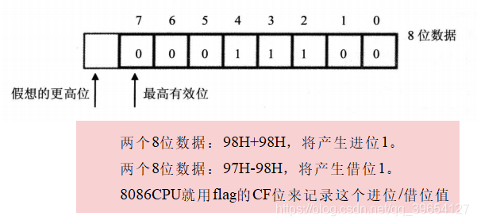
97H - 98H 产生借位CF = 1 ==》 (al) = 197H - 98H = FFH

#### 4、溢出标志位(OF)

溢出标志位(Overflow Flag)。一般情况下，OF记录了有符号数运算的结果是否发生了溢出。

如果发生溢出，OF = 1；如果没有，OF = 0。

CF和OF的区别：CF是对无符号数运算有意义的标志位，而OF是对有符号数运算有意义的标志位

CPU在执行add等指令的时候，就包含了两种含义：无符号数运算和有符号数运算。

- 对于无符号数运算，CPU用CF位来记录是否产生了进位；
- 对于有符号数运算，CPU用OF位来记录是否产生了溢出，当然，还要用SF位来记录结果的符号。

```
mov al, 98
add al, 99   ;执行后将产生溢出。因为进行的"有符号数"运算是：（al）=（al）+ 99 = 98 + 99=197 = C5H 为-59的补码
             ;而结果197超出了机器所能表示的8位有符号数的范围：-128-127。
             ;add 指令执行后：无符号运算没有进位CF=0，有符号运算溢出OF=1
             ;当取出的数据C5H按无符号解析C5H = 197, 当按有符号解析通过SP得知数据为负,即C5H为-59补码存储，
             
mov al，0F0H  ;F0H，为有符号数-16的补码   -Not(F0 - 1)
add al，088H  ;88H，为有符号数-120的补码   -Not(88- 1)
              ;执行后，将产生溢出。因为add al, 088H进行的有符号数运算结果是：（al）= -136 
              ;而结果-136超出了机器所能表示的8位有符号数的范围：-128-127。
              ;add 指令执行后：无符号运算有进位CF=1，有符号运算溢出OF=1
```

### 2、adc指令和sbb指令

adc是带进位加法指令，它利用了CF位上记录的进位值。

指令格式：`adc 操作对象1, 操作对象2`

功能：操作对象1 = 操作对象1 + 操作对象2 + CF

```
mov ax, 2
mov bx, 1
sub bx, ax  ;无符号运算借位CF=1，有符号运算OF = 0
adc ax, 1   ;执行后，（ax）= 4。adc执行时，相当于计算：(ax)+1+CF = 2+1+1 = 4。
1234
```

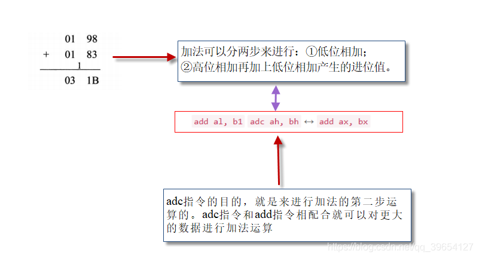

```
;计算1EF000H+201000H，结果放在ax（高16位）和bx（低16位）中。
;将计算分两步进行，先将低16位相加，然后将高16位和进位值相加。
mov ax, 001EH 
mov bx, 0F000H 
add bx, 1000H
adc ax, 0020H
```

**sbb指令**

sbb是带借位减法指令，它利用了CF位上记录的借位值。

指令格式：`sbb 操作对象1, 操作对象2`

功能：操作对象1 = 操作对象1 - 操作对象2 - CF

```
;计算 003E1000H - 00202000H，结果放在ax，bx中，程序如下：
mov bx, 1000H
mov ax, 003EH
sub bx, 2000H
sbb ax, 0020H
```

### 3、cmp指令

cmp是比较指令，cmp的功能相当于减法指令，只是不保存结果。cmp指令执行后，将对标志寄存器产生影响。

其他相关指令通过识别这些被影响的标志寄存器位来得知比较结果。

cmp指令格式：`cmp 操作对象1，操作对象2`

例如：
指令`cmp ax, ax`，做（ax）-（ax）的运算，结果为0，但并不在ax中保存，仅影响flag的相关各位。
指令执行后：zf=1，pf=1，sf=0，cf=0，of=0。

CPU在执行cmp指令的时候，也包含两种含义：进行无符号数运算和进行有符号数运算。

| cmp ax, bx  | 无符号比较时     |
| ----------- | ---------------- |
| (ax) = (bx) | zf = 1           |
| (ax) ≠ (bx) | zf = 0           |
| (ax) < (bx) | cf = 1           |
| (ax) ≥ (bx) | cf = 0           |
| (ax) > (bx) | cf = 0 且 zf = 0 |
| (ax) ≤ (bx) | cf = 1 且 zf = 1 |

上面的表格可以正推也可以逆推

如果用cmp来进行有符号数比较时
SF只能记录实际结果的正负，发生溢出的时候，实际结果的正负不能说明逻辑上真正结果的正负。
但是逻辑上的结果的正负，才是cmp指令所求的真正结果，所以我们在考察SF的同时考察OF，就可以得知逻辑上真正结果的正负，同时就知道比较的结果。

```
mov ah, 08AH  ; -Not(8A-1) = -118  即当成有符号数时为-118
mov bh, 070H  ; 有符号数时最高位为0为正数， 70H = 112
cmp ah, bh    ;（ah）-（bh）实际得到的结果是1AH 
		      ; 在逻辑上，运算所应该得到的结果是：（-118）- 112 = -230
		      ; sf记录实际结果的正负，所以sf=0
12345
```

> `cmp ah, bh`
> （1）如果sf=1，而of=0 。 of=0说明没有溢出，逻辑上真正结果的正负=实际结果的正负； sf=1，实际结果为负，所以逻辑上真正的结果为负，所以（ah）<（bh）
>
> （2）如果sf=1，而of=1： of=1，说明有溢出，逻辑上真正结果的正负≠实际结果的正负； sf=1，实际结果为负。
> 实际结果为负，而又有溢出，这说明是由于溢出导致了实际结果为负，，如果因为溢出导致了实际结果为负，那么逻辑上真正的结果必然为正。 这样，sf=1，of=1，说明了（ah）>（bh）。
>
> （3）如果sf=0，而of=1。of=1，说明有溢出，逻辑上真正结果的正负≠实际结果的正负；sf=0，实际结果非负。而of=1说明有溢出，则结果非0，所以，实际结果为正。
> 实际结果为正，而又有溢出，这说明是由于溢出导致了实际结果非负，如果因为溢出导致了实际结果为正，那么逻辑上真正的结果必然为负。这样，sf=0，of=1，说明了（ah）<（bh）。
> （4）如果sf=0，而of=0
> of=0，说明没有溢出，逻辑上真正结果的正负=实际结果的正负；sf=0，实际结果非负，所以逻辑上真正的结果非负，所以（ah）≥（bh）。

### 4、检测比较结果的条件转移指令

可以根据某种条件，决定是否修改IP的指令

jcxz它可以检测cx中的数值，如果（cx）=0，就修改IP，否则什么也不做。

所有条件转移指令的转移位移都是[-128，127]。

多数条件转移指令都检测标志寄存器的相关标志位，根据检测的结果来决定是否修改IP

这些条件转移指令通常都和cmp相配合使用,它们所检测的标志位，都是cmp指令进行无符号数比较的时记录比较结果的标志位

根据无符号数的比较结果进行转移的条件转移指令（它们检测zf、cf的值）

| 指令 | 含义         | 检测的相关标志位 |
| ---- | ------------ | ---------------- |
| je   | 等于则转移   | zf = 1           |
| jne  | 不等于则转移 | zf = 0           |
| jb   | 低于则转移   | cf = 1           |
| jnb  | 不低于则转移 | cf = 0           |
| ja   | 高于则转移   | cf = 0 且 zf = 0 |
| jna  | 不高于则转移 | cf = 1 且 zf = 1 |

j：jump，e：equal，b：below，a：above，n：not

```
;编程，统计data段中数值为8的字节的个数，用ax保存统计结果。
mov ax, data 
mov ds, ax 
mov bx, 0   ;ds:bx指向第一个字节
mov ax, 0   ;初始化累加器mov cx，8

s:
	cmp byte ptr [bx], 8   ;和8进行比较
	jne next  ;如果不相等转到next，继续循环
	inc ax  ;如果相等就将计数值加1
next:
	inc bx
	loop s ;程序执行后：（ax）=3
```

### 5、DF标志和串传送指令

方向标志位。在串处理指令中，控制每次操作后si、di的增减。

- df = 0每次操作后si、di递增；
- df = 1每次操作后si、di递减。

格式：`movsb`
功能：将ds:si指向的内存单元中的字节送入es:di中，然后根据标志寄存器df位的值，将si和di递增或递减

格式：`movsw`
功能：将ds:si指向的内存字单元中的字送入es:di中，然后根据标志寄存器df位的值，将si和di递增2或递减2。

格式：`rep movsb`
movsb和movsw进行的是串传送操作中的一个步骤，一般来说，movsb和movsw都和rep配合使用，
功能：rep的作用是根据cx的值，重复执行后面的串传送指令

8086CPU提供下面两条指令对df位进行设置。

- `cld`指令：将标志寄存器的df位置0
- `std`指令：将标志寄存器的df位置1

```
;将data段中的第一个字符串复制到它后面的空间中。
data segment 
	db 'Welcome to masm!'
	db 16 dup (0)
data ends

mov ax, data 
mov ds, ax 
mov si, 0   ;ds:si 指向data:0
mov es, ax 
mov di, 16  ;es:di指向data:0010

mov cx, 16  ;（cx）=16，rep循环16次
cld  ;设置df=0，正向传送
rep movsb
```

### 6、pushf和popf

pushf的功能是将标志寄存器的值压栈，而popf是从栈中弹出数据，送入标志寄存器中

pushf和popf，为直接访问标志寄存器提供了一种方法。

## 十一、内中断

### 1、内中断的产生

任何一个通用的CPU，都具备一种能力，可以在执行完当前正在执行的指令之后，检测到从CPU外部发送过来的或内部产生的一种特殊信息，并且可以立即对所接收到的信息进行处理。这种特殊的信息，我们可以称其为：中断信息。中断的意思是指，CPU不再接着（刚执行完的指令）向下执行，而是转去处理这个特殊信息。

中断信息可以来自CPU的内部和外部（内中断，外中断）

内中断：当CPU的内部有需要处理的事情发生的时候，将产生中断信息，引发中断过程。这种中断信息来自CPU的内部

8086CPU的内中断（下面四种情况将产生中断信息）

- 除法错误，比如，执行div指令产生的除法溢出；
- 单步执行；
- 执行 into指令；
- 执行 int指令。

中断信息中包含中断类型码，中断类型码为一个字节型数据，可以表示256种中断信息的来源（中断源）

上述的4种中断源，在8086CPU中的中断类型码如下。

- 除法错误：0
- 单步执行：1
- 执行into指令：4
- 执行int指令，该指令的格式为int n，指令中的n为字节型立即数，是提供给CPU的中断类型码。

### 2、中断处理程序、中断向量表、中断过程

**中断处理程序**

用来处理中断信息的程序被称为中断处理程序。

根据CPU的设计，中断类型码的作用就是用来定位中断处理程序。比如CPU根据中断类型码4，就可以找到4号中断的处理程序

**中断向量表**

中断向量就是中断处理程序的入口地址。中断向量表就是中断处理程序入口地址的列表

CPU用8位的中断类型码通过中断向量表找到相应的中断处理程序的入口地址
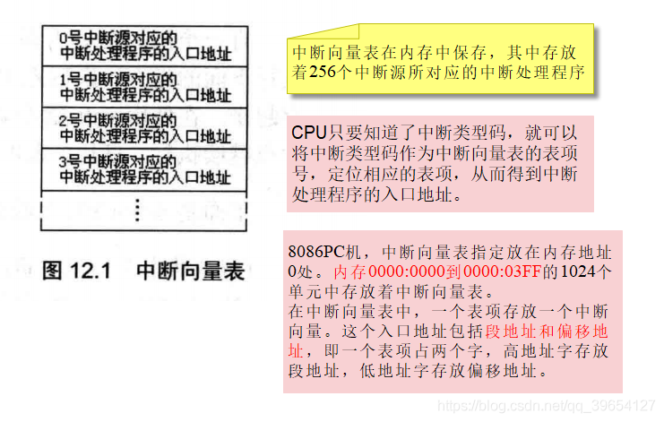

**中断过程**

中断过程的主要任务就是用中断类型码在中断向量表中找到中断处理程序的入口地址，设置CS和IP

简要描述如下

> 1. 取得中断类型码N；
> 2. pushf
> 3. TF=0，IF=0 （为什么这样参考单步中断）
> 4. push CS , push IP
> 5. （IP）=（N * 4），（CS）=（N * 4 + 2）

硬件在完成中断过程后，CS:IP将指向中断处理程序的入口，CPU开始执行中断处理程序。

### 3、iret指令

CPU随时都可能执行中断处理程序，中断处理程序必须一直存储在内存某段空间之中
而中断处理程序的入口地址，即中断向量，必须存储在对应的中断向量表表项中。

中断处理程序的常规编写步骤：

> 1. 保存用到的寄存器；
> 2. 处理中断；
> 3. 恢复用到的寄存器；
> 4. 用`iret`指令返回。

iret 指令描述为：`pop IP` `pop CS` `popf`

iret指令执行后，CPU回到执行中断处理程序前的执行点继续执行程序

### 4、除法错误中断的处理

```
mov ax, 1000h 
mov bh, 1
div bh ;除法溢出错误
123
```

1、当CPU执行div bh时，发生了除法溢出错误，产生0号中断信息，从而引发中断过程，

2、CPU执行0号中断处理程序

3、系统中的0号中断处理程序的功能：显示提示信息“Divide overflow”后，返回到操作系统中。

**编程实验**

编程：编写0号中断处理程序do0，当发生除法溢出时，在屏幕中间显示“overflow！”，返回DOS。

1、0000:0200至0000:02FF的256个字节的空间所对应的中断向量表项都是空的，可以将中断处理程序do0传送到内存0000:0200处。

2、中断处理程序do0放到`0000:0200`,再将其地址登记在中断向量表对应表项

- 0号表项的地址`0:0`。`0:0`字单元存放偏移地址，`0:2`字单元存放段地址
- 将do0的段地址0存放在`0000:0002`字单元中，将偏移地址200H存放在`0000:0000`字单元

```
assume cs:code

code segment
start:	
		mov ax, cs
		mov ds, ax
		mov si, offset do0		;设置ds:si指向源地址
		mov ax, 0
		mov es, ax
		mov di, 200h			;设置es:di指向目的地址0000:0200
		mov cx, offset do0end - offset do0		;设置cx为传输长度 编译时给出do0部分代码长度
		cld				        ;设置传输方向为正
		rep movsb ;将do0的代码送入0:200处
		
		mov ax, 0               ;设置中断向量表
		mov es, ax
		mov word ptr es:[0*4], 200h
		mov word ptr es:[0*4+2], 0

      	mov ax,4c00h
      	int 21h

;do0程序的主要任务是显示字符串
do0:	jmp short do0 start 
      	db "overflow!"

do0start:
      	mov ax, cs
      	mov ds, ax
      	mov si, 202h			;设置ds:si指向字符串

      	mov ax, 0b800h
      	mov es, ax
		mov di, 12*160+36*2		;设置es:di指向显存空间的中间位置

        mov cx, 9				;设置cx为字符串长度
	s:	mov al, [si]
      	mov es:[di], al
      	inc si
      	add di, 1
		mov al, 02h             ;设置颜色
		mov es:[di], al        
		add di, 1
      	loop s

      	mov ax, 4c00h
      	int 21h
do0end:	nop
code ends
end start
```

### 5、单步中断

CPU在执行完一条指令之后，如果检测到标志寄存器的TF位为1，则产生单步中断，引发中断过程。单步中断的中断类型码为1

Debug是如何利用CPU所提供的单步中断的功能进行调试？如使用t命令查看寄存器状态

Debug提供了单步中断的中断处理程序，功能为显示所有寄存器中的内容后等待输入命令

在使用t命令执行指令时，Debug将TF设置为1，在CPU执行完这条指令后就引发单步中断，执行单步中断的中断处理程序，所有寄存器中的内容被显示在屏幕上，并且等待输入命令。

在进入中断处理程序之前，设置TF=0。从而避免CPU在执行中断处理程序的时候发生单步中断

### 6、int指令

int指令的格式为：`int n` ，n为中断类型码，它的功能是引发中断过程。

CPU执行int n指令，相当于引发一个n号中断的中断过程

在程序中使用int指令调用任何一个中断的中断处理程序(中断例程)

**编写供应用程序调用的中断例程**

**实验1**

```
;求2 * 3456^2
assume cs:code

code segment

start: 
     mov ax, 3456 ;(ax)=3456
     int 7ch  ; 调用中断7ch的中断例程，计算ax中的数据的平方
     add ax, ax  
     adc dx, dx  ;存放结果，将结果乘以2

     mov ax,4c00h
     int 21h
code ends
end start 
;编程：安装中断7ch的中断例程
;功能：求一word型数据的平方。
;参数：(ax) = 要计算的数据。
;返回值：dx、ax中存放结果的高16位和低16位。

assume cs:code

code segment
start:
		mov ax,cs
		mov ds,ax
		mov si,offset sqr					;设置ds:si指向源地址
		mov ax,0
		mov es,ax
		mov di,200h							;设置es:di指向目的地址
		mov cx,offset sqrend - offset sqr	;设置cx为传输长度
		cld									;设置传输方向为正
		rep movsb

		mov ax,0
		mov es,ax
		mov word ptr es:[7ch*4], 200h
		mov word ptr es:[7ch*4+2], 0

		mov ax,4c00h
		int 21h

  sqr:  
		mul ax
		iret  ;CPU执行int 7ch指令进入中断例程之前，标志寄存器、当前的CS和IP被压入栈
		      ;在执行完中断例程后，应该用iret 指令恢复int 7ch执行前的标志寄存器和CS、IP的
sqrend:	nop

code ends
end start
```

**实验2**

```
;功能：将一个全是字母，以0结尾的字符串，转化为大写。
;参数：ds:si指向字符串的首地址。
;应用举例：将data段中的字符串转化为大写。
assume cs:code

data segment
	db 'conversation',0
data ends

code segment
start:  mov ax, data
		mov ds, ax
		mov si, 0
		int 7ch
		
		mov ax,4c00h
		int 21h
code ends
end start   
```

```
assume cs:code
code segment

start:
		mov ax,cs
		mov ds,ax
		mov si,offset capital
		mov ax,0
		mov es,ax
		mov di,200h
		mov cx,offset capitalend - offset capital
		cld
		rep movsb

		mov ax,0
		mov es,ax
		mov word ptr es:[7ch*4],200h
		mov word ptr es:[7ch*4+2],0

		mov ax,4c00h
		int 21h

capital:
		push cx
		push si
		
change: 
		mov cl,[si]
		mov ch,0
		jcxz ok
		and byte ptr [si],11011111b
		inc si
		jmp short change
ok:	
		pop si
		pop cx
		iret
		
capitalend:nop
code ends
end start
```


### 7、BIOS和DOS所提供的中断例程

在系统板的ROM中存放着一套程序，称为BIOS（基本输入输出系统）

BIOS中主要包含以下几部分内容

- 硬件系统的检测和初始化程序；
- 外部中断和内部中断的中断例程；
- 用于对硬件设备进行I/O操作的中断例程；
- 其他和硬件系统相关的中断例程。

程序员在编程的时候，可以用int 指令直接调用BIOS和DOS系统提供的中断例程，来完成某些工作。
和硬件设备相关的DOS中断例程中，一般都调用了BIOS的中断例程。

**BIOS和DOS中断例程的安装过程**

BIOS和DOS提供的中断例程是如何安装到内存中的呢？

1、开机后，CPU一加电，初始化（CS）= 0FFFFH，（IP）= 0，自动从FFFF:0单元开始执行程序。FFFF:0处有一条转跳指令，CPU执行该指令后，转去执行BIOS中的硬件系统检测和初始化程序。

2、初始化程序将建立BIOS所支持的中断向量，即将BIOS提供的中断例程的入口地址登记在中断向量表中。
注意，对于BIOS所提供的中断例程，只需将入口地址登记在中断向量表中即可，因为它们是固化到ROM中的程序，一直在内存中存在。

3、硬件系统检测和初始化完成后，调用int 19h进行操作系统的引导。从此将计算机交由操作系统控制。

4、DOS启动后，除完成其他工作外，还将它所提供的中断例程装入内存，并建立相应的中断向量。

**BIOS中断例程应用**

一般来说，一个供程序员调用的中断例程中往往包括多个子程序，中断例程内部用传递进来的参数来决定执行哪一个子程序。

BIOS和DOS提供的中断例程，都用 ah 来传递内部子程序的编号。

编程：在屏幕的5行12列显示3个红底高亮闪烁绿色的“al。

```
assume cs:code 

code segment
;int 10h中断例程的"设置光标位置"功能
mov ah, 2;设置光标调用第10h号中断例程的2号子程序，功能为设置光标位置(可以提供光标所在的行号、列号和页号作为参数)

;设置光标到第0页，第5行，第12列
mov bh, 0；第0页
mov dh, 5；dh中放行号
mov dl, 12；dl中放列号
int 10h

;int10h中断例程的"在光标位置显示字符"功能。
mov ah，9 ;调用第10h号中断例程的9号子程序，功能为在光标位置显示字符
;提供要显示的字符、颜色属性、页号、字符重复个数作为参数
mov al，'a'  ;字符
mov b1，11001010b  ;颜色属性 OR 0xC9
mov bh，0  ;第0页
mov cx，3  ;字符重复个数
int 10h

code ends 
end
```

bh中页号的含义：内存地址空间中，`B8000H~BFFFFH`共32kB的空间，为80*25彩色字符模式的显示缓冲区。
一屏的内容在显示缓冲区中共占4000个字节。显示缓冲区分为8页，每页4KB（约4000B），显示器可以显示任意一页的内容。一般情况下，显示第0页的内容。也就是说，通常情况下，B8000H~B8F9FH中的4000个字节的内容将出现在显示器上。

**DOS中断例程应用**
`int 21h`中断例程是DOS提供的中断例程，`4ch`号功能，即程序返回功能

```
mov ah, 4ch ;调用第21h号中断例程的4ch号子程序，功能为程序返回,可以提供返回值作为参数
mov al, 0 ;返回值
int 21h
123
```

编程：在屏幕的5行12列显示字符串“Welcome to [masm](https://so.csdn.net/so/search?q=masm&spm=1001.2101.3001.7020)！”。

```
assume cs:code 
 
data segment 
	db	'Welcome to masm',  '$'     ;“$”本身并不显示，只起到边界的作用
data ends 

code segment
start:	mov ah, 2 ;10号中断设置光标位置功能
		mov bh, 0 ;第0页
		mov dh, 5；dh中放行号
		mov dl, 12 ;dl中放列号
		int 10h 
		
		mov ax, data 
		mov ds, ax 
		mov dx, 0 ;ds:dx指向字符串的首地址data:0  （参数）
		mov ah, 9 ;调用第21h号中断例程的9号子程序，功能为在光标位置显示字符串，可以提供要显示字符串的地址作为参数
		int 21h 
		
		mov ax, 4c00h ;21号中断程序返回功能
		int 21h 
code ends
end start
```

## 十二、端口

在PC机系统中，和CPU通过总线相连的芯片除各种存储器外，还有以下3种芯片。

- 各种接口卡（比如，网卡、显卡）上的接口芯片，它们控制接口卡进行工作；
- 主板上的接口芯片，CPU通过它们对部分外设进行访问；
- 其他芯片，用来存储相关的系统信息，或进行相关的输入输出处理。

在这些芯片中，都有一组可以由CPU读写的寄存器。这些寄存器，它们在物理上可能处于不同的芯片中，
但是它们在以下两点上相同。

- 都和CPU的总线相连，这种连接是通过它们所在的芯片进行的；
- CPU对它们进行读或写的时候都通过控制线向它们所在的芯片发出端口读写命令。

从CPU的角度，将这些寄存器都当作端口，对它们进行统一编址，从而建立了一个统一的端口地址空间。
每一个端口在地址空间中都有一个地址。在访问端口的时候，CPU通过端口地址来定位端口。因为端口所在的芯片和CPU通过总线相连，

CPU可以直接读写以下3个地方的数据。

- CPU内部的寄存器；
- 内存单元；
- 端口。

### 1、端口的读写

端口地址和内存地址一样，通过地址总线来传送。在PC系统中，CPU最多可以定位64KB个不同的端口。则端口地址的范围为`0-65535`。

端口的读写指令只有两条：`in`和`out`，分别用于从端口读取数据和往端口写入数据。

在in和out指令中，只能使用ax或al来存放从端口中读入的数据或要发送到端口中的数据。

```
;对0~255以内的端口进行读写时：
in al, 20h  ;从20h端口读入一个字节
out 20h, al  ;往20h端口写入一个字节

;对256~65535的端口进行读写时，端口号放在dx中：
mov dx, 3f8h  ;将端口号3f8h送入dx
in al, dx  ;从3f8h端口读入一个字节
out dx, al ;向3f8h端口写入一个字节
```

### 2、CMOS RAM芯片

PC机中，有一个CMOS RAM芯片，一般简称为CMOS。此芯片的特征如下

- 包含一个实时钟和一个有128个存储单元的RAM存储器
- 该芯片靠电池供电。关机后内部的实时钟正常工作，RAM中的信息不丢失
- 128个字节的RAM中，内部实时钟占用`0~0dh`单元来保存时间信息，其余大部分单元用于保存系统配置信息，供系统启动时BIOS程序读取。BIOS也提供了相关的程序，使我们可以在开机的时候配置CMOS RAM中的系统信息。
- 该芯片内部有两个端口，端口地址为70h和71h。CPU通过这两个端口来读写CMOS RAM
- 70h为地址端口，存放要访问的CMOS RAM单元的地址；71h为数据端口，存放从选定的CMOS RAM单元中读取的数据，或要写入到其中的数据。
  可见，CPU对CMOS RAM的读写分两步进行，比如，读CMOS RAM的2号单元：
  ①将2送入端口70h；
  ②从端口71h读出2号单元的内容。

**CMOS RAM中存储的时间信息**

在CMOS RAM中，存放着当前的时间：年、月、日、时、分、秒。长度都为1个字节，
存放单元为：

| 9    | 8    | 7    | 6    | 5    | 4    | 3    | 2    | 1    | 0    |
| ---- | ---- | ---- | ---- | ---- | ---- | ---- | ---- | ---- | ---- |
| 年   | 月   | 日   |      |      | 时   |      | 分   |      | 秒   |

BCD码是以4位二进制数表示十进制数码的编码方法 4 == 0100B

一个字节可表示两个BCD码。则CMOS RAM存储时间信息的单元中，存储了用两个BCD码表示的两位十进制数，高4位的BCD码表示十位，低4位的BCD码表示个位。比如，00010100b表示14。

```
;编程，在屏幕中间显示当前的月份。
assume cs:code
code segment 
start:	mov al，8 ;从CMOS RAM的8号单元读出当前月份的BCD码。
		out 70h，al 
		in al, 71h ;从数据端口71h中取得指定单元中的数据：
		
		mov ah, al ;al中为从CMOS RAM的8号单元中读出的数据
		mov cl, 4
		shr ah, cl ;ah中为月份的十位数码值,左移四位空出四位
		and al, 00001111b ;al中为月份的个位数码值
		
		add ah, 30h ;BCD码值+30h=十进制数对应的ASCII
		add al, 30h 
		
		mov bx, 0b800h 
		mov es, bx 
		mov byte ptr es:[160*12+40*2], ah ;显示月份的十位数码
		mov byte ptr es:[160*12+40*2+2], al ;接着显示月份的个位数码
		
		mov ax，4c00h
		int 21h
code ends
end start
```

### 3、shl和shr指令

shl和shr是逻辑移位指令

shl是逻辑左移指令，它的功能为：

1. 将一个寄存器或内存单元中的数据向左移位；
2. 将最后移出的一位写入CF中；
3. 最低位用0补充。

shr是逻辑右移指令，同理

```
mov al, 01001000b 
shl al, 1 ;将a1中的数据左移一位执行后（al）=10010000b，CF=0。

mov al, 01010001b 
mov cl, 3 ;如果移动位数大于1时，必须将移动位数放在cl中
shl al, c1

mov al, 10000001b 
shr al, 1  ;将al中的数据右移一位执行后（al）=01000000b，CF=1。
123456789
```

将X逻辑左移一位，相当于执行X=X*2。
将X逻辑右移一位，相当于执行X=X/2

## 十三、外中断

### 1、外中断

CPU在计算机系统中，除了能够执行指令，进行运算以外，还应该能够对外部设备进行控制，接收它们的输入，向它们进行输出（I/O能力）

PC系统的接口卡和主板上，装有各种接口芯片。这些外设接口芯片的内部有若干寄存器，CPU将这些寄存器当作端口来访问

外设的输入不直接送入内存和CPU，而是送入相关的接口芯片的端口中；
CPU向外设的输出也不是直接送入外设，而是先送入端口中，再由相关的芯片送到外设。
CPU还可以向外设输出控制命令，而这些控制命令也是先送到相关芯片的端口中，然后再由相关的芯片根据命令对外设实施控制。

即：CPU通过端口和外部设备进行联系

当CPU外部有需要处理的事情发生的时候，比如说，外设的输入到达，相关芯片将向CPU发出相应的中断信息。CPU在执行完当前指令后，可以检测到发送过来的中断信息，引发中断过程，处理外设的输入。

**PC系统中，外中断源有两类**

1、可屏蔽中断

可屏蔽中断是CPU可以不响应的外中断。CPU是否响应可屏蔽中断，要看标志寄存器的IF位的设置。
当CPU检测到可屏蔽中断信息时，如果IF=1，则CPU在执行完当前指令后响应中断，引发中断过程；如果IF=0，则不响应可屏蔽中断。

可屏蔽中断信息来自于CPU外部，中断类型码是通过数据总线送入CPU的；而内中断的中断类型码是在CPU内部产生的。

中断过程中将IF置0的原因就是，在进入中断处理程序后，禁止其他的可屏蔽中断。
如果在中断处理程序中需要处理可屏蔽中断，可以用指令将IF置1。

8086CPU提供的设置IF的指令：`sti`，设置IF=1；`cli`，设置IF=0。

2、不可屏蔽中断

不可屏蔽中断是CPU必须响应的外中断。当CPU检测到不可屏蔽中断信息时，则在执行完当前指令后，立即响应，引发中断过程。

对于8086CPU，不可屏蔽中断的中断类型码固定为2，所以中断过程中，不需要取中断类型码。则不可屏蔽中断的中断过程为：①标志寄存器入栈，IF=0，TF=0；②CS、IP入栈；③（IP）=（8），（CS）=（0AH）。

几乎所有由外设引发的外中断，都是可屏蔽中断。当外设有需要处理的事件（比如说键盘输入）发生时，相关芯片向CPU发出可屏蔽中断信息。不可屏蔽中断是在系统中有必须处理的紧急情况发生时用来通知CPU的中断信息。

### 2、PC机键盘的处理过程

键盘中有一个芯片对键盘上的每一个键的开关状态进行扫描。按下一个键时，开关接通，该芯片就产生一个扫描码，扫描码说明了按下的键在键盘上的位置。扫描码被送入主板上的相关接口芯片的寄存器中，该寄存器的端口地址为`60h`。松开按下的键时，也产生一个扫描码，扫描码说明了松开的键在键盘上的位置。松开按键时产生的扫描码也被送入60h端口中。

一般将按下一个键时产生的扫描码称为通码，松开一个键产生的扫描码称为断码。

扫描码长度为一个字节，通码的第7位为0，断码的第7位为1
即：断码 = 通码 + 80h。比如，g键的通码为22h，断码为a2h

键盘的输入到达60h端口时，相关的芯片就会向CPU发出中断类型码为9的可屏蔽中断信息。CPU检测到该中断信息后，如果IF=1，则响应中断，引发中断过程，转去执行int 9中断例程。

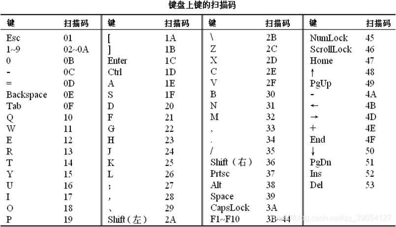

BIOS提供了int 9中断例程，用来进行基本的键盘输入处理，主要的工作如下：
（1）读出60h端口中的扫描码；
（2）如果是字符键的扫描码，将该扫描码和它所对应的字符码（即ASCII码）送入内存中的BIOS键盘缓冲区； 如果是控制键（比如Ctrl）和切换键（比如CapsLock）的扫描码，则将其转变为状态字节写入内存中存储状态字节的单元；
（3）对键盘系统进行相关的控制，比如说，向相关芯片发出应答信息。

BIOS键盘缓冲区可以存储15个键盘输入，一个键盘输入用一个字单元存放，高位字节存放扫描码，低位字节存放字符码。

`0040:17`单元存储键盘状态字节，该字节记录了控制键和切换键的状态。键盘状态字节各位记录的信息如下。

| 0    | 右shift状态    | 置1表示按下右shift键      |
| ---- | -------------- | ------------------------- |
| 1    | 左shift状态    | 置1表示按下左shift键      |
| 2    | Ctrl状态       | 置1表示按下Ctrl键         |
| 3    | Alt状态        | 置1表示按下Alt键          |
| 4    | ScrollLock状态 | 置1表示Scroll指示灯亮     |
| 5    | NumLock状态    | 置1表示小键盘输入的是数字 |
| 6    | CapsLock状态   | 置1表示输入大写字母       |
| 7    | Insert状态     | 置1表示处于删除态         |

**编写int 9中断例程**

```
;编程：在屏幕中间依次显示“a”~“z”，并可以让人看清。在显示的过程中，按下'Esc'键后，改变显示的颜色。

;完整功能代码：

assume cs:code

stack segment
	db 128 dup (0)
stack ends

data segment
	dw 0,0
data ends

code segment
start:	
	mov ax,stack
	mov ss,ax
	mov sp,128
	mov ax,data
	mov ds,ax
	mov ax,0
	mov es,ax

	push es:[9*4]
	pop ds:[0]
	push es:[9*4+2]
	pop ds:[2]		;将原来的int 9中断例程的入口地址保存在ds:0、ds:2单元中

	mov word ptr es:[9*4], offset int9
	mov es:[9*4+2], cs	;在中断向量表中设置新的int 9中断例程的入口地址

;显示字符串
	mov ax, 0b800h
	mov es, ax
	mov ah, 'a'
s:	
	mov  es:[160*12+40*2], ah
	call delay
	inc ah
	cmp ah, 'z'
	jna s
	mov ax,0
	mov es,ax

	push ds:[0]
	pop es:[9*4]
	push ds;[2]
	pop es;[9*4+2]   	;将中断向量表中int 9中断例程的入口恢复为原来的地址

	mov ax,4c00h
	int 21h

;将循环延时的程序段写为一个子程序
delay:	
	push ax 
	push dx
	mov dx, 2000h  ;用两个16位寄存器来存放32位的循环次数
	mov ax, 0
s1: 	
	sub ax, 1
	sbb dx, 0
	cmp ax, 0
	jne s1
	cmp dx, 0
	jne s1
	pop dx
	pop ax
	ret

;------以下为新的int 9中断例程--------------------

int9:	
	push ax
	push bx
	push es

	in al, 60h;从端口60h读出键盘的输入

	pushf ;标志寄存器入栈

	pushf   
	pop bx
	and bh,11111100b
	push bx
	popf	;TF=0,IF=0
	
	call dword ptr ds:[0] 	;对int指令进行模拟，调用原来的int 9中断例程

	cmp al,1
	jne int9ret

	mov ax,0b800h
	mov es,ax
	inc byte ptr es:[160*12+40*2+1]  ;属性增加1，改变颜色

int9ret:
	pop es
	pop bx
	pop ax
	iret
code ends
end start
```

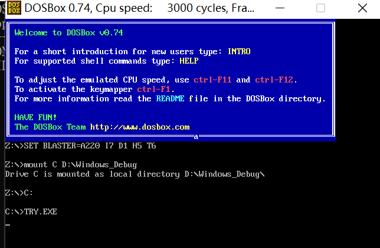


CPU对外设输入的通常处理方法
（1）外设的输入送入端口；
（2）向CPU发出外中断（可屏蔽中断）信息；
（3）CPU检测到可屏蔽中断信息，如果IF=1，CPU在执行完当前指令后响应中断，执行相应的中断例程；
（4）可在中断例程中实现对外设输入的处理。

端口和中断机制，是CPU进行I/O的基础。

## 十四、直接定址表

```
assume cs:code
code segment
         a : db 1,2,3,4,5,6,7,8  ;在后面加有“：”的地址标号，只能在代码段中使用，不能在其他段中使用。
         b : dw 0
start :mov si,offset a
         mov bx,offset b
         mov cx,8
    s : mov al,cs:[si]
         mov ah,0
         add cs:[bx],ax
         inc si
         loop s
         mov ax,4c00h
         int 21h
code ends
end start
```

程序中，code、a、b、start、s都是标号。这些标号仅仅表示了内存单元的地址

**描述了单位长度的标号**

```
assume cs:code
code segment
          a db 1,2,3,4,5,6,7,8 ;标号a、b后面没有":"，因此它们是可以同时描述内存地址和单元长度的标号。
                               ;标号a，描述了地址code:0，和从这个地址开始，以后的内存单元都是字节单元
          b dw 0               ;标号b描述了地址code:8，和从这个地址开始，以后的内存单元都是字单元。
start :  mov si,0
          mov cx,8
    s :   mov al,a[si]
          mov ah,0
          add b,ax
          inc si
          loop s
          mov ax,4c00h
          int 21h
code ends
end start
```

使用**数据标号**来描述存储数据的单元的地址和长度。

```
assume cs:code,ds:data ；用伪指令assume将标号所在的段和一个段寄存器联系起来(编译器需要)
data segment          
          a db 1,2,3,4,5,6,7,8
          b dw 0
data ends
code segment
start:  mov ax,data
          mov ds,ax ;真正确定ds寄存器
          mov si,0
          mov cx,8
s:       mov al,a[si] ;编译为：mov al,[si+0] 默认所访问单元的段地址在ds
          mov ah,0
          add b,ax ;编译为：add [8],ax
          inc si
          loop s
          mov ax,4c00h
          int 21h
code ends
end start
```

```
data segment
	a db 1,2,3,4,5,6,7,8
	b dw 0
	c dw a, b ;等价于c dw offset a, offset b
	;数据标号c处存储的两个字型数据为标号a、b 的偏移地址
data ends

data segment
	a db 1,2,3,4,5,6,7,8
	b dw 0
	c dd a,b ;等价于c dw offset a, seg a, offset b, seg b
	;数据标号c处存储的两个双字型数据为标号a的偏移地址和段地址、标号b 的偏移地址和段地址
data ends
```

seg操作符，功能为取得某一标号的段地址

建立一张表，表中依次存储字符“0”~“F”，我们可以通过数值0 ~ 15直接查找到对应的字符

```
assume cs:code

code segment
start:  
		mov al,0eh

        call showbyte

        mov ax,4c00h
        int 21h

;子程序：
;用al传送要显示的数据

showbyte:
        jmp short show

        table db '0123456789ABCDEF'	;字符表

show:   push bx
        push es

        mov ah,al
        shr ah,1           
        shr ah,1
        shr ah,1
        shr ah,1			    ;右移4位，ah中得到高4位的值
        and al,00001111b		;al中为低4位的值

        mov bl,ah
        mov bh,0
        mov ah,table[bx]		;用高4位的值作为相对于table的偏移，取得对应的字符

        mov bx,0b800h
        mov es,bx
        mov es:[160*12+40*2],ah

        mov bl,al
        mov bh,0
        mov al,table[bx]		;用低4位的值作为相对于table的偏移，取得对应的字符
        
        mov es:[160*12+40*2+2],al

        pop es
        pop bx
        ret

code ends
end start
```

## 十五、 指令系统总结

我们对8086CPU的指令系统进行一下总结。读者若要详细了解8086指令系统中的各个指令的用，可以查看有关的指令手册。

8086CPU提供以下几大类指令。

1. 数据传送指令
   `mov、push、pop、pushf、popf、xchg` 等都是数据传送指令，这些指令实现寄存器和内存、寄器和寄存器之间的单个数据传送。
2. 算术运算指令
   `add、sub、adc、sbb、inc、dec、cmp、imul、idiv、aaa`等都是算术运算指令，这些指令实现存器和内存中的数据的算数运算。它们的执行结果影响标志寄存器的`sf、zf、of、cf、pf、af`位。
3. 逻辑指令
   `and、or、not、xor、test、shl、shr、sal、sar、rol、ror、rcl、rcr`等都是逻辑指令。除了not指外，它们的执行结果都影响标志寄存器的相关标志位。
4. 转移指令
   可以修改IP，或同时修改CS和IP的指令统称为转移指令。转移指令分为以下几类。
   （1）无条件转移指令，比如，`jmp`；
   （2）条件转移指令，比如，`jcxz、je、jb、ja、jnb、jna`等；
   （3）循环指令，比如，`loop`；
   （4）过程，比如，`call、ret、retf`；
   （5）中断，比如，`int、iret`。
5. 处理机控制指令
   对标志寄存器或其他处理机状态进行设置，`cld、std、cli、sti、nop、clc、cmc、stc、hlt、wait、esc、lock`等都是处理机控制指令。
6. 串处理指令
   对内存中的批量数据进行处理，`movsb、movsw、cmps、scas、lods、stos`等。若要使用这些指令方便地进行批量数据的处理，则需要和`rep、repe、repne` 等前缀指令配合使用。