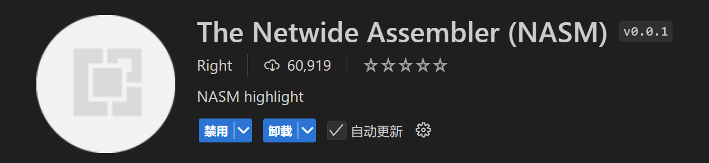

# 基于x86_64汇编语言简单教程

## 前言

​	笔者最近正在梭哈使用NASM汇编器的x86 32位汇编，笔者这里记录一下一个晚上的成果。

## 环境配置

### 基本硬件与操作系统要求

​	如果您是Linux常客，或者已经有了WSL且使用VSCode SSH连接进行了一段时间的开发，只需要跳转道环境安装就OK。

### WSL + VSCode基本配置`(For Windows)`

​	笔者主要是在Linux发行版下尝试汇编（原因是简单而又方便，屁事少），这里建议参考本人教程的同志们配一个WSL2。然后就可以开始coding了。

> `Preparing for the Assembly Coding:`[开始通过 WSL 使用 VS Code | Microsoft Learn](https://learn.microsoft.com/zh-cn/windows/wsl/tutorials/wsl-vscode)

### 安装基本的依赖

​	好在NASM很轻量，几乎一瞬间就可以下载完成：

> 如果您是Ubuntu或者发行版使用apt管理

```
sudo apt install nasm # for Ubuntu or any Releases owns apt as the main package manager
```

> 或者您是Arch Linux膏首！

```
yay -Ss nasm	# do this if u r using yay
```

​	当然，您可以看看自己有没有GDB，这是我们用来调试您写的汇编程序的！

```
sudo apt install gdb ; download gdb if u r using apt 
yay -Ss gdb; download gdb if u r using yay
```

​	测试一下：

```
charliechen@Charliechen:~/demo/demo5$ nasm -v
NASM version 2.16.01
charliechen@Charliechen:~/demo/demo5$ gdb -v
GNU gdb (Ubuntu 15.0.50.20240403-0ubuntu1) 15.0.50.20240403-git
Copyright (C) 2024 Free Software Foundation, Inc.
License GPLv3+: GNU GPL version 3 or later <http://gnu.org/licenses/gpl.html>
This is free software: you are free to change and redistribute it.
There is NO WARRANTY, to the extent permitted by law.
```

### 为您的VSCode安装插件：

> 直接搜NASM，下载这个：
>
> 

​	没了！现在，让我们做最后的检查：👇

## 学习要求

​	笔者需要假设您

- 会使用基本的Linux命令行
- 学习过至少一门高级编程语言，啊哈！如果是C，还很熟练那就更好了！
- 有过GCC命令行编译的经历（不求经验，笔者自己就不咋地...
- （Bonus!）会使用GDB调试您的程序！
- `(Great Bonus!)`有过微机原理/ 计算机组成原理/操作系统 三门课程中至少一门的上课经验（貌似您不需要看这篇教程了）

​	我相信任何一个入门计算机最迟一年的各位看官都可以轻松胜任上面的任何一条要求。所以，满足上述条件，您可以开始汇编之旅了！

## 入门

### 先试试味道

​	笔者花费了，嗯，大概几分钟的时间为您写了一份Hello, World!

```
; --------------------------------------------------
;   Program written in 10.19 2024
;   Author:             Charlie chen
;   Functionality:      Print Hello, Assembly to the console 
; --------------------------------------------------

; 英文分号; 后的一行表达的是这一行是注释，汇编器自动jmp后面的内容当作空白 :|

; 这里存放数据！
section .data
    ; 下面定义的是一个字符串, 学习过高级编程语言（except C then :) ）的都知道
    ; 字符串需要维护一个字符数组和长度
    ; 这里我们就是这样做的
    hello_string        db "Hello, Assembly!", 0xA
    hello_string_len    equ $ - hello_string

; 这里存放我们写的代码
section .text
    ; 告知汇编器: 请把_start符号向外面暴露！
    ; 这样，链接器就会找到这个符号解决undefined reference 
    global _start

; 开始我们的程序
_start:
	; write(1, "Hello, Assembly!", sizeof(Hello, Assembly!));
    mov eax, 4                  ; SYS_WRITE
    mov ebx, 1                  ; stdout 的 file descripter
    mov ecx, hello_string       ; 字符串地址
    mov edx, hello_string_len   ; 打印字符的个数：这里我们选择全部打印
    int 0x80                    ; 发起128号中断
	; Like exit(0) then huh? :>
    mov eax, 1                  ; SYS_EXIT
    mov ebx, 0                  ; 参数0表示正常退出
    int 0x80                    ; 发起128号中断
```

​	现在，请你掏出最喜欢的文本编辑器（笔者是VSCode），将上面的代码CV。然后记得保存 :)笔者保存的是test.asm

​	现在，你可以开始使用NASM汇编器开始你的表演：

```
nasm -g -f elf32 test.asm1 -o test.o
```

> 上面这个指令指挥NASM将test.asm汇编文件汇编成全部由机器指令构成的test.o文件。.o文件是一个relocatable的重定位文件。我们后面会谈到啥叫重定位，但不是现在 :)
>
> - -g : 生成详细的调试符号，您在发布您的程序给其他人使用的时候，如果对方只是使用您的程序，请去掉-g，您也不希望别人把你的程序一眼望穿 :)
> - -f : Format！什么格式呢？笔者的OS是Linux Kernel Releases的Ubuntu，那就需要ELF文件。我们的汇编是32位，遵循32位的文件格式！所以带上参数elf32，当然后面自己写64位汇编的时候就不用-f了，默认是elf64
> - -o：output is what? Oh! it''s test.o :)

​	现在请您ls一下您的文件夹

```
charliechen@Charliechen:~/demo/demo5$ ls
test.asm  test.o
```

​	非常好！但是我们仍然无法执行它！因为还没有使用链接器连接必要的文件（具体是啥？当然，是一些指挥操作系统分配的工作，你我写不来，请操作系统帮忙咯！）

```
ld -g -m elf_i386 -o test test.o
```

> 上面这个指令告知的是调用链接器连接文件：
>
> -g：链接时继续保留连接调试信息
>
> -m: 按照x86平台的方式进行连接，连接的是x86 32位文件
>
> -o: 略

​	现在，您的文件夹下会有test汇编文件。执行它：

```
charliechen@Charliechen:~/demo/demo5$ ./hello 
Hello, Assembly!
```

​	啊哈！没有任何问题！恭喜你，你学会了。。。好吧，还远着，但是至少您现在是一个汇编程序员新手了！

​	这份文件的含义如何，到底做了什么，请听下回分解！