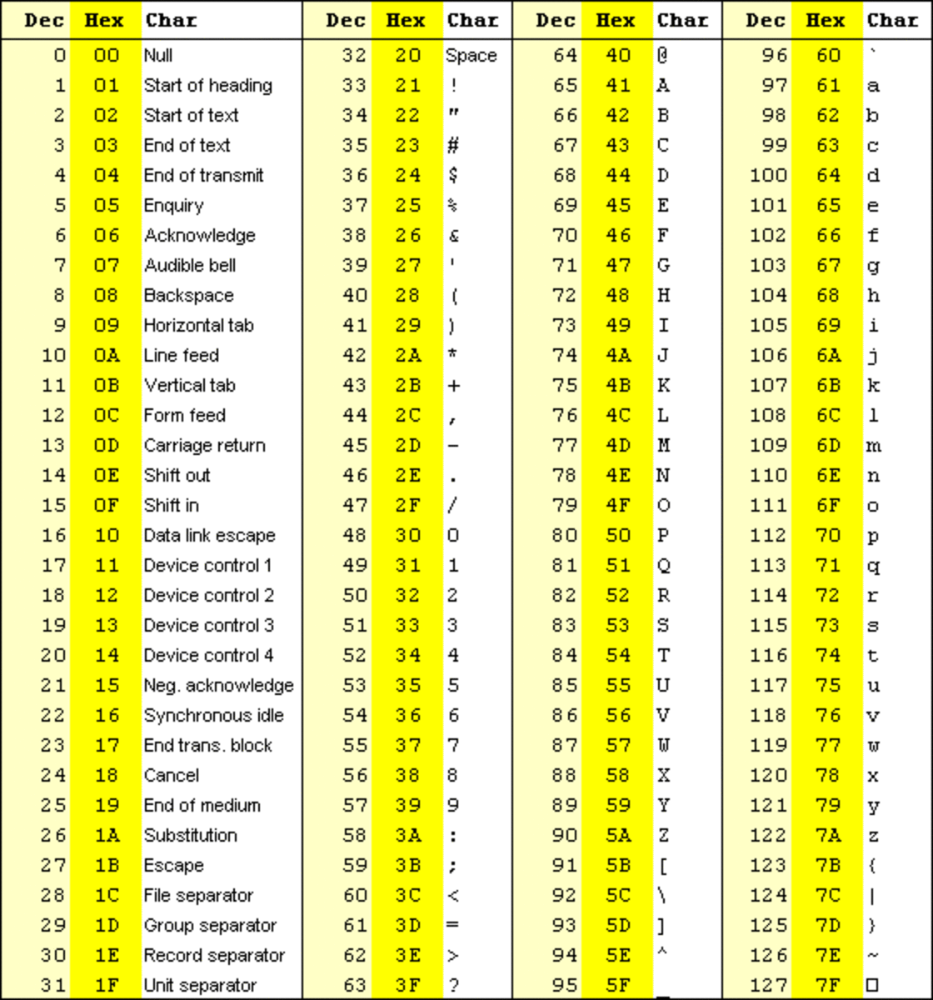

# 汇编简单教程2

## 前言

​	欸！上面我们写(C)完(V)这个Program，就是要进行深入的学习这个程序的细节了

```
; --------------------------------------------------
;   Program written in 10.19 2024
;   Author:             Charlie chen
;   Functionality:      Print Hello, Assembly to the console 
; --------------------------------------------------

; 英文分号; 后的一行表达的是这一行是注释，汇编器自动jmp后面的内容当作空白 :|

; 这里存放数据！
section .data
    ; 下面定义的是一个字符串, 学习过高级编程语言（except C then :) ）的都知道
    ; 字符串需要维护一个字符数组和长度
    ; 这里我们就是这样做的
    hello_string        db "Hello, Assembly!", 0xA
    hello_string_len    equ $ - hello_string

; 这里存放我们写的代码
section .text
    ; 告知汇编器: 请把_start符号向外面暴露！
    ; 这样，链接器就会找到这个符号解决undefined reference 
    global _start

; 开始我们的程序
_start:
	; write(1, "Hello, Assembly!", sizeof(Hello, Assembly!));
    mov eax, 4                  ; SYS_WRITE
    mov ebx, 1                  ; stdout 的 file descripter
    mov ecx, hello_string       ; 字符串地址
    mov edx, hello_string_len   ; 打印字符的个数：这里我们选择全部打印
    int 0x80                    ; 发起128号中断
	; Like exit(0) then huh? :>
    mov eax, 1                  ; SYS_EXIT
    mov ebx, 0                  ; 参数0表示正常退出
    int 0x80                    ; 发起128号中断
```

​	现在我们仔细看看这个程序。一步一步的看！

## 程序为什么分段

​	我们首先来看第一行有意义的话：

```
section .data
```

​	这里的section就是英文的段！

​	程序是分段的！您可以现在手写一个简单的hello, world来查看编译器对高级语言进行操作的时候，他就会自己将程序分段书写。这是为什么呢？

​	我们知道：程序从8086时代就想解决程序重定位的难题：在之前，我们程序的地址全部写死了，然而程序从死的代码到活的进程实体，需要在内存中指定一个位置加载上去。麻烦了！万一我们的程序的死地址上有程序加载，就只好乖乖的等待直到占用的程序释放空间了！

​	拜托！明知山有虎，偏往虎山行！程序也很冤枉，他也不知道那个时候有程序在上面。所以现在我们的解决方式是：程序分段：让代码可以使用段寄存器重定位我们的程序，然后实际上代码书写的时候采用偏移地址的方式进行编址！

- 一个直观并且通用的方法是在机器上提供多个互相独立的称为**段(segment) 的地址空间**。每个段由一个从0到最大的线性地址序列构成。各个段的长度可以是0到某个允许的最大值之间的任何一个值。不同的段的长度可以不同，并且通常情况下也都不相同。段的长度在运行期间可以动态改变，比如，堆栈段的长度在数据被压入时会增长，在数据被弹出时又会减小。
- 因为每个段都构成了一个独立的地址空间，所以它们可以独立地增长或减小而不会影响到其他的段。
- 要在这种分段或二维的存储器中指示一个地址，程序必须提供两部分地址：**一个段号和一个段内地址**。
- 分段也有助于在几个进程之间共享过程和数据。这方面一个常见的例子就是共享库(shared library)。
- 另一方面，我们作为程序员，也会拥有更加清晰的编程体验：这个放数据，那里放代码......总而言之，至少比混在一起好多了！

​	这里的section .data，就是暗示我们将会声明一个数据段，里面存放这此程序使用到的数据。在这里，我们的数据将会从.data的起始地址开始排放我们的数据。

```
    ; 下面定义的是一个字符串, 学习过高级编程语言（except C then :) ）的都知道
    ; 字符串需要维护一个字符数组和长度
    ; 这里我们就是这样做的
    hello_string        db "Hello, Assembly!", 0xA
    hello_string_len    equ $ - hello_string
```

​	我们声明了两个变量。它等价于

```
hello_string 		= 	"Hello, Assembly!\n"; // 没有\0!注意汇编控制字符串只是告诉他这个字符串长度为多少
hello_string_len 	= 	strlen(hello_string);
```

​	欸？差别有点大啊，这是怎么回事呢？我们仔细琢磨。

​	首先，我们遇到的db，表示的是defined bytes的意思。是汇编语言中的**伪操作命令**，它用来定义操作数占用的字节数。等等，啥是伪操作指令呢？很简单，我们之后会学习到真操作指令，也就是说，我们的ISA体系下的汇编助记符下存在这样的指令。但是你找db，是找不到的，为什么？因为db不属于真汇编指令，在编译器间，他就会被转化为使用真汇编指令表达的相同功能的代码了。在这里，我们只需要直到：**db就是一个给编译器看，告诉编译器而不是机器我们的意图的指令，编译器帮助我们转化成给机器看的复杂的代码，这样就OK了**。在这里，我们把后面的内容定义成一个使用比特组存储的字符串（啊哈，我们的字符串就是一个ascii字符串，学习过C语言的都知道每一个经典的平凡字符串都是ASCII字符组成的）

​	当然，这里支持使用`,`来拼接比特，在这里，没有转义字符，统统都是Raw String，原始字符串！

> 笔者推介你行动起来，看看如果把`hello_string`改成`Hello, Assembly!\n`会如何，看看我说的对不对 :)

​	那为什么是0xA呢？这件事情我想你会脱口而出的回答：因为换行符号的ASCII（美国信息交换标准代码）号是10，10的十六进制数是0xA



​	很好！我相信你大致懂得了。。。大致！知道如何生硬的声明一个字符串了！但是下面的：

```
hello_string_len    equ $ - hello_string
```

​	有些令人摸不着头脑！首先，仿照上面的格式，我们知道我们大概是在声明一个叫做hello_string_len的东西，但是后面的equ又是如何？你可能猜到是equal！

​	恭喜答对了！那 $ 如何呢？不着急，且听我道来！

​	我们知道，在数据段声明变量，不是随便把数据扔到一个地址就是完事的，早期内存吃紧，能用尽可能少的比特表达尽可能多的信息是大部分coder的追求。这里，我们使用连续的内存来表达一场串数据的信息！你瞧，我们在数据段的视图相会是：

```
.data:
| H e l l o ,   A s s e m b l y ! 0xA  |   ?   |	
|		hello_string			 	 |		|							
1									2

1: data的起始位置，在这里开始直接放数据，所以他也是hello_string的地址
2: 轮到我们的符号hello_string_len了，现在我们的hello_string_len按照顺序放到2的位置
```

​	很好，那么你可能猜到，$就是表达当前符号的排布偏移地址了！哈哈，还是对了：\$的确表示当前地址。它用于指代当前指令或数据的地址。那么，他就是2的地址位置了，那么 2 的地址减去 hello_string... 这个减去 hello_string又该如何理解呢？答案是：还是地址！是hello_string的地址。

​	汇编器和机器指令代码实在是不在乎你的数据的名称叫啥，他只在乎：我该去哪里干活，干活的时候要求哪里取出多大的数据，除此之外他一概不在乎！所以我们发现这个指令实际上干的就是C语言当中指针相减的操作。指针相减得到两个指针框起来的内存的大小，我们知道ASCII的每一个字符使用1个Byte存储字符。那这里恰好就是字符串hello_string的大小！

​	所以，我们会把， 啊，请让我点一下：17个字符放到后面。。。吗？

​	错误！你会大吃一惊，怎么回事呢？难道不是吗？不，这里的计算是没有问题的，问题出在了“放到”这个操作上，事实上，equ是一个常量，对吗？他在汇编器预处理结束后，实际上就是一个立即数了。

​	立即数又是啥？现在这个阶段，您只需要知道他就是一个常量就好。啥？常量？任何一个C/C++ Coder就会跳起来了：“常量还要分配内存？浪费！”

```
#define CONST_NUM 17		// Coder's Programming in C would write...
static constexpr unsigned short CONST_NUM = 17; // Coder's Programming in C++ would write...
```

​	你立马联想起来，这些常量是不会分配内存的！哈哈，这就是汇编层级的实现，代码大部分就是等效为equ指令，就是在这里体现的。equ不会分配内存，他只会在汇编器汇编代码的时候扫描所用用到符号的地方替换成这个立即数罢了！

​	非常好！我们终于解决了这个大难题。我们就可以往下走了：

```
; 这里存放我们写的代码
section .text
    ; 告知汇编器: 请把_start符号向外面暴露！
    ; 这样，链接器就会找到这个符号解决undefined reference 
    global _start
```

​	这一行声明 `_start` 是一个全局符号。这意味着 `_start` 可以被链接器和其他模块访问。啊哈，起始就是给链接器看的，他会看到这个符号是其他模块所需要的。。。你好不好奇是谁？答案是gnu-ld配置的启动文件需要，笔者曾经看过代码，事实上就是jmp到_start的这个位置，如果我们的代码里没有\_start这个文件，那不好意思，链接器认为这个符号不存在，只好抱怨undefined reference（任何一个长期编写C/C++大型工程的人都会心脏骤停）。你只需要知道，这个玩意就是给操作系统和链接器看：哥们别找了，这里是主程序，从我这执行包没问题的！

​	现在，我们就需要写_start了

```
; 开始我们的程序
_start:
	; write(1, "Hello, Assembly!", sizeof(Hello, Assembly!));
    mov eax, 4                  ; SYS_WRITE
    mov ebx, 1                  ; stdout 的 file descripter
    mov ecx, hello_string       ; 字符串地址
    mov edx, hello_string_len   ; 打印字符的个数：这里我们选择全部打印
    int 0x80                    ; 发起128号中断
```

​	我们的_start其实时一个标签，执行的时候，CS：IP经过指示跳到了\_start这个位置！这个东西我们会在条件语句编程中再次使用到，笔者这里不在多谈！知道这样写就行。

​	可以看到我们使用到了，你将会学习的，第一条真汇编指令！mov就是move，但是笔者其实私下认为这个叫move不太好，因为实际上源并没有被清空。。。叫copy还是不错的！但是你写的时候必须是mov。你可能猜出来：这个的含义是将4放到一个叫做EAX的东西了。答对了！EAX是一个寄存器（怎么样，你之前听的迷迷糊糊的寄存器概念突然出现在了真正的编程里了，就是你学习到的一个叫做寄存器的东西）

​	关于寄存器是什么，笔者简单的告诉你：这是一个锁存器（数电人探头），或者说一个取东西放东西超级快速的箱子。你告诉CPU里的ALU器件干活的时候去这个箱子里取，或者放数据。他就会忠实的将材料或者是结果取出或者放入箱子。就是如此简单。

​	所以，`mov eax, 4`就是告诉CPU：“哥们，你把4这个数放到EAX这个箱子”，那同理，下一行话就是“哥们，你把1这个数放到EBX这个箱子”，再下一行话。。。有点像但不一样，但是也不难理解：“哥们，你把hello_string放到ECX这个箱子”。

> 你放的其实是什么？是字符串的内容吗？当然不是！我提示你：我们在定义hello_string_len的时候也用到了hello_string。想到了吗？那里我们的hello_string也是以被操作数的形式出现的，我说那个就是地址。那么这个也是同理：我们向寄存器扔了一个字符串的地址。

​	下一条又熟悉起来了，你仔细翻上去，就会知道这里的hello_string_len被替换成了17，然后`int 80`？这又是什么？

​	好吧，我必须承认，这个东西我可以一讲讲一整天。如果您成功跑起来笔者之前给您的程序的话，就会知道这个程序是打印一个叫做Hello, Assembly的字符串。但是你没有写任何，任何关于操作显卡和显示器的代码，这又是怎么做到的呢？

​	简单的讲，你把这个脏活累活交给了操作系统干了，方式就是主动的踹开操作系统的门（int 0x80），摇醒硬件里的中断控制器，告诉他我现在需要处理器通知里头忙来忙去的操作系统鸟一下老子，我要让他干活！

​	很好，操作系统就这样来了，你通过**发起中断的方式（值得一提的是这个是软件中断，也就是你写的程序向中断处理器发起请求）**，想要请求操作系统的服务。好了，他来了，现在问你要干啥。

​	别蒙！你其实准备好材料了，你的材料放在了4个箱子里。其中，我悄悄的向你隐藏了约定，那就是我们请求OS的参数的存放规则。您可以看看Linux操作系统对一个叫做“系统调用”的实现是如何的。我现在告诉你。对于一个write这个三参数的系统调用（wait什么是系统调用呢？简单的讲就是调用系统！请求系统帮忙，三参数的系统调用就是系统调用需要三个参数，你想想你在网络编程或者是文件系统编程的时候，是不是写write(int fd, cons char* buffer, size_t buffer_size)啊？哈哈，这就是那三个参数），需要4个寄存器。因为，还有一个寄存器EAX是存储你需要发起什么系统调用的。

​	你问我syscall这些东西去哪里查？哈哈，这里不是Linux内核源码分析课，不过笔者可以告诉你，大部分教程都已经过时。笔者手头的Linux 6.11的源码，已经没有NR_SYSCALL这个宏定义了，实际上早就被移除了，但是你可以去：

> arch/x86/entry/syscalls/syscall_32.tbl
>
> ```
> # SPDX-License-Identifier: GPL-2.0 WITH Linux-syscall-note
> #
> # 32-bit system call numbers and entry vectors
> #
> # The format is:
> # <number> <abi> <name> <entry point> [<compat entry point> [noreturn]]
> #
> # The __ia32_sys and __ia32_compat_sys stubs are created on-the-fly for
> # sys_*() system calls and compat_sys_*() compat system calls if
> # IA32_EMULATION is defined, and expect struct pt_regs *regs as their only
> # parameter.
> #
> # The abi is always "i386" for this file.
> #
> 0	i386	restart_syscall		sys_restart_syscall
> 1	i386	exit			sys_exit			-			noreturn
> 2	i386	fork			sys_fork
> 3	i386	read			sys_read
> 4	i386	write			sys_write
> ...
> 459	i386	lsm_get_self_attr	sys_lsm_get_self_attr
> 460	i386	lsm_set_self_attr	sys_lsm_set_self_attr
> 461	i386	lsm_list_modules	sys_lsm_list_modules
> 462	i386	mseal 			sys_mseal
> ```
>
> ​	一共463个系统调用！
>
> ​	当然下面还有64位的syscall，您现在的Linux内核此时此刻就在命中这个syscall table查询调用表为您服务呢（小）这里就不指路了

​	你看到我们的EAX被放了4，恰好就是sys_write，后面的ebx, ecx, edx分别放入了`1(stdout)`，`(const char*)hello_string`和`17`，你瞧，这分明就是

```
write(1, (const char*)hello_string, 17);
```

​	向标准输出输出一个字符串，长度为17个比特！有更加聪明的读者已经猜到我们的函数调用是怎么实现的了，不着急，我们会在之后提到的。

​	int 0x80是一个固定动作，他表示向操作系统发起系统调用。执行完这句话，你的程序就会进入到服务办事大厅等待操作系统把你的请求干完，然后返回继续你的行程！哈哈，也就是说，等你的代码执行完毕int 0x80的时候，Hello, Assembly就已经完成打印了。那下一步就是收拾东西准备走人咯！

```
	; Like exit(0) then huh? :>
    mov eax, 1                  ; SYS_EXIT
    mov ebx, 0                  ; 参数0表示正常退出
    int 0x80                    ; 发起128号中断
```

​	我提示你，我们要做的是`exit(0)`让操作系统完成进程清理的工作

> 哈？你不想清理？IP指针就会跑飞，然后进程崩溃。（OS干吗呢？他又不知道后面你跑飞的指令不是你的代码，一般而言，链接器会在连接你的文件之后在代码段后面插入一些帮助立即崩溃的指令，你可以梭哈gdb调试看一看之后的代码片段）你会看到一个著名的错误叫做Segment Fault，关于exit干了什么，以及进程的清理不是我们的重点，但是笔者仍然建议那些好奇的读者阅读《Linux内核源码刨析》这本书，除了代码有些老旧以外，笔者读完后认为还是不错的。简而言之就是做清理工作，优雅的向你和操作系统鞠了一躬（返回0表示工作正常）后珊珊离去

​	恭喜你！你至少大致掌握了汇编的基本编写的流程，现在可以小吹自己会写汇编语言了（不是）