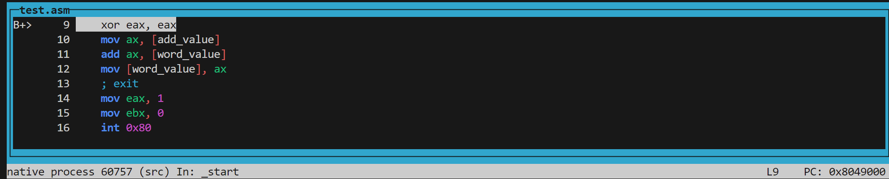
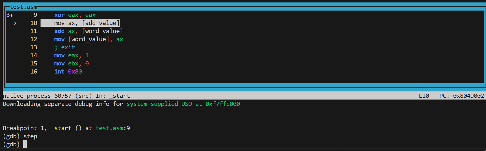
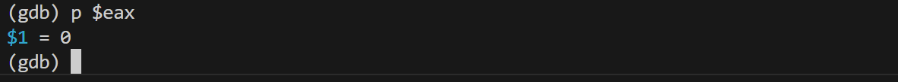
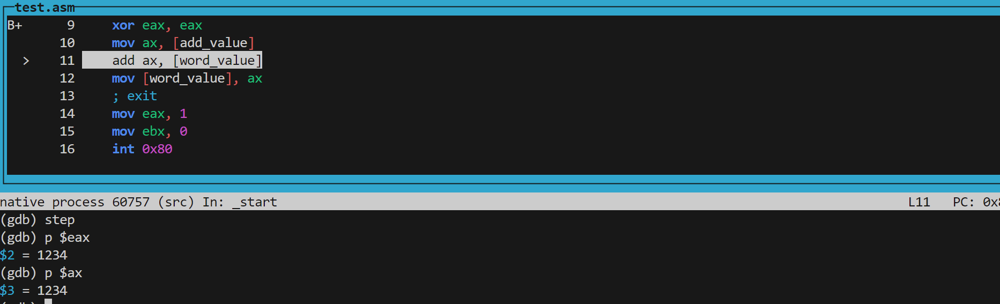
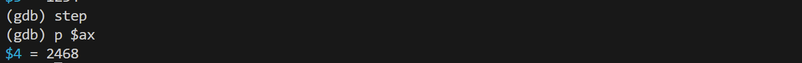

# 汇编简单教程5

## 寻址模式

​	我们无非就是频繁的跟数据自己打交道，那么问题来了，我们可以如何找到这些数据呢？这就是我们这篇教程的注重的核心。在这里，我们以mov为例子进行实践。

​	这里有三种最为基本的寻址模式，请看VCR:

- 寄存器寻址
- 立即寻址
- 内存寻址

​	寄存器寻址就是我们正在使用的寻址方式，我们的寄存器里包含了我们想要找到的目的操作数：

```
mov dx, tax_rate   ; 寄存器是第一个操作数
mov count, cx      ; 寄存器是第二个操作数
mov eax, ebx       ; 两个操作数都是寄存器
```

​	`mov dx, tax_rate`：将 `tax_rate` 的值移动到寄存器 `dx` 中。这里，`tax_rate` 通常是一个常量或存储在内存中的数据，它的值被加载到 `dx` 寄存器中，以便后续操作。

​	`mov count, cx`：将寄存器 `cx` 中的值移动到内存位置 `count`。在这条指令中，`count` 是一个内存变量，它会存储 `cx` 寄存器的当前值。

​	`mov eax, ebx`：将寄存器 `ebx` 中的值移动到寄存器 `eax` 中。这是一个简单的寄存器间传递操作，`eax` 将获取 `ebx` 的值，方便后续使用。

​	立即寻址模式直接给出操作数的值，例如 `mov eax, 5` 将数值 5 移动到 `eax` 中。寄存器寻址模式则是操作数在寄存器中，比如 `mov ebx, eax` 将 `eax` 的值移动到 `ebx`。

​	直接内存寻址则是在存储器寻址模式下指定操作数时，通常需要直接访问主存储器，通常是数据段。这种寻址方式导致数据处理变慢。为了找到数据在内存中的确切位置，我们需要段起始地址（通常在DS寄存器中找到）和偏移值。此偏移值也称为有效地址。在直接寻址模式下，偏移量值直接作为指令的一部分指定，通常由变量名指示。汇编器计算偏移值并维护一个符号表，该表存储程序中使用的所有变量的偏移值。在直接存储器寻址中，一个操作数引用一个存储器位置，另一个操作数引用一个寄存器。

```
add byte_value, dl	; 将寄存器的值加到byte_value的内存处
mov bx, word_value	; 将一个字的值放到寄存器中
```

直接偏移寻址：此寻址模式使用算术运算符修改地址。例如，查看以下定义数据表的定义-

```nasm
byte_table db  14, 15, 22, 45      ; 字节表
word_table dw  134, 345, 564, 123  ; 字表
```

​	像C语言的数组那般，我们可以将数据从内存中的表访问到寄存器中-

```nasm
mov cl, byte_table[2]   ; 获取 byte_table 的第三个元素
mov cl, byte_table + 2   ; 获取 byte_table 的第三个元素
mov cx, word_table[3]   ; 获取 word_table 的第4个元素
mov cx, word_table + 3   ; 获取 word_table 的第4个元素
```

间接内存寻址

此寻址模式利用计算机的Segment：Offset寻址功能。通常，在方括号内编码的基址寄存器EBX，EBP（或BX，BP）和索引寄存器（DI，SI）用于内存引用。

间接寻址通常用于包含多个元素（如数组）的变量。阵列的起始地址存储在EBX寄存器中。

以下代码段显示了如何访问变量的不同元素。

```nasm
MY_TABLE TIMES 10 DW 0  ; 分配10个字（2个字节），每个字都初始化为0
MOV EBX, [MY_TABLE]     ; EBX中MY_TABLE的有效地址
MOV [EBX], 110          ; MY_TABLE[0] = 110
ADD EBX, 2              ; EBX = EBX +2
MOV [EBX], 123          ; MY_TABLE[1] = 123
```

​	直接寻址模式通过指定内存地址访问操作数，如 `mov eax, [0x00400000]` 将该地址的值加载到 `eax`。间接寻址模式则使用寄存器中存储的地址，例如 `mov eax, [ebx]` 从 `ebx` 指向的内存地址加载值。

​	基址寻址模式结合基址寄存器和偏移量，像 `mov eax, [ebx + 4]`，而变址寻址模式使用索引寄存器和偏移量，如 `mov eax, [esi + 8]`。基址加变址寻址模式同时使用基址寄存器和变址寄存器，例如 `mov eax, [ebx + esi]`。

​	基址加变址加缩放寻址模式允许使用缩放因子访问数组元素，像 `mov eax, [ebx + esi*4]`。相对寻址模式常用于跳转或调用，通过指定偏移量，如 `jmp label` 跳转到指定标签。

## gdb调试

​	一股脑子说这么多，能不能来点现象呢？可以！还记得我在环境配置那里提到了gdb吗，我们下面就来试试看使用gdb调试。

​	笔者为了方便，书写了一个极其简单的脚本来辅助构建（算是。。。最简单的build scripts了）

```
charliechen@Charliechen:~/demo/demo7$ cat scripts.sh 
nasm -g -f elf32 $1 -o middleware.o
ld -g -m elf_i386 -o result middleware.o
```

​	可以将这段简单的代码复制到一个sh脚本中，然后记得chmod 744。现在你就可以使用这个脚本来进行快速的汇编构建了。

​	下面就是开始我们gdb调试的内容。笔者书写的构建脚本最后生成的文件是result可执行文件，我们需要的就是对这个可执行文件展开调试。

```
gdb ./result
charliechen@Charliechen:~/demo/demo7$ gdb ./result 
GNU gdb (Ubuntu 15.0.50.20240403-0ubuntu1) 15.0.50.20240403-git
Copyright (C) 2024 Free Software Foundation, Inc.
License GPLv3+: GNU GPL version 3 or later <http://gnu.org/licenses/gpl.html>
This is free software: you are free to change and redistribute it.
There is NO WARRANTY, to the extent permitted by law.
Type "show copying" and "show warranty" for details.
This GDB was configured as "x86_64-linux-gnu".
Type "show configuration" for configuration details.
For bug reporting instructions, please see:
<https://www.gnu.org/software/gdb/bugs/>.
Find the GDB manual and other documentation resources online at:
    <http://www.gnu.org/software/gdb/documentation/>.
--Type <RET> for more, q to quit, c to continue without paging--c

For help, type "help".
Type "apropos word" to search for commands related to "word"...
Reading symbols from ./result...
(gdb) 
```

​	然后如你所见，弹出来一大堆内容。请注意`(gdb)`上面的那一行话：`Reading symbols from ./result...`，这说明我们的gdb已经读取到了我们文件的调试符号，表示这个文件可以调试。

​	gdb的完全具体使用不是我们汇编教程的重点。但是一些常见的指令必须会

| 常见指令   | 说明                                                         |
| ---------- | ------------------------------------------------------------ |
| r          | run, 也就是运行程序                                          |
| c          | continue, 也就是继续的意思，当我们的程序停在了断点的时候，我们想让他继续运行就是使用的这个命令 |
| b          | break，也就是打断点，打断点对于汇编文件有很多种打法，我会在下表中单独列出打断点的办法 |
| step       | 一步一步走，欸！F11是这样的                                  |
| p          | 打印，打印也可以单开一张表                                   |
| x          | 还是打印，是花式打印                                         |
| layout src | 显示我们的asm文件界面                                        |

### 示例文件

```
section .data
    word_value dw 1234
    add_value dw 1234


section .text
    global _start
_start:
    xor eax, eax
    mov ax, [add_value]
    add ax, [word_value]
    mov [word_value], ax
    ; exit
    mov eax, 1
    mov ebx, 0
    int 0x80
```

### 打断点 

​	打断点有很多种办法

#### 办法1：给函数名称和行号打上断点

​	例如，使用 `break _start` 或 `b _start` 在 `_start` 标志开始处设置断点，使用 `break 42` 或 `b 42` 在源代码的第 42 行设置断点。也可以联合起来使用，直接通过文件名和行号设置断点，例如 `break filename.asm:42` 在 `filename.asm` 的第 42 行设置断点。

​	举个例子，我打算在12行`  mov [*word_value*], ax`打上一个断点。你就可以

```
(gdb) b 12
```

#### 办法2：在地址上打断点

​	还可以在地址上打断点，也就是说，只要你的指令涉及到这个地址的时候他就会停在来：比如说使用 `break *0x00401234` 即可在指定地址设置断点。

​	当然笔者最经常用的还是起手b _start表示暂停在程序的开头进行观察。

> 还有其他的：
>
> - 如果需要，可以为断点添加条件，使其仅在特定条件成立时触发，比如 `break my_function if x > 10` 仅在 `x` 大于 10 时触发断点。
> - 监视点也可以用来跟踪变量的变化，而不仅仅是执行位置。使用 `watch my_variable` 可以监视 `my_variable` 的值变化，并在变化时暂停程序。可以进一步使用 `rwatch my_variable` 监视读取事件，或 `awatch my_variable` 同时监视读取和写入事件。
> - 对于现有的断点，可以使用 `delete` 命令删除指定的断点，或使用 `disable` 命令使某个断点不再激活，但不删除它。
> - 临时断点可以通过 `tbreak` 命令设置，该断点触发一次后会自动删除，例如 `tbreak my_function`。
> - 为断点指定触发时执行的命令也是一种有效的调试方式，使用 `break my_function commands` 后可以输入要执行的命令，最后以 `end` 结束。

### 打印变量

在 GDB 中，`p` 指令用于打印变量的值。这个命令非常灵活，可以用于调试程序时查看特定变量或表达式的当前状态。

可以使用 `p` 来打印简单变量、数组、结构体以及复杂表达式。例如：

- **打印基本变量**：`p variable_name` 会输出变量 `variable_name` 的当前值。
- **打印数组元素**：`p array_name[2]` 会输出数组 `array_name` 中索引为 2 的元素。
- **打印结构体成员**：`p struct_name.member_name` 会输出结构体 `struct_name` 的特定成员的值。
- **打印表达式**：可以使用复杂表达式，例如 `p x + y` 来输出 `x` 和 `y` 的和。

此外，`p` 命令支持类型转换，允许你将输出格式化为特定类型。例如：

- `p/x variable_name` 以十六进制格式打印 `variable_name` 的值。
- `p/d variable_name` 以十进制格式打印。

### layout命令

在 GDB 中，`layout` 命令用于控制源代码和调试信息的显示布局。它可以帮助调试时更好地组织和查看信息。以下是一些常用的 `layout` 子命令：

- **`layout src`**：切换到源代码布局，显示当前源代码及其对应的机器指令。
- **`layout asm`**：切换到汇编代码布局，显示当前执行的汇编指令。
- **`layout split`**：切换到分屏布局，通常在一个窗口中显示源代码，另一个窗口显示调试信息。
- **`layout next`**：在不同的布局之间循环切换，常用于快速浏览不同视图。

### 打印十六进制（特殊）

​	因为我们经常会看16进制数，所以，我们会常常使用x命令进行打印。下面是参数的说明：

#### count

| 参数  | 说明                         |
| ----- | ---------------------------- |
| count | 要显示的单位数量（默认为 1） |

#### format

| 参数 | 说明     |
| ---- | -------- |
| x    | 十六进制 |
| d    | 十进制   |
| o    | 八进制   |
| c    | 字符     |
| s    | 字符串   |

#### size

| 参数 | 说明           |
| ---- | -------------- |
| b    | 字节           |
| h    | 半字（2 字节） |
| w    | 字（4 字节）   |
| g    | 巨字（8 字节） |

​	所以，命令 x/3uh 0x54320 表示，从内存地址0x54320读取内容，h表示以双字节为一个单位，3表示三个单位，u表示按十六进制显示。

​	再举一个例子：

​	我们即将要学习加法指令。add，我们上面就是对两个一个字大小的值做相加操作。

```
section .data
    word_value dw 1234
    add_value dw 1234


section .text
    global _start
_start:
    xor eax, eax			; 清空eax，保证我们的中间的数是干净的，方便调试
    mov ax, [add_value]		 ; ax寄存器是16位大小，一个字。我们把add_value的值加载进入寄存器
    add ax, [word_value]	; 将word_value的值取出来，加到ax上去，现在ax的10进制值应当是2348
    mov [word_value], ax	; 存储回去！
    ; exit
	... ; ommited
```

​	好，就是一个这样简单的程序，我们来进行如下任务的调试！

> 1. xor指令是异或的意思，学习过异或含义的都知道，一个数异或自己必然全为0. 验证xor eax, eax指令后，eax的值是0.
> 2. 验证当执行结束`mov ax, [add_value]`后，打印ax的内容是1234，以及eax的值还是1234
> 3. 验证执行`add ax, [word_value]`后，ax的值变成了2468
> 4. 将ax放到了word_value后，验证我们的word_value变成了2468

​	下面我们就来试试看：

1. 打断点到代码段第一行

```
Reading symbols from ./result...
(gdb) break _start
Breakpoint 1 at 0x8049000: file test.asm, line 9.
(gdb) 
```

​	当然也可以break 9，效果一致！

2. 打开source布局，办法是: layout src，输入后就会有源代码文件显示出来了！

3. 执行r，运行程序，中间gdb可能要求下载调试符号，请确保网络畅通，下载结束后就会提示你可以进行调试，这个时候源代码界面就会显示当前已经停在了我们的第一条指令上了：



4. 执行step命令，界面中的光标下移，表示即将执行`mov ax, [add_value]`指令，所以xor eax, eax就执行完毕了。

   

   我们来看看eax的值是不是如期为0

   

   非常好！就是0

5. 继续step，我们来看看ax，eax的值：

   

6. 继续step

   

7. 下一步就是查看word_value的值：

   这一步卡了笔者比较久。如果你尝试直接梭哈

   ```
   (gdb)p word_value
   'word_value' has an unknown type, cast it to its decleared type
   ```

   也就是说，转化成一个已知的类型就好了。笔者是64位操作系统，一个short刚好够，所以直接梭哈：

   ```
   (gdb) p *(short*)&word_value
   $1 = 2468
   ```

8. 完成任务，输入q退出程序。

​	

## 再次介绍mov

​	mov指令就是一个传送指令，把一个数从一个地送到另一个地。它的**操作数类型**可以接受多种类型的操作数，包括寄存器、内存地址和立即数。源操作数和目标操作数可以是：

- 寄存器到寄存器
- 寄存器到内存
- 内存到寄存器
- 立即数到寄存器或内存

​	当然他没有办法做到从一个内存送到另一个内存地址处！

```
MOV  寄存器, 寄存器
MOV  寄存器, 立即数
MOV  寄存器, 内存
MOV  内存, 立即数
MOV  内存, 寄存器
```

> 哦对了，真汇编指令本身不区分大小写，你写mov还是MOV都是一样的！

​	MOV指令有时会引起歧义。例如，查看以下语句：

```nasm
MOV  EBX, [MY_TABLE]  ; EBX中MY_TABLE的有效地址
MOV  [EBX], 110       ; MY_TABLE[0] = 110
```

我们尚不清楚是要移动等于110的字节等效值还是等效于字的字符。在这种情况下，使用类型说明符是明智的。

| 类型说明符 | 寻址字节 |
| :--------- | :------- |
| **BYTE**   | 1        |
| **WORD**   | 2        |
| **DWORD**  | 4        |
| **QWORD**  | 8        |
| **TBYTE**  | 10       |

​	我们下面来做一个实验

> 请将数据段中的一个字符串Charliechen的前四个字符改成HAHA

```
section .data
    buffer db "Charliechen", 0xA
    buffer_size equ $ - buffer

section .text
    global _start

_start:
    mov eax, 4
    mov ebx, 1
    mov ecx, buffer
    mov edx, buffer_size
    int 0x80

    mov [buffer], dword 'HAHA' ; 我们取出了dword的首地址，然后改了一下前四个字节的值！

    mov eax, 4
    mov ebx, 1
    mov ecx, buffer
    mov edx, buffer_size
    int 0x80

    mov ebx, 0
    mov eax, 1
    int 0x80
```

> 你认为下面的程序的结果如何呢
>
> ```
> section .data
>     buffer db "Charliechen", 0xA
>     buffer_size equ $ - buffer
> 
> section .text
>     global _start
> 
> _start:
>     mov eax, 4
>     mov ebx, 1
>     mov ecx, buffer
>     mov edx, buffer_size
>     int 0x80
> 
>     mov [buffer + 1], dword 'HAHA'
> 
>     mov eax, 4
>     mov ebx, 1
>     mov ecx, buffer
>     mov edx, buffer_size
>     int 0x80
> 
>     mov ebx, 0
>     mov eax, 1
>     int 0x80
> ```
>
> ​	跑一下试试！会对程序有更加深刻的理解！