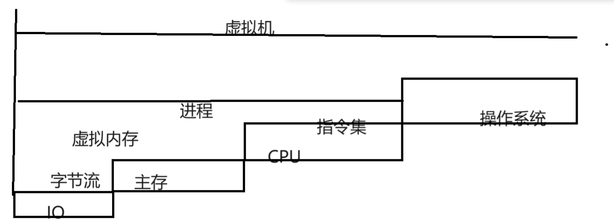
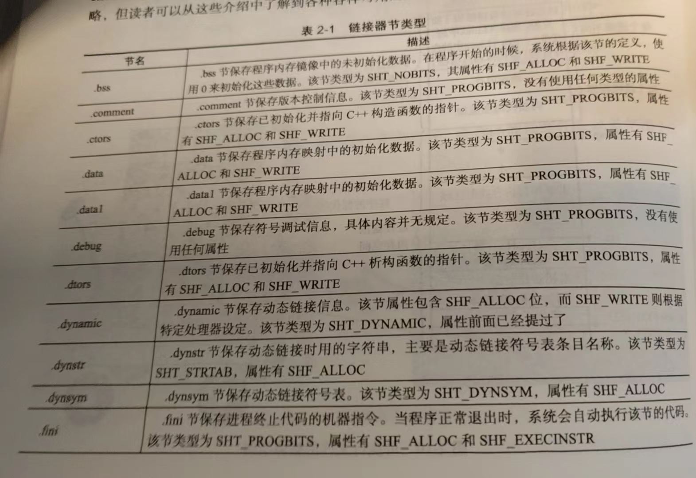
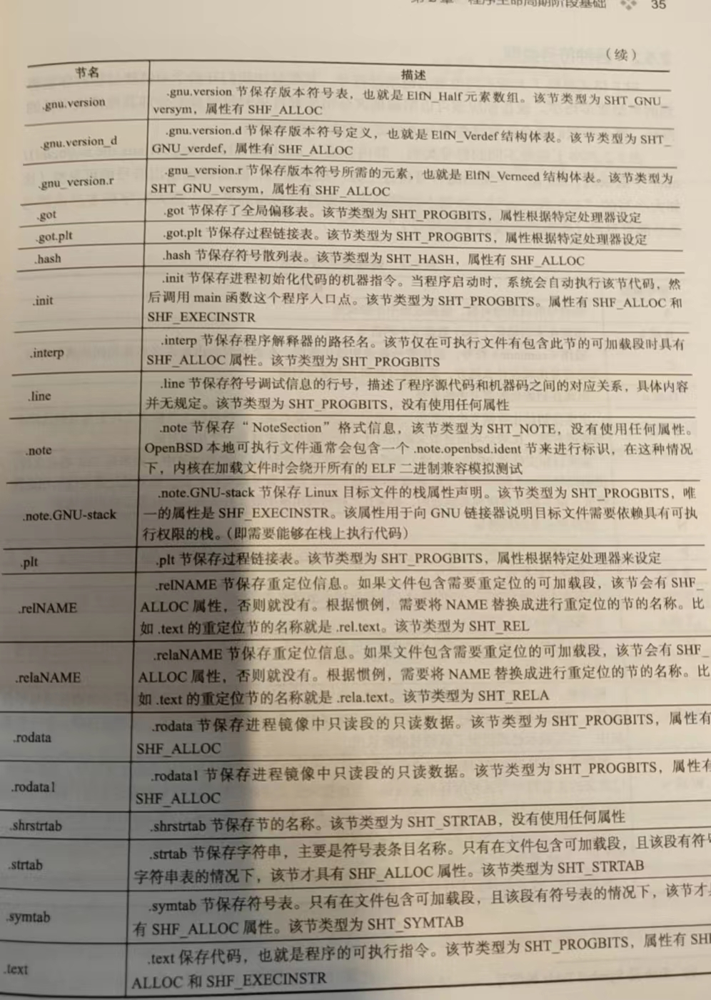
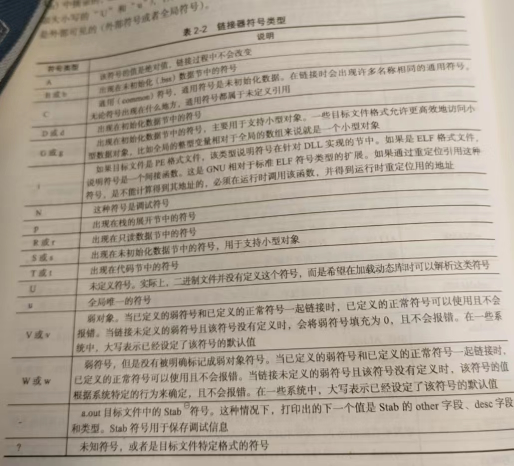
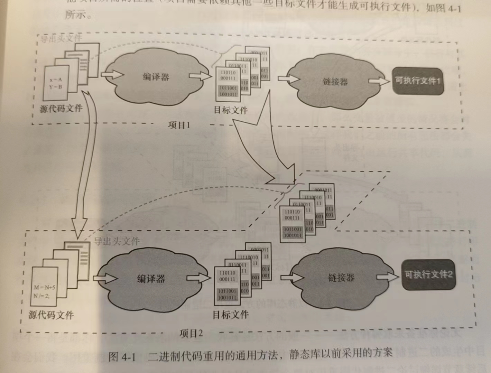
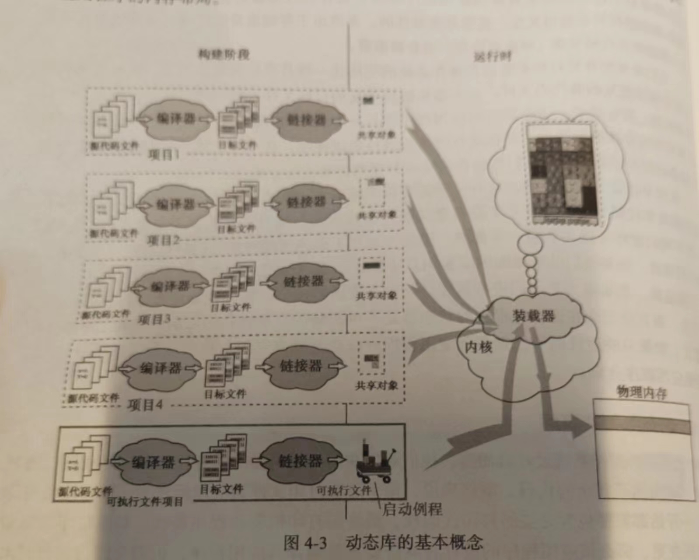
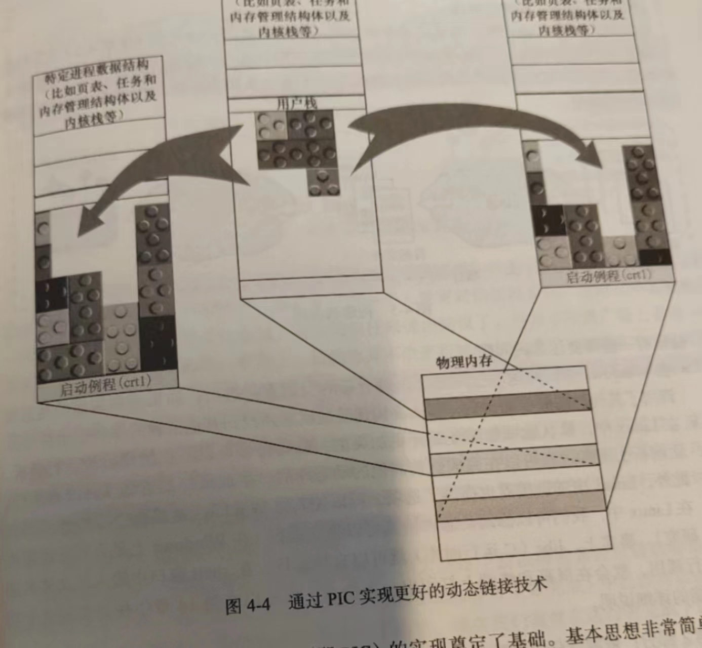
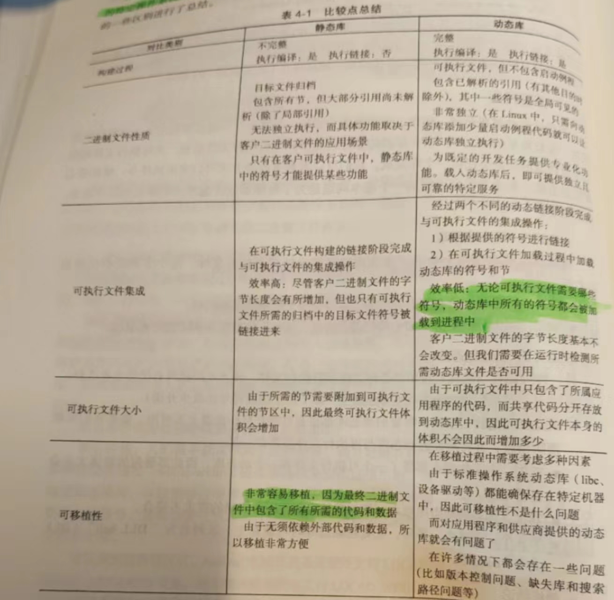

# C/C++编译技术概论

## 多任务操作系统基础

​		我们下面首先给出一写有用的抽象概念，请看下图



​		如上所示，我们使用字节流的抽象集层来看待IO设备，下一步就是主存，表示的是计算机存储下的资源的交互与存储集合

​		再下一个我们需要关注的就是CPU指令集，他表示着我们需要如何处理数据，他和虚拟内存集合起来被抽象成了进程——也就是活动的程序的最小操作系统分配资源实体。

​		联合起来操作系统，就是虚拟机——计算机的抽象，我们可以在这些抽象的概念上开展我们的软件设计的活动

## 存储器的层次结构和缓存策略

​		现代计算机存储体系分为层级结构，为了缓和CPU和主存访问速度——我们采取了层级的缓存体系。自上而下的——分为

- CPU寄存器
- 一级缓存，二级缓存，三级缓存
- 主存（RAM，ROM）
- 本地磁盘
- 远端存储设备

​		现在作为多进程的操作系统，每一个进程都采取了虚拟技术，即——每个进程总是认为自己是独立的占用了计算机资源，并不关心其他进程的存在和对实际物理内存的使用的情况——这些问题被扔给了操作系统处理。

​		内存资源上，我们采取了虚拟地址表示，也就是说，进程在向计算机资源进行交互的时候（诸如存取数据的时候），会给出数据的虚拟地址，随后，经过页表的地址解析得到真正的线性地址后交给MMU转换成物理地址（也就是真正数据在哪里的地址）。

​		这样做有效的隔离了进程之间的内存占用，将调度集中起来交给操作系统和相关硬件来处理。可以说是一大了不起的想法

​		那么，进程自己的内存分布格局又是如何呢？

- 代码节：包含了CPU执行的机器码
- 数据节：包含了供给CPU操作的数据
- 堆：动态分配的区域
- 栈：为各个函数分配独立的存空间
- 最上层部分属于内核区域

## 程序的声明周期阶段基础

​		我们下面以一个简单的小例子为模板来学习本章的内容。

​		这是一个迷你版的小号代码

> function.c

```C
#include "function.h"
int nCompletionStatus = 0;
float add(float x, float y)
{
	float z = x + y;
	return z;
}

float add_and_multiply(float x, float y)
{
	float z = add(x, y);
	z *= MULTIPLIER;
	return z;
}
```

> function.h

```C
#pragma once

#define FIRST_OPTION
#ifdef FIRST_OPTION
#define MULTIPLIER (3.0)
#else
#define MULTIPLIER (2.0)
#endif

float add_and_multiply(float x, float y);
```

> main.c

```C
#include "functioon.h"
extern int nCompletionStatus = 0
int main()
{
	float x = 1.0;
	float y = 0.5;
	float z =;

	z = add_and_multiply(x, y);
	CompletionStatus = 1;
	return 0;
}
```

### 编译阶段

​		广义上讲：编译实际上是讲义中编程语言转化为另一种编程语言的过程——就像我们的C源文件过GCC编译器得到汇编文件后再进一步交给汇编器处理一样。

- 编译器负责编译程序
- 编译器的输入是一个编译单元（包含源文件的文本）
- 一个程序往往是由多个编译单元构成——不会有人喜欢把所有的代码放在一起

下面我们介绍几个重要的术语：

1. 编译：将高级语言转化成低级语言
2. 交叉编译：在一平台上编译然后放到另一个平台上执行。这就叫交叉编译
3. 反翻译（反汇编）：将低级的语言编写的程序还原为高级描述的源代码的过程
4. 语言重写（这个字如其义）

​		首先，我们编译进入预处理阶段，在这里，我们将会展开执行那些预处理指令。在C/C++中，则是那些以`#`开头的语句

```
#define A 100
```

​		将会把所有的单元符号A替换为100。

```
#include <file.h>
```

​		将会把file.h的内容替换拷贝到这一句的位置上。

​		我们可以执行以下语句

```
gcc -E function.c -o function.i
```

> 注意，在GCC上，-i选项已经过时，取而代之请使用-E（勘误书中的小点）

```
float add_and_multiply(float x, float y);
int nCompletionStatus = 0;
float add(float x, float y)
{
 float z = x + y;
 return z;
}
float add_and_multiply(float x, float y)
{
 float z = add(x, y);
 z *= (3.0);
 return z;
}
```

​		下一步就是进行语义，词法，语法上的分析。一般而言这里会检查一些显而易见的小错误。

​		我们进一步的进行汇编：

```
gcc -S function.c -o function.s
```

​		当然，我们知道，汇编主要分为两种较为流行的格式

> AT&T格式的汇编
>
> Intel格式的汇编

```assembly
	.file	"function.c"
	.globl nCompletionStatus
	.bss
	.align 4
	.type	nCompletionStatus, @object
	.size	nCompletionStatus, 4
nCompletionStatus:
	.zero	4
	.text
.globl add
	.type	add, @function
add:
.LFB0:
	.cfi_startproc
	pushq	%rbp
	.cfi_def_cfa_offset 16
	movq	%rsp, %rbp
	.cfi_offset 6, -16
	.cfi_def_cfa_register 6
	movss	%xmm0, -20(%rbp)
	movss	%xmm1, -24(%rbp)
	movss	-20(%rbp), %xmm0
	addss	-24(%rbp), %xmm0
	movss	%xmm0, -4(%rbp)
	movl	-4(%rbp), %eax
	movl	%eax, -28(%rbp)
	movss	-28(%rbp), %xmm0
	leave
	ret
	.cfi_endproc
.LFE0:
	.size	add, .-add
.globl add_and_multiply
	.type	add_and_multiply, @function
add_and_multiply:
.LFB1:
	.cfi_startproc
	pushq	%rbp
	.cfi_def_cfa_offset 16
	movq	%rsp, %rbp
	.cfi_offset 6, -16
	.cfi_def_cfa_register 6
	subq	$32, %rsp
	movss	%xmm0, -20(%rbp)
	movss	%xmm1, -24(%rbp)
	movss	-24(%rbp), %xmm1
	movss	-20(%rbp), %xmm0
	call	add
	movss	%xmm0, -4(%rbp)
	movss	-4(%rbp), %xmm1
	movss	.LC0(%rip), %xmm0
	mulss	%xmm1, %xmm0
	movss	%xmm0, -4(%rbp)
	movl	-4(%rbp), %eax
	movl	%eax, -28(%rbp)
	movss	-28(%rbp), %xmm0
	leave
	ret
	.cfi_endproc
.LFE1:
	.size	add_and_multiply, .-add_and_multiply
	.section	.rodata
	.align 4
.LC0:
	.long	1077936128
	.ident	"GCC: (Ubuntu/Linaro 4.4.7-8ubuntu1) 4.4.7"
	.section	.note.GNU-stack,"",@progbits
```

​		当我们尝试取指定Intel格式的汇编的时候：

```assembly
	.file	"function.c"
	.intel_syntax noprefix
.globl nCompletionStatus
	.bss
	.align 4
	.type	nCompletionStatus, @object
	.size	nCompletionStatus, 4
nCompletionStatus:
	.zero	4
	.text
.globl add
	.type	add, @function
add:
.LFB0:
	.cfi_startproc
	push	rbp
	.cfi_def_cfa_offset 16
	mov	rbp, rsp
	.cfi_offset 6, -16
	.cfi_def_cfa_register 6
	movss	DWORD PTR [rbp-20], xmm0
	movss	DWORD PTR [rbp-24], xmm1
	movss	xmm0, DWORD PTR [rbp-20]
	addss	xmm0, DWORD PTR [rbp-24]
	movss	DWORD PTR [rbp-4], xmm0
	mov	eax, DWORD PTR [rbp-4]
	mov	DWORD PTR [rbp-28], eax
	movss	xmm0, DWORD PTR [rbp-28]
	leave
	ret
	.cfi_endproc
.LFE0:
	.size	add, .-add
.globl add_and_multiply
	.type	add_and_multiply, @function
add_and_multiply:
.LFB1:
	.cfi_startproc
	push	rbp
	.cfi_def_cfa_offset 16
	mov	rbp, rsp
	.cfi_offset 6, -16
	.cfi_def_cfa_register 6
	sub	rsp, 32
	movss	DWORD PTR [rbp-20], xmm0
	movss	DWORD PTR [rbp-24], xmm1
	movss	xmm1, DWORD PTR [rbp-24]
	movss	xmm0, DWORD PTR [rbp-20]
	call	add
	movss	DWORD PTR [rbp-4], xmm0
	movss	xmm1, DWORD PTR [rbp-4]
	movss	xmm0, DWORD PTR .LC0[rip]
	mulss	xmm0, xmm1
	movss	DWORD PTR [rbp-4], xmm0
	mov	eax, DWORD PTR [rbp-4]
	mov	DWORD PTR [rbp-28], eax
	movss	xmm0, DWORD PTR [rbp-28]
	leave
	ret
	.cfi_endproc
.LFE1:
	.size	add_and_multiply, .-add_and_multiply
	.section	.rodata
	.align 4
.LC0:
	.long	1077936128
	.ident	"GCC: (Ubuntu/Linaro 4.4.7-8ubuntu1) 4.4.7"
	.section	.note.GNU-stack,"",@progbits
```

​		当然，之后会进行优化和生成机器码的部分。

​		事实上，我们的以上的步骤可以一步完成

```
gcc -c function.c -o function.o
```

​		然后，我们来反汇编看看：

```
objdump -D function.o
```

```
function.o：     文件格式 elf64-x86-64


Disassembly of section .text:

0000000000000000 <add>:
   0:	55                   	push   %rbp
   1:	48 89 e5             	mov    %rsp,%rbp
   4:	f3 0f 11 45 ec       	movss  %xmm0,-0x14(%rbp)
   9:	f3 0f 11 4d e8       	movss  %xmm1,-0x18(%rbp)
   e:	f3 0f 10 45 ec       	movss  -0x14(%rbp),%xmm0
  13:	f3 0f 58 45 e8       	addss  -0x18(%rbp),%xmm0
  18:	f3 0f 11 45 fc       	movss  %xmm0,-0x4(%rbp)
  1d:	8b 45 fc             	mov    -0x4(%rbp),%eax
  20:	89 45 e4             	mov    %eax,-0x1c(%rbp)
  23:	f3 0f 10 45 e4       	movss  -0x1c(%rbp),%xmm0
  28:	c9                   	leave  
  29:	c3                   	ret    

000000000000002a <add_and_multiply>:
  2a:	55                   	push   %rbp
  2b:	48 89 e5             	mov    %rsp,%rbp
  2e:	48 83 ec 20          	sub    $0x20,%rsp
  32:	f3 0f 11 45 ec       	movss  %xmm0,-0x14(%rbp)
  37:	f3 0f 11 4d e8       	movss  %xmm1,-0x18(%rbp)
  3c:	f3 0f 10 4d e8       	movss  -0x18(%rbp),%xmm1
  41:	f3 0f 10 45 ec       	movss  -0x14(%rbp),%xmm0
  46:	e8 00 00 00 00       	call   4b <add_and_multiply+0x21>
  4b:	f3 0f 11 45 fc       	movss  %xmm0,-0x4(%rbp)
  50:	f3 0f 10 4d fc       	movss  -0x4(%rbp),%xmm1
  55:	f3 0f 10 05 00 00 00 	movss  0x0(%rip),%xmm0        # 5d <add_and_multiply+0x33>
  5c:	00 
  5d:	f3 0f 59 c1          	mulss  %xmm1,%xmm0
  61:	f3 0f 11 45 fc       	movss  %xmm0,-0x4(%rbp)
  66:	8b 45 fc             	mov    -0x4(%rbp),%eax
  69:	89 45 e4             	mov    %eax,-0x1c(%rbp)
  6c:	f3 0f 10 45 e4       	movss  -0x1c(%rbp),%xmm0
  71:	c9                   	leave  
  72:	c3                   	ret    

Disassembly of section .bss:

0000000000000000 <nCompletionStatus>:
   0:	00 00                	add    %al,(%rax)
	...

Disassembly of section .rodata:

0000000000000000 <.rodata>:
   0:	00 00                	add    %al,(%rax)
   2:	40                   	rex
   3:	40                   	rex

Disassembly of section .comment:

0000000000000000 <.comment>:
   0:	00 47 43             	add    %al,0x43(%rdi)
   3:	43 3a 20             	rex.XB cmp (%r8),%spl
   6:	28 55 62             	sub    %dl,0x62(%rbp)
   9:	75 6e                	jne    79 <add_and_multiply+0x4f>
   b:	74 75                	je     82 <add_and_multiply+0x58>
   d:	2f                   	(bad)  
   e:	4c 69 6e 61 72 6f 20 	imul   $0x34206f72,0x61(%rsi),%r13
  15:	34 
  16:	2e 34 2e             	cs xor $0x2e,%al
  19:	37                   	(bad)  
  1a:	2d 38 75 62 75       	sub    $0x75627538,%eax
  1f:	6e                   	outsb  %ds:(%rsi),(%dx)
  20:	74 75                	je     97 <add_and_multiply+0x6d>
  22:	31 29                	xor    %ebp,(%rcx)
  24:	20 34 2e             	and    %dh,(%rsi,%rbp,1)
  27:	34 2e                	xor    $0x2e,%al
  29:	37                   	(bad)  
	...

Disassembly of section .eh_frame:

0000000000000000 <.eh_frame>:
   0:	14 00                	adc    $0x0,%al
   2:	00 00                	add    %al,(%rax)
   4:	00 00                	add    %al,(%rax)
   6:	00 00                	add    %al,(%rax)
   8:	01 7a 52             	add    %edi,0x52(%rdx)
   b:	00 01                	add    %al,(%rcx)
   d:	78 10                	js     1f <.eh_frame+0x1f>
   f:	01 1b                	add    %ebx,(%rbx)
  11:	0c 07                	or     $0x7,%al
  13:	08 90 01 00 00 18    	or     %dl,0x18000001(%rax)
  19:	00 00                	add    %al,(%rax)
  1b:	00 1c 00             	add    %bl,(%rax,%rax,1)
  1e:	00 00                	add    %al,(%rax)
  20:	00 00                	add    %al,(%rax)
  22:	00 00                	add    %al,(%rax)
  24:	2a 00                	sub    (%rax),%al
  26:	00 00                	add    %al,(%rax)
  28:	00 41 0e             	add    %al,0xe(%rcx)
  2b:	10 43 86             	adc    %al,-0x7a(%rbx)
  2e:	02 0d 06 00 00 00    	add    0x6(%rip),%cl        # 3a <.eh_frame+0x3a>
  34:	18 00                	sbb    %al,(%rax)
  36:	00 00                	add    %al,(%rax)
  38:	38 00                	cmp    %al,(%rax)
  3a:	00 00                	add    %al,(%rax)
  3c:	00 00                	add    %al,(%rax)
  3e:	00 00                	add    %al,(%rax)
  40:	49 00 00             	rex.WB add %al,(%r8)
  43:	00 00                	add    %al,(%rax)
  45:	41 0e                	rex.B (bad) 
  47:	10 43 86             	adc    %al,-0x7a(%rbx)
  4a:	02 0d 06 00 00 00    	add    0x6(%rip),%cl        # 56 <add_and_multiply+0x2c>
```

### 目标文件属性

下面简单讲讲目标文件属性：

1. 目标文件是通过翻译源代码得到的，后续的链接构建将会基于这个事实
2. symbol和section是目标文件的基本组成部分。符号表示的是程序的内存地址和数据内存。基本上目标文件中包含的是代码段(`.text`)和`.data`，未初始化数据会放在.bss
3. 构建程序的最终目的是把多个源文件生成的二进制文件下的节代码拼接在一起。之后，我们的程序会映射每个节的新地址。
4. 目标文件只会包含.bss段的基本信息，.bss段本身也只有字节信息的长度大小

### 链接

​		程序的下一步就是链接了，他会消除那些未定义符号，从而使得部分段正确的被映射。举个例子，在上文中的main函数中`add_and_multiply`未定义，但是在链接后找到了`add_and_multiply`的符号定义，这就是链接的作用。

​		我们查看验证一下

> gcc function.c main.c -o demoApp
>
> objdump -D demoApp

```
0000000000001151 <add_and_multiply>:
    1151:	f3 0f 1e fa          	endbr64 
    1155:	55                   	push   %rbp
    1156:	48 89 e5             	mov    %rsp,%rbp
    1159:	48 83 ec 18          	sub    $0x18,%rsp
    115d:	f3 0f 11 45 ec       	movss  %xmm0,-0x14(%rbp)
    1162:	f3 0f 11 4d e8       	movss  %xmm1,-0x18(%rbp)
    1167:	f3 0f 10 45 e8       	movss  -0x18(%rbp),%xmm0
    116c:	8b 45 ec             	mov    -0x14(%rbp),%eax
    116f:	0f 28 c8             	movaps %xmm0,%xmm1
    1172:	66 0f 6e c0          	movd   %eax,%xmm0
    1176:	e8 ae ff ff ff       	call   1129 <add>
    117b:	66 0f 7e c0          	movd   %xmm0,%eax
    117f:	89 45 fc             	mov    %eax,-0x4(%rbp)
    1182:	f3 0f 10 4d fc       	movss  -0x4(%rbp),%xmm1
    1187:	f3 0f 10 05 75 0e 00 	movss  0xe75(%rip),%xmm0        # 2004 <_IO_stdin_used+0x4>
    118e:	00 
    118f:	f3 0f 59 c1          	mulss  %xmm1,%xmm0
    1193:	f3 0f 11 45 fc       	movss  %xmm0,-0x4(%rbp)
    1198:	f3 0f 10 45 fc       	movss  -0x4(%rbp),%xmm0
    119d:	c9                   	leave  
    119e:	c3                   	ret    

000000000000119f <main>:
    119f:	f3 0f 1e fa          	endbr64 
    11a3:	55                   	push   %rbp
    11a4:	48 89 e5             	mov    %rsp,%rbp
    11a7:	48 83 ec 10          	sub    $0x10,%rsp
    11ab:	f3 0f 10 05 55 0e 00 	movss  0xe55(%rip),%xmm0        # 2008 <_IO_stdin_used+0x8>
    11b2:	00 
    11b3:	f3 0f 11 45 f4       	movss  %xmm0,-0xc(%rbp)
    11b8:	f3 0f 10 05 4c 0e 00 	movss  0xe4c(%rip),%xmm0        # 200c <_IO_stdin_used+0xc>
    11bf:	00 
    11c0:	f3 0f 11 45 f8       	movss  %xmm0,-0x8(%rbp)
    11c5:	f3 0f 10 45 f8       	movss  -0x8(%rbp),%xmm0
    11ca:	8b 45 f4             	mov    -0xc(%rbp),%eax
    11cd:	0f 28 c8             	movaps %xmm0,%xmm1
    11d0:	66 0f 6e c0          	movd   %eax,%xmm0
    11d4:	e8 78 ff ff ff       	call   1151 <add_and_multiply>
    11d9:	66 0f 7e c0          	movd   %xmm0,%eax
    11dd:	89 45 fc             	mov    %eax,-0x4(%rbp)
    11e0:	c7 05 2a 2e 00 00 01 	movl   $0x1,0x2e2a(%rip)        # 4014 <nCompletionStatus>
    11e7:	00 00 00 
    11ea:	b8 00 00 00 00       	mov    $0x0,%eax
    11ef:	c9                   	leave  
    11f0:	c3                   	ret   
```

​		对比一下：

> gcc -c main.c -o main.o
>
> objdump -D main.o

```
0000000000000000 <main>:
   0:	f3 0f 1e fa          	endbr64 
   4:	55                   	push   %rbp
   5:	48 89 e5             	mov    %rsp,%rbp
   8:	48 83 ec 10          	sub    $0x10,%rsp
   c:	f3 0f 10 05 00 00 00 	movss  0x0(%rip),%xmm0        # 14 <main+0x14>
  13:	00 
  14:	f3 0f 11 45 f4       	movss  %xmm0,-0xc(%rbp)
  19:	f3 0f 10 05 00 00 00 	movss  0x0(%rip),%xmm0        # 21 <main+0x21>
  20:	00 
  21:	f3 0f 11 45 f8       	movss  %xmm0,-0x8(%rbp)
  26:	f3 0f 10 45 f8       	movss  -0x8(%rbp),%xmm0
  2b:	8b 45 f4             	mov    -0xc(%rbp),%eax
  2e:	0f 28 c8             	movaps %xmm0,%xmm1
  31:	66 0f 6e c0          	movd   %eax,%xmm0
  35:	e8 00 00 00 00       	call   3a <main+0x3a>
  3a:	66 0f 7e c0          	movd   %xmm0,%eax
  3e:	89 45 fc             	mov    %eax,-0x4(%rbp)
  41:	c7 05 00 00 00 00 01 	movl   $0x1,0x0(%rip)        # 4b <main+0x4b>
  48:	00 00 00 
  4b:	b8 00 00 00 00       	mov    $0x0,%eax
  50:	c9                   	leave  
  51:	c3                   	ret    
```

​		会发现编译器故意插入一个调用自身的指令——当检查到存在具体的定义时，方才更新调用地址。







# 定位库文件

## Linux构建过程下的库文件定位规则

### 静态库

​		静态库的标准名称如下：

```
lib<lib_name>.a
```

### 动态库

​		对于动态库

```
lib<lib_name>.so + <lib_info>
```

​		尾巴的信息的格式如下：

```
<M>.<m>.<p>
# M for major
# m for minor
# p for mending and adjusting
```

​		注意到，我们实际上认为库的名称是`<lib_name>`而不是`lib<lib_name>.a`，在一些系统的编译中可能会有所疏忽，这点是值得注意的！

## 链接

```
gcc ${src} -L${Lib_Path} -l${What_libs ...} -o obj.o
```

> 我想表达的意思是：
>
> `-L`指定了库的路径，-l指定了链接什么库

​		我们建议将-L和-l分开，而不是混合在一起进行指定，否则将会进行硬编码（写死了库的链接路径）

# 动态库设计：进阶

​		我们下面开始进一步了解动态库的解析

## 解析内存地址的必要性

​		我们下面来看看解析内存地址的事情。我们的指令本质上就是要向：提供被最后翻译成机器码的指令，提供必要的地址，告诉他们我们的操作数在哪里。

> 数据访问指令：`mov`等需要内存操作数的地址
>
> 子程序调用指令：`jmp, call`等

## 常见的问题

​		我们的二进制程序需要动态链接库来解析引用。

> 客户的二进制文件提供进程内存映射中地址范围固定且可以预先确定的部分
>
> 只有当动态库加载完成之后，动态库才属于进程的有效部分
>
> 当可执行文件调用了一个或者是多个由动态库导出和实现的函数时，就会自然的建立器可执行文件和动态库的联系。

​		我们看到，链接器和装载器很相似，都是在解析尚未被解析的符号。

> 链接器上：处于空白的初始状态，其映射有很大的自由。
>
> 装载器：则是需要小心的转换地址防止连接器所作的工作被破坏。

## 地址转换引发的问题

### 客户需要知道动态库的符号地址

​		我们的二进制文件依赖动态库的接口而且需要知道接口所在的位置，这个时候需要知道接口的地址

### 被装在的库不需要知道自身的地址

​		也就是说：这些函数是库内部的函数，我们没法直接通过名称来索引内部函数（我们一般认为这种情况属于函数未导出的情况）

## 链接器 - 装载器协作

​		我们下面来探讨链接器 - 装载器协作，总体的策略是

- 链接器需要明确的分清不同代码的联系
- 链接器精确统计失效的符号引用，然后准备修复提示
- 装载器准确遵循链接器的重定位提示

​		我们现在有两种主要的技术：LIR（装载时重定位）和PIC（位置无关代码）

​		前者方案较老，缺陷在于：我们需要多个动态库副本，且启动时存在延迟（与引用数量成正比）

​		后者较新：可以理解为使用指针的指针来代替指针：我们开辟一个新的区.got，里头存放着这些动态库的解析引用。当我们确定了符号之后，则会将之里面的值指向正确的引用，也就是存放着导入符号的地址。

# 重复符号的处理

​		啥是重复符号？名字相同的符号。

## 重复的C，C++符号

​		在C语言中，判断两个或多个符号与其他的符号是否重复的规则非常简单。只要函数，结构体。

## 重复的符号的默认处理

### 局部符号可以重复

​		值得注意的是，使用C语言中的static关键字声明的局部函数（将函数的可见域约束在函数存在的统一的源码文件内）将不会被报错。

### 在动态链接过程中处理重复的符号

​		链接器的做法很粗暴，直接拿其中一个符号作为解析。

### 处理重复符号

​		在C++下使用命名空间，从而让编译器完成导出工作

​		在C下则是将编译器做的工作由自己来完成，那就是手动的上命名。

## 动态库版本控制

​		主版本号变更：发生较大的更改和接口变动

​		次版本号更改：只是在原有基础上新增了东西

​		修订号变更：只是在函数的内部发生了调整

# 加载程序执行阶段

## 装载器视角下的二进制文件

​		我们认为链接器是一个复杂的模块，他可以准确的区分section的属性等,装载器则会把连接器的各个部分映射到内存当中，相对简单一些。

## 静态编译&&动态编译

​		什么是静态编译呢？就是把所有用到的符号直接链接进入程序当中，这样的二进制文件完全可移植，代价就是巨大无比的体积爆炸：我们来试试看：

```shell
vim main.c
```

```c
#include<stdio.h>
int main()
{
	printf("Hello, World\n");
    return 0;
}
```

​		我们来分别看看静态编译和动态编译

> 动态编译：

```shell
gcc main.c -o DynamicMain.o
```

> 静态编译

```shell
gcc -static main.c -o StaticMain.o
```

​		我反汇编一下：

```shell
objdump -D DynamicMain.o > DynamicAntiMain.txt
objdump -D StaticMain.o > StaticAntiMain.txt
```

​		看看怎么样：

```shell
ls -lh
```

```
-rw-rw-r-- 1 charliechen114514 charliechen114514  28K  1月  4 21:46 DynamicAntiMain.txt
-rwxrwxr-x 1 charliechen114514 charliechen114514  16K  1月  4 21:44 DynamicMain.o
-rw-rw-r-- 1 charliechen114514 charliechen114514   73  1月  4 21:44 main.c
-rw-rw-r-- 1 charliechen114514 charliechen114514  12M  1月  4 21:45 StaticAntiMain.txt
-rwxrwxr-x 1 charliechen114514 charliechen114514 875K  1月  4 21:45 StaticMain.o
```

​		大了不少！事实上，装配器起到的作用就是把库链接上，让需要的东西在运行时才加载到内存的页中。


## 附录：libc_start_main在哪里：

```c
/* Perform initialization and invoke main.
   Copyright (C) 1998-2022 Free Software Foundation, Inc.
   This file is part of the GNU C Library.
   The GNU C Library is free software; you can redistribute it and/or
   modify it under the terms of the GNU Lesser General Public
   License as published by the Free Software Foundation; either
   version 2.1 of the License, or (at your option) any later version.
   The GNU C Library is distributed in the hope that it will be useful,
   but WITHOUT ANY WARRANTY; without even the implied warranty of
   MERCHANTABILITY or FITNESS FOR A PARTICULAR PURPOSE.  See the GNU
   Lesser General Public License for more details.
   You should have received a copy of the GNU Lesser General Public
   License along with the GNU C Library; if not, see
   <https://www.gnu.org/licenses/>.  */
/* Note: This code is only part of the startup code proper for
   statically linked binaries.  For dynamically linked binaries, it
   resides in libc.so.  */
/* Mark symbols hidden in static PIE for early self relocation to work.  */
#if BUILD_PIE_DEFAULT
# pragma GCC visibility push(hidden)
#endif
#include <assert.h>
#include <stdlib.h>
#include <stdio.h>
#include <unistd.h>
#include <ldsodefs.h>
#include <libc-diag.h>
#include <libc-internal.h>
#include <elf/libc-early-init.h>
#include <stdbool.h>
#include <elf-initfini.h>
#include <shlib-compat.h>
#include <elf/dl-tunables.h>
extern void __libc_init_first (int argc, char **argv, char **envp);
#include <tls.h>
#ifndef SHARED
# include <dl-osinfo.h>
# ifndef THREAD_SET_STACK_GUARD
/* Only exported for architectures that don't store the stack guard canary
   in thread local area.  */
uintptr_t __stack_chk_guard attribute_relro;
# endif
# ifndef  THREAD_SET_POINTER_GUARD
/* Only exported for architectures that don't store the pointer guard
   value in thread local area.  */
uintptr_t __pointer_chk_guard_local attribute_relro attribute_hidden;
# endif
#endif
#ifndef SHARED
# include <link.h>
# include <dl-irel.h>
# ifdef ELF_MACHINE_IRELA
#  define IREL_T	ElfW(Rela)
#  define IPLT_START	__rela_iplt_start
#  define IPLT_END	__rela_iplt_end
#  define IREL		elf_irela
# elif defined ELF_MACHINE_IREL
#  define IREL_T	ElfW(Rel)
#  define IPLT_START	__rel_iplt_start
#  define IPLT_END	__rel_iplt_end
#  define IREL		elf_irel
# endif
static void
apply_irel (void)
{
# ifdef IREL
  /* We use weak references for these so that we'll still work with a linker
     that doesn't define them.  Such a linker doesn't support IFUNC at all
     and so uses won't work, but a statically-linked program that doesn't
     use any IFUNC symbols won't have a problem.  */
  extern const IREL_T IPLT_START[] __attribute__ ((weak));
  extern const IREL_T IPLT_END[] __attribute__ ((weak));
  for (const IREL_T *ipltent = IPLT_START; ipltent < IPLT_END; ++ipltent)
    IREL (ipltent);
# endif
}
#endif
#ifdef LIBC_START_MAIN
# ifdef LIBC_START_DISABLE_INLINE
#  define STATIC static
# else
#  define STATIC static inline __attribute__ ((always_inline))
# endif
# define DO_DEFINE_LIBC_START_MAIN_VERSION 0
#else
# define STATIC
# define LIBC_START_MAIN __libc_start_main_impl
# define DO_DEFINE_LIBC_START_MAIN_VERSION 1
#endif
#ifdef MAIN_AUXVEC_ARG
/* main gets passed a pointer to the auxiliary.  */
# define MAIN_AUXVEC_DECL	, void *
# define MAIN_AUXVEC_PARAM	, auxvec
#else
# define MAIN_AUXVEC_DECL
# define MAIN_AUXVEC_PARAM
#endif
#ifndef ARCH_INIT_CPU_FEATURES
# define ARCH_INIT_CPU_FEATURES()
#endif
/* Obtain the definition of __libc_start_call_main.  */
#include <libc_start_call_main.h>
#ifdef SHARED
/* Initialization for dynamic executables.  Find the main executable
   link map and run its init functions.  */
static void
call_init (int argc, char **argv, char **env)
{
  /* Obtain the main map of the executable.  */
  struct link_map *l = GL(dl_ns)[LM_ID_BASE]._ns_loaded;
  /* DT_PREINIT_ARRAY is not processed here.  It is already handled in
     _dl_init in elf/dl-init.c.  Also see the call_init function in
     the same file.  */
  if (ELF_INITFINI && l->l_info[DT_INIT] != NULL)
    DL_CALL_DT_INIT(l, l->l_addr + l->l_info[DT_INIT]->d_un.d_ptr,
		    argc, argv, env);
  ElfW(Dyn) *init_array = l->l_info[DT_INIT_ARRAY];
  if (init_array != NULL)
    {
      unsigned int jm
	= l->l_info[DT_INIT_ARRAYSZ]->d_un.d_val / sizeof (ElfW(Addr));
      ElfW(Addr) *addrs = (void *) (init_array->d_un.d_ptr + l->l_addr);
      for (unsigned int j = 0; j < jm; ++j)
	((dl_init_t) addrs[j]) (argc, argv, env);
    }
}
#else /* !SHARED */
/* These magic symbols are provided by the linker.  */
extern void (*__preinit_array_start []) (int, char **, char **)
  attribute_hidden;
extern void (*__preinit_array_end []) (int, char **, char **)
  attribute_hidden;
extern void (*__init_array_start []) (int, char **, char **)
  attribute_hidden;
extern void (*__init_array_end []) (int, char **, char **)
  attribute_hidden;
extern void (*__fini_array_start []) (void) attribute_hidden;
extern void (*__fini_array_end []) (void) attribute_hidden;
# if ELF_INITFINI
/* These function symbols are provided for the .init/.fini section entry
   points automagically by the linker.  */
extern void _init (void);
extern void _fini (void);
# endif
/* Initialization for static executables.  There is no dynamic
   segment, so we access the symbols directly.  */
static void
call_init (int argc, char **argv, char **envp)
{
  /* For static executables, preinit happens right before init.  */
  {
    const size_t size = __preinit_array_end - __preinit_array_start;
    size_t i;
    for (i = 0; i < size; i++)
      (*__preinit_array_start [i]) (argc, argv, envp);
  }
# if ELF_INITFINI
  _init ();
# endif
  const size_t size = __init_array_end - __init_array_start;
  for (size_t i = 0; i < size; i++)
      (*__init_array_start [i]) (argc, argv, envp);
}
/* Likewise for the destructor.  */
static void
call_fini (void *unused)
{
  size_t i = __fini_array_end - __fini_array_start;
  while (i-- > 0)
    (*__fini_array_start [i]) ();
# if ELF_INITFINI
  _fini ();
# endif
}
#endif /* !SHARED */
#include <libc-start.h>
STATIC int LIBC_START_MAIN (int (*main) (int, char **, char **
					 MAIN_AUXVEC_DECL),
			    int argc,
			    char **argv,
#ifdef LIBC_START_MAIN_AUXVEC_ARG
			    ElfW(auxv_t) *auxvec,
#endif
			    __typeof (main) init,
			    void (*fini) (void),
			    void (*rtld_fini) (void),
			    void *stack_end)
     __attribute__ ((noreturn));
/* Note: The init and fini parameters are no longer used.  fini is
   completely unused, init is still called if not NULL, but the
   current startup code always passes NULL.  (In the future, it would
   be possible to use fini to pass a version code if init is NULL, to
   indicate the link-time glibc without introducing a hard
   incompatibility for new programs with older glibc versions.)
   For dynamically linked executables, the dynamic segment is used to
   locate constructors and destructors.  For statically linked
   executables, the relevant symbols are access directly.  */
STATIC int
LIBC_START_MAIN (int (*main) (int, char **, char ** MAIN_AUXVEC_DECL),
		 int argc, char **argv,
#ifdef LIBC_START_MAIN_AUXVEC_ARG
		 ElfW(auxv_t) *auxvec,
#endif
		 __typeof (main) init,
		 void (*fini) (void),
		 void (*rtld_fini) (void), void *stack_end)
{
#ifndef SHARED
  char **ev = &argv[argc + 1];
  __environ = ev;
  /* Store the lowest stack address.  This is done in ld.so if this is
     the code for the DSO.  */
  __libc_stack_end = stack_end;
# ifdef HAVE_AUX_VECTOR
  /* First process the auxiliary vector since we need to find the
     program header to locate an eventually present PT_TLS entry.  */
#  ifndef LIBC_START_MAIN_AUXVEC_ARG
  ElfW(auxv_t) *auxvec;
  {
    char **evp = ev;
    while (*evp++ != NULL)
      ;
    auxvec = (ElfW(auxv_t) *) evp;
  }
#  endif
  _dl_aux_init (auxvec);
  if (GL(dl_phdr) == NULL)
# endif
    {
      /* Starting from binutils-2.23, the linker will define the
         magic symbol __ehdr_start to point to our own ELF header
         if it is visible in a segment that also includes the phdrs.
         So we can set up _dl_phdr and _dl_phnum even without any
         information from auxv.  */
      extern const ElfW(Ehdr) __ehdr_start
# if BUILD_PIE_DEFAULT
	__attribute__ ((visibility ("hidden")));
# else
	__attribute__ ((weak, visibility ("hidden")));
      if (&__ehdr_start != NULL)
# endif
        {
          assert (__ehdr_start.e_phentsize == sizeof *GL(dl_phdr));
          GL(dl_phdr) = (const void *) &__ehdr_start + __ehdr_start.e_phoff;
          GL(dl_phnum) = __ehdr_start.e_phnum;
        }
    }
  __tunables_init (__environ);
  ARCH_INIT_CPU_FEATURES ();
  /* Do static pie self relocation after tunables and cpu features
     are setup for ifunc resolvers. Before this point relocations
     must be avoided.  */
  _dl_relocate_static_pie ();
  /* Perform IREL{,A} relocations.  */
  ARCH_SETUP_IREL ();
  /* The stack guard goes into the TCB, so initialize it early.  */
  ARCH_SETUP_TLS ();
  /* In some architectures, IREL{,A} relocations happen after TLS setup in
     order to let IFUNC resolvers benefit from TCB information, e.g. powerpc's
     hwcap and platform fields available in the TCB.  */
  ARCH_APPLY_IREL ();
  /* Set up the stack checker's canary.  */
  uintptr_t stack_chk_guard = _dl_setup_stack_chk_guard (_dl_random);
# ifdef THREAD_SET_STACK_GUARD
  THREAD_SET_STACK_GUARD (stack_chk_guard);
# else
  __stack_chk_guard = stack_chk_guard;
# endif
# ifdef DL_SYSDEP_OSCHECK
  {
    /* This needs to run to initiliaze _dl_osversion before TLS
       setup might check it.  */
    DL_SYSDEP_OSCHECK (__libc_fatal);
  }
# endif
  /* Initialize libpthread if linked in.  */
  if (__pthread_initialize_minimal != NULL)
    __pthread_initialize_minimal ();
  /* Set up the pointer guard value.  */
  uintptr_t pointer_chk_guard = _dl_setup_pointer_guard (_dl_random,
							 stack_chk_guard);
# ifdef THREAD_SET_POINTER_GUARD
  THREAD_SET_POINTER_GUARD (pointer_chk_guard);
# else
  __pointer_chk_guard_local = pointer_chk_guard;
# endif
#endif /* !SHARED  */
  /* Register the destructor of the dynamic linker if there is any.  */
  if (__glibc_likely (rtld_fini != NULL))
    __cxa_atexit ((void (*) (void *)) rtld_fini, NULL, NULL);
#ifndef SHARED
  /* Perform early initialization.  In the shared case, this function
     is called from the dynamic loader as early as possible.  */
  __libc_early_init (true);
  /* Call the initializer of the libc.  This is only needed here if we
     are compiling for the static library in which case we haven't
     run the constructors in `_dl_start_user'.  */
  __libc_init_first (argc, argv, __environ);
  /* Register the destructor of the statically-linked program.  */
  __cxa_atexit (call_fini, NULL, NULL);
  /* Some security at this point.  Prevent starting a SUID binary where
     the standard file descriptors are not opened.  We have to do this
     only for statically linked applications since otherwise the dynamic
     loader did the work already.  */
  if (__builtin_expect (__libc_enable_secure, 0))
    __libc_check_standard_fds ();
#endif /* !SHARED */
  /* Call the initializer of the program, if any.  */
#ifdef SHARED
  if (__builtin_expect (GLRO(dl_debug_mask) & DL_DEBUG_IMPCALLS, 0))
    GLRO(dl_debug_printf) ("\ninitialize program: %s\n\n", argv[0]);
  if (init != NULL)
    /* This is a legacy program which supplied its own init
       routine.  */
    (*init) (argc, argv, __environ MAIN_AUXVEC_PARAM);
  else
    /* This is a current program.  Use the dynamic segment to find
       constructors.  */
    call_init (argc, argv, __environ);
  /* Auditing checkpoint: we have a new object.  */
  _dl_audit_preinit (GL(dl_ns)[LM_ID_BASE]._ns_loaded);
  if (__glibc_unlikely (GLRO(dl_debug_mask) & DL_DEBUG_IMPCALLS))
    GLRO(dl_debug_printf) ("\ntransferring control: %s\n\n", argv[0]);
#else /* !SHARED */
  call_init (argc, argv, __environ);
  _dl_debug_initialize (0, LM_ID_BASE);
#endif
  __libc_start_call_main (main, argc, argv MAIN_AUXVEC_PARAM);
}
/* Starting with glibc 2.34, the init parameter is always NULL.  Older
   libcs are not prepared to handle that.  The macro
   DEFINE_LIBC_START_MAIN_VERSION creates GLIBC_2.34 alias, so that
   newly linked binaries reflect that dependency.  The macros below
   expect that the exported function is called
   __libc_start_main_impl.  */
#ifdef SHARED
# define DEFINE_LIBC_START_MAIN_VERSION \
  DEFINE_LIBC_START_MAIN_VERSION_1 \
  strong_alias (__libc_start_main_impl, __libc_start_main_alias_2)	\
  versioned_symbol (libc, __libc_start_main_alias_2, __libc_start_main, \
		    GLIBC_2_34);
# if SHLIB_COMPAT(libc, GLIBC_2_0, GLIBC_2_34)
#  define DEFINE_LIBC_START_MAIN_VERSION_1 \
  strong_alias (__libc_start_main_impl, __libc_start_main_alias_1)	\
  compat_symbol (libc, __libc_start_main_alias_1, __libc_start_main, GLIBC_2_0);
#  else
#  define DEFINE_LIBC_START_MAIN_VERSION_1
# endif
#else  /* !SHARED */
/* Enable calling the function under its exported name.  */
# define DEFINE_LIBC_START_MAIN_VERSION \
  strong_alias (__libc_start_main_impl, __libc_start_main)
#endif
/* Only define the version information if LIBC_START_MAIN was not set.
   If there is a wrapper file, it must expand
   DEFINE_LIBC_START_MAIN_VERSION on its own.  */
#if DO_DEFINE_LIBC_START_MAIN_VERSION
DEFINE_LIBC_START_MAIN_VERSION
#endif
```

# 使用静态库

## 创建一个静态库

​		在Linux下创建静态库很容易，我们完全可以使用工具ar帮助我们完成这个工作。

```
gcc -c first.c second.c
ar rcs libStaticlib.a first.o second.o
```

​		静态库是最基础的二进制代码的共享形式

> 静态库可以被认为是具有能力集合的实体而不需要关心里面的实现
>
> 实际运行的时候不需要依赖某一个特定的操作系统资源
>
> 具有一定的保密性
>
> 减少了分散的二进制文件

## 使用禁忌

> 当链接一个静态库需要多个动态库以外，最好还是使用动态库
>
> > 使用动态库意味着：
> >
> > - 使用同一个库的已经存在的动态库的版本
> > - 应该重建库的源代码，建立动态库版本
> > - 应该可以拆解静态库从而重新构建程序

## 具体规则

- 依次链接静态库，每一次一个
- 链接静态库将会从最后一个依次向前链接。
- 链接器查看里头需要的符号，只有在需要的时候才会链接，没有使用到就不会链接。

# 动态库设计

​		常见的构建动态库往往是以下这些基本步骤：

```
gcc -fPIC -c first.c second.c
gcc -shared first.o second.o -o libDynamic.so
```

## -fPIC

​		表示的是位置无关代码的意思。也就是说多个进程使用的时候，不会直接拷贝到进程而是改为映射使用。注意不一定需要指定-fPIC，不指定的话则是会按照旧有的动态库构建方式构建动态库。

## 设计动态库

​		我们本质上就是使用动态库来给外界提供接口，程序之间使用接口进行功能使用混合交流。这里，我们特别针对C++ ABI接口来阐述问题的设计（C++ ABI问题一直比较严重，下面开始阐述）

### C++使用了复杂的符号命名规则

​		由于命名空间，重载函数的存在，我们不得不在导出符号的时候对符号进行修饰，也就是说，在原有名称的基础上，再增加从属，函数的参数列表等信息来构建生成最终的符号

```c
// C Styled Export
// 当我们希望使用C 风格导出的时候，可以使用如下的模板
#ifdef _cplusplus
extern "C"
{
#endif
int myFunction(int a, int b);   
#ifdef _cplusplus    
}
#endif
```

### 静态初始化顺序

​		C语言中对静态变量的初始化并不简单，有的时候可能还会出现错误的初始化顺序导致程序的调式器尚未启动的时候程序就崩溃了，导致很难的进行任何排查工作。

### 模板

​		模板是在运行的时候实际进行推测类型的，也就是说，我们没办法在编译的时候确定种类。不过这个不需要担心，一些编译器会实现一些模板特殊化的代码，以弱符号的形式存在，在最终的构建推演中发现没有使用就会删除没有用到的弱符号。

## 设计二进制接口的一些基本规则

1. **使用一组C风格的函数实现动态库的ABI**
2. 提供ABI完整声明的头文件（包括结构体，预定义等信息）
3. 使用广泛支持的C关键字
4. 使用类工厂机制或者是模块话（也就是说在类工厂中创建类，接口导出void*）
5. 对外只给予必要的符号
6. 使用命名空间防止冲突

## 控制符号的可见性（Linux）

1.GCC 编译器提供了三种方式：

### Compile flags mode

```shell
-fvisibility complier flag 
```

​		这个作用将会影响所有被之修饰的源文件，使之所有的符号都将会不可见

> src.c

```
// src
//
#include <stdio.h>
int printMsg(const char* msg){
	printf("%s\n", msg);
}

int add(int a, int b){
	return a + b;
}

int minus(int a, int b){
	return a - b;
}

int multiply(int a, int b){
	return a * b;
}

int division(int a, int b){
	if(b == 0)
	{
		printMsg("b can not be 0");
		return -1;
	}

	return a / b;
}
```

```shell
(base) charliechen114514@charliechen114514-virtual-machine:~/LocalGitProject/CodesExperiments/Compiling Issue/2$ gcc -shared src.o -o libsrc.so
(base) charliechen114514@charliechen114514-virtual-machine:~/LocalGitProject/CodesExperiments/Compiling Issue/2$ nm -D libsrc.so 
0000000000001158 T add
                 w __cxa_finalize@GLIBC_2.2.5
000000000000119d T division
                 w __gmon_start__
                 w _ITM_deregisterTMCloneTable
                 w _ITM_registerTMCloneTable
0000000000001170 T minus
0000000000001186 T multiply
0000000000001139 T printMsg
                 U puts@GLIBC_2.2.5
```

​		 我们看到所有的符号都是可见的了。

​		现在我们使用第一种方式让他不可见：

```shell
(base) charliechen114514@charliechen114514-virtual-machine:~/LocalGitProject/CodesExperiments/Compiling Issue/2$ gcc -fPIC -c -fvisibility=hidden -fvisibility-inlines-hidden src.c -o src.o
cc1: warning: command-line option ‘-fvisibility-inlines-hidden’ is valid for C++/ObjC++ but not for C
(base) charliechen114514@charliechen114514-virtual-machine:~/LocalGitProject/CodesExperiments/Compiling Issue/2$ gcc -shared src.o -o libsrc2.so
(base) charliechen114514@charliechen114514-virtual-machine:~/LocalGitProject/CodesExperiments/Compiling Issue/2$ nm -D libsrc2.so 
                 w __cxa_finalize@GLIBC_2.2.5
                 w __gmon_start__
                 w _ITM_deregisterTMCloneTable
                 w _ITM_registerTMCloneTable
                 U puts@GLIBC_2.2.5
```

​		可以看到符号都被隐藏。

### Using export flags

```
#define EXPORT __attribute__ ((visibility("default")))
```

​		这句话的作用是使得符号无论如何设置都还会是可见的意思。凡是被这个符号修饰的对象都会变为可见的。

## 动态运行的时候有选择的加载动态库

​		在C语言下，我们可以这样导入动态运行库：

```C
#include <stdio.h>
#include <stdlib.h>
#include <dlfcn.h>

typedef int(*PFUNC)(int, int);
typedef void(*PPRINT)(const char*);

int main()
{
	void* handle;
	// 打开动态库
	handle = dlopen("./libsrc.so", RTLD_LAZY);
	if(handle == NULL){
		fprintf(stderr, "Load failed:> %s\n", dlerror());
		return -1;
	}
	// 查找符号的基本流程
	PFUNC myAdd = (PFUNC)dlsym(handle, "add");
	if(myAdd == NULL)
	{
		fprintf(stderr, "add Load failed:> %s\n", dlerror());
     	dlclose(handle);
		return -1;
	}
	
	PPRINT printInfo = (PPRINT)dlsym(handle, "printMsg");
	if(printInfo == NULL)
	{
		fprintf(stderr, "printMsg Load failed:> %s\n", dlerror());
     	dlclose(handle);
		return -1;
	}
	
    // 使用查找到的符号
	printInfo("Load symbols all success");
	printf("%d + %d = %d\n", 1, 2, myAdd(1, 2));
	dlclose(handle);
	return 0;
}
```

```shell
(base) charliechen114514@charliechen114514-virtual-machine:~/LocalGitProject/CodesExperiments/Compiling Issue/2$ gcc dyuseLib.c -o dyuseLib
(base) charliechen114514@charliechen114514-virtual-machine:~/LocalGitProject/CodesExperiments/Compiling Issue/2$ ./dyuseLib 
Load symbols all success
1 + 2 = 3
```

# 一些好用的工具

## file

​		可以查看二进制文件的绝大多数基本信息

## size

​		可以快速获取ELF节的字节长度信息

## ldd

​		显示完整的动态加载的完整动态库列表

​		还有一种更加安全的做法是：

```
objdump -p /path/to/pragram | grep NEEDED
readelf -d /path/to/pragram | grep NEEDED
```

## nm

​		列出二进制的符号列表

```
-A 或-o或 --print-file-name：打印出每个符号属于的文件
-a或--debug-syms：打印出所有符号，包括debug符号
-B：BSD码显示
-C或--demangle[=style]：对低级符号名称进行解码，C++文件需要添加
--no-demangle：不对低级符号名称进行解码，默认参数
-D 或--dynamic：显示动态符号而不显示普通符号，一般用于动态库
-f format或--format=format：显示的形式，默认为bsd，可选为sysv和posix
-g或--extern-only：仅显示外部符号
-h或--help：国际惯例，显示命令的帮助信息
-n或-v或--numeric-sort：显示的符号以地址排序，而不是名称排序
-p或--no-sort：不对显示内容进行排序
-P或--portability：使用POSIX.2标准
-V或--version：国际管理，查看版本
--defined-only：仅显示定义的符号，
```

## objdump

- `objdump -d <file(s)>`: 将代码段反汇编；
- `objdump -S <file(s)>`: 将代码段反汇编的同时，将反汇编代码与源代码交替显示，编译时需要使用`-g`参数，即需要调试信息；
- `objdump -C <file(s)>`: 将C++符号名逆向解析
- `objdump -l <file(s)>`: 反汇编代码中插入文件名和行号
- `objdump -j section <file(s)>`: 仅反汇编指定的section

## readelf

- `-a` , `--all` 显示全部信息,等价于 `-h -l -S -s -r -d -V -A -I` 。
- `-h` , `--file-header` 显示 `elf` 文件开始的文件头信息.
- `-l` , `--program-headers` , `--segments` 显示程序头（段头）信息(如果有的话)。
- `-S` , `--section-headers` , `--sections` 显示节头信息(如果有的话)。
- `-g` , `--section-groups` 显示节组信息(如果有的话)。
- `-t` , `--section-details` 显示节的详细信息( `-S` 的)。
- `-s` , `--syms` , `--symbols` 显示符号表段中的项（如果有的话）。
- `-e` , `--headers` 显示全部头信息，等价于: `-h -l -S`
- `-n` , `--notes` 显示 `note` 段（内核注释）的信息。
- `-r` , `--relocs` 显示可重定位段的信息。
- `-u` , `--unwind` 显示 `unwind` 段信息。当前只支持 `IA64 ELF` 的 `unwind` 段信息。
- `-d` , `--dynamic` 显示动态段的信息。
- `-V` , `--version-info` 显示版本段的信息。
- `-A` , `--arch-specific` 显示 `CPU` 构架信息。
- `-D` , `--use-dynamic` 使用动态段中的符号表显示符号，而不是使用符号段。
- `-x` , `--hex-dump=` 以16进制方式显示指定段内内容。 `number` 指定段表中段的索引,或字符串指定文件中的段名。
- `-w[liaprmfFsoR]` or –debug-dump[=line,=info,=abbrev,=pubnames,=aranges,=macro,=frames,=frames-interp,=str,=loc,=Ranges] 显示调试段中指定的内容。
- `-I` , `--histogram` 显示符号的时候，显示 `bucket list` 长度的柱状图。
- `-v` , `--version` 显示 `readelf` 的版本信息。
- `-H` , `--help` 显示 `readelf` 所支持的命令行选项。
- `-W` , `--wide` 宽行输出。

# 重用概念的作用

## 静态库

​		我们静态库的定义很简单，就是讲这些可重定位文件整理归档放在一起，像不像图书馆？这就是为什么他叫`static` **`Library`**了！



​		这样，我们就可以直接提供一个集合的二进制文件而不需要幸苦的手敲每一个二进制文件进入编译系统了。

## 动态库

​		我们现在追求性能，希望在我们需要用到的二进制文件上动态的进行加载从而减少不必要的内存占用，这样动态库就应运而生。

​		现代的动态库使用的是PIC技术（位置无关代码）来映射动态库的代码段，从而实现多个进程下的代码复用。





## 动态链接详解

### 		第一部分：构建动态库

​		基本上就是进行编译与链接构成可用的动态库，与可执行文件不同的是——我们不会进行链接独立启动的部分

> 在Windows上，构建动态库必须对所有的引用进行解析，我们必须在构建的时候就保证其他的符号都是可见的。
>
> 在Linux上则是更加的灵活，它可以允许编译链接时存在不被解析的符号。当然可选！

### 第二部分：新人来自构建客户端的可执行文件

​		接下来就是构建客户端的程序。我们现在假设所有的符号——客户端都会提供。我们将检查推迟到实际开始启动的时候进行。

### 运行时装载符号和符号的解析

​		我们将会找到动态库二进制文件的路径，然后将动态库载入内存映射，最后解析所有的未确定外部符号。

## 对比静态库和动态库




​		


