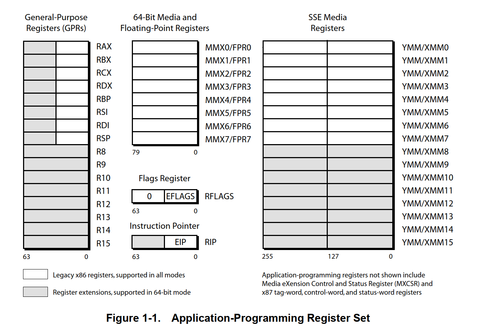

# AMD架构简单读书笔记1

## 前言

​	笔者打算简单的记录一下自己读AMD手册架构的书。笔者先前还记录了自己RISC-V手册的阅读笔记，[RISC-V读书笔记-CSDN博客](https://blog.csdn.net/charlie114514191/article/details/145265216)。感兴趣的朋友可以简单的翻阅一二。

​	AMD的所有技术文档都在[Documentation for AMD Processors, Accelerators, and Graphics](https://www.amd.com/en/search/documentation/hub.html#sortCriteria=@amd_release_date descending&f-amd_archive_status=Active&f-amd_audience=Technical)这里，感兴趣的朋友可以直接到这里找自己感兴趣的技术文档。

​	笔者阅读的文档：[AMD64 Architecture Programmer’s Manual, Volumes 1-5](https://www.amd.com/content/dam/amd/en/documents/processor-tech-docs/programmer-references/40332.pdf)。感兴趣的朋友可以自行下载。

## 关于AMD架构

​	好说不说，笔者现在正在工作的笔记本就是采用的AMD的架构。在2000年，伴随着软件工程的复杂度日益上升，我们对64位架构的需求呼之欲出，在2001年，AMD扩展了原先的32位架构，升级成了x86_64架构。换而言之，强大的兼容性保证了它可以迅速的占领市场。正如我们的手册的扉页所说的：

> AMD64 架构是简单但功能强大的 64 位、向后兼容的行业标准（传统）x86 架构的扩展。**它增加了 64 位寻址并扩展了寄存器资源，以支持重新编译的 64 位程序的更高性能，同时支持传统的 16 位和 32 位应用程序和操作系统，而无需修改或重新编译。**它是新处理器为大量现有软件和高性能应用程序所需的 64 位软件提供无缝、高性能支持的架构基础。对 64 位 x86 架构的需求是由处理大量虚拟和物理内存的应用程序驱动的，例如高性能服务器、数据库管理系统和 CAD 工具。这些应用程序受益于 64 位地址和增加的寄存器数量。传统 x86 架构中可用的寄存器数量较少，限制了计算密集型应用程序的性能。增加寄存器的数量可以提高许多此类应用程序的性能。

## AMD64 Features

### 概述

​	笔者这里辅助性质的帮助你回顾一下Intel的经典x86的架构。经典x86架构是典型的少寄存器的架构，只有8个寄存器，意味着大部分软件的操作在紧密跟内存打交道（函数的参数传递上也往往采取压栈和推栈而不是直接使用寄存器传递）

​	上面的这个图是一个x64架构的寄存器示意图，对于程序员而言，可以用来编程的寄存器就是这些。

> 熟悉x86架构的朋友可能一眼留心到RAX - RSP这八个寄存器，他们实在是伴随着对x86架构编程的始终。我们知道，经典的，在8位时代，寄存器是8位长度，我们的16位8086寄存器为了兼容性采取的措施是将4个寄存器（AX-DX）对半分，保证使用的是8个8位寄存器。在经典的32位时代，则是使用E来作为前缀，表达了对原始寄存器的一次扩展（Extension中的E），现在的R就是单纯的寄存器的含义。这里的寄存器都是64位。有趣的是新的架构还直接提到了专门的浮点数运算寄存器和超长的媒体寄存器（Media Registers）

​	说完寄存器，说的是架构的模式。架构模式上，体现的就是一个词：**“兼容”**，一般的，我们现在的电脑运行的都是长模式，也就是64位模式，剩下的经典模式那就是大家老生常谈，图一乐呵了。

| Operating Mode     | Operating System Required | Application Recompile Required | Defaults            | Register Extensions | Typical GPR Width (bits) |
| ------------------ | ------------------------- | ------------------------------ | ------------------- | ------------------- | ------------------------ |
|                    |                           |                                | Address Size (bits) | Operand Size (bits) |                          |
| **Long Mode**      |                           |                                |                     |                     |                          |
| 64-Bit Mode        | 64-bit OS                 | yes                            | 64                  | 32                  | yes                      |
| Compatibility Mode | 64-bit OS                 | no                             | 32                  | 16                  | no                       |
| **Legacy Mode**    |                           |                                |                     |                     |                          |
| Protected Mode     | Legacy 32-bit OS          | no                             | 32                  | 32                  | no                       |
| Virtual-8086 Mode  | Legacy 32-bit OS          | no                             | 16                  | 16                  | no                       |
| Real Mode          | Legacy 16-bit OS          | no                             | 16                  | 16                  | no                       |

### 寄存器

​	下面的表格是寄存器在32位和64位模式下的名称，数量

| Register or Stack                    | Legacy and Compatibility Modes         |        | 64-Bit Mode |                                                |
| ------------------------------------ | -------------------------------------- | ------ | ----------- | ---------------------------------------------- |
|                                      | Name                                   | Number | Size (bits) | Name                                           |
| **General-Purpose Registers (GPRs)** | EAX, EBX, ECX, EDX, EBP, ESI, EDI, ESP | 8      | 32          | RAX, RBX, RCX, RDX, RBP, RSI, RDI, RSP, R8–R15 |
| 256-bit YMM Registers                | YMM0–YMM7                              | 8      | 256         | YMM0–YMM15                                     |
| 128-Bit XMM Registers                | XMM0–XMM7                              | 8      | 128         | XMM0–XMM15                                     |
| 64-Bit MMX Registers                 | MMX0–MMX7                              | 8      | 64          | MMX0–MMX7                                      |
| x87 Registers                        | FPR0–FPR7                              | 8      | 80          | FPR0–FPR7                                      |
| Instruction Pointer                  | EIP                                    | 1      | 32          | RIP                                            |
| Flags                                | EFLAGS                                 | 1      | 32          | RFLAGS                                         |
| Stack                                | —                                      | —      | 16 or 32    | —                                              |

​	我们的架构编程就是围绕着这些寄存器打交道。

### 指令集

​	指令集笔者认为是汇编编程的灵魂，掌握指令集，会用指令集是编程的核心。

​	好在AMD64的架构是完全兼容完整的传统 x86 指令集，并支持支持长模式的附加指令。AMD手册表明，我们一共有四套指令集。

- 绝大多数人使用的，打交道的是通用指令集，它可以完成最基本的最常见的任务。这些指令中的大多数加载、存储或操作位于通用寄存器 (GPR) 或内存中的数据。一些指令通过分支到其他程序位置来改变顺序程序流。（就像RISC-V的load, store和相关的操作，x86里就是mov的多态化）这些是几乎所有程序中使用的基本 x86 整数指令。
-  流式 SIMD 扩展指令 (SSE)，SIMD是单指令多数据的意思。一个好理解的方式就是循环对数组进行相同操作的代码，SIMD将之并行化，从架构层次消灭了算法的复杂度，执行时间从O(N)算法的执行时间降低到了接近O(1)，算法没变，时间开销砍了不少。这些指令加载、存储或操作主要位于 YMM/XMM 寄存器中的数据。128 位媒体指令在 YMM 寄存器的下半部分上运行。SSE 指令对矢量（打包）和标量数据类型执行整数和浮点运算。**由于矢量指令可以独立且同时对多组数据执行单个操作，因此它们被称为单指令多数据 (SIMD) 指令。它们适用于对数据块进行操作的高性能媒体和科学应用程序。**
-  多媒体扩展指令 — 这些包括 MMX™ 技术和 AMD 3DNow!™ 技术指令。这些指令加载、存储或操作主要位于 64 位 MMX 寄存器中的数据，这些寄存器映射到 80 位 x87 浮点寄存器。与 SSE 指令一样，它们对矢量（打包）和标量数据类型执行整数和浮点运算。这些指令在不需要高精度的媒体应用程序中很有用。多媒体扩展指令使用不会产生操作异常的饱和数学运算。**AMD 不再强调使用 3DNow! 指令，这些指令已被更高效的 SSE 指令取代。**
- x87 浮点指令 — 这些是旧版 x87 应用程序中使用的浮点指令。它们加载、存储或操作位于 80 位 x87 寄存器中的数据。
  其中一些应用程序编程指令桥接了上述两个或多个子集。例如，有些指令在通用寄存器和 YMM/XMM 或 MMX 寄存器之间移动数据，许多整数向量（打包）指令可以对 YMM/XMM 或 MMX 寄存器进行操作，但不能同时进行。如果指令桥接了两个或多个子集，则它们的描述会在它们适用的所有子集中重复。

### 媒体指令

​	媒体指令（Media Instructions）更多讨论的是同人进行交互的：视觉的听觉的场景下使用的加速指令。比如说设计到图像处理、音乐合成、语音识别、全动态视频和 3D 图形渲染的软件，使用这些指令可以有效的提升软件的实时性。

​	理解这些指令的诞生，需要考虑这些指令的需求特征是如何的。显然，任何一个拥有相关领域编程的人都知道，他们往往：

- 处理大量的数据
- 这些大量的数据需要被执行相同的操作序列。换而言之，流水线的性质非常显著
- 数据通常表示为小量，例如像素值为 8 位、音频样本为 16 位、浮点格式的对象坐标为 32 位。

​	SSE 和 MMX 指令旨在加速这些应用程序。这些指令使用一种称为单指令多数据 (SIMD) 处理的矢量（或打包）并行处理形式。这种矢量技术具有以下特点：

- 单个寄存器可以保存多个独立的数据。例如，单个 YMM 寄存器可以容纳 32 个 8 位整数数据元素，或 8 个 32 位单精度浮点数据元素。
- 矢量指令可以独立且同时对寄存器中的所有数据元素进行操作。例如，对 128 位 XMM 寄存器中两个矢量操作数的字节元素进行操作的 PADDB 指令执行 16 次同时加法并在单个操作中返回 16 个独立结果。

SSE 和 MMX 指令通过包含执行媒体应用程序中常见操作的特殊指令，使 SIMD 矢量技术更进一步。例如，将两个像素的亮度值相加的图形应用程序必须防止加法运算在结果溢出目标寄存器时回绕到较小的值，因为溢出结果可能会产生意外效果，例如在预期为亮像素的地方出现暗像素。这些指令包括饱和算术指令以简化此类操作。否则，结果会因上溢或下溢而回绕，而是被迫饱和在目标寄存器中可以表示的最大或最小值处。

### 浮点指令

AMD64 架构提供三个浮点指令子集，使用三个不同的寄存器集：

- 除了整数运算之外，SSE 指令还支持 32 位单精度和 64 位双精度浮点运算。支持对矢量数据和标量数据的操作，并具有专用的浮点异常报告机制。这些浮点运算符合 IEEE-754 标准。
- MMX 指令支持单精度浮点运算。支持对矢量数据和标量数据的操作，但这些指令不支持浮点异常报告。
- x87 浮点指令支持单精度、双精度和 80 位扩展精度浮点运算。仅支持标量数据，并具有专用的浮点异常报告机制。 x87 浮点指令包含用于执行三角和对数超越运算的特殊指令。单精度和双精度浮点运算符合 IEEE-754 标准。使用 256 位媒体指令可实现最大浮点性能。这些矢量指令之一可并行支持最多八个单精度（或四个双精度）运算。64 位模式下共有 16 个 256 位 YMM 寄存器，通过提供更多寄存器来保存中间结果，从而减少将这些结果存储在内存中的需要，从而加快应用程序的速度。更少的加载和存储可带来更好的性能。