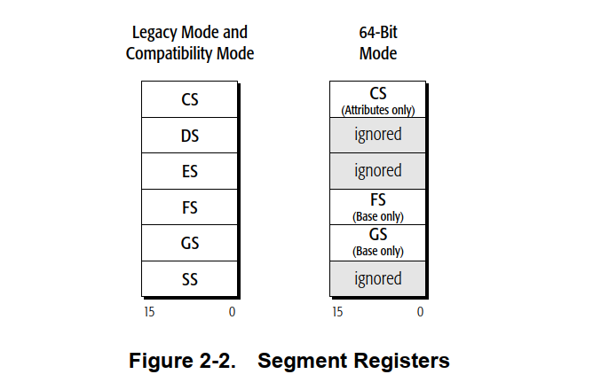

# AMD架构简单读书笔记3——内存模型1

​	现在我们开始注重内存模型这个概念。

## 内存组织

​	**我们首先需要引入的就是虚拟内存这个概念**，虚拟内存由程序可用的整个地址空间组成。它是一个较大的线性地址空间，由硬件和操作系统软件的组合转换为较小的物理地址空间，其中部分位于内存中，部分位于磁盘或其他外部存储介质上。

​	集合我们刚刚言论的几种机器模式，对于不同的模式，我们自然也就有了不同的分类方式：

- 64 位模式：此模式使用虚拟内存的平面分段模型。64 位虚拟内存空间被视为单个平面（未分段）地址空间。程序地址访问可以位于线性 64 位地址空间中任何位置的位置。操作系统可以使用**单独的选择器来保护代码、堆栈和数据段，但所有这些段的基址始终为 0（毕竟一个经典的寻址办法就是拿一个基址+偏移拿到一个访问的对象）**。（当然有例外，那就是拿FS和GS当基址，这个之后说）
- 兼容模式 - 此模式使用受保护的多段虚拟内存模型，就像在传统保护模式中一样。**32 位虚拟内存空间被视为一组分段的地址空间，用于代码、堆栈和数据段，每个段都有自己的基址和保护参数。**通过将段选择器添加到地址来指定分段空间。

​	你可以看到，今天的64位操作系统已经不会严密的区分我们的SS，CS和DS了。换而言之，大部分操作系统的课本在今天的知识已经过时了。在今天，操作系统已使用分段内存作为一种将程序与其使用的数据隔离开来的方法，以提高同时运行多个程序的系统的可靠性。**但是，大多数现代操作系统不使用传统 x86 架构中提供的分段功能。相反，这些操作系统完全在软件中处理分段功能。**因此，AMD64 架构在 64 位模式下省去了大多数传统分段功能。这使得 64 位操作系统的编码更加简单，并且它支持比传统 x86 架构更高效的多任务环境管理。

### 段寄存器

​	很好，我们的基址就放在了段寄存器中，这是任何一个学习过微机原理和基于x86的计算机体系架构的朋友都知道的事情。所以，当出现这个图的时候，你不应该感到以外。

> 段寄存器保存用于访问内存段的选择器。这个话是AMD手册的原话

​	**在传统模式和兼容模式下，所有段寄存器都可供软件访问。**

​	在 64 位模式下，处理器仅识别 **CS、FS 和 GS** 段（笔者真的感到意外，现在我们的选择子非常自由了），并且软件可以使用 FS 和 GS 段基址寄存器作为地址计算的基址寄存器。

​	对于 64 位模式下对 DS、ES 或 SS 段的引用，处理器假定这些段中的**每一个的基址为零，不检查它们的段限制或属性**，并且处理器仅检查所有这些地址**是否为规范格式**。限制的开放显然化简了我们的运行开销。

### 物理内存

​	物理内存是特定计算机系统中安装的内存（不包括高速缓存）（原手册中叫Installed Memory，也就是插到了主板上的内存条，这样一提是不是形象一些？），可通过**处理器的总线接口进行访问。物理内存空间的最大大小由总线接口上的地址位数决定。**在虚拟内存系统中，较大的虚拟地址空间（也称为线性地址空间）通过分段和分页硬件和软件的组合转换为较小的物理地址空间。

​	**分页是一种将线性（虚拟）地址转换为固定大小的块（称为页面）的机制**，笔者帮助你回顾一下——一个经典的页大小是4KB大小。操作系统可以根据需要在内存和外部存储介质（通常是磁盘）之间**移动这些页面。AMD64 架构支持旧式 x86 分页机制的扩展版本，该机制能够将完整的 64 位虚拟地址空间转换为特定实现支持的物理地址空间。（这里就是MMU了，他将给定的虚拟地址送入MMU中快速查表得到物理地址，对于命中的情况，这是一种近乎常数实现的操作）**

### 内存管理

内存管理策略使用分段和/或分页将程序生成的地址转换为物理内存中的地址。内存管理对应用程序不可见。它由操作系统和处理器硬件处理。

#### 长模式（Long Mode）内存管理

​	长模式的两个子模式下执行的内存管理功能从上到下的流程。

​	笔者实际上非常惊讶，现在我们的体系架构更加倾向于直接对拿到的虚拟地址进行转换。

​	在 64 位模式下，程序会生成最大可达 64 位的虚拟（线性）地址。虚拟地址会传递给长模式分页函数，该函数会生成最大可达 52 位的物理地址。（特定架构的实现可以支持较小的虚拟地址和物理地址大小。）

​	在兼容模式下，旧版 16 位和 32 位应用程序使用旧版 x86 保护模式分段语义运行。程序生成的 16 位或 32 位有效地址与其段相结合，生成 32 位虚拟（线性）地址，这些地址通过零扩展至最大 64 位。接下来的分页与 64 位模式下使用的长模式分页函数相同。它将虚拟地址转换为物理地址。段选择器和有效地址的组合也称为逻辑地址或远指针。虚拟地址也称为线性地址。

### 传统模式内存管理

​	这个就是各位可能更加熟悉的分页方式

内存管理功能因子模式而异，如下所示：

- 保护模式 — 保护模式支持 16 位和 32 位程序，具有基于表的内存分段、分页和权限检查。分段功能采用 32 位有效地址和 16 位段选择器，并将 32 位线性地址生成到 16K 内存段之一，每个内存段的大小最高可达 4GB。分页是可选的。32 位物理地址由分页功能生成，或者线性地址无需修改即可用作物理地址。
- 虚拟 8086 模式 — 虚拟 8086 模式支持在保护模式下作为任务运行的 16 位程序。 **20 位线性地址的形成方式与实模式相同，但可以通过分页功能进行转换，以形成可访问最多 4GB 内存空间的 32 位物理地址。**
- 实模式 — 实模式支持使用基于寄存器的移位和添加分段的 16 位程序，但不支持分页。16 位有效地址被零扩展并添加到左移四位的 16 位段基地址，从而产生 20 位线性地址。线性地址被零扩展为可访问最多 1MB 内存空间的 32 位物理地址。