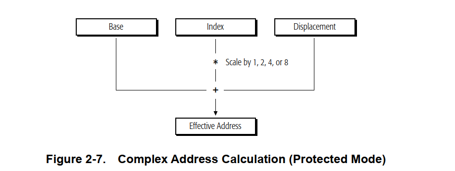

# AMD读书笔记4——内存模型2

## 内存的寻址

​	任何熟悉经典X86-64架构的朋友都知道，x86-64是一个经典的小端序的架构

> AMD手册1~5卷：第50页2.2.1部分
>
> 指令和数据以小端字节顺序存储在内存中。小端顺序将指令或数据项的最低有效字节放在最低内存地址，将最高有效字节放在最高内存地址。

​	举个例子， `48 B8 88 77 66 55 44 33 22 11`。注意到的是，我们的最低有效位实际上是48，在这里，不同于我们阅读的数字一样。比如说，单纯说48，我们认为4的权重比8大，因为这里的4代表的是40.但是在架构中，我们则是反过来，以开始阅读到的字节是权重最小的！所以，48就相当于我们使用的十进制当中的个位数，属于Least Significant的字节。初入架构学习，一些朋友可能搞不明白这一点。

​	所以，让我们从低字节向高字节看，其存储就是

```
00h	01h	02h	03h	04h 05h 06h 07h 08h 09h
48h	B8h	88h	77h	66h	55h	44h	33h	22h	11h
```

### 64 位规范地址

​	长模式定义 64 位虚拟地址，但 AMD64 架构的实现可能支持更少的虚拟地址位。虽然实现可能不会使用虚拟地址的所有 64 位，但它们会检查第 63 位到最高有效实现位，以查看这些位是全零还是全一。

> 笔者补充：
>
> 笔者是在阅读Linux内核的时候知晓这个事情的，那就是对于用户态的程序，我们可能会设置从最高虚拟地址有效位（比如说，常见的设计是使用的是48位虚拟地址，最高的两个字节不使用不开启）到第63位为0，对于内核态的程序，我们则是使用全1填充。这里指代的是——硬件会对地址合法性进行检查！

​	符合此属性的地址被称为规范地址形式。如果虚拟内存引用不是规范形式，也就是说，当我们的内核态的程序访问了用户空间地址或者是任何不规范的地址扔经典的General Protection错误，对于用户态则是反过来，扔经典的Stack Segment Fault.

### 有效地址EA

​	程序在分段和分页转换之前向硬件提供有效地址（换而言之，因为在分页和分段开始之前，程序是裸奔的，没有经过页表转换和虚实地址转换）

​	生成有效的地址一般的有五种办法：

- 直接使用绝对地址进行

根据特定的指令编码，有五种生成有效地址的方法：
• 绝对地址 - 这些地址以数据段基址的位移（或偏移量）给出。它们直接指向数据段中的内存位置。
• 指令相关地址——这些地址以当前指令指针 (IP)（也称为程序计数器 (PC)）的位移（或偏移量）给出。它们由控制传输指令生成。指令编码中的位移，或从内存，用作传输后地址的偏移量。有关 64 位模式下 RIP 相对寻址的详细信息，请参阅第 18 页上的“RIP 相对寻址”。 

• 索引寄存器间接地址 - 这些地址是根据指令（基址）指定的通用寄存器中包含的基址计算得出的。不同的编码允许使用有符号位移或使用位移和缩放索引值的总和来偏移此基址。指令编码可以使用最多十个字节 - ModRM 字节、可选 SIB（比例、索引、基址）字节和可变长度位移 - 来指定有效地址计算中要使用的值。基址和索引值包含在由 SIB 字节指定的通用寄存器中。比例和位移值直接在指令编码中指定。

​	一个有效的地址是这样组成的：



> 这里简单说一下，那就是使用的是Base作为一个经典的偏移地址，然后在它的上面产生一个偏移进行访问，这种产生有效的地址的方式相信给不少人留下深刻的影响。

- 堆栈地址——PUSH、POP、CALL、RET、IRET 和 INT 指令隐式使用堆栈指针，其中包含过程堆栈的地址。有关堆栈指针大小的详细信息
- 字符串地址——字符串指令使用 rDI 和 rSI 寄存器生成连续地址，

​	在 64 位模式下，没有地址大小覆盖，有效地址计算的大小为 64 位。有效地址计算使用 64 位基址和索引寄存器，并将位移符号扩展为 64 位。由于 64 位模式下的地址空间平坦，**虚拟地址等于有效地址**。

​	对于16 位和 32 位地址的长模式零扩展在长模式下，**所有 16 位和 32 位地址计算都经过零扩展以形成 64 位地址。**地址计算首先被截断为当前模式（64 位模式或兼容模式）的有效地址大小，并被任何地址大小前缀覆盖。然后将结果零扩展为完整的 64 位地址宽度。

因此，在兼容模式下运行的 16 位和 32 位应用程序只能访问长模式虚拟地址空间的低 4GB。同样，在 64 位模式下生成的 32 位地址只能访问长模式虚拟地址空间的低 4GB。

### 位移和立即数

​	通常，地址位移和立即数操作数的最大大小为 32 位。它们的大小可以是 8、16 或 32 位，具体取决于指令或位移的有效地址大小。在 64 位模式下，位移在使用过程中会符号扩展为 64 位，但它们的实际大小（用于值表示）仍然最多为 32 位。当操作数大小为 64 位时，64 位模式下的立即数也是如此。但是，64 位模式下支持某些 64 位位移和 MOV 指令的立即数形式。

#### FS 和 GS 作为地址计算的基址

​	在 64 位模式下，FS 和 GS 段基址寄存器（与 DS、ES 和 SS 段基址寄存器不同）可用作地址计算的非零数据段基址寄存器。64 位模式假定所有其他数据段寄存器（DS、ES 和 SS）的基址为 0。因为现在不再需要基址寄存器就能访问地址了。

​	指令的默认地址大小由当前代码段描述符中的默认大小 (D) 位和长模式 (L) 位决定（有关详细信息，请参阅第 2 卷中的“分段虚拟内存”）。应用软件可以使用 67h 地址大小指令前缀字节在任何操作模式下覆盖默认地址大小。地址大小前缀允许在每条指令的基础上混合使用 32 位和 64 位地址。

| Operating Mode                                      | Default Address Size (Bits) | Effective Address Size (Bits) | Address-Size Prefix (67h) Required? |
| --------------------------------------------------- | --------------------------- | ----------------------------- | ----------------------------------- |
| Long Mode                                           |                             |                               |                                     |
| 64-Bit Mode                                         | 64                          | 64                            | no                                  |
| Compatibility Mode                                  | 32                          | 32                            | no                                  |
| Legacy Mode (Protected, Virtual-8086, or Real Mode) | 32                          | 32                            | yes                                 |
| Legacy Mode (Protected, Virtual-8086, or Real Mode) | 16                          | 32                            | yes                                 |
| Legacy Mode (Protected, Virtual-8086, or Real Mode) | 32                          | 32                            | yes                                 |
| Legacy Mode (Protected, Virtual-8086, or Real Mode) | 16                          | 16                            | no                                  |

​	在 64 位模式下，默认地址大小为 64 位。地址大小可以覆盖为 32 位。64 位模式下不支持 16 位地址。在兼容模式和传统模式下，地址大小前缀的工作方式与传统 x86 架构相同。

### RIP 相对寻址

​	RIP 相对寻址（即相对于 64 位指令指针（也称为程序计数器）的寻址）在 64 位模式下可用。有效地址是通过将位移添加到下一条指令的 64 位 RIP 形成的。

​	在传统的 x86 架构中，相对于指令指针 (IP 或 EIP) 的寻址仅适用于控制传输指令。在 64 位模式下，任何使用 ModRM 寻址的指令都可以使用 RIP 相对寻址。此功能对于在位置无关代码中寻址数据以及寻址全局数据的代码特别有用。程序通常有许多对数据（尤其是全局数据）的引用，这些引用不是基于寄存器的。要加载这样的程序，加载器通常会在内存中为程序选择一个位置，然后根据加载位置调整程序对全局数据的引用。数据的 RIP 相对寻址使这种调整变得不必要。

#### RIP 相对寻址的范围

​	如果没有 RIP 相对寻址，使用 ModRM 字节编码的指令将相对于零寻址内存。使用 RIP 相对寻址，带有 ModRM 字节的指令可以使用有符号的 32 位位移来寻址相对于 64 位 RIP 的内存。这提供了距离 RIP 2 GBytes 的偏移范围。

#### 地址大小前缀对 RIP 相对寻址的影响

​	RIP 相对寻址由 64 位模式启用，而不是由 64 位地址大小启用。相反，使用地址大小前缀不会禁用 RIP 相对寻址。地址大小前缀的效果是

