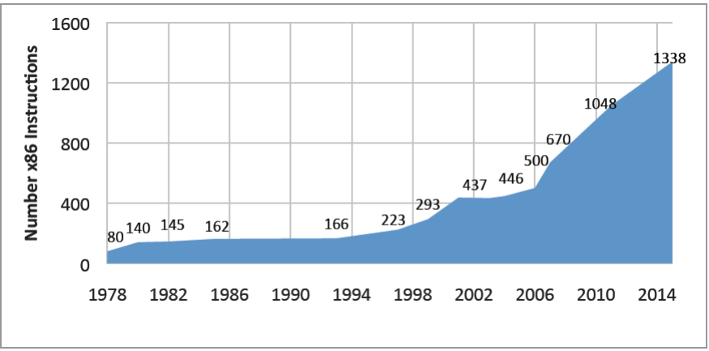
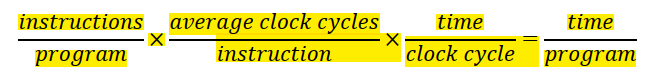

# RISC-V读书笔记

## 关于RISC-V

### 简洁

​	RISC-V是一个崭新的架构，比起来传统的x86-64架构，他更加的简约和现代。下面这种图像阐述了传统的x86的指令集的膨胀速度有多么的吓人（汗颜

​	这是可以理解的，我们的ISA（Computer System Architechure）必须是增量的，在伴随着计算机的架构迭代的时候，ISA必须兼容之前的涉及，从而确保一定的稳定性。目的是为了保持向后的二进制兼容性，这样几十年前程序的二进制版本仍然可以在最新的处理器上正确运行。这一要求与来自于同时发布新指令和新处理器的营销上的诱惑共同导致了ISA的体量随时间大幅增长。

​	但是我们的RISC-V则做了大胆的创新。那就是将指令集划分为“必须的”和“模块的”的两个部分。

​	它的核心是一个名为RV32I的基础ISA，运行一个完整的软件栈。RV32I是固定的，永远不会改变。这为编译器编写者，操作系统开发人员和汇编语言程序员提供了稳定的目标。模块化来源于可选的标准扩展，根据应用程序的需要，硬件可以包含或不包含这些扩展。

​	这个现代的特性允许我们的RISC-V架构是可以进军嵌入式硬件的。因为这种模块化特性使得RISC-V具有了袖珍化、低能耗的特点，而这对于嵌入式应用可能至关重要。RISC-V编译器得知当前硬件包含哪些扩展后，便可以生成当前硬件条件下的最佳代码。举个例子，笔者手头的ESP32单片机内部采用的架构就是RISC-V架构

> 惯例是把代表扩展的字母附加到指令集名称之后作为指示。**例如，RV32IMFD将乘法（RV32M），单精度浮点（RV32F）和双精度浮点（RV32D）的扩展添加到了基础指令集（RV32I）中。**

​	这样的简洁性质允许了我们减小芯片面积的大小，结合模拟集成电路的中的成本同面积的关系，我们的ISA越精简，其所需要的逻辑电路就相对越少，就需要越少的晶圆

​	下面这个公式阐述了我们执行一次程序所需要的时间。

​	即使一个简单的 ISA 可能在每个程序执行的指令数方面多于复杂的ISA，但它可以通过更快的时钟频率或更低的平均单条指令周期数（CPI）来弥补。

​	另外，ISA中一个常见的话题就是架构和实现之间分离，一个经典的表现就是机器语言程序员了解架构后能写出正确的程序，却不一定能保证性能。对于架构师来说，为了在性能和成本上对某一特定时间的某种实现进行优化，而在 ISA 中包含某些指令，有时候是一件有诱惑性的事情。但这样做会给其他实现或者今后的实现带来负担。（这是一组很大的矛盾）

