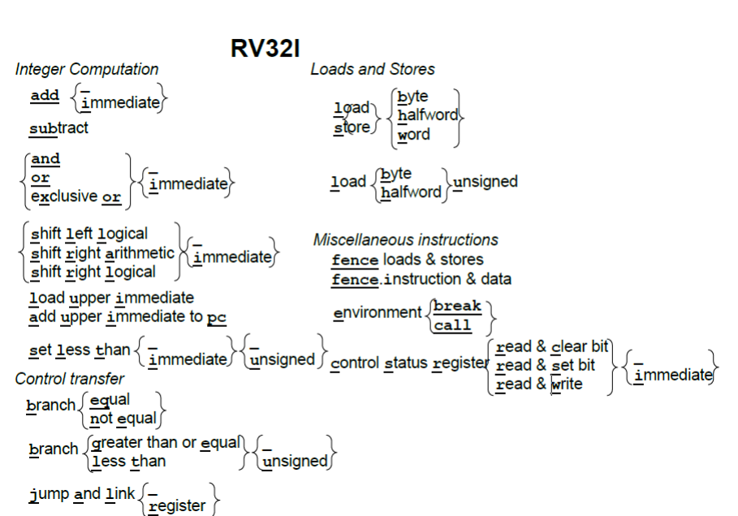
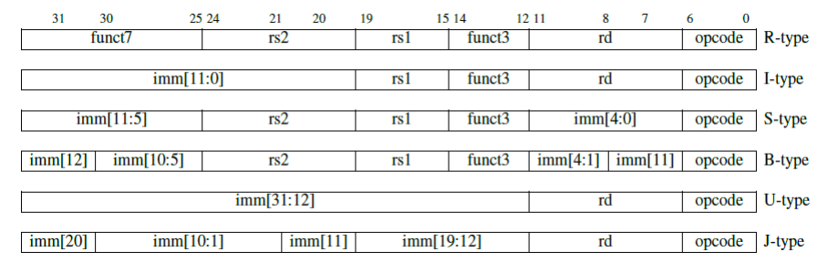

# RISC-V读书笔记

## RISC-V 基础整数指令集 

### 概论

​	RISC-V存在六种指令集格式（虽然其中两种，也就是B类和J类，实际上是分别简单操作了S类和，U类映射得到的）

> 具体来说：分支指令（B 类型）的立即数字段在 S 类型的基础上旋转了 1 位。跳转指令（J类型）的直接字段在 U 类型的基础上旋转了12 位。因此,RISC-V 实际上只有四种基本格式，

​	RISCV的几个指令集的含义图放在了下面，因此，实际上这些指令就是更长含义单词的一个缩写。后面的大括号就是这些基本指令的变体。举个例子，addi就是add immediate，加一个立即数！



### 格式分配



​	这里，我们的六种类型依次是：

| 类型                               | 说明                       |
| ---------------------------------- | -------------------------- |
| `R-Type(Register-Register Type)`   | 对寄存器之间进行操作       |
| `I-Type(Short Immediate And Load)` | 操作数是短立即数，或者是做 |
| `S-Type(Store Type)`               | 做的操作是存储操作         |
| `B-type(Jump Type)`                | 做的操作是有条件的跳转操作 |
| `U-Type(Long Immediate)`           | 操作数是长立即数，有20位长 |
| `J-Type`                           | 做的操作是无条件的跳转操作 |

​	所以，让我们来看看几个常见指令的所属类型

| 指令     | 操作码    | 格式类型 | 指令布局       | 描述        |
| -------- | --------- | -------- | -------------- | ----------- |
| `LUI`    | `0110111` | U 型     | `imm[31:12]`   | `rd`        |
| `AUIPC`  | `0010111` | U 型     | `imm[31:12]`   | `rd`        |
| `JAL`    | `1101111` | J 型     | `imm[20]`      | `imm[10:1]` |
| `JALR`   | `1100111` | I 型     | `imm[11:0]`    | `rs1`       |
| `BEQ`    | `1100011` | B 型     | `imm[12]`      | `imm[10:5]` |
| `BNE`    | `1100011` | B 型     | `imm[12]`      | `imm[10:5]` |
| `BLT`    | `1100011` | B 型     | `imm[12]`      | `imm[10:5]` |
| `BGE`    | `1100011` | B 型     | `imm[12]`      | `imm[10:5]` |
| `BLTU`   | `1100011` | B 型     | `imm[12]`      | `imm[10:5]` |
| `BGEU`   | `1100011` | B 型     | `imm[12]`      | `imm[10:5]` |
| `ADD`    | `0110011` | R 型     | `rs2`          | `rs1`       |
| `SUB`    | `0110011` | R 型     | `rs2`          | `rs1`       |
| `AND`    | `0110011` | R 型     | `rs2`          | `rs1`       |
| `OR`     | `0110011` | R 型     | `rs2`          | `rs1`       |
| `XOR`    | `0110011` | R 型     | `rs2`          | `rs1`       |
| `SLL`    | `0110011` | R 型     | `rs2`          | `rs1`       |
| `SRL`    | `0110011` | R 型     | `rs2`          | `rs1`       |
| `SRA`    | `0110011` | R 型     | `rs2`          | `rs1`       |
| `MUL`    | `0110011` | R 型     | `rs2`          | `rs1`       |
| `DIV`    | `0110011` | R 型     | `rs2`          | `rs1`       |
| `LW`     | `0000011` | I 型     | `imm[11:0]`    | `rs1`       |
| `SW`     | `0100011` | S 型     | `imm[11:5]`    | `rs2`       |
| `LH`     | `0000011` | I 型     | `imm[11:0]`    | `rs1`       |
| `SH`     | `0100011` | S 型     | `imm[11:5]`    | `rs2`       |
| `LB`     | `0000011` | I 型     | `imm[11:0]`    | `rs1`       |
| `SB`     | `0100011` | S 型     | `imm[11:5]`    | `rs2`       |
| `ECALL`  | `1110011` | I 型     | `000000000000` | `00000`     |
| `EBREAK` | `1110011` | I 型     | `000000000000` | `00000`     |

### 寄存器

​	RISC-V寄存器有32个，这个寄存器是非常多的，笔者手头的STM32是AArch32架构的，只有16个寄存器，当代大学大部分微机原理教授的x86只有8个寄存器（天煞的知道只能往里无聊的压栈弹栈是多么的无聊！）特别的是，ARM32的PC是隶属于寄存器的一部分的，这意味着，任何一个直接的或者是潜在的更改寄存器的指令都有可能refresh我们的指令集流水线，你知道的，这会给指令预测带来极大的困扰。

​	简单的算术指令（add, sub）、逻辑指令（and, or, xor），以及移位指令（sll, srl, sra）和其他 ISA 差不多。他们从寄存器读取两个 32 位的值，并将 32 位结果写入目标寄存器。RV32I 还提供了这些指令的立即数版本**。和ARM-32 不同，立即数总是进行符号扩展，这样子如果需要，我们可以用立即数表示负数，正因为如此，我们并不需要一个立即数版本的 sub。**

​	RISC-V 中没有字节或半字宽度的整数计算操作。操作始终是以完整的寄存器宽度。内存访问需要的能量比算术运算高几个数量级。因此低宽度的数据访问可以节省大量的能量，但低宽度的运算不会。ARM-32 具有一个不寻常的功能，对于大多数算术逻辑运算中的一个操作数，你可以选择对它进行移位。尽管这些指令的使用频率很低，但它使数据路径和数据通路更加复杂。与此相对的是，RV32I 提供了单独的移位指令。 

​	程序可以根据比较结果生成布尔值。为应对这种使用场景下，**RV32I 提供一个当小于时置位的指令。如果第一个操作数小于第二个操作数，它将目标寄存器设置为 1，否则为0**。不出所料，对这个指令，有一个有符号版本（slt）和无符号版本（sltu），分别用于处理有符号和无符号整数比较。相应的，上述两条指令也有立即数版本的（slti，sltiu）。正如我们将要看到的，虽然RV32I 分支指令可以检查两个寄存器之间的所有关系，但一些条件表达式涉及多对寄存器之间的关系。对于这些表达式，编译器或汇编语言程序员可以将slt 以及与或异或等逻辑指令组合使用来解决更复杂的条件表达式。 
​	lui, auipc主要用于构造大的常量数值和链接。**加载立即数到高位（lui）将 20 位常量加载到寄存器的高 20 位。接着便可以使用标准的立即指令来创建 32位常量。**这样子，仅使用2 条 32 位RV32I 指令，便可构造一个32 位常量。向PC 高位加上立即数（auipc）让我们仅用两条指令，便可以基于当前PC 以任意偏移量转移控制流或者访问数据。**将auipc 中的20 位立即数与jalr（参见下面）中 12 位立即数的组合，我们可以将执行流转移到任何32 位PC 相对地址。而auipc 加上普通加载或存储指令中的 12位立即数偏移量，使我们可以访问任何32 位PC 相对地址的数据。**

> Tips：原文还有给出xor交换的说法，这个笔者经常使用。这个需要注意的是，两个数相等也是无所谓的，具体的C等效代码看起来是这样的
>
> ```
> x1 ^= x2;
> x2 ^= x1;
> x1 ^= x2;
> ```

## Load Store指令

​	RV32I 支持加载：有符号和无符号字（lw, sw），有符号和无符号字节和半字（lb，lbu，lh，lhu），存储字节和半字（sb，sh）。

​	RV32I 省略了ARM-32 和x86-32 的复杂寻址模式。另外，ARM-32提供的寻址模式并非适用于所有数据类型，但 RV32I 寻址不会歧视任何数据类型。RISC-V 可以模仿某些x86 寻址模式。例如，将立即数字段设置为0 即与 x86 中的寄存器间接寻址效果相同。与x86-32 不同，RISC-V 没有特殊的堆栈指令。将 31 个寄存器中的某一个作为堆栈指针，标准寻址模式使用起来和压栈（push）和出栈（pop）类似，并且不增加ISA 的复杂性。与 MIPS-32 不同，RISC-V 不支持延迟加载（delayed load）。与延迟分支的设计相似，为了更好的适应五级流水线，MIPS-32 重新定义了load 指令的语义，load 上来的数据在 load 指令两个指令后才可用。但是对于后来出现的更长的流水线，延迟加载带来的收益逐渐消失，因此 RISC-V 不支持延迟加载。

## 跳转

​	RV32I 可以比较两个寄存器并根据比较结果上进行分支跳转。比较可以是：相等（beq），不相等 （bne），大于等于（bge），或小于（blt）。最后两种比较有符号比较，RV32I 也提供相应的无符号版本比较的：bgeu 和bltu。剩下的两个比较关系（大于和小于等于）可以通过简单地交换两个操作数，即可完成比较。因为 x < y 表示y > x 且x ≥ y表示 y ≤ x。 

​	由于RISC-V 指令长度必须是两个字节的倍数：分支指令的寻址方式是 12 位的立即数乘以2，符号扩展它，然后将得到值加到PC 上作为分支的跳转地址。PC 相对寻址可用于位置无关的代码，简化了链接器和加载器的工作

​	跳转并链接指令（jal）具有双重功能。若将下一条指令PC + 4 的地址保存到目标寄存器中，通常是返回地址寄存器ra（见图2.4），便可以用它来实现过程调用。如果使用零寄存器（x0）替换 ra 作为目标寄存器，则可以实现无条件跳转，因为 x0 不能更改。像分支一样，jal 将其20 位分支地址乘以 2，进行符号扩展后再添加到PC 上，便得到了跳转地址。 跳转和链接指令的寄存器版本（jalr）同样是多用途的。它可以调用地址是动态计算出来的函数，或者也可以实现调用返回（只需 ra 作为源寄存器，零寄存器（x0）作为目的寄存器）。Switch 和case 语句的地址跳转，也可以使用jalr 指令，目的寄存器设为 x0。 

## 最后

​	书的最后给出了一个重要的表格：

| **分类**               | **ARM-32 (1986)**                                            | **MIPS-32 (1986)**                                           | **x86-32 (1978)**                                            | **RV32I (2011)**                                             |
| ---------------------- | ------------------------------------------------------------ | ------------------------------------------------------------ | ------------------------------------------------------------ | ------------------------------------------------------------ |
| **成本**               | 必须支持整数乘除法                                           | 必须支持整数乘除法                                           | 8 位以及 16 位操作、必须支持整数乘除法                       | 无 8 位、16 位操作、可选的整数乘除法支持 (RV32M)             |
| **简洁性**             | 无零寄存器、条件指令执行、复杂的寻址模式、栈操作指令（push/pop）、算术/逻辑指令中存在移位 | 立即数支持零扩展及符号扩展、一些算术指令会造成溢出异常       | 无零寄存器、复杂的过程调用指令(enter/leave)、栈指令(push/pop)、复杂寻址模式、循环指令 | 寄存器 x0 专门用于存放常数 0、立即数只进行符号扩展、一种数据寻址模式、没有条件执行、没有复杂的函数调用指令以及栈指令、算术指令不抛异常、使用单独的移位指令来处理移位操作 |
| **性能**               | 分支指令使用条件码、在不同格式的指令中，源和目的寄存器的 位置不同、加载多个计算得到的立即数、PC 是一个通用寄存器 | 在不同格式的指令中，源和目的寄存器的位置不同                 | 分支指令使用条件码、每个指令中最多只能使用两个寄存器         | 使用同一条指令实现比较及跳转（不使用条件码）、每条指令三个寄存器、不能一次 load 多个数据、不同指令格式中，源及目的寄存器字段位置固定、立即数是常数（不是由计算得出的）、PC 不是通用寄存器 |
| **架构与实现分离**     | 将 PC 像普通寄存器一样读写，这样暴露了流水线长度             | 分支指令延迟槽、Load 指令延迟槽、乘除法使用单独的 HI，LO 寄存器 | 寄存器不是通用的 (AX,CX,DX,DI,SI 有特殊用途)                 | 分支指令没有延迟槽、Load 指令无延迟槽、通用寄存器            |
| **增长空间**           | 有限的指令码空间                                             | 有限的指令码空间                                             | 大量可用的指令码空间                                         | 程序大小：仅有 32 位指令 (Thumb-2 作为一个独立的 ISA)        |
| **程序大小**           | 仅有 32bit 指令（Thumb-2 是作为一个独立的 ISA）              | 仅 32bit 指令 (microMIPS 是作为一个独立的 ISA)               | 指令长度可用是不同字节，但这是一个很不好的选择               | 32 位指令 + 16 位 RV32C 扩展                                 |
| **易于编程/编译/链接** | 仅 15 个寄存器，内存数据必须对齐、不规则的数据寻址模式、不一致的性能计数器 | 内存数据必须对齐、不规则的数据寻址模式、不一致的性能计数器   | 仅 15 个寄存器，内存数据必须对齐、不规则的数据寻址模式、不一致的性能计数器 | 31 个寄存器、数据可用不对齐、PC 相对的数据寻址模式、对称的数据寻址模式、定义在架构中的性能计数器 |