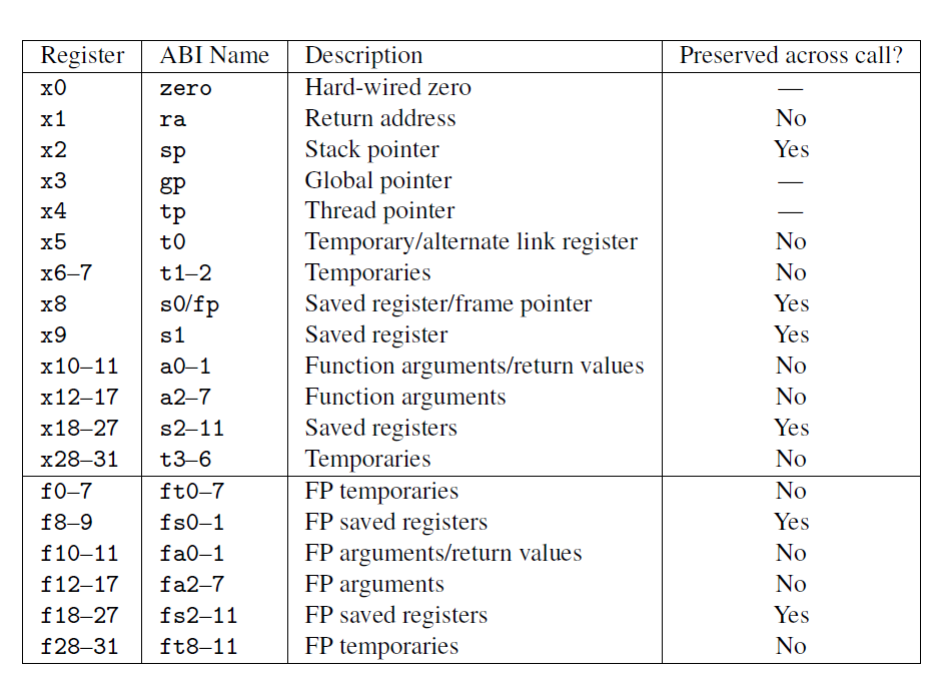
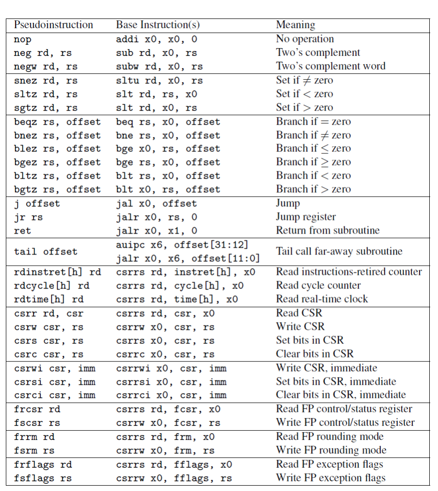
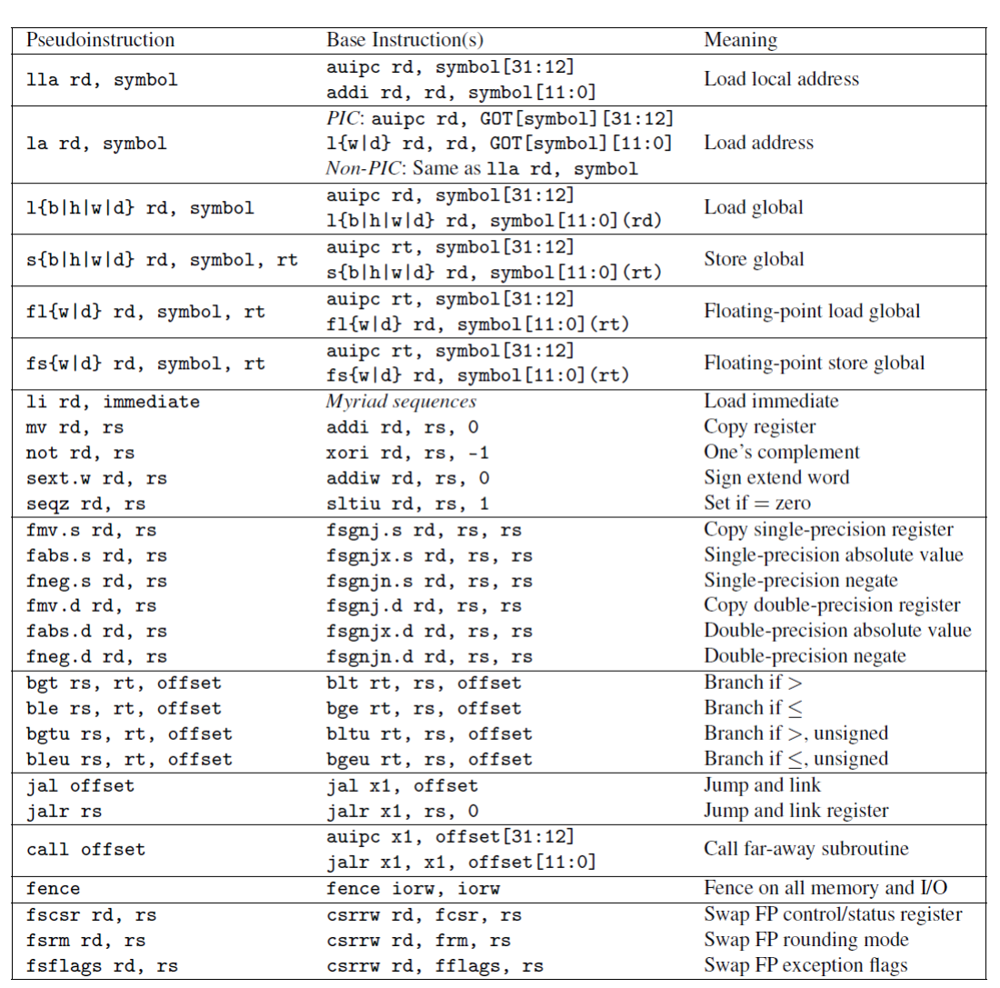
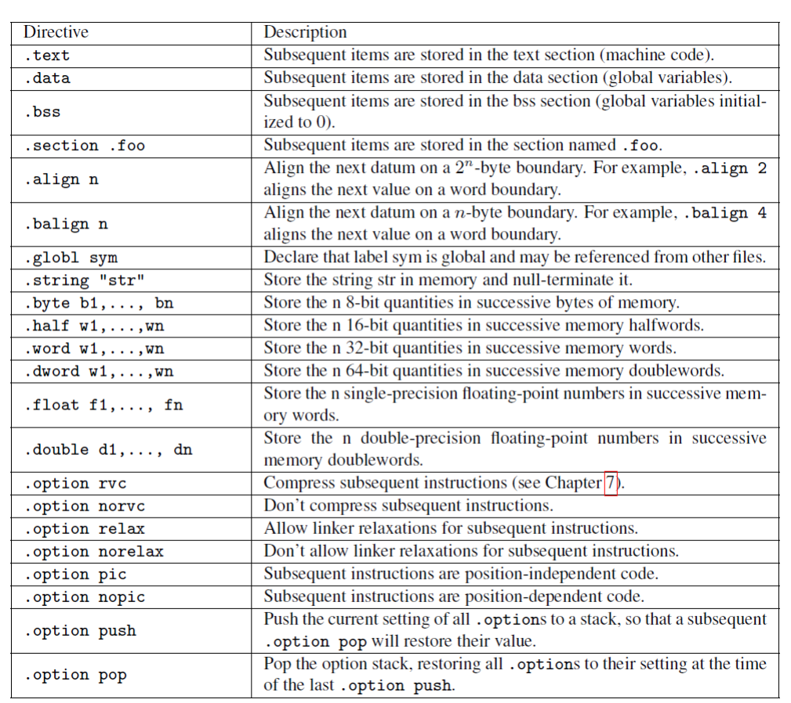
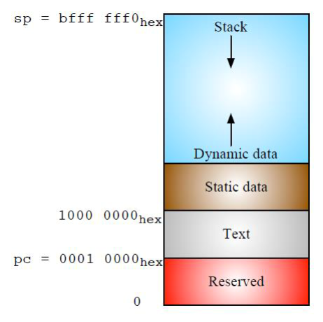

# RISC-V读书笔记3

## 汇编语言程序设计

### 概论

​	编译原理与技术尽管似乎看起来跟计算机体系架构关系不大，但是，两者的正确配合往往可以使得程序性能大大提升。我们现在再回到一个经典的议题，那就是一个高级语言是如何编译成机器看得懂的代码。

​	我们讨论的是RISC-V，那么，我们就用C语言程序如何在RISC-V上跑起来作为阐述。首先，一个编译器会获取使用高级语言编写的文件里的所有内容，翻译成低级的汇编语言，这个低级语言是计算机架构体系相关的。比如说，运行在x86_64架构上那就是使用那个架构的机器语言汇编，在这里则是RISC-V汇编，之后使用特定汇编语言的汇编器将他翻译成二进制文件，最后，这个文件就可以被这个体系架构的机器所读懂，从而正确的执行我们想要的东西

### 函数调用规范

​	程序设计一个离不开的话题就是函数，尽管对于高阶的设计而言这个是一个非常基础的模块！

1. 将参数存储到函数能够访问到的位置； 
2. 跳转到函数开始位置（使用RV32I 的 jal 指令）； 
3. 获取函数需要的局部存储资源，按需保存寄存器； 
4. 执行函数中的指令； 
5. 将返回值存储到调用者能够访问到的位置，恢复寄存器，释放局部存储资源； （也就是脱离寄存器对于变量的绑定）
6. 返回调用函数的位置（使用 ret 指令）。

​	大家都知道，计算机对于访问寄存器的速度远远快于访问内存的速度，所以一般而言，变量会放到寄存器当中去，但是，同时也要注意避免频繁地保存和恢复寄存器，因为它们同样会访问内存。 

​	在函数调用的过程中不保留部分寄存器存储的值，称它们为临时寄存器；另一些寄存器则对应地称为保存寄存器。不再调用其它函数的函数称为叶函数。当一个叶函数只有少量的参数和局部变量时，它们可以都被存储在寄存器中，而不会“溢出（spilling）”到内存中。但如果函数参数和局部变量很多，程序还是需要把寄存器的值保存在内存中，不过这种情况并不多见。

​	下面这个图就是用来描述我们亲爱的函数调用约定的（在搞函数调用的时候）

​	如果参数和局部变量太多，在寄存器中存不下，函数的开头会在栈中为函数帧分配空间，来存放。当一个函数的功能完成后，它的结尾部分释放栈帧并返回调用点

### 汇编器

​	汇编器的作用不仅仅是从处理器能够理解的指令产生目标代码，还能翻译一些扩展指令，这些指令对汇编程序员或者编译器的编写者来说通常很有用。这类指令在巧妙配置常规指令的基础上实现，称为伪指令。图 3.3 和 3.4 列出了 RISC-V 伪指令，前者中要求x0 寄存器始终为0，后者中则没有这种要求。例如，之前提到的ret 实际上是一个伪指令，汇编器会用jalr x0, x1, 0 来替换它（见图3.3）。大多数的RISC-V 伪指令依赖于 x0。因此，把一个寄存器硬编码为 0 便于将许多常用指令——如跳转（jump）、返回（return）、等于 0 时转移（branch on equal to zero）——作为伪指令，进而简化RISC-V 指令集。 

​	他们就像是封装了一些特定的操作一般，是为了辅助程序员写出正确的程序的。

​	这些指令是依赖于 x0 的 RISC-V 伪指令。

​	这些则是不依赖于 x0 的 RISC-V 伪指令。

### 链接器

​	程序设计向来不可能是单文件的！这点是需要我们注意的！我们往往会把很多个文件集合起来构成一个或者是多个的可执行文件。这里面就涉及到排段等内容。这就是链接器的工作。即编辑所有对象文件的跳转并链接指令（jump and link）中的链接部分。

​	这些就是常见的汇编指示符

​	程序最后的模样如上所示。

### 加载器

​	加载器则是真正引导可执行文件进入CPU流水线执行流，执行内部的指令。这属于跟操作系统对接的内容，这里不再展开阐述。