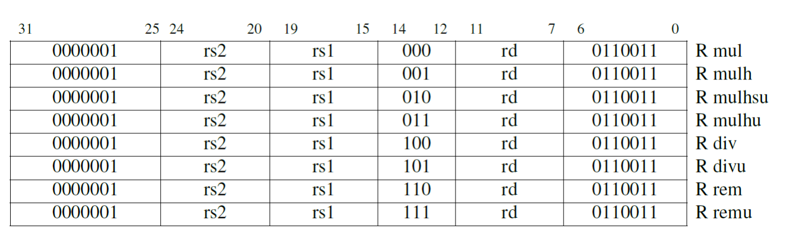
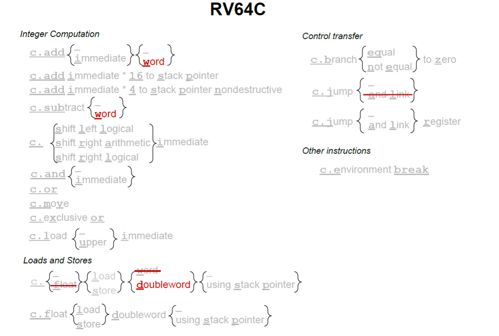

# RISC-V读书笔记

## 乘法与除法

​	RV32M属于扩展的指令，主要扩展的就是便捷的乘法和除法指令。

除法：

- 商 = (被除数− 余数) ÷ 除数 
- 被除数 = 除数× 商+ 余数 
- 余数 = 被除数− (商× 除数) 

乘法：

- 积 = 被乘数× 乘数 

​	上面的式子需要我们注意，他们是我们指令集工作的一个根本原理。

​	乘法和除法的指令工作原理如上，可以参考一下。

​	将两个 32 位数相乘得到的是 64 位的乘积。为了正确地得到一个有符号或无符号的 64 位积，RISC-V 中带有四个乘法指令。

​	要得到整数 32 位乘积（64 位中的低32 位）就用mul 指令。要得到高32 位，如果操作数都是有符号数，就用 mulh 指令；如果操作数都是无符号数，就用 mulhu 指令；**如果一个有符号一个无符号，可以用 mulhsu 指令。在一条指令中完成把 64 位积写入两个 32位寄存器的操作会使硬件设计变得复杂，所以 RV32M 需要两条乘法指令才能得到一个完整的 64 位积。** 

## RV32F 和 RV32D：单精度和双精度浮点数

​	C语言中的float和double等效到这里就是RV32F 和 RV32D，他们使用32个独立的浮点寄存器。**用两组寄存器的主要原因是：处理器在不增加RISC-V 指令格式中寄存器描述符所占空间的情况下使用两组寄存器来将寄存器容量和带宽是乘 2，这可以提高处理器性能。**

​	对于 RV32F 和 RV32D，RISC-V 有两条加载指令（flw，fld）和两条存储指令（fsw，fsd）。他们和lw 和sw 拥有相同的寻址模式和指令格式。添加到标准算术运算中的指令有：（fadd.s，fadd.d，fsub.s，fsub.d，fmul.s，fmul.d，fdiv.s，fdiv.d），RV32F 和 RV32D还包括平方根（fsqrt.s，fsqrt.d）指令。它们也有最小值和最大值指令（fmin.s，fmin.d，fmax.s，fmax.d），这些指令在不使用分支指令进行比较的情况下，将一对源操作数中的较小值或较大值写入目的寄存器。 

​	许多浮点算法（例如矩阵乘法）在**执行完乘法运算后会立即执行一条加法或减法指令。**因此，RISC-V 提供了指令用于先将两个操作数相乘然后将乘积加上（fmadd.s，fmadd.d）或减去（fmsub.s，fmsub.d）第三个操作数，最后再将结果写入目的寄存器。它还有在加上或减去第三个操作数之前对乘积取反的版本：fnmadd.s，fnmadd.d，fnmsub.s，fnmsub.d。**这些融合的乘法 - 加法指令比单独的使用乘法及加法指令更准确，也更快，因为它们只（在加法之后）舍入过一次，而单独的乘法及加法指令则舍入了两次（先是在乘法之后，然后在加法之后）。**这些指令需要一条新指令格式指定第 4 个寄存器，称为 R4。图 5.2 和 5.3 显示了 R4 格式，它是R 格式的一个变种。 RV32F 和RV32D 没有提供浮点分支指令，而是提供了浮点比较指令，这些根据两个浮点的比较结果将一个整数寄存器设置为 1 或0：feq.s，feq.d，flt.s，flt.d，fle.s，fle.d。这些指令允许整数分支指令根据浮点数比较指令设置的条件进行分支跳转。

​	上面两个表格依次指明了我们的我们指令的二进制分布。

​	这32个寄存器就用来进行浮点操作。

## 原子操作

​	任何一个学过操作系统的都知道锁整个东西。那么，他是依赖特定的架构实现的。所以，让我们看看RISC-V是如何实现锁的。

​	原子操作意味着不会打断操作过程，直到流程做完。加载保留和条件存储保证了它们两条指令之间的操作的原子性。加载保留读取一个内存字，存入目标寄存器中，并留下这个字的保留记录。而如果条件存储的目标地址上存在保留记录，它就把字存入这个地址。**如果存入成功，它向目标寄存器中写入 0；否则写入一个非 0 的错误代码。**

​	我们的RV32A存在两种原子操作是出于对场景的特化。编程语言的开发者会假定体系结构提供了原子的比较-交换（compare-and-swap）操作：比较一个寄存器中的值和另一个寄存器中的内存地址指向的值，如果它们相等，将第三个寄存器中的值和内存中的值进行交换。

​	尽管将这样一条指令加入 ISA 看起来十分有必要，它在一条指令中却需要 3 个源寄存器和 1 个目标寄存器。源操作数从两个增加到三个，会使得整数数据通路、控制逻辑和指令格式都变得复杂许多。（RV32FD 的多路加法（multiply-add）指令有三个源操作数，但它影
响的是浮点数据通路，而不是整数数据通路。）不过，加载保留和条件存储只需要两个源寄
存器，用它们可以实现原子的比较交换。所以，因此存在设计了两种设计思路。

## 压缩指令 

​	压缩指令！一些ISA选择减小立即数的区域进行压缩，ARM则是整出了直接重新设计指令集的狠活，这些让处理器的设计变得十分的复杂。

​	RV32C 采用了一种新颖的方法：每条短指令必须和一条标准的 32 位RISC-V 指令一一对应。此外，16 位指令只对汇编器和链接器可见，并且是否以短指令取代对应的宽指令由它们决定。编译器编写者和汇编语言程序员可以幸福地忽略RV32C 指令及其格式，他们能感知到的则是最后的程序大小小于大多数其它 ISA 的程序。

## 向量

​	说的就是SIMD！单指令多数据流，从而实现一个并行操作。

​	把现有的64 位寄存器进行拆分的做法由于其简单性而显得十分诱人。为了使SIMD更快，架构师随后加宽寄存器以同时计算更多部分。由于SIMD ISA 属于增量设计阵营的一员，并且操作码指定了数据宽度，因此扩展 SIMD 寄存器也就意味着要同时扩展 SIMD指令集。将SIMD 寄存器宽度和SIMD 指令数量翻倍的后续演进步骤都让ISA 走上了复杂度逐渐提升的道路，这一后果由处理器设计者、编译器编写者和汇编语言程序员共同承担。 

​	RISC-V则是使用了向量这个概念来进行。向量计算机从内存中中收集数据并将它们放入长的，顺序的向量寄存器中。在这些向量寄存器上，流水线执行单元可以高效地执行运算。然后，向量架构将结果从向量寄存器中取出，并将其并分散地存回主存。向量寄存器的大小由实现决定，而不是像 SIMD 中那样嵌入操作码中。我们将会看到，**将向量的长度和每个时钟周期可以进行的最大操作数分离，是向量体系结构的关键所在：向量微架构可以灵活地设计数据并行硬件而不会影响到程序员，**程序员可以不用重写代码就享受到长向量带来的好处。**此外，向量架构比SIMD架构拥有更少的指令数量。而且，与 SIMD 不同，向量架构有着完善的编译器技术。** 

​	RV32V 添加了32 个向量寄存器，它们的名称以 v 开头，但每个向量寄存器的元素个数不同。该数量取决于操作的宽度和专用于向量寄存器的存储大小，而这取决于处理器的设计者。比方说，如果处理器为向量寄存器分配了4096 个字节，则这足以让这些 32 个向量寄存器中有 16 个64 位元素，或者 32 个32 位元素，或者 64 个16 位元素，或128 个 8位元素。 

​	RV32V数据类型和长度与向量寄存器而不是与指令操作码相关联程序在执行向量计算指令之前用它们的数据类型和宽度标记向量寄存器。使用动态寄存器类型会减少向量指令的数量。

​	动态类型的另一个优点是程序可以禁用未使用的向量寄存器。此功能可以将所有的向量存储器分配给已启用的向量寄存器。比如，假设只启用了两个 64 位浮点类型的向量寄存器，处理器有1024 字节的向量寄存器空间。处理器将这些空间对半分，给每个向量寄存器512 字节（512/8=64 个元素），因此将mvl 设置位 64。因此我们可以看到，mvl 是动态的，但它的值由处理器设置，不能由软件直接改变。 

​	向量Load 和Store 操作的最简单情况是处理按顺序存储在内存中的一维数组。向量Load 用以vld 指令中地址为起始地址的顺序存储的数据来填充向量寄存器。向量寄存器的数据类型确定数据元素的大小，向量长度寄存器 vl 中设置了要取的元素数量。向量store执行 vld 的逆操作。 

​	对于多维数组，某些访问不是顺序的。如果二维数组以行优先序存储，且对列元素进行顺序访问，则相邻列元素之间的地址差正好是行大小。向量架构通过跨步数据传输来支持 vlds 和vsts 数据访问。**对于 vlds 与vsts，虽然可以通过将步长设置为元素大小来达到与 vld 和vst 相同的效果，但 vld 和vst 保证了所有的访问都是顺序的，这可以提供更高的内存带宽**。另一个原因是，对于常见的按单位步长访问，使用 vld 和vst 可以缩减代码长度，并减少执行的指令数。

## 64位指令

​	要切换到 64 位 ISA，ISA 只添加了少数指令。指令集只添加了 32 位指令对应的字(word)，双字(doubleword)和长整数(long)版本的指令，并将所有寄存器（包括PC）扩展为64 位。因此，RV64I 中的 sub 操作的是两个 64 位数字而不是 RV32I 中的 32 位数字。RV64 很接近 RV32但实际上又有所不同;它添加了少量指令同时基础指令做的事情与RV32 中稍有不同。比如说，把字扩展到双字等等。

​	尽管 RV64I 有 64 位地址且默认数据大小为 64 位，32 位字仍然是程序中的有效数据类型。因此，RV64I 需要支持字，就像RV32I 需要支持字节和半字一样。更具体地说，由于寄存器现在是64 位宽，RV64I 添加字版本的加法和减法指令：addw，addiw，subw。这些指令将计算结果截断为 32 位，结果符号扩展后再写入目标寄存器。 RV64I 也包括字版本的移位指令（sllw，slliw，srlw，srliw，sraw，sraiw），以获得32 位移位结果而不是 64 位移位结果。要进行 64 位数据传输，RV64 提供了加载和存储双字指令：ld，sd。最后，就像RV32I 中有无符号版本的加载单字节和加载半字的指令，RV64I 也有一个无符号版本的加载字：lwu。 出于类似的原因，RV64 需要添加字版本的乘法，除法和取余指令：mulw，divw，divuw，remw，remuw。为了支持对单字及双字的同步操作，RV64A 为其所有的11 条指令都添加了双字版本。 

## 特权操作

​	我们下面来聊一聊跟上层操作系统桥接的特权操作。

​	机器模式（缩写为M 模式，M-mode）是RISC-V 中hart（hardware thread，硬件线程）可以执行的最高权限模式。在 M 模式下运行的hart 对内存，I/O 和一些对于启动和配置系统来说必要的底层功能有着完全的使用权。因此它是唯一所有标准 RISC-V 处理器都必须实现的权限模式。实际上简单的 RISC-V 微控制器仅支持 M 模式。这类系统是本节的重点。 
​	机器模式最重要的特性是拦截和处理异常（不寻常的运行时事件）的能力。RISC-V 将异常分为两类。一类是同步异常，这类异常在指令执行期间产生，如访问了无效的存储器地址或执行了具有无效操作码的指令时。另一类是中断，它是与指令流异步的外部事件，比如鼠标的单击。RISC-V 中实现精确例外：保证异常之前的所有指令都完整地执行了，而后续的指令都没有开始执行（或等同于没有执行）。图 10.3 列出了触发标准例外的原因。 
​	在M 模式运行期间可能发生的同步例外有五种： 

- 访问错误异常 当物理内存的地址不支持访问类型时发生（例如尝试写入 ROM）。 
- 断点异常 在执行ebreak 指令，或者地址或数据与调试触发器匹配时发生。 
- 环境调用异常 在执行 ecall 指令时发生。 
- 非法指令异常 在译码阶段发现无效操作码时发生。 
- 非对齐地址异常 在有效地址不能被访问大小整除时发生，例如地址为 0x12 的amoadd.w。 

下面八个寄存器用来描述我们的异常。

- mtvec（Machine Trap Vector）它保存发生异常时处理器需要跳转到的地址。 
- mepc（Machine Exception PC）它指向发生异常的指令。 
- mcause（Machine Exception Cause）它指示发生异常的种类。 
- mie（Machine Interrupt Enable）它指出处理器目前能处理和必须忽略的中断。 
- mip（Machine Interrupt Pending）它列出目前正准备处理的中断。 
- mtval（Machine Trap Value）它保存了陷入（trap）的附加信息：地址例外中出错
- 的地址、发生非法指令例外的指令本身，对于其他异常，它的值为 0。 
- mscratch（Machine Scratch）它暂时存放一个字大小的数据。 
- mstatus（Machine Status）它保存全局中断使能，以及许多其他的状态，

### 嵌入式系统中的用户模式和进程隔离

​	虽然机器模式对于简单的嵌入式系统已经足够，但它仅适用于那些整个代码库都可信的情况，因为 M 模式可以自由地访问硬件平台。更常见的情况是，**不能信任所有的应用程序代码，因为不能事先得知这一点，或者它太大，难以证明正确性。因此，RISC-V 提供了保护系统免受不可信的代码危害的机制，并且为不受信任的进程提供隔离保护。** （这一点大部分的架构都一样！）

​	**必须禁止不可信的代码执行特权指令（如 mret）和访问特权控制状态寄存器（如mstatus），因为这将允许程序控制系统。**这样的限制很容易实现，只要加入一种额外的权限模式：用户模式（U 模式）。这种模式拒绝使用这些功能，并在尝试执行M 模式指令或访问CSR 的时候产生非法指令异常。其它时候，U 模式和M 模式的表现十分相似。通过将mstatus.MPP 设置为U（如图10.5 所示，编码为0），然后执行mret 指令，软件可以从M 模式进入U 模式。如果在U 模式下发生异常，则把控制移交给M 模式。  这些不可信的代码还必须被限制只能访问自己那部分内存。实现了 M 和 U 模式的处理器具有一个叫做物理内存保护（PMP，Physical Memory Protection）的功能，允许 M 模式指定U 模式可以访问的内存地址。PMP 包括几个地址寄存器（通常为8 到16 个）和相应的配置寄存器。这些配置寄存器可以授予或拒绝读、写和执行权限。当处于U 模式的处理器尝试取指或执行 load 或store 操作时，将地址和所有的PMP 地址寄存器比较。如果地址大于等于PMP 地址i，但小于PMP 地址i+1，则PMP i+1 的配置寄存器决定该访问是否可以继续，如果不能将会引发访问异常。 

###  现代操作系统的监管者模式 

​	更复杂的RISC-V 处理器用和几乎所有通用架构相同的方式处理这些问题：使用基于页面的虚拟内存。这个功能构成了监管者模式（S 模式）的核心，这是一种可选的权限模式，旨在支持现代类Unix 操作系统，如Linux，FreeBSD 和Windows。S 模式比U 模式权限更高，但比M 模式低。与U 模式一样，S 模式下运行的软件不能使用M 模式的CSR 和指令，并且受到PMP 的限制。

​	默认情况下，发生所有异常（不论在什么权限模式下）的时候，控制权都会被移交到M 模式的异常处理程序。但是Unix 系统中的大多数例外都应该进行S 模式下的系统调用。M 模式的异常处理程序可以将异常重新导向S 模式，但这些额外的操作会减慢大多数异常的处理速度。因此，RISC-V 提供了一种异常委托机制。通过该机制可以选择性地将中断和同步异常交给S 模式处理，而完全绕过M 模式。

（sstatus CSR。sstatus 是 mstatus的一个子集）

​	S 模式有几个异常处理CSR：sepc、stvec、scause、sscratch、stval 和 sstatus，它们执行与 10.2 中描述的M 模式CSR 相同的功能。图10.9 显示了 sstatus 寄存器的布局。监管者异常返回指令 sret 与mret 的行为相同，但它作用于S 模式的异常处理CSR，而不是 M 模式的CSR。 S 模式处理例外的行为已和 M 模式非常相似。如果hart 接受了异常并且把它委派给了S 模式，则硬件会原子地经历几个类似的状态转换，其中用到了S 模式而不是M 模式的CSR： 
发生例外的指令的PC 被存入sepc，且PC 被设置为 stvec。 

- scause 根据异常类型设置，stval 被设置成出错的地址或者其它特定异常的信息字。 
- 把sstatus CSR 中的 SIE 置零，屏蔽中断，且SIE 之前的值被保存在SPIE 中。 
- 发生例外时的权限模式被保存在 sstatus 的SPP 域，然后设置当前模式为S 模
- 式。 

### 基于页面的虚拟内存 

​	S 模式提供了一种传统的虚拟内存系统，它将内存划分为固定大小的页来进行地址转换和对内存内容的保护。启用分页的时候，大多数地址（包括 load 和 store 的有效地址和PC 中的地址）都是虚拟地址。要访问物理内存，它们必须被转换为真正的物理地址，这通过遍历一种称为页表的高基数树实现。页表中的叶节点指示虚地址是否已经被映射到了真正的物理页面，如果是，则指示了哪些权限模式和通过哪种类型的访问可以操作这个页。 

​	一个叫satp（Supervisor Address Translation and Protection，监管者地址转换和保护）的 S 模式控制状态寄存器控制了分页系统。如图 10.12 所示，satp 有三个域。ASID（Address Space Identifier，地址空间标识符）域是可选的，它可以用来降低上下文切换的开销。最后，PPN 字段保存了根页表的物理地址，它以 4 KiB 的页面大小为单位。通常 M 模式的程序在第一次进入 S模式之前会把零写入 satp 以禁用分页，然后S 模式的程序在初始化页表以后会再次进行satp 寄存器的写操作。 

当在satp 寄存器中启用了分页时，S 模式和U 模式中的虚拟地址会以从根部遍历页表
的方式转换为物理地址。图 10.14 描述了这个过程： 
1. satp.PPN 给出了一级页表的基址，VA[31:22]给出了一级页号，因此处理器会读取
位于地址(satp. PPN × 4096 + VA[31: 22] × 4)的页表项。 
2. 该PTE 包含二级页表的基址，VA[21:12]给出了二级页号，因此处理器读取位于地
址(PTE. PPN × 4096 + VA[21: 12] × 4)的叶节点页表项。 
3. 叶节点页表项的PPN 字段和页内偏移（原始虚址的最低12 个有效位）组成了最
终结果：物理地址就是(LeafPTE. PPN × 4096 + VA[11: 0]) 

 	随后处理器会进行物理内存的访问。Sv39 的转换过程几乎和Sv32 相同，区别在于其具有较大的PTE 和更多级页表。本章末尾的图 10.19 给出了页表遍历算法的完整描述，详细说明了例外条件和超页面转换的特殊情况。 除了一点以外，我们几乎讲完了 RISC-V 分页系统的所有内容。如果所有取指，load和store 操作都导致多次页表访问，那么分页会大大地降低性能！所有现代的处理器都用地址转换缓存（通常称为TLB，全称为Translation Lookaside Buffer）来减少这种开销。为了降低这个缓存本身的开销，大多数处理器不会让它时刻与页表保持一致。这意味着如果操作系统修改了页表，那么这个缓存会变得陈旧而不可用。S 模式添加了另一条指令来解决这个问题。这条sfence.vma 会通知处理器，软件可能已经修改了页表，于是处理器可以相应地刷新转换缓存。它需要两个可选的参数，这样可以缩小缓存刷新的范围。一个位于rs1，它指示了页表哪个虚址对应的转换被修改了；另一个位于 rs2，它给出了被修改页表的进程的地址空间标识符（ASID）。如果两者都是 x0，便会刷新整个转换缓存。 
