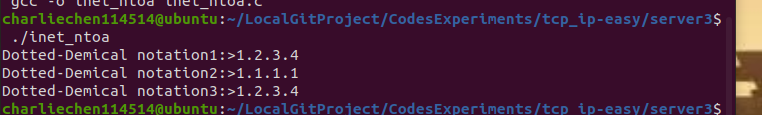
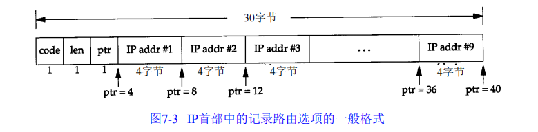

# 1. 理解网络和套接字

​		网络编程实在很简单，其实就是一句话： 研究编写使得两台联网的计算机通信的程序！没了！

​		计算机提供一个叫做socket的东西，实际上就是“套接字”的意思。难以理解？其实就是插头！说白了就是通信的软件接口。

## 流程

​		快速的讲一些常见的接口——先把流程梳理明白了——

​		假装我们是一台计算机（倒不如假设我们的计算机是人），想要跟别的计算机通信，就务必需要——有——电话机

​		好吧，现在手无寸铁，先整个电话机玩玩

```
#include <sys/socket.h>

int scoket(int domain, int type, int protocol);		
```

​		第一个参数说的是用的是什么套接字类型

​		而这里的type指的是协议面向的种类， 也就是说“type”参数指的是套接字类型，常用的类型有：

- SOCK_STREAM（TCP流）
- SOCK_DGRAM（UDP数据报）
- SOCK_RAW（原始套接字）

​		协议“protocol”一般设置为“0”，就是说在已经确定套接字使用的协议簇和类型时，这个参数的值就为0

​		我们将会在稍后看到，作为我们已知使用的协议种类后，只需要这里置0即可。（对于那些无法确定协议种类的才会在这里设置其他东西）

​		随后，就是bind，有电话机，就需要有电话号码——这个函数就是确定套接字的地址信息，告诉这个套接字要去哪里（IP和端口）

```
#include <sys/socket.h>

int bind(int sockfd,struct sockaddr* myaddr, socklen_t addrlen);
```

​		接下来就是接听（相当于打了电话号码等）

```
#include <sys/socket.h>

int listen(int sockfd, int backlog);
```

> 值得一提的sockfd这个fd, 在Linux下指的是file discriptor（描述符，不理解的话可以认为是Windows下的文件句柄）

​		等到客户端有了响应之后，我们就要摁下同意表示愿意接听

```
#include <sys/socket.h>
int accept(int sockfd, struct sockaddr* addr, socklen_t* addrlen);
```

​		总结一下：

> 第一步：调用socket创建套接字
>
> 第二步：调用bind函数分配IP和端口号
>
> 第三步：调用listen函数转化为可接受请求的状态
>
> 第四步：调用accept受理链接请求

​		方便起见，这里就扔下代码：

> TIPS: 你的电脑绝对没有SC.h这个文件，因为这是我自己写的，对于那些常见的函数给封装在同一个头文件而不需要反复写，在这个节段：

### SC.c

```C 
#include "SC.h"
// error handle
void showError(const char* message)
{
	fputs(message,stdout);
	fputc('\n',stdout);
	exit(-1);
}

// show argc help
void showHelp(int argc_n, int agrc_r ,const char* msgHelp)
{
    if(argc_n != agrc_r){
        printf("%s",msgHelp);
        exit(1);
    }
    
}
```

### Sc.h

```C 
#ifndef _SC_H_
#define _SC_H_

#include <stdio.h>
#include <stdlib.h>
#include <string.h>
#include <unistd.h> // 提供Linux文件IO
#include <arpa/inet.h>
#include <sys/socket.h>
#include <errno.h>
typedef struct sockaddr_in Sockaddr_in;
typedef struct sockaddr Sockaddr;
// pre-announced
void showError(const char* message);
void showHelp(int argc_n, int agrc_r, const char* msgHelp);

// setMemZero
#define ZERO 0
#define ZeroMem(buf) memset(buf, ZERO, sizeof(buf))
#endif
```

### 	服务器端

```c
// include basic files
#include "SC.h"
#include <errno.h>
int main(int argc, char* argv[])
{
	int serv_sock;
	int clnt_sock;

	struct sockaddr_in serv_addr;
	struct sockaddr_in clnt_addr;
	socklen_t clnt_addr_size;

	char message[] = "hello, world\n";
	if(argc != 2){
		printf("Usage: <port>\n",argv[0]);
		exit(1);
	}

	serv_sock = socket(PF_INET, SOCK_STREAM, 0);
	if(serv_sock == -1){
		showError("socket Error");
		exit(1);
	}

	memset(&serv_addr, 0, sizeof(serv_addr));
	serv_addr.sin_family = AF_INET;
	serv_addr.sin_addr.s_addr = htonl(INADDR_ANY);
	serv_addr.sin_port = htons(atoi(argv[1]));

	if(bind(serv_sock, (struct sockaddr*)&serv_addr,sizeof(serv_addr)) == -1){
		printf("%d\n",errno);
		showError("bind() Error");	
		exit(1);
	}

	if(listen(serv_sock, 5) == -1){
		showError("listen() error");
		exit(1);
	}

	clnt_addr_size = sizeof(clnt_addr);
	clnt_sock = accept(serv_sock,(struct sockaddr*)&clnt_addr, &clnt_addr_size);
	if(clnt_sock == -1){
		showError("accept() error");
		exit(1);
	}

	write(clnt_sock, message,sizeof(message));

	close(clnt_sock);
	close(serv_sock);

	return 0;
}
```

​		对于客户端，我们只需要给出链接的地址和端口，就可以了：

```C
#include <sys/socket.h>

int connect(int sockfd, struct sockaddr* serv_addr, socklen_t addrlen);
```

> 第一步：创建套接字（调用socket函数）
>
> 第二步：调用connect函数

### 客户端

```C
#include "SC.h"

int main(int argc, char* argv[])
{
    int sock;
    Sockaddr_in serv_addr;

    char message[30];
    int str_len;

    showHelp(3,argc,"Usage: argv[0] <IP> <port>\n");

    sock = socket(PF_INET,SOCK_STREAM,0);
    if(sock == -1){
        showError("socket() Error");
    }

    ZeroMem(&serv_addr);
    serv_addr.sin_family = AF_INET;
    serv_addr.sin_addr.s_addr = inet_addr(argv[1]);
    serv_addr.sin_port = htons(atoi(argv[2]));

    if(connect(sock, (Sockaddr*)&serv_addr,sizeof(serv_addr)) == -1){
    	printf("%d\n",errno);
        showError("connect() Error");
    }

    str_len = read(sock,message,sizeof(message) - 1);
    if(str_len == -1){
        showError("read() error");
    }
  
    printf("Message from server:> %s\n",message);

    close(sock);

    return 0;
}
```

> 运行

```
gcc -o client client.c SC.c SC.h # 产生客户端的可执行代码
```

```
gcc -o server server.c SC.c SC.h # 产生服务端的可执行代码
```

​		然后运行（额，假定你对Linux操作系统是用过的情况下）

```
./server 9190             # 运行在自己家电脑，IP是127.0.0.1
```

```
./client 127.0.0.1 9190 
```


### Windows实现

​		在Windows底下，我们同样可以干这样的事情。这里未来方便于网络而不是环境配置，我们使用VS

​		不过首先，我们需要链接ws2_32.lib（项目->属性->链接器->输入->附加依赖项）

​		先来就是初始化相关的库——

```
#include <winsock2.h>

int WSAStartup(WORD wVersionRequested, LPWSADATA lpWSAData);
```

> 第一个参数：Winsock的版本（高情商：兼容）
>
> 第二个参数：WSADATA这个结构体的地址（相信我，Windows喜欢通过传参数的方式初始化，这是为了可以返回状态而设置的！）

​		设置版本是使用一个十六位数实现的。咋搞呢？举个例子

​		我现在的函数有主版本和副版本之称：Winsock 1.1和Winsock 2.1之类的。那么，我就用低8位表达主版本，高8位表达副版本。 那： `v`$1.2$  $\leftrightarrow$ $0x0201$

​		啥？别自己手写了

```
MAKEWORD(1, 2) -> 0x0201
MAKEWORD(2, 2) -> 0x0202
```

​		同理：我们来看看Windows 的

### 服务器端

```C
#include <stdio.h>
#include <stdlib.h>
#include <winsock2.h>

void ErrorHandling(const char* msg);

int main(int argc, char* argv[])
{
	WSADATA wsadata;
	SOCKET hServSock, hClntSock;
	SOCKADDR_IN servAddr, clntAddr;

	int szClntAddr;
	char message[] = "HelloWorld\n";
	if (argc != 2) {
		printf("Usage : %s <port>\n", argv[0]);
		exit(1);
	}

	if (WSAStartup(MAKEWORD(2, 2), &wsadata) != 0)
		ErrorHandling("WSAStartUp Error");

	hServSock = socket(PF_INET, SOCK_STREAM, 0);

	if (hServSock == INVALID_SOCKET)
		ErrorHandling("socket error");

	memset(&servAddr, 0, sizeof(servAddr));
	servAddr.sin_family = AF_INET;
	servAddr.sin_addr.s_addr=htonl(INADDR_ANY);
	servAddr.sin_port = htons(atoi(argv[1]));

	if (bind(hServSock, (SOCKADDR*)&servAddr, sizeof(servAddr)) == SOCKET_ERROR)
		ErrorHandling("bind error");

	if (listen(hServSock, 5) == SOCKET_ERROR)
		ErrorHandling("listen error");

	szClntAddr = sizeof(clntAddr);
	hClntSock = accept(hServSock, (SOCKADDR*)&clntAddr, &szClntAddr);

	if (hClntSock == INVALID_SOCKET)
		ErrorHandling("accept error");

	send(hClntSock, message, sizeof(message), 0);

	closesocket(hClntSock);
	closesocket(hServSock);

	WSACleanup();
	return 0;
}

void ErrorHandling(const char* msg)
{
	fputs(msg, stderr);
	fputc('\n', stderr);
	exit(1);
}
```

### 客户端

```C
#define _WINSOCK_DEPRECATED_NO_WARNINGS 1
#include <stdio.h>
#include <stdlib.h>
#include <winsock2.h>

void ErrorHandling(const char *message);

int main(int argc, char* argv[])
{
	WSADATA wsaData;
	SOCKET hSocket;
	SOCKADDR_IN servAddr;
	char message[30];
	int strLen = 0;
	int idx = 0, readLen = 0;

	if (argc != 3)
	{
		printf("Usage : %s <IP> <port>\n", argv[0]);
		exit(1);
	}

	if (WSAStartup(MAKEWORD(2, 2), &wsaData) != 0)
	{
		printf("%d\n",GetLastError());
		ErrorHandling("WSAStartup() error!");
	}

	hSocket = socket(PF_INET, SOCK_STREAM, 0);
	if (hSocket == INVALID_SOCKET) 
		ErrorHandling("socket() error!");
	
	memset(&servAddr, 0, sizeof(servAddr));

	servAddr.sin_family = AF_INET;
	servAddr.sin_addr.s_addr = inet_addr(argv[1]); // IP address
	servAddr.sin_port = htons(atoi(argv[2])); // port

	if (connect(hSocket, (SOCKADDR*)&servAddr, sizeof(servAddr)) == SOCKET_ERROR)
		ErrorHandling("connect() error!");
	else
		puts("Connected...........");

	while (readLen = recv(hSocket, &message[idx++], 1, 0))
	{
		if (readLen == -1)
			ErrorHandling("read() error!");

		strLen += readLen;
	}

	printf("Message from server: %s \n", message);
	printf("Function read call count: %d \n", strLen);
	
	closesocket(hSocket);
	WSACleanup();
	return 0;

}

void ErrorHandling(const char* message)
{
	fputs(message, stderr);
	fputc('\n', stderr);
	exit(1);
}
```

# 套接字类型和协议设置

## 啥是协议

​		你用你的语法说，我用我的语法说，两个人互相听不懂对方说什么，这不无效沟通吗？是的，这玩意的出现就是为了规范通信。

## socket函数

​		回忆下我们刚刚体验过的socket函数。。。啥，不记得了？这里：

```
#include <sys/socket.h>

int scoket(int domain, int type, int protocol);		
```

​		我们第一个参数，就是说的用的什么套接字类型，你可以翻看一下sys/socket.h提供的接口

```
/* Protocol families.  */
#define PF_UNSPEC	0	/* Unspecified.  */
#define PF_LOCAL	1	/* Local to host (pipes and file-domain).  */
#define PF_UNIX		PF_LOCAL /* POSIX name for PF_LOCAL.  */
#define PF_FILE		PF_LOCAL /* Another non-standard name for PF_LOCAL.  */
#define PF_INET		2	/* IP protocol family.  */
#define PF_AX25		3	/* Amateur Radio AX.25.  */
#define PF_IPX		4	/* Novell Internet Protocol.  */
#define PF_APPLETALK	5	/* Appletalk DDP.  */
#define PF_NETROM	6	/* Amateur radio NetROM.  */
#define PF_BRIDGE	7	/* Multiprotocol bridge.  */
#define PF_ATMPVC	8	/* ATM PVCs.  */
#define PF_X25		9	/* Reserved for X.25 project.  */
#define PF_INET6	10	/* IP version 6.  */
#define PF_ROSE		11	/* Amateur Radio X.25 PLP.  */
#define PF_DECnet	12	/* Reserved for DECnet project.  */
#define PF_NETBEUI	13	/* Reserved for 802.2LLC project.  */
#define PF_SECURITY	14	/* Security callback pseudo AF.  */
#define PF_KEY		15	/* PF_KEY key management API.  */
#define PF_NETLINK	16
#define PF_ROUTE	PF_NETLINK /* Alias to emulate 4.4BSD.  */
#define PF_PACKET	17	/* Packet family.  */
#define PF_ASH		18	/* Ash.  */
#define PF_ECONET	19	/* Acorn Econet.  */
#define PF_ATMSVC	20	/* ATM SVCs.  */
#define PF_RDS		21	/* RDS sockets.  */
#define PF_SNA		22	/* Linux SNA Project */
#define PF_IRDA		23	/* IRDA sockets.  */
#define PF_PPPOX	24	/* PPPoX sockets.  */
#define PF_WANPIPE	25	/* Wanpipe API sockets.  */
#define PF_LLC		26	/* Linux LLC.  */
#define PF_IB		27	/* Native InfiniBand address.  */
#define PF_MPLS		28	/* MPLS.  */
#define PF_CAN		29	/* Controller Area Network.  */
#define PF_TIPC		30	/* TIPC sockets.  */
#define PF_BLUETOOTH	31	/* Bluetooth sockets.  */
#define PF_IUCV		32	/* IUCV sockets.  */
#define PF_RXRPC	33	/* RxRPC sockets.  */
#define PF_ISDN		34	/* mISDN sockets.  */
#define PF_PHONET	35	/* Phonet sockets.  */
#define PF_IEEE802154	36	/* IEEE 802.15.4 sockets.  */
#define PF_CAIF		37	/* CAIF sockets.  */
#define PF_ALG		38	/* Algorithm sockets.  */
#define PF_NFC		39	/* NFC sockets.  */
#define PF_VSOCK	40	/* vSockets.  */
#define PF_KCM		41	/* Kernel Connection Multiplexor.  */
#define PF_QIPCRTR	42	/* Qualcomm IPC Router.  */
#define PF_SMC		43	/* SMC sockets.  */
#define PF_XDP		44	/* XDP sockets.  */
#define PF_MAX		45	/* For now..  */
```

​		我去，这可太多了，我们现在，主要聚焦在如下的几个协议族

| 名称        | 协议族                 |
| ----------- | ---------------------- |
| `PF_INET`   | IPv4互联网协议族       |
| `PF_INET6`  | IPv6互联网协议族       |
| `PF_LOCAL`  | 本地通信的互联网协议族 |
| `PF_PACKET` | 底层套接字的协议族     |
| `PF_IPX`    | IPX Novell协议族       |

​		那为什么还要有第二个参数呢？答案很简单，就算是我们选定了协议族，其内部还是有很多其他的数据通信方式。我们怎么传？是安全优先还是速度优先呢？

```
enum __socket_type
{
  SOCK_STREAM = 1,		/* Sequenced, reliable, connection-based
				   byte streams.  */
#define SOCK_STREAM SOCK_STREAM
  SOCK_DGRAM = 2,		/* Connectionless, unreliable datagrams
				   of fixed maximum length.  */
#define SOCK_DGRAM SOCK_DGRAM
  SOCK_RAW = 3,			/* Raw protocol interface.  */
#define SOCK_RAW SOCK_RAW
  SOCK_RDM = 4,			/* Reliably-delivered messages.  */
#define SOCK_RDM SOCK_RDM
  SOCK_SEQPACKET = 5,		/* Sequenced, reliable, connection-based,
				   datagrams of fixed maximum length.  */
#define SOCK_SEQPACKET SOCK_SEQPACKET
  SOCK_DCCP = 6,		/* Datagram Congestion Control Protocol.  */
#define SOCK_DCCP SOCK_DCCP
  SOCK_PACKET = 10,		/* Linux specific way of getting packets
				   at the dev level.  For writing rarp and
				   other similar things on the user level. */
#define SOCK_PACKET SOCK_PACKET

  /* Flags to be ORed into the type parameter of socket and socketpair and
     used for the flags parameter of paccept.  */

  SOCK_CLOEXEC = 02000000,	/* Atomically set close-on-exec flag for the
				   new descriptor(s).  */
#define SOCK_CLOEXEC SOCK_CLOEXEC
  SOCK_NONBLOCK = 00004000	/* Atomically mark descriptor(s) as
				   non-blocking.  */
#define SOCK_NONBLOCK SOCK_NONBLOCK
};
```


### SOCK_STREAM：面向链接的套接字

- 这个传输过程中的数据不会消失，
- 并且，会按照顺序依次传输数据，
- 传输的数据不会存在数据的边界

### SOCK_DGRAM

- 强调快速传输而不是顺序传输
- 传输的数据可能丢失
- 传输的数据是有边界的
- 限制每次传输的数据大小

### 第三个参数...

​		我们还会需要第三个参数，为什么呢？

> 遇到了同一协议族下多个数据传输方式相同的协议

​		这个时候，第三个参数就可以用来指定特定的一个——不过大可以放心，一般用不到，我们会置成0

​		我们使用TCP来做个例子

```C
#include "SC.h"

int main(int argc, char* argv[])
{
    int sock;
    Sockaddr_in serv_addr;

    char message[30];
    int str_len = 0;
    int idx = 0, read_len = 0;

    showHelp(3,argc,"Usage: argv[0] <IP> <port>\n");

    sock = socket(PF_INET,SOCK_STREAM,0);
    if(sock == -1){
        showError("socket() Error");
    }

    ZeroMem(&serv_addr);
    serv_addr.sin_family = AF_INET;
    serv_addr.sin_addr.s_addr = inet_addr(argv[1]);
    serv_addr.sin_port = htons(atoi(argv[2]));

    if(connect(sock, (Sockaddr*)&serv_addr,sizeof(serv_addr)) == -1){
    	printf("%d\n",errno);
        showError("connect() Error");
    }

    // MODIFY THIS BLOCK TO THIS in client.c
    while(read_len = read(sock, &message[idx++],1)){
        if(read_len == -1){
            showError("read() Error");
        }

        str_len += read_len;
    }
  
    printf("Message from server:> %s\n",message);
    printf("Function read call count: %d\n",str_len);
    close(sock);

    return 0;
}
```

​		只需要调整一下

# 地址组与数据序列

## 分配给套接字的IP和端口

​		IP地址现在分两类：

| IP地址种类 | 说明           |
| ---------- | -------------- |
| IPv4       | 4字节地址序列  |
| IPv6       | 16字节地址序列 |

只需通过IP地址的第一个字节可判断网络地址占用的字节数，因为我们根据IP地址的边界区分网络地址：

> A类地址的首字节范围：0-127
> B类地址的首字节范围：128-191
> C类地址的首字节范围：192-223

还有以下表述方式：

> A类地址的首位以0开始
> B类地址的前2位以10开始
> C类地址的前3位以110开始

​		简单的说:IPv4地址是由两个部分构成的

​		网络号码字段（Net-id）：IP 地址的网络号码字段用来标识一个网络，网络号码字段的前几位用来区分 IP 地址的类型。

​		主机号码字段（Host-id）：主机号码字段用来区分一个网络内的不同主机。对于网络号相同的设备，无论实际所处的物理位置如何，它们都是处在同一个网络中。


   	IP用于区分计算机，只要有IP地址就能向目标主机传输数据，但仅凭这些无法传输给最终的应用程序。如网上看视频的同时网上聊天，这时至少需要1个接收视频数据的套接字和一个接收聊天信息的套接字。如何区分这些套接字呢？
   	计算机中一般有网络接口卡数据传输设备，通过NIC向计算机内部传输数据时会用到IP。操作系统负责把传递到内部的数据适当分配给套接字，这时就要利用端口号。通过NIC接收的数据内有端口号，操作系统正是参考此端口号把数据传输给相应端口的套接字。
   	端口号就是在同一操作系统内为区分不同套接字而设置的，因此无法将1个端口号分配给不同的套接字。端口号由16位构成，可分配的端口号范围是0-65535。但0-1023是知名端口，一般分配给特定应用程序。虽然端口号不能重复，但TCP套接字和UDP套接字不会共用端口号，所以允许重复。例如：如果某TCP套接字使用9190号端口，则其他TCP套接字就无法使用该端口号，但UDP套接字可以使用。
   	数据传输目标地址同时包含IP地址和端口号。

## 地址信息表示

​		好,当你看完上面的一节了,我们就可以产生如下的对话

> 用啥地址组？
>
> IPv4的
>
> IP地址呢
>
> 114.5.1.4
>
> 端口号？
>
> 1919

​		于是，直接用一个结构体，回答上面的所有问题

```
struct sockaddr_in
  {
    __SOCKADDR_COMMON (sin_);// 本质上是 sa_family_t sin_family
    in_port_t sin_port;			/* Port number.  */
    struct in_addr sin_addr;		/* Internet address.  */

    /* Pad to size of `struct sockaddr'.  */
    unsigned char sin_zero[sizeof (struct sockaddr)
			   - __SOCKADDR_COMMON_SIZE
			   - sizeof (in_port_t)
			   - sizeof (struct in_addr)];
  };
```

​		哦对了，这个

```
 struct in_addr sin_addr;
```

​		是对IP地址的封装，其实他是

```
/* Internet address.  */
typedef uint32_t in_addr_t;
struct in_addr
  {
    in_addr_t s_addr;
  };
```

> TIPS: 在Linux（倒不如说是POSIX）下，系统定义的数据类型会在后面加上一个_t表示系统定义的

### sin_family

```
/* Address families.  */
#define AF_UNSPEC	PF_UNSPEC
#define AF_LOCAL	PF_LOCAL
#define AF_UNIX		PF_UNIX
#define AF_FILE		PF_FILE
#define AF_INET		PF_INET
#define AF_AX25		PF_AX25
#define AF_IPX		PF_IPX
#define AF_APPLETALK	PF_APPLETALK
#define AF_NETROM	PF_NETROM
#define AF_BRIDGE	PF_BRIDGE
#define AF_ATMPVC	PF_ATMPVC
#define AF_X25		PF_X25
#define AF_INET6	PF_INET6
#define AF_ROSE		PF_ROSE
#define AF_DECnet	PF_DECnet
#define AF_NETBEUI	PF_NETBEUI
#define AF_SECURITY	PF_SECURITY
#define AF_KEY		PF_KEY
#define AF_NETLINK	PF_NETLINK
#define AF_ROUTE	PF_ROUTE
#define AF_PACKET	PF_PACKET
#define AF_ASH		PF_ASH
#define AF_ECONET	PF_ECONET
#define AF_ATMSVC	PF_ATMSVC
#define AF_RDS		PF_RDS
#define AF_SNA		PF_SNA
#define AF_IRDA		PF_IRDA
#define AF_PPPOX	PF_PPPOX
#define AF_WANPIPE	PF_WANPIPE
#define AF_LLC		PF_LLC
#define AF_IB		PF_IB
#define AF_MPLS		PF_MPLS
#define AF_CAN		PF_CAN
#define AF_TIPC		PF_TIPC
#define AF_BLUETOOTH	PF_BLUETOOTH
#define AF_IUCV		PF_IUCV
#define AF_RXRPC	PF_RXRPC
#define AF_ISDN		PF_ISDN
#define AF_PHONET	PF_PHONET
#define AF_IEEE802154	PF_IEEE802154
#define AF_CAIF		PF_CAIF
#define AF_ALG		PF_ALG
#define AF_NFC		PF_NFC
#define AF_VSOCK	PF_VSOCK
#define AF_KCM		PF_KCM
#define AF_QIPCRTR	PF_QIPCRTR
#define AF_SMC		PF_SMC
#define AF_XDP		PF_XDP
#define AF_MAX		PF_MAX
```

​		这是在Linux下定义的，当然，我们常常使用的：就是下面三个

| 地址组`(Address Family) AF` | 含义                         |
| --------------------------- | ---------------------------- |
| `AF_INET`                   | IPv4地址组                   |
| `AF_INET6`                  | IPv6地址组                   |
| `AF_LOCAL`                  | 本地通信采用的UNIX协议地址组 |

### sin_port

​		保存16位端口

### sin_addr

​		保存32位IP地址信息

### sin_zero

​		为了跟sockaddr结构体保持一致，必须填充0

## 网络字节序和地址变换

​		CPU向内存保存数据的方式有两种：

- 大端序：高位字节放到低位去
- 小端序：低位字节放到高位去


​		那么，我们就必须考虑传输数据的时候双方存储方式不一致的问题（解析数据可能会出错），解决的办法也是出乎意料的简单——规定传输的是大端序。

​		我们无论如何，都会把数据处理成大端序格式存储的，在进行传输——很简单吧（喜）

- uint32_t htonl(uint32_t hostlong);

- uint16_t htons(uint16_t hostshort);

- uint32_t ntohl(uint32_t netlong);

- uint16_t ntohs(uint16_t netshort);


​		h表示host，指小端，n表示network指大端，l表示32位长整数，s表示16位短整数。
​		举个例子：ntohs的意思就是吧short字节（s）从网络字节序（n）转换成主机字节序（h）

​		来个实操

```
#include <stdio.h>
#include <arpa/inet.h>

int main(int argc, char* argv[])
{
    unsigned short host_port = 0x1234;
    unsigned short net_port;
    unsigned long host_addr = 0x12345678;
    unsigned long net_addr;

    net_port = htons(host_port);
    net_addr = htonl(host_addr);

    printf("Host ordered port:> %#x\n", host_port);
    printf("Network ordered port: %#x\n", net_port);
    printf("Host ordered address:> %#lx\n", host_addr);
    printf("Network ordered address: %#lx\n", net_addr);
}
```


## 网络地址的初始化与分配

​		我们这里介绍一些接口，可以讲字符串格式的IP地址转化成整数类型的。

```
#include <arpa/inet.h>

in_addr_t inet_addr(const char* string);
```

​		这个函数转化成功就会返回转化成功后的数字，否则返回`INADDR_NONE`

```
#include <stdio.h>
#include <arpa/inet.h>
#include "SC.h"
int main(int argc, char* argv[])
{
    showHelp(argc,2,"USAGE: ./file IP");

    unsigned long conv_addr = inet_addr(argv[1]);
    if(conv_addr == INADDR_NONE){
        showError("Can not transform, IP address might be invalid anyhow!");
    }
    else{
        printf("From string type:> %s To network ordered integer addr: %#lx \n",argv[1],conv_addr);
    }

    return 0;
}
```


​		当然，我们更加经常使用的是inet_aton，这是因为我们常常会使用sockaddr_in这个结构体，这个函数会自动的吧结果填入到结构体当中！简单而不复杂

​		当然也可以倒过来

```
#include <arpa/inet.h>

char* inet_ntoa(struct in_addr adr);
```

```
#include "SC.h"

int main()
{
    Sockaddr_in addr1, addr2;
    char* pStr;
    char str[20];

    addr1.sin_addr.s_addr = htonl(0x1020304);
    addr2.sin_addr.s_addr = htonl(0x1010101);

    pStr = inet_ntoa(addr1.sin_addr);
    strcpy(str,pStr);

    printf("Dotted-Demical notation1:>%s\n",pStr);

    inet_ntoa(addr2.sin_addr);
    printf("Dotted-Demical notation2:>%s\n",pStr);
    printf("Dotted-Demical notation3:>%s\n",str);

}
```



## 网络地址初始化

结合前面的内容，介绍套接字创建过程中，常见的网络信息初始化方法：

```c
struct sockaddr_in addr;
char *serv_ip = "211.217,168.13";          //声明IP地址族
char *serv_port = "9190";                  //声明端口号字符串
memset(&addr, 0, sizeof(addr));            //结构体变量 addr 的所有成员初始化为0
addr.sin_family = AF_INET;                 //制定地址族
addr.sin_addr.s_addr = inet_addr(serv_ip); //基于字符串的IP地址初始化
addr.sin_port = htons(atoi(serv_port));    //基于字符串的IP地址端口号初始化
```

### INADDR_ANY

每次创建服务器端套接字都要输入IP地址会有些繁琐，此时可如下初始化地址信息：

```c
struct sockaddr_in addr;
char * serv_port = "9190";
memset(&addr, 0, sizeof(addr));
addr.sin_family = AF_INET;
add.sin_addr.s_addr = htonl(INADDR_ANY);
addr.sin_port = htons(atoi(serv_port));
```

**与之前方式的区别**

> 与之前方式最大的区别在于，利用常数INADDR_ANY分配服务器端的IP地址。
> ----若采用这种方式，则可自动获取运行服务器端的计算机IP地址，不必亲自输入。
> ----而且，若同一计算机中已分配多个IP地址(多宿主(Multi-homed)计算机，一般路由器属于这一类)，则只要端口号一致，就可以从不同IP地址接收数据。
> 因此，服务器端中优先考虑这种方式。而客户端中除非带有一部分服务器端功能，否则不会采用。

**创建服务器端套接字时需要IP地址的原因**

> **问题：** 初始化服务器端套接字时应分配所属计算机的IP地址，因为初始化时使用的IP地址非常明确，那为何还要进行IP初始化呢？
> **答案：** 同一计算机中可以分配多个IP地址，实际IP地址的个数与计算机中安装的NIC的数量相等。即使是服务器端套接字，也需要决定应接收哪个IP地址传来的(哪个NIC传来的)数据。因此，服务器端套接字初始化过程中要求IP地址信息。另外，若只有一个NIC，则直接使用INADDR_ANY。

## Windows实现

```
#include <stdio.h>
#include <winsock2.h>

void ErrorHandling(char *message);

int main(int agrc, char* agrv[])
{
	WSADATA wsaData;

	unsigned short host_port = 0x1234;
	unsigned short net_port;
	unsigned long host_addr = 0x12345678;
	unsigned long net_addr;
	
	if(WSAStartup(MAKEWORD(2,2),&wsaData) != 0)
		ErrorHandling("WSAStartup() error!");

	net_port = htons(host_port);
	net_addr = htonl(host_addr);

	printf("Host ordered port: %#x \n", host_port);
	printf("Network ordered port: %#x \n", net_port);
	printf("Host ordered address: %#lx \n", host_addr);
	printf("Network ordered address: %#lx \n", net_addr);

	WSACleanup();
	return 0;

}

void ErrorHandling(char *message)
{
	fputs(message, stderr);
	fputc('\n', stderr);
	exit(1);
}
```

```
#define _WINSOCK_DEPRECATED_NO_WARNINGS 1
#define _CRT_SECURE_NO_WARNINGS 1
#include<stdio.h>
#include<winsock2.h>

int main(int argc, char* argv[])
{
	WSADATA wsaData;
	if(WSAStartup(MAKEWORD(2,2),&wsaData)!=0)
	{
		printf("WSAStartup failed\n");
		return 1;
	}

	{
		char* addr = "127.212.124.78";
		unsigned long conv_addr = inet_addr(addr);
		if(conv_addr == INADDR_NONE)
			printf("Error occured! \n");
		else
			printf("Network ordered integer addr: %#lx \n",conv_addr);
	}


	{
		struct sockaddr_in addr;
		char* strPtr;
		char strArr[20];

		addr.sin_addr.s_addr = htonl(0x1020304);
		strPtr = inet_ntoa(addr.sin_addr);
		strcpy(strArr,strPtr);

		printf("Dotted-Decimal notation3 %s \n",strArr);
	}

	WSACleanup();
	return 0;

}
```

# 基于TCP的服务端/客户端

​		我们下面来学习一下手撸一个简单的服务器

## TCP，UDP

​		数据传输的方式不同，派生出来两个类型的套接字：TCP套接字和UDP套接字

​		TCP套接字很特别，它是面向链接的，因此就被称作是基于流的套接字。你看，TCP的全程就是Transmission Control Protocol，已经很明白了。

​		我们先来看一个简单的图：

		讲解TCP前先介绍 TCP 所属的 TCP/IP 协议栈(Stack, 层), 如图4-1所示.


从图4-1可以看出, TCP/IP 协议栈共分4层, 可以理解为数据收发分成了 4 个层次过程. 也就是说, 面对 “基于互联网的有效数据传输” 的命题, 并非通过1个庞大协议解决问题, 而是化整数为零, 通过层次化方案-- TCP/IP协议栈解决. 通过 TCP 套接字收发数据时需要借助这4层, 如图4-2所示.

反之, 通过 [UDP](https://so.csdn.net/so/search?q=UDP&spm=1001.2101.3001.7020) 套接字 收发数据时, 利用图4-3中的层协议栈完成.


​		我们就是这样通过层次化的方案解决传递数据的。下面，我们简单的看两眼每个层次的含义：

### 链路层

​		接下来逐层了解 TCP/IP 协议栈, 先讲解链路层. 链路层是物理链接领域标准化的结果, 也是最基本的领域, 专门定义 LAN WAN MAN 等网络标准. 若两台主机通过网络进行数据交互, 则需要图 4-4 所示的物理连接, 链路层就负责这些标准.


### IP 层

​		准备好物理连接后就要传输数据. 为了在复杂的网络中传输数据, **首先需要考虑路径的选择. 向目标传输数据需要经过那条路径。解决此问题就是 IP 层, 该层使用的协议就是 IP.**

​		IP 本身是面向消息的, 不可靠的协议. 每次传输数据时都会帮助我们选择路径, 但并不一致. 如果传输中发生路径错误, 则选择其他路径; 但如果发生数据丢失或错误, 则无法解决. 换言之. IP 协议无法应对数据错误.

### TCP/UDP 层

​		**IP 层解决数据传输中路径选择问题**, **只需按照路径传输数据即可. TCP 和 UDP 层以IP层提供的路径信息为基础完成实际的数据传输, 故该层又称传输层(Transport). UDP 比 TCP 简单,** 我们将在后续展开讨论, 现只解释TCP 可以保证可靠的数据传输, 但它发送数据时以IP 层为基础(这也是协议栈结构层次化的原因). 那么该如何理解二者关系呢?

​		IP层只关注1个数据包(数据传输的单位)的传输过程. 因此, 即使传输多个数据包, 每个数据包也是由IP层实际传输的, 也就是说传输顺序机传输本身是不可靠的. 若只利用IP层传输数据, 则有可能导致后传输的数据包B比先传输的数据包A提早到达. 另外, 传输的数据包A, B, C 中可能只收到 A和C , 甚至收到的C可能已损毁. 反之, 若添加TCP协议则按照如下对话方式进行数据交换.

​		这就是TCP 的作用. 如果数据交换过程中可以确认对方已收到数据, 并重传丢失的数据, 那么即使IP层不保证数据传输, 这类通信也是可靠的, 如图4-5所示.

​		图 4-5简单描述了 TCP 的功能. 总之, TCP 和 UDP 存在于IP 层之上, 决定主机之间的数据传输方式, TCP 协议确认后向不可靠的IP 协议赋予可靠性.

### 应用层

​		上述内容是套接字通信过程中自动处理的. 选择数据传输路径、数据确认过程都被隐藏到套接字内部. 而与其说是"隐藏", 到不如"使程序员从这些细节中解放出来"的表达更为精确. 程序编程时无需考虑这些过程, 但这并不意味着不用掌握这些知识. 只有掌握了这些理论, 才能编写出符合需求的网络程序.

​		总之, 向各为提供的工具就是套接字, 大家只需利用套机字编出程序即可. 编写软件的过程中, 需要根据程序特点决定服务器端和客户端之间的数据传输规则(规定), 这便是应用层协议. [网络编程](https://so.csdn.net/so/search?q=网络编程&spm=1001.2101.3001.7020)的大部分内容就是设计并实现应用层协议.

## 简单的实现一个基于TCP，IP的服务器/客户端

​		我们回忆一下，一个TCP服务器端的函数调用的顺序是这样的：

1. socket函数创建套接字
2. bind函数绑定IP和端口
3. listen函数接听来访
4. accept函数接受来访
5. read/write函数进行读写操作（读取信息，加工数据）
6. close函数关闭连接。

​		我们现在聚焦在listen这个过程上，我们再把函数定义掏出来看一眼

```
#include<sys/socket.h>

int listen(int sock, int backlog);
```

​		sock我们已经熟悉了，这个backlog是什么意思呢？答案是，这是衡量等待队列的长度的！啥事等待队列呢？可以理解为等候室，我们这个等候室只可以坐下五人，人不够五人的时候会让请求端做进去，但是一旦超过五人，我们的门口保安就会拦截——抱歉！这里满员了！就是这样简单。

​		然后，就是去接受请求，把人从等待室拉出来：

```
#include<sys/socket.h>

int accept(int sock, struct sockddr* addr, socklen_t* addrLen);
```

​		我们下面来看看，不如说是回忆一下Hello World服务器端是怎么写的。这一次，我们不再尝试传递字符串而是传递结构体

```C
#include "SC.h"

typedef struct{
    int age;
    char name[20];
}PersonInfo;

int main(int argc, char* argv[])
{
    int serv_sock;
    int clnt_sock;

    Sockaddr_in serv_addr;
    Sockaddr_in clnt_addr;

    socklen_t clnt_serv_sz;

    PersonInfo person = {.age = 20, .name = "CharlieChen"};

    showHelp(argc, 2, argv[0], "<Port>");

    serv_sock = Socket(PF_INET, SOCK_STREAM, 0); // 创建套接字

    ZeroMem(&serv_addr);
    serv_addr.sin_family = AF_INET;
    serv_addr.sin_port = htons(atoi(argv[1]));
    serv_addr.sin_addr.s_addr = htonl(INADDR_ANY); // 设置基本参数

    Bind(serv_sock, (Sockaddr*)&serv_addr, sizeof(serv_addr)); // 绑定端口
    Listen(serv_sock, 5); // 设置接听， 队列长度为5

    clnt_serv_sz = sizeof(clnt_addr);
    clnt_sock = Accept(serv_sock, (Sockaddr*)&clnt_addr, &clnt_serv_sz); // 接听
    write(clnt_sock, &person, sizeof(person));
    
    close(clnt_sock); // 切断
    close(serv_sock); // 切断

    return 0;
}
```

​		当然，可以看到这次我大写了，表示的是本次书写我采用了包裹函数，将错误处理内置了！

## TCP 客户端的默认函数调用顺序

接下来讲解客户端实现顺序. 如前面所述, 这要比服务器端简单许多. 因为创建套接字和请求连接就是客户端的全部内容, 如图 4-9 所示.

		与服务器端相比, 区别就在于"请求连接", 它是创建客户端套接字后向服务器端发起的连接请求. 服务器端调用listen函数后创建连接请求等待队列 之后客户端即可请求连接. 那如何发起连接请求呢? 通过调用如下函数完成.

```
#include <sys/socket.h>

int connect(int fd, struct sockaddr* servaddr, socklen_t addrlen);
```

```
#include "SC.h"

typedef struct{
    int age;
    char name[20];
}PersonInfo;

void showPerson(PersonInfo person)
{
    printf("Name: %s\t\tAge: %d",person.name, person.age);
}


int main(int argc, char* argv[])
{
    int sock;
    Sockaddr_in serv_sock;

    int readBytesCount;
    PersonInfo person;
    showHelp(argc, 3, argv[0],"IP Port");

    sock = Socket(PF_INET, SOCK_STREAM, 0);
    ZeroMem(&serv_sock);
    serv_sock.sin_family = AF_INET;
    serv_sock.sin_port = htons(atoi(argv[2]));
    serv_sock.sin_addr.s_addr = inet_addr(argv[1]);

    Connect(sock, (Sockaddr*)&serv_sock, sizeof(serv_sock));
    
    Read(sock, &person, sizeof(person));

    showPerson(person);

    close(sock);

    return 0;
}
```

​		我们看看效果：


# TCP IP网络编程 4

​		现在，为了推进多线程服务器的书写，我们有必要了解一下进程和僵尸进程的概念

## 进程

​		我们指出：

```
进程是一个占用内存空间的，正在运行的程序
```

​		这一概念的建立，是为了服务于并发的概念而产生的：想想一下：


​		如你所见，现在你的电脑也是如此。没有并发的世界是不可以想象的：

​		在Linux下：使用ps指令：得到结果。

### 用户自己创建进程

​		我们用户自己也要创建进程：

```C
#include <unisted.h>

pid_t fork(void)
```

​		返回的是进程的PID描述句柄。简单的讲：我们的fork函数创建了一个进程的副本

​		那，作为进程的副本，我们怎么区分哪个是主进程，哪个是子进程呢。答案是通过fork返回的pid号进行简单的区分。


### 进程和僵尸进程

​		好了，当我们开辟出来的进程，没有办法回应到主进程的时候，这就成为了一个僵尸进程。意味着占用着系统的资源却没什么用处，这很危险。

​		fork函数产生的子进程的终止方式：

- 传递参数并且调用exit函数
- main函数中执行return语句并返回值

向exit函数传递参数值和main函数的return语句返回值都会传递到操作系统，这些进程是不会被操作系统销毁的，直到这些值传递到产生该进程的父进程。人话就是——操作系统是原罪。他延迟了传递exit值。

​		我们来尝试产生僵尸进程：

```C 
#include <stdio.h>
#include <unistd.h>
#include <sched.h>
int main(int agrc, char* agrv[])
{
    pid_t pid;
    if( (pid = fork()) == 0)
    {
        puts("In the Child Process");
    }
    else{
        printf("Get Child Process ID: %d", pid);
        sleep(10);
    }

    if(pid == 0)
    {
        puts("End Child Process");
    }
    else{
        puts("Parent Process End");
    }

    return 0;
}
```


​		可以看到进程表中被标记为Z+的子进程吗：系统默认之为一个僵尸进程。直到我们的子进程运行结束，讲控制权返回给主进程，程序放才结束。

​		但是，wait函数必须等到子进程结束了，才会回收资源，否则仍然会等待，这是不适合的——简单的办法就是使用它的兄弟函数waitpid函数

```
#include <sys/wait.h>

pid_t waitpid(pid_t pid, int* statloc, int options);
```

​		此函数是wait函数的超级增强版。

```
#include <stdio.h>
#include <unistd.h>
#include <sys/wait.h>

int main()
{
    int status = 0;
    pid_t pid;
    if( (pid = fork() ) == 0)
    {
        sleep(15);
        return 24;
    }
    else
    {
        while(!waitpid(-1, &status, WNOHANG))
        {
            sleep(3);
            puts("Zzzz for 3 secs");
        }

        if(WIFEXITED(status))
            printf("Child Send %d\n", WEXITSTATUS(status));
        }

    return 0;
}
```

​		这是一个简单的，鲜明的对比wait函数的程序。可以看到，以waitpid的方式可以不阻塞主线程！


# TCP/IP详解

## 1.1 1.2光速概论

​		网络协议通常分不同层次进行开发，每一层分别负责不同的通信功能。一个协议族，比如TCP/IP，是一组不同层次上的多个协议的组合。TCP/IP通常被认为是一个四层协议系统，如图1-1所示。每一层负责不同的功能：

​		1)链路层，有时也称作数据链路层或网络接口层，通常包括操作系统中的设备驱动程序和计算机中对应的网络接口卡。它们一起处理与电缆（或其他任何传输媒介）的物理接口细节。

​		2)网络层，有时也称作互联网层，处理分组在网络中的活动，例如分组的选路。在TCP/IP协议族中，网络层协议包括IP协议（网际协议），ICMP协议（Internet互联网控制报文协议），以及IGMP协议（Internet组管理协议）。

​		3)运输层主要为两台主机上的应用程序提供端到端的通信。在TCP/IP协议族中，有两个互不相同的传输协议：TCP（传输控制协议）和UDP（用户数据报协议）。TCP为两台主机提供高可靠性的数据通信。它所做的工作包括把应用程序交给它的数据分成合适的小块交给下面的网络层，确认接收到的分组，设置发送最后确认分组的超时时钟等。由于运输层提供了高可靠性的端到端的通信，因此应用层可以忽略所有这些细节。而另一方面，UDP则为应用层提供一种非常简单的服务。它只是把称作数据报的分组从一台主机发送到另一台主机，但并不保证该数据报能到达另一端。任何必需的可靠性必须由应用层来提供。这两种运输层协议分别在不同的应用程序中有不同的用途，这一点将在后面看到。

​		4)应用层负责处理特定的应用程序细节。几乎各种不同的TCP/IP实现都会提供下面这些1通用的应用程序：

• Telnet 远程登录。

• FTP 文件传输协议。

• SMTP 简单邮件传送协议。

• SNMP 简单网络管理协议。

​		另外还有许多其他应用，在后面章节中将介绍其中的一部分。

​		假设在一个局域网（LAN）如以太网中有两台主机，二者都运行FTP协议，图1-2列出了该过程所涉及到的所有协议


​		这里，我们列举了一个FTP客户程序和另一个FTP服务器程序。大多数的网络应用程序都被设计成客户—服务器模式。服务器为客户提供某种服务，在本例中就是访问服务器所在主机上的文件。在远程登录应用程序Telnet中，为客户提供的服务是登录到服务器主机上。

​		在同一层上，双方都有对应的一个或多个协议进行通信。例如，某个协议允许TCP层进行通信，而另一个协议则允许两个IP层进行通信。

​		在图1-2的右边，我们注意到应用程序通常是一个用户进程，而下三层则一般在（操作系统）内核中执行。尽管这不是必需的，但通常都是这样处理的，例如UNIX操作系统。

​		在图1-2中，顶层与下三层之间还有另一个关键的不同之处。**应用层关心的是应用程序的细节，而不是数据在网络中的传输活动。**下三层对应用程序一无所知，但它们要处理所有的通信细节。在图1-2中列举了四种不同层次上的协议。**FTP是一种应用层协议，TCP是一种运输层协议，IP是一种网络层协议，而以太网协议则应用于链路层上。**TCP/IP协议族是一组不同的协议组合在一起构成的协议族。尽管通常称该协议族为TCP/IP，但TCP和IP只是其中的两种协议而已（该协议族的另一个名字是Internet协议族(InternetProtocolSuite)）。

​		网络接口层和应用层的目的是很显然的—前者处理有关通信媒介的细节（以太网、令牌环网等），而后者处理某个特定的用户应用程序（FTP、Telnet等）。但是，从表面上看，网络层和运输层之间的区别不那么明显。为什么要把它们划分成两个不同的层次呢？为了理解这一点，我们必须把视野从单个网络扩展到一组网络。

​		在80年代，网络不断增长的原因之一是大家都意识到只有一台孤立的计算机构成的“孤岛”没有太大意义，于是就把这些孤立的系统组在一起形成网络。随着这样的发展，到了90年代，我们又逐渐认识到这种由单个网络构成的新的更大的“岛屿”同样没有太大的意义。于是，人们又把多个网络连在一起形成一个网络的网络，或称作互连网(internet)。一个互连网就是一组通过相同协议族互连在一起的网络。构造互连网最简单的方法是把两个或多个网络通过路由器进行连接。它是一种特殊的用于网络互连的硬件盒。路由器的好处是为不同类型的物理网络提供连接：以太网、令牌环网、点对点的链接和FDDI（光纤分布式数据接口）等等。

​		**这些盒子也称作IP路由器（IPRouter），但我们这里使用路由器(Router)这个术语。从历史上说，这些盒子称作网关（gateway）**，在很多TCP/IP文献中都使用这个术语。现在网关这个术语只用来表示应用层网关：一个连接两种不同协议族的进程（例如，TCP/IP和IBM的SNA），它为某个特定的应用程序服务（常常是电子邮件或文件传输）。图1-3是一个包含两个网络的互连网：一个以太网和一个令牌环网，通过一个路由器互相连接。尽管这里是两台主机通过路由器进行通信，实际上以太网中的任何主机都可以与令牌环网中的任何主机进行通信。


​		在图1-3中，我们可以划分出**端系统（Endsystem）（两边的两台主机）和中间系统（Intermediatesystem）（中间的路由器）。**应用层和运输层使用端到端（End-to-end）协议。在图中，只有端系统需要这两层协议。但是，网络层提供的却是逐跳（Hop-by-hop）协议，两个端系统和每个中间系统都要使用它。把分组从源结点送到目的结点，但是并不提供任何可靠性保证。而另一方面，TCP在不可靠的IP层上提供了一个可靠的运输层。为了提供这种可靠的服务，TCP采用了超时重传、发送和接收端到端的确认分组等机制。由此可见，运输层和网络层分别负责不同的功能。从定义上看，一个路由器具有两个或多个网络接口层（因为它连接了两个或多个网络）。

​		**任何具有多个接口的系统，英文都称作是多接口的(multihomed)。**一个主机也可以有多个接口，但一般不称作路由器,除非它的功能只是单纯地把分组从一个接口传送到另一个接口。同样，路由器并不一定指那种在互联网中用来转发分组的特殊硬件盒。大多数的TCP/IP实现也允许一个多接口主机来担当路由器的功能，但是主机为此必须进行特殊的配置。在这种情况下，我们既可以称该系统为主机（当它运行某一应用程序时，如FTP或Telnet），也可以称之为路由器（当它把分组从一个网络转发到另一个网络时）。在不同的场合下使用不同的术语。互联网的目的之一是在应用程序中隐藏所有的物理细节。虽然这一点在图1-3由两个网络组成的互联网中并不很明显，但是应用层不能关心（也不关心）一台主机是在以太网上，而另一台主机是在令牌环网上，它们通过路由器进行互连。随着增加不同类型的物理网络，可能会有20个路由器，但应用层仍然是一样的。物理细节的隐藏使得互联网功能非常强大，也非常有用。连接网络的另一个途径是使用网桥。网桥是在链路层上对网络进行互连，而路由器则是在网络层上对网络进行互连。网桥使得多个局域网（LAN）组合在一起，这样对上层来说就好像是一个局域网。

​		TCP/IP倾向于使用路由器而不是网桥来连接网络，因此我们将着重介绍路由器。文献[Perlman1992]的第12章对路由器和网桥进行了比较。

### 【扩展1】

网络七层协议用一张图表示，大概是这样的：


- **物理层**：

解决两个硬件之间怎么通信的问题，常见的物理媒介有光纤、电缆、中继器等。它主要定义物理设备标准，如网线的接口类型、光纤的接口类型、各种传输介质的传输速率等。

它的主要作用是传输比特流（就是由1、0转化为电流强弱来进行传输，到达目的地后在转化为1、0，也就是我们常说的数模转换与模数转换）。这一层的数据叫做比特。

- **数据链路层：**

在计算机网络中由于各种干扰的存在，物理链路是不可靠的。该层的主要功能就是：通过各种控制协议，将有差错的物理信道变为无差错的、能可靠传输数据帧的数据链路。

它的具体工作是接收来自物理层的位流形式的数据，并封装成帧，传送到上一层；同样，也将来自上层的数据帧，拆装为位流形式的数据转发到物理层。这一层的数据叫做帧。

- **网络层：**

计算机网络中如果有多台计算机，怎么找到要发的那台？如果中间有多个节点，怎么选择路径？这就是路由要做的事。

该层的主要任务就是：通过路由选择算法，为报文（该层的数据单位，由上一层数据打包而来）通过通信子网选择最适当的路径。这一层定义的是IP地址，通过IP地址寻址，所以产生了IP协议。

- **传输层：**

当发送大量数据时，很可能会出现丢包的情况，另一台电脑要告诉是否完整接收到全部的包。如果缺了，就告诉丢了哪些包，然后再发一次，直至全部接收为止。

简单来说，传输层的主要功能就是：监控数据传输服务的质量，保证报文的正确传输。

- **会话层：**

虽然已经可以实现给正确的计算机，发送正确的封装过后的信息了。但我们总不可能每次都要调用传输层协议去打包，然后再调用IP协议去找路由，所以我们要建立一个自动收发包，自动寻址的功能。于是会话层出现了：它的作用就是建立和管理应用程序之间的通信。

- **表示层：**

表示层负责数据格式的转换，将应用处理的信息转换为适合网络传输的格式，或者将来自下一层的数据转换为上层能处理的格式。

- **应用层：**

应用层是计算机用户，以及各种应用程序和网络之间的接口，其功能是直接向用户提供服务，完成用户希望在网络上完成的各种工作。前端同学对应用层肯定是最熟悉的。

网络七层协议用一张图表示，大概是这样的：


- **物理层**：

解决两个硬件之间怎么通信的问题，常见的物理媒介有光纤、电缆、中继器等。它主要定义物理设备标准，如网线的接口类型、光纤的接口类型、各种传输介质的传输速率等。

它的主要作用是传输比特流（就是由1、0转化为电流强弱来进行传输，到达目的地后在转化为1、0，也就是我们常说的数模转换与模数转换）。这一层的数据叫做比特。

- **数据链路层：**

在计算机网络中由于各种干扰的存在，物理链路是不可靠的。该层的主要功能就是：通过各种控制协议，将有差错的物理信道变为无差错的、能可靠传输数据帧的数据链路。

它的具体工作是接收来自物理层的位流形式的数据，并封装成帧，传送到上一层；同样，也将来自上层的数据帧，拆装为位流形式的数据转发到物理层。这一层的数据叫做帧。

- **网络层：**

计算机网络中如果有多台计算机，怎么找到要发的那台？如果中间有多个节点，怎么选择路径？这就是路由要做的事。

该层的主要任务就是：通过路由选择算法，为报文（该层的数据单位，由上一层数据打包而来）通过通信子网选择最适当的路径。这一层定义的是IP地址，通过IP地址寻址，所以产生了IP协议。

- **传输层：**

当发送大量数据时，很可能会出现丢包的情况，另一台电脑要告诉是否完整接收到全部的包。如果缺了，就告诉丢了哪些包，然后再发一次，直至全部接收为止。

简单来说，传输层的主要功能就是：监控数据传输服务的质量，保证报文的正确传输。

- **会话层：**

虽然已经可以实现给正确的计算机，发送正确的封装过后的信息了。但我们总不可能每次都要调用传输层协议去打包，然后再调用IP协议去找路由，所以我们要建立一个自动收发包，自动寻址的功能。于是会话层出现了：它的作用就是建立和管理应用程序之间的通信。

- **表示层：**

表示层负责数据格式的转换，将应用处理的信息转换为适合网络传输的格式，或者将来自下一层的数据转换为上层能处理的格式。

- **应用层：**

应用层是计算机用户，以及各种应用程序和网络之间的接口，其功能是直接向用户提供服务，完成用户希望在网络上完成的各种工作。前端同学对应用层肯定是最熟悉的。

### 【扩展2】


#### **一. 路由工作原理:**

路由转发数据过程其实很简单，简单的总结就是：

路由接收数据包→查看目的地址→与路由表进行匹配找到转发端口→转发到该端口


**具体路由器工作过程：**

1）、PC1要给PC2发送数据，因为地址不在同一个网段，PC1会将数据包发送给本网段的网关路由R1的G0/1接口，

2）、R1路由器接收到数据包，查看数据包IP头部中目的地址是2.100，再查询自己路由表，发现到达192.168.2.0/24网段需要从G0/0接口出去，于是R1路由器将数据包发送到G0/0接口，并由此接口将数据发出去到达R2路由器。

3）、R2路由器收到一个来自R1的数据包，同样查看IP首部包中的目的地址是2.100，再查询自己路由表。发现192.168.2.0/24网段在G0/1接口下，R2路由器将数据包再转发到G0/1接口，并由此接口发送到PC2设备上，到此路由工作过程结束。


**1、路由表**

再来看一下概念的东西，通过工作过程基本上可以了解什么是路由表及其作用，总结如下：1）路由器中维护的路由条目的集合2）路由器根据路由表做路径选择：


**2、路由表分类**


1）直连(Direct)：本地接口、回环地址

2）静态(static)：需要手动指定

3）动态(dynamic)：距离矢量：rip

距离矢量(增强型)：BGP

链路状态：ospf、isis等

4）默认路由：0.0.0.0 0.0.0.0是一种特殊的静态路由，如果报文的目的地址无法匹配路由表中的任何一项，路由器将选择依照缺省路由来转发报文。

注：如果没有默认路由，那么目的地址在路由表中没有匹配表项的包将被丢弃。

**3、路由表形成**

路由形成主要分为几个部分，按大类主要就两类：1）直连网段：配置IP地址，并且状态UP形成直连路由。就像上图中R1直连网段就是G0/1和G0/0端口下的IP地址对应的地址段。2）非直连网段：非直连的网段就需要通过路由协议学习后，将学习到的网段写入路由表，就像上图中红色标出来的部分，路由协议会在后面讲解。


**4、路由及转发匹配原则**

1）学习路由表：ip地址相同情况下，比协议优先级，优先级相同比cost(度量值)。

2）转发数据：数据转发时多条协议到相同目的地时，则匹配最长子网掩码，长的优先选择发送。

注：学习路由表=不同协议到相同目的地址只学习一条，比优先级和cost；

转发数据=多条协议发送相同目的地时，比子网长度；

转发数据路由没有条目则丢弃；


**5、路由协议优先级值**


**6、路由注意事项**

1）、网线连接：属于广播类型，必须配置下一跳地址,串口模式（点到点）可以不指定；

2）、路由发送数据包流程：确认目的地址--查缓存表--转发数据；

3）、静态路由一般情况下，收发数据双方需要都配置路由才可以正常通信；

**7、路由转发数据封装过程**


1）PC1在网络层将来自上层的报文封装成IP数据包，其首部Header字段包含了源目IP地址。源地址即本机PC1的地址192.168.1.1，目的地址为PC2的地址192.168.2.1。PC1会用本机配置的子网掩码与目的地址进行与运算，得出目的地址与本机地址不属于同一网段，因此发往PC2的数据包需要经过RTA路由器进行转发。

2）PC1通过ARP请求获得默认网关RTA路由器的G0/1接口MAC地址00:11:98:70:22:22，在数据链路层PC1将IP数据包封装成以太网数据帧，在以太网数据帧首部的源MAC地址为00:11:98:70:11:11，目的MAC地址为网关G0/1口的MAC地址00:11:98:70:22:22。

3）RTA路由器从G0/1接口收到来自PC1的数据帧，去掉链路层的封装。RTA路由器认为这个IP数据包是要通过自己进行路由转发，所以RTA路由器会查询自己的路由表，寻找与目标IP地址192.168.2.1相匹配的路由表项，再根据路由表的下一跳地址将数据包转发到G0/0接口。

4）在G0/0接口RTA路由器重新封装以太网帧，此时源MAC地址为RTA路由器的G0/0口的MAC地址00:11:98:70:33:33，目的MAC地址为与之相连的RTB路由器的G0/0接口MAC地址00:11:98:70:44:44。

5）路由器B从G0/0接口收到来自RTA路由器的数据帧，同样去掉数据链路层封装。并查看目的IP地址与路由表进行匹配，再根据路由表的下一跳信息将数据包转发到G0/1接口。最后RTB路由器发现目的网段与自己G0/1接口直接相连，通过ARP广播，RTB路由器获取到PC2主机的MAC地址00:11:98:70:66:66，此时RTB路由器再将IP数据包封装成以太网帧，源MAC地址为RTB路由器G0/0接口的MAC地址00:11:98:70:55:55，目的MAC为：00:11:98:70:66:66，最终数据封装完成后，RTB将数据帧从G0/1接口发送给PC2主机。

总结：数据发送的原目IP地址不变，而源目MAC地址会随着设备端口不断转发变更而变化。

**8、路由与交换机制区别**

我们知道交换机是工作在OSI模型的第二层，即数据链路层，路由器工作在OSI模型的第三层，网络层，那么这两者具有区别和作用我们来总结一下：

1）交换机：交换机工作在OSI模型第二层数据链路层，数据链路层只能识别物理地址也就是MAC地址信息，当交换机的某个接口收到一个数据帧时，交换机首先会读取数据帧中相应的目标地址的MAC地址，然后再自己的MAC地址表中查找是否有目标MAC地址的端口信息。如果有，则把数据帧转发到相应的端口。如果没有，则向除源端口外的所有端口转发数据帧。这就是交换机的数据交换过程。

总结：交换机根据自己的MAC地址表在交换机的不同端口之间进行数据交换，即交换机的一个端口交换到另一个端口。

2）路由器：在网络层可以识别逻辑地址。当路由器的某个接口收到一个数据包时，路由器首先会读取包中相应目标的逻辑地址网络部分，然后再路由表中查找。如果在路由表中找到了目标地址的路由条目，则把数据包转发到路由器的相应接口，如果在路由表中没有找到目标地址的路由条目，且路由器配置了默认路由，就根据默认路由的配置转发到路由器的相应接口，如果在路由表中没有找到目标地址的路由条目，且路由器中没有配置默认路由，则将该数据包丢弃，并返回不可达信息。这就是数据路由的过程。

总结：路由器是根据自己的路由表进行转发，期间经过了路由选择和路由器转发的过程，从路由器的一个接口路由到另一个接口。

[IP路由基础理论知识详解-原理及配置56 播放 · 0 赞同视频](https://www.zhihu.com/zvideo/1325083174448652288)

#### **二. 查询命令:**

1、路由表查询指令

[Huawei] display ip routing-table #查看路由表信息

[Huawei] display ip routing-table protocol static #查看路由表，protocol字段可以筛选指定协议，static代表静态协议。


2、查询转发地址表

[Huawei] display fib #查看转发地址表，一般用于递归查询

#### **三. 静态路由与动态路由:**

路由器不仅支持静态路由，同时也支持RIP（Routing Information Protocol）、OSPF（Open Shortest Path First）、IS-IS（Intermedia System-Intermedia System）和BGP（Border Gateway Protocol）等动态路由协议。

静态路由与动态路由的区别

路由协议是路由器之间维护路由表的规则，用于发现路由，生成路由表，并指导报文转发。依据来源的不同，路由可以分为三类：

通过链路层协议发现的路由称为直连路由。


通过网络管理员手动配置的路由称为静态路由。


通过动态路由协议发现的路由称为动态路由。


静态路由配置方便，对系统要求低，适用于拓扑结构简单并且稳定的小型网络。缺点是不能自动适应网络拓扑的变化，需要人工干预。

动态路由协议有自己的路由算法，能够自动适应网络拓扑的变化，适用于具有一定数量三层设备的网络。缺点是配置对用户要求比较高，对系统的要求高于静态路由，并将占用一定的网络资源和系统资源。

动态路由的分类

对动态路由协议的分类可以采用以下不同标准：

根据作用范围不同，路由协议可分为：

内部网关协议IGP（Interior Gateway Protocol）：在一个自治系统内部运行。常见的IGP协议包括RIP、OSPF和IS-IS。

外部网关协议EGP（Exterior Gateway Protocol）：运行于不同自治系统之间。BGP是目前最常用的EGP协议。

根据使用算法不同，路由协议可分为：

距离矢量协议（Distance-Vector Protocol）：包括RIP和BGP。其中，BGP也被称为路径矢量协议（Path-Vector Protocol）。

链路状态协议（Link-State Protocol）：包括OSPF和IS-IS。

以上两种算法的主要区别在于发现路由和计算路由的方法不同。

#### **四. 路由表和FIB表：**

路由器转发数据包的关键是路由表和FIB表，每个路由器都至少保存着一张路由表和一张FIB（Forwarding Information Base）表。路由器通过路由表选择路由，通过FIB表指导报文进行转发。

路由表：每台路由器中都保存着一张本地核心路由表（即设备的IP路由表），同时各个路由协议也维护着自己的路由表。

本地核心路由表：路由器使用本地核心路由表用来保存决策优选路由，并负责把优选路由下发到FIB表，通过FIB表指导报文进行转发。这张路由表依据各种路由协议的优先级和度量值来选取路由。

对于支持L3VPN（Layer 3 Virtual Private Network）的路由器，每一个VPN-Instance拥有一个自己的管理路由表（本地核心路由表）。

协议路由表：协议路由表中存放着该协议发现的路由信息。路由协议可以引入并发布其他协议生成的路由。例如，在路由器上运行OSPF协议，需要使用OSPF协议通告直连路由、静态路由或者IS-IS路由时，要将这些路由引入到OSPF协议的路由表中。


#### **五. 缺省路由：**

缺省路由是另外一种特殊的路由。简单来说，缺省路由是没有在路由表中找到匹配的路由表项时才使用的路由。如果报文的目的地址不能与路由表的任何目的地址相匹配，那么该报文将选取缺省路由进行转发。如果没有缺省路由且报文的目的地址不在路由表中，那么该报文将被丢弃，并向源端返回一个ICMP（Internet Control Message Protocol）报文，报告该目的地址或网络不可达。


在路由表中，缺省路由以到网络0.0.0.0（掩码也为0.0.0.0）的路由形式出现。可通过命令display ip routing-table查看当前是否设置了缺省路由。通常情况下，管理员可以通过手工方式配置缺省静态路由；但有些时候，也可以使动态路由协议生成缺省路由，如OSPF和IS-IS。

#### **六. 路由迭代:**

路由必须有直连的下一跳才能够指导转发，但是路由生成时下一跳可能不是直连的，因此需要计算出一个直连的下一跳和对应的出接口，这个过程就叫做路由迭代。BGP路由、静态路由和UNR路由的下一跳都有可能不是直连的，都需要进行路由迭代。

例如，BGP路由的下一跳一般是非直连的对端loopback地址，不能指导转发，需要进行迭代。即根据以BGP学习到的下一跳为目的地址在IP路由表中查找，当找到一条具有直连的下一跳、出接口信息的路由后（一般为一条IGP路由），将其下一跳、出接口信息填入这条BGP路由的IP路由表中并生成对应的FIB表项。

对于BGP私网路由，需要隧道进行转发，路由的下一跳一般是远端PE的Loopback地址，不能指导转发，也需要进行路由迭代，即在隧道列表中查找到达该Loopback地址的隧道，将该隧道信息填入路由表中并生成对应的FIB表项。


## 1.3TCP/IP的分层

​		在TCP/IP协议族中，有很多种协议。图1-4给出了本书将要讨论的其他协议。


​		TCP和UDP是两种最为著名的运输层协议，二者都使用IP作为网络层协议。

​		虽然TCP使用不可靠的IP服务，但它却提供一种可靠的运输层服务。本书第17～22章将详细讨论TCP的内部操作细节。然后，我们将介绍一些TCP的应用，如第26章中的Telnet和Rlogin、第27章中的FTP以及第28章中的SMTP等。这些应用通常都是用户进程。

​		UDP为应用程序发送和接收数据报。一个数据报是指从发送方传输到接收方的一个信息单元（例如，发送方指定的一定字节数的信息）。但是与TCP不同的是，UDP是不可靠的，它不能保证数据报能安全无误地到达最终目的。本书第11章将讨论UDP，然后在第14章（DNS:域名系统），第15章（TFTP：简单文件传送协议），以及第16章（BOOTP：引导程序协议）介绍使用UDP的应用程序。SNMP也使用了UDP协议，但是由于它还要处理许多其他的协议，因此本书把它留到第25章再进行讨论。IP是网络层上的主要协议，同时被TCP和UDP使用。TCP和UDP的每组数据都通过端系统和每个中间路由器中的IP层在互联网中进行传输。在图1-4中，我们给出了一个直接访问IP的应用程序。这是很少见的，但也是可能的（一些较老的选路协议就是以这种方式来实现的。当然新的运输层协议也有可能使用这种方式）。第3章主要讨论IP协议，但是为了使内容更加有针对性，一些细节将留在后面的章节中进行讨论。第9章和第10章讨论IP如何进行选路。ICMP是IP协议的附属协议。

​		IP层用它来与其他主机或路由器交换错误报文和其他重要信息。第6章对ICMP的有关细节进行讨论。尽管ICMP主要被IP使用，但应用程序也有可能访问它。我们将分析两个流行的诊断工具，Ping和Traceroute（第7章和第8章），它们都使用了ICMP。

​		IGMP是Internet组管理协议。它用来把一个UDP数据报多播到多个主机。我们在第12章中描述广播（把一个UDP数据报发送到某个指定网络上的所有主机）和多播的一般特性，然后在第13章中对IGMP协议本身进行描述。

​		ARP（地址解析协议）和RARP（逆地址解析协议）是某些网络接口（如以太网和令牌环网）使用的特殊协议，用来转换IP层和网络接口层使用的地址。我们分别在第4章和第5章对这两种协议进行分析和介绍。

## 1.4互联网的地址

​		互联网上的**每个接口必须有一个唯一的Internet地址（也称作IP地址）**。IP地址长32bit。Internet地址并不采用平面形式的地址空间，如1、2、3等。IP地址具有一定的结构，五类不同这些32位的地址通常写成四个十进制的数，其中每个整数对应一个字节。这种表示方法称作“点分十进制表示法（Dotteddecimalnotation）”。

```
32bits = 4 Int;
```

​		例如，作者的系统就是一个B类地址，它表示为：140.252.13.33。**区分各类地址的最简单方法是看它的第一个十进制整数。**图1-6列出了各类地址的起止范围，其中第一个十进制整数用加黑字体表示。需要再次指出的是，多接口主机具有多个IP地址，其中每个接口都对应一个IP地址。由于互联网上的每个接口必须有一个唯一的IP地址，因此必须要有一个管理机构为接入互联网的网络分配IP地址。**这个管理机构就是互联网络信息中心（InternetNetworkInformationCentre），称作InterNIC。InterNIC只分配网络号。主机号的分配由系统管理员来负责。**


​		Internet注册服务(IP地址和DNS域名)过去由NIC来负责，其网络地址是nic.ddn.mil。1993年4月1日，InterNIC成立。现在，NIC只负责处理国防数据网的注册请求，所有其他的Internet用户注册请求均由InterNIC负责处理，其网址是：rs.internic.net。事实上InterNIC由三部分组成：注册服务（rs.internic.net），目录和数据库服务（ds.internic.net），以及信息服务（is.internic.net）。有关InterNIC的其他信息参见习题1.8。

​		**有三类IP地址：单播地址（目的为单个主机）、广播地址（目的端为给定网络上的所有主机）以及多播地址（目的端为同一组内的所有主机）。第12章和第13章将分别讨论广播和多播的更多细节。**

​		在3.4节中，我们在介绍IP选路以后将进一步介绍子网的概念。图3-9给出了几个特殊的IP地址：主机号和网络号为全0或全1。

### 扩展

今天给大家梳理一篇关于网址、URL、IP地址、域名、DNS、域名解析的白话长文，并以简单的提问-解答形式让读者更加深刻理解网址、URL、IP地址、域名、DNS、域名解析，希望有助于读者的学习，面试和工作！


#### **一、一个疑问**

在指出这个问题之前，首先我们要清楚以下几点：

- 互联网上的所有数据都是存储在主机(服务器)上
- 互联网中的所有主机都拥有唯一的IP地址
- 互联网中任意两台主机通信都是通过IP地址来实现

那么了解上述内容之后，我们以两台主机最简单的通信方式——上网为例，为大家说明这个疑问是什么!

21世纪的每个人应该都熟悉网上冲浪(不知道还有没有人用这个词)的过程，我们上网的实质就是获取网址对应主机上的数据并在用户主机上进行展示(浏览器上)，那么我们就该怀疑一个问题：

互联网中的任意两台主机通信是依靠IP地址进行的，而我们上网只是输入的网址，并不是IP地址，怎么就能找到对方主机并获取它的数据呢?


#### **疑问**

因此，势必存在某种机制，将网址解析成为了IP地址，再通过IP地址进行通信!这个机制也是贯穿本文所有技术知识的主线!

#### **二、网址**

**1. 网址是什么?**

网址，也叫做域名，又称URL，是互联网用户用来标识主机的名字，该名字具有唯一性，层次性，字面意义可以表示主机的账号、功能、性质、所属的地区或组织，便于所有互联网用户记忆与使用!

URL，即Uniform Resource Locator，统一资源定位符，用于指明互联网主机的服务器及具体的网页位置，URL的构成策略与示例如下：


URL构成与示例


**特点：**网址命名遵循互联网域名规则，且易于管理，包括分配，确认、回收，同时与主机IP地址进行绑定，在用户访问域名时能够高效的将网址映射到IP地址(高效由域名服务器保证，详见后文)。


网址

**2. 网址的出现解决了什么问题?**

网址/域名/URL的出现解决了以下两个问题：

- 问题一：IP地址是互联网中所有主机的统一寻址方式，使用IP地址能够直接访问互联网上主机数据、资源，但由于IP地址只是一串数据，不具有实际意义，导致所有互联网用户记忆起来十分困难。
- 问题二：在Internet架构中，几乎所有的应用层软件都不是通过IP地址来访问互联网中的主机资源，而是要求用户输入具有一定意义的主机名字来访问对应主机的。


IP地址记忆困难

**3. 网址的结构组成**

上面提到的主机名称，也就是网址/域名的命名遵循了一定规则，这个规则便是由互联网中的“名字管理机构”来制定的，即域名系统DNS。这里先介绍下网址的组成：


互联网中的某台主机域名由其所属各级域名及其自身名字共同组成(即由子域名构成)，级别从左到右依增加，最右边为顶级域名，最左边为主机自己的名字，各级子域名使用“.”隔开，常见的格式如下：

```text
主机名.机构名.网络名.顶级域名 
```


中科大域名组成

下面将详细介绍上图提到的域名系统DNS，包括DNS诞生解决了什么问题，域名发展史，域名层级，部分顶层域名对象，域名服务器，域名解析过程与IP技术拓展!

#### **三、DNS域名系统**

**1. DNS是什么?**

DNS，英文全写为Domain Name System，中文意思为域名系统，是互联网中提供域名与IP地址互相映射的分布式数据库。

**2. DNS发展史**


DNS发展史


**3. DNS解决了什么问题?**

前文已经提到DNS域名系统是互联网中的主机域名管理系统，充当“管理员”的角色!DNS在诞生之前(ARPANET时期)，互联网中的每台主机都是用一个文件来纪录所有的主机名及其IP地址，这个文件就是hosts.txt (现在是hosts文件，无后缀)，所有主机都必须定期从相应站点来更新该文件，用于同步互联网中主机的新增、变更、消失。


hosts文件内容

可以想象，随着互联网中的主机数量增加，hosts文件必将越来越大，在维护更新方面的难度更是激增，主机名更是频繁发生冲突，为了解决这个问题，1983年DNS域名系统问世。


DNS解决了什么问题

**4. DNS域名层次结构**

DNS是一个分层的树形结构，各层由域构成，域的意义如下：

- 域表示一个区域、一个范围
- 每个域可容纳大量主机
- 每个主机必有自己的域，却不一定有自己的域名地址
- DNS标准规定，单个域名长度一般在63个字符以内，最长不超过255个字符
- DNS标准规定，域名中的字符限26个字母(不分大小写)，数字，连字符“-”(不能作为子 域名首字母与末尾字母)
- 域所在服务器称为域名服务器，主要用于将域名映射为IP地址(详见后文)

DNS的域名树由根域，顶级域，二级域及其子域构成，其结构图与示例如下：


下面逐一介绍各级域：

- 根域，由互联网网络信息中心(InterNIC)负责管理，用点“.”表示，无名称，是域名系统中的最高级别域，标准域名结尾应包含根域“.”，但实际使用中该根域都是省略的，所以大家常见的网址末尾并没有“.”。
- 顶级域(Top-Level Domains = TLD)，隶属于根域，是仅次于根域的下一级域，由国家顶级域(ccTLD)与通用顶级域(gTLD)共同组成。国家顶级域共有243个(即全球的国家与地区总数)，而通用顶级域，也叫国际域名，其数量是随着因特网的发展在逐渐增加，理论会达到无穷多个。下表罗列出了常见的通用顶级域名：


通用顶级域名

- 二级域，正式给组织和个人注册使用的唯一名称，如亚马逊、IBM，微软的官方网址(头条不能带网址)中的字眼“amazon”“ibm”“microsoft”就是这些企业注册的二级域名。
- 二级域以下子域，在二级域中的组织机构可以根据需要来进一步划分子域，如销售部门用sale子域名，业务部门用business子域名等。

前文中已经提到域名的出现是为了解决用户记忆困难的问题，实际在互联网中并不能使用域名进行主机间的通信，而仍然需要使用IP地址进行数据交互，所以DNS系统在提供域名功能的同时更大的作用是能够高效的将域名解析映射到对应主机的IP地址。这就是即将为大家介绍的域名服务器的作用。

**5. 域名服务器**

域名服务器构成了DNS中的分布式网络系统，其功能主要是为内外主机提供域名与IP地址的互相解析映射服务。域名服务器分布在互联网的各子网中，每个域名服务器负责管理连接到本子网的所有主机，并为其提供服务，服务内容为：

客户机应用程序将目标主机域名发送给其所属子网的域名服务器，域名服务器给该客户机返回对应的目标主机IP地址;若本子网中的域名服务器无法查询到目标主机域名的IP，则根据DNS的标准IP地址解析流程提供进一步的查询服务，该过程将在下文“域名解析过程”中详细介绍。

#### **四、域名解析过程** 

通过域名获取对应IP地址的过程叫做域名解析，参与域名解析过程最重要的单元就是域名服务器，域名服务器的体系结构如下：


域名服务器的结构

- 根域名服务器，是全球级别最高，最重要的域名服务器，全世界共有13台(IPv4根域名服务器，编号为A到M)，1个主根服务器和9个辅根服务器在美国，欧洲2个辅根服务器，位于英国和瑞典，亚洲1个辅根服务器，位于日本。根域名服务器只纪录其下级顶级域名服务器的域名及其IP地址，当低级域名服务器遇到无法解析的域名时，首先会向根域名服务器求助。
- 顶级域名服务器，级别同顶级域，用于纪录注册在该顶级域名服务器上的所有二级域名并提供DNS查询服务。
- 权限域名服务器，为一个区域的主机提供DNS查询服务，如果查询结果为空，则通知发起请求的DNS用户应到哪个权限域名服务器进一步查询。

☆本地域名服务器，不在上图的域名服务器体系中，但在域名解析中扮演重要的角色。每主机发出的DNS域名查询请求首先都会发送到本地域名服务器。本地域名服务器可以设立在个人，大学，公司等各种范围内，又叫做首选DNS(很熟悉吧)，就是我们计算机网络连接中的首选DNS：


本地DNS服务器


一张图看懂域名解析全过程：


上图以用户访问头条网站为例，简明扼要的为大家讲述了用户输入网址到获取IP地址的全过程，下面我们来详细解释该过程：

- 用户打开计算机，在浏览器中输入头条网址后计算机将向本地DNS服务器发起域名解析请求。本地DNS服务器通常由互联网服务提供商(ISP)提供，如三大运营商。
- 本地DNS服务器接收到用的DNS请求后，首先查询其自身缓存纪录中是否存在头条域名对应的IP地址，如果存在，则直接将该IP地址回传给用户计算机;否则，将进一步向根域名服务器发起求助。
- 由于根域名服务器只会纪录其下级的13个顶级域名服务器，而不会直接纪录域名与IP的映射关系，所以在接收到本地域名服务器的解析请求时，根域名服务器将告知本地服务器：“你所请求的域名由.com顶级域名服务器管理，其IP为xxx”。
- 本地DNS服务器进一步向.com顶级域名服务器发起域名解析请求，由于.com域名服务器也不会纪录域名与IP的映射关系，而是告知请求者去该域名所属的域服务器上查询，并给出其IP地址。
- 本地DNS服务器继续向域服务器发起头条域名解析请求，便会得到头条域名对应的IP地址，这时本地DNS服务器不仅会向用户计算机返回IP地址，同时在其自身缓存中增加头条域名与其IP的纪录，从而加快其他计算机获取头条域名对应IP的解析速度。


## 1.5域名系统

​		尽管通过IP地址可以识别主机上的网络接口，进而访问主机，但是人们最喜欢使用的还是主机名。在TCP/IP领域中，域名系统（DNS）是一个分布的数据库，由它来提供IP地址和主机名之间的映射信息。我们在第14章将详细讨论DNS。现在，我们必须理解，任何应用程序都可以调用一个标准的库函数来查看给定名字的主机的IP地址。类似地，系统还提供一个逆函数—给定主机的IP地址，查看它所对应的主机名。大多数使用主机名作为参数的应用程序也可以把IP地址作为参数。例如，在第4章中当我们用Telnet进行远程登录时，既可以指定一个主机名，也可以指定一个IP地址。

## 1.6封装

​		当应用程序用TCP传送数据时，数据被送入协议栈中，然后逐个通过每一层直到被当作一串比特流送入网络。其中每一层对收到的数据都要增加一些首部信息（有时还要增加尾部信息），该过程如图1-7所示。TCP传给IP的数据单元称作TCP报文段或简称为TCP段（TCPsegment）。IP传给网络接口层的数据单元称作IP数据报(IPdatagram)。通过以太网传输的比特流称作帧(Frame)。图1-7中帧头和帧尾下面所标注的数字是典型以太网帧首部的字节长度。在后面的章节中我们将详细讨论这些帧头的具体含义。以太网数据帧的物理特性是其长度必须在46～1500字节之间。我们将在4.5节遇到最小长度的数据帧，在2.8节中遇到最大长度的数据帧。所有的Internet标准和大多数有关TCP/IP的书都使用octet这个术语来表示字节。使用这个过分雕琢的术语是有历史原因的，因为TCP/IP的很多工作都是在DEC-10系统上进行的，但是它并不使用8bit的字节。由于现在几乎所有的计算机系统都采用8bit的字节，因此我们在本书中使用字节（byte）这个术语。更准确地说，图1-7中IP和网络接口层之间传送的数据单元应该是分组（packet）。分组既可以是一个IP数据报，也可以是IP数据报的一个片（fragment）。我们将在11.5节讨论IP数据报分片的详细情况。

		UDP数据与TCP数据基本一致。唯一的不同是UDP传给IP的信息单元称作UDP数据报（UDPdatagram)，而且UDP的首部长为8字节。

​		回想1.3节中的图1-4，由于TCP、UDP、ICMP和IGMP都要向IP传送数据，因此IP必须在生成的IP首部中加入某种标识，以表明数据属于哪一层。为此，IP在首部中存入一个长度为8bit的数值，称作协议域。1表示为ICMP协议，2表示为IGMP协议，6表示为TCP协议，17表示为UDP协议。

​		类似地，许多应用程序都可以使用TCP或UDP来传送数据。运输层协议在生成报文首部时要存入一个应用程序的标识符。TCP和UDP都用一个16bit的端口号来表示不同的应用程序。TCP和UDP把源端口号和目的端口号分别存入报文首部中。

​		网络接口分别要发送和接收IP、ARP和RARP数据，因此也必须在以太网的帧首部中加入某种形式的标识，以指明生成数据的网络层协议。为此，以太网的帧首部也有一个16bit的帧类型域。

## 1.7分用

​		当目的主机收到一个以太网数据帧时，数据就开始从协议栈中由底向上升，同时去掉各层协议加上的报文首部。每层协议盒都要去检查报文首部中的协议标识，以确定接收数据的上层协议**。这个过程称作分用（Demultiplexing）**，图1-8显示了该过程是如何发生的


​		为协议ICMP和IGMP定位一直是一件很棘手的事情。在图1-4中，把它们与IP放在同一层上，那是因为事实上它们是IP的附属协议。但是在这里，我们又把它们放在IP层的上面，这是因为ICMP和IGMP报文都被封装在IP数据报中。		

​		对于ARP和RARP，我们也遇到类似的难题。在这里把它们放在以太网设备驱动程序的上方，这是因为它们和IP数据报一样，都有各自的以太网数据帧类型。但在图2-4中，我们又把ARP作为以太网设备驱动程序的一部分，放在IP层的下面，其原因在逻辑上是合理的。这些分层协议盒并不都是完美的。当进一步描述TCP的细节时，我们将看到协议确实是通过目的端口号、源IP地址和源端口号进行解包的。

## 1.8客户-服务器模型

大部分网络应用程序在编写时都假设一端是客户，另一端是服务器，其目的是为了让服务器为客户提供一些特定的服务。

​		可以将这种服务分为两种类型：重复型或并发型。重复型服务器通过以下步骤进行交互：

​		I1.等待一个客户请求的到来。

​		I2.处理客户请求。

​		I3.发送响应给发送请求的客户。

​		I4.返回I1步。

​		重复型服务器主要的问题发生在I2状态。在这个时候，它不能为其他客户机提供服务。

​		相应地，并发型服务器采用以下步骤：

​		C1.等待一个客户请求的到来。

​		C2.启动一个新的服务器来处理这个客户的请求。

​		在这期间可能生成一个新的进程、任务或线程，并依赖底层操作系统的支持。这个步骤如何进行取决于操作系统。生成的新服务器对客户的全部请求进行处理。处理结束后，终止这个新服务器。

​		C3.返回C1步。

​		并发服务器的优点在于它是利用生成其他服务器的方法来处理客户的请求。也就是说，每个客户都有它自己对应的服务器。如果操作系统允许多任务，那么就可以同时为多个客户服务。

​		对服务器，而不是对客户进行分类的原因是因为对于一个客户来说，它通常并不能够辨别自己是与一个重复型服务器或并发型服务器进行对话。

​		一般来说，TCP服务器是并发的，而UDP服务器是重复的，但也存在一些例外。我们将在11.12节对UDP对其服务器产生的影响进行详细讨论，并在18.11节对TCP对其服务器的影响进行讨论。

## 1.9端口号

​		前面已经指出过，TCP和UDP采用16bit的端口号来识别应用程序。那么这些端口号是如何选择的呢？

​		服务器一般都是通过知名端口号来识别的。例如，对于每个TCP/IP实现来说，FTP服务器的TCP端口号都是21，每个Telnet服务器的TCP端口号都是23，每个TFTP(简单文件传送协议)服务器的UDP端口号都是69。任何TCP/IP实现所提供的服务都用知名的1～1023之间的端口号。这些知名端口号由Internet号分配机构（InternetAssignedNumbersAuthority,IANA）来管理。

​		到1992年为止，知名端口号介于1～255之间。256～1023之间的端口号通常都是由Unix系统占用，以提供一些特定的Unix服务—也就是说，提供一些只有Unix系统才有的、而其他操作系统可能不提供的服务。现在IANA管理1～1023之间所有的端口号。

​		Internet扩展服务与Unix特定服务之间的一个差别就是Telnet和Rlogin。它们二者都允许通过计算机网络登录到其他主机上。Telnet是采用端口号为23的TCP/IP标准且几乎可以在所有操作系统上进行实现。相反，Rlogin最开始时只是为Unix系统设计的（尽管许多非Unix系统现在也提供该服务），因此在80年代初，它的有名端口号为513。

​		客户端通常对它所使用的端口号并不关心，只需保证该端口号在本机上是唯一的就可以了。客户端口号又称作临时端口号（即存在时间很短暂）。这是因为它通常只是在用户运行该客户程序时才存在，而服务器则只要主机开着的，其服务就运行。

​		大多数TCP/IP实现给临时端口分配1024～5000之间的端口号。大于5000的端口号是为其第1章概述使用9下载他服务器预留的（Internet上并不常用的服务)。我们可以在后面看见许多这样的给临时端口分配端口号的例子。

​		Solaris2.2是一个很有名的例外。通常TCP和UDP的缺省临时端口号从32768开始。在E.4节中，我们将详细描述系统管理员如何对配置选项进行修改以改变这些缺省项。

​		大多数Unix系统的文件/etc/services都包含了人们熟知的端口号。为了找到Telnet服务器和域名系统的端口号，可以运行以下语句：


​		保留端口号

​		Unix系统有保留端口号的概念。只有具有超级用户特权的进程才允许给它自己分配一个保留端口号。

​		这些端口号介于1～1023之间，一些应用程序（如有名的Rlogin，26.2节）将它作为客户与服务器之间身份认证的一部分。

### 扩展

在我们开始学习网络编程的时候，我们发现一些名词出现的频率极其高，比如 TCP/IP、UDP、OSI 七层网络模型等。这肯定不是偶然，因为它们极其重要，才会被人反复提及。尤其在面试的时候，面试官喜欢把它们拿来，当作考察面试者基础功底的重要环节。为了不让文章显得冗余，我们今天只谈网络中的 TCP、UDP 和端口

#### 协议、TCP 和 UDP

在了解 TCP(Transmission Control Protocol 即传输控制协议) 和 UDP(User Datagram Protocol 即用户数据包协议) 之前，我们先要知道一个名词，即协议。它到底是什么？它其实就是一套约定成俗的规则。就像开会的时候，我们达成了一些共识，先开发那个接口，项目什么时候上线等等。

可以毫不夸张地说计算机网络的构建与发展，奠基石就是各种网络协议。它们定义了信息通讯的方式，以及如何收发信息等，比如：

- IP 协议负责将多个包交换网络连接起来，并管理通讯 IP 源地址和目标地址的协议
- TCP 和 UDP 协议则是位于应用层和 IP 层之间，负责它们之间信息传输的重要协议

既然是协议，大家都必须遵守，否则，今天张三定一个协议，李四不同意，他明天再定一个协议，这就乱了套。因此，不同的大厂和许多公司就联合起来组成一个组织，将这些协议统一规范起来。你就必须得用这些规定好的协议，否则就无法通信。这才实现了“地球村”的梦想。今天无论用什么设备，在世界的任何角落，用哪种国家的语言，都可以很方便地使用网络进行通信

#### TCP 和 UDP 的特点

用一个不算严谨的说法总结 TCP 就是，女孩子如果遇到 TCP 这样的男生，就嫁了吧。因为TCP的核心特点就是靠谱。他的特定包括，面向连接、可靠、基于字节流控制的传输，就像一个管道一样将应用层和 IP 层连接起来

而与之相对应的，UDP 就像二十多岁的浪子。他们不够可靠，但却充满热情。一切以效率为先，他们可以马上答应你很多事情，并且愿意立马付出实践。你这一秒说佛珠浪漫，他不管身处何处，立马搭飞机给你去取，下一秒说想去听周杰伦的演唱会，他立马给你订票。当然，人的精力和时间都有限，所以就可能出现不可控的意外，比如根本没有足够的钱买门票等。这和UDP相仿，它提供无连接通信，但不对传送的数据包提供可靠性保证

TCP 和 UDP 的特点总结


#### TCP 和 UDP 的使用场景

不同的人，因性格不同，做事的方式也不一样，你不能说这样就一定好，那样就一定不好，对于 TCP 和 UDP 也是一样，在不同的场景中，他们各有各的妙用

比如在开发一个游戏的的程序是，对于玩家登陆账号，因为我们要确保不同的玩家能登陆到自己的账号，这个时候就要应用 TCP 协议。而对于控制游戏中角色的移动，我们只需根据玩家鼠标的点击移动角色，如果因为小概率的网络问题，对于玩家来说，再次进行角色移动操作即可，成本和风险在可控范围内，因此就可以使用 UDP 协议

我们从以上可以看出，如果是基础服务功能，则最好使用 TCP 协议，保证服务的可靠性。以确保过程中，每一个网络包能够正确抵达目的地。而相较于 UDP ，程序员则需要自己去进一步做丢包情况和字节传输顺序的处理

可不要因此就觉得 UDP 非常难用，正相反，其实有大量的服务是基于 UDP 协议的。比如 DNS 解析服务。每一台电脑访问外网网页，都需要通过 DNS 服务解析域名，从中找到对应的 IP 地址。这个时候如果 DNS 出了问题，我们其实只需要再一次进行 DNS 寻址查询即可。唯一的副作用，可能就是有一丁点儿延迟罢了


另一个 UDP 的应用就是 IP 电话， 我们常把它称作 VoIP(Voice over IP)，它的原理可以简化的理解为，把拨打电话从以往的电话通讯，转移到网络通讯上，类似于我们现在的微信通话。当你和某人通话的时候，用的就是 UDP ，想象一下，其实我们这个时候需要的并不是可靠性，而是实时性。如果不幸中间有一点信息损失了，比如你妈说：“过年给我把对象带回来，不然就别回来了”。由于信息损失一部分，像这样——“过年给 把对象带 来，不然 别回 了”，其实我们是可以理解一整句话的意思的。而如果用 TCP，我们可能说一句话，别人 30 秒之后才能听到，这显然是不能忍受的

因此，我们明白了，在日常的开发过程中，我们应该根据不同的应用场景，选择对应的 TCP 或者 UDP 作为网络传输协议，而不能因为我们对 UDP 不熟悉，就从心理上抗拒它

#### 端口及其特点

如果 IP 是用来定位街区的，那么端口就是对应于该街区中每一户的门牌号。在通讯过程中，数据通过各种通讯协议最终抵达设备（如计算机）后，这里的设备就相当于一个街区，而在设备计算机内部有很多程序在跑，数据进来之后，必须要给它一个对应的门牌号（即端口号），程序才方便进行后续操作

端口号属于传输协议的一部分，因此我们可以说，数据通过 IP 地址发送对应的数据到指定设备上，而通过端口号把数据发送到指定的服务或程序上


程序一般不止是监听指定的端口号，而且也会明确对应的传输协议。所以我们在进行数据传输的时候，既要指定对应的端口号，也要指定对应的通讯协议，很多人仅仅会说：程序 A 监听着 33001 端口，这个是不正确的，至少是不完全正确的。相应的，我们应该这样说：程序 A 使用 TCP 协议，监听 33001 端口，当然你也可以说：程序 A 使用 UDP 协议，监听 33001 端口

指定传输协议和端口，显而易见的好处在于，当我们进行端口转发或者构建网络防火墙的时候，我们可以很方便的通过协议和端口进行隔离。以防止不可预见的意外发生。对于计算机来说，通过这种方式可以防止外网各种不必要的数据，进入本地局域网

你可能会想，这么多端口号，如果大家都用同一个，那不是也有冲突。没错，这就需要一个专门的组织来管理它们，[IANA](https://link.zhihu.com/?target=https%3A//www.iana.org/assignments/service-names-port-numbers/service-names-port-numbers.xhtml%3F%26page%3D2)（ Internet Assigned Numbers Authority 即互联网号码分配局 ），它负责管理端口注册。大多数主流的程序，都有一个明确的已注册端口，比如常见的 FTP 监听 20、 21 端口，而 HTTP 服务监听 80 端口等。如果有一个程序想注册某个端口，那么 IANA 会先去查一查这个端口是否已被注册，如果已经被注册了，它则会拒绝申请

端口号根据范围分为三种

1. Well-Known Ports（即公认端口号）

它是一些众人皆知著名的端口号，这些端口号固定分配给一些服务，我们上面提到的 HTTP 服务、 FTP服务等都属于这一类。知名端口号的范围是：0-1023

1. Registered Ports（即注册端口）

它是不可以动态调整的端口段，这些端口没有明确定义服务哪些特定的对象。不同的程序可以根据自己的需要自己定义，注册端口号的范围是：1024-49151

1. Dynamic, private or ephemeral ports（即动态、私有或临时端口号）

顾名思义，这些端口号是不可以注册的，这一段的端口被用作一些私人的或者定制化的服务，当然也可以用来做动态端口服务，这一段的范围是：49152–65535

## 参考资料：

### 扩展结束

## 1.10标准化

​		过程究竟是谁控制着TCP/IP协议族，又是谁在定义新的标准以及其他类似的事情？事实上，有四个小组在负责Internet技术。

​		1)Internet协会（ISOC，InternetSociety）是一个推动、支持和促进Internet不断增长和发展的专业组织，它把Internet作为全球研究通信的基础设施。

​		2)Internet体系结构委员会（IAB，InternetArchitectureBoard）是一个技术监督和协调的机构。它由国际上来自不同专业的15个志愿者组成，其职能是负责Internet标准的最后编辑和技术审核。IAB隶属于ISOC。

​		3)Internet工程专门小组（IETF，InternetEngineeringTaskForce）是一个面向近期标准的组织，它分为9个领域（应用、寻径和寻址、安全等等）。IETF开发成为Internet标准的规范。为帮助IETF主席，又成立了Internet工程指导小组（IESG,Internet Engineering Steering Group）。

​		4)Internet研究专门小组（IRIF，Internet Research Task Force）主要对长远的项目进行研究。IRTF和IETF都隶属于IAB。文献[Crocker1993]提供了关于Internet内部标准化进程更为详细的信息，同时还介绍了它的早期历史。

## 1.11RFC

​		所有关于Internet的正式标准都以RFC（Request for Comment）文档出版。另外，大量的RFC并不是正式的标准，出版的目的只是为了提供信息。RFC的篇幅从1页到200页不等。每一项都用一个数字来标识，如RFC1122，数字越大说明RFC的内容越新。

​		所有的RFC都可以通过电子邮件或用FTP从Internet上免费获取。如果发送下面这份电子邮件，就会收到一份获取RFC的方法清单：

```
To:rfc-info@ISI.EDU
Subject:gettingrfcs
help:ways_to_get_rfcs
```

​		最新的RFC索引总是搜索信息的起点。这个索引列出了RFC被替换或局部更新的时间。下面是一些重要的RFC文档：

1)赋值RFC（AssignedNumbersRFC）列出了所有Internet协议中使用的数字和常数。至本书出版时为止，最新RFC的编号是1340[Reynolds和Postel1992]。所有著名的Internet端口号都列在这里。当这个RFC被更新时(通常每年至少更新一次），索引清单会列出RFC1340被替换的时间。

2)Internet正式协议标准，目前是RFC1600[Postel1994]。这个RFC描述了各种Internet协议的标准化现状。每种协议都处于下面几种标准化状态之一：标准、草案标准、提议标准、实验标准、信息标准和历史标准。另外，对每种协议都有一个要求的层次、必需的、建议的、可选择的、限制使用的或者不推荐的。与赋值RFC一样，这个RFC也定期更新。请随时查看最新版本。

3)主机需求RFC，1122和1123[Braden1989a,1989b]。RFC1122针对链路层、网络层和运输层；RFC1123针对应用层。这两个RFC对早期重要的RFC文档作了大量的纠正和解释。如果要查看有关协议更详细的细节内容，它们通常是一个入口点。它们列出了协议中关于“必须”、“应该”、“可以”、“不应该”或者“不能”等特性及其实现细节。文献[Borman1993b]提供了有关这两个RFC的实用内容。RFC1127[Braden1989c]对工作小组开发主机需求RFC过程中的讨论内容和结论进行了非正式的总结。

4)路由器需求RFC，目前正式版是RFC1009[BradenandPostel1987]，但一个新版已接近完成[Almquist1993]。它与主机需求RFC类似，但是只单独描述了路由器的需求。

## 1.12标准的简单服务

​		有一些标准的简单服务几乎每种实现都要提供。在本书中我们将使用其中的一些服务程序，而客户程序通常选择Telnet。图1-9描述了这些服务。从该图可以看出，当使用TCP和UDP提供相同的服务时，一般选择相同的端口号。


​		如果仔细检查这些标准的简单服务以及其他标准的TCP/IP服务（如Telnet、FTP、SMTP等）的端口号时，我们发现它们都是奇数。这是有历史原因的，因为这些端口号都是从NCP端口号派生出来的（NCP，即网络控制协议，是ARPANET的运输层协议，是TCP的前身）。NCP是单工的，不是全双工的，因此每个应用程序需要两个连接，需预留一对奇数和偶数端口号。当TCP和UDP成为标准的运输层协议时，每个应用程序只需要一个端口号，因此就使用了NCP中的奇数。

## 1.13互联网

​		在图1-3中，我们列举了一个由两个网络组成的互联网—一个以太网和一个令牌环网。在1.4节和1.9节中，我们讨论了世界范围内的互联网—Internet，以及集中分配IP地址的需要（InterNIC），还讨论了知名端口号（IANA）。internet这个词第一个字母是否大写决定了它具有不同的含义。

​		internet意思是用一个共同的协议族把多个网络连接在一起。而Internet指的是世界范围内通过TCP/IP互相通信的所有主机集合（超过100万台）。Internet是一个internet，但internet不等于Internet。

## 1.14实现

​		既成事实标准的TCP/IP软件实现来自于位于伯克利的加利福尼亚大学的计算机系统研究小组。从历史上看，软件是随同4.xBSD系统（BerkeleySoftwareDistribution）的网络版一起发布的。它的源代码是许多其他实现的基础。图1-10列举了各种BSD版本发布的时间，并标注了重要的TCP/IP特性。列在左边的BSD网络版，其所有的网络源代码可以公开得到：包括协议本身以及许多应用程序和工具（如Telnet和FTP）。在本书中，我们将使用“伯克利派生系统”来指SunOS4.x、SVR4以及AIX3.2等那些基于伯克利源代码开发的系统。这些系统有很多共同之处，经常包含相同的错误。起初关于Internet的很多研究现在仍然在伯克利系统中应用—新的拥塞控制算法（21.7节）、多播（12.4节）、“长肥管道”修改（24.3节）以及其他类似的研究。


## 1.15应用编程接口

​		使用TCP/IP协议的应用程序通常采用两种应用编程接口（API）：socket和TLI（运输层接口：TransportLayerInterface）。前者有时称作“Berkeleysocket”，表明它是从伯克利版发展而来的。后者起初是由AT&T开发的，有时称作XTI（X/Open运输层接口），以承认X/Open这个自己定义标准的国际计算机生产商所做的工作。XTI实际上是TLI的一个超集。本书不是一本编程方面的书，但是偶尔会引用一些内容来说明TCP/IP的特性，不管大多数的API（socket）是否提供它们。所有关于socket和TLI的编程细节请参阅文献[Stevens1990]。

## 1.16测试网络

​		图1-11是本书中所有的例子运行的测试网络。为阅读时参考方便，该图还复制在本书扉页前的插页中。


​		图1-11本书中所有例子运行的测试网络，所有的IP地址均从140.252开始编址在这个图中（作者的子网），大多数的例子都运行在下面四个系统中。图中所有的IP地址属于B类地址，网络号为140.252。所有的主机名属于.tuc.noao.edu这个域（noao代表NationalOpticalAstronomyObservatories，tuc代表Tucson）。例如，右下方的系统有一个完整的名字:svr4.tuc.noao.edu，其IP地址是：140.252.13.34。每个方框上方的名称是该主机运行的操作系统。这一组系统和网络上的主机及路由器运行于不同的TCP/IP实现。需要指出的是，noao.edu这个域中的网络和主机要比图1-11中的多得多。这里列出来的只是本书中将要用到的系统。在3.4节中，我们将描述这个网络所用到的子网形式。在4.6节中将介绍sun与netb之间的拨号SLIP的有关细节。2.4节将详细讨论SLIP。

## 1.17小结

​		本章快速地浏览了TCP/IP协议族，介绍了在后面的章节中将要详细讨论的许多术语和协议。

​		TCP/IP协议族分为四层：链路层、网络层、运输层和应用层，每一层各有不同的责任。

​		在TCP/IP中，网络层和运输层之间的区别是最为关键的：网络层（IP）提供点到点的服务，而运输层（TCP和UDP）提供端到端的服务。一个互联网是网络的网络。构造互联网的共同基石是路由器，它们在IP层把网络连在一起。第一个字母大写的Internet是指分布在世界各地的大型互联网，其中包括1万多个网络和超过100万台主机。在一个互联网上，每个接口都用IP地址来标识，尽管用户习惯使用主机名而不是IP地址。域名系统为主机名和IP地址之间提供动态的映射。端口号用来标识互相通信的应用程序。服务器使用知名端口号，而客户使用临时设定的端口号


# 链 路 层

## 2.1引言

​		从图1-4中可以看出，在TCP/IP协议族中，链路层主要有三个目的：

（1）为IP模块发送和接收IP数据报；

（2）为ARP模块发送ARP请求和接收ARP应答；

（3）为RARP发送RARP请求和接收RARP应答。

​		TCP/IP支持多种不同的链路层协议，这取决于网络所使用的硬件，如以太网、令牌环网、令牌环网、FDDI（光纤分布式数据接口）及RS-232串行线路等。

​		在本章中，我们将详细讨论以太网链路层协议，两个串行接口链路层协议（SLIP和PPP），以及大多数实现都包含的环回（loopback）驱动程序。以太网和SLIP是本书中大多数例子使用的链路层。对MTU（最大传输单元）进行了介绍，这个概念在本书的后面章节中将多次遇到。我们还讨论了如何为串行线路选择MTU。

## 以太网和IEEE 802封装

​		以太网这个术语一般是指数字设备公司（DigitalEquipmentCorp.）、英特尔公司（IntelCorp.）和Xerox公司在1982年联合公布的一个标准。它是当今TCP/IP采用的主要的局域网技术。它采用一种称作CSMA/CD的媒体接入方法，其意思是带冲突检测的载波侦听多路接入（CarrierSense,MultipleAccesswithCollisionDetection）。它的速率为10Mb/s，地址为48bit。

​		几年后，IEEE（电子电气工程师协会）802委员会公布了一个稍有不同的标准集，其中802.3针对整个CSMA/CD网络，802.4针对令牌总线网络，802.5针对令牌环网络。这三者的共同特性由802.2标准来定义，那就是802网络共有的逻辑链路控制（LLC）。不幸的是，802.2和802.3定义了一个与以太网不同的帧格式。文献[Stallings1987]对所有的IEEE802标准进行了详细的介绍。

​		在TCP/IP世界中，以太网IP数据报的封装是在RFC894[Hornig1984]中定义的，IEEE802网络的IP数据报封装是在RFC1042[PostelandReynolds1988]中定义的。主机需求RFC要求每台Internet主机都与一个10Mb/s的以太网电缆相连接：

​		1)必须能发送和接收采用RFC894（以太网）封装格式的分组。	

​		2)应该能接收与RFC894混合的RFC1042（IEEE802）封装格式的分组。

​		3)也许能够发送采用RFC1042格式封装的分组。如果主机能同时发送两种类型的分组数据，那么发送的分组必须是可以设置的，而且默认条件下必须是RFC894分组。

​		最常使用的封装格式是RFC894定义的格式。图2-1显示了两种不同形式的封装格式。图中每个方框下面的数字是它们的字节长度。

​		两种帧格式都采用48bit（6字节）的目的地址和源地址（802.3允许使用16bit的地址，但一般是48bit地址）。这就是我们在本书中所称的硬件地址。ARP和RARP协议（第4章和第5章）对32bit的IP地址和48bit的硬件地址进行映射。

​		接下来的2个字节在两种帧格式中互不相同。**在802标准定义的帧格式中，长度字段是指它后续数据的字节长度，但不包括CRC检验码。**以太网的类型字段定义了后续数据的类型。在802标准定义的帧格式中，类型字段则由后续的子网接入协议（Sub-networkAccessProtocol，SNAP）的首部给出。**幸运的是，802定义的有效长度值与以太网的有效类型值无一相同，这样，就可以对两种帧格式进行区分。**


​		在以太网帧格式中，类型字段之后就是数据；而在802帧格式中，跟随在后面的是3字节的802.2LLC和5字节的802.2SNAP。目的服务访问点（DestinationServiceAccessPoint,DSAP）和源服务访问点（SourceServiceAccessPoint,SSAP）的值都设为0xaa。Ctrl字段的值设为3。随后的3个字节orgcode都置为0。再接下来的2个字节类型字段和以太网帧格式一样（其他类型字段值可以参见RFC1340[ReynoldsandPostel1992]）。

​		CRC字段用于帧内后续字节差错的循环冗余码检验（检验和）（它也被称为FCS或帧检验序列）。802.3标准定义的帧和以太网的帧都有最小长度要求。

​		802.3规定数据部分必须至少为38字节，而对于以太网，则要求最少要有46字节。为了保证这一点，必须在不足的空间插入填充（pad）字节。在开始观察线路上的分组时将遇到这种最小长度的情况。在本书中，我们在需要的时候将给出以太网的封装格式，因为这是最为常见的封装格式。

## 2.3尾部封装

​		RFC893[LefflerandKarels1984]描述了另一种用于以太网的封装格式，称作尾部封装（trailer encapsulation）。这是一个早期BSD系统在DECVAX机上运行时的试验格式，它通过调整IP数据报中字段的次序来提高性能。在以太网数据帧中，开始的那部分是变长的字段（IP首部和TCP首部）。把它们移到尾部（在CRC之前），这样当把数据复制到内核时，就可以把数据帧中的数据部分映射到一个硬件页面，节省内存到内存的复制过程。TCP数据报的长度是512字节的整数倍，正好可以用内核中的页表来处理。两台主机通过协商使用ARP扩展协议对数据帧进行尾部封装。这些数据帧需定义不同的以太网帧类型值。现在，尾部封装已遭到反对，因此我们不对它举任何例子。有兴趣的读者请参阅RFC893以及文献[Leffleretal.1989]的11.8节。

## 2.4SLIP：串行线路IP

​		SLIP的全称是SerialLineIP。它是一种在串行线路上对IP数据报进行封装的简单形式，在RFC1055[Romkey1988]中有详细描述。SLIP适用于家庭中每台计算机几乎都有的RS-232串行端口和高速调制解调器接入Internet。下面的规则描述了SLIP协议定义的帧格式：

​		1)IP数据报以一个称作END（0xc0）的特殊字符结束。**同时，为了防止数据报到来之前的线路噪声被当成数据报内容，大多数实现在数据报的开始处也传一个END字符（如果有线路噪声，那么END字符将结束这份错误的报文。**这样当前的报文得以正确地传输，而前一个错误报文交给上层后，会发现其内容毫无意义而被丢弃）。

​		2)**如果IP报文中某个字符为END，那么就要连续传输两个字节0xdb和0xdc来取代它。0xdb这个特殊字符被称作SLIP的ESC字符，但是它的值与ASCII码的ESC字符（0x1b）不同。**

​		3)**如果IP报文中某个字符为SLIP的ESC字符，那么就要连续传输两个字节0xdb和0xdd来取代它。**


​		图2-2中的例子就是含有一个END字符和一个ESC字符的IP报文。在这个例子中，在串行线路上传输的总字节数是原IP报文长度再加4个字节。SLIP是一种简单的帧封装方法，还有一些值得一提的缺陷：

​		1)**每一端必须知道对方的IP地址。没有办法把本端的IP地址通知给另一端。**

​		2)数据帧中没有类型字段（类似于以太网中的类型字段）。如果一条串行线路用于SLIP，那么它不能同时使用其他协议。第2章链路层使用17下载IP数据报

​		3)SLIP没有在数据帧中加上检验和（类似于以太网中的CRC字段）。如果SLIP传输的报文被线路噪声影响而发生错误，只能通过上层协议来发现（另一种方法是，新型的调制解调器可以检测并纠正错误报文）。这样，上层协议提供某种形式的CRC就显得很重要。在第3章和第17章中，我们将看到IP首部和TCP首部及其数据始终都有检验和。在第11章中，将看到UDP首部及其数据的检验和却是可选的。尽管存在这些缺点，SLIP仍然是一种广泛使用的协议。SLIP的历史要追溯到1984年，RickAdams第一次在4.2BSD系统中实现。尽管它本身的描述是一种非标准的协议，但是随着调制解调器的速率和可靠性的提高，SLIP越来越流行。现在，它的许多产品可以公开获得，而且很多厂家都支持这种协议。

## 2.5压缩的SLIP

​		由于串行线路的速率通常较低（19200b/s或更低），而且通信经常是交互式的（如Telnet和Rlogin，二者都使用TCP），因此在SLIP线路上有许多小的TCP分组进行交换。为了传送1个字节的数据需要20个字节的IP首部和20个字节的TCP首部，总数超过40个字节（19.2节描述了Rlogin会话过程中，当敲入一个简单命令时这些小报文传输的详细情况）。

​		既然承认这些性能上的缺陷，于是人们提出一个被称作CSLIP（即压缩SLIP）的新协议，它在RFC1144[Jacobson1990a]中被详细描述。CSLIP一般能把上面的40个字节压缩到3或5个字节。它能在CSLIP的每一端维持多达16个TCP连接，并且知道其中每个连接的首部中的某些字段一般不会发生变化。对于那些发生变化的字段，大多数只是一些小的数字和的改变。这些被压缩的首部大大地缩短了交互响应时间。现在大多数的SLIP产品都支持CSLIP。作者所在的子网（参见封面内页）中有两条SLIP链路，它们均是CSLIP链路。

## 2.6PPP：点对点协议

​		PPP，点对点协议修改了SLIP协议中的所有缺陷。PPP包括以下三个部分：

​		1)在串行链路上封装IP数据报的方法。PPP既支持数据为8位和无奇偶检验的异步模式（如大多数计算机上都普遍存在的串行接口），还支持面向比特的同步链接。

​		2)建立、配置及测试数据链路的链路控制协议（LCP：LinkControlProtocol）。它允许通信双方进行协商，以确定不同的选项。

​		3)针对不同网络层协议的网络控制协议（NCP：NetworkControlProtocol）体系。当前RFC定义的网络层有IP、OSI网络层、DECnet以及AppleTalk。例如，IPNCP允许双方商定是否对报文首部进行压缩，类似于CSLIP（缩写词NCP也可用在TCP的前面）。

​		RFC1548[Simpson1993]描述了报文封装的方法和链路控制协议。RFC1332[McGregor1992]描述了针对IP的网络控制协议。PPP数据帧的格式看上去很像ISO的HDLC（高层数据链路控制）标准。

​		每一帧都以标志字符0x7e开始和结束。紧接着是一个地址字节，值始终是0xff，然后是一个值为0x03的控制字节.


​		接下来是协议字段，类似于以太网中类型字段的功能。当它的值为0x0021时，表示信息字段是一个IP数据报；值为0xc021时，表示信息字段是链路控制数据；值为0x8021时，表示信息字段是网络控制数据。

​		CRC字段（或FCS，帧检验序列）是一个循环冗余检验码，以检测数据帧中的错误。

​		由于标志字符的值是0x7e，因此当该字符出现在信息字段中时，PPP需要对它进行转义。在同步链路中，该过程是通过一种称作比特填充(bitstuffing)的硬件技术来完成的[Tanenbaum1989]。在异步链路中，特殊字符0x7d用作转义字符。当它出现在PPP数据帧中时，那么紧接着的字符的第6个比特要取其补码，具体实现过程如下：

​		1)当遇到字符0x7e时，需连续传送两个字符：0x7d和0x5e，以实现标志字符的转义。

​		2)当遇到转义字符0x7d时，需连续传送两个字符：0x7d和0x5d，以实现转义字符的转义。

​		3)默认情况下，如果字符的值小于0x20（比如，一个ASCII控制字符），一般都要进行转义。例如，遇到字符0x01时需连续传送0x7d和0x21两个字符（这时，第6个比特取补码后变为1，而前面两种情况均把它变为0）。

​		这样做的原因是防止它们出现在双方主机的串行接口驱动程序或调制解调器中，因为有时它们会把这些控制字符解释成特殊的含义。另一种可能是用链路控制协议来指定是否需要对这32个字符中的某一些值进行转义。默认情况下是对所有的32个字符都进行转义。

​		与SLIP类似，由于PPP经常用于低速的串行链路，因此减少每一帧的字节数可以降低应用程序的交互时延。利用链路控制协议，大多数的产品通过协商可以省略标志符和地址字段，并且把协议字段由2个字节减少到1个字节。如果我们把PPP的帧格式与前面的SLIP的帧格式（图2-2）进行比较会发现，PPP只增加了3个额外的字节：1个字节留给协议字段，另2个给CRC字段使用。另外，使用IP网络控制协议，大多数的产品可以通过协商采用VanJacobson报文首部压缩方法（对应于CSLIP压缩），减小IP和TCP首部长度。

​		总的来说，PPP比SLIP具有下面这些优点：(1)PPP支持在单根串行线路上运行多种协议，不只是IP协议；(2)每一帧都有循环冗余检验；(3)通信双方可以进行IP地址的动态协商(使用IP网络控制协议)；(4)与CSLIP类似，对TCP和IP报文首部进行压缩；(5)链路控制协议可以对多个数据链路选项进行设置。为这些优点付出的代价是在每一帧的首部增加3个字节，当建立链路时要发送几帧协商数据，以及更为复杂的实现。尽管PPP比SLIP有更多的优点，但是现在的SLIP用户仍然比PPP用户多。随着产品越来越多，产家也开始逐渐支持PPP，因此最终PPP应该取代SLIP。第2章链路层使用19下载标志地址控制协议协议协议协议网络控制数据链路控制数据IP数据报最多1500字节信息标志

## 2.7环回接口

​		大多数的产品都支持环回接口（LoopbackInterface），**以允许运行在同一台主机上的客户程序和服务器程序通过TCP/IP进行通信。**A类网络号127就是为环回接口预留的。**根据惯例，大多数系统把IP地址127.0.0.1分配给这个接口，并命名为localhost。一个传给环回接口的IP数据报不能在任何网络上出现。**我们想象，一旦传输层检测到目的端地址是环回地址时，应该可以省略部分传输层和所有网络层的逻辑操作。但是大多数的产品还是照样完成传输层和网络层的所有过程，只是当IP数据报离开网络层时把它返回给自己。图2-4是环回接口处理IP数据报的简单过程


​		图中需要指出的关键点是：

​		1)传给环回地址（一般是127.0.0.1）的任何数据均作为IP输入。

​		2)传给广播地址或多播地址的数据报复制一份传给环回接口，然后送到以太网上。这是因为广播传送和多播传送的定义（第12章）包含主机本身。

​		3)任何传给该主机IP地址的数据均送到环回接口。

​		看上去用传输层和IP层的方法来处理环回数据似乎效率不高，但它简化了设计，因为环回接口可以被看作是网络层下面的另一个链路层。网络层把一份数据报传送给环回接口，就像传给其他链路层一样，只不过环回接口把它返回到IP的输入队列中。

​		在图2-4中，另一个隐含的意思是送给主机本身IP地址的IP数据报一般不出现在相应的网络上。例如，在一个以太网上，分组一般不被传出去然后读回来。某些BSD以太网的设备驱动程序的注释说明，许多以太网接口卡不能读回它们自己发送出去的数据。由于一台主机必20使用TCP/IP详解，卷1：协议下载IP输出函数IP输入函数放入IP输入队列中放入IP输入队列中是否是目的IP地址是否与接口IP地址相同？否，用ARP获取目的主机的以太网地址环回驱动程序目的IP地址是否与广播地址或多播地址相同？发送以太网接收以太网驱动程序基于以太网帧类型进行分用须处理发送给自己的IP数据报，因此图2-4所示的过程是最为简单的处理办法。

​		4.4BSD系统定义了变量use loop back，并初始化为1。但是，如果这个变量置为0，以太网驱动程序就会把本地分组送到网络，而不是送到环回接口上。它也许不能工作，这取决于所使用的以太网接口卡和设备驱动程序。

## 2.8最大传输单元MTU

​		正如在图2-1看到的那样，以太网和802.3对数据帧的长度都有一个限制，其最大值分别是1500和1492字节。**链路层的这个特性称作MTU，最大传输单元。**不同类型的网络大多数都有一个上限。如果IP层有一个数据报要传，而且数据的长度比链路层的MTU还大，那么IP层就需要进行分片（fragmentation），把数据报分成若干片，这样每一片都小于MTU。我们将在11.5节讨论IP分片的过程。

​		图2-5列出了一些典型的MTU值，它们摘自RFC1191[MogulandDeering1990]。点到点的链路层（如SLIP和PPP）的MTU并非指的是网络媒体的物理特性。相反，它是一个逻辑限制，目的是为交互使用提供足够快的响应时间。在2.10节中，我们将看到这个限制值是如何计算出来的。在3.9节中，我们将用netstat命令打印出网络接口的MTU。


## 2.9路径MTU

​		当在同一个网络上的两台主机互相进行通信时，该网络的MTU是非常重要的。但是如果两台主机之间的通信要通过多个网络，那么每个网络的链路层就可能有不同的MTU。重要的不是两台主机所在网络的MTU的值，重要的是两台通信主机路径中的最小MTU。它被称作路径MTU。两台主机之间的路径MTU不一定是个常数。它取决于当时所选择的路由。而选路不一定是对称的（从A到B的路由可能与从B到A的路由不同），因此路径MTU在两个方向上不一定是一致的。RFC1191[MogulandDeering1990]描述了路径MTU的发现机制，即在任何时候确定路径MTU的方法。我们在介绍了ICMP和IP分片方法以后再来看它是如何操作的。在11.6节中，我们将看到ICMP的不可到达错误就采用这种发现方法。在11.7节中，还会看到，traceroute程序也是用这个方法来确定到达目的节点的路径MTU。在11.8节和24.2节，将介绍当产品支持路径MTU的发现方法时，UDP和TCP是如何进行操作的。

## 2.10串行线路吞吐量计算

​		如果线路速率是9600b/s，而一个字节有8bit，加上一个起始比特和一个停止比特，那么线路的速率就是960B/s（字节/秒）。以这个速率传输一个1024字节的分组需要1066ms。如果第2章链路层使用21下载图2-5几种常见的最大传输单元（MTU）超通道以太网网络MTU字节点对点(低时延)s令牌环(IBM)s令牌环(IEEE802.5)用SLIP链接运行一个交互式应用程序，同时还运行另一个应用程序如FTP发送或接收1024字节的数据，那么一般来说就必须等待一半的时间（533ms）才能把交互式应用程序的分组数据发送出去。	

​		假定交互分组数据可以在其他“大块”分组数据发送之前被发送出去。大多数的SLIP实现确实提供这类服务排队方法，把交互数据放在大块的数据前面。交互通信一般有Telnet、Rlogin以及FTP的控制部分（用户的命令，而不是数据）。这种服务排队方法是不完善的。它不能影响已经进入下游（如串行驱动程序）队列的非交互数据。同时，新型的调制解调器具有很大的缓冲区，因此非交互数据可能已经进入该缓冲区了。对于交互应用来说，等待533ms是不能接受的。关于人的有关研究表明，交互响应时间超过100～200ms就被认为是不好的[Jacobson1990a]。这是发送一份交互报文出去后，直到接收到响应信息（通常是出现一个回显字符）为止的往返时间。

​		把SLIP的MTU缩短到256就意味着链路传输一帧最长需要266ms，它的一半是133ms（这是一般需要等待的时间）。这样情况会好一些，但仍然不完美。我们选择它的原因（与64或128相比）是因为大块数据提供良好的线路利用率（如大文件传输）。假设CSLIP的报文首部是5个字节，数据帧总长为261个字节，256个字节的数据使线路的利用率为98.1%，帧头占了1.9%，这样的利用率是很不错的。如果把MTU降到256以下，那么将降低传输大块数据的最大吞吐量。在图2-5列出的MTU值中，点对点链路的MTU是296个字节。假设数据为256字节，TCP和IP首部占40个字节。由于MTU是IP向链路层查询的结果，因此该值必须包括通常的TCP和IP首部。这样就会导致IP如何进行分片的决策。IP对于CSLIP的压缩情况一无所知。

​		我们对平均等待时间的计算（传输最大数据帧所需时间的一半）只适用于SLIP链路（或PPP链路）在交互通信和大块数据传输这两种情况下。当只有交互通信时，如果线路速率是9600b/s，那么任何方向上的1字节数据（假设有5个字节的压缩帧头）往返一次都大约需要12.5ms。它比前面提到的100~200ms要小得多。需要注意的是，由于帧头从40个字节压缩到5个字节，使得1字节数据往返时间从85ms减到12.5ms。不幸的是，当使用新型的纠错和压缩调制解调器时，这样的计算就更难了。这些调制解调器所采用的压缩方法使得在线路上传输的字节数大大减少，但纠错机制又会增加传输的时间。不过，这些计算是我们进行合理决策的入口点。在后面的章节中，我们将用这些串行线路吞吐量的计算来验证数据从串行线路上通过的时间。

## 2.11小结

​		本章讨论了Internet协议族中的最底层协议，链路层协议。我们比较了以太网和IEEE802.2/802.3的封装格式，以及SLIP和PPP的封装格式。由于SLIP和PPP经常用于低速的链路，二者都提供了压缩不常变化的公共字段的方法。这使交互性能得到提高。大多数的实现都提供环回接口。访问这个接口可以通过特殊的环回地址，一般为127.0.0.1。也可以通过发送IP数据报给主机所拥有的任一IP地址。当环回数据回到上层的协议栈中时，它已经过传输层和IP层完整的处理过程。22使用TCP/IP详解，卷1：协议下载我们描述了很多链路都具有的一个重要特性，MTU，相关的一个概念是路径MTU。根据典型的串行线路MTU，对SLIP和CSLIP链路的传输时延进行了计算。本章的内容只覆盖了当今TCP/IP所采用的部分数据链路公共技术。TCP/IP成功的原因之一是它几乎能在任何数据链路技术上运行。

## RFC 894

```

Network Working Group                                     Charles Hornig
Request for Comments: 894            Symbolics Cambridge Research Center
                                                              April 1984
 A Standard for the Transmission of IP Datagrams over Ethernet Networks
Status of this Memo

   This RFC specifies a standard method of encapsulating Internet
   Protocol (IP) [1] datagrams on an Ethernet [2].  This RFC specifies a
   standard protocol for the ARPA-Internet community.
Introduction
   This memo applies to the Ethernet (10-megabit/second, 48-bit
   addresses).  The procedure for transmission of IP datagrams on the
   Experimental Ethernet (3-megabit/second, 8-bit addresses) is
   described in [3].
Frame Format
   IP datagrams are transmitted in standard Ethernet frames.  The type
   field of the Ethernet frame must contain the value hexadecimal 0800.
   The data field contains the IP header followed immediately by the IP
   data.
   The minimum length of the data field of a packet sent over an
   Ethernet is 46 octets.  If necessary, the data field should be padded
   (with octets of zero) to meet the Ethernet minimum frame size.  This
   padding is not part of the IP packet and is not included in the total
   length field of the IP header.
   
   The minimum length of the data field of a packet sent over an
   Ethernet is 1500 octets, thus the maximum length of an IP datagram
   sent over an Ethernet is 1500 octets.  Implementations are encouraged
   to support full-length packets.  Gateway implementations MUST be
   prepared to accept full-length packets and fragment them if
   necessary.  If a system cannot receive full-length packets, it should
   take steps to discourage others from sending them, such as using the
   TCP Maximum Segment Size option [4].

   Note:  Datagrams on the Ethernet may be longer than the general
   Internet default maximum packet size of 576 octets.  Hosts connected
   to an Ethernet should keep this in mind when sending datagrams to
   hosts not on the same Ethernet.  It may be appropriate to send
   smaller datagrams to avoid unnecessary fragmentation at intermediate
   gateways.  Please see [4] for further information on this point.


Hornig                                                          [Page 1]


RFC 894                                                       April 1984


Address Mappings

   The mapping of 32-bit Internet addresses to 48-bit Ethernet addresses
   can be done several ways.  A static table could be used, or a dynamic
   discovery procedure could be used.

   Static Table

      Each host could be provided with a table of all other hosts on the
      local network with both their Ethernet and Internet addresses.

   Dynamic Discovery

      Mappings between 32-bit Internet addresses and 48-bit Ethernet
      addresses could be accomplished through the Address Resolution
      Protocol (ARP) [5].  Internet addresses are assigned arbitrarily
      on some Internet network.  Each host's implementation must know
      its own Internet address and respond to Ethernet Address
      Resolution packets appropriately.  It should also use ARP to
      translate Internet addresses to Ethernet addresses when needed.

   Broadcast Address

      The broadcast Internet address (the address on that network with a
      host part of all binary ones) should be mapped to the broadcast
      Ethernet address (of all binary ones, FF-FF-FF-FF-FF-FF hex).

   The use of the ARP dynamic discovery procedure is strongly
   recommended.

Trailer Formats

   Some versions of Unix 4.2bsd use a different encapsulation method in
   order to get better network performance with the VAX virtual memory
   architecture.  Consenting systems on the same Ethernet may use this
   format between themselves.

   No host is required to implement it, and no datagrams in this format
   should be sent to any host unless the sender has positive knowledge
   that the recipient will be able to interpret them.  Details of the
   trailer encapsulation may be found in [6].

   (Note:  At the present time Unix 4.2bsd will either always use
   trailers or never use them (per interface), depending on a boot-time
   option.  This is expected to be changed in the future.  Unix 4.2bsd
   also uses a non-standard Internet broadcast address with a host part
   of all zeroes, this may also be changed in the future.)


Hornig                                                          [Page 2]


RFC 894                                                       April 1984


Byte Order

   As described in Appendix B of the Internet Protocol
   specification [1], the IP datagram is transmitted over the Ethernet
   as a series of 8-bit bytes.

References

   [1]  Postel, J., "Internet Protocol", RFC-791, USC/Information
   Sciences Institute, September 1981.

   [2]  "The Ethernet - A Local Area Network", Version 1.0, Digital
   Equipment Corporation, Intel Corporation, Xerox Corporation,
   September 1980.

   [3]  Postel, J., "A Standard for the Transmission of IP Datagrams
   over Experimental Ethernet Networks", RFC-895, USC/Information
   Sciences Institute, April 1984.

   [4]  Postel, J., "The TCP Maximum Segment Size Option and Related
   Topics", RFC-879, USC/Information Sciences Institute, November 1983.

   [5]  Plummer, D., "An Ethernet Address Resolution Protocol", RFC-826,
   Symbolics Cambridge Research Center, November 1982.

   [6]  Leffler, S., and M. Karels, "Trailer Encapsulations", RFC-893,
   University of California at Berkeley, April 1984.

Hornig                                                          [Page 3]

```


## RFC 1191

```


Network Working Group                                           J. Mogul
Request for Comments: 1191                                        DECWRL
Obsoletes: RFC 1063                                           S. Deering
                                                     Stanford University
                                                           November 1990

                           Path MTU Discovery


Status of this Memo

   This RFC specifies a protocol on the IAB Standards Track for the
   Internet community, and requests discussion and suggestions for
   improvements.  Please refer to the current edition of the "IAB
   Official Protocol Standards" for the standardization state and status
   of this protocol.  Distribution of this memo is unlimited.


                           Table of Contents

       Status of this Memo                                             1
       Abstract                                                        2
       Acknowledgements                                                2
       1. Introduction                                                 2
       2. Protocol overview                                            3
       3. Host specification                                           4
           3.1. TCP MSS Option                                         5
       4. Router specification                                         6
       5. Host processing of old-style messages                        7
       6. Host implementation                                          8
           6.1. Layering                                               9
           6.2. Storing PMTU information                              10
           6.3. Purging stale PMTU information                        11
           6.4. TCP layer actions                                     13
           6.5. Issues for other transport protocols                  14
           6.6. Management interface                                  15
       7. Likely values for Path MTUs                                 15
           7.1. A better way to detect PMTU increases                 16
       8. Security considerations                                     18
       References                                                     18
       Authors' Addresses                                             19


                             List of Tables

       Table 7-1:   Common MTUs in the Internet                       17


Mogul & Deering                                                 [page 1]


RFC 1191                   Path MTU Discovery              November 1990


Abstract

   This memo describes a technique for dynamically discovering the
   maximum transmission unit (MTU) of an arbitrary internet path.  It
   specifies a small change to the way routers generate one type of ICMP
   message.  For a path that passes through a router that has not been
   so changed, this technique might not discover the correct Path MTU,
   but it will always choose a Path MTU as accurate as, and in many
   cases more accurate than, the Path MTU that would be chosen by
   current practice.


Acknowledgements

   This proposal is a product of the IETF MTU Discovery Working Group.

   The mechanism proposed here was first suggested by Geof Cooper [2],
   who in two short paragraphs set out all the basic ideas that took the
   Working Group months to reinvent.


1. Introduction

   When one IP host has a large amount of data to send to another host,
   the data is transmitted as a series of IP datagrams.  It is usually
   preferable that these datagrams be of the largest size that does not
   require fragmentation anywhere along the path from the source to the
   destination.  (For the case against fragmentation, see [5].)  This
   datagram size is referred to as the Path MTU (PMTU), and it is equal
   to the minimum of the MTUs of each hop in the path.  A shortcoming of
   the current Internet protocol suite is the lack of a standard
   mechanism for a host to discover the PMTU of an arbitrary path.

          Note: The Path MTU is what in [1] is called the "Effective MTU
          for sending" (EMTU_S).  A PMTU is associated with a path,
          which is a particular combination of IP source and destination
          address and perhaps a Type-of-service (TOS).

   The current practice [1] is to use the lesser of 576 and the
   first-hop MTU as the PMTU for any destination that is not connected
   to the same network or subnet as the source.  In many cases, this
   results in the use of smaller datagrams than necessary, because many
   paths have a PMTU greater than 576.  A host sending datagrams much
   smaller than the Path MTU allows is wasting Internet resources and
   probably getting suboptimal throughput.  Furthermore, current
   practice does not prevent fragmentation in all cases, since there are
   some paths whose PMTU is less than 576.


Mogul & Deering                                                 [page 2]


RFC 1191                   Path MTU Discovery              November 1990


   It is expected that future routing protocols will be able to provide
   accurate PMTU information within a routing area, although perhaps not
   across multi-level routing hierarchies.  It is not clear how soon
   that will be ubiquitously available, so for the next several years
   the Internet needs a simple mechanism that discovers PMTUs without
   wasting resources and that works before all hosts and routers are
   modified.


2. Protocol overview

   In this memo, we describe a technique for using the Don't Fragment
   (DF) bit in the IP header to dynamically discover the PMTU of a path.
   The basic idea is that a source host initially assumes that the PMTU
   of a path is the (known) MTU of its first hop, and sends all
   datagrams on that path with the DF bit set.  If any of the datagrams
   are too large to be forwarded without fragmentation by some router
   along the path, that router will discard them and return ICMP
   Destination Unreachable messages with a code meaning "fragmentation
   needed and DF set" [7].  Upon receipt of such a message (henceforth
   called a "Datagram Too Big" message), the source host reduces its
   assumed PMTU for the path.

   The PMTU discovery process ends when the host's estimate of the PMTU
   is low enough that its datagrams can be delivered without
   fragmentation.  Or, the host may elect to end the discovery process
   by ceasing to set the DF bit in the datagram headers; it may do so,
   for example, because it is willing to have datagrams fragmented in
   some circumstances.  Normally, the host continues to set DF in all
   datagrams, so that if the route changes and the new PMTU is lower, it
   will be discovered.

   Unfortunately, the Datagram Too Big message, as currently specified,
   does not report the MTU of the hop for which the rejected datagram
   was too big, so the source host cannot tell exactly how much to
   reduce its assumed PMTU.  To remedy this, we propose that a currently
   unused header field in the Datagram Too Big message be used to report
   the MTU of the constricting hop.  This is the only change specified
   for routers in support of PMTU Discovery.

   The PMTU of a path may change over time, due to changes in the
   routing topology.  Reductions of the PMTU are detected by Datagram
   Too Big messages, except on paths for which the host has stopped
   setting the DF bit.  To detect increases in a path's PMTU, a host
   periodically increases its assumed PMTU (and if it had stopped,
   resumes setting the DF bit).  This will almost always result in
   datagrams being discarded and Datagram Too Big messages being


Mogul & Deering                                                 [page 3]


RFC 1191                   Path MTU Discovery              November 1990


   generated, because in most cases the PMTU of the path will not have
   changed, so it should be done infrequently.

   Since this mechanism essentially guarantees that host will not
   receive any fragments from a peer doing PMTU Discovery, it may aid in
   interoperating with certain hosts that (improperly) are unable to
   reassemble fragmented datagrams.


3. Host specification

   When a host receives a Datagram Too Big message, it MUST reduce its
   estimate of the PMTU for the relevant path, based on the value of the
   Next-Hop MTU field in the message (see section 4).  We do not specify
   the precise behavior of a host in this circumstance, since different
   applications may have different requirements, and since different
   implementation architectures may favor different strategies.

   We do require that after receiving a Datagram Too Big message, a host
   MUST attempt to avoid eliciting more such messages in the near
   future.  The host may either reduce the size of the datagrams it is
   sending along the path, or cease setting the Don't Fragment bit in
   the headers of those datagrams.  Clearly, the former strategy may
   continue to elicit Datagram Too Big messages for a while, but since
   each of these messages (and the dropped datagrams they respond to)
   consume Internet resources, the host MUST force the PMTU Discovery
   process to converge.

   Hosts using PMTU Discovery MUST detect decreases in Path MTU as fast
   as possible.  Hosts MAY detect increases in Path MTU, but because
   doing so requires sending datagrams larger than the current estimated
   PMTU, and because the likelihood is that the PMTU will not have
   increased, this MUST be done at infrequent intervals.  An attempt to
   detect an increase (by sending a datagram larger than the current
   estimate) MUST NOT be done less than 5 minutes after a Datagram Too
   Big message has been received for the given destination, or less than
   1 minute after a previous, successful attempted increase.  We
   recommend setting these timers at twice their minimum values (10
   minutes and 2 minutes, respectively).

   Hosts MUST be able to deal with Datagram Too Big messages that do not
   include the next-hop MTU, since it is not feasible to upgrade all the
   routers in the Internet in any finite time.  A Datagram Too Big
   message from an unmodified router can be recognized by the presence
   of a zero in the (newly-defined) Next-Hop MTU field.  (This is
   required by the ICMP specification [7], which says that "unused"
   fields must be zero.)  In section 5, we discuss possible strategies


Mogul & Deering                                                 [page 4]


RFC 1191                   Path MTU Discovery              November 1990


   for a host to follow in response to an old-style Datagram Too Big
   message (one sent by an unmodified router).

   A host MUST never reduce its estimate of the Path MTU below 68
   octets.

   A host MUST not increase its estimate of the Path MTU in response to
   the contents of a Datagram Too Big message.  A message purporting to
   announce an increase in the Path MTU might be a stale datagram that
   has been floating around in the Internet, a false packet injected as
   part of a denial-of-service attack, or the result of having multiple
   paths to the destination.


3.1. TCP MSS Option

   A host doing PMTU Discovery must obey the rule that it not send IP
   datagrams larger than 576 octets unless it has permission from the
   receiver.  For TCP connections, this means that a host must not send
   datagrams larger than 40 octets plus the Maximum Segment Size (MSS)
   sent by its peer.

          Note: The TCP MSS is defined to be the relevant IP datagram
          size minus 40 [9].  The default of 576 octets for the maximum
          IP datagram size yields a default of 536 octets for the TCP
          MSS.

   Section 4.2.2.6 of "Requirements for Internet Hosts -- Communication
   Layers" [1] says:

          Some TCP implementations send an MSS option only if the
          destination host is on a non-connected network.  However, in
          general the TCP layer may not have the appropriate information
          to make this decision, so it is preferable to leave to the IP
          layer the task of determining a suitable MTU for the Internet
          path.

   Actually, many TCP implementations always send an MSS option, but set
   the value to 536 if the destination is non-local.  This behavior was
   correct when the Internet was full of hosts that did not follow the
   rule that datagrams larger than 576 octets should not be sent to
   non-local destinations.  Now that most hosts do follow this rule, it
   is unnecessary to limit the value in the TCP MSS option to 536 for
   non-local peers.

   Moreover, doing this prevents PMTU Discovery from discovering PMTUs
   larger than 576, so hosts SHOULD no longer lower the value they send


Mogul & Deering                                                 [page 5]


RFC 1191                   Path MTU Discovery              November 1990


   in the MSS option.  The MSS option should be 40 octets less than the
   size of the largest datagram the host is able to reassemble (MMS_R,
   as defined in [1]); in many cases, this will be the architectural
   limit of 65495 (65535 - 40) octets.  A host MAY send an MSS value
   derived from the MTU of its connected network (the maximum MTU over
   its connected networks, for a multi-homed host); this should not
   cause problems for PMTU Discovery, and may dissuade a broken peer
   from sending enormous datagrams.

          Note: At the moment, we see no reason to send an MSS greater
          than the maximum MTU of the connected networks, and we
          recommend that hosts do not use 65495.  It is quite possible
          that some IP implementations have sign-bit bugs that would be
          tickled by unnecessary use of such a large MSS.


4. Router specification

   When a router is unable to forward a datagram because it exceeds the
   MTU of the next-hop network and its Don't Fragment bit is set, the
   router is required to return an ICMP Destination Unreachable message
   to the source of the datagram, with the Code indicating
   "fragmentation needed and DF set".  To support the Path MTU Discovery
   technique specified in this memo, the router MUST include the MTU of
   that next-hop network in the low-order 16 bits of the ICMP header
   field that is labelled "unused" in the ICMP specification [7].  The
   high-order 16 bits remain unused, and MUST be set to zero.  Thus, the
   message has the following format:

       0                   1                   2                   3
       0 1 2 3 4 5 6 7 8 9 0 1 2 3 4 5 6 7 8 9 0 1 2 3 4 5 6 7 8 9 0 1
      +-+-+-+-+-+-+-+-+-+-+-+-+-+-+-+-+-+-+-+-+-+-+-+-+-+-+-+-+-+-+-+-+
      |   Type = 3    |   Code = 4    |           Checksum            |
      +-+-+-+-+-+-+-+-+-+-+-+-+-+-+-+-+-+-+-+-+-+-+-+-+-+-+-+-+-+-+-+-+
      |           unused = 0          |         Next-Hop MTU          |
      +-+-+-+-+-+-+-+-+-+-+-+-+-+-+-+-+-+-+-+-+-+-+-+-+-+-+-+-+-+-+-+-+
      |      Internet Header + 64 bits of Original Datagram Data      |
      +-+-+-+-+-+-+-+-+-+-+-+-+-+-+-+-+-+-+-+-+-+-+-+-+-+-+-+-+-+-+-+-+


   The value carried in the Next-Hop MTU field is:

          The size in octets of the largest datagram that could be
          forwarded, along the path of the original datagram, without
          being fragmented at this router.  The size includes the IP
          header and IP data, and does not include any lower-level
          headers.


Mogul & Deering                                                 [page 6]


RFC 1191                   Path MTU Discovery              November 1990


   This field will never contain a value less than 68, since every
   router "must be able to forward a datagram of 68 octets without
   fragmentation" [8].


5. Host processing of old-style messages

   In this section we outline several possible strategies for a host to
   follow upon receiving a Datagram Too Big message from an unmodified
   router (i.e., one where the Next-Hop MTU field is zero).  This
   section is not part of the protocol specification.

   The simplest thing for a host to do in response to such a message is
   to assume that the PMTU is the minimum of its currently-assumed PMTU
   and 576, and to stop setting the DF bit in datagrams sent on that
   path.  Thus, the host falls back to the same PMTU as it would choose
   under current practice (see section 3.3.3 of "Requirements for
   Internet Hosts -- Communication Layers" [1]).  This strategy has the
   advantage that it terminates quickly, and does no worse than existing
   practice.  It fails, however, to avoid fragmentation in some cases,
   and to make the most efficient utilization of the internetwork in
   other cases.

   More sophisticated strategies involve "searching" for an accurate
   PMTU estimate, by continuing to send datagrams with the DF bit while
   varying their sizes.  A good search strategy is one that obtains an
   accurate estimate of the Path MTU without causing many packets to be
   lost in the process.

   Several possible strategies apply algorithmic functions to the
   previous PMTU estimate to generate a new estimate.  For example, one
   could multiply the old estimate by a constant (say, 0.75).  We do NOT
   recommend this; it either converges far too slowly, or it
   substantially underestimates the true PMTU.

   A more sophisticated approach is to do a binary search on the packet
   size.  This converges somewhat faster, although it still takes 4 or 5
   steps to converge from an FDDI MTU to an Ethernet MTU.  A serious
   disadvantage is that it requires a complex implementation in order to
   recognize when a datagram has made it to the other end (indicating
   that the current estimate is too low).  We also do not recommend this
   strategy.

   One strategy that appears to work quite well starts from the
   observation that there are, in practice, relatively few MTU values in
   use in the Internet.  Thus, rather than blindly searching through
   arbitrarily chosen values, we can search only the ones that are


Mogul & Deering                                                 [page 7]


RFC 1191                   Path MTU Discovery              November 1990


   likely to appear.  Moreover, since designers tend to chose MTUs in
   similar ways, it is possible to collect groups of similar MTU values
   and use the lowest value in the group as our search "plateau".  (It
   is clearly better to underestimate an MTU by a few per cent than to
   overestimate it by one octet.)

   In section 7, we describe how we arrived at a table of representative
   MTU plateaus for use in PMTU estimation.  With this table,
   convergence is as good as binary search in the worst case, and is far
   better in common cases (for example, it takes only two round-trip
   times to go from an FDDI MTU to an Ethernet MTU).  Since the plateaus
   lie near powers of two, if an MTU is not represented in this table,
   the algorithm will not underestimate it by more than a factor of 2.

   Any search strategy must have some "memory" of previous estimates in
   order to chose the next one.  One approach is to use the
   currently-cached estimate of the Path MTU, but in fact there is
   better information available in the Datagram Too Big message itself.
   All ICMP Destination Unreachable messages, including this one,
   contain the IP header of the original datagram, which contains the
   Total Length of the datagram that was too big to be forwarded without
   fragmentation.  Since this Total Length may be less than the current
   PMTU estimate, but is nonetheless larger than the actual PMTU, it may
   be a good input to the method for choosing the next PMTU estimate.

          Note: routers based on implementations derived from 4.2BSD
          Unix send an incorrect value for the Total Length of the
          original IP datagram.  The value sent by these routers is the
          sum of the original Total Length and the original Header
          Length (expressed in octets).  Since it is impossible for the
          host receiving such a Datagram Too Big message to know if it
          sent by one of these routers, the host must be conservative
          and assume that it is.  If the Total Length field returned is
          not less than the current PMTU estimate, it must be reduced by
          4 times the value of the returned Header Length field.

   The strategy we recommend, then, is to use as the next PMTU estimate
   the greatest plateau value that is less than the returned Total
   Length field (corrected, if necessary, according to the Note above).


6. Host implementation

   In this section we discuss how PMTU Discovery is implemented in host
   software.  This is not a specification, but rather a set of
   suggestions.

   The issues include:

Mogul & Deering                                                 [page 8]


RFC 1191                   Path MTU Discovery              November 1990


      - What layer or layers implement PMTU Discovery?

      - Where is the PMTU information cached?

      - How is stale PMTU information removed?

      - What must transport and higher layers do?


6.1. Layering

   In the IP architecture, the choice of what size datagram to send is
   made by a protocol at a layer above IP.  We refer to such a protocol
   as a "packetization protocol".  Packetization protocols are usually
   transport protocols (for example, TCP) but can also be higher-layer
   protocols (for example, protocols built on top of UDP).

   Implementing PMTU Discovery in the packetization layers simplifies
   some of the inter-layer issues, but has several drawbacks: the
   implementation may have to be redone for each packetization protocol,
   it becomes hard to share PMTU information between different
   packetization layers, and the connection-oriented state maintained by
   some packetization layers may not easily extend to save PMTU
   information for long periods.

   We therefore believe that the IP layer should store PMTU information
   and that the ICMP layer should process received Datagram Too Big
   messages.  The packetization layers must still be able to respond to
   changes in the Path MTU, by changing the size of the datagrams they
   send, and must also be able to specify that datagrams are sent with
   the DF bit set.  We do not want the IP layer to simply set the DF bit
   in every packet, since it is possible that a packetization layer,
   perhaps a UDP application outside the kernel, is unable to change its
   datagram size.  Protocols involving intentional fragmentation, while
   inelegant, are sometimes successful (NFS being the primary example),
   and we do not want to break such protocols.

   To support this layering, packetization layers require an extension
   of the IP service interface defined in [1]:

          A way to learn of changes in the value of MMS_S, the "maximum
          send transport-message size", which is derived from the Path
          MTU by subtracting the minimum IP header size.


Mogul & Deering                                                 [page 9]


RFC 1191                   Path MTU Discovery              November 1990


6.2. Storing PMTU information

   In general, the IP layer should associate each PMTU value that it has
   learned with a specific path.  A path is identified by a source
   address, a destination address and an IP type-of-service.  (Some
   implementations do not record the source address of paths; this is
   acceptable for single-homed hosts, which have only one possible
   source address.)

          Note: Some paths may be further distinguished by different
          security classifications.  The details of such classifications
          are beyond the scope of this memo.

   The obvious place to store this association is as a field in the
   routing table entries.  A host will not have a route for every
   possible destination, but it should be able to cache a per-host route
   for every active destination.  (This requirement is already imposed
   by the need to process ICMP Redirect messages.)

   When the first packet is sent to a host for which no per-host route
   exists, a route is chosen either from the set of per-network routes,
   or from the set of default routes.  The PMTU fields in these route
   entries should be initialized to be the MTU of the associated
   first-hop data link, and must never be changed by the PMTU Discovery
   process.  (PMTU Discovery only creates or changes entries for
   per-host routes).  Until a Datagram Too Big message is received, the
   PMTU associated with the initially-chosen route is presumed to be
   accurate.

   When a Datagram Too Big message is received, the ICMP layer
   determines a new estimate for the Path MTU (either from a non-zero
   Next-Hop MTU value in the packet, or using the method described in
   section 5).  If a per-host route for this path does not exist, then
   one is created (almost as if a per-host ICMP Redirect is being
   processed; the new route uses the same first-hop router as the
   current route).  If the PMTU estimate associated with the per-host
   route is higher than the new estimate, then the value in the routing
   entry is changed.

   The packetization layers must be notified about decreases in the
   PMTU.  Any packetization layer instance (for example, a TCP
   connection) that is actively using the path must be notified if the
   PMTU estimate is decreased.

          Note: even if the Datagram Too Big message contains an
          Original Datagram Header that refers to a UDP packet, the TCP
          layer must be notified if any of its connections use the given


Mogul & Deering                                                [page 10]


RFC 1191                   Path MTU Discovery              November 1990


          path.

   Also, the instance that sent the datagram that elicited the Datagram
   Too Big message should be notified that its datagram has been
   dropped, even if the PMTU estimate has not changed, so that it may
   retransmit the dropped datagram.

          Note: The notification mechanism can be analogous to the
          mechanism used to provide notification of an ICMP Source
          Quench message.  In some implementations (such as
          4.2BSD-derived systems), the existing notification mechanism
          is not able to identify the specific connection involved, and
          so an additional mechanism is necessary.

          Alternatively, an implementation can avoid the use of an
          asynchronous notification mechanism for PMTU decreases by
          postponing notification until the next attempt to send a
          datagram larger than the PMTU estimate.  In this approach,
          when an attempt is made to SEND a datagram with the DF bit
          set, and the datagram is larger than the PMTU estimate, the
          SEND function should fail and return a suitable error
          indication.  This approach may be more suitable to a
          connectionless packetization layer (such as one using UDP),
          which (in some implementations) may be hard to "notify" from
          the ICMP layer.  In this case, the normal timeout-based
          retransmission mechanisms would be used to recover from the
          dropped datagrams.

   It is important to understand that the notification of the
   packetization layer instances using the path about the change in the
   PMTU is distinct from the notification of a specific instance that a
   packet has been dropped.  The latter should be done as soon as
   practical (i.e., asynchronously from the point of view of the
   packetization layer instance), while the former may be delayed until
   a packetization layer instance wants to create a packet.
   Retransmission should be done for only for those packets that are
   known to be dropped, as indicated by a Datagram Too Big message.


6.3. Purging stale PMTU information

   Internetwork topology is dynamic; routes change over time.  The PMTU
   discovered for a given destination may be wrong if a new route comes
   into use.  Thus, PMTU information cached by a host can become stale.

   Because a host using PMTU Discovery always sets the DF bit, if the
   stale PMTU value is too large, this will be discovered almost


Mogul & Deering                                                [page 11]


RFC 1191                   Path MTU Discovery              November 1990


   immediately once a datagram is sent to the given destination.  No
   such mechanism exists for realizing that a stale PMTU value is too
   small, so an implementation should "age" cached values.  When a PMTU
   value has not been decreased for a while (on the order of 10
   minutes), the PMTU estimate should be set to the first-hop data-link
   MTU, and the packetization layers should be notified of the change.
   This will cause the complete PMTU Discovery process to take place
   again.

          Note: an implementation should provide a means for changing
          the timeout duration, including setting it to "infinity".  For
          example, hosts attached to an FDDI network which is then
          attached to the rest of the Internet via a slow serial line
          are never going to discover a new non-local PMTU, so they
          should not have to put up with dropped datagrams every 10
          minutes.

   An upper layer MUST not retransmit datagrams in response to an
   increase in the PMTU estimate, since this increase never comes in
   response to an indication of a dropped datagram.

   One approach to implementing PMTU aging is to add a timestamp field
   to the routing table entry.  This field is initialized to a
   "reserved" value, indicating that the PMTU has never been changed.
   Whenever the PMTU is decreased in response to a Datagram Too Big
   message, the timestamp is set to the current time.

   Once a minute, a timer-driven procedure runs through the routing
   table, and for each entry whose timestamp is not "reserved" and is
   older than the timeout interval:

      - The PMTU estimate is set to the MTU of the associated first
        hop.

      - Packetization layers using this route are notified of the
        increase.

   PMTU estimates may disappear from the routing table if the per-host
   routes are removed; this can happen in response to an ICMP Redirect
   message, or because certain routing-table daemons delete old routes
   after several minutes.  Also, on a multi-homed host a topology change
   may result in the use of a different source interface.  When this
   happens, if the packetization layer is not notified then it may
   continue to use a cached PMTU value that is now too small.  One
   solution is to notify the packetization layer of a possible PMTU
   change whenever a Redirect message causes a route change, and
   whenever a route is simply deleted from the routing table.


Mogul & Deering                                                [page 12]


RFC 1191                   Path MTU Discovery              November 1990


          Note: a more sophisticated method for detecting PMTU increases
          is described in section 7.1.


6.4. TCP layer actions

   The TCP layer must track the PMTU for the destination of a
   connection; it should not send datagrams that would be larger than
   this.  A simple implementation could ask the IP layer for this value
   (using the GET_MAXSIZES interface described in [1]) each time it
   created a new segment, but this could be inefficient.  Moreover, TCP
   implementations that follow the "slow-start" congestion-avoidance
   algorithm [4] typically calculate and cache several other values
   derived from the PMTU.  It may be simpler to receive asynchronous
   notification when the PMTU changes, so that these variables may be
   updated.

   A TCP implementation must also store the MSS value received from its
   peer (which defaults to 536), and not send any segment larger than
   this MSS, regardless of the PMTU.  In 4.xBSD-derived implementations,
   this requires adding an additional field to the TCP state record.

   Finally, when a Datagram Too Big message is received, it implies that
   a datagram was dropped by the router that sent the ICMP message.  It
   is sufficient to treat this as any other dropped segment, and wait
   until the retransmission timer expires to cause retransmission of the
   segment.  If the PMTU Discovery process requires several steps to
   estimate the right PMTU, this could delay the connection by many
   round-trip times.

   Alternatively, the retransmission could be done in immediate response
   to a notification that the Path MTU has changed, but only for the
   specific connection specified by the Datagram Too Big message.  The
   datagram size used in the retransmission should, of course, be no
   larger than the new PMTU.

          Note: One MUST not retransmit in response to every Datagram
          Too Big message, since a burst of several oversized segments
          will give rise to several such messages and hence several
          retransmissions of the same data.  If the new estimated PMTU
          is still wrong, the process repeats, and there is an
          exponential growth in the number of superfluous segments sent!

          This means that the TCP layer must be able to recognize when a
          Datagram Too Big notification actually decreases the PMTU that
          it has already used to send a datagram on the given
          connection, and should ignore any other notifications.


Mogul & Deering                                                [page 13]


RFC 1191                   Path MTU Discovery              November 1990


   Modern TCP implementations incorporate "congestion advoidance" and
   "slow-start" algorithms to improve performance [4].  Unlike a
   retransmission caused by a TCP retransmission timeout, a
   retransmission caused by a Datagram Too Big message should not change
   the congestion window.  It should, however, trigger the slow-start
   mechanism (i.e., only one segment should be retransmitted until
   acknowledgements begin to arrive again).

   TCP performance can be reduced if the sender's maximum window size is
   not an exact multiple of the segment size in use (this is not the
   congestion window size, which is always a multiple of the segment
   size).  In many system (such as those derived from 4.2BSD), the
   segment size is often set to 1024 octets, and the maximum window size
   (the "send space") is usually a multiple of 1024 octets, so the
   proper relationship holds by default.  If PMTU Discovery is used,
   however, the segment size may not be a submultiple of the send space,
   and it may change during a connection; this means that the TCP layer
   may need to change the transmission window size when PMTU Discovery
   changes the PMTU value.  The maximum window size should be set to the
   greatest multiple of the segment size (PMTU - 40) that is less than
   or equal to the sender's buffer space size.

   PMTU Discovery does not affect the value sent in the TCP MSS option,
   because that value is used by the other end of the connection, which
   may be using an unrelated PMTU value.


6.5. Issues for other transport protocols

   Some transport protocols (such as ISO TP4 [3]) are not allowed to
   repacketize when doing a retransmission.  That is, once an attempt is
   made to transmit a datagram of a certain size, its contents cannot be
   split into smaller datagrams for retransmission.  In such a case, the
   original datagram should be retransmitted without the DF bit set,
   allowing it to be fragmented as necessary to reach its destination.
   Subsequent datagrams, when transmitted for the first time, should be
   no larger than allowed by the Path MTU, and should have the DF bit
   set.

   The Sun Network File System (NFS) uses a Remote Procedure Call (RPC)
   protocol [11] that, in many cases, sends datagrams that must be
   fragmented even for the first-hop link.  This might improve
   performance in certain cases, but it is known to cause reliability
   and performance problems, especially when the client and server are
   separated by routers.

   We recommend that NFS implementations use PMTU Discovery whenever


Mogul & Deering                                                [page 14]


RFC 1191                   Path MTU Discovery              November 1990


   routers are involved.  Most NFS implementations allow the RPC
   datagram size to be changed at mount-time (indirectly, by changing
   the effective file system block size), but might require some
   modification to support changes later on.

   Also, since a single NFS operation cannot be split across several UDP
   datagrams, certain operations (primarily, those operating on file
   names and directories) require a minimum datagram size that may be
   larger than the PMTU.  NFS implementations should not reduce the
   datagram size below this threshold, even if PMTU Discovery suggests a
   lower value.  (Of course, in this case datagrams should not be sent
   with DF set.)


6.6. Management interface

   We suggest that an implementation provide a way for a system utility
   program to:

      - Specify that PMTU Discovery not be done on a given route.

      - Change the PMTU value associated with a given route.

   The former can be accomplished by associating a flag with the routing
   entry; when a packet is sent via a route with this flag set, the IP
   layer leaves the DF bit clear no matter what the upper layer
   requests.

   These features might be used to work around an anomalous situation,
   or by a routing protocol implementation that is able to obtain Path
   MTU values.

   The implementation should also provide a way to change the timeout
   period for aging stale PMTU information.


7. Likely values for Path MTUs

   The algorithm recommended in section 5 for "searching" the space of
   Path MTUs is based on a table of values that severely restricts the
   search space.  We describe here a table of MTU values that, as of
   this writing, represents all major data-link technologies in use in
   the Internet.

   In table 7-1, data links are listed in order of decreasing MTU, and
   grouped so that each set of similar MTUs is associated with a
   "plateau" equal to the lowest MTU in the group.  (The table also


Mogul & Deering                                                [page 15]


RFC 1191                   Path MTU Discovery              November 1990


   includes some entries not currently associated with a data link, and
   gives references where available).  Where a plateau represents more
   than one MTU, the table shows the maximum inaccuracy associated with
   the plateau, as a percentage.

   We do not expect that the values in the table, especially for higher
   MTU levels, are going to be valid forever.  The values given here are
   an implementation suggestion, NOT a specification or requirement.
   Implementors should use up-to-date references to pick a set of
   plateaus; it is important that the table not contain too many entries
   or the process of searching for a PMTU might waste Internet
   resources.  Implementors should also make it convenient for customers
   without source code to update the table values in their systems (for
   example, the table in a BSD-derived Unix kernel could be changed
   using a new "ioctl" command).

          Note: It might be a good idea to add a few table entries for
          values equal to small powers of 2 plus 40 (for the IP and TCP
          headers), where no similar values exist, since this seems to
          be a reasonably non-arbitrary way of choosing arbitrary
          values.

          The table might also contain entries for values slightly less
          than large powers of 2, in case MTUs are defined near those
          values (it is better in this case for the table entries to be
          low than to be high, or else the next lowest plateau may be
          chosen instead).


7.1. A better way to detect PMTU increases

   Section 6.3 suggests detecting increases in the PMTU value by
   periodically increasing the PTMU estimate to the first-hop MTU.
   Since it is likely that this process will simply "rediscover" the
   current PTMU estimate, at the cost of several dropped datagrams, it
   should not be done often.

   A better approach is to periodically increase the PMTU estimate to
   the next-highest value in the plateau table (or the first-hop MTU, if
   that is smaller).  If the increased estimate is wrong, at most one
   round-trip time is wasted before the correct value is rediscovered.
   If the increased estimate is still too low, a higher estimate will be
   attempted somewhat later.

   Because it may take several such periods to discover a significant
   increase in the PMTU, we recommend that a short timeout period should
   be used after the estimate is increased, and a longer timeout be used


Mogul & Deering                                                [page 16]


RFC 1191                   Path MTU Discovery              November 1990

   Plateau    MTU    Comments                      Reference
   ------     ---    --------                      ---------
              65535  Official maximum MTU          RFC 791
              65535  Hyperchannel                  RFC 1044
   65535
   32000             Just in case
              17914  16Mb IBM Token Ring           ref. [6]
   17914
              8166   IEEE 802.4                    RFC 1042
   8166
              4464   IEEE 802.5 (4Mb max)          RFC 1042
              4352   FDDI (Revised)                RFC 1188
   4352 (1%)
              2048   Wideband Network              RFC 907
              2002   IEEE 802.5 (4Mb recommended)  RFC 1042
   2002 (2%)
              1536   Exp. Ethernet Nets            RFC 895
              1500   Ethernet Networks             RFC 894
              1500   Point-to-Point (default)      RFC 1134
              1492   IEEE 802.3                    RFC 1042
   1492 (3%)
              1006   SLIP                          RFC 1055
              1006   ARPANET                       BBN 1822
   1006
              576    X.25 Networks                 RFC 877
              544    DEC IP Portal                 ref. [10]
              512    NETBIOS                       RFC 1088
              508    IEEE 802/Source-Rt Bridge     RFC 1042
              508    ARCNET                        RFC 1051
   508 (13%)
              296    Point-to-Point (low delay)    RFC 1144
   296
   68                Official minimum MTU          RFC 791

                Table 7-1:  Common MTUs in the Internet

   after the PTMU estimate is decreased because of a Datagram Too Big
   message.  For example, after the PTMU estimate is decreased, the
   timeout should be set to 10 minutes; once this timer expires and a
   larger MTU is attempted, the timeout can be set to a much smaller
   value (say, 2 minutes).  In no case should the timeout be shorter
   than the estimated round-trip time, if this is known.


Mogul & Deering                                                [page 17]


RFC 1191                   Path MTU Discovery              November 1990


8. Security considerations

   This Path MTU Discovery mechanism makes possible two denial-of-
   service attacks, both based on a malicious party sending false
   Datagram Too Big messages to an Internet host.

   In the first attack, the false message indicates a PMTU much smaller
   than reality.  This should not entirely stop data flow, since the
   victim host should never set its PMTU estimate below the absolute
   minimum, but at 8 octets of IP data per datagram, progress could be
   slow.

   In the other attack, the false message indicates a PMTU greater than
   reality.  If believed, this could cause temporary blockage as the
   victim sends datagrams that will be dropped by some router.  Within
   one round-trip time, the host would discover its mistake (receiving
   Datagram Too Big messages from that router), but frequent repetition
   of this attack could cause lots of datagrams to be dropped.  A host,
   however, should never raise its estimate of the PMTU based on a
   Datagram Too Big message, so should not be vulnerable to this attack.

   A malicious party could also cause problems if it could stop a victim
   from receiving legitimate Datagram Too Big messages, but in this case
   there are simpler denial-of-service attacks available.


References

[1]   R. Braden, ed.  Requirements for Internet Hosts -- Communication
      Layers.  RFC 1122, SRI Network Information Center, October, 1989.

[2]   Geof Cooper.  IP Datagram Sizes.  Electronic distribution of the
      TCP-IP Discussion Group, Message-ID
      <8705240517.AA01407@apolling.imagen.uucp>.

[3]   ISO.  ISO Transport Protocol Specification: ISO DP 8073.  RFC 905,
      SRI Network Information Center, April, 1984.

[4]   Van Jacobson.  Congestion Avoidance and Control.  In Proc. SIGCOMM
      '88 Symposium on Communications Architectures and Protocols, pages
      314-329.  Stanford, CA, August, 1988.

[5]   C. Kent and J. Mogul.  Fragmentation Considered Harmful.  In Proc.
      SIGCOMM '87 Workshop on Frontiers in Computer Communications
      Technology.  August, 1987.

[6]   Drew Daniel Perkins.  Private Communication.


Mogul & Deering                                                [page 18]


RFC 1191                   Path MTU Discovery              November 1990


[7]   J. Postel.  Internet Control Message Protocol.  RFC 792, SRI
      Network Information Center, September, 1981.

[8]   J. Postel.  Internet Protocol.  RFC 791, SRI Network Information
      Center, September, 1981.

[9]   J. Postel.  The TCP Maximum Segment Size and Related Topics.  RFC
      879, SRI Network Information Center, November, 1983.

[10]  Michael Reilly.  Private Communication.

[11]  Sun Microsystems, Inc.  RPC: Remote Procedure Call Protocol.  RFC
      1057, SRI Network Information Center, June, 1988.


Authors' Addresses

   Jeffrey Mogul
   Digital Equipment Corporation Western Research Laboratory
   100 Hamilton Avenue
   Palo Alto, CA  94301

   Phone: (415) 853-6643
   EMail: mogul@decwrl.dec.com


   Steve Deering
   Xerox Palo Alto Research Center
   3333 Coyote Hill Road
   Palo Alto, CA  94304

   Phone: (415) 494-4839
   EMail: deering@xerox.com
Mogul & Deering                                                [page 19]

```

## RFC1144

```


   Network Working Group                                     V. Jacobson/1/
   Request for Comments: 1144                                           LBL
                                                              February 1990


                          Compressing TCP/IP Headers

                          for Low-Speed Serial Links


   Status of this Memo

   This RFC is a proposed elective protocol for the Internet community and
   requests discussion and suggestions for improvement.  It describes a
   method for compressing the headers of TCP/IP datagrams to improve
   performance over low speed serial links.  The motivation, implementation
   and performance of the method are described.  C code for a sample
   implementation is given for reference.  Distribution of this memo is
   unlimited.


   NOTE: Both ASCII and Postscript versions of this document are available.
         The ASCII version, obviously, lacks all the figures and all the
	 information encoded in typographic variation (italics, boldface,
	 etc.).  Since this information was, in the author's opinion, an
	 essential part of the document, the ASCII version is at best
	 incomplete and at worst misleading.  Anyone who plans to work
	 with this protocol is strongly encouraged obtain the Postscript
	 version of this RFC.


   ----------------------------
     1. This work was supported in part by the U.S. Department of Energy
   under Contract Number DE-AC03-76SF00098.


   Contents


   1  Introduction                                                        1


   2  The problem                                                         1


   3  The compression algorithm                                           4

      3.1 The basic idea . . . . . . . . . . . . . . . . . . . . . . . .  4

      3.2 The ugly details . . . . . . . . . . . . . . . . . . . . . . .  5

         3.2.1 Overview. . . . . . . . . . . . . . . . . . . . . . . . .  5

         3.2.2 Compressed packet format. . . . . . . . . . . . . . . . .  7

         3.2.3 Compressor processing . . . . . . . . . . . . . . . . . .  8

         3.2.4 Decompressor processing . . . . . . . . . . . . . . . . . 12


   4  Error handling                                                     14

      4.1 Error detection  . . . . . . . . . . . . . . . . . . . . . . . 14

      4.2 Error recovery . . . . . . . . . . . . . . . . . . . . . . . . 17


   5  Configurable parameters and tuning                                 18

      5.1 Compression configuration  . . . . . . . . . . . . . . . . . . 18

      5.2 Choosing a maximum transmission unit . . . . . . . . . . . . . 20

      5.3 Interaction with data compression  . . . . . . . . . . . . . . 21


   6  Performance measurements                                           23


   7  Acknowlegements                                                    25


   A  Sample Implementation                                              27

      A.1 Definitions and State Data . . . . . . . . . . . . . . . . . . 28

      A.2 Compression  . . . . . . . . . . . . . . . . . . . . . . . . . 31


                                      i


      A.3 Decompression  . . . . . . . . . . . . . . . . . . . . . . . . 37

      A.4 Initialization . . . . . . . . . . . . . . . . . . . . . . . . 41

      A.5 Berkeley Unix dependencies . . . . . . . . . . . . . . . . . . 41


   B  Compatibility with past mistakes                                   43

      B.1 Living without a framing `type' byte . . . . . . . . . . . . . 43

      B.2 Backwards compatible SLIP servers  . . . . . . . . . . . . . . 43


   C  More aggressive compression                                        45


   D  Security Considerations                                            46


   E  Author's address                                                   46


                                      ii

   RFC 1144               Compressing TCP/IP Headers          February 1990


   1  Introduction


   As increasingly powerful computers find their way into people's homes,
   there is growing interest in extending Internet connectivity to those
   computers.  Unfortunately, this extension exposes some complex problems
   in link-level framing, address assignment, routing, authentication and
   performance.  As of this writing there is active work in all these
   areas.  This memo describes a method that has been used to improve
   TCP/IP performance over low speed (300 to 19,200 bps) serial links.

   The compression proposed here is similar in spirit to the Thinwire-II
   protocol described in [5].  However, this protocol compresses more
   effectively (the average compressed header is 3 bytes compared to 13 in
   Thinwire-II) and is both efficient and simple to implement (the Unix
   implementation is 250 lines of C and requires, on the average, 90us (170
   instructions) for a 20MHz MC68020 to compress or decompress a packet).

   This compression is specific to TCP/IP datagrams./2/  The author
   investigated compressing UDP/IP datagrams but found that they were too
   infrequent to be worth the bother and either there was insufficient
   datagram-to-datagram coherence for good compression (e.g., name server
   queries) or the higher level protocol headers overwhelmed the cost of
   the UDP/IP header (e.g., Sun's RPC/NFS). Separately compressing the IP
   and the TCP portions of the datagram was also investigated but rejected
   since it increased the average compressed header size by 50% and doubled
   the compression and decompression code size.


   2  The problem


   Internet services one might wish to access over a serial IP link from
   home range from interactive `terminal' type connections (e.g., telnet,
   rlogin, xterm) to bulk data transfer (e.g., ftp, smtp, nntp).  Header
   compression is motivated by the need for good interactive response.
   I.e., the line efficiency of a protocol is the ratio of the data to
   header+data in a datagram.  If efficient bulk data transfer is the only
   objective, it is always possible to make the datagram large enough to
   approach an efficiency of 100%.

   Human-factors studies[15] have found that interactive response is
   perceived as `bad' when low-level feedback (character echo) takes longer

   ----------------------------
     2. The tie to TCP is deeper than might be obvious.  In addition to the
   compression `knowing' the format of TCP and IP headers, certain features
   of TCP have been used to simplify the compression protocol.  In
   particular, TCP's reliable delivery and the byte-stream conversation
   model have been used to eliminate the need for any kind of error
   correction dialog in the protocol (see sec. 4).


   Jacobson                                                        [Page 1]

   RFC 1144               Compressing TCP/IP Headers          February 1990


   than 100 to 200 ms.  Protocol headers interact with this threshold three
   ways:

   (1) If the line is too slow, it may be impossible to fit both the
       headers and data into a 200 ms window:  One typed character results
       in a 41 byte TCP/IP packet being sent and a 41 byte echo being
       received.  The line speed must be at least 4000 bps to handle these
       82 bytes in 200 ms.

   (2) Even with a line fast enough to handle packetized typing echo (4800
       bps or above), there may be an undesirable interaction between bulk
       data and interactive traffic:  For reasonable line efficiency the
       bulk data packet size needs to be 10 to 20 times the header size.
       I.e., the line maximum transmission unit or MTU should be 500 to
       1000 bytes for 40 byte TCP/IP headers.  Even with type-of-service
       queuing to give priority to interactive traffic, a telnet packet has
       to wait for any in-progress bulk data packet to finish.  Assuming
       data transfer in only one direction, that wait averages half the MTU
       or 500 ms for a 1024 byte MTU at 9600 bps.

   (3) Any communication medium has a maximum signalling rate, the Shannon
       limit.  Based on an AT&T study[2], the Shannon limit for a typical
       dialup phone line is around 22,000 bps.  Since a full duplex, 9600
       bps modem already runs at 80% of the limit, modem manufacturers are
       starting to offer asymmetric allocation schemes to increase
       effective bandwidth:  Since a line rarely has equivalent amounts of
       data flowing both directions simultaneously, it is possible to give
       one end of the line more than 11,000 bps by either time-division
       multiplexing a half-duplex line (e.g., the Telebit Trailblazer) or
       offering a low-speed `reverse channel' (e.g., the USR Courier
       HST)./3/ In either case, the modem dynamically tries to guess which
       end of the conversation needs high bandwidth by assuming one end of
       the conversation is a human (i.e., demand is limited to <300 bps by
       typing speed).  The factor-of-forty bandwidth multiplication due to
       protocol headers will fool this allocation heuristic and cause these
       modems to `thrash'.

   From the above, it's clear that one design goal of the compression
   should be to limit the bandwidth demand of typing and ack traffic to at
   most 300 bps.  A typical maximum typing speed is around five characters


   ----------------------------
     3. See the excellent discussion of two-wire dialup line capacity in
   [1], chap. 11.  In particular, there is widespread misunderstanding of
   the capabilities of `echo-cancelling' modems (such as those conforming
   to CCITT V.32):  Echo-cancellation can offer each side of a two-wire
   line the full line bandwidth but, since the far talker's signal adds to
   the local `noise', not the full line capacity.  The 22Kbps Shannon limit
   is a hard-limit on data rate through a two-wire telephone connection.


   Jacobson                                                        [Page 2]

   RFC 1144               Compressing TCP/IP Headers          February 1990


   per second/4/ which leaves a budget 30 - 5 = 25 characters for headers
   or five bytes of header per character typed./5/  Five byte headers solve
   problems (1) and (3) directly and, indirectly, problem (2):  A packet
   size of 100--200 bytes will easily amortize the cost of a five byte
   header and offer a user 95--98% of the line bandwidth for data.  These
   short packets mean little interference between interactive and bulk data
   traffic (see sec. 5.2).

   Another design goal is that the compression protocol be based solely on
   information guaranteed to be known to both ends of a single serial link.
   Consider the topology shown in fig. 1 where communicating hosts A and B
   are on separate local area nets (the heavy black lines) and the nets are
   connected by two serial links (the open lines between gateways C--D and
   E--F)./6/ One compression possibility would be to convert each TCP/IP
   conversation into a semantically equivalent conversation in a protocol
   with smaller headers, e.g., to an X.25 call.  But, because of routing
   transients or multipathing, it's entirely possible that some of the A--B
   traffic will follow the A-C-D-B path and some will follow the A-E-F-B
   path.  Similarly, it's possible that A->B traffic will flow A-C-D-B and
   B->A traffic will flow B-F-E-A. None of the gateways can count on seeing
   all the packets in a particular TCP conversation and a compression
   algorithm that works for such a topology cannot be tied to the TCP
   connection syntax.

   A physical link treated as two, independent, simplex links (one each
   direction) imposes the minimum requirements on topology, routing and
   pipelining.  The ends of each simplex link only have to agree on the
   most recent packet(s) sent on that link.  Thus, although any compression
   scheme involves shared state, this state is spatially and temporally

   ----------------------------
     4. See [13].  Typing bursts or multiple character keystrokes such as
   cursor keys can exceed this average rate by factors of two to four.
   However the bandwidth demand stays approximately constant since the TCP
   Nagle algorithm[8] aggregates traffic with a <200ms interarrival time
   and the improved header-to-data ratio compensates for the increased
   data.
     5. A similar analysis leads to essentially the same header size limit
   for bulk data transfer ack packets.  Assuming that the MTU has been
   selected for `unobtrusive' background file transfers (i.e., chosen so
   the packet time is 200--400 ms --- see sec. 5), there can be at most 5
   data packets per second in the `high bandwidth' direction.  A reasonable
   TCP implementation will ack at most every other data packet so at 5
   bytes per ack the reverse channel bandwidth is 2.5 * 5 = 12.5 bytes/sec.
     6. Note that although the TCP endpoints are A and B, in this example
   compression/decompression must be done at the gateway serial links,
   i.e., between C and D and between E and F. Since A and B are using IP,
   they cannot know that their communication path includes a low speed
   serial link.  It is clearly a requirement that compression not break the
   IP model, i.e., that compression function between intermediate systems
   and not just between end systems.


   Jacobson                                                        [Page 3]

   RFC 1144               Compressing TCP/IP Headers          February 1990


   local and adheres to Dave Clark's principle of fate sharing[4]:  The two
   ends can only disagree on the state if the link connecting them is
   inoperable, in which case the disagreement doesn't matter.


   3  The compression algorithm


   3.1  The basic idea

   Figure 2 shows a typical (and minimum length) TCP/IP datagram header./7/
   The header size is 40 bytes:  20 bytes of IP and 20 of TCP.
   Unfortunately, since the TCP and IP protocols were not designed by a
   committee, all these header fields serve some useful purpose and it's
   not possible to simply omit some in the name of efficiency.

   However, TCP establishes connections and, typically, tens or hundreds of
   packets are exchanged on each connection.  How much of the per-packet
   information is likely to stay constant over the life of a connection?
   Half---the shaded fields in fig. 3.  So, if the sender and receiver keep
   track of active connections/8/ and the receiver keeps a copy of the
   header from the last packet it saw from each connection, the sender gets
   a factor-of-two compression by sending only a small (<= 8 bit)
   connection identifier together with the 20 bytes that change and letting
   the receiver fill in the 20 fixed bytes from the saved header.

   One can scavenge a few more bytes by noting that any reasonable
   link-level framing protocol will tell the receiver the length of a
   received message so total length (bytes 2 and 3) is redundant.  But then
   the header checksum (bytes 10 and 11), which protects individual hops
   from processing a corrupted IP header, is essentially the only part of
   the IP header being sent.  It seems rather silly to protect the
   transmission of information that isn't being transmitted.  So, the
   receiver can check the header checksum when the header is actually sent
   (i.e., in an uncompressed datagram) but, for compressed datagrams,
   regenerate it locally at the same time the rest of the IP header is
   being regenerated./9/


   ----------------------------
     7. The TCP and IP protocols and protocol headers are described in [10]
   and [11].
     8. The 96-bit tuple <src address, dst address, src port, dst port>
   uniquely identifies a TCP connection.
     9. The IP header checksum is not an end-to-end checksum in the sense
   of [14]:  The time-to-live update forces the IP checksum to be
   recomputed at each hop.  The author has had unpleasant personal
   experience with the consequences of violating the end-to-end argument in
   [14] and this protocol is careful to pass the end-to-end TCP checksum
   through unmodified.  See sec. 4.


   Jacobson                                                        [Page 4]

   RFC 1144               Compressing TCP/IP Headers          February 1990


   This leaves 16 bytes of header information to send.  All of these bytes
   are likely to change over the life of the conversation but they do not
   all change at the same time.  For example, during an FTP data transfer
   only the packet ID, sequence number and checksum change in the
   sender->receiver direction and only the packet ID, ack, checksum and,
   possibly, window, change in the receiver->sender direction.  With a copy
   of the last packet sent for each connection, the sender can figure out
   what fields change in the current packet then send a bitmask indicating
   what changed followed by the changing fields./10/

   If the sender only sends fields that differ, the above scheme gets the
   average header size down to around ten bytes.  However, it's worthwhile
   looking at how the fields change:  The packet ID typically comes from a
   counter that is incremented by one for each packet sent.  I.e., the
   difference between the current and previous packet IDs should be a
   small, positive integer, usually <256 (one byte) and frequently = 1.
   For packets from the sender side of a data transfer, the sequence number
   in the current packet will be the sequence number in the previous packet
   plus the amount of data in the previous packet (assuming the packets are
   arriving in order).  Since IP packets can be at most 64K, the sequence
   number change must be < 2^16 (two bytes).  So, if the differences in the
   changing fields are sent rather than the fields themselves, another
   three or four bytes per packet can be saved.

   That gets us to the five-byte header target.  Recognizing a couple of
   special cases will get us three byte headers for the two most common
   cases---interactive typing traffic and bulk data transfer---but the
   basic compression scheme is the differential coding developed above.
   Given that this intellectual exercise suggests it is possible to get
   five byte headers, it seems reasonable to flesh out the missing details
   and actually implement something.


   3.2  The ugly details

   3.2.1  Overview

   Figure 4 shows a block diagram of the compression software.  The
   networking system calls a SLIP output driver with an IP packet to be

   ----------------------------
    10. This is approximately Thinwire-I from [5].  A slight modification
   is to do a `delta encoding' where the sender subtracts the previous
   packet from the current packet (treating each packet as an array of 16
   bit integers), then sends a 20-bit mask indicating the non-zero
   differences followed by those differences.  If distinct conversations
   are separated, this is a fairly effective compression scheme (e.g.,
   typically 12-16 byte headers) that doesn't involve the compressor
   knowing any details of the packet structure.  Variations on this theme
   have been used, successfully, for a number of years (e.g., the Proteon
   router's serial link protocol[3]).


   Jacobson                                                        [Page 5]

   RFC 1144               Compressing TCP/IP Headers          February 1990


   sent over the serial line.  The packet goes through a compressor which
   checks if the protocol is TCP. Non-TCP packets and `uncompressible' TCP
   packets (described below) are just marked as TYPE_IP and passed to a
   framer.  Compressible TCP packets are looked up in an array of packet
   headers.  If a matching connection is found, the incoming packet is
   compressed, the (uncompressed) packet header is copied into the array,
   and a packet of type COMPRESSED_TCP is sent to the framer.  If no match
   is found, the oldest entry in the array is discarded, the packet header
   is copied into that slot, and a packet of type UNCOMPRESSED_TCP is sent
   to the framer.  (An UNCOMPRESSED_TCP packet is identical to the original
   IP packet except the IP protocol field is replaced with a connection
   number---an index into the array of saved, per-connection packet
   headers.  This is how the sender (re-)synchronizes the receiver and
   `seeds' it with the first, uncompressed packet of a compressed packet
   sequence.)

   The framer is responsible for communicating the packet data, type and
   boundary (so the decompressor can learn how many bytes came out of the
   compressor).  Since the compression is a differential coding, the framer
   must not re-order packets (this is rarely a concern over a single serial
   link).  It must also provide good error detection and, if connection
   numbers are compressed, must provide an error indication to the
   decompressor (see sec. 4)./11/

   The decompressor does a `switch' on the type of incoming packets:  For
   TYPE_IP, the packet is simply passed through.  For UNCOMPRESSED_TCP, the
   connection number is extracted from the IP protocol field and
   IPPROTO_TCP is restored, then the connection number is used as an index
   into the receiver's array of saved TCP/IP headers and the header of the
   incoming packet is copied into the indexed slot.  For COMPRESSED_TCP,
   the connection number is used as an array index to get the TCP/IP header
   of the last packet from that connection, the info in the compressed
   packet is used to update that header, then a new packet is constructed
   containing the now-current header from the array concatenated with the
   data from the compressed packet.

   Note that the communication is simplex---no information flows in the
   decompressor-to-compressor direction.  In particular, this implies that
   the decompressor is relying on TCP retransmissions to correct the saved
   state in the event of line errors (see sec. 4).


   ----------------------------
    11. Link level framing is outside the scope of this document.  Any
   framing that provides the facilities listed in this paragraph should be
   adequate for the compression protocol.  However, the author encourages
   potential implementors to see [9] for a proposed, standard, SLIP
   framing.


   Jacobson                                                        [Page 6]

   RFC 1144               Compressing TCP/IP Headers          February 1990


   3.2.2  Compressed packet format

   Figure 5 shows the format of a compressed TCP/IP packet.  There is a
   change mask that identifies which of the fields expected to change
   per-packet actually changed, a connection number so the receiver can
   locate the saved copy of the last packet for this TCP connection, the
   unmodified TCP checksum so the end-to-end data integrity check will
   still be valid, then for each bit set in the change mask, the amount the
   associated field changed.  (Optional fields, controlled by the mask, are
   enclosed in dashed lines in the figure.)  In all cases, the bit is set
   if the associated field is present and clear if the field is absent./12/

   Since the delta's in the sequence number, etc., are usually small,
   particularly if the tuning guidelines in section 5 are followed, all the
   numbers are encoded in a variable length scheme that, in practice,
   handles most traffic with eight bits:  A change of one through 255 is
   represented in one byte.  Zero is improbable (a change of zero is never
   sent) so a byte of zero signals an extension:  The next two bytes are
   the MSB and LSB, respectively, of a 16 bit value.  Numbers larger than
   16 bits force an uncompressed packet to be sent.  For example, decimal
   15 is encoded as hex 0f, 255 as ff, 65534 as 00 ff fe, and zero as 00 00
   00.  This scheme packs and decodes fairly efficiently:  The usual case
   for both encode and decode executes three instructions on a MC680x0.

   The numbers sent for TCP sequence number and ack are the difference/13/
   between the current value and the value in the previous packet (an
   uncompressed packet is sent if the difference is negative or more than
   64K). The number sent for the window is also the difference between the
   current and previous values.  However, either positive or negative
   changes are allowed since the window is a 16 bit field.  The packet's
   urgent pointer is sent if URG is set (an uncompressed packet is sent if
   the urgent pointer changes but URG is not set).  For packet ID, the
   number sent is the difference between the current and previous values.
   However, unlike the rest of the compressed fields, the assumed change
   when I is clear is one, not zero.

   There are two important special cases:

   (1) The sequence number and ack both change by the amount of data in the
       last packet; no window change or URG.

   (2) The sequence number changes by the amount of data in the last
       packet, no ack or window change or URG.

   ----------------------------
    12. The bit `P' in the figure is different from the others:  It is a
   copy of the `PUSH' bit from the TCP header.  `PUSH' is a curious
   anachronism considered indispensable by certain members of the Internet
   community.  Since PUSH can (and does) change in any datagram, an
   information preserving compression scheme must pass it explicitly.
    13. All differences are computed using two's complement arithmetic.


   Jacobson                                                        [Page 7]

   RFC 1144               Compressing TCP/IP Headers          February 1990


   (1) is the case for echoed terminal traffic.  (2) is the sender side of
   non-echoed terminal traffic or a unidirectional data transfer.  Certain
   combinations of the S, A, W and U bits of the change mask are used to
   signal these special cases.  `U' (urgent data) is rare so two unlikely
   combinations are S W U (used for case 1) and S A W U (used for case 2).
   To avoid ambiguity, an uncompressed packet is sent if the actual changes
   in a packet are S * W U.

   Since the `active' connection changes rarely (e.g., a user will type for
   several minutes in a telnet window before changing to a different
   window), the C bit allows the connection number to be elided.  If C is
   clear, the connection is assumed to be the same as for the last
   compressed or uncompressed packet.  If C is set, the connection number
   is in the byte immediately following the change mask./14/

   From the above, it's probably obvious that compressed terminal traffic
   usually looks like (in hex):  0B c c d, where the 0B indicates case (1),
   c c is the two byte TCP checksum and d is the character typed.  Commands
   to vi or emacs, or packets in the data transfer direction of an FTP
   `put' or `get' look like 0F c c d ... , and acks for that FTP look like
   04 c c a where a is the amount of data being acked./15/


   3.2.3  Compressor processing

   The compressor is called with the IP packet to be processed and the
   compression state structure for the outgoing serial line.  It returns a
   packet ready for final framing and the link level `type' of that packet.

   As the last section noted, the compressor converts every input packet
   into either a TYPE_IP, UNCOMPRESSED_TCP or COMPRESSED_TCP packet.  A


   ----------------------------
    14. The connection number is limited to one byte, i.e., 256
   simultaneously active TCP connections.  In almost two years of
   operation, the author has never seen a case where more than sixteen
   connection states would be useful (even in one case where the SLIP link
   was used as a gateway behind a very busy, 64-port terminal multiplexor).
   Thus this does not seem to be a significant restriction and allows the
   protocol field in UNCOMPRESSED_TCP packets to be used for the connection
   number, simplifying the processing of those packets.
    15. It's also obvious that the change mask changes infrequently and
   could often be elided.  In fact, one can do slightly better by saving
   the last compressed packet (it can be at most 16 bytes so this isn't
   much additional state) and checking to see if any of it (except the TCP
   checksum) has changed.  If not, send a packet type that means
   `compressed TCP, same as last time' and a packet containing only the
   checksum and data.  But, since the improvement is at most 25%, the added
   complexity and state doesn't seem justified.  See appendix C.


   Jacobson                                                        [Page 8]

   RFC 1144               Compressing TCP/IP Headers          February 1990


   TYPE_IP packet is an unmodified copy/16/ of the input packet and
   processing it doesn't change the compressor's state in any way.

   An UNCOMPRESSED_TCP packet is identical to the input packet except the
   IP protocol field (byte 9) is changed from `6' (protocol TCP) to a
   connection number.  In addition, the state slot associated with the
   connection number is updated with a copy of the input packet's IP and
   TCP headers and the connection number is recorded as the last connection
   sent on this serial line (for the C compression described below).

   A COMPRESSED_TCP packet contains the data, if any, from the original
   packet but the IP and TCP headers are completely replaced with a new,
   compressed header.  The connection state slot and last connection sent
   are updated by the input packet exactly as for an UNCOMPRESSED_TCP
   packet.

   The compressor's decision procedure is:

     - If the packet is not protocol TCP, send it as TYPE_IP.

     - If the packet is an IP fragment (i.e., either the fragment offset
       field is non-zero or the more fragments bit is set), send it as
       TYPE_IP./17/

     - If any of the TCP control bits SYN, FIN or RST are set or if the ACK
       bit is clear, consider the packet uncompressible and send it as
       TYPE_IP./18/

   ----------------------------
    16. It is not necessary (or desirable) to actually duplicate the input
   packet for any of the three output types.  Note that the compressor
   cannot increase the size of a datagram.  As the code in appendix A
   shows, the protocol can be implemented so all header modifications are
   made `in place'.
    17. Only the first fragment contains the TCP header so the fragment
   offset check is necessary.  The first fragment might contain a complete
   TCP header and, thus, could be compressed.  However the check for a
   complete TCP header adds quite a lot of code and, given the arguments in
   [6], it seems reasonable to send all IP fragments uncompressed.
    18. The ACK test is redundant since a standard conforming
   implementation must set ACK in all packets except for the initial SYN
   packet.  However, the test costs nothing and avoids turning a bogus
   packet into a valid one.
   SYN packets are not compressed because only half of them contain a valid
   ACK field and they usually contain a TCP option (the max. segment size)
   which the following packets don't.  Thus the next packet would be sent
   uncompressed because the TCP header length changed and sending the SYN
   as UNCOMPRESSED_TCP instead of TYPE_IP would buy nothing.
   The decision to not compress FIN packets is questionable.  Discounting
   the trick in appendix B.1, there is a free bit in the header that could
   be used to communicate the FIN flag.  However, since connections tend to


   Jacobson                                                        [Page 9]

   RFC 1144               Compressing TCP/IP Headers          February 1990


   If a packet makes it through the above checks, it will be sent as either
   UNCOMPRESSED_TCP or COMPRESSED_TCP:

     - If no connection state can be found that matches the packet's source
       and destination IP addresses and TCP ports, some state is reclaimed
       (which should probably be the least recently used) and an
       UNCOMPRESSED_TCP packet is sent.

     - If a connection state is found, the packet header it contains is
       checked against the current packet to make sure there were no
       unexpected changes.  (E.g., that all the shaded fields in fig. 3 are
       the same).  The IP protocol, fragment offset, more fragments, SYN,
       FIN and RST fields were checked above and the source and destination
       address and ports were checked as part of locating the state.  So
       the remaining fields to check are protocol version, header length,
       type of service, don't fragment, time-to-live, data offset, IP
       options (if any) and TCP options (if any).  If any of these fields
       differ between the two headers, an UNCOMPRESSED_TCP packet is sent.

   If all the `unchanging' fields match, an attempt is made to compress the
   current packet:

     - If the URG flag is set, the urgent data field is encoded (note that
       it may be zero) and the U bit is set in the change mask.
       Unfortunately, if URG is clear, the urgent data field must be
       checked against the previous packet and, if it changes, an
       UNCOMPRESSED_TCP packet is sent.  (`Urgent data' shouldn't change
       when URG is clear but [11] doesn't require this.)

     - The difference between the current and previous packet's window
       field is computed and, if non-zero, is encoded and the W bit is set
       in the change mask.

     - The difference between ack fields is computed.  If the result is
       less than zero or greater than 2^16 - 1, an UNCOMPRESSED_TCP packet
       is sent./19/  Otherwise, if the result is non-zero, it is encoded
       and the A bit is set in the change mask.

     - The difference between sequence number fields is computed.  If the
       result is less than zero or greater than 2^16 - 1, an


   ----------------------------
   last for many packets, it seemed unreasonable to dedicate an entire bit
   to a flag that would only appear once in the lifetime of the connection.
    19. The two tests can be combined into a single test of the most
   significant 16 bits of the difference being non-zero.


   Jacobson                                                       [Page 10]

   RFC 1144               Compressing TCP/IP Headers          February 1990


       UNCOMPRESSED_TCP packet is sent./20/  Otherwise, if the result is
       non-zero, it is encoded and the S bit is set in the change mask.

   Once the U, W, A and S changes have been determined, the special-case
   encodings can be checked:

     - If U, S and W are set, the changes match one of the special-case
       encodings.  Send an UNCOMPRESSED_TCP packet.

     - If only S is set, check if the change equals the amount of user data
       in the last packet.  I.e., subtract the TCP and IP header lengths
       from the last packet's total length field and compare the result to
       the S change.  If they're the same, set the change mask to SAWU (the
       special case for `unidirectional data transfer') and discard the
       encoded sequence number change (the decompressor can reconstruct it
       since it knows the last packet's total length and header length).

     - If only S and A are set, check if they both changed by the same
       amount and that amount is the amount of user data in the last
       packet.  If so, set the change mask to SWU (the special case for
       `echoed interactive' traffic) and discard the encoded changes.

     - If nothing changed, check if this packet has no user data (in which
       case it is probably a duplicate ack or window probe) or if the
       previous packet contained user data (which means this packet is a
       retransmission on a connection with no pipelining).  In either of
       these cases, send an UNCOMPRESSED_TCP packet.

   Finally, the TCP/IP header on the outgoing packet is replaced with a
   compressed header:

     - The change in the packet ID is computed and, if not one,/21/ the
       difference is encoded (note that it may be zero or negative) and the
       I bit is set in the change mask.

     - If the PUSH bit is set in the original datagram, the P bit is set in
       the change mask.

     - The TCP and IP headers of the packet are copied to the connection
       state slot.


   ----------------------------
    20. A negative sequence number change probably indicates a
   retransmission.  Since this may be due to the decompressor having
   dropped a packet, an uncompressed packet is sent to re-sync the
   decompressor (see sec. 4).
    21. Note that the test here is against one, not zero.  The packet ID is
   typically incremented by one for each packet sent so a change of zero is
   very unlikely.  A change of one is likely:  It occurs during any period
   when the originating system has activity on only one connection.


   Jacobson                                                       [Page 11]

   RFC 1144               Compressing TCP/IP Headers          February 1990


     - The TCP and IP headers of the packet are discarded and a new header
       is prepended consisting of (in reverse order):

         - the accumulated, encoded changes.

         - the TCP checksum (if the new header is being constructed `in
           place', the checksum may have been overwritten and will have to
           be taken from the header copy in the connection state or saved
           in a temporary before the original header is discarded).

         - the connection number (if different than the last one sent on
           this serial line).  This also means that the the line's last
           connection sent must be set to the connection number and the C
           bit set in the change mask.

         - the change mask.

   At this point, the compressed TCP packet is passed to the framer for
   transmission.


   3.2.4  Decompressor processing

   Because of the simplex communication model, processing at the
   decompressor is much simpler than at the compressor --- all the
   decisions have been made and the decompressor simply does what the
   compressor has told it to do.

   The decompressor is called with the incoming packet,/22/ the length and
   type of the packet and the compression state structure for the incoming
   serial line.  A (possibly re-constructed) IP packet will be returned.

   The decompressor can receive four types of packet:  the three generated
   by the compressor and a TYPE_ERROR pseudo-packet generated when the
   receive framer detects an error./23/  The first step is a `switch' on
   the packet type:

     - If the packet is TYPE_ERROR or an unrecognized type, a `toss' flag
       is set in the state to force COMPRESSED_TCP packets to be discarded
       until one with the C bit set or an UNCOMPRESSED_TCP packet arrives.
       Nothing (a null packet) is returned.

   ----------------------------
    22. It's assumed that link-level framing has been removed by this point
   and the packet and length do not include type or framing bytes.
    23. No data need be associated with a TYPE_ERROR packet.  It exists so
   the receive framer can tell the decompressor that there may be a gap in
   the data stream.  The decompressor uses this as a signal that packets
   should be tossed until one arrives with an explicit connection number (C
   bit set).  See the last part of sec. 4.1 for a discussion of why this is
   necessary.


   Jacobson                                                       [Page 12]

   RFC 1144               Compressing TCP/IP Headers          February 1990


     - If the packet is TYPE_IP, an unmodified copy of it is returned and
       the state is not modified.

     - If the packet is UNCOMPRESSED_TCP, the state index from the IP
       protocol field is checked./24/  If it's illegal, the toss flag is
       set and nothing is returned.  Otherwise, the toss flag is cleared,
       the index is copied to the state's last connection received field, a
       copy of the input packet is made,/25/ the TCP protocol number is
       restored to the IP protocol field, the packet header is copied to
       the indicated state slot, then the packet copy is returned.

   If the packet was not handled above, it is COMPRESSED_TCP and a new
   TCP/IP header has to be synthesized from information in the packet plus
   the last packet's header in the state slot.  First, the explicit or
   implicit connection number is used to locate the state slot:

     - If the C bit is set in the change mask, the state index is checked.
       If it's illegal, the toss flag is set and nothing is returned.
       Otherwise, last connection received is set to the packet's state
       index and the toss flag is cleared.

     - If the C bit is clear and the toss flag is set, the packet is
       ignored and nothing is returned.

   At this point, last connection received is the index of the appropriate
   state slot and the first byte(s) of the compressed packet (the change
   mask and, possibly, connection index) have been consumed.  Since the
   TCP/IP header in the state slot must end up reflecting the newly arrived
   packet, it's simplest to apply the changes from the packet to that
   header then construct the output packet from that header concatenated
   with the data from the input packet.  (In the following description,
   `saved header' is used as an abbreviation for `the TCP/IP header saved
   in the state slot'.)

     - The next two bytes in the incoming packet are the TCP checksum.
       They are copied to the saved header.

     - If the P bit is set in the change mask, the TCP PUSH bit is set in
       the saved header.  Otherwise the PUSH bit is cleared.


   ----------------------------
    24. State indices follow the C language convention and run from 0 to N
   - 1, where 0 < N <= 256 is the number of available state slots.
    25. As with the compressor, the code can be structured so no copies are
   done and all modifications are done in-place.  However, since the output
   packet can be larger than the input packet, 128 bytes of free space must
   be left at the front of the input packet buffer to allow room to prepend
   the TCP/IP header.


   Jacobson                                                       [Page 13]

   RFC 1144               Compressing TCP/IP Headers          February 1990


     - If the low order four bits (S, A, W and U) of the change mask are
       all set (the `unidirectional data' special case), the amount of user
       data in the last packet is calculated by subtracting the TCP and IP
       header lengths from the IP total length in the saved header.  That
       amount is then added to the TCP sequence number in the saved header.

     - If S, W and U are set and A is clear (the `terminal traffic' special
       case), the amount of user data in the last packet is calculated and
       added to both the TCP sequence number and ack fields in the saved
       header.

     - Otherwise, the change mask bits are interpreted individually in the
       order that the compressor set them:

         - If the U bit is set, the TCP URG bit is set in the saved header
           and the next byte(s) of the incoming packet are decoded and
           stuffed into the TCP Urgent Pointer.  If the U bit is clear, the
           TCP URG bit is cleared.

         - If the W bit is set, the next byte(s) of the incoming packet are
           decoded and added to the TCP window field of the saved header.

         - If the A bit is set, the next byte(s) of the incoming packet are
           decoded and added to the TCP ack field of the saved header.

         - If the S bit is set, the next byte(s) of the incoming packet are
           decoded and added to the TCP sequence number field of the saved
           header.

     - If the I bit is set in the change mask, the next byte(s) of the
       incoming packet are decoded and added to the IP ID field of the
       saved packet.  Otherwise, one is added to the IP ID.

   At this point, all the header information from the incoming packet has
   been consumed and only data remains.  The length of the remaining data
   is added to the length of the saved IP and TCP headers and the result is
   put into the saved IP total length field.  The saved IP header is now up
   to date so its checksum is recalculated and stored in the IP checksum
   field.  Finally, an output datagram consisting of the saved header
   concatenated with the remaining incoming data is constructed and
   returned.


   4  Error handling


   4.1  Error detection

   In the author's experience, dialup connections are particularly prone to
   data errors.  These errors interact with compression in two different
   ways:


   Jacobson                                                       [Page 14]

   RFC 1144               Compressing TCP/IP Headers          February 1990


   First is the local effect of an error in a compressed packet.  All error
   detection is based on redundancy yet compression has squeezed out almost
   all the redundancy in the TCP and IP headers.  In other words, the
   decompressor will happily turn random line noise into a perfectly valid
   TCP/IP packet./26/  One could rely on the TCP checksum to detect
   corrupted compressed packets but, unfortunately, some rather likely
   errors will not be detected.  For example, the TCP checksum will often
   not detect two single bit errors separated by 16 bits.  For a V.32 modem
   signalling at 2400 baud with 4 bits/baud, any line hit lasting longer
   than 400us. would corrupt 16 bits.  According to [2], residential phone
   line hits of up to 2ms. are likely.

   The correct way to deal with this problem is to provide for error
   detection at the framing level.  Since the framing (at least in theory)
   can be tailored to the characteristics of a particular link, the
   detection can be as light or heavy-weight as appropriate for that
   link./27/  Since packet error detection is done at the framing level,
   the decompressor simply assumes that it will get an indication that the
   current packet was received with errors.  (The decompressor always
   ignores (discards) a packet with errors.  However, the indication is
   needed to prevent the error being propagated --- see below.)

   The `discard erroneous packets' policy gives rise to the second
   interaction of errors and compression.  Consider the following
   conversation:

                 +-------------------------------------------+
                 |original | sent   |received |reconstructed |
                 +---------+--------+---------+--------------+
                 | 1:  A   | 1:  A  | 1:  A   | 1:  A        |
                 | 2:  BC  | 1,  BC | 1,  BC  | 2:  BC       |
                 | 4:  DE  | 2,  DE |  ---    |  ---         |
                 | 6:  F   | 2,  F  | 2,  F   | 4:  F        |
                 | 7:  GH  | 1,  GH | 1,  GH  | 5:  GH       |
                 +-------------------------------------------+

   (Each entry above has the form `starting sequence number:data sent' or
   `?sequence number change,data sent'.)  The first thing sent is an
   uncompressed packet, followed by four compressed packets.  The third
   packet picks up an error and is discarded.  To reconstruct the fourth
   packet, the receiver applies the sequence number change from incoming
   compressed packet to the sequence number of the last correctly received

   ----------------------------
    26. modulo the TCP checksum.
    27. While appropriate error detection is link dependent, the CCITT CRC
   used in [9] strikes an excellent balance between ease of computation and
   robust error detection for a large variety of links, particularly at the
   relatively small packet sizes needed for good interactive response.
   Thus, for the sake of interoperability, the framing in [9] should be
   used unless there is a truly compelling reason to do otherwise.


   Jacobson                                                       [Page 15]

   RFC 1144               Compressing TCP/IP Headers          February 1990


   packet, packet two, and generates an incorrect sequence number for
   packet four.  After the error, all reconstructed packets' sequence
   numbers will be in error, shifted down by the amount of data in the
   missing packet./28/

   Without some sort of check, the preceding error would result in the
   receiver invisibly losing two bytes from the middle of the transfer
   (since the decompressor regenerates sequence numbers, the packets
   containing F and GH arrive at the receiver's TCP with exactly the
   sequence numbers they would have had if the DE packet had never
   existed).  Although some TCP conversations can survive missing data/29/
   it is not a practice to be encouraged.  Fortunately the TCP checksum,
   since it is a simple sum of the packet contents including the sequence
   numbers, detects 100% of these errors.  E.g., the receiver's computed
   checksum for the last two packets above always differs from the packet
   checksum by two.

   Unfortunately, there is a way for the TCP checksum protection described
   above to fail if the changes in an incoming compressed packet are
   applied to the wrong conversation:  Consider two active conversations C1
   and C2 and a packet from C1 followed by two packets from C2.  Since the
   connection number doesn't change, it's omitted from the second C2
   packet.  But, if the first C2 packet is received with a CRC error, the
   second C2 packet will mistakenly be considered the next packet in C1.
   Since the C2 checksum is a random number with respect to the C1 sequence
   numbers, there is at least a 2^-16 probability that this packet will be
   accepted by the C1 TCP receiver./30/  To prevent this, after a CRC error
   indication from the framer the receiver discards packets until it
   receives either a COMPRESSED_TCP packet with the C bit set or an
   UNCOMPRESSED_TCP packet.  I.e., packets are discarded until the receiver
   gets an explicit connection number.

   To summarize this section, there are two different types of errors:
   per-packet corruption and per-conversation loss-of-sync.  The first type
   is detected at the decompressor from a link-level CRC error, the second
   at the TCP receiver from a (guaranteed) invalid TCP checksum.  The
   combination of these two independent mechanisms ensures that erroneous
   packets are discarded.


   ----------------------------
    28. This is an example of a generic problem with differential or delta
   encodings known as `losing DC'.
    29. Many system managers claim that holes in an NNTP stream are more
   valuable than the data.
    30. With worst-case traffic, this probability translates to one
   undetected error every three hours over a 9600 baud line with a 30%
   error rate).


   Jacobson                                                       [Page 16]

   RFC 1144               Compressing TCP/IP Headers          February 1990


   4.2  Error recovery

   The previous section noted that after a CRC error the decompressor will
   introduce TCP checksum errors in every uncompressed packet.  Although
   the checksum errors prevent data stream corruption, the TCP conversation
   won't be terribly useful until the decompressor again generates valid
   packets.  How can this be forced to happen?

   The decompressor generates invalid packets because its state (the saved
   `last packet header') disagrees with the compressor's state.  An
   UNCOMPRESSED_TCP packet will correct the decompressor's state.  Thus
   error recovery amounts to forcing an uncompressed packet out of the
   compressor whenever the decompressor is (or might be) confused.

   The first thought is to take advantage of the full duplex communication
   link and have the decompressor send something to the compressor
   requesting an uncompressed packet.  This is clearly undesirable since it
   constrains the topology more than the minimum suggested in sec. 2 and
   requires that a great deal of protocol be added to both the decompressor
   and compressor.  A little thought convinces one that this alternative is
   not only undesirable, it simply won't work:  Compressed packets are
   small and it's likely that a line hit will so completely obliterate one
   that the decompressor will get nothing at all.  Thus packets are
   reconstructed incorrectly (because of the missing compressed packet) but
   only the TCP end points, not the decompressor, know that the packets are
   incorrect.

   But the TCP end points know about the error and TCP is a reliable
   protocol designed to run over unreliable media.  This means the end
   points must eventually take some sort of error recovery action and
   there's an obvious trigger for the compressor to resync the
   decompressor:  send uncompressed packets whenever TCP is doing error
   recovery.

   But how does the compressor recognize TCP error recovery?  Consider the
   schematic TCP data transfer of fig. 6.    The confused decompressor is
   in the forward (data transfer) half of the TCP conversation.  The
   receiving TCP discards packets rather than acking them (because of the
   checksum errors), the sending TCP eventually times out and retransmits a
   packet, and the forward path compressor finds that the difference
   between the sequence number in the retransmitted packet and the sequence
   number in the last packet seen is either negative (if there were
   multiple packets in transit) or zero (one packet in transit).  The first
   case is detected in the compression step that computes sequence number
   differences.  The second case is detected in the step that checks the
   `special case' encodings but needs an additional test:  It's fairly
   common for an interactive conversation to send a dataless ack packet
   followed by a data packet.  The ack and data packet will have the same
   sequence numbers yet the data packet is not a retransmission.  To
   prevent sending an unnecessary uncompressed packet, the length of the
   previous packet should be checked and, if it contained data, a zero


   Jacobson                                                       [Page 17]

   RFC 1144               Compressing TCP/IP Headers          February 1990


   sequence number change must indicate a retransmission.

   A confused decompressor in the reverse (ack) half of the conversation is
   as easy to detect (fig. 7):    The sending TCP discards acks (because
   they contain checksum errors), eventually times out, then retransmits
   some packet.  The receiving TCP thus gets a duplicate packet and must
   generate an ack for the next expected sequence number[11, p. 69].  This
   ack will be a duplicate of the last ack the receiver generated so the
   reverse-path compressor will find no ack, seq number, window or urg
   change.  If this happens for a packet that contains no data, the
   compressor assumes it is a duplicate ack sent in response to a
   retransmit and sends an UNCOMPRESSED_TCP packet./31/


   5  Configurable parameters and tuning


   5.1  Compression configuration

   There are two configuration parameters associated with header
   compression:  Whether or not compressed packets should be sent on a
   particular line and, if so, how many state slots (saved packet headers)
   to reserve.  There is also one link-level configuration parameter, the
   maximum packet size or MTU, and one front-end configuration parameter,
   data compression, that interact with header compression.  Compression
   configuration is discussed in this section.  MTU and data compression
   are discussed in the next two sections.

   There are some hosts (e.g., low end PCs) which may not have enough
   processor or memory resources to implement this compression.  There are
   also rare link or application characteristics that make header
   compression unnecessary or undesirable.  And there are many existing
   SLIP links that do not currently use this style of header compression.
   For the sake of interoperability, serial line IP drivers that allow
   header compression should include some sort of user configurable flag to
   disable compression (see appendix B.2)./32/

   If compression is enabled, the compressor must be sure to never send a
   connection id (state index) that will be dropped by the decompressor.
   E.g., a black hole is created if the decompressor has sixteen slots and

   ----------------------------
    31. The packet could be a zero-window probe rather than a retransmitted
   ack but window probes should be infrequent and it does no harm to send
   them uncompressed.
    32. The PPP protocol in [9] allows the end points to negotiate
   compression so there is no interoperability problem.  However, there
   should still be a provision for the system manager at each end to
   control whether compression is negotiated on or off.  And, obviously,
   compression should default to `off' until it has been negotiated `on'.


   Jacobson                                                       [Page 18]

   RFC 1144               Compressing TCP/IP Headers          February 1990


   the compressor uses twenty./33/  Also, if the compressor is allowed too
   few slots, the LRU allocator will thrash and most packets will be sent
   as UNCOMPRESSED_TCP. Too many slots and memory is wasted.

   Experimenting with different sizes over the past year, the author has
   found that eight slots will thrash (i.e., the performance degradation is
   noticeable) when many windows on a multi-window workstation are
   simultaneously in use or the workstation is being used as a gateway for
   three or more other machines.  Sixteen slots were never observed to
   thrash.  (This may simply be because a 9600 bps line split more than 16
   ways is already so overloaded that the additional degradation from
   round-robbining slots is negligible.)

   Each slot must be large enough to hold a maximum length TCP/IP header of
   128 bytes/34/ so 16 slots occupy 2KB of memory.  In these days of 4 Mbit
   RAM chips, 2KB seems so little memory that the author recommends the
   following configuration rules:

   (1) If the framing protocol does not allow negotiation, the compressor
       and decompressor should provide sixteen slots, zero through fifteen.

   (2) If the framing protocol allows negotiation, any mutually agreeable
       number of slots from 1 to 256 should be negotiable./35/  If number
       of slots is not negotiated, or until it is negotiated, both sides
       should assume sixteen.

   (3) If you have complete control of all the machines at both ends of
       every link and none of them will ever be used to talk to machines
       outside of your control, you are free to configure them however you
       please, ignoring the above.  However, when your little eastern-block
       dictatorship collapses (as they all eventually seem to), be aware
       that a large, vocal, and not particularly forgiving Internet
       community will take great delight in pointing out to anyone willing


   ----------------------------
    33. Strictly speaking, there's no reason why the connection id should
   be treated as an array index.  If the decompressor's states were kept in
   a hash table or other associative structure, the connection id would be
   a key, not an index, and performance with too few decompressor slots
   would only degrade enormously rather than failing altogether.  However,
   an associative structure is substantially more costly in code and cpu
   time and, given the small per-slot cost (128 bytes of memory), it seems
   reasonable to design for slot arrays at the decompressor and some
   (possibly implicit) communication of the array size.
    34. The maximum header length, fixed by the protocol design, is 64
   bytes of IP and 64 bytes of TCP.
    35. Allowing only one slot may make the compressor code more complex.
   Implementations should avoid offering one slot if possible and
   compressor implementations may disable compression if only one slot is
   negotiated.


   Jacobson                                                       [Page 19]

   RFC 1144               Compressing TCP/IP Headers          February 1990


       to listen that you have misconfigured your systems and are not
       interoperable.


   5.2  Choosing a maximum transmission unit

   From the discussion in sec. 2, it seems desirable to limit the maximum
   packet size (MTU) on any line where there might be interactive traffic
   and multiple active connections (to maintain good interactive response
   between the different connections competing for the line).  The obvious
   question is `how much does this hurt throughput?'  It doesn't.

   Figure 8 shows how user data throughput/36/ scales with MTU with (solid
   line) and without (dashed line) header compression.  The dotted lines
   show what MTU corresponds to a 200 ms packet time at 2400, 9600 and
   19,200 bps.  Note that with header compression even a 2400 bps line can
   be responsive yet have reasonable throughput (83%)./37/

   Figure 9 shows how line efficiency scales with increasing line speed,
   assuming that a 200ms. MTU is always chosen./38/  The knee in the
   performance curve is around 2400 bps.  Below this, efficiency is
   sensitive to small changes in speed (or MTU since the two are linearly
   related) and good efficiency comes at the expense of good response.
   Above 2400bps the curve is flat and efficiency is relatively independent
   of speed or MTU. In other words, it is possible to have both good
   response and high line efficiency.

   To illustrate, note that for a 9600 bps line with header compression
   there is essentially no benefit in increasing the MTU beyond 200 bytes:
   If the MTU is increased to 576, the average delay increases by 188%
   while throughput only improves by 3% (from 96 to 99%).


   ----------------------------
    36. The vertical axis is in percent of line speed.  E.g., `95' means
   that 95% of the line bandwidth is going to user data or, in other words,
   the user would see a data transfer rate of 9120 bps on a 9600 bps line.
   Four bytes of link-level (framer) encapsulation in addition to the
   TCP/IP or compressed header were included when calculating the relative
   throughput.  The 200 ms packet times were computed assuming an
   asynchronous line using 10 bits per character (8 data bits, 1 start, 1
   stop, no parity).
    37. However, the 40 byte TCP MSS required for a 2400 bps line might
   stress-test your TCP implementation.
    38. For a typical async line, a 200ms. MTU is simply .02 times the line
   speed in bits per second.


   Jacobson                                                       [Page 20]

   RFC 1144               Compressing TCP/IP Headers          February 1990


   5.3  Interaction with data compression

   Since the early 1980's, fast, effective, data compression algorithms
   such as Lempel-Ziv[7] and programs that embody them, such as the
   compress program shipped with Berkeley Unix, have become widely
   available.  When using low speed or long haul lines, it has become
   common practice to compress data before sending it.  For dialup
   connections, this compression is often done in the modems, independent
   of the communicating hosts.  Some interesting issues would seem to be:
   (1) Given a good data compressor, is there any need for header
   compression?  (2) Does header compression interact with data
   compression?  (3) Should data be compressed before or after header
   compression?/39/

   To investigate (1), Lempel-Ziv compression was done on a trace of 446
   TCP/IP packets taken from the user's side of a typical telnet
   conversation.  Since the packets resulted from typing, almost all
   contained only one data byte plus 40 bytes of header.  I.e., the test
   essentially measured L-Z compression of TCP/IP headers.  The compression
   ratio (the ratio of uncompressed to compressed data) was 2.6.  In other
   words, the average header was reduced from 40 to 16 bytes.  While this
   is good compression, it is far from the 5 bytes of header needed for
   good interactive response and far from the 3 bytes of header (a
   compression ratio of 13.3) that header compression yielded on the same
   packet trace.

   The second and third questions are more complex.  To investigate them,
   several packet traces from FTP file transfers were analyzed/40/ with and
   without header compression and with and without L-Z compression.  The
   L-Z compression was tried at two places in the outgoing data stream
   (fig. 10):    (1) just before the data was handed to TCP for
   encapsulation (simulating compression done at the `application' level)
   and (2) after the data was encapsulated (simulating compression done in
   the modem).  Table 1 summarizes the results for a 78,776 byte ASCII text
   file (the Unix csh.1 manual entry)/41/ transferred using the guidelines
   of the previous section (256 byte MTU or 216 byte MSS; 368 packets
   total).  Compression ratios for the following ten tests are shown
   (reading left to right and top to bottom):

   ----------------------------
    39. The answers, for those who wish to skip the remainder of this
   section, are `yes', `no' and `either', respectively.
    40. The data volume from user side of a telnet is too small to benefit
   from data compression and can be adversely affected by the delay most
   compression algorithms (necessarily) add.  The statistics and volume of
   the computer side of a telnet are similar to an (ASCII) FTP so these
   results should apply to either.
    41. The ten experiments described were each done on ten ASCII files
   (four long e-mail messages, three Unix C source files and three Unix
   manual entries).  The results were remarkably similar for different
   files and the general conclusions reached below apply to all ten files.


   Jacobson                                                       [Page 21]

   RFC 1144               Compressing TCP/IP Headers          February 1990


     - data file (no compression or encapsulation)

     - data -> L--Z compressor

     - data -> TCP/IP encapsulation

     - data -> L--Z -> TCP/IP

     - data -> TCP/IP -> L--Z

     - data -> L--Z -> TCP/IP -> L--Z

     - data -> TCP/IP -> Hdr. Compress.

     - data -> L--Z -> TCP/IP -> Hdr. Compress.

     - data -> TCP/IP -> Hdr. Compress. -> L--Z

     - data -> L--Z -> TCP/IP -> Hdr. Compress. -> L--Z


            +-----------------------------------------------------+
            |              | No data  | L--Z   |  L--Z  |  L--Z   |
            |              |compress. |on data |on wire | on both |
            +--------------+----------+--------+--------+---------+
            | Raw Data     |     1.00 |   2.44 |   ---- |    ---- |
            | + TCP Encap. |     0.83 |   2.03 |   1.97 |    1.58 |
            | w/Hdr Comp.  |     0.98 |   2.39 |   2.26 |    1.66 |
            +-----------------------------------------------------+

                 Table 1:  ASCII Text File Compression Ratios


   The first column of table 1 says the data expands by 19% (`compresses'
   by .83) when encapsulated in TCP/IP and by 2% when encapsulated in
   header compressed TCP/IP./42/ The first row says L--Z compression is
   quite effective on this data, shrinking it to less than half its
   original size.  Column four illustrates the well-known fact that it is a
   mistake to L--Z compress already compressed data.  The interesting
   information is in rows two and three of columns two and three.  These
   columns say that the benefit of data compression overwhelms the cost of
   encapsulation, even for straight TCP/IP. They also say that it is
   slightly better to compress the data before encapsulating it rather than
   compressing at the framing/modem level.  The differences however are


   ----------------------------
    42. This is what would be expected from the relative header sizes:
   256/216 for TCP/IP and 219/216 for header compression.


   Jacobson                                                       [Page 22]

   RFC 1144               Compressing TCP/IP Headers          February 1990


   small --- 3% and 6%, respectively, for the TCP/IP and header compressed
   encapsulations./43/

   Table 2 shows the same experiment for a 122,880 byte binary file (the
   Sun-3 ps executable).  Although the raw data doesn't compress nearly as
   well, the results are qualitatively the same as for the ASCII data.  The
   one significant change is in row two:  It is about 3% better to compress
   the data in the modem rather than at the source if doing TCP/IP
   encapsulation (apparently, Sun binaries and TCP/IP headers have similar
   statistics).  However, with header compression (row three) the results
   were similar to the ASCII data --- it's about 3% worse to compress at
   the modem rather than the source./44/


            +-----------------------------------------------------+
            |              | No data  | L--Z   |  L--Z  |  L--Z   |
            |              |compress. |on data |on wire | on both |
            +--------------+----------+--------+--------+---------+
            | Raw Data     |     1.00 |   1.72 |   ---- |    ---- |
            | + TCP Encap. |     0.83 |   1.43 |   1.48 |    1.21 |
            | w/Hdr Comp.  |     0.98 |   1.69 |   1.64 |    1.28 |
            +-----------------------------------------------------+

                   Table 2:  Binary File Compression Ratios


   6  Performance measurements


   An implementation goal of compression code was to arrive at something
   simple enough to run at ISDN speeds (64Kbps) on a typical 1989


   ----------------------------
    43. The differences are due to the wildly different byte patterns of
   TCP/IP datagrams and ASCII text.  Any compression scheme with an
   underlying, Markov source model, such as Lempel-Ziv, will do worse when
   radically different sources are interleaved.  If the relative
   proportions of the two sources are changed, i.e., the MTU is increased,
   the performance difference between the two compressor locations
   decreases.  However, the rate of decrease is very slow --- increasing
   the MTU by 400% (256 to 1024) only changed the difference between the
   data and modem L--Z choices from 2.5% to 1.3%.
    44. There are other good reasons to compress at the source:  Far fewer
   packets have to be encapsulated and far fewer characters have to be sent
   to the modem.  The author suspects that the `compress data in the modem'
   alternative should be avoided except when faced with an intractable,
   vendor proprietary operating system.


   Jacobson                                                       [Page 23]

   RFC 1144               Compressing TCP/IP Headers          February 1990


                   +---------------------------------------+
                   |               |  Average per-packet   |
                   |    Machine    | processing time (us.) |
                   |               |                       |
                   |               | Compress | Decompress |
                   +---------------+----------+------------+
                   |Sparcstation-1 |       24 |         18 |
                   |   Sun 4/260   |       46 |         20 |
                   |   Sun 3/60    |       90 |         90 |
                   |   Sun 3/50    |      130 |        150 |
                   |  HP9000/370   |       42 |         33 |
                   |  HP9000/360   |       68 |         70 |
                   |   DEC 3100    |       27 |         25 |
                   |    Vax 780    |      430 |        300 |
                   |    Vax 750    |      800 |        500 |
                   |   CCI Tahoe   |      110 |        140 |
                   +---------------------------------------+

                      Table 3:  Compression code timings


   workstation.  64Kbps is a byte every 122us so 120us was (arbitrarily)
   picked as the target compression/decompression time./45/

   As part of the compression code development, a trace-driven exerciser
   was developed.  This was initially used to compare different compression
   protocol choices then later to test the code on different computer
   architectures and do regression tests after performance `improvements'.
   A small modification of this test program resulted in a useful
   measurement tool./46/  Table 3 shows the result of timing the
   compression code on all the machines available to the author (times were
   measured using a mixed telnet/ftp traffic trace).  With the exception of
   the Vax architectures, which suffer from (a) having bytes in the wrong
   order and (b) a lousy compiler (Unix pcc), all machines essentially met
   the 120us goal.


   ----------------------------
    45. The time choice wasn't completely arbitrary:  Decompression is
   often done during the inter-frame `flag' character time so, on systems
   where the decompression is done at the same priority level as the serial
   line input interrupt, times much longer than a character time would
   result in receiver overruns.  And, with the current average of five byte
   frames (on the wire, including both compressed header and framing), a
   compression/decompression that takes one byte time can use at most 20%
   of the available time.  This seems like a comfortable budget.
    46. Both the test program and timer program are included in the
   ftp-able package described in appendix A as files tester.c and timer.c.


   Jacobson                                                       [Page 24]

   RFC 1144               Compressing TCP/IP Headers          February 1990


   7  Acknowlegements


   The author is grateful to the members of the Internet Engineering Task
   Force, chaired by Phill Gross, who provided encouragement and thoughtful
   review of this work.  Several patient beta-testers, particularly Sam
   Leffler and Craig Leres, tracked down and fixed problems in the initial
   implementation.  Cynthia Livingston and Craig Partridge carefully read
   and greatly improved an unending sequence of partial drafts of this
   document.  And last but not least, Telebit modem corporation,
   particularly Mike Ballard, encouraged this work from its inception and
   has been an ongoing champion of serial line and dial-up IP.


   References

    [1] Bingham, J. A. C. Theory and Practice of Modem Design. John Wiley
        & Sons, 1988.

    [2] Carey, M. B., Chan, H.-T., Descloux, A., Ingle, J. F., and Park,
        K. I. 1982/83 end office connection study:  Analog voice and
        voiceband data transmission performance characterization of the
        public switched network. Bell System Technical Journal 63, 9 (Nov.
        1984).

    [3] Chiappa, N., 1988. Private communication.

    [4] Clark, D. D. The design philosophy of the DARPA Internet
        protocols. In Proceedings of SIGCOMM '88 (Stanford, CA, Aug.
        1988), ACM.

    [5] Farber, D. J., Delp, G. S., and Conte, T. M. A Thinwire Protocol
        for connecting personal computers to the Internet. Arpanet Working
        Group Requests for Comment, DDN Network Information Center, SRI
        International, Menlo Park, CA, Sept. 1984. RFC-914.

    [6] Kent, C. A., and Mogul, J. Fragmentation considered harmful. In
        Proceedings of SIGCOMM '87 (Aug. 1987), ACM.

    [7] Lempel, A., and Ziv, J. Compression of individual sequences via
        variable-rate encoding. IEEE Transactions on Information Theory
        IT-24, 5 (June 1978).

    [8] Nagle, J. Congestion Control in IP/TCP Internetworks. Arpanet
        Working Group Requests for Comment, DDN Network Information Center,
        SRI International, Menlo Park, CA, Jan. 1984. RFC-896.

    [9] Perkins, D. Point-to-Point Protocol:  A proposal for
        multi-protocol transmission of datagrams over point-to-point links.
        Arpanet Working Group Requests for Comment, DDN Network Information
        Center, SRI International, Menlo Park, CA, Nov. 1989. RFC-1134.


   Jacobson                                                       [Page 25]

   RFC 1144               Compressing TCP/IP Headers          February 1990


   [10] Postel, J., Ed. Internet Protocol Specification. SRI
        International, Menlo Park, CA, Sept. 1981. RFC-791.

   [11] Postel, J., Ed. Transmission Control Protocol Specification. SRI
        International, Menlo Park, CA, Sept. 1981. RFC-793.

   [12] Romkey, J. A Nonstandard for Transmission of IP Datagrams Over
        Serial Lines:  Slip. Arpanet Working Group Requests for Comment,
        DDN Network Information Center, SRI International, Menlo Park, CA,
        June 1988. RFC-1055.

   [13] Salthouse, T. A. The skill of typing. Scientific American 250, 2
        (Feb. 1984), 128--135.

   [14] Saltzer, J. H., Reed, D. P., and Clark, D. D. End-to-end arguments
        in system design. ACM Transactions on Computer Systems 2, 4 (Nov.
        1984).

   [15] Shneiderman, B. Designing the User Interface. Addison-Wesley,
        1987.


   Jacobson                                                       [Page 26]

   RFC 1144               Compressing TCP/IP Headers          February 1990


   A  Sample Implementation


   The following is a sample implementation of the protocol described in
   this document.

   Since many people who might have the deal with this code are familiar
   with the Berkeley Unix kernel and its coding style (affectionately known
   as kernel normal form), this code was done in that style.  It uses the
   Berkeley `subroutines' (actually, macros and/or inline assembler
   expansions) for converting to/from network byte order and
   copying/comparing strings of bytes.  These routines are briefly
   described in sec. A.5 for anyone not familiar with them.

   This code has been run on all the machines listed in the table on page
   24.  Thus, the author hopes there are no byte order or alignment
   problems (although there are embedded assumptions about alignment that
   are valid for Berkeley Unix but may not be true for other IP
   implementations --- see the comments mentioning alignment in
   sl_compress_tcp and sl_decompress_tcp).

   There was some attempt to make this code efficient.  Unfortunately, that
   may have made portions of it incomprehensible.  The author apologizes
   for any frustration this engenders.  (In honesty, my C style is known to
   be obscure and claims of `efficiency' are simply a convenient excuse.)

   This sample code and a complete Berkeley Unix implementation is
   available in machine readable form via anonymous ftp from Internet host
   ftp.ee.lbl.gov (128.3.254.68), file cslip.tar.Z. This is a compressed
   Unix tar file.  It must be ftped in binary mode.

   All of the code in this appendix is covered by the following copyright:

   /*
    * Copyright (c) 1989 Regents of the University of California.
    * All rights reserved.
    *
    * Redistribution and use in source and binary forms are
    * permitted provided that the above copyright notice and this
    * paragraph are duplicated in all such forms and that any
    * documentation, advertising materials, and other materials
    * related to such distribution and use acknowledge that the
    * software was developed by the University of California,
    * Berkeley.  The name of the University may not be used to
    * endorse or promote products derived from this software
    * without specific prior written permission.
    * THIS SOFTWARE IS PROVIDED ``AS IS'' AND WITHOUT ANY EXPRESS
    * OR IMPLIED WARRANTIES, INCLUDING, WITHOUT LIMITATION, THE
    * IMPLIED WARRANTIES OF MERCHANTIBILITY AND FITNESS FOR A
    * PARTICULAR PURPOSE.
    */


   Jacobson                                                       [Page 27]

   RFC 1144               Compressing TCP/IP Headers          February 1990


   A.1  Definitions and State Data

   #define MAX_STATES 16   /* must be >2 and <255 */
   #define MAX_HDR 128     /* max TCP+IP hdr length (by protocol def) */

   /* packet types */
   #define TYPE_IP 0x40
   #define TYPE_UNCOMPRESSED_TCP 0x70
   #define TYPE_COMPRESSED_TCP 0x80
   #define TYPE_ERROR 0x00 /* this is not a type that ever appears on
                            * the wire.  The receive framer uses it to
                            * tell the decompressor there was a packet
                            * transmission error. */
   /*
    * Bits in first octet of compressed packet
    */

   /* flag bits for what changed in a packet */

   #define NEW_C  0x40
   #define NEW_I  0x20
   #define TCP_PUSH_BIT 0x10

   #define NEW_S  0x08
   #define NEW_A  0x04
   #define NEW_W  0x02
   #define NEW_U  0x01

   /* reserved, special-case values of above */
   #define SPECIAL_I (NEW_S|NEW_W|NEW_U)        /* echoed interactive traffic */
   #define SPECIAL_D (NEW_S|NEW_A|NEW_W|NEW_U)  /* unidirectional data */
   #define SPECIALS_MASK (NEW_S|NEW_A|NEW_W|NEW_U)


   /*
    * "state" data for each active tcp conversation on the wire.  This is
    * basically a copy of the entire IP/TCP header from the last packet together
    * with a small identifier the transmit & receive ends of the line use to
    * locate saved header.
    */
   struct cstate {
        struct cstate *cs_next;  /* next most recently used cstate (xmit only) */
        u_short cs_hlen;         /* size of hdr (receive only) */
        u_char cs_id;            /* connection # associated with this state */
        u_char cs_filler;
        union {
             char hdr[MAX_HDR];
             struct ip csu_ip;   /* ip/tcp hdr from most recent packet */
        } slcs_u;
   };
   #define cs_ip slcs_u.csu_ip


   Jacobson                                                       [Page 28]

   RFC 1144               Compressing TCP/IP Headers          February 1990


   #define cs_hdr slcs_u.csu_hdr

   /*
    * all the state data for one serial line (we need one of these per line).
    */
   struct slcompress {
        struct cstate *last_cs;            /* most recently used tstate */
        u_char last_recv;                  /* last rcvd conn. id */
        u_char last_xmit;                  /* last sent conn. id */
        u_short flags;
        struct cstate tstate[MAX_STATES];  /* xmit connection states */
        struct cstate rstate[MAX_STATES];  /* receive connection states */
   };

   /* flag values */
   #define SLF_TOSS 1       /* tossing rcvd frames because of input err */

   /*
    * The following macros are used to encode and decode numbers.  They all
    * assume that `cp' points to a buffer where the next byte encoded (decoded)
    * is to be stored (retrieved).  Since the decode routines do arithmetic,
    * they have to convert from and to network byte order.
    */

   /*
    * ENCODE encodes a number that is known to be non-zero.  ENCODEZ checks for
    * zero (zero has to be encoded in the long, 3 byte form).
    */
   #define ENCODE(n) { \
        if ((u_short)(n) >= 256) { \
             *cp++ = 0; \
             cp[1] = (n); \
             cp[0] = (n) >> 8; \
             cp += 2; \
        } else { \
             *cp++ = (n); \
        } \
   }
   #define ENCODEZ(n) { \
        if ((u_short)(n) >= 256 || (u_short)(n) == 0) { \
             *cp++ = 0; \
             cp[1] = (n); \
             cp[0] = (n) >> 8; \
             cp += 2; \
        } else { \
             *cp++ = (n); \
        } \
   }

   /*
    * DECODEL takes the (compressed) change at byte cp and adds it to the


   Jacobson                                                       [Page 29]

   RFC 1144               Compressing TCP/IP Headers          February 1990


    * current value of packet field 'f' (which must be a 4-byte (long) integer
    * in network byte order).  DECODES does the same for a 2-byte (short) field.
    * DECODEU takes the change at cp and stuffs it into the (short) field f.
    * 'cp' is updated to point to the next field in the compressed header.
    */
   #define DECODEL(f) { \
        if (*cp == 0) {\
             (f) = htonl(ntohl(f) + ((cp[1] << 8) | cp[2])); \
             cp += 3; \
        } else { \
             (f) = htonl(ntohl(f) + (u_long)*cp++); \
        } \
   }
   #define DECODES(f) { \
        if (*cp == 0) {\
             (f) = htons(ntohs(f) + ((cp[1] << 8) | cp[2])); \
             cp += 3; \
        } else { \
             (f) = htons(ntohs(f) + (u_long)*cp++); \
        } \
   }
   #define DECODEU(f) { \
        if (*cp == 0) {\
             (f) = htons((cp[1] << 8) | cp[2]); \
             cp += 3; \
        } else { \
             (f) = htons((u_long)*cp++); \
        } \
   }


   Jacobson                                                       [Page 30]

   RFC 1144               Compressing TCP/IP Headers          February 1990


   A.2  Compression

   This routine looks daunting but isn't really.  The code splits into four
   approximately equal sized sections:  The first quarter manages a
   circularly linked, least-recently-used list of `active' TCP
   connections./47/  The second figures out the sequence/ack/window/urg
   changes and builds the bulk of the compressed packet.  The third handles
   the special-case encodings.  The last quarter does packet ID and
   connection ID encoding and replaces the original packet header with the
   compressed header.

   The arguments to this routine are a pointer to a packet to be
   compressed, a pointer to the compression state data for the serial line,
   and a flag which enables or disables connection id (C bit) compression.

   Compression is done `in-place' so, if a compressed packet is created,
   both the start address and length of the incoming packet (the off and
   len fields of m) will be updated to reflect the removal of the original
   header and its replacement by the compressed header.  If either a
   compressed or uncompressed packet is created, the compression state is
   updated.  This routines returns the packet type for the transmit framer
   (TYPE_IP, TYPE_UNCOMPRESSED_TCP or TYPE_COMPRESSED_TCP).

   Because 16 and 32 bit arithmetic is done on various header fields, the
   incoming IP packet must be aligned appropriately (e.g., on a SPARC, the
   IP header is aligned on a 32-bit boundary).  Substantial changes would
   have to be made to the code below if this were not true (and it would
   probably be cheaper to byte copy the incoming header to somewhere
   correctly aligned than to make those changes).

   Note that the outgoing packet will be aligned arbitrarily (e.g., it
   could easily start on an odd-byte boundary).

   u_char
   sl_compress_tcp(m, comp, compress_cid)
        struct mbuf *m;
        struct slcompress *comp;
        int compress_cid;
   {
        register struct cstate *cs = comp->last_cs->cs_next;
        register struct ip *ip = mtod(m, struct ip *);
        register u_int hlen = ip->ip_hl;
        register struct tcphdr *oth;       /* last TCP header */
        register struct tcphdr *th;        /* current TCP header */

   ----------------------------
    47. The two most common operations on the connection list are a `find'
   that terminates at the first entry (a new packet for the most recently
   used connection) and moving the last entry on the list to the head of
   the list (the first packet from a new connection).  A circular list
   efficiently handles these two operations.


   Jacobson                                                       [Page 31]

   RFC 1144               Compressing TCP/IP Headers          February 1990


        register u_int deltaS, deltaA;     /* general purpose temporaries */
        register u_int changes = 0;        /* change mask */
        u_char new_seq[16];                /* changes from last to current */
        register u_char *cp = new_seq;

        /*
         * Bail if this is an IP fragment or if the TCP packet isn't
         * `compressible' (i.e., ACK isn't set or some other control bit is
         * set).  (We assume that the caller has already made sure the packet
         * is IP proto TCP).
         */
        if ((ip->ip_off & htons(0x3fff)) || m->m_len < 40)
             return (TYPE_IP);

        th = (struct tcphdr *) & ((int *) ip)[hlen];
        if ((th->th_flags & (TH_SYN | TH_FIN | TH_RST | TH_ACK)) != TH_ACK)
             return (TYPE_IP);

        /*
         * Packet is compressible -- we're going to send either a
         * COMPRESSED_TCP or UNCOMPRESSED_TCP packet.  Either way we need to
         * locate (or create) the connection state.  Special case the most
         * recently used connection since it's most likely to be used again &
         * we don't have to do any reordering if it's used.
         */
        if (ip->ip_src.s_addr != cs->cs_ip.ip_src.s_addr ||
            ip->ip_dst.s_addr != cs->cs_ip.ip_dst.s_addr ||
            *(int *) th != ((int *) &cs->cs_ip)[cs->cs_ip.ip_hl]) {

             /*
              * Wasn't the first -- search for it.
              *
              * States are kept in a circularly linked list with last_cs
              * pointing to the end of the list.  The list is kept in lru
              * order by moving a state to the head of the list whenever
              * it is referenced.  Since the list is short and,
              * empirically, the connection we want is almost always near
              * the front, we locate states via linear search.  If we
              * don't find a state for the datagram, the oldest state is
              * (re-)used.
              */
             register struct cstate *lcs;
             register struct cstate *lastcs = comp->last_cs;

             do {
                  lcs = cs;
                  cs = cs->cs_next;
                  if (ip->ip_src.s_addr == cs->cs_ip.ip_src.s_addr
                      && ip->ip_dst.s_addr == cs->cs_ip.ip_dst.s_addr
                      && *(int *) th == ((int *) &cs->cs_ip)[cs->cs_ip.ip_hl])
                       goto found;


   Jacobson                                                       [Page 32]

   RFC 1144               Compressing TCP/IP Headers          February 1990


             } while (cs != lastcs);

             /*
              * Didn't find it -- re-use oldest cstate.  Send an
              * uncompressed packet that tells the other side what
              * connection number we're using for this conversation. Note
              * that since the state list is circular, the oldest state
              * points to the newest and we only need to set last_cs to
              * update the lru linkage.
              */
             comp->last_cs = lcs;
             hlen += th->th_off;
             hlen <<= 2;
             goto uncompressed;

   found:
             /* Found it -- move to the front on the connection list. */
             if (lastcs == cs)
                  comp->last_cs = lcs;
             else {
                  lcs->cs_next = cs->cs_next;
                  cs->cs_next = lastcs->cs_next;
                  lastcs->cs_next = cs;
             }
        }
        /*
         * Make sure that only what we expect to change changed. The first
         * line of the `if' checks the IP protocol version, header length &
         * type of service.  The 2nd line checks the "Don't fragment" bit.
         * The 3rd line checks the time-to-live and protocol (the protocol
         * check is unnecessary but costless).  The 4th line checks the TCP
         * header length.  The 5th line checks IP options, if any.  The 6th
         * line checks TCP options, if any.  If any of these things are
         * different between the previous & current datagram, we send the
         * current datagram `uncompressed'.
         */
        oth = (struct tcphdr *) & ((int *) &cs->cs_ip)[hlen];
        deltaS = hlen;
        hlen += th->th_off;
        hlen <<= 2;

        if (((u_short *) ip)[0] != ((u_short *) &cs->cs_ip)[0] ||
            ((u_short *) ip)[3] != ((u_short *) &cs->cs_ip)[3] ||
            ((u_short *) ip)[4] != ((u_short *) &cs->cs_ip)[4] ||
            th->th_off != oth->th_off ||
            (deltaS > 5 && BCMP(ip + 1, &cs->cs_ip + 1, (deltaS - 5) << 2)) ||
            (th->th_off > 5 && BCMP(th + 1, oth + 1, (th->th_off - 5) << 2)))
             goto uncompressed;

        /*
         * Figure out which of the changing fields changed.  The receiver


   Jacobson                                                       [Page 33]

   RFC 1144               Compressing TCP/IP Headers          February 1990


         * expects changes in the order: urgent, window, ack, seq.
         */
        if (th->th_flags & TH_URG) {
             deltaS = ntohs(th->th_urp);
             ENCODEZ(deltaS);
             changes |= NEW_U;
        } else if (th->th_urp != oth->th_urp)
             /*
              * argh! URG not set but urp changed -- a sensible
              * implementation should never do this but RFC793 doesn't
              * prohibit the change so we have to deal with it.
              */
             goto uncompressed;

        if (deltaS = (u_short) (ntohs(th->th_win) - ntohs(oth->th_win))) {
             ENCODE(deltaS);
             changes |= NEW_W;
        }
        if (deltaA = ntohl(th->th_ack) - ntohl(oth->th_ack)) {
             if (deltaA > 0xffff)
                  goto uncompressed;
             ENCODE(deltaA);
             changes |= NEW_A;
        }
        if (deltaS = ntohl(th->th_seq) - ntohl(oth->th_seq)) {
             if (deltaS > 0xffff)
                  goto uncompressed;
             ENCODE(deltaS);
             changes |= NEW_S;
        }
        /*
         * Look for the special-case encodings.
         */
        switch (changes) {

        case 0:
             /*
              * Nothing changed. If this packet contains data and the last
              * one didn't, this is probably a data packet following an
              * ack (normal on an interactive connection) and we send it
              * compressed.  Otherwise it's probably a retransmit,
              * retransmitted ack or window probe.  Send it uncompressed
              * in case the other side missed the compressed version.
              */
             if (ip->ip_len != cs->cs_ip.ip_len &&
                 ntohs(cs->cs_ip.ip_len) == hlen)
                  break;

             /* (fall through) */

        case SPECIAL_I:


   Jacobson                                                       [Page 34]

   RFC 1144               Compressing TCP/IP Headers          February 1990


        case SPECIAL_D:
             /*
              * Actual changes match one of our special case encodings --
              * send packet uncompressed.
              */
             goto uncompressed;

        case NEW_S | NEW_A:
             if (deltaS == deltaA &&
                 deltaS == ntohs(cs->cs_ip.ip_len) - hlen) {
                  /* special case for echoed terminal traffic */
                  changes = SPECIAL_I;
                  cp = new_seq;
             }
             break;

        case NEW_S:
             if (deltaS == ntohs(cs->cs_ip.ip_len) - hlen) {
                  /* special case for data xfer */
                  changes = SPECIAL_D;
                  cp = new_seq;
             }
             break;
        }
        deltaS = ntohs(ip->ip_id) - ntohs(cs->cs_ip.ip_id);
        if (deltaS != 1) {
             ENCODEZ(deltaS);
             changes |= NEW_I;
        }
        if (th->th_flags & TH_PUSH)
             changes |= TCP_PUSH_BIT;
        /*
         * Grab the cksum before we overwrite it below.  Then update our
         * state with this packet's header.
         */
        deltaA = ntohs(th->th_sum);
        BCOPY(ip, &cs->cs_ip, hlen);

        /*
         * We want to use the original packet as our compressed packet. (cp -
         * new_seq) is the number of bytes we need for compressed sequence
         * numbers.  In addition we need one byte for the change mask, one
         * for the connection id and two for the tcp checksum. So, (cp -
         * new_seq) + 4 bytes of header are needed.  hlen is how many bytes
         * of the original packet to toss so subtract the two to get the new
         * packet size.
         */
        deltaS = cp - new_seq;
        cp = (u_char *) ip;
        if (compress_cid == 0 || comp->last_xmit != cs->cs_id) {
             comp->last_xmit = cs->cs_id;


   Jacobson                                                       [Page 35]

   RFC 1144               Compressing TCP/IP Headers          February 1990


             hlen -= deltaS + 4;
             cp += hlen;
             *cp++ = changes | NEW_C;
             *cp++ = cs->cs_id;
        } else {
             hlen -= deltaS + 3;
             cp += hlen;
             *cp++ = changes;
        }
        m->m_len -= hlen;
        m->m_off += hlen;
        *cp++ = deltaA >> 8;
        *cp++ = deltaA;
        BCOPY(new_seq, cp, deltaS);
        return (TYPE_COMPRESSED_TCP);

   uncompressed:
        /*
         * Update connection state cs & send uncompressed packet
         * ('uncompressed' means a regular ip/tcp packet but with the
         * 'conversation id' we hope to use on future compressed packets in
         * the protocol field).
         */
        BCOPY(ip, &cs->cs_ip, hlen);
        ip->ip_p = cs->cs_id;
        comp->last_xmit = cs->cs_id;
        return (TYPE_UNCOMPRESSED_TCP);
   }


   Jacobson                                                       [Page 36]

   RFC 1144               Compressing TCP/IP Headers          February 1990


   A.3  Decompression

   This routine decompresses a received packet.  It is called with a
   pointer to the packet, the packet length and type, and a pointer to the
   compression state structure for the incoming serial line.  It returns a
   pointer to the resulting packet or zero if there were errors in the
   incoming packet.  If the packet is COMPRESSED_TCP or UNCOMPRESSED_TCP,
   the compression state will be updated.

   The new packet will be constructed in-place.  That means that there must
   be 128 bytes of free space in front of bufp to allow room for the
   reconstructed IP and TCP headers.  The reconstructed packet will be
   aligned on a 32-bit boundary.

   u_char *
   sl_uncompress_tcp(bufp, len, type, comp)
        u_char *bufp;
        int len;
        u_int type;
        struct slcompress *comp;
   {
        register u_char *cp;
        register u_int hlen, changes;
        register struct tcphdr *th;
        register struct cstate *cs;
        register struct ip *ip;

        switch (type) {

        case TYPE_ERROR:
        default:
             goto bad;

        case TYPE_IP:
             return (bufp);

        case TYPE_UNCOMPRESSED_TCP:
             /*
              * Locate the saved state for this connection.  If the state
              * index is legal, clear the 'discard' flag.
              */
             ip = (struct ip *) bufp;
             if (ip->ip_p >= MAX_STATES)
                  goto bad;

             cs = &comp->rstate[comp->last_recv = ip->ip_p];
             comp->flags &= ~SLF_TOSS;
             /*
              * Restore the IP protocol field then save a copy of this
              * packet header.  (The checksum is zeroed in the copy so we
              * don't have to zero it each time we process a compressed


   Jacobson                                                       [Page 37]

   RFC 1144               Compressing TCP/IP Headers          February 1990


              * packet.
              */
             ip->ip_p = IPPROTO_TCP;
             hlen = ip->ip_hl;
             hlen += ((struct tcphdr *) & ((int *) ip)[hlen])->th_off;
             hlen <<= 2;
             BCOPY(ip, &cs->cs_ip, hlen);
             cs->cs_ip.ip_sum = 0;
             cs->cs_hlen = hlen;
             return (bufp);

        case TYPE_COMPRESSED_TCP:
             break;
        }
        /* We've got a compressed packet. */
        cp = bufp;
        changes = *cp++;
        if (changes & NEW_C) {
             /*
              * Make sure the state index is in range, then grab the
              * state. If we have a good state index, clear the 'discard'
              * flag.
              */
             if (*cp >= MAX_STATES)
                  goto bad;

             comp->flags &= ~SLF_TOSS;
             comp->last_recv = *cp++;
        } else {
             /*
              * This packet has an implicit state index.  If we've had a
              * line error since the last time we got an explicit state
              * index, we have to toss the packet.
              */
             if (comp->flags & SLF_TOSS)
                  return ((u_char *) 0);
        }
        /*
         * Find the state then fill in the TCP checksum and PUSH bit.
         */
        cs = &comp->rstate[comp->last_recv];
        hlen = cs->cs_ip.ip_hl << 2;
        th = (struct tcphdr *) & ((u_char *) &cs->cs_ip)[hlen];
        th->th_sum = htons((*cp << 8) | cp[1]);
        cp += 2;
        if (changes & TCP_PUSH_BIT)
             th->th_flags |= TH_PUSH;
        else
             th->th_flags &= ~TH_PUSH;

        /*


   Jacobson                                                       [Page 38]

   RFC 1144               Compressing TCP/IP Headers          February 1990


         * Fix up the state's ack, seq, urg and win fields based on the
         * changemask.
         */
        switch (changes & SPECIALS_MASK) {
        case SPECIAL_I:
             {
             register u_int i = ntohs(cs->cs_ip.ip_len) - cs->cs_hlen;
             th->th_ack = htonl(ntohl(th->th_ack) + i);
             th->th_seq = htonl(ntohl(th->th_seq) + i);
             }
             break;

        case SPECIAL_D:
             th->th_seq = htonl(ntohl(th->th_seq) + ntohs(cs->cs_ip.ip_len)
                          - cs->cs_hlen);
             break;

        default:
             if (changes & NEW_U) {
                  th->th_flags |= TH_URG;
                  DECODEU(th->th_urp)
             } else
                  th->th_flags &= ~TH_URG;
             if (changes & NEW_W)
                  DECODES(th->th_win)
             if (changes & NEW_A)
                  DECODEL(th->th_ack)
             if (changes & NEW_S)
                  DECODEL(th->th_seq)
             break;
        }
        /* Update the IP ID */
        if (changes & NEW_I)
             DECODES(cs->cs_ip.ip_id)
        else
             cs->cs_ip.ip_id = htons(ntohs(cs->cs_ip.ip_id) + 1);

        /*
         * At this point, cp points to the first byte of data in the packet.
         * If we're not aligned on a 4-byte boundary, copy the data down so
         * the IP & TCP headers will be aligned.  Then back up cp by the
         * TCP/IP header length to make room for the reconstructed header (we
         * assume the packet we were handed has enough space to prepend 128
         * bytes of header).  Adjust the lenth to account for the new header
         * & fill in the IP total length.
         */
        len -= (cp - bufp);
        if (len < 0)
             /*
              * we must have dropped some characters (crc should detect
              * this but the old slip framing won't)


   Jacobson                                                       [Page 39]

   RFC 1144               Compressing TCP/IP Headers          February 1990


              */
             goto bad;

        if ((int) cp & 3) {
             if (len > 0)
                  OVBCOPY(cp, (int) cp & ~3, len);
             cp = (u_char *) ((int) cp & ~3);
        }
        cp -= cs->cs_hlen;
        len += cs->cs_hlen;
        cs->cs_ip.ip_len = htons(len);
        BCOPY(&cs->cs_ip, cp, cs->cs_hlen);

        /* recompute the ip header checksum */
        {
             register u_short *bp = (u_short *) cp;
             for (changes = 0; hlen > 0; hlen -= 2)
                  changes += *bp++;
             changes = (changes & 0xffff) + (changes >> 16);
             changes = (changes & 0xffff) + (changes >> 16);
             ((struct ip *) cp)->ip_sum = ~changes;
        }
        return (cp);

   bad:
        comp->flags |= SLF_TOSS;
        return ((u_char *) 0);
   }


   Jacobson                                                       [Page 40]

   RFC 1144               Compressing TCP/IP Headers          February 1990


   A.4  Initialization

   This routine initializes the state structure for both the transmit and
   receive halves of some serial line.  It must be called each time the
   line is brought up.

   void
   sl_compress_init(comp)
        struct slcompress *comp;
   {
        register u_int i;
        register struct cstate *tstate = comp->tstate;

        /*
         * Clean out any junk left from the last time line was used.
         */
        bzero((char *) comp, sizeof(*comp));
        /*
         * Link the transmit states into a circular list.
         */
        for (i = MAX_STATES - 1; i > 0; --i) {
             tstate[i].cs_id = i;
             tstate[i].cs_next = &tstate[i - 1];
        }
        tstate[0].cs_next = &tstate[MAX_STATES - 1];
        tstate[0].cs_id = 0;
        comp->last_cs = &tstate[0];
        /*
         * Make sure we don't accidentally do CID compression
         * (assumes MAX_STATES < 255).
         */
        comp->last_recv = 255;
        comp->last_xmit = 255;
   }


   A.5  Berkeley Unix dependencies

   Note:  The following is of interest only if you are trying to bring the
   sample code up on a system that is not derived from 4BSD (Berkeley
   Unix).

   The code uses the normal Berkeley Unix header files (from
   /usr/include/netinet) for definitions of the structure of IP and TCP
   headers.  The structure tags tend to follow the protocol RFCs closely
   and should be obvious even if you do not have access to a 4BSD
   system./48/

   ----------------------------
    48. In the event they are not obvious, the header files (and all the
   Berkeley networking code) can be anonymous ftp'd from host


   Jacobson                                                       [Page 41]

   RFC 1144               Compressing TCP/IP Headers          February 1990


   The macro BCOPY(src, dst, amt) is invoked to copy amt bytes from src to
   dst.  In BSD, it translates into a call to bcopy.  If you have the
   misfortune to be running System-V Unix, it can be translated into a call
   to memcpy.  The macro OVBCOPY(src, dst, amt) is used to copy when src
   and dst overlap (i.e., when doing the 4-byte alignment copy).  In the
   BSD kernel, it translates into a call to ovbcopy.  Since AT&T botched
   the definition of memcpy, this should probably translate into a copy
   loop under System-V.

   The macro BCMP(src, dst, amt) is invoked to compare amt bytes of src and
   dst for equality.  In BSD, it translates into a call to bcmp.  In
   System-V, it can be translated into a call to memcmp or you can write a
   routine to do the compare.  The routine should return zero if all bytes
   of src and dst are equal and non-zero otherwise.

   The routine ntohl(dat) converts (4 byte) long dat from network byte
   order to host byte order.  On a reasonable cpu this can be the no-op
   macro:
                           #define ntohl(dat) (dat)

   On a Vax or IBM PC (or anything with Intel byte order), you will have to
   define a macro or routine to rearrange bytes.

   The routine ntohs(dat) is like ntohl but converts (2 byte) shorts
   instead of longs.  The routines htonl(dat) and htons(dat) do the inverse
   transform (host to network byte order) for longs and shorts.

   A struct mbuf is used in the call to sl_compress_tcp because that
   routine needs to modify both the start address and length if the
   incoming packet is compressed.  In BSD, an mbuf is the kernel's buffer
   management structure.  If other systems, the following definition should
   be sufficient:

            struct mbuf {
                    u_char  *m_off; /* pointer to start of data */
                    int     m_len;  /* length of data */
            };

            #define mtod(m, t) ((t)(m->m_off))

   ----------------------------
   ucbarpa.berkeley.edu, files pub/4.3/tcp.tar and pub/4.3/inet.tar.


   Jacobson                                                       [Page 42]

   RFC 1144               Compressing TCP/IP Headers          February 1990


   B  Compatibility with past mistakes


   When combined with the modern PPP serial line protocol[9], the use of
   header compression is automatic and invisible to the user.
   Unfortunately, many sites have existing users of the SLIP described in
   [12] which doesn't allow for different protocol types to distinguish
   header compressed packets from IP packets or for version numbers or an
   option exchange that could be used to automatically negotiate header
   compression.

   The author has used the following tricks to allow header compressed SLIP
   to interoperate with the existing servers and clients.  Note that these
   are hacks for compatibility with past mistakes and should be offensive
   to any right thinking person.  They are offered solely to ease the pain
   of running SLIP while users wait patiently for vendors to release PPP.


   B.1  Living without a framing `type' byte

   The bizarre packet type numbers in sec. A.1 were chosen to allow a
   `packet type' to be sent on lines where it is undesirable or impossible
   to add an explicit type byte.  Note that the first byte of an IP packet
   always contains `4' (the IP protocol version) in the top four bits.  And
   that the most significant bit of the first byte of the compressed header
   is ignored.  Using the packet types in sec. A.1, the type can be encoded
   in the most significant bits of the outgoing packet using the code

                    p->dat[0] |= sl_compress_tcp(p, comp);

    and decoded on the receive side by

                  if (p->dat[0] & 0x80)
                          type = TYPE_COMPRESSED_TCP;
                  else if (p->dat[0] >= 0x70) {
                          type = TYPE_UNCOMPRESSED_TCP;
                          p->dat[0] &=~ 0x30;
                  } else
                          type = TYPE_IP;
                  status = sl_uncompress_tcp(p, type, comp);


   B.2  Backwards compatible SLIP servers

   The SLIP described in [12] doesn't include any mechanism that could be
   used to automatically negotiate header compression.  It would be nice to


   Jacobson                                                       [Page 43]

   RFC 1144               Compressing TCP/IP Headers          February 1990


   allow users of this SLIP to use header compression but, when users of
   the two SLIP varients share a common server, it would be annoying and
   difficult to manually configure both ends of each connection to enable
   compression.  The following procedure can be used to avoid manual
   configuration.

   Since there are two types of dial-in clients (those that implement
   compression and those that don't) but one server for both types, it's
   clear that the server will be reconfiguring for each new client session
   but clients change configuration seldom if ever.  If manual
   configuration has to be done, it should be done on the side that changes
   infrequently --- the client.  This suggests that the server should
   somehow learn from the client whether to use header compression.
   Assuming symmetry (i.e., if compression is used at all it should be used
   both directions) the server can use the receipt of a compressed packet
   from some client to indicate that it can send compressed packets to that
   client.  This leads to the following algorithm:

   There are two bits per line to control header compression:  allowed and
   on.  If on is set, compressed packets are sent, otherwise not.  If
   allowed is set, compressed packets can be received and, if an
   UNCOMPRESSED_TCP packet arrives when on is clear, on will be set./49/
   If a compressed packet arrives when allowed is clear, it will be
   ignored.

   Clients are configured with both bits set (allowed is always set if on
   is set) and the server starts each session with allowed set and on
   clear.  The first compressed packet from the client (which must be a
   UNCOMPRESSED_TCP packet) turns on compression for the server.


   ----------------------------
    49. Since [12] framing doesn't include error detection, one should be
   careful not to `false trigger' compression on the server.  The
   UNCOMPRESSED_TCP packet should checked for consistency (e.g., IP
   checksum correctness) before compression is enabled.  Arrival of
   COMPRESSED_TCP packets should not be used to enable compression.


   Jacobson                                                       [Page 44]

   RFC 1144               Compressing TCP/IP Headers          February 1990


   C  More aggressive compression


   As noted in sec. 3.2.2, easily detected patterns exist in the stream of
   compressed headers, indicating that more compression could be done.
   Would this be worthwhile?

   The average compressed datagram has only seven bits of header./50/  The
   framing must be at least one bit (to encode the `type') and will
   probably be more like two to three bytes.  In most interesting cases
   there will be at least one byte of data.  Finally, the end-to-end
   check---the TCP checksum---must be passed through unmodified./51/

   The framing, data and checksum will remain even if the header is
   completely compressed out so the change in average packet size is, at
   best, four bytes down to three bytes and one bit --- roughly a 25%
   improvement in delay./52/  While this may seem significant, on a 2400
   bps line it means that typing echo response takes 25 rather than 29 ms.
   At the present stage of human evolution, this difference is not
   detectable.

   However, the author sheepishly admits to perverting this compression
   scheme for a very special case data-acquisition problem:  We had an
   instrument and control package floating at 200KV, communicating with
   ground level via a telemetry system.  For many reasons (multiplexed
   communication, pipelining, error recovery, availability of well tested
   implementations, etc.), it was convenient to talk to the package using
   TCP/IP. However, since the primary use of the telemetry link was data
   acquisition, it was designed with an uplink channel capacity <0.5% the
   downlink's.  To meet application delay budgets, data packets were 100
   bytes and, since TCP acks every other packet, the relative uplink
   bandwidth for acks is a/200 where `a' is the total size of ack packets.
   Using the scheme in this paper, the smallest ack is four bytes which
   would imply an uplink bandwidth 2% of the downlink.  This wasn't

   ----------------------------
    50. Tests run with several million packets from a mixed traffic load
   (i.e., statistics kept on a year's traffic from my home to work) show
   that 80% of packets use one of the two special encodings and, thus, the
   only header is the change mask.
    51. If someone tries to sell you a scheme that compresses the TCP
   checksum `Just say no'.  Some poor fool has yet to have the sad
   experience that reveals the end-to-end argument is gospel truth.  Worse,
   since the fool is subverting your end-to-end error check, you may pay
   the price for this education and they will be none the wiser.  What does
   it profit a man to gain two byte times of delay and lose peace of mind?
    52. Note again that we must be concerned about interactive delay to be
   making this argument:  Bulk data transfer performance will be dominated
   by the time to send the data and the difference between three and four
   byte headers on a datagram containing tens or hundreds of data bytes is,
   practically, no difference.


   Jacobson                                                       [Page 45]

   RFC 1144               Compressing TCP/IP Headers          February 1990


   possible so we used the scheme described in footnote 15:  If the first
   bit of the frame was one, it meant `same compressed header as last
   time'.  Otherwise the next two bits gave one of the types described in
   sec. 3.2.  Since the link had excellent forward error correction and
   traffic made only a single hop, the TCP checksum was compressed out
   (blush!) of the `same header' packet types/53/ so the total header size
   for these packets was one bit.  Over several months of operation, more
   than 99% of the 40 byte TCP/IP headers were compressed down to one
   bit./54/


   D  Security Considerations


   Security considerations are not addressed in this memo.


   E  Author's address


       Address:  Van Jacobson
                 Real Time Systems Group
                 Mail Stop 46A
                 Lawrence Berkeley Laboratory
                 Berkeley, CA 94720

       Phone:    Use email (author ignores his phone)

       EMail:    van@helios.ee.lbl.gov
   ----------------------------
    53. The checksum was re-generated in the decompressor and, of course,
   the `toss' logic was made considerably more aggressive to prevent error
   propagation.
    54. We have heard the suggestion that `real-time' needs require
   abandoning TCP/IP in favor of a `light-weight' protocol with smaller
   headers.  It is difficult to envision a protocol that averages less than
   one header bit per packet.


   Jacobson                                                       [Page 46]

```

## RFC 1548

```


Network Working Group                                         W. Simpson
Request for Comments: 1548                                    Daydreamer
Obsoletes: RFC 1331                                        December 1993
Category: Standards Track


                   The Point-to-Point Protocol (PPP)

Status of this Memo

   This document specifies an Internet standards track protocol for the
   Internet community, and requests discussion and suggestions for
   improvements.  Please refer to the current edition of the "Internet
   Official Protocol Standards" (STD 1) for the standardization state
   and status of this protocol.  Distribution of this memo is unlimited.

Abstract

   The Point-to-Point Protocol (PPP) provides a standard method for
   transporting multi-protocol datagrams over point-to-point links.  PPP
   is comprised of three main components:

      1. A method for encapsulating multi-protocol datagrams.

      2. A Link Control Protocol (LCP) for establishing, configuring,
         and testing the data-link connection.

      3. A family of Network Control Protocols (NCPs) for establishing
         and configuring different network-layer protocols.

   This document defines the PPP organization and methodology, and the
   PPP encapsulation, together with an extensible option negotiation
   mechanism which is able to negotiate a rich assortment of
   configuration parameters and provides additional management
   functions.  The PPP Link Control Protocol (LCP) is described in terms
   of this mechanism.

   This document is the product of the Point-to-Point Protocol Working
   Group of the Internet Engineering Task Force (IETF).  Comments should
   be submitted to the ietf-ppp@ucdavis.edu mailing list.


Simpson                                                         [Page 1]

RFC 1548              The Point-to-Point Protocol          December 1993


Table of Contents

   1.   Introduction ................................................3
   1.1  Specification of Requirements ...............................4
   1.2  Terminology .................................................5
   2.   PPP Encapsulation ...........................................5
   3.   PPP Link Operation ..........................................8
   3.1  Overview ....................................................8
   3.2  Phase Diagram ...............................................8
   3.3  Link Dead (physical-layer not ready) ........................9
   3.4  Link Establishment Phase ....................................9
   3.5  Authentication Phase ........................................9
   3.6  Network-Layer Protocol Phase ................................10
   3.7  Link Termination Phase ......................................10
   4.   The Option Negotiation Automaton ............................11
   4.1  State Diagram ...............................................12
   4.2  State Transition Table ......................................14
   4.3  A Day in the Life ...........................................15
   4.4  States ......................................................16
   4.5  Events ......................................................19
   4.6  Actions .....................................................23
   4.7  Loop Avoidance ..............................................26
   4.8  Counters and Timers .........................................26
   5.   LCP Packet Formats ..........................................27
   5.1  Configure-Request ...........................................29
   5.2  Configure-Ack ...............................................30
   5.3  Configure-Nak ...............................................31
   5.4  Configure-Reject ............................................33
   5.5  Terminate-Request and Terminate-Ack .........................34
   5.6  Code-Reject .................................................35
   5.7  Protocol-Reject .............................................36
   5.8  Echo-Request and Echo-Reply .................................37
   5.9  Discard-Request .............................................39
   6.   LCP Configuration Options ...................................40
   6.1  Maximum-Receive-Unit ........................................41
   6.2  Async-Control-Character-Map .................................42
   6.3  Authentication-Protocol .....................................43
   6.4  Quality-Protocol ............................................45
   6.5  Magic-Number ................................................46
   6.6  Protocol-Field-Compression ..................................49
   6.7  Address-and-Control-Field-Compression .......................50
   APPENDIX A. LCP Recommended Options ..............................51
   SECURITY CONSIDERATIONS ..........................................51
   REFERENCES .......................................................52
   ACKNOWLEDGEMENTS .................................................52
   CHAIR'S ADDRESS ..................................................52
   EDITOR'S ADDRESS .................................................53


Simpson                                                         [Page 2]

RFC 1548              The Point-to-Point Protocol          December 1993


1. Introduction

   Encapsulation

      The PPP encapsulation provides for multiplexing of different
      network-layer protocols simultaneously over the same link.  It is
      intended that PPP provide a common solution for easy connection of
      a wide variety of hosts, bridges and routers [1].

      The PPP encapsulation has been carefully designed to retain
      compatibility with most commonly used supporting hardware.

      Only 8 additional octets are necessary to form the encapsulation
      when used with the default HDLC framing.  In environments where
      bandwidth is at a premium, the encapsulation and framing may be
      shortened to 2 or 4 octets.

      To support high speed implementations, the default encapsulation
      uses only simple fields, only one of which needs to be examined
      for demultiplexing.  The default header and information fields
      fall on 32-bit boundaries, and the trailer may be padded to an
      arbitrary boundary.

    Link Control Protocol

      In order to be sufficiently versatile to be portable to a wide
      variety of environments, PPP provides a Link Control Protocol
      (LCP).  The LCP is used to automatically agree upon the
      encapsulation format options, handle varying limits on sizes of
      packets, authenticate the identity of its peer on the link,
      determine when a link is functioning properly and when it is
      defunct, detect a looped-back link and other common
      misconfiguration errors, and terminate the link.

    Network Control Protocols

      Point-to-Point links tend to exacerbate many problems with the
      current family of network protocols.  For instance, assignment and
      management of IP addresses, which is a problem even in LAN
      environments, is especially difficult over circuit-switched
      point-to-point links (such as dial-up modem servers).  These
      problems are handled by a family of Network Control Protocols
      (NCPs), which each manage the specific needs required by their
      respective network-layer protocols.  These NCPs are defined in
      companion documents.


Simpson                                                         [Page 3]

RFC 1548              The Point-to-Point Protocol          December 1993


    Configuration

      It is intended that PPP links be easy to configure.  By design,
      the standard defaults handle all common configurations.  The
      implementor can specify improvements to the default configuration,
      which are automatically communicated to the peer without operator
      intervention.  Finally, the operator may explicitly configure
      options for the link which enable the link to operate in
      environments where it would otherwise be impossible.

      This self-configuration is implemented through an extensible
      option negotiation mechanism, wherein each end of the link
      describes to the other its capabilities and requirements.
      Although the option negotiation mechanism described in this
      document is specified in terms of the Link Control Protocol (LCP),
      the same facilities are designed to be used by other control
      protocols, especially the family of NCPs.

1.1 Specification of Requirements

      In this document, several words are used to signify the
      requirements of the specification.  These words are often
      capitalized.

    MUST

      This word, or the adjective "required", means that the definition
      is an absolute requirement of the specification.

    MUST NOT

      This phrase means that the definition is an absolute prohibition
      of the specification.

    SHOULD

      This word, or the adjective "recommended", means that there may
      exist valid reasons in particular circumstances to ignore this
      item, but the full implications must be understood and carefully
      weighed before choosing a different course.

    MAY

      This word, or the adjective "optional", means that this item is
      one of an allowed set of alternatives.  An implementation which
      does not include this option MUST be prepared to interoperate with
      another implementation which does include the option.


Simpson                                                         [Page 4]

RFC 1548              The Point-to-Point Protocol          December 1993


1.2 Terminology

      This document frequently uses the following terms:

    datagram

      The unit of transmission in the network layer (such as IP).  A
      datagram may be encapsulated in one or more packets passed to the
      data link layer.

    frame

      The unit of transmission at the data link layer.  A frame may
      include a header and/or a trailer, along with some number of units
      of data.

    packet

      The basic unit of encapsulation, which is passed across the
      interface between the network layer and the data link layer.  A
      packet is usually mapped to a frame; the exceptions are when data
      link layer fragmentation is being performed, or when multiple
      packets are incorporated into a single frame.

    peer

      The other end of the point-to-point link.

    silently discard

      This means the implementation discards the packet without further
      processing.  The implementation SHOULD provide the capability of
      logging the error, including the contents of the silently
      discarded packet, and SHOULD record the event in a statistics
      counter.

2. PPP Encapsulation

   The PPP encapsulation is used to disambiguate multiprotocol
   datagrams.  This encapsulation requires framing to indicate the
   beginning and end of the encapsulation.  Methods of providing framing
   are specified in companion documents.


Simpson                                                         [Page 5]

RFC 1548              The Point-to-Point Protocol          December 1993


   A summary of the PPP encapsulation is shown below.  The fields are
   transmitted from left to right.

              +----------+-------------+---------+
              | Protocol | Information | Padding |
              | 16 bits  |      *      |    *    |
              +----------+-------------+---------+

    Protocol Field

      The Protocol field is two octets and its value identifies the
      datagram encapsulated in the Information field of the packet.  The
      field is transmitted and received most significant octet first.

      The structure of this field is consistent with the ISO 3309
      extension mechanism for address fields.  All Protocols MUST be
      odd; the least significant bit of the least significant octet MUST
      equal "1".  Also, all Protocols MUST be assigned such that the
      least significant bit of the most significant octet equals "0".
      Frames received which don't comply with these rules MUST be
      treated as having an unrecognized Protocol.

      Protocol field values in the "0***" to "3***" range identify the
      network-layer protocol of specific packets, and values in the
      "8***" to "b***" range identify packets belonging to the
      associated Network Control Protocols (NCPs), if any.

      Protocol field values in the "4***" to "7***" range are used for
      protocols with low volume traffic which have no associated NCP.
      Protocol field values in the "c***" to "f***" range identify
      packets as link-layer Control Protocols (such as LCP).

      Up-to-date values of the Protocol field are specified in the most
      recent "Assigned Numbers" RFC [2].  Current values are assigned as
      follows:

           Value (in hex)  Protocol Name

           0001            Padding Protocol
           0003 to 001f    reserved (transparency inefficient)
           0021            Internet Protocol
           0023            OSI Network Layer
           0025            Xerox NS IDP
           0027            DECnet Phase IV
           0029            Appletalk
           002b            Novell IPX
           002d            Van Jacobson Compressed TCP/IP
           002f            Van Jacobson Uncompressed TCP/IP


Simpson                                                         [Page 6]

RFC 1548              The Point-to-Point Protocol          December 1993


           0031            Bridging PDU
           0033            Stream Protocol (ST-II)
           0035            Banyan Vines
           0037            unused
           0039            AppleTalk EDDP
           003b            AppleTalk SmartBuffered
           003d            Multi-Link
           005d            reserved (compression inefficient)
           00cf            reserved (PPP NLPID)
           00fd            1st choice compression
           00ff            reserved (compression inefficient)

           0201            802.1d Hello Packets
           0203            IBM Source Routing BPDU
           0231            Luxcom
           0233            Sigma Network Systems

           8021            Internet Protocol Control Protocol
           8023            OSI Network Layer Control Protocol
           8025            Xerox NS IDP Control Protocol
           8027            DECnet Phase IV Control Protocol
           8029            Appletalk Control Protocol
           802b            Novell IPX Control Protocol
           802d            Reserved
           802f            Reserved
           8031            Bridging NCP
           8033            Stream Protocol Control Protocol
           8035            Banyan Vines Control Protocol
           8037            unused
           8039            Reserved
           803b            Reserved
           803d            Multi-Link Control Protocol
           80fd            Compression Control Protocol
           80ff            Reserved

           c021            Link Control Protocol
           c023            Password Authentication Protocol
           c025            Link Quality Report
           c223            Challenge Handshake Authentication Protocol

      Developers of new protocols MUST obtain a number from the Internet
      Assigned Numbers Authority (IANA), at IANA@isi.edu.

    Information Field

      The Information field is zero or more octets.  The Information
      field contains the datagram for the protocol specified in the
      Protocol field.


Simpson                                                         [Page 7]

RFC 1548              The Point-to-Point Protocol          December 1993


      The maximum length for the Information field, including Padding,
      is termed the Maximum Receive Unit (MRU), which defaults to 1500
      octets.  By negotiation, consenting PPP implementations may use
      other values for the MRU.

    Padding

      On transmission, the Information field MAY be padded with an
      arbitrary number of octets up to the MRU.  It is the
      responsibility of each protocol to distinguish padding octets from
      real information.

3.  PPP Link Operation

3.1 Overview

   In order to establish communications over a point-to-point link, each
   end of the PPP link MUST first send LCP packets to configure and test
   the data link.  After the link has been established, the peer MAY be
   authenticated.  Then, PPP MUST send NCP packets to choose and
   configure one or more network-layer protocols.  Once each of the
   chosen network-layer protocols has been configured, datagrams from
   each network-layer protocol can be sent over the link.

   The link will remain configured for communications until explicit LCP
   or NCP packets close the link down, or until some external event
   occurs (an inactivity timer expires or network administrator
   intervention).

3.2 Phase Diagram

   In the process of configuring, maintaining and terminating the
   point-to-point link, the PPP link goes through several distinct
   phases:

   +------+        +-----------+           +--------------+
   |      | UP     |           | OPENED    |              | SUCCESS/NONE
   | Dead |------->| Establish |---------->| Authenticate |--+
   |      |        |           |           |              |  |
   +------+        +-----------+           +--------------+  |
      ^          FAIL |                   FAIL |             |
      +<--------------+             +----------+             |
      |                             |                        |
      |            +-----------+    |           +---------+  |
      |       DOWN |           |    |   CLOSING |         |  |
      +------------| Terminate |<---+<----------| Network |<-+
                   |           |                |         |
                   +-----------+                +---------+


Simpson                                                         [Page 8]

RFC 1548              The Point-to-Point Protocol          December 1993


3.3 Link Dead (physical-layer not ready)

   The link necessarily begins and ends with this phase.  When an
   external event (such as carrier detection or network administrator
   configuration) indicates that the physical-layer is ready to be used,
   PPP will proceed to the Link Establishment phase.

   During this phase, the LCP automaton (described below) will be in the
   Initial or Starting states.  The transition to the Link Establishment
   phase will signal an Up event to the automaton.

    Implementation Note:

      Typically, a link will return to this phase automatically after
      the disconnection of a modem.  In the case of a hard-wired line,
      this phase may be extremely short -- merely long enough to detect
      the presence of the device.

3.4 Link Establishment Phase

   The Link Control Protocol (LCP) is used to establish the connection
   through an exchange of Configure packets.  This exchange is complete,
   and the LCP Opened state entered, once a Configure-Ack packet
   (described below) has been both sent and received.

   All Configuration Options are assumed to be at default values unless
   altered by the configuration exchange.  See the section on LCP
   Configuration Options for further discussion.

   It is important to note that only Configuration Options which are
   independent of particular network-layer protocols are configured by
   LCP.  Configuration of individual network-layer protocols is handled
   by separate Network Control Protocols (NCPs) during the Network-Layer
   Protocol phase.

   Any non-LCP packets received during this phase MUST be silently
   discarded.

3.5 Authentication Phase

   On some links it may be desirable to require a peer to authenticate
   itself before allowing network-layer protocol packets to be
   exchanged.

   By default, authentication is not mandatory.  If an implementation
   desires that the peer authenticate with some specific authentication
   protocol, then it MUST negotiate the use of that authentication
   protocol during Link Establishment phase.


Simpson                                                         [Page 9]

RFC 1548              The Point-to-Point Protocol          December 1993


   Authentication SHOULD take place as soon as possible after link
   establishment.  However, link quality determination MAY occur
   concurrently.  An implementation MUST NOT allow the exchange of link
   quality determination packets to delay authentication indefinitely.

   Advancement from the Authentication phase to the Network-Layer
   Protocol phase MUST NOT occur until authentication has completed,
   using the negotiated authentication protocol.  If authentication
   fails, PPP SHOULD proceed instead to the Link Termination phase.

   Any Network Control Protocol or network-layer protocol packets
   received during this phase MUST be silently discarded.

3.6 Network-Layer Protocol Phase

   Once PPP has finished the previous phases, each network-layer
   protocol (such as IP, IPX, or AppleTalk) MUST be separately
   configured by the appropriate Network Control Protocol (NCP).

   Each NCP MAY be Opened and Closed at any time.

    Implementation Note:

      Because an implementation may initially use a significant amount
      of time for link quality determination, implementations SHOULD
      avoid fixed timeouts when waiting for their peers to configure a
      NCP.

      After a NCP has reached the Opened state, PPP will carry the
      corresponding network-layer protocol packets.  Any network-layer
      protocol packets received when the corresponding NCP is not in the
      Opened state MUST be silently discarded.

    Implementation Note:

      There is an exception to the preceding paragraphs, due to the
      availability of the LCP Protocol-Reject (described below).  While
      LCP is in the Opened state, any protocol packet which is
      unsupported by the implementation MUST be returned in a Protocol-
      Reject.  Only protocols which are supported are silently
      discarded.

      During this phase, link traffic consists of any possible
      combination of LCP, NCP, and network-layer protocol packets.

3.7 Link Termination Phase

   PPP can terminate the link at any time.  This might happen because of


Simpson                                                        [Page 10]

RFC 1548              The Point-to-Point Protocol          December 1993


   the loss of carrier, authentication failure, link quality failure,
   the expiration of an idle-period timer, or the administrative closing
   of the link.  LCP is used to close the link through an exchange of
   Terminate packets.  When the link is closing, PPP informs the
   network-layer protocols so that they may take appropriate action.

   After the exchange of Terminate packets, the implementation SHOULD
   signal the physical-layer to disconnect in order to enforce the
   termination of the link, particularly in the case of an
   authentication failure.  The sender of the Terminate-Request SHOULD
   disconnect after receiving a Terminate-Ack, or after the Restart
   counter expires.  The receiver of a Terminate-Request SHOULD wait for
   the peer to disconnect, and MUST NOT disconnect until at least one
   Restart time has passed after sending a Terminate-Ack.  PPP SHOULD
   proceed to the Link Dead phase.

   Any non-LCP packets received during this phase MUST be silently
   discarded.

    Implementation Note:

      The closing of the link by LCP is sufficient.  There is no need
      for each NCP to send a flurry of Terminate packets.  Conversely,
      the fact that one NCP has Closed is not sufficient reason to cause
      the termination of the PPP link, even if that NCP was the only NCP
      currently in the Opened state.

4. The Option Negotiation Automaton

   The finite-state automaton is defined by events, actions and state
   transitions.  Events include reception of external commands such as
   Open and Close, expiration of the Restart timer, and reception of
   packets from a peer.  Actions include the starting of the Restart
   timer and transmission of packets to the peer.

   Some types of packets -- Configure-Naks and Configure-Rejects, or
   Code-Rejects and Protocol-Rejects, or Echo-Requests, Echo-Replies and
   Discard-Requests -- are not differentiated in the automaton
   descriptions.  As will be described later, these packets do indeed
   serve different functions.  However, they always cause the same
   transitions.

Events                                  Actions

Up   = lower layer is Up                tlu = This-Layer-Up
Down = lower layer is Down              tld = This-Layer-Down
Open = administrative Open              tls = This-Layer-Started
Close= administrative Close             tlf = This-Layer-Finished


Simpson                                                        [Page 11]

RFC 1548              The Point-to-Point Protocol          December 1993


TO+  = Timeout with counter > 0         irc = Initialize-Restart-Counter
TO-  = Timeout with counter expired     zrc = Zero-Restart-Counter

RCR+ = Receive-Configure-Request (Good) scr = Send-Configure-Request
RCR- = Receive-Configure-Request (Bad)
RCA  = Receive-Configure-Ack            sca = Send-Configure-Ack
RCN  = Receive-Configure-Nak/Rej        scn = Send-Configure-Nak/Rej

RTR  = Receive-Terminate-Request        str = Send-Terminate-Request
RTA  = Receive-Terminate-Ack            sta = Send-Terminate-Ack

RUC  = Receive-Unknown-Code             scj = Send-Code-Reject
RXJ+ = Receive-Code-Reject (permitted)
    or Receive-Protocol-Reject
RXJ- = Receive-Code-Reject (catastrophic)
    or Receive-Protocol-Reject
RXR  = Receive-Echo-Request             ser = Send-Echo-Reply
    or Receive-Echo-Reply
    or Receive-Discard-Request

4.1 State Diagram

   The simplified state diagram which follows describes the sequence of
   events for reaching agreement on Configuration Options (opening the
   PPP link) and for later termination of the link.

   This diagram is not a complete representation of the automaton.
   Implementation MUST be done by consulting the actual state transition
   table.

   Events are in upper case.  Actions are in lower case.  For these
   purposes, the state machine is initially in the Closed state.  Once
   the Opened state has been reached, both ends of the link have met the
   requirement of having both sent and received a Configure-Ack packet.

Simpson                                                        [Page 12]

RFC 1548              The Point-to-Point Protocol          December 1993


                 RCR                    TO+
               +--sta-->+             +------->+
               |        |             |        |
         +-------+      |   RTA +-------+      | Close +-------+
         |       |<-----+<------|       |<-str-+<------|       |
         |Closed |              |Closing|              |Opened |
         |       | Open         |       |              |       |
         |       |------+       |       |              |       |
         +-------+      |       +-------+              +-------+
                        |                                ^
                        |                                |
                        |         +-sca----------------->+
                        |         |                      ^
                RCN,TO+ V    RCR+ |     RCR-         RCA |    RCN,TO+
               +------->+         |   +------->+         |   +--scr-->+
               |        |         |   |        |         |   |        |
         +-------+      |   TO+ +-------+      |       +-------+      |
         |       |<-scr-+<------|       |<-scn-+       |       |<-----+
         | Req-  |              | Ack-  |              | Ack-  |
         | Sent  | RCA          | Rcvd  |              | Sent  |
  +-scn->|       |------------->|       |       +-sca->|       |
  |      +-------+              +-------+       |      +-------+
  |   RCR- |   | RCR+                           |   RCR+ |   | RCR-
  |        |   +------------------------------->+<-------+   |
  |        |                                                 |
  +<-------+<------------------------------------------------+


Simpson                                                        [Page 13]

RFC 1548              The Point-to-Point Protocol          December 1993


4.2 State Transition Table

  The complete state transition table follows.  States are indicated
  horizontally, and events are read vertically.  State transitions and
  actions are represented in the form action/new-state.  Multiple
  actions are separated by commas, and may continue on succeeding lines
  as space requires; multiple actions may be implemented in any
  convenient order.  The state may be followed by a letter, which
  indicates an explanatory footnote.  The dash ('-') indicates an
  illegal transition.


         | State
         |    0         1         2         3         4         5
   Events| Initial   Starting  Closed    Stopped   Closing   Stopping
   ------+-----------------------------------------------------------
    Up   |    2     irc,scr/6     -         -         -         -
    Down |    -         -         0       tls/1       0         1
    Open |  tls/1       1     irc,scr/6     3r        5r        5r
    Close|    0         0         2         2         4         4
         |
     TO+ |    -         -         -         -       str/4     str/5
     TO- |    -         -         -         -       tlf/2     tlf/3
         |
    RCR+ |    -         -       sta/2 irc,scr,sca/8   4         5
    RCR- |    -         -       sta/2 irc,scr,scn/6   4         5
    RCA  |    -         -       sta/2     sta/3       4         5
    RCN  |    -         -       sta/2     sta/3       4         5
         |
    RTR  |    -         -       sta/2     sta/3     sta/4     sta/5
    RTA  |    -         -         2         3       tlf/2     tlf/3
         |
    RUC  |    -         -       scj/2     scj/3     scj/4     scj/5
    RXJ+ |    -         -         2         3         4         5
    RXJ- |    -         -       tlf/2     tlf/3     tlf/2     tlf/3
         |
    RXR  |    -         -         2         3         4         5

Simpson                                                        [Page 14]

RFC 1548              The Point-to-Point Protocol          December 1993


            | State
            |    6         7         8           9
      Events| Req-Sent  Ack-Rcvd  Ack-Sent    Opened
      ------+-----------------------------------------
       Up   |    -         -         -           -
       Down |    1         1         1         tld/1
       Open |    6         7         8           9r
       Close|irc,str/4 irc,str/4 irc,str/4 tld,irc,str/4
            |
        TO+ |  scr/6     scr/6     scr/8         -
        TO- |  tlf/3p    tlf/3p    tlf/3p        -
            |
       RCR+ |  sca/8   sca,tlu/9   sca/8   tld,scr,sca/8
       RCR- |  scn/6     scn/7     scn/6   tld,scr,scn/6
       RCA  |  irc/7     scr/6x  irc,tlu/9   tld,scr/6x
       RCN  |irc,scr/6   scr/6x  irc,scr/8   tld,scr/6x
            |
       RTR  |  sta/6     sta/6     sta/6   tld,zrc,sta/5
       RTA  |    6         6         8       tld,scr/6
            |
       RUC  |  scj/6     scj/7     scj/8       scj/9
       RXJ+ |    6         6         8           9
       RXJ- |  tlf/3     tlf/3     tlf/3   tld,irc,str/5
            |
       RXR  |    6         7         8         ser/9

   The states in which the Restart timer is running are identifiable by
   the presence of TO events.  Only the Send-Configure-Request, Send-
   Terminate-Request and Zero-Restart-Counter actions start or re-start
   the Restart timer.  The Restart timer is stopped when transitioning
   from any state where the timer is running to a state where the timer
   is not running.

      [p]   Passive option; see Stopped state discussion.

      [r]   Restart option; see Open event discussion.

      [x]   Crossed connection; see RCA event discussion.

4.3 A Day in the Life

   Here is an example of how a typical implementation might use the
   automaton to implement LCP in a dial-up environment:

   -  The Network Access Server is powered on (Initial state, Link Dead
      phase).

   -  A configuration file indicates that a particular link is to be


Simpson                                                        [Page 15]

RFC 1548              The Point-to-Point Protocol          December 1993


      used for PPP access (Open: tls/Starting).  The This-Layer-Started
      event turns on DTR to a modem, readying it for accepting calls.

   -  An incoming call is answered.  The modem CD triggers configuration
      negotiation (Up: irc,scr/Req-Sent, Link Establishment phase).

   -  A Configure-Request is received, which is acknowleged (RCR+:
      sca/Ack-Sent).

   -  The Request is acknowleged (RCA: irc,tlu/Opened).  The This-
      Layer-Up event starts authentication and quality monitoring
      protocols (Authentication phase).

   -  When authentication and quality monitoring are satisfied, they
      send an Up event to start the available NCPs (Network-Layer
      Protocol phase).

   -  Later, the peer is finished, and closes the link.  A Terminate-
      Request arrives (RTR: tld,zrc,sta/Stopping, Termination phase).
      The This-Layer-Down action sends the Down event to any NCPs, while
      the Terminate-Ack is sent.  The Zero-Restart-Counter action causes
      the link to wait for the peer to process the Terminate-Ack, with
      no retries.

   -  When the Restart Timer times out (TO-: tlf/Stopped), the This-
      Layer-Finished action signals the modem to hang up by dropping
      DTR.

   -  When the CD from the modem drops (Down: tls/Starting), the This-
      Layer-Started action raises DTR again, readying it for the next
      call (returning to the Link Dead phase).

4.4 States

   Following is a more detailed description of each automaton state.

    Initial

      In the Initial state, the lower layer is unavailable (Down), and
      no Open has occurred.  The Restart timer is not running in the
      Initial state.

    Starting

      The Starting state is the Open counterpart to the Initial state.
      An administrative Open has been initiated, but the lower layer is
      still unavailable (Down).  The Restart timer is not running in the
      Starting state.


Simpson                                                        [Page 16]

RFC 1548              The Point-to-Point Protocol          December 1993


      When the lower layer becomes available (Up), a Configure-Request
      is sent.

    Closed

      In the Closed state, the link is available (Up), but no Open has
      occurred.  The Restart timer is not running in the Closed state.

      Upon reception of Configure-Request packets, a Terminate-Ack is
      sent.  Terminate-Acks are silently discarded to avoid creating a
      loop.

    Stopped

      The Stopped state is the Open counterpart to the Closed state.  It
      is entered when the automaton is waiting for a Down event after
      the This-Layer-Finished action, or after sending a Terminate-Ack.
      The Restart timer is not running in the Stopped state.

      Upon reception of Configure-Request packets, an appropriate
      response is sent.  Upon reception of other packets, a Terminate-
      Ack is sent.  Terminate-Acks are silently discarded to avoid
      creating a loop.

    Rationale:

      The Stopped state is a junction state for link termination, link
      configuration failure, and other automaton failure modes.  These
      potentially separate states have been combined.

      There is a race condition between the Down event response (from
      the This-Layer-Finished action) and the Receive-Configure- Request
      event.  When a Configure-Request arrives before the Down event,
      the Down event will supercede by returning the automaton to the
      Starting state.  This prevents attack by repetition.

    Implementation Option:

      After the peer fails to respond to Configure-Requests, an
      implementation MAY wait passively for the peer to send Configure-
      Requests.  In this case, the This-Layer-Finished action is not
      used for the TO- event in states Req-Sent, Ack- Rcvd and Ack-Sent.

      This option is useful for dedicated circuits, or circuits which
      have no status signals available, but SHOULD NOT be used for
      switched circuits.


Simpson                                                        [Page 17]

RFC 1548              The Point-to-Point Protocol          December 1993


    Closing

      In the Closing state, an attempt is made to terminate the
      connection.  A Terminate-Request has been sent and the Restart
      timer is running, but a Terminate-Ack has not yet been received.

      Upon reception of a Terminate-Ack, the Closed state is entered.
      Upon the expiration of the Restart timer, a new Terminate-Request
      is transmitted and the Restart timer is restarted.  After the
      Restart timer has expired Max-Terminate times, this action may be
      skipped, and the Closed state may be entered.

    Stopping

      The Stopping state is the Open counterpart to the Closing state.
      A Terminate-Request has been sent and the Restart timer is
      running, but a Terminate-Ack has not yet been received.

    Rationale:

      The Stopping state provides a well defined opportunity to
      terminate a link before allowing new traffic.  After the link has
      terminated, a new configuration may occur via the Stopped or
      Starting states.

    Request-Sent

      In the Request-Sent state an attempt is made to configure the
      connection.  A Configure-Request has been sent and the Restart
      timer is running, but a Configure-Ack has not yet been received
      nor has one been sent.

    Ack-Received

      In the Ack-Received state, a Configure-Request has been sent and a
      Configure-Ack has been received.  The Restart timer is still
      running since a Configure-Ack has not yet been sent.

    Ack-Sent

      In the Ack-Sent state, a Configure-Request and a Configure-Ack
      have both been sent but a Configure-Ack has not yet been received.
      The Restart timer is always running in the Ack-Sent state.

    Opened

      In the Opened state, a Configure-Ack has been both sent and
      received.  The Restart timer is not running in the Opened state.


Simpson                                                        [Page 18]

RFC 1548              The Point-to-Point Protocol          December 1993


      When entering the Opened state, the implementation SHOULD signal
      the upper layers that it is now Up.  Conversely, when leaving the
      Opened state, the implementation SHOULD signal the upper layers
      that it is now Down.

4.5 Events

   Transitions and actions in the automaton are caused by events.

    Up

      The Up event occurs when a lower layer indicates that it is ready
      to carry packets.

      Typically, this event is used by a modem handling or calling
      process, or by some other coupling of the PPP link to the physical
      media, to signal LCP that the link is entering Link Establishment
      phase.

      It also can be used by LCP to signal each NCP that the link is
      entering Network-Layer Protocol phase.  That is, the This-Layer-Up
      action from LCP triggers the Up event in the NCP.

    Down

      The Down event occurs when a lower layer indicates that it is no
      longer ready to carry packets.

      Typically, this event is used by a modem handling or calling
      process, or by some other coupling of the PPP link to the physical
      media, to signal LCP that the link is entering Link Dead phase.

      It also can be used by LCP to signal each NCP that the link is
      leaving Network-Layer Protocol phase.  That is, the This-Layer-
      Down action from LCP triggers the Down event in the NCP.

    Open

      The Open event indicates that the link is administratively
      available for traffic; that is, the network administrator (human
      or program) has indicated that the link is allowed to be Opened.
      When this event occurs, and the link is not in the Opened state,
      the automaton attempts to send configuration packets to the peer.

      If the automaton is not able to begin configuration (the lower
      layer is Down, or a previous Close event has not completed), the
      establishment of the link is automatically delayed.


Simpson                                                        [Page 19]

RFC 1548              The Point-to-Point Protocol          December 1993


      When a Terminate-Request is received, or other events occur which
      cause the link to become unavailable, the automaton will progress
      to a state where the link is ready to re-open.  No additional
      administrative intervention is necessary.

    Implementation Option:

      Experience has shown that users will execute an additional Open
      command when they want to renegotiate the link.  This might
      indicate that new values are to be negotiated.

      Since this is not the meaning of the Open event, it is suggested
      that when an Open user command is executed in the Opened, Closing,
      Stopping, or Stopped states, the implementation issue a Down
      event, immediately followed by an Up event.  This will cause the
      renegotiation of the link, without any harmful side effects.

    Close

      The Close event indicates that the link is not available for
      traffic; that is, the network administrator (human or program) has
      indicated that the link is not allowed to be Opened.  When this
      event occurs, and the link is not in the Closed state, the
      automaton attempts to terminate the connection.  Futher attempts
      to re-configure the link are denied until a new Open event occurs.

    Implementation Note:

      When authentication fails, the link SHOULD be terminated, to
      prevent attack by repetition and denial of service to other users.
      Since the link is administratively available (by definition), this
      can be accomplished by simulating a Close event to the LCP,
      immediately followed by an Open event.

      The Close followed by an Open will cause an orderly termination of
      the link, by progressing from the Closing to the Stopping state,
      and the This-Layer-Finished action can disconnect the link.  The
      automaton waits in the Stopped or Starting states for the next
      connection attempt.

    Timeout (TO+,TO-)

      This event indicates the expiration of the Restart timer.  The
      Restart timer is used to time responses to Configure-Request and
      Terminate-Request packets.

      The TO+ event indicates that the Restart counter continues to be
      greater than zero, which triggers the corresponding Configure-


Simpson                                                        [Page 20]

RFC 1548              The Point-to-Point Protocol          December 1993


      Request or Terminate-Request packet to be retransmitted.

      The TO- event indicates that the Restart counter is not greater
      than zero, and no more packets need to be retransmitted.

    Receive-Configure-Request (RCR+,RCR-)

      This event occurs when a Configure-Request packet is received from
      the peer.  The Configure-Request packet indicates the desire to
      open a connection and may specify Configuration Options.  The
      Configure-Request packet is more fully described in a later
      section.

      The RCR+ event indicates that the Configure-Request was
      acceptable, and triggers the transmission of a corresponding
      Configure-Ack.

      The RCR- event indicates that the Configure-Request was
      unacceptable, and triggers the transmission of a corresponding
      Configure-Nak or Configure-Reject.

    Implementation Note:

      These events may occur on a connection which is already in the
      Opened state.  The implementation MUST be prepared to immediately
      renegotiate the Configuration Options.

    Receive-Configure-Ack (RCA)

      The Receive-Configure-Ack event occurs when a valid Configure-Ack
      packet is received from the peer.  The Configure-Ack packet is a
      positive response to a Configure-Request packet.  An out of
      sequence or otherwise invalid packet is silently discarded.

    Implementation Note:

      Since the correct packet has already been received before reaching
      the Ack-Rcvd or Opened states, it is extremely unlikely that
      another such packet will arrive.  As specified, all invalid
      Ack/Nak/Rej packets are silently discarded, and do not affect the
      transitions of the automaton.

      However, it is not impossible that a correctly formed packet will
      arrive through a coincidentally-timed cross-connection.  It is
      more likely to be the result of an implementation error.  At the
      very least, this occurance SHOULD be logged.


Simpson                                                        [Page 21]

RFC 1548              The Point-to-Point Protocol          December 1993


    Receive-Configure-Nak/Rej (RCN)

      This event occurs when a valid Configure-Nak or Configure-Reject
      packet is received from the peer.  The Configure-Nak and
      Configure-Reject packets are negative responses to a Configure-
      Request packet.  An out of sequence or otherwise invalid packet is
      silently discarded.

    Implementation Note:

      Although the Configure-Nak and Configure-Reject cause the same
      state transition in the automaton, these packets have
      significantly different effects on the Configuration Options sent
      in the resulting Configure-Request packet.

    Receive-Terminate-Request (RTR)

      The Receive-Terminate-Request event occurs when a Terminate-
      Request packet is received.  The Terminate-Request packet
      indicates the desire of the peer to close the connection.

    Implementation Note:

      This event is not identical to the Close event (see above), and
      does not override the Open commands of the local network
      administrator.  The implementation MUST be prepared to receive a
      new Configure-Request without network administrator intervention.

    Receive-Terminate-Ack (RTA)

      The Receive-Terminate-Ack event occurs when a Terminate-Ack packet
      is received from the peer.  The Terminate-Ack packet is usually a
      response to a Terminate-Request packet.  The Terminate-Ack packet
      may also indicate that the peer is in Closed or Stopped states,
      and serves to re-synchronize the link configuration.

    Receive-Unknown-Code (RUC)

      The Receive-Unknown-Code event occurs when an un-interpretable
      packet is received from the peer.  A Code-Reject packet is sent in
      response.

    Receive-Code-Reject, Receive-Protocol-Reject (RXJ+,RXJ-)

      This event occurs when a Code-Reject or a Protocol-Reject packet
      is received from the peer.

      The RXJ+ event arises when the rejected value is acceptable, such


Simpson                                                        [Page 22]

RFC 1548              The Point-to-Point Protocol          December 1993


      as a Code-Reject of an extended code, or a Protocol-Reject of a
      NCP.  These are within the scope of normal operation.  The
      implementation MUST stop sending the offending packet type.

      The RXJ- event arises when the rejected value is catastrophic,
      such as a Code-Reject of Configure-Request, or a Protocol-Reject
      of LCP!  This event communicates an unrecoverable error that
      terminates the connection.

    Receive-Echo-Request, Receive-Echo-Reply, Receive-Discard-Request
    (RXR)

    This event occurs when an Echo-Request, Echo-Reply or Discard-
    Request packet is received from the peer.  The Echo-Reply packet is
    a response to a Echo-Request packet.  There is no reply to an Echo-
    Reply or Discard-Request packet.

4.6 Actions

   Actions in the automaton are caused by events and typically indicate
   the transmission of packets and/or the starting or stopping of the
   Restart timer.

    Illegal-Event (-)

      This indicates an event that cannot occur in a properly
      implemented automaton.  The implementation has an internal error,
      which should be reported and logged.  No transition is taken, and
      the implementation SHOULD NOT reset or freeze.

    This-Layer-Up (tlu)

      This action indicates to the upper layers that the automaton is
      entering the Opened state.

      Typically, this action is used by the LCP to signal the Up event
      to a NCP, Authentication Protocol, or Link Quality Protocol, or
      MAY be used by a NCP to indicate that the link is available for
      its network layer traffic.

    This-Layer-Down (tld)

      This action indicates to the upper layers that the automaton is
      leaving the Opened state.

      Typically, this action is used by the LCP to signal the Down event
      to a NCP, Authentication Protocol, or Link Quality Protocol, or
      MAY be used by a NCP to indicate that the link is no longer


Simpson                                                        [Page 23]

RFC 1548              The Point-to-Point Protocol          December 1993


      available for its network layer traffic.

    This-Layer-Started (tls)

      This action indicates to the lower layers that the automaton is
      entering the Starting state, and the lower layer is needed for the
      link.  The lower layer SHOULD respond with an Up event when the
      lower layer is available.

    Implementation Note:

      This results of this action are highly implementation dependent.

      The transitions where this event is indicated are defined
      according to a message passing architecture, rather than a
      signalling architecture.  If the action is desired to control
      specific signals (such as DTR), other transitions for the action
      are likely to be required (Open in Closed, RCR in Stopped).

    This-Layer-Finished (tlf)

      This action indicates to the lower layers that the automaton is
      entering the Stopped or Closed states, and the lower layer is no
      longer needed for the link.  The lower layer SHOULD respond with a
      Down event when the lower layer has terminated.

      Typically, this action MAY be used by the LCP to advance to the
      Link Dead phase, or MAY be used by a NCP to indicate to the LCP
      that the link may terminate when there are no other NCPs open.

    Implementation Note:

      This results of this action are highly implementation dependent.

      The transitions where this event is indicated are defined
      according to a message passing architecture, rather than a
      signalling architecture.  If the action is desired to control
      specific signals (such as DTR), other transitions for the action
      are likely to be required (Close in Starting, Down in Closing).

    Initialize-Restart-Counter (irc)

      This action sets the Restart counter to the appropriate value
      (Max-Terminate or Max-Configure).  The counter is decremented for
      each transmission, including the first.


Simpson                                                        [Page 24]

RFC 1548              The Point-to-Point Protocol          December 1993


    Implementation Note:

      In addition to setting the Restart counter, the implementation
      MUST set the timeout period to the initial value when Restart
      timer backoff is used.

    Zero-Restart-Counter (zrc)

      This action sets the Restart counter to zero.

    Implementation Note:

      This action enables the FSA to pause before proceeding to the
      desired final state, allowing traffic to be processed by the peer.
      In addition to zeroing the Restart counter, the implementation
      MUST set the timeout period to an appropriate value.

    Send-Configure-Request (scr)

      The Send-Configure-Request action transmits a Configure-Request
      packet.  This indicates the desire to open a connection with a
      specified set of Configuration Options.  The Restart timer is
      started when the Configure-Request packet is transmitted, to guard
      against packet loss.  The Restart counter is decremented each time
      a Configure-Request is sent.

    Send-Configure-Ack (sca)

      The Send-Configure-Ack action transmits a Configure-Ack packet.
      This acknowledges the reception of a Configure-Request packet with
      an acceptable set of Configuration Options.

    Send-Configure-Nak (scn)

      The Send-Configure-Nak action transmits a Configure-Nak or
      Configure-Reject packet, as appropriate.  This negative response
      reports the reception of a Configure-Request packet with an
      unacceptable set of Configuration Options.  Configure-Nak packets
      are used to refuse a Configuration Option value, and to suggest a
      new, acceptable value.  Configure-Reject packets are used to
      refuse all negotiation about a Configuration Option, typically
      because it is not recognized or implemented.  The use of
      Configure-Nak versus Configure-Reject is more fully described in
      the section on LCP Packet Formats.

    Send-Terminate-Request (str)

      The Send-Terminate-Request action transmits a Terminate-Request


Simpson                                                        [Page 25]

RFC 1548              The Point-to-Point Protocol          December 1993


      packet.  This indicates the desire to close a connection.  The
      Restart timer is started when the Terminate-Request packet is
      transmitted, to guard against packet loss.  The Restart counter is
      decremented each time a Terminate-Request is sent.

    Send-Terminate-Ack (sta)

      The Send-Terminate-Ack action transmits a Terminate-Ack packet.
      This acknowledges the reception of a Terminate-Request packet or
      otherwise serves to synchronize the state machines.

    Send-Code-Reject (scj)

      The Send-Code-Reject action transmits a Code-Reject packet.  This
      indicates the reception of an unknown type of packet.

    Send-Echo-Reply (ser)

      The Send-Echo-Reply action transmits an Echo-Reply packet.  This
      acknowledges the reception of an Echo-Request packet.

4.7 Loop Avoidance

   The protocol makes a reasonable attempt at avoiding Configuration
   Option negotiation loops.  However, the protocol does NOT guarantee
   that loops will not happen.  As with any negotiation, it is possible
   to configure two PPP implementations with conflicting policies that
   will never converge.  It is also possible to configure policies which
   do converge, but which take significant time to do so.  Implementors
   should keep this in mind and SHOULD implement loop detection
   mechanisms or higher level timeouts.


4.8 Counters and Timers

    Restart Timer

      There is one special timer used by the automaton.  The Restart
      timer is used to time transmissions of Configure-Request and
      Terminate- Request packets.  Expiration of the Restart timer
      causes a Timeout event, and retransmission of the corresponding
      Configure-Request or Terminate-Request packet.  The Restart timer
      MUST be configurable, but SHOULD default to three (3) seconds.

    Implementation Note:

      The Restart timer SHOULD be based on the speed of the link.  The
      default value is designed for low speed (2,400 to 9,600 bps), high


Simpson                                                        [Page 26]

RFC 1548              The Point-to-Point Protocol          December 1993


      switching latency links (typical telephone lines).  Higher speed
      links, or links with low switching latency, SHOULD have
      correspondingly faster retransmission times.

      Instead of a constant value, the Restart timer MAY begin at an
      initial small value and increase to the configured final value.
      Each successive value less than the final value SHOULD be at least
      twice the previous value.  The initial value SHOULD be large
      enough to account for the size of the packets, twice the round
      trip time for transmission at the link speed, and at least an
      additional 100 milliseconds to allow the peer to process the
      packets before responding.  Some circuits add another 200
      milliseconds of satellite delay.  Round trip times for modems
      operating at 14,400 bps have been measured in the range of 160 to
      more than 600 milliseconds.

    Max-Terminate

      There is one required restart counter for Terminate-Requests.
      Max- Terminate indicates the number of Terminate-Request packets
      sent without receiving a Terminate-Ack before assuming that the
      peer is unable to respond.  Max-Terminate MUST be configurable,
      but SHOULD default to two (2) transmissions.

    Max-Configure

      A similar counter is recommended for Configure-Requests.  Max-
      Configure indicates the number of Configure-Request packets sent
      without receiving a valid Configure-Ack, Configure-Nak or
      Configure- Reject before assuming that the peer is unable to
      respond.  Max- Configure MUST be configurable, but SHOULD default
      to ten (10) transmissions.

    Max-Failure

      A related counter is recommended for Configure-Nak.  Max-Failure
      indicates the number of Configure-Nak packets sent without sending
      a Configure-Ack before assuming that configuration is not
      converging.  Any further Configure-Nak packets are converted to
      Configure-Reject packets.  Max-Failure MUST be configurable, but
      SHOULD default to ten (10) transmissions.

5. LCP Packet Formats

   There are three classes of LCP packets:

      1. Link Configuration packets used to establish and configure a
         link (Configure-Request, Configure-Ack, Configure-Nak and


Simpson                                                        [Page 27]

RFC 1548              The Point-to-Point Protocol          December 1993


         Configure-Reject).

      2. Link Termination packets used to terminate a link (Terminate-
         Request and Terminate-Ack).

      3. Link Maintenance packets used to manage and debug a link
         (Code-Reject, Protocol-Reject, Echo-Request, Echo-Reply, and
         Discard-Request).

   This document describes Version 1 of the Link Control Protocol.  In
   the interest of simplicity, there is no version field in the LCP
   packet.  If a new version of LCP is necessary in the future, the
   intention is that a new PPP Protocol field value will be used to
   differentiate Version 1 LCP from all other versions.  A correctly
   functioning Version 1 LCP implementation will always respond to
   unknown Protocols (including other versions) with an easily
   recognizable Version 1 packet, thus providing a deterministic
   fallback mechanism for implementations of other versions.

   Regardless of which Configuration Options are enabled, all LCP Link
   Configuration, Link Termination, and Code-Reject packets (codes 1
   through 7) are always sent as if no Configuration Options were
   enabled.  This ensures that such LCP packets are always recognizable
   even when one end of the link mistakenly believes the link to be
   open.

    Implementation Note:

      In particular, the Async-Control-Character-Map (ACCM) default for
      the type of link is used, and no address, control, or protocol
      field compression is allowed.

      Exactly one LCP packet is encapsulated in the PPP Information
      field, where the PPP Protocol field indicates type hex c021 (Link
      Control Protocol).

   A summary of the Link Control Protocol packet format is shown below.
   The fields are transmitted from left to right.

   0                   1                   2                   3
   0 1 2 3 4 5 6 7 8 9 0 1 2 3 4 5 6 7 8 9 0 1 2 3 4 5 6 7 8 9 0 1
  +-+-+-+-+-+-+-+-+-+-+-+-+-+-+-+-+-+-+-+-+-+-+-+-+-+-+-+-+-+-+-+-+
  |     Code      |  Identifier   |            Length             |
  +-+-+-+-+-+-+-+-+-+-+-+-+-+-+-+-+-+-+-+-+-+-+-+-+-+-+-+-+-+-+-+-+
  |    Data ...
  +-+-+-+-+


Simpson                                                        [Page 28]

RFC 1548              The Point-to-Point Protocol          December 1993


   Code

      The Code field is one octet and identifies the kind of LCP packet.
      When a packet is received with an invalid Code field, a Code-
      Reject packet is transmitted.

      Up-to-date values of the LCP Code field are specified in the most
      recent "Assigned Numbers" RFC [2].  This specification concerns
      the following values:

            1       Configure-Request
            2       Configure-Ack
            3       Configure-Nak
            4       Configure-Reject
            5       Terminate-Request
            6       Terminate-Ack
            7       Code-Reject
            8       Protocol-Reject
            9       Echo-Request
            10      Echo-Reply
            11      Discard-Request

    Identifier

      The Identifier field is one octet and aids in matching requests
      and replies.  When a packet is received with an invalid Identifier
      field, the packet is silently discarded.

    Length

      The Length field is two octets and indicates the length of the LCP
      packet including the Code, Identifier, Length and Data fields.
      Octets outside the range of the Length field are treated as
      padding and are ignored on reception.  When a packet is received
      with an invalid Length field, the packet is silently discarded.

    Data

      The Data field is zero or more octets as indicated by the Length
      field.  The format of the Data field is determined by the Code
      field.

5.1 Configure-Request

    Description

      An implementation wishing to open a connection MUST transmit a LCP
      packet with the Code field set to 1 (Configure-Request), and the


Simpson                                                        [Page 29]

RFC 1548              The Point-to-Point Protocol          December 1993


      Options field filled with any desired changes to the link
      defaults.  Configuration Options SHOULD NOT be included with
      default values.

      Upon reception of a Configure-Request, an appropriate reply MUST
      be transmitted.

   A summary of the Configure-Request packet format is shown below.  The
   fields are transmitted from left to right.

   0                   1                   2                   3
   0 1 2 3 4 5 6 7 8 9 0 1 2 3 4 5 6 7 8 9 0 1 2 3 4 5 6 7 8 9 0 1
  +-+-+-+-+-+-+-+-+-+-+-+-+-+-+-+-+-+-+-+-+-+-+-+-+-+-+-+-+-+-+-+-+
  |     Code      |  Identifier   |            Length             |
  +-+-+-+-+-+-+-+-+-+-+-+-+-+-+-+-+-+-+-+-+-+-+-+-+-+-+-+-+-+-+-+-+
  | Options ...
  +-+-+-+-+

   Code

      1 for Configure-Request.

   Identifier

      The Identifier field MUST be changed whenever the content of the
      Options field changes, and whenever a valid reply has been
      received for a previous request.  For retransmissions, the
      Identifier MAY remain unchanged.

   Options

      The options field is variable in length and contains the list of
      zero or more Configuration Options that the sender desires to
      negotiate.  All Configuration Options are always negotiated
      simultaneously.  The format of Configuration Options is further
      described in a later section.

5.2 Configure-Ack

   Description

      If every Configuration Option received in a Configure-Request is
      recognizable and all values are acceptable, then the
      implementation MUST transmit a LCP packet with the Code field set
      to 2 (Configure-Ack), the Identifier field copied from the
      received Configure-Request, and the Options field copied from the
      received Configure-Request.  The acknowledged Configuration
      Options MUST NOT be reordered or modified in any way.


Simpson                                                        [Page 30]

RFC 1548              The Point-to-Point Protocol          December 1993


      On reception of a Configure-Ack, the Identifier field MUST match
      that of the last transmitted Configure-Request.  Additionally, the
      Configuration Options in a Configure-Ack MUST exactly match those
      of the last transmitted Configure-Request.  Invalid packets are
      silently discarded.

   A summary of the Configure-Ack packet format is shown below.  The
   fields are transmitted from left to right.

   0                   1                   2                   3
   0 1 2 3 4 5 6 7 8 9 0 1 2 3 4 5 6 7 8 9 0 1 2 3 4 5 6 7 8 9 0 1
  +-+-+-+-+-+-+-+-+-+-+-+-+-+-+-+-+-+-+-+-+-+-+-+-+-+-+-+-+-+-+-+-+
  |     Code      |  Identifier   |            Length             |
  +-+-+-+-+-+-+-+-+-+-+-+-+-+-+-+-+-+-+-+-+-+-+-+-+-+-+-+-+-+-+-+-+
  | Options ...
  +-+-+-+-+

   Code

      2 for Configure-Ack.

   Identifier

      The Identifier field is a copy of the Identifier field of the
      Configure-Request which caused this Configure-Ack.

   Options

      The Options field is variable in length and contains the list of
      zero or more Configuration Options that the sender is
      acknowledging.  All Configuration Options are always acknowledged
      simultaneously.

5.3 Configure-Nak

   Description

      If every element of the received Configuration Options is
      recognizable but some values are not acceptable, then the
      implementation MUST transmit a LCP packet with the Code field set
      to 3 (Configure-Nak), the Identifier field copied from the
      received Configure-Request, and the Options field filled with only
      the unacceptable Configuration Options from the Configure-Request.
      All acceptable Configuration Options are filtered out of the
      Configure-Nak, but otherwise the Configuration Options from the
      Configure-Request MUST NOT be reordered.

      Options which have no value fields (boolean options) MUST use the


Simpson                                                        [Page 31]

RFC 1548              The Point-to-Point Protocol          December 1993


      Configure-Reject reply instead.

      Each Configuration Option which is allowed only a single instance
      MUST be modified to a value acceptable to the Configure-Nak
      sender.  The default value MAY be used, when this differs from the
      requested value.

      When a particular type of Configuration Option can be listed more
      than once with different values, the Configure-Nak MUST include a
      list of all values for that option which are acceptable to the
      Configure-Nak sender.  This includes acceptable values that were
      present in the Configure-Request.

      Finally, an implementation may be configured to request the
      negotiation of a specific Configuration Option.  If that option is
      not listed, then that option MAY be appended to the list of Nak'd
      Configuration Options in order to prompt the peer to include that
      option in its next Configure-Request packet.  Any value fields for
      the option MUST indicate values acceptable to the Configure-Nak
      sender.

      On reception of a Configure-Nak, the Identifier field MUST match
      that of the last transmitted Configure-Request.  Invalid packets
      are silently discarded.

      Reception of a valid Configure-Nak indicates that a new
      Configure-Request MAY be sent with the Configuration Options
      modified as specified in the Configure-Nak.  When multiple
      instances of a Configuration Option are present, the peer SHOULD
      select a single value to include in its next Configure-Request
      packet.

      Some Configuration Options have a variable length.  Since the
      Nak'd Option has been modified by the peer, the implementation
      MUST be able to handle an Option length which is different from
      the original Configure-Request.

   A summary of the Configure-Nak packet format is shown below.  The
   fields are transmitted from left to right.

   0                   1                   2                   3
   0 1 2 3 4 5 6 7 8 9 0 1 2 3 4 5 6 7 8 9 0 1 2 3 4 5 6 7 8 9 0 1
  +-+-+-+-+-+-+-+-+-+-+-+-+-+-+-+-+-+-+-+-+-+-+-+-+-+-+-+-+-+-+-+-+
  |     Code      |  Identifier   |            Length             |
  +-+-+-+-+-+-+-+-+-+-+-+-+-+-+-+-+-+-+-+-+-+-+-+-+-+-+-+-+-+-+-+-+
  | Options ...
  +-+-+-+-+


Simpson                                                        [Page 32]

RFC 1548              The Point-to-Point Protocol          December 1993


    Code

      3 for Configure-Nak.

    Identifier

      The Identifier field is a copy of the Identifier field of the
      Configure-Request which caused this Configure-Nak.

    Options

      The Options field is variable in length and contains the list of
      zero or more Configuration Options that the sender is Nak'ing.
      All Configuration Options are always Nak'd simultaneously.

5.4 Configure-Reject

   Description

      If some Configuration Options received in a Configure-Request are
      not recognizable or are not acceptable for negotiation (as
      configured by a network administrator), then the implementation
      MUST transmit a LCP packet with the Code field set to 4
      (Configure-Reject), the Identifier field copied from the received
      Configure-Request, and the Options field filled with only the
      unacceptable Configuration Options from the Configure-Request.
      All recognizable and negotiable Configuration Options are filtered
      out of the Configure-Reject, but otherwise the Configuration
      Options MUST NOT be reordered or modified in any way.

      On reception of a Configure-Reject, the Identifier field MUST
      match that of the last transmitted Configure-Request.
      Additionally, the Configuration Options in a Configure-Reject MUST
      be a proper subset of those in the last transmitted Configure-
      Request.  Invalid packets are silently discarded.

      Reception of a valid Configure-Reject indicates that a new
      Configure-Request SHOULD be sent which does not include any of the
      Configuration Options listed in the Configure-Reject.

   A summary of the Configure-Reject packet format is shown below.  The
   fields are transmitted from left to right.

Simpson                                                        [Page 33]

RFC 1548              The Point-to-Point Protocol          December 1993


   0                   1                   2                   3
   0 1 2 3 4 5 6 7 8 9 0 1 2 3 4 5 6 7 8 9 0 1 2 3 4 5 6 7 8 9 0 1
  +-+-+-+-+-+-+-+-+-+-+-+-+-+-+-+-+-+-+-+-+-+-+-+-+-+-+-+-+-+-+-+-+
  |     Code      |  Identifier   |            Length             |
  +-+-+-+-+-+-+-+-+-+-+-+-+-+-+-+-+-+-+-+-+-+-+-+-+-+-+-+-+-+-+-+-+
  | Options ...
  +-+-+-+-+

    Code

      4 for Configure-Reject.

    Identifier

      The Identifier field is a copy of the Identifier field of the
      Configure-Request which caused this Configure-Reject.

    Options

      The Options field is variable in length and contains the list of
      zero or more Configuration Options that the sender is rejecting.
      All Configuration Options are always rejected simultaneously.

5.5 Terminate-Request and Terminate-Ack

   Description

      LCP includes Terminate-Request and Terminate-Ack Codes in order to
      provide a mechanism for closing a connection.

      A LCP implementation wishing to close a connection SHOULD transmit
      a LCP packet with the Code field set to 5 (Terminate-Request), and
      the Data field filled with any desired data.  Terminate-Request
      packets SHOULD continue to be sent until Terminate-Ack is
      received, the lower layer indicates that it has gone down, or a
      sufficiently large number have been transmitted such that the peer
      is down with reasonable certainty.

      Upon reception of a Terminate-Request, a LCP packet MUST be
      transmitted with the Code field set to 6 (Terminate-Ack), the
      Identifier field copied from the Terminate-Request packet, and the
      Data field filled with any desired data.

      Reception of an unelicited Terminate-Ack indicates that the peer
      is in the Closed or Stopped states, or is otherwise in need of
      re-negotiation.

   A summary of the Terminate-Request and Terminate-Ack packet formats


Simpson                                                        [Page 34]

RFC 1548              The Point-to-Point Protocol          December 1993


   is shown below.  The fields are transmitted from left to right.

   0                   1                   2                   3
   0 1 2 3 4 5 6 7 8 9 0 1 2 3 4 5 6 7 8 9 0 1 2 3 4 5 6 7 8 9 0 1
  +-+-+-+-+-+-+-+-+-+-+-+-+-+-+-+-+-+-+-+-+-+-+-+-+-+-+-+-+-+-+-+-+
  |     Code      |  Identifier   |            Length             |
  +-+-+-+-+-+-+-+-+-+-+-+-+-+-+-+-+-+-+-+-+-+-+-+-+-+-+-+-+-+-+-+-+
  |    Data ...
  +-+-+-+-+

    Code

      5 for Terminate-Request;

      6 for Terminate-Ack.

    Identifier

      On transmission, the Identifier field MUST be changed whenever the
      content of the Data field changes, and whenever a valid reply has
      been received for a previous request.  For retransmissions, the
      Identifier MAY remain unchanged.  On reception, the Identifier
      field of the Terminate-Request is copied into the Identifier field
      of the Terminate-Ack packet.

    Data

      The Data field is zero or more octets and contains uninterpreted
      data for use by the sender.  The data may consist of any binary
      value and may be of any length from zero to the peer's established
      MRU minus four.


5.6 Code-Reject

   Description

      Reception of a LCP packet with an unknown Code indicates that one
      of the communicating LCP implementations is faulty or incomplete.
      This error MUST be reported back to the sender of the unknown Code
      by transmitting a LCP packet with the Code field set to 7 (Code-
      Reject), and the inducing packet copied to the Rejected-
      Information field.

      Upon reception of a Code-Reject, the implementation SHOULD report
      the error, since it is unlikely that the situation can be
      rectified automatically.


Simpson                                                        [Page 35]

RFC 1548              The Point-to-Point Protocol          December 1993


   A summary of the Code-Reject packet format is shown below.  The
   fields are transmitted from left to right.

   0                   1                   2                   3
   0 1 2 3 4 5 6 7 8 9 0 1 2 3 4 5 6 7 8 9 0 1 2 3 4 5 6 7 8 9 0 1
  +-+-+-+-+-+-+-+-+-+-+-+-+-+-+-+-+-+-+-+-+-+-+-+-+-+-+-+-+-+-+-+-+
  |     Code      |  Identifier   |            Length             |
  +-+-+-+-+-+-+-+-+-+-+-+-+-+-+-+-+-+-+-+-+-+-+-+-+-+-+-+-+-+-+-+-+
  | Rejected-Packet ...
  +-+-+-+-+-+-+-+-+

    Code

      7 for Code-Reject.

    Identifier

      The Identifier field MUST be changed for each Code-Reject sent.

    Rejected-Information

      The Rejected-Information field contains a copy of the LCP packet
      which is being rejected.  It begins with the Information field,
      and does not include any Data Link Layer headers nor an FCS.  The
      Rejected-Information MUST be truncated to comply with the peer's
      established MRU.


5.7 Protocol-Reject

    Description

      Reception of a PPP packet with an unknown Protocol field indicates
      that the peer is attempting to use a protocol which is
      unsupported.  This usually occurs when the peer attempts to
      configure a new protocol.  If the LCP state machine is in the
      Opened state, then this error MUST be reported back to the peer by
      transmitting a LCP packet with the Code field set to 8 (Protocol-
      Reject), the Rejected-Protocol field set to the received Protocol,
      and the inducing packet copied to the Rejected-Information field.

      Upon reception of a Protocol-Reject, the implementation MUST stop
      sending packets of the indicated protocol at the earliest
      opportunity.

      Protocol-Reject packets can only be sent in the LCP Opened state.
      Protocol-Reject packets received in any state other than the LCP
      Opened state SHOULD be silently discarded.


Simpson                                                        [Page 36]

RFC 1548              The Point-to-Point Protocol          December 1993


   A summary of the Protocol-Reject packet format is shown below.  The
   fields are transmitted from left to right.

   0                   1                   2                   3
   0 1 2 3 4 5 6 7 8 9 0 1 2 3 4 5 6 7 8 9 0 1 2 3 4 5 6 7 8 9 0 1
  +-+-+-+-+-+-+-+-+-+-+-+-+-+-+-+-+-+-+-+-+-+-+-+-+-+-+-+-+-+-+-+-+
  |     Code      |  Identifier   |            Length             |
  +-+-+-+-+-+-+-+-+-+-+-+-+-+-+-+-+-+-+-+-+-+-+-+-+-+-+-+-+-+-+-+-+
  |       Rejected-Protocol       |      Rejected-Information ...
  +-+-+-+-+-+-+-+-+-+-+-+-+-+-+-+-+-+-+-+-+-+-+-+-+-+-+-+-+-+

    Code

      8 for Protocol-Reject.

    Identifier

      The Identifier field MUST be changed for each Protocol-Reject
      sent.

    Rejected-Protocol

      The Rejected-Protocol field is two octets and contains the PPP
      Protocol field of the packet which is being rejected.

    Rejected-Information

      The Rejected-Information field contains a copy of the packet which
      is being rejected.  It begins with the Information field, and does
      not include any Data Link Layer headers nor an FCS.  The
      Rejected-Information MUST be truncated to comply with the peer's
      established MRU.

5.8 Echo-Request and Echo-Reply

   Description

      LCP includes Echo-Request and Echo-Reply Codes in order to provide
      a Data Link Layer loopback mechanism for use in exercising both
      directions of the link.  This is useful as an aid in debugging,
      link quality determination, performance testing, and for numerous
      other functions.

      An Echo-Request sender transmits a LCP packet with the Code field
      set to 9 (Echo-Request), the Identifier field set, the local
      Magic-Number (if any) inserted, and the Data field filled with any
      desired data, but not exceeding the peer's established MRU minus
      eight.


Simpson                                                        [Page 37]

RFC 1548              The Point-to-Point Protocol          December 1993


      Upon reception of an Echo-Request, a LCP packet MUST be
      transmitted with the Code field set to 10 (Echo-Reply), the
      Identifier field copied from the received Echo-Request, the local
      Magic-Number (if any) inserted, and the Data field copied from the
      Echo-Request, truncating as necessary to avoid exceeding the
      peer's established MRU.

      Echo-Request and Echo-Reply packets may only be sent in the LCP
      Opened state.  Echo-Request and Echo-Reply packets received in any
      state other than the LCP Opened state SHOULD be silently
      discarded.

   A summary of the Echo-Request and Echo-Reply packet formats is shown
   below.  The fields are transmitted from left to right.

    0                   1                   2                   3
    0 1 2 3 4 5 6 7 8 9 0 1 2 3 4 5 6 7 8 9 0 1 2 3 4 5 6 7 8 9 0 1
   +-+-+-+-+-+-+-+-+-+-+-+-+-+-+-+-+-+-+-+-+-+-+-+-+-+-+-+-+-+-+-+-+
   |     Code      |  Identifier   |            Length             |
   +-+-+-+-+-+-+-+-+-+-+-+-+-+-+-+-+-+-+-+-+-+-+-+-+-+-+-+-+-+-+-+-+
   |                         Magic-Number                          |
   +-+-+-+-+-+-+-+-+-+-+-+-+-+-+-+-+-+-+-+-+-+-+-+-+-+-+-+-+-+-+-+-+
   |    Data ...
   +-+-+-+-+

    Code

      9 for Echo-Request;

      10 for Echo-Reply.

    Identifier

      On transmission, the Identifier field MUST be changed whenever the
      content of the Data field changes, and whenever a valid reply has
      been received for a previous request.  For retransmissions, the
      Identifier MAY remain unchanged.

      On reception, the Identifier field of the Echo-Request is copied
      into the Identifier field of the Echo-Reply packet.

    Magic-Number

      The Magic-Number field is four octets and aids in detecting links
      which are in the looped-back condition.  Until the Magic-Number
      Configuration Option has been successfully negotiated, the Magic-
      Number MUST be transmitted as zero.  See the Magic-Number
      Configuration Option for further explanation.


Simpson                                                        [Page 38]

RFC 1548              The Point-to-Point Protocol          December 1993


    Data

      The Data field is zero or more octets and contains uninterpreted
      data for use by the sender.  The data may consist of any binary
      value and may be of any length from zero to the peer's established
      MRU minus eight.

5.9 Discard-Request

   Description

      LCP includes a Discard-Request Code in order to provide a Data
      Link Layer sink mechanism for use in exercising the local to
      remote direction of the link.  This is useful as an aid in
      debugging, performance testing, and for numerous other functions.

      The sender transmits a LCP packet with the Code field set to 11
      (Discard-Request), the Identifier field set, the local Magic-
      Number (if any) inserted, and the Data field filled with any
      desired data, but not exceeding the peer's established MRU minus
      eight.

      Discard-Request packets may only be sent in the LCP Opened state.
      On reception, the receiver MUST simply throw away any Discard-
      Request that it receives.

   A summary of the Discard-Request packet format is shown below.  The
   fields are transmitted from left to right.

   0                   1                   2                   3
   0 1 2 3 4 5 6 7 8 9 0 1 2 3 4 5 6 7 8 9 0 1 2 3 4 5 6 7 8 9 0 1
  +-+-+-+-+-+-+-+-+-+-+-+-+-+-+-+-+-+-+-+-+-+-+-+-+-+-+-+-+-+-+-+-+
  |     Code      |  Identifier   |            Length             |
  +-+-+-+-+-+-+-+-+-+-+-+-+-+-+-+-+-+-+-+-+-+-+-+-+-+-+-+-+-+-+-+-+
  |                         Magic-Number                          |
  +-+-+-+-+-+-+-+-+-+-+-+-+-+-+-+-+-+-+-+-+-+-+-+-+-+-+-+-+-+-+-+-+
  |    Data ...
  +-+-+-+-+


    Code

      11 for Discard-Request.

    Identifier

      The Identifier field MUST be changed for each Discard-Request
      sent.


Simpson                                                        [Page 39]

RFC 1548              The Point-to-Point Protocol          December 1993


    Magic-Number

      The Magic-Number field is four octets and aids in detecting links
      which are in the looped-back condition.  Until the Magic-Number
      Configuration Option has been successfully negotiated, the Magic-
      Number MUST be transmitted as zero.  See the Magic-Number
      Configuration Option for further explanation.

    Data

      The Data field is zero or more octets and contains uninterpreted
      data for use by the sender.  The data may consist of any binary
      value and may be of any length from zero to the peer's established
      MRU minus four.

6.  LCP Configuration Options

   LCP Configuration Options allow negotiation of modifications to the
   default characteristics of a point-to-point link.  If a Configuration
   Option is not included in a Configure-Request packet, the default
   value for that Configuration Option is assumed.

   Some Configuration Options MAY be listed more than once.  The effect
   of this is Configuration Option specific, and is specified by each
   such Configuration Option description.  (None of the Configuration
   Options in this specification can be listed more than once.)

   The end of the list of Configuration Options is indicated by the
   length of the LCP packet.

   Unless otherwise specified, all Configuration Options apply in a
   half-duplex fashion; typically, in the receive direction of the link
   from the point of view of the Configure-Request sender.

   A summary of the Configuration Option format is shown below.  The
   fields are transmitted from left to right.

           0                   1
           0 1 2 3 4 5 6 7 8 9 0 1 2 3 4 5 6 7 8 9
          +-+-+-+-+-+-+-+-+-+-+-+-+-+-+-+-+-+-+-+-+
          |     Type      |    Length     |    Data ...
          +-+-+-+-+-+-+-+-+-+-+-+-+-+-+-+-+-+-+-+-+

    Type

      The Type field is one octet and indicates the type of
      Configuration Option.  Up-to-date values of the LCP Option Type
      field are specified in the most recent "Assigned Numbers" RFC [2].


Simpson                                                        [Page 40]

RFC 1548              The Point-to-Point Protocol          December 1993


      This specification concerns the following values:

               1       Maximum-Receive-Unit
               2       Async-Control-Character-Map
               3       Authentication-Protocol
               4       Quality-Protocol
               5       Magic-Number
               6       RESERVED
               7       Protocol-Field-Compression
               8       Address-and-Control-Field-Compression

    Length

      The Length field is one octet and indicates the length of this
      Configuration Option including the Type, Length and Data fields.
      If a negotiable Configuration Option is received in a Configure-
      Request but with an invalid Length, a Configure-Nak SHOULD be
      transmitted which includes the desired Configuration Option with
      an appropriate Length and Data.

    Data

      The Data field is zero or more octets and information specific to
      the Configuration Option.  The format and length of the Data field
      is determined by the Type and Length fields.

6.1 Maximum-Receive-Unit

   Description

      This Configuration Option may be sent to inform the peer that the
      implementation can receive larger packets, or to request that the
      peer send smaller packets.

      The default value is 1500 octets.  If smaller packets are
      requested, an implementation MUST still be able to receive the
      full 1500 octet information field in case link synchronization is
      lost.

    Implementation Note:

      This option is used to indicate an implementation capability.  The
      peer is not required to maximize the use of the capacity.  For
      example, when a MRU is indicated which is 2048 octets, the peer is
      not required to send any packet with 2048 octets.  The peer need
      not Configure-Nak to indicate that it will only send smaller
      packets, since the implementation will always require support for
      at least 1500 octets.


Simpson                                                        [Page 41]

RFC 1548              The Point-to-Point Protocol          December 1993


   A summary of the Maximum-Receive-Unit Configuration Option format is
   shown below.  The fields are transmitted from left to right.

    0                   1                   2                   3
    0 1 2 3 4 5 6 7 8 9 0 1 2 3 4 5 6 7 8 9 0 1 2 3 4 5 6 7 8 9 0 1
   +-+-+-+-+-+-+-+-+-+-+-+-+-+-+-+-+-+-+-+-+-+-+-+-+-+-+-+-+-+-+-+-+
   |     Type      |    Length     |      Maximum-Receive-Unit     |
   +-+-+-+-+-+-+-+-+-+-+-+-+-+-+-+-+-+-+-+-+-+-+-+-+-+-+-+-+-+-+-+-+


    Type

      1

    Length

      4

    Maximum-Receive-Unit

      The Maximum-Receive-Unit field is two octets, and specifies the
      maximum number of octets in the Information and Padding fields.
      It does not include the framing, Protocol field, FCS, nor any
      transparency bits or bytes.

6.2 Async-Control-Character-Map

   Description

      This Configuration Option provides a method to negotiate the use
      of control character transparency on asynchronous links.

      For asynchronous links, the default value is 0xffffffff, which
      causes all octets less than 0x20 to be mapped into an appropriate
      two octet sequence.  For most other links, the default value is 0,
      since there is no need for mapping.

      However, it is rarely necessary to map all control characters, and
      often it is unnecessary to map any control characters.  The
      Configuration Option is used to inform the peer which control
      characters MUST remain mapped when the peer sends them.

      The peer MAY still send any other octets in mapped format, if it
      is necessary because of constraints known to the peer.  The peer
      SHOULD Configure-Nak with the logical union of the sets of mapped
      octets, so that when such octets are spuriously introduced they
      can be ignored on receipt.


Simpson                                                        [Page 42]

RFC 1548              The Point-to-Point Protocol          December 1993


   A summary of the Async-Control-Character-Map Configuration Option
   format is shown below.  The fields are transmitted from left to
   right.

    0                   1                   2                   3
    0 1 2 3 4 5 6 7 8 9 0 1 2 3 4 5 6 7 8 9 0 1 2 3 4 5 6 7 8 9 0 1
   +-+-+-+-+-+-+-+-+-+-+-+-+-+-+-+-+-+-+-+-+-+-+-+-+-+-+-+-+-+-+-+-+
   |     Type      |    Length     |  Async-Control-Character-Map
   +-+-+-+-+-+-+-+-+-+-+-+-+-+-+-+-+-+-+-+-+-+-+-+-+-+-+-+-+-+-+-+-+
   |         ACCM (cont)           |
   +-+-+-+-+-+-+-+-+-+-+-+-+-+-+-+-+

    Type

      2

    Length

      6

    Async-Control-Character-Map

      The Async-Control-Character-Map field is four octets and indicates
      the set of control characters to be mapped.  The map is sent most
      significant octet first.

      Each numbered bit corresponds to the octet of the same value.  If
      the bit is cleared to zero, then that octet need not be mapped.
      If the bit is set to one, then that octet MUST remain mapped.  For
      example, if bit 19 is set to zero, then the ASCII control
      character 19 (DC3, Control-S) MAY be sent in the clear.

         Note: The least significant bit of the least significant octet
         (the final octet transmitted) is numbered bit 0, and would map
         to the ASCII control character NUL.

6.3 Authentication-Protocol

   Description

      On some links it may be desirable to require a peer to
      authenticate itself before allowing network-layer protocol packets
      to be exchanged.

      This Configuration Option provides a method to negotiate the use
      of a specific authentication protocol.  By default, authentication
      is not required.


Simpson                                                        [Page 43]

RFC 1548              The Point-to-Point Protocol          December 1993


      An implementation MUST NOT include multiple Authentication-
      Protocol Configuration Options in its Configure-Request packets.
      Instead, it SHOULD attempt to configure the most desirable
      protocol first.  If that protocol is Configure-Nak'd, then the
      implementation SHOULD attempt the next most desirable protocol in
      the next Configure-Request.

      If an implementation sends a Configure-Ack with this Configuration
      Option, then it is agreeing to authenticate with the specified
      protocol.  An implementation receiving a Configure-Ack with this
      Configuration Option SHOULD expect the peer to authenticate with
      the acknowledged protocol.

      There is no requirement that authentication be full duplex or that
      the same protocol be used in both directions.  It is perfectly
      acceptable for different protocols to be used in each direction.
      This will, of course, depend on the specific protocols negotiated.

   A summary of the Authentication-Protocol Configuration Option format
   is shown below.  The fields are transmitted from left to right.

    0                   1                   2                   3
    0 1 2 3 4 5 6 7 8 9 0 1 2 3 4 5 6 7 8 9 0 1 2 3 4 5 6 7 8 9 0 1
   +-+-+-+-+-+-+-+-+-+-+-+-+-+-+-+-+-+-+-+-+-+-+-+-+-+-+-+-+-+-+-+-+
   |     Type      |    Length     |     Authentication-Protocol   |
   +-+-+-+-+-+-+-+-+-+-+-+-+-+-+-+-+-+-+-+-+-+-+-+-+-+-+-+-+-+-+-+-+
   |    Data ...
   +-+-+-+-+

    Type

      3

    Length

      >= 4

    Authentication-Protocol

      The Authentication-Protocol field is two octets and indicates the
      authentication protocol desired.  Values for this field are always
      the same as the PPP Protocol field values for that same
      authentication protocol.

      Up-to-date values of the Authentication-Protocol field are
      specified in the most recent "Assigned Numbers" RFC [2].  Current
      values are assigned as follows:


Simpson                                                        [Page 44]

RFC 1548              The Point-to-Point Protocol          December 1993


        Value (in hex)    Protocol

        c023              Password Authentication Protocol
        c223              Challenge Handshake Authentication Protocol

    Data

      The Data field is zero or more octets and contains additional data
      as determined by the particular protocol.

6.4 Quality-Protocol

    Description

      On some links it may be desirable to determine when, and how
      often, the link is dropping data.  This process is called link
      quality monitoring.

      This Configuration Option provides a method to negotiate the use
      of a specific protocol for link quality monitoring.  By default,
      link quality monitoring is disabled.

      There is no requirement that quality monitoring be full duplex or
      that the same protocol be used in both directions.  It is
      perfectly acceptable for different protocols to be used in each
      direction.  This will, of course, depend on the specific protocols
      negotiated.

   A summary of the Quality-Protocol Configuration Option format is
   shown below.  The fields are transmitted from left to right.

   0                   1                   2                   3
   0 1 2 3 4 5 6 7 8 9 0 1 2 3 4 5 6 7 8 9 0 1 2 3 4 5 6 7 8 9 0 1
  +-+-+-+-+-+-+-+-+-+-+-+-+-+-+-+-+-+-+-+-+-+-+-+-+-+-+-+-+-+-+-+-+
  |     Type      |    Length     |        Quality-Protocol       |
  +-+-+-+-+-+-+-+-+-+-+-+-+-+-+-+-+-+-+-+-+-+-+-+-+-+-+-+-+-+-+-+-+
  |    Data ...
  +-+-+-+-+

    Type

      4

    Length

      >= 4


Simpson                                                        [Page 45]

RFC 1548              The Point-to-Point Protocol          December 1993


    Quality-Protocol

      The Quality-Protocol field is two octets and indicates the link
      quality monitoring protocol desired.  Values for this field are
      always the same as the PPP Protocol field values for that same
      monitoring protocol.

      Up-to-date values of the Quality-Protocol field are specified in
      the most recent "Assigned Numbers" RFC [2].  Current values are
      assigned as follows:

               Value (in hex)          Protocol

               c025                    Link Quality Report

    Data

      The Data field is zero or more octets and contains additional data
      as determined by the particular protocol.

6.5 Magic-Number

   Description

      This Configuration Option provides a method to detect looped-back
      links and other Data Link Layer anomalies.  This Configuration
      Option MAY be required by some other Configuration Options such as
      the Quality-Protocol Configuration Option.  By default, the
      Magic-Number is not negotiated, and zero is inserted where a
      Magic-Number might otherwise be used.

      Before this Configuration Option is requested, an implementation
      MUST choose its Magic-Number.  It is recommended that the Magic-
      Number be chosen in the most random manner possible in order to
      guarantee with very high probability that an implementation will
      arrive at a unique number.  A good way to choose a unique random
      number is to start with an unique seed.  Suggested sources of
      uniqueness include machine serial numbers, other network hardware
      addresses, time-of-day clocks, etc.  Particularly good random
      number seeds are precise measurements of the inter-arrival time of
      physical events such as packet reception on other connected
      networks, server response time, or the typing rate of a human
      user.  It is also suggested that as many sources as possible be
      used simultaneously.

      When a Configure-Request is received with a Magic-Number
      Configuration Option, the received Magic-Number is compared with
      the Magic-Number of the last Configure-Request sent to the peer.


Simpson                                                        [Page 46]

RFC 1548              The Point-to-Point Protocol          December 1993


      If the two Magic-Numbers are different, then the link is not
      looped-back, and the Magic-Number SHOULD be acknowledged.  If the
      two Magic-Numbers are equal, then it is possible, but not certain,
      that the link is looped-back and that this Configure-Request is
      actually the one last sent.  To determine this, a Configure-Nak
      MUST be sent specifying a different Magic-Number value.  A new
      Configure-Request SHOULD NOT be sent to the peer until normal
      processing would cause it to be sent (that is, until a Configure-
      Nak is received or the Restart timer runs out).

      Reception of a Configure-Nak with a Magic-Number different from
      that of the last Configure-Nak sent to the peer proves that a link
      is not looped-back, and indicates a unique Magic-Number.  If the
      Magic-Number is equal to the one sent in the last Configure-Nak,
      the possibility of a looped-back link is increased, and a new
      Magic-Number MUST be chosen.  In either case, a new Configure-
      Request SHOULD be sent with the new Magic-Number.

      If the link is indeed looped-back, this sequence (transmit
      Configure-Request, receive Configure-Request, transmit Configure-
      Nak, receive Configure-Nak) will repeat over and over again.  If
      the link is not looped-back, this sequence might occur a few
      times, but it is extremely unlikely to occur repeatedly.  More
      likely, the Magic-Numbers chosen at either end will quickly
      diverge, terminating the sequence.  The following table shows the
      probability of collisions assuming that both ends of the link
      select Magic-Numbers with a perfectly uniform distribution:

               Number of Collisions        Probability
               --------------------   ---------------------
                       1              1/2**32    = 2.3 E-10
                       2              1/2**32**2 = 5.4 E-20
                       3              1/2**32**3 = 1.3 E-29

      Good sources of uniqueness or randomness are required for this
      divergence to occur.  If a good source of uniqueness cannot be
      found, it is recommended that this Configuration Option not be
      enabled; Configure-Requests with the option SHOULD NOT be
      transmitted and any Magic-Number Configuration Options which the
      peer sends SHOULD be either acknowledged or rejected.  In this
      case, loop-backs cannot be reliably detected by the
      implementation, although they may still be detectable by the peer.

      If an implementation does transmit a Configure-Request with a
      Magic-Number Configuration Option, then it MUST NOT respond with a
      Configure-Reject if it receives a Configure-Request with a Magic-
      Number Configuration Option.  That is, if an implementation
      desires to use Magic Numbers, then it MUST also allow its peer to


Simpson                                                        [Page 47]

RFC 1548              The Point-to-Point Protocol          December 1993


      do so.  If an implementation does receive a Configure-Reject in
      response to a Configure-Request, it can only mean that the link is
      not looped-back, and that its peer will not be using Magic-
      Numbers.  In this case, an implementation SHOULD act as if the
      negotiation had been successful (as if it had instead received a
      Configure-Ack).

      The Magic-Number also may be used to detect looped-back links
      during normal operation as well as during Configuration Option
      negotiation.  All LCP Echo-Request, Echo-Reply, and Discard-
      Request packets have a Magic-Number field.  If Magic-Number has
      been successfully negotiated, an implementation MUST transmit
      these packets with the Magic-Number field set to its negotiated
      Magic-Number.

      The Magic-Number field of these packets SHOULD be inspected on
      reception.  All received Magic-Number fields MUST be equal to
      either zero or the peer's unique Magic-Number, depending on
      whether or not the peer negotiated a Magic-Number.  Reception of a
      Magic-Number field equal to the negotiated local Magic-Number
      indicates a looped-back link.  Reception of a Magic- Number other
      than the negotiated local Magic-Number or the peer's negotiated
      Magic-Number, or zero if the peer didn't negotiate one, indicates
      a link which has been (mis)configured for communications with a
      different peer.

      Procedures for recovery from either case are unspecified and may
      vary from implementation to implementation.  A somewhat
      pessimistic procedure is to assume a LCP Down event.  A further
      Open event will begin the process of re-establishing the link,
      which can't complete until the loop-back condition is terminated
      and Magic-Numbers are successfully negotiated.  A more optimistic
      procedure (in the case of a loop-back) is to begin transmitting
      LCP Echo-Request packets until an appropriate Echo-Reply is
      received, indicating a termination of the loop-back condition.

   A summary of the Magic-Number Configuration Option format is shown
   below.  The fields are transmitted from left to right.

    0                   1                   2                   3
    0 1 2 3 4 5 6 7 8 9 0 1 2 3 4 5 6 7 8 9 0 1 2 3 4 5 6 7 8 9 0 1
   +-+-+-+-+-+-+-+-+-+-+-+-+-+-+-+-+-+-+-+-+-+-+-+-+-+-+-+-+-+-+-+-+
   |     Type      |    Length     |          Magic-Number
   +-+-+-+-+-+-+-+-+-+-+-+-+-+-+-+-+-+-+-+-+-+-+-+-+-+-+-+-+-+-+-+-+
   |     Magic-Number (cont)       |
   +-+-+-+-+-+-+-+-+-+-+-+-+-+-+-+-+


Simpson                                                        [Page 48]

RFC 1548              The Point-to-Point Protocol          December 1993


    Type

      5

    Length

      6

    Magic-Number

      The Magic-Number field is four octets and indicates a number which
      is very likely to be unique to one end of the link.  A Magic-
      Number of zero is illegal and MUST always be Nak'd, if it is not
      Rejected outright.

6.6 Protocol-Field-Compression

   Description

      This Configuration Option provides a method to negotiate the
      compression of the PPP Protocol field.  By default, all
      implementations MUST transmit packets with two octet PPP Protocol
      fields.

      PPP Protocol field numbers are chosen such that some values may be
      compressed into a single octet form which is clearly
      distinguishable from the two octet form.  This Configuration
      Option is sent to inform the peer that the implementation can
      receive such single octet Protocol fields.

      As previously mentioned, the Protocol field uses an extension
      mechanism consistent with the ISO 3309 extension mechanism for the
      Address field; the Least Significant Bit (LSB) of each octet is
      used to indicate extension of the Protocol field.  A binary "0" as
      the LSB indicates that the Protocol field continues with the
      following octet.  The presence of a binary "1" as the LSB marks
      the last octet of the Protocol field.  Notice that any number of
      "0" octets may be prepended to the field, and will still indicate
      the same value (consider the two binary representations for 3,
      00000011 and 00000000 00000011).

      When using low speed links, it is desirable to conserve bandwidth
      by sending as little redundant data as possible.  The Protocol-
      Field-Compression Configuration Option allows a trade-off between
      implementation simplicity and bandwidth efficiency.  If
      successfully negotiated, the ISO 3309 extension mechanism may be
      used to compress the Protocol field to one octet instead of two.
      The large majority of packets are compressible since data


Simpson                                                        [Page 49]

RFC 1548              The Point-to-Point Protocol          December 1993


      protocols are typically assigned with Protocol field values less
      than 256.

      Compressed Protocol fields MUST NOT be transmitted unless this
      Configuration Option has been negotiated.  When negotiated, PPP
      implementations MUST accept PPP packets with either double-octet
      or single-octet Protocol fields, and MUST NOT distinguish between
      them.

      The Protocol field is never compressed when sending any LCP
      packet.  This rule guarantees unambiguous recognition of LCP
      packets.

      When a Protocol field is compressed, the Data Link Layer FCS field
      is calculated on the compressed frame, not the original
      uncompressed frame.

   A summary of the Protocol-Field-Compression Configuration Option
   format is shown below.  The fields are transmitted from left to
   right.

                0                   1
                0 1 2 3 4 5 6 7 8 9 0 1 2 3 4 5
               +-+-+-+-+-+-+-+-+-+-+-+-+-+-+-+-+
               |     Type      |    Length     |
               +-+-+-+-+-+-+-+-+-+-+-+-+-+-+-+-+

    Type

      7

    Length

      2

6.7 Address-and-Control-Field-Compression

   Description

      This Configuration Option provides a method to negotiate the
      compression of the Data Link Layer Address and Control fields.  By
      default, all implementations MUST transmit frames with Address and
      Control fields appropriate to the link framing.

      Since these fields usually have constant values for point-to-point
      links, they are easily compressed.  This Configuration Option is
      sent to inform the peer that the implementation can receive
      compressed Address and Control fields.


Simpson                                                        [Page 50]

RFC 1548              The Point-to-Point Protocol          December 1993


      If a compressed frame is received when Address-and-Control-Field-
      Compression has not been negotiated, the implementation MAY
      silently discard the frame.

      The Address and Control fields MUST NOT be compressed when sending
      any LCP packet.  This rule guarantees unambiguous recognition of
      LCP packets.

      When the Address and Control fields are compressed, the Data Link
      Layer FCS field is calculated on the compressed frame, not the
      original uncompressed frame.

   A summary of the Address-and-Control-Field-Compression configuration
   option format is shown below.  The fields are transmitted from left
   to right.

                0                   1
                0 1 2 3 4 5 6 7 8 9 0 1 2 3 4 5
               +-+-+-+-+-+-+-+-+-+-+-+-+-+-+-+-+
               |     Type      |    Length     |
               +-+-+-+-+-+-+-+-+-+-+-+-+-+-+-+-+

    Type

      8

    Length

      2

A. LCP Recommended Options

   The following Configurations Options are recommended:

      SYNC LINES

      Magic Number Link Quality Monitoring No Address and Control Field
      Compression No Protocol Field Compression

      ASYNC LINES

      Async Control Character Map Magic Number Address and Control Field
      Compression Protocol Field Compression

Security Considerations

   Security issues are briefly discussed in sections concerning the
   Authentication Phase, the Close event, and the Authentication-


Simpson                                                        [Page 51]

RFC 1548              The Point-to-Point Protocol          December 1993


   Protocol Configuration Option.  Further discussion is in a companion
   document entitled PPP Authentication Protocols.


References

    [1] Perkins, D., "Requirements for an Internet Standard
        Point-to-Point Protocol", RFC 1547, December 1993.

    [2] Reynolds, J., and J. Postel, "Assigned Numbers", STD 2, RFC 1340,
        USC/Information Sciences Institute, July 1992.

Acknowledgments

   Much of the text in this document is taken from the WG Requirements,
   and RFCs 1171 & 1172, by Drew Perkins of Carnegie Mellon University,
   and by Russ Hobby of the University of California at Davis.

   Many people spent significant time helping to develop the Point-to-
   Point Protocol.  The complete list of people is too numerous to list,
   but the following people deserve special thanks: Rick Adams (UUNET),
   Ken Adelman (TGV), Fred Baker (ACC), Mike Ballard (Telebit), Craig
   Fox (Network Systems), Karl Fox (Morning Star Technologies), Phill
   Gross (AN&S), former WG chair Russ Hobby (UC Davis), David Kaufman
   (Proteon), former WG chair Steve Knowles (FTP Software), former WG
   chair Brian Lloyd (L&A), John LoVerso (Xylogics), Bill Melohn (Sun
   Microsystems), Mike Patton (MIT), former WG chair Drew Perkins
   (Fore), Greg Satz (cisco systems), John Shriver (Proteon), Vernon
   Schryver (Silicon Graphics), and Asher Waldfogel (Wellfleet).

   The "Day in the Life" example was instigated by Kory Hamzeh (Avatar).
   In this version, improvements in wording were also provided by Scott
   Ginsburg, Mark Moraes, and Timon Sloan, as they worked on
   implementations.

   Special thanks to Morning Star Technologies for providing computing
   resources and network access support for writing this specification.

Chair's Address

   The working group can be contacted via the current chair:

      Fred Baker
      Advanced Computer Communications
      315 Bollay Drive
      Santa Barbara, California, 93111

      EMail: fbaker@acc.com


Simpson                                                        [Page 52]

RFC 1548              The Point-to-Point Protocol          December 1993


Editor's Address

   Questions about this memo can also be directed to:

      William Allen Simpson
      Daydreamer
      Computer Systems Consulting Services
      1384 Fontaine
      Madison Heights, Michigan  48071

      EMail: Bill.Simpson@um.cc.umich.edu

Simpson                                                        [Page 53]

```

## RFC 1332

```


Network Working Group                                        G. McGregor
Request for Comments: 1332                                         Merit
Obsoletes: RFC 1172                                             May 1992


           The PPP Internet Protocol Control Protocol (IPCP)


Status of this Memo

   This RFC specifies an IAB standards track protocol for the Internet
   community, and requests discussion and suggestions for improvements.
   Please refer to the current edition of the "IAB Official Protocol
   Standards" for the standardization state and status of this protocol.
   Distribution of this memo is unlimited.

Abstract

   The Point-to-Point Protocol (PPP) [1] provides a standard method of
   encapsulating Network Layer protocol information over point-to-point
   links.  PPP also defines an extensible Link Control Protocol, and
   proposes a family of Network Control Protocols (NCPs) for
   establishing and configuring different network-layer protocols.

   This document defines the NCP for establishing and configuring the
   Internet Protocol [2] over PPP, and a method to negotiate and use Van
   Jacobson TCP/IP header compression [3] with PPP.

   This RFC is a product of the Point-to-Point Protocol Working Group of
   the Internet Engineering Task Force (IETF).


McGregor                                                        [Page i]

RFC 1332                        PPP IPCP                        May 1992


Table of Contents


     1.     Introduction ..........................................    1

     2.     A PPP Network Control Protocol (NCP) for IP ...........    2
        2.1       Sending IP Datagrams ............................    2

     3.     IPCP Configuration Options ............................    4
        3.1       IP-Addresses ....................................    5
        3.2       IP-Compression-Protocol .........................    6
        3.3       IP-Address ......................................    8

     4.     Van Jacobson TCP/IP header compression ................    9
        4.1       Configuration Option Format .....................    9

     APPENDICES ...................................................   11

     A.     IPCP Recommended Options ..............................   11

     SECURITY CONSIDERATIONS ......................................   11

     REFERENCES ...................................................   11

     ACKNOWLEDGEMENTS .............................................   11

     CHAIR'S ADDRESS ..............................................   12

     AUTHOR'S ADDRESS .............................................   12


McGregor                                                       [Page ii]

RFC 1332                        PPP IPCP                        May 1992


1.  Introduction

   PPP has three main components:

      1. A method for encapsulating datagrams over serial links.

      2. A Link Control Protocol (LCP) for establishing, configuring,
         and testing the data-link connection.

      3. A family of Network Control Protocols (NCPs) for establishing
         and configuring different network-layer protocols.

   In order to establish communications over a point-to-point link, each
   end of the PPP link must first send LCP packets to configure and test
   the data link.  After the link has been established and optional
   facilities have been negotiated as needed by the LCP, PPP must send
   NCP packets to choose and configure one or more network-layer
   protocols.  Once each of the chosen network-layer protocols has been
   configured, datagrams from each network-layer protocol can be sent
   over the link.

   The link will remain configured for communications until explicit LCP
   or NCP packets close the link down, or until some external event
   occurs (an inactivity timer expires or network administrator
   intervention).

McGregor                                                        [Page 1]

RFC 1332                        PPP IPCP                        May 1992


2.  A PPP Network Control Protocol (NCP) for IP

   The IP Control Protocol (IPCP) is responsible for configuring,
   enabling, and disabling the IP protocol modules on both ends of the
   point-to-point link.  IPCP uses the same packet exchange machanism as
   the Link Control Protocol (LCP).  IPCP packets may not be exchanged
   until PPP has reached the Network-Layer Protocol phase.  IPCP packets
   received before this phase is reached should be silently discarded.

   The IP Control Protocol is exactly the same as the Link Control
   Protocol [1] with the following exceptions:

   Data Link Layer Protocol Field

      Exactly one IPCP packet is encapsulated in the Information field
      of PPP Data Link Layer frames where the Protocol field indicates
      type hex 8021 (IP Control Protocol).

   Code field

      Only Codes 1 through 7 (Configure-Request, Configure-Ack,
      Configure-Nak, Configure-Reject, Terminate-Request, Terminate-Ack
      and Code-Reject) are used.  Other Codes should be treated as
      unrecognized and should result in Code-Rejects.

   Timeouts

      IPCP packets may not be exchanged until PPP has reached the
      Network-Layer Protocol phase.  An implementation should be
      prepared to wait for Authentication and Link Quality Determination
      to finish before timing out waiting for a Configure-Ack or other
      response.  It is suggested that an implementation give up only
      after user intervention or a configurable amount of time.

   Configuration Option Types

      IPCP has a distinct set of Configuration Options, which are
      defined below.

2.1.  Sending IP Datagrams

   Before any IP packets may be communicated, PPP must reach the
   Network-Layer Protocol phase, and the IP Control Protocol must reach
   the Opened state.

   Exactly one IP packet is encapsulated in the Information field of PPP
   Data Link Layer frames where the Protocol field indicates type hex
   0021 (Internet Protocol).


McGregor                                                        [Page 2]

RFC 1332                        PPP IPCP                        May 1992


   The maximum length of an IP packet transmitted over a PPP link is the
   same as the maximum length of the Information field of a PPP data
   link layer frame.  Larger IP datagrams must be fragmented as
   necessary.  If a system wishes to avoid fragmentation and reassembly,
   it should use the TCP Maximum Segment Size option [4], and MTU
   discovery [5].

McGregor                                                        [Page 3]

RFC 1332                        PPP IPCP                        May 1992


3.  IPCP Configuration Options

IPCP Configuration Options allow negotiatiation of desirable Internet
Protocol parameters.  IPCP uses the same Configuration Option format
defined for LCP [1], with a separate set of Options.

The most up-to-date values of the IPCP Option Type field are specified
in the most recent "Assigned Numbers" RFC [6].  Current values are
assigned as follows:

   1       IP-Addresses
   2       IP-Compression-Protocol
   3       IP-Address


McGregor                                                        [Page 4]

RFC 1332                        PPP IPCP                        May 1992


3.1.  IP-Addresses

   Description

      The use of the Configuration Option IP-Addresses has been
      deprecated.  It has been determined through implementation
      experience that it is difficult to ensure negotiation convergence
      in all cases using this option.  RFC 1172 [7] provides information
      for implementations requiring backwards compatability.  The IP-
      Address Configuration Option replaces this option, and its use is
      preferred.

      This option SHOULD NOT be sent in a Configure-Request if a
      Configure-Request has been received which includes either an IP-
      Addresses or IP-Address option.  This option MAY be sent if a
      Configure-Reject is received for the IP-Address option, or a
      Configure-Nak is received with an IP-Addresses option as an
      appended option.

      Support for this option MAY be removed after the IPCP protocol
      status advances to Internet Draft Standard.

McGregor                                                        [Page 5]

RFC 1332                        PPP IPCP                        May 1992


3.2.  IP-Compression-Protocol

   Description

      This Configuration Option provides a way to negotiate the use of a
      specific compression protocol.  By default, compression is not
      enabled.

   A summary of the IP-Compression-Protocol Configuration Option format
   is shown below.  The fields are transmitted from left to right.

    0                   1                   2                   3
    0 1 2 3 4 5 6 7 8 9 0 1 2 3 4 5 6 7 8 9 0 1 2 3 4 5 6 7 8 9 0 1
   +-+-+-+-+-+-+-+-+-+-+-+-+-+-+-+-+-+-+-+-+-+-+-+-+-+-+-+-+-+-+-+-+
   |     Type      |    Length     |     IP-Compression-Protocol   |
   +-+-+-+-+-+-+-+-+-+-+-+-+-+-+-+-+-+-+-+-+-+-+-+-+-+-+-+-+-+-+-+-+
   |    Data ...
   +-+-+-+-+

   Type

      2

   Length

      >= 4

   IP-Compression-Protocol

      The IP-Compression-Protocol field is two octets and indicates the
      compression protocol desired.  Values for this field are always
      the same as the PPP Data Link Layer Protocol field values for that
      same compression protocol.

      The most up-to-date values of the IP-Compression-Protocol field
      are specified in the most recent "Assigned Numbers" RFC [6].
      Current values are assigned as follows:

         Value (in hex)          Protocol

         002d                    Van Jacobson Compressed TCP/IP

   Data

      The Data field is zero or more octets and contains additional data
      as determined by the particular compression protocol.


McGregor                                                        [Page 6]

RFC 1332                        PPP IPCP                        May 1992


   Default

      No compression protocol enabled.


McGregor                                                        [Page 7]

RFC 1332                        PPP IPCP                        May 1992


3.3.  IP-Address

   Description

      This Configuration Option provides a way to negotiate the IP
      address to be used on the local end of the link.  It allows the
      sender of the Configure-Request to state which IP-address is
      desired, or to request that the peer provide the information.  The
      peer can provide this information by NAKing the option, and
      returning a valid IP-address.

      If negotiation about the remote IP-address is required, and the
      peer did not provide the option in its Configure-Request, the
      option SHOULD be appended to a Configure-Nak.  The value of the
      IP-address given must be acceptable as the remote IP-address, or
      indicate a request that the peer provide the information.

      By default, no IP address is assigned.

   A summary of the IP-Address Configuration Option format is shown
   below.  The fields are transmitted from left to right.

    0                   1                   2                   3
    0 1 2 3 4 5 6 7 8 9 0 1 2 3 4 5 6 7 8 9 0 1 2 3 4 5 6 7 8 9 0 1
   +-+-+-+-+-+-+-+-+-+-+-+-+-+-+-+-+-+-+-+-+-+-+-+-+-+-+-+-+-+-+-+-+
   |     Type      |    Length     |           IP-Address
   +-+-+-+-+-+-+-+-+-+-+-+-+-+-+-+-+-+-+-+-+-+-+-+-+-+-+-+-+-+-+-+-+
           IP-Address (cont)       |
   +-+-+-+-+-+-+-+-+-+-+-+-+-+-+-+-+

   Type

      3

   Length

      6

   IP-Address

      The four octet IP-Address is the desired local address of the
      sender of a Configure-Request.  If all four octets are set to
      zero, it indicates a request that the peer provide the IP-Address
      information.

   Default

      No IP address is assigned.


McGregor                                                        [Page 8]

RFC 1332                        PPP IPCP                        May 1992


4.  Van Jacobson TCP/IP header compression

Van Jacobson TCP/IP header compression reduces the size of the TCP/IP
headers to as few as three bytes.  This can be a significant improvement
on slow serial lines, particularly for interactive traffic.

The IP-Compression-Protocol Configuration Option is used to indicate the
ability to receive compressed packets.  Each end of the link must
separately request this option if bi-directional compression is desired.

The PPP Protocol field is set to the following values when transmitting
IP packets:

   Value (in hex)

   0021      Type IP.  The IP protocol is not TCP, or the packet is a
             fragment, or cannot be compressed.

   002d      Compressed TCP.  The TCP/IP headers are replaced by the
             compressed header.

   002f      Uncompressed TCP.  The IP protocol field is replaced by
             the slot identifier.

4.1.  Configuration Option Format

   A summary of the IP-Compression-Protocol Configuration Option format
   to negotiate Van Jacobson TCP/IP header compression is shown below.
   The fields are transmitted from left to right.

    0                   1                   2                   3
    0 1 2 3 4 5 6 7 8 9 0 1 2 3 4 5 6 7 8 9 0 1 2 3 4 5 6 7 8 9 0 1
   +-+-+-+-+-+-+-+-+-+-+-+-+-+-+-+-+-+-+-+-+-+-+-+-+-+-+-+-+-+-+-+-+
   |     Type      |    Length     |     IP-Compression-Protocol   |
   +-+-+-+-+-+-+-+-+-+-+-+-+-+-+-+-+-+-+-+-+-+-+-+-+-+-+-+-+-+-+-+-+
   |  Max-Slot-Id  | Comp-Slot-Id  |
   +-+-+-+-+-+-+-+-+-+-+-+-+-+-+-+-+

   Type

      2

   Length

      6


McGregor                                                        [Page 9]

RFC 1332                        PPP IPCP                        May 1992


   IP-Compression-Protocol

      002d (hex) for Van Jacobson Compressed TCP/IP headers.

   Max-Slot-Id

      The Max-Slot-Id field is one octet and indicates the maximum slot
      identifier.  This is one less than the actual number of slots; the
      slot identifier has values from zero to Max-Slot-Id.

         Note: There may be implementations that have problems with only
         one slot (Max-Slot-Id = 0).  See the discussion in reference
         [3].  The example implementation in [3] will only work with 3
         through 254 slots.

   Comp-Slot-Id

      The Comp-Slot-Id field is one octet and indicates whether the slot
      identifier field may be compressed.

         0  The slot identifier must not be compressed.  All compressed
            TCP packets must set the C bit in every change mask, and
            must include the slot identifier.

         1  The slot identifer may be compressed.

      The slot identifier must not be compressed if there is no ability
      for the PPP link level to indicate an error in reception to the
      decompression module.  Synchronization after errors depends on
      receiving a packet with the slot identifier.  See the discussion
      in reference [3].


McGregor                                                       [Page 10]

RFC 1332                        PPP IPCP                        May 1992


A.  IPCP Recommended Options

   The following Configurations Options are recommended:

      IP-Compression-Protocol -- with at least 4 slots, usually 16
      slots.

      IP-Address -- only on dial-up lines.


Security Considerations

   Security issues are not discussed in this memo.


References

   [1]   Simpson, W., "The Point-to-Point Protocol", RFC 1331, May 1992.

   [2]   Postel, J., "Internet Protocol", RFC 791, USC/Information
         Sciences Institute, September 1981.

   [3]   Jacobson, V., "Compressing TCP/IP Headers", RFC 1144, January
         1990.

   [4]   Postel, J., "The TCP Maximum Segment Size Option and Related
         Topics", RFC 879, USC/Information Sciences Institute, November
         1983.

   [5]   Mogul, J., and S. Deering, "Path MTU Discovery", RFC 1191,
         November 1990.

   [6]   Reynolds, J., and J. Postel, "Assigned Numbers", RFC 1060,
         USC/Information Sciences Institute, March 1990.

   [7]   Perkins, D., and R. Hobby, "Point-to-Point Protocol (PPP)
         initial configuration options", RFC 1172, August 1990.


Acknowledgments

   Some of the text in this document is taken from RFCs 1171 & 1172, by
   Drew Perkins of Carnegie Mellon University, and by Russ Hobby of the
   University of California at Davis.

   Information leading to the expanded IP-Compression option provided by
   Van Jacobson at SIGCOMM '90.


McGregor                                                       [Page 11]

RFC 1332                        PPP IPCP                        May 1992


   Bill Simpson helped with the document formatting.


Chair's Address

   The working group can be contacted via the current chair:

      Brian Lloyd
      Lloyd & Associates
      3420 Sudbury Road
      Cameron Park, California 95682

      Phone: (916) 676-1147

      EMail: brian@ray.lloyd.com


Author's Address

   Questions about this memo can also be directed to:

      Glenn McGregor
      Merit Network, Inc.
      1071 Beal Avenue
      Ann Arbor, MI 48109-2103

      Phone: (313) 763-1203

      EMail: Glenn.McGregor@Merit.edu


McGregor                                                       [Page 12]

```

## 扩展补充


TCP/IP不是一个协议，而是一个协议族的统称。里面包括IP协议、IMCP协议、TCP协议。

TCP/IP协议模型，包含了一系列构成互联网基础的网络协议，是Internet的核心协议。

基于TCP/IP的参考模型将协议分成四个层次，它们分别是链路层、[网络层](https://so.csdn.net/so/search?q=网络层&spm=1001.2101.3001.7020)、传输层和应用层。下图表示TCP/IP模型与OSI模型各层的对照关系。


\1) 网络接口层:
    主要是指物理层次的一些接口,比如电缆等．

\2) 网络层:
    提供独立于硬件的逻辑寻址,实现物理地址与逻辑地址的转换．

​    在 TCP / IP 协议族中，网络层协议包括 IP 协议（网际协议），ICMP 协议（ Internet 互联网控制报文协议），以及 IGMP 协议（ Internet 组管理协议）.

\3) 传输层:
    为网络提供了流量控制,错误控制和确认服务.

​    在　TCP / IP　协议族中有两个互不相同的传输协议： TCP（传输控制协议）和 UDP（用户数据报协议）.

\4) 应用层:
    为网络排错,文件传输,远程控制和　Internet 操作提供具体的应用程序

重要协议：

​    http (文本传输协议  当我们访问网页时使用的是http协议)  https 动态网页数据传输
​    ftp  (文件传输协议  专门用于文件传输)
​    dhcp (自动ip地址分配协议  网络中要有一个dhcp服务器(路由器))
​    dns  (实现了域名到ip地址的解析)   ip地址   域名(www.qq.com)
​        实际网络之间通信用的是ip地址
​        dns服务器记录了常用的ip地址和域名的对应关系
​    icmp (ping 命令通过icmp协议发送出去的、装载错误报文信息)

```
容易碰到的笔试面试题
        1) tcp/ip有哪几层
                应用层、传输层、网络层、网络接口层
        2) 传输层有哪些协议
                tcp   udp    icmp
        3) 应用层有哪些协议
                http  ftp  dns  dhcp
        4) 请描述同一网段下主机A ping 主机B的全过程   (百度)
                同一网段下   没用到dns
                ping 192.168.1.100(不知道对方的网卡地址 MAC   MAC地址：每一个网卡有一个唯一地址(物理地址))    
                如何得到对方MAC地址(用arp协议)
                1) A发送一个ARP广播包，询问192.168.1.100的MAC地址是多少
                2) B回送ARP包，包中携带自己的MAC地址(00 50 A9 90 88 07)    
                3) A记录ip地址，ARP表中(以后不用发送广播包)（可以不写）
                4) A 发送一个icmp报文给B
                5) B收到回送一个icmp报文    
```

### 网络层

#### 1、IP协议

​    **IP协议是TCP/IP协议的核心，所有的TCP，UDP，IMCP，IGMP的数据都以IP数据格式传输。要注意的是，IP不是可靠的协议，这是说，IP协议没有提供一种数据未传达以后的处理机制，这被认为是上层协议：TCP或UDP要做的事情。**

##### 1.1、IP地址

​    在数据链路层中我们一般通过MAC地址来识别不同的节点，而在IP层我们也要有一个类似的地址标识，这就是IP地址。

​    32位IP地址分为网络位和地址位，这样做可以减少路由器中路由表记录的数目，有了网络地址，就可以限定拥有相同网络地址的终端都在同一个范围内，那么路由表只需要维护一条这个网络地址的方向，就可以找到相应的这些终端了。

​    A类IP地址: 0.0.0.0~127.255.255.255  IP 地址的前 8 位代表网络 ID ，后 24 位代表主机ID。
​    B类IP地址:128.0.0.0~191.255.255.255  IP 地址的前 16 位代表网络 ID ，后 16 位代表主机ID。
​    C类IP地址:192.0.0.0~239.255.255.255

- 全是 0 的主机 ID 代表网络本身，比如说 IP 地址为 130.100.0.0 指的是网络 ID 为130.100 的 B 类地址。

  全是 1 的主机 ID 代表广播，是用于向该网络中的全部主机方法消息的。 IP 地址为 130.100.255.255 就是网络 ID 为 130.100 网络的广播地址（二进制 IP 地址中全是 1 ，转换为十进制就是 255 ）

  以十进制 127 开头的地址都是环回地址。目的地址是环回地址的消息，其实是由本地发送和接收的。主要是用于测试 TCP/IP 软件是否正常工作。我们用 ping 功能的时候，一般用的环回地址是 127.0.0.1

##### 1.2、IP协议头


​		这里只介绍:八位的TTL字段。这个字段规定该数据包在穿过多少个路由之后才会被抛弃。某个IP数据包每穿过一个路由器，该数据包的TTL数值就会减少1，当该数据包的TTL成为零，它就会被自动抛弃。
​		这个字段的最大值也就是255，也就是说一个协议包也就在路由器里面穿行255次就会被抛弃了，根据系统的不同，这个数字也不一样，一般是32或者是64。

#### 2.ARP及R[ARP协议](https://so.csdn.net/so/search?q=ARP协议&spm=1001.2101.3001.7020)

​    ARP 是根据IP地址获取MAC地址的一种协议。

​    ARP（地址解析）协议是一种解析协议，本来主机是完全不知道这个IP对应的是哪个主机的哪个接口，当主机要发送一个IP包的时候，会首先查一下自己的ARP高速缓存（就是一个IP-MAC地址对应表缓存）。

​    如果查询的IP－MAC值对不存在，那么主机就向网络发送一个ARP协议广播包，这个广播包里面就有待查询的IP地址，而直接收到这份广播的包的所有主机都会查询自己的IP地址，如果收到广播包的某一个主机发现自己符合条件，那么就准备好一个包含自己的MAC地址的ARP包传送给发送ARP广播的主机。

​    而广播主机拿到ARP包后会更新自己的ARP缓存（就是存放IP-MAC对应表的地方）。发送广播的主机就会用新的ARP缓存数据准备好数据链路层的的数据包发送工作。

RARP协议的工作与此相反，不做赘述。

#### 3、ICMP协议

​    IP协议并不是一个可靠的协议，它不保证数据被送达，那么，自然的，保证数据送达的工作应该由其他的模块来完成。其中一个重要的模块就是ICMP(网络控制报文)协议。ICMP不是高层协议，而是IP层的协议。

​    当传送IP数据包发生错误。比如主机不可达，路由不可达等等，ICMP协议将会把错误信息封包，然后传送回给主机。给主机一个处理错误的机会，这也就是为什么说建立在IP层以上的协议是可能做到安全的原因。

### 传输层

#### 1、TCP和UDP协议

**TCP/UDP都是是传输层协议，但**是两者具有不同的特性，同时也具有不同的应用场景，下面以图表的形式对比分析。


面向报文(UDP):

   	 面向报文的传输方式是应用层交给UDP多长的报文，UDP就照样发送，即一次发送一个报文数据---大小有限制（64k）。因此，应用程序必须选择合适大小的报文。若报文太长，则IP层需要分片，降低效率。若太短，会是IP太小。

面向字节流(TCP)：

​    	**面向字节流的话，虽然应用程序和TCP的交互是一次一个数据块（大小不等），但TCP把应用程序看成是一连串的无结构的字节流。**TCP有一个缓冲，当应用程序传送的数据块太长，TCP就可以把它划分短一些再传送。

关于拥塞控制，流量控制，是TCP的重点，后面讲解。

#### 2、TCP和UDP协议的一些应用


**什么时候应该使用TCP？**

​    	**当对网络通讯质量有要求的时候，比如：整个数据要准确无误的传递给对方，这往往用于一些要求可靠的应用，比如HTTP、HTTPS、FTP等传输文件的协议，POP、SMTP等邮件传输的协议。**

**什么时候应该使用UDP？**

​    **当对网络通讯质量要求不高的时候，要求网络通讯速度能尽量的快，这时就可以使用UDP。**

#### 3、TCP“三次握手”和“四次挥手”

##### 3.1、三次握手

​    TCP是面向连接的，无论哪一方向另一方发送数据之前，都必须先在双方之间建立一条连接。在TCP/IP协议中，TCP协议提供可靠的连接服务，连接是通过三次握手进行初始化的。三次握手的目的是同步连接双方的序列号和确认号并交换 TCP窗口大小信息。


​    	第一次握手： 建立连接。客户端发送连接请求报文段，将SYN位置为1，Sequence Number为x；然后，客户端进入SYN_SEND状态，等待服务器的确认；

​    	第二次握手： 服务器收到SYN报文段。服务器收到客户端的SYN报文段，需要对这个SYN报文段进行确认，设置Acknowledgment Number为x+1(Sequence Number+1)；同时，自己自己还要发送SYN请求信息，将SYN位置为1，Sequence Number为y；服务器端将上述所有信息放到一个报文段（即SYN+ACK报文段）中，一并发送给客户端，此时服务器进入SYN_RECV状态；

​    	第三次握手： 客户端收到服务器的SYN+ACK报文段。然后将Acknowledgment Number设置为y+1，向服务器发送ACK报文段，这个报文段发送完毕以后，客户端和服务器端都进入ESTABLISHED状态，完成TCP三次握手。

**为什么要三次握手？**

​    	为了防止已失效的连接请求报文段突然又传送到了服务端，因而产生错误。

##### 3.2、四次挥手

​    	当客户端和服务器通过三次握手建立了TCP连接以后，当数据传送完毕，肯定是要断开TCP连接的啊。那对于TCP的断开连接，这里就有了神秘的“四次分手”。


   	 第一次挥手： 主机A（可以使客户端，也可以是服务器端），设置Sequence Number，向主机B发送一个FIN报文段；此时，主机1进入FIN_WAIT_1状态；这表示主机A没有数据要发送给主机B了；

​    	第二次挥手： 主机B收到了主机A发送的FIN报文段，向主机A回一个ACK报文段，Acknowledgment Number为Sequence Number加1；主机A进入FIN_WAIT_2状态；主机B告诉主机A，我“同意”你的关闭请求；

​    	第三次挥手： 主机B向主机A发送FIN报文段，请求关闭连接，同时主机B进入LAST_ACK状态；

   	 第四次挥手： 主机A收到主机B发送的FIN报文段，向主机B发送ACK报文段，然后主机A进入TIME_WAIT状态；主机B收到主机A的ACK报文段以后，就关闭连接；此时，主机A等待2MSL后依然没有收到回复，则证明Server端已正常关闭，那好，主机A也可以关闭连接了。

**为什么要四次挥手？** 

​    	TCP协议是一种面向连接的、可靠的、基于字节流的运输层通信协议。TCP是全双工模式，这就意味着，当主机A发出FIN报文段时，只是表示主机A已经没有数据要发送了，主机A告诉主机B，它的数据已经全部发送完毕了；但是，这个时候主机A还是可以接受来自主机B的数据；当主机B返回ACK报文段时，表示它已经知道主机A没有数据发送了，但是主机B还是可以发送数据到主机A的；当主机B也发送了FIN报文段时，这个时候就表示主机B也没有数据要发送了，就会告诉主机A，我也没有数据要发送了，之后彼此就会愉快的中断这次TCP连接。

**为什么在第四次挥手后会有2个MSL的延时？**

​    MSL是Maximum Segment Lifetime，最大报文段生存时间，2个MSL是报文段发送和接收的最长时间。
​    假定网络不可靠，那么第四次发送的ACK可能丢失，即B端无法收到这个ACK，如果B端收不到这个确认ACK，B端会定时向A端重复发送FIN，直到B端收到A的确认ACK。所以这个2MSL就是用来处理这个可能丢失的ACK的。而且能确保下一个新的连接中没有这个旧连接的报文。

#### 4、TCP流量控制

​    如果发送方把数据发送得过快，接收方可能会来不及接收，这就会造成数据的丢失。所谓流量控制就是让发送方的发送速率不要太快，要让接收方来得及接收。

​    利用滑动窗口机制可以很方便地在TCP连接上实现对发送方的流量控制。

​    设A向B发送数据。在连接建立时，B告诉了A：“我的接收窗口是 rwnd = 400 ”(这里的 rwnd 表示 receiver window) 。因此，发送方的发送窗口不能超过接收方给出的接收窗口的数值。请注意，TCP的窗口单位是字节，不是报文段。假设每一个报文段为100字节长，而数据报文段序号的初始值设为1。ACK表示首部中的确认位ACK，ack表示确认字段的值ack。


​    从图中可以看出，B进行了三次流量控制。第一次把窗口减少到 rwnd = 300 ，第二次又减到了 rwnd = 100 ，最后减到 rwnd = 0 ，即不允许发送方再发送数据了。这种使发送方暂停发送的状态将持续到主机B重新发出一个新的窗口值为止。B向A发送的三个报文段都设置了 ACK = 1 ，只有在ACK=1时确认号字段才有意义。

​    TCP为每一个连接设有一个持续计时器(persistence timer)。只要TCP连接的一方收到对方的零窗口通知，就启动持续计时器。若持续计时器设置的时间到期，就发送一个零窗口控测报文段（携1字节的数据），那么收到这个报文段的一方就重新设置持续计时器。

### 5、TCP拥塞控制

#### 5.1、慢开始和拥塞避免

​    发送方维持一个拥塞窗口 cwnd ( congestion window )的状态变量。拥塞窗口的大小取决于网络的拥塞程度，并且动态地在变化。发送方让自己的发送窗口等于拥塞窗口。

​    发送方控制拥塞窗口的原则是：只要网络没有出现拥塞，拥塞窗口就再增大一些，以便把更多的分组发送出去。但只要网络出现拥塞，拥塞窗口就减小一些，以减少注入到网络中的分组数。

**慢开始算法：**

​    当主机开始发送数据时，如果立即所大量数据字节注入到网络，那么就有可能引起网络拥塞，因为现在并不清楚网络的负荷情况。
因此，较好的方法是 先探测一下，即由小到大逐渐增大发送窗口，也就是说，由小到大逐渐增大拥塞窗口数值。

​    通常在刚刚开始发送报文段时，先把拥塞窗口 cwnd 设置为一个最大报文段MSS的数值。而在每收到一个对新的报文段的确认后，把拥塞窗口增加至多一个MSS的数值。用这样的方法逐步增大发送方的拥塞窗口 cwnd ，可以使分组注入到网络的速率更加合理。


​    每经过一个传输轮次，拥塞窗口 cwnd 就加倍。一个传输轮次所经历的时间其实就是往返时间RTT。不过“传输轮次”更加强调：把拥塞窗口cwnd所允许发送的报文段都连续发送出去，并收到了对已发送的最后一个字节的确认。

​    另外，慢开始的“慢”并不是指cwnd的增长速率慢，而是指在TCP开始发送报文段时先设置cwnd=1，使得发送方在开始时只发送一个报文段（目的是试探一下网络的拥塞情况），然后再逐渐增大cwnd。

​    为了防止拥塞窗口cwnd增长过大引起网络拥塞，还需要设置一个慢开始门限ssthresh状态变量。慢开始门限ssthresh的用法如下：

- 当 cwnd < ssthresh 时，使用上述的慢开始算法。
- 当 cwnd > ssthresh 时，停止使用慢开始算法而改用拥塞避免算法。
- 当 cwnd = ssthresh 时，既可使用慢开始算法，也可使用拥塞控制避免算法。

**拥塞避免**

​    让拥塞窗口cwnd缓慢地增大，即每经过一个往返时间RTT就把发送方的拥塞窗口cwnd加1，而不是加倍。这样拥塞窗口cwnd按线性规律缓慢增长，比慢开始算法的拥塞窗口增长速率缓慢得多。


​    无论在慢开始阶段还是在拥塞避免阶段，只要发送方判断网络出现拥塞（其根据就是没有收到确认），就要把慢开始门限ssthresh设置为出现拥塞时的发送 方窗口值的一半（但不能小于2）。然后把拥塞窗口cwnd重新设置为1，执行慢开始算法。

​    这样做的目的就是要迅速减少主机发送到网络中的分组数，使得发生 拥塞的路由器有足够时间把队列中积压的分组处理完毕。

​    如下图，用具体数值说明了上述拥塞控制的过程。现在发送窗口的大小和拥塞窗口一样大。


#### 5.2、快重传和快恢复

**快重传**

​    快重传算法首先要求接收方每收到一个失序的报文段后就立即发出重复确认（为的是使发送方及早知道有报文段没有到达对方）而不要等到自己发送数据时才进行捎带确认。


​    接收方收到了M1和M2后都分别发出了确认。现在假定接收方没有收到M3但接着收到了M4。

​    显然，接收方不能确认M4，因为M4是收到的失序报文段。根据 可靠传输原理，接收方可以什么都不做，也可以在适当时机发送一次对M2的确认。

​    但按照快重传算法的规定，接收方应及时发送对M2的重复确认，这样做可以让 发送方及早知道报文段M3没有到达接收方。发送方接着发送了M5和M6。接收方收到这两个报文后，也还要再次发出对M2的重复确认。这样，发送方共收到了 接收方的四个对M2的确认，其中后三个都是重复确认。

​    快重传算法还规定，发送方只要一连收到三个重复确认就应当立即重传对方尚未收到的报文段M3，而不必 继续等待M3设置的重传计时器到期。

​    由于发送方尽早重传未被确认的报文段，因此采用快重传后可以使整个网络吞吐量提高约20%。

**快恢复**

与快重传配合使用的还有快恢复算法，其过程有以下两个要点：

- 当发送方连续收到三个重复确认，就执行“乘法减小”算法，把慢开始门限ssthresh减半。
- 与慢开始不同之处是现在不执行慢开始算法（即拥塞窗口cwnd现在不设置为1），而是把cwnd值设置为 慢开始门限ssthresh减半后的数值，然后开始执行拥塞避免算法（“加法增大”），使拥塞窗口缓慢地线性增大。

应用层做为 TCP/IP 协议的最高层级，对于我们移动开发来说，是接触最多的。

**运行在TCP协议上的协议：**
HTTP（Hypertext Transfer Protocol，超文本传输协议），主要用于普通浏览。
HTTPS（Hypertext Transfer Protocol over Secure Socket Layer, or HTTP over SSL，安全超文本传输协议）,HTTP协议的安全版本。
FTP（File Transfer Protocol，文件传输协议），由名知义，用于文件传输。
POP3（Post Office Protocol, version 3，邮局协议），收邮件用。
SMTP（Simple Mail Transfer Protocol，简单邮件传输协议），用来发送电子邮件。
TELNET（Teletype over the Network，网络电传），通过一个终端（terminal）登陆到网络。
SSH（Secure Shell，用于替代安全性差的TELNET），用于加密安全登陆用。
**运行在UDP协议上的协议：**
BOOTP（Boot Protocol，启动协议），应用于无盘设备。
NTP（Network Time Protocol，网络时间协议），用于网络同步。
DHCP（Dynamic Host Configuration Protocol，动态主机配置协议），动态配置IP地址。
**其他：**
DNS（Domain Name Service，域名服务），用于完成地址查找，邮件转发等工作（运行在TCP和UDP协议上）。
ECHO（Echo Protocol，回绕协议），用于查错及测量应答时间（运行在TCP和UDP协议上）。
SNMP（Simple Network Management Protocol，简单网络管理协议），用于网络信息的收集和网络管理。
ARP（Address Resolution Protocol，地址解析协议），用于动态解析以太网硬件的地址。

# IP：网际协议

## 3.1引言

​		IP是TCP/IP协议族中最为核心的协议。所有的TCP、UDP、ICMP及IGMP数据都以IP数据报格式传输（见图1-4）。许多刚开始接触TCP/IP的人对IP提供不可靠、无连接的数据报传送服务感到很奇怪，特别是那些具有X.25或SNA背景知识的人。

​		**不可靠（unreliable）的意思是它不能保证IP数据报能成功地到达目的地。IP仅提供最好的传输服务。**如果发生某种错误时，如某个路由器暂时用完了缓冲区，IP有一个简单的错误处理算法：丢弃该数据报，然后发送ICMP消息报给信源端。任何要求的可靠性必须由上层来提供（如TCP）。

​		**无连接（connectionless）这个术语的意思是IP并不维护任何关于后续数据报的状态信息。每个数据报的处理是相互独立的。**这也说明，IP数据报可以不按发送顺序接收。如果一信源向相同的信宿发送两个连续的数据报（先是A，然后是B），每个数据报都是独立地进行路由选择，可能选择不同的路线，因此B可能在A到达之前先到达。

​		在本章，我们将简要介绍IP首部中的各个字段，讨论IP路由选择和子网的有关内容。还要介绍两个有用的命令：ifconfig和netstat。关于IP首部中一些字段的细节，将留在以后使用这些字段的时候再进行讨论。RFC791[Postel1981a]是IP的正式规范文件。

## 3.2IP首部


​		IP数据报的格式如图3-1所示。**普通的IP首部长为20个字节，除非含有选项字段分析图3-1中的首部。**最高位在左边，记为0bit；最低位在右边，记为31bit。4个字节的32bit值以下面的次序传输：首先是0～7bit，其次8～15bit，然后16～23bit，最后是24~31bit。这种传输次序称作big endian字节序。

​		由于TCP/IP首部中所有的二进制整数在网络中传输时都要求以这种次序，因此它又称作网络字节序。以其他形式存储二进制整数的机器，如little endian格式，则必须在传输数据之前把首部转换成网络字节序。

​		目前的协议版本号是4，因此IP有时也称作IPv4。3.10节将对一种新版的IP协议进行讨论。首部长度指的是首部占32bit字的数目，包括任何选项。由于它是一个4比特字段，因此首部最长为60个字节。在第8章中，我们将看到这种限制使某些选项如路由记录选项在当今已没有什么用处。普通IP数据报（没有任何选择项）字段的值是5。服务类型（TOS）字段包括一个3bit的优先权子字段（现在已被忽略），4bit的TOS子字段和1bit未用位但必须置0。4bit的TOS分别代表：最小时延、最大吞吐量、最高可靠性和最小费用。4bit中只能置其中1bit。如果所有4bit均为0，那么就意味着是一般服务。

​		RFC1340[ReynoldsandPostel1992]描述了所有的标准应用如何设置这些服务类型。

​		RFC1349[Almquist1992]对该RFC进行了修正，更为详细地描述了TOS的特性。


​		图3-2列出了对不同应用建议的TOS值。在最后一列中给出的是十六进制值，因为这就是在后面将要看到的tcpdump命令输出。

​		Telnet和Rlogin这两个交互应用要求最小的传输时延，因为人们主要用它们来传输少量的交互数据。另一方面，FTP文件传输则要求有最大的吞吐量。最高可靠性被指明给网络管理（SNMP）和路由选择协议。用户网络新闻（Usenetnews,NNTP）是唯一要求最小费用的应用。现在大多数的TCP/IP实现都不支持TOS特性，但是自4.3BSDReno以后的新版系统都对它进行了设置。

​		另外，新的路由协议如OSPF和IS-IS都能根据这些字段的值进行路由决策。

​		在2.10节中，我们提到SLIP一般提供基于服务类型的排队方法，允许对交互通信数据在处理大块数据之前进行处理。由于大多数的实现都不使用TOS字段，因此这种排队机制由SLIP自己来判断和处理，驱动程序先查看协议字段（确定是否是一个TCP段），然后检查TCP信源和信宿的端口号，以判断是否是一个交互服务。一个驱动程序的注释这样认为，这种“令人厌恶的处理方法”是必需的，因为大多数实现都不允许应用程序设置TOS字段。

​		总长度字段是指整个IP数据报的长度，以字节为单位。利用首部长度字段和总长度字段，就可以知道IP数据报中数据内容的起始位置和长度。由于该字段长16比特，所以IP数据报最长可达65535字节（回忆图2-5，超级通道的MTU为65535。它的意思其实不是一个真正的MTU—它使用了最长的IP数据报）。当数据报被分片时，该字段的值也随着变化，这一点将在11.5节中进一步描述。尽管可以传送一个长达65535字节的IP数据报，但是大多数的链路层都会对它进行分片。而且，主机也要求不能接收超过576字节的数据报。由于TCP把用户数据分成若干片，因此一般来说这个限制不会影响TCP。在后面的章节中将遇到大量使用UDP的应用（RIP，TFTP，BOOTP，DNS，以及SNMP），它们都限制用户数据报长度为512字节，小于576字节。但是，事实上现在大多数的实现（特别是那些支持网络文件系统NFS的实现）允许超过8192字节的IP数据报。

​		总长度字段是IP首部中必要的内容，因为一些数据链路（如以太网）需要填充一些数据以达到最小长度。尽管以太网的最小帧长为46字节（见图2-1），但是IP数据可能会更短。如果没有总长度字段，那么IP层就不知道46字节中有多少是IP数据报的内容。标识字段唯一地标识主机发送的每一份数据报。通常每发送一份报文它的值就会加1。在11.5节介绍分片和重组时再详细讨论它。同样，在讨论分片时再来分析标志字段和片偏移字段。RFC791[Postel1981a]认为标识字段应该由让IP发送数据报的上层来选择。假设有两个连续的IP数据报，其中一个是由TCP生成的，而另一个是由UDP生成的，那么它们可能具有相同的标识字段。尽管这也可以照常工作（由重组算法来处理），但是在大多数从伯克利派生出来的系统中，每发送一个IP数据报，IP层都要把一个内核变量的值加1，不管交给IP的数据来自哪一层。内核变量的初始值根据系统引导时的时间来设置。

​		TTL（time-to-live）生存时间字段设置了数据报可以经过的最多路由器数。它指定了数据报的生存时间。TTL的初始值由源主机设置（通常为32或64），一旦经过一个处理它的路由器，它的值就减去1。当该字段的值为0时，数据报就被丢弃，并发送ICMP报文通知源主机。第8章我们讨论Traceroute程序时将再回来讨论该字段。

​		我们已经在第1章讨论了协议字段，并在图1-8中示出了它如何被IP用来对数据报进行分用。根据它可以识别是哪个协议向IP传送数据。首部检验和字段是根据IP首部计算的检验和码。它不对首部后面的数据进行计算。

​		ICMP、IGMP、UDP和TCP在它们各自的首部中均含有同时覆盖首部和数据检验和码。为了计算一份数据报的IP检验和，首先把检验和字段置为0。然后，对首部中每个16bit进行二进制反码求和（整个首部看成是由一串16bit的字组成），结果存在检验和字段中。当收到一份IP数据报后，同样对首部中每个16bit进行二进制反码的求和。由于接收方在计算过程中包含了发送方存在首部中的检验和，因此，如果首部在传输过程中没有发生任何差错，那么接收方计算的结果应该为全1。如果结果不是全1（即检验和错误），那么IP就丢弃收到的数据报。但是不生成差错报文，由上层去发现丢失的数据报并进行重传。

​		ICMP、IGMP、UDP和TCP都采用相同的检验和算法，尽管TCP和UDP除了本身的首部和数据外，在IP首部中还包含不同的字段。在RFC1071[Braden,BormanandPatridge1988]中有关于如何计算Internet检验和的实现技术。由于路由器经常只修改TTL字段（减1），因此当路由器转发一份报文时可以增加它的检验和，而不需要对IP整个首部进行重新计算。RFC1141[MalloryandKullberg1990]为此给出了一个很有效的方法。

​		但是，标准的BSD实现在转发数据报时并不是采用这种增加的办法。每一份IP数据报都包含源IP地址和目的IP地址。我们在1.4节中说过，它们都是32bit的值。最后一个字段是任选项，是数据报中的一个可变长的可选信息。目前，这些任选项定义如下：

•安全和处理限制（用于军事领域，详细内容参见RFC1108[Kent1991]）

•记录路径（让每个路由器都记下它的IP地址，见7.3节）

•时间戳（让每个路由器都记下它的IP地址和时间，见7.4节）

•宽松的源站选路（为数据报指定一系列必须经过的IP地址，见8.5节）

•严格的源站选路（与宽松的源站选路类似，但是要求只能经过指定的这些地址，不能经过其他的地址）。

​		这些选项很少被使用，并非所有的主机和路由器都支持这些选项。选项字段一直都是以32bit作为界限，在必要的时候插入值为0的填充字节。这样就保证IP首部始终是32bit的整数倍（这是首部长度字段所要求的）。

## 3.3IP路由选择

​		从概念上说，IP路由选择是简单的，特别对于主机来说。如果目的主机与源主机直接相连（如点对点链路）或都在一个共享网络上（以太网或令牌环网），那么IP数据报就直接送到目的主机上。否则，主机把数据报发往一默认的路由器上，由路由器来转发该数据报。大多数的主机都是采用这种简单机制。

​		在本节和第9章中，我们将讨论更一般的情况，即IP层既可以配置成路由器的功能，也可以配置成主机的功能。当今的大多数多用户系统，包括几乎所有的Unix系统，都可以配置成一个路由器。我们可以为它指定主机和路由器都可以使用的简单路由算法。本质上的区别在于主机从不把数据报从一个接口转发到另一个接口，而路由器则要转发数据报。内含路由器功能的主机应该从不转发数据报，除非它被设置成那样。在9.4小节中，我们将进一步讨论配置的有关问题。

​		在一般的体制中，IP可以从TCP、UDP、ICMP和IGMP接收数据报（即在本地生成的数据报）并进行发送，或者从一个网络接口接收数据报（待转发的数据报）并进行发送。IP层在内存中有一个路由表。当收到一份数据报并进行发送时，它都要对该表搜索一次。当数据报来自某个网络接口时，IP首先检查目的IP地址是否为本机的IP地址之一或者IP广播地址。如果确实是这样，数据报就被送到由IP首部协议字段所指定的协议模块进行处理。如果数据报的第3章IP：网际协议使用27下载目的不是这些地址，那么（1）如果IP层被设置为路由器的功能，那么就对数据报进行转发（也就是说，像下面对待发出的数据报一样处理）；否则（2）数据报被丢弃。路由表中的每一项都包含下面这些信息：

​		•**目的IP地址。**它既可以是一个完整的主机地址，也可以是一个网络地址，由该表目中的标志字段来指定（如下所述）。主机地址有一个非0的主机号（见图1-5），以指定某一特定的主机，而网络地址中的主机号为0，以指定网络中的所有主机（如以太网，令牌环网）。

​		•**下一站（或下一跳）路由器（next-hoprouter）的IP地址，或者有直接连接的网络IP地址。**下一站路由器是指一个在直接相连网络上的路由器，通过它可以转发数据报。下一站路由器不是最终的目的，但是它可以把传送给它的数据报转发到最终目的。

​		•**标志。**其中一个标志指明目的IP地址是网络地址还是主机地址，另一个标志指明下一站路由器是否为真正的下一站路由器，还是一个直接相连的接口（我们将在9.2节中详细介绍这些标志）。

​		•**为数据报的传输指定一个网络接口。**IP路由选择是逐跳地（hop-by-hop）进行的。从这个路由表信息可以看出，IP并不知道到达任何目的的完整路径（当然，除了那些与主机直接相连的目的）。所有的IP路由选择只为数据报传输提供下一站路由器的IP地址。它假定下一站路由器比发送数据报的主机更接近目的，而且下一站路由器与该主机是直接相连的。IP路由选择主要完成以下这些功能：

​		1)**搜索路由表，寻找能与目的IP地址完全匹配的表目（网络号和主机号都要匹配）。**如果找到，则把报文发送给该表目指定的下一站路由器或直接连接的网络接口（取决于标志字段的值）。

​		2)**搜索路由表，寻找能与目的网络号相匹配的表目。**如果找到，则把报文发送给该表目指定的下一站路由器或直接连接的网络接口（取决于标志字段的值）。目的网络上的所有主机都可以通过这个表目来处置。例如，一个以太网上的所有主机都是通过这种表目进行寻径的。这种搜索网络的匹配方法必须考虑可能的子网掩码。关于这一点我们在下一节中进行讨论。

​		3)**搜索路由表，寻找标为“默认（default）”的表目。**如果找到，则把报文发送给该表目指定的下一站路由器。如果上面这些步骤都没有成功，那么该数据报就不能被传送。如果不能传送的数据报来自本机，那么一般会向生成数据报的应用程序返回一个“主机不可达”或“网络不可达”的错误。完整主机地址匹配在网络号匹配之前执行。只有当它们都失败后才选择默认路由。默认路由，以及下一站路由器发送的ICMP间接报文（如果我们为数据报选择了错误的默认路由），是IP路由选择机制中功能强大的特性。我们在第9章对它们进行讨论。为一个网络指定一个路由器，而不必为每个主机指定一个路由器，这是IP路由选择机制的另一个基本特性。这样做可以极大地缩小路由表的规模，比如Internet上的路由器有只有几千个表目，而不会是超过100万个表目。举例首先考虑一个简单的例子：我们的主机bsdi有一个IP数据报要发送给主机sun。双方都在同一个以太网上（参见扉页前图）。


​		数据报的传输过程如图3-3所示。当IP从某个上层收到这份数据报后，它搜索路由表，发现目的IP地址（140.252.13.33）在一个直接相连的网络上（以太网140.252.13.0）。于是，在表中找到匹配网络地址（在下一节中，我们将看到，由于以太网的子网掩码的存在，实际的网络地址是140.252.13.32，但是这并不影响这里所讨论的路由选择）。数据报被送到以太网驱动程序，然后作为一个以太网数据帧被送到sun主机上（见图2-1）。IP数据报中的目的地址是sun的IP地址（140.252.13.33），而在链路层首部中的目的地址是48bit的sun主机的以太网接口地址。这个48bit的以太网地址是用ARP协议获得的，我们将在下一章对此进行描述。

​		现在来看另一个例子：主机bsdi有一份IP数据报要传到ftp.uu.net主机上，它的IP地址是192.48.96.9。经过的前三个路由器如图3-4所示。首先，主机bsdi搜索路由表，但是没有找到与主机地址或网络地址相匹配的表目，因此只能用默认的表目，把数据报传给下一站路由器，即主机sun。当数据报从bsdi被传到sun主机上以后，目的IP地址是最终的信宿机地址（192.48.96.9），但是链路层地址却是sun主机的以太网接口地址。这与图3-3不同，在那里数据报中的目的IP地址和目的链路层地址都指的是相同的主机（sun）。


​		当sun收到数据报后，它发现数据报的目的IP地址并不是本机的任一地址，而sun已被设置成具有路由器的功能，因此它把数据报进行转发。经过搜索路由表，选用了默认表目。根据sun的默认表目，它把数据报转发到下一站路由器netb，该路由器的地址是140.252.1.183。数据报是经过点对点SLIP链路被传送的，采用了图2-2所示的最小封装格式。这里，我们没有给出像以太网链路层数据帧那样的首部，因为在SLIP链路中没有那样的首部。

​		当netb收到数据报后，它执行与sun主机相同的步骤：数据报的目的地址不是本机地址，而netb也被设置成具有路由器的功能，于是它也对该数据报进行转发。采用的也是默认路由表目，把数据报送到下一站路由器gateway（140.252.1.4）。位于以太网140.252.1上的主机netb用ARP获得对应于140.252.1.4的48bit以太网地址。这个以太网地址就是链路层数据帧头上的目的地址。路由器gateway也执行与前面两个路由器相同的步骤。它的默认路由表目所指定的下一站路由器IP地址是140.252.104.2（我们将在图8-4中证实，使用Traceroute程序时，它就是gateway使用的下一站路由器）。

​		对于这个例子需要指出一些关键点：

**1)该例子中的所有主机和路由器都使用了默认路由。事实上，大多数主机和一些路由器可以用默认路由来处理任何目的，除非它在本地局域网上。**

**2)数据报中的目的IP地址始终不发生任何变化（在8.5节中，我们将看到，只有使用源路由选项时，目的IP地址才有可能被修改，但这种情况很少出现）。所有的路由选择决策都是基于这个目的IP地址。**

**3)每个链路层可能具有不同的数据帧首部，而且链路层的目的地址（如果有的话）始终指的是下一站的链路层地址。**

​		在例子中，两个以太网封装了含有下一站以太网地址的链路层首部，但是SLIP链路没有这样做。以太网地址一般通过ARP获得。在第9章，我们在描述了ICMP之后将再次讨论IP路由选择问题。我们将看到一些路由表的例子，以及如何用它们来进行路由决策的。

## 3.4子网寻址

​		现在所有的主机都要求支持子网编址（RFC950[MogulandPostel1985]）。不是把IP地址看成由单纯的一个网络号和一个主机号组成，而是把主机号再分成一个子网号和一个主机号。这样做的原因是因为A类和B类地址为主机号分配了太多的空间，可分别容纳的主机数为$2^{24}-2$和$2^{16}-2$。

​		**事实上，在一个网络中人们并不安排这么多的主机（各类IP地址的格式如图1-5所示）。由于全0或全1的主机号都是无效的，因此我们把总数减去2。**

```
主机ID全1是用来作为广播地址的，可以发送消息到所有主机，所以不能用作IP地址
主机ID全0是用来作为网段地址的，网段可以代表一大片主机地址，所以不能用作IP地址
```

​		在InterNIC获得某类IP网络号后，就由当地的系统管理员来进行分配，由他（或她）来决定是否建立子网，以及分配多少比特给子网号和主机号。例如，这里有一个B类网络地址（140.252），在剩下的16bit中，8bit用于子网号，8bit用于主机号，格式如图3-5所示。这样就允许有254个子网，每个子网可以有254台主机。


​		许多管理员采用自然的划分方法，即把B类地址中留给主机的16bit中的前8bit作为子网地址，后8bit作为主机号。这样用点分十进制方法表示的IP地址就可以比较容易确定子网号。但是，并不要求A类或B类地址的子网划分都要以字节为划分界限。

​		大多数的子网例子都是B类地址。其实，子网还可用于C类地址，只是它可用的比特数较少而已。很少出现A类地址的子网例子是因为A类地址本身就很少（但是，大多数A类地址都是进行子网划分的）。

​		子网对外部路由器来说隐藏了内部网络组织（一个校园或公司内部）的细节。在我们的网络例子中，所有的IP地址都有一个B类网络号140.252。但是其中有超过30个子网，多于400台主机分布在这些子网中。由一台路由器提供了Internet的接入，如图3-6所示。在这个图中，我们把大多数的路由器编号为Rn，n是子网号。我们给出了连接这些子网的路由器，同时还包括了扉页前图中的九个系统。在图中，以太网用粗线表示，点对点链路用虚线表示。我们没有画出不同子网中的所有主机。例如，在子网140.252.3上，就超过50台主机，而在子网140.252.1上则超过100台主机。

​		与30个C类地址相比，用一个包含30个子网的B类地址的好处是，它可以缩小Internet路由表的规模。B类地址140.252被划分为若干子网的事实对于所有子网以外的Internet路由器都是透明的。为了到达IP地址开始部分为140.252的主机，外部路由器只需要知道通往IP地址140.252.104.1的路径。这就是说，对于网络140.252只需一个路由表目，而如果采用30个C类地址，则需要30个路由表目。因此，子网划分缩减了路由表的规模（在10.8小节中，我们将介绍一种新技术，即使用C类地址也可以缩减路由表的规模）。子网对于子网内部的路由器是不透明的。如图3-6所示，一份来自Internet的数据报到达gateway，它的目的地址是140.252.57.1。路由器gateway需要知道子网号是57，然后把它送到kpno。同样，kpno必须把数据报送到R55，最后由R55把它送到R57。


## 3.5子网掩码

​		任何主机在引导时进行的部分配置是指定主机IP地址。

​		大多数系统把IP地址存在一个磁盘文件里供引导时读用。在第5章我们将讨论一个无盘系统如何在引导时获得IP地址。

​		除了IP地址以外，主机还需要知道有多少比特用于子网号及多少比特用于主机号。这是在引导过程中通过子网掩码来确定的。**这个掩码是一个32bit的值，其中值为1的比特留给网络号和子网号，为0的比特留给主机号。**图3-7是一个B类地址的两种不同的子网掩码格式。第一个例子是noao.edu网络采用的子网划分方法，如图3-5所示，子网号和主机号都是8bit宽。第二个例子是一个B类地址划分成10bit的子网号和6bit的主机号


​		尽管IP地址一般以点分十进制方法表示，但是子网掩码却经常用十六进制来表示，特别是当界限不是一个字节时，因为子网掩码是一个比特掩码。给定IP地址和子网掩码以后，主机就可以确定IP数据报的目的是：

​		(1)本子网上的主机；

​		(2)本网络中其他子网中的主机；

​		(3)其他网络上的主机。如果知道本机的IP地址，那么就知道它是否为A类、B类或C类地址(从IP地址的高位可以得知)，也就知道网络号和子网号之间的分界线。

​		而根据子网掩码就可知道子网号与主机号之间的分界线。举例假设我们的主机地址是140.252.1.1（一个B类地址），而子网掩码为255.255.255.0（其中8bit为子网号，8bit为主机号）。

​		•如果目的IP地址是140.252.4.5，那么我们就知道B类网络号是相同的（140.252），但是子网号是不同的（1和4）。用子网掩码在两个IP地址之间的比较如图3-8所示。

​		•如果目的IP地址是140.252.1.22，那么B类网络号还是一样的（140.252），而且子网号也是一样的（1），但是主机号是不同的。

​		•如果目的IP地址是192.43.235.6（一个C类地址），那么网络号是不同的，因而进一步的比较就不用再进行了


​		给定两个IP地址和子网掩码后，IP路由选择功能一直进行这样的比较。

## 3.6特殊情况的IP地址

​		经过子网划分的描述，现在介绍7个特殊的IP地址，如图3-9所示。在这个图中，

- **0表示所有的比特位全为0；**

- **-1表示所有的比特位全为1；**

- **netid、subnetid和hostid分别表示不为全0或全1的对应字段。**

- **子网号栏为空表示该地址没有进行子网划分。**

  

​		我们把这个表分成三个部分。表的头两项是特殊的源地址，中间项是特殊的环回地址，最后四项是广播地址。表中的头两项，网络号为0，如主机使用BOOTP协议确定本机IP地址时只能作为初始化过程中的源地址出现。

## 3.7一个子网的例子

​		这个例子是本文中采用的子网，以及如何使用两个不同的子网掩码。具体安排如图3-10所示。


​		如果把该图与扉页前图相比，就会发现在图3-10中省略了从路由器sun到上面的以太网之间的连接细节，实际上它们之间的连接是拨号SLIP。这个细节不影响本节中讨论的子网划分问题。我们在4.6节讨论ARP代理时将再回头讨论这个细节。

​		问题是我们在子网13中有两个分离的网络：一个以太网和一个点对点链路（硬件连接的SLIP链路）（点对点链接始终会带来问题，因为它一般在两端都需要IP地址）。将来或许会有更多的主机和网络，但是为了不让主机跨越不同的网络就得使用不同的子网号。我们的解决方法是把子网号从8bit扩充到11bit，把主机号从8bit减为5bit。这就叫作变长子网，因为140.252网络中的大多数子网都采用8bit子网掩码，而我们的子网却采用11bit的子网掩码。RFC1009[BradenandPostel1987]允许一个含有子网的网络使用多个子网掩码。新的路由器需求RFC[Almquist1993]则要求支持这一功能。

​		但是，问题在于并不是所有的路由选择协议在交换目的网络时也交换子网掩码。在第10章中，我们将看到RIP不支持变长子网，RIP第2版和OSPF则支持变长子网。在我们的例子中不存在这种问题，因为在我的子网中不要求使用RIP协议。作者子网中的IP地址结构如图3-11所示，11位子网号中的前8bit始终是13。在剩下的3bit中，我们用二进制001表示以太网，010表示点对点SLIP链路。这个变长子网掩码在140.252网络中不会给其他主机和路由器带来问题—只要目的是子网140.252.13的所有数据报都传给路由器sun（IP地址是140.252.1.29），如图3-11所示。如果sun知道子网13中的主机有11bit子网号，那么一切都好办了


​		140.252.13子网中的所有接口的子网掩码是255.255.255.224，或0xffffffe0。这表明最右边的5bit留给主机号，左边的27bit留给网络号和子网号。图3-10中所有接口的IP地址和子网掩码的分配情况如图3-12所示。


​		第1栏标为是“主机”，但是sun和bsdi也具有路由器的功能，因为它们是多接口的，可以把分组数据从一个接口转发到另一个接口。这个表中的最后一行是图3-10中的广播地址140.252.13.63：它是根据以太网子网号（140.252.13.32）和图3-11中的低5位置1（16＋8＋4＋2＋1＝31）得来的（我们在第12章中将看到，这个地址被称作以子网为目的的广播地址（subnet-directedbroadcastaddress））。34使用8位=1311位16位B类子网掩码5位子网号ID网络号=140.252主机号ID主机IP地址子网掩码网络号子网号主机号注释

## 3.8ifconfig命令

​		到目前为止，我们已经讨论了链路层和IP层，现在可以介绍TCP/IP对网络接口进行配置和查询的命令了。ifconfig(8)命令一般在引导时运行，以配置主机上的每个接口。由于拨号接口可能会经常接通和挂断（如SLIP链路），每次线路接通和挂断时，ifconfig都必须（以某种方法）运行。这个过程如何完成取决于使用的SLIP软件。下面是作者子网接口的有关参数。请把它们与图3-12的值进行比较。


​		环回接口（2.7节）被认为是一个网络接口。它是一个A类地址，没有进行子网划分。需要注意的是以太网没有采用尾部封装（2.3节），而且可以进行广播，而SLIP链路是一个点对点的链接。SLIP接口的标志LINK0是一个允许压缩slip的数据（CSLIP，参见2.5节）的配置选项。其他的选项有LINK1（如果从另一端收到一份压缩报文，就允许采用CSLIP）和LINK2（所有外出的ICMP报文都被丢弃）。我们在4.6节中将讨论SLIP链接的目的地址。安装指南中的注释对最后这个选项进行了解释：“一般它不应设置，但是由于一些不当的ping操作，可能会导致吞吐量降到0。”bsdi是另一台路由器。由于-a参数是SunOS操作系统具有的功能，因此我们必须多次执行ifconfig，并指定接口名字参数：这里，我们看到以太网接口（we0）的一个新选项：SIMPLEX。这个4.4BSD标志表明接口不能收到本机传送的数据。在BSD/386中所有的以太网都这样设置。一旦这样设置后，如果接口发送一帧数据到广播地址，那么就会为本机拷贝一份数据送到环回地址（在6.3小节我们将举例说明这一点）。在主机slip中，SLIP接口的设置基本上与上面的bsdi一致，只是两端的IP地址进行了互换：

```
slip % /sbin/ifconfig sl0
sl0: flags=1011<UP,POINTOPOINT,LINK0>
	inet 140.252.13.65 --> 140.252.13.66 netmask ffffffe0
```

​		最后一个接口是主机svr4上的以太网接口。它与前面的以太网接口类似，只是SVR4版的ifconfig没有打印RUNNING标志：

```
svr4 % /usr/sbin/ifconfig emd0
emd0: flags=23<UP,BROADCAST,NOTRAILERS>
inet 140.252.13.34 netmask ffffffe0 broadcast 140.252.13.63
```

​		ifconfig命令一般支持TCP/IP以外的其他协议族，而且有很多参数。关于这些细节可以查看系统说明书。

## 3.9netstat命令

​		netstat(1)命令也提供系统上的接口信息。-i参数将打印出接口信息，-n参数则打印出IP地址，而不是主机名字。


​		这个命令打印出每个接口的MTU、输入分组数、输入错误、输出分组数、输出错误、冲突以及当前的输出队列长度。在第9章将用netstat命令检查路由表，那时再回头讨论该命令。另外，在第13章将用它的一个改进版本来查看活动的广播组。

## 3.10IP的未来IP

​		主要存在三个方面的问题。这是Internet在过去几年快速增长所造成的结果（参见习题1.2）。

​		1)超过半数的B类地址已被分配。根据估计，它们大约在1995年耗尽。

​		2)32bit的IP地址从长期的Internet增长角度来看，一般是不够用的。

​		3)当前的路由结构没有层次结构，属于平面型(flat)结构，每个网络都需要一个路由表目。随着网络数目的增长，一个具有多个网络的网站就必须分配多个C类地址，而不是一个B类地址，因此路由表的规模会不断增长。

​		无类别的域间路由选择CIDR（ClasslessInterdomainRouting）提出了一个可以解决第三个问题的建议，对当前版本的IP（IP版本4）进行扩充，以适应21世纪Internet的发展。对此我们将在10.8节进一步详细介绍。对新版的IP，即下一代IP，经常称作IPng，主要有四个方面的建议。1993年5月发行的IEEENetwork(vol.7,no.3)对前三个建议进行了综述，同时有一篇关于CIDR的论文。RFC1454[Dixon1993]对前三个建议进行了比较。

​		1)SIP，简单Internet协议。它针对当前的IP提出了一个最小幅度的修改建议，采用64位地址和一个不同的首部格式（首部的前4比特仍然包含协议的版本号，其值不再是4）。

​		2)PIP。这个建议也采用了更大的、可变长度的和有层次结构的地址，而且首部格式也不相同。

​		3)TUBA，代表“TCPandUDPwithBiggerAddress”，它基于OSI的CLNP（ConnectionlessNetworkProtocol，无连接网络协议），一个与IP类似的OSI协议。它提供大得多的地址空间：可变长度，可达20个字节。由于CLNP是一个现有的协议，而SIP和PIP只是建议，因此关于CLNP的文档已经出现。RFC1347[Callon1992]提供了TUBA的有关细节。文献[Perlman1992]的第7章对IPv4和CLNP进行了比较。许多路由器已经支持CLNP，但是很少有主机也提供支持。

​		4)TP/IX，由RFC1475[Ullmann1993]对它进行了描述。虽然SIP采用了64bit的址址，但是它还改变了TCP和UDP的格式：两个协议均为32bit的端口号，64bit的序列号，64bit的确认号，以及TCP的32bit窗口。前三个建议基本上采用了相同版本的TCP和UDP作为传输层协议。由于四个建议只能有一个被选为IPv4的替换者，而且在你读到此书时可能已经做出选择，因此我们对它们不进行过多评论。虽然CIDR即将实现以解决目前的短期问题，但是IPv4后继者的实现则需要经过许多年。	

## 3.11小结

​		本章开始描述了IP首部的格式，并简要讨论了首部中的各个字段。我们还介绍了IP路由选择，并指出主机的路由选择可以非常简单：如果目的主机在直接相连的网络上，那么就把数据报直接传给目的主机，否则传给默认路由器。在进行路由选择决策时，主机和路由器都使用路由表。在表中有三种类型的路由：特定主机型、特定网络型和默认路由型。路由表中的表目具有一定的优先级。在选择路由时，主机路由优先于网络路由，最后在没有其他可选路由存在时才选择默认路由。IP路由选择是通过逐跳来实现的。数据报在各站的传输过程中目的IP地址始终不变，但是封装和目的链路层地址在每一站都可以改变。大多数的主机和许多路由器对于非本地网络的数据报都使用默认的下一站路由器。A类和B类地址一般都要进行子网划分。用于子网号的比特数通过子网掩码来指定。我们为此举了一个实例来详细说明，即作者所在的子网，并介绍了变长子网的概念。子网的划分缩小了Internet路由表的规模，因为许多网络经常可以通过单个表目就可以访问了。接口和网络的有关信息通过ifconfig和netstat命令可以获得，包括接口的IP地址、子网掩码、广播地址以及MTU等。在本章的最后，我们对Internet协议族潜在的改进建议—下一代IP进行了讨论

## 扩展

### RFC791

```

```

### RFC1340

```

```

### RFC1349

```

```


# ARP：地址解析协议

## 4.1引言

​		本章我们要讨论的问题是只对TCP/IP协议簇有意义的IP地址。数据链路如以太网或令牌环网都有自己的寻址机制（常常为48bit地址），这是使用数据链路的任何网络层都必须遵从的。一个网络如以太网可以同时被不同的网络层使用。例如，一组使用TCP/IP协议的主机和另一组使用某种PC网络软件的主机可以共享相同的电缆。当一台主机把以太网数据帧发送到位于同一局域网上的另一台主机时，是根据48bit的以太网地址来确定目的接口的。设备驱动程序从不检查IP数据报中的目的IP地址。地址解析为这两种不同的地址形式提供映射：32bit的IP地址和数据链路层使用的任何类型的地址。

​		RFC826[Plummer1982]是ARP规范描述文档。本章及下一章我们要讨论的两种协议如图4-1所示：ARP（地址解析协议）和RARP（逆地址解析协议）。ARP为IP地址到对应的硬件地址之间提供动态映射。我们之所以用动态这个词是因为这个过程是自动完成的，一般应用程序用户或系统管理员不必关心。RARP是被那些没有磁盘驱动器的系统使用（一般是无盘工作站或X终端），它需要系统管理员进行手工设置。我们在第5章对它进行讨论。


## 4.2一个例子

​		任何时候我们敲入下面这个形式的命令：

```
%ftpbsdi
```

​		都会进行以下这些步骤。这些步骤的序号如图4-2所示。

​		1)应用程序FTP客户端调用函数gethostbyname(3)把主机名（bsdi）转换成32bit的IP地址。这个函数在DNS（域名系统）中称作解析器，我们将在第14章对它进行介绍。这个转换过程或者使用DNS，或者在较小网络中使用一个静态的主机文件（/etc/hosts）。

​		2)FTP客户端请求TCP用得到的IP地址建立连接。

​		3)TCP发送一个连接请求分段到远端的主机，即用上述IP地址发送一份IP数据报（在第18章我们将讨论完成这个过程的细节）。

​		4)如果目的主机在本地网络上（如以太网、令牌环网或点对点链接的另一端），那么IP数据报可以直接送到目的主机上。如果目的主机在一个远程网络上，那么就通过IP选路函数来确定位于本地网络上的下一站路由器地址，并让它转发IP数据报。在这两种情况下，IP数据报都是被送到位于本地网络上的一台主机或路由器。

5)假定是一个以太网，那么发送端主机必须把32bit的IP地址变换成48bit的以太网地址。图4-1地址解析协议：ARP和RARP32位Internet地址48位以太网地址第4章ARP：地址解析协议使用39从逻辑Internet地址到对应的物理硬件地址需要进行翻译。这就是ARP的功能。ARP本来是用于广播网络的，有许多主机或路由器连在同一个网络上。

​		6)ARP发送一份称作ARP请求的以太网数据帧给以太网上的每个主机。这个过程称作广播，如图4-2中的虚线所示。ARP请求数据帧中包含目的主机的IP地址（主机名为bsdi），其意思是“如果你是这个IP地址的拥有者，请回答你的硬件地址。”图4-2当用户输入命令“ftp主机名”时ARP的操作


​		7)目的主机的ARP层收到这份广播报文后，识别出这是发送端在寻问它的IP地址，于是发送一个ARP应答。这个ARP应答包含IP地址及对应的硬件地址。

​		8)收到ARP应答后，使ARP进行请求—应答交换的IP数据报现在就可以传送了。

​		9)发送IP数据报到目的主机。

​		在ARP背后有一个基本概念，那就是网络接口有一个硬件地址（一个48bit的值，标识不同的以太网或令牌环网络接口）。在硬件层次上进行的数据帧交换必须有正确的接口地址。但是，TCP/IP有自己的地址：32bit的IP地址。知道主机的IP地址并不能让内核发送一帧数据给主机。内核（如以太网驱动程序）必须知道目的端的硬件地址才能发送数据。ARP的功能是在32bit的IP地址和采用不同网络技术的硬件地址之间提供动态映射。

​		点对点链路不使用ARP。当设置这些链路时（一般在引导过程进行），必须告知内核链路每一端的IP地址。像以太网地址这样的硬件地址并不涉及。

## 4.3ARP高速缓存

​		ARP高效运行的关键是由于每个主机上都有一个ARP高速缓存。这个高速缓存存放了最近Internet地址到硬件地址之间的映射记录。高速缓存中每一项的生存时间一般为20分钟，起始时间从被创建时开始算起。我们可以用arp(8)命令来检查ARP高速缓存。参数-a的意思是显示高速缓存中所有的内容。

```
bsdi % arp -a
sun (140.252.13.33) at 8:0:20:3:f6:42
svr4 (140.252.13.34) at 0:0:c0:c2:9b:26
```

​		48 bit的以太网地址用6个十六进制的数来表示，中间以冒号隔开。在4.8小节我们将讨论arp命令的其他功能。

## 4.4ARP的分组格式

​		在以太网上解析IP地址时，ARP请求和应答分组的格式如图4-3所示（ARP可以用于其他类型的网络，可以解析IP地址以外的地址。紧跟着帧类型字段的前四个字段指定了最后四个字段的类型和长度）。


​		图4-3用于以太网的ARP请求或应答分组格式以太网报头中的前两个字段是以太网的源地址和目的地址。目的地址为全1的特殊地址是广播地址。电缆上的所有以太网接口都要接收广播的数据帧。

​		两个字节长的以太网帧类型表示后面数据的类型。对于ARP请求或应答来说，该字段的值为0x0806。

​		形容词hardware(硬件)和protocol(协议)用来描述ARP分组中的各个字段。例如，一个ARP请求分组询问协议地址（这里是IP地址）对应的硬件地址（这里是以太网地址）。

​		硬件类型字段表示硬件地址的类型。它的值为1即表示以太网地址。协议类型字段表示要映射的协议地址类型。它的值为0x0800即表示IP地址。它的值与包含IP数据报的以太网数据帧中的类型字段的值相同，这是有意设计的（参见图2-1）。

​		接下来的两个1字节的字段，硬件地址长度和协议地址长度分别指出硬件地址和协议地址的长度，以字节为单位。对于以太网上IP地址的ARP请求或应答来说，它们的值分别为6和4。操作字段指出四种操作类型，它们是ARP请求（值为1）、ARP应答（值为2）、RARP请求（值为3）和RARP应答（值为4）（我们在第5章讨论RARP）。这个字段必需的，因为ARP请求和ARP应答的帧类型字段值是相同的。

​		接下来的四个字段是发送端的硬件地址（在本例中是以太网地址）、发送端的协议地址（IP地址）、目的端的硬件地址和目的端的协议地址。注意，这里有一些重复信息：在以太网40使用TCP/IP详解，卷1：协议下载以太网目的地址以太网源地址帧类型硬件类型协议类型硬件地址长度协议地址长度发送端以太网地址发送端IP地址目的以太网地址目的IP地址以太网的数据帧报头中和ARP请求数据帧中都有发送端的硬件地址。

​		对于一个ARP请求来说，除目的端硬件地址外的所有其他的字段都有填充值。当系统收到一份目的端为本机的ARP请求报文后，它就把硬件地址填进去，然后用两个目的端地址分别替换两个发送端地址，并把操作字段置为2，最后把它发送回去。

## 4.5ARP举例

​		在本小节中，我们用tcpdump命令来看一看运行像Telnet这样的普通TCP工具软件时ARP会做些什么。附录A包含tcpdump命令的其他细节。

### 4.5.1一般的例子

​		为了看清楚ARP的运作过程，我们执行telnet命令与无效的服务器连接。


​		当我们在另一个系统（sun）上运行带有-e选项的tcpdump命令时，显示的是硬件地址（在我们的例子中是48bit的以太网地址）。图4-4中的tcpdump的原始输出如附录A中的图A-3所示。由于这是本书第一个tcpdump输出例子，你应该去查看附录中的原始输出，看看我们作了哪些修改。

​				我们删除了tcpdump命令输出的最后四行，因为它们是结束连接的信息（我们将在第18章进行讨论），与这里讨论的内容不相关。

​		在第1行中，源端主机（bsdi）的硬件地址是0:0:c0:6f:2d:40。目的端主机的硬件地址是ff:ff:ff:ff:ff:ff，这是一个以太网广播地址。

​		电缆上的每个以太网接口都要接收这个数据帧并对它进行处理，如图4-2所示。第1行中紧接着的一个输出字段是arp，表明帧类型字段的值是0x0806，说明此数据帧是一个ARP请求或回答。在每行中，单词arp或ip后面的值60指的是以太网数据帧的长度。由于ARP请求或回答检验ARP高速缓存是空的连接无效的服务器键入Ctrl和右括号，使Telnet回到提示符并关闭下载的数据帧长都是42字节（28字节的ARP数据，14字节的以太网帧头），因此，每一帧都必须加入填充字符以达到以太网的最小长度要求：60字节。

​		请参见图1-7，这个最小长度60字节包含14字节的以太网帧头，但是不包括4个字节的以太网帧尾。有一些书把最小长度定为64字节，它包括以太网的帧尾。我们在图1-7中把最小长度定为46字节，是有意不包括14字节的帧首部，因为对应的最大长度（1500字节）指的是MTU—最大传输单元（见图2-5）。我们使用MTU经常是因为它对IP数据报的长度进行限制，但一般与最小长度无关。大多数的设备驱动程序或接口卡自动地用填充字符把以太网数据帧充满到最小长度。第3，4和5行中的IP数据报（包含TCP段）的长度都比最小长度短，因此都必须填充到60字节。第1行中的下一个输出字段arpwho-has表示作为ARP请求的这个数据帧中，目的IP地址是svr4的地址，发送端的IP地址是bsdi的地址。tcpdump打印出主机名对应的默认IP地址（在4.7节中，我们将用-n选项来查看ARP请求中真正的IP地址。）从第2行中可以看到，尽管ARP请求是广播的，但是ARP应答的目的地址却是bsdi（0:0:c0:6f:2d:40）。ARP应答是直接送到请求端主机的，而是广播的。tcpdump打印出arpreply的字样，同时打印出响应者的主机名和硬件地址。第3行是第一个请求建立连接的TCP段。它的目的硬件地址是目的主机(svr4)。我们将在第18章讨论这个段的细节内容。在每一行中，行号后面的数字表示tcpdump收到分组的时间（以秒为单位）。除第1行外，其他每行在括号中还包含了与上一行的时间差异（以秒为单位）。从这个图可以看出，发送ARP请求与收到ARP回答之间的延时是2.2ms。而在0.7ms之后发出第一段TCP报文。在本例中，用ARP进行动态地址解析的时间小于3ms。最后需要指出的一点，在tcpdump命令输出中，我们没有看到svr4在发出第一段TCP报文（第4行）之前发出的ARP请求。这是因为可能在svr4的ARP高速缓存中已经有bsdi的表项。一般情况下，当系统收到ARP请求或发送ARP应答时，都要把请求端的硬件地址和IP地址存入ARP高速缓存。在逻辑上可以假设，如果请求端要发送IP数据报，那么数据报的接收端将很可能会发送一个应答。

### 4.5.2对不存在主机的ARP请求

​		如果查询的主机已关机或不存在会发生什么情况呢？为此我们指定一个并不存在的Internet地址—根据网络号和子网号所对应的网络确实存在，但是并不存在所指定的主机号。从图3-10可以看出，主机号从36到62的主机并不存在（主机号为63是广播地址）。这里，我们用主机号36来举例。


​		tcpdump命令的输出如图4-5所示。


​		请求这一次，我们没有用-e选项，因为已经知道ARP请求是在网上广播的。令人感兴趣的是看到多次进行ARP请求：第1次请求发生后5.5秒进行第2次请求，在24秒之后又进行第3次请求（在第21章我们将看到TCP的超时和重发算法的细节）。tcpdump命令输出的超时限制为29.5秒。但是，在telnet命令使用前后分别用date命令检查时间，可以发现Telnet客户端的连接请求似乎在大约75秒后才放弃。

​		事实上，我们在后面将看到，大多数的BSD实现把完成TCP连接请求的时间限制设置为75秒。在第18章中，当我们看到建立连接的TCP报文段序列时，会发现ARP请求对应于TCP试图发送的初始TCPSYN（同步）段。注意，在线路上始终看不到TCP的报文段。我们能看到的是ARP请求。直到ARP回答返回时，TCP报文段才可以被发送，因为硬件地址到这时才可能知道。如果我们用过滤模式运行tcpdump命令，只查看TCP数据，那么将没有任何输出。

### 4.5.3ARP高速缓存超时设置

​		在ARP高速缓存中的表项一般都要设置超时值（在4.8小节中，我们将看到管理员可以用arp命令把地址放入高速缓存中而不设置超时值）。从伯克利系统演变而来的系统一般对完整的表项设置超时值为20分钟，而对不完整的表项设置超时值为3分钟（在前面的例子中我们已见过一个不完整的表项，即在以太网上对一个不存在的主机发出ARP请求。）当这些表项再次使用时，这些实现一般都把超时值重新设为20分钟。HostRequirementsRFC表明即使表项正在使用时，超时值也应该启动，但是大多数从伯克利系统演变而来的系统没有这样做—它们每次都是在访问表项时重设超时值。

## 4.6ARP代理

​		如果ARP请求是从一个网络的主机发往另一个网络上的主机，那么连接这两个网络的路由器就可以回答该请求，这个过程称作委托ARP或ARP代理(ProxyARP)。这样可以欺骗发起ARP请求的发送端，使它误以为路由器就是目的主机，而事实上目的主机是在路由器的“另一边”。路由器的功能相当于目的主机的代理，把分组从其他主机转发给它。举例是说明ARP代理的最好方法。如图3-10所示，系统sun与两个以太网相连。但是，我们也指出过，事实上并不是这样，请把它与封内图1进行比较。在sun和子网140.252.1之间实际存在一个路由器，就是这个具有ARP代理功能的路由器使得sun就好像在子网140.252.1上一样。具体安置如图4-6所示，路由器TelebitNetBlazer，取名为netb，在子网和主机sun之间。当子网140.252.1（称作gemini）上的其他主机有一份IP数据报要传给地址为140.252.1.29的sun时，gemini比较网络号（140.252）和子网号（1），因为它们都是相同的，因而在图4-6上面的以太网中发送IP地址140.252.1.29的ARP请求。路由器netb识别出该IP地址属于它的一个拔号主机，于是把它的以太网接口地址140.252.1作为硬件地址来回答。主机gemini通过以太网发送IP数据报到netb，netb通过拨号SLIP链路把数据报转发到sun。这个过程对于所有140.252.1子网上的主机来说都是透明的，主机sun实际上是在路由器netb后面进行配置的。


​		图4-6ARP代理的例子如果在主机gemini上执行arp命令，经过与主机sun通信以后，我们发现在同一个子网140.252.1上的netb和sun的IP地址映射的硬件地址是相同的。这通常是使用委托ARP的线索。


​		图4-6中的另一个需要解释的细节是在路由器netb的下方（SLIP链路）显然缺少一个IP地址。为什么在拨号SLIP链路的两端只拥有一个IP地址，而在bsdi和slip之间的两端却分别有一个IP地址？在3.8小节我们已经指出，用ifconfig命令可以显示拨号SLIP链路的目的地址，它是140.252.1.183。NetBlazer不需要知道拨号SLIP链路每一端的IP地址（这样做会用更多的IP地址）。相反，它通过分组到达的串行线路接口来确定发送分组的拨号主机，因此对于连接到路由器的每个拨号主机不需要用唯一的IP地址。所有的拨号主机使用同一个IP地址140.252.1.183作为SLIP链路的目的地址。

​		ARP代理可以把数据报传送到路由器sun上，但是子网140.252.13上的其他主机是如何处理的呢？选路必须使数据报能到达其他主机。这里需要特殊处理，选路表中的表项必须在网络140.252的某个地方制定，使所有数据报的目的端要么是子网140.252.13，要么是子网上的某个主机，这样都指向路由器netb。而路由器netb知道如何把数据报传到最终的目的端，即通过路由器sun。ARP代理也称作混合ARP（promiscuousARP）或ARP出租(ARPhack)。这些名字来自于ARP代理的其他用途：通过两个物理网络之间的路由器可以互相隐藏物理网络。在这种情况下，两个物理网络可以使用相同的网络号，只要把中间的路由器设置成一个ARP代理，以响应一个网络到另一个网络主机的ARP请求。这种技术在过去用来隐藏一组在不同物理电缆上运行旧版TCP/IP的主机。分开这些旧主机有两个共同的理由，其一是它们不能处理子网划分，其二是它们使用旧的广播地址（所有比特值为0的主机号，而不是目前使用的所有比特值为1的主机号）。

## 4.7免费ARP

​		我们可以看到的另一个ARP特性称作免费ARP(gratuitousARP)。它是指主机发送ARP查找自己的IP地址。通常，它发生在系统引导期间进行接口配置的时候。在互联网中，如果我们引导主机bsdi并在主机sun上运行tcpdump命令，可以看到如图4-7所示的分组。图4-7免费ARP的例子（我们用-n选项运行tcpdump命令，打印出点分十进制的地址，而不是主机名）。对于ARP请求中的各字段来说，发送端的协议地址和目的端的协议地址是一致的：即主机bsdi的地址140.252.13.35。另外，以太网报头中的源地址0:0:c0:6f:2d:40，正如tcpdump命令显示的那样，等于发送端的硬件地址（见图4-4）。

​		免费ARP可以有两个方面的作用：

​		1)一个主机可以通过它来确定另一个主机是否设置了相同的IP地址。主机bsdi并不希望对此请求有一个回答。但是，如果收到一个回答，那么就会在终端日志上产生一个错误消息“以太网地址：`a:b:c:d:e:f`发送来重复的IP地址”。这样就可以警告系统管理员，某个系统有不正确的设置。

​		2)如果发送免费ARP的主机正好改变了硬件地址（很可能是主机关机了，并换了一块接口卡，然后重新启动），那么这个分组就可以使其他主机高速缓存中旧的硬件地址进行相应的更新。一个比较著名的ARP协议事实[Plummer1982]是，如果主机收到某个IP地址的ARP请求，而且它已经在接收者的高速缓存中，那么就要用ARP请求中的发送端硬件地址（如以太网地址）对高速缓存中相应的内容进行更新。主机接收到任何ARP请求都要完成这个操作（ARP请求是在网上广播的，因此每次发送ARP请求时网络上的所有主机都要这样做）。文献[Bhide、Elnozahy和Morgan1991]中有一个应用例子，通过发送含有备份硬件地址和故障服务器的IP地址的免费ARP请求，使得备份文件服务器可以顺利地接替故障服务器进行工作。这使得所有目的地为故障服务器的报文都被送到备份服务器那里，客户程序不用关心原来的服务器是否出了故障。

```
不幸的是，作者却反对这个做法，因为这取决于所有不同类型的客户端都要有正确的ARP协议实现。他们显然碰到过客户端的ARP协议实现与规范不一致的情况。通过检查作者所在子网上的所有系统可以发现，SunOS4.1.3和4.4BSD在引导时都发送免费ARP，但是SVR4却没有这样做。
```

## 4.8arp命令

​		我们已经用过这个命令及参数-a来显示ARP高速缓存中的所有内容。这里介绍其他参数的功能。超级用户可以用选项-d来删除ARP高速缓存中的某一项内容（这个命令格式可以在运行第4章ARP：地址解析协议使用45下载一些例子之前使用，以让我们看清楚ARP的交换过程）。

​		另外，可以通过选项-s来增加高速缓存中的内容。这个参数需要主机名和以太网地址：对应于主机名的IP地址和以太网地址被增加到高速缓存中。新增加的内容是永久性的（比如，它没有超时值），除非在命令行的末尾附上关键字temp。

​		位于命令行末尾的关键字pub和-s选项一起，可以使系统起着主机ARP代理的作用。系统将回答与主机名对应的IP地址的ARP请求，并以指定的以太网地址作为应答。如果广播的地址是系统本身，那么系统就为指定的主机名起着委托ARP代理的作用。

## 4.9小结

​		在大多数的TCP/IP实现中，ARP是一个基础协议，但是它的运行对于应用程序或系统管理员来说一般是透明的。ARP高速缓存在它的运行过程中非常关键，我们可以用arp命令对高速缓存进行检查和操作。高速缓存中的每一项内容都有一个定时器，根据它来删除不完整和完整的表项。arp命令可以显示和修改ARP高速缓存中的内容。我们介绍了ARP的一般操作，同时也介绍了一些特殊的功能：委托ARP（当路由器对来自于另一个路由器接口的ARP请求进行应答时）和免费ARP（发送自己IP地址的ARP请求，一般发生在引导过程中)。

```
Network Working Group                                   David C. Plummer 
Request For Comments:  826                                  (DCP@MIT-MC)
                                                           November 1982


	     An Ethernet Address Resolution Protocol
                            -- or --
              Converting Network Protocol Addresses
                   to 48.bit Ethernet Address
                       for Transmission on
                        Ethernet Hardware


			    Abstract

The implementation of protocol P on a sending host S decides,
through protocol P's routing mechanism, that it wants to transmit
to a target host T located some place on a connected piece of
10Mbit Ethernet cable.  To actually transmit the Ethernet packet
a 48.bit Ethernet address must be generated.  The addresses of
hosts within protocol P are not always compatible with the
corresponding Ethernet address (being different lengths or
values).  Presented here is a protocol that allows dynamic
distribution of the information needed to build tables to
translate an address A in protocol P's address space into a
48.bit Ethernet address.

Generalizations have been made which allow the protocol to be
used for non-10Mbit Ethernet hardware.  Some packet radio
networks are examples of such hardware.

--------------------------------------------------------------------

The protocol proposed here is the result of a great deal of
discussion with several other people, most notably J. Noel
Chiappa, Yogen Dalal, and James E. Kulp, and helpful comments
from David Moon.


[The purpose of this RFC is to present a method of Converting
Protocol Addresses (e.g., IP addresses) to Local Network
Addresses (e.g., Ethernet addresses).  This is a issue of general
concern in the ARPA Internet community at this time.  The
method proposed here is presented for your consideration and
comment.  This is not the specification of a Internet Standard.]

Notes:
------       

This protocol was originally designed for the DEC/Intel/Xerox
10Mbit Ethernet.  It has been generalized to allow it to be used
for other types of networks.  Much of the discussion will be
directed toward the 10Mbit Ethernet.  Generalizations, where
applicable, will follow the Ethernet-specific discussion.

DOD Internet Protocol will be referred to as Internet.

Numbers here are in the Ethernet standard, which is high byte
first.  This is the opposite of the byte addressing of machines
such as PDP-11s and VAXes.  Therefore, special care must be taken
with the opcode field (ar$op) described below.

An agreed upon authority is needed to manage hardware name space
values (see below).  Until an official authority exists, requests
should be submitted to
	David C. Plummer
	Symbolics, Inc.
	243 Vassar Street
	Cambridge, Massachusetts  02139
Alternatively, network mail can be sent to DCP@MIT-MC.

The Problem:
------------

The world is a jungle in general, and the networking game
contributes many animals.  At nearly every layer of a network
architecture there are several potential protocols that could be
used.  For example, at a high level, there is TELNET and SUPDUP
for remote login.  Somewhere below that there is a reliable byte
stream protocol, which might be CHAOS protocol, DOD TCP, Xerox
BSP or DECnet.  Even closer to the hardware is the logical
transport layer, which might be CHAOS, DOD Internet, Xerox PUP,
or DECnet.  The 10Mbit Ethernet allows all of these protocols
(and more) to coexist on a single cable by means of a type field
in the Ethernet packet header.  However, the 10Mbit Ethernet
requires 48.bit addresses on the physical cable, yet most
protocol addresses are not 48.bits long, nor do they necessarily
have any relationship to the 48.bit Ethernet address of the
hardware.  For example, CHAOS addresses are 16.bits, DOD Internet
addresses are 32.bits, and Xerox PUP addresses are 8.bits.  A
protocol is needed to dynamically distribute the correspondences
between a <protocol, address> pair and a 48.bit Ethernet address.

Motivation:
-----------

Use of the 10Mbit Ethernet is increasing as more manufacturers
supply interfaces that conform to the specification published by
DEC, Intel and Xerox.  With this increasing availability, more
and more software is being written for these interfaces.  There
are two alternatives: (1) Every implementor invents his/her own
method to do some form of address resolution, or (2) every
implementor uses a standard so that his/her code can be
distributed to other systems without need for modification.  This
proposal attempts to set the standard.

Definitions:
------------

Define the following for referring to the values put in the TYPE
field of the Ethernet packet header:
	ether_type$XEROX_PUP,
	ether_type$DOD_INTERNET,
	ether_type$CHAOS, 
and a new one:
	ether_type$ADDRESS_RESOLUTION.  
Also define the following values (to be discussed later):
	ares_op$REQUEST (= 1, high byte transmitted first) and
	ares_op$REPLY   (= 2), 
and
	ares_hrd$Ethernet (= 1).

Packet format:
--------------

To communicate mappings from <protocol, address> pairs to 48.bit
Ethernet addresses, a packet format that embodies the Address
Resolution protocol is needed.  The format of the packet follows.

    Ethernet transmission layer (not necessarily accessible to
	 the user):
	48.bit: Ethernet address of destination
	48.bit: Ethernet address of sender
	16.bit: Protocol type = ether_type$ADDRESS_RESOLUTION
    Ethernet packet data:
	16.bit: (ar$hrd) Hardware address space (e.g., Ethernet,
			 Packet Radio Net.)
	16.bit: (ar$pro) Protocol address space.  For Ethernet
			 hardware, this is from the set of type
			 fields ether_typ$<protocol>.
	 8.bit: (ar$hln) byte length of each hardware address
	 8.bit: (ar$pln) byte length of each protocol address
	16.bit: (ar$op)  opcode (ares_op$REQUEST | ares_op$REPLY)
	nbytes: (ar$sha) Hardware address of sender of this
			 packet, n from the ar$hln field.
	mbytes: (ar$spa) Protocol address of sender of this
			 packet, m from the ar$pln field.
	nbytes: (ar$tha) Hardware address of target of this
			 packet (if known).
	mbytes: (ar$tpa) Protocol address of target.


Packet Generation:
------------------

As a packet is sent down through the network layers, routing
determines the protocol address of the next hop for the packet
and on which piece of hardware it expects to find the station
with the immediate target protocol address.  In the case of the
10Mbit Ethernet, address resolution is needed and some lower
layer (probably the hardware driver) must consult the Address
Resolution module (perhaps implemented in the Ethernet support
module) to convert the <protocol type, target protocol address>
pair to a 48.bit Ethernet address.  The Address Resolution module
tries to find this pair in a table.  If it finds the pair, it
gives the corresponding 48.bit Ethernet address back to the
caller (hardware driver) which then transmits the packet.  If it
does not, it probably informs the caller that it is throwing the
packet away (on the assumption the packet will be retransmitted
by a higher network layer), and generates an Ethernet packet with
a type field of ether_type$ADDRESS_RESOLUTION.  The Address
Resolution module then sets the ar$hrd field to
ares_hrd$Ethernet, ar$pro to the protocol type that is being
resolved, ar$hln to 6 (the number of bytes in a 48.bit Ethernet
address), ar$pln to the length of an address in that protocol,
ar$op to ares_op$REQUEST, ar$sha with the 48.bit ethernet address
of itself, ar$spa with the protocol address of itself, and ar$tpa
with the protocol address of the machine that is trying to be
accessed.  It does not set ar$tha to anything in particular,
because it is this value that it is trying to determine.  It
could set ar$tha to the broadcast address for the hardware (all
ones in the case of the 10Mbit Ethernet) if that makes it
convenient for some aspect of the implementation.  It then causes
this packet to be broadcast to all stations on the Ethernet cable
originally determined by the routing mechanism.


Packet Reception:
-----------------

When an address resolution packet is received, the receiving
Ethernet module gives the packet to the Address Resolution module
which goes through an algorithm similar to the following.
Negative conditionals indicate an end of processing and a
discarding of the packet.

?Do I have the hardware type in ar$hrd?
Yes: (almost definitely)
  [optionally check the hardware length ar$hln]
  ?Do I speak the protocol in ar$pro?
  Yes:
    [optionally check the protocol length ar$pln]
    Merge_flag := false
    If the pair <protocol type, sender protocol address> is
        already in my translation table, update the sender
	hardware address field of the entry with the new
	information in the packet and set Merge_flag to true. 
    ?Am I the target protocol address?
    Yes:
      If Merge_flag is false, add the triplet <protocol type,
          sender protocol address, sender hardware address> to
	  the translation table.
      ?Is the opcode ares_op$REQUEST?  (NOW look at the opcode!!)
      Yes:
	Swap hardware and protocol fields, putting the local
	    hardware and protocol addresses in the sender fields.
	Set the ar$op field to ares_op$REPLY
	Send the packet to the (new) target hardware address on
	    the same hardware on which the request was received.

Notice that the <protocol type, sender protocol address, sender
hardware address> triplet is merged into the table before the
opcode is looked at.  This is on the assumption that communcation
is bidirectional; if A has some reason to talk to B, then B will
probably have some reason to talk to A.  Notice also that if an
entry already exists for the <protocol type, sender protocol
address> pair, then the new hardware address supersedes the old
one.  Related Issues gives some motivation for this.

Generalization:  The ar$hrd and ar$hln fields allow this protocol
and packet format to be used for non-10Mbit Ethernets.  For the
10Mbit Ethernet <ar$hrd, ar$hln> takes on the value <1, 6>.  For
other hardware networks, the ar$pro field may no longer
correspond to the Ethernet type field, but it should be
associated with the protocol whose address resolution is being
sought.


Why is it done this way??
-------------------------

Periodic broadcasting is definitely not desired.  Imagine 100
workstations on a single Ethernet, each broadcasting address
resolution information once per 10 minutes (as one possible set
of parameters).  This is one packet every 6 seconds.  This is
almost reasonable, but what use is it?  The workstations aren't
generally going to be talking to each other (and therefore have
100 useless entries in a table); they will be mainly talking to a
mainframe, file server or bridge, but only to a small number of
other workstations (for interactive conversations, for example).
The protocol described in this paper distributes information as
it is needed, and only once (probably) per boot of a machine.

This format does not allow for more than one resolution to be
done in the same packet.  This is for simplicity.  If things were
multiplexed the packet format would be considerably harder to
digest, and much of the information could be gratuitous.  Think
of a bridge that talks four protocols telling a workstation all
four protocol addresses, three of which the workstation will
probably never use.

This format allows the packet buffer to be reused if a reply is
generated; a reply has the same length as a request, and several
of the fields are the same.

The value of the hardware field (ar$hrd) is taken from a list for
this purpose.  Currently the only defined value is for the 10Mbit
Ethernet (ares_hrd$Ethernet = 1).  There has been talk of using
this protocol for Packet Radio Networks as well, and this will
require another value as will other future hardware mediums that
wish to use this protocol.

For the 10Mbit Ethernet, the value in the protocol field (ar$pro)
is taken from the set ether_type$.  This is a natural reuse of
the assigned protocol types.  Combining this with the opcode
(ar$op) would effectively halve the number of protocols that can
be resolved under this protocol and would make a monitor/debugger
more complex (see Network Monitoring and Debugging below).  It is
hoped that we will never see 32768 protocols, but Murphy made
some laws which don't allow us to make this assumption.

In theory, the length fields (ar$hln and ar$pln) are redundant,
since the length of a protocol address should be determined by
the hardware type (found in ar$hrd) and the protocol type (found
in ar$pro).  It is included for optional consistency checking,
and for network monitoring and debugging (see below). 

The opcode is to determine if this is a request (which may cause
a reply) or a reply to a previous request.  16 bits for this is
overkill, but a flag (field) is needed.

The sender hardware address and sender protocol address are
absolutely necessary.  It is these fields that get put in a
translation table.

The target protocol address is necessary in the request form of
the packet so that a machine can determine whether or not to
enter the sender information in a table or to send a reply.  It
is not necessarily needed in the reply form if one assumes a
reply is only provoked by a request.  It is included for
completeness, network monitoring, and to simplify the suggested
processing algorithm described above (which does not look at the
opcode until AFTER putting the sender information in a table).

The target hardware address is included for completeness and
network monitoring.  It has no meaning in the request form, since
it is this number that the machine is requesting.  Its meaning in
the reply form is the address of the machine making the request.
In some implementations (which do not get to look at the 14.byte
ethernet header, for example) this may save some register
shuffling or stack space by sending this field to the hardware
driver as the hardware destination address of the packet.

There are no padding bytes between addresses.  The packet data
should be viewed as a byte stream in which only 3 byte pairs are
defined to be words (ar$hrd, ar$pro and ar$op) which are sent
most significant byte first (Ethernet/PDP-10 byte style).  


Network monitoring and debugging:
---------------------------------

The above Address Resolution protocol allows a machine to gain
knowledge about the higher level protocol activity (e.g., CHAOS,
Internet, PUP, DECnet) on an Ethernet cable.  It can determine
which Ethernet protocol type fields are in use (by value) and the
protocol addresses within each protocol type.  In fact, it is not
necessary for the monitor to speak any of the higher level
protocols involved.  It goes something like this:

When a monitor receives an Address Resolution packet, it always
enters the <protocol type, sender protocol address, sender
hardware address> in a table.  It can determine the length of the
hardware and protocol address from the ar$hln and ar$pln fields
of the packet.  If the opcode is a REPLY the monitor can then
throw the packet away.  If the opcode is a REQUEST and the target
protocol address matches the protocol address of the monitor, the
monitor sends a REPLY as it normally would.  The monitor will
only get one mapping this way, since the REPLY to the REQUEST
will be sent directly to the requesting host.  The monitor could
try sending its own REQUEST, but this could get two monitors into
a REQUEST sending loop, and care must be taken.

Because the protocol and opcode are not combined into one field,
the monitor does not need to know which request opcode is
associated with which reply opcode for the same higher level
protocol.  The length fields should also give enough information
to enable it to "parse" a protocol addresses, although it has no
knowledge of what the protocol addresses mean.

A working implementation of the Address Resolution protocol can
also be used to debug a non-working implementation.  Presumably a
hardware driver will successfully broadcast a packet with Ethernet
type field of ether_type$ADDRESS_RESOLUTION.  The format of the
packet may not be totally correct, because initial
implementations may have bugs, and table management may be
slightly tricky.  Because requests are broadcast a monitor will
receive the packet and can display it for debugging if desired.


An Example:
-----------

Let there exist machines X and Y that are on the same 10Mbit
Ethernet cable.  They have Ethernet address EA(X) and EA(Y) and
DOD Internet addresses IPA(X) and IPA(Y) .  Let the Ethernet type
of Internet be ET(IP).  Machine X has just been started, and
sooner or later wants to send an Internet packet to machine Y on
the same cable.  X knows that it wants to send to IPA(Y) and
tells the hardware driver (here an Ethernet driver) IPA(Y).  The
driver consults the Address Resolution module to convert <ET(IP),
IPA(Y)> into a 48.bit Ethernet address, but because X was just
started, it does not have this information.  It throws the
Internet packet away and instead creates an ADDRESS RESOLUTION
packet with
	(ar$hrd) = ares_hrd$Ethernet
	(ar$pro) = ET(IP)
	(ar$hln) = length(EA(X))
	(ar$pln) = length(IPA(X))
	(ar$op)  = ares_op$REQUEST
	(ar$sha) = EA(X)
	(ar$spa) = IPA(X)
	(ar$tha) = don't care
	(ar$tpa) = IPA(Y)
and broadcasts this packet to everybody on the cable.

Machine Y gets this packet, and determines that it understands
the hardware type (Ethernet), that it speaks the indicated
protocol (Internet) and that the packet is for it
((ar$tpa)=IPA(Y)).  It enters (probably replacing any existing
entry) the information that <ET(IP), IPA(X)> maps to EA(X).  It
then notices that it is a request, so it swaps fields, putting
EA(Y) in the new sender Ethernet address field (ar$sha), sets the
opcode to reply, and sends the packet directly (not broadcast) to
EA(X).  At this point Y knows how to send to X, but X still
doesn't know how to send to Y.

Machine X gets the reply packet from Y, forms the map from
<ET(IP), IPA(Y)> to EA(Y), notices the packet is a reply and
throws it away.  The next time X's Internet module tries to send
a packet to Y on the Ethernet, the translation will succeed, and
the packet will (hopefully) arrive.  If Y's Internet module then
wants to talk to X, this will also succeed since Y has remembered
the information from X's request for Address Resolution.

Related issue:
---------------

It may be desirable to have table aging and/or timeouts.  The
implementation of these is outside the scope of this protocol.
Here is a more detailed description (thanks to MOON@SCRC@MIT-MC).

If a host moves, any connections initiated by that host will
work, assuming its own address resolution table is cleared when
it moves.  However, connections initiated to it by other hosts
will have no particular reason to know to discard their old
address.  However, 48.bit Ethernet addresses are supposed to be
unique and fixed for all time, so they shouldn't change.  A host
could "move" if a host name (and address in some other protocol)
were reassigned to a different physical piece of hardware.  Also,
as we know from experience, there is always the danger of
incorrect routing information accidentally getting transmitted
through hardware or software error; it should not be allowed to
persist forever.  Perhaps failure to initiate a connection should
inform the Address Resolution module to delete the information on
the basis that the host is not reachable, possibly because it is
down or the old translation is no longer valid.  Or perhaps
receiving of a packet from a host should reset a timeout in the
address resolution entry used for transmitting packets to that
host; if no packets are received from a host for a suitable
length of time, the address resolution entry is forgotten.  This
may cause extra overhead to scan the table for each incoming
packet.  Perhaps a hash or index can make this faster.

The suggested algorithm for receiving address resolution packets
tries to lessen the time it takes for recovery if a host does
move.  Recall that if the <protocol type, sender protocol
address> is already in the translation table, then the sender
hardware address supersedes the existing entry.  Therefore, on a
perfect Ethernet where a broadcast REQUEST reaches all stations
on the cable, each station will be get the new hardware address.

Another alternative is to have a daemon perform the timeouts.
After a suitable time, the daemon considers removing an entry.
It first sends (with a small number of retransmissions if needed)
an address resolution packet with opcode REQUEST directly to the
Ethernet address in the table.  If a REPLY is not seen in a short
amount of time, the entry is deleted.  The request is sent
directly so as not to bother every station on the Ethernet.  Just
forgetting entries will likely cause useful information to be
forgotten, which must be regained.

Since hosts don't transmit information about anyone other than
themselves, rebooting a host will cause its address mapping table
to be up to date.  Bad information can't persist forever by being
passed around from machine to machine; the only bad information
that can exist is in a machine that doesn't know that some other
machine has changed its 48.bit Ethernet address.  Perhaps
manually resetting (or clearing) the address mapping table will
suffice.

This issue clearly needs more thought if it is believed to be
important.  It is caused by any address resolution-like protocol.

```

# RARP：逆地址解析协议

## 5.1引言

​		具有本地磁盘的系统引导时，一般是从磁盘上的配置文件中读取IP地址。但是无盘机，如X终端或无盘工作站，则需要采用其他方法来获得IP地址。网络上的每个系统都具有唯一的硬件地址，它是由网络接口生产厂家配置的。无盘系统的RARP实现过程是从接口卡上读取唯一的硬件地址，然后发送一份RARP请求（一帧在网络上广播的数据），请求某个主机响应该无盘系统的IP地址（在RARP应答中）。在概念上这个过程是很简单的，但是实现起来常常比ARP要困难，其原因在本章后面介绍。RARP的正式规范是RFC903[Finlaysonetal.1984]。

## 5.2RARP的分组格式

​		RARP分组的格式与ARP分组基本一致（见图4-3）。它们之间主要的差别是RARP请求或应答的帧类型代码为0x8035，而且RARP请求的操作代码为3，应答操作代码为4。对应于ARP，RARP请求以广播方式传送，而RARP应答一般是单播(unicast)传送的。

## 5.3RARP举例

​		在互联网中，我们可以强制sun主机从网络上引导，而不是从本地磁盘引导。如果在主机bsdi上运行RARP服务程序和tcpdump命令，就可以得到如图5-1那样的输出。用-e参数使得tcpdump命令打印出硬件地址：


​		RARP请求是广播方式（第1行），而第2行的RARP应答是单播方式。第2行的输出中atsun表示RARP应答包含主机sun的IP地址（140.252.13.33）。

​		在第3行中，我们可以看到，一旦sun收到IP地址，它就发送一个TFTP读请求（RRQ）给文件8CFC0D21.SUN4C（TFTP表示简单文件传送协议。我们将在第15章详细介绍）。文件名中的8个十六进制数字表求主机sun的IP地址140.252.13.33。这个IP地址在RARP应答中返回。文件名的后缀SUN4C表示被引导系统的类型。

​		tcpdump在第3行中指出IP数据报的长度是65个字节，而不是一个UDP数据报（实际上是一个UDP数据报），因为我们运行tcpdump命令时带有-e参数，以查看硬件层的地址。在图5-1中需要指出的另一点是，第2行中的以太网数据帧长度比最小长度还要小（在4.5节中我们说过应该是60字节）。其原因是我们在发送该以太网数据帧的系统（bsdi）上运行tcpdump命令。应用程序rarpd写42字节到BSD分组过滤设备上（其中14字节为以太网数据帧的报头，剩下的28字节是RARP应答），这就是tcpdump收到的副本。但是以太网设备驱动程序要把这一短帧填充空白字符以达到最小传输长度（60）。如果我们在另一个系统上运行tcpdump命令，其长度将会是60。

​		从这个例子可以看出，当无盘系统从RARP应答中收到它的IP地址后，它将发送TFTP请求来读取引导映象。在这一点上我们将不再进一步详细讨论无盘系统是如何引导的（第16章将描述无盘X终端利用RARP、BOOTP以及TFTP进行引导的过程）。当网络上没有RARP服务器时，其结果如图5-2所示。每个分组的目的地址都是以太网广播地址。在who-后面的以太网地址是目的硬件地址，跟在tell后面的以太网地址是发送端的硬件地址。请注意重发的频度。第一次重发是在6.55秒以后，然后增加到42.80秒，然后又减到5.34秒和6.55秒，然后又回到42.79秒。这种不确定的情况一直继续下去。如果计算一下两次重发之间的时间间隔，我们发现存在一种双倍的关系：从5.34到6.55是1.21秒，从6.55到8.97是2.42秒，从8.97到13.80是4.83秒，一直这样继续下去。当时间间隔达到某个阈值时（大于42.80秒），它又重新置为5.34秒。


​		图5-2网络中没有RARP服务器的RARP请求超时间隔采用这样的递增方法比每次都采用相同值的方法要好。在图6-8中，我们将看到一种错误的超时重发方法，以及在第21章中将看到TCP的超时重发机制。

## 5.4RARP服务器的设计

​		虽然RARP在概念上很简单，但是一个RARP服务器的设计与系统相关而且比较复杂。相反，提供一个ARP服务器很简单，通常是TCP/IP在内核中实现的一部分。由于内核知道IP地48使用TCP/IP详解，卷1：协议下载址和硬件地址，因此当它收到一个询问IP地址的ARP请求时，只需用相应的硬件地址来提供应答就可以了。

### 5.4.1作为用户进程的RARP服务器

​		RARP服务器的复杂性在于，服务器一般要为多个主机（网络上所有的无盘系统）提供硬件地址到IP地址的映射。该映射包含在一个磁盘文件中（在Unix系统中一般位于/etc/ethers目录中）。由于内核一般不读取和分析磁盘文件，因此RARP服务器的功能就由用户进程来提供，而不是作为内核的TCP/IP实现的一部分。更为复杂的是，RARP请求是作为一个特殊类型的以太网数据帧来传送的（帧类型字段值为0x8035，如图2-1所示）。这说明RARP服务器必须能够发送和接收这种类型的以太网数据帧。在附录A中，我们描述了BSD分组过滤器、Sun的网络接口栓以及SVR4数据链路提供者接口都可用来接收这些数据帧。由于发送和接收这些数据帧与系统有关，因此RARP服务器的实现是与系统捆绑在一起的。

### 5.4.2每个网络有多个RARP服务器

​		RARP服务器实现的一个复杂因素是RARP请求是在硬件层上进行广播的，如图5-2所示。这意味着它们不经过路由器进行转发。为了让无盘系统在RARP服务器关机的状态下也能引导，通常在一个网络上（例如一根电缆）要提供多个RARP服务器。当服务器的数目增加时（以提供冗余备份），网络流量也随之增加，因为每个服务器对每个RARP请求都要发送RARP应答。发送RARP请求的无盘系统一般采用最先收到的RARP应答（对于ARP，我们从来没有遇到这种情况，因为只有一台主机发送ARP应答）。另外，还有一种可能发生的情况是每个RARP服务器同时应答，这样会增加以太网发生冲突的概率。

## 5.5小结

​		RARP协议是许多无盘系统在引导时用来获取IP地址的。RARP分组格式基本上与ARP分组一致。一个RARP请求在网络上进行广播，它在分组中标明发送端的硬件地址，以请求相应IP地址的响应。应答通常是单播传送的。RARP带来的问题包括使用链路层广播，这样就阻止大多数路由器转发RARP请求，只返回很少信息：只是系统的IP地址。在第16章中，我们将看到BOOTP在无盘系统引导时会返回更多的信息：IP地址和引导主机的名字等。虽然RARP在概念上很简单，但是RARP服务器的实现却与系统相关。因此，并不是所有的TCP/IP实现都提供RARP服务器。

# ICMP：Internet控制报文协议

## 引言

​		ICMP经常被认为是IP层的一个组成部分。它传递差错报文以及其他需要注意的信息。ICMP报文通常被IP层或更高层协议（TCP或UDP）使用。

​		一些ICMP报文把差错报文返回给用户进程。ICMP报文是在IP数据报内部被传输的，如图6-1所示。ICMP的正式规范参见RFC792[Posterl1981b]。ICMP报文的格式如图6-2所示。所有报文的前4个字节都是一样的，但是剩下的其他字节则互不相同。下面我们将逐个介绍各种报文格式。类型字段可以有15个不同的值，以描述特定类型的ICMP报文。某些ICMP报文还使用代码字段的值来进一步描述不同的条件。

​		检验和字段覆盖整个ICMP报文。使用的算法与我们在3.2节中介绍的IP首部检验和算法相同。ICMP的检验和是必需的。


​		在本章中，我们将一般地讨论ICMP报文，并对其中一部分作详细介绍：地址掩码请求和应答、时间戳请求和应答以及不可达端口。我们将详细介绍第27章Ping程序所使用的回应请求和应答报文和第9章处理IP路由的ICMP报文。

## 6.2 ICMP报文的类型

​		各种类型的ICMP报文如图6-3所示，不同类型由报文中的类型字段和代码字段来共同决定。图中的最后两列表明ICMP报文是一份查询报文还是一份差错报文。因为对ICMP差错报文有时需要作特殊处理，因此我们需要对它们进行区分。例如，在对ICMP差错报文进行响应时，永远不会生成另一份ICMP差错报文（如果没有这个限制规则，可能会遇到一个差错产生另一个差错的情况，而差错再产生差错，这样会无休止地循环下去）。


​		当发送一份ICMP差错报文时，报文始终包含IP的首部和产生ICMP差错报文的IP数据报的前8个字节。这样，接收ICMP差错报文的模块就会把它与某个特定的协议（根据IP数据报首部中的协议字段来判断）和用户进程（根据包含在IP数据报前8个字节中的TCP或UDP报文首部中的TCP或UDP端口号来判断）联系起来。6.5节将举例来说明一点。下面各种情况都不会导致产生ICMP差错报文：1)ICMP差错报文（但是，ICMP查询报文可能会产生ICMP差错报文）。2)目的地址是广播地址（见图3-9）或多播地址（D类地址，见图1-5）的IP数据报。3)作为链路层广播的数据报。4)不是IP分片的第一片（将在11.5节介绍分片）。5)源地址不是单个主机的数据报。这就是说，源地址不能为零地址、环回地址、广播地址或多播地址。这些规则是为了防止过去允许ICMP差错报文对广播分组响应所带来的广播风暴。

## 6.3 ICMP地址掩码请求与应答

​		ICMP地址掩码请求用于无盘系统在引导过程中获取自己的子网掩码（3.5节）。系统广播它的ICMP请求报文（这一过程与无盘系统在引导过程中用RARP获取IP地址是类似的）。无盘系统获取子网掩码的另一个方法是BOOTP协议，我们将在第16章中介绍。ICMP地址掩码请求和应答报文的格式如图6-4所示。


​		ICMP报文中的标识符和序列号字段由发送端任意选择设定，这些值在应答中将被返回。这样，发送端就可以把应答与请求进行匹配。

​		我们可以写一个简单的程序（取名为icmpaddrmask），它发送一份ICMP地址掩码请求报文，然后打印出所有的应答。由于一般是把请求报文发往广播地址，因此这里我们也这样做。目的地址（140.252.13.63）是子网140.252.13.32的广播地址（见图3-12）。


​		在输出中我们首先注意到的是，从svr4返回的子网掩码是错的。显然，尽管svr4接口已经设置了正确的子网掩码，但是SVR4还是返回了一个普通的B类地址掩码，就好像子网并不存在一样。


​		SVR4处理ICMP地址掩码请求过程存在差错。我们用tcpdump命令来查看主机bsdi上的情况，输出如图6-5所示。我们用-e选项来查看硬件地址。


​		注意，尽管在线路上什么也看不见，但是发送主机sun也能接收到ICMP应答（带有上面“来自本机”的输出行）。这是广播的一般特性：发送主机也能通过某种内部环回机制收到一份广播报文拷贝。由于术语“广播”的定义是指局域网上的所有主机，因此它必须包括发送主机在内（参见图2-4，当以太网驱动程序识别出目的地址是广播地址后，它就把分组送到网络上，同时传一份拷贝到环回接口）。

​		接下来，bsdi广播应答，而svr4却只把应答传给请求主机。通常，应答地址必须是单播地址，除非请求端的源IP地址是0.0.0.0。本例不属于这种情况，因此，把应答发送到广播地址是BSD/386的一个内部差错。

​		RFC规定，除非系统是地址掩码的授权代理，否则它不能发送地址掩码应答（为了成为授权代理，它必须进行特殊配置，以发送这些应答。参见附录E）。但是，正如我们从本例中看到的那样，大多数主机在收到请求时都发送一个应答，甚至有一些主机还发送差错的应答。

​		最后一点可以通过下面的例子来说明。我们向本机IP地址和环回地址分别发送地址掩码请求


​		上述两种情况下返回的地址掩码对应的都是环回地址，即A类地址127.0.0.1。还有，我们从图2-4可以看到，发送给本机IP地址的数据报（140.252.12.33）实际上是送到环回接口。ICMP地址掩码应答必须是收到请求接口的子网掩码（这是因为多接口主机每个接口有不同的子网掩码），因此两种情况下地址掩码请求都来自于环回接口。

## 6.4ICMP时间戳请求与应答

​		ICMP时间戳请求允许系统向另一个系统查询当前的时间。返回的建议值是自午夜开始计算的毫秒数，协调的统一时间（CoordinatedUniversalTime,UTC）（早期的参考手册认为UTC是格林尼治时间）。这种ICMP报文的好处是它提供了毫秒级的分辨率，而利用其他方法从别的主机获取的时间（如某些Unix系统提供的rdate命令）只能提供秒级的分辨率。由于返回的时间是从午夜开始计算的，因此调用者必须通过其他方法获知当时的日期，这是它的一个缺陷。

​		ICMP时间戳请求和应答报文格式如图6-6所示。


​		请求端填写发起时间戳，然后发送报文。应答系统收到请求报文时填写接收时间戳，在发送应答时填写发送时间戳。但是，实际上，大多数的实现把后面两个字段都设成相同的值（提供三个字段的原因是可以让发送方分别计算发送请求的时间和发送应答的时间）。

### 6.4.1举例

​		我们可以写一个简单程序（取名为icmptime），给某个主机发送ICMP时间戳请求，并打印出返回的应答。它在我们的小互联网上运行结果如下：


​		程序打印出ICMP报文中的三个时间戳：发起时间戳（orig）、接收时间戳（recv）以及发送时间戳（xmit）。正如我们在这个例子以及下面的例子中所看到的那样，所有的主机把接收时间戳和发送时间戳都设成相同的值。我们还能计算出往返时间（rtt），它的值是收到应答时的时间值减去发送请求时的时间值。difference的值是接收时间戳值减去发起时间戳值。这些值之间的关系如图6-7所示。


​		如果我们相信RTT的值，并且相信RTT的一半用于请求报文的传输，另一半用于应答报文的传输，那么为了使本机时钟与查询主机的时钟一致，本机时钟需要进行调整，调整值是difference减去RTT的一半。在前面的例子中，bsdi的时钟比sun的时钟要慢7ms和8ms。

​		由于时间戳的值是自午夜开始计算的毫秒数，即UTC，因此它们的值始终小于86400000(24×60×60×1000)。这些例子都是在下午4:00以前运行的，并且在一个比UTC慢7个小时的时区，因此它们的值比82800000（2300小时）要大是有道理的。如果对主机bsdi重复运行该程序数次，我们发现接收时间戳和发送时间戳的最后一位数总是0。


​		这是因为该版本的软件（0.9.4版）只能提供10ms的时间分辨率（说明参见附录B）。如果对主机svr4运行该程序两次，我们发现SVR4时间戳的最后三位数始终为0：由于某种原因，SVR4在ICMP时间戳中不提供毫秒级的分辨率。这样，对秒以下的时间差调整将不起任何作用。如果我们对子网140.252.1上的其他主机运行该程序，结果表明其中一台主机的时钟与发起请求接收传送应答sun相差3.7秒，而另一个主机时钟相差近75秒：


​		另一个令人感兴趣的例子是路由器gateway（一个Cisco路由器）。它表明，当系统返回一个非标准时间戳值时（不是自午夜开始计算的毫秒数，UTC），它就用32bit时间戳中的高位来表示。我们的程序证明了一点，在尖括号中打印出了接收和发送的时间戳值（在关闭高位之后）。另外，不能计算发起时间戳和接收时间戳之间的时间差，因为它们的单位不一致。


​		如果我们在这台主机上运行该程序数次，会发现时间戳值显然具有毫秒级的分辨率，而且是从某个起始点开始计算的毫秒数，但是起始点并不是午夜UTC（例如，可能是从路由器引导时开始计数的毫秒数）。作为最后一个例子，我们来比较sun主机和另一个已知是准确的系统时钟—一个NTPstratum1服务器（下面我们会更多地讨论NTP，网络时间协议）。如果我们把difference的值减去RTT的一半，结果表明sun主机上的时钟要快38.5～51.5ms。


### 6.4.2另一种方法

​		还可以用另一种方法来获得时间和日期。1)在1.12节中描述了日期服务程序和时间服务程序。前者是以人们可读的格式返回当前的时间和日期，是一行ASCII字符。可以用telnet命令来验证这个服务：


​		另一方面，时间服务程序返回的是一个32bit的二制进数值，表示自UTC，1900年1月1日午夜起算的秒数。这个程序是以秒为单位提供的日期和时间（前面我们提过的rdate命令使用的是TCP时间服务程序）。

2)严格的计时器使用网络时间协议（NTP），该协议在RFC1305中给出了描述[Mills1992]。这个协议采用先进的技术来保证LAN或WAN上的一组系统的时钟误差在毫秒级以内。对计算机精确时间感兴趣的读者应该阅读这份RFC文档。

3)开放软件基金会（OSF）的分布式计算环境（DCE）定义了分布式时间服务（DTS），第6章ICMP：Internet控制报文协议使用55下载前三行是Telnet客户的输出这是日期时间服务器的输出这也是Telnet客户的输出它也提供计算机之间的时钟同步。文献[Rosenberg,KenneyandFisher1992]提供了该服务的其他细节描述。

4)伯克利大学的Unix系统提供守护程序timed(8)，来同步局域网上的系统时钟。不像NTP和DTS，timed不在广域网范围内工作。

## 6.5ICMP端口不可达差错

​		最后两小节我们来讨论ICMP查询报文—地址掩码和时间戳查询及应答。现在来分析一种ICMP差错报文，即端口不可达报文，它是ICMP目的不可到达报文中的一种，以此来看一看ICMP差错报文中所附加的信息。使用UDP（见第11章）来查看它。UDP的规则之一是，如果收到一份UDP数据报而目的端口与某个正在使用的进程不相符，那么UDP返回一个ICMP不可达报文。可以用TFTP来强制生成一个端口不可达报文（TFTP将在第15章描述）。

​		对于TFTP服务器来说，UDP的公共端口号是69。但是大多数的TFTP客户程序允许用connect命令来指定一个不同的端口号。这里，我们就用它来指定8888端口：


​		connect命令首先指定要连接的主机名及其端口号，接着用get命令来取文件。敲入get命令后，一份UDP数据报就发送到主机svr4上的8888端口。tcpdump命令引起的报文交换结果如图6-8所示。


​		图6-8由TFTP产生的ICMP端口不可达差错在UDP数据报送到svr4之前，要先发送一份ARP请求来确定它的硬件地址（第1行）。接着返回ARP应答（第2行），然后才发送UDP数据报（第3行）（在tcpdump的输出中保留ARP请求和应答是为了提醒我们，这些报文交换可能在第一个IP数据报从一个主机发送到另一个主机之前是必需的。在本书以后的章节中，如果这些报文与讨论的题目不相关，那么我们将省略它们）。一个ICMP端口不可达差错是立刻返回的（第4行）。但是，TFTP客户程序看上去似乎忽略了这个ICMP报文，而在5秒钟之后又发送了另一份UDP数据报（第5行）。在客户程序放弃指定主机名和端口号试图得到一个文件大约25秒后之前重发了三次。注意，ICMP报文是在主机之间交换的，而不用目的端口号，而每个20字节的UDP数据报则是从一个特定端口（2924）发送到另一个特定端口（8888）。跟在每个UDP后面的数字20指的是UDP数据报中的数据长度。在这个例子中，20字节包括TFTP的2个字节的操作代码，9个字节以空字符结束的文件名temp.foo，以及9个字节以空字符结束的字符串netascii（TFTP报文的详细格式参见图15-1）。如果用-e选项运行同样的例子，我们可以看到每个返回的ICMP端口不可达报文的完整长度。这里的长度为70字节，各字段分配如图6-9所示。


​		ICMP的一个规则是，ICMP差错报文（参见图6-3的最后一列）必须包括生成该差错报文的数据报IP首部（包含任何选项），还必须至少包括跟在该IP首部后面的前8个字节。在我们的例子中，跟在IP首部后面的前8个字节包含UDP的首部（见图11-2）。

​		一个重要的事实是包含在UDP首部中的内容是源端口号和目的端口号。就是由于目的端口号（8888）才导致产生了ICMP端口不可达的差错报文。接收ICMP的系统可以根据源端口号（2924）来把差错报文与某个特定的用户进程相关联（在本例中是TFTP客户程序）。

​		导致差错的数据报中的IP首部要被送回的原因是因为IP首部中包含了协议字段，使得ICMP可以知道如何解释后面的8个字节（在本例中是UDP首部）。如果我们来查看TCP首部（图17-2）,可以发现源端口和目的端口被包含在TCP首部的前8个字节中。ICMP不可达报文的一般格式如图6-10所示。


​		在图6-3中，我们注意到有16种不同类型的ICMP不可达报文，代码分别从0到15。ICMP端口不可达差错代码是3。另外，尽管图6-10指出了在ICMP报文中的第二个32bit字必须为0，但是当代码为4时（“需要分片但设置了不分片比特”），路径MTU发现机制（2.9节）却允许路由器把外第6章ICMP：Internet控制报文协议使用57下载IP数据报ICMP报文ICMP报文的数据部分产生差错的数据报IP首部UDP首部8字节20字节8字节20字节14字节以太网首部IP首部ICMP首部类型(3)代码(0~15)检验和未用(必须为0)IP首部(包括选项)+原始IP数据报中数据的前8字节8字节出接口的MTU填在这个32bit字的低16bit中。我们在11.6节中给出了一个这种差错的例子。尽管ICMP规则允许系统返回多于8个字节的产生差错的IP数据报中的数据，但是大多数从伯克利派生出来的系统只返回8个字节。Solaris2.2的ip_icmp_return_data_bytes选项默认条件下返回前64个字节（E.4节）。

### 		tcpdump时间系列

​		在本书的后面章节中，我们还要以时间系列的格式给出tcpdump命令的输出，如图6-11所示。


​		时间随着向下而递增，在图左边的时间标记与tcpdump命令的输出是相同的（见图6-8）。位于图顶部的标记是通信双方的主机名和端口号。需要指出的是，随着页面向下的y坐标轴与真正的时间值不是成比例的。当出现一个有意义的时间段时，在本例中是每５秒之间的重发，我们就在时间系列的两侧作上标记。当UDP或TCP数据正在被传送时，我们用粗线的行来表示。

​		当ICMP报文返回时，为什么TFTP客户程序还要继续重发请求呢？这是由于网络编程中的一个因素，即BSD系统不把从插口(socket)接收到的ICMP报文中的UDP数据通知用户进程，除非该进程已经发送了一个connect命令给该插口。标准的BSDTFTP客户程序并不发送connect命令，因此它永远也不会收到ICMP差错报文的通知。

​		这里需要注意的另一点是TFTP客户程序所采用的不太好的超时重传算法。它只是假定5秒是足够的，因此每隔5秒就重传一次，总共需要25秒钟的时间。在后面我们将看到TCP有一个较好的超时重发算法。

​		TFTP客户程序所采用的超时重传算法已被RFC所禁用。不过，在作者所在子网上的三个系统以及Solaris2.2仍然在使用它。AIX3.2.2采用一种指数退避方法来设置超时值，分别在0、5、15和35秒时重发报文，这正是所推荐的方法。我们将在第21章更详细地讨论超时问题。

​		最后需要指出的是，ICMP报文是在发送UDP数据报3.5ms后返回的，这与第7章我们所看到的Ping应答的往返时间差不多。6.6ICMP报文的4.4BSD处理由于ICMP覆盖的范围很广，从致命差错到信息差错，因此即使在一个给定的系统实现中，对每个ICMP报文的处理都是不相同的。图6-12的内容与图6-3相同，它显示的是4.4BSD系统对每个可能的ICMP报文的处理方法。

## ICMP报文的4.4BSD处理

​		由于ICMP覆盖的范围很广，从致命差错到信息差错，因此即使在一个给定的系统实现中，对每个ICMP报文的处理都是不相同的。图6-12的内容与图6-3相同，它显示的是4.4BSD系统对每个可能的ICMP报文的处理方法。


​		如果最后一列标明是“内核”，那么ICMP就由内核来处理。如果最后一列指明是“用户进程”，那么报文就被传送到所有在内核中登记的用户进程，以读取收到的ICMP报文。如果不存在任何这样的用户进程，那么报文就悄悄地被丢弃（这些用户进程还会收到所有其他类型的ICMP报文的拷贝，虽然它们应该由内核来处理，当然用户进程只有在内核处理以后才能收到这些报文）。有一些报文完全被忽略。最后，如果最后一列标明的是引号内的一串字符，那么它就是对应的Unix差错。其中一些差错，如TCP对发送端关闭的处理等，我们将在以后的章节中对它们进行讨论。

## 6.7小结

​		本章对每个系统都必须包括的Internet控制报文协议进行了讨论。图6-3列出了所有的ICMP报文类型，其中大多数都将在以后的章节中加以讨论。我们详细讨论了ICMP地址掩码请求和应答以及时间戳请求和应答。这些是典型的请求—应答报文。二者在ICMP报文中都有标识符和序列号。发送端应用程序在标识字段内存入一个唯一的数值，以区别于其他进程的应答。序列号字段使得客户程序可以在应答和请求之间进行匹配。我们还讨论了ICMP端口不可达差错，一种常见的ICMP差错。对返回的ICMP差错信息进行了分析：导致差错的IP数据报的首部及后续8个字节。这个信息对于ICMP差错的接收方来说是必要的，可以更多地了解导致差错的原因。这是因为TCP和UDP都在它们的首部前8个字节中存入源端口号和目的端口号。最后，我们第一次给出了按时间先后的tcpdump输出，这种表示方式在本书后面的章节中会经常用到。

# Ping程序

## 7.1引言

​		“ping”这个名字源于声纳定位操作。Ping程序由MikeMuuss编写，目的是为了测试另一台主机是否可达。该程序发送一份ICMP回显请求报文给主机，并等待返回ICMP回显应答（图6-3列出了所有的ICMP报文类型）。一般来说，如果不能Ping到某台主机，那么就不能Telnet或者FTP到那台主机。反过来，如果不能Telnet到某台主机，那么通常可以用Ping程序来确定问题出在哪里。Ping程序还能测出到这台主机的往返时间，以表明该主机离我们有“多远”。在本章中，我们将使用Ping程序作为诊断工具来深入剖析ICMP。Ping还给我们提供了检测IP记录路由和时间戳选项的机会。文献[Stevens1990]的第11章提供了Ping程序的源代码。

​		几年前我们还可以作出这样没有限定的断言，如果不能Ping到某台主机，那么就不能Telnet或FTP到那台主机。随着Internet安全意识的增强，出现了提供访问控制清单的路由器和防火墙，那么像这样没有限定的断言就不再成立了。一台主机的可达性可能不只取决于IP层是否可达，还取决于使用何种协议以及端口号。Ping程序的运行结果可能显示某台主机不可达，但我们可以用Telnet远程登录到该台主机的25号端口（邮件服务器）。

## 7.2Ping程序

​		我们称发送回显请求的ping程序为客户，而称被ping的主机为服务器。大多数的TCP/IP实现都在内核中直接支持Ping服务器—这种服务器不是一个用户进程（在第6章中描述的两种ICMP查询服务，地址掩码和时间戳请求，也都是直接在内核中进行处理的）。

​		ICMP回显请求和回显应答报文如图7-1所示。


​		对于其他类型的ICMP查询报文，服务器必须响应标识符和序列号字段。另外，客户发送的选项数据必须回显，假设客户对这些信息都会感兴趣

​		Unix系统在实现ping程序时是把ICMP报文中的标识符字段置成发送进程的ID号。这样即使在同一台主机上同时运行了多个ping程序实例，ping程序也可以识别出返回的信息。序列号从0开始，每发送一次新的回显请求就加1。ping程序打印出返回的每个分组的序列号，允许我们查看是否有分组丢失、失序或重复。IP是一种最好的数据报传递服务，因此这三个条件都有可能发生。旧版本的ping程序曾经以这种模式运行，即每秒发送一个回显请求，并打印出返回的每个回显应答。但是，新版本的实现需要加上-s选项才能以这种模式运行。默认情况下，新版本的ping程序只发送一个回显请求。如果收到回显应答，则输出“hostisalive”；否则，在20秒内没有收到应答就输出“noanswer（没有回答）”。

### 7.2.1 LAN输出

​		在局域网上运行ping程序的结果输出一般有如下格式：


​		当返回ICMP回显应答时，要打印出序列号和TTL，并计算往返时间（TTL位于IP首部中的生存时间字段。当前的BSD系统中的ping程序每次收到回显应答时都打印出收到的TTL—有些系统并不这样做。我们将在第8章中通过traceroute程序来介绍TTL的用法）。从上面的输出中可以看出，回显应答是以发送的次序返回的（0，1，2等）。

​		ping程序通过在ICMP报文数据中存放发送请求的时间值来计算往返时间。当应答返回时，用当前时间减去存放在ICMP报文中的时间值，即是往返时间。注意，在发送端bsdi上，往返时间的计算结果都为0ms。这是因为程序使用的计时器分辨率低的原因。BSD/386版本0.9.4系统只能提供10ms级的计时器（在附录B中有更详细的介绍）。在后面的章节中，当我们在具有较高分辨率计时器的系统上（Sun）查看tcpdump输出时会发现，ICMP回显请求和回显应答的时间差在4ms以下。

​		输出的第一行包括目的主机的IP地址，尽管指定的是它的名字（svr4）。这说明名字已经经过解析器被转换成IP地址了。我们将在第14章介绍解析器和DNS。现在，我们发现，如果敲入ping命令，几秒钟过后会在第1行打印出IP地址，DNS就是利用这段时间来确定主机名所对应的IP地址。

​		本例中的tcpdump输出如图7-2所示。


​		从发送回显请求到收到回显应答，时间间隔始终为3.7ms。还可以看到，回显请求大约每隔1秒钟发送一次。

​		通常，第1个往返时间值要比其他的大。这是由于目的端的硬件地址不在ARP高速缓存中62使用TCP/IP详解，卷1：协议下载键入中断键来停止显示的缘故。正如我们在第4章中看到的那样，在发送第一个回显请求之前要发送一个ARP请求并接收ARP应答，这需要花费几毫秒的时间。下面的例子说明了这一点：


​		第1个RTT中多出的3ms很可能就是因为发送ARP请求和接收ARP应答所花费的时间。

​		这个例子运行在sun主机上，它提供的是具有微秒级分辨率的计时器，但是ping程序只能打印出毫秒级的往返时间。在前面运行于BSD/3860.9.4版上的例子中，打印出来的往返时间值为0ms，这是因为计时器只能提供10ms的误差。下面的例子是BSD/3861.0版的输出，它提供的计时器也具有微秒级的分辨率，因此，ping程序的输出结果也具有较高的分辨率。


### 7.2.2WAN输出

​		在一个广域网上，结果会有很大的不同。下面的例子是在某个工作日的下午即Internet具保证ARP高速缓存是空的键入中断键来停止显示键入中断键来停止显示图7-2在LAN上运行ping程序的结果有正常通信量时的运行结果：


​		这里，序列号为1、2、3、4、6、10、11、12和13的回显请求或回显应答在某个地方丢失了。另外，我们注意到往返时间发生了很大的变化（像52%这样高的分组丢失率是不正常的。即使是在工作日的下午，对于Internet来说也是不正常的）。通过广域网还有可能看到重复的分组（即相同序列号的分组被打印两次或更多次），失序的分组（序列号为N+1的分组在序列号为N的分组之前被打印）。

### 7.2.3线路SLIP链接

​		让我们再来看看SLIP链路上的往返时间，因为它们经常运行于低速的异步方式，如9600b/s或更低。回想我们在2.10节计算的串行线路吞吐量。针对这个例子，我们把主机bsdi和slip之间的SLIP链路传输速率设置为1200b/s。下面我们可以来估计往返时间。首先，从前面的Ping程序输出例子中可以注意到，默认情况下发送的ICMP报文有56个字节。再加上20个字节的IP首部和8个字节的ICMP首部，IP数据报的总长度为84字节（我们可以运行tcpdump-e命令查看以太网数据帧来验证这一点）。另外，从2.4节可以知道，至少要增加两个额外的字节：在数据报的开始和结尾加上END字符。此外，SLIP帧还有可能再增加一些字节，但这取决于数据报中每个字节的值。对于1200b/s这个速率来说，由于每个字节含有8bit数据、1bit起始位和1bit结束位，因此传输速率是每秒120个字节，或者说每个字节8.33ms。所以我们可以估计需要1433（86×8.33×2）ms（乘2是因为我们计算的是往返时间）。

​		下面的输出证实了我们的计算：


​		（对于SVR4来说，如果每秒钟发送一次请求则必须带-s选项）。往返时间大约是1.5秒，但是程序仍然每间隔1秒钟发送一次ICMP回显请求。这说明在第1个回显应答返回之前（1.480秒时刻）就已经发送了两次回显请求（分别在0秒和1秒时刻）。这就是为什么总结行指出丢失了一个分组。实际上分组并未丢失，很可能仍然在返回的途中。我们在第8章讨论traceroute程序时将回头再讨论这种低速的SLIP链路。

### 7.2.4拨号SLIP链路

​		对于拔号SLIP链路来说，情况有些变化，因为在链路的两端增加了调制解调器。用在sun和netb系统之间的调制解调器提供的是V.32调制方式（9600b/s）、V.42错误控制方式（也称作LAP-M）以及V.42bis数据压缩方式。这表明我们针对线路链路参数进行的简单计算不再准确了。		

​		很多因素都有可能影响。调制解调器带来了时延。随着数据的压缩，分组长度可能会减小，但是由于使用了错误控制协议，分组长度又可能会增加。另外，接收端的调制解调器只能在验证了循环检验字符（检验和）后才能释放收到的数据。最后，我们还要处理每一端的计算机异步串行接口，许多操作系统只能在固定的时间间隔内，或者收到若干字符后才去读这些接口。作为一个例子，我们在sun主机上ping主机gemini，输出结果如下：


​		注意，第1个RTT不是10ms的整数倍，但是其他行都是10ms的整数倍。如果我们运行该程序若干次，发现每次结果都是这样（这并不是由sun主机上的时钟分辨率造成的结果，因为根据附录B中的测试结果可以知道它的时钟能提供毫秒级的分辨率）。

​		另外还要注意，第1个RTT要比其他的大，而且依次递减，然后徘徊在280～300ms之间。我们让它运行1~2分钟，RTT一直处于这个范围，不会低于260ms。如果我们以9600b/s的速率计算RTT（习题7.2），那么观察到的值应该大约是估计值的1.5倍。

​		如果运行ping程序60秒钟并计算观察到的RTT的平均值，我们发现在V.42和V.42bis模式下平均值为277ms（这比上个例子打印出来的平均值要好，因为运行时间较长，这样就把开始较长的时间平摊了）。如果我们关闭V.42bis数据压缩方式，平均值为330ms。如果我们关闭V.42错误控制方式（它同时也关闭了V.42bis数据压缩方式），平均值为300ms。这些调制解调器的参数对RTT的影响很大，使用错误控制和数据压缩方式似乎效果最好。

## 7.3IP记录路由选项

​		ping程序为我们提供了查看IP记录路由（RR）选项的机会。大多数不同版本的ping程第7章Ping程序使用65下载序都提供-R选项，以提供记录路由的功能。它使得ping程序在发送出去的IP数据报中设置IPRR选项（该IP数据报包含ICMP回显请求报文）。这样，每个处理该数据报的路由器都把它的IP地址放入选项字段中。当数据报到达目的端时，IP地址清单应该复制到ICMP回显应答中，这样返回途中所经过的路由器地址也被加入清单中。当ping程序收到回显应答时，它就打印出这份IP地址清单。

​		这个过程听起来简单，但存在一些缺陷。源端主机生成RR选项，中间路由器对RR选项的处理，以及把ICMP回显请求中的RR清单复制到ICMP回显应答中，所有这些都是选项功能。幸运的是，现在的大多数系统都支持这些选项功能，只是有一些系统不把ICMP请求中的IP清单复制到ICMP应答中。

​		但是，最大的问题是IP首部中只有有限的空间来存放IP地址。我们从图3-1可以看到，IP首部中的首部长度字段只有4bit，因此整个IP首部最长只能包括15个32bit长的字（即60个字节）。由于IP首部固定长度为20字节，RR选项用去3个字节（下面我们再讨论），这样只剩下37个字节（60-20-3）来存放IP地址清单，也就是说只能存放9个IP地址。对于早期的ARPANET来说，9个IP地址似乎是很多了，但是现在看来是非常有限的（在第8章中，我们将用Traceroute工具来确定数据报的路由）。除了这些缺点，记录路由选项工作得很好，为详细查看如何处理IP选项提供了一个机会。IP数据报中的RR选项的一般格式如图7-3所示。



​		code是一个字节，指明IP选项的类型。对于RR选项来说，它的值为7。len是RR选项总字节长度，在这种情况下为39（尽管可以为RR选项设置比最大长度小的长度，但是ping程序总是提供39字节的选项字段，最多可以记录9个IP地址。由于IP首部中留给选项的空间有限，它一般情况都设置成最大长度）。

​		ptr称作指针字段。它是一个基于1的指针，指向存放下一个IP地址的位置。它的最小值为4，指向存放第一个IP地址的位置。随着每个IP地址存入清单，ptr的值分别为8，12，16，最大到36。当记录下9个IP地址后，ptr的值为40，表示清单已满。

​		当路由器（根据定义应该是多穴的）在清单中记录IP地址时，它应该记录哪个地址呢？是入口地址还是出口地址？为此，RFC791[Postel1981a]指定路由器记录出口IP地址。我们在后面将看到，当原始主机（运行ping程序的主机）收到带有RR选项的ICMP回显应答时，它也要把它的入口IP地址放入清单中。

### 7.3.1通常的例子

​		我们举一个用RR选项运行ping程序的例子，在主机svr4上运行ping程序到主机slip。一个中间路由器(bsdi)将处理这个数据报。下面是svr4的输出结果：


​		分组所经过的四站如图7-4所示（每个方向各有两站），每一站都把自己的IP地址加入RR清单。


​		路由器bsdi在不同方向上分别加入了不同的IP地址。它始终是把出口的IP地址加入清单。我们还可以看到，当ICMP回显应答到达原始系统（svr4）时，它把自己的入口IP地址也加入清单中。

​		还可以通过运行带有-v选项的tcpdump命令来查看主机sun上进行的分组交换（参见IP选项）。输出如图7-5所示。


​		输出中optlen=40表示在IP首部中有40个字节的选项空间（IP首部长度必须为4字节的整数倍）。RR{39}的意思是记录路由选项已被设置，它的长度字段是39。然后是9个IP地址，符号“#”用来标记RR选项中的ptr字段所指向的IP地址。由于我们是在主机sun上观察这些分组（参见图7-4），因此所能看到ICMP回显请求中的IP地址清单是空的，而ICMP回显应答中有3个IP地址。我们省略了tcpdump输出中的其他行，因为它们与图7-5基本一致。

​		位于路由信息末尾的标记EOL表示IP选项“endoflist（清单结束）”的值。EOL选项的值可以为0。这时表示39个字节的RR数据位于IP首部中的40字节空间中。由于在数据报发送之前空间选项被设置为0，因此跟在39个字节的RR数据之后的0字符就被解释为EOL。这正是我第7章Ping程序使用67下载以太网空表们所希望的结果。如果在IP首部中的选项字段中有多个选项，在开始下一个选项之前必须填入空白字符，另外还可以用另一个值为1的特殊字符NOP（“nooperation”）。

​		在图7-5中，SVR4把回显请求中的TTL字段设为32，BSD/386设为255（它打印出的值为254是因为路由器bsdi已经将其减去1）。新的系统都把ICMP报文中的TTL设为最大值（255）。

​		在作者使用的三个TCP/IP系统中，BSD/386和SVR4都支持记录路由选项。这就是说，当转发数据报时，它们都能正确地更新RR清单，而且能正确地把接收到的ICMP回显请求中的RR清单复制到出口ICMP回显应答中。虽然SunOS4.1.3在转发一个数据报时能正确更新RR清单，但是不能复制RR清单。Solaris2.x对这个问题已作了修改。

### 7.3.2异常的输出

​		下面的例子是作者观察到的，把它作为第9章讨论ICMP间接报文的起点。在子网140.252.1上ping主机aix（在主机sun上通过拨号SLIP连接可以访问），并带有记录路由选项。在slip主机上运行有如下输出结果：


​		我们已经在主机bsdi上运行过这个例子。现在选择slip来运行它，观察RR清单中所有的9个IP地址。

​		在输出中令人感到疑惑的是，为什么传出的数据报（ICMP回显请求）直接从netb传到aix，而返回的数据报（ICMP回显应答）却从aix开始经路由器gateway再到netb？这里看到的正是下面将要描述的IP选路的一个特点。数据报经过的路由如图7-6所示。

​		问题是aix不知道要把目的地为子网140.252.13的IP数据报发到主机netb上。相反，aix在它的路由表中有一个默认项，它指明当没有明确某个目的主机的路由时，就把所有的数据报发往默认项指定的路由器gateway。路由器gateway比子网140.252.1上的任何主机都具备更强的选路能力（在这个以太网上有超过150台主机，每台主机的路由表中都有一个默认项指向路由器gateway，这样就不用在每台主机上都运行一个选路守护程序）。

​		这里没有应答的一个问题是为什么gateway不直接发送ICMP报文重定向到aix（9.5节），以更新它的路由表？由于某种原因（很可能是由于数据报产生的重定向是一份ICMP回显请求报文），重定向并没有产生。但是如果我们用Telnet登录到aix上的daytime服务器，为什么用这个路由器？产生重定向，因而它在aix上的路由表也随之更新。如果接着执行ping程序并带有记录路由选项，其路由显示表明数据报从netb到aix，然后返回netb，而不再经过路由器gateway。在9.5节中将更详细地讨论ICMP重定向的问题。


## 7.4IP时间戳选项

​		IP时间戳选项与记录路由选项类似。IP时间戳选项的格式如图7-7所示（请与图7-3进行比较）。


​		时间戳选项的代码为0x44。其他两个字段len和ptr与记录路由选项相同：选项的总长度（一般为36或40）和指向下一个可用空间的指针（5，9，13等）。

​		接下来的两个字段是4bit的值：OF表示溢出字段，FL表示标志字段。时间戳选项的操作根据标志字段来进行，如图7-8所示。


​		如果路由器由于没有空间而不能增加时间戳选项，那么它将增加溢出字段的值。

​		时间戳的取值一般为自UTC午夜开始计的毫秒数，与ICMP时间戳请求和应答相类似。如果路由器不使用这种格式，它就可以插入任何它使用的时间表示格式，但是必须打开时间戳中的高位以表明为非标准值。

​		与我们遇到的记录路由选项所受到的限制相比，时间戳选项遇到情况要更坏一些。如果我们要同时记录IP地址和时间戳（标志位为1），那么就可以同时存入其中的四对值。只记录时间戳是没有用处的，因为我们没有标明时间戳与路由器之间的对应关系（除非有一个永远不变的拓扑结构）。标志值取3会更好一些，因为我们可以插入时间戳的路由器。一个更为基本的问题是，很可能无法控制任何给定路由器上时间戳的正确性。这使得试图用IP选项来计算路由器之间的跳站数是徒劳的。我们将看到（第8章）traceroute程序可以提供一种更好的方法来计算路由器之间的跳站数。

## 7.5小结

​		ping程序是对两个TCP/IP系统连通性进行测试的基本工具。它只利用ICMP回显请求和回显应答报文，而不用经过传输层（TCP/UDP）。Ping服务器一般在内核中实现ICMP的功能。

​		我们分析了在LAN、WAN以及SLIP链路（拨号和线路）上运行ping程序的输出结果，并对串行线路上的SLIP链路吞吐量进行了计算。我们还讨论并使用了ping程序的IP记录路由选项。利用该IP选项，可以看到它是如何频繁使用默认路由的。在第9章我们将再次回到这个讨论主题。另外，还讨论了IP时间戳选项，但它在实际使用时有所限制。

# Traceroute程序

## 8.1引言

​		由Van Jacobson编写的Traceroute程序是一个能更深入探索TCP/IP协议的方便可用的工具。尽管不能保证从源端发往目的端的两份连续的IP数据报具有相同的路由，但是大多数情况下是这样的。Traceroute程序可以让我们看到IP数据报从一台主机传到另一台主机所经过的路由。Traceroute程序还可以让我们使用IP源路由选项。使用手册上说：“程序由SteveDeering提议，由VanJacobson实现，并由许多其他人根据C.PhilipWood,TimSeaver及KenAdelman等人提出的令人信服的建议或补充意见进行调试。”

## 8.2Traceroute程序的操作

​		在7.3节中，我们描述了IP记录路由选项（RR）。为什么不使用这个选项而另外开发一个新的应用程序？有三个方面的原因。首先，原先并不是所有的路由器都支持记录路由选项，因此该选项在某些路径上不能使用（Traceroute程序不需要中间路由器具备任何特殊的或可选的功能）。

​		其次，记录路由一般是单向的选项。发送端设置了该选项，那么接收端不得不从收到的IP首部中提取出所有的信息，然后全部返回给发送端。在7.3节中，我们看到大多数Ping服务器的实现（内核中的ICMP回显应答功能）把接收到的RR清单返回，但是这样使得记录下来的IP地址翻了一番（一来一回）。这样做会受到一些限制，这一点我们在下一段讨论（Traceroute程序只需要目的端运行一个UDP模块—其他不需要任何特殊的服务器应用程序）。

​		最后一个原因也是最主要的原因是，IP首部中留给选项的空间有限，不能存放当前大多数的路径。在IP首部选项字段中最多只能存放9个IP地址。在原先的ARPANET中这是足够的，但是对现在来说是远远不够的。

​		Traceroute程序使用ICMP报文和IP首部中的TTL字段（生存周期）。TTL字段是由发送端初始设置一个8bit字段。推荐的初始值由分配数字RFC指定，当前值为64。较老版本的系统经常初始化为15或32。我们从第7章中的一些ping程序例子中可以看出，发送ICMP回显应答时经常把TTL设为最大值255。

​		每个处理数据报的路由器都需要把TTL的值减1或减去数据报在路由器中停留的秒数。由于大多数的路由器转发数据报的时延都小于1秒钟，因此TTL最终成为一个跳站的计数器，所经过的每个路由器都将其值减1。

​		RFC1009[BradenandPostel1987]指出，如果路由器转发数据报的时延超过1秒，那么它将把TTL值减去所消耗的时间（秒数）。但很少有路由器这么实现。新的路由器需求文档RFC[Almquist1993]为此指定它为可选择功能，允许把TTL看成一个跳站计数器。TTL字段的目的是防止数据报在选路时无休止地在网络中流动。例如，当路由器瘫痪或者两个路由器之间的连接丢失时，选路协议有时会去检测丢失的路由并一直进行下去。在这段时间内，数据报可能在循环回路被终止。

​		TTL字段就是在这些循环传递的数据报上加上一个生存上限。当路由器收到一份IP数据报，如果其TTL字段是0或1，则路由器不转发该数据报（接收到这种数据报的目的主机可以将它交给应用程序，这是因为不需要转发该数据报。但是在通常情况下，系统不应该接收TTL字段为0的数据报）。相反，路由器将该数据报丢弃，并给信源机发一份ICMP“超时”信息。Traceroute程序的关键在于包含这份ICMP信息的IP报文的信源地址是该路由器的IP地址。

​		我们现在可以猜想一下Traceroute程序的操作过程。它发送一份TTL字段为1的IP数据报给目的主机。处理这份数据报的第一个路由器将TTL值减1，丢弃该数据报，并发回一份超时ICMP报文。这样就得到了该路径中的第一个路由器的地址。然后Traceroute程序发送一份TTL值为2的数据报，这样我们就可以得到第二个路由器的地址。继续这个过程直至该数据报到达目的主机。但是目的主机哪怕接收到TTL值为1的IP数据报，也不会丢弃该数据报并产生一份超时ICMP报文，这是因为数据报已经到达其最终目的地。那么我们该如何判断是否已经到达目的主机了呢？

​		Traceroute程序发送一份UDP数据报给目的主机，但它选择一个不可能的值作为UDP端口号（大于30000），使目的主机的任何一个应用程序都不可能使用该端口。因为，当该数据报到达时，将使目的主机的UDP模块产生一份“端口不可达”错误（见6.5节）的ICMP报文。这样，Traceroute程序所要做的就是区分接收到的ICMP报文是超时还是端口不可达，以判断什么时候结束。

​		Traceroute程序必须可以为发送的数据报设置TTL字段。并非所有与TCP/IP接口的程序都支持这项功能，同时并非所有的实现都支持这项能力，但目前大部分系统都支持这项功能，并可以运行Traceroute程序。这个程序界面通常要求用户具有超级用户权限，这意味着它可能需要特殊的权限以在你的主机上运行该程序。

## 8.3局域网输出

​		现在已经做好运行Traceroute程序并观察其输出的准备了。我们将使用从svr4到slip，经路由器bsdi的简单互联网（见内封面）。bsdi和slip之间是9600b/s的SLIP链路。


​		输出的第1个无标号行给出了目的主机名和其IP地址，指出traceroute程序最大的TTL字段值为30。40字节的数据报包含20字节IP首部、8字节的UDP首部和12字节的用户数据（12字节的用户数据包含每发一个数据报就加1的序列号，送出TTL的副本以及发送数据报的时间）。

​		输出的后面两行以TTL开始，接下来是主机或路由器名以及其IP地址。对于每个TTL值，发送3份数据报。每接收到一份ICMP报文，就计算并打印出往返时间。如果在5秒种内仍未收到3份数据报的任意一份的响应，则打印一个星号，并发送下一份数据报。在上述输出结果中，TTL字段为1的前3份数据报的ICMP报文分别在20ms、10ms和10ms收到。TTL字段为2的3份数据报的ICMP报文则在120ms后收到。

​		由于TTL字段为2到达最终目的主机，因此程序就此停止。

​		往返时间是由发送主机的traceroute程序计算的。它是指从traceroute程序到该路由器的总往返时间。如果我们对每段路径的时间感兴趣，可以用TTL字段为N+1所打印出来的时间减去TTL字段为N的时间。图8-1给出了tcpdump的运行输出结果。


​		正如我们所预想的那样，第1个发往bsdi的探测数据报的往返时间是20ms、而后面两个数据报往返时间是10ms的原因是发生了一次ARP交换。tcpdump结果证实了确实是这种情况。图8-1从svr4到slip的traceroute程序示例的tcpdump输出结果目的主机UDP端口号最开始设置为33435，且每发送一个数据报加1。可以通过命令行选项来改变开始的端口号。UDP数据报包含12个字节的用户数据，我们在前面traceroute程序输出的40字节数据报中已经对其进行了描述。

​		后面tcpdump打印出了TTL字段为1的IP数据报的注释[ttl1]。当TTL值为0或1时，tcpdump打印出这条信息，以提示我们数据报中有些不太寻常之处。在这里可以预见到TTL值为1；而在其他一些应用程序中，它可以警告我们数据报可能无法到达其最终目的主机。我们不可能看到路由器传送一个TTL值为0的数据报，除非发出该数据报的该路由器已经崩溃。

​		因为bsdi路由器将TTL值减到0，因此我们预计它将发回“传送超时”的ICMP报文。即使这份被丢弃的IP报文发送往slip，路由器也会发回ICMP报文。

​		有两种不同的ICMP“超时”报文（见6.2节的图6-3），它们的ICMP报文中code字段不同。图8-2给出了这种ICMP差错报文的格式。


​		我们所讨论的ICMP报文是在TTL值等于0时产生的，其code字段为0。主机在组装分片时可能发生超时，这时，它将发送一份“组装报文超时”的ICMP报文（我们将在11.5节讨论分片和组装）。这种差错报文将code字段置1。图8-1的第9~14行对应于TTL为2的3份数据报。这3份报文到达最终目的主机，并产生一份ICMP端口不可达报文。计算出SLIP链路的往返时间是很有意义的，就象我们在7.2节中所举的Ping例子，将链路值设置为1200b/s一样。发送出的UDP数据报共42个字节，包括12字节的数据、8字节UDP首部、20字节的IP首部以及（至少）2字节的SLIP帧（2.4节）。但是与Ping不一样的是，返回的数据报大小是变化的。从图6-9可以看出，返回的ICMP报文包含发生差错的数据报的IP首部以及紧随该IP首部的8字节数据（在traceroute程序中，即UDP首部）。这样，总共就是20+8+20+8+2，即58字节。在数据速率为960b/s的情况下，预计的RTT就是（42+58/960），即104ms。这个值与svr4上所估算出来的110ms是吻合的。图8-1中的源端口号（42804）看起来有些大。traceroute程序将其发送的UDP数据报的源端口号设置为Unix进程号与32768之间的逻辑或值。对于在同一台主机上多次运行traceroute程序的情况，每个进程都查看ICMP返回的UDP首部的源端口号，并且只处理那些对自己发送应答的报文。

​		关于traceroute程序，还有一些必须指出的事项。

​		首先，并不能保证现在的路由也是将来所要采用的路由，甚至两份连续的IP数据报都可能采用不同的路由。如果在运行程序时，路由发生改变，就会观察到这种变化，这是因为对于一个给定的TTL，如果其路由发生变化，traceroute程序将打印出新的IP地址。

​		第二，不能保证ICMP报文的路由与traceroute程序发送的UDP数据报采用同一路由。这表明所打印出来的往返时间可能并不能真正体现数据报发出和返回的时间差（如果UDP数据报从信源到路由器的时间是1秒，而ICMP报文用另一条路由返回信源用了3秒时间，则打印出来的往返时间是4秒）。

​		第三，返回的ICMP报文中的信源IP地址是UDP数据报到达的路由器接口的IP地址。这与IP记录路由选项（7.3节）不同，记录的IP地址指的是发送接口地址。由于每个定义的路由器都有2个或更多的接口，因此，从A主机到B主机上运行traceroute程序和从B主机到A主机上运行traceroute程序所得到的结果可能是不同的。事实上，如果我们从slip主机到svr4上运行traceroute程序，其输出结果变成了：


​		这次打印出来的bsdi主机的IP地址是140.252.13.66，对应于SLIP接口；而上次的地址是140.252.13.35，是以太网接口地址。由于traceroute程序同时也打印出与IP地址相关的主机名，因而主机名也可能变化（在我们的例子中，bsdi上的两个接口都采用相同的名字）。


​		考虑图8-3的情况。它给出了两个局域网通过一个路由器相连的情况。两个路由器通过一个点对点的链路相连。如果我们在左边LAN的一个主机上运行traceroute程序，那么它将发现路由器的IP地址为if1和if3。但在另一种情况下，就会发现打印出来的IP地址为if4和if2。if2和if3有着同样的网络号，而另两个接口则有着不同的网络号。

​		最后，在广域网情况下，如果traceroute程序的输出是可读的域名形式，而不是IP地址形式，那么会更好理解一些。但是由于traceroute程序接收到ICMP报文时，它所获得的唯一信息就是IP地址，因此，在给定IP地址的情况下，它做一个“反向域名查看”工作来获得域名。这就需要路由器或主机的管理员正确配置其反向域名查看功能（并非所有的情况下都是如此）。我们将在14.5节描述如何使用DNS将一个IP地址转换成域名。

## 8.4广域网输出

​		前面所给出的小互联网的输出例子对于查看协议运行过程来说是足够了，但对于像全球互联网这样的大互联网来说，应用traceroute程序就需要一些更为实际的东西。图8-4是从sun主机到NIC(NetworkInformationCenter)的情况。


​		由于运行的这个例子包含文本，非DDN站点（如，非军方站点）的NIC已经从nic.ddn.mil转移到rs.internic.net，即新的“InterNIC”。

​		一旦数据报离开tuc.noao.edu网，它们就进入了telcom.arizona.edu网络。然后这些数据报进入NASA Science Internet，nsn.nasa.gov。TTL字段为6和7的路由器位于JPL(Jet Propulsion Laboratory)上。TTL字段为11所输出的sura.net网络位于Southeastern Universities Research Association Network上。TTL字段为12的域名GSI是Government Systems,Inc.,NIC的运营者。TTL字段为6的第2个RTT（590）几乎是其他两个RTT值（234和262）的两倍。它表明IP路由的动态变化。在发送主机和这个路由器之间发生了使该数据报速度变慢的事件。同样，我们不能区分是发出的数据报还是返回的ICMP差错报文被拦截。

​		TTL字段为3的第1个RTT探测值（204）比TTL字段为2的第1个探测值（233）值还小。由于每个打印出来的RTT值是从发送主机到路由器的总时间，因此这种情况是可能发生的。图8-5的例子是从sun主机到作者出版商之间的运行例子。


​		在这个例子中，数据报离开telcom.arizona.edu网络后就进行了地区性的网络westnet.net(TTL字段值为6和7)。然后进行了由AdvancedNetwork&Services运营的NSFNET主干网，t3.ans.net，（T3是对于主干网采用的45Mb/s电话线的一般缩写。）最后的网络是alter.net，即aw.com与互联网的连接点。

## 8.5IP源站选路选项

​		通常IP路由是动态的，即每个路由器都要判断数据报下面该转发到哪个路由器。应用程序对此不进行控制，而且通常也并不关心路由。它采用类似Traceroute程序的工具来发现实际的路由。源站选路(sourcerouting)的思想是由发送者指定路由。它可以采用以下两种形式：

•严格的源路由选择。发送端指明IP数据报所必须采用的确切路由。如果一个路由器发现源路由所指定的下一个路由器不在其直接连接的网络上，那么它就返回一个“源站路由失败”的ICMP差错报文。

•宽松的源站选路。发送端指明了一个数据报经过的IP地址清单，但是数据报在清单上指明的任意两个地址之间可以通过其他路由器。

​		Traceroute程序提供了一个查看源站选路的方法，我们可以在选项中指明源站路由，然后检查其运行情况。

​		一些公开的Traceroute程序源代码包中包含指明宽松的源站选路的补丁。但是在标准版中通常并不包含此项。这些补丁的解释是“VanJacobson的原始Traceroute程序(1988年春）支持该特性，但后来因为有人提出会使网关崩溃而将此功能去除。”对于本章中所给出的例子，作者将这些补丁安装上去，并将它们设置成允许宽松的源站选路和严格的源站选路。图8-6给出了源站路由选项的格式。


​		与我们在图7-3中所示的记录路由选项格式基本一致。不同之处是，对于源站选路，我们必须在发送IP数据报前填充IP地址清单；而对于记录路由选项，我们需要为IP地址清单分配并清空一些空间，并让路由器填充该清单中的各项。同时，对于源站选路，只要为所需要的IP地址数分配空间并进行初始化，通常其数量小于9。而对于记录路由选项来说，必须尽可能地分配空间，以达到9个地址。对于宽松的源站选路来说，code字段的值是0x83；而对于严格的源站选路，其值为0x89。len和ptr字段与7.3节中所描述的一样。源站路由选项的实际称呼为“源站及记录路由”（对于宽松的源站选路和严格的源站选路，分别用LSRR和SSRR表示），这是因为在数据报沿路由发送过程中，对IP地址清单进行了更新。

​		下面是其运行过程：

​		•发送主机从应用程序接收源站路由清单，将第1个表项去掉（它是数据报的最终目的地址），将剩余的项移到1个项中（如图8-6所示），并将原来的目的地址作为清单的最后一项。指针仍然指向清单的第1项（即，指针的值为4）。

​		•每个处理数据报的路由器检查其是否为数据报的最终地址。如果不是，则正常转发数据报（在这种情况下，必须指明宽松源站选路，否则就不能接收到该数据报）。

​		•如果该路由器是最终目的，且指针不大于路径的长度，那么

​				(1)由ptr所指定的清单中的下一个地址就是数据报的最终目的地址；

​				(2)由外出接口(outgoinginterface)相对应的IP地址取代刚才使用的源地址；

​				(3)指针加4。

​		可以用下面这个例子很好地解释上述过程。在图8-7中，我们假设主机S上的发送应用程序发送一份数据报给D，指定源路由为R1，R2和R3。


​		在上图中，#表示指针字段，其值分别是4、8、12和16。长度字段恒为15（三个IP地址加上三个字节首部）。可以看出，每一跳IP数据报中的目的地址都发生改变。

​		当一个应用程序接收到由信源指定路由的数据时，在发送应答时，应该读出接收到的路由值，并提供反向路由。

​		Host Requirements RFC指明，TCP客户必须能指明源站选路，同时，TCP服务器必须能够接收源站选路，并且对于该TCP连接的所有报文段都能采用反向路由。如果TCP服务器下面接收到一个不同的源站选路，那么新的源站路由将取代旧的源站路由。

### 8.5.1宽松的源站选路的traceroute程序示例

​		使用traceroute程序的-g选项，可以为宽松的源站选路指明一些中间路由器。采用该选项可以最多指定8个中间路由器（其个数是8而不是9的原因是，所使用的编程接口要求最后的表目是目的主机）。在图8-4中，去往NIC，即nic.ddn.mil的路由经过NASAScienceInternet。在图8-8中，我们通过指定路由器enss142.UT.westnet.net(192.31.39.21)作为中间路由器来强制数据报通过NSFNET：


​		在这种情况下，看起来路径中共有16跳，其平均RTT大约是350ms。而图8-4的通常选路则只有13跳，其平均RTT约为322ms。默认路径看起来更好一些（在建立路径时，还需要考虑其他的一些因素。其中一些必须考虑的因素是所包含网络的组织及政治因素）。

​		前面我们说看起来有16跳，这是因为将其输出结果与前面的通过NSFNET（图8-5）的示例比较，发现在本例采用宽松源路由，选择了3个路由器（这可能是因为路由器对源站选路数据报产生ICMP超时差错报文上存在一些差错）。在netb和butch路由器之间的gateway.tuc.noao.edu路由器丢失了，同时，位于Gabby和enss142.UT.west.net之间的Westgate.Telcom.Arizona.edu和uu-ua.AZ.westnet.net两个路由器也丢失了。在这些丢失的路由器上可能发生了与接收到宽松的源站选路选项数据报有关的程序问题。实际上，当采用NSFNET时，信源和NIC之间的路径有19跳。本章习题8.5继续对这些丢失路由器进行讨论。

​		同时本例也指出了另一个问题。在命令行，我们必须指定路由器enss142.UT.westnet.net的点分十进制IP地址，而不能以其域名代替。这是因为，反向域名解析（14.5节中描述的通过IP地址返回域名）将域名与IP地址相关联，但是前向解析（即给出域名返回IP地址）则无法做到。在DNS中，前向映射和反向映射是两个独立的文件，而并非所有的管理者都同时拥有这两个文件。因此，在一个方向是工作正常而另一个方向却失败的情况并不少见。

​		还有一种以前没有碰到过的情况是在TTL字段为8的情况下，对于第一个RTT，打印一个星号。这表明，发生超时，在5秒内未收到本次探查的应答信号。

​		将本图与图8-4相比较，还可以得出一个结论，即路由器nsn-FIX-pe.sura.net同时与NSFNET和NASAScienceInternet相连。

## 8.5.2严格的源站选路的traceroute程序示例

​		在作者的traceroute程序版本中，-G选项与前面所描述的-g选项是完全一样的，不过此时是严格的源站选路而不是宽松的源站选路。我们可以采用这个选项来观察在指明无效的严格的源站选路时其结果会是什么样的。从图8-5可以看出来，从作者的子网发往NSFNET的数据报的正常路由器顺序是netb，gateway，butch和gabby（为了便于查看，后面所有的输出结果中，均省略了域名后缀.tuc.noao.edu和.telcom.arizona.edu）。我们指定了一个严格源路由，使其试图将数据报从gateway直接发送到gabby，而省略了butch。我们可以猜测到其结果会是失败的，正如图8-9所给出的结果。


​		这里的关键是在于TTL字段为3的输出行中，RTT后面的!S。这表明traceroute程序接收到ICMP“源站路由失败”的差错报文：即图6-3中type字段为3，而code字段为5。TTL字段为3的第二个RTT位置的星号表示未收到这次探查的应答信号。这与我们所猜想的一样，gateway不可能直接发送数据报给gabby，这是因为它们之间没有直接的连接。

​		TTL字段为2和3的结果都来自于gateway，对于TTL字段为2的应答来自gateway，是因为gateway接收到TTL字段为1的数据报。在它查看到（无效的）严格的源站选路之前，就发现TTL已过期，因此发送回ICMP超时报文。TTL字段等于3的行，在进入gateway时其TTL字段为2，因此，它查看严格的源站选路，发现它是无效的，因此发送回ICMP源站选路失败的差错报文。

​		图8-10给出了与本例相对应的tcpdump输出结果。该输出结果是在sun和netb之间的SLIP链路上遇到的。我们必须在tcpdump中指定-v选项以显示出源站路由信息。这样，会输出一些像数据报ID这样我们并不需要的结果，我们在给出结果中将这些不需要的结果删除掉。同样，用SSRR表示“严格的源站及记录路由”。首先注意到，sun所发送的每个UDP数据报的目的地址都是netb，而不是目的主机(westgate)。这一点可以用图8-7的例子来解释。类似地，-G选项所指定的另外两个路由器（gateway和gabby）以及最终目(westgate)成为第一跳的SSRR选项。

​		从这个输出结果中，还可以看出，traceroute程序所采用的定时时间（第15行和16行第8章Traceroute程序使用79下载之间的时间差）是5秒。


### 8.5.3宽松的源站选路traceroute程序的往返路由

​		我们在前面已经说过，从A到B的路径并不一定与从B到A的路径完全一样。除非同时在两个系统中登录并在每个终端上运行traceroute程序，否则很难发现两条路径是否不同。但是，采用宽松的源站选路，就可以决定两个方向上的路径。这里的窍门就在于指定一个宽松的源站路由，该路由的目的端和宽松路径一样，但发送端为目的主机。例如，在sun主机上，我们可以查看到发往以及来自bruno.cs.colorado.edu的结果如图8-11所示。发出路径（TTL字段为1~11）的结果与返回路径（TTL字段为11~21）不同，这很好地说明了在Internet上，选路可能是不对称的。

​		该输出同时还说明了我们在图8-3中所讨论的问题。比较TTL字段为2和19的输出结果：它们都是路由器gateway.tuc.noao.edu，但两个IP地址却是不同的。由于traceroute程序以进入接口作为其标识，而我们从两条不同的方向经过该路由器，一条是发出路径（TTL字段为2），另一条是返回路径（TTL字段为19），因此可以猜想到这个结果。通过比较TTL字段为3和18、4和17的结果，可以看到同样的结果。

## 8.6小结

​		在一个TCP/IP网络中，traceroute程序是不可缺少的工具。其操作很简单：开始时发送一个TTL字段为1的UDP数据报，然后将TTL字段每次加1，以确定路径中的每个路由器。每个路由器在丢弃UDP数据报时都返回一个ICMP超时报文2，而最终目的主机则产生一个ICMP端口不可达的报文。我们给出了在LAN和WAN上运行traceroute程序的例子，并用它来考察IP源站选路。我们用宽松的源站选路来检测发往目的主机的路由是否与从目的主机返回的路由一样

# IP选路

## 9.1引言

​		选路是IP最重要的功能之一。图9-1是IP层处理过程的简单流程。需要进行选路的数据报可以由本地主机产生，也可以由其他主机产生。在后一种情况下，主机必须配置成一个路由器，否则通过网络接口接收到的数据报，如果目的地址不是本机就要被丢弃（例如，悄无声息地被丢弃）。

​		在图9-1中，我们还描述了一个路由守护程序（daemon），通常这是一个用户进程。在Unix系统中，大多数普通的守护程序都是路由程序和网关程序（术语daemon指的是运行在后台的进程，它代表整个系统执行某些操作。daemon一般在系统引导时启动，在系统运行期间一直存在）。在某个给定主机上运行何种路由协议，如何在相邻路由器上交换选路信息，以及选路协议是如何工作的，所有这些问题都是非常复杂的，其本身就可以用整本书来加以讨论（有兴趣的读者可以参考文献[Perlman1992]以获得更详细的信息）。在第10章中，我们将简单讨论动态选路和选路信息协议RIP（RoutingInformationProtocol）。在本章中，我们主要的目的是了解单个IP层如何作出路由决策。

​		图9-1所示的路由表经常被IP访问（在一个繁忙的主机上，一秒钟内可能要访问几百次），但是它被路由守护程序更新的频度却要低得多（可能大约30秒种一次）。当接收到ICMP重定向，报文时，路由表也要被更新，这一点我们将在9.5节讨论route命令时加以介绍。在本章中，我们还将用netstat命令来显示路由表


## 9.2选路的原理

​		开始讨论IP选路之前，首先要理解内核是如何维护路由表的。路由表中包含的信息决定了IP层所做的所有决策。在3.3节中，我们列出了IP搜索路由表的几个步骤：

1)搜索匹配的主机地址；

2)搜索匹配的网络地址；

3)搜索默认表项（默认表项一般在路由表中被指定为一个网络表项，其网络号为0）。

​		匹配主机地址步骤始终发生在匹配网络地址步骤之前。

​		IP层进行的选路实际上是一种选路机制，它搜索路由表并决定向哪个网络接口发送分组。这区别于选路策略，它只是一组决定把哪些路由放入路由表的规则。IP执行选路机制，而路由守护程序则一般提供选路策略。

### 9.2.1简单路由表

​		首先来看一看一些典型的主机路由表。在主机svr4上，我们先执行带-r选项的netstat命令列出路由表，然后以-n选项再次执行该命令，以数字格式打印出IP地址（我们这样做是因为路由表中的一些表项是网络地址，而不是主机地址。如果没有-n选项，netstat命令将搜索文件/etc/networks并列出其中的网络名。这样会与另一种形式的名字—网络名加主机名相混淆）。


​		第1行说明，如果目的地是140.252.13.65（slip主机），那么网关（路由器）将把分组转发给140.252.13.35（bsdi）。这正是我们所期望的，因为主机slip通过SLIP链路与bsdi相连接，而bsdi与该主机在同一个以太网上。对于一个给定的路由器，可以打印出五种不同的标志（flag）：

| FLAG | DESCRIPTION                                                  |
| ---- | ------------------------------------------------------------ |
| U    | 该路由可以使用。                                             |
| G    | 该路由是到一个网关（路由器）。如果没有设置该标志，说明目的地是直接相连的。 |
| H    | 该路由是到一个主机，也就是说，目的地址是一个完整的主机地址。如果没有设置该标志，说明该路由是到一个网络，而目的地址是一个网络地址：一个网络号，或者网络号与子网号的组合。 |
| D    | 该路由是由重定向报文创建的（9.5节）。                        |
| M    | 该路由已被重定向报文修改（9.5节）。                          |

​		标志G是非常重要的，因为由它区分了间接路由和直接路由（对于直接路由来说是不设置标志G的）。其区别在于，发往直接路由的分组中不但具有指明目的端的IP地址，还具有其链路层地址（见图3-3）。当分组被发往一个间接路由时，IP地址指明的是最终的目的地，但是链路层地址指明的是网关（即下一站路由器）。我们在图3-4已看到这样的例子。在这个路由表例子中，有一个间接路由（设置了标志G），因此采用这一项路由的分组其IP地址是最终的目的地（140.252.13.65），但是其链路层地址必须对应于路由器140.252.13.35。

​		理解G和H标志之间的区别是很重要的。G标志区分了直接路由和间接路由，如上所述。但是H标志表明，目的地址（netstat命令输出第一行）是一个完整的主机地址。没有设置H标志说明目的地址是一个网络地址（主机号部分为0）。当为某个目的IP地址搜索路由表时，主机地址项必须与目的地址完全匹配，而网络地址项只需要匹配目的地址的网络号和子网号就可以了。另外，大多数版本的netstat命令首先打印出所有的主机路由表项，然后才是网络路由表项。

​		参考记数Refcnt（Referencecount）列给出的是正在使用路由的活动进程个数。面向连接的协议如TCP在建立连接时要固定路由。如果在主机svr4和slip之间建立Telnet连接，可以看到参考记数值变为1。建立另一个Telnet连接时，它的值将增加为2，依此类推。

​		下一列（“use”）显示的是通过该路由发送的分组数。如果我们是这个路由的唯一用户，那么运行ping程序发送5个分组后，它的值将变为5。最后一列（interface）是本地接口的名字。

​		输出的第2行是环回接口（2.7节），它的名字始终为lo0。没有设置G标志，因为该路由不是一个网关。H标志说明目的地址（127.0.0.1）是一个主机地址，而不是一个网络地址。由于没有设置G标志，说明这是一个直接路由，网关列给出的是外出IP地址。

​		输出的第3行是默认路由。每个主机都有一个或多个默认路由。这一项表明，如果在表中没有找到特定的路由，就把分组发送到路由器140.252.13.33（sun主机）。这说明当前主机（svr4）利用这一个路由表项就可以通过Internet经路由器sun（及其SLIP链路）访问其他的系统。建立默认路由是一个功能很强的概念。该路由标志（UG）表明它是一个网关，这是我们所期望的。

​		这里，我们有意称sun为路由器而不是主机，因为它被当作默认路由器来使用，它发挥的是IP转发功能，而不是主机功能。HostRequirementsRFC文档特别说明，IP层必须支持多个默认路由。但是，许多实现系统并不支持这一点。当存在多个默认路由时，一般的技术就成为它们周围的知更鸟了，例如，Solaris2.2就是这样做的。输出中的最后一行是所在的以太网。H标志没有设置，说明目的地址（140.252.13.32）是一个网络地址，其主机地址部分设为0。事实上，是它的低5位设为0（见图3-11）。由于这是一个直接路由（G标志没有被设置），网关列指出的IP地址是外出地址。netstat命令输出的最后一项还隐含了另一个信息，那就是目的地址（140.252.13.32）的子网掩码。如果要把该目的地址与140.252.13.33进行比较，那么在比较之前首先要把它与目的地址掩码（0xffffffe0，3.7节）进行逻辑与。由于内核知道每个路由表项对应的接口，而且每个接口都有一个对应的子网掩码，因此每个路由表项都有一个隐含的子网掩码。主机路由表的复杂性取决于主机所在网络的拓扑结构。

​		1)最简单的（也是最不令人感兴趣的）情况是主机根本没有与任何网络相连。TCP/IP协议仍然能用于这样的主机，但是只能与自己本身通信！这种情况下的路由表只包含环回接口一项。

​		2)接下来的情况是主机连在一个局域网上，只能访问局域网上的主机。这时路由表包含两项：一项是环回接口，另一项是局域网（如以太网）。

​		3)如果主机能够通过单个路由器访问其他网络（如Internet）时，那么就要进行下一步。一般情况下增加一个默认表项指向该路由器。

​		4)如果要新增其他的特定主机或网络路由，那么就要进行最后一步。在我们的例子中，到主机slip的路由要通过路由器bsdi就是这样的例子。

​		我们根据上述IP操作的步骤使用这个路由表为主机svr4上的一些分组例子选择路由。

​		1)假定目的地址是主机sun，140.252.13.33。首先进行主机地址的匹配。路由表中的两个主机地址表项（slip和localhost）均不匹配，接着进行网络地址匹配。这一次匹配成功，找到表项140.252.13.32（网络号和子网号都相同），因此使用emd0接口。这是一个直接路由，因此链路层地址将是目的端的地址。

​		2)假定目的地址是主机slip，140.252.13.65。首先在路由表搜索主机地址，并找到一个匹配地址。这是一个间接路由，因此目的端的IP地址仍然是140.252.13.65，但是链路层地址必须是网关140.252.13.65的链路层地址，其接口名为emd0。

​		3)这一次我们通过Internet给主机aw.com（192.207.117.2）发送一份数据报。首先在路由表中搜索主机地址，失败后进行网络地址匹配。最后成功地找到默认表项。该路由是一个间接路由，通过网关140.252.13.33，并使用接口名为emd0。

​		4)在我们最后一个例子中，我们给本机发送一份数据报。有四种方法可以完成这件事，如用主机名、主机IP地址、环回名或者环回IP地址：


​		在前两种情况下，对路由表的第2次搜索得到一个匹配的网络地址140.252.13.32，并把IP报文传送给以太网驱动程序。正如图2-4所示的那样，IP报文中的目的地址为本机IP地址，因此报文被送给环回驱动程序，然后由驱动程序把报文放入IP输出队列中。在后两种情况下，由于指定了环回接口的名字或IP地址，第一次搜索就找到匹配的主机地址，因此报文直接被送给环回驱动程序，然后由驱动程序把报文放入IP输出队列中。上述四种情况报文都要被送给环回驱动程序，但是采用的两种路由决策是不相同的。\

### 9.2.2初始化路由表

​		我们从来没有说过这些路由表是如何被创建的。每当初始化一个接口时（通常是用ifconfig命令设置接口地址），就为接口自动创建一个直接路由。对于点对点链路和环回接口来说，路由是到达主机（例如，设置H标志）。对于广播接口来说，如以太网，路由是到达网络。

​		到达主机或网络的路由如果不是直接相连的，那么就必须加入路由表。一个常用的方法是在系统引导时显式地在初始化文件中运行route命令。在主机svr4上，我们运行下面两个命令来添加路由表中的表项：


​		第3个参数（default和slip）代表目的端，第4个参数代表网关（路由器），最后一个参数代表路由的度量(metric)。route命令在度量值大于0时要为该路由设置G标志，否则，当耗费值为0时就不设置G标志。

​		不幸的是，几乎没有系统愿意在启动文件中包含route命令。在4.4BSD和BSD/386系统中，启动文件是/etc/netstart；在SVR4系统中，启动文件是/etc/inet/rc.inet；在Solaris2.x中，启动文件是/etc/rc2.d/S69inet；在SunOS4.1.x中，启动文件是/etc/rc.local；而AIX3.2.2则使用文件/etc/rc.net。一些系统允许在某个文件中指定默认的路由器，如/etc/defaultrouter。于是在每次重新启动系统时都要在路由表中加入该默认项。初始化路由表的其他方法是运行路由守护程序（第10章）或者用较新的路由器发现协议（9.6节）。

### 9.2.3较复杂的路由表

在我们的子网上，主机sun是所有主机的默认路由器，因为它有拨号SLIP链路连接到Internet上（参见扉页前图）。前两项与主机svr4的前两项一致：


​		通过路由器bsdi到达slip的特定主机路由，以及环回路由。第3行是新加的。这是一个直接到达主机的路由(没有设置G标志，但设置了H标志)，对应于点对点的链路，即SLIP接口。如果我们把它与ifconfig命令的输出进行比较：


​		可以发现路由表中的目的地址就是点对点链路的另一端(即路由器netb),网关地址为外出接口的本地IP地址(140.252.1.29)(前面已经说过,netstat为直接路由打印出来的网关地址就是本地接口所用的IP地址)。默认的路由表项是一个到达网络的间接路由(设置了G标志，但没有设置H标志)，这正是我们所希望的。网关地址是路由器的地址(140.252.1.183，SLIP链路的另一端),而不是SLIP链路的本地IP地址(140.252.1.29)。其原因还是因为是间接路由，不是直接路由。

​		还应该指出的是，netstat输出的第3和第4行(接口名为sl0)由SLIP软件在启动时创建，并在关闭时删除.

### 9.2.4没有到达目的地的路由

​		我们所有的例子都假定对路由表的搜索能找到匹配的表项，即使匹配的是默认项。如果路由表中没有默认项，而又没有找到匹配项，这时会发生什么情况呢？

​		结果取决于该IP数据报是由主机产生的还是被转发的（例如，我们就充当一个路由器）。如果数据报是由本地主机产生的，那么就给发送该数据报的应用程序返回一个差错，或者是“主机不可达差错”或者是“网络不可达差错”。如果是被转发的数据报，那么就给原始发送第9章IP路由选择使用87下载端发送一份ICMP主机不可达的差错报文。下一节将讨论这种差错。

## 9.3ICMP主机与网络不可达差错

​		当路由器收到一份IP数据报但又不能转发时，就要发送一份ICMP“主机不可达”差错报文（ICMP主机不可达报文的格式如图6-10所示）。可以很容易发现，在我们的网络上把接在路由器sun上的拨号SLIP链路断开，然后试图通过该SLIP链路发送分组给任何指定sun为默认路由器的主机。

​		较老版本的BSD产生一个主机不可达或者网络不可达差错，这取决于目的端是否处于一个局域子网上。4.4BSD只产生主机不可达差错。我们在上一节通过在路由器sun上运行netstat命令可以看到，当接通SLIP链路启动时就要在路由表中增加一项使用SLIP链路的表项，而当断开SLIP链路时则删除该表项。这说明当SLIP链路断开时，sun的路由表中就没有默认项了。但是我们不想改变网络上其他主机的路由表，即同时删除它们的默认路由。相反，对于sun不能转发的分组，我们对它产生的ICMP主机不可达差错报文进行计数。

​		在主机svr4上运行ping程序就可以看到这一点，它在拨号SLIP链路的另一端（拨号链路已被断开）：


​		在主机bsdi上运行tcpdump命令的输出如图9-2所示。


​		图9-2响应ping命令的ICMP主机不可达报文当路由器sun发现找不到能到达主机gemini的路由时，它就响应一个主机不可达的回显请求报文。如果把SLIP链路接到Internet上，然后试图ping一个与Internet没有连接的IP地址，那么应该会产生差错。但令人感兴趣的是，我们可以看到在返回差错报文之前，分组要在Internet上传送多远：从图8-5可以看出，在发现该IP地址是无效的之前，该分组已通过了6个路由器。只有当它到达NSFNET骨干网的边界时才检测到差错。这说明，6个路由器之所以能转发分组是因为路由表中有默认项。只有当分组到达NSFNET骨干网时，路由器才能知道每个连接到Internet上的每个网络的信息。这说明许多路由器只能在局部范围内工作。参考文献[Ford,Rekhter,andBraun1993]定义了顶层选路域（top-levelroutingdomain），由它来维护大多数Internet网站的路由信息，而不使用默认路由。他们指出，在Internet上存在键入中断键停止显示该IP地址没有连接到Internet上5个这样的顶层选路域：NSFNET主干网、商业互联网交换（CommercialInternetExchange:CIX）、NASA科学互联网（NASAScienceInternet:NSI）、SprintLink以及欧洲IP主干网（EBONE）。

## 9.4转发或不转发

​		前面我们已经提过几次，一般都假定主机不转发IP数据报，除非对它们进行特殊配置而作为路由器使用。如何进行这样的配置呢？

​		大多数伯克利派生出来的系统都有一个内核变量ipforwarding，或其他类似的名字（参见附录E）。一些系统（如BSD/386和SVR4）只有在该变量值不为0的情况下才转发数据报。SunOS4.1.x允许该变量可以有三个不同的值：-1表示始终不转发并且始终不改变它的值；0表示默认条件下不转发，但是当打开两个或更多个接口时就把该值设为1；1表示始终转发。Solaris2.x把这三个值改为0（始终不转发）、1（始终转发）和2（在打开两个或更多个接口时才转发）。

​		较早版本的4.2BSD主机在默认条件下可以转发数据报，这给没有进行正确配置的系统带来了许多问题。这就是内核选项为什么要设成默认的“始终不转发”的原因，除非系统管理员进行特殊设置。

## 9.5ICMP重定向差错

​		当IP数据报应该被发送到另一个路由器时，收到数据报的路由器就要发送ICMP重定向差错报文给IP数据报的发送端。这在概念上是很简单的，正如图9-3所示的那样。只有当主机可以选择路由器发送分组的情况下，我们才可能看到ICMP重定向报文（回忆我们在图7-6中看过的例子）。

1)我们假定主机发送一份IP数据报给R1。这种选路决策经常发生，因为R1是该主机的默认路由。

2)R1收到数据报并且检查它的路由表，发现R2是发送该数据报的下一站。当它把数据报发送给R2时，R1检测到它正在发送的接口与数据报到达接口是相同的（即主机和两个路由器所在的LAN）。这样就给路由器发送重定向报文给原始发送端提供了线索。

3)R1发送一份ICMP重定向报文给主机，告诉它以后把数据报发送给R2而不是R1。


​		重定向一般用来让具有很少选路信息的主机逐渐建立更完善的路由表。主机启动时路由表中可以只有一个默认表项（在图9-3所示的例子中，为R1或R2）。一旦默认路由发生差错，默认路由器将通知它进行重定向，并允许主机对路由表作相应的改动。ICMP重定向允许TCP/IP主机在进行选路时不需要具备智能特性，而把所有的智能特性放在路由器端。显然，在我们的例子中，R1和R2必须知道有关相连网络的更多拓扑结构的信息，但是连在LAN上的所有主机在启动时只需一个默认路由，通过接收重定向报文来逐步学习。

### 9.5.1一个例子

​		可以在我们的网络上观察到ICMP重定向的操作过程（见封二的图）。尽管在拓扑图中只画出了三台主机（aix,solaris和gemini）和两台路由器（gateway和netb），但是整个网络有超过150台主机和10台另外的路由器。大多数的主机都把gateway指定为默认路由器，因为它提供了Internet的入口。子网140.252.1上的主机是如何访问作者所在子网（图中底下的四台主机）的呢？首先，如果在SLIP链路的一端只有一台主机，那么就要使用代理ARP（4.6节）。这意味着位于拓扑图顶部的子网（140.252.1）中的主机不需要其他特殊条件就可以访问主机sun（140.252.1.29）。位于netb上的代理ARP软件处理这些事情。但是，当网络位于SLIP链路的另一端时，就要涉及到选路了。一个办法是让所有的主机和路由器都知道路由器netb是网络140.252.13的网关。这可以在每个主机的路由表中设置静态路由，或者在每个主机上运行守护程序来实现。另一个更简单的办法（也是实际采用的方法）是利用ICMP重定向报文来实现。在位于网络顶部的主机solaris上运行ping程序到主机bsdi(140.252.13.35)。由于子网号不相同，代理ARP不能使用。假定没有安装静态路由，发送的第一个分组将采用到路由器gateway的默认路由。下面是我们运行ping程序之前的路由表：


​		（224.0.0.0所在的表项是IP广播地址。我们将在第12章讨论）。如果为ping程序指定-v选项，可以看到主机接收到的任何ICMP报文。我们需要指定该选项以观察发送的重定向报文。


​		在收到ping程序的第一个响应之前，主机先收到一份来自默认路由器gateway发来的键入中断键停止显示ICMP重定向报文。如果这时查看路由表，就会发现已经插入了一个到主机bsdi的新路由（该表项如以下黑体字所示）。


​		这是我们第一次看到D标志，表示该路由是被ICMP重定向报文创建的。G标志说明这是一份到达gateway(netb）的间接路由，H标志则说明这是一个主机路由（正如我们期望的那样），而不是一个网络路由。由于这是一个被主机重定向报文增加的主机路由，因此它只处理到达主机bsdi的报文。如果我们接着访问主机svr4，那么就要产生另一个ICMP重定向报文，创建另一个主机路由。类似地，访问主机slip也创建另一个主机路由。位于子网上的三台主机（bsdi,svr4和slip）还可以由一个指向路由器sun的网络路由来进行处理。但是ICMP重定向报文创建的是主机路由，而不是网络路由，这是因为在本例中，产生ICMP重定向报文的路由器并不知道位于140.252.13网络上的子网信息。

### 9.5.2更多的细节

​		ICMP重定向报文的格式如图9-4所示。


​		图9-4ICMP重定向报文有四种不同类型的重定向报文，有不同的代码值，如图9-5所示。ICMP重定向报文的接收者必须查看三个IP地址：(1)导致重定向的IP地址（即ICMP重定向报文的数据位于IP数据报的首部）；(2)发送重定向报文的路由器的IP地址（包含重定向信息的IP数据报中的源地址；(3)应该采用的路由器IP地址（在ICMP报文中的4~7字节）。


​		关于ICMP重定向报文有很多规则。首先，重定向报文只能由路由器生成，而不能由主机生成。另外，重定向报文是为主机而不是为路由器使用的。假定路由器和其他一些路由器共同参与某一种选路协议，则该协议就能消除重定向的需要（这意味着在图9-1中的路由表应该第9章IP路由选择使用91下载(5)类型(0~3)代码应该使用的路由器IP地址IP首部(包括选项)+原始IP数据报中的数据前8字节检验和8字节描述代码网络重定向主机重定向服务类型和网络重定向服务类型和主机重定向图9-5ICMP重定向报文的不同代码值消除或者能被选路守护程序修改，或者能被重定向报文修改，但不能同时被二者修改）。在4.4BSD系统中，当主机作为路由器使用时，要进行下列检查。在生成ICMP重定向报文之前这些条件都要满足。

1)出接口必须等于入接口。

2)用于向外传送数据报的路由不能被ICMP重定向报文创建或修改过，而且不能是路由器的默认路由。

3)数据报不能用源站选路来转发。

4)内核必须配置成可以发送重定向报文。

​		内核变量取名为ip_sendredirects或其他类似的名字（参见附录E）。大多数当前的系统（例如BSD、SunOS4.1.x、Solaris2.x及AIX3.2.2）在默认条件下都设置该变量，使系统可以发送重定向报文。其他系统如SVR4则关闭了该项功能。

​		另外，一台4.4BSD主机收到ICMP重定向报文后，在修改路由表之前要作一些检查。这是为了防止路由器或主机的误操作，以及恶意用户的破坏，导致错误地修改系统路由表。

1)新的路由器必须直接与网络相连接。

2)重定向报文必须来自当前到目的地所选择的路由器。

3)重定向报文不能让主机本身作为路由器。

4)被修改的路由必须是一个间接路由。

​		关于重定向最后要指出的是，路由器应该发送的只是对主机的重定向（代码1或3，如图9-5所示），而不是对网络的重定向。子网的存在使得难于准确指明何时应发送对网络的重定向而不是对主机的重定向。只当路由器发送了错误的类型时，一些主机才把收到的对网络的重定向当作对主机的重定向来处理。

## 9.6ICMP路由器发现报文

​		在本章前面已提到过一种初始化路由表的方法，即在配置文件中指定静态路由。这种方法经常用来设置默认路由。另一种新的方法是利用ICMP路由器通告和请求报文。

​		一般认为，主机在引导以后要广播或多播传送一份路由器请求报文。一台或更多台路由器响应一份路由器通告报文。另外，路由器定期地广播或多播传送它们的路由器通告报文，允许每个正在监听的主机相应地更新它们的路由表。RFC1256[Deering1991]确定了这两种ICMP报文的格式。ICMP路由器请求报文的格式如图9-6所示。ICMP路由器通告报文的格式如图9-7所示。

​		路由器在一份报文中可以通告多个地址。地址数指的是报文中所含的地址数。地址项大小指的是每个路由器地址32bit字的数目，始终为2。生存期指的是通告地址有效的时间（秒数）。


​		接下来是一对或多对IP地址和优先级。IP地址必须是发送路由器的某个地址。优先级是一个有符号的32bit整数，指出该IP地址作为默认路由器地址的优先等级，这是与子网上的其他路由器相比较而言的。值越大说明优先级越高。优先级为0x80000000说明对应的地址不能作为默认路由器地址使用，尽管它也包含中通告报文中。优先级的默认值一般为0。

### 9.6.1路由器操作

​		当路由器启动时，它定期在所有广播或多播传送接口上发送通告报文。准确地说，这些通告报文不是定期发送的，而是随机传送的，以减小与子网上其他路由器发生冲突的概率。一般每两次通告间隔450秒和600秒。一份给定的通告报文默认生命周期是30分钟。使用生命周期域的另一个时机是当路由器上的某个接口被关闭时。在这种情况下，路由器可以在该接口上发送最后一份通告报文，并把生命周期值设为0。除了定期发送主动提供的通告报文以外，路由器还要监听来自主机的请求报文，并发送路由器通告报文以响应这些请求报文。如果子网上有多台路由器，由系统管理员为每个路由器设置优先等级。例如，主默认路由器就要比备份路由器具有更高的优先级。

### 9.6.2主机操作

​		主机在引导期间一般发送三份路由器请求报文，每三秒钟发送一次。一旦接收到一个有效的通告报文，就停止发送请求报文。主机也监听来自相邻路由器的请求报文。这些通告报文可以改变主机的默认路由器。另外，如果没有接收到来自当前默认路由器的通告报文，那么默认路由器会超时。只要有一般的默认路由器，该路由器就会每隔10分钟发送通告报文，报文的生命周期是30分钟。这说明主机的默认表项是不会超时的，即使错过一份或两份通告报文。

### 9.6.3实现

​		路由器发现报文一般由用户进程（守护程序）创建和处理。这样，在图9-1中就有另一个第9章IP路由选择使用93下载类型(9)代码(0)检验和生存时间地址项长度(2)路由器地址[1]优先级[1]优先级[2]路由器地址[2]地址数8字节修改路由表的程序，尽管它只增加或删除默认表项。守护程序必须把它配置成一台路由器或主机来使用。这两种ICMP报文是新加的，不是所有的系统都支持它们。在我们的网络中，只有Solaris2.x支持这两种报文（in.rdisc守护程序）。尽管RFC建议尽可能用IP多播传送，但是路由器发现还可以利用广播报文来实现。

## 9.7小结

​		IP路由操作对于运行TCP／IP的系统来说是最基本的，不管是主机还是路由器。路由表项的内容很简单，包括：5bit标志、目的IP地址（主机、网络或默认）、下一站路由器的IP地址（间接路由）或者本地接口的IP地址（直接路由）及指向本地接口的指针。主机表项比网络表项具有更高的优先级，而网络表项比默认项具有更高的优先级。

​		系统产生的或转发的每份IP数据报都要搜索路由表，它可以被路由守护程序或ICMP重定向报文修改。系统在默认情况下不转发数据报，除非进行特殊的配置。用route命令可以进入静态路由，可以利用新ICMP路由器发现报文来初始化默认表项，并进行动态修改。主机在启动时只有一个简单的路由表，它可以被来自默认路由器的ICMP重定向报文动态修改。

​		在本章中，我们集中讨论了单个系统是如何利用路由表的。在下一章，我们将讨论路由器之间是如何交换路由信息的。

# 动态选路协议

## 动态选路

​		当相邻路由器之间进行通信，以告知对方每个路由器当前所连接的网络，这时就出现了动态选路。路由器之间必须采用选路协议进行通信，这样的选路协议有很多种。路由器上有一个进程称为路由守护程序（routing daemon），它运行选路协议，并与其相邻的一些路由器进行通信。正如图9-1所示，路由守护程序根据它从相邻路由器接收到的信息，更新内核中的路由表。动态选路并不改变我们在9.2节中所描述的内核在IP层的选路方式。

​		这种选路方式称为选路机制（routing mechanism）。内核搜索路由表，查找主机路由、网络路由以及默认路由的方式并没有改变。仅仅是放置到路由表中的信息改变了—当路由随时间变化时，路由是由路由守护程序动态地增加或删除，而不是来自于自引导程序文件中的route命令。正如前面所描述的那样，路由守护程序将选路策略（routingpolicy）加入到系统中，选择路由并加入到内核的路由表中。如果守护程序发现前往同一信宿存在多条路由，那么它（以某种方法）将选择最佳路由并加入内核路由表中。如果路由守护程序发现一条链路已经断开（可能是路由器崩溃或电话线路不好），它可以删除受影响的路由或增加另一条路由以绕过该问题。

​		在像Internet这样的系统中，目前采用了许多不同的选路协议。Internet是以一组自治系统(AS，AutonomousSystem)的方式组织的，每个自治系统通常由单个实体管理。常常将一个公司或大学校园定义为一个自治系统。NSFNET的Internet骨干网形成一个自治系统，这是因为骨干网中的所有路由器都在单个的管理控制之下。

​		每个自治系统可以选择该自治系统中各个路由器之间的选路协议。这种协议我们称之为内部网关协议IGP（InteriorGatewayProtocol）或域内选路协议（intradomainroutingprotocol）。最常用的IGP是选路信息协议RIP。一种新的IGP是开放最短路径优先OSPF（OpenShortestPathFirst）协议。它意在取代RIP。另一种1986年在原来NSFNET骨干网上使用的较早的IGP协议—HELLO，现在已经不用了。

​		新的RFC[Almquist1993]规定，实现任何动态选路协议的路由器必须同时支持OSPF和RIP，还可以支持其他IGP协议。

​		外部网关协议EGP（ExterierGatewayProtocol）或域内选路协议的分隔选路协议用于不同自治系统之间的路由器。在历史上，（令人容易混淆）改进的EGP有着一个与它名称相同的协议：EGP。新EGP是当前在NSFNET骨干网和一些连接到骨干网的区域性网络上使用的是边界网关协议BGP（BorderGatewayProtocol）。BGP意在取代EGP。

## 10.3Unix选路守护程序

​		Unix系统上常常运行名为routed路由守护程序。几乎在所有的TCP/IP实现中都提供该程序。该程序只使用RIP进行通信，我们将在下一节中讨论该协议。这是一种用于小型到中型网络中的协议。另一个程序是gated。IGP和EGP都支持它。[Fedor1998]描述了早期开发的gated。图10-1对routed和两种不同版本的gated所支持的不同选路协议进行了比较。大多数运行路由守护程序的系统都可以运行routed，除非它们需要支持gated所支持的其他协议。


##  RIP：选路信息协议

### 10.4.1 报文格式


​		图10-3给出了使用IP地址时的RIP报文格式。命令字段为1表示请求，2表示应答。还有两个舍弃不用的命令（3和4），两个非正式的命令：轮询（5）和轮询表项（6）。请求表示要求其他系统发送其全部或部分路由表。应答则包含发送者全部或部分路由表。版本字段通常为1，而第2版RIP（10.5节）将此字段设置为2。紧跟在后面的20字节指定地址系列（addressfamily）（对于IP地址来说，其值是2）、IP地址以及相应的度量。在本节的后面可以看出，RIP的度量是以跳计数的。采用这种20字节格式的RIP报文可以通告多达25条路由。上限25是用来保证RIP报文的总长度为20×25+4=504，小于512字节。由于每个报文最多携带25个路由，因此为了发送整个路由表，经常需要多个报文。


### 10.4.2 正常运行

​		让我们来看一下采用RIP协议的routed程序正常运行的结果。RIP常用的UDP端口号是520。

•初始化：在启动一个路由守护程序时，它先判断启动了哪些接口，并在每个接口上发送一个请求报文，要求其他路由器发送完整路由表。在点对点链路中，该请求是发送给其他终点的。如果网络支持广播的话，这种请求是以广播形式发送的。目的UDP端口号是520（这是其他路由器的路由守护程序端口号）。这种请求报文的命令字段为1，但地址系列字段设置为0，而度量字段设置为16。这是一种要求另一端完整路由表的特殊请求报文。

- •接收到请求。如果这个请求是刚才提到的特殊请求，那么路由器就将完整的路由表发送给请求者。否则，就处理请求中的每一个表项：如果有连接到指明地址的路由，则将度量设置成我们的值，否则将度量置为16（度量为16是一种称为“无穷大”的特殊值，它意味着没有到达目的的路由）。然后发回响应。
- •接收到响应。使响应生效，可能会更新路由表。可能会增加新表项，对已有的表项进行修改，或是将已有表项删除。
- •定期选路更新。每过30秒，所有或部分路由器会将其完整路由表发送给相邻路由器。发送路由表可以是广播形式的（如在以太网上），或是发送给点对点链路的其他终点的。
- •触发更新。每当一条路由的度量发生变化时，就对它进行更新。不需要发送完整路由表，而只需要发送那些发生变化的表项。

​		每条路由都有与之相关的定时器。如果运行RIP的系统发现一条路由在3分钟内未更新，就将该路由的度量设置成无穷大（16），并标注为删除。这意味着已经在6个30秒更新时间里没收到通告该路由的路由器的更新了。再过60秒，将从本地路由表中删除该路由，以保证该路由的失效已被传播开。

10.4.3度量

​		RIP所使用的度量是以跳(hop)计算的。所有直接连接接口的跳数为1。考虑图10-4所示的路由器和网络。画出的4条虚线是广播RIP报文。路由器R1通过发送广播到N1通告它与N2之间的跳数是1（发送给N1的广播中通告它与N1之间的路由是无用的）。同时也通过发送广播给N2通告它与N1之间的跳数为1。同样，R2通告它与N2的度量为1，与N3的度量为1。如果相邻路由器通告它与其他网络路由的跳数为1，那么我们与那个网络的度量就是2，这是因为为了发送报文到该网络，我们必须经过那个路由器。在我们的例子中，R2到N1的度量是2，与R1到N3的度量一样。由于每个路由器都发送其路由表给邻站，因此，可以判断在同一个自治系统AS内到每个网络的路由。如果在该AS内从一个路由器到一个网络有多条路由，那么路由器将选择跳数最小的路由，而忽略其他路由。跳数的最大值是15，这意味着RIP只能用在主机间最大跳数值为15的AS内。度量为16表示到无路由到达该IP地址。


### 10.4.4问题

​		这种方法看起来很简单，但它有一些缺陷。首先，RIP没有子网地址的概念。例如，如果标准的B类地址中16bit的主机号不为0，那么RIP无法区分非零部分是一个子网号，或者是一个主机地址。有一些实现中通过接收到的RIP信息，来使用接口的网络掩码，而这有可能出错。其次，在路由器或链路发生故障后，需要很长的一段时间才能稳定下来。这段时间通常需要几分钟。在这段建立时间里，可能会发生路由环路。在实现RIP时，必须采用很多微妙的措施来防止路由环路的出现，并使其尽快建立。RFC1058[Hedrick1988a]中指出了很多实现RIP的细节。采用跳数作为路由度量忽略了其他一些应该考虑的因素。同时，度量最大值为15则限制了可以使用RIP的网络的大小。10.4.5举例我们将使用ripquery程序来查询一些路由器中的路由表，该程序可以从gated中得到。

### 10.4.5 举例

我们将使用ripquery程序来查询一些路由器中的路由表，该程序可以从gated中得到。ripquery程序通过发送一个非正式请求（图10-3中命令字段为5的“poll”）给路由器，要求得到其完整的路由表。如果在5秒内未收到响应，则发送标准的RIP请求（command字段为1）（前面提到过的，将地址系列字段置为0，度量字段置为16的请求，要求其他路由器发送其完整路由表）。图10-5给出了将从sun主机上查询其路由表的两个路由器。如果在主机sun上执行ripquery程序，以得到其下一站路由器netb的选路信息，那么可以得到下面的结果：


​		正如我们所猜想的那样，netb告诉我们子网的度量为1。另外，与netb相连的位于机端的以太网（140.252.1.0）的metric也是1（-n参数表示直接打印IP地址而不需要去查看其域名）。在本例中，将netb配置成认为所有位于140.252.13子网的主机都与其直接相连—即，netb并不知道哪些主机真正与140.252.13子网相连。由于与140.252.13子网只有一个连接点，因此，通告每个主机的度量实际上没有太大意义。


​		图10-6给出了使用tcpdump交换的报文。采用-is10选项指定SLIP接口。第1个请求发出一个RIP轮询命令（第1行）。这个请求在5秒后超时，发出一个常规的RIP请求（第2行）。第1行和第2行最后的24表示请求报文的长度：4个字节的RIP首部（包括命令和版本），然后是单个20字节的地址和度量。第3行是第一个应答报文。该行最后的25表示包含了25个地址和度量对，我们在前面已经计算过，其字节数为504。这是上面的ripquery程序所打印出来的结果。我们为tcpdump程序指定-s600选项，以让它从网络中读取600个字节。这样，它可以接收整个UDP数据报（而不是报文的前半部），然后打印出RIP响应的内容。该输出结果省略了。


​		第4行是来自路由器的第二个响应报文，它包含后面的12个地址和度量对。可以计算出该报文的长度为12×20+4=244，这正是ripquery程序所打印出来的结果。如果越过netb路由器，到gateway，那么可以预测到我们子网（140.252.13.0）的度量为2。可以运行下面的命令来进行验证


### 另一个例子

​		现在察看以太网上所有非主动请求的RIP更新，以看一看RIP定期给其邻站发送的信息。图10-7是noao.edu网络的多种排列情况。为了简化，我们不用本文其他地方所采用的路由器表示方式，而以Rn来代表路由器，其中n是子网号。以虚线表示点对点链路，并给出了这些链路对端的IP地址。


​		在主机solaris上运行Solaris2.x的snoop程序，它与tcpdump相类似。我们可以在不需要超用户权限的条件下运行该程序，但它只捕获广播报文、多播报文以及发送给主机的报文。图10-8给出了在60秒内所捕获的报文。在这里，我们将大部分正式的主机名以Rn来表示。-P标志以非混杂模式捕获报文，-tr打印出相应的时戳，而udpport520只捕获信源或信宿端口号为520的UDP数据报。来自R6、R4、R2、R7、R8和R3的前6个报文，每个报文只通告一个网络。查看这些报文，可以发现R2通告前往140.252.6.0的跳数为1的一条路由，R4通告前往140.252.4.0的跳数为1的一条路由，等等。但是，gateway路由器却通告了15条路由。我们可以通过运行snoop程序时加上-v参数来查看RIP报文的全部内容（这个标志输出全部报文的全部内容：以太网首部、IP首部、UDP首部以及RIP报文。我们只保留了RIP信息而删除了其他信息）。图10-9给出了输出结果。


址（140.252.1.255）。


## 10.5 RIP版本2

​		RFC1388[Malkin1993a]中对RIP定义进行了扩充，通常称其结果为RIP-2。这些扩充并不改变协议本身，而是利用图10-3中的一些标注为“必须为0”的字段来传递一些额外的信息。如果RIP忽略这些必须为0的字段，那么，RIP和RIP-2可以互操作。图10-10重新给出了由RIP-2定义的图。对于RIP-2来说，其版本字段为2。


​		选路域(routingdomain)是一个选路守护程序的标识符，它指出了这个数据报的所有者。在一个Unix实现中，它可以是选路守护程序的进程号。该域允许管理者在单个路由器上运行多个RIP实例，每个实例在一个选路域内运行。

​		选路标记(routingtag)是为了支持外部网关协议而存在的。它携带着一个EGP和BGP的自治系统号。每个表项的子网掩码应用于相应的IP地址上。下一站IP地址指明发往目的IP地址的报文该发往哪里。该字段为0意味着发往目的地址的报文应该发给发送RIP报文的系统。

​		RIP-2提供了一种简单的鉴别机制。可以指定RIP报文的前20字节表项地址系列为0xffff，路由标记为2。表项中的其余16字节包含一个明文口令。

​		最后，RIP-2除了广播（第12章）外，还支持多播。这可以减少不收听RIP-2报文的主机的负载。

## 10.6 OSPF：开放最短路径优先

​		OSPF是除RIP外的另一个内部网关协议。它克服了RIP的所有限制。RFC1247[Moy1991]中对第2版OSPF进行了描述。

​		与采用距离向量的RIP协议不同的是，OSPF是一个链路状态协议。距离向量的意思是，RIP发送的报文包含一个距离向量（跳数）。每个路由器都根据它所接收到邻站的这些距离向量来更新自己的路由表。在一个链路状态协议中，路由器并不与其邻站交换距离信息。它采用的是每个路由器主动地测试与其邻站相连链路的状态，将这些信息发送给它的其他邻站，而邻站将这些信息在自治系统中传播出去。每个路由器接收这些链路状态信息，并建立起完整的路由表。

​		从实际角度来看，二者的不同点是链路状态协议总是比距离向量协议收敛更快。收敛的意思是在路由发生变化后，例如在路由器关闭或链路出故障后，可以稳定下来。[Perlman1992]的9.3节对这两种类型的选路协议的其他方面进行了比较。OSPF与RIP（以及其他选路协议）的不同点在于，OSPF直接使用IP。也就是说，它并不使用UDP或TCP。对于IP首部的protocol字段，OSPF有其自己的值（图3-1）。另外，作为一种链路状态协议而不是距离向量协议，OSPF还有着一些优于RIP的特点。

​		1)OSPF可以对每个IP服务类型（图3-2）计算各自的路由集。这意味着对于任何目的，可以有多个路由表表项，每个表项对应着一个IP服务类型。

​		2)给每个接口指派一个无维数的费用。可以通过吞吐率、往返时间、可靠性或其他性能来进行指派。可以给每个IP服务类型指派一个单独的费用。

​		3)当对同一个目的地址存在着多个相同费用的路由时，OSPF在这些路由上平均分配流量。我们称之为流量平衡。

​		4)OSPF支持子网：子网掩码与每个通告路由相连。这样就允许将一个任何类型的IP地址分割成多个不同大小的子网（我们在3.7节中给出了这样的一个例子，称之为变长度子网）。到一个主机的路由是通过全1子网掩码进行通告的。默认路由是以IP地址为0.0.0.0、网络掩码为全0进行通告的。

​		5)路由器之间的点对点链路不需要每端都有一个IP地址，我们称之为无编号网络。这样可以节省IP地址—现在非常紧缺的一种资源。

​		6)采用了一种简单鉴别机制。可以采用类似于RIP-2机制（10.5节）的方法指定一个明文口令。

​		7)OSPF采用多播（第12章），而不是广播形式，以减少不参与OSPF的系统负载。随着大部分厂商支持OSPF，在很多网络中OSPF将逐步取代RIP。

## 10.7BGP：边界网关协议

​		BGP是一种不同自治系统的路由器之间进行通信的外部网关协议。BGP是ARPANET所使用的老EGP的取代品。

​		RFC1267[LougheedandRekhter1991]对第3版的BGP进行了描述。

```
Network Working Group                                        K. Lougheed
Request for Comments: 1267                                 cisco Systems
Obsoletes RFCs: 1105, 1163                                    Y. Rekhter
                                  T.J. Watson Research Center, IBM Corp.
                                                            October 1991

                  A Border Gateway Protocol 3 (BGP-3)

Status of this Memo

   This memo, together with its companion document, "Application of the
   Border Gateway Protocol in the Internet", define an inter-autonomous
   system routing protocol for the Internet.  This RFC specifies an IAB
   standards track protocol for the Internet community, and requests
   discussion and suggestions for improvements.  Please refer to the
   current edition of the "IAB Official Protocol Standards" for the
   standardization state and status of this protocol.  Distribution of
   this memo is unlimited.

1.  Acknowledgements

   We would like to express our thanks to Guy Almes (Rice University),
   Len Bosack (cisco Systems), Jeffrey C. Honig (Cornell Theory Center)
   and all members of the Interconnectivity Working Group of the
   Internet Engineering Task Force, chaired by Guy Almes, for their
   contributions to this document.

   We like to explicitly thank Bob Braden (ISI) for the review of this
   document as well as his constructive and valuable comments.

   We would also like to thank Bob Hinden, Director for Routing of the
   Internet Engineering Steering Group, and the team of reviewers he
   assembled to review earlier versions of this document.  This team,
   consisting of Deborah Estrin, Milo Medin, John Moy, Radia Perlman,
   Martha Steenstrup, Mike St. Johns, and Paul Tsuchiya, acted with a
   strong combination of toughness, professionalism, and courtesy.

2.  Introduction

   The Border Gateway Protocol (BGP) is an inter-Autonomous System
   routing protocol.  It is built on experience gained with EGP as
   defined in RFC 904 [1] and EGP usage in the NSFNET Backbone as
   described in RFC 1092 [2] and RFC 1093 [3].

   The primary function of a BGP speaking system is to exchange network
   reachability information with other BGP systems.  This network
   reachability information includes information on the full path of


Lougheed & Rekhter                                              [Page 1]

RFC 1267                         BGP-3                      October 1991


   Autonomous Systems (ASs) that traffic must transit to reach these
   networks.  This information is sufficient to construct a graph of AS
   connectivity from which routing loops may be pruned and some policy
   decisions at the AS level may be enforced.

   To characterize the set of policy decisions that can be enforced
   using BGP, one must focus on the rule that an AS advertize to its
   neighbor ASs only those routes that it itself uses.  This rule
   reflects the "hop-by-hop" routing paradigm generally used throughout
   the current Internet.  Note that some policies cannot be supported by
   the "hop-by-hop" routing paradigm and thus require techniques such as
   source routing to enforce.  For example, BGP does not enable one AS
   to send traffic to a neighbor AS intending that that traffic take a
   different route from that taken by traffic originating in the
   neighbor AS.  On the other hand, BGP can support any policy
   conforming to the "hop-by-hop" routing paradigm.  Since the current
   Internet uses only the "hop-by-hop" routing paradigm and since BGP
   can support any policy that conforms to that paradigm, BGP is highly
   applicable as an inter-AS routing protocol for the current Internet.

   A more complete discussion of what policies can and cannot be
   enforced with BGP is outside the scope of this document (but refer to
   the companion document discussing BGP usage [5]).

   BGP runs over a reliable transport protocol.  This eliminates the
   need to implement explicit update fragmentation, retransmission,
   acknowledgement, and sequencing.  Any authentication scheme used by
   the transport protocol may be used in addition to BGP's own
   authentication mechanisms.  The error notification mechanism used in
   BGP assumes that the transport protocol supports a "graceful" close,
   i.e., that all outstanding data will be delivered before the
   connection is closed.

   BGP uses TCP [4] as its transport protocol.  TCP meets BGP's
   transport requirements and is present in virtually all commercial
   routers and hosts.  In the following descriptions the phrase
   "transport protocol connection" can be understood to refer to a TCP
   connection.  BGP uses TCP port 179 for establishing its connections.

   This memo uses the term `Autonomous System' (AS) throughout.  The
   classic definition of an Autonomous System is a set of routers under
   a single technical administration, using an interior gateway protocol
   and common metrics to route packets within the AS, and using an
   exterior gateway protocol to route packets to other ASs.  Since this
   classic definition was developed, it has become common for a single
   AS to use several interior gateway protocols and sometimes several
   sets of metrics within an AS.  The use of the term Autonomous System
   here stresses the fact that, even when multiple IGPs and metrics are


Lougheed & Rekhter                                              [Page 2]

RFC 1267                         BGP-3                      October 1991


   used, the administration of an AS appears to other ASs to have a
   single coherent interior routing plan and presents a consistent
   picture of what networks are reachable through it.  From the
   standpoint of exterior routing, an AS can be viewed as monolithic:
   reachability to networks directly connected to the AS must be
   equivalent from all border gateways of the AS.

   The planned use of BGP in the Internet environment, including such
   issues as topology, the interaction between BGP and IGPs, and the
   enforcement of routing policy rules is presented in a companion
   document [5].  This document is the first of a series of documents
   planned to explore various aspects of BGP application.

   Please send comments to the BGP mailing list (iwg@rice.edu).

3.  Summary of Operation

   Two systems form a transport protocol connection between one another.
   They exchange messages to open and confirm the connection parameters.
   The initial data flow is the entire BGP routing table.  Incremental
   updates are sent as the routing tables change.  BGP does not require
   periodic refresh of the entire BGP routing table.  Therefore, a BGP
   speaker must retain the current version of the entire BGP routing
   tables of all of its peers for the duration of the connection.
   KeepAlive messages are sent periodically to ensure the liveness of
   the connection.  Notification messages are sent in response to errors
   or special conditions.  If a connection encounters an error
   condition, a notification message is sent and the connection is
   closed.

   The hosts executing the Border Gateway Protocol need not be routers.
   A non-routing host could exchange routing information with routers
   via EGP or even an interior routing protocol.  That non-routing host
   could then use BGP to exchange routing information with a border
   router in another Autonomous System.  The implications and
   applications of this architecture are for further study.

   If a particular AS has multiple BGP speakers and is providing transit
   service for other ASs, then care must be taken to ensure a consistent
   view of routing within the AS.  A consistent view of the interior
   routes of the AS is provided by the interior routing protocol.  A
   consistent view of the routes exterior to the AS can be provided by
   having all BGP speakers within the AS maintain direct BGP connections
   with each other.  Using a common set of policies, the BGP speakers
   arrive at an agreement as to which border routers will serve as
   exit/entry points for particular networks outside the AS.  This
   information is communicated to the AS's internal routers, possibly
   via the interior routing protocol.  Care must be taken to ensure that


Lougheed & Rekhter                                              [Page 3]

RFC 1267                         BGP-3                      October 1991


   the interior routers have all been updated with transit information
   before the BGP speakers announce to other ASs that transit service is
   being provided.

   Connections between BGP speakers of different ASs are referred to as
   "external" links.  BGP connections between BGP speakers within the
   same AS are referred to as "internal" links.

4.  Message Formats

   This section describes message formats used by BGP.

   Messages are sent over a reliable transport protocol connection.  A
   message is processed only after it is entirely received.  The maximum
   message size is 4096 octets.  All implementations are required to
   support this maximum message size.  The smallest message that may be
   sent consists of a BGP header without a data portion, or 19 octets.

   4.1 Message Header Format

   Each message has a fixed-size header.  There may or may not be a data
   portion following the header, depending on the message type.  The
   layout of these fields is shown below:

    0                   1                   2                   3
    0 1 2 3 4 5 6 7 8 9 0 1 2 3 4 5 6 7 8 9 0 1 2 3 4 5 6 7 8 9 0 1
   +-+-+-+-+-+-+-+-+-+-+-+-+-+-+-+-+-+-+-+-+-+-+-+-+-+-+-+-+-+-+-+-+
   |                                                               |
   +                                                               +
   |                                                               |
   +                                                               +
   |                           Marker                              |
   +                                                               +
   |                                                               |
   +-+-+-+-+-+-+-+-+-+-+-+-+-+-+-+-+-+-+-+-+-+-+-+-+-+-+-+-+-+-+-+-+
   |          Length               |      Type     |
   +-+-+-+-+-+-+-+-+-+-+-+-+-+-+-+-+-+-+-+-+-+-+-+-+

   Marker:

      This 16-octet field contains a value that the receiver of the
      message can predict.  If the Type of the message is OPEN, or if
      the Authentication Code used in the OPEN message of the connection
      is zero, then the Marker must be all ones.  Otherwise, the value
      of the marker can be predicted by some a computation specified as
      part of the authentication mechanism used.  The Marker can be used
      to detect loss of synchronization between a pair of BGP peers, and
      to authenticate incoming BGP messages.


Lougheed & Rekhter                                              [Page 4]

RFC 1267                         BGP-3                      October 1991


   Length:

      This 2-octet unsigned integer indicates the total length of the
      message, including the header, in octets.  Thus, e.g., it allows
      one to locate in the transport-level stream the (Marker field of
      the) next message.  The value of the Length field must always be
      at least 19 and no greater than 4096, and may be further
      constrained, depending on the message type.  No "padding" of extra
      data after the message is allowed, so the Length field must have
      the smallest value required given the rest of the message.

   Type:

      This 1-octet unsigned integer indicates the type code of the
      message.  The following type codes are defined:

                           1 - OPEN
                           2 - UPDATE
                           3 - NOTIFICATION
                           4 - KEEPALIVE

4.2 OPEN Message Format

   After a transport protocol connection is established, the first
   message sent by each side is an OPEN message.  If the OPEN message is
   acceptable, a KEEPALIVE message confirming the OPEN is sent back.
   Once the OPEN is confirmed, UPDATE, KEEPALIVE, and NOTIFICATION
   messages may be exchanged.

   In addition to the fixed-size BGP header, the OPEN message contains
   the following fields:

Lougheed & Rekhter                                              [Page 5]

RFC 1267                         BGP-3                      October 1991


     0                   1                   2                   3
    0 1 2 3 4 5 6 7 8 9 0 1 2 3 4 5 6 7 8 9 0 1 2 3 4 5 6 7 8 9 0 1
    +-+-+-+-+-+-+-+-+
    |    Version    |
    +-+-+-+-+-+-+-+-+-+-+-+-+-+-+-+-+
    |     My Autonomous System      |
    +-+-+-+-+-+-+-+-+-+-+-+-+-+-+-+-+
    |           Hold Time           |
    +-+-+-+-+-+-+-+-+-+-+-+-+-+-+-+-+-+-+-+-+-+-+-+-+-+-+-+-+-+-+-+-+
    |                         BGP Identifier                        |
    +-+-+-+-+-+-+-+-+-+-+-+-+-+-+-+-+-+-+-+-+-+-+-+-+-+-+-+-+-+-+-+-+
    |  Auth. Code   |
    +-+-+-+-+-+-+-+-+-+-+-+-+-+-+-+-+-+-+-+-+-+-+-+-+-+-+-+-+-+-+-+-+
    |                                                               |
    |                       Authentication Data                     |
    |                                                               |
    +-+-+-+-+-+-+-+-+-+-+-+-+-+-+-+-+-+-+-+-+-+-+-+-+-+-+-+-+-+-+-+-+

   Version:

      This 1-octet unsigned integer indicates the protocol version
      number of the message.  The current BGP version number is 3.

   My Autonomous System:

      This 2-octet unsigned integer indicates the Autonomous System
      number of the sender.

   Hold Time:

      This 2-octet unsigned integer indicates the maximum number of
      seconds that may elapse between the receipt of successive
      KEEPALIVE and/or UPDATE and/or NOTIFICATION messages.


   BGP Identifier:
      This 4-octet unsigned integer indicates the BGP Identifier of
      the sender. A given BGP speaker sets the value of its BGP
      Identifier to the IP address of one of its interfaces.
      The value of the BGP Identifier is determined on startup
      and is the same for every local interface and every BGP peer.

   Authentication Code:

      This 1-octet unsigned integer indicates the authentication
      mechanism being used.  Whenever an authentication mechanism is
      specified for use within BGP, three things must be included in the
      specification:


Lougheed & Rekhter                                              [Page 6]

RFC 1267                         BGP-3                      October 1991


         - the value of the Authentication Code which indicates use of
         the mechanism,
         - the form and meaning of the Authentication Data, and
         - the algorithm for computing values of Marker fields.
      Only one authentication mechanism is specified as part of this
      memo:
         - its Authentication Code is zero,
         - its Authentication Data must be empty (of zero length), and
         - the Marker fields of all messages must be all ones.
      The semantics of non-zero Authentication Codes lies outside the
      scope of this memo.

      Note that a separate authentication mechanism may be used in
      establishing the transport level connection.

   Authentication Data:

      The form and meaning of this field is a variable-length field
      depend on the Authentication Code.  If the value of Authentication
      Code field is zero, the Authentication Data field must have zero
      length.  The semantics of the non-zero length Authentication Data
      field is outside the scope of this memo.

      Note that the length of the Authentication Data field can be
      determined from the message Length field by the formula:

         Message Length = 29 + Authentication Data Length

      The minimum length of the OPEN message is 29 octets (including
      message header).

4.3 UPDATE Message Format

   UPDATE messages are used to transfer routing information between BGP
   peers.  The information in the UPDATE packet can be used to construct
   a graph describing the relationships of the various Autonomous
   Systems.  By applying rules to be discussed, routing information
   loops and some other anomalies may be detected and removed from
   inter-AS routing.

   In addition to the fixed-size BGP header, the UPDATE message contains
   the following fields (note that all fields may have arbitrary
   alignment):


Lougheed & Rekhter                                              [Page 7]

RFC 1267                         BGP-3                      October 1991


     0                   1                   2                   3
     0 1 2 3 4 5 6 7 8 9 0 1 2 3 4 5 6 7 8 9 0 1 2 3 4 5 6 7 8 9 0 1
    +-+-+-+-+-+-+-+-+-+-+-+-+-+-+-+-+
    |  Total Path Attributes Length |
    +-+-+-+-+-+-+-+-+-+-+-+-+-+-+-+-+-+-+-+-+-+-+-+-+-+-+-+-+-+-+-+-+
    |                                                               |
    /                      Path Attributes                          /
    /                                                               /
    +-+-+-+-+-+-+-+-+-+-+-+-+-+-+-+-+-+-+-+-+-+-+-+-+-+-+-+-+-+-+-+-+
    |                       Network 1                               |
    +-+-+-+-+-+-+-+-+-+-+-+-+-+-+-+-+-+-+-+-+-+-+-+-+-+-+-+-+-+-+-+-+
    /                                                               /
    /                                                               /
    +-+-+-+-+-+-+-+-+-+-+-+-+-+-+-+-+-+-+-+-+-+-+-+-+-+-+-+-+-+-+-+-+
    |                       Network n                               |
    +-+-+-+-+-+-+-+-+-+-+-+-+-+-+-+-+-+-+-+-+-+-+-+-+-+-+-+-+-+-+-+-+

   Total Path Attribute Length:

      This 2-octet unsigned integer indicates the total length of the
      Path Attributes field in octets.  Its value must allow the (non-
      negative integer) number of Network fields to be determined as
      specified below.

   Path Attributes:

      A variable length sequence of path attributes is present in every
      UPDATE.  Each path attribute is a triple <attribute type,
      attribute length, attribute value> of variable length.

      Attribute Type is a two-octet field that consists of the Attribute
      Flags octet followed by the Attribute Type Code octet.

       0                   1
       0 1 2 3 4 5 6 7 8 9 0 1 2 3 4 5
      +-+-+-+-+-+-+-+-+-+-+-+-+-+-+-+-+
      |  Attr. Flags  |Attr. Type Code|
      +-+-+-+-+-+-+-+-+-+-+-+-+-+-+-+-+

      The high-order bit (bit 0) of the Attribute Flags octet is the
      Optional bit.  It defines whether the attribute is optional (if
      set to 1) or well-known (if set to 0).

      The second high-order bit (bit 1) of the Attribute Flags octet is
      the Transitive bit.  It defines whether an optional attribute is
      transitive (if set to 1) or non-transitive (if set to 0).  For
      well-known attributes, the Transitive bit must be set to 1.  (See
      Section 5 for a discussion of transitive attributes.)


Lougheed & Rekhter                                              [Page 8]

RFC 1267                         BGP-3                      October 1991


      The third high-order bit (bit 2) of the Attribute Flags octet is
      the Partial bit.  It defines whether the information contained in
      the optional transitive attribute is partial (if set to 1) or
      complete (if set to 0).  For well-known attributes and for
      optional non-transitive attributes the Partial bit must be set to
      0.

      The fourth high-order bit (bit 3) of the Attribute Flags octet is
      the Extended Length bit.  It defines whether the Attribute Length
      is one octet (if set to 0) or two octets (if set to 1).  Extended
      Length may be used only if the length of the attribute value is
      greater than 255 octets.

      The lower-order four bits of the Attribute Flags octet are unused.
      They must be zero (and must be ignored when received).

      The Attribute Type Code octet contains the Attribute Type Code.
      Currently defined Attribute Type Codes are discussed in Section 5.

      If the Extended Length bit of the Attribute Flags octet is set to
      0, the third octet of the Path Attribute contains the length of
      the attribute data in octets.

      If the Extended Length bit of the Attribute Flags octet is set to
      1, then the third and the fourth octets of the path attribute
      contain the length of the attribute data in octets.

      The remaining octets of the Path Attribute represent the attribute
      value and are interpreted according to the Attribute Flags and the
      Attribute Type Code.

      The meaning and handling of Path Attributes is discussed in
      Section 5.

   Network:

      Each 4-octet Internet network number indicates one network whose
      Inter-Autonomous System routing is described by the Path
      Attributes.  Subnets and host addresses are specifically not
      allowed.  The total number of Network fields in the UPDATE message
      can be determined by the formula:

         Message Length = 19 + Total Path Attribute Length + 4 * #Nets

      The message Length field of the message header and the Path
      Attributes Length field of the UPDATE message must be such that
      the formula results in a non-negative integer number of Network
      fields.


Lougheed & Rekhter                                              [Page 9]

RFC 1267                         BGP-3                      October 1991


   The minimum length of the UPDATE message is 37 octets (including
   message header).

4.4 KEEPALIVE Message Format

   BGP does not use any transport protocol-based keep-alive mechanism to
   determine if peers are reachable.  Instead, KEEPALIVE messages are
   exchanged between peers often enough as not to cause the hold time
   (as advertised in the OPEN message) to expire.  A reasonable maximum
   time between KEEPALIVE messages would be one third of the Hold Time
   interval.

   KEEPALIVE message consists of only message header and has a length of
   19 octets.

4.5 NOTIFICATION Message Format

   A NOTIFICATION message is sent when an error condition is detected.
   The BGP connection is closed immediately after sending it.

   In addition to the fixed-size BGP header, the NOTIFICATION message
   contains the following fields:

     0                   1                   2                   3
     0 1 2 3 4 5 6 7 8 9 0 1 2 3 4 5 6 7 8 9 0 1 2 3 4 5 6 7 8 9 0 1
    +-+-+-+-+-+-+-+-+-+-+-+-+-+-+-+-+-+-+-+-+-+-+-+-+-+-+-+-+-+-+-+-+
    | Error code    | Error subcode |           Data                |
    +-+-+-+-+-+-+-+-+-+-+-+-+-+-+-+-+                               +
    |                                                               |
    +-+-+-+-+-+-+-+-+-+-+-+-+-+-+-+-+-+-+-+-+-+-+-+-+-+-+-+-+-+-+-+-+


   Error Code:

      This 1-octet unsigned integer indicates the type of NOTIFICATION.
      The following Error Codes have been defined:

           Error Code       Symbolic Name               Reference

             1         Message Header Error             Section 6.1
             2         OPEN Message Error               Section 6.2
             3         UPDATE Message Error             Section 6.3
             4         Hold Timer Expired               Section 6.5
             5         Finite State Machine Error       Section 6.6
             6         Cease                            Section 6.7


Lougheed & Rekhter                                             [Page 10]

RFC 1267                         BGP-3                      October 1991


   Error subcode:

      This 1-octet unsigned integer provides more specific information
      about the nature of the reported error.  Each Error Code may have
      one or more Error Subcodes associated with it.  If no appropriate
      Error Subcode is defined, then a zero (Unspecific) value is used
      for the Error Subcode field.

      Message Header Error subcodes:

                      1  - Connection Not Synchronized.
                      2  - Bad Message Length.
                      3  - Bad Message Type.

      OPEN Message Error subcodes:

                      1  - Unsupported Version Number.
                      2  - Bad Peer AS.
                      3  - Bad BGP Identifier.
                      4  - Unsupported Authentication Code.
                      5  - Authentication Failure.

      UPDATE Message Error subcodes:

                      1 - Malformed Attribute List.
                      2 - Unrecognized Well-known Attribute.
                      3 - Missing Well-known Attribute.
                      4 - Attribute Flags Error.
                      5 - Attribute Length Error.
                      6 - Invalid ORIGIN Attribute
                      7 - AS Routing Loop.
                      8 - Invalid NEXT_HOP Attribute.
                      9 - Optional Attribute Error.
                     10 - Invalid Network Field.


   Data:

      This variable-length field is used to diagnose the reason for the
      NOTIFICATION.  The contents of the Data field depend upon the
      Error Code and Error Subcode.  See Section 6 below for more
      details.

      Note that the length of the Data field can be determined from the
      message Length field by the formula:

         Message Length = 21 + Data Length


Lougheed & Rekhter                                             [Page 11]

RFC 1267                         BGP-3                      October 1991


   The minimum length of the NOTIFICATION message is 21 octets
   (including message header).

5.  Path Attributes

   This section discusses the path attributes of the UPDATE message.

   Path attributes fall into four separate categories:

            1. Well-known mandatory.
            2. Well-known discretionary.
            3. Optional transitive.
            4. Optional non-transitive.

   Well-known attributes must be recognized by all BGP implementations.
   Some of these attributes are mandatory and must be included in every
   UPDATE message.  Others are discretionary and may or may not be sent
   in a particular UPDATE message.  Which well-known attributes are
   mandatory or discretionary is noted in the table below.

   All well-known attributes must be passed along (after proper
   updating, if necessary) to other BGP peers.

   In addition to well-known attributes, each path may contain one or
   more optional attributes.  It is not required or expected that all
   BGP implementations support all optional attributes.  The handling of
   an unrecognized optional attribute is determined by the setting of
   the Transitive bit in the attribute flags octet.  Paths with
   unrecognized transitive optional attributes should be accepted. If a
   path with unrecognized transitive optional attribute is accepted and
   passed along to other BGP peers, then the unrecognized transitive
   optional attribute of that path must be passed along with the path to
   other BGP peers with the Partial bit in the Attribute Flags octet set
   to 1. If a path with recognized transitive optional attribute is
   accepted and passed along to other BGP peers and the Partial bit in
   the Attribute Flags octet is set to 1 by some previous AS, it is not
   set back to 0 by the current AS. Unrecognized non-transitive optional
   attributes must be quietly ignored and not passed along to other BGP
   peers.

   New transitive optional attributes may be attached to the path by the
   originator or by any other AS in the path.  If they are not attached
   by the originator, the Partial bit in the Attribute Flags octet is
   set to 1.  The rules for attaching new non-transitive optional
   attributes will depend on the nature of the specific attribute.  The
   documentation of each new non-transitive optional attribute will be
   expected to include such rules.  (The description of the INTER-AS
   METRIC attribute gives an example.)  All optional attributes (both


Lougheed & Rekhter                                             [Page 12]

RFC 1267                         BGP-3                      October 1991


   transitive and non-transitive) may be updated (if appropriate) by ASs
   in the path.

   The sender of an UPDATE message should order path attributes within
   the UPDATE message in ascending order of attribute type.  The
   receiver of an UPDATE message must be prepared to handle path
   attributes within the UPDATE message that are out of order.

   The same attribute cannot appear more than once within the Path
   Attributes field of a particular UPDATE message.

   Following table specifies attribute type code, attribute length, and
   attribute category for path attributes defined in this document:

   Attribute Name     Type Code    Length     Attribute category
      ORIGIN              1          1        well-known, mandatory
      AS_PATH             2       variable    well-known, mandatory
      NEXT_HOP            3          4        well-known, mandatory
      UNREACHABLE         4          0        well-known, discretionary
      INTER-AS METRIC     5          2        optional, non-transitive

   ORIGIN:

      The ORIGIN path attribute defines the origin of the path
      information.  The data octet can assume the following values:

         Value    Meaning
           0       IGP - network(s) are interior to the originating AS
           1       EGP - network(s) learned via EGP
           2       INCOMPLETE - network(s) learned by some other means

   AS_PATH:

      The AS_PATH attribute enumerates the ASs that must be traversed to
      reach the networks listed in the UPDATE message.  Since an AS
      identifier is 2 octets, the length of an AS_PATH attribute is
      twice the number of ASs in the path.  Rules for constructing an
      AS_PATH attribute are discussed in Section 9.

      If a previously advertised route has become unreachable, then
      the AS_PATH path attribute of the unreachable route may be
      truncated when passed in the UPDATE message. Truncation is
      achieved by constructing the AS_PATH path attribute that consists
      of only the autonomous system of the sender of the UPDATE message.
      To make the truncated AS_PATH semantically correct, the sender
      also sends the ORIGIN path attribute with the value INCOMPLETE.
      Note that truncation may be done only over external BGP links.


Lougheed & Rekhter                                             [Page 13]

RFC 1267                         BGP-3                      October 1991


   NEXT_HOP:

      The NEXT_HOP path attribute defines the IP address of the border
      router that should be used as the next hop to the networks listed
      in the UPDATE message.  If this border router belongs to the same
      AS as the BGP peer that advertises it, it is called an internal
      border router. If this border router belongs to a different AS
      than the one that the BGP peer that advertises it, it is called an
      external border router. A BGP speaker can advertise any internal
      border router as the next hop provided that the interface
      associated with the IP address of this border router (as
      specified in the NEXT_HOP path attribute) shares a common subnet
      with both the local and remote BGP speakers. A BGP speaker can
      advertise any external border router as the next hop, provided
      that the IP address of this border router was learned from one
      of the BGP speaker's peers, and the interface associated with
      the IP address of this border router (as specified in the
      NEXT_HOP path attribute) shares a common subnet with the local
      and remote BGP speakers.  A BGP speaker needs to be able to
      support disabling advertisement of external border routers.

      The NEXT_HOP path attribute has meaning only on external BGP
      links.  However, presence of the NEXT_HOP path attribute in the
      UPDATE message received via an internal BGP link does not
      constitute an error.

   UNREACHABLE:

      The UNREACHABLE attribute is used to notify a BGP peer that some
      of the previously advertised routes have become unreachable.

   INTER-AS METRIC:

      The INTER-AS METRIC attribute may be used on external (inter-AS)
      links to discriminate between multiple exit or entry points to the
      same neighboring AS.  The value of the INTER-AS METRIC attribute
      is a 2-octet unsigned number which is called a metric.  All other
      factors being equal, the exit or entry point with lower metric
      should be preferred.  If received over external links, the INTER-
      AS METRIC attribute may be propagated over internal links to other
      BGP speaker within the same AS.  The INTER-AS METRIC attribute is
      never propagated to other BGP speakers in neighboring AS's.

      If a previously advertised route has become unreachable, then
      the INTER-AS METRIC path attribute may be omitted from the UPDATE
      message.


Lougheed & Rekhter                                             [Page 14]

RFC 1267                         BGP-3                      October 1991


6.  BGP Error Handling.

   This section describes actions to be taken when errors are detected
   while processing BGP messages.

   When any of the conditions described here are detected, a
   NOTIFICATION message with the indicated Error Code, Error Subcode,
   and Data fields is sent, and the BGP connection is closed.  If no
   Error Subcode is specified, then a zero must be used.

   The phrase "the BGP connection is closed" means that the transport
   protocol connection has been closed and that all resources for that
   BGP connection have been deallocated.  Routing table entries
   associated with the remote peer are marked as invalid.  The fact that
   the routes have become invalid is passed to other BGP peers before
   the routes are deleted from the system.

   Unless specified explicitly, the Data field of the NOTIFICATION
   message that is sent to indicate an error is empty.

6.1 Message Header error handling.

   All errors detected while processing the Message Header are indicated
   by sending the NOTIFICATION message with Error Code Message Header
   Error.  The Error Subcode elaborates on the specific nature of the
   error.

   The expected value of the Marker field of the message header is all
   ones if the message type is OPEN.  The expected value of the Marker
   field for all other types of BGP messages determined based on the
   Authentication Code in the BGP OPEN message and the actual
   authentication mechanism (if the Authentication Code in the BGP OPEN
   message is non-zero). If the Marker field of the message header is
   not the expected one, then a synchronization error has occurred and
   the Error Subcode is set to Connection Not Synchronized.

   If the Length field of the message header is less than 19 or greater
   than 4096, or if the Length field of an OPEN message is less  than
   the minimum length of the OPEN message, or if the Length field of an
   UPDATE message is less than the minimum length of the UPDATE message,
   or if the Length field of a KEEPALIVE message is not equal to 19, or
   if the Length field of a NOTIFICATION message is less than the
   minimum length of the NOTIFICATION message, then the Error Subcode is
   set to Bad Message Length.  The Data field contains the erroneous
   Length field.

   If the Type field of the message header is not recognized, then the
   Error Subcode is set to Bad Message Type.  The Data field contains


Lougheed & Rekhter                                             [Page 15]

RFC 1267                         BGP-3                      October 1991


   the erroneous Type field.

6.2 OPEN message error handling.

   All errors detected while processing the OPEN message are indicated
   by sending the NOTIFICATION message with Error Code OPEN Message
   Error.  The Error Subcode elaborates on the specific nature of the
   error.

   If the version number contained in the Version field of the received
   OPEN message is not supported, then the Error Subcode is set to
   Unsupported Version Number.  The Data field is a 2-octet unsigned
   integer, which indicates the largest locally supported version number
   less than the version the remote BGP peer bid (as indicated in the
   received OPEN message).

   If the Autonomous System field of the OPEN message is unacceptable,
   then the Error Subcode is set to Bad Peer AS.  The determination of
   acceptable Autonomous System numbers is outside the scope of this
   protocol.

   If the BGP Identifier field of the OPEN message is syntactically
   incorrect, then the Error Subcode is set to Bad BGP Identifier.
   Syntactic correctness means that the BGP Identifier field represents
   a valid IP host address.

   If the Authentication Code of the OPEN message is not recognized,
   then the Error Subcode is set to Unsupported Authentication Code.  If
   the Authentication Code is zero, then the Authentication Data must be
   of zero length.  Otherwise, the Error Subcode is set to
   Authentication Failure.

   If the Authentication Code is non-zero, then the corresponding
   authentication procedure is invoked.  If the authentication procedure
   (based on Authentication Code and Authentication Data) fails, then
   the Error Subcode is set to Authentication Failure.

6.3 UPDATE message error handling.

   All errors detected while processing the UPDATE message are indicated
   by sending the NOTIFICATION message with Error Code UPDATE Message
   Error.  The error subcode elaborates on the specific nature of the
   error.

   Error checking of an UPDATE message begins by examining the path
   attributes.  If the Total Attribute Length is too large (i.e., if
   Total Attribute Length + 21 exceeds the message Length), or if the
   (non-negative integer) Number of Network fields cannot be computed as


Lougheed & Rekhter                                             [Page 16]

RFC 1267                         BGP-3                      October 1991


   in Section 4.3, then the Error Subcode is set to Malformed Attribute
   List.

   If any recognized attribute has Attribute Flags that conflict with
   the Attribute Type Code, then the Error Subcode is set to Attribute
   Flags Error.  The Data field contains the erroneous attribute (type,
   length and value).

   If any recognized attribute has Attribute Length that conflicts with
   the expected length (based on the attribute type code), then the
   Error Subcode is set to Attribute Length Error.  The Data field
   contains the erroneous attribute (type, length and value).

   If any of the mandatory well-known attributes are not present, then
   the Error Subcode is set to Missing Well-known Attribute.  The Data
   field contains the Attribute Type Code of the missing well-known
   attribute.

   If any of the mandatory well-known attributes are not recognized,
   then the Error Subcode is set to Unrecognized Well-known Attribute.
   The Data field contains the unrecognized attribute (type, length and
   value).

   If the ORIGIN attribute has an undefined value, then the Error
   Subcode is set to Invalid Origin Attribute.  The Data field contains
   the unrecognized attribute (type, length and value).

   If the NEXT_HOP attribute field is syntactically or semantically
   incorrect, then the Error Subcode is set to Invalid NEXT_HOP
   Attribute.

   The Data field contains the incorrect attribute (type, length and
   value).  Syntactic correctness means that the NEXT_HOP attribute
   represents a valid IP host address.  Semantic correctness applies
   only to the external BGP links. It means that the interface
   associated with the IP address, as specified in the NEXT_HOP
   attribute, shares a common subnet with the receiving BGP speaker.

   The AS route specified by the AS_PATH attribute is checked for AS
   loops.  AS loop detection is done by scanning the full AS route (as
   specified in the AS_PATH attribute) and checking that each AS occurs
   at most once.  If a loop is detected, then the Error Subcode is set
   to AS Routing Loop.  The Data field contains the incorrect attribute
   (type, length and value).

   If an optional attribute is recognized, then the value of this
   attribute is checked.  If an error is detected, the attribute is
   discarded, and the Error Subcode is set to Optional Attribute Error.


Lougheed & Rekhter                                             [Page 17]

RFC 1267                         BGP-3                      October 1991


   The Data field contains the attribute (type, length and value).

   If any attribute appears more than once in the UPDATE message, then
   the Error Subcode is set to Malformed Attribute List.

   Each Network field in the UPDATE message is checked for syntactic
   validity.  If the Network field is syntactically incorrect, or
   contains a subnet or a host address, then the Error Subcode is set to
   Invalid Network Field.

6.4 NOTIFICATION message error handling.

   If a peer sends a NOTIFICATION message, and there is an error in that
   message, there is unfortunately no means of reporting this error via
   a subsequent NOTIFICATION message.  Any such error, such as an
   unrecognized Error Code or Error Subcode, should be noticed, logged
   locally, and brought to the attention of the administration of the
   peer.  The means to do this, however, lies outside the scope of this
   document.

6.5 Hold Timer Expired error handling.

   If a system does not receive successive KEEPALIVE and/or UPDATE
   and/or NOTIFICATION messages within the period specified in the Hold
   Time field of the OPEN message, then the NOTIFICATION message with
   Hold Timer Expired Error Code must be sent and the BGP connection
   closed.

6.6 Finite State Machine error handling.

   Any error detected by the BGP Finite State Machine (e.g., receipt of
   an unexpected event) is indicated by sending the NOTIFICATION message
   with Error Code Finite State Machine Error.

6.7 Cease.

   In absence of any fatal errors (that are indicated in this section),
   a BGP peer may choose at any given time to close its BGP connection
   by sending the NOTIFICATION message with Error Code Cease.  However,
   the Cease NOTIFICATION message must not be used when a fatal error
   indicated by this section does exist.

6.8 Connection collision detection.

   If a pair of BGP speakers try simultaneously to establish a TCP
   connection to each other, then two parallel connections between this
   pair of speakers might well be formed.  We refer to this situation as
   connection collision.  Clearly, one of these connections must be


Lougheed & Rekhter                                             [Page 18]

RFC 1267                         BGP-3                      October 1991


   closed.

   Based on the value of the BGP Identifier a convention is established
   for detecting which BGP connection is to be preserved when a
   collision does occur. The convention is to compare the BGP
   Identifiers of the peers involved in the collision and to retain only
   the connection initiated by the BGP speaker with the higher-valued
   BGP Identifier.

   Upon receipt of an OPEN message, the local system must examine all of
   its connections that are in the OpenSent state.  If among them there
   is a connection to a remote BGP speaker whose BGP Identifier equals
   the one in the OPEN message, then the local system performs the
   following collision resolution procedure:

          1. The BGP Identifier of the local system is compared to the
          BGP Identifier of the remote system (as specified in the
          OPEN message).

          2. If the value of the local BGP Identifier is less than the
          remote one, the local system closes BGP connection that
          already exists (the one that is already in the OpenSent
          state), and accepts BGP connection initiated by the remote
          system.

          3. Otherwise, the local system closes newly created BGP
          connection (the one associated with the newly received OPEN
          message), and continues to use the existing one (the one
          that is already in the OpenSent state).

          Comparing BGP Identifiers is done by treating them as
          (4-octet long) unsigned integers.

          A connection collision with existing BGP connections that
          are either in OpenConfirm or Established states causes
          unconditional closing of the newly created connection.  Note
          that a connection collision cannot be detected with
          connections that are in Idle, or Connect, or Active states.

          Closing the BGP connection (that results from the collision
          resolution procedure) is accomplished by sending the
          NOTIFICATION message with the Error Code Cease.

7.  BGP Version Negotiation.

   BGP speakers may negotiate the version of the protocol by making
   multiple attempts to open a BGP connection, starting with the highest
   version number each supports.  If an open attempt fails with an Error


Lougheed & Rekhter                                             [Page 19]

RFC 1267                         BGP-3                      October 1991


   Code OPEN Message Error, and an Error Subcode Unsupported Version
   Number, then the BGP speaker has available the version number it
   tried, the version number its peer tried, the version number passed
   by its peer in the NOTIFICATION message, and the version numbers that
   it supports.  If the two peers do support one or more common
   versions, then this will allow them to rapidly determine the highest
   common version. In order to support BGP version negotiation, future
   versions of BGP must retain the format of the OPEN and NOTIFICATION
   messages.

8.  BGP Finite State machine.

   This section specifies BGP operation in terms of a Finite State
   Machine (FSM).  Following is a brief summary and overview of BGP
   operations by state as determined by this FSM.  A condensed version
   of the BGP FSM is found in Appendix 1.

   Initially BGP is in the Idle state.

      Idle state:

         In this state BGP refuses all incoming BGP connections.  No
         resources are allocated to the BGP neighbor.  In response to
         the Start event (initiated by either system or operator) the
         local system initializes all BGP resources, starts the
         ConnectRetry timer, initiates a transport connection to other
         BGP peer, while listening for connection that may be initiated
         by the remote BGP peer, and changes its state to Connect.
         The exact value of the ConnectRetry timer is a local matter,
         but should be sufficiently large to allow TCP initialization.

         Any other event received in the Idle state is ignored.

      Connect state:

         In this state BGP is waiting for the transport protocol
         connection to be completed.

         If the transport protocol connection succeeds, the local system
         clears the ConnectRetry timer, completes initialization, sends
         an OPEN message to its peer, and changes its state to OpenSent.

         If the transport protocol connect fails (e.g., retransmission
         timeout), the local system restarts the ConnectRetry timer,
         continues to listen for a connection that may be initiated by
         the remote BGP peer, and changes its state to Active state.

         In response to the ConnectRetry timer expired event, the local


Lougheed & Rekhter                                             [Page 20]

RFC 1267                         BGP-3                      October 1991


         system restarts the ConnectRetry timer, initiates a transport
         connection to other BGP peer, continues to listen for a
         connection that may be initiated by the remote BGP peer, and
         stays in the Connect state.

         Start event is ignored in the Active state.

         In response to any other event (initiated by either system or
         operator), the local system releases all BGP resources
         associated with this connection and changes its state to Idle.

      Active state:

         In this state BGP is trying to acquire a BGP neighbor by
         initiating a transport protocol connection.

         If the transport protocol connection succeeds, the local system
         clears the ConnectRetry timer, completes initialization, sends
         an OPEN message to its peer, sets its hold timer to a large
         value, and changes its state to OpenSent.

         In response to the ConnectRetry timer expired event, the local
         system restarts the ConnectRetry timer, initiates a transport
         connection to other BGP peer, continues to listen for a
         connection that may be be initiated by the remote BGP peer, and
         changes its state to Connect.

         If the local system detects that a remote peer is trying to
         establish BGP connection to it, and the IP address of the
         remote peer is not an expected one, the local system restarts
         the ConnectRetry timer, rejects the attempted connection,
         continues to listen for a connection that may be initiated by
         the remote BGP peer, and stays in the Active state.

         Start event is ignored in the Active state.

         In response to any other event (initiated by either system or
         operator), the local system releases all BGP resources
         associated with this connection and changes its state to Idle.

      OpenSent state:

         In this state BGP waits for an OPEN message from its peer.
         When an OPEN message is received, all fields are checked for
         correctness.  If the BGP message header checking or OPEN
         message checking detects an error (see Section 6.2), or
         a connection collision (see Section 6.8) the local
         system sends a NOTIFICATION message and changes its state to


Lougheed & Rekhter                                             [Page 21]

RFC 1267                         BGP-3                      October 1991


         Idle.

         If there are no errors in the OPEN message, BGP sends a
         KEEPALIVE message and sets a KeepAlive timer.  The hold timer,
         which was originally set to an arbitrary large value (see
         above), is replaced with the value indicated in the OPEN
         message.  If the value of the Autonomous System field is the
         same as our own, then the connection is "internal" connection;
         otherwise, it is "external".  (This will effect UPDATE
         processing as described below.)  Finally, the state is changed
         to OpenConfirm.

         If a disconnect notification is received from the underlying
         transport protocol, the local system closes the BGP connection,
         restarts the ConnectRetry timer, while continue listening for
         connection that may be initiated by the remote BGP peer, and
         goes into the Active state.

         If the hold time expires, the local system sends NOTIFICATION
         message with error code Hold Timer Expired and changes its
         state to Idle.

         In response to the Stop event (initiated by either system or
         operator) the local system sends NOTIFICATION message with
         Error Code Cease and changes its state to Idle.

         Start event is ignored in the OpenSent state.

         In response to any other event the local system sends
         NOTIFICATION message with Error Code Finite State Machine Error
         and changes its state to Idle.

         Whenever BGP changes its state from OpenSent to Idle, it closes
         the BGP (and transport-level) connection and releases all
         resources associated with that connection.

      OpenConfirm state:

         In this state BGP waits for a KEEPALIVE or NOTIFICATION
         message.

         If the local system receives a KEEPALIVE message, it changes
         its state to Established.

         If the hold timer expires before a KEEPALIVE message is
         received, the local system sends NOTIFICATION message with
         error code Hold Timer expired and changes its state to Idle.


Lougheed & Rekhter                                             [Page 22]

RFC 1267                         BGP-3                      October 1991


         If the local system receives a NOTIFICATION message, it changes
         its state to Idle.

         If the KeepAlive timer expires, the local system sends a
         KEEPALIVE message and restarts its KeepAlive timer.

         If a disconnect notification is received from the underlying
         transport protocol, the local system changes its state to Idle.

         In response to the Stop event (initiated by either system or
         operator) the local system sends NOTIFICATION message with
         Error Code Cease and changes its state to Idle.

         Start event is ignored in the OpenConfirm state.

         In response to any other event the local system sends
         NOTIFICATION message with Error Code Finite State Machine Error
         and changes its state to Idle.

         Whenever BGP changes its state from OpenConfirm to Idle, it
         closes the BGP (and transport-level) connection and releases
         all resources associated with that connection.

      Established state:

         In the Established state BGP can exchange UPDATE, NOTIFICATION,
         and KEEPALIVE messages with its peer.

         If the local system receives an UPDATE or KEEPALIVE message, it
         restarts its Holdtime timer.

         If the local system receives a NOTIFICATION message, it changes
         its state to Idle.

         If the local system receives an UPDATE message and the UPDATE
         message error handling procedure (see Section 6.3) detects an
         error, the local system sends a NOTIFICATION message and
         changes its state to Idle.

         If a disconnect notification is received from the underlying
         transport protocol, the local system  changes its state to
         Idle.

         If the Holdtime timer expires, the local system sends a
         NOTIFICATION message with Error Code Hold Timer Expired and
         changes its state to Idle.

         If the KeepAlive timer expires, the local system sends a


Lougheed & Rekhter                                             [Page 23]

RFC 1267                         BGP-3                      October 1991


         KEEPALIVE message and restarts its KeepAlive timer.

         Each time the local system sends a KEEPALIVE or UPDATE message,
         it restarts its KeepAlive timer.

         In response to the Stop event (initiated by either system or
         operator), the local system sends a NOTIFICATION message with
         Error Code Cease and changes its state to Idle.

         Start event is ignored in the Established state.

         In response to any other event, the local system sends
         NOTIFICATION message with Error Code Finite State Machine Error
         and changes its state to Idle.

         Whenever BGP changes its state from Established to Idle, it
         closes the BGP (and transport-level) connection, releases all
         resources associated with that connection, and deletes all
         routes derived from that connection.

9.  UPDATE Message Handling

   An UPDATE message may be received only in the Established state.
   When an UPDATE message is received, each field is checked for
   validity as specified in Section 6.3.

   If an optional non-transitive attribute is unrecognized, it is
   quietly ignored.  If an optional transitive attribute is
   unrecognized, the Partial bit (the third high-order bit) in the
   attribute flags octet is set to 1, and the attribute is retained for
   propagation to other BGP speakers.

   If an optional attribute is recognized, and has a valid value, then,
   depending on the type of the optional attribute, it is processed
   locally, retained, and updated, if necessary, for possible
   propagation to other BGP speakers.

   If the network and the path attributes associated with a route to
   that network are correct, then the route is compared with other
   routes to the same network.

   When a BGP speaker receives a new route from a peer over external BGP
   link, it shall advertise that route to other BGP speakers in its
   autonomous system by means of an UPDATE message if either of the
   following conditions occur:

      a) the newly received route is considered to be better
         than the other routes to the same network (as listed


Lougheed & Rekhter                                             [Page 24]

RFC 1267                         BGP-3                      October 1991


         in the UPDATE message) that have been received over
         external BGP links, or

      b) there are no other acceptable routes to the network
         (as listed in the UPDATE message) that have been
         received over external BGP links.

   When a BGP speaker receives an unreachable route from a BGP peer over
   external BGP link, it shall advertise that route to all other BGP
   speakers in its autonomous system, indicating that it has become
   unreachable, if the following condition occur:

      a) a corresponding acceptable route to the same destination
         was considered to be the best one among all routes to that
         destination that have been received over external BGP links
         (that is the local system has been advertising the
         route to all other BGP speakers in its autonomous system
         before it received the UPDATE message that reported it
         as unreachable).

   Whenever a BGP speaker selects a new route (among all the routes
   received from external and internal BGP peers), or determines that
   the reachable destinations within its own autonomous system have
   changed, it shall generate an UPDATE message and forward it to each
   of its external peers (peers connected via external BGP links).

   If a route in the UPDATE was received over an internal link, it is
   not propagated over any other internal link.  This restriction is due
   to the fact that all BGP speakers within a single AS form a
   completely connected graph (see above).

   If the UPDATE message is propagated over an external link, then the
   local AS number is prepended to the AS_PATH attribute, and the
   NEXT_HOP attribute is updated with an IP address of the router that
   should be used as a next hop to the network.  If the UPDATE message
   is propagated over an internal link, then the AS_PATH attribute and
   the NEXT_HOP attribute are passed unmodified.

   Generally speaking, the rules for comparing routes among several
   alternatives are outside the scope of this document.  There are two
   exceptions:

      - If the local AS appears in the AS path of the new route being
        considered, then that new route cannot be viewed as better than
        any other route.  If such a route were ever used, a routing loop
        would result.

      - In order to achieve successful distributed operation, only routes


Lougheed & Rekhter                                             [Page 25]

RFC 1267                         BGP-3                      October 1991


        with a likelihood of stability can be chosen.  Thus, an AS must
        avoid using unstable routes, and it must not make rapid
        spontaneous changes to its choice of route.  Quantifying the terms
        "unstable" and "rapid" in the previous sentence will require
        experience, but the principle is clear.

10. Detection of Inter-AS Policy Contradictions

   Since BGP requires no central authority for coordinating routing
   policies among ASs, and since routing policies are not exchanged via
   the protocol itself, it is possible for a group of ASs to have a set
   of routing policies that cannot simultaneously be satisfied.  This
   may cause an indefinite oscillation of the routes in this group of
   ASs.

   To help detect such a situation, all BGP speakers must observe the
   following rule.  If a route to a destination that is currently used
   by the local system is determined to be unreachable (e.g., as a
   result of receiving an UPDATE message for this route with the
   UNREACHABLE attribute), then, before switching to another route, this
   local system must advertize this route as unreachable to all the BGP
   neighbors to which it previously advertized this route.

   This rule will allow other ASs to distinguish between two different
   situations:

      - The local system has chosen to use a new route because the old
        route become unreachable.

      - The local system has chosen to use a new route because it
        preferred it over the old route.  The old route is still
        viable.

   In the former case, an UPDATE message with the UNREACHABLE attribute
   will be received for the old route.  In the latter case it will not.

   In some cases, this may allow a BGP speaker to detect the fact that
   its policies, taken together with the policies of some other AS,
   cannot simultaneously be satisfied.  For example, consider the
   following situation involving AS A and its neighbor AS B.  B
   advertises a route with a path of the form <B,...>, where A is not
   present in the path.  A then decides to use this path, and advertises
   <A,B,...> to all its neighbors.  B later advertises <B,...,A,...>
   back to A, without ever declaring its previous path <B,...> to be
   unreachable.  Evidently, A prefers routes via B and B prefers routes
   via A.  The combined policies of A and B, taken together, cannot be
   satisfied.  Such an event should be noticed, logged locally, and
   brought to the attention of AS A's administration.  The means to do


Lougheed & Rekhter                                             [Page 26]

RFC 1267                         BGP-3                      October 1991


   this, however, lies outside the scope of this document.  Also outside
   the document is a more complete procedure for detecting such
   contradictions of policy.

   While the above rules provide a mechanism to detect a set of routing
   policies that cannot be satisfied simultaneously, the protocol itself
   does not provide any mechanism for suppressing the route oscillation
   that may result from these unsatisfiable policies.  The reason for
   doing this is that routing policies are viewed as external to the
   protocol and as determined by the local AS administrator.

Appendix 1.  BGP FSM State Transitions and Actions.

   This Appendix discusses the transitions between states in the BGP FSM
   in response to BGP events.  The following is the list of these states
   and events.

    BGP States:

             1 - Idle
             2 - Connect
             3 - Active
             4 - OpenSent
             5 - OpenConfirm
             6 - Established


    BGP Events:

             1 - BGP Start
             2 - BGP Stop
             3 - BGP Transport connection open
             4 - BGP Transport connection closed
             5 - BGP Transport connection open failed
             6 - BGP Transport fatal error
             7 - ConnectRetry timer expired
             8 - Holdtime timer expired
             9 - KeepAlive timer expired
            10 - Receive OPEN message
            11 - Receive KEEPALIVE message
            12 - Receive UPDATE messages
            13 - Receive NOTIFICATION message

   The following table describes the state transitions of the BGP FSM
   and the actions triggered by these transitions.


Lougheed & Rekhter                                             [Page 27]

RFC 1267                         BGP-3                      October 1991


    Event                Actions               Message Sent   Next State
    --------------------------------------------------------------------
    Idle (1)
     1            Initialize resources            none             2
                  Start ConnectRetry timer
                  Initiate a transport connection
     others               none                    none             1

    Connect(2)
     1                    none                    none             2
     3            Complete initialization         OPEN             4
                  Clear ConnectRetry timer
     5            Restart ConnectRetry timer      none             3
     7            Restart ConnectRetry timer      none             2
                  Initiate a transport connection
     others       Release resources               none             1

    Active (3)
     1                    none                    none             3
     3            Complete initialization         OPEN             4
                  Clear ConnectRetry timer
     5            Close connection                                 3
                  Restart ConnectRetry timer
     7            Restart ConnectRetry timer      none             2
                  Initiate a transport connection
     others       Release resources               none             1

    OpenSent(4)
     1                    none                    none             4
     4            Close transport connection      none             3
                  Restart ConnectRetry timer
     6            Release resources               none             1
    10            Process OPEN is OK            KEEPALIVE          5
                  Process OPEN failed           NOTIFICATION       1
    others        Close transport connection    NOTIFICATION       1
                  Release resources

    OpenConfirm (5)
     1                   none                     none             5
     4            Release resources               none             1
     6            Release resources               none             1
     9            Restart KeepAlive timer       KEEPALIVE          5
    11            Complete initialization         none             6
                  Restart Holdtime timer
    13            Close transport connection                       1
                  Release resources
    others        Close transport connection    NOTIFICATION       1
                  Release resources


Lougheed & Rekhter                                             [Page 28]

RFC 1267                         BGP-3                      October 1991


    Established (6)
     1                   none                     none             6
     4            Release resources               none             1
     6            Release resources               none             1
     9            Restart KeepAlive timer       KEEPALIVE          6
    11            Restart Holdtime timer        KEEPALIVE          6
    12            Process UPDATE is OK          UPDATE             6
                  Process UPDATE failed         NOTIFICATION       1
    13            Close transport connection                       1
                  Release resources
    others        Close transport connection    NOTIFICATION       1
                  Release resources
   ---------------------------------------------------------------------

   The following is a condensed version of the above state transition
   table.


Lougheed & Rekhter                                             [Page 29]

RFC 1267                         BGP-3                      October 1991


Events| Idle | Active | Connect | OpenSent | OpenConfirm | Estab
      | (1)  |   (2)  |  (3)    |    (4)   |     (5)     |   (6)
      |--------------------------------------------------------------
 1    |  2   |    2   |   3     |     4    |      5      |    6
      |      |        |         |          |             |
 2    |  1   |    1   |   1     |     1    |      1      |    1
      |      |        |         |          |             |
 3    |  1   |    4   |   4     |     1    |      1      |    1
      |      |        |         |          |             |
 4    |  1   |    1   |   1     |     3    |      1      |    1
      |      |        |         |          |             |
 5    |  1   |    3   |   3     |     1    |      1      |    1
      |      |        |         |          |             |
 6    |  1   |    1   |   1     |     1    |      1      |    1
      |      |        |         |          |             |
 7    |  1   |    2   |   2     |     1    |      1      |    1
      |      |        |         |          |             |
 8    |  1   |    1   |   1     |     1    |      1      |    1
      |      |        |         |          |             |
 9    |  1   |    1   |   1     |     1    |      5      |    6
      |      |        |         |          |             |
10    |  1   |    1   |   1     |  1 or 5  |      1      |    1
      |      |        |         |          |             |
11    |  1   |    1   |   1     |     1    |      6      |    6
      |      |        |         |          |             |
12    |  1   |    1   |   1     |     1    |      1      | 1 or 6
      |      |        |         |          |             |
13    |  1   |    1   |   1     |     1    |      1      |    1
      |      |        |         |          |             |
      ---------------------------------------------------------------

Appendix 2.  Comparison with RFC 1163

   To detect and recover from BGP connection collision, a new field (BGP
   Identifier) has been added to the OPEN message. New text (Section
   6.8) has been added to specify the procedure for detecting and
   recovering from collision.

   The new document no longer restricts the border router that is passed
   in the NEXT_HOP path attribute to be part of the same Autonomous
   System as the BGP Speaker.

   New document optimizes and simplifies the exchange of the information
   about previously reachable routes.

Appendix 3.  Comparison with RFC 1105

   All of the changes listed in Appendix 2, plus the following.


Lougheed & Rekhter                                             [Page 30]

RFC 1267                         BGP-3                      October 1991


   Minor changes to the RFC1105 Finite State Machine were necessary to
   accommodate the TCP user interface provided by 4.3 BSD.

   The notion of Up/Down/Horizontal relations present in RFC1105 has
   been removed from the protocol.

   The changes in the message format from RFC1105 are as follows:

      1.  The Hold Time field has been removed from the BGP header and
          added to the OPEN message.

      2.  The version field has been removed from the BGP header and
          added to the OPEN message.

      3.  The Link Type field has been removed from the OPEN message.

      4.  The OPEN CONFIRM message has been eliminated and replaced
          with implicit confirmation provided by the KEEPALIVE message.

      5.  The format of the UPDATE message has been changed
          significantly.  New fields were added to the UPDATE message
          to support multiple path attributes.

      6.  The Marker field has been expanded and its role broadened to
          support authentication.

   Note that quite often BGP, as specified in RFC 1105, is referred to
   as BGP-1, BGP, as specified in RFC 1163, is referred to as BGP-2, and
   BGP, as specified in this document is referred to as BGP-3.

Appendix 4.  TCP options that may be used with BGP

   If a local system TCP user interface supports TCP PUSH function, then
   each BGP message should be transmitted with PUSH flag set.  Setting
   PUSH flag forces BGP messages to be transmitted promptly to the
   receiver.

   If a local system TCP user interface supports setting precedence for
   TCP connection, then the BGP transport connection should be opened
   with precedence set to Internetwork Control (110) value (see also
   [6]).
Lougheed & Rekhter                                             [Page 31]

RFC 1267                         BGP-3                      October 1991


Appendix 5.  Implementation Recommendations

   This section presents some implementation recommendations.

5.1 Multiple Networks Per Message

   The BGP protocol allows for multiple networks with the same AS path
   and next-hop gateway to be specified in one message. Making use of
   this capability is highly recommended. With one network per message
   there is a substantial increase in overhead in the receiver. Not only
   does the system overhead increase due to the reception of multiple
   messages, but the overhead of scanning the routing table for flash
   updates to BGP peers and other routing protocols (and sending the
   associated messages) is incurred multiple times as well. One method
   of building messages containing many networks per AS path and gateway
   from a routing table that is not organized per AS path is to build
   many messages as the routing table is scanned. As each network is
   processed, a message for the associated AS path and gateway is
   allocated, if it does not exist, and the new network is added to it.
   If such a message exists, the new network is just appended to it. If
   the message lacks the space to hold the new network, it is
   transmitted, a new message is allocated, and the new network is
   inserted into the new message. When the entire routing table has been
   scanned, all allocated messages are sent and their resources
   released.  Maximum compression is achieved when all networks share a
   gateway and common path attributes, making it possible to send many
   networks in one 4096-byte message.

   When peering with a BGP implementation that does not compress
   multiple networks into one message, it may be necessary to take steps
   to reduce the overhead from the flood of data received when a peer is
   acquired or a significant network topology change occurs. One method
   of doing this is to limit the rate of flash updates. This will
   eliminate the redundant scanning of the routing table to provide
   flash updates for BGP peers and other routing protocols. A
   disadvantage of this approach is that it increases the propagation
   latency of routing information.  By choosing a minimum flash update
   interval that is not much greater than the time it takes to process
   the multiple messages this latency should be minimized. A better
   method would be to read all received messages before sending updates.

5.2  Processing Messages on a Stream Protocol

   BGP uses TCP as a transport mechanism.  Due to the stream nature of
   TCP, all the data for received messages does not necessarily arrive
   at the same time. This can make it difficult to process the data as
   messages, especially on systems such as BSD Unix where it is not
   possible to determine how much data has been received but not yet


Lougheed & Rekhter                                             [Page 32]

RFC 1267                         BGP-3                      October 1991


   processed.

   One method that can be used in this situation is to first try to read
   just the message header. For the KEEPALIVE message type, this is a
   complete message; for other message types, the header should first be
   verified, in particular the total length. If all checks are
   successful, the specified length, minus the size of the message
   header is the amount of data left to read. An implementation that
   would "hang" the routing information process while trying to read
   from a peer could set up a message buffer (4096 bytes) per peer and
   fill it with data as available until a complete message has been
   received.

5.3 Processing Update Messages

   In BGP, all UPDATE messages are incremental. Once a particular
   network is listed in an Update message as being reachable through an
   AS path and gateway, that piece of information is expected to be
   retained indefinitely.

   In order for a route to a network to be removed, it must be
   explicitly listed in an Update message as being unreachable or with
   new routing information to replace the old. Note that a BGP peer will
   only advertise one route to a given network, so any announcement of
   that network by a particular peer replaces any previous information
   about that network received from the same peer.

   One useful optimization is that unreachable networks need not be
   advertised with their original attributes.  Instead, all unreachable
   networks could be sent in a single message, perhaps with an AS path
   consisting of the local AS only and with an origin set to INCOMPLETE.

   This approach has the obvious advantage of low overhead; if all
   routes are stable, only KEEPALIVE messages will be sent. There is no
   periodic flood of route information.

   However, this means that a consistent view of routing information
   between BGP peers is only possible over the course of a single
   transport connection, since there is no mechanism for a complete
   update. This requirement is accommodated by specifying that BGP peers
   must transition to the Idle state upon the failure of a transport
   connection.

5.4 BGP Timers

      BGP employs three timers: ConnectRetry, Holdtime, and KeepAlive.
      Suggested value for the ConnectRetry timer is 120 seconds.
      Suggested value for the Holdtime timer is 90 seconds.


Lougheed & Rekhter                                             [Page 33]

RFC 1267                         BGP-3                      October 1991


      Suggested value for the KeepAlive timer is 30 seconds.
      An implementation of BGP shall allow any of these timers to be
      configurable.

5.5 Frequency of Route Selection

   An implementation of BGP shall allow a border router to set up the
   minimum amount of time that must elapse between selection and
   subsequent advertisement of better routes received by a given BGP
   speaker from BGP speakers located in adjacent ASs.

   Since fast convergence is needed within an AS, deferring selection
   does not apply to selection of better routes chosen as a result of
   UPDATEs from BGP speakers located in the advertising speaker's own
   AS.  To avoid long-lived black holes, it does not apply to
   advertisement of previously selected routes which have become
   unreachable. In both of these situations, the local BGP speaker must
   select and advertise such routes immediately.

   If a BGP speaker received better routes from BGP speakers in adjacent
   ASs, but have not yet advertised them because the time has not yet
   elapsed, the reception of any routes from other BGP speakers in its
   own AS shall trigger a new route selection process that will be based
   on both updates from BGP speakers in the same AS and in adjacent ASs.

References

   [1] Mills, D., "Exterior Gateway Protocol Formal Specification", RFC
       904, BBN, April 1984.

   [2] Rekhter, Y., "EGP and Policy Based Routing in the New NSFNET
       Backbone", RFC 1092, T.J. Watson Research Center, February 1989.

   [3] Braun, H-W., "The NSFNET Routing Architecture", RFC 1093,
       MERIT/NSFNET Project, February 1989.

   [4] Postel, J., "Transmission Control Protocol - DARPA Internet
       Program Protocol Specification", RFC 793, DARPA, September 1981.

   [5] Rekhter, Y., and P. Gross, "Application of the Border Gateway
       Protocol in the Internet", RFC 1268, T.J. Watson Research Center,
       IBM Corp., ANS, October 1991.

   [6] Postel, J., "Internet Protocol - DARPA Internet Program Protocol
       Specification", RFC 791, DARPA, September 1981.

Lougheed & Rekhter                                             [Page 34]

RFC 1267                         BGP-3                      October 1991

Security Considerations
   Security issues are not discussed in this memo.
Authors' Addresses

   Kirk Lougheed
   cisco Systems, Inc.
   1525 O'Brien Drive
   Menlo Park, CA 94025
   Phone:  (415) 326-1941
   Email:  LOUGHEED@CISCO.COM
   Yakov Rekhter
   T.J. Watson Research Center IBM Corporation
   P.O. Box 218
   Yorktown Heights, NY 10598

   Phone:  (914) 945-3896
   Email:  YAKOV@WATSON.IBM.COM
Lougheed & Rekhter                                             [Page 35]
```

​		RFC1268[RekhterandGross1991]描述了如何在Internet中使用BGP。

```


Network Working Group                                         Y. Rekhter
Request for Comments: 1268        T.J. Watson Research Center, IBM Corp.
Obsoletes: RFC 1164                                             P. Gross
                                                                     ANS
                                                                 Editors
                                                            October 1991


       Application of the Border Gateway Protocol in the Internet

Status of this Memo

   This protocol is being developed by the Border Gateway Protocol
   Working Group (BGP) of the Internet Engineering Task Force (IETF).
   This RFC specifies an IAB standards track protocol for the Internet
   community, and requests discussion and suggestions for improvements.
   Please refer to the current edition of the "IAB Official Protocol
   Standards" for the standardization state and status of this protocol.
   Distribution of this memo is unlimited.

Abstract

   This document, together with its companion document, "A Border
   Gateway Protocol (BGP-3)", define an inter-autonomous system routing
   protocol for the Internet.  "A Border Gateway Protocol (BGP-3)"
   defines the BGP protocol specification, and this document describes
   the usage of the BGP in the Internet.

   Information about the progress of BGP can be monitored and/or
   reported on the BGP mailing list (iwg@rice.edu).

Table of Contents

   1. Introduction...................................................   2
   2. BGP Topological Model..........................................   3
   3. BGP in the Internet............................................   4
   4. Policy Making with BGP.........................................   5
   5. Path Selection with BGP........................................   6
   6. Required set of supported routing policies.....................   8
   7. Conclusion.....................................................   9
   Appendix A. The Interaction of BGP and an IGP.....................   9
   References........................................................  12
   Security Considerations...........................................  12
   Authors' Addresses................................................  13

Acknowledgements

   This document was original published as RFC 1164 in June 1990,


BGP Working Group                                               [Page 1]

RFC 1268           Application of BGP in the Internet       October 1991


   jointly authored by Jeffrey C. Honig (Cornell University), Dave Katz
   (MERIT), Matt Mathis (PSC), Yakov Rekhter (IBM), and Jessica Yu
   (MERIT).

   The following also made key contributions to RFC 1164 -- Guy Almes
   (ANS, then at Rice University), Kirk Lougheed (cisco Systems), Hans-
   Werner Braun (SDSC, then at MERIT), and Sue Hares (MERIT).

   This updated version of the document is the product of the IETF BGP
   Working Group with Phillip Gross (ANS) and Yakov Rekhter (IBM) as
   editors.  John Moy (Proteon) contributed Section 6 "Recommended set
   of supported routing policies".

   We also like to explicitly thank Bob Braden (ISI) for the review of
   this document as well as his constructive and valuable comments.

1. Introduction

   This memo describes the use of the Border Gateway Protocol (BGP) [1]
   in the Internet environment. BGP is an inter-Autonomous System
   routing protocol. The network reachability information exchanged via
   BGP provides sufficient information to detect routing loops and
   enforce routing decisions based on performance preference and policy
   constraints as outlined in RFC 1104 [2]. In particular, BGP exchanges
   routing information containing full AS paths and enforces routing
   policies based on configuration information.

   All of the discussions in this paper are based on the assumption that
   the Internet is a collection of arbitrarily connected Autonomous
   Systems. That is, the Internet will be modeled as a general graph
   whose nodes are AS's and whose edges are connections between pairs of
   AS's.

   The classic definition of an Autonomous System is a set of routers
   under a single technical administration, using an interior gateway
   protocol and common metrics to route packets within the AS, and using
   an exterior gateway protocol to route packets to other AS's. Since
   this classic definition was developed, it has become common for a
   single AS to use several interior gateway protocols and sometimes
   several sets of metrics within an AS. The use of the term Autonomous
   System here stresses the fact that, even when multiple IGPs and
   metrics are used, the administration of an AS appears to other AS's
   to have a single coherent interior routing plan and presents a
   consistent picture of which networks are reachable through it. From
   the standpoint of exterior routing, an AS can be viewed as
   monolithic: networks within an AS must maintain connectivity via
   intra-AS paths.


BGP Working Group                                               [Page 2]

RFC 1268           Application of BGP in the Internet       October 1991


   AS's are assumed to be administered by a single administrative
   entity, at least for the purposes of representation of routing
   information to systems outside of the AS.

2. BGP Topological Model

   When we say that a connection exists between two AS's, we mean two
   things:

      Physical connection:  There is a shared network between the two
      AS's, and on this shared network each AS has at least one border
      gateway belonging to that AS. Thus the border gateway of each AS
      can forward packets to the border gateway of the other AS without
      resort to Inter-AS or Intra-AS routing.

      BGP connection:  There is a BGP session between BGP speakers on
      each of the AS's, and this session communicates to each connected
      AS those routes through the physically connected border gateways
      of the other AS that can be used for specific networks. Throughout
      this document we place an additional restriction on the BGP
      speakers that form the BGP connection: they must themselves share
      the same network that their border gateways share. Thus, a BGP
      session between the adjacent AS's requires no support from either
      Inter-AS or Intra-AS routing. Cases that do not conform to this
      restriction fall outside the scope of this document.

   Thus, at each connection, each AS has one or more BGP speakers and
   one or more border gateways, and these BGP speakers and border
   gateways are all located on a shared network. Note that BGP speakers
   do not need to be a border gateway, and vice versa. Paths announced
   by a BGP speaker of one AS on a given connection are taken to be
   feasible for each of the border gateways of the other AS on the same
   connection, i.e. indirect neighbors are allowed.

   Much of the traffic carried within an AS either originates or
   terminates at that AS (i.e., either the source IP address or the
   destination IP address of the IP packet identifies a host on a
   network directly connected to that AS).  Traffic that fits this
   description is called "local traffic". Traffic that does not fit this
   description is called "transit traffic". A major goal of BGP usage is
   to control the flow of transit traffic.

   Based on how a particular AS deals with transit traffic, the AS may
   now be placed into one of the following categories:

      stub AS: an AS that has only a single connection to one other AS.
      Naturally, a stub AS only carries local traffic.


BGP Working Group                                               [Page 3]

RFC 1268           Application of BGP in the Internet       October 1991


      multihomed AS: an AS that has connections to more than one other
      AS, but refuses to carry transit traffic.

      transit AS: an AS that has connections to more than one other AS,
      and is designed (under certain policy restrictions) to carry both
      transit and local traffic.

   Since a full AS path provides an efficient and straightforward way of
   suppressing routing loops and eliminates the "count-to-infinity"
   problem associated with some distance vector algorithms, BGP imposes
   no topological restrictions on the interconnection of AS's.

3. BGP in the Internet

   3.1 Topology Considerations

   The overall Internet topology may be viewed as an arbitrary
   interconnection of transit, multihomed, and stub AS's.  In order to
   minimize the impact on the current Internet infrastructure, stub and
   multihomed AS's need not use BGP.  These AS's may run other protocols
   (e.g., EGP) to exchange reachability information with transit AS's.
   Transit AS's using BGP will tag this information as having been
   learned by some method other than BGP. The fact that BGP need not run
   on stub or multihomed AS's has no negative impact on the overall
   quality of inter-AS routing for traffic not local to the stub or
   multihomed AS's in question.

   However, it is recommended that BGP may be used for stub and
   multihomed AS's as well, providing an advantage in bandwidth and
   performance over some of the currently used protocols (such as EGP).
   In addition, this would result in less need for the use of defaults
   and in better choices of Inter-AS routes for multihomed AS's.

3.2 Global Nature of BGP

   At a global level, BGP is used to distribute routing information
   among multiple Autonomous Systems. The information flows can be
   represented as follows:

                 +-------+         +-------+
           BGP   |  BGP  |   BGP   |  BGP  |   BGP
        ---------+       +---------+       +---------
                 |  IGP  |         |  IGP  |
                 +-------+         +-------+

                 <-AS A-->         <--AS B->

   This diagram points out that, while BGP alone carries information


BGP Working Group                                               [Page 4]

RFC 1268           Application of BGP in the Internet       October 1991


   between AS's, a combination of BGP and an IGP carries information
   across an AS.  Ensuring consistency of routing information between
   BGP and an IGP within an AS is a significant issue and is discussed
   at length later in Appendix A.

3.3 BGP Neighbor Relationships

   The Internet is viewed as a set of arbitrarily connected AS's. BGP
   speakers in each AS communicate with each other to exchange network
   reachability information based on a set of policies established
   within each AS. Routers that communicate directly with each other via
   BGP are known as BGP neighbors. BGP neighbors can be located within
   the same AS or in different AS's. For the sake of discussion, BGP
   communications with neighbors in different AS's will be referred to
   as External BGP, and with neighbors in the same AS as Internal BGP.

   There can be as many BGP speakers as deemed necessary within an AS.
   Usually, if an AS has multiple connections to other AS's, multiple
   BGP speakers are needed. All BGP speakers representing the same AS
   must give a consistent image of the AS to the outside. This requires
   that the BGP speakers have consistent routing information among them.
   These gateways can communicate with each other via BGP or by other
   means. The policy constraints applied to all BGP speakers within an
   AS must be consistent. Techniques such as using tagged IGP (see
   A.2.2) may be employed to detect possible inconsistencies.

   In the case of External BGP, the BGP neighbors must belong to
   different AS's, but share a common network. This common network
   should be used to carry the BGP messages between them. The use of BGP
   across an intervening AS invalidates the AS path information. An
   Autonomous System number must be used with BGP to specify which
   Autonomous System the BGP speaker belongs to.

4. Policy Making with BGP

   BGP provides the capability for enforcing policies based on various
   routing preferences and constraints. Policies are not directly
   encoded in the protocol. Rather, policies are provided to BGP in the
   form of configuration information.

   BGP enforces policies by affecting the selection of paths from
   multiple alternatives, and by controlling the redistribution of
   routing information.  Policies are determined by the AS
   administration.

   Routing policies are related to political, security, or economic
   considerations. For example, if an AS is unwilling to carry traffic
   to another AS, it can enforce a policy prohibiting this. The


BGP Working Group                                               [Page 5]

RFC 1268           Application of BGP in the Internet       October 1991


   following are examples of routing policies that can be enforced with
   the use of BGP:

      1. A multihomed AS can refuse to act as a transit AS for other
         AS's.  (It does so by not advertising routes to networks other
         than those directly connected to it.)

      2. A multihomed AS can become a transit AS for a restricted set of
         adjacent AS's, i.e., some, but not all, AS's can use multihomed
         AS as a transit AS. (It does so by advertising its routing
         information to this set of AS's.)

      3. An AS can favor or disfavor the use of certain AS's for
         carrying transit traffic from itself.

   A number of performance-related criteria can be controlled with the
   use of BGP:

      1. An AS can minimize the number of transit AS's. (Shorter AS
         paths can be preferred over longer ones.)

      2. The quality of transit AS's. If an AS determines that two or
         more AS paths can be used to reach a given destination, that
         AS can use a variety of means to decide which of the candidate
         AS paths it will use. The quality of an AS can be measured by
         such things as diameter, link speed, capacity, tendency to
         become congested, and quality of operation. Information about
         these qualities might be determined by means other than BGP.

      3. Preference of internal routes over external routes.

   For consistency within an AS, equal cost paths, resulting from
   combinations of policies and/or normal route selection procedures,
   must be resolved in a consistent fashion.

   Fundamental to BGP is the rule that an AS advertises to its
   neighboring AS's only those routes that it uses. This rule reflects
   the "hop-by-hop" routing paradigm generally used by the current
   Internet.

5. Path Selection with BGP

   One of the major tasks of a BGP speaker is to evaluate different
   paths to a destination network from its border gateways at that
   connection, select the best one, apply applicable policy constraints,
   and then advertise it to all of its BGP neighbors at that same
   connection. The key issue is how different paths are evaluated and
   compared.


BGP Working Group                                               [Page 6]

RFC 1268           Application of BGP in the Internet       October 1991


   In traditional distance vector protocols (e.g., RIP) there is only
   one metric (e.g., hop count) associated with a path. As such,
   comparison of different paths is reduced to simply comparing two
   numbers. A complication in Inter-AS routing arises from the lack of a
   universally agreed-upon metric among AS's that can be used to
   evaluate external paths. Rather, each AS may have its own set of
   criteria for path evaluation.

   A BGP speaker builds a routing database consisting of the set of all
   feasible paths and the list of networks reachable through each path.
   For purposes of precise discussion, it's useful to consider the set
   of feasible paths for a given destination network. In most cases, we
   would expect to find only one feasible path. However, when this is
   not the case, all feasible paths should be maintained, and their
   maintenance speeds adaptation to the loss of the primary path. Only
   the primary path at any given time will ever be advertised.

   The path selection process can be formalized by defining a partial
   order over the set of all feasible paths to a given destination
   network. One way to define this partial order is to define a function
   that maps each full AS path to a non-negative integer that denotes
   the path's degree of preference. Path selection is then reduced to
   applying this function to all feasible paths and choosing the one
   with the highest degree of preference.

   In actual BGP implementations, criteria for assigning degree of
   preferences to a path are specified in configuration information.

   The process of assigning a degree of preference to a path can be
   based on several sources of information:

      1. Information explicitly present in the full AS path.

      2. A combination of information that can be derived from the full
         AS path and information outside the scope of BGP (e.g., policy
         routing constraints provided at configuration).

   Possible criteria for assigning a degree of preference to a path are:

      - AS count. Paths with a smaller AS count are generally better.

      - Policy consideration. BGP supports policy-based routing based
        on the controlled distribution of routing information.  A BGP
        speaker may be aware of some policy constraints (both within
        and outside of its own AS) and do appropriate path selection.
        Paths that do not comply with policy requirements are not
        considered further.


BGP Working Group                                               [Page 7]

RFC 1268           Application of BGP in the Internet       October 1991


      - Presence or absence of a certain AS or AS's in the path. By
        means of information outside the scope of BGP, an AS may know
        some performance characteristics (e.g., bandwidth, MTU, intra-AS
        diameter) of certain AS's and may try to avoid or prefer them.

      - Path origin. A path learned entirely from BGP (i.e., whose
        endpoint is internal to the last AS on the path is generally
        better than one for which part of the path was learned via EGP
        or some other means.

      - AS path subsets. An AS path that is a subset of a longer AS
        path to the same destination should be preferred over the longer
        path.  Any problem in the shorter path (such as an outage) will
        also be a problem in the longer path.

      - Link dynamics. Stable paths should be preferred over unstable
        ones. Note that this criterion must be used in a very careful
        way to avoid causing unnecessary route fluctuation. Generally,
        any criteria that depend on dynamic information might cause
        routing instability and should be treated very carefully.

6. Required set of supported routing policies.

   Policies are provided to BGP in the form of configuration
   information.  This information is not directly encoded in the
   protocol. Therefore, BGP can provides support for quite complex
   routing policies. However, it is not required for all BGP
   implementations to support such policies.

   We are not attempting to standardize the routing policies that must
   be supported in every BGP implementation, we strongly encourage all
   implementors to support the following set of routing policies:

      1. BGP implementations should allow an AS to control announcements
         of BGP-learned routes to adjacent AS's.  Implementations should
         also support such control with at least the granularity of
         a single network.  Implementations should also support such
         control with the granularity of an autonomous system, where
         the autonomous system may be either the autonomous system that
         originated the route, or the autonomous system that advertised
         the route to the local system (adjacent autonomous system).

      2. BGP implementations should allow an AS to prefer a particular
         path to a destination (when more than one path is available).
         This function should be implemented by allowing system
         administrators to assign "weights" to AS's, and making route
         selection process to select a route with the lowest "weight"
         (where "weight" of a route is defined as a sum of "weights" of


BGP Working Group                                               [Page 8]

RFC 1268           Application of BGP in the Internet       October 1991


         all AS's in the AS_PATH path attribute associated with that
         route).

      3. BGP implementations should allow an AS to ignore routes with
         certain AS's in the AS_PATH path attribute.  Such function can
         be implemented by using technique outlined in (2), and by
         assigning "infinity" as "weights" for such AS's. The route
         selection process must ignore routes that have "weight" equal
         to "infinity".

7. Conclusion

   The BGP protocol provides a high degree of control and flexibility
   for doing interdomain routing while enforcing policy and performance
   constraints and avoiding routing loops. The guidelines presented here
   will provide a starting point for using BGP to provide more
   sophisticated and manageable routing in the Internet as it grows.

Appendix A. The Interaction of BGP and an IGP

   This section outlines methods by which BGP can exchange routing
   information with an IGP. The methods outlined here are not proposed
   as part of the standard BGP usage at this time.  These methods are
   outlined for information purposes only.  Implementors may want to
   consider these methods when importing IGP information.

   This is general information that applies to any generic IGP.
   Interaction between BGP and any specific IGP is outside the scope of
   this section.  Methods for specific IGP's should be proposed in
   separate documents.  Methods for specific IGP's could be proposed for
   standard usage in the future.

Overview

   By definition, all transit AS's must be able to carry traffic which
   originates from and/or is destined to locations outside of that AS.
   This requires a certain degree of interaction and coordination
   between BGP and the Interior Gateway Protocol (IGP) used by that
   particular AS. In general, traffic originating outside of a given AS
   is going to pass through both interior gateways (gateways that
   support the IGP only) and border gateways (gateways that support both
   the IGP and BGP). All interior gateways receive information about
   external routes from one or more of the border gateways of the AS via
   the IGP.

   Depending on the mechanism used to propagate BGP information within a
   given AS, special care must be taken to ensure consistency between
   BGP and the IGP, since changes in state are likely to propagate at


BGP Working Group                                               [Page 9]

RFC 1268           Application of BGP in the Internet       October 1991


   different rates across the AS. There may be a time window between the
   moment when some border gateway (A) receives new BGP routing
   information which was originated from another border gateway (B)
   within the same AS, and the moment the IGP within this AS is capable
   of routing transit traffic to that border gateway (B). During that
   time window, either incorrect routing or "black holes" can occur.

   In order to minimize such routing problems, border gateway (A) should
   not advertise a route to some exterior network X via border gateway
   (B) to all of its BGP neighbors in other AS's until all the interior
   gateways within the AS are ready to route traffic destined to X via
   the correct exit border gateway (B). In other words, interior routing
   should converge on the proper exit gateway before/advertising routes
   via that exit gateway to other AS's.

A.2 Methods for Achieving Stable Interactions

   The following discussion outlines several techniques capable of
   achieving stable interactions between BGP and the IGP within an
   Autonomous System.

A.2.1 Propagation of BGP Information via the IGP

   While BGP can provide its own mechanism for carrying BGP information
   within an AS, one can also use an IGP to transport this information,
   as long as the IGP supports complete flooding of routing information
   (providing the mechanism to distribute the BGP information) and
   onepass convergence (making the mechanism effectively atomic). If an
   IGP is used to carry BGP information, then the period of
   desynchronization described earlier does not occur at all, since BGP
   information propagates within the AS synchronously with the IGP, and
   the IGP converges more or less simultaneously with the arrival of the
   new routing information. Note that the IGP only carries BGP
   information and should not interpret or process this information.

A.2.2  Tagged Interior Gateway Protocol

   Certain IGPs can tag routes exterior to an AS with the identity of
   their exit points while propagating them within the AS. Each border
   gateway should use identical tags for announcing exterior routing
   information (received via BGP) both into the IGP and into Internal
   BGP when propagating this information to other border gateways within
   the same AS. Tags generated by a border gateway must uniquely
   identify that particular border gateway--different border gateways
   must use different tags.

   All Border Gateways within a single AS must observe the following two
   rules:


BGP Working Group                                              [Page 10]

RFC 1268           Application of BGP in the Internet       October 1991


      1. Information received via Internal BGP by a border gateway A
         declaring a network to be unreachable must immediately be
         propagated to all of the External BGP neighbors of A.

      2. Information received via Internal BGP by a border gateway A
         about a reachable network X cannot be propagated to any of
         the External BGP neighbors of A unless/until A has an IGP
         route to X and both the IGP and the BGP routing information
         have identical tags.

   These rules guarantee that no routing information is announced
   externally unless the IGP is capable of correctly supporting it. It
   also avoids some causes of "black holes".

   One possible method for tagging BGP and IGP routes within an AS is to
   use the IP address of the exit border gateway announcing the exterior
   route into the AS. In this case the "gateway" field in the BGP UPDATE
   message is used as the tag.

A.2.3 Encapsulation

   Encapsulation provides the simplest (in terms of the interaction
   between the IGP and BGP) mechanism for carrying transit traffic
   across the AS. In this approach, transit traffic is encapsulated
   within an IP datagram addressed to the exit gateway. The only
   requirement imposed on the IGP by this approach is that it should be
   capable of supporting routing between border gateways within the same
   AS.

   The address of the exit gateway A for some exterior network X is
   specified in the BGP identifier field of the BGP OPEN message
   received from gateway A via Internal BGP by all other border gateways
   within the same AS. In order to route traffic to network X, each
   border gateway within the AS encapsulates it in datagrams addressed
   to gateway A. Gateway A then performs decapsulation and forwards the
   original packet to the proper gateway in another AS

   Since encapsulation does not rely on the IGP to carry exterior
   routing information, no synchronization between BGP and the IGP is
   required.

   Some means of identifying datagrams containing encapsulated IP, such
   as an IP protocol type code, must be defined if this method is to be
   used.

   Note, that if a packet to be encapsulated has length that is very
   close to the MTU, that packet would be fragmented at the gateway that
   performs encapsulation.


BGP Working Group                                              [Page 11]

RFC 1268           Application of BGP in the Internet       October 1991


A.2.4  Other Cases

   There may be AS's with IGPs which can neither carry BGP information
   nor tag exterior routes (e.g., RIP). In addition, encapsulation may
   be either infeasible or undesirable. In such situations, the
   following two rules must be observed:

      1. Information received via Internal BGP by a border gateway A
         declaring a network to be unreachable must immediately be
         propagated to all of the External BGP neighbors of A.

      2. Information received via Internal BGP by a border gateway A
         about a reachable network X cannot be propagated to any of
         the External BGP neighbors of A unless A has an IGP route to
         X and sufficient time (holddown) has passed for the IGP routes
         to have converged.

   The above rules present necessary (but not sufficient) conditions for
   propagating BGP routing information to other AS's. In contrast to
   tagged IGPs, these rules cannot ensure that interior routes to the
   proper exit gateways are in place before propagating the routes other
   AS's.

   If the convergence time of an IGP is less than some small value X,
   then the time window during which the IGP and BGP are unsynchronized
   is less than X as well, and the whole issue can be ignored at the
   cost of transient periods (of less than length X) of routing
   instability. A reasonable value for X is a matter for further study,
   but X should probably be less than one second.

   If the convergence time of an IGP cannot be ignored, a different
   approach is needed. Mechanisms and techniques which might be
   appropriate in this situation are subjects for further study.

References

   [1] Lougheed, K., and Y. Rekhter, "A Border Gateway Protocol 3 (BGP-
       3)", RFC 1267, cisco Systems, T.J. Watson Research Center, IBM
       Corp., October 1991.

   [2] Braun, H-W., "Models of Policy Based Routing", RFC 1104,
       Merit/NSFNET, June 1989.

Security Considerations

   Security issues are not discussed in this memo.
BGP Working Group                                              [Page 12]

RFC 1268           Application of BGP in the Internet       October 1991


Authors' Addresses

   Yakov Rekhter
   T.J. Watson Research Center IBM Corporation
   P.O. Box 218
   Yorktown Heights, NY 10598

   Phone:  (914) 945-3896
   EMail: yakov@watson.ibm.com


   Phill Gross
   Advanced Network and Services (ANS)
   100 Clearbrook Road
   Elmsford, NY 10523

   Phone: (914) 789-5300
   Email: pgross@NIS.ANS.NET

   IETF BGP WG mailing list: iwg@rice.edu
   To be added: iwg-request@rice.edu
BGP Working Group                                              [Page 13]

```

​		下面对于BGP的大部分描述都来自于这两个RFC文档。同时，1993年开发第4版的BGP（见RFC1467[Topolcic1993]），以支持我们将在10.8节描述的CIDR。BGP系统与其他BGP系统之间交换网络可到达信息。这些信息包括数据到达这些网络所必须经过的自治系统AS中的所有路径。这些信息足以构造一幅自治系统连接图。然后，可以根据连接图删除选路环，制订选路策略。

​		首先，我们将一个自治系统中的IP数据报分成本地流量和通过流量。在自治系统中，本地流量是起始或终止于该自治系统的流量。也就是说，其信源IP地址或信宿IP地址所指定的主机位于该自治系统中。其他的流量则称为通过流量。在Internet中使用BGP的一个目的就是减少通过流量。

​		可以将自治系统分为以下几种类型：

​		1)残桩自治系统(stubAS)，它与其他自治系统只有单个连接。stubAS只有本地流量。

​		2)多接口自治系统(multihomedAS)，它与其他自治系统有多个连接，但拒绝传送通过流量。

​		3)转送自治系统(transitAS)，它与其他自治系统有多个连接，在一些策略准则之下，它可以传送本地流量和通过流量。

​		这样，可以将Internet的总拓扑结构看成是由一些残桩自治系统、多接口自治系统以及转送自治系统的任意互连。残桩自治系统和多接口自治系统不需要使用BGP——它们通过运行EGP在自治系统之间交换可到达信息。

​		BGP允许使用基于策略的选路。由自治系统管理员制订策略，并通过配置文件将策略指定给BGP。制订策略并不是协议的一部分，但指定策略允许BGP实现在存在多个可选路径时选择路径，并控制信息的重发送。选路策略与政治、安全或经济因素有关。

​		BGP与RIP和OSPF的不同之处在于BGP使用TCP作为其传输层协议。两个运行BGP的系统之间建立一条TCP连接，然后交换整个BGP路由表。从这个时候开始，在路由表发生变化时，再发送更新信号。

​		BGP是一个距离向量协议，但是与（通告到目的地址跳数的）RIP不同的是，BGP列举了到每个目的地址的路由（自治系统到达目的地址的序列号）。这样就排除了一些距离向量协议的问题。采用16bit数字表示自治系统标识。

​		BGP通过定期发送keepalive报文给其邻站来检测TCP连接对端的链路或主机失败。两个报文之间的时间间隔建议值为30秒。应用层的keepalive报文与TCP的keepalive选项（第23章）是独立的。

## 10.8CIDR：无类型域间选路

​		在第3章中，我们指出了B类地址的缺乏，因此现在的多个网络站点只能采用多个C类网络号，而不采用单个B类网络号。尽管分配这些C类地址解决了一个问题（B类地址的缺乏），但它却带来了另一个问题：每个C类网络都需要一个路由表表项。无类型域间选路（CIDR）是一个防止Internet路由表膨胀的方法，它也称为超网（supernetting）。

​		在RFC1518[RekherandLi1993]和RFC1519[Fulleretal.1993]中对它进行了描述，而[Ford,Rekhter,andBraun1993]是它的综述。

​		CIDR有一个Internet Architecture Board’s blessing[Huitema1993]。RFC1467[Topolcic1993]对Internet中CIDR的开发状况进行了小结。CIDR的基本观点是采用一种分配多个IP地址的方式，使其能够将路由表中的许多表项总和(summarization)成更少的数目。例如，如果给单个站点分配16个C类地址，以一种可以用总和的方式来分配这16个地址，这样，所有这16个地址可以参照Internet上的单个路由表表项。同时，如果有8个不同的站点是通过同一个Internet服务提供商的同一个连接点接入Internet的，且这8个站点分配的8个不同IP地址可以进行总和，那么，对于这8个站点，在Internet上，只需要单个路由表表项。要使用这种总和，必须满足以下三种特性：

​		1)为进行选路要对多个IP地址进行总和时，这些IP地址必须具有相同的高位地址比特。

​		2)路由表和选路算法必须扩展成根据32bitIP地址和32bit掩码做出选路决策。3)必须扩展选路协议使其除了32bit地址外，还要有32bit掩码。OSPF（10.6节）和RIP-2（10.5节）都能够携带第4版BGP所提出的32bit掩码。例如，RFC1466[Gerich1993]建议欧洲新的C类地址的范围是194.0.0.0～195.255.255.255。以16进制表示，这些地址的范围是0xc2000000～0xc3ffffff。它代表了65536个不同的C类网络号，但它们地址的高7bit是相同的。在欧洲以外的国家里，可以采用IP地址为0xc2000000和32bit0xfe000000(254.0.0.0)为掩码的单个路由表表项来对所有这些65536个C类网络号选路到单个点上。C类地址的后面各比特位（即在194或195后面各比特）也可以进行层次分配，例如以国家或服务提供商分配，以允许对在欧洲路由器之间使用除了这32bit掩码的高7bit外的其他比特进行概括。

​		CIDR同时还使用一种技术，使最佳匹配总是最长的匹配：即在32bit掩码中，它具有最大值。我们继续采用上一段中所用的例子，欧洲的一个服务提供商可能会采用一个与其他欧洲服务提供商不同的接入点。如果给该提供商分配的地址组是从194.0.16.0到194.0.31.255(16个C类网络号)，那么可能只有这些网络的路由表项的IP地址是194.0.16.0，掩码为255.255.240.0(0xfffff000)。发往194.0.22.1地址的数据报将同时与这个路由表表项和其他欧洲C类地址的表项进行匹配。但是由于掩码255.255.240比254.0.0.0更“长”，因此将采用具有更长掩码的路由表表项。“无类型”的意思是现在的选路决策是基于整个32bitIP地址的掩码操作，而不管其IP地址是A类、B类或是C类，都没有什么区别。

​		CIDR最初是针对新的C类地址提出的。这种变化将使Internet路由表增长的速度缓慢下来，但对于现存的选路则没有任何帮助。这是一个短期解决方案。作为一个长期解决方案，如果将CIDR应用于所有IP地址，并根据各洲边界和服务提供商对已经存在的IP地址进行重新分配（且所有现有主机重新进行编址！），那么[Ford,Rekhter,andBraun1993]宣称，目前包含10000网络表项的路由表将会减少成只有200个表项。

## 10.9小结

​		有两种基本的选路协议，即用于同一自治系统各路由器之间的内部网关协议（IGP）和用于不同自治系统内路由器通信的外部网关协议（EGP）。最常用的IGP是路由信息协议（RIP），而OSPF是一个正在得到广泛使用的新IGP。一种新近流行的EGP是边界网关协议（BGP）。在本章中，我们讨论了RIP及其交换的报文类型。第2版RIP是其最近的一个改进版，它支持子网，还有一些其他改进技术。同时也对OSPF、BGP和无类型域间选路（CIDR）进行了描述。CIDR是一种新技术，可以减小Internet路由表的大小。你可能还会遇到一些其他的OSI选路协议。域间选路协议（IDRP）最开始时，是一个为了使用OSI地址而不是IP地址，而进行修改的BGP版本。IntermediateSystemtoIntermediateSystem协议（IS-IS）是OSI的标准IGP。可以用它来选路CLNP（无连接网络协议），这是一种与IP类似的OSI协议。IS-IS和OSPF相似。动态选路仍然是一个网间互连的研究热点。对使用的选路协议和运行的路由守护程序进行选择，是一项复杂的工作。[Perlman1992]提供了许多细节