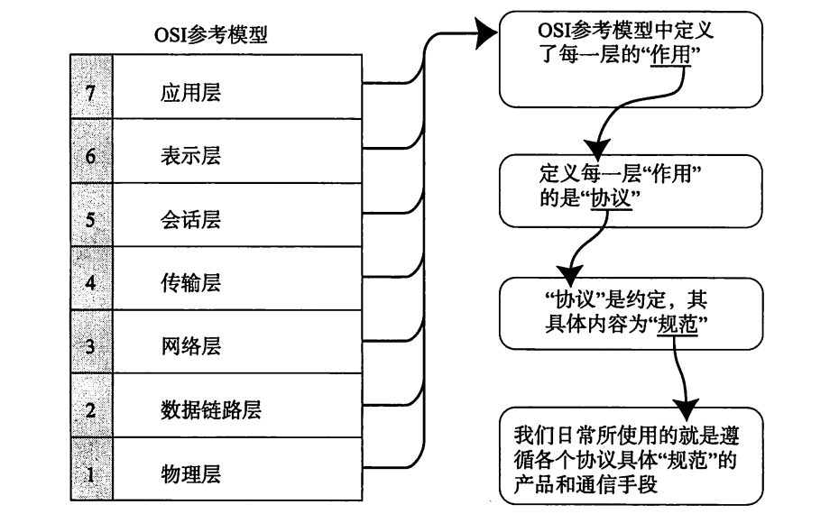
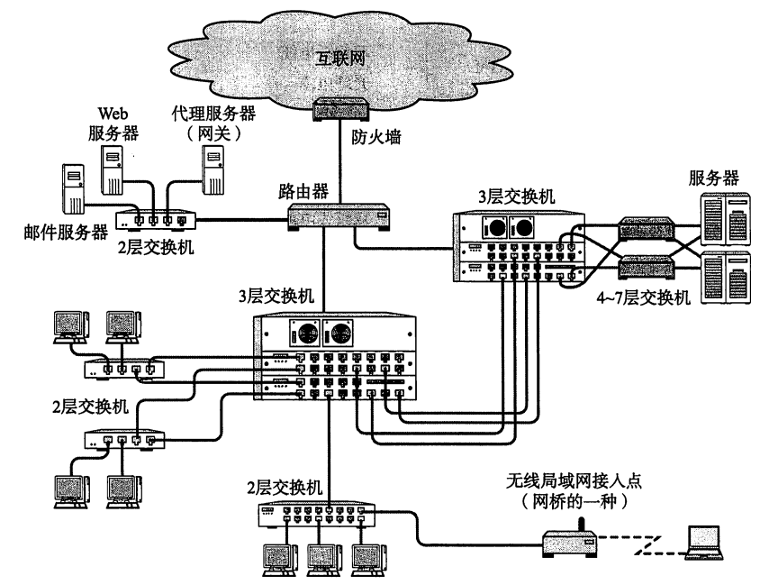

# 计算机网络笔记再战——理解几个经典的协议1

## 前言

​	笔者最近正在整理（笔者开的坑不少，希望都可以坚持下来）自己学习计算机网络的笔记。笔者的这个系列将会整理的是HTTP协议，TCP/IP协议，UDP协议等几个非常经典的协议。文章更加像是一种整理，所以会略显枯燥

## 从协议是什么出发

​	首先，毫无疑问的，伴随70年的发展，计算机之间的互联已经成为一个事实。我们马上就会想到的一个问题，那就是我们如何保证交流解析的一致性（换而言之，双方如何**构造发送的信息和解析接受的信息**呢？）这一问题直接导致了**计算机协议的产生**。毕竟这样我们才能读得懂发来的信息，发送别人看得懂的信息。

> 对计算机网络发展历史感兴趣的朋友可以参考《图解TCP/IP》一书，这本书非常的出名，笔者建议可以看这本书入门的学习TCP/IP协议。

​	请看下面的表格，这愉快的说明了我们现在常见的协议体系架构，笔者现在常常听说的就是TCP/IP协议了。也是我们现在最经常使用的协议体系。

| 网络体系结构      | 协议                                            | 主要用途                 |
| ----------------- | ----------------------------------------------- | ------------------------ |
| TCP/IP            | IP, ICMP, TCP, UDP, HTTP, TELNET, SNMP, SMTP... | 互联网、局域网           |
| IPX/SPX (NetWare) | IPX, SPX, NPC...                                | 个人电脑局域网           |
| AppleTalk         | DDP, RTMP, AEP, ATP, ZIP...                     | 苹果公司现有产品的局域网 |
| DECnet            | DPR, NSP, SCP...                                | 前DEC小型机              |
| OSI               | FTAM, MOTIS, VT, CMIS/CMIP, CLNP, CONP...       | —                        |
| XNS               | IDP, SPP, PEP...                                | 施乐公司网络             |

​	我们熟知的这些协议大多数都是典型的，隶属于“分组交换”的协议，什么意思呢？我们把数据按照协议的规矩，一块块传递，而不是一大坨数据完全不做任何处理的丢出去。所以，为了保证这些分组可以正确的重组回我们希望的信息，**我们往往会把拆分的数据添加一些额外的控制信息，学习协议的一个重要的组成部分就在这里：这些经典的协议是如何高效的添加这些控制信息确保我们的信息传递是准确的呢？**

### 关于TCP/IP协议体系

​	TCP/IP协议体系是分层的！一般的说，有OSI七层分法和现在流行的经典五层分法。分层更加像是隶属于设计模式的解耦合设计。我们知道，目前为止我们信息传递看起来是输入几个文本然后一个回车出去对方收到了信息，这中间经历了非常复杂的转换。分层，划分模块是一个经典的将一个大问题化简为若干小问题的一个办法。每一个层都各司其职，接受下一层的输入向上一层输出。这种模式也就奠基了TCP/IP体系的架构设计。

| 分层名称   | 功能                                       | 每层功能概览                                         |
| ---------- | ------------------------------------------ | ---------------------------------------------------- |
| 应用层     | 针对特定应用的协议。                       | 电子邮件协议、远程登录协议、文件传输协议             |
| 表示层     | 设定数据表达方式和网络标准数据格式的转换。 | 接收不同应用程序传输的各类信息，如文字、图片、声音等 |
| 会话层     | 负责通信管理，负责建立、维护和终止连接。   | 通信连接的建立与维护，数据流控制                     |
| 传输层     | 管理两个“节点”之间的数据传输。             | 是否数据丢失？                                       |
| 网络层     | 地址管理与路由选择。                       | 经过哪条路由传送到目标地址？                         |
| 数据链路层 | 连接设备之间传输和识别数据帧。             | 数据帧与与传输设备之间的转换                         |
| 物理层     | 以“0”“1”代表示的原始数据。                 | 比特流与电子信号之间的转换，连接器与网线的规范       |

​	当然，这个看一下即可。因为更加广泛的是五层模型。后面再说。

### 几个传输方式的分类

​	两种，有连接形式的和无连接形式的。有连接形式就像滑绳上绑东西传递，双方需要架设好一个通信线路（打电话就是架设电话线，无线的连接就是架设通信的信道）。无连接形式则更加像是扔东西，双方没有被通知准备，突发的从一端传递到另一端。

​	还有一种分类则是根据接受端个数划分——单播（一对一），多播（一对多），广播（一对若干）以及任播（随意的调一个设备，这个更加强调的是随意的一台接受设备接受信息就能完成任务）

## 地址

​	很好，我们聊完了上面的传输，现在我们考虑的是——传递是从一端到另一端，问题来了，如何在通信的时候表达是身份——我是谁，这个信息要去哪里。我们还是需要一个叫做“地址”的东西来标识的。就像我叫小李，我想呼叫小张，我会在通信的时候喊一声小张然后把信息输送过去。

​	虽然说关于地址，还有很多复杂的问题我们并没有纳入考虑，但是现在更加像是一个层次化的总结博客。笔者不放在这里谈。

​	地址具备层次性，这又回到了上面谈论的协议分层理论。协议分层必然带来地址分层。对于TCP/IP中，TCP传输层和IP网络层使用的是IP地址，向下的使用的是MAC地址作为硬件网卡的地址。1. 网卡（Network Interface Card, NIC）

​	说一说上面这些图中出现的几个经典的要素：

#### 网卡

网卡是计算机连接到网络的硬件设备，它的主要功能是实现计算机与网络之间的物理连接。网卡负责将计算机内部的数据转换为适合传输的网络数据包，并将网络上的数据传送到计算机内部。

- 网卡通过数据链路层协议与网络通信，常见的协议有Ethernet（以太网）协议。
- 网卡接收并发送数据帧，包括数据链路层的帧头、帧尾等信息。
- 每个网卡都有唯一的硬件地址（MAC地址），通过该地址来识别设备。

#### 中继器（Repeater）

​	玩过红石中继器的都知道（MC人探头），这个就是起到延续信号传递作用的设备

​	中继器是一种信号放大器，它用于扩大信号的传输距离。当网络信号在传输过程中因为距离过长而衰减时，中继器会接收到信号并放大，再将其发送出去。

- 中继器工作在物理层，它没有智能，仅仅是对信号进行放大，重复传输。
- 它不会分析网络数据，也不会修改数据包内容，仅仅是信号的再生，适用于长距离传输。

- 常用于扩展局域网（LAN）的覆盖范围，连接两个相距较远的网络节点。

#### 网桥（Bridge）

网桥用于连接两个或多个局域网（LAN），使它们能够协同工作。网桥在接收到数据时，会根据目标地址决定是否转发该数据帧。

- 网桥工作在数据链路层，它根据MAC地址来判断是否转发数据。
- 网桥有学习和过滤功能，通过学习网络中的MAC地址，它可以决定哪些数据应该在网络中传输，哪些应该被过滤。
- 网桥能够将不同类型的局域网连接在一起，比如连接两段以太网。

- 用于减少局域网的冲突域，提高网络的效率。
- 适用于连接不同物理介质的局域网，或者在局域网内部分隔流量。

#### 路由器（Router）

路由器是一种工作在网络层的设备，主要作用是根据目的IP地址决定数据包的转发路径，连接不同的网络并进行数据包的路由选择。

- 路由器根据网络层的IP地址来决定数据的转发路径。
- 它具有路由表，根据这些路由表信息选择最佳路径进行数据转发。
- 路由器能够连接不同类型的网络，如局域网（LAN）、广域网（WAN）等。
- 路由器还具有网络地址转换（NAT）功能，能够实现多个设备共享一个公网IP地址上网。

- 连接不同网络，尤其是广域网（如互联网）与局域网之间的连接。
- 管理数据包的路由，确保数据通过最优路径传输。

#### 网关

网关是一种工作在应用层的设备，通常用于不同协议或不同网络之间的转换。网关不仅仅处理网络层的IP地址，还可以处理更高层的数据协议，它能够连接完全不同的网络系统。

- 网关能翻译不同协议之间的数据，如从一个协议栈到另一个协议栈，进行协议转换。
- 网关工作在OSI模型的较高层，通常涉及到应用层、传输层、网络层等多层次的协议转换。
- 它可以用于连接不同的网络架构，比如互联网与私有网络，或不同企业间的网络互通。

- 在跨越不同类型网络时，例如，连接企业内部网络与外部互联网。
- 实现不同协议或通信方式之间的互操作，比如将IP电话与传统电话系统连接。