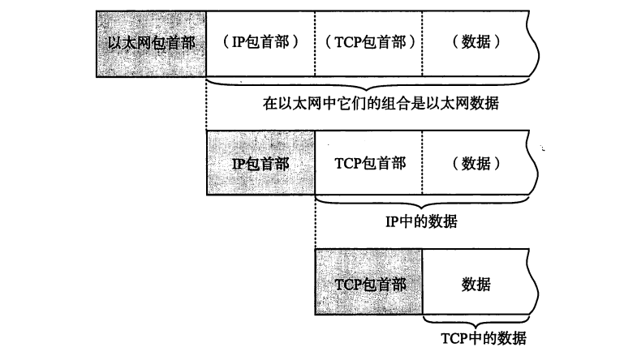

# 理解互联网与TCP/IP

​	下面，我们将会开始理解互联网这个东西，进一步的，我们会理解何为TCP/IP

​	我们的互联网就是一个巨大的网状结构，需要注意的是——每一个网状的节点之间都是使用一个叫做NOC，Network Operation Center网络操作中心完成的。对于不同性质连接起来的节点，则是使用一个叫做IX：网络交换中心来完成的。

​	中间，ISP（网络服务提供商）管理了我们每一个递归节点设备介入互联网的管理。就是这样的一张绘景

## TCP/IP

​	如我们第一个博客（https://blog.csdn.net/charlie114514191/article/details/145418849）所见，TCP/IP化简了OSI七层模型。在这里，我们将会详细的阐述每一个层中的内容。

### 物理层

​	实际上传递我们信息的物理硬件，是以太网驱动网卡还是电话线啥的，没关系！他总是向上提供一个SendRemote和ReceiveRemote的一个接口！

### 数据链路层

​	也就是驱动底层硬件做事情的层次。这里，工作和屏蔽一切物理层的差异，向上提供“发送和接受字节的操作”

### 网络层

​	这里就是IP层了，我们开始考虑字节组成的字节包流，也就是说，我们终于开始考虑一个接着一个的包。从这里开始，操作系统驱动数据链路层，完成字节流包的控制，接受和传递。在这里，常见的协议是IP，ICMP（控制IP包的协议）和ARP（解析硬件MAC地址）

### 传输层

​	也就是是一个封装了网络层的层次，在这里，我们常见的就是TCP/UDP。对于TCP就是一个经典的有连接协议（回顾上一个博客！），UDP是一个经典的无连接协议。我们这里就是对IP进行一定的控制和封装，现在，我们可以理解为真正有意义的被认为是传递信息载体的层次了。

### 应用层

​	应用层就是我们现在看得见摸得着的软件层,我们各种网络软件都在这里,实际上,我们生产和接受信息,向下委派传输层进行传输!常见的应用层的协议有HTTP, SMTP, FTP. TELNET,SSH, SNMP等协议

> - HTTP（超文本传输协议）是一种用于在客户端和服务器之间传输网页的协议。它是Web通信的基础，允许浏览器请求网页并接收响应。HTTP是无状态的，每个请求都是独立的，不会保存之前请求的信息。
> - SMTP（简单邮件传输协议）用于发送电子邮件，它的工作方式是将邮件从客户端传送到邮件服务器，然后再通过服务器将邮件传送到接收方的邮箱。SMTP主要用于发送邮件，而接收邮件通常使用POP3或IMAP协议。
> - FTP（文件传输协议）是一种用于在网络上进行文件传输的协议。它允许用户在本地计算机和远程服务器之间上传或下载文件。FTP支持两种模式：主动模式和被动模式，主要区别在于数据连接的建立方式。
> - TELNET是一种远程终端协议，它允许用户通过网络远程登录到另一台计算机并进行操作。通过TELNET，用户可以像直接操作计算机一样控制远程计算机，但TELNET本身没有加密功能，因此它的安全性较差。
> - SSH（安全外壳协议）是一种用于安全远程登录的协议，通常用于代替TELNET。与TELNET不同，SSH对数据进行加密，确保传输过程中的信息不会被窃取。它通常用于远程管理和控制服务器，提供比TELNET更强的安全性。
> - SNMP（简单网络管理协议）用于网络设备的管理和监控，尤其是在大规模网络中，SNMP可以帮助管理员收集设备状态信息、故障诊断和配置管理。通过SNMP，网络管理员可以监控路由器、交换机等设备的性能和运行状态。

## 数据在协议层之间发生了什么?

​	上面这个图就把话说完了.我们直到,我们的应用层的信息向下传递的时候,都会经过一层有一层的封装.这里,我们就进行了一系列的协议封装,用于指示下层和对方正确的理解我们的意图.

​	以写一个邮件为例子:当你在电脑上写一封邮件点击发送时，这台电脑会像处理信件一样逐层打包信息。最上面的应用层先把邮件内容（比如文字和附件）用SMTP邮件协议封装，就像把信纸塞进印有"邮政专递"字样的信封，写上收件人邮箱和发件人地址。接着传输层的TCP协议接手，把这个大信封拆分成多个小包裹，每个包裹贴上序号标签和收发双方的"门牌号"（比如发件电脑的随机端口和收件方25号端口），确保所有包裹都能完整有序送达。

​	网络层的IP协议继续处理，给每个小包裹套上更大的快递袋，用IP地址代替具体地址（比如发件人电脑的192.168.1.10和收件邮箱服务器的203.0.113.5），规划最佳运输路线。到了数据链路层，这些快递袋又被装进更具体的运输车——以太网帧里，贴上本地快递站的MAC地址（比如你家路由器的MAC）作为下一站中转点。最后物理层把这些数字包裹变成电信号或光信号，就像把货物装上真正的运输卡车，通过网线或Wi-Fi信号开始传送。

​	这些信号经过路由器层层转发，就像快递分拣中心根据IP地址不断更换运输车的MAC地址标签，跨过多个网络最终到达收件邮箱服务器。服务器反向拆包：物理层把光信号变回数据，数据链路层核对MAC地址，网络层验证IP地址，传输层按序号重组包裹，应用层最终取出原始邮件内容。现在,我们完成了一次自应用层为SMTP通信,在传输层是TCP,网络层是IP,数据链路是以太网或者是其他的玩意,物理层是电磁传输的一个通信!

