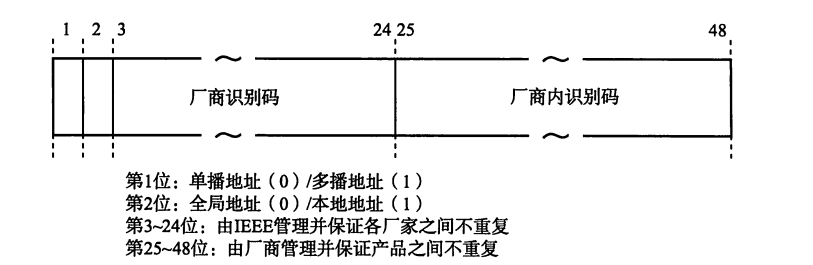
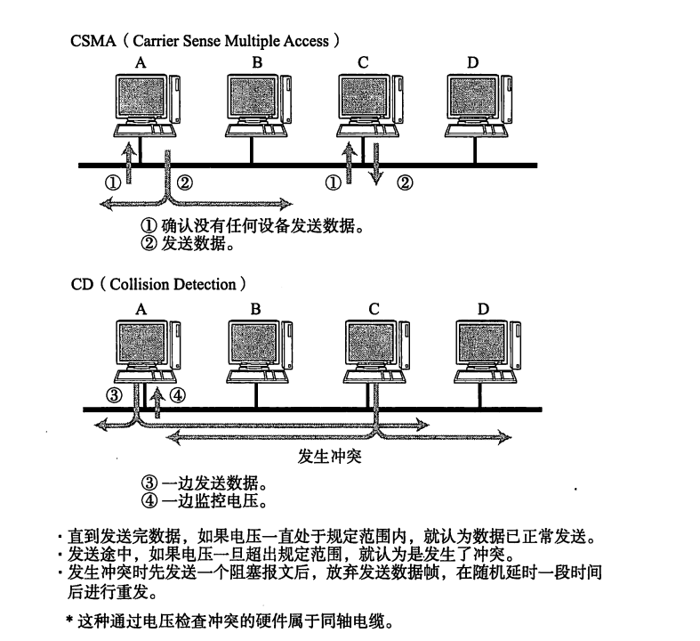
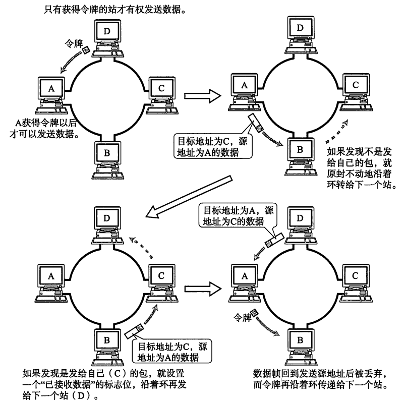
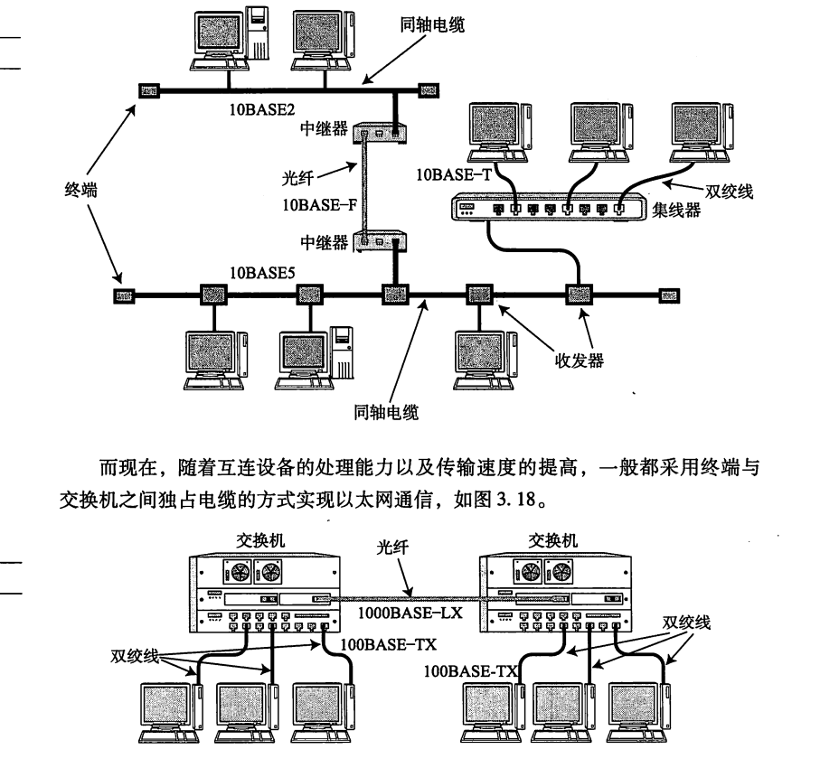
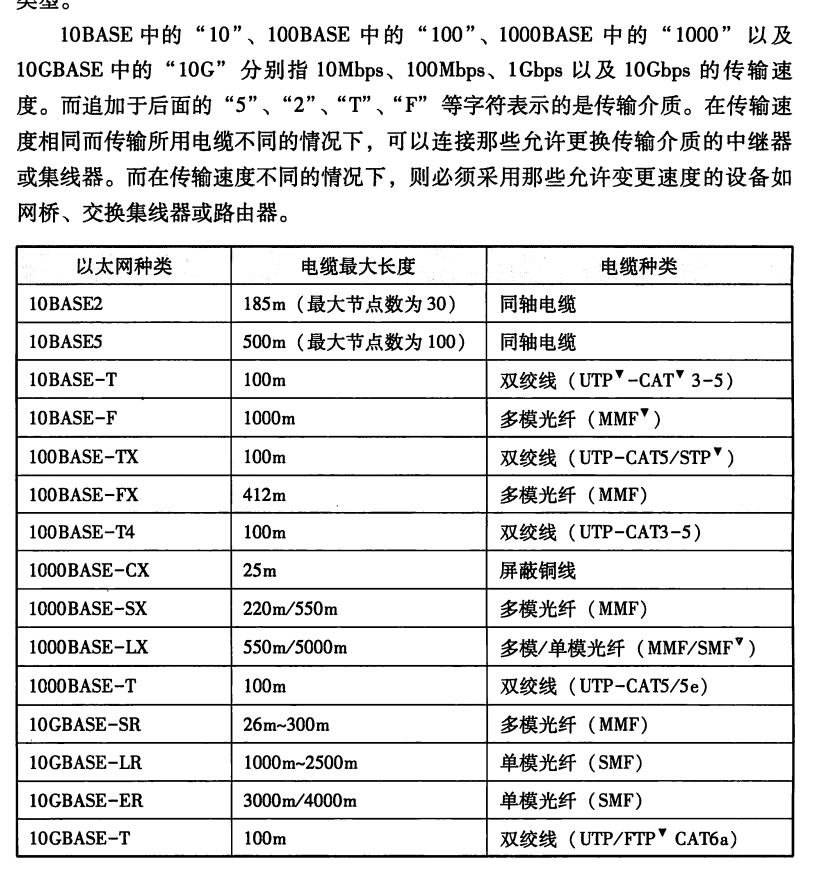
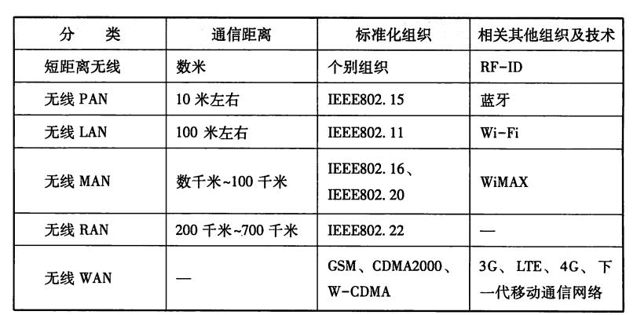

# 计算机网络笔记再战——理解几个经典的协议3

## 详细谈论我们的数据链路层

​	在这个层次，我们更多谈论的是以太网，无线局域网的通信协议。在这里，我们实际上指挥着我们的比特流是如何进行在设备之间发生传递的。

## 几个经典的必知术语

### MAC地址

​	在数链路层，设备被简化为使用一串十六进制数字表达的设备地址。一般的，MAC地址长48位。对于大多数场景下，我们可以认为MAC地址唯一的标识了一个设备。

### 共享介质型的网络

​	我们按照通信的介质划分。分为共享介质型和非共享介质型。

​	对于共享介质型的网络，我们知道，多个设备都公用通信设备资源进行通信，这问题就出来了：我们如何保证设备之间有序的使用通信线路呢？两种：争用方式和令牌传递方式。

​	争用方式是粗暴的抢夺通信资源的所属权，或者说，当我们的通信网络存在明确的主次之分的时候，使用这个方法是可行的。但是，对于现代的计算机经典设备更多的都具备一定的独立能力，这样的网络往往带来一定的网络拥塞，进一步导致性能的下降。这是因为，当多个设备同时的向数据线传递给了主线的时候就会发生冲突。

​	所以，一部分以太网线路采取了CSMA/CD方式进行预检查——那就是当检测到数据链路上存在数据且信息头产生冲突，则立马释放自己占用的信道资源。随后随机的等待一部分时间再次尝试

​	当然，另一种方式叫做令牌传递方式——对于一个网络，拿到令牌的人才会传递信息，每一个网络内主机都有平等的机会拿到令牌。

### 非共享型介质网络

​	也就是说，我们的设备并不是直接介入网络，而是使用交换机设备专门负责交换报文，由交换机裁定各个设备的交换和发送。

​	一般的，我们的交换机设备会使用MAC转发表记录转发，也就是说，当一个数据链路的包到来交换机的时候，我们会薄记目的地和来源，根据自己内部的记录决定将报文投放到哪一哥传递网络。

### 环形检测技术

​	为了防止我们的包没有终点的传递我们的数据包（他们会一直在网络中流通，最后把网络阻塞死），检测环形十分的重要。一般有生成树法和源路由法（判断源地址是从哪个网桥传输来的）

> 题外话：检测环状的经典办法：
>
> **1. 快慢指针法（龟兔赛跑）**
>
> 检测线性表比如说链表中的环路（比如一群人排成一列手拉手围成圈）。
>
> - **原理**：
>   想象两个人在赛跑：
>   - 兔子（快指针）：每次跑 **2步**。
>   - 乌龟（慢指针）：每次跑 **1步**。
>     如果赛道是**环形**的，兔子最终会追上乌龟（相遇）；
>     如果赛道是**直线**的，兔子会直接跑到终点（没有环）。
> - **优点**：不额外占用空间，效率高（类似跑步比赛，跑完就知道结果）。
> - **用途**：链表环路检测（比如面试题中的经典问题）。
>
> ------
>
> **2. 哈希表（做记号法）**
>
> - **场景**：检测重复走过的路径（比如走迷宫时做标记）。
> - **原理**：
>   每走到一个路口，就用粉笔在墙上画个记号。
>   - 如果走到某个路口时发现**已经有记号**，说明你绕回来了（环路存在）；
>   - 如果走到终点都没重复记号，说明没环路。
> - **优点**：简单直接，记录所有走过的节点。
> - **缺点**：需要额外空间存储记号（类似背包里带粉笔，占地方）。
> - **用途**：链表、树、图中的环路检测。
>
> ------
>
> **3. 图遍历法（DFS/BFS）**
>
> - **场景**：检测图中的环路（比如地图上多条道路形成闭环）。
> - **原理**：
>   - **DFS（深度优先搜索）**：像走迷宫时，随身带一根绳子，每走一步就放绳子。如果走到某处发现绳子已经存在，说明有环。
>   - **BFS（广度优先搜索）**：像逐层扫描楼层，检查是否有房间被重复访问。
> - **关键**：记录节点的访问状态（未访问、访问中、已访问），如果发现某个节点正在被访问中，说明有环路。
> - **用途**：检测图中的环路（比如依赖关系中的循环依赖）。
>
> ------
>
> **4. 系统依赖检测法（包裹分拣站）**
>
> - **场景**：检测系统依赖中的循环（比如快递包裹分拣时卡在循环传送带上）。
> - **原理**：
>   想象快递包裹在分拣站传送：
>   - 每个包裹经过一个站点时，打上标记。
>   - 如果某个包裹再次进入**已经标记过的站点**，说明传送带存在循环卡住了包裹。

### VLAN技术

​	Virtual  LAN也就是虚拟局域网，意思就是我们人为的划分设备的局域性质。这样，我们就可以简单的对设备进行分片区的管理。不至于发生数据混乱，甚至是全局系统发生侵入的时候，不至于全部崩溃。

## 以太网

	

​	如图所示，这是一个经典的以太网连接形式，下图则是说明了一个以太网技术命名的一个经典的办法：

## 无线通信

​	无线通信的协议是IEEE802.11约束的，具体完整的协议我们后面再谈

## PPP

​	Point To Point Protocol是一种点到点的通信协议。他是一个纯粹的数据链路层的协议，只有PPP没有办法进行通信！